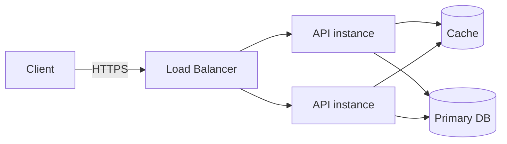

# Style Guide

This guide defines how to write the Tech Lead Handbook. It is more
restrictive than a generic Markdown style guide because the book has a
specific tone and a specific reader.

If you are unsure, default to the rule that produces the most useful
text for an experienced engineer preparing for an interview.

---

## Voice and Tone

- Write as a senior peer talking to another senior peer.
- Be direct. Prefer "use a queue" over "you might want to consider
  using a queue".
- Be calm and skeptical. Avoid hype.
- Be opinionated where the field has converged.
- Be neutral where there is a real trade-off, and **say** there is one.
- Use first person plural ("we") sparingly. Prefer the imperative
  ("Use", "Avoid", "Prefer").
- Do not address the reader as "you, the developer". Just say what to do.

Banned words and phrases (signal shallow content):

- "seamless", "seamlessly"
- "powerful", "blazing fast", "lightning fast"
- "next-generation", "revolutionary", "game changer"
- "best-in-class", "world-class"
- "easy to use" (without explaining why)
- "simply" (almost always hides complexity)
- "just" (almost always hides complexity)
- "in the cloud" as a marketing slogan

Allowed when used precisely:

- "trade-off", "constraint", "invariant", "failure mode",
  "back-pressure", "blast radius", "coupling", "cohesion".

---

## Terminology Rules

- Use the term that an interviewer is most likely to use.
- Define a term the first time it appears in a chapter, even if it is
  defined in the glossary.
- Be consistent across chapters. If you call it "publisher/subscriber"
  in one chapter, do not call it "pub/sub fanout" in another without
  noting they are the same.
- Add every key term to `book/26-glossary.md` when it appears.
- Distinguish closely related terms explicitly. Examples:
  - **Concurrency** vs **Parallelism**.
  - **Authentication** vs **Authorization**.
  - **Throughput** vs **Latency**.
  - **Idempotent** vs **Pure**.
  - **Optimistic** vs **Pessimistic** locking.
- Spell out an acronym on first use in a chapter, then use the acronym.

---

## Heading Rules

- Each chapter has exactly one `#` (H1) at the top.
- Section headings are `##` (H2).
- Subsection headings are `###` (H3).
- Avoid going deeper than `####` (H4).
- Use Title Case for `#` and `##`. Use sentence case for `###` and below.
- Do not put code in headings.
- Do not number sections manually. The chapter file name carries the
  number.
- Headings must be self-explanatory out of context. The reader will
  scan the table of contents.

---

## Code Block Rules

- Always use fenced code blocks with a language tag.
- Allowed language tags: `js`, `ts`, `tsx`, `python`, `sql`,
  `dockerfile`, `yaml`, `bash`, `json`, `mermaid`, `text`.
- Use `text` for ASCII trees, plain output, or pseudo-code.
- Keep code blocks short. Prefer 5–25 lines for a teaching example.
- After every important code block, add a short prose explanation:
  - What the code does.
  - Why it is written this way.
  - What a weaker alternative would be.
  - How it would change in production.
- Do not use code blocks for ordinary commands inside a sentence. Use
  inline code: `kubectl get pods` instead of a one-line code block.
- Do not paste long config files. Show the relevant fragment.

---

## Diagram Rules

- Use Mermaid only when a diagram is clearly more useful than prose.
- Prefer one of these Mermaid types:
  - `flowchart` for request paths and architectures.
  - `sequenceDiagram` for protocols and timing.
  - `classDiagram` for domain models.
  - `stateDiagram-v2` for state machines.
- Keep diagrams readable on a printed page. If a diagram needs more
  than ~15 nodes, split it.
- Always label arrows.
- Place a one-paragraph caption below the diagram explaining what the
  reader should notice.
- Do not use ASCII art when Mermaid would render cleaner.

Example:



Notice that all reads check the cache before the database, and that
both API instances share the same cache and database.

---

## Table Rules

- Use tables for **comparisons** and **trade-offs**, not as decoration.
- Keep tables narrow enough to print on A4. If a table needs more than
  ~5 columns, restructure it.
- Use bold for the column the reader cares about most.
- Each table must have a one-line caption above or below it.

Example:

| Approach | Latency | Operational cost | When to use |
| --- | --- | --- | --- |
| **Synchronous call** | Low | Low | Simple, low fan-out |
| **Async via queue** | Higher tail | Medium | Decoupled producers |
| **Event streaming** | Variable | High | Many consumers, replay |

---

## Interview Answer Format

For important questions, use the detailed format below. Use it whenever
the question is broad, common, or trade-off heavy.

```md
### Question

What is [concept], and why does it matter?

### Strong Answer

A 3–6 sentence senior-level answer with the right vocabulary.

### Explanation

A short, structured expansion that a Tech Lead would give on a
follow-up: mental model, trade-offs, failure modes.

### Example

A concrete example or short snippet that grounds the answer.

### What the Interviewer Is Testing

Bullet points: depth of understanding, terminology, trade-off thinking,
production awareness, leadership signals.

### Weak Answer

A plausible but shallow answer. Not a strawman. The kind of answer a
mid-level engineer might give.

### Red Flags

Bullet points: phrases or assumptions that should immediately concern
an interviewer.
```

For narrow factual questions, use the short format:

```md
**Question:** ...

**Answer:** ...
```

---

## Good Answer vs Weak Answer Format

When a chapter has a `Good Answer vs Weak Answer` section, use this
shape:

```md
**Strong Answer**

A senior-level explanation with terminology and trade-offs.

**Weak Answer**

A plausible but shallow explanation that misses the trade-off, the
failure mode, or the production angle.

**Why the Strong Answer Wins**

A short bullet list of what the strong answer covers and the weak one
does not.
```

Keep both answers roughly the same length. A weak answer that is much
shorter than the strong one is just a strawman.

---

## Common Mistakes Format

Use a numbered list. Each item has the same shape:

```md
1. **Mistake name**
   - What it looks like in practice.
   - Why it is wrong or dangerous.
   - The correct approach.
```

Do not write generic mistakes ("not following best practices"). Every
mistake must be something an experienced engineer can recognize.

---

## Tech Lead Perspective Format

When a section is specifically for the Tech Lead lens, frame it around
the **decisions a Tech Lead owns**:

- Cost.
- Reliability and on-call.
- Security and compliance.
- Hiring and team skill mix.
- Vendor lock-in.
- Migration and rollback strategy.
- Cross-team contracts and APIs.
- Incident blast radius.

Avoid framing Tech Lead content as soft advice ("communicate clearly").
Frame it as concrete decisions with trade-offs.

---

## Checklist Format

Use checklists for the `Tech Lead Checklist` section.

```md
- [ ] Concrete, verifiable item.
- [ ] Names a real artifact (a runbook, a dashboard, a config flag).
- [ ] Has a clear owner role (Tech Lead, on-call, security).
```

Avoid items that cannot be verified ("ensure quality"). Prefer items
that point at an artifact ("a runbook exists for cache stampede").

---

## How to Avoid Repetition

- Do not re-explain a concept that has its own chapter. Cross-link
  with `[caching](./19-performance-and-scalability.md#caching)` and add
  one sentence of local context.
- Do not paste the same paragraph in two chapters. If two chapters need
  the same content, keep it in the more architectural chapter and link
  from the other.
- Avoid "as we saw earlier" without a link. Always link.
- The glossary defines a term once. Chapters use it.

---

## How to Write for Experienced Engineers

- Skip motivational paragraphs. Get to the model.
- Skip "history of X" sections unless the history changes how the
  reader should reason about the topic today.
- Use vocabulary the reader will hear in interviews. Do not soften it.
- Show the failure mode early. Senior readers learn fastest from what
  breaks.
- Always include the **trade-off**. A topic without a trade-off is
  either underdeveloped or unimportant.

---

## How to Explain Trade-offs

For every important design choice, answer:

1. What does this choice optimize for?
2. What does it sacrifice?
3. Under what load, scale, or team size does the trade-off flip?
4. What is the migration path if it flips?

Prefer a small comparison table for trade-offs with 2–4 options.

Avoid presenting trade-offs as "pros and cons" lists. They flatten
context. Use shape: **optimizes for X at the cost of Y, and flips
when Z**.
