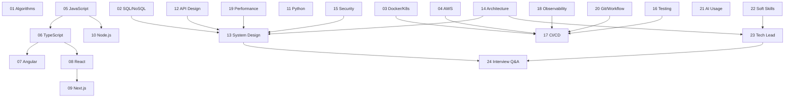

# Introduction

## Why This Book Exists

Most experienced engineers preparing for Tech Lead interviews face the same problem: they know how to build software, but they struggle to explain what they know using the vocabulary interviewers expect. They can design a system on a whiteboard but cannot articulate why they chose one approach over another. They can debug a production incident but cannot frame the trade-offs that led to the architecture that failed.

This book exists to close that gap. It takes practical experience — the kind accumulated over years of shipping code, running production systems, and collaborating across teams — and organizes it into the mental models, terminology, and trade-off language that Tech Lead interviews demand.

The book is structured as a reference handbook, not a tutorial. Each chapter covers one major domain, explains the concepts at the depth a Tech Lead must command, and ends with interview questions that test whether the reader can explain those concepts under pressure.

## Who This Book Is For

The target reader has:

- Six or more years of software engineering experience.
- Hands-on production experience across at least three of: web, backend, frontend, DevOps, cloud, data, or security.
- Some leadership exposure — tech lead, senior engineer, staff engineer, or team lead.
- Comfort reading code in JavaScript, TypeScript, Python, and SQL.
- Working familiarity with Linux, HTTP, Git, and at least one cloud provider.

The reader already knows how to build and ship software. They are now organizing that knowledge into senior-level vocabulary and preparing for interviews where the bar is decision-making, not implementation.

If the reader is earlier in their career and still building foundational skills, this book will feel too dense. It assumes knowledge it does not teach. Start with project experience first, then return.

## What This Book Is Not

**Not a beginner programming book.** There are no introductions to loops, variables, or HTTP basics. The reader is expected to know these already.

**Not a framework tutorial.** The React, Angular, Next.js, and NestJS chapters explain architecture and trade-offs, not how to write a first component. Official documentation covers the how; this book covers the why and when not to.

**Not a certification study guide.** AWS, Kubernetes, and security chapters focus on decision-making at Tech Lead level, not on memorizing service limits for a multiple-choice exam.

**Not a theory textbook.** Algorithms and data structures appear because interviewers ask about them, not because the reader needs a computer science degree. The coverage is practical: what to know, what to say, what trade-offs to mention.

**Not a marketing piece for any technology.** The book is opinionated where the field has converged and neutral where there is a genuine trade-off. No technology is presented as the answer to everything.

## How to Use This Book

Use this book in three modes:

**As a study guide.** Read it chapter by chapter during interview preparation. Each chapter is self-contained and can be studied independently. Start with the domains most relevant to the target role.

**As a drill set.** Open [Interview Questions and Answers](./24-interview-questions-and-answers.md) or [Practical Interview Scenarios](./25-practical-interview-scenarios.md) and practice answering out loud. Reading an answer is not the same as producing one under pressure.

**As a reference.** After the interview cycle, keep the book as a desk reference. The mental models, trade-off tables, and checklists remain useful in daily Tech Lead work.

The chapters are numbered for reading order, but there is no requirement to read them sequentially. The [Suggested Reading Paths](#suggested-reading-paths) section below provides focused paths for different interview profiles.

## How to Study the Chapters

Every chapter follows a consistent structure. Understanding this structure makes study more efficient.

| Section | Purpose | How to study it |
|---|---|---|
| **Chapter Goal** | What the reader should understand after the chapter | Read first — set expectations |
| **Why This Matters for a Tech Lead** | Why a Tech Lead specifically cares | Use to frame interview answers |
| **Mental Model** | A stable model that survives version changes | Memorize this — it anchors everything else |
| **Core Terminology** | Key terms defined and distinguished | Review before interviews — this is the vocabulary |
| **Theoretical Foundation** | How things work at whiteboard depth | Study deeply for domains the reader is weak in |
| **Practical Usage** | Where this appears in real projects | Use for concrete examples in answers |
| **Examples** | Code, config, or architecture samples | Study the explanation, not the syntax |
| **Common Mistakes** | What experienced engineers get wrong | Check against personal habits |
| **Trade-offs** | What each choice optimizes for and sacrifices | This is the core of senior and Tech Lead answers |
| **Production Considerations** | Security, cost, reliability, team, vendor | The Tech Lead differentiator |
| **How to Explain This in an Interview** | Interview-ready phrasing | Practice saying these out loud |
| **Good Answer vs Weak Answer** | Strong and weak answer contrast | Study what makes the weak answer weak |
| **Tech Lead Checklist** | Concrete, verifiable checklist items | Use as a self-assessment |
| **Interview Questions and Answers** | Categorized Q&A (Basic through Red Flags) | Drill these — answer before reading |
| **Summary** | Quick refresher bullets | Review morning of the interview |

**Study method:**

1. Read the mental model first. If it makes sense, skim the theoretical foundation quickly. If it does not, read the theory carefully.
2. Study the trade-offs section. For Tech Lead interviews, trade-off reasoning matters more than implementation details.
3. Read the common mistakes. If any match personal habits, mark them for review.
4. Attempt the interview questions before reading the answers. Saying an answer out loud reveals gaps that silent reading hides.
5. Compare personal answers against the strong and weak examples. Rewrite any answer that sounds closer to the weak version.
6. Use the Tech Lead checklist as a self-assessment for domains the reader has production experience in.
7. Practice with a partner when possible. Have them ask questions from the chapter and give honest feedback on clarity, trade-off coverage, and confidence. A solo drill finds knowledge gaps; a partner drill finds communication gaps.

## From Practical Experience to Formal Terminology

The gap between experienced engineers and successful Tech Lead candidates is often vocabulary, not knowledge.

An engineer who has debugged a slow API knows about connection pooling, query optimization, and caching — but may not use terms like "tail latency," "cache stampede," or "back-pressure" in an interview. An engineer who has split a monolith into services understands bounded contexts and data ownership — but may not say "anti-corruption layer" or "strangler fig migration."

This book bridges that gap by treating terminology as a tool, not an end in itself. Each chapter defines the terms interviewers expect, connects them to the practical experience the reader already has, and shows how to use them in answers.

**The key mental models this book relies on:**

| Mental model | What it means | Where it appears |
|---|---|---|
| **Latency vs throughput** | Optimizing for response time and optimizing for total work done are often in tension | [Performance and Scalability](./19-performance-and-scalability.md), [System Design](./13-system-design.md) |
| **Availability vs durability** | Keeping a system reachable and keeping data safe are related but different guarantees | [SQL and NoSQL](./02-sql-and-nosql.md), [AWS](./04-aws.md) |
| **Coupling vs cohesion** | Minimizing dependencies between modules while maximizing focus within them | [Software Architecture](./14-software-architecture.md), [API Design](./12-api-design.md) |
| **Blast radius** | The scope of damage when something fails — smaller is better | [System Design](./13-system-design.md), [Security](./15-security.md), [CI/CD](./17-ci-cd-and-devops.md) |
| **Back-pressure** | When a system tells upstream to slow down instead of crashing under load | [Node.js](./10-nodejs.md), [Performance](./19-performance-and-scalability.md), [System Design](./13-system-design.md) |
| **Consistency vs availability under partition** | The CAP theorem trade-off that underlies distributed system design | [SQL and NoSQL](./02-sql-and-nosql.md), [System Design](./13-system-design.md) |

These models recur across chapters. Recognizing them in different contexts — a database chapter, a Kubernetes chapter, an architecture chapter — is what separates a Tech Lead answer from a Senior Engineer answer.

## Senior Engineer vs Tech Lead Thinking

A Senior Engineer is expected to solve technical problems well. A Tech Lead is expected to decide which problems to solve, how to communicate those decisions, and what the consequences are for the team and the business.

In interviews, this difference shows up in how candidates frame their answers:

| Dimension | Senior Engineer framing | Tech Lead framing |
|---|---|---|
| **Technical choice** | "I chose Redis because it's fast" | "I chose Redis because our access pattern is read-heavy with sub-10ms p99 requirements, and the ops cost of a managed Redis cluster was lower than extending our PostgreSQL read replicas" |
| **Risk** | "We tested it and it worked" | "We tested it under expected load, identified the failure mode when the cache is cold, and added a circuit breaker with a fallback to direct DB reads" |
| **Trade-offs** | "This is the best approach" | "This approach optimizes for read latency at the cost of write complexity and eventual consistency, which is acceptable for our use case but would not work for the payments service" |
| **Team impact** | "I implemented it" | "I designed the approach, wrote the ADR, paired with two engineers to build it, and established the on-call runbook" |
| **Stakeholders** | Not mentioned | "I communicated the migration timeline to the product team and negotiated a feature freeze window with the PM" |

A Tech Lead is expected to reason about:

- **Trade-offs** — what each choice optimizes for and what it sacrifices.
- **Risk** — what can go wrong, how likely it is, and what the mitigation is.
- **Maintainability** — whether the team can operate this in six months without the original author.
- **Security** — threat models, compliance requirements, and blast radius of a breach.
- **Performance** — tail latency, degradation under load, and the cost of optimization.
- **Delivery** — how to break work into shippable increments and manage dependencies.
- **Team capability** — whether the team has the skills to build and maintain this, and what to do if they do not.
- **Stakeholder communication** — how to explain technical decisions to product, management, and other teams.
- **Operational complexity** — on-call burden, monitoring gaps, and runbook coverage.
- **Cost** — infrastructure spend, engineering time, opportunity cost.
- **Long-term ownership** — vendor lock-in, migration paths, and what happens when requirements change.

Every chapter in this book includes a Tech Lead perspective that exercises these dimensions. The interview Q&A sections test whether the reader can apply them under pressure.

**Quick self-test:** Pick any technical decision from the past year — a database choice, an architecture change, a library adoption. Explain it out loud for 90 seconds. If the explanation covers what the decision optimized for, what it sacrificed, what the failure mode is, and how the team was affected, that is Tech Lead framing. If it only covers what was built and why the chosen technology is good, that is Senior Engineer framing. Use this test throughout the book to gauge progress.

## How to Use the Interview Questions

Each chapter ends with an Interview Questions and Answers section organized into six categories:

1. **Basic** — terminology and definitions. These test whether the candidate knows the vocabulary. A Tech Lead candidate should answer these quickly and confidently.
2. **Senior** — trade-offs, failure modes, and design choices. These test whether the candidate has production experience and can reason about alternatives.
3. **Tech Lead** — system-level, team-level, cost, hiring, and organizational impact questions. These test whether the candidate thinks like a leader, not an individual contributor.
4. **Scenario-based** — "You are given X, design Y" questions. These test end-to-end problem-solving and the ability to navigate ambiguity.
5. **Trick questions** — common phrasings that hide a wrong assumption. These test whether the candidate pauses to think before answering.
6. **Red flags** — answers and assumptions that should concern an interviewer. These help the reader identify their own weak spots.

**How to drill:**

- Cover the answer and attempt the question out loud. Two minutes per answer, maximum.
- Compare against the strong answer. Note what was missed.
- Read the weak answer. If the personal answer sounds closer to the weak version, study the explanation and rewrite.
- For scenario-based questions, sketch on paper. Narrate trade-offs as part of the answer, not as an afterthought.

[Chapter 24: Interview Questions and Answers](./24-interview-questions-and-answers.md) consolidates the strongest questions from all chapters into a single drill set, organized by domain.

## How to Use the Practical Scenarios

[Chapter 25: Practical Interview Scenarios](./25-practical-interview-scenarios.md) contains extended, multi-step scenarios that simulate real Tech Lead interview rounds. These scenarios cross domain boundaries — a single scenario might involve system design, database choices, deployment strategy, security, and stakeholder communication.

Use them after studying the individual chapters:

1. Read the scenario prompt without looking at the solution.
2. Sketch a design or outline an approach on paper.
3. Narrate the answer out loud, including trade-offs, risks, and team implications.
4. Compare against the provided solution. Note any dimensions that were missed entirely — those are the domains to revisit.

The scenarios are deliberately harder than individual chapter questions. They test the ability to synthesize knowledge across domains, which is the hallmark of a Tech Lead interview.

## How to Build an Interview Preparation Plan

Interview preparation works best with structure. Here is a practical method:

### Step 1: Assess gaps

Skim the table of contents. For each chapter, rate personal confidence on a three-point scale:

- **Strong** — can explain the core concepts, trade-offs, and failure modes without notes.
- **Medium** — knows the concepts but struggles with terminology or trade-off articulation.
- **Weak** — would need to study before answering interview questions.

### Step 2: Prioritize by role

Match the target role to a reading path from [Suggested Reading Paths](#suggested-reading-paths). Start with the chapters marked as highest priority for that path.

### Step 3: Study weak areas first

For "weak" chapters, read the full chapter including examples and the theoretical foundation. For "medium" chapters, focus on trade-offs, common mistakes, and the interview Q&A. For "strong" chapters, skim the summary and drill the Tech Lead questions.

### Step 4: Drill daily

Set aside 30–60 minutes per day for interview question practice. Answer out loud — not silently. Use a timer. Record answers if possible; hearing the playback reveals filler words, hedging, and missing structure.

A practical allocation: spend roughly 40% of drill time on Tech Lead and scenario questions (where the gap between Senior and TL framing is largest), 40% on senior questions in weak domains, and 20% on basic questions as a warm-up. If available, schedule at least one mock interview with a peer or mentor during the preparation period — a live conversation surfaces problems that solo practice does not.

### Step 5: Practice scenarios

After covering the priority chapters, work through 2–3 scenarios from [Chapter 25](./25-practical-interview-scenarios.md). These are the closest analog to real interview rounds.

### Step 6: Track gaps

Keep a personal list of concepts that were missed during drilling. Revisit those sections before the interview. The [Glossary](./26-glossary.md) is useful for quick term lookups.

### Step 7: Revisit the morning of

The morning of the interview, read only the Summary section of each priority chapter. Do not try to learn new material — reinforce what was studied.

## How to Keep This Book Updated

Technology changes. The mental models in this book are designed to be stable across versions, but specific claims about frameworks, cloud services, and tooling may drift over time.

The book includes a maintenance system:

- **`notes/verification-needed.md`** lists every claim that should be checked against official documentation before trusting it in an interview. Review this file periodically.
- **`notes/open-questions.md`** lists topics where a human decision is needed — scope questions, content overlap, or areas for future expansion.
- **`notes/generation-log.md`** records every change made to the book, making it possible to understand what was updated and when.

When revisiting the book for a new interview cycle:

1. Check `notes/verification-needed.md` for any claims that may have changed (AWS limits, framework behavior, API changes).
2. Re-read the chapters most relevant to the new target role.
3. Drill the interview questions again — confidence decays faster than expected.

## Suggested Reading Paths

Not every reader needs every chapter. The following paths prioritize chapters based on common Tech Lead interview profiles.

### Backend and platform-focused Tech Lead

Focus on server-side architecture, databases, APIs, and infrastructure.

| Priority | Chapter | Why |
|---|---|---|
| 1 | [System Design](./13-system-design.md) | Core of most backend TL interviews |
| 2 | [Software Architecture](./14-software-architecture.md) | Monolith vs microservices, DDD, migration |
| 3 | [SQL and NoSQL](./02-sql-and-nosql.md) | Data modeling, indexing, replication, sharding |
| 4 | [API Design](./12-api-design.md) | REST, gRPC, versioning, contracts |
| 5 | [Node.js](./10-nodejs.md) or [Python](./11-python.md) | Depends on the target stack |
| 6 | [Performance and Scalability](./19-performance-and-scalability.md) | Caching, back-pressure, tail latency |
| 7 | [Security](./15-security.md) | AuthN/AuthZ, OWASP, secrets |
| 8 | [Docker and Kubernetes](./03-docker-and-kubernetes.md) | Container orchestration |
| 9 | [Observability](./18-observability.md) | Logs, metrics, traces, SLOs |
| 10 | [Tech Lead Skills](./23-tech-lead-skills.md) | Role, ownership, delivery |

### Frontend-focused Tech Lead

Focus on rendering, state management, build systems, and user experience.

| Priority | Chapter | Why |
|---|---|---|
| 1 | [JavaScript](./05-javascript.md) | Event loop, closures, async, modules |
| 2 | [TypeScript](./06-typescript.md) | Type system, generics, config |
| 3 | [React](./08-react.md) or [Angular](./07-angular.md) | Depends on the target stack |
| 4 | [Next.js](./09-nextjs.md) | SSR, RSC, caching, deployment |
| 5 | [System Design](./13-system-design.md) | Still expected at TL level |
| 6 | [Performance and Scalability](./19-performance-and-scalability.md) | Core Web Vitals, bundle size, CDN |
| 7 | [Testing and Quality](./16-testing-and-quality.md) | Component testing, E2E, flaky tests |
| 8 | [API Design](./12-api-design.md) | Consumer perspective, GraphQL, contracts |
| 9 | [Security](./15-security.md) | CSP, XSS, CSRF, auth flows |
| 10 | [Soft Skills](./22-soft-skills.md) | Stakeholder communication, feedback |

### Cloud and DevOps-focused Tech Lead

Focus on infrastructure, deployment, and operational excellence.

| Priority | Chapter | Why |
|---|---|---|
| 1 | [AWS](./04-aws.md) | Compute, storage, networking, IAM, cost |
| 2 | [Docker and Kubernetes](./03-docker-and-kubernetes.md) | Containers, scheduling, networking |
| 3 | [CI/CD and DevOps](./17-ci-cd-and-devops.md) | Pipelines, IaC, deployment strategies |
| 4 | [Observability](./18-observability.md) | Monitoring, alerting, SLOs |
| 5 | [System Design](./13-system-design.md) | Still expected at TL level |
| 6 | [Security](./15-security.md) | Network security, secrets, supply chain |
| 7 | [Performance and Scalability](./19-performance-and-scalability.md) | Scaling, cost optimization |
| 8 | [SQL and NoSQL](./02-sql-and-nosql.md) | Managed databases, replication |
| 9 | [Software Architecture](./14-software-architecture.md) | Migration strategies, microservices |
| 10 | [Tech Lead Skills](./23-tech-lead-skills.md) | Incident leadership, on-call ownership |

### Architecture and system design interview

Focus on the chapters most likely to appear in a system design round.

| Priority | Chapter | Why |
|---|---|---|
| 1 | [System Design](./13-system-design.md) | The core chapter |
| 2 | [Software Architecture](./14-software-architecture.md) | Patterns, DDD, migration |
| 3 | [SQL and NoSQL](./02-sql-and-nosql.md) | Data layer decisions |
| 4 | [Performance and Scalability](./19-performance-and-scalability.md) | Capacity, caching, back-pressure |
| 5 | [API Design](./12-api-design.md) | Interface contracts |
| 6 | [AWS](./04-aws.md) | Cloud building blocks |
| 7 | [Security](./15-security.md) | Threat models in design |
| 8 | [Observability](./18-observability.md) | SLOs and alerting in designs |
| 9 | [Docker and Kubernetes](./03-docker-and-kubernetes.md) | Deployment and scaling in designs |
| 10 | [Algorithms and Data Structures](./01-algorithms-and-data-structures.md) | Data structure choices in storage and indexing |

### Leadership interview

Focus on behavioral, soft skills, and Tech Lead-specific preparation.

| Priority | Chapter | Why |
|---|---|---|
| 1 | [Tech Lead Skills](./23-tech-lead-skills.md) | Role, ownership, delivery, mentoring |
| 2 | [Soft Skills](./22-soft-skills.md) | Communication, feedback, conflict |
| 3 | [Interview Questions and Answers](./24-interview-questions-and-answers.md) | Cross-domain drill set |
| 4 | [Practical Interview Scenarios](./25-practical-interview-scenarios.md) | Multi-domain scenarios |
| 5 | [Git and Engineering Workflow](./20-git-and-engineering-workflow.md) | PR culture, branching, review |
| 6 | [AI Usage in Software Engineering](./21-ai-usage-in-software-engineering.md) | AI adoption leadership |

### Emergency 7-day preparation

For when the interview is next week. Focus on breadth and drill, not depth.

| Day | Activity |
|---|---|
| **Day 1** | Read [System Design](./13-system-design.md) — mental model, trade-offs, 10 Q&A. Read [Tech Lead Skills](./23-tech-lead-skills.md) — role, ownership, checklist. |
| **Day 2** | Read the chapter most relevant to the target stack (e.g., [React](./08-react.md), [Node.js](./10-nodejs.md), or [AWS](./04-aws.md)). Focus on trade-offs and common mistakes. |
| **Day 3** | Read [SQL and NoSQL](./02-sql-and-nosql.md) — indexing, transactions, sharding. Read [API Design](./12-api-design.md) — REST, versioning, idempotency. |
| **Day 4** | Read [Security](./15-security.md) — OWASP, AuthN/AuthZ, secrets. Read [Software Architecture](./14-software-architecture.md) — microservices trade-offs. |
| **Day 5** | Drill [Interview Questions and Answers](./24-interview-questions-and-answers.md) — 30 questions out loud, 2 minutes each. |
| **Day 6** | Work through 2 scenarios from [Practical Interview Scenarios](./25-practical-interview-scenarios.md). Read [Soft Skills](./22-soft-skills.md) — STAR format, conflict resolution. |
| **Day 7** | Morning: re-read summaries of priority chapters. Afternoon: rest. Evening: prepare 3 questions for the interviewer and review personal STAR stories. |

### 30-day deep preparation

For comprehensive preparation with time to internalize the material.

| Week | Focus |
|---|---|
| **Week 1** | Foundations: [Algorithms](./01-algorithms-and-data-structures.md), [SQL/NoSQL](./02-sql-and-nosql.md), [System Design](./13-system-design.md), [Software Architecture](./14-software-architecture.md). Drill basic and senior questions daily. |
| **Week 2** | Stack depth: the 3–4 chapters most relevant to the target role (language, framework, runtime, cloud). Drill senior and Tech Lead questions daily. |
| **Week 3** | Operational excellence: [Security](./15-security.md), [Testing](./16-testing-and-quality.md), [CI/CD](./17-ci-cd-and-devops.md), [Observability](./18-observability.md), [Performance](./19-performance-and-scalability.md). Drill scenario-based questions. |
| **Week 4** | Leadership and synthesis: [Tech Lead Skills](./23-tech-lead-skills.md), [Soft Skills](./22-soft-skills.md), cross-domain questions from [Chapter 24](./24-interview-questions-and-answers.md), full scenarios from [Chapter 25](./25-practical-interview-scenarios.md). Mock interviews if possible. |

## Chapter Dependencies

The following diagram shows how chapters relate to each other. Arrows indicate that the target chapter builds on or references concepts from the source chapter. Use this to understand why certain reading paths prioritize certain chapters.

The diagram is not exhaustive — most chapters reference several others. It highlights the strongest dependencies to help plan a study order.

## Final Advice Before Starting

**Answer out loud.** Reading an answer silently and producing one in a conversation are different skills. The interview tests the second one. Practice speaking.

**Lead with trade-offs.** The single strongest signal in a Tech Lead interview is the ability to name what a choice optimizes for and what it sacrifices. Every concept in this book has a trade-off. Know it.

**Admit gaps honestly.** No candidate knows everything. Saying "I have not worked with that in production, but my mental model is..." is stronger than bluffing. Interviewers test depth on follow-ups, and bluffs collapse quickly.

**Prepare stories.** Behavioral questions require concrete examples from personal experience. Before the interview, prepare 3–5 stories using the STAR format (Situation, Task, Action, Result). See [Soft Skills](./22-soft-skills.md) for guidance.

**Ask good questions.** The questions a candidate asks the interviewer reveal judgment. Prepare 2–3 questions that demonstrate Tech Lead thinking: questions about on-call culture, technical debt management, deployment practices, or team structure. Avoid questions that could be answered by reading the company's website.

**Rest before the interview.** Cognitive performance degrades under fatigue. The night before, review summaries and stop. The interview is an endurance event as much as a knowledge event.

**Treat the interview as a conversation, not an exam.** The strongest Tech Lead candidates do not recite memorized answers. They think through problems with the interviewer, name trade-offs as they go, ask clarifying questions, and acknowledge uncertainty where it exists. This book provides the vocabulary and mental models; the interview is where they are applied in dialogue.

Start with the reading path that matches the target role. Open the first priority chapter. Read the mental model. Begin.
