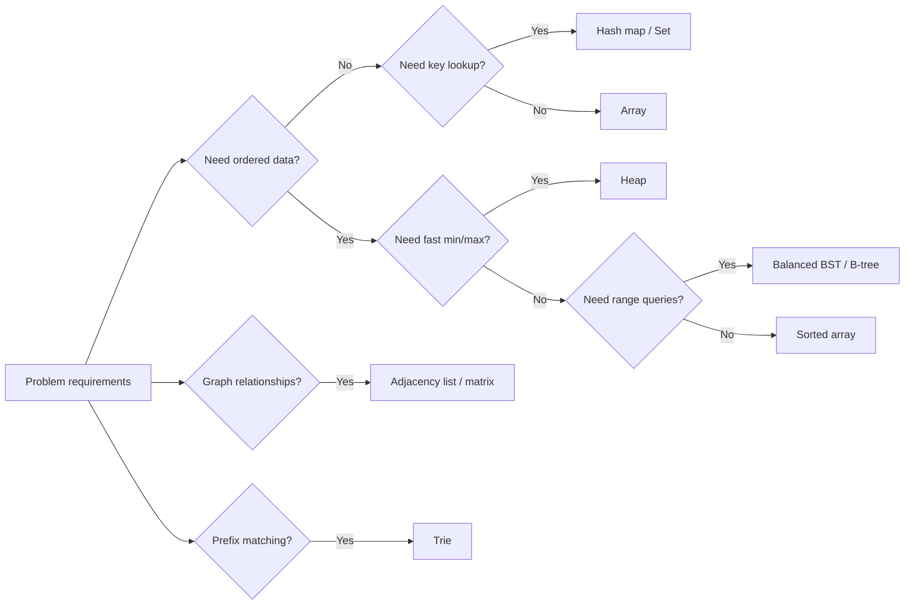
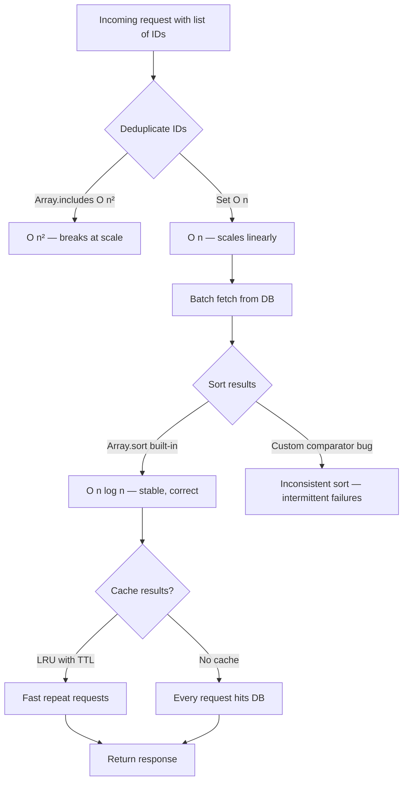

# Algorithms and Data Structures

## Chapter Goal

After this chapter, the reader can choose the right data structure and algorithm for a given problem, reason about complexity in real-world terms (not only Big-O), explain the choice to an interviewer using standard terminology, and recognize when a team's data structure choices are the hidden cause of a production performance problem.

## Why This Matters for a Tech Lead

A Tech Lead rarely writes the tightest inner loop, but owns the architectural decisions that determine whether the system performs at scale. Choosing the wrong data structure in a request handler — an `O(n²)` nested lookup instead of a hash map — can survive code review, pass tests, and only surface as a P1 incident under production load. The Tech Lead sets the team's defaults: which standard library structures to prefer, when a custom structure is justified, and how to document complexity expectations in code review guidelines. In interviews, this topic tests whether a candidate can think beyond brute force, communicate trade-offs clearly, and translate algorithmic reasoning into real system decisions.

## Mental Model

Every data structure trades memory layout for a query shape. An array gives fast indexed access and sequential scan but slow insertion in the middle. A hash map gives fast key lookup but sacrifices ordering. A tree preserves order but adds pointer overhead. The right choice depends on which operations dominate the workload.



This is a simplified decision tree. Real choices also depend on data size, mutation frequency, cache locality, and whether the structure lives in memory or on disk. The interviewer expects this kind of structured reasoning, not a memorized answer.

## Core Terminology

| Term | Definition |
| --- | --- |
| **Big-O (O)** | Upper bound on growth rate. Describes the worst-case or general upper bound of an algorithm's time or space as input grows. |
| **Big-Theta (Θ)** | Tight bound on growth rate. The function grows at exactly this rate asymptotically. More precise than Big-O but less commonly used in interviews. |
| **Big-Omega (Ω)** | Lower bound on growth rate. The best case cannot be faster than this. |
| **Amortized analysis** | Average cost per operation over a sequence of operations, even if individual operations vary. Example: dynamic array `push` is `O(1)` amortized despite occasional `O(n)` resizes. |
| **Time complexity** | How the number of operations grows as input size grows. |
| **Space complexity** | How the memory usage grows as input size grows. Includes auxiliary space (extra memory beyond input). |
| **Stable sort** | A sort that preserves the relative order of equal elements. Matters when sorting structured records by multiple fields. |
| **Unstable sort** | A sort that does not guarantee relative order of equal elements. Often faster or more cache-friendly. |
| **In-place algorithm** | An algorithm that uses `O(1)` auxiliary space (or `O(log n)` for recursion stack). Transforms the input without allocating a proportional copy. |
| **Hash collision** | When two distinct keys produce the same hash index. Handled by chaining (linked list per bucket) or open addressing (probing). |
| **Load factor** | Ratio of stored entries to total buckets in a hash table. High load factor increases collision probability. Typical resize threshold: 0.75. |
| **Cache locality** | How well data access patterns match CPU cache line layout. Sequential array access has high locality; pointer-chasing through a linked list has low locality. |
| **Tail recursion** | A recursive call that is the last operation in the function. Some languages and compilers optimize tail calls to avoid stack growth. JavaScript engines do not reliably optimize tail calls. |
| **Adjacency list** | Graph representation where each vertex stores a list of its neighbors. Space-efficient for sparse graphs: `O(V + E)`. |
| **Adjacency matrix** | Graph representation as a `V × V` matrix. Fast edge lookup `O(1)` but `O(V²)` space. Practical for dense graphs. |

**Key distinctions:**

- **Big-O vs Big-Theta:** Big-O is an upper bound (at most this fast). Big-Theta is a tight bound (exactly this fast). In interviews, "Big-O" is used loosely to mean the tight bound. Know the difference but do not correct the interviewer.
- **Time complexity vs real performance:** Big-O ignores constants, cache effects, and branch prediction. An `O(n log n)` algorithm with poor cache locality can be slower than an `O(n²)` algorithm on small inputs with sequential access.
- **Stable vs unstable sort:** Matters when sorting records. If sorting users by name then by age, a stable sort on age preserves the name ordering within each age group.

## Theoretical Foundation

### Asymptotic notation

Asymptotic notation describes how an algorithm's resource usage scales with input size `n`, ignoring constants and lower-order terms.

**Common complexity classes, from fastest to slowest growth:**

| Class | Name | Example |
| --- | --- | --- |
| **O(1)** | Constant | Hash map lookup, array index access |
| **O(log n)** | Logarithmic | Binary search, balanced BST lookup |
| **O(n)** | Linear | Linear scan, single-pass array traversal |
| **O(n log n)** | Linearithmic | Merge sort, heap sort, efficient sorting |
| **O(n²)** | Quadratic | Nested loops, bubble sort, naive string matching |
| **O(2ⁿ)** | Exponential | Brute-force subset generation, naive recursive Fibonacci |
| **O(n!)** | Factorial | Brute-force permutations |

Amortized analysis accounts for expensive operations that happen rarely. A dynamic array doubles its capacity on overflow. The resize copies `n` elements (`O(n)`), but it happens every `n` insertions, so each insertion is `O(1)` amortized. The same principle applies to hash map resizing.

**What interviewers actually test:** Not whether you can recite the definition, but whether you can analyze a given function and identify the dominant term. A common follow-up is "what is the space complexity?" — candidates who only analyze time lose points.

### Arrays

An array is a contiguous block of memory where elements are stored at fixed offsets. Index access is `O(1)` because the address is computed as `base + index × element_size`.

**Operations and complexity:**

| Operation | Complexity | Notes |
| --- | --- | --- |
| **Index access** | O(1) | Direct memory offset |
| **Search (unsorted)** | O(n) | Linear scan |
| **Search (sorted)** | O(log n) | Binary search |
| **Append** | O(1) amortized | Dynamic array with resize |
| **Insert at index** | O(n) | Shift elements right |
| **Delete at index** | O(n) | Shift elements left |

Arrays have high cache locality because elements are adjacent in memory. This makes sequential iteration fast in practice, often faster than theoretically equivalent operations on pointer-based structures.

**When arrays win:** Read-heavy workloads, sequential access, small to medium datasets, scenarios where cache locality matters more than insertion speed.

**When arrays lose:** Frequent insertion or deletion in the middle, datasets that grow unpredictably and cause repeated reallocations.

### Linked lists

A linked list stores elements in nodes, each containing a value and a pointer to the next node (singly linked) or both next and previous (doubly linked).

**Operations and complexity:**

| Operation | Singly linked | Doubly linked | Notes |
| --- | --- | --- | --- |
| **Access by index** | O(n) | O(n) | Must traverse from head |
| **Insert at head** | O(1) | O(1) | Update pointer |
| **Insert at tail** | O(1) with tail pointer | O(1) | Need tail reference |
| **Delete node (given reference)** | O(n) for predecessor lookup | O(1) | Doubly linked can remove directly |
| **Search** | O(n) | O(n) | Linear scan |

**When linked lists win:** Frequent insertion and deletion with known position (e.g., LRU cache eviction where you hold a reference to the node). Doubly linked lists combined with hash maps power most LRU cache implementations.

**When linked lists lose:** Almost every other scenario. Poor cache locality (nodes scattered in memory), extra memory per element (pointer overhead), and no random access. In production, prefer arrays or deques unless the linked list property (stable references, O(1) splice) is specifically needed.

### Stacks and queues

A **stack** is a Last-In-First-Out (LIFO) structure. Push and pop operate on the top. Used for: function call stacks, undo systems, expression parsing, DFS iteration, backtracking.

A **queue** is a First-In-First-Out (FIFO) structure. Enqueue at the back, dequeue from the front. Used for: BFS, task scheduling, message queues, request buffering.

A **deque** (double-ended queue) supports insertion and removal at both ends in `O(1)`. Used when both stack and queue behavior is needed.

A **priority queue** returns the element with the highest (or lowest) priority. Typically implemented with a heap. Used for: scheduling, Dijkstra's algorithm, top-K problems, event simulation.

All four support their primary operations in `O(1)` (or `O(log n)` for priority queue insertion/extraction).

### Hash maps and sets

A **hash map** (also: hash table, dictionary, associative array) maps keys to values using a hash function. A **set** is a hash map without values — it stores unique elements.

**Operations and complexity:**

| Operation | Average | Worst case | Notes |
| --- | --- | --- | --- |
| **Lookup** | O(1) | O(n) | Worst case with pathological hash collisions |
| **Insert** | O(1) amortized | O(n) | Resize on high load factor |
| **Delete** | O(1) | O(n) | Same collision caveat |
| **Iteration** | O(n) | O(n) | Order not guaranteed (except insertion-order maps) |

**Collision handling:**

- **Chaining:** Each bucket holds a linked list (or tree at high collision count, as in Java's HashMap).
- **Open addressing:** On collision, probe the next slot (linear probing, quadratic probing, double hashing). Better cache locality than chaining.

**Production considerations:**

- JavaScript `Map` preserves insertion order. Plain objects (`{}`) also preserve insertion order for string keys in modern engines, but `Map` is the correct choice for key-value data.
- Python `dict` preserves insertion order (guaranteed since Python 3.7).
- Hash map performance degrades when the hash function distributes keys poorly. HashDoS attacks exploit this by crafting keys that all hash to the same bucket, turning `O(1)` lookups into `O(n)`.

**When to use a Set over an Array for lookups:** Any time you check membership (`.has()` / `in`) more than a few times, a `Set` turns `O(n)` scans into `O(1)` checks. This is one of the most common performance improvements in code review.

### Trees

A **tree** is a hierarchical structure with a root node and child nodes. Each node has exactly one parent (except the root).

**Binary tree:** Each node has at most two children (left, right). Traversal orders:
- **In-order** (left → root → right): produces sorted output for BSTs.
- **Pre-order** (root → left → right): useful for copying/serializing trees.
- **Post-order** (left → right → root): useful for deletion, expression evaluation.
- **Level-order** (BFS): processes nodes by depth.

**Binary Search Tree (BST):** A binary tree where `left.value < node.value < right.value`. Supports search, insert, delete in `O(h)` where `h` is height. For a balanced tree, `h = O(log n)`. For a skewed tree (degenerate), `h = O(n)`.

**Balanced BSTs** (AVL, Red-Black): Maintain `O(log n)` height through rotations on insert/delete. Red-Black trees are used in most standard library implementations (`std::map` in C++, `TreeMap` in Java) because they have less strict balancing (fewer rotations) than AVL trees at the cost of slightly deeper trees.

**B-trees and B+ trees:** Self-balancing trees optimized for disk I/O. Each node holds multiple keys, reducing tree height and disk reads. B+ trees store all values in leaf nodes with leaf-to-leaf pointers for efficient range scans. This is the dominant data structure for database indexes — covered in depth in [SQL and NoSQL Databases](./02-sql-and-nosql.md).

### Heaps

A **heap** is a complete binary tree that satisfies the heap property:
- **Min-heap:** Parent ≤ children. Root is the minimum.
- **Max-heap:** Parent ≥ children. Root is the maximum.

Heaps are typically stored as arrays: for a node at index `i`, children are at `2i + 1` and `2i + 2`, parent at `⌊(i - 1) / 2⌋`.

**Operations:**

| Operation | Complexity | Notes |
| --- | --- | --- |
| **Insert** | O(log n) | Add at end, bubble up |
| **Extract min/max** | O(log n) | Remove root, bubble down |
| **Peek min/max** | O(1) | Read root |
| **Build heap** | O(n) | Heapify from unordered array |

**Primary use cases:**
- **Priority queues:** Dijkstra's algorithm, task scheduling.
- **Top-K problems:** Maintain a min-heap of size K while scanning N elements. Time: `O(n log k)`, space: `O(k)`. This is the standard approach for "find the K largest/smallest elements" — one of the most common interview problems.
- **Heap sort:** In-place, `O(n log n)`, but not stable and has poor cache locality compared to quicksort.

### Graphs

A **graph** `G = (V, E)` consists of vertices (nodes) and edges (connections). Edges can be directed or undirected, weighted or unweighted.

**Representations:**

Adjacency list vs adjacency matrix trade-offs:

| Factor | Adjacency list | Adjacency matrix |
| --- | --- | --- |
| **Space** | O(V + E) | O(V²) |
| **Edge lookup** | O(degree) | O(1) |
| **Add edge** | O(1) | O(1) |
| **Iterate neighbors** | O(degree) | O(V) |
| **Best for** | Sparse graphs | Dense graphs, fast edge queries |

Most real-world graphs are sparse (social networks, road networks, dependency graphs), so adjacency lists dominate in practice.

**Key graph concepts:**
- **Cycle:** A path that starts and ends at the same vertex. Cycle detection matters for dependency resolution and deadlock detection.
- **Connected component:** A maximal set of vertices reachable from each other. In undirected graphs, found via BFS/DFS.
- **DAG (Directed Acyclic Graph):** A directed graph with no cycles. Used for task scheduling, build systems, data pipelines.
- **Bipartite graph:** Vertices split into two sets with edges only between sets. Used for matching problems.

### Tries

A **trie** (prefix tree) is a tree where each node represents a character, and paths from root to leaf spell out strings. Each node has up to `|alphabet|` children.

**Operations:**

| Operation | Complexity | Notes |
| --- | --- | --- |
| **Insert** | O(m) | m = length of the string |
| **Search** | O(m) | Exact match |
| **Prefix search** | O(m + k) | m = prefix length, k = number of results |
| **Delete** | O(m) | Remove characters, prune empty branches |

**Use cases:** Autocomplete, spell checking, IP routing tables, dictionary-based compression. In production, compressed tries (radix trees / Patricia tries) reduce memory by collapsing single-child paths.

**Trade-off vs hash map for string lookup:** A trie uses more memory per entry (one node per character) but supports prefix queries that hash maps cannot. For exact-match-only lookups, a hash map is faster and more memory-efficient.

### Sorting algorithms

Sorting algorithm comparison:

| Algorithm | Time (avg) | Time (worst) | Space | Stable | Notes |
| --- | --- | --- | --- | --- | --- |
| **Merge sort** | O(n log n) | O(n log n) | O(n) | Yes | Predictable, good for linked lists and external sort |
| **Quick sort** | O(n log n) | O(n²) | O(log n) | No | Fast in practice (cache-friendly), worst case avoidable with randomized pivot |
| **Heap sort** | O(n log n) | O(n log n) | O(1) | No | In-place but poor cache locality |
| **Tim sort** | O(n log n) | O(n log n) | O(n) | Yes | Hybrid merge+insertion sort, optimized for real data. Default in Python and Java. |
| **Counting sort** | O(n + k) | O(n + k) | O(k) | Yes | Non-comparison sort, works when values are in a small range [0, k] |
| **Radix sort** | O(d × n) | O(d × n) | O(n + k) | Yes | Non-comparison sort, d = number of digits. Effective for integers and fixed-length strings. |

> Verify against official documentation: Tim sort is the default in Python (`list.sort()`) and Java (`Arrays.sort()` for objects). JavaScript engines typically use Tim sort or a variant (V8 uses Tim sort since 2019).

**What a Tech Lead cares about:** Do not implement your own sort. Use the language's built-in sort (Tim sort in Python/Java/JavaScript). Know that built-in sorts are stable in Python and JavaScript, and unstable for primitives in Java (`Arrays.sort(int[])` uses dual-pivot quicksort). Choose merge sort for external sorting (data too large for memory). Choose counting/radix sort when the key space is small and bounded.

### Searching algorithms

**Binary search** operates on sorted data. At each step, compare the target with the middle element and eliminate half the search space. Time: `O(log n)`. Space: `O(1)` iterative, `O(log n)` recursive.

**Binary search on the answer:** A technique where the search space is not an array but a range of possible answers. Check if a given answer is feasible, then narrow the range. Used for optimization problems: "what is the minimum capacity needed to ship packages within D days?"

**Linear search** scans every element. Time: `O(n)`. Use when data is unsorted, small, or accessed only once.

### Recursion

Recursion solves a problem by reducing it to smaller instances of the same problem. Every recursive solution needs:
1. **Base case:** The condition that stops recursion.
2. **Recursive case:** The step that moves toward the base case.
3. **Progress guarantee:** Each recursive call must reduce the problem size.

**Recursion vs iteration trade-off:** Recursion is clearer for tree/graph traversals and divide-and-conquer but carries stack overhead. Each function call adds a frame to the call stack. Deep recursion (>10,000 frames in most runtimes) causes a stack overflow. Convert to iteration with an explicit stack when input size is unbounded.

**Tail recursion:** When the recursive call is the last operation, some compilers rewrite it as a loop (tail call optimization / TCO). JavaScript specifies TCO in the ES2015 standard, but only Safari implements it reliably. Do not rely on TCO in JavaScript or Python.

### Dynamic programming

Dynamic Programming (DP) solves problems with **overlapping subproblems** and **optimal substructure**. Instead of recomputing the same subproblem, store the result and reuse it.

**Two approaches:**

- **Top-down (memoization):** Write the natural recursive solution, add a cache (hash map or array) to store results. Easier to write, only computes needed subproblems.
- **Bottom-up (tabulation):** Fill a table iteratively from the smallest subproblems. No recursion overhead, predictable memory access. Harder to derive but often more space-efficient (can drop rows no longer needed).

**How to recognize a DP problem:** If the brute-force solution explores many overlapping paths (e.g., recursive tree with repeated subtrees), and the problem asks for an optimal value (minimum, maximum, count), DP likely applies.

**Classic patterns:**
- **1D DP:** Fibonacci, climbing stairs, coin change (minimum coins).
- **2D DP:** Longest common subsequence, edit distance, knapsack.
- **Interval DP:** Matrix chain multiplication, burst balloons.
- **DP on trees/graphs:** Longest path in a DAG.

**Trade-off:** Top-down is easier to code but uses recursion stack space. Bottom-up avoids recursion but requires understanding the dependency order. In interviews, start with top-down memoization for clarity, then mention the bottom-up optimization.

### Greedy algorithms

A greedy algorithm makes the locally optimal choice at each step, hoping to find the global optimum. Greedy works when the problem has the **greedy choice property** (a locally optimal choice leads to a globally optimal solution) and **optimal substructure**.

**Classic examples:**
- **Activity selection:** Choose the activity that finishes earliest.
- **Huffman coding:** Build a prefix-free encoding by always merging the two least frequent symbols.
- **Dijkstra's algorithm:** Always expand the nearest unvisited vertex (greedy on shortest known distance).
- **Fractional knapsack:** Take the item with the highest value-to-weight ratio.

**When greedy fails:** The 0/1 knapsack problem — you cannot take fractions, so the locally optimal choice (best ratio) does not guarantee the global optimum. Use DP instead.

**Interview signal:** The interviewer wants to hear you say "this has the greedy choice property because..." and contrast it with problems where greedy fails.

### Sliding window and two pointers

**Sliding window** maintains a contiguous subarray/substring that expands or contracts as it moves through the input. Used for problems involving contiguous sequences: maximum sum subarray of size K, longest substring without repeating characters, minimum window substring.

**Pattern:**
1. Start with two pointers (`left`, `right`) at the beginning.
2. Expand `right` to include elements.
3. When a condition is violated, shrink from `left`.
4. Track the optimal window seen so far.

Time: `O(n)` because each element enters and leaves the window at most once.

**Two pointers** uses two indices that move toward each other or in the same direction. Used for sorted arrays: two sum (sorted), container with most water, removing duplicates, merging sorted arrays.

These are not separate algorithm families — they are **patterns** (techniques applied to problems). Interviewers expect candidates to name the pattern ("I would use a sliding window here") and explain why it applies.

### BFS and DFS

**Breadth-First Search (BFS)** explores all neighbors at the current depth before moving deeper. Uses a queue. Finds the shortest path in unweighted graphs.

**Depth-First Search (DFS)** explores as deep as possible along each branch before backtracking. Uses a stack (or recursion). Uses less memory than BFS for wide graphs. Used for topological sort, cycle detection, connected components, path existence.

BFS vs DFS comparison:

| Factor | BFS | DFS |
| --- | --- | --- |
| **Data structure** | Queue | Stack (or recursion) |
| **Space** | O(V) — stores entire frontier | O(V) — stores current path |
| **Shortest path** | Yes (unweighted) | No |
| **Use cases** | Shortest path, level-order traversal, minimum steps | Topological sort, cycle detection, backtracking, path enumeration |
| **When to prefer** | Need shortest path, graph is deep | Graph is wide, need all paths, need topological order |

**Production relevance:** BFS and DFS are not interview-only concepts. Permission inheritance in RBAC systems is a graph traversal. Dependency resolution in build systems (npm, webpack, Nx) uses topological sort (which requires DFS). Garbage collectors use graph traversal to find reachable objects.

### Dijkstra's algorithm

Dijkstra's algorithm finds the shortest path from a source vertex to all other vertices in a weighted graph with **non-negative** edge weights. It is a greedy algorithm that always expands the vertex with the smallest known distance.

**Algorithm:**
1. Initialize distances: source = 0, all others = ∞.
2. Use a priority queue (min-heap) to always process the nearest unvisited vertex.
3. For each neighbor, if the path through the current vertex is shorter, update the distance.
4. Repeat until all vertices are processed.

**Time complexity:** `O((V + E) log V)` with a binary heap. `O(V² + E)` with a simple array (better for dense graphs).

**Limitation:** Does not work with negative edge weights. Use Bellman-Ford (`O(V × E)`) for graphs with negative weights, or detect negative cycles.

**Real-world use:** Network routing (OSPF protocol), map navigation, game AI pathfinding. A* extends Dijkstra with a heuristic to focus the search toward the goal.

### Topological sort

A **topological sort** produces a linear ordering of vertices in a DAG such that for every directed edge `u → v`, `u` appears before `v`. Only possible in DAGs — if the graph has a cycle, no topological ordering exists.

**Two approaches:**
1. **Kahn's algorithm (BFS-based):** Maintain in-degree counts. Start with all vertices that have in-degree 0. Remove them, decrement neighbors' in-degrees, repeat. Time: `O(V + E)`.
2. **DFS-based:** Run DFS, add each vertex to a stack after all descendants are processed. The stack (reversed) is the topological order. Time: `O(V + E)`.

**Use cases:** Task scheduling (build systems, CI pipelines), course prerequisite ordering, dependency resolution in package managers, spreadsheet cell evaluation order.

### Caching as an algorithmic concept

Caching stores the result of an expensive computation or data fetch so that future requests for the same data are served faster. At the algorithm level, this is the same principle as memoization in DP.

**Eviction policies** determine what to remove when the cache is full:

Cache eviction policy comparison:

| Policy | Description | Use case |
| --- | --- | --- |
| **LRU (Least Recently Used)** | Evict the item that was accessed longest ago | General-purpose, most common |
| **LFU (Least Frequently Used)** | Evict the item with the fewest accesses | When access frequency matters more than recency |
| **FIFO** | Evict the oldest inserted item | Simple, predictable |
| **TTL (Time To Live)** | Evict after a fixed duration | Data freshness requirements |
| **Random** | Evict a random item | Surprisingly effective, simple to implement |

**LRU implementation:** Doubly linked list (for O(1) move-to-front) + hash map (for O(1) lookup by key). This is the canonical data structure interview question that combines two structures.

**Cache-related problems in production:**
- **Cache stampede:** Many requests hit a cold cache simultaneously, overwhelming the origin. Mitigate with locking, stale-while-revalidate, or probabilistic early expiration.
- **Cache invalidation:** "There are only two hard problems in computer science: cache invalidation, naming things, and off-by-one errors." Invalidation strategies include TTL, event-driven invalidation, and write-through caching. See [Performance and Scalability](./19-performance-and-scalability.md) for production caching patterns.

## Practical Usage

### Where algorithms and data structures appear in real systems

**Backend systems:**
- **LRU cache** in application servers to avoid repeated database queries (Redis, Memcached, or in-process caches).
- **Priority queues / heaps** for task scheduling, rate limiting (token bucket), and finding top-K trending items.
- **Bloom filters** to skip expensive database lookups. If a bloom filter says "not present," the item is definitely absent. False positives trigger an unnecessary lookup but never a wrong answer. Used in databases (LSM-tree compaction), CDNs, and spam filters.
- **Graphs** for permission inheritance (RBAC), social network features (friend suggestions, mutual friends), and dependency resolution.
- **Hash maps** for request deduplication, session stores, feature flag lookups, and configuration caches.
- **Topological sort** in build systems (Make, Bazel, Nx), CI pipeline dependency ordering, and database migration sequencing.

**Frontend systems:**
- **Virtual DOM diffing** (React, Vue) is a tree comparison algorithm.
- **Debouncing and throttling** use queue-like timing structures.
- **Trie-based autocomplete** for search inputs.
- **BFS / DFS** over component trees for rendering, context propagation, and form validation.
- **Memoization** (`useMemo`, `useCallback` in React) is DP applied to render optimization.

**Infrastructure:**
- **Consistent hashing** for distributing keys across cache nodes (Redis cluster, DynamoDB partition assignment).
- **B-trees** in every relational database index.
- **Merge sort variants** in external sorting (when data does not fit in memory).
- **Dijkstra/A*** in network routing protocols and CDN path selection.

### What a Tech Lead realistically needs to know

A Tech Lead does not need to implement a red-black tree from scratch. A Tech Lead needs to:

1. **Recognize complexity problems in code review.** An `O(n²)` loop hidden inside a request handler causes latency spikes under load. A `Set` instead of an `Array` for membership checks fixes it.
2. **Choose the right standard library structure.** `Map` vs plain object in JavaScript. `dict` vs `OrderedDict` in Python. `ArrayList` vs `LinkedList` in Java (almost always `ArrayList`).
3. **Know when a custom structure is justified.** An LRU cache, a bloom filter, or a trie — these are the rare cases where rolling your own (or importing a library) is warranted.
4. **Communicate trade-offs to the team.** "This algorithm is `O(n log n)` vs the current `O(n²)`. On our current dataset of 10K items, both finish in milliseconds. But we expect 1M items next quarter, and the quadratic solution will take minutes."
5. **Set team standards.** Document complexity expectations for hot paths. Add linting rules or code review guidelines that flag common anti-patterns.

## Examples

### LRU cache implementation

```ts
class LRUCache<K, V> {
  private capacity: number;
  private cache: Map<K, V>;

  constructor(capacity: number) {
    this.capacity = capacity;
    this.cache = new Map();
  }

  get(key: K): V | undefined {
    const value = this.cache.get(key);
    if (value === undefined) return undefined;
    this.cache.delete(key);
    this.cache.set(key, value);
    return value;
  }

  put(key: K, value: V): void {
    this.cache.delete(key);
    this.cache.set(key, value);
    if (this.cache.size > this.capacity) {
      const oldest = this.cache.keys().next().value!;
      this.cache.delete(oldest);
    }
  }
}
```

**What this does:** Implements an LRU cache using JavaScript's `Map`, which preserves insertion order. `get` deletes and re-inserts the entry to move it to the "most recent" position. `put` evicts the first (oldest) entry when capacity is exceeded.

**Why this approach:** JavaScript `Map` iteration order is insertion order (guaranteed by the spec). This avoids building a manual doubly linked list. In a language without ordered maps, the classic implementation uses a doubly linked list + hash map.

**Common mistake:** Using a plain object (`{}`) instead of `Map`. Plain objects do not guarantee key ordering for all key types and lack `size` tracking.

**Production change:** Add TTL per entry, max memory limit (not only count), and cache hit/miss metrics. In production, prefer a battle-tested library (e.g., `lru-cache` npm package) or an external cache (Redis).

**Tech Lead check:** Is the cache bounded? Is there a monitoring dashboard for hit rate? Is eviction behavior documented? What happens on cache failure — does the system degrade or crash?

### Top-K elements with a min-heap

```ts
function topK(nums: number[], k: number): number[] {
  const heap: number[] = [];

  function pushHeap(val: number): void {
    heap.push(val);
    let i = heap.length - 1;
    while (i > 0) {
      const parent = Math.floor((i - 1) / 2);
      if (heap[parent] <= heap[i]) break;
      [heap[parent], heap[i]] = [heap[i], heap[parent]];
      i = parent;
    }
  }

  function popHeap(): number {
    const top = heap[0];
    const last = heap.pop()!;
    if (heap.length > 0) {
      heap[0] = last;
      let i = 0;
      while (true) {
        let smallest = i;
        const left = 2 * i + 1, right = 2 * i + 2;
        if (left < heap.length && heap[left] < heap[smallest]) smallest = left;
        if (right < heap.length && heap[right] < heap[smallest]) smallest = right;
        if (smallest === i) break;
        [heap[i], heap[smallest]] = [heap[smallest], heap[i]];
        i = smallest;
      }
    }
    return top;
  }

  for (const num of nums) {
    pushHeap(num);
    if (heap.length > k) popHeap();
  }
  return heap;
}
```

**What this does:** Finds the K largest elements from an array by maintaining a min-heap of size K. When the heap exceeds K elements, the smallest is removed — guaranteeing only the K largest survive.

**Why this approach:** Time: `O(n log k)`, space: `O(k)`. Sorting the entire array would be `O(n log n)` and `O(n)` space. For large N and small K, the heap approach is significantly faster.

**Common mistake:** Using a max-heap instead of a min-heap. A max-heap would require inserting all elements (`O(n log n)`) and then extracting K times. The min-heap approach is better because it maintains a fixed size.

**Production change:** Use a library heap implementation. In Python, use `heapq.nlargest(k, nums)`. In Java, use a `PriorityQueue`. Avoid reimplementing heap operations.

**Tech Lead check:** Does the team understand when to use sort vs heap? For K close to N, sorting may be simpler and fast enough. For streaming data (K largest from an unbounded stream), the heap is the only viable approach.

### BFS vs DFS over the same graph

```ts
type Graph = Map<string, string[]>;

function bfs(graph: Graph, start: string): string[] {
  const visited = new Set<string>();
  const queue: string[] = [start];
  const result: string[] = [];
  visited.add(start);

  while (queue.length > 0) {
    const node = queue.shift()!;
    result.push(node);
    for (const neighbor of graph.get(node) ?? []) {
      if (!visited.has(neighbor)) {
        visited.add(neighbor);
        queue.push(neighbor);
      }
    }
  }
  return result;
}

function dfs(graph: Graph, start: string): string[] {
  const visited = new Set<string>();
  const stack: string[] = [start];
  const result: string[] = [];

  while (stack.length > 0) {
    const node = stack.pop()!;
    if (visited.has(node)) continue;
    visited.add(node);
    result.push(node);
    for (const neighbor of graph.get(node) ?? []) {
      if (!visited.has(neighbor)) {
        stack.push(neighbor);
      }
    }
  }
  return result;
}
```

**What this does:** Both traverse all reachable nodes from a start vertex. BFS uses a queue (FIFO) and explores level by level. DFS uses a stack (LIFO) and explores depth-first.

**Why this approach:** Iterative implementations avoid stack overflow on large graphs. BFS guarantees shortest path in unweighted graphs. DFS is simpler for topological sort and cycle detection.

**Common mistake:** Using `queue.shift()` in JavaScript for BFS. `Array.shift()` is `O(n)` because it reindexes the array. For production BFS on large graphs, use a proper queue implementation (linked list or ring buffer). For interview code, `shift()` is acceptable.

**Production change:** For large graphs (millions of nodes), use iterative DFS (explicit stack) instead of recursive DFS to avoid stack overflow. Consider bidirectional BFS for shortest-path problems to reduce search space.

**Tech Lead check:** Is the graph representation appropriate? Adjacency list for sparse graphs, adjacency matrix for dense graphs. Are visited nodes tracked to avoid infinite loops in cyclic graphs?

### Dynamic programming: coin change

```ts
function coinChange(coins: number[], amount: number): number {
  const dp = new Array(amount + 1).fill(Infinity);
  dp[0] = 0;

  for (let i = 1; i <= amount; i++) {
    for (const coin of coins) {
      if (coin <= i && dp[i - coin] + 1 < dp[i]) {
        dp[i] = dp[i - coin] + 1;
      }
    }
  }
  return dp[amount] === Infinity ? -1 : dp[amount];
}
```

**What this does:** Finds the minimum number of coins to make a given amount. `dp[i]` stores the minimum coins for amount `i`. For each amount, try every coin denomination and take the minimum.

**Why this approach:** Bottom-up DP avoids recursion overhead and is straightforward to reason about. Time: `O(amount × coins)`, space: `O(amount)`.

**Common mistake:** Using a greedy approach (always pick the largest coin first). Greedy fails for many coin sets. Example: coins = [1, 3, 4], amount = 6. Greedy gives 4+1+1 = 3 coins. DP gives 3+3 = 2 coins.

**Production change:** In real systems, DP appears as memoized computations (cached API responses, precomputed lookup tables), not as explicit DP arrays. The pattern matters more than the implementation.

**Tech Lead check:** Does the team recognize when a problem has overlapping subproblems? Can they explain why greedy fails for some inputs? Can they identify the recurrence relation?

### Hash map frequency counter

```ts
function topKFrequent(items: string[], k: number): string[] {
  const freq = new Map<string, number>();
  for (const item of items) {
    freq.set(item, (freq.get(item) ?? 0) + 1);
  }

  return [...freq.entries()]
    .sort((a, b) => b[1] - a[1])
    .slice(0, k)
    .map(([key]) => key);
}

// Production variant: Set-based deduplication in a request handler
function deduplicateIds(ids: string[]): string[] {
  const seen = new Set<string>();
  const result: string[] = [];
  for (const id of ids) {
    if (!seen.has(id)) {
      seen.add(id);
      result.push(id);
    }
  }
  return result;
}
```

**What this shows:** Two of the most common hash-based patterns: counting occurrences with a `Map` and deduplicating with a `Set`. The frequency counter is the foundation for top-K, histogram, and group-by operations. The deduplication pattern turns O(n²) `includes()` checks into O(n).

**Why it is useful:** This is the single most impactful pattern in code review. Converting a lookup array to a Set or building a frequency map eliminates the majority of accidental O(n²) bugs in application code.

**Common mistake:** Using `Array.includes()` for deduplication — `O(n)` per check, `O(n²)` total. Or using `Array.filter((v, i, a) => a.indexOf(v) === i)` — same quadratic cost hidden in a one-liner.

**Production change:** For large datasets, consider whether the frequency computation belongs in the application or in the database (`GROUP BY ... ORDER BY count DESC LIMIT k`). The in-memory approach is appropriate when data is already loaded or when the source is not a database.

**Tech Lead check:** Is the team defaulting to `Set` for membership checks? Is there a linting rule that flags `Array.includes()` inside `Array.map()` or `Array.filter()`?

### Stack-based bracket validation

```ts
function isValid(s: string): boolean {
  const stack: string[] = [];
  const pairs: Record<string, string> = {
    ")": "(",
    "]": "[",
    "}": "{",
  };

  for (const char of s) {
    if (char === "(" || char === "[" || char === "{") {
      stack.push(char);
    } else if (char in pairs) {
      if (stack.pop() !== pairs[char]) return false;
    }
  }
  return stack.length === 0;
}
```

**What this shows:** A stack naturally handles nested matching — the last opened bracket must be the first closed. This pattern extends to any nested structure validation: HTML/XML tags, configuration block nesting, expression parsing, and undo/redo systems.

**Why it is useful:** Stack-based validation is the interview-canonical example of when a stack is the right choice. It also maps to real production problems: validating template syntax, parsing configuration files, and checking SQL parentheses before sending queries to the database.

**Common mistake:** Forgetting to check `stack.length === 0` at the end. The string `"(("` passes all character-level checks but is invalid because the stack is not empty.

**Production change:** In real parsers, the stack stores richer objects (token type, line number, column) rather than single characters, enabling meaningful error messages: "Unclosed bracket at line 42, column 15."

**Tech Lead check:** When reviewing template engines or configuration parsers, verify that the team uses a stack-based approach rather than regex for nested structure validation. Regex cannot match arbitrary nesting depth.

### Sliding window: longest substring without repeating characters

```ts
function lengthOfLongestSubstring(s: string): number {
  const lastSeen = new Map<string, number>();
  let maxLen = 0;
  let left = 0;

  for (let right = 0; right < s.length; right++) {
    const char = s[right];
    if (lastSeen.has(char) && lastSeen.get(char)! >= left) {
      left = lastSeen.get(char)! + 1;
    }
    lastSeen.set(char, right);
    maxLen = Math.max(maxLen, right - left + 1);
  }
  return maxLen;
}
```

**What this shows:** The sliding window pattern maintains a window `[left, right]` that expands right and contracts left when a constraint is violated (duplicate character). Each character enters and leaves the window at most once, so the total time is O(n).

**Why it is useful:** Sliding window reduces O(n²) brute-force substring enumeration to O(n). The same pattern applies to: maximum sum subarray of size K, minimum window containing all target characters, and longest subarray with at most K distinct elements.

**Common mistake:** Resetting `left` to 0 when a duplicate is found instead of moving it to `lastSeen[char] + 1`. This destroys the O(n) guarantee and regresses to O(n²) in the worst case.

**Production change:** Sliding windows appear in production as rate limiters (count events in a time window), log analyzers (find the longest burst of errors), and streaming data processors (compute rolling statistics).

**Tech Lead check:** When a team member proposes scanning all substrings or using nested loops on contiguous sequences, suggest the sliding window pattern. It is one of the few techniques where naming the pattern in code review immediately unlocks a better solution.

### Two pointers: pair sum in a sorted array

```ts
function twoSumSorted(nums: number[], target: number): [number, number] | null {
  let left = 0;
  let right = nums.length - 1;

  while (left < right) {
    const sum = nums[left] + nums[right];
    if (sum === target) return [left, right];
    if (sum < target) left++;
    else right--;
  }
  return null;
}
```

**What this shows:** Two pointers from opposite ends exploit the sorted property. If the sum is too small, move the left pointer right (increase the smaller value). If too large, move the right pointer left (decrease the larger value). Time: O(n), space: O(1).

**Why it is useful:** This is the optimal approach for sorted-array problems that would otherwise require O(n²) nested loops or O(n) extra space for a hash map. The same pattern applies to: container with most water, removing duplicates, and merging sorted arrays.

**Common mistake:** Applying two pointers to an unsorted array. The directional logic only works because the array is sorted — moving left increases the sum and moving right decreases it.

**Production change:** Two pointers is a technique more than a production pattern, but the underlying principle (exploiting sorted data to avoid full scans) applies to database index scans, merge operations in ETL pipelines, and sorted-stream merging.

**Tech Lead check:** When reviewing code that iterates sorted data with nested loops, consider whether a two-pointer approach eliminates the inner loop.

### Binary search with boundary handling

```ts
function lowerBound(nums: number[], target: number): number {
  let lo = 0;
  let hi = nums.length;

  while (lo < hi) {
    const mid = lo + Math.floor((hi - lo) / 2);
    if (nums[mid] < target) lo = mid + 1;
    else hi = mid;
  }
  return lo;
}

function upperBound(nums: number[], target: number): number {
  let lo = 0;
  let hi = nums.length;

  while (lo < hi) {
    const mid = lo + Math.floor((hi - lo) / 2);
    if (nums[mid] <= target) lo = mid + 1;
    else hi = mid;
  }
  return lo;
}

// Count occurrences of target in sorted array: O(log n)
function countOccurrences(nums: number[], target: number): number {
  return upperBound(nums, target) - lowerBound(nums, target);
}
```

**What this shows:** `lowerBound` finds the first index where `nums[index] >= target`. `upperBound` finds the first index where `nums[index] > target`. The difference gives the count of `target` in the array. The invariant-based style (`lo < hi` with half-open interval `[lo, hi)`) avoids off-by-one errors that plague ad-hoc binary search.

**Why it is useful:** Binary search boundary errors are the most common implementation bug in interviews. Using `lo + (hi - lo) / 2` instead of `(lo + hi) / 2` prevents integer overflow in languages with fixed-size integers. The `lowerBound`/`upperBound` pattern is reusable for all binary search variants.

**Common mistake:** Using `lo <= hi` with `hi = nums.length - 1` and then having inconsistent `mid ± 1` adjustments. This style introduces off-by-one errors. The half-open interval pattern (`lo < hi`, `hi = nums.length`) is more predictable.

**Production change:** Binary search appears in production as: searching sorted log files by timestamp, finding the right partition in database range queries, binary search on the answer for optimization problems, and bisecting git commits to find a regression.

**Tech Lead check:** Does the team use the standard library's binary search (`Array.prototype.findIndex` with manual binary search is a code smell — prefer a tested utility)? For database-backed lookups, is the sort order indexed?

### Trie: prefix-based autocomplete

```ts
class TrieNode {
  children = new Map<string, TrieNode>();
  isEnd = false;
}

class Trie {
  private root = new TrieNode();

  insert(word: string): void {
    let node = this.root;
    for (const char of word) {
      if (!node.children.has(char)) {
        node.children.set(char, new TrieNode());
      }
      node = node.children.get(char)!;
    }
    node.isEnd = true;
  }

  search(word: string): boolean {
    const node = this.traverse(word);
    return node !== null && node.isEnd;
  }

  startsWith(prefix: string): boolean {
    return this.traverse(prefix) !== null;
  }

  autocomplete(prefix: string, limit: number): string[] {
    const node = this.traverse(prefix);
    if (!node) return [];
    const results: string[] = [];
    this.collect(node, prefix, results, limit);
    return results;
  }

  private traverse(s: string): TrieNode | null {
    let node = this.root;
    for (const char of s) {
      if (!node.children.has(char)) return null;
      node = node.children.get(char)!;
    }
    return node;
  }

  private collect(
    node: TrieNode, current: string,
    results: string[], limit: number
  ): void {
    if (results.length >= limit) return;
    if (node.isEnd) results.push(current);
    for (const [char, child] of node.children) {
      this.collect(child, current + char, results, limit);
    }
  }
}
```

**What this shows:** Insert is O(m) and search is O(m) where m is the word length. The `autocomplete` method traverses to the prefix node, then collects all words in that subtree up to a limit. This is the data structure behind search bar autocomplete.

**Why it is useful:** A hash map cannot answer "give me all keys starting with X" without scanning all keys. A trie answers this in O(prefix + results). This is the canonical interview question for prefix-based operations and maps directly to production autocomplete features.

**Common mistake:** Using a fixed-size array (`new Array(26)`) for children instead of a `Map`. The array approach wastes memory for sparse alphabets and does not support Unicode. The `Map` approach is more flexible and more memory-efficient for typical workloads.

**Production change:** For production autocomplete, use a compressed trie (radix tree) to reduce memory, precompute top-K results per node for speed, and consider Elasticsearch's `completion` suggester or PostgreSQL's `pg_trgm` for managed solutions. Rebuild the trie from the source of truth (database) on a schedule.

**Tech Lead check:** Is a trie the right choice, or would a database-backed prefix index be simpler to operate? Custom in-memory data structures require careful management of startup time, memory limits, and data freshness.

### Dijkstra's shortest path

```ts
function dijkstra(
  graph: Map<string, [string, number][]>,
  source: string
): Map<string, number> {
  const dist = new Map<string, number>();
  // Simple priority queue using sorted insertion
  const pq: [number, string][] = [[0, source]];
  dist.set(source, 0);

  while (pq.length > 0) {
    pq.sort((a, b) => a[0] - b[0]);
    const [d, u] = pq.shift()!;

    if (d > (dist.get(u) ?? Infinity)) continue;

    for (const [v, weight] of graph.get(u) ?? []) {
      const newDist = d + weight;
      if (newDist < (dist.get(v) ?? Infinity)) {
        dist.set(v, newDist);
        pq.push([newDist, v]);
      }
    }
  }
  return dist;
}
```

**What this shows:** Dijkstra finds shortest paths from a single source to all reachable vertices in a graph with non-negative edge weights. The algorithm greedily expands the nearest unvisited vertex and relaxes its neighbors.

**Why it is useful:** Shortest path appears in network routing (OSPF), map navigation, dependency cost analysis, and any system where "minimum cost path" through a weighted graph is needed. The greedy property (always expand the nearest vertex) is a key interview discussion point.

**Common mistake:** Using Dijkstra with negative edge weights — it produces incorrect results because the greedy assumption (the shortest known distance is final) breaks. Use Bellman-Ford for graphs with negative weights. Also, the naive sorted-array priority queue shown here is O(n²) total. A real implementation uses a binary heap for O((V + E) log V).

**Production change:** In production, shortest-path computations are rarely written from scratch. Use a graph library (NetworkX in Python, JGraphT in Java) or a graph database (Neo4j) with built-in shortest-path algorithms. For map navigation, use precomputed contraction hierarchies (Google Maps, OSRM).

**Tech Lead check:** If the team needs graph algorithms, evaluate whether a graph library or database is more maintainable than a hand-rolled implementation. The algorithm is well-known, but the edge cases (disconnected graphs, cycles, overflow) are where custom implementations fail.

### Real-world algorithm choices: backend request handler



This diagram traces the algorithm decisions in a typical backend request handler. Each decision point represents a real production choice where the wrong data structure or algorithm causes latency problems or correctness bugs at scale. The left path at each branch shows the common mistake; the right path shows the production-grade choice.

**Tech Lead check:** A code review checklist for request handlers should cover: (1) Are lookups using Set/Map instead of Array? (2) Is the built-in sort used with a correct comparator? (3) Is there a cache for repeated computations? (4) Are all operations bounded — no unbounded loops or growing in-memory structures?

## Common Mistakes

1. **Confusing Big-O with real performance**
   - Looks like: "Hash map is O(1) so it is always faster than a sorted array."
   - Why it is wrong: Big-O ignores constants, cache locality, and memory overhead. For small datasets (<100 elements), a linear scan through an array is often faster than a hash map lookup due to CPU cache effects.
   - Correct approach: Use Big-O for scaling analysis, but benchmark for performance-critical paths. State constants and cache effects in code review.

2. **Using Array.includes() or Array.indexOf() in a hot loop**
   - Looks like: `if (allowedIds.includes(id))` inside a loop that runs per request.
   - Why it is wrong: `Array.includes()` is `O(n)` per call. Inside a loop over M items, total is `O(M × N)`. Converting `allowedIds` to a `Set` makes each check `O(1)`, total `O(M + N)`.
   - Correct approach: Convert lookup arrays to Sets before the loop. Add a linting rule or code review guideline for this pattern.

3. **Choosing a linked list when an array is better**
   - Looks like: Using a linked list for a collection that is iterated frequently but rarely modified.
   - Why it is wrong: Linked list nodes are scattered in memory, causing cache misses on every traversal. Arrays have contiguous memory and prefetch-friendly access patterns.
   - Correct approach: Default to arrays. Use linked lists only when the specific property (O(1) insert/delete at known position, stable references) is needed — primarily LRU cache internals.

4. **Recursive solutions that blow the call stack**
   - Looks like: Recursive DFS or DP on input sizes > 10,000 without checking stack limits.
   - Why it is wrong: Most runtimes default to ~10,000 stack frames. Deep recursion causes `RangeError: Maximum call stack size exceeded` (JavaScript) or `RecursionError` (Python).
   - Correct approach: Convert to iterative with an explicit stack or increase recursion limit with documentation. In Python, `sys.setrecursionlimit()` is a workaround, not a solution.

5. **Ignoring sort stability when ordering structured records**
   - Looks like: Sorting users by name, then sorting by department, and expecting users within the same department to remain alphabetically ordered.
   - Why it is wrong: Unstable sorts do not preserve relative order of equal elements. The second sort may scramble the name ordering.
   - Correct approach: Use a stable sort (Python, JavaScript built-in sorts are stable) or sort by a composite key (`department, name`) in a single pass.

6. **Using the wrong graph representation**
   - Looks like: An adjacency matrix for a graph with 100,000 nodes and 200,000 edges.
   - Why it is wrong: The matrix uses `O(V²)` = 10 billion cells of memory. An adjacency list uses `O(V + E)` = 300,000 entries.
   - Correct approach: Use adjacency lists for sparse graphs (most real-world graphs). Use adjacency matrices only for dense graphs or when constant-time edge queries are needed.

7. **Premature optimization with complex data structures**
   - Looks like: Implementing a bloom filter, skip list, or custom balanced BST when a simple hash map or array suffices.
   - Why it is wrong: Complex structures add cognitive overhead, maintenance burden, and debugging difficulty. The marginal performance gain rarely justifies the cost for typical workloads.
   - Correct approach: Start with the simplest structure that meets requirements. Profile before optimizing. Introduce specialized structures only when measurements justify them.

## Trade-offs

Key algorithmic trade-offs and when each choice flips:

| Decision | Optimizes for | Sacrifices | Flips when |
| --- | --- | --- | --- |
| **Hash map vs sorted map** | O(1) average lookup | Ordering, worst-case guarantees | Need range queries, ordered iteration, or deterministic worst-case |
| **Array vs linked list** | Cache locality, random access | Insertion/deletion in middle | Need O(1) insert/delete at known positions (rare in practice) |
| **Recursion vs iteration** | Code clarity for tree/graph problems | Stack space, risk of overflow | Input size is unbounded or exceeds ~10K |
| **Top-down DP vs bottom-up DP** | Ease of writing, only computes needed states | Recursion overhead, harder to optimize space | Need to optimize space by dropping old rows, or stack depth is a concern |
| **Greedy vs DP** | Simpler code, O(n log n) or better | Correctness (greedy only works for specific problem structures) | Problem lacks greedy choice property |
| **BFS vs DFS** | Shortest path (BFS), memory efficiency for wide graphs (DFS) | BFS uses more memory on wide graphs; DFS does not find shortest path | Need shortest path → BFS. Need topological order → DFS. |
| **Sorting then binary search vs hash set** | Sorted structure for multiple queries | O(n log n) sort cost upfront | Only one or two lookups needed → hash set. Many lookups → sorted + binary search may be comparable. |
| **Bloom filter vs hash set** | Memory efficiency (probabilistic) | False positives, no deletion (basic bloom filter) | Need exact answers or deletion → use hash set |

**How to explain trade-offs in an interview:** Do not list "pros and cons." Say: "A hash map optimizes for constant-time lookup at the cost of ordering and worst-case guarantees. The trade-off flips when I need range queries or deterministic performance under adversarial inputs — then a balanced BST or sorted array is the better choice."

## Production Considerations

**Prefer the standard library.** Every modern language ships with well-tested, cache-optimized implementations of arrays, hash maps, sorted collections, heaps, and sorting. Rolling your own is justified only when the standard library lacks the structure (e.g., LRU cache, trie, bloom filter) or when profiling reveals a measurable bottleneck.

**Memory footprint and GC pressure.** Data structures with many small objects (trees, linked lists) create GC pressure in managed languages. Each node is a separate heap allocation. Arrays and flat structures are GC-friendly because they are fewer, larger allocations. In latency-sensitive systems (e.g., real-time bidding, game servers), minimize pointer-heavy structures.

**Cache locality matters more than Big-O at small scale.** An `O(n)` scan through a contiguous array can outperform an `O(log n)` tree traversal for datasets under ~1,000 elements because the array fits in L1/L2 cache. Profile before replacing a linear scan with a tree.

**When to choose a probabilistic structure.** Bloom filters, count-min sketches, and HyperLogLog trade exactness for dramatic space savings. Use when false positives are acceptable (cache check, duplicate detection) and exact counting is not required. Document the false positive rate and size parameters.

**Security implications of hash maps.** Hash collision attacks (HashDoS) can degrade hash map performance from `O(1)` to `O(n)` by crafting keys that all hash to the same bucket. Mitigation: use randomized hash seeds (most modern languages do this by default), or use a hash map implementation that falls back to a balanced tree on high collision (Java's `HashMap` switches buckets from linked lists to red-black trees when a bucket exceeds 8 entries).

**Cost of algorithmic choices at scale.** An `O(n²)` algorithm on 1,000 items takes 1 million operations — fast enough. On 1 million items, it takes 1 trillion operations — minutes or hours. A Tech Lead must project current data sizes to expected growth and flag algorithms that will not scale. This is a cost decision: fixing it now is cheaper than an incident later.

**Monitoring and alerting for algorithmic performance.** Add latency percentile metrics (p50, p95, p99) on hot paths. An algorithm with `O(n)` average but `O(n²)` worst case will show a normal p50 but spiking p99. See [Observability](./18-observability.md) for instrumentation patterns.

## Tech Lead Decision-Making

### What a Senior Engineer knows vs what a Tech Lead decides

What separates Senior and Tech Lead knowledge in algorithms:

| Domain | Senior Engineer knows | Tech Lead decides |
| --- | --- | --- |
| **Data structure choice** | Hash map vs array trade-offs | Team-wide defaults for common patterns, documented in code review guidelines |
| **Complexity analysis** | How to analyze a function's Big-O | What complexity ceiling is acceptable for request handlers (e.g., no `O(n²)` in p95 path) |
| **Optimization** | How to use memoization or a better algorithm | When to optimize (after profiling) vs when to ship the simpler version |
| **Custom structures** | How to implement an LRU cache or trie | Whether to build, import, or use an external service (Redis vs in-process cache) |
| **Scaling** | That `O(n²)` does not scale | Projecting current data growth to trigger proactive migration before an incident |

### When not to optimize

**Common overengineering trap:** Replacing a working `O(n²)` algorithm with a complex `O(n log n)` solution when `n` is always small (< 100 items). The complex solution adds maintenance cost, is harder to debug, and saves no perceptible time.

**Tech Lead rule:** Optimize when:
1. Profiling shows this path contributes meaningfully to latency or cost.
2. Data size is expected to grow beyond the current algorithm's capacity.
3. The optimization is simple enough to maintain.

Do not optimize when:
1. The path is cold (runs rarely).
2. The data size is bounded and small.
3. The optimization introduces significant complexity.

### Setting team complexity standards

A Tech Lead establishes norms that prevent algorithmic problems before they happen:

1. **Code review guideline:** "No `O(n²)` or worse in any request handler. If unavoidable, add a comment explaining the bound and the maximum expected `n`."
2. **Linting and static analysis:** Flag `Array.includes()` inside `Array.map()`/`Array.filter()` in JavaScript/TypeScript. Suggest `Set` conversion.
3. **Performance budget:** "Hot path endpoints must respond in < 100ms at p99. Any change that increases p99 by > 10% requires a design review."
4. **Data structure decision log:** For non-obvious choices (bloom filter, trie, custom cache), document the decision, expected data size, and the condition under which the choice should be revisited.

### Build vs import vs external service

When a team needs a data structure beyond the standard library:

Build vs import vs external service decision matrix:

| Option | When to choose | Risk |
| --- | --- | --- |
| **Build in-house** | Structure is simple (LRU, ring buffer), well-understood, < 200 lines | Maintenance burden, subtle bugs, no community testing |
| **Import a library** | Mature, maintained, well-tested (e.g., `lru-cache`, `bloom-filters` npm) | Dependency risk, license concerns, version drift |
| **External service** | Need persistence, shared state, or massive scale (Redis, Memcached, ElastiCache) | Network latency, operational cost, availability dependency |

**Tech Lead rule:** Default to a library for structures the team did not invent. Default to an external service when the data must be shared across processes or survive restarts. Build in-house only for trivial structures or when library options are poor.

### Incident response: algorithmic performance issues

**Symptom:** p99 latency on an endpoint spikes from 50ms to 5 seconds during peak traffic.

**Diagnosis playbook:**
1. Check if the slow path correlates with data size growth (look at database row counts, list sizes in logs).
2. Profile the endpoint. Look for nested loops, repeated database queries (N+1), or O(n²) operations on growing data.
3. Check if a cache is missing (cache hit rate dropped, or a new code path bypasses the cache).
4. Review recent deployments for algorithm changes.

**Common root causes:**
- Developer added a filter that calls `Array.includes()` against a growing list.
- A sorting step was added without realizing the list is already sorted (unnecessary O(n log n)).
- An N+1 query pattern: fetching related records one by one instead of batch.
- Cache eviction policy mismatch: LRU cache too small for the working set, causing constant misses.

### Profiling before optimizing: a decision framework

A Tech Lead's most important algorithmic discipline is resisting the urge to optimize without evidence. The framework:

**Step 1 — Measure.** Before touching the code, capture baseline metrics: p50, p95, p99 latency, CPU profile (flame graph), and memory allocation profile. Use language-appropriate tools:

Profiling tools by language:

| Language | CPU profiler | Memory profiler | Flame graph tool |
| --- | --- | --- | --- |
| **Node.js** | `--prof`, `clinic doctor` | `--inspect` + Chrome DevTools | `0x`, `clinic flame` |
| **Python** | `cProfile`, `pyinstrument` | `tracemalloc`, `memray` | `py-spy` |
| **Java** | `async-profiler` | `jmap`, VisualVM | `async-profiler` SVG output |
| **Go** | `pprof` | `pprof` (heap) | `go tool pprof -http` |

**Step 2 — Locate.** Identify the function that dominates the profile. If no single function exceeds 10% of request time, algorithmic optimization is unlikely to help — look at I/O, network, or architecture instead.

**Step 3 — Quantify the gain.** Before implementing, estimate the improvement. "This function is O(n²) and accounts for 40% of request time. Reducing it to O(n) at our current n=10,000 would reduce its contribution from 400ms to 0.04ms, cutting total p99 from 1s to ~600ms." If the projected gain does not meaningfully improve the user-facing metric, do not optimize.

**Step 4 — Implement and verify.** Make the change, re-profile, and compare before/after metrics. If the gain is smaller than expected, investigate — the bottleneck may have shifted.

**Interview framing:** "I do not optimize based on Big-O analysis alone. I profile first, identify the dominant function, estimate the gain, implement, and verify. The most common outcome is that the real bottleneck is I/O, not computation — and the algorithmic improvement is irrelevant."

### Readability vs micro-optimization

**The trap:** An engineer replaces a readable loop with a bitwise trick that saves 2 microseconds per call. The team cannot maintain it, and the next developer introduces a bug because they do not understand the optimization.

**Tech Lead rule of thumb:**

Readability vs performance decision matrix:

| Situation | Choose readability | Choose optimization |
| --- | --- | --- |
| **Cold path (< 100 calls/sec)** | Always | Never — no perceptible impact |
| **Warm path (100-10K calls/sec)** | Default | Only if profiling shows this path in the top 3 contributors to latency |
| **Hot path (> 10K calls/sec)** | Only if the readable version meets SLO | When the readable version violates SLO and the optimization is documented |
| **Library/utility code** | When internal, used by < 5 callers | When the library is on the critical path of many services |

**Concrete examples of when readability wins:**

1. Using `Array.filter().map()` instead of a single-pass loop that combines both. The two-pass version allocates an intermediate array, but it is clearer. Optimize only if this appears in a flame graph.
2. Using a recursive tree traversal instead of an iterative one when the tree depth is bounded (< 100 levels). The recursive version is clearer and the stack overhead is negligible.
3. Using a hash map where a sorted array with binary search would be 10% faster. The hash map is more readable and the 10% does not affect the SLO.

**Concrete examples of when optimization wins:**

1. Replacing `Array.includes()` with a `Set` in a per-request loop over 10,000 items. This is not a micro-optimization — it changes the complexity class from O(n²) to O(n).
2. Switching from JSON serialization to a binary format for a service handling 50K messages/second. The CPU savings justify the readability cost.
3. Precomputing a lookup table at startup instead of computing per request when the computation is O(n²) and the data changes hourly.

**Interview framing:** "I draw the line between algorithmic improvements (changing the complexity class) and micro-optimizations (shaving constants). The first is almost always worth it. The second requires profiling evidence and SLO context."

### Cost model: when algorithmic choices affect infrastructure spend

Algorithmic choices have direct cost implications at scale. A Tech Lead must translate complexity analysis into dollars when justifying engineering investment.

**Cost calculation template:**

```text
Current state:
  Algorithm: O(n²) nested loop in order matching
  Current n: 5,000 orders/batch
  Current batch time: 25 seconds (5000² = 25M ops)
  Batches per day: 200
  Compute cost: 4 vCPU instance × 200 × 25s = ~5.5 CPU-hours/day

Projected state (6 months, 3× growth):
  n: 15,000 orders/batch
  Batch time: 225 seconds (15000² = 225M ops, 9× slower)
  Compute cost: ~50 CPU-hours/day (9× increase)
  Need to scale to larger instance or parallelize

After optimization (O(n log n) sort + merge):
  n: 15,000 orders/batch
  Batch time: ~0.2 seconds (15000 × 14 ≈ 210K ops)
  Compute cost: ~0.03 CPU-hours/day

Engineering investment: 1 engineer × 1 week
Break-even: immediate (infrastructure cost drops 99%)
```

**Stakeholder explanation:** "Our order matching system currently costs us $X/month in compute. At our projected growth rate, that cost will increase 9× in six months. A one-week engineering investment reduces the compute cost by 99% and eliminates the need for a larger instance. The risk is low — the new algorithm produces identical results, and we will run both in parallel for one week to verify."

**When cost does not justify optimization:** If the current system costs $50/month in compute and the optimization saves $45/month, the engineering time (1 week at $3,000+ loaded cost) never pays back. Document the cost, set a revisit threshold ("revisit when compute cost exceeds $500/month"), and move on.

### Calibrating algorithm interviews for role level

A Tech Lead often designs or calibrates algorithm interviews. The common failure mode is testing competitive programming skill instead of production engineering judgment.

Algorithm interview calibration by level:

| Level | What to test | Example problem | Evaluation focus |
| --- | --- | --- | --- |
| **Junior** | Can apply basic data structures correctly | "Remove duplicates from an array" | Correctness, code clarity, basic complexity analysis |
| **Mid-level** | Can choose between approaches and analyze trade-offs | "Find the K most frequent elements" | Approach selection (sort vs heap vs bucket sort), complexity comparison |
| **Senior** | Can optimize, handle edge cases, discuss production implications | "Design a rate limiter" | Algorithm design, scaling analysis, failure modes, production considerations |
| **Tech Lead** | Can reason about system-level impact and team standards | "Our search endpoint is slow at scale — walk me through diagnosis and fix" | Profiling methodology, data structure choice justification, team process, stakeholder communication |

**What to avoid at senior/lead level:**
- Problems that require obscure algorithmic tricks (number theory, advanced graph algorithms).
- Problems where the only signal is "did they get the optimal solution in time."
- Problems with no production analog (pure math puzzles).

**What to look for at senior/lead level:**
- Does the candidate clarify requirements before coding?
- Do they state the brute-force baseline and improve from there?
- Can they explain the trade-off between their approach and alternatives?
- Do they mention edge cases, error handling, and input validation?
- Can they discuss how the solution changes at 100× or 1000× scale?

**Interview framing:** "When I design algorithm interviews, I optimize for signal about production engineering judgment, not competitive programming speed. I choose problems that have real-world analogs — data transformation, cache design, search optimization — and evaluate communication and trade-off thinking as heavily as correctness."

### Avoiding LeetCode-only thinking in production

**The problem:** Engineers who trained primarily on competitive programming problems bring patterns that are correct in contests but harmful in production:

Patterns that need correction from LeetCode to production:

| LeetCode habit | Why it fails in production | Production alternative |
| --- | --- | --- |
| **Global mutable variables** | Thread-safety issues, no isolation between requests | Encapsulate state in classes or closures; use request-scoped data |
| **No error handling** | Contest inputs are always valid; production inputs are not | Validate inputs, handle edge cases, return meaningful errors |
| **Optimize for speed over clarity** | Clever code becomes unmaintainable | Write clear code first; optimize the measured bottleneck |
| **Roll your own sort/hash/tree** | More buggy, less tested than the standard library | Use the standard library; document why if you deviate |
| **Ignore memory allocation** | Contests do not penalize GC pauses; production does | Prefer array-based structures; pool objects; measure allocation rate |
| **Single-function solutions** | 100-line functions are unreadable and untestable | Break into named, testable functions with clear interfaces |

**Tech Lead coaching approach:** When a team member writes production code in "contest style," do not criticize the approach — redirect it. "Your algorithm is correct and efficient. Let us refactor it to be maintainable: extract the sorting logic into a named function, add input validation, and replace the manual heap with the standard library's priority queue."

### Risk checklist: algorithmic decisions in production systems

Before approving a non-trivial algorithmic change in production, verify:

- [ ] **Bounded inputs:** The algorithm receives bounded input. If input is user-controlled, size limits are enforced at the API boundary.
- [ ] **Worst-case analysis:** The worst-case complexity is documented. If worst case is significantly worse than average (e.g., quicksort O(n²)), mitigation exists (randomized pivot, fallback).
- [ ] **Memory bound:** The algorithm's memory usage is bounded and documented. No unbounded in-memory growth from user input or data accumulation.
- [ ] **Timeout:** Long-running computations have a timeout. If the algorithm exceeds the timeout, it fails gracefully rather than hanging.
- [ ] **Monitoring:** Latency metrics (p50, p95, p99) cover the affected endpoint. Alerts fire before the SLO is breached.
- [ ] **Rollback:** The change can be reverted without data migration. Feature flags or deployment rollback are available.
- [ ] **Adversarial input:** If the algorithm processes untrusted input, it is resistant to algorithmic complexity attacks (HashDoS, ReDoS, parsing bombs).
- [ ] **Testing:** The change is tested with production-scale data, not only unit-test-sized inputs. Edge cases (empty input, single element, maximum expected size) are covered.
- [ ] **Documentation:** The algorithm choice, its complexity, expected data size, and revisit conditions are documented in a code comment or ADR.

## How to Explain This in an Interview

**Opening for "Walk me through your approach to a coding problem":**

"I start by clarifying the input shape and constraints — the size of the input, whether it is sorted, and what edge cases exist. Then I state a brute-force baseline and its complexity. From there I look for patterns: does the problem have overlapping subproblems (DP), can I make a greedy choice, is there a two-pointer or sliding window structure? I pick the approach with the best time-space trade-off for the given constraints, implement it, and verify with examples."

**Opening for "How do you choose a data structure?":**

"I start with the operations the code needs to perform most frequently. If it is mostly lookups by key, a hash map. If it is ordered access or range queries, a sorted structure. If it is priority-based retrieval, a heap. Then I consider the data size — for small datasets, an array with linear scan is often faster than a theoretically superior structure because of cache locality. For larger datasets, the asymptotic complexity dominates."

**Opening for "How do you handle performance problems in production?":**

"I look at metrics first — p50, p95, p99 latency. If the p99 is spiking, I profile the hot path and check if complexity scales with a growing input. The most common root cause I have seen is an `O(n²)` pattern that was invisible at small data sizes and only surfaces under growth. The fix is usually converting a lookup structure from a list to a set, or moving a computation from per-request to a precomputed cache."

**Opening for "How do you balance code readability with performance?":**

"I separate algorithmic improvements from micro-optimizations. An algorithmic improvement — changing O(n²) to O(n) — is almost always worth it because it changes the scaling behavior. A micro-optimization — bit tricks, manual loop unrolling, avoiding one allocation — requires profiling evidence and a clear SLO violation. My default is readable code. I optimize the measured bottleneck, document the optimization, and ensure the team can maintain it."

**Opening for "How do you justify performance work to stakeholders?":**

"I translate complexity into business terms. 'Our order processing currently handles 5,000 orders per batch in 25 seconds. At our growth rate, we will hit 15,000 orders in six months, and the same process will take over 3 minutes — exceeding our SLA and delaying fulfillment. A one-week engineering investment reduces the processing time to under a second, regardless of growth. The alternative is scaling to a larger instance, which costs $X/month and only delays the problem.'"

## Good Answer vs Weak Answer

**Question:** "Why would you use a heap instead of sorting for a top-K problem?"

**Strong Answer**

"When I need the K largest elements from N items, I have two options. Sorting the entire array is `O(n log n)` and gives me all elements in order. Using a min-heap of size K, I scan the array once, pushing each element and popping the minimum when the heap exceeds K. This is `O(n log k)` time and `O(k)` space. For large N and small K, the heap approach is significantly better — it avoids sorting elements I do not need. It also works on streaming data where I do not have all elements upfront. The trade-off flips when K is close to N — then sorting is simpler and about the same cost."

**Weak Answer**

"A heap is faster because it is a more efficient data structure. You put the elements in and take them out in order. It is O(log n) per operation so it is better than sorting."

**Why the Strong Answer Wins**

- States both complexities precisely: `O(n log n)` vs `O(n log k)`.
- Explains why the heap wins: avoids unnecessary work on non-top-K elements.
- Mentions the streaming use case — shows real-world thinking.
- Identifies when the trade-off flips (K close to N) — shows nuance.
- The weak answer confuses heap operations with the overall algorithm, does not compare approaches, and misses the streaming advantage.

## Tech Lead Checklist

### Data structure and algorithm standards

- [ ] Team uses standard library data structures by default; custom implementations require documented justification.
- [ ] Code review guidelines include complexity expectations: no `O(n²)` or worse in request handlers without a documented bound.
- [ ] A linting rule or code review checklist flags `Array.includes()` / `Array.indexOf()` inside loops.
- [ ] Hot paths have latency percentile monitoring (p50, p95, p99) with alerts on regression.
- [ ] A library of approved utilities (LRU cache, retry, rate limiter) exists in the monorepo or a shared package.

### Performance and scaling

- [ ] Data structure choices for hot paths are documented with expected data size and growth projection.
- [ ] A performance budget exists for critical endpoints (e.g., < 100ms at p99).
- [ ] Profiling is done before and after optimization changes — no optimization without measurement.
- [ ] External caches (Redis, Memcached) have monitoring for hit rate, eviction rate, and memory usage.

### Knowledge and team readiness

- [ ] Team members can explain time and space complexity of the structures they use.
- [ ] Post-incident reviews include root-cause analysis of algorithmic performance issues.
- [ ] Onboarding materials cover the team's data structure conventions and performance expectations.

## Interview Questions and Answers

### Basic

**Question:** What is the difference between Big-O and Big-Theta notation?

**Answer:** Big-O provides an upper bound — the function grows no faster than this rate. Big-Theta provides a tight bound — the function grows at exactly this rate. In interviews, "Big-O" is used colloquially to mean the tight bound. For example, merge sort is `Θ(n log n)` (tight bound) and also `O(n log n)` (upper bound) and `O(n²)` (a looser but still valid upper bound). The useful statement is the tight bound.

**Question:** What is amortized O(1) and why does it matter?

**Answer:** An operation is amortized O(1) when its average cost over a sequence of operations is constant, even though individual operations may be expensive. Dynamic array `push` is the classic example: most pushes are O(1), but when the array is full, it allocates a new array of double the size and copies all elements (O(n)). Since this expensive operation happens every n pushes, the cost per push averages to O(1). This matters because it means dynamic arrays are practically as fast as fixed arrays for append-heavy workloads.

**Question:** What are the time complexities for hash map operations?

**Answer:** Average case: O(1) for get, set, and delete. Worst case: O(n) when all keys hash to the same bucket (pathological collisions). In practice, with a good hash function and a load factor below 0.75, hash maps deliver near-constant performance. The resize operation is O(n) but amortized across insertions.

**Question:** When is an array better than a linked list?

**Answer:** Almost always. Arrays have contiguous memory layout, which means sequential access benefits from CPU cache prefetching. Random access is O(1) vs O(n) for linked lists. The only case where linked lists win is when you need O(1) insertion or deletion at a known position (given a direct reference to the node) — the canonical example being an LRU cache's doubly linked list.

**Question:** What is a binary search tree, and when does it degenerate?

**Answer:** A BST maintains the invariant that left children are smaller and right children are larger than the parent. Search, insert, and delete are O(h) where h is the tree height. A balanced BST has h = O(log n). A degenerate (skewed) BST — caused by inserting already-sorted data — has h = O(n), making it equivalent to a linked list. Self-balancing trees (AVL, Red-Black) prevent degeneration through rotations.

**Question:** What is the difference between a min-heap and a max-heap?

**Answer:** In a min-heap, every parent is less than or equal to its children, so the root is the minimum. In a max-heap, every parent is greater than or equal to its children, so the root is the maximum. Both support insert and extract in O(log n). The choice depends on whether you need fast access to the smallest or largest element. For a top-K largest problem, use a min-heap of size K (the min is the eviction candidate).

**Question:** What is a trie and when is it preferred over a hash map?

**Answer:** A trie is a tree where each path from root to a node represents a string prefix. Lookup is O(m) where m is the string length, same as hashing. The advantage over a hash map is prefix-based operations: finding all strings with a given prefix is efficient (O(prefix + results)), which a hash map cannot do without iterating all keys. Use a trie for autocomplete, spell checking, and IP routing. Use a hash map for exact-match-only lookups.

**Question:** What is a stable sort and when does it matter?

**Answer:** A stable sort preserves the relative order of elements with equal sort keys. It matters when sorting structured records by multiple fields. If records are first sorted by name (alphabetically) and then sorted by department, a stable sort on department preserves the alphabetical order within each department. An unstable sort may scramble it. Python's sort and JavaScript's `Array.sort()` are stable. Java's sort for objects is stable (merge sort) but for primitives is unstable (dual-pivot quicksort).

**Question:** What is the difference between BFS and DFS?

**Answer:** BFS explores all nodes at the current depth before moving deeper, using a queue. DFS explores as deep as possible before backtracking, using a stack or recursion. BFS finds the shortest path in unweighted graphs. DFS is better for topological sort, cycle detection, and path enumeration. BFS uses O(width) space; DFS uses O(depth) space. For deep, narrow graphs, DFS is more memory-efficient. For shallow, wide graphs, BFS is more memory-efficient.

**Question:** How does Dijkstra's algorithm work?

**Answer:** Dijkstra finds the shortest path from a source to all vertices in a graph with non-negative edge weights. It maintains a priority queue of vertices ordered by tentative distance. At each step, it extracts the vertex with the smallest distance, then relaxes all its edges — if a shorter path is found through this vertex, the neighbor's distance is updated. Time: O((V + E) log V) with a binary heap. It does not work with negative edge weights — Bellman-Ford handles that case.

**Question:** What is topological sort and where is it used?

**Answer:** Topological sort produces a linear ordering of a DAG's vertices such that for every edge u → v, u comes before v. It requires a DAG — cyclic graphs have no topological order. Used in build systems (task dependency ordering), CI pipelines, database migration sequencing, course prerequisite planning, and package manager dependency resolution. Two algorithms: Kahn's (BFS with in-degree tracking) and DFS-based (post-order reversal), both O(V + E).

**Question:** What is the sliding window technique?

**Answer:** Sliding window maintains a contiguous subarray or substring defined by two pointers (left and right) that move through the input. It is used for problems on contiguous sequences: maximum sum subarray of size K, longest substring without repeating characters, minimum window containing all target characters. The key insight is that each element enters and leaves the window at most once, giving O(n) time instead of the brute-force O(n²).

**Question:** What is the two-pointer technique?

**Answer:** Two pointers uses two indices that move through the data, typically toward each other or in the same direction. Classic use cases: finding two elements in a sorted array that sum to a target (start from both ends, move inward), removing duplicates from a sorted array (slow and fast pointer), and detecting cycles in a linked list (Floyd's tortoise and hare). It reduces O(n²) brute-force approaches to O(n).

**Question:** What is the difference between dynamic programming and greedy?

**Answer:** Both solve optimization problems. DP considers all subproblem solutions and combines them optimally — it always finds the correct answer. Greedy makes the locally best choice at each step without looking back — it is faster but only correct when the problem has the greedy choice property. Example: coin change with arbitrary denominations requires DP. Activity selection (choose the earliest-finishing activity) works with greedy because the greedy choice provably leads to an optimal solution.

**Question:** What is a bloom filter?

**Answer:** A bloom filter is a probabilistic data structure that answers set membership queries. It uses a bit array and multiple hash functions. Insert: hash the element, set the corresponding bits. Lookup: check if all corresponding bits are set. False positives are possible (all bits set by other elements). False negatives are not — if the filter says "not present," the element is definitely absent. Space: much smaller than storing all elements. Used for cache lookups, spam detection, and database compaction (avoiding unnecessary disk reads in LSM trees).

**Question:** What is memoization?

**Answer:** Memoization is caching the results of expensive function calls so that subsequent calls with the same arguments return the cached result. It is the implementation technique behind top-down dynamic programming. The function checks a cache (hash map) before computing, and stores the result after computing. It trades memory for time — space usage grows with the number of unique inputs.

**Question:** What is cache locality and why does it affect algorithm performance?

**Answer:** Cache locality is how well an algorithm's memory access pattern matches the CPU cache line structure. Sequential array access has high spatial locality — accessing element i likely brings elements i+1, i+2 into cache. Pointer-chasing through a linked list or tree has poor locality — each pointer dereference may trigger a cache miss (100+ CPU cycles vs ~1 cycle for a cache hit). This is why arrays often outperform linked lists and trees for small datasets despite theoretically equivalent or worse Big-O.

**Question:** What is the time complexity of building a heap from an unsorted array?

**Answer:** O(n), not O(n log n). The naive approach (insert elements one by one) is O(n log n). The efficient approach (Floyd's algorithm / heapify) starts from the last non-leaf node and sifts down. Because most nodes are near the leaves and sift down only a few levels, the total work sums to O(n). This is counterintuitive and commonly asked to test whether candidates know the difference.

**Question:** When does quicksort hit its worst case?

**Answer:** Quicksort degrades to O(n²) when the pivot consistently divides the array into maximally unequal partitions — e.g., always picking the smallest or largest element. This happens when the input is already sorted and the pivot is the first or last element. Mitigation: use randomized pivot selection (random element), median-of-three, or intro-sort (switch to heap sort after a depth limit). In practice, randomized quicksort hits the worst case with astronomically low probability.

**Question:** What is the difference between a graph and a tree?

**Answer:** A tree is a connected, acyclic, undirected graph with N nodes and N-1 edges. Every pair of nodes has exactly one path between them. A graph can have cycles, multiple connected components, and directed edges. Trees are a special case of graphs. In interviews, "tree" usually means a rooted tree (one designated root, parent-child relationships), while "graph" means the general case requiring cycle handling and visited tracking.

**Question:** What is a priority queue and how is it typically implemented?

**Answer:** A priority queue is an abstract data type where each element has a priority, and dequeue returns the element with the highest (or lowest) priority. The standard implementation is a binary heap, which gives O(log n) insert and extract, and O(1) peek. Alternative implementations: Fibonacci heap (O(1) amortized insert and decrease-key, used in theoretical analysis of Dijkstra), and sorted array (O(n) insert, O(1) extract — worse for dynamic data).

**Question:** What is backtracking?

**Answer:** Backtracking is a systematic way to explore all possible solutions by building candidates incrementally and abandoning ("pruning") a candidate as soon as it is determined to be invalid. It is DFS over a decision tree. Classic examples: N-queens, Sudoku solver, generating permutations and combinations. The key optimization is pruning: the earlier invalid paths are detected and abandoned, the faster the search. Without pruning, backtracking degenerates to brute-force enumeration.

**Question:** What is a disjoint set (union-find) and where is it used?

**Answer:** A disjoint set tracks elements partitioned into non-overlapping sets. It supports two operations: find (which set does element x belong to?) and union (merge two sets). With path compression and union by rank, both operations are nearly O(1) (amortized inverse Ackermann). Used for: Kruskal's MST algorithm, network connectivity queries, image processing (connected components), and detecting cycles in undirected graphs.

**Question:** What is counting sort and when can it be used?

**Answer:** Counting sort is a non-comparison sorting algorithm that works when values are integers in a known range [0, k]. It counts occurrences of each value, then reconstructs the sorted array. Time: O(n + k), space: O(k). It is faster than comparison sorts when k is small relative to n. It is stable. Limitation: impractical when the range k is much larger than n (wastes memory). Radix sort builds on counting sort to handle larger ranges by sorting digit by digit.

**Question:** What is the space complexity of merge sort vs quicksort?

**Answer:** Merge sort uses O(n) auxiliary space for the temporary arrays during merging. Quicksort uses O(log n) space for the recursion stack (with proper tail-call optimization on the larger partition). This makes quicksort the preferred choice when memory is constrained and an in-place sort is needed. Merge sort's space overhead is the main reason it is not the default for in-memory sorting, despite its guaranteed O(n log n) worst case.

**Question:** What is an adjacency list and when do you use it over an adjacency matrix?

**Answer:** An adjacency list stores, for each vertex, a list of its neighbors. Space: O(V + E). An adjacency matrix stores a V×V boolean matrix. Space: O(V²). Use an adjacency list for sparse graphs (E much less than V²), which is most real-world graphs. Use an adjacency matrix for dense graphs or when you need O(1) edge existence queries. For a social network with 1M users and 10M connections, an adjacency list uses ~11M entries vs a matrix with 1 trillion cells.

**Question:** What is the difference between a stack and a queue?

**Answer:** A stack is LIFO (Last In, First Out) — the most recently added element is removed first. Used for function call tracking, undo operations, and DFS. A queue is FIFO (First In, First Out) — the earliest added element is removed first. Used for BFS, task scheduling, and message processing. Both support their primary operations (push/pop for stack, enqueue/dequeue for queue) in O(1).

**Question:** What is binary search and what is its prerequisite?

**Answer:** Binary search finds a target in a sorted collection by repeatedly halving the search space. Compare the target with the middle element: if equal, found; if less, search the left half; if greater, search the right half. Time: O(log n). Prerequisite: the data must be sorted. If the data is unsorted, sorting it first costs O(n log n), making binary search worthwhile only for multiple queries against the same sorted data. A common extension is "binary search on the answer" — searching a range of possible answers rather than an array.

**Question:** What is the difference between recursion and dynamic programming?

**Answer:** Recursion is a technique where a function calls itself with a smaller input. Dynamic programming is an optimization strategy that applies when recursion produces overlapping subproblems — the same subproblem is solved multiple times. DP eliminates this redundancy by storing results (memoization or tabulation). Plain recursion for Fibonacci is O(2ⁿ). DP-optimized Fibonacci is O(n). Not all recursive problems benefit from DP — only those with overlapping subproblems and optimal substructure.

**Question:** What is a hash collision and how is it handled?

**Answer:** A hash collision occurs when two different keys produce the same hash index. Two main resolution strategies: chaining (each bucket contains a linked list or tree of entries with the same hash) and open addressing (on collision, probe subsequent slots using linear probing, quadratic probing, or double hashing). Chaining is simpler but uses extra memory for pointers. Open addressing has better cache locality but degrades at high load factors. Most language implementations use chaining with fallback to trees at high collision counts.

### Senior

### Question

When is a hash map a bad choice?

### Strong Answer

A hash map is a bad choice in several scenarios. First, when you need ordered data — iteration order is not sorted (even if some implementations preserve insertion order, that is not sort order). Use a balanced BST or sorted array instead. Second, when keys have poor hash distribution — certain key patterns cause excessive collisions, degrading O(1) to O(n). This is a security concern (HashDoS). Third, when memory is tight — hash maps have overhead (pointers, empty buckets, load factor headroom) that can be 2-4× the raw data size. Fourth, when the dataset is small (< 50 items) — the overhead of hashing and bucket management can be slower than a linear scan through an array due to cache locality. Fifth, when you need range queries ("give me all keys between A and B") — hash maps do not support this. A sorted structure (B-tree, TreeMap, sorted array) is needed.

### What the Interviewer Is Testing

- Whether the candidate sees beyond "hash map = O(1) = always best."
- Knowledge of hash map limitations: ordering, memory, adversarial inputs.
- Ability to name alternatives and the conditions that favor them.

### Weak Answer

"Hash maps are bad when you have too many collisions. You should use a better hash function."

### Red Flags

- Believes hash maps are always the best choice.
- Cannot name when a sorted structure or array would be better.
- Unaware of HashDoS or adversarial input concerns.

### Question

How would you optimize a function that runs in O(n²) in a request handler?

### Strong Answer

First, I would confirm it is actually a problem — profile the endpoint and check p95/p99 latency. If the data size is bounded (say, always < 100 items), the O(n²) may be fast enough and the complexity of optimization is not justified. If it is a problem, I look at the inner loop: is it doing repeated lookups? Converting a lookup array to a Set drops the inner loop from O(n) to O(1), making the total O(n). Is it doing nested sorting or comparison? Sorting once and using binary search or a two-pointer approach often reduces to O(n log n). Is it doing repeated computation? Memoization or precomputation can help. After implementing the fix, I benchmark the before and after under realistic load to confirm the improvement and check for regressions in memory usage.

### What the Interviewer Is Testing

- Pragmatism: does the candidate profile before optimizing?
- Technical depth: can they identify specific patterns (lookup → Set, sort + binary search)?
- Production awareness: do they measure the result?

### Weak Answer

"I would rewrite it to use a better algorithm. O(n²) is too slow."

### Red Flags

- Immediately rewrites without profiling.
- Cannot identify the specific pattern causing quadratic behavior.
- Does not mention measurement or bounded data sizes.

### Question

Explain the trade-offs between recursion and iteration for tree traversals.

### Strong Answer

Recursive tree traversals are cleaner and map naturally to the tree structure — the code mirrors the definition. In-order traversal of a BST is three lines of recursive code. The cost is stack space: each recursive call adds a frame. For a balanced tree with N nodes, depth is O(log N) — manageable. For a skewed tree, depth is O(N), which can cause a stack overflow (default stack limits are ~10K-30K frames depending on runtime). Iterative traversal uses an explicit stack, which can be allocated on the heap and sized dynamically — no stack overflow risk. The code is more complex but handles arbitrary depths. For production systems with unbounded or untrusted tree depths, I default to iterative. For known-bounded trees (e.g., a UI component tree with < 1,000 nodes), recursive is fine and more readable.

### What the Interviewer Is Testing

- Understanding of stack overflow risks in real systems.
- Ability to make a contextual decision based on input constraints.
- Awareness of readability vs safety trade-off.

### Weak Answer

"Recursion is easier to write but uses more memory. Iteration is faster."

### Red Flags

- Does not mention stack overflow as a concrete risk.
- Does not differentiate based on tree depth or input constraints.
- Claims iteration is always "faster" without qualifying.

### Question

How do you choose between BFS and DFS for a graph problem?

### Strong Answer

The choice depends on three factors. First, do I need the shortest path? BFS finds it in unweighted graphs; DFS does not. Second, what is the graph shape? For wide, shallow graphs (like a social network breadth-first friend search), BFS explores the relevant frontier efficiently. For deep, narrow graphs (like a file system tree), DFS uses less memory because it only stores the current path, not the entire frontier. Third, what is the problem structure? Topological sort requires DFS (or Kahn's BFS-based variant). Cycle detection in directed graphs is natural with DFS (back-edge detection). Connected components can use either. For most graph problems, I default to BFS when shortest path matters and DFS when I need to explore entire subgraphs or need topological ordering.

### What the Interviewer Is Testing

- Structured decision-making rather than a memorized rule.
- Understanding of space complexity differences.
- Ability to match algorithm to problem requirements.

### Weak Answer

"BFS is level by level and DFS goes deep. I usually use BFS."

### Red Flags

- Cannot articulate when DFS is preferred.
- Unaware of the shortest-path property of BFS.
- Does not consider memory differences.

### Question

What is the real-world impact of cache locality on algorithm performance?

### Strong Answer

CPU caches load data in cache lines (typically 64 bytes). When an algorithm accesses memory sequentially — iterating through an array — the cache prefetcher loads adjacent cache lines speculatively, so subsequent accesses are cache hits (~1 ns). When an algorithm chases pointers — traversing a linked list or tree — each node may be at a random memory location, causing a cache miss (~100 ns, potentially more with TLB misses). This means an O(n) array scan can be 50-100× faster in wall-clock time than an O(n) linked list traversal on the same data, purely due to cache effects. In practice, this is why hash maps with open addressing (array-based) outperform chaining (pointer-based) at moderate load factors, and why Tim sort (which exploits existing order in contiguous arrays) beats theoretical alternatives in real benchmarks.

### What the Interviewer Is Testing

- Understanding beyond asymptotic analysis.
- Knowledge of hardware effects on software performance.
- Ability to connect theoretical concepts to measurable outcomes.

### Weak Answer

"Cache locality means data is close together in memory. It makes things faster."

### Red Flags

- Cannot explain why cache locality matters quantitatively.
- Does not connect it to specific data structure choices.
- Treats Big-O as the complete picture of performance.

### Question

How would you implement a rate limiter from an algorithmic perspective?

### Strong Answer

The core algorithms are the token bucket and the sliding window. Token bucket: maintain a counter of available tokens that refills at a fixed rate. Each request consumes a token. If no tokens are available, reject or queue the request. This is O(1) per request. Implementation: store (token_count, last_refill_timestamp). On each request, compute tokens to add since the last refill, cap at the bucket size, then decrement. Sliding window: track request timestamps in a sorted structure or counter array. Count requests in the current window. More precise than fixed-window counters but requires more memory. For distributed systems, the rate limiter state must be shared — typically in Redis using atomic operations (INCR with TTL for fixed window, or sorted sets for sliding window). The trade-off: token bucket is simpler and uses less memory, but sliding window provides smoother rate limiting without burst spikes at window boundaries.

### What the Interviewer Is Testing

- Can the candidate translate a system design problem into algorithmic components?
- Understanding of time-space trade-offs in rate limiting approaches.
- Awareness of distributed systems implications.

### Weak Answer

"I would count requests per second and reject when it exceeds the limit."

### Red Flags

- Cannot name specific algorithms (token bucket, sliding window).
- Ignores distributed system considerations.
- Proposes a fixed-window counter without acknowledging burst-at-boundary issues.

### Question

When should you use a balanced BST over a hash map?

### Strong Answer

Use a balanced BST (TreeMap, std::map, SortedDictionary) when you need any of these capabilities: ordered iteration (traverse keys in sorted order), range queries (find all keys between A and B), floor/ceiling operations (find the nearest key above or below a given value), or deterministic worst-case performance (O(log n) guaranteed vs hash map's O(n) worst case under collisions). The cost is O(log n) per operation instead of O(1) amortized. In practice, I choose a balanced BST for interval scheduling, time-series windowing, order-book systems (financial trading), and any scenario where the data must be both searchable and ordered. The trade-off flips toward a hash map when ordering is not needed and the dataset is large enough that the constant-factor difference between O(1) and O(log n) matters.

### What the Interviewer Is Testing

- Whether the candidate knows BSTs have practical use cases beyond interviews.
- Ability to list specific operations that BSTs support and hash maps do not.
- Awareness of the deterministic worst-case advantage.

### Weak Answer

"BSTs are slower than hash maps, so I would always use a hash map."

### Red Flags

- Dismisses BSTs as impractical.
- Cannot name a scenario where ordered data access is needed.
- Unaware of range query or floor/ceiling operations.

### Question

Explain the difference between top-down and bottom-up dynamic programming.

### Strong Answer

Top-down (memoization) starts with the original problem and recursively breaks it down, caching each subproblem result. It is easier to write because the recurrence relation translates directly to recursive code. It only computes subproblems that are actually needed. The cost is recursion stack space and hash map overhead for the cache. Bottom-up (tabulation) fills a table iteratively, starting from the smallest subproblems. It avoids recursion overhead, has predictable memory access (good cache locality), and allows space optimization (e.g., dropping rows no longer needed in a 2D DP). The cost is that you must understand the dependency order and compute all subproblems, including ones that might not be needed. In interviews, I default to top-down for clarity, then mention the bottom-up optimization. In production, bottom-up is preferred for performance-critical paths because it avoids recursion depth limits and has better cache behavior.

### What the Interviewer Is Testing

- Can the candidate implement both approaches?
- Understanding of the trade-offs: stack space, cache locality, space optimization.
- Pragmatic judgment about when to use each.

### Weak Answer

"Top-down uses recursion and bottom-up uses loops. They give the same answer."

### Red Flags

- Cannot explain the space optimization advantage of bottom-up.
- Does not mention recursion depth as a limitation of top-down.
- Treats them as interchangeable with no trade-offs.

### Question

How do you decide between sorting and using a hash map for a "two sum" problem?

### Strong Answer

For the classic two-sum (find two numbers that add to a target), the hash map approach is O(n) time and O(n) space: iterate once, for each element check if (target - element) is in the map, if not, add the element. The sorting approach is O(n log n) time and O(1) space (if sorting in-place): sort the array, use two pointers from both ends. The hash map is faster by a log factor but uses more memory. I choose the hash map when I need the original indices (sorting destroys index information unless I pair values with indices), when the array is large and time is the constraint, or when I want simplicity. I choose sorting + two pointers when memory is constrained, when the array is already sorted, or when the problem asks for all pairs (two pointers avoids duplicate handling more naturally).

### What the Interviewer Is Testing

- Understanding that the same problem has multiple valid approaches.
- Ability to articulate when each approach is preferred.
- Awareness of practical details (index preservation, deduplication).

### Weak Answer

"Use a hash map because it is O(n). Sorting is slower."

### Red Flags

- Dismisses the sorting approach without considering trade-offs.
- Does not mention index preservation.
- Cannot analyze space complexity differences.

### Question

What are the practical differences between merge sort and quicksort?

### Strong Answer

Merge sort is O(n log n) in all cases (best, average, worst), stable, and works well for linked lists and external sorting (data larger than memory). Its weakness is O(n) auxiliary space for the merge step. Quicksort is O(n log n) average, O(n²) worst case (avoidable with randomized pivots), not stable, but in-place (O(log n) recursion stack). In practice, quicksort is faster for in-memory sorting because it has better cache locality — it operates on contiguous subarrays. This is why most standard library sorts for primitives use quicksort variants (or introsort, which switches to heapsort if recursion depth exceeds a threshold). Tim sort (used in Python, Java for objects, JavaScript) is a merge sort variant optimized for partially sorted data. As a Tech Lead, I never implement a custom sort — I use the language's built-in and know its stability guarantee.

### What the Interviewer Is Testing

- Detailed knowledge beyond "both are O(n log n)."
- Understanding of stability, space, and cache effects.
- Practical judgment: when does the choice matter?

### Weak Answer

"Quicksort is faster. Merge sort uses more memory. I always use quicksort."

### Red Flags

- Claims quicksort is always faster (ignores worst case).
- Does not mention stability.
- Unaware of Tim sort and standard library defaults.

### Question

How would you detect a cycle in a directed graph?

### Strong Answer

Use DFS with three states per vertex: unvisited, in-progress (currently on the recursion stack), and completed. When DFS encounters a vertex that is in-progress, a cycle exists — we have found a back edge to an ancestor in the current DFS path. If DFS encounters a completed vertex, it is a cross or forward edge, not a cycle. This runs in O(V + E). An alternative is Kahn's algorithm for topological sort: compute in-degrees, process all vertices with in-degree 0. If the count of processed vertices is less than V, the remaining vertices form cycles. Both approaches are valid. The DFS approach additionally identifies which vertices are in the cycle (the path from the in-progress vertex back to itself).

### What the Interviewer Is Testing

- Understanding of three-state DFS for directed graphs (not the simpler two-state for undirected).
- Can the candidate explain why a visited set alone is insufficient for directed cycle detection?
- Knowledge of the Kahn's algorithm alternative.

### Weak Answer

"Use DFS and check if a node is visited. If it is, there is a cycle."

### Red Flags

- Confuses directed and undirected cycle detection.
- Uses only two states (visited/unvisited) instead of three for directed graphs.
- Cannot explain why a visited node might not indicate a cycle in a directed graph (cross edges).

### Question

How do bloom filters work and when would you use one in production?

### Strong Answer

A bloom filter is a bit array of size m with k hash functions. To insert an element, hash it with all k functions and set the corresponding k bits. To query, hash the element and check if all k bits are set. If any bit is 0, the element is definitely not in the set. If all bits are 1, the element is probably in the set (false positive possible). The false positive rate is approximately (1 - e^(-kn/m))^k, where n is the number of inserted elements. You tune m and k based on the desired false positive rate and expected n.

In production, I have seen bloom filters used for: (1) database query optimization — check a bloom filter before querying the database; if the filter says "not present," skip the query entirely (LSM-tree databases like LevelDB and RocksDB use this for SSTable compaction); (2) CDN cache routing — check if a key might be on a specific cache node before sending the request; (3) duplicate event detection in streaming systems — avoid processing the same event twice without storing all event IDs.

### What the Interviewer Is Testing

- Understanding of the probabilistic nature (false positives, no false negatives).
- Ability to size the filter (m, k parameters).
- Real production use cases beyond the textbook definition.

### Weak Answer

"A bloom filter is a fast set that can have false positives. I would use it to speed up lookups."

### Red Flags

- Cannot explain the mechanism (bit array, multiple hash functions).
- Does not mention sizing parameters or false positive rate.
- Cannot name a specific production use case.

### Question

How does LRU cache eviction work and what data structures does it use?

### Strong Answer

An LRU cache evicts the least recently used entry when the cache is full. The standard implementation combines two data structures: a hash map for O(1) key lookup and a doubly linked list for O(1) order maintenance. The hash map maps keys to linked list nodes. On access (get or put), the node is moved to the head of the list (most recently used). On eviction, the tail of the list (least recently used) is removed. Both operations are O(1). The linked list maintains access order, and the hash map provides direct access to any node for the move-to-head operation.

In JavaScript, `Map` preserves insertion order, so the delete-and-reinsert pattern achieves the same effect without an explicit linked list. In production, I use Redis's built-in LRU eviction policy (`maxmemory-policy allkeys-lru`) for shared caches, or a well-tested library (`lru-cache` in Node.js) for in-process caches.

### What the Interviewer Is Testing

- Can the candidate explain the dual data structure (hash map + doubly linked list)?
- Understanding of O(1) guarantees for all operations.
- Awareness of production implementations (Redis, libraries).

### Weak Answer

"LRU removes the oldest item. You keep track of timestamps."

### Red Flags

- Uses timestamps instead of access-order tracking.
- Does not mention the hash map + doubly linked list combination.
- Cannot explain how move-to-front is O(1).

### Question

What is the time complexity of operations on a balanced BST and why?

### Strong Answer

In a balanced BST, all operations — search, insert, delete — are O(log n) because the tree height is O(log n). Balancing guarantees that the tree does not degenerate into a linked list. The log n comes from the binary structure: at each step, we eliminate half the remaining nodes. For Red-Black trees, the balance constraint ensures the longest path is at most twice the shortest. For AVL trees, the constraint is stricter — left and right subtree heights differ by at most 1, giving a tighter O(1.44 log n) height but requiring more rotations on insert/delete. Iteration in sorted order (in-order traversal) is O(n). Finding the min or max is O(log n) — follow left or right pointers to the leaf. Range queries (find all elements between A and B) are O(log n + k) where k is the number of results.

### What the Interviewer Is Testing

- Understanding of why balance guarantees O(log n).
- Knowledge of how unbalanced trees degenerate.
- Awareness of AVL vs Red-Black trade-offs.

### Weak Answer

"BST operations are O(log n) because binary search is O(log n)."

### Red Flags

- Does not mention that balance is the prerequisite for O(log n).
- Cannot explain what happens when the tree is unbalanced.
- Conflates BST property with balance guarantee.

### Question

You need to process events from a stream and detect duplicates within a rolling 24-hour window. The stream produces 50,000 events per second. What data structure strategy do you use and what are the trade-offs?

### Strong Answer

The naive approach — storing all event IDs in a hash set and checking membership — works but the set grows unboundedly. At 50K events/second over 24 hours, that is 4.3 billion entries, consuming hundreds of gigabytes of memory.

Three practical strategies, each with different trade-offs:

1. **Time-bucketed hash sets.** Partition events into hourly (or minute-level) buckets. Each bucket is a separate hash set. When a bucket expires (older than 24 hours), delete the entire set. Deduplication requires checking the current bucket plus all active buckets. Time: O(number of active buckets) per lookup. Memory: bounded to 24 hours of data. Trade-off: bucket granularity affects false negatives at bucket boundaries — an event arriving at minute 59 and a duplicate at minute 61 would be in different buckets if using hourly buckets. Overlapping buckets or checking adjacent buckets mitigates this.

2. **Bloom filter with rotation.** Maintain two bloom filters, each covering 12 hours. When the older filter expires, clear it and swap roles. Lookup checks both filters. Memory: dramatically smaller than hash sets (a bloom filter for 2 billion entries at 0.1% false positive rate requires ~3.6 GB). Trade-off: false positives mean some unique events are incorrectly flagged as duplicates. Acceptable when the cost of a false positive (dropping a valid event) is low relative to the cost of processing a duplicate.

3. **External store with TTL.** Use Redis with per-key TTL set to 24 hours. `SET event_id 1 NX EX 86400` — O(1) per operation, bounded by TTL, shared across processes. Trade-off: adds network latency (~0.5ms per check) and requires Redis infrastructure. Best when multiple consumers need shared deduplication state.

The choice depends on tolerance for false positives, memory budget, and whether the deduplication must be shared across processes.

### What the Interviewer Is Testing

- Can the candidate reason about memory growth over time?
- Knowledge of time-bucketed structures, bloom filters, and external stores.
- Ability to articulate trade-offs between exactness, memory, and latency.

### Weak Answer

"Store all event IDs in a Set and check before processing."

### Red Flags

- Does not account for memory growth over 24 hours at 50K/sec.
- Unaware of bloom filters or time-bucketed approaches.
- Does not consider shared state across multiple consumers.

### Tech Lead

### Question

How do you set complexity expectations across a team?

### Strong Answer

I establish three concrete mechanisms. First, a documented performance budget: "All API endpoints must respond within 100ms at p99 under expected load. Any hot path with worse than O(n log n) complexity requires a documented justification with the maximum expected n." This is in the team's engineering standards document, not in verbal agreement.

Second, code review guidelines that flag specific patterns. I create a checklist item: "Check for O(n²) patterns — nested loops where the inner loop scans a collection that could be a Set or Map." I also configure static analysis rules where possible — for example, flagging `Array.includes()` inside `Array.map()` in TypeScript.

Third, monitoring and alerting on latency percentiles. I set up dashboards showing p50, p95, p99 for critical endpoints and alert when p99 exceeds the budget. When an alert fires, the incident review includes root-cause analysis of the algorithmic bottleneck. This creates a feedback loop: the team learns which patterns cause real problems.

I do not expect every engineer to derive optimal algorithms from scratch. I expect them to recognize common anti-patterns, use standard library structures correctly, and escalate when they are unsure about the performance characteristics of their approach.

### What the Interviewer Is Testing

- Does the candidate think at the team level, not only the individual level?
- Can they translate abstract expectations into concrete, enforceable mechanisms?
- Do they balance pragmatism (monitoring) with prevention (code review)?

### Weak Answer

"I would tell the team to write efficient code and review pull requests carefully."

### Red Flags

- No concrete, verifiable mechanisms.
- Relies on verbal communication rather than documented standards.
- No mention of monitoring or measurement.

### Question

How do you decide whether to build a custom data structure or use an external service like Redis?

### Strong Answer

The decision depends on four factors. First, scope: is the data needed by one process or shared across many? If shared, an external service is required — in-process structures do not help. Second, persistence: does the data need to survive process restarts? If yes, an external service with durability guarantees (or a database). Third, operational cost: Redis adds infrastructure to manage — monitoring, failover, memory sizing, network latency. An in-process LRU cache has zero operational overhead but is limited to the process's memory and lifetime. Fourth, performance requirements: an in-process cache has sub-microsecond access; Redis access is ~0.5ms network round-trip. For latency-critical paths, the network overhead may be unacceptable.

My default decision tree: (1) If the data is process-local and fits in memory, use an in-process cache with a well-tested library. (2) If the data must be shared or persistent, use Redis/Memcached. (3) If the data is large or requires complex queries, use a database. (4) Only build a custom data structure when the standard options (library or service) do not meet a measured, specific requirement.

### What the Interviewer Is Testing

- Decision-making framework, not a single answer.
- Awareness of operational cost and team burden.
- Ability to evaluate build vs buy at the system level.

### Weak Answer

"Just use Redis. It handles everything."

### Red Flags

- Defaults to an external service without considering in-process options.
- Does not mention operational cost.
- Does not have a decision framework.

### Question

An engineer on your team proposes replacing all arrays with linked lists for "better insertion performance." How do you respond?

### Strong Answer

I would start by asking for the specific use case and profiling data. In almost all application code, arrays outperform linked lists because of cache locality — sequential array access is ~100× faster per element due to CPU cache prefetching. Linked list nodes are scattered in heap memory, causing cache misses on every traversal.

Linked lists win only in narrow scenarios: constant-time insertion or deletion at a known position (given a reference to the node), and when elements must maintain stable references that survive insertions elsewhere (e.g., LRU cache internals). For most collection operations — iteration, search, append — arrays are faster in practice.

I would explain this to the engineer, share a benchmark demonstrating the difference, and frame it as a learning opportunity rather than a rejection. Then I would add a brief note to our team's data structure guidelines explaining why arrays are the default and when linked lists are appropriate. The goal is to prevent the same misconception from recurring without discouraging the engineer from proposing ideas.

### What the Interviewer Is Testing

- Technical depth: understanding of cache locality vs theoretical complexity.
- Leadership: handling a well-intentioned but incorrect proposal.
- Team impact: turning a correction into a learning opportunity and team standard.

### Weak Answer

"Linked lists are sometimes better for insertion. I would let them try it."

### Red Flags

- Agrees without analysis.
- Does not mention cache locality.
- Does not create a team-level outcome from the discussion.

### Question

How do you handle a situation where a critical service is suffering performance degradation and you suspect an algorithmic cause?

### Strong Answer

I follow a structured diagnosis: (1) Check the metrics — is the p99 latency correlated with data growth? If p99 doubles when the dataset doubles, it suggests O(n²) or worse behavior. (2) Profile the hot path — use application-level profiling (flame graph, CPU profiler) to identify which function consumes the most time. (3) Inspect the algorithm — look for nested loops, repeated lookups in linear structures, or missing caches. (4) Verify with a targeted benchmark — reproduce the issue with production-sized data in a staging environment.

Common root causes I have seen: an `Array.filter().includes()` pattern that is O(n × m), an N+1 database query pattern hiding in an ORM loop, a cache with a too-small capacity causing constant eviction and rebuild, and a sort step on data that was already sorted (wasted O(n log n) work).

After fixing, I ensure: the fix is benchmarked under realistic load, a regression test is added with a performance assertion, and the pattern is documented in the incident post-mortem as a learning for the team.

### What the Interviewer Is Testing

- Systematic incident response, not guesswork.
- Ability to correlate symptoms with algorithmic causes.
- Post-incident follow-through (documentation, prevention).

### Weak Answer

"I would look at the code and try to optimize it."

### Red Flags

- No structured diagnosis approach.
- Does not mention profiling or metrics correlation.
- No post-incident learning or prevention.

### Question

How do you evaluate whether a team member has sufficient algorithmic knowledge for a senior engineering role?

### Strong Answer

I look for three things, in order of importance. First, can they analyze the complexity of code they write and review? They do not need to solve competitive programming problems, but they must recognize O(n²) patterns in production code and know the complexity of standard library operations they use daily (hash map lookup, array sort, set operations).

Second, can they choose the right data structure for the problem? Given a feature requirement, can they explain why they chose a hash map over a sorted array, or when a priority queue is appropriate? The reasoning matters more than the choice — I want to hear trade-off analysis.

Third, can they translate algorithmic knowledge into production decisions? Can they estimate how their algorithm will perform at 10× the current data size? Do they think about memory usage, not only time? Do they know when to reach for a library or external service instead of implementing from scratch?

I do not test competitive programming tricks (segment trees, suffix arrays, advanced graph algorithms). Those are specialized knowledge. I test the algorithmic literacy needed to build and maintain production systems — recognizing complexity classes, choosing data structures, and communicating trade-offs.

### What the Interviewer Is Testing

- Does the candidate have a clear, practical bar for algorithmic knowledge?
- Can they distinguish between interview tricks and production-relevant skills?
- Do they evaluate reasoning ability over memorized solutions?

### Weak Answer

"I would give them a LeetCode-style problem and see if they can solve it."

### Red Flags

- Equates algorithmic knowledge with competitive programming ability.
- Tests implementation speed over reasoning ability.
- No assessment of production relevance.

### Question

Your database team proposes adding a bloom filter to reduce unnecessary disk reads. How do you evaluate this proposal?

### Strong Answer

I evaluate on five dimensions. First, the problem size: how many unnecessary disk reads are they trying to avoid? If the current false-hit rate is low, the bloom filter's benefit may not justify the complexity. Second, the false positive rate: what parameters (bit array size, number of hash functions) are they proposing, and what is the resulting false positive probability? A 1% false positive rate means 99% of negative lookups are eliminated — is that sufficient? Third, the memory cost: a bloom filter for 10 million keys at 1% false positive rate requires about 12 MB (approximately 10 bits per element). Is that budget acceptable? Fourth, the operational complexity: who maintains the bloom filter? How is it rebuilt after data changes? Is it persisted or reconstructed on restart? Fifth, the alternative: would a larger page cache, a more selective index, or a query optimization achieve the same result with less complexity?

I support the proposal if the disk read reduction is measurable, the false positive rate is acceptable for the use case, the memory cost fits the system budget, and the team has the expertise to maintain it. I push back if the bloom filter is solving a problem that could be fixed with better indexing or caching.

### What the Interviewer Is Testing

- Can the candidate evaluate a technical proposal systematically?
- Do they understand bloom filter parameters and trade-offs?
- Do they consider alternatives and operational cost?

### Weak Answer

"Bloom filters are a good data structure. I would approve the proposal."

### Red Flags

- Approves without evaluating parameters or alternatives.
- Cannot discuss false positive rates or sizing.
- Does not consider operational complexity.

### Question

How do you prevent algorithmic performance regressions in a growing codebase?

### Strong Answer

I use four layers of prevention. First, static analysis: configure linting rules to flag known anti-patterns — nested loops with linear lookups, unbounded recursion, and sort operations inside loops. Second, code review guidelines: a documented checklist that includes complexity analysis for modified hot paths. Reviewers must confirm that any new loop or data structure choice is appropriate for the expected data size. Third, performance testing in CI: for critical endpoints, run benchmarks with production-sized datasets as part of the CI pipeline. Flag regressions when p95 latency increases by more than 10%. Fourth, production monitoring: latency percentile dashboards with alerts on p99 regression. When an alert fires, the post-incident review identifies the algorithmic root cause and adds it to the anti-pattern list.

The key is that each layer catches what the previous one misses. Static analysis catches obvious patterns but not algorithmic design choices. Code review catches design issues but depends on reviewer expertise. CI benchmarks catch measurable regressions but only on tested paths. Production monitoring catches everything but only after deployment. Together, they create a defense-in-depth strategy.

### What the Interviewer Is Testing

- Defense-in-depth thinking.
- Concrete, implementable mechanisms at each layer.
- Understanding that no single mechanism is sufficient.

### Weak Answer

"We do code review and make sure the code is efficient."

### Red Flags

- Only one prevention mechanism.
- No automated detection (static analysis, CI benchmarks).
- No monitoring or measurement.

### Question

How would you explain to a non-technical stakeholder why a performance fix requires two sprints?

### Strong Answer

"The system is processing customer orders using a search method that works well for small numbers of orders but slows down quadratically as order volume grows. Think of it like looking up a name in an unsorted phone book — if the book has 100 pages, it takes about 100 flips. If it grows to 10,000 pages, it does not take 10,000 flips — it takes 100 million, because we are checking each page against every other page. We need to reorganize how the system stores and looks up orders, similar to alphabetizing the phone book and adding an index. The reorganization touches the core data layer and requires careful migration to avoid disrupting live orders. Sprint 1 builds the new structure alongside the old one. Sprint 2 migrates traffic and removes the old code. We cannot do it faster without risking an outage during migration."

### What the Interviewer Is Testing

- Can the candidate translate technical concepts for non-technical audiences?
- Do they use concrete analogies, not jargon?
- Do they explain the timeline with justification?

### Weak Answer

"We need to refactor the O(n²) algorithm to use a hash map. It is a two-sprint effort because it touches a lot of code."

### Red Flags

- Uses technical jargon without translation.
- Does not explain why the problem exists or why the fix takes time.
- Does not connect the fix to business impact.

### Question

A junior engineer asks whether they should study competitive programming to become a better production engineer. What do you advise?

### Strong Answer

Competitive programming builds pattern recognition and speed for algorithmic problem-solving, which is useful for interviews. But production engineering requires a different skill set: choosing the right standard library structure, understanding cache locality and memory layout, profiling before optimizing, working with external services (Redis, databases), and communicating trade-offs to teammates.

I advise them to focus on three things: (1) Know the standard data structures deeply — arrays, hash maps, sets, trees, heaps, queues — and their time/space complexities. (2) Practice the common interview patterns — sliding window, two pointers, BFS/DFS, DP, binary search — enough to recognize and apply them. (3) Then shift focus to production skills: reading profiling output, understanding database query plans, and reviewing code for algorithmic anti-patterns. Competitive programming beyond this point has diminishing returns for production work. The time is better spent on system design, code review practice, and operational experience.

### What the Interviewer Is Testing

- Balanced perspective on competitive programming vs production skills.
- Mentoring ability: actionable, prioritized advice.
- Understanding of what makes a production engineer effective.

### Weak Answer

"Yes, competitive programming makes you a better programmer in general."

### Red Flags

- Does not distinguish between interview prep and production skills.
- No prioritization or actionable advice.
- Overvalues competitive programming for production roles.

### Question

Your team is building a new microservice that will handle 50K requests per second. During design review, you notice the proposed architecture includes an in-memory data structure that grows linearly with the number of unique users (unbounded). How do you address this?

### Strong Answer

An unbounded in-memory structure is a ticking time bomb — it will eventually exhaust process memory and crash the service. My response depends on the structure's purpose:

First, I quantify the risk: how many unique users per day? What is the memory per entry? If the service sees 1M unique users per day at 500 bytes per entry, the structure grows by 500 MB daily. Without eviction, the process runs out of memory within days.

Second, I propose bounded alternatives based on the use case: (1) If it is a cache, add an eviction policy (LRU with a size cap) and TTL. Size the cache to the working set, not the total population. (2) If it is a deduplication check, consider a bloom filter — probabilistic but bounded in memory. (3) If it needs exact answers for all users, move the data to an external store (Redis, database) where memory is managed separately and can be scaled independently. (4) If it is a rate limiter, use a sliding window with TTL-based expiration so old entries are cleaned up.

Third, I add monitoring: alert on the structure's size (entry count and memory footprint) so growth is visible before it causes an outage. I document the expected capacity and the eviction strategy in the service's architecture decision record.

### What the Interviewer Is Testing

- Does the candidate recognize unbounded growth as a production risk?
- Can they propose multiple bounded alternatives depending on the use case?
- Do they think about monitoring and documentation, not only the technical fix?

### Weak Answer

"We can increase the memory limit for the container."

### Red Flags

- Treats unbounded growth as a capacity problem rather than a design problem.
- Does not propose eviction, TTL, or external storage.
- No monitoring or alerting on data structure size.

### Question

How do you decide when an algorithmic improvement is worth the engineering investment vs shipping a known-suboptimal solution?

### Strong Answer

I frame this as a cost-benefit analysis across four dimensions. First, severity: is the current performance within SLO? If p99 latency is 80ms and the SLO is 200ms, there is headroom — the optimization is not urgent. Second, trajectory: is the input data growing? An O(n²) algorithm on 1,000 items is fine today, but if the data doubles every quarter, it becomes a P1 incident in 18 months. I model the growth curve and set a calendar reminder to revisit. Third, implementation risk: does the optimization touch a critical path? A complex algorithm change in the payment pipeline carries more risk than the same change in a reporting endpoint. Fourth, opportunity cost: what else could the team build with those engineering days?

My decision rule: if the problem is currently within SLO and data growth is slow, I document it as tech debt with a trigger condition ("revisit when N exceeds 50K") and move on. If the problem will breach SLO within two quarters, I schedule the work in the next planning cycle. If it is already breaching SLO, it is an incident — fix it now.

I communicate this to stakeholders as: "The current solution works but has a known scaling limit. We have a plan to address it before it becomes a customer-visible issue. Fixing it now would delay feature X by two weeks."

### What the Interviewer Is Testing

- Can the candidate make investment decisions, not only technical decisions?
- Do they consider trajectory, not only current state?
- Can they communicate the decision to non-technical stakeholders?

### Weak Answer

"If it works, ship it. We can optimize later."

### Red Flags

- No framework for the decision — relies on intuition.
- Does not consider data growth trajectory.
- Cannot articulate the trade-off to stakeholders.

### Question

Your organization has multiple teams contributing to a shared monorepo. You notice that several teams independently implement their own caching, sorting, and deduplication utilities. How do you address this as a Tech Lead?

### Strong Answer

Duplicate utility implementations create three problems: inconsistent behavior (one team's LRU cache evicts differently than another's), duplicated bugs (a fix in one copy does not propagate), and wasted effort (multiple engineers solving the same problem).

My approach: (1) Audit the codebase to identify duplicates. List all custom implementations of caching, sorting helpers, deduplication, retry logic, and rate limiting. (2) Evaluate each set: are the implementations materially different (different requirements), or are they accidental duplicates? (3) For accidental duplicates, propose a shared utility library within the monorepo. Designate an owner team (or a rotating owner), write tests, document the API, and add performance benchmarks. (4) Create a migration plan: new code must use the shared utility. Existing code migrates over two sprints as part of normal maintenance. (5) Add a code review guideline: "Before implementing a data structure utility, check the shared library. If it does not meet your needs, propose an extension rather than a new implementation."

I do not mandate migration on day one — that disrupts sprint commitments. Instead, I make the shared utility easy to adopt (good docs, zero-config imports) and create a social norm through code review.

### What the Interviewer Is Testing

- Systems thinking: sees the organizational problem, not only the technical one.
- Practical leadership: migration plan, not a mandate.
- Awareness of monorepo governance and shared library patterns.

### Weak Answer

"I would tell the teams to use the same library."

### Red Flags

- No audit or discovery step.
- Mandates adoption without an adoption plan.
- Does not consider governance, ownership, or documentation.

### Question

A senior engineer proposes using a graph database for a feature that currently uses a relational database with recursive CTEs. How do you evaluate this proposal?

### Strong Answer

I evaluate on four axes. First, query pattern fit: graph databases excel at multi-hop traversals (friend-of-friend, permission chains, recommendation paths). If the feature primarily does deep traversals (> 3 hops) with variable depth, a graph database is a better fit than recursive CTEs, which degrade at depth. If the queries are mostly 1-2 hops, recursive CTEs in PostgreSQL are sufficient and adding a graph database is unnecessary complexity.

Second, operational cost: introducing a graph database (Neo4j, Amazon Neptune, Dgraph) means the team now operates two database systems — two backup strategies, two monitoring dashboards, two failure modes, two sets of expertise. This is significant. I ask: does the team have graph database experience, or will this create a single-point-of-knowledge risk?

Third, data consistency: if the graph data must be consistent with the relational data, there is now a synchronization problem. Dual writes, change data capture, or saga patterns add complexity. Is the consistency requirement eventual or strong?

Fourth, migration path: can we start with a proof of concept on a non-critical feature? Can we benchmark the graph database against the current recursive CTE approach on production-sized data? What is the rollback plan if the graph database does not meet expectations?

I support the proposal if the traversal patterns are deep and frequent, the team can absorb the operational cost, and we can prove value with a bounded experiment before committing.

### What the Interviewer Is Testing

- Ability to evaluate technology proposals systematically.
- Awareness of operational cost beyond the technical fit.
- Pragmatic approach: proof of concept before commitment.

### Weak Answer

"Graph databases are designed for graph problems. If we have a graph, we should use one."

### Red Flags

- Technology-driven decision rather than problem-driven.
- Does not consider operational cost or team expertise.
- No mention of benchmarking or proof of concept.

### Question

How do you handle a situation where a team member argues that Big-O analysis is irrelevant because "hardware is fast enough"?

### Strong Answer

The argument has a kernel of truth — for many features, the data is small and any reasonable algorithm is fast enough. I acknowledge this: "For bounded, small datasets, a simpler algorithm with worse Big-O is often the right choice. I do not want the team over-optimizing code that handles 50 items."

But I draw the line at two scenarios. First, when data grows: today's 50 items may be 50,000 next quarter. An O(n²) algorithm that is invisible at 50 items causes a production incident at 50,000. Big-O tells us where the inflection point is. Second, when the code is on a hot path: a request handler that runs 10,000 times per second amplifies even small inefficiencies. An O(n) scan that takes 1ms per request consumes 10 CPU-seconds per second — that is one full core.

I do not want the team to fear Big-O analysis or treat it as academic gatekeeping. I frame it as a risk tool: "Big-O helps us predict which code will break under growth. It is not about making everything O(log n) — it is about knowing where the risks are and documenting our assumptions about data size."

I add a concrete mechanism: code review comments that say "This is O(n²). Current max n is 100, so it is fine. Revisit if n exceeds 10K."

### What the Interviewer Is Testing

- Can the candidate balance pragmatism with rigor?
- Do they turn disagreement into a team norm?
- Do they acknowledge the valid part of the opposing argument?

### Weak Answer

"Big-O is fundamental. We should always use the most efficient algorithm."

### Red Flags

- Dismisses the team member's point without engagement.
- Does not acknowledge that hardware speed matters for small inputs.
- Insists on optimal algorithms regardless of context.

### Question

You are hiring for a senior backend role on your team. How do you design the algorithms portion of the interview to be relevant to the role without turning it into a competitive programming contest?

### Strong Answer

I design the algorithms assessment around three principles: relevance, communication, and trade-off thinking.

For the coding question, I choose a problem that maps to real work: data transformation (filtering, grouping, aggregation), cache design (LRU or TTL cache), search optimization (converting O(n²) to O(n) with a hash map), or graph traversal (dependency resolution, permission checking). I avoid puzzles that require obscure algorithmic knowledge (segment trees, suffix arrays, number theory).

The evaluation rubric prioritizes: (1) Problem decomposition — does the candidate clarify requirements, state assumptions, and identify edge cases before coding? (2) Algorithm selection — can they explain why they chose their approach and what alternatives exist? (3) Complexity analysis — can they state time and space complexity and identify potential bottlenecks? (4) Production thinking — do they mention error handling, input validation, and scaling considerations? (5) Communication — can they explain their approach clearly as they work?

I explicitly tell the candidate: "I care more about how you think through the problem than whether you produce a perfect solution." I allow them to use any language and standard library functions. I do not test memorized algorithms — I test the ability to reason about data structures and choose the right tool.

For senior candidates, I add a follow-up: "How would this change if the input were 1000× larger? What if this ran as a service handling 10K requests per second?" This tests scaling reasoning without requiring a separate system design round.

### What the Interviewer Is Testing

- Does the candidate have a thoughtful interview design philosophy?
- Can they balance rigor with relevance?
- Do they evaluate problem-solving process over solution memorization?

### Weak Answer

"I give them a medium LeetCode problem and see if they solve it in 45 minutes."

### Red Flags

- No evaluation rubric beyond "did they get the right answer."
- Tests memorization rather than reasoning.
- Does not adapt the interview to the role's actual work.

### Scenario-based

### Question

You discover that a user search API slows from 50ms to 8 seconds when the user base grows from 10K to 500K users. The code uses a list and filters with `Array.filter()` followed by `Array.sort()`. How do you fix it?

### Strong Answer

The current approach is O(n log n) per request — filtering is O(n) and sorting is O(n log n). At 500K users, this is expensive on every request. The fix depends on the query pattern:

1. **If searching by exact field (email, username):** Add a hash map index. Build an in-memory Map keyed by the search field, or add a database index and push the query to the database. Lookup becomes O(1).

2. **If searching by prefix (autocomplete):** Use a trie or a database full-text/prefix index. This reduces search to O(prefix_length + results).

3. **If filtering by multiple criteria and sorting:** Push the filtering and sorting to the database (WHERE clause + ORDER BY + LIMIT with proper indexes). The application should not hold all users in memory and scan them per request.

4. **Short-term mitigation:** Add pagination (LIMIT/OFFSET or cursor) so the API never returns more than a page of results. This bounds the sort cost to the page size.

The architectural fix is to never perform an unbounded scan of a growing dataset in a request handler. The data should be indexed and queried, not loaded and filtered.

### What the Interviewer Is Testing

- Can the candidate diagnose why the current approach degrades?
- Do they propose multiple solutions based on the query pattern?
- Do they think about both short-term mitigation and long-term architecture?

### Weak Answer

"I would use a faster sorting algorithm or add more servers."

### Red Flags

- Tries to optimize the sort instead of eliminating the scan.
- Does not consider database indexes or in-memory indexes.
- Does not mention pagination.

### Question

You need to build an autocomplete system for a search bar with 1 million product names. Users type 2-3 characters and expect results within 100ms. What data structure and approach do you use?

### Strong Answer

I use a trie (prefix tree) for the core data structure. Insert all 1M product names — each insert is O(m) where m is the name length, total build time O(total characters). For a query prefix of length p, traverse p nodes to reach the prefix endpoint, then collect the top results from that subtree. To avoid traversing the entire subtree (which could be huge), I store precomputed top-K results at each trie node during build time.

For memory optimization, I use a compressed trie (radix tree / Patricia trie) to collapse single-child paths. This reduces memory from O(total characters × alphabet size) to O(total unique prefixes).

For production: (1) Build the trie on startup or as a background job when the product catalog changes. (2) Serve queries from the in-memory trie — no database calls during autocomplete. (3) Add caching for the most common prefixes (the first 2-3 characters generate the same results for all users). (4) If 1M entries are too large for a single process, use a distributed search service (Elasticsearch with prefix queries, or a Redis-backed trie).

Alternative: If the product catalog changes frequently and I do not want to maintain a custom trie, use Elasticsearch's `completion` suggester or PostgreSQL's `pg_trgm` extension for trigram-based prefix search. This trades implementation effort for operational complexity.

### What the Interviewer Is Testing

- Choice of data structure with reasoning (trie for prefix queries).
- Optimization awareness (compressed trie, precomputed top-K).
- Production concerns (memory, update strategy, alternatives).

### Weak Answer

"I would use a database LIKE query with a wildcard."

### Red Flags

- Does not consider a trie or prefix-optimized structure.
- LIKE '%term%' cannot use indexes efficiently.
- No discussion of latency requirements or scale.

### Question

Your team maintains a job scheduler where jobs have dependencies (job B must run after job A completes). A new developer adds a circular dependency by mistake, causing the scheduler to hang. How do you prevent this in the future?

### Strong Answer

The scheduler's dependency graph is a DAG (Directed Acyclic Graph). A circular dependency means the graph has a cycle, which makes topological sort impossible — the scheduler cannot find a valid execution order.

Prevention layers: (1) **Validation at submission time:** When a new job or dependency is added, run a cycle detection algorithm (DFS with three-state coloring or Kahn's algorithm) on the graph. Reject the submission if it introduces a cycle. This is O(V + E) and runs before the job is accepted. (2) **Timeout and deadlock detection at runtime:** If a job has not started within a configured timeout, check its dependency chain for cycles or stalled predecessors. Alert on-call if detected. (3) **Visualization:** Provide a dependency graph view (DAG visualization) so developers can see the dependency structure before submission. This catches complex indirect cycles that are hard to spot in configuration.

For the immediate fix: add cycle detection to the job submission API. For the long-term fix: build a topological sort into the scheduler's execution engine so it processes jobs in dependency order and naturally rejects cycles.

### What the Interviewer Is Testing

- Understanding that this is a graph problem (DAG, cycle detection, topological sort).
- Layered prevention (validation, runtime detection, visualization).
- Practical implementation advice (where to add the check).

### Weak Answer

"I would add validation to check for circular dependencies."

### Red Flags

- Correct direction but no algorithmic specificity.
- Does not mention topological sort, DFS cycle detection, or Kahn's algorithm.
- No runtime safety net.

### Question

You are building a real-time leaderboard for a game with 10 million players. The leaderboard must support: update a player's score, get a player's rank, and get the top 100 players. What data structures do you use?

### Strong Answer

The requirements are: frequent score updates, rank queries by player ID, and top-K retrieval. A sorted set (like Redis's `ZSET`) is the ideal data structure. It combines a skip list (for sorted ordering and rank queries) with a hash map (for O(1) member lookup).

Operations with Redis `ZSET`:
- **Update score:** `ZADD key score member` — O(log n)
- **Get rank:** `ZREVRANK key member` — O(log n)
- **Top 100:** `ZREVRANGE key 0 99` — O(log n + 100)

For 10M players, each operation is ~23 comparisons (log₂ 10M ≈ 23). This is sub-millisecond per operation.

If I cannot use Redis, I implement a balanced BST (augmented with subtree sizes for rank queries) or a segment tree / Fenwick tree (if scores are integers in a bounded range). The augmented BST stores the count of nodes in each subtree, enabling O(log n) rank computation.

Production considerations: shard by score ranges if a single Redis instance cannot hold all players. Cache the top 100 with a short TTL to avoid repeatedly computing it. Use approximate ranking for players outside the top 10,000 (round to nearest 1,000).

### What the Interviewer Is Testing

- Knowledge of sorted sets and their underlying structures (skip list).
- Ability to map requirements to data structure operations.
- Awareness of Redis as a practical tool for this problem.
- Scaling considerations (sharding, caching, approximation).

### Weak Answer

"I would sort the array of players every time someone asks for the leaderboard."

### Red Flags

- O(n log n) per query is unacceptable at 10M players.
- Does not mention sorted sets, skip lists, or augmented BSTs.
- No consideration of update frequency.

### Question

A teammate implements a recursive DFS to traverse user permission trees. In production, some organizations have deeply nested permission hierarchies (> 50,000 levels). The service crashes with a stack overflow. What do you recommend?

### Strong Answer

Convert the recursive DFS to an iterative implementation using an explicit stack. The recursive version allocates a call frame per level — at 50,000 levels, this exceeds the default stack size in most runtimes (~10,000 frames in Node.js, ~1,000 in Python). An iterative version uses a heap-allocated array as the stack, which can grow as needed without hitting runtime stack limits.

Implementation: replace the recursive function with a `while` loop and a `stack` array. Push nodes onto the stack, pop and process, push children. The algorithm is identical but uses heap memory instead of call stack memory.

Additional recommendations: (1) Add a depth limit with a meaningful error message — if a hierarchy exceeds a reasonable depth (e.g., 1,000 levels), it likely indicates a data problem. (2) Check for cycles in the permission graph — if cycles exist, the recursive version would also recurse infinitely. Add a `visited` set. (3) Consider whether the permission hierarchy should be flattened into a cache (precompute effective permissions) rather than traversed per request.

### What the Interviewer Is Testing

- Understanding of why recursive DFS fails on deep inputs.
- Knowledge of the iterative alternative.
- Production thinking: depth limits, cycle detection, precomputation.

### Weak Answer

"Increase the stack size in the runtime configuration."

### Red Flags

- Treats the symptom (stack size) instead of the cause (unbounded recursion).
- Does not mention iterative conversion.
- No consideration of cycles or depth limits.

### Question

You need to implement a feature that checks whether a user's email is in a blocklist of 100 million known spam addresses. The check must be fast (< 1ms) and memory-efficient. What do you use?

### Strong Answer

A bloom filter is ideal. At 100M entries with a 0.1% false positive rate, the bloom filter requires approximately 180 MB of memory (approximately 14.4 bits per entry) and uses ~10 hash functions. Lookup is O(k) where k is the number of hash functions — effectively O(1) and sub-microsecond.

The false positive rate means approximately 1 in 1,000 legitimate emails might be flagged as spam. This is acceptable if the consequence is a secondary check (verify against the authoritative database) rather than a hard block. The bloom filter acts as a fast pre-filter: if it says "not spam," the email is definitely not in the blocklist. If it says "spam," verify against the full database.

Alternative approaches and why they are worse: a full hash set of 100M email hashes would use ~3-4 GB of memory (32 bytes per hash + hash table overhead). A database query per email adds network latency (~1-5ms) and database load. The bloom filter provides the best memory-to-accuracy trade-off for this problem.

Implementation: build the bloom filter from the database on startup (takes a few minutes for 100M entries), rebuild periodically or on blocklist updates. Serve queries from the in-memory bloom filter.

### What the Interviewer Is Testing

- Correct identification of bloom filter as the right tool.
- Ability to size the filter (bits per entry, false positive rate).
- Understanding of the pre-filter pattern (bloom filter + database verification).
- Comparison with alternatives (hash set, database query).

### Weak Answer

"Load all emails into a Set and check with `.has()`."

### Red Flags

- Does not consider memory constraints (3-4 GB for a hash set).
- Unaware of bloom filters as an option.
- No discussion of false positive handling.

### Question

Your e-commerce site needs a "customers who bought X also bought Y" recommendation feature. How do you approach this algorithmically?

### Strong Answer

This is a collaborative filtering problem modeled as a graph or matrix. The simplest approach: build a co-purchase graph where products are nodes and edges have weights equal to the number of users who bought both products. For a given product X, find the top-K neighbors by edge weight.

Data structure: a hash map of product ID → hash map of co-purchased product ID → count. Building this requires iterating all orders and, for each order, incrementing the count for every pair of products in the order. For an order with `k` items, this produces `k × (k-1) / 2` pairs.

Query: given product X, look up its co-purchase map, sort by count, return top-K. With a precomputed map, this is O(neighbors × log K) using a min-heap.

Scaling considerations: precompute the co-purchase map as a batch job (nightly or hourly), store the results in a cache or database. Do not compute it per request. For large catalogs (millions of products), use dimensionality reduction (matrix factorization, embeddings) to reduce the co-purchase matrix to a dense vector space, then find nearest neighbors using approximate nearest-neighbor algorithms (HNSW, locality-sensitive hashing).

For MVP: the co-purchase hash map with precomputed top-K per product is sufficient and simple. For scale: move to a recommendation service with vector embeddings.

### What the Interviewer Is Testing

- Can the candidate decompose a product feature into algorithmic components?
- Understanding of graph-based and matrix-based approaches.
- Awareness of precomputation vs real-time trade-offs.
- Scaling considerations (batch processing, vector embeddings).

### Weak Answer

"Use machine learning to recommend products."

### Red Flags

- Jumps to ML without understanding the algorithmic foundation.
- No mention of co-purchase graphs or collaborative filtering.
- Cannot describe the data structure or query approach.

### Question

You are migrating a monolith to microservices and need to ensure that database migrations across services run in the correct order. How do you model and enforce this?

### Strong Answer

This is a topological sort problem. Each migration is a node, and dependencies between migrations are directed edges (migration B depends on migration A → edge from A to B). The valid execution order is a topological ordering of this DAG.

Implementation: (1) Each migration declares its dependencies (list of migration IDs it must run after). (2) Before executing, build the dependency graph and run topological sort (Kahn's algorithm or DFS-based). (3) If the sort succeeds, execute migrations in the computed order. (4) If the sort fails (not all nodes processed), a cycle exists — reject with a clear error message listing the cycle.

For cross-service migrations (service A's migration depends on service B's migration): maintain a central migration registry that tracks all pending migrations and their dependencies. Run the topological sort globally. This requires cross-service coordination — a shared migration orchestrator.

For safety: make each migration idempotent (safe to run twice), add rollback scripts, and test the full migration sequence in a staging environment that mirrors production's service topology.

### What the Interviewer Is Testing

- Recognition of topological sort as the core algorithm.
- Handling of cross-service dependencies.
- Production safety measures (idempotency, rollback, staging).

### Weak Answer

"Run the migrations in the order they were created."

### Red Flags

- Does not model dependencies as a graph.
- Creation order does not guarantee dependency order.
- No cycle detection or cross-service consideration.

### Question

A financial services team needs to process 10 million transactions per day and find the median transaction amount in real time. How do you approach this?

### Strong Answer

Maintaining the median of a stream requires the "two heaps" technique: a max-heap for the lower half and a min-heap for the upper half. The max-heap root is the largest of the small values, and the min-heap root is the smallest of the large values. The median is the root of the larger heap (odd count) or the average of both roots (even count).

Insert: add the new value to the appropriate heap. If the heaps become unbalanced (size difference > 1), move the root of the larger heap to the smaller. This is O(log n) per insert.

Query: O(1) — read the root(s).

For 10M transactions per day (~115 transactions per second), a single-threaded implementation handles this easily. The heaps grow linearly with the number of transactions. If memory is a concern (10M entries × 8 bytes ≈ 80 MB per heap), consider approximate quantiles: t-digest or KLL sketch provide approximate median with bounded error in O(1) space.

For distributed processing (multiple servers): use a streaming quantile algorithm (t-digest) that can be merged across partitions. Apache Flink and Kafka Streams have built-in approximate quantile support.

### What the Interviewer Is Testing

- Knowledge of the two-heaps technique for streaming median.
- Complexity analysis (O(log n) insert, O(1) query).
- Production considerations (memory, distributed processing, approximate alternatives).

### Weak Answer

"Sort the transactions and find the middle one."

### Red Flags

- Sorting is O(n log n) per query — too slow for real-time.
- Does not mention the two-heaps technique.
- No awareness of streaming algorithms.

### Question

Your API returns paginated search results, and users report that page 5,000 loads much slower than page 1. The database uses OFFSET/LIMIT pagination. How do you fix this?

### Strong Answer

OFFSET/LIMIT pagination has a fundamental algorithmic problem: the database must scan and discard `OFFSET` rows before returning `LIMIT` rows. For page 5,000 with 20 results per page, the database scans 100,000 rows and discards 99,980 of them. This is O(offset + limit) per query, degrading linearly with page number.

Fix: switch to **cursor-based (keyset) pagination**. Instead of `OFFSET 99980 LIMIT 20`, use `WHERE id > :last_seen_id ORDER BY id LIMIT 20`. This uses the index to seek directly to the cursor position — O(log n + limit) regardless of page depth.

Trade-offs: cursor-based pagination does not support arbitrary page jumps (page 1, page 5000). It only supports "next page" navigation. This is acceptable for infinite scroll, feed UIs, and API pagination. For UIs that require direct page access, consider: (1) limit the maximum page (most users never go past page 10), (2) use a search/filter approach instead of deep pagination, or (3) maintain a materialized position index.

Additional optimization: ensure the ORDER BY column is indexed and matches the cursor column. For compound sorts (ORDER BY created_at, id), the cursor must include both values.

### What the Interviewer Is Testing

- Understanding of why OFFSET pagination degrades.
- Knowledge of cursor-based pagination as the solution.
- Awareness of the trade-off (no random access).
- Index and query optimization knowledge.

### Weak Answer

"Add a database index or increase the query timeout."

### Red Flags

- Does not understand the fundamental OFFSET scanning problem.
- An index does not fix the OFFSET skip cost.
- Does not mention cursor-based pagination.

### Performance

### Question

How do you determine whether a performance problem is caused by algorithmic complexity or by I/O and infrastructure?

### Strong Answer

The diagnostic approach differs fundamentally. An algorithmic complexity problem shows CPU-bound behavior — high CPU utilization, low I/O wait, and latency that grows predictably with input size. An I/O or infrastructure problem shows wait-bound behavior — low CPU utilization, high I/O wait or network latency, and latency that does not correlate cleanly with input size.

Step 1: Check metrics. If CPU usage on the service is high (> 70%) and I/O wait is low, the bottleneck is computation — likely an algorithmic issue. If CPU is low but latency is high, the service is waiting on something external (database, network, file system).

Step 2: Profile. A CPU profiler (flame graph) reveals which functions consume the most CPU time. If a single function dominates and its complexity grows with input size, it is an algorithmic problem. If the profiler shows most time in `await`, `read`, or network calls, it is I/O.

Step 3: Correlate with data size. Plot latency against input size over time. If latency grows quadratically with data (n doubles → latency quadruples), it is algorithmic. If latency spikes at random regardless of data size, it is likely infrastructure (GC pauses, noisy neighbors, network congestion).

In practice, the most common scenario is a combination: an algorithmic inefficiency causes excessive database calls (N+1 queries), which appear as I/O wait but are rooted in algorithmic design.

### What the Interviewer Is Testing

- Systematic diagnostic methodology.
- Ability to distinguish CPU-bound from I/O-bound problems.
- Awareness that some I/O problems have algorithmic root causes (N+1).

### Weak Answer

"I would check if the database is slow."

### Red Flags

- Jumps to a single hypothesis without systematic diagnosis.
- Cannot distinguish algorithmic from infrastructure bottlenecks.
- Does not mention profiling or flame graphs.

### Question

Explain the performance implications of choosing a hash map with chaining vs open addressing.

### Strong Answer

Chaining stores collisions in a linked list (or tree) per bucket. Open addressing probes the array directly to find an empty slot. The performance difference comes down to cache locality and load factor behavior.

Open addressing has better cache locality because all entries are in a contiguous array — probes access nearby memory, which is cache-friendly. Chaining chases pointers to linked list nodes scattered in memory, causing cache misses. For lookup-heavy workloads, open addressing is measurably faster at moderate load factors (< 0.7).

The trade-off flips at high load factors. Open addressing degrades sharply as the table fills — probe sequences get longer, and clustering effects (especially with linear probing) cause cascading delays. Chaining degrades more gracefully — each bucket's list grows, but other buckets are unaffected.

Deletion is more complex in open addressing: removing an entry can break probe chains, requiring tombstone markers or backshift strategies. Chaining handles deletion naturally (remove from the list).

In practice: Python's `dict` uses open addressing (with a sophisticated probing scheme). Java's `HashMap` uses chaining (switching to trees at 8 collisions per bucket). The choice is already made by the standard library — understanding the trade-off helps explain performance characteristics but rarely requires a custom implementation.

### What the Interviewer Is Testing

- Understanding of how hash map internals affect real performance.
- Knowledge of cache locality effects.
- Awareness that the choice is made by the language runtime.

### Weak Answer

"Chaining uses linked lists, open addressing uses the array. They are about the same."

### Red Flags

- Does not mention cache locality.
- Unaware of load factor implications.
- Cannot explain why open addressing degrades at high load factors.

### Question

A service processes large JSON payloads (10 MB average) and parses them into objects for filtering. Latency is high. What algorithmic approaches can reduce the processing time?

### Strong Answer

Several approaches, depending on the filtering requirements:

1. **Streaming parser (SAX-style).** Instead of parsing the entire JSON into an object tree (O(n) memory, O(n) time for the full document), use a streaming parser that emits events (key, value, array-start) as it reads. This allows filtering during parsing — skip subtrees that do not match the filter. Memory drops from O(n) to O(depth of nesting). Time drops proportionally to the fraction of the document that matches.

2. **Schema-aware binary format.** If the payloads are repeatedly parsed, switch to a binary format (Protocol Buffers, MessagePack, FlatBuffers). FlatBuffers deserializes in O(1) — it reads directly from the byte buffer without copying. Protocol Buffers deserialize in O(n) but with much smaller constants than JSON parsing (no string escaping, type inference, or key lookups).

3. **Pre-computed indexes.** If the same payloads are filtered with different queries, precompute indexes (hash maps keyed by common filter fields) once on ingestion. Subsequent filters are O(1) lookups instead of O(n) scans.

4. **Partial parsing.** If the filter only needs a few fields from a deeply nested structure, use JSONPath or a targeted parser that extracts specific fields without parsing the entire document.

The choice depends on whether the payloads are parsed once or repeatedly, whether the schema is known, and whether the service controls the input format.

### What the Interviewer Is Testing

- Understanding of parsing as an algorithmic problem.
- Knowledge of streaming vs tree-based parsing trade-offs.
- Awareness of binary format alternatives and their complexity characteristics.

### Weak Answer

"Use a faster JSON library."

### Red Flags

- Does not analyze why JSON parsing is slow (full tree construction).
- Unaware of streaming parsers or binary alternatives.
- No consideration of the filtering pattern.

### Question

How does garbage collection interact with data structure choices in latency-sensitive services?

### Strong Answer

Garbage collection pauses are proportional to the number of live objects the GC must trace. Data structures with many small allocations — linked lists, trees with individual node objects, hash maps with chained entries — create more objects for the GC to track, increasing both pause frequency and duration.

Three strategies to reduce GC impact:

1. **Prefer array-based structures.** A single array allocation contains thousands of elements in one object. A linked list with the same elements creates thousands of separate node objects. The GC traces one object instead of thousands. This is why array-backed hash maps (open addressing) and array-based heaps are GC-friendlier than pointer-based alternatives.

2. **Object pooling and pre-allocation.** For structures that are created and destroyed frequently (e.g., request-scoped buffers), pre-allocate a pool and reuse objects. This reduces allocation rate, which reduces GC pressure.

3. **Off-heap storage.** In languages that support it (Java's `ByteBuffer`, Node.js `Buffer`), store hot data outside the managed heap. The GC does not trace off-heap memory. This is used in high-frequency trading systems and database engines.

In practice, the first strategy (prefer arrays over pointer-heavy structures) is the most impactful and easiest to implement. It aligns with cache locality benefits, so it is a double win — less GC pressure and faster access.

### What the Interviewer Is Testing

- Understanding of how GC interacts with data structure design.
- Knowledge of practical mitigation strategies.
- Awareness that this is a real production concern, not a theoretical one.

### Weak Answer

"Use a language without garbage collection."

### Red Flags

- Treats GC as unavoidable without mitigation strategies.
- Does not connect data structure choice to allocation patterns.
- Unaware of object pooling or array-based alternatives.

### Question

When is it worth precomputing results vs computing them on demand? What are the algorithmic trade-offs?

### Strong Answer

Precomputation trades storage and staleness for query speed. It is worth it when: the computation is expensive (O(n²) or worse), the results are queried frequently (high read-to-write ratio), and staleness is acceptable (the underlying data changes slowly relative to the query rate).

Example: a product catalog with 100K products. Computing "top 10 products by category" requires scanning and sorting — O(n log n) per query. If this query runs 1,000 times per second, precomputing the result (O(n log n) once, stored in a hash map keyed by category, O(1) per query) reduces total computation by a factor of 1,000.

The trade-offs:

1. **Storage:** Precomputed results consume memory or disk. For combinatorial queries (all possible filter combinations), the space can be prohibitive.
2. **Staleness:** Precomputed results are only as fresh as the last recomputation. Stale data causes incorrect behavior if freshness matters (inventory counts, pricing).
3. **Complexity:** A precomputation pipeline (build, store, invalidate, refresh) is more complex than a direct query. Bugs in invalidation cause hard-to-debug staleness issues.
4. **Invalidation strategy:** Time-based (recompute every N minutes), event-driven (recompute when underlying data changes), or hybrid. Event-driven is more fresh but adds coupling between the writer and the precomputation pipeline.

Decision rule: precompute when the read-to-write ratio exceeds 100:1 and the computation cost is non-trivial. Compute on demand when freshness is critical or the query space is too large to precompute.

### What the Interviewer Is Testing

- Understanding of the read-to-write ratio as a decision factor.
- Knowledge of staleness, invalidation, and storage trade-offs.
- Ability to frame the decision with concrete numbers.

### Weak Answer

"Precomputing is always better because it makes queries faster."

### Red Flags

- Does not consider staleness or invalidation.
- Cannot explain when on-demand computation is preferred.
- No mention of storage costs or read-to-write ratios.

### Security

### Question

What is a HashDoS attack and how do data structure choices mitigate it?

### Strong Answer

A HashDoS (Hash Denial of Service) attack exploits predictable hash functions to craft inputs where all keys collide into the same bucket, degrading hash map performance from O(1) to O(n) per operation. If a web server uses a hash map to parse query parameters or JSON keys, an attacker sends a payload with thousands of crafted keys that all hash to the same bucket. Parsing a single request becomes O(n²) (n insertions × n traversal per bucket), consuming CPU and causing denial of service.

Mitigations at the data structure level:

1. **Randomized hash seeds.** Use a hash function seeded with a random value at process startup (SipHash is the standard). The attacker cannot predict the hash output without knowing the seed. Python, Ruby, Perl, and Java (since Java 8 with `-XX:+UseCompressedOops`) randomize hash seeds by default.

2. **Tree-based fallback.** Java's `HashMap` switches from linked list buckets to red-black tree buckets when a single bucket exceeds 8 entries. This bounds worst-case lookup to O(log n) instead of O(n), limiting the attack's impact.

3. **Input size limits.** Cap the number of query parameters, JSON keys, or form fields per request. Most web frameworks allow configuring this (e.g., Express's `parameterLimit`).

4. **Rate limiting.** Limit the request rate from a single IP to bound the total CPU consumed by crafted payloads.

As a Tech Lead, I ensure the framework's default protections are enabled, input limits are configured, and the team understands that hash maps are a potential attack surface when processing untrusted input.

### What the Interviewer Is Testing

- Knowledge of a specific, practical security vulnerability.
- Understanding of mitigation at the data structure level (not only the network level).
- Awareness of language-specific protections.

### Weak Answer

"Hash collisions slow things down. Use a better hash function."

### Red Flags

- Does not understand the attack vector (crafted input, not random collisions).
- Unaware of SipHash, randomized seeds, or tree-based fallback.
- Does not mention input size limits.

### Question

How can algorithmic complexity be exploited as a denial-of-service vector beyond hash maps?

### Strong Answer

Any algorithm where the worst case is significantly worse than the average case is a potential attack surface when processing untrusted input. Examples:

1. **Regular expression denial of service (ReDoS).** Certain regex patterns (e.g., `(a+)+$`) have exponential backtracking on crafted input. A short string like `aaaaaaaaaaaaaaa!` causes the regex engine to explore 2ⁿ paths. Mitigation: use RE2-style engines that guarantee linear-time matching, or lint regexes for catastrophic backtracking.

2. **XML/JSON parsing bombs.** A "billion laughs" attack nests entity expansions in XML to create exponential memory consumption from a small payload. Similarly, deeply nested JSON can cause stack overflow in recursive parsers. Mitigation: limit nesting depth, disable entity expansion, use streaming parsers.

3. **Sorting with adversarial input.** If quicksort with a deterministic pivot is used on user-supplied data, an attacker can craft input that triggers O(n²) worst case. Mitigation: use randomized pivots or introsort (which switches to heapsort at a depth limit).

4. **Graph traversal on user-defined structures.** If users can define relationships (tags, categories, permissions), cyclic or deeply nested structures can cause unbounded BFS/DFS. Mitigation: depth limits, cycle detection, and query timeouts.

The general principle: whenever untrusted input determines the size, shape, or ordering of data processed by an algorithm, the worst-case complexity of that algorithm is the attacker's best case. A Tech Lead ensures input validation, size limits, and algorithm choice account for adversarial inputs on all public-facing endpoints.

### What the Interviewer Is Testing

- Breadth of knowledge: can the candidate identify multiple algorithmic attack surfaces?
- Understanding that worst-case complexity is a security concern.
- Practical mitigations for each vector.

### Weak Answer

"Denial of service is a network problem, not an algorithm problem."

### Red Flags

- Does not connect algorithm complexity to security.
- Unaware of ReDoS, parsing bombs, or adversarial sort inputs.
- Does not mention input validation as a mitigation.

### Question

What security considerations apply when implementing a caching layer from an algorithmic perspective?

### Strong Answer

Caching introduces three security concerns at the algorithmic and design level:

1. **Cache poisoning.** If an attacker can influence what gets cached (e.g., by manipulating cache keys via query parameters or headers), they can store malicious content that is served to other users. Mitigation: normalize cache keys strictly, validate that cached content matches the expected schema, and separate cache namespaces per authentication context.

2. **Timing side-channel attacks.** A cache hit returns faster than a cache miss. An attacker can probe the cache by measuring response times, inferring whether a particular query or user exists. Example: checking if a username exists by observing faster responses for cached (existing) usernames. Mitigation: add random jitter to response times for sensitive endpoints, or ensure the timing difference is below the network noise threshold.

3. **Sensitive data exposure.** Caching user-specific data (auth tokens, personal information) in a shared cache without proper key isolation leaks data between users. A cache key like `GET /profile` without the user ID serves one user's profile to another. Mitigation: include the user identifier in the cache key, or mark sensitive routes as uncacheable. Use `Cache-Control: private, no-store` for authenticated responses.

4. **Eviction as an attack vector.** An attacker flooding the cache with unique keys can evict legitimate entries (cache thrashing), degrading performance for real users. This is a variant of cache stampede. Mitigation: admission policies (do not cache single-access items), key-based rate limits, and monitoring for abnormal cache eviction rates.

### What the Interviewer Is Testing

- Understanding that caching is a security surface, not only a performance optimization.
- Knowledge of specific attack patterns (poisoning, timing, eviction).
- Practical mitigations at the design level.

### Weak Answer

"Make sure the cache is behind a firewall."

### Red Flags

- Treats cache security as a network problem only.
- Unaware of cache poisoning or timing attacks.
- Does not consider user isolation in shared caches.

### Question

How do you ensure that data structures used in authentication and authorization systems are resistant to timing attacks?

### Strong Answer

Timing attacks exploit the fact that comparison operations (e.g., string equality) short-circuit: they return false as soon as the first mismatching character is found. An attacker measuring response time can determine how many characters of a secret (API key, password hash, token) match their guess, brute-forcing one character at a time.

Mitigation: use constant-time comparison functions for all security-sensitive comparisons. These functions always compare all bytes regardless of where the mismatch occurs. Every language provides one: `crypto.timingSafeEqual()` in Node.js, `hmac.compare_digest()` in Python, `MessageDigest.isEqual()` in Java.

Beyond string comparison, timing vulnerabilities can exist in data structure lookups. A hash map lookup that returns faster for non-existent keys (no collision traversal) than for existing keys leaks membership information. For security-sensitive lookups (token validation, username existence), ensure the response time does not vary with the outcome. Strategies: always perform the full lookup path regardless of result, add constant-time padding, or use a uniform-cost data structure.

At the architecture level: rate-limit authentication endpoints so the number of timing measurements an attacker can collect is bounded. Combined with constant-time comparisons, this makes timing attacks impractical.

### What the Interviewer Is Testing

- Understanding of how algorithmic short-circuits create timing leaks.
- Knowledge of constant-time comparison functions.
- Awareness that data structure lookup timing can also leak information.

### Weak Answer

"Use HTTPS to encrypt the comparison."

### Red Flags

- Confuses encryption with timing-safe comparison.
- Unaware of constant-time comparison functions.
- Does not understand that timing attacks work through encrypted channels.

### Question

What are the security implications of allowing users to control the size or shape of data structures processed by the server?

### Strong Answer

User-controlled data structure size or shape is the common thread across most algorithmic security vulnerabilities. Five specific risks:

1. **Memory exhaustion.** A user submitting a payload with 10 million array elements or deeply nested objects forces the server to allocate proportional memory. Mitigation: enforce maximum payload size (e.g., 1 MB), maximum array length, and maximum nesting depth at the parser level.

2. **CPU exhaustion (algorithmic complexity attacks).** Large inputs trigger expensive operations: sorting 10 million items, graph traversal on user-defined structures, regex matching on long strings. Mitigation: input size limits, operation timeouts, and choosing algorithms with predictable worst-case behavior.

3. **Stack overflow via recursion.** Deeply nested JSON/XML or recursive data references (a user references their own record in a graph) cause recursive processors to exceed the stack limit. Mitigation: iterative processing with explicit stack, depth limits.

4. **Quadratic blowup via cross-references.** A user submits N items where each references all other items (N² relationships). Processing these relationships is O(N²). Mitigation: limit the number of references per item and the total number of items.

5. **Denial via cache pollution.** A user generates unique, uncacheable queries to thrash the cache, degrading performance for other users. Mitigation: admission control on cache insertion, per-user rate limits.

The general defense: never trust user input to determine the computational cost of processing. Validate size, depth, and shape at the API boundary before reaching any algorithm.

### What the Interviewer Is Testing

- Comprehensive understanding of user-input-driven risks.
- Ability to connect data structure behavior to security outcomes.
- Practical, layered mitigations.

### Weak Answer

"Validate that the input is the correct type."

### Red Flags

- Focuses on type validation, not size/shape validation.
- Cannot name specific resource exhaustion vectors.
- No mention of depth limits or operation timeouts.

### Testing and Quality

### Question

How do you test that an algorithm implementation has the correct time complexity, not only correct output?

### Strong Answer

Correctness tests verify output. Complexity tests verify scaling behavior. Three approaches:

1. **Empirical benchmarking with input scaling.** Run the algorithm on inputs of size N, 2N, 4N, 8N. Measure wall-clock time. For O(n), time should roughly double when N doubles. For O(n²), time should roughly quadruple. For O(n log n), time should slightly more than double. Plot the results and check the growth curve. This catches regressions where someone replaces an O(n) operation with an O(n²) one.

2. **Operation counting.** Instrument the algorithm to count key operations (comparisons, swaps, hash lookups). Assert that the count matches the expected complexity. For example, a binary search on n=1000 should perform at most 10 comparisons (⌈log₂ 1000⌉). This is deterministic and independent of hardware speed.

3. **Property-based testing.** Use a property-based testing framework (e.g., fast-check in JavaScript, Hypothesis in Python) to generate random inputs of varying sizes and verify that the operation count or time ratio matches the expected complexity class.

In CI, I prefer operation counting over wall-clock benchmarks because it is deterministic — it does not flake due to CI runner load. Wall-clock benchmarks are useful for local development and periodic performance regression suites run on dedicated hardware.

### What the Interviewer Is Testing

- Understanding that correctness and complexity are separate test concerns.
- Knowledge of empirical and analytical approaches.
- Awareness of CI reliability issues with wall-clock benchmarks.

### Weak Answer

"Run it on a large input and see if it is fast enough."

### Red Flags

- No scaling analysis (does not compare N vs 2N).
- Relies on subjective "fast enough" instead of measurable criteria.
- Does not mention operation counting or property-based testing.

### Question

How do you write tests for probabilistic data structures like bloom filters?

### Strong Answer

Probabilistic structures have deterministic properties and statistical properties that require different testing strategies.

**Deterministic tests (must always pass):**
- No false negatives: any element that was inserted must return "present." Test by inserting N elements and verifying all N return true. This must pass 100% of the time — a failure here means the implementation is broken.
- Empty filter returns "not present" for any query.
- Filter respects capacity: inserting more than the designed capacity may increase false positive rate but must not crash.

**Statistical tests (must pass within tolerance):**
- False positive rate: insert N elements, query M non-inserted elements, and measure the false positive rate. It should be within 2-3× of the designed rate. A bloom filter designed for 1% false positive rate should not exceed 3% in practice. Use a sufficiently large M (e.g., 100,000 queries) to get a statistically significant measurement.
- Parameterize the test: assert that the measured false positive rate is below a threshold, not that it equals the theoretical rate exactly.

**Edge case tests:**
- Empty string and very long strings as inputs.
- Duplicate insertions (should not change behavior).
- Filter behavior at exactly the designed capacity.

**Anti-regression tests:**
- After any implementation change, run the statistical tests with a fixed random seed to verify that the false positive rate has not degraded.

### What the Interviewer Is Testing

- Ability to test non-deterministic behavior with statistical assertions.
- Understanding of the deterministic invariant (no false negatives).
- Practical test design that works in CI (deterministic seeds, tolerance bounds).

### Weak Answer

"Check if the bloom filter returns the correct answer."

### Red Flags

- Does not distinguish between deterministic and probabilistic properties.
- Tests for exact false positive rate instead of a tolerance range.
- No false-negative invariant test.

### Question

How do you ensure that a refactored algorithm produces the same results as the original?

### Strong Answer

I use three techniques layered together:

1. **Golden-file testing (characterization tests).** Before refactoring, capture the original algorithm's output for a comprehensive set of inputs (including edge cases, empty inputs, single-element inputs, large inputs, and adversarial inputs). Save the outputs as "golden files." After refactoring, run the same inputs through the new algorithm and diff against the golden files. Any difference is either a bug or an intentional behavior change that must be documented.

2. **Property-based testing.** Define invariants that both algorithms must satisfy, independent of implementation. For a sort: output is a permutation of the input, output is in non-decreasing order, and the algorithm is stable (if applicable). Generate random inputs with a property-based framework and verify invariants hold for both implementations. This catches edge cases that the golden-file set might miss.

3. **Dual-run (shadow mode).** In production, run both algorithms on the same input and compare results. Log discrepancies without affecting the user. This catches data-dependent bugs that synthetic tests miss. After a confidence period (e.g., one week with zero discrepancies on production traffic), switch to the new algorithm and remove the old one.

The golden-file approach catches regressions. Property-based testing catches invariant violations on inputs you did not think of. Dual-run catches data-dependent issues that only appear in production. Together, they provide high confidence in the refactoring.

### What the Interviewer Is Testing

- Systematic refactoring safety methodology.
- Knowledge of golden-file testing, property-based testing, and shadow mode.
- Layered approach: each technique catches what the others miss.

### Weak Answer

"Write unit tests before and after the refactoring."

### Red Flags

- No golden-file or characterization testing.
- Does not consider production data differences.
- No shadow mode or dual-run strategy.

### Question

What is property-based testing and how does it apply to algorithm correctness?

### Strong Answer

Property-based testing generates random inputs and verifies that invariant properties hold for all of them, rather than testing specific input-output pairs. It is particularly effective for algorithms because algorithmic correctness is often defined by properties:

- **Sorting:** The output is a permutation of the input (same elements), and each element is ≤ the next (ordered). These two properties fully define a correct sort, regardless of algorithm.
- **Binary search:** If the search returns an index, the element at that index equals the target. If it returns "not found," the target does not exist in the array.
- **Graph shortest path:** The returned path length is ≤ the length of every other path from source to destination (verify by checking all paths on small graphs, or by verifying the triangle inequality for each edge).
- **Set operations (union, intersection):** `x in union(A, B)` iff `x in A or x in B`. These set-theoretic identities are properties that must hold for any inputs.

The advantage over example-based tests: property-based testing explores the input space far more broadly. It finds edge cases (empty input, duplicate elements, negative numbers, very large values) that hand-written tests miss. Frameworks like Hypothesis (Python), fast-check (TypeScript), and QuickCheck (Haskell) provide shrinking — when a failing input is found, the framework minimizes it to the smallest reproducing case.

I use property-based testing for any function with a clear mathematical specification: sorts, searches, data structure operations, serialization round-trips, and mathematical functions.

### What the Interviewer Is Testing

- Understanding of property-based testing as a methodology.
- Ability to identify testable properties for algorithms.
- Knowledge of frameworks and shrinking.

### Weak Answer

"Property-based testing generates random inputs and checks the output."

### Red Flags

- Cannot name specific properties for common algorithms.
- Does not mention shrinking as a key feature.
- Treats it as random testing without invariant verification.

### Question

How do you design a test suite that catches performance regressions in algorithmic code without introducing flaky tests?

### Strong Answer

Flakiness in performance tests comes from two sources: hardware variability (CI runner load, GC pauses) and non-deterministic algorithms (randomized pivot selection). I address both:

**Deterministic operation-count tests (primary defense).** Instead of measuring wall-clock time, count the number of critical operations (comparisons, hash lookups, allocations). Instrument the algorithm with a counter. Assert that the count is below a calculated threshold. For example, a sort of N elements should perform fewer than 2 × N × log₂(N) comparisons. This is deterministic — it does not flake regardless of hardware.

**Statistical time-based benchmarks (secondary defense, run separately).** Run benchmarks on dedicated hardware (not shared CI runners) with warm-up rounds, multiple iterations, and statistical analysis (report median and p95, not mean). Use a comparison framework (e.g., `benchmark.js`, `pytest-benchmark`) that reports statistically significant changes. Flag a regression only when the slowdown exceeds a threshold (e.g., > 15% at p95 across 100 iterations).

**Input size scaling tests.** Run the algorithm on sizes N, 2N, 4N. Assert that the ratio of operation counts (or times) matches the expected complexity class within a tolerance. For O(n log n), the ratio from N to 2N should be approximately 2 × (1 + 1/log₂(N)). This catches complexity class regressions (O(n²) replacing O(n log n)) even with hardware noise.

**CI strategy:** Operation-count tests run on every PR. Statistical benchmarks run nightly on dedicated hardware. Complexity-scaling tests run weekly or on architecture-impacting PRs.

### What the Interviewer Is Testing

- Understanding of why performance tests are flaky and how to prevent it.
- Knowledge of operation counting as a deterministic alternative.
- Layered testing strategy with different cadences.

### Weak Answer

"Run the algorithm and check if it finishes within a time limit."

### Red Flags

- Uses wall-clock time on shared CI runners (flaky by design).
- No operation counting or complexity-class verification.
- No distinction between PR-level and nightly benchmarks.

### Trick Questions

**Question:** Is quicksort always faster than merge sort?

**Answer:** No. Quicksort has O(n²) worst case on already-sorted input with a naive pivot (first or last element). Merge sort is O(n log n) in all cases. In practice, randomized quicksort is faster on average due to better cache locality and lower constants, but merge sort wins for stability, external sorting, and linked lists. The question tests whether the candidate knows the worst case and when merge sort is preferred.

**Question:** Is the time complexity of hash map lookup O(1)?

**Answer:** It depends on the qualifier. Average case: O(1) with a good hash function and reasonable load factor. Worst case: O(n) when all keys collide into the same bucket. Amortized over many operations with resize: O(1). In practice, O(1) is the correct expectation, but the candidate should acknowledge the worst case and know about HashDoS attacks. Saying "always O(1)" is a red flag.

**Question:** Does Big-O tell you which algorithm is faster?

**Answer:** No. Big-O describes growth rate, not absolute speed. An O(n) algorithm with a large constant factor can be slower than an O(n²) algorithm for small n. Example: hash map lookup (O(1) amortized but with hashing overhead) can be slower than a linear scan of a 5-element array. Big-O is for scaling analysis, not performance comparison at specific input sizes. Benchmarking determines which is faster for a given workload.

**Question:** Is a linked list always better than an array for insertion and deletion?

**Answer:** No. Linked list insertion/deletion is O(1) only when you already have a reference to the node. Finding the node first costs O(n). Arrays have O(n) insertion/deletion (due to shifting) but benefit from cache locality, which often makes them faster in practice for all but the largest datasets. The standard advice is to default to arrays and use linked lists only when the O(1) splice property is specifically needed (LRU cache internals, certain concurrent data structures).

**Question:** Is bubble sort ever useful?

**Answer:** In practice, almost never. It is O(n²) average and worst case, and other O(n²) sorts (insertion sort) are strictly better because they have better constants and are adaptive (insertion sort is O(n) on nearly-sorted data). The one niche: bubble sort's early termination on a fully sorted array (O(n) best case) is shared by insertion sort, which is also better in this case. Bubble sort's only real use is as a teaching example. If a candidate claims to use bubble sort in production, it is a red flag.

### Red Flags

1. **"Hash maps are always O(1), so they are always the best choice."**
   Reveals ignorance of worst-case behavior, memory overhead, ordering needs, and cache locality. A candidate who cannot name when a sorted structure or array is better lacks practical algorithmic judgment.

2. **"I always use recursion because it is cleaner."**
   Ignores stack overflow risks on large inputs, memory overhead of recursive calls, and the fact that iterative solutions are often necessary in production. A Tech Lead must know when to convert recursion to iteration.

3. **"Big-O is all you need to compare algorithm performance."**
   Misses constants, cache effects, branch prediction, and memory allocation patterns. Real performance depends on hardware, data shape, and implementation details. Big-O is necessary but not sufficient.

4. **"Linked lists are better than arrays for performance."**
   Almost always wrong in practice due to cache locality. This misconception persists from textbooks that analyze pointer operations without considering modern CPU cache hierarchies. A candidate who says this has not profiled real code.

5. **"I would implement my own balanced BST / sort / hash map."**
   Unless the candidate can explain why the standard library is insufficient for their specific case, rolling a custom implementation is a maintenance liability and likely buggier than the battle-tested standard library. A Tech Lead should flag this as unnecessary complexity.

## Summary

- Every data structure trades memory layout for a query shape. Choose based on which operations dominate the workload, not on theoretical preference.
- Big-O describes scaling behavior, not absolute performance. Constants, cache locality, and memory layout matter at practical input sizes.
- Arrays are the default. Linked lists are justified only when O(1) splice at a known position is needed (primarily LRU cache internals).
- Hash maps are the right choice for key-based lookup. Sorted structures (BST, sorted array) are the right choice when ordering, range queries, or deterministic worst-case matter.
- Heaps solve top-K and priority queue problems. The min-heap pattern for "K largest elements" is one of the most common and reusable interview techniques.
- DP applies when a problem has overlapping subproblems. Start with top-down memoization for clarity, mention bottom-up tabulation as the optimization.
- BFS finds shortest paths in unweighted graphs. DFS is for topological sort, cycle detection, and exhaustive search. Know which to choose and why.
- A Tech Lead sets team-wide complexity standards, ensures hot paths are monitored, and optimizes only after profiling — not before.

## Further Study

- [SQL and NoSQL Databases](./02-sql-and-nosql.md): B-tree indexes, query planning, and database-level algorithmic decisions.
- [Performance and Scalability](./19-performance-and-scalability.md): cache stampede, back-pressure, and production performance patterns.
- [System Design](./13-system-design.md): capacity estimation, building blocks (caches, queues, load balancers), and system-level algorithmic choices.
- [Security](./15-security.md): HashDoS, timing attacks, and security implications of algorithmic choices.
- [Observability](./18-observability.md): latency percentile monitoring and profiling as the basis for optimization decisions.
- Cormen et al., *Introduction to Algorithms* (CLRS): the standard reference for algorithmic theory, proofs, and detailed analysis.
- Skiena, *The Algorithm Design Manual*: practical guidance with real-world problem mapping, stronger on "which algorithm to use" than CLRS.
- Standard library documentation (MDN for JavaScript, Python docs, Java Collections Framework): the canonical reference for the data structures and sort implementations available in each language.
