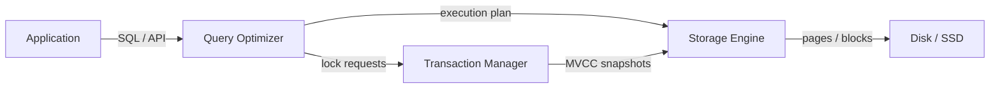
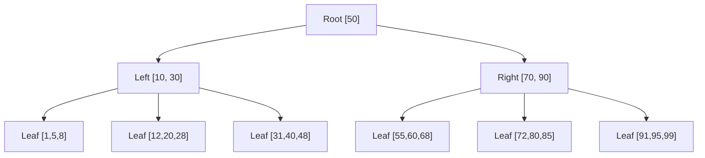

# SQL and NoSQL Databases

## Chapter Goal

After reading this chapter, an experienced engineer can model data
correctly for a workload, read and reason about a query plan, choose
a database family with a defensible trade-off argument, explain
consistency models without confusing CAP folklore with PACELC, design
a sharding strategy, defend a multi-tenant isolation approach, and
answer interview questions that distinguish production database
thinking from textbook recitations.

## Why This Matters for a Tech Lead

The database is the hardest component to change after a service is in
production. A wrong choice multiplies cost, on-call pain, and
migration risk for years. Unlike application code (revert in minutes),
a database schema change is a one-way door — rolling back a dropped
column means restoring from backup. A Tech Lead must:

- Defend a database choice in front of architecture review with
  workload analysis, not brand loyalty. The question is never "which
  database is best?" but "which database minimizes total cost of
  ownership for this team, this workload, and this growth trajectory?"
- Own the schema migration strategy: who approves, how rollbacks work,
  what happens to running traffic during a migration. Schema changes
  are the riskiest deploys — they need more scrutiny than code changes.
- Set connection pool sizing, query budget, and index governance so
  that the database does not become a shared bottleneck. Without
  governance, every team adds indexes and queries until the shared
  database becomes the system's weakest point.
- Decide between single shared database, database-per-service, and
  polyglot persistence — each has organizational consequences (team
  boundaries, deployment coupling, data consistency contracts).
- Ensure backup/restore is tested, not assumed. PITR (Point-in-Time
  Recovery) must be drilled quarterly. The only thing worse than data
  loss is believing you have backups when you do not.
- Plan for data growth. A 10GB database is trivial. A 500GB database
  constrains migration options. A 5TB database requires architectural
  decisions (partitioning, archival, sharding) that cannot be deferred.

A single missing index, a bad isolation level choice, or a hot
partition key can take down production for all tenants. The cost is not
just an outage — it is customer trust, SLA credits, and engineering
time diverted from feature work.

## Mental Model

A database is three cooperating systems:

1. **Query optimizer** — translates declarative SQL into an execution
   plan (which indexes to use, join order, scan strategy).
2. **Storage engine** — manages how data is physically laid out on
   disk (B-tree pages, LSM trees, heap files).
3. **Transaction manager** — enforces ACID guarantees through locking,
   MVCC, or a combination.



NoSQL databases remove or weaken one of these three layers to gain
something else: DynamoDB weakens the query optimizer (single-table,
access-pattern-driven) to gain horizontal scalability. Redis removes
the storage engine's durability guarantees (optional persistence) to
gain sub-millisecond latency. MongoDB weakens the transaction manager
(document-level atomicity by default) to gain schema flexibility.

The mental model for choosing: **which layer can you afford to weaken
for your workload?**

## Core Terminology

| Term | Definition |
| --- | --- |
| **Relation (table)** | A set of tuples (rows) with a fixed schema (columns). The fundamental unit of the relational model. |
| **Primary key** | A column or column set that uniquely identifies each row. Immutable by convention. |
| **Foreign key** | A column referencing another table's primary key. Enforces referential integrity. |
| **Index** | A separate data structure (usually B-tree) that maps column values to row locations for fast lookup. |
| **B-tree** | A balanced tree where each node holds sorted keys and pointers to child pages. Used by most RDBMS indexes. |
| **ACID** | Atomicity, Consistency, Isolation, Durability — the four guarantees of a relational transaction. |
| **MVCC** | Multi-Version Concurrency Control — readers see a snapshot, writers create new versions. Avoids read/write locks. |
| **Isolation level** | The degree to which concurrent transactions see each other's uncommitted or committed changes. |
| **Normalization** | Structuring data to eliminate redundancy by splitting into related tables (1NF → 2NF → 3NF → BCNF). |
| **Denormalization** | Intentionally duplicating data to avoid joins at read time. Trades write complexity for read performance. |
| **Sharding** | Splitting data across multiple database instances by a partition key. Enables horizontal scaling. |
| **Partition key** | The column whose value determines which shard stores a row (or document, or item). |
| **CAP theorem** | In a network partition, a distributed system must choose between consistency and availability. |
| **PACELC** | Extension of CAP: if Partitioned → choose A or C; Else → choose Latency or Consistency. |
| **Eventual consistency** | All replicas converge to the same state given enough time without new writes. |
| **Materialized view** | A precomputed query result stored on disk. Updated on write or on schedule. |
| **Hot partition** | A shard receiving disproportionate traffic due to a skewed partition key. |
| **Write amplification** | The ratio of bytes written to storage vs bytes written by the application. High in LSM trees. |
| **Connection pooling** | Reusing database connections across requests to avoid the TCP/TLS handshake cost per query. |

Distinguish closely related terms:

- **Consistency (ACID)** vs **Consistency (CAP)**: ACID consistency
  means the database moves from one valid state to another (constraints
  hold). CAP consistency means every read sees the most recent write
  (linearizability).
- **Partition (sharding)** vs **Partition (CAP)**: Sharding partitions
  data across nodes for scaling. CAP partition is a network failure
  that splits nodes.
- **Optimistic locking** vs **Pessimistic locking**: Optimistic detects
  conflicts at commit time (version column). Pessimistic acquires locks
  before reading (SELECT FOR UPDATE).
- **Throughput** vs **Latency**: Throughput is queries per second.
  Latency is time per query. Optimizing one can hurt the other.

## Theoretical Foundation

### The relational model

The relational model (Codd, 1970) represents data as relations —
unordered sets of tuples. In practice: tables contain rows, each row
has the same columns, and relationships between tables are expressed
through foreign keys.

**Why it endures:** The model separates *logical* data organization
from *physical* storage. An application declares *what* data it wants
(SQL); the database decides *how* to retrieve it (execution plan).
This separation allows schema evolution, index changes, and storage
engine upgrades without rewriting application code.

**Tables, rows, columns:**

- A **table** defines a fixed schema (column names, types, constraints).
- A **row** is one record — the unit of atomicity for single-row writes.
- A **column** has a type and optional constraints (NOT NULL, CHECK,
  DEFAULT, UNIQUE).

**Primary keys:** Every table needs a primary key. Two strategies:

| Strategy | Pros | Cons |
| --- | --- | --- |
| **Natural key** (email, SSN) | Meaningful, no join needed | Can change, privacy concerns |
| **Surrogate key** (UUID, serial) | Immutable, decoupled from business | Requires join for human context |

Prefer surrogate keys (`uuid` or `bigint`) for application tables.
Use natural keys for lookup/reference tables (country codes, currency
codes).

**Foreign keys and constraints:**

```sql
CREATE TABLE orders (
  id         bigint GENERATED ALWAYS AS IDENTITY PRIMARY KEY,
  user_id    bigint NOT NULL REFERENCES users(id) ON DELETE RESTRICT,
  status     text NOT NULL CHECK (status IN ('pending', 'paid', 'shipped', 'cancelled')),
  total_cents bigint NOT NULL CHECK (total_cents >= 0),
  created_at timestamptz NOT NULL DEFAULT now()
);
```

Foreign keys enforce referential integrity at the database level.
`ON DELETE RESTRICT` prevents orphaned orders. `CHECK` constraints
push validation to the lowest layer — bugs in application code cannot
violate them.

**Common mistake:** Skipping foreign keys "for performance." The write
overhead is negligible (~5% on inserts). The cost of data corruption
from missing foreign keys is orders of magnitude higher.

**Production consideration:** In high-write systems (>50k inserts/sec),
foreign key checks on referenced tables can cause lock contention.
Solutions: batch inserts, deferred constraints within a transaction,
or (last resort) enforcing integrity in the application layer with
eventual consistency checks.

### Normalization and denormalization

**Normalization** eliminates data redundancy by decomposing tables:

- **1NF**: No repeating groups; every column holds atomic values.
- **2NF**: 1NF + every non-key column depends on the entire primary
  key (no partial dependencies).
- **3NF**: 2NF + no transitive dependencies (non-key columns depend
  only on the key, not on each other).
- **BCNF**: Every determinant is a candidate key. Resolves edge cases
  in 3NF.

**When to normalize (default):** OLTP systems where data changes
frequently. Normalization prevents update anomalies — changing a
customer's address in one place updates it everywhere.

**When to denormalize:** Read-heavy systems where join cost dominates.
Denormalization trades write complexity and storage for read speed.

| Scenario | Normalize | Denormalize |
| --- | --- | --- |
| OLTP (orders, users) | Default — data changes often | Only for proven bottlenecks |
| Reporting / analytics | Unnecessary — use materialized views | Star schema, pre-aggregated |
| Search / feeds | N/A | Denormalized documents for fast retrieval |
| Event sourcing | Append-only events are already flat | Projections are denormalized read models |

**Tech Lead perspective:** Normalize by default, denormalize by
measurement. Never denormalize without a benchmark showing the join is
the bottleneck. Document every denormalization in an ADR with the
invariant it breaks and the reconciliation strategy.

**Normalized schema (3NF):**

```sql
CREATE TABLE customers (
  id bigint GENERATED ALWAYS AS IDENTITY PRIMARY KEY,
  email text NOT NULL UNIQUE,
  name text NOT NULL
);

CREATE TABLE addresses (
  id bigint GENERATED ALWAYS AS IDENTITY PRIMARY KEY,
  customer_id bigint NOT NULL REFERENCES customers(id),
  line1 text NOT NULL,
  city text NOT NULL,
  country text NOT NULL DEFAULT 'US'
);

CREATE TABLE orders (
  id bigint GENERATED ALWAYS AS IDENTITY PRIMARY KEY,
  customer_id bigint NOT NULL REFERENCES customers(id),
  shipping_address_id bigint NOT NULL REFERENCES addresses(id),
  total_cents bigint NOT NULL CHECK (total_cents >= 0),
  created_at timestamptz NOT NULL DEFAULT now()
);
```

**Denormalized for read-heavy dashboard:**

```sql
CREATE TABLE order_summary (
  order_id bigint PRIMARY KEY,
  customer_email text NOT NULL,
  customer_name text NOT NULL,
  shipping_city text NOT NULL,
  total_cents bigint NOT NULL,
  created_at timestamptz NOT NULL
);
```

**What this does:** The normalized schema stores each fact once
(customer address in `addresses`). The denormalized view duplicates
`customer_email` and `shipping_city` into `order_summary` to eliminate
JOINs for a dashboard that reads 100x more than it writes.

**Why it is useful:** In a Tech Lead interview, you demonstrate that
you understand *when* to break 3NF — only after profiling shows the
JOIN is the measured bottleneck.

**Common mistake:** Denormalizing from the start "for performance"
without evidence. When `customer_email` changes, every row in
`order_summary` with that customer becomes stale.

**Production change:** Populate `order_summary` via a trigger or
Change Data Capture (CDC) pipeline. Add a reconciliation job that
validates consistency nightly. Monitor drift (mismatched rows) and
alert when it exceeds threshold.

### Indexes

An index is a separate data structure that maps column values to row
locations, enabling the database to find rows without a full table
scan.

**B-tree index (default):** A balanced tree of sorted keys. Supports
equality (`=`), range (`<`, `>`, `BETWEEN`), and prefix `LIKE` queries.
Each leaf node points to heap tuples (rows on disk).



Each node holds multiple keys (determined by page size, typically 8 KB).
Tree depth is usually 3–4 levels for millions of rows. Each level is
one disk read — so a lookup is 3–4 I/O operations.

**Index types:**

| Type | Use case | PostgreSQL syntax |
| --- | --- | --- |
| **B-tree** | Equality, range, sorting | `CREATE INDEX idx ON t(col)` |
| **Hash** | Equality only (rare — B-tree handles it) | `CREATE INDEX idx ON t USING hash(col)` |
| **GIN** | Full-text search, JSONB, arrays | `CREATE INDEX idx ON t USING gin(col)` |
| **GiST** | Geometric, range types, nearest-neighbor | `CREATE INDEX idx ON t USING gist(col)` |
| **BRIN** | Large tables with natural ordering (timestamps) | `CREATE INDEX idx ON t USING brin(col)` |
| **Partial** | Index only rows matching a condition | `CREATE INDEX idx ON t(col) WHERE active = true` |
| **Covering** | Include extra columns to avoid heap lookup | `CREATE INDEX idx ON t(a) INCLUDE (b, c)` |

**Multi-column indexes:** Column order matters. An index on `(a, b, c)`
supports queries filtering on `a`, `(a, b)`, or `(a, b, c)` — but not
`b` alone or `(b, c)`. The leftmost prefix rule.

```sql
-- BAD: separate single-column indexes for a multi-column query
CREATE INDEX idx_orders_status ON orders (status);
CREATE INDEX idx_orders_created ON orders (created_at);
-- Query: WHERE status = 'pending' AND created_at > '2024-01-01'
-- Planner may use bitmap OR of both — slower than one composite index

-- GOOD: composite index matching the query pattern
CREATE INDEX idx_orders_status_created ON orders (status, created_at DESC);
-- Planner uses a single index scan, ordered output (no Sort node)

-- GOOD: partial index when you only query a subset
CREATE INDEX idx_orders_pending ON orders (created_at DESC)
  WHERE status = 'pending';
-- Smaller index (only pending rows), faster scans, less write overhead

-- GOOD: covering index to avoid heap lookups
CREATE INDEX idx_orders_covering ON orders (status, created_at DESC)
  INCLUDE (total_cents, user_id);
-- Index Only Scan: all columns come from the index, no heap fetch
```

**What this does:** Four indexing strategies compared. The composite
index covers equality + range in correct order. The partial index is
smaller because it excludes non-pending rows. The covering index adds
`INCLUDE` columns to avoid heap access entirely.

**Why it is useful:** In a Tech Lead interview, explaining index
selection by query pattern — not by column — demonstrates production
experience. The column order rule (equality columns first, range
columns last) is frequently tested.

**Common mistake:** Creating one index per column. The query planner
rarely uses multiple single-column indexes for a multi-column WHERE
clause (bitmap index scan is possible but slower). Create composite
indexes that match the actual query patterns.

**Production consideration:** Indexes speed up reads but slow down
writes (every INSERT/UPDATE/DELETE must update all relevant indexes).
Monitor index bloat with `pg_stat_user_indexes` — unused indexes waste
write I/O and disk space.

```sql
-- Find unused indexes (PostgreSQL)
SELECT schemaname, tablename, indexname, idx_scan
FROM pg_stat_user_indexes
WHERE idx_scan = 0 AND indexname NOT LIKE '%pkey%'
ORDER BY pg_relation_size(indexrelid) DESC;
```

**Interview framing:** "I choose indexes based on the query workload:
EXPLAIN the top 10 slow queries, identify sequential scans, then create
the narrowest composite index that covers the WHERE + ORDER BY + common
SELECT columns (covering index). I monitor unused indexes monthly and
drop them to reduce write amplification."

### Joins

Joins combine rows from multiple tables. The query planner chooses a
join algorithm based on table sizes, indexes, and statistics.

| Algorithm | How it works | Best for |
| --- | --- | --- |
| **Nested loop** | For each row in outer, scan inner | Small outer table, indexed inner |
| **Hash join** | Build hash table from smaller table, probe with larger | Equality joins, no index |
| **Merge join** | Sort both inputs, merge | Pre-sorted data or large equi-joins |

```sql
-- INNER JOIN: orders with customer info (only matched rows)
SELECT o.id, o.total_cents, c.email, c.name
FROM orders o
JOIN customers c ON c.id = o.customer_id
WHERE o.created_at > now() - interval '30 days';

-- LEFT JOIN: all customers including those with no orders
SELECT c.id, c.email, count(o.id) AS order_count
FROM customers c
LEFT JOIN orders o ON o.customer_id = c.id
GROUP BY c.id, c.email;
```

```sql
-- Common JOIN mistake: joining without an index on the FK column
-- Without index on orders.customer_id, PostgreSQL does a Seq Scan
-- on orders for every customer row (nested loop + sequential scan).
-- Fix: ensure FK columns have indexes.
CREATE INDEX idx_orders_customer_id ON orders (customer_id);
```

**What this does:** The first query retrieves recent orders with
customer details via INNER JOIN — only rows where both sides match.
The second uses LEFT JOIN to include customers with zero orders (useful
for churn analysis). The index creation ensures the join can use an
Index Scan instead of a Seq Scan on the inner table.

**Why it is useful:** In interviews, demonstrating JOIN type selection
(INNER vs LEFT vs FULL) shows you understand which rows are preserved.
The index on the FK column is the single most impactful optimization
for join performance.

**Common mistake:** Assuming joins are always expensive. A hash join
between two properly indexed tables with statistics is O(n+m). The
expensive part is usually the missing index that forces a sequential
scan on the inner table.

**Production change:** For large tables (>50M rows), consider
partitioning the fact table so the join scans only the relevant
partition. Monitor `pg_stat_user_tables` for sequential scan counts
on frequently joined tables.

**N+1 query problem:** ORMs often execute one query per related row
(N queries for N parent rows + 1 for the parent list). Fix: eager
loading (`JOIN` or subquery), DataLoader pattern (batch by IDs), or
query builder with explicit joins.

### Query planning and EXPLAIN

The query planner transforms SQL into an execution plan — a tree of
physical operations. Understanding the plan is essential for diagnosing
slow queries.

```sql
EXPLAIN ANALYZE
SELECT o.id, u.email
FROM orders o
JOIN users u ON u.id = o.user_id
WHERE o.status = 'pending'
  AND o.created_at > now() - interval '7 days'
ORDER BY o.created_at DESC
LIMIT 20;
```

Key nodes in a PostgreSQL plan:

| Node | Meaning | Watch for |
| --- | --- | --- |
| **Seq Scan** | Full table scan | On large tables — missing index |
| **Index Scan** | B-tree lookup + heap fetch | Good for selective queries |
| **Index Only Scan** | Answers from index alone (covering) | Best case — no heap access |
| **Bitmap Index Scan** | Builds a bitmap of matching pages | Multiple conditions OR low selectivity |
| **Nested Loop** | Loop join | Fine for small outer sets |
| **Hash Join** | Hash the smaller table | Large equi-joins |
| **Sort** | Explicit sort (not from index) | Memory spills to disk (external sort) |

**Reading EXPLAIN ANALYZE output:**

- **actual time**: first-row time..last-row time in milliseconds.
- **rows**: estimated vs actual. Large discrepancy → stale statistics
  (`ANALYZE` the table).
- **loops**: how many times the node executed (nested loop multiplier).
- **Buffers**: shared hit (cache) vs read (disk). High reads = cold
  cache or large working set.

**Sample plan output (annotated):**

```text
Limit (actual time=0.452..0.891 rows=20 loops=1)
  -> Sort (actual time=0.450..0.478 rows=20)
       Sort Key: o.created_at DESC
       Sort Method: top-N heapsort  Memory: 27kB
       -> Nested Loop (actual time=0.085..3.214 rows=1847 loops=1)
            -> Index Scan using idx_orders_status_created on orders o
                 (actual time=0.031..1.205 rows=1847 loops=1)
                 Index Cond: (status = 'pending')
                 Filter: (created_at > '2024-06-01')
                 Rows Removed by Filter: 53
            -> Index Scan using users_pkey on users u
                 (actual time=0.001..0.001 rows=1 loops=1847)
                 Index Cond: (id = o.user_id)
Planning Time: 0.182 ms
Execution Time: 0.934 ms
```

**How to read this plan:**
1. Innermost nodes execute first. The orders index scan finds 1847
   pending orders from the last week.
2. For each of those 1847 rows, a nested loop does an index scan on
   `users_pkey` — `loops=1847` means 1847 executions of that node.
3. The Sort node picks top 20 rows (top-N heapsort fits in 27kB).
4. Total execution: 0.93ms — acceptable for a hot path.

**Red flags to look for:**
- `rows` estimate wildly off from actual → run `ANALYZE`.
- `Sort Method: external merge` → sort spills to disk, increase
  `work_mem` or add an ordered index.
- `loops=100000` on a nested loop → missing index on the inner table.

**Common mistake:** Optimizing based on `EXPLAIN` (estimates) without
`ANALYZE` (actual execution). Estimates can be wildly wrong with stale
statistics or skewed distributions.

**Production consideration:** Run `ANALYZE` after bulk loads. Schedule
`autovacuum` with appropriate thresholds. Monitor `pg_stat_statements`
for the top 10 queries by total_exec_time — these are the candidates
for index optimization.

```sql
-- Top 10 slowest queries by total execution time (PostgreSQL)
SELECT query, calls, total_exec_time / 1000 AS total_sec,
       mean_exec_time AS avg_ms, rows
FROM pg_stat_statements
ORDER BY total_exec_time DESC
LIMIT 10;
```

### Transactions and ACID

A **transaction** groups multiple operations into an atomic unit: all
succeed or all roll back.

- **Atomicity**: All or nothing. A crash mid-transaction rolls back.
- **Consistency**: The database moves from one valid state to another
  (all constraints hold after commit).
- **Isolation**: Concurrent transactions do not see each other's
  intermediate states (degree depends on isolation level).
- **Durability**: Once committed, the data survives power loss (WAL
  flushed to disk before commit acknowledgment).

**Isolation levels:**

| Level | Dirty read | Non-repeatable read | Phantom read | Serialization anomaly |
| --- | --- | --- | --- | --- |
| **Read Uncommitted** | Possible | Possible | Possible | Possible |
| **Read Committed** | No | Possible | Possible | Possible |
| **Repeatable Read** | No | No | Possible (not in PG) | Possible |
| **Serializable** | No | No | No | No |

PostgreSQL uses MVCC (Multi-Version Concurrency Control): each
transaction sees a snapshot of the data at its start time. Writers
create new row versions; readers see the version valid for their
snapshot. This means readers never block writers and writers never
block readers.

**Read Committed (PostgreSQL default):** Each statement sees the
latest committed data. Two identical SELECTs in the same transaction
can return different results if another transaction commits between
them.

**Repeatable Read:** The transaction sees a snapshot taken at the
start of the first statement. No phantom reads in PostgreSQL (unlike
the SQL standard which allows them at this level). Transactions that
would violate serializability get an error: "could not serialize
access."

**Serializable:** Full serializable snapshot isolation (SSI). The
database detects read/write conflicts and aborts one transaction.
Application must retry.

**Common mistake:** Using Read Committed for financial operations.
A transfer between accounts (debit one, credit another) under Read
Committed can suffer from lost updates if two transfers execute
concurrently on the same account without explicit locking.

**Production consideration:** Serializable isolation has a performance
cost (~5–20% throughput reduction) and requires application-level
retry logic. Use it for correctness-critical paths (payments, inventory
reservations). Use Read Committed with explicit locking (`SELECT FOR
UPDATE`) for hot-path operations where Serializable retry overhead is
unacceptable.

**MVCC internals (PostgreSQL):** Each row has `xmin` (creating
transaction) and `xmax` (deleting/updating transaction). A row is
visible to a transaction if `xmin` is committed and `xmax` is not
committed (or is the current transaction). Dead tuples accumulate
until VACUUM reclaims them.

**Tech Lead perspective:** Default to Read Committed for most
operations. Use Serializable for operations with invariants that span
multiple rows (account balances, seat reservations, inventory). Wrap
Serializable transactions in a retry loop with exponential backoff.
Document which transactions require which isolation level in the
service's architecture decision record (ADR).

**Transaction with Serializable isolation (account transfer):**

```sql
-- Transfer $100 from account A to account B
BEGIN ISOLATION LEVEL SERIALIZABLE;

SELECT balance FROM accounts WHERE id = 'acct_A' FOR UPDATE;
-- Verify sufficient balance in application layer

UPDATE accounts SET balance = balance - 10000 WHERE id = 'acct_A';
UPDATE accounts SET balance = balance + 10000 WHERE id = 'acct_B';

INSERT INTO ledger_entries (from_acct, to_acct, amount_cents, created_at)
VALUES ('acct_A', 'acct_B', 10000, now());

COMMIT;
```

```ts
async function transfer(from: string, to: string, amountCents: number) {
  const MAX_RETRIES = 3;
  for (let attempt = 0; attempt < MAX_RETRIES; attempt++) {
    try {
      await db.$transaction(async (tx) => {
        const sender = await tx.account.findUniqueOrThrow({ where: { id: from } });
        if (sender.balance < amountCents) throw new InsufficientFundsError();

        await tx.account.update({ where: { id: from }, data: { balance: { decrement: amountCents } } });
        await tx.account.update({ where: { id: to }, data: { balance: { increment: amountCents } } });
        await tx.ledgerEntry.create({ data: { fromAcct: from, toAcct: to, amountCents } });
      }, { isolationLevel: "Serializable" });
      return;
    } catch (e) {
      if (e.code === "P2034" && attempt < MAX_RETRIES - 1) continue; // serialization failure → retry
      throw e;
    }
  }
}
```

**What this does:** The SQL shows a bank transfer wrapped in
Serializable isolation. The TypeScript shows the retry loop required
because Serializable aborts transactions that conflict.

**Why it is useful:** Interviewers test whether you know that
Serializable requires retry logic. Showing both the raw SQL and the
application code demonstrates full-stack understanding of transaction
safety.

**Common mistake:** Using Serializable without a retry loop. The
database will abort conflicting transactions — without retry, the user
sees a 500 error. Another mistake: using `FOR UPDATE` with Serializable
(redundant — SSI already detects conflicts).

**Production change:** Add observability: log retries with attempt
count. Alert if retry rate exceeds 5% — indicates a hot row or
poorly-designed access pattern. Consider `SELECT FOR UPDATE` with
Read Committed as a faster alternative for simple two-row updates
where full SSI is overkill.

### Locks and deadlocks

**Lock types (PostgreSQL):**

| Lock | Acquired by | Conflicts with |
| --- | --- | --- |
| **Row-level (FOR UPDATE)** | SELECT FOR UPDATE, UPDATE, DELETE | Other FOR UPDATE on same row |
| **Row-level (FOR SHARE)** | SELECT FOR SHARE | FOR UPDATE (not other FOR SHARE) |
| **Table-level (ACCESS SHARE)** | SELECT | ACCESS EXCLUSIVE (DDL) |
| **Table-level (ROW EXCLUSIVE)** | INSERT, UPDATE, DELETE | SHARE, EXCLUSIVE |
| **Advisory locks** | Explicit `pg_advisory_lock()` | Other advisory locks on same key |

**Optimistic locking:** Add a `version` column. On update, check
`WHERE id = $1 AND version = $2`. If no row matches, another
transaction updated first — retry.

```sql
UPDATE products
SET stock = stock - 1, version = version + 1
WHERE id = $1 AND version = $2;
-- If 0 rows affected → conflict → retry
```

**Pessimistic locking:** Acquire the lock before reading.

```sql
BEGIN;
SELECT * FROM accounts WHERE id = $1 FOR UPDATE;
-- ... compute new balance ...
UPDATE accounts SET balance = $2 WHERE id = $1;
COMMIT;
```

**Deadlocks:** Two transactions each hold a lock the other needs.
The database detects the cycle and aborts one transaction (the victim).

Prevention strategies:
- Always acquire locks in a consistent order (sort by primary key).
- Keep transactions short (reduce the window for conflicts).
- Use `NOWAIT` or `SKIP LOCKED` for queues.
- Set `lock_timeout` to fail fast instead of waiting indefinitely.

```sql
-- Queue pattern: skip rows locked by other workers
SELECT id, payload FROM job_queue
WHERE status = 'pending'
ORDER BY created_at
LIMIT 1
FOR UPDATE SKIP LOCKED;
```

**Production consideration:** Monitor `pg_stat_activity` for queries
in `wait_event_type = 'Lock'`. Alert on transactions holding locks
for more than 30 seconds. Deadlock frequency should be near zero — if
it is not, the application has a lock ordering bug.

### Migrations

Schema migrations are the controlled evolution of the database schema
over time.

**Principles:**
- Every migration is versioned, sequential, and immutable once merged.
- Migrations run before or during deployment — never after.
- Destructive changes (drop column, rename) require multiple deploys.

**Safe migration patterns:**

| Change | Safe approach |
| --- | --- |
| Add column | `ALTER TABLE ADD COLUMN` with DEFAULT (PG 11+ is instant) |
| Drop column | Deploy 1: stop reading. Deploy 2: drop. |
| Rename column | Deploy 1: add new column. Deploy 2: backfill. Deploy 3: swap reads. Deploy 4: drop old. |
| Add NOT NULL | Add with DEFAULT, then add constraint as NOT VALID, then VALIDATE separately. |
| Add index | `CREATE INDEX CONCURRENTLY` (no table lock). |
| Change type | Add new column, migrate, swap. |

**Common mistake:** Running `ALTER TABLE ... ADD CONSTRAINT ... NOT NULL`
on a large table without `NOT VALID` — this scans the entire table
under a lock. Instead: add the constraint as `NOT VALID`, then run
`ALTER TABLE ... VALIDATE CONSTRAINT` in a separate transaction.

**Tech Lead perspective:** Every schema migration requires:
1. Review by the Tech Lead (data changes are harder to revert than
   code changes).
2. A rollback plan (how to undo without data loss).
3. A timing plan (run during low traffic, or use online DDL tools).
4. A testing plan (run against a production-sized dataset in staging).

Tools: Prisma Migrate, Flyway, Knex migrations, golang-migrate,
sqitch, or raw SQL files with version numbers.

**Expand-and-contract migration (rename column safely):**

```sql
-- Migration 001_add_full_name.up.sql (Deploy 1: expand)
ALTER TABLE users ADD COLUMN full_name text;

-- Backfill existing data
UPDATE users SET full_name = first_name || ' ' || last_name
WHERE full_name IS NULL;

-- Add NOT NULL constraint without locking
ALTER TABLE users ADD CONSTRAINT users_full_name_nn
  CHECK (full_name IS NOT NULL) NOT VALID;

ALTER TABLE users VALIDATE CONSTRAINT users_full_name_nn;
```

```sql
-- Migration 001_add_full_name.down.sql (Rollback)
ALTER TABLE users DROP CONSTRAINT IF EXISTS users_full_name_nn;
ALTER TABLE users DROP COLUMN IF EXISTS full_name;
```

```sql
-- Migration 002_drop_old_names.up.sql (Deploy 2: contract — after all code uses full_name)
ALTER TABLE users DROP COLUMN first_name;
ALTER TABLE users DROP COLUMN last_name;
```

```sql
-- Migration 002_drop_old_names.down.sql (Rollback — more complex)
ALTER TABLE users ADD COLUMN first_name text;
ALTER TABLE users ADD COLUMN last_name text;
-- Backfill from full_name (split logic) — or restore from backup
UPDATE users SET
  first_name = split_part(full_name, ' ', 1),
  last_name = substring(full_name from position(' ' in full_name) + 1);
```

**What this does:** A two-phase migration renames `first_name` +
`last_name` to `full_name`. Deploy 1 adds the new column and backfills.
Deploy 2 drops old columns only after all application code has
switched. Each phase has a rollback script.

**Why it is useful:** Interviewers ask "How do you rename a column in
a production system with zero downtime?" This expand-and-contract
pattern is the standard answer. It demonstrates understanding of
multi-deploy migrations and backward compatibility.

**Common mistake:** Dropping the old column in the same deploy as
adding the new one. Running instances still referencing `first_name`
will crash immediately. Always separate expand (additive) from contract
(destructive) into distinct deploys with a verification window.

**Production change:** Add a dual-write trigger during the transition
period so writes to `first_name`/`last_name` automatically populate
`full_name`. Monitor application logs for any queries referencing old
columns before running the contract migration. Set a deadline (e.g.,
2 sprints) for the contract phase — without it, dead columns
accumulate indefinitely.

### Views and materialized views

**Views:** A named query stored in the catalog. Every access
re-executes the underlying query. No storage overhead but no
performance benefit.

```sql
CREATE VIEW active_orders AS
SELECT o.id, o.total_cents, u.email
FROM orders o JOIN users u ON u.id = o.user_id
WHERE o.status = 'pending';
```

**Materialized views:** The query result is stored on disk. Reads are
instant (table scan of the materialized data). Must be refreshed
manually or on schedule.

```sql
CREATE MATERIALIZED VIEW monthly_revenue AS
SELECT date_trunc('month', created_at) AS month,
       SUM(total_cents) / 100.0 AS revenue
FROM orders
WHERE status = 'paid'
GROUP BY 1;

-- Refresh (blocks reads during refresh in PG < 9.4)
REFRESH MATERIALIZED VIEW CONCURRENTLY monthly_revenue;
```

`CONCURRENTLY` requires a unique index on the materialized view and
allows reads during refresh. Without it, the view is locked during
refresh.

**Trade-off:** Materialized views trade write complexity and staleness
for read speed. Use them for dashboards, reports, and search indices
where slight staleness (seconds to minutes) is acceptable.

### Stored procedures and functions

Stored procedures execute logic inside the database. Two forms:

- **Functions** (`CREATE FUNCTION`): return a value, callable in SQL.
- **Procedures** (`CREATE PROCEDURE`, PG 11+): can manage transactions
  internally (COMMIT/ROLLBACK inside the body).

**When to use:**
- Complex business logic that must execute atomically with the data
  (e.g., inventory reservation with multiple table updates).
- Batch operations that would be network-bound if done row-by-row
  from the application.

**When to avoid:**
- Application logic that changes frequently (deploy cycle is harder
  for stored procedures than application code).
- Logic that needs unit testing with mocks — stored procedures are
  harder to test in isolation.

**Tech Lead perspective:** Stored procedures are a last resort in most
modern architectures. They create tight coupling between application
logic and database deployment. Prefer application-layer transactions
unless the network round-trip cost is the measured bottleneck.

### Pagination

Three strategies with distinct trade-offs:

| Strategy | How | Pros | Cons |
| --- | --- | --- | --- |
| **Offset** | `LIMIT n OFFSET m` | Simple, random access | Slow for large offsets (scans and discards), inconsistent under writes |
| **Cursor (keyset)** | `WHERE id > $cursor ORDER BY id LIMIT n` | Consistent, fast (index scan) | No random access, requires stable sort |
| **Seek (timestamp + id)** | `WHERE (created_at, id) > ($ts, $id) LIMIT n` | Handles non-unique columns | Complex multi-column comparison |

```sql
-- OFFSET pagination: simple but degrades at depth
SELECT id, title, created_at FROM articles
ORDER BY created_at DESC
LIMIT 20 OFFSET 10000;
-- PostgreSQL reads and discards 10,000 rows, then returns 20.
-- Page 500 is ~50x slower than page 1.
```

```sql
-- CURSOR (keyset) pagination: constant speed at any depth
SELECT id, title, created_at FROM articles
WHERE (created_at, id) < ($last_created_at, $last_id)
ORDER BY created_at DESC, id DESC
LIMIT 20;
-- Uses the composite index directly. Scans exactly 20 rows regardless of page depth.
```

```sql
-- Required index for cursor pagination
CREATE INDEX idx_articles_cursor ON articles (created_at DESC, id DESC);
```

**What this does:** The OFFSET query skips rows sequentially — cost
grows linearly with page depth. The cursor query uses a compound
`WHERE` clause that seeks directly into the index, returning a constant
cost per page.

**Why it is useful:** Pagination is asked in nearly every backend
interview. Explaining *why* OFFSET degrades (scan + discard) and how
cursor pagination solves it (index seek) demonstrates query planner
understanding.

**Common mistake:** Using OFFSET for infinite scroll with millions
of rows. `OFFSET 1000000` means the database reads and discards 1M
rows before returning the next page. Another mistake: cursor pagination
with only `created_at` (non-unique) — rows with identical timestamps
can be skipped. Always include a tie-breaker column (`id`).

**Production change:** Encode the cursor as a base64 opaque token in
the API response (`nextCursor: btoa(JSON.stringify({t, id}))`). This
hides implementation details from clients and allows changing the
pagination strategy without breaking the API contract.

### Full-text search

PostgreSQL provides built-in full-text search via `tsvector` and
`tsquery`:

```sql
ALTER TABLE articles ADD COLUMN search_vector tsvector
  GENERATED ALWAYS AS (
    setweight(to_tsvector('english', coalesce(title, '')), 'A') ||
    setweight(to_tsvector('english', coalesce(body, '')), 'B')
  ) STORED;

CREATE INDEX idx_articles_search ON articles USING gin(search_vector);

-- Query
SELECT id, title, ts_rank(search_vector, q) AS rank
FROM articles, to_tsquery('english', 'database & scaling') q
WHERE search_vector @@ q
ORDER BY rank DESC
LIMIT 20;
```

**What this does:** Creates a generated column that combines
weighted title (priority A) and body (priority B) into a single
`tsvector`. A GIN index makes full-text queries sub-millisecond.
`ts_rank` scores results by relevance.

**Why it is useful:** Full-text search is a common interview topic —
interviewers want to know when you would add Elasticsearch vs stay in
PostgreSQL. Showing the built-in approach demonstrates pragmatism.

**Common mistake:** Using `LIKE '%keyword%'` for search. This cannot
use indexes (forces Seq Scan), has no relevance ranking, and does not
handle stemming (searching "running" won't find "run").

**Production change:** For multi-language support, store the language
per row and use `to_tsvector(language, ...)`. Monitor index size — GIN
indexes on large text columns can grow significantly. Add
`gin_pending_list_limit` tuning for write-heavy tables.

**When PostgreSQL full-text is sufficient:** Moderate corpus
(<10M documents), simple ranking, no faceting or typo tolerance.

**When to use Elasticsearch/Meilisearch/Typesense:** Large corpus,
complex relevance tuning, faceted search, autocomplete with typo
tolerance, multi-language support.

**Trade-off:** Keeping search in PostgreSQL means no additional
infrastructure (one less service to operate). Moving to a dedicated
search engine adds operational cost but provides better relevance and
performance at scale.

### Multi-tenant database schemas

Three isolation models:

| Model | How | Isolation | Cost | Complexity |
| --- | --- | --- | --- | --- |
| **Shared schema** | `tenant_id` column in every table | Low (row-level) | Low | Low (but bugs leak data) |
| **Schema-per-tenant** | One PG schema per tenant (`CREATE SCHEMA tenant_123`) | Medium | Medium | Medium (migration per schema) |
| **Database-per-tenant** | Separate database per tenant | High | High | High (connection management) |

**Shared schema (most common for SaaS):**

```sql
-- Step 1: Add tenant_id to every table with an index
ALTER TABLE orders ADD COLUMN tenant_id bigint NOT NULL;
CREATE INDEX idx_orders_tenant ON orders (tenant_id);

-- Step 2: Create a restricted application role
CREATE ROLE app_user NOINHERIT;
GRANT SELECT, INSERT, UPDATE, DELETE ON orders TO app_user;

-- Step 3: Enable RLS with policy
ALTER TABLE orders ENABLE ROW LEVEL SECURITY;
CREATE POLICY tenant_isolation ON orders
  FOR ALL TO app_user
  USING (tenant_id = current_setting('app.tenant_id')::bigint)
  WITH CHECK (tenant_id = current_setting('app.tenant_id')::bigint);
```

```ts
// Middleware: set tenant context on every request
async function tenantMiddleware(req: Request, res: Response, next: NextFunction) {
  const tenantId = req.headers["x-tenant-id"];
  if (!tenantId) return res.status(403).json({ error: "Missing tenant" });

  await db.$executeRawUnsafe(`SET LOCAL app.tenant_id = '${Number(tenantId)}'`);
  next();
}
```

**What this does:** RLS enforces tenant isolation at the database
level. The `USING` clause filters reads; `WITH CHECK` prevents
inserting rows for other tenants. The middleware sets the PostgreSQL
session variable that the policy references.

**Why it is useful:** Multi-tenancy security is a frequent Tech Lead
interview topic. Showing the full stack (schema, policy, middleware)
demonstrates defense-in-depth — even if application code has a bug,
the database rejects cross-tenant access.

**Common mistake:** Relying solely on application-layer filtering
(`WHERE tenant_id = ?` in every query) without RLS. A single missed
filter leaks data across tenants. Another mistake: using `SET` instead
of `SET LOCAL` — `SET LOCAL` is scoped to the transaction, preventing
tenant context from leaking across pooled connections.

**Production change:** Use `SET LOCAL` within a transaction so the
setting is automatically reset when the transaction ends (critical
with connection pooling). Add a `FORCE ROW LEVEL SECURITY` on the
role to ensure the owner cannot bypass policies. Test with
`EXPLAIN` — RLS adds a filter node; ensure it uses the
`idx_orders_tenant` index.

### NoSQL families

NoSQL databases sacrifice parts of the relational model to optimize
for specific access patterns, scale, or latency.

**Key-value stores (Redis, Memcached, DynamoDB as KV):**

- Data model: key → value (opaque blob, string, or structured).
- Access pattern: `GET key`, `SET key value`, `DELETE key`.
- Strengths: Sub-millisecond latency, horizontal scaling, simple API.
- Weaknesses: No ad-hoc queries, no joins, no secondary access
  patterns without additional indexes.

**Redis** is an in-memory data structure server:
- Data types: string, hash, list, set, sorted set, stream, bitmap.
- Persistence: RDB snapshots + AOF append-only file.
- Use cases: caching, session storage, rate limiting, pub/sub,
  distributed locks, leaderboards (sorted sets).

**Document databases (MongoDB, CouchDB, Firestore):**

- Data model: JSON-like documents in collections. Schema-flexible.
- Access pattern: Query by any field (with secondary indexes), nested
  document traversal.
- Strengths: Schema flexibility, natural fit for hierarchical data,
  horizontal scaling via sharding.
- Weaknesses: No cross-document transactions (historically — MongoDB
  4.0+ has multi-document transactions), join-like operations
  (`$lookup`) are expensive.

**MongoDB** is the dominant document database:
- Storage engine: WiredTiger (B-tree + compression).
- Scaling: replica sets (HA) + sharded clusters (horizontal scale).
- Aggregation pipeline for complex queries.

**MongoDB document modeling — e-commerce product catalog:**

```json
{
  "_id": "prod_abc123",
  "name": "Wireless Headphones",
  "brand": "AudioCo",
  "price_cents": 7999,
  "category": ["electronics", "audio"],
  "attributes": {
    "color": "black",
    "battery_hours": 30,
    "noise_canceling": true
  },
  "variants": [
    { "sku": "WH-BLK-S", "size": "small", "stock": 42 },
    { "sku": "WH-BLK-M", "size": "medium", "stock": 18 }
  ],
  "reviews_summary": { "avg_rating": 4.3, "count": 1287 },
  "updated_at": "2024-06-15T10:30:00Z"
}
```

```ts
// Query: find products by category with stock > 0
const results = await db.collection("products").find({
  category: "electronics",
  "variants.stock": { $gt: 0 },
}).sort({ "reviews_summary.avg_rating": -1 }).limit(20).toArray();

// Index to support this query
await db.collection("products").createIndex(
  { category: 1, "variants.stock": 1, "reviews_summary.avg_rating": -1 }
);
```

**What this does:** The product document embeds variants and review
summary — data that is always read together. The array field `category`
supports multi-value indexing. The query finds in-stock electronics
sorted by rating.

**Why it is useful:** Document modeling in MongoDB is about embedding
data that is read together (one document = one read). Contrast with
relational: products, variants, and reviews would be 3 tables with
JOINs.

**Common mistake:** Embedding unbounded arrays (e.g., all individual
reviews inside the product document). MongoDB documents have a 16MB
limit, and large arrays degrade update performance. Reference
(normalize) data that grows without bound.

**Production change:** Separate `reviews_summary` from individual
reviews (store reviews in their own collection, update the summary
via aggregation pipeline or a background job). Add a TTL index on a
`session` collection for ephemeral data. Use Change Streams for
real-time sync to Elasticsearch for search.

**Wide-column databases (Cassandra, ScyllaDB, HBase, DynamoDB):**

- Data model: rows with a partition key and sort key. Each row can
  have different columns.
- Access pattern: Partition key equality + sort key range. No
  cross-partition queries (expensive).
- Strengths: Massive write throughput, linear horizontal scaling,
  predictable latency.
- Weaknesses: No joins, limited query flexibility, eventual
  consistency (tunable in Cassandra).

**DynamoDB:**
- Fully managed by AWS. Single-digit millisecond latency at any scale.
- Primary key: partition key (hash) + optional sort key (range).
- Secondary indexes: Global Secondary Index (GSI), Local Secondary
  Index (LSI).
- Pricing: on-demand (pay per request) or provisioned (capacity units).
- Single-table design: model all access patterns in one table using
  composite keys (`PK#TENANT#123`, `SK#ORDER#2024-01-01`).

```json
{
  "PK": "TENANT#acme",
  "SK": "ORDER#2024-01-15#ord_abc123",
  "GSI1PK": "USER#user_456",
  "GSI1SK": "ORDER#2024-01-15",
  "total_cents": 4500,
  "status": "paid"
}
```

**Graph databases (Neo4j, Amazon Neptune, ArangoDB):**

- Data model: nodes + edges (relationships) with properties.
- Access pattern: Traverse relationships (friends of friends, shortest
  path, recommendations).
- Strengths: Relationship-heavy queries are O(relationships traversed),
  not O(data size). Natural for social graphs, fraud detection,
  knowledge graphs.
- Weaknesses: Not suited for tabular data, limited ecosystem, smaller
  talent pool, fewer managed options.

**When to choose each family:**

| Workload | Best fit | Why |
| --- | --- | --- |
| Transactional (OLTP) | PostgreSQL, MySQL | ACID, joins, schema enforcement |
| Caching, sessions | Redis | Sub-ms latency, TTL, eviction |
| High-write append (IoT, logs) | Cassandra, DynamoDB | Linear write scaling |
| Hierarchical documents | MongoDB | Schema flexibility, nested queries |
| Social graph, recommendations | Neo4j | Relationship traversal |
| Full-text search | Elasticsearch | Inverted index, relevance scoring |
| Time-series metrics | TimescaleDB, InfluxDB | Compression, downsampling |

### Replication

**Primary-replica (master-slave):**

- All writes go to the primary. Replicas receive a stream of changes
  (WAL in PostgreSQL, binlog in MySQL).
- Reads can be served by replicas (read scaling).
- Failover: promote a replica to primary when the primary fails.

**Replication lag:** Replicas are eventually consistent. A write to
the primary may take milliseconds to seconds to appear on replicas.
Reading from a replica immediately after writing to the primary can
return stale data.

**Solutions for read-after-write consistency:**
- Read from primary for the user who just wrote (sticky session).
- Include a timestamp/LSN in the client; replica rejects reads until
  it catches up.
- Use synchronous replication for critical replicas (higher latency,
  guaranteed consistency).

**Logical vs physical replication (PostgreSQL):**

| Type | Mechanism | Use case |
| --- | --- | --- |
| **Physical** | Stream WAL bytes | HA failover, identical replica |
| **Logical** | Stream row changes (INSERT/UPDATE/DELETE) | Selective replication, cross-version, CDC |

**Tech Lead perspective:** Define the replication SLA explicitly. If
the business requires read-after-write consistency for certain
operations (e.g., user sees their own comment after posting), document
which endpoints read from primary. Monitor replication lag with alerts
at two thresholds: warning (5s) and critical (30s). At critical lag,
decide whether to failover or route all reads to primary (degraded
mode). The decision depends on whether lag is caused by a transient
spike or a structural problem (replica under-provisioned, long-running
query blocking replay).

### Sharding

Sharding splits data across multiple database instances (shards) to
achieve horizontal scaling beyond what a single node can handle.

**Sharding strategies:**

| Strategy | How | Pros | Cons |
| --- | --- | --- | --- |
| **Hash** | `hash(key) % N` | Even distribution | Resharding requires data migration |
| **Range** | Key ranges per shard | Range queries stay local | Hot spots if keys cluster |
| **Directory** | Lookup table maps key → shard | Flexible, can move individual keys | Lookup table is a SPOF |

**Partition key selection:** The most important decision. A good
partition key:
- Distributes writes evenly (no hot partitions).
- Keeps related data co-located (queries stay on one shard).
- Is immutable (moving data between shards is expensive).

**Common mistake:** Sharding by `user_id` when 1% of users generate
80% of traffic (power-law distribution → hot shards).

**When to shard:**
- Single node cannot handle the write throughput.
- Data exceeds single node storage.
- Read replicas cannot absorb the read load.

**When NOT to shard:**
- Table fits in memory on a single node.
- Read replicas solve the load problem.
- Vertical scaling (bigger instance) is cheaper than the engineering
  cost of sharding.

**Tech Lead perspective:** Sharding is a one-way door. Once you shard,
cross-shard queries, transactions, and migrations become permanently
harder. Exhaust vertical scaling, read replicas, caching, and query
optimization before sharding.

### Consistency models

Distributed databases offer different consistency guarantees depending
on their replication strategy:

| Model | Guarantee | Example |
| --- | --- | --- |
| **Strong (linearizable)** | Every read sees the most recent write | Single-node PostgreSQL, Spanner |
| **Sequential** | All operations appear in some total order | ZooKeeper |
| **Causal** | Related operations are seen in order; unrelated may reorder | CRDTs, some Cassandra configs |
| **Read-your-writes** | A client sees its own writes immediately | Sticky sessions to primary |
| **Eventual** | All replicas converge given no new writes | DynamoDB (default), Cassandra (ONE/ONE) |
| **Strong eventual (CRDT)** | Replicas converge without coordination | Automerge, Riak |

**Eventual consistency is not "broken consistency."** It means: given
time without new writes, all replicas converge. In practice, replicas
converge within milliseconds to seconds. The risk: reading stale data
during that window and making decisions on it (double-spending, showing
a deleted item, overselling inventory).

**Eventual consistency problem and mitigation:**

```ts
// Problem: user updates profile, immediately reads from replica → sees stale data
async function updateAndRead(userId: string, newName: string) {
  await primaryDb.user.update({ where: { id: userId }, data: { name: newName } });
  // Replica lag: 10-200ms
  const profile = await replicaDb.user.findUnique({ where: { id: userId } });
  // profile.name may still be the OLD value → confuses the user
  return profile;
}

// Fix 1: Read-your-writes — read from primary after own writes
async function updateAndReadConsistent(userId: string, newName: string) {
  await primaryDb.user.update({ where: { id: userId }, data: { name: newName } });
  const profile = await primaryDb.user.findUnique({ where: { id: userId } });
  return profile;
}

// Fix 2: LSN-based routing — client sends the write LSN, replica waits
async function readAfterWrite(userId: string, minLsn: string) {
  await replicaDb.$executeRaw`SELECT pg_last_wal_replay_lsn() >= ${minLsn}::pg_lsn`;
  return replicaDb.user.findUnique({ where: { id: userId } });
}
```

**What this does:** Demonstrates the read-after-write inconsistency
that occurs when reading from a replica immediately after writing to
the primary. Two mitigation strategies: sticky reads from primary, or
LSN-aware routing where the replica confirms it has caught up.

**Why it is useful:** "How do you handle eventual consistency?" is a
common Tech Lead interview question. Showing both the problem and two
graduated mitigations demonstrates nuanced thinking.

**Common mistake:** Always reading from primary "to be safe" — this
defeats the purpose of read replicas and creates a scaling bottleneck.
Only route to primary for the user who just wrote, for a short window.

**Production change:** Implement session-level read affinity: after a
write, set a cookie/header with the write timestamp. For subsequent
requests within a 5-second window, route that user's reads to the
primary. All other users read from replicas.

### CAP theorem and PACELC

**CAP (Brewer, 2000):** During a network partition, a distributed
system must choose between:
- **Consistency (C)**: Every read receives the most recent write or
  an error.
- **Availability (A)**: Every request receives a response (possibly
  stale).

A system cannot be both consistent and available during a partition.
When there is no partition, the system can be both.

**The CAP trap:** CAP is often misused as "pick 2 of 3." In reality:
- Partitions are inevitable in distributed systems.
- The choice is only during a partition: C or A.
- When there is no partition, the system can provide both.

**PACELC (Abadi, 2012):** A more useful framework:
- **If Partitioned → choose Availability or Consistency (PA or PC).**
- **Else → choose Latency or Consistency (EL or EC).**

| System | Partition behavior | Normal behavior | Classification |
| --- | --- | --- | --- |
| PostgreSQL (single node) | N/A | Consistent, low latency | N/A (not distributed) |
| PostgreSQL + sync replica | PC | EC | PC/EC |
| DynamoDB | PA | EL (eventual, fast) | PA/EL |
| Cassandra (QUORUM) | PC | EC (consistent, higher latency) | PC/EC |
| Cassandra (ONE) | PA | EL (eventual, fast) | PA/EL |
| Spanner | PC | EC (consistent, higher latency) | PC/EC |
| CockroachDB | PC | EC | PC/EC |

**Interview framing:** "CAP tells me what to expect during a network
partition, which is rare. PACELC is more useful because it also
describes the latency/consistency trade-off during normal operation —
which is where the system spends 99.99% of its time. For most
applications, I care more about EL vs EC than PA vs PC."

### Caching

Caching stores frequently accessed data in a faster layer to reduce
database load:

| Layer | Where | Latency | Scope |
| --- | --- | --- | --- |
| **Application memory** | In-process (LRU, HashMap) | ~1μs | Per-instance, lost on restart |
| **Distributed cache** | Redis, Memcached | ~1ms | Shared across instances |
| **Database cache** | Buffer pool (shared_buffers in PG) | ~0.1ms | Automatic, managed by DB |
| **CDN / HTTP cache** | Edge network | Varies | Public content only |

**Cache-aside pattern (most common):**
1. Read from cache. If hit → return.
2. If miss → read from database.
3. Write to cache with TTL.
4. On write → invalidate cache (or write-through).

**Cache invalidation strategies:**

| Strategy | How | Consistency | Complexity |
| --- | --- | --- | --- |
| **TTL expiration** | Key expires after N seconds | Stale within TTL window | Low |
| **Write-through** | Write to cache and DB simultaneously | Strong (if atomic) | Medium |
| **Write-behind** | Write to cache, async flush to DB | Risk of data loss | High |
| **Explicit invalidation** | Delete cache key on DB write | Consistent after invalidation | Medium |

**Cache stampede:** When a popular key expires, many requests
simultaneously miss the cache and hit the database. Prevention:
- Mutex (lock): only one request regenerates, others wait.
- Stale-while-revalidate: serve stale, one background request
  refreshes.
- Probabilistic early expiration: randomly refresh before TTL.

**TTL (Time-to-Live):** Every cached value should have a TTL as a
safety net — even write-through caches. Without TTL, bugs in
invalidation logic cause permanent stale data.

**Redis as a cache:**

```bash
SET user:123:profile '{"name":"Alice","plan":"pro"}' EX 3600
GET user:123:profile
```

**Production consideration:** Size the cache to hold the working set
(hot data). Monitor hit rate — target >90%. If hit rate drops below
80%, the cache is too small or TTLs are too short.

**Tech Lead perspective:** The Tech Lead decides *what* to cache, not
just *how*. Cache candidates: data that is read 10x+ more than written,
tolerates staleness within the TTL window, and whose regeneration is
expensive (>10ms). Anti-pattern: caching everything "for performance"
— this hides bugs (stale data silently served), increases memory cost,
and makes debugging harder (is the user seeing the DB value or a cached
value?). Define a caching policy per service: which keys are cached,
what TTL, who is responsible for invalidation, and how to purge in an
emergency.

### TTL and expiration

**TTL in Redis:** `EX` (seconds), `PX` (milliseconds), or
`EXPIREAT` (Unix timestamp). Redis evicts expired keys lazily (on
access) and actively (periodic sampling).

**TTL in DynamoDB:** Set a `ttl` attribute (Unix epoch). DynamoDB
deletes expired items within 48 hours (not immediately — do not rely
on it for time-critical expiration).

**TTL in PostgreSQL:** No native TTL. Implement with a
`expires_at` column + periodic cleanup job or `pg_cron`.

> Verify against official documentation. DynamoDB TTL deletion timing
> (within 48 hours) should be confirmed against current AWS docs.

## Practical Usage

### OLTP (transactional workloads)

PostgreSQL or MySQL for: e-commerce (orders, payments, inventory),
SaaS applications (multi-tenant), financial systems (double-entry
ledgers). The workload shape: many short transactions, mixed
reads/writes, complex joins, strict consistency requirements.

### OLAP (analytical workloads)

Columnar databases (BigQuery, Redshift, ClickHouse) or read replicas
with materialized views. The workload shape: few large queries
scanning millions of rows, aggregations, no real-time write
requirements.

### Caching layer

Redis for: session storage, rate limiting counters, leaderboards
(sorted sets), distributed locks, pub/sub for real-time features.
The workload shape: sub-millisecond reads, simple key-based access,
acceptable data loss on restart.

### Document storage

MongoDB for: content management systems (variable schema per document),
product catalogs (each product has different attributes), user
profiles (nested preferences), early-stage prototypes where the schema
is evolving rapidly.

### High-write append workloads

DynamoDB or Cassandra for: IoT telemetry, event logging, time-series
data at extreme write volumes. The workload shape: millions of writes
per second, partition-key-based reads, no cross-partition queries.

### Graph traversal

Neo4j for: social networks (friend recommendations), fraud detection
(transaction chains), knowledge graphs (entity relationships), access
control (permission traversal).

### Polyglot persistence

Most production systems use multiple databases:
- PostgreSQL for transactional data (source of truth).
- Redis for caching and sessions.
- Elasticsearch for full-text search.
- DynamoDB or Kafka for event streams.

The Tech Lead decides which data lives where, how data flows between
systems, and what consistency guarantees hold across boundaries.

**Tech Lead perspective on polyglot persistence:** Every additional
database multiplies operational cost: monitoring, backups, failover
testing, team training, and incident surface area. Before adding a new
database, the Tech Lead must answer: (1) Can the existing database
handle this workload with tuning? (2) Is the team prepared to operate
the new system at 3 AM? (3) What is the data synchronization strategy
between the source of truth and the secondary store? (4) What happens
when the secondary store is unavailable — does the feature degrade
gracefully or does it fail entirely? Default to PostgreSQL for new
workloads; add specialized stores only when you can name the specific
limitation and quantify the improvement. See
[System Design](./13-system-design.md) for cross-system architecture.

## Examples

### Slow query and the index that fixes it

```sql
-- Before: sequential scan on 10M rows (3200ms)
EXPLAIN ANALYZE
SELECT id, email, created_at
FROM users
WHERE status = 'active' AND created_at > '2024-01-01'
ORDER BY created_at DESC
LIMIT 50;

-- Plan shows: Seq Scan on users (cost=0.00..285432.00 rows=2500000)
-- Filter removes 75% of rows after scanning all of them
```

```sql
-- Fix: partial composite index
CREATE INDEX CONCURRENTLY idx_users_active_created
ON users (created_at DESC)
WHERE status = 'active';
```

```sql
-- After: Index Scan Backward (0.8ms)
-- Plan shows: Index Scan Backward using idx_users_active_created
-- Rows scanned = 50 (exactly what we need)
```

**What this does:** The partial index only includes rows where
`status = 'active'`, making it smaller and faster. The DESC ordering
matches the query's ORDER BY, enabling an index scan that stops after
50 rows.

**Why it is written this way:** A full index on `(status, created_at)`
would include inactive users (75% of the table) — wasting space and
I/O. The partial index is the narrowest solution for this query.

**Weaker alternative:** A full index on `(created_at)` — includes all
statuses, larger, and still requires a filter step.

**Production change:** Monitor with `pg_stat_user_indexes` to confirm
the index is used. Add `INCLUDE (email)` to make it a covering index
(avoids heap access entirely).

### N+1 query fix with eager loading

```ts
// N+1 problem: 1 query for orders + N queries for users
const orders = await prisma.order.findMany({ where: { status: "pending" } });
for (const order of orders) {
  const user = await prisma.user.findUnique({ where: { id: order.userId } });
  // ... 100 orders = 101 queries
}
```

```ts
// Fix: eager loading with include (1 query with JOIN or 2 queries with IN)
const orders = await prisma.order.findMany({
  where: { status: "pending" },
  include: { user: { select: { id: true, email: true } } },
});
// Result: 1-2 queries regardless of row count
```

**What this does:** Prisma generates a JOIN or an `IN` subquery to
fetch related users in a single round-trip.

**Why it is written this way:** The ORM default (lazy loading) causes
N+1. Explicit `include` forces eager loading — the developer must
think about the access pattern.

**Weaker alternative:** Using a DataLoader-style batching library —
still N/batch queries, and harder to reason about.

**Production change:** Add a lint rule or Prisma middleware that warns
on queries inside loops. Monitor `pg_stat_statements` for queries with
high `calls` count relative to their selectivity.

### DynamoDB single-table design

```json
[
  { "PK": "TENANT#acme", "SK": "PROFILE", "name": "Acme Corp", "plan": "enterprise" },
  { "PK": "TENANT#acme", "SK": "USER#u1", "email": "alice@acme.com", "role": "admin" },
  { "PK": "TENANT#acme", "SK": "USER#u2", "email": "bob@acme.com", "role": "member" },
  { "PK": "TENANT#acme", "SK": "ORDER#2024-01-15#ord1", "total": 4500, "status": "paid" },
  { "PK": "TENANT#acme", "SK": "ORDER#2024-01-20#ord2", "total": 1200, "status": "pending" }
]
```

```bash
# Access patterns:
# 1. Get tenant profile: PK = "TENANT#acme", SK = "PROFILE"
# 2. List tenant users: PK = "TENANT#acme", SK begins_with "USER#"
# 3. List tenant orders (newest first): PK = "TENANT#acme", SK begins_with "ORDER#", ScanIndexForward=false
# 4. Get single order: PK = "TENANT#acme", SK = "ORDER#2024-01-15#ord1"
```

**What this does:** A single DynamoDB table serves multiple entity
types using composite keys. All data for one tenant is co-located in
the same partition — single-digit millisecond access.

**Why it is written this way:** DynamoDB is optimized for known access
patterns. Pre-modeling the keys means no joins, no secondary lookups,
and predictable latency regardless of data volume.

**Weaker alternative:** Multiple tables with GSIs for every access
pattern — higher cost, more complex capacity planning, scattered data.

**Production change:** Add a GSI for cross-tenant queries (e.g.,
`GSI1PK = "STATUS#pending"` for an admin dashboard). Set TTL on
completed orders older than 90 days. Use on-demand capacity mode until
traffic patterns stabilize, then switch to provisioned for cost savings.

### PostgreSQL pg_stat_statements analysis

```sql
-- Enable the extension (once)
CREATE EXTENSION IF NOT EXISTS pg_stat_statements;

-- Find queries consuming the most total time
SELECT
  substring(query, 1, 80) AS short_query,
  calls,
  round(total_exec_time::numeric / 1000, 2) AS total_sec,
  round(mean_exec_time::numeric, 2) AS avg_ms,
  rows
FROM pg_stat_statements
WHERE dbid = (SELECT oid FROM pg_database WHERE datname = current_database())
ORDER BY total_exec_time DESC
LIMIT 10;
```

**What this does:** Identifies the top 10 queries by cumulative
execution time — the highest-impact optimization targets.

**Why it is written this way:** Optimizing by `total_exec_time` (not
just `mean_exec_time`) catches queries that are fast individually but
called millions of times.

**Production change:** Run this weekly. Alert on new queries entering
the top 10. Reset statistics after optimization (`SELECT pg_stat_statements_reset()`) to measure improvement.

### Redis caching with cache-aside pattern

```ts
import Redis from "ioredis";

const redis = new Redis(process.env.REDIS_URL);
const CACHE_TTL = 3600; // 1 hour

async function getUserProfile(userId: string): Promise<UserProfile> {
  const cacheKey = `user:${userId}:profile`;
  const cached = await redis.get(cacheKey);
  if (cached) return JSON.parse(cached);

  const profile = await db.user.findUnique({ where: { id: userId } });
  if (profile) {
    await redis.set(cacheKey, JSON.stringify(profile), "EX", CACHE_TTL);
  }
  return profile;
}

async function updateUserProfile(userId: string, data: Partial<UserProfile>) {
  await db.user.update({ where: { id: userId }, data });
  await redis.del(`user:${userId}:profile`); // Invalidate
}
```

**What this does:** Reads check Redis first (1ms) before hitting
PostgreSQL (5–50ms). Writes invalidate the cache to prevent staleness.

**Why it is written this way:** Cache-aside is the simplest correct
pattern. The application owns both the cache and the database write —
no complex synchronization.

**Weaker alternative:** Write-through without TTL — if invalidation
fails (network blip), the cache is permanently stale.

**Production change:** Add a circuit breaker on Redis — if Redis is
down, fall through to the database (degraded performance, not an
outage). Add metrics: hit rate, miss rate, invalidation count.

## Common Mistakes

1. **Treating NoSQL as "no schema"**
   - Looks like: Storing arbitrary JSON blobs with no documented
     structure; breaking changes deploy without migration.
   - Why it is wrong: The schema exists — it is in application code.
     Schema changes require coordinated deploys. Undocumented schemas
     cause deserialization failures and data corruption.
   - Correct approach: Define schema contracts (TypeScript types, Zod
     schemas, JSON Schema) and version them. Treat document evolution
     like a migration.

2. **Adding one index per column**
   - Looks like: `CREATE INDEX` on every column "just in case."
   - Why it is wrong: Each index slows writes (must be updated on
     every INSERT/UPDATE/DELETE), consumes disk, and may never be
     used. The planner picks at most one or two indexes per query.
   - Correct approach: Create composite indexes matching actual query
     patterns. Monitor unused indexes and drop them.

3. **Using SELECT * in production hot paths**
   - Looks like: `SELECT * FROM users WHERE id = $1` when only
     `email` and `name` are needed.
   - Why it is wrong: Fetches unnecessary columns, prevents covering
     index optimization, increases I/O and network transfer, and
     breaks when columns are added.
   - Correct approach: Explicit column lists. Use `INCLUDE` in
     indexes for frequently accessed columns.

4. **Trusting Read Committed for concurrent updates**
   - Looks like: Two transactions read balance, both pass the check,
     both debit — result: negative balance.
   - Why it is wrong: Read Committed allows non-repeatable reads.
     Between the read and the update, another transaction can commit.
   - Correct approach: `SELECT FOR UPDATE` (pessimistic), version
     column check (optimistic), or Serializable isolation with retry.

5. **Sharding too early**
   - Looks like: Designing a sharding strategy for a service with
     100K rows that fits entirely in memory.
   - Why it is wrong: Sharding adds permanent complexity (cross-shard
     queries, distributed transactions, resharding). The engineering
     cost exceeds the hardware cost for years.
   - Correct approach: Vertical scaling → read replicas → connection
     pooling → query optimization → caching → sharding (last resort).

6. **Missing connection pooling**
   - Looks like: Each request opens a new database connection;
     connection count spikes to `max_connections` under load.
   - Why it is wrong: TCP + TLS handshake per connection is ~3ms.
     PostgreSQL forks a process per connection — memory scales
     linearly. Hitting `max_connections` causes errors for all users.
   - Correct approach: Application-level pool (Prisma pool, HikariCP)
     or an external pooler (PgBouncer, Supabase Pooler). Size:
     `pool = (CPU cores * 2) + disk_spindles`.

7. **No backup testing**
   - Looks like: Backups configured but never restored. The team
     discovers the backup is corrupt during an incident.
   - Why it is wrong: Untested backups are not backups. They are
     hope.
   - Correct approach: Quarterly restore drills to a separate
     environment. Verify row counts and checksums. Measure RTO
     (Recovery Time Objective) and RPO (Recovery Point Objective).

8. **Unbounded queries without pagination**
   - Looks like: `SELECT * FROM events WHERE tenant_id = $1` returns
     100K rows, OOMing the application server.
   - Why it is wrong: Data grows over time. A query that returns 50
     rows today returns 500K next year.
   - Correct approach: Always paginate. Default limit (e.g., 100).
     Maximum limit enforced at the API layer.

## Trade-offs

| Database type | Optimizes for | Sacrifices | Flips when |
| --- | --- | --- | --- |
| **PostgreSQL** | Consistency, joins, schema enforcement, flexibility | Horizontal write scaling | Write volume exceeds single-node capacity |
| **MySQL** | Operational simplicity, wide hosting support | Advanced features (CTEs, JSON ops, window functions) | Complex analytical queries needed |
| **MongoDB** | Schema flexibility, developer velocity, horizontal scale | Joins, strong multi-doc consistency | Data relationships become complex |
| **DynamoDB** | Predictable latency at any scale, zero ops | Query flexibility, ad-hoc analytics | Access patterns are unknown at design time |
| **Redis** | Sub-ms latency, rich data structures | Durability, dataset > RAM | Data must survive restart reliably |
| **Cassandra** | Write throughput, linear scaling | Consistency (tunable), query flexibility | Strong consistency required |
| **Neo4j** | Relationship traversal, graph queries | Tabular queries, horizontal scaling | Data is primarily tabular |
| **Elasticsearch** | Full-text search, relevance ranking | ACID transactions, real-time writes | Primary source of truth needed |

**How to explain trade-offs in an interview:** "PostgreSQL optimizes
for correctness and query flexibility at the cost of single-node write
limits. The trade-off flips when write volume exceeds what vertical
scaling and read replicas can handle — at that point, DynamoDB or
Cassandra provides horizontal write scaling at the cost of query
flexibility and cross-partition consistency."

## Production Considerations

- **Security.** Encrypt at rest (TDE or filesystem encryption) and
  in transit (TLS for all connections). Use least-privilege database
  roles — application users should not have DDL permissions. Audit
  access to sensitive tables. Rotate credentials via secrets manager.
  Use parameterized queries exclusively (never string interpolation).
  See [Security](./15-security.md).
- **Performance and scalability.** Size connection pools deliberately.
  Monitor slow query logs. Use read replicas for read-heavy workloads.
  Partition large tables (range or hash). Implement caching for
  hot data. Monitor table/index bloat. See [Performance and
  Scalability](./19-performance-and-scalability.md).
- **Reliability and on-call.** Configure streaming replication with
  automatic failover (Patroni, RDS Multi-AZ). Set up alerting on
  replication lag, connection count, disk usage, and transaction
  duration. Define RTO and RPO. Test failover quarterly.
- **Maintainability.** Use a migration tool (Prisma Migrate, Flyway,
  golang-migrate). Require code review for all schema changes. Keep
  migrations backward-compatible (no breaking changes in a single
  deploy). Document schema decisions in ADRs.
- **Cost.** Managed databases (RDS, Cloud SQL, Atlas) cost 2–3x
  self-hosted but eliminate operational burden. Size instances for
  peak + 30% headroom. Use reserved instances for predictable
  workloads. Monitor storage growth and set alerts for 80% capacity.
- **Team and hiring.** PostgreSQL skills are widely available. MongoDB
  skills are common in startup ecosystems. DynamoDB expertise is
  rarer and AWS-specific. Choose a database the team can operate —
  not the trendy option.
- **Vendor and version lock-in.** PostgreSQL is open-source and
  portable across clouds. DynamoDB is AWS-only — migration requires
  rewriting the data layer. MongoDB's license (SSPL) limits managed
  hosting options. Plan for portability if multi-cloud is a business
  requirement.
- **Migration and rollback.** Schema migrations must be
  backward-compatible. Use expand-and-contract pattern. Database
  migrations (e.g., PostgreSQL → DynamoDB) are 6–18 month projects —
  plan dual-write, shadow read, cutover, and rollback phases. See
  [CI/CD and DevOps](./17-ci-cd-and-devops.md).

## Tech Lead Decision-Making

### Choosing a database under real constraints

**What a Senior Engineer usually knows:** PostgreSQL for relational,
MongoDB for documents, Redis for caching. "Use the right tool for the
job."

**What a Tech Lead is expected to decide:**

- **Team capability.** A team of 4 with no DynamoDB experience should
  not adopt DynamoDB for a critical service. The operational risk of a
  technology nobody can debug at 3 AM outweighs theoretical scaling
  benefits. Choose a database the team can operate today; invest in
  training before the migration, not during the incident.
- **Operational burden.** Self-hosted PostgreSQL with Patroni requires
  an SRE who understands WAL archiving, failover promotion, and vacuum
  tuning. Managed RDS costs 2–3x more but eliminates that dependency.
  The decision depends on team size, hiring plan, and whether a
  database outage blocks a 5-person startup or a 200-person platform.
- **Access pattern certainty.** DynamoDB requires knowing all access
  patterns at design time (single-table design is rigid). If the
  product is pre-PMF and requirements change weekly, PostgreSQL's
  flexibility is worth more than DynamoDB's latency guarantees.
- **Data gravity.** Once 500GB+ lives in a system, migration becomes a
  quarter-long project. The Tech Lead must evaluate 3-year data growth
  before committing — a choice that works at 10GB may fail at 1TB.
- **Compliance and data residency.** GDPR requires data deletion on
  request. DynamoDB TTL is non-deterministic (up to 48h). If the
  business promises "deleted within 24 hours," DynamoDB alone cannot
  fulfill it without an additional cleanup mechanism.

**Interview framing:** "I evaluate database choices on five axes: team
capability, operational burden, access pattern certainty, data growth
projection, and compliance constraints. The theoretical best database
is irrelevant if the team cannot operate it under pressure."

### Data ownership and schema evolution governance

**What a Senior Engineer usually knows:** Use migrations, run them in
CI, have a rollback script.

**What a Tech Lead is expected to decide:**

- **Who approves schema changes.** In a microservices architecture, the
  service team owns its schema. But cross-service data contracts (shared
  databases, event schemas) need architecture-level approval. Define a
  CODEOWNERS rule for migration files.
- **Migration review checklist:**
  1. Can this migration run while the old application version is still
     serving traffic? (backward compatibility)
  2. What happens if we need to roll back the application after this
     migration runs? (data loss risk)
  3. How long does this migration take on the production dataset?
     (tested in staging with production-volume data)
  4. Does this migration acquire locks that block reads? (concurrent
     index builds, `NOT VALID` constraints)
- **Schema versioning strategy.** Application code must handle N and
  N-1 schema versions simultaneously during deploys. This means: no
  column renames in a single deploy, no NOT NULL additions without
  defaults, no drops without a multi-deploy plan.
- **Event-driven schema coupling.** If service A publishes events that
  service B stores, a schema change in A's events requires coordinated
  versioning (Avro schemas, protobuf evolution rules, or JSON Schema
  with `additionalProperties: true`).

**Common overengineering trap:** Building a custom schema registry and
validation layer for 3 services. At small scale, ADRs + code review +
a migration testing step in CI are sufficient. Invest in tooling only
when the number of services or developers makes manual review a
bottleneck (typically >15 services or >30 developers).

### Performance vs correctness trade-offs

**What a Senior Engineer usually knows:** Serializable is slower than
Read Committed. Caching improves performance.

**What a Tech Lead is expected to decide:**

| Scenario | Correctness requirement | Acceptable trade-off |
| --- | --- | --- |
| Account balance debit | Must never go negative | Serializable + retry (5–20% throughput cost) |
| Inventory reservation | Must not oversell | `SELECT FOR UPDATE` + Read Committed (lower latency) |
| Dashboard analytics | Stale by minutes is acceptable | Read from replica (saves primary capacity) |
| Search results | Eventual consistency OK | Elasticsearch sync with 5–30s lag |
| Session data | Loss acceptable (user logs in again) | Redis without persistence (no AOF overhead) |

**Decision framework:** "For each data operation, I ask: what is the
business cost of an incorrect result? If it is financial loss or legal
liability, I pay the performance cost of strong consistency. If it is
user annoyance (stale dashboard), I use eventual consistency to reduce
operational load."

**Stakeholder explanation:** "We use a stronger consistency level for
payment transactions, which adds ~50ms per transaction but guarantees
we never double-charge a customer. For the product listing page, we
use a cached copy that might be 30 seconds behind — this handles 10x
more traffic without database changes."

### Migration risk management

**What a Senior Engineer usually knows:** Run `CREATE INDEX
CONCURRENTLY`, use expand-and-contract.

**What a Tech Lead is expected to decide:**

- **Migration risk tiers:**

| Tier | Examples | Approval | Rollback plan |
| --- | --- | --- | --- |
| Low risk | Add nullable column, add index CONCURRENTLY | Service team | Drop column / drop index |
| Medium risk | Backfill column, add NOT NULL with NOT VALID | Tech Lead review | Revert constraint, allow NULLs |
| High risk | Rename column, change type, data migration | Architecture review | Full expand-and-contract |
| Critical | Cross-service schema change, shard key change | VP Engineering + SRE | Dual-write with shadow reads |

- **Timing.** Large migrations (backfills, reindexing) run during low
  traffic windows. The Tech Lead decides the threshold: "no migrations
  that hold table locks during business hours" is a common policy.
- **Capacity planning.** A backfill of 100M rows at 10K rows/sec takes
  ~3 hours. Does the primary have capacity for the additional write
  load? Will replication lag spike? Pre-calculate and communicate to
  SRE.
- **Database-to-database migrations** (e.g., PostgreSQL → DynamoDB):
  1. Dual-write: new service writes to both old and new databases.
  2. Shadow read: read from new, compare with old, log discrepancies.
  3. Cutover: switch reads to new database.
  4. Deprecate: stop writing to old database after verification period.
  Budget: 6–18 months for a production-critical system.

**Stakeholder explanation:** "Renaming this column requires three
separate deploys over two weeks. We cannot do it in one step because
the old application version would break. I've scheduled it across
sprints 14 and 15 with zero expected downtime."

### Operational cost and infrastructure budget

**What a Senior Engineer usually knows:** RDS is managed and easier.
Bigger instances are faster.

**What a Tech Lead is expected to decide:**

- **Instance sizing.** Start with the smallest instance that can handle
  peak traffic + 30% headroom. Monitor CPU, memory, IOPS, and
  connection count. Right-size quarterly.
- **Reserved vs on-demand.** If the database runs 24/7 with stable
  load, reserved instances save 30–60%. If load is unpredictable,
  on-demand + Aurora Serverless may be cheaper.
- **Storage growth projection.** Calculate monthly growth rate.
  Project when the database will hit the next storage tier or IOPS
  limit. Alert at 80% capacity — not 95%.
- **Read replica cost.** Each replica is ~100% of the primary's cost.
  If the read load can be served by an application-level cache (Redis)
  at 10% the cost of a replica, prefer caching.
- **Multi-AZ and backup cost.** Multi-AZ doubles storage cost for
  synchronous replication. PITR storage grows with write volume.
  Budget these as non-negotiable for production (not "nice to have").

| Component | Typical monthly cost (AWS, us-east-1) | Tech Lead action |
| --- | --- | --- |
| RDS PostgreSQL db.r6g.xlarge | ~$450 | Right-size: drop to .large if CPU < 30% |
| 500GB gp3 storage | ~$50 | Monitor growth rate, set 80% alert |
| Multi-AZ (sync replica) | ~$450 | Non-negotiable for production |
| 1 read replica | ~$450 | Replace with Redis if workload allows |
| Automated backups (100GB) | ~$20 | Verify restore quarterly |
| Data transfer (cross-AZ) | Variable | Profile: high replication ≈ $50–200/mo |

**Interview framing:** "I treat the database budget as a capacity
planning exercise, not a fixed cost. I review usage quarterly, right-
size instances, and replace read replicas with caching where the access
pattern allows. The most expensive database is the one that goes down
because it was under-provisioned to save money."

### Debugging and incident response for databases

**What a Senior Engineer usually knows:** Check slow query log, look
at EXPLAIN, add an index.

**What a Tech Lead is expected to decide:**

- **Triage flowchart for database incidents:**
  1. Is the database accepting connections? → Check `pg_stat_activity`,
     connection pool metrics, max_connections.
  2. Is it a single slow query or system-wide degradation? → Check
     `pg_stat_statements` for query-level vs system-level impact.
  3. Is replication lagging? → Check `pg_stat_replication`, lag metric.
     If lag > 30s, traffic to replicas returns stale data.
  4. Is disk full or IOPS saturated? → Check CloudWatch / host metrics.
     IOPS exhaustion looks like everything being slow uniformly.
  5. Is there a lock contention issue? → Check `pg_locks` joined with
     `pg_stat_activity`. Kill the blocking transaction if safe.

- **Runbook ownership.** The Tech Lead ensures runbooks exist for:
  - Connection pool exhaustion
  - Long-running transactions blocking vacuum
  - Replication lag exceeding SLA
  - Disk at 90%
  - Deadlock frequency spike
  - Failover promotion (manual and automatic)

- **Post-incident action.** After a database incident, the Tech Lead
  decides: Was this a one-off (human error, unusual traffic) or a
  systemic issue (wrong instance size, missing index, architectural
  flaw)? Systemic issues get an ADR and a follow-up ticket.

**Common overengineering trap:** Building automated remediation for
every database issue (auto-kill queries, auto-scale instances). Start
with dashboards + alerts + runbooks. Automate only after the same
incident occurs 3+ times with the same resolution.

### When NOT to use a relational database

A relational database is the wrong default when:

| Signal | Why relational fails | Better fit |
| --- | --- | --- |
| Write volume > 100K/sec sustained | Single-node write bottleneck, even with connection pooling | DynamoDB, Cassandra, or event stream |
| Schema is unknown at design time and evolves per-entity | ALTER TABLE on wide schemas is expensive; sparse columns waste space | MongoDB (schema-per-document) |
| Primary access is key-value (GET by ID, no joins) | Relational overhead (planner, MVCC, WAL) is wasted | Redis, DynamoDB |
| Data is a graph with >3 hops in traversal queries | Recursive CTEs in SQL are slow beyond 3 levels | Neo4j, Neptune |
| Time-series with downsampling and retention policies | PostgreSQL has no native retention; table partitioning is manual | TimescaleDB, InfluxDB |
| Full-text search with relevance, faceting, autocomplete | PostgreSQL FTS works but does not scale beyond ~10M docs with facets | Elasticsearch, Meilisearch |

**However:** In most cases, PostgreSQL + JSONB + read replicas +
materialized views handles 90% of startup workloads until 10M+ rows
and 5K RPS. The Tech Lead's job is to delay polyglot persistence until
the single-database approach hits a measurable limitation — not a
theoretical one.

**Interview framing:** "I would not use PostgreSQL for a time-series
workload with 1M inserts/min and 90-day retention because: (1) I would
need custom partitioning and a cron job to drop old partitions, (2)
autovacuum cannot keep up with that write volume, and (3) TimescaleDB
or InfluxDB provide native retention policies, compression, and
downsampling. But I would not switch for 10K inserts/min — PostgreSQL
handles that fine with a single partition-by-week scheme."

### Explaining database decisions to non-technical stakeholders

**Scenario 1 — Justifying managed database cost:**

> "We are spending $1,800/month on the managed database instead of
> $600 for a self-hosted one. The managed service includes automatic
> failover (our SLA requires 99.9% uptime), automated backups with
> point-in-time recovery (we can restore to any second in the last 7
> days), and security patches applied automatically. The alternative
> is hiring a half-time DBA — at $75K/year, the managed service is
> cheaper and more reliable."

**Scenario 2 — Explaining a migration delay:**

> "Renaming this data field requires three separate releases over two
> weeks instead of one. If we did it in one step, the system would
> break for about 30 seconds during the deploy — affecting all users.
> The three-step approach has zero downtime but takes longer. I
> recommend the three-step approach for production; we can use the
> one-step approach in staging."

**Scenario 3 — Declining a "just use MongoDB" suggestion:**

> "MongoDB is excellent for our product catalog (flexible attributes
> per product, rarely joined with other data). However, our order and
> payment system needs strict consistency guarantees — if two people
> buy the last item at the same time, exactly one must succeed. Our
> current PostgreSQL setup guarantees this at the database level.
> Switching to MongoDB for orders would require building that guarantee
> in application code — more complexity and more risk."

### Production readiness checklist for a new database

Before approving a new database technology for production:

- [ ] **Access patterns documented.** All known queries/access patterns
      listed with expected frequency and latency requirements.
- [ ] **Capacity plan.** Projected data volume at 6, 12, and 24 months.
      Instance sizing to handle peak + 30%.
- [ ] **Backup and recovery.** PITR configured. Restore tested in
      staging with measured RTO and RPO.
- [ ] **Failover tested.** Automatic failover configured and tested
      (chaos engineering drill). Team knows the procedure for manual
      failover.
- [ ] **Monitoring and alerting.** Dashboards for: connection count,
      query latency p50/p95/p99, replication lag, disk usage, IOPS,
      CPU, deadlock count, slow query count.
- [ ] **Runbooks.** Documented procedures for: connection exhaustion,
      replication lag, disk full, failover, and deadlock resolution.
- [ ] **Security.** TLS enforced, least-privilege roles, credentials in
      secrets manager, audit logging for sensitive tables.
- [ ] **Team capability.** At least 2 engineers can operate the
      database in production (query tuning, failover, backup restore).
      Training completed before go-live.
- [ ] **Cost model.** Monthly cost estimated with growth projections.
      Alert on budget threshold. Reserved instances evaluated for
      steady-state workloads.
- [ ] **Exit strategy.** Document how to migrate away from this
      database if it does not meet expectations. What is the data
      export format? What is the estimated migration duration?

## How to Explain This in an Interview

Three openings:

1. *"I choose the database based on three factors: the access pattern
   shape (key-value? relational joins? graph traversal?), the
   consistency requirement (can the business tolerate stale reads?),
   and the operational cost (can the team operate it?). For most
   transactional workloads, PostgreSQL is the right default because it
   gives you ACID, joins, full-text search, and JSONB in one system.
   I reach for a specialized database only when I can name the
   specific limitation PostgreSQL hits."* — for "SQL vs NoSQL" questions.

2. *"Indexes are a space-time trade-off: they speed reads by
   maintaining a sorted B-tree structure that the planner can seek
   into, but they slow writes because every INSERT/UPDATE must update
   the index. I create indexes based on EXPLAIN output of the top 10
   slow queries, not speculatively."* — for index-related questions.

3. *"Isolation levels control the trade-off between correctness and
   concurrency. Read Committed is the PostgreSQL default and is fine
   for most operations. For operations with cross-row invariants
   (account transfers, inventory reservations), I use Serializable
   with application-level retry logic. The cost is ~10-20% throughput
   reduction on those transactions."* — for transaction/ACID questions.

## Good Answer vs Weak Answer

**Question**: *When would you choose MongoDB over PostgreSQL?*

**Strong Answer**

I would choose MongoDB when three conditions are met: (1) the data is
naturally hierarchical and self-contained within a document (product
catalogs with variable attributes, CMS content), (2) the application
rarely needs cross-document joins, and (3) the team values schema
flexibility during rapid iteration. The trade-off: MongoDB sacrifices
multi-document ACID transactions (historically, and still with
performance caveats) and server-side joins for document-level
atomicity and horizontal scaling via sharding. I would not choose
MongoDB for financial data, multi-tenant SaaS with complex reporting,
or any workload where relationships between entities are the primary
access pattern.

**Weak Answer**

MongoDB is better for unstructured data and when you do not need a
schema. It is also faster because it does not have the overhead of
SQL.

**Why the Strong Answer Wins**

- Names specific conditions, not vague categories ("unstructured").
- Identifies the trade-off explicitly (document atomicity vs
  multi-document transactions).
- Shows awareness of when MongoDB is wrong (financial, reporting).
- Does not claim "faster" without qualification — speed depends on
  the access pattern and indexing.
- Demonstrates decision-making framework, not brand preference.

## Tech Lead Checklist

### Data modeling and schema

- [ ] Each service documents its primary data model, access patterns,
      and chosen database with rationale (ADR). Owner: Tech Lead.
- [ ] Schema migrations go through code review and are tested against
      production-sized data in staging. Owner: Tech Lead.
- [ ] Destructive migrations use expand-and-contract pattern (no
      single-deploy column drops). Owner: code review.
- [ ] Multi-tenant isolation strategy is documented (RLS, schema-per-
      tenant, or database-per-tenant). Owner: Tech Lead.

### Performance and indexing

- [ ] Top 10 slow queries reviewed weekly (`pg_stat_statements`).
      Owner: on-call rotation.
- [ ] Unused indexes identified and dropped quarterly. Owner:
      platform team.
- [ ] Query budget defined per endpoint (e.g., max 5 queries, max
      50ms DB time per request). Owner: Tech Lead.
- [ ] Connection pool sized deliberately (not default). Owner:
      service teams.
- [ ] `EXPLAIN ANALYZE` attached to PRs that add new queries on
      large tables. Owner: code review.

### Reliability and operations

- [ ] Backup and PITR configured. Restore tested quarterly with
      measured RTO/RPO. Owner: platform team.
- [ ] Replication lag monitored with alerts at 5s and 30s thresholds.
      Owner: platform team.
- [ ] Automatic failover configured and tested (Patroni, RDS
      Multi-AZ, or equivalent). Owner: platform team.
- [ ] `max_connections` and pool sizing aligned. PgBouncer in place
      for connection-heavy workloads. Owner: platform team.
- [ ] Disk usage monitored with alert at 80%. Autovacuum tuned.
      Owner: platform team.

### Security

- [ ] Application database roles have minimum required privileges
      (no DDL, no SUPERUSER). Owner: security team.
- [ ] Sensitive columns encrypted or masked in non-production
      environments. Owner: security team.
- [ ] All connections use TLS. Credentials rotated via secrets
      manager. Owner: platform team.
- [ ] SQL injection prevention verified (parameterized queries
      only, linted in CI). Owner: code review.

## Interview Questions and Answers

### Basic

**Question:** What is a primary key?

**Answer:** A primary key is a column (or column set) that uniquely identifies each row in a table. It implies NOT NULL and UNIQUE constraints. It defines the physical storage order in some engines (InnoDB clusters by primary key). Use surrogate keys (UUID, bigint) for application tables; natural keys (country codes) for reference tables.

***

**Question:** What is a foreign key?

**Answer:** A foreign key is a column that references another table's primary key, enforcing referential integrity at the database level. It prevents orphaned rows (e.g., an order referencing a non-existent user). Options include ON DELETE CASCADE (delete children), RESTRICT (block deletion), and SET NULL.

***

**Question:** What is normalization?

**Answer:** Normalization is the process of structuring tables to eliminate data redundancy by decomposing into related tables. 1NF ensures atomic values; 2NF eliminates partial dependencies; 3NF eliminates transitive dependencies. It prevents update anomalies (changing a value in one place updates it everywhere) at the cost of requiring joins for retrieval.

***

**Question:** What is an index?

**Answer:** An index is a separate data structure (typically a B-tree) that maps column values to row locations, enabling the database to find rows without scanning the entire table. It speeds reads but slows writes (every modification must update the index). The query planner decides whether to use an index based on selectivity and statistics.

***

**Question:** What is the difference between a clustered and non-clustered index?

**Answer:** A clustered index determines the physical storage order of rows on disk (there can be only one per table). In PostgreSQL, the heap is unordered by default; in MySQL/InnoDB, the primary key is the clustered index. A non-clustered (secondary) index stores pointers to the heap location. Implication: range scans on the clustered key are fast (sequential I/O); secondary index lookups require an additional heap fetch.

***

**Question:** What are the ACID properties?

**Answer:** Atomicity: all operations in a transaction succeed or all roll back. Consistency: the database moves from one valid state to another (all constraints hold). Isolation: concurrent transactions do not see each other's intermediate states. Durability: once committed, data survives crashes (WAL flushed to disk before acknowledgment).

***

**Question:** What is a transaction?

**Answer:** A transaction is a unit of work that groups multiple database operations. It guarantees atomicity (all-or-nothing) and isolation (concurrent transactions are logically sequential). Transactions are bounded by BEGIN and COMMIT (or ROLLBACK). Keep transactions short to minimize lock contention.

***

**Question:** What is MVCC?

**Answer:** Multi-Version Concurrency Control allows readers and writers to operate concurrently without blocking each other. Each transaction sees a consistent snapshot. Writers create new row versions; old versions remain visible to transactions that started earlier. Dead versions are reclaimed by VACUUM (PostgreSQL) or purge threads (MySQL).

***

**Question:** What is a JOIN?

**Answer:** A JOIN combines rows from two or more tables based on a related column. Types: INNER (only matching rows), LEFT (all from left + matching right), RIGHT (all from right + matching left), FULL OUTER (all from both), CROSS (cartesian product). The planner chooses the algorithm: nested loop, hash join, or merge join based on table sizes and indexes.

***

**Question:** What is the N+1 query problem?

**Answer:** When an ORM lazily loads related entities, it executes one query for the parent list and one query per related child — N+1 total queries for N results. Fix: eager loading (JOIN or IN subquery via `include`/`with`), DataLoader batching, or explicit query builder joins.

***

**Question:** What is a partial index?

**Answer:** An index that includes only rows satisfying a WHERE condition. Smaller, faster, and less write overhead than a full index. Use for status columns where only one value is queried frequently (e.g., `WHERE status = 'active'` on a table where 90% are inactive).

***

**Question:** What is a covering index?

**Answer:** An index that includes all columns needed by a query, enabling an Index Only Scan (no heap access). In PostgreSQL: `CREATE INDEX idx ON t(a, b) INCLUDE (c, d)`. The INCLUDE columns are stored in the index leaf pages but not used for sorting. Eliminates the random I/O of heap fetches.

***

**Question:** What is the difference between DELETE and TRUNCATE?

**Answer:** DELETE removes rows one by one, fires triggers, is transactional, and can have a WHERE clause. TRUNCATE removes all rows by deallocating pages, does not fire row-level triggers, is faster, and resets sequences. Use TRUNCATE for clearing test data; DELETE for conditional removal.

***

**Question:** What is a materialized view?

**Answer:** A query result stored on disk as a table. Reads are fast (no re-execution of the query). Must be refreshed manually or on schedule. Useful for dashboards, reports, and pre-aggregated data where slight staleness is acceptable. `REFRESH MATERIALIZED VIEW CONCURRENTLY` allows reads during refresh (requires a unique index).

***

**Question:** What is a deadlock?

**Answer:** Two transactions each hold a lock the other needs, creating a cycle. Neither can proceed. The database detects the cycle and aborts one transaction (the victim). Prevention: acquire locks in a consistent order, keep transactions short, use NOWAIT or SKIP LOCKED for queue patterns.

***

**Question:** What is connection pooling?

**Answer:** Reusing a pool of established database connections across application requests instead of opening a new connection per request. Eliminates TCP/TLS handshake overhead (~3ms per connection). Tools: PgBouncer (external), Prisma connection pool (application-level), HikariCP (JVM). Size the pool based on: `(CPU cores * 2) + disk_spindles`.

***

**Question:** What is the CAP theorem?

**Answer:** In a distributed system experiencing a network partition, the system must choose between consistency (every read sees the latest write) and availability (every request gets a response). It does NOT mean "pick 2 of 3" — partitions are not optional in distributed systems. The choice only applies during a partition; normally, both C and A are achievable.

***

**Question:** What is eventual consistency?

**Answer:** A consistency model where all replicas converge to the same state given sufficient time without new writes. Reads may return stale data during the convergence window (typically milliseconds to seconds). Used by DynamoDB (default), Cassandra (ONE consistency), and DNS. The trade-off: lower latency and higher availability at the cost of reading potentially stale data.

***

**Question:** What is a partition key in DynamoDB?

**Answer:** The column whose hash determines which physical partition stores the item. All items with the same partition key are co-located. Queries must include the partition key (equality). A good partition key distributes writes evenly and groups related data for efficient queries. Bad choice: a key with few unique values (hot partition).

***

**Question:** What is TTL in databases?

**Answer:** Time-to-Live is an expiration mechanism. In Redis: `SET key value EX 3600` expires after 1 hour. In DynamoDB: a `ttl` attribute (Unix epoch) triggers background deletion (within 48 hours, not instant). Use for session tokens, temporary cache entries, and auto-archiving old data.

***

**Question:** What is the difference between optimistic and pessimistic locking?

**Answer:** Pessimistic locking acquires a lock before reading (`SELECT FOR UPDATE`) — blocks other transactions. Optimistic locking reads without locks, then checks a version column at commit time — if the version changed, the transaction retries. Use pessimistic for high contention (many writers on same rows); optimistic for low contention (rare conflicts, shorter lock windows).

***

**Question:** What is a B-tree?

**Answer:** A balanced search tree where each node contains multiple sorted keys and child pointers. Leaf nodes point to data (or row IDs). Tree depth is typically 3-4 for millions of rows. Each level requires one disk I/O — so lookups are 3-4 I/O operations. B-trees support equality, range, and prefix queries efficiently.

***

**Question:** What is query planning?

**Answer:** The process by which the database translates SQL into a physical execution plan. The planner considers: table statistics (row count, value distribution), available indexes, join order permutations, and cost estimates (sequential I/O, random I/O, CPU). The result is a tree of operations (Seq Scan, Index Scan, Hash Join, Sort, etc.) with estimated costs.

***

**Question:** What is the difference between EXPLAIN and EXPLAIN ANALYZE?

**Answer:** EXPLAIN shows the query plan without executing it (estimated costs and row counts). EXPLAIN ANALYZE actually executes the query and shows real costs, actual row counts, and timing. Use EXPLAIN for quick checks; EXPLAIN ANALYZE for diagnosing real performance issues. Beware: EXPLAIN ANALYZE executes side effects (wrap mutations in a rolled-back transaction).

***

**Question:** What is a view?

**Answer:** A named query stored in the database catalog. Accessing the view re-executes the underlying query every time. No storage overhead but no performance benefit. Use for: access control (expose only certain columns), simplifying complex joins for application queries, and abstracting schema details from consumers.

***

**Question:** What is Redis?

**Answer:** An in-memory data structure server supporting strings, hashes, lists, sets, sorted sets, streams, and bitmaps. Sub-millisecond latency. Use cases: caching (cache-aside pattern), session storage, rate limiting (INCR + EXPIRE), distributed locks (Redlock), leaderboards (sorted sets), pub/sub. Persistence: RDB snapshots and AOF (append-only file). Trade-off: dataset must fit in RAM.

***

**Question:** What is DynamoDB?

**Answer:** A fully managed key-value and document database by AWS. Single-digit millisecond latency at any scale. Primary key: partition key (hash) + optional sort key (range). Supports Global Secondary Indexes and Local Secondary Indexes. Pricing: on-demand (pay per request) or provisioned (capacity units). Strengths: zero ops, predictable latency. Weaknesses: limited query flexibility, no joins, complex single-table design.

***

**Question:** What is the difference between SQL and NoSQL?

**Answer:** SQL databases (PostgreSQL, MySQL) enforce a fixed schema, support complex joins, and provide ACID transactions. NoSQL databases (MongoDB, DynamoDB, Redis) relax one or more of these constraints to optimize for flexibility, horizontal scaling, or latency. The choice depends on: access pattern (joins vs key lookup), consistency needs (ACID vs eventual), and scaling model (vertical vs horizontal).

***

**Question:** What is sharding?

**Answer:** Splitting data across multiple database instances by a partition key to achieve horizontal scaling. Each shard holds a subset of the data. Queries that include the partition key route to one shard (fast). Cross-shard queries require scatter-gather (slow). Resharding (adding/removing shards) requires data migration and is operationally expensive.

***

**Question:** What are isolation levels?

**Answer:** Isolation levels define the degree of visibility between concurrent transactions. From weakest to strongest: Read Uncommitted (see uncommitted changes), Read Committed (see only committed changes, PG default), Repeatable Read (snapshot at transaction start), Serializable (as if transactions ran one at a time). Higher isolation = more correctness but lower concurrency.

### Senior

**Question:** How do you diagnose a slow query in production?

**Answer:** (1) Check `pg_stat_statements` for the query's avg time, calls, and total time. (2) Run `EXPLAIN ANALYZE` on a replica with production-like data. (3) Look for: Seq Scan on large tables (missing index), high "rows removed by filter" (index doesn't match WHERE), Sort spilling to disk (missing index for ORDER BY), nested loop with high loop count (N+1 or missing index on inner table). (4) Fix: add a composite index matching the WHERE + ORDER BY, rewrite the query to avoid unnecessary joins, or add a covering index to avoid heap access. (5) Verify: re-run EXPLAIN ANALYZE, monitor p99 latency after deploy.

***

**Question:** When would you use Serializable isolation vs Read Committed with explicit locks?

**Answer:** Serializable: when correctness spans multiple rows and the conflict rate is low (inventory across warehouses, seat reservations). The database detects and aborts conflicting transactions — the application retries. Read Committed + SELECT FOR UPDATE: when the hot row is known upfront and contention is high (account balance updates). Pessimistic locking avoids the retry cost but limits concurrency. Trade-off: Serializable is cleaner code (no explicit locks) but requires retry logic and has ~10-20% throughput overhead. FOR UPDATE is lower overhead per transaction but risks deadlocks if lock order is inconsistent.

***

**Question:** How do you handle schema migrations without downtime?

**Answer:** Expand-and-contract pattern: (1) Expand — add the new column/table, deploy code that writes to both old and new. (2) Migrate — backfill existing data. (3) Contract — deploy code that reads from new, stop writing to old. (4) Drop — remove old column in a later deploy. For indexes: `CREATE INDEX CONCURRENTLY` (no table lock). For NOT NULL: add constraint as NOT VALID, then VALIDATE separately. Critical: never hold a long-running transaction during DDL (blocks autovacuum and causes table bloat).

***

**Question:** How do you implement multi-tenant data isolation?

**Answer:** Three models: (1) Shared schema with `tenant_id` column + Row Level Security (RLS). Lowest cost, highest density, but bugs can leak data. (2) Schema-per-tenant — one PostgreSQL schema per tenant. Medium isolation, complex migration (must run per schema). (3) Database-per-tenant — highest isolation, required for some compliance (HIPAA dedicated tenancy). Highest cost, most connection management complexity. Recommendation: start with shared schema + RLS. Move individual large tenants to dedicated schemas/databases when they outgrow the shared pool.

***

**Question:** What is the outbox pattern and when do you need it?

**Answer:** The outbox pattern ensures reliable event publishing alongside database writes. Instead of publishing an event to a message broker directly (which may fail after DB commit or succeed before DB commit), the service writes the event to an "outbox" table within the same database transaction. A separate process (CDC with Debezium, or a polling worker) reads the outbox and publishes to the broker. Guarantees at-least-once delivery without distributed transactions. Use for: order creation → notification, payment → receipt, any operation where "DB committed but event lost" is unacceptable.

***

**Question:** How do you choose between a single shared database and database-per-service?

**Answer:** Single shared database: simpler operations, cross-service joins possible, one backup strategy. But: tight coupling (schema changes affect multiple services), single point of failure, scaling limits, ownership conflicts. Database-per-service: strong service boundaries, independent scaling, team autonomy. But: no cross-service joins (requires API calls or data replication), distributed transactions are hard, operational overhead multiplied. Decision factors: team size (>3 teams → separate), data coupling (shared entities → start shared, migrate later), compliance (PCI/HIPAA may require isolation), and operational maturity (can the team manage N databases?).

***

**Question:** How does DynamoDB single-table design work and when is it appropriate?

**Answer:** All entity types share one table using composite keys (PK + SK) designed around access patterns. Advantages: single-digit ms latency for any pattern, co-located data reduces round trips, fewer tables to manage. Disadvantages: extremely rigid — adding a new access pattern may require a data migration or a new GSI. Appropriate when: access patterns are known and stable (mature product). Inappropriate when: patterns are evolving (early-stage), ad-hoc queries are needed (analytics), or the team lacks DynamoDB expertise.

***

**Question:** How do you prevent and detect hot partitions?

**Answer:** Prevention: choose partition keys with high cardinality and even distribution (user_id is good for user-centric workloads, timestamp alone is bad — creates write hotspots). Detection: monitor per-partition metrics (DynamoDB CloudWatch, Cassandra nodetool cfstats). Mitigation: add a random suffix to the partition key (write sharding) for extremely hot keys (celebrity user, viral event). In DynamoDB: use adaptive capacity (automatic) or split the hot partition into N synthetic partitions (`PK: "USER#123#shard_0"` through `shard_9`).

***

**Question:** What is the difference between logical and physical replication?

**Answer:** Physical replication streams raw WAL bytes — the replica is byte-for-byte identical. Use for: HA failover (fast promotion), identical read replicas. Cannot filter tables or transform data. Logical replication streams decoded row changes (INSERT/UPDATE/DELETE as events). Use for: selective table replication, cross-version replication (PG 14 → PG 16), Change Data Capture (CDC), and replicating to different systems (Elasticsearch, data warehouse).

***

**Question:** How do you implement cursor-based pagination?

**Answer:** Instead of OFFSET (which scans and discards rows), use a WHERE clause on the sort column: `WHERE (created_at, id) < ($last_created_at, $last_id) ORDER BY created_at DESC, id DESC LIMIT 20`. The cursor is the last item's `(created_at, id)` tuple, encoded and returned to the client. Advantages: consistent under concurrent writes, O(1) cost regardless of page depth (uses index seek). Disadvantage: no random page access ("jump to page 50"). Use for APIs with infinite scroll or "next page" buttons.

***

**Question:** How do you handle cache invalidation for a multi-instance API?

**Answer:** (1) For distributed cache (Redis): invalidate the key on write (explicit deletion). All instances see the invalidation immediately. (2) For in-process caches: use short TTLs as the primary invalidation mechanism. For critical data, publish an invalidation event (Redis pub/sub or message queue) that all instances consume. (3) Combined: distributed cache for shared hot data, in-process cache (LRU, 30s TTL) for ultra-hot near-static data. (4) Stampede protection: mutex lock (only one request regenerates) or stale-while-revalidate. Monitor: cache hit rate should be >90%.

***

**Question:** When should you use a graph database?

**Answer:** When the primary access pattern is traversing relationships of variable depth: social networks (friends-of-friends), fraud detection (transaction chains), recommendation engines (users who liked X also liked Y), access control (permission inheritance graphs), knowledge graphs. Graph databases are O(relationships traversed), not O(total data size) — unlike SQL JOINs which degrade with table size. Do NOT use for: tabular data, simple CRUD, high write throughput, or when the team has no graph query experience.

***

**Question:** What is write amplification and why does it matter?

**Answer:** Write amplification is the ratio of bytes written to storage versus bytes written by the application. B-tree databases (PostgreSQL): ~2-10x (page splits, WAL, index updates). LSM-tree databases (Cassandra, RocksDB): ~10-30x (compaction rewrites data multiple times). It matters because: (1) it determines SSD wear rate (lifetime), (2) it limits write throughput, and (3) it affects cost (provisioned IOPS pricing). Monitor with `pg_stat_bgwriter` (PostgreSQL) or compaction metrics (Cassandra).

***

**Question:** How do you implement full-text search in PostgreSQL?

**Answer:** (1) Add a `tsvector` column (generated or trigger-maintained) with weighted fields (`setweight`). (2) Create a GIN index on the vector. (3) Query with `tsquery` and rank with `ts_rank`. PostgreSQL full-text supports stemming, stop words, and phrase search. Sufficient for: <10M documents, simple ranking, no faceting. Migrate to Elasticsearch/Meilisearch when: corpus is large, relevance tuning is complex, autocomplete with typo tolerance is needed, or multi-language support is required.

***

**Question:** How do you design a DynamoDB table for multiple access patterns?

**Answer:** Single-table design: (1) Identify all access patterns upfront (e.g., "get user by ID", "list orders by user", "get order by ID", "list orders by date"). (2) Design composite keys: PK groups related items, SK enables range queries within a partition. Example: `PK=USER#123, SK=PROFILE` for user data, `PK=USER#123, SK=ORDER#2024-01-15#ord1` for user's orders. (3) Add GSIs for cross-entity queries: `GSI1PK=STATUS#pending, GSI1SK=CREATED#2024-01-15` for listing pending orders globally. (4) Overload keys with prefixes to store multiple entity types in one table. (5) Trade-off: extremely efficient for known patterns, extremely rigid for new patterns (may require data migration or new GSI). Only appropriate when access patterns are stable and well-understood.

### Tech Lead

### Question

How do you choose a database for a new service?

### Strong Answer

I evaluate three dimensions: (1) Access pattern — what queries will the service run? Key-value lookups → DynamoDB/Redis. Complex joins and reporting → PostgreSQL. Relationship traversal → graph DB. (2) Consistency requirement — can the business tolerate stale reads? Financial transactions need ACID. Product catalog can tolerate eventual consistency. (3) Operational cost — can the team operate it? A database the team cannot debug in production is a liability. I default to PostgreSQL unless a specific workload characteristic forces a different choice, because it covers 90% of use cases with ACID, JSONB, full-text search, and read replicas.

### Explanation

The decision must be defensible to architecture review. "MongoDB because we like it" is not a trade-off argument. "DynamoDB because our access patterns are known, we need single-digit millisecond latency at 50k RPS, and the team has AWS operational experience" is.

### What the Interviewer Is Testing

- Systematic decision-making (not brand loyalty).
- Awareness of operational cost, not just technical features.
- Understanding of when the default (PostgreSQL) is sufficient.
- Ability to articulate trade-offs to stakeholders.

### Weak Answer

I would use DynamoDB because it scales horizontally and is serverless.

### Red Flags

- No mention of access patterns.
- No mention of team capability or operational cost.
- Chooses based on marketing features, not workload analysis.

***

### Question

How do you manage database connection exhaustion in a growing service?

### Strong Answer

(1) Size the connection pool correctly: `pool = (cores * 2) + spindles` per instance. For a 4-core instance with SSD: pool of 10. (2) Multiply by instances: 20 instances × 10 connections = 200. PostgreSQL default `max_connections` is 100 — this will fail. (3) Add PgBouncer in transaction mode: applications connect to PgBouncer (thousands of connections), PgBouncer holds a smaller pool to PostgreSQL (50-100). (4) Monitor: alert on connection wait time > 100ms and pool exhaustion events. (5) Long-term: database-per-service for services with high connection needs, or read replicas to distribute read load.

### Explanation

Connection exhaustion is the #1 scaling failure in PostgreSQL deployments. Each connection is a forked process (~10MB). At 1000 connections, the server spends more time on context switching than executing queries.

### What the Interviewer Is Testing

- Understanding of PostgreSQL's process-per-connection model.
- Awareness of PgBouncer and its transaction pooling mode.
- Ability to size infrastructure based on math, not defaults.
- Monitoring and alerting awareness.

### Weak Answer

Increase max_connections to 1000.

### Red Flags

- No mention of PgBouncer or connection pooling.
- No awareness of memory overhead per connection.
- No monitoring strategy.

***

### Question

Your team needs to shard a PostgreSQL database. How do you plan the migration?

### Strong Answer

(1) Validate necessity: have we exhausted vertical scaling, read replicas, query optimization, and caching? Sharding is a one-way door. (2) Choose the partition key: must distribute writes evenly and keep related queries local. For a multi-tenant SaaS: `tenant_id`. For a social network: `user_id`. (3) Choose the strategy: hash sharding (even distribution, hard resharding) or range sharding (range queries, potential hot spots). (4) Migration plan: dual-write to old and new, shadow-read from new, compare results, cut over when confidence is high. (5) Handle cross-shard: identify queries that span shards (reporting, admin) — move them to a read replica or materialized view. (6) Timeline: 3-6 months for planning + migration + validation. (7) Ongoing cost: every new feature must consider shard boundaries.

### Explanation

Sharding is the most expensive database operation a team can undertake. Getting the partition key wrong means re-sharding later (effectively doing it twice). The Tech Lead must defend both the decision to shard and the choice of key.

### What the Interviewer Is Testing

- Exhausting simpler alternatives first.
- Systematic migration planning.
- Awareness of ongoing cost (not just the one-time migration).
- Cross-shard query strategy.

### Weak Answer

Use Citus or Vitess — they handle sharding automatically.

### Red Flags

- No mention of partition key selection criteria.
- No awareness of cross-shard query complexity.
- Treats sharding as a tooling problem, not an architectural decision.

***

### Question

How do you ensure database reliability for a service with a 99.99% uptime SLA?

### Strong Answer

(1) Replication: synchronous streaming replication to at least one standby (RPO = 0). Async replicas for read scaling. (2) Failover: automated promotion (Patroni cluster or RDS Multi-AZ) with <30s failover time. (3) Backup: continuous WAL archiving for PITR. Daily full backups to separate region. (4) Testing: quarterly failover drills (kill the primary, verify promotion). Quarterly restore drills (restore to a separate environment, verify data). (5) Monitoring: replication lag, disk usage, connection count, transaction duration, checkpoint timing. (6) Blast radius: if one database goes down, what is the impact? Ensure no single database is a SPOF for all services.

### Explanation

99.99% = 52 minutes of downtime per year. A single unplanned failover that takes 5 minutes consumes 10% of the annual budget. The team must practice failover until it is routine.

### What the Interviewer Is Testing

- Concrete RTO/RPO numbers.
- Awareness that backups must be tested, not assumed.
- Automated failover (not manual promotion).
- Regular drills as a practice, not a one-time setup.

### Weak Answer

Use RDS Multi-AZ — AWS handles failover automatically.

### Red Flags

- No mention of testing failover or restore.
- No monitoring strategy.
- Relies entirely on managed service without understanding the mechanism.

***

### Question

How do you govern schema migrations across a team of 15 engineers?

### Strong Answer

(1) Single migration tool (Prisma Migrate, Flyway, or golang-migrate) standardized across all services. (2) Review process: all migrations require Tech Lead approval (database changes are harder to revert than code). (3) CI validation: migrations run against a production-sized staging database — must complete within a time budget (e.g., <30s for online DDL). (4) Safety rules enforced in CI: no `ALTER TABLE` that acquires an ACCESS EXCLUSIVE lock for >100ms, no `DROP COLUMN` without a preceding deploy that stops reading it. (5) Rollback plan required: every migration PR includes a reverse migration or a "how to undo" section. (6) Deployment order: migrations run before code deploy (schema-first) or code handles both old and new schema (application-first, safer for zero-downtime).

### Explanation

Schema migrations are the riskiest part of a deploy because they are harder to roll back than code. A bad migration on a 100M-row table can lock it for minutes, causing a full outage.

### What the Interviewer Is Testing

- Process and governance (not just tooling).
- Awareness of lock-related risks.
- Rollback planning.
- CI enforcement of safety rules.

### Weak Answer

We use Prisma Migrate and just run `prisma migrate deploy` in CI.

### Red Flags

- No review process for migrations.
- No awareness of lock implications.
- No rollback plan.

***

### Question

How do you decide between caching at the application level vs at the database level?

### Strong Answer

Database-level caching (shared_buffers, buffer pool): automatic, requires no application code, but limited to the instance's RAM and does not survive restarts. Application-level caching (Redis): explicit, shared across instances, configurable TTL, but introduces cache invalidation complexity. Decision: (1) If the working set fits in the database buffer pool (< 80% of RAM) and latency is acceptable, database caching is sufficient. (2) If hot data is read many times per second across multiple application instances, add Redis. (3) If data is near-static (config, feature flags), use in-process LRU cache with short TTL. Layer: in-process (1μs) → Redis (1ms) → database (5-50ms). Each layer catches what the previous layer missed.

### Explanation

The decision is not "should we cache" but "at which layer, with what TTL, and what invalidation strategy." Over-caching creates consistency bugs; under-caching creates latency problems.

### What the Interviewer Is Testing

- Understanding of the caching hierarchy.
- Awareness of cache invalidation as the hard problem.
- Layered thinking (not binary "cache or no cache").
- Measurement-driven decisions.

### Weak Answer

Add Redis for everything.

### Red Flags

- No mention of invalidation strategy.
- No awareness of database buffer pool as a caching layer.
- No measurement criteria for when to add caching.

***

### Question

A service writes 100k events per second. PostgreSQL cannot keep up. What do you recommend?

### Strong Answer

(1) Confirm the bottleneck: is it write latency (disk IOPS), connection count, WAL throughput, or lock contention? (2) If raw write throughput: move to an append-optimized store — DynamoDB (on-demand mode scales to 100k+ WPS), Cassandra (linear write scaling), or Kafka (append-only log with consumers materializing to PostgreSQL for queries). (3) Keep PostgreSQL for the queryable read model (CQRS pattern): events flow into the write store, a consumer materializes them into PostgreSQL tables optimized for reads. (4) If events are time-series: TimescaleDB (PostgreSQL extension) or ClickHouse. (5) Partition key design is critical — prevent hot partitions. (6) Cost analysis: DynamoDB at 100k WPS on-demand = significant cost; provisioned with auto-scaling is cheaper. Compare to Kafka + consumer fleet.

### Explanation

The answer is not "replace PostgreSQL" — it is "separate the write path from the read path." PostgreSQL remains valuable for querying; it fails at extreme write throughput.

### What the Interviewer Is Testing

- CQRS thinking (separate write and read models).
- Knowledge of write-optimized stores.
- Cost awareness.
- Not immediately jumping to "use NoSQL" without analysis.

### Weak Answer

Switch to MongoDB or DynamoDB.

### Red Flags

- No bottleneck analysis.
- No CQRS consideration.
- No cost analysis.
- Binary "SQL vs NoSQL" thinking.

***

### Question

How do you handle data consistency across microservices that each own their database?

### Strong Answer

(1) Accept that distributed transactions (2PC) are impractical for most microservice architectures — they are slow, complex, and brittle. (2) Use eventual consistency with compensation: Service A commits locally and publishes an event. Service B consumes the event and updates its own database. If Service B fails, it retries (idempotent). If the invariant is violated, a compensation event undoes the action. (3) Saga pattern: orchestrated (central coordinator) or choreographed (events chain). (4) Outbox pattern for reliable event publishing (event stored in the same transaction as the data change). (5) Monitor: track pending sagas, alert on compensation events, and have a manual resolution process for stuck sagas. (6) Design for eventual consistency from the start — do not assume strong consistency across service boundaries.

### Explanation

Cross-service consistency is an architectural problem, not a database problem. The Tech Lead must set expectations: "eventual consistency across services is the default; if you need strong consistency, the data belongs in one service."

### What the Interviewer Is Testing

- Saga pattern knowledge.
- Outbox pattern for reliable events.
- Pragmatic acceptance of eventual consistency.
- Compensation and error handling strategy.

### Weak Answer

Use distributed transactions with a two-phase commit.

### Red Flags

- Assumes strong consistency across services is free.
- No mention of saga or outbox patterns.
- No error handling or compensation strategy.

***

### Question

How do you evaluate whether to migrate from one database to another?

### Strong Answer

(1) Document the pain: what specifically fails? (Query latency, write throughput, operational burden, cost, schema flexibility.) (2) Quantify: measure the current system against SLOs. If it meets SLOs, migration is premature. (3) Evaluate alternatives on the specific pain: if writes are the bottleneck, can partitioning or read replicas fix it without a full migration? (4) If migration is justified: proof-of-concept with real data and real queries. Benchmark the new system against the same access patterns. (5) Migration plan: dual-write (write to both), shadow-read (read from both, compare), cutover, rollback window. Timeline: 6-18 months for a large production database. (6) Cost analysis: engineering time (6-12 person-months), operational complexity during migration, and long-term operational cost of the new system. (7) Decision: only migrate if the improvement justifies the engineering cost AND the risk.

### Explanation

Database migrations are among the riskiest and most expensive engineering projects. The Tech Lead must be the skeptic: "Is the current system truly insufficient, or do we have an optimization opportunity that costs 10x less?"

### What the Interviewer Is Testing

- Skepticism (is migration necessary?).
- Structured evaluation (not gut feeling).
- Awareness of the true cost (not just the license/hosting fee).
- Concrete migration plan with rollback.

### Weak Answer

The new database is better, so we should switch.

### Red Flags

- No pain analysis.
- No cost/benefit quantification.
- No migration plan or rollback strategy.
- Driven by technology enthusiasm rather than business need.

***

### Question

How do you set query performance standards for a backend team?

### Strong Answer

(1) Define a query budget per API endpoint: maximum queries, maximum total DB time (e.g., 5 queries, 50ms total). Enforce in integration tests. (2) Mandate `EXPLAIN ANALYZE` output in PRs that add queries to tables with >1M rows. (3) Enable `pg_stat_statements` and review the top 10 weekly in team standup. (4) Set alerting: p99 query latency > 200ms triggers investigation. (5) Index governance: new indexes require justification (which query, what improvement). Unused indexes are dropped quarterly. (6) N+1 prevention: Prisma middleware or lint rule that warns on queries inside loops. (7) Load testing: `autocannon` or `k6` runs against staging with production-scale data before major releases.

### Explanation

Without explicit standards, every engineer makes independent performance decisions. The result: 200 queries per page load, indexes on every column, and "it works on my machine" with 100 rows. Standards turn performance from an afterthought into a practice.

### What the Interviewer Is Testing

- Proactive governance (not reactive firefighting).
- Measurement-based standards (not arbitrary rules).
- Team-level processes (not individual heroics).
- Awareness of tooling for enforcement.

### Weak Answer

Tell developers to write fast queries and review them in PRs.

### Red Flags

- No measurable threshold.
- No tooling for enforcement.
- Relies on individual discipline rather than systematic process.

***

### Question

How do you handle a database that is approaching its write throughput ceiling?

### Strong Answer

(1) Measure: confirm the bottleneck is writes (not CPU, memory, or disk IOPS). Check `pg_stat_bgwriter` for checkpoint frequency, `wal_write_time`, and disk queue depth. (2) Quick wins: batch inserts (multi-row INSERT instead of N single-row INSERTs), reduce index count on write-heavy tables, increase `wal_buffers` and `checkpoint_completion_target`. (3) Architectural: separate read/write paths — reads go to replicas, writes go to primary. (4) If writes exceed single-node: partition the table (range by time for append-heavy), shard by a partition key (tenant_id, user_id), or move write-heavy entities to a write-optimized store (DynamoDB, Cassandra) with CDC back to PostgreSQL for queries. (5) Last resort: distributed SQL (CockroachDB, YugabyteDB) — horizontal write scaling with PostgreSQL compatibility.

### Explanation

Most "write throughput" problems are actually inefficiency problems (unnecessary indexes, oversized transactions, row-level locks). True write scaling beyond one node is rare and expensive. The Tech Lead must exhaust optimization before reaching for sharding.

### What the Interviewer Is Testing

- Systematic diagnosis (not jumping to solutions).
- Awareness of optimization layers before sharding.
- Knowledge of write-optimized alternatives.
- Cost/complexity awareness.

### Weak Answer

Switch to a NoSQL database that handles more writes.

### Red Flags

- No bottleneck diagnosis.
- No mention of batching or index reduction.
- Treats sharding as trivial.

***

### Question

How do you implement a data retention policy across multiple services?

### Strong Answer

(1) Define retention by data class: transactional data (7 years for compliance), operational data (90 days), logs (30 days), analytics (aggregated indefinitely, raw for 1 year). (2) Implementation: partition tables by time (monthly). Dropping a partition is instant and lock-free. (3) Archive before deletion: export to cold storage (S3 + Parquet) with a manifest for audit. (4) Automation: cron job or pg_cron that drops partitions beyond retention window. (5) Cross-service coordination: each service owns its data retention. A central policy document defines minimums by data class. Compliance team audits quarterly. (6) DynamoDB: TTL attribute with Unix epoch — automatic background deletion. (7) Gotchas: foreign key references prevent deletion (cascade or deferred deletion), audit logs may have longer retention than source data, GDPR "right to erasure" conflicts with retention requirements.

### Explanation

Data retention is a compliance, cost, and performance concern. Unbounded growth degrades performance and inflates storage costs. Regulated industries (finance, healthcare) require both minimum retention AND maximum retention.

### What the Interviewer Is Testing

- Compliance awareness (legal minimums).
- Partition-based deletion (efficient, lock-free).
- Cross-service governance.
- Conflict handling (GDPR vs audit requirements).

### Weak Answer

Delete old data with a DELETE query in a cron job.

### Red Flags

- No awareness of partitioning for efficient deletion.
- No archiving before deletion.
- No compliance framework.
- DELETE on millions of rows = table locks and WAL bloat.

***

### Question

How do you manage database costs for a growing startup moving from $10K/month to $50K/month database spend?

### Strong Answer

(1) Audit: break down cost by instance (compute vs storage vs IOPS vs backup vs data transfer). Identify the largest contributors. (2) Right-size: are instances over-provisioned? Check CPU/memory utilization — if consistently <40%, downsize. (3) Reserved instances: commit to 1-year RI for predictable workloads (30-40% savings over on-demand). (4) Storage optimization: enable compression, implement retention policies, archive cold data to S3. (5) Read replicas: cheaper than scaling up the primary. Route analytics/reporting to replicas. (6) Connection pooling: fewer connections = smaller instance requirement. PgBouncer can enable a smaller primary. (7) Query optimization: fix the top 10 expensive queries. A 50% query cost reduction translates directly to instance size reduction. (8) Managed vs self-hosted: at $50K/month, self-hosted on EC2 with Patroni may be 40% cheaper — but requires a DBA hire ($150K/year). Break-even analysis required.

### Explanation

Database cost at scale is a top-3 infrastructure expense. The Tech Lead must understand cost drivers and present options to leadership with ROI projections. "Use a bigger instance" is not a strategy.

### What the Interviewer Is Testing

- Cost consciousness (not just technical optimization).
- Multi-dimensional analysis (compute, storage, network).
- Business-aware trade-offs (reserved vs on-demand, managed vs self-hosted).
- Long-term planning.

### Weak Answer

Upgrade to a bigger instance or switch to a cheaper cloud provider.

### Red Flags

- No cost breakdown analysis.
- No mention of reserved instances or commitment discounts.
- No query optimization as a cost lever.
- Ignores operational cost of alternatives.

***

### Question

How do you design a database strategy for a platform that needs both real-time transactional access and complex analytics?

### Strong Answer

(1) OLTP and OLAP have conflicting requirements: OLTP needs fast row-level operations, short transactions, and normalized schema. OLAP needs column scans, large aggregations, and denormalized/star schema. Combining them on one instance causes mutual interference. (2) Pattern: CQRS with CDC. The transactional database (PostgreSQL) serves the OLTP workload. CDC (Debezium → Kafka) streams changes to an analytical store (ClickHouse, BigQuery, or Redshift) for OLAP. (3) Latency: CDC provides near-real-time (seconds). If sub-second analytics is required, use materialized views on read replicas for critical dashboards. (4) Alternatives: HTAP databases (TiDB, AlloyDB, CockroachDB) that claim to handle both — evaluate for workload-specific benchmarks before adopting. (5) Team ownership: the application team owns the OLTP store; the data team owns the analytical store and CDC pipeline.

### Explanation

The "just use one database for everything" approach fails at scale because OLTP and OLAP queries compete for resources. A long analytical query can saturate CPU/memory and spike latency for transactional queries. Separation is not premature optimization — it is architectural hygiene.

### What the Interviewer Is Testing

- Understanding of OLTP/OLAP impedance mismatch.
- CDC and CQRS pattern knowledge.
- Awareness of HTAP databases (with healthy skepticism).
- Team ownership model for data pipelines.

### Weak Answer

Use PostgreSQL for both — it can handle analytics with materialized views.

### Red Flags

- No awareness of resource contention between OLTP and OLAP.
- No CDC or data pipeline thinking.
- Assumes one database handles all workloads indefinitely.

***

### Question

How do you govern polyglot persistence (multiple database technologies) across an engineering organization?

### Strong Answer

(1) Supported tier list: classify databases into "supported" (team has operational experience, runbooks exist) and "experimental" (requires Architecture Review Board approval). Example: Tier 1 = PostgreSQL, Redis. Tier 2 = DynamoDB, Elasticsearch. Tier 3 = everything else (needs justification). (2) Decision criteria: each new database adoption requires an ADR answering: what workload forces this choice? Can the existing stack handle it? Who operates it? What is the on-call burden? (3) Observability: every database must export standardized metrics (latency, error rate, connection count, replication lag) to the same monitoring platform. No "dark" databases. (4) Runbooks: each supported database has a runbook for common incidents (failover, disk full, connection exhaustion, replication lag). (5) Hiring: adding a database the team cannot operate is a liability. Factor operational expertise into the decision. (6) Consolidation pressure: review quarterly — if a database serves only one service and has high operational cost, consider migrating to the standard stack.

### Explanation

Polyglot persistence without governance leads to "database zoo" — every team uses something different, on-call cannot debug unfamiliar systems, and hiring requires expertise in 8 databases. The Tech Lead balances innovation (right tool for the job) with operational sanity (finite operational budget).

### What the Interviewer Is Testing

- Organizational thinking (not just technical).
- Governance framework (tiers, ADRs, review board).
- Operational cost awareness.
- Balance between innovation and consolidation.

### Weak Answer

Let each team choose the best database for their service.

### Red Flags

- No governance structure.
- No operational cost consideration.
- No awareness of on-call burden from multiple database technologies.
- "Best tool for the job" without constraints.

### Scenario-based

**Question:** Design the data layer for a SaaS multi-tenant application with 1000 tenants, varying from 10 users to 10,000 users each.

**Answer:** (1) Database: PostgreSQL with shared schema and Row Level Security (RLS). The 1000 tenants share one database — operational simplicity and cost efficiency. (2) Tenant isolation: `tenant_id` column on every table. RLS policies enforce isolation at the database level. `SET app.tenant_id = ?` at connection setup. (3) Indexing: every query-accessed table has `tenant_id` as the first column in composite indexes. (4) Large tenants: if a tenant exceeds 10M rows, partition their tables by a secondary key (date range). (5) Connection pooling: PgBouncer in transaction mode — 1000 tenants × multiple instances would exhaust connections without it. (6) Scaling path: when the shared database reaches 80% capacity, move the top 10 largest tenants to a dedicated database (database-per-tenant for large accounts). (7) Migration: the application routes connections based on a tenant → database mapping table.

***

**Question:** Your e-commerce platform has a "flash sale" feature where 10,000 users try to buy 100 items simultaneously. Design the inventory system.

**Answer:** (1) Data model: `products` table with `stock` column. (2) Concurrency control: `SELECT stock FROM products WHERE id = $1 FOR UPDATE` — pessimistic lock on the product row. Only one transaction can decrement at a time. (3) Alternative: optimistic locking with version — `UPDATE products SET stock = stock - 1, version = version + 1 WHERE id = $1 AND version = $2 AND stock > 0`. Retry on conflict. (4) Queue approach: for extreme concurrency, put purchase intents into a queue (Redis sorted set with timestamp). A single consumer processes them sequentially. Returns "in queue" to the user, confirms asynchronously. (5) Pre-reservation: decrement stock on "add to cart" with a 10-minute TTL. Return stock if cart expires. (6) Monitoring: track stock levels in real-time, alert on race conditions (stock going negative means the locking failed).

***

**Question:** You need to store 1 billion time-series data points per day (IoT sensor readings). Design the storage.

**Answer:** (1) Write path: sensors → Kafka (buffer) → consumer → TimescaleDB (or ClickHouse). Kafka absorbs write bursts without back-pressuring sensors. (2) Schema: hypertable partitioned by time (e.g., 1-day chunks). Partition key: `(sensor_id, timestamp)`. (3) Compression: TimescaleDB native compression (10-20x) on chunks older than 1 hour. (4) Retention: keep raw data for 30 days, downsample to 1-minute averages for 1 year, delete after 1 year. (5) Queries: recent data (last hour) is hot — served from uncompressed chunks in memory. Historical queries hit compressed chunks (slower but rare). (6) Indexes: `(sensor_id, time DESC)` for per-sensor queries. No global full-scan indexes — they would be too expensive at this volume. (7) Cost: ~2TB/day raw → ~200GB/day compressed. Storage cost is manageable; compute for ingest is the bottleneck.

***

**Question:** An internal admin dashboard is slow (5s load time). It queries PostgreSQL with multiple JOINs across 6 tables with millions of rows. Fix it.

**Answer:** (1) Profile: `EXPLAIN ANALYZE` the dashboard queries. Identify Seq Scans, sort spills, and hash join sizes. (2) Quick wins: add composite indexes matching WHERE + JOIN + ORDER BY. Add LIMIT where the dashboard shows only top N. (3) Materialized views: pre-aggregate the dashboard data. Refresh every 5 minutes with `REFRESH MATERIALIZED VIEW CONCURRENTLY`. Dashboard reads from the materialized view (sub-100ms). (4) Read replica: route dashboard queries to a replica — no impact on transactional workload. (5) Caching: for data that changes rarely (monthly reports), cache in Redis with a 1-hour TTL. (6) Long-term: if the dashboard needs grow, extract into a separate analytical database (ClickHouse, BigQuery) fed by CDC from the primary.

***

**Question:** Your team uses MongoDB for a service that now needs cross-document transactions and complex reporting. What do you recommend?

**Answer:** (1) Assess: how many operations need transactions? If <5% of writes, MongoDB 4.0+ multi-document transactions work (with performance caveats — higher latency, limited to 16MB per transaction). (2) Reporting: MongoDB aggregation pipeline handles moderate analytics. For complex joins and window functions, add a read replica with CDC to PostgreSQL (Debezium → Kafka → PG). (3) If transactions are a core requirement: consider migrating the transactional entities to PostgreSQL while keeping hierarchical documents in MongoDB (polyglot persistence). (4) Migration plan: dual-write, shadow-read, validate, cut over. Timeline: 3-6 months for a bounded scope. (5) Decision framework: if >50% of operations now need ACID transactions or complex joins, the workload has outgrown MongoDB's sweet spot.

***

**Question:** Design the data architecture for a ride-sharing service (drivers, riders, trips, payments).

**Answer:** (1) PostgreSQL for core transactional data: users, trips, payments (ACID, joins, strong consistency). (2) Redis for real-time: driver locations (GeoSet), session tokens, rate limiting counters. (3) DynamoDB or Cassandra for trip events: GPS pings during a trip (100+ per trip, append-only, high write volume). (4) Elasticsearch for search: find drivers by location (geo queries), search trip history. (5) Partition strategy: partition trips by `user_id` (riders and drivers query their own trips). (6) Consistency: trip creation is ACID (PostgreSQL). Real-time location is eventually consistent (Redis with 1s refresh). Payment is ACID with Serializable isolation. (7) Read path: driver app reads from Redis (current assignments), rider app reads from PostgreSQL + Redis (trip status + ETA).

***

**Question:** You inherit a database with no indexes, 500 tables, and growing query latency. Prioritize your work.

**Answer:** (1) Enable `pg_stat_statements` (if not already). Wait 24 hours for data. (2) Query the top 10 queries by `total_exec_time` — these have the highest impact. (3) For each: run `EXPLAIN ANALYZE`, identify Seq Scans on large tables. (4) Create composite indexes matching the top queries' WHERE + ORDER BY patterns. Use `CREATE INDEX CONCURRENTLY` to avoid locks. (5) Quick wins first: partial indexes for status-based filters, covering indexes for SELECT-heavy queries. (6) Monitor after each index: verify the query now uses the index, measure latency improvement. (7) Governance: add a query review process to prevent new slow queries. Require `EXPLAIN` output in PRs that add queries to large tables. (8) Timeline: stabilize the top 10 in week 1, systematic review of all slow queries over month 1.

***

**Question:** Your application needs to support "undo" for the last 30 days of operations. Design the data model.

**Answer:** (1) Event sourcing: store every state change as an immutable event (e.g., `OrderCreated`, `OrderItemAdded`, `OrderCancelled`). The current state is a projection (materialized view) of the event stream. (2) Undo: replay events up to the point before the operation to undo. Insert a compensating event. (3) Simpler alternative (if full event sourcing is overkill): audit log table with `entity_id`, `entity_type`, `old_state` (JSONB), `new_state` (JSONB), `timestamp`, `user_id`. Undo = INSERT the `old_state` back as the current state + insert a new audit record. (4) TTL: partition the audit/event table by month. Drop partitions older than 30 days. (5) Access pattern: "show change history for entity X" → query by `entity_id ORDER BY timestamp DESC`.

***

**Question:** Design a system to detect and prevent duplicate API requests (idempotency) backed by PostgreSQL.

**Answer:** (1) Client sends an `Idempotency-Key` header (UUID). (2) Server begins a Serializable transaction: query `idempotency_keys` table for the key. If found, return the cached response (stored as JSONB). (3) If not found: execute the business logic, insert the result into `idempotency_keys` (key, response, status_code, created_at), commit. (4) Unique constraint on `key` column — database-level protection against race conditions from concurrent retries. (5) TTL: add `expires_at` column, cron job deletes keys older than 24 hours. (6) Table: `idempotency_keys (key UUID PRIMARY KEY, response JSONB, status_code INT, created_at TIMESTAMPTZ DEFAULT now())`. (7) Index: BRIN on `created_at` for the cleanup job.

***

**Question:** Your PostgreSQL database disk is at 90% capacity and growing 5% per week. What do you do?

**Answer:** Immediate (hours): (1) Run VACUUM FULL on the most bloated tables (reclaims space but locks the table — schedule during low traffic). (2) Drop unused indexes (identified via `pg_stat_user_indexes WHERE idx_scan = 0`). (3) Delete or archive old data (if business allows). Short-term (days): (4) Increase disk size (EBS volume expansion or RDS storage scaling). (5) Enable table partitioning for the largest table (partition by time, drop old partitions). Medium-term (weeks): (6) Implement data retention policy — archive data older than N months to cold storage (S3 + Parquet). (7) Review autovacuum settings — dead tuples consuming space. (8) Monitor and alert at 70% to prevent emergency situations.

### Performance

**Question:** How do you identify and fix the most impactful slow queries?

**Answer:** (1) Enable `pg_stat_statements` — it tracks every query's call count, total execution time, rows returned, and buffer usage. (2) Sort by `total_exec_time` (not mean) — a 5ms query called 10M times is worse than a 500ms query called 100 times. (3) For the top offenders: run `EXPLAIN ANALYZE` on a replica with production data. Look for Seq Scans, high "rows removed by filter," sort spills to disk, and nested loops with high loop counts. (4) Create the narrowest composite index matching WHERE + ORDER BY + JOIN predicates. Use `CREATE INDEX CONCURRENTLY` to avoid locking. (5) Verify: re-run EXPLAIN, confirm the index is used, monitor p99 latency after deploy. (6) Iterate weekly — new code introduces new slow queries.

***

**Question:** What causes table bloat in PostgreSQL and how do you fix it?

**Answer:** Cause: MVCC creates dead tuples on every UPDATE/DELETE. VACUUM marks them for reuse but does not return space to the OS. If autovacuum cannot keep up (long-running transactions hold old snapshots, high update rate, aggressive `autovacuum_vacuum_scale_factor`), the table and indexes grow indefinitely. Detection: `pg_stat_user_tables.n_dead_tup` / `n_live_tup` ratio. If dead > 20% of live, the table is bloated. Fix: (1) Tune autovacuum (lower `autovacuum_vacuum_scale_factor` to 0.05, increase `autovacuum_vacuum_cost_limit`). (2) For immediate relief: `VACUUM FULL` (rewrites table, acquires ACCESS EXCLUSIVE lock — schedule during maintenance window). (3) Online alternative: `pg_repack` (rewrites without full lock). (4) Prevention: avoid long-running transactions (they pin the oldest visible snapshot).

***

**Question:** How do you optimize a query that uses OFFSET pagination on a 50M-row table?

**Answer:** OFFSET requires the database to scan and discard N rows before returning results. `OFFSET 1000000 LIMIT 20` means scanning 1M rows to return 20. Fix: (1) Switch to cursor-based pagination: `WHERE (sort_col, id) > ($last_value, $last_id) ORDER BY sort_col, id LIMIT 20`. Uses an index seek — O(1) cost regardless of page depth. (2) If random access is needed (admin UI): use a covering index with deferred join — first fetch IDs with OFFSET on a narrow index, then JOIN to the full table for only the 20 IDs. (3) For analytics: pre-compute results into a materialized view with a row number, paginate on the materialized view. (4) Set maximum page limits in the API — reject `OFFSET > 10000` for public-facing endpoints.

***

**Question:** What is the impact of a missing index on a JOIN query?

**Answer:** Without an index on the JOIN column of the inner table, the planner falls back to: (1) Nested loop with Seq Scan on the inner table — O(N×M) for every outer row, catastrophically slow for large tables. (2) Hash join — builds a hash table of the smaller table in memory, which is better but still requires a full scan of the inner table and memory allocation. With an index: the nested loop uses an Index Scan on the inner table — O(N×log(M)), fast for selective outer sets. For hash joins, the index does not help (full scan needed regardless). The fix: create an index on the foreign key column of the referenced table. This is so common that "add indexes on foreign keys" should be a checklist item for every new table.

***

**Question:** How do you handle a query that has good p50 latency but terrible p99?

**Answer:** High p99 with good p50 means: most executions are fast, but some are slow. Causes: (1) Buffer cache misses — occasionally the query hits cold pages on disk instead of shared_buffers. Fix: increase shared_buffers or ensure the working set fits in RAM. (2) Lock waits — the query occasionally waits for a row lock held by another transaction. Fix: reduce transaction duration, use SKIP LOCKED. (3) Autovacuum contention — VACUUM running on the table during the query. Fix: tune autovacuum to run during low-traffic windows. (4) Planner choosing different plans based on parameter values (generic plan vs custom plan). Fix: use `plan_cache_mode = force_custom_plan` or rewrite the query to avoid plan instability. (5) Connection pool starvation — query waits for a connection. Fix: size the pool correctly.

***

**Question:** When should you use a covering index vs a regular index?

**Answer:** A covering index includes all columns the query needs in the index itself (via `INCLUDE`), enabling an Index Only Scan — no heap access required. Use when: (1) A query is called thousands of times per second and even the heap fetch matters. (2) The table is large and heap pages are often not in cache. (3) The SELECT list is small (2-4 columns beyond the indexed columns). Do NOT use when: (1) The included columns are large (JSONB, TEXT) — bloats the index. (2) The table is small enough that the heap fits in shared_buffers anyway. (3) The index is rarely used — the maintenance cost outweighs the read benefit. Monitor: check `idx_tup_fetch` (non-covering) vs `idx_tup_read` (covering) in `pg_stat_user_indexes`.

***

**Question:** How does connection pooling affect database performance?

**Answer:** Without pooling: each request opens a TCP connection + TLS handshake + PostgreSQL forks a process (~10MB RSS). At 1000 connections: context switching overhead dominates, `max_connections` is exhausted, new requests fail. With pooling (PgBouncer in transaction mode): 100 actual database connections serve thousands of application connections. Connections are returned to the pool after each transaction. Performance impact: (1) Eliminates connection establishment overhead (~3ms saved per request). (2) Reduces PostgreSQL memory usage (10 connections × 10MB = 100MB vs 1000 × 10MB = 10GB). (3) Enables smaller, faster instances. Sizing: `pool_size = (CPU cores × 2) + disk_spindles` per database instance. Too small → connection wait time. Too large → context switching.

### Security

**Question:** How do you prevent SQL injection in a production application?

**Answer:** (1) Parameterized queries exclusively — never string interpolation for SQL. In Prisma: `prisma.$queryRaw\`SELECT * FROM users WHERE id = ${id}\`` (automatically parameterized). In raw SQL: use `$1`, `$2` placeholders. (2) ORM default methods (`.find()`, `.create()`) are safe. (3) Ban `$queryRawUnsafe()` and equivalent functions — lint for them in CI with ESLint rules. (4) Defense in depth: database user has minimal privileges (no DDL, no COPY, no superuser). Even if injection occurs, blast radius is limited. (5) Input validation at API boundary (Zod schema rejects unexpected types). (6) WAF rules for common injection patterns as an additional layer. (7) Regular security testing: automated DAST scanning against staging.

***

**Question:** How do you implement least-privilege database access?

**Answer:** (1) Create separate database roles for each concern: `app_read` (SELECT only), `app_write` (SELECT, INSERT, UPDATE, DELETE), `app_migrate` (DDL permissions for schema migrations), `app_admin` (for emergency access, audited). (2) Application code uses `app_write` for normal operations. Migration CI uses `app_migrate`. Developers never have production credentials. (3) Grant per-table: `GRANT SELECT, INSERT ON orders TO app_write`. Do not grant on all tables by default. (4) Revoke: `REVOKE CREATE ON SCHEMA public FROM PUBLIC` (PostgreSQL default gives CREATE to everyone). (5) Row Level Security for multi-tenant: even if a role has SELECT on the table, RLS restricts visible rows. (6) Secrets management: credentials stored in AWS Secrets Manager, rotated automatically, never in code or environment files.

***

**Question:** How do you protect sensitive data at rest and in transit in a database?

**Answer:** At rest: (1) Enable TDE (Transparent Data Encryption) or filesystem-level encryption (LUKS, EBS encryption). Protects against physical disk theft and snapshot leaks. (2) For column-level sensitivity (PII, credit cards): use application-level encryption with a KMS-managed key. The database stores ciphertext — even a full database dump is useless without the key. In transit: (3) Require TLS for all database connections (`sslmode=require` in connection strings). (4) Mutual TLS (mTLS) for service-to-database connections in zero-trust networks. Access control: (5) No direct database access from developer machines in production — use a bastion host with audit logging. (6) Query masking in non-production: use tools like `postgresql_anonymizer` to mask PII when copying production data to staging.

***

**Question:** How do you audit database access for compliance (SOC 2, HIPAA)?

**Answer:** (1) Enable `pgaudit` extension in PostgreSQL — logs all DDL and optionally DML (SELECT, INSERT, UPDATE, DELETE) with the executing role, timestamp, and query text. (2) Log to a tamper-proof destination (CloudWatch Logs, S3 with Object Lock). (3) Alert on: DDL by non-migration roles, access to sensitive tables outside business hours, bulk data exports (SELECT without LIMIT on PII tables). (4) For application-level audit: audit log table with `who`, `when`, `what`, `before_state`, `after_state`. Immutable (append-only, no UPDATE/DELETE permissions). (5) Retention: audit logs retained for the compliance period (7 years SOC 2, 6 years HIPAA). (6) Review: quarterly access review — verify that only authorized roles have access, revoke stale credentials.

***

**Question:** How do you handle database credential rotation without downtime?

**Answer:** (1) Dual-credential approach: application supports two credentials simultaneously (primary and fallback). (2) Rotation process: generate new credential → deploy to secrets manager → application picks up new credential on next connection pool refresh → verify new credential works → revoke old credential. (3) With PgBouncer: rotate PgBouncer's downstream credential; application connections are unaffected (PgBouncer handles reconnection). (4) AWS Secrets Manager: enable automatic rotation with a Lambda function that updates the password and stores both current and previous versions. Application retrieves "current" — during rotation, "previous" still works until the next cycle. (5) Connection pool configuration: set `max_lifetime` on pool connections (e.g., 30 minutes) so connections naturally refresh with new credentials.

***

**Question:** How do you prevent data leakage in a multi-tenant database?

**Answer:** (1) Row Level Security (RLS): PostgreSQL policies enforce `WHERE tenant_id = current_setting('app.tenant_id')` on every query, even if application code forgets. (2) Application-level enforcement: middleware sets `tenant_id` at the start of every request. Never trust the client to provide it. (3) Testing: integration tests that verify cross-tenant queries return empty results. Chaos tests that randomize tenant context. (4) Monitoring: log all queries that return data for a tenant other than the request context (canary check). (5) Schema isolation for high-security tenants: move to schema-per-tenant or database-per-tenant when compliance requires physical separation. (6) Backup isolation: tenant-specific backups if one tenant requests data deletion (GDPR).

***

**Question:** What are the security risks of database backups and how do you mitigate them?

**Answer:** Risks: (1) Backups stored unencrypted — stolen backups expose all data. (2) Backups stored in the same region/account — a compromise of the primary also compromises backups. (3) Old backups contain data that should have been deleted (GDPR right to erasure). (4) Backup restoration into non-production environments exposes real PII to developers. Mitigation: (1) Encrypt backups at rest (S3 server-side encryption with KMS). (2) Cross-region backup replication to a separate AWS account (isolated blast radius). (3) Implement backup retention aligned with data retention policies — automated deletion of backups beyond the window. (4) Anonymize/mask data when restoring to non-production (use `postgresql_anonymizer` or custom ETL). (5) Access control: only the DBA/platform role can initiate restores. Audit all restore operations.

### Testing and Quality

**Question:** How do you test database queries in CI without mocking?

**Answer:** (1) Use `testcontainers` to spin up a real PostgreSQL instance per test suite — Docker-based, isolated, disposable. (2) Run migrations to set up the schema. (3) Seed with realistic test data (factories, not fixtures — factories compose and are explicit). (4) Wrap each test in a transaction, rollback after — fast isolation without cleanup logic. (5) For Prisma: use `prisma.$transaction()` in test setup and rollback in teardown. (6) Parallel test suites: each gets a separate schema or database name to avoid interference. (7) CI configuration: PostgreSQL service container (GitHub Actions `services:` block). (8) Trade-off: ~100ms per test (vs ~1ms for mocks) but catches real bugs (constraint violations, index behavior, query correctness).

***

**Question:** How do you test database migrations before deploying to production?

**Answer:** (1) Run migrations against a production-clone database in CI — same schema, same row counts (anonymized data). (2) Measure execution time: if a migration takes >30s on production-sized data, it needs optimization (CONCURRENTLY, NOT VALID + VALIDATE, etc.). (3) Test rollback: every migration must have a reverse migration that succeeds. (4) Shadow deployment: run the migration on a replica first, promote it, verify the application works with the new schema. (5) Staging environment with production-scale data (anonymized) — the final validation before production. (6) Tools: `squawk` (PostgreSQL migration linter) catches unsafe patterns (missing CONCURRENTLY, ALTER TABLE locking) in CI.

***

**Question:** How do you validate data integrity in a database with complex business rules?

**Answer:** (1) Database constraints for invariants that must never be violated: CHECK constraints, foreign keys, UNIQUE, NOT NULL. These are the last line of defense — bugs in application code cannot bypass them. (2) Application-level validation for business rules that may change: Zod schemas, domain service validation. (3) Integration tests that exercise constraint violations: verify that invalid state is rejected by the database (not just by the application). (4) Periodic integrity checks: scheduled job that queries for orphaned records, violated invariants (e.g., `SELECT * FROM orders WHERE total_cents < 0`), and data inconsistencies. Alert on findings. (5) For eventual consistency systems: reconciliation jobs that compare state across services and report divergence.

***

**Question:** How do you load-test a database to find its breaking point?

**Answer:** (1) Use `pgbench` (built-in) for basic TPS measurement or `k6` with database-realistic scripts. (2) Test against a production-sized dataset (not an empty schema). (3) Ramp load linearly: measure throughput, latency (p50, p95, p99), error rate, connection pool utilization, disk IOPS, and CPU at each step. (4) Find the saturation point: where does p99 latency exceed the SLO (e.g., 200ms)? Where do errors start? That is the capacity ceiling. (5) Test realistic patterns: 80/20 read/write ratio, realistic query mix, not just `SELECT 1`. (6) Soak test: run at 80% of saturation for 4+ hours — reveals bloat accumulation, memory leaks, and connection pool degradation. (7) Document: record the ceiling, the bottleneck (CPU? IOPS? connections?), and the scaling plan for when traffic approaches it.

***

**Question:** How do you ensure backward-compatible schema changes in a CI pipeline?

**Answer:** (1) CI runs every migration against a fresh database (correctness) and against a production-clone (performance/safety). (2) Linting: `squawk` or custom rules check for unsafe patterns — `ALTER TABLE` without CONCURRENTLY, DROP COLUMN without a prior "stop reading" deploy, NOT NULL without DEFAULT. (3) Two-phase testing: first test the migration with the old application code (backward compatibility), then test with the new code (forward compatibility). (4) Canary migration: run the migration on a single replica before the primary. If the application breaks, abort. (5) Rollback test: every PR that includes a migration must include the reverse migration. CI runs both directions.

***

**Question:** How do you monitor database health and set up alerting?

**Answer:** Essential metrics and thresholds: (1) Connection count: alert at 80% of `max_connections`. (2) Replication lag: warning at 5s, critical at 30s. (3) Disk usage: alert at 70%, critical at 85%. (4) Transaction duration: alert on any transaction >60s (likely a bug holding locks). (5) Dead tuples ratio: alert when `n_dead_tup / n_live_tup > 0.2` (autovacuum falling behind). (6) Query latency: alert when p99 of top queries exceeds SLO (e.g., 200ms). (7) Checkpoint frequency: alert on more than 1 checkpoint/minute (disk pressure). Tools: `pg_stat_activity`, `pg_stat_statements`, `pg_stat_user_tables`, `pg_stat_bgwriter`. Export to Prometheus via `postgres_exporter`. Dashboards in Grafana. On-call runbook for each alert.

***

**Question:** How do you handle data seeding and test data management for a large team?

**Answer:** (1) Factory pattern: functions that create entities with sensible defaults, composable (`createOrder({ user: createUser({ tenant: createTenant() }) })`). Not fixtures (static JSON that breaks on schema changes). (2) Seed scripts for development: create a minimal realistic dataset (10 tenants, 100 users, 1000 orders) — enough for local development without overwhelming. (3) Staging: anonymized production data clone (refreshed weekly). Use `postgresql_anonymizer` for PII masking. (4) Test isolation: each test creates its own data (via factories) in a transaction that rolls back. No shared mutable state between tests. (5) Performance testing: dedicated seed that creates production-scale data (millions of rows) for load tests. Run on a schedule, not on every PR. (6) Governance: factories live in a shared package. Schema changes update factories immediately (linked to migration).

### Trick Questions

**Question:** Is NoSQL faster than SQL?

**Answer:** Neither is inherently faster. Speed depends on the access pattern and the data model. Redis (NoSQL) is faster for key-value lookups because data is in memory. PostgreSQL (SQL) is faster for complex joins because it has a query optimizer. DynamoDB is faster for partition-key lookups at any scale but slower (or impossible) for ad-hoc queries. The question is misleading — "faster at what?" is the correct response.

***

**Question:** Does MongoDB not have a schema?

**Answer:** MongoDB does not enforce a schema at the database level (by default), but the data always has a schema — it is defined in application code. Every document in a collection typically follows a shared structure. Schema validation can be enforced (`$jsonSchema` in MongoDB). The correct framing: MongoDB has a flexible schema (schema-on-read), not "no schema."

***

**Question:** Is the CAP theorem about choosing 2 out of 3?

**Answer:** No. The common "pick 2" framing is a simplification. CAP states: during a network partition, you must choose consistency or availability. When there is no partition, you can have both. Partitions are not a design choice — they happen. The real engineering question is PACELC: what trade-off do you make during normal operation (latency vs consistency)?

***

**Question:** Should you always normalize your database?

**Answer:** No. Normalization is a tool, not a dogma. Normalize for OLTP workloads where data changes frequently (prevents update anomalies). Denormalize for read-heavy workloads where join cost dominates and data changes rarely (analytics dashboards, search indexes, materialized read models). The decision: normalize by default, denormalize by measurement.

***

**Question:** Is PostgreSQL slow for large datasets?

**Answer:** PostgreSQL handles tables with billions of rows effectively — with proper indexing, partitioning, and tuning. "Slow" usually means: missing indexes (Seq Scan on a large table), poor autovacuum settings (table bloat), unpartitioned large tables, or connection exhaustion. PostgreSQL's practical limit is write throughput on a single node (~50k TPS). For read scaling, add replicas. For write scaling beyond one node, shard (or use a distributed SQL database like CockroachDB).

### Red Flags

Answers or behaviors that indicate shallow database understanding:

1. **Claims "NoSQL is faster" without specifying the access pattern.**
   Speed depends on the query shape, data model, and indexing.
   Blanket claims reveal no understanding of how databases work
   internally.

2. **Cannot explain what an index does physically (B-tree, disk I/O).**
   If a candidate treats indexes as magic ("add an index and it gets
   faster"), they cannot diagnose index misses, bloat, or covering
   index opportunities.

3. **Confuses CAP consistency with ACID consistency.**
   ACID consistency = constraints hold after a transaction. CAP
   consistency = linearizability (every read sees the latest write).
   Mixing them reveals memorization without understanding.

4. **No awareness of connection pooling or pool sizing.**
   A candidate who has never hit `max_connections` in production has
   not operated a database at meaningful scale. Connection management
   is a fundamental operational concern.

5. **Suggests sharding as a first response to performance issues.**
   Sharding is a last resort after exhausting vertical scaling, read
   replicas, caching, query optimization, and partitioning. Jumping
   to sharding reveals no understanding of the operational cost it
   introduces permanently.

## Summary

- The database is three cooperating systems: query optimizer, storage
  engine, and transaction manager. NoSQL databases weaken one to gain
  something else.
- Normalize by default (OLTP). Denormalize by measurement (read-heavy,
  analytics). Document every denormalization with the invariant it
  breaks.
- Indexes are a space-time trade-off: they speed reads (B-tree seek)
  but slow writes (index maintenance). Create composite indexes
  matching actual query patterns, not one index per column.
- Isolation levels control the correctness/concurrency trade-off.
  Default to Read Committed; use Serializable with retry logic for
  operations with cross-row invariants.
- CAP is about network partitions (rare). PACELC is about the
  latency/consistency trade-off during normal operation (common).
  Choose based on PACELC, not CAP folklore.
- Sharding is a one-way door. Exhaust vertical scaling, read replicas,
  caching, and query optimization before sharding. The partition key
  is the most consequential design decision.
- Choose the database for the workload: PostgreSQL for transactional,
  Redis for caching, DynamoDB for known access patterns at scale,
  MongoDB for hierarchical documents, Neo4j for relationship
  traversal.
- The Tech Lead's role: defend the database choice with workload
  analysis, govern schema migrations, ensure backup/restore is tested,
  and decide when polyglot persistence is worth the operational cost.

## Further Study

- *Designing Data-Intensive Applications* by Martin Kleppmann —
  the definitive reference for distributed systems and database
  internals.
- PostgreSQL official documentation — isolation levels, MVCC, query
  planning, full-text search, partitioning.
- [System Design](./13-system-design.md) — sharding and replication
  in the context of distributed architectures.
- [Performance and Scalability](./19-performance-and-scalability.md) —
  caching layers, connection pooling, load testing.
- [Security](./15-security.md) — database access control, encryption,
  SQL injection prevention.
- [API Design](./12-api-design.md) — pagination patterns, error
  contracts for database-driven APIs.
- [CI/CD and DevOps](./17-ci-cd-and-devops.md) — migration deployment strategies,
  schema-first vs application-first.
- [Testing and Quality](./16-testing-and-quality.md) — testing database
  queries, migration testing, testcontainers.
- [Software Architecture](./14-software-architecture.md) — data
  ownership, database-per-service, bounded contexts.
- PostgreSQL documentation on `pg_stat_statements`, `EXPLAIN`, and
  `autovacuum` tuning.
- DynamoDB best practices guide — single-table design, partition key
  selection, GSI strategies.
- MongoDB documentation — aggregation pipeline, transactions, change
  streams.

