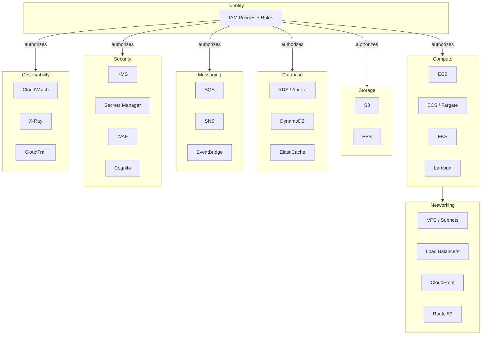
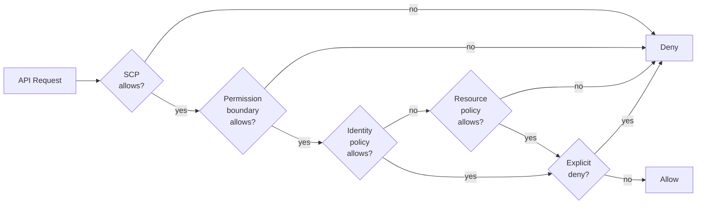
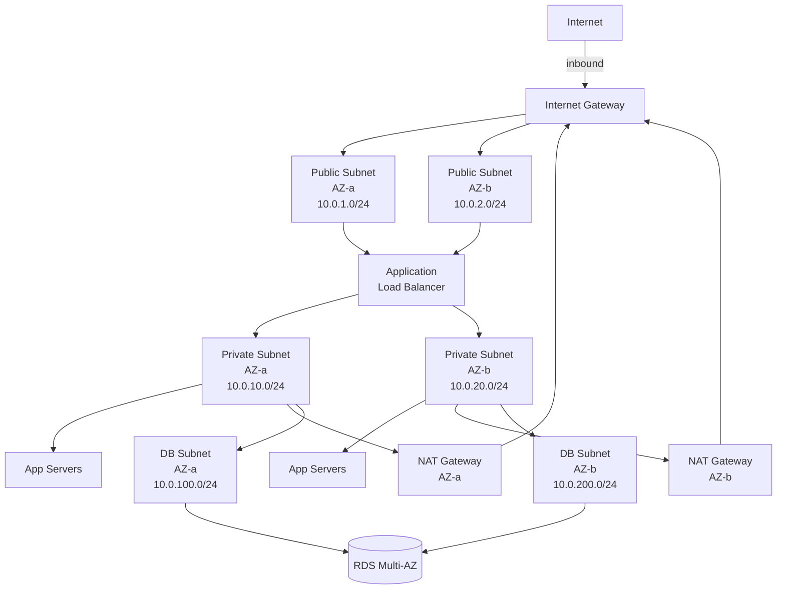

# AWS

## Chapter Goal

After reading this chapter, an experienced engineer can explain AWS
global infrastructure on a whiteboard, design a VPC with public and
private subnets, choose between EC2, ECS, EKS, and Lambda for a given
workload, model IAM policies with least privilege, select the right
database and messaging service for a given access pattern, reason about
cost levers and high-availability strategies, and defend multi-account
organization decisions in a Tech Lead interview.

More specifically, the reader will be able to:

- Articulate the shared responsibility model and explain where the
  customer security boundary lies for each service type (IaaS,
  managed, serverless).
- Design an IAM strategy with least-privilege roles, permission
  boundaries, and SCPs — and explain *why* each layer exists.
- Structure a multi-account AWS Organization with blast-radius
  isolation, billing clarity, and compliance-scoped guardrails.
- Draw a production VPC layout with public, private, and isolated
  subnets, NAT Gateways, VPC endpoints, and security group
  chains — and justify every routing decision.
- Evaluate the cost, operational, and reliability trade-offs of
  every service selection in the chapter.
- Answer "How would you set up AWS for a new product?" with a
  structured 60-second response that covers identity, networking,
  compute, data, observability, and cost from the first sentence.

## Why This Matters for a Tech Lead

AWS decisions are one-way doors with multi-year cost and reliability
consequences:

- **Cost compounds quietly.** A single NAT Gateway in three AZs
  costs ~$100/month in data processing alone before any application
  traffic. A Tech Lead who cannot read a Cost Explorer report by
  service will discover budget overruns only at quarter-end. Cloud
  costs are the second-largest engineering expense after headcount,
  and the Tech Lead is often the only person who can trace a bill
  line back to an architectural decision.
- **IAM is the security perimeter.** A misconfigured IAM policy is
  the most common root cause of cloud security incidents. The Tech
  Lead owns the policy review process and the principle of least
  privilege across the team. Unlike traditional network perimeters,
  IAM is an authorization system that touches every API call —
  misunderstanding its evaluation logic creates vulnerabilities that
  firewalls cannot catch.
- **Service selection locks in operational patterns.** Choosing
  DynamoDB over RDS changes data modeling, query patterns, backup
  strategies, and team skill requirements for years. The Tech Lead
  must defend these choices under audit and migration pressure. The
  cost of switching services after 6 months of production data is
  measured in quarters of engineering effort, not sprints.
- **Multi-account topology is architectural.** Account boundaries
  define blast radius, billing isolation, and compliance scope. A
  Tech Lead who puts production and staging in the same account has
  created a single blast radius with no recovery boundary. Changing
  account topology retroactively requires migrating live resources —
  one of the hardest cloud operations.
- **High availability requires deliberate design.** AWS provides
  the building blocks (multi-AZ, multi-region) but nothing is
  highly available by default. The Tech Lead must design for failure
  at every layer: compute, storage, database, and networking. Every
  "it works" deployment is one AZ outage away from revealing whether
  HA was actually configured.
- **Networking mistakes are invisible until they are expensive.**
  A poorly planned VPC CIDR blocks future peering. A missing VPC
  endpoint sends terabytes through NAT Gateway at $0.045/GB. An
  overly permissive security group bypasses every application-level
  security control. These mistakes do not cause errors — they cause
  cost overruns and security gaps that surface months later.
- **The hiring signal is strong.** An interviewer can assess a Tech
  Lead's AWS depth in 5 minutes by asking about IAM policy
  evaluation, VPC design, or cost management. Shallow answers ("we
  use security groups for security") reveal someone who has clicked
  through a console but never designed a production environment.

A Tech Lead who says "we use AWS" without explaining *how* the
account is organized, *why* a service was chosen, and *what* the
cost and failure model is — that is a red flag.

## Mental Model

Think of AWS as **primitives + identity**. Every service is a
primitive (compute, storage, network, queue, database, key
management) and Identity and Access Management (IAM) ties them
together. Nothing moves without an IAM principal, a policy, and an
evaluated allow.



The key insight: every AWS architecture conversation starts with
"who (IAM principal) can do what (action) on which resource (ARN)
under what conditions." Master the identity layer and the rest
follows.

**Second mental model — IAM as a chain of gates:**

Every API request passes through a series of gates. If any gate
denies, the request is denied regardless of other gates. If no
gate explicitly allows, the request is denied. The request
succeeds only when it passes through all applicable gates.



This chain-of-gates model is the most important concept for IAM
troubleshooting. When access is denied, diagnose systematically:
which gate denied? Most IAM problems fall into three categories:
missing allow in the identity policy, missing allow in a resource
policy for cross-account access, or an explicit deny in an SCP or
permission boundary that overrides a lower-level allow.

**Third mental model — networking as layers of filtering:**

Traffic in AWS passes through multiple filtering layers. Think of
it as concentric rings: the outermost ring is the route table
(determines if traffic can reach the subnet at all), the middle
ring is the NACL (subnet-level stateless filter), and the
innermost ring is the security group (instance-level stateful
filter). A request must pass all three layers to reach its
destination.

This layered model explains why a security group allow is necessary
but not sufficient — if the route table does not route the traffic
to the subnet, or the NACL blocks the port, the security group
rule has no effect.

**Interview tip:** When asked about AWS, start with identity (who
can access what), then networking (how traffic flows), then the
specific service. This order mirrors how AWS itself evaluates
requests and demonstrates architectural thinking rather than
service-level knowledge.

## Core Terminology

| Term | Definition |
| --- | --- |
| **Region** | A geographic cluster of data centers (e.g., us-east-1). Each region is fully independent with its own IAM endpoint, S3 namespace, and service availability. |
| **Availability Zone (AZ)** | One or more discrete data centers within a region, with independent power, cooling, and networking. Connected to other AZs in the same region via low-latency links. |
| **Edge location** | A CloudFront or Route 53 point of presence used for caching content and DNS resolution close to users. |
| **VPC** | Virtual Private Cloud. An isolated virtual network within a region. All compute resources launch inside a VPC. |
| **Subnet** | A range of IP addresses within a VPC, bound to a single AZ. Public subnets have a route to an Internet Gateway; private subnets do not. |
| **Security group** | A stateful, instance-level firewall. Rules specify allowed inbound and outbound traffic. Default deny on inbound. |
| **NACL** | Network Access Control List. A stateless, subnet-level firewall with explicit allow and deny rules evaluated by rule number. |
| **IAM principal** | An entity that can make API calls: users, roles, federated identities, or AWS services. |
| **IAM policy** | A JSON document defining permissions. Identity-based policies attach to principals; resource-based policies attach to resources (S3 bucket policy, SQS queue policy). |
| **IAM role** | A set of permissions without long-lived credentials. Assumed by services, applications, or federated users via STS. Prefer roles over users for all non-human access. |
| **ARN** | Amazon Resource Name. A globally unique identifier for any AWS resource. |
| **STS** | Security Token Service. Issues temporary credentials when a role is assumed. |
| **KMS** | Key Management Service. Creates and manages encryption keys. Integrates with most AWS services for envelope encryption. |
| **S3** | Simple Storage Service. Object storage with per-object durability of 99.999999999% (11 nines). |
| **EBS** | Elastic Block Store. Block storage volumes attached to EC2 instances. AZ-scoped. |
| **RDS** | Relational Database Service. Managed relational databases (PostgreSQL, MySQL, MariaDB, Oracle, SQL Server). |
| **Aurora** | AWS-designed relational database compatible with PostgreSQL and MySQL. Separates compute from storage with a distributed storage layer. |
| **DynamoDB** | Fully managed NoSQL key-value and document database. Single-digit millisecond latency at any scale. |
| **ElastiCache** | Managed Redis or Memcached for in-memory caching. |
| **SQS** | Simple Queue Service. Fully managed message queue (standard or FIFO). |
| **SNS** | Simple Notification Service. Pub/sub messaging for fan-out. |
| **EventBridge** | Serverless event bus with schema discovery and content-based routing. |
| **Lambda** | Serverless compute that runs code in response to events. Billed per invocation and duration. |
| **ECS** | Elastic Container Service. AWS-native container orchestrator. |
| **EKS** | Elastic Kubernetes Service. Managed Kubernetes control plane. |
| **Fargate** | Serverless compute engine for ECS and EKS. No EC2 instances to manage. |
| **CloudFront** | Content Delivery Network (CDN). Caches content at edge locations. |
| **Route 53** | Managed DNS service with health checks and routing policies. |
| **CloudWatch** | Monitoring service for metrics, logs, alarms, and dashboards. |
| **X-Ray** | Distributed tracing service for request-level visibility. |
| **CloudTrail** | Audit log of all API calls across the account. |

**Key distinctions:**

- **Security group vs NACL:** Security groups are stateful
  (return traffic is automatically allowed) and apply to instances.
  NACLs are stateless (both directions must be explicitly allowed)
  and apply to subnets.
- **IAM user vs IAM role:** Users have long-lived credentials
  (passwords, access keys). Roles have temporary credentials issued
  by STS. Prefer roles for everything except initial human console
  access.
- **SQS vs SNS:** SQS is a queue (one consumer processes each
  message). SNS is pub/sub (one message fans out to multiple
  subscribers).
- **RDS vs Aurora:** Both are managed relational databases. Aurora
  uses a distributed storage layer that replicates across 3 AZs
  automatically, while standard RDS uses EBS-backed storage.

## Theoretical Foundation

### Global infrastructure: regions, AZs, and edge locations

AWS operates in regions, each containing multiple Availability Zones.
An AZ is one or more physical data centers with independent power and
networking. AZs within a region are connected by high-bandwidth,
low-latency links (typically sub-millisecond).

**Why this structure exists:** The three-tier model (region → AZ →
edge location) provides different levels of failure isolation and
latency trade-offs:

- **Regions** are fully independent: separate power grids, separate
  network backbones, separate control planes. A regional outage
  does not affect other regions. This is the disaster recovery
  boundary.
- **AZs** within a region are connected by low-latency links but
  have independent power, cooling, and flooding profiles. An AZ
  failure does not affect other AZs in the same region. This is the
  high-availability boundary.
- **Edge locations** are CDN and DNS points of presence. They cache
  content and resolve DNS close to users. This is the latency
  optimization layer.

Design for **multi-AZ** by default. A single-AZ deployment is a
single point of failure. Multi-region adds resilience against
regional outages but introduces data replication complexity, higher
cost, and latency for cross-region synchronization.

Edge locations are separate from regions. CloudFront and Route 53
use them for caching and DNS. Lambda@Edge and CloudFront Functions
run code at the edge for low-latency transformations.

**Common mistakes:**

1. **Assuming all services are available in all regions.** Check the
   AWS Regional Services List before committing to a region. New
   services launch in us-east-1 first and expand gradually.
2. **Confusing multi-AZ with multi-region.** Multi-AZ provides HA
   within a region. Multi-region provides DR across regions. They
   are complementary, not interchangeable.
3. **Ignoring cross-AZ data transfer costs.** Data transfer between
   AZs in the same region costs $0.01/GB in each direction. For
   high-throughput services, this adds up. Use AZ-aware routing
   (e.g., topology-aware hints in Kubernetes, AZ affinity in ECS)
   to minimize cross-AZ traffic.

> Verify cross-AZ data transfer pricing against current AWS
> documentation.

**Security implications:** Some compliance regimes require data to
stay within specific regions or countries. AWS regions provide the
geographic boundary. Enforce region restrictions via SCPs in AWS
Organizations.

**Cost implications:** Pricing varies by region. us-east-1 (N.
Virginia) is typically the cheapest and has the widest service
catalog. eu-west-1 (Ireland) is typically 5-10% more expensive.
Asia-Pacific regions can be 20-30% more expensive for some services.
Data transfer between regions is charged at internet egress rates.

**Operational implications:** Some services are global (IAM, Route
53, CloudFront, Organizations, S3 bucket namespace) and some are
regional (VPC, EC2, RDS, Lambda, ECS, most others). Confusion
between global and regional services causes operational errors — for
example, expecting a Lambda function deployed in us-east-1 to be
available in eu-west-1.

**Tech Lead perspective:** Region selection is a day-one decision
driven by data residency requirements, user proximity, service
availability, and pricing. For most European companies, eu-west-1
(Ireland) or eu-central-1 (Frankfurt) is the primary region. For
US companies, us-east-1 or us-west-2. Choose one primary region
and design for multi-AZ from day one. Add a second region only when
the business requires < 1 hour RTO for regional failure.

**Interview framing:** "AWS global infrastructure has three tiers:
regions for geographic and failure isolation, AZs within regions for
high availability, and edge locations for latency. I design for
multi-AZ by default — it is the baseline for production. Multi-region
is the DR strategy, added when the business RPO/RTO justifies the
cost and complexity. Region selection is driven by data residency,
user proximity, service availability, and pricing."

### IAM

IAM is the most important AWS service. Every API call is
authenticated and authorized through IAM. The evaluation logic:

1. All requests start as **implicit deny**.
2. Identity-based policies and resource-based policies are
   evaluated.
3. An explicit **allow** grants access.
4. An explicit **deny** always wins, regardless of any allow.
5. Permission boundaries, SCPs, and session policies further
   restrict the effective permissions.

**Policy types:**

- **Identity-based:** Attached to users, groups, or roles. Defines
  what the principal can do.
- **Resource-based:** Attached to resources (S3 bucket policies, SQS
  queue policies, KMS key policies). Defines who can access the
  resource.
- **Permission boundaries:** An advanced feature that sets the
  maximum permissions an identity-based policy can grant. Used for
  delegation: allow developers to create roles but cap their
  permissions.
- **Service Control Policies (SCPs):** Applied at the organization
  or OU level. Restrict what member accounts can do regardless of
  their IAM policies.

```json
{
  "Version": "2012-10-17",
  "Statement": [
    {
      "Effect": "Allow",
      "Action": [
        "s3:GetObject",
        "s3:PutObject"
      ],
      "Resource": "arn:aws:s3:::my-app-data/*",
      "Condition": {
        "StringEquals": {
          "s3:x-amz-server-side-encryption": "aws:kms"
        }
      }
    }
  ]
}
```

This policy allows reading and writing objects in a specific S3
bucket, but only if server-side encryption with KMS is used. The
condition key enforces encryption at the policy level — objects
uploaded without encryption are denied.

**What a weaker alternative would be:** `"Resource": "*"` or
omitting the Condition block. Both are common shortcuts that violate
least privilege.

**Production change:** Add a `Condition` for `aws:SourceVpc` or
`aws:SourceIp` to restrict access to the corporate network or VPC.

**Common mistake:** Using `"Action": "*"` and `"Resource": "*"`
during development and never tightening it. This is the most common
IAM mistake and the easiest to prevent with policy linting (IAM
Access Analyzer).

**Practical usage — how IAM is used in real projects:**

- **Application roles:** Every ECS task, Lambda function, and EC2
  instance gets its own IAM role with exactly the permissions it
  needs. The application code never sees credentials — the SDK
  retrieves temporary credentials from the instance metadata
  service or ECS task role credential endpoint automatically.
- **CI/CD deployment roles:** The deployment pipeline assumes a
  role in the target account via `sts:AssumeRole`. The role has
  permissions to update ECS services, deploy Lambda functions, or
  modify CloudFormation stacks — but not to modify IAM or delete
  databases.
- **Developer access:** Developers use SSO/federation to assume
  time-limited roles. Read-only access to production. Write access
  to staging. No IAM users with long-lived access keys.
- **Cross-account access:** Service A in account 111 assumes a
  role in account 222 to read from an S3 bucket. The trust policy
  in 222 specifies which role in 111 can assume it, with conditions.

**Security implications:**

- IAM policy misconfiguration is the #1 cause of AWS security
  breaches. A policy with `"Resource": "*"` grants access to every
  resource of that type in the account.
- `sts:AssumeRole` with an overly broad trust policy allows any
  principal in the trusted account to assume the role — including
  compromised workloads.
- IAM policies are eventually consistent: a policy change may take
  seconds to propagate. Do not assume immediate effect in automated
  workflows.
- Condition keys are the most underused security feature. Restrict
  by source VPC (`aws:SourceVpc`), source IP (`aws:SourceIp`),
  MFA status (`aws:MultiFactorAuthPresent`), requested region
  (`aws:RequestedRegion`), or tag (`aws:ResourceTag`).

**Cost implications:** IAM itself is free. The cost impact is
indirect: overly broad permissions enable resource creation that
goes unnoticed. A developer with `ec2:RunInstances` on `*` can
spin up GPU instances. Permission boundaries and SCPs are the cost
guardrails.

**Operational implications:**

- IAM changes are audited by CloudTrail. Enable CloudTrail in all
  accounts and alert on `CreateUser`, `AttachUserPolicy`,
  `CreateAccessKey`, and `PutRolePolicy` events.
- IAM Access Analyzer continuously monitors for external access
  (resources shared with principals outside the account). Enable
  it in every account.
- Use IAM Access Analyzer policy generation to create policies
  from CloudTrail activity logs — it produces least-privilege
  policies based on actual usage over a given time window.
- Tag IAM roles with the owning service and team. When a role has
  no tag, nobody owns it, and nobody audits it.

**Production checklist:**

- No IAM users for applications. Roles only.
- No long-lived access keys for humans. SSO/federation only.
- Permission boundaries on all roles created by developers.
- IAM Access Analyzer enabled with external access findings
  reviewed weekly.
- CloudTrail alerts for IAM admin operations.
- Quarterly review of unused permissions using Access Analyzer
  findings.

**Tech Lead perspective:** IAM governance is the single highest-
leverage security investment. A Tech Lead who establishes three
rules — no IAM users, no wildcard policies, permission boundaries
on developer-created roles — prevents the majority of IAM-related
security incidents. The hard part is not the technology; it is
creating a culture where least privilege is the default, not an
afterthought. Automate policy review: IAM Access Analyzer in CI,
Config rules for policy compliance, SCPs as the non-negotiable
guardrails.

**Interview framing:** "IAM is not just authentication — it is the
authorization layer for the entire cloud. Every service-to-service
call, every Lambda invocation, every container task assumes a role.
Least privilege means scoping each role to exactly the actions and
resources it needs, with conditions where possible. The way I
implement it: roles per service, permission boundaries for
delegation, SCPs for organizational guardrails, and Access Analyzer
for continuous validation. I think of IAM as a chain of gates —
SCP, permission boundary, identity policy, resource policy — and
an explicit deny at any gate is final."

### Organizations and multi-account strategy

AWS Organizations enables centralized governance of multiple AWS
accounts. The management account (root) defines the organizational
structure using Organizational Units (OUs).

**Why multiple accounts matter:**

- **Blast radius isolation.** A compromised development account
  cannot reach production resources.
- **Billing isolation.** Per-account cost attribution without complex
  tagging.
- **Service quota isolation.** Lambda concurrency, API rate limits,
  and other quotas are per-account.
- **Compliance boundaries.** PCI, HIPAA, or SOC2 scope can be
  limited to specific accounts.

**Typical OU structure:**

```text
Root
├── Security OU
│   ├── Audit account (CloudTrail, Config aggregation)
│   └── Log archive account (centralized logging)
├── Infrastructure OU
│   ├── Network account (Transit Gateway, DNS)
│   └── Shared services account (CI/CD, artifact registry)
├── Workloads OU
│   ├── Production OU
│   │   ├── App-A production account
│   │   └── App-B production account
│   └── Non-production OU
│       ├── App-A staging account
│       └── App-B development account
└── Sandbox OU
    └── Developer sandbox accounts
```

**Service Control Policies (SCPs)** are guardrails applied to OUs or
accounts. They restrict — never grant — permissions.

```json
{
  "Version": "2012-10-17",
  "Statement": [
    {
      "Effect": "Deny",
      "Action": [
        "ec2:RunInstances"
      ],
      "Resource": "*",
      "Condition": {
        "StringNotEquals": {
          "aws:RequestedRegion": [
            "eu-west-1",
            "eu-central-1"
          ]
        }
      }
    }
  ]
}
```

This SCP prevents launching EC2 instances outside approved regions,
enforcing data residency at the organization level regardless of
individual account permissions.

**Practical usage — how Organizations is used:**

- **Account vending:** Control Tower or a custom account factory
  provisions new accounts with baseline IAM roles, VPC, CloudTrail,
  and GuardDuty enabled. A developer requests an account via a
  ticket or self-service portal; the account is ready in minutes,
  not weeks.
- **SCP layering:** Broad SCPs on the root OU (deny unused regions,
  deny CloudTrail deletion). Tighter SCPs on the production OU
  (deny resource creation without required tags, deny public S3
  buckets). Sandbox OUs get relaxed SCPs with budget guardrails.
- **Consolidated billing:** One bill across all accounts. Cost
  allocation tags cross account boundaries. Savings Plans and
  Reserved Instances are shared across the organization — buy
  in the management account, benefit in all member accounts.

**Common mistakes:**

1. **Running workloads in the management account.** The management
   account has root-level access to all member accounts. No
   application workloads should run here — only billing,
   Organizations, and SCP management.
2. **Not separating production and non-production at the OU level.**
   If production and staging share an OU, SCPs apply equally to
   both. Separate OUs allow different guardrails: strict in
   production (deny untagged resources), relaxed in non-production
   (allow experimentation).
3. **Not enabling AWS Organizations for single-account setups.**
   Even with one account, Organizations enables consolidated
   billing, SCPs, and future multi-account expansion without
   migration.
4. **Overly granular account proliferation.** Account-per-
   microservice creates operational overhead (IAM federation,
   networking, cross-account access). Account-per-team with
   environment separation (team-A-prod, team-A-staging) is the
   sweet spot for most organizations.

**Security implications:**

- SCPs are the hardest security boundary in AWS. Even an account
  administrator cannot override an SCP deny. Use them for
  non-negotiable guardrails: prevent CloudTrail deletion, enforce
  encryption, restrict regions, block public S3 access.
- The management account has `OrganizationAccountAccessRole` in
  every member account by default. Protect the management account
  as the most sensitive account in the organization.
- Cross-account IAM role assumptions should use external IDs and
  condition keys (`aws:PrincipalOrgID`) to prevent confused deputy
  attacks.

**Cost implications:**

- Consolidated billing enables volume discounts (S3 storage tiers,
  data transfer aggregation) across all accounts.
- Savings Plans purchased in the management account apply to
  compute across the organization — this maximizes utilization of
  committed spend.
- Per-account billing allocation requires consistent tagging.
  Enforce mandatory tags (`team`, `service`, `environment`,
  `cost-center`) via AWS Config or Tag Policies.

**Operational implications:**

- AWS Control Tower automates the landing zone with guardrails,
  account factory, and dashboard. It reduces the setup from weeks
  to hours but introduces its own abstraction layer that must be
  understood.
- Account limit requests (Lambda concurrency, EC2 instance limits)
  are per-account. Separate accounts for different services prevent
  a noisy neighbor from exhausting shared quotas.
- Cross-account networking (VPC peering, Transit Gateway, RAM
  shared VPCs) adds operational complexity. Plan the network
  topology before creating accounts.

**Production checklist:**

- Management account has no application workloads.
- CloudTrail enabled in all accounts, forwarded to log archive.
- GuardDuty enabled in all accounts, delegated admin to security
  account.
- SCPs enforce: no CloudTrail deletion, required encryption, region
  restrictions, no public S3 unless explicitly approved.
- Tag policies enforced for cost allocation.
- Account provisioning is automated (Control Tower or custom
  factory).

**Tech Lead perspective:** Account topology is an architectural
decision that is expensive to change retroactively. Start with at
least four accounts (management, audit, staging, production). Use
AWS Control Tower or a landing zone accelerator to automate account
provisioning with guardrails. Defend this decision by explaining
blast radius, billing clarity, and compliance scope. The decision
criteria: "How many teams create and deploy resources independently?
How many compliance scopes exist? What is the blast radius a single
compromised credential should have?" These questions determine the
right number of accounts.

**Interview framing:** "I think of AWS Organizations as the
architectural boundary layer — it defines blast radius, billing,
compliance scope, and quota isolation. I start with the minimum
viable structure: management, security, log archive, and workload
accounts separated by environment. SCPs are the non-negotiable
guardrails — no CloudTrail deletion, no public S3, encryption
required. The management account runs nothing except billing and
Organizations. I automate account provisioning because manual setup
does not scale and does not enforce standards."

### VPC

A Virtual Private Cloud (VPC) is an isolated network within a
region. It has a CIDR block (e.g., 10.0.0.0/16 giving 65,536 IP
addresses) and spans all AZs in the region. All compute resources
(EC2, ECS, Lambda in VPC, RDS) launch inside a VPC. A VPC is the
networking foundation — get it wrong and everything built on top
inherits the limitation.

**Why VPC exists:** Before VPC, AWS resources shared a flat network
(EC2-Classic). VPC provides network isolation, IP address control,
routing decisions, and layered security (security groups + NACLs).
It is the cloud equivalent of a private data center network, but
software-defined and region-scoped.

**How VPC is used in real projects:**

- **Single VPC per environment per account:** The most common
  pattern. Each account (prod, staging) has its own VPC. VPCs do
  not span regions — multi-region requires separate VPCs per region,
  connected via VPC peering or Transit Gateway.
- **Shared VPC (RAM):** The network account owns the VPC and shares
  subnets to workload accounts via AWS Resource Access Manager. This
  centralizes network management while allowing workload teams to
  launch resources in shared subnets. Best for organizations with
  a dedicated networking team.
- **Multiple VPCs per account:** Used when workloads require hard
  network isolation within the same account (e.g., regulated vs
  non-regulated workloads).

**Subnets** divide the VPC's CIDR into smaller blocks, each bound
to a single AZ. A subnet is either public (has a route to an
Internet Gateway) or private (no direct internet access).



The diagram shows the standard three-tier VPC layout: public subnets
for load balancers and NAT Gateways, private subnets for application
servers, and isolated database subnets. Application servers reach the
internet through NAT Gateways for outbound traffic (package updates,
external API calls) but are not directly reachable from the internet.

### Subnets

Each subnet maps to exactly one AZ. A subnet's "type" (public,
private, isolated) is determined entirely by its route table — not
by any subnet-level property. Place at least two subnets per tier
across two AZs for high availability.

**Why subnets exist:** Subnets provide AZ-level isolation and
routing control. A resource in a private subnet cannot be reached
from the internet even if its security group were misconfigured —
the route table prevents it. This is defense in depth at the
network layer.

| Subnet type | Route to IGW | Use case |
| --- | --- | --- |
| **Public** | Yes (via Internet Gateway) | Load balancers, NAT Gateways, bastion hosts |
| **Private** | No (outbound via NAT Gateway) | Application servers, containers, Lambda |
| **Isolated** | No (no NAT, no internet at all) | Databases, ElastiCache, internal services |

**CIDR planning matters.** Use /16 for the VPC and /24 for subnets.
Reserve CIDR ranges for future expansion. Non-overlapping CIDRs are
required for VPC peering and Transit Gateway.

**Common mistakes:**

1. **Overlapping CIDRs.** Using a VPC CIDR that overlaps with the
   corporate network or another VPC. This prevents peering and
   complicates hybrid connectivity. Plan CIDR allocation centrally
   using an IP Address Management (IPAM) tool or a shared
   spreadsheet at minimum.
2. **Undersized subnets.** A /24 subnet provides 251 usable IPs
   (AWS reserves 5 per subnet). For subnets that host Lambda
   functions in VPC or large ECS clusters, this may not be enough
   ENIs. Use /22 or /20 for subnets that will host many ENIs.
3. **Using the default VPC for production.** The default VPC has a
   public subnet in every AZ with auto-assign public IP enabled.
   This is convenient for experimentation but inappropriate for
   production — it exposes instances to the internet by default.
4. **Not planning for future subnets.** Adding new AZs or new
   tiers requires available CIDR space. If the VPC is a /16 and
   all space is allocated, adding a new tier requires a secondary
   CIDR — which complicates routing.

**Security implications:** Subnets are the second layer of network
defense (after route tables). Resources in isolated subnets have
no path to the internet even through NAT — a compromised database
server cannot phone home. Use isolated subnets for all data stores.

**Cost implications:** Subnets themselves are free. The cost comes
from what enables them: NAT Gateways for private subnets (~$32/month
per AZ for the hourly charge alone) and VPC endpoints for isolated
subnets (~$7/month per AZ per endpoint). A three-AZ VPC with two
NAT Gateways and three Interface endpoints costs roughly $120/month
in infrastructure alone.

> Verify NAT Gateway and VPC endpoint hourly pricing against current
> AWS documentation.

**Operational implications:** AWS reserves 5 IP addresses per
subnet: network address, VPC router, DNS server, future use, and
broadcast address. Monitor available IPs in CloudWatch
(`AvailableIPAddressCount`) — ENI exhaustion in a subnet causes
Lambda cold start failures and ECS task launch failures with no
obvious error message.

**Tech Lead perspective:** CIDR planning is a day-one decision that
is expensive to change. Allocate CIDRs from a central registry.
Plan for 3 AZs and 3-4 tiers (public, private app, private data,
isolated). Leave room for future expansion. A /16 VPC with /22
subnets gives 16 subnets per AZ — more than enough for most
architectures.

**Interview framing:** "Subnets are the mechanism for AZ-level
isolation and network segmentation. What makes a subnet 'public' or
'private' is its route table, not a flag. I design three tiers:
public for load balancers and NAT Gateways, private for application
workloads, and isolated with no internet path for databases. The
most common mistake I see is CIDR planning failures — overlapping
ranges that prevent VPC peering, or undersized subnets that run
out of ENI slots under load."

### Route tables

Each subnet is associated with exactly one route table. The route
table is the most fundamental networking control — it determines
whether traffic can reach a destination at all, before any security
group or NACL is evaluated.

**Why route tables exist:** Route tables define the topology of the
VPC. They determine which subnets can reach the internet (via IGW),
which use NAT for outbound, which talk to other VPCs (via peering
or Transit Gateway), and which are isolated. The route table is what
makes a subnet "public" or "private."

**Route types:**

- **Local route** (automatically added, immutable): traffic within
  the VPC CIDR stays in the VPC. This is what allows all resources
  in the same VPC to communicate.
- **Internet Gateway route** (0.0.0.0/0 → IGW): makes a subnet
  public.
- **NAT Gateway route** (0.0.0.0/0 → NAT): allows private subnets
  to initiate outbound internet connections.
- **VPC peering route:** sends traffic destined for a peered VPC's
  CIDR to the peering connection.
- **Transit Gateway route:** sends traffic to the Transit Gateway
  for hub-and-spoke networking across many VPCs.
- **VPC endpoint route** (Gateway endpoints for S3 and DynamoDB):
  routes traffic to the service via the AWS backbone, bypassing NAT.
- **Most-specific route wins.** If the route table has both
  0.0.0.0/0 → NAT and an S3 prefix list → S3 Gateway Endpoint,
  S3 traffic uses the endpoint because the prefix list is more
  specific than the default route.

**Common mistakes:**

1. **Forgetting to associate a new subnet with the correct route
   table.** New subnets default to the main route table, which may
   not have the intended routes. Always explicitly associate subnets
   with the correct route table in IaC.
2. **Adding an IGW route to a private subnet's route table.** This
   makes the subnet public — any resource with a public IP becomes
   directly internet-accessible, bypassing NAT. This is a common
   IaC typo that creates a security gap.
3. **Not adding a Gateway endpoint route for S3.** Without it, all
   S3 traffic from private subnets flows through NAT Gateway at
   $0.045/GB. A Gateway endpoint is free and keeps traffic on the
   AWS backbone.

**Security implications:** Route tables are the first defense
layer. An isolated subnet (no IGW route, no NAT route) cannot
communicate with the internet even if every security group allows
all traffic. This is the strongest form of network isolation within
a VPC.

**Cost implications:** The S3 and DynamoDB Gateway endpoints are
free and eliminate NAT data processing charges for the two most
commonly accessed AWS services. For a workload that reads 1 TB/month
from S3, adding a Gateway endpoint saves ~$45/month in NAT charges.

**Operational implications:** Route table changes take effect
immediately with no downtime. However, removing a NAT Gateway route
from a private subnet instantly breaks outbound connectivity for
all resources in that subnet — this is a production-impacting
change. Always test route table changes in non-production first.

**Tech Lead perspective:** Create one route table per subnet type
(public, private, isolated) and share it across AZs of the same
type. Name route tables clearly in IaC (e.g.,
`rt-private-app-eu-west-1`). Add S3 and DynamoDB Gateway endpoints
to every VPC — they are free and reduce both cost and latency.

**Interview framing:** "Route tables are the most fundamental
networking primitive. They determine reachability before any
firewall rule is evaluated. I create three route tables: public
with an IGW route, private with a NAT route, and isolated with
only the local route. I add S3 Gateway endpoints to every VPC
because they are free and eliminate NAT charges for the most common
AWS service traffic."

### NAT Gateway

A NAT Gateway allows resources in private subnets to initiate
outbound internet connections (package updates, external API calls,
webhook deliveries) without exposing them to inbound traffic. It
performs network address translation: the resource's private IP is
replaced with the NAT Gateway's public Elastic IP for outbound
connections.

**Why NAT Gateway exists:** Private subnets have no internet route.
Without NAT, resources in private subnets cannot reach the internet
at all — not even for outbound calls. NAT Gateway solves this while
maintaining the security benefit of private subnets: resources are
unreachable from the internet, but can initiate outbound
connections.

**How it is used:**

- One NAT Gateway per AZ in the public subnet. The private subnet's
  route table sends 0.0.0.0/0 traffic to the NAT Gateway in the
  same AZ. This avoids cross-AZ traffic for NAT and ensures that a
  single AZ failure does not break outbound connectivity for all
  AZs.
- For non-production environments, a single NAT Gateway across AZs
  is acceptable to reduce cost.

**Common mistakes:**

1. **Not using VPC endpoints for AWS service traffic.** S3 and
   DynamoDB Gateway endpoints are free. Without them, every S3
   `GetObject` call from a private subnet flows through NAT at
   $0.045/GB. A data pipeline reading 10 TB/month from S3 costs
   $450/month in unnecessary NAT charges.
2. **Using one NAT Gateway for all AZs in production.** If that
   AZ fails, all private subnets lose outbound connectivity. Deploy
   one NAT Gateway per AZ for production.
3. **Not monitoring NAT Gateway throughput.** NAT Gateway supports
   up to 45 Gbps. Under sustained high throughput, connections may
   be throttled. Monitor `PacketsDropCount` and `ErrorPortAllocation`
   in CloudWatch.
4. **Forgetting that NAT Gateway is outbound only.** It does not
   accept inbound connections from the internet. For inbound
   traffic, use a load balancer in a public subnet.

**Security implications:**

- NAT Gateway hides private IPs from the internet — external
  services see only the NAT Gateway's Elastic IP. This is useful
  for IP allowlisting: provide the NAT Gateway EIP to partners who
  require source IP verification.
- NAT Gateway does not perform deep packet inspection. It is a
  network-level device, not a firewall. Combine with security
  groups on instances for application-level filtering.
- NAT Gateway traffic is logged in VPC Flow Logs. Enable flow logs
  on the NAT Gateway subnet for network forensics.

**Cost implications:** NAT Gateway is one of the top-5 hidden cost
drivers in AWS.

| Component | Cost (us-east-1) | Monthly estimate (3 AZs) |
| --- | --- | --- |
| **Hourly charge** | ~$0.045/hour per NAT GW | ~$97 (3 × $0.045 × 720h) |
| **Data processing** | ~$0.045/GB | Varies by traffic |
| **Cross-AZ data transfer** | $0.01/GB | Eliminated by per-AZ NAT |

> Verify NAT Gateway pricing against official AWS documentation.
> Pricing varies by region.

**Cost optimization strategies:**

- S3 and DynamoDB Gateway endpoints (free).
- Interface endpoints for high-volume services (ECR, CloudWatch
  Logs, STS) — Interface endpoints cost ~$0.01/hour per AZ but
  eliminate NAT data processing for that service.
- Evaluate whether outbound traffic can be reduced: cache external
  API responses, batch webhook deliveries, use S3 Transfer
  Acceleration instead of direct S3 access through NAT.

**Operational implications:**

- NAT Gateways are AZ-scoped and fully managed. No patching,
  scaling, or failover to configure.
- If a NAT Gateway is deleted or its AZ fails, all outbound traffic
  from private subnets routing through it stops immediately. There
  is no automatic failover to a NAT Gateway in another AZ — the
  route table must be updated.
- NAT Gateways do not support security groups. Filtering is done
  at the source (security groups on instances) and destination
  (NACLs on subnets).

**Tech Lead perspective:** Deploy one NAT Gateway per AZ for high
availability in production. Add S3 and DynamoDB Gateway endpoints to
every VPC as a non-negotiable baseline — they are free and save
significant cost. Review NAT Gateway data processing charges monthly
in Cost Explorer. If NAT costs exceed $200/month, investigate which
services are driving traffic and consider Interface endpoints for
the top consumers.

**Interview framing:** "NAT Gateway provides outbound internet
access for private subnets without exposing resources to inbound
traffic. The key consideration is cost: NAT charges per GB
processed, and this silently accumulates. My standard practice is
to deploy one NAT per AZ for HA, add free S3 and DynamoDB Gateway
endpoints, and review NAT data processing costs monthly. For high-
volume AWS service traffic, I add Interface endpoints for the top
consumers — the endpoint hourly cost is usually much less than the
NAT per-GB charge."

### Internet Gateway

An Internet Gateway (IGW) connects the VPC to the internet. It is
horizontally scaled, redundant, and highly available. There is no
bandwidth constraint on the IGW itself, and it is free — no hourly
or data processing charge.

**Why IGW exists:** Without an IGW, a VPC is completely isolated
from the internet. The IGW is the single point where the VPC's
private IP space connects to the public internet. Attaching an IGW
to a VPC does not make anything public — resources also need a
route table entry pointing to the IGW and a public IP.

**How it is used:** One IGW per VPC. Resources in public subnets
need three things to communicate with the internet: (1) a route
to the IGW in their route table, (2) a public IP or Elastic IP,
and (3) a security group rule that allows the traffic.

**Common mistakes:**

1. **Assuming IGW attachment makes the VPC public.** The IGW alone
   does nothing. A subnet is public only if its route table has
   a 0.0.0.0/0 route to the IGW *and* instances have public IPs.
   This is a frequent interview misconception.
2. **Placing application servers in public subnets with IGW
   access.** Application servers should be in private subnets
   behind a load balancer. Only load balancers and NAT Gateways
   need public subnet placement.

**Security implications:** The IGW is a network boundary. Any
resource with a public IP and an IGW route is reachable from the
internet (subject to security group rules). Minimize the number of
resources in public subnets. Use VPC endpoints and NAT Gateways
to keep application traffic off the public internet.

**Cost implications:** The IGW is free. No hourly charge, no data
processing charge. Data transfer charges (standard EC2 egress
pricing) apply to traffic that flows through the IGW, but the
gateway itself adds no cost.

**Operational implications:** There is one IGW per VPC. It cannot
be a bottleneck — AWS scales it automatically. Detaching the IGW
from a VPC immediately breaks all public internet connectivity for
the entire VPC. This is a production-impacting operation.

**Interview framing:** "The Internet Gateway is the boundary
between the VPC and the public internet. It is free, fully managed,
and cannot be a bottleneck. What makes a subnet 'public' is the
combination of an IGW route in the route table and a public IP on
the resource. I minimize IGW-accessible resources — only load
balancers and NAT Gateways belong in public subnets."

### Security groups

Security groups are **stateful** firewalls at the instance level
(EC2, RDS, Lambda in VPC, ECS tasks). They are the primary
network-level access control mechanism in AWS and the most
frequently configured networking component.

**Why security groups exist:** Security groups implement the
principle of least privilege at the network layer. Each resource
should accept traffic only from the specific sources it needs — an
API server accepts traffic only from the load balancer, a database
accepts traffic only from the API servers. Without security groups,
any resource in the VPC could communicate with any other resource.

**Key properties:**

- **Default deny** on inbound. All outbound is allowed by default.
- Rules are **allow-only**. There is no explicit deny. To block
  specific traffic, use NACLs.
- **Stateful:** if an inbound request is allowed, the response is
  automatically allowed regardless of outbound rules. This
  eliminates the need for ephemeral port rules (unlike NACLs).
- Security groups can reference other security groups — this is the
  recommended pattern for service-to-service communication.
- A resource can have up to 5 security groups (default, can be
  increased). The rules from all attached groups are combined.
- Security group rules are evaluated together — there is no rule
  priority or ordering.

```json
{
  "SecurityGroupIngress": [
    {
      "IpProtocol": "tcp",
      "FromPort": 443,
      "ToPort": 443,
      "SourceSecurityGroupId": "sg-alb-12345"
    }
  ]
}
```

This rule allows HTTPS traffic only from instances in the ALB
security group. When the ALB scales or IP addresses change, the
rule still works because it references the security group, not an
IP.

**How security groups are used in practice — the chain pattern:**

```text
Internet → ALB (sg-alb: allow 443 from 0.0.0.0/0)
         → App (sg-app: allow 8080 from sg-alb)
         → DB  (sg-db:  allow 5432 from sg-app)
         → Cache (sg-cache: allow 6379 from sg-app)
```

Each tier accepts traffic only from the tier above. This chain
pattern means a compromised load balancer can reach application
servers but not the database directly. The chain is enforced by
security group references, not IP addresses.

**Common mistakes:**

1. **Opening port 22 (SSH) to 0.0.0.0/0.** Use Systems Manager
   Session Manager for shell access instead — it does not require
   open ports, logs all sessions to CloudTrail, and supports IAM-
   based access control. No SSH keys to manage, no bastion hosts
   to maintain.
2. **Using CIDR blocks instead of security group references.** CIDRs
   break when instances scale or IPs change. Security group
   references are dynamic — they automatically include all instances
   in the referenced group.
3. **Overly permissive outbound rules.** The default allows all
   outbound traffic. For sensitive workloads, restrict outbound to
   specific ports and destinations (e.g., database port to sg-db,
   HTTPS to 0.0.0.0/0 for external APIs). This limits exfiltration
   if a resource is compromised.
4. **Not cleaning up unused security groups.** Over time, security
   groups accumulate from deleted resources. Orphaned groups create
   confusion and may be accidentally attached to new resources with
   their old rules. Use AWS Config to detect unused security groups.
5. **Using the default security group.** The default security group
   allows all inbound traffic from other instances in the same
   security group. Never use it — create purpose-specific security
   groups for every resource.

**Security implications:**

- Security groups are the most important network security control.
  A misconfigured security group can expose a database directly
  to the internet.
- Review security groups as part of every deployment. IaC diffs
  should highlight any security group changes for manual review.
- Use AWS Config rules to detect security groups that allow
  unrestricted access (0.0.0.0/0 on sensitive ports).
- Security group changes take effect immediately, with no
  connection draining. Removing an allow rule drops active
  connections matching that rule.

**Cost implications:** Security groups are free. No charge per
rule or per group. The cost impact is indirect: overly permissive
security groups can enable accidental access to expensive resources
or allow data exfiltration that goes unnoticed.

**Operational implications:**

- Maximum 60 inbound and 60 outbound rules per security group
  (default quota, can be increased). Use prefix lists for large
  IP ranges instead of individual CIDR rules.
- Security group rule changes are eventually consistent — there is
  typically a 1-2 second propagation delay. In automated workflows,
  add a brief delay after security group modification before
  assuming the rule is active.
- VPC Flow Logs record traffic that is accepted or rejected by
  security groups. Enable flow logs for all production subnets to
  diagnose connectivity issues and detect anomalous traffic.

**Production checklist:**

- No security group allows 0.0.0.0/0 on ports 22, 3389, or
  database ports.
- All service-to-service traffic uses security group references,
  not CIDRs.
- Outbound rules are restricted for sensitive workloads (databases,
  payment processors).
- AWS Config rule detects unrestricted security groups.
- Unused security groups are cleaned up quarterly.
- Default security group in every VPC has no rules (best practice:
  remove all rules from the default SG to prevent accidental use).

**Tech Lead perspective:** Security groups are the front line of
network security. Establish a standard: every resource gets a
purpose-specific security group, all service-to-service
communication uses SG references, SSH is replaced by Session
Manager, and outbound is restricted for data-sensitive workloads.
Audit security groups quarterly using AWS Config and Security Hub
findings. The goal is that no security group change in IaC goes
unreviewed.

**Interview framing:** "Security groups are stateful, instance-level
firewalls — the primary network access control in AWS. I build them
as chains: ALB allows 443 from the internet, app server allows 8080
from the ALB SG, database allows 5432 from the app SG. This chain
pattern enforces least privilege at the network layer. The key
design principles: use SG references instead of CIDRs, restrict
outbound for sensitive workloads, replace SSH with Session Manager,
and never use the default security group."

### NACLs

Network Access Control Lists (NACLs) are **stateless** firewalls at
the subnet level. They evaluate rules by number (lowest first) and
support explicit deny. NACLs are the second layer of network
defense, operating between route tables and security groups.

**Why NACLs exist:** NACLs provide subnet-level filtering that is
independent of security groups. Their key differentiator is explicit
deny — security groups can only allow, but NACLs can block specific
IP ranges or ports at the subnet boundary before traffic reaches
any instance.

| Feature | Security group | NACL |
| --- | --- | --- |
| **Level** | Instance | Subnet |
| **Statefulness** | Stateful | Stateless |
| **Rule type** | Allow only | Allow and deny |
| **Evaluation** | All rules evaluated | Rules evaluated by number, first match wins |
| **Default** | Deny inbound, allow outbound | Allow all traffic (default NACL) |
| **Rule limit** | 60 inbound, 60 outbound | 20 inbound, 20 outbound (default) |
| **Applies to** | Specific resources | All traffic in/out of subnet |

**When to use NACLs:**

- **Blocking known malicious IP ranges** at the subnet perimeter
  (e.g., ranges identified by threat intelligence or GuardDuty
  findings).
- **Broad subnet isolation** between tiers: deny all traffic from
  the public subnet to the database subnet except on the database
  port.
- **Compliance requirements** that mandate network ACLs as an
  explicit control layer separate from security groups.
- **Incident response:** quickly block an attacking IP at the
  subnet level without modifying individual security groups on
  every instance.

**How NACLs work — rule evaluation:**

Rules are evaluated by rule number (lowest first). The first
matching rule is applied, and evaluation stops. Every NACL ends
with a `*` rule that denies all traffic — this is the implicit deny.

```text
Rule #  Type       Protocol  Port     Source        Action
100     HTTPS      TCP       443      0.0.0.0/0     ALLOW
110     Custom TCP TCP       1024-65535 0.0.0.0/0   ALLOW
200     SSH        TCP       22       203.0.113.0/24 ALLOW
*       All        All       All      0.0.0.0/0     DENY
```

Rule 110 allows ephemeral port responses. Without it, HTTPS
responses from internal servers would be blocked because NACLs are
stateless.

**Common mistakes:**

1. **Forgetting ephemeral port rules.** Because NACLs are stateless,
   return traffic must be explicitly allowed. A web server accepts
   connections on port 443 (inbound rule), but the response goes
   back on an ephemeral port (1024-65535). Without an outbound rule
   allowing ephemeral ports, the response is blocked.
2. **Using NACLs as the primary security control.** NACLs are
   coarse-grained and hard to manage at scale (limited to 20 rules
   by default). Use security groups for fine-grained access control.
   NACLs are a defense-in-depth layer, not the primary firewall.
3. **Leaving the default NACL as allow-all.** The default NACL
   allows all traffic. For production subnets, modify it to be
   restrictive or create custom NACLs with explicit rules.
4. **Rule numbering without gaps.** Number rules in increments of
   10 or 100 (e.g., 100, 200, 300). This leaves room to insert new
   rules between existing ones without renumbering.

**Security implications:**

- NACLs process before security groups for inbound traffic and
  after security groups for outbound traffic. A deny in the NACL
  prevents traffic from ever reaching the security group evaluation.
- NACLs cannot reference security groups. They work only with CIDR
  ranges and port numbers. This makes them less dynamic but more
  predictable for subnet-level blocking.
- Use NACLs for emergency IP blocking during incidents — adding a
  deny rule at rule number 50 blocks an attacker IP immediately
  across every resource in the subnet.

**Cost implications:** NACLs are free. No charge per rule or per
evaluation. Use them freely as a defense-in-depth layer.

**Operational implications:**

- NACL changes take effect immediately with no connection draining.
  Be careful when modifying rules on production subnets.
- The default rule limit of 20 inbound and 20 outbound rules per
  NACL is a hard constraint for complex filtering. If more rules
  are needed, consider whether the filtering should move to a
  different layer (WAF for HTTP, security groups for instance-level).
- NACLs are not logged separately — VPC Flow Logs capture the
  effect (accepted or rejected), but do not identify which layer
  (NACL or security group) caused the rejection. Use `log-status`
  field to differentiate.

**Tech Lead perspective:** For most architectures, the default
NACL (allow-all) with well-configured security groups is
sufficient. Add custom NACLs when: (1) compliance requires explicit
subnet-level controls, (2) incident response needs rapid IP
blocking, or (3) subnet tiers require hard isolation beyond security
groups. Do not over-invest in NACL management — security groups
handle 90% of network filtering use cases.

**Interview framing:** "NACLs are the second layer of network
defense — stateless, subnet-level filters with explicit deny
capability. I use them primarily for three purposes: blocking
malicious IP ranges identified by GuardDuty, enforcing subnet-tier
isolation as a compliance control, and rapid IP blocking during
security incidents. For day-to-day access control, security groups
are the primary mechanism because they are stateful, dynamic
(SG references), and instance-level. The critical distinction:
NACLs are stateless, so both inbound and outbound rules must
account for return traffic on ephemeral ports."

### EC2

Elastic Compute Cloud provides virtual machines with configurable
CPU, memory, storage, and networking. EC2 is the most flexible
compute option but carries the most operational overhead.

**Why EC2 exists:** EC2 was the original AWS compute service and
remains the foundation that higher-level services (ECS, EKS, EMR)
build upon. It provides full control over the operating system,
kernel, network stack, and storage — control that managed services
abstract away.

**How EC2 is used in real projects:**

- **Custom workloads:** Applications requiring specific kernel
  modules, GPU drivers, or low-level network access (DPDK, SR-IOV).
- **Stateful services:** Legacy applications that require local
  disk state and cannot be containerized without significant
  refactoring.
- **Underlying capacity for ECS/EKS:** The EC2 launch type for
  ECS and managed node groups for EKS run containers on EC2
  instances the customer manages.
- **Batch and CI/CD workers:** Spot instances for cost-effective
  parallel processing.

**Instance families:**

| Family | Optimized for | Example use case |
| --- | --- | --- |
| **General purpose (M, T)** | Balanced | Web servers, application servers |
| **Compute optimized (C)** | CPU | Batch processing, encoding |
| **Memory optimized (R, X)** | RAM | In-memory caches, databases |
| **Storage optimized (I, D)** | I/O | Data warehouses, HDFS |
| **Accelerated (P, G)** | GPU | ML training, rendering |

**T-class burstable instances** earn CPU credits during idle
periods and spend them during bursts. When credits are exhausted,
performance drops to baseline (typically 20-40% of a full core).
T-class instances are appropriate for development and low-traffic
staging but create unpredictable latency in production.

**Pricing models:**

- **On-demand:** Pay per second. No commitment. Highest unit price.
- **Savings Plans:** 1-year or 3-year commitment to a $/hour spend
  level. Applies automatically to EC2, Fargate, and Lambda. More
  flexible than Reserved Instances (covers any instance family,
  size, OS, tenancy, or region for Compute Savings Plans). Up to
  ~72% discount versus on-demand.
- **Reserved Instances:** 1-year or 3-year commitment to a specific
  instance type in a specific region. Less flexible than Savings
  Plans but can be sold on the Reserved Instance Marketplace.
- **Spot instances:** Spare capacity at up to ~90% discount. AWS
  can reclaim with 2-minute notice. Use for fault-tolerant workloads
  (batch, CI/CD, stateless workers). Combine multiple instance types
  in a Spot Fleet to improve availability.
- **Dedicated Hosts:** Physical servers for licensing (Windows
  Server, SQL Server, Oracle) or compliance (single-tenancy
  requirements).

> Verify discount percentages against current AWS pricing
> documentation.

**Common mistakes:**

1. **Using EC2 when a managed service exists.** Running a database
   on EC2 instead of RDS means the team owns patching, backups,
   failover, and monitoring. The operational cost of self-managed
   infrastructure almost always exceeds the managed service
   premium.
2. **Using T-class instances for production.** CPU credit
   exhaustion causes unpredictable latency spikes that are hard to
   diagnose. Use M-class instances for consistent production
   performance.
3. **Not using launch templates.** Launch configurations are
   legacy. Launch templates support versioning, mixed instance
   types, and Spot integration. Always use launch templates for
   ASGs.
4. **Running instances without an ASG.** Standalone instances are
   not self-healing. If an instance fails, nobody replaces it
   automatically. Wrap all production instances in an ASG even if
   the desired count is 1.
5. **Not right-sizing.** Over-provisioned instances waste money.
   Use AWS Compute Optimizer to identify instances where CPU
   utilization is consistently below 20%.

**Security implications:**

- EC2 instances need an IAM instance profile (role) for AWS API
  access. Never store access keys on instances.
- Use IMDSv2 (Instance Metadata Service v2) to protect against
  SSRF attacks. IMDSv1 allows any process on the instance to
  retrieve instance credentials via a simple HTTP GET. IMDSv2
  requires a session token obtained via a PUT request, blocking
  most SSRF exploits.
- Use Systems Manager Session Manager instead of SSH. It requires
  no open ports, integrates with IAM for access control, and logs
  all sessions to CloudTrail and S3.
- Encrypt EBS volumes with KMS. Enable default encryption at the
  account level so all new volumes are encrypted automatically.

**Cost implications:**

- EC2 is typically the largest AWS cost line. Right-sizing and
  Savings Plans can reduce spend by 40-60%.
- Stopped instances still incur EBS volume charges. Delete
  unattached volumes and unused snapshots.
- Data transfer between instances in different AZs costs $0.01/GB.
  Keep related services in the same AZ when possible, or use
  AZ-aware load balancing.
- Elastic IPs are free when attached to a running instance but
  cost ~$0.005/hour when idle. Clean up unattached EIPs.

**Operational implications:**

- AMI lifecycle: build AMIs with Packer or EC2 Image Builder.
  Enforce AMI age limits — instances running AMIs older than 90
  days likely have unpatched vulnerabilities.
- Patch management: use Systems Manager Patch Manager for automated
  OS patching with configurable maintenance windows.
- Instance recovery: enable EC2 auto-recovery for hardware failures.
  It preserves the instance ID, private IP, and EBS volumes.
- Monitor with CloudWatch: `CPUUtilization`, `StatusCheckFailed`,
  `NetworkIn/Out`, `EBSWriteOps`. Alert on status check failures.

**Tech Lead perspective:** EC2 is a building block, not a default
choice. Prefer managed services (ECS/Fargate, Lambda, RDS) unless
the workload requires specific kernel configurations, GPU access,
or custom AMIs that managed services cannot support. When EC2 is
necessary, wrap instances in ASGs, enforce IMDSv2, use Session
Manager instead of SSH, and automate AMI lifecycle. The Tech Lead
question is not "which instance type?" — it is "why are we managing
instances at all?"

**Interview framing:** "EC2 provides full control over compute but
carries the highest operational cost. I reach for it only when
managed services cannot meet the workload requirements — GPU access,
custom kernels, specific licensing. For everything else, I default
to Fargate or Lambda. When I do use EC2, I enforce four standards:
instances in ASGs for self-healing, IMDSv2 for SSRF protection,
Session Manager instead of SSH, and Compute Optimizer for quarterly
right-sizing."

### Auto Scaling

Auto Scaling adjusts the number of EC2 instances (or ECS tasks)
based on demand. It is the mechanism that transforms static
infrastructure into elastic infrastructure.

**Why Auto Scaling exists:** Without Auto Scaling, teams must
provision for peak capacity and pay for idle resources during off-peak
hours, or provision for average capacity and accept degraded
performance during spikes. Auto Scaling automates the trade-off
between cost and availability.

**How Auto Scaling works:**

An Auto Scaling Group (ASG) defines:

- **Minimum, desired, and maximum** instance count — the guardrails
  for scaling behavior.
- **Launch template:** AMI, instance type, security groups, user
  data, instance profile. Supports versioning so rollbacks are
  possible.
- **Subnet distribution:** The ASG distributes instances across the
  specified AZs to maximize availability.
- **Health checks:** EC2 status checks (hardware/software failure)
  and/or ELB health checks (application-level liveness). When an
  instance fails a health check, the ASG terminates and replaces it
  automatically.

**Scaling policy types:**

| Policy type | How it works | Best for |
| --- | --- | --- |
| **Target tracking** | Maintain a metric at a target value (e.g., CPU at 50%) | Most workloads — simplest to configure |
| **Step scaling** | Add/remove N instances when a metric crosses a threshold | Workloads with known capacity ratios |
| **Scheduled scaling** | Set capacity at specific times | Predictable traffic patterns (business hours, batch windows) |
| **Predictive scaling** | ML-based forecasting from historical patterns | Recurring traffic spikes (daily, weekly) |

```yaml
ScalingPolicy:
  TargetTrackingConfiguration:
    PredefinedMetricSpecification:
      PredefinedMetricType: ASGAverageCPUUtilization
    TargetValue: 50.0
    ScaleInCooldown: 300
    ScaleOutCooldown: 60
```

**What this does:** Maintains average CPU utilization at 50% across
the group. Scale-out is fast (60-second cooldown) and scale-in is
slow (300-second cooldown) to avoid flapping.

**Scaling on custom metrics:** Target tracking also works with
custom CloudWatch metrics. For request-based workloads, scale on
`RequestCountPerTarget` from the ALB. For queue-processing
workloads, scale on `ApproximateNumberOfMessagesVisible` from SQS
divided by the number of running instances.

**Warm pools:** Pre-initialize instances and keep them in a
"stopped" or "warm" state. When scale-out triggers, instances start
from the warm pool instead of launching from scratch. This reduces
scale-out latency from minutes to seconds for workloads that
require long initialization (JVM warm-up, large model loading).

**Instance refresh:** Roll out launch template changes (new AMI,
new instance type) without manual intervention. Specify a minimum
healthy percentage and the ASG replaces instances in batches,
respecting health checks and cooldowns.

**Common mistakes:**

1. **Setting minimum to 1.** A single instance is a single-AZ
   failure. Set minimum to 2 across AZs for production workloads.
2. **Not setting a maximum.** Without a ceiling, a runaway scaling
   event (buggy metric, traffic attack) can launch hundreds of
   instances. Always define max capacity and pair with billing
   alerts.
3. **Using only CPU for scaling decisions.** CPU-based scaling
   misses memory-bound or I/O-bound bottlenecks. Use application-
   level metrics (request latency, queue depth) when available.
4. **Cooldown too short.** Short cooldowns cause oscillation —
   scaling out, then immediately scaling in, then out again.
   Asymmetric cooldowns (fast out, slow in) are the standard
   pattern.
5. **Not configuring ELB health checks.** EC2 status checks only
   detect hardware and OS failures. An application that crashes
   but keeps the OS running will not be replaced unless ELB health
   checks are enabled.

**Security implications:**

- The launch template determines the security posture of every
  new instance. A misconfigured template propagates the
  vulnerability to every instance in the group.
- Use IMDSv2 in the launch template metadata options.
- Ensure the launch template references the correct security
  groups and private subnets.
- Rotate AMIs regularly to include security patches. Use instance
  refresh to deploy updated AMIs.

**Cost implications:**

- Auto Scaling itself is free. The cost is in the instances it
  launches.
- Over-aggressive scale-out (low cooldown, low CPU target)
  launches instances for transient spikes that dissipate before
  the instances are useful.
- Combine with Spot instances via mixed instance types in the
  launch template. Use on-demand for the base capacity and Spot
  for burst capacity.
- Use predictive scaling for workloads with known patterns to
  pre-scale instead of reactive scaling, reducing both latency
  and over-provisioning.

**Operational implications:**

- Monitor `GroupDesiredCapacity`, `GroupInServiceInstances`, and
  `GroupTerminatingInstances` in CloudWatch.
- Set up scaling activity notifications via SNS to track when
  and why instances are added or removed.
- Lifecycle hooks allow custom actions during launch (register
  with service mesh, warm caches) or termination (drain
  connections, deregister from service discovery).
- During deployments, use instance refresh with checkpoints.
  Verify each batch is healthy before proceeding.

**Tech Lead perspective:** Auto Scaling is not free scaling — it is
constrained scaling with guardrails. The Tech Lead must define the
maximum instance count, pair it with billing alerts, and ensure the
scaling metric reflects actual user-facing performance (not just
CPU utilization). The most common failure mode is not scaling too
slowly — it is scaling too fast, launching unnecessary capacity for
transient spikes.

**Interview framing:** "I configure Auto Scaling with four
principles: minimum 2 instances across AZs for availability,
asymmetric cooldowns to prevent flapping, application-level metrics
over CPU when possible, and a hard maximum with billing alerts to
prevent cost runaway. For predictable workloads, I layer scheduled
or predictive scaling on top of reactive policies."

### Load Balancers

Elastic Load Balancing (ELB) distributes incoming traffic across
multiple targets (EC2 instances, ECS tasks, Lambda functions, IP
addresses) to improve availability and fault tolerance.

**Why Load Balancers exist:** Without a load balancer, clients
connect directly to individual servers. This creates a single point
of failure, makes scaling invisible to clients, and prevents
rolling deployments. A load balancer decouples clients from
individual instances and provides health-aware traffic routing.

**Load balancer types:**

| Type | Layer | Protocol | Use case |
| --- | --- | --- | --- |
| **Application LB (ALB)** | 7 | HTTP/HTTPS, WebSocket, gRPC | Web apps, path-based routing, host-based routing |
| **Network LB (NLB)** | 4 | TCP, UDP, TLS | High throughput, low latency, static IPs |
| **Gateway LB (GWLB)** | 3 | IP | Inline network appliances (firewalls, IDS) |

**How ALB is used:**

ALB is the default choice for web applications. It supports:

- **Path-based routing:** `/api/*` → backend target group,
  `/static/*` → S3 origin target group.
- **Host-based routing:** `api.example.com` → API service,
  `admin.example.com` → admin service.
- **Weighted target groups:** Send 5% of traffic to a new version
  for canary deployment.
- **WAF integration:** Attach WAF web ACLs for request filtering,
  rate limiting, and IP allowlisting.
- **Authentication:** Built-in OIDC authentication with Cognito or
  any OIDC-compliant identity provider — no application code
  required for login flows.
- **gRPC support:** Full HTTP/2 support for gRPC-based services.

**How NLB is used:**

NLB is the choice for non-HTTP protocols, extreme throughput
(millions of requests per second), or when a static IP is required
(for allowlisting by external partners):

- **Static IP per AZ:** NLB provides one static IP per AZ (or
  bring your own Elastic IPs). Essential when partners require a
  fixed IP for firewall rules.
- **TLS passthrough:** NLB can pass encrypted traffic directly
  to targets without terminating TLS, preserving end-to-end
  encryption.
- **PrivateLink:** NLB is required as the frontend for VPC
  endpoint services (PrivateLink), enabling private connectivity
  across accounts and VPCs.
- **Ultra-low latency:** NLB operates at layer 4 with single-digit
  millisecond latency.

**Target groups and health checks:**

```text
ALB Listener (:443)
├── Rule: Host = api.example.com
│   └── Target Group: api-service (ECS tasks, port 8080)
│       Health check: GET /health → 200
├── Rule: Path = /admin/*
│   └── Target Group: admin-service (ECS tasks, port 3000)
│       Health check: GET /admin/health → 200
└── Default action
    └── Fixed response: 404
```

Health check configuration matters. A health check that queries a
database makes every LB health check a database call. Use a
lightweight health endpoint that verifies the application process is
alive, not that every downstream dependency is healthy.

**Connection draining (deregistration delay):** When an instance is
removed from a target group (scaling event, deployment, failure),
the LB continues sending existing requests to it for the
deregistration delay period (default 300 seconds). Set this to
match your longest expected request duration. For WebSocket
connections, increase it significantly.

**Common mistakes:**

1. **Using ALB for services that require static IPs.** ALB IPs
   change. Use NLB or put Global Accelerator in front of ALB.
2. **Enabling sticky sessions without understanding the
   consequences.** Sticky sessions (session affinity) pin a client
   to a specific target. This breaks horizontal scaling and creates
   hotspots. Use external session stores (ElastiCache, DynamoDB)
   instead.
3. **Health check interval too aggressive.** A 5-second interval
   with a 2-second timeout generates significant health check
   traffic. Use 30-second intervals for most workloads.
4. **Not using connection draining.** Without deregistration delay,
   in-flight requests are dropped during deployments. Always
   configure deregistration delay and match it to your request
   duration.
5. **Not configuring the desync mitigation mode.** ALB has three
   HTTP desync mitigation modes: `defensive`, `strictest`, and
   `monitor`. Default to `defensive` for most applications. Use
   `strictest` for security-sensitive APIs.

**Security implications:**

- ALB terminates TLS. Ensure TLS policies use modern ciphers
  (TLS 1.2+ minimum). Use the `ELBSecurityPolicy-TLS13-1-2-2021-06`
  or newer policy.
- ALB integrates with WAF. Attach a WAF web ACL with rate-based
  rules, managed rule groups (SQL injection, XSS, known bad
  inputs), and custom rules for your application.
- Security groups on the ALB should allow inbound 443 from
  `0.0.0.0/0` (public-facing) and restrict backend security groups
  to accept traffic only from the ALB security group.
- Use access logs (stored to S3) for forensic analysis and
  compliance. Logs include client IP, target IP, response code,
  request latency, and TLS cipher.

**Cost implications:**

- ALB charges per hour (~$0.0225/hr) plus per LCU (Load Balancer
  Capacity Unit). LCU pricing depends on new connections, active
  connections, processed bytes, and rule evaluations.
- An ALB with few complex routing rules and moderate traffic costs
  approximately $20-30/month. High-traffic ALBs with many rules
  can cost $100+/month.
- NLB charges per hour (~$0.0225/hr) plus per NLCU. NLB is
  more expensive for high-bandwidth workloads because NLCU
  includes a processed-bytes dimension.
- Use one ALB with path/host-based routing for multiple services
  instead of one ALB per service. This reduces fixed costs
  significantly.

> Verify ALB/NLB hourly pricing and LCU/NLCU rates against
> current AWS documentation.

**Operational implications:**

- Monitor `HTTPCode_Target_5XX_Count` (backend errors),
  `TargetResponseTime` (latency), `HealthyHostCount` /
  `UnHealthyHostCount`, and `RequestCount`.
- Set CloudWatch alarms on `UnHealthyHostCount > 0` and
  `TargetResponseTime` p99 exceeding your SLA.
- Use ELB access logs for troubleshooting. Cross-reference the
  `request_processing_time`, `target_processing_time`, and
  `response_processing_time` fields to identify whether latency
  is in the LB, the target, or the network.
- During deployments, watch `HealthyHostCount` to verify new
  targets register successfully before old targets are removed.

**Tech Lead perspective:** The ALB is the primary ingress point
for most web applications. Get the ALB configuration right early:
TLS 1.2+ policy, WAF attached, access logging to S3, and proper
deregistration delay. Use path/host-based routing to consolidate
multiple services behind a single ALB rather than deploying one LB
per service. Reserve NLB for cases that specifically require static
IPs, PrivateLink, or non-HTTP protocols.

**Interview framing:** "I use ALB as the default ingress for web
applications because it provides layer-7 routing, WAF integration,
and built-in authentication. I consolidate multiple services behind
one ALB using host-based and path-based routing to reduce cost. I
switch to NLB only when I need static IPs for partner allowlisting,
PrivateLink for cross-account connectivity, or support for non-HTTP
protocols. In both cases, I configure proper deregistration delay
to prevent request drops during deployments."

### ECS

Elastic Container Service (ECS) is AWS's native container
orchestrator. It manages the lifecycle of containers — scheduling,
placement, scaling, networking, and health monitoring.

**Why ECS exists:** Before ECS, running containers on AWS meant
installing Docker on EC2 instances and building custom orchestration
with scripts, cron, and health checks. ECS provides a managed
control plane that handles container placement, service discovery,
rolling deployments, and integration with ALB, IAM, and CloudWatch.

**Core concepts:**

- **Task definition:** A versioned blueprint declaring containers,
  images, CPU/memory limits, ports, environment variables, IAM
  task role, secrets references, logging configuration, and health
  checks.
- **Service:** Ensures a desired count of tasks are running.
  Integrates with ALB/NLB for traffic routing, Cloud Map for
  service discovery, and Auto Scaling for dynamic capacity.
- **Cluster:** A logical grouping of tasks and services.
  Infrastructure-agnostic — the same cluster can run both EC2
  and Fargate tasks.

**Launch types:**

| Launch type | Infrastructure | Patching | Cost model | Best for |
| --- | --- | --- | --- | --- |
| **Fargate** | AWS-managed | None | Per-task vCPU and memory per second | Most workloads (default choice) |
| **EC2** | Customer-managed | Customer | EC2 instance pricing | GPU, high IOPS, cost optimization at scale |

**How ECS is used in production:**

```json
{
  "family": "my-api",
  "networkMode": "awsvpc",
  "requiresCompatibilities": ["FARGATE"],
  "cpu": "256",
  "memory": "512",
  "containerDefinitions": [
    {
      "name": "api",
      "image": "123456789012.dkr.ecr.eu-west-1.amazonaws.com/my-api:v1.2.3",
      "portMappings": [
        { "containerPort": 8080, "protocol": "tcp" }
      ],
      "logConfiguration": {
        "logDriver": "awslogs",
        "options": {
          "awslogs-group": "/ecs/my-api",
          "awslogs-region": "eu-west-1",
          "awslogs-stream-prefix": "api"
        }
      },
      "healthCheck": {
        "command": ["CMD-SHELL", "curl -f http://localhost:8080/health || exit 1"],
        "interval": 30,
        "timeout": 5,
        "retries": 3
      },
      "secrets": [
        {
          "name": "DB_PASSWORD",
          "valueFrom": "arn:aws:secretsmanager:eu-west-1:123456789012:secret:prod/db-password"
        }
      ]
    }
  ],
  "taskRoleArn": "arn:aws:iam::123456789012:role/my-api-task-role",
  "executionRoleArn": "arn:aws:iam::123456789012:role/ecsTaskExecutionRole"
}
```

This task definition uses Fargate with `awsvpc` networking — each
task gets its own ENI and security group. Two separate IAM roles
enforce least privilege: the **task role** grants the application
access to AWS services (S3, DynamoDB), and the **execution role**
grants ECS permission to pull images from ECR and write logs to
CloudWatch. Secrets are pulled from Secrets Manager at task
startup, not baked into the image or environment.

**Deployment strategies:**

| Strategy | Behavior | Risk | Use case |
| --- | --- | --- | --- |
| **Rolling update** | Replace tasks in batches | Medium — partial rollout visible to users | Default for most services |
| **Blue/green (CodeDeploy)** | Shift traffic from old to new task set | Low — instant rollback | Production APIs with strict SLAs |
| **External** | Customer-managed deployment | Varies | Custom deployment pipelines |

For rolling updates, configure `minimumHealthyPercent: 100` and
`maximumPercent: 200` to launch new tasks before terminating old
ones. This ensures zero-downtime deployments.

**Common mistakes:**

1. **Using the EC2 launch type with host networking and a shared
   IAM instance role.** This breaks container isolation and
   violates least privilege. Always use `awsvpc` networking and
   per-task IAM roles.
2. **Not using ECS Exec for debugging.** Teams SSH into Fargate
   tasks (impossible) or attach sidecar debug containers. ECS
   Exec provides interactive shell access via SSM — enable it in
   the service configuration.
3. **Setting CPU/memory too high.** Over-provisioned Fargate tasks
   waste money. Use CloudWatch Container Insights to identify tasks
   using less than 30% of allocated resources and right-size.
4. **Not configuring service auto scaling.** ECS services support
   Application Auto Scaling (target tracking, step, scheduled).
   Without it, the service runs at a fixed task count and cannot
   respond to traffic changes.
5. **Hardcoding secrets in environment variables.** Use the
   `secrets` field in the container definition to pull from
   Secrets Manager or Parameter Store at runtime.

**Security implications:**

- **Image scanning:** Enable ECR image scanning (basic or
  enhanced via Inspector) to detect vulnerabilities before
  deployment. Block deployments of images with critical CVEs.
- **Task role isolation:** Each service should have its own task
  role with minimum permissions. Never share task roles across
  services.
- **Network isolation:** With `awsvpc` mode, each task gets a
  dedicated security group. Restrict inbound to the ALB security
  group only.
- **Runtime security:** Enable ECS Runtime Monitoring (via
  GuardDuty) to detect suspicious container behavior at runtime.

**Cost implications:**

- Fargate pricing is based on vCPU and memory per second.
  A 0.25 vCPU / 0.5 GB task running 24/7 costs approximately
  $9/month. A 1 vCPU / 2 GB task costs approximately $36/month.
- At scale (50+ persistent tasks), the EC2 launch type with Spot
  instances can be 60-70% cheaper than Fargate. The break-even
  depends on operational cost of managing EC2 infrastructure.
- Fargate Spot offers up to 70% discount for fault-tolerant
  workloads. AWS can terminate Spot tasks with 30-second notice.
- Use Compute Savings Plans (not EC2 Savings Plans) to cover
  Fargate spend. They apply automatically.

> Verify Fargate pricing and Fargate Spot discount against
> current AWS documentation.

**Operational implications:**

- Use CloudWatch Container Insights for CPU, memory, network,
  and storage metrics at the task and service level.
- Enable ECS service event logs to troubleshoot placement failures
  (insufficient capacity, port conflicts, health check failures).
- Use AWS Copilot or CDK for ECS infrastructure-as-code. Both
  generate the task definition, service, ALB, and IAM roles from
  a high-level specification.
- Circuit breaker: enable the ECS deployment circuit breaker to
  automatically roll back deployments that fail to stabilize.

**Tech Lead perspective:** ECS on Fargate is the default container
platform for AWS-native teams. It eliminates the operational burden
of managing EC2 instances while providing strong security isolation
via `awsvpc` networking and per-task IAM roles. The main decision
is Fargate vs EC2 launch type — default to Fargate unless the
workload requires GPU, specific instance types, or the team has
the capacity to manage EC2 infrastructure for significant cost
savings.

**Interview framing:** "I default to ECS on Fargate for container
workloads because it eliminates instance management and provides
per-task security isolation. I use awsvpc networking so each task
gets its own ENI and security group, and I assign separate task
roles and execution roles for least privilege. I configure the
deployment circuit breaker for automatic rollback, Container
Insights for observability, and service auto scaling based on
ALB request count per target."

### ECS vs EKS

EKS (Elastic Kubernetes Service) provides a managed Kubernetes
control plane. The core decision between ECS and EKS is a trade-off
between operational simplicity and ecosystem portability.

**Why the comparison matters:** This is one of the most common Tech
Lead architecture decisions on AWS. The wrong choice can lock a team
into unnecessary complexity (EKS for simple workloads) or prevent
ecosystem adoption (ECS when Kubernetes tooling is needed).

| Dimension | **ECS** | **EKS** |
| --- | --- | --- |
| **Learning curve** | Lower (AWS-native concepts) | Higher (Kubernetes API, operators, CRDs) |
| **Portability** | AWS-only | Multi-cloud (GKE, AKS) and on-prem |
| **Ecosystem** | AWS tooling (Copilot, CDK) | CNCF ecosystem (Helm, ArgoCD, Istio, Karpenter) |
| **Control plane cost** | Free (included with Fargate/EC2) | ~$0.10/hour (~$73/month per cluster) |
| **Operational burden** | Lower (AWS manages upgrades) | Higher (K8s version upgrades, add-on compatibility) |
| **Networking** | awsvpc (ENI per task) | VPC-CNI (ENI per pod), Calico for network policies |
| **Service mesh** | App Mesh (limited adoption) | Istio, Linkerd, Cilium (broad adoption) |
| **CI/CD integration** | CodeDeploy, CodePipeline | ArgoCD, Flux, Tekton, plus AWS native |
| **When to choose** | AWS-only team, < 20 services, simplicity | K8s expertise, multi-cloud, CNCF tooling |

> Verify EKS control plane pricing against current AWS documentation.

**Decision framework:**

Choose **ECS** when:
- The team is AWS-centric with no Kubernetes experience.
- The architecture has fewer than 15-20 services.
- Multi-cloud portability is not a requirement.
- The team values operational simplicity over ecosystem breadth.

Choose **EKS** when:
- The team already has Kubernetes expertise.
- Multi-cloud portability is a strategic requirement.
- The architecture needs CNCF tooling (service mesh, GitOps,
  progressive delivery, custom operators).
- On-prem Kubernetes clusters need a consistent management
  plane (EKS Anywhere).

**Common mistake:** Choosing EKS because "Kubernetes is the
industry standard." Kubernetes brings significant operational cost
— version upgrades every 3-4 months, add-on compatibility testing,
CRD management, and a learning curve that slows down every team
member who touches infrastructure. The standard is containerization,
not Kubernetes specifically.

**Tech Lead perspective:** Default to ECS on Fargate for AWS-native
shops with fewer than 15-20 services. Consider EKS when the team
already has Kubernetes expertise, needs multi-cloud portability, or
requires the CNCF ecosystem (service mesh, custom operators,
progressive delivery tools). Do not adopt EKS "because Kubernetes
is the standard" without quantifying the operational cost: plan for
at least one dedicated platform engineer per 2-3 EKS clusters.

**Interview framing:** "I frame ECS vs EKS as a simplicity versus
portability trade-off. ECS is operationally simpler with zero
control-plane cost, and I default to it for AWS-native teams. EKS
is the right choice when the team has Kubernetes expertise, needs
multi-cloud portability, or requires the CNCF ecosystem — service
mesh, GitOps, custom operators. The anti-pattern is adopting EKS
for resume-driven development without accounting for the ongoing
operational cost of Kubernetes version upgrades and add-on
management."

### Lambda

Lambda runs code without provisioning or managing servers. Functions
are triggered by events and billed per invocation and GB-second
of execution time. Lambda is the core of serverless architecture
on AWS.

**Why Lambda exists:** Traditional compute (EC2, ECS) requires
provisioning capacity in advance, paying for idle time, and managing
the runtime environment. Lambda inverts this model: the developer
provides only the function code, and AWS handles provisioning,
scaling, patching, and high availability. The trade-off is loss of
control over the execution environment and constraints on runtime
duration, package size, and concurrency.

**How Lambda is used in real projects:**

- **API backends:** API Gateway → Lambda for request/response APIs
  with variable traffic.
- **Event processing:** S3 upload → Lambda for image processing;
  SQS → Lambda for asynchronous task processing; DynamoDB Streams
  → Lambda for change data capture.
- **Scheduled tasks:** EventBridge (cron) → Lambda for periodic
  data exports, report generation, or cleanup.
- **Glue logic:** Step Functions orchestrating multiple Lambda
  functions for complex workflows (order processing, user
  onboarding, data pipelines).
- **Stream processing:** Kinesis → Lambda for real-time analytics,
  log processing, and ETL.

**Key constraints:**

| Constraint | Limit | Implication |
| --- | --- | --- |
| **Execution timeout** | 15 minutes | Not suitable for long-running jobs |
| **Memory** | 128 MB - 10,240 MB | CPU scales linearly with memory |
| **Synchronous payload** | 6 MB | Large payloads need S3 presigned URLs |
| **Asynchronous payload** | 256 KB | Large async messages need S3 references |
| **Concurrency** | 1,000/region (default) | Quota increase required for high-throughput |
| **Package (zip)** | 50 MB zipped, 250 MB unzipped | Use layers or container images for larger |
| **Container image** | 10 GB | For ML models or large dependencies |
| **Ephemeral storage** | 512 MB default, up to 10 GB | Temporary files only |

> Verify Lambda limits against current AWS documentation. These
> change periodically.

**Cold starts** occur when Lambda creates a new execution
environment: downloading the code, initializing the runtime,
running initialization code outside the handler. Cold start
latency varies by runtime and package size:

| Runtime | Typical cold start | Mitigation |
| --- | --- | --- |
| **Node.js, Python** | 100-300 ms | Keep packages small, avoid large SDKs |
| **Java, .NET** | 500 ms - 3 s | Provisioned concurrency, SnapStart |
| **Container images** | 1-5 s | Optimize image layers, use multi-stage builds |

**Cold start mitigation strategies:**

1. **Provisioned concurrency:** Pre-warms a specified number of
   execution environments. Eliminates cold starts entirely but
   incurs cost for idle capacity. Use for latency-sensitive
   synchronous APIs.
2. **SnapStart (Java):** Snapshots the initialized JVM state and
   restores from it on cold start, reducing Java cold starts to
   ~200 ms. Free to use. Requires ensuring initialization code is
   idempotent.
3. **Keep packages small:** Remove unused dependencies. Use
   tree-shaking for Node.js. Use Lambda layers for shared
   dependencies across functions.
4. **Initialize outside the handler:** SDK clients, database
   connections, and configuration loaded outside the handler
   function persist across invocations (execution environment
   reuse).

```python
import boto3
import os

dynamodb = boto3.resource("dynamodb")
table = dynamodb.Table(os.environ["TABLE_NAME"])

def handler(event, context):
    for record in event["Records"]:
        body = json.loads(record["body"])
        table.put_item(Item={
            "pk": body["user_id"],
            "sk": f"ORDER#{body["order_id"]}",
            "status": "processing",
            "created_at": int(time.time()),
            "ttl": int(time.time()) + 86400 * 90,
        })
    return {"statusCode": 200}
```

The DynamoDB client is initialized outside the handler and reused
across invocations. The handler processes SQS batch records. The
TTL attribute enables automatic cleanup of old records.

**Concurrency model:**

Lambda concurrency has two dimensions:

- **Reserved concurrency:** Guarantees a fixed number of
  concurrent executions for a function. Prevents other functions
  from consuming its capacity, but also caps it — excess
  invocations are throttled.
- **Provisioned concurrency:** Pre-warms environments to eliminate
  cold starts. Can be auto-scaled based on schedule or utilization.

```text
Account concurrency limit: 1,000
├── Function A: reserved = 200 (guaranteed, capped at 200)
├── Function B: reserved = 100 (guaranteed, capped at 100)
└── Unreserved pool: 700 (shared by all other functions)
```

**Common mistakes:**

1. **Treating Lambda as "free scaling."** Without reserved
   concurrency, a traffic spike on one function can exhaust the
   account-level concurrency limit and throttle unrelated
   functions. Always set reserved concurrency for critical
   functions.
2. **Monolithic Lambda functions.** A single function that handles
   all API routes (fat Lambda) defeats the purpose of serverless
   — it increases cold start time, package size, and blast radius.
   Split by domain boundary or event source.
3. **Not handling partial batch failures.** When processing SQS
   batches, a failure in one record retries the entire batch
   unless `ReportBatchItemFailures` is configured. Enable it to
   return only failed message IDs.
4. **VPC-attached Lambda without proper subnets.** Placing Lambda
   in a VPC adds ENI creation time to cold starts (now mitigated
   by Hyperplane ENIs but still requires sufficient IP addresses
   in the subnet). Use VPC attachment only when the function needs
   to access VPC resources (RDS, ElastiCache).
5. **Synchronous invocation for long-running work.** If processing
   takes more than a few seconds, use asynchronous invocation with
   a dead-letter queue, or offload to Step Functions. The caller
   should not wait.

**Security implications:**

- Lambda functions run with an IAM execution role. Apply least
  privilege — grant only the specific actions on specific resources
  the function needs.
- Use environment variable encryption with KMS for sensitive
  configuration. For secrets that rotate, use Secrets Manager
  with the Lambda caching layer.
- Lambda functions in a VPC cannot access the internet unless
  routed through a NAT Gateway. Use VPC endpoints for AWS
  services (S3, DynamoDB, SQS) to avoid NAT costs and latency.
- Enable code signing to prevent deployment of untrusted code
  packages.
- Function URLs expose Lambda directly to the internet without
  API Gateway. Use them only for internal webhooks or when the
  function implements its own authentication.

**Cost implications:**

- Lambda pricing has two dimensions: per-request ($0.20 per 1M
  requests) and per-GB-second (~$0.0000166667/GB-second).
- A function with 128 MB memory running for 200 ms costs
  approximately $0.000000417 per invocation. At 10M invocations
  per month, this is approximately $4.17/month.
- **Break-even with Fargate:** At steady high throughput (e.g.,
  100 requests/second continuously), Lambda becomes more expensive
  than a Fargate task. The exact break-even depends on function
  memory, duration, and Fargate task size, but a rough rule is
  that Lambda is cheaper below ~1M invocations/month with
  1-second average duration.
- Provisioned concurrency costs approximately $0.0000041667 per
  GB-second of provisioned capacity, even when idle. It is
  significantly more expensive than on-demand for unused
  capacity.
- Minimize execution time by optimizing code paths, reducing
  dependencies, and using connection pooling for database
  access (RDS Proxy).

> Verify Lambda pricing and break-even calculations against
> current AWS documentation.

**Operational implications:**

- **Observability:** Lambda integrates with CloudWatch Logs
  (automatic), X-Ray (enable active tracing), and CloudWatch
  Lambda Insights for enhanced metrics (memory utilization, cold
  start duration, init duration).
- **Error handling:** Configure dead-letter queues (SQS or SNS)
  for asynchronous invocations. Use Lambda Destinations for
  success/failure routing without DLQ.
- **Versioning and aliases:** Publish immutable versions and
  create aliases (e.g., `prod`, `canary`) that point to specific
  versions. Use weighted aliases for gradual traffic shifting.
- **Monitoring metrics:** `Invocations`, `Errors`, `Duration`
  (p50, p99), `Throttles`, `ConcurrentExecutions`,
  `IteratorAge` (for stream-based triggers).
- **Alarms:** Set alarms on `Errors > 0`, `Throttles > 0`,
  `Duration p99 > threshold`, and `IteratorAge > threshold`
  (indicates stream processing lag).

**Tech Lead perspective:** Lambda is optimal for event-driven,
short-lived, stateless workloads with variable traffic. It
eliminates capacity planning and infrastructure management but
introduces constraints (15-minute timeout, concurrency limits,
cold starts) and cost non-linearity. The Tech Lead decision is
not Lambda vs EC2 — it is Lambda vs Fargate. Lambda wins for
event-driven, bursty, low-throughput workloads. Fargate wins for
persistent, high-throughput services. Calculate the break-even
before committing.

**Interview framing:** "I use Lambda for event-driven workloads
where the traffic pattern is bursty or unpredictable — SQS
processing, S3 event handling, scheduled tasks, and low-to-moderate
traffic APIs. I avoid Lambda for high-throughput steady-state
services where Fargate is more cost-effective. I always set
reserved concurrency to protect critical functions from account-
level throttling, configure dead-letter queues for async
invocations, and monitor Duration p99 and Throttles. For
latency-sensitive synchronous APIs, I evaluate provisioned
concurrency or SnapStart before accepting cold start latency."

### API Gateway

API Gateway is a fully managed service for creating, publishing,
and securing APIs at any scale. It handles routing, authentication,
authorization, rate limiting, request transformation, throttling,
and observability.

**Why API Gateway exists:** Without API Gateway, developers must
implement authentication, rate limiting, request validation,
throttling, and API versioning in application code. API Gateway
centralizes these cross-cutting concerns at the infrastructure
layer, providing consistent enforcement across all API endpoints.

**API types:**

| Type | Protocol | Cost model | Latency | Use case |
| --- | --- | --- | --- | --- |
| **REST API** | HTTP | Per request + cache | Higher (~29 ms) | Full feature set: WAF, API keys, request validation, caching, usage plans |
| **HTTP API** | HTTP | Per request (up to 71% cheaper) | Lower (~10 ms) | Simple proxy, JWT auth, CORS, Lambda/HTTP integration |
| **WebSocket API** | WebSocket | Per message + connection minutes | N/A | Real-time bidirectional: chat, live dashboards, notifications |

> Verify API Gateway pricing tiers and latency figures against
> current AWS documentation.

**How API Gateway is used in production:**

**Integration patterns:**

- **Lambda proxy integration:** API Gateway passes the full HTTP
  request as a structured event to Lambda and returns the Lambda
  response directly. This is the most common pattern for serverless
  APIs.
- **AWS service proxy:** API Gateway calls AWS services (DynamoDB,
  Step Functions, SQS, S3) directly via VTL mapping templates,
  without a Lambda function in between. This reduces latency and
  cost for simple operations (e.g., writing an item to DynamoDB,
  starting a Step Functions execution, publishing to SQS).
- **HTTP proxy:** API Gateway forwards requests to any HTTP
  endpoint (internal ALB, external API), acting as a managed
  reverse proxy with added auth and throttling.
- **Mock integration:** Return static responses for API stubs
  during development.

**Authentication and authorization:**

| Method | API type | How it works |
| --- | --- | --- |
| **Cognito authorizer** | REST, HTTP | Validates JWT from Cognito User Pool |
| **Lambda authorizer** | REST, HTTP | Custom logic (token or request-based) |
| **IAM authorization** | REST, HTTP | SigV4 signed requests |
| **JWT authorizer** | HTTP only | Validates JWT from any OIDC provider |
| **API keys** | REST only | Identify callers for usage plans (not auth) |

API keys are not an authentication mechanism — they identify
callers for rate limiting and usage tracking. Combine with a
proper authorizer for security.

**Throttling and quotas:**

API Gateway provides two levels of throttling:

- **Account-level throttle:** 10,000 requests/second with a
  5,000-request burst across all APIs in a region.
- **Per-method throttle:** Configure rate and burst limits per
  API stage or per resource/method.
- **Usage plans:** Assign API keys to usage plans with daily or
  monthly request quotas and throttle rates. Useful for tiered
  pricing of public APIs.

```text
External client → API Gateway (throttling + auth)
    ├── GET /users/{id} → Lambda (read from DynamoDB)
    ├── POST /orders → SQS (async processing, no Lambda)
    ├── GET /reports → Step Functions (start execution)
    └── GET /health → Mock (static 200 response)
```

This pattern uses different integration types for different
endpoints. Not every route needs Lambda — direct service
integrations reduce latency and cost for simple operations.

**Common mistakes:**

1. **Using REST API when HTTP API is sufficient.** HTTP APIs are
   up to 71% cheaper and have lower latency. Use REST API only
   when WAF integration, API key usage plans, request/response
   transformation via VTL, or built-in caching is required.
2. **Not configuring throttling.** Without per-method throttling,
   a traffic spike on one endpoint can exhaust the account-level
   throttle and affect all APIs in the region.
3. **Using API Gateway for internal service-to-service calls.** API
   Gateway adds 10-30 ms latency and per-request cost. For internal
   calls within a VPC, use an ALB or direct service invocation.
4. **Oversized Lambda functions behind API Gateway.** A monolithic
   Lambda that handles all routes has a large cold start and
   deployment package. Use separate functions per route group or
   use a lightweight framework (e.g., AWS Powertools, Mangum).
5. **Not enabling request validation.** REST API supports JSON
   Schema validation on request bodies and parameters. This
   catches malformed requests before they reach Lambda, reducing
   invocation cost and attack surface.

**Security implications:**

- Attach a WAF web ACL to REST APIs for request-level protection
  (SQL injection, XSS, rate-based rules, geo-blocking).
- Use mutual TLS (mTLS) for API authentication in B2B integrations
  where both client and server present certificates.
- Enable CloudTrail logging for API management operations
  (CreateAPI, UpdateStage) and API Gateway access logging for
  request-level audit trails.
- Private APIs are accessible only from within a VPC via VPC
  endpoints. Use for internal microservice APIs that should not
  be exposed to the internet.

**Cost implications:**

- REST API: ~$3.50 per million requests (first 333 million).
- HTTP API: ~$1.00 per million requests (first 300 million).
- For high-volume APIs, HTTP API saves $2.50 per million
  requests — at 100M requests/month, that is $250/month savings.
- Caching (REST API only) costs $0.02-$0.24/hour depending on
  cache size. Cache hit responses do not incur Lambda invocation
  charges, potentially offsetting the cache cost.
- Service proxy integrations eliminate Lambda invocation costs
  entirely. A DynamoDB direct integration costs only the API
  Gateway request fee plus DynamoDB read/write cost.

> Verify API Gateway pricing tiers against current AWS
> documentation.

**Operational implications:**

- Enable access logging to CloudWatch for request/response
  auditing. Include `$context.requestId`, `$context.identity.sourceIp`,
  `$context.httpMethod`, `$context.status`, and
  `$context.integrationLatency`.
- Monitor `5XXError`, `4XXError`, `Latency`, `IntegrationLatency`,
  and `Count` in CloudWatch.
- Use stages (e.g., `dev`, `staging`, `prod`) with stage variables
  to manage environment-specific configuration. Deploy canary
  releases to a percentage of traffic before full promotion.
- Enable X-Ray tracing for end-to-end latency visibility across
  API Gateway → Lambda → DynamoDB.

**Tech Lead perspective:** API Gateway is the right choice for
external-facing APIs where managed authentication, throttling,
WAF integration, and usage plans are requirements. It is the wrong
choice for internal service-to-service calls — use an ALB or direct
invocation instead. Default to HTTP API unless you need WAF, API
keys, or request caching. For high-volume internal event processing,
skip API Gateway entirely and use SQS, SNS, or EventBridge.

**Interview framing:** "I use API Gateway for external-facing APIs
where I need managed auth, throttling, and WAF protection. I
default to HTTP API for cost and latency, switching to REST API
only for WAF, API keys, or caching. For internal service
communication, I use ALB or direct invocation to avoid the latency
and cost overhead. I always configure per-method throttling to
prevent one endpoint from exhausting the account-level limit, and
I use direct service integrations (SQS, DynamoDB, Step Functions)
to eliminate unnecessary Lambda invocations."

### S3

Simple Storage Service is object storage with per-object durability
of 99.999999999% (11 nines). Objects are immutable and identified by
key (path) within a globally unique bucket.

**Why S3 exists:** S3 was one of the first AWS services (launched
2006) and remains the universal storage layer for AWS architectures.
It provides unlimited capacity, extreme durability, and a simple
API (PUT, GET, DELETE) that decouples storage from compute. Almost
every AWS service integrates with S3 — logs, backups, static assets,
data lake storage, ML training data, and application artifacts.

**Consistency model:** S3 provides strong read-after-write
consistency for all operations (PUTs and DELETEs) as of December
2020. A successful write is immediately visible to subsequent reads.
There is no eventual consistency window — this simplifies
application logic that reads immediately after writing.

**How S3 is used in real projects:**

- **Static website hosting:** S3 bucket + CloudFront for SPA
  hosting with global CDN distribution.
- **Data lake storage:** Central storage for structured and
  unstructured data, queried by Athena, Redshift Spectrum, or EMR.
- **Application artifacts:** Docker images (via ECR, which uses S3
  underneath), Lambda deployment packages, CloudFormation
  templates.
- **Backup and disaster recovery:** Cross-region replication for
  critical data. Versioning for point-in-time recovery.
- **Log aggregation:** ALB access logs, CloudTrail logs, VPC Flow
  Logs — all stored in S3 for long-term retention and analysis.
- **Presigned URLs:** Time-limited upload/download URLs that grant
  temporary access without exposing AWS credentials.

**Storage classes:**

| Class | Access pattern | Retrieval | Min storage | Use case |
| --- | --- | --- | --- | --- |
| **Standard** | Frequent | Immediate | None | Active data |
| **Intelligent-Tiering** | Unknown | Immediate | None | Variable access patterns |
| **Standard-IA** | Infrequent | Immediate | 30 days | Backups, older data |
| **One Zone-IA** | Infrequent | Immediate | 30 days | Reproducible data (thumbnails) |
| **Glacier Instant** | Rare | Immediate | 90 days | Archive with instant access |
| **Glacier Flexible** | Rare | Minutes to hours | 90 days | Compliance archives |
| **Glacier Deep Archive** | Very rare | 12-48 hours | 180 days | Long-term regulatory |

**Intelligent-Tiering** monitors access patterns and automatically
moves objects between frequent and infrequent access tiers. It
charges a small monitoring fee (~$0.0025 per 1,000 objects/month)
but eliminates the need to predict access patterns. Use it when
access patterns are genuinely unknown. For known patterns, manual
lifecycle rules are cheaper.

**Lifecycle rules** automate transitions between storage classes:

```json
{
  "Rules": [
    {
      "ID": "archive-old-logs",
      "Status": "Enabled",
      "Filter": { "Prefix": "logs/" },
      "Transitions": [
        {
          "Days": 30,
          "StorageClass": "STANDARD_IA"
        },
        {
          "Days": 90,
          "StorageClass": "GLACIER_IR"
        },
        {
          "Days": 365,
          "StorageClass": "DEEP_ARCHIVE"
        }
      ],
      "Expiration": {
        "Days": 2555
      }
    }
  ]
}
```

This lifecycle rule moves logs to IA after 30 days, Glacier Instant
Retrieval after 90 days, Deep Archive after 1 year, and deletes
after 7 years. This pattern can reduce storage costs by 60-80% for
log data that is rarely accessed after the first month.

**S3 access patterns and performance:**

- S3 supports at least 3,500 PUT/COPY/POST/DELETE and 5,500
  GET/HEAD requests per second per partitioned prefix.
- For high-throughput workloads, distribute objects across multiple
  prefixes. S3 automatically partitions based on key prefix
  patterns.
- Use S3 Transfer Acceleration for long-distance uploads — it
  routes through CloudFront edge locations.
- For large objects (>100 MB), use multipart upload. For very large
  objects (>5 GB), multipart upload is required.

**S3 event notifications:** S3 can trigger Lambda, SQS, SNS, or
EventBridge when objects are created, deleted, or modified. Use this
for event-driven processing (image resize on upload, metadata
extraction, virus scanning).

**Common mistakes:**

1. **Not enabling S3 Block Public Access at the account level.** A
   single misconfigured bucket policy can expose sensitive data.
   Enable Block Public Access as an account-wide setting and use
   SCPs to prevent disabling it.
2. **Not enabling versioning for critical buckets.** Without
   versioning, accidental deletes or overwrites are permanent.
   Enable versioning and combine with lifecycle rules to expire old
   versions after a retention period.
3. **Using S3 for low-latency random access.** S3 is optimized for
   throughput, not latency. First-byte latency is typically 50-200
   ms. For sub-millisecond access, use ElastiCache or DynamoDB.
4. **Ignoring minimum storage duration charges.** Objects deleted
   or transitioned before the minimum storage duration (30 days for
   IA, 90 days for Glacier, 180 days for Deep Archive) are charged
   for the full minimum period.
5. **Not configuring abort policies for multipart uploads.**
   Incomplete multipart uploads accumulate and incur storage
   charges. Add a lifecycle rule to abort incomplete multipart
   uploads after a set number of days (e.g., 7 days).

**Security implications:**

- Enable default encryption (SSE-S3 or SSE-KMS) for all buckets.
  SSE-S3 is free and transparent. SSE-KMS provides audit trail
  via CloudTrail and supports key rotation and access control via
  KMS key policy.
- Use bucket policies to restrict access by IP, VPC endpoint, or
  organizational condition keys (`aws:PrincipalOrgID`).
- Enable S3 access logging or CloudTrail data events to track who
  accessed which objects and when.
- Use Object Lock for WORM (write-once-read-many) compliance
  requirements. Governance mode allows privileged users to override;
  compliance mode is irrevocable for the retention period.
- Use presigned URLs for temporary access instead of making
  buckets public. Set expiration to the minimum necessary duration.

**Cost implications:**

- S3 Standard storage costs approximately $0.023/GB/month (US
  regions). At scale, storage class optimization is the largest
  savings lever.
- **Request costs** are often overlooked. LIST requests cost
  $0.005 per 1,000. A directory listing of 10 million objects
  costs $50.
- **Data transfer** out to the internet is $0.09/GB (first 10 TB).
  Serve static assets through CloudFront instead of directly from
  S3 — CloudFront data transfer is cheaper ($0.085/GB) and
  cacheable.
- Cross-region replication incurs storage costs in the destination
  region plus data transfer between regions.
- **Use S3 Storage Lens** for organization-wide visibility into
  storage usage, activity, and cost optimization opportunities.

> Verify S3 pricing per storage class and data transfer rates
> against current AWS documentation.

**Operational implications:**

- Enable S3 Inventory for large buckets to generate daily or
  weekly reports of objects, sizes, storage classes, and encryption
  status. Useful for auditing and lifecycle management.
- Monitor `NumberOfObjects` and `BucketSizeBytes` CloudWatch
  metrics for growth tracking.
- Use S3 Batch Operations for bulk operations (copy, tag, restore,
  invoke Lambda) across millions of objects.
- For cross-region disaster recovery, use S3 Cross-Region
  Replication (CRR) with replication time control (RTC) for
  guaranteed 15-minute replication SLA.

**Tech Lead perspective:** S3 is the universal storage layer for
AWS architectures. The Tech Lead must ensure three things: Block
Public Access at the account level (non-negotiable), lifecycle
rules for cost control (especially for log data), and versioning
for critical data. The most expensive S3 mistake is not storage
cost — it is a data breach from a misconfigured bucket policy.

**Interview framing:** "S3 is my default storage layer for anything
that does not require low-latency random access. I enforce Block
Public Access at the account level via SCP, enable versioning for
critical buckets, and implement lifecycle rules to transition data
through storage classes based on access patterns. For static
websites, I serve through CloudFront rather than directly from S3
for both performance and cost reasons. I use presigned URLs for
temporary access instead of making buckets public."

### CloudFront

CloudFront is AWS's content delivery network, distributing content
from 450+ edge locations worldwide. It caches content close to
users, reducing latency and offloading origin infrastructure.

**Why CloudFront exists:** Without a CDN, every request hits the
origin server regardless of the user's geographic location. A user
in Tokyo fetching assets from a us-east-1 S3 bucket experiences
200-300 ms of network latency per request. CloudFront caches
content at edge locations near users, reducing latency to single-
digit milliseconds for cached content and reducing origin load by
60-90% for cache-friendly workloads.

**How CloudFront is used in real projects:**

- **Static website hosting:** S3 origin with CloudFront
  distribution. CloudFront handles HTTPS termination, custom
  domains, and global distribution.
- **API acceleration:** CloudFront in front of ALB or API Gateway
  reduces latency for API responses via TCP/TLS optimization and
  edge caching of cacheable responses.
- **Media streaming:** HLS/DASH video streaming with field-level
  encryption and geo-restriction.
- **Security layer:** CloudFront + WAF + Shield for DDoS
  protection, bot mitigation, and request filtering at the edge.
- **Origin failover:** Configure primary and secondary origins for
  automatic failover when the primary returns 5xx errors.

**Cache architecture:**

```text
User → Edge Location (cache check)
  ├── Cache HIT → Return cached response (< 10 ms)
  └── Cache MISS → Regional Edge Cache (cache check)
        ├── Cache HIT → Return cached response (~20 ms)
        └── Cache MISS → Origin Shield (optional, single cache layer)
              ├── Cache HIT → Return cached response (~30 ms)
              └── Cache MISS → Origin (S3, ALB, API Gateway)
                    └── Return response + cache at all layers
```

**Cache key components:**

The cache key determines which requests share a cached response.
By default, the cache key includes only the URL path and query
string. Adding headers, cookies, or additional query parameters
to the cache key reduces the hit ratio.

- **Cache policies:** Define what is included in the cache key
  and TTL settings. Use managed cache policies
  (`CachingOptimized`, `CachingDisabled`) or create custom ones.
- **Origin request policies:** Define what is forwarded to the
  origin (headers, cookies, query strings) — separate from the
  cache key.

This separation is critical: you can forward the `Authorization`
header to the origin (for authentication) without including it in
the cache key (which would prevent caching).

**CloudFront caching strategy:**

1. **Static assets:** Set long `Cache-Control: max-age=31536000`
   headers with content-addressed filenames (e.g.,
   `main.a3f5c2.js`). Avoid invalidation — deploy new filenames
   instead.
2. **Dynamic API responses:** Use short TTLs (e.g., 1-5 seconds)
   or `CachingDisabled` policy. Even a 1-second cache absorbs
   traffic spikes.
3. **Minimize cache key:** Include only necessary query strings
   in the cache key. Every additional parameter reduces hit ratio.
4. **Origin Shield:** Enable for popular content with global
   audience. Origin Shield creates a single cache layer between
   regional edge caches and the origin, reducing origin requests
   for cache misses.

**CloudFront Functions vs Lambda@Edge:**

| Dimension | CloudFront Functions | Lambda@Edge |
| --- | --- | --- |
| **Execution location** | Edge locations (450+) | Regional Edge Caches (~13) |
| **Runtime** | JavaScript (limited) | Node.js, Python |
| **Execution time** | < 1 ms | Up to 5 s (viewer) / 30 s (origin) |
| **Memory** | 2 MB | 128-10,240 MB |
| **Network access** | No | Yes |
| **Cost** | ~$0.10/million | ~$0.60/million + GB-second |
| **Use cases** | URL rewrites, header manipulation, simple redirects | Authentication, A/B testing, image transformation |

> Verify CloudFront Functions and Lambda@Edge pricing against
> current AWS documentation.

**Common mistakes:**

1. **Including authorization headers in the cache key.** This
   creates a unique cache entry per user, effectively disabling
   caching. Forward the header to the origin via origin request
   policy but exclude it from the cache policy.
2. **Not using content-addressed filenames for static assets.**
   Without content hashing in filenames, cache invalidation is
   required on every deployment. Invalidation is slow (up to 15
   minutes), costs money, and risks serving stale content during
   propagation.
3. **Using invalidation as the primary cache busting strategy.**
   Invalidation should be a last resort, not a deployment step.
   Use versioned filenames instead.
4. **Not configuring custom error pages.** By default, CloudFront
   caches error responses (403, 404, 500) from the origin. Set
   short error caching TTLs (e.g., 10 seconds for 5xx) to prevent
   stale error pages.
5. **Ignoring Origin Shield for global audiences.** Without Origin
   Shield, each regional edge cache independently requests the
   same object from the origin on cache misses, multiplying origin
   load.

**Security implications:**

- Use Origin Access Control (OAC) for S3 origins. OAC ensures
  only CloudFront can access the S3 bucket, preventing direct
  bucket access. OAC replaces the legacy Origin Access Identity
  (OAI).
- Enable HTTPS-only viewer protocol policy and TLS 1.2+ minimum.
- Attach WAF web ACLs to CloudFront distributions for request
  filtering at the edge — before requests reach the origin.
- Use signed URLs or signed cookies for access-controlled content
  (paid content, private media). Signed URLs are per-resource;
  signed cookies apply to multiple resources.
- Enable field-level encryption for sensitive data (credit card
  numbers) that passes through CloudFront to the origin.
- Use geo-restriction to block or allow requests from specific
  countries (compliance, licensing).

**Cost implications:**

- CloudFront charges for data transfer out from edge locations
  to viewers. Pricing varies by region: $0.085/GB in North
  America, higher in Asia and South America.
- CloudFront data transfer from origin is free for S3 origins
  and charged at standard rates for non-S3 origins.
- **CloudFront can be cheaper than direct S3 access** for
  frequently accessed objects: S3 charges per-GET request
  ($0.0004 per 1,000), while CloudFront cache hits eliminate
  those requests.
- Origin Shield adds $0.0075-$0.009 per 10,000 requests
  (incremental to the origin request).
- First 1,000 invalidation paths per month are free; additional
  paths cost $0.005 each.
- Use CloudFront's price class to limit edge locations and reduce
  cost (e.g., Price Class 100 uses only North America and Europe).

> Verify CloudFront data transfer and Origin Shield pricing
> against current AWS documentation.

**Operational implications:**

- Monitor `CacheHitRate`, `4xxErrorRate`, `5xxErrorRate`,
  `OriginLatency`, and `BytesDownloaded` in CloudWatch.
- **Cache hit ratio below 80% for static assets** indicates a
  cache key misconfiguration. Investigate which headers, cookies,
  or query strings are fragmenting the cache.
- Use CloudFront real-time logs (sent to Kinesis Data Streams)
  for per-request analysis during incidents.
- Use standard access logs (sent to S3) for historical analysis
  and compliance.
- Implement cache invalidation as part of the deployment pipeline
  only as a fallback — prefer content-addressed filenames.

**Tech Lead perspective:** CloudFront is not just a performance
optimization — it is a security layer (WAF at the edge, DDoS
protection, signed URLs) and a cost optimization (reducing origin
load and S3 request costs). The Tech Lead must ensure cache
policies are properly separated from origin request policies,
content-addressed filenames are used instead of invalidation, and
cache hit ratio is monitored as a deployment quality signal. A
deployment that drops cache hit ratio is a deployment bug.

**Interview framing:** "I use CloudFront for three purposes:
latency reduction via edge caching, security via WAF and signed
URLs at the edge, and cost reduction by offloading origin
requests. I separate cache policies from origin request policies
so headers like Authorization are forwarded to the origin without
fragmenting the cache. I use content-addressed filenames for static
assets to avoid invalidation. I monitor CacheHitRate as a
deployment quality metric — anything below 80% for static content
triggers investigation."

### Route 53

Route 53 is AWS's managed DNS service providing domain registration,
DNS routing, and health checking. It is designed for 100% availability
SLA — DNS is the entry point for all internet traffic, and any
downtime propagates to every service behind it.

**Why Route 53 exists:** DNS is foundational infrastructure that must
be highly available, low-latency, and globally distributed. Route 53
provides authoritative DNS with a global anycast network, health
check integration, and traffic routing policies that enable multi-
region architectures, canary deployments, and disaster recovery — all
at the DNS layer without application changes.

**How Route 53 is used in real projects:**

- **Domain management:** Register domains and host DNS zones. Use
  Route 53 as the authoritative DNS even if the domain is
  registered elsewhere.
- **Service routing:** Map domain names to AWS resources (ALB,
  CloudFront, S3, API Gateway) using alias records.
- **Multi-region active-active:** Latency-based routing sends
  users to the nearest regional deployment automatically.
- **Disaster recovery:** Failover routing with health checks
  switches traffic from primary to secondary region when the
  primary is unhealthy.
- **Canary deployments:** Weighted routing sends a percentage of
  DNS queries to a new deployment.
- **Private DNS:** Private hosted zones resolve internal service
  names within a VPC without exposing them to the internet.

**Record types:**

| Record type | Purpose | Zone apex support |
| --- | --- | --- |
| **A** | IPv4 address | Yes (with alias) |
| **AAAA** | IPv6 address | Yes (with alias) |
| **CNAME** | Canonical name (redirect to another domain) | No (RFC restriction) |
| **Alias** | AWS-specific: maps to AWS resource | Yes (key advantage) |
| **MX** | Mail exchange | N/A |
| **TXT** | Verification, SPF, DKIM | N/A |
| **NS** | Name server delegation | N/A |
| **SRV** | Service location | N/A |

**Alias records** are a Route 53-specific extension. Unlike CNAMEs,
alias records work at the zone apex (`example.com` without `www`),
are free for queries to AWS resources, and return the target's IP
directly (no extra DNS hop). Always use alias records for AWS
resources.

**Routing policies:**

| Policy | Behavior | Use case |
| --- | --- | --- |
| **Simple** | Single record, one or multiple values | Basic DNS |
| **Weighted** | Distribute traffic by weight (e.g., 90/10) | Canary deployments |
| **Latency** | Route to lowest-latency region | Multi-region active-active |
| **Failover** | Active-passive with health checks | Disaster recovery |
| **Geolocation** | Route by user geography (continent/country) | Compliance, localization |
| **Geoproximity** | Route by geographic distance with bias | Traffic shifting between regions |
| **Multi-value answer** | Return up to 8 healthy IPs | Simple client-side load balancing |

**Combining routing policies:** Use traffic flow (visual policy
editor) or nested alias records to combine policies. For example:
latency-based routing at the top level, with failover for each
region.

```text
example.com (Latency routing)
├── us-east-1 (Failover)
│   ├── Primary: us-east-1 ALB (health check attached)
│   └── Secondary: eu-west-1 ALB
└── eu-west-1 (Failover)
    ├── Primary: eu-west-1 ALB (health check attached)
    └── Secondary: us-east-1 ALB
```

This configuration routes users to the nearest region by latency,
with automatic cross-region failover if the local region's ALB
fails its health check.

**Health checks:**

Route 53 health checks monitor endpoints from multiple locations
worldwide and integrate with routing policies for automated
failover.

- **Endpoint health checks:** Monitor an IP or domain name via
  HTTP, HTTPS, or TCP. Configure request interval (10 or 30
  seconds), failure threshold (1-10), and string matching.
- **Calculated health checks:** Combine multiple health checks
  with AND, OR, or threshold logic (e.g., "healthy if at least
  2 of 3 children are healthy").
- **CloudWatch alarm health checks:** Link a health check to a
  CloudWatch alarm state. Useful for monitoring metrics that
  cannot be probed via HTTP (e.g., DynamoDB throttling, Lambda
  error rate).

**Common mistakes:**

1. **Using CNAMEs at the zone apex.** DNS RFC prohibits CNAMEs at
   the zone apex (`example.com`). Use Route 53 alias records
   instead — they work at the apex and are free for AWS resources.
2. **Not configuring health checks with failover routing.** Without
   health checks, failover routing has no signal to trigger the
   switch. The primary record serves traffic indefinitely, even
   when the endpoint is down.
3. **Setting DNS TTL too high for dynamic environments.** A 24-hour
   TTL means DNS changes take up to 24 hours to propagate to all
   resolvers. Use TTLs of 60-300 seconds for records that might
   change during failover or deployment.
4. **Not accounting for DNS caching in disaster recovery RTO.**
   Even with a 60-second TTL, some resolvers honor the TTL
   aggressively and others cache longer. Factor DNS propagation
   delay into your RTO calculations.
5. **Using simple routing with multiple values for critical
   services.** Simple routing returns all values in random order
   without health checks. Use multi-value answer routing instead
   — it returns only healthy IPs.

**Security implications:**

- Enable DNSSEC signing for public hosted zones to protect against
  DNS spoofing and cache poisoning. Route 53 supports DNSSEC for
  domain signing and validation.
- Use private hosted zones for internal service discovery. These
  names resolve only within the associated VPCs.
- Restrict Route 53 management permissions in IAM. DNS
  misconfiguration (e.g., deleting a hosted zone, changing NS
  records) can take an entire application offline.
- Use Route 53 Resolver for hybrid DNS: forward specific domains
  to on-premises DNS servers and vice versa.

**Cost implications:**

- Hosted zone: $0.50/month per hosted zone.
- DNS queries: $0.40 per million standard queries, $0.60 per
  million latency/geolocation/failover queries.
- Health checks: $0.50/month per endpoint health check (HTTP/HTTPS)
  in AWS, $0.75 for non-AWS endpoints. String matching adds
  $1.00/month per health check.
- Alias queries to AWS resources (ALB, CloudFront, S3) are free.
  This is a significant cost advantage over CNAME records for
  high-traffic domains.
- Domain registration fees vary by TLD.

> Verify Route 53 pricing (query rates, health check costs)
> against current AWS documentation.

**Operational implications:**

- Monitor health check status in CloudWatch. Set alarms on
  `HealthCheckStatus` to detect endpoint failures before users
  are affected.
- Use Route 53 query logging (sent to CloudWatch Logs) to
  analyze DNS query patterns, identify unusual traffic, and
  debug resolution issues.
- During incident response, lower DNS TTL temporarily (e.g., to
  30 seconds) before making DNS changes to speed up propagation.
  Raise it back after the change stabilizes.
- Test failover behavior regularly. Simulate failures by
  intentionally failing health checks and verifying traffic shifts
  to the secondary endpoint.
- Use Route 53 Profiles (or previously, Resolver rules) for
  consistent DNS configuration across multiple VPCs and accounts.

**Tech Lead perspective:** Route 53 is the foundation of multi-
region and disaster recovery architectures. The Tech Lead must
understand that DNS is the slowest-propagating layer — a 5-minute
TTL means up to 5 minutes of stale resolution during failover. Plan
accordingly: use low TTLs for records that participate in failover,
test failover regularly, and account for DNS propagation in your
RTO. Use alias records for all AWS resources to eliminate the zone
apex restriction and get free query pricing.

**Interview framing:** "I use Route 53 for DNS management with
three patterns: alias records for all AWS resources (free queries,
zone apex support), latency-based routing for multi-region active-
active with per-region failover, and health checks linked to every
routing policy. I set TTLs to 60 seconds for records involved in
failover to minimize propagation delay, and I test failover
quarterly by simulating region failures. For internal service
discovery, I use private hosted zones combined with Cloud Map for
ECS service discovery."

### RDS

Relational Database Service manages PostgreSQL, MySQL, MariaDB,
Oracle, and SQL Server. AWS handles provisioning, patching, backups,
and failover — the undifferentiated heavy lifting of running a
relational database.

**Why RDS exists:** Running a database on EC2 means the team owns
OS patching, minor/major version upgrades, backup scheduling,
failover automation, storage management, and monitoring. RDS
abstracts these operational tasks so the team can focus on schema
design, query optimization, and application logic. The trade-off is
reduced control over OS-level tuning and filesystem access.

**How RDS is used in real projects:**

- **Standard web application backend:** PostgreSQL or MySQL behind
  an application tier, with Multi-AZ for high availability.
- **Read-heavy workloads:** Primary instance for writes, read
  replicas for reporting, analytics, and search indexing.
- **Multi-region distribution:** Cross-region read replicas for
  low-latency reads in secondary regions.
- **Legacy database migration:** Migrate Oracle or SQL Server to
  RDS as a lift-and-shift step before re-platforming to
  PostgreSQL.

**Multi-AZ deployments:**

| Deployment type | Standby | Failover time | Read from standby | Engines |
| --- | --- | --- | --- | --- |
| **Multi-AZ instance** | 1 synchronous standby | 60-120 seconds | No | All |
| **Multi-AZ cluster** | 2 readable standbys | ~35 seconds | Yes | PostgreSQL, MySQL |

> Verify Multi-AZ cluster failover time against current AWS
> documentation.

**Read replicas** serve read traffic using asynchronous replication.
Key characteristics:

- Lag behind the primary by seconds to minutes depending on write
  volume and replica instance size.
- Can be promoted to a standalone instance (useful for disaster
  recovery or migration).
- Cross-region replicas provide low-latency reads in secondary
  regions but incur cross-region data transfer costs.
- Up to 5 read replicas per primary for standard RDS, up to 15
  for Aurora.

**Backup and restore:**

- **Automated backups:** Daily snapshots with transaction log
  retention (up to 35 days). Point-in-time restore to any second
  within the retention window. Restoring creates a new instance —
  it does not overwrite the existing one.
- **Manual snapshots:** Persist until explicitly deleted. Use for
  milestone captures before migrations or major changes.
- **Cross-region backup:** Automated backups can be replicated to
  a secondary region for disaster recovery.

**RDS Proxy:** A managed connection pooler that sits between the
application and the database. It pools and shares database
connections, reducing connection overhead for serverless workloads
(Lambda) where each invocation might open a new connection. RDS
Proxy also improves failover time by maintaining existing
connections during Multi-AZ failover.

**Common mistakes:**

1. **Using T-class instances for production.** T-class instances
   have burstable CPU with credits. When credits are exhausted,
   performance drops sharply. Use M or R class instances for
   consistent production performance.
2. **Not enabling Multi-AZ for production.** A single-AZ database
   has an RTO measured in hours (restore from snapshot). Multi-AZ
   provides automatic failover in minutes.
3. **Not using RDS Proxy with Lambda.** Each Lambda invocation can
   open a new database connection. At high concurrency, this
   exhausts the database connection limit. RDS Proxy pools
   connections and prevents exhaustion.
4. **Ignoring parameter groups.** Default parameter groups are
   read-only and use conservative settings. Create custom parameter
   groups to tune `max_connections`, `shared_buffers`,
   `work_mem`, and logging settings.
5. **Not testing restore procedures.** Automated backups are
   useless if the team has never practiced a restore. Test
   point-in-time restore quarterly and document the process.

**Security implications:**

- Place RDS instances in private subnets with no public access.
  Use security groups to restrict inbound traffic to the
  application tier only.
- Enable encryption at rest with KMS (cannot be enabled after
  creation — must be specified at launch or restored from an
  encrypted snapshot).
- Enforce TLS for connections (`rds.force_ssl = 1` for
  PostgreSQL).
- Use IAM authentication for database access where supported,
  eliminating long-lived database passwords.
- Enable enhanced monitoring and Performance Insights for
  query-level visibility.

**Cost implications:**

- RDS pricing has three components: instance hours, storage
  (gp3/io1/io2), and data transfer.
- Multi-AZ doubles the instance cost (standby instance is billed
  at full rate).
- Reserved instances (1-year or 3-year) provide 30-60% savings
  over on-demand for predictable workloads.
- gp3 storage ($0.08/GB/month) is sufficient for most workloads.
  io1/io2 is justified only for high-IOPS requirements.
- Read replicas incur full instance costs plus cross-AZ or
  cross-region data transfer.
- RDS Proxy is billed per vCPU of the associated RDS instance at
  approximately $0.015/vCPU/hour.

> Verify RDS pricing (instance, storage, Proxy) against current
> AWS documentation.

**Operational implications:**

- **Maintenance windows:** RDS applies minor version upgrades and
  OS patches during the maintenance window. Schedule it during
  low-traffic periods. Multi-AZ deployments apply patches with
  minimal downtime (failover to standby, patch primary, fail back).
- **Performance Insights:** Enable for all production instances.
  It provides query-level performance metrics (wait events,
  top SQL, active sessions) without overhead.
- **Enhanced monitoring:** OS-level metrics (CPU, memory, file
  system, I/O) at 1-second granularity — more detailed than
  CloudWatch standard metrics.
- **Event subscriptions:** Subscribe to RDS events (failover,
  maintenance, configuration change) via SNS for operational
  awareness.
- **Monitoring metrics:** `CPUUtilization`, `FreeableMemory`,
  `ReadIOPS`, `WriteIOPS`, `DatabaseConnections`,
  `ReplicaLag`, `FreeStorageSpace`.

**Tech Lead perspective:** RDS is the default choice for relational
workloads on AWS. The main decisions are engine selection
(PostgreSQL for most new projects), instance sizing (start with
db.m6g.large and right-size based on Performance Insights data),
and Multi-AZ vs single-AZ (always Multi-AZ for production). The
most expensive RDS mistake is not the instance cost — it is
running without Multi-AZ and losing data during an AZ failure.

**Interview framing:** "I default to RDS PostgreSQL for relational
workloads, with Multi-AZ enabled for production and gp3 storage for
cost efficiency. I use Performance Insights for query-level
monitoring, RDS Proxy for Lambda-based workloads to prevent
connection exhaustion, and reserved instances for predictable
workloads to reduce cost by 30-60%. I test point-in-time restore
quarterly and document the recovery procedure."

### Aurora

Aurora is a cloud-native relational database compatible with
PostgreSQL and MySQL. It fundamentally separates compute from
storage, providing higher resilience, faster failover, and
automatic storage scaling compared to standard RDS.

**Why Aurora exists:** Standard RDS uses EBS for storage, which
replicates within a single AZ. Aurora replaces EBS with a
purpose-built distributed storage layer that replicates 6 copies
across 3 AZs. This architecture provides faster failover, higher
write throughput (through log-structured storage), and automatic
storage growth without the limitations of EBS.

**How Aurora works:**

- **Storage layer:** Data is distributed across 3 AZs in 10 GB
  "protection groups." Each group is replicated 6 times. Writes
  are acknowledged after 4 of 6 copies succeed (quorum). Reads
  require 3 of 6. Aurora can tolerate losing an entire AZ (2
  copies) and still write, or losing 2 AZs (4 copies) and still
  read.
- **Compute layer:** Writer instance plus up to 15 read replicas.
  All replicas share the same storage volume — no replication lag
  for storage-level writes (replica lag is typically under 20 ms
  for applying redo log records).
- **Failover:** Aurora promotes a read replica to writer in under
  30 seconds. No data loss because replicas share the storage.

**Aurora Serverless v2** auto-scales compute capacity in half-ACU
increments (1 ACU = 2 GB RAM). Use for variable or unpredictable
workloads:

- Scales from a minimum to maximum ACU range.
- Responds to load changes in seconds (not minutes).
- Combines with provisioned readers for predictable read-heavy
  workloads.
- Costs more per ACU-hour than provisioned instances. Cost-
  effective only when utilization is variable.

> Verify Aurora Serverless v2 scaling increments and ACU definition
> against current AWS documentation.

**Aurora Global Database:** Replicates an entire Aurora cluster to
up to 5 secondary regions with sub-second replication lag. The
secondary region can be promoted to a standalone cluster in under
1 minute for disaster recovery. Useful for multi-region
active-passive architectures with near-zero RPO.

**When Aurora over RDS:**

| Consideration | RDS | Aurora |
| --- | --- | --- |
| **Storage resilience** | EBS (single AZ, replicated within) | 6-copy, 3-AZ distributed |
| **Failover time** | 60-120 seconds | < 30 seconds |
| **Read replicas** | Up to 5 (async, separate EBS) | Up to 15 (shared storage, < 20 ms lag) |
| **Auto-scaling storage** | Manual resize | Automatic up to 128 TB |
| **Write throughput** | Limited by EBS IOPS | Log-structured, higher throughput |
| **Cost** | Lower for small databases | Higher baseline, better at scale |
| **Flips when** | Small, predictable workloads | Large, growing, or HA-critical workloads |

**Common mistakes:**

1. **Using Aurora for small, low-traffic databases.** Aurora's
   minimum cost is higher than equivalent RDS. For databases under
   50 GB with low query volume, standard RDS is more cost-
   effective.
2. **Not configuring reader endpoint usage.** Aurora provides a
   cluster endpoint (writer) and a reader endpoint (load-balanced
   across replicas). Applications that send all queries to the
   cluster endpoint waste read replica capacity.
3. **Assuming zero replica lag.** While storage is shared, replicas
   still apply redo log records asynchronously. Typical lag is
   under 20 ms but can spike during heavy write periods. Design
   application logic to tolerate brief staleness on read replicas.
4. **Over-provisioning Aurora Serverless v2 minimum ACU.** Setting
   minimum ACU too high defeats the purpose of serverless. Start
   with 0.5 ACU minimum for development and 2 ACU for production.
5. **Not using Aurora Serverless v2 for development.** Provisioned
   Aurora instances in dev/staging environments run 24/7. Use
   Serverless v2 with low minimum ACU to scale to near-zero during
   off-hours.

**Security implications:**

- Aurora inherits RDS security: private subnets, encryption at
  rest (KMS), TLS for connections, IAM authentication.
- Aurora supports database activity streams — a real-time feed of
  database activity to Kinesis for compliance auditing and threat
  detection.
- Use cluster-level parameter groups to enforce TLS and audit
  logging consistently across all instances.

**Cost implications:**

- Aurora instances cost approximately 20-30% more per hour than
  equivalent RDS instances.
- Aurora storage is billed per GB/month ($0.10/GB) plus I/O
  charges ($0.20 per million I/O requests for Standard, included
  in Aurora I/O-Optimized at higher storage rate).
- **Aurora I/O-Optimized:** Eliminates I/O charges for a higher
  storage price (~$0.225/GB). Cost-effective when I/O exceeds 25%
  of total database cost.
- Aurora Serverless v2 is billed per ACU-hour. Useful for variable
  workloads but more expensive per ACU-hour than provisioned.
- Global Database replication is billed per replicated I/O plus
  cross-region data transfer.

> Verify Aurora storage pricing and I/O-Optimized thresholds
> against current AWS documentation.

**Operational implications:**

- **Cluster management:** Aurora cluster endpoints handle automatic
  failover. Use the reader endpoint in connection strings for
  read-heavy workloads.
- **Monitoring:** Same CloudWatch metrics as RDS plus Aurora-
  specific metrics: `AuroraReplicaLag`, `VolumeBytesUsed`,
  `VolumeReadIOPs`, `VolumeWriteIOPs`, `BufferCacheHitRatio`.
- **Blue/green deployments:** Aurora supports managed blue/green
  deployments for major version upgrades. Create a green
  environment, test, then switch traffic with minimal downtime.
- **Cloning:** Aurora clones create a full copy of the database
  using copy-on-write — nearly instant regardless of database
  size. Use for testing, debugging, or analytics without affecting
  production.

**Tech Lead perspective:** Aurora is the default choice for
production relational databases on AWS where downtime has business
impact. Its faster failover, shared storage (no replica lag from
replication), and automatic storage scaling justify the 20-30% cost
premium over RDS. Use Aurora I/O-Optimized when I/O charges exceed
25% of database cost. Use Aurora Global Database for multi-region
disaster recovery with sub-second RPO.

**Interview framing:** "I default to Aurora PostgreSQL for
production relational workloads because the 6-copy storage across
3 AZs provides higher resilience, failover under 30 seconds
eliminates prolonged outages, and shared storage means read replicas
have near-zero lag. I use the reader endpoint for read-heavy
queries, Aurora clones for safe production debugging, and evaluate
I/O-Optimized when I/O charges exceed 25% of total database cost.
For dev/staging environments, I use Serverless v2 with low minimum
ACU to minimize idle cost."

### RDS vs Aurora vs DynamoDB

| Dimension | **RDS** | **Aurora** | **DynamoDB** |
| --- | --- | --- | --- |
| **Data model** | Relational | Relational | Key-value / document |
| **Query flexibility** | Full SQL | Full SQL | Primary key + sort key, GSI/LSI |
| **Schema** | Strict | Strict | Schemaless |
| **Scaling** | Vertical (instance size) | Vertical + read replicas | Horizontal (partitions) |
| **Latency** | Low single-digit ms | Low single-digit ms | Single-digit ms at any scale |
| **Operations** | Moderate (patching, backups) | Moderate | Minimal (fully managed) |
| **Cost model** | Per hour + storage | Per hour + I/O + storage | Per request + storage (on-demand) or provisioned capacity |
| **Best for** | SQL workloads, moderate scale | SQL workloads, high scale | High-velocity, known access patterns |
| **Flips when** | Data model needs joins or transactions across entities | Need relational but also HA and scale | Need ad-hoc queries or complex joins |

**Tech Lead perspective:** Choose the database by access pattern,
not by popularity. DynamoDB excels when access patterns are known
upfront and the data model fits key-value or single-table design.
Aurora excels when complex queries, joins, or relational integrity
are needed. Do not use DynamoDB because "it scales" without first
modeling the access patterns — a poorly designed DynamoDB table with
scan-heavy queries is slower and more expensive than an indexed RDS
instance.

### DynamoDB

DynamoDB is a fully managed NoSQL database optimized for key-value
and document access patterns. It provides single-digit millisecond
latency at any scale, with automatic partitioning, replication
across 3 AZs, and zero operational overhead.

**Why DynamoDB exists:** Relational databases scale vertically —
when the workload exceeds the largest instance, sharding is complex
and error-prone. DynamoDB was designed for horizontal scaling from
day one. It trades query flexibility (no joins, limited aggregation)
for predictable performance at any throughput level. If access
patterns are known upfront, DynamoDB provides consistent single-
digit millisecond latency whether the table has 1 GB or 1 PB of
data.

**Core concepts:**

- **Table:** A collection of items (rows). Each item can have
  different attributes (schema-less within the table).
- **Partition key (PK):** The primary key used for data
  distribution across internal partitions. Must provide high
  cardinality for even distribution.
- **Sort key (SK):** Optional second key component enabling range
  queries, prefix queries, and hierarchical data modeling within
  a partition.
- **Global Secondary Index (GSI):** An alternative PK/SK
  combination for different query patterns. Each GSI is a full
  copy of the projected attributes, with its own provisioned
  capacity or on-demand billing.
- **Local Secondary Index (LSI):** An alternative sort key within
  the same partition key. Must be defined at table creation.
  Shares throughput with the base table.

**Capacity modes:**

| Mode | How it works | Cost | Best for |
| --- | --- | --- | --- |
| **On-demand** | Pay per request, no capacity planning | ~5x more per RCU/WCU than provisioned | Unpredictable traffic, new workloads |
| **Provisioned** | Specify RCU/WCU, auto-scaling available | Lower at steady throughput | Predictable workloads |
| **Reserved capacity** | 1-year or 3-year commitment on provisioned | Up to ~75% savings | Large, stable tables |

**Read/Write capacity units:**
- 1 RCU = 1 strongly consistent read per second for items up to
  4 KB, or 2 eventually consistent reads.
- 1 WCU = 1 write per second for items up to 1 KB.
- Larger items consume proportionally more units.

**Single-table design:** A pattern where multiple entity types share
one table, using composite keys and overloaded attributes.

```text
PK                  SK                  Data
USER#123            PROFILE             { name: "Jane", email: "..." }
USER#123            ORDER#2024-001      { total: 59.99, status: "shipped" }
USER#123            ORDER#2024-002      { total: 129.00, status: "pending" }
ORG#456             METADATA            { name: "Acme Corp", plan: "enterprise" }
ORG#456             MEMBER#USER#123     { role: "admin", joined: "2024-01-15" }
```

This design supports multiple access patterns with a single table:
get user profile, list user orders (query by PK + SK prefix), get
org members (query by ORG PK + MEMBER prefix). Each access pattern
maps to a single query operation — no scans, no joins.

**DynamoDB Streams:** A change data capture mechanism that records
every item-level change (insert, update, delete) in near real-time.
Use cases: trigger Lambda on changes, replicate to Elasticsearch
for search, build materialized views, replicate to analytics
systems.

**Time to Live (TTL):** Automatically delete expired items based
on a timestamp attribute. DynamoDB deletes expired items within
approximately 48 hours — it is not an exact expiration mechanism.
Use for session data, temporary tokens, and log entries.

> Verify DynamoDB TTL deletion timing against current AWS
> documentation.

**Transactions:** DynamoDB supports ACID transactions across up to
100 items in a single request. Transactional reads and writes
consume 2x the capacity of standard operations. Use for operations
that require all-or-nothing consistency (financial transactions,
inventory updates).

**Common mistakes:**

1. **Designing DynamoDB like a relational database.** One table
   per entity with scans to join them defeats the purpose. Model
   access patterns first, then design the table schema to serve
   each pattern with a single query.
2. **Hot partitions.** If the partition key has low cardinality
   (e.g., `status` with 3 possible values), all traffic
   concentrates on a few partitions. This causes throttling even
   when aggregate capacity is sufficient. Use high-cardinality
   partition keys (user ID, order ID) or add a random suffix
   for write-heavy partitions.
3. **Over-using GSIs.** Each GSI replicates projected attributes
   and consumes separate throughput. A table with 5 GSIs stores
   6 copies of the data. Design the primary key and sort key to
   serve as many access patterns as possible before adding GSIs.
4. **Not enabling auto-scaling on provisioned tables.** Without
   auto-scaling, a traffic spike causes throttling. Always enable
   auto-scaling with appropriate minimum/maximum capacity.
5. **Using Scan operations in production.** Scan reads every item
   in the table and consumes capacity proportional to table size,
   not result size. Use Query with appropriate key conditions
   instead.

**Security implications:**

- DynamoDB encrypts all data at rest with KMS (AWS-owned, AWS-
  managed, or customer-managed keys).
- Use fine-grained IAM policies with condition keys to restrict
  access by partition key value — a user can only read/write their
  own items.
- Enable DynamoDB Streams with encryption for change data capture.
- Use VPC endpoints (gateway type — free) to keep DynamoDB traffic
  within the VPC.

**Cost implications:**

- On-demand pricing: ~$1.25 per million WCU, ~$0.25 per million
  RCU.
- Provisioned pricing: ~$0.00065 per WCU/hour, ~$0.00013 per
  RCU/hour.
- Storage: $0.25 per GB/month (Standard), $0.10 per GB/month
  (Infrequent Access table class).
- **GSIs cost as much as separate tables.** Each GSI has its own
  capacity and storage billing.
- **DynamoDB Infrequent Access (IA) table class:** 60% lower
  storage cost, 25% higher request cost. Use for tables with
  large items but low read/write frequency.
- Transactions cost 2x standard operations.
- DynamoDB Streams reads are free for Lambda triggers. Kinesis
  Data Streams mode charges per shard-hour.

> Verify DynamoDB pricing (request units, storage, IA table class)
> against current AWS documentation.

**Operational implications:**

- **Monitoring:** Track `ConsumedReadCapacityUnits`,
  `ConsumedWriteCapacityUnits`, `ThrottledRequests`,
  `SystemErrors`, and `UserErrors` in CloudWatch.
- **Contributor Insights:** Identify the most accessed partition
  keys and detect hot partitions. Enable for production tables.
- **Backup:** Enable point-in-time recovery (PITR) for continuous
  backups with 35-day retention. On-demand backups for long-term
  snapshots.
- **Global tables:** Multi-region, multi-active replication with
  eventual consistency between regions. Use for globally
  distributed applications requiring low-latency access from
  multiple regions.
- **Alarms:** Set alarms on `ThrottledRequests > 0` and
  `ConsumedReadCapacityUnits` approaching provisioned capacity.

**Tech Lead perspective:** DynamoDB requires upfront access pattern
analysis — this is the opposite of relational modeling where you
design the schema and figure out queries later. Model all queries
before designing the table schema. Use single-table design for
related entities with shared access patterns, but do not force
unrelated domains into one table. The most common DynamoDB failure
is a team that starts without access pattern analysis and discovers
scan-heavy queries are expensive and slow at scale.

**Interview framing:** "I choose DynamoDB when access patterns are
known upfront and the data model fits key-value or single-table
design. I always model access patterns first, then design the table
schema so each query maps to a single Query operation. I use
on-demand capacity for new workloads and switch to provisioned with
auto-scaling once the traffic pattern stabilizes. I enable
Contributor Insights to detect hot partitions and PITR for
continuous backup. I avoid DynamoDB when the workload requires
ad-hoc queries, complex joins, or flexible aggregation — those
needs point to Aurora or Redshift."

### ElastiCache

ElastiCache provides managed Redis or Memcached for in-memory
caching and data storage. It handles provisioning, patching,
monitoring, and failover for cache infrastructure.

**Why ElastiCache exists:** Applications that read from a database
on every request hit a performance ceiling and cost ceiling
simultaneously. In-memory caching serves frequently accessed data
in sub-millisecond latency, reducing database load by 80-95% for
read-heavy workloads. Running Redis or Memcached on EC2 requires
managing clustering, replication, failover, and patching. ElastiCache
provides this as a managed service.

**How ElastiCache is used in real projects:**

- **Cache-aside pattern:** Read from cache first; on miss, read
  from database and populate cache with TTL. This is the most
  common pattern.
- **Session storage:** Store user sessions in Redis instead of
  application memory. Enables stateless application tier and
  horizontal scaling.
- **Rate limiting:** Use Redis INCR with TTL for sliding window
  rate limiters.
- **Leaderboards:** Redis sorted sets provide O(log N)
  insert/update and O(log N + M) range retrieval for real-time
  leaderboards.
- **Distributed locks:** Use Redis SET with NX and PX for
  distributed locking (Redlock pattern for multi-node).
- **Pub/Sub:** Lightweight publish/subscribe for real-time
  notifications within a cluster.
- **Queue:** Redis lists with BRPOPLPUSH for simple queues
  (prefer SQS for durable queuing).

**Redis vs Memcached:**

| Feature | **Redis** | **Memcached** |
| --- | --- | --- |
| **Data structures** | Strings, lists, sets, sorted sets, hashes, streams | Strings only |
| **Persistence** | RDB + AOF | None |
| **Replication** | Primary + replicas, Multi-AZ failover | None |
| **Cluster mode** | Shards with automatic partitioning | Multi-node |
| **Pub/Sub** | Yes | No |
| **Lua scripting** | Yes | No |
| **Use case** | Sessions, leaderboards, rate limiting, queues | Simple key-value caching |
| **Flips when** | Need persistence or complex data types | Need simplest possible cache with multi-threaded perf |

**Cluster mode (Redis):**

- **Cluster mode disabled:** Single shard with a primary and up to
  5 replicas. All data fits on one node. Maximum dataset size
  limited by the node memory.
- **Cluster mode enabled:** Data partitioned across up to 500
  shards. Each shard has a primary and up to 5 replicas. Supports
  datasets larger than a single node's memory. Automatic
  resharding adds/removes shards online.

**Common mistakes:**

1. **No cache invalidation strategy.** Using ElastiCache without
   a plan for when and how cached data is invalidated leads to
   stale data. Always set TTLs and implement explicit invalidation
   for write operations on the underlying data.
2. **Cache stampede.** When a popular cache key expires, hundreds
   of concurrent requests simultaneously hit the database to
   repopulate it. Mitigate with request coalescing (singleflight
   pattern), probabilistic early expiration, or locking.
3. **Caching everything.** Caching data that is rarely accessed
   wastes memory and adds complexity. Cache only hot data with
   high read-to-write ratios.
4. **Not setting maxmemory-policy.** Without a configured eviction
   policy, Redis returns errors when memory is full. Use
   `allkeys-lru` for cache workloads (evict least recently used
   keys) or `noeviction` for session stores where data loss is
   unacceptable.
5. **Single-node production cluster.** Without replicas and
   Multi-AZ, a node failure causes cache loss and a thundering
   herd to the database. Always use at least 1 replica with
   Multi-AZ enabled for production.

**Security implications:**

- Place ElastiCache in private subnets. ElastiCache does not
  support public access by design.
- Enable in-transit encryption (TLS) for data between the
  application and cache.
- Enable at-rest encryption for compliance requirements.
- Use Redis AUTH (password) or IAM authentication (supported for
  Redis 7+) for access control.
- Use security groups to restrict access to the application tier.

**Cost implications:**

- ElastiCache is billed per node-hour. A cache.r6g.large (13 GB
  Redis) costs approximately $0.18/hour (~$130/month).
- Multi-AZ with replicas doubles the node cost (primary + replica).
- Reserved nodes (1-year or 3-year) provide 30-55% savings.
- Data transfer within the same AZ is free. Cross-AZ replication
  incurs standard data transfer charges.
- Over-sized cache nodes waste money. Use CloudWatch
  `BytesUsedForCache` to right-size.

> Verify ElastiCache node pricing against current AWS documentation.

**Operational implications:**

- **Monitoring:** Track `CPUUtilization`, `EngineCPUUtilization`,
  `BytesUsedForCache`, `CurrConnections`, `Evictions`,
  `CacheHitRate`, `ReplicationLag`.
- **Alarms:** Set alarms on `Evictions > 0` (cache too small),
  `EngineCPUUtilization > 90%`, and `ReplicationLag` exceeding
  acceptable threshold.
- **Maintenance:** ElastiCache applies minor engine upgrades
  during the maintenance window. Multi-AZ clusters perform
  rolling updates with minimal downtime.
- **Backup:** Enable automatic backups for Redis (daily snapshots
  with retention up to 35 days). Memcached has no backup
  capability.
- **Scaling:** Cluster mode enabled clusters support online
  resharding (add/remove shards) and replica scaling. Cluster
  mode disabled supports vertical scaling (node type change) with
  brief downtime.

**Tech Lead perspective:** Redis on ElastiCache consolidates
multiple infrastructure concerns: caching, session storage, rate
limiting, and pub/sub. This reduces operational surface area. The
key decisions are cluster mode (disabled for simple workloads,
enabled for large datasets), node sizing (start with cache.r6g.large
and right-size from metrics), and eviction policy (allkeys-lru for
caches, noeviction for session stores). Cache hit ratio is the
primary metric — below 80% suggests the cache is not serving its
purpose. See
[Performance and Scalability](./19-performance-and-scalability.md)
for cache stampede patterns.

**Interview framing:** "I use ElastiCache Redis for caching with
the cache-aside pattern, session storage, and rate limiting. I
configure allkeys-lru eviction for cache workloads and noeviction
for session stores. I always enable Multi-AZ with at least one
replica for production, monitor CacheHitRate and Evictions as
primary health indicators, and mitigate cache stampede with
singleflight or probabilistic early expiration. I choose cluster
mode enabled when the dataset exceeds a single node's memory."

### SQS

Simple Queue Service is a fully managed message queue that decouples
producers from consumers. Messages are stored redundantly across
multiple AZs with at-least-once delivery (Standard) or exactly-once
delivery (FIFO).

**Why SQS exists:** Synchronous communication between services
creates tight coupling — if the downstream service is slow or
unavailable, the upstream service fails or blocks. SQS introduces
an asynchronous buffer: the producer enqueues a message and returns
immediately, and the consumer processes the message at its own pace.
This provides load leveling (smooth traffic spikes), fault isolation
(consumer failures do not affect producers), and temporal decoupling
(consumer can process during off-peak hours).

**How SQS is used in real projects:**

- **Load leveling:** API receives order, enqueues to SQS, returns
  202 Accepted. Background worker processes orders at a
  sustainable rate.
- **Decoupling microservices:** Service A publishes events to SQS.
  Service B consumes independently. Neither knows about the
  other's implementation.
- **Lambda trigger:** SQS triggers Lambda for serverless event
  processing. Lambda automatically polls the queue and invokes
  the function with batches of messages.
- **Retry with backoff:** Failed messages return to the queue
  after the visibility timeout. After maxReceiveCount failures,
  messages move to a DLQ for investigation.

**Standard vs FIFO:**

| Feature | **Standard** | **FIFO** |
| --- | --- | --- |
| **Ordering** | Best-effort | Strict FIFO per message group |
| **Delivery** | At least once (can duplicate) | Exactly once (5-minute dedup window) |
| **Throughput** | Nearly unlimited | 300 msg/s (batching: 3,000 msg/s) |
| **Deduplication** | None | Content-based or explicit dedup ID |
| **Use case** | Decoupling, load leveling | Order-critical workflows |

> Verify FIFO throughput limits against current AWS documentation.
> High throughput mode may increase these limits significantly.

**Dead-letter queues (DLQ):** Configure a DLQ to capture messages
that fail processing after a specified number of attempts
(maxReceiveCount). This prevents poison messages from blocking the
queue. Always create a DLQ with the same type as the source queue
(Standard DLQ for Standard queue, FIFO DLQ for FIFO queue). Set
up a CloudWatch alarm on `ApproximateNumberOfMessagesVisible` on
the DLQ to alert when messages are failing.

**DLQ redrive:** SQS supports DLQ redrive — moving messages from
the DLQ back to the source queue after the root cause is fixed.
This avoids manual reprocessing scripts.

```ts
import { SQSClient, SendMessageCommand } from "@aws-sdk/client-sqs";

const sqs = new SQSClient({ region: "eu-west-1" });

async function enqueueOrder(order: { id: string; total: number }) {
  await sqs.send(new SendMessageCommand({
    QueueUrl: process.env.ORDER_QUEUE_URL,
    MessageBody: JSON.stringify(order),
    MessageAttributes: {
      EventType: {
        DataType: "String",
        StringValue: "order.created",
      },
    },
    MessageDeduplicationId: order.id,
    MessageGroupId: order.id,
  }));
}
```

This sends a message to a FIFO queue with deduplication (same
order.id within the 5-minute window is deduplicated) and message
grouping (messages with the same order.id are processed in order).

```ts
// SQS consumer — Lambda handler processing a batch of SQS messages
import { SQSBatchResponse, SQSEvent, SQSRecord } from "aws-lambda";

export async function handler(event: SQSEvent): Promise<SQSBatchResponse> {
  const failures: { itemIdentifier: string }[] = [];

  for (const record of event.Records) {
    try {
      await processOrder(record);
    } catch (err) {
      console.error("Failed to process", record.messageId, err);
      failures.push({ itemIdentifier: record.messageId });
    }
  }

  return { batchItemFailures: failures };
}

async function processOrder(record: SQSRecord): Promise<void> {
  const order = JSON.parse(record.body);
  await db.query(
    "INSERT INTO processed_orders (id, total) VALUES ($1, $2) ON CONFLICT (id) DO NOTHING",
    [order.id, order.total],
  );
}
```

**What this does:** A Lambda function consumes SQS messages in
batches. It returns partial batch failures so that only failed
messages are retried — the rest are deleted from the queue.

**Why it matters:** Without `batchItemFailures`, a single failure
causes the entire batch to be retried, re-processing messages
that already succeeded. This can cause duplicate side effects.

**Production note:** The `ON CONFLICT DO NOTHING` clause makes the
consumer idempotent — reprocessing the same order ID is safe.
Configure a dead-letter queue on the source queue with
`maxReceiveCount: 3` so that poison messages are moved to the DLQ
after three failed attempts instead of blocking the queue.

**Common mistakes:**

1. **Visibility timeout shorter than processing time.** If the
   consumer takes longer than the visibility timeout, the message
   becomes visible again and is processed twice. Set visibility
   timeout to at least 6x the expected processing time, or
   extend it programmatically during processing.
2. **No dead-letter queue.** Without a DLQ, poison messages
   (messages that always fail) are retried indefinitely, consuming
   capacity and blocking other messages in FIFO queues.
3. **Not handling partial batch failures with Lambda.** When SQS
   triggers Lambda with a batch of messages, a failure in one
   message retries the entire batch unless
   `ReportBatchItemFailures` is configured. Enable it to return
   only failed message IDs.
4. **Using FIFO queues when ordering is not required.** FIFO
   queues have lower throughput and higher cost. Use Standard
   queues when at-least-once delivery is acceptable and ordering
   is not critical.
5. **Not making consumers idempotent.** Standard queues deliver
   messages at least once — duplicates are possible. Even FIFO
   queues can redeliver if the consumer does not delete the
   message within the visibility timeout. All consumers must be
   idempotent.

**Security implications:**

- Use SQS access policies (resource-based) to control which
  accounts, services, or IAM principals can send or receive
  messages.
- Enable server-side encryption (SSE) with KMS for queues
  containing sensitive data.
- Use VPC endpoints to keep SQS traffic within the VPC.
- When using cross-account queue access, combine resource policies
  with IAM policies for defense in depth.

**Cost implications:**

- SQS pricing: ~$0.40 per million Standard requests, ~$0.50 per
  million FIFO requests.
- A "request" includes SendMessage, ReceiveMessage, and
  DeleteMessage. A batch of up to 10 messages counts as a single
  request — always use batch operations to reduce cost.
- Long polling (WaitTimeSeconds > 0) reduces the number of empty
  receive requests. Set WaitTimeSeconds to 20 seconds for optimal
  cost efficiency.
- Data transfer within the same region is free. Cross-region
  queue access incurs standard data transfer charges.

> Verify SQS pricing per request type against current AWS
> documentation.

**Operational implications:**

- **Monitoring:** Track `ApproximateNumberOfMessagesVisible`
  (queue depth), `ApproximateAgeOfOldestMessage` (processing lag),
  `NumberOfMessagesSent`, `NumberOfMessagesReceived`,
  `NumberOfMessagesDeleted`.
- **Alarms:** Set alarms on `ApproximateAgeOfOldestMessage`
  exceeding your SLA (indicates consumers are falling behind) and
  `ApproximateNumberOfMessagesVisible` on DLQs (indicates
  processing failures).
- **Scaling:** Use `ApproximateNumberOfMessagesVisible` as the
  auto-scaling metric for consumer instances or ECS tasks. For
  Lambda, concurrency scales automatically with queue depth.
- **Message retention:** Default 4 days, configurable up to 14
  days. Set retention to match your recovery time objective.

**Tech Lead perspective:** SQS is the simplest and most reliable
asynchronous communication mechanism on AWS. It requires no
infrastructure management, scales automatically, and provides
durability across 3 AZs. The Tech Lead must ensure three things:
all consumers are idempotent, every queue has a DLQ with alerting,
and visibility timeout exceeds processing time with margin.

**Interview framing:** "I use SQS as the default asynchronous
decoupling mechanism. I configure Standard queues for most workloads
(at-least-once with idempotent consumers), FIFO queues only when
message ordering is a business requirement. Every queue has a DLQ
with a CloudWatch alarm on message count. I use batch operations and
long polling to minimize cost, and I monitor
ApproximateAgeOfOldestMessage as the primary consumer health
indicator."

### SNS

Simple Notification Service is a fully managed pub/sub messaging
service. A single message published to an SNS topic fans out to
all subscribers simultaneously: SQS queues, Lambda functions, HTTP
endpoints, email, SMS, or mobile push notifications.

**Why SNS exists:** SQS provides point-to-point communication (one
consumer per message). SNS provides one-to-many communication (one
message, many consumers). Without SNS, a producer that needs to
notify 5 downstream systems must call each one individually —
creating tight coupling and sequential failure risk. SNS decouples
the producer from all consumers.

**How SNS is used in real projects:**

- **Fan-out pattern (SNS → SQS):** Publish an event to an SNS
  topic, subscribe one SQS queue per consumer. Each consumer
  processes independently, at its own pace, with its own DLQ and
  retry logic. This is the most common production pattern.
- **Event notifications:** SNS sends notifications for AWS service
  events (S3 object creation, CloudWatch alarms, RDS events,
  CodePipeline state changes).
- **Mobile push notifications:** SNS delivers push notifications
  to iOS (APNs), Android (FCM/GCM), and other platforms via
  platform application endpoints.
- **Alerting:** CloudWatch alarms trigger SNS topics that notify
  PagerDuty, Slack (via Lambda or HTTP subscriber), or email.

**Message filtering:** SNS subscription filter policies allow
subscribers to receive only messages matching specific attribute
values. This eliminates the need for consumers to discard irrelevant
messages. Filter policies match on message attributes (not body)
using exact match, prefix, numeric range, or exists conditions.

```json
{
  "event_type": ["order.shipped", "order.delivered"],
  "region": [{"prefix": "eu-"}]
}
```

This filter policy ensures the subscriber only receives messages
where `event_type` is "order.shipped" or "order.delivered" AND
`region` starts with "eu-". Without filtering, every subscriber
receives every message and must filter client-side.

**SNS FIFO topics:** Pair with SQS FIFO queues for ordered fan-out
with exactly-once delivery. Use message group IDs for per-entity
ordering.

**Common mistakes:**

1. **Using SNS for durable queuing.** SNS does not persist
   messages. If an HTTP or Lambda subscriber is unavailable, the
   message is lost after retry exhaustion. Always pair SNS with
   SQS for durability.
2. **Not using message filtering.** Without filter policies, every
   subscriber receives every message. At high volume, this wastes
   compute on discarding irrelevant messages.
3. **Publishing large payloads directly.** SNS message size limit
   is 256 KB. For larger payloads, store the data in S3 and
   publish a reference (S3 key) in the SNS message.
4. **No DLQ on SQS subscribers.** If an SQS subscriber's consumer
   fails repeatedly, messages accumulate in the queue without
   visibility. Pair each SQS subscriber queue with a DLQ.

**Security implications:**

- Use SNS access policies (resource-based) to control who can
  publish to or subscribe to topics.
- Enable server-side encryption (SSE) with KMS for topics
  containing sensitive data.
- For cross-account fan-out, use resource policies to grant
  publish/subscribe permissions to specific accounts.
- SNS delivery logs (to CloudWatch) provide visibility into
  delivery successes and failures for debugging.

**Cost implications:**

- SNS pricing: ~$0.50 per million publishes. SQS delivery
  is free. Lambda delivery is free. HTTP delivery is ~$0.60
  per million.
- SMS delivery costs vary by country ($0.00645/msg for US).
- Message filtering is free — it reduces downstream processing
  cost by preventing unnecessary deliveries.

> Verify SNS pricing per delivery type against current AWS
> documentation.

**Operational implications:**

- Monitor `NumberOfMessagesPublished`,
  `NumberOfNotificationsDelivered`,
  `NumberOfNotificationsFailed` in CloudWatch.
- Enable delivery status logging for SQS, Lambda, and HTTP
  subscribers to troubleshoot delivery failures.
- Use raw message delivery for SQS subscribers to avoid SNS
  envelope overhead in the message body.

**Tech Lead perspective:** SNS is the standard fan-out mechanism
on AWS. The SNS → SQS pattern is the backbone of event-driven
architectures: one event, many consumers, each with independent
processing and failure isolation. Use message filtering to reduce
noise and cost. Default to SNS + SQS for durable fan-out; use
EventBridge when content-based routing complexity exceeds what SNS
filter policies support.

**Interview framing:** "I use SNS for one-to-many event
distribution, always pairing it with SQS subscribers for
durability. I configure subscription filter policies to ensure
each consumer only receives relevant messages. I enable raw message
delivery for SQS subscribers to simplify message parsing and
monitor NumberOfNotificationsFailed for delivery reliability."

### SQS vs SNS vs EventBridge

| Dimension | **SQS** | **SNS** | **EventBridge** |
| --- | --- | --- | --- |
| **Pattern** | Point-to-point queue | Pub/sub fan-out | Event bus with rules |
| **Consumers** | Single consumer per message | Multiple subscribers | Multiple targets per rule |
| **Filtering** | Client-side | Subscription filter policies | Content-based rules (JSON path) |
| **Ordering** | FIFO available | FIFO available | Best-effort (FIFO with pipes) |
| **Schema** | Opaque message body | Opaque message body | Schema registry and discovery |
| **Integration** | SDK or Lambda trigger | Lambda, SQS, HTTP, email | 100+ AWS service targets |
| **Cost** | Per request | Per publish + delivery | Per event |
| **Best for** | Task queues, load leveling | Broadcast notifications | Event-driven architectures, cross-account |
| **Flips when** | Need fan-out (use SNS→SQS) | Need content routing (use EventBridge) | Need simple queue (use SQS) |

**Tech Lead perspective:** Start with SQS for simple decoupling. Add
SNS when one event needs multiple consumers. Adopt EventBridge when
events need content-based routing, cross-account delivery, or
third-party SaaS integration. Do not adopt EventBridge for simple
queue patterns — it adds complexity without benefit.

### EventBridge

EventBridge is a serverless event bus for building event-driven
architectures. It matches incoming events against rules and routes
them to over 20 target types including Lambda, SQS, SNS, Step
Functions, API Gateway, Kinesis, and other AWS services.

**Why EventBridge exists:** SNS provides fan-out based on topics.
EventBridge provides fan-out based on event content. As event-driven
architectures grow, the number of SNS topics proliferates and
routing logic becomes complex. EventBridge centralizes event routing
with content-based rules, provides schema discovery for event
contracts, and supports cross-account delivery — capabilities that
SNS and SQS alone cannot provide.

**How EventBridge is used in real projects:**

- **Central event bus:** All services publish domain events to a
  shared event bus. Rules route events to appropriate consumers
  based on event structure.
- **AWS service events:** Over 100 AWS services publish events to
  the default event bus (EC2 state changes, ECS task state changes,
  CodePipeline state changes, IAM policy changes).
- **Cross-account event routing:** A shared event bus in a central
  account receives events from workload accounts for centralized
  processing (audit, analytics, alerting).
- **SaaS integration:** EventBridge partner event sources connect
  SaaS applications (Datadog, PagerDuty, Zendesk, Auth0) directly
  to the event bus.
- **Scheduled automation:** EventBridge Scheduler provides cron
  and rate-based scheduling with timezone support, flexible time
  windows, and dead-letter queues — without Lambda.

**Content-based filtering:** Rules match on event structure using
JSON patterns:

```json
{
  "source": ["com.myapp.orders"],
  "detail-type": ["OrderCreated"],
  "detail": {
    "total": [{"numeric": [">=", 1000]}],
    "region": [{"prefix": "eu-"}]
  }
}
```

This rule matches OrderCreated events from the orders service where
the total is >= 1000 and the region starts with "eu-". Multiple
conditions are AND-ed. Values within an array are OR-ed.

**EventBridge Pipes:** Connect event sources (SQS, DynamoDB
Streams, Kinesis, Kafka) to targets with optional filtering,
enrichment (Lambda), and transformation — without writing glue
code.

**Archive and replay:** Store events for up to an indefinite
retention period and replay them for debugging, testing, or
reprocessing. Define replay rules to select specific events by
time range and pattern.

**Common mistakes:**

1. **Using EventBridge for simple point-to-point queuing.** SQS is
   simpler, cheaper, and more appropriate for single-consumer queue
   patterns. EventBridge adds value only when content-based routing,
   cross-account delivery, or schema management is needed.
2. **Not defining event schemas.** Without explicit schemas, event
   contracts drift between producer and consumer, causing silent
   failures. Use the Schema Registry to define and version event
   schemas. Generate code bindings for type-safe event handling.
3. **Overly broad rules.** A rule matching all events
   (`"source": [{"prefix": ""}]`) routes everything to the target.
   Design specific rules to reduce noise and cost.
4. **Not configuring DLQs on rules.** If a target is unavailable,
   EventBridge retries for 24 hours then drops the event. Attach
   a DLQ (SQS) to each rule to capture undeliverable events.
5. **Ignoring event size limits.** EventBridge events are limited
   to 256 KB. For larger payloads, store in S3 and include a
   reference in the event.

**Security implications:**

- Use resource-based policies on event buses to control which
  accounts and principals can put events or create rules.
- Encrypt custom event buses with KMS customer-managed keys.
- Use IAM policies to restrict which roles can create or modify
  rules — a misconfigured rule can route sensitive events to
  unintended targets.
- Cross-account event delivery requires explicit permission on
  both the source and target event buses.

**Cost implications:**

- EventBridge pricing: $1.00 per million custom events. AWS
  service events on the default bus are free.
- Scheduler: $1.00 per million invocations (first 14 million
  free per month).
- Pipes: $0.40 per million request units plus processing charges.
- Archive storage: $0.023 per GB/month. Replay: $0.10 per million
  replayed events.
- Schema Registry: free for discovery, $0.10 per million
  operations for API calls.

> Verify EventBridge pricing per event type and feature against
> current AWS documentation.

**Operational implications:**

- Monitor `InvocationsCreated`, `FailedInvocations`,
  `TriggeredRules`, and `ThrottledRules` in CloudWatch.
- Set alarms on `FailedInvocations > 0` and DLQ message counts.
- Use CloudTrail to audit rule creation and modification — these
  are management events.
- Test event rules with the EventBridge sandbox (test event
  pattern) before deploying to production.

**Tech Lead perspective:** EventBridge is the right choice when the
architecture needs content-based routing, cross-account event
delivery, or schema management. It is not a replacement for SQS
(point-to-point) or SNS (simple fan-out). The adoption decision
depends on routing complexity: start with SQS for simple decoupling,
add SNS for fan-out, and adopt EventBridge when routing logic depends
on event content or when the number of SNS topics becomes
unmanageable.

**Interview framing:** "I adopt EventBridge when the event routing
logic depends on event content rather than topic — when SNS filter
policies are insufficient. I define explicit event schemas in the
Schema Registry for contract enforcement, attach DLQs to every
rule, and use cross-account event buses for centralized audit and
analytics. For simple point-to-point decoupling, I prefer SQS.
For simple fan-out, I prefer SNS + SQS."

### Step Functions

Step Functions is a serverless workflow orchestrator that coordinates
multiple AWS services into visual state machines. Each step is a
state (Task, Choice, Wait, Parallel, Map, Pass, Succeed, Fail)
with declarative retry, error handling, and branching logic.

**Why Step Functions exists:** Multi-step workflows implemented in
application code become fragile. The code must manage state
persistence, retries with backoff, error handling, timeout
management, parallel execution, and compensation logic. Step
Functions extracts these concerns into a declarative definition —
Amazon States Language (ASL) — and provides durable execution,
automatic retry, visual monitoring, and audit trails.

**How Step Functions is used in real projects:**

- **Order processing:** Validate payment → reserve inventory →
  send confirmation email → update analytics. Each step retries
  independently with backoff.
- **Saga pattern:** Implement distributed transactions with
  compensating actions. If step 3 fails, trigger compensation
  for steps 2 and 1.
- **ETL orchestration:** Trigger Glue jobs → wait for completion
  → validate output → trigger downstream processing.
- **Human approval workflows:** Pause execution with a
  TaskToken, resume when a human approves via API call.
- **Parallel fan-out:** Process items in parallel using the Map
  state (inline or distributed mode for millions of items).

**Workflow types:**

| Dimension | **Standard** | **Express** |
| --- | --- | --- |
| **Duration** | Up to 1 year | Up to 5 minutes |
| **Execution semantics** | Exactly-once | Synchronous (at-most-once) or Async (at-least-once) |
| **State transition rate** | Lower | Higher (100,000+/second) |
| **History** | Full execution history, auditable | CloudWatch Logs only |
| **Cost** | Per state transition (~$0.025/1K) | Per request + duration |
| **Best for** | Long-running orchestrations, audited workflows | High-volume, short workflows |

> Verify Step Functions pricing per state transition and Express
> workflow pricing against current AWS documentation.

**SDK integrations:** Step Functions can invoke over 200 AWS services
directly — Lambda, DynamoDB, SQS, SNS, ECS, Glue, SageMaker —
without custom Lambda glue code. Use direct SDK integrations to
reduce latency and cost.

**Error handling:** Each state supports:
- **Retry:** Automatic retry with configurable interval, backoff
  rate, and max attempts per error type.
- **Catch:** Route specific error types to fallback states
  (compensation, notification, logging).
- **Timeout:** HeartbeatSeconds and TimeoutSeconds prevent stuck
  executions.

**Common mistakes:**

1. **Using Lambda for orchestration.** A Lambda function that
   calls multiple services sequentially, manages retries, and
   tracks state is a poorly implemented state machine. Use Step
   Functions instead.
2. **Not using SDK integrations.** Writing a Lambda function that
   only calls the DynamoDB SDK adds latency and cost. Use Step
   Functions' direct DynamoDB integration instead.
3. **Using Standard workflows for high-volume, short operations.**
   Standard workflows charge per state transition. At high volume,
   Express workflows are orders of magnitude cheaper.
4. **No timeout on Task states.** Without TimeoutSeconds, a
   failed integration can leave an execution running indefinitely
   (up to 1 year). Always set timeouts.
5. **Putting business logic in ASL.** ASL is for orchestration
   (routing, retry, parallel execution), not business logic. Keep
   business logic in Lambda functions or service code.

**Security implications:**

- Step Functions execution role must follow least privilege — grant
  only the specific actions on specific resources for each
  integrated service.
- Execution history contains input/output for each state. Ensure
  sensitive data (PII, credentials) is not logged in state
  transitions. Use ResultSelector to filter outputs.
- Use resource-based policies to control cross-account execution.

**Cost implications:**

- Standard: ~$0.025 per 1,000 state transitions. A workflow with
  10 states costs $0.00025 per execution.
- Express: ~$1.00 per million requests + $0.00001667 per
  GB-second of duration.
- Direct SDK integrations are cheaper than Lambda-mediated
  integrations (no Lambda invocation charge, no Lambda duration
  charge).
- Map state distributed mode can process millions of items but
  charges per child execution.

**Operational implications:**

- **Visual monitoring:** The Step Functions console shows each
  execution as a visual graph with state-by-state status, timing,
  input/output, and error details.
- **CloudWatch metrics:** Monitor `ExecutionsFailed`,
  `ExecutionsSucceeded`, `ExecutionsTimedOut`,
  `ExecutionTime` (duration).
- **Alarms:** Set alarms on `ExecutionsFailed > 0` and
  `ExecutionsTimedOut > 0`.
- **X-Ray integration:** Enable X-Ray tracing for end-to-end
  visibility across the workflow and integrated services.
- **Execution history:** Standard workflows retain execution
  history for 90 days by default.

**Tech Lead perspective:** Step Functions replace hand-coded
orchestration logic (retry loops, state tracking, error handling)
with declarative workflow definitions. The visual representation
helps non-engineers understand business processes during reviews
and incident investigations. Prefer Step Functions over custom
orchestration code for any multi-step workflow involving 3+ services.
Use Express workflows for high-throughput, short-lived workflows
(API orchestration, real-time data processing).

**Interview framing:** "I use Step Functions for any multi-step
workflow involving 3+ services where I need retry logic, error
handling, and visibility. I use direct SDK integrations instead of
Lambda wrapper functions to reduce latency and cost. I choose
Standard workflows for long-running, auditable processes and Express
workflows for high-volume, short-lived operations. Every Task state
has a TimeoutSeconds to prevent stuck executions, and I use the
Catch block for compensation logic in saga patterns."

### CloudWatch

CloudWatch is the central observability service for AWS: metrics,
logs, alarms, dashboards, and anomaly detection across all AWS
resources and custom applications.

**Why CloudWatch exists:** Without a centralized observability
service, teams must deploy and manage their own monitoring stack
(Prometheus, Grafana, ELK) on top of AWS infrastructure. CloudWatch
provides a managed observability platform that integrates natively
with every AWS service — metrics are published automatically, logs
are centralized, and alarms trigger actions without custom
integration code.

**How CloudWatch is used in real projects:**

- **Infrastructure monitoring:** Automatic metrics from EC2, RDS,
  ALB, Lambda, ECS, and 70+ other services.
- **Application monitoring:** Custom metrics (business KPIs,
  application-level counters) published via the CloudWatch SDK
  or embedded metric format in logs.
- **Log analysis:** CloudWatch Logs Insights provides SQL-like
  queries across log groups for debugging and forensics.
- **Alerting:** Alarms trigger SNS notifications, Auto Scaling
  actions, or Lambda functions when thresholds are breached.
- **Dashboards:** Per-service and per-team dashboards aggregating
  metrics across accounts and regions.

**Components:**

| Component | What it does | Key features |
| --- | --- | --- |
| **Metrics** | Numeric time-series data | Standard (5-min), detailed (1-min), high-resolution (1-sec) |
| **Logs** | Centralized log aggregation | Log groups, log streams, Logs Insights query engine |
| **Alarms** | Threshold-based alerting | Static, anomaly detection, composite alarms |
| **Dashboards** | Visual monitoring | Cross-account, cross-region, automatic annotations |
| **Contributor Insights** | Top-N analysis | Identify top talkers, busiest endpoints |
| **Synthetics** | Canary monitoring | Automated browser/API checks from multiple regions |
| **Application Signals** | APM for AWS services | SLO monitoring, service map, correlations |

**Embedded Metric Format (EMF):** Publish custom metrics by writing
structured JSON to CloudWatch Logs. The metrics are extracted
automatically — no API calls, no extra cost beyond log ingestion.
This is the preferred pattern for Lambda and ECS custom metrics.

**Composite alarms:** Combine multiple alarms with AND/OR logic to
reduce alert noise. Example: alert only when BOTH error rate
exceeds 1% AND latency p99 exceeds 500 ms — not on either
condition alone.

**Common mistakes:**

1. **Alerting on raw metrics instead of rates.** Alert on error
   rate (errors per minute) rather than absolute error count. A
   single error at 3 AM is not actionable. 50 errors per second
   is.
2. **Too many alarms without composite logic.** Individual alarms
   for every metric create alert fatigue. Use composite alarms to
   correlate signals before paging.
3. **Not using Logs Insights.** Grepping CloudWatch Logs in the
   console is slow. Logs Insights provides SQL-like queries with
   aggregation, filtering, and time-series visualization.
4. **Publishing too many custom metrics.** Each custom metric
   costs ~$0.30/month. A careless metric publication loop can
   create thousands of metrics. Use dimensions carefully — each
   unique combination of dimensions creates a separate metric.
5. **Not setting log retention.** CloudWatch Logs are retained
   indefinitely by default. Set retention policies (e.g., 30 days
   for debug logs, 1 year for audit logs) to control cost.

**Security implications:**

- Use IAM policies to restrict who can create alarms, view logs,
  and access dashboards.
- CloudWatch Logs can contain sensitive data. Configure log groups
  with KMS encryption for compliance.
- Use CloudWatch cross-account observability to aggregate metrics
  and logs in a central monitoring account without granting broad
  access to individual accounts.

**Cost implications:**

- Custom metrics: ~$0.30/metric/month. First 10 metrics free.
- Log ingestion: ~$0.50/GB. Log storage: ~$0.03/GB/month.
- Dashboards: $3.00/month per dashboard (first 3 free).
- Alarms: ~$0.10/alarm/month (standard), ~$0.30/alarm/month
  (high-resolution or anomaly detection).
- Logs Insights: ~$0.005/GB scanned.
- **Log costs dominate.** Verbose logging at scale can cost
  thousands per month. Set appropriate log levels (INFO in
  production, DEBUG only for troubleshooting).

> Verify CloudWatch pricing per component against current AWS
> documentation.

**Operational implications:**

- **Golden signals:** Monitor request rate, error rate, latency
  (p50, p99), and saturation for every service.
- **Metric math:** Combine metrics with arithmetic expressions
  (error rate = errors / total requests * 100) directly in
  alarms and dashboards.
- **Anomaly detection:** ML-based anomaly detection alarms adapt
  to seasonal patterns — no manual threshold tuning.
- **Cross-account/cross-region:** Aggregate metrics and logs from
  multiple accounts and regions into a central dashboard.

**Tech Lead perspective:** CloudWatch is the baseline observability
platform on AWS. It is sufficient for most teams starting out. As
the architecture grows, teams often adopt third-party tools
(Datadog, Grafana Cloud) for richer visualization, alerting, and
APM capabilities. The decision depends on team size, budget, and
observability maturity. For cost-sensitive teams, CloudWatch with
EMF, Logs Insights, and composite alarms provides 80% of the value
at a fraction of the cost. See
[Observability](./18-observability.md) for alerting best practices.

**Interview framing:** "I use CloudWatch as the foundation for
observability on AWS. I monitor the four golden signals — request
rate, error rate, latency p99, and saturation — for every service.
I publish custom metrics via Embedded Metric Format to avoid API
call overhead, use composite alarms to reduce alert noise, and set
log retention policies to control cost. For teams needing richer
APM, I evaluate third-party tools against CloudWatch's cost
advantage."

### CloudTrail

CloudTrail records all API calls made in the AWS account, providing
a complete audit trail of management and data plane operations.

**Why CloudTrail exists:** Without CloudTrail, the question "who
changed this security group at 3 AM?" is unanswerable. CloudTrail
provides forensic-level logging of every API call — who made it,
when, from which IP, with which IAM identity, and what the request
and response were. This is essential for security auditing,
compliance (SOC 2, PCI DSS, HIPAA), and incident investigation.

**How CloudTrail is used in real projects:**

- **Security auditing:** Detect unauthorized access, privilege
  escalation, and configuration changes.
- **Compliance:** Provide audit evidence for regulatory
  frameworks that require API-level logging.
- **Incident investigation:** Reconstruct the sequence of events
  during a security incident — which credentials were compromised,
  what resources were accessed, what changes were made.
- **Operational debugging:** Identify which deployment or
  configuration change caused a production issue.
- **Automated remediation:** CloudTrail → EventBridge → Lambda for
  automatic responses to specific API calls (e.g., revert an
  unauthorized security group change).

**Event types:**

| Event type | What it captures | Cost |
| --- | --- | --- |
| **Management events** | Control plane operations (IAM, VPC, EC2 RunInstances) | Free (first trail) |
| **Data events** | Data plane operations (S3 GetObject, Lambda Invoke) | ~$0.10 per 100K events |
| **Insights events** | Anomalous API activity (unusual volume, error rates) | ~$0.35 per 100K events analyzed |

**Common mistakes:**

1. **Not enabling multi-region trails.** A single-region trail
   misses API calls in other regions. An attacker can operate
   in an unmonitored region. Always enable a multi-region trail.
2. **Not sending CloudTrail to a centralized, protected bucket.**
   If CloudTrail logs are stored in the same account they audit,
   a compromised account can delete the evidence. Send logs to a
   centralized audit account with S3 Object Lock (WORM).
3. **Not enabling data events for S3.** Management events capture
   bucket-level operations (CreateBucket, PutBucketPolicy) but
   not object-level operations (GetObject, PutObject). Enable
   S3 data events for buckets containing sensitive data.
4. **Not integrating with real-time alerting.** CloudTrail logs
   are delivered to S3 every ~5 minutes. For real-time alerting,
   integrate CloudTrail with CloudWatch Logs and create metric
   filters for sensitive API calls (root login, IAM policy changes,
   security group modifications).

**Security implications:**

- CloudTrail log file integrity validation uses SHA-256 digest
  files to detect tampering. Enable it for all trails.
- Store CloudTrail logs in an S3 bucket with: Object Lock
  (Compliance mode), bucket policy denying delete/modify, KMS
  encryption, and access restricted to the security team.
- Use CloudTrail Insights to detect unusual API activity patterns
  (e.g., a sudden spike in EC2 RunInstances calls from an unusual
  region).

**Cost implications:**

- First management event trail per region is free. Additional
  copies cost $2.00 per 100K events.
- Data events are the main cost driver — high-traffic S3 buckets
  or Lambda functions generate millions of events. Enable data
  events selectively for sensitive resources.
- CloudTrail Lake (SQL-based query) costs $2.50 per GB scanned
  plus storage ($0.023/GB/month). Use Athena against S3 for
  cost-effective ad-hoc queries.

> Verify CloudTrail pricing per event type against current AWS
> documentation.

**Operational implications:**

- Enable organization-level trails to cover all accounts
  automatically.
- Use CloudTrail Lake or Athena for complex investigations
  across long time ranges.
- Set up CloudWatch metric filters for critical events:
  root account usage, IAM policy changes, VPC changes,
  security group changes, NACL changes, CloudTrail
  configuration changes.

**Tech Lead perspective:** CloudTrail is non-negotiable for
production AWS accounts. Enable multi-region trails in all
accounts, send logs to a centralized audit account with Object
Lock, and integrate with real-time alerting for sensitive API
calls. The most common gap is not having CloudTrail — it is having
CloudTrail without anyone looking at it. Establish a rotation or
automated triage for CloudTrail alerts.

**Interview framing:** "I enable CloudTrail in every account with
a multi-region organization trail, logs flowing to a centralized
audit account with S3 Object Lock for tamper-proofing. I integrate
with CloudWatch Logs for real-time alerting on root account usage,
IAM policy changes, and security group modifications. I use Athena
for cost-effective ad-hoc investigations and enable data events
selectively for S3 buckets containing sensitive data."

### X-Ray

X-Ray provides distributed tracing for requests as they flow
through application components, capturing traces, segments, and
subsegments to visualize latency and identify bottlenecks across
service boundaries.

**Why X-Ray exists:** CloudWatch metrics show that a service is
slow. CloudWatch Logs show errors in individual services. But
neither answers the question "which downstream call in this
request's chain is causing the 95th percentile latency?" X-Ray
captures per-request traces across service boundaries, showing the
complete call graph with timing for each hop.

**How X-Ray is used in real projects:**

- **Latency debugging:** Identify which service or database call
  in a multi-service chain is the bottleneck.
- **Service map:** Automatically generated graph of service
  dependencies, call volumes, error rates, and latency
  distributions.
- **Error analysis:** Trace failed requests across services to
  identify where the failure originated.
- **Sampling:** X-Ray traces a sample of requests (not all) to
  limit cost and overhead. Default sampling rule: 1 request per
  second plus 5% of additional requests. Custom sampling rules
  can increase coverage for specific paths.

**Integration patterns:**

| Service | How to enable |
| --- | --- |
| **Lambda** | Enable active tracing in function configuration |
| **ECS** | Run X-Ray daemon as sidecar container |
| **EC2** | Install and run X-Ray daemon |
| **API Gateway** | Enable tracing in stage settings |
| **App code** | X-Ray SDK auto-instruments AWS SDK, HTTP, SQL |

**X-Ray vs OpenTelemetry:**

| Dimension | **X-Ray** | **OpenTelemetry (OTel)** |
| --- | --- | --- |
| **Vendor lock** | AWS-specific | Vendor-neutral |
| **Setup** | One-click for AWS services | More configuration |
| **Backend** | X-Ray service only | Any backend (Jaeger, Zipkin, Datadog, X-Ray) |
| **Ecosystem** | AWS-focused | Broad CNCF community |
| **Recommendation** | Quick start on AWS | Long-term strategy |

**Common mistakes:**

1. **Not enabling tracing at all.** Many teams deploy services
   without distributed tracing and rely on log correlation. This
   works for simple architectures but breaks down at 5+ services.
2. **Tracing everything.** Tracing 100% of requests is expensive
   and generates noise. Use sampling rules to trace a
   representative sample. Increase sampling for specific paths
   during debugging.
3. **Not propagating trace headers.** If a service does not
   forward the X-Amzn-Trace-Id header, the trace is broken at
   that point. Ensure all HTTP clients propagate trace context.
4. **Using X-Ray SDK when OTel is available.** The X-Ray SDK
   locks instrumentation to X-Ray. The AWS Distro for
   OpenTelemetry (ADOT) sends traces to X-Ray while maintaining
   portability. Use ADOT for new projects.

**Security implications:**

- X-Ray traces may contain request/response data. Ensure
  sensitive data is not captured in annotations or metadata.
- Use IAM policies to restrict X-Ray access — trace data can
  reveal service architecture, endpoints, and data flow patterns.

**Cost implications:**

- X-Ray: ~$5.00 per million traces recorded, ~$0.50 per million
  traces retrieved. First 100K traces/month free.
- ADOT is free to use; cost depends on the backend.
- Sampling reduces cost proportionally. A 5% sampling rate
  reduces tracing cost by 95%.

> Verify X-Ray pricing per trace against current AWS documentation.

**Operational implications:**

- Enable X-Ray tracing for all production services to build the
  service map automatically.
- Use X-Ray groups to filter traces by criteria (error, latency
  threshold, specific annotations).
- Integrate X-Ray with CloudWatch ServiceLens for a unified
  view of traces, metrics, and logs correlated by request.

**Tech Lead perspective:** X-Ray provides immediate value for
debugging cross-service latency issues on AWS. For long-term
strategy, adopt OpenTelemetry (via ADOT) for vendor-neutral
instrumentation with X-Ray as the backend. This provides the
convenience of AWS-native tracing with the flexibility to switch
backends later. See [Observability](./18-observability.md) for
the complete tracing strategy.

**Interview framing:** "I enable X-Ray tracing for all production
services to get an automatic service map and per-request latency
breakdown. I use sampling rules to control cost and increase
coverage for critical paths. For new projects, I instrument with
OpenTelemetry via ADOT rather than the X-Ray SDK directly — this
provides vendor-neutral instrumentation while still sending traces
to X-Ray as the backend."

### Secrets Manager

Secrets Manager stores, rotates, and manages secrets — database
credentials, API keys, OAuth tokens, and other sensitive values.
It provides automatic rotation, cross-account access, and native
integration with RDS, Redshift, and DocumentDB.

**Why Secrets Manager exists:** Hard-coded secrets in source code,
environment variables, or configuration files are the most common
source of credential leaks. Secrets Manager provides a centralized,
encrypted, auditable store with automatic rotation — eliminating the
need for manual credential management and reducing the blast radius
when a secret is compromised.

**How Secrets Manager is used in real projects:**

- **RDS credentials:** Store database username and password in
  Secrets Manager. Enable automatic rotation every 30 days. RDS
  integration handles the rotation without application downtime.
- **API keys:** Store third-party API keys. Reference the secret
  ARN in ECS task definitions, Lambda environment variables, or
  application code.
- **Multi-environment management:** Organize secrets by path:
  `/prod/db/password`, `/staging/db/password`. Use IAM policies
  to restrict environments to their own secrets.
- **Cross-account access:** Share secrets between accounts using
  resource-based policies — useful for shared services (e.g., a
  central database accessed by multiple workload accounts).

**Automatic rotation:** Secrets Manager rotates secrets using a
Lambda function that creates new credentials, validates them, and
updates the secret value. For RDS, the rotation Lambda is provided
by AWS. For custom secrets, write a custom rotation Lambda following
the four-step rotation protocol (createSecret, setSecret, testSecret,
finishSecret).

**Secrets Manager vs Parameter Store:**

| Feature | **Secrets Manager** | **Parameter Store** |
| --- | --- | --- |
| **Purpose** | Credential management | Configuration management |
| **Automatic rotation** | Built-in (Lambda-based) | Manual (via Lambda) |
| **Cost** | ~$0.40/secret/month + API calls | Free (standard) or $0.05/advanced/month |
| **Cross-account access** | Yes (resource policy) | Limited |
| **Versioning** | Yes (AWSCURRENT, AWSPREVIOUS labels) | Yes |
| **Max value size** | 64 KB | 4 KB (standard) / 8 KB (advanced) |
| **Encryption** | KMS (mandatory) | KMS (optional for SecureString) |
| **Use case** | Database credentials, API keys, OAuth tokens | Feature flags, service URLs, environment config |
| **Flips when** | Need rotation or cross-account | Simple config without rotation needs |

> Verify Secrets Manager and Parameter Store pricing against current
> AWS documentation.

**Common mistakes:**

1. **Storing secrets in environment variables.** ECS task
   definitions and Lambda configuration store environment
   variables in plaintext, visible in the AWS console and API
   responses. Reference Secrets Manager ARNs instead and let the
   service inject the value at runtime.
2. **Not enabling rotation.** Storing secrets in Secrets Manager
   without enabling rotation provides centralized management but
   not the primary security benefit. Enable rotation for all
   database credentials and API keys.
3. **Not using the caching library.** Every secret read is an
   API call (billable and adds latency). Use the Secrets Manager
   caching library (available for Java, Python, .NET, Go, Ruby)
   to cache secret values locally and reduce API calls.
4. **Broad IAM permissions for secrets.** Granting
   `secretsmanager:GetSecretValue` on `*` allows access to all
   secrets. Restrict to specific secret ARNs or prefixes.
5. **Not testing rotation.** Rotation involves multiple steps
   (create, set, test, finish). If the rotation Lambda fails
   mid-process, the secret can be in an inconsistent state. Test
   rotation in staging before enabling in production.

**Security implications:**

- All secrets are encrypted with KMS. Use customer-managed keys
  for secrets requiring specific key policies or cross-account
  decryption.
- CloudTrail logs all Secrets Manager API calls — who accessed
  which secret, when.
- Use VPC endpoints to keep Secrets Manager traffic within the
  VPC.
- Implement secret access notifications: CloudTrail → EventBridge
  → Lambda to alert on unusual secret access patterns.

**Cost implications:**

- ~$0.40 per secret per month plus $0.05 per 10,000 API calls.
- 100 secrets with moderate access costs approximately $50/month.
- Caching reduces API calls (and cost) by 90%+ for frequently
  accessed secrets.

**Operational implications:**

- Monitor `SecretVersionsToStaged` and rotation status in
  CloudWatch.
- Set up alerts for rotation failures (CloudTrail event:
  `RotationFailed`).
- Tag secrets with owner, environment, and application for
  governance and cost allocation.

**Tech Lead perspective:** Use Secrets Manager for any credential
that should be rotated. Use Parameter Store for non-secret
configuration (feature flags, service URLs, environment-specific
settings). Establish an organization-wide policy: no plaintext
secrets in source code, environment variables, or CloudFormation
parameters. All database credentials use Secrets Manager with
automatic rotation. All secret access is auditable via CloudTrail.

**Interview framing:** "I enforce a 'no plaintext secrets' policy
across the organization. Database credentials go into Secrets
Manager with automatic rotation enabled. Application configuration
goes into Parameter Store. I use the Secrets Manager caching library
to reduce API calls and cost, restrict IAM permissions to specific
secret ARNs, and monitor rotation status and access patterns via
CloudTrail."

### Parameter Store

Systems Manager Parameter Store provides hierarchical
configuration storage. Parameters are organized by path
(e.g., `/myapp/production/db/host`) with IAM-based access control.

**Why Parameter Store exists:** Application configuration that
differs across environments (database hostnames, feature flags,
service endpoints, log levels) should not be hard-coded or stored
in deployment artifacts. Parameter Store provides a centralized,
versioned, auditable configuration store that integrates with
CloudFormation, ECS, Lambda, and application code via the SSM SDK.

**How Parameter Store is used in real projects:**

- **Environment-specific configuration:** Store different values
  per environment under a path hierarchy:
  `/myapp/prod/db/host`, `/myapp/staging/db/host`.
- **Feature flags:** Store boolean or string flags that control
  feature rollout. Update the parameter to toggle features without
  redeployment.
- **CloudFormation dynamic references:** Reference parameters
  directly in CloudFormation templates using
  `{{resolve:ssm:/path/to/param}}`. Changes to parameters update
  on the next stack deployment.
- **ECS task definition secrets:** Reference SecureString parameters
  in ECS container definitions for sensitive (but non-rotating)
  configuration.

**Parameter types:**

| Type | Encryption | Cost | Use case |
| --- | --- | --- | --- |
| **String** | None | Free (standard tier) | Plain configuration values |
| **StringList** | None | Free (standard tier) | Comma-separated lists |
| **SecureString** | KMS encrypted | Free (standard) / $0.05 (advanced) | Sensitive config, non-rotating secrets |

**Tiers:**

- **Standard:** Up to 10,000 parameters per account, 4 KB per
  value, free.
- **Advanced:** Up to 100,000 parameters, 8 KB per value,
  $0.05/parameter/month. Supports parameter policies (expiration
  notifications).

**Common mistakes:**

1. **Using Parameter Store for credentials that need rotation.**
   Parameter Store lacks built-in rotation. Use Secrets Manager
   for database credentials and API keys that should rotate
   automatically.
2. **Not using hierarchical paths.** Flat parameter names
   (`myapp-db-host`) prevent IAM path-based access control. Use
   paths (`/myapp/prod/db/host`) to grant teams access only to
   their own parameters.
3. **Not setting parameter policies on expiring values.** Advanced
   tier supports expiration policies that notify when a parameter
   is about to expire. Use for manually managed certificates or
   keys.

**Operational implications:**

- Parameter Store change notifications integrate with EventBridge
  for configuration change detection.
- Use `GetParametersByPath` to load all parameters for an
  application at startup.
- Parameter Store has a lower API throughput limit (40 TPS
  standard, 1,000 TPS advanced) compared to Secrets Manager.
  Cache values at application startup for performance.

> Verify Parameter Store API throughput limits against current AWS
> documentation.

**Interview framing:** "I use Parameter Store for non-secret
configuration organized by hierarchical paths that map to IAM
access control. Environment-specific values, feature flags, and
service endpoints go here. Secrets that need rotation go into
Secrets Manager instead."

### KMS

Key Management Service creates, stores, and manages encryption
keys. It provides envelope encryption: KMS generates a data key,
the data key encrypts the data, and KMS encrypts the data key with
the KMS key. The plaintext data key is never stored — only the
encrypted copy is persisted alongside the data.

**Why KMS exists:** Encryption without key management is
incomplete. Storing encryption keys alongside the encrypted data,
hard-coding keys in application code, or sharing keys without
access control defeats the purpose of encryption. KMS provides
centralized key management with IAM-based access control, automatic
rotation, CloudTrail auditing, and integration with 70+ AWS
services.

**How KMS is used in real projects:**

- **Encryption at rest:** S3, RDS, EBS, DynamoDB, EFS, and most
  AWS services integrate with KMS for transparent encryption.
  Enable with a single configuration change.
- **Envelope encryption in application code:** Use the KMS
  GenerateDataKey API to get a plaintext data key and an encrypted
  copy. Encrypt data with the plaintext key. Store the encrypted
  data key alongside the data. To decrypt, send the encrypted data
  key to KMS, get the plaintext key back, and decrypt the data.
- **Secret encryption:** Secrets Manager and Parameter Store
  (SecureString) use KMS for encryption.
- **Digital signing:** KMS supports asymmetric keys for digital
  signatures (RSA, ECC) — useful for JWT signing, code signing,
  and document signing.

**Key types:**

| Key type | Management | Rotation | Cost | Use case |
| --- | --- | --- | --- | --- |
| **AWS owned keys** | AWS (invisible to customer) | Automatic | Free | Default encryption for some services |
| **AWS managed keys** | AWS (visible, not configurable) | Automatic (annual) | Free (key) + API calls | Default encryption with visibility |
| **Customer managed keys (CMKs)** | Customer (full control) | Configurable (annual or custom) | $1/month + API calls | Cross-account, custom policies, compliance |
| **Imported key material** | Customer (bring your own key) | Manual | $1/month + API calls | Regulatory requirement for key control |

**Envelope encryption explained:**

```text
1. App → KMS: GenerateDataKey(KMS Key ID)
2. KMS → App: {plaintext data key, encrypted data key}
3. App: encrypt(data, plaintext data key) → encrypted data
4. App: store(encrypted data + encrypted data key)
5. App: discard plaintext data key from memory

Decryption:
1. App → KMS: Decrypt(encrypted data key)
2. KMS → App: plaintext data key
3. App: decrypt(encrypted data, plaintext data key) → data
```

This pattern ensures the plaintext data key exists only in memory
during encryption/decryption. KMS never sees the data itself — only
the data key.

**Key policies and grants:**

- **Key policy:** The primary access control for a KMS key.
  Unlike most AWS resources, IAM policies alone are not sufficient
  — the key policy must explicitly allow the IAM principal to use
  the key.
- **Grants:** Temporary, scoped permissions for a KMS key. AWS
  services use grants internally (e.g., EBS creates a grant to
  encrypt/decrypt a volume). Grants are useful for delegating
  access without modifying the key policy.

**Common mistakes:**

1. **Using AWS managed keys when cross-account access is needed.**
   AWS managed keys cannot be shared across accounts. Use customer
   managed keys for encrypted resources that need cross-account
   access (e.g., shared S3 buckets, cross-account RDS snapshots).
2. **Not enabling key rotation.** Without rotation, a compromised
   key remains valid indefinitely. Enable automatic rotation
   (annual by default). KMS retains old key material to decrypt
   data encrypted with previous versions.
3. **Granting broad KMS permissions.** `kms:*` on `*` allows
   any action on any key. Restrict to specific key ARNs and
   specific actions (`kms:Encrypt`, `kms:Decrypt`,
   `kms:GenerateDataKey`).
4. **Deleting a KMS key without understanding the blast radius.**
   Deleting a KMS key makes all data encrypted with that key
   permanently unrecoverable. KMS enforces a 7-30 day waiting
   period, but teams sometimes do not realize what data is
   affected. Use `kms:DescribeKey` with key ID searches across
   all services before scheduling deletion.
5. **Ignoring KMS API call costs at high volume.** Each
   encryption/decryption operation is a KMS API call. High-volume
   DynamoDB or S3 operations can generate millions of calls.
   Use data key caching (AWS Encryption SDK) to reduce calls.

**Security implications:**

- KMS keys never leave the HSM (Hardware Security Module) boundary.
  AWS cannot access customer key material.
- CloudTrail logs every KMS API call — who used which key, for
  what operation, when. This provides the encryption audit trail
  required by most compliance frameworks.
- Use key policies to enforce separation of duties: the key
  administrator can manage the key but cannot use it for
  encryption/decryption, and vice versa.
- Enable multi-Region keys for disaster recovery — replicate
  a KMS key to another region so encrypted data can be decrypted
  in the secondary region.

**Cost implications:**

- Customer managed keys: $1.00/month per key.
- API calls: $0.03 per 10,000 symmetric requests, $0.15 per
  10,000 asymmetric requests.
- At 100 million DynamoDB reads/month with per-item encryption,
  KMS costs approximately $300/month. Data key caching reduces
  this dramatically.
- AWS managed keys: key cost is free, but API calls are billed
  at the same rate.

> Verify KMS pricing per key type and API call rate against
> current AWS documentation.

**Operational implications:**

- Monitor `KeyState` for key health and `NumberOfAPICallsByKey`
  for usage patterns.
- Use AWS CloudTrail to audit key usage and detect unusual
  patterns (e.g., a key normally used by one service suddenly
  accessed by a different service).
- Implement key governance: tag all CMKs with owner, purpose,
  and environment. Review key policies quarterly.

**Tech Lead perspective:** Require encryption at rest for all data
stores (S3, RDS, EBS, DynamoDB). Default to AWS managed keys for
simplicity. Use customer managed keys when compliance requires key
control, cross-account encryption, custom key policies, or the
ability to revoke access by disabling the key. Budget for KMS API
call costs — high-volume encryption operations generate significant
cost that can be mitigated with data key caching.

**Interview framing:** "I require encryption at rest for all data
stores and default to AWS managed keys for simplicity. I use
customer managed keys when cross-account access, custom key
policies, or key revocation capability is required. I implement
envelope encryption in application code using the AWS Encryption
SDK with data key caching to reduce KMS API calls at high volume.
Every KMS key has a key policy with separation of duties —
administrators cannot use the key, and users cannot manage it."

### WAF

Web Application Firewall inspects and filters HTTP/HTTPS requests
to protect web applications against common exploits, bots, and
abuse. Attach WAF web ACLs to CloudFront, ALB, API Gateway,
AppSync, or Cognito User Pool.

**Why WAF exists:** Application-level attacks (SQL injection, XSS,
credential stuffing, DDoS) target the HTTP layer, which network
firewalls (security groups, NACLs) cannot inspect. WAF examines
request headers, query strings, body, and cookies against rules to
allow, block, count, or CAPTCHA requests before they reach the
application.

**How WAF is used in real projects:**

- **Baseline protection:** Attach AWS Managed Rules (Core Rule Set
  + Known Bad Inputs) to every public-facing ALB and CloudFront
  distribution.
- **Rate limiting:** Rate-based rules limit requests per IP to
  prevent credential stuffing and DDoS.
- **Geo-blocking:** Block or allow traffic from specific countries
  for compliance or licensing requirements.
- **Bot control:** AWS Bot Control managed rule group distinguishes
  bots from legitimate users using fingerprinting, CAPTCHA, and
  challenge actions.
- **IP allowlisting/blocklisting:** Use IP sets for partner
  allowlists or known-bad IP blocklists.
- **Custom application rules:** Match on specific headers,
  cookies, URI paths, or JSON body fields for application-specific
  protection.

**Rule types:**

| Rule type | How it works | Use case |
| --- | --- | --- |
| **Managed rule groups** | Pre-built rules from AWS or marketplace | SQLi, XSS, known bad IPs, bot control |
| **Rate-based rules** | Block IPs exceeding a request threshold (5-min window) | Credential stuffing, DDoS mitigation |
| **Custom rules** | Match on request components with AND/OR logic | Application-specific filtering |
| **IP set rules** | Match against a list of IP addresses/CIDRs | Allowlisting, blocklisting |
| **Regex pattern sets** | Match against regex patterns | URI or header pattern matching |

**Rule evaluation order:** WAF evaluates rules in priority order
(lowest number first). The first matching rule's action is applied.
Place Block rules (high confidence threats) before Count rules
(monitoring) before Allow rules.

**Common mistakes:**

1. **Deploying managed rules in Block mode without testing.**
   Managed rules can generate false positives for legitimate
   traffic. Deploy in Count mode first, analyze logs, tune
   exclusions, then switch to Block.
2. **Not configuring rate-based rules.** Without rate limiting,
   a single IP can send unlimited requests. Set rate-based rules
   for login endpoints (low threshold, e.g., 100/5min), API
   endpoints (moderate), and static assets (higher or unlimited).
3. **Ignoring WAF logs.** WAF logs contain detailed request
   information for blocked and counted requests. Without log
   analysis, false positives go undetected and legitimate users
   are blocked.
4. **Using WAF as the only security layer.** WAF is one layer
   in defense in depth. It does not replace input validation,
   parameterized queries, output encoding, or authentication in
   the application.
5. **Not using scope-down statements.** Managed rules apply to
   all requests by default. Use scope-down statements to apply
   rules only to specific URI paths (e.g., apply bot control
   only to `/login`, not to `/health`).

**Security implications:**

- WAF integrates with Shield Advanced for DDoS protection. Shield
  Advanced provides cost protection (credit for scaling costs
  during DDoS) and 24/7 access to the AWS Shield Response Team.
- Use WAF with CloudFront (not ALB) for the broadest protection —
  traffic is filtered at the edge before reaching the origin.
- Enable full WAF logging to S3 or CloudWatch for forensic
  analysis.
- Combine WAF with CloudFront signed URLs for defense in depth on
  private content.

**Cost implications:**

- Web ACL: $5.00/month. Each rule: $1.00/month. Each request
  inspected: $0.60/million.
- Managed rule groups: $1.00-$10.00/month per group depending on
  the provider.
- Bot Control: $10.00/month + $1.00/million requests (common
  level), higher for targeted level.
- WAF cost at 100 million requests/month with 5 rules:
  approximately $70/month — modest compared to the cost of a
  successful attack.

> Verify WAF pricing per component against current AWS
> documentation.

**Operational implications:**

- Monitor `AllowedRequests`, `BlockedRequests`, and
  `CountedRequests` in CloudWatch.
- Use WAF logging to identify blocked legitimate traffic (false
  positives) and unblocked attacks (false negatives).
- Review WAF logs weekly during initial deployment to tune rules.
  After stabilization, review monthly.
- Use AWS Firewall Manager to deploy WAF rules across all
  accounts in an Organization.

**Tech Lead perspective:** Enable AWS Managed Rules (Core Rule Set
and Known Bad Inputs) as baseline protection for every public-
facing endpoint. Start in Count mode, tune, then switch to Block.
Add rate-based rules for authentication and API endpoints.
Consolidate WAF management with Firewall Manager across all
accounts. The most expensive WAF mistake is not deploying it — a
successful attack costs orders of magnitude more than the WAF bill.
See [Security](./15-security.md) for defense-in-depth strategy.

**Interview framing:** "I deploy WAF on every public-facing ALB
and CloudFront distribution with AWS Managed Rules as baseline
protection. I start rules in Count mode to analyze traffic and
tune false positives before switching to Block. I add rate-based
rules for authentication endpoints and use Firewall Manager for
organization-wide deployment. I review WAF logs weekly during
initial rollout and monthly after stabilization."

### Cognito

Cognito provides managed authentication, authorization, and user
management for web and mobile applications. It handles user
sign-up, sign-in, MFA, password recovery, social login, and
token management.

**Why Cognito exists:** Building authentication from scratch
requires implementing user registration, password hashing, email
verification, MFA, token issuance, token validation, password
reset flows, account lockout, and brute-force protection. Cognito
provides all of this as a managed service, reducing the security
risk and development effort of custom authentication.

**Two components:**

- **User Pools:** A user directory that handles sign-up, sign-in,
  MFA, and token management. Issues JWTs (ID token, access token,
  refresh token). Supports social login (Google, Apple, Facebook),
  SAML, and OIDC federation.
- **Identity Pools (Federated Identities):** Exchange tokens from
  User Pools or external identity providers for temporary AWS
  credentials. Use for granting mobile or web apps direct access
  to AWS resources (S3, DynamoDB) without a backend intermediary.

**How Cognito is used in real projects:**

- **Customer-facing authentication:** User Pool with email/password
  sign-up, MFA, and social login. Hosted UI or custom UI with
  Amplify SDK.
- **API authorization:** Cognito User Pool as the authorizer for
  API Gateway. API Gateway validates the JWT without custom code.
- **Mobile direct access:** Identity Pool exchanges Cognito token
  for scoped IAM credentials. Mobile app accesses S3 directly
  (e.g., profile photo upload) without routing through a backend.
- **B2B SaaS multi-tenancy:** One User Pool per tenant, or a
  single User Pool with custom attributes for tenant ID. Use
  resource servers for fine-grained API scopes.

**Token types:**

| Token | Purpose | Typical TTL | Contains |
| --- | --- | --- | --- |
| **ID token** | User identity claims | 1 hour | Name, email, custom attributes |
| **Access token** | API authorization | 1 hour | Scopes, groups |
| **Refresh token** | Obtain new ID/access tokens | 30 days (configurable) | Opaque |

**Common mistakes:**

1. **Using Cognito for internal employee authentication.** If the
   organization already has an OIDC provider (Okta, Azure AD,
   Google Workspace), federate it with API Gateway or ALB rather
   than managing a separate user directory in Cognito.
2. **Storing sensitive data in ID token custom attributes.**
   ID tokens are JWTs sent to the client. Do not include
   sensitive data (SSN, internal IDs) in custom attributes.
3. **Not configuring advanced security features.** Cognito
   supports adaptive authentication (risk-based MFA), compromised
   credentials checking, and IP-based blocking. Enable these for
   production user pools.
4. **Not customizing the hosted UI.** The default hosted UI is
   functional but generic. Either customize it with CSS or build
   a custom UI with the Amplify SDK for a branded experience.
5. **Using User Pools as a general-purpose user database.** Cognito
   is not designed for complex user queries, reporting, or data
   analysis. Sync user data to your application database for
   these use cases.

**Security implications:**

- Enable MFA (TOTP or SMS) for all user pools. Prefer TOTP over
  SMS (SMS is vulnerable to SIM swapping).
- Enable advanced security features for adaptive authentication
  and compromised credentials detection.
- Set minimum password length to 12+ characters. Configure
  password policy to require mixed case and special characters.
- Configure token expiration appropriately: short-lived access
  tokens (1 hour default is reasonable), reasonable refresh token
  expiration (days to weeks, not months).
- Use HTTPS for all authentication flows. Never transmit tokens
  over unencrypted channels.

**Cost implications:**

- Cognito pricing: free for the first 50,000 monthly active users
  (MAU). Beyond that, $0.0055/MAU (50K-100K), decreasing at
  higher tiers.
- SAML/OIDC federation: $0.015/MAU.
- Advanced security features: $0.050/MAU.
- For a SaaS application with 100K MAU and advanced security:
  approximately $5,500/month.

> Verify Cognito pricing tiers and advanced security costs against
> current AWS documentation.

**Operational implications:**

- Monitor `SignInSuccesses`, `SignInThrottles`, `TokenRefresh`,
  and `CompromisedCredentialDetection` in CloudWatch.
- Use Cognito Lambda triggers for custom logic: pre-sign-up
  (validation), post-confirmation (welcome email), pre-token
  (enrich tokens), custom authentication flows.
- Export user data periodically to the application database for
  reporting and analytics.
- Plan for migration: moving away from Cognito requires migrating
  user credentials. Cognito supports user migration Lambda
  triggers for gradual migration from external directories.

**Tech Lead perspective:** Cognito is the right choice for
customer-facing authentication on AWS when the team does not have
the security expertise or bandwidth to build custom auth. It
integrates natively with API Gateway, ALB, and CloudFront. The
main trade-off is limited customization — complex authentication
flows, advanced reporting, or deep user management may require
Auth0, Okta, or a custom solution. For internal employee access,
federate with the existing identity provider rather than creating
a Cognito User Pool.

**Interview framing:** "I use Cognito for customer-facing
authentication when the team does not have the expertise to build
secure auth from scratch. I configure User Pools with MFA, advanced
security features, and appropriate token expiration. For API
authorization, I use Cognito as the API Gateway authorizer. For
internal employee access, I federate with the existing OIDC
provider rather than duplicating the user directory in Cognito."

### Bedrock

Amazon Bedrock is a managed service for accessing foundation models
(FMs) from multiple providers (Anthropic, Meta, Cohere, Stability
AI, Amazon) through a unified API. It provides text generation,
embeddings, image generation, and fine-tuning without managing GPU
infrastructure.

**Why Bedrock exists:** Running foundation models requires GPU
instances (expensive), model serving infrastructure (complex),
scaling logic, and operational expertise in ML systems. Bedrock
abstracts all of this: the developer sends a prompt via API and
receives a response. The trade-off is higher per-token cost
compared to self-hosted models, but no infrastructure management.

**How Bedrock is used in real projects:**

- **Conversational AI:** Chat interfaces powered by Claude,
  Llama, or Amazon Titan models via the InvokeModel API.
- **RAG (Retrieval-Augmented Generation):** Knowledge Bases
  automatically chunk documents, generate embeddings, store them
  in a vector database (OpenSearch Serverless, Pinecone, or
  Aurora pgvector), and retrieve relevant context for generation.
- **Document processing:** Summarize, extract, classify, or
  translate documents at scale.
- **Code generation:** Generate, review, or explain code using
  code-specialized models.
- **Content moderation:** Guardrails filter harmful content,
  restrict topics, detect PII, and enforce usage policies at
  the API level.

**Key features:**

| Feature | What it does |
| --- | --- |
| **Model selection** | Choose from multiple FMs (Claude, Llama, Titan, etc.) via a single API |
| **Knowledge Bases** | Managed RAG pipeline: ingest, chunk, embed, store, retrieve |
| **Guardrails** | Content filtering, topic restrictions, PII detection, word filters |
| **Agents** | Multi-step reasoning with tool use (API calls, database queries) |
| **Fine-tuning** | Customize models with proprietary data without managing training |
| **Model evaluation** | Compare model performance with automated and human evaluation |
| **Provisioned throughput** | Reserved model capacity for consistent latency |

> Verify Bedrock model availability, features, and pricing against
> current AWS documentation. This service evolves rapidly.

**Common mistakes:**

1. **Not using Guardrails.** Without guardrails, models can
   generate harmful content, leak PII from training data, or
   respond to off-topic prompts. Always attach guardrails to
   production deployments.
2. **Sending sensitive data without a data privacy review.**
   Understand Bedrock's data handling: by default, customer data
   is not used to train models and is encrypted in transit and
   at rest. However, verify compliance with your organization's
   data classification policy.
3. **Not implementing streaming for user-facing applications.**
   Synchronous InvokeModel calls block until the full response is
   generated (seconds). Use InvokeModelWithResponseStream for
   progressive rendering in chat interfaces.
4. **Ignoring token costs at scale.** Token-based pricing
   accumulates quickly. A chatbot with 10,000 daily users, each
   generating 2,000 tokens per conversation, can cost thousands
   per month. Implement token budgets, caching for repeated
   queries, and cost monitoring.
5. **Not evaluating multiple models.** Different models have
   different strengths (reasoning, speed, cost, code generation).
   Use Bedrock's model evaluation to compare before committing.

**Security implications:**

- Bedrock data is encrypted in transit (TLS) and at rest (KMS).
- Customer data is not used to improve base models (opt-in
  required for model improvement).
- Use VPC endpoints to keep Bedrock traffic within the VPC.
- Implement input/output logging to S3 for audit trails.
- Use Guardrails to prevent PII leakage, prompt injection, and
  off-topic responses.
- IAM policies control which models and features each role can
  access.

**Cost implications:**

- **On-demand pricing:** Per-input-token and per-output-token.
  Varies by model. Claude models cost approximately
  $0.003-$0.015 per 1K input tokens and $0.015-$0.075 per 1K
  output tokens (varies by model version).
- **Provisioned throughput:** Fixed hourly rate for reserved
  capacity. Cost-effective at consistent high volume.
- **Knowledge Bases:** Storage costs (OpenSearch Serverless,
  Aurora) plus embedding token costs.
- **Cost control:** Implement token budgets per user/session,
  cache repeated queries, use smaller models for simple tasks,
  and reserve larger models for complex reasoning.

> Verify Bedrock pricing per model against current AWS
> documentation. Pricing changes frequently as new models are
> added.

**Operational implications:**

- Monitor `InvocationCount`, `InvocationLatency`,
  `InvocationClientErrors`, `InvocationServerErrors` in
  CloudWatch.
- Set alarms on error rates and latency p99.
- Enable model invocation logging to S3 for debugging, audit,
  and cost analysis.
- Use provisioned throughput for latency-sensitive applications
  to avoid on-demand throttling during traffic spikes.

**Tech Lead perspective:** Bedrock reduces the operational burden
of AI integration (no GPU management, no model serving). The key
decisions are: which model to use (evaluate via Bedrock model
evaluation), how to manage cost (token budgets, caching, model
selection by task complexity), and how to ensure safety
(Guardrails, input/output logging, data classification review).
For high-throughput workloads with stable model requirements,
compare Bedrock pricing against self-hosted models on SageMaker.
For teams without ML infrastructure expertise, Bedrock is the
correct default.

**Interview framing:** "I use Bedrock for AI integration because it
eliminates GPU infrastructure management. I attach Guardrails to
every production deployment for content safety and PII detection.
I implement streaming for user-facing applications, token budgets
for cost control, and input/output logging for audit trails. I
evaluate multiple models via Bedrock's evaluation tools before
committing to a model for production use."

### Shared responsibility model

The shared responsibility model is the foundational security
framework for AWS. It defines the boundary between what AWS
secures and what the customer must secure. Misunderstanding this
boundary is the root cause of most cloud security gaps.

**Why it exists:** In a traditional data center, the customer owns
everything — physical security, networking, OS patching,
application code. In the cloud, AWS takes over some of these
layers, but not all. The shared responsibility model makes the
boundary explicit: AWS is responsible for security *of* the cloud,
and the customer is responsible for security *in* the cloud.

- **AWS is responsible for:** physical data center security,
  hardware lifecycle, hypervisor and host OS, network
  infrastructure, and the managed service internals (e.g., the
  database engine patching for RDS, the Lambda execution
  environment).
- **The customer is responsible for:** IAM policies, network
  configuration (VPC, security groups, NACLs), data encryption
  (at rest and in transit), application code security, OS patching
  (for EC2), and backup configuration.

The responsibility boundary **shifts** depending on the service
type. The more managed the service, the more AWS owns — but the
less control the customer has:

| Service type | AWS manages | Customer manages |
| --- | --- | --- |
| **IaaS (EC2)** | Hardware, hypervisor, physical network | OS, patching, runtime, firewall, data, IAM |
| **Managed (RDS)** | Hardware, OS, patching, engine updates | Network config, IAM, data, backup config, encryption |
| **Serverless (Lambda)** | Everything below the function code | Function code, IAM, environment variables, data |
| **SaaS (Cognito, S3)** | Service internals, availability | Access policies, data classification, encryption config |

**Practical implications — what this means for real projects:**

- **EC2:** The customer patches the OS. If a CVE is published for
  the kernel, the customer must apply the patch. AWS does not touch
  the guest OS. This is why managed services (RDS, ECS, Lambda)
  reduce security burden — AWS patches the underlying layer.
- **RDS:** AWS patches the database engine on a schedule. The
  customer configures when patches are applied (maintenance window),
  but cannot skip security patches indefinitely. The customer still
  owns network access (security groups), IAM policies, data
  encryption configuration, and backup retention.
- **Lambda:** AWS manages the runtime, the execution environment,
  and the host. The customer's security boundary is the function
  code (no SQL injection, no secret leakage in logs), the IAM
  execution role (least privilege), and the data processed.
- **S3:** AWS ensures 11 nines of durability and the storage
  infrastructure. The customer owns bucket policies, Block Public
  Access configuration, encryption settings, and access logging.
  A public S3 bucket is a customer misconfiguration, not an AWS
  failure.

**Common mistakes:**

1. **Assuming AWS handles everything.** "It is in the cloud, so
   AWS secures it" is the single most dangerous misconception. AWS
   secures the infrastructure; the customer secures the
   configuration, policies, and data.
2. **Not patching EC2 instances.** The customer is responsible for
   OS patches. Unpatched EC2 instances are the cloud equivalent of
   an unpatched server in a data center — fully exposed.
3. **Not understanding which layer failed in an incident.** When a
   data breach occurs, the first question is: was it an AWS
   infrastructure failure (rare, covered by AWS) or a customer
   configuration issue (common, customer's responsibility)? Almost
   always, it is the latter.
4. **Treating all services the same.** The security checklist for
   EC2 is fundamentally different from Lambda. A checklist designed
   for EC2 (OS patching, antivirus, firewall rules) does not apply
   to Lambda (code scanning, role scoping, log sanitization).

**Security implications:**

- The shared responsibility model is not a legal disclaimer — it is
  an operational framework. Map it to the team's incident response
  plan: for each service, who is responsible for patching, access
  control, encryption, and monitoring?
- Use the model to justify managed services: "By moving from EC2
  to Lambda, we eliminate OS patching, runtime management, and host
  security from our responsibility scope. This reduces our attack
  surface."
- See [Security](./15-security.md) for defense-in-depth patterns
  that cover the customer's side of the model.

**Tech Lead perspective:** The shared responsibility model is the
framework for answering "whose job is this?" for every security
control. A Tech Lead must map the model to the specific services
in the architecture and ensure coverage for every customer-owned
layer. The highest-leverage action: prefer managed and serverless
services to reduce the customer's security scope. The remaining
scope — IAM, network, encryption, data — requires automation (IaC,
Config rules, Security Hub) because manual security review does
not scale.

**Interview framing:** "The shared responsibility model defines who
secures what. AWS secures the infrastructure — physical, hypervisor,
managed service internals. The customer secures everything built on
top: IAM, network configuration, encryption, application code,
data. The boundary shifts by service type: with EC2, I own OS
patching; with Lambda, AWS handles everything below my function code.
A Tech Lead must know where the boundary is for every service in the
architecture and automate coverage for the customer side — manually
checking IAM policies and security groups does not scale."

### Least privilege

The principle of least privilege means granting only the
permissions necessary for a task — no more, no less.

**Implementation strategy:**

1. Start with no permissions and add what is needed.
2. Use IAM Access Analyzer to identify unused permissions.
3. Use service-specific condition keys to further restrict access
   (e.g., `s3:prefix`, `ec2:ResourceTag`).
4. Scope resource ARNs to specific buckets, tables, or functions
   — never use `*` for both Action and Resource.
5. Use permission boundaries to cap the permissions delegated
   developers can create.

**Common mistake:** Granting `AdministratorAccess` to CI/CD
pipelines. Instead, create a deployment role with only the
permissions needed to deploy the specific application (e.g.,
UpdateFunctionCode for Lambda, UpdateService for ECS).

### Serverless vs containers

**What it is:** The choice between AWS Lambda (serverless functions)
and ECS/EKS (containerized services) as the primary compute model.
This is not a binary decision — most production architectures use
both, each for the workload type it handles best.

**Why this comparison matters:** This is among the most frequent
architecture decisions a Tech Lead faces on AWS. Choosing wrong
wastes money (Lambda at high steady traffic), creates operational
burden (EKS for a 3-person team), or limits capability (Lambda for
long-running processes).

| Dimension | **Serverless (Lambda)** | **Containers (ECS/EKS)** |
| --- | --- | --- |
| **Scaling** | Automatic, per request | Automatic with ASG/HPA, per task/pod |
| **Cold start** | 100 ms - 5 s | Task/pod startup: 10-60 s |
| **Execution limit** | 15 minutes | Unlimited |
| **State** | Stateless | Can be stateful |
| **Cost at low traffic** | Near zero | Minimum task/pod cost |
| **Cost at high steady traffic** | Can be expensive | More cost-efficient |
| **Operational burden** | Minimal | Moderate to high |
| **Debugging** | CloudWatch Logs, X-Ray | Container logs, exec, local testing |
| **Portability** | AWS-locked | Portable (containers run anywhere) |
| **Best for** | Event-driven, variable traffic, glue code | Long-running, steady traffic, complex apps |
| **Flips when** | Steady traffic exceeds cost break-even | Traffic is spiky and event-driven |

**How to decide in practice:**

1. **Traffic shape:** If traffic is spiky with long idle periods
   (webhooks, scheduled tasks, internal tools), Lambda wins on cost.
   If traffic is steady (>30-40% constant utilization), containers
   win.
2. **Execution duration:** If workloads complete in seconds, Lambda.
   If workloads run for minutes or hours, containers.
3. **Local development:** Containers run identically locally.
   Lambda requires emulators (SAM CLI, Serverless Framework) that
   approximate but do not replicate the production environment.
4. **Team size:** A 3-person team benefits from Lambda's zero-ops.
   A 20-person platform team can absorb ECS/EKS operational cost.
5. **Cost break-even:** Calculate monthly cost at expected traffic.
   A Lambda function running at constant 1 vCPU costs ~$40-50/month.
   A Fargate task with Savings Plan costs ~$15-20/month. Lambda's
   advantage is zero cost at zero traffic.

**Common mistakes:**

- Choosing Lambda for everything ("serverless-first" dogma). This
  leads to Lambda-liths, timeout workarounds, and high cost at
  steady traffic.
- Choosing containers for event glue. An SQS-triggered Lambda is
  simpler and cheaper than a container polling a queue.
- Not calculating the cost break-even. Without the math, the
  decision is based on preference, not engineering.
- Ignoring the hybrid option. Lambda for event processing plus
  Fargate for the API layer is often the optimal architecture.

**Security implications:** Lambda functions have a smaller attack
surface (no OS, no runtime to patch). Containers require image
scanning, base image updates, and runtime security. Both need
least-privilege IAM roles.

**Operational implications:** Lambda shifts all operational burden
to AWS (patching, scaling, availability). Containers require
capacity planning, health check configuration, deployment strategy
selection, and image lifecycle management.

**Tech Lead interview framing:** "I frame serverless vs containers
as a workload-fit decision, not a philosophical one. Lambda for
event-driven, variable-traffic, short-duration workloads.
Containers for steady-traffic APIs, long-running processes, and
workloads needing local development parity. Most architectures use
both — Lambda for event processing and containers for the API
layer. The key metric is cost-per-request at expected traffic."

### Lambda cold starts in practice

Cold starts are the initialization time when Lambda creates a new
execution environment. They affect latency-sensitive synchronous
workloads (API responses) but are irrelevant for asynchronous
processing (SQS consumers, S3 event handlers).

**Mitigation strategies:**

1. **Keep deployment packages small.** Remove unused dependencies.
   Use tree-shaking for Node.js. Avoid heavy frameworks.
2. **Use provisioned concurrency** for latency-critical paths.
   This pre-warms environments but adds cost.
3. **Avoid VPC for Lambda** unless necessary. VPC-attached Lambda
   functions previously had higher cold starts; this has improved
   significantly but still adds overhead.
4. **Use SnapStart (Java)** for JVM-based functions. It snapshots
   the initialized JVM and restores from snapshot on cold start.
5. **Initialize outside the handler.** SDK clients, database
   connections, and configuration should be initialized at module
   level (execution context reuse).

```ts
import { DynamoDBClient } from "@aws-sdk/client-dynamodb";
import { DynamoDBDocumentClient, PutCommand } from "@aws-sdk/lib-dynamodb";

const client = new DynamoDBClient({});
const docClient = DynamoDBDocumentClient.from(client);

export const handler = async (event: { orderId: string; total: number }) => {
  await docClient.send(new PutCommand({
    TableName: process.env.ORDERS_TABLE,
    Item: {
      PK: `ORDER#${event.orderId}`,
      SK: "METADATA",
      total: event.total,
      createdAt: new Date().toISOString(),
    },
  }));

  return { statusCode: 201, body: JSON.stringify({ id: event.orderId }) };
};
```

The DynamoDB client is initialized outside the handler. On warm
invocations, the client is reused — no connection setup, no SDK
initialization. This is the most impactful cold start optimization
for AWS SDK-heavy functions.

**What a weaker alternative would be:** Creating the client inside
the handler function. This reinitializes the SDK on every
invocation, adding 50-100 ms even on warm invocations.

### CloudFront caching

CloudFront caching effectiveness depends on:

1. **Cache key design.** Include only the minimum necessary
   components (URL path, specific query strings, specific headers).
   Every additional component in the cache key fragments the cache.
2. **Origin cache headers.** Set `Cache-Control: public,
   max-age=31536000, immutable` for static assets with content hashes
   in filenames. Use short TTLs or `no-cache` for dynamic content.
3. **Cache policy vs origin request policy.** The cache policy
   determines what CloudFront uses as the cache key. The origin
   request policy determines what CloudFront forwards to the origin.
   These are independent — forward the `Authorization` header to the
   origin without including it in the cache key.
4. **Origin Shield.** An additional caching layer between edge
   locations and the origin. Reduces origin requests by consolidating
   cache misses from regional edge caches through a single origin
   shield location.

**Common mistake:** Invalidating the entire CloudFront distribution
(`/*`) on every deployment. This clears all cached content and causes
a thundering herd on the origin. Instead, use content-addressed
filenames for assets and invalidate only specific paths that changed.

### Infrastructure as Code

Infrastructure as Code (IaC) defines cloud infrastructure in version-
controlled files instead of manual console clicks. It enables
reproducible deployments, peer review, rollback, and drift detection.

**AWS-native options:**

- **CloudFormation:** AWS's original IaC service. YAML/JSON
  templates. Stack-based lifecycle management. Supports drift
  detection.
- **CDK (Cloud Development Kit):** Define infrastructure in
  TypeScript, Python, Java, or Go. Synthesizes to CloudFormation
  templates. Higher-level constructs reduce boilerplate.

**Third-party options:**

- **Terraform:** HashiCorp's multi-cloud IaC tool. HCL language.
  State file management. Provider ecosystem for all major clouds.
- **Pulumi:** Multi-cloud IaC using general-purpose languages
  (TypeScript, Python, Go). Similar to CDK but not AWS-specific.

### CDK and Terraform overview

| Dimension | **CDK** | **Terraform** |
| --- | --- | --- |
| **Language** | TypeScript, Python, Java, Go, C# | HCL (HashiCorp Configuration Language) |
| **Cloud support** | AWS only | Multi-cloud |
| **Abstraction level** | L1 (raw), L2 (opinionated), L3 (patterns) | Resources + modules |
| **State management** | CloudFormation manages state | State file (S3 + DynamoDB lock recommended) |
| **Drift detection** | Via CloudFormation | `terraform plan` shows drift |
| **Learning curve** | Lower for developers (familiar languages) | Moderate (HCL is declarative) |
| **Lock-in** | AWS (CloudFormation dependency) | Lower (multi-cloud) |
| **Flips when** | Multi-cloud requirement or team has HCL expertise | AWS-only shop with TypeScript-fluent team |

```ts
import * as cdk from "aws-cdk-lib";
import * as s3 from "aws-cdk-lib/aws-s3";
import * as lambda from "aws-cdk-lib/aws-lambda";
import * as s3n from "aws-cdk-lib/aws-s3-notifications";

const app = new cdk.App();
const stack = new cdk.Stack(app, "DataPipelineStack");

const bucket = new s3.Bucket(stack, "UploadBucket", {
  versioned: true,
  encryption: s3.BucketEncryption.S3_MANAGED,
  blockPublicAccess: s3.BlockPublicAccess.BLOCK_ALL,
  removalPolicy: cdk.RemovalPolicy.RETAIN,
});

const processor = new lambda.Function(stack, "Processor", {
  runtime: lambda.Runtime.NODEJS_20_X,
  handler: "index.handler",
  code: lambda.Code.fromAsset("lambda/processor"),
  environment: {
    BUCKET_NAME: bucket.bucketName,
  },
});

bucket.grantRead(processor);
bucket.addEventNotification(
  s3.EventType.OBJECT_CREATED,
  new s3n.LambdaDestination(processor),
);
```

This CDK code creates an S3 bucket with versioning and public access
blocked, a Lambda function triggered by S3 object creation, and the
minimal IAM permissions (grantRead generates a scoped policy
automatically). The CDK constructs generate correct IAM policies,
event notifications, and resource dependencies — code that would
require 100+ lines of CloudFormation YAML.

**What a weaker alternative would be:** Writing raw CloudFormation
YAML for the same setup. It would require explicit IAM policies,
Lambda permission resources, and S3 notification configuration —
more error-prone and harder to review.

**Tech Lead perspective:** CDK is the right choice for AWS-only
teams that want type-safe infrastructure with IDE support. Terraform
is the right choice for multi-cloud environments or teams with
existing HCL expertise. Do not mix both in the same project. Choose
one and standardize across the organization.

### High availability

**What it is:** Designing systems to remain operational when
individual components fail. On AWS, high availability is achieved
by deploying across multiple Availability Zones (AZs) and using
managed services that handle failover automatically.

**Why it exists:** No single data center is immune to failure.
Power outages, network partitions, and hardware failures happen.
High availability is a business requirement expressed as uptime
percentage (99.9% = 8.7 hours downtime/year, 99.99% = 52 minutes
downtime/year).

**How it is implemented:**

| Layer | HA mechanism | Failover behavior |
| --- | --- | --- |
| **DNS** | Route 53 health checks + failover routing | Automatic reroute to healthy endpoint |
| **CDN** | CloudFront edge locations | Automatic origin failover |
| **Load balancer** | ALB/NLB spans multiple AZs | Automatic cross-AZ routing |
| **Compute** | ECS/EC2 across AZs, Auto Scaling | Replacement tasks/instances in healthy AZs |
| **Database** | RDS Multi-AZ, Aurora multi-AZ replicas | Automatic failover (60-120s RDS, <30s Aurora) |
| **Cache** | ElastiCache Multi-AZ with auto-failover | Replica promotion in <30s |
| **Queue** | SQS (distributed across AZs by default) | Transparent to consumers |
| **Storage** | S3 (11 nines durability, cross-AZ by default) | Transparent to clients |

**Common mistakes:**

- Assuming services are highly available by default. Multi-AZ must
  be explicitly enabled for RDS, ElastiCache, and NAT Gateway. Only
  S3, SQS, DynamoDB, and Lambda are inherently multi-AZ.
- Running minimum 1 task/instance. During an AZ failure, the single
  task fails with no replacement capacity. Minimum 2 across 2 AZs.
- Not capacity-planning for N-1 AZ operation. If running 4 tasks
  across 2 AZs and 1 AZ fails, the remaining AZ must handle all
  traffic. Auto-scaling targets must account for this.
- Ignoring session state. If sessions are stored in-memory on a
  single instance, AZ failover loses user sessions. Use ElastiCache
  or DynamoDB for session storage.

**Cost implications:** High availability costs roughly 2x the
single-AZ deployment: double NAT Gateways, double minimum compute
capacity, Multi-AZ database surcharge. The cost is justified by the
business impact of downtime — calculate the cost of 1 hour of
downtime versus the annual cost of HA.

**Operational implications:** HA is not set-and-forget. Test
failover regularly (quarterly at minimum). Automate failover where
possible. Create runbooks for manual failover procedures. Monitor
replication lag for databases and caches.

**Tech Lead interview framing:** "High availability on AWS means
deploying every layer across at least two AZs with automatic
failover. The critical design constraint is N-1 capacity: the
remaining AZs must handle the full load when one AZ fails. I test
failover quarterly and monitor replication lag as a leading
indicator."

### Multi-AZ deployment

**What it is:** Deploying application components across two or more
Availability Zones within a single Region. Each AZ is one or more
physically independent data centers with redundant power, cooling,
and networking.

**Why it exists:** AZ failures — while rare — do happen. Multi-AZ
deployment eliminates the AZ as a single point of failure. AWS
designs AZs to fail independently, so a power or network issue in
one AZ does not affect others.

**How it works per service:**

- **RDS Multi-AZ:** Synchronous standby replica in a different AZ.
  Automatic DNS failover on primary failure (60-120 seconds).
  No read traffic on standby — it exists solely for failover.
- **Aurora Multi-AZ:** Up to 15 read replicas across AZs, all
  sharing the same distributed storage. Failover promotes a replica
  in <30 seconds. Replicas serve read traffic during normal
  operation.
- **ECS/EC2:** Spread tasks/instances across AZ subnets. ALB
  routes traffic only to healthy targets. Auto Scaling replaces
  failed instances in healthy AZs.
- **ElastiCache:** Multi-AZ mode creates replicas in other AZs.
  Automatic failover promotes a replica on primary failure.
- **NAT Gateway:** AZ-scoped service. Deploy one per AZ so
  outbound internet access survives an AZ failure.

**Common mistakes:**

- Enabling RDS Multi-AZ but using a single-AZ NAT Gateway. The
  database fails over, but the application in the surviving AZ
  cannot reach the internet because its NAT Gateway was in the
  failed AZ.
- Not testing Multi-AZ failover. RDS provides a "Reboot with
  failover" option. Use it quarterly to validate that the
  application handles failover correctly (connection retry, DNS
  cache flush).
- Assuming Aurora Multi-AZ eliminates all downtime. Failover still
  takes 15-30 seconds. Application connection pools must handle
  transient errors and reconnect automatically.

**Tech Lead interview framing:** "Multi-AZ is my default for all
production deployments. The key nuance is that it is not automatic
for all services — I must explicitly configure it for RDS,
ElastiCache, and NAT Gateway. I size compute so N-1 AZs can handle
peak traffic and test failover quarterly."

### Backup and restore

**What it is:** Capturing point-in-time copies of data and
infrastructure configuration so that systems can be recovered after
data loss, corruption, or disaster.

**Why it exists:** High availability (Multi-AZ) protects against
infrastructure failure but not against logical corruption. If
application code deletes data or an administrator drops a table,
the deletion replicates to all AZs immediately. Backups are the
safety net for logical errors, accidental deletion, and compliance
requirements.

**How it is implemented:**

| Service | Backup mechanism | RPO | RTO |
| --- | --- | --- | --- |
| **RDS/Aurora** | Automated snapshots (daily) + transaction logs (5-min PITR) | 5 minutes | 30-60 minutes |
| **DynamoDB** | On-demand backup + continuous PITR (35-day window) | Seconds (PITR) | Minutes (small table) to hours (large) |
| **S3** | Versioning + Cross-Region Replication | Near-zero (versioning) | Immediate (restore previous version) |
| **EBS** | Snapshots (scheduled via DLM or AWS Backup) | Hours (schedule-dependent) | Minutes (create volume from snapshot) |
| **EFS** | AWS Backup integration | Hours | Minutes to hours |
| **Secrets Manager** | Versioning (automatic) | Near-zero | Immediate |

**AWS Backup:** A centralized service that manages backup policies
across RDS, DynamoDB, EBS, EFS, S3, and more. Define backup plans
with schedules, retention periods, and cross-region copy rules. Use
AWS Backup for consistent, organization-wide backup governance.

**Common mistakes:**

- Having backups but never testing restores. A backup that cannot
  be restored is not a backup. Test restores quarterly and document
  the procedure and timing.
- Relying on automated RDS snapshots alone without PITR. Automated
  snapshots are daily — up to 24 hours of data loss. Enable PITR
  for 5-minute RPO.
- Not enabling S3 versioning. Without versioning, an overwrite or
  delete is permanent. Versioning preserves all previous versions
  at additional storage cost.
- Keeping backups in the same account as production. If the account
  is compromised (ransomware, credential leak), the attacker can
  delete backups too. Copy backups to a separate account with
  restrictive access.

**Cost implications:** RDS automated snapshots are free up to the
database storage size. Additional snapshots and cross-region copies
incur storage and transfer charges. DynamoDB PITR costs ~$0.20 per
GB-month. S3 versioning increases storage for modified objects.

> Verify DynamoDB PITR pricing per GB-month against current AWS
> pricing.

**Tech Lead interview framing:** "Backup is the last line of
defense against data loss. I ensure PITR is enabled for all
databases, S3 versioning for all buckets with important data, and
AWS Backup for centralized policy management. The critical practice
is testing restores quarterly — an untested backup is a theory, not
a plan."

### Disaster recovery

**What it is:** The strategy and procedures for recovering a
complete application in a different AWS Region after a regional
failure or catastrophic event. DR is distinct from HA: high
availability handles component failures within a Region; disaster
recovery handles the loss of an entire Region.

**Why it exists:** Regional failures are rare but catastrophic.
Compliance requirements (financial services, healthcare) often
mandate cross-region recovery capability. Business continuity
planning requires defined Recovery Point Objective (RPO — acceptable
data loss) and Recovery Time Objective (RTO — acceptable downtime).

**DR strategy spectrum:**

```text
Cost ↑  RTO ↓  RPO ↓
│
│  ┌─────────────────────────────────────────────────┐
│  │  Multi-site active-active                        │
│  │  RPO: ~0  RTO: ~0  Cost: highest                │
│  │  Both regions serve traffic. Global databases.  │
│  ├─────────────────────────────────────────────────┤
│  │  Warm standby                                   │
│  │  RPO: seconds  RTO: minutes  Cost: high         │
│  │  Scaled-down stack running in DR region.         │
│  ├─────────────────────────────────────────────────┤
│  │  Pilot light                                    │
│  │  RPO: minutes  RTO: 10-30 min  Cost: moderate   │
│  │  Core components (DB replica) in DR. Scale on   │
│  │  demand during failover.                        │
│  ├─────────────────────────────────────────────────┤
│  │  Backup and restore                             │
│  │  RPO: hours  RTO: hours  Cost: lowest            │
│  │  Cross-region backups. Rebuild from IaC.         │
│  └─────────────────────────────────────────────────┘
▼
```

**How each strategy works:**

1. **Backup and restore:** RDS snapshots copied cross-region. S3
   Cross-Region Replication. Infrastructure defined in IaC (CDK or
   Terraform). On disaster: deploy infrastructure in DR region from
   IaC, restore database from snapshot. RPO: last snapshot (hours).
   RTO: infrastructure deployment + restore time (hours).

2. **Pilot light:** Aurora cross-region read replica running in DR
   region. Minimal ECS service (1 task for health checks). Pre-
   provisioned networking (VPC, subnets, security groups) in IaC.
   On disaster: promote Aurora replica → scale ECS to full capacity
   → Route 53 failover routing. RPO: replication lag (seconds).
   RTO: scale-up time (10-30 minutes).

3. **Warm standby:** Scaled-down but fully functional stack in DR
   region. Aurora cross-region replica, ECS service at reduced
   capacity, ALB, all dependencies. On disaster: scale DR to full
   capacity → Route 53 cutover. RPO: replication lag (seconds).
   RTO: scaling time (minutes).

4. **Multi-site active-active:** Both regions serve traffic
   simultaneously. Aurora Global Database or DynamoDB Global Tables
   for cross-region data replication. Route 53 latency-based
   routing. Application handles conflict resolution for concurrent
   writes. RPO: ~0. RTO: ~0 (no failover needed — one region
   absorbs the other's traffic automatically).

**Common mistakes:**

- No defined RPO/RTO. Without business-driven recovery targets, DR
  design is either over-engineered (expensive) or inadequate
  (insufficient recovery capability).
- Untested DR procedures. During an actual disaster, untested
  runbooks fail due to expired credentials, changed APIs, missing
  permissions, or outdated documentation. Test quarterly.
- Confusing Multi-AZ with DR. Multi-AZ handles AZ failures within
  a Region. A regional disaster takes down all AZs in the Region.
  DR requires a second Region.
- Forgetting about secrets and configuration in the DR region.
  Secrets Manager secrets, Parameter Store values, and environment
  configuration must be replicated or available in the DR region
  before disaster strikes.
- DNS TTL too high. Route 53 failover records need low TTLs (60
  seconds) for fast cutover. High TTLs (300+ seconds) delay traffic
  shifting during failover.

**Cost implications:** Backup-and-restore costs only storage (cross-
region snapshot copies, S3 CRR). Pilot light adds Aurora replica
cost (~same as primary instance) and minimal compute. Warm standby
adds full infrastructure cost at reduced scale. Active-active
doubles infrastructure cost. Choose the cheapest strategy that meets
RPO/RTO requirements.

**Tech Lead interview framing:** "I design DR by starting with the
business question: what is the acceptable data loss and downtime?
For most services, pilot light (Aurora cross-region replica + IaC-
provisioned infrastructure) provides minutes of RPO and 10-30
minutes of RTO at moderate cost. Active-active is reserved for
revenue-critical paths where any downtime has significant business
impact. The most important practice is quarterly DR testing."

### Cost optimization

**What it is:** A continuous practice of reducing AWS spending while
maintaining or improving the performance, reliability, and security
of the workload. Cost optimization is not about minimizing spend —
it is about maximizing value per dollar.

**Why it exists:** AWS bills can grow unexpectedly. Data transfer
charges, idle resources, over-provisioned instances, and missing
discounts (Savings Plans, Reserved Instances) are the most common
sources of waste. Without active cost management, AWS spend
typically grows 20-40% faster than the workload it supports.

**The four pillars of AWS cost management:**

1. **Visibility:** Know what you spend and why.
   - Enforce a mandatory tagging policy: `service`, `team`,
     `environment`, `cost-center`. Use AWS Config rules or SCPs to
     enforce tag compliance.
   - Review Cost Explorer weekly. Group by service, by tag, and by
     usage type. Track cost-per-request as a business metric.
   - Enable Cost Anomaly Detection for automated spike alerts.

2. **Governance:** Prevent waste before it happens.
   - Set AWS Budgets per account with alerts at 50%, 80%, and 100%.
   - Use SCPs to restrict expensive services or instance types in
     non-production accounts.
   - Clean up idle resources with automated scripts or AWS Config
     rules (unused EBS volumes, stopped instances, unattached
     Elastic IPs).

3. **Optimization:** Reduce cost per unit of work.
   - **Compute:** Right-size with Compute Optimizer (quarterly).
     Use Spot instances for fault-tolerant workloads (CI/CD, batch,
     worker tasks — up to 90% discount). Use Graviton instances
     (ARM) for 20-40% better price-performance.
   - **Data transfer:** VPC Gateway Endpoints (free for S3 and
     DynamoDB). Interface Endpoints for high-volume AWS service
     traffic. CloudFront for static and dynamic content (cheaper
     than direct ALB serving for external traffic).
   - **Storage:** S3 lifecycle rules (Standard → IA → Glacier).
     Intelligent-Tiering for unknown access patterns. GP3 EBS
     volumes (cheaper than GP2 with independent IOPS/throughput
     configuration).
   - **Database:** Aurora I/O-Optimized for I/O-heavy workloads.
     DynamoDB on-demand for spiky, provisioned for steady workloads.
     Read replicas to offload read traffic from expensive primaries.
   - **Lambda:** Right-size memory (CPU scales proportionally). Use
     AWS Lambda Power Tuning to find optimal memory/cost balance.
     Minimize package size to reduce cold start and execution time.

4. **Commitment:** Lock in discounts for predictable usage.
   - Compute Savings Plans (most flexible — covers EC2, Fargate,
     Lambda). 1-year no-upfront for 20-30% savings. 3-year all-
     upfront for 50-60% savings.
   - EC2 Instance Savings Plans for specific instance families.
   - Reserved capacity for DynamoDB and ElastiCache.
   - Purchase commitments only after 3 months of stable usage data.

**The five biggest hidden costs:**

| Hidden cost | Why it surprises | Mitigation |
| --- | --- | --- |
| NAT Gateway data processing | $0.045/GB processed, adds up with S3/ECR traffic | VPC endpoints (free for S3, ~$0.01/hr for Interface) |
| Cross-AZ data transfer | $0.01/GB each way between AZs | Keep chatty services in the same AZ when possible |
| Unused Elastic IPs | ~$3.65/month per unattached EIP | Automate cleanup with AWS Config |
| EBS snapshots | Accumulate over months without lifecycle | DLM snapshot policies with retention |
| CloudWatch Logs ingestion | $0.50/GB ingested — verbose logging adds up | Log sampling, structured logging, log level management |

> Verify NAT Gateway per-GB processing cost and CloudWatch Logs
> ingestion pricing against current AWS pricing.

**Common mistakes:**

- Reactive cost management (review the bill when it spikes instead
  of proactive weekly reviews).
- Buying Reserved Instances or Savings Plans before establishing
  stable usage patterns (results in under-utilized commitments).
- Optimizing compute while ignoring data transfer (often the
  second-largest cost line).
- Not distinguishing between cost and efficiency. A $500/month
  service handling 10M requests is more efficient than a $100/month
  service handling 100K requests.

**Tech Lead interview framing:** "Cost management is a continuous
practice with four pillars: visibility (tagging + Cost Explorer),
governance (budgets + cleanup), optimization (right-sizing + data
transfer), and commitment (Savings Plans after stable baseline). I
track cost-per-request alongside latency and error rate as a first-
class operational metric. The goal is not minimum cost — it is
optimal cost per unit of business value."

### AWS Well-Architected Framework

**What it is:** A framework of design principles and best practices
organized into six pillars for evaluating and improving cloud
architectures. It is not a compliance standard — it is a structured
vocabulary for architectural decisions.

**Why it exists:** Cloud architecture involves hundreds of decisions
with interconnected trade-offs. The Well-Architected Framework
provides a systematic checklist so teams do not miss critical
considerations across security, reliability, cost, performance,
operations, and sustainability.

**The six pillars:**

1. **Operational Excellence:**
   - Automate operations with IaC and CI/CD.
   - Prepare for failure: runbooks, game days, incident response.
   - Learn from failures: post-mortems, operational metrics.
   - AWS services: CloudFormation/CDK, CloudWatch, Systems Manager,
     Config.

2. **Security:**
   - Apply least privilege at every layer (IAM, network, data).
   - Protect data at rest and in transit (KMS, TLS, S3 BPA).
   - Detect and respond to security events (GuardDuty, Security Hub,
     CloudTrail).
   - AWS services: IAM, KMS, WAF, GuardDuty, Security Hub, Secrets
     Manager.

3. **Reliability:**
   - Design for failure: multi-AZ, auto-scaling, health checks.
   - Manage change: IaC, deployment strategies, rollback.
   - Handle demand: auto-scaling, throttling, load shedding.
   - AWS services: Route 53, ALB, Auto Scaling, RDS Multi-AZ, S3.

4. **Performance Efficiency:**
   - Select the right resource type for the workload (compute,
     storage, database, network).
   - Measure with data: benchmark, load test, monitor percentiles.
   - Evolve: adopt new services when they better fit the workload.
   - AWS services: CloudFront, ElastiCache, Lambda, Compute
     Optimizer.

5. **Cost Optimization:**
   - Implement cloud financial management (tagging, budgets).
   - Match supply to demand (auto-scaling, serverless, on-demand).
   - Use pricing models (Savings Plans, Spot, Reserved).
   - AWS services: Cost Explorer, Budgets, Compute Optimizer,
     Savings Plans.

6. **Sustainability:**
   - Maximize utilization (right-sizing, shared resources).
   - Use managed services (higher utilization than self-managed).
   - Reduce downstream impact (efficient code, minimal data
     transfer).

**How it is used in practice:**

- **Well-Architected Review:** A structured assessment (50+ questions
  per pillar) conducted by the team or with an AWS Solutions
  Architect. Identifies high-risk issues (HRIs) with remediation
  recommendations. Available through the AWS console
  (Well-Architected Tool) or through AWS partners.
- **When to run:** Before major architectural changes, annually for
  production workloads, or when the architecture has evolved
  significantly since the last review.
- **Output:** A prioritized list of findings with risk level (high,
  medium, low) and specific remediation steps.

**Common mistakes:**

- Treating the framework as a compliance checklist rather than a
  design tool. The value is in the discussion and trade-off
  analysis, not in checking boxes.
- Optimizing for one pillar at the expense of others. Over-
  optimizing cost can reduce reliability. Over-optimizing security
  can reduce performance. The framework forces balanced thinking.
- Running a review once and never revisiting. Architecture evolves;
  reviews should be periodic.
- Ignoring the sustainability pillar. While newer, it signals
  organizational maturity and increasingly appears in enterprise
  procurement criteria.

**Tech Lead interview framing:** "I use the Well-Architected
Framework as a review tool, not a compliance standard. I run formal
reviews annually and before major changes. The framework gives me a
structured vocabulary for discussing trade-offs with leadership:
'We are making a cost-reliability trade-off here — we accept
slightly higher cost for the ability to survive AZ failures.' In
interviews, I map every architectural decision to a pillar to show
systematic thinking."

## Practical Usage

### Modern web application architecture

**What it is:** The standard production architecture for web
applications on AWS — a multi-tier design with clear separation
between edge, compute, data, and observability layers.

**Why it exists:** Every web application needs the same building
blocks: DNS, CDN, load balancing, compute, database, caching, and
observability. This architecture arranges them for security
(defense-in-depth), reliability (multi-AZ), and cost efficiency
(right service per layer).

```text
┌─────────────────────────────────────────────────────┐
│  Route 53 (DNS)                                     │
│    └─> CloudFront (CDN + WAF)                       │
│          ├─ /static/* → S3 bucket (OAC)             │
│          └─ /api/*    → ALB                         │
├─────────────────────────────────────────────────────┤
│  VPC (10.0.0.0/16)                                  │
│  ┌──────────────────┬──────────────────┐            │
│  │  Public Subnet   │  Public Subnet   │  AZ-a/AZ-b│
│  │  ALB, NAT GW     │  ALB, NAT GW     │            │
│  ├──────────────────┼──────────────────┤            │
│  │  Private Subnet  │  Private Subnet  │            │
│  │  ECS Fargate     │  ECS Fargate     │            │
│  │  (app tasks)     │  (app tasks)     │            │
│  ├──────────────────┼──────────────────┤            │
│  │  Isolated Subnet │  Isolated Subnet │            │
│  │  Aurora PG       │  Aurora PG       │            │
│  │  ElastiCache     │  ElastiCache     │            │
│  └──────────────────┴──────────────────┘            │
│  VPC Endpoints: S3 (gateway), ECR, Secrets Manager  │
├─────────────────────────────────────────────────────┤
│  Observability: CloudWatch, X-Ray, CloudTrail       │
│  Security: KMS, Secrets Manager, IAM roles          │
└─────────────────────────────────────────────────────┘
```

**How it is built in practice:**

1. **Edge layer:** Route 53 alias records to CloudFront. CloudFront
   serves static assets from S3 (with OAC, not the deprecated OAI)
   and forwards API requests to the ALB. WAF protects both static
   and API endpoints. Cache-Control headers on static assets:
   `public, max-age=31536000, immutable` for content-hashed files.
2. **Compute layer:** ECS Fargate tasks in private subnets behind
   the ALB. Auto-scaling based on CPU utilization or ALB request
   count. Health checks at `/health` with 10-second intervals.
   Minimum 2 tasks across 2 AZs for availability.
3. **Data layer:** Aurora PostgreSQL Multi-AZ in isolated subnets
   (no internet route, no NAT route). Read replicas for read-heavy
   queries. ElastiCache Redis for session storage and hot data
   caching. Both services in the same isolated subnets with
   security groups that only allow traffic from the app subnet SGs.
4. **Networking:** VPC Gateway Endpoint for S3 (free). Interface
   endpoints for ECR and Secrets Manager (avoids NAT for pull and
   secret retrieval). NAT Gateway in each AZ for outbound internet
   (third-party APIs, webhooks).
5. **Observability:** Structured JSON logging to CloudWatch Logs.
   X-Ray tracing across ALB → ECS → Aurora. CloudWatch dashboards
   for the four golden signals. Composite alarms route to PagerDuty
   via SNS.
6. **Security:** Each ECS task has its own IAM task role scoped to
   specific DynamoDB tables, S3 prefixes, and Secrets Manager ARNs.
   Secrets Manager stores database credentials with automatic
   rotation. KMS encrypts all data at rest.

**Common mistakes:**

- Running compute in public subnets. Application containers should
  never have public IPs — all inbound traffic goes through the ALB.
- Using a single NAT Gateway for both AZs. If that AZ fails, all
  outbound internet access fails. Use one NAT Gateway per AZ.
- Skipping VPC endpoints. S3 and ECR traffic through NAT generates
  significant data processing charges.

**Cost implications:** The fixed costs are Aurora instances,
ElastiCache nodes, NAT Gateways, and the ALB. Variable costs are
Fargate vCPU/memory, data transfer, and CloudFront requests. VPC
endpoints reduce NAT costs but add per-hour endpoint charges — cost
effective when data volume is high.

**Tech Lead interview framing:** "This is my default starting
architecture for any production web application. I vary the compute
layer (Fargate, Lambda, EC2) and data layer (Aurora, DynamoDB) based
on traffic patterns and access patterns, but the networking, edge,
and security layers stay constant."

### Serverless API architecture

**What it is:** An API backend built entirely on managed serverless
services — no servers, no containers, no capacity planning for
compute.

**Why it exists:** For APIs with variable or unpredictable traffic,
serverless provides automatic scaling to zero and per-request
billing. The operational burden is minimal: no patching, no
instance management, no cluster upgrades.

```text
Client
  │
  ▼
Route 53 → CloudFront (optional, for caching)
  │
  ▼
API Gateway (HTTP API)
  ├─ GET /users/{id} → Lambda → DynamoDB
  ├─ POST /orders    → Lambda → DynamoDB + SQS
  ├─ GET /reports    → Lambda → Aurora Serverless v2
  └─ WebSocket       → Lambda → DynamoDB (connections table)
  │
  ▼
Cognito (JWT authorizer)
  │
EventBridge ← domain events ← Lambda functions
  ├─ rule: order.created → SQS → fulfillment Lambda
  ├─ rule: user.signup  → SNS → welcome email
  └─ rule: report.*     → Step Functions → async report gen
```

**How it is built in practice:**

1. **API layer:** API Gateway HTTP API (up to 71% cheaper than REST
   API). Cognito JWT authorizer for authentication. Custom Lambda
   authorizer for complex authorization logic. Throttling at the
   route level to protect downstream services.
2. **Compute layer:** One Lambda function per route or per bounded
   context. SDK clients initialized outside the handler for
   execution context reuse. Structured JSON logging with correlation
   IDs. Reserved concurrency for critical functions.
3. **Data layer:** DynamoDB on-demand mode for CRUD operations.
   Aurora Serverless v2 for reporting queries that need SQL joins.
   S3 for file storage with presigned URLs for direct uploads.
4. **Event processing:** Domain events published to EventBridge.
   Content-based rules route events to SQS queues (one per
   consumer). DLQs for all async processing. Step Functions for
   multi-step workflows.
5. **Async operations:** Long-running tasks (report generation,
   data export) triggered via SQS → Lambda. Client polls a status
   endpoint or receives a WebSocket notification on completion.

**Common mistakes:**

- Putting all routes in a single Lambda function ("Lambda-lith").
  This increases cold start time, couples deployments, and prevents
  per-route concurrency management.
- Not setting reserved concurrency. A traffic spike on one function
  exhausts the account-level concurrency pool, throttling all other
  functions.
- Using REST API when HTTP API is sufficient. REST API adds features
  (usage plans, API keys, request validation, caching) at
  significantly higher cost. Most APIs need HTTP API.
- Connecting every Lambda to a VPC unnecessarily. VPC-attached
  Lambdas use ENIs and have slightly higher cold starts. Only attach
  when the function needs to reach VPC resources (RDS, ElastiCache).

**Cost implications:** Near-zero cost at zero traffic — ideal for
startups and internal tools. Cost scales linearly with requests.
The break-even versus Fargate occurs at roughly 30-40% constant
vCPU utilization. Monitor Lambda cost per invocation and per route
to identify hot paths that may benefit from moving to containers.

> Verify API Gateway HTTP API vs REST API pricing differential
> against current AWS pricing pages.

**Tech Lead interview framing:** "I choose serverless API
architecture when traffic is unpredictable, the team is small, and
operational simplicity is the priority. The constraint is the 15-
minute execution limit and cold starts for latency-sensitive paths.
For steady high-throughput APIs, I move to containers."

### Container-based platform architecture

**What it is:** A platform built on containerized microservices
running on ECS Fargate (or EKS), designed for steady-traffic
production workloads with multiple services.

**Why it exists:** Containers provide consistent local-to-production
environments, long-running process support, and fine-grained
resource allocation. For teams running 10+ services with steady
traffic, containers are more cost-effective than Lambda and offer
better debugging and local development experience.

```text
┌───────────────────────────────────────────────────┐
│  Shared Infrastructure (Platform Team)            │
│  ┌─────────┐  ┌────────┐  ┌──────────────────┐   │
│  │  ECR    │  │ CI/CD  │  │ Service Template │   │
│  │ Registry│  │Pipeline│  │ (CDK/Terraform)  │   │
│  └─────────┘  └────────┘  └──────────────────┘   │
├───────────────────────────────────────────────────┤
│  ECS Cluster                                      │
│  ┌─────────────┐ ┌─────────────┐ ┌────────────┐  │
│  │ Users API   │ │ Orders API  │ │ Payments   │  │
│  │ Fargate     │ │ Fargate     │ │ Fargate    │  │
│  │ ALB TG      │ │ ALB TG      │ │ ALB TG     │  │
│  │ Own IAM role│ │ Own IAM role│ │ Own IAM    │  │
│  └─────────────┘ └─────────────┘ └────────────┘  │
│                                                   │
│  Shared ALB with path-based routing               │
│  /users/* → Users TG | /orders/* → Orders TG     │
├───────────────────────────────────────────────────┤
│  Data: Aurora, DynamoDB, ElastiCache (per service)│
│  Messaging: SQS, EventBridge (cross-service)      │
│  Observability: CloudWatch, X-Ray (per service)   │
└───────────────────────────────────────────────────┘
```

**How it is built in practice:**

1. **Platform foundation:** A shared ECS cluster, shared ALB with
   path-based or host-based routing, ECR for container images, and
   a standardized service template (CDK construct or Terraform
   module) that provisions task definition, IAM role, CloudWatch
   log group, and auto-scaling policy for each new service.
2. **Per-service isolation:** Each service gets its own ECS service,
   task definition, IAM task role, log group, and CloudWatch
   dashboard. Services communicate via SQS or EventBridge for async
   events and via ALB (service-to-service HTTP) for sync calls.
3. **Deployment:** Blue-green or rolling deployments via CodeDeploy
   or ECS deployment circuit breaker. Each service deploys
   independently. Health checks gate traffic shifting. Automatic
   rollback on CloudWatch alarm triggers.
4. **Scaling:** Target tracking on CPU utilization or ALB request
   count per target. Minimum 2 tasks per service across 2 AZs.
   Scale-in cooldown to prevent flapping.
5. **Local development:** Docker Compose for local service
   development. Localstack or Docker-hosted databases for
   integration testing. Same Dockerfile runs locally and in Fargate.

**Common mistakes:**

- Sharing an IAM task role across services. A compromised service
  gains access to every other service's resources. Each service
  needs its own scoped role.
- Not using a service template. Without standardization, each
  service team makes different IaC, logging, and health check
  decisions. A shared CDK construct or Terraform module enforces
  consistency.
- Over-provisioning Fargate tasks. Right-size CPU and memory using
  CloudWatch Container Insights utilization data. Fargate bills
  per vCPU-second and GB-second — over-provisioned memory wastes
  money.

**Cost implications:** Fargate cost is predictable (per vCPU-hour
and GB-hour). For steady traffic, Fargate with Compute Savings Plans
(up to 50% discount) is more cost-effective than Lambda. Spot
Fargate (available for ECS, up to 70% discount) suits fault-tolerant
workloads (batch processing, worker tasks).

> Verify Fargate Spot discount percentage against current AWS
> Fargate pricing.

**Tech Lead interview framing:** "I build a container platform when
the team runs 10+ services with steady traffic. The key investment
is the service template — a standardized IaC module that provisions
everything a new service needs. This reduces onboarding from days
to hours and ensures consistent security, logging, and deployment
practices across all services."

### Event-driven backend architecture

**What it is:** An architecture where services communicate primarily
through asynchronous events rather than synchronous HTTP calls.
Services publish domain events; other services subscribe to events
they care about and react independently.

**Why it exists:** Synchronous service-to-service calls create tight
coupling: if the downstream service is slow or unavailable, the
caller fails too. Event-driven architecture decouples services
temporally (the publisher does not wait for consumers) and
logically (the publisher does not know its consumers). This enables
independent scaling, independent deployment, and graceful
degradation.

```text
Order Service                           Inventory Service
  │                                       │
  │ publish: order.created                │ subscribe: order.created
  ▼                                       ▼
┌──────────────────────────────────────────────────────┐
│                  EventBridge (Event Bus)              │
│                                                      │
│  Rule: order.created → SQS (inventory)               │
│  Rule: order.created → SQS (payment)                 │
│  Rule: order.created → SQS (notification)            │
│  Rule: order.created, total >= 1000 → SQS (fraud)    │
│  Rule: payment.completed → SQS (fulfillment)         │
│  Rule: stock.reserved → SQS (order-update)           │
│  Rule: payment.failed → Step Functions (compensation)│
└──────────────────────────────────────────────────────┘
        │            │              │           │
        ▼            ▼              ▼           ▼
  ┌──────────┐ ┌──────────┐ ┌───────────┐ ┌─────────┐
  │Inventory │ │ Payment  │ │Notification│ │  Fraud  │
  │ Service  │ │ Service  │ │  Service   │ │ Service │
  └──────────┘ └──────────┘ └───────────┘ └─────────┘
  Each with own SQS queue + DLQ
```

**How it is built in practice:**

1. **Event publishing:** Services publish structured domain events
   to EventBridge with a consistent schema:
   `{ source, detail-type, detail }`. Source is the service name.
   Detail-type is the event name (past tense: `order.created`,
   `payment.completed`). Detail contains the event payload.
2. **Event routing:** EventBridge rules route events to SQS queues.
   Each consumer has its own SQS queue (not a shared queue) so
   consumers fail, retry, and scale independently. DLQs on every
   queue for poison message isolation.
3. **Consumer processing:** Lambda or ECS services poll SQS.
   Processing is idempotent (keyed on event ID or entity ID).
   Consumers publish their own events after processing, creating
   event chains.
4. **Saga orchestration:** For multi-step processes that require
   coordination (order → reserve stock → charge payment → ship),
   Step Functions orchestrate the saga with compensation steps for
   failure (payment fails → release reserved stock).
5. **Event schema:** EventBridge Schema Registry discovers and
   stores event schemas. Consumers generate type-safe code from
   schemas. Schema evolution follows backward-compatible rules (add
   fields, do not remove or rename).

**Common mistakes:**

- Using EventBridge without SQS between the bus and the consumer.
  EventBridge has limited retry capability. SQS provides visibility
  timeout, maxReceiveCount, and DLQ — essential for reliable
  processing.
- Not making consumers idempotent. Events can be delivered more than
  once (at-least-once delivery). Without idempotency, duplicate
  processing corrupts data.
- Publishing events without a schema contract. Without schema
  governance, producers break consumers by changing event structure.
  Use EventBridge Schema Registry or an external schema registry.
- Building choreography-only workflows for complex multi-step
  processes. Choreography (each service decides what to do next) is
  hard to debug and reason about. Use orchestration (Step Functions)
  for critical multi-step flows.

**Security implications:** Event payloads should not contain
sensitive data (PII, credentials). Publish minimal event payloads
(entity IDs, event type) and let consumers fetch details via
authorized API calls. Encrypt events at rest with KMS. Use
EventBridge resource policies for cross-account event delivery.

**Cost implications:** EventBridge charges per event published
(~$1.00 per million custom events). SQS charges per API call (~$0.40
per million standard requests). Lambda charges per invocation and
duration. The cost scales with event volume — monitor
events-per-second as a cost indicator. For very high-throughput
event streams (>100K events/second), consider Kinesis Data Streams
instead of EventBridge.

> Verify EventBridge per-event and SQS per-request pricing against
> current AWS pricing pages.

**Tech Lead interview framing:** "I use event-driven architecture
when services need temporal decoupling — the publisher should not
wait for consumers, and a consumer failure should not affect the
publisher. The key design decisions are: EventBridge for content-
based routing, SQS for reliable consumer delivery, idempotent
consumers, and Step Functions for saga orchestration. The trade-off
is observability — tracing an event across multiple services
requires correlation IDs and X-Ray integration."

### Multi-account organization

For a 200-engineer company with multiple product teams:

1. **Management account:** Billing, Organizations, SCPs. No
   workloads.
2. **Security account:** CloudTrail aggregation, GuardDuty,
   Security Hub.
3. **Log archive account:** Centralized CloudWatch Logs and S3 log
   buckets with object lock.
4. **Network account:** Transit Gateway, shared VPCs, DNS.
5. **Shared services account:** CI/CD pipelines, ECR, artifact
   registry.
6. **Per-team production and staging accounts:** Blast radius
   isolation between teams. Each team owns their accounts.
7. **Sandbox accounts:** Developer experimentation with budget
   limits and auto-cleanup.

## Examples

### IAM trust policy for cross-account access

```json
{
  "Version": "2012-10-17",
  "Statement": [
    {
      "Effect": "Allow",
      "Principal": {
        "AWS": "arn:aws:iam::111111111111:role/ci-deploy"
      },
      "Action": "sts:AssumeRole",
      "Condition": {
        "StringEquals": {
          "sts:ExternalId": "deploy-2024-prod"
        }
      }
    }
  ]
}
```

**What this does:** Allows the `ci-deploy` role in account
111111111111 to assume this role in the target account. The
ExternalId prevents the confused deputy problem — a third party
cannot assume the role without knowing the external ID.

**Why it is written this way:** Cross-account access via role
assumption with external IDs is the AWS-recommended pattern. It
avoids sharing long-lived credentials between accounts.

**What a weaker alternative would be:** Creating an IAM user with
access keys in the target account and embedding those keys in the
CI/CD pipeline. This is less secure (long-lived credentials), harder
to audit, and does not rotate automatically.

**Production change:** Add a `Condition` for `aws:SourceIp` or
`aws:PrincipalOrgID` to restrict access to requests from within the
AWS Organization.

### S3 lifecycle rule with intelligent transitions

```json
{
  "Rules": [
    {
      "ID": "transition-user-uploads",
      "Status": "Enabled",
      "Filter": { "Prefix": "uploads/" },
      "Transitions": [
        { "Days": 60, "StorageClass": "INTELLIGENT_TIERING" }
      ],
      "NoncurrentVersionExpiration": {
        "NoncurrentDays": 30
      }
    }
  ]
}
```

**What this does:** Moves user uploads to Intelligent-Tiering after
60 days, which automatically moves objects between frequent and
infrequent access tiers based on access patterns. Deletes old
versions after 30 days.

**Why it is written this way:** Intelligent-Tiering avoids the
guesswork of choosing between Standard-IA and Glacier. AWS
monitors access patterns and moves objects automatically. The
monitoring fee (~$0.0025 per 1,000 objects/month) is offset by
storage savings for infrequently accessed data.

**Common mistake:** Transitioning objects to Glacier without
understanding retrieval costs and delays. Glacier Flexible Retrieval
takes minutes to hours; Glacier Deep Archive takes 12-48 hours. Use
Glacier Instant Retrieval for data that is rarely accessed but needs
immediate availability when requested.

**Production change:** Add `AbortIncompleteMultipartUpload` with a
7-day threshold to clean up incomplete multipart uploads that
accumulate storage costs silently.

### Serverless event flow with SQS and DLQ

```ts
import { SQSEvent } from "aws-lambda";

interface OrderEvent {
  orderId: string;
  items: Array<{ productId: string; quantity: number }>;
}

export const handler = async (event: SQSEvent): Promise<void> => {
  for (const record of event.Records) {
    const order: OrderEvent = JSON.parse(record.body);

    try {
      await processOrder(order);
    } catch (error) {
      console.error("Failed to process order", {
        orderId: order.orderId,
        messageId: record.messageId,
        error: error instanceof Error ? error.message : "Unknown",
      });
      throw error;
    }
  }
};
```

**What this does:** A Lambda function processes SQS messages. On
failure, throwing the error causes the Lambda-SQS integration to
retry the message (based on the queue's visibility timeout and
maxReceiveCount). After maxReceiveCount failures, the message moves
to the DLQ for investigation.

**Why it is written this way:** Structured error logging with
orderId and messageId enables searching CloudWatch Logs for specific
failed messages. Re-throwing the error ensures the message returns
to the queue for retry.

**What a weaker alternative would be:** Catching the error and
returning success. This silently drops failed messages. Or logging
without the messageId, making it impossible to correlate log entries
with specific SQS messages.

**Production change:** Add batch item failure reporting
(`SQSBatchResponse` with `batchItemFailures`) to avoid reprocessing
the entire batch when a single message fails. This is critical for
batched Lambda-SQS triggers.

### VPC with Terraform

```hcl
# main.tf (relevant fragment)
resource "aws_vpc" "main" {
  cidr_block           = "10.0.0.0/16"
  enable_dns_support   = true
  enable_dns_hostnames = true

  tags = { Name = "production-vpc" }
}

resource "aws_subnet" "private" {
  count             = 2
  vpc_id            = aws_vpc.main.id
  cidr_block        = cidrsubnet(aws_vpc.main.cidr_block, 8, count.index + 10)
  availability_zone = data.aws_availability_zones.available.names[count.index]

  tags = { Name = "private-${count.index}", Tier = "private" }
}

resource "aws_security_group" "app" {
  vpc_id = aws_vpc.main.id

  ingress {
    from_port       = 8080
    to_port         = 8080
    protocol        = "tcp"
    security_groups = [aws_security_group.alb.id]
  }

  egress {
    from_port   = 0
    to_port     = 0
    protocol    = "-1"
    cidr_blocks = ["0.0.0.0/0"]
  }
}
```

**What this does:** Creates a VPC with two private subnets across
AZs and an application security group that accepts traffic only from
the ALB security group. The `cidrsubnet` function calculates subnet
CIDRs automatically, avoiding manual calculation errors.

**Why it is written this way:** Infrastructure as Code ensures the
VPC configuration is reproducible, peer-reviewed, and version-
controlled. Security group references by ID (not CIDR) are
resilient to IP changes.

**Common mistake:** Hardcoding AZ names (e.g., "us-east-1a"). Use
`data.aws_availability_zones` to dynamically select AZs, enabling
the same code to work across regions.

**Production change:** Add VPC flow logs to an S3 bucket for
network traffic analysis and security monitoring.

### IAM least-privilege policy for an ECS task role

```json
{
  "Version": "2012-10-17",
  "Statement": [
    {
      "Sid": "ReadWriteOrdersTable",
      "Effect": "Allow",
      "Action": [
        "dynamodb:GetItem",
        "dynamodb:PutItem",
        "dynamodb:UpdateItem",
        "dynamodb:Query"
      ],
      "Resource": [
        "arn:aws:dynamodb:us-east-1:123456789012:table/orders",
        "arn:aws:dynamodb:us-east-1:123456789012:table/orders/index/*"
      ]
    },
    {
      "Sid": "ReadSecrets",
      "Effect": "Allow",
      "Action": "secretsmanager:GetSecretValue",
      "Resource": "arn:aws:secretsmanager:us-east-1:123456789012:secret:orders-service/*"
    },
    {
      "Sid": "PublishEvents",
      "Effect": "Allow",
      "Action": "events:PutEvents",
      "Resource": "arn:aws:events:us-east-1:123456789012:event-bus/orders"
    },
    {
      "Sid": "WriteToProcessingQueue",
      "Effect": "Allow",
      "Action": [
        "sqs:SendMessage",
        "sqs:GetQueueUrl"
      ],
      "Resource": "arn:aws:sqs:us-east-1:123456789012:order-processing"
    }
  ]
}
```

**What this does:** Defines the exact permissions for an ECS-based
orders service. The task can read/write to its DynamoDB table (and
GSIs), retrieve its secrets, publish events to its EventBridge bus,
and send messages to its processing queue. Nothing else.

**Why it is useful:** Each statement is named (`Sid`), making audit
and review straightforward. Resource ARNs are fully qualified —
the role cannot touch any other table, secret, or queue in the
account.

**Common mistake:** Using `"Resource": "*"` for DynamoDB actions
because the developer does not know the table ARN at policy-writing
time. In IaC (CDK/Terraform), the ARN is available as a reference —
there is no reason for wildcards.

**How this changes in production:** Add a `Condition` block with
`aws:SourceVpc` to ensure these API calls originate from within the
VPC. Add `aws:RequestedRegion` to prevent accidental cross-region
resource access.

**What a Tech Lead should check before approving:** (1) No wildcard
actions or resources. (2) Each statement corresponds to a real
access pattern in the application code. (3) Secrets Manager access
is scoped to the service's secret path prefix. (4) No `iam:*`,
`sts:*`, or `organizations:*` actions that indicate privilege
escalation risk.

### S3 bucket policy with CloudFront OAC

```json
{
  "Version": "2012-10-17",
  "Statement": [
    {
      "Sid": "AllowCloudFrontOAC",
      "Effect": "Allow",
      "Principal": {
        "Service": "cloudfront.amazonaws.com"
      },
      "Action": "s3:GetObject",
      "Resource": "arn:aws:s3:::myapp-static-assets/*",
      "Condition": {
        "StringEquals": {
          "AWS:SourceArn": "arn:aws:cloudfront::123456789012:distribution/E1A2B3C4D5E6F7"
        }
      }
    },
    {
      "Sid": "DenyNonSSLAccess",
      "Effect": "Deny",
      "Principal": "*",
      "Action": "s3:*",
      "Resource": [
        "arn:aws:s3:::myapp-static-assets",
        "arn:aws:s3:::myapp-static-assets/*"
      ],
      "Condition": {
        "Bool": {
          "aws:SecureTransport": "false"
        }
      }
    }
  ]
}
```

**What this does:** Grants read access to the S3 bucket exclusively
through a specific CloudFront distribution using Origin Access
Control (OAC). The second statement denies all non-HTTPS access to
the bucket. Together, these ensure objects cannot be read directly
from S3 — all access goes through CloudFront.

**Why it is useful:** OAC replaces the deprecated Origin Access
Identity (OAI). The key improvement: OAC uses the `SourceArn`
condition to tie access to a specific distribution ARN, preventing
other CloudFront distributions in the same account from accessing
the bucket. OAI could not make this distinction.

**Common mistake:** Using OAI instead of OAC. OAI is legacy and
does not support KMS-encrypted objects, S3 access points, or the
`SourceArn` condition. Another mistake: forgetting to enable S3
Block Public Access on the bucket — the bucket policy alone is not
sufficient if Block Public Access is disabled.

**How this changes in production:** Add a bucket policy statement
restricting `PutObject` to the CI/CD deployment role only. Add
`s3:PutBucketPolicy` deny for all except the infrastructure
management role to prevent bucket policy tampering.

**What a Tech Lead should check before approving:** (1) Block
Public Access is enabled on the bucket. (2) The `SourceArn`
matches the actual distribution ARN (not a wildcard). (3) The
bucket is not using the deprecated OAI. (4) KMS encryption is
configured if required by compliance.

### CloudFront and S3 static hosting with CDK

```ts
import * as cdk from "aws-cdk-lib";
import * as s3 from "aws-cdk-lib/aws-s3";
import * as cloudfront from "aws-cdk-lib/aws-cloudfront";
import * as origins from "aws-cdk-lib/aws-cloudfront-origins";
import * as route53 from "aws-cdk-lib/aws-route53";
import * as targets from "aws-cdk-lib/aws-route53-targets";
import * as acm from "aws-cdk-lib/aws-certificatemanager";

const stack = new cdk.Stack(app, "StaticSiteStack");

const bucket = new s3.Bucket(stack, "SiteBucket", {
  blockPublicAccess: s3.BlockPublicAccess.BLOCK_ALL,
  encryption: s3.BucketEncryption.S3_MANAGED,
  removalPolicy: cdk.RemovalPolicy.RETAIN,
  autoDeleteObjects: false,
});

const distribution = new cloudfront.Distribution(stack, "SiteDist", {
  defaultBehavior: {
    origin: origins.S3BucketOrigin.withOriginAccessControl(bucket),
    viewerProtocolPolicy: cloudfront.ViewerProtocolPolicy.REDIRECT_TO_HTTPS,
    cachePolicy: cloudfront.CachePolicy.CACHING_OPTIMIZED,
  },
  defaultRootObject: "index.html",
  errorResponses: [
    {
      httpStatus: 404,
      responsePagePath: "/index.html",
      responseHttpStatus: 200,
      ttl: cdk.Duration.seconds(0),
    },
  ],
  certificate: acm.Certificate.fromCertificateArn(stack, "Cert", certArn),
  domainNames: ["app.example.com"],
});

new route53.ARecord(stack, "SiteAlias", {
  zone: route53.HostedZone.fromLookup(stack, "Zone", {
    domainName: "example.com",
  }),
  recordName: "app",
  target: route53.RecordTarget.fromAlias(
    new targets.CloudFrontTarget(distribution),
  ),
});
```

**What this does:** Creates a complete static website hosting stack:
private S3 bucket with Block Public Access, CloudFront distribution
with OAC (generated automatically by `S3BucketOrigin.withOriginAccessControl`),
HTTPS redirect, SPA routing (404 → index.html), custom domain with
ACM certificate, and Route 53 alias record.

**Why it is useful:** The CDK construct generates the OAC, bucket
policy, and CloudFront configuration automatically — roughly 150
lines of CloudFormation YAML reduced to 30 lines of TypeScript. The
`errorResponses` block handles SPA routing by returning index.html
for 404s, which is essential for React/Vue/Angular applications
with client-side routing.

**Common mistake:** Using `websiteRedirectAllPolicies` or the
S3 static website hosting endpoint as the CloudFront origin. This
bypasses OAC and requires the bucket to be public. The correct
approach is to use S3 as a REST API origin with OAC.

**How this changes in production:** Add WAF to the distribution
(`webAclId`). Add a `ResponseHeadersPolicy` for security headers
(HSTS, X-Content-Type-Options, X-Frame-Options). Add Lambda@Edge
or CloudFront Functions for URL rewriting if needed.

**What a Tech Lead should check before approving:** (1) Uses OAC,
not OAI. (2) Bucket has Block Public Access. (3) HTTPS enforced
(redirect or HTTPS-only). (4) Cache policy appropriate for content
type. (5) Error responses handle SPA routing correctly.

> Verify that `S3BucketOrigin.withOriginAccessControl` is the
> current CDK API for OAC-based S3 origins. CDK constructs evolve
> across versions.

### ECS Fargate service behind ALB with CDK

```ts
import * as cdk from "aws-cdk-lib";
import * as ec2 from "aws-cdk-lib/aws-ec2";
import * as ecs from "aws-cdk-lib/aws-ecs";
import * as elbv2 from "aws-cdk-lib/aws-elasticloadbalancingv2";

const vpc = ec2.Vpc.fromLookup(stack, "Vpc", { vpcName: "production-vpc" });
const cluster = new ecs.Cluster(stack, "Cluster", { vpc });

const taskDef = new ecs.FargateTaskDefinition(stack, "TaskDef", {
  cpu: 512,
  memoryLimitMiB: 1024,
});

taskDef.addContainer("app", {
  image: ecs.ContainerImage.fromEcrRepository(ecrRepo, "latest"),
  portMappings: [{ containerPort: 8080 }],
  logging: ecs.LogDrivers.awsLogs({ streamPrefix: "orders-api" }),
  environment: { NODE_ENV: "production" },
  secrets: {
    DB_URL: ecs.Secret.fromSecretsManager(dbSecret),
  },
  healthCheck: {
    command: ["CMD-SHELL", "curl -f http://localhost:8080/health || exit 1"],
    interval: cdk.Duration.seconds(15),
    retries: 3,
  },
});

const service = new ecs.FargateService(stack, "Service", {
  cluster,
  taskDefinition: taskDef,
  desiredCount: 2,
  minHealthyPercent: 100,
  maxHealthyPercent: 200,
  vpcSubnets: { subnetType: ec2.SubnetType.PRIVATE_WITH_EGRESS },
  circuitBreaker: { rollback: true },
});

const alb = new elbv2.ApplicationLoadBalancer(stack, "ALB", {
  vpc,
  internetFacing: true,
  vpcSubnets: { subnetType: ec2.SubnetType.PUBLIC },
});

const listener = alb.addListener("HttpsListener", {
  port: 443,
  certificates: [elbv2.ListenerCertificate.fromArn(certArn)],
});

listener.addTargets("ServiceTarget", {
  port: 8080,
  targets: [service],
  healthCheck: {
    path: "/health",
    interval: cdk.Duration.seconds(15),
    healthyThresholdCount: 2,
    unhealthyThresholdCount: 3,
  },
  deregistrationDelay: cdk.Duration.seconds(30),
});

const scaling = service.autoScaleTaskCount({ minCapacity: 2, maxCapacity: 20 });
scaling.scaleOnCpuUtilization("CpuScaling", { targetUtilizationPercent: 60 });
```

**What this does:** Creates a production-ready ECS Fargate service
behind an ALB. The task definition pulls from ECR, injects database
credentials from Secrets Manager (never as plain environment
variables), logs to CloudWatch, and has a container health check.
The service runs 2 tasks minimum across private subnets with a
deployment circuit breaker for automatic rollback. Auto-scaling
targets 60% CPU.

**Why it is useful:** This is the most common production pattern
for containerized APIs on AWS. CDK generates IAM roles (task role,
execution role), security groups (ALB → app), CloudWatch log group,
and ECR pull permissions automatically.

**Common mistake:** Setting `desiredCount: 1` in production. A
single task in a single AZ means any AZ failure takes the service
offline. Minimum 2 tasks across 2 AZs. Another mistake: using the
`latest` tag without immutable image tags — this makes deployments
non-deterministic.

**How this changes in production:** Replace `"latest"` with a
specific image tag from the CI/CD pipeline (commit SHA or build
number). Add WAF to the ALB. Add a custom CloudWatch dashboard and
composite alarms. Use CodeDeploy blue-green deployment instead of
rolling updates.

**What a Tech Lead should check before approving:** (1) Secrets
injected from Secrets Manager, not plain environment variables.
(2) At least 2 tasks across 2 AZs. (3) Circuit breaker enabled for
automatic rollback. (4) Container health check defined. (5) Auto-
scaling configured with reasonable min/max bounds.

### Secrets Manager retrieval with caching

```ts
import {
  SecretsManagerClient,
  GetSecretValueCommand,
} from "@aws-sdk/client-secrets-manager";

const client = new SecretsManagerClient({});
const cache = new Map<string, { value: string; expiresAt: number }>();
const CACHE_TTL_MS = 5 * 60 * 1000;

async function getSecret(secretId: string): Promise<string> {
  const cached = cache.get(secretId);
  if (cached && Date.now() < cached.expiresAt) {
    return cached.value;
  }

  const response = await client.send(
    new GetSecretValueCommand({ SecretId: secretId }),
  );

  if (!response.SecretString) {
    throw new Error(`Secret ${secretId} has no string value`);
  }

  cache.set(secretId, {
    value: response.SecretString,
    expiresAt: Date.now() + CACHE_TTL_MS,
  });

  return response.SecretString;
}

interface DbConfig {
  host: string;
  port: number;
  username: string;
  password: string;
  dbname: string;
}

export async function getDbConfig(): Promise<DbConfig> {
  const raw = await getSecret("orders-service/db-credentials");
  return JSON.parse(raw);
}
```

**What this does:** Retrieves database credentials from Secrets
Manager with a 5-minute in-memory cache. The cache prevents calling
the Secrets Manager API on every request — reducing latency, API
costs, and the risk of hitting the 10,000 requests/second API
throttle.

**Why it is useful:** Applications should never hardcode secrets
or read them from environment variables (visible in the console and
API responses). Secrets Manager provides encryption, rotation,
versioning, and cross-account access. The caching pattern is
essential for high-throughput services — without it, every database
connection re-establishment calls the API.

**Common mistake:** Not caching secrets. Each `GetSecretValue` call
adds 5-20 ms of latency and costs $0.05 per 10,000 API calls. For a
service handling 1,000 requests/second, uncached secrets cost ~$13/
day in API calls alone. Another mistake: caching forever without a
TTL — rotated secrets are never picked up.

**How this changes in production:** Use the official AWS Secrets
Manager caching library (`@aws-sdk/client-secrets-manager` with a
caching wrapper, or the Python `aws-secretsmanager-caching`
library) instead of a hand-rolled cache. Set the cache TTL to match
the secret rotation schedule — if secrets rotate every 24 hours, a
5-minute TTL is sufficient to pick up changes promptly.

**What a Tech Lead should check before approving:** (1) Secrets
are retrieved by ARN or name, not embedded in code. (2) Caching is
present with a reasonable TTL. (3) The application handles rotation
gracefully (reconnects when credentials change). (4) The Lambda or
ECS task IAM role has `secretsmanager:GetSecretValue` scoped to the
specific secret ARN.

> Verify Secrets Manager API throttle limits (requests per second)
> against current AWS documentation. Service quotas may have changed.

### CloudWatch structured logging and alarms

```ts
interface LogEvent {
  level: "info" | "warn" | "error";
  message: string;
  service: string;
  requestId?: string;
  userId?: string;
  duration?: number;
  error?: { name: string; message: string; stack?: string };
  [key: string]: unknown;
}

function log(event: LogEvent): void {
  const entry = {
    timestamp: new Date().toISOString(),
    ...event,
  };
  console.log(JSON.stringify(entry));
}

log({
  level: "info",
  service: "orders-api",
  message: "Order created",
  requestId: "req-abc-123",
  userId: "user-456",
  duration: 42,
});

log({
  level: "error",
  service: "orders-api",
  message: "Payment processing failed",
  requestId: "req-def-789",
  userId: "user-456",
  error: {
    name: "PaymentError",
    message: "Card declined",
  },
});
```

Structured JSON logs enable querying in CloudWatch Logs Insights:

```text
fields @timestamp, message, requestId, duration
| filter service = "orders-api" and level = "error"
| sort @timestamp desc
| limit 50
```

CloudWatch alarm configuration for the service:

```json
{
  "AlarmName": "orders-api-high-error-rate",
  "Namespace": "Custom/OrdersAPI",
  "MetricName": "ErrorCount",
  "Statistic": "Sum",
  "Period": 60,
  "EvaluationPeriods": 3,
  "DatapointsToAlarm": 2,
  "Threshold": 10,
  "ComparisonOperator": "GreaterThanThreshold",
  "TreatMissingData": "notBreaching",
  "AlarmActions": ["arn:aws:sns:us-east-1:123456789012:oncall-alerts"]
}
```

**What this does:** The TypeScript code emits structured JSON logs
to stdout (which ECS and Lambda route to CloudWatch Logs
automatically). The Logs Insights query filters error logs by
service name. The alarm triggers when more than 10 errors occur in
at least 2 of 3 consecutive 1-minute periods, sending a
notification to the on-call SNS topic.

**Why it is useful:** Structured logging is the foundation of
observability on AWS. JSON format enables Logs Insights queries on
any field. The alarm uses `DatapointsToAlarm: 2` of
`EvaluationPeriods: 3` to avoid false positives from transient
spikes — the service must be unhealthy for 2 out of 3 minutes
before alerting. `TreatMissingData: notBreaching` prevents alarm
noise during low-traffic periods.

**Common mistake:** Using `console.log("Error: " + error.message)`
(unstructured string). This is unsearchable in Logs Insights —
every query requires regex patterns. Another mistake: setting
`DatapointsToAlarm` equal to `EvaluationPeriods` (all periods must
breach), which delays alerts during intermittent failures.

**How this changes in production:** Use CloudWatch Embedded Metric
Format (EMF) to publish custom metrics directly from log entries
without separate `PutMetricData` API calls. Add composite alarms
that combine error rate AND latency p99 for higher-signal alerting.
Create per-service dashboards with the four golden signals.

**What a Tech Lead should check before approving:** (1) Logs are
structured JSON with consistent field names across all services.
(2) Every log entry includes `requestId` for correlation. (3)
Alarms fire on symptoms (error rate, latency), not causes (CPU).
(4) Each alarm has a documented runbook — an alarm without a
response action generates noise. (5) Sensitive data (passwords,
tokens, PII) is never logged.

### RDS Aurora Multi-AZ and backup configuration with Terraform

```hcl
resource "aws_rds_cluster" "main" {
  cluster_identifier     = "orders-db"
  engine                 = "aurora-postgresql"
  engine_version         = "15.4"
  database_name          = "orders"
  master_username        = "admin"
  master_password        = aws_secretsmanager_secret_version.db_password.secret_string

  vpc_security_group_ids = [aws_security_group.db.id]
  db_subnet_group_name   = aws_db_subnet_group.isolated.name

  storage_encrypted = true
  kms_key_id        = aws_kms_key.db.arn

  backup_retention_period      = 14
  preferred_backup_window      = "03:00-04:00"
  copy_tags_to_snapshot        = true
  deletion_protection          = true
  skip_final_snapshot          = false
  final_snapshot_identifier    = "orders-db-final"

  enabled_cloudwatch_logs_exports = ["postgresql"]
}

resource "aws_rds_cluster_instance" "writer" {
  cluster_identifier = aws_rds_cluster.main.id
  instance_class     = "db.r6g.large"
  engine             = aws_rds_cluster.main.engine

  performance_insights_enabled = true
  monitoring_interval          = 15
  monitoring_role_arn          = aws_iam_role.rds_monitoring.arn
}

resource "aws_rds_cluster_instance" "reader" {
  cluster_identifier = aws_rds_cluster.main.id
  instance_class     = "db.r6g.large"
  engine             = aws_rds_cluster.main.engine

  performance_insights_enabled = true
  monitoring_interval          = 15
  monitoring_role_arn          = aws_iam_role.rds_monitoring.arn
}
```

**What this does:** Creates an Aurora PostgreSQL cluster with a
writer and a reader instance in separate AZs (Aurora automatically
distributes instances across AZs). Storage is encrypted with a
customer-managed KMS key. Automated backups are retained for 14
days with PITR support. Deletion protection is enabled. PostgreSQL
logs are exported to CloudWatch. Performance Insights and Enhanced
Monitoring are enabled for diagnostics.

**Why it is useful:** This is the production baseline for Aurora.
Two instances provide Multi-AZ HA with automatic failover in <30
seconds. The reader serves read traffic, reducing load on the
writer. Performance Insights provides query-level analysis without
third-party tooling.

**Common mistake:** Setting `backup_retention_period = 1` (the
minimum). This limits PITR to 24 hours. For production databases,
14-35 days is standard. Another mistake: `skip_final_snapshot =
true` and `deletion_protection = false` — a `terraform destroy`
permanently deletes the database with no recovery option.

**How this changes in production:** Add a cross-region read replica
for disaster recovery. Add CloudWatch alarms on
`DatabaseConnections`, `CPUUtilization`, `FreeableMemory`, and
`AuroraReplicaLag`. Use RDS Proxy for connection pooling if the
application has many short-lived connections (Lambda, serverless).

**What a Tech Lead should check before approving:** (1)
`deletion_protection = true`. (2) `skip_final_snapshot = false`.
(3) Backup retention >= 7 days. (4) KMS encryption enabled. (5)
Database credentials sourced from Secrets Manager, not hardcoded.
(6) Performance Insights enabled. (7) At least 2 instances for
Multi-AZ.

### EventBridge rule with input transformation

```json
{
  "Source": ["com.myapp.orders"],
  "DetailType": ["OrderCreated"],
  "Detail": {
    "total": [{ "numeric": [">=", 500] }],
    "status": ["confirmed"]
  }
}
```

Target configuration with input transformation:

```json
{
  "InputTransformer": {
    "InputPathsMap": {
      "orderId": "$.detail.orderId",
      "total": "$.detail.total",
      "customerId": "$.detail.customerId"
    },
    "InputTemplate": "{\"action\": \"high-value-review\", \"orderId\": <orderId>, \"total\": <total>, \"customerId\": <customerId>}"
  }
}
```

**What this does:** The EventBridge rule matches `OrderCreated`
events where the total is >= $500 and the status is "confirmed."
The input transformation extracts only the fields the target needs,
reducing payload size and decoupling the target from the full event
schema.

**Why it is useful:** Content-based filtering routes events without
code — no Lambda function evaluating conditions. Input
transformation prevents target consumers from depending on the
entire event structure, making the producer and consumer evolvable
independently.

**Common mistake:** Routing all events to all targets and filtering
in the consumer code. This wastes compute and tightly couples
consumers to the event schema. Another mistake: not using input
transformation, which means consumers must parse and handle fields
they do not need.

**How this changes in production:** Add a DLQ on the EventBridge
rule for failed target delivery. Use EventBridge Schema Registry
to document and version event schemas. Add archive and replay for
debugging and reprocessing failed events.

**What a Tech Lead should check before approving:** (1) Rule
pattern is specific enough to avoid routing unintended events. (2)
Input transformation extracts only needed fields. (3) DLQ
configured on the rule. (4) Event schema documented in the Schema
Registry.

### Cost investigation checklist

Use this structured checklist when AWS costs spike unexpectedly or
during quarterly cost optimization reviews.

```text
COST INVESTIGATION CHECKLIST
═══════════════════════════════════════════════════════════════

1. VISIBILITY (first 30 minutes)
   □ Open Cost Explorer → group by Service → last 30 days
   □ Group by Tag (team, service) → identify which team/service grew
   □ Group by Usage Type → identify data transfer vs compute vs storage
   □ Check Cost Anomaly Detection alerts

2. NAT GATEWAY
   □ Cost Explorer → filter "NatGateway" usage type
   □ VPC Flow Logs → identify top talkers by bytes
   □ Check: is S3/DynamoDB traffic going through NAT?
     → Fix: add VPC Gateway Endpoints (free for S3 and DynamoDB)
   □ Check: is ECR/Secrets Manager traffic going through NAT?
     → Fix: add VPC Interface Endpoints
   □ Expected savings: $0.045/GB eliminated for each service
     routed through endpoints

3. AURORA / RDS
   □ Instance utilization: CloudWatch → CPUUtilization, FreeableMemory
   □ Is the instance over-provisioned? → Compute Optimizer recommendation
   □ I/O costs: CloudWatch → VolumeReadIOPS, VolumeWriteIOPS
     → If I/O > 25% of total Aurora cost, evaluate I/O-Optimized
   □ Read replica utilization → remove unused replicas
   □ Snapshot retention → trim old manual snapshots
   □ Savings Plan or Reserved Instance coverage

4. CLOUDWATCH
   □ Logs ingestion volume: CloudWatch → IncomingBytes metric
   □ Identify verbose log groups: Logs Insights →
     stats sum(byteCount) by logGroup | sort sum desc
   □ Fix: reduce log level (DEBUG → INFO), add sampling for
     high-volume non-critical logs
   □ Custom metrics count: are you publishing unused metrics?
   □ Dashboard count: each dashboard costs $3/month

5. LAMBDA
   □ Duration × memory = GB-seconds (the billing unit)
   □ Power Tuning: run AWS Lambda Power Tuning to find
     optimal memory setting (often reduces cost 30-50%)
   □ Check for over-provisioned concurrency (paying for idle)
   □ Check cold start frequency → provisioned concurrency
     only if cold starts affect latency SLOs

6. ECS / EKS
   □ Container Insights → CPU and memory utilization per service
   □ Right-size: if avg CPU < 20%, halve the vCPU allocation
   □ Spot Fargate for non-critical workloads (70% savings)
   □ EKS: control plane cost ($73/month per cluster) +
     node costs → consolidate clusters if under-utilized
   □ Savings Plan coverage for Fargate compute

7. DATA TRANSFER
   □ Cost Explorer → filter "DataTransfer" usage type
   □ Cross-AZ: $0.01/GB each way → reduce with same-AZ
     affinity for chatty services
   □ Internet egress: $0.09/GB → use CloudFront ($0.085/GB
     or less with volume discounts)
   □ Cross-region: $0.02/GB → minimize replication frequency

8. GOVERNANCE (ongoing)
   □ Tag compliance: AWS Config → required-tags rule
   □ AWS Budgets: alerts at 50%, 80%, 100%
   □ Savings Plan utilization: > 95%? Consider additional
   □ Unused resources scan: EBS volumes, Elastic IPs, old AMIs
```

**What this does:** Provides a systematic, service-by-service
approach to AWS cost investigation — moving from visibility
(where is the money going) to specific optimization actions.

**Why it is useful:** Cost investigation without structure leads
to ad-hoc cuts. This checklist ensures the biggest cost levers
(NAT Gateway, data transfer, over-provisioned compute) are
evaluated before smaller optimizations. Each section includes the
specific CloudWatch metric or Cost Explorer filter to use.

**Common mistake:** Starting with small savings (deleting unused
Elastic IPs at $3.65/month each) instead of structural changes
(VPC endpoints saving hundreds per month). Another mistake:
optimizing cost without measuring utilization first — right-sizing
requires data.

**How this changes in production:** Automate items 1 and 8 into a
weekly report (Lambda function querying Cost Explorer API and
posting to Slack). Add service-specific cost-per-request metrics
as CloudWatch custom metrics. Track cost trends as a dashboard
alongside latency and error rate.

**What a Tech Lead should check before approving:** (1) Savings
Plan commitments are based on at least 3 months of stable usage
data. (2) Cost reductions do not compromise reliability (do not
remove Multi-AZ to save money). (3) Tagging policy is enforced
before cost attribution is meaningful.

### AWS Well-Architected review checklist

Use this checklist before major architectural changes or as an
annual review for production workloads.

```text
AWS WELL-ARCHITECTED REVIEW CHECKLIST
═══════════════════════════════════════════════════════════════

OPERATIONAL EXCELLENCE
  □ All infrastructure defined in IaC (CDK or Terraform)
  □ No resources created through the console in production
  □ CI/CD pipeline for every service with automated testing
  □ Runbooks exist for common failure modes
  □ On-call rotation with documented escalation path
  □ Post-incident reviews (blameless) conducted within 48h
  □ Game days / chaos engineering practiced quarterly

SECURITY
  □ No IAM users for human access — SSO/federation with MFA
  □ Each service has its own IAM role with least privilege
  □ Permission boundaries on developer-created roles
  □ SCPs prevent disabling CloudTrail, S3 BPA, GuardDuty
  □ Encryption at rest for all data stores (KMS)
  □ Secrets in Secrets Manager with rotation enabled
  □ GuardDuty, Security Hub, and Config rules active
  □ VPC Flow Logs and CloudTrail to log archive account

RELIABILITY
  □ All production services deploy across 2+ AZs
  □ RDS/Aurora Multi-AZ enabled
  □ ElastiCache Multi-AZ with automatic failover
  □ NAT Gateway per AZ (not shared)
  □ Auto-scaling configured for compute services
  □ N-1 AZ capacity: remaining AZs handle peak load
  □ Backups tested quarterly (actual restore, measured RTO)
  □ DR plan documented with RPO/RTO targets
  □ DR drills conducted quarterly

PERFORMANCE EFFICIENCY
  □ CloudFront for static assets with appropriate cache policy
  □ ElastiCache for hot data with TTL strategy
  □ Compute right-sized using Container Insights / Compute Optimizer
  □ Lambda memory tuned with Power Tuning tool
  □ Database read replicas for read-heavy workloads
  □ VPC endpoints for high-volume AWS service traffic
  □ Latency measured at p50, p95, p99 (not just average)

COST OPTIMIZATION
  □ Mandatory tagging policy enforced (service, team, env)
  □ AWS Budgets with alerts at 50%, 80%, 100%
  □ Cost Explorer reviewed weekly in on-call rotation
  □ Savings Plans for stable compute after 3-month baseline
  □ S3 lifecycle rules for all buckets with growing data
  □ NAT Gateway costs reviewed (VPC endpoints in place)
  □ Idle resources cleaned up (unattached EBS, stopped EC2)
  □ cost-per-request tracked as operational metric

SUSTAINABILITY
  □ Right-sized instances (no idle over-provisioning)
  □ Managed services preferred over self-hosted
  □ Graviton (ARM) instances evaluated for cost/performance
  □ Data lifecycle policies in place (archive or delete)
```

**What this does:** Translates the six pillars of the
Well-Architected Framework into actionable checkboxes that a Tech
Lead can work through with their team. Each item is specific and
verifiable — not a vague best practice.

**Why it is useful:** The official Well-Architected Review tool has
50+ questions per pillar, which is thorough but time-consuming.
This condensed checklist covers the highest-impact items that apply
to the majority of production AWS workloads. It serves as a
pre-review filter: fix these items before running the full
Well-Architected Review.

**Common mistake:** Treating the review as a one-time compliance
exercise. Architecture evolves — new services are added, traffic
patterns change, costs drift. Reviews should be periodic (annual at
minimum, quarterly for fast-moving teams).

**How this changes in production:** Add organization-specific
items (compliance requirements, data residency rules, approved
service list). Assign owners to each unchecked item with a
remediation deadline. Track the checklist completion percentage
as a maturity metric over time.

**What a Tech Lead should check before approving:** (1) All
"Security" items are non-negotiable — no exceptions. (2)
"Reliability" items are required for production; acceptable gaps
only in staging/development. (3) "Cost" items are enforced
organizationally, not per-team. (4) Review results are documented
and remediation items are tracked.

## Common Mistakes

1. **Wildcard IAM permissions in production**
   - What it looks like: `"Action": "*"` and `"Resource": "*"` in
     IAM policies for application roles.
   - Why it is dangerous: A compromised application has full account
     access. This is the most common finding in AWS security audits.
   - The correct approach: Start with no permissions. Use IAM Access
     Analyzer to identify what is needed. Scope to specific actions
     and resource ARNs.

2. **Single-AZ production databases**
   - What it looks like: RDS instances without Multi-AZ enabled.
   - Why it is dangerous: An AZ outage takes the database offline
     with no automatic recovery. RTO depends on manual snapshot
     restore.
   - The correct approach: Enable Multi-AZ for all production RDS
     and Aurora instances. Test failover at least quarterly.

3. **Public S3 buckets through misconfiguration**
   - What it looks like: Bucket policy with `"Principal": "*"` or
     ACLs allowing public access.
   - Why it is dangerous: Data exposure incidents. AWS has made this
     harder (Block Public Access is default), but legacy
     configurations persist.
   - The correct approach: Enable S3 Block Public Access at the
     account level. Use SCPs to prevent disabling it. Use
     CloudFront with Origin Access Control for public content.

4. **NAT Gateway data processing costs ignored**
   - What it looks like: All AWS service traffic from private subnets
     routed through NAT Gateway.
   - Why it is dangerous: NAT Gateway charges per GB processed. A
     service pulling data from S3 through NAT can cost hundreds of
     dollars per month in unnecessary data processing fees.
   - The correct approach: Use VPC Gateway Endpoints (free for S3
     and DynamoDB). Use Interface Endpoints for other frequently
     accessed services.

5. **Lambda concurrency not managed**
   - What it looks like: All Lambda functions sharing the default
     account-level concurrency pool with no reserved concurrency.
   - Why it is dangerous: A traffic spike on one function starves
     all other functions in the account. Critical functions get
     throttled.
   - The correct approach: Set reserved concurrency for critical
     functions. Set account-level unreserved concurrency threshold.
     Monitor `Throttles` metric.

6. **No tagging strategy**
   - What it looks like: Resources created without consistent tags
     for environment, team, service, and cost center.
   - Why it is dangerous: Cost allocation is impossible. Resources
     cannot be mapped to teams or services. Cleanup of orphaned
     resources requires manual investigation.
   - The correct approach: Define and enforce a mandatory tagging
     policy using AWS Config rules or SCPs.

7. **Secrets in environment variables or source code**
   - What it looks like: Database passwords in Lambda environment
     variables, API keys in application config files committed to
     Git.
   - Why it is dangerous: Environment variables are visible in the
     AWS console and API responses. Source code credentials persist
     in Git history even after removal.
   - The correct approach: Use Secrets Manager or Parameter Store
     (SecureString). Reference secrets by ARN. Rotate credentials
     automatically.

8. **Not testing disaster recovery**
   - What it looks like: DR plan documented but never tested.
     Backups exist but restores are never practiced.
   - Why it is dangerous: During an actual outage, untested
     procedures fail due to expired credentials, changed APIs,
     missing permissions, or outdated documentation.
   - The correct approach: Run DR drills quarterly. Test database
     restores. Validate cross-region failover. Document and update
     the results.

## Trade-offs

| Decision | Optimizes for | Sacrifices | Flips when |
| --- | --- | --- | --- |
| **Lambda over ECS** | Operational simplicity, per-request cost | Execution time limit, cold starts, portability | Traffic is steady and high-volume |
| **ECS over EKS** | AWS-native simplicity, lower ops | Portability, CNCF ecosystem | Team needs multi-cloud or Helm charts |
| **Aurora over RDS** | HA, storage scaling, fast failover | Higher per-hour cost | Database is small and non-critical |
| **DynamoDB over RDS** | Scale, single-digit ms latency, zero ops | Query flexibility, ad-hoc reporting | Access patterns are unknown or complex |
| **Multi-account over single-account** | Blast radius, billing isolation, compliance | Operational complexity, cross-account IAM | Organization is < 5 engineers |
| **Provisioned concurrency over on-demand Lambda** | Consistent latency | Idle cost | Cold start latency is acceptable |
| **VPC endpoints over NAT Gateway** | Lower data processing cost | Per-endpoint hourly cost | Few AWS service calls from private subnets |
| **CDK over Terraform** | Type safety, AWS-native constructs | Multi-cloud portability | Team operates across cloud providers |

## Production Considerations

- **Security:** Enable IAM Access Analyzer, GuardDuty, and Security
  Hub in all accounts. Enforce MFA for console access. Use SCPs to
  prevent disabling CloudTrail or S3 Block Public Access. Encrypt all
  data at rest and in transit. See [Security](./15-security.md).
- **Performance and scalability:** Use CloudFront for static assets.
  Cache with ElastiCache for hot data. Right-size instances with
  Compute Optimizer. Use Auto Scaling for compute. Monitor latency
  percentiles, not averages. See [Performance and
  Scalability](./19-performance-and-scalability.md).
- **Reliability and on-call:** Deploy across multiple AZs. Enable
  Multi-AZ for databases. Test failover. Set CloudWatch alarms on
  error rates, latency, and queue depth. Create runbooks for common
  failure modes.
- **Maintainability:** Use IaC (CDK or Terraform) for all
  infrastructure. Tag all resources. Document architectural decisions
  in ADRs. Standardize service templates for ECS/Lambda to reduce
  boilerplate.
- **Cost:** Review Cost Explorer weekly. Set AWS Budgets with alerts.
  Use Savings Plans for predictable compute. Use S3 lifecycle rules.
  Monitor NAT Gateway costs. Right-size instances quarterly.
- **Team and hiring implications:** AWS depth is a hiring signal.
  Evaluate candidates on IAM, VPC, and cost awareness — not console
  navigation. Invest in AWS training and certifications for the team.
- **Vendor and version lock-in:** AWS services (Lambda, DynamoDB,
  Aurora, Step Functions) create significant lock-in. Mitigate by
  separating business logic from AWS SDK calls behind interfaces.
  Accept lock-in for managed services where the operational benefit
  justifies it. See [Software
  Architecture](./14-software-architecture.md) for anti-corruption
  layer patterns.
- **Migration and rollback:** Moving off AWS is a multi-quarter
  project. Migrating between AWS services (RDS → Aurora, ECS → EKS)
  is feasible but requires planning. Use feature flags for service
  migrations. Test rollback procedures before cutover.

## Tech Lead Decision-Making

### Choosing AWS services under real constraints

Service selection is not about finding the "best" service. It is
about finding the right fit for the current constraints:

| Constraint | Prefer | Avoid |
| --- | --- | --- |
| Team has no Kubernetes experience | ECS Fargate | EKS |
| Workload has unpredictable traffic | Lambda or Fargate | EC2 with fixed ASG |
| Access patterns are unknown | Aurora/RDS | DynamoDB (requires upfront modeling) |
| Compliance requires encryption key control | CMK with KMS | AWS managed keys |
| Budget is constrained | Lambda + DynamoDB on-demand | Aurora + ECS provisioned |
| Need multi-cloud portability | EKS + Terraform | CDK + ECS + Lambda |

### Cost governance at Tech Lead level

1. **Establish tagging policy** with mandatory tags (service, team,
   environment, cost-center) enforced by AWS Config.
2. **Set AWS Budgets** per account with alert thresholds at 50%,
   80%, and 100%.
3. **Review Cost Explorer weekly** as part of the on-call rotation.
4. **Rightsize quarterly** using Compute Optimizer and Trusted
   Advisor.
5. **Commit to Savings Plans** after 3 months of stable usage data.

**Stakeholder explanation:** "We spend X on AWS monthly. The three
biggest cost lines are compute (Y%), storage (Z%), and data
transfer (W%). Our savings plan covers A% of compute. We review
cost weekly and adjust quarterly."

### When NOT to use a specific AWS service

| Signal | Do not use | Better alternative |
| --- | --- | --- |
| Steady high-throughput API (>100 rps constant) | Lambda | ECS Fargate or EC2 |
| Complex relational queries with joins | DynamoDB | Aurora or RDS |
| Need multi-cloud portability | ECS, CDK | EKS, Terraform |
| Simple static site | EC2 or ECS | S3 + CloudFront |
| Need real-time streaming analytics | SQS | Kinesis Data Streams |
| Team cannot operationalize Kubernetes | EKS | ECS Fargate |

### Explaining AWS decisions to stakeholders

| Technical decision | Stakeholder framing |
| --- | --- |
| Multi-account setup | "We separate environments so a problem in development cannot affect customers." |
| Savings Plans | "We commit to a minimum spending level in exchange for a 30-40% discount. Like a phone plan." |
| VPC endpoints | "We route traffic internally instead of through the internet, which is faster, more secure, and costs less." |
| Lambda vs containers | "For unpredictable traffic, we pay per request (pennies). For steady traffic, we run always-on containers (fixed cost)." |
| DynamoDB vs Aurora | "We chose a database optimized for our specific query patterns. It costs less and responds faster because it does not need to support general-purpose queries." |

### What a Senior Engineer knows vs what a Tech Lead decides

A Senior Engineer understands *how* each AWS service works. A Tech
Lead decides *which* services to use, *how they compose*, and *what
happens when they fail*.

| Area | Senior Engineer | Tech Lead |
| --- | --- | --- |
| **IAM** | Writes correct policies, uses roles | Establishes permission boundary policy, governs role creation, reviews Access Analyzer findings |
| **VPC** | Creates subnets and security groups | Designs the network topology, decides endpoint strategy, defines subnet allocation standards |
| **Compute** | Deploys to Lambda or ECS | Decides Lambda vs ECS vs EKS for the team, defines the service template, sets scaling guardrails |
| **Database** | Writes queries, configures backups | Chooses DynamoDB vs Aurora for a workload, defines backup/restore testing cadence, sets data retention policy |
| **Cost** | Right-sizes their own service | Establishes tagging policy, reviews Cost Explorer weekly, buys Savings Plans, justifies spend to leadership |
| **Security** | Follows least privilege for their service | Defines SCPs, mandates encryption, runs quarterly IAM audits, owns the security posture org-wide |
| **Incidents** | Diagnoses and fixes their service | Runs the incident, coordinates cross-team response, writes the post-mortem, implements systemic fixes |
| **IaC** | Writes CDK or Terraform for their service | Standardizes the shared module library, enforces policy-as-code, governs drift detection |

**Interview framing:** When asked "How would you design X on AWS?",
a Senior Engineer describes the architecture. A Tech Lead adds: why
this architecture over alternatives, what it costs, who owns each
component, what breaks first under load, and how the team rolls it
back if the deployment goes wrong.

### Common overengineering traps on AWS

| Trap | What it looks like | The pragmatic alternative |
| --- | --- | --- |
| **EKS for a small team** | 3-person team adopts Kubernetes because "it is the standard." One person spends 40% of their time managing cluster upgrades, add-ons, and networking. | ECS Fargate. Zero cluster management. Migrate to EKS only when the team needs the CNCF ecosystem. |
| **Multi-region active-active for an internal tool** | Active-active with DynamoDB Global Tables for an internal dashboard used by 50 people. $400/month in cross-region replication for a tool that could tolerate 30 minutes of downtime. | Single-region with nightly cross-region backup. RTO: 30 minutes. Cost: $15/month for snapshots. |
| **Microservices from day one** | A startup with 2 engineers creates 12 Lambda functions, 8 SQS queues, and an EventBridge bus before they have 100 users. | A single ECS service or Lambda monolith. Extract services when a specific boundary causes pain (team scaling, deployment coupling, or performance). |
| **Custom event-driven architecture when SQS suffices** | EventBridge with schema registry, content-based routing, and archive/replay for a system with 3 consumers processing one event type. | SNS + SQS fan-out. Add EventBridge when routing complexity requires content-based rules. |
| **VPC Interface Endpoints for all services** | Interface Endpoints for 15 AWS services at $0.01/hour per AZ each. Monthly cost: $220. Monthly NAT savings: $30. | Gateway Endpoints for S3 and DynamoDB (free). Interface Endpoints only for services with high-volume traffic through NAT. Calculate break-even before adding each endpoint. |
| **Aurora for a 5 GB database** | Aurora for a simple CRUD application with 100 requests/minute. Aurora minimum cost is higher than RDS PostgreSQL for the same workload. | RDS PostgreSQL on a db.t4g.micro with Multi-AZ. Move to Aurora when storage exceeds 50 GB or read replicas are needed. |

**The Tech Lead test for overengineering:** Ask "what is the
simplest architecture that meets the current requirements?" If the
proposed architecture includes a service that only exists because
the team *might* need it in 12 months, remove it. YAGNI applies to
infrastructure decisions exactly as it does to application code.

### Debugging and incident response on AWS

**The first 10 minutes of an AWS incident:**

1. **Check the AWS Health Dashboard and Personal Health Dashboard.**
   If AWS reports a service degradation in your region, the response
   shifts from "find the bug" to "mitigate around the degradation."
   This step saves hours of debugging issues you cannot fix.

2. **Check CloudWatch dashboards — error rate, latency p99, queue
   depth.** The four golden signals identify which component is
   failing. An elevated error rate on the orders service with
   normal latency on the database points to the application. An
   elevated latency on the database with normal application metrics
   points to the database.

3. **Check X-Ray service map for distributed latency.** If the
   failing component calls downstream services, X-Ray shows
   where latency is accumulating. A 5-second timeout on the
   orders service might be caused by a 4.9-second call to an
   external payment API.

4. **Check CloudTrail for recent IAM or infrastructure changes.**
   "What changed?" is the highest-signal debugging question. If
   someone deployed a new IAM policy 15 minutes before the incident
   started, that is the first suspect.

5. **Communicate.** Post a status update within 10 minutes: what is
   happening, what is affected, what you are doing. Update every
   30 minutes until resolved.

**Common AWS failure modes and the Tech Lead response:**

| Failure | How to detect | How to mitigate | What to fix after |
| --- | --- | --- | --- |
| AZ degradation | Health Dashboard + cross-AZ latency spike | ALB auto-routes around unhealthy targets. Verify ECS scales in remaining AZs. | Validate N-1 AZ capacity planning. |
| Lambda throttling | CloudWatch `Throttles` metric, 429 errors | Increase reserved concurrency. If account-level limit, request limit increase. | Set reserved concurrency per function. Monitor unreserved concurrency. |
| RDS failover | CloudWatch `FreeableMemory` drop, `EventID: failover` | Automatic for Multi-AZ. Application reconnects (verify connection pool handles DNS change). | Test failover quarterly. Reduce failover time with Aurora. |
| DynamoDB throttling | CloudWatch `ThrottledRequests`, `ConsumedWriteCapacityUnits` exceeds provisioned | Switch to on-demand mode (instant). If already on-demand, check for hot partitions. | Redesign partition key for uniform distribution. |
| S3 slow requests | CloudWatch `FirstByteLatency` spike | Enable Transfer Acceleration if cross-region. Check request rate per prefix (3,500 PUT or 5,500 GET per prefix per second). | Distribute objects across prefixes. |
| Secrets Manager API failure | `GetSecretValue` errors, application unable to start | Restart fails if secrets are not cached. Extend cache TTL to survive API outages. | Implement caching with longer TTL. Add fallback to Parameter Store. |

**Post-incident checklist for a Tech Lead:**

- [ ] Blameless post-mortem written within 48 hours.
- [ ] Timeline documented: detection time, response time,
  mitigation time, resolution time.
- [ ] Root cause identified (not just the proximate cause).
- [ ] Action items assigned with owners and deadlines.
- [ ] Monitoring gap closed (if detection was slow, what alarm
  should have fired?).
- [ ] Runbook updated or created for this failure mode.
- [ ] Team debriefed (share learnings, not blame).

### Ownership boundaries on AWS

In a team of 20+ engineers, clear ownership prevents gaps in
security, cost, and operational coverage.

| Concern | Who owns it | What they own specifically |
| --- | --- | --- |
| **Account structure** | Platform / SRE team | Organizations, OUs, SCPs, Control Tower, account provisioning |
| **Networking** | Platform / SRE team | VPC design, subnet allocation, Transit Gateway, VPC endpoints, Route 53 zones |
| **Service infrastructure** | Product team (with platform support) | ECS/Lambda services, databases, queues, and their IaC definitions |
| **IAM roles for services** | Product team (within permission boundaries) | Task roles, execution roles scoped to their service's resources |
| **IAM governance** | Security team | Permission boundaries, SCPs, Access Analyzer, quarterly audits |
| **Encryption** | Security team (policy), product team (implementation) | KMS key policies (security), per-service encryption config (product) |
| **Cost** | Product team (their services), FinOps (org-wide) | Tagging, right-sizing, Savings Plans (FinOps), per-service cost (product) |
| **Observability** | Product team (their service), platform team (tooling) | Per-service dashboards and alarms (product), shared logging and tracing infrastructure (platform) |
| **Incidents** | On-call engineer (first response), Tech Lead (escalation) | Diagnosis and mitigation (on-call), coordination and post-mortem (Tech Lead) |
| **DR testing** | Tech Lead (scheduling and accountability) | Quarterly DR drills, restore testing, runbook validation |

**The Tech Lead's role is not to do all of this.** It is to
ensure that every row in this table has a named owner, that the
owners are executing, and that gaps between ownership boundaries
do not become security or operational risks.

**Common ownership gap:** Platform team creates the VPC and
subnets. Product team creates security groups. Neither team reviews
whether security groups have become too permissive over time. The
fix: AWS Config rule that alerts on security groups with
`0.0.0.0/0` inbound rules, owned by the security team.

### Migration and adoption strategy

**Adopting a new AWS service (e.g., moving from SQS to
EventBridge):**

1. **Justify the migration with a specific problem.** "EventBridge
   supports content-based routing, which eliminates the need for
   our custom filtering Lambda" is a valid reason. "EventBridge is
   more modern" is not.

2. **Prove it on one non-critical service first.** Migrate the
   notification service (low risk, easy rollback) before migrating
   the payment processing pipeline.

3. **Run both systems in parallel.** Publish events to both SQS and
   EventBridge during the migration. Compare behavior. Roll back
   by redirecting consumers to SQS.

4. **Define the rollback trigger.** "If error rate exceeds 0.1%
   during the first 72 hours, roll back to SQS." This is a
   specific, measurable threshold — not "if something goes wrong."

5. **Document the decision in an ADR.** Record why the migration
   happened, what alternatives were considered, what risks were
   accepted, and what the rollback procedure is.

**Migrating between compute models (e.g., Lambda → ECS):**

| Phase | What happens | Rollback mechanism |
| --- | --- | --- |
| 1. Containerize | Package the Lambda function as a Docker container. Deploy to ECS alongside the existing Lambda. | Delete the ECS service. Lambda still handles all traffic. |
| 2. Shadow traffic | Route 10% of traffic to ECS via weighted ALB target groups. Compare error rates and latency. | Shift ALB weight back to 100% Lambda (API Gateway → Lambda). |
| 3. Gradual shift | 10% → 25% → 50% → 100% over 2 weeks. Monitor at each step. | Shift weight back to previous step. |
| 4. Decommission | Remove Lambda function, API Gateway route, and associated IaC. | Redeploy Lambda from Git (IaC makes this reversible). |

**The Tech Lead principle:** Every migration phase must be
independently reversible. If you cannot describe the rollback
procedure for a migration step in one sentence, the step is too
large.

### Rollback and failure planning

Every AWS deployment and infrastructure change needs a pre-defined
rollback plan. "We will fix it forward" is acceptable only for
changes that can be fixed in under 15 minutes.

**Rollback strategies by change type:**

| Change type | Rollback strategy | Rollback time |
| --- | --- | --- |
| **Application deployment (ECS)** | ECS deployment circuit breaker reverts to previous task definition automatically. | 2-5 minutes (automatic) |
| **Application deployment (Lambda)** | Alias traffic shifting with CodeDeploy. Shift 100% back to previous version. | 1 minute (automatic or manual) |
| **IaC change (CDK/Terraform)** | Revert the commit and re-deploy. CloudFormation rolls back failed stacks automatically. | 5-15 minutes |
| **Database schema migration** | Run the pre-written reverse migration SQL. Tested in staging before production. | 5-30 minutes (manual) |
| **Database engine migration (RDS → Aurora)** | Keep the original RDS instance running during the validation period. DNS CNAME switch back to RDS. | 5 minutes (DNS change) |
| **Networking change (SG, NACL, route)** | Revert the IaC commit. For emergency: manual console change + IaC reconciliation within 1 hour. | 2-5 minutes |
| **IAM policy change** | Revert the policy version. IAM maintains the last 5 policy versions. | 1 minute |

**Deployment timing rule:** Deploy during business hours when the
team is available to monitor and respond. Evening or weekend
deployments mean the people who know the change best are not
available when problems surface. Exception: urgent security patches
that cannot wait.

**Pre-deployment checklist:**

- [ ] Rollback procedure documented and tested in staging.
- [ ] CloudWatch alarms in place for the affected service.
- [ ] The person deploying can explain the rollback procedure
  without looking it up.
- [ ] Feature flag available to disable new behavior if needed.
- [ ] Database migration has a reverse migration script that has
  been tested.

### Documentation and team standards

**What a Tech Lead documents (and enforces):**

1. **Architecture Decision Records (ADRs).** Every significant
   AWS decision (database choice, compute model, account
   structure) gets a short ADR: context, decision, consequences.
   ADRs answer "why did we choose this?" 18 months later when the
   original engineer has left. Store ADRs in the repository, not
   in Confluence (they should version with the code).

2. **Service template.** A CDK construct or Terraform module that
   provisions everything a new service needs: ECS task definition,
   IAM role, CloudWatch log group, alarms, dashboard, auto-scaling
   policy, and deployment pipeline. New services are created by
   instantiating the template, not by copying and modifying another
   service's IaC. The template enforces standards automatically.

3. **Runbooks per failure mode.** Each CloudWatch alarm links to a
   runbook that says: (1) what this alarm means, (2) what to check
   first, (3) how to mitigate, (4) who to escalate to. An alarm
   without a runbook generates noise and teaches the team to ignore
   alerts.

4. **On-call rotation with defined scope.** Each on-call engineer
   knows which services they are responsible for, what alarms they
   should respond to, and what falls outside their scope (escalate
   to the platform team or security team).

5. **AWS service approved list.** For a 50-person engineering team,
   define which AWS services are approved for production use. This
   prevents teams from independently adopting services that create
   operational burden without centralized support. New service
   adoption requires an ADR and platform team review.

**What a Tech Lead does NOT document:**

- How to use the AWS console (the team should use IaC, not the
  console).
- Step-by-step tutorials for common SDK operations (link to AWS
  documentation).
- Explanations of how AWS services work (link to official docs).

The goal is to document *decisions* and *procedures*, not
*knowledge*. Knowledge goes stale; decisions and procedures are
maintained through practice.

### Managed services vs operational control

| Dimension | Managed services (Lambda, DynamoDB, Aurora Serverless) | Self-managed (EC2, self-hosted Redis, self-hosted PostgreSQL) |
| --- | --- | --- |
| **Patching** | AWS handles all patching | Team patches the OS, runtime, and database |
| **Scaling** | Automatic or semi-automatic | Manual ASG configuration, capacity planning |
| **Cost model** | Pay-per-use (can be higher unit cost) | Pay-per-hour (lower unit cost at high utilization) |
| **Debugging** | Limited visibility below the service boundary | Full OS-level access, custom tooling |
| **Portability** | AWS lock-in | More portable (standard software) |
| **Team requirement** | AWS service knowledge | OS, networking, and database administration |

**Tech Lead decision framework:**

1. **Default to managed services.** The operational cost of running
   PostgreSQL on EC2 (patching, backups, failover, monitoring,
   security updates) is far higher than the price premium of RDS.
   The team's time is more expensive than the AWS bill.

2. **Choose self-managed only when** the managed service has a
   hard limitation: unsupported feature (e.g., PostGIS extensions
   not available on Aurora), cost is prohibitive at scale (e.g.,
   DynamoDB on-demand for 100,000 writes/second), or the team
   already has deep operational expertise with the self-managed
   option.

3. **Accept lock-in consciously.** Document which services create
   lock-in and what the migration cost would be. A business that
   saves $200K/year in operational cost by using DynamoDB instead
   of self-hosted Cassandra should accept the lock-in and invest
   the savings in product development.

**Stakeholder explanation:** "We use managed database services
instead of running our own. This means AWS handles backups,
patching, and failover — things that would otherwise require a
dedicated database administrator. The cost is slightly higher per
hour, but we avoid hiring a DBA and eliminate the risk of missed
security patches."

### Cost-aware architecture decisions

A Tech Lead evaluates cost as a first-class constraint alongside
performance, reliability, and security. Every architecture
proposal should include a monthly cost estimate.

**How to estimate AWS costs for a new service:**

1. **Identify the cost drivers.** For most services: compute
   (Fargate vCPU-hours or Lambda invocations), data (storage GB,
   I/O operations), and data transfer (cross-AZ, internet egress,
   NAT processing).

2. **Estimate at three traffic levels:** current, 3x growth, and
   10x growth. An architecture that costs $50/month at current
   traffic but $5,000/month at 10x has a scaling cost problem.

3. **Include hidden costs.** NAT Gateway processing, cross-AZ data
   transfer, CloudWatch Logs ingestion, KMS API calls, and Secrets
   Manager per-secret charges are frequently omitted from initial
   estimates.

4. **Calculate the cost break-even for service choices.** Lambda vs
   Fargate, DynamoDB on-demand vs provisioned, Aurora I/O-Optimized
   vs standard — each has a traffic level where the cheaper option
   flips. Calculate this before choosing.

**Presenting cost to leadership:**

"Our AWS spend for the orders platform is $X/month. Here is how it
breaks down:

| Component | Monthly cost | % of total | Optimization lever |
| --- | --- | --- | --- |
| Aurora PostgreSQL (2 instances, Multi-AZ) | $850 | 35% | Reserved Instances at next renewal |
| ECS Fargate (4 services, 8 tasks avg) | $620 | 25% | Compute Savings Plan (30% discount) |
| NAT Gateway (data processing) | $340 | 14% | VPC endpoints for S3 and ECR (saves ~$180) |
| CloudFront + S3 | $200 | 8% | Already optimized |
| CloudWatch (logs + metrics) | $180 | 7% | Reduce log verbosity on non-critical services |
| Other (SQS, Secrets Manager, KMS, Route 53) | $260 | 11% | No action needed |

Next quarter: VPC endpoints save $180/month, Savings Plan saves
$186/month. Total annual savings: ~$4,400."

This is the level of cost awareness interviewers expect from a Tech
Lead candidate. Not "we use Cost Explorer" — but specific numbers,
specific levers, and a plan.

## How to Explain This in an Interview

**Opening for "How would you set up AWS for a new startup?":**

"I would start with a multi-account structure — at minimum
management, audit, staging, and production accounts. Each account
gets a VPC with public and private subnets across two AZs. For
compute, I would start with ECS Fargate to minimize operational
overhead, behind an ALB. For the database, I would choose Aurora
PostgreSQL for SQL workloads or DynamoDB if the access patterns are
well-defined key-value lookups. Secrets go in Secrets Manager,
configuration in Parameter Store. All infrastructure defined in CDK
or Terraform — no console-created resources in production. From day
one: CloudTrail enabled, IAM roles with least privilege, S3 Block
Public Access, and Cost Explorer reviewed weekly."

**Opening for "How do you manage AWS costs?":**

"Cost management is an ongoing practice, not a one-time audit. I
start with a mandatory tagging policy so every resource is
attributable to a team and service. I set AWS Budgets with alerts
and review Cost Explorer weekly as part of the on-call rotation.
For compute, I use Savings Plans after establishing a stable usage
baseline — typically after the first quarter. I optimize data
transfer with VPC endpoints and CloudFront. I use S3 lifecycle rules
to tier storage. And I right-size instances quarterly using Compute
Optimizer. The goal is not to minimize cost — it is to optimize
cost per unit of business value."

**Opening for "Explain the shared responsibility model":**

"AWS secures the infrastructure — physical security, hypervisor,
managed service internals. The customer secures everything built
on top: IAM policies, network configuration, encryption, application
code, and data. The boundary shifts by service type. With EC2, I own
the operating system patching. With RDS, AWS patches the OS but I
configure the network and IAM. With Lambda, AWS manages everything
below my function code. A Tech Lead must know where the boundary is
for every service in the architecture and ensure the customer side
is covered."

## Good Answer vs Weak Answer

**Question:** Where would you store secrets in an AWS environment?

**Strong Answer**

"Secrets go in AWS Secrets Manager. It provides encryption at rest
with KMS, automatic rotation via Lambda, cross-account access via
resource policies, and versioning for safe rollback. Application code
references secrets by ARN, and ECS tasks or Lambda functions retrieve
them at runtime using the task role or execution role. For
non-secret configuration (feature flags, service URLs), I use
Systems Manager Parameter Store — it is free for standard parameters
and organizes configuration hierarchically by path. I never store
secrets in environment variables, code, or CloudFormation parameters
because those are visible in API responses and the AWS console."

**Weak Answer**

"We usually put secrets in environment variables in the task
definition or Lambda config. For sensitive ones, we use AWS Secrets
Manager. It encrypts them and lets you rotate them."

**Why the Strong Answer Wins**

- Distinguishes between Secrets Manager and Parameter Store with
  specific use cases for each.
- Names the mechanism (KMS encryption, automatic rotation, resource
  policies).
- Explains *why* environment variables are wrong (visibility in
  console/API).
- Shows awareness of the retrieval mechanism (IAM roles, not
  hardcoded credentials).
- Demonstrates organizational policy thinking ("I never store
  secrets in...").

## Tech Lead Checklist

### Identity and access

- [ ] No long-lived access keys for human users. MFA enforced.
- [ ] IAM roles used for all service-to-service access.
- [ ] Permission boundaries set for developer-created roles.
- [ ] IAM Access Analyzer enabled and reviewed monthly.
- [ ] SCP prevents disabling CloudTrail, S3 BPA, and GuardDuty.

### Infrastructure and networking

- [ ] Multi-account organization with audit and log archive accounts.
- [ ] VPCs with public/private subnet separation across 2+ AZs.
- [ ] VPC endpoints for S3, DynamoDB, and frequently used services.
- [ ] Security groups reference other SGs, not hardcoded IPs.
- [ ] All infrastructure defined in IaC (CDK or Terraform).

### Data and reliability

- [ ] Multi-AZ enabled for all production databases.
- [ ] Automated backups with tested restore procedures.
- [ ] DR plan documented with RPO/RTO targets per service.
- [ ] Encryption at rest enabled for all data stores (KMS).
- [ ] Secrets stored in Secrets Manager with automatic rotation.

### Cost and operations

- [ ] Mandatory tagging policy enforced via AWS Config.
- [ ] AWS Budgets set with alerts at 80% and 100%.
- [ ] Cost Explorer reviewed weekly in on-call rotation.
- [ ] CloudWatch dashboards per service with key metrics.
- [ ] Runbooks exist for common failure modes (AZ outage, DB
  failover, Lambda throttling).

## Interview Questions and Answers

### Basic

**Question:** What is the difference between a Region and an
Availability Zone?

**Answer:** A Region is a geographic area (e.g., us-east-1) with
multiple independent data center clusters. An Availability Zone is
one or more data centers within a Region with independent power,
cooling, and networking. AZs are connected via low-latency links.
Deploying across AZs provides resilience against data center
failures; deploying across Regions provides resilience against
regional disasters.

***

**Question:** What is a VPC and why is it needed?

**Answer:** A Virtual Private Cloud is an isolated network within an
AWS Region. All compute resources launch inside a VPC. It provides
network isolation, IP address management, routing control, and
security group/NACL enforcement. Without a VPC, resources would share
network space and could not be properly segmented.

***

**Question:** What is the difference between a public and private
subnet?

**Answer:** A public subnet has a route to an Internet Gateway,
allowing resources with public IPs to communicate directly with
the internet. A private subnet has no IGW route; outbound internet
access goes through a NAT Gateway. Application servers and databases
belong in private subnets.

***

**Question:** What is a security group?

**Answer:** A stateful, instance-level firewall. Rules specify
allowed inbound and outbound traffic by protocol, port, and source
(CIDR or security group ID). Stateful means return traffic is
automatically allowed. Default is deny-all inbound, allow-all
outbound.

***

**Question:** What is the difference between a security group and a
NACL?

**Answer:** Security groups are stateful, instance-level, allow-only
rules. NACLs are stateless, subnet-level, support explicit deny, and
evaluate by rule number. Use security groups for instance-level
control and NACLs for defense-in-depth at the subnet level.

***

**Question:** What is IAM and what are its main components?

**Answer:** Identity and Access Management controls who (principals)
can do what (actions) on which resources (ARNs). Components: users
(human identities), roles (assumed identities with temporary
credentials), policies (JSON permission documents), and groups
(collections of users sharing policies).

***

**Question:** What is the difference between an IAM user and an IAM
role?

**Answer:** An IAM user has long-lived credentials (password, access
keys). A role has no permanent credentials — temporary credentials
are issued by STS when the role is assumed. Prefer roles for all
non-human access and for human access via federation.

***

**Question:** What is S3 and what is its durability guarantee?

**Answer:** Simple Storage Service is object storage with 11 nines
(99.999999999%) durability. Objects are immutable, identified by key
within a bucket. S3 provides strong read-after-write consistency for
all operations.

***

**Question:** What is the difference between S3 storage classes?

**Answer:** Standard for frequent access, Standard-IA for infrequent
access (lower storage cost, retrieval fee), Glacier for archival
(minutes to hours retrieval), Deep Archive for long-term compliance
(12-48 hours retrieval), and Intelligent-Tiering for unknown access
patterns (automatic tier transitions).

***

**Question:** What is an Elastic Load Balancer?

**Answer:** A managed service that distributes traffic across
targets. ALB operates at layer 7 (HTTP/HTTPS, path routing, host
routing). NLB operates at layer 4 (TCP/UDP, static IPs, high
throughput). GWLB operates at layer 3 (inline appliances).

***

**Question:** What is Lambda?

**Answer:** A serverless compute service that runs code in response
to events without provisioning servers. Billed per invocation and
GB-second of execution. Maximum 15-minute execution. Supports
Node.js, Python, Java, .NET, Go, and custom runtimes.

***

**Question:** What is a cold start in Lambda?

**Answer:** The initialization time when Lambda creates a new
execution environment: downloading code, starting the runtime, and
running initialization code. Ranges from 100 ms (Node.js) to
seconds (Java). Mitigated by small packages, provisioned
concurrency, and initializing SDK clients outside the handler.

***

**Question:** What is SQS?

**Answer:** Simple Queue Service is a fully managed message queue.
Standard queues offer at-least-once delivery with best-effort
ordering. FIFO queues offer exactly-once delivery with strict
ordering. Both support DLQs for failed messages.

***

**Question:** What is the difference between SQS and SNS?

**Answer:** SQS is a queue — each message is consumed by one
consumer. SNS is pub/sub — a published message fans out to all
subscribers. Use SQS for task distribution and load leveling. Use
SNS for event broadcast and notification.

***

**Question:** What is CloudFormation?

**Answer:** An IaC service that provisions AWS resources from
YAML/JSON templates. It manages resources as stacks with lifecycle
management, rollback on failure, and drift detection. CDK is a
higher-level abstraction that synthesizes to CloudFormation.

***

**Question:** What is Route 53?

**Answer:** A managed DNS service with health checks and routing
policies (simple, weighted, latency, failover, geolocation). Alias
records route to AWS resources (ALB, CloudFront, S3) without CNAME
restrictions at the zone apex.

***

**Question:** What is CloudFront?

**Answer:** A CDN that caches content at edge locations. Supports
static and dynamic content, APIs, and WebSocket. Reduces latency
for end users and offloads origin traffic. Integrates with WAF for
security filtering.

***

**Question:** What is CloudWatch?

**Answer:** A monitoring service providing metrics (CPU, memory,
custom), logs (aggregation and querying), alarms (threshold-based
and anomaly detection), and dashboards. Most AWS services publish
metrics to CloudWatch automatically.

***

**Question:** What is CloudTrail?

**Answer:** An audit service that records all API calls in the
account. Covers management events (IAM, VPC changes) and optionally
data events (S3 access, Lambda invocations). Essential for security
auditing and compliance.

***

**Question:** What is the shared responsibility model?

**Answer:** AWS secures the cloud infrastructure (physical,
hypervisor, managed services). The customer secures what runs on it
(IAM, network config, data, application code, OS patching for EC2).
The boundary shifts: more managed = less customer responsibility.

***

**Question:** What is KMS?

**Answer:** Key Management Service creates and manages encryption
keys. It integrates with AWS services for envelope encryption: KMS
generates a data key, the data key encrypts data, and KMS encrypts
the data key with the master key. Supports automatic key rotation.

***

**Question:** What is Secrets Manager?

**Answer:** A service for storing and rotating secrets (credentials,
API keys). Supports automatic rotation via Lambda. Applications
retrieve secrets at runtime by ARN. Encrypted with KMS. Preferable
to environment variables because values are not exposed in console
or API responses.

***

**Question:** What is a NAT Gateway?

**Answer:** A managed service that allows resources in private
subnets to access the internet for outbound traffic without
exposing them to inbound connections. Charges per hour and per GB
processed. Use VPC endpoints to bypass NAT for AWS service traffic.

***

**Question:** What is DynamoDB?

**Answer:** A fully managed NoSQL database for key-value and document
access patterns. Provides single-digit millisecond latency at any
scale. Requires upfront access pattern modeling. Supports on-demand
and provisioned capacity modes.

***

**Question:** What is ElastiCache?

**Answer:** Managed Redis or Memcached for in-memory caching.
Redis supports data structures, persistence, replication, and
pub/sub. Memcached supports simple key-value caching. Use for
session storage, hot data caching, and rate limiting.

***

**Question:** What is EventBridge?

**Answer:** A serverless event bus with content-based routing rules,
schema discovery, cross-account delivery, and archive/replay.
Connects AWS services, SaaS providers, and custom applications via
structured events.

***

**Question:** What is WAF?

**Answer:** Web Application Firewall protects against common web
exploits. Attaches to CloudFront, ALB, or API Gateway. Supports
rate-based rules, managed rule groups (SQLi, XSS), and custom rules
on headers, body, and query parameters.

***

**Question:** What is Cognito?

**Answer:** A managed authentication service. User Pools handle
sign-up, sign-in, and JWT issuance. Identity Pools provide temporary
AWS credentials for direct resource access. Supports social login,
SAML, and OIDC federation.

***

**Question:** What is Auto Scaling?

**Answer:** A service that adjusts compute capacity based on demand.
Auto Scaling Groups manage EC2 instances with target tracking,
step scaling, or scheduled policies. ECS Service Auto Scaling manages
task count. Both maintain desired capacity across AZs.

***

**Question:** What is AWS Organizations?

**Answer:** A service for centralized governance of multiple AWS
accounts. Defines organizational units (OUs) with Service Control
Policies (SCPs) that restrict permissions account-wide. Enables
consolidated billing and account provisioning.

***

### Senior

### Question

How does S3 strong read-after-write consistency affect application
design?

### Strong Answer

Since December 2020, S3 provides strong read-after-write consistency
for all operations: PUTs and DELETEs are immediately visible to
subsequent reads. This eliminated the previous eventual consistency
for list-after-write and read-after-overwrite. Design implications:
applications no longer need to implement client-side consistency
workarounds (polling, caching, timestamps) for S3 data. However,
S3 is still eventual for bucket configuration changes (lifecycle
rules, CORS) and cross-region replication is still asynchronous.

### Explanation

Strong consistency means a successful S3 PutObject is guaranteed to
be visible in subsequent GetObject and ListObjectsV2 calls. This
changed the design calculus for data pipelines: a Lambda triggered
by S3 PutObject can now immediately read the object without retry
logic.

### What the Interviewer Is Testing

- Awareness of the consistency model change and its practical impact.
- Understanding of where eventual consistency still applies (CRR,
  bucket config).
- Ability to explain how this simplifies application code.

### Weak Answer

"S3 is eventually consistent, so you need to add retries when
reading recently written objects."

### Red Flags

- Not knowing that S3 consistency model changed.
- Believing all of S3 is now strongly consistent (cross-region
  replication is not).
- Cannot explain the practical impact on application design.

***

**Question:** How do security groups and NACLs work together?

**Answer:** They form two layers of network filtering. Traffic must
pass both: NACLs filter at the subnet level (stateless, evaluated
by rule number, supports deny), then security groups filter at the
instance level (stateful, all rules evaluated, allow-only). Use
NACLs for broad subnet restrictions (blocking IP ranges) and
security groups for fine-grained instance control. In practice,
security groups handle 90% of use cases; NACLs add defense in
depth.

***

**Question:** When would you use a VPC endpoint instead of a NAT
Gateway?

**Answer:** Use Gateway endpoints (free) for S3 and DynamoDB traffic
from private subnets. Use Interface endpoints for other AWS services
when traffic volume or security requirements justify bypassing NAT.
VPC endpoints keep traffic on the AWS network (no internet traversal),
reduce NAT data processing costs, and can be restricted with
endpoint policies. The trade-off: Interface endpoints cost
~$0.01/hour per AZ plus data processing, so they are cost-effective
only when the NAT data processing savings exceed the endpoint cost.

***

**Question:** What is the difference between an ALB and an NLB?

**Answer:** ALB operates at layer 7 (HTTP/HTTPS), supports path-based
and host-based routing, WebSocket, gRPC, and integrates with WAF. NLB
operates at layer 4 (TCP/UDP/TLS), provides static IPs, handles
millions of requests per second with ultra-low latency, and supports
PrivateLink. Use ALB for web applications. Use NLB when static IPs
are required, non-HTTP protocols are used, or extreme throughput is
needed.

***

**Question:** How does DynamoDB differ from a relational database in
data modeling?

**Answer:** DynamoDB requires designing the schema around access
patterns, not entity relationships. There are no joins — all data
needed for a query must be accessible through a single query using
the partition key and sort key. This often leads to denormalization
and single-table design where multiple entity types share one table.
GSIs support secondary access patterns at additional cost (each GSI
replicates projected attributes). The trade-off: DynamoDB provides
single-digit ms latency at any scale, but sacrifices query
flexibility.

***

**Question:** How would you choose between SQS, SNS, and
EventBridge?

**Answer:** SQS for point-to-point queuing and load leveling (one
consumer per message). SNS for fan-out (one message to multiple
subscribers). EventBridge for content-based routing (route by event
content, not just topic), cross-account event delivery, and schema
management. Start with SQS; add SNS when fan-out is needed; adopt
EventBridge when routing complexity grows. The SNS+SQS fan-out
pattern covers most use cases without EventBridge.

***

**Question:** What are Lambda layers and when should you use them?

**Answer:** Lambda layers are .zip archives containing shared
dependencies, custom runtimes, or common code. They are extracted
into the /opt directory of the function's execution environment.
Use layers for dependencies shared across multiple functions (e.g.,
SDK clients, utility libraries). Avoid layers for function-specific
code — they add deployment complexity and version management
overhead. Maximum 5 layers per function, total unzipped size
including function code cannot exceed 250 MB.

***

### Question

How do you design a multi-AZ architecture for a web application?

### Strong Answer

A multi-AZ web application distributes every layer across at least
two AZs. The ALB spans all public subnets and routes traffic to
healthy targets. Application instances (ECS tasks or EC2) run in
private subnets across AZs with auto-scaling. The database uses
Multi-AZ deployment (RDS synchronous standby or Aurora with replicas
across AZs). ElastiCache uses Multi-AZ with automatic failover.
Each AZ has its own NAT Gateway for independent outbound access.
The design must tolerate a complete AZ failure: if one AZ goes down,
the remaining AZ must handle the full load — meaning auto-scaling
targets should be set so that N-1 AZs can handle the peak.

### Explanation

Multi-AZ is not about redundancy — it is about independent failure
domains. Each AZ has independent power, cooling, and networking. The
design should assume any single AZ can fail at any time and the
application continues operating with acceptable degradation. This
requires capacity planning: if running 4 tasks across 2 AZs, each AZ
must handle all 4 tasks during failover.

### What the Interviewer Is Testing

- Systematic thinking across all layers (compute, database, cache,
  networking).
- Understanding of capacity planning during AZ failure.
- Awareness that Multi-AZ must be explicitly configured for most
  services.

### Weak Answer

"We deploy in two AZs and use an ALB. RDS has Multi-AZ enabled.
If one AZ fails, the other takes over."

### Red Flags

- Doesn't mention capacity planning for N-1 AZ operation.
- Forgets about ElastiCache, NAT Gateway, or other stateful
  components.
- Assumes Multi-AZ is automatic for all services.

***

**Question:** What is the difference between Standard and FIFO SQS
queues?

**Answer:** Standard queues offer nearly unlimited throughput,
at-least-once delivery, and best-effort ordering. FIFO queues
provide exactly-once processing and strict ordering per message
group, with a throughput limit of 300 messages/second (3,000 with
batching). Use FIFO when order matters (financial transactions,
sequential workflow steps) and Standard for everything else.
Standard queues may deliver duplicates — design consumers to be
idempotent.

***

**Question:** How does Aurora differ from standard RDS?

**Answer:** Aurora separates compute from storage. Storage
automatically replicates 6 copies across 3 AZs and grows to 128 TB.
Failover to a replica is typically under 30 seconds (vs 60-120s for
RDS Multi-AZ). Aurora supports up to 15 read replicas sharing the
same storage (vs 5 for RDS with async replication). Aurora Serverless
v2 auto-scales compute. The trade-off: Aurora costs more per hour
but provides better HA, faster failover, and simpler storage
management.

***

**Question:** What is an IAM permission boundary?

**Answer:** A managed policy that sets the maximum permissions an
identity-based policy can grant to an IAM entity. Used for
delegation: allow developers to create IAM roles but ensure those
roles can never exceed a defined set of permissions. The effective
permissions are the intersection of the identity-based policy and
the permission boundary. Without a permission boundary, a developer
with `iam:CreateRole` could create a role with
`AdministratorAccess`.

***

**Question:** How do you handle secrets rotation in AWS?

**Answer:** Use Secrets Manager with automatic rotation. Define a
Lambda rotation function that creates new credentials, validates
them, and updates the secret. Secrets Manager supports built-in
rotation for RDS, Redshift, and DocumentDB. For custom secrets,
write a rotation Lambda that implements the four-step rotation
process: createSecret, setSecret, testSecret, finishSecret.
Applications using the SDK retrieve the current version
automatically — no code change needed during rotation.

***

**Question:** What is a VPC peering connection and when would you
use it?

**Answer:** A networking connection between two VPCs enabling private
IP communication. Non-overlapping CIDRs required. Not transitive
(A peered to B and B peered to C does not mean A can reach C). Use
for simple, low-count VPC connections. For hub-and-spoke or mesh
topologies with many VPCs, use Transit Gateway instead.

***

**Question:** What is the difference between Secrets Manager and
Parameter Store?

**Answer:** Secrets Manager provides automatic rotation, cross-account
access, higher cost (~$0.40/secret/month). Parameter Store provides
hierarchical storage, free standard tier, no built-in rotation.
Use Secrets Manager for credentials that must be rotated (database
passwords, API keys). Use Parameter Store for non-sensitive
configuration (URLs, feature flags, environment settings).

***

**Question:** How does IAM policy evaluation work when multiple
policies apply?

**Answer:** Start with implicit deny. Evaluate all applicable
policies (identity-based, resource-based, SCPs, permission
boundaries, session policies). If any policy has an explicit deny,
the request is denied regardless of allows. If no policy has an
explicit allow, the request is denied (implicit deny). Only if at
least one policy allows and no policy denies is the request
permitted. SCPs and permission boundaries further restrict — they
can only reduce permissions, never add them.

***

### Tech Lead

### Question

How do you organize AWS accounts for a 200-engineer company?

### Strong Answer

I structure accounts around blast radius and billing boundaries
using AWS Organizations with OUs. At minimum: a management account
(billing, SCPs only — no workloads), a security account (CloudTrail
aggregation, GuardDuty, Security Hub), a log archive account (S3
with object lock), a network account (Transit Gateway, DNS), and a
shared services account (CI/CD, ECR). Workload accounts are
organized per team or per application with separate production and
non-production accounts. Sandbox accounts have budget limits and
auto-cleanup. SCPs enforce region restrictions, prevent CloudTrail
disabling, and require encryption. I use Control Tower or a landing
zone accelerator for account provisioning with guardrails applied
automatically.

### Explanation

The key decisions: account-per-team vs account-per-service (prefer
account-per-team for < 50 services), OU structure (separate prod
from non-prod at the OU level for SCP scoping), cross-account access
(IAM roles with trust policies, not shared credentials), and
centralized vs federated networking (Transit Gateway for hub-and-
spoke).

### Example

A fintech company with 3 product teams might have: management,
security, log archive, network, shared services, team-A-prod,
team-A-staging, team-B-prod, team-B-staging, team-C-prod,
team-C-staging, and 3 sandbox accounts. SCPs on the production OU
deny `ec2:RunInstances` in non-approved regions and deny
`s3:PutBucketPublicAccess`.

### What the Interviewer Is Testing

- Organizational design thinking (blast radius, billing, compliance).
- Practical knowledge of AWS Organizations, SCPs, and Control Tower.
- Awareness of cross-account access patterns and centralized services.
- Cost and operational implications of multi-account strategy.

### Weak Answer

"We have one account for development and one for production.
Everyone uses IAM users with access keys."

### Red Flags

- Single account for production and non-production.
- No mention of SCPs or guardrails.
- Long-lived access keys for human users.
- No centralized logging or audit account.

***

### Question

How do you manage AWS costs for a growing startup?

### Strong Answer

Cost management is a continuous practice with four pillars:
visibility, governance, optimization, and commitment. Visibility:
enforce a tagging policy (service, team, environment, cost-center)
via AWS Config and review Cost Explorer weekly. Governance: set AWS
Budgets per account with alerts at 50%, 80%, and 100% — Cost
Anomaly Detection catches unexpected spikes. Optimization:
rightsize with Compute Optimizer quarterly, use VPC endpoints
instead of NAT, tier S3 storage with lifecycle rules, clean up
idle resources (unused EBS, stopped instances) with automated
scripts or AWS Config. Commitment: after 3 months of stable usage,
purchase Savings Plans for predictable compute (more flexible than
Reserved Instances). I track cost-per-request as a metric alongside
latency and error rate.

### Explanation

The biggest hidden costs are NAT Gateway data processing (use VPC
endpoints), cross-AZ data transfer, unused Elastic IPs, and
over-provisioned databases. Spot instances save 60-90% for CI/CD
and batch workloads. Lambda right-sizing (memory/CPU tuning) often
reduces function cost by 30-50%.

### What the Interviewer Is Testing

- Systematic approach to cost management (not just ad-hoc trimming).
- Knowledge of specific AWS cost levers.
- Balance between cost and reliability.
- Organizational process (tagging, budgets, reviews).

### Weak Answer

"We monitor the bill monthly and cut costs when it gets too high.
We use reserved instances for the big databases."

### Red Flags

- No tagging strategy.
- Reactive rather than proactive cost management.
- No mention of visibility tools (Cost Explorer, Budgets).
- Confusing Reserved Instances with Savings Plans.

***

### Question

How would you implement least privilege IAM in an organization?

### Strong Answer

Least privilege is a process, not a one-time configuration. I start
with zero permissions and build up. For human users: SSO federation
with role-based access — no IAM users or long-lived access keys.
For services: each ECS task, Lambda function, and CI/CD pipeline
gets its own IAM role scoped to the specific actions and resource
ARNs it needs. I use permission boundaries to cap what developers
can create. IAM Access Analyzer identifies unused permissions and
generates scoped policies from CloudTrail activity. SCPs at the OU
level enforce global restrictions (region, services, encryption).
I run quarterly permission reviews and automated drift detection.

### Explanation

The hardest part is maintenance — permissions creep as applications
evolve. Automated tools (Access Analyzer, AWS Config rules) detect
over-permissioned roles. The cultural change matters: developers
must understand that broad permissions are a security debt that
compounds.

### What the Interviewer Is Testing

- Understanding of IAM components (roles, policies, boundaries,
  SCPs).
- Systematic approach (not just "use specific ARNs").
- Awareness of tools (Access Analyzer, Config).
- Organizational process (reviews, governance).

### Weak Answer

"We use IAM policies with specific resource ARNs instead of wildcards
and review them when there is a security incident."

### Red Flags

- No mention of permission boundaries or SCPs.
- No ongoing review process.
- IAM users with access keys instead of roles.
- Reviewing permissions only during incidents.

***

### Question

When would you choose DynamoDB over Aurora for a production system?

### Strong Answer

I choose DynamoDB when: access patterns are well-defined and limited
(key-value lookups, single-table design), the workload needs single-
digit millisecond latency at any scale, operational overhead must be
minimal (no patching, no capacity planning with on-demand mode), and
the data model does not require cross-entity joins or complex
transactions. I choose Aurora when: access patterns are complex or
not fully known, the data model is naturally relational with
referential integrity, ad-hoc queries and reporting are needed, or
ACID transactions across multiple tables are required. The decision
is driven by access pattern certainty and query complexity, not by
scale — both services scale, but in fundamentally different ways.

### What the Interviewer Is Testing

- Understanding of the fundamental data model difference.
- Decision framework based on access patterns.
- Awareness that both services scale but differently.
- Ability to explain the trade-off, not just list features.

### Weak Answer

"DynamoDB is for NoSQL and Aurora is for SQL. DynamoDB is faster
and scales better. We use DynamoDB for most things because it is
simpler."

### Red Flags

- Choosing DynamoDB because it "scales" without modeling access
  patterns.
- Not understanding single-table design.
- Cannot explain when relational is the better choice.
- Confusing DynamoDB's simplicity in operations with simplicity in
  data modeling.

***

### Question

How do you evaluate serverless vs containers for a new service?

### Strong Answer

I evaluate along five dimensions: traffic pattern, execution model,
team expertise, cost at expected scale, and operational maturity.
Lambda for event-driven, variable traffic, short execution (< 15
min), and when operational simplicity is the priority — typical for
event processing, API backends with spiky traffic, and scheduled
tasks. ECS Fargate for steady-traffic APIs, long-running processes,
workloads needing local development parity, and when cold starts are
unacceptable. I calculate the cost break-even: Lambda becomes more
expensive than Fargate at roughly constant utilization above 30-40%
of a vCPU. Hybrid is common and valid — Lambda for event processing
and Fargate for the API layer within the same architecture.

### What the Interviewer Is Testing

- Decision framework beyond "serverless is modern."
- Understanding of cost break-even.
- Awareness of cold start implications.
- Pragmatism about hybrid architectures.

### Weak Answer

"We use Lambda for everything because it is serverless and scales
automatically. We do not need to manage servers."

### Red Flags

- Cannot explain when Lambda is not the right choice.
- No awareness of cold starts or execution limits.
- No cost analysis.
- Treating serverless as universally superior to containers.

***

### Question

How do you design a disaster recovery strategy for an AWS workload?

### Strong Answer

I start with business requirements: what is the acceptable RPO
(data loss tolerance) and RTO (downtime tolerance)? Then I choose
the DR strategy that meets those requirements at the lowest cost.
For most workloads, backup-and-restore (RPO: hours, RTO: hours)
is sufficient — automated RDS snapshots, S3 cross-region
replication, infrastructure defined in IaC for rapid re-deployment.
For critical workloads, pilot light (core components running in DR
region, scale on demand) reduces RTO to minutes. For the most
critical services, warm standby (scaled-down replica running in DR
region) provides single-digit minute RTO. Multi-site active-active
is the most expensive but provides near-zero RPO/RTO — it requires
global database replication and intelligent DNS routing. I document
the DR plan, test it quarterly, and include runbooks for DNS cutover,
database promotion, and traffic routing.

### What the Interviewer Is Testing

- Understanding of RPO/RTO as business requirements.
- Knowledge of AWS DR strategy spectrum.
- Cost-awareness in DR design.
- Testing discipline (untested DR is not DR).

### Weak Answer

"We have Multi-AZ for the database and backups in S3. If something
goes wrong, we restore from the backup."

### Red Flags

- No mention of RPO/RTO targets.
- Confusing Multi-AZ (HA) with DR (regional recovery).
- No DR testing plan.
- No runbook for recovery procedures.

***

### Question

How would you secure a production AWS environment from day one?

### Strong Answer

Day-one security starts with account structure and identity. Multi-
account organization with SCPs that prevent disabling CloudTrail,
S3 Block Public Access, and GuardDuty. No IAM users — SSO
federation with MFA enforced. Each service gets its own IAM role
with least privilege. VPC with private subnets for workloads, VPC
endpoints for AWS services. Encryption at rest for all data stores
(S3, RDS, EBS, DynamoDB) using KMS. Secrets in Secrets Manager with
rotation. CloudTrail and VPC flow logs to a log archive account with
object lock. GuardDuty for threat detection. AWS Config for
compliance rules. Security Hub for aggregated findings. WAF on
public-facing ALBs and CloudFront.

### What the Interviewer Is Testing

- Systematic security posture (not ad-hoc).
- Knowledge of AWS security services and their roles.
- Identity-first thinking (IAM, SCPs).
- Defense-in-depth across network, data, and audit layers.

### Weak Answer

"We enable encryption and set up IAM policies. We also use security
groups to control access."

### Red Flags

- No multi-account structure.
- IAM users with access keys.
- No mention of audit logging (CloudTrail).
- No mention of threat detection (GuardDuty).
- No encryption strategy.

***

### Question

How do you decide between CDK and Terraform for infrastructure?

### Strong Answer

The primary driver is cloud strategy. For AWS-only organizations,
CDK offers type-safe infrastructure in TypeScript or Python, IDE
auto-completion, and L2/L3 constructs that generate correct IAM
policies and resource configurations automatically. For multi-cloud
or the potential need for multi-cloud, Terraform's provider ecosystem
covers all major clouds with a single tool and language. Secondary
factors: team expertise (HCL fluency vs TypeScript fluency), state
management preference (CloudFormation-managed vs S3+DynamoDB state
file), and tooling ecosystem (CDK Pipelines vs Terraform Cloud).
The decision is organizational — choose one and standardize.
Running both in the same project creates cognitive load and
deployment fragmentation.

### What the Interviewer Is Testing

- Decision framework beyond personal preference.
- Understanding of each tool's strengths and trade-offs.
- Organizational awareness (standardization, team skill).
- Practical knowledge of both tools.

### Weak Answer

"CDK is better because you write real code. Terraform is just
configuration files."

### Red Flags

- Cannot articulate when Terraform is the better choice.
- Dismisses HCL without understanding its declarative model.
- No mention of multi-cloud as a decision factor.
- No mention of state management differences.

***

### Question

How would you build an observability strategy for AWS services?

### Strong Answer

I build observability across three pillars: metrics, logs, and
traces. CloudWatch for metrics — every service publishes default
metrics, and I add custom metrics for business KPIs (orders/minute,
error rate by customer tier). CloudWatch Logs with structured JSON
logging and Log Insights for querying. X-Ray or OpenTelemetry for
distributed tracing across Lambda, ECS, API Gateway, and downstream
services. I create per-service dashboards with the four golden
signals: latency (p50, p95, p99), traffic, errors, and saturation.
Alarms trigger on symptoms (elevated error rate, latency spike),
not causes (high CPU). Composite alarms reduce noise. I set SLOs
and track error budgets — see [Observability](./18-observability.md).
CloudTrail provides the audit trail for security and compliance
events.

### What the Interviewer Is Testing

- Understanding of the three observability pillars.
- Practical knowledge of AWS observability services.
- Alarming philosophy (symptoms vs causes).
- Organizational approach (dashboards, SLOs, error budgets).

### Weak Answer

"We use CloudWatch for monitoring. We set up alarms when CPU is high
and look at the logs when something breaks."

### Red Flags

- No structured logging.
- No distributed tracing.
- Alarming on causes (CPU) instead of symptoms (error rate).
- No mention of SLOs or error budgets.

***

### Question

How do you apply the Well-Architected Framework in practice?

### Strong Answer

I use the Well-Architected Framework as a periodic review tool, not
a compliance checklist. I run a formal review (using the AWS
Well-Architected Tool in the console) annually for production
workloads and before major architectural changes. The review covers
six pillars: operational excellence, security, reliability,
performance efficiency, cost optimization, and sustainability. Each
pillar has questions that surface trade-offs — for example, "have
you tested your recovery procedures?" under reliability. The output
is a prioritized list of high-risk issues with remediation steps.
I use the pillar vocabulary in architectural discussions with
leadership: "this decision trades cost optimization for reliability"
is clearer than "it costs more but is safer." I assign owners to
high-risk findings and track remediation in our project management
tool.

### What the Interviewer Is Testing

- Practical use of the framework (not just listing pillars).
- Understanding that trade-offs exist between pillars.
- Organizational process for acting on findings.
- Ability to use the framework as a communication tool.

### Weak Answer

"The Well-Architected Framework has five pillars: security,
reliability, performance, cost, and operations. We follow the best
practices for each one."

### Red Flags

- Cannot name all six pillars (sustainability is often missed).
- Treats it as a one-time checklist rather than periodic review.
- No mention of the AWS Well-Architected Tool.
- Cannot explain trade-offs between pillars.

***

### Question

How do you design an event-driven architecture on AWS?

### Strong Answer

I build event-driven architectures with three patterns: event
notification (fire-and-forget), event-carried state transfer
(event includes the data needed), and event sourcing (events are
the source of truth). For AWS, the core infrastructure is
EventBridge as the event bus, SQS queues as consumer buffers,
and Step Functions for saga orchestration.

Services publish domain events to EventBridge with a consistent
schema: source, detail-type, and detail. Rules route events to
per-consumer SQS queues — each consumer gets its own queue for
independent retry, scaling, and failure isolation. DLQs on every
queue for poison message handling. Consumers must be idempotent
(keyed on event ID or entity ID) because at-least-once delivery
means duplicates are possible.

For multi-step processes (order → reserve stock → charge → ship),
I use Step Functions for saga orchestration with compensation steps
rather than choreography. Step Functions provide visibility into
workflow state, built-in retry with exponential backoff, and a
clear failure path.

### What the Interviewer Is Testing

- Knowledge of event-driven patterns beyond "use SNS."
- Understanding of idempotency and at-least-once delivery.
- Service selection rationale (EventBridge vs SNS, SQS per consumer).
- Orchestration vs choreography trade-off.

### Weak Answer

"We publish events to SNS and subscribe Lambda functions. If
something fails, we retry."

### Red Flags

- No mention of idempotency.
- No DLQ strategy.
- Using SNS directly to Lambda without SQS (no retry buffer).
- No awareness of saga patterns for multi-step processes.

***

### Question

How do you approach a major AWS architecture migration (e.g., EC2
to containers, monolith to microservices)?

### Strong Answer

I follow a phased approach to reduce risk. Phase 1: containerize
the existing application as-is (lift-and-shift into Docker). Deploy
to ECS Fargate alongside the existing EC2 deployment with weighted
routing on the ALB. This validates container behavior without
changing application logic.

Phase 2: stabilize by gradually shifting traffic (10% → 25% → 50%
→ 100%) while monitoring error rates, latency, and resource usage.
Rollback is instant — shift ALB weights back to EC2 targets.

Phase 3: once fully on containers, extract bounded contexts as
separate services. Each new service gets its own ECS service, IAM
role, database, and deployment pipeline. Services communicate via
SQS and EventBridge for async events.

The critical principle is that each phase is independently
reversible. I never do big-bang migrations — they prevent learning
from incremental changes and make rollback impossible. Feature flags
control which path handles production traffic during the transition.

### What the Interviewer Is Testing

- Phased migration approach (not big-bang).
- Risk mitigation at each phase.
- Strangler fig pattern awareness.
- Rollback planning.

### Weak Answer

"We would rewrite the application as microservices and deploy
everything to ECS at once. We have tests, so it should work."

### Red Flags

- Big-bang migration plan.
- No rollback strategy.
- Rewriting before containerizing.
- No incremental traffic shifting.

***

### Question

How do you handle a production incident caused by an AWS service
degradation or AZ failure?

### Strong Answer

My incident response follows a structured sequence: detect, mitigate,
communicate, resolve, and learn.

Detection: CloudWatch composite alarms trigger on elevated error
rates and latency. The alarm routes to PagerDuty via SNS, paging
the on-call engineer. The first diagnostic step is the AWS Service
Health Dashboard and Personal Health Dashboard — if AWS reports
degraded service, the response shifts to mitigation rather than
root cause analysis.

Mitigation for AZ failure: the ALB automatically stops routing to
unhealthy targets in the affected AZ. ECS Auto Scaling replaces
tasks in healthy AZs. RDS Multi-AZ fails over automatically (60-120
seconds for RDS, <30 seconds for Aurora). The critical check: does
the remaining AZ have enough capacity? If not, manually scale up
immediately.

Communication: I post a status update within 10 minutes — what we
know, what we are doing, estimated time to resolution. Updates every
30 minutes until resolved. Technical detail goes to the engineering
team; customer-facing communications go through the status page.

Post-incident: blameless post-mortem within 48 hours. Action items:
was the alarm fast enough, did failover work, was capacity
sufficient? Update runbooks with anything we learned.

### What the Interviewer Is Testing

- Structured incident response process.
- Knowledge of AWS service health monitoring.
- Understanding of automatic vs manual failover behavior.
- Communication discipline during incidents.

### Weak Answer

"We check the AWS status page and wait for AWS to fix it. If it
takes too long, we restart the affected services."

### Red Flags

- No structured incident response process.
- Waiting for AWS to fix everything (customer-side responsibility).
- No communication plan.
- No post-incident review.

***

### Question

How do you enforce IaC standards and prevent infrastructure drift
across multiple teams?

### Strong Answer

I establish a layered governance model. First, a shared IaC library:
CDK constructs or Terraform modules that encode security, tagging,
logging, and networking standards. Teams import these modules rather
than writing raw resource definitions — the module handles IAM role
scoping, VPC placement, CloudWatch log group creation, and
mandatory tag enforcement.

Second, CI/CD guardrails: every IaC change goes through a pull
request with automated plan/synth output in the PR comment. A
policy-as-code tool (OPA, Checkov, or CDK Nag) validates against
rules: no public S3 buckets, no wildcard IAM, encryption required,
required tags present. Failing policies block the merge.

Third, drift detection: AWS Config rules detect when actual
infrastructure diverges from the IaC state. Weekly drift reports
flag resources created through the console. The organizational rule
is clear: console changes in production are treated as incidents —
they must be codified in IaC within 24 hours or reverted.

Fourth, onboarding: new teams get a service template that
provisions everything needed for a new service (task definition,
IAM role, log group, alarms, dashboard) with a single module call.
This reduces the decision surface and ensures consistency.

### What the Interviewer Is Testing

- Organizational approach to IaC governance (not just tooling).
- Knowledge of policy-as-code and drift detection.
- Balance between team autonomy and platform standards.
- Practical onboarding approach for new teams.

### Weak Answer

"We have a wiki page with our standards and developers follow it.
We review Terraform changes in pull requests."

### Red Flags

- No shared module library.
- No automated policy enforcement (relying on code review alone).
- No drift detection.
- Console changes tolerated in production.

***

### Question

How do you communicate an AWS architecture decision to non-technical
stakeholders?

### Strong Answer

I translate technical trade-offs into business language using four
frames: cost, risk, speed, and capability.

Example — choosing Aurora over RDS: "We are upgrading the database
engine. The new engine fails over in 30 seconds instead of 2
minutes, which means customers experience 75% less downtime during
maintenance windows. It costs 20% more per month but eliminates the
need for a manual database administrator on call during
deployments."

Example — multi-account structure: "We are separating our
development and production environments into different AWS accounts.
This means a developer mistake in testing cannot accidentally affect
customers. It also gives us clearer cost reporting — we can see
exactly what each product team spends."

Example — Savings Plans: "We are committing to a minimum monthly AWS
spend in exchange for a 30% discount. It is similar to a phone plan
— we pay slightly less per month but commit for one year. Based on
our last 3 months of usage, we would save approximately $X per year."

The key principle: lead with the business outcome (cost saved,
downtime reduced, risk mitigated), then add the technical mechanism
only if asked. Stakeholders care about impact, not implementation.

### What the Interviewer Is Testing

- Ability to translate technical concepts to business language.
- Use of concrete numbers and analogies.
- Awareness that stakeholders care about impact, not tools.
- Experience communicating with non-engineers.

### Weak Answer

"I explain the technical architecture and how the services work
together. I use diagrams to show the data flow."

### Red Flags

- Uses jargon (AZ, ALB, IAM) without translation.
- Focuses on technical implementation rather than business impact.
- Cannot provide cost or risk numbers.
- Has never communicated a technical decision to a non-engineer.

***

### Performance

**Question:** How do you diagnose and reduce Lambda cold starts in
a latency-sensitive API?

**Answer:** Start with X-Ray traces to measure actual cold start
duration and frequency. Cold starts happen when Lambda creates a new
execution environment — after scaling up, after idle timeout (~5-15
minutes), and during code deployments. Mitigation strategy in order
of impact: (1) Initialize SDK clients outside the handler (module-
level) so they are reused on warm invocations. (2) Minimize
deployment package size — tree-shake, exclude dev dependencies,
use layers for shared code. (3) Avoid VPC attachment unless the
function needs to reach VPC resources (RDS, ElastiCache). (4) For
latency-critical paths (< 100 ms required), use provisioned
concurrency — this pre-warms environments but adds cost. (5) For
Java, use SnapStart to snapshot the initialized JVM. Monitor the
`Init Duration` metric in CloudWatch to track cold start frequency
and duration over time.

***

**Question:** How do you right-size ECS Fargate tasks for cost and
performance?

**Answer:** Start with CloudWatch Container Insights to observe
actual CPU and memory utilization over 2-4 weeks. Fargate charges
per vCPU-second and per GB-second, so over-provisioning wastes
money directly. Common pattern: initial deployment allocates 1 vCPU
/ 2 GB memory; Container Insights shows average CPU at 15% and
memory at 40%. Right-size to 0.5 vCPU / 1 GB, cutting Fargate cost
by ~50%. Important: size for the p99 peak, not the average. A task
that averages 15% CPU but spikes to 80% during batch processing
needs the full vCPU. After right-sizing, validate with a load test
to ensure the new configuration handles peak traffic without
degradation.

***

**Question:** How do you optimize DynamoDB read performance for a
high-traffic API?

**Answer:** Three layers of optimization: (1) Table design — ensure
queries use the partition key and sort key, never table scans. Each
access pattern should map to a single query on the base table or a
GSI. (2) DAX (DynamoDB Accelerator) — an in-memory cache that sits
in front of DynamoDB, reducing read latency from single-digit
milliseconds to microseconds. Use for read-heavy workloads where
the same items are accessed repeatedly. (3) Capacity mode —
provisioned mode with auto-scaling for predictable traffic; on-
demand mode for spiky traffic (5x more expensive per operation but
zero capacity planning). Monitor `ConsumedReadCapacityUnits` and
`ThrottledRequests` in CloudWatch. If throttling occurs, check for
hot partitions (uneven key distribution) before adding capacity.

***

**Question:** How does CloudFront cache key design affect
performance?

**Answer:** The cache key determines what CloudFront considers a
unique cacheable object. Every component in the cache key
(URL path, query strings, headers, cookies) fragments the cache —
more components means more cache misses. Best practice: include
only the minimum necessary components. For static assets with
content hashes in filenames, the cache key is just the URL path —
no query strings, no headers, no cookies. Set `Cache-Control:
public, max-age=31536000, immutable`. For APIs, include only the
query parameters the backend uses. Forward the `Authorization`
header to the origin via the origin request policy but exclude it
from the cache key (otherwise every user gets their own cache
entry). Origin Shield adds a centralized cache layer between
regional edge caches and the origin, consolidating cache misses
and reducing origin load by 30-60%.

***

**Question:** When should you add ElastiCache versus relying on
database read replicas for performance?

**Answer:** Read replicas reduce load on the primary database but
still have single-digit millisecond latency and compute cost.
ElastiCache (Redis) provides sub-millisecond latency for hot data.
Use ElastiCache when: (1) the same queries are executed repeatedly
with identical results (hot data caching), (2) response latency
must be < 1 ms, (3) the data can tolerate staleness within a TTL
window. Use read replicas when: (1) queries are diverse and cannot
be pre-computed, (2) data freshness is critical (replica lag <
100 ms), (3) you need the full SQL query engine. Common anti-
pattern: caching database results without TTL or invalidation
strategy — stale data causes subtle bugs. Always define a TTL and
an explicit invalidation path (write-through or cache-aside with
event-driven invalidation).

***

**Question:** How do you identify and reduce unnecessary cross-AZ
data transfer costs?

**Answer:** Cross-AZ data transfer costs $0.01/GB each way (source
and destination). Diagnose with VPC Flow Logs analyzed via Athena or
CloudWatch Logs Insights — filter for traffic between subnets in
different AZs. Common sources: ECS tasks communicating with
ElastiCache or RDS in a different AZ, ALB routing requests to
targets in a different AZ, service-to-service HTTP calls across AZs.
Mitigations: enable cross-zone load balancing on the ALB (default)
to prefer same-AZ targets, co-locate chatty services in the same
AZ where possible (trade-off: reduces HA if single-AZ), use
DynamoDB and S3 (no cross-AZ charge for the client). For high-
volume internal communication, evaluate whether the cost of cross-AZ
traffic justifies the HA benefit of multi-AZ deployment for that
specific communication path.

> Verify cross-AZ data transfer pricing ($0.01/GB each way) against
> current AWS pricing documentation.

***

### Security

### Question

How do you prevent and detect unauthorized access in an AWS
environment?

### Strong Answer

Prevention and detection are separate layers that both must be in
place.

Prevention: (1) No IAM users for human access — SSO federation with
MFA enforced at the IdP. (2) Service-to-service access via IAM roles
with least privilege. (3) SCPs at the OU level prevent disabling
security controls (CloudTrail, S3 Block Public Access, GuardDuty).
(4) VPC private subnets for all workloads. (5) Security groups that
reference other security groups by ID, not broad CIDRs. (6)
Encryption at rest and in transit for all data stores.

Detection: (1) CloudTrail for all API call auditing. (2) GuardDuty
for threat detection — anomalous API calls, cryptocurrency mining,
compromised credentials. (3) Security Hub for aggregated findings
from GuardDuty, Inspector, Macie, and Config. (4) AWS Config rules
for compliance drift (public S3 buckets, unrestricted security
groups, unencrypted EBS volumes). (5) VPC Flow Logs for network
anomaly detection. (6) IAM Access Analyzer to detect resources
shared outside the organization.

The organizational process: security findings from Security Hub are
triaged weekly. Critical findings have a 24-hour SLA. High findings
have a 7-day SLA. Each finding is assigned an owner and tracked to
resolution.

### What the Interviewer Is Testing

- Defense-in-depth approach (not single-layer security).
- Knowledge of AWS security services and their specific roles.
- Distinction between prevention and detection.
- Organizational process for acting on findings.

### Weak Answer

"We use IAM policies to control access and security groups to
control network access. We also enable encryption on our databases."

### Red Flags

- No mention of GuardDuty or Security Hub.
- No CloudTrail audit logging.
- IAM users with access keys instead of federation.
- No detection layer (relies entirely on prevention).

***

**Question:** How do you handle a suspected security breach in AWS?

**Answer:** Immediate containment, then investigation, then
remediation. (1) Containment: if compromised IAM credentials are
identified, disable the access keys immediately (do not delete —
preserve for forensics). Attach a deny-all inline policy to the
compromised principal. If an EC2 instance is compromised, isolate it
by replacing its security group with one that allows no inbound or
outbound traffic — keep it running for forensic analysis. (2)
Investigation: check CloudTrail for what the compromised credentials
did (API calls, regions, resources created). Check GuardDuty for
related findings. Check VPC Flow Logs for network exfiltration. (3)
Remediation: rotate all credentials that may be compromised. Review
IAM Access Analyzer for resources shared externally. Scan for
backdoor IAM users or roles created by the attacker. (4) Post-
incident: blameless post-mortem, update SCPs and Config rules to
prevent recurrence, document the incident for compliance.

***

**Question:** How do you secure cross-account access in a multi-
account organization?

**Answer:** Use IAM roles with trust policies, never shared
credentials. The target account creates a role with a trust policy
allowing `sts:AssumeRole` from the source account's specific role
ARN (not the account root). Add `Condition` blocks: `ExternalId`
prevents confused deputy attacks, `aws:PrincipalOrgID` restricts to
the AWS Organization. The source account's role has an identity
policy allowing `sts:AssumeRole` on the target role ARN. For
programmatic access, use STS `AssumeRole` to get temporary
credentials — never embed long-lived keys. For centralized
services (CI/CD deploying to multiple accounts), use a deployment
role with permission boundaries that limit what it can create.

***

**Question:** How do you prevent data exfiltration from S3?

**Answer:** Layered controls: (1) S3 Block Public Access enabled at
the account level and enforced by SCP. (2) Bucket policies with
`aws:PrincipalOrgID` condition — only principals within the
organization can access. (3) VPC endpoints for S3 with endpoint
policies restricting access to specific buckets. (4) Macie for
automated sensitive data discovery (PII, credentials). (5) S3
server access logging and CloudTrail data events for access
auditing. (6) S3 Object Lock for compliance data that must not be
deleted or modified. The most critical control is preventing
public access at the organization level via SCP — this makes it
structurally impossible for any account to create public buckets,
regardless of individual bucket policies.

***

**Question:** How do you manage encryption at rest across AWS
services?

**Answer:** Default policy: encrypt everything, no exceptions. Use
KMS customer-managed keys (CMKs) for production data stores,
AWS-managed keys for non-sensitive services. Per service: S3 with
SSE-KMS (bucket default encryption policy), RDS/Aurora with KMS
encryption enabled at creation (cannot be enabled after), DynamoDB
with KMS encryption (default since 2018), EBS volumes with KMS,
SQS with SSE-KMS, CloudWatch Logs with KMS. Key management: one
CMK per service or per data classification level. Key policy grants
usage to specific IAM roles. Enable automatic key rotation (annual
for symmetric CMKs). Monitor KMS API usage in CloudTrail — unusual
Decrypt calls may indicate data access anomalies.

***

**Question:** How do you implement network segmentation in a
production VPC?

**Answer:** Three-tier subnet architecture per AZ: public subnets
(ALB, NAT Gateway only), private subnets (application compute —
ECS, Lambda), isolated subnets (databases, ElastiCache — no
internet route, no NAT route). Security groups enforce micro-
segmentation: the ALB SG allows inbound 443, the app SG allows
inbound only from the ALB SG on the app port, the database SG
allows inbound only from the app SG on the DB port. NACLs add
subnet-level defense-in-depth — deny known malicious IP ranges.
VPC endpoints for AWS service access keep traffic off the internet.
VPC Flow Logs to S3 for network forensics. For multi-account
environments, use Transit Gateway with route table segmentation to
control which accounts can communicate.

***

### Testing and Quality

**Question:** How do you test IaC changes before they reach
production?

**Answer:** Four layers of testing: (1) Static analysis — CDK Nag
or Checkov validates security and compliance rules against the
synthesized template or plan output. Runs in seconds, catches
public S3 buckets, missing encryption, wildcard IAM. (2) Unit
tests — CDK has assertion-based testing for constructs (verify a
construct creates the expected resources with correct properties).
Terraform uses `terraform validate` and `terraform plan` diff
review. (3) Integration tests — deploy to a short-lived test
environment, run smoke tests against actual AWS resources, then
destroy the environment. Use ephemeral stacks or workspaces. (4)
Plan/synth review — every PR includes the `cdk diff` or
`terraform plan` output as a PR comment. Reviewers verify what will
change before approving. Production deployments require plan
approval from a second engineer.

***

**Question:** How do you validate a database migration on AWS (e.g.,
RDS to Aurora, schema changes)?

**Answer:** Database migrations are the highest-risk deployments.
My approach: (1) Test the migration on a snapshot restore — restore
the latest production snapshot to a test instance, run the migration,
validate data integrity, measure duration. (2) For schema changes,
use online migration tools (pt-online-schema-change for MySQL,
pg_repack for PostgreSQL) to avoid locking tables. (3) Run the
migration in a maintenance window with a documented rollback plan
(what SQL to run to reverse the change). (4) For engine migrations
(RDS → Aurora), use DMS (Database Migration Service) with a
replication instance. Run DMS in parallel for days, validate data
consistency between source and target, then cut over with a brief
write freeze. (5) Post-migration validation: compare row counts,
checksums on critical tables, and run a representative workload
against the new database before releasing to production.

***

**Question:** How do you test disaster recovery procedures on AWS?

**Answer:** DR testing must be scheduled and scripted, not ad-hoc.
Quarterly DR drills with a documented runbook that covers: (1)
Simulate primary region failure — stop writing to primary database,
verify Aurora cross-region replica is current. (2) Execute failover
— promote Aurora replica, scale ECS in DR region, update Route 53
records. (3) Validate — run smoke tests against DR endpoints,
verify data integrity, measure actual RTO (time from trigger to
healthy traffic in DR). (4) Document results — actual RTO vs target,
issues found, permissions that were missing, runbook steps that were
unclear. (5) Fail back — reverse the process, verify data written
during DR is replicated back. After each drill, update the runbook
with corrections and schedule the next drill. The most common
finding in first-time DR tests: expired credentials, missing secrets
in the DR region, and security groups that reference source-region-
specific CIDR ranges.

***

**Question:** How do you load test an AWS architecture before a
major traffic event?

**Answer:** (1) Define the target: expected peak requests per second,
concurrent users, 95th percentile latency target. (2) Set up a load
testing environment that mirrors production — same instance sizes,
same database size, same data volume. Use a separate account to
avoid affecting production service quotas. (3) Use a distributed
load testing tool (k6, Locust, or Artillery) running on EC2 or
Fargate to generate load from within AWS (avoids internet latency
noise). (4) Ramp gradually: start at 10% of target, observe
metrics, increase to 25%, 50%, 75%, 100%, then 120% to find the
breaking point. (5) Monitor during the test: CloudWatch metrics
(CPU, memory, connections, queue depth), X-Ray traces for latency
breakdown, ALB request count and error rate, database connections
and replica lag. (6) Identify bottlenecks: the bottleneck is usually
the database (connections exhausted, CPU maxed) or a downstream
service (third-party API rate limit). Auto-scaling should activate
during the ramp — verify it scales fast enough. (7) Document
results and right-size before the event.

***

**Question:** How do you ensure deployment safety for production AWS
services?

**Answer:** Deployment safety is a layered practice: (1) All
deployments through CI/CD — no manual console changes in
production. (2) IaC changes require plan output in the PR and
approval from a second engineer. (3) Application deployments use
blue-green or rolling strategy with health check gates — unhealthy
deployments roll back automatically. (4) CloudWatch alarms on error
rate and latency p99 trigger automatic CodeDeploy rollback. (5)
Deploy during business hours when the team is available to monitor
(except for urgent security patches). (6) For database schema
changes, use separate migration pipelines with explicit approval
gates and rollback scripts. (7) Feature flags decouple code
deployment from feature activation — deploy dark, verify in
production, then enable. (8) Post-deployment verification: automated
smoke tests hit critical endpoints after every deployment.

***

### Scenario-based

### Question

Design a serverless data pipeline that processes uploaded files,
validates them, transforms the data, and stores results.

### Strong Answer

S3 receives file uploads. An S3 event notification triggers a
validation Lambda that checks file format, size, and content
structure. Valid files are sent to an SQS queue with a DLQ (after 3
failed attempts, messages go to the DLQ for investigation). A
processing Lambda polls the SQS queue, transforms the data (parsing,
enrichment, normalization), and writes results to DynamoDB. An SNS
notification informs downstream consumers (email, webhook,
analytics) of completion.

Design decisions: SQS between validation and processing decouples
the stages and provides retry semantics. DLQ captures poison
messages. Lambda reserved concurrency prevents the pipeline from
exhausting account-level concurrency. DynamoDB on-demand mode
handles variable load without capacity planning. S3 lifecycle rules
move processed files to IA after 30 days.

For large files that exceed Lambda's 15-minute timeout, use Step
Functions to orchestrate chunked processing, or switch to ECS
Fargate for the transform step.

### What the Interviewer Is Testing

- Service selection rationale (not just listing services).
- Error handling (DLQ, retries).
- Concurrency management.
- Awareness of Lambda limits and fallback strategies.

### Weak Answer

"S3 triggers Lambda, Lambda reads the file and writes to DynamoDB.
We add CloudWatch for monitoring."

### Red Flags

- No error handling or DLQ.
- No queue between stages.
- No awareness of Lambda execution limits.
- No concurrency management.

***

### Question

You inherit an AWS account with a monthly bill of $50,000 that has
grown 40% in 3 months. How do you investigate and reduce costs?

### Strong Answer

First, visibility: check Cost Explorer by service (top cost lines),
by tag (which teams/services), and by usage type (data transfer,
storage, compute hours). Common findings: NAT Gateway data
processing (add VPC endpoints), unused or oversized EC2/RDS
instances (rightsize with Compute Optimizer), EBS volumes not
attached to instances, old snapshots, cross-AZ data transfer
from misconfigured services.

Second, quick wins: rightsize top 3 over-provisioned instances,
delete unused resources, add S3 lifecycle rules, switch to
GP3 EBS volumes (cheaper than GP2).

Third, structural changes: evaluate Savings Plans for compute after
understanding steady-state usage, use Spot instances for CI/CD and
batch, add VPC endpoints for S3/DynamoDB, review CloudFront cache
hit ratio.

Fourth, governance: enforce tagging, set budgets with alerts,
add cost review to weekly on-call rotation, create a FinOps
practice.

### What the Interviewer Is Testing

- Systematic investigation approach (not random cuts).
- Knowledge of specific AWS cost levers.
- Balance between quick wins and structural changes.
- Organizational process (governance, ongoing practice).

***

### Question

Design a multi-region active-passive failover for a SaaS
application with an RPO of 5 minutes and RTO of 15 minutes.

### Strong Answer

Primary region runs the full stack: ALB, ECS Fargate, Aurora
PostgreSQL. DR region runs a pilot light: Aurora cross-region read
replica, minimal ECS service (1 task for health checks), pre-
provisioned infrastructure in IaC. Aurora cross-region replication
provides < 1 second lag (well within 5-minute RPO).

Failover procedure: Route 53 health check detects primary failure →
automated runbook promotes Aurora replica to writer → ECS service
scales to full capacity → Route 53 failover record routes traffic
to DR region. Total failover time: 5-10 minutes (within 15-minute
RTO).

Testing: quarterly DR drills with documented runbooks. Post-drill
review to fix any issues found during failover.

Considerations: write traffic during failover causes a brief
disruption. Application must handle read-only mode during promotion.
DNS TTL on the Route 53 record must be low (60 seconds) for fast
cutover. Secrets and configuration must be replicated to DR region.

### What the Interviewer Is Testing

- RPO/RTO-driven design (not over-engineering).
- Knowledge of Aurora cross-region replication.
- Automated vs manual failover trade-offs.
- Testing discipline.

***

### Question

A Lambda function is experiencing timeouts under load. How do you
diagnose and fix it?

### Strong Answer

Diagnosis: check CloudWatch metrics — duration, invocations, errors,
throttles, concurrent executions. If throttled, increase reserved
concurrency or request account limit increase. If timing out, check
X-Ray traces for downstream latency — the most common cause is a
slow downstream service (database, external API) or exhausted
connection pool.

Common causes and fixes:
1. Cold starts: initialize SDK clients outside the handler, reduce
   package size, consider provisioned concurrency.
2. Connection pool exhaustion: VPC Lambda with limited ENIs.
   Check subnet available IPs.
3. Downstream timeout: external API or database is slow. Add
   client-side timeouts and circuit breakers.
4. Memory pressure: Lambda CPU scales with memory. Increase memory
   allocation and measure if duration decreases proportionally.
5. Batch size too large (SQS trigger): reduce batch size or increase
   timeout.

### What the Interviewer Is Testing

- Systematic diagnostic approach.
- Knowledge of Lambda execution model and constraints.
- Awareness of common causes (not just "increase timeout").
- Connection between Lambda configuration and performance.

***

### Question

Design an event-driven architecture for an e-commerce order
processing system.

### Strong Answer

Order placement publishes an `order.created` event to EventBridge.
Rules route the event to multiple consumers: inventory service
(via SQS), payment service (via SQS), notification service (via
SNS→SQS), and analytics (via Kinesis Firehose→S3).

Each consumer has its own SQS queue with a DLQ. Processing is
idempotent (keyed on order ID). The inventory service reserves
stock and publishes `stock.reserved`. The payment service charges
the customer and publishes `payment.completed`. A Step Functions
workflow orchestrates the saga: if payment fails after stock
reservation, a compensating transaction releases the stock.

Design decisions: EventBridge for content-based routing (different
events to different consumers without SNS topic proliferation). SQS
for each consumer for independent retry and scaling. Step Functions
for saga orchestration (more reliable than choreography for critical
multi-step processes). DLQs for poison message isolation.

### What the Interviewer Is Testing

- Event-driven architecture patterns (fan-out, saga).
- Service selection (EventBridge vs SNS, SQS for each consumer).
- Error handling and compensation.
- Idempotency awareness.

***

### Question

You need to migrate a monolithic application from EC2 to containers.
How do you plan this?

### Strong Answer

Phase 1 (containerize): Dockerize the monolith as-is. Multi-stage
build, non-root user, health check endpoint. Deploy to ECS Fargate
behind the existing ALB. Validate behavior matches EC2 deployment.

Phase 2 (stabilize): Run both EC2 and ECS behind the ALB with
weighted routing. Monitor error rates, latency, and resource usage.
Gradually shift traffic: 10% → 25% → 50% → 100%.

Phase 3 (extract services): Identify bounded contexts suitable for
extraction (authentication, notification, reporting). Extract as
separate ECS services with their own task definitions, IAM roles,
and databases. Use SQS/EventBridge for async communication between
services.

Phase 4 (decommission): Once traffic is fully on ECS, decommission
EC2 instances. Update IaC to remove EC2 resources.

Risk mitigations: rollback plan at each phase (ALB weighted routing
makes rollback instant). Feature flags for gradual cutover. Same
database during Phase 2 to avoid data migration complexity.

### What the Interviewer Is Testing

- Phased migration approach (not big-bang).
- Risk mitigation at each phase.
- Understanding of the container ecosystem.
- Strangler fig pattern awareness.

***

### Question

How would you set up monitoring and alerting for a production AWS
environment?

### Strong Answer

Layer 1 — infrastructure metrics: CloudWatch default metrics for EC2
(CPU, network), RDS (connections, replica lag, storage), ECS (CPU,
memory utilization), Lambda (invocations, errors, duration,
throttles), ALB (request count, latency, 5xx rate).

Layer 2 — application metrics: Custom CloudWatch metrics for business
KPIs (orders/minute, sign-ups, payment failures). Structured JSON
logs with request IDs and correlation IDs for traceability.

Layer 3 — distributed tracing: X-Ray or OpenTelemetry for request
path visibility across Lambda → API Gateway → ECS → RDS.

Layer 4 — alerting: Composite alarms that combine symptoms (error
rate > 1% AND latency p99 > 2s). Route to PagerDuty or OpsGenie via
SNS. Separate on-call runbooks per alert. Avoid alert fatigue — each
alarm must have a documented response action.

Layer 5 — audit: CloudTrail for all API calls, VPC flow logs for
network forensics, GuardDuty for threat detection.

### What the Interviewer Is Testing

- Layered observability approach.
- Knowledge of AWS monitoring services.
- Alerting philosophy (symptoms, not causes; actionable alerts).
- Organizational process (runbooks, on-call).

***

### Question

Design a secure, cost-effective architecture for serving a static
website with a REST API backend.

### Strong Answer

Frontend: S3 bucket (private, Block Public Access) + CloudFront
distribution with Origin Access Control. CloudFront serves static
assets from edge locations with long Cache-Control headers (1 year
for content-hashed filenames). Route 53 alias record points to the
CloudFront distribution. WAF on CloudFront for rate limiting and
bot control.

Backend: API Gateway (HTTP API type — cheaper than REST API) + Lambda
functions behind the API. DynamoDB for data storage. Secrets Manager
for API keys and credentials. IAM roles with least privilege per
Lambda function.

Security: CloudFront HTTPS only. API Gateway with Cognito
authorizer or Lambda authorizer. CORS configured on API Gateway.
S3 bucket policy allows only CloudFront OAC. All data encrypted
with KMS.

Cost optimization: CloudFront is cheaper than S3 for high-traffic
static serving (no S3 request charges). HTTP API is up to 71%
cheaper than REST API. Lambda + DynamoDB on-demand mode means near-
zero cost at low traffic. Total cost for moderate traffic (100K
requests/day): under $20/month.

### What the Interviewer Is Testing

- End-to-end architecture with security throughout.
- Cost-awareness with specific cost comparisons.
- Knowledge of CloudFront OAC (not the deprecated OAI).
- Correct use of AWS service types (HTTP API vs REST API).

***

### Question

Your team wants to adopt EKS. How do you evaluate this decision?

### Strong Answer

I evaluate against five criteria: necessity, team readiness,
operational cost, alternatives, and migration path.

Necessity: How many services? (< 10, probably overkill.) Need
multi-cloud? (EKS is more portable.) Need CNCF ecosystem? (service
mesh, operators, progressive delivery — only EKS.)

Team readiness: How many engineers understand Kubernetes? If fewer
than 2, the bus factor is dangerous. Budget for training (40+
hours per engineer for production readiness).

Operational cost: EKS control plane ($73/month) + node instances +
add-ons (metrics server, ingress controller, cert-manager, external
secrets) + ongoing maintenance (quarterly Kubernetes upgrades,
add-on version management). Compare total cost of ownership against
ECS Fargate.

Alternatives: ECS Fargate covers most container workloads with lower
operational burden. Consider ECS first; adopt EKS only when the
Kubernetes ecosystem is genuinely needed.

Migration path: If adopting EKS, start with one non-critical service.
Build platform tooling (Helm charts, CI/CD integration, monitoring).
Migrate services incrementally. Keep ECS as a fallback.

### What the Interviewer Is Testing

- Decision framework (not technology enthusiasm).
- Operational cost awareness (total cost of ownership).
- Team readiness assessment.
- Pragmatic comparison against simpler alternatives.

***

### Question

How would you implement a blue-green deployment for an ECS service?

### Strong Answer

Create two target groups (blue and green) behind the same ALB. The
active target group receives 100% of traffic. Deploy the new version
to the inactive target group.

Step 1: Deploy new task definition to the green target group. Wait
for tasks to pass health checks.

Step 2: Shift traffic. Option A: modify the ALB listener rule to
point to the green target group (instant cutover). Option B: use
weighted target groups (10% → 50% → 100%) for canary-style
validation.

Step 3: Monitor error rates, latency, and business metrics for
10-30 minutes.

Step 4: If healthy, deregister old tasks from the blue target group.
If not, roll back by pointing the ALB listener back to blue.

AWS CodeDeploy with ECS supports this pattern natively with
automatic rollback on CloudWatch alarm triggers.

### What the Interviewer Is Testing

- Understanding of blue-green mechanics with ALB and ECS.
- Rollback strategy.
- Health check awareness.
- Knowledge of CodeDeploy integration.

***

### Question

Your company is expanding internationally. Design an architecture
that serves users in Europe and North America with low latency.

### Strong Answer

The architecture depends on the required RPO/RTO and data residency
constraints.

Option A — single-region with global CDN (simplest): Primary region
in us-east-1. CloudFront distributes static content globally.
European users hit CloudFront edge locations for static content with
<50ms latency. API requests still cross the Atlantic (100-150ms
added latency). Acceptable for most applications.

Option B — multi-region active-passive: Primary in us-east-1, DR in
eu-west-1 with Aurora cross-region replica. Route 53 latency-based
routing sends European users to eu-west-1 for reads. All writes go
to us-east-1 primary. Failover promotes eu-west-1 to primary on
regional disaster.

Option C — multi-region active-active (most complex): Both regions
serve read and write traffic. DynamoDB Global Tables or Aurora
Global Database for multi-region replication. Route 53 latency-
based routing to nearest region. Conflict resolution required for
concurrent writes. This is the most expensive and complex option —
only justified when single-digit ms latency and near-zero RPO/RTO
are business requirements.

For all options: CloudFront for static assets, Route 53 health
checks on regional endpoints, and IaC templates parameterized by
region for consistent deployment.

Data residency consideration: if GDPR requires European user data
to stay in Europe, eu-west-1 must be the primary for EU users,
not just a read replica. This forces active-active or region-
partitioned architecture.

### What the Interviewer Is Testing

- Awareness of latency vs complexity trade-offs.
- Knowledge of Route 53 routing policies and CloudFront.
- Understanding of data residency requirements.
- Cost-awareness (active-active is roughly 2x cost).

***

### Question

A development team is deploying a new microservice. Walk through
the AWS infrastructure decisions you would guide them on.

### Strong Answer

I walk through a structured checklist:

1. **Compute:** What is the traffic pattern? Steady → Fargate.
   Event-driven or spiky → Lambda. Need long-running connections
   (WebSocket, gRPC streaming) → Fargate.

2. **Networking:** Deploy in existing VPC private subnets. Security
   group allowing traffic only from the ALB SG (for Fargate) or
   API Gateway (for Lambda). VPC endpoints if the service calls S3,
   DynamoDB, or Secrets Manager.

3. **Data:** What are the access patterns? Known key-value →
   DynamoDB. Complex queries or unknown patterns → Aurora. Need
   caching → ElastiCache with TTL strategy.

4. **IAM:** Own task role or execution role scoped to the specific
   DynamoDB tables, S3 prefixes, SQS queues, and Secrets Manager
   secrets this service needs. Permission boundary applied.

5. **Observability:** Structured JSON logging. X-Ray tracing
   enabled. CloudWatch dashboard with the four golden signals.
   Alarms on error rate and latency p99.

6. **Deployment:** Use the team's standard service template (CDK
   construct or Terraform module). Blue-green or rolling deployment
   with automatic rollback on alarm. Health check endpoint at
   `/health`.

7. **Security:** Secrets in Secrets Manager. No environment variable
   secrets. TLS for all service-to-service communication. Image
   scanning in ECR.

8. **Cost:** Tag with service, team, environment. Set up cost
   allocation for the new service. Right-size after 2 weeks of
   production data.

### What the Interviewer Is Testing

- Systematic approach covering all infrastructure concerns.
- Practical knowledge across AWS service categories.
- Awareness of security and cost from day one.
- Use of standardized templates and automation.

***

### Trick Questions

### Question

Is Lambda always cheaper than EC2?

**Answer:** No. Lambda is cheaper for spiky, low-to-moderate traffic.
At steady high utilization, EC2 (especially with Savings Plans or
Spot) is significantly cheaper. The break-even depends on request
rate, execution duration, and memory. Calculate: a Lambda function
running constantly at 1 vCPU costs roughly $40-50/month. An
EC2 t3.small with Savings Plan costs ~$10/month. Lambda's advantage
is zero cost at zero traffic and automatic scaling — not lower unit
cost at high utilization.

**The trap:** Candidates who say "always" or "never" without
calculating the break-even point.

***

### Question

Does Multi-AZ protect against data loss?

**Answer:** Multi-AZ provides high availability (automatic failover
to a healthy AZ), not data protection. It does not protect against
logical data corruption (bad application code deleting data),
accidental deletion, or ransomware — the corruption replicates to
the standby. For data protection, use backups (automated RDS
snapshots, S3 versioning) and point-in-time recovery. Multi-AZ
and backups serve different purposes: HA vs data durability.

**The trap:** Conflating high availability with backup/disaster
recovery.

***

### Question

Is DynamoDB always the best choice for high-performance applications?

**Answer:** No. DynamoDB provides single-digit millisecond latency
for key-value access patterns, but it is not universally "high
performance." A poorly designed DynamoDB table with scan-heavy
queries is slower and more expensive than an indexed PostgreSQL
table. DynamoDB excels when access patterns are known and can be
served by primary key + sort key queries. For complex queries,
joins, or ad-hoc analytics, a relational database with proper
indexes is faster.

**The trap:** Equating "NoSQL" with "fast" without considering
access pattern fit.

***

### Question

Are S3 buckets private by default?

**Answer:** Yes, since April 2023, S3 Block Public Access is enabled
by default for new buckets, and ACLs are disabled by default. However,
a bucket policy with `"Principal": "*"` can still make objects
accessible if Block Public Access is disabled at the account or
bucket level. Legacy buckets created before this default may still
have public access configurations. The correct approach is to enable
Block Public Access at the account level and enforce it with SCPs.

> Verify the date of S3 Block Public Access default enablement
> against AWS documentation.

**The trap:** Assuming "private by default" means the bucket
cannot be made public. The default can be overridden.

***

### Question

Does using Fargate eliminate the need for capacity planning?

**Answer:** Fargate eliminates *instance* capacity planning (no EC2
AMIs, no node groups). It does not eliminate *application* capacity
planning. You still need to define task CPU and memory, set ECS
service desired count, configure auto-scaling policies, and manage
account-level Fargate vCPU limits. Fargate also does not eliminate
cost planning — a misconfigured auto-scaling policy can spin up
hundreds of tasks and generate a large bill.

**The trap:** Equating "serverless" with "no capacity planning."

***

### Red Flags

1. **Designs with `"Action": "*"` and `"Resource": "*"` in IAM
   policies.** This is the most common finding in security audits and
   indicates the candidate has never implemented least privilege in a
   production environment.

2. **Cannot explain the difference between Multi-AZ (HA) and
   multi-region (DR).** Multi-AZ protects against AZ failure within a
   region. Multi-region protects against regional failure. A candidate
   who conflates these lacks fundamental cloud architecture
   understanding.

3. **Puts production and development in the same AWS account.** This
   creates a single blast radius, makes cost attribution impossible,
   and shares service quotas between environments. It indicates the
   candidate has not worked in a well-governed cloud environment.

4. **Chooses DynamoDB because it "scales" without modeling access
   patterns first.** DynamoDB requires upfront access pattern analysis.
   Choosing it without this analysis results in expensive table scans
   and ad-hoc GSIs. It signals the candidate follows hype over
   engineering discipline.

5. **Says "we will add security later" or treats security as a
   separate phase.** Security is not a feature — it is a constraint
   applied to every layer from account structure to data encryption.
   This answer reveals a candidate who will create security debt that
   takes months to remediate.

## Summary

- AWS is **primitives + identity**. Every architecture conversation
  starts with IAM: who can do what on which resource.
- **Multi-account organization** defines blast radius, billing
  isolation, and compliance boundaries. Use SCPs for guardrails.
- **VPC design** with public/private subnet separation across
  multiple AZs is the networking foundation. Use VPC endpoints to
  reduce NAT costs and improve security.
- **Service selection** (Lambda vs ECS vs EKS, RDS vs Aurora vs
  DynamoDB) is driven by access patterns, traffic shape, team
  expertise, and total cost of ownership — not by what is newest.
- **Cost management** is an ongoing practice: tagging, budgets,
  rightsizing, Savings Plans, and weekly Cost Explorer reviews.
- **High availability** requires deliberate multi-AZ design at every
  layer. Nothing is highly available by default.
- **Infrastructure as Code** (CDK or Terraform) is non-negotiable
  for production. No console-created resources.
- **The shared responsibility model** defines the security boundary.
  A Tech Lead must know the boundary for every service and ensure the
  customer side is covered.

## Further Study

- AWS Well-Architected Framework: review the six pillars for
  structured architectural evaluation.
- [System Design](./13-system-design.md): AWS services map to
  system design building blocks (LB, cache, queue, database, CDN).
- [Docker and Kubernetes](./03-docker-and-kubernetes.md): ECS and
  EKS build on container fundamentals covered there.
- [Security](./15-security.md): IAM, KMS, WAF, and the shared
  responsibility model extend the security chapter.
- [Observability](./18-observability.md): CloudWatch, X-Ray, and
  CloudTrail implement the observability pillars.
- [CI/CD and DevOps](./17-ci-cd-and-devops.md): CDK, Terraform,
  and deployment strategies connect to the CI/CD chapter.
- [SQL and NoSQL Databases](./02-sql-and-nosql.md): RDS, Aurora,
  and DynamoDB build on database fundamentals.
- [API Design](./12-api-design.md): API Gateway patterns extend
  the API design chapter.
- [Performance and Scalability](./19-performance-and-scalability.md):
  Auto Scaling, ElastiCache, and CloudFront implement scaling
  strategies.
- [Software Architecture](./14-software-architecture.md): multi-
  account organization and service selection are architectural
  decisions.
- AWS official documentation per service: verify limits, pricing,
  and feature availability.

> Verify all AWS service limits, pricing, and feature claims against
> official documentation. AWS changes frequently.
