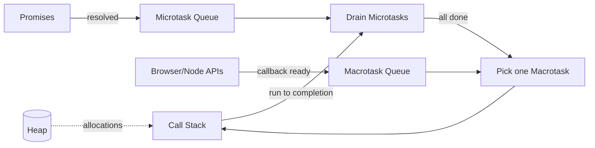

# JavaScript

## Chapter Goal

After reading this chapter, an experienced engineer can explain the
JavaScript runtime model on a whiteboard, reason about asynchronous
code without hand-waving, recognize the standard memory and
equality pitfalls, and answer interview questions on closures,
`this`, prototypes, modules, and the event loop without slipping
into folklore.

This chapter is conceptual and stays away from version-pinned APIs.
Engine quirks change; the model in this chapter does not.

## Why This Matters for a Tech Lead

JavaScript is the language of the browser and one of the dominant
server languages. A Tech Lead does not write the hottest inner loop,
but must:

- Set the lint rules and the module strategy (ESM vs CommonJS).
- Defend the team against the common foot-guns (`==`, floating
  promises, leaked subscriptions, blocked event loop).
- Explain to senior engineers and to product leadership why a
  "small" piece of async code blew up the p99 of a hot endpoint.
- Coach the team to write code that survives a production incident
  rather than code that "works on my machine".

Most JavaScript outages reduce to a small set of patterns. This
chapter names them so they can be recognized in code review and in
post-mortems.

## Mental Model

JavaScript is single-threaded. There is one **call stack**, one
**heap**, and a runtime that pulls work from queues onto that stack.
Asynchronous work is not concurrent execution of JavaScript code; it
is **scheduling**. The engine runs synchronous code to completion,
then drains the **microtask queue** to completion, then takes one
**macrotask** (also called a task) and repeats.



Notice that microtasks (Promise reactions, `queueMicrotask`,
`MutationObserver` in the browser) run **before** the next macrotask
(timers, I/O, UI events, `setImmediate` in Node). A flood of
microtasks can starve the macrotask queue and freeze the UI. A
synchronous loop blocks both queues; the page becomes unresponsive
because nothing else can run on the single thread.

A Tech Lead should be able to draw this diagram from memory.

## Core Terminology

| Term | Definition |
| --- | --- |
| **Execution context** | The environment in which code runs: variable bindings, the value of `this`, and the lexical environment (scope chain). |
| **Call stack** | LIFO stack of execution contexts. A JavaScript program has one. |
| **Heap** | Where objects, closures, and dynamically allocated values live. |
| **Event loop** | Coordinator that pulls work from the microtask and macrotask queues onto the call stack. |
| **Microtask** | High-priority callback queued by Promise resolution, `queueMicrotask`, or `MutationObserver`. |
| **Macrotask (task)** | Lower-priority callback queued by timers, I/O completion, UI events, or `setImmediate` (Node). |
| **Hoisting** | The phase before code runs in which declarations are made visible to their scope. |
| **Temporal dead zone (TDZ)** | The interval between entering a scope and the `let`/`const` declaration in which accessing the binding throws `ReferenceError`. |
| **Lexical scope** | A binding's scope is determined by where it is written, not where it is called. |
| **Closure** | A function plus its captured lexical environment. |
| **Prototype chain** | Linked list of objects walked on property lookup; ends at `null`. |
| **Promise** | An object representing the eventual result of an asynchronous operation, with three states: pending, fulfilled, rejected. |
| **ESM vs CommonJS** | The two module systems used in JavaScript. ESM is the language standard (`import`/`export`); CommonJS is the legacy Node format (`require`/`module.exports`). |
| **AbortController** | Standard mechanism to signal cancellation to async APIs that accept an `AbortSignal`. |
| **Strict mode** | Opt-in language mode (`"use strict"` or any module) with stricter semantics; disables silent errors. |

Distinguish closely related terms:

- **Concurrency vs parallelism**: JavaScript is concurrent (it
  interleaves tasks on a single thread) but not parallel by default.
  Workers and worker threads add parallelism on separate threads.
- **Asynchronous vs non-blocking**: an asynchronous API returns
  control before the work finishes; a non-blocking call also does
  not wait, but the term usually refers to I/O. They are not
  synonyms.
- **Pure function vs idempotent function**: a pure function has no
  observable side effects and returns the same output for the same
  input. An idempotent function may have side effects, but applying
  it twice has the same effect as applying it once.
- **Equality**: `==` performs type coercion (avoid in production);
  `===` requires same type and value; `Object.is` differs from
  `===` only on `NaN` and `±0`.

## Theoretical Foundation

### Execution context and the call stack

Every function invocation pushes an execution context onto the call
stack. Each context binds:

- The **variable environment** (parameters, local variables).
- The **lexical environment** (the chain of outer scopes).
- The current value of **`this`**.

When the function returns, its context is popped. JavaScript exposes
this stack indirectly through `Error().stack`. Stack overflow
errors are not the engine "running out of memory" — they are the
call stack exceeding its fixed size, almost always from unbounded
recursion.

```js
function recurse(n) {
  return recurse(n + 1);
}
recurse(0); // RangeError: Maximum call stack size exceeded
```

The function does not return, so contexts are never popped. The fix
is iteration or trampolining (turning recursion into a loop driven
by a queue of work items). Tail-call optimization is in the language
specification but is not implemented by mainstream engines today, so
do not rely on it.

### The event loop, microtasks, and macrotasks

The engine runs JavaScript to completion on the call stack, then
asks: are there microtasks? It drains them, all of them, including
any that were scheduled by other microtasks. Only when the
microtask queue is empty does it take **one** macrotask.

```js
console.log("A");
setTimeout(() => console.log("B"), 0);
Promise.resolve().then(() => console.log("C"));
queueMicrotask(() => console.log("D"));
console.log("E");
// Output: A, E, C, D, B
```

Synchronous code runs first (`A`, `E`). Then the microtask queue
drains in FIFO order (`C` from the resolved Promise, then `D` from
`queueMicrotask`). Only then does the timer callback run (`B`). A
weaker explanation would say "Promises are faster than `setTimeout`";
that confuses scheduling priority with speed.

A microtask flood freezes the UI just as effectively as a `while
(true)`. A `then` chain that schedules another microtask in every
`then` is a denial-of-service against the rendering pipeline.

> Verify against official documentation. Specific Node.js phases
> (`timers`, `pending callbacks`, `idle/prepare`, `poll`, `check`,
> `close callbacks`) and the placement of `process.nextTick` vs
> microtasks have evolved across Node versions.

### Hoisting and the temporal dead zone

Declarations are processed before code runs. `var` declarations are
hoisted and initialized to `undefined`. `let` and `const` are
hoisted but **not** initialized; the binding exists in the
**temporal dead zone** until execution reaches the declaration.
Function declarations are fully hoisted; function expressions are
not.

```js
console.log(a); // undefined  (var: hoisted + initialized)
console.log(b); // ReferenceError (let: TDZ)
console.log(c); // ReferenceError (const: TDZ)
console.log(f()); // "ok" (declaration: fully hoisted)
console.log(g()); // TypeError: g is not a function

var a = 1;
let b = 2;
const c = 3;
function f() { return "ok"; }
var g = function () { return "ok"; };
```

Use `const` by default. Use `let` when you need rebinding. Avoid
`var`; it leaks across blocks and silently allows redeclaration.
This is not pedantry — `var` interactions inside loops and inside
event handlers are a recurring source of "the wrong variable was
captured" bugs.

### Scope and closures

JavaScript uses **lexical scope**: a function's scope is determined
by where it is written, not where it is invoked. A **closure** is a
function bundled with its captured outer variables. Closures are
the basis of module patterns, factory functions, and most idiomatic
asynchronous code.

```js
function makeCounter() {
  let count = 0;
  return {
    inc: () => ++count,
    get: () => count,
  };
}

const c = makeCounter();
c.inc();
c.inc();
c.get(); // 2
```

The two arrow functions share the same captured `count`. The
counter is private; `count` cannot be touched from the outside.
This is a feature; a common interview trap is asking for a counter
that survives across calls without exposing the variable.

A closure that captures a large object keeps that object alive as
long as the closure itself is reachable. This is the most common
JavaScript memory leak in long-running services.

### The this keyword

`this` is determined at **call time**, not at definition time, with
four call patterns:

1. **Method call** (`obj.fn()`): `this` is `obj`.
2. **Plain function call** (`fn()`): `this` is `undefined` in strict
   mode, the global object otherwise.
3. **Constructor call** (`new Fn()`): `this` is the new instance.
4. **Explicit binding** (`fn.call(x)`, `fn.apply(x, args)`,
   `fn.bind(x)`): `this` is `x`.

Arrow functions are different: they do not have their own `this`.
They capture it lexically from the surrounding scope. This is why
arrow functions are preferred for callbacks inside class methods —
they keep the outer `this` intact.

```js
class Timer {
  constructor() {
    this.count = 0;
  }
  start() {
    setInterval(() => this.count++, 1000);
  }
}
```

The arrow function in `setInterval` captures the `Timer` instance's
`this`. The weaker alternative — a regular function passed to
`setInterval` — would lose `this` and either throw in strict mode
or, worse, mutate global state.

### Prototypes and classes

Every JavaScript object has an internal `[[Prototype]]` link to
another object (or `null`). Property lookup walks this chain. The
`class` syntax is sugar over the prototype model: methods live on
the prototype, instance fields live on the instance.

```js
class Animal {
  constructor(name) { this.name = name; }
  speak() { return `${this.name} makes a sound`; }
}

class Dog extends Animal {
  speak() { return `${this.name} barks`; }
}

const d = new Dog("Rex");
d.speak(); // "Rex barks"
```

`Dog.prototype` has `[[Prototype]]` pointing to `Animal.prototype`.
Lookup of `speak` finds it on `Dog.prototype` and stops. If `Dog`
did not override it, lookup would continue to `Animal.prototype`.
The chain ends at `Object.prototype` and then `null`.

The classical trap is mutating prototypes at runtime. It works, but
it pessimizes optimization (engines emit code paths assuming stable
shapes), and it confuses tooling. Prefer classes or factory
functions to ad-hoc prototype mutation.

### Modules: ESM vs CommonJS

Two module systems coexist:

- **CommonJS (CJS)**: `require`/`module.exports`. Synchronous,
  Node's historical default, dynamic.
- **ECMAScript Modules (ESM)**: `import`/`export`. Asynchronous,
  static, the language standard, supported in browsers natively.

Module trade-offs:

| Aspect | **CommonJS** | **ESM** |
| --- | --- | --- |
| **Resolution** | Dynamic, at runtime | Static, parsed first |
| **Loading** | Synchronous | Asynchronous, supports top-level `await` |
| **Tree-shaking** | Hard | Native |
| **Browser support** | Bundler required | Native |
| **Interop with the other** | Requires care | Limited |

The "dual-package hazard" appears when the same library ships both
a CJS and an ESM build. Two copies of the module can be loaded
under the two systems, breaking `instanceof` checks and singletons.
Pick one module system per service and stick to it. Document the
choice. When publishing a library, prefer ESM with a CJS fallback
and use the `"exports"` field to make the boundary explicit.

> Verify against official documentation. Node's ESM resolution
> rules and the `"exports"` field have evolved across versions.

### Promises and async/await

A **Promise** represents the eventual result of an asynchronous
operation. It has three states — pending, fulfilled, rejected — and
two transitions, both irrevocable. Once settled, a Promise cannot
change state.

`async`/`await` is syntactic sugar over Promises. An `async`
function always returns a Promise. `await x` pauses the function
until `x` settles, then either resumes with the fulfillment value
or throws the rejection reason.

```js
async function loadUser(id, signal) {
  const res = await fetch(`/users/${id}`, { signal });
  if (!res.ok) throw new Error(`HTTP ${res.status}`);
  return res.json();
}
```

Three rules that stop most async bugs:

1. **Never mix `await` and unhandled Promises in the same function.**
   A floating Promise (one whose rejection is not handled) will be
   surfaced as an unhandled rejection. In Node, the process may
   exit; in the browser, the error reaches `window.onunhandledrejection`.
2. **Parallelize independent work with `Promise.all`.** Awaiting in
   a `for` loop serializes calls that could run in parallel and
   multiplies latency.
3. **Always pass an `AbortSignal` for I/O.** Without cancellation,
   a navigation or unmount leaves a request running and applies its
   result to a stale view, often as a "ghost write".

```js
async function loadDashboard(ids, signal) {
  const users = await Promise.all(
    ids.map((id) => loadUser(id, signal))
  );
  return users;
}
```

The fan-out runs in parallel. The weaker alternative is `for (const
id of ids) { users.push(await loadUser(id)); }`, which adds the
latency of every call together. In production, prefer
`Promise.allSettled` when one failure should not abort the others
(e.g. a dashboard with independent panels), and a concurrency
limiter when fan-out is unbounded (e.g. iterating over a million
records). `Promise.all` rejects on first failure and leaves the
other operations running.

### Error handling

JavaScript has two error worlds:

- **Synchronous errors** propagate via `throw`/`try`/`catch`.
- **Asynchronous errors** propagate via Promise rejections.

`async`/`await` unifies them inside an async function: a `throw` or
a Promise rejection is caught by the same `try`/`catch`. Outside
async functions, the two worlds remain separate.

Engineering rules:

- Throw `Error` objects, never strings or plain objects. Stack
  traces require a real `Error`.
- Wrap rethrown errors with context (operation name, identifier),
  using a `cause` reference to the original error.
- Let unknown errors crash. Catching `Error` indiscriminately at
  the top level masks bugs that should fail loudly.
- Distinguish **expected failures** (a 404 from a known endpoint)
  from **unexpected failures** (a TypeError in your code). Map them
  to different log levels and different alerts.

```js
try {
  await operation();
} catch (err) {
  throw new Error("operation failed", { cause: err });
}
```

The `cause` option (standardized in modern engines) preserves the
original error and its stack trace. The weaker alternative is
losing the original error or stringifying it. In production, log
the chain.

### Memory model and garbage collection

Objects, arrays, functions, and closures live on the heap. The
garbage collector reclaims memory that is **unreachable** from any
GC root (globals, the call stack, currently held closures). Modern
engines use a generational, mark-and-sweep collector with
incremental and concurrent phases. The shape of your code matters
more than the algorithm.

The four common JavaScript memory leaks:

1. **Forgotten timers**: a `setInterval` that captures a closure
   over a large component or DOM tree.
2. **Forgotten subscriptions**: an event listener attached to a
   long-lived emitter (window, store, EventSource) that is never
   removed.
3. **Detached DOM nodes**: a reference held in a JavaScript object
   to a node removed from the DOM.
4. **Caches without bounds**: a `Map` keyed by request id that
   grows forever.

The fixes:

- Always pair `addEventListener` with `removeEventListener` (or use
  `AbortController`).
- Always clear `setInterval`/`setTimeout` on teardown.
- Use `WeakMap`/`WeakSet`/`WeakRef` when the cache key should not
  prevent collection of the value.
- Cap caches with an LRU policy. See
  [Performance and Scalability](./19-performance-and-scalability.md).

`AbortController` is the modern, idiomatic cancellation primitive.
It removes timers and listeners with one signal:

```js
const ac = new AbortController();
target.addEventListener("click", onClick, { signal: ac.signal });
const id = setTimeout(work, 1000);
function dispose() { ac.abort(); clearTimeout(id); }
```

### Functional programming concepts

JavaScript supports first-class functions, higher-order functions,
and immutable updates. Three idioms are interview staples and
production fixtures:

- **`map`** transforms a list element-wise. Pure if the callback is
  pure.
- **`filter`** keeps elements that satisfy a predicate.
- **`reduce`** folds a list into a single value with an accumulator.

```js
const items = [{ price: 10 }, { price: 20 }, { price: 30 }];
const total = items
  .filter((i) => i.price > 10)
  .map((i) => i.price * 1.2)
  .reduce((sum, p) => sum + p, 0);
```

The pipeline reads top-down: filter, transform, fold. The weaker
alternative is a single `for` loop with three responsibilities; it
is faster but harder to refactor and harder to test in pieces.
Prefer the pipeline for readability; reach for `for` only when
profiling shows the pipeline allocates measurably.

**Immutability** in JavaScript is by convention. `const` only
prevents rebinding the binding, not mutation of the bound object.
For data structures, prefer non-mutating operations (`...`, `map`,
`filter`, `Object.assign({}, x, …)`) and freeze defensively at
boundaries (`Object.freeze`). For deep immutability without
manual cloning, use a structural sharing library or a reducer
pattern; for performance-critical paths in product code, do not
deep-clone naively — it allocates more than it saves.

```js
const updated = { ...user, email: newEmail }; // ok
user.email = newEmail; // avoid in shared state
```

### Modern syntax: destructuring, spread/rest, optional chaining, nullish coalescing

These features are not cosmetic; they remove specific classes of
bugs.

```js
const { name, address: { city } = {} } = user ?? {};
const [first, ...rest] = items;
const port = process.env.PORT ?? 3000;
const street = user?.address?.street;
```

- **Destructuring** with defaults handles `undefined` cleanly. It
  does not handle `null` — destructuring a `null` throws.
- **Spread/rest** (`...`) gives shallow copies and partial
  application. They are shallow; nested objects are still shared.
- **Optional chaining** (`?.`) short-circuits on `null` or
  `undefined`. It does not short-circuit on `false` or `0`.
- **Nullish coalescing** (`??`) returns the right side only on
  `null` or `undefined`. It is not the same as `||`, which falls
  back on any falsy value (`0`, `""`, `false`). The bug that `||`
  hides is "valid zero treated as missing". Use `??` for
  defaulting, `||` only when you actually want all falsy values to
  fall back.

### Debounce and throttle

Both convert a high-frequency stream of events into a manageable
one. They are not interchangeable.

- **Debounce**: delay invocation until the events stop for `wait`
  ms. Used for search-as-you-type, autosave on idle.
- **Throttle**: invoke at most once every `wait` ms. Used for
  scroll, resize, and pointer-move handlers.

```js
function debounce(fn, wait) {
  let id;
  return (...args) => {
    clearTimeout(id);
    id = setTimeout(() => fn(...args), wait);
  };
}

function throttle(fn, wait) {
  let last = 0;
  return (...args) => {
    const now = Date.now();
    if (now - last >= wait) {
      last = now;
      fn(...args);
    }
  };
}
```

The `debounce` above resets its timer on every call and only fires
after the user stops. The `throttle` fires immediately and then
ignores calls until `wait` ms have passed (leading edge only). The
common mistake: using debounce for a scroll handler (the user
never "stops" scrolling smoothly, so the handler fires once at the
end and misses intermediate positions). Use throttle for continuous
signals, debounce for discrete-typing signals.

Both have edge cases that production libraries handle:
leading/trailing edges, cancellation, immediate invocation, and
maximum wait. For shared code, use a vetted utility (e.g. lodash
`debounce`/`throttle`) and configure the edges explicitly. Rolling
your own is fine for small components; do not roll your own for
the search bar of a payment flow.

### Browser APIs: fetch, DOM, event delegation

`fetch` is the modern HTTP client in browsers and recent Node. Two
production-grade rules:

1. **Always check `response.ok`.** A 404 or 500 is not a thrown
   error in `fetch`; only network failures are.
2. **Always pass an `AbortSignal`.** Without it, a request continues
   after the user navigates away and burns CPU and bandwidth.

```js
async function getJSON(url, signal) {
  const res = await fetch(url, { signal });
  if (!res.ok) throw new Error(`HTTP ${res.status}`);
  return res.json();
}
```

For large responses, prefer streaming (`res.body.getReader()`) to
buffering. For binary, use `arrayBuffer` or `blob`, never `text`.

The DOM is a tree. Each node is a JavaScript object with parent,
sibling, and child references. Two production rules:

- **Mutate sparingly.** DOM mutations trigger style recalculation
  and layout. Batch reads and writes; avoid forced synchronous
  layout (`getBoundingClientRect()` between writes). For complex
  rendering, use a framework. Hand-managing the DOM is fine for
  small widgets, painful for full applications.
- **Use event delegation.** Attach one listener at a stable
  ancestor and dispatch via `event.target` instead of one listener
  per element.

```js
document.querySelector("#list").addEventListener("click", (e) => {
  const item = e.target.closest("[data-id]");
  if (!item) return;
  handleClick(item.dataset.id);
});
```

The list can grow without re-binding. The weaker alternative —
attaching a listener per `<li>` — multiplies memory and breaks for
elements added after binding. In production, delegation also makes
the listener trivially removable on teardown via
`AbortController`.

## Practical Usage

The same JavaScript core appears in different production shapes:

- **Browser product code**: rendering, user interaction, streaming
  data, offline. The hot constraint is the main thread; long tasks
  freeze the UI. Long work belongs in a Web Worker.
- **Node services**: HTTP, queues, timers. The hot constraint is
  the event loop; CPU-bound work belongs in worker threads or in a
  different runtime. See [Node.js](./10-nodejs.md).
- **Edge runtimes**: a stricter subset (no Node-only APIs, no
  filesystem, limited execution time). Choose libraries that
  declare edge support; do not assume Node APIs are available.
- **Shared code (frontend + backend)**: types of utilities,
  validation schemas, and pure domain logic. Keep this code free
  of environment-specific imports; cross it only through
  well-typed boundaries (see [TypeScript](./06-typescript.md)).

The pattern most commonly missed in interviews: the same async
function may be safe in the browser (where rejections become
console errors) and unsafe in Node (where unhandled rejections can
terminate the process). The Tech Lead must set per-environment
defaults.

## Examples

These short examples cross the boundaries between sections and are
the kind of snippets a Tech Lead should be able to reproduce on a
whiteboard.

### Cancellable parallel fetches

```js
async function loadAll(urls) {
  const ac = new AbortController();
  try {
    const responses = await Promise.all(
      urls.map((u) =>
        fetch(u, { signal: ac.signal }).then((r) => {
          if (!r.ok) throw new Error(`HTTP ${r.status}`);
          return r.json();
        })
      )
    );
    return responses;
  } catch (err) {
    ac.abort();
    throw err;
  }
}
```

A failure in any fetch aborts the others, which is usually what
you want for an "all or nothing" view. For independent panels
where one failure should not cancel the rest, use
`Promise.allSettled` and surface partial results.

### A single-flight cache

```js
const inFlight = new Map();

function singleFlight(key, fn) {
  let p = inFlight.get(key);
  if (!p) {
    p = fn().finally(() => inFlight.delete(key));
    inFlight.set(key, p);
  }
  return p;
}
```

Concurrent callers for the same key share one Promise. Useful
against [cache stampede](./19-performance-and-scalability.md). The
`finally` removes the entry once settled; without it, a single
stale Promise would be served indefinitely.

### Idiomatic event-loop ordering trap

```js
console.log("1");
setTimeout(() => console.log("2"));
Promise.resolve().then(() => console.log("3")).then(() => console.log("4"));
console.log("5");
// Output: 1, 5, 3, 4, 2
```

Synchronous code first (`1`, `5`). Then the microtask queue drains
fully — the second `.then` is queued by the first one and still
runs before any macrotask (`3`, `4`). Finally the timer (`2`).
Candidates who answer `1, 5, 2, 3, 4` are confusing scheduling
priority with FIFO order across all queues.

### Closure as a request-scoped logger

```js
function createRequestLogger(requestId) {
  const start = Date.now();
  return {
    info: (msg) => console.log(JSON.stringify({
      requestId, ms: Date.now() - start, level: "info", msg,
    })),
    error: (msg, err) => console.log(JSON.stringify({
      requestId, ms: Date.now() - start, level: "error", msg,
      stack: err?.stack,
    })),
  };
}

// Usage in an HTTP handler:
app.get("/users/:id", async (req, res) => {
  const log = createRequestLogger(req.headers["x-request-id"]);
  log.info("start");
  const user = await db.find(req.params.id);
  log.info("db done");
  res.json(user);
});
```

The closure captures `requestId` and `start`. Every `log.info`
call has request context without passing extra parameters through
every function. The common mistake is creating a module-level
logger that shares mutable state across concurrent requests. In
production, replace `console.log` with a structured log library
(e.g. pino) and pass the logger via context or DI — but the
closure pattern remains the same.

### The this keyword — problem and three solutions

```js
class Poller {
  constructor(url, intervalMs) {
    this.url = url;
    this.intervalMs = intervalMs;
  }

  start() {
    // BUG: regular function loses `this`
    // setInterval(function () { this.poll(); }, this.intervalMs);

    // Fix 1: arrow function (captures `this` lexically)
    setInterval(() => this.poll(), this.intervalMs);

    // Fix 2: bind (creates a new function with fixed `this`)
    // setInterval(this.poll.bind(this), this.intervalMs);

    // Fix 3: class field arrow (assigned in constructor)
    // poll = () => { ... }
  }

  poll() {
    fetch(this.url).then((r) => r.json()).then(console.log);
  }
}
```

The BUG line passes a regular function to `setInterval`. When the
timer fires, `this` is `undefined` (strict mode) or the global
object. The three fixes all bind `this` to the `Poller` instance.
Prefer Fix 1 (arrow in the call site) when you need to clear the
interval later. Prefer Fix 3 (class field arrow) when the method
is passed to many consumers. Avoid Fix 2 (`.bind`) in render
loops because it creates a new function on every call — not a
correctness issue, but a memoization-breaker in frameworks.

### Promise.allSettled for partial success

```js
async function loadDashboardPanels(panelConfigs, signal) {
  const results = await Promise.allSettled(
    panelConfigs.map((cfg) =>
      fetchPanel(cfg.url, signal).then((data) => ({ id: cfg.id, data }))
    )
  );

  const panels = {};
  const errors = [];
  for (const r of results) {
    if (r.status === "fulfilled") panels[r.value.id] = r.value.data;
    else errors.push(r.reason);
  }

  if (errors.length) reportErrors(errors);
  return panels; // partial result — render what succeeded
}
```

Use `Promise.allSettled` when each operation is independent and
partial success is acceptable (a dashboard with one failed panel
is better than a blank screen). The common mistake is using
`Promise.all` here — a single panel failure rejects the aggregate
and throws away all successful results. In production, track the
failure ratio and alert if it exceeds a threshold.

### Safe fetch with timeout and structured errors

```js
class HttpError extends Error {
  constructor(status, body) {
    super(`HTTP ${status}`);
    this.name = "HttpError";
    this.status = status;
    this.body = body;
  }
}

async function safeFetch(url, { timeoutMs = 5000, signal, ...opts } = {}) {
  const ac = new AbortController();
  const timer = setTimeout(() => ac.abort(), timeoutMs);

  if (signal) signal.addEventListener("abort", () => ac.abort());

  try {
    const res = await fetch(url, { ...opts, signal: ac.signal });
    if (!res.ok) {
      const body = await res.text().catch(() => "");
      throw new HttpError(res.status, body);
    }
    return res;
  } finally {
    clearTimeout(timer);
  }
}
```

This wrapper solves three gaps in bare `fetch`: (1) it aborts on
timeout instead of hanging forever; (2) it turns non-2xx responses
into thrown errors with a typed class; (3) it composes with an
external `AbortSignal` from the caller. The common mistake is
omitting the `finally` — without clearing the timer, a fast
response still leaves a dangling `setTimeout` that fires `abort`
on an already-settled fetch (harmless but wasteful, and confusing
in logs). In production, add retry logic on top of this primitive.

### Proper listener cleanup with AbortController

```js
function attachAnalytics(element) {
  const ac = new AbortController();

  element.addEventListener("click", (e) => {
    track("click", { target: e.target.tagName });
  }, { signal: ac.signal });

  window.addEventListener("scroll", () => {
    track("scroll", { y: window.scrollY });
  }, { signal: ac.signal, passive: true });

  const timer = setInterval(() => {
    track("heartbeat", { visible: !document.hidden });
  }, 30_000);

  return function dispose() {
    ac.abort();           // removes both listeners in one call
    clearInterval(timer); // clears the timer
  };
}

// On unmount:
const dispose = attachAnalytics(root);
// ... later:
dispose();
```

One `AbortController` gates all listeners attached by a feature.
Calling `abort()` removes them all without keeping individual
references. The common mistake is attaching listeners in a
component's mount without any teardown — each mount leaks a new
listener. In production, frameworks call the dispose function
automatically on unmount; the pattern here is framework-agnostic.

### Immutability patterns for state updates

```js
const users = [
  { id: 1, name: "Alice", role: "admin" },
  { id: 2, name: "Bob", role: "viewer" },
];

// Add
const added = [...users, { id: 3, name: "Carol", role: "editor" }];

// Remove
const removed = users.filter((u) => u.id !== 2);

// Update one field on one item
const updated = users.map((u) =>
  u.id === 1 ? { ...u, role: "superadmin" } : u
);

// Nested update (shallow spread per level)
const state = { user: { profile: { name: "Alice", age: 30 } } };
const newState = {
  ...state,
  user: { ...state.user, profile: { ...state.user.profile, age: 31 } },
};
```

Every operation returns a new reference; the originals are
untouched. Change detection (`prevState !== nextState`) works
because the reference changes. The common mistake is mutating
in place (`users[0].role = "x"`) — it corrupts shared state
and breaks framework reactivity. For deep nesting (more than 2
levels), the spread-per-level pattern is unreadable; use a helper
like `structuredClone` for snapshots or an immutable-update
library for surgical changes. In production, keep state
structures shallow; deep nesting is a design smell.

### Realistic map/filter/reduce pipeline

```js
const orders = [
  { id: "a1", amount: 120, status: "paid", region: "EU" },
  { id: "a2", amount: 45, status: "pending", region: "US" },
  { id: "a3", amount: 200, status: "paid", region: "EU" },
  { id: "a4", amount: 80, status: "paid", region: "US" },
];

const euRevenue = orders
  .filter((o) => o.status === "paid" && o.region === "EU")
  .map((o) => o.amount)
  .reduce((sum, a) => sum + a, 0);
// 320
```

The pipeline reads as a sentence: "keep paid EU orders, extract
amounts, sum them." The common mistake is using `reduce` for the
entire operation — a single reducer with three responsibilities
is harder to read and harder to unit-test in pieces. The weaker
alternative: a `for` loop with a running total and two `if`
checks. It works, but refactoring (e.g. adding `map` to apply
a discount) requires touching the loop body. In production, if
the array is large (>10k) and this runs on every render, profile
first; the pipeline allocates intermediate arrays.

### ESM and CommonJS side by side

```js
// ─── ESM (the standard) ─────────────────────────
// math.js
export function add(a, b) { return a + b; }
export default function multiply(a, b) { return a * b; }

// consumer.js
import multiply, { add } from "./math.js";

// ─── CommonJS (Node legacy) ──────────────────────
// math.cjs
function add(a, b) { return a + b; }
function multiply(a, b) { return a * b; }
module.exports = { add, multiply };

// consumer.cjs
const { add, multiply } = require("./math.cjs");
```

ESM imports are statically analyzed — the bundler knows at build
time which exports are used and can tree-shake the rest. CJS
`require` is dynamic (can appear inside `if` blocks), making
dead-code elimination unreliable. The common mistake is mixing
them in the same package without an `"exports"` field — this
leads to the dual-package hazard. In production, new services
use ESM exclusively; libraries declare the boundary via
`package.json` `"exports"`.

### Promise chain vs async/await

```js
// Promise chain — fine for simple linear transforms
function getUser(id) {
  return fetch(`/users/${id}`)
    .then((r) => { if (!r.ok) throw new Error(`HTTP ${r.status}`); return r.json(); })
    .then((user) => ({ ...user, fetchedAt: Date.now() }));
}

// async/await — clearer when there is branching or error handling
async function getUserSafe(id, signal) {
  const res = await fetch(`/users/${id}`, { signal });
  if (!res.ok) throw new Error(`HTTP ${res.status}`);
  const user = await res.json();

  if (user.needsMigration) {
    await migrateUser(user);
  }

  return { ...user, fetchedAt: Date.now() };
}
```

Both produce a Promise. The chain is compact for linear
transforms with no branching. `async`/`await` wins when control
flow appears (conditionals, loops, try/catch). The common
mistake: mixing them in the same function (starting with `await`
then returning `.then(...)`) — it confuses readers about where
errors land. Pick one style per function. In production,
`async`/`await` is the default; chains survive in utility
one-liners and in hot-path fan-outs (`urls.map(u => fetch(u).then(...))`).

### Async error handling — the correct pattern

```js
async function processOrder(orderId, signal) {
  try {
    const order = await fetchOrder(orderId, signal);
    const result = await chargePayment(order, signal);
    await sendConfirmation(order, result, signal);
    return result;
  } catch (err) {
    if (err.name === "AbortError") return; // cancelled — not an error
    if (err instanceof HttpError && err.status === 409) {
      return handleDuplicate(orderId);     // expected — recoverable
    }
    throw new Error("processOrder failed", { cause: err }); // unexpected — rethrow with context
  }
}
```

Three error categories handled differently: (1) cancellation is
ignored (the caller chose to stop); (2) a known recoverable
condition triggers a fallback; (3) anything else is wrapped with
`cause` and rethrown for the boundary handler. The common
mistake: a blanket `catch` that logs and swallows all errors,
hiding bugs. In production, the boundary handler (HTTP framework,
queue consumer) maps error types to status codes and structured
log entries.

## Common Mistakes

1. **Using `==` instead of `===`**
   - Looks like: `if (count == "0")` to "be lenient".
   - Why it is wrong: type coercion has surprising rules
     (`"" == 0`, `[] == false`, `null == undefined`).
   - Correct approach: enable `eqeqeq` in lint; use `===` and
     explicit conversion (`Number(x)`, `String(x)`).

2. **Awaiting in a loop where parallel is correct**
   - Looks like: `for (const id of ids) { results.push(await load(id)); }`.
   - Why it is wrong: serializes independent calls; multiplies
     latency.
   - Correct approach: `await Promise.all(ids.map(load))`. Add a
     concurrency limiter when fan-out is large.

3. **Floating Promises**
   - Looks like: `doWork();` (no `await`, no `.catch`).
   - Why it is wrong: rejections become unhandled rejections; in
     Node, the process can terminate.
   - Correct approach: `await` it, attach a `.catch`, or
     intentionally fire-and-forget with a logged error handler.
     Enable the `no-floating-promises` lint rule.

4. **Capturing the wrong `this`**
   - Looks like: `setInterval(function () { this.tick(); }, 1000);`
     inside a class method.
   - Why it is wrong: a regular function does not capture the
     enclosing `this`.
   - Correct approach: arrow function or `.bind(this)`.

5. **Closures over loop variables with `var`**
   - Looks like: `for (var i = 0; i < 5; i++) setTimeout(() => log(i));`
     printing `5` five times.
   - Why it is wrong: `var` is function-scoped; all closures share
     the same `i`.
   - Correct approach: `let i` (block-scoped), or pass `i` to a
     factory.

6. **Falsy-default with `||`**
   - Looks like: `const port = userPort || 3000;`.
   - Why it is wrong: `userPort` of `0` falls through to the
     default.
   - Correct approach: use `??` for "missing means default".

7. **Mutating shared state by accident**
   - Looks like: `const next = state; next.flag = true;` in a
     reducer.
   - Why it is wrong: `state` and `next` reference the same object;
     change detection breaks.
   - Correct approach: `const next = { ...state, flag: true };`.

8. **Forgetting to remove listeners**
   - Looks like: `addEventListener` on `window` inside a component
     mount, no removal on unmount.
   - Why it is wrong: leaks the component and everything it closes
     over.
   - Correct approach: `AbortController` + `{ signal: ac.signal }`,
     and `ac.abort()` on unmount.

9. **Blocking the event loop with synchronous CPU work**
   - Looks like: parsing a large JSON or running a heavy regex on
     the main thread.
   - Why it is wrong: freezes the UI or stalls the Node server.
   - Correct approach: chunk the work with `setTimeout`/`yield`,
     move it to a Web Worker / worker thread, or stream it.

10. **JSON `parse`/`stringify` for cloning**
    - Looks like: `const copy = JSON.parse(JSON.stringify(obj));`.
    - Why it is wrong: loses `Date`, `Map`, `Set`, `undefined`,
      functions, prototype info; throws on cycles.
    - Correct approach: `structuredClone(obj)` for deep copy
      including most built-in types.

## Trade-offs

Trade-offs that recur across JavaScript work:

| Choice | Optimizes for | Sacrifices | Flips when |
| --- | --- | --- | --- |
| **Callbacks vs Promises** | Minimal allocation | Composition, error propagation | Anything beyond a single async hop |
| **Promises vs `async`/`await`** | Explicit chains, fan-out | Slight extra syntax | Always — `async`/`await` is the default |
| **ESM vs CJS** | Standardization, tree-shaking | Migration cost in legacy Node | Any new project; revisit dual builds for libraries |
| **Map/filter/reduce vs `for`** | Readability, composability | Allocations, micro-perf | Profiling shows allocation pressure on a hot path |
| **Workers vs main-thread compute** | Main-thread responsiveness | Message-passing complexity | Tasks > ~50 ms or that block the UI |
| **Streaming vs buffering** | Memory ceiling, time-to-first-byte | Code complexity | Payloads larger than a few MB or unbounded |

The Tech Lead's job is to make the trade-off explicit in the
ADR/RFC, not to pick the "best" option universally.

## Production Considerations

- **Lint discipline.** Enforce `no-floating-promises`,
  `no-misused-promises`, `eqeqeq`, `no-var`, `prefer-const`, and
  `consistent-return` at minimum. Lint rules catch the patterns in
  Common Mistakes before review.
- **Module strategy.** Decide ESM vs CJS per service and document
  it. Libraries that ship dual builds need careful `"exports"`
  configuration to avoid the dual-package hazard.
- **Cancellation as a first-class citizen.** Every async function
  that does I/O accepts an `AbortSignal`. Without this, the team
  will reinvent cancellation badly. See
  [Node.js](./10-nodejs.md#graceful-shutdown) for the server side.
- **Memory ceilings.** Set heap size limits in production
  (`--max-old-space-size` for Node) and alert on memory growth, not
  on raw usage. A flat 800 MB is fine; a slow climb to 800 MB is
  not.
- **Long-task budgets.** In the browser, set a budget for tasks
  longer than 50 ms (the Long Tasks API surfaces them). Worker
  threads are required when the budget is exceeded by core
  rendering work.
- **Observability.** Log structured errors with `cause` chains.
  Sample, do not log, high-cardinality fields. See
  [Observability](./18-observability.md).
- **Security.** Ban `eval` and `innerHTML` with user input via lint
  and CSP. Validate all externally-provided keys before merging
  into objects (prototype pollution). Restrict source maps to
  internal tooling. Automate dependency vulnerability scanning in
  CI. See [Security](./15-security.md).
- **Hiring and team skill mix.** A team that does not know the
  event loop ships event-loop bugs. Treat the model in this chapter
  as part of the onboarding curriculum, not advanced material.

## Tech Lead Decision-Making

This section captures the decisions that distinguish a Tech Lead
from a strong Senior Engineer. A senior writes correct async code;
a Tech Lead decides which async pattern the team uses, documents
it, and ensures the decision survives six months of attrition.

### Choosing plain JavaScript vs TypeScript

**What a Senior Engineer usually knows:** TypeScript adds type
safety and IDE support. It catches bugs early.

**What a Tech Lead is expected to decide:**

- **Migration scope.** Convert incrementally (`.js` → `.ts` one
  directory at a time) or greenfield-only? Incremental avoids a
  big-bang rewrite but requires a `tsconfig` that permits `.js`
  files alongside `.ts` — and a team agreement on which files are
  "done".
- **Strictness level.** `strict: true` from day one in new
  projects. For migrations, start with `noImplicitAny: false` and
  ratchet up. The mistake is enabling strict mode globally on a
  legacy codebase — you create 2,000 errors and the PR sits open
  for weeks.
- **Where TypeScript is not worth it.** Tiny internal scripts,
  CI glue, shell wrappers. The typing overhead exceeds the benefit
  when the code is <50 lines, has no consumers, and is rarely
  touched.

**Stakeholder explanation:** "TypeScript catches about 15% of bugs
before they reach production. We add it to all new code and
convert existing code when we touch it. Full migration is not
required and would block feature work."

**Common overengineering trap:** Adopting TypeScript but spending
weeks writing complex generic utility types that only one person
understands. TypeScript should reduce cognitive load, not shift
it.

### Establishing team coding standards

**What a Senior Engineer usually knows:** Prettier and ESLint
exist. Consistent code is easier to review.

**What a Tech Lead is expected to decide:**

1. **Which rules are errors, which are warnings.** Errors block
   CI. Use errors for correctness (floating promises, `==`). Use
   warnings for style rules during migration. Zero warnings in
   main; a warning in main becomes invisible in a month.
2. **Formatter vs linter boundary.** Prettier handles formatting;
   ESLint handles correctness and patterns. Never configure both
   to disagree on the same rule.
3. **Custom rules.** Write one only if the team makes the same
   mistake three times and it cannot be caught with an existing
   rule.
4. **Review expectations.** Code review focuses on design, naming,
   and non-lintable concerns. If a review comment can be a lint
   rule, it should be one.

**Production readiness checklist:**

- [ ] ESLint + Prettier enforced in CI (not just IDE).
- [ ] `eslint --max-warnings 0` prevents warning accumulation.
- [ ] Shared config published as an internal package; all services
      inherit it.
- [ ] New rule proposals go through a lightweight RFC with a
      one-week comment window.

### Async error handling standards

**What a Senior Engineer usually knows:** Use try/catch with
`async`/`await`. Attach `.catch` if not awaiting.

**What a Tech Lead is expected to decide:**

- **Error classification.** Define categories: operational (retry),
  programmer (fix code), fatal (crash). Each category has a
  different handler.
- **Error boundary placement.** Errors propagate up until a
  boundary catches them. Boundaries live at well-defined edges:
  HTTP middleware, queue consumer, scheduler tick. Code between
  boundaries rethrows with `{ cause }`.
- **Unhandled rejection policy.** In Node, set
  `process.on('unhandledRejection', ...)` to log and exit. A
  process that swallows rejections is a process that silently
  corrupts data.
- **When to wrap vs rethrow.** Wrap at a module boundary when the
  caller should not know about the dependency's error shape.
  Rethrow everywhere else. Never wrap without `cause`.

**Interview framing:** "I set up three things: error categories
that map to actions (retry/alert/crash), mandatory `cause`
chaining so we never lose context, and a lint rule that prevents
bare `.catch(() => {})`. The result is that on-call can read a
single log entry and know whether to page someone or wait for the
retry."

### Promise concurrency patterns

**What a Senior Engineer usually knows:** `Promise.all` runs in
parallel, rejects on first failure. `Promise.allSettled` waits
for all.

**What a Tech Lead is expected to decide:**

- **Concurrency limits.** Unbounded `Promise.all` over 500 URLs
  creates 500 TCP connections simultaneously. Use a concurrency
  limiter (e.g. `p-limit`, hand-rolled semaphore) with a limit
  based on the target's capacity.
- **Timeout per item vs total.** A 5s timeout per fetch with 100
  items can take 500s total if the limiter is set to 1. Decide
  whether to set a wall-clock budget and abort remaining work.
- **Failure modes.** `Promise.all` is all-or-nothing.
  `Promise.allSettled` is best-effort. Choose based on whether
  partial results are useful. For critical paths (checkout),
  all-or-nothing is correct; for dashboards, partial is better
  than blank.
- **Back-pressure.** If the producer is faster than the consumer,
  queue depth grows without bound. The Tech Lead decides the
  queue's max size and what happens when it is full (drop, reject,
  apply back-pressure upstream).

**When not to use `Promise.all`:** When the operations are
dependent (output of one is input to the next). Sequential
`await` is correct there; using `Promise.all` on dependent work
is a concurrency bug, not a performance optimization.

### Browser compatibility decisions

**What a Senior Engineer usually knows:** Babel transpiles; core-js
polyfills. Check caniuse.com.

**What a Tech Lead is expected to decide:**

- **Support matrix.** Define it explicitly (e.g. "last 2 versions
  of Chrome, Firefox, Safari, Edge; no IE"). Put it in the repo
  as a `browserslist` entry so tools read it automatically.
- **Feature detection vs polyfill.** Small polyfills ship in the
  bundle; large ones (e.g. `Intl` data) load conditionally.
  Feature detection (check if the API exists) is preferable to
  blanket polyfilling.
- **Differential serving.** Ship modern bundles to modern browsers
  and a legacy bundle to old ones (via `<script type="module">`
  + `<script nomodule>`). The trade-off: two bundles in CI, more
  complex deployment, but 20–30% smaller payloads for modern
  browsers.
- **When to drop support.** When analytics show <1% traffic from a
  browser and the maintenance cost of supporting it exceeds the
  revenue at risk. Document the decision and communicate to
  customer support.

### Memory leak prevention in long-running applications

**What a Senior Engineer usually knows:** Use the DevTools heap
snapshot. Look for detached DOM nodes.

**What a Tech Lead is expected to decide:**

- **Proactive policy, not reactive debugging.** Require
  `AbortController` cleanup in all components. Ban `setInterval`
  without a paired `clearInterval` in the same lifecycle.
- **Monitoring in production.** Track Node heap via
  `process.memoryUsage()` on a 30s interval; alert on slope, not
  absolute value. In the browser, use the `performance.memory`
  API (Chrome) or synthetic canary tests.
- **Acceptable leak rate.** Define it. A service that leaks 1 MB/h
  is fine if it restarts daily; it is fatal if it runs for weeks.
  The decision is operational: shorter restart cycles vs
  investment in leak hunting.
- **Common sources by environment:**
  - Browser: closures in `addEventListener` without teardown,
    detached DOM trees referenced by JS, uncleared timers.
  - Node: unbounded caches (`Map` that never evicts), streams
    without `destroy()` on error, event emitter listeners that
    accumulate.

**Debugging playbook (incident response):**

1. Confirm leak: heap grows monotonically across multiple GC
   cycles (not just allocation churn).
2. Take two heap snapshots 60s apart; diff retained size by
   constructor.
3. Identify the retainer chain — follow the first edge from root
   to the leaked object.
4. Patch the retainer (remove listener, clear cache, call
   `destroy`).
5. Validate in staging with an accelerated workload.

### Frontend bundle size and execution cost

**What a Senior Engineer usually knows:** Use code splitting and
lazy imports. Tree-shake unused code.

**What a Tech Lead is expected to decide:**

- **Budget.** Set a per-route JS budget (e.g. 150 KB gzipped for
  initial load). Enforce it in CI with `bundlesize` or a bundler
  plugin that fails the build on regression.
- **Cost model.** Download time is only half the story. Parse +
  compile + execute is the other half. 200 KB of JS on a
  mid-range phone costs ~1s of main-thread time. The budget must
  account for execution cost, not just transfer size.
- **Dependency governance.** Before adding a new dependency:
  (a) check its bundle size (`bundlephobia.com`); (b) check if it
  is tree-shakeable; (c) check if the team already has a similar
  utility. One developer's "small helper" is another developer's
  50 KB of dead code pulled in via a barrel export.
- **Shared utility libraries.** Publish a single internal library
  for common utilities (date formatting, validation, error
  classes). Keep it tree-shakeable with named exports and no side
  effects. Never publish a barrel `index.ts` that re-exports
  everything — it defeats tree-shaking.

**Stakeholder explanation:** "Every 100 KB of JavaScript we add
costs roughly 0.5s on a median mobile device. That directly
affects conversion rate. Our budget ensures no single feature
makes the app noticeably slower."

### Dependency governance

**What a Senior Engineer usually knows:** Use lockfiles. Run
`npm audit`.

**What a Tech Lead is expected to decide:**

- **Approval policy.** Any new runtime dependency requires a brief
  justification: why can't we write it ourselves in <100 lines?
  Is it actively maintained? Does it have known security issues?
- **Update cadence.** Renovate or Dependabot weekly, merged by CI
  if tests pass. Manual review for major bumps.
- **Vendoring vs registry.** For critical path dependencies with
  a bus-factor-of-one maintainer, consider vendoring or forking.
- **Duplicate detection.** Run `npm ls <package>` to catch
  multiple versions in the tree. Two versions of a date library
  double the bundle size and cause subtle type-incompatibility
  bugs.
- **License compliance.** Automate license scanning in CI. Block
  copyleft licenses (GPL) in proprietary frontend bundles.

### Debugging production JavaScript issues

**What a Senior Engineer usually knows:** Use `console.log`,
breakpoints, and network tab.

**What a Tech Lead is expected to decide:**

- **Source maps in production.** Ship them, but restrict access
  (upload to an error tracker, do not serve publicly). Without
  source maps, a minified stack trace is useless; with public
  source maps, your code is readable by competitors.
- **Error tracker selection.** Choose a service that groups by
  `cause` chain, provides release-based regression detection, and
  alerts on new error types rather than just volume.
- **Runbook-driven incident response.** Every known failure mode
  has a runbook entry: symptoms, diagnosis commands, mitigation,
  and root-cause steps. Example runbook steps for "Node service
  latency spike":
  1. Check event-loop lag metric (is the loop blocked?).
  2. Take a CPU profile for 30s.
  3. If one function dominates, check for synchronous JSON parse
     or regex backtracking.
  4. If GC dominates, take a heap snapshot and look for growth.
- **Canary deployments for JavaScript.** Roll out JS changes to
  1% of traffic first. Monitor error rate and Core Web Vitals
  (LCP, INP, CLS). If metrics degrade, auto-rollback.

### Reducing accidental complexity

**What a Senior Engineer usually knows:** Keep functions small.
Use descriptive names.

**What a Tech Lead is expected to decide:**

- **Banning clever patterns.** Forbid Proxy-based magic, runtime
  code generation (`eval`, `new Function`), and meta-programming
  unless justified by a library's public API boundary. Clever code
  has a maintenance multiplier: it takes 3x as long to debug.
- **Layering.** Enforce a dependency direction: UI → domain →
  infra. Never import from a UI layer into a domain layer.
  Circular imports are a symptom of missing abstraction.
- **Convention over configuration.** File naming, folder structure,
  and export patterns should be predictable enough that a new
  engineer can find any module without searching. Example:
  `src/features/orders/orders.service.ts` — feature, name, layer.
- **When not to abstract.** Two instances of similar code is not
  yet a pattern. Three is. Premature abstraction creates the
  wrong seam, and the wrong seam is harder to fix than
  duplication.

**Common overengineering trap:** Building a "framework within the
framework" — custom hooks, decorators, DI containers, and
middleware layers that replicate what the chosen framework already
provides. The team now has two systems to learn.

### When not to use a JavaScript pattern

| Pattern | When to avoid it |
| --- | --- |
| **Proxy** | Internal business logic — invisible side effects make debugging impossible |
| **Generators** | Anywhere async iterables or simple arrays suffice — generators confuse junior devs and break stack traces |
| **Dynamic `import()`** | On critical-path rendering where you need the module immediately — lazy loading adds a waterfall |
| **WeakRef** | Application code — it is almost always a sign you are fighting GC instead of fixing the real ownership problem |
| **Class inheritance (deep)** | More than one level of extension — prefer composition |
| **Barrel exports (`index.ts`)** | Libraries consumed by tree-shaking bundlers — barrels defeat dead-code elimination |
| **Custom event systems** | When native DOM events or framework state management already solve the problem |

### Explaining JavaScript decisions to stakeholders

Non-technical stakeholders care about outcomes, not mechanisms.
Translate technical decisions:

| Technical decision | Stakeholder framing |
| --- | --- |
| Migrate CJS → ESM | "Reduces build time by 40% and shrinks the app by 20%, which means faster deploys and faster page loads." |
| Add TypeScript | "Catches ~15% of bugs before QA sees them. Reduces regressions in shared code." |
| Set bundle budget | "Keeps the app fast on mobile. Directly protects conversion rate." |
| Enforce lint rules | "Automated code quality checks mean fewer bugs escape to customers and faster code reviews." |
| Drop IE11 support | "Frees up 2 engineer-weeks per quarter. Less than 0.3% of revenue comes from that browser." |
| Add concurrency limits | "Prevents our service from overwhelming downstream APIs, which would cause outages for all users." |

Lead with the business metric (revenue, velocity, reliability),
then offer the technical detail only if asked.

## How to Explain This in an Interview

Three openings that work across most JavaScript interview prompts:

1. *"JavaScript is single-threaded with a synchronous call stack
   and two queues — microtasks and macrotasks. Synchronous code
   runs to completion, then the microtask queue drains fully, then
   one macrotask runs. Async APIs schedule onto these queues; they
   do not run JavaScript in parallel."* — for any event-loop or
   async question.

2. *"`this` is determined at call time, not at definition time. Four
   call patterns set it: method, plain, constructor, and explicit
   binding. Arrow functions are the exception: they capture `this`
   lexically, which is why they are the right choice for callbacks
   inside class methods."* — for any `this` question.

3. *"A closure is a function plus its captured lexical environment.
   Most JavaScript memory leaks are closures that outlive their
   intended lifetime — forgotten timers, forgotten listeners, or a
   cache that grows forever."* — for any closure or memory
   question.

For "explain the difference between X and Y" questions, lead with
the trade-off shape: *"X optimizes for A at the cost of B, and
flips when …"*.

## Good Answer vs Weak Answer

**Question**: *Explain closures.*

**Strong Answer**

A closure is a function plus the lexical environment it was created
in. When a function returns, its execution context is popped, but
any inner function that captured a binding from that context keeps
it alive on the heap. Closures are the basis of factory functions,
the module pattern, and most idiomatic async code. They are also
the most common JavaScript memory leak: a closure captured by a
long-lived listener or a `setInterval` keeps everything it
references alive.

**Weak Answer**

A closure is when a function remembers the variables from its outer
function. They are useful for things like data hiding and creating
private variables.

**Why the Strong Answer Wins**

- Names the mechanism (lexical environment, heap retention) instead
  of describing it as "remembering".
- Connects closures to real production patterns (factory, module
  pattern, async).
- Surfaces the failure mode (memory leaks via long-lived
  references).
- Gives an interviewer something to dig into; the weak answer
  closes the topic.

## Tech Lead Checklist

### Code quality and standards

- [ ] Lint config enforces `no-floating-promises`,
      `no-misused-promises`, `eqeqeq`, `no-var`, `prefer-const`,
      and `consistent-return`. CI blocks on errors. Owner: Tech Lead.
- [ ] Formatter (Prettier) runs in CI; no style debates in review.
      Owner: Tech Lead.
- [ ] Shared ESLint config published as an internal package;
      services inherit it. Owner: platform team.
- [ ] A documented ADR records the module strategy (ESM/CJS) per
      service. Owner: Tech Lead.
- [ ] TypeScript strictness level documented (new code: strict;
      migrated code: ratcheted). Owner: Tech Lead.
- [ ] New dependency approval requires bundle-size check and
      maintenance assessment. Owner: code review.

### Async and error handling

- [ ] Every I/O-doing async function accepts an `AbortSignal`.
      Owner: code review.
- [ ] Error categories defined (operational/programmer/fatal) with
      documented handling per category. Owner: Tech Lead.
- [ ] Error `cause` chaining enforced — no bare `throw new Error`
      that loses context. Owner: code review.
- [ ] Long-running services have an unhandled-rejection handler
      that logs structured context and exits non-zero. Owner: on-call.
- [ ] Concurrency limits documented for all fan-out operations.
      Owner: code review.

### Performance and observability

- [ ] Per-route JS bundle budget set and enforced in CI.
      Owner: frontend lead.
- [ ] Browser code respects a 50 ms long-task budget; violations
      tracked via Long Tasks API. Owner: frontend lead.
- [ ] Memory growth alerted on slope, not absolute value.
      Owner: SRE/observability.
- [ ] Source maps uploaded to error tracker; not served publicly.
      Owner: build pipeline.
- [ ] Canary deployment gates on error rate and Core Web Vitals
      before full rollout. Owner: deploy pipeline.

### Operational readiness

- [ ] Runbook exists for "Node service stops responding" covering
      event-loop saturation and unhandled rejection. Owner: on-call.
- [ ] Runbook exists for "memory leak in production" covering heap
      snapshots and retainer chain analysis. Owner: on-call.
- [ ] Browser support matrix defined in `browserslist`; CI validates
      polyfill coverage. Owner: Tech Lead.
- [ ] Dependency update automation (Renovate/Dependabot) runs
      weekly; major bumps require manual review. Owner: Tech Lead.
- [ ] License scanner blocks copyleft in proprietary bundles.
      Owner: CI.

### Team and onboarding

- [ ] New engineers can draw the event-loop diagram from memory by
      end of week 1. Owner: onboarding.
- [ ] Async error handling standards documented in the team wiki
      with examples. Owner: Tech Lead.
- [ ] Common incident patterns (event-loop stall, memory leak,
      floating promise) covered in onboarding. Owner: Tech Lead.

## Interview Questions and Answers

### Basic

**Question:** What is the difference between `var`, `let`, and `const`?

**Answer:** `var` is function-scoped, hoisted and initialized to `undefined`, and allows redeclaration. `let` is block-scoped, hoisted but not initialized (temporal dead zone), and cannot be redeclared. `const` is block-scoped like `let` but the binding cannot be reassigned. None of them freeze the object; `const obj = {}` still allows mutation of `obj`.

---

**Question:** What is the event loop?

**Answer:** The mechanism that dequeues work and pushes it onto the single call stack. Synchronous code runs to completion, then the microtask queue drains, then one macrotask executes. This cycle repeats. It coordinates asynchronous work without parallelism.

---

**Question:** Name three falsy values that surprise beginners.

**Answer:** `0`, `""` (empty string), and `NaN`. They are falsy but may represent valid data. This is why `??` (nullish coalescing) exists: it only falls back on `null` and `undefined`.

---

**Question:** What is the difference between `==` and `===`?

**Answer:** `==` performs type coercion before comparison (Abstract Equality), leading to non-intuitive results like `"" == 0` being `true`. `===` checks type first and compares without coercion (Strict Equality). Use `===` by default.

---

**Question:** What does `typeof null` return and why?

**Answer:** `"object"`. This is a legacy bug from the original engine implementation that checked the type tag of the value; `null` used the same tag as objects. It will never be fixed because too much existing code depends on it.

---

**Question:** What is a closure?

**Answer:** A function combined with the lexical environment where it was created. The function retains access to the variables in that environment, even after the outer function has returned, because the bindings stay alive on the heap.

---

**Question:** What is the prototype chain?

**Answer:** Every object has an internal `[[Prototype]]` link to another object (or `null`). Property access walks this chain until the property is found or the chain ends. `class` syntax puts methods on the prototype; instance fields go on the object.

---

**Question:** What is the difference between a function declaration and a function expression?

**Answer:** A function declaration (`function foo() {}`) is fully hoisted: its name and body are available anywhere in the enclosing scope. A function expression (`const foo = function() {}`) is only a value assignment; the variable is hoisted but not initialized (if `const`/`let`) or initialized to `undefined` (if `var`), so calling it before the assignment throws.

---

**Question:** What does `"use strict"` change?

**Answer:** It disables sloppy-mode behaviors: silent errors become throws (assigning to an undeclared variable, writing to a read-only property), `this` in a plain function call is `undefined` instead of the global object, and duplicate parameter names are a syntax error. ESM is always strict.

---

**Question:** What is the difference between `null` and `undefined`?

**Answer:** `undefined` means "no value has been assigned" — it is the default for uninitialized variables, missing parameters, and absent properties. `null` means "intentionally empty" — it is an explicit signal. Both are nullish; `??` checks for both. `typeof undefined` is `"undefined"`; `typeof null` is `"object"` (a legacy quirk).

---

**Question:** What is event delegation?

**Answer:** Attaching a single event listener at a stable ancestor element and dispatching based on `event.target` or `event.target.closest()`. It reduces memory, handles dynamically added elements, and simplifies cleanup.

---

**Question:** What is the difference between `Promise.all` and `Promise.allSettled`?

**Answer:** `Promise.all` short-circuits on the first rejection and rejects the aggregate. `Promise.allSettled` waits for all Promises to settle (fulfilled or rejected) and returns an array of result objects with `{ status, value/reason }`. Use `all` for "all or nothing"; use `allSettled` for independent operations where partial success is acceptable.

---

**Question:** How does optional chaining (`?.`) differ from regular property access?

**Answer:** `a?.b` returns `undefined` if `a` is `null` or `undefined`, without throwing. Regular `a.b` would throw a `TypeError`. It short-circuits the rest of the expression: `a?.b.c` returns `undefined` (not `a?.b?.c`). It does not protect against other falsy values like `0` or `""`.

---

**Question:** What is `Object.freeze`?

**Answer:** It makes an object's own properties non-writable and non-configurable. It is shallow: nested objects are still mutable. Adding a property throws in strict mode and silently fails in sloppy mode.

---

**Question:** What is the difference between a microtask and a macrotask?

**Answer:** Microtasks (Promise `.then`, `queueMicrotask`, `MutationObserver`) are drained completely after every synchronous unit of work, before the next macrotask. Macrotasks (timers, I/O callbacks, UI events) are picked one at a time. A flood of microtasks can starve macrotasks.

---

**Question:** What is `AbortController`?

**Answer:** A standard mechanism for cooperative cancellation. It produces an `AbortSignal` that can be passed to `fetch`, `addEventListener`, and custom async APIs. Calling `abort()` sets `signal.aborted` to `true` and dispatches an `"abort"` event. It is the modern replacement for hand-rolled cancellation booleans.

---

**Question:** What is the temporal dead zone?

**Answer:** The region between the start of a block and the point where a `let` or `const` declaration is evaluated. Accessing the binding in this region throws a `ReferenceError`, even though the binding technically exists (it is hoisted). `var` does not have a TDZ; it is initialized to `undefined` immediately.

---

**Question:** What does `Array.from` do?

**Answer:** It creates a new `Array` from any iterable or array-like object (anything with a `length` property and indexed elements). It optionally takes a mapping function as the second argument, combining creation and transformation in one pass.

---

**Question:** When would you use `WeakMap` instead of `Map`?

**Answer:** When the keys are objects and should not prevent garbage collection. If the key becomes unreachable elsewhere, the `WeakMap` entry is automatically collected. Use cases: attaching private metadata to DOM nodes, caching derived data keyed by object identity without leaking.

---

**Question:** What is `structuredClone`?

**Answer:** A built-in function for deep-cloning objects, including `Date`, `Map`, `Set`, `ArrayBuffer`, and most built-in types. It handles cycles. Unlike `JSON.parse(JSON.stringify(x))`, it preserves types and does not lose `undefined`, but it still cannot clone functions or DOM nodes.

---

**Question:** What is the difference between `map`, `forEach`, and a `for` loop?

**Answer:** `map` returns a new array of transformed elements — pure when the callback is pure. `forEach` iterates for side effects and returns `undefined`. A `for` loop gives full control (early exit via `break`, async-friendly with `await`). Use `map` when you need the result; `forEach` when you do not; `for` when you need `break`, `continue`, or `await` on each iteration.

---

**Question:** What is `reduce` and when does it become unreadable?

**Answer:** `reduce` folds an array into a single value using an accumulator. It becomes unreadable when the callback has side effects, when the accumulator type differs from the element type without a type annotation, or when it nests more than one conditional branch. In those cases, use an explicit `for` loop — the extra lines are cheaper than the cognitive cost.

---

**Question:** What is the difference between shallow copy and deep copy?

**Answer:** A shallow copy (`{ ...obj }`, `Object.assign`, `Array.from`) copies top-level properties by reference: nested objects still point to the same heap location. A deep copy (`structuredClone`) recursively copies the entire structure. The trap: spread feels like a copy but mutating a nested field mutates both copies.

---

**Question:** How does `this` work in an arrow function vs a regular function?

**Answer:** A regular function determines `this` at call time (method, plain, constructor, or explicit binding). An arrow function has no `this` of its own — it captures `this` lexically from the scope where it is defined. This is why arrow functions are correct for callbacks inside methods and incorrect as constructors or object-literal methods.

---

**Question:** What is destructuring with default values and what are its pitfalls?

**Answer:** `const { a = 1 } = obj;` assigns `a` to `1` only if `obj.a` is `undefined` — not if it is `null`, `0`, or `""`. Destructuring `null` or `undefined` itself throws a `TypeError`. The pitfall: treating the default as a "fallback for all falsy values" when it only covers `undefined`.

---

**Question:** Explain `Symbol` and name a real use case.

**Answer:** A `Symbol` is a unique, immutable primitive used as a property key that cannot collide with any other key. Real use cases: well-known symbols like `Symbol.iterator` (making an object iterable), `Symbol.toPrimitive` (controlling type coercion), and library-internal metadata keys that are invisible to `for...in` and `JSON.stringify`.

---

**Question:** What is the difference between `Object.keys`, `Object.entries`, and `Reflect.ownKeys`?

**Answer:** `Object.keys` returns own enumerable string-keyed properties. `Object.entries` returns `[key, value]` pairs for the same set. `Reflect.ownKeys` returns all own keys — including non-enumerable and Symbol keys — in creation order. Use `Reflect.ownKeys` when you need the complete picture (e.g. serialization, deep clone).

---

**Question:** What does `event.stopPropagation()` vs `event.preventDefault()` do?

**Answer:** `stopPropagation` prevents the event from traveling further up (or down in capture phase) the DOM tree. `preventDefault` cancels the browser's default action for that event (e.g. following a link, submitting a form). They solve different problems and are not interchangeable.

---

**Question:** What is `requestAnimationFrame` and when do you use it over `setTimeout`?

**Answer:** `requestAnimationFrame` schedules a callback before the next browser repaint (~16 ms at 60 fps). Use it for visual updates (animation, scroll-linked effects). Unlike `setTimeout`, it automatically pauses when the tab is hidden, aligns with the display refresh rate, and avoids layout thrashing by batching reads and writes within the same frame.

---

**Question:** What is the difference between debounce and throttle?

**Answer:** Debounce delays invocation until events stop for a specified period — fires once after the "quiet" period (e.g. search-as-you-type). Throttle ensures the function fires at most once per interval — fires at a steady rate regardless of input frequency (e.g. scroll handlers). Debounce waits for silence; throttle enforces a maximum frequency.

### Senior

**Question:** What is the difference between concurrency and parallelism in JavaScript?

**Answer:** Concurrency is the ability to handle multiple tasks in overlapping time periods by interleaving them on a single thread (event loop). Parallelism is simultaneous execution on multiple threads (Web Workers, worker threads). JavaScript is concurrent by default and parallel only when you explicitly create additional threads. The event loop provides concurrency; Workers provide parallelism.

---

**Question:** Explain how a closure can cause a memory leak and how to fix it.

**Answer:** A closure retains a reference to its entire outer lexical environment. If the closure is captured by a timer (`setInterval`), an event listener, or a long-lived cache, the outer variables remain reachable and the GC cannot collect them — even if the page or component they belonged to is gone. Fixes: clear timers on teardown, use `AbortController` for listeners, cap caches with an eviction policy, and use `WeakMap`/`WeakRef` for metadata keyed by object identity.

---

**Question:** Explain the dual-package hazard when publishing a library that supports both ESM and CJS.

**Answer:** If Node loads the ESM entry and the CJS entry of the same package in the same process (possible with transitive dependencies), two copies of the module exist. Singletons become doubles, `instanceof` checks fail because prototypes come from different copies, and equality checks on exported values break. The fix is to use the `"exports"` field in `package.json` to ensure only one copy is loaded per import path, and to test with both resolution modes.

---

**Question:** What happens if a microtask queues another microtask?

**Answer:** The new microtask is added to the same queue and will be processed in the same draining pass — the runtime keeps draining until the microtask queue is empty. This means a recursive chain of microtasks can starve the macrotask queue indefinitely, freezing the UI or blocking I/O callbacks.

---

**Question:** How does `Promise.race` differ from `Promise.any`?

**Answer:** `Promise.race` settles (fulfills or rejects) with the first Promise that settles, regardless of whether it fulfilled or rejected. `Promise.any` fulfills with the first fulfilled value and only rejects if all input Promises reject (with an `AggregateError`). Use `race` for timeouts; use `any` for fallbacks.

---

**Question:** Why does returning inside a `try` block still run the `finally`?

**Answer:** `finally` always executes, regardless of whether the try block completes normally, throws, or returns. If both `try` and `finally` have a return, the `finally` return wins. This is by spec and serves the pattern "release resources regardless of outcome" (e.g. close a handle, stop a timer).

---

**Question:** What is the difference between `for...in` and `for...of`?

**Answer:** `for...in` iterates over the **enumerable property keys** of an object (including inherited ones). `for...of` iterates over the **values** produced by an **iterable** (arrays, maps, sets, generators, strings). For arrays, `for...in` gives string indices and includes inherited keys — which is almost never what you want.

---

**Question:** Why are arrow functions not suitable as constructors?

**Answer:** Arrow functions do not have a `[[Construct]]` internal method. Calling `new` on an arrow function throws a `TypeError`. They also do not have their own `this`, `arguments`, or `super`. They are designed for callbacks and short expressions, not for constructing instances.

---

**Question:** What is a generator function and when is it useful?

**Answer:** A generator function (`function*`) returns an iterator that can be paused and resumed at each `yield`. Useful for lazy sequences, paginated I/O (pull-based), async iteration (`async function*`), and cooperative multitasking (coroutines). The runtime suspends the execution context and resumes it on `.next()`.

---

**Question:** Explain how `Proxy` works and when you would use it in production.

**Answer:** `Proxy` wraps a target object and intercepts fundamental operations (get, set, deleteProperty, apply, construct, etc.) via traps. Useful for validation, reactive systems, access control layers, and observability instrumentation. The trade-off: Proxy access is slower than plain property access and makes debugging harder because stack traces pass through the Proxy. Use it at API boundaries, not on hot-path data structures.

---

### Question

Explain the execution context lifecycle and why it matters for debugging.

### Strong Answer

When a function is invoked, the engine creates a new execution context and pushes it onto the call stack. The context has three phases: (1) **creation** — the engine allocates the variable environment (hoists declarations, binds `this`, sets the outer lexical reference); (2) **execution** — code runs line by line, assignments happen, calls push new contexts; (3) **teardown** — the context is popped when the function returns or throws. The call stack is the trace you see in `Error().stack`. Understanding this lifecycle explains why a thrown error captures the call site, why closures retain their scope after the outer context is gone, and why `this` is fixed per invocation (set during creation, not during execution).

### Explanation

In debugging: the stack trace shows the chain of execution contexts still alive at the time of the error. Async code breaks this chain because the outer context is already popped by the time the callback runs — which is why `async` stack traces need engine support (zero-cost async stacks in V8) and why `Error.captureStackTrace` exists.

### Example

```js
function a() { b(); }
function b() { throw new Error("trace"); }
a();
// Error: trace
//   at b (...)
//   at a (...)
//   at <global>
```

### What the Interviewer Is Testing

- Knowledge beyond "call stack is LIFO".
- Understanding of what `this`, hoisting, and scope look like internally.
- Awareness of async stack trace limitations.

### Weak Answer

The execution context is where the code runs. When you call a function it goes on the stack.

### Red Flags

- Cannot explain the creation phase (hoisting, `this` binding).
- No mention of how closures relate to the execution context.
- Confuses execution context with scope.

---

**Question:** Explain `WeakRef` and `FinalizationRegistry`. When would you use them?

**Answer:** `WeakRef` holds a reference to an object without preventing garbage collection. `FinalizationRegistry` lets you register a callback that fires when a registered object is collected. Together, they enable advanced caching where entries are evicted by GC pressure rather than explicit TTL. Use them for non-essential caches (e.g. image thumbnails, compiled templates). Do not use them for correctness-critical code — the GC is non-deterministic, so timing is unpredictable.

---

**Question:** What is the difference between `queueMicrotask` and `Promise.resolve().then()`?

**Answer:** Both schedule microtasks. `queueMicrotask(fn)` is the direct API — it schedules `fn` without creating a Promise object. `Promise.resolve().then(fn)` allocates a resolved Promise and a `.then` reaction. In practice the scheduling order is the same, but `queueMicrotask` is cheaper (no Promise allocation) and signals intent more clearly: "I want to defer this to the end of the current microtask checkpoint, nothing more."

---

**Question:** Explain the `Reflect` API and when it is preferable to direct object manipulation.

**Answer:** `Reflect` provides methods corresponding to the internal object operations (`get`, `set`, `has`, `deleteProperty`, `construct`, `apply`, etc.) with uniform return semantics (returns `boolean` for success/failure instead of throwing). It is preferable inside `Proxy` traps because it preserves the invariant that the trap mirrors the default behavior. Outside proxies, it is useful when you need a boolean result for `defineProperty` rather than a throw-or-succeed contract.

---

**Question:** How do you implement a concurrent-limited `Promise.all`?

**Answer:** Use a pool pattern: maintain a counter of in-flight promises, dequeue work when a slot opens, and resolve the outer promise when all items are processed. Libraries like `p-limit` encapsulate this. The key detail: you must handle both fulfillment and rejection in the flight counter decrement (use `finally`), otherwise a rejection leaves a slot permanently occupied.

```js
async function mapLimit(items, limit, fn) {
  const results = [];
  let i = 0;
  async function worker() {
    while (i < items.length) {
      const idx = i++;
      results[idx] = await fn(items[idx]);
    }
  }
  await Promise.all(Array.from({ length: limit }, worker));
  return results;
}
```

### Tech Lead

### Question

How do you migrate a 50-package monorepo from CJS to ESM?

### Strong Answer

Start by mapping the dependency graph of the monorepo's internal packages to identify which packages can be migrated independently and which block others. Convert leaf packages first (those with no internal dependents). For each package: add `"type": "module"` to `package.json`, rename `require` calls to `import`, adjust extensions, update the `"exports"` field, and run the downstream test suite. Use an interop bridge (dynamic `import()` from CJS callers) for packages that cannot convert yet. Gate each migration behind a CI quality check that runs both CJS and ESM consumers. Track progress on a package-level dashboard and timebox the overall migration to avoid an indefinite hybrid state.

### Explanation

The risk is not the syntax change — it is the dual-package hazard when CJS and ESM copies coexist in the same process. The migration must proceed dependency-first (leaves to roots) so each intermediate state is valid. Budget for unexpected failures: dynamic `require`s hidden behind conditionals, Node C++ addons that require CJS, and test harnesses that assume CJS.

### Example

Phase 1: leaf utilities. Phase 2: shared domain packages. Phase 3: application packages. Each phase produces a release and soaks in production before the next phase starts.

### What the Interviewer Is Testing

- Ability to plan a staged migration.
- Understanding of the dual-package hazard.
- Pragmatism: interop bridges instead of big-bang.
- Risk management: ordering, dashboards, soaking.

### Weak Answer

Switch `"type": "module"` everywhere, fix the imports, ship.

### Red Flags

- No mention of ordering.
- No mention of the dual-package hazard.
- No mention of CI gating or incremental rollout.

---

### Question

How do you set the lint-and-style baseline for a frontend team of 20?

### Strong Answer

Pick an existing shared config (e.g. Airbnb or the framework's recommended preset) as the starting point, override only what you actively disagree with, and enforce it via CI — not via trust. Format with an automated formatter (Prettier) so review energy goes to logic, not whitespace. For critical rules (`no-floating-promises`, `eqeqeq`, `no-var`), enable the rule as an error, not a warning. Warnings rot. Adopt incrementally: start by passing existing code (possibly with some explicit ignores), then tighten over time using a codemod-per-rule strategy. Version the config as an internal package so all repos stay aligned.

### Explanation

The trade-off: strictness speeds long-term velocity by catching bugs early, but a config that fails on 20,000 existing lines will be ignored. The migration path is auto-fix what can be fixed, suppress what cannot yet, and drain suppressions as a background task.

### Example

A single `eslint-config-internal` package published to the private registry, consumed by all repos, with an `eslint --max-warnings 0` CI gate.

### What the Interviewer Is Testing

- Ability to balance strictness with pragmatism.
- Knowing that warnings rot.
- Setting a migration strategy, not demanding perfection immediately.
- Using CI as enforcement, not code review bandwidth.

### Weak Answer

Publish a style guide wiki page and ask everyone to follow it.

### Red Flags

- No enforcement mechanism (CI).
- Treating lint as optional or a warning.
- No migration strategy for existing code.

---

### Question

A Node service sporadically drops requests under load. How do you investigate?

### Strong Answer

Start with the symptom: check if the service is returning 5xx/timeout or if the load balancer is marking it unhealthy. Pull metrics: event-loop lag, active handles count, heap usage, p99 latency, and CPU. If event-loop lag correlates with drops, the thread is blocked — profile with `--inspect` or `perf`. If heap grows without leveling, it is a leak — take a heap snapshot and compare to a baseline. If neither, look at external dependencies: connection pool exhaustion (DB, Redis), DNS resolution stalls, or throttling at the upstream. In parallel, check the deployment timeline; if the issue started with a release, roll back and investigate offline.

### Explanation

The Tech Lead's job is to structure the investigation: is it the runtime, the dependencies, or the infra? Each branch has a different next step. Avoid shotgun debugging.

### Example

Sequence: (1) dashboards (response rate, event-loop lag, heap), (2) correlate with deploy timeline, (3) profile or snapshot, (4) binary — was it the last deploy? Roll back, validate, then investigate.

### What the Interviewer Is Testing

- Structured thinking under pressure.
- Knowledge of Node-specific telemetry (event-loop lag, active handles).
- Separation of hypothesis and evidence.
- Willingness to roll back early.

### Weak Answer

Add console.logs and redeploy.

### Red Flags

- No structured approach.
- No mention of event-loop lag or heap profiling.
- No roll-back as an early option.

---

### Question

When would you introduce Web Workers or worker threads, and what are the trade-offs?

### Strong Answer

When profiling shows a task exceeding 50 ms on the main thread (Long Tasks API) and the task cannot be broken into smaller chunks. Common cases: JSON parsing of large payloads, cryptographic operations, image or video processing, heavy data transformation. The trade-off: communication between the main thread and the worker is via structured-clone (deep copy) or `Transferable` objects (zero-copy but moves ownership). This makes fine-grained, high-frequency communication expensive. Workers are suitable for coarse, infrequent work; not for sharing state across threads.

### Explanation

The pattern: do latency-insensitive CPU work off-thread, communicate results as a single message. The anti-pattern: passing large objects back and forth every frame.

### Example

In the browser: a Web Worker that parses a 5 MB CSV and sends back the result object. In Node: a worker thread pool that computes password hashes via `bcrypt`.

### What the Interviewer Is Testing

- Knowledge of the main-thread constraint.
- Awareness of structured-clone cost.
- Ability to identify when not to use workers.

### Weak Answer

Use workers whenever you have async work to do.

### Red Flags

- Confusing concurrency (event loop) with parallelism (workers).
- No mention of communication overhead.
- Suggesting workers for I/O-bound work (already async in the event loop).

---

### Question

How do you prevent the team from shipping unhandled Promise rejections?

### Strong Answer

Three layers: (1) Lint — enable `no-floating-promises` and `no-misused-promises` rules, which flag Promises not awaited or caught. (2) Runtime safety net — register a global handler (`process.on("unhandledRejection")` in Node, `window.addEventListener("unhandledrejection")` in the browser) that logs context and terminates the process (Node) or reports to error monitoring (browser). Termination is intentional: a process that swallows rejections accumulates corrupt state. (3) Education — teach the team that a Promise without `await` or `.catch` is the equivalent of a thrown error without a `try`.

### Explanation

The trade-off: terminating on unhandled rejection is aggressive but safe. The alternative — logging and continuing — can lead to silent corruption. For production services where uptime matters, combine termination with a process supervisor that restarts immediately.

### Example

A `process.on("unhandledRejection", (reason) => { logger.fatal({ reason }); process.exit(1); })` hook set in the service entry point.

### What the Interviewer Is Testing

- Defense-in-depth thinking (lint + runtime + education).
- Understanding that swallowing errors is dangerous.
- Pragmatism: process exit + supervisor for Node.

### Weak Answer

Add a global try/catch.

### Red Flags

- No lint enforcement.
- Treating swallowed rejections as harmless.
- No structured logging of the rejection reason.

---

**Question:** How do you make JavaScript memory leaks visible before they hit production?

**Answer:** (1) Track heap-used metric in production dashboards and alert on a positive slope over time, not on absolute size. (2) In CI or canary, run load tests with heap snapshots at T=0, T=5min, T=15min; diff retainers. (3) Enable the Node `--heapsnapshot-signal` flag or the Chrome DevTools protocol for on-demand snapshots from production replicas. (4) Code-review checklists that flag `setInterval`, `addEventListener` without teardown, and caches without bounds.

---

**Question:** What is your policy on using `any` escape hatches or `eval`?

**Answer:** Ban `eval` at the lint level (`no-eval`, CSP `script-src`). For `any` in TypeScript (covered in [TypeScript](./06-typescript.md)), allow it only behind an explicit suppress comment with a linked issue for follow-up. Neither should appear in production without a reviewed exception.

---

**Question:** How do you decide when to polyfill vs drop support for an older browser or runtime?

**Answer:** Define a support matrix based on real traffic data (analytics). If a browser contributes <1% of sessions and is losing share, drop support. If it must be supported (contractual, regulatory), polyfill at the bundle level via a conditional-serve strategy (modern bundle + legacy bundle). Never polyfill globally in a library — ship raw and let the consumer decide. Re-evaluate quarterly.

---

**Question:** When would you choose a streaming approach over buffering for HTTP responses?

**Answer:** When the response body is large or unbounded (file downloads, logs, CSV exports, proxied responses). Streaming caps memory usage at the backpressure window regardless of payload size. Trade-off: error handling is more complex (you cannot send a different status code after bytes are already on the wire). Use buffering for small, fully-computed JSON responses where simplicity wins.

---

**Question:** How do you handle a situation where a critical third-party JavaScript SDK blocks the main thread?

**Answer:** (1) Defer loading behind user interaction or idle callback (`requestIdleCallback`). (2) If available, load in a Web Worker (rare for SDKs that need DOM access). (3) If the SDK is truly blocking, negotiate with the vendor for an async version. (4) As a last resort, load it in an `<iframe>` sandboxed on a separate origin so it gets its own event loop and cannot block the parent. Track the impact via Long Tasks API and Core Web Vitals (INP) to quantify the cost.

---

### Question

How do you establish error-handling conventions across a JavaScript/TypeScript codebase?

### Strong Answer

Define three layers: (1) **Domain errors** — custom error classes extending `Error` with a `code` field (e.g. `NotFoundError`, `ValidationError`). (2) **Boundary handlers** — at the HTTP layer, the queue consumer, or the CLI entry point, map domain errors to appropriate responses (status codes, DLQ, exit codes). (3) **Unexpected errors** — everything not a domain error gets logged at `fatal`, causes graceful shutdown (Node), and reports to the error-tracking service. Enforce via lint: `no-throw-literal`, typed `catch` blocks (TypeScript `unknown`), and structured logging of the `cause` chain.

### Explanation

The tech lead concern: without a convention, each developer invents a different error style. Reviews devolve into arguments about whether to throw or return, what to log, and how to propagate. The convention must be simple enough to learn in a day and strict enough to audit.

### Example

```ts
class AppError extends Error {
  constructor(message: string, public code: string, options?: ErrorOptions) {
    super(message, options);
    this.name = "AppError";
  }
}
```

### What the Interviewer Is Testing

- Ability to set team conventions, not personal preferences.
- Understanding of error propagation patterns.
- Separation of expected vs unexpected failures.

### Weak Answer

Use try/catch everywhere and log.

### Red Flags

- No separation between domain and unexpected errors.
- No mention of structured logging or error monitoring.
- "Catch all errors at the top" without explaining what happens next.

---

**Question:** How do you decide whether to write a utility yourself or use a third-party package?

**Answer:** Default to the platform and standard library first (`Intl`, `URL`, `crypto`, `structuredClone`). For a utility that is <50 lines and has no edge cases (e.g. `debounce`), inline it. For anything with subtle edge cases that have already been solved by a well-maintained, audited library (e.g. date parsing, encoding, validation), use the library. Criteria: bundle size impact, maintenance activity, transitive dependency count, license, and whether you can afford to fork if it goes unmaintained.

---

**Question:** How do you structure feature flags in a frontend JavaScript codebase?

**Answer:** Keep flag evaluation at the boundary (route level, component mount) not sprinkled inside utility functions. Use a typed config object (`FeatureFlags`) fetched at app init or injected via context. Default all flags to `false` for safety. Test both code paths. Clean up flags within one sprint of full rollout — stale flags are tech debt with a blast radius. Track active flags on a dashboard.

---

**Question:** How do you handle browser support decisions as a Tech Lead?

**Answer:** Publish a support matrix based on analytics (last two versions of evergreen browsers plus any contractual requirement). Serve a modern bundle by default; serve a polyfilled legacy bundle only to matching user-agents (differential serving). Gate support drops behind a data-driven threshold (e.g. <0.5% of sessions). Re-evaluate quarterly. Communicate the matrix to QA and product; do not hide it.

---

**Question:** How do you manage shared JavaScript code between frontend and backend in a monorepo?

**Answer:** Put shared code in a `packages/shared` (or similar) workspace package with its own `tsconfig`, tests, and lint. The package must have zero environment-specific imports — no `window`, no `process`, no `fs`. Enforce this with a lint rule or a custom `tsconfig` that omits both `dom` and `node` typings. Publish it as an internal package with explicit exports. The alternative — a shared folder with path aliases — breaks IDE navigation and makes dependency boundaries invisible.

---

**Question:** When would you reject a PR that uses `eval` or `new Function`?

**Answer:** Almost always. Both execute arbitrary strings as code, breaking CSP policies, enabling injection attacks, and defeating static analysis. The only defensible exception is a sandboxed template engine that (a) runs in a worker or iframe with a strict CSP, (b) has an explicit threat model, and (c) cannot be replaced by a safer alternative (tagged templates, a parsing library). Require a security review for any exception.

### Performance

**Question:** How do you measure JavaScript execution performance in the browser?

**Answer:** Use the Performance API: `performance.mark` and `performance.measure` for custom intervals, `PerformanceObserver` for Long Tasks (tasks >50 ms), and the User Timing API for business-critical paths. Combine with Lighthouse CI for lab data and Real User Monitoring (RUM) for field data. Avoid `Date.now()` for micro-benchmarks — it lacks resolution and is subject to clock skew. Use `performance.now()`.

---

**Question:** What is the cost of creating closures in a hot loop?

**Answer:** Each closure allocates a new function object and captures the lexical environment. In a loop running thousands of iterations, this creates GC pressure (thousands of short-lived objects). The fix: hoist the function outside the loop and pass data via parameters, or use a `for` loop with inline logic. This matters only on measured hot paths — for normal code, the allocation cost is negligible.

---

**Question:** What causes "layout thrashing" and how do you prevent it?

**Answer:** Layout thrashing happens when JavaScript alternates between reading a layout property (`offsetWidth`, `getBoundingClientRect`) and writing to the DOM. Each read forces the browser to synchronously recalculate layout. Prevention: batch all reads first, then batch all writes. Libraries like `fastdom` enforce this. In modern frameworks, the virtual DOM batches updates; manual DOM code must be disciplined.

---

**Question:** How do you diagnose a memory leak in a long-running Node process?

**Answer:** (1) Confirm the leak: heap-used metric grows monotonically over hours. (2) Take two heap snapshots 10 minutes apart under load (`--heapsnapshot-signal=SIGUSR2` or Chrome DevTools Protocol). (3) Compare retainers: look for objects with growing retained size — typically closures, event listeners, or cache entries. (4) Identify the retaining path back to a GC root. (5) Fix: add teardown, cap the cache, or use `WeakMap`. (6) Verify: run the same load and confirm the slope flattens.

---

**Question:** When does `async`/`await` hurt performance compared to raw Promise chains?

**Answer:** Rarely in practice. Each `await` creates a microtask boundary (the engine saves and restores the execution context). In tight loops with thousands of iterations, chaining `.then` can avoid the overhead of context-switching per iteration. But the cost is usually <1 μs per `await`. Optimize only when profiling shows `await` overhead is measurable relative to the work being done. For readability, `async`/`await` wins by default.

---

**Question:** What is the performance implication of `delete obj.key` vs setting to `undefined`?

**Answer:** `delete` removes the property from the object, changing its **hidden class** (V8's internal shape). This de-optimizes the object: subsequent property accesses fall back to dictionary mode, which is slower. Setting to `undefined` preserves the shape. In hot paths with many objects of the same shape, prefer `obj.key = undefined` or restructure the code to avoid runtime shape changes.

---

**Question:** How do you prevent a scroll event handler from janking the UI?

**Answer:** (1) Use `passive: true` on the listener so the browser does not wait for `preventDefault` and can scroll immediately. (2) Throttle the handler to fire at most once per frame (`requestAnimationFrame` gate). (3) Do not read layout properties inside the handler (causes forced reflow). (4) For complex logic, debounce or move computation to a worker and apply results asynchronously.

---

**Question:** What is tree-shaking and what prevents it from working?

**Answer:** Tree-shaking is dead-code elimination based on static ESM `import`/`export` analysis. The bundler drops exports that no consumer imports. It fails when: (1) the library uses CommonJS (`require` is dynamic); (2) modules have side effects (top-level code that runs on import); (3) `sideEffects: false` is not declared in `package.json`; (4) dynamic `import()` or barrel files re-export everything, making the graph opaque.

---

**Question:** How would you reduce Time to Interactive (TTI) for a JavaScript-heavy page?

**Answer:** (1) Code-split: load only the critical path JS for the initial route. (2) Defer non-essential scripts (`defer`, dynamic `import()`). (3) Inline critical CSS and preload critical assets. (4) Reduce third-party script impact (defer, iframe, or remove). (5) Compress and serve with Brotli. (6) Use a CDN with edge caching. (7) Measure with Lighthouse and track TTI in RUM. Target: main-thread idle within 5 seconds on a mid-tier mobile device.

---

**Question:** What is the difference between `requestIdleCallback` and `requestAnimationFrame`?

**Answer:** `requestAnimationFrame` fires before the next repaint (~16 ms budget at 60 fps) — for visual updates. `requestIdleCallback` fires when the browser is idle (no pending paints, no pending input) — for non-urgent background work (analytics, prefetch, lazy computation). `requestIdleCallback` receives a deadline object; respect it and yield if time is up.

### Security

**Question:** What are the main JavaScript-level attack vectors in the browser?

**Answer:** (1) **XSS** — injecting scripts via unsanitized user input in the DOM. (2) **Prototype pollution** — merging untrusted objects into `Object.prototype`, corrupting all downstream code. (3) **Supply chain attacks** — malicious code in npm dependencies. (4) **eval/innerHTML** — executing arbitrary strings. (5) **Open redirects** — using `window.location` with unsanitized URLs.

---

**Question:** How does Content Security Policy (CSP) protect against XSS?

**Answer:** CSP is an HTTP header that restricts which sources can execute scripts, load styles, make network requests, etc. `script-src 'self'` blocks inline scripts and scripts from third-party origins. `script-src 'nonce-abc123'` allows only scripts with a matching nonce attribute. CSP breaks XSS by denying execution of injected code even if the attacker finds an injection point. Trade-off: strict CSP requires refactoring inline event handlers and `eval` usage.

---

**Question:** What is prototype pollution and how do you prevent it?

**Answer:** Prototype pollution occurs when untrusted input (e.g. JSON from a request) is recursively merged into an object and sets `__proto__`, `constructor`, or `prototype` keys, modifying `Object.prototype` globally. Prevention: (1) validate or blocklist dangerous keys before merge; (2) use `Object.create(null)` for lookup maps (no prototype); (3) freeze `Object.prototype` in sensitive environments; (4) prefer `Map` over plain objects for untrusted keys.

---

**Question:** How do you prevent `innerHTML`-based XSS?

**Answer:** Do not use `innerHTML` with user-controlled strings. Use `textContent` for text, `createElement` + `setAttribute` for structure, or a framework's auto-escaping templates. If HTML rendering is required (e.g. rich text), sanitize with a trusted library (DOMPurify) and pair with a strict CSP that blocks inline scripts. Never pass URL-sourced parameters directly into the DOM.

---

**Question:** What are the security implications of `postMessage` between frames?

**Answer:** `postMessage` allows cross-origin communication. Without origin validation, a malicious iframe can send messages that the parent trusts. Always check `event.origin` against an allowlist before processing. Never pass unsanitized `event.data` into the DOM or `eval`. Define a typed message protocol and reject unknown message types.

---

**Question:** How do you secure client-side secrets (API keys, tokens)?

**Answer:** You cannot secure them in client-side code — anything shipped to the browser is readable. Mitigations: (1) use short-lived tokens with backend refresh; (2) proxy sensitive calls through a backend (the key lives server-side); (3) restrict API keys by origin/IP at the provider; (4) scope tokens to minimum permissions. Never embed long-lived secrets in bundle code or environment variables exposed to the client build.

### Testing and quality

**Question:** How do you test asynchronous JavaScript code reliably?

**Answer:** (1) Return a Promise from the test; the runner awaits it. (2) Use fake timers (`jest.useFakeTimers()` or `sinon.useFakeTimers()`) to advance time deterministically. (3) For event-based code, await the event with a helper that resolves on the next emission. (4) For `AbortController` tests, abort and assert the rejection is `AbortError`. (5) Avoid real `setTimeout` in tests — it introduces non-determinism and slows the suite.

---

**Question:** How do you test code that uses `fetch`?

**Answer:** (1) **Mock at the boundary**: inject a `fetcher` function and pass a fake in tests. (2) **MSW (Mock Service Worker)**: intercepts at the network level, works in both browser and Node tests, keeps test code closer to production behavior. (3) **Avoid `jest.mock("node-fetch")`** in large codebases — it hides integration issues. Prefer the pattern where the test controls what the server returns, not what the import resolves to.

---

**Question:** What makes a JavaScript unit test flaky?

**Answer:** (1) Real timers (`setTimeout`, `Date.now`) that drift. (2) Shared mutable state between tests. (3) Non-deterministic ordering (relying on object key order or set iteration). (4) Race conditions from un-awaited Promises. (5) Implicit dependency on network or file system. Fix: fake timers, isolated state per test, deterministic data, `await` everything, mock I/O at the boundary.

---

**Question:** How do you enforce quality in a JavaScript codebase beyond lint?

**Answer:** (1) Type checking in CI (TypeScript `--noEmit` or `tsc --build`). (2) Unit and integration tests with coverage as a signal (not a target). (3) Contract tests for API boundaries. (4) Bundle-size budgets enforced in CI. (5) Accessibility checks (axe-core). (6) Mutation testing on critical paths to measure test effectiveness. (7) PR size limits to keep reviews meaningful.

---

**Question:** How do you test a debounced function?

**Answer:** Use fake timers. Call the debounced function multiple times, then advance the clock by the debounce interval and assert the inner function was called once with the last arguments. Also test the edge: advancing by less than the interval should not fire. Reset timers after the test to avoid leaking into other tests.

```js
jest.useFakeTimers();
const fn = jest.fn();
const debounced = debounce(fn, 300);
debounced("a");
debounced("b");
jest.advanceTimersByTime(300);
expect(fn).toHaveBeenCalledTimes(1);
expect(fn).toHaveBeenCalledWith("b");
```

---

**Question:** How do you test error paths in async code?

**Answer:** `await expect(fn()).rejects.toThrow("message")` (Jest) or wrap in a `try`/`catch` and assert the caught error. For stream-based code, listen to the `"error"` event and resolve a promise. Critical: test both the error type and the error message/code. Do not let tests pass when the function succeeds unexpectedly — assert rejection explicitly.

### Scenario-based

### Question

You inherit a frontend codebase with 500+ `any` casts, no lint on floating Promises, and frequent production bugs from `undefined is not a function`. What do you do first?

### Strong Answer

Week 1: enable `no-floating-promises` as a warning on existing code and an error for new files (via overrides). Add a global unhandled-rejection handler to surface hidden errors in staging. Week 2–4: set up a codemod that replaces `any` with `unknown` at API boundaries and introduces runtime validation (Zod, io-ts). Prioritize modules with the highest bug rate (sort by Sentry frequency). Track `any` count as a metric; reduce it 10% per sprint. Do not attempt a big-bang migration — it blocks the product team and generates merge conflicts.

### Explanation

The constraint is that the team must continue shipping while quality improves. Gradual enforcement with lint warnings-to-errors and codemods beats a heroic rewrite.

### Example

`.eslintrc` with `overrides: [{ files: ["src/new/**"], rules: { "@typescript-eslint/no-floating-promises": "error" } }]` — new code must pass, old code is tracked.

### What the Interviewer Is Testing

- Incremental improvement, not big-bang.
- Prioritization by impact (bug frequency).
- Tooling (codemods, lint overrides).
- Collaboration with the product team.

### Weak Answer

Rewrite the codebase in TypeScript strict mode.

### Red Flags

- No prioritization.
- No incremental plan.
- No mention of product continuity.

---

### Question

A user reports the page "freezes" for 3–5 seconds when opening a dashboard. Profiling shows a synchronous `JSON.parse` of a 10 MB payload on the main thread. What do you do?

### Strong Answer

Immediate fix: move the parse to a Web Worker. The main thread posts the raw string (or `ArrayBuffer`) to the worker; the worker parses and returns the structured data. This unblocks the UI while parsing runs on a separate thread. Longer term: work with the backend to paginate the data or stream it as NDJSON so the frontend never receives 10 MB in one shot. If pagination is not feasible, consider partial hydration: parse a summary first (small), render it, then parse the detail lazily.

### Explanation

The root cause is a long synchronous task on the main thread. The fix must either shorten the task (pagination) or move it off the main thread (worker). Chunking `JSON.parse` into pieces is not possible because `JSON.parse` is atomic, so workers are the only option for the current API shape.

### Example

```js
const worker = new Worker("parse-worker.js");
worker.postMessage(rawString);
worker.onmessage = (e) => render(e.data);
```

### What the Interviewer Is Testing

- Knowledge of the main-thread constraint.
- Worker as a concrete solution.
- Longer-term thinking (pagination, streaming).

### Weak Answer

Add a loading spinner.

### Red Flags

- No mention of workers.
- No mention of backend pagination.
- Suggesting `setTimeout` chunking for `JSON.parse`.

---

### Question

Your team's `fetch` wrapper does not support cancellation. Users report stale data appearing after navigation. What design would you propose?

### Strong Answer

Introduce a request layer that accepts an `AbortSignal` on every call. In UI components, create an `AbortController` per view/page lifecycle and pass its signal to all fetches initiated by that view. On navigation/unmount, call `abort()`. The `fetch` wrapper catches `AbortError` and ignores it (the result is no longer needed). For in-flight request deduplication, use a single-flight map keyed by URL+params. Share the same signal across deduped callers.

### Explanation

The root cause is write-after-free semantics: a response arrives after the consumer is gone and writes into state it no longer owns. The signal is the cooperative cancellation contract between producer and consumer.

### Example

```js
useEffect(() => {
  const ac = new AbortController();
  loadData(id, ac.signal).then(setData).catch((e) => {
    if (e.name !== "AbortError") throw e;
  });
  return () => ac.abort();
}, [id]);
```

### What the Interviewer Is Testing

- Understanding of stale-closure / stale-write pattern.
- `AbortController` as the idiomatic solution.
- Lifecycle-based ownership of signals.

### Weak Answer

Add a `isMounted` flag and check it before `setData`.

### Red Flags

- `isMounted` hack (React calls it an anti-pattern).
- No mention of `AbortController`.
- No mention of teardown lifecycle.

---

**Question:** A colleague proposes replacing all `map/filter/reduce` chains with `for` loops "for performance". How do you evaluate and respond?

**Answer:** Ask for profiling evidence. If the chain is not on a hot path, the readability and composability of the pipeline wins. If it is on a measured hot path and allocations are significant, the switch is valid but should be contained to that path and commented ("optimized for allocation"). Set a rule: the team defaults to pipeline style; `for`-loop optimization is an exception backed by a benchmark.

---

**Question:** You need to implement a rate-limiting UI (disable a button for 2 seconds after click). What is the cleanest approach?

**Answer:** Use a throttle with a leading edge and a trailing edge disabled. The click fires immediately (leading), then ignores subsequent clicks for 2 seconds. Alternatively, disable the button in state, use `setTimeout` to re-enable, and pair it with an `AbortController` that clears the timeout on unmount. Prefer the state-based approach in component frameworks because it is self-documenting.

---

**Question:** How would you debug a "Maximum call stack size exceeded" error in production that does not reproduce locally?

**Answer:** The error means unbounded recursion. It does not reproduce locally because local data is smaller or different. Steps: (1) Add structured logging at the recursive function entry with a depth counter; throw at a safe limit (e.g. 500) before the engine limit. (2) Check the production data shape — likely a cycle in a tree or a pathological nesting depth. (3) Replace recursion with an explicit stack (array) to handle arbitrary depth without engine limits.

---

**Question:** A React app bundles 2 MB of JavaScript. The Tech Lead (you) must reduce it. What do you look at first?

**Answer:** (1) Bundle analyzer (webpack-bundle-analyzer or source-map-explorer) to identify the largest dependencies. (2) Code-split routes with dynamic `import()`. (3) Replace heavy libraries with lighter alternatives (e.g. `date-fns` over `moment`, native `Intl` over `i18n-heavy`). (4) Tree-shake — confirm ESM entry points and that `sideEffects: false` is declared. (5) Defer non-critical scripts. Aim for <200 KB initial JS (compressed) for interactive paths.

---

**Question:** You are asked to add a global error boundary that catches unhandled errors, logs them, and shows a fallback. What JavaScript-level hooks are needed?

**Answer:** For sync errors on the window: `window.addEventListener("error", handler)`. For unhandled Promise rejections: `window.addEventListener("unhandledrejection", handler)`. For React: an Error Boundary component (`componentDidCatch` / `getDerivedStateFromError`). In Node: `process.on("uncaughtException")` and `process.on("unhandledRejection")`. Log to an error-reporting service with context (user, route, version). For sync errors, the handler cannot suppress the error's effect on the current call stack; it can only report.

---

**Question:** How would you implement a retry with exponential backoff in JavaScript?

**Answer:**

```js
async function retry(fn, { maxAttempts = 3, baseMs = 200, signal } = {}) {
  for (let attempt = 1; attempt <= maxAttempts; attempt++) {
    try {
      return await fn(signal);
    } catch (err) {
      if (attempt === maxAttempts) throw err;
      const jitter = Math.random() * baseMs;
      const delay = baseMs * 2 ** (attempt - 1) + jitter;
      await new Promise((r) => setTimeout(r, delay));
    }
  }
}
```

The backoff doubles, jitter avoids thundering herd. Always cap retries and accept an `AbortSignal` so the caller can cancel.

---

**Question:** A script must process 100,000 records from an API without running out of memory. What pattern do you use?

**Answer:** Cursor-based pagination with streaming processing. Fetch one page at a time, process it (write to DB, file, or stream), then fetch the next. Never accumulate all records in memory. In Node, combine `async generators` with back-pressure-aware writes (e.g. `stream.write` returning `false` pauses reads). In the browser, use the Streams API (`ReadableStream` + `TransformStream`).

---

### Question

Your team discovers that a production Node service leaks ~5 MB/hour. Users are not affected yet, but the service restarts every 8 hours due to OOM. How do you approach it?

### Strong Answer

First: set up a heap-snapshot comparison pipeline. Take a snapshot at T=0 and T=30 min under realistic load (not synthetic). Diff the snapshots by retained size growth. Look for objects whose count or retained size has a positive slope — typically closures, cache entries, or event listeners. Common culprits: (1) a map keyed by request id that never evicts; (2) a subscription to a message bus that was not unsubscribed on connection close; (3) a timer that re-registers itself without clearing the previous instance. Once identified, fix and verify with a 2-hour soak test confirming the slope flattens. Meanwhile, increase the memory limit or shorten the restart interval as a stopgap — let the team know it is a stopgap, not a fix.

### Explanation

The tech lead concern: the team must not normalize restart-as-fix. A leak that grows linearly will eventually outpace restart cadence under higher load.

### Example

`node --heapsnapshot-signal=SIGUSR2 app.js` — send `SIGUSR2` twice, compare in Chrome DevTools.

### What the Interviewer Is Testing

- Systematic investigation (snapshot diffing, not guessing).
- Awareness of common Node leak patterns.
- Stopgap vs fix distinction.
- Soak-test verification.

### Weak Answer

Increase the memory limit and restart more often.

### Red Flags

- No heap profiling technique mentioned.
- Treating automatic restart as acceptable.
- Suggesting "rewrite the service in Rust" as the first action.

---

**Question:** A junior engineer asks why their `async forEach` does not await each iteration. How do you explain it?

**Answer:** `Array.prototype.forEach` calls the callback and ignores the return value. Returning a Promise from the callback means `forEach` gets a Promise but never awaits it — iterations fire concurrently and the `forEach` returns before any completes. Alternatives: `for...of` with `await` (sequential), or `Promise.all(arr.map(async …))` (parallel). This is one of the most common async traps in JavaScript.

### Trick Questions

**Question:** Is JavaScript single-threaded?

**Answer:** The language execution (the call stack, closures, the event loop) is single-threaded per realm. However, the runtime provides parallelism via Workers (browser Web Workers, Node worker threads), SharedArrayBuffer with Atomics, and the engine itself is multi-threaded internally (GC, JIT compilation, I/O via libuv). Saying "JavaScript is single-threaded" is a useful simplification but technically refers to the main execution thread.

---

**Question:** Does `const` make a value immutable?

**Answer:** No. `const` prevents **reassigning the binding** (`=`), not mutation of the bound value. `const arr = []; arr.push(1);` works. For immutability, use `Object.freeze` (shallow) or a structural-sharing library.

---

**Question:** Is `typeof NaN === "number"` correct?

**Answer:** Yes. `NaN` is of type `number` in the IEEE 754 spec. It represents the result of an undefined arithmetic operation. The confusing part is that `NaN !== NaN`; use `Number.isNaN(x)` to check, not `x !== x` (which works but confuses reviewers).

---

**Question:** Can a `finally` block change the return value of a function?

**Answer:** Yes. If the `finally` block contains a `return` statement, it overrides the return (or throw) from the `try` or `catch` block. This is by specification but widely considered a bug-prone pattern. Lint rules (`no-unsafe-finally`) flag it.

---

**Question:** Does `setTimeout(fn, 0)` execute `fn` immediately?

**Answer:** No. It schedules `fn` as a macrotask. It will execute only after the current synchronous code finishes **and** after the microtask queue drains completely. In browsers, there is also a minimum delay (~4 ms in deeply nested cases). It is not "immediate"; it is "as soon as the event loop gets to it."

---

**Question:** What does `[] + []` return?

**Answer:** `""` (empty string). Both arrays are coerced to strings via `.toString()`, which calls `.join(",")`. Two empty strings concatenated give empty string. This is a consequence of the `+` operator preferring string coercion when one or both operands are objects. Similarly, `[] + {}` gives `"[object Object]"` and `{} + []` in a console may give `0` (because `{}` is parsed as an empty block, leaving `+[]` which coerces to `0`).

### Red Flags

Answers or behaviors in an interview that indicate shallow
understanding of JavaScript:

1. **"JavaScript is multithreaded because of async/await."**
   Confuses concurrency (interleaving on one thread) with
   parallelism (multiple threads). Signals no understanding of the
   event loop.

2. **Claims that `var` is acceptable "for backward compatibility"
   in new code.** No new code needs `var`. This signals the
   candidate has not updated their mental model since ES5.

3. **Cannot explain the output order of a simple
   sync/microtask/macrotask snippet.** This is a basic litmus test
   for event-loop understanding. Failure here means every async
   design decision by this engineer must be verified by someone
   else.

4. **Uses `JSON.parse(JSON.stringify(x))` for cloning and is
   unaware of the data-loss failure modes.** Shows lack of
   awareness of the tool's limitations: no `Date`, no `Map`, no
   `undefined`, throws on cycles.

5. **No awareness of cancellation (`AbortController`).** The
   candidate's async code leaks: navigations leave dead requests
   running, teardown is an afterthought. This is the pattern
   behind the majority of stale-state bugs in frontend code.

6. **Explains closures as "a function remembers variables"
   without mentioning the lexical environment, the heap, or
   retention risk.** This is the level of a blog post. An
   interviewer for a senior role expects awareness of what
   closures cost when misused.

7. **Suggests `eval` or `new Function` as solutions without
   immediately flagging the security implications.** Even if
   the candidate later adds a caveat, leading with `eval`
   signals that security is not part of their default thinking.

8. **Cannot articulate why `==` is banned in production.** If
   the answer is "it's bad", without explaining the coercion
   algorithm's failure cases (`"" == 0`, `null == undefined`,
   `[] == false`), the candidate is repeating a rule they do not
   understand.

9. **Treats `try/catch` as a universal solution without
   distinguishing sync throws from async rejections.** Signals
   the candidate will miss unhandled rejections in production.

10. **No mention of cleanup or teardown when discussing event
    listeners, timers, or subscriptions.** In a short code
    review scenario, this candidate would approve leaking code.

## Summary

- JavaScript is single-threaded with a synchronous call stack and
  an asynchronous scheduling system (microtasks, macrotasks).
- `this` is determined at call time by four patterns; arrow
  functions capture it lexically.
- Closures are a function plus their captured environment; they are
  both a strength (encapsulation) and a risk (memory leaks).
- `const`/`let` over `var`; `===` over `==`; `??` over `||` for
  defaulting.
- Promises and `async`/`await` are the async default; always handle
  rejections; always pass an `AbortSignal` for cancellation.
- ESM is the standard; CommonJS is legacy; dual-package hazards are
  real; decide per service and document it.
- Functional pipelines (`map`/`filter`/`reduce`) default to
  readability; switch to `for` only when profiling proves the need.
- Memory leaks are: forgotten timers, forgotten listeners,
  detached DOM, and unbounded caches.
- Event delegation, debounce, and throttle are the three DOM-event
  patterns a senior engineer must own.
- A Tech Lead enforces this via lint, onboarding, and observability
  — not via trusting engineers to remember.
- The Tech Lead's differentiator: deciding *which* patterns the
  team uses, setting budgets (bundle size, long-task time, memory
  slope), governing dependencies, and translating technical
  trade-offs into business language stakeholders can act on.
- Every JavaScript decision at scale is a trade-off between
  developer velocity, runtime performance, and operational
  complexity. Document the trade-off; do not hide it.

## Further Study

- MDN Web Docs — the canonical reference for all web APIs.
- "You Don't Know JS" series (Kyle Simpson) — deep language
  semantics.
- Node.js documentation on the event loop and `libuv` phases.
- The ECMAScript specification (ECMA-262) — for resolving disputes.
- [TypeScript](./06-typescript.md) — for adding static types on
  top of these fundamentals.
- [Node.js](./10-nodejs.md) — for server-side runtime
  considerations (worker threads, graceful shutdown, streams).
- [Performance and Scalability](./19-performance-and-scalability.md) — for
  caching, back-pressure, and load shedding patterns.
