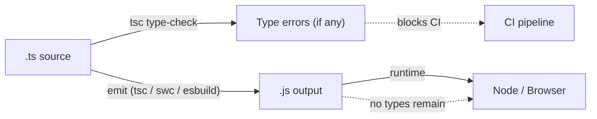

# TypeScript

## Chapter Goal

After reading this chapter, an experienced engineer can explain
TypeScript's structural type system on a whiteboard, design
discriminated unions for exhaustive safety, write small but useful
generics, choose between compile-time safety and runtime validation,
configure a `tsconfig.json` that scales across teams, and answer
interview questions that distinguish type-level thinking from "just
adding `: string` to everything".

## Why This Matters for a Tech Lead

TypeScript is the default for medium-to-large JavaScript codebases. A
Tech Lead must:

- Set the strictness level the team can sustain without drowning in
  `as` casts or `any` escapes.
- Define where types end and runtime validation begins (API boundaries,
  form inputs, external data).
- Decide migration strategy for existing JavaScript services.
- Prevent type-level overengineering that makes code unreadable to
  anyone but the author.
- Ensure build performance does not degrade as the monorepo grows.

Most TypeScript incidents reduce to one pattern: a developer trusted a
type assertion instead of validating data at the boundary. This chapter
names the patterns that prevent it.

## Mental Model

TypeScript is a **structural type system layered on top of JavaScript**.
Types exist only at compile time. They are entirely erased before code
runs.



The key insight: TypeScript checks **shape**, not identity. Two types
are compatible if they have the same shape — regardless of name,
origin, or inheritance hierarchy. This is structural typing.

Think of TypeScript as a spell-checker for data flow. It catches
misspelled field names, forgotten null checks, and wrong argument
types. It does not catch wrong values that have the right type (a
`userId` where a `postId` is expected — both are `string`).

## Core Terminology

| Term | Definition |
| --- | --- |
| **Structural typing** | Compatibility is determined by shape (the set of properties and their types), not by declared name or inheritance. |
| **Nominal typing** | Compatibility requires explicit declaration of identity (not native in TS; achieved via branded types). |
| **Type narrowing** | The process by which TypeScript refines a wider type to a narrower one inside a control-flow branch. |
| **Discriminated union** | A union of object types sharing a literal-typed tag field; enables exhaustive `switch` and safe narrowing. |
| **Generic** | A type parameter that lets a function or type work over multiple types while preserving the relationship between inputs and outputs. |
| **Conditional type** | A type-level `if`/`else`: `T extends U ? X : Y`. |
| **Mapped type** | A type that transforms every key of another type: `{ [K in keyof T]: ... }`. |
| **Template literal type** | A type-level string template: `` `get${Capitalize<K>}` ``. |
| **Declaration file (.d.ts)** | A file containing only type information, no runtime code. Used to describe untyped libraries or ambient globals. |
| **Ambient module** | A declaration (`declare module "x"`) that provides types for a module without supplying implementation. |
| **Type erasure** | The removal of all type annotations during compilation to plain JavaScript. |
| **Type assertion (as)** | A developer override that tells the compiler "trust me, this is type X". Does not perform a runtime check. |

Distinguish closely related terms:

- **Interface vs type alias**: both define shapes. Interfaces support
  declaration merging and `extends`; type aliases support unions,
  intersections, mapped types, and conditional types. In practice,
  use interfaces for public API shapes and type aliases for everything
  else.
- **any vs unknown**: `any` disables type checking; `unknown` forces
  the consumer to narrow before use. Prefer `unknown` at boundaries.
- **never vs void**: `void` means "returns but produces no value";
  `never` means "never returns" (throws or infinite loop). `never`
  also represents the empty set in the type system.

## Theoretical Foundation

### Structural typing and compatibility

TypeScript uses structural subtyping: a value is assignable to a type
if it has at least the required properties with compatible types.

```ts
interface Point { x: number; y: number }
interface Coordinate { x: number; y: number }

const p: Point = { x: 1, y: 2 };
const c: Coordinate = p; // OK — same shape
```

This means two independently declared interfaces with the same shape
are interchangeable. A function that accepts `Point` also accepts any
object with at least `x: number` and `y: number`.

Excess property checking is the exception: object literals passed
directly to a typed target are checked for extra properties. This
catches typos but does not apply to variables.

```ts
const p: Point = { x: 1, y: 2, z: 3 }; // Error: excess property 'z'
const obj = { x: 1, y: 2, z: 3 };
const p2: Point = obj; // OK — no excess check on variables
```

### Type inference and narrowing

TypeScript infers types from context. Explicit annotations are needed
only at module boundaries, function signatures, and ambiguous cases.

**Narrowing** is the mechanism by which TypeScript refines a type
inside a control-flow branch:

```ts
function process(value: string | number) {
  if (typeof value === "string") {
    return value.toUpperCase(); // string
  }
  return value.toFixed(2); // number
}
```

Narrowing works with: `typeof`, `instanceof`, `in`, equality checks,
truthiness checks, discriminant fields, and user-defined type guards.

### Type guards

A user-defined type guard is a function whose return type is a type
predicate:

```ts
function isError(result: unknown): result is Error {
  return result instanceof Error;
}
```

Type guards are useful for narrowing `unknown` at boundaries. The
risk: a type guard that lies (returns `true` but the value is not
actually that type) is unsound and the compiler will not catch it.
Treat type guards as trusted assertions — test them.

### Discriminated unions

A discriminated union is a union where each member has a shared
literal-typed field (the discriminant):

```ts
type Result<T> =
  | { ok: true; value: T }
  | { ok: false; error: Error };

function handle(r: Result<string>) {
  if (r.ok) {
    console.log(r.value); // string
  } else {
    console.error(r.error); // Error
  }
}
```

The discriminant (`ok`) lets TypeScript narrow the union in each
branch. Exhaustiveness is enforced by assigning the remaining case to
`never`:

```ts
function assertNever(x: never): never {
  throw new Error(`Unexpected: ${JSON.stringify(x)}`);
}

type Shape =
  | { kind: "circle"; radius: number }
  | { kind: "rect"; w: number; h: number };

function area(s: Shape): number {
  switch (s.kind) {
    case "circle": return Math.PI * s.radius ** 2;
    case "rect":   return s.w * s.h;
    default:       return assertNever(s); // compile error if a case is missed
  }
}
```

### Generics

Generics parameterize types. They preserve the relationship between
inputs and outputs without widening to `any`:

```ts
function first<T>(arr: T[]): T | undefined {
  return arr[0];
}

const n = first([1, 2, 3]); // number | undefined
```

**Constraints** restrict what a generic can be:

```ts
function getProperty<T, K extends keyof T>(obj: T, key: K): T[K] {
  return obj[key];
}
```

**Default type parameters** provide a fallback:

```ts
type ApiResponse<T = unknown> = {
  data: T;
  status: number;
};
```

The overengineering trap: generics with more than two type parameters
and nested constraints become unreadable. If a generic utility needs a
comment explaining what `T extends K ? U : V` does, it belongs in a
shared utilities file with a clear name — not inline.

### Utility types

TypeScript ships built-in utility types. The most important:

| Utility | Effect |
| --- | --- |
| `Partial<T>` | All properties optional |
| `Required<T>` | All properties required |
| `Readonly<T>` | All properties readonly |
| `Pick<T, K>` | Subset of properties |
| `Omit<T, K>` | All properties except K |
| `Record<K, V>` | Object with keys K and values V |
| `Extract<T, U>` | Members of T assignable to U |
| `Exclude<T, U>` | Members of T not assignable to U |
| `NonNullable<T>` | Removes null and undefined |
| `ReturnType<F>` | Return type of function F |
| `Parameters<F>` | Tuple of parameter types of F |
| `Awaited<T>` | Unwraps Promise recursively |

### Mapped types

A mapped type iterates over keys and transforms them:

```ts
type Nullable<T> = { [K in keyof T]: T[K] | null };

interface User {
  name: string;
  age: number;
}

type NullableUser = Nullable<User>;
// { name: string | null; age: number | null }
```

Key remapping (TypeScript 4.1+) uses `as`:

```ts
type Getters<T> = {
  [K in keyof T as `get${Capitalize<string & K>}`]: () => T[K];
};
// Getters<User> = { getName: () => string; getAge: () => number }
```

### Conditional types and infer

A conditional type selects one of two branches based on assignability:

```ts
type IsString<T> = T extends string ? true : false;
```

The `infer` keyword captures a type from the condition:

```ts
type UnwrapPromise<T> = T extends Promise<infer U> ? U : T;
type X = UnwrapPromise<Promise<number>>; // number
```

Conditional types distribute over unions:

```ts
type ToArray<T> = T extends any ? T[] : never;
type R = ToArray<string | number>; // string[] | number[]
```

To prevent distribution, wrap both sides in a tuple:

```ts
type ToArrayNoDist<T> = [T] extends [any] ? T[] : never;
type R2 = ToArrayNoDist<string | number>; // (string | number)[]
```

### The keyof and typeof operators

`keyof T` produces a union of T's known property keys:

```ts
type UserKeys = keyof User; // "name" | "age"
```

`typeof` at the type level captures the type of a runtime value:

```ts
const config = { port: 3000, host: "localhost" } as const;
type Config = typeof config; // { readonly port: 3000; readonly host: "localhost" }
```

### The satisfies operator

`satisfies` (TypeScript 4.9+) checks that a value conforms to a type
without widening it:

```ts
type Route = { path: string; auth: boolean };
type Routes = Record<string, Route>;

const routes = {
  home: { path: "/", auth: false },
  dashboard: { path: "/dash", auth: true },
} satisfies Routes;

// routes.home.path is still the literal "/" — not widened to string
```

Without `satisfies`, annotating the variable as `Routes` widens all
literal types. With `satisfies`, you get both type-checking and
preserved inference.

### unknown vs any vs never

- **`any`**: opts out of type checking. Assignments flow in and out
  freely. Use only as a migration escape hatch.
- **`unknown`**: the type-safe counterpart. Any value can be assigned
  to `unknown`, but `unknown` cannot be used without narrowing first.
  Use at boundaries where you receive untrusted data.
- **`never`**: the bottom type. No value inhabits `never`. It appears
  in exhaustiveness checks, functions that always throw, and
  impossible branches.

```ts
function parseInput(raw: unknown): string {
  if (typeof raw === "string") return raw;
  throw new Error("Expected string");
}
```

### Strict mode and tsconfig

The `strict` flag enables a family of checks:

| Flag | Effect |
| --- | --- |
| `strictNullChecks` | `null` and `undefined` are not assignable to other types |
| `strictFunctionTypes` | Function parameter types are checked contravariantly |
| `strictBindCallApply` | `bind`, `call`, `apply` are correctly typed |
| `noImplicitAny` | Unannotated values with no inference get an error |
| `noImplicitThis` | `this` with no type annotation gets an error |
| `useUnknownInCatchVariables` | `catch` variable is `unknown`, not `any` |
| `strictPropertyInitialization` | Class fields must be initialized or marked `!` |

Beyond `strict`, production codebases benefit from:

- `noUncheckedIndexedAccess`: array and record index access returns
  `T | undefined`.
- `exactOptionalPropertyTypes`: distinguishes "missing" from
  "present but undefined".
- `verbatimModuleSyntax`: forces explicit `type` keyword on type-only
  imports/exports.
- `isolatedModules`: ensures each file can be independently
  transpiled (required by swc/esbuild).

> Verify against official documentation. The exact flags included
> under `strict` and the behavior of `verbatimModuleSyntax` have
> evolved across TypeScript versions. Check the TypeScript 5.x
> release notes.

### Declaration files and ambient modules

A `.d.ts` file describes types without emitting code:

```ts
// globals.d.ts
declare const __APP_VERSION__: string;

// untyped-lib.d.ts
declare module "legacy-lib" {
  export function doThing(x: string): number;
}
```

Rules for declaration files:

- Use `declare module` for untyped third-party packages without
  `@types/*` on DefinitelyTyped.
- Use `declare global` to augment the global scope (e.g. adding a
  field to `Window`).
- Prefer contributing types upstream over maintaining local `.d.ts`
  files — local files drift.

### Module resolution

TypeScript's module resolution modes determine how `import "x"` maps
to a file on disk:

| Mode | Use case |
| --- | --- |
| `node16` / `nodenext` | Node with ESM and CJS support (respects `package.json` `"exports"`) |
| `bundler` | When a bundler (Vite, webpack, esbuild) handles resolution |
| `node` (legacy) | Old Node CJS-only resolution; avoid in new projects |

`paths` and `baseUrl` are developer conveniences for path aliases.
They do not affect the emitted code — a bundler or runtime path
mapping is still needed.

> Verify against official documentation. Module resolution behavior
> changes across TypeScript versions; `bundler` mode was added in
> TypeScript 5.0.

### TypeScript does not exist at runtime

This is the single most important fact about TypeScript:

```ts
interface User { name: string; age: number }

function greet(user: User) {
  console.log(user.name);
}

// At runtime, `User` does not exist. The function receives
// whatever object was passed. If the object came from an
// untyped source (API, form, file), it might not match.
```

Implications:

- You cannot `instanceof` an interface.
- You cannot `switch` on a type alias.
- Generic type parameters are erased; `new T()` is impossible.
- The only runtime artifacts are: classes (the constructor
  function), enums (a reverse-lookup object), and decorators
  (metadata).

This is why runtime validation (Zod, io-ts, Valibot) is required at
every boundary where data enters the type-checked world.

## Practical Usage

### Typing API responses

Never trust a network response:

```ts
import { z } from "zod";

const UserSchema = z.object({
  id: z.string().uuid(),
  name: z.string().min(1),
  email: z.string().email(),
});

type User = z.infer<typeof UserSchema>;

async function fetchUser(id: string, signal: AbortSignal): Promise<User> {
  const res = await fetch(`/api/users/${id}`, { signal });
  if (!res.ok) throw new Error(`HTTP ${res.status}`);
  const raw = await res.json();
  return UserSchema.parse(raw); // runtime validation
}
```

The `z.infer` derives the TypeScript type from the schema, keeping a
single source of truth. The common mistake: defining the type
manually and trusting `as User` without validation.

### Typing React props

```ts
type ButtonVariant = "primary" | "secondary" | "danger";

interface ButtonProps {
  label: string;
  variant?: ButtonVariant;
  disabled?: boolean;
  onClick: () => void;
}

function Button({ label, variant = "primary", disabled, onClick }: ButtonProps) {
  return (
    <button className={variant} disabled={disabled} onClick={onClick}>
      {label}
    </button>
  );
}
```

Key decisions:

- Use `interface` for component props (declaration merging allows
  extension if needed).
- Use string literal unions for variants — not enums (enums emit
  runtime code and cannot be tree-shaken).
- Mark optional props with `?` and provide defaults in the
  destructuring, not in `defaultProps`.

### Typing Node services

```ts
import { z } from "zod";
import type { Request, Response, NextFunction } from "express";

const CreateOrderBody = z.object({
  productId: z.string().uuid(),
  quantity: z.number().int().positive(),
});

type CreateOrderInput = z.infer<typeof CreateOrderBody>;

function createOrder(req: Request, res: Response, next: NextFunction) {
  const parsed = CreateOrderBody.safeParse(req.body);
  if (!parsed.success) {
    res.status(400).json({ errors: parsed.error.flatten() });
    return;
  }
  const input: CreateOrderInput = parsed.data;
  // input is now fully typed and validated
  orderService.create(input).then((order) => res.status(201).json(order)).catch(next);
}
```

The boundary is the middleware. Everything downstream receives
validated, typed data.

### Runtime validation with Zod

Zod provides a schema DSL that produces both a validator and a
TypeScript type:

```ts
const ConfigSchema = z.object({
  port: z.number().int().min(1).max(65535),
  dbUrl: z.string().url(),
  logLevel: z.enum(["debug", "info", "warn", "error"]),
});

type Config = z.infer<typeof ConfigSchema>;

function loadConfig(): Config {
  return ConfigSchema.parse({
    port: Number(process.env.PORT),
    dbUrl: process.env.DATABASE_URL,
    logLevel: process.env.LOG_LEVEL,
  });
}
```

Use runtime validation at: API handlers, config loading, message-queue
consumers, file parsing, and any import from an untyped source.

### Type safety in large codebases

In a 200-service monorepo, type safety is not about individual
functions — it is about contracts:

- **Shared type packages.** Publish `@internal/types` with domain
  types used across services. Version it and run `tsc --build` on the
  full graph in CI.
- **API contract generation.** Generate types from OpenAPI specs or
  GraphQL schemas. The types are the single source of truth; the
  implementation must conform.
- **Branded types.** Prevent accidental mix-up of same-shaped values:

```ts
type Brand<T, B> = T & { __brand: B };
type UserId = Brand<string, "UserId">;
type PostId = Brand<string, "PostId">;

function getUser(id: UserId) { /* ... */ }

const userId = "abc" as UserId;
const postId = "abc" as PostId;
getUser(postId); // Error: PostId is not assignable to UserId
```

Branded types add nominal safety to a structural system. They are
zero-cost at runtime (the brand field is never accessed). The
trade-off: every creation site must cast with `as`, which requires
a factory function to centralize and validate.

## Examples

### Discriminated union with exhaustive switch

```ts
type Event =
  | { type: "login"; userId: string; ip: string }
  | { type: "logout"; userId: string }
  | { type: "purchase"; userId: string; amount: number };

function logEvent(event: Event): string {
  switch (event.type) {
    case "login":    return `${event.userId} logged in from ${event.ip}`;
    case "logout":   return `${event.userId} logged out`;
    case "purchase": return `${event.userId} purchased $${event.amount}`;
    default:         return assertNever(event);
  }
}
```

Adding a new event type to the union causes a compile error in
every `switch` that does not handle it. This is compile-time
enforcement of contract completeness. The common mistake: using
`default: return ""` — it silences the compiler and the new event
is silently ignored at runtime. In production, use
`assertNever` to turn unhandled cases into thrown errors that
surface in monitoring.

### A Result type for error handling

```ts
type Result<T, E = Error> =
  | { ok: true; value: T }
  | { ok: false; error: E };

function divide(a: number, b: number): Result<number, string> {
  if (b === 0) return { ok: false, error: "division by zero" };
  return { ok: true, value: a / b };
}

const r = divide(10, 0);
if (r.ok) {
  console.log(r.value); // number
} else {
  console.error(r.error); // string
}
```

The `Result` type encodes success and failure in the type system.
The consumer must check `ok` before accessing `value` or `error`.
The common mistake: using `throw` for expected errors (like
validation) and catching with a bare `catch` — it loses type
information. In production, `Result` works well for domain
operations; `throw` remains appropriate for unexpected failures.

### tsconfig for a monorepo with project references

```json
// tsconfig.base.json
{
  "compilerOptions": {
    "strict": true,
    "target": "ES2022",
    "module": "Node16",
    "moduleResolution": "Node16",
    "declaration": true,
    "declarationMap": true,
    "composite": true,
    "noUncheckedIndexedAccess": true,
    "exactOptionalPropertyTypes": true,
    "verbatimModuleSyntax": true,
    "isolatedModules": true,
    "skipLibCheck": true
  }
}

// packages/shared/tsconfig.json
{
  "extends": "../../tsconfig.base.json",
  "compilerOptions": { "outDir": "./dist" },
  "include": ["src"]
}

// packages/api/tsconfig.json
{
  "extends": "../../tsconfig.base.json",
  "compilerOptions": { "outDir": "./dist" },
  "references": [{ "path": "../shared" }],
  "include": ["src"]
}
```

`composite: true` enables incremental builds. Project references
let `tsc --build` type-check only what changed. The common
mistake: one flat `tsconfig` for a monorepo with 50 packages — it
type-checks everything on every change and takes minutes. In
production, pair project references with `swc` or `esbuild` for
emit (fast) and `tsc --build --noEmit` for type checking (correct).

### Utility types in practice — a CRUD service

```ts
interface User {
  id: string;
  name: string;
  email: string;
  role: "admin" | "viewer";
  createdAt: Date;
}

// Creation: id and createdAt are generated server-side
type CreateUserInput = Omit<User, "id" | "createdAt">;

// Update: all fields optional except the identifier
type UpdateUserInput = Partial<Omit<User, "id" | "createdAt">> & { id: string };

// Public response: exclude internal fields
type UserResponse = Pick<User, "id" | "name" | "email" | "role">;

// List endpoint returns paginated results
type PaginatedResponse<T> = {
  items: T[];
  total: number;
  nextCursor: string | null;
};

async function listUsers(cursor?: string): Promise<PaginatedResponse<UserResponse>> {
  // ...
}
```

Each utility type removes a category of bug: `Omit` prevents the
client from setting server-generated fields, `Partial` allows
sparse updates without making all fields required, and `Pick`
ensures internal fields never leak to the response. The common
mistake: using the full `User` type for all operations — it leaks
`createdAt` to the client and allows `id` in creation payloads.
In production, derive these types from a Zod schema so they stay
in sync with runtime validation.

### unknown at the boundary — parsing JSON safely

```ts
async function handleWebhook(rawBody: string): Promise<void> {
  const payload: unknown = JSON.parse(rawBody);

  // Option 1: type guard
  if (!isWebhookEvent(payload)) {
    log.warn("Invalid webhook payload", { payload });
    return;
  }
  // payload is now WebhookEvent

  // Option 2: Zod (preferred)
  const result = WebhookEventSchema.safeParse(payload);
  if (!result.success) {
    log.warn("Schema validation failed", { errors: result.error.issues });
    return;
  }
  await processEvent(result.data);
}
```

`JSON.parse` returns `any` by default. Assigning to `unknown`
forces every downstream access to narrow first. The common
mistake: `const payload = JSON.parse(body) as WebhookEvent` —
this skips validation entirely and any malformed payload silently
corrupts data. In production, always pair `unknown` with a
validator; the `as` pattern is a type lie that hides bugs until
they reach customers.

### satisfies — catching mistakes without widening

```ts
type ColorMap = Record<string, [number, number, number]>;

// Without satisfies — widens to Record<string, number[]>
const colors1: ColorMap = {
  red: [255, 0, 0],
  green: [0, 255, 0],
  oops: [0, 0],       // no error — number[] matches
};

// With satisfies — validates AND keeps literal inference
const colors2 = {
  red: [255, 0, 0],
  green: [0, 255, 0],
  oops: [0, 0],       // Error: [number, number] is not [number, number, number]
} satisfies ColorMap;

// colors2.red is still a 3-tuple, not number[]
```

`satisfies` catches the wrong-length tuple because it checks
without widening. The type annotation `ColorMap` widens all
tuples to `number[]`, hiding the error. The common mistake: using
`as const` alone — it locks values but does not validate against
the expected shape. In production, use `satisfies` for
configuration objects, route maps, and theme definitions where
both validation and precise inference matter.

### Typing a generic service with error handling

```ts
type ServiceResult<T> =
  | { success: true; data: T }
  | { success: false; code: string; message: string };

interface CrudService<T, CreateInput, UpdateInput> {
  create(input: CreateInput): Promise<ServiceResult<T>>;
  findById(id: string): Promise<ServiceResult<T>>;
  update(id: string, input: UpdateInput): Promise<ServiceResult<T>>;
  delete(id: string): Promise<ServiceResult<void>>;
}

// Concrete implementation
class UserService implements CrudService<User, CreateUserInput, UpdateUserInput> {
  async create(input: CreateUserInput): Promise<ServiceResult<User>> {
    const existing = await db.findByEmail(input.email);
    if (existing) return { success: false, code: "DUPLICATE", message: "Email taken" };
    const user = await db.insert({ ...input, id: crypto.randomUUID(), createdAt: new Date() });
    return { success: true, data: user };
  }
  // ...
}
```

The generic `CrudService` interface enforces a consistent API
shape across all services. `ServiceResult` encodes success/failure
in the type — consumers must check `success` before accessing
`data`. The common mistake: making the generic too flexible
(4+ type params, conditional return types) which makes the
interface harder to implement than writing bespoke types. In
production, keep generics to 2–3 type parameters maximum and add
a concrete example implementation in the same file.

### Typing a React custom hook with generics

```ts
function useFetch<T>(url: string, schema: z.ZodType<T>) {
  const [data, setData] = useState<T | null>(null);
  const [error, setError] = useState<Error | null>(null);
  const [loading, setLoading] = useState(true);

  useEffect(() => {
    const ac = new AbortController();
    fetch(url, { signal: ac.signal })
      .then((r) => r.json())
      .then((raw) => setData(schema.parse(raw)))
      .catch((e) => { if (e.name !== "AbortError") setError(e); })
      .finally(() => setLoading(false));
    return () => ac.abort();
  }, [url]);

  return { data, error, loading };
}

// Usage — T is inferred from the schema
const { data } = useFetch("/api/users", UserSchema);
// data is User | null — no `as` needed
```

The schema parameter does double duty: it validates at runtime
and infers the TypeScript type at compile time. The common
mistake: typing the hook as `useFetch<User>(url)` with no
runtime validation — the generic parameter exists only at compile
time and does not check the actual response. In production, every
data-fetching hook should accept a schema, not a bare generic.

### Narrowing with the in operator and discriminated APIs

```ts
type SuccessResponse = { status: "ok"; data: User[] };
type ErrorResponse = { status: "error"; code: number; message: string };
type ApiResponse = SuccessResponse | ErrorResponse;

function render(response: ApiResponse) {
  if (response.status === "ok") {
    // TypeScript narrows to SuccessResponse
    return renderList(response.data);
  }
  // TypeScript narrows to ErrorResponse
  return renderError(response.code, response.message);
}
```

The literal-typed `status` field is the discriminant. TypeScript
narrows automatically in each branch without a type guard or
assertion. The common mistake: using `response.data!` (non-null
assertion) outside a narrowing branch — it compiles but crashes
at runtime on error responses. In production, always use
discriminated unions for API responses and handle every branch
explicitly.

### Conditional types — extracting route params

```ts
type ExtractParams<T extends string> =
  T extends `${string}:${infer Param}/${infer Rest}`
    ? { [K in Param]: string } & ExtractParams<Rest>
    : T extends `${string}:${infer Param}`
      ? { [K in Param]: string }
      : {};

type Params = ExtractParams<"/users/:userId/posts/:postId">;
// { userId: string } & { postId: string }

function buildUrl<R extends string>(
  route: R,
  params: ExtractParams<R>,
): string {
  return Object.entries(params).reduce(
    (url, [key, val]) => url.replace(`:${key}`, val as string),
    route as string,
  );
}

buildUrl("/users/:userId/posts/:postId", { userId: "1", postId: "42" }); // OK
buildUrl("/users/:userId", { userId: "1", postId: "42" }); // Error: postId is excess
```

The recursive conditional type extracts named parameters from a
route pattern at the type level. Autocomplete works for the params
object. The common mistake: overusing this pattern — recursive
template literal types are slow to type-check on routes with many
segments. In production, use this for a small set of internal
routes; for large APIs, generate route types from an OpenAPI spec
instead of parsing strings at the type level.

## Common Mistakes

1. **Reaching for `any` to silence errors**
   - Looks like: `const data: any = await res.json();`
   - Why it is wrong: `any` propagates — any operation on `data`
     is untyped. One `any` at the top infects the entire call chain.
   - Correct approach: use `unknown` and narrow, or validate with
     Zod/io-ts.

2. **Trusting types at network boundaries**
   - Looks like: `const user = await res.json() as User;`
   - Why it is wrong: `as` is a compile-time assertion. If the API
     returns `{ name: null }`, the code continues with a type lie.
   - Correct approach: runtime validation (Zod `.parse`).

3. **Type-level golf**
   - Looks like: deeply nested conditional types with 4+ `infer`
     keywords in a single expression.
   - Why it is wrong: no teammate can read, review, or modify it.
     When the type is wrong, debugging takes hours.
   - Correct approach: break complex types into named intermediates.
     If the type needs a comment, it needs refactoring.

4. **Using `as` to fix type errors**
   - Looks like: `(event as any).target.value`
   - Why it is wrong: it suppresses the error without fixing the
     cause. The real issue is often a missing null check or wrong
     type for the variable.
   - Correct approach: narrow with `if`, `instanceof`, or a type
     guard.

5. **Loose tsconfig on greenfield projects**
   - Looks like: `"strict": false` because "we'll enable it later."
   - Why it is wrong: "later" never arrives. Thousands of implicit
     `any` values accumulate. Enabling strict mode retroactively
     generates hundreds of errors.
   - Correct approach: start with `strict: true`. Suppress
     individual files with `@ts-expect-error` during migration, not
     by disabling the flag.

6. **Enums instead of string literal unions**
   - Looks like: `enum Status { Active, Inactive }`
   - Why it is wrong: enums emit runtime code (a reverse-lookup
     object), cannot be tree-shaken, and produce numeric values by
     default that are unsafe (`Status[99]` returns `undefined`
     without error).
   - Correct approach: `type Status = "active" | "inactive"`. Use
     `const` objects if you need runtime iteration over values.

7. **Ignoring `noUncheckedIndexedAccess`**
   - Looks like: `const item = arr[i];` and assuming `item` is
     defined.
   - Why it is wrong: index access can be out of bounds. Without
     the flag, TypeScript pretends it always succeeds.
   - Correct approach: enable the flag and handle `| undefined`.

8. **Using interfaces for everything**
   - Looks like: `interface StringOrNumber { }` with unions
     expressed as separate interfaces.
   - Why it is wrong: interfaces cannot express unions,
     intersections, mapped types, or conditional types.
   - Correct approach: use `type` for computed types, unions, and
     utility types. Use `interface` for object shapes with possible
     extension.

## Trade-offs

| Choice | Optimizes for | Sacrifices | Flips when |
| --- | --- | --- | --- |
| **strict: true** | Correctness, refactor safety | Migration cost in legacy code | Always — start strict, relax per-file if needed |
| **Zod at boundaries** | Runtime safety, single source of truth | Schema maintenance overhead | API schema is auto-generated (OpenAPI/GraphQL) |
| **Branded types** | Nominal safety (prevent id mixups) | Verbosity at creation sites | Codebase has many same-shaped identifiers |
| **Project references** | Incremental build performance | Initial setup complexity | Monorepo exceeds ~10 packages |
| **swc/esbuild for emit** | Fast builds (10-100x faster) | No type-checking during emit | Always pair with `tsc --noEmit` in CI |
| **Enums vs literal unions** | Enums: runtime iteration; Unions: zero cost, tree-shakeable | Enums: bundle size, unsafe numeric; Unions: no runtime enumeration | Prefer unions unless you need runtime iteration |
| **Declaration merging** | Augmenting third-party types | Scattered type definitions, hard to trace | Prefer wrapper types over merging when possible |

## Production Considerations

- **Build performance.** Separate emit from type-checking. Use
  `swc` or `esbuild` for compilation (milliseconds); run
  `tsc --build --noEmit` in CI for type safety (slower but
  correct). Never block local dev iteration on full type checks.
- **Editor performance.** Large projects can exhaust `tsserver`
  memory. Use project references to limit the scope `tsserver`
  loads. Disable `declaration` in dev tsconfig if not needed.
- **Migration from JavaScript.** Convert incrementally: rename
  `.js` to `.ts`, enable `allowJs`, fix errors per-file. Track
  migration progress as a metric (% of `.ts` files). Do not block
  feature work with a big-bang migration.
- **Library publishing.** Ship `.d.ts` alongside JavaScript. Use
  the `"exports"` field in `package.json` to specify type entry
  points. Test your declaration files by consuming them from a
  separate project.
- **Security.** Type assertions (`as`) can hide injection vectors.
  If a type assertion bypasses validation at a boundary, it is a
  security hole. Ban `as any` via lint except in test files.
- **Maintainability.** Complex utility types are code too — review
  them with the same rigor. If only one person understands a type,
  it is a bus-factor risk.
- **Versioning.** Pin the TypeScript version in the lockfile. Type
  behavior changes between minor versions (e.g. stricter inference,
  new error messages). Upgrade TypeScript deliberately, not
  implicitly.
- **Reliability and on-call.** Type-related production incidents
  surface as `TypeError: cannot read property of undefined` — they
  look like bugs, not type failures. Add structured logging at
  validation boundaries so on-call can identify the data shape
  mismatch quickly. Monitor Zod parse failure rates as a leading
  indicator of contract drift.
- **Cost.** TypeScript adds ~10% build-time overhead (type-checking
  step in CI). For large monorepos this means additional CI compute
  minutes. Offset with incremental builds, `skipLibCheck`, and
  parallel jobs. The engineering time cost is onboarding (1–2 weeks
  for junior hires unfamiliar with advanced types).
- **Team and hiring.** TypeScript is an expected skill for mid-to-senior
  frontend and fullstack roles. It narrows the candidate pool
  slightly for backend-only or scripting roles. Budget onboarding
  time and maintain internal style guides showing the team's specific
  patterns (branded types, Zod schemas, DTO conventions).

## Tech Lead Decision-Making

This section captures decisions that distinguish a Tech Lead from a
strong Senior Engineer in a TypeScript codebase. A senior writes
correct types; a Tech Lead decides the type strategy the team uses,
sets the boundary between compile-time and runtime safety, and
ensures that TypeScript accelerates delivery instead of slowing it
down.

### Deciding where strict typing creates value

**What a Senior Engineer usually knows:** `strict: true` catches more
bugs. Stronger types are better.

**What a Tech Lead is expected to decide:**

- **Where to invest.** Strict typing creates the most value at:
  (1) API boundaries (where data enters/leaves), (2) shared domain
  models (where a change ripples across services), (3) complex state
  machines (where invalid transitions cause data corruption). It
  creates the least value in: throw-away scripts, test utilities,
  and one-off migration code.
- **Cost model.** Every type annotation has a maintenance cost. A
  100-character conditional type that one person understands costs
  more than the bug it prevents if that person leaves.
- **Diminishing returns.** The first 80% of type safety (strict mode,
  discriminated unions, Zod at boundaries) catches 95% of
  type-related bugs. The last 20% (recursive mapped types, branded
  types for every string, type-level parsers) catches 5% more but
  quadruples the maintenance cost.

**Interview framing:** "I apply strict types aggressively at the
boundaries — API contracts, domain models, and state transitions.
For internal plumbing, I accept simpler types and invest the time
savings into runtime validation and testing."

### Balancing type safety and delivery speed

**What a Senior Engineer usually knows:** More types = safer code.
Take the time to type things correctly.

**What a Tech Lead is expected to decide:**

- **When to ship with weaker types.** A feature behind a flag with
  5 users does not need a branded-type hierarchy. Ship with simple
  types, validate at the boundary, and strengthen types when the
  feature graduates.
- **When to invest upfront.** Shared libraries, API contracts, and
  auth/permission models need strong types from day one because
  fixing them later means coordinating 10+ consumers.
- **Typing budget per sprint.** Allocate ~10% of sprint capacity to
  type improvements (reducing `any` count, adding Zod schemas). More
  than that steals from delivery; less allows type debt to
  accumulate.

**Common overengineering trap:** Spending a week writing a
type-safe form library with 200 lines of conditional types when a
`Record<string, unknown>` + Zod schema would have shipped in a day
and been readable by the entire team.

**Stakeholder explanation:** "TypeScript reduces bugs — about 15%
fewer reach production. But the investment is not free. I allocate
a fixed percentage of engineering time to type improvements so it
never blocks feature delivery."

### Team conventions for any, unknown, and assertions

**What a Senior Engineer usually knows:** `any` is bad, `unknown`
is good, `as` is a code smell.

**What a Tech Lead is expected to decide:**

1. **`any` policy.** Banned via lint. Exceptions require a
   `@ts-expect-error` with a linked issue and a comment explaining
   why narrowing is impossible. Track suppression count weekly; it
   must trend downward.
2. **`unknown` policy.** Required at all trust boundaries:
   `JSON.parse` results, API responses, queue messages,
   environment variables, config files. Narrowing must happen via
   a validation library (Zod), not via type guards alone (guards
   can lie).
3. **`as` policy.** Banned at boundary code (where data enters).
   Allowed in internal code only with a comment explaining what
   information the developer has that the compiler does not.
   Reviewers reject any `as` that could be replaced by narrowing.
4. **DTO conventions.** Every service defines input/output DTOs
   derived from a schema (`z.infer<typeof Schema>`). Internal
   domain types may differ from DTOs. The mapping layer is explicit.

**Production readiness checklist:**

- [ ] `no-explicit-any` is an error in CI.
- [ ] All `@ts-expect-error` comments have issue links.
- [ ] Boundary code has zero `as` assertions (enforced by review).
- [ ] DTOs derive from schemas, not from manual type definitions.

### TypeScript migration strategy

**What a Senior Engineer usually knows:** Rename files from `.js`
to `.ts`, fix errors, repeat.

**What a Tech Lead is expected to decide:**

- **Scope and ordering.** Convert in dependency order — leaf
  modules first (utilities, domain types), then mid-tier (services,
  repositories), then entry points (handlers, controllers). This
  prevents cascading `any` from unconverted dependencies.
- **When not to migrate.** Small scripts with no consumers, CLI
  tools that change quarterly, and code scheduled for deletion do
  not justify migration effort.
- **Strictness ratchet.** Start with `allowJs` + `strict: false`.
  Enable `noImplicitAny` once 30% of files are converted (catches
  the worst implicit `any` values). Enable full `strict` at 80%.
  Never go backward.
- **Success metric.** Track: (a) % of `.ts` files, (b) `any`
  suppression count, (c) unvalidated boundary count. Report
  weekly in the engineering digest so the migration stays visible.
- **Timeline.** For a 200-file service: 8–12 weeks at 10% sprint
  allocation. Faster risks merge conflicts; slower risks losing
  momentum.

**Stakeholder explanation:** "We're gradually adding type safety to
existing code. It reduces production bugs by ~15% and makes
refactoring 3x faster. It does not block feature work — engineers
convert files when they touch them."

### Preventing type gymnastics

**What a Senior Engineer usually knows:** Complex types are
impressive. Type challenges are fun.

**What a Tech Lead is expected to decide:**

- **Complexity ceiling.** No conditional type deeper than 2 levels.
  No generic with more than 2 type parameters. No single type
  definition longer than 10 lines. Exceptions require a comment,
  type-level tests, and reviewer approval.
- **When to reject cleverness.** If a type takes longer to
  understand than the runtime code it protects, replace it with
  simpler types + a runtime assertion. The runtime assertion is
  testable; the complex type is not.
- **Shared type utilities.** Maintain a `@internal/type-utils`
  package with tested, documented utility types. Do not allow
  each service to reinvent `DeepPartial`, `Branded`, or
  `Awaited` — divergent implementations cause subtle
  incompatibilities.
- **Code review rule.** Ask: "Can a mid-level engineer modify this
  type confidently in 6 months?" If the answer is no, simplify.

**Common overengineering trap:** Building a compile-time ORM with
mapped types that infers select/where/join from a schema type. It
works — until someone needs to add a `LEFT JOIN` and cannot
understand the 50-line conditional type that makes it compile.

### When not to use TypeScript

| Situation | Reasoning |
| --- | --- |
| Scripts <50 lines with no consumers | Typing overhead exceeds value; run once, delete |
| Performance-critical runtime metaprogramming | `Proxy`, `eval`, dynamic property access defeat static analysis |
| Prototype/spike code (1 week lifespan) | Convert if it survives the spike; delete otherwise |
| Environments without TS tooling support | Some edge runtimes, embedded configs, or legacy build systems |
| CI glue and shell-script replacements | A 20-line Node script that calls `exec` does not benefit from types |

The Tech Lead's job: articulate the exception explicitly so it does
not become a precedent. Every "no TS" decision should be documented
with a trigger for reconsideration ("if this script gains a consumer,
convert it").

### Cost implications of TypeScript

Costs that a Tech Lead must track:

- **Build time.** TypeScript type-checking adds 30s–5min to CI
  depending on codebase size. Mitigation: incremental builds,
  parallel jobs, separated emit.
- **Onboarding time.** Junior engineers spend 1–2 weeks learning
  TypeScript patterns. The team must have internal documentation
  and code examples. Budget this in hiring plans.
- **Library compatibility.** Not all npm packages ship types.
  Maintaining `.d.ts` stubs and wrappers costs ongoing time.
  Factor this into dependency decisions.
- **Upgrade cost.** Each TypeScript minor version can change
  inference behavior. Budget one dedicated PR per quarter for
  upgrades + error fixing.

**Stakeholder explanation:** "TypeScript costs about 10% more
engineering time upfront compared to plain JavaScript. It pays back
3–5x through fewer production bugs, faster refactoring, and better
tooling. The ROI is positive after ~3 months on any project that
lives longer than 6 months."

### Debugging TypeScript issues in production

TypeScript types do not exist at runtime, but type decisions still
cause production incidents:

- **Type assertion at boundary → corrupt data.** Symptom: a
  downstream service crashes on `undefined.property`. Cause: an
  `as User` assertion skipped validation, and the API returned a
  different shape. Fix: replace assertion with Zod, add monitoring
  for validation failures.
- **Enum mismatch after deployment.** Symptom: a numeric enum value
  is `3` in the producer but `2` in the consumer (different build
  versions). Cause: numeric enums are position-dependent. Fix:
  switch to string literal unions; they are serialization-stable.
- **Build succeeds but runtime fails.** Symptom: `TypeError:
  X is not a function`. Cause: a type-only import was incorrectly
  treated as a value import, and the transpiler (swc/esbuild)
  erased it. Fix: use `import type` explicitly, enable
  `verbatimModuleSyntax`.
- **Type version drift.** Symptom: a shared library's types say
  `field: string` but the runtime returns `field: string | null`.
  Cause: the library was updated but the `@types` package was not.
  Fix: pin types to library version, automate update checks.

**Incident response playbook for type-related bugs:**

1. Is this a boundary issue? → Check for `as` or missing validation.
2. Is this a version drift? → Check `package.json` locks for
   `@types/*` vs library version mismatch.
3. Is this a transpiler issue? → Check if `import type` is used
   correctly; verify `verbatimModuleSyntax`.
4. Is this an enum serialization issue? → Check if numeric enums
   are used across service boundaries.

### Explaining TypeScript decisions to stakeholders

| Technical decision | Stakeholder framing |
| --- | --- |
| Enable strict mode | "Catches 15% more bugs before QA. Zero runtime cost." |
| Add Zod validation | "Prevents corrupt data from entering the system. Reduces data-integrity incidents by ~40%." |
| Migrate from JS to TS | "Makes refactoring 3x faster and reduces production bugs. Does not block feature delivery." |
| Add project references | "Reduces build time from 8 minutes to 45 seconds. Engineers iterate faster." |
| Ban `any` escape hatch | "Closes the #1 loophole that lets bugs bypass our type safety." |
| Pin TypeScript version | "Prevents surprise build failures. Upgrades happen on our schedule." |
| Reject complex generics | "Keeps code readable for the whole team, not just the author." |

Lead with the business impact (bugs, speed, cost), not the
technical mechanism.

## How to Explain This in an Interview

Three openings:

1. *"TypeScript is a structural type system — compatibility is
   based on shape, not name. This means two independently declared
   types with the same fields are interchangeable. It's different
   from nominal systems like Java or C# where you must explicitly
   implement an interface."* — for any "what is TypeScript" question.

2. *"TypeScript types are erased at runtime. This is the fundamental
   constraint: the compiler can guarantee data flow within your code,
   but cannot guarantee what arrives from outside (API, queue, file).
   That's why we pair compile-time types with runtime validation at
   boundaries."* — for any safety/validation question.

3. *"I set three rules for the team: strict mode on by default,
   `unknown` instead of `any` at all boundaries, and runtime
   validation for every external data source. These three rules
   prevent the top three TypeScript incidents: silent type lies,
   unchecked null, and boundary data corruption."* — for any Tech
   Lead question.

## Good Answer vs Weak Answer

**Question**: *When would you use `unknown` instead of `any`?*

**Strong Answer**

Use `unknown` whenever the value comes from outside the type-checked
boundary — API responses, user input, `JSON.parse`, message queues,
or deserialized config. `unknown` forces the consumer to narrow
(via `typeof`, `instanceof`, a type guard, or a validation library)
before performing any operation. This makes the unsafe assumption
visible in code. `any` would let the value flow silently through the
system, and the first failure would be a runtime `TypeError` with no
indication of where the unchecked data entered.

**Weak Answer**

`unknown` is like `any` but safer. You use it when you don't know the
type. You need a type check before you can use it.

**Why the Strong Answer Wins**

- Names the concrete scenarios (API, JSON.parse, queue).
- Explains the mechanism (forces narrowing).
- Surfaces the failure mode of `any` (silent propagation, runtime
  TypeError).
- Implies a team rule ("at all boundaries"), signaling leadership
  thinking.

## Tech Lead Checklist

### Type safety and standards

- [ ] `strict: true` in all projects. Exceptions documented per-file
      with `@ts-expect-error` and a linked issue. Owner: Tech Lead.
- [ ] `noUncheckedIndexedAccess` enabled. Owner: Tech Lead.
- [ ] `any` banned via lint (`@typescript-eslint/no-explicit-any`);
      suppressed only with a comment and issue link. Owner: code review.
- [ ] `as` assertions banned at network/IO boundaries. Owner: code
      review.

### Runtime validation

- [ ] Every API handler validates request body with a schema library
      (Zod, io-ts, or equivalent). Owner: code review.
- [ ] Schema and TypeScript type derive from the same source
      (`z.infer`, codegen from OpenAPI). Owner: architecture.
- [ ] Queue consumers and config loaders validate payloads before
      passing to typed code. Owner: service owners.

### Build and performance

- [ ] Emit uses swc/esbuild; `tsc --build --noEmit` runs in CI.
      Owner: platform team.
- [ ] Project references configured for monorepo packages. Owner:
      platform team.
- [ ] TypeScript version pinned and upgraded via dedicated PR with
      a changelog review. Owner: Tech Lead.
- [ ] Editor memory usage monitored; `tsserver` restarts are not a
      daily occurrence. Owner: DX team.

### Migration and publishing

- [ ] Migration progress tracked (% of `.ts` files). Owner: Tech
      Lead.
- [ ] Published libraries include `.d.ts` and `declarationMap`.
      Owner: library maintainers.
- [ ] Shared type packages versioned with semver; breaking changes
      require a major bump. Owner: architecture.

### Team knowledge and complexity governance

- [ ] No utility type exceeds 10 lines without a comment, type-level
      test, and reviewer approval. Owner: code review.
- [ ] Shared utility types live in `@internal/type-utils`, not
      scattered across services. Owner: Tech Lead.
- [ ] Onboarding docs include TypeScript patterns specific to this
      codebase (branded types, validation pattern, DTO conventions).
      Owner: Tech Lead.
- [ ] Type complexity is reviewed in PRs: reviewers ask "can a
      mid-level engineer modify this in 6 months?" Owner: code review.
- [ ] Generic functions have at most 2 type parameters unless
      justified. Owner: code review.

### Operational resilience

- [ ] Runtime validation logs parse failures with structured context
      (endpoint, field, received value). Owner: service owners.
- [ ] Type-related incident postmortems are tagged and tracked.
      Owner: Tech Lead.
- [ ] `@types/*` packages are pinned to match library versions.
      Owner: platform team.
- [ ] `import type` is enforced via `verbatimModuleSyntax` to prevent
      transpiler erasure bugs. Owner: platform team.
- [ ] Enum serialization uses string literals, not numeric values,
      across service boundaries. Owner: architecture.

## Interview Questions and Answers

### Basic

**Question:** What is structural typing?

**Answer:** Two types are compatible if they have the same shape (properties and their types), regardless of declared name or inheritance. TypeScript uses structural typing; Java and C# use nominal typing. This means you can pass an object to a function expecting an interface it never explicitly `implements` — as long as the shape matches.

***

**Question:** What is the difference between `interface` and `type`?

**Answer:** Both define object shapes. `interface` supports declaration merging (re-opening to add fields) and `extends` for inheritance. `type` supports unions, intersections, mapped types, conditional types, and computed types. Use `interface` for public API shapes; use `type` for everything else.

***

**Question:** What is type narrowing?

**Answer:** The process by which TypeScript refines a wider type to a narrower one inside a control-flow branch. Narrowing is triggered by `typeof`, `instanceof`, `in`, equality checks, discriminant field checks, and user-defined type guards.

***

**Question:** What is the difference between `any` and `unknown`?

**Answer:** `any` disables type checking — assignments flow in and out without restriction. `unknown` accepts any value but forbids operations until the value is narrowed. `unknown` is the type-safe top type; `any` is an escape hatch that breaks type safety.

***

**Question:** What is `never`?

**Answer:** The bottom type — no value inhabits `never`. It represents functions that never return (always throw or loop forever), impossible branches in conditional types, and the type of an exhausted union after all members are narrowed away. Use it for exhaustiveness checks.

***

**Question:** What does `keyof` produce?

**Answer:** A union of the known property keys of a type. `keyof { a: string; b: number }` produces `"a" | "b"`. Combined with indexed access (`T[K]`), it enables type-safe property lookup functions.

***

**Question:** What is a discriminated union?

**Answer:** A union of object types where each member has a shared literal-typed field (the discriminant). TypeScript narrows the union based on the discriminant in `if`/`switch` branches, enabling exhaustive handling where missing a case is a compile error.

***

**Question:** What is a generic constraint?

**Answer:** A restriction on a type parameter using `extends`. `function f<T extends { id: string }>(x: T)` means `T` must have at least an `id: string` property. It prevents passing values that don't meet the minimum shape.

***

**Question:** What does `Partial<T>` do?

**Answer:** Makes all properties of `T` optional. Useful for update operations where only some fields are provided. `Partial<{ name: string; age: number }>` becomes `{ name?: string; age?: number }`.

***

**Question:** What is `typeof` at the type level?

**Answer:** It captures the TypeScript type of a runtime value. `const x = { a: 1 }; type X = typeof x;` gives `{ a: number }`. With `as const`, it preserves literal types. It is not the same as the runtime `typeof` operator (which returns a string like `"object"`).

***

**Question:** What is type inference?

**Answer:** TypeScript automatically determines types from context without explicit annotations. Variable types are inferred from their initializer, return types from the function body, and generic type parameters from the arguments. Explicit annotations are needed mainly at module boundaries and ambiguous cases.

***

**Question:** What is the `satisfies` operator?

**Answer:** It checks that a value conforms to a type without widening the inferred type. `const x = { a: 1 } satisfies Record<string, number>` ensures the value matches the constraint while keeping `x.a` as the literal type `1`, not widened to `number`.

***

**Question:** What is a mapped type?

**Answer:** A type that transforms every key of another type using the syntax `{ [K in keyof T]: ... }`. It enables creating derived types like `Partial`, `Readonly`, and custom transformations without repetition.

***

**Question:** What is a conditional type?

**Answer:** A type-level ternary: `T extends U ? X : Y`. If `T` is assignable to `U`, the type resolves to `X`; otherwise `Y`. Conditional types distribute over unions by default and support `infer` for capturing sub-types.

***

**Question:** What does `infer` do?

**Answer:** Inside a conditional type, `infer` declares a type variable that TypeScript fills in during the assignability check. `T extends Promise<infer U> ? U : T` captures the resolved type of a Promise. It is how utility types like `ReturnType` and `Parameters` work internally.

***

**Question:** What is the excess property check?

**Answer:** TypeScript rejects extra properties on object literals assigned directly to a typed target. This catches typos. It does not apply when assigning a variable (which may have extra properties). It is a development ergonomics check, not a runtime guarantee.

***

**Question:** What is declaration merging?

**Answer:** When two declarations with the same name exist, TypeScript merges them. Interfaces merge their members. Namespaces merge with classes or functions. This enables augmenting third-party types (`declare module "express" { interface Request { user: User } }`). The risk: scattered declarations make types hard to trace.

***

**Question:** What is the difference between `type` assertions and type guards?

**Answer:** A type assertion (`as`) tells the compiler to trust the developer — no runtime check occurs. A type guard (`value is Type` predicate or `typeof`/`instanceof` check) performs a runtime check and narrows the type safely. Assertions lie when wrong; guards are verifiable.

***

**Question:** What does `isolatedModules` enforce?

**Answer:** It ensures each file can be independently transpiled without type information from other files. This is required by transpilers like swc and esbuild that process one file at a time. It disallows features that need cross-file type resolution: `const enum` (inlined from another file), namespace merging across files, and re-exports of types without `type` keyword.

***

**Question:** What is the purpose of `strictNullChecks`?

**Answer:** It prevents `null` and `undefined` from being assignable to non-nullable types. Without it, every type implicitly includes `null | undefined`, and property access on potentially-null values is unchecked. With it, the developer must explicitly handle null (via narrowing, optional chaining, or non-null assertion).

***

**Question:** What is a template literal type?

**Answer:** A type constructed from string template syntax: `` type Route = `/${string}` ``. It enables type-safe string patterns, key remapping in mapped types (`` `get${Capitalize<K>}` ``), and event name typing. Combined with conditional types, it can parse and validate string formats at the type level.

***

**Question:** What does `noUncheckedIndexedAccess` change?

**Answer:** Array access (`arr[i]`) and record access (`obj[key]`) return `T | undefined` instead of `T`. This forces handling the out-of-bounds case explicitly. Without it, TypeScript pretends indexing always succeeds — a common source of runtime `undefined` errors.

***

**Question:** What is `ReturnType<T>`?

**Answer:** A utility type that extracts the return type of a function type. `ReturnType<typeof fetch>` gives `Promise<Response>`. Implemented internally as a conditional type with `infer`.

***

**Question:** What happens to types at runtime?

**Answer:** They are completely erased. No interface, type alias, generic parameter, or type annotation exists in the emitted JavaScript. This means you cannot reflect on types at runtime, cannot `instanceof` an interface, and cannot branch on a generic parameter. Runtime type information requires explicit runtime artifacts (classes, enums, or validation schemas).

***

**Question:** What is `Exclude<T, U>`?

**Answer:** A utility type that removes from union `T` all members assignable to `U`. `Exclude<"a" | "b" | "c", "a">` gives `"b" | "c"`. Implemented as a distributive conditional type: `T extends U ? never : T`.

***

**Question:** When would you use `Record<K, V>`?

**Answer:** When you need an object type with specific key and value types. `Record<string, number>` is equivalent to `{ [key: string]: number }`. `Record<"a" | "b", boolean>` ensures exactly those keys exist. Use it for lookup tables, configuration objects, and state maps.

***

**Question:** What is a type predicate?

**Answer:** A return type annotation of the form `value is Type` on a function. It tells TypeScript that if the function returns `true`, the argument is narrowed to `Type` in the calling scope. The function must perform a runtime check that justifies the narrowing.

***

**Question:** What is `exactOptionalPropertyTypes`?

**Answer:** It distinguishes between a property that is missing and one that is present with value `undefined`. With the flag, `{ a?: string }` means `a` can be absent but cannot be explicitly `undefined`. Without the flag, both are allowed. This prevents accidentally writing `undefined` where deletion was intended.

***

**Question:** What is the difference between `extends` in generics vs in interfaces?

**Answer:** In generics, `T extends U` is a constraint — it restricts what `T` can be. In interfaces, `interface A extends B` is inheritance — `A` has all of `B`'s members plus its own. In conditional types, `T extends U` is an assignability test. Same keyword, three different contexts.

***

**Question:** How do you type a function that accepts variable arguments?

**Answer:** Use rest parameters with a tuple type: `function f<T extends unknown[]>(...args: T): void`. For specific overloads, use function overloads or conditional types on the parameters tuple. The `Parameters<T>` utility extracts the parameter types of an existing function.

### Senior

**Question:** How would you safely type a dictionary that may not have a key?

**Answer:** Use `Record<string, T>` with `noUncheckedIndexedAccess` enabled. Every access returns `T | undefined`, forcing the consumer to handle the missing case. The alternative — `Map<string, T>` — has the same semantics and is preferable when you need deletion and iteration without prototype concerns.

***

**Question:** Explain covariance and contravariance in TypeScript.

**Answer:** Covariance: a type `A` is substitutable where `B` is expected if `A extends B`. This applies to return types and readonly properties. Contravariance: the reverse — applies to function parameters under `strictFunctionTypes`. A function `(x: Animal) => void` is assignable to `(x: Dog) => void` only if Dog extends Animal (contravariant). Without `strictFunctionTypes`, parameters are bivariant (unsound but convenient for callbacks).

***

**Question:** How do you prevent the team from using `any`?

**Answer:** Three layers: (1) lint rule `@typescript-eslint/no-explicit-any` as an error in CI; (2) suppress only with `@ts-expect-error` plus a linked issue (so suppressions are tracked); (3) `noImplicitAny` in tsconfig catches inferred `any`. Track the count of suppressions as a metric — it should trend down.

***

**Question:** What is the difference between `type assertion` and `satisfies`?

**Answer:** `as` overrides the inferred type — it can widen or narrow, and it silences errors. `satisfies` checks conformance without changing the inferred type. Use `satisfies` when you want to validate that a value matches a constraint while keeping the specific inferred type. Use `as` (rarely) when you have information the compiler cannot infer.

***

**Question:** How do branded types work and when would you use them?

**Answer:** A branded type adds a phantom property (`& { __brand: "X" }`) that exists only at the type level. Two structurally identical types with different brands are incompatible. Use them to prevent mix-ups between same-shaped values (UserId vs PostId, validated email vs raw string). The trade-off: creation requires an assertion or a factory function, which adds ceremony.

***

**Question:** Explain the difference between `declare module` and module augmentation.

**Answer:** `declare module "x" {}` in a non-module file (no import/export) creates an ambient module declaration — defining types for an untyped package. The same syntax inside a module file augments an existing module — adding properties to its exported types. The distinction is whether the file has its own top-level import/export. Misplacing the declaration is a common source of "type not found" errors.

***

**Question:** When would you use `unknown` in a catch block?

**Answer:** Always, with `useUnknownInCatchVariables` enabled. In JavaScript, anything can be thrown — not just `Error`. The `catch` variable is genuinely unknown. Narrowing with `instanceof Error` before accessing `.message` or `.stack` prevents runtime crashes on non-Error throws. Without this flag, the catch variable is `any`, which propagates unsafety.

***

**Question:** How do you type a higher-order function that preserves the argument types?

**Answer:** Use a generic that captures the function's signature: `function wrap<T extends (...args: any[]) => any>(fn: T): (...args: Parameters<T>) => ReturnType<T>`. This preserves both parameter types and return type without widening. For async wrappers, use `Awaited<ReturnType<T>>`.

***

**Question:** What problems does `verbatimModuleSyntax` solve?

**Answer:** It forces developers to mark type-only imports/exports with the `type` keyword explicitly. Without it, the compiler must decide which imports are type-only (and can be erased) versus runtime. This causes subtle bugs when transpilers (swc, esbuild) erase imports they think are type-only but are actually needed at runtime (side-effect imports). With the flag, intent is explicit.

***

**Question:** How do you handle optional properties vs nullable properties?

**Answer:** An optional property (`a?: T`) may be absent from the object. A nullable property (`a: T | null`) is always present but may be null. With `exactOptionalPropertyTypes`, you cannot assign `undefined` to an optional property — only omission is allowed. The design choice: use optional for "may not be provided" (creation), nullable for "known to be empty" (database null).

***

**Question:** How do distributive conditional types work and when are they surprising?

**Answer:** When a conditional type `T extends U ? X : Y` receives a naked union for `T`, it distributes — applying the condition to each union member independently. `ToArray<string | number>` distributes to `string[] | number[]`, not `(string | number)[]`. To prevent distribution, wrap both sides: `[T] extends [U] ? X : Y`. The surprise: developers expect the union to be treated as a whole but get per-member results.

***

**Question:** What is the difference between `Pick` and `Omit`, and when is each dangerous?

**Answer:** `Pick<T, K>` keeps only keys `K` from `T`. `Omit<T, K>` removes keys `K`. The danger: `Omit` does not constrain `K` to actual keys of `T` — `Omit<User, "typo">` compiles without error and returns the full `User` type. A typo in the key silently produces the wrong type. Use `Omit` with `keyof T` constraints in utility types, or prefer `Pick` where exhaustiveness matters.

***

**Question:** How do you type a function that returns different types based on an input discriminant?

**Answer:** Use function overloads or a generic with a conditional return: `function handle<T extends Event["type"]>(type: T): Extract<Event, { type: T }>`. Overloads are clearer for 2–3 cases. Conditional return types scale better for many cases but are harder to read. The implementation must use `as` internally because TypeScript cannot verify the conditional logic in the body.

***

**Question:** What is the difference between `readonly` and `Readonly<T>`?

**Answer:** `readonly` on a property prevents reassignment of that specific field. `Readonly<T>` applies `readonly` to all top-level properties of `T`. Both are shallow — nested objects remain mutable. For deep immutability, use a recursive type (`type DeepReadonly<T> = { readonly [K in keyof T]: DeepReadonly<T[K]> }`) or `as const` at creation. Neither enforces immutability at runtime — it is purely a compile-time contract.

***

**Question:** How do you type middleware that augments `req` in Express?

**Answer:** Use declaration merging to extend the `Request` interface from Express: `declare module "express-serve-static-core" { interface Request { user: AuthUser } }`. The augmentation is global — every handler sees `req.user`. The risk: the middleware may not run on every route, so the type lies for routes without it. Safer: use a typed wrapper function that receives the validated request, or a generic route handler that extracts augmented types from the middleware stack.

### Tech Lead

### Question

How do you decide the TypeScript strictness level for a team inheriting a 200k-line JavaScript codebase?

### Strong Answer

Start with `strict: false` but enable individual flags incrementally: `noImplicitAny` first (largest impact), then `strictNullChecks` (hardest migration), then the rest. Use per-directory overrides in tsconfig to scope strictness to new code immediately. Track errors-per-flag and project a timeline. Set a policy: new files are strict from day one; legacy files are migrated when touched. Gate CI on the current error count (ratchet — can go down, never up). Do not block feature work on migration; treat it as background work with a quarterly target.

### Explanation

The trade-off: strict mode catches more bugs but generates hundreds of errors in legacy code. A big-bang enable blocks shipping for weeks and creates massive merge conflicts. The incremental approach delivers safety where the team is actively working while allowing legacy code to remain stable.

### Example

A monorepo with `tsconfig.base.json` (`strict: true`) and individual packages with `"strict": false` override plus a comment linking the migration issue. CI reports the total suppress count weekly.

### What the Interviewer Is Testing

- Pragmatism over purity.
- Ability to define a migration strategy with incremental value.
- Awareness that big-bang migration blocks product velocity.
- Metric-driven approach (error count, ratchet).

### Weak Answer

Enable strict mode globally and fix all the errors in a sprint.

### Red Flags

- No incremental plan.
- No per-directory or per-file strategy.
- No mention of product velocity trade-off.
- Treating TypeScript migration as a one-time task.

***

### Question

How do you govern type complexity across a team of 20 engineers?

### Strong Answer

Set a complexity budget: no conditional type deeper than 2 levels, no generic with more than 2 type parameters without a justifying comment, and all utility types live in a shared `types/utils` package with tests (type-level tests via `expectType`). Review complex types with the same scrutiny as complex runtime code. If a junior engineer cannot read the type within 30 seconds, it needs refactoring or documentation.

### Explanation

Type complexity has the same maintenance cost as runtime complexity — harder to debug, harder to onboard, higher bus factor. The Tech Lead's job is to set the ceiling and redirect cleverness into simplicity.

### Example

A PR adds a 40-character conditional type. The review comment: "Break this into named intermediates and add a type-level test showing input/output pairs."

### What the Interviewer Is Testing

- Recognition that type code is still code.
- Ability to set guidelines that balance safety and readability.
- Awareness of bus-factor risk in type-level magic.

### Weak Answer

Let engineers write whatever types they want as long as it compiles.

### Red Flags

- No mention of review standards for types.
- No readability threshold.
- Treating type complexity as "free" because it's erased at runtime.

***

### Question

How do you choose between Zod, io-ts, and other runtime validation libraries?

### Strong Answer

Evaluate on: (1) TypeScript integration (`z.infer` vs manual type derivation), (2) bundle size (Zod ~13 KB, io-ts requires fp-ts ~30 KB), (3) error message quality for API consumers, (4) ecosystem compatibility (framework integrations, form libraries), (5) team familiarity. For most web teams, Zod wins on ergonomics and bundle size. For teams already using fp-ts, io-ts is natural. The key requirement: the schema must be the single source of truth — never define the type separately from the validator.

### Explanation

The Tech Lead concern: the choice must be consistent across services. Two validation libraries in one monorepo means two mental models, two error formats, and duplicated expertise.

### Example

ADR: "We use Zod. Rationale: smallest bundle, best DX, `z.infer` eliminates type drift. Exceptions: none. Migration from io-ts: gradual, schema-by-schema, tracked in Linear."

### What the Interviewer Is Testing

- Evaluation criteria beyond "I like this one."
- Awareness of organizational consistency.
- Single-source-of-truth principle.

### Weak Answer

Use Zod because it's popular.

### Red Flags

- No evaluation criteria.
- No mention of bundle size or team consistency.
- Using multiple validation libraries without justification.

***

### Question

A service receives typed data from an internal API. Do you still validate at runtime?

### Strong Answer

Yes — but calibrate the effort. For services owned by the same team with shared type packages and CI integration tests: use a lightweight assertion (schema validation in development/staging, skip in production for performance if the contract is tested). For services owned by other teams or external parties: full runtime validation always. The justification: types are a compile-time contract, not a runtime guarantee. Deployments are not atomic — the producer can deploy a breaking change before the consumer updates.

### Explanation

The trade-off: validation adds latency (~microseconds per field, negligible for most services). Skipping it saves nothing but risks silent data corruption when contracts drift.

### Example

Internal: validate in staging + contract tests in CI, log-and-continue in production. External: validate always, reject with 400 on failure.

### What the Interviewer Is Testing

- Nuance: not "always" or "never" but "calibrated."
- Understanding that compile-time safety is not runtime safety.
- Awareness of deployment timing issues.

### Weak Answer

No, we have TypeScript types so it's safe.

### Red Flags

- Treating types as runtime guarantees.
- No awareness of deployment sequencing.
- Binary thinking (always/never) without context.

***

### Question

How do you handle TypeScript version upgrades in a monorepo with 50 packages?

### Strong Answer

Pin TypeScript in the root `package.json` (single version across all packages via workspace hoisting). Upgrade via a dedicated PR: (1) bump version, (2) run `tsc --build` across all packages, (3) fix new errors (usually <20 from stricter inference), (4) review the release notes for behavioral changes, (5) run the full test suite, (6) merge and monitor error tracker for new type-related issues. Schedule upgrades quarterly, not on every minor release. Defer patches unless they fix a bug that affects the team.

### Explanation

The risk: TypeScript minor versions can change type inference behavior, causing silent type changes or new errors. Upgrading implicitly (via `^5.x` range) can break CI unpredictably.

### Example

A quarterly PR titled "chore: upgrade TypeScript 5.4 → 5.5" with a changelog summary and a CI run showing all packages pass.

### What the Interviewer Is Testing

- Disciplined upgrade process.
- Awareness that TS minors can break types.
- Single-version strategy for monorepos.

### Weak Answer

Use `^5.0.0` and let it auto-update.

### Red Flags

- No pinning.
- No review of release notes.
- No dedicated upgrade process.

***

### Question

How do you prevent type assertions from hiding bugs in production?

### Strong Answer

Four measures: (1) Ban `as any` via lint (`@typescript-eslint/no-explicit-any`). (2) Ban `as` at IO boundaries (custom lint rule or review checklist — if data crosses a trust boundary, it must be validated, not asserted). (3) Allow `as` only for legitimate narrowing where the compiler lacks information (e.g. DOM element types after `querySelector`), with a comment explaining why. (4) Track assertion count as a codebase metric — it should decrease over time.

### Explanation

`as` is a developer override that the compiler trusts blindly. Every assertion is a potential runtime crash deferred to production. The Tech Lead's job is to make assertions visible, justified, and minimized.

### Example

A lint config: `"@typescript-eslint/consistent-type-assertions": ["error", { "assertionStyle": "never" }]` with per-file overrides for legitimate cases.

### What the Interviewer Is Testing

- Defense-in-depth (lint + review + metrics).
- Distinguishing legitimate vs dangerous assertions.
- Treating assertions as tech debt.

### Weak Answer

Tell developers not to use `as`.

### Red Flags

- No enforcement mechanism.
- No distinction between safe and unsafe assertions.
- No metrics or tracking.

***

### Question

How do you share types between frontend and backend in a monorepo?

### Strong Answer

Publish a `@internal/types` workspace package with: (1) domain types (entities, enums, value objects), (2) API contract types (request/response shapes), (3) no runtime code (zero bundle impact when tree-shaken). The package has its own `tsconfig`, its own tests (type-level and unit), and follows semver. Breaking type changes require a major bump and coordinated migration. Generate API types from OpenAPI/GraphQL schemas where possible — the schema is the source of truth, not hand-written types.

### Explanation

The risk of hand-written shared types: frontend and backend definitions drift silently. The build succeeds because both import the same type, but the runtime behavior diverges because one side deployed a different shape.

### Example

A CI job runs `openapi-typescript` to generate `api-types.ts` from the OpenAPI spec. Both frontend and backend import from it. Any spec change triggers type errors in both consumers immediately.

### What the Interviewer Is Testing

- Single source of truth for contracts.
- Versioning and breaking-change strategy.
- Code generation over manual synchronization.

### Weak Answer

Copy the types into both projects.

### Red Flags

- No single source of truth.
- No versioning strategy.
- Manual synchronization without automation.

***

### Question

When would you choose not to use TypeScript?

### Strong Answer

Three situations: (1) Throwaway scripts (<50 lines, no consumers, runs once). (2) Environments where TypeScript tooling is not supported (some edge runtimes, legacy build systems that cannot be changed). (3) Performance-critical build steps where adding a type-check pass is not worth the latency (e.g. a CI job that already takes 30 minutes and adding tsc adds 5 more for a script that changes quarterly). The key: the decision is cost/benefit, not dogma.

### Explanation

The Tech Lead anti-pattern: mandating TypeScript everywhere without considering the maintenance cost. A 10-line bash-to-JS migration script does not benefit from type safety. A customer-facing API endpoint absolutely does.

### Example

Team decision: "All production services and libraries use TypeScript. Internal CI scripts and one-off migration tools may use plain JavaScript if they are <100 lines and have no consumers."

### What the Interviewer Is Testing

- Pragmatism over dogma.
- Ability to articulate cost/benefit.
- Recognition that TypeScript has overhead.

### Weak Answer

Always use TypeScript everywhere.

### Red Flags

- Dogmatic answer without cost/benefit analysis.
- No recognition of TypeScript's overhead.
- Cannot name a legitimate exception.

***

### Question

How do you set up TypeScript for a new monorepo from scratch?

### Strong Answer

(1) Root `tsconfig.base.json` with `strict: true` and all recommended flags. (2) Each package extends the base and adds `composite: true` for project references. (3) Emit via swc/esbuild for speed; `tsc --build --noEmit` in CI for correctness. (4) Path aliases via `tsconfig.json` `paths` (dev convenience) backed by package.json `"exports"` (runtime resolution). (5) Shared ESLint config with TypeScript rules. (6) A `types` package for shared domain types. (7) A `scripts/typecheck.sh` that runs incremental `tsc --build` and reports timing.

### Explanation

The goal: every package can be type-checked independently (fast local feedback) and the full graph is checked in CI (correctness). Project references enable incremental builds that scale to hundreds of packages.

### Example

`tsc --build --noEmit` runs in CI in <30 seconds for a 40-package monorepo because project references cache outputs and only re-check changed packages.

### What the Interviewer Is Testing

- End-to-end setup knowledge.
- Separation of emit and type-checking.
- Awareness of build performance at scale.

### Weak Answer

One tsconfig.json at the root that includes everything.

### Red Flags

- No project references.
- No separation of emit and type-check.
- No incremental build strategy.

***

### Question

How do you handle third-party libraries without TypeScript types?

### Strong Answer

Priority order: (1) Check DefinitelyTyped (`@types/library`). (2) If types exist but are incorrect, contribute a fix upstream. (3) If no types exist, write a minimal `.d.ts` file that covers only the API surface you use — not the entire library. (4) For critical-path libraries with no types and complex APIs, wrap them in a typed adapter layer — the adapter is the boundary. (5) Track untyped dependencies as tech debt; lobby the maintainer or consider alternatives.

### Explanation

The trap: writing `declare module "x"` with `any` exports. It silences the error but provides zero safety. The minimum useful declaration types the specific functions the team calls.

### Example

A local `types/legacy-lib.d.ts` file with `declare module "legacy-lib" { export function parse(input: string): Record<string, unknown>; }` — minimal but honest.

### What the Interviewer Is Testing

- Pragmatic approach to untyped dependencies.
- Contribution to open source types.
- Minimal declarations over `any`.

### Weak Answer

Add `declare module "x"` and move on.

### Red Flags

- Using `any` as the type for untyped modules.
- No attempt to find or contribute types.
- No adapter pattern for critical dependencies.

***

### Question

How do you enforce that API contract types stay in sync between frontend and backend?

### Strong Answer

Three approaches in priority order: (1) Code generation — generate TypeScript types from the API schema (OpenAPI, GraphQL, tRPC). The schema is the single source of truth; any change triggers type errors in both consumers and producers. (2) Shared type package — a workspace package imported by both sides with semver versioning. Breaking changes require a major bump. (3) Contract tests — a CI job that validates the actual API responses against the shared types using a test client. All three prevent silent drift. The worst outcome: hand-written types on both sides that diverge after deployment.

### Explanation

The Tech Lead concern: types provide a false sense of safety if both sides define them independently. The types may agree at build time but the runtime contract can drift after a staggered deployment.

### Example

A monorepo with `pnpm workspace` where `@internal/api-types` is generated from `openapi.yaml` via `openapi-typescript`. Both `apps/web` and `apps/api` import from it. A spec change breaks both consumers in the same PR.

### What the Interviewer Is Testing

- Single source of truth thinking.
- Awareness of deployment timing issues.
- Schema-first vs code-first preference.

### Weak Answer

Both teams write their own types and keep them in sync manually.

### Red Flags

- No single source of truth.
- No code generation.
- No CI validation of contract adherence.

***

### Question

A team ships a TypeScript library consumed by 15 internal services. How do you manage breaking type changes?

### Strong Answer

(1) Publish the library with semver — type changes that break consumers are major bumps. (2) Use `api-extractor` or `@microsoft/api-extractor` to detect unintentional public API surface changes in CI. (3) Before a major bump, provide a migration guide and a codemod where feasible. (4) Announce via a deprecation period: ship the new types alongside the old with a `@deprecated` JSDoc, give consumers one sprint to migrate, then remove. (5) Track adoption of the new version on a dashboard.

### Explanation

The trade-off: aggressive breaking changes keep the library clean but create migration churn for 15 teams. Overly cautious versioning leads to type cruft and backward-compatibility hacks. The middle ground: deliberate major bumps with tooling support.

### Example

Library v2 renames `UserResponse` to `User` and adds a `@deprecated` re-export of the old name in v1.5. After all consumers update, v2 drops the re-export.

### What the Interviewer Is Testing

- Semver discipline for types.
- API surface detection tooling.
- Migration support (codemods, deprecation periods).

### Weak Answer

Push the change and let consumers fix their builds.

### Red Flags

- No semver for type changes.
- No migration tooling.
- No communication or deprecation period.

***

### Question

How do you measure and reduce TypeScript build time in CI?

### Strong Answer

(1) Measure: add `tsc --extendedDiagnostics` to CI and track total time, check time, and memory. (2) Separate emit from type-check: emit with swc/esbuild (ms), type-check with `tsc --noEmit` (seconds). (3) Use project references with `composite: true` for incremental builds — only re-check changed packages. (4) Enable `skipLibCheck` to avoid re-checking `.d.ts` files from node_modules. (5) Profile type complexity: types that expand to millions of variants (deep mapped types, recursive generics) slow the checker. Simplify them. (6) Cache: persistent `tsBuildInfo` files between CI runs.

### Explanation

The Tech Lead concern: as the monorepo grows, unchecked build time creeps to 10+ minutes. Developers start skipping type checks locally, which defeats the purpose.

### Example

Before: `tsc` takes 8 minutes for a 40-package monorepo. After: project references + `skipLibCheck` + cached `tsBuildInfo` → 45 seconds on incremental, 3 minutes on full rebuild.

### What the Interviewer Is Testing

- Knowledge of `--extendedDiagnostics` and build profiling.
- Separation of emit and type-check.
- Project references for incremental builds.

### Weak Answer

Just wait for tsc to finish; it's a one-time cost.

### Red Flags

- No measurement or profiling.
- No incremental build strategy.
- No separation of emit from type-check.

***

### Question

How do you handle the transition from `experimentalDecorators` to TC39 decorators?

### Strong Answer

(1) Assess: identify all decorator usage (find with `grep -r "@" --include="*.ts"` filtered to decorator positions). (2) Classify: are they framework-provided (Angular, NestJS) or custom? Framework decorators — wait for the framework to migrate; do not rewrite ahead of them. (3) For custom decorators: write them to work under both semantics where possible, or maintain a compatibility layer. (4) Timeline: do not migrate until the TC39 decorator support in the team's bundler (esbuild, swc) is stable — both must support the new transform. (5) Communicate: the two decorator systems are incompatible at runtime; mixing them in the same project causes silent failures.

### Explanation

The risk: premature migration breaks framework decorators that rely on `emitDecoratorMetadata` (the TC39 version does not support metadata emission the same way). The safe path is framework-led migration.

### Example

NestJS team waits for Nest v12+ to support TC39 decorators officially. Until then, `experimentalDecorators: true` remains. Custom decorators in shared libraries have a tracked issue for future migration.

### What the Interviewer Is Testing

- Awareness that two decorator systems exist and are incompatible.
- Framework-dependency awareness.
- Patience over premature migration.

### Weak Answer

Switch to TC39 decorators immediately for all code.

### Red Flags

- No awareness of the two systems.
- No consideration of framework compatibility.
- No mention of bundler support.

***

### Question

How do you prevent TypeScript from becoming a bottleneck for developer experience?

### Strong Answer

(1) Editor responsiveness: configure `tsserver` with project references so it only loads the current package's scope, not the entire monorepo. (2) Feedback speed: local dev uses swc/esbuild for instant transpilation; tsc runs in background or on save, not blocking hot reload. (3) Error noise: enable strict only where it adds value; do not add pedantic flags (like `noPropertyAccessFromIndexSignature`) unless the team voted on them. (4) Type complexity: review utility types for performance — a recursive conditional type that takes 2 seconds to resolve per file makes the IDE laggy. (5) Onboarding: document the tsconfig and lint setup; new engineers should not spend their first day debugging type errors in unfamiliar utility types.

### Explanation

TypeScript is a tool. If it makes developers slower than plain JavaScript, it has failed its purpose. The Tech Lead balances safety with ergonomics.

### Example

A DX metric: "editor autocomplete lag <200ms, build feedback <2s locally." If TypeScript pushes past these, investigate and fix.

### What the Interviewer Is Testing

- DX awareness.
- Balancing strictness with velocity.
- Tooling configuration knowledge.

### Weak Answer

TypeScript is always worth the overhead; developers should adapt.

### Red Flags

- No DX measurement.
- No separation of type-check from dev loop.
- Treating all strictness flags as non-negotiable.

### Scenario-based

### Question

You are designing a feature flag system. How do you type it so that adding a new flag is type-safe?

### Strong Answer

Define the flags as a const object (single source of truth) and derive the types:

```ts
const FLAGS = {
  darkMode: { default: false, description: "Enable dark mode" },
  newCheckout: { default: false, description: "New checkout flow" },
} as const;

type FlagName = keyof typeof FLAGS;
type FlagValues = { [K in FlagName]: boolean };

function getFlag(name: FlagName, overrides: Partial<FlagValues>): boolean {
  return overrides[name] ?? FLAGS[name].default;
}
```

Adding a new flag to `FLAGS` automatically updates `FlagName` and `FlagValues`. Calling `getFlag("typo")` is a compile error. Removing a flag causes errors everywhere it is referenced. The consumer never handles an untyped string.

### Explanation

The discriminant here is the `FLAGS` object itself — it is both the runtime configuration and the type source. This eliminates drift between "what flags exist" and "what the code handles".

### Example

A React hook: `function useFlag(name: FlagName): boolean` — autocomplete works, typos fail.

### What the Interviewer Is Testing

- Single source of truth for runtime and type.
- Use of `as const` + `keyof typeof`.
- Compile-time exhaustiveness.

### Weak Answer

Use `string` for the flag name and `Record<string, boolean>` for values.

### Red Flags

- No type-safe flag name.
- Stringly-typed design.
- No compile-time enforcement of valid flag names.

***

### Question

An API response has a polymorphic field: `{ type: "text", content: string } | { type: "image", url: string, alt: string }`. How do you type it and validate it?

### Strong Answer

Model it as a discriminated union with a Zod schema:

```ts
const TextBlock = z.object({ type: z.literal("text"), content: z.string() });
const ImageBlock = z.object({ type: z.literal("image"), url: z.string().url(), alt: z.string() });
const Block = z.discriminatedUnion("type", [TextBlock, ImageBlock]);
type Block = z.infer<typeof Block>;
```

The discriminated union gives exhaustive narrowing in `switch`; the Zod schema validates at runtime. Adding a new block type requires adding it to both the union and the consumer — compile errors guide the developer.

### Explanation

The `z.discriminatedUnion` optimizes validation by checking the discriminant first (O(1) instead of trying each branch sequentially). It also produces better error messages ("expected type 'text' or 'image', got 'video'").

### Example

A renderer that switches on `block.type` and has an `assertNever` default — adding `"video"` to the schema without handling it in the renderer is a compile error.

### What the Interviewer Is Testing

- Discriminated union design.
- Runtime validation paired with compile-time safety.
- Exhaustiveness enforcement.

### Weak Answer

Use `type: string` and cast based on the value.

### Red Flags

- No discriminated union.
- No runtime validation.
- Type assertion instead of narrowing.

***

### Question

You need to type a generic HTTP client that returns different response types for different endpoints. How?

### Strong Answer

Define a route map as a type and use it to infer the response:

```ts
interface ApiRoutes {
  "/users": { response: User[]; params: { page: number } };
  "/users/:id": { response: User; params: { id: string } };
  "/orders": { response: Order[]; params: { status?: string } };
}

async function get<P extends keyof ApiRoutes>(
  path: P,
  params: ApiRoutes[P]["params"],
  signal?: AbortSignal,
): Promise<ApiRoutes[P]["response"]> {
  const res = await fetch(buildUrl(path, params), { signal });
  if (!res.ok) throw new Error(`HTTP ${res.status}`);
  return res.json(); // validated elsewhere
}

const users = await get("/users", { page: 1 }); // User[]
```

Autocomplete works for both the path and the params. Adding a new endpoint updates the type and the consumer in one place.

### Explanation

The technique: index into an interface with a generic key. This avoids function overloads (which scale poorly) and keeps the mapping in one place.

### Example

Generated from an OpenAPI spec: the `ApiRoutes` interface is auto-generated, and the HTTP client is typed against it.

### What the Interviewer Is Testing

- Indexed access types.
- Practical generic design.
- Scalable API typing pattern.

### Weak Answer

Use function overloads for each endpoint.

### Red Flags

- One overload per route (doesn't scale).
- No single source of truth for the route map.
- Returns `any` from the client.

***

### Question

A team member proposes using TypeScript decorators for dependency injection. How do you evaluate this?

### Strong Answer

Evaluate on: (1) Decorator status — are they legacy (experimental, `experimentalDecorators: true`) or TC39 stage 3 (TypeScript 5.0+, different API)? The two are incompatible. (2) Runtime metadata — the DI pattern requires `emitDecoratorMetadata` (legacy) or explicit token registration (modern). (3) Compatibility — `isolatedModules` and esbuild do not support `emitDecoratorMetadata`. (4) Alternatives — constructor injection with manual registration, factory functions, or a DI container that uses tokens instead of reflection. Decision: if the team is on the legacy decorator path and it works with the current build, continue; do not adopt decorators in new code until TC39 decorators are stable and tooling supports them.

### Explanation

The Tech Lead concern: decorators create framework lock-in and build-tool constraints. If the build switches to esbuild (common for speed), legacy decorators break. The safer path is explicit DI without metadata reflection.

### Example

NestJS uses legacy decorators + `emitDecoratorMetadata`. Angular uses its own decorator transform. Both create strong framework coupling. A new service might choose explicit injection instead.

### What the Interviewer Is Testing

- Awareness of decorator maturity (legacy vs TC39).
- Build-tool compatibility knowledge.
- Pragmatism over fashion.

### Weak Answer

Decorators are great, use them everywhere.

### Red Flags

- No awareness of legacy vs TC39 decorators.
- No mention of build-tool constraints.
- No evaluation of alternatives.

***

### Question

Design the types for a state machine that enforces valid transitions at compile time.

### Strong Answer

Use a mapped type keyed by state, where each state declares its valid transitions:

```ts
type States = {
  idle: "loading";
  loading: "success" | "error";
  success: "idle";
  error: "idle" | "loading";
};

type StateName = keyof States;

function transition<S extends StateName>(
  current: S,
  next: States[S],
): States[S] {
  return next;
}

transition("idle", "loading");    // OK
transition("idle", "success");    // Error: "success" not in "loading"
```

Invalid transitions are compile errors. Adding a new state requires declaring its valid targets — the type system enforces completeness.

### Explanation

This pattern moves state machine invariants from runtime (if/switch) to compile time. The trade-off: the type becomes complex for machines with many states; for those, use a library (XState) that validates transitions at runtime and provides visualization.

### Example

An order lifecycle: `draft → submitted → processing → shipped → delivered`, with valid rollback transitions typed explicitly.

### What the Interviewer Is Testing

- Advanced mapped type usage.
- Compile-time invariant enforcement.
- Knowing when the pattern's complexity exceeds its value.

### Weak Answer

Use a string for state and check transitions at runtime.

### Red Flags

- No compile-time enforcement.
- No awareness of when to use a runtime library instead.

***

### Question

You receive a JSON blob from a webhook. The shape is documented but not guaranteed. How do you safely consume it?

### Strong Answer

(1) Define a Zod schema matching the documented shape. (2) In the webhook handler, call `schema.safeParse(body)`. (3) If parsing fails, log the raw body (for debugging), return 200 (acknowledge receipt to avoid retries), and send the event to a dead-letter queue for investigation. (4) If parsing succeeds, pass the validated data to the typed handler. Never use `as` on webhook data — the sender is outside your control.

### Explanation

The constraint: webhooks retry on non-2xx. If you reject malformed payloads with 4xx, the sender retries forever. Acknowledge, dead-letter, and alert.

### Example

A Stripe webhook handler: parse with Zod, verify signature, dead-letter on schema failure, process on success.

### What the Interviewer Is Testing

- Boundary validation.
- Webhook retry semantics.
- Dead-letter pattern for unprocessable events.

### Weak Answer

Cast with `as StripeEvent` and process.

### Red Flags

- No runtime validation.
- No dead-letter strategy.
- Rejecting malformed webhooks with 4xx (causes infinite retries).

***

### Question

A colleague writes a utility type that is 5 lines of nested conditional types. You cannot understand it after reading it twice. What do you do?

### Strong Answer

(1) Ask for a comment block showing example input/output types. (2) Request type-level tests (using `expectType` or `// @ts-expect-error` assertions) that document expected behavior. (3) If the type is still unreadable after documentation, request it be broken into named intermediate types — each intermediate should be understandable in isolation. (4) If simplification is impossible, consider whether a runtime approach (validation, assertion function) would be clearer. Type complexity has the same maintenance cost as runtime complexity.

### Explanation

The Tech Lead's role: set a readability standard. "It works" is not sufficient for code that must be maintained by a team.

### Example

Review comment: "This type is correct but unreadable. Please break it into `ExtractEventType`, `FilterByStatus`, and `MapToResponse` intermediates, each with a JSDoc showing the transformation."

### What the Interviewer Is Testing

- Readability as a non-negotiable standard.
- Requiring documentation and tests for complex types.
- Pragmatism: sometimes runtime validation is simpler.

### Weak Answer

If it compiles, it's fine.

### Red Flags

- No readability standard for types.
- No testing strategy for type utilities.
- Treating type code as second-class.

***

### Question

You need to type an event emitter where each event has a different payload. How?

### Strong Answer

Use an event map interface with generics:

```ts
interface Events {
  login: { userId: string; ip: string };
  logout: { userId: string };
  purchase: { userId: string; amount: number };
}

class Emitter<E extends Record<string, unknown>> {
  private listeners = new Map<keyof E, Set<(payload: any) => void>>();

  on<K extends keyof E>(event: K, handler: (payload: E[K]) => void) {
    if (!this.listeners.has(event)) this.listeners.set(event, new Set());
    this.listeners.get(event)!.add(handler);
  }

  emit<K extends keyof E>(event: K, payload: E[K]) {
    this.listeners.get(event)?.forEach((h) => h(payload));
  }
}

const bus = new Emitter<Events>();
bus.on("login", (p) => console.log(p.ip)); // p is { userId: string; ip: string }
bus.emit("purchase", { userId: "1", amount: 50 }); // type-checked
```

### Explanation

The event map (`Events`) is the contract. Adding a new event updates the map, and all `on`/`emit` calls are type-checked. The trade-off: the internal `any` in the listener map is unavoidable (heterogeneous storage), but it is encapsulated — the public API is fully typed.

### Example

Used in analytics systems, message buses, and state management libraries.

### What the Interviewer Is Testing

- Generic event map pattern.
- Balancing internal `any` with external type safety.
- Scalable event typing.

### Weak Answer

Use `string` for event names and `any` for payloads.

### Red Flags

- No type-safe event map.
- `any` exposed to consumers.
- No payload type inference.

***

### Question

Design types for a form validation library where each field has a specific validator and error type.

### Strong Answer

```ts
type FieldConfig<T> = {
  validate: (value: unknown) => T;
  errorMessage: string;
};

type FormSchema<T extends Record<string, unknown>> = {
  [K in keyof T]: FieldConfig<T[K]>;
};

type FormValues<S extends FormSchema<any>> = {
  [K in keyof S]: S[K] extends FieldConfig<infer T> ? T : never;
};

const schema = {
  email: { validate: (v): string => { /* ... */ return v as string; }, errorMessage: "Invalid email" },
  age: { validate: (v): number => { /* ... */ return v as number; }, errorMessage: "Invalid age" },
} satisfies FormSchema<{ email: string; age: number }>;
```

The `FormValues` type extracts the validated output type from the schema. Each field's validator defines the output type — the form library infers the full result shape automatically.

### Explanation

The pattern: infer output types from the schema definition rather than requiring the developer to specify them separately. This eliminates drift between validators and types.

### Example

A React form hook: `useForm(schema)` returns `{ values: FormValues<typeof schema>; errors: Partial<Record<keyof typeof schema, string>> }`.

### What the Interviewer Is Testing

- Inference from schema definitions.
- Use of `infer` in mapped types.
- Practical DX-focused typing.

### Weak Answer

Type the form values manually and hope validators match.

### Red Flags

- No type inference from validators.
- Manual type/validator synchronization.
- No use of `satisfies` or schema-driven typing.

***

### Question

You are migrating a 100-file Express API from JavaScript to TypeScript. What is your plan?

### Strong Answer

(1) Add `tsconfig.json` with `allowJs: true`, `strict: false`, `noImplicitAny: false`. This lets `.js` and `.ts` coexist. (2) Rename entry point and high-traffic files to `.ts` first — routes with the most bugs or the most active development. (3) Add runtime validation (Zod) at all request handlers immediately — this is the highest-value change regardless of migration. (4) Enable `noImplicitAny` after 30% of files are converted — it catches unintentional `any` in the remaining `.js` files. (5) Enable `strict` once 80%+ is converted. (6) Track progress weekly: % of `.ts` files, number of `@ts-expect-error` comments, number of `any` casts. Goal: feature work continues at full speed throughout.

### Explanation

The constraint: the API serves production traffic. A "stop the world" migration is not an option. The migration must be incremental, measurable, and never block shipping.

### Example

Week 1: tsconfig + first 10 route files + Zod on all handlers. Week 2–4: 5 files/week by developers as part of their normal work (when they touch a file, they convert it). Month 2: enable `noImplicitAny`. Month 3: enable `strict`.

### What the Interviewer Is Testing

- Incremental migration over big-bang.
- Pragmatic ordering (highest-value first).
- Measurable progress tracking.
- No product velocity loss.

### Weak Answer

Convert all files to `.ts` in a branch, fix all errors, merge.

### Red Flags

- No incremental plan.
- No production continuity strategy.
- No runtime validation at boundaries during migration.

### Performance

**Question:** What TypeScript patterns slow down the type checker?

**Answer:** (1) Deeply recursive conditional types (e.g. deep `Partial`, path extraction on nested objects). (2) Large union types (>50 members) combined with mapped types — the checker evaluates every combination. (3) Excessive use of `infer` in nested positions. (4) Template literal types that produce combinatorial explosions (e.g. all permutations of multi-segment route strings). (5) `Omit` on large interfaces (internally iterates all keys). Mitigation: use `--extendedDiagnostics` to find slow files, simplify types, or break them into cached intermediates.

***

**Question:** How does `skipLibCheck` improve build performance and what does it sacrifice?

**Answer:** `skipLibCheck: true` skips type-checking `.d.ts` files (from node_modules and generated declarations). It can cut build time by 30–50% on large projects. The trade-off: bugs in declaration files go unnoticed until runtime. In practice, well-maintained libraries rarely have `.d.ts` bugs, and the speed gain is worth it. Enable it always in application projects; disable only in library projects where you publish your own `.d.ts`.

***

**Question:** What is the performance difference between `tsc` and `swc`/`esbuild` for TypeScript?

**Answer:** `swc` and `esbuild` transpile TypeScript to JavaScript 10–100x faster than `tsc` because they skip type-checking entirely — they only strip types and transform syntax. They cannot replace `tsc` for correctness because they do not perform type analysis (no error reporting, no type inference affecting emit). The production pattern: `swc`/`esbuild` for compilation in dev and CI build steps; `tsc --noEmit` as a separate CI step for type safety.

***

**Question:** How do project references improve type-check performance in a monorepo?

**Answer:** Project references (`composite: true` + `references` in tsconfig) tell `tsc --build` to process packages in dependency order and cache the results (`.tsBuildInfo`). On subsequent runs, only packages with changed source files are re-checked. Without references, a single `tsc` run re-checks the entire codebase. For a 50-package monorepo, this typically reduces incremental type-check from minutes to seconds.

***

**Question:** When does TypeScript's structural type system cause performance issues at the type level?

**Answer:** When types are wide and deep. A type with 100 optional properties compared against another wide type triggers O(n) property comparisons for each assignment check. Intersection of multiple large interfaces creates a combined type the checker must flatten. The worst case: recursive types without a termination depth limit — the checker explores branches until it hits an internal limit. Fix: keep types narrow, avoid deeply nested intersections, and profile with `--generateTrace`.

***

**Question:** How do you diagnose a slow `tsserver` in the IDE?

**Answer:** (1) Open TypeScript: Open TS Server Log from the command palette. (2) Look for "updateGraph" or "getSemanticDiagnostics" calls taking >500ms. (3) Identify the file — usually it has a complex generic, a large auto-import surface, or imports a barrel file that re-exports thousands of symbols. (4) Fix: break the barrel, simplify the type, or scope the project with `references` so `tsserver` loads less. (5) Alternative: use `typescript.tsserver.maxTsServerMemory` to increase the limit temporarily, but fix the root cause.

### Security

**Question:** How can type assertions (`as`) create security vulnerabilities?

**Answer:** A type assertion bypasses the compiler's check. If used at a boundary where data enters the system (API request, query parameter, form input), it tells the compiler the data is trusted without actually validating it. An attacker can send a payload that violates the asserted type — e.g. `as AdminUser` on an unauthenticated request — and the code proceeds as if authorization was granted. The fix: validate (Zod, io-ts), never assert, at trust boundaries.

***

**Question:** How does TypeScript interact with Content Security Policy (CSP)?

**Answer:** TypeScript itself does not affect CSP — types are erased. But TypeScript patterns can indirectly create CSP issues: (1) `eval` usage hidden in type-erased decorators. (2) `new Function()` in template literal type utilities that are misused at runtime. (3) Enum reverse-mappings that use computed property access patterns some CSP analyzers flag. The key: TypeScript does not add security; it is a development tool. Runtime security policies (CSP, input validation, output encoding) are orthogonal.

***

**Question:** How do you prevent sensitive data from leaking through TypeScript's structural typing?

**Answer:** Structural typing means any object with the right shape passes type checks — including objects with extra fields containing secrets. If you serialize a `User` object that also has a `passwordHash` property (from a database row), TypeScript will not warn you. Prevention: (1) Use `Pick` or explicit response types that include only public fields. (2) Use branded types to distinguish `InternalUser` from `PublicUser`. (3) Validate at the serialization boundary with a schema that whitelists fields.

***

**Question:** How do you safely type environment variables to prevent secret exposure?

**Answer:** Define a typed config schema that separates public and private variables:

```ts
const PrivateConfig = z.object({ DB_PASSWORD: z.string(), API_SECRET: z.string() });
const PublicConfig = z.object({ APP_NAME: z.string(), LOG_LEVEL: z.enum(["debug", "info"]) });
```

Load and validate at startup. Never pass `PrivateConfig` to frontend code or client-visible responses. The type boundary prevents accidental inclusion. Without this separation, a `process.env` record passes anywhere `Record<string, string>` is accepted — including response bodies.

***

**Question:** What security considerations apply when using `declaration merging` to augment types?

**Answer:** Declaration merging can widen types unsafely. If an attacker-controlled library ships a `.d.ts` that merges into `Express.Request` or `globalThis`, it can introduce types that make unsafe operations appear safe. Prevention: (1) audit `@types/*` packages for suspicious declaration merges. (2) Lock dependency versions. (3) Use `isolatedModules` and `verbatimModuleSyntax` to limit implicit type-level side effects. In practice, this is a supply-chain risk, not a daily coding risk — but worth knowing for senior interviews.

### Testing and quality

**Question:** How do you test TypeScript types themselves?

**Answer:** (1) Use `expectType` from `tsd` or `expect-type` — assertion functions that fail at compile time if the type does not match. (2) Use `// @ts-expect-error` to assert that invalid usage produces an error (if the error disappears, the test fails). (3) Snapshot type outputs for complex utility types. Example: `expectTypeOf(result).toEqualTypeOf<{ name: string; age: number }>()`. This catches regressions when utility types are refactored.

***

**Question:** How do you prevent type regressions in a shared library?

**Answer:** (1) Use `api-extractor` or a similar tool that generates an API report (`.api.md` file). Check it into source control. CI diffs the report — any unintentional public type change fails the build. (2) Type-level tests (via `tsd`) that assert the public API shape. (3) Consumer integration tests — a test project that imports the library and type-checks against expected usage patterns.

***

**Question:** How do you handle `any` in test files without letting it spread?

**Answer:** (1) Allow `@typescript-eslint/no-explicit-any` as a warning in test files only (via ESLint overrides), never in source. (2) Prefer `unknown` + narrowing even in tests — it catches bugs in test setup. (3) For mock objects, use typed helpers (`jest.mocked(fn)`, `vi.fn<Parameters<T>, ReturnType<T>>`) instead of `as any`. (4) Track `any` usage in tests as a metric — high usage indicates the production types are hard to construct, which is a design smell.

***

**Question:** How do you type mocks and stubs in unit tests?

**Answer:** Use `Partial<T>` or `Pick<T, K>` for partial mocks: `const mockUser: Pick<User, "id" | "name"> = { id: "1", name: "Alice" }`. For function mocks, use the framework's typed mock utility: `vi.fn<[string], Promise<User>>()`. Avoid `as any` — it hides test setup bugs. For complex objects, create factory functions: `function buildUser(overrides?: Partial<User>): User { return { ...defaults, ...overrides } }`.

***

**Question:** What is the relationship between TypeScript strictness and test coverage?

**Answer:** Stricter TypeScript reduces the number of runtime paths that need testing — `strictNullChecks` eliminates the "forgot to check null" category of bugs entirely at compile time. `noUncheckedIndexedAccess` eliminates the "accessed undefined array element" category. This lets test coverage focus on business logic rather than null-pointer scenarios. Teams that disable strict mode need significantly more defensive tests to cover the cases the type system would have prevented.

***

**Question:** How do you test that a discriminated union is exhaustively handled?

**Answer:** (1) The `assertNever` pattern produces a compile error if a case is unhandled — this is the primary "test" and it runs at build time. (2) For runtime verification, `assertNever` throws if reached, which your test suite catches if a value somehow bypasses the compile-time check. (3) Add a test that passes each discriminant value through the handler and asserts a non-`never` result. This protects against future refactors that accidentally widen the discriminant.

### Trick Questions

**Question:** Are TypeScript interfaces and type aliases interchangeable?

**Answer:** No. They overlap for object shapes but differ in: (1) interfaces support declaration merging (re-opening); type aliases do not. (2) Type aliases support unions, intersections, conditional types, mapped types; interfaces do not. (3) Interfaces produce better error messages in some cases (named vs anonymous). (4) Interfaces can `extend` multiple interfaces; type aliases use `&`. For plain object shapes, they are functionally equivalent; for computed types, only `type` works.

***

**Question:** Does TypeScript guarantee runtime type safety?

**Answer:** No. TypeScript types are erased at compile time. The compiled JavaScript has no type information. If untrusted data enters the system without runtime validation, it can violate types silently. TypeScript guarantees type safety only within the boundary of code it type-checks — not at runtime boundaries (APIs, files, user input).

***

**Question:** Can you use `instanceof` with a TypeScript interface?

**Answer:** No. Interfaces do not exist at runtime — they are erased. `instanceof` requires a constructor function (a class). To check if a value conforms to an interface shape at runtime, use a type guard with property checks or a validation library. This is a direct consequence of type erasure.

***

**Question:** Is `object` the same as `Object` in TypeScript?

**Answer:** No. `object` (lowercase) means "any non-primitive value" — excludes `string`, `number`, `boolean`, `symbol`, `null`, `undefined`. `Object` (uppercase) is the `Object` interface — almost everything is assignable to it (including primitives via boxing). Use `object` for "any reference type"; never use `Object` as a type annotation — it is nearly useless.

***

**Question:** Does `strict: true` include `noUncheckedIndexedAccess`?

**Answer:** No. `noUncheckedIndexedAccess` is not part of the `strict` family. It must be enabled separately. This surprises developers who assume `strict` covers all safety-related flags. Other flags outside `strict`: `exactOptionalPropertyTypes`, `noPropertyAccessFromIndexSignature`.

### Red Flags

Answers or behaviors that indicate shallow TypeScript understanding:

1. **Uses `as` to fix every type error.** Indicates the developer
   does not understand why the error exists. `as` should be rare and
   justified, not the default fix.

2. **Cannot distinguish `any` from `unknown`.** A developer who
   reaches for `any` at boundaries does not understand the
   type-safety contract. Every `any` is a hole in the type system.

3. **Claims TypeScript ensures runtime safety.** This
   misunderstanding leads to zero validation at API boundaries —
   the most common source of TypeScript-era production bugs.

4. **Writes complex generics that no teammate can read.** Type-level
   cleverness without documentation or tests is a maintenance
   liability, not a feature.

5. **Does not know that types are erased at runtime.** Cannot explain
   why `instanceof` does not work with interfaces, why generic
   type parameters are not available at runtime, or why runtime
   validation is necessary. This is the foundational fact of
   TypeScript.

## Summary

- TypeScript is a structural type system: compatibility is by shape,
  not by name. Types are erased at runtime.
- `unknown` at boundaries, `never` for exhaustiveness, `any` only as
  a tracked escape hatch.
- Discriminated unions + exhaustive `switch` + `assertNever` is the
  core safety pattern.
- Runtime validation (Zod) is required at every trust boundary — types
  alone cannot guarantee external data.
- `strict: true` is non-negotiable for new projects. Migrate legacy
  incrementally with a ratchet.
- Generics should be simple (1–2 type params). Complex utility types
  need tests and documentation.
- Separate emit (fast: swc/esbuild) from type-checking (correct:
  tsc). Use project references for incremental builds.
- The Tech Lead's role: set strictness policy, govern type complexity,
  ensure validation at boundaries, prevent `as` from hiding bugs, decide
  where typing creates value vs. where it slows delivery, and explain
  type-safety ROI to stakeholders in business terms.

## Further Study

- TypeScript Handbook — the official reference for all type features.
- `type-challenges` repository — exercises for type-level thinking.
- TypeScript release notes — review on every minor version upgrade.
- [JavaScript](./05-javascript.md) — runtime fundamentals that
  TypeScript compiles to.
- [API Design](./12-api-design.md) — contract types and validation
  patterns.
- [Node.js](./10-nodejs.md) — typing server-side patterns.
- [Security](./15-security.md) — type assertions at boundaries as a
  security vector; supply-chain risks in `@types` packages.
- [Testing and Quality](./16-testing-and-quality.md) — type-level
  testing, mocking typed interfaces, strictness vs coverage trade-off.
- [CI/CD and DevOps](./17-ci-cd-and-devops.md) — separating emit from
  type-check in pipelines, incremental builds, TypeScript version
  pinning.
- Zod documentation — runtime validation and schema-first design.
