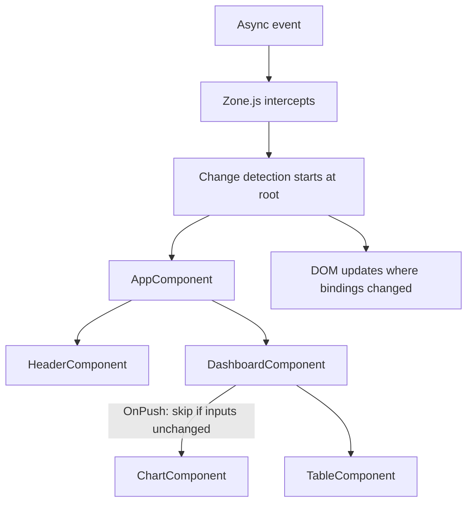

# Angular

## Chapter Goal

After reading this chapter, an experienced engineer can explain
Angular's architecture (components, dependency injection, change
detection) at whiteboard depth, reason about RxJS operator choices
and subscription management, compare Signals with RxJS for
reactivity, choose between NgModules and standalone components,
design forms and routing strategies for large applications, plan
Angular major-version upgrades, and articulate these decisions in a
Tech Lead interview with correct terminology.

## Why This Matters for a Tech Lead

Angular is the opinionated, enterprise-grade frontend framework.
Its opinions — dependency injection, strong typing, RxJS, a CLI
that generates structure — make it productive for large teams but
create architectural decisions that are expensive to reverse:

- **Upgrade strategy.** Angular releases a major version roughly
  every six months with migration schematics. The Tech Lead decides
  when to upgrade, how to allocate the sprint time, and how to
  validate the migration. Falling behind creates compounding debt:
  each skipped version makes the next upgrade harder.
- **State management.** Angular has no built-in global state
  solution. The Tech Lead chooses between services with BehaviorSubject,
  NgRx, NGXS, or signal-based stores — a decision that shapes every
  feature.
- **Change detection performance.** The default change detection
  strategy (zone-based, checking every component) degrades at scale.
  The Tech Lead enforces OnPush as the default and decides when to
  adopt zoneless change detection.
- **RxJS complexity.** RxJS is Angular's reactivity backbone.
  Misusing operators (mergeMap where switchMap is needed) or leaking
  subscriptions are the top two Angular production bugs. The Tech
  Lead sets subscription management conventions.
- **Hiring signal.** Angular interviews reveal whether a candidate
  understands DI, change detection, and RxJS — or treats Angular as
  "React with more boilerplate." A Tech Lead who cannot evaluate
  these answers cannot build a strong Angular team.

## Mental Model

Think of Angular as **components + dependency injection + change
detection**. Every Angular application is a tree of components.
Services are injected into components via the DI system.
Change detection walks the component tree after every async event
and updates the DOM where bindings changed.



Zone.js patches every async API (`setTimeout`, `Promise`,
`addEventListener`). After any async callback completes, Angular
runs change detection from the root. Components using the default
strategy are always checked. Components using `OnPush` are skipped
unless their inputs change by reference, an event originates in
the component, or the component explicitly calls `markForCheck()`.

**Key insight for interviews:** Angular's change detection is
tree-based and synchronous. It walks the entire component tree
(or the OnPush-pruned subset) in a single microtask. This is
fundamentally different from React's reconciliation, which diffs
virtual element trees. Angular compares binding values directly
against the previous values — no virtual DOM.

## Core Terminology

| Term | Definition |
| --- | --- |
| **Component** | A class with a `@Component` decorator, a template, and optional styles. The building block of Angular UIs. |
| **Directive** | A class that modifies DOM behavior. Structural directives (`*ngIf`, `@if`) add/remove elements. Attribute directives change appearance or behavior. |
| **Pipe** | A class that transforms data in templates. Pure pipes run only when input changes by reference. Impure pipes run on every change detection cycle. |
| **Service** | A class decorated with `@Injectable` that encapsulates business logic, data access, or cross-cutting concerns. Injected via DI. |
| **NgModule** | A class with `@NgModule` that groups components, directives, pipes, and services. Legacy organizational unit being replaced by standalone components. |
| **Standalone component** | A component with `standalone: true` that declares its own imports without an NgModule. The modern default. |
| **Dependency injection (DI)** | A hierarchical system where Angular creates and delivers instances of services to components that request them. |
| **Provider** | A configuration that tells the injector how to create a dependency. Can provide a class, a value, a factory, or an existing token. |
| **Change detection** | The mechanism that checks component bindings after async events and updates the DOM. Default strategy checks everything; OnPush checks only when inputs change. |
| **OnPush** | A change detection strategy that skips a component unless its inputs change by reference, an event fires inside it, or `markForCheck()` is called. |
| **Zone.js** | A library that patches async APIs to notify Angular when async operations complete. Triggers change detection. |
| **Signal** | A reactive primitive (Angular 16+) that holds a value and notifies consumers when it changes. Intended to eventually replace zone-based change detection. |
| **Observable** | An RxJS type representing a stream of values over time. Angular's HTTP client, router, and forms all return Observables. |
| **Subject** | An RxJS type that is both an Observable and an Observer. Can multicast values to multiple subscribers. `BehaviorSubject` holds a current value. |
| **Reactive form** | A form built programmatically with `FormGroup`, `FormControl`, and `FormArray`. Validation, dynamic fields, and testing are straightforward. |
| **Template-driven form** | A form built declaratively in the template with `ngModel`. Simpler for small forms but harder to test and validate dynamically. |
| **Route guard** | A function or class that controls navigation. `canActivate` protects routes; `canDeactivate` prevents leaving unsaved changes. |
| **Interceptor** | A middleware for HTTP requests/responses. Used for auth tokens, logging, error handling, and caching. |
| **Lazy loading** | Loading a route's module or component on demand, reducing the initial bundle size. |

**Key distinctions:**

- **NgModule vs standalone component:** NgModules group related
  code and control the compilation scope. Standalone components
  declare their own dependencies directly. New projects should use
  standalone components. NgModules are maintained but not the
  recommended path for new code.
- **Observable vs Signal:** Observables model streams of values
  over time (events, HTTP responses, WebSocket messages). Signals
  model synchronous reactive values that change discretely (a
  counter, a user object, a theme). Signals integrate with change
  detection more efficiently than Observables because they track
  dependencies at read time.
- **Pure pipe vs impure pipe:** Pure pipes run only when the input
  reference changes — they are cached. Impure pipes run on every
  change detection cycle — they are expensive. Avoid impure pipes
  in production.

## Theoretical Foundation

### Angular architecture

An Angular application has four layers:

1. **Components** — the UI. Each component has a TypeScript class,
   an HTML template, and optional CSS. Components form a tree.
2. **Services** — business logic, data access, state. Injected
   into components via DI. Services are singletons by default
   (provided in `root`).
3. **Dependency injection** — the glue. The hierarchical injector
   creates and delivers service instances. Components request
   dependencies via constructor parameters or `inject()`.
4. **Change detection** — the render loop. After every async event,
   Angular checks component bindings and updates the DOM.

**Angular vs React mental model:**

| Aspect | Angular | React |
| --- | --- | --- |
| **Architecture** | Full framework: routing, forms, HTTP, DI, testing included | Library: rendering only; routing, forms, state are third-party |
| **Reactivity** | Zone.js + change detection (or Signals) | Virtual DOM + reconciliation |
| **State management** | Services + RxJS (or NgRx, Signals) | useState/useReducer + Context/Redux/Zustand |
| **Template** | HTML with Angular syntax (`@if`, `*ngFor`, `[binding]`, `(event)`) | JSX (JavaScript expressions in markup) |
| **DI** | Built-in hierarchical DI | No built-in DI (module imports, Context) |
| **Typing** | TypeScript required | TypeScript optional (strongly recommended) |
| **Opinionatedness** | High — CLI enforces structure | Low — developer chooses structure |
| **Learning curve** | Steeper (DI, RxJS, decorators, modules) | Gentler initially, steeper at scale (hooks rules, memoization) |

**When Angular is a better fit than React:**
- Large enterprise teams that benefit from enforced structure.
- Applications with complex forms and validation requirements.
- Teams that want a single framework covering routing, HTTP, forms,
  and testing without choosing third-party libraries.

**When React is a better fit than Angular:**
- Smaller teams that value flexibility and minimal opinions.
- Applications where bundle size is critical (React's core is smaller).
- Teams with strong React experience.

See [React](./08-react.md) for React's architecture in depth.

### Modules and standalone components

**NgModules** (legacy) group related code:

```ts
@NgModule({
  declarations: [OrderListComponent, OrderDetailComponent],
  imports: [CommonModule, ReactiveFormsModule],
  providers: [OrderService],
  exports: [OrderListComponent],
})
export class OrderModule {}
```

**Standalone components** (modern, recommended) declare their own
imports:

```ts
@Component({
  selector: "app-order-list",
  standalone: true,
  imports: [CommonModule, ReactiveFormsModule, OrderDetailComponent],
  templateUrl: "./order-list.component.html",
  changeDetection: ChangeDetectionStrategy.OnPush,
})
export class OrderListComponent {
  private orderService = inject(OrderService);
}
```

**Why standalone is preferred:** No NgModule boilerplate. Each
component explicitly declares its dependencies — the compilation
scope is visible in the file. Tree-shaking is more effective
because unused components are not pulled in via a module. Lazy
loading works at the component level, not the module level.

**Migration:** Existing NgModule applications can migrate
incrementally. The Angular CLI provides a schematic
(`ng generate @angular/core:standalone`) that converts modules to
standalone components. Components can be standalone while the rest
of the app uses NgModules — both coexist.

> Verify standalone component migration schematic against current
> Angular CLI documentation. The schematic name and options may
> change between versions.

### Components, templates, and lifecycle

A component is a class with metadata:

```ts
@Component({
  selector: "app-user-card",
  standalone: true,
  imports: [DatePipe],
  template: `
    <div class="card">
      <h2>{{ user().name }}</h2>
      <p>Joined {{ user().createdAt | date:'mediumDate' }}</p>
    </div>
  `,
  changeDetection: ChangeDetectionStrategy.OnPush,
})
export class UserCardComponent {
  user = input.required<User>();
}
```

**Template syntax:**

| Syntax | Purpose | Example |
| --- | --- | --- |
| `{{ expr }}` | Interpolation | `{{ user.name }}` |
| `[prop]` | Property binding | `[disabled]="isLoading"` |
| `(event)` | Event binding | `(click)="save()"` |
| `[(ngModel)]` | Two-way binding | `[(ngModel)]="name"` |
| `@if` / `@for` | Built-in control flow | `@if (user) { ... }` |
| `*ngIf` / `*ngFor` | Structural directives (legacy) | `*ngIf="user"` |

> Verify `@if`, `@for`, `@switch` built-in control flow syntax
> against current Angular documentation. This syntax was introduced
> in Angular 17 and replaces `*ngIf`, `*ngFor`.

**Lifecycle hooks:**

| Hook | Fires when | Common use |
| --- | --- | --- |
| `ngOnInit` | After first input binding | Fetch data, initialize subscriptions |
| `ngOnChanges` | When input properties change | React to input changes |
| `ngAfterViewInit` | After the view is initialized | Access `@ViewChild` references |
| `ngOnDestroy` | Before the component is destroyed | Unsubscribe, clean up |

**`ngOnInit` vs constructor:** The constructor runs before Angular
sets input properties. Use the constructor only for DI. Use
`ngOnInit` for initialization that depends on inputs. With
`inject()`, the constructor is often empty.

### Directives

**Structural directives** change the DOM structure:

```ts
@Directive({
  selector: "[appIfRole]",
  standalone: true,
})
export class IfRoleDirective {
  private templateRef = inject(TemplateRef<unknown>);
  private viewContainer = inject(ViewContainerRef);
  private authService = inject(AuthService);

  @Input() set appIfRole(role: string) {
    if (this.authService.hasRole(role)) {
      this.viewContainer.createEmbeddedView(this.templateRef);
    } else {
      this.viewContainer.clear();
    }
  }
}
```

**Attribute directives** modify element behavior without changing
structure (e.g., `[appHighlight]` that changes background color on
hover).

**When to use directives vs components:** A directive adds behavior
to an existing element. A component creates a new element with its
own template. If the feature needs its own template, use a
component. If it modifies an existing element's behavior, use a
directive.

### Pipes

Pipes transform values in templates:

```ts
@Pipe({ name: "truncate", standalone: true, pure: true })
export class TruncatePipe implements PipeTransform {
  transform(value: string, maxLength = 50): string {
    return value.length > maxLength ? value.slice(0, maxLength) + "…" : value;
  }
}
```

Usage: `{{ description | truncate:100 }}`

**Pure vs impure:** Pure pipes are called only when the input
reference changes. They are memoized. Impure pipes (`pure: false`)
are called on every change detection cycle — they are a performance
risk. Use pure pipes by default. If the pipe must react to deep
object mutations, refactor to use immutable data or move the logic
into the component.

### Dependency injection

Angular's DI is hierarchical. Each component has its own injector
that inherits from its parent. When a component requests a service,
Angular walks up the injector tree until it finds a provider.

**Provider scopes:**

| Scope | Configuration | Lifetime | Use case |
| --- | --- | --- | --- |
| **Root** | `@Injectable({ providedIn: 'root' })` | Singleton for the entire app | Most services: HTTP wrappers, auth, state |
| **Component** | `providers: [MyService]` in `@Component` | New instance per component | Services that need per-component state |
| **Module** | `providers` array in `@NgModule` | Singleton per module (lazy-loaded modules get their own instance) | Legacy; prefer `providedIn: 'root'` |

**`inject()` function vs constructor injection:**

```ts
// Modern: inject() — no constructor needed
export class OrderService {
  private http = inject(HttpClient);
}

// Legacy: constructor injection
export class OrderService {
  constructor(private http: HttpClient) {}
}
```

Both are functionally identical. `inject()` is preferred in modern
Angular because it works in standalone components without a
constructor and enables better tree-shaking.

**Injection tokens** allow injecting values that are not classes:

```ts
const API_URL = new InjectionToken<string>("API_URL");

// In providers:
{ provide: API_URL, useValue: "https://api.example.com" }

// In service:
private apiUrl = inject(API_URL);
```

### RxJS: Observables, Subjects, and operators

RxJS is Angular's reactivity backbone. The HTTP client returns
Observables. The router exposes Observables. Forms emit value
changes as Observables.

**Observable:** A lazy stream of values. Does nothing until
subscribed to. Each subscription creates a new execution context
(cold by default).

**Subject:** An Observable that can multicast. Multiple subscribers
share the same execution.

**RxJS Subject types and when to use each:**

| Subject type | Behavior | Use case |
| --- | --- | --- |
| `Subject` | Emits values to subscribers. New subscribers miss past values. | Event bus, multicast notifications |
| `BehaviorSubject` | Holds a current value. New subscribers get the latest value immediately. | State management, current user |
| `ReplaySubject(n)` | Replays the last `n` values to new subscribers. | Cache of recent values |
| `AsyncSubject` | Emits only the last value, only on completion. | One-shot operations |

**The four mapping operators — the most common interview question:**

| Operator | Behavior | Use when |
| --- | --- | --- |
| `switchMap` | Cancels the previous inner Observable when a new value arrives | **Typeahead search** — each new keystroke cancels the previous request |
| `mergeMap` | Runs all inner Observables concurrently | **Parallel requests** — all must complete, order does not matter |
| `concatMap` | Queues inner Observables, runs them sequentially | **Sequential mutations** — order matters (save draft 1, then draft 2) |
| `exhaustMap` | Ignores new values while an inner Observable is in progress | **Form submit** — ignore clicks while the request is in-flight |

**Subscription management — the #1 Angular bug category:**

Unsubscribed Observables leak memory. Four patterns:

1. **`async` pipe** — the template subscribes and unsubscribes
   automatically:
   ```ts
   // In template: {{ user$ | async }}
   user$ = this.userService.getUser(this.userId);
   ```
2. **`takeUntilDestroyed()`** (Angular 16+) — automatically
   completes when the component is destroyed:
   ```ts
   this.route.params.pipe(
     takeUntilDestroyed(this.destroyRef),
     switchMap(params => this.orderService.getOrder(params['id']))
   ).subscribe(order => this.order.set(order));
   ```
3. **`DestroyRef` + manual unsubscribe** — for imperative code.
4. **`Subscription.add()`** — collect subscriptions and unsubscribe
   in `ngOnDestroy`.

> Verify `takeUntilDestroyed` API (import path, `DestroyRef`
> parameter) against current Angular documentation.

**Tech Lead convention:** Default to the `async` pipe for template
bindings. Use `takeUntilDestroyed` for imperative subscriptions.
Ban manual `subscribe()` without a cleanup pattern in code review.

### Signals

Signals are Angular's modern reactivity primitive (Angular 16+).
A signal holds a value and notifies consumers when it changes:

```ts
@Component({
  selector: "app-counter",
  standalone: true,
  template: `
    <p>Count: {{ count() }}</p>
    <button (click)="increment()">+</button>
  `,
  changeDetection: ChangeDetectionStrategy.OnPush,
})
export class CounterComponent {
  count = signal(0);

  increment() {
    this.count.update(c => c + 1);
  }
}
```

**Signal types:**

| Type | Purpose | Example |
| --- | --- | --- |
| `signal(value)` | Writable signal with an initial value | `count = signal(0)` |
| `computed(() => expr)` | Derived signal, recomputes when dependencies change | `doubled = computed(() => this.count() * 2)` |
| `effect(() => { ... })` | Side effect that runs when signal dependencies change | `effect(() => console.log(this.count()))` |
| `input()` / `input.required()` | Signal-based component input | `name = input.required<string>()` |

**Signals vs RxJS:**

| Aspect | Signals | RxJS Observables |
| --- | --- | --- |
| **Value model** | Synchronous, always has a current value | Asynchronous stream, may not have emitted yet |
| **Subscription** | Automatic (read in template/computed) | Manual (subscribe or async pipe) |
| **Memory leaks** | No subscription to manage | Must unsubscribe |
| **Operators** | `computed()`, `effect()` | Rich operator library (200+ operators) |
| **Best for** | UI state, derived values, component inputs | HTTP responses, WebSocket streams, router events, complex async flows |

**Tech Lead perspective:** Signals and RxJS coexist. Signals replace
RxJS for synchronous component state (replacing `BehaviorSubject`
for local state). RxJS remains essential for async streams (HTTP,
WebSocket, router). The migration is gradual — convert
`BehaviorSubject`-based component state to signals first, keep RxJS
for async flows.

> Verify Signal API (`signal()`, `computed()`, `effect()`,
> `input()`, `input.required()`, `model()`) against current Angular
> documentation. Signal APIs have evolved across Angular 16-19.

### Change detection

Angular's change detection checks every component's template
bindings after each async event.

**Default strategy:** Check every component in the tree. Simple
but expensive at scale — 200 components means 200 checks after
every click, every HTTP response, every timer tick.

**OnPush strategy:** Skip the component unless:
1. An `@Input` changes by reference.
2. An event originates inside the component or its children.
3. `markForCheck()` is called explicitly.
4. An `async` pipe in the template receives a new value.
5. A signal read in the template changes.

**Zoneless change detection** (experimental) removes Zone.js
entirely. Change detection is triggered only by signals and
explicit calls. This eliminates Zone.js patching overhead and
reduces bundle size.

> Verify zoneless change detection status (experimental vs stable)
> against current Angular documentation. This feature is evolving.

**Production implication:** OnPush should be the default for every
component. It requires immutable data patterns (new object
references for input changes) but dramatically reduces unnecessary
change detection cycles. Enable OnPush in the Angular schematic
defaults so every generated component uses it:

```json
{
  "schematics": {
    "@schematics/angular:component": {
      "changeDetection": "OnPush",
      "standalone": true
    }
  }
}
```

### Forms

Angular provides two form approaches:

**Reactive forms** (recommended for production):

```ts
@Component({
  selector: "app-login",
  standalone: true,
  imports: [ReactiveFormsModule],
  template: `
    <form [formGroup]="form" (ngSubmit)="onSubmit()">
      <input formControlName="email" />
      @if (form.controls.email.errors?.['email']) {
        <span class="error">Invalid email</span>
      }
      <input formControlName="password" type="password" />
      @if (form.controls.password.errors?.['minlength']) {
        <span class="error">Min 8 characters</span>
      }
      <button type="submit" [disabled]="form.invalid || isSubmitting">
        {{ isSubmitting ? 'Signing in…' : 'Sign in' }}
      </button>
    </form>
  `,
  changeDetection: ChangeDetectionStrategy.OnPush,
})
export class LoginComponent {
  private authService = inject(AuthService);
  isSubmitting = false;

  form = new FormGroup({
    email: new FormControl("", [Validators.required, Validators.email]),
    password: new FormControl("", [Validators.required, Validators.minLength(8)]),
  });

  async onSubmit() {
    if (this.form.invalid) return;
    this.isSubmitting = true;
    await this.authService.login(this.form.getRawValue());
    this.isSubmitting = false;
  }
}
```

**Template-driven forms** (simpler, less testable):

```html
<!-- In template: -->
<input [(ngModel)]="email" required email />
```

**When to use which:**

| Feature | Reactive forms | Template-driven forms |
| --- | --- | --- |
| **Testability** | High — form logic is in the class | Low — form logic is in the template |
| **Dynamic fields** | Easy — add/remove controls programmatically | Difficult |
| **Cross-field validation** | Straightforward with group validators | Awkward |
| **Boilerplate** | More (FormGroup, FormControl setup) | Less (ngModel bindings) |
| **When to use** | Most production forms | Simple, static forms (login, search) |

**Custom validators:**

```ts
function passwordStrength(control: AbstractControl): ValidationErrors | null {
  const value = control.value as string;
  if (!value) return null;
  const hasUpper = /[A-Z]/.test(value);
  const hasDigit = /\d/.test(value);
  if (hasUpper && hasDigit) return null;
  return { passwordStrength: "Must contain uppercase and digit" };
}
```

**Async validators** (e.g., checking if a username is taken) return
an Observable or Promise. They run after sync validators pass. Use
`debounceTime` to avoid firing on every keystroke.

### Routing

Angular's router maps URLs to components:

```ts
export const routes: Routes = [
  { path: "", component: HomeComponent },
  {
    path: "orders",
    loadComponent: () => import("./orders/order-list.component").then(m => m.OrderListComponent),
    canActivate: [authGuard],
  },
  {
    path: "orders/:id",
    loadComponent: () => import("./orders/order-detail.component").then(m => m.OrderDetailComponent),
    canDeactivate: [unsavedChangesGuard],
  },
  { path: "**", component: NotFoundComponent },
];
```

**Lazy loading** with `loadComponent` (standalone) or
`loadChildren` (NgModule) defers loading until the user navigates
to the route. This reduces the initial bundle size.

**Guards:**

| Guard | Purpose | Example |
| --- | --- | --- |
| `canActivate` | Protects a route from unauthorized access | Redirect to login if not authenticated |
| `canDeactivate` | Prevents leaving a route with unsaved changes | Confirm dialog before navigating away |
| `canMatch` | Controls whether a route configuration matches | Feature flags, A/B testing |
| `resolve` | Prefetches data before the route activates | Load order details before rendering |

**Functional guards** (modern, recommended):

```ts
export const authGuard: CanActivateFn = (route, state) => {
  const authService = inject(AuthService);
  const router = inject(Router);

  if (authService.isAuthenticated()) return true;
  return router.createUrlTree(["/login"], { queryParams: { returnUrl: state.url } });
};
```

### Interceptors and HTTP client

Angular's `HttpClient` handles HTTP communication. Interceptors
are middleware for requests and responses:

```ts
export const authInterceptor: HttpInterceptorFn = (req, next) => {
  const authService = inject(AuthService);
  const token = authService.getToken();

  if (token) {
    req = req.clone({ setHeaders: { Authorization: `Bearer ${token}` } });
  }

  return next(req).pipe(
    catchError((error: HttpErrorResponse) => {
      if (error.status === 401) {
        authService.logout();
      }
      return throwError(() => error);
    })
  );
};

// Registration:
provideHttpClient(withInterceptors([authInterceptor]))
```

**Common interceptor uses:** auth token injection, request/response
logging, error handling (401 → logout, 500 → error page),
retry with exponential backoff, caching.

**Common mistake:** Putting both auth and error handling in a
single interceptor. Each concern should be a separate interceptor —
`authInterceptor` adds the token, `errorInterceptor` handles
responses. The order in the `withInterceptors()` array determines
execution order: auth should run first (modify the request), error
handling last (catch responses).

**Tech Lead check:** Verify that interceptors are ordered
correctly. In production, add a logging interceptor that records
request duration for observability. Ensure the auth interceptor
skips public endpoints (login, health check) to avoid sending
tokens where they are not needed.

> Verify functional interceptor API (`HttpInterceptorFn`,
> `withInterceptors`) against current Angular documentation.
> Class-based interceptors are being superseded by functional ones.

### State management

Angular has no built-in global state library.

**Angular state management options and complexity levels:**

| Approach | Complexity | When to use |
| --- | --- | --- |
| **Services + Signals** | Low | Small/medium apps. Signals hold state, `computed()` derives values. |
| **Services + BehaviorSubject** | Low | Apps already using RxJS heavily. Expose state as Observables. |
| **NgRx (Store)** | High | Large apps with complex state, many actions, time-travel debugging. |
| **NGXS** | Medium | Teams that want Redux-like patterns with less boilerplate. |
| **Component Store (NgRx)** | Medium | Per-feature state with a simpler API than global NgRx Store. |

**Signal-based service (modern, lightweight):**

```ts
@Injectable({ providedIn: "root" })
export class CartService {
  private items = signal<CartItem[]>([]);

  readonly cartItems = this.items.asReadonly();
  readonly total = computed(() =>
    this.items().reduce((sum, item) => sum + item.price * item.quantity, 0)
  );
  readonly itemCount = computed(() =>
    this.items().reduce((sum, item) => sum + item.quantity, 0)
  );

  addItem(product: Product) {
    this.items.update(items => [...items, { ...product, quantity: 1 }]);
  }

  removeItem(productId: string) {
    this.items.update(items => items.filter(i => i.id !== productId));
  }
}
```

**Tech Lead perspective:** For most applications, signal-based
services cover the majority of state management needs — in my
experience, roughly 80-90%. Reach for NgRx
only when the application requires action logging, time-travel
debugging, or complex side-effect orchestration (NgRx Effects).
NgRx for a todo app is overengineering.

### Testing

Angular testing uses TestBed, which creates a testing module with
the component's dependencies:

```ts
describe("OrderListComponent", () => {
  let component: OrderListComponent;
  let fixture: ComponentFixture<OrderListComponent>;
  let orderService: jasmine.SpyObj<OrderService>;

  beforeEach(async () => {
    orderService = jasmine.createSpyObj("OrderService", ["getOrders"]);
    orderService.getOrders.and.returnValue(of([mockOrder]));

    await TestBed.configureTestingModule({
      imports: [OrderListComponent],
      providers: [{ provide: OrderService, useValue: orderService }],
    }).compileComponents();

    fixture = TestBed.createComponent(OrderListComponent);
    component = fixture.componentInstance;
    fixture.detectChanges();
  });

  it("renders order list", () => {
    const rows = fixture.nativeElement.querySelectorAll("tr");
    expect(rows.length).toBe(1);
  });

  it("calls getOrders on init", () => {
    expect(orderService.getOrders).toHaveBeenCalledTimes(1);
  });
});
```

The key patterns: (1) standalone component goes into `imports`, not
`declarations`. (2) Service is mocked with `jasmine.createSpyObj` —
the test controls what data the component receives. (3)
`fixture.detectChanges()` triggers change detection manually, which
is required for OnPush components in tests.

**Common mistake:** Forgetting `fixture.detectChanges()`. Without
it, the template is not rendered and DOM queries return nothing.
Another mistake: providing the real service instead of a mock — the
test becomes slow and fragile because it depends on HTTP responses.

**Testing strategy:**

| Test type | What it tests | Tool |
| --- | --- | --- |
| **Component test** | Component rendering and interaction | TestBed + ComponentFixture |
| **Isolated unit test** | Services, pipes, validators | Plain class instantiation (no TestBed) |
| **Integration test** | Multiple components + services | TestBed with real or mock services |
| **E2E test** | Full user flows | Playwright, Cypress |

**Harnesses** (Angular CDK) provide an abstraction layer for
component testing that survives template refactors. Prefer
harnesses over direct DOM queries for Angular Material components.

## Practical Usage

### Where each tool fits

- **Standalone components** for all new code. NgModules only for
  legacy compatibility.
- **Reactive forms** for any form with validation, dynamic fields,
  or cross-field rules. Template-driven forms for simple search
  inputs.
- **Signals** for component-level and service-level synchronous
  state. RxJS for async streams (HTTP, WebSocket, router events).
- **OnPush** as the default change detection strategy. Default
  strategy only when debugging specific issues.
- **Lazy loading** at route boundaries to reduce initial bundle.
- **Functional guards and interceptors** instead of class-based
  ones.

### Structuring a large Angular application

```text
src/
  app/
    features/
      orders/
        order-list.component.ts
        order-detail.component.ts
        order.service.ts
        order.routes.ts
        order.model.ts
        __tests__/
          order-list.component.spec.ts
      users/
        ...
    shared/
      components/          (Button, Modal, Spinner)
      directives/          (IfRole, Highlight)
      pipes/               (Truncate, Currency)
      services/            (AuthService, NotificationService)
    core/
      interceptors/        (auth.interceptor.ts, error.interceptor.ts)
      guards/              (auth.guard.ts, unsaved-changes.guard.ts)
    app.component.ts
    app.routes.ts
    app.config.ts          (provideRouter, provideHttpClient)
```

**Feature-based organization:** Each feature folder contains its
components, services, routes, and tests. A developer working on
orders changes files in `features/orders/`, not across
`components/`, `services/`, and `state/`.

## Examples

### Standalone component with OnPush and signals

```ts
@Component({
  selector: "app-product-card",
  standalone: true,
  imports: [CurrencyPipe],
  template: `
    <div class="product-card">
      <h3>{{ product().name }}</h3>
      <p>{{ product().price | currency }}</p>
      <button (click)="addToCart()" [disabled]="isAdding()">
        {{ isAdding() ? 'Adding…' : 'Add to cart' }}
      </button>
    </div>
  `,
  changeDetection: ChangeDetectionStrategy.OnPush,
})
export class ProductCardComponent {
  product = input.required<Product>();
  isAdding = signal(false);

  private cartService = inject(CartService);

  async addToCart() {
    this.isAdding.set(true);
    await this.cartService.addItem(this.product());
    this.isAdding.set(false);
  }
}
```

**What this does:** A product card that adds items to a cart. Uses
signal-based `input()` for the product, a local signal for loading
state, and OnPush for performance.

**Why it is written this way:** `input.required()` replaces the
legacy `@Input()` decorator and works with change detection
natively. The `isAdding` signal triggers template updates without
`markForCheck()`.

**Common mistake:** Using `@Input()` with OnPush and mutating the
input object. OnPush checks by reference — mutating the object
does not trigger change detection. Always create a new object
reference.

**Tech Lead check:** Verify that every new component uses
`standalone: true`, `OnPush`, and signal-based inputs.

### RxJS typeahead with switchMap

```ts
@Component({
  selector: "app-search",
  standalone: true,
  imports: [ReactiveFormsModule, AsyncPipe],
  template: `
    <input [formControl]="searchControl" placeholder="Search…" />
    <ul>
      @for (result of results$ | async; track result.id) {
        <li>{{ result.name }}</li>
      }
    </ul>
  `,
  changeDetection: ChangeDetectionStrategy.OnPush,
})
export class SearchComponent {
  searchControl = new FormControl("");

  results$ = this.searchControl.valueChanges.pipe(
    debounceTime(300),
    distinctUntilChanged(),
    filter((term): term is string => !!term && term.length >= 2),
    switchMap(term => this.searchService.search(term)),
  );

  private searchService = inject(SearchService);
}
```

**What this does:** A search input that debounces keystrokes,
deduplicates identical queries, and cancels the previous HTTP
request when a new keystroke arrives (`switchMap`).

**Why `switchMap` and not `mergeMap`:** `mergeMap` would keep all
in-flight requests alive. If the user types "an", "ang", "angu",
`mergeMap` sends three requests and the UI flickers between
results. `switchMap` cancels "an" and "ang" when "angu" arrives.

**Common mistake:** Using `mergeMap` for typeahead. This causes
race conditions — the results for "an" may arrive after "angu",
overwriting the correct results.

**Tech Lead check:** In code review, verify that every search/
typeahead uses `switchMap`, every form submit uses `exhaustMap`,
and every sequential mutation uses `concatMap`.

### Reactive form with cross-field validation

```ts
function passwordsMatch(group: AbstractControl): ValidationErrors | null {
  const password = group.get("password")?.value;
  const confirm = group.get("confirmPassword")?.value;
  return password === confirm ? null : { passwordMismatch: true };
}

@Component({
  selector: "app-register",
  standalone: true,
  imports: [ReactiveFormsModule],
  template: `
    <form [formGroup]="form" (ngSubmit)="onSubmit()">
      <input formControlName="email" type="email" />
      <input formControlName="password" type="password" />
      <input formControlName="confirmPassword" type="password" />
      @if (form.errors?.['passwordMismatch']) {
        <span class="error">Passwords do not match</span>
      }
      <button type="submit" [disabled]="form.invalid">Register</button>
    </form>
  `,
  changeDetection: ChangeDetectionStrategy.OnPush,
})
export class RegisterComponent {
  form = new FormGroup({
    email: new FormControl("", [Validators.required, Validators.email]),
    password: new FormControl("", [Validators.required, Validators.minLength(8)]),
    confirmPassword: new FormControl("", [Validators.required]),
  }, { validators: passwordsMatch });

  onSubmit() {
    if (this.form.invalid) return;
    // submit registration
  }
}
```

**What this does:** A registration form with cross-field validation.
The `passwordsMatch` validator runs at the group level, comparing
two fields.

**Common mistake:** Putting cross-field validation on individual
controls. The validator cannot access sibling controls from a
single control. It must be attached to the parent `FormGroup`.

### Route guard with auth redirect

```ts
export const authGuard: CanActivateFn = (route, state) => {
  const authService = inject(AuthService);
  const router = inject(Router);

  if (authService.isAuthenticated()) return true;
  return router.createUrlTree(["/login"], {
    queryParams: { returnUrl: state.url },
  });
};
```

**What this does:** Protects routes from unauthenticated access.
If the user is not authenticated, redirects to `/login` with a
`returnUrl` query parameter so the login page can redirect back
after successful authentication.

**Why `createUrlTree` instead of `router.navigate`:** `canActivate`
can return a `UrlTree` to redirect. This is declarative — the
router handles the redirect. `router.navigate` inside a guard is
imperative and can cause race conditions.

### Component with input, output, and computed signals

```ts
@Component({
  selector: "app-order-row",
  standalone: true,
  imports: [CurrencyPipe],
  template: `
    <tr>
      <td>{{ order().id }}</td>
      <td>{{ order().customerName }}</td>
      <td>{{ orderTotal() | currency }}</td>
      <td>
        <button (click)="cancel.emit(order().id)" [disabled]="!isCancellable()">
          Cancel
        </button>
      </td>
    </tr>
  `,
  changeDetection: ChangeDetectionStrategy.OnPush,
})
export class OrderRowComponent {
  order = input.required<Order>();
  cancel = output<string>();

  orderTotal = computed(() =>
    this.order().items.reduce((sum, item) => sum + item.price * item.qty, 0)
  );

  isCancellable = computed(() => this.order().status === "pending");
}
```

**What this does:** A table row component that receives an order
via a signal input, emits a cancel event via `output()`, and
derives the total and cancellability via `computed()`.

**Why it is useful:** This is the modern Angular pattern for
parent-child communication. Signal inputs integrate with
`computed()` — derived values recompute automatically when the
input changes. `output()` replaces `@Output() + EventEmitter` with
a simpler API.

**Common mistake:** Using `@Output() cancel = new EventEmitter()`
with `@Input()` instead of the signal-based APIs. The legacy
pattern works but does not integrate with `computed()`, and OnPush
requires manual `markForCheck()` when inputs are mutated.

**How this changes in production:** In production, the cancel
button would trigger a confirmation dialog before emitting. The
`isCancellable` computed signal would check additional business
rules (time window, user role, payment status).

**Tech Lead check:** Ensure all new components use `input()` /
`output()` instead of `@Input()` / `@Output()`. Add an ESLint
rule to flag legacy decorator usage in new files.

> Verify `output()` function API against current Angular
> documentation. This was introduced alongside signal-based inputs.

### HTTP client service with typed responses

```ts
interface OrdersResponse {
  orders: Order[];
  total: number;
  page: number;
}

@Injectable({ providedIn: "root" })
export class OrderService {
  private http = inject(HttpClient);
  private apiUrl = inject(API_URL);

  getOrders(page = 1, pageSize = 20): Observable<OrdersResponse> {
    return this.http.get<OrdersResponse>(`${this.apiUrl}/orders`, {
      params: { page: page.toString(), pageSize: pageSize.toString() },
    });
  }

  getOrder(id: string): Observable<Order> {
    return this.http.get<Order>(`${this.apiUrl}/orders/${id}`);
  }

  createOrder(data: CreateOrderDto): Observable<Order> {
    return this.http.post<Order>(`${this.apiUrl}/orders`, data);
  }

  cancelOrder(id: string): Observable<void> {
    return this.http.patch<void>(`${this.apiUrl}/orders/${id}`, {
      status: "cancelled",
    });
  }
}
```

**What this does:** A typed HTTP service that wraps Angular's
`HttpClient`. Every method specifies the response type as a
generic parameter (`http.get<Order>`) so callers get typed
data without runtime casting.

**Why it is useful:** Type safety flows from the service through
the component to the template. If the API response shape changes,
TypeScript catches mismatches at compile time. The service is the
single point of contact with the API — if the endpoint changes,
only this file changes.

**Common mistake:** Using `http.get(url)` without the generic
parameter. The return type becomes `Observable<Object>`, and every
consumer casts with `as Order` — losing type safety and hiding
API contract changes.

**How this changes in production:** Add error handling per method
(or rely on the error interceptor). Add caching for read-heavy
endpoints. Add retry logic for idempotent reads. Use `shareReplay`
if multiple components subscribe to the same request.

**Tech Lead check:** Every HTTP service should: (1) use typed
generics, (2) inject the base URL via an `InjectionToken` (not
hardcoded), (3) accept pagination/filter parameters, (4) return
`Observable` — let the consumer decide when to subscribe.

### Subject vs BehaviorSubject for notifications

```ts
@Injectable({ providedIn: "root" })
export class NotificationService {
  // Subject: no initial value — subscribers only receive future emissions
  private _events = new Subject<NotificationEvent>();
  readonly events$ = this._events.asObservable();

  // BehaviorSubject: holds current value — new subscribers get the latest immediately
  private _unreadCount = new BehaviorSubject<number>(0);
  readonly unreadCount$ = this._unreadCount.asObservable();

  push(event: NotificationEvent) {
    this._events.next(event);
    this._unreadCount.next(this._unreadCount.value + 1);
  }

  markAllRead() {
    this._unreadCount.next(0);
  }
}
```

```ts
// Consumer: header component
@Component({
  selector: "app-header",
  standalone: true,
  imports: [AsyncPipe],
  template: `
    <span class="badge">{{ unreadCount$ | async }}</span>
  `,
  changeDetection: ChangeDetectionStrategy.OnPush,
})
export class HeaderComponent {
  private notificationService = inject(NotificationService);
  unreadCount$ = this.notificationService.unreadCount$;
}
```

**What this does:** A notification service that uses both Subject
types. `Subject` for fire-and-forget events (toast notifications)
that do not need history. `BehaviorSubject` for the unread count,
which must have a current value (new subscribers see the count
immediately, not after the next notification arrives).

**Why it is useful:** This is the most common interview question
about Subjects. The distinction is practical: if the component
renders before the first emission, a `Subject` shows nothing. A
`BehaviorSubject` always has a value, so the template renders
immediately.

**Common mistake:** Using `Subject` for state that needs a current
value. The component subscribes, but the subject has not emitted
yet — the template shows nothing until the next event. Using
`BehaviorSubject` for everything is also wasteful — events that do
not need history should use `Subject`.

**How this changes in production:** In modern Angular, the
`BehaviorSubject` pattern for state is being replaced by signals:
`unreadCount = signal(0)` is simpler, has no subscription
management, and integrates with change detection natively. Keep
`Subject` for event streams; migrate `BehaviorSubject` state to
signals.

**Tech Lead check:** In code review, ask: "Does this need a
current value?" If yes → `BehaviorSubject` (or better, `signal`).
If no → `Subject`. Ban `ReplaySubject` unless the team has a
documented reason (it caches history and increases memory use).

### Unsaved changes guard (canDeactivate)

```ts
export interface HasUnsavedChanges {
  hasUnsavedChanges(): boolean;
}

export const unsavedChangesGuard: CanDeactivateFn<HasUnsavedChanges> = (component) => {
  if (!component.hasUnsavedChanges()) return true;
  return confirm("You have unsaved changes. Leave this page?");
};
```

```ts
// Component implementing the interface
@Component({
  selector: "app-order-edit",
  standalone: true,
  imports: [ReactiveFormsModule],
  template: `<form [formGroup]="form"><!-- fields --></form>`,
  changeDetection: ChangeDetectionStrategy.OnPush,
})
export class OrderEditComponent implements HasUnsavedChanges {
  form = new FormGroup({ /* ... */ });

  hasUnsavedChanges(): boolean {
    return this.form.dirty;
  }
}
```

**What this does:** A reusable `canDeactivate` guard that prevents
navigation when a component has unsaved changes. The guard calls
`hasUnsavedChanges()` on the component. The component implements
the interface by checking `form.dirty`.

**Why it is useful:** Prevents data loss — the most frustrating
user experience. The guard is generic: any component that
implements `HasUnsavedChanges` gets the protection without
duplicating logic.

**Common mistake:** Hardcoding the guard to a specific component
or checking `form.dirty` inside the guard. This couples the guard
to one component and breaks reusability.

**How this changes in production:** Replace `confirm()` with a
modal dialog service. Add an `@HostListener('window:beforeunload')`
to catch browser tab close / refresh. Consider auto-saving drafts
to avoid the dialog entirely.

**Tech Lead check:** Ensure every form-editing route has
`canDeactivate` configured. Add it to the code review checklist.
A missing guard on a form route is a data-loss risk.

### Service unit test (isolated, no TestBed)

```ts
describe("CartService", () => {
  let service: CartService;

  beforeEach(() => {
    TestBed.configureTestingModule({});
    service = TestBed.inject(CartService);
  });

  it("starts with empty cart", () => {
    expect(service.cartItems()).toEqual([]);
    expect(service.total()).toBe(0);
    expect(service.itemCount()).toBe(0);
  });

  it("adds an item and updates computed values", () => {
    const product: Product = { id: "1", name: "Widget", price: 25 };

    service.addItem(product);

    expect(service.cartItems().length).toBe(1);
    expect(service.total()).toBe(25);
    expect(service.itemCount()).toBe(1);
  });

  it("removes an item by id", () => {
    const product: Product = { id: "1", name: "Widget", price: 25 };
    service.addItem(product);

    service.removeItem("1");

    expect(service.cartItems().length).toBe(0);
    expect(service.total()).toBe(0);
  });
});
```

**What this does:** Tests the `CartService` from the earlier
example. Since the service uses signals (not HTTP), we use
minimal TestBed — no mocks, no HTTP testing controller. We call
methods and assert on signal values directly.

**Why it is useful:** Signal-based services are testable without
heavy TestBed setup. Read the signal value with `service.total()`
— no need to subscribe to an Observable and manage async. This
makes tests fast, readable, and synchronous.

**Common mistake:** Using the full TestBed machinery with mocked
HTTP clients for a service that does not make HTTP calls. Over-
mocking hides bugs and slows tests. Only mock what the service
actually depends on.

**How this changes in production:** For services that call
`HttpClient`, use `provideHttpClientTesting()` and
`HttpTestingController` to mock HTTP requests. For services with
complex dependencies, provide spy objects.

**Tech Lead check:** Tests should be proportional to complexity.
Signal-based services need simple, synchronous tests. HTTP services
need `HttpTestingController`. Do not over-engineer test setups.

### Component test with user interaction

```ts
describe("SearchComponent", () => {
  let fixture: ComponentFixture<SearchComponent>;
  let searchService: jasmine.SpyObj<SearchService>;

  beforeEach(async () => {
    searchService = jasmine.createSpyObj("SearchService", ["search"]);

    await TestBed.configureTestingModule({
      imports: [SearchComponent],
      providers: [{ provide: SearchService, useValue: searchService }],
    }).compileComponents();

    fixture = TestBed.createComponent(SearchComponent);
  });

  it("searches after debounce and renders results", fakeAsync(() => {
    const mockResults = [{ id: "1", name: "Angular" }, { id: "2", name: "Ansible" }];
    searchService.search.and.returnValue(of(mockResults));

    const input = fixture.nativeElement.querySelector("input");
    input.value = "ang";
    input.dispatchEvent(new Event("input"));

    tick(300); // debounceTime
    fixture.detectChanges();

    const items = fixture.nativeElement.querySelectorAll("li");
    expect(items.length).toBe(2);
    expect(items[0].textContent).toContain("Angular");
    expect(searchService.search).toHaveBeenCalledWith("ang");
  }));

  it("does not search for short queries", fakeAsync(() => {
    const input = fixture.nativeElement.querySelector("input");
    input.value = "a";
    input.dispatchEvent(new Event("input"));

    tick(300);
    fixture.detectChanges();

    expect(searchService.search).not.toHaveBeenCalled();
  }));
});
```

**What this does:** Tests the `SearchComponent` from the earlier
typeahead example. Uses `fakeAsync` and `tick` to control the
debounce timer. Verifies that: (1) search is called after the
debounce delay, (2) results are rendered, (3) short queries do
not trigger a search.

**Why it is useful:** Testing RxJS-based components requires
controlling time. `fakeAsync` + `tick` replaces real timers with
synchronous, controllable ones. Without `fakeAsync`, the test
would need `setTimeout` callbacks and become fragile.

**Common mistake:** Not calling `tick(300)` after setting the
input value. The `debounceTime(300)` operator waits 300ms — without
`tick`, the Observable never emits and the test passes vacuously
(no search called, no results rendered, but no assertion failure
either).

**How this changes in production:** Add tests for edge cases:
clearing the input, switching queries rapidly (verify `switchMap`
cancellation), and error responses from the search service. Use
marble testing for complex timing scenarios.

**Tech Lead check:** Every component test should cover: (1) the
happy path, (2) empty/error states, (3) user interactions. Tests
that only assert on component creation (`expect(component).
toBeTruthy()`) add no value — reject them in code review.

## Common Mistakes

1. **Subscribing without cleanup**
   - What it looks like: `this.service.getData().subscribe(data => this.data = data)` in `ngOnInit` with no unsubscribe.
   - Why it is dangerous: If the component is destroyed while the
     Observable is active, the subscription keeps running — leaking
     memory and potentially updating destroyed component state.
   - The correct approach: Use the `async` pipe in templates, or
     `takeUntilDestroyed()` for imperative subscriptions.

2. **Using `mergeMap` where `switchMap` is needed**
   - What it looks like: A typeahead that uses `mergeMap` to map
     search terms to HTTP requests.
   - Why it is dangerous: Multiple in-flight requests race. The
     result for an older query can overwrite the result for the
     current query.
   - The correct approach: `switchMap` for typeahead (cancel
     previous), `exhaustMap` for form submit (ignore duplicate
     clicks).

3. **Mixing reactive and template-driven forms**
   - What it looks like: `[(ngModel)]` on an input inside a
     `[formGroup]`.
   - Why it is dangerous: Two sources of truth for the same value.
     The template-driven model and the reactive model fight, causing
     unpredictable behavior.
   - The correct approach: Choose one. Reactive forms for
     production. Template-driven for prototypes.

4. **Ignoring OnPush**
   - What it looks like: All components use the default change
     detection strategy.
   - Why it is dangerous: Every async event triggers change
     detection on every component. In a 200-component app, this
     means 200 binding checks after every click.
   - The correct approach: Set OnPush as the schematic default.
     Use immutable data patterns.

5. **Using impure pipes for filtering or sorting**
   - What it looks like: `*ngFor="let item of items | filterBy:search"` with an impure pipe.
   - Why it is dangerous: The pipe runs on every change detection
     cycle, re-filtering the entire list. With 1,000 items and 10
     change detection cycles per second, this is 10,000 filter
     operations per second.
   - The correct approach: Filter in the component class (or use
     a `computed()` signal) and pass the filtered result to the
     template.

6. **Not lazy-loading routes**
   - What it looks like: All components are eagerly imported in
     the root route configuration.
   - Why it is dangerous: The entire application is in the initial
     bundle. Users download the admin dashboard code to view the
     landing page.
   - The correct approach: Use `loadComponent` (standalone) or
     `loadChildren` (NgModule) for every route except the landing
     page.

7. **Providing services in components unnecessarily**
   - What it looks like: `providers: [OrderService]` in a component
     when `OrderService` is already `providedIn: 'root'`.
   - Why it is dangerous: Creates a new instance per component,
     breaking the singleton pattern. Multiple parts of the app use
     different instances with different state.
   - The correct approach: Use `providedIn: 'root'` for most
     services. Provide in a component only when per-component
     isolation is intentional.

8. **Accessing DOM before `ngAfterViewInit`**
   - What it looks like: Querying `@ViewChild` in `ngOnInit`.
   - Why it is dangerous: The view is not initialized yet.
     `@ViewChild` is `undefined` in `ngOnInit`. It is only
     available after `ngAfterViewInit`.
   - The correct approach: Move DOM access to `ngAfterViewInit`
     or use `afterNextRender()`.

## Trade-offs

**Key Angular architecture decisions and when each trade-off flips:**

| Decision | Optimizes for | Sacrifices | Flips when |
| --- | --- | --- | --- |
| **Standalone components** | Simplicity, tree-shaking, explicit imports | NgModule ecosystem compatibility | Legacy libraries require NgModule imports |
| **NgModules** | Backward compatibility, bulk declarations | Boilerplate, implicit compilation scope | New code where standalone is available |
| **OnPush** | Performance, predictability | Requires immutable data patterns | Debugging change detection issues in complex component interactions |
| **Signals** | Synchronous reactivity, no subscription management | Smaller operator ecosystem than RxJS | Complex async flows (use RxJS instead) |
| **RxJS for state** | Rich operator library, async composition | Subscription management, learning curve | Simple synchronous state (use signals) |
| **NgRx** | Predictability, DevTools, action logging | Boilerplate, learning curve, indirection | Small apps where services suffice |
| **Reactive forms** | Testability, dynamic fields, validation | More code than template-driven | Simple, static forms with no validation |
| **Lazy loading** | Smaller initial bundle, faster load | Slight delay on first navigation to lazy route | App is small enough that splitting adds no benefit |

## Production Considerations

- **Security:** Use Angular's built-in XSS protection — Angular
  sanitizes interpolated values by default. Never bypass sanitization
  with `bypassSecurityTrustHtml` unless the content is from a
  trusted source. Use HTTP interceptors to inject auth tokens. Do
  not store tokens in `localStorage` (XSS-accessible); prefer
  HttpOnly cookies. See [Security](./15-security.md).
- **Performance and scalability:** Enforce OnPush as the default.
  Lazy-load routes. Set a bundle budget in `angular.json` and
  enforce it in CI. Track Core Web Vitals with RUM. Avoid impure
  pipes. Use `trackBy` with `@for` (or `*ngFor`) to minimize DOM
  churn. See [Performance and Scalability](./19-performance-and-scalability.md).
- **Reliability and on-call:** Use error interceptors to catch
  unhandled HTTP errors and report to monitoring (Sentry). Set up
  a global `ErrorHandler` to catch unhandled exceptions. Test
  error paths (401, 500, network failure).
- **Maintainability:** Feature-based folder structure. Consistent
  form strategy (reactive only). Consistent subscription management
  (`async` pipe + `takeUntilDestroyed`). Document the state
  management approach in an ADR.
- **Cost:** Lazy loading reduces initial bundle, which reduces CDN
  transfer costs. SSR (Angular Universal / Angular SSR) adds server
  compute cost but improves SEO and LCP for content-heavy pages.
- **Team and hiring implications:** Angular's learning curve (DI,
  RxJS, decorators, change detection) is steeper than React's
  initial curve. Set team conventions to narrow the learning scope:
  "Use signals for state, RxJS for async, reactive forms for forms."
- **Vendor and version lock-in:** Angular's six-month release cycle
  is aggressive. Falling behind 2+ versions creates a painful
  upgrade. Budget one sprint per major version for migration.
  Angular's migration schematics handle most breaking changes
  automatically.
- **Migration and rollback:** Upgrade one major version at a time
  (never skip). Run `ng update` with the CLI. Test after each step.
  See [CI/CD and DevOps](./17-ci-cd-and-devops.md).
- **Rollback strategy:** Angular upgrades are forward-only — there
  is no `ng downgrade`. The rollback plan is the Git branch: if the
  upgrade fails, revert to the pre-upgrade commit and redeploy.
  This means the upgrade branch must be tested thoroughly (unit,
  component, E2E, manual smoke) before merging. Deploy the upgrade
  with a canary to catch runtime regressions that tests missed.
- **Documentation debt:** Angular's opinionated structure helps, but
  does not eliminate the need for project-specific documentation.
  Document: (1) state management approach (ADR), (2) subscription
  management conventions, (3) folder structure rationale, (4) form
  strategy, (5) third-party library evaluation criteria. New
  developers should be able to make correct architectural decisions
  by reading these documents without asking.

### Production readiness checklist

- [ ] OnPush is the default for all components (schematic config).
- [ ] Subscription management convention enforced (async pipe +
  `takeUntilDestroyed`).
- [ ] Bundle budget defined in `angular.json` and enforced in CI.
- [ ] All routes except the landing page are lazy-loaded.
- [ ] Error interceptor reports to monitoring (Sentry/Datadog).
- [ ] Global `ErrorHandler` catches unhandled exceptions.
- [ ] Reactive forms used consistently (no `ngModel` mixing).
- [ ] State management approach documented (ADR).
- [ ] Angular version is within one major version of current.
- [ ] E2E tests cover critical user flows (Playwright).

## Tech Lead Decision-Making

### What a Senior Engineer knows vs what a Tech Lead decides

**Knowledge vs decision responsibilities across Angular domains:**

| Area | Senior Engineer | Tech Lead |
| --- | --- | --- |
| **Change detection** | Understands OnPush and markForCheck | Enforces OnPush as the default, configures schematics, reviews violations |
| **RxJS** | Uses switchMap, manages subscriptions | Sets team conventions (which operator for which scenario), bans manual subscribe without cleanup |
| **State management** | Implements state with signals or NgRx | Chooses the approach for the app (signals vs NgRx), documents it, enforces it |
| **Forms** | Builds reactive forms with validators | Standardizes forms strategy (reactive only), creates shared form utilities |
| **Upgrade** | Runs `ng update` on their branch | Plans the upgrade sprint, validates the migration, communicates breaking changes to the team |
| **Architecture** | Follows the folder structure | Designs the feature-based structure, defines lazy loading boundaries, writes the ADR |

### When not to use Angular

- **Small, interactive widgets** (a search bar, a calculator) →
  React, Svelte, or vanilla JavaScript. Angular's DI, module system,
  and build pipeline are overhead for small components.
- **Content-heavy sites with minimal interactivity** (marketing
  pages, blogs) → Astro, Hugo, or a static site generator.
- **Teams with no Angular experience** → the learning curve (DI,
  RxJS, decorators, zone.js, change detection) is significant.
  React or Vue may be more productive.
- **Applications where bundle size is critical** → Angular's core
  is larger than React's. For constrained environments, Preact or
  Svelte may be better.

### Common overengineering traps

**Patterns that add complexity without proportional value:**

| Trap | Symptom | Pragmatic alternative |
| --- | --- | --- |
| **NgRx for a simple app** | 10 files (actions, reducers, effects, selectors) for a todo list | Signal-based services. Add NgRx when you need middleware, DevTools, or 10+ state slices. |
| **Custom RxJS operators for everything** | A library of 20 custom operators that the team cannot maintain | Use standard operators. Custom operators only for patterns repeated 5+ times. |
| **Abstracting too early** | A `BaseFormComponent<T>` with 15 generic parameters before the second form exists | Write the first two forms inline. Extract when the pattern is clear. |
| **Zone.js removal before it is stable** | Converting to zoneless before the team understands signals | Wait for stable zoneless support. Use OnPush + signals in the meantime. |

### Upgrade strategy

Angular releases a major version roughly every six months.
Upgrades are the Tech Lead's responsibility:

1. **Budget one sprint per major version.** Upgrades are not
   weekend work. They require testing, dependency compatibility
   checks, and migration schematic execution.
2. **Never skip versions.** Angular migration schematics support
   one-version-at-a-time upgrades. Skipping v16 → v18 is not
   supported.
3. **Run `ng update` in a branch.** The CLI applies migration
   schematics automatically.
4. **Update third-party dependencies first.** Angular Material,
   NgRx, and other libraries must be compatible with the target
   Angular version.
5. **Run the full test suite after each upgrade step.**
6. **Track upgrade status in a tracking issue.** List every
   breaking change, the migration status, and the testing result.

**Stakeholder explanation:** "Angular releases a new version every
six months with security patches and performance improvements. We
budget one sprint per upgrade to stay current. Falling behind makes
each subsequent upgrade harder and exposes us to unpatched
vulnerabilities."

### Module-to-standalone migration: decision framework

This is a common Tech Lead interview topic. The interviewer wants to
see incremental thinking, not a rewrite plan.

**Decision matrix:**

| Current state | Action | Rationale |
| --- | --- | --- |
| New project, no legacy code | Standalone only. No NgModules. | No migration cost. Standalone is the recommended default. |
| Existing app, actively developed | Migrate incrementally. New code is standalone. Convert NgModules when touching a file for a feature. | Avoids dedicated migration sprints. Coexistence is supported. |
| Existing app, maintenance mode | Do not migrate. | Migration cost is not justified if the app receives only bug fixes. |
| Existing app with many third-party NgModule-based libraries | Migrate selectively. Standalone for application code. Import NgModule-based libraries in standalone components via `importProvidersFrom()`. | Libraries will migrate on their own schedule. |

**Interview framing:** "I would not dedicate a sprint to module
migration unless it is blocking something — like adopting a lazy
loading pattern that requires standalone. Otherwise, I migrate
incrementally: every PR that touches a file converts it to
standalone if the change is low-risk. I track progress monthly —
percentage of standalone components — and share the trend with the
team."

### RxJS complexity management

RxJS is the single largest source of Angular complexity. A Tech
Lead manages it at three levels:

**Level 1 — Conventions (day one):**
- **Operator decision matrix** posted in the project wiki:
  `switchMap` for search, `exhaustMap` for submit, `concatMap` for
  sequential mutations, `mergeMap` for parallel reads.
- **Subscription management rule:** `async` pipe for templates,
  `takeUntilDestroyed()` for imperative code, no raw `.subscribe()`
  without cleanup.
- **Pipeline length limit:** If a pipeline has more than 5
  operators, break it into named intermediate Observables or extract
  a custom operator with a test.

**Level 2 — Enforcement (ongoing):**
- ESLint rule: flag `.subscribe()` calls that are not paired with a
  cleanup mechanism.
- Code review checklist: operator choice, pipeline length,
  error handling inside the pipeline.
- Marble testing for complex timing scenarios (debounce,
  retry, race conditions).

**Level 3 — Simplification (strategic):**
- Migrate `BehaviorSubject`-based state to signals. Signals
  eliminate an entire class of subscription bugs.
- Replace complex RxJS pipelines with `computed()` where the
  derivation is synchronous.
- Reserve RxJS for genuinely async flows: HTTP, WebSocket, router
  events, form valueChanges with debounce.

**When to intervene:** If more than 20% of production bugs in a
quarter are subscription-related, the team's RxJS conventions are
too weak. Tighten enforcement or simplify by migrating to signals.

### Debugging Angular in production

**Blank screen / white screen of death:**
1. Check the browser console for JavaScript errors. The most
   common cause: an unhandled error in a root-level provider
   (e.g., `APP_INITIALIZER` that throws before the app bootstraps).
2. Check if the correct assets are deployed — mismatched
   `index.html` and JavaScript chunks cause loading failures.
3. Check the CSP header — `script-src` blocking inline scripts
   or `eval()` from a third-party library.

**Performance degradation in production:**
1. Open Angular DevTools → Profiler. Record a user interaction.
   Identify components that take the longest to check.
2. Look for default change detection on components that should be
   OnPush. A single non-OnPush component in a hot path can cause
   the entire subtree to be checked on every event.
3. Check for impure pipes running on every cycle.
4. Check for memory leaks: heap snapshot comparison after
   navigating between routes 10+ times.

**Subscription leak symptoms:**
- Memory usage grows steadily over time without recovery.
- Detached DOM trees in heap snapshots.
- Console warnings from RxJS about unhandled errors in completed
  subscriptions.
- Debugging: search for `.subscribe(` in the codebase without
  `takeUntilDestroyed`, `async`, or manual cleanup.

**Incident response playbook for Angular:**
1. **Identify** — is the issue rendering (blank screen), data
   (wrong values), or performance (slow)?
2. **Reproduce** — use the Angular DevTools component tree to
   inspect component state.
3. **Isolate** — use feature flags or route-level lazy loading to
   narrow down the affected feature.
4. **Fix** — apply the fix in a branch, test, and deploy with a
   canary.
5. **Postmortem** — if the root cause is a convention violation
   (missing OnPush, raw subscribe, impure pipe), add an ESLint
   rule or CI check to prevent recurrence.

### Cost implications

Angular's architecture decisions have measurable cost impacts:

**Angular decisions and their cost consequences:**

| Decision | Cost impact | Mitigation |
| --- | --- | --- |
| **SSR (Angular SSR)** | Adds server compute cost (Node.js process per request) | Use SSR only for public-facing, SEO-critical pages. Internal dashboards do not need SSR. |
| **Large initial bundle** | Higher CDN transfer cost, slower TTFB on metered connections | Lazy loading, bundle budgets, `@defer` for below-the-fold content |
| **NgRx for small apps** | Developer time cost — 3-5x more files and indirection | Signal-based services for apps with < 10 state slices |
| **Falling behind on upgrades** | Compounding migration cost — each skipped version makes the next harder | Budget 1 sprint per major version, treat as recurring maintenance |
| **Choosing Angular for a small team** | Training cost — RxJS, DI, decorators, change detection | If the team is < 5 and has React experience, use React instead |

**Stakeholder explanation for cost decisions:**
"We chose not to add server-side rendering because this is an
internal dashboard with 200 users. SSR would add $X/month in server
costs and operational complexity with no SEO benefit. If we ever
need to expose public-facing pages, we can add SSR to those routes
selectively."

### Team onboarding and knowledge standards

Angular has a steeper learning curve than React. A Tech Lead
manages this:

**Onboarding curriculum for new team members:**
1. **Week 1:** Angular CLI, component structure, templates, signals,
   reactive forms. Focus on building features, not understanding DI
   internals.
2. **Week 2:** RxJS basics — `async` pipe, `switchMap`,
   `takeUntilDestroyed`. Only the operators the project uses.
3. **Week 3:** DI, testing with TestBed, the project's architecture
   (feature folders, shared modules, state management approach).
4. **Week 4:** Code review with feedback on OnPush, subscription
   management, form patterns.

**Knowledge narrowing:** Angular has 200+ RxJS operators, 12
lifecycle hooks, and multiple ways to do everything (NgModules vs
standalone, template-driven vs reactive, class-based vs functional
guards). A Tech Lead narrows the surface: "We use these 10 operators,
these 3 lifecycle hooks, these patterns." Document it in a
CONTRIBUTING.md or an ADR.

**Conventions document contents:**
- State management: signals for local state, signal-based services
  for shared state, RxJS for async streams.
- Forms: reactive only. Shared validators in `shared/validators/`.
- Subscription management: `async` pipe + `takeUntilDestroyed()`.
- Change detection: OnPush everywhere.
- Testing: 70% component, 20% unit, 10% E2E.
- Folder structure: feature-based.

### Ownership boundaries

**Who owns which Angular architectural concern:**

| Concern | Owner | Rationale |
| --- | --- | --- |
| **Component architecture** | Tech Lead + senior developers | Defines feature boundaries, lazy loading, shared components |
| **State management approach** | Tech Lead (ADR) | Must be consistent across features |
| **RxJS conventions** | Tech Lead (documented, enforced in CI) | Single largest source of bugs |
| **Upgrade execution** | Tech Lead + one developer per sprint | Requires cross-feature testing |
| **Bundle budget** | Tech Lead (set), CI (enforce), developers (maintain) | Prevents gradual size creep |
| **Design system / UI kit** | Design + frontend team | Angular Material customization or custom components |
| **API contracts** | Backend team, validated by frontend interceptors | Frontend trusts the contract, interceptor catches violations |

## How to Explain This in an Interview

**Opening for "How does Angular change detection work?":**

"Angular's change detection runs after every async event — a click,
an HTTP response, a timer. Zone.js intercepts these events and
triggers change detection from the root component. Angular walks
the component tree and checks each component's template bindings
against their previous values. If a value changed, the DOM is
updated. With OnPush, Angular skips components whose inputs have
not changed by reference, which dramatically reduces the number of
checks. Signals are the next evolution — they track dependencies
at read time, so Angular knows exactly which components need
updating without walking the tree."

**Opening for "When would you choose Angular over React?":**

"I choose Angular when the team needs enforced structure and
batteries-included tooling. Angular provides routing, forms, HTTP,
DI, and testing out of the box — no library evaluation needed. This
is valuable for large enterprise teams where consistency matters
more than flexibility. React is a better fit when the team values
flexibility, needs a smaller bundle, or has strong React experience.
The decision is about the team and the application's needs, not
framework superiority."

**Opening for "How do you manage RxJS complexity?":**

"I set three conventions: (1) Always use the `async` pipe for
template bindings — it handles subscription and cleanup. (2) For
imperative subscriptions, use `takeUntilDestroyed`. (3) Match the
operator to the use case: `switchMap` for search, `exhaustMap` for
submit, `concatMap` for sequential mutations. I enforce these in
code review and add ESLint rules where possible. The biggest RxJS
risk is subscription leaks, so the convention must be strict."

**Opening for "How do you plan an Angular major-version upgrade?":**

"I treat upgrades as planned maintenance, not reactive work. First,
I check the Angular update guide for breaking changes and dependency
compatibility. Then I budget one sprint, assign a pair of developers,
and run `ng update` in a branch. They update third-party libraries
first, then Angular core and CLI. After each step, they run the
full test suite. If tests pass, we deploy to staging and run E2E
and manual smoke tests. We deploy to production with a canary — 5%
traffic for 24 hours. If the canary is healthy, we roll forward.
If not, we revert to the previous commit. I track upgrade status in
a tracking issue so the team has visibility."

**Opening for "How would you modernize a legacy Angular codebase?":**

"I would not plan a rewrite. Instead, I set a modernization
direction: every PR that touches a file converts it to standalone,
uses signal-based inputs, and adds OnPush. New code follows modern
patterns by default — schematics are configured accordingly. I
track modernization metrics monthly: percentage of standalone
components, percentage of OnPush components, count of raw
`.subscribe()` calls. Over 6-12 months, the codebase migrates
organically through feature work. I only allocate dedicated
migration time for high-value changes — like converting a heavily
used shared module to standalone to enable better tree-shaking."

## Good Answer vs Weak Answer

**Question:** How do you handle state management in a large Angular
application?

**Strong Answer**

"I categorize state by type. Server state — data from the API — I
manage with a service that exposes signals or RxJS Observables, with
caching at the HTTP interceptor level. Component state — form
values, toggles, selections — stays local with signals. Shared
client state — shopping cart, wizard progress — lives in a
signal-based service. I reach for NgRx only when the app needs
action logging, time-travel debugging, or complex side-effect
orchestration. For most applications, signal-based services cover
the majority of state management needs. I document the strategy in
an ADR so the team knows which tool to use for each category."

**Weak Answer**

"I use NgRx for all state management because it keeps things
organized with actions and reducers."

**Why the Strong Answer Wins**

- Categorizes state (server, component, shared client) — shows
  awareness of different state types.
- Starts with the simplest tool (signals) and escalates to NgRx
  only when justified.
- Documents the decision (ADR) — shows team-level thinking.
- The weak answer treats NgRx as the default — a red flag that the
  candidate does not know simpler alternatives.

## Tech Lead Checklist

### Architecture

- [ ] Standalone components are the default (schematic configured).
- [ ] Feature-based folder structure documented.
- [ ] Lazy loading applied to all non-landing-page routes.
- [ ] State management approach documented in an ADR.

### Performance

- [ ] OnPush is the default for all components.
- [ ] Bundle budget defined in `angular.json` and enforced in CI.
- [ ] No impure pipes in production code.
- [ ] `trackBy` used with `@for` / `*ngFor` on all lists.

### Quality

- [ ] Subscription management convention enforced (async pipe +
  `takeUntilDestroyed`).
- [ ] Reactive forms used consistently — no `ngModel` in
  `[formGroup]`.
- [ ] ESLint Angular plugin enabled with strict rules.
- [ ] Global `ErrorHandler` reports to monitoring.

### Upgrade

- [ ] Angular version is within one major version of current.
- [ ] Upgrade plan exists with sprint allocation.
- [ ] Third-party dependency compatibility verified before upgrade.

## Interview Questions and Answers

### Basic

**Question:** What is Angular's dependency injection?

**Answer:** A hierarchical system where Angular creates and delivers
service instances to components that request them. Each component
has an injector that inherits from its parent. When a component
requests a service, Angular walks up the injector tree until it
finds a provider. Services are typically singletons (`providedIn:
'root'`) but can be scoped to a component (new instance per
component) or a lazy-loaded module.

---

**Question:** What is the difference between a component and a
directive?

**Answer:** A component has its own template and creates a new DOM
element. A directive modifies an existing DOM element's behavior or
structure without its own template. Structural directives (`@if`,
`*ngIf`) add or remove elements. Attribute directives change
element properties (e.g., background color, visibility).

---

**Question:** What is OnPush change detection?

**Answer:** A strategy that skips change detection for a component
unless: (1) an input changes by reference, (2) an event fires
inside the component, (3) `markForCheck()` is called, (4) the
`async` pipe receives a new value, or (5) a signal read in the
template changes. It reduces the number of checks from
"every component" to "only affected components."

---

**Question:** What is the `async` pipe?

**Answer:** A pipe that subscribes to an Observable or Promise in
the template, renders the emitted value, and automatically
unsubscribes when the component is destroyed. It eliminates manual
subscription management and works with OnPush (triggers
`markForCheck` on new values).

---

**Question:** What is the difference between `ngOnInit` and the
constructor?

**Answer:** The constructor runs before Angular sets input
properties. Use it only for DI. `ngOnInit` runs after Angular
initializes the component's inputs. Use it for initialization that
depends on input values — fetching data, setting up subscriptions.

---

**Question:** What is a pipe?

**Answer:** A class that transforms data in templates.
`{{ date | date:'shortDate' }}` formats a date.
`{{ amount | currency:'EUR' }}` formats a currency value. Pure
pipes run only when the input reference changes (memoized). Impure
pipes run on every change detection cycle (expensive).

---

**Question:** What is lazy loading in Angular?

**Answer:** Loading a route's component or module on demand instead
of including it in the initial bundle. Configured with
`loadComponent` (standalone) or `loadChildren` (NgModule) in the
route definition. Reduces the initial download size, improving
Time to Interactive.

---

**Question:** What is Zone.js?

**Answer:** A library that patches every async API (`setTimeout`,
`Promise`, `addEventListener`, `XMLHttpRequest`) to notify Angular
when async operations complete. This triggers change detection.
Zone.js is how Angular knows "something happened" without
requiring explicit state update calls (unlike React's `setState`).

---

**Question:** What is a standalone component?

**Answer:** A component with `standalone: true` that declares its
own imports without belonging to an NgModule. It explicitly lists
its dependencies (other components, directives, pipes) in the
`imports` array. Standalone components are the modern default,
replacing NgModules for code organization.

---

**Question:** What are reactive forms?

**Answer:** Forms built programmatically with `FormGroup`,
`FormControl`, and `FormArray`. The form model is defined in the
component class, not the template. This makes them testable (test
the form object directly), supports dynamic fields (add/remove
controls at runtime), and enables complex validation (cross-field,
async).

---

**Question:** What is an Angular interceptor?

**Answer:** Middleware for HTTP requests and responses. Interceptors
can modify requests (add auth tokens, logging), handle responses
(error mapping, retry), or short-circuit the pipeline (caching).
Modern Angular uses functional interceptors
(`HttpInterceptorFn`).

---

**Question:** What is `trackBy` in `@for` / `*ngFor`?

**Answer:** A function that returns a unique identifier for each
item in a list. Without `trackBy`, Angular destroys and recreates
DOM elements when the list changes. With `trackBy`, Angular reuses
existing DOM elements for items with the same identifier, reducing
DOM operations.

---

**Question:** What is a route guard?

**Answer:** A function that controls route navigation. `canActivate`
protects a route from unauthorized access. `canDeactivate` prevents
leaving a route with unsaved changes. `canMatch` controls whether a
route configuration matches. Guards can return `boolean`, `UrlTree`
(redirect), or `Observable<boolean>`.

---

**Question:** What is a Subject in RxJS?

**Answer:** An Observable that can multicast values to multiple
subscribers. Unlike a regular Observable (cold — each subscriber
gets its own execution), a Subject shares a single execution.
`BehaviorSubject` holds a current value and emits it to new
subscribers immediately. `ReplaySubject` replays the last N values.

---

**Question:** What is the difference between `@Input` and
`input()`?

**Answer:** Both define component inputs. `@Input()` is the legacy
decorator-based approach. `input()` (Angular 16+) creates a
signal-based input that integrates with the signal reactivity
system. `input.required()` makes the input required at compile time.
Signal inputs work natively with `computed()` and `effect()`.

---

**Question:** What is `FormArray`?

**Answer:** A reactive forms construct for dynamic lists of form
controls. Used when the number of fields is not known at compile
time — e.g., a list of phone numbers where the user can add or
remove entries. Each entry is a `FormControl` or `FormGroup`.

---

**Question:** What is `ngOnDestroy` used for?

**Answer:** A lifecycle hook that fires before Angular destroys the
component. Used for cleanup: unsubscribing from Observables,
clearing intervals, removing event listeners. With
`takeUntilDestroyed()`, explicit `ngOnDestroy` cleanup is often
unnecessary.

---

**Question:** What is Angular's template syntax for control flow?

**Answer:** Angular 17+ introduced built-in control flow: `@if` for
conditionals, `@for` for iteration (with required `track`
expression), and `@switch` for pattern matching. These replace the
structural directives `*ngIf`, `*ngFor`, and `[ngSwitch]`. The new
syntax is block-based and supports `@else`, `@empty` (for empty
lists), and deferred loading with `@defer`.

---

**Question:** What is `providedIn: 'root'`?

**Answer:** A service configuration that registers the service in
the root injector, making it a singleton across the entire
application. It enables tree-shaking — if no component injects the
service, it is removed from the bundle. Preferred over providing
services in NgModule `providers` arrays.

---

**Question:** What is the difference between `switchMap`,
`mergeMap`, `concatMap`, and `exhaustMap`?

**Answer:** `switchMap` cancels the previous inner Observable when a
new value arrives (use for typeahead). `mergeMap` runs all inner
Observables concurrently (use for parallel requests).
`concatMap` queues them and runs sequentially (use for ordered
mutations). `exhaustMap` ignores new values while one is in progress
(use for form submit).

---

**Question:** What is Angular's HttpClient?

**Answer:** A service that makes HTTP requests and returns
Observables. It supports typed responses (`http.get<User[]>(url)`),
request/response interceptors, and automatic JSON parsing. It is
provided via `provideHttpClient()` in the application config.

---

**Question:** What is `ngOnChanges`?

**Answer:** A lifecycle hook that fires when any `@Input` property
changes. Receives a `SimpleChanges` object that contains the
previous and current values for each changed input. Useful for
reacting to input changes. With signal-based inputs (`input()`),
`computed()` often replaces `ngOnChanges`.

---

**Question:** What is the difference between `ng-content` and
`ng-template`?

**Answer:** `ng-content` projects content from the parent template
into the child component (content projection / transclusion).
`ng-template` defines a template that is not rendered until
explicitly used by a structural directive or
`ViewContainerRef.createEmbeddedView()`.

---

**Question:** What is AOT compilation?

**Answer:** Ahead-of-Time compilation converts Angular templates
and components into JavaScript at build time, not in the browser.
Benefits: faster rendering (no runtime compilation), smaller
bundles (compiler not shipped), earlier template error detection.
AOT is the default for production builds.

---

**Question:** What is a resolver?

**Answer:** A route resolver prefetches data before the route
component activates. The component receives the resolved data
via `ActivatedRoute.data`. This prevents rendering a component
with empty state and eliminates loading spinners for critical data.

---

**Question:** What is `@ViewChild`?

**Answer:** A decorator that queries the component's template for
a child component, directive, or DOM element. The query result is
available in `ngAfterViewInit`, not in `ngOnInit`. Used for
programmatic access to child components or DOM elements.

---

**Question:** What is the `async` pipe's relationship with OnPush?

**Answer:** The `async` pipe calls `markForCheck()` internally
when it receives a new value. This means an Observable emitting a
value through the `async` pipe triggers OnPush change detection
automatically — no manual `markForCheck()` needed. This is why the
`async` pipe is the recommended way to consume Observables in
OnPush components.

---

**Question:** What is `@defer` in Angular?

**Answer:** A template block (Angular 17+) that defers loading of
its content until a trigger condition is met (viewport visibility,
idle, timer, interaction). The deferred content and its
dependencies are loaded in a separate bundle chunk, reducing the
initial load. `@defer` replaces manual lazy loading patterns for
below-the-fold content.

---

**Question:** What is `ChangeDetectorRef`?

**Answer:** A service that provides access to the change detection
mechanism for the current component. Key methods: `markForCheck()`
marks the component for checking in the next cycle (used with
OnPush), `detectChanges()` runs change detection immediately for
the component and its children, `detach()` excludes the component
from automatic change detection entirely.

---

**Question:** What is content projection?

**Answer:** A pattern where a parent component passes content into
a child component's template using `<ng-content>`. The child
defines where projected content appears. Multi-slot projection
uses `select` attributes:
`<ng-content select="[header]"></ng-content>` for targeted slots.
Similar to React's `children` prop.

### Senior

### Question

How do you manage subscription leaks in a large Angular application?

### Strong Answer

"I enforce three patterns: (1) The `async` pipe for all template
bindings — it subscribes and unsubscribes automatically. This
covers roughly 80% of subscriptions. (2) `takeUntilDestroyed()` for
imperative subscriptions in the component class — it completes the
Observable when the component is destroyed. (3) An ESLint rule or
code review checklist that flags raw `.subscribe()` calls without a
cleanup pattern. I also audit for common leak sources: router event
subscriptions, WebSocket connections, and `interval()` calls. In
production, I monitor for growing detached DOM trees in heap
snapshots — the clearest symptom of subscription leaks."

### What the Interviewer Is Testing

- Knows three cleanup patterns (async pipe, takeUntilDestroyed,
  manual).
- Has an enforcement mechanism (ESLint, code review).
- Knows how to diagnose leaks (heap snapshots, detached DOM).
- Quantifies the approach (~80% via async pipe).

### Weak Answer

"I unsubscribe in ngOnDestroy."

### Red Flags

- Only knows `ngOnDestroy` — misses `async` pipe and
  `takeUntilDestroyed`.
- No enforcement mechanism.
- Cannot diagnose subscription leaks.

---

### Question

How does OnPush change detection work and when can it break?

### Strong Answer

"OnPush tells Angular to skip change detection for a component
unless one of five things happens: input reference changes, an
event fires inside the component, `markForCheck()` is called, the
`async` pipe receives a value, or a signal changes. It breaks when:
(1) You mutate an input object instead of creating a new reference —
OnPush compares by reference, so `this.items.push(item)` does not
trigger detection. (2) You update state from outside Angular's zone
(e.g., a third-party library callback) — call `markForCheck()` or
wrap the call in `NgZone.run()`. (3) You subscribe imperatively and
set a class property without calling `markForCheck()` — the
template shows stale data. I set OnPush as the schematic default
and train the team on immutable data patterns."

### What the Interviewer Is Testing

- Knows the five triggers for OnPush.
- Can name three failure modes.
- Has a team-level enforcement strategy (schematic default).
- Mentions immutable data patterns.

### Weak Answer

"OnPush only checks when inputs change."

### Red Flags

- Incomplete trigger list (misses events, markForCheck, async pipe).
- Cannot explain when OnPush breaks.
- No enforcement strategy.

---

### Question

When do you choose signals vs RxJS?

### Strong Answer

"Signals for synchronous, component-level state: a counter, a
toggle, a user object, derived values via `computed()`. Signals
are simpler than `BehaviorSubject` — no subscription management,
no async pipe needed, direct template access via `count()`. RxJS
for asynchronous streams: HTTP responses, WebSocket messages, router
events, debounced search input, complex async composition with
operators. The two coexist: signals replace `BehaviorSubject` for
local state, RxJS handles async flows. I migrate
`BehaviorSubject`-based component state to signals incrementally."

### What the Interviewer Is Testing

- Clear distinction: signals = synchronous, RxJS = async.
- Knows that signals replace `BehaviorSubject`, not all of RxJS.
- Mentions `computed()` for derived values.
- Has a migration strategy (incremental, not big-bang).

### Weak Answer

"Signals are the replacement for RxJS."

### Red Flags

- Treats signals as a full RxJS replacement.
- Does not know when RxJS is still needed.
- No migration strategy.

---

### Question

How do you test Angular components effectively?

### Strong Answer

"I test at three levels: (1) Isolated unit tests for services,
pipes, and validators — plain class instantiation, no TestBed.
These are fast and focused. (2) Component tests with TestBed for
rendering and interaction — I mock services with
`jasmine.createSpyObj` or `jest.fn()`, render the component, and
assert on the DOM. I use Angular CDK harnesses for Angular Material
components to avoid brittle CSS selectors. (3) E2E tests with
Playwright for critical user flows — login, checkout, form
submission. I allocate roughly 70% to component tests, 20% to unit
tests, and 10% to E2E."

### What the Interviewer Is Testing

- Three-level strategy with specific tools.
- Knows CDK harnesses and why they matter.
- Mocks services properly.
- Reasonable test ratio.

### Weak Answer

"I use TestBed for everything."

### Red Flags

- TestBed for services and pipes (unnecessarily slow).
- No mention of harnesses.
- No E2E strategy.

---

### Question

How do you handle forms at scale in an Angular application?

### Strong Answer

"I standardize on reactive forms with four conventions: (1) Every
form has a typed `FormGroup` with validators defined in the
component class — not in the template. (2) Cross-field validators
are attached to the parent `FormGroup`. (3) Async validators (e.g.,
username availability) use `debounceTime` to avoid firing on every
keystroke. (4) Complex forms (multi-step, dynamic fields) use
`FormArray` for repeating sections. I create shared validator
functions (password strength, email format) in a `shared/validators`
folder. For very complex forms, I evaluate whether a form library
or a state machine pattern would reduce complexity."

### What the Interviewer Is Testing

- Reactive forms as the standard.
- Knows cross-field and async validation patterns.
- Has shared, reusable validators.
- Considers when additional tooling is needed.

### Weak Answer

"I use ngModel for simple forms and reactive for complex ones."

### Red Flags

- Mixing template-driven and reactive forms.
- No shared validators.
- No mention of async validation.

---

### Question

How do you reduce bundle size in an Angular application?

### Strong Answer

"I reduce bundle size at four levels: (1) Lazy loading — every
route except the landing page uses `loadComponent` or
`loadChildren`. (2) Tree-shaking — standalone components tree-shake
better than NgModule-based ones because unused components are not
pulled in via module imports. (3) Bundle budget — I define budgets
in `angular.json` (`maximumWarning: 500kb`, `maximumError: 1mb`)
and enforce them in CI. Every PR shows the budget impact. (4)
Dependency audit — I run `source-map-explorer` or
`webpack-bundle-analyzer` to identify large dependencies and
replace them with lighter alternatives (e.g., `date-fns` instead
of `moment`). For Angular-specific optimizations, I ensure
production builds use AOT compilation and enable Ivy's dead-code
elimination."

### What the Interviewer Is Testing

- Four-level approach (lazy loading, tree-shaking, budgets, audit).
- Knows Angular-specific tools (angular.json budgets, AOT, Ivy).
- Has CI enforcement.
- Names specific analysis tools.

### Weak Answer

"I use lazy loading."

### Red Flags

- Only knows lazy loading.
- No bundle budgets.
- No analysis tooling.

---

### Question

What is Angular's `inject()` function and why is it preferred?

### Strong Answer

"`inject()` is a function-based alternative to constructor injection.
Instead of `constructor(private http: HttpClient)`, you write
`private http = inject(HttpClient)`. Three advantages: (1) It works
in standalone components without a constructor — reduces
boilerplate. (2) It enables better tree-shaking because the
injector can statically analyze dependencies. (3) It works in
functional guards, interceptors, and other injection contexts where
constructor injection is not available. The trade-off: `inject()`
must be called in an injection context (constructor, field
initializer, or factory function) — calling it in a lifecycle hook
throws an error."

### What the Interviewer Is Testing

- Knows three advantages.
- Understands the injection context constraint.
- Mentions functional guards/interceptors.
- Acknowledges the trade-off.

### Weak Answer

"It's a newer way to inject services."

### Red Flags

- Cannot explain why it is preferred.
- Does not know the injection context constraint.

---

### Question

How do you approach Angular version upgrades?

### Strong Answer

"I upgrade one major version at a time — Angular's migration
schematics support single-version upgrades only. Process: (1)
Update third-party dependencies first (Angular Material, NgRx) to
their Angular-compatible versions. (2) Run `ng update @angular/core
@angular/cli` in a branch. The CLI applies migration schematics
automatically. (3) Fix any compilation errors from breaking changes.
(4) Run the full test suite. (5) Deploy to staging and run E2E
tests. (6) Ship to production with a canary deployment. I budget
one sprint per major version and track progress in a tracking issue.
I never skip versions — v16 → v18 is not supported."

### What the Interviewer Is Testing

- One-version-at-a-time rule.
- Knows the CLI update process (`ng update`).
- Updates dependencies in the right order.
- Full test suite + staging deployment.
- Sprint budget and tracking.

### Weak Answer

"I run ng update and fix the errors."

### Red Flags

- No testing after upgrade.
- No sprint budget.
- Does not update third-party deps first.

---

### Question

How do HTTP interceptors work in Angular?

### Strong Answer

"Interceptors are middleware for the HTTP pipeline. Each interceptor
receives the request and a `next` handler. It can modify the
request (add headers, transform the body), pass it to `next`, and
modify the response (map data, catch errors). They are chained —
the order matters. Common use cases: (1) Auth: inject the Bearer
token. (2) Error handling: catch 401 → redirect to login. (3)
Logging: log request duration. (4) Retry: retry failed requests
with exponential backoff. Modern Angular uses functional
interceptors (`HttpInterceptorFn`) registered with
`withInterceptors()`. The order of the array determines the
execution order."

### What the Interviewer Is Testing

- Understands the middleware chain model.
- Knows four common use cases.
- Mentions order matters.
- Uses functional interceptors (modern pattern).

### Weak Answer

"Interceptors add the auth token to requests."

### Red Flags

- Only knows the auth use case.
- Does not understand the chain model.
- Uses class-based interceptors without knowing functional ones.

---

### Question

What are Angular Signals and how do they integrate with change
detection?

### Strong Answer

"Signals are reactive primitives that hold a synchronous value.
`signal(0)` creates a writable signal. `computed()` creates a
derived signal that recomputes when dependencies change. `effect()`
runs side effects when signals change. For change detection: when a
signal is read in a template, Angular tracks the dependency. When
the signal changes, Angular knows exactly which component's template
needs updating — no tree walk needed. This is more efficient than
zone-based detection, which checks every component after every async
event. Signals are the foundation for zoneless change detection,
which removes Zone.js entirely."

### What the Interviewer Is Testing

- Knows signal(), computed(), effect().
- Understands the change detection integration (dependency tracking).
- Connects signals to zoneless change detection.
- Compares efficiency to zone-based approach.

### Weak Answer

"Signals are like RxJS BehaviorSubjects but simpler."

### Red Flags

- Only compares to BehaviorSubject without understanding change
  detection integration.
- No mention of computed() or effect().
- Does not know about zoneless detection.

---

### Question

How do you structure lazy loading in a large Angular application?

### Strong Answer

"I lazy-load at route boundaries. Every feature has its own route
file with `loadComponent` (standalone) or `loadChildren` (NgModule).
The landing page and shared shell (header, sidebar) are eagerly
loaded — everything else is deferred. I set `PreloadAllModules` or
a custom preloading strategy to prefetch likely-next routes in the
background after the initial paint. For very large features, I add
a second level of lazy loading within the feature using child routes.
I track the impact with bundle budgets in `angular.json` —
`maximumWarning: 250kb`, `maximumError: 500kb` per lazy chunk. If a
lazy chunk exceeds the budget, I investigate with
`source-map-explorer`. The goal is keeping the initial bundle under
200 KB gzipped."

### What the Interviewer Is Testing

- Multi-level lazy loading strategy (route + child routes).
- Preloading strategy awareness.
- Bundle budget enforcement with specific numbers.
- Analysis tooling (source-map-explorer).

### Weak Answer

"I use loadChildren for lazy loading."

### Red Flags

- No mention of preloading.
- No bundle budgets.
- No second-level lazy loading for large features.

---

### Question

How do you handle complex RxJS pipelines in production code?

### Strong Answer

"I follow four rules: (1) Keep pipelines short — if a pipeline has
more than 5 operators, I break it into named intermediate
Observables or extract a custom operator. Long pipelines are
unreadable and untestable. (2) Name every Observable with a `$`
suffix and make the data flow traceable — `filteredOrders$`,
`searchResults$`, not `data$` or `result$`. (3) Handle errors inside
the pipeline with `catchError`, not outside with a global handler.
Every HTTP call has an explicit error path. (4) Test pipelines in
isolation using marble testing for complex timing scenarios or
simple subscribe-and-assert for straightforward flows. For team
conventions, I document the operator decision matrix: `switchMap`
for search, `exhaustMap` for submit, `concatMap` for sequential
writes, `mergeMap` for parallel reads."

### What the Interviewer Is Testing

- Pipeline length discipline.
- Naming conventions.
- Error handling within pipelines.
- Testing strategy (marble testing).
- Operator decision matrix.

### Weak Answer

"I chain operators together and handle errors in the component."

### Red Flags

- No pipeline length discipline.
- No naming conventions.
- No marble testing awareness.
- Errors handled outside the pipeline.

---

### Question

What is the difference between `providedIn: 'root'` and providing
a service in a component's `providers` array?

### Strong Answer

"`providedIn: 'root'` creates a singleton — one instance for the
entire application. The injector tree has a single entry, and every
component that injects the service gets the same instance. It also
enables tree-shaking: if no component injects the service, it is
removed from the bundle. Providing in a component's `providers`
array creates a new instance for each component instance and its
children. This is useful when the service holds component-specific
state — for example, a `FormStateService` that tracks a form's
dirty/pristine status for a specific form component. The key
trade-off: component-level providers break the singleton assumption.
If two sibling components both inject a component-provided service,
they get different instances. That is correct for isolation but
wrong for shared state."

### What the Interviewer Is Testing

- Understands singleton vs per-component lifecycle.
- Knows tree-shaking benefit of `providedIn: 'root'`.
- Can name a valid use case for component-level providers.
- Explains the trade-off (isolation vs shared state).

### Weak Answer

"providedIn root makes it available everywhere."

### Red Flags

- No mention of tree-shaking.
- Cannot explain when component-level providers are appropriate.
- Does not understand the injector hierarchy.

---

### Question

How do you debug memory leaks in an Angular application?

### Strong Answer

"Memory leaks in Angular are almost always subscription leaks. My
debugging process: (1) Reproduce — navigate between routes that
create and destroy the leaking component 10-20 times. (2) Heap
snapshot — take Chrome DevTools heap snapshots before and after the
navigation cycles. Compare them and look for detached DOM trees
and growing object counts. (3) Identify the source — detached DOM
trees point to components that were destroyed but still referenced.
The most common causes: raw `.subscribe()` without cleanup,
`setInterval` without `clearInterval`, event listeners added
manually via `addEventListener` without removal, and third-party
library callbacks that hold component references. (4) Fix — convert
subscriptions to the `async` pipe or add `takeUntilDestroyed()`.
For intervals, use RxJS `interval()` with `takeUntilDestroyed()`
instead of `setInterval`. (5) Prevent — add an ESLint rule that
flags raw `.subscribe()` calls and ban `setInterval` in Angular
code."

### What the Interviewer Is Testing

- Systematic debugging process (reproduce, snapshot, identify, fix).
- Knows Chrome DevTools heap snapshot comparison.
- Names the four common leak sources.
- Has prevention measures (ESLint, banning setInterval).

### Weak Answer

"I look for components that do not unsubscribe."

### Red Flags

- No mention of DevTools heap snapshots.
- Cannot identify leak sources beyond subscriptions.
- No prevention strategy.

---

### Question

How do you handle internationalization (i18n) in an Angular
application?

### Strong Answer

"Angular has two i18n approaches: (1) Built-in i18n — uses `i18n`
attributes in templates, extracts messages to XLIFF/XMB files,
and builds a separate bundle per locale. Advantages: compile-time
translation, no runtime overhead, full AOT support. Disadvantage:
one build per locale increases CI time. (2) Runtime i18n
(`@ngx-translate`, `transloco`) — loads translations at runtime
from JSON files. Advantages: single build, dynamic locale
switching. Disadvantage: larger bundle, runtime translation lookup,
possible flash of untranslated content. I choose built-in i18n when
the locale is determined by URL (e.g., `example.com/en/`,
`example.com/de/`) and the CDN serves locale-specific bundles. I
choose runtime i18n when users switch languages within the app.
Either way, I extract translations early — retrofitting i18n is
expensive. I also handle: date/number formatting with locale-aware
pipes, RTL layout with CSS logical properties, and pluralization
rules."

### What the Interviewer Is Testing

- Knows both Angular i18n approaches with trade-offs.
- Decision criteria for each approach.
- Practical concerns (CI time, CDN, RTL, pluralization).
- Advocates for early extraction.

### Weak Answer

"I use ngx-translate."

### Red Flags

- Only knows one approach.
- No trade-off analysis.
- No mention of RTL or locale-specific formatting.

### Tech Lead

### Question

How do you choose between Angular and React for a new project?

### Strong Answer

"I evaluate on five dimensions: (1) Team experience — if the team
is 80% Angular developers, Angular is the right choice regardless
of technical preference. Switching frameworks for a new project
creates a 3-6 month learning curve that delays delivery. (2)
Application type — Angular excels at enterprise applications with
complex forms, strict typing, and many developers. React excels at
highly interactive UIs where flexibility and a smaller bundle
matter. (3) Hiring market — both have large talent pools, but local
markets may favor one. (4) Ecosystem — Angular includes routing,
forms, HTTP, DI. React requires choosing third-party libraries,
which adds evaluation overhead but also flexibility. (5) Long-term
maintenance — Angular's opinionated structure makes onboarding
new developers easier in large teams. React's flexibility can lead
to inconsistent codebases without strong conventions."

### What the Interviewer Is Testing

- Evaluates based on team, not technology hype.
- Names five practical dimensions.
- Acknowledges trade-offs in both directions.
- Considers hiring and maintenance.

### Weak Answer

"Angular is better for enterprise, React is better for startups."

### Red Flags

- Binary categorization without nuance.
- No team-level considerations.
- No mention of hiring or maintenance.

---

### Question

How do you introduce Angular to a team that has been using React?

### Strong Answer

"I approach the transition systematically: (1) Pilot project — a
small, non-critical internal tool built in Angular by 2-3
volunteers. This builds initial expertise without risking delivery.
(2) Training — structured learning on Angular-specific concepts the
team does not know from React: DI, RxJS operators, change
detection, decorators. React developers already understand
components, templates, and state — they need the Angular-specific
gaps filled. (3) Conventions — establish them early: OnPush default,
async pipe for subscriptions, reactive forms, signal-based state.
Without conventions, React developers will create 'React in Angular'
patterns (e.g., overusing `ngOnChanges` instead of computed
signals). (4) Pair programming during the first 2-3 features.
(5) Timeline — expect 2-3 months before the team is productive."

### What the Interviewer Is Testing

- Incremental approach (pilot, not full switch).
- Identifies React → Angular knowledge gaps.
- Sets conventions early to prevent anti-patterns.
- Realistic timeline (2-3 months).

### Weak Answer

"We would start using Angular on the next project and learn as we
go."

### Red Flags

- No pilot project.
- No training plan.
- No conventions.

---

### Question

How do you design state management for a large Angular application?

### Strong Answer

"I categorize state by type and choose the tool accordingly. Server
state (API data) — an Angular service that caches HTTP responses
with signals. The service exposes `readonly` signals and `computed()`
derivations. Component state (form values, toggles) — local signals
in the component. Shared client state (shopping cart, multi-step
wizard) — a signal-based service provided in root. I reach for NgRx
only when the app requires action logging, time-travel debugging,
or complex side-effect orchestration (Effects). I document the
architecture in an ADR with examples of what goes where. I enforce
it with an ESLint rule that bans `BehaviorSubject` in new code
(redirect to signals)."

### What the Interviewer Is Testing

- Categorizes state (server, component, shared).
- Starts simple (signals), escalates (NgRx) only when justified.
- Documents and enforces the decision.
- Bans obsolete patterns (BehaviorSubject in new code).

### Weak Answer

"We use NgRx for everything."

### Red Flags

- NgRx as the default without evaluation.
- No state categorization.
- No enforcement mechanism.

---

### Question

How do you handle a legacy Angular application with NgModules,
class-based guards, and no standalone components?

### Strong Answer

"I migrate incrementally: (1) Enable standalone components — new
code uses standalone. Run the Angular CLI migration schematic
(`ng generate @angular/core:standalone`) on high-traffic modules
first. Old NgModules and standalone components coexist. (2) Convert
class-based guards to functional guards — a mechanical refactor,
one guard at a time. (3) Replace class-based interceptors with
functional ones when upgrading the HTTP client setup. (4) Convert
`BehaviorSubject`-based state to signals where the component is
touched for a feature. I never migrate for migration's sake — each
conversion happens when the file is already being modified for a
feature or bug fix. I track migration progress (percentage of
standalone components, percentage of functional guards) monthly."

### What the Interviewer Is Testing

- Incremental migration, not a rewrite.
- Uses the CLI schematic.
- Migrates when files are already being touched.
- Tracks progress with metrics.

### Weak Answer

"I would rewrite the app with standalone components."

### Red Flags

- Full rewrite instead of incremental.
- No migration schematic awareness.
- No progress tracking.

---

### Question

How do you enforce code quality standards in an Angular team?

### Strong Answer

"I enforce at four levels: (1) Linting — `@angular-eslint` with
strict rules: no `any`, required OnPush, no `subscribe()` without
`takeUntilDestroyed()`. (2) Schematics — the Angular CLI is
configured to generate standalone components with OnPush by default.
New code starts correct. (3) CI gates — bundle budget enforcement,
test coverage thresholds, accessibility audit (axe-core). (4) Code
review conventions — documented in CONTRIBUTING.md. Every PR
that adds a new `subscribe()` must explain why the `async` pipe or
`takeUntilDestroyed()` cannot be used. Every new dependency must
justify its bundle size impact. I review these standards quarterly
and adjust based on the team's pain points."

### What the Interviewer Is Testing

- Four enforcement levels (lint, schematics, CI, review).
- Specific Angular rules (OnPush, subscribe, bundle budget).
- Uses schematics for correct defaults.
- Regular standard review.

### Weak Answer

"I review all PRs."

### Red Flags

- Manual review only, no automation.
- No schematics configuration.
- No documented standards.

---

### Question

How do you evaluate whether to adopt Angular SSR (server-side
rendering)?

### Strong Answer

"I evaluate SSR based on the application's content and audience.
SSR benefits: (1) SEO — search engines index the pre-rendered HTML.
(2) LCP — users see content before JavaScript loads. (3) Social
sharing — `<meta>` tags are in the initial HTML. SSR costs: (1)
Server compute — every page request runs Angular on the server.
(2) Hydration complexity — interactive elements must match the
server-rendered HTML exactly. (3) Operational overhead — the
deployment is a Node.js server, not static files. I recommend SSR
for content-heavy, public-facing pages (marketing, blog, product
catalog). I skip SSR for internal dashboards and admin tools where
SEO is irrelevant. Partial hydration (`@defer` with SSR) lets us
SSR critical content and defer interactive widgets."

### What the Interviewer Is Testing

- Evaluates SSR based on use case, not hype.
- Knows the cost model (server compute, hydration, ops).
- Distinguishes public-facing vs internal apps.
- Mentions partial hydration.

### Weak Answer

"We should use SSR for performance."

### Red Flags

- No distinction between SSR-appropriate and SSR-inappropriate apps.
- No cost analysis.
- No hydration awareness.

---

### Question

How do you handle shared component libraries across multiple
Angular applications?

### Strong Answer

"I build a shared component library as an Nx library or a
publishable Angular library. Three architectural decisions: (1)
Scope — only components used by 2+ applications go in the shared
library. If only one app uses it, it stays in that app. (2)
Versioning — if the library is in a monorepo, it is always at
HEAD (no versioning needed). If published as an npm package, I
use semantic versioning with a changelog. (3) Theming — components
accept design tokens (CSS custom properties) rather than hardcoded
styles. Each app provides its own theme. (4) Testing — the library
has its own test suite that runs in CI. Apps test their integration
with the library, not the library's internals."

### What the Interviewer Is Testing

- Scope discipline (2+ apps rule).
- Monorepo vs published library decision.
- Theming via design tokens.
- Separated testing responsibility.

### Weak Answer

"I would create a shared folder."

### Red Flags

- No versioning strategy.
- No scope criteria.
- Hardcoded styles.

---

### Question

How do you handle error boundaries and error recovery in a large
Angular application?

### Strong Answer

"Angular does not have React-style error boundaries, so I build
error resilience at three levels: (1) Global `ErrorHandler` — a
custom implementation that catches unhandled exceptions, logs them
to monitoring (Sentry/Datadog), and shows a user-friendly error
message. (2) HTTP interceptor — catches HTTP errors centrally.
401 → redirect to login. 500 → show error page. 429 → retry with
backoff. (3) Component-level — `catchError` in RxJS pipelines with
fallback UI. Each component that loads data has an error state. I
design components to fail independently — one widget's error should
not crash the entire dashboard. For critical failures, a 'Retry'
button re-initializes the failed component."

### What the Interviewer Is Testing

- Three error-handling levels (global, HTTP, component).
- Independent failure design.
- Monitoring integration.
- Recovery mechanism (retry).

### Weak Answer

"I use try-catch."

### Red Flags

- No global error handler.
- No monitoring integration.
- No independent failure design.

---

### Question

How do you set up an Angular CI pipeline?

### Strong Answer

"My Angular CI pipeline has five stages: (1) Lint — `ng lint` with
`@angular-eslint` and strict rules. (2) Type check —
`npx tsc --noEmit` verifies type safety. (3) Test — `ng test
--watch=false --code-coverage` runs unit and component tests. I
enforce a coverage threshold (e.g., 80% statements). (4) Build —
`ng build` with production configuration. The build step enforces
bundle budgets from `angular.json`. If the budget is exceeded, the
build fails. (5) E2E — Playwright runs critical user flows against
the built application. I also add dependency scanning (Snyk/
Dependabot) and container image scanning if the app is
containerized. The pipeline runs on every PR and on merge to main."

### What the Interviewer Is Testing

- Five-stage pipeline with correct order.
- Bundle budget enforcement in CI.
- Coverage threshold.
- E2E with Playwright.
- Security scanning.

### Weak Answer

"I run ng build and ng test."

### Red Flags

- No lint step.
- No bundle budget.
- No E2E.
- No security scanning.

---

### Question

How do you make Angular accessible?

### Strong Answer

"Accessibility in Angular: (1) Angular Material components are ARIA-
compliant out of the box — prefer them over custom components. (2)
The CDK (`@angular/cdk`) provides accessibility primitives:
`FocusTrap`, `LiveAnnouncer`, keyboard navigation. (3) Route
changes — Angular does not announce route changes by default. I add
a `LiveAnnouncer` that announces the new page title on navigation.
(4) Forms — bind `aria-invalid` to form control error state, use
`aria-describedby` to link error messages to inputs. (5) CI
enforcement — run `axe-core` in E2E tests to catch accessibility
violations automatically. (6) I prioritize: WCAG 2.1 AA compliance
for all public-facing pages, keyboard navigation for all
interactive elements."

### What the Interviewer Is Testing

- Knows Angular-specific a11y tools (CDK, Material, LiveAnnouncer).
- Route change announcement.
- Form accessibility patterns.
- CI enforcement with axe-core.
- WCAG compliance target.

### Weak Answer

"I add aria labels."

### Red Flags

- No CDK awareness.
- No route change announcement.
- No CI enforcement.

---

### Question

How do you manage third-party library dependencies in a large
Angular application?

### Strong Answer

"I manage dependencies at four levels: (1) Evaluation gate — before
adding any library, I check: bundle size impact (run
`source-map-explorer` with and without), maintenance health (last
commit, open issues, bus factor), Angular version compatibility,
and whether Angular CDK or a built-in feature already solves the
problem. (2) Version pinning — I pin exact versions in
`package.json` (no `^` or `~`) for production dependencies and
use `npm audit` in CI to catch vulnerabilities. Renovate or
Dependabot creates PRs for updates on a weekly cadence. (3)
Abstraction — critical libraries (charting, rich text editor, date
library) are wrapped in a thin Angular service or component so the
library can be replaced without touching feature code. (4) Cleanup —
I audit unused dependencies quarterly with `depcheck` and remove
them. Every removed dependency reduces bundle size, build time, and
supply chain risk."

### What the Interviewer Is Testing

- Evaluation gate before adding dependencies.
- Version pinning and automated updates.
- Abstraction for replaceability.
- Regular cleanup with specific tooling.

### Weak Answer

"I use npm install and update when needed."

### Red Flags

- No evaluation gate.
- No abstraction layer.
- No automated update strategy.

---

### Question

How do you design a micro-frontend architecture with Angular?

### Strong Answer

"I evaluate whether micro-frontends are justified first — they add
operational complexity (separate builds, versioning, runtime
loading). They are justified when: independent teams must deploy
independently, or parts of the app have different release cadences.
Implementation options: (1) Module Federation (Webpack 5) — each
micro-frontend is a remote module loaded at runtime. Angular
components from different builds share a common Angular version.
(2) Web Components — each micro-frontend is packaged as a custom
element using `@angular/elements`. Framework-agnostic but adds
serialization overhead for complex data. (3) Nx with multiple apps
sharing libraries — not true micro-frontends but provides
independent deployment with shared code. I prefer Module Federation
for Angular-to-Angular micro-frontends because it shares the
Angular runtime (smaller total bundle) and supports lazy loading
natively. Key risks: shared state coordination, consistent styling,
and version skew between remotes."

### What the Interviewer Is Testing

- Evaluates whether micro-frontends are justified before choosing.
- Knows three implementation options with trade-offs.
- Understands the risks (state, styling, version skew).
- Has a clear preference with reasoning.

### Weak Answer

"I would use iframes."

### Red Flags

- iframes as the default approach.
- No evaluation of whether micro-frontends are needed.
- No awareness of Module Federation.

---

### Question

How do you handle Angular performance budgets and enforce them
across the team?

### Strong Answer

"I enforce at three levels: (1) `angular.json` budgets —
`maximumWarning: 500kb` and `maximumError: 1mb` for the initial
bundle. Per-lazy-chunk budget of 250kb warning. The `ng build`
command fails if the error budget is exceeded. (2) CI gate — the
PR pipeline runs `ng build --configuration production` and reports
the budget status. Every PR shows the bundle size delta. (3)
Performance dashboard — I track bundle size over time (using
`bundlesize` or custom reporting). If the trend line is going up,
I investigate before it becomes a problem. For enforcement: new
dependencies require a 'bundle impact' field in the PR description.
Large increases require Tech Lead approval. I also set up
`@defer` for below-the-fold components and audit the preloading
strategy quarterly."

### What the Interviewer Is Testing

- Three enforcement levels (angular.json, CI, dashboard).
- Specific budget numbers.
- Trend tracking over time.
- PR-level visibility for bundle changes.

### Weak Answer

"I check the bundle size occasionally."

### Red Flags

- No angular.json budgets.
- No CI enforcement.
- No trend tracking.

---

### Question

How do you approach Angular in a regulated industry (healthcare,
finance)?

### Strong Answer

"Regulated industries add three requirements: (1) Audit trail —
every user action that modifies data must be logged with timestamp,
user ID, and before/after values. I implement this with an HTTP
interceptor that logs mutations and a state management layer that
records state transitions. (2) Access control — role-based access
at three levels: route guards (`canMatch` hides routes entirely),
UI elements (structural directive `*appIfRole`), and API-level
validation (never trust the frontend). (3) Compliance — data
handling follows regulations (HIPAA, PCI-DSS, GDPR). I avoid
storing sensitive data in browser storage (localStorage, sessionStorage).
Forms with sensitive data disable autocomplete. The CSP header is
strict. Dependency scanning runs in CI with a zero-tolerance policy
for critical vulnerabilities. I also implement session timeout,
idle detection, and forced re-authentication for sensitive
operations."

### What the Interviewer Is Testing

- Three-layer approach (audit, access, compliance).
- Angular-specific implementations (interceptor, guards, directives).
- Knows data handling regulations.
- Session security awareness.

### Weak Answer

"I add role-based guards."

### Red Flags

- Only route-level access control.
- No audit trail.
- No awareness of data handling regulations.

---

### Question

How do you plan the migration from RxJS-heavy state management
to signals?

### Strong Answer

"I migrate incrementally — never a big-bang rewrite. Strategy: (1)
Categorize existing RxJS usage — I audit the codebase and classify:
(a) `BehaviorSubject` holding component state → migrate to
`signal()`. (b) `BehaviorSubject` holding service-level state →
migrate to `signal()` in the service. (c) `combineLatest`,
`switchMap`, complex async pipelines → keep as RxJS. (d) `Subject`
used as event bus → evaluate: if synchronous, replace with a signal;
if async, keep as Subject. (2) Convert low-risk, high-traffic
components first — the ones that will benefit most from signal-based
change detection. (3) Use `toSignal()` and `toObservable()` for
interop — existing RxJS pipelines can feed signals, and signals can
feed RxJS pipelines. (4) Track progress — count `BehaviorSubject`
instances monthly and set a reduction target. (5) Timeline — for a
medium-sized app, expect 3-6 months of incremental migration
alongside feature work."

### What the Interviewer Is Testing

- Incremental strategy, not big-bang.
- Classification of RxJS usage types.
- Knows `toSignal()` and `toObservable()` interop.
- Progress tracking with metrics.
- Realistic timeline.

### Weak Answer

"I would replace all BehaviorSubjects with signals."

### Red Flags

- Big-bang replacement.
- No classification of RxJS usage types.
- No interop awareness (toSignal/toObservable).

### Scenario-based

### Question

Design the architecture for a large Angular application with 10
feature modules, role-based access, and offline support.

### Strong Answer

"Architecture: (1) Standalone components throughout — no NgModules.
Each feature has its own lazy-loaded route. (2) Role-based access
via `canActivate` and `canMatch` guards. `canMatch` controls route
visibility — admin routes are not even in the configuration for
non-admin users. (3) State management with signal-based services
per feature + a shared `AuthService` in root. (4) HTTP interceptor
for auth token injection and error handling. (5) Offline support
with a Service Worker (`@angular/service-worker`) for caching static
assets and API responses. Critical data is cached in IndexedDB. The
app detects offline state and shows cached data with a 'stale data'
indicator. (6) Feature structure:
`features/{feature}/routes.ts, components/, services/`. Shared
components in `shared/components/`."

### What the Interviewer Is Testing

- Standalone components as the default.
- Knows `canMatch` for role-based route visibility.
- Signal-based services (not NgRx for everything).
- Service Worker + IndexedDB for offline.
- Feature-based structure.

### Weak Answer

"I would create 10 NgModules with lazy loading."

### Red Flags

- NgModules instead of standalone.
- No mention of `canMatch`.
- No offline strategy.

---

### Question

Your Angular app has grown to 3 MB initial bundle. How do you
diagnose and fix this?

### Strong Answer

"Step 1: Analyze — run `source-map-explorer` to visualize the
bundle. Identify the largest chunks: third-party libraries, feature
code, polyfills. Step 2: Lazy loading — check that all routes except
the landing page use `loadComponent` or `loadChildren`. Move eagerly
loaded features to lazy routes. Step 3: Tree-shaking — ensure
standalone components are used (better tree-shaking than NgModules).
Remove unused imports. Step 4: Replace heavy libraries — moment.js
(300 KB) → date-fns, lodash → per-function imports. Step 5: Set
bundle budgets in `angular.json` (`maximumWarning: 500kb`) and
enforce in CI. Step 6: Defer non-critical components with `@defer`
to load them after initial render."

### What the Interviewer Is Testing

- Analyze before optimizing (source-map-explorer).
- Knows Angular-specific optimizations (lazy loading, standalone,
  `@defer`).
- Replaces heavy libraries with specific alternatives.
- CI budget enforcement.

### Weak Answer

"I would add lazy loading."

### Red Flags

- No analysis step.
- Cannot name specific heavy libraries.
- No CI budget.

---

### Question

A team member's component is not updating when data changes. How
do you help them debug this?

### Strong Answer

"This is almost always an OnPush issue. I check four things: (1)
Is the component using OnPush? If yes, check whether the input is
being mutated instead of replaced — `this.items.push(item)` does
not trigger OnPush because the reference has not changed. Fix:
`this.items = [...this.items, item]`. (2) Is the data coming from
an imperative subscription? If the component subscribes manually
and sets a class property, OnPush does not know. Fix: use the
`async` pipe or call `markForCheck()`. (3) Is the update happening
outside Angular's zone? (e.g., a third-party library callback).
Fix: wrap in `NgZone.run()` or `ChangeDetectorRef.markForCheck()`.
(4) Is a parent component's OnPush preventing the child from being
checked? If the parent's inputs have not changed, Angular skips the
entire subtree."

### What the Interviewer Is Testing

- Immediately identifies OnPush as the likely cause.
- Knows four specific failure modes.
- Has a specific fix for each.
- Mentions the subtree-skip problem.

### Weak Answer

"I would check if ngOnChanges is firing."

### Red Flags

- Does not mention OnPush.
- Cannot name specific failure modes.
- No systematic debugging approach.

---

### Question

Design a search feature with typeahead, debouncing, and
cancellation.

### Strong Answer

"I use a reactive form `FormControl` for the search input. The
`valueChanges` Observable is piped through: `debounceTime(300)` to
wait for the user to stop typing, `distinctUntilChanged()` to skip
duplicate queries, `filter(term => term.length >= 2)` to ignore
short queries, and `switchMap(term => this.searchService.search(term))`
to cancel the previous HTTP request when a new keystroke arrives. I
render results with the `async` pipe — no manual subscription. If
the search API is slow, I add a loading indicator with a
`BehaviorSubject<boolean>` toggled in the `tap` operator. The entire
pipeline handles race conditions (switchMap cancels stale requests)
and cleanup (async pipe unsubscribes) automatically."

### What the Interviewer Is Testing

- Correct operator chain (debounce, distinct, filter, switchMap).
- Knows why switchMap, not mergeMap.
- Uses async pipe (no leak risk).
- Handles loading state.

### Weak Answer

"I would debounce the input and call the API."

### Red Flags

- No mention of switchMap.
- Manual subscription without cleanup.
- No race condition handling.

---

### Question

You are tasked with migrating an AngularJS (1.x) application to
modern Angular. How do you approach it?

### Strong Answer

"A full rewrite is rarely justified — it stops feature delivery for
months. I use the hybrid approach: (1) Bootstrap both AngularJS and
Angular using `@angular/upgrade`. The two frameworks run side by
side. (2) Migrate bottom-up — start with leaf components (no
children), convert them to Angular, and downgrade them for use in
AngularJS templates. (3) Migrate services next — Angular services
can be downgraded. (4) Migrate routes last — each route switches
from AngularJS to Angular as its components are converted. (5) Set
milestones: 'Route X is fully Angular by Q2.' Track the percentage
of AngularJS code remaining. (6) Remove `@angular/upgrade` when the
last AngularJS route is converted. Expect 6-12 months for a
medium-sized application."

### What the Interviewer Is Testing

- Hybrid approach with `@angular/upgrade`.
- Bottom-up migration strategy.
- Milestones and progress tracking.
- Realistic timeline (6-12 months).

### Weak Answer

"I would rewrite the entire application in modern Angular."

### Red Flags

- Full rewrite as the default strategy.
- No hybrid approach.
- No migration timeline.

---

### Question

Your Angular application has slow initial load times. Users on
mobile connections wait 5+ seconds. What do you do?

### Strong Answer

"I investigate in order: (1) Bundle size — run
`source-map-explorer`. If the initial bundle exceeds 300 KB gzipped,
identify what is eagerly loaded that should be lazy. Common
culprits: eagerly imported feature modules, large icon libraries,
moment.js. (2) Lazy loading — ensure all non-landing routes use
`loadComponent`. Use `@defer` for below-the-fold content. (3)
Server-side rendering — Angular SSR sends pre-rendered HTML so the
user sees content before JavaScript loads. This improves LCP
dramatically. (4) Preload strategy — use `PreloadAllModules` to
prefetch lazy routes in the background after initial load. (5)
Image optimization — lazy-load images, use `NgOptimizedImage` for
responsive images with proper `srcset`. (6) Service Worker — cache
static assets so returning users load instantly."

### What the Interviewer Is Testing

- Systematic investigation (measure, then fix).
- Knows Angular-specific tools (loadComponent, @defer, SSR,
  NgOptimizedImage, Service Worker).
- Addresses both first-load and return-visit performance.
- Specific targets (300 KB gzipped).

### Weak Answer

"I would add lazy loading."

### Red Flags

- No measurement step.
- Only knows lazy loading.
- No SSR consideration.

---

### Question

How do you implement feature flags in an Angular application?

### Strong Answer

"I implement at three levels: (1) Service — a `FeatureFlagService`
that fetches flags from the backend (LaunchDarkly, Unleash, or
custom API) at app initialization. Flags are stored as signals.
(2) Guard — a `canMatch` guard that hides entire routes for users
without the flag. Routes are not in the configuration — they
cannot be navigated to manually. (3) Template — a structural
directive `*appFeatureFlag='flag-name'` that shows/hides content.
For large features behind a flag, I use `@defer` or `loadComponent`
so the code is not downloaded unless the flag is enabled. Dead flags
are removed within one sprint of full rollout — stale flags
accumulate as untestable branches."

### What the Interviewer Is Testing

- Three implementation levels (service, guard, template).
- Uses `canMatch` for route-level flags.
- Defers code loading for flagged features.
- Has a dead-flag cleanup policy.

### Weak Answer

"I use environment variables."

### Red Flags

- Environment variables require redeployment to change flags.
- No runtime flag service.
- No dead-flag cleanup.

---

### Question

Your team has inconsistent forms across the app — some
template-driven, some reactive, different validation patterns.
How do you fix this?

### Strong Answer

"I standardize incrementally: (1) ADR — document the decision:
'All forms use reactive forms. Template-driven forms are not
allowed in new code.' Explain why: testability, consistency, dynamic
fields. (2) Shared validators — create a `shared/validators` folder
with common validators (email, password strength, required if
another field has a value). These become the team's form toolkit.
(3) Migration — convert template-driven forms to reactive when the
file is touched for a feature or bug fix. Do not migrate for
migration's sake. (4) Lint rule — add an ESLint rule that warns on
`ngModel` usage inside `[formGroup]`. (5) Code review — flag new
template-driven forms in review. Track migration progress (count of
`ngModel` usages) monthly."

### What the Interviewer Is Testing

- ADR for the decision.
- Shared validators as a team toolkit.
- Incremental migration, not a big-bang rewrite.
- Lint rule + code review enforcement.
- Progress tracking.

### Weak Answer

"I would rewrite all forms to use reactive forms."

### Red Flags

- Big-bang rewrite.
- No shared validators.
- No ADR.

---

### Question

How do you set up a monorepo for multiple Angular applications that
share code?

### Strong Answer

"I use Nx with Angular. Structure: (1) Applications —
`apps/customer-portal`, `apps/admin-dashboard`. Each has its own
`project.json`, routes, and deployment pipeline. (2) Libraries —
`libs/shared/ui` (shared components), `libs/shared/data-access`
(API services), `libs/feature/orders` (feature library shared
between apps). (3) Dependency constraints — Nx enforces that
`feature` libraries can depend on `data-access` and `ui`, but `ui`
cannot depend on `feature`. This prevents circular dependencies.
(4) Affected commands — `nx affected --target=test` runs tests only
for projects affected by the current change, keeping CI fast. (5)
Caching — Nx caches build and test results. A clean CI run reuses
the cache from the previous run."

### What the Interviewer Is Testing

- Knows Nx and its Angular integration.
- Library categorization (feature, data-access, ui).
- Dependency constraints.
- Affected commands for CI performance.
- Caching.

### Weak Answer

"I would create a shared folder and import from it."

### Red Flags

- No monorepo tooling.
- No dependency constraints.
- No affected-based CI.

---

### Question

A critical production bug is causing data loss in an Angular form.
Users fill out a multi-step wizard, but data disappears when they
navigate between steps. How do you diagnose and fix this?

### Strong Answer

"The most likely cause is that each step component is destroyed and
recreated on navigation, losing its local state. Three possible
fixes: (1) Store wizard state in a service — a signal-based service
that persists across route navigations. Each step reads/writes to
the service. (2) Use `RouteReuseStrategy` — a custom strategy that
keeps step components alive instead of destroying them. (3) Use a
single component with conditional rendering instead of separate
routes for each step. I choose option (1) because it is the most
testable and the service can validate the complete form before
submission. I also add `canDeactivate` guards to warn users before
leaving the wizard with unsaved data."

### What the Interviewer Is Testing

- Diagnoses the root cause (component destruction on navigation).
- Names three solutions with trade-offs.
- Chooses the most testable option.
- Adds data protection (canDeactivate guard).

### Weak Answer

"I would store the data in localStorage."

### Red Flags

- localStorage is a workaround, not a fix.
- No root cause analysis.
- No guard for unsaved data.

### Performance

**Question:** How does Angular's change detection affect rendering
performance, and how do you optimize it?

**Answer:** Default change detection checks every component's
bindings after every async event. In a 200-component app, that is
200 checks per click. Optimizations: (1) OnPush as the default —
skips components whose inputs have not changed by reference. (2)
Pure pipes instead of method calls in templates — methods run on
every check, pure pipes are memoized. (3) `trackBy` with `@for` /
`*ngFor` — without it, Angular destroys and recreates DOM elements
when the array reference changes, even if the items are the same.
(4) `@defer` for below-the-fold content — defers rendering and
loading until the content is needed. (5) Signals for
fine-grained reactivity — signals tell Angular exactly which
bindings changed, eliminating unnecessary checks. (6) Avoid impure
pipes — they run on every change detection cycle.

---

**Question:** How do you reduce Time to Interactive (TTI) in an
Angular application?

**Answer:** TTI depends on three factors: bundle size, parsing
time, and hydration time. Optimizations: (1) Lazy load all routes
except the landing page. (2) Use `@defer` with `on viewport` to
defer non-critical components. (3) Enable SSR (Angular SSR) to
send pre-rendered HTML — the browser shows content before JavaScript
loads. (4) Preload critical lazy routes with `PreloadAllModules`
after initial paint. (5) Minimize third-party JavaScript —
analytics, chat widgets, and ads often block the main thread. Load
them after the `load` event. (6) Use `NgOptimizedImage` for
responsive images with lazy loading and `srcset`.

---

**Question:** What is the performance impact of impure pipes?

**Answer:** Impure pipes run on every change detection cycle, not
only when the input reference changes. If the pipe filters a list
of 1,000 items and change detection runs 10 times per second, that
is 10,000 filter operations per second. The fix: move the
filtering logic to the component class (or a `computed()` signal)
and pass the filtered result to the template. Pure pipes are
memoized and run only when the input reference changes — they are
safe for performance.

---

**Question:** How does lazy loading affect Angular performance?

**Answer:** Lazy loading splits the application into chunks loaded
on demand. Impact: (1) Initial bundle is smaller — faster download
and parse time. (2) First navigation to a lazy route has a slight
delay (chunk download). Mitigation: `PreloadAllModules` prefetches
lazy chunks in the background. (3) Each lazy chunk gets its own
injector scope — services provided in a lazy module are not
singletons with the root injector. This can be a benefit
(isolation) or a bug (unexpected separate instances).

---

**Question:** How do you profile Angular rendering performance?

**Answer:** Three tools: (1) Chrome DevTools Performance tab —
record a user interaction, look for long frames (>16ms). Identify
whether the bottleneck is JavaScript (change detection, pipe
evaluation) or layout/paint. (2) Angular DevTools — shows the
component tree with change detection timing per component.
Components that take the longest are optimization targets. (3)
`ng.profiler.timeChangeDetection()` in the browser console — shows
how long a full change detection cycle takes. If it exceeds 3ms,
investigate which components are being checked unnecessarily. After
profiling, apply targeted fixes: OnPush for expensive components,
`trackBy` for lists, `@defer` for rarely-seen content.

### Security

**Question:** How does Angular protect against XSS attacks?

**Answer:** Angular sanitizes all interpolated values by default.
`{{ userInput }}` escapes HTML, preventing script injection. Angular
also sanitizes `[innerHTML]` bindings with its built-in sanitizer
— it strips dangerous tags (`<script>`, `<iframe>`, `on*`
attributes). The escape hatches — `bypassSecurityTrustHtml`,
`bypassSecurityTrustUrl` — explicitly disable sanitization and
should be used only for trusted content (e.g., sanitized on the
server). In code review, any use of `bypassSecurityTrust*` requires
justification and a comment explaining why the content is trusted.

---

**Question:** How do you handle authentication tokens securely in
an Angular SPA?

**Answer:** Three approaches with increasing security: (1)
`localStorage` — accessible to any JavaScript, including XSS
payloads. Avoid for sensitive tokens. (2) `sessionStorage` — same
XSS risk but cleared when the tab closes. Marginally better. (3)
HttpOnly cookies — not accessible to JavaScript at all. The server
sets the token as an HttpOnly, Secure, SameSite cookie. Angular
sends it automatically with every request (no interceptor needed
for the token itself). CSRF protection is needed — Angular's
`HttpClient` supports XSRF tokens out of the box with
`withXsrfConfiguration()`. I prefer HttpOnly cookies for production
applications.

> Verify `withXsrfConfiguration()` API against current Angular
> HttpClient documentation.

---

**Question:** What is CSP and how do you configure it for Angular?

**Answer:** Content Security Policy is a browser-enforced header
that controls which resources can be loaded. For Angular: (1) Set
`script-src 'self'` — blocks inline scripts and scripts from other
domains. (2) Set `style-src 'self' 'unsafe-inline'` — Angular's
component styles often require `unsafe-inline` (or use
`nonce`-based CSP with Angular's `ngCspNonce` attribute). (3) Set
`connect-src` to allowed API domains. (4) Avoid `unsafe-eval` —
Angular's AOT compilation does not need `eval()`, but some
third-party libraries might. Test the CSP header in report-only
mode before enforcing. Monitor CSP violations to catch issues.

> Verify `ngCspNonce` attribute availability and usage against
> current Angular documentation.

---

**Question:** How do you prevent CSRF attacks in Angular?

**Answer:** Angular's `HttpClient` has built-in XSRF/CSRF support.
The server sets a cookie (default name `XSRF-TOKEN`), and Angular's
HTTP client reads it and sends it back as a header (default
`X-XSRF-TOKEN`) on every mutating request (POST, PUT, DELETE). The
server validates that the header matches the cookie. Configuration:
`provideHttpClient(withXsrfConfiguration({ cookieName: 'XSRF-TOKEN',
headerName: 'X-XSRF-TOKEN' }))`. This is only effective with
cookie-based authentication — token-based auth (Bearer tokens in
headers) is inherently CSRF-resistant because the token is not sent
automatically.

---

**Question:** How do you secure route navigation in Angular?

**Answer:** Defense in depth: (1) `canActivate` guards check
authentication — redirect to login if the user is not
authenticated. (2) `canMatch` guards control route visibility —
admin routes are not in the configuration for non-admin users, so
they cannot be discovered. (3) Server-side authorization — the API
validates permissions on every request, regardless of what the
frontend allows. The frontend guards are a UX improvement, not a
security boundary. Never rely solely on frontend guards for
authorization. (4) Sensitive operations (delete account, change
email) require re-authentication, even if the session is valid.

### Testing and Quality

**Question:** How do you structure Angular tests for a large
application?

**Answer:** Three tiers: (1) Isolated unit tests — for services,
pipes, validators, and pure functions. No TestBed, no DOM. These
are fast (1ms each) and stable. They cover business logic and data
transformations. (2) Component tests with TestBed — for components
that have template logic, interactions, or dependency injection.
I mock services with `jasmine.createSpyObj` or `jest.fn()`. I use
Angular CDK harnesses for Material components. These are slower
(10-50ms each) but test the component-template contract. (3) E2E
tests with Playwright — for critical user flows (login, checkout,
form submission). These are slow (seconds each) and flaky if not
well-maintained. I target 70% component tests, 20% unit tests, 10%
E2E. Every feature PR includes tests for the new behavior.

---

**Question:** What are Angular CDK test harnesses and why do they
matter?

**Answer:** Harnesses are an abstraction layer for testing Angular
components. Instead of querying `fixture.nativeElement.querySelector
('.mat-checkbox input')`, you use
`loader.getHarness(MatCheckboxHarness)` and call
`checkbox.check()`. Benefits: (1) Harnesses survive template
refactors — if Angular Material changes the internal DOM structure,
the harness is updated but test code stays the same. (2) Harnesses
work identically in unit tests and E2E tests. (3) Custom components
can provide their own harnesses for consumers. Use harnesses for all
Angular Material component interactions. Use direct DOM queries only
for custom components without harnesses.

---

**Question:** How do you test reactive forms?

**Answer:** Reactive forms are testable without the DOM. I test the
`FormGroup` directly: set values with `form.patchValue()`, trigger
validation with `form.updateValueAndValidity()`, and assert on
`form.valid`, `form.errors`, and individual control errors. For
cross-field validators, I test the group-level errors. For async
validators, I use `fakeAsync`/`tick` to resolve the async
validation. For the template integration, I use a component test
that fills inputs and asserts error messages are displayed. I do
not test Angular's built-in validators (`Validators.required`,
`Validators.email`) — they are already tested by Angular. I test
custom validators and form behavior.

---

**Question:** How do you handle flaky tests in an Angular test
suite?

**Answer:** Flaky tests erode confidence and waste CI time. My
approach: (1) Identify — CI reports mark tests that pass on retry
but failed initially. Track flaky test count weekly. (2) Root
causes — the most common: async operations without proper
`fakeAsync`/`tick` or `waitForAsync`, `setTimeout`-based waits
instead of event-driven assertions, shared mutable state between
tests (singleton services not reset), and animation timing. (3)
Fix — use `fakeAsync`/`tick` for all timer-based logic, use
`fixture.whenStable()` for async rendering, reset shared state in
`beforeEach`, disable animations in test module
(`provideNoopAnimations()`). (4) Quarantine — temporarily skip
the flaky test (with a tracking issue) rather than letting it
block the entire team. Fix within one sprint.

---

**Question:** How do you test Angular interceptors?

**Answer:** I test interceptors in isolation using
`HttpClientTestingModule` (or `provideHttpClientTesting()`). The
test: (1) Configures the interceptor with `provideHttpClient(
withInterceptors([myInterceptor]))`. (2) Injects
`HttpTestingController`. (3) Makes an HTTP request via
`HttpClient`. (4) Uses `httpTestingController.expectOne()` to
capture the request. (5) Asserts on the request — for an auth
interceptor, verify the `Authorization` header is set. For an
error interceptor, flush a 401 response and verify the redirect.
I test each interceptor's behavior independently: success path,
error path, and edge cases (missing token, expired token, network
error).

> Verify `provideHttpClientTesting()` API against current Angular
> testing documentation.

### Trick Questions

**Question:** Does OnPush stop change detection entirely for a
component?

**Answer:** No. OnPush does not stop change detection — it skips
the check when none of the five triggers apply (input reference
change, internal event, `markForCheck()`, async pipe emission,
signal change). When a trigger fires, the component is checked
normally. OnPush is an optimization, not an opt-out from change
detection.

---

**Question:** Is Angular's change detection the same as React's
virtual DOM?

**Answer:** No. Angular compares binding values directly against
their previous values — no virtual DOM, no tree diffing. React
creates a new virtual element tree on every render and diffs it
against the previous tree (reconciliation). Angular's approach is
more direct but less flexible — it cannot discard and restart a
render like React's concurrent mode. Both achieve the same goal
(minimal DOM updates) with different mechanisms.

---

**Question:** Do standalone components make NgModules obsolete?

**Answer:** Not entirely. NgModules are still needed for: (1)
bootstrapping in some configurations, (2) providing services with
`forRoot`/`forChild` patterns (though `provideRouter`, `provideHttpClient` handle this now), (3) third-party libraries that
have not migrated to standalone. Standalone components replace
NgModules for component organization and compilation scope, but
NgModules remain in legacy code and some library patterns.

---

**Question:** Is `BehaviorSubject` obsolete because of signals?

**Answer:** For component-level synchronous state, yes — signals
are simpler and integrate better with change detection.
`BehaviorSubject` is still appropriate for: (1) state that needs
RxJS operators (e.g., `combineLatest` with other Observables),
(2) state shared with non-Angular code (signals are Angular-
specific), (3) existing code where migration is not justified. The
migration from `BehaviorSubject` to signals should be incremental.

---

**Question:** Does `takeUntilDestroyed()` work everywhere?

**Answer:** No. `takeUntilDestroyed()` must be called in an
injection context — typically in the constructor or field
initializer. If called in `ngOnInit` or a method, it throws a
runtime error because `DestroyRef` is not available outside the
injection context. The workaround: inject `DestroyRef` and pass it
explicitly: `takeUntilDestroyed(this.destroyRef)`.

### Red Flags

1. **"Angular and AngularJS are the same thing."**
   They are different frameworks. AngularJS (1.x) uses `$scope`,
   two-way binding, and JavaScript. Angular (2+) uses components,
   TypeScript, and a different architecture. Confusing them reveals
   a lack of hands-on experience.

2. **"I use `subscribe()` everywhere and unsubscribe in
   `ngOnDestroy`."**
   This is the manual, error-prone approach. The async pipe and
   `takeUntilDestroyed()` are safer and more declarative. Manual
   subscribe/unsubscribe is a legacy pattern.

3. **"NgRx is required for state management."**
   NgRx is one option. Signal-based services, BehaviorSubject
   services, and NGXS are also valid. Treating NgRx as mandatory
   suggests the candidate has not evaluated simpler alternatives.

4. **"I use the Default change detection strategy because it is
   simpler."**
   Default checks every component after every async event. OnPush
   is a critical optimization for any application with more than a
   handful of components. Avoiding OnPush reveals a lack of
   performance awareness.

5. **"All RxJS operators do the same thing."**
   Treating `switchMap`, `mergeMap`, `concatMap`, and `exhaustMap`
   as interchangeable causes race conditions, duplicate requests,
   and ignored user actions. Each operator has a specific use case.

## Summary

- **Angular is components + DI + change detection.** Components form
  a tree. Services are injected via the hierarchical DI system.
  Change detection walks the tree after every async event.
- **OnPush is the performance default.** It skips components whose
  inputs have not changed by reference, reducing unnecessary checks.
  Make it the schematic default.
- **Standalone components replace NgModules.** They declare imports
  explicitly, tree-shake better, and reduce boilerplate. Use them
  for all new code.
- **Signals are the modern reactivity primitive.** Use signals for
  synchronous component and service state. Use RxJS for async
  streams (HTTP, WebSocket, router).
- **RxJS operator choice matters.** `switchMap` for search,
  `exhaustMap` for submit, `concatMap` for sequential operations.
  The wrong operator causes race conditions.
- **Subscription management is non-negotiable.** Use the `async`
  pipe for templates and `takeUntilDestroyed()` for imperative
  subscriptions. Ban unmanaged `.subscribe()`.
- **Reactive forms are the production standard.** They are testable,
  support dynamic fields, and handle complex validation.
- **The Tech Lead owns the upgrade strategy.** One major version at
  a time, one sprint per upgrade, full test suite after each step.

## Further Study

- angular.dev: official documentation, especially the Signals guide
  and standalone migration guide.
- RxJS documentation: operator decision tree, subscription best
  practices.
- [React](./08-react.md): compare Angular's architecture with
  React's component + hooks model.
- [TypeScript](./06-typescript.md): strict typing patterns that
  apply to Angular applications.
- [Performance and Scalability](./19-performance-and-scalability.md):
  bundle size budgets, code splitting, Core Web Vitals.
- [Software Architecture](./14-software-architecture.md): feature-
  based folder structure, ADR documentation.
- [CI/CD and DevOps](./17-ci-cd-and-devops.md): Angular CI pipeline,
  bundle budget enforcement.
- [JavaScript](./05-javascript.md): event loop, closures, async
  patterns — foundations for understanding RxJS.

> Verify Angular Signal APIs (`signal()`, `computed()`, `effect()`,
> `input()`, `input.required()`, `model()`), built-in control flow
> (`@if`, `@for`, `@switch`, `@defer`), `takeUntilDestroyed()`,
> functional guards/interceptors, and zoneless change detection
> against the current angular.dev documentation. Angular evolves
> quickly across versions 16-19.
