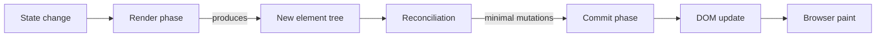

# React

## Chapter Goal

After reading this chapter, an experienced engineer can explain
React's rendering model and reconciliation algorithm at whiteboard
depth, reason about hook rules and identify common hook pitfalls,
choose between local state, context, external stores, and server
state libraries based on the use case, apply memoization
strategically (not reflexively), describe the Server Components
model and its trade-offs, design the state management architecture
for a large React application, and articulate these decisions in a
Tech Lead interview with correct terminology.

## Why This Matters for a Tech Lead

React is the dominant frontend framework and the foundation for
most modern meta-frameworks (Next.js, Remix). A Tech Lead's React
decisions have long-term architectural consequences:

- **State management strategy.** Choosing between local state,
  Context, Redux, Zustand, or server-state libraries (TanStack
  Query) shapes every feature the team builds. The wrong choice
  creates either unnecessary boilerplate (Redux for everything) or
  untraceable bugs (scattered state with no single source of truth).
- **Performance ownership.** React re-renders by default. Without
  explicit performance boundaries (memoization, code splitting,
  virtualization), a growing application degrades gradually. The
  Tech Lead sets performance budgets and enforces them in CI.
- **Server vs client boundary.** With Server Components, the Tech
  Lead decides which components run on the server (data-heavy, zero
  JS shipped) and which run on the client (interactive). This
  decision affects bundle size, SEO, and developer experience.
- **Testing strategy.** The Tech Lead chooses the testing philosophy:
  integration tests with React Testing Library (test behavior, not
  implementation) vs component unit tests vs E2E. The wrong balance
  creates either a brittle test suite or insufficient coverage.
- **Hiring signal.** React interviews reveal whether a candidate
  understands rendering, memoization, and hook semantics — or
  copies patterns without understanding them. A Tech Lead who
  cannot evaluate these answers cannot build a strong frontend team.

## Mental Model

Think of React as **UI = f(state)**. A component is a function
that takes state (props + local state + context) and returns a
description of the UI (a tree of React elements). When state
changes, React calls the function again, produces a new element
tree, compares it to the previous tree (reconciliation), and
applies the minimal set of DOM mutations.



The render phase is pure — it calculates what the UI should look
like. The commit phase is where side effects happen — DOM mutations,
refs, layout effects. This separation is why React can pause,
restart, or discard renders in concurrent mode without corrupting
the DOM.

**Key insight for interviews:** React does not re-render the DOM on
every state change. It re-renders the component tree (calling your
functions), diffs the result against the previous tree, and only
touches the DOM nodes that changed. The "virtual DOM" terminology
is outdated — the React team prefers "reconciliation" — but the
concept is the same.

## Core Terminology

| Term | Definition |
| --- | --- |
| **Element** | A plain object describing a component or DOM node (`{ type, props, key }`). Cheap to create. Not a DOM node. |
| **Component** | A function (or class) that accepts props and returns elements. The unit of composition. |
| **Props** | Read-only inputs passed from parent to child. The component's external API. |
| **State** | Mutable data owned by a component. Changing state triggers a re-render. |
| **Hook** | A function (`use*`) that lets a function component use React features (state, effects, context, refs). |
| **Reconciliation** | The algorithm that compares the previous and next element trees to determine the minimal DOM updates. |
| **Render phase** | The phase where React calls component functions and builds the element tree. Must be pure (no side effects). |
| **Commit phase** | The phase where React applies DOM mutations, runs layout effects, and updates refs. |
| **Key** | A stable identifier that helps reconciliation match elements across renders. Critical for lists. |
| **Ref** | A mutable container (`{ current }`) that persists across renders without triggering re-renders. Used for DOM access and mutable instance variables. |
| **Context** | A mechanism to pass data through the component tree without prop drilling. Every consumer re-renders when the context value changes. |
| **Suspense** | A component that shows a fallback while its children are loading (code splitting, data fetching). |
| **Server Component** | A component that runs on the server, has zero client-side JavaScript cost, and can directly access server resources. |
| **Hydration** | The process of attaching event handlers and React state to server-rendered HTML, making it interactive. |
| **Controlled component** | A form element whose value is driven by React state. The source of truth is the state. |
| **Uncontrolled component** | A form element that manages its own value in the DOM. React reads it via a ref when needed. |

**Key distinctions:**

- **Element vs component:** An element is the object React creates
  when it encounters `<Button />`. A component is the function
  `Button` itself. Elements are cheap, immutable descriptions.
  Components are the factories that produce them.
- **Render phase vs commit phase:** The render phase is pure and
  interruptible (in concurrent mode). The commit phase is
  synchronous and has side effects. Putting side effects in the
  render phase (fetching data, mutating globals) breaks concurrent
  features.
- **Controlled vs uncontrolled:** Controlled components give React
  full control over form values (predictable, testable, composable).
  Uncontrolled components are simpler for one-off forms but harder
  to validate, reset, or integrate with external state.

## Theoretical Foundation

### Component model and JSX

A React component is a function that returns elements:

```tsx
function Greeting({ name }: { name: string }) {
  return <h1>Hello, {name}</h1>;
}
```

JSX is syntactic sugar for `React.createElement` calls. The JSX
`<Greeting name="Ada" />` compiles to
`React.createElement(Greeting, { name: "Ada" })`, which returns a
plain object: `{ type: Greeting, props: { name: "Ada" }, key: null }`.

**Class components** still appear in interviews and legacy
codebases. They use lifecycle methods (`componentDidMount`,
`componentDidUpdate`, `componentWillUnmount`) instead of hooks.
The key difference: class components have a `this` reference and
instance-based state; function components use closures and hooks.
New code should use function components. Class components are
maintained but not receiving new features.

**Props** are the external API of a component. They are read-only
— a component must never mutate its props. Props flow downward
(parent → child). When a parent re-renders with new props, the
child re-renders. When the parent re-renders with the same props
(by reference), the child re-renders by default unless wrapped in
`React.memo`.

**Component composition** is the primary pattern for building
complex UIs from simple parts. Three patterns appear in production
code:

```tsx
interface CardProps {
  children: React.ReactNode;
  header?: React.ReactNode;
}

function Card({ children, header }: CardProps) {
  return (
    <div className="card">
      {header && <div className="card-header">{header}</div>}
      <div className="card-body">{children}</div>
    </div>
  );
}

function UserCard({ user }: { user: User }) {
  return (
    <Card header={<h2>{user.name}</h2>}>
      <p>{user.email}</p>
      <p>Joined {formatDate(user.createdAt)}</p>
    </Card>
  );
}
```

**What this does:** `Card` defines the layout. `UserCard` decides
the content. The parent (`UserCard`) owns the data; the layout
component (`Card`) knows nothing about users.

**Why it matters:** This is how you avoid prop drilling. Instead
of `<Card userName={user.name} userEmail={user.email} />` where
Card passes props down to internal components, the caller composes
the content directly. The intermediate component never needs to
know about the data.

**Common mistake:** Building "god components" that accept 15+ props
to configure every aspect of their rendering. Instead, use
`children` and slot props (`header`, `footer`, `actions`) so the
caller composes the pieces.

**Tech Lead check:** When reviewing a component with more than 8
props, evaluate whether it should accept `children` or slot props
instead. Components with many configuration props are hard to
maintain and test.

### Hooks

Hooks let function components use state, effects, context, and
refs. They follow two rules:

1. **Only call hooks at the top level.** Not inside loops,
   conditions, or nested functions. React relies on call order to
   match hook state between renders.
2. **Only call hooks from React functions.** Either function
   components or custom hooks. Not from regular JavaScript
   functions.

These rules exist because React stores hook state in a linked list
indexed by call order. If a hook call is skipped conditionally, the
indices shift and every subsequent hook reads the wrong state.

**`useState`:**

```tsx
const [count, setCount] = useState(0);
```

Returns a state value and a setter. The setter can accept a value
or an updater function. Use the updater form when the new state
depends on the previous state:

```tsx
setCount((prev) => prev + 1); // correct for concurrent mode
setCount(count + 1);           // stale closure risk
```

**`useEffect`:**

Runs side effects after the commit phase. Takes a callback and a
dependency array. The callback runs after every render where a
dependency changed. Returns an optional cleanup function.

```tsx
useEffect(() => {
  const controller = new AbortController();
  fetch(`/api/users/${id}`, { signal: controller.signal })
    .then((res) => res.json())
    .then(setUser)
    .catch((err) => {
      if (err.name !== "AbortError") console.error(err);
    });
  return () => controller.abort();
}, [id]);
```

**When NOT to use `useEffect`:**

- **Derived state.** If a value can be computed from props or state,
  compute it during render, not in an effect. An effect that sets
  state based on other state causes an extra re-render.
- **Event handlers.** Side effects triggered by a user action belong
  in the event handler, not in an effect synchronized to state.
- **Data fetching in production.** Use a server-state library
  (TanStack Query, SWR) or a framework's data loading mechanism
  (Next.js loaders). `useEffect` for fetching lacks caching,
  deduplication, race condition handling, and suspense integration.

**Good vs bad `useEffect` — side by side:**

```tsx
// BAD: derived state in an effect — causes double render
function BadExample({ items }: { items: Item[] }) {
  const [total, setTotal] = useState(0);
  useEffect(() => {
    setTotal(items.reduce((sum, i) => sum + i.price, 0));
  }, [items]);
  return <span>Total: {total}</span>;
}

// GOOD: compute during render — single render, no effect needed
function GoodExample({ items }: { items: Item[] }) {
  const total = items.reduce((sum, i) => sum + i.price, 0);
  return <span>Total: {total}</span>;
}
```

```tsx
// BAD: event logic in an effect synchronized to state
function BadSubmit() {
  const [submitted, setSubmitted] = useState(false);
  useEffect(() => {
    if (submitted) {
      fetch("/api/submit", { method: "POST" });
    }
  }, [submitted]);
  return <button onClick={() => setSubmitted(true)}>Submit</button>;
}

// GOOD: event logic in the event handler
function GoodSubmit() {
  async function handleSubmit() {
    await fetch("/api/submit", { method: "POST" });
  }
  return <button onClick={handleSubmit}>Submit</button>;
}
```

**What these show:** The first pair demonstrates derived state —
`total` is always computable from `items`, so it does not need
state or an effect. The bad version renders with a stale `total`,
then the effect fires and triggers a second render.

The second pair demonstrates event-driven logic. The submit is
caused by a user click, not by a state change. Routing it through
state → effect adds indirection, makes the timing unpredictable,
and makes the component harder to test.

**Tech Lead check:** In code review, ask: "Could this effect be
replaced by inline computation or moved into an event handler?"
If yes, the effect is wrong. Effects should synchronize React with
external systems (subscriptions, DOM manipulation, third-party
libraries), not transform state.

**`useMemo` and `useCallback`:**

`useMemo` caches a computed value between renders:

```tsx
const sorted = useMemo(
  () => items.toSorted((a, b) => a.name.localeCompare(b.name)),
  [items]
);
```

`useCallback` caches a function reference:

```tsx
const handleClick = useCallback((id: string) => {
  setSelected(id);
}, []);
```

Both exist to avoid unnecessary work:
- `useMemo` prevents re-computing expensive values.
- `useCallback` prevents breaking `React.memo` on child components
  by stabilizing the callback reference.

**Common mistake:** Memoizing everything. The comparison itself has
a cost. Profile with React DevTools Profiler before adding
memoization. Memoize when: (1) the computation is expensive
(sorting 1,000+ items), (2) the value is passed as a prop to a
memoized child, or (3) the value is a dependency of another hook.

**`useRef`:**

A ref is a mutable container that persists across renders without
triggering re-renders:

```tsx
const inputRef = useRef<HTMLInputElement>(null);

function focusInput() {
  inputRef.current?.focus();
}
```

Two use cases: (1) accessing DOM elements, (2) storing mutable
instance variables (timers, previous values, subscription handles)
that should not trigger re-renders when they change.

**`useReducer`:**

For complex state logic with multiple related values or actions:

```tsx
type State = { status: "idle" | "loading" | "success" | "error"; data: User | null; error: string | null };
type Action =
  | { type: "FETCH" }
  | { type: "SUCCESS"; data: User }
  | { type: "ERROR"; error: string };

function reducer(state: State, action: Action): State {
  switch (action.type) {
    case "FETCH": return { status: "loading", data: null, error: null };
    case "SUCCESS": return { status: "success", data: action.data, error: null };
    case "ERROR": return { status: "error", data: null, error: action.error };
  }
}

const [state, dispatch] = useReducer(reducer, { status: "idle", data: null, error: null });
```

**When to use `useReducer` vs `useState`:** Use `useReducer` when
state transitions are complex, when multiple state values must
change together (avoiding impossible intermediate states), or when
the state logic should be testable outside the component.

### Custom hooks

A custom hook is a function that calls other hooks. It extracts
reusable stateful logic from components:

```tsx
function useDebouncedValue<T>(value: T, delayMs: number): T {
  const [debounced, setDebounced] = useState(value);

  useEffect(() => {
    const timer = setTimeout(() => setDebounced(value), delayMs);
    return () => clearTimeout(timer);
  }, [value, delayMs]);

  return debounced;
}
```

Custom hooks are the primary composition mechanism in React. They
replace mixins (class era) and higher-order components (HOC era)
for most use cases. A custom hook encapsulates behavior (state +
effects) without coupling it to a specific UI.

**Naming convention:** Custom hooks must start with `use`. This
signals to React's linter that hook rules apply inside the function.

### Context

Context provides data to a subtree without passing props through
every intermediate component:

```tsx
const ThemeContext = createContext<"light" | "dark">("light");

function App() {
  return (
    <ThemeContext.Provider value="dark">
      <Dashboard />
    </ThemeContext.Provider>
  );
}

function Header() {
  const theme = useContext(ThemeContext);
  return <header className={theme}>...</header>;
}
```

**The re-render problem:** Every component that calls `useContext`
re-renders whenever the context value changes — even if the
component only uses a slice of the value. For a context holding
`{ user, theme, locale }`, changing `locale` re-renders components
that only use `user`.

**Mitigation strategies:**
1. Split contexts by concern (`UserContext`, `ThemeContext`,
   `LocaleContext`).
2. Memoize the context value with `useMemo` to prevent re-renders
   from the provider's parent re-rendering.
3. For high-frequency updates (mouse position, animations), use an
   external store (Zustand) instead of Context.

**Context + `useReducer` pattern:**

For state that is both shared (needs Context) and complex (needs
a reducer), combine both:

```tsx
import { createContext, useContext, useReducer, type Dispatch } from "react";

type AuthState = { user: User | null; status: "idle" | "loading" | "authenticated" };
type AuthAction =
  | { type: "LOGIN_START" }
  | { type: "LOGIN_SUCCESS"; user: User }
  | { type: "LOGOUT" };

function authReducer(state: AuthState, action: AuthAction): AuthState {
  switch (action.type) {
    case "LOGIN_START": return { user: null, status: "loading" };
    case "LOGIN_SUCCESS": return { user: action.user, status: "authenticated" };
    case "LOGOUT": return { user: null, status: "idle" };
  }
}

const AuthStateCtx = createContext<AuthState | null>(null);
const AuthDispatchCtx = createContext<Dispatch<AuthAction> | null>(null);

function AuthProvider({ children }: { children: React.ReactNode }) {
  const [state, dispatch] = useReducer(authReducer, { user: null, status: "idle" });
  return (
    <AuthStateCtx.Provider value={state}>
      <AuthDispatchCtx.Provider value={dispatch}>
        {children}
      </AuthDispatchCtx.Provider>
    </AuthStateCtx.Provider>
  );
}

function useAuthState() {
  const ctx = useContext(AuthStateCtx);
  if (!ctx) throw new Error("useAuthState must be used within AuthProvider");
  return ctx;
}

function useAuthDispatch() {
  const ctx = useContext(AuthDispatchCtx);
  if (!ctx) throw new Error("useAuthDispatch must be used within AuthProvider");
  return ctx;
}
```

**What this does:** Separates auth state and dispatch into two
contexts. Components that only dispatch actions (`dispatch({
type: "LOGOUT" })`) do not re-render when the auth state changes,
because they consume a different context.

**Why two contexts:** If state and dispatch share one context,
every component that calls `dispatch` also re-renders when `state`
changes — even if the component does not read `state`. Splitting
eliminates this waste.

**Common mistake:** Putting state and dispatch in a single context
object: `{ state, dispatch }`. This creates a new object on every
render (even if `state` has not changed), causing all consumers to
re-render.

**Production change:** For auth flows, wrap `dispatch` in async
helper functions (`login`, `logout`) that call the API and dispatch
the result. Export these from the provider module instead of
exposing raw dispatch to components.

**Tech Lead check:** Use this pattern for cross-cutting concerns
with infrequent updates (auth, theme, locale). For high-frequency
state (real-time data, form state), use Zustand with selectors
instead — Context re-renders all consumers regardless of split.

### Controlled and uncontrolled components

**Controlled:** The component's value is driven by React state. The
source of truth is the state variable:

```tsx
function ControlledInput() {
  const [value, setValue] = useState("");
  return <input value={value} onChange={(e) => setValue(e.target.value)} />;
}
```

**Uncontrolled:** The DOM manages the value. React reads it via a
ref when needed:

```tsx
function UncontrolledInput() {
  const ref = useRef<HTMLInputElement>(null);
  function handleSubmit() {
    console.log(ref.current?.value);
  }
  return <input ref={ref} />;
}
```

**When to use which:**
- **Controlled** for most forms: validation on every keystroke,
  conditional disabling, formatting, integration with external state.
- **Uncontrolled** for simple forms where React does not need to
  know the value until submission (file inputs, one-off forms).

**Tech Lead perspective:** Default to controlled components. They
are predictable, testable, and composable. The additional
boilerplate is worth the consistency. Uncontrolled components
become tech debt when requirements grow (add validation, add
formatting, add conditional logic).

**Form with validation using React Hook Form + Zod:**

```tsx
import { useForm } from "react-hook-form";
import { zodResolver } from "@hookform/resolvers/zod";
import { z } from "zod";

const schema = z.object({
  email: z.string().email("Invalid email address"),
  password: z.string().min(8, "Password must be at least 8 characters"),
});

type FormValues = z.infer<typeof schema>;

function LoginForm({ onLogin }: { onLogin: (data: FormValues) => void }) {
  const {
    register,
    handleSubmit,
    formState: { errors, isSubmitting },
  } = useForm<FormValues>({ resolver: zodResolver(schema) });

  return (
    <form onSubmit={handleSubmit(onLogin)}>
      <label>
        Email
        <input type="email" {...register("email")} aria-invalid={!!errors.email} />
        {errors.email && <span role="alert">{errors.email.message}</span>}
      </label>
      <label>
        Password
        <input type="password" {...register("password")} aria-invalid={!!errors.password} />
        {errors.password && <span role="alert">{errors.password.message}</span>}
      </label>
      <button type="submit" disabled={isSubmitting}>
        {isSubmitting ? "Signing in…" : "Sign in"}
      </button>
    </form>
  );
}
```

> Verify React Hook Form v7 `useForm` API and `@hookform/resolvers`
> Zod integration against current documentation. The resolver API
> may change between major versions.

**What this does:** A login form with type-safe validation. Zod
defines the schema and infers the TypeScript type. React Hook Form
handles registration, submission, error display, and submit state.
Inputs are uncontrolled by default (better performance for large
forms).

**Why this approach:** React Hook Form re-renders only the fields
with errors, not the entire form. With controlled `useState` per
field, every keystroke re-renders the whole form. For 5 fields this
is negligible; for 50 fields it creates visible lag.

**Common mistake:** Writing validation logic inside the component
instead of in a schema. Schema-based validation is reusable (same
schema on the server), testable (test the schema without rendering),
and type-safe (the form type is inferred from the schema).

**Production change:** Add server-side validation with the same Zod
schema. Client-side validation improves UX; server-side validation
is the security boundary. Share the schema between frontend and
backend via a shared package.

**Tech Lead check:** For production forms, require: (1) a Zod
schema (not inline validation), (2) accessible error messages
(`role="alert"`, `aria-invalid`), (3) disabled submit during
submission, (4) the same schema reused on the server.

### Reconciliation and keys

Reconciliation is the algorithm React uses to determine what
changed between renders. It compares the previous and next element
trees:

1. **Different types** → tear down the old tree, build the new one.
   Switching `<div>` to `<span>` destroys the subtree.
2. **Same type, different props** → update the existing DOM node
   with the new props. The subtree is preserved.
3. **Lists** → React uses `key` to match elements across renders.

**Why keys matter:**

Without keys (or with index keys), React cannot distinguish
between "the item moved" and "the item changed." If a list item
is deleted from the middle, index keys cause every subsequent item
to re-render with the wrong props — and inputs lose their state.

```tsx
// Wrong: index key — items shift, state corrupts
{items.map((item, i) => <TodoItem key={i} todo={item} />)}

// Correct: stable, unique key — items tracked by identity
{items.map((item) => <TodoItem key={item.id} todo={item} />)}
```

**When index keys are acceptable:** Only when the list is static,
never reordered, and items have no internal state.

### Memoization

`React.memo` wraps a component and skips re-renders when its props
have not changed (shallow comparison):

```tsx
const ExpensiveList = memo(function ExpensiveList({ items }: { items: Item[] }) {
  return <ul>{items.map((item) => <li key={item.id}>{item.name}</li>)}</ul>;
});
```

**When to use `React.memo`:**
- The component is expensive to render (large lists, complex
  calculations, heavy DOM trees).
- The component receives the same props frequently (its parent
  re-renders for unrelated reasons).

**When NOT to use `React.memo`:**
- The component is cheap to render — the comparison cost exceeds
  the render cost.
- The component receives new objects or functions on every render
  (the comparison always fails, so `React.memo` is wasted).

**The memoization chain:** `React.memo` only works if props are
referentially stable. If the parent creates a new array or function
on every render, the child always re-renders. Use `useMemo` for
arrays/objects and `useCallback` for functions passed to memoized
children.

### Error boundaries

Error boundaries catch JavaScript errors in the component tree
below them, log the error, and render a fallback UI instead of
crashing the entire application. They are class components (no hook
equivalent exists):

```tsx
class ErrorBoundary extends React.Component<
  { fallback: React.ReactNode; children: React.ReactNode },
  { hasError: boolean }
> {
  state = { hasError: false };

  static getDerivedStateFromError() {
    return { hasError: true };
  }

  componentDidCatch(error: Error, info: React.ErrorInfo) {
    reportError(error, info.componentStack);
  }

  render() {
    if (this.state.hasError) return this.props.fallback;
    return this.props.children;
  }
}
```

**Limitations:** Error boundaries do not catch errors in event
handlers, async code, or server-side rendering. They only catch
errors during rendering, lifecycle methods, and constructors.

**Tech Lead perspective:** Place error boundaries at route
boundaries and around feature modules. A crash in the settings
panel should not take down the dashboard. The fallback UI should
include a retry action and error reporting.

### Suspense

Suspense lets a component declare that it is waiting for something
(a lazy-loaded component, data from a server-state library) and
show a fallback while waiting:

```tsx
const LazySettings = lazy(() => import("./Settings"));

function App() {
  return (
    <Suspense fallback={<Spinner />}>
      <LazySettings />
    </Suspense>
  );
}
```

Suspense integrates with:
- **Code splitting** via `React.lazy` (stable).
- **Data fetching** via libraries that support Suspense (TanStack
  Query, Relay, Next.js `use`).
- **Server-side rendering** for streaming HTML.

**Nested Suspense boundaries** allow granular loading states. The
outermost boundary catches loading for the whole page; inner
boundaries catch loading for individual sections, preventing the
entire page from showing a spinner when only one section is loading.

> Verify Suspense data fetching patterns against current React
> documentation. The `use` hook and Suspense-based data fetching
> APIs are evolving.

### Server Components

React Server Components (RSC) run on the server and send rendered
output (not JavaScript) to the client. They have zero client-side
JavaScript cost.

**Server Component properties:**
- Can directly access server resources (database, file system, API
  keys).
- Cannot use hooks (`useState`, `useEffect`), event handlers, or
  browser APIs.
- Cannot be interactive — no click handlers, no form state.

**Client Component properties:**
- Run in the browser.
- Can use hooks, event handlers, and browser APIs.
- Ship JavaScript to the client.
- Declared with `"use client"` directive at the top of the file.

**The boundary decision:**

| Characteristic | Server Component | Client Component |
| --- | --- | --- |
| **Data fetching** | Direct DB/API access, no client fetch | Requires client-side fetch (TanStack Query, useEffect) |
| **Interactivity** | None | Full (clicks, forms, animations) |
| **JS bundle cost** | Zero | Full component + dependencies |
| **Access to server** | Direct (env vars, DB) | Via API calls only |
| **State** | None | Full (useState, useReducer) |

**Mental model:** Server Components are for data display. Client
Components are for user interaction. When a component needs both,
extract the interactive part into a Client Component and keep the
data-fetching wrapper as a Server Component.

> Verify Server Components model, `"use client"` directive, and
> interleaving rules against the current React and Next.js
> documentation. RSC is evolving and framework-dependent.

### State management

State management in React exists on a spectrum:

| Level | Tool | Use case | Trade-off |
| --- | --- | --- | --- |
| **Local state** | `useState`, `useReducer` | Ephemeral UI state (form input, toggle, modal open/close) | No coordination, no boilerplate. Lost on unmount. |
| **Lifted state** | Props from a shared parent | State shared between 2-3 siblings | Simple but causes "prop drilling" at depth > 2. |
| **Context** | `createContext`, `useContext` | Cross-cutting, rarely-changing data (theme, locale, auth) | Every consumer re-renders on change. Bad for high-frequency updates. |
| **External store** | Redux, Zustand, Jotai | Global state shared across many components | Requires learning a library. Zustand has minimal API. Redux has ecosystem (middleware, devtools). |
| **Server state** | TanStack Query, SWR | Data from the server with caching, deduplication, revalidation | Declarative. Separates server data from client state. |

**Redux vs Zustand vs Context:**

| Feature | Redux Toolkit | Zustand | Context |
| --- | --- | --- | --- |
| **Bundle size** | ~11 KB gzipped | ~1 KB gzipped | 0 (built-in) |
| **Boilerplate** | Medium (slices, store, provider) | Minimal (create + use) | Minimal (createContext, Provider) |
| **DevTools** | Excellent (time-travel debugging) | Good (Redux DevTools compatible) | None built-in |
| **Middleware** | Yes (thunk, saga, RTK Query) | Yes (persist, devtools, immer) | No |
| **Render optimization** | Selectors with `useSelector` | Selectors built-in | None — all consumers re-render |
| **When to choose** | Large apps, complex async flows, team needs strong conventions | Medium apps, minimal boilerplate, fine-grained subscriptions | Small apps, infrequent updates (theme, locale) |

> Verify Redux Toolkit and Zustand bundle sizes against current
> npm package data. These change with major versions.

**TanStack Query (React Query):**

TanStack Query separates server state from client state. It provides:
- **Caching** — fetched data is cached and served from cache on
  subsequent renders.
- **Deduplication** — multiple components requesting the same data
  trigger only one fetch.
- **Background revalidation** — stale data is served immediately
  while fresh data is fetched in the background.
- **Retry and error handling** — automatic retry with exponential
  backoff.

```tsx
function UserProfile({ userId }: { userId: string }) {
  const { data, isLoading, error } = useQuery({
    queryKey: ["user", userId],
    queryFn: () => fetch(`/api/users/${userId}`).then((r) => r.json()),
    staleTime: 5 * 60 * 1000,
  });

  if (isLoading) return <Spinner />;
  if (error) return <ErrorMessage error={error} />;
  return <Profile user={data} />;
}
```

**Tech Lead perspective:** For most applications, the correct state
management architecture is: TanStack Query for server data + local
state (`useState`) for UI state + Context for cross-cutting
concerns (theme, auth). Reaching for Redux or Zustand is warranted
only when there is significant client-side state that is not server
data.

### Testing

React testing follows the principle: **test behavior, not
implementation.**

**React Testing Library (RTL)** is the standard. It renders
components and queries them the way a user would (by text, role,
label), not by implementation details (component names, state
variables, internal methods).

```tsx
import { render, screen } from "@testing-library/react";
import userEvent from "@testing-library/user-event";

test("submits the form with the entered name", async () => {
  const onSubmit = vi.fn();
  render(<NameForm onSubmit={onSubmit} />);

  await userEvent.type(screen.getByRole("textbox", { name: /name/i }), "Ada");
  await userEvent.click(screen.getByRole("button", { name: /submit/i }));

  expect(onSubmit).toHaveBeenCalledWith({ name: "Ada" });
});
```

**Testing strategy for a React application:**

| Test type | What it tests | Tool | Coverage |
| --- | --- | --- | --- |
| **Component test** | Individual component behavior | React Testing Library + Vitest/Jest | ~70% of test effort |
| **Integration test** | Multiple components + state management | RTL with providers (QueryClient, store) | ~20% |
| **E2E test** | Full user flows across pages | Playwright, Cypress | ~10% (critical paths) |

**What to test:**
- User interactions (click, type, submit) produce the expected
  output (text appears, callback fires, navigation occurs).
- Error states render correctly (error boundary, loading fallback,
  empty state).
- Accessibility (elements have correct roles and labels).

**What NOT to test:**
- Internal state values (test the output, not the state).
- Implementation details (component instance methods, ref values).
- Third-party library internals (test your integration, not React
  itself).

**Tech Lead perspective on testing:**

The Tech Lead owns the testing strategy, not individual tests. Key
decisions:

1. **Ratio.** 70% component/integration tests (RTL), 20% unit tests
   (hooks, reducers, utilities), 10% E2E (critical user flows).
   This ratio keeps the test suite fast (most tests do not need a
   browser) while covering user-facing behavior.
2. **What counts as "tested."** A component test that renders the
   component and asserts it does not throw is not a test. Require
   at least: one happy-path interaction, one error state, and one
   accessibility assertion per component.
3. **Test infrastructure.** A shared `renderWithProviders` utility
   that wraps components in all required providers (`QueryClient`,
   `ThemeProvider`, `AuthProvider`). Without it, each developer
   creates their own setup, leading to inconsistent and fragile
   tests.
4. **Coverage as a guideline.** Target 80% coverage as a team
   metric, not a gate. 100% coverage incentivizes testing trivial
   getters and `return null` branches. Low coverage on a critical
   module is a risk; low coverage on a generated file is irrelevant.

## Practical Usage

### Where each tool fits

- **Local state (`useState`)** for ephemeral UI: form input values,
  modal open/close, accordion expanded/collapsed, tooltip visibility.
  If the state is lost when the component unmounts and that is
  acceptable, it belongs in local state.
- **Server state (TanStack Query)** for data from the API: user
  profiles, product lists, dashboard metrics. The library handles
  caching, deduplication, revalidation, and retry. Do not store
  server data in Redux or global state — it duplicates the cache.
- **Global state (Redux, Zustand)** for client-side state shared
  across many components: shopping cart, multi-step wizard progress,
  undo/redo history. If the state is not server data and is needed
  in more than 2-3 components, it belongs in a global store.
- **Context** for cross-cutting, rarely-changing data: theme, locale,
  feature flags, authenticated user identity. Not for frequently
  changing data (use an external store instead).
- **Server Components** for data-heavy, low-interaction screens:
  product listings, blog posts, admin data tables. Server Components
  fetch data directly and ship zero JavaScript. Use Client
  Components for the interactive parts (search, filters, forms).

### Structuring a large React application

A scalable folder structure organizes by feature, not by file type:

```text
src/
  features/
    orders/
      OrderList.tsx
      OrderDetail.tsx
      useOrders.ts          (custom hook)
      ordersApi.ts           (TanStack Query queries)
      ordersStore.ts         (Zustand slice, if needed)
      __tests__/
        OrderList.test.tsx
    users/
      ...
  shared/
    components/              (Button, Modal, Spinner)
    hooks/                   (useDebounce, useMediaQuery)
    utils/                   (formatDate, cn)
  app/
    layout.tsx
    providers.tsx             (QueryClient, theme, store)
```

**Why feature-based:** A developer working on orders changes files
in `features/orders/`, not across `components/`, `hooks/`,
`services/`, and `state/`. Code review is easier. Feature deletion
is a folder deletion.

## Examples

### Custom hook: `useDebouncedValue`

```tsx
import { useState, useEffect } from "react";

function useDebouncedValue<T>(value: T, delayMs: number): T {
  const [debounced, setDebounced] = useState(value);

  useEffect(() => {
    const timer = setTimeout(() => setDebounced(value), delayMs);
    return () => clearTimeout(timer);
  }, [value, delayMs]);

  return debounced;
}
```

**What this does:** Returns a debounced version of `value` that
updates only after `delayMs` of inactivity. Useful for search
inputs where every keystroke should not trigger an API call.

**Why it is written this way:** The cleanup function
(`clearTimeout`) cancels the previous timer when `value` changes
before the delay expires. This prevents stale updates.

**Common mistake:** Forgetting the cleanup. Without it, rapid
typing queues multiple `setTimeout` calls, and the debounced value
flickers through intermediate values.

**Production change:** For search inputs, combine with
`AbortController` in the fetch to cancel in-flight requests when
the user types again.

**Tech Lead check:** Verify that the delay is appropriate for the
use case. 300ms for search suggestions. 0ms for synchronous
debouncing (batching renders).

### `useEffect` with proper cleanup

```tsx
import { useEffect, useState } from "react";

function useUser(userId: string) {
  const [user, setUser] = useState<User | null>(null);
  const [error, setError] = useState<Error | null>(null);

  useEffect(() => {
    const controller = new AbortController();
    let cancelled = false;

    fetch(`/api/users/${userId}`, { signal: controller.signal })
      .then((res) => {
        if (!res.ok) throw new Error(`HTTP ${res.status}`);
        return res.json();
      })
      .then((data) => {
        if (!cancelled) setUser(data);
      })
      .catch((err) => {
        if (!cancelled && err.name !== "AbortError") setError(err);
      });

    return () => {
      cancelled = true;
      controller.abort();
    };
  }, [userId]);

  return { user, error };
}
```

**What this does:** Fetches a user by ID with proper cancellation.
When `userId` changes or the component unmounts, the previous
request is aborted and its result is discarded.

**Why it is written this way:** Two layers of protection:
`AbortController` cancels the network request (saves bandwidth),
and the `cancelled` flag prevents setting state on an unmounted
component (prevents "Can't perform a React state update on an
unmounted component" warnings).

**Common mistake:** Fetching in `useEffect` without cleanup. If the
user navigates away mid-fetch, the resolved promise calls `setUser`
on an unmounted component. In StrictMode (development), this fires
twice, making the bug visible.

**Production change:** Replace raw `useEffect` fetch with TanStack
Query. It handles cancellation, caching, deduplication, retry, and
Suspense integration out of the box.

**Tech Lead check:** Enforce a rule: no raw `fetch` in `useEffect`
in production code. Use TanStack Query or the framework's data
loading mechanism.

### Memoized list with stable keys

```tsx
import { memo, useMemo, useCallback, useState } from "react";

interface Todo {
  id: string;
  text: string;
  done: boolean;
}

const TodoItem = memo(function TodoItem({
  todo,
  onToggle,
}: {
  todo: Todo;
  onToggle: (id: string) => void;
}) {
  return (
    <li>
      <label>
        <input type="checkbox" checked={todo.done} onChange={() => onToggle(todo.id)} />
        {todo.text}
      </label>
    </li>
  );
});

function TodoList({ todos }: { todos: Todo[] }) {
  const [filter, setFilter] = useState<"all" | "active" | "done">("all");

  const filtered = useMemo(
    () => todos.filter((t) => filter === "all" || (filter === "done" ? t.done : !t.done)),
    [todos, filter]
  );

  const handleToggle = useCallback((id: string) => {
    // dispatch or setState to toggle
  }, []);

  return (
    <>
      <FilterBar value={filter} onChange={setFilter} />
      <ul>
        {filtered.map((todo) => (
          <TodoItem key={todo.id} todo={todo} onToggle={handleToggle} />
        ))}
      </ul>
    </>
  );
}
```

**What this does:** A todo list where `TodoItem` is memoized with
`React.memo`, the filter computation is memoized with `useMemo`,
and the toggle callback is stabilized with `useCallback`. Changing
the filter re-computes the filtered list but does not re-render
todo items whose props have not changed.

**Common mistake:** Using `useCallback` without `React.memo` on the
child. `useCallback` alone does nothing — the child must be memoized
for the stable reference to matter.

**Tech Lead check:** Verify the memoization chain is complete:
`React.memo` on the child, `useCallback` for function props,
`useMemo` for object/array props. A broken link defeats the entire
chain.

### Reducer-based form state machine

```tsx
import { useReducer } from "react";

type FormState =
  | { status: "editing"; values: { email: string; password: string }; errors: Record<string, string> }
  | { status: "submitting"; values: { email: string; password: string } }
  | { status: "success" }
  | { status: "error"; message: string; values: { email: string; password: string } };

type FormAction =
  | { type: "CHANGE"; field: string; value: string }
  | { type: "SUBMIT" }
  | { type: "SUCCESS" }
  | { type: "ERROR"; message: string }
  | { type: "RETRY" };

function formReducer(state: FormState, action: FormAction): FormState {
  switch (action.type) {
    case "CHANGE":
      if (state.status !== "editing") return state;
      return { ...state, values: { ...state.values, [action.field]: action.value }, errors: {} };
    case "SUBMIT":
      if (state.status !== "editing") return state;
      return { status: "submitting", values: state.values };
    case "SUCCESS":
      return { status: "success" };
    case "ERROR":
      if (state.status !== "submitting") return state;
      return { status: "error", message: action.message, values: state.values };
    case "RETRY":
      if (state.status !== "error") return state;
      return { status: "editing", values: state.values, errors: {} };
    default:
      return state;
  }
}
```

**What this does:** Models a form as a state machine with four
states (editing, submitting, success, error). Invalid transitions
are rejected (cannot change fields while submitting, cannot submit
while already submitting).

**Why it is written this way:** The reducer pattern makes impossible
states impossible. With separate `useState` calls for `isSubmitting`,
`isSuccess`, `errorMessage`, the combination
`{ isSubmitting: true, isSuccess: true }` is representable but
invalid. The discriminated union eliminates this class of bugs.

**Tech Lead check:** For complex forms (multi-step, conditional
fields, async validation), prefer a form library (React Hook Form,
Formik) over a custom reducer. The reducer approach is best for
forms where the state machine logic is the core complexity.

### Performance: isolating re-renders

```tsx
import { memo, useState, useEffect } from "react";

function Dashboard() {
  const [clock, setClock] = useState(new Date());

  useEffect(() => {
    const id = setInterval(() => setClock(new Date()), 1000);
    return () => clearInterval(id);
  }, []);

  return (
    <div>
      <header>Current time: {clock.toLocaleTimeString()}</header>
      <ExpensiveChart />
      <ExpensiveTable />
    </div>
  );
}

const ExpensiveChart = memo(function ExpensiveChart() {
  // renders a complex SVG chart — takes ~15ms
  return <svg>{/* ... */}</svg>;
});

const ExpensiveTable = memo(function ExpensiveTable() {
  // renders 500 rows — takes ~25ms
  return <table>{/* ... */}</table>;
});
```

**What this does:** The clock updates every second, re-rendering
`Dashboard`. Without `React.memo`, `ExpensiveChart` and
`ExpensiveTable` re-render every second even though they have no
props that change. With `memo`, they skip every re-render caused
by the clock — saving ~40ms per second.

**Why it matters:** This is the most common performance pattern in
production. A parent re-renders for reason A (clock, websocket
data, user input), and expensive children re-render unnecessarily.
The fix is `React.memo` on the children, not moving the clock to
a separate component (though that also works).

**Common mistake:** Memoizing the children but passing inline
objects as props: `<ExpensiveChart config={{ showLegend: true }} />`.
The new object on every render defeats `memo`. Fix with `useMemo`:
`const config = useMemo(() => ({ showLegend: true }), [])`.

**Alternative approach:** Instead of `memo`, push the high-frequency
state down. Extract the clock into a `<Clock />` component so the
parent does not re-render at all. This is often simpler than
memoizing all children:

```tsx
function Clock() {
  const [time, setTime] = useState(new Date());
  useEffect(() => {
    const id = setInterval(() => setTime(new Date()), 1000);
    return () => clearInterval(id);
  }, []);
  return <header>Current time: {time.toLocaleTimeString()}</header>;
}

function Dashboard() {
  return (
    <div>
      <Clock />
      <ExpensiveChart />
      <ExpensiveTable />
    </div>
  );
}
```

**Tech Lead check:** When a parent has both high-frequency state
and expensive children, evaluate two approaches: (1) push the
state down into a leaf component, (2) memoize the children. Prefer
pushing state down — it requires no memoization chain and is easier
to maintain.

### Testing: component with providers and user interaction

```tsx
import { render, screen } from "@testing-library/react";
import userEvent from "@testing-library/user-event";
import { QueryClient, QueryClientProvider } from "@tanstack/react-query";

function renderWithProviders(ui: React.ReactElement) {
  const queryClient = new QueryClient({
    defaultOptions: { queries: { retry: false } },
  });
  return render(
    <QueryClientProvider client={queryClient}>
      {ui}
    </QueryClientProvider>
  );
}

test("shows user profile after loading", async () => {
  renderWithProviders(<UserProfile userId="42" />);

  expect(screen.getByRole("progressbar")).toBeInTheDocument();

  const heading = await screen.findByRole("heading", { name: /ada lovelace/i });
  expect(heading).toBeInTheDocument();
});

test("shows error message on fetch failure", async () => {
  // MSW handler returns 500 for this test
  renderWithProviders(<UserProfile userId="invalid" />);

  const alert = await screen.findByRole("alert");
  expect(alert).toHaveTextContent(/failed to load/i);
});
```

**What this does:** A reusable `renderWithProviders` function that
wraps the component under test in the same providers the app uses
(`QueryClientProvider`). Each test creates a fresh `QueryClient`
to prevent shared cache state between tests. The test verifies
loading state, success state, and error state.

**Why `retry: false`:** In tests, retries add latency. A failed
fetch should fail immediately so the test can assert on the error
state without waiting for retry delays.

**Common mistake:** Sharing a `QueryClient` across tests. One test
fetches user 42, caches it, and the next test reads the cached data
instead of triggering a fresh fetch — making the test order-
dependent and flaky.

**Production change:** Add more providers to `renderWithProviders`
as the app grows: `ThemeProvider`, `AuthProvider`, router context.
Keep it in a shared test utility file so all tests use the same
setup.

**Tech Lead check:** Every component test should use the team's
`renderWithProviders`. Review tests that call `render()` directly
— they may be missing providers and passing only because the
component does not use Context or TanStack Query in that test path.

### App providers: centralized provider tree

```tsx
import { QueryClient, QueryClientProvider } from "@tanstack/react-query";
import { ReactQueryDevtools } from "@tanstack/react-query-devtools";

const queryClient = new QueryClient({
  defaultOptions: {
    queries: {
      staleTime: 60 * 1000,
      gcTime: 5 * 60 * 1000,
      retry: 2,
      refetchOnWindowFocus: false,
    },
  },
});

function AppProviders({ children }: { children: React.ReactNode }) {
  return (
    <QueryClientProvider client={queryClient}>
      <AuthProvider>
        <ThemeProvider defaultTheme="system">
          {children}
        </ThemeProvider>
      </AuthProvider>
      {process.env.NODE_ENV === "development" && <ReactQueryDevtools />}
    </QueryClientProvider>
  );
}
```

**What this does:** A single component that wraps the app in all
required providers. Default query options are centralized: 60s
stale time, 5 minutes garbage collection, 2 retries, no refetch
on window focus.

**Why centralize:** Every provider added in a random component
creates implicit dependencies and ordering requirements. A single
`AppProviders` component makes the dependency tree explicit and
testable.

**Common mistake:** Adding providers inside route components:
`<Route path="/orders" element={<QueryClientProvider><Orders /></QueryClientProvider>} />`.
This creates a new `QueryClient` per route, losing the shared
cache. Providers should wrap the entire app, not individual routes.

**Production change:** Add `ErrorBoundary` and `Suspense` at the
provider level for app-wide error and loading fallbacks. Configure
`staleTime` based on the application's data freshness requirements.

**Tech Lead check:** Review `AppProviders` quarterly. Remove
providers for libraries no longer in use. Verify that default
options (stale time, retries) match the current SLA requirements.

## Common Mistakes

1. **Using `useEffect` for derived state**
   - What it looks like: `useEffect(() => { setFullName(first + " " + last); }, [first, last])`.
   - Why it is dangerous: Causes an extra re-render. The component
     renders with the old `fullName`, then the effect fires and sets
     the new `fullName`, triggering a second render. The correct
     approach: compute it during render:
     `const fullName = first + " " + last;`.
   - The correct approach: Any value computable from props or state
     should be computed during render, not in an effect.

2. **Effects that fetch without cancellation**
   - What it looks like: `useEffect(() => { fetch(url).then(setData); }, [url])`.
   - Why it is dangerous: If `url` changes rapidly, multiple
     requests are in flight. The last one to resolve wins — which
     may not be the latest `url`. This is a race condition. Fix:
     use `AbortController` cleanup or a server-state library.

3. **Using array index as a key**
   - What it looks like: `items.map((item, i) => <Item key={i} />)`.
   - Why it is dangerous: When items are reordered, inserted, or
     deleted, index keys cause React to reuse DOM nodes for the
     wrong items. Input state gets swapped between items. Fix: use
     a stable, unique identifier (`item.id`).

4. **Premature memoization**
   - What it looks like: Wrapping every component in `React.memo`
     and every value in `useMemo` without profiling.
   - Why it is dangerous: Adds complexity without benefit if the
     component is cheap to render. The comparison cost is wasted.
     Worse: memoization can hide correctness bugs — a component
     that should re-render does not, because props look the same by
     shallow comparison.
   - The correct approach: Profile first. Memoize the measured
     bottleneck, not everything.

5. **Putting everything in global state**
   - What it looks like: Every form input, modal toggle, and UI
     flag lives in Redux or Context.
   - Why it is dangerous: Every state change re-renders every
     connected component. State management code bloat. Testing
     requires setting up the entire store for every component.
   - The correct approach: Local state for ephemeral UI. Server
     state for API data. Global state only for truly cross-cutting
     client state.

6. **Mutating state directly**
   - What it looks like: `state.items.push(newItem); setState(state)`.
   - Why it is dangerous: React uses referential equality to detect
     changes. Mutating the existing object does not change the
     reference, so React skips the re-render. The UI shows stale
     data. Fix: create a new reference:
     `setState(prev => [...prev.items, newItem])`.

7. **Missing dependency in `useEffect`**
   - What it looks like: Using a variable inside `useEffect` but
     omitting it from the dependency array.
   - Why it is dangerous: The effect uses a stale closure — the
     variable is captured at the value it had on the render when
     the effect was created, not the current value. The
     `react-hooks/exhaustive-deps` ESLint rule catches this. Do not
     disable it.

8. **Creating new objects in render passed as props**
   - What it looks like: `<Child style={{ color: "red" }} />` or
     `<Child data={items.filter(fn)} />` without `useMemo`.
   - Why it is dangerous: A new object reference on every render
     defeats `React.memo` on the child. The child re-renders every
     time the parent renders, regardless of whether the values
     changed.

## Trade-offs

**Key React architecture decisions and when each trade-off flips:**

| Decision | Optimizes for | Sacrifices | Flips when |
| --- | --- | --- | --- |
| **Local state (`useState`)** | Simplicity, component isolation | State lost on unmount, no cross-component sharing | More than 2-3 components need the same state |
| **Context** | No prop drilling, built-in | Every consumer re-renders on any change, no selectors | High-frequency updates or large value objects |
| **Redux Toolkit** | Predictability, DevTools, middleware, conventions | Boilerplate, bundle size, learning curve | Small app where the overhead is not justified |
| **Zustand** | Minimal API, small bundle, fine-grained subscriptions | Fewer conventions, smaller ecosystem | Team needs strict patterns (actions, middleware, time-travel) |
| **TanStack Query** | Server state with caching, deduplication, revalidation | Does not manage client state, learning curve | Data is not from a server (purely client-side state) |
| **Controlled forms** | Full control, validation, predictable | More boilerplate (onChange + state for every field) | Very simple forms where validation is not needed |
| **Uncontrolled forms** | Less boilerplate, faster for simple cases | Harder to validate, format, or integrate with state | Any form that needs real-time validation or conditional fields |
| **Server Components** | Zero JS cost, direct server access | No interactivity, framework-dependent (Next.js) | Component needs user interaction (clicks, forms, animations) |

## Production Considerations

- **Security:** Server Components can access secrets (database
  credentials, API keys) directly. Ensure these are never serialized
  to the client. Client Components must never contain secrets —
  environment variables prefixed with `NEXT_PUBLIC_` (or equivalent)
  are the only safe way to expose configuration to the client.
  See [Security](./15-security.md).
- **Performance and scalability:** Set and enforce performance
  budgets. Track bundle size in CI (every PR shows the delta). Track
  Core Web Vitals with Real User Monitoring. Code split at route
  boundaries with `React.lazy`. Memoize the measured bottleneck, not
  everything. See [Performance and Scalability](./19-performance-and-scalability.md).
- **Reliability and on-call:** Error boundaries prevent single-
  component crashes from taking down the entire page. Place them at
  route boundaries and around third-party components. Log errors to
  a monitoring service (Sentry, Datadog). Ensure error boundaries
  have retry actions.
- **Maintainability:** Feature-based folder structure scales better
  than file-type structure. Enforce consistent patterns: controlled
  forms, TanStack Query for server data, local state for UI state.
  Document the state management architecture in a team ADR.
- **Cost:** Server Components reduce client JavaScript, which
  reduces CDN bandwidth costs. SSR/streaming adds server compute
  cost. Balance server rendering cost against client performance
  gains.
- **Team and hiring implications:** React's ecosystem breadth
  (hooks, Context, Redux, Zustand, TanStack Query, Server Components,
  Suspense) creates a knowledge gap. Establish team conventions to
  narrow the choices: "We use TanStack Query for server state, local
  state for UI, and Context for theme/auth only."
- **Vendor and version lock-in:** Server Components are tightly
  coupled to Next.js in practice. Choosing RSC creates a framework
  dependency. Evaluate whether the performance benefit justifies the
  lock-in. Hooks and client-side React are framework-independent.
- **Migration and rollback:** Migrating from class components to
  hooks is incremental (one component at a time). Migrating from
  Redux to Zustand requires changing every connected component.
  Migrating to Server Components requires a framework change
  (Next.js). Plan migrations incrementally with feature flags.
  See [Software Architecture](./14-software-architecture.md).
- **Observability:** Instrument error boundaries to report to
  Sentry/Datadog with component stack traces. Track client-side
  errors as a metric alongside server errors. Alert on error rate
  spikes — a broken component after a deploy shows as a client
  error spike before users report it. See
  [Observability](./18-observability.md).
- **Accessibility as a requirement.** Accessibility is not optional.
  Enforce WCAG 2.1 AA compliance with automated checks (axe-core in
  CI) and manual testing (keyboard navigation, screen reader). The
  Tech Lead ensures accessibility is part of the definition of done,
  not a post-launch audit.

### Production readiness checklist

Before a React application goes to production, verify:

- [ ] Error boundaries at route boundaries and feature boundaries.
- [ ] Error reporting integrated (Sentry, Datadog) with component
  stack traces.
- [ ] Bundle size budget defined and enforced in CI.
- [ ] Code splitting at route boundaries (`React.lazy`).
- [ ] Core Web Vitals monitored with RUM (not Lighthouse alone).
- [ ] `react-hooks/exhaustive-deps` ESLint rule enabled, not
  suppressed.
- [ ] No raw `useEffect` + `fetch` in production components.
- [ ] Accessibility audit passed (axe-core).
- [ ] `NEXT_PUBLIC_` prefix verified — no secrets in client bundle.
- [ ] State management architecture documented (ADR).
- [ ] `renderWithProviders` test utility exists and is used by all
  component tests.
- [ ] Critical user flows covered by E2E tests (Playwright).

## Tech Lead Decision-Making

### What a Senior Engineer knows vs what a Tech Lead decides

| Area | Senior Engineer | Tech Lead |
| --- | --- | --- |
| **State management** | Implements state with hooks, Context, or Redux | Chooses the state management architecture for the app, documents it, enforces it |
| **Performance** | Profiles and memoizes specific components | Sets the performance budget, enforces it in CI, reviews Lighthouse scores |
| **Testing** | Writes tests with RTL | Chooses the testing strategy (unit/integration/E2E ratio), sets coverage expectations |
| **Server Components** | Implements individual Server Components | Decides the server/client boundary, evaluates the framework dependency |
| **Architecture** | Follows the folder structure and patterns | Designs the folder structure, defines patterns, writes the ADR |
| **Dependencies** | Uses TanStack Query, Zustand as prescribed | Evaluates libraries, decides which to adopt, and when to migrate |

### When not to use React

React is not always the right choice:

- **Content-heavy sites with minimal interactivity** (marketing
  pages, blogs) → static site generators (Astro, Hugo) ship zero or
  minimal JavaScript.
- **Performance-critical applications with tiny bundle requirements**
  → Preact (3 KB), Svelte, or vanilla JavaScript.
- **Applications where the team has no React experience** → the
  learning curve of hooks, reconciliation, and the ecosystem is
  significant. Angular or Vue may be more productive for the team.

The Tech Lead evaluates the team's skills, the application's
requirements, and the ecosystem's fit — not the latest Hacker News
trend.

### State management standardization

A Tech Lead's most consequential React decision is the state
management architecture. Without a standard, a team of six
engineers produces six different approaches — TanStack Query in
one feature, Redux in another, Context everywhere else, and raw
`useEffect` fetching in prototypes that became production code.

**The standard document** (an ADR or CONTRIBUTING.md section)
should answer five questions:

| Question | Standard answer (example) |
| --- | --- |
| Where does server data live? | TanStack Query. No API data in Redux, Zustand, or Context. |
| Where does ephemeral UI state live? | `useState` in the owning component. Not in global state. |
| Where does shared client state live? | Zustand. Only for state needed in 3+ components that is not server data. |
| Where does cross-cutting config live? | Context — theme, locale, auth identity. Split providers. |
| How do we handle forms? | React Hook Form + Zod for validated forms. `useState` for single-field search inputs. |

**Why this matters:** Without a standard, code review becomes a
debate about tools. With a standard, code review focuses on
correctness and UX. New team members know which tool to reach for
before writing the first line.

**Enforcement:** Add ESLint rules or import restrictions that
flag forbidden patterns. Example: ban `useEffect` + `fetch` in
production code (redirect to TanStack Query). Ban direct
`createContext` outside the `shared/` folder (redirect to the
approved Context patterns).

### Team conventions for hooks and effects

Beyond state management, standardize patterns that prevent the
most common React bugs:

| Convention | Rule | Enforcement |
| --- | --- | --- |
| **Effect cleanup** | Every `useEffect` with an async operation must return a cleanup function. | Code review checklist. |
| **Exhaustive deps** | The `react-hooks/exhaustive-deps` ESLint rule is enabled. `// eslint-disable` for this rule requires a senior review with a comment explaining why. | ESLint config — no override without review. |
| **No raw fetch in effects** | Data fetching uses TanStack Query or the framework's loader. Raw `useEffect` + `fetch` is allowed only in shared hooks, not in components. | Import restriction or custom ESLint rule. |
| **Custom hook naming** | Hooks that fetch data start with `useQuery*` or `use*Query`. Hooks that manage local state start with `use*State`. | Naming convention in CONTRIBUTING.md. |
| **Memoization justification** | Every `React.memo`, `useMemo`, or `useCallback` must reference a profiler screenshot or a perf ticket in the PR description. | Code review convention. |

**Tech Lead insight:** These conventions are not bureaucracy — they
prevent the three most expensive React bugs: stale closures
(exhaustive deps), race conditions (fetch cleanup), and ghost
re-renders (unjustified memoization that hides a correctness issue).

### Server/client boundary decision framework

When using a framework that supports Server Components (Next.js App
Router), the Tech Lead decides the default rendering strategy:

```text
Is the component interactive (clicks, forms, animations)?
  YES → Client Component ("use client")
  NO → Does it fetch data or access server resources?
    YES → Server Component (default)
    NO → Server Component (default — zero JS cost, no downside)
```

**In practice:** Most pages are a Server Component wrapper that
fetches data and passes it to Client Component children for
interactivity:

```tsx
// app/orders/page.tsx — Server Component (no "use client")
async function OrdersPage() {
  const orders = await db.orders.findMany();
  return (
    <div>
      <h1>Orders</h1>
      <OrderFilters />       {/* Client Component — interactive */}
      <OrderTable data={orders} /> {/* Client Component — sortable */}
    </div>
  );
}
```

**Tech Lead decisions:**

| Decision | Consideration |
| --- | --- |
| **Default to Server Components** | Reduces client JS. Requires team to understand the serialization boundary (no functions or classes in props to client components). |
| **Default to Client Components** | Simpler mental model. The team does not need to think about serialization. Higher client JS. |
| **Hybrid (recommended)** | Server Components for page shells and data fetching. Client Components for interactive widgets. Requires clear team documentation on the boundary rules. |

**Framework lock-in risk:** Server Components are currently coupled
to Next.js in practice. Choosing an RSC-first architecture means
the application cannot easily migrate to Vite, Remix, or another
framework. Evaluate whether the performance gain (reduced client
JS for data-heavy pages) justifies the dependency. For applications
where bundle size is not a bottleneck, client-only React with
TanStack Query may be a better trade-off.

### Migration and modernization strategy

React codebases accumulate technical debt across three axes:

| Debt type | Examples | Migration approach |
| --- | --- | --- |
| **Component model** | Class components, HOCs, render props | Migrate to function components with hooks one component at a time. Start with the most-changed files (highest PR frequency). |
| **State management** | Redux for everything, Context spaghetti | Extract server data to TanStack Query first (highest impact). Then evaluate remaining Redux — if it holds only 2-3 slices, migrate to Zustand. |
| **Data fetching** | Raw `useEffect` + `fetch`, no caching | Wrap existing fetch calls in TanStack Query hooks. The hook API (`useQuery`) is a drop-in replacement that adds caching and cancellation. |

**Migration principles:**

1. **Never rewrite.** Migrate incrementally, one feature at a time.
   Each step is independently deployable and reversible.
2. **Old and new coexist.** Redux and TanStack Query run side by
   side during the migration. The old Redux slice is deleted only
   after all consumers use the new query hook.
3. **Measure before and after.** Track bundle size, test coverage,
   and developer velocity (PR cycle time) to demonstrate the
   migration's value.
4. **Set a deadline.** "All new code uses TanStack Query. Existing
   Redux fetching is migrated by Q3." Without a deadline, the
   migration often stalls partway through.

**Stakeholder explanation:** "We are migrating our data fetching
from a manual approach to a library that provides automatic caching
and retry. This reduces loading times for users (cached data is
served instantly), reduces server load (duplicate requests are
eliminated), and reduces bug reports (race conditions are handled
automatically). The migration is incremental — each feature is
migrated in a single PR with no user-visible changes."

### Debugging React in production

When a React application breaks in production, the Tech Lead needs
a systematic approach:

**Blank screen / white page:**
1. Check the browser console for uncaught exceptions.
2. Check error monitoring (Sentry) for the error boundary report.
3. Common cause: a component throws during render (null reference,
   API returning unexpected shape). The error boundary should catch
   it — if the entire page is blank, the error boundary is missing
   or misconfigured.

**Performance degradation (high INP, janky scrolling):**
1. Profile with Chrome DevTools Performance tab.
2. Check React DevTools Profiler for components with high render
   counts or long render times.
3. Common cause: a parent component re-renders on every WebSocket
   message or state change, cascading to hundreds of children.
   Fix: push the high-frequency state down or memoize children.

**Memory leak:**
1. Take heap snapshots before and after navigating away from the
   page and back.
2. Check for growing detached DOM trees.
3. Common cause: `useEffect` without cleanup — event listeners,
   intervals, or subscriptions accumulate across mounts.

**Hydration mismatch (SSR/RSC):**
1. Check the console for hydration warnings with the expected vs
   actual tree.
2. Common cause: rendering `Date.now()`, `Math.random()`, or
   browser-only values (`window.innerWidth`) during SSR. These
   produce different output on server and client.
3. Fix: use these values in `useEffect` (client-only) or behind
   a `useIsClient()` check.

**Tech Lead responsibility:** Establish a frontend incident runbook
that covers these four scenarios. Include the diagnostic steps,
common causes, and fix patterns. Every frontend engineer should be
able to follow the runbook without escalating.

### Cost implications

React architecture decisions have cost consequences that the Tech
Lead must communicate to stakeholders:

| Decision | Cost impact |
| --- | --- |
| **Server Components (Next.js)** | Reduced CDN bandwidth (less JS shipped) but increased server compute (every request runs server components). At scale, server compute cost can exceed CDN savings. |
| **Client-only SPA** | Higher CDN bandwidth (larger JS bundles) but zero server compute for rendering. CDN costs are typically lower than server compute for high-traffic applications. |
| **SSR with caching** | Server compute on cache miss only. CDN serves cached HTML. Best cost profile for content-heavy sites with cacheable pages. |
| **TanStack Query with staleTime** | Reduces API calls (cached data served from client). Less server load, lower API costs. The `staleTime` setting directly trades data freshness for cost. |
| **Bundle size growth** | Larger bundles → higher CDN bandwidth cost. More importantly: slower load times can reduce user engagement. Even a moderate increase in JS (e.g., 100 KB) may degrade LCP noticeably on slower connections. |

**Stakeholder framing:** "Our current architecture serves 2 MB of
JavaScript to every user. By switching to Server Components for
data-heavy pages and code splitting for routes, we expect to reduce
the initial load to roughly 400 KB. This improves load times, which
industry studies suggest correlates with higher user engagement, and
reduces our CDN transfer costs."

### Common overengineering traps

| Trap | Symptom | Pragmatic alternative |
| --- | --- | --- |
| **Redux for a small app** | 200 lines of boilerplate for a todo list | `useState` + `useReducer`. Add Redux when you need middleware, DevTools, or 10+ connected components. |
| **Memoizing everything** | Every component wrapped in `React.memo`, every variable in `useMemo` | Profile first. Memoize only the measured bottleneck. |
| **Abstracting too early** | A `useFormField` hook with 15 parameters before the second form exists | Write the first two forms inline. Extract the hook when the pattern is clear. |
| **Context for everything** | A single `AppContext` with 20 values | Split by concern. Use TanStack Query for server data, local state for UI. |
| **Custom state management** | A hand-rolled pub/sub store "because we do not need Redux" | Use Zustand (1 KB). A custom store lacks DevTools, persistence, and middleware. |

## How to Explain This in an Interview

**Opening for "How does React decide what to re-render?":**

"React renders a component by calling its function, which returns a
tree of elements. When state changes, React calls the function
again, produces a new tree, and compares it to the previous tree —
this is reconciliation. React matches elements by type and key.
Same type, different props → update the DOM node. Different type →
tear down and rebuild. For lists, the key tells React which items
moved, were added, or were removed. React only touches the DOM
nodes that actually changed — it does not re-render the entire DOM."

**Opening for "When should you use `useEffect`?":**

"Only for side effects that need to synchronize with an external
system — subscriptions, DOM manipulation, timers, or setting up
third-party libraries. Not for derived state (compute it during
render), not for event-driven logic (put it in the event handler),
and not for data fetching in production (use TanStack Query or the
framework's data loader). The mental model: if the code is
synchronizing React state with something outside React, it belongs
in an effect. If it is computing a value from existing state, it
does not."

**Opening for "How do you choose a state management approach?":**

"I categorize state into three buckets: server state (data from the
API — use TanStack Query), UI state (ephemeral, component-local —
use useState), and shared client state (cross-component, not from
the server — use Zustand or Redux if the complexity warrants it).
Context is for cross-cutting, rarely-changing values like theme and
auth. This categorization prevents the common mistake of putting
everything in Redux, which creates boilerplate and unnecessary
re-renders."

**Opening for "How would you architect a large React application?":**

"I structure by three principles: feature-based folder organization,
layered state management, and enforced conventions. Each feature
gets its own folder with components, hooks, queries, and tests.
State is layered: TanStack Query for server data, local state for
UI, Zustand for shared client state if needed, and Context only
for theme and auth. Conventions are enforced with ESLint rules (no
raw fetch in effects, exhaustive deps), CI gates (bundle budget,
accessibility audit), and a documented ADR that every new team
member reads. The architecture should make the right thing easy
and the wrong thing hard — a developer should not have to decide
where to put state because the ADR already answers that question."

**Opening for "How do you handle a React performance problem?":**

"I follow a three-step process: measure, identify, fix. First, I
check Real User Monitoring for the specific metric that is degraded
— LCP, INP, or CLS. Lab tools like Lighthouse are useful but do not
represent real user conditions. Second, I identify the bottleneck
category: initial load (bundle size, SSR), runtime (re-renders,
heavy reconciliation), or network (API latency). Third, I fix the
measured bottleneck with the appropriate tool: code splitting for
bundle size, memoization or state isolation for re-renders, TanStack
Query caching for network latency. I never optimize without a
measurement, and I set a CI gate to prevent the problem from
recurring."

## Good Answer vs Weak Answer

**Question:** When should you reach for Redux?

**Strong Answer**

"Redux is warranted when the application has significant shared
client state — state that is not server data (use TanStack Query
for that) and is needed across many components. Examples: a
multi-step wizard with undo/redo, a collaborative editor with
real-time conflict resolution, or a complex shopping cart with
discounts, promotions, and inventory checks. Redux provides
predictable state transitions (actions → reducer → state), time-
travel debugging, and middleware for side effects. For most
applications, server state + local state covers the majority of
needs — in my experience, roughly 90%. I reach for Redux only
when the remaining complexity is significant enough to
justify the boilerplate and learning curve."

**Weak Answer**

"Redux is the standard for state management in React. I use it for
all my projects because it keeps state organized."

**Why the Strong Answer Wins**

- Distinguishes server state from client state — shows awareness
  of TanStack Query.
- Provides specific use cases (undo/redo, collaborative editing).
- Acknowledges the cost (boilerplate, learning curve).
- Quantifies when Redux is NOT needed (most needs covered by
  simpler tools).
- The weak answer treats Redux as the default — a red flag that the
  candidate does not know simpler alternatives.

## Tech Lead Checklist

### State management

- [ ] State management architecture is documented in an ADR.
- [ ] Server state uses TanStack Query (or equivalent) — not Redux.
- [ ] Global client state store (if any) has documented boundaries.
- [ ] Context is used only for cross-cutting, rarely-changing values.

### Performance

- [ ] Bundle size budget is enforced in CI.
- [ ] Code splitting is applied at route boundaries (`React.lazy`).
- [ ] Core Web Vitals (LCP, INP, CLS) are monitored with RUM.
- [ ] Memoization is applied to profiled bottlenecks, not everywhere.

### Quality

- [ ] Effects always handle cleanup (abort, unsubscribe, clear).
- [ ] The `react-hooks/exhaustive-deps` ESLint rule is enabled and
  not suppressed.
- [ ] Error boundaries exist at route and feature boundaries.
- [ ] Accessibility checks (axe, jest-axe) are part of the test
  suite.

### Testing

- [ ] Component tests use React Testing Library (behavior, not
  implementation).
- [ ] Critical user flows have E2E tests (Playwright).
- [ ] Tests do not mock internal React behavior.

## Interview Questions and Answers

### Basic

**Question:** What is JSX?

**Answer:** JSX is a syntax extension that lets you write HTML-like
markup in JavaScript. It compiles to `React.createElement` calls,
which return plain objects describing the UI tree. JSX is not HTML —
it uses `className` instead of `class`, `htmlFor` instead of `for`,
and requires a single root element (or a Fragment). It is syntactic
sugar, not a template language.

***

**Question:** What is the difference between state and props?

**Answer:** Props are inputs passed from a parent to a child.
They are read-only — the child must not mutate them. State is data
owned by the component itself. Changing state triggers a re-render.
Props flow downward; state is local. When a parent re-renders with
new props, the child re-renders. When state changes, the owning
component and its subtree re-render.

***

**Question:** What are the rules of hooks?

**Answer:** Two rules: (1) Only call hooks at the top level — not
inside loops, conditions, or nested functions. (2) Only call hooks
from React function components or custom hooks. These rules exist
because React identifies hooks by their call order. If a hook is
conditionally skipped, every subsequent hook reads the wrong state.

***

**Question:** What is the virtual DOM?

**Answer:** The term "virtual DOM" is outdated but still appears in
interviews. It refers to React's element tree — a lightweight
JavaScript representation of the UI. When state changes, React
builds a new element tree, compares it to the previous one
(reconciliation), and applies the minimal set of DOM mutations.
The React team now prefers the term "reconciliation" over "virtual
DOM" because the value is in the diffing algorithm, not the
in-memory representation.

***

**Question:** What is reconciliation?

**Answer:** Reconciliation is React's algorithm for determining what
changed between renders. It compares the previous and next element
trees node by node: different type → tear down and rebuild; same
type → update props and recurse into children. For lists, React uses
keys to match elements by identity, not position. This allows React
to detect insertions, deletions, and reorderings.

***

**Question:** What is `useRef` used for?

**Answer:** Two use cases: (1) accessing DOM elements directly
(e.g., focusing an input), (2) storing mutable values that persist
across renders without triggering re-renders (timers, previous
values, subscription handles). Unlike state, changing a ref's
`.current` value does not cause a re-render.

***

**Question:** What is the difference between `useMemo` and
`useCallback`?

**Answer:** `useMemo` caches a computed value:
`useMemo(() => expensiveComputation(a, b), [a, b])`.
`useCallback` caches a function reference:
`useCallback((x) => doSomething(x, a), [a])`.
`useCallback(fn, deps)` is equivalent to `useMemo(() => fn, deps)`.
Use `useMemo` for expensive computations. Use `useCallback` for
stabilizing function references passed to memoized children.

***

**Question:** What is a controlled component?

**Answer:** A form element whose value is driven by React state.
The input's `value` prop is set to the state variable, and
`onChange` updates the state. React is the single source of truth.
This enables real-time validation, conditional formatting, and
predictable behavior. The alternative — uncontrolled components —
lets the DOM manage the value and reads it via a ref on submit.

***

**Question:** Why are keys important in lists?

**Answer:** Keys help React match list items across renders. Without
stable keys, React reuses DOM nodes by position — if an item is
deleted from the middle, every subsequent item gets the wrong props
and loses its internal state. With unique, stable keys (`item.id`),
React tracks items by identity and correctly inserts, removes, and
reorders them.

***

**Question:** What is `useReducer`?

**Answer:** A hook for managing complex state with explicit
transitions. Instead of `setState(newValue)`, you dispatch actions
(`dispatch({ type: "INCREMENT" })`) that a reducer function
processes: `(state, action) => newState`. Use it when state has
multiple related values, when transitions are complex, or when the
state logic should be testable outside the component.

***

**Question:** What is Context in React?

**Answer:** A mechanism to pass data through the component tree
without prop drilling. A Provider component makes a value available
to all descendants. Any component can consume it with `useContext`.
The trade-off: every consumer re-renders when the context value
changes, regardless of which part of the value they use. Split
contexts by concern and avoid putting high-frequency data in
Context.

***

**Question:** What is `React.memo`?

**Answer:** A higher-order component that memoizes a function
component. It skips re-rendering when the component's props have
not changed (shallow comparison). Use it for expensive components
whose parent re-renders frequently for unrelated reasons. It only
works if props are referentially stable — use `useMemo` for
objects and `useCallback` for functions.

***

**Question:** What is an error boundary?

**Answer:** A React component (class-based, no hook equivalent)
that catches JavaScript errors anywhere in its child component
tree, logs them, and renders a fallback UI instead of crashing the
entire app. Error boundaries catch errors during rendering and
lifecycle methods, but not in event handlers, async code, or SSR.
Place them at route and feature boundaries.

***

**Question:** What is Suspense?

**Answer:** A component that shows a fallback (e.g., a spinner)
while its children are loading. It integrates with `React.lazy` for
code splitting and with data-fetching libraries (TanStack Query,
Relay) for async data. Nested Suspense boundaries allow granular
loading states — one spinner per section, not one for the entire
page.

***

**Question:** What is a custom hook?

**Answer:** A function that calls other hooks, prefixed with `use`.
It extracts reusable stateful logic from components — state +
effects + derived values packaged into a single function. Custom
hooks replace mixins and HOCs for most composition use cases. They
follow the same rules as built-in hooks.

***

**Question:** What is the difference between `useEffect` and event
handlers for side effects?

**Answer:** Event handlers run in response to a specific user
action (click, submit, keypress). Effects run after render when
dependencies change, synchronizing with an external system. If the
side effect is caused by a user action, put it in the event handler.
If it needs to synchronize with external state (subscribe to a
WebSocket, update the document title when data changes), use
`useEffect`.

***

**Question:** What is hydration?

**Answer:** The process of attaching event handlers and React state
to server-rendered HTML. The server sends pre-rendered HTML (fast
initial paint), then React "hydrates" it by making it interactive.
If the server HTML and the client render do not match, React
produces a hydration mismatch warning and may re-render the
component from scratch.

***

**Question:** What is code splitting in React?

**Answer:** Breaking the JavaScript bundle into smaller chunks
loaded on demand. In React, use `React.lazy(() => import("./Page"))`
with `Suspense` to load components only when they are rendered.
This reduces the initial bundle size and improves LCP. Split at
route boundaries as a default strategy.

***

**Question:** What is the difference between `useEffect` with an
empty dependency array and `componentDidMount`?

**Answer:** Functionally similar — both run once after the initial
render. But `useEffect` with `[]` runs after paint (non-blocking),
while `componentDidMount` runs before paint. In React 18 with
StrictMode, `useEffect` fires twice in development to surface
cleanup bugs. They are conceptually similar but not identical.

***

**Question:** What does lifting state up mean?

**Answer:** Moving state from a child component to a shared parent
so that multiple children can access it. Instead of each child
managing its own copy, the parent owns the state and passes it down
as props. This is the simplest form of state sharing — appropriate
when 2-3 siblings need the same data. Becomes prop drilling at
depth > 2.

***

**Question:** What is the difference between a Server Component and
a Client Component?

**Answer:** A Server Component runs on the server, has zero client
JavaScript cost, and can access server resources directly (database,
file system). It cannot use hooks, event handlers, or browser APIs.
A Client Component runs in the browser, ships JavaScript, and
supports full interactivity. Components are Server Components by
default in the RSC model; add `"use client"` to make a component a
Client Component.

***

**Question:** What is the stale closure problem in hooks?

**Answer:** A closure that captures a state variable at the time the
closure was created, not the current value. Common in `useEffect`
with missing dependencies: the effect's callback "sees" the old
value because it closed over the variable from a previous render.
Fix: include all used variables in the dependency array, or use
the updater form of `setState` (`setCount(prev => prev + 1)`).

***

**Question:** What is strict mode in React?

**Answer:** A development-only wrapper (`<StrictMode>`) that helps
find bugs by: (1) calling component functions twice to detect
impure renders, (2) running effects twice to verify cleanup works,
(3) checking for deprecated APIs. StrictMode has no effect in
production. It surfaces bugs that would otherwise be intermittent
and hard to reproduce.

***

**Question:** What is TanStack Query used for?

**Answer:** Managing server state — data fetched from an API. It
provides caching (serve from cache immediately), deduplication
(multiple components requesting the same data trigger one fetch),
background revalidation (re-fetch stale data silently), retry,
and pagination. It separates server data from client state, which
is why server data should not be stored in Redux.

***

**Question:** What is the purpose of `React.Fragment`?

**Answer:** A component that groups children without adding an extra
DOM node. Written as `<Fragment>` or the shorthand `<>...</>`. Use
it when a component needs to return multiple elements but a wrapper
`<div>` would break the layout or semantics (e.g., inside a
`<table>` where only `<tr>` is valid).

***

**Question:** What is prop drilling?

**Answer:** Passing props through intermediate components that do
not use them, solely to deliver the data to a deeply nested child.
It makes intermediate components harder to maintain and refactor.
Solutions: Context (for cross-cutting data), component composition
(passing children or render props), or an external store (for
shared client state).

***

**Question:** What is the difference between `useLayoutEffect` and
`useEffect`?

**Answer:** `useLayoutEffect` runs synchronously after DOM mutations
but before the browser paints. `useEffect` runs asynchronously
after paint. Use `useLayoutEffect` when the effect must measure or
modify the DOM before the user sees it (e.g., measuring element
dimensions for positioning). Use `useEffect` for everything else.
`useLayoutEffect` can block painting if the effect is slow.

***

**Question:** What is React.lazy?

**Answer:** A function that lets you define a component loaded via
dynamic import. `const Page = lazy(() => import("./Page"))`. The
component is fetched only when it is first rendered, wrapped in a
`Suspense` boundary that shows a fallback during loading. This is
the standard mechanism for route-level code splitting.

***

**Question:** What happens when you call `setState` in React?

**Answer:** React schedules a re-render. It does not update the
state immediately — `setState` is asynchronous. In the next render,
React calls the component function with the new state value. If
`setState` is called multiple times in the same event handler,
React batches the updates and performs a single re-render (automatic
batching in React 18+).

***

**Question:** What is the `children` prop?

**Answer:** A special prop that contains the content passed between
the opening and closing tags of a component:
`<Card><p>Hello</p></Card>` — here `<p>Hello</p>` is `children`.
It allows component composition: a `Card` component defines the
container, and the caller decides the content. `children` can be
any renderable value — elements, strings, arrays, or even functions
(render props pattern). Type it as `React.ReactNode`.

### Senior

### Question

When does `useMemo` actually help performance?

### Strong Answer

"`useMemo` helps when the memoized computation is expensive relative
to the comparison cost. Sorting a list of 1,000 items on every
render is expensive — `useMemo` caches the result and only
recomputes when the list changes. But `useMemo` for `a + b` wastes
more time on the comparison than the addition. I also use `useMemo`
to stabilize object or array references passed to memoized children
— without it, a new reference on every render defeats `React.memo`.
The key: profile first with React DevTools Profiler. If a component
re-renders frequently and the profiler shows significant render
time, that is the candidate for memoization. I never memoize
everything preemptively."

### What the Interviewer Is Testing

- Understands the cost-benefit trade-off (comparison vs computation).
- Knows both use cases (expensive computation + reference stability).
- Mentions profiling before memoizing.
- Does not reflexively memoize everything.

### Weak Answer

"I use `useMemo` for all computed values to prevent unnecessary
re-renders."

### Red Flags

- Memoizes everything without profiling.
- Does not understand reference stability.
- Confuses `useMemo` with `React.memo`.

***

### Question

What are the most dangerous `useEffect` patterns?

### Strong Answer

"Three patterns I flag in code review: (1) Fetching data without
cleanup — no `AbortController`, no `cancelled` flag. This causes
race conditions when the dependency changes rapidly and state
updates on unmounted components. (2) Using `useEffect` for derived
state — `useEffect(() => setFullName(first + last), [first, last])`
causes a double render. Compute it inline instead. (3) Effects that
synchronize two pieces of state — `useEffect(() => setB(a * 2), [a])`
creates an implicit dependency chain. If `B` is always `A * 2`, it
is derived state, not independent state. The mental model: an effect
is for synchronizing React with something outside React (DOM, API,
subscription). If both sides are React state, no effect is needed."

### What the Interviewer Is Testing

- Can identify three specific anti-patterns.
- Understands why each is dangerous (race conditions, double render,
  implicit coupling).
- Has a clear mental model for when to use effects.

### Weak Answer

"Effects can cause infinite loops if the dependency array is wrong."

### Red Flags

- Only knows the infinite loop problem.
- Cannot name specific dangerous patterns.
- Does not mention cleanup or cancellation.

***

### Question

How do you handle forms in a large React application?

### Strong Answer

"For simple forms (login, contact), I use controlled components with
local state — `useState` for each field, validation on submit. For
complex forms (multi-step, dynamic fields, cross-field validation),
I use React Hook Form. It provides uncontrolled inputs by default
(better performance for large forms), schema validation with Zod or
Yup, and minimal re-renders. I avoid putting form state in global
stores — form state is ephemeral and should not outlive the form
component. For forms that are essentially state machines (editing →
submitting → success → error → retry), I use `useReducer` with a
discriminated union to make impossible states impossible."

### What the Interviewer Is Testing

- Distinguishes simple vs complex form strategies.
- Knows React Hook Form and its performance model.
- Understands the state machine pattern for forms.
- Keeps form state local — not in Redux.

### Weak Answer

"I use controlled inputs for everything and manage validation
manually."

### Red Flags

- No awareness of form libraries for complex forms.
- Puts form state in Redux.
- No mention of validation strategy.

***

### Question

How does React's reconciliation algorithm work?

### Strong Answer

"Reconciliation compares the previous and next element trees after a
state change. It uses two heuristics to achieve O(n) complexity
instead of O(n³): (1) Elements of different types produce entirely
different subtrees — React tears down the old subtree and builds the
new one. (2) The developer provides stable keys for list items, so
React can match items by identity, not position. Within same-type
elements, React compares props and recurses into children. The
result is a list of DOM mutations (insert, update, delete) that
React applies in the commit phase. In concurrent mode, the render
phase is interruptible — React can pause reconciliation to handle
higher-priority updates."

### What the Interviewer Is Testing

- Knows the two heuristics (type + key).
- Mentions O(n) complexity and why.
- Distinguishes render phase (reconciliation) from commit phase.
- Mentions concurrent mode (interruptible rendering).

### Weak Answer

"React compares the virtual DOM with the real DOM and updates what
changed."

### Red Flags

- Describes it as "diffing the virtual DOM vs real DOM" (incorrect).
- No mention of keys or type comparison.
- No awareness of the concurrent model.

***

### Question

How do you debug a component that re-renders too often?

### Strong Answer

"I use React DevTools Profiler to identify which component renders
frequently and what triggers it. Common causes: (1) The parent
re-renders and the child is not memoized — wrap the child in
`React.memo`. (2) A new object or function reference is created on
every render and passed as a prop — stabilize with `useMemo` or
`useCallback`. (3) Context changes — a context value changes, and
all consumers re-render. Fix by splitting contexts or using an
external store. (4) State is too high — state that only one child
needs is in a parent, causing the entire subtree to re-render. Push
state down to the component that uses it. I verify the fix by
checking the profiler again — the flame chart should show fewer
renders."

### What the Interviewer Is Testing

- Uses the profiler, not guesswork.
- Knows four common causes with specific fixes.
- Mentions Context re-render issue.
- Verifies the fix with the profiler.

### Weak Answer

"I add `React.memo` to all components."

### Red Flags

- Blanket memoization without profiling.
- Cannot name specific re-render causes.
- Does not mention React DevTools.

***

### Question

What is the difference between React state and server state?

### Strong Answer

"React state (useState, useReducer, Redux) is client-side data
owned by the application: UI state (modal open/close, selected tab),
form values, wizard progress. Server state is data from an API:
user profiles, product lists, analytics. The key difference: server
state has a source of truth on the server, so it can become stale.
It needs caching, revalidation, and deduplication — which is why
libraries like TanStack Query exist. Mixing them (putting API data
in Redux) duplicates the cache, loses automatic revalidation, and
requires manual synchronization. The correct architecture: TanStack
Query for server state, local state or Zustand for client state."

### What the Interviewer Is Testing

- Clear distinction between the two.
- Understands why server state needs special handling (staleness).
- Knows the anti-pattern (server data in Redux).
- Recommends the correct architecture.

### Weak Answer

"State is state. I use Redux for everything."

### Red Flags

- Does not distinguish server state from client state.
- Puts everything in Redux.
- No mention of caching or revalidation.

***

### Question

How do you handle error states in a React application?

### Strong Answer

"At three levels: (1) Component-level — try/catch in event handlers
and async functions. Display inline error messages for form
validation, failed actions. (2) Feature-level — error boundaries
around feature modules. A crash in the settings panel shows a
fallback with a retry button, not a blank page. (3) Application-
level — a top-level error boundary catches unhandled errors, shows
a generic error page, and reports to the monitoring service (Sentry).
For server state errors, TanStack Query provides `isError` and
`error` on every query, which I render as contextual error messages.
For network errors, I implement a retry pattern with exponential
backoff. I never swallow errors silently — every catch either
displays feedback to the user or reports to monitoring."

### What the Interviewer Is Testing

- Three levels of error handling (component, feature, app).
- Mentions error boundaries with retry.
- Integrates with monitoring (Sentry).
- Server state errors handled via TanStack Query.

### Weak Answer

"I wrap everything in a try/catch."

### Red Flags

- No error boundaries.
- No monitoring integration.
- Swallows errors silently.

***

### Question

How do you approach accessibility in a React application?

### Strong Answer

"Accessibility starts with semantic HTML — using `<button>` instead
of `<div onClick>`, `<label>` with `htmlFor`, `<nav>`, `<main>`,
`<header>`. I use ARIA attributes when native semantics are
insufficient (e.g., `aria-expanded` for a custom dropdown). I test
with: (1) `jest-axe` in component tests for automated checks, (2)
the browser's Accessibility tab in DevTools for manual inspection,
(3) keyboard-only navigation to verify focus management. For
dynamic content (modals, toasts), I manage focus programmatically —
moving focus into the modal on open and back to the trigger on
close. I use the `axe-core` Lighthouse audit as a CI gate."

### What the Interviewer Is Testing

- Starts with semantic HTML, not ARIA.
- Has a testing strategy (automated + manual + keyboard).
- Knows focus management for dynamic content.
- Integrates accessibility into CI.

### Weak Answer

"I add `aria-label` to everything."

### Red Flags

- ARIA without semantic HTML.
- No testing strategy.
- No focus management.

***

### Question

How do you test custom hooks?

### Strong Answer

"I use `renderHook` from React Testing Library's `@testing-library/
react` package. It renders the hook in a minimal component context,
allowing me to test the hook's behavior independently. I test: (1)
Initial state — does the hook return the correct initial value? (2)
State transitions — when inputs change, does the output update
correctly? (3) Cleanup — when the hook unmounts, are effects cleaned
up (timers cleared, subscriptions removed)? (4) Edge cases — what
happens with invalid inputs, rapid changes, or concurrent calls?
I avoid testing implementation details (internal state values) and
focus on the hook's return value and side effects."

### What the Interviewer Is Testing

- Knows `renderHook` from RTL.
- Tests behavior, not implementation.
- Covers cleanup and edge cases.
- Avoids testing internal state.

### Weak Answer

"I test the component that uses the hook."

### Red Flags

- Cannot test hooks independently.
- No mention of `renderHook`.
- Does not test cleanup.

***

### Question

What are the performance implications of Context?

### Strong Answer

"Every component that calls `useContext(SomeContext)` re-renders
when the context value changes — even if the component only uses
one field of the value. This makes Context unsuitable for high-
frequency updates (mouse position, animations, large objects that
change partially). Mitigation: (1) Split contexts by concern —
`ThemeContext`, `AuthContext`, `LocaleContext` — so a change in one
does not re-render consumers of others. (2) Memoize the context
value with `useMemo` in the provider — prevents re-renders caused
by the provider's parent re-rendering. (3) For high-frequency
updates, use an external store (Zustand) with fine-grained
selectors that only re-render when the selected slice changes."

### What the Interviewer Is Testing

- Understands the re-render problem.
- Knows three mitigation strategies.
- Recommends external store for high-frequency updates.
- Mentions `useMemo` on the provider value.

### Weak Answer

"Context is a replacement for Redux."

### Red Flags

- Treats Context as equivalent to a state management library.
- No awareness of the re-render problem.
- Does not know when Context is inappropriate.

***

### Question

How do you decide between `useReducer` and `useState`?

### Strong Answer

"I use `useState` for independent, simple values — a boolean toggle,
a text input, a counter. I switch to `useReducer` when: (1) multiple
state values must change together in a single transition (e.g., a
form that moves from `editing` to `submitting` must reset the error
and disable all fields simultaneously — separate `useState` calls
risk an intermediate frame where `isSubmitting` is true but the old
error is still visible), (2) state transitions follow a state-
machine pattern where certain transitions are invalid (the reducer
can reject them), (3) the state logic is complex enough to warrant
testing outside the component — a pure reducer function is testable
with plain unit tests. The trade-off: `useReducer` adds indirection.
For a single boolean, it is overkill."

### What the Interviewer Is Testing

- Distinguishes use cases (independent values vs coordinated state).
- Mentions impossible-state prevention.
- Notes testability of reducers.
- Acknowledges the trade-off (indirection vs simplicity).

### Weak Answer

"I always use `useState` because it is simpler."

### Red Flags

- Never uses `useReducer`.
- Cannot explain when coordinated state transitions matter.
- Does not mention testability.

***

### Question

What problems does TanStack Query solve that `useEffect` + `fetch`
does not?

### Strong Answer

"Five problems: (1) **Caching** — TanStack Query caches responses by
query key and serves stale data instantly while revalidating in the
background. Raw `useEffect` re-fetches on every mount. (2)
**Deduplication** — if three components request `['user', 42]`
simultaneously, TanStack Query fires one network request. `useEffect`
fires three. (3) **Race conditions** — if the user navigates quickly,
`useEffect` needs manual `AbortController` cleanup. TanStack Query
handles cancellation internally. (4) **Retry** — automatic retry
with exponential backoff on failure. (5) **Stale-while-revalidate**
— the user sees cached data instantly while fresh data loads in the
background, improving perceived performance. Building all five
features on top of `useEffect` is essentially re-implementing
TanStack Query."

### What the Interviewer Is Testing

- Names five specific capabilities (not vague "it is better").
- Understands deduplication and race conditions.
- Explains stale-while-revalidate.
- Acknowledges that raw `useEffect` fetch requires manual solutions.

### Weak Answer

"TanStack Query is a wrapper around fetch that makes it easier."

### Red Flags

- Cannot name specific problems it solves.
- Treats it as a convenience wrapper, not a caching layer.
- No mention of deduplication or race conditions.

***

### Question

How do you handle component composition to avoid prop drilling?

### Strong Answer

"Three patterns, in order of preference: (1) **Component
composition** — pass the child component as `children` or a render
prop to the parent. The parent does not need to know about the
child's props:
`<Layout><Sidebar user={user} /></Layout>` instead of
`<Layout user={user} />` where Layout passes `user` to Sidebar
internally. This is the simplest and most overlooked solution. (2)
**Context** — for cross-cutting, rarely-changing data (theme, auth,
locale). Not for high-frequency data. (3) **External store** — for
shared client state that changes frequently and needs fine-grained
subscriptions (Zustand with selectors). I avoid reaching for Context
or stores when composition solves the problem. The React docs
explicitly recommend composition as the first solution for prop
drilling."

### What the Interviewer Is Testing

- Component composition as the first tool (not Context).
- Knows three patterns with clear trade-offs.
- Distinguishes when each is appropriate.
- References React's own recommendation.

### Weak Answer

"I use Context for everything to avoid passing props."

### Red Flags

- Context as the only solution.
- Does not know component composition.
- No awareness of Context re-render costs.

***

### Question

What is the render-as-you-fetch pattern and how does it differ from
fetch-on-render?

### Strong Answer

"**Fetch-on-render** is the traditional `useEffect` approach: the
component mounts, triggers a fetch, shows a spinner, then renders
data. This creates a waterfall — the component renders, starts
fetching, child components mount, start their fetches, and so on.
**Render-as-you-fetch** starts the data fetch *before* the component
renders — typically when the user clicks a link or a route
transition begins. The component reads from an already-in-progress
request (via Suspense or TanStack Query with prefetching). This
eliminates the fetch waterfall because network requests and
rendering happen in parallel. TanStack Query's `prefetchQuery` and
router-level data loading (Next.js `loader`, Remix `loader`) both
implement this pattern."

### What the Interviewer Is Testing

- Explains the waterfall problem in fetch-on-render.
- Understands the timing difference (fetch before render).
- Names concrete tools (prefetchQuery, router loaders).
- Connects to Suspense and framework data loading.

### Weak Answer

"You fetch data before rendering the component."

### Red Flags

- Cannot explain the waterfall problem.
- No mention of Suspense or prefetching.
- Does not name tools or patterns.

***

### Question

How do you handle derived state in React without `useEffect`?

### Strong Answer

"Derived state is any value computable from existing props or state.
The correct approach: compute it inline during render. If `items`
is in state and `activeCount` is the number of active items, write
`const activeCount = items.filter(i => i.active).length` directly
in the component body — not in a `useEffect` that calls
`setActiveCount`. The anti-pattern — `useEffect(() => setCount(...),
[items])` — causes a wasted render: the component renders with the
old count, the effect fires, sets the new count, and the component
renders again. For expensive derivations, wrap in `useMemo`:
`const activeCount = useMemo(() => items.filter(...).length, [items])`.
This computes once per `items` change without an extra render."

### What the Interviewer Is Testing

- Knows derived state should be computed during render.
- Explains why `useEffect` is wrong (double render).
- Uses `useMemo` for expensive derivations.
- Clear mental model: "effect = synchronize with external system."

### Weak Answer

"I store the derived value in useState and update it with useEffect."

### Red Flags

- Uses effect for derived state.
- Does not know inline computation.
- Cannot explain the double-render problem.

### Tech Lead

### Question

How do you choose the state management architecture for a new React
application?

### Strong Answer

"I start by categorizing the application's state. Server state
(API data) → TanStack Query, with query keys organized by feature.
UI state (form values, toggles, selections) → local `useState` in
the component that owns it. Cross-cutting, rarely-changing data
(theme, locale, auth) → Context with split providers. Shared client
state that is not server data (shopping cart, wizard progress) →
Zustand for small/medium apps, Redux Toolkit for large apps that
need middleware, DevTools, and strict conventions. I document this
in an Architecture Decision Record (ADR) so the team knows which
tool to use for each category. The ADR includes: 'Do not put server
data in Redux/Zustand — use TanStack Query. Do not use Context for
high-frequency updates — use Zustand.' I review the architecture
quarterly to see if the boundaries are holding."

### What the Interviewer Is Testing

- Categorizes state (server, UI, cross-cutting, shared client).
- Maps each category to the right tool.
- Documents the decision (ADR).
- Includes anti-patterns in the documentation.
- Reviews quarterly — not set-and-forget.

### Weak Answer

"I use Redux for everything to keep things consistent."

### Red Flags

- Redux as the default without evaluation.
- No categorization of state types.
- No documentation of the architecture decision.

***

### Question

How do you enforce frontend quality standards across a team?

### Strong Answer

"I enforce at four levels: (1) Linting — ESLint with
`react-hooks/exhaustive-deps`, no-any TypeScript, import ordering.
These catch hook rule violations and type gaps automatically. (2)
CI gates — bundle size budget (fail the build if exceeded),
Lighthouse score threshold, accessibility audit (axe-core). (3)
Code review conventions — every PR that adds a `useEffect` must
explain why the effect is needed. Every new dependency must justify
the bundle size increase. (4) Architecture conventions — documented
in the team's CONTRIBUTING.md: 'Use TanStack Query for server state.
Use controlled forms. Place error boundaries at route boundaries.'
I review these standards quarterly and adjust based on the team's
pain points."

### What the Interviewer Is Testing

- Four enforcement levels (lint, CI, review, documentation).
- Specific rules (exhaustive-deps, bundle budget, a11y).
- Practical review conventions (justify useEffect, justify deps).
- Regular review cadence.

### Weak Answer

"I review all PRs and catch issues manually."

### Red Flags

- No automated enforcement.
- Relies solely on manual review.
- No documented standards.

***

### Question

How do you decide between Server Components and Client Components?

### Strong Answer

"The decision is based on interactivity and data access. Server
Components for data display: product listings, blog posts, user
profiles — these fetch data directly, ship zero JavaScript, and
improve LCP. Client Components for user interaction: forms,
dropdowns, modals, search inputs — anything that uses hooks, event
handlers, or browser APIs. When a component needs both (a data
table with sortable columns), I split it: a Server Component fetches
the data and renders the table shell, a Client Component handles
the sort controls and interactivity. The trade-off: Server
Components create a framework dependency (Next.js) and a more
complex mental model (which context is available where, serialization
boundaries). I adopt RSC when the performance gain (reduced bundle
size for data-heavy pages) justifies the complexity."

### What the Interviewer Is Testing

- Clear decision framework (interactivity + data access).
- Knows the split pattern for mixed needs.
- Acknowledges the trade-off (framework dependency, complexity).
- Performance-driven adoption, not trend-driven.

### Weak Answer

"I make everything a Server Component for better performance."

### Red Flags

- Does not understand that interactive components must be client.
- No awareness of the framework dependency.
- No split pattern knowledge.

***

### Question

How do you handle a legacy React codebase with class components?

### Strong Answer

"I approach migration incrementally, not as a rewrite. Strategy:
(1) New code is always function components with hooks — no new class
components. (2) When touching an existing class component for a
feature change, evaluate whether migration is low-risk. Small,
well-tested components are good candidates. Large, complex
components with many lifecycle methods are risky — migrate them only
when there is a reason (adding a hook that class components cannot
use). (3) Write a codemod or ESLint rule to flag new class component
creation. (4) Track progress: percentage of components migrated per
quarter. The goal is not 100% migration — it is ensuring the
codebase does not accumulate new class components while gradually
converting the most-touched ones."

### What the Interviewer Is Testing

- Incremental migration, not a rewrite.
- Clear policy (new code = hooks, touched code = evaluate).
- Tooling (codemod, ESLint rule).
- Tracks progress with metrics.
- Pragmatic — does not force migration of stable, untouched code.

### Weak Answer

"I would rewrite the entire application in hooks."

### Red Flags

- Full rewrite without incremental plan.
- No migration policy.
- Does not consider risk.

***

### Question

How do you manage bundle size in a large React application?

### Strong Answer

"I manage it at three levels: (1) Prevention — a CI gate that fails
the build if the main bundle exceeds the budget (e.g., 200 KB
gzipped). Every PR shows the bundle size delta. (2) Analysis — I
run `webpack-bundle-analyzer` (or the equivalent for Vite) monthly
to identify large dependencies, duplicate packages, and unnecessary
polyfills. (3) Optimization — code splitting at route boundaries
with `React.lazy`, tree-shaking unused exports, replacing heavy
libraries with lighter alternatives (date-fns instead of moment,
zod instead of yup), and using dynamic imports for large components
(rich text editor, chart library). For Server Components, the
optimization is architectural — components that run on the server
ship zero JavaScript."

### What the Interviewer Is Testing

- Three-level approach (prevent, analyze, optimize).
- CI enforcement (bundle budget).
- Specific optimization techniques.
- Mentions Server Components as an architectural optimization.

### Weak Answer

"I try to keep imports small."

### Red Flags

- No CI enforcement.
- No analysis tooling.
- Cannot name specific optimization techniques.

***

### Question

How do you evaluate whether to adopt a new React library?

### Strong Answer

"I evaluate on five dimensions: (1) Problem fit — does the library
solve a real problem the team has, or is it a solution looking for
a problem? (2) Bundle cost — what does it add to the client bundle?
A 50 KB library for a problem solvable in 20 lines of code is not
justified. (3) Maintenance health — frequency of releases, number
of contributors, issue response time. A library with one maintainer
and 500 open issues is a risk. (4) Migration path — if we need to
replace it later, how hard is the migration? Libraries that spread
throughout the codebase (state management, routing) have high
switching cost. (5) Team familiarity — does the team know it, or
does it require ramp-up? I prototype in a branch, benchmark the
bundle impact, and present the evaluation to the team before
adopting."

### What the Interviewer Is Testing

- Structured evaluation framework.
- Considers bundle cost and migration risk.
- Checks maintenance health.
- Involves the team in the decision.

### Weak Answer

"I check the GitHub stars and try it out."

### Red Flags

- Stars as the primary evaluation criterion.
- No bundle cost analysis.
- No migration risk assessment.

***

### Question

How do you handle performance in a React application at scale?

### Strong Answer

"Performance at scale requires measurement, not guessing. Step 1:
instrument with Real User Monitoring (RUM) — track LCP, INP, and
CLS in production. Lighthouse is useful for lab testing but does not
represent real user conditions. Step 2: identify the bottleneck. Is
it initial load (bundle size, SSR), runtime (re-renders,
reconciliation), or network (API latency)? Step 3: fix the measured
bottleneck. Initial load → code splitting, Server Components, image
optimization. Runtime → profile with React DevTools, memoize the
hot path, virtualize long lists. Network → TanStack Query for
caching, prefetching, and background revalidation. Step 4: set
budgets and enforce in CI — bundle size, Lighthouse score, specific
Core Web Vitals thresholds. I review performance quarterly against
the budgets."

### What the Interviewer Is Testing

- Measurement-first approach (RUM, not Lighthouse alone).
- Identifies three bottleneck categories.
- Specific fixes for each category.
- CI enforcement with budgets.

### Weak Answer

"I add React.memo to slow components."

### Red Flags

- No measurement, only guessing.
- Only knows memoization as a performance tool.
- No budget enforcement.

***

### Question

How do you set up testing strategy for a React application?

### Strong Answer

"I follow the testing trophy: the bulk of tests are integration-
level component tests with React Testing Library. They render a
component with its providers (QueryClient, theme context), simulate
user interactions, and assert on the resulting DOM. I allocate
roughly: 70% integration tests (RTL), 20% unit tests (pure
functions, custom hooks, reducers), and 10% E2E (Playwright for
critical user flows: signup, checkout, payment). I avoid testing
implementation details — no assertions on internal state, no
mocking of internal methods. Tests should survive a refactor that
does not change behavior. For code coverage, I target 80% as a
guideline, not a gate — 100% coverage incentivizes testing
trivial code."

### What the Interviewer Is Testing

- Testing trophy (integration-heavy, not pyramid).
- Specific ratio with reasoning.
- Tests survive refactors (behavior, not implementation).
- Pragmatic coverage target.

### Weak Answer

"I test every component individually with shallow rendering."

### Red Flags

- Shallow rendering (tests implementation details).
- No integration tests.
- Coverage as a strict gate (100%).

***

### Question

How do you manage React upgrades across a large application?

### Strong Answer

"I upgrade React within a quarter of each stable release, not
immediately. Process: (1) Read the changelog and migration guide.
Identify breaking changes and deprecated APIs. (2) Run the upgrade
in a branch with all tests. The test suite is the safety net — if
tests pass, the upgrade is likely safe. (3) Fix deprecation warnings
first (these become errors in future versions). (4) Test the upgrade
in staging with production-like data and traffic patterns. (5)
Deploy incrementally: canary → 10% → 50% → 100%. For major
upgrades (17 → 18), I schedule a dedicated sprint and involve the
frontend team in the migration. I track React's release schedule
and plan upgrades proactively — not reactively after a security
vulnerability."

### What the Interviewer Is Testing

- Structured upgrade process.
- Uses the test suite as the safety net.
- Incremental deployment.
- Proactive scheduling, not reactive.

### Weak Answer

"We upgrade when something breaks."

### Red Flags

- Reactive upgrades (after a break or vulnerability).
- No test suite to validate the upgrade.
- No incremental deployment.

***

### Question

How do you prevent a React codebase from degrading as the team
grows?

### Strong Answer

"I address degradation at four levels: (1) Documented conventions —
an ADR for state management, folder structure rules, naming
conventions, and approved patterns. New team members read this
before their first PR. (2) Automated enforcement — ESLint rules
for hook usage, import boundaries (no importing from another
feature's internals), and TypeScript strict mode. A CI gate rejects
code that violates these rules. (3) Architecture reviews — PRs that
introduce new patterns, new dependencies, or cross-feature state
require a senior review. This prevents pattern proliferation (three
different state management approaches in one codebase). (4) Regular
cleanup sprints — I allocate 10-15% of each sprint for tech debt:
removing dead code, consolidating duplicate components, updating
dependencies. Without scheduled maintenance, the codebase degrades
gradually."

### What the Interviewer Is Testing

- Proactive prevention, not reactive cleanup.
- Four enforcement levels (docs, lint, review, cleanup).
- Architecture reviews for pattern changes.
- Scheduled maintenance.

### Weak Answer

"I review all PRs personally."

### Red Flags

- Relies on one person reviewing everything (bottleneck).
- No automated enforcement.
- No documentation.

***

### Question

How do you introduce a design system component library in a React
codebase?

### Strong Answer

"I start with an audit: identify the 10-15 most-used UI elements
(Button, Input, Modal, Card, Table) and their current
inconsistencies. Phase 1: build the primitives — Button, Input,
Select — with a consistent API (consistent `size`, `variant` props),
accessibility baked in (correct ARIA roles, keyboard handling), and
documented with Storybook. Phase 2: replace existing ad-hoc
components one feature at a time, starting with the most-touched
areas. Phase 3: add a lint rule (or import restriction) to prevent
new code from using the old components. The key principle: adoption
must be incremental. Forcing a migration sprint disrupts feature
work. I track adoption percentage (uses of design-system components
vs ad-hoc) monthly to show progress."

### What the Interviewer Is Testing

- Starts with an audit, not a greenfield build.
- Incremental adoption, not a migration sprint.
- Uses Storybook for documentation and review.
- Adds lint rules to prevent backsliding.
- Tracks adoption metrics.

### Weak Answer

"I would build all the components in Storybook and tell the team to
use them."

### Red Flags

- No adoption strategy beyond "tell the team."
- No incremental plan.
- No enforcement or metrics.

***

### Question

How do you decide when to split a monolithic React app into separate
packages or micro-frontends?

### Strong Answer

"I split by team, not by technical boundary. The trigger is: two or
more teams are frequently blocked on each other's deployments, or
merge conflicts in shared areas slow down feature delivery. Step 1:
extract shared UI components into an internal package (design system
library). Step 2: split the monolith into feature packages with
Nx or Turborepo — each package has its own build, test, and lint
pipeline, but deploys as a single application. Step 3: micro-
frontends only when teams need independent deploy cycles and the
user-facing product can tolerate the complexity (separate React
instances, shared state via events, styling isolation). In most
cases, step 2 is sufficient — micro-frontends are only justified
when deploy independence is non-negotiable."

### What the Interviewer Is Testing

- Splits by team ownership, not technical preference.
- Knows the spectrum: packages → micro-frontends.
- Recommends monorepo tools (Nx, Turborepo).
- Micro-frontends as last resort, not first choice.

### Weak Answer

"I would split into micro-frontends for better architecture."

### Red Flags

- Micro-frontends for code organization (overkill).
- No mention of team deployment independence as the trigger.
- Does not know monorepo tooling.

***

### Question

How do you handle shared state between React and non-React parts
of a page?

### Strong Answer

"This happens when React is embedded in a legacy application
(jQuery, server-rendered pages) or when multiple frameworks coexist.
I use a framework-agnostic state layer: (1) A plain JavaScript
event emitter or pub-sub module that both React and non-React code
subscribe to. React components consume it via a custom hook that
subscribes on mount and unsubscribes on cleanup. (2) For read-only
data, use `useSyncExternalStore` — the official React hook for
subscribing to external stores. It handles concurrent mode correctly
(avoids tearing). (3) URL state (search params) is naturally shared
across frameworks. The key: do not import React-specific state tools
(Context, Zustand) in non-React code. The boundary layer must be
plain JavaScript."

### What the Interviewer Is Testing

- Knows `useSyncExternalStore` for external stores.
- Framework-agnostic boundary (plain JS, not React-specific).
- Practical experience with hybrid applications.
- Mentions concurrent mode tearing.

### Weak Answer

"I would rewrite the non-React code in React."

### Red Flags

- Rewrites as the only solution.
- Does not know `useSyncExternalStore`.
- No concept of a framework-agnostic boundary.

***

### Question

How do you approach internationalization (i18n) architecture in a
large React application?

### Strong Answer

"I evaluate libraries based on bundle cost, developer experience,
and the application's needs. For most apps: `react-i18next` — it
supports namespaced translation files (loaded per route for smaller
bundles), interpolation, pluralization, and has good TypeScript
support. Architecture decisions: (1) Translation files organized
by feature, not one monolithic file — this enables lazy loading
translations per route. (2) Locale stored in Context (rarely
changes), with the i18n instance initialized at app startup. (3)
Date, number, and currency formatting via `Intl` APIs (built-in,
no library needed). (4) RTL support: CSS logical properties
(`margin-inline-start` instead of `margin-left`) and `dir` attribute
on the root element. I test with a pseudo-locale (long strings) to
catch truncation and layout issues early."

### What the Interviewer Is Testing

- Knows a real library (react-i18next) and its trade-offs.
- Organizes translations per feature for lazy loading.
- Uses built-in `Intl` APIs for formatting.
- Considers RTL and testing with pseudo-locales.

### Weak Answer

"I would use a library for translations."

### Red Flags

- Cannot name a library or its features.
- No consideration of bundle size or lazy loading.
- No RTL strategy.

***

### Question

How do you handle feature flags in a React application?

### Strong Answer

"I implement feature flags at three levels: (1) **Provider level** —
a `FeatureFlagProvider` that fetches flags from the service
(LaunchDarkly, Unleash, or a custom API) at app startup and stores
them in Context. A custom hook `useFeatureFlag('new-checkout')`
returns the boolean. (2) **Component level** — a `<FeatureGate
flag='new-checkout'>` component that conditionally renders children.
(3) **Code splitting** — for large features behind a flag, use
`React.lazy` inside the gate so the feature code is not downloaded
unless the flag is on. The key architectural decision: flags must
be short-lived. I enforce a process where every flag has an
expiration date and an owner. Dead flags are removed within a sprint
of the rollout completing. Stale flags accumulate as untestable
conditional branches."

### What the Interviewer Is Testing

- Three-level implementation (provider, component, code-split).
- Combines feature flags with code splitting.
- Knows the dead-flag problem and enforces cleanup.
- Mentions real services (LaunchDarkly, Unleash).

### Weak Answer

"I use if-statements with environment variables."

### Red Flags

- Environment variables as feature flags (requires redeploy).
- No cleanup process for dead flags.
- No code splitting for flagged features.

### Scenario-based

### Question

Design the state management architecture for a real-time dashboard
that displays live metrics from multiple data sources.

### Strong Answer

"I separate state by source and update frequency. WebSocket data
(live metrics) → Zustand store with fine-grained selectors. Each
metric subscribes to its own slice, so a CPU metric update does not
re-render the memory chart. The WebSocket connection is managed in
a singleton service outside React (not in useEffect). Historical
data (charts, logs) → TanStack Query with appropriate stale times.
The chart fetches the last hour of data, caches it, and revalidates
every 5 minutes. UI state (selected timeframe, collapsed panels) →
local useState. Layout state → URL search params (shareable). I
avoid Context for the live data because Context re-renders all
consumers. I avoid Redux because real-time data does not benefit
from time-travel debugging or action history."

### What the Interviewer Is Testing

- Separates state by source and update frequency.
- Zustand with selectors for real-time (not Context).
- TanStack Query for historical data.
- WebSocket outside React (singleton service).
- Explains why NOT Redux and NOT Context.

### Weak Answer

"I would use Redux for all the state."

### Red Flags

- Single-tool approach for different state types.
- No consideration of update frequency.
- WebSocket in useEffect without singleton.

***

### Question

Your team's React app has grown from 50 to 200 components. Build
times are slow, tests are flaky, and new features take longer to
build. What do you do?

### Strong Answer

"I address each symptom: (1) Build times — switch to Vite if still
on Webpack (Vite uses esbuild for dev, much faster). Enable
incremental TypeScript compilation. If the app is a monolith,
evaluate splitting into feature packages with Nx. (2) Flaky tests —
audit the test suite. Flaky tests are usually timing-dependent
(async operations without proper `waitFor`). Replace `setTimeout`-
based waits with RTL's `findBy` queries. Mock time-dependent
operations. Remove tests that test implementation details (these
break on refactors, creating false failures). (3) Slow feature
development — introduce a feature-based folder structure if not
already in place. Create shared abstractions for repeated patterns
(data fetching wrapper, form builder). Document the architecture
conventions. The root cause is usually missing conventions — every
developer builds features differently."

### What the Interviewer Is Testing

- Addresses each symptom specifically.
- Knows modern tooling (Vite, Nx).
- Diagnoses flaky tests correctly (timing, implementation details).
- Identifies missing conventions as the root cause.

### Weak Answer

"I would rewrite the app with better architecture."

### Red Flags

- Full rewrite as the solution.
- Does not diagnose the specific symptoms.
- No tooling awareness.

***

### Question

You discover that the React app's bundle is 1.5 MB. How do you
reduce it?

### Strong Answer

"Step 1: Analyze — run `webpack-bundle-analyzer` to see what is
consuming space. Common culprits: moment.js (300 KB — replace with
date-fns), lodash (full import instead of per-function imports),
unused CSS-in-JS runtime, polyfills for modern browsers. Step 2:
Split — add `React.lazy` at route boundaries. The admin dashboard
should not be in the main bundle. Step 3: Tree-shake — ensure the
bundler is configured for tree-shaking (ESM imports, no side-effect
barrels). Step 4: Replace heavy dependencies — look for lighter
alternatives. Step 5: Set a budget — 200 KB gzipped for the main
chunk, enforce in CI. I track the bundle size over time to prevent
regression."

### What the Interviewer Is Testing

- Analyze before optimizing (bundler analyzer).
- Names specific heavy libraries and alternatives.
- Code splitting, tree-shaking, dependency replacement.
- CI budget to prevent regression.

### Weak Answer

"I would remove unused code."

### Red Flags

- No analysis step.
- Cannot name specific heavy dependencies.
- No CI budget.

***

### Question

A product manager asks you to add a complex form with 50 fields,
conditional sections, and multi-step validation. How do you
architect it?

### Strong Answer

"I use React Hook Form for the form engine — it handles 50 fields
with minimal re-renders (uncontrolled by default). Schema validation
with Zod for type-safe field validation. Multi-step: each step is a
component with its own validation schema. The form state lives in
the form context, not in Redux or global state. I model the wizard
as a state machine: step 1 → validate → step 2 → validate → step
3 → submit. Conditional sections use watch() to react to field
values. I test each step independently with RTL, plus E2E tests for
the full flow. For 50 fields, I generate the form configuration
from a schema to avoid 50 hand-coded field components."

### What the Interviewer Is Testing

- Uses a form library (React Hook Form) for complex forms.
- Schema validation (Zod) for type safety.
- State machine model for multi-step.
- Generates from schema for 50+ fields.
- Tests at step level and E2E.

### Weak Answer

"I would create a controlled input for each field with useState."

### Red Flags

- 50 useState calls (performance nightmare).
- No form library.
- No validation strategy.

***

### Question

You need to display a list of 10,000 items. How do you handle it?

### Strong Answer

"Rendering 10,000 DOM elements causes jank and high memory usage.
I use virtualization — TanStack Virtual or react-window — to render
only the visible items (~20 DOM nodes) plus a small overscan buffer.
As the user scrolls, items entering the viewport are rendered and
items leaving are removed. I also: (1) Memoize list items with
`React.memo` to prevent re-renders of visible items when the list
data has not changed. (2) Use stable keys (item.id, not index). (3)
If the list supports filtering, filter on the data level before
passing to the virtualizer — not by hiding DOM nodes with CSS. (4)
For search-as-you-type, debounce the filter input (300ms) to avoid
re-filtering on every keystroke."

### What the Interviewer Is Testing

- Immediately reaches for virtualization.
- Names specific libraries (TanStack Virtual, react-window).
- Combines virtualization with memoization.
- Handles search with debouncing.
- Filters at data level, not CSS.

### Weak Answer

"I would paginate the list."

### Red Flags

- Does not know virtualization.
- Pagination changes the UX (not always acceptable).
- No mention of memoization for list items.

***

### Question

Your React app has intermittent hydration mismatch errors in
production. How do you investigate?

### Strong Answer

"Hydration mismatches occur when the server-rendered HTML does not
match what React renders on the client. Common causes: (1) Client-
only values in server render — `Date.now()`, `Math.random()`,
`window.innerWidth` produce different values on server and client.
Fix: use them only in effects or behind client-only checks. (2)
Browser extensions injecting DOM nodes — these modify the HTML
before React hydrates. The fix is defensive: wrap the app in a div
that extensions are less likely to modify. (3) Third-party scripts
that modify the DOM synchronously before hydration. (4) Conditional
rendering based on `typeof window` — if a component renders
differently on server vs client, React detects the mismatch. I
investigate by: checking the error details (React 18 shows the
expected vs actual tree), reproducing with extensions disabled,
and reviewing components that render differently between server and
client."

### What the Interviewer Is Testing

- Knows common causes (client-only values, extensions, third-party
  scripts).
- Mentions React 18's improved error messaging.
- Systematic investigation approach.
- Pragmatic fix (defensive wrapping for extensions).

### Weak Answer

"I would suppress the warnings."

### Red Flags

- Suppresses warnings instead of investigating.
- Cannot name causes of hydration mismatches.
- No investigation strategy.

***

### Question

How do you migrate a React application from Redux to TanStack Query
for server state?

### Strong Answer

"The migration is incremental, feature by feature. Step 1: Install
TanStack Query and set up the QueryClientProvider alongside the
existing Redux store. Both coexist. Step 2: Pick a low-risk feature
(e.g., user profile). Replace the Redux thunk that fetches user
data with a `useQuery` call. Remove the Redux slice for user data.
Verify with tests. Step 3: Repeat for each feature, prioritizing
features that benefit most from TanStack Query's caching and
revalidation. Step 4: Once all server data is migrated, evaluate
whether the remaining Redux state justifies keeping Redux. If it is
only 2-3 slices of client state, migrate to Zustand or Context. The
key: never migrate everything at once. Each feature migration is
independently deployable and reversible."

### What the Interviewer Is Testing

- Incremental migration (not big-bang).
- Both coexist during migration.
- Prioritizes by benefit.
- Evaluates Redux necessity after server data is removed.
- Each step is independently deployable.

### Weak Answer

"I would remove Redux and rewrite everything with TanStack Query."

### Red Flags

- Big-bang migration.
- Does not mention coexistence.
- No prioritization.

***

### Question

A component tree is slow to render. The React DevTools profiler
shows a parent component re-rendering 60 times per second. What is
your approach?

### Strong Answer

"60 renders per second suggests the parent is subscribed to a high-
frequency update source — mouse position, WebSocket data, or an
animation. My approach: (1) Identify the state change causing the
re-renders (profiler shows what triggered each render). (2) If it
is mouse/animation, move the subscription to the component that
uses it, not the parent. The parent does not need mouse position.
(3) If the parent must hold the state, isolate it: extract the high-
frequency part into a separate component so the rest of the subtree
does not re-render. (4) For WebSocket data, use an external store
(Zustand) with selectors — components subscribe only to their slice.
(5) If the renders are unavoidable (the parent legitimately needs
all 60 updates), memoize the children with `React.memo` so they
skip re-renders when their props have not changed."

### What the Interviewer Is Testing

- Identifies the likely cause (high-frequency updates).
- Uses the profiler to find the trigger.
- Suggests isolating the high-frequency state.
- External store with selectors for subscriptions.
- Memoizes children as a last resort.

### Weak Answer

"I would add useMemo to all the values in the parent."

### Red Flags

- useMemo does not prevent the parent from re-rendering.
- No investigation of the render trigger.
- No state isolation strategy.

***

### Question

You are building a micro-frontend architecture where multiple React
apps coexist on the same page. What are the challenges?

### Strong Answer

"Five challenges: (1) Multiple React instances — each micro-frontend
ships its own React, increasing total bundle size. Mitigate with
module federation (sharing React as a shared singleton). (2) Shared
state — micro-frontends should not share state directly. Use custom
events, a shared event bus, or URL params for communication. (3)
Styling conflicts — CSS from one micro-frontend leaks into another.
Use CSS Modules, scoped styles, or Shadow DOM. (4) Routing — each
micro-frontend may have its own router. A shell application manages
top-level routing and delegates to each micro-frontend for nested
routes. (5) Testing — each micro-frontend is tested independently.
Integration testing the full page requires a dedicated E2E suite.
The Tech Lead decision: micro-frontends add significant complexity.
They are justified for independent team deployments, not for code
organization."

### What the Interviewer Is Testing

- Names five specific challenges.
- Knows module federation for shared dependencies.
- Understands the styling isolation problem.
- Clear on when micro-frontends are justified.

### Weak Answer

"We would use iframes."

### Red Flags

- iframes as the default (poor UX, no shared state).
- Does not mention module federation.
- Cannot name the specific challenges.

***

### Question

A feature requires displaying a searchable table with 5,000 rows,
inline editing, and real-time updates from a WebSocket. How do you
architect this?

### Strong Answer

"I break it into three concerns: (1) Rendering — virtualize the
table with TanStack Virtual. Only visible rows (~30) are in the
DOM. This handles 5,000 rows without jank. (2) Inline editing —
each row's edit state is local (`useState` inside the row
component). On save, the mutation goes through TanStack Query's
`useMutation`, which invalidates the query cache and triggers a
refetch. Optimistic updates update the cache immediately and roll
back on error. (3) Real-time updates — a WebSocket service outside
React pushes updates into a Zustand store. The table subscribes to
the store with a selector (`useStore(s => s.rows)`) so only changed
rows re-render. The WebSocket does not trigger TanStack Query
refetches — it updates the Zustand store directly, and a
`queryClient.setQueryData` call syncs the cache. I memoize each
row with `React.memo` and use stable row IDs as keys."

### What the Interviewer Is Testing

- Virtualization for large datasets.
- Local state for inline editing (not global).
- Zustand for real-time updates with selectors.
- Separates WebSocket updates from TanStack Query.
- Optimistic updates with rollback.

### Weak Answer

"I would render all 5,000 rows and use Redux for everything."

### Red Flags

- No virtualization.
- Single state management tool for all concerns.
- No consideration of WebSocket integration strategy.

### Performance

**Question:** What causes unnecessary re-renders in React and how
do you diagnose them?

**Answer:** Four common causes: (1) Parent re-renders — by default,
all children re-render when the parent renders, even if their props
did not change. Fix with `React.memo`. (2) Unstable references —
inline objects, arrays, or functions created in render
(`style={{ color: "red" }}`) defeat `React.memo` because the
reference changes every render. Fix with `useMemo` or `useCallback`.
(3) Context changes — all consumers re-render when any part of the
context value changes. Fix by splitting contexts. (4) State placed
too high — state that only one component needs sits in an ancestor,
re-rendering the entire subtree. Fix by pushing state down.
Diagnose with React DevTools Profiler: enable "Highlight updates
when components render," identify the component with the highest
render count, and check what triggered each render.

***

**Question:** How does code splitting reduce initial load time?

**Answer:** Code splitting breaks the single JavaScript bundle into
smaller chunks loaded on demand. In React, `React.lazy` with
`Suspense` loads components only when they render. The typical
strategy: split at route boundaries — the admin dashboard code is
not downloaded when the user visits the landing page. This directly
reduces Time to Interactive (TTI) and Largest Contentful Paint (LCP)
because the browser parses and executes less JavaScript on initial
load. Measure the impact with Lighthouse and the Coverage tab in
Chrome DevTools (shows unused bytes per script).

***

**Question:** When should you use virtualization vs pagination for
long lists?

**Answer:** **Virtualization** (TanStack Virtual, react-window)
renders only visible items — the DOM has ~20 nodes regardless of
list size. The user scrolls through the full list without page
breaks. Best for: dashboards, search results, data tables where
the user expects a continuous scroll. **Pagination** loads a fixed
page (e.g., 50 items) and requires the user to click "next." Best
for: SEO-important content (crawlers cannot scroll), server-side
filtered results where loading all data is impractical, or when the
user expects discrete pages (e-commerce product listings). The
trade-off: virtualization is more complex (accessibility,
keyboard navigation, dynamic row heights) but provides better UX
for data-heavy applications.

***

**Question:** How do you measure and improve Largest Contentful
Paint (LCP) in a React application?

**Answer:** LCP measures when the largest visible element finishes
rendering. In React SPAs, LCP is often poor because the browser
downloads JS, parses it, renders components, then fetches data —
a serial chain. Improvements: (1) Server-side rendering (Next.js)
sends HTML immediately, so LCP fires on the server-rendered content.
(2) Preload critical assets with `<link rel="preload">` for fonts
and hero images. (3) Code split non-critical routes so the initial
bundle is smaller. (4) Inline critical CSS or use `<style>` tags
in the document head. (5) Avoid client-side redirects — they add
a full round trip. Measure with `web-vitals` library in production
and Lighthouse in CI.

***

**Question:** What is the performance cost of Context and when
should you switch to an external store?

**Answer:** Context itself is cheap. The cost is re-renders: every
consumer re-renders when the provider value changes, regardless of
which part of the value the consumer uses. For a context holding
`{ user, theme, notifications }`, a new notification re-renders
every consumer — even those that only read `theme`. This becomes
expensive when: (1) the context updates frequently (real-time data,
typing events), (2) many components consume it (50+ consumers), or
(3) the value is large and only slices change. At that point, switch
to Zustand or another store with selector-based subscriptions:
`useStore(s => s.theme)` re-renders only when `theme` changes, not
when `notifications` changes.

### Security

**Question:** How do you prevent XSS vulnerabilities in a React
application?

**Answer:** React escapes JSX expressions by default — rendering
`{userInput}` in JSX is safe because React converts it to a text
node, not HTML. The primary XSS vector in React is
`dangerouslySetInnerHTML`, which injects raw HTML. Rules: (1) Never
use `dangerouslySetInnerHTML` with user-provided content without
sanitizing it first (use DOMPurify). (2) Sanitize URLs in `href`
and `src` attributes — `javascript:` URLs bypass React's escaping.
(3) Do not render user input into `<script>` tags or `eval`. (4)
Set a Content Security Policy (CSP) header that disallows inline
scripts. (5) Review third-party components that accept raw HTML.
See [Security](./15-security.md).

***

**Question:** How do you handle authentication tokens in a React
SPA?

**Answer:** Two approaches: (1) **HttpOnly cookies** — the server
sets the token in a cookie that JavaScript cannot read. The browser
sends it automatically on every request. This is the most secure
approach because XSS cannot steal the token. (2) **In-memory
storage** — store the token in a JavaScript variable (not
`localStorage`). The token is lost on page refresh (use a silent
refresh flow). `localStorage` is vulnerable to XSS — if an attacker
injects a script, they can read the token. The Tech Lead decision:
prefer HttpOnly cookies. If the API is on a different domain
(CORS), configure `SameSite` and `Secure` attributes and ensure
the API accepts credentials.

***

**Question:** What security risks do Server Components introduce?

**Answer:** Server Components run on the server and can access
secrets (database credentials, API keys, internal services). Risks:
(1) Accidental serialization of secrets — Server Components pass
props to Client Components via a serialization boundary. If a Server
Component passes a secret as a prop, it appears in the client-side
payload. Never pass server secrets to Client Components. (2)
Injection via user input — Server Components that build SQL queries
or shell commands from user input are vulnerable to injection.
Always parameterize queries. (3) Over-exposure of data — a Server
Component that fetches an entire user record and passes it to a
Client Component may expose sensitive fields (email, phone) in the
serialized payload. Select only the fields the client needs.

***

**Question:** How do you protect sensitive environment variables in
a React application?

**Answer:** In client-side React, all environment variables bundled
into the build are visible in the browser's JavaScript. In Next.js,
only variables prefixed with `NEXT_PUBLIC_` are included in the
client bundle — variables without the prefix are server-only.
Rules: (1) Never put API secrets, database credentials, or private
keys in `NEXT_PUBLIC_` variables. (2) Use server-side routes (API
routes, Server Components) to proxy requests that require secrets.
(3) In CI, ensure `.env` files with secrets are not committed to
the repository — use CI secrets management instead. (4) Review the
bundled output periodically: search the production bundle for
known secrets to catch accidental exposure.

***

**Question:** How do you implement CSRF protection in a React SPA?

**Answer:** If using HttpOnly cookies for authentication, the SPA
is vulnerable to CSRF — a malicious site can trigger requests with
the user's cookies. Protection: (1) **SameSite cookie attribute** —
set `SameSite=Strict` or `SameSite=Lax` to prevent the browser
from sending cookies on cross-origin requests. This is the primary
defense. (2) **CSRF token** — the server provides a unique token
that the SPA includes in a custom header (`X-CSRF-Token`) on every
mutation request. The server validates it. (3) **Check the Origin
header** — the server rejects requests where the `Origin` header
does not match the expected domain. For token-based auth (Bearer
tokens in the Authorization header), CSRF is not a concern because
the browser does not send the header automatically.

### Testing and Quality

**Question:** What is the difference between shallow rendering and
full rendering, and which should you prefer?

**Answer:** **Shallow rendering** (Enzyme's `shallow()`) renders
only the component itself, replacing children with placeholders.
It tests implementation details: component structure, internal
method calls, state values. **Full rendering** (React Testing
Library's `render()`) renders the entire component tree and queries
by user-visible attributes (text, role, label). The React Testing
Library approach is preferred because: (1) tests survive refactors
— renaming an internal method does not break the test, (2) tests
validate what the user sees, not how the code is structured, (3)
shallow rendering does not test integration between parent and
child. The Enzyme maintainers have acknowledged that shallow
rendering is being phased out.

***

**Question:** How do you test components that depend on Context or
external providers?

**Answer:** Wrap the component in the required providers during the
test. Create a reusable `renderWithProviders` utility that wraps the
component in `QueryClientProvider`, `ThemeProvider`, router context,
and any other providers the component needs. Use a fresh
`QueryClient` per test to avoid shared cache state. For Context,
pass a known value in the test provider to control the test
conditions. For stores (Redux, Zustand), create a test-specific
store with initial state. This tests the real integration, not a
mocked-out version.

***

**Question:** How do you handle flaky tests in a React test suite?

**Answer:** Common causes: (1) **Timing** — tests use `setTimeout`
or fixed waits instead of RTL's `findBy` (which polls the DOM until
the assertion passes or times out). Fix: replace `waitFor` with
`findByRole`/`findByText`. (2) **Shared state** — tests share a
global store, query cache, or mock server state. A test that runs
after another inherits leftover data. Fix: reset mocks and stores
in `beforeEach`. (3) **Non-deterministic data** — tests depend on
`Date.now()` or random IDs. Fix: mock `Date` and seed random
generators. (4) **Network timing** — tests hit a real API or MSW
handler with variable response times. Fix: use `msw` with
consistent handlers and verify with `findBy`. I triage flaky tests
as high-priority bugs — a flaky suite trains the team to ignore
failures.

***

**Question:** How do you test error boundaries?

**Answer:** Render a child component that throws during render and
verify the fallback UI appears. Suppress the expected error output
to keep test logs clean:

```tsx
const ThrowingComponent = () => { throw new Error("Test crash"); };

test("renders fallback on error", () => {
  const spy = vi.spyOn(console, "error").mockImplementation(() => {});
  render(
    <ErrorBoundary fallback={<p>Something went wrong</p>}>
      <ThrowingComponent />
    </ErrorBoundary>
  );
  expect(screen.getByText("Something went wrong")).toBeInTheDocument();
  spy.mockRestore();
});
```

Test that the error boundary reports to the monitoring service
(assert that `reportError` was called with the error). Also test
the retry action: click the retry button and verify the child
re-renders.

***

**Question:** What is the role of `msw` (Mock Service Worker) in
React testing?

**Answer:** `msw` intercepts network requests at the service worker
level and returns mock responses. It replaces manual `fetch` mocking
with a declarative API that mirrors real API behavior. Benefits:
(1) Tests exercise the real fetch code path (no mocked-out fetch
function). (2) The same handlers work in tests, Storybook, and
development. (3) Handlers can return different responses per test
(success, error, slow response) to test loading and error states.
I set up `msw` with a default set of handlers for the happy path
and override specific handlers in tests that need error or edge-case
responses.

> Verify `msw` v2 API (`http.get`, `HttpResponse.json`) against
> current `msw` documentation. The API changed significantly from
> v1 to v2.

### Trick Questions

**Question:** Does `React.memo` prevent re-renders?

**Answer:** Not exactly. `React.memo` prevents re-renders when
props have not changed (by shallow comparison). If the parent passes
a new object or function reference on every render, `React.memo`
still sees changed props and re-renders. `React.memo` is effective
only when combined with `useMemo` (for objects/arrays) and
`useCallback` (for functions) to stabilize prop references. Without
the full memoization chain, `React.memo` is a no-op.

***

**Question:** Is the virtual DOM faster than the real DOM?

**Answer:** No. The virtual DOM (element tree) is an intermediary
that adds overhead compared to direct DOM manipulation. React's
value is not raw speed — it is the programming model: declarative
UI, component composition, predictable updates. React's
reconciliation minimizes DOM mutations, which are expensive, but
the reconciliation itself has a cost. For highly performance-
critical, animation-heavy UIs, direct DOM manipulation or a
framework like Svelte (which compiles away the abstraction) can be
faster.

***

**Question:** Does `useCallback` improve performance?

**Answer:** Not by itself. `useCallback` caches a function
reference — it does not make the function faster. It only improves
performance when the stabilized reference is passed to a memoized
child (`React.memo`). Without `React.memo` on the child,
`useCallback` adds comparison overhead with no benefit. The
performance gain comes from the child skipping re-renders, not from
`useCallback` itself.

***

**Question:** Are hooks a replacement for class components?

**Answer:** Functionally, yes — hooks cover all class component
features (state, effects, context, refs, error boundaries via
libraries). But error boundaries specifically require class
components (no hook equivalent exists for `getDerivedStateFromError`
and `componentDidCatch`). In practice, teams use function components
with hooks for everything, wrapping class-based error boundaries
in a reusable component.

***

**Question:** Does `useState` always cause a re-render?

**Answer:** No. React bails out of the re-render if the new state
value is the same as the current value (by `Object.is` comparison).
`setState(42)` when the current state is already `42` does not
trigger a re-render. However, `setState({})` always triggers a
re-render because `{} !== {}` — a new object reference is always
different. This is why immutable state updates (creating new
objects) are important.

### Red Flags

1. **"I use `useEffect` for everything."**
   Effects for derived state, effects for event handlers, effects
   for synchronizing two pieces of state. This reveals the candidate
   does not understand when effects are appropriate vs when to use
   derived computation or event handlers.

2. **"I put all state in Redux."**
   Server data, form inputs, modal visibility — all in Redux. This
   creates unnecessary boilerplate, coupling, and re-renders. It
   reveals the candidate does not distinguish between state
   categories.

3. **"I wrap everything in `React.memo` for performance."**
   Blanket memoization without profiling. This hides bugs, adds
   complexity, and shows the candidate does not understand the
   cost-benefit trade-off of memoization.

4. **"I use index as the key for lists."**
   Using array index as a key in dynamic lists causes state
   corruption when items are reordered, inserted, or deleted. This
   reveals the candidate does not understand reconciliation.

5. **"I suppress ESLint hook warnings."**
   Disabling `react-hooks/exhaustive-deps` means the candidate
   accepts stale closures rather than fixing the dependency issue.
   This leads to subtle, hard-to-debug bugs in production.

## Summary

- **React's core model is UI = f(state).** Components are functions
  that return element trees. When state changes, React re-renders
  the component, diffs the new tree against the old one
  (reconciliation), and applies the minimal DOM mutations.
- **Hooks follow two rules.** Call at the top level, call from React
  functions only. Breaking these rules corrupts hook state because
  React identifies hooks by call order.
- **`useEffect` is for synchronization, not for everything.** Use
  effects to synchronize React with external systems (API, DOM,
  timers). Derived state should be computed during render. Event-
  driven logic belongs in event handlers.
- **Memoization is a tool, not a default.** Profile before
  memoizing. The memoization chain (`React.memo` + `useMemo` +
  `useCallback`) must be complete — a broken link defeats the
  entire chain.
- **State management exists on a spectrum.** Local state for
  ephemeral UI, TanStack Query for server data, Context for cross-
  cutting concerns, Zustand/Redux for shared client state.
- **Server Components reduce client JavaScript.** They run on the
  server, access server resources directly, and ship zero JS. Use
  Client Components for interactivity.
- **Testing tests behavior, not implementation.** React Testing
  Library queries by user-visible attributes (text, role, label),
  not by component internals.
- **The Tech Lead owns the architecture.** State management
  strategy, performance budgets, testing philosophy, dependency
  evaluation, and migration planning are Tech Lead decisions.

## Further Study

- react.dev: official documentation, especially "Thinking in React"
  and the hooks reference.
- TanStack Query documentation: caching, deduplication, revalidation
  patterns.
- Testing Library documentation: guiding principles, query
  priorities.
- Kent C. Dodds — "Application State Management with React": the
  argument for local state + Context over Redux.
- [Next.js](./09-nextjs.md): the Server Components and App Router
  implementation.
- [Performance and Scalability](./19-performance-and-scalability.md):
  bundle size budgets, code splitting, Core Web Vitals.
- [JavaScript](./05-javascript.md): closures, event loop, async
  patterns — foundations for understanding hooks and effects.
- [TypeScript](./06-typescript.md): type safety for props, hooks,
  and state.
- [Git and Engineering Workflow](./20-git-and-engineering-workflow.md):
  PR conventions, code review practices for frontend PRs.

> Verify React Server Components model, `use` hook, and Suspense
> data fetching patterns against the current react.dev documentation.
> These APIs are evolving. Verify TanStack Query v5 API against
> current documentation. Verify Redux Toolkit and Zustand bundle
> sizes against current npm data.
