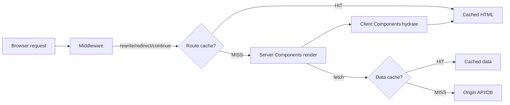

# Next.js

## Chapter Goal

After reading this chapter, an experienced engineer can choose the
correct rendering strategy (SSR, SSG, ISR, streaming) for each
route, explain Next.js caching layers and their invalidation
semantics, design server/client component boundaries, reason about
middleware and edge runtime constraints, evaluate Vercel vs
self-hosted deployment trade-offs, and articulate these decisions
in a Tech Lead interview with correct terminology.

## Why This Matters for a Tech Lead

Next.js is the dominant React meta-framework. It makes rendering,
routing, caching, and data fetching decisions that historically
lived in application code. This shifts architectural ownership:

- **Rendering strategy per route.** Each route can be static,
  server-rendered, or streamed. The Tech Lead decides which
  strategy fits which route — and documents why. A wrong choice
  (SSR for a marketing page, SSG for a personalized dashboard)
  wastes compute or serves stale data.
- **Caching semantics.** Next.js has multiple caching layers
  (request memoization, data cache, full route cache, router
  cache). These defaults have changed between major versions. The
  Tech Lead must understand what is cached, for how long, and how
  to invalidate — or risk serving stale data in production.
- **Server/client boundary.** React Server Components (RSC) run
  on the server by default. Client Components require `"use client"`.
  The boundary between them determines bundle size, interactivity,
  and data security. The Tech Lead defines conventions for where
  this boundary sits.
- **Vendor lock-in.** Vercel-hosted Next.js has features (edge
  middleware, ISR, image optimization) that work differently or
  require extra setup when self-hosted. The Tech Lead evaluates
  this trade-off before committing.
- **Upgrade burden.** Next.js releases major versions annually
  with significant changes (Pages Router → App Router, caching
  defaults, Server Actions). The Tech Lead owns the migration
  plan.

## Mental Model

Think of Next.js as a **request pipeline with rendering decisions
per route segment**. Every request flows through layers, each of
which can short-circuit with a cached response:



At each layer, Next.js makes a caching decision. The Tech Lead's
job is to understand which layers are active for each route and
how to invalidate them.

**Key insight for interviews:** Next.js is not "React with routing."
It is a rendering and caching framework that uses React as its
component model. The framework decides what runs on the server,
what runs on the client, and what gets cached — React provides the
component tree.

## Core Terminology

| Term | Definition |
| --- | --- |
| **App Router** | The modern routing system (Next.js 13+) based on the `app/` directory. Uses React Server Components, layouts, and file-based conventions (`page.tsx`, `layout.tsx`, `loading.tsx`, `error.tsx`). |
| **Pages Router** | The legacy routing system based on the `pages/` directory. Uses `getServerSideProps`, `getStaticProps`, and `getInitialProps`. Maintained but not the recommended path for new projects. |
| **Server Component** | A React component that renders on the server. Cannot use hooks (`useState`, `useEffect`), browser APIs, or event handlers. Can directly access databases, file systems, and secrets. Default in the App Router. |
| **Client Component** | A React component marked with `"use client"` that renders on the server (for initial HTML) and hydrates on the client. Can use hooks, browser APIs, and event handlers. |
| **SSR (Server-Side Rendering)** | Rendering HTML on the server for each request. The page is generated at request time, not at build time. |
| **SSG (Static Site Generation)** | Rendering HTML at build time. Pages are pre-built and served from a CDN. Fastest option for content that does not change per request. |
| **ISR (Incremental Static Regeneration)** | A hybrid: pages are statically generated but can be revalidated after a time interval or on demand. Combines SSG speed with data freshness. |
| **Streaming** | Sending HTML to the browser in chunks as Server Components resolve. Suspense boundaries define where streaming splits occur. Improves Time to First Byte (TTFB). |
| **RSC payload** | The serialized output of Server Components sent to the client. Not HTML — a compact binary format that React uses to update the client-side tree without losing client state. |
| **Server Action** | An async function marked with `"use server"` that runs on the server and can be called from Client Components. Used for form submissions, mutations, and data writes. |
| **Route Handler** | A file (`route.ts`) in the `app/` directory that defines HTTP endpoints (GET, POST, etc.). Replaces API routes from the Pages Router. |
| **Middleware** | A function that runs before every request. Can rewrite, redirect, or modify headers. Runs on the edge runtime by default. |
| **Edge runtime** | A lightweight JavaScript runtime (based on Web APIs, not Node.js) that runs middleware and edge-rendered routes. Faster cold starts but limited API surface (no `fs`, no native modules). |
| **Layout** | A component that wraps child routes and persists across navigations. Does not re-render when the child route changes. Used for shared UI (navigation, sidebars). |
| **Revalidation** | The process of regenerating a cached page or data. Time-based (`revalidate: 60`) or on-demand (`revalidateTag()`, `revalidatePath()`). |
| **Route segment** | A folder in the `app/` directory that maps to a URL segment. Each segment can have its own `page.tsx`, `layout.tsx`, `loading.tsx`, and `error.tsx`. |

**Key distinctions:**

- **Server Component vs SSR:** SSR renders a component to HTML on
  every request and sends it to the browser. A Server Component
  also renders on the server, but its output is an RSC payload (not
  raw HTML) that React uses to update the client tree. Server
  Components can be cached (SSG/ISR) or rendered per request (SSR).
  SSR is a rendering strategy; Server Component is a component type.
- **`"use client"` vs client-only:** `"use client"` does not mean
  the component only runs in the browser. It renders on the server
  for the initial HTML (SSR) and then hydrates on the client. The
  directive marks the boundary where the framework switches from
  server-only to server+client.
- **Route Handler vs Server Action:** Route Handlers define HTTP
  endpoints (REST-style). Server Actions are RPC-style functions
  called directly from components (often via form submissions).
  Use Route Handlers for third-party webhooks and public APIs.
  Use Server Actions for application mutations.

## Theoretical Foundation

### File-based routing and the App Router

The App Router uses the file system to define routes:

```text
app/
  layout.tsx          → root layout (wraps all pages)
  page.tsx            → / (home)
  about/
    page.tsx          → /about
  blog/
    layout.tsx        → blog layout (wraps blog pages)
    page.tsx          → /blog
    [slug]/
      page.tsx        → /blog/:slug (dynamic route)
  api/
    orders/
      route.ts        → /api/orders (Route Handler)
  (marketing)/
    pricing/
      page.tsx        → /pricing (route group — no URL segment)
```

**Conventions:**

| File | Purpose |
| --- | --- |
| `page.tsx` | The UI for a route. Required for a route to be accessible. |
| `layout.tsx` | Shared UI that wraps child routes. Persists across navigations. |
| `loading.tsx` | Loading UI shown while the page is streaming. Wraps the page in a Suspense boundary. |
| `error.tsx` | Error UI shown when the page throws. Must be a Client Component (`"use client"`). |
| `not-found.tsx` | 404 UI for the route segment. |
| `route.ts` | HTTP handler (GET, POST, etc.). Cannot coexist with `page.tsx` in the same segment. |

> Verify App Router file conventions (`loading.tsx`, `error.tsx`,
> `not-found.tsx`, `template.tsx`) against current Next.js
> documentation.

### Layouts

Layouts wrap child routes and persist across navigations:

```tsx
// app/layout.tsx — root layout
export default function RootLayout({ children }: { children: React.ReactNode }) {
  return (
    <html lang="en">
      <body>
        <nav>{/* shared navigation */}</nav>
        <main>{children}</main>
      </body>
    </html>
  );
}
```

**Key behavior:** When navigating from `/blog` to `/blog/my-post`,
the blog layout does not re-render. Only the child `page.tsx`
changes. This preserves layout state (scroll position, form inputs
in the sidebar) and avoids re-fetching layout data.

**Root layout is required.** It must include `<html>` and `<body>`
tags. It replaces `_app.tsx` and `_document.tsx` from the Pages
Router.

### Server Components and Client Components

**Server Components** (default in the App Router) render on the
server and send their output as an RSC payload:

```tsx
// app/dashboard/page.tsx — Server Component (default)
import { db } from "@/lib/db";

export default async function DashboardPage() {
  const stats = await db.query("SELECT * FROM daily_stats WHERE date = CURRENT_DATE");

  return (
    <div>
      <h1>Dashboard</h1>
      <StatsGrid stats={stats} />
      <RecentActivity />
    </div>
  );
}
```

**What Server Components can do that Client Components cannot:**
- Access databases, file systems, and environment secrets directly.
- Use `async/await` at the component level.
- Reduce client bundle size (their code is never sent to the browser).

**What Server Components cannot do:**
- Use React hooks (`useState`, `useEffect`, `useRef`).
- Attach event handlers (`onClick`, `onChange`).
- Access browser APIs (`window`, `document`, `localStorage`).

**Client Components** are marked with `"use client"`:

```tsx
"use client";

import { useState } from "react";

export function AddToCartButton({ productId }: { productId: string }) {
  const [isAdding, setIsAdding] = useState(false);

  async function handleClick() {
    setIsAdding(true);
    await fetch(`/api/cart/${productId}`, { method: "POST" });
    setIsAdding(false);
  }

  return (
    <button onClick={handleClick} disabled={isAdding}>
      {isAdding ? "Adding…" : "Add to cart"}
    </button>
  );
}
```

**The boundary rule:** `"use client"` marks the boundary. Everything
imported into a Client Component becomes part of the client bundle.
A Server Component can render a Client Component as a child, but a
Client Component cannot import a Server Component directly — it
must receive it as `children` or a prop.

```tsx
// Server Component renders Client Component
import { AddToCartButton } from "./AddToCartButton";

export default async function ProductPage({ params }: { params: { id: string } }) {
  const product = await getProduct(params.id);
  return (
    <div>
      <h1>{product.name}</h1>
      <p>{product.description}</p>
      <AddToCartButton productId={product.id} />
    </div>
  );
}
```

**Serialization constraint:** Props passed from Server to Client
Components must be serializable (JSON-compatible). Functions,
classes, Dates, Maps, and Sets cannot be passed as props across
the boundary.

> Verify Server Component / Client Component interleaving rules
> and serialization constraints against current React and Next.js
> documentation. These rules are part of the RSC specification.

### Server Actions

Server Actions are async functions that run on the server:

```tsx
// app/actions/order.ts
"use server";

import { db } from "@/lib/db";
import { revalidatePath } from "next/cache";
import { z } from "zod";

const CreateOrderSchema = z.object({
  productId: z.string(),
  quantity: z.number().min(1).max(100),
});

export async function createOrder(formData: FormData) {
  const parsed = CreateOrderSchema.safeParse({
    productId: formData.get("productId"),
    quantity: Number(formData.get("quantity")),
  });

  if (!parsed.success) {
    return { error: "Invalid input" };
  }

  await db.insert("orders", parsed.data);
  revalidatePath("/orders");
}
```

```tsx
// Client Component calling the Server Action
"use client";

import { createOrder } from "@/app/actions/order";

export function OrderForm({ productId }: { productId: string }) {
  return (
    <form action={createOrder}>
      <input type="hidden" name="productId" value={productId} />
      <input type="number" name="quantity" defaultValue={1} min={1} max={100} />
      <button type="submit">Place order</button>
    </form>
  );
}
```

**Security consideration:** Server Actions are HTTP endpoints under
the hood. They receive untrusted input. Always validate and
authorize — never trust the `formData` or arguments. The
`"use server"` directive does not add authentication or
authorization.

> Verify Server Actions API (`"use server"` directive, `formData`
> handling, `revalidatePath`, `revalidateTag`) against current
> Next.js documentation.

### Route Handlers

Route Handlers define HTTP endpoints:

```ts
// app/api/orders/route.ts
import { NextRequest, NextResponse } from "next/server";
import { db } from "@/lib/db";
import { auth } from "@/lib/auth";

export async function GET(request: NextRequest) {
  const session = await auth();
  if (!session) {
    return NextResponse.json({ error: "Unauthorized" }, { status: 401 });
  }

  const orders = await db.query("SELECT * FROM orders WHERE user_id = $1", [session.userId]);
  return NextResponse.json(orders);
}

export async function POST(request: NextRequest) {
  const session = await auth();
  if (!session) {
    return NextResponse.json({ error: "Unauthorized" }, { status: 401 });
  }

  const body = await request.json();
  const order = await db.insert("orders", { ...body, userId: session.userId });
  return NextResponse.json(order, { status: 201 });
}
```

**When to use Route Handlers vs Server Actions:**
- **Route Handlers** for third-party integrations (webhooks,
  OAuth callbacks), public APIs consumed by mobile apps or
  external services, and responses with non-JSON content types.
- **Server Actions** for application mutations triggered by user
  interactions (form submissions, button clicks).

### Middleware

Middleware runs before every request at the edge:

```ts
// middleware.ts (root of the project)
import { NextRequest, NextResponse } from "next/server";

export function middleware(request: NextRequest) {
  const { pathname } = request.nextUrl;

  // Auth check
  const token = request.cookies.get("session")?.value;
  if (pathname.startsWith("/dashboard") && !token) {
    return NextResponse.redirect(new URL("/login", request.url));
  }

  // A/B test
  const bucket = request.cookies.get("ab-bucket")?.value ?? (Math.random() > 0.5 ? "a" : "b");
  const response = NextResponse.next();
  if (!request.cookies.get("ab-bucket")) {
    response.cookies.set("ab-bucket", bucket, { maxAge: 60 * 60 * 24 * 30 });
  }

  // Geolocation-based rewrite
  const country = request.geo?.country ?? "US";
  if (pathname === "/pricing" && country === "EU") {
    return NextResponse.rewrite(new URL("/pricing/eu", request.url));
  }

  return response;
}

export const config = {
  matcher: ["/dashboard/:path*", "/pricing", "/api/:path*"],
};
```

**Middleware constraints:**
- Runs on the edge runtime — no Node.js APIs (`fs`, native modules).
- Must complete within the edge function timeout (typically 25ms for
  Vercel, varies by provider).
- Cannot render components or return HTML directly.
- Should be lightweight — heavy computation blocks every request.

**Common uses:** auth redirects, geo-based routing, A/B testing,
rate limiting headers, feature flags, bot detection.

### Rendering strategies

**Next.js rendering strategy comparison:**

| Strategy | When HTML is generated | Data freshness | Use case |
| --- | --- | --- | --- |
| **SSG** | At build time | Stale until rebuild | Marketing pages, docs, blog posts |
| **ISR** | At build time + revalidated on interval or demand | Fresh within revalidation window | Product pages, content with known update frequency |
| **SSR** | At request time | Always fresh | Personalized dashboards, authenticated pages |
| **Streaming** | At request time, in chunks | Always fresh, progressive | Complex pages with slow data sources |
| **CSR** | In the browser after initial load | Fetched by client | Interactive widgets, user-specific data after initial render |

**SSG (Static Site Generation):**

```tsx
// Static by default — no dynamic data
export default function AboutPage() {
  return <div>About us</div>;
}
```

A page is static by default if it has no dynamic data fetching,
no `cookies()`, no `headers()`, and no `searchParams`.

**ISR (Incremental Static Regeneration):**

```tsx
// Revalidate every 60 seconds
export const revalidate = 60;

export default async function ProductPage({ params }: { params: { id: string } }) {
  const product = await fetch(`https://api.example.com/products/${params.id}`);
  return <div>{/* render product */}</div>;
}
```

**SSR (Server-Side Rendering):**

A page becomes dynamic (SSR) when it uses `cookies()`, `headers()`,
`searchParams`, or sets `export const dynamic = "force-dynamic"`.

**Streaming:**

```tsx
import { Suspense } from "react";

export default function DashboardPage() {
  return (
    <div>
      <h1>Dashboard</h1>
      <Suspense fallback={<p>Loading stats…</p>}>
        <SlowStatsComponent />
      </Suspense>
      <Suspense fallback={<p>Loading activity…</p>}>
        <SlowActivityComponent />
      </Suspense>
    </div>
  );
}
```

The shell (`<h1>Dashboard</h1>`) streams immediately. Each
Suspense boundary resolves independently as its data becomes
available.

### Caching layers

Next.js has four caching layers. This is the most version-sensitive
area:

**Next.js caching layers (verify defaults against your version):**

| Layer | What it caches | Where | Invalidation |
| --- | --- | --- | --- |
| **Request memoization** | Duplicate `fetch()` calls within a single render | Server, per-request | Automatic — request ends |
| **Data cache** | `fetch()` responses across requests | Server, persistent | `revalidate` time or `revalidateTag()` |
| **Full route cache** | Rendered HTML and RSC payload for static routes | Server, persistent | Redeployment or revalidation |
| **Router cache** | Previously visited routes in the browser | Client, session | Timeout, `router.refresh()`, or navigation |

> Verify caching layer defaults against your Next.js version.
> Next.js 15 changed `fetch()` caching defaults from `force-cache`
> to `no-store`. Earlier versions cached by default.

**Revalidation patterns:**

```tsx
// Time-based revalidation
export const revalidate = 3600; // revalidate every hour

// Tag-based revalidation
const data = await fetch("https://api.example.com/products", {
  next: { tags: ["products"] },
});

// On-demand revalidation (in a Server Action or Route Handler)
import { revalidateTag } from "next/cache";
revalidateTag("products");
```

### Metadata and SEO

Next.js provides a type-safe metadata API:

```tsx
// app/blog/[slug]/page.tsx
import { Metadata } from "next";

export async function generateMetadata({ params }: { params: { slug: string } }): Promise<Metadata> {
  const post = await getPost(params.slug);
  return {
    title: post.title,
    description: post.excerpt,
    openGraph: {
      title: post.title,
      description: post.excerpt,
      images: [post.coverImage],
    },
  };
}
```

**SEO considerations:** Server-rendered and statically generated
pages deliver complete HTML to crawlers. Client-rendered content
is not visible to crawlers that do not execute JavaScript. Use
Server Components for SEO-critical content. Use `generateMetadata`
for dynamic meta tags. Use `robots.ts` and `sitemap.ts` for
crawl configuration.

### Authentication patterns

Authentication in Next.js typically uses one of three patterns:

1. **Session cookies** — the server sets an HttpOnly cookie after
   login. Middleware checks the cookie on protected routes and
   redirects to login if missing. Server Components read the session
   via `cookies()`.

2. **JWT in cookies** — similar to session cookies but the token is
   self-contained. Validate the JWT in middleware or Server Components.
   Risk: JWT cannot be revoked without a blocklist.

3. **Third-party auth providers** (NextAuth.js / Auth.js, Clerk,
   Supabase Auth) — handle session management, OAuth flows, and
   token refresh. Reduce custom code but add a dependency.

**Tech Lead perspective:** Use middleware for route-level auth
checks (redirect unauthorized users). Use Server Components for
data-level auth checks (filter data by user). Never rely solely
on client-side auth checks — they can be bypassed.

### Image optimization

Next.js `<Image>` component optimizes images at request time:

```tsx
import Image from "next/image";

<Image
  src="/hero.jpg"
  alt="Hero image"
  width={1200}
  height={600}
  priority // preload for LCP
  sizes="(max-width: 768px) 100vw, 50vw"
/>
```

**What it does:** Serves images in modern formats (WebP, AVIF),
resizes on demand, lazy-loads by default, prevents layout shift
with explicit dimensions.

**Cost implication:** Image optimization on Vercel is metered.
Self-hosted deployments need a custom image loader or an external
service (Cloudinary, imgproxy).

> Verify `<Image>` component API (`priority`, `sizes`, `fill`,
> `placeholder`) against current Next.js documentation.

### Deployment

**Next.js deployment options:**

| Option | Strengths | Limitations |
| --- | --- | --- |
| **Vercel** | Zero-config, ISR, edge middleware, image optimization, analytics | Vendor lock-in, cost at scale, Vercel-specific features |
| **Self-hosted Node.js** | Full control, no vendor lock-in | Must implement ISR, image optimization, and caching manually |
| **Docker container** | Standard deployment, works with any orchestrator | Larger image, startup time, must handle CDN/caching |
| **Static export** | Cheapest, fastest (CDN-only) | No SSR, no ISR, no middleware, no Server Actions |

**Vercel lock-in risks:**
- ISR revalidation uses Vercel's infrastructure. Self-hosted
  requires a custom cache handler.
- Image optimization uses Vercel's service. Self-hosted requires
  `next/image` loader configuration.
- Edge middleware behavior may differ between Vercel and
  self-hosted deployments.
- `@vercel/analytics`, `@vercel/speed-insights` are Vercel-specific.

### Edge runtime vs Node.js runtime

Edge runtime vs Node.js runtime capabilities and constraints:

| Feature | Edge runtime | Node.js runtime |
| --- | --- | --- |
| **Cold start** | ~5ms (varies by provider) | ~250ms (varies by provider and bundle size) |
| **APIs** | Web standard APIs only | Full Node.js APIs |
| **Packages** | No native modules, limited npm | Full npm ecosystem |
| **Use case** | Middleware, auth checks, geo-routing | Data fetching, DB queries, heavy computation |
| **Timeout** | Short (provider-dependent) | Longer (provider-dependent) |

**Tech Lead rule:** Default to Node.js runtime. Use edge runtime
only for middleware and routes that need low latency and use only
Web APIs. Do not move routes to edge and then discover they need
a Node.js-only package.

## Practical Usage

### Where each rendering strategy fits

- **Marketing site / docs / blog:** SSG with ISR for content
  updates. `revalidate: 3600` for pages that change daily.
  `revalidateTag()` for CMS webhook-triggered updates.
- **E-commerce product pages:** ISR with short revalidation
  (60s) or on-demand revalidation on product update. Price and
  stock shown via client-side fetch for real-time accuracy.
- **Authenticated dashboard:** SSR with streaming. Server
  Components fetch user-specific data. Suspense boundaries stream
  independent widgets. No caching for personalized data.
- **Public API:** Route Handlers with appropriate caching headers.
- **Form-heavy app:** Server Actions for mutations, Server
  Components for reading data, Client Components for form UI.

### Structuring a large Next.js application

```text
app/
  (marketing)/              → route group: no URL impact
    layout.tsx              → marketing layout (no auth)
    page.tsx                → /
    pricing/page.tsx        → /pricing
    blog/[slug]/page.tsx    → /blog/:slug
  (dashboard)/              → route group: authenticated
    layout.tsx              → dashboard layout (sidebar, auth check)
    dashboard/page.tsx      → /dashboard
    orders/page.tsx         → /orders
    orders/[id]/page.tsx    → /orders/:id
  api/
    webhooks/stripe/route.ts
  actions/
    order.ts                → Server Actions
lib/
  db.ts                     → database client
  auth.ts                   → auth utilities
  validators.ts             → shared Zod schemas
components/
  ui/                       → shared UI (Button, Modal)
  features/                 → feature-specific Client Components
```

**Route groups** (`(marketing)`, `(dashboard)`) allow different
layouts without affecting the URL structure. The marketing pages
use a public layout; the dashboard pages use an authenticated
layout with a sidebar.

## Examples

### Server Component with data fetching

```tsx
// app/orders/page.tsx
import { db } from "@/lib/db";
import { auth } from "@/lib/auth";
import { redirect } from "next/navigation";

export default async function OrdersPage() {
  const session = await auth();
  if (!session) redirect("/login");

  const orders = await db.query(
    "SELECT * FROM orders WHERE user_id = $1 ORDER BY created_at DESC",
    [session.userId]
  );

  return (
    <div>
      <h1>Your orders</h1>
      <ul>
        {orders.map(order => (
          <li key={order.id}>
            Order #{order.id} — {order.status}
          </li>
        ))}
      </ul>
    </div>
  );
}
```

**What this does:** A Server Component that checks auth, queries
the database directly, and renders the result. No API layer, no
client-side fetch, no loading state to manage.

**Why it is useful:** Server Components eliminate the
fetch-in-useEffect pattern. Data is fetched at render time, on the
server, with direct database access. The query runs where the data
lives — no network round trip from client to API to database.

**Common mistake:** Putting this in a Client Component with
`useEffect` and `fetch`. That adds a client-server round trip,
exposes the API endpoint, requires loading/error states, and sends
the database client code to the browser bundle.

**Production change:** Add error handling (`try/catch` or error
boundaries). Add pagination. Consider caching if the data is
shared across users.

**Tech Lead check:** Verify that data-fetching components are
Server Components. The only reason to fetch data in a Client
Component is when the data depends on client-side state (e.g.,
the user's current scroll position, a local filter).

### Streaming with Suspense boundaries

```tsx
// app/dashboard/page.tsx
import { Suspense } from "react";
import { StatsWidget } from "./StatsWidget";
import { ActivityFeed } from "./ActivityFeed";
import { Recommendations } from "./Recommendations";

export default function DashboardPage() {
  return (
    <div>
      <h1>Dashboard</h1>
      <div className="grid grid-cols-3 gap-4">
        <Suspense fallback={<WidgetSkeleton />}>
          <StatsWidget />
        </Suspense>
        <Suspense fallback={<WidgetSkeleton />}>
          <ActivityFeed />
        </Suspense>
        <Suspense fallback={<WidgetSkeleton />}>
          <Recommendations />
        </Suspense>
      </div>
    </div>
  );
}
```

**What this does:** The dashboard shell streams immediately. Each
widget renders independently as its data resolves. A slow
recommendations API does not block the stats widget.

**Why it is useful:** Without streaming, the entire page waits for
the slowest data source. With Suspense boundaries, the user sees
the page structure and fast widgets immediately.

**Common mistake:** Wrapping the entire page in a single Suspense
boundary. This defeats streaming — everything waits for everything.
Wrap independent data sources in separate Suspense boundaries.

**Tech Lead check:** Review Suspense boundary placement in code
review. Each boundary should correspond to an independent data
source. Too few boundaries → blocking. Too many → visual jitter.

### Middleware for A/B testing

```ts
// middleware.ts
import { NextRequest, NextResponse } from "next/server";

export function middleware(request: NextRequest) {
  if (request.nextUrl.pathname !== "/pricing") return NextResponse.next();

  const bucket = request.cookies.get("pricing-test")?.value;
  if (bucket) return NextResponse.next();

  const variant = Math.random() > 0.5 ? "control" : "variant";
  const response = NextResponse.rewrite(
    new URL(`/pricing/${variant}`, request.url)
  );
  response.cookies.set("pricing-test", variant, {
    maxAge: 60 * 60 * 24 * 30,
    httpOnly: true,
    sameSite: "lax",
  });
  return response;
}
```

**What this does:** Assigns users to a pricing page variant and
persists the assignment in a cookie. The URL stays `/pricing` but
the content comes from `/pricing/control` or `/pricing/variant`.

**Common mistake:** Running the A/B logic in a Client Component.
This causes a flash of the default variant before switching —
the user sees the page flicker. Middleware rewrites happen before
rendering, so the correct variant loads from the start.

**Tech Lead check:** Ensure A/B test cookies are `httpOnly` and
`sameSite: lax` to prevent JavaScript access and CSRF.

### loading.tsx and error.tsx file conventions

```tsx
// app/orders/loading.tsx
export default function OrdersLoading() {
  return (
    <div className="animate-pulse space-y-4">
      <div className="h-8 w-48 bg-gray-200 rounded" />
      {Array.from({ length: 5 }).map((_, i) => (
        <div key={i} className="h-16 bg-gray-100 rounded" />
      ))}
    </div>
  );
}
```

```tsx
// app/orders/error.tsx
"use client";

import { useEffect } from "react";

export default function OrdersError({
  error,
  reset,
}: {
  error: Error & { digest?: string };
  reset: () => void;
}) {
  useEffect(() => {
    console.error("Orders page error:", error);
    // Report to Sentry, Datadog, etc.
  }, [error]);

  return (
    <div role="alert">
      <h2>Failed to load orders</h2>
      <p>An error occurred while loading your orders. Please try again.</p>
      <button onClick={reset}>Retry</button>
    </div>
  );
}
```

**What this does:** `loading.tsx` shows a skeleton while the page
streams. `error.tsx` catches render errors and offers a retry. Both
are scoped to the `orders/` route segment — they do not affect
other pages.

**Why it is useful:** Without `loading.tsx`, the user sees a blank
page during SSR. Without `error.tsx`, an unhandled error crashes
the entire layout. These files provide per-route resilience.

**Common mistake:** Forgetting that `error.tsx` must be a Client
Component (`"use client"`). Error boundaries in React require
lifecycle methods (or hooks), which are client-only. A Server
Component `error.tsx` fails silently.

**Production change:** Report errors to a monitoring service
(Sentry) in `error.tsx`. Use meaningful skeleton shapes in
`loading.tsx` that match the page layout — not a generic spinner.

**Tech Lead check:** Every route segment with data fetching should
have both `loading.tsx` and `error.tsx`. Add this to the code
review checklist.

### Authenticated dashboard layout

```tsx
// app/(dashboard)/layout.tsx
import { auth } from "@/lib/auth";
import { redirect } from "next/navigation";
import { Sidebar } from "@/components/features/Sidebar";
import { UserMenu } from "@/components/features/UserMenu";

export default async function DashboardLayout({ children }: { children: React.ReactNode }) {
  const session = await auth();
  if (!session) redirect("/login");

  return (
    <div className="flex min-h-screen">
      <Sidebar role={session.role} />
      <div className="flex-1">
        <header className="flex items-center justify-between p-4 border-b">
          <h1>Dashboard</h1>
          <UserMenu user={session.user} />
        </header>
        <main className="p-6">{children}</main>
      </div>
    </div>
  );
}
```

**What this does:** A layout that checks auth on the server before
rendering any dashboard page. If the session is missing, the user
is redirected to login. The sidebar renders based on the user's
role (admin sees different links than a regular user). `UserMenu`
is a Client Component (needs `onClick` for dropdown).

**Why it is useful:** Auth in the layout protects all child routes
automatically. Individual pages do not need to repeat the auth
check. The sidebar persists across navigation — it does not
re-render when the user moves between `/dashboard` and `/orders`.

**Common mistake:** Checking auth in each page instead of the
layout. This duplicates the auth logic and risks one page forgetting
the check. A worse mistake is checking auth only in middleware
without checking in the layout — middleware can redirect, but it
cannot prevent rendering if the session expires between the
middleware check and the render.

**Production change:** Add role-based access control (RBAC). The
layout checks the user's role and redirects if they do not have
access to the dashboard section. Add session refresh logic to
extend sessions on activity.

**Tech Lead check:** Auth should be checked at both middleware
(fast redirect) and layout (data-level) levels. The layout is
the authoritative boundary — middleware is an optimization. Verify
that `auth()` is called once per request (not duplicated in layout
and page — request memoization handles this).

### Server Action with useActionState

```tsx
// app/actions/contact.ts
"use server";

import { z } from "zod";

const ContactSchema = z.object({
  email: z.string().email(),
  message: z.string().min(10).max(1000),
});

type ContactState = {
  success: boolean;
  errors?: Record<string, string[]>;
};

export async function submitContact(
  prevState: ContactState,
  formData: FormData
): Promise<ContactState> {
  const parsed = ContactSchema.safeParse({
    email: formData.get("email"),
    message: formData.get("message"),
  });

  if (!parsed.success) {
    return { success: false, errors: parsed.error.flatten().fieldErrors };
  }

  await sendEmail(parsed.data.email, parsed.data.message);
  return { success: true };
}
```

```tsx
// components/features/ContactForm.tsx
"use client";

import { useActionState } from "react";
import { submitContact } from "@/app/actions/contact";

export function ContactForm() {
  const [state, formAction, isPending] = useActionState(submitContact, {
    success: false,
  });

  if (state.success) {
    return <p>Message sent. We will reply within 24 hours.</p>;
  }

  return (
    <form action={formAction}>
      <div>
        <label htmlFor="email">Email</label>
        <input id="email" name="email" type="email" required />
        {state.errors?.email && <p className="text-red-600">{state.errors.email[0]}</p>}
      </div>
      <div>
        <label htmlFor="message">Message</label>
        <textarea id="message" name="message" required minLength={10} maxLength={1000} />
        {state.errors?.message && <p className="text-red-600">{state.errors.message[0]}</p>}
      </div>
      <button type="submit" disabled={isPending}>
        {isPending ? "Sending…" : "Send message"}
      </button>
    </form>
  );
}
```

**What this does:** A Server Action with typed return values and
a Client Component that uses `useActionState` to display validation
errors and loading state. The form works without JavaScript
(progressive enhancement) and shows inline validation errors
returned from the server.

**Why it is useful:** `useActionState` replaces the pattern of
managing form state manually with `useState` + `fetch`. The
previous state (`prevState`) parameter enables the Server Action
to return structured errors that the form displays inline — without
building a REST endpoint.

**Common mistake:** Throwing from the Server Action on validation
failure. Thrown errors trigger `error.tsx` — the user loses their
form input. Return a typed result instead and show errors inline.

**Production change:** Add rate limiting. Add CSRF verification
if not relying on the built-in token. Add email verification or
captcha for public forms. Log the submission for audit.

**Tech Lead check:** Require all Server Actions to return a typed
`{ success, errors }` result. Ban thrown errors for expected
validation failures. Enforce this via a shared `ActionResult` type
in `lib/types.ts`.

> Verify `useActionState` API (previously `useFormState`, renamed
> in React 19) against current React and Next.js documentation.

### Route Handler with structured error handling (webhook)

```ts
// app/api/webhooks/stripe/route.ts
import { NextRequest, NextResponse } from "next/server";
import { headers } from "next/headers";
import { db } from "@/lib/db";
import { verifyStripeSignature } from "@/lib/stripe";

export async function POST(request: NextRequest) {
  const body = await request.text();
  const signature = (await headers()).get("stripe-signature");

  if (!signature) {
    return NextResponse.json({ error: "Missing signature" }, { status: 400 });
  }

  let event;
  try {
    event = verifyStripeSignature(body, signature);
  } catch {
    return NextResponse.json({ error: "Invalid signature" }, { status: 401 });
  }

  try {
    switch (event.type) {
      case "checkout.session.completed":
        await db.update("orders", { status: "paid" }, { sessionId: event.data.id });
        break;
      case "charge.refunded":
        await db.update("orders", { status: "refunded" }, { chargeId: event.data.id });
        break;
      default:
        console.log(`Unhandled event type: ${event.type}`);
    }
    return NextResponse.json({ received: true });
  } catch (error) {
    console.error("Webhook processing error:", error);
    return NextResponse.json({ error: "Processing failed" }, { status: 500 });
  }
}
```

**What this does:** A Route Handler that receives Stripe webhooks.
It verifies the signature (authentication), parses the event, and
updates the database. Errors are caught and returned as structured
JSON with appropriate status codes.

**Why it is useful:** Webhooks are a primary use case for Route
Handlers — they are called by third parties, not by the
application's own UI. Route Handlers are the correct choice here
because the request comes from an external service, not a user
action in a form.

**Common mistake:** Not verifying the webhook signature. Without
verification, anyone can send fake events to the endpoint. Another
mistake: using `request.json()` instead of `request.text()` for
webhook bodies — the signature must be verified against the raw
body, not the parsed JSON.

**Production change:** Add idempotency checks (Stripe may retry
webhooks). Log the event for audit and debugging. Add monitoring
for failed webhook processing. Return 200 even if the event type
is unhandled — returning 4xx causes Stripe to retry.

**Tech Lead check:** Webhook handlers must: verify signatures,
handle retries idempotently, log events for audit, and return
correct status codes. Test with Stripe CLI (`stripe trigger`)
during development.

### Tag-based on-demand revalidation

```tsx
// app/products/[id]/page.tsx — ISR with cache tags
import { db } from "@/lib/db";

export const revalidate = 3600; // fallback: revalidate hourly

export default async function ProductPage({ params }: { params: { id: string } }) {
  const product = await fetch(`${process.env.API_URL}/products/${params.id}`, {
    next: { tags: [`product-${params.id}`, "products"] },
  });

  return <div>{/* render product */}</div>;
}
```

```ts
// app/api/cms-webhook/route.ts — on-demand revalidation
import { NextRequest, NextResponse } from "next/server";
import { revalidateTag } from "next/cache";

export async function POST(request: NextRequest) {
  const secret = request.headers.get("x-webhook-secret");
  if (secret !== process.env.WEBHOOK_SECRET) {
    return NextResponse.json({ error: "Unauthorized" }, { status: 401 });
  }

  const { productId, action } = await request.json();

  if (action === "update" && productId) {
    revalidateTag(`product-${productId}`);
  } else if (action === "bulk-update") {
    revalidateTag("products");
  }

  return NextResponse.json({ revalidated: true });
}
```

**What this does:** Product pages are statically generated with
ISR (hourly fallback). When the CMS updates a product, it calls
the webhook Route Handler, which triggers `revalidateTag()` to
regenerate only the affected product page. A bulk update
revalidates all product pages via the shared `"products"` tag.

**Why it is useful:** This gives near-instant content updates
without regenerating all pages. The hourly fallback ensures pages
are refreshed even if the webhook fails. Tags allow surgical
invalidation — updating one product does not rebuild 10,000
others.

**Common mistake:** Using `revalidatePath("/products")` instead
of tags. `revalidatePath` invalidates a specific URL; it does not
cascade to related pages. Tags are more flexible — a single tag
can invalidate multiple pages that share the same data.

**Production change:** Add webhook signature verification (not
a shared secret — use HMAC). Add monitoring for revalidation
failures. Log which tags are revalidated and how often.

**Tech Lead check:** Define a tag naming convention for the team:
entity-based (`product-{id}`, `order-{id}`) for specific items,
collection-based (`products`, `orders`) for lists. Document in the
architecture guide. Monitor cache hit rates to verify revalidation
is working.

### Environment variable validation

```ts
// lib/env.ts
import { z } from "zod";

const envSchema = z.object({
  DATABASE_URL: z.string().url(),
  API_SECRET: z.string().min(32),
  WEBHOOK_SECRET: z.string().min(16),
  NEXT_PUBLIC_API_URL: z.string().url(),
  NODE_ENV: z.enum(["development", "production", "test"]).default("development"),
});

export const env = envSchema.parse(process.env);
```

```ts
// Usage in Server Components or Route Handlers
import { env } from "@/lib/env";

const data = await fetch(`${env.NEXT_PUBLIC_API_URL}/products`, {
  headers: { Authorization: `Bearer ${env.API_SECRET}` },
});
```

**What this does:** Validates all required environment variables
at import time using Zod. If `DATABASE_URL` is missing or
`API_SECRET` is too short, the application fails at startup with
a clear error — not at runtime during a database query.

**Why it is useful:** Missing environment variables are one of the
most common deployment failures. Without validation, the app starts
successfully and fails later when a specific code path tries to
use the missing variable. Zod validation catches this at build/
startup time.

**Common mistake:** Accessing `process.env.DATABASE_URL` directly
throughout the codebase. This is untyped, unvalidated, and can
be `undefined` at runtime. Another mistake: putting secrets in
`NEXT_PUBLIC_` variables — these are inlined into the client
bundle at build time and visible in the browser.

**Production change:** Add environment-specific validation
(`SENTRY_DSN` required only in production). Use the deployment
platform's secrets manager (Vercel environment variables, AWS
Secrets Manager) instead of `.env.local` files.

**Tech Lead check:** Require `lib/env.ts` as the single source for
environment variables. Ban direct `process.env` access in
application code (enforceable via an ESLint rule). Add `.env.example`
to the repo with all required variables (no values) for
documentation.

## Common Mistakes

1. **Treating `"use client"` as a fallback for errors**
   - What it looks like: Adding `"use client"` to fix a "hooks
     cannot be used in Server Components" error without thinking
     about the boundary.
   - Why it is dangerous: Everything imported into the Client
     Component becomes part of the client bundle. A heavy data
     library or a database client ends up shipped to the browser.
   - The correct approach: Move only the interactive piece to a
     Client Component. Keep data fetching in the Server Component
     parent and pass data as props.

2. **Not understanding caching defaults**
   - What it looks like: Data appears stale in production, or
     changes made via Server Actions do not appear.
   - Why it is dangerous: Next.js caching defaults have changed
     between versions. In some versions, `fetch()` caches by
     default; in others, it does not.
   - The correct approach: Explicitly set caching behavior per
     fetch: `{ cache: "no-store" }` for dynamic data,
     `{ next: { revalidate: 60 } }` for ISR, and use
     `revalidateTag()` for on-demand invalidation.

3. **Putting heavy logic in middleware**
   - What it looks like: Database queries, JWT verification with
     heavy crypto, or complex business logic in `middleware.ts`.
   - Why it is dangerous: Middleware runs on the edge runtime with
     short timeouts. Heavy computation blocks every request.
   - The correct approach: Middleware should make fast decisions
     (check a cookie, read a header, rewrite a URL). Move heavy
     work to Server Components or Route Handlers.

4. **Forgetting to authorize Server Actions**
   - What it looks like: A Server Action that mutates data without
     checking the user's session or role.
   - Why it is dangerous: Server Actions are exposed as HTTP
     endpoints. Anyone can call them with crafted requests.
   - The correct approach: Check auth at the start of every Server
     Action. Validate input with Zod or a similar library. Never
     trust client-submitted data.

5. **Mixing Pages Router and App Router without a plan**
   - What it looks like: Some pages in `pages/`, some in `app/`,
     with no clear migration direction.
   - Why it is dangerous: Two routing systems with different
     caching, data fetching, and rendering semantics. Developers
     are confused about which patterns to use. Middleware behavior
     differs between the two routers.
   - The correct approach: Choose one direction. For new projects,
     use the App Router exclusively. For existing projects, migrate
     incrementally with a documented plan.

6. **Not setting explicit `revalidate` values**
   - What it looks like: Relying on default caching behavior without
     understanding what is cached and for how long.
   - Why it is dangerous: Defaults change between Next.js versions.
     A page that was dynamic in v14 might be cached in v15, or
     vice versa.
   - The correct approach: Set `revalidate` explicitly on every
     route and data fetch. Document the caching strategy per route.

7. **Using Edge runtime for routes that need Node.js APIs**
   - What it looks like: Setting `export const runtime = "edge"` on
     a route that imports a Node.js-specific library (database
     driver, file system, native crypto).
   - Why it is dangerous: The route fails at runtime with missing
     API errors.
   - The correct approach: Default to Node.js runtime. Use edge
     only for middleware and routes that exclusively use Web APIs.

8. **Ignoring the RSC payload size**
   - What it looks like: Server Components return large datasets
     (10,000 rows, entire JSON blobs) that get serialized into
     the RSC payload.
   - Why it is dangerous: The RSC payload is sent to the client
     for hydration. Large payloads increase TTFB and memory usage.
   - The correct approach: Paginate data. Only send what the UI
     needs. Aggregate on the server before sending.

## Trade-offs

**Key Next.js architecture decisions and when each trade-off flips:**

| Decision | Optimizes for | Sacrifices | Flips when |
| --- | --- | --- | --- |
| **App Router** | Server Components, streaming, modern patterns | Learning curve, breaking changes from Pages Router | Legacy codebase fully dependent on Pages Router patterns |
| **Server Components** | Smaller client bundle, direct data access | No interactivity (hooks, events) | Component needs client-side state or event handlers |
| **SSG + ISR** | Speed, CDN caching, low server cost | Data freshness limited to revalidation window | Data must be real-time or user-specific |
| **SSR** | Always-fresh data, personalization | Higher server cost, slower TTFB than SSG | Page can be statically generated |
| **Streaming** | Progressive loading, better perceived performance | More complex Suspense boundary design | Page data resolves quickly (streaming adds no benefit) |
| **Vercel hosting** | Zero-config, integrated ISR/edge/images | Vendor lock-in, cost at scale | Budget constraints or regulatory requirements for self-hosting |
| **Self-hosting** | Full control, no vendor lock-in | Must implement caching, ISR, image optimization | Team needs Vercel-specific features without reimplementation |
| **Edge runtime** | Low latency, fast cold starts | Limited API surface, no Node.js modules | Route needs database access or heavy computation |
| **Server Actions** | Simple mutations, no API boilerplate | Tightly coupled to Next.js, harder to test independently | Public API consumed by external clients |

## Production Considerations

- **Security:** Server Actions are HTTP endpoints — validate and
  authorize every call. Use CSP headers. Store secrets in
  environment variables on the server, never in client code. Use
  HttpOnly cookies for sessions. See [Security](./15-security.md).
- **Performance and scalability:** Use SSG/ISR for cacheable
  content. Stream pages with Suspense boundaries. Set bundle
  budgets. Use `next/image` for image optimization. Monitor Core
  Web Vitals. See [Performance and Scalability](./19-performance-and-scalability.md).
- **Reliability and on-call:** Set up error monitoring (Sentry)
  with source maps. Use `error.tsx` for graceful error UI. Monitor
  cache hit rates and revalidation failures. Test error paths
  (API failures, auth expiry).
- **Maintainability:** Document the rendering strategy per route
  (SSG/ISR/SSR/streaming). Document the caching strategy. Use route
  groups for layout separation. Keep Server Actions in a dedicated
  `actions/` directory.
- **Cost:** Vercel pricing is based on function invocations,
  bandwidth, and image optimizations. SSG reduces costs (CDN-served).
  SSR increases costs (server compute per request). ISR balances
  cost and freshness. Monitor function invocation counts.
- **Team and hiring implications:** Next.js knowledge is now
  expected for frontend roles. The App Router is significantly
  different from the Pages Router — teams migrating need training.
  Set team conventions for Server/Client Component boundaries.
- **Vendor and version lock-in:** Next.js is maintained by Vercel.
  Some features (ISR infrastructure, image optimization, edge
  middleware) are tightly coupled to Vercel's platform. Evaluate
  OpenNext for self-hosted deployments.
- **Migration and rollback:** Migrate from Pages Router to App
  Router incrementally — both can coexist. See
  [CI/CD and DevOps](./17-ci-cd-and-devops.md).

### Production readiness checklist

- [ ] Rendering strategy documented per route (SSG/ISR/SSR/streaming).
- [ ] Caching strategy documented per data source (revalidate time, tags).
- [ ] Server/Client Component boundary reviewed in code review.
- [ ] Server Actions validate input and check authorization.
- [ ] Error boundaries (`error.tsx`) in place for critical routes.
- [ ] `next/image` used for all images with `priority` on LCP images.
- [ ] Bundle budget defined and enforced in CI.
- [ ] Monitoring covers: cache hit rates, function invocations, TTFB,
  Core Web Vitals.
- [ ] Deployment shape documented (Vercel / self-hosted / container).
- [ ] Upgrade plan exists for Next.js major versions.

## Tech Lead Decision-Making

### What a Senior Engineer knows vs what a Tech Lead decides

**Knowledge vs decision responsibilities across Next.js domains:**

| Area | Senior Engineer | Tech Lead |
| --- | --- | --- |
| **Rendering** | Knows SSR, SSG, ISR, streaming | Decides which strategy per route, documents it, reviews changes |
| **Caching** | Uses `revalidate` and `revalidateTag` | Defines caching strategy per data source, monitors cache hit rates |
| **Server/Client** | Marks components with `"use client"` | Sets conventions for where the boundary sits, reviews violations |
| **Server Actions** | Writes Server Actions with validation | Ensures auth checks, input validation, and rate limiting are standard |
| **Deployment** | Deploys to Vercel or follows the CI pipeline | Evaluates Vercel vs self-hosting, manages vendor relationship, controls cost |
| **Upgrade** | Runs the Next.js codemod | Plans the migration, tests breaking changes, communicates timeline |

### When not to use Next.js

- **Simple SPA with no SEO requirements** → Vite + React. Next.js
  adds build complexity, routing opinions, and caching layers that
  an SPA does not need.
- **Static sites with no dynamic content** → Astro, Hugo, or
  Eleventy. Faster builds, simpler deployment, no server needed.
- **API-only backend** → Express, Fastify, NestJS. Next.js Route
  Handlers work but are not designed for complex API architectures.
- **Non-React teams** → Nuxt (Vue), SvelteKit (Svelte). Next.js
  is React-only. Do not adopt it for the framework features if the
  team does not know React.
- **Applications requiring full control over the HTTP server** →
  Next.js abstracts the server. If the application needs custom
  WebSocket handling, server-sent events, or a specific server
  framework, self-hosting Next.js adds constraints.

### Common overengineering traps

**Patterns that add complexity without proportional value:**

| Trap | Symptom | Pragmatic alternative |
| --- | --- | --- |
| **Edge runtime everywhere** | Every route set to `runtime: "edge"`, then breaking when importing a DB driver | Default to Node.js. Edge only for middleware and lightweight routes. |
| **ISR for everything** | Setting `revalidate` on routes that are fully static or fully dynamic | Static routes: no `revalidate` (SSG). Dynamic routes: `dynamic = "force-dynamic"`. ISR only when data changes on a known interval. |
| **Over-caching** | Setting long `revalidate` intervals on user-specific data | Never cache personalized data. Cache shared, public data only. |
| **Building a full REST API in Route Handlers** | 20 Route Handler files replicating an Express app | Use a dedicated API framework. Route Handlers are for glue, not architecture. |
| **Premature micro-frontend split** | Separate Next.js apps for each feature before team boundaries justify it | One Next.js app with route groups. Split when teams need independent deployments. |

### Vercel vs self-hosting decision framework

Vercel vs self-hosted comparison across key decision factors:

| Factor | Vercel | Self-hosted (Docker/Node) |
| --- | --- | --- |
| **Setup time** | Minutes | Hours to days |
| **ISR** | Built-in | Custom cache handler needed |
| **Image optimization** | Built-in, metered | External service (imgproxy, Cloudinary) or custom loader |
| **Edge middleware** | Built-in | Node.js server, no edge |
| **Cost at scale** | Grows with traffic (function invocations) | Fixed infra cost, scales with compute |
| **Compliance** | Vercel's SOC 2, shared infrastructure | Full control over data residency |
| **Vendor lock-in** | High (some features Vercel-specific) | None |
| **Operational burden** | Low (Vercel manages infra) | High (team manages infra) |

**Stakeholder explanation:** "We chose Vercel for initial launch
because it eliminates infrastructure setup. If we outgrow the
pricing or need data residency control, we can migrate to
self-hosted using OpenNext with approximately two sprints of
engineering work. The migration risk is manageable because we avoid
Vercel-specific APIs (`@vercel/*` packages) in application code."

> Verify OpenNext compatibility and self-hosting documentation
> against current Next.js version.

### Upgrade strategy

Next.js releases major versions annually. The Tech Lead owns
the upgrade:

1. **Read the migration guide.** Identify breaking changes
   (caching defaults, API changes, deprecated features).
2. **Run the Next.js codemod.** `npx @next/codemod@latest` applies
   automated transformations.
3. **Test in a branch.** Full test suite + manual smoke test.
4. **Deploy to staging.** Verify caching behavior, middleware,
   and Server Actions.
5. **Canary deploy to production.** 5% traffic for 24 hours.
6. **Monitor.** Cache hit rates, TTFB, error rates, Core Web Vitals.

### Debugging Next.js in production

**Stale data (most common issue):**
1. Identify which cache is serving stale data — data cache, full
   route cache, or router cache.
2. Check `revalidate` values. A page with `revalidate: 3600` shows
   data up to one hour old.
3. Check if `revalidateTag()` or `revalidatePath()` is called after
   mutations. Missing revalidation after a Server Action is the
   most common cause.
4. Check the router cache — the client caches previously visited
   routes. `router.refresh()` forces a fresh fetch.

**Hydration mismatches:**
1. The server-rendered HTML does not match the client-rendered
   output. Common causes: browser-only values (`Date.now()`,
   `Math.random()`, `window.innerWidth`) used in the initial render.
2. Fix: wrap browser-only logic in `useEffect` or check
   `typeof window !== "undefined"`.

**Edge runtime errors:**
1. A route set to `runtime: "edge"` fails because it imports a
   Node.js module.
2. Fix: remove `runtime: "edge"` or replace the Node.js module
   with a Web API equivalent.

### Rendering strategy decision tree

A Senior Engineer knows the four strategies. A Tech Lead has a
repeatable framework for choosing:

1. **Is the data user-specific or personalized?**
   Yes → SSR (or streaming if multiple data sources).
   No → continue.

2. **Does the data change?**
   No → SSG. Build once, serve forever from CDN.
   Yes → continue.

3. **How quickly must changes appear?**
   Within seconds → on-demand revalidation (ISR with
   `revalidateTag()`). The page is static but revalidated when a
   webhook fires.
   Within minutes/hours → time-based ISR (`revalidate: 60` to
   `revalidate: 3600`).
   Real-time → SSR or client-side polling.

4. **Does the page have multiple independent data sources with
   different latencies?**
   Yes → streaming (SSR with Suspense boundaries).
   No → standard SSR.

5. **Is there a component on the page that depends on client-side
   state (search filter, sort order, user interaction)?**
   Yes → render the page with SSR/SSG/ISR and use a Client
   Component island for the interactive piece. The island fetches
   its data client-side.

**Interview framing:** "I do not default to SSR. I start with
SSG because it is the fastest and cheapest. I move to ISR when
data changes. I move to SSR only when data is personalized or
must be real-time. I add streaming when there are multiple slow
data sources. Each route has a documented rendering strategy."

Document this decision per route in the architecture guide:

| Route | Strategy | Revalidation | Data source | Reason |
| --- | --- | --- | --- | --- |
| `/` | SSG | none | CMS | Static marketing page |
| `/blog/[slug]` | ISR | `revalidateTag` on publish | CMS | Content changes weekly |
| `/products/[id]` | ISR | 60s + `revalidateTag` on update | Product API | Prices change hourly |
| `/dashboard` | SSR + streaming | none | User DB | Personalized, multi-source |
| `/search` | SSR | none | Search API | Query-dependent |
| `/checkout` | SSR | none | Cart/Payment | Transactional |

### Incident response: Next.js-specific runbook

**Incident: users see stale data after a content update**

| Step | Action | Tool |
| --- | --- | --- |
| 1 | Confirm the origin data is correct | Direct API/DB query |
| 2 | Check if `revalidateTag()` fired after the mutation | Application logs |
| 3 | Check the data cache (`x-nextjs-cache` header) | `curl -I <url>` |
| 4 | Check the full route cache (static vs dynamic) | Vercel dashboard / CDN headers |
| 5 | Check the router cache (client-side) | Ask user to hard-refresh (Ctrl+Shift+R) |
| 6 | Force revalidation | Call `revalidateTag()` manually via admin endpoint |
| 7 | If Vercel, check the Functions tab for revalidation failures | Vercel dashboard |

**Incident: elevated error rate on a route**

| Step | Action | Tool |
| --- | --- | --- |
| 1 | Identify the route from Sentry/error tracker | Sentry, Datadog |
| 2 | Check if the error is in a Server Component or Client Component | Error stack trace (server vs client) |
| 3 | Check if a dependency API is down | Backend health check |
| 4 | If Server Component: check `error.tsx` is rendering | Manual test in staging |
| 5 | If Client Component: check hydration errors in browser console | Browser DevTools |
| 6 | Rollback the last deployment if the error was introduced by a code change | Vercel instant rollback / CI rollback |

**Incident: TTFB regression**

| Step | Action | Tool |
| --- | --- | --- |
| 1 | Identify which routes regressed | RUM dashboard (Vercel Analytics, Datadog) |
| 2 | Check if a page became dynamic (SSR) that was previously static (ISR/SSG) | `curl -I <url>` for cache headers |
| 3 | Check if a slow API was added to a Server Component | Server function duration logs |
| 4 | Check if Suspense boundaries are missing (entire page waits for slowest query) | Code review |
| 5 | Check connection pooling (serverless cold starts opening new DB connections) | DB connection metrics |

### Cost model: understanding Next.js spend

A Tech Lead must translate rendering decisions into cost
implications for stakeholders:

**Vercel cost drivers and how rendering strategy affects them:**

| Cost driver | SSG | ISR | SSR | Streaming |
| --- | --- | --- | --- | --- |
| **Function invocations** | 0 (CDN) | Low (revalidation only) | 1 per request | 1 per request |
| **Bandwidth** | CDN-optimized | CDN-optimized | Server-direct | Server-direct |
| **Compute time** | Build only | Build + revalidation | Per request | Per request |
| **Image optimization** | Metered per image | Metered per image | Metered per image | Metered per image |

**Cost optimization checklist:**
- Every page that can be static should be static. SSG pages cost
  nothing to serve (CDN).
- ISR pages cost one function invocation per revalidation — not
  per request. A page with `revalidate: 60` costs ~1,440
  invocations/day regardless of traffic.
- SSR pages cost one function invocation per request. A page with
  100k daily visitors costs 100k invocations/day.
- Image optimization is metered. Use `sizes` to serve appropriate
  resolutions. Consider an external image service (Cloudinary) for
  very high-volume sites.

**Stakeholder explanation:** "Moving our product catalog from SSR to
ISR with on-demand revalidation would reduce our Vercel function
invocations from 500,000/day to approximately 5,000/day — the
number of product updates, not the number of page views. Pages are
served from the CDN. This reduces our monthly Vercel cost by an
estimated 60-70% while showing product changes within 10 seconds
of a CMS update."

**Self-hosted cost comparison:** For a self-hosted deployment (ECS
on AWS), the cost model is different: fixed compute (EC2/Fargate
tasks), bandwidth (CloudFront), and operational effort (team time
managing infrastructure). At low traffic, Vercel is cheaper because
the infrastructure cost is zero. At high traffic (millions of
requests/month), self-hosting is cheaper because the compute cost
is fixed. The crossover point depends on the team's infrastructure
expertise and the application's traffic pattern.

### Team conventions and architecture decision records

A Tech Lead does not make decisions alone and then expect the team
to read the code. Decisions are documented and enforceable:

**ADR: rendering strategy**

| Decision | We document the rendering strategy per route in `docs/routes.md`. New routes require a rendering strategy justification in the PR. |
| --- | --- |
| **Context** | Without documentation, developers guess the rendering strategy. Some pages become SSR by accident (adding `cookies()` to a static page). |
| **Consequence** | PR review checks that each new route has a documented strategy. CI includes a rendering assertion test. |

**ADR: Server/Client Component boundary**

| Decision | `"use client"` is only allowed in `components/features/` and must be justified in the PR description. Page-level components (`app/**/page.tsx`) are always Server Components. |
| --- | --- |
| **Context** | Without this rule, developers add `"use client"` to fix hook errors, inflating the client bundle and moving data fetching to the client. |
| **Consequence** | ESLint warns on `"use client"` in `app/` directory. PR reviews check for unnecessary Client Components. |

**ADR: caching and revalidation**

| Decision | Every `fetch()` call in a Server Component must have explicit caching options. No reliance on Next.js defaults. Cache tags follow the convention `{entity}-{id}` for items and `{entity}` for collections. |
| --- | --- |
| **Context** | Caching defaults changed between Next.js 14 and 15. Relying on defaults causes version-dependent behavior. |
| **Consequence** | ESLint rule flags `fetch()` without `cache` or `next.revalidate` option. Cache tags are documented in `docs/cache-tags.md`. |

**ADR: Server Action standards**

| Decision | Every Server Action validates input with Zod, checks authorization, returns a typed `ActionResult`, and calls `revalidateTag()` on success. Thrown errors are reserved for unrecoverable failures. |
| --- | --- |
| **Context** | Server Actions are HTTP endpoints. Without standards, developers write actions without auth checks or input validation — a security risk. |
| **Consequence** | Shared `ActionResult` type in `lib/types.ts`. Code review checklist includes auth and validation checks. |

### Ownership boundaries

**Who owns what in a Next.js application:**

| Concern | Owner | Why |
| --- | --- | --- |
| **Rendering strategy per route** | Tech Lead | Affects cost, performance, and UX — cross-cutting |
| **Caching strategy** | Tech Lead + backend | Data freshness requirements come from the business |
| **Server/Client boundary** | Tech Lead + frontend team | Affects bundle size, team patterns, code review |
| **Middleware logic** | Tech Lead | Runs on every request — high blast radius |
| **Server Action security** | Tech Lead + security | HTTP endpoints exposed to the internet |
| **Deployment and hosting** | Tech Lead + platform/DevOps | Infrastructure decisions with cost and compliance implications |
| **Next.js version upgrade** | Tech Lead | Breaking changes, migration work, timeline |
| **Feature components** | Feature team | Within established conventions |
| **UI components** | Frontend team / design system | Shared library, Server/Client variants |

The Tech Lead owns decisions that cross team boundaries or have
infrastructure/cost/security implications. Feature development
within established conventions belongs to the team.

### Migration and coexistence planning

When migrating from Pages Router to App Router — or from another
framework to Next.js — the Tech Lead owns the plan:

**Phase 1 — Establish coexistence (week 1-2):**
- Both routers run in the same Next.js app.
- New features go in `app/`. No new code in `pages/`.
- Set up conventions: Server/Client boundary rules, caching
  strategy, env validation.

**Phase 2 — Migrate static pages (week 3-4):**
- Marketing pages, about, pricing. No data fetching to convert.
- Verify SSG behavior matches the Pages Router version.
- Ship to production and monitor.

**Phase 3 — Migrate data-fetching pages (week 5-8):**
- Convert `getStaticProps` → Server Component + ISR.
- Convert `getServerSideProps` → Server Component + SSR.
- Verify caching behavior after each conversion.

**Phase 4 — Migrate complex pages (week 9-12):**
- Pages with client-side data fetching, complex state, forms.
- Introduce Server Actions for mutations.
- Add Suspense boundaries for streaming.

**Phase 5 — Remove Pages Router (week 13-14):**
- Delete `pages/` directory.
- Remove `getServerSideProps`, `getStaticProps` types.
- Update documentation.

**Rollback plan:** Each phase can be rolled back independently.
Pages Router routes remain functional until explicitly removed.
If a migrated route has issues, revert the route to `pages/` and
investigate.

**Stakeholder explanation:** "The migration takes 3-4 months. We
are not rewriting — we are migrating one route at a time. Both
routers coexist, so there is no big-bang cutover. Each phase ships
to production and we monitor for regressions. Users will not notice
the migration. The benefit is better performance (Server Components
reduce our JavaScript bundle by an estimated 30-40%), simpler data
fetching (no more `getServerSideProps` boilerplate), and access to
streaming for faster perceived page loads."

## How to Explain This in an Interview

**Opening for "How does Next.js handle caching?":**

"Next.js has four caching layers: request memoization deduplicates
fetch calls within a single render; the data cache persists fetch
responses across requests with time-based or on-demand
revalidation; the full route cache stores rendered HTML for static
and ISR pages; and the router cache keeps previously visited routes
in the browser. The Tech Lead's job is to set explicit revalidation
per route and data source, because the defaults have changed
between versions — relying on defaults is a production risk."

**Opening for "When would you use Server Components?":**

"Server Components are the default and correct choice for any
component that does not need interactivity. They can access
databases and secrets directly, their code never reaches the
client bundle, and they reduce JavaScript shipped to the browser.
I switch to a Client Component only when the component needs hooks,
event handlers, or browser APIs — and I keep the Client Component
as small as possible, receiving data as props from a Server
Component parent."

**Opening for "How do you decide between Vercel and self-hosting?":**

"I evaluate on three dimensions: cost at scale (Vercel charges per
function invocation, self-hosting has fixed compute costs),
compliance (does the data need to stay in a specific region?), and
operational burden (does the team have the capacity to manage
infrastructure?). For early-stage products, Vercel's zero-config is
the right trade-off. For high-traffic applications or regulated
industries, self-hosting with OpenNext gives full control. I avoid
Vercel-specific APIs in application code so the migration path
stays open."

**Opening for "How do you migrate from Pages Router to App Router?":**

"I migrate incrementally. Pages Router and App Router coexist — I
move one route at a time, starting with the simplest static pages.
Each migration converts `getServerSideProps` or `getStaticProps`
into Server Component data fetching. I validate caching behavior
after each migration because the App Router's caching semantics
differ from the Pages Router's. I track progress with a migration
checklist and set a deadline for completing the migration."

**Opening for "How do you manage costs for a Next.js application?":**

"I start by matching rendering strategy to cost: SSG pages are
free to serve — they are static files on a CDN. ISR pages cost one
function invocation per revalidation, not per request — so a page
with revalidate: 60 costs about 1,400 invocations per day regardless
of traffic. SSR pages cost one invocation per request — at 100k
daily visitors, that is 100k invocations. The biggest cost lever
is moving pages from SSR to ISR wherever the data freshness allows
it. I also monitor image optimization costs and use the `sizes`
prop on `next/image` to avoid serving desktop-resolution images
to mobile. I set up cost alerts in Vercel and review the usage
dashboard monthly."

**Opening for "How do you ensure your Next.js app is secure?":**

"I secure at three layers. First, middleware checks sessions on
protected routes — unauthenticated users never see the dashboard
render. Second, Server Components verify authorization at the
data level — even if the route renders, users see only their own
data. Third, every Server Action validates input with Zod and checks
authorization before mutating anything — because Server Actions are
HTTP endpoints callable by anyone. On top of that, I configure
CSP headers, validate environment variables at startup to prevent
secrets leaking via `NEXT_PUBLIC_` variables, and use HttpOnly
cookies for sessions. I treat Server Actions with the same
security rigor as REST API endpoints."

## Good Answer vs Weak Answer

**Question:** Should you use Server Components for everything?

**Strong Answer**

"Server Components are the default and I use them for all
non-interactive code — data fetching, layout, content rendering.
They reduce the client bundle and allow direct server access. But
I use Client Components for anything that needs state, event
handlers, or browser APIs — search inputs, modals, form validation.
The boundary should be as deep as possible: a page-level Server
Component fetches data and passes it to small Client Component
islands for interactivity. I never add `"use client"` to fix an
error without understanding what it pulls into the client bundle."

**Weak Answer**

"Yes, Server Components are the new best practice so I use them
for everything."

**Why the Strong Answer Wins**

- Distinguishes when Server and Client Components are appropriate.
- Names the boundary principle (as deep as possible).
- Mentions bundle size implications.
- Shows awareness of the trade-off, not dogma.
- The weak answer treats Server Components as universally correct
  without acknowledging Client Component use cases.

## Tech Lead Checklist

### Architecture

- [ ] Rendering strategy (SSG/ISR/SSR/streaming) documented per route.
- [ ] Server/Client Component boundary conventions documented.
- [ ] Route groups used for layout separation.
- [ ] Server Actions in a dedicated `actions/` directory.

### Caching

- [ ] `revalidate` set explicitly on every ISR route.
- [ ] Cache tags defined for on-demand revalidation.
- [ ] Cache hit rates monitored in production.
- [ ] Caching defaults verified against current Next.js version.

### Security

- [ ] Server Actions validate input and check authorization.
- [ ] Secrets are in environment variables, not in client code.
- [ ] CSP headers configured.
- [ ] Auth middleware protects sensitive routes.

### Performance

- [ ] `next/image` used for all images with `priority` on LCP.
- [ ] Bundle budget defined and enforced in CI.
- [ ] Streaming with Suspense boundaries for slow data sources.
- [ ] Core Web Vitals monitored with RUM.

### Deployment

- [ ] Deployment shape chosen and documented.
- [ ] Vercel-specific APIs avoided in application code (portability).
- [ ] Upgrade plan exists for Next.js major versions.

## Interview Questions and Answers

### Basic

**Question:** What is the difference between SSR, SSG, and ISR?

**Answer:** SSG generates HTML at build time — pages are static
files served from a CDN. SSR generates HTML at request time — every
request triggers a server render. ISR combines both: pages are
statically generated but revalidated after a time interval or on
demand, so the page is static most of the time but can show updated
data without a full rebuild.

---

**Question:** What is a Server Component?

**Answer:** A React component that renders on the server and sends
its output as an RSC payload to the client. It can access databases,
file systems, and secrets directly. It cannot use React hooks,
event handlers, or browser APIs. Server Components are the default
in Next.js App Router.

---

**Question:** What does `"use client"` do?

**Answer:** It marks the boundary between Server and Client
Components. Components with `"use client"` render on the server for
the initial HTML (SSR) and then hydrate on the client. Everything
imported into a `"use client"` file becomes part of the client
bundle.

---

**Question:** What is the App Router?

**Answer:** The modern routing system in Next.js (13+) based on the
`app/` directory. It uses React Server Components, nested layouts,
streaming, and file conventions (`page.tsx`, `layout.tsx`,
`loading.tsx`, `error.tsx`). It replaces the Pages Router for new
projects.

---

**Question:** What is a layout in Next.js?

**Answer:** A component that wraps child routes and persists across
navigations. When the user navigates between sibling routes, the
layout does not re-render. This preserves layout state and avoids
re-fetching layout data. The root layout is required and must
include `<html>` and `<body>` tags.

---

**Question:** What is streaming in Next.js?

**Answer:** Sending HTML to the browser in chunks as Server
Components resolve. Suspense boundaries define where chunks split.
The browser renders the page progressively — fast components appear
immediately, slow components show a fallback until their data
resolves. Streaming improves perceived performance without waiting
for the slowest data source.

---

**Question:** What is a Server Action?

**Answer:** An async function marked with `"use server"` that runs
on the server. Called from Client Components (via form `action` or
direct invocation). Used for mutations (create, update, delete).
Under the hood, Next.js exposes it as an HTTP endpoint. Input must
be validated and auth must be checked — it receives untrusted data.

---

**Question:** What is middleware in Next.js?

**Answer:** A function in `middleware.ts` that runs before every
matched request. It can rewrite URLs, redirect, set headers, or
read cookies. It runs on the edge runtime by default — no Node.js
APIs, short timeout. Common uses: auth redirects, A/B testing,
geo-routing, bot detection.

---

**Question:** What is a Route Handler?

**Answer:** A file (`route.ts`) in the `app/` directory that
defines HTTP endpoints (GET, POST, PUT, DELETE). It replaces API
routes from the Pages Router. Used for third-party integrations,
webhooks, and public APIs consumed by external clients.

---

**Question:** What is the difference between `"use client"` and
`"use server"`?

**Answer:** `"use client"` marks a component as a Client Component
— it renders on both server (SSR) and client (hydration) and can
use hooks and event handlers. `"use server"` marks a function as a
Server Action — it runs only on the server and can be called from
Client Components for mutations.

---

**Question:** What is ISR?

**Answer:** Incremental Static Regeneration. Pages are statically
generated at build time but can be revalidated after a configurable
interval (`revalidate: 60`) or on demand (`revalidateTag()`). When
a revalidation triggers, Next.js regenerates the page in the
background and serves the stale version until the new one is ready
(stale-while-revalidate pattern).

---

**Question:** What is the RSC payload?

**Answer:** The serialized output of Server Components sent to the
client. It is not HTML — it is a compact format that React uses to
update the client-side component tree without losing client state
(form inputs, scroll position). The RSC payload is smaller than
the equivalent JavaScript bundle because Server Component code is
not included.

---

**Question:** What is `next/image`?

**Answer:** A component that optimizes images: serves modern formats
(WebP, AVIF), resizes on demand, lazy-loads by default, prevents
layout shift with explicit dimensions. The `priority` prop preloads
the image for LCP. On Vercel, image optimization is built-in. On
self-hosted deployments, a custom loader is needed.

---

**Question:** What is `generateMetadata`?

**Answer:** A function exported from a `page.tsx` or `layout.tsx`
that returns metadata (title, description, Open Graph tags) for
SEO. It can be async — fetching data to generate dynamic meta tags.
It replaces `<Head>` from the Pages Router.

---

**Question:** What is the edge runtime?

**Answer:** A lightweight JavaScript runtime based on Web APIs (not
Node.js). Faster cold starts (~5ms) but limited: no `fs`, no native
modules, no full npm ecosystem. Used for middleware and routes that
need low latency and use only Web APIs.

---

**Question:** What is a route group?

**Answer:** A folder wrapped in parentheses — `(marketing)`,
`(dashboard)` — that organizes routes without affecting the URL.
Routes inside `(marketing)/pricing/page.tsx` are accessible at
`/pricing`, not `/marketing/pricing`. Route groups allow different
layouts for different sections of the app.

---

**Question:** What is `revalidateTag()`?

**Answer:** A function that invalidates cached data associated with
a specific tag. When a fetch is tagged (`next: { tags: ["products"] }`),
calling `revalidateTag("products")` in a Server Action or Route
Handler purges the cached response and triggers a fresh fetch on
the next request.

---

**Question:** What is the difference between Pages Router and
App Router?

**Answer:** Pages Router (`pages/` directory) uses
`getServerSideProps`, `getStaticProps`, and client-side data
fetching. App Router (`app/` directory) uses Server Components,
streaming, nested layouts, and `loading.tsx`/`error.tsx`
conventions. App Router supports React Server Components; Pages
Router does not. App Router is the recommended path for new
projects.

---

**Question:** What is `loading.tsx`?

**Answer:** A file in a route segment that provides a loading UI
while the page is streaming. Next.js wraps the page in a Suspense
boundary with `loading.tsx` as the fallback. This gives users
instant feedback while server data loads.

---

**Question:** What is request memoization in Next.js?

**Answer:** Automatic deduplication of identical `fetch()` calls
within a single server render. If three Server Components fetch the
same URL in the same request, only one HTTP call is made. The
memoization is per-request — it does not persist across requests.

---

**Question:** How does Next.js handle dynamic routes?

**Answer:** Folders with brackets — `[slug]` for single segments,
`[...slug]` for catch-all, `[[...slug]]` for optional catch-all.
The parameter is available in the component via `params`. Dynamic
routes can be statically generated with `generateStaticParams()` or
rendered at request time.

---

**Question:** What is `generateStaticParams()`?

**Answer:** A function exported from a dynamic route page that
returns the list of parameter values to statically generate at
build time. For `/blog/[slug]`, it returns all slugs. Pages not
listed are either generated on first request (fallback) or return
404, depending on configuration.

---

**Question:** What is `error.tsx`?

**Answer:** A file in a route segment that provides an error UI
when the page throws. It must be a Client Component (`"use
client"`). It wraps the page in an error boundary. It receives
`error` and `reset` props — `reset` retries the render.

---

**Question:** What is `cookies()` in Next.js?

**Answer:** A function that reads cookies in Server Components and
Route Handlers. Calling `cookies()` makes the route dynamic (SSR)
because cookie values are request-specific and cannot be cached
statically.

---

**Question:** What is the difference between Server Actions and
Route Handlers?

**Answer:** Server Actions are RPC-style functions called directly
from components — typically via form submissions. Route Handlers
define REST-style HTTP endpoints. Use Server Actions for application
mutations. Use Route Handlers for public APIs, webhooks, and
external integrations.

---

**Question:** What is `redirect()` in Next.js?

**Answer:** A function that triggers a server-side redirect. Called
in Server Components, Server Actions, or Route Handlers. Throws
internally (caught by Next.js), so code after `redirect()` does
not execute.

---

**Question:** What is parallel routing?

**Answer:** A feature that renders multiple pages simultaneously in
the same layout using named slots (`@modal`, `@sidebar`). Each slot
is a separate route segment that can be loaded independently. Used
for modal patterns and split-view layouts.

---

**Question:** What are intercepting routes?

**Answer:** Routes that intercept navigation to show a different UI
(e.g., a modal) without changing the URL. Defined with `(.)`
conventions. Used for patterns like showing a photo in a modal when
clicking from a gallery, but showing the full page when navigating
directly.

---

**Question:** What is `next.config.js` used for?

**Answer:** The configuration file for a Next.js project. Configures
image domains, redirects, headers, environment variables, webpack
customization, and experimental features. It runs at build time and
during server startup.

---

**Question:** What is `next/font`?

**Answer:** A module that loads fonts at build time and
self-hosts them. Eliminates layout shift (CLS) from font loading
by using CSS `size-adjust`. Supports Google Fonts and custom fonts.
Fonts are served from the same domain — no external requests to
Google's servers, improving privacy and performance.

### Senior

### Question

How do Next.js caching layers interact, and how do you debug stale data?

### Strong Answer

"Next.js has four caching layers that compose: request memoization
deduplicates fetches within a render, the data cache persists fetch
responses across requests, the full route cache stores rendered
output for static routes, and the router cache keeps visited pages
in the browser. When I see stale data, I work backwards: (1) Is it
the router cache? Try `router.refresh()`. (2) Is it the data cache?
Check the `revalidate` time and whether `revalidateTag()` is called
after mutations. (3) Is it the full route cache? Check if the route
should be dynamic. (4) Is it the origin? The data might actually be
stale at the source. I explicitly set caching behavior per fetch
and document it because the defaults changed between Next.js 14 and
15."

### What the Interviewer Is Testing

- Knows all four caching layers.
- Has a systematic debugging approach (work backwards).
- Mentions version sensitivity of defaults.
- Documents caching strategy.

### Weak Answer

"I use revalidate to control caching."

### Red Flags

- Only knows one caching layer.
- No debugging methodology.
- Unaware that defaults changed between versions.

---

### Question

How do you design the Server/Client Component boundary?

### Strong Answer

"I push the boundary as deep as possible. The page-level component
is a Server Component that fetches data and renders the layout.
Only the interactive pieces — a search input, a modal trigger, a
form with validation — are Client Components. I pass data from
Server Components to Client Components as props. This minimizes
the client bundle because Server Component code never ships to the
browser. In code review, I flag two patterns: (1) `"use client"` on
a page-level component (means all data fetching moves to the
client), and (2) importing heavy libraries inside a Client Component
(inflates the bundle). I document the boundary convention in our
CONTRIBUTING.md."

### What the Interviewer Is Testing

- Boundary principle (as deep as possible).
- Data flow (Server → Client via props).
- Code review practices.
- Bundle size awareness.
- Documented conventions.

### Weak Answer

"I use Server Components for data and Client Components for
interactivity."

### Red Flags

- No boundary strategy.
- No code review practices.
- No mention of bundle implications.

---

### Question

When do you choose SSG, ISR, SSR, or streaming?

### Strong Answer

"I choose based on data freshness and personalization: SSG for
content that changes at build time only — docs, marketing pages.
ISR for content that changes on a known interval — blog posts
(revalidate hourly), product pages (revalidate on CMS webhook).
SSR for personalized or real-time data — user dashboards, checkout
flows. Streaming for SSR pages with multiple independent data
sources — a dashboard where stats, activity, and recommendations
load at different speeds. I document the rendering strategy per
route so the team does not need to reverse-engineer it."

### What the Interviewer Is Testing

- Clear selection criteria (freshness, personalization).
- Specific examples for each strategy.
- Streaming for multi-source pages.
- Documentation practice.

### Weak Answer

"I use SSR for everything because it is always fresh."

### Red Flags

- SSR as the default — wastes server resources.
- No awareness of SSG, ISR, or streaming.
- No per-route thinking.

---

### Question

How do you handle authentication in Next.js?

### Strong Answer

"I implement auth at three layers: (1) Middleware checks for a
session cookie on protected routes and redirects to login if
missing. This prevents rendering protected UI for unauthenticated
users. (2) Server Components verify the session and filter data
by user. This ensures data-level authorization — even if the route
renders, the user sees only their data. (3) Server Actions validate
the session before executing mutations. I never rely on client-side
auth checks alone because they can be bypassed. For session
management, I use a library (Auth.js, Clerk) to avoid implementing
token refresh, CSRF protection, and session invalidation from
scratch."

### What the Interviewer Is Testing

- Three-layer auth approach.
- Middleware for route protection.
- Server Components for data-level auth.
- Server Actions for mutation auth.
- Does not build auth from scratch.

### Weak Answer

"I check if the user is logged in on the client side."

### Red Flags

- Client-side only auth.
- No middleware.
- No server-side data filtering.

---

### Question

What are the trade-offs of the edge runtime?

### Strong Answer

"The edge runtime has faster cold starts (~5ms vs ~250ms for
Node.js) and runs closer to users on CDN edges. But it only
supports Web APIs — no `fs`, no native modules, no Node.js crypto,
no database drivers that use native bindings. I use it for
middleware (cookie checks, rewrites, geolocation) and lightweight
Route Handlers that do not need Node.js. I never set `runtime:
'edge'` on a route and discover at deploy time that it needs a
Node.js package. The default is Node.js runtime — I only opt into
edge when there is a measured latency benefit."

### What the Interviewer Is Testing

- Knows specific limitations (no fs, no native modules).
- Correct use cases (middleware, lightweight handlers).
- Default-to-Node.js principle.
- Measured decision, not hype-driven.

### Weak Answer

"Edge is faster so I use it when I can."

### Red Flags

- No awareness of API limitations.
- Uses edge without understanding constraints.
- No measurement.

---

### Question

How do you manage the Pages Router to App Router migration?

### Strong Answer

"I migrate incrementally — both routers coexist. I start with the
simplest static pages (about, pricing) because they have no data
fetching to convert. Then I move pages with `getStaticProps` to
Server Components with ISR. Finally, pages with
`getServerSideProps` become Server Components with SSR. Each
migration involves: converting the page, updating the layout,
verifying caching behavior, and testing. I track progress on a
migration board and set a deadline — leaving both routers
indefinitely creates confusion. I avoid writing new pages in the
Pages Router from day one of the migration."

### What the Interviewer Is Testing

- Incremental migration strategy.
- Correct mapping (getStaticProps → ISR, getServerSideProps → SSR).
- Caching verification after migration.
- Stops new Pages Router code.
- Has a deadline.

### Weak Answer

"I would rewrite all pages at once."

### Red Flags

- Full rewrite strategy.
- No incremental plan.
- No caching verification.

---

### Question

How do you optimize Core Web Vitals in a Next.js application?

### Strong Answer

"I focus on three metrics: LCP — use `next/image` with `priority`
for above-the-fold images, SSG/ISR for fast TTFB, and streaming to
send the initial HTML quickly. CLS — use `next/image` with explicit
`width`/`height` to prevent layout shift, use `next/font` to
prevent FOIT/FOUT. INP — keep the client bundle small (push
interactivity to Client Component islands), use `React.lazy` for
below-the-fold interactive components, avoid heavy JavaScript
during initial load. I monitor with `@next/bundle-analyzer` for
bundle size, Lighthouse CI for scores, and RUM (Vercel Analytics or
custom) for field data."

### What the Interviewer Is Testing

- Knows the three Core Web Vitals with correct names.
- Next.js-specific optimizations for each.
- Uses both lab and field measurement.
- Bundle analysis tooling.

### Weak Answer

"I use Lighthouse to check performance."

### Red Flags

- Only lab data, no field data.
- No Next.js-specific optimizations.
- Cannot name the three Core Web Vitals.

---

### Question

How do you handle form submissions in the App Router?

### Strong Answer

"I use Server Actions for form mutations. The form's `action` prop
points to a Server Action function. The Server Action validates
input (Zod schema), checks authorization, performs the mutation, and
calls `revalidatePath()` or `revalidateTag()` to update the cached
data. For progressive enhancement, the form works without
JavaScript — it submits as a standard form POST. For UX feedback, I
use `useFormStatus` to show loading states and `useActionState` to
handle validation errors returned from the Server Action. I avoid
building a REST API endpoint for every form submission when a
Server Action is sufficient."

### What the Interviewer Is Testing

- Server Actions for mutations.
- Input validation (Zod).
- Authorization check.
- Cache revalidation after mutation.
- Progressive enhancement.
- `useFormStatus` and `useActionState` for UX.

### Weak Answer

"I create an API route and call it with fetch."

### Red Flags

- API route for every form — misses Server Actions.
- No input validation.
- No cache revalidation after mutation.

---

### Question

How do you handle environment variables in Next.js?

### Strong Answer

"Next.js has two scopes: server-only (`DATABASE_URL`,
`API_SECRET`) and public (`NEXT_PUBLIC_API_URL`). Variables
prefixed with `NEXT_PUBLIC_` are inlined into the client bundle at
build time — they are visible in the browser. I never put secrets
in `NEXT_PUBLIC_` variables. I validate required environment
variables at startup with a Zod schema in a `lib/env.ts` file. In
CI, I set variables via the deployment platform's secrets manager —
never in `.env.local` committed to Git. I add `.env.local` to
`.gitignore` and document the required variables in `.env.example`."

### What the Interviewer Is Testing

- Knows the NEXT_PUBLIC_ prefix rule.
- Validates env vars at startup.
- Never commits secrets.
- `.env.example` for documentation.

### Weak Answer

"I put variables in .env.local."

### Red Flags

- No distinction between server and public variables.
- No validation at startup.
- Risk of committing secrets.

---

### Question

What is the difference between `fetch()` caching in Next.js 14 vs
Next.js 15?

### Strong Answer

"In Next.js 14, `fetch()` in Server Components cached by default
(`force-cache`). In Next.js 15, the default changed to `no-store`
— fetches are not cached unless explicitly opted in. This was a
significant breaking change because applications that relied on the
default caching behavior started making fresh requests on every
render, increasing latency and backend load. I always set caching
explicitly — `{ cache: 'force-cache' }` or `{ cache: 'no-store' }`
or `{ next: { revalidate: 60 } }` — so behavior is independent of
the Next.js version."

### What the Interviewer Is Testing

- Knows the specific version difference.
- Understands the impact (more requests, higher latency).
- Sets caching explicitly to avoid version dependence.

### Weak Answer

"I use the default caching behavior."

### Red Flags

- Unaware of the caching default change.
- Relies on implicit defaults.

> Verify Next.js 14 vs 15 fetch caching default change against
> release notes.

---

### Question

How does streaming work in Next.js, and when should you use it?

### Strong Answer

"Streaming sends HTML in chunks as Server Components resolve. Next.js
uses HTTP chunked transfer encoding: the initial shell (layout,
navigation, static content) streams immediately, then each Suspense
boundary streams its content as the underlying data resolves. The
browser renders progressively — the user sees the page structure
before all data is ready. I use streaming when a page has multiple
independent data sources with different latencies. A dashboard with
stats (fast), activity feed (medium), and recommendations (slow) is
the ideal case: stats appear in 200ms, feed in 500ms, and
recommendations in 2s — without streaming, the entire page waits
2s. I do not use streaming for pages where all data resolves
quickly — it adds complexity (Suspense boundaries, skeleton design)
without a perceivable benefit."

### Explanation

Streaming improves perceived performance by showing content
progressively. The key design decision is Suspense boundary
placement: each boundary should correspond to an independent data
source. Too few boundaries negate streaming benefits; too many
cause visual jitter as pieces pop in.

### What the Interviewer Is Testing

- Understands the HTTP mechanism (chunked transfer).
- Knows when streaming helps (multiple independent slow sources).
- Knows when it is not worth the complexity.
- Suspense boundary design awareness.

### Weak Answer

"Streaming makes pages load faster."

### Red Flags

- Cannot explain the mechanism.
- No boundary design thinking.
- Uses streaming indiscriminately.

---

### Question

What happens when you import a Server Component into a Client Component?

### Strong Answer

"You cannot directly import a Server Component into a Client
Component. The `"use client"` directive marks a boundary: everything
imported below that boundary becomes part of the client bundle. If
you import a Server Component file into a Client Component, it is
treated as a Client Component — and if it uses server-only APIs
(database access, `cookies()`), it throws a build or runtime error.
The correct pattern is composition: the Server Component parent
renders the Client Component and passes the Server Component as
`children` or a React element prop. This way, the Server Component
renders on the server, and the Client Component receives the
rendered output — not the source code."

### Example

```tsx
// Correct: Server Component passes Server Component as children
// app/page.tsx (Server Component)
import { InteractiveWrapper } from "./InteractiveWrapper";
import { DataDisplay } from "./DataDisplay";

export default async function Page() {
  return (
    <InteractiveWrapper>
      <DataDisplay />
    </InteractiveWrapper>
  );
}
```

```tsx
// InteractiveWrapper.tsx (Client Component)
"use client";

export function InteractiveWrapper({ children }: { children: React.ReactNode }) {
  const [expanded, setExpanded] = useState(false);
  return (
    <div>
      <button onClick={() => setExpanded(!expanded)}>Toggle</button>
      {expanded && children}
    </div>
  );
}
```

### What the Interviewer Is Testing

- Understands the boundary rule (imports become client code).
- Knows the composition pattern (children prop).
- Can explain why direct import fails.

### Weak Answer

"You import it normally and it works."

### Red Flags

- Unaware of the boundary rule.
- Does not know the children pattern.
- Confuses Server and Client Component capabilities.

---

### Question

How do you handle data mutations and cache revalidation in the App Router?

### Strong Answer

"I use Server Actions for mutations. The flow is: (1) The Client
Component calls a Server Action via a form `action` or
`startTransition`. (2) The Server Action validates input (Zod),
checks auth, performs the write (database, API). (3) After the
write succeeds, the Server Action calls `revalidateTag()` or
`revalidatePath()` to purge stale cached data. (4) Next.js
automatically re-renders affected Server Components with fresh
data. The key insight is the mutation-revalidation coupling: every
write must explicitly declare which cached data it invalidates.
Without this, the UI shows stale data after the mutation. I organize
tags by entity — `revalidateTag('orders')` after creating an order
— so the tag system is predictable. I avoid `revalidatePath('/')`
(too broad — revalidates everything) and use targeted tags instead."

### What the Interviewer Is Testing

- Complete mutation-revalidation flow.
- Tag-based revalidation (not broad path).
- Zod validation before writes.
- Understanding that stale data is the default without explicit revalidation.

### Weak Answer

"I call revalidatePath after the Server Action."

### Red Flags

- Uses `revalidatePath('/')` for everything.
- No tag system.
- No input validation.
- Does not understand the staleness risk.

---

### Question

What is the router cache, and how does it affect navigation?

### Strong Answer

"The router cache is a client-side, in-memory cache that stores the
RSC payload of previously visited routes. When the user navigates
back to a page they have already visited, Next.js uses the cached
payload instead of requesting a new render from the server.
This makes back-navigation instant. The trade-off is staleness: if
data changed on the server since the last visit, the cached version
is stale. The cache has time-based expiry — dynamic routes expire
after 30 seconds, static routes after 5 minutes — but these
defaults are version-dependent. To force a fresh fetch, call
`router.refresh()`. In practice, the router cache causes the most
confusion in forms: a user submits a form, sees a success message,
then navigates back and sees stale data. The fix is to call
`revalidatePath()` or `revalidateTag()` in the Server Action and
`router.refresh()` in the Client Component after the action
completes."

### What the Interviewer Is Testing

- Knows the router cache is client-side and in-memory.
- Knows the expiry timing (version-dependent).
- Can explain the stale-after-mutation problem.
- Knows `router.refresh()` as the client-side escape hatch.

### Weak Answer

"The router cache caches routes."

### Red Flags

- Cannot explain the staleness problem.
- Does not know how to force a refresh.
- Confuses router cache with other caching layers.

> Verify router cache expiry times (30s dynamic, 5min static)
> against current Next.js documentation. These values have changed.

---

### Question

How do you use parallel routes and intercepting routes in practice?

### Strong Answer

"Parallel routes render multiple pages in the same layout using
named slots. I use them for modal patterns: a `@modal` slot renders
a modal overlay while the main page remains visible underneath. The
URL reflects the modal content, so sharing links works. When the
modal is closed, the `@modal` slot renders `null` and the main page
stays. Intercepting routes (`(.)` syntax) complement this: they
intercept a navigation to show a lightweight version (modal) instead
of the full page. If the user navigates directly to the URL, they
see the full page — not the modal. The classic example is a photo
gallery: clicking a photo opens a modal overlay (intercepted route),
but sharing the URL loads the full photo page. I use these sparingly
because they add routing complexity — the team needs to understand
slot naming, default fallbacks, and the interaction between
intercepted and non-intercepted navigation."

### What the Interviewer Is Testing

- Concrete use case (modal pattern).
- Knows how intercepting routes complement parallel routes.
- URL-sharing works correctly.
- Acknowledges the complexity cost.

### Weak Answer

"Parallel routes show multiple pages at once."

### Red Flags

- No concrete use case.
- Does not know intercepting routes.
- No awareness of complexity cost.

### Tech Lead

### Question

How do you evaluate whether to host on Vercel or self-host?

### Strong Answer

"I evaluate on five dimensions: (1) Cost — Vercel charges per
function invocation and bandwidth. At low traffic, it is cheaper
than maintaining infrastructure. Above a threshold — typically
millions of invocations/month — self-hosting on fixed compute is
cheaper. (2) Compliance — if data must stay in a specific region or
on specific infrastructure, self-hosting is required. Vercel's
infrastructure is shared. (3) Operational capacity — does the team
have DevOps experience to manage a Node.js server, CDN, and
caching? If not, Vercel's managed platform avoids hiring for infra.
(4) Feature dependency — ISR, image optimization, and edge
middleware work differently when self-hosted. I audit which features
we use and what the self-hosted alternatives are (OpenNext, custom
cache handler, imgproxy). (5) Exit strategy — I avoid
`@vercel/analytics` and other vendor-specific packages in
application code. The migration should be a deployment change, not
a code rewrite."

### What the Interviewer Is Testing

- Five concrete evaluation dimensions.
- Cost threshold awareness.
- Compliance consideration.
- Exit strategy planning.
- Specific alternatives for Vercel features.

### Weak Answer

"Vercel is the easiest option."

### Red Flags

- No cost analysis.
- No compliance consideration.
- No exit strategy.

---

### Question

How do you introduce Next.js to a team that has been using a SPA
(Create React App / Vite)?

### Strong Answer

"I approach it as a framework adoption, not a simple upgrade.
(1) Pilot — pick a new, non-critical feature (a landing page, a
public-facing page) and build it in Next.js. This builds familiarity
without risking the main product. (2) Training — the team knows
React but not Next.js concepts: Server Components, caching layers,
file-based routing, middleware. I run workshops covering these gaps.
(3) Conventions — establish them early: rendering strategy per
route, Server/Client boundary rules, subscription management, form
handling with Server Actions. Without conventions, the team builds
'SPA in Next.js' — everything Client Components, no SSR, no
caching. (4) Migration — if migrating the existing SPA, I use
Next.js in SPA mode first (all pages client-rendered) and
incrementally move data fetching to Server Components. (5)
Timeline — expect 2-3 months before the team is productive with
Next.js patterns."

### What the Interviewer Is Testing

- Incremental adoption (pilot, not full switch).
- Identifies SPA → Next.js knowledge gaps.
- Establishes conventions early.
- Realistic timeline (2-3 months).
- Avoids 'SPA in Next.js' anti-pattern.

### Weak Answer

"We would start a new project in Next.js and learn as we go."

### Red Flags

- No pilot project.
- No training.
- No conventions.

---

### Question

How do you handle a monorepo with multiple Next.js applications?

### Strong Answer

"I use Turborepo or Nx to manage the monorepo. Structure: (1)
Applications — `apps/marketing`, `apps/dashboard`. Each has its
own `next.config.js`, routes, and deployment. (2) Shared packages
— `packages/ui` (shared components), `packages/db` (database
client), `packages/auth` (auth utilities). (3) Build optimization
— Turborepo caches builds per package. If `packages/ui` has not
changed, dependent apps do not rebuild it. (4) Deployment — each
app deploys independently. The marketing site deploys when
`apps/marketing` or `packages/ui` changes. (5) Dependency
management — all apps share the same Next.js version to avoid
compatibility issues."

### What the Interviewer Is Testing

- Knows monorepo tooling (Turborepo, Nx).
- Shared package architecture.
- Build caching.
- Independent deployment.
- Shared Next.js version.

### Weak Answer

"I would create separate repos."

### Red Flags

- No monorepo tooling.
- No shared packages.
- No build caching.

---

### Question

How do you manage Next.js upgrade risk?

### Strong Answer

"Next.js major versions bring significant changes — caching
defaults, API changes, new features. I manage risk with: (1)
Explicit configuration — I never rely on default behavior. Every
fetch has explicit caching, every route has explicit rendering
strategy. This means version changes do not silently change
behavior. (2) Comprehensive tests — component tests, E2E tests,
and a cache behavior test suite that verifies pages are static/
dynamic as expected. (3) Staged rollout — upgrade in a branch,
run the full test suite, deploy to staging, verify caching in
staging, then canary deploy to production. (4) Version pinning —
I pin the exact Next.js version, not `^`. Upgrades are intentional.
(5) One-version-at-a-time — I do not skip major versions. (6)
Codemod — `npx @next/codemod@latest` automates most breaking
changes."

### What the Interviewer Is Testing

- Explicit configuration to avoid silent changes.
- Comprehensive test strategy including cache behavior.
- Staged rollout.
- Version pinning.
- Uses codemod.

### Weak Answer

"I run npm update and fix the errors."

### Red Flags

- No staged rollout.
- No explicit configuration.
- No cache behavior testing.

---

### Question

How do you design a Next.js architecture for a high-traffic
e-commerce site?

### Strong Answer

"I split by route type: (1) Product catalog — ISR with on-demand
revalidation. Static pages served from CDN with `revalidateTag()`
triggered by CMS/PIM webhooks when products change. (2) Cart and
checkout — SSR with no caching (personalized, transactional). Server
Components fetch user-specific data. Client Components handle form
interactions. (3) Search — Client Component with client-side
fetching against an Algolia/Elasticsearch API. Real-time, cannot be
cached. (4) Landing pages — SSG with no revalidation. (5) Pricing
— show base price via ISR, show user-specific price (discounts,
locale) via client-side fetch overlaid on the static price. This
gives fast TTFB for crawlers and fresh prices for users. I document
the rendering strategy per route and monitor cache hit rates."

### What the Interviewer Is Testing

- Per-route rendering strategy.
- ISR + on-demand revalidation for catalog.
- SSR for personalized flows.
- Client-side for real-time search.
- Hybrid approach for pricing.
- Monitoring.

### Weak Answer

"I would use SSR for everything."

### Red Flags

- SSR for everything — high cost, slow TTFB.
- No ISR awareness.
- No per-route thinking.

---

### Question

How do you handle feature flags in Next.js?

### Strong Answer

"I implement at three levels: (1) Middleware — for route-level
flags. A `canMatch`-style check in middleware rewrites to a feature
variant or returns a default. The user never knows a different route
exists. (2) Server Component — for content-level flags. The Server
Component reads the flag from a feature flag service (LaunchDarkly,
Unleash, Statsig) and renders conditionally. The flag evaluation
happens on the server — no client-side flash. (3) Client Component
— for UI-level flags that depend on user interaction. The flag is
fetched at component mount. Dead flags are removed within one sprint
of full rollout. I avoid code-splitting by flag — lazy-load the
flagged feature with `@defer` patterns so the code is not downloaded
unless the flag is active."

### What the Interviewer Is Testing

- Three implementation levels (middleware, server, client).
- Server-side evaluation (no flash).
- Cleanup policy for dead flags.
- Code-splitting for flagged features.

### Weak Answer

"I use environment variables."

### Red Flags

- Environment variables require redeployment.
- No runtime flag service.
- No dead-flag cleanup.

---

### Question

How do you control costs in a Next.js application on Vercel?

### Strong Answer

"Cost drivers on Vercel: function invocations, bandwidth, image
optimizations, and build time. I control them by: (1) Maximizing
SSG/ISR — static pages are served from CDN without function
invocations. Every page that can be static should be static. (2)
Caching strategy — aggressive `revalidate` intervals for
non-critical data to reduce function calls. (3) Image optimization
— use `next/image` with `sizes` to serve appropriate resolutions.
Avoid serving 4K images to mobile. Consider an external image
service (Cloudinary) for very high-volume sites. (4) Bundle size
— smaller bundles reduce bandwidth cost. Tree-shake, code-split,
and use `@next/bundle-analyzer`. (5) Monitoring — Vercel's usage
dashboard shows invocations, bandwidth, and image optimizations.
Set alerts for cost spikes."

### What the Interviewer Is Testing

- Knows the four Vercel cost drivers.
- SSG/ISR to reduce function invocations.
- Image optimization cost awareness.
- Monitoring and alerts.

### Weak Answer

"Vercel pricing is fine for most apps."

### Red Flags

- No cost awareness.
- No monitoring.
- No SSG/ISR optimization strategy.

---

### Question

How do you set up observability for a Next.js application?

### Strong Answer

"I instrument at four levels: (1) Error tracking — Sentry with
source maps. Catch errors in `error.tsx` boundaries and report to
Sentry. Track both server-side and client-side errors. (2)
Performance — Real User Monitoring (RUM) for Core Web Vitals.
`reportWebVitals` in the root layout or Vercel Analytics. (3)
Caching — custom logging in `revalidateTag`/`revalidatePath` calls.
Monitor cache hit rates via CDN/Vercel headers. (4) Server metrics
— function duration, cold starts, memory usage. On Vercel, use
the Functions tab. Self-hosted, use Prometheus/Grafana. I set
alerts for: error rate > 1%, TTFB > 2s, cache hit rate < 80%."

### What the Interviewer Is Testing

- Four-level observability (errors, performance, caching, server).
- Specific tools for each level.
- Alert thresholds.
- Cache hit rate monitoring.

### Weak Answer

"I use console.log."

### Red Flags

- No structured observability.
- No error tracking.
- No cache monitoring.

---

### Question

How do you document a Next.js architecture for a team?

### Strong Answer

"I document five things: (1) Route table — a table listing every
route, its rendering strategy (SSG/ISR/SSR), its data sources, and
its caching configuration. This is the single source of truth. (2)
Server/Client boundary conventions — which components are Server
Components, where `"use client"` is allowed, how data flows from
server to client. (3) Caching strategy — per-data-source: which
tags are used, revalidation intervals, on-demand triggers. (4)
Deployment architecture — Vercel vs self-hosted, environment
variables, CI/CD pipeline. (5) Upgrade policy — how the team
handles Next.js major version upgrades. I keep these in a
`docs/architecture/` directory in the repo."

### What the Interviewer Is Testing

- Five concrete documentation artifacts.
- Route table with rendering strategy.
- In the repo, not a wiki.
- Caching documented per data source.

### Weak Answer

"I add comments to the code."

### Red Flags

- No architecture documentation.
- Comments instead of docs.
- No route table.

---

### Question

How do you handle rate limiting and abuse prevention in Next.js?

### Strong Answer

"I implement rate limiting at three levels: (1) CDN/edge — Vercel
or CloudFront rate limiting rules block abusive IPs before they
reach the application. This is the cheapest defense. (2)
Middleware — for application-level rate limiting, I check a rate
limit counter (stored in Redis or an in-memory store) in
middleware. If the limit is exceeded, return a 429 response. Edge
middleware is fast but has limited storage options — I use a
lightweight check (IP + sliding window) and defer heavy abuse
detection to the server. (3) Server Actions and Route Handlers —
per-user rate limits for sensitive operations (form submissions,
API calls). Validate the session and check the user's request
count. For DDoS protection, I rely on the CDN/hosting provider
rather than application-level logic."

### What the Interviewer Is Testing

- Three-level approach (CDN, middleware, application).
- CDN as the first line of defense.
- Middleware for fast checks.
- Per-user limits for sensitive operations.
- CDN for DDoS, not application code.

### Weak Answer

"I add rate limiting in the API routes."

### Red Flags

- Application-level only — no CDN/edge protection.
- No middleware.
- No per-user limits.

---

### Question

How do you standardize error handling across a Next.js application?

### Strong Answer

"I establish three error-handling layers: (1) `error.tsx` files —
every major route segment has an `error.tsx` that catches render
errors and shows a user-friendly fallback. The root `error.tsx`
catches everything; nested ones handle section-specific errors (a
failed product page does not crash the entire app). Each `error.tsx`
reports to Sentry with the error and route context. (2) Server
Action errors — every Server Action returns a typed result:
`{ success: true, data }` or `{ success: false, error }`. Client
Components check the result and show appropriate feedback. I never
throw from Server Actions unless it is a truly unrecoverable error
— thrown errors trigger `error.tsx`, which is a worse UX than
inline validation messages. (3) `not-found.tsx` — custom 404 pages
per section. The marketing 404 looks different from the dashboard
404. I enforce these patterns in code review: no unhandled
`fetch()` in Server Components, no Server Actions without a result
type, no route segments without `error.tsx`."

### What the Interviewer Is Testing

- Three-layer error strategy.
- Typed Server Action results (not thrown errors).
- Error reporting (Sentry).
- Per-section error UI.
- Code review enforcement.

### Weak Answer

"I use try-catch blocks."

### Red Flags

- No `error.tsx`.
- Throws from Server Actions without typed results.
- No error reporting.

---

### Question

How do you approach multi-tenant architecture in Next.js?

### Strong Answer

"I implement multi-tenancy at three levels depending on isolation
needs: (1) Subdomain-based — `tenant-a.example.com`,
`tenant-b.example.com`. Middleware reads the hostname, resolves the
tenant from a lookup table, and attaches the tenant ID to the
request (via headers or cookies). Server Components read the tenant
ID and filter data accordingly. One deployment serves all tenants.
(2) Path-based — `/tenant-a/dashboard`, `/tenant-b/dashboard`. The
`[tenant]` dynamic segment is the first route parameter. Simpler
than subdomains (no DNS management) but less clean URLs. (3)
Database-level — each tenant has isolated data (row-level security,
schema-per-tenant, or database-per-tenant). The Tech Lead decision
is the isolation level: shared DB with row-level filtering is
cheapest but riskiest (one query bug leaks data); database-per-tenant
is safest but most expensive. I default to shared DB with
row-level security and move to isolated databases for enterprise
customers or regulatory requirements."

### What the Interviewer Is Testing

- Three implementation approaches with trade-offs.
- Middleware for tenant resolution.
- Database isolation spectrum.
- Cost vs security trade-off.
- Regulatory awareness.

### Weak Answer

"I use a different deployment for each tenant."

### Red Flags

- Separate deployments per tenant — does not scale.
- No middleware tenant resolution.
- No data isolation strategy.

---

### Question

How do you balance developer experience and production performance in a growing Next.js codebase?

### Strong Answer

"I invest in three areas: (1) Build speed — Turborepo or Nx for
caching, parallel builds. Separate type-checking from `next build`.
Remote caching for CI. A 20-minute build kills developer
productivity. (2) Local development guardrails — ESLint rules that
flag `"use client"` on page-level components, a bundle size check in
CI that fails if a Client Component exceeds a threshold, and a
pre-commit hook that runs affected tests. These catch problems
before code review. (3) Architectural conventions — a documented
rendering strategy per route (prevents guesswork), a shared
component library with Server/Client variants clearly named, and
a `lib/` directory for shared utilities. The trade-off is
strictness vs speed: too many guardrails slow down feature
development. I add guardrails only for mistakes that cause
production incidents — not for style preferences."

### What the Interviewer Is Testing

- Build speed as a DX priority.
- Automated guardrails (lint, bundle check).
- Conventions documented, not tribal knowledge.
- Trade-off awareness (strictness vs speed).

### Weak Answer

"We follow best practices."

### Red Flags

- No build optimization.
- No automated guardrails.
- No documented conventions.

---

### Question

How do you handle shared state between Server Components and Client Components?

### Strong Answer

"Server Components cannot hold state — they render once and send
the result. Client Components hold state. Data flows one direction:
Server Component fetches data → passes it as props → Client
Component manages local state for interactivity. For shared
client-side state (a shopping cart visible in the header and the
product page), I use React Context or a lightweight store (Zustand)
initialized in a Client Component provider that wraps the layout.
The provider is a Client Component in the root layout; Server
Components render inside it and pass initial data. The key rule:
Server Components provide initial data; Client Components own
ongoing state. I avoid passing large datasets as props — serialize
only what the Client Component needs for its initial render, and
fetch additional data client-side if needed."

### What the Interviewer Is Testing

- One-direction data flow (server → client via props).
- Context/Zustand for shared client state.
- Client provider in root layout.
- Minimal prop serialization.

### Weak Answer

"I use Redux for everything."

### Red Flags

- Redux in Server Components (not possible).
- No understanding of the data flow direction.
- Serializes entire datasets as props.

---

### Question

How do you decide between middleware, Server Components, and Route Handlers for request-time logic?

### Strong Answer

"Each has a specific role: (1) Middleware — runs before routing, at
the edge, for every matched request. Use for: auth redirects,
geo-routing, A/B testing, header manipulation. Must be fast (no DB
queries, no heavy computation). Returns redirect, rewrite, or
modified headers. (2) Server Components — run during rendering, in
the Node.js runtime. Use for: data fetching, auth-based data
filtering, conditional rendering based on user role. Have full
Node.js access (database, file system). Their output is HTML/RSC
payload. (3) Route Handlers — run as HTTP endpoints, in the Node.js
runtime. Use for: third-party webhooks, public APIs, file downloads,
non-HTML responses. The decision tree: Is it a routing/redirect
decision? → Middleware. Is it a data-fetching/rendering decision?
→ Server Component. Is it an API endpoint? → Route Handler. The
mistake I watch for is putting data fetching in middleware — it
runs on every request and has no access to the rendering pipeline."

### What the Interviewer Is Testing

- Clear role separation for each layer.
- Decision tree approach.
- Knows middleware constraints (no DB, no heavy work).
- Knows the common mistake (data fetching in middleware).

### Weak Answer

"I use middleware for everything because it runs first."

### Red Flags

- Middleware for data fetching.
- No distinction between the three layers.
- No decision framework.

### Performance

### Question

How do you reduce Time to First Byte (TTFB) in a Next.js application?

### Strong Answer

"TTFB measures the time from request to the first byte of the
response. I reduce it by: (1) Rendering strategy — SSG and ISR
pages are served from CDN with sub-50ms TTFB. Moving pages from
SSR to ISR is the single biggest TTFB improvement. (2) Streaming
— for SSR pages, streaming sends the HTML shell immediately while
data-dependent sections load. The TTFB drops to the shell render
time, not the full page render time. (3) Data fetching — slow
backend APIs dominate SSR TTFB. I parallelize independent fetches
with `Promise.all`, add backend caching (Redis), and optimize
database queries. (4) Edge deployment — serve ISR/SSG pages from
a CDN edge close to users. SSR pages can use regional compute (AWS
regions) near the database to reduce the data round trip. (5)
Connection pooling — reuse database connections instead of opening
a new one per request. Serverless functions need connection pooling
(PgBouncer, Prisma Accelerate) because they create many short-lived
connections."

### What the Interviewer Is Testing

- Multiple TTFB reduction strategies.
- Rendering strategy as the first lever.
- Streaming for SSR.
- Data layer optimization.
- Connection pooling in serverless.

### Weak Answer

"I use a CDN."

### Red Flags

- No rendering strategy consideration.
- No backend optimization.
- No connection pooling awareness.

---

### Question

How do you optimize the client JavaScript bundle in a Next.js application?

### Strong Answer

"I reduce the bundle in five ways: (1) Server Components — the
default. Every component that does not need interactivity stays a
Server Component. Its code never reaches the client. (2)
Dynamic imports — `next/dynamic` with `{ ssr: false }` for heavy
interactive components (charts, rich text editors, maps) that are
not needed for the initial render. They load after the page is
interactive. (3) Dependency audit — run `@next/bundle-analyzer` to
find large dependencies. Replace moment.js (300KB) with date-fns
(tree-shakeable). Replace lodash with individual imports
(`lodash/debounce`). (4) Tree shaking — ensure imports are specific
(`import { Button } from '@/ui'`, not `import * as UI`). Barrel
files (`index.ts` re-exporting everything) can defeat tree shaking.
(5) `"use client"` boundary review — every `"use client"` file
pulls its imports into the bundle. I review the import graph of
Client Components to ensure they do not accidentally pull in
server-side code or heavy utilities."

### What the Interviewer Is Testing

- Server Components as the primary bundle reduction tool.
- Dynamic imports for heavy components.
- Bundle analyzer usage.
- Barrel file awareness.
- Import graph review.

### Weak Answer

"I use code splitting."

### Red Flags

- No mention of Server Components for bundle reduction.
- No bundle analysis.
- No awareness of barrel file problems.

---

### Question

What are the performance implications of the RSC payload size?

### Strong Answer

"The RSC payload is the serialized output of Server Components sent
to the client for hydration and client-side navigation. Large
payloads (returning 10,000 database rows, or deeply nested component
trees) increase transfer time and client-side parsing cost. I
control it by: (1) Pagination — fetch only what the UI displays
(20 rows, not all rows). (2) Data shaping — select only the fields
the component needs, not entire database records. (3) Streaming —
split the page into Suspense boundaries so the payload streams
incrementally instead of as one large chunk. (4) Monitoring — I
check the RSC payload size in the Network tab (look for the `__rsc`
request or the chunked HTML response). If a page's payload exceeds
200KB, I investigate. The risk is invisible: unlike JavaScript
bundles (which have clear metrics), RSC payload bloat is easy to
miss until users complain about slow navigations."

### What the Interviewer Is Testing

- Knows what the RSC payload contains.
- Practical strategies (pagination, data shaping).
- Monitoring methodology.
- Awareness of the "invisible bloat" risk.

### Weak Answer

"Server Components are faster because they run on the server."

### Red Flags

- Does not know the RSC payload exists.
- No payload size awareness.
- No monitoring.

---

### Question

How do you optimize images for performance in Next.js?

### Strong Answer

"I use `next/image` for all images with four optimizations: (1)
`priority` on LCP images — the hero image, the first product
photo. This preloads the image. Without `priority`, the image
lazy-loads and LCP suffers. (2) `sizes` prop — tells the browser
which image resolution to request based on viewport width. Without
`sizes`, the browser requests the full-resolution image even on
mobile. `sizes='(max-width: 768px) 100vw, 50vw'` cuts mobile
image size in half. (3) Format — Next.js serves WebP/AVIF
automatically when the browser supports it. Smaller files, same
quality. (4) Placeholder — `placeholder='blur'` shows a blurred
preview while the image loads, preventing layout shift. For
self-hosted deployments, I use an external image optimization
service (Cloudinary, imgproxy) because the built-in optimizer uses
significant CPU. On Vercel, image optimization is metered — I
monitor the cost and set appropriate cache headers."

### What the Interviewer Is Testing

- Four specific optimizations, not generic advice.
- `priority` for LCP.
- `sizes` for responsive loading.
- Self-hosted vs Vercel cost awareness.

### Weak Answer

"I use next/image for all images."

### Red Flags

- Uses `next/image` without `priority` or `sizes`.
- No cost awareness.
- No self-hosting consideration.

---

### Question

How do you prevent performance regressions in a Next.js project?

### Strong Answer

"I use four automated checks: (1) Bundle budget in CI — a custom
script or `@next/bundle-analyzer` output compared against a
threshold. If a PR increases the JavaScript bundle beyond the budget,
CI fails. This catches accidental heavy-dependency additions. (2)
Lighthouse CI — runs Lighthouse on key pages after every deployment
to staging. Alerts if LCP, CLS, or INP regresses. (3) Rendering
strategy assertion — a test that verifies each route is
SSG/ISR/SSR as documented. If someone accidentally makes a static
page dynamic (by adding `cookies()` or `headers()`), the test
catches it. (4) RUM monitoring — Vercel Analytics, Datadog RUM, or
custom `reportWebVitals`. Field data catches regressions that lab
tests miss (slow third-party scripts, geo-specific issues). I
review performance dashboards weekly and set alerts for p75 LCP
exceeding 2.5s."

### What the Interviewer Is Testing

- Four automated prevention mechanisms.
- Bundle budget as a CI gate.
- Rendering strategy assertions (innovative).
- Both lab and field measurement.
- Alert thresholds.

### Weak Answer

"I run Lighthouse before deploying."

### Red Flags

- Manual-only checks.
- No CI automation.
- No field data.
- No rendering strategy verification.

### Security

### Question

What are the security risks of Server Actions, and how do you mitigate them?

### Strong Answer

"Server Actions are exposed as HTTP POST endpoints. The risks: (1)
Missing authorization — anyone can call the endpoint with a crafted
request. Mitigation: check the user's session and role at the start
of every Server Action. (2) Input injection — `formData` values are
untrusted strings. Mitigation: validate with Zod, sanitize for SQL
injection if building raw queries, use parameterized queries. (3)
CSRF — Server Actions use a built-in CSRF token, but custom
implementations may not. Mitigation: verify the CSRF token is
active and correctly configured. (4) Sensitive data exposure — the
Server Action's return value is serialized to the client. If it
returns database records with sensitive fields, those fields are
visible in the browser. Mitigation: return only the fields the
client needs. (5) Rate limiting — Server Actions for password
reset or payment can be abused. Mitigation: rate limit per user and
per IP. I treat every Server Action like a public API endpoint: auth
check, input validation, output filtering, rate limiting."

### What the Interviewer Is Testing

- Five specific risks with mitigations.
- Treats Server Actions as public endpoints.
- CSRF awareness.
- Output filtering (sensitive data).
- Rate limiting.

### Weak Answer

"Server Actions are safe because they run on the server."

### Red Flags

- Trusts server-side execution as security.
- No input validation.
- No auth check.
- No rate limiting.

---

### Question

How do you prevent XSS in a Next.js application?

### Strong Answer

"React escapes JSX by default, which prevents most XSS in rendered
content. But three vectors remain: (1) `dangerouslySetInnerHTML` —
if used, the content must be sanitized with a library like
DOMPurify before injection. I flag every use in code review. (2)
URL-based XSS — if user input appears in `href` attributes
(`<a href={userInput}>`), an attacker can inject `javascript:` URLs.
Mitigation: validate URLs with a URL parser and allow only `http:`
and `https:` schemes. (3) Third-party scripts — injected via
`next/script` or external CDNs. Mitigation: Content Security Policy
(CSP) headers that restrict script sources. In Next.js, I configure
CSP in `next.config.js` headers or middleware. I use
`nonce`-based CSP for inline scripts generated by Next.js itself.
Server Components reduce XSS surface because they do not send
JavaScript to the client — only Client Components can execute
user-injected scripts."

### What the Interviewer Is Testing

- Knows React's default escaping.
- Three remaining XSS vectors.
- `dangerouslySetInnerHTML` as a code review flag.
- CSP with nonce for Next.js.
- Server Components reduce attack surface.

### Weak Answer

"React prevents XSS automatically."

### Red Flags

- Assumes React prevents all XSS.
- No CSP.
- No awareness of `javascript:` URL attacks.

---

### Question

How do you implement Content Security Policy (CSP) headers in Next.js?

### Strong Answer

"I configure CSP in middleware or `next.config.js` headers. The
challenge in Next.js is inline scripts: the framework injects
inline `<script>` tags for hydration data. A strict CSP that blocks
inline scripts (`'unsafe-inline'` excluded) breaks Next.js. The
solution is nonce-based CSP: middleware generates a unique nonce per
request, sets it in the CSP header
(`script-src 'nonce-{value}'`), and passes it to the root layout
via a custom header. The root layout reads the nonce and passes it
to `<Script nonce={nonce}>`. For static pages, nonce-based CSP is
harder because there is no per-request middleware. I use
`'strict-dynamic'` as a fallback for SSG pages. I test CSP in
report-only mode (`Content-Security-Policy-Report-Only`) first to
catch violations without breaking the page, then enforce."

### What the Interviewer Is Testing

- Knows the inline script challenge.
- Nonce-based CSP implementation.
- Middleware for nonce generation.
- Report-only mode for testing.
- SSG/SSR distinction for CSP strategy.

### Weak Answer

"I add CSP headers in next.config.js."

### Red Flags

- No nonce strategy.
- Does not know about inline script breakage.
- No report-only testing phase.

> Verify CSP nonce implementation for Next.js (middleware nonce
> generation, `<Script nonce>` prop) against current documentation.

---

### Question

How do you handle CSRF protection in Next.js?

### Strong Answer

"Server Actions include built-in CSRF protection: Next.js generates
and validates a token automatically. The action is only callable
from the originating page. For Route Handlers, CSRF is not
automatic — I verify the `Origin` header matches the expected
domain for state-changing requests (POST, PUT, DELETE). For
cookie-based auth, I use `SameSite=Lax` (or `Strict`) cookies,
which prevents cross-site form submissions in modern browsers.
For APIs consumed by external clients, I use token-based auth
(Bearer tokens) which is not vulnerable to CSRF because the token
must be explicitly attached to the request. I test CSRF protection
by attempting cross-origin requests in integration tests — a failed
CSRF check should return 403, not silently proceed."

### What the Interviewer Is Testing

- Knows Server Actions have built-in CSRF.
- Route Handlers need manual CSRF checks.
- SameSite cookies as a defense layer.
- Tests CSRF protection.

### Weak Answer

"Next.js handles CSRF automatically."

### Red Flags

- Assumes CSRF is handled everywhere.
- No Route Handler protection.
- No testing.

---

### Question

How do you secure environment variables and secrets in a Next.js deployment?

### Strong Answer

"I enforce three rules: (1) Scope separation — `NEXT_PUBLIC_`
variables are inlined into the client bundle at build time. They
are visible in the browser JavaScript. I never put API keys,
database URLs, or auth secrets in `NEXT_PUBLIC_` variables. (2)
Validation at startup — I use a Zod schema in `lib/env.ts` that
validates all required variables when the server starts. Missing or
misconfigured variables fail fast with a clear error instead of
failing at runtime during a database query. (3) Secrets management
— in production, I store secrets in the deployment platform's
secrets manager (Vercel environment variables, AWS Secrets Manager,
Doppler). Never in `.env.local` committed to Git. `.env.local` is
in `.gitignore`. `.env.example` documents required variables without
values. For sensitive operations (database access, payment
processing), I use short-lived credentials rotated automatically
where the platform supports it."

### What the Interviewer Is Testing

- `NEXT_PUBLIC_` scope understanding.
- Build-time inlining risk.
- Startup validation.
- Secrets manager usage.
- `.env.example` documentation.

### Weak Answer

"I store secrets in environment variables."

### Red Flags

- No `NEXT_PUBLIC_` awareness.
- No startup validation.
- Commits `.env.local` to Git.

### Testing and Quality

### Question

How do you test Server Components?

### Strong Answer

"Server Components are async functions that return JSX. I test them
at two levels: (1) Unit tests — since Server Components are plain
async functions, I call them directly in tests, mock the data
dependencies (database, fetch), and assert on the returned JSX
using React Testing Library's `render`. I verify that the component
renders the correct content for different data states (empty, one
item, many items, error). (2) Integration tests — I use Playwright
or Cypress for E2E tests that verify the full render path: server
fetch → Server Component render → HTML response. These tests catch
issues that unit tests miss: caching behavior, layout composition,
Suspense boundary loading states. The challenge is mocking: Server
Components access databases and external APIs directly. I mock at
the data layer (`lib/db.ts`) in unit tests and use test databases
in integration tests. I avoid testing implementation details
(specific RSC payload format) and focus on user-visible output."

### What the Interviewer Is Testing

- Two-level testing strategy (unit + integration).
- Server Components as testable async functions.
- Data layer mocking.
- E2E for full render path.
- Tests user-visible output, not implementation.

### Weak Answer

"I use React Testing Library."

### Red Flags

- Does not know how to render async Server Components in tests.
- No data layer mocking strategy.
- No E2E tests.

---

### Question

How do you test Server Actions?

### Strong Answer

"I test Server Actions as isolated async functions: (1) Unit tests
— call the function directly with mocked `FormData`. Assert on the
return value (success/error) and on side effects (database calls,
revalidation). I mock the auth layer to test both authorized and
unauthorized flows. I test input validation by passing invalid data
and asserting the error response. (2) Integration tests — submit
the form through the UI with Playwright. Verify that the mutation
succeeds, the UI updates (revalidation works), and error states
display correctly. (3) Security tests — call the Server Action
endpoint directly with `fetch` (no session cookie) to verify it
returns 401/403. Test with invalid CSRF tokens to verify rejection.
These tests ensure auth is enforced at the action level, not
dependent on the UI hiding the form."

### What the Interviewer Is Testing

- Three test levels (unit, integration, security).
- `FormData` mocking.
- Auth and validation edge cases.
- Direct endpoint testing for security.

### Weak Answer

"I test the form submission in the browser."

### Red Flags

- No unit testing of the action function.
- No security testing (direct endpoint call).
- No validation edge case testing.

---

### Question

How do you test caching behavior in Next.js?

### Strong Answer

"Caching bugs are the hardest Next.js bugs to catch because they
only manifest in production-like environments. I test at three
levels: (1) Assertion tests — a test suite that verifies each
route is static or dynamic as expected. For static routes, I
assert that the response has cache headers (`x-nextjs-cache: HIT`
or `cache-control: s-maxage`). For dynamic routes, I assert
`cache-control: no-store` or equivalent. (2) Revalidation tests —
trigger a mutation (Server Action or webhook), wait for
revalidation, and verify the page shows updated data. This catches
missing `revalidateTag()` calls. (3) Staging verification — after
every deployment, I manually check key pages in staging for stale
data. Automated E2E tests also verify data freshness after
mutations. I add a `data-testid='last-updated'` attribute to key
pages so tests can verify the data timestamp."

### What the Interviewer Is Testing

- Three-level testing strategy.
- Cache header assertions.
- Revalidation end-to-end testing.
- Staging verification.
- Data freshness verification via timestamps.

### Weak Answer

"I check if the page loads correctly."

### Red Flags

- No cache-specific tests.
- No revalidation testing.
- No staging verification.

---

### Question

How do you set up E2E testing for a Next.js application?

### Strong Answer

"I use Playwright for E2E testing: (1) Test against a running
Next.js dev or production server — `next build && next start` for
production-like behavior including caching. Dev mode skips caching,
so it does not catch caching bugs. (2) Test database — a dedicated
test database seeded before each test run. Tests create, read,
update, and delete test data. After the run, the database is reset.
(3) Auth fixtures — Playwright fixtures that log in and store the
session cookie. Protected routes use the authenticated fixture.
Public routes use an unauthenticated fixture. (4) Key scenarios I
test: navigation between pages (layout persistence, router cache),
form submissions (Server Actions, validation, revalidation), error
states (`error.tsx`, `not-found.tsx`), and auth flows (login,
logout, protected routes). (5) CI integration — Playwright runs in
CI after deployment to a preview environment. Tests run against the
actual deployment, not a local server."

### What the Interviewer Is Testing

- Production build for E2E (not dev mode).
- Test database with seeding and reset.
- Auth fixtures.
- Key scenarios (navigation, forms, errors, auth).
- CI against preview deployment.

### Weak Answer

"I use Cypress to click through the pages."

### Red Flags

- Tests against dev mode (misses caching behavior).
- No test database strategy.
- No auth fixture.
- No CI integration.

---

### Question

How do you enforce code quality standards for Server/Client Component boundaries?

### Strong Answer

"I use three enforcement mechanisms: (1) Custom ESLint rules — a
rule that warns when `"use client"` is added to a page-level
component (`app/**/page.tsx`). Page-level components should almost
always be Server Components. If the developer needs client-side
interactivity on a page, they should extract the interactive piece
to a separate Client Component. (2) Bundle budget in CI — a check
that measures the client JavaScript output. If a PR increases the
bundle beyond the budget, CI flags it. This catches accidental
heavy-dependency imports in Client Components. (3) PR template —
a checkbox: 'If this PR adds `"use client"`, explain why in the
description.' This forces the developer to justify the boundary
change. I do not use overly strict rules (banning all Client
Components would be impractical). The goal is awareness, not
restriction."

### What the Interviewer Is Testing

- Three enforcement mechanisms (lint, CI, PR process).
- Page-level `"use client"` as the primary concern.
- Bundle budget as a safety net.
- Pragmatic approach (awareness, not restriction).

### Weak Answer

"We follow the Next.js documentation."

### Red Flags

- No automated enforcement.
- No bundle monitoring.
- No PR process for boundary changes.

### Scenario-based

### Question

Design the caching strategy for a news website with 10,000 articles
that updates hourly.

### Strong Answer

"I use ISR with a two-level approach: (1) Article pages — ISR with
`revalidate: 600` (10 minutes). Each article is statically
generated on first visit and revalidated every 10 minutes. This
handles the 10,000 articles without building them all at build time.
(2) Homepage and category pages — ISR with `revalidate: 60` (1
minute). These change more frequently as new articles are published.
(3) On-demand revalidation — when an editor publishes or updates
an article, the CMS webhook calls a Route Handler that triggers
`revalidateTag('article-{id}')` for the specific article and
`revalidateTag('homepage')` for the homepage. This gives near-
instant updates for breaking news without revalidating all 10,000
articles. (4) Monitoring — I track cache hit rates and
revalidation latency to ensure the strategy is working."

### What the Interviewer Is Testing

- Two-level ISR strategy (different intervals for different routes).
- On-demand revalidation for immediate updates.
- Not building all pages at build time.
- Tag-based revalidation for specific content.
- Monitoring.

### Weak Answer

"I would use SSR so articles are always fresh."

### Red Flags

- SSR for 10,000 articles — expensive, slow.
- No ISR.
- No on-demand revalidation.

---

### Question

You inherit a Next.js app where every component is a Client
Component. How do you fix it?

### Strong Answer

"I migrate incrementally: (1) Audit — identify components that do
not use hooks or event handlers. These can be Server Components.
(2) Start with leaf components — components with no client-side
dependencies. Remove `"use client"` and verify they render
correctly. (3) Move data fetching up — if a Client Component
fetches data with `useEffect` + `fetch`, move the fetch into a
Server Component parent and pass data as props. (4) Extract
interactive pieces — if a component has both data display and
interactivity, split it: Server Component for data, Client
Component for the interactive piece. (5) Track progress — count
`"use client"` directives and track the reduction weekly. I set
a convention: new components are Server Components by default.
`"use client"` requires justification in the PR description."

### What the Interviewer Is Testing

- Incremental migration, not rewrite.
- Correct order (leaves first, data fetching up).
- Splitting components at the boundary.
- Convention for new code.
- Progress tracking.

### Weak Answer

"I would rewrite the components as Server Components."

### Red Flags

- Full rewrite.
- No incremental strategy.
- No convention for new code.

---

### Question

Design the architecture for a Next.js app that serves both
a marketing site and an authenticated SaaS dashboard.

### Strong Answer

"I use route groups to separate concerns: (1) `(marketing)/` —
public pages (landing, pricing, blog). SSG or ISR. No auth
required. Public layout with marketing navigation. (2)
`(app)/` — authenticated dashboard. SSR with streaming. Auth
checked in the dashboard layout and middleware. Dashboard layout
with sidebar and user menu. (3) Shared packages — `components/ui/`
for shared UI, `lib/auth.ts` for auth utilities. (4) Deployment —
single Next.js app, single deployment. The marketing pages are
CDN-served (SSG). The dashboard pages are server-rendered. (5) SEO
— marketing pages have `generateMetadata` for Open Graph and
structured data. Dashboard pages have `noindex` to prevent
indexing."

### What the Interviewer Is Testing

- Route groups for layout separation.
- Different rendering strategies per section.
- Auth in layout + middleware.
- SSG for marketing, SSR for dashboard.
- SEO configuration.

### Weak Answer

"I would create two separate Next.js apps."

### Red Flags

- Two apps when one app suffices.
- No route groups.
- Same rendering strategy for everything.

---

### Question

Your Next.js app has slow initial load times. Users on mobile
wait 5+ seconds. How do you diagnose and fix it?

### Strong Answer

"I diagnose in order: (1) Check the rendering strategy — is the
page SSR when it should be SSG? SSG pages are served from CDN
with sub-100ms TTFB. SSR pages require server compute. (2) Check
the bundle size — run `@next/bundle-analyzer`. Identify large
dependencies. Replace heavy libraries (moment → date-fns). Ensure
heavy libraries are not pulled into Client Components. (3) Check
Suspense boundaries — if the page is SSR/streaming, are Suspense
boundaries splitting slow data sources? Without boundaries, the
entire page waits for the slowest source. (4) Check images — are
images using `next/image` with appropriate `sizes`? Large images
without optimization dominate LCP. (5) Check third-party scripts
— analytics, chat widgets, ads. Load them after the `load` event
or use `next/script` with `strategy='lazyOnload'`."

### What the Interviewer Is Testing

- Systematic diagnosis (rendering → bundle → streaming → images →
  scripts).
- Rendering strategy as the first check.
- Bundle analyzer.
- Suspense boundary awareness.
- Third-party script optimization.

### Weak Answer

"I would add lazy loading."

### Red Flags

- No systematic diagnosis.
- No rendering strategy check.
- No bundle analysis.

---

### Question

Design a blog platform with a headless CMS, SEO optimization, and
preview mode.

### Strong Answer

"Architecture: (1) Blog posts — ISR with on-demand revalidation.
CMS webhook triggers `revalidateTag('post-{id}')` when a post is
published or updated. (2) SEO — `generateMetadata` for each post
(title, description, Open Graph images). `sitemap.ts` generates a
dynamic sitemap from the CMS API. `robots.ts` configures crawling
rules. (3) Preview mode — use Next.js draft mode
(`draftMode().enable()`). When an editor clicks 'Preview' in the
CMS, they are redirected to the Next.js app with a draft cookie.
Server Components check `draftMode().isEnabled` and fetch the draft
version of the post instead of the published version. (4) RSS feed
— a Route Handler at `/api/rss` generates the feed from the CMS
API with `revalidate: 3600`."

### What the Interviewer Is Testing

- ISR + on-demand revalidation for CMS content.
- SEO with generateMetadata, sitemap, robots.
- Draft mode for CMS preview.
- RSS as a Route Handler.
- Complete architecture, not isolated features.

### Weak Answer

"I would use SSR to always show fresh content."

### Red Flags

- SSR for a blog — expensive and slow for cacheable content.
- No SEO optimization.
- No preview mode.

---

### Question

Your team's Next.js build takes 20 minutes. How do you speed it up?

### Strong Answer

"I investigate: (1) `generateStaticParams` — how many pages are
pre-built? If 50,000 product pages are statically generated at
build, that is the bottleneck. Fix: generate only high-traffic
pages at build time, let the rest generate on first request. (2)
Third-party data fetching — are API calls during build slow? Fix:
parallel fetching, API response caching between builds. (3) Image
optimization — if `next/image` optimizes at build time, it adds
time. Fix: use a remote loader (Cloudinary) for build-time images.
(4) TypeScript type-checking — `tsc --noEmit` in the build adds
time. Fix: type-check in a parallel CI step, not during `next
build`. (5) Turborepo/Nx — if it is a monorepo, cache build
artifacts across CI runs. Only rebuild packages that changed."

### What the Interviewer Is Testing

- Identifies specific bottlenecks.
- Reduces static generation scope.
- Separates type-checking.
- Monorepo caching.

### Weak Answer

"I would upgrade the build server."

### Red Flags

- Hardware as the first answer.
- No investigation of what is slow.
- No reduction of build scope.

---

### Question

You need to deploy a Next.js app to AWS without Vercel. How do
you set it up?

### Strong Answer

"I use OpenNext or a custom Docker deployment: (1) OpenNext —
packages the Next.js app for AWS Lambda (serverless) or ECS
(container). Handles ISR with a DynamoDB-backed cache handler,
image optimization with a custom Lambda, and static assets via S3 +
CloudFront. (2) Docker — `next start` runs a Node.js server. I
deploy to ECS or EKS behind an ALB. Static assets are served from
S3/CloudFront with a `Cache-Control` header. ISR requires a custom
cache handler (Redis, DynamoDB). Image optimization requires
imgproxy or Cloudinary. (3) CDN — CloudFront in front of the ALB
for caching static and ISR pages. (4) Middleware — runs as part of
the Node.js server, not at the edge. Performance difference is
usually negligible unless the app needs edge-level latency."

### What the Interviewer Is Testing

- Knows OpenNext as the standard AWS option.
- Docker + ECS/EKS alternative.
- Custom cache handler for ISR.
- Image optimization alternative.
- CDN configuration.

### Weak Answer

"I would run next start on an EC2 instance."

### Red Flags

- No CDN.
- No ISR handling.
- No image optimization.

---

### Question

A critical production bug: users see stale pricing after prices
are updated. How do you diagnose and fix?

### Strong Answer

"Stale data means a cache is serving old content. I diagnose layer
by layer: (1) Router cache — the client caches previously visited
pages. Fix: call `router.refresh()` or set a shorter router cache
timeout. (2) Full route cache — if the pricing page is static (SSG/
ISR), check the `revalidate` interval. If it is 3600 (1 hour), the
user sees prices up to 1 hour old. Fix: reduce `revalidate` or use
on-demand revalidation via `revalidateTag('pricing')` called by the
pricing admin tool. (3) Data cache — the `fetch()` call for prices
may be cached. Check the `cache` and `revalidate` options on the
fetch. Fix: `{ next: { tags: ['pricing'] } }` and trigger
`revalidateTag('pricing')` on price update. (4) Origin — verify
the pricing API returns the correct data. The issue may not be
Next.js caching at all."

### What the Interviewer Is Testing

- Layer-by-layer diagnosis.
- Knows all caching layers.
- On-demand revalidation as the solution.
- Verifies the origin before blaming the cache.

### Weak Answer

"I would clear the cache."

### Red Flags

- No layer-specific diagnosis.
- Does not know which cache is stale.
- No revalidation strategy.

---

### Question

How do you implement internationalization (i18n) in a Next.js App
Router application?

### Strong Answer

"I use middleware-based locale routing: (1) Middleware detects the
user's locale from the `Accept-Language` header or a locale cookie
and rewrites to the locale-prefixed path (`/en/about`, `/de/about`).
(2) Route structure — `app/[locale]/` as the top-level dynamic
segment. The root layout reads `params.locale` and sets the `lang`
attribute on `<html>`. (3) Translation loading — translations are
JSON files per locale. A Server Component reads the correct file at
render time — no client-side bundle for all locales. (4) Static
generation — `generateStaticParams` returns all locale variants.
Each locale generates its own static page. (5) SEO —
`generateMetadata` includes `alternates` with `hreflang` links for
each locale. (6) Date/number formatting — use `Intl.DateTimeFormat`
and `Intl.NumberFormat` in Server Components."

### What the Interviewer Is Testing

- Middleware-based locale detection.
- [locale] as a route parameter.
- Server-side translation loading (no client bundle bloat).
- Static generation with locale variants.
- SEO with hreflang.

### Weak Answer

"I use a library like next-intl."

### Red Flags

- Cannot explain the underlying mechanism.
- No middleware routing.
- No SEO configuration.

---

### Question

You need to add real-time features (live notifications, collaborative
editing) to a Next.js application. How do you approach it?

### Strong Answer

"Next.js does not natively support WebSockets or long-lived
connections. I handle real-time at the infrastructure level: (1)
External WebSocket service — a dedicated service (Socket.io server,
Ably, Pusher, or a custom WebSocket server) handles real-time
connections. The Next.js app provides the UI and initial data via
Server Components. Client Components connect to the WebSocket
service for live updates. (2) Server-Sent Events (SSE) — for
one-directional updates (notifications), a Route Handler with SSE
is sufficient. But Route Handlers on serverless platforms (Vercel)
have timeout limits, making long-lived SSE impractical. (3)
Polling fallback — for non-critical real-time needs, client-side
polling every 5-10 seconds with `SWR` or `TanStack Query` is
simpler and works on all platforms. I choose based on latency
requirements: < 1s → WebSocket service, 1-10s → SSE or polling."

### What the Interviewer Is Testing

- Knows Next.js limitations for real-time.
- External service for WebSockets.
- SSE as a lightweight alternative.
- Polling as a pragmatic fallback.
- Decision criteria based on latency requirements.

### Weak Answer

"I would use a WebSocket Route Handler."

### Red Flags

- Does not know serverless timeout limitations.
- No external service consideration.
- No fallback strategy.

### Trick Questions

**Question:** Are Server Components rendered on the server every
time?

**Answer:** No. Server Components can be statically rendered at
build time (SSG) or revalidated on an interval (ISR). They are only
rendered on every request if the route is dynamic (uses `cookies()`,
`headers()`, `searchParams`, or `dynamic = "force-dynamic"`). The
"server" in Server Components refers to where they run, not when.

---

**Question:** Does `"use client"` mean the component only runs in
the browser?

**Answer:** No. Client Components render on the server for the
initial HTML (SSR) and then hydrate on the client. `"use client"`
means the component can use hooks and event handlers — not that it
is client-only. The initial server render produces HTML for SEO and
fast first paint.

---

**Question:** Is Next.js middleware like Express middleware?

**Answer:** No. Next.js middleware runs before routing, at the
edge, and can only rewrite, redirect, or modify headers. It cannot
render components, access the database, or run Node.js APIs. Express
middleware runs in the request pipeline with full Node.js access and
can modify the request/response at any point.

---

**Question:** Does ISR require a running server?

**Answer:** Yes, for the revalidation step. ISR needs a server to
regenerate the page when the revalidation interval expires or when
on-demand revalidation is triggered. A fully static export
(`output: 'export'`) does not support ISR.

---

**Question:** Are Server Actions secure by default?

**Answer:** No. Server Actions are exposed as HTTP endpoints.
Anyone can call them with a crafted POST request. `"use server"`
does not add authentication or authorization. The developer must
validate input and check the user's session in every Server Action.

### Red Flags

1. **"I use `'use client'` on every component."**
   This eliminates the benefits of Server Components — direct data
   access, reduced bundle size, server-side rendering. It turns
   Next.js into a client-side SPA with extra complexity.

2. **"Caching in Next.js is automatic — I don't need to configure
   it."**
   Caching defaults have changed between versions. Relying on
   defaults leads to stale data or unexpected cache misses.
   Explicit caching configuration is required.

3. **"I don't know the difference between Pages Router and App
   Router."**
   These are fundamentally different routing systems with different
   data fetching, caching, and rendering semantics. Confusing them
   reveals a lack of hands-on Next.js experience.

4. **"Server Actions don't need input validation because they run
   on the server."**
   Server Actions are HTTP endpoints. They receive untrusted input.
   Not validating input is a security vulnerability (injection,
   data corruption).

5. **"I use Edge runtime for everything because it's faster."**
   Edge runtime has critical limitations (no Node.js APIs, no native
   modules). Most routes need Node.js. Edge is appropriate only for
   middleware and lightweight handlers.

## Summary

- **Next.js is a rendering and caching framework** that uses React
  as its component model. The Tech Lead's job is to choose the
  rendering strategy per route and manage caching.
- **Four rendering strategies:** SSG (build time, fastest), ISR
  (build time + revalidation), SSR (request time, always fresh),
  streaming (request time, progressive). Choose based on data
  freshness and personalization requirements.
- **Server Components are the default.** Use them for data fetching
  and non-interactive content. Client Components are for
  interactivity only. Push the boundary as deep as possible.
- **Four caching layers** compose: request memoization, data cache,
  full route cache, router cache. Defaults have changed between
  versions — set caching explicitly.
- **Server Actions** replace API routes for application mutations.
  Validate input and check auth in every Server Action.
- **Middleware** runs at the edge before every request. Use for auth
  redirects, A/B testing, and geo-routing. Keep it lightweight.
- **Vercel vs self-hosting** is a cost, compliance, and operational
  capacity trade-off. Avoid Vercel-specific APIs to keep the
  migration path open.
- **The Tech Lead documents** the rendering strategy per route, the
  caching strategy per data source, and the Server/Client boundary
  conventions.

## Further Study

- nextjs.org: official documentation, especially the caching and
  rendering guides.
- [React](./08-react.md): Server Components, Suspense, and the RSC
  specification.
- [Performance and Scalability](./19-performance-and-scalability.md):
  Core Web Vitals, bundle budgets, image optimization.
- [Security](./15-security.md): CSRF protection, CSP headers,
  environment variable management.
- [CI/CD and DevOps](./17-ci-cd-and-devops.md): Next.js deployment
  pipelines, staged rollout.
- [Software Architecture](./14-software-architecture.md): monorepo
  structure, feature-based organization.
- [Observability](./18-observability.md): error tracking, RUM,
  cache hit rate monitoring.
- [JavaScript](./05-javascript.md): async/await, module system,
  event loop — foundations for understanding RSC.

> Verify all caching behavior, Server Component APIs, Server Action
> APIs, middleware API, `next/image` API, and deployment
> configuration against the current nextjs.org documentation.
> Next.js caching semantics and API surfaces change between major
> versions.
