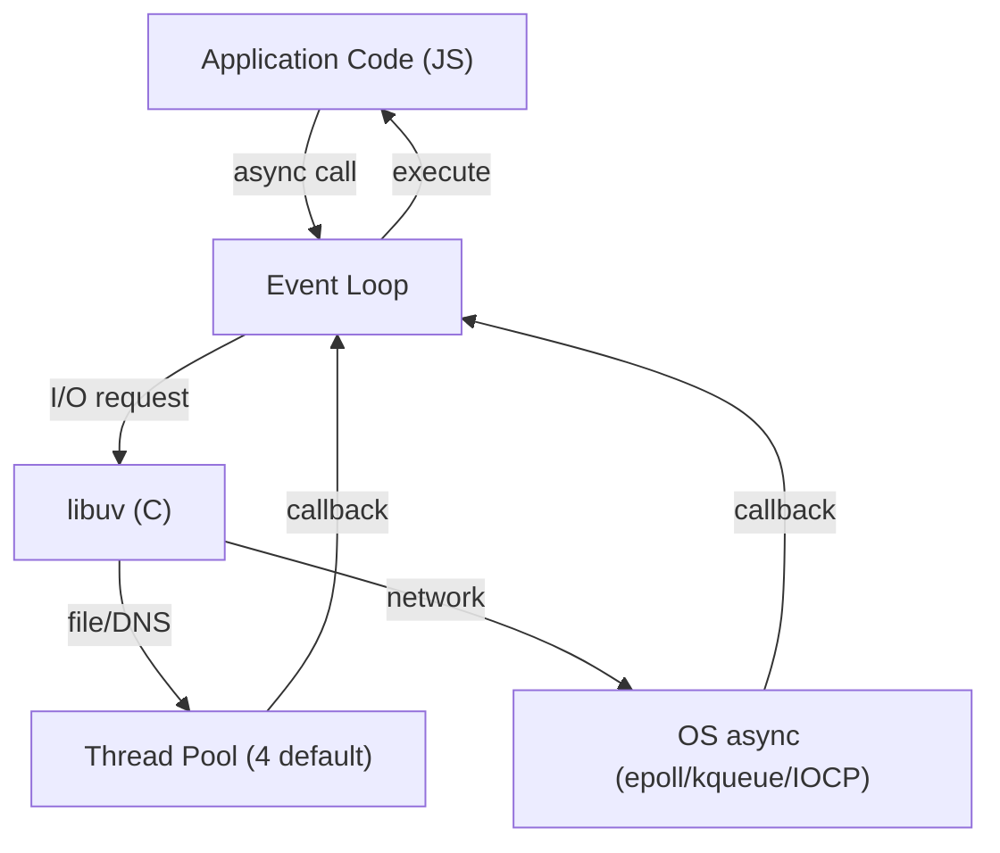

# Node.js: Express, NestJS, Fastify

## Chapter Goal

After reading this chapter, an experienced engineer can explain the
Node.js event loop on a whiteboard, design a graceful shutdown
sequence, choose between Express, Fastify, and NestJS with a
defensible trade-off argument, implement streaming with back-pressure,
handle database transactions with idempotency, and answer interview
questions that distinguish production-grade Node.js thinking from
tutorial-level knowledge.

## Why This Matters for a Tech Lead

Node.js services sit on the hot path of most web products. A Tech Lead
must:

- Own the framework standard for the backend team and defend the
  choice with cost, hiring, and operational arguments.
- Ensure every service handles graceful shutdown, back-pressure, and
  connection pool exhaustion correctly.
- Decide when CPU-bound work should stay in-process (worker threads)
  versus move to a separate service.
- Set observability defaults (structured logging, tracing, metrics) so
  that on-call engineers can debug without reading source code.
- Govern dependency hygiene: lockfiles, audit cadence, and the
  decision between npm, pnpm, and yarn.

A single Node.js misconfiguration — a missing graceful shutdown, a
synchronous crypto call on the main thread, an unhandled promise
rejection — can take down production for thousands of users.

## Mental Model

Node.js is **single-threaded JavaScript on top of a multi-threaded
I/O engine (libuv)**. The event loop processes callbacks one at a time.
I/O operations (network, file system, DNS) are delegated to libuv's
thread pool or OS-level async primitives. The result: thousands of
concurrent connections with one thread, as long as no callback blocks.



The event loop has phases (timers → pending callbacks → idle/prepare →
poll → check → close callbacks). Each phase drains its queue before
moving to the next. Microtasks (`Promise.then`, `queueMicrotask`) run
between every phase transition. `process.nextTick` runs before
microtasks.

The key constraint: if any callback takes longer than ~50ms, all other
connections wait. This is why CPU-heavy work must be offloaded.

## Core Terminology

| Term | Definition |
| --- | --- |
| **Event loop** | The single-threaded loop that processes I/O callbacks, timers, and microtasks in phases. |
| **libuv** | The C library that provides Node.js with async I/O, a thread pool, and cross-platform abstractions. |
| **Thread pool** | A pool of worker threads (default 4, configurable via `UV_THREADPOOL_SIZE`) used for file I/O, DNS, and crypto. |
| **Worker thread** | A separate V8 isolate with its own event loop, communicating via `MessagePort`. |
| **Cluster** | A pattern using `child_process.fork()` to spawn multiple Node.js processes sharing a server port. |
| **Stream** | An abstraction for sequential data processing: Readable, Writable, Transform, Duplex. |
| **Back-pressure** | The mechanism by which a slow consumer signals a fast producer to pause, preventing memory exhaustion. |
| **Graceful shutdown** | The process of stopping a server by draining in-flight requests before closing connections. |
| **Middleware** | A function that intercepts the request/response cycle (Express/Fastify pattern). |
| **Dependency injection (DI)** | A pattern where dependencies are provided externally rather than constructed internally (NestJS pattern). |
| **Schema-driven validation** | Validating request/response data against a JSON Schema or equivalent at the framework level (Fastify pattern). |

Distinguish closely related terms:

- **Concurrency vs parallelism**: Node.js achieves concurrency (many
  in-flight operations) on one thread. Parallelism (simultaneous
  execution) requires worker threads or cluster.
- **Stream vs buffer**: A stream processes data in chunks
  sequentially; a buffer holds the entire payload in memory.
- **process.nextTick vs queueMicrotask**: Both run before the next
  event loop phase, but `nextTick` runs first and can starve I/O if
  called recursively.

## Theoretical Foundation

### The Node.js runtime

Node.js combines V8 (JavaScript engine), libuv (async I/O), and a set
of C++ bindings into a runtime that executes JavaScript outside the
browser.

**V8** compiles JavaScript to machine code via JIT (TurboFan). It
manages the heap (garbage collection) and the call stack. V8's
generational GC (Scavenge for young generation, Mark-Sweep/Compact
for old generation) pauses the main thread — this is why large heaps
(>1.5 GB) cause noticeable GC pauses.

**libuv** provides:
- An event loop implementation.
- A thread pool for blocking operations (file I/O, DNS lookup,
  `crypto.pbkdf2`, `zlib`).
- OS-level async for network I/O (epoll on Linux, kqueue on macOS,
  IOCP on Windows).

The runtime is single-threaded for JavaScript execution but
multi-threaded for I/O. This distinction is fundamental.

**Common mistake:** Assuming "single-threaded" means Node.js cannot
utilize multiple cores. In reality, libuv's thread pool handles
concurrent I/O, and worker threads / cluster provide explicit
parallelism.

**Production consideration:** The default thread pool size is 4.
Services with heavy file I/O or DNS lookups can saturate the pool,
causing I/O latency to spike. Set `UV_THREADPOOL_SIZE` (max 1024)
based on the I/O profile. Monitor with `uv_metrics_info` or
OpenTelemetry.

**Tech Lead perspective:** The "single-threaded" model is both
Node.js's strength (no locks, no data races, low memory per
connection) and its constraint (one blocking callback starves all
clients). The Tech Lead must ensure the team understands this
contract: keep the event loop clear, measure event loop lag, and
have a clear policy for offloading CPU work.

**Interview framing:** "Node.js is a single-threaded JavaScript
runtime on top of libuv's multi-threaded I/O engine. JavaScript runs
in one V8 isolate — no parallelism, no shared-memory races. I/O is
delegated to the OS (epoll/kqueue for network) or libuv's thread pool
(for file/DNS/crypto). This gives high concurrency with low memory,
as long as callbacks stay under 50ms."

### Event loop phases

```text
   ┌───────────────────────────┐
┌─>│         timers            │  setTimeout, setInterval callbacks
│  └──────────┬────────────────┘
│  ┌──────────┴────────────────┐
│  │     pending callbacks     │  I/O callbacks deferred from previous loop
│  └──────────┬────────────────┘
│  ┌──────────┴────────────────┐
│  │     idle, prepare         │  Internal use only
│  └──────────┬────────────────┘
│  ┌──────────┴────────────────┐
│  │         poll              │  Retrieve new I/O events; execute I/O callbacks
│  └──────────┬────────────────┘
│  ┌──────────┴────────────────┐
│  │         check             │  setImmediate callbacks
│  └──────────┬────────────────┘
│  ┌──────────┴────────────────┐
│  │     close callbacks       │  socket.on('close')
│  └──────────┴────────────────┘
└──────────────────────────────────┘
```

Between every phase: microtask queue drains (Promise callbacks,
`queueMicrotask`). Before microtasks: `process.nextTick` callbacks
drain.

The poll phase is where the event loop spends most of its time — it
waits for new I/O events with a calculated timeout. If no timers are
scheduled and no `setImmediate` is pending, the poll phase blocks
indefinitely (until an I/O event arrives). This is why an idle Node.js
process uses near-zero CPU.

```ts
// Execution order demonstration
setTimeout(() => console.log("1: timer"), 0);
setImmediate(() => console.log("2: immediate"));
Promise.resolve().then(() => console.log("3: microtask"));
process.nextTick(() => console.log("4: nextTick"));
// Output: 4, 3, then 1 or 2 (order of 1/2 is non-deterministic outside I/O)
```

**Common mistake:** Using `process.nextTick` recursively — it starves
I/O because nextTick drains completely before any I/O callback runs.
Prefer `setImmediate` for deferring work without blocking the loop.

**Production consideration:** Monitor event loop lag with
`monitorEventLoopDelay()` (available since Node 11). A p99 above
100ms means callbacks are taking too long. Profile with `--prof`,
`clinic.js doctor`, or the `perf_hooks` module to identify the
blocking function.

```ts
import { monitorEventLoopDelay } from "node:perf_hooks";

const h = monitorEventLoopDelay({ resolution: 20 });
h.enable();

setInterval(() => {
  const p99 = h.percentile(99) / 1e6; // nanoseconds to ms
  if (p99 > 100) logger.warn({ p99 }, "Event loop lag high");
  h.reset();
}, 5000);
```

**Tech Lead perspective:** Event loop lag is the single most important
health metric for a Node.js service. If it trends up after a deploy,
roll back first, profile later. Set team alerts at p99 > 50ms
(warning) and p99 > 200ms (critical). Include event loop lag in the
readiness probe logic — a lagging instance should stop receiving
traffic.

**Interview framing:** "The event loop has six phases. The poll phase
is where I/O callbacks execute. Microtasks (Promises) and
`process.nextTick` drain between every phase transition — nextTick
first, then microtasks. The practical implication: a tight
`process.nextTick` loop starves all I/O. In production, I monitor
event loop delay as a p99 metric and alert when it exceeds 100ms."

> Verify against official documentation. The exact ordering of
> `process.nextTick` relative to microtasks has been refined across
> Node.js versions.

### Streams and back-pressure

Streams are Node.js's answer to processing large data without loading
it all into memory:

- **Readable**: emits `data` events or is consumed via `for await`.
- **Writable**: accepts data via `.write()`, returns `false` when its
  internal buffer is full (back-pressure signal).
- **Transform**: a Duplex stream that modifies data in transit.
- **Duplex**: both readable and writable (e.g. a TCP socket).

Back-pressure works automatically when using `.pipe()` or the pipeline
API: if the writable returns `false`, the readable pauses until
`drain` fires.

```ts
import { pipeline } from "node:stream/promises";
import { createReadStream, createWriteStream } from "node:fs";
import { createGzip } from "node:zlib";

await pipeline(
  createReadStream("input.log"),
  createGzip(),
  createWriteStream("input.log.gz"),
);
```

The pipeline API handles errors and cleanup automatically. The common
mistake: using `.pipe()` without error handling (errors on the source
do not propagate to the destination).

**Practical example — streaming a database export:**

```ts
import { Transform } from "node:stream";
import { pipeline } from "node:stream/promises";

const toCSV = new Transform({
  objectMode: true,
  transform(row, _encoding, callback) {
    callback(null, `${row.id},${row.name},${row.email}\n`);
  },
});

app.get("/export/users", async (req, res) => {
  res.setHeader("Content-Type", "text/csv");
  res.setHeader("Content-Disposition", "attachment; filename=users.csv");
  const cursor = db.user.findMany({ cursor: true });
  await pipeline(cursor, toCSV, res);
});
```

This serves a CSV of millions of rows without loading them all into
memory. The database cursor produces rows, the Transform converts them,
and the HTTP response consumes them — all with automatic
back-pressure.

**Common mistake:** Calling `res.write()` in a loop without checking
its return value. If the client reads slowly (mobile on 3G), the
response buffer grows until the process runs out of memory. Always
respect `false` from `.write()` and wait for `drain`.

**Production consideration:** Set `highWaterMark` deliberately.
The default is 16 KB for byte streams and 16 objects for object-mode
streams. For high-throughput services, a larger buffer improves
throughput at the cost of memory. For memory-constrained environments,
reduce it.

**Tech Lead perspective:** Streams are the correct abstraction for
file uploads, CSV exports, log processing, and any endpoint that
handles data larger than available RAM. The team should default to
streaming for any endpoint that could return >1 MB. Enforce via code
review: if a handler calls `JSON.stringify(largeArray)` and sends it
in one shot, flag it.

**Interview framing:** "Streams process data in chunks with
back-pressure: the writable signals the readable to pause when its
buffer is full. I always use the `pipeline` API over `.pipe()` because
it handles errors and cleanup. In production, I set `highWaterMark`
based on the memory budget and monitor stream backlog as a metric."

### Buffers and the file system

A `Buffer` is a fixed-size chunk of memory outside the V8 heap,
used for binary data (files, network packets, crypto). Buffers are
not resizable — concatenation creates new buffers.

```ts
// Safe buffer creation (zero-filled)
const buf = Buffer.alloc(1024);

// Unsafe (faster, but contains old memory — never expose to users)
const fast = Buffer.allocUnsafe(1024);

// From string
const encoded = Buffer.from("hello", "utf-8");
```

`Buffer.allocUnsafe` is faster because it skips zero-filling, but
the memory may contain sensitive data from previous allocations. Use
only for buffers that will be fully overwritten before being read.

File system operations have sync and async variants. The async
variants use the libuv thread pool (default 4 threads). For
high-throughput file I/O, increase `UV_THREADPOOL_SIZE` or use
`fs.promises` with limited concurrency.

```ts
import { readFile, writeFile, stat } from "node:fs/promises";
import { createReadStream } from "node:fs";

// Small files: read entirely (acceptable for config, templates)
const config = JSON.parse(await readFile("config.json", "utf-8"));

// Large files: stream (never load a 500 MB log into memory)
const stream = createReadStream("access.log", { highWaterMark: 64 * 1024 });
```

**Common mistake:** Using `fs.readFileSync` in a request handler.
It blocks the event loop for the duration of the disk read. A 100ms
file read blocks all other connections for 100ms. Use `fs.promises`
or streams.

**Common mistake:** Concatenating buffers with `Buffer.concat` in a
loop for every incoming chunk. This creates a new allocation per
iteration. Instead, push chunks into an array and `Buffer.concat`
once at the end, or use streams to avoid accumulating entirely.

**Production consideration:** The libuv thread pool is shared between
file I/O, DNS, and crypto. If a service performs heavy file operations,
the thread pool saturates and DNS lookups become slow. Set
`UV_THREADPOOL_SIZE=16` or higher for I/O-heavy services. Monitor
thread pool utilization with libuv metrics.

**Tech Lead perspective:** Most backend services should not perform
heavy file I/O directly. Upload to object storage (S3) via streaming,
serve static files from a CDN, and use a database for structured data.
If file processing is required (PDF generation, image resize), move
it to a dedicated worker service with its own thread pool budget.

**Interview framing:** "Buffers are fixed-size memory allocations
outside V8's heap, used for binary data. The key mistake is using
`readFileSync` in a handler — it blocks the entire event loop. In
production, I use `fs/promises` for small files and streams for large
ones, and I size `UV_THREADPOOL_SIZE` based on the service's I/O
profile."

### Process management

- **`process.env`**: environment variables. Load at startup, validate
  with a schema (Zod, `envalid`), and freeze. Never access `process.env`
  deep in business logic — inject config.
- **`process.exit()`**: forcefully terminates. Avoid — use signal
  handlers for graceful shutdown.
- **Signals**: `SIGTERM` (Kubernetes sends this), `SIGINT` (Ctrl+C).
  Handle both to drain connections before exiting.
- **Unhandled rejections**: Node.js terminates on unhandled promise
  rejections (since v15). Always handle errors in async code.
- **`process.memoryUsage()`**: returns `rss`, `heapUsed`, `heapTotal`,
  `external`, and `arrayBuffers`. Monitor `heapUsed` trending upward
  over hours — it signals a memory leak.

**Environment variable validation pattern:**

```ts
import { z } from "zod";

const EnvSchema = z.object({
  NODE_ENV: z.enum(["development", "production", "test"]),
  PORT: z.coerce.number().int().min(1).max(65535),
  DATABASE_URL: z.string().url(),
  REDIS_URL: z.string().url(),
  JWT_SECRET: z.string().min(32),
  LOG_LEVEL: z.enum(["debug", "info", "warn", "error"]).default("info"),
});

export const env = EnvSchema.parse(process.env);
```

Call this at startup. If validation fails, the process exits
immediately with a clear error — not 10 minutes later with a cryptic
`undefined` crash.

**Common mistake:** Accessing `process.env.DATABASE_URL` deep in a
service method. Environment variables are strings, unvalidated, and
globally mutable. One misspelling causes a runtime crash far from the
source. Validate once, inject the typed config everywhere.

**Production consideration:** Container orchestrators send SIGTERM
and expect the process to exit within a grace period (default 30s in
Kubernetes). If the process does not exit, SIGKILL arrives (uncatchable).
Design shutdown to complete within 10–15s, leaving margin for the
orchestrator.

**Tech Lead perspective:** Every service must have a startup validation
step that fails fast on misconfiguration. The worst production
incidents come from silent misconfiguration: a missing env var that
defaults to `undefined`, causing the service to connect to the wrong
database or skip auth. Fail loud and early.

**Interview framing:** "I validate all environment variables at
startup with a schema — if any are missing or invalid, the process
exits immediately. For shutdown, I handle SIGTERM by draining
in-flight requests with a 10-second timeout, then closing pools and
exiting. This ensures zero dropped requests during deploys."

### Clustering and worker threads

**Cluster mode** forks multiple processes sharing the same port.
Each process has its own event loop and memory. Use for:
multi-core utilization when the workload is I/O-bound.

```ts
import cluster from "node:cluster";
import { cpus } from "node:os";

if (cluster.isPrimary) {
  for (let i = 0; i < cpus().length; i++) cluster.fork();
  cluster.on("exit", (worker) => cluster.fork());
} else {
  startServer();
}
```

**Worker threads** share memory via `SharedArrayBuffer` and
communicate via `MessagePort`. Use for: CPU-bound work
(image processing, crypto, parsing large JSON) without blocking
the main event loop.

```ts
import { Worker, isMainThread, parentPort, workerData } from "node:worker_threads";

if (isMainThread) {
  const worker = new Worker(import.meta.filename, {
    workerData: { iterations: 1_000_000 },
  });
  worker.on("message", (result) => console.log("Done:", result));
  worker.on("error", (err) => console.error("Worker failed:", err));
} else {
  const result = heavyComputation(workerData.iterations);
  parentPort!.postMessage(result);
}
```

For production, use a worker pool library (`piscina`, `workerpool`)
to avoid the overhead of spawning a new thread per request:

```ts
import Piscina from "piscina";

const pool = new Piscina({
  filename: "./hash-worker.js",
  maxThreads: 4,
});

app.post("/hash", async (req, res) => {
  const hash = await pool.run(req.body.password);
  res.json({ hash });
});
```

In container environments, prefer a single process per container and
scale via Kubernetes replicas. Cluster mode inside a container
complicates health checks and graceful shutdown.

**Common mistake:** Using cluster mode inside a Docker container.
Each forked process reports health independently, but Kubernetes
sends SIGTERM to the primary only. Workers may not drain correctly.
Additionally, `N` workers × `M` pods = `N×M` processes competing for
connections — pool sizes must account for this multiplication.

**Common mistake:** Spawning a new `Worker` per request. Thread
creation is expensive (~5ms + memory allocation). A pool amortizes
this cost across requests.

**Production consideration:** Worker threads share the process memory
limit (`--max-old-space-size`). If the main thread uses 500 MB and
4 workers each use 200 MB, total heap is 1.3 GB — close to the
default limit. Size the container memory to account for all threads.

**Tech Lead perspective:** The decision between cluster, worker
threads, and a separate service depends on isolation requirements.
Cluster: legacy pattern for pre-Kubernetes environments. Worker
threads: good for occasional CPU spikes (<5% of requests). Separate
service: when CPU work needs independent scaling, different SLOs, or
should not crash the API on failure.

**Interview framing:** "I use worker threads for CPU-bound work that
occurs occasionally — like image resizing or bcrypt hashing — with a
pool library like `piscina` to avoid per-request thread creation
overhead. For workloads that need independent scaling, I extract to a
separate service behind a queue. In containers, I avoid cluster mode
and let Kubernetes handle horizontal scaling."

### Error handling

Node.js errors come from three sources:

1. **Synchronous throws** — caught by `try/catch`.
2. **Callback errors** — the error-first callback pattern
   `(err, result)`.
3. **Promise rejections** — caught by `.catch()` or `try/catch`
   in `async` functions.

**Domain error class hierarchy:**

```ts
export class AppError extends Error {
  constructor(
    message: string,
    public readonly code: string,
    public readonly statusCode: number,
    public readonly isOperational: boolean = true,
  ) {
    super(message);
    this.name = this.constructor.name;
    Error.captureStackTrace(this, this.constructor);
  }
}

export class NotFoundError extends AppError {
  constructor(resource: string, id: string) {
    super(`${resource} ${id} not found`, "NOT_FOUND", 404);
  }
}

export class ConflictError extends AppError {
  constructor(message: string) {
    super(message, "CONFLICT", 409);
  }
}

export class ValidationError extends AppError {
  constructor(public readonly details: Record<string, string[]>) {
    super("Validation failed", "VALIDATION_ERROR", 400);
  }
}

export class ExternalServiceError extends AppError {
  constructor(service: string, cause?: Error) {
    super(`${service} is unavailable`, "EXTERNAL_SERVICE_ERROR", 502, true);
    this.cause = cause;
  }
}
```

**What this does:** A typed error hierarchy that separates operational
errors (expected, handled gracefully) from programmer errors
(unexpected, should crash). Each error carries a machine-readable
`code`, HTTP `statusCode`, and an `isOperational` flag.

**Why it is useful:** Error middleware can classify by type:
operational errors return their status code with a structured body;
programmer errors (no `isOperational` flag) return 500 and trigger
an alert. Shared as an internal package across all services.

**Common mistake:** Using generic `Error` everywhere and checking
`message` strings in error handlers. Messages change; codes do not.

**How this changes in production:** Add a `toJSON()` method for
serialization, include `requestId` in the response, and ensure
`stack` is logged but never returned to clients.

Production rules:
- Never swallow errors silently.
- Attach `process.on("unhandledRejection")` for monitoring, not
  recovery.
- Use domain-specific error classes with codes for structured
  handling.
- Crash on programmer errors (e.g. `TypeError`); recover from
  operational errors (e.g. network timeout).

### Logging

Use structured JSON logging (`pino`, `winston` with JSON transport).
Never use `console.log` in production — it is synchronous, unstructured,
and cannot be parsed by log aggregators.

```ts
import pino from "pino";
import { AsyncLocalStorage } from "node:async_hooks";

const als = new AsyncLocalStorage<{ requestId: string; userId?: string }>();

const logger = pino({
  level: process.env.LOG_LEVEL ?? "info",
  redact: ["req.headers.authorization", "*.password", "*.token"],
  mixin: () => als.getStore() ?? {},
  serializers: { err: pino.stdSerializers.err },
});

// Middleware: sets correlation context per request
app.use((req, res, next) => {
  const requestId = (req.headers["x-request-id"] as string) ?? crypto.randomUUID();
  res.setHeader("X-Request-Id", requestId);
  als.run({ requestId }, () => next());
});

// Every log call automatically includes requestId + userId
logger.info({ orderId }, "Order created");
// Output: {"level":"info","requestId":"abc-123","userId":"user-42","orderId":"ord-1","msg":"Order created"}
```

**What this does:** Pino's `mixin` function pulls the current
`AsyncLocalStorage` context into every log line automatically. No need
to pass `requestId` through function parameters.

**Why it is useful:** On-call engineers filter logs by `requestId` to
see the full request lifecycle. Distributed tracing tools correlate
logs across services using the same ID propagated via headers.

**Common mistake:** Passing a logger instance through every function.
This pollutes signatures and is fragile (one function forgets to pass
it, context is lost). `AsyncLocalStorage` eliminates this.

**How this changes in production:** Add `traceId` and `spanId` from
OpenTelemetry context. Add `tenantId` for multi-tenant log filtering.
Configure log routing: errors to an alerting pipeline, access logs to
cold storage.

Key decisions:
- Log level per environment (debug in dev, info in production).
- Request-scoped context (request ID, user ID) via `AsyncLocalStorage`.
- Redact sensitive fields (passwords, tokens) via pino redaction.

### Package managers: npm, pnpm, yarn

| Feature | npm | pnpm | yarn (berry) |
| --- | --- | --- | --- |
| **Disk usage** | Duplicate copies | Hard-linked store (saves 50–70%) | PnP (zero copies) or node_modules |
| **Speed** | Moderate | Fastest for cold installs | Fast with cache |
| **Lockfile** | `package-lock.json` | `pnpm-lock.yaml` | `yarn.lock` |
| **Workspace support** | Yes (v7+) | Yes (native) | Yes (native) |
| **Strictness** | Flat `node_modules` (phantom deps possible) | Isolated `node_modules` (no phantom deps) | PnP eliminates `node_modules` |
| **Monorepo fit** | Adequate | Excellent | Excellent |

Tech Lead decision: choose one and enforce it. Mixing package managers
in a monorepo causes lockfile conflicts and phantom dependency issues.

### ESM vs CommonJS

| Aspect | CommonJS (CJS) | ES Modules (ESM) |
| --- | --- | --- |
| **Syntax** | `require()` / `module.exports` | `import` / `export` |
| **Loading** | Synchronous | Asynchronous |
| **Tree-shaking** | Not possible | Supported by bundlers |
| **Top-level await** | Not supported | Supported |
| **Default in Node** | Yes (without `"type": "module"`) | Requires `"type": "module"` or `.mjs` |

The migration pain: CJS and ESM cannot freely interop. CJS can
`import()` ESM (async only). ESM can import CJS via default import
but not named exports (in some configurations).

```ts
// ESM importing CJS (works — but only default import)
import express from "express"; // OK
// import { Router } from "express"; // May fail in some configs

// CJS importing ESM (must be async)
const { someUtil } = await import("./esm-module.mjs");
```

**The `"exports"` field** controls what consumers see:

```json
{
  "name": "my-library",
  "type": "module",
  "exports": {
    ".": {
      "import": "./dist/index.mjs",
      "require": "./dist/index.cjs"
    }
  }
}
```

This dual-package pattern lets the same library work in both ESM and
CJS consumers. The cost: two build outputs to maintain and test.

**Common mistake:** Adding `"type": "module"` to `package.json`
without updating all relative imports to include file extensions.
ESM requires explicit extensions (`./utils.js`, not `./utils`). This
breaks existing code silently.

**Common mistake:** Importing a CJS-only library in ESM and expecting
named exports. CJS modules export a single `module.exports` object;
in ESM this becomes the default import. Named exports are not
guaranteed to work (depends on Node's static analysis heuristic).

**Production consideration:** Some popular packages are still CJS-only
(at the time of writing). Before migrating to ESM, audit dependencies
for compatibility. Use `are-the-types-wrong` or `publint` to verify.
For libraries you publish: ship both ESM and CJS via the `"exports"`
field.

**Tech Lead perspective:** The ESM migration is worth it for new
projects (tree-shaking, top-level await, standards alignment). For
large existing codebases, migrate incrementally: start with leaf
modules, work inward. Set a deadline but do not block feature work.
The worst outcome is a half-migrated codebase with mixed module
systems causing intermittent import failures.

**Migration checklist:**
- [ ] Add `"type": "module"` to `package.json`.
- [ ] Update all relative imports to include `.js` extension.
- [ ] Replace `__dirname`/`__filename` with `import.meta.url` +
      `fileURLToPath`.
- [ ] Replace `require.resolve` with `import.meta.resolve`.
- [ ] Update test runner config (Jest needs `--experimental-vm-modules`
      or switch to Vitest which is ESM-native).
- [ ] Verify all dependencies work under ESM.
- [ ] Update CI to ensure no CJS regressions.

**Interview framing:** "New projects should use ESM — it enables
tree-shaking, top-level await, and aligns with the standard. The
migration challenge is interop: CJS libraries import via default only,
relative imports need explicit extensions, and `__dirname` doesn't
exist. I migrate incrementally, starting from leaf modules, and audit
dependencies for ESM compatibility before committing."

> Verify against official documentation. ESM interop behavior changes
> across Node.js versions. Check the current LTS documentation.

### Express: middleware architecture

Express is a minimal HTTP framework built on a middleware pipeline:

```ts
import express from "express";

const app = express();

app.use(express.json({ limit: "1mb" }));
app.use(requestIdMiddleware);
app.use(requestLogger);
app.use("/api/users", userRouter);
app.use(notFoundHandler);
app.use(errorHandler);
```

Middleware executes in registration order. Each middleware receives
`(req, res, next)` and must call `next()` or send a response.

**Routing** uses method-based handlers mounted on paths:

```ts
import { Router } from "express";

const router = Router();

router.get("/", listUsers);
router.get("/:id", getUser);
router.post("/", validateBody(CreateUserSchema), createUser);
router.put("/:id", validateBody(UpdateUserSchema), updateUser);
router.delete("/:id", deleteUser);

export default router;
```

Route parameters (`:id`) are accessible via `req.params`. Mount
routers on path prefixes for modular organization. Use middleware
at the router level for route-specific concerns (auth, validation).

**Typed request validation middleware** with Zod:

```ts
import { z, ZodSchema } from "zod";

const CreateUserSchema = z.object({
  name: z.string().min(1).max(100),
  email: z.string().email(),
  role: z.enum(["user", "admin"]).default("user"),
});

type CreateUserInput = z.infer<typeof CreateUserSchema>;

function validateBody<T>(schema: ZodSchema<T>) {
  return (req: Request, res: Response, next: NextFunction) => {
    const result = schema.safeParse(req.body);
    if (!result.success) return next(new ZodError(result.error.issues));
    req.body = result.data; // req.body is now typed and sanitized
    next();
  };
}

router.post("/", validateBody(CreateUserSchema), asyncHandler(async (req, res) => {
  const data: CreateUserInput = req.body; // type-safe after validation
  const user = await userService.create(data);
  res.status(201).json({ data: user });
}));
```

**What this does:** Validates the request body against a Zod schema,
strips unknown fields, and provides TypeScript type inference for
the handler. Invalid requests are forwarded to error middleware.

**Why it is useful:** The schema is the single source of truth for both
runtime validation and TypeScript types (`z.infer`). Handlers
receive pre-validated, typed data — no `as any` casts needed.

**Common mistake:** Validating inside the handler (mixes concerns) or
not using `z.infer` (duplicates the type definition manually).

**How this changes in production:** Add `validateQuery()` and
`validateParams()` variants. Wrap all three in a single `validate({
body, query, params })` middleware for consistency across endpoints.

**Error middleware** has four parameters: `(err, req, res, next)`.
Express detects the arity and routes errors to it:

```ts
import { ZodError } from "zod";

function errorHandler(err: Error, req: Request, res: Response, next: NextFunction) {
  const requestId = req.headers["x-request-id"];

  if (err instanceof ZodError) {
    res.status(400).json({ error: "Validation failed", details: err.flatten(), requestId });
    return;
  }

  if (err instanceof AppError && err.isOperational) {
    res.status(err.statusCode).json({ error: err.message, code: err.code, requestId });
    return;
  }

  logger.error({ err, path: req.path, requestId }, "Unhandled error");
  res.status(500).json({ error: "Internal server error", requestId });
}
```

The error handler classifies errors: validation errors return 400 with
details, operational errors return their specific status, and
unexpected errors return 500 without leaking internals. All responses
share a consistent contract:

```ts
// Structured error response contract — all errors conform to this shape
interface ErrorResponse {
  error: string;           // human-readable message
  code?: string;           // machine-readable error code (e.g. "NOT_FOUND")
  details?: unknown;       // validation details, field-level errors
  requestId?: string;      // for correlating with server logs
}
```

**What this does:** Defines a single error shape that all API
consumers can rely on — enabling programmatic error handling without
parsing message strings.

**Why it is useful:** External consumers write one error handler. On-call
engineers search logs by `requestId`. Machine-readable `code` enables
client-side branching (`if code === "INSUFFICIENT_STOCK"`).

**Common mistake:** Leaking stack traces in production (`err.stack` in
the response). Or returning different error shapes from different
endpoints — clients cannot handle errors uniformly.

**How this changes in production:** Add a `Sentry.captureException()`
call for non-operational errors. Add `X-Request-Id` response header
so clients can reference it in support tickets.

**Async handler wrapper** — Express 4 does not propagate rejected
Promises to error middleware:

```ts
type AsyncHandler = (req: Request, res: Response, next: NextFunction) => Promise<void>;

function asyncHandler(fn: AsyncHandler) {
  return (req: Request, res: Response, next: NextFunction) => {
    fn(req, res, next).catch(next);
  };
}

router.get("/:id", asyncHandler(async (req, res) => {
  const user = await userService.findById(req.params.id);
  if (!user) throw new NotFoundError("User not found");
  res.json(user);
}));
```

**Common mistake:** Forgetting to call `next()`. The request hangs
until the client times out. This is invisible in development (short
timeouts) but causes cascading failures in production (connection pool
exhaustion).

**Common mistake:** Registering error middleware before route handlers.
Express processes middleware in order — error middleware must be last.

**Common mistake:** Not wrapping async handlers. Express 4 does not
catch Promise rejections — the request hangs and memory leaks. Use
`asyncHandler` or upgrade to Express 5.

**Production consideration:** Set `express.json({ limit: "1mb" })` to
prevent large-payload DoS. Add `helmet` for security headers. Add
request timeout middleware (kill requests that take too long). Set
`trust proxy` correctly behind a load balancer so `req.ip` returns
the real client IP.

**Tech Lead perspective:** Express's strength is its simplicity and
ecosystem breadth. Its weakness is the absence of guardrails: no
built-in validation, no DI, no structure enforcement. For teams >5
engineers, Express requires explicit conventions (directory structure,
error handling pattern, middleware order) documented in an ADR.
Without conventions, each developer creates their own patterns.

**Interview framing:** "Express processes middleware as a pipeline in
registration order. Error middleware has four parameters — Express
detects the arity. The key gap: Express 4 doesn't handle async errors
natively. I wrap handlers with an asyncHandler utility that catches
rejections and passes them to error middleware. In production, I set
body limits, add helmet, and ensure error middleware returns structured
responses with request IDs for traceability."

### Fastify: schema-driven performance

Fastify uses JSON Schema for request/response validation and
serialization:

```ts
import Fastify from "fastify";

const app = Fastify({ logger: true });

app.post("/users", {
  schema: {
    body: {
      type: "object",
      required: ["name", "email"],
      properties: {
        name: { type: "string", minLength: 1 },
        email: { type: "string", format: "email" },
      },
    },
    response: { 201: { type: "object", properties: { id: { type: "string" } } } },
  },
}, async (request, reply) => {
  const user = await createUser(request.body);
  reply.status(201).send({ id: user.id });
});
```

**Response schema** is critical: it strips undeclared fields before
sending. This prevents leaking internal data (passwords, tokens) even
if the handler accidentally includes them.

**Plugin encapsulation** — Fastify's core architecture pattern:

```ts
import fp from "fastify-plugin";

async function dbPlugin(app: FastifyInstance, opts: { connectionString: string }) {
  const pool = new Pool({ connectionString: opts.connectionString });
  app.decorate("db", pool);
  app.addHook("onClose", async () => pool.end());
}

export default fp(dbPlugin);

// Usage in a route plugin
async function userRoutes(app: FastifyInstance) {
  app.get("/users/:id", async (request, reply) => {
    const { rows } = await app.db.query("SELECT * FROM users WHERE id = $1", [request.params.id]);
    if (!rows[0]) return reply.status(404).send({ error: "Not found" });
    return rows[0];
  });
}

app.register(dbPlugin, { connectionString: env.DATABASE_URL });
app.register(userRoutes, { prefix: "/api" });
```

Plugins registered with `fastify-plugin` (`fp`) share their
decorators with the parent scope. Without `fp`, decorators are
scoped to the plugin and invisible to siblings.

**Lifecycle hooks** provide fine-grained control:

| Hook | Runs | Use case |
| --- | --- | --- |
| `onRequest` | Before parsing | Auth, rate limiting |
| `preParsing` | Before body parse | Decompression, decryption |
| `preValidation` | Before schema validation | Body transforms |
| `preHandler` | After validation, before handler | Permission checks |
| `preSerialization` | Before response serialization | Response transforms |
| `onSend` | Before sending bytes | Headers, compression |
| `onResponse` | After response sent | Logging, metrics |
| `onError` | On error | Error reporting |

```ts
app.addHook("onRequest", async (request, reply) => {
  const apiKey = request.headers["x-api-key"];
  if (!apiKey || !isValidKey(apiKey)) {
    reply.status(401).send({ error: "Invalid API key" });
  }
});
```

Fastify advantages:
- Schema-based validation is ~2x faster than middleware-based (Joi/Zod
  in Express) because `fast-json-stringify` pre-compiles serializers.
- Plugin encapsulation: each plugin has its own scope (decorators,
  hooks, routes). This prevents global state pollution.
- Built-in logging (pino) and request lifecycle hooks.
- Response schemas strip undeclared fields — a security feature.

**Common mistake:** Forgetting `fastify-plugin` wrapper when sharing
decorators. The database decorator remains invisible to route plugins,
causing "decorator not found" errors at runtime.

**Common mistake:** Not defining a response schema. Without it,
Fastify uses `JSON.stringify` (slow) and does not strip extra fields.
The performance benefit and data-leak protection only apply when a
response schema is declared.

**Production consideration:** Fastify compiles validators and
serializers at startup. The first request is always fast. However,
schema compilation takes time (~50ms per complex schema). For
serverless (Lambda), this cold-start cost matters. For long-running
servers, it is negligible.

**Tech Lead perspective:** Fastify's plugin encapsulation scales
better than Express's flat middleware stack. Each domain (users,
orders, payments) lives in its own plugin with its own hooks and
decorators. This enables feature teams to work independently without
cross-contaminating the global app object. The trade-off: the
encapsulation model has a learning curve (scope inheritance is
confusing at first).

**Interview framing:** "Fastify's key architectural difference from
Express is plugin encapsulation and schema-driven validation. Schemas
are compiled at startup into optimized validators and serializers —
this is why Fastify benchmarks significantly faster for JSON-heavy
APIs. Response schemas also prevent data leaks by stripping undeclared
fields. I use lifecycle hooks for cross-cutting concerns: `onRequest`
for auth, `onResponse` for metrics, and `onError` for structured error
reporting."

### NestJS: opinionated enterprise framework

NestJS provides structure via modules, decorators, and dependency
injection. It follows a request processing pipeline:

```text
Request → Guards → Interceptors (before) → Pipes → Handler
→ Interceptors (after) → Exception Filters → Response
```

**Modules** group related controllers, services, and providers.
They define the dependency graph and encapsulation boundaries:

```ts
@Module({
  imports: [DatabaseModule, AuthModule],
  controllers: [UserController],
  providers: [UserService, UserRepository],
  exports: [UserService],
})
export class UserModule {}
```

Modules control what is visible: only `exports` are accessible to
importing modules. This enforces encapsulation — a module's internal
providers are private.

**Common mistake:** Importing a module but forgetting that its
providers are not automatically available. Only `exports`-listed
providers are injectable in other modules.

**Controllers** handle HTTP routing and request/response mapping:

```ts
@Controller("users")
@UseGuards(AuthGuard)
export class UserController {
  constructor(private readonly userService: UserService) {}

  @Post()
  @HttpCode(201)
  @UsePipes(new ValidationPipe({ whitelist: true, forbidNonWhitelisted: true }))
  create(@Body() dto: CreateUserDto, @CurrentUser() user: AuthUser) {
    return this.userService.create(dto, user.id);
  }

  @Get(":id")
  async findOne(@Param("id", ParseUUIDPipe) id: string) {
    const user = await this.userService.findById(id);
    if (!user) throw new NotFoundException("User not found");
    return user;
  }
}
```

Controllers should be thin — they translate HTTP to service calls
and back. Business logic belongs in services.

**Providers/Services** contain business logic, injected via DI:

```ts
@Injectable()
export class UserService {
  constructor(
    private readonly db: PrismaService,
    private readonly eventBus: EventEmitter2,
  ) {}

  async create(dto: CreateUserDto, createdBy: string) {
    const user = await this.db.user.create({
      data: { ...dto, createdBy },
    });
    this.eventBus.emit("user.created", { userId: user.id });
    return user;
  }
}
```

**Dependency injection** — NestJS resolves the dependency tree at
startup based on constructor parameter types. Providers have three
scopes:

| Scope | Lifetime | Use case |
| --- | --- | --- |
| **DEFAULT** (singleton) | Application lifetime | Most services, DB connections |
| **REQUEST** | One per request | Request-scoped context, multi-tenant |
| **TRANSIENT** | New instance per injection | Stateful helpers |

**Common mistake:** Injecting a REQUEST-scoped provider into a
singleton. The singleton holds a stale reference — request data
from user A leaks to user B. NestJS warns about this but many teams
miss it. Use `@Inject(REQUEST)` with `{ scope: Scope.REQUEST }`
deliberately.

**Guards** protect routes (authentication, authorization):

```ts
@Injectable()
export class RolesGuard implements CanActivate {
  constructor(private readonly reflector: Reflector) {}

  canActivate(context: ExecutionContext): boolean {
    const requiredRoles = this.reflector.get<string[]>("roles", context.getHandler());
    if (!requiredRoles) return true;
    const { user } = context.switchToHttp().getRequest();
    return requiredRoles.some((role) => user.roles.includes(role));
  }
}

// Usage with custom decorator
@Post()
@Roles("admin")
@UseGuards(AuthGuard, RolesGuard)
create(@Body() dto: CreateUserDto) { ... }
```

Guards return `true`/`false` (or a Promise thereof). They run before
interceptors and pipes. Use `@SetMetadata` or custom decorators to
pass configuration (roles, permissions) to guards.

**Interceptors** wrap execution (logging, caching, transforms):

```ts
@Injectable()
export class ResponseTransformInterceptor<T> implements NestInterceptor<T, ApiResponse<T>> {
  intercept(context: ExecutionContext, next: CallHandler): Observable<ApiResponse<T>> {
    return next.handle().pipe(
      map((data) => ({
        success: true,
        data,
        timestamp: new Date().toISOString(),
      })),
    );
  }
}
```

Interceptors have access to both the request (before handler) and
the response (after handler via RxJS pipe). Use for: response
wrapping, caching, timeout enforcement, logging.

**Pipes** transform and validate input:

```ts
@Injectable()
export class ZodValidationPipe implements PipeTransform {
  constructor(private schema: ZodSchema) {}

  transform(value: unknown) {
    const result = this.schema.safeParse(value);
    if (!result.success) {
      throw new BadRequestException({
        message: "Validation failed",
        errors: result.error.flatten(),
      });
    }
    return result.data;
  }
}

// Usage
@Post()
create(@Body(new ZodValidationPipe(CreateUserSchema)) dto: CreateUserInput) { ... }
```

NestJS ships a `ValidationPipe` that works with `class-validator`.
For Zod, write a custom pipe (above). Pipes run after guards but
before the handler.

**Exception filters** catch and format errors:

```ts
@Catch()
export class GlobalExceptionFilter implements ExceptionFilter {
  catch(exception: unknown, host: ArgumentsHost) {
    const ctx = host.switchToHttp();
    const response = ctx.getResponse();
    const request = ctx.getRequest();

    let status = 500;
    let message = "Internal server error";
    let code = "INTERNAL_ERROR";

    if (exception instanceof HttpException) {
      status = exception.getStatus();
      message = exception.message;
      code = `HTTP_${status}`;
    }

    logger.error({ err: exception, path: request.url }, message);

    response.status(status).json({
      error: { code, message, requestId: request.id },
    });
  }
}
```

Register globally via `app.useGlobalFilters(new GlobalExceptionFilter())`.
Exception filters are the last line of defense — they catch anything
that escapes handlers, pipes, guards, and interceptors.

**DTOs** define input shapes with `class-validator`:

```ts
export class CreateUserDto {
  @IsString() @MinLength(1) name: string;
  @IsEmail() email: string;
  @IsOptional() @IsString() phone?: string;
  @IsEnum(UserRole) @IsOptional() role?: UserRole;
}

export class UpdateUserDto extends PartialType(CreateUserDto) {}

export class PaginationDto {
  @IsOptional() @IsString() cursor?: string;
  @IsOptional() @Type(() => Number) @IsInt() @Min(1) @Max(100) limit?: number = 20;
}
```

`PartialType` from `@nestjs/mapped-types` makes all fields optional
for update operations. `@Type(() => Number)` transforms string query
params to numbers before validation.

**Common mistake:** Not enabling `whitelist: true` in ValidationPipe.
Without it, extra fields in the request body pass through to the
service — enabling mass assignment attacks.

**Common mistake:** Using `class-validator` without `class-transformer`.
The validation decorators operate on class instances, not plain
objects. Without `class-transformer`, `req.body` is never transformed
into a class instance, and validation is silently skipped.

**Production consideration:** NestJS's DI container and decorator
metadata add startup overhead (~200–500ms for large applications).
In serverless environments (Lambda), this cold-start cost is
significant. Use Fastify as the underlying HTTP adapter (faster than
Express) via `NestFactory.create(AppModule, new FastifyAdapter())`.

**Production consideration:** NestJS's request lifecycle (guards →
interceptors → pipes → handler → interceptors → filters) runs
fully for every request. For high-throughput services (>10k RPS),
benchmark whether the framework overhead is acceptable. For most
CRUD services (1–5k RPS), it is negligible.

**Tech Lead perspective:** NestJS's value is in team consistency, not
individual developer productivity. A single developer is faster with
Express. A team of 15 is faster with NestJS because: new engineers
know where to put code (module/controller/service), cross-cutting
concerns have canonical locations (guards for auth, interceptors for
logging, pipes for validation), and testing is straightforward
(inject mocks via DI). The Tech Lead must enforce the patterns —
NestJS provides structure but does not prevent misuse (fat controllers,
unused DI, business logic in guards).

**Interview framing:** "NestJS processes requests through a pipeline:
Guards → Interceptors → Pipes → Handler → Interceptors → Filters.
Guards handle auth (return true/false), Pipes handle validation
(transform or throw), Interceptors wrap execution (logging, caching),
and Filters catch exceptions. DI makes testing straightforward —
inject mocks for any dependency. The key risk is DI scope confusion:
injecting a request-scoped provider into a singleton causes data
leakage between requests."

### Validation patterns

Validate at the boundary — before business logic touches the data:

| Framework | Approach | Performance | DX |
| --- | --- | --- | --- |
| **Express** | Middleware (Zod, Joi, express-validator) | Moderate (runtime parse) | Flexible, library-dependent |
| **Fastify** | JSON Schema in route options (compiled at startup) | Fastest (pre-compiled) | Verbose schema syntax |
| **NestJS** | ValidationPipe + class-validator decorators | Moderate (reflection-based) | Decorator-based, co-located |

Production rule: validate request bodies, query parameters, path
parameters, and headers. Reject invalid input with 400 and structured
error messages.

**Express validation with Zod:**

```ts
import { z } from "zod";
import type { Request, Response, NextFunction } from "express";

function validate<T>(schema: z.ZodSchema<T>) {
  return (req: Request, res: Response, next: NextFunction) => {
    const result = schema.safeParse(req.body);
    if (!result.success) {
      res.status(400).json({
        error: "Validation failed",
        details: result.error.flatten(),
      });
      return;
    }
    req.body = result.data;
    next();
  };
}

const CreateOrderSchema = z.object({
  productId: z.string().uuid(),
  quantity: z.number().int().min(1).max(100),
  idempotencyKey: z.string().uuid(),
});

router.post("/orders", validate(CreateOrderSchema), asyncHandler(createOrder));
```

**Common mistake:** Validating only the body but ignoring query
parameters and path parameters. An attacker can pass `?limit=999999`
or `:id=../../secret` if not validated.

**Common mistake:** Returning raw validation errors to clients. Zod
errors contain field paths — useful for forms. But in APIs, structure
the response so clients can programmatically handle it without
parsing error strings.

**Production consideration:** For Fastify, schemas are compiled at
startup and stored — adding validation has near-zero runtime cost.
For Express with Zod/Joi, validation runs per-request. On hot paths
(>10k RPS), this matters. Profile if validation latency is >1ms.

**Tech Lead perspective:** Standardize one validation library across
the team. Zod for Express (TypeScript inference, composability), JSON
Schema for Fastify (native, fastest), class-validator for NestJS
(decorator pattern matches framework). Do not allow mixing — it
creates cognitive overhead and inconsistent error formats.

**Interview framing:** "I validate at the boundary with a schema
library — Zod for Express, JSON Schema for Fastify, class-validator
for NestJS. The schema is the single source of truth for both
validation and TypeScript types (via `z.infer` or class decorators).
I validate bodies, query params, path params, and headers — not just
bodies. Invalid requests fail with 400 and structured errors before
touching any business logic."

### Authentication and authorization

Common patterns:

- **JWT** — stateless, signed token in `Authorization: Bearer`.
  Validate signature, expiry, issuer. Do not store secrets in the
  payload.
- **Session** — server-side state, cookie-based. Requires sticky
  sessions or shared store (Redis).
- **OAuth 2.0 / OIDC** — delegate auth to an identity provider.

**JWT auth middleware for Express:**

```ts
import jwt from "jsonwebtoken";

function authMiddleware(req: Request, res: Response, next: NextFunction) {
  const header = req.headers.authorization;
  if (!header?.startsWith("Bearer ")) {
    return res.status(401).json({ error: "Missing token" });
  }

  try {
    const payload = jwt.verify(header.slice(7), env.JWT_SECRET, {
      algorithms: ["HS256"],
      issuer: "my-service",
    });
    req.user = payload as AuthUser;
    next();
  } catch (err) {
    res.status(401).json({ error: "Invalid token" });
  }
}
```

**Role-based authorization:**

```ts
function requireRole(...roles: string[]) {
  return (req: Request, res: Response, next: NextFunction) => {
    if (!roles.includes(req.user.role)) {
      return res.status(403).json({ error: "Forbidden" });
    }
    next();
  };
}

router.delete("/users/:id", authMiddleware, requireRole("admin"), deleteUser);
```

**Common mistake:** Storing sensitive data in the JWT payload. JWTs
are base64-encoded (not encrypted) — anyone can decode the payload.
Store only the user ID and role. Fetch additional data from the
database if needed.

**Common mistake:** Not validating the `alg` header. An attacker can
set `"alg": "none"` to bypass signature verification. Always specify
`algorithms: ["HS256"]` (or RS256) in the verification options.

**Common mistake:** Using long-lived access tokens (>24h). If a token
is compromised, it remains valid until expiry. Use short-lived access
tokens (15min) + refresh tokens (7–30 days, stored server-side,
rotated on use).

**Production consideration:** For multi-service architectures,
validate JWT signature at the API gateway and pass claims downstream
as trusted headers. This avoids verifying the signature in every
service. For single services, verify in middleware.

**Tech Lead perspective:** Choose JWT for stateless APIs where
horizontal scaling matters. Choose sessions for server-rendered apps
where revocation must be instant. The key question: "How fast must we
revoke access?" JWT revocation requires a deny-list (complexity).
Sessions revoke instantly by deleting the record. See
[Security](./15-security.md) for deeper auth patterns.

**Interview framing:** "I use JWT with short-lived access tokens
(15 min) and refresh tokens (7 days, stored in a database, rotated
on use). The middleware validates signature, expiry, and issuer. For
authorization, I use role-based middleware stacked after auth. The key
decision: JWT is stateless and scalable, but revocation requires a
deny-list. Sessions give instant revocation but need sticky sessions
or Redis."

### Rate limiting

Protect services from abuse and thundering herds:

```ts
import rateLimit from "express-rate-limit";
import RedisStore from "rate-limit-redis";

app.use("/api", rateLimit({
  windowMs: 60_000,
  max: 100,
  standardHeaders: true,
  legacyHeaders: false,
  store: new RedisStore({ sendCommand: (...args) => redis.call(...args) }),
  keyGenerator: (req) => req.user?.id ?? req.ip,
  handler: (req, res) => {
    res.status(429).json({
      error: "Too many requests",
      retryAfter: Math.ceil(req.rateLimit.resetTime / 1000),
    });
  },
}));
```

**Algorithm comparison:**

| Algorithm | Behavior | Burst handling | Complexity |
| --- | --- | --- | --- |
| **Fixed window** | Counter resets every N seconds | Allows 2x burst at window boundary | Simple |
| **Sliding window** | Rolling counter, smooth | No boundary burst | Moderate |
| **Token bucket** | Tokens refill at constant rate | Allows burst up to bucket size | Moderate |
| **Leaky bucket** | Requests drain at fixed rate | No burst (queues excess) | Moderate |

Decisions:
- Per-user vs per-IP vs per-API-key.
- Fixed window vs sliding window vs token bucket.
- In-memory (single instance) vs distributed (Redis).
- Return `Retry-After` header and 429 status.

**Common mistake:** Using in-memory rate limiting with multiple
instances. Each instance maintains its own counter — a user gets
`N × instances` requests per window. Use Redis-backed storage for
multi-instance deployments.

**Common mistake:** Rate limiting by IP behind a load balancer. If
`trust proxy` is not configured, all requests appear to come from the
LB's IP. The entire API gets rate-limited at once.

**Production consideration:** Apply different limits to different
endpoint classes: strict for login (5/min, prevents brute force),
moderate for writes (100/min), relaxed for reads (1000/min). Exempt
health check endpoints and internal service-to-service calls.

**Tech Lead perspective:** Rate limiting is the first line of defense
against abuse, but it is not sufficient alone. Combine with: API key
quotas (per-tenant, billed), circuit breakers (for downstream
protection), and load shedding (return 503 when the system is
overloaded). Own the rate-limit policy as an architecture decision —
it affects billing, SLOs, and partner integrations.

**Interview framing:** "I use a sliding-window algorithm backed by
Redis for distributed rate limiting. I key by user ID for
authenticated endpoints and by IP for anonymous ones. Different
endpoint classes get different limits — strict for login (brute-force
protection), relaxed for reads. I return 429 with `Retry-After` so
clients can back off gracefully."

### REST, GraphQL, and WebSockets

**REST** — resource-oriented, stateless, HTTP methods as verbs. Best
for CRUD-heavy APIs with clear resource boundaries.

```ts
// REST resource design — predictable URL structure
// GET    /api/v1/orders          → list (paginated)
// GET    /api/v1/orders/:id      → get one
// POST   /api/v1/orders          → create
// PATCH  /api/v1/orders/:id      → partial update
// DELETE /api/v1/orders/:id      → delete
// POST   /api/v1/orders/:id/cancel → action (non-CRUD verb)
```

Use nouns for resources, HTTP methods for verbs. Custom actions that
do not map to CRUD use `POST` with an action path segment.

**GraphQL** — query language for APIs. Single endpoint, client-driven
queries. Best when multiple clients need different data shapes.

```ts
// GraphQL requires query complexity controls
import depthLimit from "graphql-depth-limit";
import { createComplexityLimitRule } from "graphql-validation-complexity";

const server = new ApolloServer({
  schema,
  validationRules: [
    depthLimit(7),
    createComplexityLimitRule(1000),
  ],
  plugins: [ApolloServerPluginLandingPageDisabled()],
});
```

Cost: query complexity attacks (unbounded depth/breadth), N+1 if not
batched (DataLoader), HTTP caching is impossible (single POST
endpoint), and introspection exposes the entire schema.

**WebSockets** — persistent bidirectional connection. Best for
real-time features (chat, notifications, live dashboards).

```ts
import { WebSocketServer } from "ws";

const wss = new WebSocketServer({ server, path: "/ws" });

wss.on("connection", (ws, req) => {
  const userId = authenticateWs(req);
  if (!userId) return ws.close(4001, "Unauthorized");

  ws.on("message", (data) => handleMessage(userId, JSON.parse(data.toString())));
  ws.on("close", () => cleanupUser(userId));

  const heartbeat = setInterval(() => ws.ping(), 30_000);
  ws.on("close", () => clearInterval(heartbeat));
});
```

Cost: connection state (memory per connection), load-balancer
configuration (sticky sessions or Layer 4 routing), reconnection
logic on the client, and scaling requires pub/sub (Redis) to
broadcast across instances.

**Common mistake (GraphQL):** No query depth or complexity limits.
A malicious client sends a deeply nested query that collapses the
database with JOINs. Always limit depth (7–10 max) and cost
(weighted field complexity).

**Common mistake (WebSockets):** No heartbeat/ping. Without periodic
pings, dead connections (mobile on airplane mode) remain in memory
indefinitely. Implement ping/pong with a 30s interval and close
connections that don't respond within 10s.

**Production consideration:** GraphQL requires DataLoader to avoid
N+1. Without it, a query like `{ users { posts { comments } } }`
generates 1 + N + N×M database queries. DataLoader batches and
deduplicates within a single request tick.

**Tech Lead perspective:** Default to REST. Add GraphQL only if
multiple clients (web, mobile, third-party) with divergent data needs
justify the complexity. Use WebSockets only for genuine real-time
(sub-second updates). For near-real-time (5–30s), long polling or
server-sent events (SSE) are simpler. See
[API Design](./12-api-design.md) for deeper REST patterns.

**Interview framing:** "I default to REST for clear resource
boundaries. I add GraphQL only when multiple consumers need different
data shapes and the team can manage query complexity limits and
DataLoader. For real-time, I use WebSockets with heartbeats and
Redis pub/sub for multi-instance broadcast. The key mistake is
adopting GraphQL for a single consumer — it adds complexity without
value."

### Queues and background jobs

Move non-critical work off the request path:

```ts
import { Queue, Worker } from "bullmq";

const emailQueue = new Queue("email", { connection: redis });

// Producer: enqueue from the API handler
await emailQueue.add("welcome", { userId, email }, {
  attempts: 3,
  backoff: { type: "exponential", delay: 5000 },
  removeOnComplete: { age: 3600 },
  removeOnFail: false,
});

// Consumer: run in a separate process/pod
const worker = new Worker("email", async (job) => {
  await sendEmail(job.data.email, "Welcome!");
  logger.info({ jobId: job.id, userId: job.data.userId }, "Email sent");
}, {
  connection: redis,
  concurrency: 10,
  limiter: { max: 50, duration: 60_000 },
});

worker.on("failed", (job, err) => {
  logger.error({ jobId: job?.id, err }, "Job failed");
  if (job && job.attemptsMade >= job.opts.attempts!) {
    metrics.increment("jobs.dead_letter", { queue: "email" });
  }
});
```

Patterns:
- **BullMQ** (Redis-backed): retries, delayed jobs, rate limiting,
  priority queues, repeatable jobs (cron-like).
- **Temporal** / **Inngest**: workflow orchestration with durability
  and step-level retries.
- **SQS/RabbitMQ**: when decoupling services across team/deployment
  boundaries.

**Common mistake:** Processing jobs in the same process as the API
server. A CPU-heavy job blocks the event loop, causing API latency
spikes. Run workers in separate processes or pods.

**Common mistake:** No dead-letter queue. Failed jobs disappear after
max retries without alerting. Always configure a DLQ and alert when
its depth exceeds zero.

**Common mistake:** Not making jobs idempotent. Retries re-execute the
job — if it sends an email, the user receives duplicates. Guard with
an idempotency check (has this email already been sent for this
event?).

**Production consideration:** Monitor: queue depth (growing = workers
are overwhelmed), processing duration (trending up = dependency
slowdown), failure rate (spike = upstream issue). Auto-scale workers
based on queue depth: if depth > threshold for > 5 minutes, add
capacity.

**Tech Lead perspective:** Queues are the primary mechanism for
reliability beyond the request/response cycle. The rule: if it does
not need to happen before the API responds, put it in a queue. This
includes: emails, webhooks, analytics events, PDF generation, cache
warming, and notification fan-out. Own the queue infrastructure as a
platform concern — provide shared libraries for job definition,
monitoring dashboards, and alerting templates.

**Interview framing:** "I use BullMQ (Redis-backed) for background
jobs. The API handler enqueues and responds immediately. Workers run
in separate pods with configurable concurrency and rate limits. I
configure exponential backoff, max retries, and dead-letter queues.
Jobs must be idempotent because retries can re-execute them. I
monitor queue depth and processing lag as leading indicators."

### Caching

| Layer | Tool | Use case | Invalidation |
| --- | --- | --- | --- |
| **In-process** | `Map`, `lru-cache` | Hot data, single instance | TTL, size-based eviction |
| **Distributed** | Redis, Memcached | Shared across instances | TTL, explicit delete, pub/sub |
| **HTTP** | `Cache-Control`, `ETag` | Client/CDN caching | TTL, `stale-while-revalidate` |

```ts
import { LRUCache } from "lru-cache";

const userCache = new LRUCache<string, User>({
  max: 1000,
  ttl: 60_000,
});

async function getUser(id: string): Promise<User> {
  const cached = userCache.get(id);
  if (cached) return cached;

  const user = await db.user.findUniqueOrThrow({ where: { id } });
  userCache.set(id, user);
  return user;
}

// Invalidate on write
async function updateUser(id: string, data: UpdateUserInput) {
  const user = await db.user.update({ where: { id }, data });
  userCache.delete(id);
  return user;
}
```

**Cache-aside with Redis:**

```ts
async function getProduct(id: string): Promise<Product> {
  const cacheKey = `product:${id}`;
  const cached = await redis.get(cacheKey);
  if (cached) return JSON.parse(cached);

  const product = await db.product.findUniqueOrThrow({ where: { id } });
  await redis.set(cacheKey, JSON.stringify(product), "EX", 300);
  return product;
}
```

Cache invalidation patterns: TTL (simplest — accept eventual
staleness), write-through (update cache on every write), event-driven
(invalidate on domain event via pub/sub or queue).

**Common mistake:** Caching without TTL. A stale entry lives forever.
User changes their name but the old name persists in the cache.
Always set a TTL as a safety net even when using active invalidation.

**Common mistake:** Cache stampede. When a popular cache entry expires,
hundreds of requests simultaneously hit the database. Mitigate with:
`stale-while-revalidate` (serve stale while fetching), mutex (only one
request refreshes), or probabilistic early expiration.

**Production consideration:** In-process caches (LRU) are fast but
per-instance — different instances serve different data. Distributed
caches (Redis) add network latency (~1ms) but ensure consistency
across instances. Use in-process for static/near-static data (config,
feature flags) and distributed for shared state (user sessions,
recently accessed entities).

**Tech Lead perspective:** The caching strategy is a key architecture
decision. Define: what to cache (read-heavy entities), where (in-process
vs Redis vs CDN), for how long (TTL based on staleness tolerance), and
how to invalidate (explicit + TTL safety net). Document the policy so
engineers do not cache request-specific or security-sensitive data. See
[Performance and Scalability](./19-performance-and-scalability.md).

**Interview framing:** "I use a layered caching strategy: in-process
LRU for hot/static data (zero latency), Redis for shared entities
across instances (1ms latency, consistent), and HTTP Cache-Control for
client/CDN caching. I always set TTL as a safety net. For stampede
prevention, I use mutex locking — only one request refreshes while
others wait on the lock."

### Database access: Prisma and TypeORM

**Prisma** — schema-first ORM. Generates a type-safe client from a
`.prisma` schema file.

```prisma
// schema.prisma
model Order {
  id             String      @id @default(uuid())
  userId         String
  user           User        @relation(fields: [userId], references: [id])
  items          OrderItem[]
  status         OrderStatus @default(PENDING)
  idempotencyKey String      @unique
  createdAt      DateTime    @default(now())
  updatedAt      DateTime    @updatedAt

  @@index([userId, createdAt])
  @@index([status])
}
```

```ts
// Prisma query — type-safe, auto-completed
const orders = await prisma.order.findMany({
  where: { userId, status: "PENDING" },
  include: { items: { include: { product: true } } },
  orderBy: { createdAt: "desc" },
  take: 20,
});
// Type: (Order & { items: (OrderItem & { product: Product })[] })[]
```

Strengths: excellent DX, auto-generated types from schema, migration
tooling (`prisma migrate`), Prisma Studio for debugging.
Weakness: query engine binary adds cold-start latency (~200ms in
Lambda), complex JOINs and raw SQL require `$queryRaw`, and the
generated client is large (~2MB).

**TypeORM** — code-first ORM using decorators:

```ts
@Entity()
export class Order {
  @PrimaryGeneratedColumn("uuid") id: string;
  @Column() userId: string;
  @ManyToOne(() => User) user: User;
  @OneToMany(() => OrderItem, (i) => i.order) items: OrderItem[];
  @Column({ type: "enum", enum: OrderStatus, default: OrderStatus.PENDING })
  status: OrderStatus;
  @CreateDateColumn() createdAt: Date;
  @UpdateDateColumn() updatedAt: Date;
}

// Query — requires explicit relation loading
const orders = await orderRepo.find({
  where: { userId, status: OrderStatus.PENDING },
  relations: ["items", "items.product"],
  order: { createdAt: "DESC" },
  take: 20,
});
```

Strengths: mature, supports Active Record and Data Mapper patterns,
familiar to Java/C# developers. Weakness: decorator-based entity
definitions can conflict with class-transformer, migration generation
is unreliable for complex changes, and TypeScript inference for
relations is weaker than Prisma.

**Kysely** — type-safe query builder (no ORM overhead):

```ts
const orders = await db
  .selectFrom("orders")
  .innerJoin("order_items", "order_items.orderId", "orders.id")
  .where("orders.userId", "=", userId)
  .where("orders.status", "=", "PENDING")
  .orderBy("orders.createdAt", "desc")
  .limit(20)
  .selectAll()
  .execute();
```

**Common mistake (Prisma):** Using `include` with deeply nested
relations without understanding the generated SQL. Prisma executes
separate queries per relation level (not a single JOIN) — which is
safer for memory but can result in many round-trips for deep nesting.
Profile with `prisma.$on("query")` logging.

**Common mistake (TypeORM):** Forgetting `relations` in `find()`. By
default, relations are not loaded — accessing `order.items` returns
`undefined`, not an empty array. This causes silent bugs.

**Production consideration:** For serverless (Lambda), Prisma's query
engine binary adds cold-start overhead. Mitigate with provisioned
concurrency or the Prisma Data Proxy. For long-running services, the
cold-start is a one-time cost.

**Tech Lead perspective:** Prisma for greenfield projects with
simple-to-moderate query patterns — its type safety and migration
tooling reduce bugs. TypeORM for projects already using it or teams
coming from Java/C#. For complex queries (reporting, analytics),
use a query builder (Kysely, Knex) or raw SQL alongside the ORM.
Never fight the ORM — drop to raw SQL when the abstraction leaks.

**Interview framing:** "I use Prisma for type-safe CRUD with generated
types — it eliminates a class of bugs at the schema boundary. For
complex queries (reporting, aggregation), I drop to `$queryRaw` or
Kysely. The trade-off: Prisma's query engine binary adds cold-start
latency in serverless, mitigated with provisioned concurrency. I
always profile queries in staging — ORM abstractions can hide N+1
patterns."

### Transactions and idempotency

**Transactions** ensure atomicity — all operations succeed or all
roll back:

```ts
// Prisma interactive transaction
const result = await prisma.$transaction(async (tx) => {
  const order = await tx.order.create({ data: orderData });

  const product = await tx.product.findUniqueOrThrow({
    where: { id: order.productId },
  });
  if (product.stock < order.quantity) {
    throw new InsufficientStockError(product.id, product.stock);
  }

  await tx.product.update({
    where: { id: order.productId },
    data: { stock: { decrement: order.quantity } },
  });

  await tx.payment.create({
    data: { orderId: order.id, amount: product.price * order.quantity },
  });

  return order;
}, {
  isolationLevel: "Serializable",
  timeout: 10_000,
});
```

```ts
// TypeORM transaction via QueryRunner (manual control)
const queryRunner = dataSource.createQueryRunner();
await queryRunner.connect();
await queryRunner.startTransaction("SERIALIZABLE");

try {
  const order = await queryRunner.manager.save(Order, orderData);
  await queryRunner.manager.decrement(Product, { id: order.productId }, "stock", order.quantity);
  await queryRunner.commitTransaction();
  return order;
} catch (err) {
  await queryRunner.rollbackTransaction();
  throw err;
} finally {
  await queryRunner.release();
}
```

**Idempotency** prevents duplicate operations when clients retry:

```ts
async function createOrder(idempotencyKey: string, data: OrderInput) {
  // Check-then-act MUST be inside a transaction to avoid race conditions
  return prisma.$transaction(async (tx) => {
    const existing = await tx.order.findUnique({
      where: { idempotencyKey },
    });
    if (existing) return existing;

    return tx.order.create({
      data: { ...data, idempotencyKey },
    });
  }, { isolationLevel: "Serializable" });
}
```

Pattern: the client sends an `Idempotency-Key` header (UUID). The
server checks for an existing result before processing. Store the key
with the result. Set a unique constraint on the key column so the
database rejects duplicates even under race conditions.

**Common mistake:** Performing the idempotency check outside the
transaction. Two concurrent retries both see "no existing record"
and both proceed — creating duplicates. The check and insert must be
atomic (transaction with Serializable isolation or a unique constraint
+ upsert).

**Common mistake:** Using transactions with too-wide scope. A
transaction that calls external services (HTTP, message queue) holds
database locks while waiting. External calls should happen after the
transaction commits (outbox pattern for reliable delivery).

**Production consideration:** Long-running transactions lock rows.
Set `timeout` on Prisma transactions (10s default is generous). For
TypeORM, always release the QueryRunner in a `finally` block. Monitor
lock-wait timeouts in production — they indicate contention.

**Tech Lead perspective:** Idempotency is non-negotiable for payment,
order creation, and any mutating webhook handler. Design it from day
one — retrofitting idempotency into existing endpoints is expensive
(schema migration, client changes). Provide a shared middleware/pipe
that handles the `Idempotency-Key` header uniformly.

**Interview framing:** "I use interactive transactions in Prisma with
Serializable isolation for operations that must be atomic (order +
decrement stock + create payment). For idempotency, the client sends
an `Idempotency-Key` header; the server checks inside the transaction
and returns the existing result if found. A unique constraint is the
final safety net against race conditions. I keep transactions short —
no external calls inside them."

### Pagination

| Strategy | Pros | Cons | Use when |
| --- | --- | --- | --- |
| **Offset-based** | Simple, random access | Slow on large tables (`OFFSET 100000`), inconsistent on inserts | Admin UIs, small datasets |
| **Cursor-based** | Consistent, efficient with index | No random page access | Public APIs, infinite scroll |
| **Keyset** | Variation of cursor, explicit sort key | Same as cursor; requires unique sort column | Time-series data, feeds |

```ts
// Cursor-based pagination with Prisma
interface PaginatedResult<T> {
  data: T[];
  nextCursor: string | null;
  hasMore: boolean;
}

async function listOrders(
  userId: string,
  cursor?: string,
  limit = 20,
): Promise<PaginatedResult<Order>> {
  const take = limit + 1; // fetch one extra to check hasMore
  const orders = await prisma.order.findMany({
    where: { userId },
    orderBy: { createdAt: "desc" },
    take,
    ...(cursor && {
      skip: 1,
      cursor: { id: cursor },
    }),
  });

  const hasMore = orders.length > limit;
  const data = hasMore ? orders.slice(0, -1) : orders;

  return {
    data,
    nextCursor: data.at(-1)?.id ?? null,
    hasMore,
  };
}
```

```ts
// Response shape for API consumers
{
  "data": [...],
  "pagination": {
    "nextCursor": "clxyz123",
    "hasMore": true
  }
}
```

**Common mistake:** Using `OFFSET` for large datasets. `OFFSET 100000`
forces the database to scan and discard 100,000 rows before returning
results. Response time grows linearly with page number. Cursor-based
pagination is O(1) regardless of position because it seeks to the
index entry.

**Common mistake:** Returning a `totalCount` with cursor-based
pagination. `COUNT(*)` on large tables is expensive (full scan in
PostgreSQL). If the UI needs "X results found", use an approximate
count or a separate pre-computed counter.

**Production consideration:** The cursor value should be opaque to the
client — encode the actual sort key (e.g., base64 of
`createdAt:id`). This prevents clients from forging cursors and
allows changing the underlying implementation without breaking the API
contract.

**Tech Lead perspective:** Standardize one pagination style across all
public APIs. Cursor-based is the safe default for growth. Provide a
shared utility or base query builder that all endpoints use, ensuring
consistent response shapes and cursor encoding.

**Interview framing:** "I use cursor-based pagination for all public
APIs. I fetch `limit + 1` rows and check if there is a next page. The
cursor is an opaque token (base64-encoded sort key). This gives O(1)
performance regardless of dataset size, unlike offset-based which
degrades linearly. I reserve offset-based for admin UIs that need
random page access on small datasets."

### File uploads

Two strategies: **server-proxied** (file passes through your API) and
**presigned URL** (client uploads directly to S3).

```ts
// Strategy 1: Streaming upload through Express to S3
import multer from "multer";
import { Upload } from "@aws-sdk/lib-storage";
import { S3Client } from "@aws-sdk/client-s3";

const upload = multer({
  storage: multer.memoryStorage(),
  limits: { fileSize: 10 * 1024 * 1024 }, // 10MB max
  fileFilter: (_req, file, cb) => {
    const allowed = ["image/jpeg", "image/png", "application/pdf"];
    cb(null, allowed.includes(file.mimetype));
  },
});

router.post("/documents", upload.single("file"), async (req, res) => {
  const file = req.file!;
  const key = `documents/${req.user.id}/${crypto.randomUUID()}-${file.originalname}`;

  const uploader = new Upload({
    client: s3,
    params: { Bucket: env.S3_BUCKET, Key: key, Body: file.buffer, ContentType: file.mimetype },
  });
  await uploader.done();

  const doc = await db.document.create({
    data: { userId: req.user.id, key, size: file.size, mimeType: file.mimetype },
  });
  res.status(201).json({ id: doc.id, url: getSignedUrl(key) });
});
```

```ts
// Strategy 2: Presigned URL (client uploads directly to S3)
import { getSignedUrl } from "@aws-sdk/s3-request-presigner";
import { PutObjectCommand } from "@aws-sdk/client-s3";

router.post("/upload-url", async (req, res) => {
  const { filename, contentType } = req.body;
  const key = `uploads/${req.user.id}/${crypto.randomUUID()}-${filename}`;

  const url = await getSignedUrl(s3, new PutObjectCommand({
    Bucket: env.S3_BUCKET,
    Key: key,
    ContentType: contentType,
    ContentLength: req.body.size,
  }), { expiresIn: 300 });

  res.json({ uploadUrl: url, key });
});
```

**Common mistake:** Buffering the entire file in memory (default
multer memoryStorage for large files). A 500MB file consumes 500MB of
heap. For large files, use streaming (multer diskStorage + pipe to S3)
or presigned URLs.

**Common mistake:** Trusting `file.mimetype` from the client. An
attacker renames `malware.exe` to `image.jpg`. Validate the file
signature (magic bytes) server-side for security-critical uploads.

**Production consideration:** Presigned URLs offload bandwidth from
your API server to S3 directly. The API only generates the URL (fast,
low-memory). Use presigned URLs for files > 10MB. For small files
(<1MB) that need immediate processing, server-proxied is simpler.

**Tech Lead perspective:** Choose presigned URLs as the default for
user-generated content. This removes the API server as a bottleneck,
eliminates OOM risk, and allows S3's infrastructure to handle
concurrency. Use server-proxied only when the API must process the
file before storing (resize, scan, parse). Define max file sizes per
endpoint in the API contract.

**Interview framing:** "For file uploads, I use presigned S3 URLs
for anything over 10MB — the client uploads directly to S3, keeping
load off the API server. For small files that need processing (image
resize, PDF parsing), I stream through the API with strict size
limits. I validate MIME types via magic bytes, not just the file
extension. The presigned URL has a short TTL (5 minutes) and
content-type restrictions."

### API versioning

| Strategy | How | Trade-off |
| --- | --- | --- |
| **URL path** | `/v1/users`, `/v2/users` | Clear, simple; duplicates routes |
| **Header** | `Accept: application/vnd.api.v2+json` | Clean URLs; harder to discover |
| **Query param** | `?version=2` | Easy; pollutes query string |

```ts
// URL-path versioning with Express (shared logic, versioned controllers)
import v1Router from "./routes/v1";
import v2Router from "./routes/v2";

app.use("/api/v1", v1Router);
app.use("/api/v2", v2Router);

// v2 controller reuses v1 service layer — only the response shape differs
// routes/v2/users.ts
router.get("/users/:id", async (req, res) => {
  const user = await userService.findById(req.params.id);
  res.json(toV2Response(user)); // transforms internal model to v2 shape
});
```

```ts
// NestJS versioning (built-in support)
app.enableVersioning({ type: VersioningType.URI, defaultVersion: "1" });

@Controller({ path: "users", version: "2" })
export class UsersV2Controller {
  @Get(":id")
  findOne(@Param("id") id: string) { ... }
}
```

**Common mistake:** Breaking existing consumers without a deprecation
period. Changing response shapes, removing fields, or altering
semantics without versioning causes client outages. Treat the response
schema as a contract — use additive changes (new fields) where
possible.

**Common mistake:** Maintaining too many versions simultaneously. Each
version is a maintenance burden (tests, docs, bug fixes). Set a
deprecation policy: 6–12 months of overlap, then sunset with
90-day notice.

**Production consideration:** URL path versioning is explicit,
cacheable (CDN respects the path), and tooling (OpenAPI, API
gateways, monitoring) handles it natively. Header-based versioning is
cleaner but harder for consumers to discover and for intermediaries
to route.

**Tech Lead perspective:** Version the API from day one — even if only
`/v1`. Retrofitting versioning into an unversioned API is painful.
Own the deprecation policy as an architecture decision: define how
many versions are supported simultaneously, how long the sunset
period is, and how consumers are notified (response headers,
changelogs, automated emails).

**Interview framing:** "I use URL-path versioning (`/v1/`, `/v2/`)
because it is explicit, cacheable, and tooling handles it natively.
I version when response shape changes are breaking — removing fields,
changing types, altering semantics. For non-breaking changes (adding
fields), I add them to the current version. I maintain at most two
versions simultaneously and provide a 90-day deprecation window."

### Security hardening

Security is a cross-cutting concern applied at every layer:

```ts
// Express security baseline
import helmet from "helmet";
import cors from "cors";

app.use(helmet()); // Sets secure HTTP headers (CSP, HSTS, X-Frame-Options)
app.use(cors({
  origin: env.ALLOWED_ORIGINS.split(","),
  credentials: true,
  maxAge: 86400,
}));
app.disable("x-powered-by");
app.use(express.json({ limit: "100kb" })); // Prevent large payload DoS
```

```ts
// SQL injection prevention — parameterized queries (never string interpolation)
// WRONG: await db.$queryRawUnsafe(`SELECT * FROM users WHERE id = '${id}'`);
// RIGHT:
const user = await prisma.$queryRaw`SELECT * FROM users WHERE id = ${id}`;
```

```ts
// Secrets management — never hardcode, validate at startup
import { z } from "zod";

const EnvSchema = z.object({
  DATABASE_URL: z.string().url(),
  JWT_SECRET: z.string().min(32),
  S3_BUCKET: z.string(),
  REDIS_URL: z.string().url(),
});

export const env = EnvSchema.parse(process.env); // Fails fast if missing
```

**Security checklist for Node.js APIs:**

| Category | Action |
| --- | --- |
| **Headers** | Use `helmet` (HSTS, CSP, X-Content-Type-Options) |
| **Input** | Validate all inputs (body, query, params, headers) |
| **Injection** | Parameterized queries only; no string interpolation |
| **Auth** | Short-lived tokens, refresh rotation, `alg` validation |
| **CORS** | Explicit allowlist, not `*` in production |
| **Rate limit** | Per-endpoint, Redis-backed, `Retry-After` header |
| **Payload** | Body size limits (100kb default) |
| **Dependencies** | `npm audit`, Snyk/Socket in CI, lockfile integrity |
| **Secrets** | Environment variables, never in code, validated at startup |
| **Logging** | Redact PII (emails, tokens, IPs) from structured logs |

**Common mistake:** Using `cors({ origin: "*" })` with credentials.
Browsers refuse to send cookies with wildcard CORS. Worse, wildcard
CORS in production allows any site to make credentialed requests. Use
an explicit allowlist.

**Common mistake:** Logging sensitive data. Request logs that include
full headers capture `Authorization` tokens. Use a redaction list in
the logger (pino's `redact` option) to mask sensitive fields.

**Production consideration:** Run `npm audit` in CI and block merges
on high/critical vulnerabilities. Use a tool like Socket.dev for
supply-chain analysis (detects malicious packages at install time,
not just known CVEs).

**Tech Lead perspective:** Security is a team discipline, not a
feature. Enforce via: linting (eslint-plugin-security), CI gates
(audit failures block deploy), shared middleware packages (auth,
validation, rate limiting pre-configured), and regular dependency
updates. See [Security](./15-security.md) for architecture-level
patterns (OWASP, threat modeling, zero-trust).

**Interview framing:** "I secure Node.js APIs in layers: `helmet` for
headers, CORS allowlist, body size limits, parameterized queries,
validated environment variables, and `npm audit` in CI. I use pino
with redaction to avoid logging PII. The key discipline is defense in
depth — no single layer is sufficient."

### Production architecture

**Graceful shutdown** — drain connections before exiting:

```ts
const server = app.listen(env.PORT);

async function shutdown(signal: string) {
  logger.info({ signal }, "Shutdown initiated");

  server.close(() => {
    logger.info("HTTP server closed");
  });

  // Drain in-flight work
  await worker.close(); // BullMQ workers
  await prisma.$disconnect();
  await redis.quit();

  const timeout = setTimeout(() => process.exit(1), 10_000);
  timeout.unref();
}

process.on("SIGTERM", () => shutdown("SIGTERM"));
process.on("SIGINT", () => shutdown("SIGINT"));
```

**Health checks** — separate liveness from readiness:

```ts
// Liveness: "Is the process alive?" (restart if not)
router.get("/health/live", (_req, res) => res.status(200).send("OK"));

// Readiness: "Can it serve traffic?" (remove from LB if not)
router.get("/health/ready", async (_req, res) => {
  try {
    await prisma.$queryRaw`SELECT 1`;
    await redis.ping();
    res.status(200).json({ status: "ready" });
  } catch (err) {
    res.status(503).json({ status: "not ready", error: (err as Error).message });
  }
});
```

**Structured logging with request context:**

```ts
import pino from "pino";
import { AsyncLocalStorage } from "node:async_hooks";

const als = new AsyncLocalStorage<{ requestId: string; userId?: string }>();

export const logger = pino({
  redact: ["req.headers.authorization", "*.password", "*.token"],
  mixin: () => als.getStore() ?? {},
});

// Middleware: attach context per request
app.use((req, _res, next) => {
  const requestId = req.headers["x-request-id"] as string ?? crypto.randomUUID();
  als.run({ requestId }, () => next());
});
```

**Deployment topology:**

```text
                    ┌─────────────────┐
                    │  Load Balancer  │
                    │  (ALB / Nginx)  │
                    └────────┬────────┘
                             │
              ┌──────────────┼──────────────┐
              │              │              │
        ┌─────┴─────┐ ┌─────┴─────┐ ┌─────┴─────┐
        │  API Pod  │ │  API Pod  │ │  API Pod  │
        └─────┬─────┘ └─────┬─────┘ └─────┬─────┘
              │              │              │
              └──────────────┼──────────────┘
                             │
              ┌──────────────┼──────────────┐
              │              │              │
        ┌─────┴─────┐ ┌─────┴─────┐ ┌─────┴─────┐
        │  Worker   │ │   Redis   │ │ PostgreSQL│
        │   Pods    │ │  (cache + │ │  (primary │
        │ (BullMQ)  │ │   queues) │ │ + replica)│
        └───────────┘ └───────────┘ └───────────┘
```

**Common mistake:** No graceful shutdown. Kubernetes sends SIGTERM and
waits `terminationGracePeriodSeconds` (default 30s) before SIGKILL.
If the app does not handle SIGTERM, in-flight requests are dropped.
Always close the HTTP server, drain workers, and disconnect
databases.

**Common mistake:** A single health check endpoint for both liveness
and readiness. If the database is down, liveness should still pass
(the process is alive, not crashed). Readiness should fail (remove
from load balancer). Conflating them causes Kubernetes to restart
healthy pods during database outages.

**Production consideration:** Set `terminationGracePeriodSeconds` to
match your longest expected request (typically 30s). The graceful
shutdown handler should: (1) stop accepting new connections, (2) wait
for in-flight requests to complete, (3) close workers and DB
connections, (4) exit. Add a hard timeout (10s) as a safety net.

**Tech Lead perspective:** Production readiness is not optional.
Before any service goes live, it must have: graceful shutdown,
health checks (live + ready), structured logging with request IDs,
metrics export (Prometheus), error tracking (Sentry), and documented
runbooks. Provide a service template (starter kit) that includes
all of this pre-configured.

**Interview framing:** "My production Node.js services have: graceful
shutdown (SIGTERM handler that drains connections), separate liveness
and readiness health checks (Kubernetes uses these differently),
structured JSON logging with AsyncLocalStorage for request context,
and a timeout safety net. I provide a service template that includes
all of this so teams start production-ready from day one."

## Practical Usage

### Express for small services and BFFs

Express works best for:
- Backend-for-frontend (BFF) layers that aggregate downstream APIs.
- Internal tools with 1–3 developers and simple CRUD.
- Prototypes that may be rewritten once requirements stabilize.

Its minimal surface means less to learn, less framework magic, and
faster initial delivery. The cost: every cross-cutting concern
(validation, auth, logging, error handling) must be built or
assembled from middleware packages.

### Fastify when throughput matters

Fastify works best for:
- High-throughput API gateways and microservices handling 10k+ RPS.
- Services where JSON serialization is a bottleneck (Fastify's
  `fast-json-stringify` pre-compiles serializers).
- Teams that prefer schema-first API design.

Its plugin encapsulation means each feature is isolated, testable,
and does not pollute the global scope.

### NestJS for structured teams

NestJS works best for:
- Teams of 10+ engineers who need consistent structure.
- Enterprise applications with complex domain logic, DI, and
  cross-cutting concerns (auth, caching, event handling).
- Organizations that want Angular-like patterns on the backend.

Its opinionation reduces decision fatigue: modules, services,
controllers, guards, pipes — every concept has a canonical location.
The cost: heavier learning curve, decorator reliance, and runtime
overhead from the DI container.

### When to combine

A common pattern in large organizations: NestJS for the main
application services, Fastify for performance-critical edge services
(rate limiting, proxying), and Express for legacy services that are
not worth migrating.

## Examples

### Express API with full middleware stack

```ts
import express, { Request, Response, NextFunction } from "express";
import pino from "pino";
import pinoHttp from "pino-http";
import helmet from "helmet";
import cors from "cors";
import { z } from "zod";
import { AsyncLocalStorage } from "node:async_hooks";
import crypto from "node:crypto";

// --- Infrastructure ---
const logger = pino({ level: "info", redact: ["req.headers.authorization"] });
const als = new AsyncLocalStorage<{ requestId: string; userId?: string }>();

const app = express();

// --- Middleware stack (order matters) ---
app.use(helmet());
app.use(cors({ origin: process.env.ALLOWED_ORIGINS?.split(",") ?? [] }));
app.use(express.json({ limit: "100kb" }));
app.use(pinoHttp({ logger, genReqId: (req) => req.headers["x-request-id"] as string ?? crypto.randomUUID() }));

// Request context middleware
app.use((req: Request, _res: Response, next: NextFunction) => {
  const requestId = req.id as string;
  als.run({ requestId }, () => next());
});

// --- Validation helper ---
function validate<T>(schema: z.ZodSchema<T>) {
  return (req: Request, res: Response, next: NextFunction) => {
    const result = schema.safeParse(req.body);
    if (!result.success) {
      res.status(400).json({ error: { code: "VALIDATION_ERROR", details: result.error.flatten() } });
      return;
    }
    req.body = result.data;
    next();
  };
}

// --- Async handler wrapper (Express 4 does not catch rejected Promises) ---
type AsyncHandler = (req: Request, res: Response, next: NextFunction) => Promise<void>;
function asyncHandler(fn: AsyncHandler) {
  return (req: Request, res: Response, next: NextFunction) => fn(req, res, next).catch(next);
}

// --- Routes ---
const CreateOrderSchema = z.object({
  productId: z.string().uuid(),
  quantity: z.number().int().min(1).max(100),
  idempotencyKey: z.string().uuid(),
});

app.post("/api/v1/orders", validate(CreateOrderSchema), asyncHandler(async (req, res) => {
  const order = await orderService.create(req.body);
  res.status(201).json({ data: order });
}));

app.get("/api/v1/orders", asyncHandler(async (req, res) => {
  const cursor = req.query.cursor as string | undefined;
  const limit = Math.min(Number(req.query.limit) || 20, 100);
  const result = await orderService.list(req.user!.id, cursor, limit);
  res.json(result);
}));

// --- Error middleware (must be registered last, 4 params) ---
app.use((err: Error, req: Request, res: Response, _next: NextFunction) => {
  const requestId = als.getStore()?.requestId ?? "unknown";
  if (err instanceof z.ZodError) {
    res.status(400).json({ error: { code: "VALIDATION_ERROR", message: err.message, requestId } });
    return;
  }
  logger.error({ err, requestId, path: req.path }, "Unhandled error");
  res.status(500).json({ error: { code: "INTERNAL_ERROR", message: "Internal server error", requestId } });
});

// --- Graceful shutdown ---
const server = app.listen(3000, () => logger.info("Listening on 3000"));

let shuttingDown = false;
app.use((req: Request, res: Response, next: NextFunction) => {
  if (shuttingDown) return res.status(503).json({ error: "Shutting down" });
  next();
});

function shutdown(signal: string) {
  logger.info({ signal }, "Shutdown initiated");
  shuttingDown = true;
  server.close(() => process.exit(0));
  setTimeout(() => process.exit(1), 10_000).unref();
}
process.on("SIGTERM", () => shutdown("SIGTERM"));
process.on("SIGINT", () => shutdown("SIGINT"));
```

**What this does:** A production-grade Express API with: security
headers (helmet), CORS, body size limit, structured logging with
request ID propagation via AsyncLocalStorage, Zod validation
middleware, async error handling, centralized error middleware, and
graceful shutdown.

**Why it is written this way:** Each middleware addresses a specific
production concern. The order matters: security headers first, then
parsing, then context, then routes, then error handling (last).
`asyncHandler` bridges Express 4's inability to catch rejected
Promises.

**Weaker alternative:** No middleware stack — validation inside
handlers, `console.log`, no error middleware, `process.exit()` on
SIGTERM. This is what most tutorials show and what breaks in
production.

**Production change:** Add rate limiting (`express-rate-limit` with
Redis store), add auth middleware before routes, add a `preStop` hook
for Kubernetes, and add OpenTelemetry instrumentation.

### Fastify with schema validation, auth, and error handling

```ts
import Fastify, { FastifyInstance, FastifyRequest, FastifyReply } from "fastify";
import fjwt from "@fastify/jwt";
import fp from "fastify-plugin";

const app = Fastify({ logger: { level: "info", redact: ["req.headers.authorization"] } });

// --- Auth plugin (encapsulated) ---
await app.register(fjwt, { secret: process.env.JWT_SECRET! });
app.decorate("authenticate", async (request: FastifyRequest, reply: FastifyReply) => {
  try { await request.jwtVerify(); }
  catch { reply.status(401).send({ error: { code: "UNAUTHORIZED", message: "Invalid token" } }); }
});

// --- Route with request + response schemas ---
app.post("/api/v1/orders", {
  onRequest: [app.authenticate],
  schema: {
    body: {
      type: "object",
      required: ["productId", "quantity", "idempotencyKey"],
      properties: {
        productId: { type: "string", format: "uuid" },
        quantity: { type: "integer", minimum: 1, maximum: 100 },
        idempotencyKey: { type: "string", format: "uuid" },
      },
      additionalProperties: false,
    },
    response: {
      201: {
        type: "object",
        properties: {
          data: {
            type: "object",
            properties: {
              id: { type: "string" },
              productId: { type: "string" },
              quantity: { type: "integer" },
              status: { type: "string" },
              createdAt: { type: "string", format: "date-time" },
            },
          },
        },
      },
      409: {
        type: "object",
        properties: {
          error: { type: "object", properties: { code: { type: "string" }, message: { type: "string" } } },
        },
      },
    },
  },
}, async (request, reply) => {
  const order = await orderService.create(request.user.id, request.body);
  reply.status(201).send({ data: order });
});

// --- Global error handler ---
app.setErrorHandler((error, request, reply) => {
  const requestId = request.id;
  if (error.validation) {
    reply.status(400).send({ error: { code: "VALIDATION_ERROR", message: error.message, requestId } });
    return;
  }
  request.log.error({ err: error, requestId }, "Unhandled error");
  reply.status(500).send({ error: { code: "INTERNAL_ERROR", message: "Internal server error", requestId } });
});

await app.listen({ port: 3000, host: "0.0.0.0" });
```

**What this does:** A Fastify API with: JWT authentication as a hook,
request body validation via compiled JSON Schema, response schema
(controls what leaks to clients and enables fast serialization), and
a global error handler.

**Why it is written this way:** Fastify compiles JSON Schema validators
and serializers at startup (`ajv` for input, `fast-json-stringify` for
output). The response schema is both a security feature (strips
unexpected fields like internal IDs) and a performance feature
(pre-compiled serializer is faster than `JSON.stringify`). The
`onRequest` hook runs auth before body parsing — unauthorized requests
are rejected cheaply.

**Weaker alternative:** No response schema (leaks internal fields),
validation inside the handler (misses compilation), no error handler
(default Fastify error format may expose internals).

**Production change:** Add `@fastify/rate-limit` with Redis store,
add `@fastify/cors` and `@fastify/helmet`, register routes via
plugins for encapsulation, and add OpenTelemetry instrumentation via
the `@autotelic/fastify-opentelemetry` plugin.

### NestJS module with guards, interceptors, and pagination

```ts
// --- order.module.ts ---
@Module({
  imports: [PrismaModule, AuthModule],
  controllers: [OrderController],
  providers: [OrderService],
})
export class OrderModule {}

// --- create-order.dto.ts ---
export class CreateOrderDto {
  @IsString() @IsUUID() productId: string;
  @IsInt() @Min(1) @Max(100) quantity: number;
  @IsString() @IsUUID() idempotencyKey: string;
}

export class PaginationQueryDto {
  @IsOptional() @IsString() cursor?: string;
  @IsOptional() @Type(() => Number) @IsInt() @Min(1) @Max(100) limit?: number = 20;
}

// --- paginated-response.interface.ts ---
export interface PaginatedResponse<T> {
  data: T[];
  pagination: { nextCursor: string | null; hasMore: boolean };
}

// --- order.service.ts ---
@Injectable()
export class OrderService {
  constructor(private readonly prisma: PrismaService) {}

  async create(userId: string, dto: CreateOrderDto): Promise<Order> {
    return this.prisma.$transaction(async (tx) => {
      const existing = await tx.order.findUnique({
        where: { idempotencyKey: dto.idempotencyKey },
      });
      if (existing) return existing;

      const product = await tx.product.findUniqueOrThrow({ where: { id: dto.productId } });
      if (product.stock < dto.quantity) {
        throw new ConflictException("Insufficient stock");
      }

      await tx.product.update({
        where: { id: dto.productId },
        data: { stock: { decrement: dto.quantity } },
      });

      return tx.order.create({
        data: { userId, ...dto, status: "PENDING" },
      });
    });
  }

  async findAll(userId: string, query: PaginationQueryDto): Promise<PaginatedResponse<Order>> {
    const take = (query.limit ?? 20) + 1;
    const orders = await this.prisma.order.findMany({
      where: { userId },
      orderBy: { createdAt: "desc" },
      take,
      ...(query.cursor && { skip: 1, cursor: { id: query.cursor } }),
    });

    const hasMore = orders.length > (query.limit ?? 20);
    const data = hasMore ? orders.slice(0, -1) : orders;
    return { data, pagination: { nextCursor: data.at(-1)?.id ?? null, hasMore } };
  }
}

// --- order.controller.ts ---
@Controller("orders")
@UseGuards(AuthGuard)
@UseInterceptors(LoggingInterceptor)
export class OrderController {
  constructor(private readonly orderService: OrderService) {}

  @Post()
  @HttpCode(201)
  @UsePipes(new ValidationPipe({ whitelist: true, forbidNonWhitelisted: true }))
  create(@CurrentUser() user: AuthUser, @Body() dto: CreateOrderDto) {
    return this.orderService.create(user.id, dto);
  }

  @Get()
  @UsePipes(new ValidationPipe({ transform: true }))
  findAll(@CurrentUser() user: AuthUser, @Query() query: PaginationQueryDto) {
    return this.orderService.findAll(user.id, query);
  }
}

// --- logging.interceptor.ts ---
@Injectable()
export class LoggingInterceptor implements NestInterceptor {
  private readonly logger = new Logger(LoggingInterceptor.name);

  intercept(context: ExecutionContext, next: CallHandler): Observable<unknown> {
    const req = context.switchToHttp().getRequest();
    const start = Date.now();

    return next.handle().pipe(
      tap(() => {
        this.logger.log(`${req.method} ${req.url} ${Date.now() - start}ms`);
      }),
    );
  }
}
```

**What this does:** A complete NestJS feature module with: JWT auth
guard, logging interceptor, idempotent order creation inside a
transaction, cursor-based pagination with typed response envelope,
and strict DTO validation.

**Why it is written this way:** The controller is thin — it handles
HTTP concerns (auth, validation, response codes) and delegates to the
service. The service encapsulates all business logic and database
access. The interceptor adds cross-cutting logging without polluting
handlers. `whitelist: true` prevents mass assignment;
`forbidNonWhitelisted` rejects payloads with extra fields.

**Weaker alternative:** Business logic in the controller, no
interceptors (logging scattered across handlers), no pagination
envelope (raw arrays), and no idempotency protection (duplicate
orders on retry).

**Production change:** Add a `CacheInterceptor` for the GET endpoint,
add rate limiting via a custom guard, add an exception filter that
maps domain errors to structured API responses, and add OpenTelemetry
spans via a tracing interceptor.

### Worker thread for CPU-bound work

```ts
// main.ts
import { Worker } from "node:worker_threads";

function processImage(buffer: Buffer): Promise<Buffer> {
  return new Promise((resolve, reject) => {
    const worker = new Worker("./image-worker.js", {
      workerData: { buffer },
    });
    worker.on("message", resolve);
    worker.on("error", reject);
  });
}

// image-worker.js
import { parentPort, workerData } from "node:worker_threads";

const result = heavyImageTransform(workerData.buffer);
parentPort.postMessage(result);
```

**What this does:** Offloads image processing to a worker thread,
keeping the main event loop responsive.

**Why it is written this way:** CPU-bound work (image resize, PDF
generation, heavy crypto) blocks the event loop. A worker thread runs
on a separate V8 isolate with its own event loop.

**Weaker alternative:** Processing images on the main thread — blocks
all other requests for the duration.

**Production change:** Use a worker pool (`piscina` or `workerpool`)
to avoid the overhead of spawning a new thread per request. Set a pool
size matching available cores minus one (for the main thread).

### Streaming file upload to S3

```ts
import { pipeline } from "node:stream/promises";
import { S3Client, PutObjectCommand } from "@aws-sdk/client-s3";
import { Upload } from "@aws-sdk/lib-storage";
import busboy from "busboy";

app.post("/upload", async (req, res) => {
  const bb = busboy({ headers: req.headers, limits: { fileSize: 50_000_000 } });

  bb.on("file", async (fieldname, stream, { mimeType }) => {
    const upload = new Upload({
      client: s3,
      params: { Bucket: "uploads", Key: `${Date.now()}-${fieldname}`, Body: stream },
    });
    await upload.done();
  });

  bb.on("finish", () => res.json({ status: "uploaded" }));
  bb.on("error", (err) => { logger.error({ err }); res.status(500).end(); });
  req.pipe(bb);
});
```

**What this does:** Streams the upload directly to S3 without buffering
the entire file in memory.

**Why it is written this way:** Buffering a 50 MB file in memory means
50 MB per concurrent upload. With streaming, memory usage stays
constant regardless of file size.

**Weaker alternative:** Using `multer` with disk storage and then
uploading to S3 — adds latency and disk I/O.

**Production change:** Add virus scanning on the stream, validate
MIME type before uploading, and return a signed URL for retrieval.

### Idempotent API endpoint

```ts
import { PrismaClient } from "@prisma/client";
import crypto from "node:crypto";

const prisma = new PrismaClient();

interface IdempotencyRecord {
  key: string;
  response: unknown;
  statusCode: number;
  createdAt: Date;
}

// Middleware: extract and validate the idempotency key
function requireIdempotencyKey(req: Request, res: Response, next: NextFunction) {
  const key = req.headers["idempotency-key"] as string;
  if (!key || !isUUID(key)) {
    res.status(400).json({ error: { code: "MISSING_IDEMPOTENCY_KEY", message: "Idempotency-Key header (UUID) is required" } });
    return;
  }
  req.idempotencyKey = key;
  next();
}

// Service: idempotent order creation
async function createOrder(userId: string, data: CreateOrderInput, idempotencyKey: string) {
  return prisma.$transaction(async (tx) => {
    // Check for existing result
    const existing = await tx.idempotencyRecord.findUnique({
      where: { key: idempotencyKey },
    });
    if (existing) {
      return { cached: true, statusCode: existing.statusCode, body: existing.response };
    }

    // Business logic
    const product = await tx.product.findUniqueOrThrow({ where: { id: data.productId } });
    if (product.stock < data.quantity) {
      throw new InsufficientStockError(product.id);
    }

    await tx.product.update({
      where: { id: data.productId },
      data: { stock: { decrement: data.quantity } },
    });

    const order = await tx.order.create({
      data: { userId, productId: data.productId, quantity: data.quantity, status: "PENDING" },
    });

    // Store the result for future lookups
    await tx.idempotencyRecord.create({
      data: { key: idempotencyKey, response: order, statusCode: 201 },
    });

    return { cached: false, statusCode: 201, body: order };
  }, { isolationLevel: "Serializable", timeout: 10_000 });
}

// Route
router.post("/orders", requireIdempotencyKey, asyncHandler(async (req, res) => {
  const result = await createOrder(req.user.id, req.body, req.idempotencyKey);
  res.status(result.statusCode).json({ data: result.body });
}));
```

**What this does:** Implements full idempotency for order creation. The
client sends an `Idempotency-Key` header. The server checks inside a
Serializable transaction whether this key has been processed before.
If yes, it returns the cached response. If no, it executes business
logic and stores the result.

**Why it is written this way:** The check-then-act pattern must be
inside a transaction to prevent race conditions (two concurrent
retries both seeing "not found"). Serializable isolation ensures
linearizable behavior. The response is stored alongside the key so
clients get the exact same response on retry.

**Weaker alternative:** Checking for an existing order by business
fields (product + user) — this does not cover all retry scenarios
and conflates idempotency with business uniqueness. Or checking
outside the transaction — allows duplicates under concurrency.

**Production change:** Add a TTL to idempotency records (expire after
24h via a scheduled job or database TTL). Add a `processing` state to
handle in-flight duplicate requests (return 409 "request in progress"
instead of racing). Add an index on the key column for fast lookups.

### Cursor-based pagination with response envelope

```ts
// pagination.ts — reusable pagination utility
interface PaginationParams {
  cursor?: string;
  limit?: number;
}

interface PaginatedResult<T> {
  data: T[];
  pagination: {
    nextCursor: string | null;
    previousCursor: string | null;
    hasMore: boolean;
    limit: number;
  };
}

function parsePaginationParams(query: Record<string, unknown>): PaginationParams {
  return {
    cursor: typeof query.cursor === "string" ? query.cursor : undefined,
    limit: Math.min(Math.max(Number(query.limit) || 20, 1), 100),
  };
}

// Generic paginated query for Prisma
async function paginatedQuery<T extends { id: string }>(
  model: { findMany: (args: any) => Promise<T[]> },
  where: Record<string, unknown>,
  params: PaginationParams,
  orderBy: Record<string, "asc" | "desc"> = { createdAt: "desc" },
): Promise<PaginatedResult<T>> {
  const limit = params.limit ?? 20;
  const take = limit + 1;

  const items = await model.findMany({
    where,
    orderBy,
    take,
    ...(params.cursor && { skip: 1, cursor: { id: params.cursor } }),
  });

  const hasMore = items.length > limit;
  const data = hasMore ? items.slice(0, -1) : items;

  return {
    data,
    pagination: {
      nextCursor: hasMore ? data.at(-1)!.id : null,
      previousCursor: params.cursor ?? null,
      hasMore,
      limit,
    },
  };
}

// Usage in Express
router.get("/api/v1/orders", authMiddleware, asyncHandler(async (req, res) => {
  const params = parsePaginationParams(req.query);
  const result = await paginatedQuery(
    prisma.order,
    { userId: req.user.id, status: { not: "DELETED" } },
    params,
  );
  res.json(result);
}));

// Client receives:
// {
//   "data": [{ "id": "abc", "productId": "xyz", ... }, ...],
//   "pagination": { "nextCursor": "abc", "previousCursor": null, "hasMore": true, "limit": 20 }
// }
```

**What this does:** A reusable pagination utility that works with any
Prisma model. It fetches `limit + 1` items to detect if there is a
next page without a separate count query. The response envelope
includes cursor, hasMore, and limit metadata.

**Why it is written this way:** Cursor-based pagination is O(1)
regardless of dataset size (seeks to the index). The generic
`paginatedQuery` function eliminates copy-paste across endpoints. The
response envelope is consistent — clients always know where to find
pagination metadata.

**Weaker alternative:** Offset-based pagination (`?page=5&limit=20`)
that degrades on large tables, or ad-hoc pagination logic in every
endpoint with inconsistent response shapes.

**Production change:** Encode the cursor as an opaque base64 token
(hides the internal ID from clients), add `totalCount` as an optional
field (only when the client explicitly requests it via a query param),
and add response caching with short TTL for list endpoints.

### Structured logging with request context

```ts
import pino, { Logger } from "pino";
import { AsyncLocalStorage } from "node:async_hooks";
import crypto from "node:crypto";
import { Request, Response, NextFunction } from "express";

// --- Logger setup ---
const baseLogger = pino({
  level: process.env.LOG_LEVEL ?? "info",
  formatters: {
    level: (label) => ({ level: label }),
  },
  redact: {
    paths: ["req.headers.authorization", "req.headers.cookie", "*.password", "*.token", "*.ssn"],
    censor: "[REDACTED]",
  },
  serializers: {
    err: pino.stdSerializers.err,
  },
});

// --- Request context via AsyncLocalStorage ---
interface RequestContext {
  requestId: string;
  userId?: string;
  tenantId?: string;
  traceId?: string;
}

const als = new AsyncLocalStorage<RequestContext>();

// Child logger that automatically includes request context
export function getLogger(): Logger {
  const store = als.getStore();
  if (!store) return baseLogger;
  return baseLogger.child(store);
}

// --- Middleware: initialize context per request ---
export function requestContextMiddleware(req: Request, _res: Response, next: NextFunction) {
  const context: RequestContext = {
    requestId: (req.headers["x-request-id"] as string) ?? crypto.randomUUID(),
    traceId: req.headers["x-trace-id"] as string,
  };
  als.run(context, () => next());
}

// --- Middleware: enrich context after auth ---
export function enrichContextMiddleware(req: Request, _res: Response, next: NextFunction) {
  const store = als.getStore();
  if (store && req.user) {
    store.userId = req.user.id;
    store.tenantId = req.user.tenantId;
  }
  next();
}

// --- Usage in service layer ---
class OrderService {
  private readonly logger = getLogger();

  async create(dto: CreateOrderDto): Promise<Order> {
    this.logger.info({ productId: dto.productId, quantity: dto.quantity }, "Creating order");

    const order = await this.prisma.order.create({ data: dto });

    this.logger.info({ orderId: order.id }, "Order created");
    return order;
  }
}

// Every log line automatically includes: requestId, userId, tenantId, traceId
// Output: {"level":"info","requestId":"abc-123","userId":"user-1","orderId":"ord-456","msg":"Order created"}
```

**What this does:** Structured JSON logging with automatic request
context propagation. Every log line includes the request ID, user ID,
tenant ID, and trace ID without explicitly passing them through
function parameters.

**Why it is written this way:** `AsyncLocalStorage` propagates context
through the entire async call chain without polluting function
signatures. Pino's child logger pattern adds context fields without
string concatenation. Redaction ensures sensitive data (tokens,
passwords) never reaches log storage.

**Weaker alternative:** `console.log` with manual string formatting
(no structure, no context, no redaction), or passing a logger instance
through every function parameter (pollutes signatures, easy to
forget).

**Production change:** Add log correlation with OpenTelemetry trace
IDs (`trace_id`, `span_id`) for linking logs to distributed traces.
Add a `duration` field to request-level logs (measure in middleware).
Configure log routing: errors to an alerting pipeline, access logs to
a retention bucket.

## Common Mistakes

1. **Blocking the event loop with synchronous work**
   - Looks like: `JSON.parse(hugeString)`, `crypto.pbkdf2Sync()`,
     tight loops over large arrays.
   - Why it is wrong: blocks all other connections for the duration.
     A 100ms CPU task in a 10k RPS service means 1000 requests queue.
   - Correct approach: offload to a worker thread or use the async
     variant (`crypto.pbkdf2()`).

2. **No graceful shutdown**
   - Looks like: `process.exit()` in the SIGTERM handler, or no
     handler at all.
   - Why it is wrong: in-flight requests get TCP RST, database
     transactions roll back, WebSocket clients disconnect abruptly.
   - Correct approach: stop accepting new connections, drain in-flight
     requests with a timeout, close database pools, then exit.

3. **Trusting NestJS DI scope without understanding it**
   - Looks like: injecting a request-scoped provider into a singleton
     service.
   - Why it is wrong: the singleton holds a stale reference. Request
     data bleeds across users.
   - Correct approach: understand DEFAULT (singleton), REQUEST, and
     TRANSIENT scopes. Use `@Inject(REQUEST)` only when needed; prefer
     `AsyncLocalStorage` for request context.

4. **Using console.log in production**
   - Looks like: `console.log("user created", user)`.
   - Why it is wrong: synchronous, unstructured, no level, no
     timestamp, not parseable by log aggregators.
   - Correct approach: structured logger (pino) with request context.

5. **Not handling stream errors**
   - Looks like: `readStream.pipe(res)` without error listeners.
   - Why it is wrong: if the readable errors, the writable stays open.
     The client hangs or receives corrupt data.
   - Correct approach: use `pipeline()` from `node:stream/promises`.

6. **Ignoring back-pressure**
   - Looks like: reading from a database cursor and calling
     `res.write()` in a loop without checking the return value.
   - Why it is wrong: if the client is slow, the writable buffer
     grows until the process runs out of memory.
   - Correct approach: respect the `false` return from `.write()`,
     pause the source, resume on `drain`.

7. **Catching errors too broadly**
   - Looks like: a global `try/catch` that returns 500 for everything.
   - Why it is wrong: conflates programmer errors (bugs that should
     crash) with operational errors (expected failures that should be
     handled gracefully).
   - Correct approach: domain-specific error classes, structured error
     responses, and crash-on-bug (let the orchestrator restart).

8. **Storing state in module-level variables**
   - Looks like: `let currentUser = null;` in a service file.
   - Why it is wrong: in a concurrent environment, multiple requests
     share the same module scope. One request overwrites another's
     state.
   - Correct approach: pass state through function parameters, request
     context, or `AsyncLocalStorage`.

## Trade-offs

| Choice | Optimizes for | Sacrifices | Flips when |
| --- | --- | --- | --- |
| **Express** | Simplicity, ecosystem breadth | Performance, structure | Team grows past 5; throughput exceeds 5k RPS |
| **Fastify** | Throughput, schema-first design | Ecosystem breadth, community size | Complex DI and enterprise patterns needed |
| **NestJS** | Team structure, DI, conventions | Performance overhead, learning curve | Service is small or latency-critical |
| **Cluster mode** | Multi-core utilization | Memory (N copies of the process) | Container orchestrator handles scaling |
| **Worker threads** | CPU parallelism, shared memory | Complexity, debugging difficulty | Work is I/O-bound (use async instead) |
| **pnpm** | Disk space, correctness (isolated deps) | Learning curve, some tooling compat | Small team with no monorepo |
| **ESM** | Tree-shaking, standards, top-level await | CJS interop pain, ecosystem gaps | Legacy project with many CJS-only deps |
| **Prisma** | DX, type safety, migrations | Complex query performance, binary overhead | Queries are mostly raw SQL or highly dynamic |
| **TypeORM** | Maturity, Active Record option | TypeScript inference, migration reliability | New project without legacy constraints |
| **Redis caching** | Shared state across instances | Operational overhead (another infra piece) | Single instance with low traffic |
| **BullMQ** | Job persistence, retries, scheduling | Redis dependency, operational cost | Simple fire-and-forget (use in-process queue) |

## Production Considerations

- **Graceful shutdown.** Handle SIGTERM: stop accepting connections,
  drain in-flight requests (10–30s timeout), close database pools,
  flush logs, then exit. In Kubernetes, add a `preStop` hook
  (`sleep 5`) so the load balancer deregisters the pod before
  shutdown starts. See [Docker and Kubernetes](./03-docker-and-kubernetes.md).
- **Connection pooling.** Size database connection pools deliberately:
  `pool_size = (cores * 2) + spindle_count` is the PostgreSQL
  heuristic. Too many connections exhaust the database; too few
  create queuing. Monitor pool wait time.
- **Memory management.** Node.js default heap is ~1.5 GB. Set
  `--max-old-space-size` to match container limits minus overhead.
  Monitor RSS and heap usage. Use `--expose-gc` with periodic GC in
  staging for leak detection. Profile with `--inspect` + Chrome
  DevTools or `clinic.js`.
- **Security.** Validate all input at boundaries. Use `helmet` for
  HTTP headers. Rate-limit endpoints. Do not leak stack traces in
  production responses. Rotate secrets without restart (config reload
  or secrets manager integration). See [Security](./15-security.md).
- **Performance.** Separate I/O-bound paths (let the event loop work)
  from CPU-bound paths (offload to workers). Use `fastify` for
  throughput-critical services. Profile with `autocannon` for load
  testing. Monitor event loop lag — if p99 exceeds 100ms, investigate.
  See [Performance and Scalability](./19-performance-and-scalability.md).
- **Reliability and on-call.** Unhandled promise rejections crash the
  process (desired in production — let the orchestrator restart).
  Use circuit breakers for downstream calls. Set HTTP client timeouts
  (never rely on the default infinite timeout). Add health check
  endpoints (liveness: process alive; readiness: dependencies healthy).
- **Observability.** Structured JSON logs (pino) with request ID,
  user ID, and trace ID. OpenTelemetry for distributed tracing.
  Prometheus-compatible metrics (request duration histogram, error
  counter, event loop lag gauge). See [Observability](./18-observability.md).
- **Cost.** Node.js is memory-efficient for I/O workloads (one process
  handles thousands of connections). But CPU-bound services waste
  money on large instances where only one core is utilized. Move
  CPU-heavy work to a language or architecture better suited
  (Go, Rust, or a dedicated worker fleet).
- **Team and hiring.** Node.js/TypeScript is one of the most
  available skill sets in the market. NestJS has a steeper learning
  curve but attracts engineers from Angular backgrounds. Express
  requires self-discipline — without conventions, codebases diverge
  across teams.
- **Maintainability.** Express requires explicit conventions (directory
  structure, error patterns, middleware order) documented in an ADR.
  NestJS provides conventions but adds decorator complexity. For all
  frameworks: enforce a shared service template, require structured
  error classes, and use linters (eslint-plugin-import for dependency
  boundaries). Codebases without enforced patterns drift within 6
  months when engineers rotate.
- **Vendor and version lock-in.** Node.js itself is open source and
  portable. Framework lock-in is real: NestJS decorators and DI
  patterns do not transfer to Fastify plugins. Choose the framework
  for the service's expected lifespan.
- **Migration and rollback.** Framework migrations (Express → NestJS)
  use the strangler fig pattern: run both in parallel, migrate one
  module at a time, validate with shadow testing, cut over when
  confidence is high. Node.js version upgrades follow LTS cadence
  (yearly). Database migrations split destructive changes into
  multiple deploys (add column → migrate reads → drop old column).
  See [CI/CD and DevOps](./17-ci-cd-and-devops.md).

## Tech Lead Decision-Making

### Choosing a framework standard

**What a Senior Engineer usually knows:** Express is popular, Fastify
is fast, NestJS has structure.

**What a Tech Lead is expected to decide:**

- **Team size and structure.** A 5-person team shipping a
  microservice needs Express or Fastify — lightweight, minimal
  overhead. A 30-person backend team benefits from NestJS's
  enforced structure (modules, DI, guards) because consistency
  scales with people.
- **Performance requirements.** If the service is a high-RPS
  gateway (>10k RPS per instance), Fastify's schema compilation
  and serialization yield measurable throughput gains. For typical
  CRUD services at 1k RPS, framework overhead is negligible.
- **Hiring pipeline.** Express has the largest talent pool. NestJS
  attracts Angular developers transitioning to backend. Fastify has
  a smaller community but a performance-oriented one.
- **Existing ecosystem.** If the organization has 20 Express
  services, adding NestJS for one service introduces cognitive
  overhead. Standardize unless there is a compelling performance
  reason to diverge.

**Interview framing:** "I choose the framework based on team size,
performance requirements, and existing ecosystem. For a 30-person team,
I'd default to NestJS for consistency. For a latency-critical edge
service, I'd pick Fastify. For a small BFF, Express is sufficient.
The decision is not about what's best in isolation — it's about what
reduces total cost of ownership."

### Governing dependency management

**What a Senior Engineer usually knows:** Use a lockfile, run
`npm audit`.

**What a Tech Lead is expected to decide:**

- **Package manager choice.** pnpm for monorepos (strict isolation,
  fastest installs, disk efficiency). npm for single-package
  projects or CI environments with limited tooling. yarn Berry for
  teams invested in PnP.
- **Update cadence.** Weekly automated PRs (Renovate/Dependabot) for
  patches. Monthly review for minor versions. Quarterly for major
  versions (manual, with changelog review).
- **Audit policy.** CI fails on critical/high vulnerabilities.
  Low/moderate are tracked and resolved within a sprint. Zero
  tolerance for known exploits in production.
- **Dependency budget.** New production dependencies require a review:
  maintenance status, bundle size impact, license compatibility,
  existing alternatives in the codebase.

### When to use worker threads vs a separate service

| Signal | Worker threads | Separate service |
| --- | --- | --- |
| Work is intermittent (<5% of requests) | ✓ | |
| Work is always needed (every request) | | ✓ |
| Needs shared memory with the main process | ✓ | |
| Needs independent scaling | | ✓ |
| Failure should not crash the API | | ✓ |
| Startup time matters (cold start) | ✓ | |

**Common overengineering trap:** Using worker threads for trivial
CPU work (<10ms). The overhead of thread communication exceeds the
blocking cost. Only offload when the work exceeds 50ms or when event
loop lag is measurable.

### Handling Node.js version upgrades

- Pin the Node.js version in `.nvmrc` / `.node-version` and the
  Docker base image.
- Upgrade on LTS cadence (new LTS every 12 months, active support
  for 18 months, maintenance for 12 more).
- Test suite must pass on the new version before merging.
- Monitor for breaking changes in native modules (they require
  recompilation).
- Budget one sprint of testing and fixes for major version upgrades.

**Stakeholder explanation:** "We upgrade Node.js once a year on the
LTS schedule. This keeps us on supported versions with security
patches. Skipping versions creates a larger migration gap that
eventually blocks us from security fixes."

### Graceful shutdown design

**Production readiness checklist:**

- [ ] SIGTERM handler registered.
- [ ] HTTP server stops accepting new connections on signal.
- [ ] In-flight requests have a drain timeout (10–30s).
- [ ] Database pools are closed after drain.
- [ ] Kubernetes `preStop` hook configured (5s sleep).
- [ ] Health endpoint returns 503 during shutdown.
- [ ] Background job workers stop accepting new jobs and finish current.
- [ ] WebSocket connections are closed with a close frame.

### When NOT to use Node.js

| Signal | Why Node.js is wrong | Better fit |
| --- | --- | --- |
| CPU-bound by default (video encoding, ML inference) | Single event loop blocks all connections | Go, Rust, Python (ML), or dedicated worker fleet |
| Memory-intensive processing (large dataset transforms) | V8 heap limit (~4GB practical max) | JVM, Go, Rust |
| Hard real-time guarantees (<1ms jitter) | GC pauses unpredictable (10–200ms) | C, C++, Rust |
| Team has zero JavaScript/TypeScript experience | Hiring + learning curve = 6-month productivity gap | Use what the team knows |
| Embedded/system-level work | No direct hardware access, heavy runtime | C, Rust, Zig |

**Common overengineering trap:** "We need WebSockets, so we need
Node.js." WebSocket support exists in every language. The reason to
choose Node.js is: I/O-heavy workloads with a team that already knows
TypeScript and a hiring market full of JavaScript developers.

**Stakeholder explanation:** "Node.js is efficient for our workload
(handling many concurrent connections with minimal memory). For
compute-heavy tasks like video processing, we offload to a
specialized service. Using the right tool for each job keeps costs
low and performance high."

### Backend architecture boundaries

**What a Senior Engineer usually knows:** Use microservices for
independent scaling. Use a monolith for speed.

**What a Tech Lead is expected to decide:**

- **Service boundary criteria.** Split only when: (a) independent
  scaling is needed, (b) different availability SLOs are required,
  (c) team ownership boundaries are stable, or (d) deployment cadence
  differs significantly. Split for organizational reasons (Conway's
  Law), not technical fashion.
- **Communication patterns.** Synchronous (HTTP/gRPC) for real-time
  queries. Asynchronous (queues, events) for commands that can
  tolerate latency. Events for fan-out (one producer, many
  consumers). Never mix without documenting why.
- **Data ownership.** Each service owns its data. No shared databases.
  If two services need the same data, use events to replicate or an
  API call to fetch. Shared databases create coupling that negates
  the benefit of independent deployment.
- **Transaction boundaries.** Distributed transactions (sagas) are
  complex. Prefer: single service owns the transaction, emits an
  event, downstream services react. Accept eventual consistency where
  business rules allow.

**Common overengineering trap:** Splitting into microservices before
the team understands domain boundaries. The result: distributed
monolith (services that must deploy together, share databases, and
fail together). Start modular monolith, extract when the criteria
above are met.

**Interview framing:** "I define service boundaries by team ownership
and deployment independence. If two features always deploy together
and share a database, they are one service regardless of how many
Git repos they live in. I split when scaling requirements diverge or
when a team needs full autonomy over their release cadence."

### Operability, logging, tracing, and incident debugging

**What a Senior Engineer usually knows:** Use `console.log` or pino.
Add request IDs.

**What a Tech Lead is expected to decide:**

- **Logging standard.** JSON structured logging (pino) with mandatory
  fields: `requestId`, `userId`, `traceId`, `service`, `level`,
  `timestamp`, `msg`. Enforced via a shared logger package — teams
  cannot use `console.log`.
- **Tracing strategy.** OpenTelemetry auto-instrumentation for HTTP,
  database, and Redis. Manual spans for business-critical paths
  (checkout, payment). Propagate `traceparent` header across service
  boundaries.
- **Metric dimensions.** Four golden signals per service: latency
  (histogram), traffic (counter), errors (counter), saturation
  (gauge: event loop lag, connection pool usage). Exported to
  Prometheus.
- **Incident debugging playbook.** When p99 spikes: (1) check event
  loop lag (CPU issue or blocking code), (2) check downstream latency
  (dependency slow), (3) check memory (leak causing GC pauses),
  (4) check connection pools (exhaustion). This order covers 90% of
  Node.js incidents.
- **Log retention and cost.** Debug logs in production are expensive.
  Default to `info` level. Enable `debug` per-service via runtime
  config (no restart) for incident investigation. Retain logs 30 days
  hot, 90 days cold. Trace sampling at 5% in production (100% in
  staging).

**Production readiness checklist (observability):**

- [ ] Structured JSON logs with mandatory fields (requestId, userId,
      traceId).
- [ ] Pino redaction configured for PII and secrets.
- [ ] OpenTelemetry SDK initialized with auto-instrumentation.
- [ ] Prometheus metrics exported (latency, error rate, event loop
      lag, pool saturation).
- [ ] Dashboards created: service overview, per-endpoint latency,
      error rate by status code.
- [ ] Alerts configured: p99 > 500ms, error rate > 5%, event loop
      lag > 100ms, pod restart loop.
- [ ] Runbook exists: links to dashboard, common failure modes,
      escalation path.

**Stakeholder explanation:** "We invest in observability so that when
an incident occurs, we diagnose in minutes instead of hours. The
dashboards show service health in real-time. The structured logs let
engineers trace any user request across all services in one search."

### API consistency and error contracts

**What a Senior Engineer usually knows:** Return appropriate HTTP
status codes.

**What a Tech Lead is expected to decide:**

- **Response envelope.** All APIs return `{ data, pagination, meta }`
  for success and `{ error: { code, message, details, requestId } }`
  for errors. No exceptions. Published as an OpenAPI spec.
- **Error code registry.** Machine-readable codes (`INSUFFICIENT_STOCK`,
  `RATE_LIMITED`, `VALIDATION_ERROR`) documented in a central
  registry. Clients branch on codes, not messages.
- **Versioning policy.** URL-path versioning (`/v1/`). Non-breaking
  changes (add fields) require no version bump. Breaking changes
  (remove fields, change types) require `/v2/` with 90-day overlap.
- **Pagination standard.** Cursor-based for all public APIs. Opaque
  cursor (base64-encoded). Consistent response shape:
  `{ data, pagination: { nextCursor, hasMore } }`.
- **Timeout and retry contract.** Document which endpoints are
  idempotent (safe to retry) and which are not. Return
  `Idempotency-Key` semantics where appropriate.

**Common overengineering trap:** Building a custom API gateway with
request transformation, rate limiting, and auth in a Node.js service.
Use an off-the-shelf gateway (Kong, AWS API Gateway, Envoy) for
cross-cutting concerns. The Node.js service should focus on business
logic.

**Interview framing:** "I enforce API consistency by publishing a
shared error contract, providing middleware that formats all responses
uniformly, and running contract tests in CI that verify the OpenAPI
spec matches the implementation. Consumers parse one error shape. On-call
engineers search by requestId. The standard eliminates the 'every
service returns different errors' problem."

### Scaling Node.js services safely

**What a Senior Engineer usually knows:** Add more instances behind a
load balancer.

**What a Tech Lead is expected to decide:**

- **Horizontal vs vertical.** Node.js scales horizontally well (I/O-
  bound, stateless). Vertical scaling (bigger instance) helps only if
  a single request needs more memory (large payload processing). For
  typical APIs, 2-CPU/2GB instances with auto-scaling are more
  cost-effective than 8-CPU/16GB.
- **Connection pool sizing.** Each instance gets
  `total_db_connections / max_instances` pool slots. Over-provisioned
  pools exhaust the database. Under-provisioned pools queue requests.
  Formula: `pool_size = (2 × cores) + 1` per instance. Monitor pool
  wait time — if > 0 consistently, the pool is too small or queries
  are too slow.
- **Event loop saturation.** If event loop lag p99 > 50ms, the
  instance is saturated. Scale out (add instances) or optimize (find
  the blocking code). Do NOT increase timeout — that masks the
  problem.
- **Statelessness.** No in-memory session state. No module-level
  mutable variables. Use Redis for shared state. This enables
  scale-to-zero and instant horizontal scaling.
- **Auto-scaling signals.** CPU-based HPA is inadequate for Node.js
  (I/O-bound services have low CPU even when saturated). Use: request
  rate (RPS), event loop lag, or request queue depth as scaling
  signals.

| Scaling signal | Appropriate for | Inappropriate for |
| --- | --- | --- |
| CPU utilization | CPU-bound workers | I/O-bound APIs |
| RPS (requests/sec) | Stateless APIs | Stateful workers |
| Event loop lag | All Node.js services | — |
| Queue depth | Background workers | Synchronous APIs |
| Memory usage | Memory-intensive processing | Stable services |

**Cost implications:** A Node.js API serving 10k RPS typically needs
5–10 instances (2-CPU/2GB). At ~$0.05/hr per pod, that is $18–36/month.
The framework choice (Express vs Fastify) can reduce instance count
by 30% at high RPS — a cost difference only when running 20+ pods.
For most services, developer productivity matters more than framework
throughput.

**Common overengineering trap:** Premature scaling optimization.
Spending 2 weeks migrating from Express to Fastify for a 500 RPS
service that runs on 2 pods. The cost saving is $9/month. The
engineering cost is $15,000. Optimize when monitoring shows
saturation, not before.

### Debugging production incidents in Node.js

**What a Senior Engineer usually knows:** Check logs, restart if stuck.

**What a Tech Lead is expected to decide:**

- **Incident response protocol.** (1) Acknowledge → (2) Assess impact
  (affected users, revenue impact) → (3) Mitigate (scale, rollback,
  feature-flag off) → (4) Diagnose (logs, traces, metrics) →
  (5) Fix → (6) Post-mortem.
- **Node.js-specific failure modes:**

| Symptom | Likely cause | Diagnostic | Fix |
| --- | --- | --- | --- |
| p99 spike, CPU high | Blocking event loop | `monitorEventLoopDelay`, `--prof` | Worker thread, optimize code |
| p99 spike, CPU low | Downstream slow | Trace waterfall, timeout metrics | Circuit breaker, timeout |
| Memory growth (RSS) | JS heap leak | Heap snapshot diff | Fix closure/cache/listener |
| Memory growth (external) | Buffer/native leak | `process.memoryUsage()`, valgrind | Stream instead of buffer |
| Connection refused | Pool exhausted | Pool metrics, active count | Size pool, fix slow queries |
| 503 after deploy | No graceful shutdown | Check SIGTERM handler | Add drain + preStop hook |
| Intermittent timeouts | DNS resolution blocking | `strace`, DNS metrics | Use `dns.resolve` not `dns.lookup` |

- **Tools for production debugging:**
  - `clinic.js doctor` — detects event loop blocking, I/O issues.
  - `--inspect` + Chrome DevTools — heap snapshots, CPU profiles (staging only).
  - `--heapsnapshot-signal=SIGUSR2` — take heap snapshot without restart.
  - `node --prof` + `--prof-process` — low-overhead CPU profiling.
  - OpenTelemetry traces — distributed request flow visualization.

**Stakeholder explanation:** "We have a systematic approach to
production issues. Our monitoring detects problems within 2 minutes,
our runbooks guide resolution within 15 minutes for known failure
modes, and our post-mortems prevent recurrence. The typical Node.js
incident is: a dependency slows down, connections pile up, and
requests start failing. Our circuit breakers prevent this cascade."

### Cost awareness for Node.js architectures

**What a Senior Engineer usually knows:** Node.js is lightweight and
efficient.

**What a Tech Lead is expected to decide:**

- **Compute cost.** Node.js excels at I/O density — one instance
  handles thousands of connections. This is cheap. But CPU-bound work
  (image processing, PDF generation) wastes money because only one
  core is utilized. Offload to a language with better CPU parallelism
  or a managed service.
- **Infrastructure cost.** Redis (caching + queues), PostgreSQL
  (connections × instances), observability (log volume, trace
  sampling). The application cost is often 20% of total; the
  infrastructure around it is 80%.
- **Engineering cost.** NestJS takes 2 weeks to learn. Express takes
  2 days. But over 12 months with 10 engineers, NestJS's consistency
  saves more time in code review, onboarding, and debugging than the
  upfront learning investment.
- **Operational cost.** Every service added = another thing to monitor,
  deploy, scale, and on-call for. A service must justify its
  operational cost with independence value. Three services that always
  deploy together should be one service.

| Decision | Cost trade-off |
| --- | --- |
| Add Redis cache | +$50/mo infra, −60% DB load, −$200/mo DB scaling |
| Switch Express→Fastify | −30% instance count at high RPS, but 2 weeks migration |
| NestJS for small service | +2 weeks learning, saves 0 because team is 3 people |
| NestJS for platform service | +2 weeks learning, saves 20 hours/month in consistency |
| Separate worker service | +$30/mo infra, but API p99 drops 200ms |
| Monolith → microservices | +$500/mo infra + ops overhead, but independent deploys |

**Interview framing:** "I evaluate every architecture decision by
three costs: compute/infra, engineering time, and operational
overhead. Adding a cache is justified when it reduces DB load enough
to defer a database upgrade. Splitting a service is justified when
the deployment independence saves more time than the operational cost.
I always ask: 'What does this cost us to run, maintain, and on-call
for?'"

### Explaining Node.js decisions to stakeholders

| Technical decision | Stakeholder framing |
| --- | --- |
| Use Node.js for I/O services | "Handles thousands of concurrent users per instance — efficient resource usage." |
| Offload CPU work to workers | "Prevents one slow operation from blocking all users." |
| NestJS over Express | "Enforced structure reduces bugs and speeds up new developer onboarding." |
| pnpm over npm | "Faster builds, smaller disk footprint, prevents dependency bugs." |
| Graceful shutdown | "Zero dropped requests during deploys — users never see errors." |
| Structured logging | "Engineers find issues 5x faster during incidents." |
| Circuit breakers | "One broken dependency cannot take down the entire system." |
| API versioning | "Partners can integrate safely — we never break their integrations without notice." |
| Cursor-based pagination | "Consistent performance regardless of data volume — pages load in <200ms even with millions of records." |

## How to Explain This in an Interview

Three openings:

1. *"Node.js is single-threaded for JavaScript execution but delegates
   I/O to libuv, which uses OS-level async primitives (epoll/kqueue)
   and a thread pool. This lets one process handle thousands of
   concurrent connections — as long as no callback blocks the event
   loop for more than ~50ms."* — for any "how does Node.js work"
   question.

2. *"I choose the framework based on three factors: team size
   (NestJS for 10+ engineers who need consistency), throughput
   requirements (Fastify for >10k RPS edge services), and ecosystem
   fit (Express when the team already has 20 Express services). The
   worst outcome is mixing frameworks without a technical reason."*
   — for any "Express vs NestJS vs Fastify" question.

3. *"The two production-critical patterns in Node.js are graceful
   shutdown and back-pressure. Without graceful shutdown, every deploy
   drops in-flight requests. Without back-pressure, a slow consumer
   causes memory exhaustion. I make both mandatory in code review."*
   — for any "what do you focus on as a Tech Lead" question.

## Good Answer vs Weak Answer

**Question**: *Express vs NestJS — how do you choose?*

**Strong Answer**

The decision depends on team size, service lifespan, and operational
requirements. For a team of 3 building a single microservice with a
6-month expected lifespan, Express is sufficient — it has lower
overhead and a larger talent pool. For a team of 15 building a
platform service that will last 3+ years and be maintained by
rotating engineers, NestJS provides enforced structure (modules, DI,
guards, pipes) that prevents architectural drift. The trade-off:
NestJS adds ~10-15% performance overhead and a steeper learning curve,
but reduces long-term maintenance cost because every engineer follows
the same patterns. I would not choose NestJS for a latency-critical
service, and I would not choose Express for a 20-person backend team
without strong architectural discipline.

**Weak Answer**

NestJS is better because it has dependency injection and is more
modern. Express is old.

**Why the Strong Answer Wins**

- Names the decision criteria (team size, lifespan, operational needs).
- Quantifies the trade-off (performance overhead, learning curve).
- Shows awareness of organizational dynamics (rotation, drift).
- Gives a concrete counter-example (when NestJS is wrong).
- Does not dismiss either option — demonstrates trade-off thinking.

## Tech Lead Checklist

### Runtime and reliability

- [ ] All services handle SIGTERM with graceful shutdown (drain
      timeout, pool close). Owner: service teams.
- [ ] Kubernetes `preStop` hook configured for every deployment.
      Owner: platform team.
- [ ] Health endpoints exist: `/health/live` (liveness) and
      `/health/ready` (readiness with dependency checks). Owner:
      service teams.
- [ ] Unhandled rejections crash the process (default since Node 15).
      Owner: Tech Lead (verify no override exists).
- [ ] CPU-bound work is identified and offloaded (worker threads or
      separate service). Owner: code review.
- [ ] Event loop lag is monitored; alerts fire at p99 > 100ms. Owner:
      platform team.

### Observability

- [ ] Structured JSON logging enforced (pino or equivalent). Owner:
      Tech Lead.
- [ ] Request ID propagated in all logs via `AsyncLocalStorage`.
      Owner: platform team.
- [ ] Distributed tracing via OpenTelemetry. Owner: platform team.
- [ ] Metrics exported: request duration (histogram), error rate
      (counter), event loop lag (gauge), connection pool usage (gauge).
      Owner: service teams.
- [ ] Log level configurable at runtime without restart. Owner:
      platform team.

### Security and validation

- [ ] All input validated at the boundary (Zod, JSON Schema, or
      class-validator). Owner: code review.
- [ ] Rate limiting on public endpoints. Owner: platform team.
- [ ] HTTP security headers applied (`helmet` or equivalent). Owner:
      platform team.
- [ ] Secrets loaded from a secrets manager, not env vars in code.
      Owner: Tech Lead.
- [ ] `npm audit` runs in CI; critical vulnerabilities block merge.
      Owner: platform team.

### Dependencies and builds

- [ ] Package manager standardized (pnpm recommended for monorepos).
      Owner: Tech Lead.
- [ ] Lockfile committed and CI uses `--frozen-lockfile`. Owner:
      platform team.
- [ ] Dependency updates automated (Renovate/Dependabot). Owner:
      platform team.
- [ ] Node.js version pinned in `.nvmrc` and Docker base image. Owner:
      Tech Lead.
- [ ] TypeScript strict mode in all backend services. Owner: Tech Lead.

### Framework and architecture

- [ ] Framework standard documented with rationale (ADR). Owner:
      Tech Lead.
- [ ] Connection pools sized intentionally (DB, HTTP, Redis). Owner:
      service teams.
- [ ] Background jobs use a durable queue (BullMQ/SQS) with DLQ.
      Owner: service teams.
- [ ] API versioning strategy defined (URL path, header, or query).
      Owner: architecture.
- [ ] Graceful degradation: circuit breakers on external dependencies.
      Owner: service teams.

## Interview Questions and Answers

### Basic

**Question:** What is the Node.js event loop?

**Answer:** The event loop is the mechanism that allows Node.js to perform non-blocking I/O on a single thread. It continuously checks for pending callbacks (timers, I/O, microtasks) and executes them one at a time. I/O operations are delegated to libuv (which uses OS async primitives or a thread pool), and their callbacks are queued for the event loop to process.

***

**Question:** What is libuv?

**Answer:** libuv is the C library that provides Node.js with cross-platform asynchronous I/O. It implements the event loop, a thread pool (for file I/O, DNS, crypto), and abstractions over OS-level async mechanisms (epoll on Linux, kqueue on macOS, IOCP on Windows).

***

**Question:** What are streams in Node.js?

**Answer:** Streams are abstractions for processing data sequentially in chunks rather than loading everything into memory. There are four types: Readable (produces data), Writable (consumes data), Transform (modifies data in transit), and Duplex (both). Streams implement back-pressure: a slow consumer signals the producer to pause.

***

**Question:** What is back-pressure?

**Answer:** Back-pressure is the mechanism by which a slow writable stream signals the upstream readable stream to pause producing data. When `.write()` returns `false`, the readable should pause until the `drain` event fires. Without back-pressure handling, the writable's internal buffer grows until the process runs out of memory.

***

**Question:** What is the difference between `process.nextTick` and `setImmediate`?

**Answer:** `process.nextTick` callbacks run before any I/O event and before microtasks in the current phase transition. `setImmediate` callbacks run in the check phase of the event loop — after the poll phase completes. `nextTick` is higher priority but can starve I/O if called recursively. `setImmediate` is safer for deferring work without blocking I/O.

***

**Question:** What is the thread pool in Node.js?

**Answer:** libuv maintains a thread pool (default 4 threads, configurable via `UV_THREADPOOL_SIZE` up to 1024) for operations that cannot use OS-level async: file system I/O, DNS lookups (`dns.lookup`), crypto operations, and zlib compression. Network I/O does not use the thread pool — it uses epoll/kqueue/IOCP directly.

***

**Question:** What is `Buffer` in Node.js?

**Answer:** A `Buffer` is a fixed-size allocation of memory outside the V8 heap, used to handle binary data (files, network packets, crypto output). Unlike strings, buffers are not resizable. They support encoding conversions (UTF-8, base64, hex) and are the underlying data type for stream chunks in binary mode.

***

**Question:** What is middleware in Express?

**Answer:** Middleware is a function `(req, res, next)` that intercepts the request/response cycle. It can modify the request, send a response, or call `next()` to pass control to the next middleware. Express processes middleware in registration order. Error middleware has four parameters: `(err, req, res, next)`.

***

**Question:** What is dependency injection in NestJS?

**Answer:** DI is a pattern where a class declares its dependencies in the constructor, and the framework provides (injects) them at runtime. NestJS uses a DI container that resolves the dependency tree based on `@Injectable()` decorators and module `providers` arrays. This enables testability (inject mocks) and loose coupling.

***

**Question:** What is the purpose of `package-lock.json`?

**Answer:** It locks the exact version of every dependency (direct and transitive) to ensure reproducible installs across machines and CI. Without it, `npm install` resolves to the latest compatible version, which can introduce untested changes. CI should use `npm ci` (or `--frozen-lockfile`) to fail if the lockfile is out of sync.

***

**Question:** What is the difference between CommonJS and ES Modules?

**Answer:** CommonJS uses `require()`/`module.exports`, loads synchronously, and is Node's historical default. ES Modules use `import`/`export`, load asynchronously, support top-level `await`, and enable tree-shaking. ESM requires `"type": "module"` in `package.json` or `.mjs` extension. CJS and ESM interop is limited — CJS can only `import()` ESM asynchronously.

***

**Question:** What does `cluster` do in Node.js?

**Answer:** The `cluster` module forks multiple Node.js processes that share the same server port. The primary process distributes incoming connections to workers (round-robin on Linux, OS-based on other platforms). Each worker has its own event loop and memory space. It enables multi-core utilization for I/O-bound workloads.

***

**Question:** What is a worker thread?

**Answer:** A worker thread is a separate V8 isolate running in its own thread with its own event loop. It communicates with the main thread via `MessagePort` (structured clone or `SharedArrayBuffer`). Use for CPU-bound work that would block the main event loop (image processing, heavy computation, parsing large data).

***

**Question:** What is the purpose of `ValidationPipe` in NestJS?

**Answer:** `ValidationPipe` automatically validates incoming request bodies against DTO classes decorated with `class-validator` decorators. With `whitelist: true`, it strips unknown properties. With `forbidNonWhitelisted: true`, it rejects requests with extra fields. It is typically applied globally or per-controller.

***

**Question:** What is JSON Schema validation in Fastify?

**Answer:** Fastify validates request bodies, query strings, and parameters against JSON Schema definitions declared in route options. Schemas are compiled at startup (via `ajv`) into optimized validator functions. Response schemas are used to compile fast serializers via `fast-json-stringify`. This approach is faster than runtime validation libraries.

***

**Question:** What is a DTO?

**Answer:** A Data Transfer Object defines the shape of data crossing a boundary (API input/output). In NestJS, DTOs are classes with validation decorators. They separate the external contract from the internal domain model, preventing mass assignment and ensuring validation before business logic executes.

***

**Question:** What does `express.json()` do?

**Answer:** It is a built-in middleware that parses incoming JSON request bodies (Content-Type: application/json) and attaches the result to `req.body`. Without it, `req.body` is `undefined`. It replaces the deprecated `body-parser` package. Set `limit` option to prevent large payload DoS.

***

**Question:** What is the purpose of `helmet` in Express?

**Answer:** `helmet` sets security-related HTTP response headers: `X-Content-Type-Options: nosniff`, `Strict-Transport-Security`, `X-Frame-Options`, CSP headers, and others. It prevents common web vulnerabilities (clickjacking, MIME sniffing, XSS) with minimal configuration.

***

**Question:** What is an idempotency key?

**Answer:** A unique identifier sent by the client (usually in a header) that allows the server to detect duplicate requests. If the server has already processed a request with that key, it returns the cached result instead of re-executing the operation. This prevents double charges, duplicate orders, and other side effects from retries.

***

**Question:** What is cursor-based pagination?

**Answer:** A pagination strategy where the client receives a cursor (typically the last item's ID or a timestamp) and passes it to get the next page. The server queries `WHERE id > cursor ORDER BY id LIMIT n`. Unlike offset-based pagination, it is consistent under concurrent inserts and efficient (uses an index scan instead of counting rows).

***

**Question:** What is a cache stampede?

**Answer:** A cache stampede occurs when a popular cache entry expires and many concurrent requests simultaneously hit the database to regenerate it. Instead of one database query, hundreds fire at once — potentially overloading the database. Mitigations: mutex locking (only one request regenerates, others wait), `stale-while-revalidate` (serve stale data while one request refreshes), or probabilistic early expiration (refresh randomly before TTL expires).

***

**Question:** What is the purpose of `AsyncLocalStorage` in Node.js?

**Answer:** `AsyncLocalStorage` (from `node:async_hooks`) provides a way to store context that automatically propagates through the async call chain without passing it explicitly through function parameters. Common uses: attaching a request ID to all logs within a request, propagating user identity, or carrying transaction context. It is the Node.js equivalent of Java's `ThreadLocal` adapted for async workflows.

***

**Question:** What is a presigned URL?

**Answer:** A presigned URL is a time-limited URL that grants temporary access to a private object in cloud storage (e.g., S3). The server generates the URL (signed with its credentials) and returns it to the client. The client uses the URL to upload or download directly to/from storage without the file passing through the API server. This offloads bandwidth and reduces API server memory usage.

***

**Question:** What is the purpose of API versioning?

**Answer:** API versioning allows introducing breaking changes (removing fields, changing types, altering semantics) without disrupting existing consumers. The most common approach is URL-path versioning (`/v1/users`, `/v2/users`). Non-breaking changes (adding fields) do not require a new version. Versioning provides a contract: consumers know their integration will not break until the version is formally deprecated.

***

**Question:** What is the outbox pattern?

**Answer:** The outbox pattern ensures reliable event publishing alongside database writes. Instead of publishing an event directly (which may fail after the DB commit), the service writes the event to an "outbox" table within the same transaction. A separate process reads the outbox and publishes events to the message broker. This guarantees at-least-once delivery without distributed transactions.

***

**Question:** What are the phases of the Node.js event loop?

**Answer:** The event loop has six phases in order: (1) Timers — executes `setTimeout`/`setInterval` callbacks whose threshold has elapsed. (2) Pending callbacks — executes I/O callbacks deferred from the previous iteration (e.g., TCP errors). (3) Idle/prepare — internal housekeeping. (4) Poll — retrieves new I/O events and executes their callbacks; blocks here when no other work is pending. (5) Check — executes `setImmediate` callbacks. (6) Close — executes close callbacks (`socket.on("close")`). Between every phase, microtasks (`Promise.then`, `process.nextTick`) are drained.

***

**Question:** What is the difference between `pipeline()` and `.pipe()` for streams?

**Answer:** `.pipe()` connects streams but does not handle errors — if the source or destination errors, the other stream is not cleaned up (memory leak, file handle leak). `pipeline()` (from `node:stream/promises`) connects multiple streams, forwards errors, and destroys all streams on failure. It also returns a Promise (async version) so you can `await` it. Always use `pipeline()` in production code.

***

**Question:** What is the Fastify lifecycle hook order?

**Answer:** `onRequest` → `preParsing` → `preValidation` → `preHandler` → handler → `preSerialization` → `onSend` → `onResponse`. Error hooks (`onError`) fire when an error is thrown at any stage. `onTimeout` fires when a request times out. Understanding the order matters for placing auth (onRequest), body transforms (preParsing), additional validation (preValidation), and response transforms (preSerialization) in the correct hook.

***

**Question:** What is a guard in NestJS?

**Answer:** A guard is a class implementing `CanActivate` that determines whether a request should proceed to the route handler. Guards run after middleware but before interceptors and pipes. They return `true` (allow) or `false`/throw (deny). Common uses: authentication (validate JWT), authorization (check user role), and feature flags (check if feature is enabled for the tenant). Guards can access `ExecutionContext` to inspect the request and route metadata.

***

**Question:** What is the difference between `res.json()` and `res.send()` in Express?

**Answer:** `res.json()` serializes the argument with `JSON.stringify`, sets `Content-Type: application/json`, and sends. `res.send()` auto-detects the type: strings get `text/html`, Buffers get `application/octet-stream`, objects get JSON. The difference: `res.json()` is explicit and handles edge cases (replaces `undefined` with `null`, avoids prototype poisoning with `.toJSON()`). Always use `res.json()` for API responses — it communicates intent and is safer.

### Senior

**Question:** How do you handle back-pressure in a streaming API endpoint?

**Answer:** Use the `pipeline` API from `node:stream/promises` to connect the source (database cursor, file, or upstream API) to the response. Pipeline handles back-pressure automatically: if the client reads slowly, the writable signals the readable to pause. For custom streams, check the return value of `.write()` — if `false`, pause the source and resume on `drain`. Without this, the server buffers unbounded data and runs out of memory.

***

**Question:** How do you implement graceful shutdown in a containerized Node.js service?

**Answer:** (1) Register handlers for SIGTERM and SIGINT. (2) Stop accepting new connections (`server.close()`). (3) Reject new requests with 503 (optional, via middleware flag). (4) Wait for in-flight requests to complete (with a timeout of 10–30s). (5) Close database connection pools and Redis connections. (6) Flush log buffers. (7) Exit with code 0. In Kubernetes, add a `preStop` hook (`sleep 5`) to give the load balancer time to deregister the pod before SIGTERM arrives.

***

**Question:** How would you diagnose and fix event loop lag in production?

**Answer:** (1) Measure: use `monitorEventLoopDelay()` (Node.js built-in) or a metrics library. Alert when p99 exceeds 100ms. (2) Profile: use `clinic.js doctor` or `--prof` to identify the blocking function. Common culprits: synchronous crypto, large JSON parse/stringify, tight loops, regex backtracking. (3) Fix: offload to a worker thread, use streaming instead of buffering, or replace the synchronous API with an async alternative.

***

**Question:** What are the trade-offs of NestJS's dependency injection?

**Answer:** Benefits: testability (inject mocks), loose coupling, consistent architecture. Costs: runtime overhead (reflection, metadata), hidden complexity (scope issues — singleton vs request-scoped), debugging difficulty (stack traces through DI container are opaque), and framework lock-in (DI patterns don't transfer to Express or Fastify). The biggest risk: injecting a request-scoped provider into a singleton — it silently shares state across requests.

***

**Question:** How do you prevent and detect memory leaks in Node.js?

**Answer:** Prevention: avoid global caches without TTL, clean up event listeners, use weak references where appropriate, avoid closures that capture large objects. Detection: monitor RSS and heap used over time (should be stable, not growing). Profile: take heap snapshots in staging (`--inspect`), compare allocations between snapshots. Use `clinic.js heapprofile` for production-like analysis. In production: set `--max-old-space-size` below the container limit (leave room for V8 overhead and native memory) so the process OOMs visibly before the container is killed.

***

**Question:** When would you choose raw SQL over Prisma/TypeORM?

**Answer:** When: (1) Complex queries with multiple joins, subqueries, CTEs, or window functions that the ORM cannot express cleanly. (2) Performance-critical paths where the ORM's query generation adds measurable overhead. (3) Database-specific features (PostgreSQL's `LISTEN/NOTIFY`, `jsonb` operators, full-text search). Approach: use a query builder (Knex, Kysely) or tagged template literals (`sql`) alongside the ORM. Keep the ORM for CRUD and simple queries; escape to raw SQL for the 10% of queries that need it.

***

**Question:** How do you implement distributed rate limiting?

**Answer:** Use Redis with a sliding window or token bucket algorithm. The `ioredis` + Lua script approach is atomic and fast. For high-throughput APIs, use a Redis cluster. Key design decisions: rate limit by user ID (authenticated), IP (anonymous), or API key. Return `429 Too Many Requests` with a `Retry-After` header. For internal services, implement rate limiting at the API gateway level (no per-service overhead).

***

**Question:** How do you handle database transactions in a NestJS service?

**Answer:** Prisma: use `prisma.$transaction()` with the interactive API (callback receives a transactional client). TypeORM: use `dataSource.transaction()` or `QueryRunner`. Key decisions: keep transactions short (avoid network calls inside), handle serialization failures with retry logic (for optimistic locking), and ensure idempotency so retries don't create duplicates. In NestJS, inject the transactional client through the service layer — never start transactions in controllers.

***

**Question:** How do you implement API versioning for a mature service?

**Answer:** URL path versioning (`/v1/users`, `/v2/users`) is the most explicit and tooling-friendly approach. Maintain the old version until all consumers migrate (track with API analytics). When a version is deprecated, return `Sunset` and `Deprecation` headers. The v2 controller can share the service layer with v1 — only the HTTP contract changes. Avoid header-based versioning for external APIs (harder to discover and test).

***

**Question:** What is the difference between `cluster` mode and worker threads, and when do you use each?

**Answer:** Cluster forks separate processes — each has its own event loop, memory, and V8 instance. Use for: multi-core I/O scaling when not using a container orchestrator. Worker threads run in the same process with separate V8 isolates — they can share memory via `SharedArrayBuffer`. Use for: CPU-bound work without the overhead of a full process fork. In containerized environments, prefer one process per container and scale with replicas; use worker threads for occasional CPU offloading.

***

**Question:** How do you handle WebSocket connections at scale?

**Answer:** (1) Use a library that handles reconnection and heartbeats (`ws`, `socket.io`, or `@fastify/websocket`). (2) For multiple instances, use Redis pub/sub (or `socket.io-redis-adapter`) to broadcast messages across instances. (3) Load balancers need sticky sessions or Layer 4 (TCP) routing for WebSocket upgrades. (4) Monitor connection count per instance — set a max and reject new connections with 503. (5) Implement graceful close: send a close frame during shutdown, let clients reconnect to another instance.

***

**Question:** How do you implement a background job system with BullMQ?

**Answer:** Create a queue per job type (email, image processing, report generation). Producers add jobs from API handlers. Workers run in separate processes (or separate pods) consuming from the queue. Configure: `maxRetries` with exponential backoff, `removeOnComplete` with a TTL, dead-letter queue for permanently failed jobs, and concurrency per worker. Monitor: queue depth, processing duration, failure rate. Alert on DLQ growth.

***

**Question:** How do you manage environment-specific configuration?

**Answer:** Load from environment variables, validate at startup with a schema (Zod, `envalid`), and freeze the config object. Never access `process.env` directly in business logic — inject the validated config. For secrets: use a secrets manager (AWS Secrets Manager, Vault) with a reload mechanism. For feature flags: use a dedicated service (LaunchDarkly, Unleash) rather than env vars. Separate config by concern: app config, infrastructure config, and secrets.

***

**Question:** How does Fastify's plugin system differ from Express middleware?

**Answer:** Express middleware operates on a flat stack — every middleware sees every request unless mounted on a specific path. Fastify plugins create encapsulated scopes: decorators, hooks, and routes registered inside a plugin are invisible to sibling plugins. This enables true encapsulation (a database plugin doesn't leak its connection to unrelated routes) and prevents global state pollution. The trade-off: the encapsulation model has a learning curve and debugging scope issues requires understanding the registration tree.

***

**Question:** How do you handle file uploads in a production API?

**Answer:** Stream the upload directly to object storage (S3) without buffering in memory — use `busboy` or `@fastify/multipart` with stream mode. Validate: file size (reject early via `limits`), MIME type (check magic bytes, not just Content-Type header), and filename (sanitize for path traversal). Return a signed URL or CDN path for retrieval. For virus scanning: pipe the stream through a scanner before writing to storage. Set a per-user upload quota to prevent abuse.

***

**Question:** How do you design a caching strategy for a multi-instance Node.js API?

**Answer:** Layer the caching: (1) In-process LRU cache (lru-cache) for hot, near-static data that changes rarely (config, feature flags, product catalogs) — zero latency but per-instance. (2) Distributed cache (Redis) for shared state that must be consistent across instances (user sessions, recently fetched entities) — 1ms latency but consistent. (3) HTTP cache headers (`Cache-Control`, `ETag`) for client-side and CDN caching. Invalidation strategy: TTL as a safety net on everything, plus explicit invalidation on write (delete the Redis key). For stampede protection: use a mutex (only one instance regenerates) or `stale-while-revalidate`. Monitor: cache hit rate (target >90%), latency percentiles, and eviction rate.

***

**Question:** How do you implement structured logging with request context in Node.js?

**Answer:** Use pino (fastest JSON logger for Node.js) with `AsyncLocalStorage` for request context propagation. Middleware creates a context (requestId, userId, traceId) at the start of each request. `AsyncLocalStorage.run()` makes this context available to all async code within the request without passing it through function parameters. Child loggers automatically include the context in every log line. Configure redaction for sensitive fields (authorization headers, passwords, PII). Output JSON — it is parseable by log aggregators (Datadog, Elasticsearch) without regex.

***

**Question:** How do you protect a Node.js API against common security vulnerabilities?

**Answer:** Defense in depth: (1) Input validation at every boundary (Zod/JSON Schema rejects malformed data before business logic). (2) Parameterized queries only — never string interpolation for SQL (prevents injection). (3) `helmet` for security headers (HSTS, CSP, X-Frame-Options). (4) CORS with explicit allowlist (not wildcard with credentials). (5) Body size limits (100kb default, prevents payload DoS). (6) Rate limiting per endpoint class (strict for auth, relaxed for reads). (7) Dependency auditing in CI (`npm audit`, Socket.dev). (8) Secrets in environment variables validated at startup (never in code). (9) Pino with redaction (never log tokens, passwords, or PII). (10) Short-lived JWTs with `alg` validation.

***

**Question:** How do you implement idempotent API endpoints for payment or order systems?

**Answer:** The client sends an `Idempotency-Key` header (UUID). The server: (1) Checks inside a Serializable transaction whether a result already exists for this key. (2) If yes, returns the cached response (same status code, same body). (3) If no, executes the business logic, stores the result alongside the key, and responds. The check-and-execute must be atomic (transaction) to prevent race conditions from concurrent retries. Add a unique constraint on the key column as a database-level safety net. Expire old keys after 24h. This pattern is mandatory for any endpoint that has financial side effects.

### Tech Lead

### Question

How do you choose between a monolith Node.js service and microservices for a new product?

### Strong Answer

Start with a modular monolith: one deployable, internal module boundaries enforced by NestJS modules or directory conventions. This gives development speed (no network calls between features, single deploy, shared database) while maintaining the ability to extract services later. Extract a microservice only when: (1) a module needs independent scaling (e.g. image processing), (2) a module has a different availability requirement (e.g. payments), or (3) team ownership boundaries are clear and stable. The cost of premature microservices: distributed transactions, network latency, operational complexity for a team that doesn't yet understand its domain boundaries.

### Explanation

The monolith-first approach avoids the premature distribution problem. Most startups that begin with microservices spend more time on infrastructure than features. The extraction criteria ensure services are split for a technical or organizational reason, not fashion.

### What the Interviewer Is Testing

- Pragmatism over architecture fashion.
- Understanding of when distribution adds value.
- Awareness of operational cost.

### Weak Answer

Always use microservices for scalability.

### Red Flags

- No criteria for when to split.
- No mention of operational cost.
- Treating monolith as inherently bad.

***

### Question

Your Node.js service starts dropping requests after 30 minutes in production. How do you investigate?

### Strong Answer

(1) Check event loop lag metrics — if high, something is blocking. (2) Check memory usage — a growing heap suggests a memory leak. (3) Check connection pool metrics — pool exhaustion causes requests to queue. (4) Check for upstream timeouts — if a downstream service is slow, connections pile up. (5) Take a heap snapshot (`--inspect` or `node --heapsnapshot-signal=SIGUSR2`) and compare with a fresh one. (6) Review recent deploys — if timing correlates, roll back first, investigate later. Common causes: memory leak from cached objects without TTL, event listener accumulation, or a database connection leak where connections are acquired but never released.

### Explanation

The 30-minute delay suggests gradual resource accumulation (leak, pool drain, or exponential retry). The investigation follows the MELT stack: Metrics → Event loop → Logs → Traces. The key principle: correlate timing with deploys and distinguish between blocking (CPU/sync), exhaustion (memory/pool), and external dependency issues.

### What the Interviewer Is Testing

- Systematic debugging approach.
- Knowledge of Node.js-specific failure modes.
- Correlation with infrastructure metrics.

### Weak Answer

Restart the service and see if it happens again.

### Red Flags

- No metric-first approach.
- No mention of memory or connection pool leaks.
- No correlation with deploy timing.

***

### Question

How do you standardize error handling across 15 Node.js microservices?

### Strong Answer

(1) Define a shared error class hierarchy: `AppError` (base) with subclasses for `ValidationError`, `NotFoundError`, `AuthorizationError`, `ConflictError`, `ExternalServiceError`. Each has a `code`, `statusCode`, and `isOperational` flag. (2) Publish as an internal package (`@internal/errors`). (3) Provide error-handling middleware/filter that maps error types to HTTP responses with consistent shape (`{ error: { code, message, details } }`). (4) Rule: operational errors are handled (return appropriate status); programmer errors crash the process (let the orchestrator restart). (5) Log all errors with structured context (request ID, user ID, stack trace). (6) Enforce via shared templates and code review.

### Explanation

Consistency matters for consumers (they parse one error format) and for on-call (they see one log shape). The operational vs programmer distinction prevents swallowing bugs — a null pointer should crash so the error surfaces in monitoring, not hide behind a 500.

### What the Interviewer Is Testing

- System-level standardization.
- Error classification (operational vs programmer).
- Shared infrastructure approach.

### Weak Answer

Each team handles errors however they want.

### Red Flags

- No shared error contract.
- No distinction between error types.
- No mention of crash-on-bug.

***

### Question

How do you manage database schema migrations across a team of 20 engineers?

### Strong Answer

(1) Use Prisma Migrate or a dedicated migration tool (Flyway, Knex migrations). (2) Migrations are sequential and immutable — never edit a merged migration. (3) CI runs migrations against a test database and verifies they succeed. (4) Production migrations run as a separate step before deployment (not at app startup). (5) Destructive migrations (drop column, rename) are split into multiple deploys: first deploy adds the new column, second deploy migrates reads, third deploy drops the old column. (6) Lock the migration table to prevent concurrent execution. (7) Review policy: all migrations require Tech Lead approval (they're irreversible in production).

### Explanation

Database migrations are the highest-risk change in a deployment. They cannot be rolled back easily (data may already be written to the new schema). The split-deploy approach ensures zero-downtime and backward compatibility.

### What the Interviewer Is Testing

- Awareness of migration risk.
- Zero-downtime deployment awareness.
- Multi-step destructive change strategy.

### Weak Answer

Run migrations on app startup.

### Red Flags

- No mention of backward compatibility.
- No split-deploy strategy for destructive changes.
- Migrations coupled to application startup.

***

### Question

How do you set up observability for a new Node.js service from day one?

### Strong Answer

(1) Structured logging: pino with JSON format, request ID via `AsyncLocalStorage`, and log level from config. (2) Metrics: instrument with OpenTelemetry SDK — request duration (histogram), error count (counter), event loop lag (gauge), active connections, and queue depth. Export to Prometheus. (3) Tracing: OpenTelemetry auto-instrumentation for HTTP, database, and Redis calls. Propagate trace context across service boundaries. (4) Health endpoints: `/health/live` (process alive), `/health/ready` (dependencies healthy). (5) Alerting: alert on error rate spike, p99 latency increase, and pod restart loops. (6) Ship this as a shared bootstrap package so every new service gets observability by default.

### Explanation

The key insight: observability must be default, not opt-in. If it requires effort to add, services will ship without it and the team is blind during incidents. A shared bootstrap package makes the right thing easy.

### What the Interviewer Is Testing

- Day-one observability mindset.
- OpenTelemetry awareness.
- Productization (shared package, not per-service).

### Weak Answer

Add `console.log` for debugging and Datadog later.

### Red Flags

- No structured logging.
- No metrics or tracing from the start.
- No shared infrastructure.

***

### Question

How do you handle a TypeORM/Prisma N+1 query problem in production?

### Strong Answer

Detection: monitor query count per request (OpenTelemetry auto-instrumentation shows individual DB calls in a trace). If a single API call generates 50+ queries, it's an N+1. Fix in Prisma: use `include` or `select` with nested relations to fetch in a single query. Fix in TypeORM: use `relations` in `findOptions` or `createQueryBuilder` with `leftJoinAndSelect`. For GraphQL: use DataLoader to batch and deduplicate within a single request. Prevention: add a query count limit per request in development (log a warning when exceeded). Review slow endpoint traces weekly.

### Explanation

N+1 is the most common ORM performance bug. It happens when a loop fetches related data one record at a time. The fix is always: batch the fetch (single query with JOIN or IN clause). DataLoader solves it for GraphQL's resolver architecture.

### What the Interviewer Is Testing

- Practical ORM debugging.
- DataLoader pattern awareness.
- Monitoring-driven detection.

### Weak Answer

Just use raw SQL everywhere.

### Red Flags

- No detection strategy.
- No awareness of `include`/`relations`.
- No mention of DataLoader for GraphQL.

***

### Question

How do you decide between REST and GraphQL for a new service?

### Strong Answer

Default to REST when: (1) the service has clear resource boundaries (users, orders, products), (2) there is one primary consumer, (3) the team is small and does not want the operational overhead of a GraphQL server (query complexity limits, depth limiting, persisted queries). Choose GraphQL when: (1) multiple clients (web, mobile, third-party) need different data shapes from the same endpoint, (2) the frontend team wants to iterate on queries without backend changes, (3) the data graph is highly relational. The cost of GraphQL: N+1 risk (requires DataLoader), caching complexity (no HTTP-level caching per endpoint), and query cost analysis (malicious queries can DoS the server).

### Explanation

The Tech Lead's job is to resist the "GraphQL because it's modern" argument and choose based on consumer count, data shape variance, and operational readiness.

### What the Interviewer Is Testing

- Decision criteria, not preference.
- Awareness of GraphQL operational costs.
- Default-to-simple thinking.

### Weak Answer

GraphQL is always better because it's flexible.

### Red Flags

- No mention of N+1, caching, or query complexity.
- No criteria for when REST is sufficient.
- Fashion-driven choice.

***

### Question

How do you handle secrets rotation without downtime in Node.js services?

### Strong Answer

(1) Load secrets from a secrets manager (AWS Secrets Manager, HashiCorp Vault) at startup, not from environment variables. (2) Implement a refresh mechanism: periodically (every 5 minutes) or event-driven (secrets manager notification). (3) Use connection pools that accept new credentials without restarting (e.g. refresh the database password and create a new pool while draining the old one). (4) For JWT signing keys: support multiple active keys (key rotation with `kid` header). Verify with any active key; sign with the newest. (5) Never store secrets in code, config files, or Docker images.

### Explanation

Without rotation support, a secret rotation requires restarting every instance — which means coordinated deploys or brief outages. The refresh mechanism makes rotation invisible to users.

### What the Interviewer Is Testing

- Secrets management maturity.
- Zero-downtime rotation.
- JWT key rotation pattern.

### Weak Answer

Put secrets in environment variables and restart on change.

### Red Flags

- Secrets in code or config files.
- No rotation strategy.
- Requires restart for rotation.

***

### Question

How do you prevent a single slow dependency from cascading across your Node.js services?

### Strong Answer

(1) Set explicit timeouts on all HTTP/gRPC clients (never use the default infinite timeout). (2) Implement circuit breakers (opossum library or custom): if a dependency fails N times in M seconds, open the circuit and fail fast for a cooldown period. (3) Implement bulkheads: limit concurrent connections to each dependency so one slow service cannot exhaust the entire connection pool. (4) Shed load: if the service is overwhelmed, return 503 early rather than queuing indefinitely. (5) Monitor dependency latency per upstream service — alert on p99 increase before it cascades.

### Explanation

In a microservices architecture, one slow dependency can exhaust the caller's event loop (if awaiting too many slow responses) or connection pool (if connections are tied up waiting). Circuit breakers prevent the cascade by failing fast.

### What the Interviewer Is Testing

- Resilience pattern knowledge.
- Circuit breaker and bulkhead patterns.
- Timeout discipline.

### Weak Answer

Increase the timeout so it doesn't fail.

### Red Flags

- No timeout discipline.
- No circuit breaker.
- Increasing timeouts instead of failing fast.

***

### Question

How do you manage a Node.js monorepo with 30 packages?

### Strong Answer

(1) Use pnpm workspaces (strict isolation, fastest installs). (2) TypeScript project references for incremental type-checking. (3) Shared configs: tsconfig.base.json, eslint config, prettier config as workspace packages. (4) Build tool: Turborepo or Nx for task caching and topological task execution. (5) CI: only test and build packages affected by the changeset (use Turborepo's cache or Nx affected commands). (6) Versioning: Changesets for package versioning and changelogs. (7) Enforce boundaries: no circular dependencies between packages (validated by build tool).

### Explanation

A monorepo without tooling is just a big repository. The value comes from: shared build cache (50–80% CI time reduction), consistent configuration, and atomic cross-package changes.

### What the Interviewer Is Testing

- Monorepo tooling knowledge.
- Build performance awareness.
- Practical workspace management.

### Weak Answer

Just put everything in one package.json.

### Red Flags

- No workspace structure.
- No build caching.
- No affected-only testing.

***

### Question

How do you design a caching architecture for a Node.js e-commerce platform handling 50k RPM?

### Strong Answer

Layer the caching: (1) HTTP layer — `Cache-Control: max-age=60, stale-while-revalidate=300` on product listings (CDN caches, reduces origin load by 80%). (2) Application layer — Redis for user-specific data (cart, recently viewed, session). Key structure: `user:{id}:cart`, TTL 30 min. (3) In-process — LRU cache (lru-cache, max 1000 entries) for near-static data (categories, feature flags) with 60s TTL. Invalidation: explicit delete on write (product update → delete product cache key), plus TTL as safety net. Stampede protection: probabilistic early expiration or mutex (only one instance regenerates). Monitoring: cache hit ratio (target >90%), p99 latency per layer, eviction rate.

### Explanation

The layered approach ensures the most expensive operations (DB queries) are hit least. HTTP caching is free and offloads the most traffic. Redis handles shared state. In-process handles hot paths with zero network latency.

### What the Interviewer Is Testing

- Layered caching thinking (not just "use Redis").
- Awareness of invalidation strategies and stampede.
- Monitoring mindset (how do you know caching is working?).

### Weak Answer

Put a Redis cache in front of the database.

### Red Flags

- No invalidation strategy.
- No stampede awareness.
- No mention of HTTP/CDN caching.

***

### Question

A critical production Node.js service is leaking memory — RSS grows 100MB/hour. How do you diagnose and fix?

### Strong Answer

(1) Confirm the leak: check Prometheus RSS/heap metrics — if heap_used grows monotonically across GC cycles, it is a JS heap leak. If RSS grows but heap is stable, it is a native/Buffer leak. (2) Reproduce in staging with production-like traffic (replay access logs). (3) Take heap snapshots: `--inspect` flag + Chrome DevTools, take snapshot at T=0, T=30min, T=60min. Compare retainers — the growing objects reveal the leak. (4) Common Node.js leak patterns: event listeners accumulating (no `removeListener`), closures capturing large objects, global caches without eviction (Map growing forever), undrained streams, unresolved Promises. (5) Fix and verify: deploy the fix, confirm RSS stabilizes within 2 hours. (6) Prevention: set `--max-old-space-size` below container limit, add RSS alerting (alert if RSS > 80% of container memory), and add periodic heap stats logging (`process.memoryUsage()`).

### Explanation

Memory leaks in Node.js are almost always JS heap leaks (growing Maps, event listeners, closures). The heap snapshot comparison is the definitive diagnostic tool. Setting `--max-old-space-size` ensures the process OOMs visibly (and restarts via orchestrator) before the container is killed silently.

### What the Interviewer Is Testing

- Systematic diagnosis methodology.
- Knowledge of Node.js-specific leak patterns.
- Prevention and monitoring awareness.

### Weak Answer

Restart the service on a schedule (cron every 4 hours).

### Red Flags

- No mention of heap snapshots.
- No distinction between JS heap and native memory.
- Suggests increasing container memory as the fix.

***

### Question

How do you introduce a queue-based architecture into an existing synchronous Node.js API without disrupting current users?

### Strong Answer

(1) Identify candidates: operations that are slow (>500ms), non-critical to the response (email, webhooks, analytics), or need retry semantics (payment callbacks). (2) Extract incrementally: wrap the existing function call with a queue producer. The handler enqueues and returns immediately. A worker calls the same function. The function itself does not change. (3) Provide feedback: if the client needs status, add a status endpoint (`GET /orders/:id/status`) or use webhooks/SSE for async notification. (4) Migration: deploy workers first, then switch the API from sync to async. If rollback is needed, the API calls the function directly again. (5) Infrastructure: BullMQ (Redis), with DLQ, max retries, exponential backoff. Monitor queue depth as a health signal. (6) Team communication: document which operations are now async, update API docs with "202 Accepted" response patterns.

### Explanation

The key insight: extract incrementally. Don't rewrite the entire API at once. Wrap, queue, and run the same code in a worker. This minimizes risk and allows rollback by switching back to synchronous execution.

### What the Interviewer Is Testing

- Incremental migration strategy (not big-bang rewrite).
- Understanding of async API patterns (202, status endpoints).
- Operational readiness (DLQ, monitoring, rollback).

### Weak Answer

Rewrite the whole API to be event-driven.

### Red Flags

- No incremental migration plan.
- No mention of monitoring or DLQ.
- No client feedback mechanism for async operations.

***

### Question

How do you establish API design standards across 10 Node.js microservices owned by 4 teams?

### Strong Answer

(1) Write an API Design Guide (ADR): naming conventions (plural nouns, kebab-case), versioning (URL path /v1/), error format (`{ error: { code, message, details, requestId } }`), pagination (cursor-based), auth (JWT with standard claims), and response envelope (`{ data, pagination, meta }`). (2) Provide a shared library: middleware/interceptors that enforce the standard (error formatting, pagination helpers, request ID propagation). (3) Contract testing: OpenAPI specs committed to a central registry. CI validates that the implementation matches the spec (`prism mock` or `openapi-diff`). (4) Review process: API changes require a lightweight review (not full architecture review) by one engineer from another team — ensures cross-team consistency. (5) Enforcement: a linter that checks route naming and response shapes in CI. (6) Evolution: quarterly review of the standard with representatives from each team.

### Explanation

Standards without enforcement decay within months. The combination of shared libraries (make the right thing easy), CI checks (make the wrong thing hard), and cross-team review (catch drift early) creates sustainable consistency.

### What the Interviewer Is Testing

- Governance approach (not just a document).
- Tooling-backed enforcement.
- Cross-team collaboration mechanisms.

### Weak Answer

Write a wiki page with guidelines.

### Red Flags

- No enforcement mechanism.
- No shared library or tooling.
- No cross-team review process.

***

### Question

Your team wants to migrate from Express to NestJS. How do you plan and execute the migration?

### Strong Answer

(1) Assess scope: count routes, middleware, and custom patterns. Estimate effort per route (trivial CRUD = 30 min, complex middleware chains = 2 hours). (2) Strategy: strangler fig pattern. Run NestJS alongside Express using a reverse proxy or NestJS's `app.use()` for Express middleware compatibility. Migrate one module at a time (e.g., users module first). (3) Migration order: start with the simplest, most-tested module. Validate that tests pass, performance is equivalent, and monitoring continues working. (4) Parallel running: both serve traffic for the migrated module. Compare responses (shadow testing). Once confidence is high, cut over. (5) Timeline: 4 teams × 10 services = prioritize. Migrate active services first, leave legacy services unless they need changes. (6) Team enablement: run a workshop, pair on the first module, provide a template service as a reference. (7) Definition of Done: all tests pass, observability works, performance is within 10%, no Express dependencies remain in the migrated module.

### Explanation

The strangler fig approach avoids big-bang risk. Migrating one module at a time provides fast feedback, builds team confidence, and allows rollback at the module level. The worst approach: rewrite everything at once in a separate branch for 3 months.

### What the Interviewer Is Testing

- Migration strategy (incremental vs big-bang).
- Risk mitigation (shadow testing, rollback).
- Team enablement and timeline awareness.

### Weak Answer

Rewrite everything in NestJS over a quarter.

### Red Flags

- Big-bang migration with no incremental plan.
- No shadow testing or validation.
- No team enablement plan.

### Scenario-based

**Question:** You inherit a Node.js Express API with no tests, no types, and 200ms average response time. What is your improvement plan?

**Answer:** Phase 1 (Week 1–2): Add observability — structured logging, request duration metrics, and distributed tracing. This shows where the 200ms is spent. Phase 2 (Week 3–4): Add TypeScript incrementally (rename `.js` to `.ts`, `allowJs`, fix high-traffic files first). Add Zod validation at API boundaries. Phase 3 (Month 2): Add integration tests for critical paths (authentication, checkout, payment). Phase 4 (Month 3): Address performance — profile the hot paths identified by tracing. Common wins: add database indexes, reduce N+1 queries, add caching for read-heavy endpoints. Principle: observability first (you cannot improve what you cannot measure), then safety (types, validation, tests), then performance.

***

**Question:** Your service receives a burst of 50k requests in 10 seconds. Currently it handles 2k RPS steady state. What do you do?

**Answer:** Immediate: (1) Ensure auto-scaling is configured (HPA in Kubernetes with CPU/RPS metric). (2) Add rate limiting to protect the database (token bucket, 5k RPS per instance). (3) Return 429 with `Retry-After` for excess traffic. Medium-term: (4) Add a queue (BullMQ/SQS) for non-critical work so the API responds immediately and processes asynchronously. (5) Add caching for read endpoints (Redis with TTL). (6) If the burst is predictable (marketing campaign), pre-scale instances before the event. Architectural: (7) If bursts are the norm, consider an event-driven architecture — accept events into a queue and process at a sustainable rate.

***

**Question:** A developer proposes adding GraphQL to your REST-only backend. How do you evaluate?

**Answer:** Questions to ask: (1) How many clients consume the API? (If one — the web app — REST is sufficient.) (2) Do clients frequently over-fetch or under-fetch? (If yes, GraphQL adds value.) (3) Does the team have GraphQL operational experience? (Query complexity limits, DataLoader, persisted queries, caching.) (4) What is the migration cost? (Existing REST contracts must remain for backward compatibility.) Decision: If the answer is "one client, minor over-fetching, no GraphQL experience," reject. If "5+ clients with different data needs and the team has experience," proceed with a BFF GraphQL layer that wraps existing REST services.

***

**Question:** Your team's Node.js services have inconsistent error responses. External consumers are frustrated. How do you fix it?

**Answer:** (1) Define a standard error response schema: `{ error: { code: string, message: string, details?: object, requestId: string } }`. (2) Publish a shared error middleware/filter package that transforms all errors to this format. (3) Document error codes in an API reference. (4) Add contract tests that verify error shapes. (5) Roll out gradually: new services adopt immediately; existing services migrate during their next sprint of work. (6) Monitor: track error format compliance via a middleware that logs non-conforming responses. Timeline: 2 weeks for the package, 1 sprint for adoption across active services.

***

**Question:** You need to process 100k webhook events per hour reliably. Design the system.

**Answer:** (1) Webhook receiver: a lightweight Fastify service that validates the signature, stores the raw event in a queue (SQS/BullMQ), and returns 200 immediately (<50ms response). (2) Worker fleet: separate Node.js processes consuming from the queue, processing events, and writing results to the database. (3) Idempotency: store processed event IDs with a TTL; skip duplicates. (4) Dead-letter queue: events that fail after 3 retries go to DLQ for manual inspection. (5) Monitoring: queue depth, processing lag, failure rate. Alert if lag exceeds 5 minutes. (6) Scaling: auto-scale workers based on queue depth. The receiver stays lightweight — its only job is to acknowledge and queue.

***

**Question:** A junior developer's PR adds a global `try/catch` around every Express route. Should you approve it?

**Answer:** No — but redirect the intent. The intent (centralized error handling) is correct; the implementation (per-route try/catch) is wrong. Express has error middleware for this: a 4-parameter middleware `(err, req, res, next)` registered last catches all errors. For async routes, use a wrapper (`asyncHandler`) that catches rejected promises and passes them to `next(err)`. The global try/catch approach clutters every route, is easy to forget, and does not handle async errors correctly. Approve the error middleware approach instead and share the pattern as a team convention.

***

**Question:** Your Prisma-based service has 3-second response times on a list endpoint. How do you investigate?

**Answer:** (1) Check the generated SQL: `prisma.$queryRawUnsafe` with logging enabled, or OpenTelemetry database spans. (2) Look for N+1: if 50 queries fire per request, use `include` for eager loading. (3) Check for missing indexes: `EXPLAIN ANALYZE` on the generated query. (4) Check pagination: if using offset with large offsets, switch to cursor-based. (5) Check data volume: if returning 10k records, add pagination or limit the response. (6) Check Prisma query engine startup: first request after cold start is slower due to binary initialization. Common fix: add a database index on the filter/sort column + use cursor pagination + limit the include depth.

***

**Question:** Design an authentication flow for a NestJS API serving both a web app and a mobile app.

**Answer:** (1) Use JWT with short-lived access tokens (15 min) and long-lived refresh tokens (7 days, stored in database with rotation). (2) Web app: access token in memory (not localStorage), refresh token in an httpOnly cookie. (3) Mobile app: access token in secure storage, refresh token with device binding. (4) NestJS implementation: `AuthGuard` validates the JWT signature and expiry. `RolesGuard` checks permissions from the token payload. (5) Token refresh endpoint: validate the refresh token, issue a new pair, revoke the old refresh token. (6) Logout: delete the refresh token from the database (revocation). (7) Rate-limit login and refresh endpoints.

***

**Question:** You have a NestJS service where a developer reports that unit tests pass but integration tests fail with "stale data." What is likely happening?

**Answer:** Most likely: the DI scope mismatch. The service is singleton-scoped (default) but depends on something that should be request-scoped. In tests, the same instance serves multiple requests, so state from one test leaks into another. Fix: (1) Check if any provider stores request-level state (user context, transaction). (2) Verify database cleanup between tests (transactions rolled back, or test database reset). (3) Check for shared module-level variables that accumulate state. (4) If using Prisma, ensure the test uses a clean transaction per test (`prisma.$transaction` wrapper).

***

**Question:** Your service needs to send emails after order creation but email delivery is slow (2–5 seconds). How do you handle it?

**Answer:** Never send emails in the request path. (1) After creating the order, add a job to a queue: `emailQueue.add("order_confirmation", { orderId, email })`. (2) Return the order response immediately (200ms). (3) A worker process picks up the job, renders the email, sends via the provider (SendGrid, SES), and marks the job complete. (4) If sending fails, the job retries with exponential backoff (3 attempts). (5) After max retries, move to DLQ and alert. (6) The user sees "order confirmed" immediately; the email arrives within seconds. This decouples response time from email delivery time.

***

**Question:** Design rate limiting for a multi-tenant API where each tenant has a different quota.

**Answer:** (1) Store tenant quotas in a database or config service (e.g. `{ tenant: "acme", rpm: 1000 }`). (2) Use Redis with a sliding window counter per tenant. Key: `ratelimit:{tenantId}:{minute}`. (3) Middleware/guard extracts the tenant from the API key or JWT, looks up the quota, and checks the counter. (4) If exceeded, return 429 with `Retry-After` and `X-RateLimit-Remaining` headers. (5) For burst tolerance, use token bucket: allow short bursts above the sustained rate. (6) Dashboard: expose quota usage per tenant for the sales/support team. (7) Exempt internal services from rate limits via a trusted header or service mesh identity.

### Performance

**Question:** How do you measure and reduce event loop lag in a production Node.js service?

**Answer:** Measure: use `perf_hooks.monitorEventLoopDelay()` (built-in, histogram-based). Export the p50, p99, and max as Prometheus metrics. Alert when p99 exceeds 100ms. Diagnose: use `clinic.js doctor` or `--prof` to identify the blocking function. Common causes: large `JSON.parse`/`stringify` (>1MB), synchronous crypto (`pbkdf2Sync`), tight loops over large arrays, regex backtracking on untrusted input. Fix: offload CPU work to worker threads, use streaming JSON for large payloads, switch to async crypto APIs, and limit input size at validation. Prevention: add an event loop lag metric to every service's default dashboard.

***

**Question:** What are the performance differences between Express, Fastify, and NestJS?

**Answer:** In benchmarks: Fastify handles ~3x the throughput of Express for JSON response workloads because it pre-compiles JSON Schema validators and serializers at startup (`ajv` + `fast-json-stringify`). Express parses and serializes at runtime per-request. NestJS adds ~10–15% overhead on top of its underlying adapter (Express or Fastify) due to DI container resolution, guard/interceptor/pipe execution, and reflection metadata. In practice: for most CRUD services (<5k RPS), the difference is negligible — database I/O dominates. The framework choice should be driven by team needs, not micro-benchmarks.

***

**Question:** How do you optimize a Node.js API that has high p99 latency but acceptable p50?

**Answer:** High p99 with good p50 indicates tail latency — most requests are fast, but some are slow. Investigation: (1) Check if it correlates with GC pauses (use `--trace-gc` or GC metrics — major GC can freeze the event loop for 50–200ms). (2) Check downstream timeouts — a slow database query or external API call on some requests. (3) Check connection pool exhaustion — requests queuing for a DB connection show as latency spikes. (4) Check for cold paths — rarely executed code that triggers JIT deoptimization. Fixes: tune GC with `--max-semi-space-size` for high-allocation workloads, set aggressive timeouts on downstream calls, size connection pools correctly, and pre-warm cold paths.

***

**Question:** How do you load-test a Node.js API?

**Answer:** Tools: `autocannon` (Node.js-native, low overhead), `k6` (scripted scenarios), or `wrk` (C-based, maximum throughput). Process: (1) Establish a baseline: measure p50, p99, max latency, throughput, error rate under current production load pattern. (2) Stress test: increase load linearly until errors or p99 > SLO threshold. This reveals the saturation point. (3) Soak test: run at 80% of saturation for 4+ hours — reveals memory leaks, connection pool exhaustion, GC degradation. (4) Spike test: sudden 10x burst — reveals auto-scaling behavior and graceful degradation. (5) Profile during load: event loop lag, memory usage, DB connection pool utilization. (6) Run in an environment that mirrors production (same instance types, same database, same network topology).

***

**Question:** What causes high memory usage in a Node.js service and how do you reduce it?

**Answer:** Causes: (1) Large in-process caches without size bounds (Maps growing to millions of entries). (2) Buffering entire request/response bodies (50MB file upload in memory). (3) Closure retention — a closure captures a large object that is never released. (4) String accumulation — building large strings via concatenation instead of streaming. (5) Event listener accumulation — adding listeners in a loop without removing them. Fixes: bound all caches (use `lru-cache` with `max` and `ttl`), stream instead of buffer, avoid closures over large objects, use `WeakRef`/`FinalizationRegistry` for optional caches, set `--max-old-space-size` below container memory.

***

**Question:** How does Fastify achieve higher throughput than Express?

**Answer:** Three key optimizations: (1) Schema compilation — JSON Schema validators are compiled at startup into optimized functions via `ajv`. Express validates at runtime per-request. (2) Fast serialization — response schemas are compiled via `fast-json-stringify` into serializers that are 2–5x faster than `JSON.stringify` (they know the shape ahead of time). (3) Radix tree routing — Fastify uses `find-my-way` (trie-based router) which is O(path length), not O(route count) like Express's linear route matching. Additionally, Fastify reuses objects internally (less GC pressure) and avoids the `req`/`res` wrapper overhead of Express.

***

**Question:** How do you handle database connection pool exhaustion in Node.js?

**Answer:** Detection: monitor pool metrics — active connections, waiting queue size, checkout time. Alert when checkout time > 100ms or queue depth > 0 for sustained periods. Causes: (1) Slow queries holding connections (missing indexes, N+1). (2) Transactions not released (missing `finally` block). (3) Pool too small for the concurrency. (4) External service timeout causing connections to be held during retry. Fixes: set pool `max` to `(cores * 2) + spindles` (PostgreSQL heuristic), add `idleTimeoutMillis` and `connectionTimeoutMillis`, ensure transactions release in `finally`, optimize slow queries, add circuit breakers on external calls. In Prisma: configure `connection_limit` and `pool_timeout` in the connection string.

### Security

**Question:** How do you prevent SQL injection in a Node.js application?

**Answer:** Use parameterized queries exclusively. In Prisma: `prisma.$queryRaw\`SELECT * FROM users WHERE id = ${id}\`` (template literal — Prisma parameterizes automatically). In raw SQL: use `$1`, `$2` placeholders with a query builder. Never use `$queryRawUnsafe()` with user input. In TypeORM: `createQueryBuilder().where("user.id = :id", { id })`. The ORM's default methods (`.find()`, `.create()`) are safe. The danger: string interpolation in raw SQL — even one instance in the codebase is a vulnerability. Lint for it: ban `$queryRawUnsafe` in ESLint rules, block in code review.

***

**Question:** How do you secure JWT-based authentication in Node.js?

**Answer:** (1) Always validate `alg` — specify `algorithms: ["RS256"]` in verification options (prevents `alg: none` attack). (2) Short-lived access tokens (15 min) — limits exposure if stolen. (3) Refresh tokens stored server-side (database) with rotation — each use issues a new refresh token and invalidates the old one. (4) Never store secrets in the payload — JWTs are base64-encoded, not encrypted. (5) Set `iss`, `aud`, and `exp` claims and validate them. (6) For revocation: maintain a deny-list in Redis (TTL = token's remaining lifetime) or use short-lived tokens without deny-list (acceptable staleness). (7) Token storage: access token in memory (JS variable), refresh token in httpOnly, secure, sameSite cookie.

***

**Question:** How do you protect a Node.js API against denial-of-service attacks?

**Answer:** Layers: (1) Infrastructure — WAF/CDN (Cloudflare, AWS Shield) absorbs volumetric attacks before traffic reaches the origin. (2) Rate limiting — per-IP, per-user, per-endpoint class (Redis-backed sliding window). (3) Body size limits — `express.json({ limit: "100kb" })` rejects oversized payloads before parsing. (4) Request timeout — `server.setTimeout(30_000)` kills slow requests. (5) Query complexity limits (GraphQL) — prevent expensive nested queries. (6) Connection limits — `server.maxConnections` or load balancer config. (7) CPU protection — detect and kill regex DoS (ReDoS) via timeout on regex execution or avoid untrusted regex. (8) Graceful degradation — return 503 with `Retry-After` when load exceeds capacity (load shedding).

***

**Question:** How do you handle secrets management in a Node.js service?

**Answer:** (1) Never hardcode secrets in source code or Docker images. (2) Load from environment variables at startup. (3) Validate all required secrets at startup with a schema (Zod) — fail fast if missing. (4) For production: use a secrets manager (AWS Secrets Manager, HashiCorp Vault, GCP Secret Manager) with automatic rotation. (5) Rotation without downtime: support multiple active keys (e.g., JWT signing — old key still verifies, new key signs). (6) Access control: least-privilege IAM policies per service. (7) Audit: log which service accessed which secret (secrets manager provides this). (8) In CI/CD: use the platform's secrets store (GitHub Secrets, GitLab CI variables), never echo secrets in logs.

***

**Question:** What is CORS and how do you configure it securely in Express?

**Answer:** CORS (Cross-Origin Resource Sharing) controls which origins can make browser requests to your API. Secure configuration: (1) Use an explicit allowlist of origins — never `*` with credentials. (2) Set `credentials: true` only if cookies/auth headers are needed cross-origin. (3) Limit `methods` and `allowedHeaders` to what the API actually accepts. (4) Set `maxAge` (86400 = 1 day) to reduce preflight requests. (5) In Express: `app.use(cors({ origin: env.ALLOWED_ORIGINS.split(","), credentials: true, maxAge: 86400 }))`. (6) For microservices behind a gateway: disable CORS on internal services (the gateway handles it).

***

**Question:** How do you prevent mass assignment vulnerabilities in Node.js APIs?

**Answer:** Mass assignment occurs when a client sends extra fields (e.g., `{ "role": "admin" }`) and the server blindly passes the body to the database. Prevention: (1) Validate with a strict schema (Zod `z.object()` only allows declared fields; extra fields are stripped or rejected). (2) In NestJS: `ValidationPipe({ whitelist: true })` strips undeclared properties. (3) In Express: validate with Zod and use only the parsed output (`req.body = result.data`). (4) In Prisma: the generated types reject unknown fields at compile time (TypeScript safety net). (5) Never pass `req.body` directly to the database without schema validation.

***

**Question:** How do you handle security vulnerabilities in npm dependencies?

**Answer:** (1) Run `npm audit` in CI — block merges on critical/high severity. (2) Use a supply-chain security tool (Socket.dev, Snyk) that detects malicious packages at install time (not just known CVEs). (3) Lockfile integrity: commit the lockfile, use `--frozen-lockfile` in CI, review lockfile changes in PRs. (4) Automate updates: Renovate/Dependabot for weekly patch PRs, monthly minor PRs. (5) Minimize dependencies: evaluate bundle size, maintenance status, and alternative before adding. (6) Pin exact versions for critical security libraries (e.g., `jsonwebtoken`). (7) Monitor for advisories post-deployment (GitHub security alerts).

### Testing and Quality

**Question:** How do you test a NestJS application effectively?

**Answer:** Three layers: (1) Unit tests — test services in isolation with mocked dependencies (`jest.mock()` or manual mocks injected via DI). Fast, cover business logic. (2) Integration tests — use `@nestjs/testing` to create a testing module with real providers but a test database (PostgreSQL in Docker via `testcontainers`). Test controller + service + database together. (3) E2E tests — use `supertest` against the running NestJS app (with `app.init()`). Test the full HTTP lifecycle including guards, pipes, and interceptors. Coverage target: 80%+ on business logic (services), integration tests for database queries, E2E for critical paths (auth, checkout).

***

**Question:** How do you test Express middleware?

**Answer:** (1) Unit test: call the middleware function directly with mock `req`, `res`, `next` objects. Verify it calls `next()`, sends a response, or modifies `req`. (2) Integration test: mount the middleware on a test Express app and use `supertest` to send requests. Verify headers, status codes, and response bodies. (3) For async middleware: ensure rejected Promises are caught (via `asyncHandler` wrapper). (4) For error middleware: send a request that triggers an error and verify the error response format. Test both operational errors (expected, structured) and programmer errors (unexpected, 500).

***

**Question:** How do you implement contract testing for Node.js microservices?

**Answer:** (1) Define the API contract with OpenAPI (Swagger) — commit the spec to the repository. (2) Provider verification: in CI, validate that the implementation matches the spec (`openapi-diff` or `prism proxy` that errors on divergence). (3) Consumer-driven contracts (Pact): consumers publish their expectations, providers verify they satisfy all consumer contracts. (4) Schema validation tests: generate TypeScript types from the OpenAPI spec (`openapi-typescript`) and use them in integration tests — type errors catch contract violations at compile time. (5) Backward compatibility: block merges that remove fields or change types without a version bump.

***

**Question:** How do you test database-dependent code in Node.js without mocking?

**Answer:** (1) Use `testcontainers` to spin up a real PostgreSQL/MySQL instance per test suite (Docker-based, isolated, reproducible). (2) Run migrations before tests. (3) Wrap each test in a transaction and roll back after — fast, isolated, no cleanup needed. (4) For Prisma: use `prisma.$transaction()` in a setup hook; rollback in teardown. (5) Seed test data with factories (not fixtures — factories are composable and explicit). (6) Run database tests in parallel with separate schemas or databases per worker (`jest --maxWorkers`). (7) Trade-off: slower than mocks (~100ms per test vs ~1ms) but catches real bugs (constraint violations, migration issues, query performance).

***

**Question:** How do you ensure API backward compatibility in CI?

**Answer:** (1) Commit the OpenAPI spec to the repository. (2) In CI, run `openapi-diff` comparing the current spec with the previous release — flag breaking changes (removed fields, changed types, removed endpoints). (3) Breaking changes require a version bump (new `/v2/` path). (4) Add integration tests that exercise the current public contract — test response shapes, status codes, and header contracts. (5) For TypeScript SDKs: auto-generate client types from the spec. If the generated types change, SDK consumers see compile errors immediately. (6) Publish a changelog with every release — automated from spec diff.

***

**Question:** What is your strategy for testing background jobs (BullMQ workers)?

**Answer:** (1) Unit test the job handler function in isolation — it is just a function that takes job data and returns a result. Mock external services (email provider, HTTP clients). (2) Integration test with a real Redis instance (testcontainers): enqueue a job, wait for it to complete, verify the side effect (database record created, API called). (3) Test failure paths: verify retry behavior (job fails, is retried, succeeds on 2nd attempt). Verify DLQ behavior (job fails max retries, ends up in DLQ). (4) Test concurrency: enqueue 100 jobs, verify all are processed without data races. (5) In CI: use `Worker.close()` to ensure workers shut down cleanly after tests.

***

**Question:** How do you test WebSocket endpoints in Node.js?

**Answer:** (1) Start the server in the test setup (use a random port to avoid conflicts). (2) Use a WebSocket client (`ws` library) to connect, send messages, and assert on received messages. (3) Test authentication: verify that connections without valid tokens are rejected (close code 4001). (4) Test reconnection logic: force-close the server, verify the client reconnects. (5) Test broadcasting: connect multiple clients, send a message to one, verify all receive it. (6) Test back-pressure: send messages faster than the server processes — verify no messages are lost and the server handles gracefully. (7) Cleanup: close all connections and the server in `afterEach` to prevent port leaks.

### Trick Questions

**Question:** Is Node.js single-threaded?

**Answer:** Partially. JavaScript execution runs on a single thread (the event loop). But libuv uses a thread pool (default 4) for file I/O, DNS, and crypto. Network I/O uses OS-level async (no threads). Worker threads provide explicit multi-threading. So the correct answer: "single-threaded for JS, multi-threaded for I/O under the hood."

***

**Question:** Is `setImmediate` faster than `setTimeout(fn, 0)`?

**Answer:** It depends on context. Inside an I/O callback, `setImmediate` fires first (it runs in the check phase, immediately after poll). Outside I/O, the order is non-deterministic (depends on process performance at the moment of scheduling). Neither is "faster" — they target different event loop phases. The question tests whether the candidate understands event loop phase ordering rather than giving a blanket answer.

***

**Question:** Does `require()` block the event loop?

**Answer:** Yes, on the first call. `require()` is synchronous: it reads the file, compiles it, and executes it. Subsequent calls return the cached export (fast). This is why heavy `require()` calls at the top of a file are fine (run once at startup) but dynamic `require()` inside a request handler blocks the event loop.

***

**Question:** Is Express async by default?

**Answer:** No. Express does not natively handle rejected Promises from async route handlers. An unhandled rejection in an async handler does not trigger error middleware — it leaks, and the request hangs. You must either wrap async handlers (e.g. `asyncHandler`) or use Express 5 (which adds native async support). This is one of Express's most common production bugs.

***

**Question:** Does `JSON.stringify` block the event loop?

**Answer:** Yes. `JSON.stringify` and `JSON.parse` are synchronous and run on the main thread. For large payloads (>1 MB), they can block for tens of milliseconds. For very large objects, use streaming JSON (e.g. `stream-json`) or offload to a worker thread. This surprises developers who assume "it's just serialization."

### Red Flags

Answers or behaviors that indicate shallow Node.js understanding:

1. **Claims Node.js is multi-threaded.** Shows fundamental
   misunderstanding of the execution model. Node.js is
   single-threaded for JavaScript; libuv provides I/O threading
   internally.

2. **No graceful shutdown in production services.** Every deploy drops
   in-flight requests. This is the most common and most damaging
   Node.js production gap.

3. **Uses `console.log` for production logging.** Synchronous,
   unstructured, no levels, no context. Indicates no production
   experience with Node.js services.

4. **Cannot explain back-pressure.** If a candidate streams data
   without knowing about `.write()` returning `false` and the
   `drain` event, they will ship memory-leaking endpoints.

5. **Treats Express and NestJS as equivalent choices without
   trade-offs.** "Use NestJS because it's modern" or "use Express
   because it's simpler" without discussing team size, throughput,
   and operational cost reveals no Tech Lead thinking.

## Summary

- Node.js is single-threaded for JavaScript, multi-threaded for I/O
  (via libuv). The event loop processes callbacks one at a time —
  never block it longer than 50ms.
- Streams with back-pressure are the memory-safe way to handle large
  data. Always use `pipeline()` over `.pipe()` for error safety.
- Graceful shutdown is non-negotiable: drain in-flight requests, close
  pools, respect SIGTERM. Without it, every deploy drops users.
- Choose Express for small/simple services, Fastify for throughput-
  critical services, NestJS for large teams needing structure. The
  decision is about team size and operational cost, not "which is
  better."
- Validate all input at boundaries (Zod, JSON Schema, class-validator).
  Never trust data that crosses a network.
- Use structured logging (pino), distributed tracing (OpenTelemetry),
  and metrics from day one. Ship observability as a default, not an
  afterthought.
- Offload CPU-bound work to worker threads or separate services. Use
  queues (BullMQ) for background jobs.
- The Tech Lead's role: standardize the framework, govern dependencies,
  enforce graceful shutdown, set observability defaults, and decide
  when Node.js is not the right tool (CPU-heavy, memory-intensive
  workloads).

## Further Study

- Node.js official documentation — event loop, streams, worker
  threads, `async_hooks`.
- [JavaScript](./05-javascript.md) — the runtime fundamentals that
  Node.js builds on.
- [TypeScript](./06-typescript.md) — typing Node.js services, Zod
  validation, DTOs.
- [Docker and Kubernetes](./03-docker-and-kubernetes.md) — container
  deployment, probes, graceful shutdown with preStop hooks.
- [API Design](./12-api-design.md) — REST patterns, pagination,
  versioning, error contracts.
- [Security](./15-security.md) — authentication, JWT, rate limiting,
  input validation.
- [Observability](./18-observability.md) — structured logging,
  OpenTelemetry, SLOs.
- [Performance and Scalability](./19-performance-and-scalability.md) —
  connection pooling, caching, load testing.
- [Testing and Quality](./16-testing-and-quality.md) — unit and integration testing for
  Node.js services, mocking strategies, test pyramid.
- [CI/CD and DevOps](./17-ci-cd-and-devops.md) — deployment pipelines, database
  migrations in CI, lockfile enforcement.
- Fastify documentation — plugin architecture, schema compilation,
  lifecycle hooks.
- NestJS documentation — modules, providers, guards, interceptors,
  pipes, exception filters.

