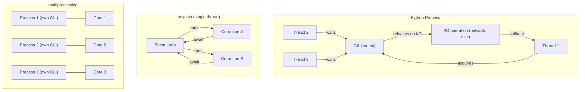

# Python

## Chapter Goal

After this chapter, the reader can explain Python's data model and object system at the level an interviewer expects, choose between threads, multiprocessing, and asyncio with a defensible argument grounded in the GIL, design typed Python codebases with dataclasses and Pydantic, set packaging and dependency management standards for a team, and answer interview questions that distinguish production-grade Python thinking from script-level knowledge.

## Why This Matters for a Tech Lead

Python dominates backend services, data pipelines, ML/AI tooling, scripting, and automation. A Tech Lead who owns Python services must:

- Understand the GIL well enough to choose the correct concurrency model for each workload — not default to threads because "concurrency means threads."
- Set the typing and linting standard for the team and enforce it in CI. A Python codebase without type hints degrades to a dynamically typed guessing game within months.
- Own the packaging standard: lock files, virtual environments, and reproducible builds. A service that installs different dependency versions in CI vs production is a ticking incident.
- Choose the right web framework (FastAPI, Django, Flask) based on team skill, performance profile, and the product's lifecycle stage — not on tutorial popularity.
- Govern the boundary between Python and other runtimes. Python is the right tool for many problems and the wrong tool for CPU-intensive hot paths. A Tech Lead who cannot articulate this boundary makes expensive language decisions.

A single Python misconfiguration — a blocking call inside an async event loop, a mutable default argument in a shared service, a missing `__all__` in a library — can cause subtle production bugs that are invisible in unit tests.

## Mental Model

Python is a **dynamically typed, garbage-collected language where everything is an object and every variable is a reference**. Integers, functions, classes, and modules are all objects with a type, an identity (`id()`), and a reference count.

The **Global Interpreter Lock (GIL)** is a mutex that allows only one thread to execute Python bytecode at a time within a single process. This means:

- **I/O-bound work** benefits from threads: while one thread waits for a network response, another thread can execute Python bytecode. The GIL is released during I/O operations.
- **CPU-bound work** does not benefit from threads: threads take turns executing bytecode, so four threads on four cores run at approximately the speed of one core.
- **Asyncio** is single-threaded cooperative concurrency: one thread, one event loop, many coroutines yielding at `await` points. No GIL contention because there is only one thread.
- **Multiprocessing** bypasses the GIL entirely: each process has its own interpreter, its own GIL, and its own memory space. Use for CPU-bound parallelism.



The threading model shows threads competing for the GIL. The asyncio model shows a single thread multiplexing coroutines cooperatively. The multiprocessing model shows true parallelism with separate processes and separate GILs.

## Core Terminology

| Term | Definition |
| --- | --- |
| **GIL** | Global Interpreter Lock. A per-process mutex that allows only one thread to execute Python bytecode at a time. Released during I/O and certain C extensions. |
| **MRO** | Method Resolution Order. The order in which Python searches for a method in a class hierarchy. Uses the C3 linearization algorithm. Inspectable via `ClassName.__mro__`. |
| **Descriptor** | An object that defines `__get__`, `__set__`, or `__delete__`. Properties (`@property`), class methods, and static methods are descriptors. The descriptor protocol is how Python implements attribute access. |
| **Generator** | A function that uses `yield` to produce a sequence of values lazily. Each call to `next()` resumes execution after the last `yield`. Generators are iterators. |
| **Coroutine** | A function defined with `async def` that can be suspended at `await` points. Coroutines are scheduled by the asyncio event loop. Not the same as generators, though they share the suspension mechanism. |
| **Context manager** | An object that defines `__enter__` and `__exit__`, used with `with` statements. Guarantees cleanup (closing files, releasing locks, rolling back transactions) even if exceptions occur. |
| **Dataclass** | A class decorated with `@dataclass` that auto-generates `__init__`, `__repr__`, `__eq__`, and optionally `__hash__`. Reduces boilerplate for data-holding classes. |
| **Protocol** | A structural subtyping mechanism from `typing`. A class satisfies a `Protocol` if it has the required methods and attributes — no inheritance needed. Python's equivalent of TypeScript interfaces. |
| **Type hint** | An annotation on variables, parameters, and return values (`def f(x: int) -> str`). Not enforced at runtime by default. Checked by static tools (mypy, pyright). |
| **Virtual environment** | An isolated Python installation with its own `site-packages`. Created with `python -m venv` or tools like `virtualenv`. Prevents dependency conflicts between projects. |
| **Lock file** | A file (`poetry.lock`, `requirements.txt` with hashes, `uv.lock`) that pins exact dependency versions and integrity hashes. Ensures reproducible installs across environments. |
| **Pydantic** | A data validation library that uses type hints to define models. Validates input data at runtime, coerces types, and produces clear error messages. The standard for FastAPI request/response models. |
| **ASGI** | Asynchronous Server Gateway Interface. The async equivalent of WSGI. Used by FastAPI, Starlette, and Django Channels. Defines how async Python web applications communicate with servers. |
| **WSGI** | Web Server Gateway Interface. The synchronous standard for Python web applications. Used by Flask and Django (default). Defines how sync Python web applications communicate with servers. |

## Theoretical Foundation

### Language model

Python uses **dynamic typing** with **strong type enforcement**. Variables are references to objects, not typed containers. `x = 42` binds the name `x` to an integer object. `x = "hello"` rebinds `x` to a string object. The integer object is not mutated — a new binding is created.

**Mutability** is a property of the object, not the variable:

- **Immutable:** `int`, `float`, `str`, `tuple`, `frozenset`, `bytes`. Operations on these create new objects.
- **Mutable:** `list`, `dict`, `set`, `bytearray`, and most user-defined classes. Operations modify the object in place.

This distinction matters for default arguments, hashing, and thread safety. An immutable object can be a dictionary key; a mutable one cannot. A mutable default argument is shared across all calls — a classic Python bug.

**Reference semantics:** Assignment (`=`) copies the reference, not the object. `a = [1, 2, 3]; b = a` makes `b` point to the same list. Mutating via `b` is visible through `a`. Use `copy.copy()` for shallow copies and `copy.deepcopy()` for deep copies.

**Comparison with JavaScript/TypeScript:** JavaScript also uses reference semantics for objects, but Python's mutability model is more explicit. JavaScript has `const` (prevents rebinding, not mutation); Python has no equivalent — all names are rebindable. TypeScript adds static types that are erased at runtime; Python type hints are similarly not enforced at runtime but remain accessible via `__annotations__`.

### Data structures

Python's built-in data structures cover most use cases without external libraries:

**`list`** — A dynamic array (not a linked list). O(1) amortized append, O(1) index access, O(n) insert/delete at arbitrary positions. Implemented as a contiguous array of pointers.

**`dict`** — A hash map. O(1) average lookup, insert, and delete. Preserves insertion order (guaranteed since Python 3.7). Keys must be hashable (immutable types or objects with `__hash__`).

**`set`** — An unordered collection of unique hashable elements. O(1) average membership test. Backed by a hash table. Use for deduplication and fast lookups.

**`tuple`** — An immutable sequence. Used for fixed-size collections (coordinates, database rows, function return values). Hashable if all elements are hashable.

**`collections.deque`** — A double-ended queue. O(1) append and pop from both ends. Use instead of `list` when prepending elements is needed.

**`collections.defaultdict`** — A `dict` subclass that calls a factory function for missing keys. `defaultdict(list)` eliminates the `if key not in d: d[key] = []` pattern.

**`collections.Counter`** — A `dict` subclass for counting hashable elements. `Counter("aabbc")` returns `Counter({'a': 2, 'b': 2, 'c': 1})`.

**Comparison with JavaScript:** Python `list` ≈ JavaScript `Array`. Python `dict` ≈ JavaScript `Map` (not plain objects — Python dicts are more performant for large sizes). Python `set` ≈ JavaScript `Set`. Python `tuple` has no direct JavaScript equivalent — the closest is `Object.freeze([...])` but that is rarely used.

**Idiomatic iteration patterns:**

```python
users = [{"name": "Alice", "role": "admin"}, {"name": "Bob", "role": "user"}]

# enumerate — index + value (not range(len(...)))
for i, user in enumerate(users):
    print(f"{i}: {user['name']}")

# zip — iterate multiple sequences in lockstep
names = ["Alice", "Bob", "Charlie"]
scores = [95, 82, 91]
for name, score in zip(names, scores):
    print(f"{name}: {score}")

# dict comprehension — transform a sequence into a lookup
name_to_score = {name: score for name, score in zip(names, scores)}

# Counter — count occurrences without manual loops
from collections import Counter
roles = Counter(u["role"] for u in users)  # Counter({'user': 1, 'admin': 1})

# set operations — fast membership and deduplication
active_ids = {1, 2, 3, 4}
banned_ids = {3, 5}
allowed = active_ids - banned_ids  # {1, 2, 4}
```

These patterns replace manual `for` loops with index tracking, manual counter dicts, and list-based membership checks. Using them signals Python fluency in an interview and in code review. The common mistake is writing `for i in range(len(items))` instead of `enumerate(items)` or using a `list` for membership checks (`if x in large_list`) instead of a `set` (`if x in large_set`) — the list version is O(n), the set version is O(1).

### Functions

Python functions are first-class objects. They can be assigned to variables, passed as arguments, returned from other functions, and stored in data structures.

**Default arguments** are evaluated once at function definition time, not at call time. This is the source of the mutable default argument bug:

```python
def append_to(item, target=[]):
    target.append(item)
    return target

append_to(1)  # [1]
append_to(2)  # [1, 2] — same list object!
```

The fix: use `None` as the sentinel and create a new list inside the function.

```python
def append_to(item, target=None):
    if target is None:
        target = []
    target.append(item)
    return target
```

**`*args` and `**kwargs`** collect positional and keyword arguments into a tuple and dict, respectively. Used for delegation patterns and decorator wrappers.

**Closures:** Inner functions capture variables from the enclosing scope by reference, not by value. The captured variable reflects its latest value when the inner function is called.

### Decorators

A decorator is a function that takes a function (or class) and returns a modified version. Decorators are syntactic sugar for `func = decorator(func)`.

```python
import functools
import time

def timed(func):
    @functools.wraps(func)
    def wrapper(*args, **kwargs):
        start = time.perf_counter()
        result = func(*args, **kwargs)
        elapsed = time.perf_counter() - start
        print(f"{func.__name__} took {elapsed:.4f}s")
        return result
    return wrapper

@timed
def fetch_data(url: str) -> dict:
    ...
```

`functools.wraps` preserves the original function's `__name__`, `__doc__`, and `__module__`. Without it, debugging and documentation tools see the wrapper, not the original function.

**Class-based decorators:** Use `__call__` to make an instance callable. Useful when the decorator needs to maintain state across calls (rate limiters, retry counters, caches).

**`@staticmethod` and `@classmethod`:** Both are descriptors. `@staticmethod` removes `self` — it is a plain function attached to a class. `@classmethod` receives the class as the first argument (`cls`) — used for alternative constructors (`User.from_dict(data)`).

**`@property`:** A descriptor that turns a method into a computed attribute. Read access calls the getter; write access calls the setter. Use for validation, lazy computation, and maintaining backward compatibility when changing an attribute to a computed value.

**Production decorator — retry with exponential backoff:**

```python
import functools
import time
import logging

logger = logging.getLogger(__name__)

def retry(max_attempts: int = 3, base_delay: float = 1.0, exceptions: tuple = (Exception,)):
    def decorator(func):
        @functools.wraps(func)
        def wrapper(*args, **kwargs):
            for attempt in range(1, max_attempts + 1):
                try:
                    return func(*args, **kwargs)
                except exceptions as e:
                    if attempt == max_attempts:
                        logger.error(f"{func.__name__} failed after {max_attempts} attempts: {e}")
                        raise
                    delay = base_delay * (2 ** (attempt - 1))
                    logger.warning(f"{func.__name__} attempt {attempt} failed, retrying in {delay}s")
                    time.sleep(delay)
        return wrapper
    return decorator

@retry(max_attempts=3, base_delay=0.5, exceptions=(ConnectionError, TimeoutError))
def call_external_api(endpoint: str) -> dict:
    ...
```

**What this shows:** A parameterized decorator for retry logic — a cross-cutting concern that applies to any function that calls an unreliable external service. The decorator accepts configuration (max attempts, delay, which exceptions to retry) and uses exponential backoff to avoid overwhelming a recovering service.

**Why it is useful:** Retry logic appears in every production codebase that calls external services. Without a decorator, retry code is duplicated in every call site. With a decorator, the retry policy is declared at the function level and the business logic stays clean.

**Common mistake:** Retrying on all exceptions (catching `Exception` instead of specific transient errors). This retries on `ValueError` or `TypeError` — errors that will never succeed on retry. Always specify which exceptions are retryable.

**In production:** Add jitter to the delay (`delay * random.uniform(0.5, 1.5)`) to prevent thundering herd. Add a circuit breaker for services that are down for extended periods. Consider using the `tenacity` library instead of a custom implementation — it handles async, jitter, and circuit breaking out of the box.

### Generators and iterators

A **generator function** uses `yield` instead of `return`. When called, it returns a generator object — an iterator that produces values lazily.

```python
def read_large_file(path: str):
    with open(path) as f:
        for line in f:
            yield line.strip()

for line in read_large_file("data.csv"):
    process(line)
```

The entire file is never loaded into memory. Each `yield` suspends the function, preserving its local state. The next call to `next()` (or the next iteration of the `for` loop) resumes from where it left off.

**Generator expressions:** `(x * 2 for x in range(1_000_000))` is a generator — it produces values on demand. `[x * 2 for x in range(1_000_000)]` is a list comprehension — it allocates the entire list in memory.

**`yield from`** delegates to a sub-generator, flattening nested iteration:

```python
def flatten(nested):
    for item in nested:
        if isinstance(item, list):
            yield from flatten(item)
        else:
            yield item
```

**`itertools`** provides composable iterator building blocks: `chain`, `islice`, `groupby`, `product`, `combinations`. In data pipelines, chaining generators and `itertools` functions creates memory-efficient processing pipelines that handle files larger than available RAM.

### Context managers

A context manager guarantees cleanup. The `with` statement calls `__enter__` on entry and `__exit__` on exit — even if an exception is raised.

```python
class DatabaseTransaction:
    def __init__(self, connection):
        self.conn = connection

    def __enter__(self):
        self.conn.begin()
        return self.conn

    def __exit__(self, exc_type, exc_val, exc_tb):
        if exc_type is None:
            self.conn.commit()
        else:
            self.conn.rollback()
        return False  # do not suppress the exception
```

`contextlib.contextmanager` allows writing context managers as generator functions:

```python
from contextlib import contextmanager

@contextmanager
def timer(label: str):
    start = time.perf_counter()
    yield
    elapsed = time.perf_counter() - start
    print(f"{label}: {elapsed:.4f}s")

with timer("query"):
    result = db.execute("SELECT ...")
```

**Async context managers** (`async with`) use `__aenter__` and `__aexit__`. Used for async database connections, HTTP sessions, and locks.

### Type hints and static typing

Type hints annotate function signatures and variables without runtime enforcement:

```python
from typing import Optional

def find_user(user_id: int) -> Optional[dict]:
    ...
```

**Key typing constructs:**

- `Optional[X]` — equivalent to `X | None` (Python 3.10+).
- `Union[X, Y]` — either X or Y. Prefer `X | Y` syntax in 3.10+.
- `list[str]`, `dict[str, int]` — generic built-in types (3.9+). Before 3.9, use `List[str]` from `typing`.
- `TypedDict` — typed dictionaries with specific keys. Useful for JSON-shaped data.
- `Literal["read", "write"]` — restrict to specific values.
- `Protocol` — structural subtyping. A class satisfies a `Protocol` by having the required methods, without inheriting from it.
- `TypeVar` — generic type variables for writing generic functions and classes.
- `ParamSpec` — captures parameter types for decorator typing.

**`Protocol` vs abstract base class:**

```python
from typing import Protocol

class Serializable(Protocol):
    def to_json(self) -> str: ...

def save(obj: Serializable) -> None:
    data = obj.to_json()
    ...
```

Any class with a `to_json() -> str` method satisfies `Serializable` — no inheritance required. This is structural subtyping, analogous to TypeScript interfaces. Abstract base classes (`abc.ABC`) require explicit inheritance — nominal subtyping.

**Static type checkers:** `mypy` (mature, strict) and `pyright` (faster, used in VS Code/Pylance). Both read type hints and report type errors without running the code. Add `mypy --strict` or `pyright` to CI to catch type bugs before deployment.

**Comparison with TypeScript:** TypeScript types are erased at compile time. Python type hints are also not enforced at runtime — but unlike TypeScript, Python hints remain in `__annotations__` at runtime, which Pydantic and FastAPI use for runtime validation.

### OOP and dataclasses

Python supports single and multiple inheritance. The **Method Resolution Order (MRO)** determines the order in which classes are searched for a method. Python uses the **C3 linearization** algorithm, which guarantees a consistent, monotonic order.

```python
class A:
    def method(self):
        return "A"

class B(A):
    def method(self):
        return "B"

class C(A):
    def method(self):
        return "C"

class D(B, C):
    pass

D.__mro__  # (D, B, C, A, object)
D().method()  # "B" — B comes before C in MRO
```

**`super()`** follows the MRO, not the direct parent. In the diamond pattern above, `super()` in `B.method()` calls `C.method()`, not `A.method()`. This enables cooperative multiple inheritance.

**Dataclasses** reduce boilerplate for data-holding classes:

```python
from dataclasses import dataclass, field

@dataclass(frozen=True)
class Point:
    x: float
    y: float
    label: str = ""
    metadata: dict = field(default_factory=dict)
```

`@dataclass` generates `__init__`, `__repr__`, and `__eq__`. `frozen=True` makes instances immutable (generates `__hash__`, raises `FrozenInstanceError` on assignment). `field(default_factory=dict)` solves the mutable default argument problem.

**`__slots__`** reduces memory per instance by replacing the instance `__dict__` with a fixed set of attributes:

```python
class Event:
    __slots__ = ("timestamp", "name", "payload")

    def __init__(self, timestamp: float, name: str, payload: dict):
        self.timestamp = timestamp
        self.name = name
        self.payload = payload
```

A class with `__slots__` uses 30-50% less memory per instance. The trade-off: no dynamic attribute assignment and no `__dict__`.

### Pydantic

Pydantic uses type hints for runtime data validation. It is the standard data validation library for FastAPI and widely used in configuration parsing, API clients, and data pipelines.

```python
from pydantic import BaseModel, Field, field_validator

class CreateUserRequest(BaseModel):
    name: str = Field(min_length=1, max_length=100)
    email: str
    age: int = Field(ge=0, le=150)

    @field_validator("email")
    @classmethod
    def validate_email(cls, v: str) -> str:
        if "@" not in v:
            raise ValueError("Invalid email format")
        return v.lower()
```

**Pydantic v2** (current) uses a Rust core for validation, making it 5-50x faster than v1. Key differences from v1: `@field_validator` replaces `@validator`, `model_validate()` replaces `parse_obj()`, and `model_dump()` replaces `dict()`.

**Pydantic vs dataclasses:** Dataclasses define structure. Pydantic validates and coerces data. Use dataclasses for internal data structures (no user input). Use Pydantic for external boundaries — API requests, configuration files, message payloads — where input must be validated.

**Pydantic `Settings`:** `pydantic-settings` loads configuration from environment variables, `.env` files, and secrets directories. Validates configuration at startup — a misconfigured environment variable fails at boot, not at the first request.

**Tech Lead perspective — runtime validation strategy:**

A Tech Lead must decide where validation happens in the Python stack. The wrong answer — "validate everywhere" — creates overhead and confusion. The right answer is a layered approach:

- **Layer 1 — API boundary (Pydantic).** Every request body, query parameter, and path parameter is validated by Pydantic before the handler runs. This is non-negotiable. FastAPI does this automatically. For non-FastAPI services, validate explicitly at the entry point.
- **Layer 2 — Configuration boundary (Pydantic Settings).** Environment variables are validated at startup. A typo in `DATABASE_URL` fails the health check, not the first user request at 3 AM.
- **Layer 3 — Integration boundary (Pydantic or custom validation).** Data from external APIs, message queues, and file uploads is validated on arrival. External data is untrusted by definition.
- **Layer 4 — Internal code (no Pydantic).** Between internal functions and modules, use type hints and dataclasses. Pydantic validation on internal data is wasted CPU — the data was already validated at the boundary.

**Comparison with TypeScript:** In TypeScript, the type system erases at compile time, so runtime validation (Zod, io-ts) is a separate decision. In Python, type hints persist at runtime, and Pydantic reads them for validation — the same annotation serves both static checking and runtime enforcement. This is a Python advantage, but it requires discipline to avoid validating the same data multiple times.

### Error handling

Python uses exceptions for error handling. The hierarchy matters:

```text
BaseException
├── SystemExit
├── KeyboardInterrupt
├── GeneratorExit
└── Exception
    ├── ValueError
    ├── TypeError
    ├── KeyError
    ├── IOError
    ├── RuntimeError
    └── ... (all standard exceptions)
```

**Best practices:**

1. Catch specific exceptions, not `Exception`. Never use bare `except:` — it catches `SystemExit` and `KeyboardInterrupt`, preventing clean shutdowns.
2. Use `else` for code that should run only if no exception occurred. Use `finally` for guaranteed cleanup.
3. Raise exceptions with context: `raise ValueError("User ID must be positive") from original_error`.
4. Create custom exception hierarchies for application-level errors:

```python
class AppError(Exception):
    pass

class NotFoundError(AppError):
    def __init__(self, entity: str, entity_id: str):
        self.entity = entity
        self.entity_id = entity_id
        super().__init__(f"{entity} {entity_id} not found")

class ValidationError(AppError):
    pass
```

**Comparison with JavaScript:** JavaScript uses `try/catch/finally` with a single `Error` type. Python's exception hierarchy enables catching groups of related errors with a single `except` clause. JavaScript has no equivalent of `except ValueError as e:` — all errors are caught with `catch(e)` and the type is checked manually.

### Concurrency: threads, multiprocessing, asyncio

#### Threads (`threading`)

Threads share the process memory. The GIL allows only one thread to execute Python bytecode at a time. Threads are useful for **I/O-bound work**: while one thread waits for a network response, the GIL is released and another thread runs.

```python
from concurrent.futures import ThreadPoolExecutor

def fetch_url(url: str) -> str:
    response = requests.get(url)
    return response.text

with ThreadPoolExecutor(max_workers=10) as pool:
    results = list(pool.map(fetch_url, urls))
```

**When threads fail:** CPU-bound work. If the task is computing hashes, resizing images, or training a model, threads do not provide parallelism. They take turns acquiring the GIL, resulting in roughly the same total time as a single thread — or worse, due to GIL contention overhead.

#### Multiprocessing

Each process has its own interpreter and GIL. True parallelism on multiple cores.

```python
from concurrent.futures import ProcessPoolExecutor

def compute_hash(data: bytes) -> str:
    return hashlib.sha256(data).hexdigest()

with ProcessPoolExecutor(max_workers=4) as pool:
    results = list(pool.map(compute_hash, data_chunks))
```

**Trade-offs:** Higher memory overhead (each process copies the interpreter). Communication between processes requires serialization (pickle). Startup time is higher than threads. Use for CPU-bound parallelism where the work per unit justifies the overhead.

#### asyncio

Single-threaded cooperative concurrency. Coroutines yield control at `await` points. The event loop schedules which coroutine runs next.

```python
import asyncio
import httpx

async def fetch_url(client: httpx.AsyncClient, url: str) -> str:
    response = await client.get(url)
    return response.text

async def main():
    async with httpx.AsyncClient() as client:
        tasks = [fetch_url(client, url) for url in urls]
        results = await asyncio.gather(*tasks)

asyncio.run(main())
```

**When asyncio shines:** High fan-out I/O. Thousands of concurrent HTTP requests, database queries, or message queue consumers. One thread handles all of them by switching between coroutines at `await` points.

**The critical mistake:** Calling a blocking function (e.g., `requests.get`, `time.sleep`, `open().read()` on a large file) inside an async function. The entire event loop freezes because there is no `await` to yield control. The fix: run blocking code in an executor:

```python
import asyncio

async def read_file(path: str) -> str:
    loop = asyncio.get_running_loop()
    return await loop.run_in_executor(None, _sync_read, path)

def _sync_read(path: str) -> str:
    with open(path) as f:
        return f.read()
```

#### Choosing the concurrency model

| Workload | **Best model** | **Why** |
| --- | --- | --- |
| Many HTTP requests | asyncio | Thousands of concurrent connections on one thread; no GIL contention |
| File I/O | Threads | The GIL is released during I/O; simpler than asyncio for file operations |
| CPU-heavy computation | Multiprocessing | True parallelism; each process has its own GIL |
| Mixed I/O + CPU | asyncio + `run_in_executor` | Async for I/O, executor for CPU-bound work |
| Simple scripts | Sequential | Concurrency adds complexity; only use when the workload justifies it |

**Tech Lead perspective — async adoption risk:**

A Tech Lead should not default to async for every Python service. Async introduces three costs that are invisible in tutorials:

1. **Library compatibility tax.** Every library in the call chain must be async-compatible. One blocking call (a sync ORM, a legacy SDK, a file parser) freezes the event loop for all concurrent requests. Before choosing async, audit the dependency list. If more than 20% of libraries are sync-only, the `run_in_executor` wrapping cost may exceed the async benefit.
2. **Debugging complexity.** Async stack traces are harder to read. `asyncio.gather` failures require `return_exceptions=True` to prevent one failure from masking others. Race conditions in shared state (connection pools, caches) are harder to reproduce than in threaded code because they depend on coroutine scheduling order.
3. **Team skill requirement.** Engineers who have written sync Python for years will introduce blocking calls in async code. Budget 2-4 weeks of team ramp-up. Add `asyncio` debug mode (`PYTHONASYNCIODEBUG=1`) to development environments and lint for known blocking imports (`requests`, `time.sleep`, `psycopg2`) in async modules.

**When to stay sync:** Internal tools with < 50 concurrent users. Services that make 1-2 sequential database queries per request. Teams with no async experience and a deadline in 6 weeks. The sync model (Flask + gunicorn) is simpler, debuggable, and sufficient for moderate concurrency.

### Virtual environments and packaging

#### Virtual environments

A virtual environment isolates a project's dependencies from the system Python and from other projects.

```bash
python -m venv .venv
source .venv/bin/activate  # Linux/macOS
pip install -r requirements.txt
```

**Why it matters:** Without a virtual environment, `pip install` modifies the system Python. Two projects that depend on different versions of the same library conflict. Virtual environments are the minimum packaging discipline.

#### pip

The standard Python package installer. `pip install package` installs from PyPI. `pip freeze > requirements.txt` captures installed versions.

**Limitations of plain pip:** No dependency resolution lock file by default. `requirements.txt` from `pip freeze` captures versions but not integrity hashes. No distinction between direct dependencies and transitive dependencies. No built-in lock/unlock workflow.

#### Poetry

A dependency management and packaging tool that provides:

- **`pyproject.toml`** for project metadata and dependency declarations.
- **`poetry.lock`** for exact version pinning with integrity hashes.
- **Dependency groups** (main, dev, test) to separate production and development dependencies.
- **Virtual environment management** built in.

```bash
poetry init
poetry add fastapi uvicorn
poetry add --group dev pytest mypy
poetry install  # installs from lock file
poetry lock     # regenerates lock file
```

**A production `pyproject.toml`:**

```text
[tool.poetry]
name = "order-service"
version = "1.2.0"
description = "Order management API"
python = "^3.11"

[tool.poetry.dependencies]
python = "^3.11"
fastapi = "^0.110"
uvicorn = {version = "^0.29", extras = ["standard"]}
asyncpg = "^0.29"
pydantic-settings = "^2.2"
httpx = "^0.27"

[tool.poetry.group.dev.dependencies]
pytest = "^8.0"
pytest-asyncio = "^0.23"
mypy = "^1.9"
ruff = "^0.4"
httpx = "^0.27"

[tool.mypy]
strict = true
warn_return_any = true

[tool.ruff]
line-length = 100
select = ["E", "F", "I", "UP", "B", "SIM"]

[tool.pytest.ini_options]
asyncio_mode = "auto"
testpaths = ["tests"]
```

**What this shows:** A complete `pyproject.toml` for a FastAPI service with Poetry. Production dependencies are separated from dev dependencies. `mypy` is configured for strict mode. `ruff` replaces both `black` (formatting) and `flake8` (linting) with a single tool. `pytest` is configured with `asyncio_mode = "auto"` to avoid needing `@pytest.mark.asyncio` on every test.

**Common mistake:** Omitting the `[tool.mypy]` and `[tool.ruff]` sections. Developers configure these locally but not in the project file, so CI uses default settings and misses errors that the developer's IDE catches.

**Poetry vs pip:** Poetry solves the lock file problem, separates dependency groups, and manages virtual environments. pip is simpler and sufficient for small projects. For production services, use Poetry (or `uv` / `pip-tools`) with a lock file.

#### uv

A fast Python package installer written in Rust. Compatible with pip and Poetry lock files. Drop-in replacement for `pip` and `pip-compile` with 10-100x faster resolution and installation.

**Tech Lead decision:** The packaging landscape is fragmented (pip, pip-tools, Poetry, Pipenv, PDM, uv). Choose one tool, document it in the contributing guide, and enforce it across the team. The specific tool matters less than consistency. Teams that mix Poetry and pip across services create inconsistent deployment pipelines.

### Web frameworks

#### FastAPI

An async web framework built on Starlette and Pydantic. Uses type hints for request validation, serialization, and OpenAPI documentation generation.

```python
from fastapi import FastAPI, HTTPException
from pydantic import BaseModel

app = FastAPI()

class UserCreate(BaseModel):
    name: str
    email: str

class UserResponse(BaseModel):
    id: int
    name: str
    email: str

@app.post("/users", response_model=UserResponse, status_code=201)
async def create_user(user: UserCreate) -> UserResponse:
    if await user_exists(user.email):
        raise HTTPException(status_code=409, detail="Email already registered")
    created = await save_user(user)
    return created
```

**Why FastAPI for new projects:** Auto-generated OpenAPI docs, request validation from type hints, async-first, excellent performance (Starlette + uvicorn). The type hint contract is both documentation and enforcement — a Pydantic validation error returns a 422 with a structured error message.

#### Django

A batteries-included framework: ORM, admin panel, authentication, migrations, templating. Synchronous by default; async views available since Django 4.1.

**When to use Django:** CRUD-heavy applications, admin-facing tools, projects that benefit from the ORM and built-in admin. Not the best fit for pure API services — the middleware stack and template engine add overhead that a pure API does not need.

#### Flask

A micro-framework: routing, request/response handling, and nothing else. Extensions add functionality (SQLAlchemy, Marshmallow, Flask-Login).

**When to use Flask:** Small services, internal tools, and teams that prefer explicit composition over implicit convention. Flask is synchronous; for async workloads, FastAPI is a better fit.

**Framework comparison:**

| Factor | **FastAPI** | **Django** | **Flask** |
| --- | --- | --- | --- |
| **Async** | Native | Partial (since 4.1) | No (extensions exist) |
| **Validation** | Pydantic (built-in) | Django Forms / DRF serializers | Manual or Marshmallow |
| **ORM** | None (use SQLAlchemy, Tortoise) | Django ORM (built-in) | None (use SQLAlchemy) |
| **Admin** | None | Built-in | None |
| **OpenAPI docs** | Auto-generated | DRF + drf-spectacular | Manual or extensions |
| **Performance** | High (Starlette + uvicorn) | Moderate | Moderate |
| **Learning curve** | Low (if team knows type hints) | Medium (ORM, settings, middleware) | Low |
| **Best for** | APIs, microservices | Full-stack, CRUD, admin tools | Small services, internal tools |

**Tech Lead perspective — framework selection is an architecture decision:**

The framework choice outlasts the current team. A Tech Lead should evaluate beyond technical features:

**Hiring signal.** FastAPI requires type hint proficiency. If the team hires from a pool where most candidates know Django, choosing FastAPI increases onboarding time. Conversely, if the team already uses type hints and async, FastAPI reduces boilerplate.

**Migration cost.** Switching frameworks mid-project costs 2-6 months of engineering time. Choosing Django for an API-only service creates tech debt — the admin panel and template engine are unused but still in the dependency tree. Choosing FastAPI for a project that will need an admin panel creates custom-build debt — someone will build a worse admin than Django provides for free.

**Stakeholder explanation.** "We chose FastAPI because our service is a pure API with no UI, we need async for concurrent downstream calls, and the auto-generated OpenAPI docs reduce our documentation burden. The trade-off: we do not get Django's admin panel, so internal tools will use a separate admin service."

**Common overengineering trap.** Choosing FastAPI for an internal CRUD tool used by 5 people. Django with its admin panel ships the same feature set in 20% of the time. The performance difference is irrelevant at 5 concurrent users.

### Testing with pytest

`pytest` is the standard Python testing framework. It uses plain `assert` statements, auto-discovers test files, and supports fixtures for setup/teardown. See [Testing and Quality](./16-testing-and-quality.md) for the broader testing pyramid and test strategy patterns.

```python
import pytest
from myapp.users import create_user, UserExistsError

def test_create_user_success(db_session):
    user = create_user(db_session, name="Alice", email="alice@example.com")
    assert user.id is not None
    assert user.email == "alice@example.com"

def test_create_user_duplicate_email(db_session):
    create_user(db_session, name="Alice", email="alice@example.com")
    with pytest.raises(UserExistsError):
        create_user(db_session, name="Bob", email="alice@example.com")
```

**Fixtures** provide dependency injection for tests:

```python
@pytest.fixture
def db_session():
    session = create_test_session()
    yield session
    session.rollback()
    session.close()
```

`yield` separates setup from teardown. The session is created before the test, yielded to the test function, and rolled back after the test — regardless of pass or fail.

**Fixture scopes:** `function` (default, per-test), `class`, `module`, `session`. Database connections often use `session` scope (created once); transactions use `function` scope (rolled back per test).

**`conftest.py`:** Fixtures defined here are available to all tests in the directory and subdirectories without explicit imports. Use for shared setup (database connections, HTTP clients, test data factories).

**Parametrize:** Run the same test with multiple inputs:

```python
@pytest.mark.parametrize("input,expected", [
    ("hello", 5),
    ("", 0),
    ("  spaces  ", 10),
])
def test_string_length(input, expected):
    assert len(input) == expected
```

**Async testing:** `pytest-asyncio` enables testing async functions:

```python
import pytest

@pytest.mark.asyncio
async def test_fetch_user(async_client):
    response = await async_client.get("/users/1")
    assert response.status_code == 200
```

**Tech Lead perspective — testing investment decisions:**

A Tech Lead decides where to invest testing effort. In a Python codebase, the highest-leverage testing investments are:

1. **Integration tests over unit tests for API services.** A FastAPI service with 200 unit tests that mock the database and 0 integration tests has a false sense of safety. The unit tests pass, but the service fails in production because the SQL query has a type mismatch that SQLite (used in tests) does not catch. Invest in integration tests that hit a real PostgreSQL instance via testcontainers.
2. **Type checking as a test.** `mypy --strict` in CI catches categories of bugs that tests cannot: wrong argument types, missing return values, incompatible function signatures after refactoring. Type checking is the cheapest test — it runs in seconds and requires no test code.
3. **Coverage targets with judgment.** Set a floor (e.g., 80%) and enforce it in CI. Do not chase 100% — the last 10% is boilerplate, exception handlers, and dead code paths. Focus coverage enforcement on business logic modules, not on framework glue.

**When not to invest in tests:** Throwaway scripts (< 200 lines, used once). Prototype code that will be rewritten. Internal tools with one user. Testing these delays delivery for code that has no long-term maintenance cost. A Tech Lead who mandates 80% coverage on a 50-line migration script is optimizing the wrong thing.

### Async Python in depth

#### The event loop

The event loop is the scheduler for coroutines. It runs in a single thread and multiplexes I/O operations.

1. A coroutine calls `await` on an I/O operation (HTTP request, database query).
2. The event loop suspends the coroutine and registers the I/O with the OS (via `select`, `epoll`, or `kqueue`).
3. The event loop picks another runnable coroutine and executes it.
4. When the I/O completes, the OS notifies the event loop, which resumes the original coroutine.

**`asyncio.gather`** runs multiple coroutines concurrently and returns their results:

```python
results = await asyncio.gather(
    fetch_user(user_id),
    fetch_orders(user_id),
    fetch_preferences(user_id),
)
user, orders, preferences = results
```

**`asyncio.TaskGroup`** (Python 3.11+) provides structured concurrency with automatic cancellation on failure:

```python
async with asyncio.TaskGroup() as tg:
    task1 = tg.create_task(fetch_user(user_id))
    task2 = tg.create_task(fetch_orders(user_id))
# if either task fails, the other is cancelled
user = task1.result()
orders = task2.result()
```

**Comparison with JavaScript:** Python's asyncio is conceptually identical to JavaScript's event loop + Promises. `await` in Python ≈ `await` in JavaScript. `asyncio.gather` ≈ `Promise.all`. `asyncio.TaskGroup` ≈ no direct equivalent (closest is `Promise.allSettled` but with automatic cancellation). The key difference: Python requires explicit `asyncio.run()` to start the loop; JavaScript runs the event loop implicitly.

### Scripting and automation

Python is the standard language for infrastructure scripts, data processing, and automation tasks.

**Why Python for scripting:**

- Rich standard library: `pathlib` (file paths), `subprocess` (shell commands), `json`, `csv`, `argparse` (CLI arguments), `logging`, `shutil` (file operations).
- Readable syntax that serves as documentation for operational scripts.
- First-class support on all major OS distributions.

**`argparse` for CLI tools:**

```python
import argparse

parser = argparse.ArgumentParser(description="Deploy service")
parser.add_argument("--env", choices=["staging", "production"], required=True)
parser.add_argument("--version", required=True)
parser.add_argument("--dry-run", action="store_true")
args = parser.parse_args()
```

**`subprocess` for shell commands:**

```python
import subprocess

result = subprocess.run(
    ["docker", "build", "-t", f"myapp:{args.version}", "."],
    capture_output=True,
    text=True,
    check=True,  # raises CalledProcessError on non-zero exit
)
```

**Tech Lead perspective on scripts:** Scripts that grow beyond 200 lines need the same engineering standards as application code: type hints, tests, error handling, and documentation. A 500-line deployment script without tests is a production risk. Structure scripts as modules with a `__main__.py` entry point and testable functions.

### Python for AI and automation tooling

Python dominates AI/ML tooling: TensorFlow, PyTorch, scikit-learn, Hugging Face Transformers, LangChain, and most AI agent frameworks are Python-first. See [AI Usage in Software Engineering](./21-ai-usage-in-software-engineering.md) for broader AI integration patterns.

**Why Python for AI:**

- NumPy, pandas, and Polars provide efficient data manipulation with C/Rust backends.
- Jupyter notebooks enable iterative experimentation.
- The ML ecosystem (model training, evaluation, serving) is built around Python APIs.
- AI SDK clients (OpenAI, Anthropic, Google AI) are Python-first.

**Tech Lead considerations for AI Python code:**

- **Separate experimentation from production.** Notebook code is not production code. Extract notebook logic into tested modules with type hints and error handling.
- **Dependency management for ML.** ML dependencies (PyTorch, TensorFlow) are large (1-5 GB). Use Docker multi-stage builds to keep image sizes manageable. Pin CUDA versions explicitly.
- **GPU resource management.** GPU memory leaks are common in long-running inference services. Monitor GPU memory with `nvidia-smi` or Prometheus metrics. Use context managers for model loading/unloading.
- **Model versioning.** Track model artifacts alongside code versions. Use MLflow, DVC, or Weights & Biases for experiment tracking and model registry.

**Tech Lead perspective — governing AI code quality:**

AI/ML code is the fastest-growing category of Python code in most organizations, and it is also the least governed. A Tech Lead must set clear expectations:

**What a Senior Engineer usually knows:** How to train a model, use an AI SDK, and deploy an inference endpoint.

**What a Tech Lead is expected to decide:**

- **Quality gates for ML code.** Notebook code gets a pass during experimentation. Production ML code does not. Before any model code reaches production, it must meet the same standards as application code: type hints, tests, structured logging, error handling, and code review. The "data scientists do not write production code" mindset creates a quality gap that causes incidents.
- **Cost governance for AI APIs.** A single prompt to a large language model can cost $0.01-$0.10. At 1 million requests per day, that is $10K-$100K/month. A Tech Lead must set caching strategies (cache identical prompts), token budget limits per request, and monitoring for cost anomalies. One developer adding a "summarize this" call to every page view can generate a $50K monthly bill.
- **Incident response for AI features.** AI features fail differently than traditional software. A model that returns plausible but incorrect answers does not trigger error monitoring. A Tech Lead must define: what does "wrong" look like for AI output? How do you monitor for degradation? What is the fallback when the AI service is down or producing low-quality results?

**Stakeholder explanation.** "We use Python for AI features because the ML ecosystem — PyTorch, Hugging Face, LangChain — is Python-native. The trade-off is higher resource usage for inference. We mitigate this with caching, request batching, and a cost dashboard that alerts when AI API spend exceeds our per-service budget."

### Performance and profiling

Python is slow relative to compiled languages. For most backend services, the bottleneck is I/O (database, network), not CPU — so Python's speed is not the constraint. When CPU is the bottleneck, profile before optimizing.

**Profiling tools:**

- `cProfile` — built-in deterministic profiler. Shows function call counts and cumulative time.
- `pyinstrument` — statistical profiler with a tree-based output. Better for understanding the call hierarchy.
- `tracemalloc` — memory profiler. Tracks allocations and identifies memory leaks.
- `py-spy` — sampling profiler that attaches to a running process without modifying code. No performance overhead in the target process.

**Optimization strategies (in order of effectiveness):**

1. **Algorithm optimization** — O(n²) → O(n log n) yields more than any micro-optimization.
2. **Use built-in functions** — `sum()`, `min()`, `max()`, `sorted()` are implemented in C. A Python `for` loop summing a list is 10-50x slower than `sum()`.
3. **NumPy for numerical work** — vectorized operations in C avoid Python loop overhead.
4. **C extensions** — `cython`, `cffi`, `ctypes` for hot paths. Most ML libraries are Python wrappers around C/C++/Rust code.
5. **Concurrency** — asyncio for I/O-bound, multiprocessing for CPU-bound.

## Practical Usage

### I/O-bound services: asyncio + FastAPI

The dominant pattern for Python API services: FastAPI with uvicorn, async database drivers (asyncpg, motor), and async HTTP clients (httpx).

```python
from fastapi import FastAPI
from contextlib import asynccontextmanager
import asyncpg

@asynccontextmanager
async def lifespan(app: FastAPI):
    app.state.pool = await asyncpg.create_pool(dsn="postgresql://...")
    yield
    await app.state.pool.close()

app = FastAPI(lifespan=lifespan)

@app.get("/users/{user_id}")
async def get_user(user_id: int):
    row = await app.state.pool.fetchrow(
        "SELECT id, name, email FROM users WHERE id = $1", user_id
    )
    if not row:
        raise HTTPException(status_code=404, detail="User not found")
    return dict(row)
```

The connection pool is created at startup and closed at shutdown. Each request acquires a connection from the pool, executes the query asynchronously, and returns the connection. Thousands of concurrent requests are handled by a single process with a pool of database connections.

### CPU-bound work: multiprocessing or a different runtime

For CPU-bound tasks (image processing, PDF generation, ML inference), Python's GIL limits single-process throughput. Options:

1. **`multiprocessing`** or **`concurrent.futures.ProcessPoolExecutor`** — parallelize across cores within Python. Suitable for batch processing and periodic tasks.
2. **Offload to a task queue** — Celery or RQ with dedicated workers. The API service stays responsive; CPU work runs in a separate process.
3. **Use a compiled language for the hot path** — call Rust, C, or Go via a subprocess, gRPC, or FFI. Python orchestrates; the compiled code computes.

### Data pipelines

Python is the lingua franca for data processing:

- **pandas** — DataFrames for tabular data. Single-threaded, in-memory. Suitable for datasets that fit in RAM.
- **Polars** — DataFrames with lazy evaluation and multi-threaded execution (Rust backend). 5-20x faster than pandas for large datasets. Growing rapidly.
- **PySpark** — distributed DataFrames on Spark. For datasets that do not fit on a single machine.
- **Airflow** — workflow orchestration. DAGs defined in Python. Schedules, monitors, and retries data pipeline tasks.

**Tech Lead decision:** For new data processing work, evaluate Polars before defaulting to pandas. Polars' lazy evaluation and multi-threading provide significantly better performance for datasets above 100 MB. pandas remains the ecosystem standard for compatibility with existing libraries and notebooks.

## Examples

### Generator-based data pipeline

```python
import csv
from typing import Iterator

def read_csv(path: str) -> Iterator[dict]:
    with open(path) as f:
        reader = csv.DictReader(f)
        for row in reader:
            yield row

def filter_active(rows: Iterator[dict]) -> Iterator[dict]:
    for row in rows:
        if row["status"] == "active":
            yield row

def transform_amount(rows: Iterator[dict]) -> Iterator[dict]:
    for row in rows:
        row["amount"] = float(row["amount"]) * 100  # cents
        yield row

pipeline = transform_amount(filter_active(read_csv("transactions.csv")))
for record in pipeline:
    save_to_database(record)
```

**What this shows:** A memory-efficient pipeline where each stage is a generator. The entire CSV file is never loaded into memory — each row flows through `read_csv → filter_active → transform_amount → save_to_database` one at a time.

**Why it is written this way:** Each stage is a composable function with a single responsibility. Stages can be reordered, removed, or added without changing other stages. This is the Unix pipe philosophy applied to Python.

**Common mistake:** Collecting all rows into a list (`list(read_csv(...))`) before filtering. This loads the entire file into memory, defeating the purpose of generators. For a 10 GB file, this crashes the process with an OOM error.

**In production:** Add error handling per row (skip malformed rows, log and continue). Add a batch size for database writes (commit every 1,000 rows, not every row). Monitor memory usage with `tracemalloc` to confirm the pipeline is streaming.

### Context manager for database transactions

```python
from contextlib import asynccontextmanager
from asyncpg import Connection

@asynccontextmanager
async def transaction(conn: Connection):
    tx = conn.transaction()
    await tx.start()
    try:
        yield conn
    except Exception:
        await tx.rollback()
        raise
    else:
        await tx.commit()

async def transfer_funds(pool, from_id: int, to_id: int, amount: float):
    async with pool.acquire() as conn:
        async with transaction(conn):
            await conn.execute(
                "UPDATE accounts SET balance = balance - $1 WHERE id = $2",
                amount, from_id,
            )
            await conn.execute(
                "UPDATE accounts SET balance = balance + $1 WHERE id = $2",
                amount, to_id,
            )
```

**What this shows:** An async context manager that wraps a database transaction with automatic commit on success and rollback on failure. The `transfer_funds` function uses two nested context managers: one for the connection (returned to pool on exit) and one for the transaction.

**Why it is written this way:** The context manager guarantees that the transaction is committed or rolled back — there is no code path where the transaction is left open. The `raise` in the `except` block re-raises the original exception after rollback, preserving the error for the caller.

**Common mistake:** Forgetting to re-raise after rollback. The transaction is rolled back but the caller does not know an error occurred. Or: using the connection after the context manager exits — the transaction is already committed or rolled back.

**In production:** Add logging on rollback (including the exception). Add timeout on the transaction to prevent long-running locks. Consider retry logic for deadlocks.

### FastAPI handler with Pydantic validation

```python
from fastapi import FastAPI, HTTPException, Depends
from pydantic import BaseModel, Field, EmailStr
from datetime import datetime

app = FastAPI()

class OrderCreate(BaseModel):
    product_id: int
    quantity: int = Field(ge=1, le=100)
    shipping_email: EmailStr

class OrderResponse(BaseModel):
    id: int
    product_id: int
    quantity: int
    status: str
    created_at: datetime

    model_config = {"from_attributes": True}

@app.post("/orders", response_model=OrderResponse, status_code=201)
async def create_order(
    order: OrderCreate,
    db=Depends(get_db_session),
):
    product = await db.get_product(order.product_id)
    if not product:
        raise HTTPException(status_code=404, detail="Product not found")
    if product.stock < order.quantity:
        raise HTTPException(status_code=409, detail="Insufficient stock")
    created = await db.create_order(order)
    return created
```

**What this shows:** A complete FastAPI endpoint with Pydantic input validation, dependency injection (`Depends`), error handling, and a typed response model. The `OrderCreate` model validates that quantity is between 1 and 100 and that the email is valid — all before the handler function runs.

**Why it is written this way:** Validation is declarative (Pydantic model), not imperative (`if quantity < 1: raise ...`). Invalid requests get a 422 response with a structured error message automatically. The `response_model` ensures the response matches the contract and strips any extra fields.

**Common mistake:** Returning the database model directly without a response model. This leaks internal fields (hashed passwords, internal IDs, soft-delete flags) to the API consumer. Always define separate request and response models.

**In production:** Add rate limiting. Add request ID propagation for tracing. Use dependency injection for the database session to enable transaction management per request. Add structured logging with request context.

### Dataclasses vs Pydantic: when to use which

```python
from dataclasses import dataclass, field
from datetime import datetime
from pydantic import BaseModel, Field, field_validator

# INTERNAL data — use dataclass (no validation overhead)
@dataclass(frozen=True)
class OrderItem:
    product_id: int
    name: str
    quantity: int
    unit_price_cents: int

    @property
    def total_cents(self) -> int:
        return self.quantity * self.unit_price_cents


# EXTERNAL boundary — use Pydantic (validates + coerces input)
class OrderCreateRequest(BaseModel):
    product_id: int
    quantity: int = Field(ge=1, le=1000)
    coupon_code: str | None = None

    @field_validator("coupon_code")
    @classmethod
    def normalize_coupon(cls, v: str | None) -> str | None:
        return v.upper().strip() if v else None


# EXTERNAL boundary — use Pydantic (controls API output)
class OrderResponse(BaseModel):
    id: int
    items: list[OrderItem]
    total_cents: int
    created_at: datetime

    model_config = {"from_attributes": True}
```

**What this shows:** The boundary principle in practice. `OrderItem` is internal — created by application code after validation has already occurred. It uses `@dataclass(frozen=True)` for immutability and `@property` for derived values, with no runtime validation overhead. `OrderCreateRequest` is external — it enters the system from an API consumer. Pydantic validates constraints (`quantity >= 1`) and normalizes data (`coupon_code` uppercased). `OrderResponse` controls what leaves the system — it uses `from_attributes` to serialize ORM objects while stripping internal fields.

**Why it is useful:** This pattern prevents two common mistakes: (1) using Pydantic everywhere, paying validation overhead on internal data that is already valid, and (2) using dataclasses at external boundaries, accepting malformed input that causes errors deep in the call stack.

**Common mistake:** Using a single class for both input and output. The input model accepts fields the user provides (no `id`, no `created_at`). The output model includes fields the system generates. Conflating them leads to optional fields that are sometimes required and confusing API contracts.

**In production:** Define a clear convention: Pydantic models for `*Request` and `*Response` types, dataclasses for internal domain objects. Enforce through code review and naming conventions. As the team grows, this boundary becomes the primary line of defense against bad data.

### Async wrapper for blocking libraries

```python
import asyncio
from functools import partial

def resize_image_sync(path: str, width: int, height: int) -> bytes:
    from PIL import Image
    import io
    img = Image.open(path)
    img = img.resize((width, height))
    buffer = io.BytesIO()
    img.save(buffer, format="JPEG")
    return buffer.getvalue()

async def resize_image(path: str, width: int, height: int) -> bytes:
    loop = asyncio.get_running_loop()
    return await loop.run_in_executor(
        None,  # default ThreadPoolExecutor
        partial(resize_image_sync, path, width, height),
    )
```

**What this shows:** Wrapping a blocking library (Pillow) so it can be used inside an async application without freezing the event loop. `run_in_executor` runs the blocking function in a thread pool and yields control back to the event loop while the thread is working.

**Why it is written this way:** Pillow is synchronous — it blocks the calling thread during I/O and computation. Calling it directly in an async handler freezes the event loop for the duration of the resize. `run_in_executor` moves the blocking work to a separate thread.

**Common mistake:** Calling blocking libraries directly in async handlers without `run_in_executor`. This creates latency spikes for all concurrent requests — the event loop cannot process other requests while the blocking call runs.

**In production:** Use a dedicated `ProcessPoolExecutor` for CPU-heavy blocking work (image resizing, PDF generation) instead of the default `ThreadPoolExecutor`. Threads help with I/O-bound blocking (file reads), but CPU-bound blocking in a thread still contends with the GIL.

### Deployment: uvicorn with gunicorn

```bash
gunicorn myapp:app \
  --worker-class uvicorn.workers.UvicornWorker \
  --workers 4 \
  --bind 0.0.0.0:8000 \
  --timeout 30 \
  --graceful-timeout 10 \
  --access-logfile -
```

**What this shows:** A production deployment of a FastAPI application. Gunicorn manages multiple uvicorn worker processes. Each worker runs an async event loop. Four workers on a 4-core machine provide both concurrency (async within each worker) and parallelism (multiple processes, multiple GILs).

**Why it is written this way:** Uvicorn alone is a single-process ASGI server — it does not handle worker management, graceful restarts, or process supervision. Gunicorn provides the process management layer: it spawns workers, restarts crashed workers, and handles signals (SIGTERM for graceful shutdown).

**Common mistake:** Running `uvicorn myapp:app` in production without a process manager. A single-process server cannot utilize multiple cores and has no supervision — a crash leaves no running processes until the container orchestrator restarts.

**In production:** Set `--workers` to `2 * CPU_cores + 1` as a starting point. Monitor per-worker memory to detect memory leaks. Use `--preload` to share memory across workers (fork after loading the app). Configure Kubernetes readiness probes to point at a `/health` endpoint.

### Async service call with timeout and structured error handling

```python
import asyncio
import httpx
import logging
from dataclasses import dataclass

logger = logging.getLogger(__name__)

class ExternalServiceError(Exception):
    def __init__(self, service: str, message: str):
        self.service = service
        super().__init__(f"{service}: {message}")

@dataclass(frozen=True)
class PaymentResult:
    transaction_id: str
    status: str
    amount_cents: int

async def charge_payment(
    client: httpx.AsyncClient,
    user_id: int,
    amount_cents: int,
    *,
    timeout_seconds: float = 5.0,
    max_retries: int = 2,
) -> PaymentResult:
    for attempt in range(1, max_retries + 1):
        try:
            response = await asyncio.wait_for(
                client.post(
                    "https://payments.internal/charge",
                    json={"user_id": user_id, "amount_cents": amount_cents},
                ),
                timeout=timeout_seconds,
            )
            response.raise_for_status()
            data = response.json()
            return PaymentResult(
                transaction_id=data["id"],
                status=data["status"],
                amount_cents=amount_cents,
            )
        except asyncio.TimeoutError:
            logger.warning(f"Payment timeout, attempt {attempt}/{max_retries}")
            if attempt == max_retries:
                raise ExternalServiceError("payment", "Timed out after retries")
        except httpx.HTTPStatusError as e:
            if e.response.status_code >= 500:
                logger.warning(f"Payment 5xx, attempt {attempt}/{max_retries}")
                if attempt == max_retries:
                    raise ExternalServiceError("payment", f"Server error: {e.response.status_code}")
            else:
                raise ExternalServiceError("payment", f"Client error: {e.response.status_code}")
        await asyncio.sleep(0.5 * attempt)
```

**What this shows:** A production-grade async service call that combines `asyncio.wait_for` for timeout enforcement, retry with backoff for transient failures (5xx, timeout), and structured error propagation via a custom exception. The function returns a typed dataclass, not a raw dict.

**Why it is written this way:** `asyncio.wait_for` cancels the coroutine if it exceeds the timeout — unlike setting `timeout` on the HTTP client, which only covers the network operation, not the full coroutine. Client errors (4xx) are not retried because they will not succeed on retry. The custom `ExternalServiceError` carries the service name, enabling the caller to handle failures per service.

**Common mistake:** Catching all `Exception` in async retry loops. This catches `asyncio.CancelledError` (Python < 3.9), preventing graceful shutdown. Always catch specific exceptions. Another mistake: using `time.sleep()` instead of `asyncio.sleep()` for the retry delay — `time.sleep()` blocks the entire event loop.

**In production:** Add request ID propagation to downstream calls. Add circuit breaking: after N consecutive failures, skip the call for a cooldown period. Log the attempt count and latency for observability. Consider using `asyncio.TaskGroup` (Python 3.11+) for parallel downstream calls with automatic cancellation.

### pytest integration test with FastAPI TestClient

```python
import pytest
from httpx import AsyncClient, ASGITransport
from myapp.main import app
from myapp.database import get_db_session

@pytest.fixture
async def test_db():
    """Create a test database session with transaction rollback."""
    session = await create_test_session()
    yield session
    await session.rollback()
    await session.close()

@pytest.fixture
async def client(test_db):
    """HTTP client with database dependency overridden."""
    app.dependency_overrides[get_db_session] = lambda: test_db
    transport = ASGITransport(app=app)
    async with AsyncClient(transport=transport, base_url="http://test") as ac:
        yield ac
    app.dependency_overrides.clear()

@pytest.mark.asyncio
async def test_create_and_retrieve_order(client: AsyncClient, test_db):
    # Create
    create_response = await client.post("/orders", json={
        "product_id": 1,
        "quantity": 3,
        "shipping_email": "alice@example.com",
    })
    assert create_response.status_code == 201
    order_id = create_response.json()["id"]

    # Retrieve
    get_response = await client.get(f"/orders/{order_id}")
    assert get_response.status_code == 200
    assert get_response.json()["quantity"] == 3

@pytest.mark.asyncio
async def test_create_order_invalid_quantity(client: AsyncClient):
    response = await client.post("/orders", json={
        "product_id": 1,
        "quantity": 0,  # below minimum
        "shipping_email": "alice@example.com",
    })
    assert response.status_code == 422
    errors = response.json()["detail"]
    assert any("quantity" in str(e).lower() for e in errors)
```

**What this shows:** Integration tests for a FastAPI application using `httpx.AsyncClient` with ASGI transport. The tests hit the full HTTP stack (routing, middleware, validation, database) without starting a real server. The `test_db` fixture provides a database session that rolls back after each test. The `client` fixture overrides FastAPI's dependency injection to use the test database.

**Why it is written this way:** Testing through the HTTP interface validates the entire request lifecycle: Pydantic validation, dependency injection, business logic, and response serialization. Dependency overrides replace the production database with a test database cleanly — no monkey-patching, no global state mutation.

**Common mistake:** Testing handler functions directly (`await create_order(OrderCreate(...))`) instead of through the HTTP client. This skips validation, middleware, and response serialization — the test passes but the endpoint may return 422 in production. Another mistake: not clearing `dependency_overrides` after the test — the override leaks into other tests.

**In production:** Add fixtures for authenticated clients (inject JWT tokens). Use testcontainers for a real PostgreSQL instance instead of SQLite. Add `conftest.py` at the test root for shared fixtures. Run integration tests in CI with `pytest -m integration` as a separate step from unit tests.

### Automation script with argparse and logging

```python
#!/usr/bin/env python3
"""Clean up S3 objects older than a retention period.

Usage:
    python cleanup_s3.py --bucket my-bucket --retention-days 90 --dry-run
"""

import argparse
import logging
import sys
from datetime import datetime, timedelta, timezone

import boto3

logger = logging.getLogger(__name__)

def parse_args() -> argparse.Namespace:
    parser = argparse.ArgumentParser(description=__doc__)
    parser.add_argument("--bucket", required=True, help="S3 bucket name")
    parser.add_argument("--prefix", default="", help="S3 key prefix filter")
    parser.add_argument("--retention-days", type=int, default=90)
    parser.add_argument("--dry-run", action="store_true", help="Log actions without executing")
    parser.add_argument("--verbose", action="store_true")
    return parser.parse_args()

def setup_logging(verbose: bool) -> None:
    level = logging.DEBUG if verbose else logging.INFO
    logging.basicConfig(
        level=level,
        format="%(asctime)s %(levelname)s %(name)s: %(message)s",
        datefmt="%Y-%m-%dT%H:%M:%S",
    )

def find_expired_objects(s3, bucket: str, prefix: str, cutoff: datetime):
    paginator = s3.get_paginator("list_objects_v2")
    for page in paginator.paginate(Bucket=bucket, Prefix=prefix):
        for obj in page.get("Contents", []):
            if obj["LastModified"] < cutoff:
                yield obj["Key"]

def delete_objects(s3, bucket: str, keys: list[str]) -> int:
    if not keys:
        return 0
    response = s3.delete_objects(
        Bucket=bucket,
        Delete={"Objects": [{"Key": k} for k in keys]},
    )
    errors = response.get("Errors", [])
    if errors:
        for err in errors:
            logger.error(f"Failed to delete {err['Key']}: {err['Message']}")
    return len(keys) - len(errors)

def main() -> int:
    args = parse_args()
    setup_logging(args.verbose)

    s3 = boto3.client("s3")
    cutoff = datetime.now(timezone.utc) - timedelta(days=args.retention_days)
    logger.info(f"Cleaning {args.bucket}/{args.prefix}, retention={args.retention_days}d, dry_run={args.dry_run}")

    batch, total_deleted = [], 0
    for key in find_expired_objects(s3, args.bucket, args.prefix, cutoff):
        if args.dry_run:
            logger.info(f"[DRY RUN] Would delete: {key}")
            continue
        batch.append(key)
        if len(batch) >= 1000:
            total_deleted += delete_objects(s3, args.bucket, batch)
            batch.clear()
    if batch and not args.dry_run:
        total_deleted += delete_objects(s3, args.bucket, batch)

    logger.info(f"Done. Deleted {total_deleted} objects." if not args.dry_run else "Dry run complete.")
    return 0

if __name__ == "__main__":
    sys.exit(main())
```

**What this shows:** A production-grade automation script with proper argument parsing (`argparse`), structured logging (`logging` module), a `--dry-run` flag, batched operations (1,000 keys per delete call), error handling per batch, and a non-zero exit code contract.

**Why it is written this way:** The script separates concerns: `parse_args()` handles CLI input, `find_expired_objects()` is a generator that streams S3 keys (handles pagination without loading all keys into memory), `delete_objects()` handles the batch API call with error reporting, and `main()` orchestrates them. Each function is independently testable.

**Common mistake:** Writing scripts as a single function with `print()` instead of logging, no `--dry-run` flag, and hardcoded parameters. When this script deletes the wrong objects at 3 AM, there is no log trail and no way to test it without actually deleting.

**In production:** Add a lock mechanism (DynamoDB conditional write, file lock) to prevent concurrent execution. Add Prometheus metrics (objects scanned, objects deleted, errors). Add a `--max-deletes` safety limit to prevent runaway deletion. Run on a schedule (cron, CloudWatch Events, Airflow) with alerting on failure.

## Common Mistakes

1. **Using threads for CPU-bound work**
   - What it looks like: A developer creates 8 threads to parallelize image processing. Performance does not improve — sometimes it gets worse.
   - Why it is wrong: The GIL prevents threads from executing Python bytecode in parallel. Threads take turns, and the GIL context-switching overhead can make threaded CPU-bound work slower than sequential.
   - The correct approach: Use `multiprocessing` or `ProcessPoolExecutor` for CPU-bound work. Or offload to a compiled extension (Cython, Rust via PyO3).

2. **Mutable default arguments**
   - What it looks like: `def add_item(item, items=[])`. The list is shared across all calls. Items accumulate silently.
   - Why it is wrong: Default arguments are evaluated once at function definition time. The same list object is reused across every call that does not provide the argument.
   - The correct approach: Use `None` as sentinel: `def add_item(item, items=None): if items is None: items = []`.

3. **Catching `Exception` too broadly**
   - What it looks like: `except Exception: pass` or worse, bare `except:`. Errors are swallowed. Bugs are invisible.
   - Why it is wrong: Broad exception handling hides bugs. A `KeyError` caused by a typo in a dict key is silently ignored. Bare `except:` catches `SystemExit` and `KeyboardInterrupt`, preventing clean shutdowns.
   - The correct approach: Catch specific exceptions. Log unexpected exceptions with tracebacks. Use `except Exception as e: logger.exception("Unexpected error")` only at the outermost boundary.

4. **Blocking the async event loop**
   - What it looks like: Calling `requests.get()` or `time.sleep()` inside an `async def` function. The event loop freezes — all concurrent requests stall.
   - Why it is wrong: `requests` is synchronous. It blocks the thread, and since asyncio uses only one thread, the entire event loop is blocked. No other coroutine can run until the blocking call completes.
   - The correct approach: Use an async HTTP client (`httpx`, `aiohttp`). Use `asyncio.sleep()` instead of `time.sleep()`. Wrap unavoidable blocking calls with `loop.run_in_executor()`.

5. **No lock file in production**
   - What it looks like: `requirements.txt` with `fastapi>=0.100.0`. One developer installs 0.100.0, CI installs 0.103.0, production installs 0.105.0 with a breaking change.
   - Why it is wrong: Unpinned dependencies produce different environments. A version that works locally may break in production.
   - The correct approach: Use `poetry.lock`, `pip-compile` output with `--generate-hashes`, or `uv.lock`. Commit the lock file to version control. CI and production install from the lock file.

6. **Ignoring type hints**
   - What it looks like: A 50,000-line Python codebase with no type hints. Refactoring requires reading every function body to understand input and output types.
   - Why it is wrong: Without type hints, the codebase has no static safety net. Bugs that TypeScript would catch at compile time (wrong argument type, missing return value) are discovered at runtime — often in production.
   - The correct approach: Adopt type hints incrementally. Start with public API functions. Enable mypy or pyright in CI. Use `--strict` mode for new code.

7. **Misusing `import *`**
   - What it looks like: `from utils import *` in multiple modules. Name collisions, unclear origins of functions, broken IDE navigation.
   - Why it is wrong: `import *` pollutes the namespace and makes it impossible to know where a name comes from. It also breaks static analysis tools.
   - The correct approach: Use explicit imports: `from utils import parse_date, format_currency`. Define `__all__` in modules to control what `import *` exports.

8. **Not using `if __name__ == "__main__"`**
   - What it looks like: A script that runs code at module level. Importing the module (for testing or reuse) executes the script logic.
   - Why it is wrong: Module-level code runs on import. This makes the module untestable and unusable as a library.
   - The correct approach: Guard script logic: `if __name__ == "__main__": main()`. This allows the module to be both imported (for testing) and executed (as a script).

## Trade-offs

Key Python trade-offs and the conditions under which each choice reverses.

| Trade-off | **Optimizes for** | **Sacrifices** | **Flips when** |
| --- | --- | --- | --- |
| **Threads → multiprocessing** | Simplicity, shared memory | True CPU parallelism | Work is CPU-bound, not I/O-bound |
| **asyncio → threads** | High concurrency, single-thread efficiency | Simplicity, sync library compatibility | The codebase is mostly sync, or the team is unfamiliar with async |
| **FastAPI → Django** | Performance, type-driven APIs, async | Built-in ORM, admin panel, batteries | The project needs CRUD admin tools, and API performance is not the bottleneck |
| **Pydantic → dataclasses** | Runtime validation, coercion | Simplicity, no external dependency | Data is internal (already validated), not from an external boundary |
| **Poetry → pip** | Lock files, dependency groups, reproducibility | Simplicity, fewer tools | The project is a one-file script or has < 5 dependencies |
| **mypy strict → no type hints** | Static safety, refactoring confidence | Velocity on small scripts | The codebase is < 500 lines and will not grow |
| **Python → compiled language** | Development speed, ecosystem (ML, scripting) | Runtime performance, memory efficiency | The hot path is CPU-bound and cannot be offloaded to a C extension |

## Production Considerations

**Security:** Python applications face the same web vulnerabilities as any backend (SQL injection, XSS, SSRF). Use parameterized queries (never f-strings for SQL). Use Pydantic for input validation. Pin dependencies and audit with `pip-audit` or `safety`. Review `pickle` usage — deserializing untrusted pickle data is arbitrary code execution. See [Security](./15-security.md) for depth.

**Performance:** Python is 10-100x slower than C/Go/Rust for CPU-bound work. For most web services, the bottleneck is I/O (database, network), and Python's speed is irrelevant. When CPU is the bottleneck: profile first (`pyinstrument`), then optimize algorithmically, then use C extensions or offload to a compiled service. See [Performance and Scalability](./19-performance-and-scalability.md) for profiling methodology.

**Reliability:** The process model determines fault isolation. Gunicorn with multiple workers isolates crashes — a segfault in one worker does not kill others. Configure health check endpoints. Implement graceful shutdown (handle SIGTERM, drain connections, close database pools). Use structured logging with request IDs for traceability.

**Maintainability:** Type hints are the single highest-leverage investment for Python maintainability. A codebase with type hints + mypy in CI catches entire categories of bugs at commit time. Enforce code formatting with `black` or `ruff format`, linting with `ruff`, and import sorting with `isort` or `ruff`. These eliminate style debates in code review.

**Cost:** Python services typically require more memory and CPU than equivalent Go or Rust services. For cost-sensitive deployments, right-size containers based on profiling. Async services (FastAPI + uvicorn) handle more concurrent connections per container than sync services (Flask + gunicorn), reducing the number of replicas needed for the same throughput.

**Team and hiring:** Python has the largest developer pool across web, data, ML, and DevOps. Hiring is easier than for Go, Rust, or Scala. However, Python proficiency varies widely — many candidates know scripting-level Python but not async, type hints, or packaging. Assess: can the candidate explain the GIL, use type hints, and structure a project with proper packaging?

**Vendor lock-in:** Python web frameworks (FastAPI, Django, Flask) are open-source with no vendor lock. Cloud providers offer managed Python runtimes (AWS Lambda, Cloud Functions) that create soft lock-in through proprietary event shapes and deployment models. Keep business logic framework-agnostic; isolate cloud-specific code in adapter layers.

**Migration and rollback:** Migrating from Python 2 to 3 was the most painful migration in Python's history. Python 3 is now universal. Future version upgrades (3.11 → 3.12 → 3.13) are low-risk but require testing — new features (`match` statements, exception groups, the free-threaded build) may affect behavior. The free-threaded Python (PEP 703, experimental in 3.13+) removes the GIL — monitor its stability for CPU-bound workloads. See [CI/CD and DevOps](./17-ci-cd-and-devops.md) for deployment strategies.

## How to Explain This in an Interview

**Opening for "What is the GIL?" questions:**

"The GIL is a per-process mutex in CPython that allows only one thread to execute Python bytecode at a time. It exists because CPython's memory management — reference counting — is not thread-safe. The GIL means threads do not provide parallelism for CPU-bound work in Python. However, the GIL is released during I/O operations, so threads are effective for I/O-bound concurrency. For CPU parallelism, use multiprocessing (separate processes, separate GILs) or offload to C extensions that release the GIL."

**Opening for "When would you use asyncio?" questions:**

"I use asyncio for I/O-bound services that need high concurrency — API gateways, proxy services, or any handler that makes multiple downstream HTTP calls or database queries per request. Asyncio handles thousands of concurrent connections on a single thread because coroutines yield at `await` points. I would not use asyncio for CPU-bound work — it runs on a single thread and provides no parallelism. And I would not use asyncio if the team's libraries are all synchronous — wrapping everything with `run_in_executor` defeats the purpose."

**Opening for "Python vs Go/Rust for a new service?" questions:**

"I choose Python when development speed matters more than runtime performance, when the service is I/O-bound, or when the team needs access to the ML/data ecosystem. I choose Go or Rust when the service is CPU-bound, latency-sensitive, or needs to handle very high throughput with minimal resource usage. For a typical API service backed by a database, Python with FastAPI is productive and performant enough. For a service that processes 100K events per second with sub-millisecond latency, Python is the wrong tool."

## Good Answer vs Weak Answer

**Question:** When would you use asyncio in Python?

**Strong Answer**

"I use asyncio for I/O-bound services with high fan-out — services that make many concurrent downstream calls per request. A typical example: an API handler that queries a database, calls two microservices, and checks a cache. With sync code, these are sequential — 50ms + 30ms + 10ms = 90ms. With asyncio and `gather`, they run concurrently — total time is max(50, 30, 10) = 50ms.

I would not use asyncio for CPU-bound work — it runs on one thread and provides no parallelism. And I would not use asyncio if most of the team's libraries are synchronous. Wrapping every sync call with `run_in_executor` adds complexity without the benefit. I would use asyncio only when the I/O concurrency benefit justifies the async programming model."

**Weak Answer**

"Asyncio makes Python faster because it is non-blocking. I use it whenever I want better performance."

**Why the Strong Answer Wins**

- Specifies the workload type (I/O-bound, high fan-out).
- Gives a concrete latency example with numbers.
- States when NOT to use asyncio (CPU-bound, all-sync libraries).
- The weak answer conflates "non-blocking" with "faster" and does not address the trade-offs.

## Tech Lead Checklist

### Packaging and environments

- [ ] Lock file (`poetry.lock`, `uv.lock`, or `pip-compile` output) committed to version control.
- [ ] Virtual environment or container isolates each service's dependencies.
- [ ] One packaging tool documented and enforced across all services.
- [ ] CI installs from the lock file, not from loose `requirements.txt`.

### Code quality

- [ ] Type hints on all public functions and module boundaries.
- [ ] `mypy --strict` or `pyright` runs in CI and blocks merge on errors.
- [ ] `ruff` (or `black` + `isort`) enforces formatting automatically.
- [ ] `ruff` linting rules enforced in CI.

### Concurrency and runtime

- [ ] Each service's concurrency model is documented (async, threaded, multiprocessing).
- [ ] Async services do not call blocking libraries on the event loop.
- [ ] CPU-bound work uses multiprocessing or is offloaded to a task queue.
- [ ] Graceful shutdown handles SIGTERM, drains connections, and closes pools.

### Testing

- [ ] `pytest` with fixtures for database sessions and HTTP clients.
- [ ] Test coverage threshold enforced in CI (does not decrease).
- [ ] Async tests use `pytest-asyncio`.
- [ ] Integration tests run against real database (test container or ephemeral instance).

### Production

- [ ] Process model documented: gunicorn + uvicorn workers, or container replicas.
- [ ] Health check endpoint exists (`/health` or `/readyz`).
- [ ] Structured logging with request IDs for traceability.
- [ ] Profiling tools (`pyinstrument`, `py-spy`) available for on-demand performance investigation.

## Tech Lead Decision-Making

### Choosing between Python and another language

**What a Senior Engineer usually knows:** Python syntax, common libraries, when Python is slow.

**What a Tech Lead is expected to decide:**

- **Language selection for new services.** Python is the default for API services backed by databases, data pipelines, ML/AI applications, and internal tooling. The hiring pool is large, development velocity is high, and the ecosystem covers most needs. Python is not the right choice for latency-critical services (< 10ms p99), high-throughput event processing (100K+ events/sec), or system-level programming (OS tools, network proxies).
- **When to migrate away from Python.** A Python service that spends 80% of CPU in Python code (not in C extensions or I/O wait) is a candidate for rewriting the hot path in Go or Rust. Profile first — most Python services are I/O-bound, and the "Python is slow" intuition does not apply.
- **How to justify the decision to stakeholders.** "We chose Python because 80% of our engineering team is proficient in it, the FastAPI framework gives us type-safe APIs with auto-generated docs, and the ML team's models are Python-native. The trade-off is higher memory usage per container, which we mitigate with right-sizing and autoscaling."

### Setting typing standards for the team

**Decision framework:**

1. **New code:** `mypy --strict` from day one. Strict mode catches more bugs and establishes the standard before the codebase grows.
2. **Existing untyped code:** Enable mypy in CI with `--ignore-missing-imports` and `--follow-imports=skip` for untyped modules. Add types incrementally, starting with public APIs.
3. **When strict is too expensive:** For large legacy codebases, use `mypy` in basic mode (not strict) and tighten over time. The goal is directional improvement, not perfection overnight.

**Common overengineering trap:** Spending weeks adding types to a 200-line script that will never be modified again. Type hints are an investment — invest where the codebase is actively maintained and modified.

### Process model decisions

A Tech Lead must decide how the Python service runs in production:

- **Sync service (Flask + gunicorn):** Gunicorn spawns N worker processes, each handling one request at a time. Simple model. Use `--workers = 2 * CPU + 1`. Each worker is a separate process with its own memory. Memory scales linearly with workers.
- **Async service (FastAPI + uvicorn via gunicorn):** Each worker runs an async event loop handling many concurrent requests. Fewer workers needed for the same concurrency. Lower memory per unit of concurrency. Requires async-compatible libraries.
- **Mixed workload:** Async for I/O, with `ProcessPoolExecutor` for CPU-bound tasks called via `run_in_executor`. The event loop stays responsive while CPU work runs in separate processes.

**Decision checklist:**

| Factor | Sync (Flask/gunicorn) | Async (FastAPI/uvicorn) |
| --- | --- | --- |
| Team experience with async | Low | High or willing to learn |
| Downstream calls per request | 1-2 (sequential is fine) | 3+ (concurrent saves latency) |
| Library ecosystem | Mostly sync (requests, psycopg2) | Async available (httpx, asyncpg) |
| Concurrency requirement | Moderate (< 100 concurrent) | High (1,000+ concurrent) |
| CPU-bound work in handlers | Significant | Minimal (offloaded to workers) |

### Incident response and debugging in Python services

When a Python service fails in production, a Tech Lead must know where to look and what tools to use. Python-specific incident patterns differ from compiled languages:

**Memory leaks.** Python's garbage collector handles most cleanup, but reference cycles, global caches without eviction, and leaked database connections cause steady memory growth. Diagnosis: Prometheus `process_resident_memory_bytes` trending upward. Investigation: attach `tracemalloc` or `memray` to the running process. Common cause: `@lru_cache` without `maxsize` on a function that receives unique arguments — the cache grows unbounded.

**Event loop stalls.** In async services, a single blocking call freezes all concurrent requests. Symptoms: p99 latency spikes while p50 stays flat — one slow coroutine blocks the loop for a fraction of requests. Diagnosis: enable `PYTHONASYNCIODEBUG=1`, attach `py-spy` to see where the thread is stuck. The call stack shows a synchronous function (file I/O, DNS resolution, a sync SDK) that does not yield control.

**Import-time side effects.** A module that opens a database connection or starts a background thread at import time causes failures when the module is imported in unexpected contexts (test discovery, lambda cold start, multiprocessing fork). Diagnosis: `python -c "import mymodule"` reproduces the issue. Fix: move side effects behind `if __name__ == "__main__"` or into explicit initialization functions.

**Production debugging toolkit:**

| Tool | Use case | Overhead |
| --- | --- | --- |
| `py-spy` | Attach to a live process, sample call stacks | Near-zero (sampling) |
| `pyinstrument` | Profile a specific request or code path | Low (statistical) |
| `tracemalloc` | Track memory allocations by source line | Moderate (increases memory) |
| `asyncio` debug mode | Detect blocking calls in the event loop | Low (logging only) |
| `gc.callbacks` | Measure garbage collection pause duration | Negligible |

### Cost-benefit analysis for Python decisions

A Tech Lead who cannot quantify the cost of a Python architecture decision makes emotional arguments. Quantify:

**Python vs Go/Rust for a specific service:**
- Python service: 4 containers × 1 GB RAM × $0.05/GB/hour = $144/month.
- Equivalent Go service: 2 containers × 256 MB RAM × $0.05/GB/hour = $18/month.
- Savings: $126/month = $1,512/year.
- Rewrite cost: 2 engineers × 3 months × $15K/month = $90K.
- **Payback period: 59 months.** The rewrite does not pay for itself unless the service is scaled to 50+ replicas.

**Async migration for a sync service:**
- Current: 8 gunicorn workers × 512 MB = 4 GB. Handles 200 RPS.
- After async: 2 uvicorn workers × 512 MB = 1 GB. Handles 500 RPS.
- Savings: 3 GB RAM, 2x throughput per container, fewer replicas at peak.
- Migration cost: 1 engineer × 2 months.
- **Payback: 3-6 months for high-traffic services.** Not worth it for services under 50 RPS.

**Framing for stakeholders:** "Migrating this service to async would save $X/month in infrastructure and reduce p95 latency by 40%. The migration takes 2 months of one engineer's time. At current traffic, the payback is 4 months. If traffic doubles next quarter, the payback is 2 months."

### When not to use Python

A Tech Lead who always reaches for Python is as dangerous as one who never uses it. Python is the wrong choice when:

- **Latency is the primary constraint.** Python's interpreter overhead adds 1-10ms per request compared to Go or Rust. For services where p99 must be < 5ms (ad bidding, real-time gaming, financial trading), Python cannot meet the requirement even with optimal code.
- **Memory efficiency is critical.** Python objects carry significant per-object overhead (roughly 28 bytes for an `int`, ~50 bytes for an empty `str` in CPython — exact sizes vary by version). A service that holds millions of objects in memory (in-memory cache, graph database) uses roughly 3-10x more memory in Python than in a language with value types.
- **The service is CPU-bound with no I/O.** A pure computation service (encryption, compression, image processing, physics simulation) gains nothing from Python's ecosystem. The GIL prevents thread-level parallelism, and the interpreter overhead makes single-threaded performance poor.
- **Startup time matters.** Python's module import and initialization is typically 100-500ms (varies by application size and dependency count). For serverless functions (AWS Lambda) with cold start sensitivity, this adds noticeable latency to the first request. Go and Rust cold start in roughly 5-50ms.
- **The team has deep expertise in another language.** A team of 10 Go engineers who know Go concurrency, Go testing, and Go deployment will be slower and produce worse code in Python for the first 6 months. Language choice should align with team strength unless a specific ecosystem requirement (ML, data science) forces Python.

**Interview framing:** "I do not have a default language. I choose Python when the ecosystem advantage (ML libraries, data tools, hiring pool) outweighs the runtime performance cost. I choose Go or Rust when latency, memory, or throughput requirements disqualify Python. For most API services backed by a database, Python is productive and performant enough."

## Interview Questions and Answers

### Basic

**Question:** What is the GIL and why does it exist?

**Answer:** The Global Interpreter Lock is a mutex in CPython that allows only one thread to execute Python bytecode at a time. It exists because CPython's memory management uses reference counting, which is not thread-safe. Without the GIL, two threads could simultaneously modify an object's reference count, causing memory corruption. The GIL simplifies the interpreter implementation and makes single-threaded code fast, but it prevents threads from achieving true CPU parallelism. The GIL is released during I/O operations, so threads remain useful for I/O-bound concurrency.

**Question:** What is the difference between a list and a tuple?

**Answer:** A list is mutable — elements can be added, removed, or changed in place. A tuple is immutable — once created, its contents cannot be modified. Tuples are hashable (if their elements are hashable) and can be used as dictionary keys. Lists cannot. Tuples use less memory than lists of the same size. Use tuples for fixed-size collections (coordinates, database rows); use lists for variable-size collections.

**Question:** What is a generator?

**Answer:** A generator is a function that uses `yield` to produce a sequence of values lazily. Each call to `next()` resumes execution from the last `yield` point. Generators are iterators — they implement `__iter__` and `__next__`. They are memory-efficient because they produce one value at a time instead of building the entire sequence in memory. Use generators for processing large files, streaming data, and building pipelines.

**Question:** What is a decorator?

**Answer:** A decorator is a function that takes a function (or class) as input and returns a modified version. The `@decorator` syntax is sugar for `func = decorator(func)`. Common uses: logging, timing, caching (`@functools.lru_cache`), access control, retry logic. Always use `@functools.wraps(func)` inside the wrapper to preserve the original function's name and docstring.

**Question:** What is a context manager?

**Answer:** An object that implements `__enter__` and `__exit__`, used with the `with` statement. `__enter__` sets up a resource (opens a file, acquires a lock, begins a transaction). `__exit__` cleans up the resource (closes the file, releases the lock, commits or rolls back). The cleanup is guaranteed even if an exception occurs inside the `with` block.

**Question:** What are `*args` and `**kwargs`?

**Answer:** `*args` collects positional arguments into a tuple. `**kwargs` collects keyword arguments into a dictionary. They allow functions to accept a variable number of arguments. Commonly used in decorator wrappers (`def wrapper(*args, **kwargs): return func(*args, **kwargs)`) and delegation patterns.

**Question:** What is `__init__` vs `__new__`?

**Answer:** `__new__` creates the instance (allocates memory). `__init__` initializes the instance (sets attributes). `__new__` is a class method that receives the class as its first argument and returns a new instance. `__init__` receives the instance and modifies it in place. Most classes only implement `__init__`. `__new__` is used for immutable types (int, str, tuple), singletons, and metaclass patterns.

**Question:** What is the difference between `==` and `is`?

**Answer:** `==` compares values (calls `__eq__`). `is` compares identity (same object in memory, same `id()`). `a == b` means "a and b have the same value." `a is b` means "a and b are the same object." Use `is` for `None` checks: `if x is None` (not `if x == None`). Python interns small integers (-5 to 256) and short strings, so `is` may accidentally work for these — but this is an implementation detail, not a contract.

**Question:** What is a virtual environment?

**Answer:** An isolated Python installation with its own `site-packages` directory. Created with `python -m venv .venv`. Dependencies installed inside the venv do not affect the system Python or other projects. Without a venv, `pip install` modifies the system Python, causing dependency conflicts between projects. Virtual environments are the minimum packaging discipline for Python.

**Question:** What is Pydantic?

**Answer:** A data validation library that uses Python type hints to define models. Pydantic validates input data at runtime, coerces types where possible, and returns structured error messages for invalid input. Version 2 uses a Rust core for validation performance. Used by FastAPI for request/response validation. The key difference from dataclasses: dataclasses define structure; Pydantic validates and coerces external data.

**Question:** What is `@property`?

**Answer:** A descriptor that turns a method into a computed attribute. `obj.name` calls the getter method. `@name.setter` defines write access. `@property` is used for validation on set, lazy computation, and backward-compatible refactoring — changing an attribute to a computed value without changing the calling code.

**Question:** What is `__slots__`?

**Answer:** A class attribute that declares a fixed set of instance attributes, replacing the default per-instance `__dict__`. Classes with `__slots__` use 30-50% less memory per instance and have slightly faster attribute access. The trade-off: no dynamic attribute assignment, no `__dict__`, and more complexity when combined with inheritance.

**Question:** What is a list comprehension vs a generator expression?

**Answer:** A list comprehension (`[x for x in range(n)]`) builds the entire list in memory. A generator expression (`(x for x in range(n))`) produces values lazily, one at a time. Use generator expressions when the result is consumed once (passed to `sum()`, `max()`, or a `for` loop). Use list comprehensions when the result is accessed multiple times or needs indexing.

**Question:** What is `dataclass` and when do you use it?

**Answer:** A decorator that auto-generates `__init__`, `__repr__`, `__eq__`, and optionally `__hash__` and `__order__` for a class. Use dataclasses for data-holding classes where the structure is known at definition time: configuration objects, DTOs, value objects. `frozen=True` makes instances immutable and hashable. `field(default_factory=list)` solves the mutable default argument problem.

**Question:** What is the difference between `@staticmethod` and `@classmethod`?

**Answer:** `@staticmethod` defines a method that does not receive `self` or `cls` — it is a plain function attached to a class namespace. `@classmethod` receives the class as its first argument (`cls`). Use `@classmethod` for alternative constructors (`User.from_dict(data)`). Use `@staticmethod` for utility functions that are logically related to the class but do not need instance or class state.

**Question:** What is `Protocol` in Python typing?

**Answer:** A structural subtyping mechanism. A class satisfies a `Protocol` if it has the required methods and attributes — no inheritance needed. Equivalent to TypeScript interfaces or Go interfaces. Use `Protocol` to define contracts without coupling implementations to a base class.

**Question:** What is ASGI?

**Answer:** Asynchronous Server Gateway Interface. The async standard for Python web applications. ASGI defines how async web apps communicate with web servers. FastAPI, Starlette, and Django Channels use ASGI. WSGI is the synchronous equivalent, used by Flask and Django (default). ASGI servers: uvicorn, hypercorn, daphne.

**Question:** What is `asyncio.gather`?

**Answer:** Runs multiple coroutines concurrently and returns their results as a list when all complete. `await asyncio.gather(a(), b(), c())` runs a, b, and c concurrently. If any coroutine raises an exception, `gather` propagates it by default. Use `return_exceptions=True` to collect exceptions as results instead of propagating.

**Question:** What is a Python package vs a module?

**Answer:** A module is a single `.py` file. A package is a directory containing an `__init__.py` file and zero or more modules. Packages organize modules into a hierarchy: `myapp.users.models` refers to the `models.py` module inside the `users` package inside the `myapp` package. The `__init__.py` file can be empty or can define the package's public API.

**Question:** What is `pip freeze` and why is it not enough?

**Answer:** `pip freeze` outputs a list of installed packages with exact versions. It captures both direct dependencies and transitive dependencies without distinction. It does not include integrity hashes. It does not separate dev dependencies from production dependencies. For reproducible builds, use `pip-compile` (from `pip-tools`) with `--generate-hashes`, or use Poetry/uv with a proper lock file.

**Question:** What does `if __name__ == "__main__"` do?

**Answer:** It checks whether the module is being run directly (as a script) or imported. When run directly, `__name__` is `"__main__"`. When imported, `__name__` is the module's name. The guard prevents script logic from running on import — making the module testable and reusable as a library.

**Question:** What is `yield from`?

**Answer:** Delegates iteration to a sub-generator. `yield from iterable` yields each item from `iterable` one at a time. It simplifies nested generators — instead of `for item in sub_generator(): yield item`, write `yield from sub_generator()`. It also propagates `.send()` and `.throw()` to the sub-generator, which matters for coroutine-style generators.

**Question:** How does Python handle memory management?

**Answer:** CPython uses reference counting as the primary mechanism — each object has a counter tracking how many references point to it. When the counter reaches zero, the object is immediately deallocated. A cycle detector (generational garbage collector) handles reference cycles (object A references B, B references A). The `gc` module exposes the collector. `__del__` finalizers run when the object is collected, but their timing is not guaranteed for cyclic references.

**Question:** What is the difference between `copy.copy` and `copy.deepcopy`?

**Answer:** `copy.copy` creates a shallow copy — the new object is a new container, but the elements are the same objects (shared references). `copy.deepcopy` creates a deep copy — the new object and all its nested objects are independent copies. Shallow copy is sufficient when elements are immutable (strings, numbers). Deep copy is needed when elements are mutable (lists, dicts) and independent modification is required.

**Question:** What is `functools.lru_cache`?

**Answer:** A decorator that memoizes function results. Caches the return value for each unique set of arguments. `@lru_cache(maxsize=128)` keeps the last 128 unique calls. Use for expensive pure functions (functions without side effects). Arguments must be hashable. `cache_info()` shows hit/miss statistics. `cache_clear()` resets the cache.

**Question:** What is the MRO?

**Answer:** Method Resolution Order — the order in which Python searches for a method in a class hierarchy. Uses the C3 linearization algorithm, which guarantees a consistent, monotonic order. Inspectable via `ClassName.__mro__` or `ClassName.mro()`. Relevant in multiple inheritance: `super()` follows the MRO, not the direct parent.

**Question:** What is a `TypedDict`?

**Answer:** A `typing` construct for dictionaries with specific keys and value types. `class UserDict(TypedDict): name: str; age: int` means the dict must have keys `name` (str) and `age` (int). Useful for typing JSON data, configuration dicts, and function keyword arguments. Unlike Pydantic models, `TypedDict` has no runtime validation — it is a type hint only.

**Question:** What is the walrus operator (`:=`)?

**Answer:** The assignment expression operator, introduced in Python 3.8. `if (n := len(data)) > 10:` assigns `len(data)` to `n` and uses it in the condition. Useful in `while` loops: `while chunk := f.read(8192):`. Reduces repeated computation and variable scoping noise. Use sparingly — overuse reduces readability.

**Question:** What is `pytest.fixture`?

**Answer:** A function decorated with `@pytest.fixture` that provides test dependencies via dependency injection. Fixtures can have scopes (function, class, module, session). `yield` in a fixture separates setup from teardown. Fixtures defined in `conftest.py` are available to all tests in the directory without explicit imports. Use fixtures for database sessions, HTTP clients, and test data factories.

**Question:** What is `collections.defaultdict`?

**Answer:** A `dict` subclass that calls a factory function for missing keys instead of raising `KeyError`. `defaultdict(list)` creates an empty list for any key accessed for the first time. This eliminates the `if key not in d: d[key] = []` pattern. Common factories: `list` (grouping), `int` (counting), `set` (unique grouping). The default factory is stored in the `default_factory` attribute and can be changed after creation.

### Senior

### Question

How do you structure a large Python project for maintainability?

### Strong Answer

I organize by domain, not by technical layer. Instead of `models/`, `views/`, `services/`, I use domain modules: `users/`, `orders/`, `payments/`. Each module has its own models, services, and API routes. This keeps related code together and allows teams to own modules independently.

Each module exposes a public API through `__init__.py` and hides implementation details. Cross-module imports go through the public API, not internal files. This creates clear boundaries — similar to how Go packages work.

Type hints on all public functions. Pydantic models for external boundaries (API requests, configuration). Dataclasses for internal data structures. A shared `core/` or `common/` module for cross-cutting concerns (logging, database, error types) — kept minimal to avoid becoming a dumping ground.

Testing: each module has its own `tests/` directory with fixtures in `conftest.py`. Integration tests live in a top-level `tests/integration/` directory.

Packaging: `pyproject.toml` with Poetry or `uv`. Lock file committed. `mypy --strict` and `ruff` in CI. Pre-commit hooks for formatting.

### What the Interviewer Is Testing

- Domain-driven organization over layer-driven.
- Module boundaries with explicit public APIs.
- Type hints and validation at boundaries.
- Testing organization and CI quality gates.

### Weak Answer

"I would put all models in one file, all views in another, and all services in a third."

### Red Flags

- Layer-based organization that creates files with 2,000 lines.
- No module boundaries — everything imports everything.
- No type hints or linting.

### Question

How does the GIL affect your architecture decisions for a Python service?

### Strong Answer

The GIL's impact depends on the workload. For an I/O-bound API service (database queries, HTTP calls), the GIL is irrelevant — it is released during I/O, so threads and asyncio both provide effective concurrency.

For CPU-bound work within a request (image processing, PDF generation), the GIL means I cannot parallelize with threads. I have three options: (1) run the CPU work in a `ProcessPoolExecutor` via `run_in_executor`, (2) offload to a task queue (Celery) with dedicated worker processes, or (3) move the CPU-intensive logic to a compiled service (Go, Rust) and call it via gRPC.

For the process model: I run gunicorn with multiple uvicorn workers. Each worker is a separate process with its own GIL. This gives both concurrency (async within each worker) and parallelism (multiple processes). I size workers based on the workload: more workers for CPU-mixed workloads, fewer workers with higher concurrency for I/O-bound workloads.

### What the Interviewer Is Testing

- Understanding that the GIL affects CPU-bound work, not I/O-bound work.
- Multiple strategies for CPU-bound work in a Python service.
- Process model design with gunicorn + uvicorn.
- Knowing when Python is the wrong tool.

### Weak Answer

"The GIL makes Python slow, so I would use Go instead."

### Red Flags

- Blanket statement that "Python is slow" without distinguishing I/O vs CPU.
- No knowledge of multiprocessing, executors, or task queues.
- No understanding of the gunicorn worker model.

### Question

How do you migrate a large Python 3 codebase from no type hints to full type coverage?

### Strong Answer

I do not type the entire codebase at once. I use an incremental approach:

**Phase 1 — Enable tooling without blocking.** Add mypy to CI in "lenient" mode: `--ignore-missing-imports`, type-check only files that already have annotations. This establishes the infrastructure without breaking the build.

**Phase 2 — Type public APIs first.** Focus on module boundaries: function signatures, class constructors, and return types. These are the highest-leverage annotations because they affect every caller. Use `py.typed` marker files for library packages.

**Phase 3 — Tighten gradually.** Enable `--disallow-untyped-defs` per module. As each module reaches full coverage, add it to the strict list. Track progress: "42 of 120 modules pass strict type checking."

**Phase 4 — Strict mode for new code.** All new files must pass `mypy --strict`. This prevents regression. Over time, the strict coverage grows as modules are touched during normal development.

I pair this with `ruff` for import sorting and linting, which catches many of the same errors as types. And I use `pyright` in the IDE for real-time feedback — developers see type errors as they code.

### What the Interviewer Is Testing

- Incremental migration, not big-bang.
- Starting with public APIs (highest leverage).
- Per-module strictness progression.
- Practical tooling choices (mypy, pyright, ruff).

### Weak Answer

"I would add types to every file in a sprint."

### Red Flags

- Big-bang approach — impractical for large codebases.
- No incremental strategy.
- No CI integration.

### Question

When would you choose Django over FastAPI for a new project?

### Strong Answer

I choose Django when the project is a full-stack web application with a relational database, needs an admin panel for internal users, and the team values batteries-included over explicit composition.

Django's ORM + migrations + admin panel save weeks of development for CRUD-heavy applications. The admin interface gives non-technical stakeholders (support, ops) direct database access with audit logging — building this in FastAPI requires significant custom work.

I choose FastAPI when the project is a pure API service (no server-rendered HTML), needs async I/O for high-concurrency workloads, or when the API contract (OpenAPI spec) is a first-class deliverable. FastAPI's type-driven design generates accurate API documentation automatically.

The trade-off: Django's admin and ORM are productivity multipliers for the right use case. But Django's middleware stack, session handling, and template engine add overhead for a pure API. FastAPI is leaner for API-only services.

For teams that need both: Django REST Framework provides API capabilities on top of Django, but the performance and async story are weaker than FastAPI.

### What the Interviewer Is Testing

- Decision based on project requirements, not framework popularity.
- Understanding Django's strengths (ORM, admin, batteries).
- Understanding FastAPI's strengths (async, type-driven, performance).
- Awareness of the trade-offs between them.

### Weak Answer

"I would always use FastAPI because it is newer and faster."

### Red Flags

- No mention of Django's ORM or admin as productivity tools.
- "Newer is better" reasoning.
- No consideration of project requirements.

### Question

How do you handle configuration management in a Python service?

### Strong Answer

I use Pydantic Settings (`pydantic-settings`) for all configuration. Each service has a `Settings` class that loads values from environment variables, validates types, and provides defaults:

```python
from pydantic_settings import BaseSettings

class Settings(BaseSettings):
    database_url: str
    redis_url: str = "redis://localhost:6379"
    debug: bool = False
    max_workers: int = 4

    model_config = {"env_prefix": "APP_"}
```

This validates configuration at startup — a missing `DATABASE_URL` fails at boot, not at the first database query. Types are enforced: `max_workers` must be an integer, not a string.

For different environments, I use environment variables (not separate config files). The same Docker image runs in staging and production — only the environment variables change. Secrets come from a secrets manager (AWS Secrets Manager, Vault), not from `.env` files in production.

### What the Interviewer Is Testing

- Validated configuration with Pydantic Settings.
- Fail-fast at startup for misconfiguration.
- Environment variables for different environments (not config files).
- Secrets management for sensitive values.

### Weak Answer

"I use a config.py file with hardcoded values and import it everywhere."

### Red Flags

- Hardcoded configuration.
- No validation at startup.
- No environment-based configuration.

### Question

How do you prevent blocking calls from freezing an asyncio event loop?

### Strong Answer

The fundamental rule: never call a blocking function directly inside a coroutine. The event loop runs on a single thread — a blocking call freezes every concurrent request.

**Prevention strategies:**

1. **Use async-native libraries.** `httpx` instead of `requests`. `asyncpg` instead of `psycopg2`. `aiofiles` instead of `open()` for large files. The async library yields control at I/O boundaries automatically.

2. **Wrap unavoidable blocking calls.** `await loop.run_in_executor(None, sync_function)` runs the blocking function in a thread pool. The event loop remains responsive while the thread handles the blocking work.

3. **Detect blocking calls in development.** Enable `asyncio` debug mode (`PYTHONASYNCIODEBUG=1` or `asyncio.get_event_loop().set_debug(True)`). It logs warnings when a coroutine takes more than 100ms without yielding.

4. **Lint for common mistakes.** Use `ruff` rules or custom checks to flag imports of `requests`, `time.sleep`, and `psycopg2` in async modules.

### What the Interviewer Is Testing

- Understanding why blocking calls freeze the loop.
- Multiple prevention strategies (async libraries, executor, debug mode).
- Awareness of detection and linting tools.

### Weak Answer

"I would use async/await for everything."

### Red Flags

- "Use async for everything" without understanding what makes a call blocking.
- No mention of `run_in_executor`.
- No awareness of async debug mode.

### Question

How do you decide between Poetry, pip-tools, and uv for dependency management?

### Strong Answer

All three solve the same core problem: reproducible dependency resolution with a lock file. The choice depends on team context:

**Poetry** — the most complete tool. Manages virtual environments, dependency groups (dev, test), package publishing, and lock files. Good for teams that want one tool for everything. Downside: resolution can be slow for large dependency trees. The `pyproject.toml` format is standard.

**pip-tools (`pip-compile`)** — minimal. Generates a pinned `requirements.txt` with hashes from a `requirements.in` file. Works with plain pip. Good for teams that want to stay close to the standard tools. No virtual environment management — bring your own.

**uv** — fastest resolution and installation (10-100x over pip). Compatible with pip and pip-tools workflows. Written in Rust. Rapidly gaining adoption. Good for teams that value speed and are comfortable with a newer tool.

I pick one and enforce it across all services. The specific tool matters less than consistency. A team that uses Poetry for service A and pip for service B creates inconsistent CI pipelines and deployment scripts.

### What the Interviewer Is Testing

- Understanding the trade-offs between tools.
- Consistency across the team.
- Awareness of the lock file requirement.

### Weak Answer

"I use pip install and requirements.txt."

### Red Flags

- No lock file.
- No awareness of Poetry, pip-tools, or uv.
- No mention of reproducibility.

### Question

How does Python's typing system compare to TypeScript's, and what does that mean for how you use each?

### Strong Answer

Both systems add static type annotations to dynamically typed languages. The key differences:

**Erasure model:** TypeScript types are erased at compile time — they do not exist at runtime. Python type hints persist at runtime in `__annotations__`, which libraries like Pydantic and FastAPI use for runtime validation. This is a fundamental architectural difference: Python type hints can serve double duty as both static checks and runtime contracts.

**Structural vs nominal:** TypeScript is structural by default — `{ name: string }` matches any object with a `name: string` field. Python is nominal by default — a class must inherit from a base class to satisfy a type check. Python's `Protocol` brings structural subtyping, but it is opt-in, not the default. This means Python requires more explicit interface declarations.

**Type inference:** TypeScript's inference is more aggressive — it infers complex union types, conditional types, and mapped types. Python's inference is narrower; mypy often requires explicit annotations on function signatures. TypeScript developers moving to Python find they need more explicit annotations.

**Generics:** Both support generics, but TypeScript's generics are more expressive (conditional types, template literal types, mapped types). Python's `TypeVar` and `ParamSpec` are simpler but cover the common use cases.

**Practical implication for a Tech Lead:** In a TypeScript codebase, types are the primary validation layer. In a Python codebase, use type hints for static analysis AND Pydantic for runtime validation at external boundaries. Do not rely on type hints alone for external data — they are not enforced by the interpreter.

### What the Interviewer Is Testing

- Understanding of both type systems, not one-sided knowledge.
- Runtime behavior difference (erasure vs persistence).
- Structural vs nominal subtyping.
- Practical impact on architecture (Pydantic for runtime validation).

### Weak Answer

"They are the same — both add types to dynamic languages."

### Red Flags

- No mention of runtime persistence in Python.
- No awareness of structural vs nominal typing difference.
- No practical recommendation for combining static and runtime checks.

### Question

When do you use Pydantic vs dataclasses vs plain dicts in a Python codebase?

### Strong Answer

Each serves a different purpose, and mixing them incorrectly creates confusion:

**Pydantic models — external boundaries.** Use for data that enters the system from outside: API request bodies, configuration files, message queue payloads, CSV row parsing, third-party API responses. Pydantic validates and coerces at runtime. If the data is wrong, you get a structured error immediately — not a `KeyError` three functions deep.

**Dataclasses — internal data structures.** Use for data that the system creates and owns: domain objects, DTOs between layers, value objects, function return types. No validation needed because the data was already validated at the boundary. `@dataclass(frozen=True)` for immutable value objects. `field(default_factory=list)` for mutable defaults.

**Plain dicts — short-lived intermediate data.** Use for ad-hoc data that does not cross a function boundary: aggregation results, temporary grouping, local computation. Do not pass plain dicts across module boundaries — the caller has no way to know the expected keys without reading the source.

**The boundary principle:** Validate at the edges (Pydantic), structure internally (dataclasses), keep dicts local. A codebase that uses dicts everywhere has no static type safety. A codebase that uses Pydantic everywhere pays validation overhead on internal data that was already validated.

### What the Interviewer Is Testing

- Clear mental model for when each is appropriate.
- Boundary validation principle.
- Awareness of validation overhead.
- Not treating all three as interchangeable.

### Weak Answer

"I use dicts for everything because Python is a dynamic language."

### Red Flags

- Dicts everywhere with no structure.
- Pydantic for internal data (unnecessary overhead).
- No boundary validation concept.

### Question

How do you use FastAPI's dependency injection system effectively?

### Strong Answer

FastAPI's `Depends()` is a function-level dependency injection system. Each dependency is a callable (function or class) that FastAPI calls before the handler.

**Use cases:**

1. **Database sessions.** A `get_db` dependency yields a session, and the handler receives it. Cleanup (close/rollback) happens in the `finally` block of the generator.

```python
async def get_db():
    session = async_sessionmaker()
    try:
        yield session
    finally:
        await session.close()

@app.get("/users/{user_id}")
async def get_user(user_id: int, db=Depends(get_db)):
    ...
```

2. **Authentication.** A `get_current_user` dependency reads the JWT from the header, validates it, and returns the user. All protected endpoints declare `user=Depends(get_current_user)`.

3. **Feature flags and rate limiting.** Dependencies that check feature toggles or enforce rate limits before the handler executes.

**Key architectural benefit:** Dependencies compose. `get_current_user` depends on `get_db` which depends on `get_pool`. FastAPI resolves the dependency tree automatically. This replaces manual middleware chains with explicit, testable, type-checked dependencies.

**Testing:** Override dependencies with `app.dependency_overrides[get_db] = mock_db`. No monkey-patching, no mock libraries for the dependency layer.

### What the Interviewer Is Testing

- Understanding `Depends()` as a DI system, not a simple utility.
- Generator-based dependencies for setup/teardown.
- Composable dependency chains.
- Testing via `dependency_overrides`.

### Weak Answer

"I put the database connection in a global variable."

### Red Flags

- Global state instead of dependency injection.
- No awareness of generator-based cleanup.
- No testing strategy for dependencies.

### Question

How do you structure Python automation and operational scripts for a team?

### Strong Answer

Scripts that grow beyond simple one-offs need the same engineering discipline as application code — but not the same architecture.

**Structure:**

```text
scripts/
├── deploy.py
├── rotate_secrets.py
├── cleanup_old_data.py
├── lib/
│   ├── __init__.py
│   ├── aws.py
│   └── logging_setup.py
├── tests/
│   └── test_cleanup.py
└── pyproject.toml
```

**Standards:** `argparse` or `click` for CLI arguments — not `sys.argv[1]`. Type hints on all functions. Structured logging, not `print()`. Error handling with non-zero exit codes. A `--dry-run` flag for destructive operations.

**Testing:** Extract business logic into testable functions. The script entry point (`if __name__ == "__main__"`) only parses arguments and calls functions. This makes the logic importable and testable without running the script.

**Production-grade scripts:** Idempotent where possible. Logs every action taken. Checkpoints for long-running operations (can resume after failure). Lock file or advisory lock to prevent concurrent execution.

**Common mistake:** A 500-line deployment script with no tests, no error handling, and hardcoded paths. When it fails at 3 AM, nobody can debug it. Treat scripts with the same review and testing rigor as application code.

### What the Interviewer Is Testing

- Script organization with shared libraries.
- CLI argument parsing (not sys.argv).
- Testability of script logic.
- Dry-run, idempotency, and checkpointing.

### Weak Answer

"I write a bash script and put it in the repo root."

### Red Flags

- No structure or shared code.
- No error handling or exit codes.
- No dry-run flag for destructive operations.

### Question

How do you handle error handling and exception strategy in a Python service?

### Strong Answer

I define an exception hierarchy per service and use it consistently:

**Layer 1 — Domain exceptions.** Custom exceptions for business logic errors: `OrderNotFoundError`, `InsufficientBalanceError`, `DuplicateEmailError`. Each carries structured data (entity type, ID, context).

**Layer 2 — Infrastructure exceptions.** Catch and wrap third-party exceptions at the integration boundary. A database timeout becomes an `InfrastructureError`, not a raw `asyncpg.exceptions.ConnectionDoesNotExistError`. This prevents implementation details from leaking upward.

**Layer 3 — API error mapping.** A FastAPI exception handler maps domain exceptions to HTTP responses: `OrderNotFoundError → 404`, `InsufficientBalanceError → 409`, `ValidationError → 422`. Unhandled exceptions map to 500 with a generic message (never expose stack traces to clients).

```python
@app.exception_handler(OrderNotFoundError)
async def handle_not_found(request, exc):
    return JSONResponse(
        status_code=404,
        content={"error": exc.entity, "id": exc.entity_id, "message": str(exc)},
    )
```

**Rules:** Never use bare `except:`. Catch the most specific exception possible. Log unexpected exceptions with full traceback. Use `raise ... from original` to preserve the exception chain for debugging.

### What the Interviewer Is Testing

- Layered exception hierarchy (domain, infrastructure, API).
- Exception wrapping at boundaries.
- HTTP mapping in exception handlers.
- Never swallowing exceptions silently.

### Weak Answer

"I wrap everything in try/except Exception: pass."

### Red Flags

- Swallowing exceptions with `pass`.
- No custom exception hierarchy.
- Stack traces exposed to API consumers.

### Question

How do you use async generators and streaming in Python for real-time data delivery?

### Strong Answer

Async generators combine async iteration with lazy evaluation. They are the foundation of streaming patterns in Python:

```python
async def stream_events(topic: str):
    async with kafka_consumer(topic) as consumer:
        async for message in consumer:
            event = parse_event(message)
            if event.is_valid():
                yield event
```

**Server-Sent Events with FastAPI:** Async generators feed `StreamingResponse`. Each `yield` sends a chunk to the client without buffering the full response:

```python
@app.get("/events")
async def events():
    async def generate():
        async for event in stream_events("orders"):
            yield f"data: {event.json()}\n\n"
    return StreamingResponse(generate(), media_type="text/event-stream")
```

**Back-pressure:** Async generators naturally provide back-pressure. If the consumer is slow, the generator pauses at `yield` until the consumer is ready for the next value. This prevents memory buildup — unlike collecting events into a list and sending them all at once.

**Common mistake:** Using a regular generator (`def gen(): yield ...`) in an async context. Regular generators block the event loop during iteration. Use `async def gen(): yield ...` for async iteration.

**Comparison with JavaScript:** Python's async generators (`async for ... in gen()`) are equivalent to JavaScript's `for await ... of gen()`. Both provide async iteration with back-pressure.

### What the Interviewer Is Testing

- Understanding async generators vs regular generators.
- Streaming pattern with FastAPI.
- Back-pressure as a natural property.
- Distinction between sync and async generators in async contexts.

### Weak Answer

"I would collect all data into a list and return it."

### Red Flags

- No streaming — buffering entire responses.
- Using sync generators in async code.
- No awareness of back-pressure.

### Question

How do you package Python code differently for a library vs an application?

### Strong Answer

Libraries and applications have different packaging requirements:

**Application (deployed service or script):**
- Pin exact dependency versions in a lock file (`poetry.lock`).
- Include all transitive dependencies with hashes for reproducibility.
- Use `pyproject.toml` with no version range flexibility — what you test is what you deploy.
- Docker image with pinned Python version.

**Library (consumed by other projects):**
- Declare dependencies with version ranges (`fastapi >= 0.100, < 1.0`). This gives consumers flexibility to resolve compatible versions across all their dependencies.
- Do not pin transitive dependencies — let the consumer's resolver handle them.
- Include a `py.typed` marker for type hint consumers.
- Test against multiple Python versions in CI (3.10, 3.11, 3.12, 3.13).
- Publish to PyPI or a private registry.
- Define `__all__` in `__init__.py` to control the public API.

**The key difference:** An application locks everything for reproducibility. A library keeps ranges for compatibility. A library that pins exact versions creates version conflicts when consumers also use the same transitive dependencies.

### What the Interviewer Is Testing

- Pinning (application) vs ranges (library).
- py.typed marker for library type hints.
- Multi-version CI for libraries.
- Understanding of version resolution conflicts.

### Weak Answer

"I package them the same way."

### Red Flags

- Same pinning strategy for both.
- No py.typed marker.
- No multi-version testing for libraries.

### Question

How much Python should a Tech Lead know if Python is not their primary language?

### Strong Answer

A Tech Lead who manages Python services does not need to write Python daily, but must understand enough to make architectural decisions and review code effectively.

**Must know:**
- The GIL and its impact on concurrency model decisions. This drives the process model choice for every Python service.
- Async vs sync — when asyncio helps, when it does not, and the blocking-call trap.
- Type hints and Pydantic — the quality standard for Python codebases. A Tech Lead who does not enforce type hints allows quality to degrade.
- The packaging landscape — Poetry, pip, lock files. Inconsistent packaging is a deployment risk.
- The testing ecosystem — pytest, fixtures, conftest.py. Code review requires understanding test structure.

**Should know:**
- Decorators, context managers, generators — these are Python idioms that appear in every codebase.
- FastAPI vs Django — framework selection is an architectural decision.
- Python's performance profile — when Python is fine and when it is the bottleneck.

**Can delegate:**
- Advanced metaclass patterns, descriptor protocols, custom import hooks.
- ML/data science library specifics (PyTorch internals, pandas optimization).
- Advanced asyncio internals (custom event loop policies, low-level transports).

**Practical minimum:** Be able to read a Python PR and identify: missing type hints, mutable default arguments, broad exception catches, blocking calls in async code, and missing tests. These are the five most common Python code quality issues.

### What the Interviewer Is Testing

- Realistic self-assessment of what is needed vs what can be delegated.
- Focus on architectural impact (GIL, async, packaging) over syntax.
- Code review ability as the practical minimum.
- Willingness to learn enough to be effective.

### Weak Answer

"I do not need to know Python — I just manage the team."

### Red Flags

- No understanding of GIL impact on architecture.
- Cannot review Python code for common issues.
- "I am a Java/Go person, I do not need to know Python."

### Tech Lead

### Question

How do you design the Python service architecture for a team of 15 engineers?

### Strong Answer

I start with constraints: how many services, what is the concurrency profile, and what is the team's async experience.

**Standardize the stack:** One framework (FastAPI for API services), one ORM or database library (SQLAlchemy or asyncpg), one validation library (Pydantic), one testing framework (pytest). Document these choices in an ADR. Deviations require justification.

**Project template:** A cookiecutter or copier template that generates a new service with: `pyproject.toml`, Poetry lock file, Dockerfile, health check endpoint, structured logging, mypy config, ruff config, CI pipeline, and a test scaffold. A new service should be deployable within an hour.

**Concurrency model:** Default to async (FastAPI + uvicorn). Document the `run_in_executor` pattern for blocking calls. If a service is heavily CPU-bound, document the multiprocessing approach.

**Quality gates:** mypy strict in CI, ruff for linting and formatting, pytest with coverage threshold. These are non-negotiable — they prevent the codebase from degrading as the team grows.

**Dependency management:** Poetry with lock files committed. Weekly automated dependency updates (Dependabot or Renovate). Monthly vulnerability audit (`pip-audit`).

### What the Interviewer Is Testing

- Stack standardization with ADR documentation.
- Service template for consistent setup.
- Quality gates in CI.
- Dependency management discipline.

### Weak Answer

"I would let each team pick their own framework and tools."

### Red Flags

- No standardization.
- No project template.
- No CI quality gates.

### Question

A Python async service is experiencing p99 latency spikes. How do you diagnose and fix it?

### Strong Answer

Latency spikes in an async service have three common causes:

**1. Blocking calls on the event loop.** The event loop is single-threaded. A single blocking call (sync DB driver, `time.sleep`, CPU-heavy computation) freezes all concurrent requests. Diagnosis: enable asyncio debug mode — it logs when a coroutine takes > 100ms without yielding. Attach `py-spy` to the running process and look for long-running synchronous call stacks. Fix: replace with async equivalents or wrap with `run_in_executor`.

**2. Connection pool exhaustion.** The async pool has a max size (e.g., 20 connections). If 25 requests arrive concurrently and each needs a database connection, 5 requests wait for a connection to be released. Diagnosis: monitor pool usage metrics (active connections, waiting requests). Fix: increase pool size (but not beyond the database's `max_connections`), or add caching to reduce database queries per request.

**3. Garbage collection pauses.** CPython's cycle detector (GC) runs periodically and can pause the event loop. In services with many short-lived objects (request/response cycles), GC pauses can be 10-100ms. Diagnosis: `gc.callbacks` to log GC pause duration. Fix: tune GC thresholds (`gc.set_threshold`) or disable cyclic GC and rely on reference counting if the code creates no reference cycles.

I investigate in this order because causes 1 and 2 are more common than 3.

### What the Interviewer Is Testing

- Structured diagnosis (blocking calls, pool exhaustion, GC).
- Specific tools (asyncio debug mode, py-spy, pool metrics).
- Prioritized investigation order.
- Understanding of the event loop's single-threaded nature.

### Weak Answer

"I would add more servers."

### Red Flags

- Scaling without diagnosis.
- No understanding of event loop blocking.
- No profiling tools mentioned.

### Question

How do you evaluate whether to rewrite a Python service in Go or Rust?

### Strong Answer

I do not rewrite unless the data proves Python is the bottleneck. Most "Python is slow" complaints are actually "the algorithm is O(n²)" or "the service makes 50 sequential database calls."

**Step 1 — Profile.** Use `pyinstrument` or `py-spy` to find where time is spent. If 90% of time is in I/O wait, the language does not matter — Python with asyncio is fine. If 90% of time is in Python code (computation), there is a case for optimization.

**Step 2 — Optimize within Python.** Algorithm improvements, C extensions for hot paths, caching, connection pooling. These often eliminate the bottleneck at 1% of the cost of a rewrite.

**Step 3 — Evaluate the rewrite cost.** A rewrite takes 3-6 months of a team's time. During that time, no features ship on that service. The new service needs new tests, new deployment pipelines, new monitoring, and new on-call runbooks. The hiring pool for Go/Rust is smaller than Python.

**Decision criteria:** Rewrite when the service is CPU-bound in Python code, the profiling shows no further optimization within Python, the service handles high enough traffic to justify the investment, and the team has or can acquire Go/Rust expertise.

**Stakeholder framing:** "Our image processing service spends 80% of CPU in Python image manipulation. Rewriting the image pipeline in Rust would reduce latency from 200ms to 20ms and cut our compute cost by 5x. The rewrite takes 3 months. Payback period: 4 months in saved infrastructure cost."

### What the Interviewer Is Testing

- Profile before rewriting.
- Optimize within Python first.
- Quantified cost-benefit analysis.
- Stakeholder communication.

### Weak Answer

"Python is slow, so we should rewrite everything in Go."

### Red Flags

- Rewrite without profiling.
- Blanket "Python is slow" without workload analysis.
- No cost-benefit calculation.

### Question

How do you handle the Python packaging fragmentation (pip, Poetry, Pipenv, PDM, uv) across a team?

### Strong Answer

The packaging landscape is fragmented, but the solution is not finding the "best" tool — it is picking one and enforcing consistency.

**Decision process:** I evaluate the team's needs: Do we need dependency groups (dev, test, production)? Do we need lock files with integrity hashes? Do we publish packages? How fast must resolution be? Then I pick the tool that covers these needs with the least complexity.

**My current default:** Poetry for application services (comprehensive, stable, good lock file). uv for CI and scripts where speed matters. Both produce compatible `pyproject.toml` files.

**Enforcement:** The chosen tool is documented in the contributing guide and the project template. CI installs from the lock file using the chosen tool. A PR that adds a `requirements.txt` to a Poetry project is rejected in review.

**Migration:** If the team is on multiple tools, I migrate one service at a time. Each migration is a single PR that replaces the old config with `pyproject.toml` + lock file. Timeline: one service per week. After all services are migrated, archive the old approach.

### What the Interviewer Is Testing

- Pragmatic choice over perfect tool.
- Consistency enforcement.
- Incremental migration.
- CI integration.

### Weak Answer

"I would let each developer use whatever they are comfortable with."

### Red Flags

- No standardization.
- "Whatever they are comfortable with" across the team.
- No lock file requirement.

### Question

How do you set up Python observability for a production service?

### Strong Answer

I set up three pillars: structured logging, metrics, and tracing.

**Structured logging:** Use `structlog` or Python's `logging` with JSON formatter. Every log line includes: timestamp, log level, request ID, service name, and the log message as structured fields. Correlation: the request ID propagates through all log lines for a single request, enabling end-to-end trace reconstruction.

**Metrics:** Expose Prometheus metrics from the application. Key metrics: request count by status code, request latency histogram (p50, p95, p99), database query latency, connection pool utilization, active async tasks. Use `prometheus-client` for instrumentation.

**Tracing:** OpenTelemetry SDK for distributed tracing. Auto-instrument FastAPI, httpx, and asyncpg. Traces show the full request lifecycle across services — which downstream call is slow, where retries happen, where errors originate. See [Observability](./18-observability.md) for depth on the three pillars and SLO-based alerting.

**Tech Lead responsibility:** Define the observability standard in the project template so every new service has logging, metrics, and tracing from day one. An engineer should not need to "set up monitoring" — it should be built into the scaffold.

### What the Interviewer Is Testing

- Three pillars (logging, metrics, tracing).
- Specific tools and libraries.
- Request ID propagation.
- Standard in the project template.

### Weak Answer

"I would add print statements and check the logs."

### Red Flags

- Print statements instead of structured logging.
- No metrics or tracing.
- No request ID correlation.

### Question

Your team is building an AI-powered feature. How do you structure the Python codebase to keep ML code maintainable?

### Strong Answer

ML code has different lifecycle and quality requirements than application code. I separate them clearly:

**Layer 1 — Application code:** FastAPI handlers, database access, business logic. Type hints, tests, CI quality gates. Standard software engineering practices.

**Layer 2 — ML integration layer:** A clean interface between the application and the ML model. Defines input/output contracts with Pydantic models. Handles model loading, inference calls, error handling, fallback behavior, and latency monitoring. This layer is tested with mock models.

**Layer 3 — ML model code:** Model training, evaluation, and serialization. Lives in a separate directory or repository. Jupyter notebooks for experimentation; tested modules for production logic. This code has its own dependency set (PyTorch, transformers) isolated in its own virtual environment or Docker image.

**Key boundaries:** The application code never imports ML libraries directly. The integration layer abstracts the model behind a service interface. If the model changes (TensorFlow → PyTorch, local → API-based), only the integration layer changes.

**Infrastructure:** Model artifacts stored in a registry (MLflow, S3). Model version tracked alongside code version. A/B testing for model rollout. GPU monitoring for inference services.

### What the Interviewer Is Testing

- Separation of application and ML code.
- Clean integration interface.
- Pydantic contracts at the boundary.
- Model versioning and deployment strategy.

### Weak Answer

"I would import the model in the API handler and call predict()."

### Red Flags

- ML imports directly in application code.
- No interface abstraction.
- No model versioning.

### Question

How do you handle Python version upgrades across a team of services?

### Strong Answer

Python version upgrades (3.11 → 3.12 → 3.13) are low-risk but require systematic handling:

**Step 1 — Evaluate.** Read the "What's New" doc. Identify breaking changes, deprecation removals, and new features the team wants. Check compatibility of key dependencies (FastAPI, SQLAlchemy, PyTorch).

**Step 2 — CI matrix.** Add the new Python version to the CI matrix. Run tests against both old and new versions. Fix any failures — usually deprecation warnings that became errors.

**Step 3 — Upgrade one service at a time.** Start with a low-risk internal service. Deploy to staging, run integration tests, monitor for a week. Then roll out to more critical services.

**Step 4 — Update base Docker images.** Pin the exact Python version in `Dockerfile` (`python:3.12.4-slim`, not `python:3.12`). Update the project template so new services start with the new version.

**Timeline:** 2-4 weeks from evaluation to full rollout. Python's backward compatibility guarantee (3.x → 3.x+1) means most upgrades are straightforward.

**Tech Lead responsibility:** Do not let Python versions drift. If service A runs 3.10 and service B runs 3.13, the team carries the maintenance burden of multiple versions. Target: all services within one minor version of each other.

### What the Interviewer Is Testing

- Systematic upgrade process.
- CI matrix for multi-version testing.
- Incremental rollout starting with low-risk services.
- Version consistency across services.

### Weak Answer

"I would update the Python version in the Dockerfile and see if it works."

### Red Flags

- No testing before deployment.
- No incremental rollout.
- No dependency compatibility check.

### Question

How do you establish testing standards for a Python team?

### Strong Answer

I establish standards at three levels: tooling, practice, and coverage.

**Tooling (non-negotiable):**
- pytest as the framework. No unittest subclasses — plain functions with `assert`.
- Fixtures in `conftest.py` for shared setup. Fixture scopes documented.
- `pytest-asyncio` for async tests. `pytest-cov` for coverage reporting.
- CI blocks merge if coverage decreases.

**Practice (team agreement):**
- Unit tests for business logic. No mocking of the function under test — mock only external dependencies.
- Integration tests against real databases (testcontainers or ephemeral instances). No in-memory SQLite for a PostgreSQL service.
- Test names describe the scenario: `test_create_order_with_insufficient_stock_returns_409`.
- `@pytest.mark.parametrize` for input variations. Reduces test count without reducing coverage.

**Coverage (pragmatic):**
- Target: 80% line coverage, enforced in CI. Not 100% — the marginal cost of the last 10% exceeds the benefit.
- Focus on branch coverage for complex business logic.
- No coverage exemptions without a comment explaining why.

I document these standards in a `TESTING.md` file in the repository root and enforce tooling choices through the project template.

### What the Interviewer Is Testing

- Three-level standard (tooling, practice, coverage).
- pytest-specific best practices (fixtures, parametrize).
- Real databases for integration tests.
- Pragmatic coverage target.

### Weak Answer

"I would tell the team to write tests."

### Red Flags

- No specific framework or practices.
- "Write tests" without standards.
- In-memory substitutes for real databases.

### Question

How do you manage the transition from synchronous to asynchronous Python in an existing service?

### Strong Answer

The transition is incremental. A big-bang async rewrite is risky and unnecessary.

**Phase 1 — Introduce async at the edges.** Keep the existing sync codebase. Add an async entry point: replace Flask + gunicorn with FastAPI + uvicorn. Wrap existing sync handlers with `run_in_executor` so they run in the thread pool. The service is now async at the server level but sync internally. Performance improves because uvicorn handles concurrent connections better than sync gunicorn.

**Phase 2 — Migrate hot paths.** Identify the 3-5 handlers with the highest latency and traffic. Replace sync database drivers (psycopg2 → asyncpg) and sync HTTP clients (requests → httpx) in these handlers. Each migration is a focused PR.

**Phase 3 — Migrate libraries.** Replace sync utility functions with async equivalents. Update shared libraries to offer async interfaces. This is the longest phase — it touches the most code.

**Phase 4 — Remove sync wrappers.** Once all handlers are async-native, remove `run_in_executor` calls. The sync thread pool is no longer needed for application code (keep it for unavoidable blocking libraries like Pillow).

**Timeline:** 3-6 months for a medium-size service. The service is production-ready at every phase — no big-bang cutover.

### What the Interviewer Is Testing

- Incremental migration, not big-bang.
- `run_in_executor` as a bridge strategy.
- Hot path prioritization.
- Timeline realism.

### Weak Answer

"I would rewrite everything with async/await."

### Red Flags

- Big-bang rewrite.
- No bridge strategy.
- No prioritization of which parts to migrate first.

### Question

How do you decide the right number of gunicorn workers and uvicorn concurrency for a Python service?

### Strong Answer

The worker count depends on the workload profile. For CPU-bound sync services (Flask + gunicorn), the formula is `2 * CPU_cores + 1` as a starting point — each worker handles one request at a time, so more workers means more concurrent requests.

For async services (FastAPI + uvicorn via gunicorn), fewer workers are needed because each worker handles many concurrent requests via the event loop. I start with `CPU_cores` workers and monitor. Too many async workers wastes memory without improving throughput — the bottleneck is usually the database connection pool, not the number of event loops.

The key metrics to monitor: CPU utilization per worker (if consistently > 80%, add workers), memory per worker (determines the upper bound), request queue depth (if requests wait, add workers or optimize handlers), and database connection pool utilization (if the pool is exhausted, adding workers makes it worse).

I load-test with production-like traffic to find the optimal configuration. The starting formula is a guideline — the actual optimum depends on request latency distribution, memory footprint, and downstream bottlenecks.

### What the Interviewer Is Testing

- Worker model understanding (sync vs async).
- Metric-driven sizing, not formulas alone.
- Awareness that adding workers has diminishing returns.
- Load testing as validation.

### Weak Answer

"I would set workers to the number of CPUs."

### Red Flags

- No distinction between sync and async worker models.
- Formula without monitoring.
- No load testing.

### Question

How do you evaluate and manage Python's role in AI/automation tooling across your organization?

### Strong Answer

Python is the default language for AI/ML tooling, but that does not mean every AI-adjacent project should be Python. I evaluate per use case:

**Use Python when:** The project uses ML libraries (PyTorch, transformers, scikit-learn), calls AI API SDKs (OpenAI, Anthropic — Python-first), processes data with pandas/Polars, or builds automation with Jupyter notebooks. The ML ecosystem is Python-native, and fighting that creates unnecessary friction.

**Consider alternatives when:** The project is a high-throughput serving layer (Go/Rust may be better for the inference proxy), a frontend integration (TypeScript SDK directly), or a latency-critical pipeline (Rust with Python bindings via PyO3).

**Organizational governance:**
- Define which AI tasks are Python projects (model training, data pipelines, experimentation) and which are not (production serving at scale, frontend integrations).
- Standardize the Python AI stack: one HTTP client for AI APIs, one framework for serving (FastAPI), one experiment tracking tool (MLflow or W&B), one model registry.
- Enforce quality gates on AI code: type hints, tests, structured logging. AI code is not exempt from engineering standards.
- Separate notebook code from production code. Notebooks are for experimentation; production modules are tested, typed, and reviewed.

### What the Interviewer Is Testing

- Nuanced view of Python's AI role — not "Python for everything."
- Stack standardization for AI tooling.
- Quality gates applied to AI code.
- Notebook vs production code separation.

### Weak Answer

"Python is the best language for AI, so we use it for everything AI-related."

### Red Flags

- No distinction between experimentation and production code.
- No quality standards for AI code.
- No consideration of alternatives for non-ML parts.

### Question

When should you enforce Python as the standard language vs allowing polyglot services?

### Strong Answer

The default is standardization. A team with one language has lower cognitive overhead, simpler hiring, shared tooling, and consistent deployment pipelines. Polyglot is a cost, not a benefit, unless a specific service has requirements that Python cannot meet.

**Enforce Python when:** The team is small (< 20 engineers), services are I/O-bound, the workload fits Python's strengths (APIs, data processing, automation), and hiring for Python is easy. Standardization reduces onboarding time from weeks to days.

**Allow a second language when:** A specific service has a hard performance requirement (sub-10ms p99, 100K+ events/sec), the team has or can acquire expertise in the alternative, and the operational cost of a second deployment pipeline is justified by the performance gain.

**Decision framework:**
1. Can the problem be solved with Python + C extensions or Rust via PyO3? If yes, stay with Python.
2. Is the performance gap large enough to justify the operational overhead of a new language? Quantify: how much latency/cost does the rewrite save? What is the maintenance cost of two deployment pipelines?
3. Does the team have the skills? A Go service maintained by one person is a bus factor of one — that is a risk, not an architecture decision.

**Stakeholder framing:** "We use Python as our primary backend language. Our image processing service requires sub-20ms latency, which Python cannot achieve. We will write this one service in Rust. The rest of the stack remains Python."

### What the Interviewer Is Testing

- Standardization as the default, polyglot as the exception.
- Quantified justification for a second language.
- Team skill and operational cost awareness.
- Bus factor as a risk consideration.

### Weak Answer

"I would use the best language for each service."

### Red Flags

- "Best tool for the job" without considering team cost.
- No mention of operational overhead of polyglot.
- No quantified justification.

### Question

How do you secure a Python production service beyond application-level concerns?

### Strong Answer

Python security has language-specific risks beyond standard web vulnerabilities:

**Dependency supply chain:** Python packages on PyPI have had typosquatting attacks (packages with names similar to popular ones). Mitigation: `pip-audit` in CI to check for known vulnerabilities. Pin exact versions in lock files with integrity hashes. Use a private PyPI mirror or proxy that scans packages before making them available.

**Pickle deserialization:** `pickle.loads()` on untrusted data is arbitrary code execution. Never deserialize untrusted pickle. Use JSON, MessagePack, or Protobuf for data interchange. If pickle is required (ML model serialization), restrict to trusted sources and sign artifacts.

**Eval and exec:** `eval()` and `exec()` execute arbitrary Python code. Never use them with user input. Lint rules should flag any `eval()` usage for review.

**Debug mode in production:** Django `DEBUG=True` and FastAPI `debug=True` expose stack traces, environment variables, and source code to users. Ensure debug mode is disabled in production via validated configuration (Pydantic Settings enforces this at startup).

**Dependency permissions:** Some Python packages execute arbitrary code during installation (`setup.py` scripts). Pin trusted packages, review new dependencies before adding, and use `--only-binary` flag where possible.

**Container hardening:** Run as a non-root user. Use `python:slim` images (not full Debian). Multi-stage builds to exclude build tools from the runtime image. Scan images with Trivy or Snyk.

### What the Interviewer Is Testing

- Python-specific security risks (pickle, eval, supply chain).
- Dependency auditing with pip-audit.
- Debug mode in production as a real risk.
- Container security practices.

### Weak Answer

"I would use HTTPS and parameterized queries."

### Red Flags

- Only generic web security — no Python-specific risks.
- No dependency auditing.
- No mention of pickle or eval risks.

### Question

Your engineering team is growing from 5 to 25 Python engineers. What do you standardize, and in what order?

### Strong Answer

Standardization must happen before the team outgrows informal conventions. I prioritize by impact:

**Week 1-2 — Formatting and linting (zero debate).** Enforce `ruff format` and `ruff check` in CI. This eliminates style debates in code review forever. Pre-commit hooks for local feedback. Non-negotiable — merge is blocked on lint errors.

**Week 3-4 — Packaging and environments.** One tool (Poetry or uv), lock files committed, virtual environments per project. CI installs from the lock file. Document in the contributing guide. A new engineer should run the project in < 10 minutes.

**Month 2 — Type hints and static checking.** Enable mypy or pyright in CI. Start with `--follow-imports=skip` for existing code. All new code must pass strict checks. Track coverage: "67% of modules pass strict type checking."

**Month 2-3 — Testing standards.** pytest with fixtures. Coverage threshold (80%) enforced in CI. Integration tests against real databases. Test naming conventions. Document in `TESTING.md`.

**Month 3-4 — Project template.** A cookiecutter or copier template that generates a new service with all standards pre-configured: `pyproject.toml`, Dockerfile, CI pipeline, health check, structured logging, mypy config, ruff config, test scaffold.

**Month 4-6 — Observability and deployment standards.** Structured logging (structlog/JSON), Prometheus metrics, OpenTelemetry tracing. Deployment: gunicorn + uvicorn configuration, Dockerfile, Kubernetes manifests, health probes.

**Why this order:** Formatting is high impact, zero resistance. Packaging prevents the most common production incident (dependency mismatch). Type hints prevent the most common code quality issue. Testing prevents regression. The template prevents drift. Observability enables debugging.

### What the Interviewer Is Testing

- Prioritized standardization order.
- Formatting first as zero-resistance quick win.
- Each step justified by impact.
- Timeline realism (months, not days).

### Weak Answer

"I would write a document with all our coding standards."

### Red Flags

- Document without enforcement.
- No CI integration.
- Trying to standardize everything at once.

### Question

How do you design a Python monorepo for a team with multiple services and shared libraries?

### Strong Answer

A Python monorepo needs tooling that handles dependency isolation, affected-only CI, and shared library versioning.

**Structure:**

```text
monorepo/
├── services/
│   ├── user-api/
│   │   ├── pyproject.toml
│   │   ├── src/
│   │   └── tests/
│   └── order-api/
│       ├── pyproject.toml
│       ├── src/
│       └── tests/
├── libs/
│   ├── shared-auth/
│   │   ├── pyproject.toml
│   │   └── src/
│   └── shared-db/
│       ├── pyproject.toml
│       └── src/
├── pyproject.toml (workspace root)
└── poetry.lock or uv.lock
```

**Dependency management:** Use workspace features (Poetry workspaces or uv workspaces). Each service has its own `pyproject.toml` declaring dependencies on shared libraries via path references. Lock file at the root ensures consistent resolution.

**CI:** Affected-only testing with Pants, Nx, or custom scripts that detect which services are affected by a change to a shared library. A change to `shared-auth` runs tests for `user-api` and `order-api` (both consume it) but not `order-api`'s unrelated tests.

**Versioning:** Shared libraries in a monorepo do not need SemVer — consumers are always tested against the latest version in the same PR. This eliminates version drift but requires affected-only CI to be reliable.

**Trade-off vs multi-repo:** Monorepo guarantees consistency but requires build tooling investment. Multi-repo gives teams independence but introduces version drift. For teams with < 10 services, monorepo is usually simpler. For larger organizations, evaluate the CI tooling cost.

### What the Interviewer Is Testing

- Monorepo structure with workspace layout.
- Affected-only CI as a requirement.
- Versioning strategy difference from multi-repo.
- Trade-off awareness (monorepo vs multi-repo).

### Weak Answer

"I would put all code in one repo and run all tests on every change."

### Red Flags

- No affected-only CI (running everything on every change).
- No workspace tooling.
- No shared library structure.

### Scenario-based

### Question

Your team's FastAPI service handles 500 requests per second but p99 latency has increased from 50ms to 800ms over the past month. The database is PostgreSQL with asyncpg. How do you diagnose and fix this?

### Strong Answer

**Step 1 — Check the database.** 800ms p99 is likely a database bottleneck. Check: (a) slow query log — are there new queries without indexes? (b) connection pool metrics — is the pool exhausted (all connections busy, requests waiting)? (c) PostgreSQL `pg_stat_activity` — are there long-running transactions holding locks?

**Step 2 — Check the event loop.** Enable asyncio debug mode. Look for blocking calls that freeze the loop. Attach `py-spy` to the running process and sample call stacks. If a sync library (file I/O, CPU computation) is being called without `run_in_executor`, it blocks all concurrent requests.

**Step 3 — Check resource utilization.** CPU usage, memory usage, garbage collection pauses. A memory leak causes increasing GC pressure, which pauses the event loop. Monitor with `tracemalloc` or Prometheus `process_*` metrics.

**Step 4 — Check recent changes.** Review PRs from the past month. A new feature that adds a database query per request, or a new middleware that does synchronous processing, can degrade p99 significantly.

**Likely fix based on common patterns:** Add missing indexes, increase pool size, cache frequently read data, or wrap a blocking call with `run_in_executor`.

### What the Interviewer Is Testing

- Structured diagnosis process.
- Database-first investigation for latency spikes.
- Event loop blocking awareness.
- Change analysis (recent PRs).

### Weak Answer

"I would add more replicas."

### Red Flags

- Scaling without diagnosis.
- No database investigation.
- No event loop analysis.

### Question

You are designing a Python data pipeline that processes 10 million records daily from a CSV file, transforms them, and loads them into PostgreSQL. How do you architect this?

### Strong Answer

**Memory efficiency:** Use generators to stream the CSV — never load the entire file into memory. Each row flows through the pipeline: read → validate → transform → batch → insert.

**Batching:** Insert in batches of 1,000-5,000 rows using `COPY` or `executemany`. Single-row inserts are 10-100x slower due to round-trip overhead.

**Error handling:** Log and skip malformed rows. Write failed rows to a dead-letter file for manual review. Do not crash the pipeline on a single bad row.

**Monitoring:** Track: rows processed, rows failed, processing rate, elapsed time. Log progress every 10,000 rows. Alert if the pipeline runs longer than expected.

**Concurrency:** For a single 10M-row CSV, sequential processing with batched inserts is usually fast enough (< 30 minutes). If not, partition the file and process partitions with multiprocessing.

```python
def process_pipeline(csv_path: str, db_pool):
    batch = []
    for row in read_csv(csv_path):
        try:
            validated = validate_row(row)
            transformed = transform(validated)
            batch.append(transformed)
        except ValidationError as e:
            log_failed_row(row, e)
            continue
        if len(batch) >= 1000:
            insert_batch(db_pool, batch)
            batch.clear()
    if batch:
        insert_batch(db_pool, batch)
```

### What the Interviewer Is Testing

- Generator-based streaming (not load-all-into-memory).
- Batch inserts for performance.
- Per-row error handling.
- Monitoring and progress tracking.

### Weak Answer

"I would use pandas to read the CSV and write to the database."

### Red Flags

- Loading 10M rows into memory with pandas.
- No batching strategy.
- No error handling for individual rows.

### Question

Your organization uses Python for everything: APIs, data pipelines, ML training, and CLI tools. The dependency matrix is becoming unmanageable — different services need different versions of shared internal libraries. How do you solve this?

### Strong Answer

This is a dependency versioning and boundary problem. The root cause is that internal libraries do not follow SemVer, so consumers cannot upgrade safely.

**Fix 1 — SemVer for internal libraries.** Every internal library follows semantic versioning. Breaking changes bump the major version. Consumers pin to a minor range (`^1.2.0`). This is a cultural change backed by CI: a library PR that changes a public API without a major version bump is rejected.

**Fix 2 — Decouple via API contracts, not library sharing.** If two services share a library that changes weekly, they are too tightly coupled. Consider: should they share a library, or should they communicate via an API (gRPC, HTTP)? API boundaries are versioned independently and do not require synchronized deployments.

**Fix 3 — Monorepo with affected-only CI (if warranted).** If many services share many libraries, a monorepo ensures that a library change is tested against all consumers in the same PR. Tools like Nx or Pants detect affected services and run only their tests.

**Fix 4 — Automated dependency updates.** Renovate or Dependabot opens PRs when internal libraries release new versions. This prevents version drift — services stay close to the latest version instead of falling behind.

### What the Interviewer Is Testing

- SemVer as the versioning contract.
- API boundaries as an alternative to library sharing.
- Monorepo awareness for multi-library setups.
- Automated updates to prevent drift.

### Weak Answer

"I would create a company-wide shared library with all the common code."

### Red Flags

- One giant shared library — changes affect everything.
- No versioning strategy.
- No API boundaries.

### Question

You need to build a Python service that calls a third-party AI API (e.g., OpenAI) and serves the response to your frontend. The AI API sometimes takes 30 seconds to respond. How do you design this?

### Strong Answer

A 30-second response time requires a non-blocking architecture. The frontend cannot hold an HTTP connection open for 30 seconds without degrading UX.

**Option 1 — Streaming (Server-Sent Events).** The Python service opens a streaming connection to the AI API and proxies chunks to the frontend as they arrive. The user sees tokens appearing incrementally. FastAPI supports `StreamingResponse`:

```python
from fastapi.responses import StreamingResponse

@app.post("/chat")
async def chat(request: ChatRequest):
    async def stream():
        async for chunk in ai_client.stream(request.prompt):
            yield f"data: {chunk}\n\n"
    return StreamingResponse(stream(), media_type="text/event-stream")
```

**Option 2 — Async job pattern.** The API accepts the request, returns a job ID immediately (202 Accepted), and processes the AI call asynchronously. The frontend polls or subscribes to a WebSocket for the result. Use when streaming is not possible or the response is not incremental.

**Production considerations:** Set timeouts on the AI API client (connection timeout: 5s, read timeout: 60s). Implement retry with exponential backoff for transient errors. Rate limit requests to the AI API to stay within quota. Cache responses for identical prompts. Monitor AI API latency and error rate as SLIs.

### What the Interviewer Is Testing

- Streaming vs async job pattern.
- FastAPI StreamingResponse.
- Timeout and retry configuration.
- Rate limiting and caching awareness.

### Weak Answer

"I would call the AI API and return the response."

### Red Flags

- Synchronous 30-second response.
- No streaming or async pattern.
- No timeout or retry logic.

### Question

Your Python service uses Celery for background tasks. Tasks are failing silently — they are enqueued but never complete. How do you diagnose?

### Strong Answer

Silent Celery failures have several common causes:

**1. Worker not running or crashed.** Check: `celery inspect active` — are there active workers? Check worker logs for OOM kills, segfaults, or unhandled exceptions. If the worker process died, tasks remain in the queue indefinitely.

**2. Task serialization error.** Celery serializes task arguments (default: JSON). If an argument is not serializable (datetime without a custom serializer, database ORM object), the task fails silently at enqueue time. Check: add `task_always_eager = True` in development to run tasks synchronously and surface errors immediately.

**3. Wrong queue name.** The producer enqueues to queue "default", but the worker listens on queue "tasks". The task sits in a queue that nobody consumes. Check: `celery inspect active_queues` and compare with the producer configuration.

**4. Result backend misconfiguration.** If the task completes but the result backend (Redis, database) is misconfigured, the result is lost. The task appears to never complete from the caller's perspective.

**5. Task timeout.** Celery has `task_soft_time_limit` and `task_time_limit`. If the task exceeds the time limit, it is killed. Check: `celery inspect stats` for task timeout counts.

**Systematic diagnosis:** Monitor Celery with Flower (real-time web UI). Set up dead-letter queues for tasks that fail after retries. Log task start, end, and failure with structured logging including task ID.

### What the Interviewer Is Testing

- Multiple failure modes considered.
- Specific diagnostic commands (inspect, Flower).
- Serialization and queue name as common causes.
- Monitoring and dead-letter patterns.

### Weak Answer

"I would restart the Celery worker."

### Red Flags

- Restart without diagnosis.
- No awareness of serialization or queue issues.
- No monitoring.

### Question

You are building a CLI tool in Python that will be used by 50 engineers on the team. How do you distribute it?

### Strong Answer

Distribution must be frictionless. If installation is harder than copying a script, engineers will not use the tool.

**Option 1 — pip install from a private PyPI or Git URL.** Package the CLI with `pyproject.toml`, publish to a private PyPI (AWS CodeArtifact, Artifactory, or even a simple S3-based index). Engineers install with `pip install my-tool --index-url https://...`. Updates: `pip install --upgrade my-tool`.

**Option 2 — pipx for isolated installation.** `pipx install my-tool` installs the CLI in its own virtual environment, avoiding dependency conflicts with other tools. The tool is available system-wide.

**Option 3 — Single-file binary with PyInstaller or Nuitka.** Package the CLI into a standalone executable with no Python dependency on the target machine. Higher distribution friction (download a binary), but zero installation requirements.

**Best practice:** Use `argparse` or `click` for CLI argument parsing. Add `--version`, `--help`, and `--verbose` flags. Provide shell completions. Write a README with installation and usage examples. Add the tool to the team's onboarding checklist.

### What the Interviewer Is Testing

- Multiple distribution strategies.
- pipx for isolated installation.
- UX considerations (help, version, completions).
- Onboarding integration.

### Weak Answer

"I would share the script in a Slack channel."

### Red Flags

- No packaging.
- Slack distribution with no versioning.
- No installation instructions.

### Question

Your team wants to use Python for a real-time WebSocket service handling 10,000 concurrent connections. Is Python the right choice?

### Strong Answer

Yes, with the right architecture. Python with asyncio and a WebSocket library (FastAPI + WebSockets, or raw Starlette) can handle 10,000 concurrent connections on a single process. The event loop multiplexes all connections on one thread — memory per connection is low (coroutine + buffer, not a thread).

**Architecture:**
- FastAPI with uvicorn for WebSocket handling.
- Multiple uvicorn worker processes behind gunicorn (or container replicas) for scalability.
- Redis pub/sub or a message broker for cross-worker message distribution — a message sent to worker A must be delivered to a WebSocket on worker B.
- Connection state stored externally (Redis) so any worker can handle any connection after a reconnect.

**When Python is NOT the right choice:** If each connection requires CPU-heavy per-message processing (real-time video processing, complex game physics), the single-threaded event loop becomes the bottleneck. For pure message relay (chat, notifications), Python is fine.

**Scaling:** 10,000 connections × 4 workers = 40,000 connections per machine. For 100,000+ connections, use horizontal scaling with multiple machines and a load balancer with sticky sessions (or connection-aware routing).

### What the Interviewer Is Testing

- Confidence that asyncio handles high connection counts.
- Cross-worker communication (Redis pub/sub).
- External state for connection resilience.
- Knowing when Python is NOT the right choice.

### Weak Answer

"Python is single-threaded, so it cannot handle 10,000 connections."

### Red Flags

- Confusing "single-threaded" with "single-connection."
- No knowledge of asyncio concurrency model.
- No cross-worker communication strategy.

### Question

Your team has a Python monolith (Django, 200K lines) and wants to extract a high-traffic endpoint into a FastAPI microservice. How do you approach the extraction?

### Strong Answer

**Step 1 — Identify the boundary.** Profile the endpoint: which database tables does it query, which internal functions does it call, which shared state does it depend on? Map the dependency graph. If the endpoint is deeply entangled with the monolith, extraction is expensive — consider optimizing within the monolith first.

**Step 2 — Build the new service alongside the monolith.** Create the FastAPI service with its own database connection, Pydantic models, and test suite. Replicate the endpoint logic — do not import from the monolith. If the endpoint reads shared data, decide: does the microservice get its own database, or does it query the monolith's database? Own database is cleaner but requires data synchronization.

**Step 3 — Traffic shifting.** Deploy both services. Route a percentage of traffic to the new service (canary). Compare response times, error rates, and response bodies. Use feature flags to control the percentage. If the new service produces incorrect results, roll back immediately.

**Step 4 — Cut over and deprecate.** Once the new service handles 100% of traffic for a week without issues, remove the endpoint from the monolith. Keep the monolith endpoint disabled (not deleted) for 30 days as rollback insurance.

### What the Interviewer Is Testing

- Systematic extraction process, not big-bang.
- Dependency analysis before extraction.
- Canary traffic shifting.
- Rollback plan.

### Weak Answer

"I would rewrite the endpoint in FastAPI and switch over."

### Red Flags

- No dependency analysis.
- No canary or traffic shifting.
- No rollback plan.

### Question

You are tasked with building a Python SDK that other teams in the organization will use. How do you design it for long-term maintainability?

### Strong Answer

An internal SDK is a contract — changing it breaks all consumers. I design for stability:

**Public API surface:** Keep it minimal. Every public function, class, and constant is a commitment. Use `__all__` to control exports. Prefix internal functions with `_`. Document the public API with docstrings and type hints.

**Versioning:** Follow SemVer strictly. Breaking changes bump the major version. Deprecate before removing — add `warnings.warn("Deprecated, use X instead", DeprecationWarning)` one major version before removal.

**Type hints:** Full type coverage with `py.typed` marker file. Consumers' mypy/pyright should type-check calls to the SDK.

**Testing:** Test the public API, not internal implementation. Pin test dependencies separately from the SDK's dependencies. Run tests against multiple Python versions (CI matrix).

**Distribution:** Publish to the internal PyPI registry. Pin the SDK version in consumers' lock files. Provide a migration guide for major version upgrades.

**Backward compatibility:** Use keyword-only arguments for new parameters (`*, new_param=None`). This prevents positional argument breakage. Return dataclasses or Pydantic models instead of dicts — structured return types are easier to extend without breaking consumers.

### What the Interviewer Is Testing

- Minimal public API surface.
- SemVer discipline.
- `py.typed` and type hints for consumers.
- Backward compatibility strategies.

### Weak Answer

"I would create a package and share it."

### Red Flags

- No versioning strategy.
- No backward compatibility considerations.
- No type hints or `py.typed`.

### Question

A Python data pipeline that ran in 2 hours last month now takes 12 hours. Nothing in the pipeline code changed. How do you investigate?

### Strong Answer

If the code did not change, the data or environment changed.

**Check the data first.** Has the input volume grown? A pipeline that processes 1M rows in 2 hours may take 12 hours for 6M rows if it has O(n²) operations (nested loops, repeated lookups in a list instead of a set). Check: row count, file sizes, data distribution (a new category causing expensive joins).

**Check the database.** If the pipeline writes to a database: are there new indexes being maintained? Has table bloat increased? Are there lock contention issues from concurrent processes? Check `pg_stat_activity` and slow query logs.

**Check the infrastructure.** Has the machine been right-sized down? Is the pipeline now sharing resources with other workloads? Check CPU, memory, disk I/O, and network throughput.

**Check dependencies.** A library update (via unpinned dependency) could introduce a performance regression. Check: are the installed library versions the same as last month?

**Profile the pipeline.** Run `pyinstrument` or `cProfile` on a sample of the data. Compare the profile with historical baselines. The profile shows which function consumes the new time.

### What the Interviewer Is Testing

- Data-first investigation (volume, distribution).
- Environment checks (resources, database).
- Dependency version awareness.
- Profiling as the definitive diagnostic.

### Weak Answer

"I would optimize the code."

### Red Flags

- Optimizing code that did not change.
- No data volume check.
- No profiling.

### Performance

**Question:** What are the most common causes of poor performance in Python web services?

**Answer:** (1) N+1 queries: fetching a list of items, then querying the database once per item. Fix with `JOIN` or eager loading. (2) Blocking calls in async handlers: using `requests.get()` instead of `httpx` freezes the event loop. (3) Unnecessary serialization: converting objects to JSON and back multiple times in a request path. (4) Missing database indexes: sequential scans on tables with millions of rows. (5) Over-allocation: creating large lists when generators would suffice. Profile with `pyinstrument` or `py-spy` before optimizing. The bottleneck is almost always I/O or algorithmic, not Python's interpreter speed.

**Question:** How does Python's memory model affect long-running services?

**Answer:** CPython uses reference counting with a cyclic garbage collector. Long-running services can accumulate memory through reference cycles that the GC collects slowly, large caches without eviction (`lru_cache` with no `maxsize`), and memory fragmentation from frequent allocation/deallocation of variable-size objects. Monitor with `tracemalloc` (shows allocations by source line) and Prometheus `process_resident_memory_bytes`. For services with steady-state memory growth, check for growing caches, leaked references in global state, and unclosed database connections or file handles.

**Question:** When should you use `__slots__` for performance?

**Answer:** When you create millions of instances of a class (event objects in a streaming pipeline, data points in a time series). `__slots__` removes the per-instance `__dict__`, reducing memory by 30-50% per instance. For a class with 3 attributes and 10 million instances, `__slots__` can save 400-800 MB. The trade-off: no dynamic attribute assignment, more complex inheritance. Do not use `__slots__` as a micro-optimization on classes with few instances — the complexity cost outweighs the negligible memory saving.

**Question:** How do you optimize Python data processing for large datasets?

**Answer:** (1) Use generators instead of lists for streaming — process one row at a time instead of loading everything into memory. (2) Use `collections.Counter` and `collections.defaultdict` instead of manual loops for counting and grouping. (3) Use `set` for membership tests instead of `list` — O(1) vs O(n). (4) For numerical work, use NumPy vectorized operations instead of Python loops — 10-100x faster because the loop runs in C. (5) For DataFrames, evaluate Polars before defaulting to pandas — Polars uses lazy evaluation and multi-threaded execution (Rust backend) for 5-20x faster processing. (6) Batch database inserts — `COPY` or `executemany` instead of individual `INSERT` statements.

**Question:** What is the performance difference between sync and async Python web servers?

**Answer:** For I/O-bound workloads with high concurrency (many concurrent database queries, HTTP calls), async (FastAPI + uvicorn) handles more concurrent requests per worker because coroutines are cheaper than threads (KB vs MB). For low-concurrency workloads (< 50 concurrent requests) with simple request/response patterns, sync (Flask + gunicorn) performs similarly because the concurrency overhead does not matter. Async adds latency overhead per request (event loop scheduling, coroutine creation) that is negligible at high concurrency but measurable at low concurrency. Profile with realistic traffic patterns — synthetic benchmarks favor async because they maximize concurrent connections.

### Security

**Question:** What are the Python-specific security risks beyond standard web vulnerabilities?

**Answer:** (1) **Pickle deserialization:** `pickle.loads()` on untrusted data executes arbitrary code. Never deserialize untrusted pickle — use JSON, MessagePack, or Protobuf. (2) **`eval()` and `exec()`:** executing strings as code. Never use with user input. (3) **Dependency supply chain:** typosquatting on PyPI, malicious `setup.py` scripts that run during installation. Use `pip-audit` and pin with hashes. (4) **YAML loading:** `yaml.load()` without `Loader=yaml.SafeLoader` allows code execution. Always use `yaml.safe_load()`. (5) **Debug mode in production:** Django `DEBUG=True` exposes source code, environment variables, and SQL queries. FastAPI `debug=True` exposes stack traces. Validate with Pydantic Settings at startup.

**Question:** How do you secure dependency management in a Python project?

**Answer:** (1) Pin exact versions in a lock file with integrity hashes (`poetry.lock` or `pip-compile --generate-hashes`). (2) Run `pip-audit` in CI to check for known vulnerabilities (CVEs). (3) Use Dependabot or Renovate for automated dependency updates — small frequent updates are safer than large infrequent ones. (4) Review new dependencies before adding: check download count, maintenance activity, and audit the source. (5) Use `--only-binary :all:` where possible to avoid running `setup.py` scripts during installation. (6) For sensitive environments, use a private PyPI mirror that scans packages before making them available.

**Question:** How do you prevent SQL injection in Python?

**Answer:** Use parameterized queries — never f-strings or string concatenation for SQL. With `asyncpg`: `await conn.fetch("SELECT * FROM users WHERE id = $1", user_id)`. With SQLAlchemy: `session.execute(select(User).where(User.id == user_id))`. The ORM's query builder generates parameterized SQL automatically. If raw SQL is unavoidable, always use parameter placeholders (`$1`, `%s`, `:param`). Lint for f-string SQL patterns in code review. Pydantic validates input types before they reach the database layer, adding a defense-in-depth layer.

**Question:** How do you handle secrets in Python applications?

**Answer:** Never hardcode secrets in source code, configuration files, or environment variable defaults. Use a secrets manager (AWS Secrets Manager, HashiCorp Vault, GCP Secret Manager) and load secrets at startup. Pydantic Settings can read from environment variables and `.env` files (development only — never use `.env` in production). For Docker: use build-time secrets (`--mount=type=secret`) to avoid baking secrets into image layers. In CI: use pipeline secret variables, never echo secrets in logs. Add `.env` to `.gitignore`. Rotate secrets periodically and support zero-downtime rotation (load new secret, verify, then revoke old).

**Question:** How do you prevent information leakage in Python API error responses?

**Answer:** Never return stack traces, internal paths, or database error messages to API consumers. Map exceptions to structured error responses with generic messages: `{"error": "not_found", "message": "Resource not found"}`. Use FastAPI exception handlers to intercept unhandled exceptions and return 500 with a request ID — the detail stays in server logs, not in the response. Disable debug mode in production. Validate that error responses do not contain `traceback`, file paths, or SQL queries. Add integration tests that verify error responses contain only safe fields.

### Testing and Quality

**Question:** How do you test FastAPI applications effectively?

**Answer:** FastAPI provides `TestClient` (sync, based on httpx) and `AsyncClient` for testing. Test at the HTTP level, not by calling handler functions directly — this validates routing, middleware, dependency injection, and response serialization.

```python
from fastapi.testclient import TestClient

def test_create_user(client: TestClient, db_session):
    response = client.post("/users", json={"name": "Alice", "email": "alice@example.com"})
    assert response.status_code == 201
    assert response.json()["email"] == "alice@example.com"
```

Override dependencies for testing: `app.dependency_overrides[get_db] = lambda: test_db_session`. This replaces the database dependency without monkey-patching. Test error cases: invalid input (expect 422), not found (expect 404), conflict (expect 409). Use `pytest.mark.parametrize` for input validation edge cases.

**Question:** How do you structure pytest fixtures for a multi-service codebase?

**Answer:** Use `conftest.py` at multiple levels: (1) Root `conftest.py` for shared infrastructure (database connections, test configuration). (2) Module-level `conftest.py` for domain-specific fixtures (test data factories, mock services). (3) Fixture scopes: `session` for expensive setup (database creation, test container startup), `function` for per-test isolation (transaction rollback, fresh data). Name fixtures descriptively: `db_session`, `authenticated_client`, `sample_user`. Document fixtures with docstrings — `conftest.py` is the shared infrastructure, and new team members need to understand it. Avoid global mutable state in fixtures — each test should be independent.

**Question:** When should you use mocking vs real dependencies in Python tests?

**Answer:** Mock external services (third-party APIs, message queues, email providers) — you do not control their behavior. Use real databases (PostgreSQL via testcontainers, not SQLite) — database-specific behavior (JSON columns, array types, constraint enforcement) differs between engines. SQLite tests pass but PostgreSQL production fails. Test against real Redis if you use Redis-specific features (pub/sub, Lua scripts). The rule: mock what you do not own, use real instances of what you do own. Over-mocking creates tests that pass with incorrect code — the mock does not enforce the real contract.

**Question:** How do you handle test data in Python test suites?

**Answer:** (1) **Factories** (not fixtures with hardcoded data): use `factory_boy` or custom factory functions that generate valid objects with overridable defaults. `create_user(name="Alice")` creates a user with default email, age, etc. (2) **Database transaction rollback:** wrap each test in a transaction that rolls back after the test. Each test starts with a clean database. (3) **Avoid shared mutable test data:** do not share data between tests — test execution order should not affect results. (4) **Seed data for integration tests:** use a `conftest.py` fixture that populates the database with a known dataset for tests that need it. Keep seed data minimal — large seed datasets slow tests and make failures hard to diagnose.

**Question:** How do you test async Python code with pytest?

**Answer:** Use `pytest-asyncio` with `@pytest.mark.asyncio` on test functions. Each async test runs in its own event loop (default mode: `strict`). Async fixtures use `async def` and `yield`:

```python
@pytest.fixture
async def async_client():
    async with httpx.AsyncClient(app=app, base_url="http://test") as client:
        yield client

@pytest.mark.asyncio
async def test_get_user(async_client):
    response = await async_client.get("/users/1")
    assert response.status_code == 200
```

Test async generators with `async for`. Test `asyncio.gather` error handling by injecting exceptions. Test timeouts by setting short deadlines. Common mistake: mixing sync and async fixtures — a sync fixture that starts an event loop conflicts with `pytest-asyncio`'s event loop management.

### Trick Questions

**Question:** Is Python single-threaded?

**Answer:** Python supports threads (`threading` module), so it is not single-threaded. However, CPython's GIL ensures only one thread executes Python bytecode at a time within a process. Threads provide concurrency (switching between tasks) but not parallelism (executing tasks simultaneously) for CPU-bound work. For I/O-bound work, threads provide effective concurrency because the GIL is released during I/O. Asyncio is single-threaded by design — one thread, one event loop. **The trap:** Candidates who say "yes, single-threaded" confuse the GIL with single-threading. Candidates who say "no, fully multi-threaded" miss the GIL's impact on CPU parallelism.

**Question:** Are Python type hints enforced at runtime?

**Answer:** No, by default. Type hints are annotations — metadata that static checkers (mypy, pyright) read but the interpreter ignores. `def f(x: int) -> str: return 42` runs without error. However, frameworks like Pydantic and FastAPI read `__annotations__` at runtime and enforce types. `beartype` and `typeguard` are libraries that add runtime type checking. **The trap:** Candidates who say "yes, enforced" have never passed a wrong type to a type-hinted function. Candidates who say "no, never used at runtime" miss Pydantic/FastAPI's runtime usage.

**Question:** Does `asyncio.gather` run coroutines in parallel?

**Answer:** It runs them concurrently, not in parallel. All coroutines execute on the same thread. When one coroutine awaits I/O, another runs. No two coroutines execute Python bytecode simultaneously. For I/O-bound work, the effect is similar to parallelism (all I/O operations overlap). For CPU-bound work, `gather` provides no speedup. **The trap:** Candidates who say "yes, parallel" confuse concurrency with parallelism. The correct answer is "concurrent on one thread, with the effect of parallelism for I/O."

**Question:** Is `dict` ordered in Python?

**Answer:** Yes, since Python 3.7 (CPython 3.6 as an implementation detail). Dicts preserve insertion order. Iterating a dict yields keys in the order they were inserted. However, `dict` is not a sorted data structure — it does not maintain sorted order. Use `collections.OrderedDict` only when order-dependent equality matters (`OrderedDict` considers order in `==`; `dict` does not). **The trap:** Candidates who say "no, unordered" are using outdated knowledge (Python 2 / early Python 3). Candidates who say "yes, sorted" confuse insertion order with sort order.

**Question:** Does `multiprocessing` avoid the GIL?

**Answer:** Yes, because each process has its own Python interpreter and its own GIL. Processes achieve true CPU parallelism on multiple cores. The trade-off: inter-process communication requires serialization (pickle), processes do not share memory (without explicit shared memory), and process creation is more expensive than thread creation. **The trap:** Candidates who say "no" do not understand the per-process GIL model. Candidates who say "yes, and it is always better than threads" miss the serialization overhead and memory cost.

### Red Flags

1. **"Python is slow, so I would use Go/Rust for everything."** This dismisses Python's I/O-bound performance (equivalent to Go for database-backed APIs) and ignores the ecosystem, hiring, and development velocity trade-offs. A Tech Lead who cannot articulate when Python is the right choice and when it is not has a binary worldview.

2. **Cannot explain the GIL.** "The GIL makes Python single-threaded" or "the GIL is bad and should be removed." The GIL is a trade-off — it simplifies the interpreter at the cost of CPU parallelism. A candidate who cannot explain when the GIL matters (CPU-bound) and when it does not (I/O-bound) has not thought deeply about concurrency.

3. **No awareness of async pitfalls.** "I use async/await for everything." Without understanding that blocking calls freeze the event loop, async code becomes a time bomb. The candidate should know `run_in_executor`, asyncio debug mode, and when NOT to use async.

4. **No type hints.** "Type hints are optional, so I do not use them." For a Tech Lead, this signals a tolerance for unmaintainable code. Type hints are the single highest-leverage quality investment in Python. A candidate who does not use them is building a codebase that is expensive to maintain.

5. **No packaging discipline.** "I use `pip install` from a `requirements.txt` without versions." This guarantees non-reproducible builds. A Tech Lead must enforce lock files, virtual environments, and consistent dependency management. A candidate who ships without a lock file is deploying a different application than they tested.

## Summary

- Python is dynamically typed with strong type enforcement. Everything is an object. Variables are references, not containers. Mutability is a property of the object.
- The GIL allows one thread to execute Python bytecode at a time. Threads work for I/O-bound concurrency. Multiprocessing provides CPU parallelism. Asyncio provides high-concurrency I/O on a single thread.
- Type hints with mypy or pyright in CI are the highest-leverage quality investment. Pydantic validates external data at runtime. Dataclasses structure internal data.
- FastAPI (async, type-driven) is the default for new API services. Django (batteries-included) is the choice for CRUD apps with admin needs. Flask (minimal) is for small internal tools.
- Lock files are non-negotiable. Use Poetry, pip-tools, or uv — pick one and enforce it. Virtual environments isolate project dependencies.
- Generators enable memory-efficient data processing. Context managers guarantee cleanup. Decorators add cross-cutting behavior without modifying function code.
- The process model matters: gunicorn + uvicorn workers for async services. Size workers based on CPU cores. Monitor per-worker memory. Implement graceful shutdown.
- Python dominates AI/ML tooling. Separate ML code from application code with a clean integration interface. Track model versions alongside code versions.

## Further Study

- [API Design](./12-api-design.md): REST patterns, versioning, idempotency — relevant for FastAPI endpoint design.
- [Testing and Quality](./16-testing-and-quality.md): pytest patterns, test pyramid, coverage strategies.
- [Performance and Scalability](./19-performance-and-scalability.md): profiling methodology, caching, back-pressure.
- [CI/CD and DevOps](./17-ci-cd-and-devops.md): deployment strategies, container builds, health checks.
- [Security](./15-security.md): input validation, dependency auditing, pickle deserialization risks.
- [Observability](./18-observability.md): structured logging, metrics, distributed tracing with OpenTelemetry.
- [AI Usage in Software Engineering](./21-ai-usage-in-software-engineering.md): AI integration patterns, prompt engineering, risk management.
- Ramalho, *Fluent Python* (2nd edition): definitive guide to Python's data model, descriptors, and advanced patterns.
- Python documentation on the data model: `__getattr__`, `__getattribute__`, descriptors, metaclasses.
- Python documentation on asyncio: event loop, tasks, streams, and synchronization primitives.
- `pyperformance`: the official Python benchmark suite for comparing runtime performance across versions.
