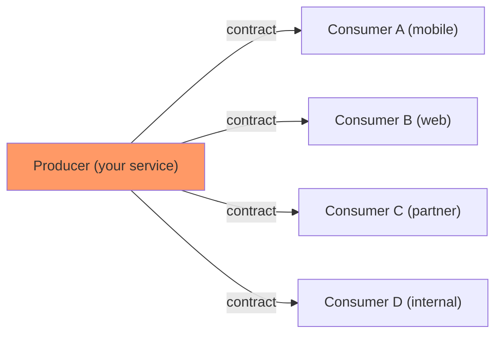
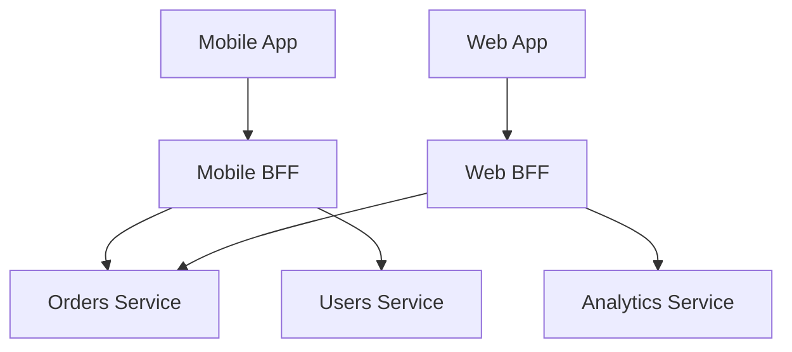

# API Design

## Chapter Goal

After reading this chapter, an experienced engineer can choose an API
style (REST, GraphQL, gRPC, WebSockets, event-driven) with a defensible
trade-off argument, design idempotent endpoints that survive retries,
implement cursor pagination that scales to millions of records, structure
error responses that clients can programmatically handle, version APIs
without breaking consumers, apply rate limiting strategies, and explain
API governance decisions in a Tech Lead interview.

## Why This Matters for a Tech Lead

An API is a contract. Once published, every consumer depends on its
behavior — status codes, field names, error shapes, pagination cursors.
A bad API contract is a long-term tax: every consumer inherits its
mistakes, and breaking changes cascade through the organization.

A Tech Lead must:

- Own the API style decision (REST vs GraphQL vs gRPC) based on
  consumer needs, not team preference. The wrong style forces every
  consumer to work around its limitations.
- Define the versioning and deprecation policy before the first
  consumer integrates. Retroactive versioning is exponentially harder.
- Establish idempotency requirements for any endpoint that mutates
  state. Without idempotency, network retries cause double-charges,
  duplicate records, and lost trust.
- Govern API consistency across teams. Without standards, 30 teams
  produce 30 incompatible error formats, pagination styles, and
  authentication patterns.
- Ensure backward compatibility is enforced in CI, not just
  documented. A single breaking change in a shared API can take down
  multiple downstream services simultaneously.

The cost of a bad API is measured in years of maintenance, not sprint
points.

**The API as a one-way door:** Once an API has external consumers, every
field name, status code, and behavior becomes a permanent commitment.
Internal code can be refactored in a sprint. An API field published to
200 partner integrations cannot be renamed without a 12-month migration.
This asymmetry means API design decisions deserve more review time than
internal architecture decisions — because the cost of getting them wrong
is measured in organizational coordination, not just engineering hours.

## Mental Model

An API is a **published contract between a producer and N consumers**,
where any change to the contract affects all N consumers simultaneously.



The blast radius of a breaking change is proportional to the number of
consumers. This is why APIs require more design discipline than internal
code — internal code can be refactored; a published API cannot.

**Three layers of an API contract:**

1. **Syntax** — URL paths, HTTP methods, request/response shapes, status
   codes. Enforced by OpenAPI/protobuf schemas.
2. **Semantics** — what the operation *means* (idempotency guarantees,
   ordering, consistency). Documented in prose, tested by contract tests.
3. **SLA** — latency, availability, rate limits, error budgets.
   Enforced by monitoring and load testing.

Breaking any layer breaks the contract, even if the syntax stays the
same.

## Core Terminology

| Term | Definition |
| --- | --- |
| **Resource** | A named entity in the API domain (user, order, payment). The fundamental noun of REST. |
| **Endpoint** | A specific URL path + HTTP method combination that performs an operation on a resource. |
| **Idempotency** | An operation that produces the same result regardless of how many times it is executed. |
| **Safe method** | An HTTP method that does not modify server state (GET, HEAD, OPTIONS). |
| **Idempotent method** | A method where repeating the request has no additional effect (GET, PUT, DELETE). POST is not idempotent by default. |
| **ETag** | An opaque identifier for a specific version of a resource. Used for conditional requests and cache validation. |
| **Conditional request** | A request with `If-Match`, `If-None-Match`, or `If-Modified-Since` headers. Enables optimistic concurrency. |
| **Cursor pagination** | Pagination using an opaque token (cursor) that points to the next page, enabling stable iteration over changing datasets. |
| **Problem+JSON** | RFC 9457 (formerly 7807) standard format for machine-readable HTTP error responses. |
| **Rate limit** | Maximum number of requests a client may make within a time window. Protects the producer from abuse. |
| **Quota** | A long-term usage limit (requests per day/month). Unlike rate limits, quotas represent a business constraint. |
| **Contract test** | A test that verifies a producer's API matches the expectations of its consumers. |
| **Backward compatibility** | A change that does not break existing consumers. Adding fields is backward-compatible; removing or renaming fields is not. |
| **Deprecation** | Marking an API version or field as obsolete, with a timeline for removal. |
| **BFF (Backend for Frontend)** | A dedicated API layer tailored to a specific client (mobile, web), aggregating backend services. |
| **API gateway** | An infrastructure component that handles cross-cutting concerns (auth, rate limiting, routing) in front of backend services. |

Distinguish closely related terms:

- **Idempotent** vs **Safe**: All safe methods are idempotent, but not
  all idempotent methods are safe. PUT is idempotent (repeating has no
  effect) but not safe (it modifies state).
- **Rate limit** vs **Quota**: Rate limit is short-term (100 req/sec).
  Quota is long-term (10,000 req/day). Both protect the producer but
  address different problems (burst vs total consumption).
- **Authentication** vs **Authorization**: Authentication proves who
  the client is. Authorization decides what they can access. An API
  gateway often handles both. See [Security](./15-security.md).
- **Versioning** vs **Deprecation**: Versioning creates a new contract
  version. Deprecation signals that the old version will be removed.
  You need both.

## Theoretical Foundation

### REST principles

REST (Representational State Transfer, Fielding 2000) is an
architectural style, not a specification. The constraints that define
REST:

1. **Client-server**: Separation of concerns. The client handles UI;
   the server handles data and logic.
2. **Stateless**: Each request contains all information needed to
   process it. No server-side session state between requests.
3. **Cacheable**: Responses must declare whether they are cacheable.
   Enables intermediate caches (CDN, browser).
4. **Uniform interface**: A consistent way to interact with resources
   (URIs, HTTP methods, representations, HATEOAS).
5. **Layered system**: The client cannot tell whether it is connected
   directly to the server or through intermediaries (proxies, gateways).
6. **Code on demand (optional)**: The server may transfer executable
   code to the client (JavaScript).

**HATEOAS (Hypermedia as the Engine of Application State):** The
response includes links to related actions. In theory, clients discover
the API by following links. In practice, almost no production API
implements HATEOAS fully — clients are coded against known URLs.

**Maturity model (Richardson):**

| Level | Description | Example |
| --- | --- | --- |
| 0 | Single endpoint, RPC-style | `POST /api` with action in body |
| 1 | Resources with distinct URIs | `GET /users/123` |
| 2 | HTTP methods used correctly | `DELETE /users/123` returns 204 |
| 3 | Hypermedia controls (HATEOAS) | Response includes `_links` |

Most production APIs target Level 2. Level 3 adds complexity that
rarely provides proportional value for internal or mobile APIs.

### Resource modeling

A **resource** is the fundamental abstraction in REST. Resources map
to domain entities — but not always 1:1 with database tables.

**Good resource design:**

```text
GET    /orders              → list orders
GET    /orders/{id}         → get single order
POST   /orders              → create order
PUT    /orders/{id}         → replace order
PATCH  /orders/{id}         → partial update
DELETE /orders/{id}         → cancel/delete order

GET    /orders/{id}/items   → list items in order (sub-resource)
POST   /orders/{id}/items   → add item to order
```

**Resource naming rules:**
- Use nouns, not verbs (`/orders`, not `/getOrders`).
- Use plural nouns (`/users`, not `/user`).
- Use lowercase with hyphens (`/order-items`, not `/orderItems`).
- Nest sub-resources when there is a clear parent-child relationship.
- Limit nesting to 2 levels (`/users/{id}/orders` is fine;
  `/users/{id}/orders/{oid}/items/{iid}/reviews` is too deep).

**Good vs bad endpoint naming:**

```text
BAD                              GOOD                          WHY
POST /getUsers                   GET /users                    verb in URL + wrong method
GET  /user/123                   GET /users/123                singular noun
POST /createNewOrder             POST /orders                  redundant verb
PUT  /updateUser/123/address     PATCH /users/123/address      PUT replaces entire resource
GET  /getAllOrdersForUser/5      GET /users/5/orders           deep verb-based path
DELETE /removeItem?id=9          DELETE /items/9               resource in path, not query
POST /api/v1/doPayment           POST /v1/payments             verb name, "do" prefix
GET  /orders_list                GET /orders                   suffix adds nothing
```

**What this does:** Shows common naming mistakes seen in production
codebases alongside the correct form following REST conventions.

**Why it is useful:** In an interview, demonstrating that you can
instantly spot naming violations signals API design maturity. Each
"BAD" example violates a specific REST principle (verbs in URLs,
singular nouns, misused methods).

**Common mistake:** Debating `/order` vs `/orders` during design and
not settling it — inconsistent pluralization across an API is worse
than either choice consistently applied.

**Production change:** Enforce naming conventions with an OpenAPI
linter (e.g., Spectral with a custom ruleset) in CI. Auto-reject PRs
that introduce non-conforming endpoint names.

**When resource modeling breaks down:**
- Operations that don't map to CRUD: use a verb endpoint or a
  "command" resource (`POST /orders/{id}/cancel`, or
  `POST /orders/{id}/actions` with `{"action": "cancel"}`).
- Bulk operations: `POST /orders/batch` or `PATCH /orders` with an
  array body. No universal standard.
- Search with complex filters: `POST /orders/search` with a JSON body
  (since GET has URL length limits for complex queries).

### HTTP methods

| Method | Semantics | Safe | Idempotent | Has body | Typical status |
| --- | --- | --- | --- | --- | --- |
| **GET** | Retrieve resource | Yes | Yes | No | 200, 404 |
| **POST** | Create resource or trigger action | No | No | Yes | 201, 202, 409 |
| **PUT** | Replace entire resource | No | Yes | Yes | 200, 204, 404 |
| **PATCH** | Partial update | No | No* | Yes | 200, 204, 409 |
| **DELETE** | Remove resource | No | Yes | Optional | 204, 404 |
| **HEAD** | Same as GET without body | Yes | Yes | No | 200, 404 |
| **OPTIONS** | List allowed methods (CORS preflight) | Yes | Yes | No | 204 |

*PATCH can be made idempotent if using JSON Merge Patch (RFC 7396) or
JSON Patch (RFC 6902) with conditional headers.

```ts
// Express router showing correct method semantics
const router = express.Router();

router.get("/orders",        listOrders);         // safe, cacheable, idempotent
router.get("/orders/:id",    getOrder);           // safe, cacheable, idempotent
router.post("/orders",       createOrder);        // NOT idempotent → needs Idempotency-Key
router.put("/orders/:id",    replaceOrder);       // idempotent (full replacement)
router.patch("/orders/:id",  updateOrderStatus);  // partial update (use If-Match for safety)
router.delete("/orders/:id", cancelOrder);        // idempotent (deleting twice = same state)

// Non-CRUD action: modeled as a sub-resource command
router.post("/orders/:id/refund", refundOrder);   // NOT idempotent → needs Idempotency-Key
```

**What this does:** Maps HTTP methods to domain operations with comments
explaining safety and idempotency characteristics.

**Why it is useful:** Demonstrates in an interview that you think
about retry safety at design time, not after production incidents.

**Common mistake:** Using POST for everything. POST is the only
non-idempotent method — network retries are unsafe without additional
safeguards (idempotency keys).

### Status codes

Group by first digit:

| Range | Meaning | Tech Lead concern |
| --- | --- | --- |
| **2xx** | Success | Distinguish 200 (with body), 201 (created + Location header), 202 (accepted, async), 204 (no content) |
| **3xx** | Redirection | 301 (permanent), 304 (not modified — cache hit) |
| **4xx** | Client error | 400 (bad request), 401 (unauthenticated), 403 (unauthorized), 404 (not found), 409 (conflict), 422 (validation), 429 (rate limited) |
| **5xx** | Server error | 500 (unexpected), 502 (bad gateway), 503 (service unavailable — use for maintenance), 504 (gateway timeout) |

**Key distinctions:**
- **401 vs 403**: 401 means "I don't know who you are" (missing/invalid
  token). 403 means "I know who you are, but you lack permission."
- **400 vs 422**: 400 is for malformed requests (invalid JSON, wrong
  Content-Type). 422 is for well-formed requests that fail business
  validation (email already taken).
- **404 vs 403 (security)**: When a resource exists but the user lacks
  access, return 404 (not 403) to avoid leaking existence information.

```ts
// Status code decision tree in a handler
async function updateOrder(req: Request, res: Response) {
  const order = await db.orders.findById(req.params.id);
  if (!order) return res.status(404).json({ type: "/errors/not-found" });       // resource doesn't exist
  if (order.userId !== req.user.id) return res.status(404).json({ type: "/errors/not-found" }); // 404, not 403 (hide existence)

  const result = CreateOrderSchema.safeParse(req.body);
  if (!result.success) return res.status(422).json(formatErrors(result.error));  // valid JSON, failed business validation

  const etag = req.headers["if-match"];
  if (etag && etag !== order.version) return res.status(409).json({ type: "/errors/conflict" }); // optimistic lock failure

  const updated = await db.orders.update(req.params.id, result.data);
  return res.status(200).json(updated);                                          // 200 with body (not 204: client needs updated state)
}
```

**What this does:** Shows how a single handler uses four different
status codes based on context — each representing a different failure
mode the client must handle differently.

**Why it is useful:** Interviewers look for candidates who understand
that status codes are the API's type system for intermediaries. Load
balancers, CDNs, and monitoring tools interpret them — a 404 is
retryable by the user, a 409 means "fetch fresh state and retry," and
a 422 means "fix your input."

**Common mistake:** Returning 200 for everything with an `error` field
in the body. This defeats HTTP infrastructure (monitors can't alert,
caches can't distinguish success from failure).

**Production rule:** Never return a bare status code without a response
body. Clients need machine-readable error details to handle failures
programmatically.

### Headers

Important headers for API design:

| Header | Direction | Purpose |
| --- | --- | --- |
| `Content-Type` | Both | Media type of the body (`application/json`) |
| `Accept` | Request | Client's preferred response format |
| `Authorization` | Request | Credentials (`Bearer <token>`) |
| `Idempotency-Key` | Request | Client-generated key for safe retries |
| `ETag` | Response | Resource version identifier |
| `If-Match` | Request | Conditional update (optimistic locking) |
| `If-None-Match` | Request | Conditional GET (cache validation) |
| `Cache-Control` | Response | Caching directives |
| `Retry-After` | Response | How long to wait after 429 or 503 |
| `X-Request-Id` | Both | Correlation ID for distributed tracing |
| `Link` | Response | Pagination links (`rel="next"`) |

**Custom headers:** Prefix with the organization name
(`X-Acme-Tenant-Id`). The `X-` convention is deprecated (RFC 6648)
but still widely used in practice.

### Idempotency

An operation is **idempotent** if executing it once or N times produces
the same server state. This is critical for network reliability —
clients must be able to retry requests safely.

**Methods by idempotency:**
- GET, PUT, DELETE: idempotent by specification.
- POST, PATCH: NOT idempotent by default.

**Making POST idempotent with an idempotency key:**

```ts
// Client generates a unique key per logical operation
const response = await fetch("/api/payments", {
  method: "POST",
  headers: {
    "Content-Type": "application/json",
    "Idempotency-Key": crypto.randomUUID(),
  },
  body: JSON.stringify({ amount: 5000, currency: "USD", recipient: "acct_123" }),
});
```

```ts
// Server-side: check if key was already processed
async function createPayment(req: Request, res: Response) {
  const key = req.headers["idempotency-key"];
  if (!key) return res.status(400).json({ error: "Idempotency-Key required" });

  const existing = await redis.get(`idempotency:${key}`);
  if (existing) return res.status(200).json(JSON.parse(existing));

  const payment = await processPayment(req.body);
  await redis.set(`idempotency:${key}`, JSON.stringify(payment), "EX", 86400);
  return res.status(201).json(payment);
}
```

**What this does:** The client attaches a unique key to each logical
request. The server stores the result keyed by the idempotency key.
Retries with the same key return the cached result without
re-processing.

**Why it is useful:** Network failures are inevitable. Without
idempotency, a retry on a payment endpoint causes a double-charge. The
idempotency key makes retries safe and invisible to the user.

**Common mistake:** Using the request body hash as the idempotency key.
Two identical requests (same amount, same recipient) from different
users would collide. The key must be client-generated and unique per
logical operation.

**Production change:** Store idempotency keys in Redis with a TTL
(24–72 hours). Add a `processing` state to prevent concurrent duplicate
submissions (lock the key before processing, set result after). Return
the original status code (201) on first call and the same on retries —
the client should not distinguish first from retry.

### Pagination

Three strategies:

| Strategy | How | Pros | Cons |
| --- | --- | --- | --- |
| **Offset** | `?offset=100&limit=20` | Random access, simple | Slow at depth, inconsistent under writes |
| **Cursor (keyset)** | `?cursor=eyJ...&limit=20` | Fast at any depth, consistent | No random access, opaque token |
| **Page number** | `?page=5&size=20` | Human-readable | Same performance issues as offset |

**Cursor pagination (recommended for APIs):**

```ts
// Response shape
interface PaginatedResponse<T> {
  data: T[];
  pagination: {
    hasMore: boolean;
    nextCursor: string | null;  // opaque, base64-encoded
    prevCursor: string | null;
  };
}
```

```sql
-- Server: decode cursor, query with keyset condition
SELECT id, title, created_at FROM orders
WHERE (created_at, id) < ($cursor_ts, $cursor_id)
ORDER BY created_at DESC, id DESC
LIMIT 21;  -- fetch limit+1 to determine hasMore
```

**Why cursor pagination wins for APIs:**
- Consistent results when data is being written (no skipped/duplicated
  rows from offset shifts).
- O(1) performance per page regardless of depth (index seek vs scan).
- Opaque cursor hides implementation details — the pagination strategy
  can change without breaking clients.

**When offset is acceptable:** Admin panels with small datasets (<10K
rows) where random page access is required. Always set a maximum offset
(e.g., 10,000) to prevent abuse.

### Filtering and sorting

**Filtering patterns:**

```text
GET /orders?status=pending&created_after=2024-01-01
GET /orders?filter[status]=pending&filter[created_after]=2024-01-01
GET /orders?q=status:pending AND created_at>2024-01-01
```

Choose one pattern and apply it consistently. The first (flat query
params) is simplest and sufficient for most APIs. The third (query
language) is flexible but harder to secure (injection risk).

**Sorting:**

```text
GET /orders?sort=-created_at,+total
GET /orders?sort=created_at:desc,total:asc
```

```ts
// Safe filtering and sorting with whitelisting
const ALLOWED_FILTERS = new Set(["status", "created_after", "created_before", "customer_id"]);
const ALLOWED_SORTS = new Set(["created_at", "total", "status"]);

function parseListParams(query: Record<string, string>) {
  const filters: Record<string, string> = {};
  for (const [key, value] of Object.entries(query)) {
    if (key === "sort" || key === "cursor" || key === "limit") continue;
    if (!ALLOWED_FILTERS.has(key)) {
      throw new ApiError("/errors/invalid-filter", `Unknown filter: ${key}`, 400);
    }
    filters[key] = value;
  }

  const sortParam = query.sort ?? "-created_at";
  const sortFields = sortParam.split(",").map((field) => {
    const direction = field.startsWith("-") ? "desc" : "asc";
    const name = field.replace(/^[+-]/, "");
    if (!ALLOWED_SORTS.has(name)) {
      throw new ApiError("/errors/invalid-sort", `Cannot sort by: ${name}`, 400);
    }
    return { name, direction };
  });
  // Always append id for stable sort
  sortFields.push({ name: "id", direction: "asc" });

  return { filters, sortFields };
}
```

**What this does:** Validates and parses filter/sort query parameters
against explicit whitelists. Unknown fields are rejected with 400, not
silently ignored.

**Why it is useful:** Prevents arbitrary column sorting (which requires
database indexes to be performant) and avoids information leakage
through filter probing.

**Common mistake:** Passing sort/filter values directly to the ORM
without validation — allows sorting by unindexed columns (full table
scan) or filtering by internal fields (data leakage).

**Production change:** Document allowed filters and sorts in OpenAPI
(`x-filterable: true` extension). Generate the whitelist from the
schema to avoid drift.

**Production rules:**
- Whitelist sortable fields. Never allow sorting by arbitrary fields
  (requires indexes).
- Default to a stable sort (include `id` as tie-breaker).
- Document which fields are filterable/sortable in OpenAPI.
- Reject unknown filter/sort fields with 400, not silently ignore them.

### Versioning

| Strategy | How | Pros | Cons |
| --- | --- | --- | --- |
| **URL path** | `/v1/orders`, `/v2/orders` | Explicit, easy routing | Pollutes URLs, hard to share links across versions |
| **Custom header** | `Api-Version: 2` | Clean URLs | Hidden, harder to test in browser |
| **Content negotiation** | `Accept: application/vnd.api+json;version=2` | Standards-based | Complex, rarely implemented fully |
| **Query param** | `?version=2` | Simple to test | Easily forgotten, cache key pollution |

**Recommendation:** URL path versioning for public APIs (explicit,
discoverable). Custom header or content negotiation for internal APIs
(cleaner, less URL pollution).

**What counts as a breaking change:**

| Breaking | Non-breaking |
| --- | --- |
| Removing a field | Adding a new optional field |
| Renaming a field | Adding a new endpoint |
| Changing a field's type | Adding a new enum value (if clients ignore unknown) |
| Changing the meaning of a status code | Adding a new optional query parameter |
| Removing an endpoint | Widening an input constraint (accept more values) |
| Tightening a validation rule | Relaxing a validation rule |

```ts
// Version-aware routing with deprecation headers
function versionMiddleware(req: Request, res: Response, next: NextFunction) {
  const version = parseInt(req.path.split("/")[1]?.replace("v", ""), 10);
  if (!version || version < 1) {
    return res.status(400).json({ type: "/errors/invalid-version", title: "Missing API version" });
  }

  const CURRENT_VERSION = 2;
  const SUNSET_VERSIONS: Record<number, string> = { 1: "2025-03-01" };

  if (SUNSET_VERSIONS[version]) {
    const sunset = SUNSET_VERSIONS[version];
    if (new Date() > new Date(sunset)) {
      return res.status(410).json({ type: "/errors/gone", title: `API v${version} has been sunset` });
    }
    res.setHeader("Deprecation", "true");
    res.setHeader("Sunset", new Date(sunset).toUTCString());
    res.setHeader("Link", `</v${CURRENT_VERSION}${req.path.slice(3)}>; rel="successor-version"`);
  }
  next();
}
```

**What this does:** A middleware that detects the requested version,
attaches `Deprecation` and `Sunset` headers on deprecated versions,
and returns 410 Gone after the sunset date.

**Why it is useful:** Demonstrates a production versioning lifecycle —
consumers get machine-readable warnings before enforcement.

**Common mistake:** Removing old endpoints without a deprecation
period. Consumers discover the break in production, not before.

**Production change:** Log all requests to deprecated versions with
client identity (`API-Key` or JWT `sub`). Proactively contact
consumers still calling deprecated endpoints before the sunset date.

**Deprecation lifecycle:**
1. Announce deprecation (header: `Deprecation: true`, `Sunset: <date>`).
2. Log usage of deprecated endpoints — identify consumers still calling
   them.
3. Communicate to consumers with a migration deadline.
4. After sunset date, return 410 Gone.

### Validation

**Validate at the boundary — the API layer:**

```ts
import { z } from "zod";

const CreateOrderSchema = z.object({
  items: z.array(z.object({
    productId: z.string().uuid(),
    quantity: z.number().int().positive().max(100),
  })).min(1).max(50),
  currency: z.enum(["USD", "EUR", "GBP"]),
  shippingAddressId: z.string().uuid(),
});

type CreateOrderInput = z.infer<typeof CreateOrderSchema>;

function createOrder(req: Request) {
  const result = CreateOrderSchema.safeParse(req.body);
  if (!result.success) {
    return res.status(422).json(formatValidationError(result.error));
  }
  // result.data is fully typed and validated
}
```

**Validation rules:**
- Validate syntactic correctness at the API layer (types, formats,
  ranges).
- Validate business rules in the domain layer (inventory available,
  account has funds).
- Return different error codes: 422 for validation failures, 409 for
  business conflicts.
- Never trust client input — validate even internal API calls.

**Tech Lead perspective on validation:** Validation is a security
boundary, not just a convenience. The Tech Lead decides: (1) Which
validation library is the org standard (Zod, Joi, JSON Schema)? Pick
one and publish it as a shared package — teams should not invent their
own. (2) Where does validation live architecturally? At the API
boundary (always), and optionally at the domain layer for business
rules. Never in the database only (errors are unreadable and
language-specific). (3) How strict is the API? `additionalProperties:
false` in OpenAPI rejects unknown fields — this prevents clients from
accidentally depending on undocumented behavior. Strictness at the
boundary gives you freedom to evolve internals.

### Error responses

**RFC 9457 (Problem Details for HTTP APIs):**

```json
{
  "type": "https://api.example.com/errors/insufficient-funds",
  "title": "Insufficient Funds",
  "status": 422,
  "detail": "Account acct_123 has $45.00 but $50.00 is required.",
  "instance": "/payments/pay_abc",
  "balance_cents": 4500,
  "required_cents": 5000
}
```

**Why this format:** Machine-readable `type` field enables programmatic
error handling. Human-readable `title` and `detail` help debugging.
Extension fields (`balance_cents`) carry domain-specific context.

**Error response rules:**
- Every error has a `type` URI (stable, versionable).
- Every error has a numeric `status` matching the HTTP status code.
- Never expose internal stack traces or database errors to clients.
- Use consistent error shape across all endpoints.
- Document error types in OpenAPI.

**Validation errors (multiple fields):**

```json
{
  "type": "https://api.example.com/errors/validation",
  "title": "Validation Failed",
  "status": 422,
  "errors": [
    { "field": "items[0].quantity", "message": "Must be positive", "code": "positive" },
    { "field": "currency", "message": "Must be one of: USD, EUR, GBP", "code": "enum" }
  ]
}
```

### OpenAPI

OpenAPI (formerly Swagger) is the standard for describing REST APIs.
A schema serves as:

- **Documentation** — generated developer portals.
- **Contract** — validated in CI (breaking change detection).
- **Code generation** — typed clients, server stubs, mock servers.
- **Testing** — request/response validation against the schema.

```yaml
openapi: "3.1.0"
info:
  title: Orders API
  version: "1.0.0"
paths:
  /orders:
    post:
      operationId: createOrder
      summary: Create a new order
      requestBody:
        required: true
        content:
          application/json:
            schema:
              $ref: "#/components/schemas/CreateOrderRequest"
      responses:
        "201":
          description: Order created
          headers:
            Location:
              schema: { type: string }
          content:
            application/json:
              schema:
                $ref: "#/components/schemas/Order"
        "422":
          description: Validation error
          content:
            application/problem+json:
              schema:
                $ref: "#/components/schemas/ProblemDetail"
```

**Tech Lead perspective:** Require OpenAPI schemas to be committed to
the repository and validated in CI. Use tools like `openapi-diff` or
`optic` to detect breaking changes before merge. Generate clients from
the schema — never hand-write API clients for internal services.

**Schema-first vs code-first — a Tech Lead decision:**

| Approach | How | Pros | Cons | Use when |
| --- | --- | --- | --- | --- |
| Schema-first | Write OpenAPI YAML → generate stubs | Contract is explicit, reviewed before code | Slower initial iteration | Public APIs, multi-team APIs |
| Code-first | Write handlers → generate OpenAPI from decorators | Fast iteration, schema always matches code | Schema is a byproduct, may have gaps | Internal APIs, prototypes |

The Tech Lead decides which approach each API uses. For external APIs
and shared platform APIs: schema-first (the contract is the artifact).
For internal team APIs: code-first is acceptable if schema validation
still runs in CI. The worst outcome is no schema at all — undocumented
APIs accumulate tribal knowledge that leaves with the team.

### GraphQL

GraphQL is a query language for APIs where the client specifies
exactly which fields it needs.

**When GraphQL fits:**
- Multiple clients with different data needs (mobile wants fewer
  fields than web).
- Deeply nested data with variable shapes (product → reviews →
  authors → avatar).
- Rapid frontend iteration where backend changes are a bottleneck.

**When GraphQL hurts:**
- Simple CRUD APIs with uniform consumers.
- File uploads and streaming (workarounds exist but are awkward).
- Caching (HTTP caching breaks because everything is POST to one
  endpoint).
- Authorization complexity (field-level access control is hard).

```text
# Schema definition — typed contract between client and server
type Order {
  id: ID!
  status: OrderStatus!
  total: Money!
  items: [OrderItem!]!
  customer: Customer!
  createdAt: DateTime!
}

type OrderItem {
  product: Product!
  quantity: Int!
  lineTotal: Money!
}

enum OrderStatus { PENDING, CONFIRMED, SHIPPED, DELIVERED, CANCELLED }

type Query {
  order(id: ID!): Order
  orders(first: Int!, after: String): OrderConnection!
}

type Mutation {
  createOrder(input: CreateOrderInput!): Order!
  cancelOrder(id: ID!, reason: String): Order!
}
```

```ts
// Client query — requests exactly the fields it needs
const query = `
  query GetOrder($id: ID!) {
    order(id: $id) {
      id
      status
      total { amount, currency }
      items { product { name, price { amount } } }
      customer { email }
    }
  }
`;
```

**What this does:** The schema defines the typed contract (what exists);
the query specifies the projection (what the client wants). The server
resolves only requested fields.

**Why it is useful:** In an interview, showing both schema and query
demonstrates understanding of GraphQL's two-sided nature — schema
design (server) and query composition (client).

**Common mistake:** Designing GraphQL schemas that mirror the database
tables 1:1. The schema should model the domain graph as clients
experience it, not the storage layer.

**Production change:** Use schema federation (Apollo Federation) to
compose schemas from multiple services. Each team owns its subgraph.
The gateway composes them into a unified schema.

**Trade-offs vs REST:**

| Dimension | REST | GraphQL |
| --- | --- | --- |
| Over-fetching | Common (fixed response shape) | Eliminated (client picks fields) |
| Under-fetching | Multiple round-trips | Single query resolves all |
| Caching | HTTP caching (CDN, ETag) | Custom caching (Apollo, Relay) |
| Tooling | Mature (OpenAPI, Postman) | Growing (Apollo Studio, GraphiQL) |
| Learning curve | Low | Medium-high (schema, resolvers, N+1) |
| Error handling | HTTP status codes | Always 200, errors in response body |
| File upload | Multipart form | Separate upload endpoint |

**N+1 problem in GraphQL:** A resolver that fetches one item per parent
row. Fix with DataLoader (batches N individual fetches into one query).

**Query complexity and depth limiting:**

```ts
// Protect against malicious deep queries
const depthLimit = require("graphql-depth-limit");
const costAnalysis = require("graphql-cost-analysis");

const server = new ApolloServer({
  validationRules: [
    depthLimit(7),
    costAnalysis({ maximumCost: 1000 }),
  ],
});
```

### WebSockets

WebSockets provide full-duplex communication over a persistent TCP
connection. The client and server can push messages to each other at
any time without polling.

**When to use WebSockets:**
- Real-time updates: chat, live dashboards, collaborative editing.
- High-frequency data: stock tickers, game state, IoT telemetry.
- Bidirectional communication: the server needs to push without client
  polling.

**When NOT to use WebSockets:**
- Simple request-response APIs (HTTP is simpler and cacheable).
- Low-frequency updates (SSE or long-polling is simpler to operate).
- Stateless infrastructure requirements (WebSockets are stateful;
  load balancing is harder).

**Alternative: Server-Sent Events (SSE):**

| Feature | WebSocket | SSE |
| --- | --- | --- |
| Direction | Bidirectional | Server → client only |
| Protocol | Custom binary frames | HTTP (text/event-stream) |
| Reconnection | Manual | Built-in (browser auto-reconnects) |
| Load balancing | Sticky sessions needed | Standard HTTP LB works |
| Complexity | High | Low |

```ts
// WebSocket event protocol — structured message format
interface WsMessage {
  type: string;           // namespace.action (e.g., "order.updated")
  id: string;            // unique message ID for deduplication
  timestamp: string;     // ISO 8601
  data: unknown;         // event-specific payload
}

// Server → client events (past tense = something happened)
type ServerEvents =
  | { type: "order.created"; data: { orderId: string; status: string } }
  | { type: "order.updated"; data: { orderId: string; changes: string[] } }
  | { type: "chat.message.received"; data: { from: string; body: string } }
  | { type: "connection.error"; data: { code: number; reason: string } };

// Client → server events (imperative = requesting an action)
type ClientEvents =
  | { type: "subscribe"; data: { channels: string[] } }
  | { type: "unsubscribe"; data: { channels: string[] } }
  | { type: "chat.message.send"; data: { to: string; body: string } }
  | { type: "ping"; data: {} };
```

**What this does:** Defines a typed event protocol for WebSocket
communication with clear naming conventions — server events use past
tense (notification), client events use imperative (command).

**Why it is useful:** Without structured message types, WebSocket APIs
become undebuggable blobs. Typed events enable autocomplete, logging,
and versioning of the message protocol.

**Common mistake:** Sending untyped JSON with no `type` discriminator.
Clients end up parsing messages by shape-matching, which breaks silently
when the server adds fields.

**Production change:** Version the message protocol separately from the
HTTP API. Include a `version` field in the connection handshake. Support
protocol negotiation so old clients and new servers coexist.

**Tech Lead perspective:** Default to SSE for server-push use cases
(notifications, live feeds). Use WebSockets only when bidirectional
communication is genuinely required. WebSocket connections are
expensive (memory per connection, sticky sessions, connection draining
during deploys).

### Webhooks

Webhooks are HTTP callbacks — the producer sends an HTTP POST to a
consumer-registered URL when an event occurs.

**Webhook design checklist:**
- Require HTTPS endpoints only.
- Sign payloads with HMAC-SHA256 so consumers can verify authenticity.
- Include an event type and timestamp in every payload.
- Implement retry with exponential backoff (3 retries over 1 hour).
- Provide a "test" endpoint for consumers to verify integration.
- Log delivery status (success, failure, retry count).
- Allow consumers to list and replay missed events.

```json
{
  "id": "evt_abc123",
  "type": "order.completed",
  "created_at": "2024-06-15T10:30:00Z",
  "data": {
    "order_id": "ord_456",
    "total_cents": 5000,
    "currency": "USD"
  },
  "webhook_id": "wh_789"
}
```

**Security:** Consumers must verify the HMAC signature before
processing. Without verification, any attacker can forge webhook
payloads.

```ts
import crypto from "node:crypto";

function verifyWebhook(req: Request, secret: string): boolean {
  const signature = req.headers["x-signature-256"] as string;
  const timestamp = req.headers["x-webhook-timestamp"] as string;

  // Reject stale webhooks (prevent replay attacks)
  const age = Date.now() - new Date(timestamp).getTime();
  if (age > 5 * 60 * 1000) return false;  // >5 min old

  // Compute HMAC over timestamp + body (timestamp prevents replay with captured signature)
  const signedPayload = `${timestamp}.${req.body}`;
  const expected = crypto.createHmac("sha256", secret).update(signedPayload).digest("hex");
  return crypto.timingSafeEqual(Buffer.from(signature, "hex"), Buffer.from(expected, "hex"));
}

// Express middleware
function webhookAuth(secret: string) {
  return (req: Request, res: Response, next: NextFunction) => {
    if (!verifyWebhook(req, secret)) {
      return res.status(401).json({ type: "/errors/invalid-signature" });
    }
    next();
  };
}
```

**What this does:** Verifies both the HMAC signature and the timestamp
to prevent replay attacks. Uses `timingSafeEqual` to prevent timing
side-channel attacks.

**Why it is useful:** Many engineers implement signature verification
but forget replay protection. Including the timestamp in the signed
payload and rejecting stale timestamps covers both attack vectors.

**Common mistake:** Using `===` instead of `timingSafeEqual` for
signature comparison. String comparison short-circuits on the first
non-matching character, leaking information about the expected value
through response timing.

**Production change:** Store processed webhook IDs (the `id` field from
the payload) in a set with TTL to deduplicate. Some providers retry on
timeout — your handler must be idempotent.

### API gateways

An API gateway is a reverse proxy that sits in front of backend
services and handles cross-cutting concerns:

| Concern | Gateway handles | Backend freed from |
| --- | --- | --- |
| Authentication | Token validation, JWT verification | Auth logic duplication |
| Rate limiting | Token bucket per client | Per-service rate limit code |
| Routing | Path-based routing to services | Service discovery in clients |
| TLS termination | HTTPS → HTTP internally | Certificate management |
| Request transformation | Header injection, body rewriting | Adapter code |
| Observability | Access logs, latency metrics | Consistent logging format |

**Common gateways:** Kong, AWS API Gateway, Envoy, NGINX, Traefik,
Azure API Management.

**When a gateway adds value:**
- Multiple backend services behind one public URL.
- Centralized auth and rate limiting for external APIs.
- Request routing based on headers or path.

**When a gateway hurts:**
- Single backend with no cross-cutting needs (added latency, no
  benefit).
- When teams cannot deploy independently due to shared gateway
  configuration.
- When the gateway becomes a single point of failure without proper
  HA.

### BFF pattern (Backend for Frontend)

A BFF is a dedicated backend service tailored to a specific client
type (mobile, web, smart TV).



**Why BFF exists:**
- Mobile needs smaller payloads (bandwidth-constrained).
- Web needs richer data in fewer round-trips.
- Each client evolves at different speeds (mobile release cycles vs
  web continuous deploy).

**When to use BFF:**
- Two or more clients with significantly different data needs.
- Clients need aggregated data from multiple backend services.
- Client teams want to move independently of backend teams.

**When to avoid BFF:**
- Single client type (just put the aggregation in the API).
- BFF becomes a dumping ground for business logic (it should only
  orchestrate, not contain domain logic).
- Team cannot maintain N additional services.

```ts
// Mobile BFF: aggregates multiple services into one lean response
async function getMobileOrderSummary(req: Request, res: Response) {
  const orderId = req.params.id;

  // Parallel fan-out to backend services
  const [order, customer, tracking] = await Promise.all([
    ordersService.get(orderId),
    usersService.get(req.user.id),
    shippingService.getTracking(orderId).catch(() => null),  // graceful degradation
  ]);

  // Mobile-optimized response: only essential fields, single payload
  return res.json({
    id: order.id,
    status: order.status,
    total: `${order.currency} ${(order.totalCents / 100).toFixed(2)}`,
    itemCount: order.items.length,
    customerName: customer.firstName,
    tracking: tracking ? { carrier: tracking.carrier, eta: tracking.eta } : null,
  });
}

// Web BFF for the same order would include: full item list, price breakdown,
// invoice link, edit actions, admin notes — a very different response shape.
```

**What this does:** The mobile BFF fetches from three backend services
in parallel and returns a minimal payload tailored for mobile screens.
The web BFF (not shown) would aggregate more data for a richer desktop UI.

**Why it is useful:** Demonstrates the core BFF value proposition — each
client gets exactly the data it needs without over-fetching or multiple
round-trips. The backend services remain generic.

**Common mistake:** Putting business logic in the BFF (price
calculations, order validation). The BFF should only orchestrate,
transform, and cache — never own domain rules.

**Production change:** Add per-service timeout budgets (e.g., 2s total,
no single service over 1s). Use circuit breakers per upstream service.
Return partial responses with a `degraded: true` flag when non-critical
services fail.

**Tech Lead perspective:** A BFF is owned by the client team, not the
backend team. This gives frontend teams autonomy to shape their API
without waiting for backend PRs. The BFF contains no business logic —
only orchestration, transformation, and caching.

### Rate limiting

Rate limiting protects the producer from abuse and ensures fair usage
across clients.

**Algorithms:**

| Algorithm | How | Pros | Cons |
| --- | --- | --- | --- |
| **Fixed window** | Count requests in a time window (e.g., 100/min) | Simple | Burst at window boundary (double rate) |
| **Sliding window** | Weighted average of current and previous window | Smoother than fixed | Slightly more complex |
| **Token bucket** | Tokens refill at a rate; each request consumes one | Allows controlled bursts | Harder to explain limits to users |
| **Leaky bucket** | Requests queue and drain at a fixed rate | Perfectly smooth output | No burst tolerance, latency spikes |

**Response headers (draft standard):**

```text
HTTP/1.1 429 Too Many Requests
Retry-After: 30
RateLimit-Limit: 100
RateLimit-Remaining: 0
RateLimit-Reset: 1718450000
```

**Implementation pattern:**

```ts
// Redis-based sliding window rate limiter
async function checkRateLimit(clientId: string, limit: number, windowSec: number): Promise<boolean> {
  const key = `ratelimit:${clientId}`;
  const now = Date.now();
  const windowStart = now - windowSec * 1000;

  await redis.zremrangebyscore(key, 0, windowStart);
  const count = await redis.zcard(key);
  if (count >= limit) return false;

  await redis.zadd(key, now, `${now}:${crypto.randomUUID()}`);
  await redis.expire(key, windowSec);
  return true;
}
```

```ts
// Rate limit middleware: attach headers to EVERY response, reject when exhausted
async function rateLimitMiddleware(req: Request, res: Response, next: NextFunction) {
  const clientId = req.headers["x-api-key"] as string;
  const tier = await getClientTier(clientId); // { limit: 1000, windowSec: 60 }

  const { allowed, remaining, resetAt } = await checkRateLimit(clientId, tier.limit, tier.windowSec);

  // Always set headers — even on successful requests
  res.setHeader("RateLimit-Limit", tier.limit);
  res.setHeader("RateLimit-Remaining", remaining);
  res.setHeader("RateLimit-Reset", Math.ceil(resetAt / 1000));

  if (!allowed) {
    res.setHeader("Retry-After", Math.ceil((resetAt - Date.now()) / 1000));
    return res.status(429).json({
      type: "https://api.example.com/errors/rate-limit-exceeded",
      title: "Rate Limit Exceeded",
      status: 429,
      detail: `Limit of ${tier.limit} requests per ${tier.windowSec}s exceeded. Retry after ${Math.ceil((resetAt - Date.now()) / 1000)}s.`,
    });
  }
  next();
}
```

**What this does:** Attaches rate limit metadata to every response (so
clients can self-regulate) and returns a structured 429 error with
`Retry-After` when the limit is reached.

**Why it is useful:** Clients that monitor `RateLimit-Remaining` can
back off before hitting the limit. The `Retry-After` header enables
automatic retry logic without guessing.

**Common mistake:** Only returning rate limit headers on 429 responses.
Clients need the remaining count on every response to implement
proactive backoff.

**Production change:** Implement tiered limits per client plan (free,
pro, enterprise). Add alert rules: if a legitimate client consistently
hits limits, it signals a limit too low, not abuse.

**Tech Lead perspective:** Rate limits are a product decision, not just
a technical one. Define limits per client tier (free: 100/min, pro:
1000/min, enterprise: custom). Communicate limits clearly in
documentation and response headers. Alert when legitimate clients are
being rate-limited — it may indicate a needed limit increase, not
abuse.

### API security

Security concerns specific to APIs (see [Security](./15-security.md)
for general security topics):

**Authentication patterns:**

| Pattern | Use case | Pros | Cons |
| --- | --- | --- | --- |
| **API key** | Server-to-server, simple | Easy to implement | No identity, hard to rotate |
| **OAuth 2.0 + JWT** | User-facing APIs | Standard, fine-grained scopes | Complex setup, token management |
| **mTLS** | Service mesh, internal | Strong identity, no tokens | Certificate management overhead |
| **Session cookie** | Web apps (same-origin) | Browser-native, CSRF protection | Not suitable for mobile/API |

**Security checklist for APIs:**
- Use HTTPS exclusively (HSTS header).
- Validate all input (reject unknown fields: `additionalProperties:
  false` in OpenAPI).
- Implement rate limiting to prevent brute-force and DDoS.
- Return 404 (not 403) for resources the user cannot access (prevent
  enumeration).
- Log authentication failures; alert on anomalous patterns.
- Set short JWT expiry (15 min) with refresh tokens.
- Use CORS restrictively (whitelist origins, not `*`).
- Strip sensitive data from error responses (no stack traces, no SQL).

### Backward compatibility

**The golden rule:** Never break existing consumers. Additive changes
only in the current version.

**Safe changes (non-breaking):**
- Add a new optional field to a response.
- Add a new endpoint.
- Add a new optional query parameter.
- Add a new enum value (if consumers ignore unknown values).
- Relax a validation constraint (accept wider input).

**Unsafe changes (breaking):**
- Remove or rename a field.
- Change a field's type.
- Add a required field to a request.
- Tighten a validation constraint (reject previously valid input).
- Change the semantics of an endpoint.
- Change the meaning of a status code.

**Enforcement in CI:**

```ts
// Backward-compatible field evolution: rename without breaking consumers
// Phase 1: Add new field alongside old (both populated)
interface OrderResponseV1 {
  order_total: number;       // old name (deprecated, still returned)
  total_cents: number;       // new name (canonical)
  currency: string;
}

// Phase 2: Announce deprecation (response header + documentation)
// Deprecation: true
// Sunset: Sat, 01 Mar 2025 00:00:00 GMT

// Phase 3: After sunset, stop returning old field
interface OrderResponseV1Final {
  total_cents: number;
  currency: string;
}
```

```yaml
# CI check: detect breaking changes before merge
# .github/workflows/api-compat.yml
- name: Check API backward compatibility
  run: |
    npx @optic/cli diff openapi.yaml --base origin/main --check
    # Fails if: field removed, type changed, required field added,
    # enum value removed, endpoint removed
```

**What this does:** Shows the expand-and-contract pattern for renaming
a field without breaking consumers. The old field is kept during a
deprecation window, then removed after sunset.

**Why it is useful:** Field renames are the most common source of
accidental breaking changes. This pattern allows zero-downtime migration
for consumers.

**Common mistake:** Renaming a field in one release ("it's just a
rename, no one will notice"). Every consumer parsing the old name gets
`undefined` silently — a bug that may not surface for days.

**Production change:** Track which consumers still use deprecated
fields (log requests that trigger deprecated field resolution). Contact
consumers proactively before the sunset date.

**Tech Lead perspective:** Backward compatibility is the most important
API design skill. A single breaking change deployed without coordination
can cascade across 10+ consumer services. Enforce it in CI with schema
diff tools. When a breaking change is necessary, create a new version
and run both in parallel until all consumers migrate.

### Contract testing

Contract testing verifies that a producer's actual behavior matches
what consumers expect — without deploying all services together.

**Consumer-driven contracts (Pact model):**
1. Consumer writes a "pact" — expected request/response pairs.
2. Producer runs the pact tests against its actual implementation.
3. If the producer changes break a pact, the CI fails before merge.

**Benefits over end-to-end tests:**
- Fast (no service deployment needed).
- Specific (tells you which consumer breaks).
- Independent (teams test in isolation).

**When to use contract tests:**
- Multiple consumers depending on one producer.
- Microservices communicating over HTTP or messaging.
- Public APIs with external consumers.

**When contract tests are overkill:**
- Single consumer (just test the integration directly).
- Rapidly changing prototypes (contracts add friction).

**Tech Lead perspective on contract testing:** Contract tests are an
organizational tool, not just a technical one. They formalize the
boundary between teams. Without them, the producer team discovers
they broke a consumer only when the consumer team files a bug — days
later. With contracts, the producer CI fails immediately. The Tech Lead
decides: (1) Who writes the contracts? Consumer teams (consumer-driven
contracts). Producer teams should not guess what consumers depend on.
(2) How are contracts shared? A broker (Pact Broker) or a Git repository.
(3) When are contracts mandatory? Any API with 2+ consumers from
different teams. Internal APIs within a single team can skip contracts
— a shared integration test suite is sufficient.

## Practical Usage

### Public REST APIs

Public APIs for external developers (Stripe, GitHub, Twilio): strict
versioning, comprehensive error formats, OpenAPI documentation, rate
limiting, webhook events for async operations. These APIs are the
most conservative — any breaking change breaks external integrations
the team cannot control.

### Internal service-to-service

Internal APIs between microservices: gRPC for high-throughput and
strict typing, or REST with OpenAPI for teams with mixed languages.
Less versioning ceremony (teams coordinate directly), but still
require contract tests for critical paths.

### GraphQL for product APIs

Product APIs serving web and mobile frontends: GraphQL excels when
clients have diverse data needs and the frontend team iterates faster
than the backend. The BFF pattern is an alternative when GraphQL's
complexity is unwarranted.

### Event-driven APIs

Asynchronous APIs via webhooks, message queues, or event streams:
used when the producer cannot know all consumers in advance, or when
processing is inherently asynchronous (payment settlement, background
processing). See [System Design](./13-system-design.md) for event
architectures.

### API gateway pattern

Multi-service architectures with a single entry point: the gateway
handles auth, rate limiting, and routing. Appropriate when: multiple
services are exposed to external clients, centralized policy
enforcement is required, or client SDKs need a single base URL.

## Examples

### Idempotent payment endpoint

```ts
import { randomUUID } from "node:crypto";
import Redis from "ioredis";

const redis = new Redis(process.env.REDIS_URL);

async function handlePayment(req: Request, res: Response) {
  const idempotencyKey = req.headers["idempotency-key"];
  if (!idempotencyKey) {
    return res.status(400).json({ type: "/errors/missing-idempotency-key", title: "Missing Idempotency-Key header", status: 400 });
  }

  const lockKey = `idem:lock:${idempotencyKey}`;
  const resultKey = `idem:result:${idempotencyKey}`;

  const existing = await redis.get(resultKey);
  if (existing) return res.status(200).json(JSON.parse(existing));

  const acquired = await redis.set(lockKey, "1", "EX", 60, "NX");
  if (!acquired) return res.status(409).json({ type: "/errors/concurrent-request", title: "Duplicate request in progress", status: 409 });

  try {
    const payment = await processPayment(req.body);
    const response = { id: payment.id, status: "completed", amount: payment.amount };
    await redis.set(resultKey, JSON.stringify(response), "EX", 86400);
    return res.status(201).json(response);
  } finally {
    await redis.del(lockKey);
  }
}
```

**What this does:** Implements idempotent payment processing with a
Redis-based lock to prevent concurrent duplicates and a result cache
to serve retries instantly.

**Why it is written this way:** The lock prevents a race condition where
two concurrent retries both pass the "existing" check. The 24-hour TTL
on results allows retries within a reasonable window without storing
keys forever.

**Weaker alternative:** Checking only the result cache without locking.
Two requests arriving within milliseconds could both miss the cache and
process the payment twice.

**Production change:** Use a persistent store (not just Redis) for the
idempotency result if Redis is not configured for durability. Add
observability: log idempotency key hits vs misses. Alert on high
duplicate rates — may indicate client retry bugs.

### Cursor-paginated endpoint with Link headers

```ts
interface CursorParams {
  cursor?: string;
  limit: number;
}

async function listOrders(params: CursorParams) {
  const limit = Math.min(params.limit, 100);
  const decoded = params.cursor ? decodeCursor(params.cursor) : null;

  const rows = await db.order.findMany({
    where: decoded ? { createdAt: { lt: decoded.ts }, id: { lt: decoded.id } } : undefined,
    orderBy: [{ createdAt: "desc" }, { id: "desc" }],
    take: limit + 1,
  });

  const hasMore = rows.length > limit;
  const data = hasMore ? rows.slice(0, limit) : rows;
  const nextCursor = hasMore ? encodeCursor(data[data.length - 1]) : null;

  return {
    data,
    pagination: { hasMore, nextCursor },
  };
}

function encodeCursor(row: { createdAt: Date; id: string }): string {
  return Buffer.from(JSON.stringify({ ts: row.createdAt.toISOString(), id: row.id })).toString("base64url");
}

function decodeCursor(cursor: string): { ts: Date; id: string } {
  const { ts, id } = JSON.parse(Buffer.from(cursor, "base64url").toString());
  return { ts: new Date(ts), id };
}
```

**What this does:** Implements cursor pagination using a compound cursor
(timestamp + ID) encoded as a base64url string. Fetches `limit + 1`
rows to determine if more pages exist.

**Why it is written this way:** The compound cursor handles non-unique
timestamps (two orders at the same millisecond). The opaque encoding
hides implementation details from clients — the cursor format can change
without breaking the API contract.

**Weaker alternative:** Using `offset` pagination, which degrades at
depth and produces inconsistent results when new rows are inserted.

**Production change:** Add a `Link` header for standards compliance:
`Link: </orders?cursor=abc&limit=20>; rel="next"`. Validate cursor
format server-side — reject malformed cursors with 400. Add a maximum
limit (100) to prevent clients from requesting unbounded pages.

### Structured error response

```ts
class ApiError extends Error {
  constructor(
    public readonly type: string,
    public readonly title: string,
    public readonly status: number,
    public readonly detail?: string,
    public readonly extensions?: Record<string, unknown>,
  ) {
    super(title);
  }
}

function errorHandler(err: Error, req: Request, res: Response, next: NextFunction) {
  if (err instanceof ApiError) {
    return res.status(err.status).json({
      type: err.type,
      title: err.title,
      status: err.status,
      detail: err.detail,
      instance: req.originalUrl,
      ...err.extensions,
    });
  }
  // Unknown error — do not leak internals
  console.error(err);
  return res.status(500).json({
    type: "/errors/internal",
    title: "Internal Server Error",
    status: 500,
    instance: req.originalUrl,
  });
}
```

**What this does:** A global Express error handler that returns
RFC 9457-compliant error responses. Known errors include domain context;
unknown errors return a safe generic response.

**Why it is written this way:** Centralizing error formatting ensures
every endpoint returns the same shape. The `instance` field ties the
error to a specific request for debugging. Internal errors never leak
stack traces or database details.

**Weaker alternative:** Each endpoint formatting its own error response
— inconsistent shapes that break client error handling logic.

**Production change:** Add a correlation ID (`X-Request-Id`) to every
error response. Log the full error server-side with the correlation ID.
Add error type documentation to OpenAPI.

## Common Mistakes

1. **Confusing "REST" with "JSON over HTTP"**
   - Looks like: All endpoints use POST, no resource modeling, no
     proper status codes, no cache headers.
   - Why it is wrong: The team misses the benefits of REST (cacheability,
     idempotency, standard tooling). Clients cannot retry safely, CDNs
     cannot cache, and browser history breaks.
   - Correct approach: Model resources with nouns, use HTTP methods
     semantically, return appropriate status codes, set cache headers.

2. **No idempotency on state-changing endpoints**
   - Looks like: A POST endpoint for payments with no idempotency key.
     Client retries (common on mobile/unreliable networks) create
     duplicate payments.
   - Why it is wrong: Network failures are inevitable. Without
     idempotency, every retry is a roll of the dice.
   - Correct approach: Require `Idempotency-Key` header on all
     non-idempotent state-changing endpoints. Store and replay results.

3. **Offset pagination on unbounded datasets**
   - Looks like: `GET /events?offset=500000&limit=20` — the database
     reads and discards 500K rows.
   - Why it is wrong: Performance degrades linearly with page depth.
     Results are inconsistent when new rows are inserted between pages.
   - Correct approach: Cursor (keyset) pagination for APIs. Reserve
     offset for small admin datasets only.

4. **Breaking changes without versioning**
   - Looks like: Renaming a response field from `created_at` to
     `createdAt` in a "minor" release. All consumers with the old name
     break silently (parsed as `undefined`).
   - Why it is wrong: API changes have N-consumer blast radius.
     Silent breakage is worse than loud failure.
   - Correct approach: Version the API. Add the new field alongside
     the old one. Deprecate the old field with a timeline. Remove
     after sunset.

5. **Returning HTML error pages from JSON APIs**
   - Looks like: A 502 error from an upstream proxy returns HTML
     (`<html><body>Bad Gateway</body></html>`). Client JSON parser
     throws.
   - Why it is wrong: Clients parsing the response as JSON crash
     instead of handling the error gracefully.
   - Correct approach: Ensure the gateway and all intermediaries return
     `application/problem+json` for all error responses. Configure the
     gateway's error page format.

6. **No request validation (trusting client input)**
   - Looks like: The endpoint passes `req.body` directly to the
     database query without validation. SQL injection, type errors,
     and oversized payloads.
   - Why it is wrong: Every unvalidated field is an attack vector and
     a source of runtime errors.
   - Correct approach: Schema validation at the boundary (Zod,
     Joi, JSON Schema). Reject unknown fields. Set body size limits.

7. **Leaking internal implementation in the API**
   - Looks like: Response includes database IDs (`_id`), internal
     timestamps, ORM metadata, or auto-increment integers (enable
     enumeration).
   - Why it is wrong: Internal changes require API changes. Sequential
     IDs leak business metrics (how many orders were created).
   - Correct approach: Use UUIDs or opaque identifiers. Transform
     domain objects before serializing to the response.

8. **GraphQL without complexity limits**
   - Looks like: A public GraphQL endpoint with no depth or cost
     limits. An attacker sends a deeply nested query that joins
     millions of rows.
   - Why it is wrong: GraphQL's flexibility is also its vulnerability.
     Without limits, a single query can DoS the backend.
   - Correct approach: Depth limiting (max 7 levels), cost analysis
     (max 1000 points), query whitelisting for public APIs.

## Trade-offs

| API style | Optimizes for | Sacrifices | Flips when |
| --- | --- | --- | --- |
| **REST** | Cacheability, standard tooling, simplicity | Flexibility (fixed response shape) | Clients have diverse data needs (over/under-fetching) |
| **GraphQL** | Client flexibility, single round-trip | HTTP caching, simplicity, security surface | API is simple CRUD with uniform consumers |
| **gRPC** | Performance, strict typing, streaming | Browser support, human readability | Consumers are web browsers or need debugging with curl |
| **WebSockets** | Real-time bidirectional | Stateless infra, load balancing simplicity | Updates are infrequent (<1/min) |
| **Webhooks** | Decoupled, async, event-driven | Reliability (consumer must be reachable) | Consumer needs synchronous response |
| **SSE** | Simple server-push, HTTP-native | Bidirectional, binary data | Client needs to send data on the same connection |

## Production Considerations

- **Security.** HTTPS only (HSTS). Input validation at boundary.
  Rate limiting. JWT with short expiry. CORS whitelist. Audit logs for
  authentication failures. No internal details in error responses.
  See [Security](./15-security.md).
- **Performance and scalability.** Cache GET responses (CDN for public,
  Redis for private). Use cursor pagination. Set response compression
  (gzip/brotli). Monitor per-endpoint p50/p95/p99 latency. Profile
  slow endpoints.
- **Reliability and on-call.** Idempotency for all mutating endpoints.
  Circuit breakers for downstream dependencies. Retry budgets. Health
  check endpoint (`GET /health`). Graceful degradation when non-critical
  dependencies fail.
- **Maintainability.** OpenAPI schema committed and validated in CI.
  Breaking change detection automated. Consistent naming conventions
  enforced by linting. Generated clients for internal consumers.
  ADR for every API style decision.
- **Cost.** API gateway pricing (per-request costs add up at scale).
  Data transfer costs for high-traffic APIs. Consider response size —
  smaller payloads reduce egress. Webhook retry costs (failed
  deliveries retry multiple times).
- **Team and hiring.** REST skills are universal. GraphQL skills are
  rarer and require training. gRPC requires protobuf tooling
  experience. Choose the style the team can operate and debug.
- **Vendor and version lock-in.** AWS API Gateway features (Lambda
  integration, WebSocket support) are AWS-specific. Kong and Envoy
  are portable. OpenAPI is vendor-neutral. Avoid gateway-specific
  request transformations that are hard to migrate.
- **Migration and rollback.** API versioning enables gradual migration.
  Run old and new versions in parallel. Use traffic splitting (10%
  → 50% → 100%) to validate new versions. Roll back by routing
  traffic to the old version. See [CI/CD and DevOps](./17-ci-cd-and-devops.md).
- **Operational complexity budget.** Every API style has an operational
  cost: REST is low (standard tooling, universal knowledge). GraphQL
  requires query analysis infrastructure, persisted query management,
  and resolver performance monitoring. gRPC requires protobuf
  compilation pipelines, reflection servers for debugging, and HTTP/2-
  aware load balancers. WebSockets require connection state management,
  sticky sessions, and connection draining during deploys. The Tech Lead
  must evaluate: does the team have the operational maturity to run this
  style in production at 3 AM during an incident?

## Tech Lead Decision-Making

### Choosing an API style for a new service

**What a Senior Engineer usually knows:** REST is the default. GraphQL
is for flexible queries. gRPC is fast.

**What a Tech Lead is expected to decide:**

- **Consumer profile.** Who calls this API? External developers → REST
  (universal, well-tooled). Internal services → gRPC (performance,
  strict contracts). Mobile + web frontends → GraphQL or BFF (reduce
  round-trips, tailor payloads).
- **Caching requirements.** Does the API serve cacheable data? REST
  with proper `Cache-Control` and ETags enables CDN caching with zero
  application code. GraphQL cannot leverage HTTP caching (all requests
  are POST to one endpoint).
- **Team capability.** Does the team have GraphQL or gRPC experience?
  Training cost is real. A REST API that the team ships and operates
  well beats a GraphQL API that the team struggles to optimize.
- **Contract enforcement.** gRPC enforces contracts at compile time
  (protobuf). REST requires tooling (OpenAPI + CI validation) to
  achieve similar guarantees. GraphQL's type system provides some
  enforcement but field-level changes can still break clients.

**Interview framing:** "I choose the API style based on consumer
profile, caching needs, team capability, and contract enforcement
requirements. For most services, REST is the right default. I reach
for GraphQL when multiple clients have divergent data needs, and gRPC
for internal high-throughput service-to-service communication."

### Governing API design across multiple teams

**What a Senior Engineer usually knows:** Use OpenAPI, follow REST
conventions.

**What a Tech Lead is expected to decide:**

- **API design guidelines document:** Published standards for naming
  (plural nouns, kebab-case), pagination (cursor-based), errors
  (RFC 9457), versioning (URL path for external, header for internal),
  authentication (OAuth 2.0 for external, mTLS for internal).
- **Review process:** Every new API endpoint requires design review
  before implementation. The review focuses on naming, backward
  compatibility, and consumer experience — not implementation.
- **Automated enforcement:** Linting in CI (Spectral, Redocly) to
  catch naming violations, missing descriptions, and breaking changes.
  Generated clients ensure consumers use typed interfaces.
- **Shared libraries:** Organization-wide packages for error handling,
  pagination, rate limiting, and authentication middleware. Reduces
  divergence and duplicated work.
- **API catalog:** A central registry (Backstage, SwaggerHub, or a
  Git repository) where all APIs are documented and discoverable.

**Common overengineering trap:** Building a custom API gateway with
embedded governance rules before having more than 5 services. At small
scale, a linting ruleset + design review is sufficient.

**Interview framing:** "I govern APIs through automation first, human
review second. CI catches 80% of issues (naming, breaking changes,
missing docs) without blocking anyone. Human review is reserved for
new API design — the high-leverage, hard-to-reverse decisions. This
scales to 20+ teams without creating a bottleneck."

### When to introduce an API gateway

| Signal | Add gateway | Skip gateway |
| --- | --- | --- |
| Multiple services exposed to external clients | ✓ | |
| Centralized auth/rate-limiting needed | ✓ | |
| Single service with one client | | ✓ |
| Team cannot maintain gateway config | | ✓ |
| Need request routing by path/header | ✓ | |
| Need WebSocket support | Check gateway capabilities | |

**Stakeholder explanation:** "The API gateway is like a front desk for
our APIs. Instead of every service handling its own security and rate
limiting, the gateway handles it once in one place. This reduces the
risk of a security bug in any individual service causing a breach."

### Deprecation and migration strategy

**What a Senior Engineer usually knows:** Add a new version, deprecate
the old one.

**What a Tech Lead is expected to decide:**

1. **Deprecation timeline.** How long do old versions live? External
   APIs: 12-24 months (long consumer migration cycles). Internal APIs:
   1-3 sprints (direct communication, coordinated deploys).
2. **Consumer tracking.** Log which consumers call deprecated
   endpoints. Proactively reach out before sunset. Do not deprecate
   without knowing the impact.
3. **Migration support.** Provide a migration guide, example code, and
   automated tooling (codemods for internal consumers, changelogs for
   external).
4. **Sunset enforcement.** After the deadline, return 410 Gone with a
   response body pointing to the new version. Do not silently remove —
   a clear error is better than a mysterious failure.

### API governance without slowing delivery

**The tension:** Strong governance prevents inconsistency and breaking
changes. Too much governance creates bottlenecks — every endpoint change
requires a committee review, and teams stop iterating.

**What a Tech Lead is expected to decide:**

| Mechanism | Blocks delivery? | Catches what? | When to use |
| --- | --- | --- | --- |
| CI linting (Spectral) | No (automated) | Naming violations, missing descriptions | Always — zero cost |
| Schema diff (Optic) | No (automated) | Breaking changes | Always for APIs with >1 consumer |
| Design review (human) | Yes (async PR review) | Bad abstractions, poor resource modeling | New APIs, not additive changes |
| Design council (meeting) | Yes (scheduling) | Cross-team consistency | New API styles, shared patterns |

**The governance ladder:**

1. **Level 0 (startup/1-3 services):** API design guidelines doc +
   CI linting. Review is informal (Slack thread).
2. **Level 1 (growth/5-15 services):** Automated breaking change
   detection + mandatory review for new endpoints. Shared libraries
   for error handling and pagination.
3. **Level 2 (scale/20+ services):** API catalog (Backstage), generated
   clients, contract tests, formal deprecation process. API design
   review is a role, not a meeting.

**Common overengineering trap:** Implementing Level 2 governance for
a 3-service startup. The overhead exceeds the value. Match governance
to organizational complexity.

**Stakeholder explanation:** "We automate the boring checks (naming,
breaking changes) so engineers don't wait for reviews. Human review
is reserved for new API designs — things that are hard to change later.
This gives us consistency without slowing day-to-day delivery."

### Defining error contracts and observability

**What a Senior Engineer usually knows:** Use consistent error shapes.
Log errors.

**What a Tech Lead is expected to decide:**

1. **Organization-wide error format.** Adopt RFC 9457 (Problem Details)
   as the mandatory error shape. Publish a shared library that every
   service imports. No team invents its own format.

2. **Error type registry.** Maintain a central document (or URI namespace)
   of all error types with their semantics:
   - `/errors/rate-limit-exceeded` — 429, client should back off.
   - `/errors/insufficient-funds` — 422, user action required.
   - `/errors/stale-resource` — 409, client should re-fetch and retry.
   New error types require a registry entry before merge (enforced by CI).

3. **Observability contract per API:**
   - Every endpoint emits: request count, latency histogram (p50/p95/p99),
     error rate by type, payload size.
   - Every error response includes `X-Request-Id` for correlation.
   - Gateway emits: per-consumer request count, rate limit hit rate,
     auth failure rate.
   - Alert rules: error rate >1% for 5 min, p99 latency >2s for 5 min,
     rate limit hits from premium clients.

4. **Client-observable degradation.** When a backend dependency fails,
   return partial data with a `degraded: true` flag and a 207 Multi-Status
   or 200 with warnings — not a 500 that forces a full retry.

**Production readiness checklist (observability):**

- [ ] Dashboard shows per-endpoint latency and error rate.
- [ ] Alerts fire on SLO violation (not just "server is down").
- [ ] `X-Request-Id` propagated through all downstream calls.
- [ ] Error type breakdown in dashboard (not just "5xx count").
- [ ] Consumer-specific dashboards (per API key / JWT issuer).

### Balancing consumer needs with platform consistency

**The tension:** Consumer Team A wants a custom aggregation endpoint
that joins 5 services. Consumer Team B wants a different shape for the
same data. If you satisfy both, the API surface explodes. If you refuse
both, delivery stalls.

**Decision framework:**

| Request type | Platform response | Consumer response |
| --- | --- | --- |
| New field on existing response | Platform adds it (non-breaking, benefits all) | Consumer uses it |
| Custom aggregation | Platform does NOT add (one consumer's need ≠ platform concern) | Consumer builds a BFF or uses GraphQL |
| Different response shape | Platform refuses (breaks consistency) | Consumer transforms in client or BFF |
| Performance optimization (smaller payload) | Platform adds field selection (`?fields=a,b,c`) | Consumer specifies needed fields |
| Bulk endpoint for batch processing | Platform evaluates (if 3+ consumers need it, add it) | Consumer uses it or batches in client |

**Rules of thumb:**

- **If only one consumer needs it** → that consumer owns the solution
  (BFF, client-side transformation).
- **If 3+ consumers need it** → platform adds it as a first-class
  feature.
- **If it requires a different API style** → evaluate BFF (consumer-owned)
  vs new platform endpoint.

**Interview framing:** "I separate platform concerns from consumer
concerns. The platform provides consistent, well-documented primitives
(resources, pagination, field selection). Consumer-specific aggregation
is owned by the consumer team via a BFF. This keeps the platform API
clean while giving teams autonomy."

### Debugging API incidents

**Scenario:** A partner reports that 5% of their requests are failing
with 500 errors since yesterday's deploy.

**Tech Lead triage flowchart:**

1. **Scope the blast radius.** Is it one consumer or all consumers?
   (Dashboard filtered by API key.) Is it one endpoint or all? (Error
   rate by endpoint.)
2. **Correlate with changes.** What deployed yesterday? (Git log +
   deployment timeline.) Did the error rate start exactly at deploy time?
   (If yes → likely deploy-related. If gradual → likely data/load.)
3. **Reproduce with correlation ID.** Ask the partner for a failing
   `X-Request-Id`. Trace through logs: gateway → service → database.
   Identify the exact error.
4. **Determine severity.** Is it affecting revenue? (Payment endpoint
   → critical.) Is it a subset of requests? (Specific input pattern →
   validation bug.)
5. **Decide: rollback or hotfix.** If the bug is in yesterday's deploy
   and the fix is not obvious → rollback immediately, investigate later.
   If the fix is a one-line validation fix → hotfix with expedited review.

**Post-incident actions:**

- Add regression test for the specific input that caused the 500.
- Add contract test if the partner's expected behavior was undocumented.
- Update runbook with the triage steps that worked.
- If caused by a breaking change that slipped past CI → strengthen the
  schema diff ruleset.

### Cost implications of API decisions

**What a Senior Engineer usually knows:** APIs should be fast and
reliable.

**What a Tech Lead is expected to decide:**

| Decision | Cost driver | Order of magnitude |
| --- | --- | --- |
| API Gateway (AWS) | Per-request pricing | $3.50/million requests |
| Response payload size | Data transfer (egress) | $0.09/GB (AWS) |
| Webhook retries | Compute + network per retry | 3 retries × N consumers × M events/day |
| GraphQL without limits | Expensive backend queries | Single query can trigger 10+ DB queries |
| Cursor pagination | Constant query cost | ~same cost regardless of page depth |
| Offset pagination at depth | Linear scan cost | CPU + I/O scales with offset value |

**Cost optimization levers:**

1. **Response compression.** Brotli reduces egress 60-70%. At 1B
   requests/month with 5KB average response: uncompressed = 5TB =
   ~$450/mo egress. Compressed = 1.5TB = ~$135/mo. Savings: $315/mo
   for a proxy configuration change.
2. **CDN caching for public GETs.** Cache-Control headers on read
   endpoints shift traffic to CDN ($0.01/10K requests) away from origin
   ($3.50/M). Even 50% cache hit rate halves origin costs.
3. **Field selection.** Allowing `?fields=id,name,status` reduces
   average payload size by 40-60% for mobile clients → less egress,
   less parse time, less battery drain.
4. **Webhook fan-out control.** Delivering 10M events/day to 100
   consumers with 3 retries each = up to 3B HTTP requests/month.
   Batch deliveries (send 100 events in one POST) reduce request
   count 100×.

**Stakeholder explanation:** "Moving from offset to cursor pagination
doesn't just improve performance — it reduces database compute costs
by eliminating deep-offset scans. At our current scale, this saves
approximately $X/month in RDS CPU utilization."

### When NOT to build an API

**Signals that the "API" should be something else:**

| Signal | Instead of API | Use |
| --- | --- | --- |
| One consumer, same team, same deploy cycle | REST API between services | Direct library call (monolith or shared package) |
| Batch data transfer (nightly sync) | Real-time API polling | File transfer (S3 + event notification) or ETL pipeline |
| One-way notifications only | Request-response API | Event bus (SNS/SQS, Kafka) |
| Internal tool with 2 users | Versioned REST API | Simple RPC or CLI tool |
| Sub-millisecond latency required | HTTP API | In-process library or shared-memory IPC |
| Consumer only needs aggregated data | Real-time API | Pre-computed view (materialized view, data warehouse) |

**Common overengineering trap:** Building a fully versioned, documented
REST API with OpenAPI schema for communication between two services
owned by the same team deployed in the same release cycle. A gRPC call
or even a direct function call (if same process) is simpler, faster,
and has zero compatibility risk.

**Decision rule:** If you control both sides of the integration AND
they deploy together → you do not need API versioning. If either side
deploys independently → you need a contract.

### Explaining API architecture decisions to non-technical stakeholders

**Scenario 1: Why we need API versioning (to product manager)**

"Right now, when we change our API, all our partners break at the same
time. Versioning means we can improve the API for new partners without
breaking existing ones. It's like releasing a new phone model without
bricking the old one — both work, but new customers get new features.
The cost is maintaining two versions for 12 months. The benefit is zero
emergency calls from partners."

**Scenario 2: Why we need rate limiting (to CEO after a partner complaint)**

"Rate limiting is like a capacity reservation. Each partner gets a
guaranteed allocation (1000 requests per minute). Without it, one
partner's traffic spike would slow down everyone else — including our
own website. The partner hitting limits needs to either optimize their
integration (make fewer calls) or upgrade their plan."

**Scenario 3: Why we chose REST over GraphQL (to CTO)**

"GraphQL gives clients more flexibility but shifts complexity to the
server — every query must be analyzed for cost, every field must be
independently authorized, and HTTP caching doesn't work. Our consumers
are three partner companies with simple, predictable data needs. REST
with field selection gives them 80% of GraphQL's benefit at 20% of the
operational cost. If our consumer profile changes (10+ mobile clients
with diverse needs), we can introduce GraphQL for that use case without
replacing REST."

### API incident response playbook

**When a consumer reports API errors:**

| Step | Action | Tool | Time budget |
| --- | --- | --- | --- |
| 1 | Confirm: is it us or them? | Gateway error rate dashboard | 2 min |
| 2 | Scope: one consumer or all? | Per-consumer error breakdown | 2 min |
| 3 | Isolate: one endpoint or many? | Per-endpoint error rate | 2 min |
| 4 | Correlate: recent deploy? | Deployment timeline vs error start | 3 min |
| 5 | Reproduce: grab X-Request-Id | Distributed trace (Jaeger/Datadog) | 5 min |
| 6 | Decide: rollback or hotfix? | Severity × fix complexity | 1 min |
| 7 | Communicate: status page + partner email | Incident channel | immediate |

**Post-incident improvement:**

- If the error was a breaking change: add the case to CI schema diff rules.
- If the error was a missing validation: add the input to property-based tests.
- If the error was a capacity issue: add load test for that endpoint to CI.
- If the consumer had no visibility: add consumer-facing status dashboard.

**Tech Lead ownership:** The Tech Lead owns the incident response
playbook for API failures. The on-call engineer follows it; the Tech
Lead evolves it after each incident.

## How to Explain This in an Interview

Three openings:

1. *"I design APIs as contracts, not implementations. The contract
   includes the syntax (OpenAPI schema), the semantics (idempotency
   guarantees, ordering), and the SLA (latency, rate limits). I use
   cursor pagination for any unbounded dataset, require idempotency
   keys for state-changing operations, and enforce backward
   compatibility in CI with schema diff tools."* — for general API
   design questions.

2. *"For idempotency, I require the client to send a unique
   Idempotency-Key header. The server stores the result keyed by that
   value. Retries with the same key return the cached result without
   re-processing. This makes network retries invisible to the end user
   and prevents double-charges, duplicate records, or lost money."* —
   for idempotency questions.

3. *"I choose the API style based on the consumer profile and caching
   needs. REST for external developers (universal tooling, HTTP
   caching). GraphQL for frontends with diverse data needs (mobile
   wants less data than web). gRPC for internal service-to-service
   (strict types, streaming, performance). Each style optimizes for
   something different — there is no universally 'best' style."* — for
   REST vs GraphQL vs gRPC questions.

## Good Answer vs Weak Answer

**Question**: *How do you design a paginated API endpoint?*

**Strong Answer**

I use cursor-based pagination for any endpoint serving an unbounded
dataset. The response includes an opaque `nextCursor` token that the
client passes in the next request. Server-side, the cursor encodes a
compound key (timestamp + ID) and translates to a keyset query
(`WHERE (created_at, id) < ($ts, $id) ORDER BY created_at DESC`). This
provides O(1) page retrieval regardless of depth, consistent results
under concurrent writes, and hides implementation details from clients.
I cap the page size (max 100) and set a default (20). For the rare
case where random page access is needed (admin UIs), I use offset
pagination with a maximum offset limit (10,000 rows).

**Weak Answer**

I use `LIMIT` and `OFFSET` with page numbers. The client sends `?page=5`
and the server calculates the offset.

**Why the Strong Answer Wins**

- Names the strategy (cursor/keyset) with the correct terminology.
- Explains the implementation (compound key, keyset condition).
- Identifies the performance characteristic (O(1) at any depth).
- Mentions consistency under concurrent writes.
- Acknowledges the trade-off (no random access) and when offset is
  acceptable.
- Shows production awareness (max page size, default limit).

## Tech Lead Checklist

### API contract and documentation

- [ ] Every API has a published OpenAPI (REST) or protobuf (gRPC)
      schema committed to the repository. Owner: service team.
- [ ] Schema validation runs in CI — PRs that break backward
      compatibility are blocked. Owner: platform team.
- [ ] API design guidelines document exists and is linked from the
      engineering wiki. Owner: Tech Lead.
- [ ] Internal APIs have generated typed clients distributed via
      package registry. Owner: platform team.

### Reliability and operations

- [ ] All state-changing endpoints require an `Idempotency-Key` header.
      Owner: code review.
- [ ] Rate limiting is configured at the gateway with per-client tiers.
      Owner: platform team.
- [ ] Health check endpoint (`GET /health`) returns 200 when the
      service can handle traffic. Owner: service team.
- [ ] Per-endpoint latency (p50/p95/p99) and error rate dashboards
      exist. Owner: service team.
- [ ] Circuit breakers configured for all downstream API calls.
      Owner: service team.

### Security

- [ ] Authentication is handled at the gateway (JWT validation, API
      key check). Owner: platform/security team.
- [ ] CORS configuration restricts origins to known clients. Owner:
      service team.
- [ ] Input validation rejects unknown fields and enforces size limits.
      Owner: code review.
- [ ] Error responses never leak internal details (stack traces, SQL,
      internal IDs). Owner: code review.

### Versioning and lifecycle

- [ ] Versioning strategy documented (URL path for external, header
      for internal). Owner: Tech Lead.
- [ ] Deprecation policy documented with timelines (external: 12mo,
      internal: 1-3 sprints). Owner: Tech Lead.
- [ ] Usage analytics track calls to deprecated endpoints. Owner:
      platform team.
- [ ] Webhook endpoints require HMAC signature verification. Owner:
      code review.

## Interview Questions and Answers

### Basic

**Question:** What is REST?

**Answer:** REST (Representational State Transfer) is an architectural style for networked applications defined by six constraints: client-server, stateless, cacheable, uniform interface, layered system, and optional code-on-demand. In practice, REST means modeling domain entities as resources with unique URIs, using HTTP methods semantically (GET for retrieval, POST for creation, PUT for replacement, DELETE for removal), and leveraging HTTP features (status codes, headers, caching) as the protocol's built-in contract.

***

**Question:** What are the standard HTTP methods and their semantics?

**Answer:** GET (retrieve, safe, idempotent), POST (create or trigger action, not safe, not idempotent), PUT (replace entire resource, idempotent), PATCH (partial update, not idempotent by default), DELETE (remove, idempotent), HEAD (same as GET without body), OPTIONS (discover allowed methods, used for CORS preflight).

***

**Question:** What is idempotency?

**Answer:** An operation is idempotent if executing it once or N times produces the same server state. GET, PUT, and DELETE are idempotent by HTTP specification. POST is not — sending the same POST twice may create two resources. Idempotency is critical for safe retries over unreliable networks.

***

**Question:** What is the difference between 401 and 403?

**Answer:** 401 Unauthorized means "I don't know who you are" — the request lacks valid authentication credentials. 403 Forbidden means "I know who you are, but you don't have permission." 401 should trigger a login flow; 403 should show an access denied message. Security note: some APIs return 404 instead of 403 to avoid leaking resource existence.

***

**Question:** What is cursor pagination?

**Answer:** Pagination using an opaque token (cursor) that encodes the position of the last returned item. The server decodes the cursor into a keyset condition (`WHERE (col, id) < (val, val)`), enabling constant-time page retrieval at any depth. Unlike offset pagination, cursor pagination is consistent under concurrent writes and does not degrade with page depth.

***

**Question:** What is an ETag?

**Answer:** An ETag (Entity Tag) is an opaque identifier representing a specific version of a resource. The server returns it in the `ETag` response header. Clients use it for conditional requests: `If-None-Match` (cache validation — returns 304 if unchanged) or `If-Match` (optimistic concurrency — returns 412 if the resource was modified by another client).

***

**Question:** What is the purpose of the `Content-Type` header?

**Answer:** `Content-Type` declares the media type of the request or response body (e.g., `application/json`, `multipart/form-data`). The server uses it to select the correct parser. Mismatched content types cause parsing failures (sending JSON with `text/plain`) or security issues (MIME sniffing attacks).

***

**Question:** What is CORS?

**Answer:** Cross-Origin Resource Sharing — a browser security mechanism that restricts which origins can call an API. The browser sends a preflight OPTIONS request; the server responds with `Access-Control-Allow-Origin` and related headers. APIs must explicitly whitelist allowed origins. Setting `Access-Control-Allow-Origin: *` on authenticated APIs is a security vulnerability.

***

**Question:** What is the difference between PUT and PATCH?

**Answer:** PUT replaces the entire resource — the client must send all fields. Missing fields are set to null/default. PATCH applies a partial update — only sent fields are modified, others remain unchanged. PUT is idempotent by definition; PATCH can be made idempotent with conditional headers (`If-Match`). Use PATCH for updates where clients rarely need to send the full object.

***

**Question:** What is rate limiting?

**Answer:** Restricting the number of requests a client can make within a time window (e.g., 100 requests per minute). Protects the server from abuse, ensures fair usage across clients, and prevents cascading failures. Implemented using algorithms like token bucket (allows bursts), sliding window (smooth), or fixed window (simple). Returns 429 Too Many Requests with a `Retry-After` header when exceeded.

***

**Question:** What is an API gateway?

**Answer:** An infrastructure component that sits in front of backend services and handles cross-cutting concerns: authentication, rate limiting, routing, TLS termination, request transformation, and observability. Common examples: Kong, AWS API Gateway, Envoy. It decouples these concerns from individual services, enabling consistent policy enforcement.

***

**Question:** What is OpenAPI?

**Answer:** A specification (formerly Swagger) for describing REST APIs in a machine-readable format (YAML or JSON). Defines endpoints, request/response schemas, authentication, and error formats. Used for documentation generation, client code generation, contract testing, and breaking change detection. The standard for API contracts in REST ecosystems.

***

**Question:** What is a webhook?

**Answer:** An HTTP callback — the producer sends an HTTP POST to a consumer-registered URL when an event occurs. The consumer provides the callback URL; the producer pushes events to it. Used for asynchronous notifications (payment completed, build finished, PR merged). Must be secured with HMAC signatures and implement retry logic for failed deliveries.

***

**Question:** What is the BFF pattern?

**Answer:** Backend for Frontend — a dedicated backend layer tailored to a specific client type (mobile BFF, web BFF). Each BFF aggregates data from multiple backend services and shapes the response for its specific client's needs. Owned by the frontend team, not the backend team. Reduces over-fetching and enables independent evolution of client-specific APIs.

***

**Question:** What makes a change "backward compatible"?

**Answer:** A change is backward compatible if existing consumers continue to function without modification. Safe changes: adding optional fields, adding new endpoints, relaxing validation constraints. Breaking changes: removing/renaming fields, changing types, tightening validation, changing semantics. The rule: existing requests that worked before must still work after.

***

**Question:** What is HATEOAS?

**Answer:** Hypermedia as the Engine of Application State — the principle that API responses include links to related actions and resources, allowing clients to discover the API by following links rather than hardcoding URLs. In practice, almost no production API implements full HATEOAS. Most APIs are at Richardson Maturity Level 2 (resources + HTTP methods) and provide links only for pagination (`next`, `prev`).

***

**Question:** What is the difference between REST and RPC?

**Answer:** REST is resource-oriented (nouns: `/orders/123`), uses HTTP methods semantically, and leverages HTTP features (caching, content negotiation). RPC is action-oriented (verbs: `createOrder()`), typically uses POST for everything, and treats HTTP as a transport layer. gRPC is a modern RPC framework using protobuf and HTTP/2. REST is better for public APIs (discoverable, cacheable); RPC is better for internal high-performance communication.

***

**Question:** What is the `Retry-After` header?

**Answer:** A response header that tells the client how long to wait before retrying. Used with 429 (rate limited) and 503 (service unavailable). Can be a number of seconds (`Retry-After: 30`) or an HTTP date. Clients must respect this header — retrying immediately after a 429 wastes resources and may result in longer bans.

***

**Question:** What is content negotiation?

**Answer:** The mechanism by which a client specifies preferred response format via the `Accept` header (`Accept: application/json`) and the server selects the best representation. The server responds with `Content-Type` indicating the actual format. Enables the same endpoint to serve JSON, XML, or other formats. In practice, most modern APIs only support JSON.

***

**Question:** What is the difference between synchronous and asynchronous APIs?

**Answer:** Synchronous: the client sends a request and blocks until the response arrives (standard HTTP request-response). Asynchronous: the server accepts the request (202 Accepted), processes it in the background, and the client retrieves the result later (polling, webhook, or WebSocket). Use async for long-running operations (report generation, video processing, bulk imports) that would exceed HTTP timeout limits.

***

**Question:** What is an idempotency key?

**Answer:** A client-generated unique identifier (typically UUID) sent in a request header (`Idempotency-Key`) that allows the server to recognize duplicate requests. If the server receives two requests with the same key, it processes only the first and returns the cached result for subsequent ones. This makes POST endpoints safe to retry without creating duplicate resources or double-charging.

***

**Question:** What is the purpose of the `Location` header?

**Answer:** Returned with 201 (Created) to indicate the URI of the newly created resource. Also used with 3xx redirects to indicate where the client should go next. For 202 (Accepted), the Location header points to a status polling endpoint. It enables clients to discover the new resource without constructing URLs manually.

***

**Question:** What is GraphQL?

**Answer:** A query language for APIs where the client specifies exactly which fields to return. Uses a single endpoint (typically `POST /graphql`), a type system (schema), and resolvers that map fields to data sources. Eliminates over-fetching (getting unused fields) and under-fetching (needing multiple round-trips). Trade-off: loses HTTP caching, increases server complexity, and requires depth/cost limiting to prevent abuse.

***

**Question:** What is gRPC?

**Answer:** A high-performance RPC framework using Protocol Buffers (protobuf) for serialization and HTTP/2 for transport. Features: binary encoding (smaller, faster), strict schema (proto files), code generation (typed clients/servers), streaming (unary, server, client, bidirectional). Use case: internal service-to-service communication where performance and type safety matter. Limitation: poor browser support (requires grpc-web proxy), not human-readable (binary).

***

**Question:** What is a webhook signature?

**Answer:** An HMAC hash (typically SHA-256) computed over the webhook payload using a shared secret. The producer includes the signature in a header (e.g., `X-Signature-256`). The consumer recalculates the HMAC on receipt and compares — if they match, the payload is authentic and unmodified. Without signature verification, any attacker can forge webhook payloads.

***

**Question:** What is the difference between a query parameter and a path parameter?

**Answer:** Path parameters identify a specific resource (`/users/123` — `123` is the user ID). Query parameters filter, sort, or paginate collections (`/users?status=active&sort=-created_at`). Rule: use path parameters for resource identity (required, identifies one resource), query parameters for optional modifiers (filtering, pagination, field selection).

***

**Question:** What is API throttling vs rate limiting?

**Answer:** Rate limiting caps the total requests per time window (e.g., 100/min) — excess requests are rejected with 429. Throttling slows down requests instead of rejecting them (queuing or delaying). Rate limiting protects the server from overload. Throttling provides a smoother degradation experience but adds latency. Most production APIs use rate limiting (simpler, predictable); throttling is used in streaming/download APIs.

***

**Question:** What are the common API pagination response formats?

**Answer:** Three common patterns: (1) Envelope with metadata: `{ "data": [...], "pagination": { "total": 500, "page": 3, "pages": 25 } }`. (2) Cursor-based: `{ "data": [...], "pagination": { "hasMore": true, "nextCursor": "abc123" } }`. (3) Link headers: `Link: </items?cursor=abc>; rel="next"`. Cursor-based is preferred for APIs (consistent, performant). Page-number style is acceptable for admin UIs with small datasets.

***

**Question:** What is Server-Sent Events (SSE)?

**Answer:** A browser-native technology for server-to-client unidirectional streaming over HTTP. The server sends events in `text/event-stream` format over a long-lived HTTP connection. Key features: automatic reconnection (browser handles it), event IDs (resume from last seen), and standard HTTP infrastructure (works with load balancers, CDNs). Simpler than WebSockets for one-way updates (notifications, live feeds, progress).

***

**Question:** What is the OpenAPI `operationId` and why does it matter?

**Answer:** A unique identifier for each endpoint operation in an OpenAPI schema. Used by code generation tools to name the generated function/method (e.g., `operationId: createOrder` becomes `client.createOrder()`). Without meaningful `operationId` values, generated clients have auto-generated names that are hard to use. Best practice: use camelCase verb+noun (`listUsers`, `getOrderById`, `cancelSubscription`).

***

### Senior

**Question:** How do you make a POST endpoint idempotent?

**Answer:** Require clients to send a unique `Idempotency-Key` header (a UUID generated per logical operation). Server-side: (1) check if the key exists in a store (Redis with 24-72h TTL), (2) if yes, return the stored result, (3) if no, acquire a lock on the key (prevent concurrent duplicates), process the request, store the result, release the lock. The lock prevents the race condition where two retries both miss the cache. Return the same status code on retries as on the original request. This is the pattern used by Stripe, PayPal, and most payment APIs.

***

**Question:** How do you handle API versioning in a large organization?

**Answer:** URL path versioning for external APIs (`/v1/`, `/v2/`) — explicit and discoverable. Custom header versioning for internal APIs (cleaner URLs, coordinated teams). Enforce backward compatibility in CI with schema diff tools (Optic, openapi-diff). When a breaking change is necessary: create a new version, run both in parallel, track consumer usage of the old version, communicate a sunset timeline, and return 410 Gone after the deadline. Internal APIs: 1-3 sprint deprecation. External APIs: 12-24 month deprecation with advance notice.

***

**Question:** When would you choose GraphQL over REST?

**Answer:** When (1) multiple clients have significantly different data needs (mobile wants fewer fields than web), (2) the data graph is deep with variable shapes (product → reviews → authors), (3) the frontend team iterates faster than the backend and is bottlenecked by backend schema changes. I would NOT choose GraphQL for: simple CRUD APIs with uniform consumers, APIs that need HTTP caching (CDN), or teams without GraphQL experience. The trade-off: client flexibility at the cost of caching complexity, security surface (depth attacks), and operational overhead (N+1 with DataLoader, query cost analysis).

***

**Question:** How do you design error responses for a production API?

**Answer:** Use RFC 9457 (Problem Details). Every error response includes: `type` (stable URI identifying the error class), `title` (human-readable summary), `status` (HTTP status code), `detail` (specific instance explanation), `instance` (request path). Validation errors include an `errors` array with per-field details (field path, message, error code). Never expose stack traces, SQL, or internal IDs. Document all error types in OpenAPI. Consistent error shape across all endpoints enables clients to build generic error handling.

***

**Question:** How do you protect a GraphQL API from malicious queries?

**Answer:** (1) Depth limiting — reject queries deeper than 7-10 levels (prevents exponential nested joins). (2) Cost analysis — assign point costs to fields/connections, reject queries exceeding a budget (e.g., 1000 points). (3) Query whitelisting / persisted queries — clients register queries at build time; the server only executes known queries (eliminates arbitrary query risk entirely). (4) Rate limiting — per-client query cost budget per time window. (5) Timeout — kill queries exceeding execution time limits. These are defense-in-depth — use multiple layers.

***

**Question:** What is the difference between an API gateway and a BFF?

**Answer:** An API gateway handles cross-cutting infrastructure concerns (auth, rate limiting, routing, TLS) for any consumer. It is generic and consumer-agnostic. A BFF is consumer-specific — it tailors API responses for a particular client type (mobile, web), aggregates data from multiple services, and is owned by the frontend team. A gateway sits in front of all services; a BFF sits in front of one client type. They can coexist: gateway → BFF → backend services.

***

**Question:** How do you implement rate limiting that is fair across clients?

**Answer:** (1) Per-client identification (API key, authenticated user, or IP as fallback). (2) Token bucket or sliding window algorithm (allows short bursts while enforcing average rate). (3) Different tiers per client class (free: 100/min, paid: 1000/min, enterprise: custom). (4) Return standard headers: `RateLimit-Limit`, `RateLimit-Remaining`, `RateLimit-Reset`, `Retry-After`. (5) Centralized implementation at the gateway (not per-service). (6) Alert on legitimate clients hitting limits — may indicate a needed increase, not abuse. (7) Distributed implementation: Redis sorted sets for sliding window, or a dedicated service (Envoy rate limit service).

***

**Question:** How do you ensure backward compatibility in CI?

**Answer:** (1) Commit the OpenAPI schema to the repository (not auto-generated at runtime). (2) Add a CI step that diffs the schema against the main branch (tools: Optic, openapi-diff, Redocly). (3) The diff tool classifies changes as breaking or non-breaking based on rules (field removal = breaking, field addition = non-breaking). (4) Breaking changes fail the build unless explicitly flagged as a new version. (5) For gRPC: `buf breaking` checks protobuf backward compatibility. (6) Contract tests (Pact) verify consumer expectations are met. Multiple layers of defense — schema diff catches structural breaks; contract tests catch semantic breaks.

***

**Question:** How do you handle long-running operations in a REST API?

**Answer:** Use the async request pattern: (1) Client sends POST, server returns 202 Accepted with a `Location` header pointing to a status resource (`/operations/{id}`). (2) Client polls the status resource (or receives a webhook when done). (3) Status resource returns progress (pending, running, completed, failed) and the result when complete. This avoids HTTP timeouts for operations taking >30 seconds (video processing, report generation, data exports). Include a `Retry-After` header to guide polling frequency.

***

**Question:** How do you design a webhook system that is reliable?

**Answer:** (1) Store events durably before attempting delivery (database or queue). (2) Retry with exponential backoff (3 retries: 1min, 10min, 1hr). (3) After max retries, mark as failed and alert the consumer (email or dashboard). (4) Provide a replay API — consumers can request redelivery of missed events by time range. (5) Sign payloads with HMAC-SHA256 so consumers verify authenticity. (6) Use unique event IDs so consumers can deduplicate. (7) Require HTTPS-only endpoints. (8) Monitor delivery success rate per consumer — disable endpoints that consistently fail (return 4xx/5xx).

***

**Question:** When do you use SSE vs WebSockets?

**Answer:** SSE (Server-Sent Events) for server-to-client unidirectional streaming over HTTP: notifications, live feeds, progress updates. Advantages: HTTP-native (works with standard load balancers, CDNs), automatic reconnection, simpler infrastructure. WebSockets for bidirectional real-time communication: chat, collaborative editing, multiplayer games. Advantages: full-duplex, lower latency for frequent bidirectional messages. Default to SSE unless bidirectional communication is required — it is operationally simpler (HTTP infrastructure, no sticky sessions, standard monitoring).

***

**Question:** How do you handle API authentication for different consumer types?

**Answer:** Match the auth pattern to the consumer: (1) External developers (API keys) — simple, per-client keys with scopes, revocable. Good for server-to-server. (2) End users via web/mobile (OAuth 2.0 + JWT) — authorization code flow with PKCE for web, short-lived access tokens (15min) + refresh tokens. (3) Internal services (mTLS or service mesh identity) — certificate-based mutual auth, no tokens to manage. (4) Web apps (session cookies) — HTTP-only, Secure, SameSite=Strict cookies for same-origin web clients. Do not use API keys for user-facing clients (keys get leaked in client-side code).

***

**Question:** What is contract testing and when do you use it?

**Answer:** Contract testing verifies that a producer's API matches consumer expectations without deploying all services together. The consumer-driven model (Pact): (1) consumer generates a "pact" (expected request/response pairs), (2) producer runs these pact tests against its actual API, (3) if producer changes break a pact, CI fails. Benefits: fast (no service deployment), specific (names which consumer breaks), independent (teams test alone). Use when: multiple consumers depend on one API, services are developed by different teams, integration test environments are slow/flaky. Skip when: single consumer (just integration test directly).

***

**Question:** How do you design a search endpoint with complex filters?

**Answer:** Use `POST /resources/search` with a JSON body for complex filters (avoids URL length limits, supports nested conditions). Define a filter DSL: `{ "filters": [{ "field": "status", "op": "in", "value": ["active", "pending"] }, { "field": "created_at", "op": "gte", "value": "2024-01-01" }], "sort": ["-created_at"], "limit": 20, "cursor": "..." }`. Whitelist filterable fields and operators server-side (prevent injection). Return the same paginated response format as list endpoints. Document the filter schema in OpenAPI with examples.

***

**Question:** How do you implement optimistic concurrency control in an API?

**Answer:** Use ETags and conditional requests. On GET, the server returns an `ETag` header (hash of the resource state or a version number). On PUT/PATCH, the client sends `If-Match: <etag>`. The server checks if the current ETag matches — if yes, applies the update; if no (another client modified the resource), returns 412 Precondition Failed. The client must re-fetch, re-apply changes, and retry. This prevents lost updates without pessimistic locking. Implementation: store a `version` column in the database and increment on each update. The ETag is the version number or content hash.

***

### Tech Lead

### Question

How do you govern API design across 30+ teams?

### Strong Answer

I establish three pillars: (1) Published API design guidelines — covering naming conventions (plural nouns, kebab-case), pagination (cursor-based), error format (RFC 9457), versioning (URL path for external, header for internal), authentication patterns, and rate limiting standards. (2) Automated enforcement — CI linting with Spectral or Redocly that catches violations before merge (missing descriptions, naming errors, breaking changes). Generated typed clients distributed via internal package registry ensure consumers use correct types. (3) Design review process — new endpoints require a lightweight review before implementation (not full RFC, just a 15-minute discussion on naming, backward compatibility, and consumer experience). I track compliance via an API catalog (Backstage or a simple registry repo) and quarterly audits of published vs actual APIs.

### Explanation

API governance scales through automation, not meetings. The guidelines document is the constitution; linting is the enforcement; design review catches what linting cannot (semantic issues, poor naming that is technically valid). Without governance, 30 teams produce 30 incompatible APIs that are impossible to integrate.

### What the Interviewer Is Testing

- Ability to scale quality through process, not individual review.
- Balance between enforcement (CI blocking) and enablement (guidelines, shared libraries).
- Awareness that technical standards require organizational support.
- Concrete tooling knowledge (Spectral, Backstage, Optic).

### Weak Answer

I would write a wiki page with API guidelines and share it in Slack.

### Red Flags

- No automated enforcement (relies on human review alone).
- No mention of breaking change detection.
- Guidelines without tooling = guidelines nobody follows.

***

### Question

A critical API needs a breaking change. How do you manage the migration?

### Strong Answer

(1) Determine blast radius: query logs to identify all consumers of the affected endpoint and their call frequency. (2) Create a new version (v2) with the breaking change; keep v1 running unchanged. (3) Publish a migration guide: what changed, why, code examples for the new version, and a timeline. (4) For internal consumers: coordinate via a shared ticket, provide a codemod or automated migration tool where possible. For external consumers: announce via email/changelog with 6+ months notice. (5) Monitor v1 usage weekly — track migration progress. Proactively reach out to consumers still on v1 at 50% and 25% of the timeline remaining. (6) After sunset: return 410 Gone with a response body pointing to the migration guide. (7) Post-migration: remove v1 code only after confirming zero traffic for 2+ weeks.

### Explanation

The key insight: a breaking change is a coordination problem, not just a code change. The blast radius determines the timeline. Internal APIs with 3 consumers can migrate in a sprint. External APIs with 1000 consumers need a year.

### What the Interviewer Is Testing

- Systematic approach to change management.
- Awareness of blast radius and consumer tracking.
- Communication and stakeholder management skills.
- Concrete timeline and enforcement strategy (410 Gone).

### Weak Answer

I would email everyone and give them a month to migrate.

### Red Flags

- No consumer tracking (doesn't know who calls the API).
- No parallel running of old and new versions.
- Arbitrary timeline not based on blast radius.

***

### Question

How do you decide between REST, GraphQL, and gRPC for a new service?

### Strong Answer

Decision matrix with four axes: (1) Consumer profile — external developers get REST (universal tooling, discoverable). Internal high-throughput services get gRPC (binary, strict contracts, streaming). Multiple frontends with divergent data needs get GraphQL or a BFF. (2) Caching — if CDN/HTTP caching is critical (public content APIs), REST wins because GraphQL cannot leverage standard HTTP caching. (3) Contract enforcement — gRPC enforces at compile time (protobuf). REST requires CI tooling (OpenAPI diff). GraphQL has type safety but field-level breaking changes are hard to detect. (4) Operational maturity — gRPC requires protobuf tooling, load balancer support (HTTP/2), and debugging tools (grpcurl). GraphQL requires depth limiting, cost analysis, and DataLoader. REST requires the least operational investment. I default to REST unless a specific axis strongly favors an alternative.

### Explanation

This is not a religious choice. Each style optimizes for something at the cost of something else. The Tech Lead's job is to match the style to the constraints, not pick a favorite.

### What the Interviewer Is Testing

- Systematic decision-making (not "I prefer X").
- Awareness of operational costs, not just developer experience.
- Knowledge of all three styles' strengths and weaknesses.
- Pragmatic default (REST) with clear criteria for alternatives.

### Weak Answer

GraphQL is better because clients get exactly what they need.

### Red Flags

- Universal preference for one style without context.
- No mention of caching, operational cost, or team capability.
- "Better" without stating what is sacrificed.

***

### Question

How do you design rate limiting for a multi-tier API product?

### Strong Answer

(1) Define tiers aligned with business model: free (100 req/min, 10K/day), growth (1K/min, 100K/day), enterprise (custom, negotiated). (2) Choose algorithm: sliding window for predictable enforcement, or token bucket if burst tolerance is desirable. (3) Implement at the gateway layer (centralized, not per-service). Use Redis sorted sets for distributed counting. (4) Return standard headers on every response: `RateLimit-Limit`, `RateLimit-Remaining`, `RateLimit-Reset`. On 429: add `Retry-After`. (5) Distinguish rate limits (short-term burst protection) from quotas (long-term usage caps). (6) Alert operations when legitimate clients are being limited — may need a tier upgrade, not blocking. (7) Provide a dashboard for clients to view their usage. (8) Implement graceful degradation: when approaching limits, some APIs return cached/degraded responses rather than hard-blocking.

### Explanation

Rate limiting is a product decision, not just a technical safeguard. Tiers drive revenue (free → paid upgrade). Communication (headers, dashboards) builds trust. Hard blocking without transparency frustrates legitimate users.

### What the Interviewer Is Testing

- Business awareness (tiers, revenue).
- Technical depth (algorithm choice, distributed implementation).
- Communication (headers, dashboard, alerting).
- Distinction between rate limit and quota.

### Weak Answer

Add a rate limiter middleware that returns 429 after 100 requests per minute.

### Red Flags

- Single limit for all clients (no tiers).
- No mention of headers or client communication.
- No distributed implementation consideration.

***

### Question

How do you handle API security for a public-facing platform?

### Strong Answer

Defense in depth: (1) Authentication: OAuth 2.0 with PKCE for user-facing flows; API keys for server-to-server (rotatable, scoped). (2) Authorization: RBAC/ABAC evaluated per endpoint. Gateway handles token validation; backend services handle fine-grained permissions. (3) Input validation: strict schemas with `additionalProperties: false`, body size limits, type coercion disabled. (4) Rate limiting: per-client at gateway. (5) Transport: HTTPS only with HSTS. mTLS for internal service communication. (6) Output: never expose internal IDs, stack traces, or database errors. Return 404 (not 403) for unauthorized resources to prevent enumeration. (7) Audit: log all authentication events and state-changing operations with correlation IDs. (8) Abuse prevention: anomaly detection on auth failures, IP reputation, CAPTCHA for public endpoints. (9) Supply chain: validate webhook signatures, verify external input sources.

### Explanation

Security is not one feature — it is a collection of layers. Each layer catches what others miss. The gateway handles authentication and rate limiting. The application handles authorization and validation. Monitoring catches bypasses.

### What the Interviewer Is Testing

- Layered thinking (not just "use OAuth").
- Specific implementation details at each layer.
- Awareness of enumeration attacks (404 vs 403).
- Audit and detection, not just prevention.

### Weak Answer

Use JWT tokens and validate them in middleware.

### Red Flags

- Authentication only (no authorization, no input validation).
- No mention of output sanitization.
- No rate limiting or abuse prevention.

***

### Question

A team proposes using GraphQL for a new internal CRUD service with one consumer. Do you approve?

### Strong Answer

I would push back. GraphQL's value is client-driven queries across multiple consumers with different data needs. For a single-consumer internal CRUD service, GraphQL adds complexity (schema definition, resolver code, N+1 prevention with DataLoader, depth limiting) without proportional benefit. REST with OpenAPI provides: (1) type-safe generated clients (same benefit as GraphQL types), (2) HTTP caching (GraphQL cannot use CDN caching), (3) simpler debugging (curl vs specialized GraphQL tooling), (4) lower learning curve for new team members. I would approve GraphQL only if: the service has 3+ consumers with divergent data needs, or this is a strategic platform choice where all services will adopt GraphQL and this is a pilot.

### Explanation

The Tech Lead role is to prevent accidental complexity. New technology should solve a measured problem, not satisfy curiosity. GraphQL for a single-consumer CRUD service is resume-driven development.

### What the Interviewer Is Testing

- Ability to say no with a reasoned argument.
- Understanding of GraphQL's actual value proposition.
- Cost awareness (complexity, team training, tooling).
- Awareness of when the answer changes (multiple consumers).

### Weak Answer

Sure, GraphQL is modern and flexible.

### Red Flags

- Approves without assessing the actual need.
- No cost-benefit analysis.
- Technology choice driven by novelty, not constraints.

***

### Question

How do you handle API documentation that stays current?

### Strong Answer

Documentation-as-code: (1) The OpenAPI schema IS the documentation source. It is committed to the repo and validated in CI. Generated documentation portals (Redoc, Stoplight) are always in sync because they render from the committed schema. (2) Code annotations: tools like tsoa or NestJS generate OpenAPI from decorated controller code — the schema cannot drift from implementation. (3) Contract tests: Pact or Dredd verifies that actual responses match the documented schema. If they diverge, CI fails. (4) Examples: every endpoint includes request/response examples in the OpenAPI spec (validated as part of the schema). (5) Changelog: automated from schema diffs — what changed, when, breaking or not. (6) Internal developer portal (Backstage, SwaggerHub) aggregates all APIs in one place.

### Explanation

Documentation drifts because it is maintained separately from code. The solution is to make documentation a build artifact — generated from the source of truth (code or schema), not hand-written alongside it.

### What the Interviewer Is Testing

- "Documentation as code" philosophy.
- Concrete tools and workflow (OpenAPI, CI validation, portals).
- Automation mindset (generated, not hand-written).
- Drift prevention (contract tests, CI validation).

### Weak Answer

We keep a Confluence page updated after each release.

### Red Flags

- Manual documentation process.
- No connection between docs and actual API behavior.
- No CI validation of documentation accuracy.

***

### Question

How do you approach API cost management at scale?

### Strong Answer

API costs come from three sources: (1) Infrastructure — gateway per-request pricing (AWS API Gateway: $3.50/million requests), compute for backend services, data transfer (egress). (2) Operational — on-call, monitoring, incident response for each API. (3) Consumer support — documentation, SDKs, migration assistance. To manage: (a) monitor per-endpoint cost (requests × compute time × egress). (b) Identify expensive endpoints (large response bodies, complex queries) and optimize (pagination, field selection, caching). (c) Evaluate gateway alternatives — Kong self-hosted vs AWS API Gateway at high volume. (d) Cache aggressively — CDN for public content, Redis for authenticated data. A 90% cache hit rate reduces compute costs by 90%. (e) Set response size budgets per endpoint. (f) For public APIs: align pricing tiers with actual cost-to-serve so higher-usage clients subsidize infrastructure growth.

### Explanation

APIs have a cost-per-call that is invisible until traffic scales. The Tech Lead must make this visible and create incentives (response budgets, tier pricing) to keep costs sustainable.

### What the Interviewer Is Testing

- Awareness that APIs have a cost dimension.
- Specific cost sources (gateway, compute, egress).
- Optimization strategies (caching, pagination, field selection).
- Business alignment (pricing tiers reflect cost-to-serve).

### Weak Answer

Use caching to reduce costs.

### Red Flags

- No specific cost sources identified.
- No mention of gateway pricing.
- No response size or endpoint-level analysis.

***

### Question

A downstream dependency frequently times out. How do you protect your API?

### Strong Answer

(1) Set aggressive timeouts on the downstream call (e.g., 2s for a service that normally responds in 200ms). Never use infinite timeouts. (2) Implement a circuit breaker (Opossum, resilience4j): after N failures in a time window, open the circuit — immediately return a fallback response or 503 without calling the dependency. (3) Define a fallback strategy per endpoint: serve cached data (stale but available), return a degraded response (partial data with a flag), or return 503 with `Retry-After`. (4) Implement retry with exponential backoff and jitter — but with a retry budget (max 20% of requests are retries to prevent amplification). (5) Add a bulkhead: isolate the connection pool for this dependency so its failures cannot exhaust connections used by other dependencies. (6) Monitor: dashboard showing dependency health, circuit breaker state, and fallback activation rate. Alert when circuit opens.

### Explanation

Resilience is not optional for APIs with SLAs. A single slow dependency can cascade: threads block, connection pools exhaust, and the entire API goes down. Defense requires timeouts, circuit breakers, fallbacks, and retry budgets — layered, not individually.

### What the Interviewer Is Testing

- Layered resilience (timeout + circuit breaker + fallback + bulkhead).
- Awareness of cascade failure risk.
- Concrete implementation (library names, configuration values).
- Monitoring and observability of resilience mechanisms.

### Weak Answer

Add a try-catch and retry a few times.

### Red Flags

- No circuit breaker.
- No timeout configuration.
- No fallback strategy.
- Unlimited retries (amplification risk).

***

### Question

Your company acquires another company. Their API uses completely different conventions. How do you unify?

### Strong Answer

(1) Do not force immediate migration — both APIs continue operating independently during integration. (2) Assess scope: map endpoints by functionality (overlapping vs unique). (3) For external consumers: maintain both APIs under separate versioned paths (`/v1/acme/...` and `/v1/acquired/...`). Provide a compatibility layer that translates between conventions where needed. (4) For new features: build only on the canonical API (your conventions). The acquired API becomes read-only maintenance mode. (5) Internal migration: create an adapter service that wraps the acquired API in your conventions. Internal consumers migrate to the adapter. (6) Long-term: deprecate the acquired API endpoints one by one as functionality is rebuilt in the canonical system. Timeline: 12-18 months for full deprecation. (7) Do not attempt a big-bang rewrite — it always takes longer and has higher risk than incremental migration.

### Explanation

API unification after acquisition is an organizational challenge as much as a technical one. The acquired team has consumers depending on their conventions. Forcing immediate changes breaks trust and integrations.

### What the Interviewer Is Testing

- Pragmatic approach (no big-bang rewrite).
- Consumer awareness (both sets of consumers must be protected).
- Phased migration strategy.
- Long-term vision with short-term pragmatism.

### Weak Answer

Rewrite everything to match our conventions and tell their clients to migrate.

### Red Flags

- No consideration for existing consumers.
- Big-bang approach without parallel operation.
- No timeline or phased plan.

***

### Question

How do you decide when to introduce a BFF layer vs adding fields to existing APIs?

### Strong Answer

Decision criteria: (1) Are there 2+ clients with significantly different payload needs? (mobile needs 5 fields, web needs 30). (2) Is the frontend team blocked waiting for backend changes? (3) Does the API aggregation require data from 3+ backend services per screen? If yes to 2+ criteria, introduce a BFF. If only one client exists or the aggregation is trivial (1-2 services), add fields to the existing API. The BFF is owned by the client team — it contains only orchestration, transformation, and caching. No business logic. Monitor BFF latency separately — it adds a network hop.

### Explanation

A BFF solves the organizational problem of frontend teams waiting for backend changes. It solves the technical problem of over-fetching and multiple round-trips. But it adds operational cost (another service to deploy, monitor, on-call). The decision must weigh autonomy gains against infrastructure overhead.

### What the Interviewer Is Testing

- Understanding of when BFF adds value vs complexity.
- Awareness of ownership model (frontend team owns BFF).
- Knowledge of the boundary (no business logic in BFF).
- Cost-benefit thinking.

### Weak Answer

Always use a BFF for clean architecture.

### Red Flags

- BFF for a single client type.
- Business logic in the BFF.
- No mention of ownership or operational cost.

***

### Question

How do you handle webhook delivery at scale with millions of events per day?

### Strong Answer

(1) Event production: services publish events to a durable queue (SQS, Kafka). Decouples event creation from delivery — producers are never blocked. (2) Delivery workers: pool of consumers that batch-dequeue events and POST to consumer endpoints. Horizontal scaling based on queue depth. (3) Retry strategy: exponential backoff with jitter (1m, 5m, 30m, 2h, 12h). Store retry state in a database. After max attempts: dead-letter queue. (4) Consumer health tracking: if a consumer endpoint returns 5xx for 24 hours continuously, disable delivery and notify via email/dashboard. Resume on manual reactivation. (5) Ordering: per-consumer FIFO where possible (partition by consumer ID). Accept reordering across consumers. (6) Deduplication: unique event ID in each payload — consumers implement at-least-once processing with idempotency. (7) Observability: dashboard per consumer showing success rate, latency, retry count, queue depth.

### Explanation

At scale, webhook delivery is an async messaging system. The key insight is separation: event production must never block on delivery success. Consumers are unreliable — the system must tolerate hours of unavailability gracefully.

### What the Interviewer Is Testing

- Understanding of async architecture (queue-based).
- Retry strategy with bounded attempts.
- Consumer health management (disable, not infinite retry).
- Observability and operational awareness.

### Weak Answer

POST to the webhook URL in a background job and retry a few times.

### Red Flags

- Synchronous delivery (blocks the producer).
- Unlimited retries (wastes resources on dead endpoints).
- No consumer health tracking.

***

### Question

How do you standardize error handling across a microservices API platform?

### Strong Answer

(1) Define an organization-wide error format (RFC 9457 Problem Details): `type`, `title`, `status`, `detail`, `instance`, and extension fields. Publish as a shared library (npm package, internal crate) so every service returns the same shape. (2) Error taxonomy: create a central registry of error types (URIs) with documentation. Teams register new error types but cannot invent arbitrary formats. (3) Gateway error normalization: if a backend returns a non-standard error (HTML, plain text), the gateway wraps it in the standard format before forwarding to clients. (4) Client SDK: generated clients include typed error classes matching the taxonomy — clients handle errors with type-safe switch/match. (5) Monitoring: aggregate error types across services in a dashboard. Alert on new error types appearing (may indicate unhandled cases).

### Explanation

Without standardization, N services produce N error formats. Every client team writes custom parsing for each service. A shared error format is the highest-leverage API governance decision — it enables generic error handling middleware, consistent logging, and automated alerting.

### What the Interviewer Is Testing

- Platform thinking (shared libraries, registries).
- Awareness of RFC 9457 as the standard format.
- Gateway's role in normalization.
- Monitoring and governance (registry, alerting on new types).

### Weak Answer

Each team should handle errors the way that makes sense for their service.

### Red Flags

- No standard format.
- No shared library (every team reinvents).
- No gateway normalization.

***

### Question

How do you evaluate whether to expose a GraphQL API publicly or keep it internal only?

### Strong Answer

Public GraphQL APIs have unique risks: (1) Query complexity attacks — without strict limits, any client can craft queries that DoS the backend. Mitigations (depth limit, cost analysis) add operational burden. (2) Schema as attack surface — the introspection query exposes the entire data graph, including internal fields accidentally exposed. Must be disabled in production or carefully curated. (3) Caching — CDN/HTTP caching is not usable (all requests are POST). Application-level caching (persisted queries + CDN GET) adds complexity. (4) Rate limiting — harder to implement fairly (one "request" can be a simple field or a deep graph traversal). Must rate-limit by query cost, not request count. Decision: expose GraphQL internally (trusted clients, controlled complexity). For public APIs, either use persisted queries (client registers queries at build time, server only executes known queries) or expose REST endpoints that internally resolve via GraphQL.

### Explanation

GraphQL's flexibility is a strength for trusted internal consumers and a liability for untrusted public consumers. The Tech Lead must evaluate the security, caching, and operational trade-offs before exposing GraphQL publicly.

### What the Interviewer Is Testing

- Awareness of GraphQL's security surface.
- Concrete mitigations (persisted queries, cost analysis).
- Distinction between internal and public exposure.
- Pragmatic recommendation (internal GraphQL + public REST facade).

### Weak Answer

GraphQL is fine for public APIs, just add authentication.

### Red Flags

- No mention of query complexity attacks.
- No awareness of caching challenges.
- No distinction between internal and public consumers.

***

### Question

How do you handle API versioning when multiple teams need to ship at different cadences?

### Strong Answer

(1) Decouple API versions from deployment versions. A team can deploy v3 internally while the API still exposes v2 externally (feature flags or canary routing). (2) Version strategy: URL path for major versions (`/v2/`), additive non-breaking changes within a version (no new version needed for adding fields). (3) Per-team autonomy: each team owns its API version lifecycle. The platform provides shared tooling (breaking change detection in CI, deprecation header middleware) but does not gate individual team deploys. (4) Cross-team coordination: when a breaking change affects consumers owned by another team, the producing team creates a migration ticket and negotiates timeline. No unilateral breaking changes. (5) Shared gateway routing: the gateway routes `/v1/orders` to the orders service regardless of which internal version is deployed — the service handles version negotiation internally (adapter pattern).

### Explanation

The key insight: API versions are communication contracts, not deployment artifacts. Teams deploy continuously but version the API contract separately. This enables independent shipping cadences without breaking consumers.

### What the Interviewer Is Testing

- Decoupling of deployment from API versioning.
- Per-team autonomy with shared tooling.
- Cross-team negotiation for breaking changes.
- Gateway routing as an abstraction layer.

### Weak Answer

Everyone should deploy together so versions stay in sync.

### Red Flags

- Coupled deploys across teams (blocks everyone).
- No shared tooling for breaking change detection.
- No negotiation process for cross-team impacts.

***

### Scenario-based

**Question:** Design the public API for a payments product that supports charges, refunds, and webhooks.

**Answer:** Resources: `POST /v1/charges` (create charge, idempotency key required), `GET /v1/charges/{id}` (retrieve), `POST /v1/charges/{id}/refunds` (create refund, partial or full), `GET /v1/refunds/{id}`. Authentication: API keys with publishable (client-side) and secret (server-side) variants. Idempotency: required on POST endpoints — stores result for 24h. Error format: RFC 9457 with payment-specific extensions (`decline_code`, `charge_id`). Webhooks: `charge.succeeded`, `charge.failed`, `refund.created` events signed with HMAC-SHA256. Versioning: URL path (`/v1/`). Rate limiting: 100/sec for all keys, higher by request. Pagination: cursor-based on list endpoints. Response: includes `created_at`, `amount`, `currency`, `status`, `metadata` (user-defined key-value). Testing: sandbox mode with test API keys that simulate success/failure scenarios.

***

**Question:** Design a cursor-paginated search API for an e-commerce product catalog with filters.

**Answer:** `POST /v1/products/search` (POST because complex filter bodies exceed URL limits). Request body: `{ "filters": { "category": "electronics", "price_min": 1000, "in_stock": true }, "sort": "-relevance", "limit": 20, "cursor": "eyJ..." }`. Response: `{ "data": [...], "pagination": { "hasMore": true, "nextCursor": "..." }, "facets": { "category": { "electronics": 142, "audio": 38 } } }`. Backend: cursor encodes (score, id) for relevance sort. Whitelist filterable fields. Validate operators. Index strategy: composite indexes matching common filter combinations. Facets: pre-computed or aggregation query. Cache: CDN for popular filter combinations (5min TTL). Rate limit: 50 search requests/sec per client.

***

**Question:** You are designing an API for a multi-tenant SaaS platform. How do you handle tenant isolation?

**Answer:** (1) Tenant identification: `X-Tenant-Id` header (internal) or derived from API key (external). Gateway validates tenant exists and key belongs to tenant. (2) Request scoping: middleware injects tenant context; all queries are automatically scoped (`WHERE tenant_id = ?`). Use RLS at the database level as defense-in-depth. (3) Rate limiting per tenant (not per user) — one tenant's traffic spike should not affect others. (4) Response isolation: never return data from other tenants in error messages or logs. (5) Subdomain routing: `tenant.api.example.com` enables per-tenant CORS and SSL certs. (6) Audit: log tenant_id on every request for compliance and debugging. (7) Endpoint: `GET /v1/tenants/current` returns the current tenant's configuration and limits.

***

**Question:** A mobile app needs data from 5 backend services in one screen. How do you design the API?

**Answer:** Option 1: BFF — a mobile-specific backend that aggregates the 5 calls into one response. The BFF makes parallel calls to backend services, combines results, and returns a tailored payload (smaller than the sum of 5 individual responses). Mobile makes 1 request instead of 5 (critical on high-latency mobile networks). Option 2: GraphQL — single query resolves data from multiple backend services via resolvers. Client specifies exactly which fields it needs. Requires DataLoader for N+1 prevention. Option 3: API composition at the gateway — gateway fetches from multiple backends and merges. Simpler but less flexible. Recommendation: BFF for mobile if the team owns both client and backend. GraphQL if multiple clients (mobile + web + TV) with divergent needs.

***

**Question:** Design a webhook delivery system that handles consumer outages gracefully.

**Answer:** Architecture: (1) Event queue (SQS/RabbitMQ) receives events from producers. (2) Delivery workers consume events and POST to consumer endpoints. (3) On success (2xx): mark delivered. (4) On failure (4xx/5xx/timeout): retry with exponential backoff (1min, 5min, 30min, 2hr, 12hr). (5) After max retries (5): mark as failed, send notification email to consumer. (6) Consumer dashboard: shows delivery history, retry status, and allows manual replay. (7) Signing: HMAC-SHA256 of the payload with a per-consumer secret. Consumer verifies before processing. (8) Deduplication: include event ID; consumers use it to deduplicate (at-least-once delivery). (9) Event ordering: include sequence number; consumers detect gaps. (10) Disable: after 7 consecutive days of failures, disable the endpoint and notify the consumer.

***

**Question:** Design API rate limiting that distinguishes between legitimate spikes and abuse.

**Answer:** (1) Baseline: establish per-client normal traffic patterns (moving average over 7 days). (2) Burst allowance: token bucket with capacity = 2x average rate. Accommodates legitimate spikes (marketing campaigns, product launches) without triggering limits. (3) Hard limit: absolute maximum regardless of burst (prevents runaway loops). (4) Anomaly detection: flag clients whose traffic pattern deviates significantly from baseline (sudden 10x spike with no prior pattern). (5) Graduated response: first warning (header indicating approaching limit), then soft limit (slower responses via delay injection), then hard limit (429). (6) Human review: when a legitimate client hits limits, an automated alert triggers a review — should the limit increase? (7) Abuse fingerprinting: clients sending identical requests rapidly, high error rates, known bad IPs → immediate hard limit.

***

**Question:** You need to migrate an API from REST to GraphQL. How do you approach this?

**Answer:** (1) Do not rewrite — incrementally migrate. Run both REST and GraphQL in parallel. (2) Start with read operations: expose existing data through GraphQL resolvers that call the same backend services. REST endpoints remain unchanged. (3) GraphQL gateway: Apollo Federation or schema stitching to compose multiple service schemas into one graph. (4) Client migration: frontend team migrates one screen at a time to GraphQL queries. No big-bang rewrite. (5) Write operations: add GraphQL mutations after reads are stable. (6) Monitor: track REST endpoint usage — sunset endpoints only when traffic reaches zero. (7) Timeline: 6-12 months for a full migration. (8) Fallback: REST endpoints remain available during the entire migration as a safety net.

***

**Question:** Design an API that supports real-time collaboration (like Google Docs).

**Answer:** (1) WebSocket connection for bidirectional real-time updates. Client connects on document open, disconnects on close. (2) Operational Transform (OT) or CRDT for conflict resolution — multiple users editing simultaneously. (3) REST API for non-real-time operations: `GET /documents/{id}` (initial load), `POST /documents` (create), `GET /documents/{id}/history` (version history). (4) WebSocket protocol: JSON messages with operation type, position, content, and user cursor position. (5) Presence: broadcast connected users and their cursor positions via the WebSocket. (6) Persistence: operations are persisted to a log; the document state is periodically snapshotted. (7) Reconnection: client sends last-seen operation sequence number; server replays missed operations. (8) Load balancing: sticky sessions to maintain WebSocket connections; or pub/sub (Redis) to broadcast operations across instances.

***

**Question:** Design an API for a file upload service that handles large files (up to 5GB).

**Answer:** (1) Multipart upload: `POST /uploads/initiate` returns an `upload_id`. (2) Client uploads parts: `PUT /uploads/{id}/parts/{part_number}` with 5-100MB chunks. Each part returns an ETag. (3) Complete: `POST /uploads/{id}/complete` with list of part ETags. Server assembles the file. (4) Abort: `DELETE /uploads/{id}` (cleanup incomplete uploads). (5) Direct upload: for small files (<100MB), presigned URL to cloud storage (S3) — client uploads directly without going through the API server. (6) Progress: client tracks upload by counting successful parts. (7) Resumption: if a part fails, re-upload only that part (not the entire file). (8) Validation: server validates file type, size, and content after assembly. (9) Webhook: `upload.completed` event when processing finishes.

***

**Question:** Design an API for a notification system that supports email, SMS, and push notifications with delivery preferences.

**Answer:** Resources: `POST /v1/notifications` (send notification), `GET /v1/notifications/{id}` (status), `GET /v1/users/{id}/preferences` (delivery preferences), `PUT /v1/users/{id}/preferences`. Request body: `{ "recipient": "user_123", "template": "order_shipped", "data": { "order_id": "ord_456", "tracking_url": "..." } }`. The server resolves the template + user preferences to determine channels (email, SMS, push, or all). Response: 202 Accepted (async processing). Delivery status: poll `GET /notifications/{id}` or receive webhook `notification.delivered`/`notification.failed`. Batch: `POST /v1/notifications/batch` for bulk sends. Rate limiting: per-sender and per-recipient (prevent spam). Idempotency: required on POST (prevent duplicate sends). Unsubscribe: `POST /v1/users/{id}/unsubscribe` with channel-specific or global options. Audit: full delivery log per notification.

***

### Performance

**Question:** How do you reduce API response times for endpoints that aggregate data from multiple services?

**Answer:** (1) Parallel fan-out: fetch from independent services concurrently (`Promise.all` or async gather). A sequential chain of 3 services × 100ms = 300ms; parallel = 100ms. (2) Selective fields: request only needed fields from each backend (GraphQL internally, or custom field parameters). (3) Response caching: cache aggregated responses with short TTL (30-60s). Invalidate on writes via event bus. (4) Pre-computation: for dashboards and report screens, pre-aggregate in a background job and serve from a read model. (5) Connection pooling and keep-alive: reuse HTTP connections to backend services. (6) Timeout budgets: allocate a total timeout (e.g., 2s) and distribute across upstream calls. Degrade gracefully — return partial data with a `warnings` field if one source times out.

***

**Question:** When should you use HTTP/2 for API communication?

**Answer:** HTTP/2 benefits: multiplexing (many requests over one connection — eliminates head-of-line blocking at the connection level), header compression (HPACK — significant for APIs with large auth headers), server push (rarely used for APIs). Use HTTP/2 for: (1) service-to-service communication with high request volume (gRPC mandates HTTP/2). (2) Client-to-server when the client makes many parallel requests (mobile apps, SPAs loading multiple resources). (3) APIs behind a load balancer that terminates HTTP/2 and speaks HTTP/1.1 to backends (common pattern — backend simplicity, client performance). Cost: HTTP/2 connection setup is more expensive (more memory per connection on the server). For single-request APIs with short connections, HTTP/1.1 is sufficient.

***

**Question:** How do you implement and optimize API response compression?

**Answer:** (1) Enable gzip/brotli at the reverse proxy level (nginx, Cloudflare). Do not compress in application code — the proxy handles it more efficiently. (2) Use `Accept-Encoding` header for content negotiation. Prefer brotli (15-25% smaller than gzip) for browser clients; gzip for broader compatibility. (3) Set a minimum body size threshold (e.g., 1KB) — compressing tiny responses wastes CPU with negligible size reduction. (4) Skip compression for already-compressed formats (images, protobuf). (5) Pre-compress static responses (OpenAPI schema, documentation) at deploy time. (6) Monitor compression ratio in production — if responses are very small (< 200B), compression overhead may increase latency.

***

**Question:** How does cursor pagination outperform offset pagination at scale?

**Answer:** Offset pagination (`OFFSET 100000 LIMIT 20`) forces the database to scan and discard 100,000 rows before returning 20. Performance degrades linearly with depth. Cursor pagination (`WHERE created_at < :cursor ORDER BY created_at DESC LIMIT 20`) uses an index seek — constant time regardless of depth. Additional: offset is inconsistent under concurrent writes (items shift between pages). Cursor pagination is stable. Trade-off: cursor pagination cannot jump to arbitrary pages (no "go to page 50"). For admin UIs requiring page jumps with small datasets, offset is acceptable. For any consumer-facing API with unbounded data, cursor is mandatory.

***

**Question:** How do you handle the N+1 problem in API design?

**Answer:** N+1: listing N resources and then making N additional requests for related data. Solutions: (1) Compound documents/sideloading: `GET /orders?include=customer,items` — server resolves relations in one query and includes them in a side section. (2) Batch endpoints: `GET /customers?ids=1,2,3,4,5` — client collects IDs and fetches in one call. (3) GraphQL: client specifies the full graph in one query; server uses DataLoader to batch database access. (4) BFF aggregation: the BFF layer fetches and joins data from multiple services before responding. Detection: if the client consistently makes a list request followed by N detail requests, the API is missing an aggregation endpoint.

***

**Question:** What strategies reduce payload size for mobile clients with limited bandwidth?

**Answer:** (1) Field selection: `?fields=id,name,thumbnail_url` — return only requested fields. Server parses the fields parameter and projects in the database query. (2) Sparse fieldsets (JSON:API style): per-resource field selection. (3) Response compression (brotli for mobile — 25% better than gzip). (4) Image/media references: return URLs instead of embedding binary. Use responsive image URLs with size parameters (`?w=200`). (5) Pagination with small page sizes (10-20 items for initial load, infinite scroll). (6) Partial responses for large objects: summary endpoint for lists, full endpoint for detail. (7) Delta/incremental sync: `GET /resource?since=2024-01-01T00:00:00Z` — return only changed records since last sync.

***

**Question:** How do you prevent a single slow consumer from degrading API performance for others?

**Answer:** (1) Per-client rate limiting: each API key has its own quota. One client exhausting their limit does not affect others. (2) Request timeouts: enforce server-side timeouts per request (e.g., 30s). Kill long-running queries rather than holding connections. (3) Bulkhead pattern: isolate heavy consumers into separate connection pools or pod groups. If enterprise client X hammers the API, their traffic is routed to dedicated capacity. (4) Queue-based processing for expensive operations: accept the request (202), process async, return results later. The API server stays responsive. (5) Connection limits per client IP/key: prevent one client from monopolizing all available connections. (6) Priority queues: premium clients get higher processing priority; free-tier clients are deferred under load.

***

### Security

**Question:** How do you protect an API against common injection attacks?

**Answer:** (1) Input validation at the boundary: validate every request field against a strict schema (Zod, Joi, JSON Schema). Reject unexpected fields. (2) Parameterized queries: never concatenate user input into SQL, NoSQL, or LDAP queries. (3) Output encoding: if API responses are rendered in HTML (emails, webhooks to web dashboards), encode output to prevent XSS. (4) Content-Type enforcement: reject requests with wrong Content-Type. Do not auto-parse bodies. (5) URL parameter validation: whitelist allowed characters for path parameters (UUID regex, numeric ID). (6) Header size limits: limit total header size (8KB) and body size (configurable per endpoint). (7) Structured logging: never log raw user input without sanitization (log injection).

***

**Question:** How do you implement API authentication for different consumer types?

**Answer:** (1) Machine-to-machine (service-to-service): mutual TLS (mTLS) for zero-trust networks. Client presents a certificate; server verifies against CA. No shared secrets to rotate. (2) Server-side apps: OAuth 2.0 client credentials flow. Short-lived access tokens (5-60 min), no user context. (3) User-facing SPAs: OAuth 2.0 authorization code flow + PKCE. Access token in memory (not localStorage), refresh token in secure httpOnly cookie. (4) Mobile apps: same as SPA + device attestation. (5) Third-party developers: API keys for identification + OAuth for authorization. API key alone is insufficient (no scope restriction, no expiration). (6) Webhooks: HMAC signature verification (not authentication per se, but integrity + authenticity).

***

**Question:** What is the principle of least privilege applied to API authorization?

**Answer:** Every client should have access only to the resources and operations required for its specific use case. Implementation: (1) Scoped tokens: OAuth scopes limit what an access token can do (`read:orders` vs `write:orders`). A reporting service gets read-only scope. (2) Resource-level authorization: even with a valid token, verify the user/service owns the requested resource. `GET /orders/123` → check order belongs to authenticated user. (3) Field-level authorization: sensitive fields (SSN, salary) returned only if the token has elevated scope. (4) Admin vs regular routes: separate admin endpoints with additional authorization middleware. (5) Audit: log every authorization decision (granted/denied) for compliance.

***

**Question:** How do you secure webhook delivery endpoints?

**Answer:** (1) HMAC signature verification: compute HMAC-SHA256 over the raw request body using a shared secret. Compare with the signature header using constant-time comparison (prevent timing attacks). (2) Timestamp validation: webhook includes a timestamp header. Reject if timestamp is older than 5 minutes (prevents replay attacks). (3) IP allowlisting: only accept webhooks from known producer IP ranges (published by the provider). (4) Dedicated secret per provider: do not share the HMAC secret across integrations. Rotate secrets periodically. (5) Idempotent processing: webhooks may be delivered multiple times. Use the event ID to deduplicate. (6) No sensitive data in webhook payload: include only event type and resource ID. Consumer fetches full data via authenticated API call.

***

**Question:** How do you prevent API key leakage and what is the response when it happens?

**Answer:** Prevention: (1) Server-side only: API keys in environment variables or secret managers. Never in client-side code, mobile apps, or Git. (2) Secret scanning: enable GitHub/GitLab secret scanning to detect committed keys. (3) Key rotation: support multiple active keys per client (overlap period for rotation). (4) Scoped keys: create separate keys for different environments and services (production key never in staging). Response to leakage: (1) Immediate revocation of the compromised key. (2) Issue a new key and notify the owner. (3) Audit log review: check what actions were performed with the leaked key. (4) Blast radius assessment: determine what data was accessible. (5) Incident report and root-cause fix (how did it leak).

***

**Question:** How do you implement CORS correctly for a public API?

**Answer:** (1) Never use `Access-Control-Allow-Origin: *` with credentials. If cookies or auth headers are needed, whitelist specific origins. (2) Validate the `Origin` header against an allowlist — do not reflect it back blindly (allows any domain to make authenticated requests). (3) Limit `Access-Control-Allow-Methods` to actually supported methods. (4) Cache preflight responses: `Access-Control-Max-Age: 86400` (24h) reduces OPTIONS requests. (5) Do not expose sensitive headers: explicitly list only necessary headers in `Access-Control-Expose-Headers`. (6) Private APIs: do not enable CORS at all. If only server-side consumers exist, CORS is unnecessary and increases attack surface. (7) API Gateway CORS: configure at the gateway level for consistency across services.

***

**Question:** What is the difference between API key, OAuth token, and session cookie security?

**Answer:** API key: long-lived, identifies the client (not the user), typically no expiration until rotated. Risk: if leaked, attacker has indefinite access. Mitigation: IP restrictions, usage alerts. OAuth access token: short-lived (minutes to hours), scoped permissions, represents a user+client pair, can be revoked. Risk: if intercepted, valid until expiration. Mitigation: short TTL, refresh token rotation. Session cookie: httpOnly + secure + SameSite attributes. Tied to server-side session state. Risk: CSRF (mitigated by SameSite=Strict/Lax + CSRF tokens). Each mechanism suits a different trust level: session cookies for first-party web apps, OAuth tokens for third-party delegation, API keys for machine identification.

***

### Testing and Quality

**Question:** What is contract testing and how does it differ from integration testing?

**Answer:** Contract testing verifies that a producer API fulfills the expectations defined by its consumers — without deploying both together. Consumer writes a "contract" (expected request → expected response shape). Producer runs the contract as a test against its actual implementation. Difference from integration testing: integration tests deploy the full stack and test end-to-end flow. Contract tests run independently (producer tests can run in CI without consumer deployed). Tool: Pact is the most common framework. Contract testing catches: breaking schema changes, removed fields, changed types. It does not catch: business logic bugs, performance issues, or end-to-end flow errors.

***

**Question:** How do you validate API backward compatibility in CI?

**Answer:** (1) Schema diff: compare the current OpenAPI schema against the published baseline. Tools: Optic, openapi-diff, Swagger Diff. (2) Breaking change detection: fail CI if detected changes are breaking (removed endpoint, removed field, type change, tightened validation). (3) Baseline management: the baseline is the last released version (tagged in Git). Every PR is compared against it. (4) Exception process: if a breaking change is intentional, it requires explicit approval (commit message flag, reviewer sign-off) and a new major version. (5) Consumer contract tests: run Pact provider verification in CI. If any consumer contract fails, the PR cannot merge. Combined approach: schema diff catches structural breaks; contract tests catch behavioral breaks.

***

**Question:** How do you load-test an API before a major launch?

**Answer:** (1) Identify critical paths: which endpoints will receive the highest traffic? Focus load testing there. (2) Realistic scenarios: use production-like data volumes and access patterns. Not just `GET /health`. (3) Ramp-up: start at baseline traffic, ramp to expected peak (e.g., 3× normal), then to breaking point. (4) Tools: k6, Locust, Gatling, or artillery.io. (5) Metrics to capture: p50/p95/p99 latency, error rate, throughput (RPS), system resources (CPU, memory, DB connections). (6) Failure identification: at what load does latency exceed SLA? At what point do errors spike? What is the bottleneck (DB connections? CPU? memory? network)? (7) Environment: test against a production-like environment (same instance sizes, same DB config). Never load-test staging if it has 1/10th the capacity. (8) Baseline comparison: compare results against previous load test to detect regressions.

***

**Question:** How do you test webhook delivery reliability?

**Answer:** (1) Unit test: verify event payload shape and HMAC signature computation. (2) Integration test: use a mock HTTP server (nock, WireMock) as the webhook consumer. Verify that the system delivers the correct payload to the correct URL. (3) Retry testing: mock the consumer to return 500 for the first 3 attempts, then 200. Verify the system retries with correct backoff intervals and eventually succeeds. (4) Dead-letter testing: mock the consumer to always fail. Verify the system moves the event to a dead-letter queue after max attempts. (5) Ordering test: produce events rapidly and verify they arrive in order per consumer. (6) Chaos testing: inject network failures between the delivery worker and consumer. Verify no data loss (events are re-queued, not lost).

***

**Question:** What is the testing pyramid for API development?

**Answer:** (1) Unit tests (base, most numerous): test individual handlers, validators, serializers, business logic in isolation. Mock external dependencies. Fast (milliseconds). (2) Integration tests (middle): test the API handler + database + middleware together. Use test database (testcontainers). Verify full request-response cycles. Moderate speed (seconds). (3) Contract tests (above integration): verify API schema compliance against consumer contracts. Run in CI. (4) End-to-end tests (top, fewest): deploy the full system and test critical user flows. Slowest, most brittle. Use sparingly for smoke tests. Ratio guideline: 70% unit, 20% integration, 8% contract, 2% E2E. Anti-pattern: "ice cream cone" (mostly E2E tests) — slow CI, flaky tests, hard to debug.

***

**Question:** How do you test API rate limiting logic?

**Answer:** (1) Unit test the rate limiter algorithm: given a fixed window of 100 requests, verify request 101 is rejected. Test edge cases: exact boundary, window reset timing. (2) Integration test with Redis: verify that the rate limiter correctly increments counters and respects TTL. Test concurrent requests (race conditions). (3) Test response headers: verify `X-RateLimit-Limit`, `X-RateLimit-Remaining`, `X-RateLimit-Reset` are correct after each request. (4) Test 429 response body: verify it includes `Retry-After` header and a meaningful error message. (5) Per-client isolation: verify that one client hitting their limit does not affect another client. (6) Test sliding window vs fixed window behavior: verify that the chosen algorithm behaves as documented at window boundaries.

***

**Question:** How do you ensure API documentation stays accurate over time?

**Answer:** (1) Schema-first development: write the OpenAPI schema before implementation. Generate server stubs and client SDKs from the schema. Implementation divergence causes test failures. (2) Schema validation in CI: validate every response in integration tests against the OpenAPI schema (using libraries like express-openapi-validator). If the response doesn't match the schema, the test fails. (3) Generated documentation: serve docs from the schema (Redoc, Swagger UI) — they update automatically. (4) Example requests in the schema: OpenAPI `examples` field with realistic data. Validate that examples are parseable and match the schema. (5) Changelog automation: diff the schema between releases and generate a human-readable changelog. (6) Deprecation annotations: `deprecated: true` in schema triggers warnings in generated clients.

***

### Trick Questions

**Question:** Is PUT always idempotent?

**Answer:** By HTTP specification, yes — repeating a PUT request must produce the same server state. However, in practice, a poorly implemented PUT that uses server-generated values (auto-increment IDs, timestamps without client control) may not behave idempotently. If `PUT /orders/123` creates the order when it doesn't exist (upsert behavior), repeated calls with the same body are idempotent. If the server adds a `modified_at` timestamp, the state changes each time — but this is considered acceptable because the semantics (the resource content) are the same. The trap: confusing "same response" with "same state" — idempotency is about server state, not response content.

***

**Question:** Is REST the same as CRUD?

**Answer:** No. REST is an architectural style with constraints (stateless, cacheable, uniform interface). CRUD (Create, Read, Update, Delete) is a set of operations. REST uses HTTP methods that map to CRUD-like operations, but REST is broader: it includes hypermedia, caching, content negotiation, and resource relationships. Many "REST" APIs are actually "CRUD over HTTP" at Richardson Maturity Level 1-2. True REST (Level 3) includes hypermedia links. The confusion arises because most practical REST APIs stop at Level 2 and look like CRUD. The trap: equating the two implies REST is just a database exposed over HTTP, which misses the architectural benefits.

***

**Question:** Should you use 404 or 200 with an empty body when a resource doesn't exist?

**Answer:** 404 — the resource does not exist. This is the semantically correct answer. However, there is a nuance: for collection endpoints (`GET /orders?status=pending`), returning 200 with an empty array is correct (the collection exists but contains no items). For single resources (`GET /orders/123`), 404 is correct. The trap: some API designers return 200 with `null` or empty body to "avoid error handling in the client." This violates HTTP semantics and confuses clients that need to distinguish "not found" from "found but empty." Exception: for security, return 404 (not 403) when the resource exists but the user lacks access — prevents enumeration.

***

**Question:** Can you cache POST responses?

**Answer:** According to HTTP specification (RFC 9110), POST responses CAN be cached if the response includes appropriate caching headers (`Cache-Control`, `Expires`) and a `Content-Location` header indicating the resource URI. However, in practice, almost no one caches POST responses — caches, CDNs, and browsers typically do not cache POST by default. The trap: the interviewer is testing whether you know the spec vs common practice. In GraphQL, all queries are POST — and CDN-level caching requires workarounds (persisted queries with GET, or application-level caching with Apollo). Correct answer: "technically yes per spec, practically never, and GraphQL's POST-only model is why HTTP caching is GraphQL's weakness."

***

**Question:** Is GraphQL a replacement for REST?

**Answer:** No — they solve different problems. REST optimizes for cacheability, simplicity, and universal tooling. GraphQL optimizes for client flexibility and reducing over/under-fetching. They can coexist: REST for public APIs (cacheable, simple, well-tooled), GraphQL for product APIs (diverse clients, deep data graphs). GraphQL is not "REST 2.0" — it trades HTTP caching and simplicity for query flexibility. Many organizations use both. The trap: treating them as competing solutions rather than complementary tools with different trade-off profiles.

***

### Red Flags

1. **"We don't need versioning because we control all the clients"**
   - Why it is a red flag: clients in the app store have old versions
     running for months. Web clients may be cached. Partner integrations
     cannot be force-upgraded. Even internal consumers deploy on
     different schedules.

2. **"POST for everything because it's simpler"**
   - Why it is a red flag: loses idempotency guarantees (safe retries),
     cacheability (CDN cannot cache POST), and standard tooling
     (monitoring by method). Indicates unfamiliarity with HTTP
     semantics.

3. **"Our API is RESTful" but uses only POST and returns 200 for errors**
   - Why it is a red flag: this is RPC over HTTP, not REST. The
     candidate does not understand REST constraints. Clients cannot
     distinguish success from failure without parsing the body, and
     intermediaries (load balancers, monitors) cannot route or alert
     based on status codes.

4. **"We handle rate limiting in each service individually"**
   - Why it is a red flag: inconsistent limits across services, no
     global protection, duplicated code, and harder to configure per-
     client tiers. Rate limiting belongs at the gateway for
     consistency and centralized management.

5. **"Pagination? We just return all results"**
   - Why it is a red flag: works with 50 rows, fails catastrophically
     with 50,000. Indicates no experience with production-scale
     data — memory exhaustion, timeouts, and client-side rendering
     issues.

## Summary

- An API is a published contract with three layers: syntax (schema),
  semantics (guarantees), and SLA (performance). Breaking any layer
  breaks the contract.
- Model resources as nouns with standard HTTP methods. Use status codes
  semantically — they are the API's return type for intermediaries
  (caches, load balancers, monitors).
- Idempotency is mandatory for state-changing endpoints. Use
  client-generated idempotency keys stored server-side with TTL.
  Without idempotency, retries cause corruption.
- Cursor pagination for any unbounded dataset. Offset pagination
  degrades at depth and is inconsistent under writes.
- Version APIs before the first consumer integrates. Enforce backward
  compatibility in CI. Breaking changes require a new version with
  parallel operation and a sunset timeline.
- Choose API style by consumer profile: REST for external (universal),
  GraphQL for diverse frontends (flexible), gRPC for internal
  high-throughput (performant). Each optimizes for something at the
  cost of something else.
- Rate limiting is a product decision (tiers drive revenue) and a
  technical safeguard (protects the backend). Implement at the gateway
  with standard headers.
- The Tech Lead's role: own the API governance (guidelines, linting,
  review), the versioning policy, the deprecation timeline, and the
  decision of when technology complexity is justified.

## Further Study

- RFC 9110 (HTTP Semantics) — the definitive reference for HTTP
  methods, status codes, and caching.
- RFC 9457 (Problem Details for HTTP APIs) — standard error format.
- *Web API Design* (Apigee) — practical REST design patterns.
- *Designing APIs with Swagger and OpenAPI* — schema-first design.
- [System Design](./13-system-design.md) — API gateways, load
  balancing, and distributed systems context.
- [Software Architecture](./14-software-architecture.md) — service
  boundaries, BFF, and API ownership.
- [Security](./15-security.md) — OAuth 2.0, JWT, API key management,
  and CORS in depth.
- [SQL and NoSQL Databases](./02-sql-and-nosql.md) — cursor pagination
  implementation, query patterns for API backends.
- [Node.js](./10-nodejs.md) — Express/Fastify/NestJS patterns for
  implementing API endpoints.
- [Testing and Quality](./16-testing-and-quality.md) — contract
  testing, API integration tests.
- [CI/CD and DevOps](./17-ci-cd-and-devops.md) — API deployment,
  versioning in pipelines, breaking change detection.
- [Observability](./18-observability.md) — distributed tracing with
  `X-Request-Id`, per-endpoint metrics, SLO alerting for APIs.
- [Performance and Scalability](./19-performance-and-scalability.md) —
  caching strategies, response compression, back-pressure patterns.

