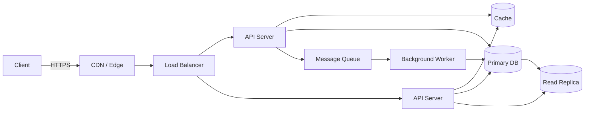
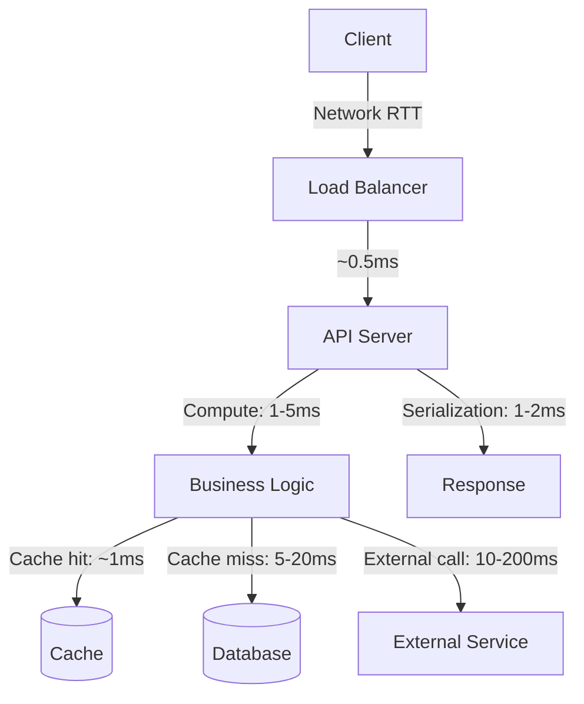
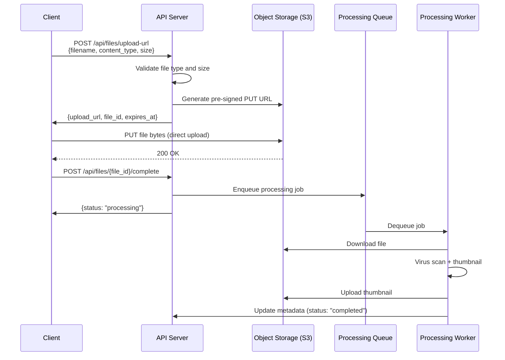

# System Design

## Chapter Goal

After this chapter, the reader can lead a system design interview at Tech Lead level: clarify requirements, perform capacity estimation, sketch a viable architecture from composable building blocks, justify every trade-off, identify failure modes, and communicate decisions to both engineers and stakeholders. The reader will also be able to apply the same reasoning to real architecture reviews and design documents.

## Why This Matters for a Tech Lead

System design is the central interview format for senior and staff-level roles. It is also a daily job responsibility: a Tech Lead owns architecture reviews, capacity planning, reliability decisions, and cost trade-offs. The interviewer is not checking whether the candidate can draw boxes — they are checking whether the candidate can reason about constraints, make decisions under uncertainty, explain trade-offs, and identify what will break first. A weak system design answer reveals gaps in production experience. A strong one demonstrates ownership, operational maturity, and the ability to lead technical direction.

## Mental Model

System design is constrained optimization. Every system has a set of functional requirements (what it does), non-functional requirements (how well it does it), and a cost envelope. The job is to pick building blocks — load balancers, caches, databases, queues, CDNs, object stores — and compose them into an architecture that satisfies the non-functional requirements at acceptable cost. When requirements conflict (consistency vs availability, latency vs durability), the design must make an explicit choice and document the trade-off.



This is the skeleton of most high-traffic services. Static content is served from the CDN. The load balancer distributes requests across stateless API servers. Hot reads hit the cache before the database. Writes go to the primary database. Asynchronous work (notifications, analytics, billing) flows through a message queue to background workers. Read-heavy workloads fan out to read replicas. Every box in this diagram is a building block with its own failure modes, scaling characteristics, and cost curve. The system design interview is about justifying which boxes are present, which are absent, and why.

## Core Terminology

Key terms used throughout system design discussions:

| Term | Definition |
| --- | --- |
| **SLI (Service Level Indicator)** | A quantitative measure of service behavior: request latency, error rate, availability percentage. |
| **SLO (Service Level Objective)** | A target value for an SLI: "99.9% of requests complete in < 200ms." |
| **SLA (Service Level Agreement)** | A contractual commitment with consequences (credits, penalties) if the SLO is breached. |
| **RPO (Recovery Point Objective)** | Maximum acceptable data loss measured in time. RPO = 0 means no data loss. |
| **RTO (Recovery Time Objective)** | Maximum acceptable downtime after a failure. RTO = 5 min means the system must recover within 5 minutes. |
| **Throughput** | The number of operations a system handles per unit time (requests per second, messages per second). |
| **Latency** | The time from request start to response completion, typically measured in percentiles (p50, p95, p99). |
| **Fan-out** | One request triggering multiple downstream calls. A news feed read that checks 500 friend timelines has a fan-out of 500. |
| **Hot key** | A single key that receives disproportionate traffic, causing a single shard or partition to become a bottleneck. |
| **Idempotency key** | A client-generated unique identifier attached to a write request, allowing the server to deduplicate retries safely. |
| **Back-pressure** | A mechanism where a downstream service signals the upstream to slow down when it is overloaded, preventing cascade failure. |
| **Circuit breaker** | A pattern that stops calling a failing downstream service after a threshold of errors, allowing it time to recover. |
| **Bulkhead** | Isolating components so that a failure in one does not consume shared resources and take down others. |
| **Leader election** | A coordination protocol where one node is chosen to perform a task (writes, scheduling), and others stand by. |
| **Quorum** | The minimum number of nodes that must agree for an operation to succeed (typically majority: ⌊n/2⌋ + 1). |
| **Consistent hashing** | A hash ring that minimizes key redistribution when nodes are added or removed, used in distributed caches and databases. |
| **CQRS (Command Query Responsibility Segregation)** | Separating the write model (commands) from the read model (queries), allowing each to be optimized independently. |
| **Event sourcing** | Storing state as an append-only sequence of events rather than mutable rows. The current state is derived by replaying events. |
| **Saga** | A sequence of local transactions across services, with compensating transactions for rollback. Replaces distributed transactions. |
| **Outbox pattern** | Writing an event to a local outbox table in the same database transaction as the state change, then publishing it asynchronously. Guarantees at-least-once delivery without two-phase commit. |

## Theoretical Foundation

### The system design interview structure

A system design interview typically runs 45–60 minutes. The strongest candidates treat it as a structured conversation, not a drawing exercise.

**Step 1 — Clarify requirements (5 minutes).** Ask what the system does (functional requirements) and how well it must do it (non-functional requirements). Do not assume. "Is this a read-heavy or write-heavy system?" "What is the expected scale — thousands or millions of users?" "What are the consistency requirements — can the user see stale data for a few seconds?" These questions demonstrate production experience.

**Step 2 — Define non-functional targets (3 minutes).** Convert vague requirements into numbers: target QPS (queries per second), storage per year, acceptable latency at p99, availability target (99.9% vs 99.99%), and consistency model (strong vs eventual). These numbers drive every architecture decision.

**Step 3 — Capacity estimation (5 minutes).** Back-of-the-envelope math. Estimate daily active users, requests per user per day, average request/response size, and storage growth. Use round numbers and powers of 10. The goal is order-of-magnitude correctness, not precision. See the capacity estimation section below.

**Step 4 — High-level design (10 minutes).** Draw the building blocks: clients, CDN, load balancer, API servers, database, cache, queue, workers. Explain data flow for the primary use cases. Do not go deep yet — establish the skeleton.

**Step 5 — Deep dives (15–20 minutes).** The interviewer picks 2–3 areas to probe. Common deep dives: database schema and access patterns, caching strategy and invalidation, consistency guarantees, failure handling, scaling bottlenecks. This is where the interview is won or lost.

**Step 6 — Trade-offs and wrap-up (5 minutes).** Summarize the choices made and their consequences. Mention what was deferred and what the migration path would be if requirements change.

### Requirements gathering

Requirements gathering is the first and most important step in system design. In an interview, it demonstrates production experience. In real work, it prevents building the wrong system.

**How to gather requirements in an interview:**

1. **Ask about users and use cases.** "Who are the users? What are the primary actions they perform?" This scopes the system. A notification system for 1,000 internal employees is a different design than one for 100 million mobile users.
2. **Ask about scale.** "How many users? How many requests per second? How much data?" These numbers determine whether a single database suffices or whether sharding, caching, and horizontal scaling are needed.
3. **Ask about priorities.** "Is this system read-heavy or write-heavy? Is consistency more important than availability? What is the acceptable latency?" These drive the architecture.
4. **Ask about constraints.** "Are there regulatory requirements? Existing infrastructure? Budget limits? Team size?" These limit the solution space.
5. **Confirm what is out of scope.** "Are we designing the admin panel? The billing system? The analytics dashboard?" Scope control prevents a 45-minute interview from becoming a 3-hour architecture review.

**Why this matters for a Tech Lead:** In production, a Tech Lead gathers requirements from product managers, stakeholders, and other engineering teams. The skill is the same: converting vague goals ("make it fast", "make it reliable") into measurable targets that drive architecture decisions. A system designed against the wrong requirements is a system that will be rewritten.

**Requirements gathering framework:**

```text
1. Users and use cases
   - Who are the actors? (end users, admins, other services)
   - What are the primary flows? (read path, write path)
   - What is the read-to-write ratio?

2. Scale
   - Daily active users (DAU)
   - Requests per second (average, peak)
   - Data volume per day, per year
   - Growth rate (10× in 1 year? 2 years? 5 years?)

3. Non-functional priorities (rank order)
   - Latency target (p50, p99)
   - Availability target (nines)
   - Consistency model (strong, eventual, read-your-writes)
   - Durability (RPO)
   - Recovery time (RTO)

4. Constraints
   - Regulatory (GDPR, HIPAA, PCI-DSS, data residency)
   - Existing infrastructure (cloud provider, databases, queues)
   - Team size and expertise
   - Budget and timeline

5. Out of scope
   - What we are NOT designing in this session
```

**What this shows:** A structured approach to requirements converts ambiguity into constraints. Each constraint eliminates some architecture options and makes the remaining choices defensible.

**Common mistake:** Assuming requirements instead of asking. "I will use Kafka" is not a requirement — it is a solution. The requirement is "events must be processed at-least-once with the ability to replay." The solution may or may not be Kafka.

**Interview-ready framing:** "Before I start designing, I want to agree on the requirements. Let me ask a few clarifying questions to make sure I am solving the right problem at the right scale."

### Functional requirements

**Functional requirements** describe what the system does — the features, the user-visible behavior, the contracts between components.

In a system design interview, functional requirements are the "what":
- "Users can create short URLs from long URLs."
- "Users can send messages to other users in real time."
- "The system processes payments and prevents double-charging."
- "The system sends push notifications to millions of users within 30 minutes of a triggering event."

**How to define functional requirements well:**

1. **Use verb-noun pairs.** "Create booking", "Search products", "Upload file." This makes each requirement testable.
2. **Distinguish core from secondary.** In a URL shortener, "redirect a short URL" is core. "Show click analytics" is secondary. Design for core first; mention secondary as extensions.
3. **Identify the data entities.** Each functional requirement implies entities (users, orders, messages, URLs) and relationships between them. The data model flows from functional requirements.
4. **Identify the APIs.** Each functional requirement maps to one or more API endpoints. Defining the APIs early clarifies the system boundary.

**What a Tech Lead adds:** A Tech Lead asks about the functional requirements that engineers overlook: "What happens when the user deletes their account? What happens when a payment fails halfway? What are the admin operations? What are the audit requirements?" These edge cases determine the complexity of the design.

### Non-functional requirements

**Non-functional requirements (NFRs)** describe how well the system performs its functions. They are the quality attributes — the "-ilities" (availability, reliability, scalability, maintainability) that separate a prototype from a production system.

NFRs drive architecture decisions more than functional requirements do. Two systems with identical functional requirements (both shorten URLs) can have radically different architectures if one targets 100 QPS and the other targets 100,000 QPS.

**The key insight for interviews:** The interviewer expects the candidate to ask about NFRs, not assume them. Jumping to a diagram without establishing latency and consistency requirements is a red flag. Stating the NFRs explicitly — "I am targeting 99.9% availability, p99 latency under 200ms, and eventual consistency with a 5-second staleness window" — demonstrates production experience.

The following subsections cover each major NFR in depth.

### Latency

**Definition:** Latency is the time between a client sending a request and receiving the response. It is measured in milliseconds and reported as percentiles, not averages.

**Why percentiles matter:** Averages hide tail latency. A service with an average latency of 50ms may have a p99 of 2 seconds — meaning 1% of users experience a 40× worse response time. In systems with fan-out (one user request triggers multiple backend calls), tail latency amplifies: if a request fans out to 10 services, each with a 1% chance of being slow, the probability that at least one is slow is ~10%.

**Latency percentiles and what they mean:**

Latency percentile targets and their implications:

| Percentile | What it measures | Typical target | Implication |
| --- | --- | --- | --- |
| **p50 (median)** | The "typical" user experience | < 100ms for APIs | If p50 is high, the system is slow for everyone |
| **p95** | Most users' worst experience | < 300ms for APIs | If p95 is high, 1 in 20 requests is noticeably slow |
| **p99** | The SLO boundary for most services | < 500ms for APIs | If p99 is high, check for long-tail causes: GC pauses, slow queries, cold cache |
| **p99.9** | Matters only for high-fan-out or financial systems | < 1s | Diminishing returns — optimizing p99.9 is expensive |

**Where latency comes from:**



This diagram shows the latency budget for a typical API request. Each stage contributes to the total. In most systems, the dominant sources are database queries and external service calls. Cache hits bypass the database, cutting 5-20ms per query.

**Mental model — the latency budget:** Allocate the total latency target across stages. If the p99 target is 200ms: 10ms for network, 5ms for deserialization, 50ms for database, 50ms for external calls, 5ms for business logic, 80ms buffer. Each stage has its own budget and its own monitoring. When the total latency exceeds the target, the traces reveal which stage is over budget.

**Scaling concerns:** Latency does not improve with horizontal scaling — adding more servers reduces throughput bottlenecks but does not make individual requests faster. To reduce latency: add caching (moves data closer to compute), add read replicas (reduces database query latency under load), use a CDN (moves content closer to users), optimize queries (remove unnecessary work), or reduce fan-out (fewer downstream calls per request).

**Failure modes:** Latency spikes are often caused by: garbage collection pauses, database lock contention, connection pool exhaustion, cold cache after deployment, DNS resolution delays, or slow external service dependencies.

**Cost considerations:** Reducing latency from 200ms to 50ms may require adding a caching layer ($500/month), optimizing database queries (engineering time), or upgrading infrastructure (larger instances). The cost is justified only if the latency improvement translates to measurable business impact (conversion rate, user retention). Profile before spending.

**Interview-ready answer:** "Latency is the time per request, measured in percentiles. I focus on p99 because averages hide tail latency, and in systems with fan-out, tail latency amplifies. My approach is to set a latency budget — allocate the total target across stages — and monitor each stage independently so I can pinpoint where time is spent."

### Throughput

**Definition:** Throughput is the number of operations a system processes per unit of time, typically measured as requests per second (RPS), queries per second (QPS), or messages per second.

**Throughput vs latency:** These are related but independent. A system can have high throughput and high latency (batch processing: processes many items but each takes time). A system can have low latency and low throughput (a fast but single-threaded service). Optimizing for one can hurt the other — batching increases throughput but increases latency for individual items.

**How to reason about throughput:**

1. **Start from DAU (daily active users).** Estimate requests per user per day. Divide by 86,400 seconds to get average QPS. Multiply by a peak factor (2-5×) for peak QPS.
2. **Separate reads from writes.** Most systems are read-heavy (10:1 to 1000:1). Reads and writes have different scaling strategies: reads scale with caching and read replicas; writes scale with sharding.
3. **Identify the bottleneck.** At any given moment, one component limits throughput: the database (connection pool, disk I/O), the application server (CPU, memory), the network (bandwidth), or an external dependency (rate limits, latency). The throughput of the system is the throughput of the bottleneck.

**Scaling concerns:** Throughput scales horizontally for stateless components (add more API servers behind a load balancer). Stateful components (databases) are harder — read replicas scale read throughput; sharding scales write throughput. Caching reduces the effective load on downstream components, increasing overall throughput without scaling the bottleneck.

**Failure modes:** Throughput collapse occurs when a system exceeds its capacity and performance degrades non-linearly. At 80% capacity, latency may be acceptable. At 100%, latency spikes, timeouts increase, retries amplify the load, and throughput drops below the original capacity. This is the "thundering herd" or "death spiral" pattern. Prevention: load shedding, back-pressure, and capacity headroom (provision for 60-70% utilization at peak).

**Cost considerations:** Throughput scales linearly with cost for compute-bound workloads (2× throughput ≈ 2× servers). For I/O-bound workloads, caching provides sublinear cost scaling (a $500/month cache can absorb 90% of database read traffic that would otherwise require $1,500/month in read replicas).

**Interview-ready answer:** "Throughput is operations per second. I reason about it by starting from DAU, estimating average and peak QPS, separating reads from writes, and identifying the bottleneck component. The key insight is that throughput collapses non-linearly when a system hits capacity — provision with headroom and implement load shedding to prevent cascading failure."

### Availability

**Definition:** Availability is the percentage of time a system is operational and serving correct responses. It is the most visible NFR — users experience unavailability directly.

**The nines of availability:**

Availability levels and their downtime budgets:

| Availability | Downtime per year | Downtime per month | Typical use case |
| --- | --- | --- | --- |
| **99% (two nines)** | 3.65 days | 7.3 hours | Internal tools, dev environments |
| **99.9% (three nines)** | 8.77 hours | 43.8 minutes | Most SaaS applications |
| **99.95%** | 4.38 hours | 21.9 minutes | Business-critical APIs |
| **99.99% (four nines)** | 52.6 minutes | 4.38 minutes | Financial systems, payment processing |
| **99.999% (five nines)** | 5.26 minutes | 26.3 seconds | Telecom infrastructure, databases |

**The cost of each nine:** Moving from 99.9% to 99.99% is not a 0.09% improvement — it is a 10× reduction in allowed downtime, which requires roughly 3-5× the infrastructure investment (multi-AZ, automated failover, redundant everything). Each additional nine costs disproportionately more.

**How to calculate composite availability:** If Service A (99.9%) depends on Service B (99.9%), the composite availability is at most 99.9% × 99.9% = 99.8%. Adding dependencies reduces availability. This is why reducing the number of synchronous dependencies improves availability — each one multiplies the failure probability.

**Improving availability:**

- **Redundancy:** Run multiple instances behind a load balancer. If one fails, others absorb the traffic. No single point of failure (SPOF).
- **Health checks and automated failover:** Detect failures quickly and route traffic to healthy instances.
- **Multi-AZ deployment:** Distribute across availability zones to survive zone-level failures.
- **Multi-region deployment:** Survive entire region failures. Expensive and complex — justify with business requirements.
- **Graceful degradation:** When a non-critical dependency fails, serve a reduced experience rather than a full outage. Example: if the recommendation engine is down, show popular items instead of personalized recommendations.

**Failure modes:** Availability failures include: hardware failures (disk, network, power), software bugs (memory leaks, deadlocks, crash loops), capacity exhaustion (CPU, memory, connections, disk space), dependency failures (database, cache, external API), and operational failures (bad deployment, misconfiguration).

**Cost considerations:** Availability is the most expensive NFR to improve at the high end. A single-AZ deployment costs X. Multi-AZ costs ~1.5X (replicated databases, cross-AZ traffic). Multi-region costs ~3X (duplicated infrastructure, data replication, conflict resolution). Choose the level that matches the business impact of downtime: if an hour of downtime costs $100K in lost revenue, investing $200K/year for an additional nine is justified.

**Security considerations:** Availability includes protection against DDoS attacks. Rate limiting, CDN-based DDoS mitigation, and web application firewalls (WAF) are security measures that directly affect availability.

**Interview-ready answer:** "Availability is the percentage of time the system serves correct responses. I express targets in nines — 99.9% is our default SLO for user-facing services, which allows ~44 minutes of downtime per month. To achieve this, I deploy across multiple availability zones with automated health checks and failover. Each additional nine costs 3-5× more, so I match the availability target to the business impact of downtime. I also calculate composite availability across dependencies — each synchronous dependency multiplies the failure probability."

### Throughput vs latency interaction

These two NFRs interact in non-obvious ways:

- **Under low load:** Latency is dominated by the work per request (database queries, computation). Throughput is limited by available capacity.
- **Under moderate load:** Latency increases slightly as resources are shared (CPU scheduling, connection pool contention). Throughput scales linearly.
- **Under high load (near capacity):** Latency increases non-linearly. Queue depths grow. Timeouts trigger retries. Retries add more load. Throughput collapses. This is the "hockey stick" curve.

**What a Tech Lead does about this:** Set a capacity threshold (e.g., 70% of maximum throughput) and alert when it is crossed. Beyond the threshold, add capacity (horizontal scaling) or shed load (rate limiting, graceful degradation). Never operate at > 85% sustained capacity — there is no buffer for traffic spikes.

### Consistency

**Definition:** Consistency determines whether all clients see the same data at the same time, or whether they may see different versions during a propagation window.

Consistency is not binary — it exists on a spectrum from strongest (linearizable) to weakest (eventual), with practical intermediate models.

**Consistency models, from strongest to weakest:**

Consistency models and their properties:

| Model | Guarantee | Latency cost | Use case |
| --- | --- | --- | --- |
| **Linearizable** | Reads always return the most recent write, globally | Highest (requires consensus or synchronous replication) | Distributed locks, leader election |
| **Sequential** | All operations appear in some total order consistent with per-client order | High | Rarely used explicitly; academic |
| **Causal** | If A happened before B, all observers see A before B | Moderate | Collaboration tools, chat |
| **Read-your-writes** | A client always sees its own writes | Low-moderate | User-facing apps (post → see your post) |
| **Eventual** | All replicas converge eventually; no timing guarantee | Lowest | Social feeds, analytics, DNS |

**When to choose what:**

- **Financial transactions:** Linearizable. A double-spend is unacceptable. The latency cost of synchronous replication is justified by correctness.
- **Inventory during checkout:** Strong or serializable. Overselling is a business problem. Use pessimistic locking or serializable isolation.
- **User profile updates:** Read-your-writes. The user who changed their name must see the change immediately. Other users can see the old name for a few seconds — no business impact.
- **Social media feed:** Eventual consistency. If a post appears 5 seconds later for some users, no one notices. The latency and availability gains from eventual consistency are significant.
- **Product catalog:** Eventual with short TTL. A 30-second delay in reflecting a price change is acceptable; a 30-minute delay may not be.

**How to implement read-your-writes:**

1. **Route post-write reads to the primary.** After a write, the client includes a flag (or the server tracks the timestamp). Reads within a short window (e.g., 5 seconds) are routed to the primary database instead of a read replica.
2. **Include version in the response.** The write response includes a version token. The client sends this token with subsequent reads. The read handler ensures the response is at least as recent as the token.

**Trade-offs:** Stronger consistency → higher latency, lower availability, higher infrastructure cost. Weaker consistency → lower latency, higher availability, lower cost, but the application must handle stale reads. This is the PACELC trade-off: even without partitions (Else), there is a trade-off between Latency and Consistency.

**Interview-ready answer:** "Consistency is not binary — it is a spectrum. I choose the consistency model per data domain based on business impact. Financial data gets linearizable consistency; social feeds get eventual consistency. For user-facing data, read-your-writes is the practical minimum — the user must see their own changes immediately even if other users see them with a delay. I implement this by routing post-write reads to the primary database within a short window."

### Scalability

**Definition:** Scalability is the system's ability to handle increased load without degradation in performance or requiring a proportional increase in resources.

**Dimensions of scalability:**

- **Load scalability:** Handling more requests per second (more users, more traffic).
- **Data scalability:** Handling more data (larger databases, more storage, longer retention).
- **Geographic scalability:** Serving users across multiple regions with acceptable latency.
- **Organizational scalability:** Supporting more engineering teams working on the system concurrently (module boundaries, independent deployment).

**Scaling strategies:**

- **Vertical scaling (scale up):** Bigger machines. Simple, no code changes. Limited by hardware ceiling. Creates SPOF. Good for databases where horizontal scaling is complex.
- **Horizontal scaling (scale out):** More machines. Requires stateless design, load balancing, and distributed coordination. Theoretically unlimited. Good for application servers.
- **Functional partitioning:** Split the system by function (separate services for auth, search, payments). Each scales independently.
- **Data partitioning (sharding):** Split the data by key (users A-M on shard 1, N-Z on shard 2). Enables write scaling beyond a single database.

**The scalability test:** Ask these questions about every component:
1. What happens at 10× current load? Can the component handle it with configuration changes (more instances, larger cache)?
2. What happens at 100× current load? Does the architecture need to change (sharding, CQRS, async processing)?
3. What is the cost curve? Does cost scale linearly with load (good) or superlinearly (problem)?

**Failure modes:** Scalability failures are insidious — the system works at design-time load but fails at production load. Common causes: O(n²) algorithms that are invisible at small n, unbounded queries (SELECT * with no LIMIT), connection pool exhaustion, single-threaded bottlenecks, and synchronous fan-out.

**Cost considerations:** Scaling has a cost curve. Vertical scaling: step function (bigger instance = specific price jump). Horizontal scaling for stateless components: linear (2× servers = ~2× cost). Database scaling: superlinear (sharding adds operational complexity worth 2-5 engineering FTEs). Choose the scaling strategy where the cost curve is acceptable for the projected growth.

**Interview-ready answer:** "Scalability is the system's ability to handle growth. I think about it in four dimensions: load, data, geographic, and organizational. For stateless components, horizontal scaling is straightforward — add servers behind a load balancer. For databases, I exhaust vertical scaling and read replicas before considering sharding, because sharding adds significant operational complexity. I always ask: what is the cost curve? Linear cost scaling is acceptable; superlinear cost scaling is a design problem."

### Reliability

**Definition:** Reliability is the system's ability to perform its function correctly and consistently over time, even when components fail.

Reliability is not the same as availability. A system can be available (responds to requests) but unreliable (returns incorrect data, drops writes, processes payments twice). Reliability means correct behavior under both normal and failure conditions.

**Building blocks of reliability:**

1. **Redundancy:** No single point of failure. Multiple instances of every component. Automated failover when a component fails.
2. **Idempotency:** Every write operation is safe to retry. Network failures and timeouts cause retries; without idempotency, retries cause data corruption.
3. **Timeouts:** Every external call has a timeout. Without timeouts, a slow dependency holds connections indefinitely, causing cascade failures.
4. **Retries with backoff and jitter:** Failed calls are retried with increasing delays and random jitter to prevent thundering herds.
5. **Circuit breakers:** Stop calling a failing dependency after a threshold, preventing cascade failure and giving the dependency time to recover.
6. **Data validation:** Validate data at every boundary (API input, message deserialization, database read). Corrupt data propagating through the system is a reliability failure.
7. **Monitoring and alerting:** Detect failures fast. The mean time to detect (MTTD) directly affects the blast radius of an incident.

**The reliability equation:**

Reliability improvement checklist for each data path:

| Path element | Reliability mechanism | Failure without it |
| --- | --- | --- |
| **Client → Server** | Retries with idempotency keys | Lost writes on timeout |
| **Server → Database** | Connection pooling, timeouts | Connection exhaustion, cascade failure |
| **Server → Cache** | Fallback to database on miss | Full outage when cache is down |
| **Server → External API** | Circuit breaker, timeout, fallback | Cascade failure from slow dependency |
| **Server → Queue** | Persistent queue, DLQ | Lost messages, poison message blocking |
| **Database → Replica** | Replication monitoring, lag alerting | Silent data staleness |

**Failure modes by severity:**

- **Transient failures** (network glitch, GC pause): Fixed by retries. Most common.
- **Partial failures** (one instance of a service is unhealthy): Fixed by health checks and automated removal from the load balancer.
- **Systemic failures** (bad deployment, data corruption, cascade): Require rollback, traffic shifting, or manual intervention. Most dangerous.
- **Gray failures** (component is slow, not down): Hardest to detect. Health checks pass but latency is elevated. Requires latency-based health checks, not only liveness checks.

**What a Tech Lead owns:** The reliability strategy is a Tech Lead decision. Define SLOs, calculate error budgets, build the on-call rotation, ensure runbooks exist, and run game days. A system without reliability testing is a system with unknown reliability.

**Cost considerations:** Reliability is not free. Redundancy costs money (multiple instances, replicas). Circuit breakers and retry logic add code complexity. Monitoring infrastructure has a cost. The investment is justified by the cost of unreliability — incidents cause revenue loss, customer churn, engineering toil, and reputation damage.

**Interview-ready answer:** "Reliability means the system behaves correctly even when components fail. I build reliability through five primitives: redundancy (no SPOF), idempotency (safe retries), timeouts (prevent cascade failure), circuit breakers (isolate failing dependencies), and monitoring (detect failures fast). I set SLOs with error budgets — the error budget determines how much risk we can take on new features before we need to prioritize reliability work."

### Maintainability

**Definition:** Maintainability is how easy the system is to understand, modify, operate, and debug. It is the long-term cost of an architecture decision — the cost that does not appear on the cloud bill but dominates engineering spend.

**Three aspects of maintainability:**

1. **Operability:** Can the operations team keep the system running smoothly? This requires: monitoring dashboards, alerting with runbooks, automated deployments, configuration management, and documented operational procedures.

2. **Simplicity:** Can a new team member understand the system in a reasonable time? Complexity kills maintainability. Every additional component (service, database, queue, cache) adds cognitive load. A system with 3 services is easier to understand and debug than one with 30.

3. **Evolvability:** Can the system be modified to meet new requirements? This requires: clean module boundaries, well-defined APIs, separation of concerns, and the ability to change one component without cascading changes to others.

**How to measure maintainability:**

- **Time to onboard:** How long until a new engineer can independently ship a feature and participate in on-call? Weeks is good; months is a problem.
- **Deploy frequency:** How often can the team deploy safely? Multiple times per day is good; monthly is a problem.
- **Lead time for changes:** How long from code commit to production? Hours is good; weeks is a problem.
- **Mean time to repair (MTTR):** How long to diagnose and fix a production issue? Minutes is good; hours is a problem.

**What a Tech Lead decides:** Maintainability is the most frequently sacrificed NFR under deadline pressure. A Tech Lead resists this by: choosing the simplest architecture that meets requirements, documenting design decisions (ADRs), setting code review standards, investing in CI/CD automation, and allocating 15-20% of engineering time to tech debt reduction.

**Trade-offs:** Maintainability often conflicts with short-term velocity. A well-structured modular monolith takes longer to set up than a quick monolith with no module boundaries. But the modular monolith pays back within months as the team grows and requirements change. The same principle applies at every level: clean interfaces take longer to define but prevent coupling; automated tests take time to write but catch regressions.

**Cost considerations:** Maintainability is the hidden cost multiplier. A system that takes 2 hours to debug an incident instead of 20 minutes costs the organization in engineer time, on-call burnout, and delayed feature work. A system that requires 3 engineers to deploy safely instead of a CI pipeline costs the organization in coordination overhead. Investing in maintainability reduces the ongoing cost of operation.

**Interview-ready answer:** "Maintainability is the long-term cost of an architecture decision. I measure it through three lenses: operability (can the team run it?), simplicity (can a new engineer understand it?), and evolvability (can we change it?). I resist adding complexity without justification because every component adds cognitive load, on-call burden, and deployment risk. The cheapest system to operate is often the simplest one that meets the requirements."

### Capacity estimation

Back-of-the-envelope estimation is a core system design skill. Use these reference numbers:

Useful approximations for capacity math:

| Quantity | Rough value |
| --- | --- |
| **Seconds in a day** | ~86,400 ≈ 10^5 |
| **Seconds in a month** | ~2.6 × 10^6 |
| **1 million requests/day** | ~12 QPS |
| **1 billion requests/day** | ~12,000 QPS |
| **1 KB text** | ~1 short JSON response |
| **1 MB** | ~1 high-res photo |
| **1 GB** | ~1,000 high-res photos |
| **1 TB** | ~1 million high-res photos |
| **Network: 1 Gbps link** | ~125 MB/s throughput |
| **SSD random read** | ~100 μs |
| **HDD random read** | ~10 ms |
| **Memory random read** | ~100 ns |
| **Cross-datacenter round trip** | ~50–150 ms |
| **Same-datacenter round trip** | ~0.5 ms |

**Example: URL shortener capacity estimation.**

- 100M new URLs per month → ~40 URL writes/second.
- Read-to-write ratio 100:1 → ~4,000 read QPS.
- Each URL record: ~500 bytes (short code, original URL, metadata).
- Storage per year: 100M × 12 × 500 B = 600 GB/year.
- For 5 years: 3 TB total. Fits on a single database server, but read QPS of 4,000 benefits from caching.

This kind of math takes 2–3 minutes and immediately guides architecture decisions: the write rate is low (no sharding needed initially), but the read rate justifies a cache layer.

### Building blocks

#### Load balancing

A load balancer distributes incoming requests across multiple server instances to prevent any single server from becoming a bottleneck.

**L4 (transport layer):** Routes based on IP and port. Faster, lower overhead, no request inspection. Used for TCP/UDP traffic, database connection pooling, and high-throughput scenarios.

**L7 (application layer):** Routes based on HTTP headers, URL path, cookies. Supports content-based routing, TLS termination, header injection, and sticky sessions. More flexible, higher overhead.

Load balancing algorithms:

- **Round-robin:** Distributes requests evenly. Works when all servers have equal capacity and all requests have similar cost.
- **Weighted round-robin:** Assigns more traffic to more capable servers.
- **Least connections:** Routes to the server with the fewest active connections. Better for long-lived connections or variable request cost.
- **Consistent hashing:** Routes based on a hash of the request key. Ensures the same key always hits the same server (useful for caching). Minimizes redistribution when servers are added or removed.

**Health checks** are critical. The load balancer must detect unhealthy servers and stop routing to them. Active health checks (periodic probes) catch server-level failures. Passive health checks (monitoring response codes) catch application-level failures.

**What a Tech Lead cares about:** Load balancer configuration is often the first thing that breaks under unexpected traffic patterns. Sticky sessions create hidden statefulness. TLS termination at the load balancer simplifies certificate management but means traffic between the LB and backend is unencrypted unless re-encrypted. Global load balancing (DNS-based or anycast) is needed for multi-region.

**Scaling concerns:** A single load balancer is a SPOF. Use an active-passive pair (hardware LBs) or a fleet of software LBs behind DNS (cloud LBs like ALB/NLB scale automatically). At very high traffic (>100K connections/second), L7 load balancing can become the bottleneck — move to L4 for the outer layer and L7 for routing decisions behind it.

**Failure modes:** Load balancer misconfiguration is a top cause of outages. Common failures: health check too aggressive (marks healthy servers as unhealthy during GC pauses), health check too lenient (continues routing to a crashed server), connection draining disabled (in-flight requests dropped during deploys), TLS certificate expiry, and sticky sessions preventing failover.

**Security considerations:** The load balancer is the first entry point — it should terminate TLS, reject malformed requests, and enforce maximum request size. WAF (Web Application Firewall) integration at the LB layer provides centralized protection against common attacks (SQL injection, XSS). Ensure the LB drops the `X-Forwarded-For` header from untrusted clients and sets it from the actual client IP.

**Cost considerations:** Managed cloud load balancers (ALB, NLB) charge per hour plus per connection or per GB processed. For high-throughput services, the data processing charges can exceed the hourly cost. Compare LCU (Load Balancer Capacity Units) pricing across providers. Self-managed (HAProxy, Nginx) eliminates per-request fees but adds operational burden.

**Trade-offs:**

Load balancer trade-offs:

| Choice | Optimizes for | Sacrifices | Flips when |
| --- | --- | --- | --- |
| **L4** | Throughput, simplicity | Routing flexibility | Need path-based routing, header inspection, or WebSocket routing |
| **L7** | Routing flexibility, observability | Throughput (higher per-request overhead) | Traffic is non-HTTP or throughput exceeds L7 capacity |
| **Sticky sessions** | Session affinity | Horizontal scalability | Sessions can be externalized (Redis, database) |
| **Managed (ALB/NLB)** | Operational simplicity | Cost at high volume | Per-request cost exceeds self-managed + ops FTE |

**Interview-ready answer:** "A load balancer distributes traffic across servers and is the front door of the system. I choose L4 for raw throughput and L7 for HTTP-aware routing. Health checks must be tuned carefully — too aggressive causes false positives, too lenient delays failover. In production, the load balancer is also a security boundary: TLS termination, request filtering, and DDoS mitigation happen here. For multi-region, I use DNS-based global load balancing to route users to the nearest region."

#### Caching

Caching stores frequently accessed data in a faster layer to reduce latency and database load.

**Cache layers:**
- **Browser/client cache:** HTTP cache headers (Cache-Control, ETag). Zero server cost for cache hits.
- **CDN cache:** Edge servers cache static and sometimes dynamic content close to users. Reduces origin load and latency.
- **Application-level cache:** In-process cache (e.g., a hash map in memory). Fastest access (~ns), but per-instance and lost on restart.
- **Distributed cache:** A shared cache cluster (Redis, Memcached). Sub-millisecond access, shared across all application instances, survives individual server restarts.
- **Database cache:** Query result cache, buffer pool. Managed by the database engine.

**Cache strategies:**

- **Cache-aside (lazy loading):** Application checks cache first. On miss, reads from the database and writes to the cache. The application controls cache population. Most common pattern.
- **Read-through:** The cache itself fetches from the database on a miss. Simplifies application code but requires cache-database integration.
- **Write-through:** Every write goes to both the cache and the database synchronously. Ensures cache consistency but increases write latency.
- **Write-behind (write-back):** Writes go to the cache first, then asynchronously to the database. Lower write latency but risks data loss if the cache fails before the database write completes.

**Cache invalidation** is the hard problem. Options:
- **TTL (time-to-live):** Data expires after a fixed time. Accepts staleness up to the TTL duration.
- **Event-driven invalidation:** A write to the database triggers a cache delete or update. Requires reliable event delivery.
- **Versioning:** Cache keys include a version number. Incrementing the version effectively invalidates old entries.

**Cache stampede** occurs when a popular cache key expires and many concurrent requests all miss the cache and hit the database simultaneously. Mitigations: lock-based single-flight (only one request fetches; others wait), probabilistic early expiration (jitter the TTL), and background refresh (refresh the cache before expiration).

**What a Tech Lead cares about:** Cache hit rate is the primary metric. Below ~80%, the cache is adding complexity without sufficient benefit. Monitor hit rate, eviction rate, and memory usage. Cache warming on cold starts prevents latency spikes after deployments. Cache serialization format affects both performance and debugging.

**Scaling concerns:** In-process caches do not scale across instances — each instance has its own copy, consuming memory proportional to instance count. Distributed caches (Redis, Memcached) scale independently: add nodes to increase memory and throughput. Redis Cluster partitions keys across shards for horizontal scaling. At very high cache throughput (>500K ops/sec), benchmark whether the cache client's serialization or network becomes the bottleneck before adding more cache nodes.

**Failure modes:** Cache failure modes that cause production incidents: (1) **Stampede** — popular key expires, all requests hit the database simultaneously. (2) **Cold start** — after deploy or cache restart, hit rate drops to zero, database is overwhelmed. (3) **Memory exhaustion** — cache fills up, eviction rate spikes, hit rate drops. (4) **Serialization mismatch** — code change alters the cached object structure, deserialization fails for old entries. (5) **Stale data** — cache invalidation fails, users see outdated information indefinitely.

**Security considerations:** Cache poisoning: if an attacker can write to the cache, they can serve malicious content to all users. Ensure cache writes are authenticated and authorized. Sensitive data (PII, tokens) in the cache must be encrypted or excluded from caching entirely. Set appropriate TTLs on session-related cache entries to limit the window of exposure if a session is compromised.

**Cost considerations:** Redis/Memcached cost is proportional to memory. A cache.r6g.xlarge (26 GB) costs roughly $400-600/month depending on region. The cost is justified by what it replaces: if caching eliminates the need for 2 read replicas at $750/month each, the net savings are $900-1,100/month. Monitor the ratio of cache cost to database cost savings to ensure the investment is worthwhile.

> Verify against official documentation: ElastiCache pricing varies by region and instance generation. These are rough order-of-magnitude estimates.

**Interview-ready answer:** "Caching reduces latency and database load by serving frequently accessed data from a faster layer. I use cache-aside as the default strategy — the application checks the cache first and fills it on miss. The critical decisions are: what to cache (high read-to-write ratio data), how long to cache it (TTL based on staleness tolerance), and how to invalidate (TTL + event-driven invalidation for writes). I always design for cache failure — the system must degrade gracefully, not crash, when the cache is unavailable."

#### CDN (Content Delivery Network)

A CDN is a geographically distributed network of edge servers that cache content close to end users. It reduces latency for static assets (images, CSS, JavaScript) and can accelerate dynamic content through edge computing.

**Pull CDN:** Edge servers fetch content from the origin on the first request, then cache it. Simple configuration. Origin must handle cold-start traffic.

**Push CDN:** Content is explicitly uploaded to the CDN. Better for large files or content with predictable access patterns. Requires a deployment pipeline for CDN content.

**Cache invalidation at CDN level** is slow (propagation across edge nodes takes seconds to minutes). Use versioned file names (`app.v3.js`) or content-hash file names (`app.abc123.js`) instead of relying on CDN purge.

**What a Tech Lead cares about:** CDN egress cost is often the largest line item for content-heavy services. Evaluate whether the CDN contract has committed-use discounts. Edge computing (running logic at CDN nodes) adds operational complexity — use it for latency-critical paths only, not as a general compute platform.

**Scaling concerns:** CDNs scale globally by design — adding edge locations is the CDN provider's responsibility. The scaling concern is the origin: when cache misses spike (new content deploy, cache purge, traffic to long-tail content), the origin must handle the traffic. Use an origin shield (a mid-tier cache between edge and origin) to absorb cache-miss spikes.

**Failure modes:** (1) **Origin down** — CDN serves stale cached content (good for availability, bad for freshness). Configure "stale-while-revalidate" behavior. (2) **Cache purge propagation delay** — users see old content for seconds to minutes after a purge. Use versioned file names to avoid relying on purges. (3) **Edge misconfiguration** — caching authenticated or personalized responses, exposing one user's data to another. Set `Cache-Control: private` for user-specific content and `Vary` headers for content that differs by request attributes.

**Security considerations:** CDNs are the first line of defense against DDoS attacks — they absorb volumetric attacks at the edge before traffic reaches the origin. Configure origin access control so the origin only accepts requests from CDN edge IPs, not directly from the internet. Use signed URLs or signed cookies for access-controlled content (paid media, private files).

**Cost considerations:** CDN pricing has three components: data transfer (egress from edge to user, typically $0.02-0.12/GB), requests (per 10K requests), and real-time log delivery (if needed). For a service serving 1 PB/month in video, CDN egress can exceed $20K/month — negotiate committed-use agreements at this scale. Minimize cache misses to reduce origin egress cost.

**Interview-ready answer:** "A CDN caches content at edge locations close to users, reducing latency for static assets and reducing origin server load. I use versioned or content-hashed file names for cache invalidation instead of purges, because purge propagation is slow and unreliable. The key decisions are: what to cache (static assets always, dynamic content selectively), cache TTL (balance freshness vs origin load), and access control (signed URLs for private content). CDN cost is significant for content-heavy services — I negotiate committed-use discounts at scale."

#### Database selection and scaling

Database choice is the most consequential architecture decision. The wrong choice is expensive to reverse.

**Relational databases (PostgreSQL, MySQL):** Strong consistency, ACID transactions, flexible querying with SQL, mature tooling. Default choice when data has relationships, transactions are needed, or the query patterns are not yet known. Covered in depth in [SQL and NoSQL Databases](./02-sql-and-nosql.md).

**NoSQL — key-value (Redis, DynamoDB):** Optimized for simple key-based lookups at high throughput. No joins, limited querying. Use when access patterns are known and simple.

**NoSQL — document (MongoDB, CouchDB):** Schema-flexible, good for hierarchical data. Weaker consistency guarantees by default.

**NoSQL — wide-column (Cassandra, HBase):** Designed for high write throughput across many nodes. Eventually consistent. Use for time-series, logging, and IoT workloads.

**NoSQL — graph (Neo4j, Amazon Neptune):** Optimized for traversing relationships. Use when the primary queries are about connections between entities (social graphs, fraud detection, recommendations).

**Database sharding** splits data across multiple database instances by a partition key.

- **Range sharding:** Partition by key ranges (users A–M on shard 1, N–Z on shard 2). Simple but prone to hot spots if the distribution is uneven.
- **Hash sharding:** Hash the partition key and assign to shards by hash range. Even distribution but loses range query efficiency.
- **Directory sharding:** A lookup table maps keys to shards. Most flexible but the directory is a single point of failure.

Resharding (adding or removing shards) is one of the most operationally painful database operations. Consistent hashing reduces the data movement required.

**Replication** copies data across multiple database instances for availability and read scaling.

- **Leader-follower (primary-replica):** One node accepts writes; replicas serve reads. Simple, but replication lag means replicas may serve stale data.
- **Multi-leader:** Multiple nodes accept writes. Requires conflict resolution. Used for multi-region writes.
- **Leaderless (Dynamo-style):** Reads and writes go to multiple nodes; quorum determines success. Handles network partitions but has complex conflict resolution.

**What a Tech Lead cares about:** The database is usually the bottleneck and the hardest component to change. Start with a relational database unless there is a specific, measured reason not to. Schema migrations on large tables are risky and slow — plan them as first-class operational events. Read replicas are a scaling lever, but replication lag must be measured and accounted for in the application.

**Scaling concerns:** Read scaling: add read replicas (linear read throughput improvement, but adds replication lag). Write scaling: vertical scaling first (larger instance), then sharding (complex). Connection scaling: use a connection pooler (PgBouncer, ProxySQL) to multiplex thousands of application connections into hundreds of database connections. Query scaling: optimize queries, add indexes, denormalize hot paths.

**Failure modes:** (1) **Connection exhaustion** — too many application instances open connections, hitting the database limit. Use connection pooling. (2) **Replication lag** — reads from replicas return stale data. Monitor lag; route time-sensitive reads to the primary. (3) **Lock contention** — concurrent writes to the same rows block each other. Use optimistic locking or redesign the access pattern. (4) **Slow migrations** — schema changes on large tables lock the table. Use online DDL tools. (5) **Hot partition** — one shard receives disproportionate traffic. Monitor per-shard metrics; split or cache the hot key.

**Security considerations:** Encrypt data at rest (database-level encryption). Encrypt in transit (TLS between application and database). Use IAM-based authentication rather than static passwords where possible. Implement row-level security for multi-tenant data. Audit all schema changes and admin access. Store connection credentials in a secrets manager, not in configuration files.

**Cost considerations:** Database instances are typically the second-largest cloud cost after compute. RDS pricing has components: instance hours, storage (per GB-month), I/O (per million requests for some engines), and backup storage. Multi-AZ doubles instance cost but is required for production availability. Read replicas cost as much as the primary. Reserved instances reduce cost by 30-50% for predictable workloads.

**Interview-ready answer:** "The database is the most consequential architecture choice because it is the hardest to change. I default to a relational database (PostgreSQL) because it provides flexibility — SQL handles evolving query patterns, ACID handles correctness, and mature tooling handles operations. I choose NoSQL only when I have a specific, measured need: key-value for simple lookups at extreme throughput, wide-column for high write volume (time series, logs), or graph for relationship traversal queries. For scaling: read replicas first, caching second, sharding last — because each adds operational complexity in that order."

#### Message queues and event-driven architecture

A message queue decouples producers from consumers, enabling asynchronous processing, load leveling, and fault tolerance.

**Queue semantics (SQS-style):** Each message is delivered to one consumer. Suitable for task distribution (send email, process payment, resize image). Messages are deleted after successful processing.

**Log semantics (Kafka-style):** Messages are appended to a durable, ordered log. Multiple consumer groups can read the same log independently, each at their own offset. Suitable for event streaming, audit logs, real-time analytics, and event sourcing. Messages are retained by time or size, not by consumption.

**Key differences:**

Queue vs log semantics comparison:

| Property | **Queue (SQS-style)** | **Log (Kafka-style)** |
| --- | --- | --- |
| **Delivery** | Each message to one consumer | Each message to all consumer groups |
| **Ordering** | Best-effort (FIFO available at cost) | Strict within a partition |
| **Retention** | Deleted after processing | Retained by time/size policy |
| **Replay** | Not possible after deletion | Possible by resetting offset |
| **Use case** | Task distribution | Event streaming, audit, replay |

**Event-driven architecture** uses events as the primary integration mechanism between services. A service publishes an event ("OrderPlaced") and other services react independently ("send confirmation email", "update inventory", "trigger analytics"). This reduces coupling but introduces eventual consistency and requires careful event schema design.

**The outbox pattern** solves the dual-write problem: how to atomically update a database and publish an event. Write the event to an outbox table in the same database transaction as the state change. A separate process (change data capture or polling) reads the outbox and publishes to the message broker. This guarantees at-least-once delivery without distributed transactions.

**What a Tech Lead cares about:** Queue depth is a health signal — a growing queue means consumers cannot keep up. Dead-letter queues (DLQ) are mandatory for messages that fail processing repeatedly; without a DLQ, poison messages block the queue. Event schema evolution requires a contract (Avro, Protobuf, or JSON Schema with versioning). Idempotent consumers are required because at-least-once delivery means duplicates will occur.

**Scaling concerns:** SQS scales automatically (managed service). Kafka scales by adding partitions — each partition is consumed by one consumer in a consumer group, so partition count limits consumer parallelism. Adding partitions is easy; reducing them or rebalancing is operationally complex. For event-driven architectures, the bottleneck is usually the consumer, not the broker — scale consumers horizontally and monitor consumer lag.

**Failure modes:** (1) **Poison message** — a message that always fails processing blocks the consumer. DLQ with a max retry count prevents this. (2) **Consumer lag** — consumers fall behind the producer. Alert on growing lag; add consumers or optimize processing. (3) **Message ordering violation** — messages processed out of order cause incorrect state. Use partition keys to maintain per-entity ordering. (4) **Schema incompatibility** — a producer publishes a new schema version that consumers cannot deserialize. Use a schema registry with backwards-compatible evolution. (5) **Dual-write inconsistency** — state updated in the database but event not published (or vice versa). Use the outbox pattern.

**Security considerations:** Encrypt messages in transit (TLS) and at rest (broker-level encryption). Authenticate producers and consumers (IAM roles, SASL). Authorize access per topic/queue (fine-grained permissions). Avoid putting sensitive data (PII, secrets) in event payloads — use references (IDs) and look up the data from the owning service.

**Cost considerations:** SQS charges per API call ($0.40 per million messages) plus data transfer. At 1 billion messages/month, the cost is ~$400/month. Kafka (self-managed) costs the infrastructure: 3-5 broker nodes, disk storage, network. Kafka (managed, e.g., MSK) costs per broker-hour plus storage. At high volumes (>100K messages/second sustained), self-managed Kafka is typically cheaper than SQS but requires dedicated operational expertise.

**Interview-ready answer:** "Message queues decouple producers from consumers, enabling asynchronous processing, load leveling, and fault tolerance. I choose between queue semantics (SQS — each message to one consumer, for task distribution) and log semantics (Kafka — durable ordered log, for event streaming and replay). For cross-service integration, I use event-driven architecture with the outbox pattern to guarantee atomic state changes and event publishing. Critical operational requirements: DLQ for poison messages, idempotent consumers for at-least-once delivery, and schema versioning for event evolution."

#### Rate limiting

Rate limiting controls how many requests a client or user can make in a time window. It protects services from abuse, prevents resource exhaustion, and enforces fair usage.

**Algorithms:**

- **Token bucket:** A bucket holds up to N tokens. Each request consumes a token. Tokens are added at a fixed rate. Allows bursts up to the bucket size while enforcing an average rate.
- **Sliding window log:** Records the timestamp of each request. Counts requests in a sliding window. Precise but memory-intensive for high-volume clients.
- **Sliding window counter:** Approximates the sliding window using fixed sub-windows. Lower memory than the log approach, with acceptable precision for most use cases.
- **Fixed window counter:** Counts requests in fixed time windows (e.g., per minute). Simple but allows bursts at window boundaries (a client can make 2× the limit by sending requests at the end of one window and the start of the next).

**Implementation considerations:** Rate limit state is typically stored in Redis (fast, shared across API instances). The response should include `Retry-After` headers. Rate limits should be per-tenant in multi-tenant systems, with different tiers for different customer plans.

**What a Tech Lead cares about:** Rate limiting is a business decision, not only a technical one. The limits must align with customer contracts and pricing tiers. Overly aggressive limits cause customer complaints; overly permissive limits allow abuse. Monitor rate limit hits — a spike may indicate a legitimate traffic increase, not abuse.

**Scaling concerns:** Rate limit state must be shared across all API instances — a per-instance counter is bypassed by round-robin load balancing. Redis is the standard choice because it is fast (sub-millisecond) and shared. At very high request rates, the Redis round-trip per request can become a bottleneck. Mitigation: use local rate limiting as a first pass (coarse), then distributed rate limiting for precision.

**Failure modes:** (1) **Rate limiter down (Redis unavailable)** — must decide: fail open (allow all requests, risk abuse) or fail closed (reject all requests, cause outage). Default to fail open with alerting for most services. (2) **Clock skew** — sliding window implementations depend on consistent timestamps. Use Redis server time, not client time. (3) **Boundary burst** — fixed window counters allow 2× the limit at window boundaries. Use sliding window or token bucket instead.

**Security considerations:** Rate limiting is a security primitive — it defends against brute force attacks (login attempts), API abuse (scraping), and resource exhaustion (DDoS at the application layer). Apply stricter limits to sensitive endpoints (login, password reset, payment) than to read endpoints. Use per-IP rate limiting for unauthenticated requests and per-user rate limiting for authenticated requests.

**Cost considerations:** The primary cost is the Redis instance for shared state. At moderate scale (< 100K requests/second), a single small Redis instance is sufficient. At high scale, the cost of rate limiting is negligible compared to the cost of the abuse it prevents.

**Interview-ready answer:** "Rate limiting controls how many requests a client can make per time window. I use token bucket for most cases — it allows bursts while enforcing an average rate, and it is efficient to implement in Redis with a Lua script for atomicity. The key design decisions are: what to limit by (user, IP, API key, tenant), what limits to set (aligned with pricing tiers), and what to do when the limiter infrastructure fails (fail open with alerting). Rate limiting is both a security mechanism and a business policy."

#### Search

Search at scale requires an inverted index: a data structure that maps each term to the list of documents containing it. This is the foundation of Elasticsearch, Solr, and similar systems.

**Key concepts:** Tokenization (splitting text into terms), stemming (reducing words to root form), ranking (TF-IDF, BM25), and faceting (filtering by category or attribute).

**When to use a dedicated search engine vs database full-text search:** Database full-text search (PostgreSQL `tsvector`, MySQL `FULLTEXT`) works for simple search on moderate data volumes. A dedicated search engine (Elasticsearch, OpenSearch) is needed when the requirements include: fuzzy matching, relevance tuning, faceted navigation, autocomplete, or indexing millions of documents with sub-second query latency.

**What a Tech Lead cares about:** Search infrastructure is operationally expensive — Elasticsearch clusters require tuning, monitoring, and regular reindexing. The index is a derived data store; the source of truth remains the primary database. Data synchronization between the database and the search index is a consistency challenge (use change data capture or an outbox pattern). Search relevance is a product concern, not only an infrastructure concern — involve product stakeholders in ranking decisions.

**Scaling concerns:** Elasticsearch scales by adding data nodes and sharding indexes. Write throughput scales linearly with shards. Query throughput depends on the number of replicas (each replica can serve queries). At large scale (billions of documents), index management becomes critical: use time-based indexes (one per day/week), alias rotation, and lifecycle policies to manage cluster size.

**Failure modes:** (1) **Index-database desync** — the search index returns results for items that have been deleted or updated in the database. Use CDC or outbox for synchronization, and periodic full reindex as a safety net. (2) **Cluster split brain** — a network partition causes two nodes to both believe they are the leader. Configure minimum master nodes (quorum) to prevent this. (3) **Slow queries** — complex queries with deep pagination, wildcards, or high cardinality aggregations can overwhelm the cluster. Set query timeouts and prohibit expensive query patterns.

**Security considerations:** Search indexes may contain sensitive data. Apply access control at the query layer — not all users should be able to search all data. Filter queries by tenant_id, visibility, and permissions. Audit search queries for data exfiltration patterns. Encrypt the search index at rest.

**Cost considerations:** Elasticsearch/OpenSearch cost is dominated by compute and storage. Each data node needs sufficient RAM for the JVM heap (half of the index size in hot tier). At 1 TB of indexed data, expect 3-5 data nodes plus 3 dedicated master nodes. Managed services (Amazon OpenSearch) add convenience at higher per-node cost. Cold/warm tier architecture (SSD for recent data, HDD for older data) reduces storage cost.

**Interview-ready answer:** "Full-text search at scale requires an inverted index — Elasticsearch or OpenSearch is the standard choice. The key architectural decision is that the search index is a derived store, not the source of truth. Writes go to the primary database, and the index is updated asynchronously via CDC or outbox pattern. This means search results may be slightly stale — usually acceptable for user-facing search. I size the cluster based on index size and query throughput, and I use time-based indexes with lifecycle policies to manage growth. Database full-text search (PostgreSQL tsvector) is sufficient for simple search on moderate data — I do not introduce Elasticsearch unless the requirements demand fuzzy matching, relevance tuning, or faceted navigation."

#### File and object storage

Object storage (S3, GCS, Azure Blob) stores unstructured data (images, videos, documents, backups) with high durability and low cost.

**Key patterns:**
- **Pre-signed URLs:** Generate a time-limited, authenticated URL that allows the client to upload or download directly to/from object storage, bypassing the application server. Reduces server load and bandwidth.
- **Chunked upload:** For large files, split into chunks, upload in parallel, and reassemble. Handles network interruptions gracefully.
- **CDN integration:** Serve static files through a CDN backed by object storage. The CDN caches at the edge; the origin (object storage) handles cache misses.

**What a Tech Lead cares about:** Storage cost is low, but egress cost (data leaving the cloud) can be high. Lifecycle policies (move to cheaper storage tiers after N days, delete after N months) are essential for cost control. Access logging and encryption at rest are table stakes for compliance.

**Scaling concerns:** Object storage scales effectively without limit — S3 handles trillions of objects and thousands of requests per second per prefix. The scaling concern is metadata: if the application stores file metadata in a relational database, that database becomes the bottleneck at high file counts. Use database partitioning or a document store for file metadata at scale.

**Failure modes:** (1) **Upload interruption** — network drops during large file upload. Use multipart/resumable upload. (2) **Pre-signed URL expiry** — URL expires before upload completes. Set generous TTL and communicate it to the client. (3) **Processing pipeline failure** — file uploaded but processing (thumbnail, virus scan) fails silently. Track processing status in the database; alert on unprocessed files older than the expected processing time. (4) **Bucket misconfiguration** — public access enabled on a private bucket. Use bucket policies, block public access settings, and automated compliance scanning.

**Security considerations:** Encrypt all objects at rest (server-side encryption). Use IAM policies to restrict bucket access — follow least privilege. Pre-signed URLs must have a short TTL (minutes, not hours) and be scoped to a specific key and operation. Scan uploaded files for malware before making them available to other users. Set CORS policies to control which domains can access objects via the browser.

**Cost considerations:** S3 Standard storage costs ~$0.023/GB-month. Infrequent Access (IA) costs ~$0.0125/GB-month. Glacier (archive) costs ~$0.004/GB-month. The cost lever is lifecycle policies: automatically transition objects from Standard to IA after 30 days and to Glacier after 90 days. Egress cost ($0.09/GB) is the hidden expense — use a CDN to cache frequently accessed files and reduce direct S3 egress.

> Verify against official documentation: S3 storage and egress pricing varies by region and changes over time. These are rough order-of-magnitude estimates for us-east-1.

**Interview-ready answer:** "Object storage is the right choice for unstructured data — images, videos, documents, backups. For file uploads, I use pre-signed URLs so the client uploads directly to storage, bypassing the application server. For large files, multipart upload with resumability. Processing (thumbnails, virus scanning, transcoding) happens asynchronously — the upload triggers an event, a worker processes the file, and the metadata is updated. I serve files through a CDN backed by object storage. Cost control comes from lifecycle policies — tiering data from Standard to IA to Glacier based on age."

#### Background processing

Background processing handles work that does not need to complete within a user request: sending emails, generating reports, processing uploads, running ML inference.

**Patterns:**
- **Queue-based workers:** Tasks are enqueued to a message queue. Worker processes dequeue and execute. Scales by adding workers.
- **Scheduled jobs (cron):** Periodic tasks (daily reports, cleanup). Use a distributed scheduler (not a single cron server) to avoid single points of failure.
- **Event-driven processing:** A database change or user action triggers asynchronous processing through an event.

**Failure handling:** Every background job must be idempotent (safe to retry). Failed jobs go to a dead-letter queue for manual inspection. Job progress should be tracked (database status column or a job tracking system) so operators can monitor completion.

**What a Tech Lead cares about:** Background jobs are often the source of silent failures — they do not return errors to users. Monitoring and alerting on job completion rate, latency, and DLQ depth are critical. Long-running jobs should emit progress signals. Job scheduling in multi-tenant systems must prevent one tenant's workload from starving others (use per-tenant queues or fair scheduling).

**Scaling concerns:** Background workers scale horizontally — add more worker instances to increase processing throughput. The bottleneck shifts to: the queue (must handle the enqueue rate), the downstream service the worker calls (database, external API), or shared resources (connection pools, file locks). Monitor queue depth: growing depth means workers cannot keep up. Auto-scale worker count based on queue depth.

**Failure modes:** (1) **Zombie job** — a worker takes a job, crashes, and the job remains "in progress" indefinitely. Use visibility timeouts (SQS) or heartbeat mechanisms — if the worker does not acknowledge progress within the timeout, the job returns to the queue. (2) **Poison message** — a malformed job that always fails. DLQ with max retry count. (3) **Starvation** — low-priority jobs never get processed because high-priority jobs consume all workers. Use separate queues with priority weights. (4) **Duplicate processing** — worker processes a job, the acknowledgment is lost, and the job is reprocessed. All jobs must be idempotent.

**Security considerations:** Background workers often run with elevated permissions (database write access, external API keys). Apply least privilege — each worker role should have only the permissions required for its specific task. Audit job execution logs. Ensure that job payloads do not contain secrets — pass references (IDs) and retrieve secrets from a vault at execution time.

**Cost considerations:** Worker compute is typically the dominant cost. For steady workloads, use reserved instances. For bursty workloads, use auto-scaling or serverless functions (Lambda — pay only for execution time). For CPU-intensive jobs (image processing, ML inference), use spot instances with checkpointing for cost reduction. Measure cost per job to identify optimization opportunities.

**Interview-ready answer:** "Background processing handles work outside the user request path — sending emails, generating reports, processing uploads. I use queue-based workers as the default: tasks are enqueued, workers dequeue and process, failed tasks go to a DLQ. Every job must be idempotent because at-least-once delivery means duplicates will occur. The critical operational concern is visibility — background failures are silent. I monitor job completion rate, processing latency, and DLQ depth, with alerts on anomalies."

### Patterns

#### Read-through, write-through, write-behind

These cache patterns are covered in the caching section above. The key distinction:

- **Read-through / cache-aside:** Optimizes for read latency. Writes go to the database; the cache is populated on read misses.
- **Write-through:** Optimizes for read-after-write consistency. Every write updates both cache and database. Higher write latency.
- **Write-behind:** Optimizes for write latency. Writes go to the cache first, then asynchronously to the database. Risk of data loss.

#### CQRS and event sourcing

**CQRS** separates the write path (commands that modify state) from the read path (queries that return data). The write model is optimized for consistency and validation; the read model is optimized for query performance (denormalized views, materialized aggregations). The read model is updated asynchronously from the write model, which introduces eventual consistency.

**Event sourcing** stores every state change as an immutable event in an append-only log. The current state is derived by replaying the event log. Benefits: complete audit trail, ability to reconstruct state at any point in time, natural fit for CQRS (events drive read model updates). Costs: event schema evolution is complex, the event store grows indefinitely (requires snapshotting), and debugging requires replaying events.

**When to use CQRS:** When read and write patterns are dramatically different (e.g., writes are simple but reads require complex aggregations across multiple entities). Do not use CQRS for simple CRUD applications — it adds significant complexity.

**When to use event sourcing:** When an audit trail is a business requirement (financial systems, compliance), when the ability to replay and reprocess events is valuable (analytics pipelines), or when the domain naturally models state as a sequence of events (order lifecycle, game state).

#### Sharding, replication, leader/follower

Covered in the database section above. The key trade-offs:

- **Sharding** scales write throughput but complicates cross-shard queries and transactions.
- **Replication** scales read throughput and improves availability but introduces replication lag.
- **Leader/follower** is simpler than multi-leader but creates a single point of failure for writes (mitigated by automatic failover).

#### Idempotency keys

An idempotency key is a client-generated unique identifier (typically a UUID) sent with a write request. The server checks whether a request with this key has already been processed. If yes, it returns the previous result without re-executing. This makes retries safe.

**Implementation:** Store the idempotency key, request hash, and response in a deduplication table. Check before processing. Use a database unique constraint on the key. Set a TTL on deduplication records (e.g., 24 hours) to bound storage.

**Why this matters:** In distributed systems, retries are inevitable (network timeouts, load balancer retries, client retries). Without idempotency, retries can cause duplicate charges, duplicate messages, or duplicate records. Idempotency is not optional for write operations in production systems.

#### Saga pattern

A saga is a sequence of local transactions across services. Each step has a compensating transaction that undoes its effect if a later step fails. Sagas replace distributed transactions (two-phase commit), which are impractical across microservices due to latency, availability, and coupling concerns.

**Choreography-based saga:** Each service listens for events and triggers the next step or compensation. No central coordinator. Lower coupling but harder to understand the overall flow.

**Orchestration-based saga:** A central orchestrator directs each step and handles compensation. Easier to understand and monitor. The orchestrator is a single point of failure (mitigate with redundancy).

**What a Tech Lead cares about:** Sagas introduce eventual consistency. The business must accept that intermediate states are visible (e.g., an order is "pending" while payment is processing). Compensating transactions must be carefully designed — not all operations are easily reversible (you cannot "unsend" an email). Monitoring the saga state machine is critical for debugging failures.

### Reliability primitives

#### Retries with exponential backoff and jitter

When a downstream call fails, retry with increasing delays: 1s, 2s, 4s, 8s (exponential backoff). Add random jitter to prevent all clients from retrying at the same time (thundering herd). Cap the maximum number of retries and the maximum delay.

**Retry budget:** Limit total retries across all requests to a percentage (e.g., 10% of total traffic). If the retry budget is exhausted, fail fast instead of adding load to an already struggling service.

#### Timeouts and deadlines

Every external call must have a timeout. Without one, a slow downstream service can hold connections indefinitely, exhausting connection pools and causing cascade failures. Propagate deadlines: if the overall request has 500ms remaining, a downstream call should have a timeout shorter than 500ms.

#### Circuit breakers

A circuit breaker tracks the error rate of calls to a downstream service. When the error rate exceeds a threshold, the circuit "opens" — subsequent calls fail immediately without attempting the downstream call. After a cooldown period, the circuit enters "half-open" — a limited number of calls are allowed through to test if the downstream has recovered. If successful, the circuit closes; if not, it reopens.

**What a Tech Lead cares about:** Circuit breakers prevent cascade failures but can also mask problems. Monitor circuit breaker state transitions. A circuit that stays open indicates a sustained downstream failure that needs escalation, not silent absorption.

#### Load shedding and back-pressure

**Load shedding:** When a service is overloaded, it rejects excess requests (returning 503) rather than degrading performance for all requests. Controlled degradation is better than uncontrolled failure.

**Back-pressure:** A downstream service signals the upstream to slow down. In queue-based systems, this happens naturally (queue fills up, producer blocks or receives an error). In HTTP systems, back-pressure requires explicit signaling (429 status codes, rate limiting, or adaptive load balancing).

### Consistency and availability

#### CAP theorem

The CAP theorem states that a distributed system can provide at most two of three guarantees during a network partition:
- **Consistency (C):** Every read receives the most recent write.
- **Availability (A):** Every request receives a response (not necessarily the most recent data).
- **Partition tolerance (P):** The system continues to operate despite network partitions between nodes.

Since network partitions are unavoidable in distributed systems, the practical choice is between CP (consistent but may reject requests during partitions) and AP (available but may return stale data during partitions).

**PACELC** extends CAP: when there is a **P**artition, choose **A** or **C**; **E**lse (normal operation), choose **L**atency or **C**onsistency. This is more useful because most of the time there is no partition, and the trade-off between latency and consistency is the daily decision.

**CAP in practice — real system classification:**

How common systems map to CAP and PACELC choices:

| System | CAP behavior during partition | PACELC normal-mode trade-off | Why |
| --- | --- | --- | --- |
| **PostgreSQL (single node)** | CA (no partition to tolerate) | Consistency over latency | ACID transactions, synchronous writes |
| **PostgreSQL (primary-replica)** | CP — rejects writes if primary is unreachable | Latency (async replication) over consistency (replica lag) | Default async replication trades consistency for read latency |
| **DynamoDB** | AP — serves stale reads during partition | Configurable: eventually consistent reads (lower latency) or strongly consistent reads (higher latency) | Tunable per-read consistency level |
| **Cassandra** | AP by default (tunable per query) | Latency over consistency by default | Tunable consistency level (ONE, QUORUM, ALL) per read/write |
| **ZooKeeper / etcd** | CP — rejects requests without quorum | Consistency over latency | Consensus protocol (Raft/ZAB) for coordination data |
| **Redis (single instance)** | CA (no partition) | Latency over durability | In-memory, optional persistence |
| **Kafka** | CP — partitions with no leader are unavailable | Latency (batched writes) over strict consistency | ISR (In-Sync Replica) mechanism for durability |

**The CAP misconception:** CAP does not mean you "pick two." Partition tolerance is not optional — networks fail. The choice is between CP and AP, and even that choice is not system-wide: different data paths within the same system can make different choices. A payment service chooses CP for transaction data and AP for the product catalog cache.

**Mental model:** Think of CAP as a policy for network partitions: "When the network splits, do we stop serving (CP) or serve possibly-stale data (AP)?" Most of the time, there is no partition, and the daily trade-off is between latency and consistency (the EL in PACELC).

**Failure modes:** A CP system becomes unavailable during a partition — users see errors. An AP system serves stale data during a partition — users may see outdated information. In both cases, the system must detect the partition (monitoring), handle it (error handling or stale-data UI), and reconcile after the partition heals (conflict resolution for AP systems).

**What a Tech Lead cares about:** CAP is a theoretical framework, not a configuration switch. The right consistency level depends on the business domain: financial transactions require strong consistency; social media feeds tolerate eventual consistency. Explain to stakeholders in business terms: "The user may see their post after a 2-second delay" rather than "we chose AP." Per-data-domain consistency choices, documented in an ADR, are the Tech Lead's responsibility.

**Interview-ready answer:** "CAP says that during a network partition, a distributed system must choose between consistency and availability. But CAP is a partition-time policy — most of the time there is no partition, and the real trade-off is latency vs consistency (PACELC). I do not make a system-wide CAP choice. I choose per data domain: payment data is CP (reject requests if consistency is at risk), social feeds are AP (serve stale data rather than errors). I document these choices in an ADR and explain the user impact to stakeholders."

#### Consistency models in practice

- **Linearizable (strong):** Reads always return the most recent write. Requires coordination (consensus protocol). Highest latency. Use for: distributed locks, leader election, financial balances.
- **Sequential consistency:** Operations appear in some total order consistent with the program order of each client. Rarely the explicit target in production systems.
- **Causal consistency:** If operation A causally precedes B, all observers see A before B. Concurrent operations may be seen in different orders. Use for: collaboration tools, chat ordering.
- **Eventual consistency:** All replicas will converge to the same value eventually. No guarantees on timing. Lowest latency. Use for: social feeds, product catalogs, DNS, analytics.
- **Read-your-writes:** A client always sees its own writes. A common minimum requirement for user-facing applications. Implement by routing post-write reads to the primary database.

### Scalability patterns

#### Vertical vs horizontal scaling

**Vertical scaling (scale up):** Add more CPU, memory, or storage to a single machine. Simple, no application changes. Limited by hardware ceilings and creates a single point of failure.

**Horizontal scaling (scale out):** Add more machines. Requires the application to be stateless (or to use external state stores). Theoretically unlimited but introduces distributed systems complexity (consistency, coordination, network partitions).

**What a Tech Lead decides:** Start with vertical scaling until you hit a measured bottleneck. Horizontal scaling requires investment in stateless design, load balancing, and distributed data management. Premature horizontal scaling wastes engineering effort.

#### Monolith vs microservices vs modular monolith

**Monolith:** All functionality in a single deployable unit. Advantages: simple deployment, easy debugging, no network boundaries between components, strong consistency with a single database. Disadvantages: long build times at scale, tight coupling between teams, single scaling unit (scale everything or nothing).

**Microservices:** Each service is independently deployable, scaled, and owned by a team. Advantages: independent deployment cycles, technology diversity, isolated scaling, fault isolation. Disadvantages: distributed systems complexity (network failures, eventual consistency, distributed tracing), operational overhead (many services to deploy, monitor, and debug), data consistency challenges (no cross-service transactions).

**Modular monolith:** A single deployable unit with strong internal module boundaries. Each module has a clear public API and private implementation. Advantages: the simplicity of a monolith with the organizational clarity of microservices. Can be decomposed into microservices later if needed (the module boundaries become service boundaries). This is the recommended starting architecture for most new systems.

Monolith vs microservices vs modular monolith comparison:

| Property | **Monolith** | **Modular monolith** | **Microservices** |
| --- | --- | --- | --- |
| **Deployment** | Single unit | Single unit | Independent per service |
| **Scaling** | Uniform | Uniform (module-level optimization possible) | Per-service |
| **Consistency** | Strong (single DB) | Strong (single DB) | Eventual (DB per service) |
| **Debugging** | Stack traces | Stack traces | Distributed tracing |
| **Team coupling** | High | Moderate (module ownership) | Low |
| **Operational cost** | Low | Low | High |
| **Flips when** | Team size > ~20, deploy bottleneck | Need independent scaling or polyglot | Over-decomposition, < 3 teams |

### Distributed systems basics

**Fallacies of distributed computing:** The network is reliable. Latency is zero. Bandwidth is infinite. The network is secure. Topology does not change. There is one administrator. Transport cost is zero. The network is homogeneous. All eight are false, and every distributed system design must account for them.

**Failure modes:** In distributed systems, failures are partial and unpredictable. A request may succeed on the server but the response may be lost. A node may be slow (gray failure) rather than fully down. The network may partition. Clocks across nodes may drift. Designing for these failures — using idempotency, retries, timeouts, and circuit breakers — is not an optimization; it is a correctness requirement.

**Consensus:** When multiple nodes must agree on a value (leader election, distributed locks, transaction commit), they use a consensus protocol (Raft, Paxos, ZAB). Consensus requires a majority quorum and introduces latency. Use existing implementations (etcd, ZooKeeper, Consul) rather than building custom consensus.

### Multi-region and disaster recovery

**Active-passive:** One region handles all traffic. The other region is a standby with replicated data. Failover is manual or automated. Simple but wastes standby resources and has longer recovery times.

**Active-active:** Both regions handle traffic simultaneously. Requires data replication and conflict resolution. Lower latency for geographically distributed users. Higher complexity.

**Latency-based routing:** DNS or load balancer routes users to the nearest region. Reduces latency but requires data to be available in all regions.

**Disaster recovery metrics:**
- **RPO:** How much data can be lost. Determines replication frequency.
- **RTO:** How quickly the system must recover. Determines failover automation and infrastructure readiness.

**What a Tech Lead cares about:** Multi-region is expensive — double (or more) the infrastructure cost. Justify it with business requirements: regulatory (data residency), latency (users on multiple continents), or availability (single-region outages are unacceptable). Run disaster recovery drills (game days) to verify that failover actually works. Untested failover is not a recovery plan.

**Scaling concerns:** Multi-region scales availability and latency but introduces data replication complexity. Synchronous cross-region replication adds 50-150ms per write (unacceptable for most user-facing writes). Asynchronous replication reduces latency but introduces data loss risk (RPO > 0) and stale reads. The architecture must handle conflicts when both regions accept writes to the same data (last-write-wins, merge functions, or application-level resolution).

**Failure modes:** (1) **Split brain** — both regions believe they are primary and accept writes. Use leader election with a coordination service (ZooKeeper, etcd) or DNS-based failover with a single writable region. (2) **Failover not tested** — automated failover exists in theory but has never been exercised. The first real failover reveals untested code paths, missing configuration, and data inconsistencies. Conduct quarterly game days. (3) **Replication lag during failover** — switching to the standby reveals missing recent writes. The RPO target determines how much data loss is acceptable. (4) **DNS propagation delay** — DNS-based failover takes minutes to propagate. Use low TTL (30-60 seconds) on DNS records to minimize the window.

**Security considerations:** Multi-region data replication must comply with data residency regulations (GDPR, CCPA). Ensure that personal data is not replicated to regions where it is not permitted. Encrypt replication traffic. Ensure that both regions have identical security configurations (IAM policies, encryption keys, network rules). A misconfigured standby region is a security liability during failover.

**Cost considerations:** Multi-region costs are approximately: 2× compute (instances in both regions), 2× database (primary in each region or cross-region replication), cross-region data transfer ($0.02/GB between regions), and additional complexity cost (engineering time for multi-region architecture). For active-passive, the standby region can use smaller instances (scale up during failover) to reduce baseline cost. For active-active, both regions must be fully provisioned.

Disaster recovery approach comparison:

| Approach | **RTO** | **RPO** | **Cost multiplier** | **Complexity** |
| --- | --- | --- | --- | --- |
| **Backup and restore** | Hours | Hours (last backup) | 1.1× | Low |
| **Pilot light** | 10-30 min | Minutes (async replication) | 1.3× | Medium |
| **Warm standby** | Minutes | Seconds-minutes | 1.5-2× | Medium-high |
| **Active-active** | Seconds | Near-zero | 2-3× | High |

**Interview-ready answer:** "I design disaster recovery around two numbers: RPO (maximum data loss) and RTO (maximum downtime). These are business decisions, not technical ones — I negotiate them with stakeholders based on the cost of downtime. For most production systems, I use warm standby in a second AZ or region: async replication (RPO = seconds to minutes), automated failover (RTO = minutes). For critical financial systems, I use synchronous replication (RPO = 0) and active-active (RTO = seconds), accepting the 2-3× cost multiplier. The non-negotiable: game days quarterly. Untested failover is not a recovery plan."

### Observability

Observability in system design means the ability to understand the internal state of the system from its external outputs. Covered in depth in [Observability](./18-observability.md). In the context of system design:

- **Metrics:** Request rate, error rate, latency percentiles, queue depth, cache hit rate, database connection pool utilization. Use the RED method for request-driven services: Rate, Errors, Duration.
- **Logs:** Structured JSON logs with request_id, trace_id, and service_name for correlation. Log at service boundaries (incoming requests, outgoing calls, errors). Do not log at every function call — it is expensive and noisy.
- **Traces:** Distributed tracing across services to identify where latency is introduced. Every request gets a trace ID at the edge that propagates through all downstream calls. Use OpenTelemetry for vendor-neutral instrumentation.
- **Alerts:** Symptom-based alerting (high error rate, high latency) rather than cause-based (CPU > 80%). Alert on SLO violations, not resource utilization. Every alert must have a runbook.

**Mental model:** Observability is a debugging tool, not a monitoring tool. Monitoring tells you something is wrong. Observability tells you why. Metrics detect problems (error rate spike), traces locate problems (which service is slow), and logs explain problems (what the error was).

**Scaling concerns:** Observability data grows linearly with traffic. A service at 10K QPS generating 1 trace per request produces 860M traces/day. Sampling (1-10% of requests) reduces volume while maintaining statistical significance. Adaptive sampling (always sample errors, sample successful requests at a lower rate) provides better signal-to-noise.

**Failure modes:** (1) **Alert fatigue** — too many noisy alerts cause on-call to ignore real incidents. Require signal-to-noise review for every alert. Delete alerts that have not fired in 90 days. (2) **Missing trace context** — a service does not propagate the trace ID, breaking the trace. Enforce trace propagation in the service template. (3) **Log volume explosion** — debug logging left enabled in production fills storage and increases cost. Use dynamic log levels that can be changed without a deploy.

**Cost considerations:** Observability infrastructure can be 5-15% of total infrastructure cost. Datadog, New Relic, and similar SaaS tools charge per host, per metric, or per GB of logs. At scale, these costs become significant. Strategies: sample traces aggressively, set log retention policies (7-30 days for detailed logs, 90 days for aggregated metrics), and evaluate open-source alternatives (Prometheus + Grafana + Jaeger) against operational cost.

**Interview-ready answer:** "Observability is how I debug production systems. I build it around three pillars: metrics detect problems, traces locate them, and logs explain them. I use the RED method (Rate, Errors, Duration) for service health. All alerts are symptom-based — I alert on 'error rate > 1%' not 'CPU > 80%' — because symptoms detect user impact while causes may be benign. Every alert has a runbook. I instrument with OpenTelemetry for vendor neutrality and sample traces at 1-10% to control cost."

### Security in system design

Security is a cross-cutting concern in every system design. Covered in depth in [Security](./15-security.md). In the context of system design, security is not a separate section — it is woven into every building block decision.

**Defense in depth:** No single security mechanism is sufficient. Layer defenses so that a breach of one layer does not compromise the system:

1. **Edge layer:** CDN-based DDoS mitigation, WAF, rate limiting, TLS termination.
2. **API layer:** Authentication (OAuth 2.0 / OIDC), authorization (RBAC or ABAC), input validation, request size limits.
3. **Service-to-service layer:** Mutual TLS (mTLS) or service mesh for encrypted, authenticated inter-service communication. Zero-trust networking — no implicit trust based on network location.
4. **Data layer:** Encryption at rest (database, object storage), encryption in transit (TLS), field-level encryption for sensitive data (PII, payment card numbers). Key management through a KMS, not application code.
5. **Secrets layer:** Store credentials in a vault (HashiCorp Vault, AWS Secrets Manager). Rotate secrets automatically. Never store secrets in code, configuration files, or environment variables without a secrets manager.
6. **Audit layer:** Log all authentication events, authorization decisions, data access, and administrative actions. Immutable audit logs for compliance and forensics.

**Scaling concerns:** Security mechanisms add latency (TLS handshake, token validation, authorization checks) and compute (encryption, decryption). At high throughput, authentication token caching (short TTL) reduces per-request validation cost. mTLS connection reuse (HTTP keep-alive) amortizes the handshake cost.

**Failure modes:** (1) **Broken authentication** — missing or weak token validation allows unauthorized access. Validate tokens on every request; do not rely on the load balancer or API gateway alone. (2) **Overprivileged service accounts** — a compromised service has access to data it does not need. Apply least privilege. (3) **Secret leak** — credentials in logs, error messages, or source control. Scan for secrets in CI/CD pipelines. (4) **Unencrypted data in transit** — traffic between services is sniffable if not encrypted. Enforce TLS everywhere, including internal traffic.

**Cost considerations:** Security has both direct costs (WAF service fees, KMS key operations, vault hosting) and opportunity costs (engineering time for threat modeling, security reviews, compliance audits). The cost of not investing in security is incident cost: data breach notifications, regulatory fines, customer churn, and reputation damage. Frame security investment as risk reduction, not overhead.

**Interview-ready answer:** "Security is layered — I design defense in depth. At the edge: DDoS protection, WAF, rate limiting. At the API: OAuth 2.0 authentication and RBAC authorization on every endpoint. Between services: mTLS for encrypted, authenticated communication. At the data layer: encryption at rest and in transit, with keys managed by a KMS. I audit all access decisions and store secrets in a vault, never in code. In a system design interview, I mention security proactively for every building block — it signals maturity."

### Cost optimization

Cost is a first-class design constraint, not an afterthought.

- **Right-sizing:** Match instance types to workload. Over-provisioning wastes money; under-provisioning causes outages.
- **Reserved capacity:** Committed-use discounts (reserved instances, savings plans) reduce compute cost by 30-60% for predictable workloads.
- **Spot/preemptible instances:** Use for fault-tolerant, interruptible workloads (batch processing, CI/CD) at 60-90% discount.
- **Storage tiering:** Move cold data to cheaper storage classes (S3 Glacier, cold HDD). Automate with lifecycle policies.
- **Egress optimization:** Data transfer out of cloud regions is expensive. Minimize cross-region data transfer. Use CDN caching to reduce origin egress.
- **Scaling to zero:** For variable workloads, use serverless (Lambda, Cloud Functions) or auto-scaling groups that scale to zero during off-peak.

**What a Tech Lead cares about:** Cost visibility is critical. Use tagging, cost allocation groups, and cost anomaly alerts. Review cloud bills monthly. Set up per-team or per-service cost dashboards. The cheapest architecture is the one with the fewest components — complexity adds operational cost that does not appear on the cloud bill.

**Mental model — the cost stack:** Cloud cost has four layers, each increasingly hard to optimize:

1. **Waste (easiest):** Unused resources, oversized instances, unattached volumes, idle load balancers. Fix with automated scanning and right-sizing tools.
2. **Pricing (moderate):** On-demand vs reserved vs spot. Commit to reserved capacity for stable baseline; use spot for interruptible workloads.
3. **Architecture (hardest, highest impact):** Adding a cache layer eliminates read replicas. Moving from synchronous to asynchronous processing reduces peak compute. Compressing data before storage reduces storage and egress cost. These changes require engineering work but yield the largest savings.
4. **Business (often overlooked):** Negotiate committed-use agreements with cloud providers. Evaluate multi-cloud pricing. Consider data residency and egress when choosing regions.

**Failure modes:** (1) **Cost surprise** — a feature launch doubles egress cost because of unexpected data transfer patterns. Set cost anomaly alerts. (2) **Zombie resources** — instances, volumes, and load balancers created for testing and never cleaned up. Tag all resources with owner and expiry. (3) **Unmonitored auto-scaling** — auto-scaling scales up during a traffic spike and never scales back down. Set scale-down policies and minimum/maximum limits.

**Interview-ready answer:** "Cost is a first-class design constraint. I optimize at three levels: eliminate waste (unused resources, oversized instances), optimize pricing (reserved capacity for baseline, spot for interruptible work), and optimize architecture (a $500/month cache can eliminate $1,500/month in read replicas). I use tagging and cost allocation to attribute spend per team and per service. I review the cloud bill monthly and set anomaly alerts. The cheapest architecture is usually the simplest one — every additional component adds not only infrastructure cost but also operational cost that does not appear on the invoice."

## Practical Usage

### Where system design skills apply beyond interviews

System design is not only an interview skill. In daily Tech Lead work:

- **Architecture reviews:** Evaluating proposals from team members or other teams. The same framework (requirements → capacity → building blocks → trade-offs) applies.
- **Design documents:** Writing and reviewing design docs for new features or system changes. A design doc is a written system design interview where the reader is the reviewer.
- **Incident response:** Understanding the architecture is required to diagnose production incidents. "Where does this request go? What caches are in the path? What happens if this database is down?"
- **Capacity planning:** Projecting infrastructure needs for upcoming launches or traffic growth.
- **Vendor evaluation:** Choosing between managed services (e.g., managed Kafka vs self-hosted, RDS vs self-managed PostgreSQL) requires the same trade-off analysis.
- **Cost optimization:** Identifying over-provisioned resources, unnecessary components, or architecture changes that reduce cost.

### System design problems

The following problems illustrate how to apply the building blocks and patterns to specific scenarios. Each follows the interview structure: requirements, capacity estimation (where relevant), high-level design, deep dives, and trade-offs.

#### URL shortener

**Functional requirements:** Given a long URL, generate a short URL. Given a short URL, redirect to the original. Optionally, track click analytics.

**Non-functional requirements:** Read-heavy (100:1 read-to-write ratio). Low latency for redirects (< 50ms). High availability — a redirect failure means a broken link.

**Design:**
- **Short code generation:** Base62-encode an auto-incrementing ID or use a hash (MD5/SHA-256) truncated to 7 characters. Base62 with 7 characters gives 62^7 ≈ 3.5 trillion unique codes.
- **Storage:** A relational database mapping short code → original URL, creation time, expiry. At 100M URLs, storage is ~50 GB.
- **Read path:** Cache popular short codes in Redis. On cache miss, read from the database. Return a 301 (permanent redirect) or 302 (temporary redirect) depending on whether analytics are needed (302 forces the client through the server on every click).
- **Write path:** Generate short code, write to database, return short URL. Low write volume — no sharding needed initially.
- **Analytics (optional):** Log click events to a Kafka topic. Process asynchronously to count clicks, referrers, geography. Do not let analytics processing affect redirect latency.

**Data model:**

```text
urls
  id            BIGINT PRIMARY KEY AUTO_INCREMENT
  short_code    VARCHAR(7) UNIQUE INDEX
  original_url  TEXT NOT NULL
  user_id       BIGINT (nullable, for authenticated users)
  created_at    TIMESTAMP
  expires_at    TIMESTAMP (nullable)
  click_count   BIGINT DEFAULT 0 (denormalized, updated async)
```

**APIs:**

- `POST /api/urls` — body: `{ url: string, expiry?: string }` → returns `{ short_url, short_code }`. Authenticated or anonymous.
- `GET /{short_code}` — redirect (301 or 302) to original URL. Public, unauthenticated, latency-critical.
- `GET /api/urls/{short_code}/stats` — returns click count, referrers, geography. Authenticated.

**Scaling concerns:** The read path (redirect) is the scaling challenge. At 100:1 read-to-write ratio and 100M URLs/month, the redirect path handles ~4,000 QPS average, ~12,000 QPS peak. A Redis cache with 95%+ hit rate reduces database reads to ~200 QPS — well within a single PostgreSQL instance. If scale grows 10×, add read replicas. Sharding is unlikely to be needed because the write rate stays low.

**Failure modes:** (1) **Cache miss storm after deploy** — cold cache causes all reads to hit the database. Pre-warm the cache with the top 10K URLs on startup. (2) **Hash collision** — two different URLs get the same short code if using truncated hashes. Use a database unique constraint and retry with a new code on conflict. (3) **Expired URL served** — cache returns a URL that has expired in the database. Include expiry in the cache entry and check before redirecting.

**Security considerations:** Validate that the original URL is well-formed and not a phishing target. Consider a URL reputation check (Google Safe Browsing API) before creating the short URL. Rate limit URL creation to prevent abuse (spam campaigns, phishing). If the service supports custom short codes, sanitize to prevent XSS in the short code.

**Cost considerations:** This is a low-cost system. A single PostgreSQL instance (~$200/month), a small Redis instance (~$100/month), and 2 API servers (~$200/month) handle 100M URLs and 4K redirect QPS. The dominant cost at scale is network egress (each redirect returns a 301/302 response — small payload, low cost). Analytics processing (Kafka + consumers) adds cost proportional to click volume.

**Trade-offs:** 301 vs 302 redirect. 301 allows browser caching (lower server load) but loses visibility into click volume. 302 forces every click through the server (higher load) but enables accurate analytics.

**Interview-ready answer:** "A URL shortener is read-heavy with a simple data model. I generate short codes using Base62-encoded auto-incrementing IDs — 7 characters gives 3.5 trillion codes. The read path is the critical path: cache popular short codes in Redis, redirect with HTTP 302 for analytics or 301 for performance. The write path is low volume — a single database handles it. Scaling is straightforward: cache absorbs reads, read replicas for additional capacity. The key decisions are 301 vs 302 (analytics vs performance) and whether to validate URLs against phishing databases."

#### E-commerce checkout

**Functional requirements:** User adds items to a cart, enters shipping and payment information, places an order. The system validates inventory, processes payment, and confirms the order.

**Non-functional requirements:** Strong consistency for inventory and payment. Availability during peak (Black Friday). Latency < 2s for order placement.

**Design:**
- **Cart service:** Stores cart state. Can use a session store (Redis) for anonymous users and a database for logged-in users.
- **Inventory service:** Tracks available stock. Reservation model: when a user starts checkout, reserve the items (decrement available count, increment reserved count). If checkout fails or times out, release the reservation.
- **Payment service:** Integrates with payment gateway (Stripe, Adyen). Uses idempotency keys to prevent double charges on retries.
- **Order service:** Creates the order record after successful payment. Publishes an "OrderPlaced" event for downstream services (fulfillment, notification, analytics).
- **Saga coordination:** Checkout is a saga: reserve inventory → process payment → create order. If payment fails, compensate by releasing inventory. If order creation fails after payment, the compensating action is a refund.

**Data model:**

```text
carts
  id            UUID PRIMARY KEY
  user_id       BIGINT (nullable for guest)
  items         JSONB [{product_id, quantity, price_at_add}]
  updated_at    TIMESTAMP

inventory
  product_id    BIGINT PRIMARY KEY
  available     INT NOT NULL CHECK (available >= 0)
  reserved      INT NOT NULL DEFAULT 0

orders
  id            UUID PRIMARY KEY
  user_id       BIGINT NOT NULL
  status        ENUM('pending','paid','fulfilled','cancelled')
  total_amount  DECIMAL(12,2)
  currency      VARCHAR(3)
  idempotency_key VARCHAR(64) UNIQUE
  created_at    TIMESTAMP

order_items
  order_id      UUID REFERENCES orders(id)
  product_id    BIGINT
  quantity      INT
  unit_price    DECIMAL(12,2)
```

**APIs:**

- `POST /api/cart/items` — add item to cart. Returns updated cart.
- `POST /api/checkout` — body: `{ cart_id, payment_method, shipping_address, idempotency_key }`. Initiates the checkout saga. Returns order_id with status "pending".
- `GET /api/orders/{order_id}` — returns order status. Client polls for completion.

**Scaling concerns:** The checkout flow is write-heavy and contention-heavy. Inventory updates on popular products create hot rows. Strategies: (1) Split inventory into shards by product category. (2) Use optimistic locking on the inventory row (version column) — retry on conflict. (3) For flash sales, pre-allocate inventory to a queue: users enter a virtual queue, and each is dequeued to purchase one unit sequentially. The payment gateway is the external bottleneck — most gateways handle thousands of TPS per merchant account. Horizontal scaling of the checkout service is straightforward since it is stateless.

**Failure modes:** (1) **Payment succeeds but order creation fails** — the compensating transaction is a refund, which is expensive and slow. Mitigate by making order creation idempotent and retrying before refunding. (2) **Inventory reservation not released** — user abandons checkout, reserved items are stuck. Use a TTL on reservations (e.g., 15 minutes) with a cleanup job. (3) **Double charge** — network timeout causes client retry. Idempotency keys on the payment request prevent this. (4) **Race condition on last item** — two users check out the last item simultaneously. Database-level constraint (`available >= 0`) ensures only one succeeds.

**Security considerations:** PCI-DSS compliance for payment card data — never store raw card numbers in your database. Use a tokenized payment gateway (Stripe, Adyen) where the card number never touches your servers. Validate cart totals server-side — never trust the price sent by the client. Apply rate limiting on checkout to prevent card testing attacks (automated attempts with stolen card numbers). Encrypt all PII (name, address) at rest.

**Cost considerations:** Payment gateway fees are the dominant variable cost: 2.9% + $0.30 per transaction is typical. At 1M orders/month with $50 average order value, gateway fees are ~$1.75M/year. Infrastructure cost (API servers, database, Redis, Kafka) is typically < 5% of gateway fees. The cost optimization lever is reducing failed transactions (cart abandonment, payment declines) rather than infrastructure.

**Trade-offs:** Synchronous vs asynchronous checkout. Synchronous (user waits for all steps) is simpler and gives immediate feedback but is slower and more fragile. Asynchronous (user gets "order pending" immediately, processing happens in background) is more resilient but requires status polling or push notifications.

**Interview-ready answer:** "E-commerce checkout is a saga across inventory, payment, and order services. The critical design decisions are: (1) Inventory reservation with TTL — reserve on checkout start, release on failure or timeout. (2) Idempotency keys on payments — prevent double charging on retries. (3) Saga coordination — I prefer orchestration-based for checkout because the flow has clear steps and compensating actions (release inventory, refund payment) that need centralized monitoring. I never store raw card numbers — the payment gateway handles tokenization. The business trade-off is sync vs async checkout: sync gives immediate feedback, async is more resilient under load."

#### Booking system

**Functional requirements:** Users search for available slots (hotel rooms, appointments, tickets), select a slot, and book it. No double-booking.

**Non-functional requirements:** Strong consistency for booking to prevent double-booking. Read-heavy for search, write-contention on popular slots.

**Design:**
- **Availability service:** Stores slot availability. For hotel rooms: a table of (room_id, date, status). For appointments: (provider_id, time_slot, status).
- **Booking flow:** Optimistic locking or SELECT FOR UPDATE on the slot row. Check availability, update status to "booked", create booking record — all in a single database transaction.
- **Handling contention:** For high-demand slots (concert tickets, flash sales), use a queue: place users in a virtual queue, process bookings sequentially. This prevents database contention and provides a fair ordering.
- **Search:** Searching for available slots across date ranges and filters (price, location, amenities) benefits from a denormalized search index (Elasticsearch) or a materialized view. The source of truth remains the relational database.

**Mental model:** Think of a booking system as a "distributed lock with a UI." The core challenge is ensuring that when two users see the same available slot, only one can book it — without degrading the experience for the other.

**Data model:**

```text
slots
  id            UUID PRIMARY KEY
  resource_id   BIGINT NOT NULL  -- room, provider, seat
  start_time    TIMESTAMP NOT NULL
  end_time      TIMESTAMP NOT NULL
  status        ENUM('available','held','booked','cancelled')
  version       INT DEFAULT 0   -- for optimistic locking
  UNIQUE(resource_id, start_time)

bookings
  id            UUID PRIMARY KEY
  slot_id       UUID REFERENCES slots(id)
  user_id       BIGINT NOT NULL
  status        ENUM('confirmed','cancelled','no_show')
  hold_expires  TIMESTAMP (nullable)
  created_at    TIMESTAMP

resources
  id            BIGINT PRIMARY KEY
  type          ENUM('room','provider','seat','table')
  name          VARCHAR(255)
  metadata      JSONB  -- amenities, location, capacity
```

**APIs:**

- `GET /api/slots?resource_type=room&start=2026-06-01&end=2026-06-07&filters=...` — search available slots. Returns list with pricing.
- `POST /api/slots/{slot_id}/hold` — create a temporary hold (5-10 minutes). Returns hold_id with expiry.
- `POST /api/bookings` — body: `{ slot_id, hold_id, payment_method }`. Converts hold to confirmed booking. Fails if hold expired.
- `DELETE /api/bookings/{booking_id}` — cancel a booking. May trigger refund.

**Scaling concerns:** (1) **Read scaling** — search queries span date ranges with multiple filters. A denormalized search index (Elasticsearch) serves reads while the relational database remains the source of truth. Sync via change data capture. (2) **Write contention** — popular slots (Friday evening restaurant, opening night concert) create hot rows. The hold-then-book pattern spreads contention: holds are short-lived (5-10 minute TTL), reducing the window of contention. (3) **Flash sale / ticket drop** — thousands of concurrent requests for limited inventory. Move to a queue-based approach: accept requests into a queue, process sequentially, notify users of success or failure. This eliminates database contention and provides fair ordering.

**Failure modes:** (1) **Hold not released** — user abandons the flow, slot stays held. A background job or Redis TTL releases expired holds. (2) **Double booking** — two transactions commit a booking for the same slot. Prevented by database-level unique constraint on `(resource_id, start_time)` with status='booked', or optimistic locking via version column. (3) **Search index stale** — Elasticsearch shows a slot as available after it was booked. The booking flow always checks the source of truth (relational database), so staleness affects UX (user sees then loses the slot) but never correctness. (4) **Payment succeeds but booking fails** — same saga compensation as e-commerce: retry booking creation, then refund.

**Security considerations:** Validate that the authenticated user owns the hold before converting to a booking. Rate limit hold creation to prevent inventory hoarding (bots holding all slots). Consider CAPTCHA for high-demand events. For medical or legal appointments, apply privacy controls — booking details are PII.

**Cost considerations:** The database cost is modest (bookings are small records). The search index (Elasticsearch) is the larger cost driver, especially for real-time slot availability across many resources. Consider whether a materialized view in PostgreSQL is sufficient before adding Elasticsearch. Payment gateway fees apply for paid bookings.

**Trade-offs:** Pessimistic locking (SELECT FOR UPDATE) prevents races but holds row locks and reduces throughput. Optimistic locking (version column, retry on conflict) has higher throughput but requires retry logic and may frustrate users on contended slots. For low-contention scenarios, optimistic locking is preferred. For flash sales, a queue-based approach avoids both problems.

Booking system concurrency strategies:

| Strategy | Throughput | Consistency | User experience | Best for |
| --- | --- | --- | --- | --- |
| Pessimistic locking | Low | Strong | Simple (first wins) | Low-contention, single DB |
| Optimistic locking | High | Strong (with retry) | Retry on conflict | Moderate contention |
| Hold-then-book | Medium | Strong | Two-step, clear feedback | Standard bookings |
| Queue-based | Very high | Sequential | Wait in line, fair | Flash sales, ticket drops |

**Interview-ready answer:** "The core challenge in a booking system is preventing double-booking without degrading throughput. I use a hold-then-book pattern: the user places a temporary hold (5-10 minute TTL), then confirms with payment. This narrows the contention window. The hold is enforced at the database level with a unique constraint on (resource_id, start_time, status). For search, I use a denormalized Elasticsearch index synced via CDC — search is eventually consistent but the booking path always checks the source of truth. For high-demand events like ticket drops, I switch to a queue-based approach: users enter a virtual queue, bookings are processed sequentially, and users are notified. The key trade-off is optimistic vs pessimistic locking — optimistic for normal flow, queue-based for flash sales."

#### Notification system

**Functional requirements:** Send notifications to users via multiple channels: push, email, SMS, in-app. Support immediate and scheduled delivery. Support user preferences (opt-out, quiet hours).

**Non-functional requirements:** At-least-once delivery. Latency tolerance depends on channel (push: seconds, email: minutes). High throughput during events (millions of notifications for a broadcast).

**Design:**
- **Notification service:** Accepts notification requests via API or event. Resolves user preferences and routing. Enqueues to per-channel queues.
- **Channel workers:** Separate worker pools for push, email, SMS, in-app. Each integrates with a third-party provider (APNs, FCM, SendGrid, Twilio). Workers are independently scalable.
- **Template engine:** Notifications use templates with variable substitution. Templates are versioned and testable.
- **Deduplication:** Use idempotency keys to prevent sending the same notification twice on retries.
- **Rate limiting:** Per-user rate limiting to prevent notification fatigue. Per-provider rate limiting to respect API quotas.
- **Scheduling:** Scheduled notifications are stored with a delivery time. A scheduler process polls for due notifications and enqueues them.

**Mental model:** A notification system is a "routing and delivery pipeline." The input is a notification request (who, what, when, how), and the pipeline resolves preferences, selects channels, renders templates, and dispatches to external providers. Think of it as a postal service: sorting center (notification service), delivery trucks (channel workers), mailboxes (user devices).

**Data model:**

```text
notifications
  id              UUID PRIMARY KEY
  user_id         BIGINT NOT NULL
  type            VARCHAR(64) NOT NULL  -- 'order_shipped', 'password_reset'
  payload         JSONB NOT NULL        -- template variables
  idempotency_key VARCHAR(64) UNIQUE
  created_at      TIMESTAMP

notification_deliveries
  id              UUID PRIMARY KEY
  notification_id UUID REFERENCES notifications(id)
  channel         ENUM('push','email','sms','in_app')
  status          ENUM('queued','sent','delivered','failed','bounced')
  provider        VARCHAR(32)           -- 'fcm', 'sendgrid', 'twilio'
  sent_at         TIMESTAMP
  error           TEXT (nullable)
  retry_count     INT DEFAULT 0

user_preferences
  user_id         BIGINT
  channel         ENUM('push','email','sms','in_app')
  enabled         BOOLEAN DEFAULT true
  quiet_start     TIME (nullable)       -- e.g., 22:00
  quiet_end       TIME (nullable)       -- e.g., 08:00
  PRIMARY KEY (user_id, channel)

templates
  id              VARCHAR(64) PRIMARY KEY  -- 'order_shipped_v2'
  channel         ENUM('push','email','sms','in_app')
  subject         TEXT (nullable)
  body            TEXT NOT NULL
  version         INT
```

**APIs:**

- `POST /api/notifications` — body: `{ user_id, type, payload, idempotency_key, scheduled_at? }`. Internal API called by other services.
- `POST /api/notifications/broadcast` — body: `{ segment_query, type, payload }`. Send to a user segment. Enqueues for async processing.
- `GET /api/users/{user_id}/notifications` — returns in-app notification history with read/unread status. Paginated.
- `PUT /api/users/{user_id}/preferences` — update channel preferences.

**Scaling concerns:** (1) **Broadcast storms** — a system-wide announcement to 10M users generates 10M notification deliveries. Fan out via a Kafka topic partitioned by user_id. Channel workers scale horizontally to drain the queue. (2) **Provider rate limits** — email and SMS providers enforce sending limits (SendGrid: varies by plan, Twilio: varies by number type). Implement provider-side rate limiting in the channel workers, backpressure to the queue. (3) **In-app notification reads** — high-traffic feature. Cache recent notifications per user in Redis (list with max length). Paginate older notifications from the database.

**Failure modes:** (1) **Provider outage** — FCM or SendGrid is down. Retry with exponential backoff. If prolonged, queue notifications and drain when the provider recovers. Alert on queue depth growth. (2) **Invalid device token** — push notification fails because the user uninstalled the app. The provider returns an error code. Mark the device token as invalid, stop sending to it. (3) **Template rendering error** — a variable is missing from the payload. Fail the notification, log the error, alert the owning team. Never send a notification with raw template syntax (`{{user_name}}`). (4) **Duplicate delivery** — idempotency key on the notification prevents double-creation. On the delivery side, at-least-once is acceptable for most channels (email, push) but problematic for SMS (cost per message). Deduplicate SMS at the channel worker level.

**Security considerations:** Never include sensitive data (passwords, tokens, full credit card numbers) in notification payloads — notifications may be visible on lock screens or in email previews. Validate that the calling service is authorized to send the notification type. Encrypt PII in the notification payload at rest. For email, configure SPF, DKIM, and DMARC to prevent spoofing. For SMS, comply with opt-in/opt-out regulations (TCPA in the US, GDPR in the EU).

**Cost considerations:** SMS is the most expensive channel ($0.01-$0.05 per message). Push notifications and in-app are effectively free beyond infrastructure. Email costs vary by provider ($0.10-$1.00 per 1,000 emails). Optimize by: (1) preferring push over SMS when both are available, (2) batching non-urgent notifications into digest emails, (3) suppressing notifications for inactive users.

Notification channel cost comparison:

| Channel | Cost per message | Latency | Deliverability | Regulatory |
| --- | --- | --- | --- | --- |
| Push (APNs/FCM) | ~$0 (infra only) | Seconds | Device must be on | Low |
| Email (SendGrid) | ~$0.0001-$0.001 | Seconds to minutes | Spam filters | CAN-SPAM, GDPR |
| SMS (Twilio) | $0.01-$0.05 | Seconds | High | TCPA, opt-in required |
| In-app | ~$0 (infra only) | Instant | User must open app | Low |

**Trade-offs:** In-process vs external template rendering. In-process is simpler but limits template reuse across channels. An external template service adds a dependency but enables consistent formatting across push, email, and in-app.

**Interview-ready answer:** "A notification system is a routing and delivery pipeline. The notification service receives requests, resolves user preferences (channel, quiet hours, opt-out), renders templates, and enqueues to per-channel queues. Channel workers integrate with external providers (FCM, SendGrid, Twilio) and are independently scalable. Key design decisions: (1) Idempotency keys prevent duplicate sends. (2) Per-channel queues allow independent scaling and failure isolation — an SMS provider outage does not block push delivery. (3) Rate limiting at two levels: per-user to prevent notification fatigue, per-provider to respect API quotas. (4) For broadcasts, fan out via Kafka partitioned by user_id. The cost optimization lever is channel selection — prefer push over SMS when both are available."

#### File upload system

**Functional requirements:** Users upload files (images, documents, videos). Files are stored, processed (thumbnails, transcoding, virus scanning), and served.

**Non-functional requirements:** Handle large files (up to several GB for video). Resume interrupted uploads. Low latency for serving.

**Design:**
- **Upload:** Client requests a pre-signed URL from the API server. Client uploads directly to object storage (S3). For large files, use multipart upload. The API server never handles the file bytes — only metadata.
- **Processing pipeline:** On upload completion, object storage emits an event (S3 notification). A processing pipeline (Lambda, queue + workers) performs: virus scanning, metadata extraction, thumbnail generation, transcoding (for video). Results are stored back in object storage and metadata is updated in the database.
- **Serving:** Files are served through a CDN backed by object storage. Access control via signed URLs with TTL.
- **Metadata:** A database stores file metadata (owner, size, content type, processing status, URLs for original and processed versions).

**Mental model:** A file upload system has three distinct phases with different scaling characteristics: (1) **Upload** — transferring bytes from client to storage, CPU-light but bandwidth-heavy. (2) **Processing** — transforming files (thumbnail, transcode, scan), CPU-heavy but asynchronous. (3) **Serving** — delivering files to users, bandwidth-heavy but cacheable. Each phase scales independently.

**Data model:**

```text
files
  id              UUID PRIMARY KEY
  owner_id        BIGINT NOT NULL
  original_name   VARCHAR(255)
  content_type    VARCHAR(128)
  size_bytes      BIGINT
  storage_key     VARCHAR(512)         -- S3 key
  processing_status ENUM('pending','processing','completed','failed')
  virus_scan_status ENUM('pending','clean','infected')
  created_at      TIMESTAMP

file_versions
  id              UUID PRIMARY KEY
  file_id         UUID REFERENCES files(id)
  version_type    VARCHAR(32)          -- 'original', 'thumbnail_256', 'transcoded_720p'
  storage_key     VARCHAR(512)
  size_bytes      BIGINT
  content_type    VARCHAR(128)
  created_at      TIMESTAMP
```

**APIs:**

- `POST /api/files/upload-url` — body: `{ filename, content_type, size_bytes }`. Returns `{ upload_url (pre-signed S3 URL), file_id, expires_at }`. Validates file type and size limits before generating the URL.
- `POST /api/files/{file_id}/complete` — client calls after upload completes. Triggers the processing pipeline.
- `GET /api/files/{file_id}` — returns file metadata and processing status.
- `GET /api/files/{file_id}/download` — returns a signed CDN URL with TTL for the requested version.
- For large files: `POST /api/files/multipart/init`, `POST /api/files/multipart/{upload_id}/part`, `POST /api/files/multipart/{upload_id}/complete`.

**Scaling concerns:** (1) **Upload bandwidth** — pre-signed URLs offload the upload to S3. The API server handles only metadata (kilobytes) while S3 handles the file bytes (gigabytes). This is the key scaling insight: the API tier scales independently of file size. (2) **Processing throughput** — thumbnail generation, video transcoding, and virus scanning are CPU-bound. Scale worker pools based on queue depth. Use spot/preemptible instances for cost — processing jobs are inherently retryable. (3) **Serving bandwidth** — CDN absorbs read traffic. Popular files are served from edge caches. Long-tail files are served from S3 origin with acceptable latency.

**Failure modes:** (1) **Upload interrupted** — multipart upload allows resumption from the last completed part. Each part is individually confirmed. Incomplete uploads are cleaned up by S3 lifecycle rules after a configurable period. (2) **Processing failure** — a file fails thumbnail generation (corrupted image, unsupported codec). Retry up to 3 times, then mark as `failed` and alert. The original file remains available even if processing fails. (3) **Pre-signed URL expiry** — user generates an upload URL, waits too long, URL expires. Client requests a new URL. Set reasonable TTL (15-60 minutes). (4) **Virus detected** — virus scan flags a file. Quarantine: move to a restricted bucket, mark status as `infected`, notify the user, do not serve the file. (5) **S3 bucket misconfiguration** — public bucket leaks private files. Enforce bucket policies via infrastructure-as-code (Terraform), block all public access, serve only via signed URLs.

**Security considerations:** (1) **Validate file type server-side** — never trust `Content-Type` from the client. Inspect magic bytes (file signature) in the processing pipeline. (2) **Virus scanning** — scan every uploaded file before making it available. Use ClamAV or a cloud-native scanner (AWS GuardDuty for S3). (3) **Access control** — pre-signed upload URLs are scoped to a specific S3 key. Download URLs are signed with short TTL (minutes, not hours). (4) **File size limits** — enforce per-user and per-request limits to prevent storage abuse. (5) **CORS configuration** — the browser needs CORS headers to upload directly to S3. Configure S3 CORS policy to allow only your domain.

**Cost considerations:** Storage is the dominant cost for file-heavy systems. S3 Standard is ~$0.023/GB/month. For 100TB of files, that is ~$2,300/month. Optimize with lifecycle policies: move files not accessed in 30 days to S3 Infrequent Access (~$0.0125/GB/month), archive after 90 days to Glacier (~$0.004/GB/month). Egress is the hidden cost: $0.09/GB for data leaving AWS. CDN reduces origin egress by caching at the edge (CloudFront egress is ~$0.085/GB but eliminates repeated origin fetches). Processing cost depends on workload: video transcoding is 10-100× more expensive per file than image thumbnails.

> Verify: S3 storage class pricing and CloudFront egress pricing. These rates are approximate and vary by region. Check the latest AWS pricing page.

**Trade-offs:** Synchronous vs asynchronous processing. Synchronous processing (user waits for thumbnail generation) keeps the UX simple but increases upload latency and ties processing capacity to upload traffic. Asynchronous processing (upload completes immediately, processing happens in background) is more scalable but requires the UI to handle "processing" states and poll for completion.

File upload processing approaches:

| Approach | Latency | Scalability | UX complexity | Best for |
| --- | --- | --- | --- | --- |
| Synchronous | High (user waits) | Coupled to upload traffic | Low | Small files, simple transforms |
| Async with polling | Low upload, delayed result | Independent scaling | Medium (polling UI) | Image thumbnails |
| Async with webhook | Low upload, push update | Independent scaling | Medium (webhook handler) | Server-to-server processing |
| Async with WebSocket | Low upload, real-time update | Independent scaling | High (connection mgmt) | Video transcoding, long jobs |

**Interview-ready answer:** "The key insight in a file upload system is separating the data plane from the control plane. The API server is the control plane — it handles metadata, generates pre-signed URLs, and coordinates processing. S3 is the data plane — clients upload directly to it, bypassing the API tier. This means the API servers scale independently of file size. For large files, I use multipart upload for resumability. After upload, an S3 event triggers a processing pipeline (queue + workers) for virus scanning, thumbnail generation, and transcoding. Each processor is independently scalable. Serving uses CDN with signed URLs for access control. The cost optimization levers are storage tiering (lifecycle policies for cold data) and CDN for egress reduction."

#### Real-time chat

**Functional requirements:** Users send and receive messages in real time. Support one-to-one and group conversations. Message persistence. Online status indicators.

**Non-functional requirements:** Low latency for message delivery (< 200ms). Messages must not be lost. Eventually consistent for read receipts and typing indicators.

**Design:**
- **Connection layer:** Clients connect via WebSocket to a connection gateway. The gateway maintains persistent connections and routes messages.
- **Message flow:** When User A sends a message, the connection gateway publishes it to a message broker (Redis Pub/Sub, Kafka). The broker routes it to the gateway server(s) handling User B's connection. The message is also persisted to a database.
- **Persistence:** Messages are stored in a database partitioned by conversation_id. Recent messages are cached. Historical messages are paginated from the database.
- **Group messages:** A message to a group is fanned out to all group members. For large groups (1000+ members), fan-out-on-write (pre-compute delivery to each member) is expensive but fast for reads. Fan-out-on-read (compute recipients at read time) saves storage but is slower.
- **Online status:** Maintained by periodic heartbeats from the client. Stored in Redis with TTL. A missed heartbeat marks the user as offline.
- **Ordering:** Messages within a conversation are ordered by server-assigned timestamps. For distributed servers, use a hybrid logical clock or a sequence number per conversation to ensure consistent ordering.

**Mental model:** A chat system has two fundamentally different paths: the **real-time path** (deliver messages to online users with sub-200ms latency via persistent connections) and the **persistence path** (store messages for offline users and history retrieval). The real-time path is a pub/sub problem; the persistence path is a database problem. Designing them separately and connecting them via a message broker keeps each path independently scalable.

**Data model:**

```text
conversations
  id              UUID PRIMARY KEY
  type            ENUM('direct','group','channel')
  name            VARCHAR(255) (nullable, for groups)
  created_at      TIMESTAMP

conversation_members
  conversation_id UUID REFERENCES conversations(id)
  user_id         BIGINT
  role            ENUM('owner','admin','member')
  joined_at       TIMESTAMP
  last_read_seq   BIGINT DEFAULT 0
  PRIMARY KEY (conversation_id, user_id)

messages
  id              UUID PRIMARY KEY
  conversation_id UUID NOT NULL
  sender_id       BIGINT NOT NULL
  content         TEXT NOT NULL
  content_type    ENUM('text','image','file','system')
  sequence_num    BIGINT NOT NULL  -- per-conversation monotonic
  created_at      TIMESTAMP
  INDEX (conversation_id, sequence_num)

user_connections
  -- In-memory (Redis), not persisted
  user_id         BIGINT
  gateway_server  VARCHAR(128)
  connected_at    TIMESTAMP
  last_heartbeat  TIMESTAMP
```

**APIs:**

- `WebSocket /ws` — persistent connection for real-time message delivery. Clients send: `{ type: 'message', conversation_id, content }`. Server pushes: `{ type: 'new_message', message }`, `{ type: 'typing', user_id, conversation_id }`, `{ type: 'read_receipt', user_id, conversation_id, seq }`.
- `GET /api/conversations/{id}/messages?before_seq=N&limit=50` — paginated message history. Used for initial load and scroll-back.
- `GET /api/conversations` — list conversations with last message and unread count. Sorted by last activity.
- `POST /api/conversations` — create a new conversation (group or direct).

**Scaling concerns:** (1) **Connection density** — each WebSocket is a persistent TCP connection. A single gateway server handles ~50K-100K concurrent connections (limited by file descriptors and memory). At 10M concurrent users, that is 100-200 gateway servers. (2) **Message routing** — when User A sends a message to User B, the gateway handling A must route to the gateway handling B. A connection registry (Redis) maps user_id → gateway_server. The sender's gateway publishes to a message broker (Redis Pub/Sub for small scale, Kafka for large scale), and the receiver's gateway delivers. (3) **Message persistence** — writes to the messages table scale with message volume. Partition by conversation_id to co-locate a conversation's messages. At 1B messages/day, a sharded database handles the write load. (4) **Read path** — recent messages are cached in Redis (per-conversation, last 100 messages). Historical messages are paginated from the database.

**Failure modes:** (1) **Gateway server crash** — clients lose WebSocket connections and reconnect to another gateway. The connection registry is updated. Messages sent during the disconnection are retrieved from the database on reconnect (using the last-seen sequence number). (2) **Message broker failure** — real-time delivery fails but messages are still persisted (the persistence path is independent). Users receive messages on the next page load or reconnect. (3) **Split brain in message ordering** — two gateway servers assign conflicting sequence numbers. Use a single sequence generator per conversation (database sequence or Redis INCR) to ensure monotonic ordering. (4) **Thundering herd on reconnect** — after a gateway outage, all disconnected clients reconnect simultaneously. Rate limit reconnections and use exponential backoff on the client.

**Security considerations:** End-to-end encryption (E2EE) for private conversations: messages are encrypted on the sender's device with the recipient's public key and decrypted only on the recipient's device. The server stores ciphertext and cannot read message content. For group chats, E2EE is more complex (group key management). Server-side: authenticate WebSocket connections with a JWT or session token on the initial handshake. Rate limit message sending to prevent spam. Sanitize message content (prevent XSS if rendering in a web client). Store message content encrypted at rest.

**Cost considerations:** The dominant costs are: (1) **Gateway servers** — persistent connections require memory-efficient servers. At $500/month per server handling 100K connections, 10M users costs ~$50K/month in gateway infrastructure. (2) **Message broker** — Kafka or Redis Pub/Sub for message routing. Kafka at 1B messages/day is a moderate cluster (~$5K/month). (3) **Database** — message storage grows linearly. At 1KB per message and 1B messages/day, that is 1TB/day or 30TB/month. Partition older messages to cold storage.

**Trade-offs:** Fan-out-on-write vs fan-out-on-read. Fan-out-on-write is fast for reads (each user has a pre-built inbox) but expensive for writes in large groups and for users who follow many conversations. Fan-out-on-read is cheap for writes but slow for reads. Most chat systems use fan-out-on-write for 1:1 and small groups, and fan-out-on-read for broadcast channels.

Chat system design trade-offs:

| Decision | Option A | Option B | Recommendation |
| --- | --- | --- | --- |
| Transport | WebSocket (bidirectional, real-time) | Long polling (simpler, firewall-friendly) | WebSocket for modern apps; long polling as fallback |
| Message broker | Redis Pub/Sub (low latency, no persistence) | Kafka (durable, replayable, higher latency) | Redis for < 100K concurrent; Kafka for scale and durability |
| Ordering | Server-assigned sequence per conversation | Client timestamps | Server sequence — clients cannot be trusted for ordering |
| Group delivery | Fan-out-on-write (pre-deliver to each member) | Fan-out-on-read (resolve members at read time) | Write for small groups (< 100); read for large channels |
| Persistence | Write-through (persist before delivering) | Write-behind (deliver first, persist async) | Write-through for guaranteed durability; write-behind for lower latency |

**Interview-ready answer:** "A real-time chat system separates the real-time delivery path from the persistence path. Clients maintain WebSocket connections to gateway servers. When a message is sent, the gateway persists it to the messages table (partitioned by conversation_id) and publishes it to a message broker (Redis Pub/Sub or Kafka). The gateway handling the recipient consumes from the broker and delivers via WebSocket. A connection registry in Redis maps user_id to gateway server. Offline users receive messages on reconnect by querying from their last-seen sequence number. Key scaling decisions: 50-100K connections per gateway server, per-conversation monotonic sequence numbers for ordering, and fan-out-on-write for small groups with fan-out-on-read for large channels. Security: E2EE for private messaging, JWT-authenticated WebSocket handshakes."

#### Analytics pipeline

**Functional requirements:** Ingest events from multiple sources (web, mobile, server-side). Process, transform, and aggregate. Store for querying and visualization.

**Non-functional requirements:** High ingestion throughput (millions of events per second). Eventual consistency acceptable. Query latency depends on use case (real-time dashboards: seconds; ad-hoc analysis: minutes).

**Design:**
- **Ingestion:** Events are sent to a message broker (Kafka). Kafka provides durability, ordering within partitions, and replay capability.
- **Stream processing:** Real-time aggregations (counts, sums, averages per time window) using a stream processor (Flink, Spark Streaming, Kafka Streams). Results are written to a real-time data store (Redis, Druid).
- **Batch processing:** For complex analytics, events are periodically loaded from Kafka into a data warehouse (BigQuery, Redshift, Snowflake). SQL-based analysis and reporting.
- **Serving:** Real-time dashboards read from the real-time store. Ad-hoc queries run against the data warehouse. Pre-computed aggregations serve common dashboard queries.
- **Schema:** Events follow a schema (Avro, Protobuf) with a schema registry for evolution. Schema changes must be backwards-compatible.

**Mental model:** An analytics pipeline is an "ETL funnel with two speeds." Raw events enter the wide end. They are transformed, enriched, and aggregated as they flow through. The funnel splits into two output paths: a **speed layer** (real-time aggregations for dashboards, seconds of latency) and a **batch layer** (deep analysis in a data warehouse, minutes to hours of latency). Each path is optimized for its use case.

**Data model:**

```text
-- Raw events (Kafka / object storage)
{
  "event_id": "uuid",
  "event_type": "page_view",
  "timestamp": "2026-05-07T08:15:00Z",
  "user_id": "u_12345",
  "session_id": "s_67890",
  "properties": {
    "page": "/products/shoes",
    "referrer": "https://google.com",
    "device": "mobile",
    "country": "US"
  }
}

-- Aggregated metrics (real-time store / data warehouse)
aggregations
  metric_key    VARCHAR(128)  -- 'page_views:daily:2026-05-07'
  dimensions    JSONB         -- { "country": "US", "device": "mobile" }
  value         BIGINT
  window_start  TIMESTAMP
  window_end    TIMESTAMP
  updated_at    TIMESTAMP
```

**APIs:**

- `POST /api/events` — single event ingestion. Low latency, high throughput. Used by server-side SDKs.
- `POST /api/events/batch` — batch event ingestion (up to 1000 events). Used by mobile/web SDKs that buffer events client-side.
- `GET /api/metrics?metric=page_views&group_by=country&period=daily&start=2026-05-01&end=2026-05-07` — query pre-aggregated metrics for dashboards.
- `POST /api/queries` — submit ad-hoc SQL queries against the data warehouse. Returns a query ID; results are polled or streamed.

**Scaling concerns:** (1) **Ingestion throughput** — Kafka is the ingestion tier. Partition by event_type or user_id for parallel processing. At 1M events/second, a Kafka cluster with 50-100 partitions per topic handles the load. (2) **Stream processing** — Flink or Kafka Streams for real-time aggregations. Scale by adding processing instances (each consumes from a subset of partitions). Stateful processing (windowed aggregations) requires state checkpointing — Flink manages this with RocksDB-backed state. (3) **Data warehouse ingestion** — batch loading from Kafka to the warehouse (BigQuery, Redshift, Snowflake). Micro-batching every 5-15 minutes balances freshness and warehouse efficiency. (4) **Query performance** — pre-compute common aggregations (materialized views) for dashboard queries. Ad-hoc queries run against the full dataset and may take seconds to minutes.

**Failure modes:** (1) **Schema evolution breaks consumers** — a producer adds a new field or changes a field type. Downstream consumers fail to deserialize. Mitigation: use a schema registry (Confluent Schema Registry) with backward-compatible evolution rules. Breaking changes require a new topic version. (2) **Late-arriving events** — events arrive after the aggregation window has closed (mobile events delayed by hours due to offline usage). Stream processors must handle late data: watermarks define how long to wait, and late events either update previous aggregations or are routed to a correction pipeline. (3) **Processing lag** — the stream processor falls behind the ingestion rate. Consumer lag grows, real-time dashboards show stale data. Auto-scale processing instances or increase partitions. Alert on consumer lag exceeding a threshold (e.g., > 5 minutes). (4) **Data warehouse query timeout** — complex queries over large datasets time out. Optimize with partitioning (by date), clustering (by common filter columns), and query result caching.

**Security considerations:** PII in analytics events is a GDPR and privacy risk. Anonymize or pseudonymize user identifiers before they enter the data warehouse. Implement data retention policies (delete raw events after 90 days, keep aggregated data longer). Control access to raw event data (only authorized analysts). Encrypt data at rest in the warehouse and in transit between pipeline stages. Audit query access to sensitive datasets.

**Cost considerations:** Analytics pipelines are expensive at scale. The main cost drivers are: (1) **Kafka** — cost scales with throughput and retention. At 1M events/sec with 7-day retention, expect $10K-$30K/month for a managed Kafka cluster (MSK). (2) **Stream processing** — Flink clusters with state management. Cost depends on processing complexity and state size. $5K-$15K/month for moderate workloads. (3) **Data warehouse** — the largest cost. BigQuery charges per TB scanned ($5/TB). Snowflake charges for compute credits. At 50TB of queryable data, monthly warehouse cost can be $20K-$50K+ depending on query volume. (4) **Storage** — raw event archive in S3 (Parquet format with compression). 50TB/month × 12 months × $0.023/GB = ~$14K/year for hot storage. Optimize with columnar format (Parquet/ORC), compression, and lifecycle policies.

> Verify: BigQuery per-TB scan pricing and managed Kafka (MSK) pricing. These are approximate and vary by region and usage pattern. Check the latest AWS and GCP pricing pages.

**Trade-offs:** Lambda architecture (separate batch and speed layers) vs Kappa architecture (stream processing only). Lambda provides accuracy through the batch layer but doubles the processing logic. Kappa is simpler but requires the stream processor to handle reprocessing and late-arriving data. Most modern systems lean toward Kappa with a batch layer only for historical reprocessing.

Analytics pipeline architecture comparison:

| Approach | Complexity | Freshness | Accuracy | Reprocessing | Best for |
| --- | --- | --- | --- | --- | --- |
| Batch only | Low | Minutes to hours | High (full dataset) | Easy (re-run batch) | Reporting, BI, data science |
| Stream only (Kappa) | Medium | Seconds | Medium (windowed) | Moderate (replay from Kafka) | Real-time dashboards, alerts |
| Lambda (batch + stream) | High | Seconds (speed) + hours (batch) | High (batch corrects stream) | Easy (batch layer) | When both real-time and exact accuracy are needed |
| Micro-batch | Low-Medium | Minutes | High | Easy | When "near-real-time" is sufficient |

**Interview-ready answer:** "An analytics pipeline has three stages: ingestion, processing, and serving. Kafka handles ingestion — it provides durability, ordering, and replay. For real-time aggregations (dashboard metrics), a stream processor (Flink) reads from Kafka, computes windowed aggregations, and writes to a real-time store (Redis or Druid). For deep analysis, micro-batches load data from Kafka to a data warehouse (BigQuery or Snowflake) in Parquet format. Events follow a schema registered in a schema registry for safe evolution. Key design decisions: (1) Kappa architecture — single stream processing path, with batch layer only for reprocessing. (2) Late-arriving events — watermarks + a correction pipeline. (3) Cost — the warehouse dominates cost; optimize with partitioning, materialized views, and columnar storage. (4) PII — anonymize before warehouse ingestion, enforce retention policies."

#### Multi-tenant SaaS

**Functional requirements:** Multiple tenants (customers/organizations) share the same infrastructure. Each tenant's data is isolated. Tenants have different feature sets and usage limits.

**Non-functional requirements:** Data isolation (tenant A cannot see tenant B's data). Performance isolation (one tenant's traffic spike does not degrade others). Compliance (some tenants require data residency).

**Design approaches:**

Multi-tenant isolation models:

| Model | **Shared database, shared schema** | **Shared database, separate schemas** | **Separate databases** |
| --- | --- | --- | --- |
| **Isolation** | Row-level (tenant_id column) | Schema-level | Full |
| **Cost** | Lowest | Medium | Highest |
| **Complexity** | Lowest | Medium | Highest |
| **Migration** | Easy | Moderate | Complex (per-tenant) |
| **Query safety** | Must enforce tenant_id in every query | Schema boundary | Database boundary |
| **Compliance** | Hard to prove isolation | Moderate | Easy to prove |
| **Flips when** | Tenant count > 1000 or compliance required | > 100 schemas become unmanageable | Cost or operational overhead too high |

**Noisy neighbor prevention:** Per-tenant rate limiting, per-tenant queue isolation, per-tenant resource quotas. Monitor per-tenant resource consumption. Alert on tenants that consume disproportionate resources.

**Mental model:** Multi-tenant SaaS is "one system, many customers, different trust levels." The architecture challenge is maximizing resource sharing (cost efficiency) while minimizing cross-tenant interference (isolation). Think of it as an apartment building: shared infrastructure (plumbing, electricity) with private units (data, configuration). The landlord (operator) manages the building; each tenant sees only their apartment.

**Data model:**

```text
tenants
  id              UUID PRIMARY KEY
  name            VARCHAR(255)
  plan            ENUM('free','pro','enterprise')
  settings        JSONB           -- feature flags, limits, config
  data_region     VARCHAR(16)     -- 'us-east-1', 'eu-west-1'
  created_at      TIMESTAMP

-- Every domain table includes tenant scoping:
projects
  id              UUID PRIMARY KEY
  tenant_id       UUID NOT NULL REFERENCES tenants(id)
  name            VARCHAR(255)
  created_at      TIMESTAMP
  INDEX (tenant_id, created_at)

-- Usage tracking for billing and rate limiting:
tenant_usage
  tenant_id       UUID REFERENCES tenants(id)
  metric          VARCHAR(64)     -- 'api_calls', 'storage_bytes', 'seats'
  period          DATE
  value           BIGINT
  PRIMARY KEY (tenant_id, metric, period)
```

**APIs:**

- All APIs are tenant-scoped. The tenant is identified from the authentication token (JWT claim or API key lookup), never from a query parameter.
- `GET /api/projects` — returns projects for the authenticated tenant only. The data access layer automatically applies `WHERE tenant_id = ?`.
- `GET /api/admin/tenants/{id}/usage` — platform admin endpoint. Returns tenant usage metrics for billing and capacity planning.
- `POST /api/admin/tenants/{id}/settings` — update tenant configuration (plan, feature flags, rate limits).

**Scaling concerns:** (1) **Noisy neighbor** — a single tenant consuming disproportionate resources degrades performance for others. Mitigation: per-tenant rate limiting at the API gateway, per-tenant connection pool limits, per-tenant queue isolation for background jobs. Monitor per-tenant resource consumption and alert on outliers. (2) **Database scaling** — with shared schema, all tenants share the same database. As tenant count grows, the database becomes the bottleneck. Shard by tenant_id when a single database can no longer serve the aggregate load. Large enterprise tenants may need dedicated shards. (3) **Tenant-aware auto-scaling** — scale compute based on aggregate load, but ensure that scaling up for one tenant's spike does not starve others. Use separate worker pools for different tenant tiers (free vs enterprise).

**Failure modes:** (1) **Missing tenant_id filter** — the most dangerous failure. A query without `WHERE tenant_id = ?` returns or modifies data across all tenants. This is a data breach, not a bug. Mitigation: enforce tenant scoping in the data access layer (repository base class, ORM middleware, or database-level Row Level Security). Never rely on developers remembering to add the filter. (2) **Tenant configuration corruption** — incorrect settings for one tenant (wrong plan, wrong limits). Mitigation: version tenant settings, audit changes, support rollback. (3) **Cross-tenant data leakage in cache** — cached data without tenant-scoped cache keys returns another tenant's data. Mitigation: always include tenant_id in cache keys (`tenant:{tenant_id}:projects:{id}`). (4) **Billing discrepancy** — usage tracking misses events, tenant is under- or over-billed. Mitigation: usage tracking pipeline with at-least-once semantics and reconciliation.

**Security considerations:** (1) **Data isolation** — Row Level Security (RLS) in PostgreSQL enforces tenant scoping at the database level, providing defense-in-depth beyond application-layer filtering. (2) **Authentication** — tenant identification from the auth token prevents tenant spoofing. API keys are scoped to a single tenant. (3) **Data residency** — some tenants require data to stay in a specific region (GDPR, data sovereignty). Route tenant data to the correct regional database. Tag resources with the tenant's data region. (4) **Audit logging** — log all cross-tenant administrative actions. Provide tenants with an audit log of actions within their tenant. (5) **Encryption** — encrypt data at rest. For enterprise tenants, consider tenant-specific encryption keys (customer-managed keys).

**Cost considerations:** The cost model varies dramatically by isolation strategy. Shared schema is the most cost-efficient: all tenants share compute, database, and cache. Per-tenant databases multiply infrastructure cost by tenant count (each database incurs a minimum cost regardless of usage). The pricing strategy must reflect the isolation level: free/pro tenants share infrastructure (low cost to serve); enterprise tenants with dedicated resources pay a premium.

Multi-tenant cost model comparison:

| Component | Shared schema (1000 tenants) | Per-tenant DB (50 tenants) |
| --- | --- | --- |
| Database | 1 RDS instance ~$750/month | 50 × $200/month = $10K/month |
| Cache | 1 Redis cluster ~$500/month | 50 × $100/month = $5K/month |
| Compute | Shared pool ~$2K/month | Shared pool ~$2K/month |
| Operations | Single system to monitor | 50 databases to monitor |
| Migration | One schema migration | 50 schema migrations |

**What a Tech Lead cares about:** The tenant isolation model is the foundational decision. Changing it later is a major migration. Start with the simplest model (shared schema with tenant_id) and upgrade only when a specific requirement demands stronger isolation. Every database query must be scoped to a tenant — a missing WHERE tenant_id = ? clause is a data leak, not a bug. Implement tenant scoping in the data access layer, not scattered across application code.

**Interview-ready answer:** "Multi-tenant SaaS is about balancing cost efficiency (resource sharing) with isolation (data security, performance, compliance). I start with a shared database, shared schema approach — a tenant_id column on every table, enforced by Row Level Security in PostgreSQL and application-layer middleware. This handles thousands of tenants cost-effectively. For noisy neighbor prevention, I apply per-tenant rate limiting, per-tenant queue isolation, and per-tenant usage monitoring. The critical safety measure is enforcing tenant scoping in the data access layer — a missing tenant_id filter is a data breach. For enterprise tenants with compliance requirements (data residency, dedicated resources), I offer dedicated database instances at a premium tier. The key trade-off is isolation vs cost: shared infrastructure is 10-20× cheaper per tenant than dedicated, but dedicated is easier to prove compliant."

#### AI-powered recommendation system

**Functional requirements:** Recommend items (products, content, connections) to users based on behavior, preferences, and item attributes.

**Non-functional requirements:** Low latency for serving recommendations (< 100ms). Recommendations update as user behavior changes (near-real-time). Handle cold-start problem (new users, new items).

**Design:**
- **Data collection:** User interactions (views, clicks, purchases, ratings) are sent as events to Kafka.
- **Feature store:** Pre-computed features (user profile, item attributes, interaction history) stored for both training and serving. Separate offline (batch) and online (real-time) feature stores.
- **Model training (offline):** Batch training on historical data. Models: collaborative filtering, content-based filtering, or deep learning (embeddings). Training runs on a schedule (daily/weekly) using a training pipeline (Spark, TensorFlow, PyTorch).
- **Model serving (online):** A serving layer loads the trained model and pre-computed item embeddings. On request, retrieves user features, computes scores for candidate items, ranks them, and returns top-K.
- **Candidate generation:** For large item catalogs, a two-stage approach: first, a fast retrieval model (ANN — Approximate Nearest Neighbor — search on embeddings) reduces candidates from millions to hundreds. Then, a ranking model scores the candidates.
- **Cold start:** For new users, fall back to popularity-based or category-based recommendations. For new items, use content-based features until interaction data is available.
- **A/B testing:** Run multiple recommendation models in parallel, route traffic with feature flags, and measure engagement metrics (click-through rate, conversion rate).

**Mental model:** A recommendation system has two distinct time scales: **offline** (batch training, hours to days — produces the model and pre-computed features) and **online** (real-time serving, milliseconds — uses the model to score candidates). The offline pipeline optimizes for accuracy; the online pipeline optimizes for latency. Bridging them is the **feature store** — a dual-speed data layer that serves pre-computed features to both training and serving.

**Data model:**

```text
-- Interaction events (Kafka / event store)
{
  "user_id": "u_12345",
  "item_id": "item_678",
  "event_type": "click",  -- view, click, purchase, rating
  "timestamp": "2026-05-07T08:15:00Z",
  "context": { "page": "home_feed", "position": 3 }
}

-- Feature store (offline features in data warehouse, online features in Redis)
user_features
  user_id         BIGINT PRIMARY KEY
  embedding       FLOAT[128]          -- user embedding vector
  favorite_categories JSONB
  avg_session_length  FLOAT
  purchase_count_30d  INT
  last_active     TIMESTAMP
  updated_at      TIMESTAMP

item_features
  item_id         BIGINT PRIMARY KEY
  embedding       FLOAT[128]          -- item embedding vector
  category        VARCHAR(64)
  price           DECIMAL(10,2)
  popularity_score FLOAT              -- decaying popularity
  created_at      TIMESTAMP
  updated_at      TIMESTAMP

-- Model metadata
models
  id              UUID PRIMARY KEY
  model_type      VARCHAR(64)         -- 'collaborative_filtering_v3'
  version         INT
  metrics         JSONB               -- { "ndcg@10": 0.42, "mrr": 0.35 }
  artifact_path   VARCHAR(512)        -- S3 path to model artifacts
  status          ENUM('training','validating','serving','retired')
  created_at      TIMESTAMP
```

**APIs:**

- `GET /api/recommendations?user_id=U&context=home_feed&limit=20` — returns ranked item recommendations. Latency target: < 100ms. Internal API called by the product service.
- `POST /api/events` — ingest user interaction events. High throughput, fire-and-forget (published to Kafka).
- `GET /api/recommendations/explain?user_id=U&item_id=I` — returns explanation for why an item was recommended (for debugging and transparency).
- `POST /api/admin/models/{id}/promote` — promote a trained model to serving (blue-green deployment for model updates).

**Scaling concerns:** (1) **Candidate generation at scale** — for a catalog of 10M items, scoring every item per request is infeasible (10M × inference cost per item). Use a two-stage approach: a fast retrieval stage (Approximate Nearest Neighbor search on embeddings using FAISS, ScaNN, or Milvus) reduces candidates from 10M to 500 in < 10ms. Then a ranking model scores the 500 candidates. (2) **Feature serving latency** — the online feature store (Redis) must serve user and item features in < 5ms. Pre-compute and cache features. Batch feature lookups (retrieve all 500 candidate item features in a single Redis MGET). (3) **Model serving throughput** — the ranking model runs inference on 500 candidates per request. At 10K requests/sec, that is 5M inferences/sec. GPU serving (TensorFlow Serving, Triton) handles this with batching. CPU serving works for simpler models (matrix factorization, gradient boosted trees). (4) **Training pipeline** — training on billions of interactions requires distributed training (Spark for feature engineering, GPU clusters for model training). Schedule daily or weekly. Incremental training (update the model with new data) reduces training time vs full retraining.

**Failure modes:** (1) **Model serving failure** — the ranking service is down or slow. Fallback: serve pre-computed popularity-based recommendations (cached, no model inference needed). These are lower quality but always available. (2) **Feature store stale or unavailable** — online features in Redis are outdated or Redis is down. Fallback: use default features or a simpler model that requires fewer features. (3) **Cold start — new user** — no interaction history, no user embedding. Fallback cascade: (a) use the user's explicit preferences (onboarding questionnaire), (b) use demographic-based recommendations if available, (c) fall back to popularity-based. (4) **Cold start — new item** — no interaction data, no learned embedding. Use content-based features (category, description, price) until sufficient interaction data accumulates. Boost new items in the candidate set to accelerate data collection. (5) **Model degradation** — model accuracy decreases over time as user behavior changes (concept drift). Monitor online metrics (click-through rate, conversion rate) and retrain when metrics drop below a threshold.

**Security considerations:** User interaction data is behavioral PII — it reveals browsing habits, purchase history, and interests. Comply with GDPR (right to deletion — must be able to remove a user's data from the training set and retrain). Anonymize or pseudonymize user IDs in the training pipeline. Restrict access to the feature store and event data. For recommendation explanations, do not expose raw features that could leak information about other users.

**Cost considerations:** Recommendation systems are expensive. The main cost centers are: (1) **Training** — GPU training on large datasets. A daily training run on a p3.8xlarge (4 V100 GPUs) costs ~$100 per run or ~$3K/month. (2) **Serving** — GPU inference for the ranking model. At 10K RPS with GPU batching, 2-4 GPU instances (~$5K-$10K/month). CPU serving for simpler models is 5-10× cheaper. (3) **Feature store** — Redis for online features. At 10M users × 1KB features = 10GB, a small Redis cluster suffices (~$500/month). The offline feature store in the data warehouse adds to warehouse costs. (4) **ANN index** — FAISS or Milvus for embedding search. For 10M items, an in-memory index is ~10GB. Can run on CPU (~$500/month).

> Verify: GPU instance pricing (p3.8xlarge or equivalent) varies by region and pricing model (on-demand vs spot). Check the latest AWS EC2 pricing page.

**Trade-offs:** Model complexity vs latency. More sophisticated models (deep learning with attention) produce better recommendations but require more compute per request. Simpler models (matrix factorization, nearest neighbors) are faster and easier to debug. Start with a simple model and iterate based on measured business impact.

Recommendation system model trade-offs:

| Model type | Accuracy | Serving latency | Training cost | Explainability | Cold start handling |
| --- | --- | --- | --- | --- | --- |
| Popularity-based | Low | < 1ms (cached) | None | High (most popular) | Excellent |
| Collaborative filtering (ALS) | Medium | 5-10ms (matrix lookup) | Low (CPU) | Medium | Poor (needs interactions) |
| Content-based | Medium | 5-10ms | Low (CPU) | High (feature-based) | Good (uses item features) |
| Two-tower (embedding) | High | 10-20ms (ANN + rank) | Medium (GPU) | Low (embedding space) | Medium (can use content features) |
| Deep ranking (transformer) | Highest | 30-50ms (GPU) | High (GPU) | Very low | Medium |

**Interview-ready answer:** "A recommendation system operates at two time scales: offline training and online serving. Offline, I train models on user interaction data stored in a feature store — collaborative filtering or two-tower embedding models depending on catalog size and accuracy requirements. Online, a two-stage serving pipeline handles requests: first, ANN search (FAISS) retrieves 500 candidates from 10M items in < 10ms using pre-computed item embeddings. Then, a ranking model scores candidates using real-time user features from the online feature store (Redis). Total serving latency target: < 100ms. For cold start, I cascade through popularity → content-based → personalized as data accumulates. A/B testing compares models on business metrics (CTR, conversion). The key cost trade-off is GPU serving for deep models vs CPU serving for simpler models — I start simple and add complexity only when measured business impact justifies the cost."

## Examples

### Capacity estimation for a write-heavy service

```text
Scenario: An analytics event ingestion service.

Given:
- 50M daily active users
- Each user generates ~20 events/day
- Average event size: 500 bytes

Calculations:
- Total events/day: 50M × 20 = 1 billion events/day
- Events/second (average): 1B / 86,400 ≈ 11,600 EPS
- Peak (3× average): ~35,000 EPS
- Daily data volume: 1B × 500 B = 500 GB/day
- Monthly storage: 500 GB × 30 = 15 TB/month
- Annual storage: 180 TB/year

Architecture implications:
- 35K EPS peak → single database cannot handle writes.
  Need partitioned writes (Kafka topics with multiple partitions).
- 15 TB/month → need cost-effective storage.
  Hot tier (recent 7 days): fast storage.
  Cold tier (older): compressed columnar storage (Parquet in S3).
- Read pattern: aggregation queries, not point lookups.
  Data warehouse (BigQuery, Redshift) for analytics.
```

**What this shows:** Capacity estimation drives architecture decisions. The write volume rules out a single relational database. The storage growth rate demands tiered storage. The read pattern (aggregation, not point lookups) points toward a columnar data warehouse rather than a row-oriented database.

**Why it is useful:** In an interview, this kind of structured math — even with rough numbers — demonstrates production thinking. The interviewer does not expect precise answers; they expect order-of-magnitude reasoning that leads to correct architecture decisions.

**Common mistake:** Skipping capacity estimation and diving into architecture. Without knowing the scale, the candidate cannot justify their component choices. A system that handles 100 QPS has a fundamentally different architecture than one that handles 100,000 QPS.

**Production change:** In production, capacity estimation is not a one-time exercise. It is updated quarterly based on actual traffic growth, and it feeds into infrastructure provisioning and cost forecasting.

**Tech Lead check:** Ensure the team maintains a capacity model document that maps business metrics (user growth, feature usage) to infrastructure requirements. This document is the basis for capacity planning conversations with infrastructure and finance teams.

### Rate limiter with token bucket in Redis

```ts
import Redis from 'ioredis';

const redis = new Redis();

interface RateLimitResult {
  allowed: boolean;
  remaining: number;
  retryAfterMs: number | null;
}

async function checkRateLimit(
  key: string,
  maxTokens: number,
  refillRatePerSecond: number,
): Promise<RateLimitResult> {
  const now = Date.now();
  const luaScript = `
    local key = KEYS[1]
    local max_tokens = tonumber(ARGV[1])
    local refill_rate = tonumber(ARGV[2])
    local now = tonumber(ARGV[3])

    local data = redis.call('HMGET', key, 'tokens', 'last_refill')
    local tokens = tonumber(data[1]) or max_tokens
    local last_refill = tonumber(data[2]) or now

    local elapsed = (now - last_refill) / 1000
    tokens = math.min(max_tokens, tokens + elapsed * refill_rate)

    if tokens >= 1 then
      tokens = tokens - 1
      redis.call('HMSET', key, 'tokens', tokens, 'last_refill', now)
      redis.call('EXPIRE', key, math.ceil(max_tokens / refill_rate) + 1)
      return {1, tokens}
    else
      redis.call('HMSET', key, 'tokens', tokens, 'last_refill', now)
      redis.call('EXPIRE', key, math.ceil(max_tokens / refill_rate) + 1)
      local wait = (1 - tokens) / refill_rate * 1000
      return {0, wait}
    end
  `;

  const result = await redis.eval(
    luaScript, 1, key, maxTokens, refillRatePerSecond, now,
  ) as [number, number];

  if (result[0] === 1) {
    return { allowed: true, remaining: result[1], retryAfterMs: null };
  }
  return { allowed: false, remaining: 0, retryAfterMs: Math.ceil(result[1]) };
}
```

**What this shows:** A token bucket rate limiter implemented with Redis and a Lua script. The Lua script runs atomically on the Redis server, preventing race conditions between concurrent requests.

**Why it is useful:** Rate limiting is a common system design deep-dive topic. Showing an actual implementation demonstrates understanding beyond the algorithm description. The Lua script approach is how production rate limiters work — it avoids the race conditions that plague naive Redis-based implementations (GET, check, SET).

**Common mistake:** Implementing rate limiting with separate GET and SET operations. Between the GET and SET, another request can pass, allowing more requests than the limit. The Lua script ensures atomicity.

**Production change:** In production, add: per-tenant rate limit configuration (different limits for different customer tiers), rate limit headers in the HTTP response (`X-RateLimit-Remaining`, `Retry-After`), metrics on rate limit hits (by tenant, by endpoint), and a bypass mechanism for internal services.

**Tech Lead check:** Rate limits are a business decision. Coordinate with product and sales teams on limit tiers. Ensure limits are documented in the API contract. Monitor rate limit rejections — a sudden spike may indicate a legitimate traffic increase that requires a limit adjustment, not abuse.

### Idempotency key flow

```ts
import { Pool } from 'pg';

const pool = new Pool();

interface PaymentRequest {
  idempotencyKey: string;
  amount: number;
  currency: string;
  customerId: string;
}

async function processPayment(req: PaymentRequest): Promise<{ orderId: string }> {
  const client = await pool.connect();
  try {
    await client.query('BEGIN');

    const existing = await client.query(
      `SELECT response FROM idempotency_keys
       WHERE key = $1 AND created_at > NOW() - INTERVAL '24 hours'`,
      [req.idempotencyKey],
    );

    if (existing.rows.length > 0) {
      await client.query('COMMIT');
      return existing.rows[0].response;
    }

    const orderId = crypto.randomUUID();

    await client.query(
      `INSERT INTO idempotency_keys (key, request_hash, response, created_at)
       VALUES ($1, $2, $3, NOW())`,
      [req.idempotencyKey, hashRequest(req), { orderId }],
    );

    await client.query(
      `INSERT INTO orders (id, customer_id, amount, currency, status)
       VALUES ($1, $2, $3, $4, 'pending')`,
      [orderId, req.customerId, req.amount, req.currency],
    );

    await client.query('COMMIT');
    return { orderId };
  } catch (err) {
    await client.query('ROLLBACK');
    throw err;
  } finally {
    client.release();
  }
}

function hashRequest(req: PaymentRequest): string {
  return crypto
    .createHash('sha256')
    .update(JSON.stringify({ amount: req.amount, currency: req.currency, customerId: req.customerId }))
    .digest('hex');
}
```

**What this shows:** An idempotency key implementation using a PostgreSQL deduplication table. The idempotency check and the business operation happen in the same database transaction, ensuring atomicity.

**Why it is useful:** Idempotency is fundamental to reliable distributed systems. Payment processing is the canonical example — a double charge is a serious incident. This implementation handles the case where a client retries a request: the second request returns the same result without re-executing the operation.

**Common mistake:** Storing the idempotency key in a separate database or cache from the business data. If they are in different stores, there is a window where the business operation succeeds but the idempotency key is not recorded (or vice versa), leading to missed deduplication or phantom results.

**Production change:** Add a request hash comparison — if a client reuses an idempotency key with different parameters, return a 422 error rather than silently returning the old result. Add TTL-based cleanup of old idempotency records. Add metrics on deduplication hits.

**Tech Lead check:** Mandate idempotency keys for all write endpoints, not only payments. Include idempotency key generation in the API client SDK so consumers do not need to implement it themselves. Document the idempotency contract in the API specification.

### Cache stampede mitigation

```ts
import Redis from 'ioredis';

const redis = new Redis();
const locks = new Map<string, Promise<unknown>>();

async function getWithStampedeProtection<T>(
  key: string,
  ttlSeconds: number,
  fetchFn: () => Promise<T>,
): Promise<T> {
  const cached = await redis.get(key);
  if (cached) return JSON.parse(cached) as T;

  if (locks.has(key)) {
    return locks.get(key) as Promise<T>;
  }

  const fetchPromise = (async () => {
    try {
      const data = await fetchFn();
      const jitter = Math.floor(Math.random() * ttlSeconds * 0.1);
      await redis.set(key, JSON.stringify(data), 'EX', ttlSeconds + jitter);
      return data;
    } finally {
      locks.delete(key);
    }
  })();

  locks.set(key, fetchPromise);
  return fetchPromise;
}
```

**What this shows:** A single-flight cache fetch with TTL jitter. When multiple requests miss the cache for the same key, only one request fetches from the database. Other requests wait for the same promise. The TTL includes random jitter to prevent synchronized expiration of related keys.

**Why it is useful:** Cache stampede is one of the most common production incidents in cached systems. When a popular cache key expires, hundreds of concurrent requests all miss the cache and hit the database simultaneously, potentially overwhelming it. This pattern prevents that.

**Common mistake:** Using a TTL without jitter. If all cache entries are set with the same TTL and populated at the same time (e.g., after a deployment), they all expire at the same time, causing a synchronized stampede.

**Production change:** In a distributed system (multiple API server instances), the in-process lock only prevents stampede within a single instance. For cross-instance protection, use a distributed lock (Redis SETNX) or a background cache refresh that updates the cache before it expires.

**Tech Lead check:** Cache stampede protection should be part of the team's standard caching library, not implemented ad-hoc per feature. Review cache TTLs during architecture reviews — TTLs that are too short increase database load; TTLs that are too long increase staleness.

### Cache-aside pattern

```ts
import Redis from 'ioredis';
import { Pool } from 'pg';

const redis = new Redis();
const db = new Pool();

async function getProduct(productId: string): Promise<Product | null> {
  const cacheKey = `product:${productId}`;

  const cached = await redis.get(cacheKey);
  if (cached) return JSON.parse(cached);

  const result = await db.query(
    'SELECT id, name, price, stock FROM products WHERE id = $1',
    [productId],
  );
  if (result.rows.length === 0) return null;

  const product = result.rows[0];
  await redis.set(cacheKey, JSON.stringify(product), 'EX', 300);
  return product;
}

async function updateProduct(
  productId: string,
  updates: Partial<Product>,
): Promise<void> {
  await db.query(
    'UPDATE products SET name = COALESCE($2, name), price = COALESCE($3, price) WHERE id = $1',
    [productId, updates.name, updates.price],
  );
  await redis.del(`product:${productId}`);
}
```

**What this shows:** The cache-aside (lazy-loading) pattern. On read: check cache first, fall back to database on miss, populate cache. On write: update database first, then invalidate the cache entry. The cache is populated lazily — only data that is actually requested is cached.

**Why it is useful:** Cache-aside is the most common caching pattern because it is simple, the application controls cache population, and it does not require the cache layer to know about the database. In an interview, demonstrating cache-aside with proper invalidation shows practical experience.

**Common mistake:** Updating the cache instead of invalidating it on write. If the update fails after the cache is written, the cache holds data that the database does not. Invalidate-on-write is simpler and safer: the next read will populate the cache from the database.

**Production change:** Add error handling for Redis failures — the application should fall back to the database if Redis is unavailable, not crash. Add metrics for cache hit/miss ratio. Consider write-through for data that must be readable immediately after writing (use event-driven invalidation instead of delete-after-write).

**Tech Lead check:** Standardize the cache key naming convention (`entity:id`) across the team. Document TTL decisions per entity type. Ensure that every cache invalidation path is covered — if a product can be updated from multiple places (API, admin panel, bulk import), all paths must invalidate the cache.

### Queue-based background processing

```ts
import { SQSClient, SendMessageCommand, ReceiveMessageCommand, DeleteMessageCommand } from '@aws-sdk/client-sqs';

const sqs = new SQSClient({});
const QUEUE_URL = process.env.ORDER_QUEUE_URL!;

async function enqueueOrderProcessing(orderId: string): Promise<void> {
  await sqs.send(new SendMessageCommand({
    QueueUrl: QUEUE_URL,
    MessageBody: JSON.stringify({ orderId, timestamp: Date.now() }),
    MessageGroupId: orderId,
  }));
}

async function processOrders(): Promise<void> {
  while (true) {
    const response = await sqs.send(new ReceiveMessageCommand({
      QueueUrl: QUEUE_URL,
      MaxNumberOfMessages: 10,
      WaitTimeSeconds: 20,
    }));

    for (const message of response.Messages ?? []) {
      try {
        const { orderId } = JSON.parse(message.Body!);
        await fulfillOrder(orderId);
        await sqs.send(new DeleteMessageCommand({
          QueueUrl: QUEUE_URL,
          ReceiptHandle: message.ReceiptHandle!,
        }));
      } catch (err) {
        console.error(`Failed to process order: ${err}`);
        // Message becomes visible again after visibility timeout
        // After max retries, moves to dead-letter queue
      }
    }
  }
}
```

**What this shows:** A queue-based worker pattern using SQS. The API server enqueues a message; a separate worker process polls the queue and processes messages. Failed messages become visible again after the visibility timeout and eventually move to a dead-letter queue.

**Why it is useful:** Queues decouple the API response from long-running work. The user gets an immediate "order confirmed" response while fulfillment, notification, and analytics happen asynchronously. This improves API latency and allows the processing tier to scale independently.

**Common mistake:** Deleting the message before processing completes. If the worker crashes between delete and completion, the message is lost. Always process first, delete after success.

**Production change:** Add: structured logging with correlation IDs (trace the message from API to worker), metrics on queue depth and processing latency, auto-scaling workers based on queue depth, and a dead-letter queue dashboard for failed messages.

**Tech Lead check:** Ensure the team understands at-least-once delivery semantics — the worker must be idempotent because the same message may be delivered twice. Establish a policy for dead-letter queue review: who monitors it, how often, and what is the escalation path for messages that cannot be processed.

### Event-driven outbox pattern

```sql
-- Outbox table: events written in the same transaction as business data
CREATE TABLE outbox (
    id          UUID PRIMARY KEY DEFAULT gen_random_uuid(),
    aggregate_type VARCHAR(64) NOT NULL,
    aggregate_id   VARCHAR(64) NOT NULL,
    event_type     VARCHAR(64) NOT NULL,
    payload        JSONB NOT NULL,
    created_at     TIMESTAMP NOT NULL DEFAULT NOW(),
    published_at   TIMESTAMP
);

-- Business operation + event in the same transaction
BEGIN;

UPDATE inventory
SET available = available - 1, reserved = reserved + 1
WHERE product_id = 'prod_123' AND available > 0;

INSERT INTO outbox (aggregate_type, aggregate_id, event_type, payload)
VALUES (
    'inventory',
    'prod_123',
    'InventoryReserved',
    '{"product_id": "prod_123", "quantity": 1, "order_id": "ord_456"}'
);

COMMIT;
```

```ts
async function publishOutboxEvents(): Promise<void> {
  const client = await pool.connect();
  try {
    const events = await client.query(
      `SELECT id, aggregate_type, event_type, payload
       FROM outbox
       WHERE published_at IS NULL
       ORDER BY created_at
       LIMIT 100
       FOR UPDATE SKIP LOCKED`,
    );

    for (const event of events.rows) {
      await kafka.send({
        topic: `${event.aggregate_type}.events`,
        messages: [{
          key: event.aggregate_id,
          value: JSON.stringify(event.payload),
        }],
      });

      await client.query(
        'UPDATE outbox SET published_at = NOW() WHERE id = $1',
        [event.id],
      );
    }
  } finally {
    client.release();
  }
}
```

**What this shows:** The outbox pattern in two parts. The SQL block shows a business operation (inventory reservation) and an event written in the same database transaction — this guarantees atomicity. The TypeScript block shows a poller that reads unpublished events and forwards them to Kafka.

**Why it is useful:** The outbox pattern solves the dual-write problem: "How do I update my database AND publish an event atomically?" Without it, there is a window where the database is updated but the event is not published (or vice versa), leading to inconsistent state across services.

**Common mistake:** Writing to the database and publishing to Kafka in separate operations without a transaction. If the application crashes between the two, the event is lost (data is in the database but downstream services are not notified).

**Production change:** Replace the polling-based publisher with Change Data Capture (CDC) using Debezium, which reads the database WAL directly. CDC has lower latency than polling and does not require the `FOR UPDATE SKIP LOCKED` coordination. However, CDC adds an infrastructure dependency (Debezium + Kafka Connect).

**Tech Lead check:** The outbox pattern is the standard for reliable event publishing. Mandate it for all cross-service event communication. Monitor the outbox table size — if unpublished events accumulate, the publisher is failing or behind. Set up an alert for outbox lag > 1 minute.

### File upload with pre-signed URL



**What this shows:** The pre-signed URL upload flow. The API server never handles file bytes — it generates a pre-signed URL and the client uploads directly to S3. After upload, the client notifies the API, which triggers asynchronous processing (virus scan, thumbnail generation).

**Why it is useful:** This is the canonical file upload architecture. The key insight is separating the control plane (API server: metadata, authorization, coordination) from the data plane (S3: file bytes). The API server scales independently of file size — uploading a 5GB video does not consume API server memory or bandwidth.

**Common mistake:** Proxying file bytes through the API server. This ties the API server's memory, bandwidth, and request duration to file size. A 1GB upload blocks an API server connection for minutes, consuming resources that should serve other requests.

**Production change:** Add multipart upload for files > 100MB (resumable, each part confirmed independently). Add S3 lifecycle rules to clean up incomplete uploads after 24 hours. Add virus scanning as the first processing step — quarantine infected files before generating thumbnails or making them accessible.

**Tech Lead check:** Enforce a file type allowlist at the API level (accept only known file types, not all uploads). Set per-user upload quotas. Monitor processing pipeline health: queue depth, processing latency, failure rate. Ensure the CDN serves files with `Content-Disposition: attachment` for user-uploaded files to prevent XSS via uploaded HTML.

### Multi-tenant data access middleware

```ts
import { Request, Response, NextFunction } from 'express';
import { Pool } from 'pg';

const pool = new Pool();

declare global {
  namespace Express {
    interface Request {
      tenantId: string;
    }
  }
}

function tenantMiddleware(req: Request, res: Response, next: NextFunction): void {
  const tenantId = req.headers['x-tenant-id'] as string;
  if (!tenantId) {
    res.status(400).json({ error: 'Missing tenant context' });
    return;
  }
  req.tenantId = tenantId;
  next();
}

class TenantScopedRepository<T> {
  constructor(
    private tableName: string,
    private pool: Pool,
  ) {}

  async findById(tenantId: string, id: string): Promise<T | null> {
    const result = await this.pool.query(
      `SELECT * FROM ${this.tableName} WHERE tenant_id = $1 AND id = $2`,
      [tenantId, id],
    );
    return result.rows[0] ?? null;
  }

  async findAll(tenantId: string, limit = 50, offset = 0): Promise<T[]> {
    const result = await this.pool.query(
      `SELECT * FROM ${this.tableName} WHERE tenant_id = $1 ORDER BY created_at DESC LIMIT $2 OFFSET $3`,
      [tenantId, limit, offset],
    );
    return result.rows;
  }

  async create(tenantId: string, data: Partial<T>): Promise<T> {
    const fields = Object.keys(data);
    const values = Object.values(data);
    const placeholders = fields.map((_, i) => `$${i + 2}`).join(', ');

    const result = await this.pool.query(
      `INSERT INTO ${this.tableName} (tenant_id, ${fields.join(', ')}) VALUES ($1, ${placeholders}) RETURNING *`,
      [tenantId, ...values],
    );
    return result.rows[0];
  }
}
```

**What this shows:** A tenant-scoped data access layer for a multi-tenant SaaS application. The middleware extracts the tenant ID from the request. The repository base class automatically includes `WHERE tenant_id = $1` in every query — developers cannot accidentally forget it.

**Why it is useful:** The most dangerous multi-tenant bug is a missing `WHERE tenant_id = ?` clause, which returns or modifies data across all tenants. This is a data breach, not a bug. A base repository class prevents it structurally rather than relying on developer discipline.

**Common mistake:** Adding `tenant_id` to queries ad-hoc across the codebase. Some queries will miss it, and the bug may not be discovered until a customer reports seeing another customer's data.

**Production change:** Add PostgreSQL Row Level Security (RLS) as a defense-in-depth layer: `ALTER TABLE projects ENABLE ROW LEVEL SECURITY; CREATE POLICY tenant_isolation ON projects USING (tenant_id = current_setting('app.tenant_id'))`. Set `app.tenant_id` at the connection level so the database enforces isolation even if the application layer fails. Add audit logging for cross-tenant access attempts.

**Tech Lead check:** Mandate the tenant-scoped repository as the only way to access tenant data. No direct SQL queries without tenant scoping. Add a CI check or static analysis rule that flags any query on a tenant table without a `tenant_id` predicate. Include tenant isolation in the security review checklist for every feature.

### Data model: relational vs document trade-off

```text
Example: E-commerce product catalog

Relational model (PostgreSQL):
┌──────────────────────────┐   ┌──────────────────────────┐
│ products                 │   │ product_attributes       │
│──────────────────────────│   │──────────────────────────│
│ id          BIGINT PK    │──┐│ product_id  BIGINT FK    │
│ name        VARCHAR(255) │  └│ key         VARCHAR(64)  │
│ category_id BIGINT FK    │   │ value       VARCHAR(255) │
│ price       DECIMAL      │   └──────────────────────────┘
│ created_at  TIMESTAMP    │
└──────────────────────────┘

  Queries:
  - "Find all products in category X under $50" → efficient JOIN
  - "Find all products with attribute 'color' = 'red'" → requires JOIN + filter
  - "Add a new attribute" → no schema change (EAV pattern)

Document model (MongoDB / DynamoDB):
{
  "id": "prod_123",
  "name": "Running Shoe",
  "category": "footwear",
  "price": 89.99,
  "attributes": {
    "color": "red",
    "size": "10",
    "material": "mesh",
    "weight_grams": 280
  }
}

  Queries:
  - "Find all products in category X under $50" → efficient with index
  - "Find all products with color = 'red'" → efficient with index on attributes.color
  - "Find all products where color = 'red' AND size = '10'" → compound index
  - "Join with orders table" → NOT supported; denormalize or query separately
```

**What this shows:** The same data modeled relationally and as a document. The relational model normalizes attributes into a separate table (flexible but requires joins). The document model embeds attributes in the product (fast reads, no joins, but denormalized).

**Why it is useful:** Data model choice is a system design deep-dive topic. The trade-off is not "SQL vs NoSQL" in the abstract — it depends on access patterns. If queries involve joins across entities (orders + products + users), relational is better. If queries read one entity at a time with known access patterns, a document model is simpler and faster.

**Common mistake:** Choosing a database first, then fitting the data model to it. The correct order is: define the entities and access patterns, then choose the database that supports them best. A product catalog with simple key-based lookups works well in either model. A financial ledger with cross-account transactions requires relational consistency.

**Production change:** In production, many teams use both: a relational database as the source of truth (consistency, transactions) and a document store or search index (Elasticsearch) for read-optimized queries. The data is synchronized via CDC or events.

**Tech Lead check:** Review the access patterns before choosing a database. Document the "hot queries" (the 5-10 queries that handle 90% of traffic) and ensure the data model supports them efficiently. A schema change is cheap in month 1 and expensive in month 12 — invest in data modeling upfront.

### Failure-mode analysis table

Systematic failure-mode analysis for a booking system:

| Component | Failure mode | Detection | Impact | Mitigation | Recovery |
| --- | --- | --- | --- | --- | --- |
| **Primary DB** | Instance crash | Health check fails | All writes fail, reads from replica | Automatic failover (Multi-AZ) | Promoted replica, < 60s RTO |
| **Primary DB** | Replication lag > 5s | Lag metric alert | Read replica serves stale data | Route writes-after-reads to primary | Investigate long-running queries |
| **Redis cache** | Node OOM | Memory usage alert | Cache miss → all reads hit DB | Eviction policy (allkeys-lru) | Scale up or add nodes |
| **Redis cache** | Full cluster down | Connection error rate | Thundering herd on database | App falls back to DB, rate limit | Restart cluster, warm cache |
| **Payment gateway** | Timeout (> 5s) | Latency alert | Checkout hangs, user retries | Circuit breaker, idempotency key | Retry with backoff after circuit resets |
| **Payment gateway** | 500 errors | Error rate alert | Payments fail, orders stuck | Circuit breaker, manual refund queue | Monitor gateway status, retry queue |
| **Search index** | Desync with DB | Consistency check job | Users see unavailable items as bookable | Booking validates against DB (source of truth) | Re-index from DB |
| **Message queue** | Consumer lag > 10min | Consumer lag metric | Notifications delayed | Scale consumers, add partitions | Drain backlog, investigate slow consumers |
| **Load balancer** | TLS cert expired | Cert expiry alert (7d before) | All HTTPS traffic fails | Auto-renewal (cert-manager, ACM) | Emergency manual cert deploy |

**What this shows:** A structured failure-mode analysis that covers detection, impact, mitigation, and recovery for each component. This is the format for design reviews and incident preparedness.

**Why it is useful:** In an interview, walking through failure modes for each component demonstrates operational maturity. In production, this table is the basis for runbooks, alerts, and game day scenarios. A Tech Lead who can produce this table for a system has thought through the reliability requirements.

**Common mistake:** Discussing failure modes only for the database. Every component in the architecture has failure modes: the cache, the queue, the load balancer, external services. A complete failure analysis covers all of them.

**Production change:** This table becomes a living document maintained by the team. Each incident that reveals a new failure mode adds a row. Game days validate that the mitigation and recovery steps actually work.

**Tech Lead check:** Require a failure-mode analysis as part of every design review. The analysis should be specific — "What happens when the cache is down?" — not abstract — "We should handle failures gracefully." Every row in this table must map to a monitoring alert and a runbook.

### SLO definition and monitoring

```yaml
# SLO definition for a booking API
service: booking-api
slos:
  - name: availability
    description: "Percentage of non-5xx responses"
    sli: "1 - (count of 5xx responses / total responses)"
    target: 99.9%
    window: 30 days rolling
    error_budget: "43 minutes/month"
    alert_thresholds:
      - burn_rate: 14.4x   # budget consumed in 1 hour
        window: 1h
        severity: critical
      - burn_rate: 6x      # budget consumed in 6 hours
        window: 6h
        severity: warning

  - name: latency
    description: "Percentage of requests completing within 500ms"
    sli: "count of requests with latency < 500ms / total requests"
    target: 99.0%
    window: 30 days rolling
    error_budget: "~7.2 hours/month of slow requests"
    alert_thresholds:
      - burn_rate: 14.4x
        window: 1h
        severity: critical
      - burn_rate: 6x
        window: 6h
        severity: warning

  - name: correctness
    description: "No double-bookings detected"
    sli: "count of double-booking incidents / total bookings"
    target: 99.999%
    window: 30 days rolling
    error_budget: "1 double-booking per 100,000 bookings"
    alert_thresholds:
      - count: 1
        window: 24h
        severity: critical
```

**What this shows:** A concrete SLO definition with three SLIs (availability, latency, correctness), each with a target, error budget, and burn-rate-based alerting. The burn rate approach (from the Google SRE Workbook) alerts on the rate of error budget consumption rather than absolute thresholds, reducing false positives.

**Why it is useful:** SLOs are the foundation for reliability management. In an interview, showing a concrete SLO definition — not a vague "99.9% availability" — demonstrates that the candidate has operated production services. The error budget concept (43 minutes/month for 99.9%) turns reliability from an aspiration into a measurable, tradeable resource.

**Common mistake:** Setting SLOs without measuring current performance. If the system currently achieves 99.5% availability, setting a 99.99% SLO creates a target the team cannot meet, leading to constant firefighting and SLO fatigue (the team stops trusting the SLO).

**Production change:** Implement SLO dashboards that show current error budget consumption. Integrate SLO status into sprint planning: when the error budget is exhausted, reliability work takes priority over features. Review SLOs quarterly with stakeholders.

**Tech Lead check:** Own the SLO definition process. SLOs are negotiated with stakeholders — the product team defines what users expect, and the engineering team defines what is achievable. Start with descriptive SLOs (what the system currently achieves) and tighten them incrementally.

### Cost-performance trade-off analysis

System design cost comparison for a read-heavy API (10K QPS, 200ms p99 target):

| Architecture | Monthly cost | p99 latency | Availability | Operational complexity | Best for |
| --- | --- | --- | --- | --- | --- |
| PostgreSQL (single instance, db.r6g.xlarge) | ~$750 | 50-200ms | 99.9% (Multi-AZ) | Low | < 5K QPS, simple queries |
| PostgreSQL + Redis cache (cache.r6g.large) | ~$1,250 | 5-20ms (cache hit) | 99.9% | Medium (cache invalidation) | 5-50K QPS, read-heavy |
| PostgreSQL + 2 read replicas | ~$2,250 | 30-100ms | 99.95% | Medium (replication lag) | Complex queries, analytics |
| PostgreSQL + Redis + read replica | ~$2,750 | 5-20ms (hot), 30ms (cold) | 99.95% | High | 50K+ QPS, mixed workload |
| DynamoDB (on-demand, 10K RCU) | ~$1,800 | 5-10ms | 99.99% | Low (managed) | Simple key-value access |
| DynamoDB + DAX cache | ~$2,500 | < 1ms (cache hit) | 99.99% | Low | Extreme read latency needs |

> Verify: RDS, ElastiCache, and DynamoDB pricing varies by region. These are approximate us-east-1 on-demand prices for illustration.

**What this shows:** A cost-performance trade-off matrix comparing six architecture options for the same workload. Each option has a different cost, latency, availability, and complexity profile. The right choice depends on which dimension the system prioritizes.

**Why it is useful:** In an interview, presenting trade-offs as a matrix rather than a single recommendation demonstrates Tech Lead maturity. The interviewer sees that the candidate evaluates options systematically, not by gut feeling. In production, this table is the basis for architecture decision records (ADRs).

**Common mistake:** Comparing only monthly cost without considering operational complexity. A DynamoDB solution may cost more in infrastructure but saves engineering time (no patching, no failover management, no connection pooling). Total cost of ownership (TCO) includes engineering time, not only cloud bills.

**Production change:** Add engineering time estimates to the cost comparison. A self-managed PostgreSQL cluster requires ~0.5 FTE of ongoing operational work; DynamoDB requires ~0.1 FTE. At an engineering cost of $15K/month, the operational difference is $6K/month — often larger than the infrastructure difference.

**Tech Lead check:** Present cost-performance trade-offs to stakeholders using TCO, not monthly infrastructure cost. Include the cost of engineering time, incident response, and on-call burden. Use a 3-year horizon for comparison, including reserved instance discounts for predictable workloads.

### Interview answer structure for system design questions

```text
Template for answering "Design a [system]" questions:

1. REQUIREMENTS (3-5 minutes)
   "Before I design, let me clarify the requirements."
   - Functional: What does the system do? (3-5 core features)
   - Non-functional: Scale, latency, availability, consistency
   - Out of scope: What are we NOT designing?

2. CAPACITY ESTIMATION (2-3 minutes)
   "Let me do some quick math to understand the scale."
   - DAU → QPS (average and peak)
   - Storage per year
   - Bandwidth

3. HIGH-LEVEL DESIGN (5-8 minutes)
   "Here is my high-level architecture."
   - Draw the building blocks
   - Explain the data flow for the primary use case
   - Identify the database and data model

4. DEEP DIVES (15-20 minutes)
   "Let me go deeper on [2-3 areas the interviewer cares about]."
   - Database schema and access patterns
   - Caching strategy and invalidation
   - Consistency guarantees
   - Scaling the bottleneck

5. TRADE-OFFS AND FAILURE MODES (5 minutes)
   "Let me discuss the trade-offs I made."
   - What I chose and why
   - What I sacrificed and when I would revisit
   - Key failure modes and how the system handles them

6. WRAP-UP (2 minutes)
   "If I had more time, I would address..."
   - Monitoring and observability
   - Cost optimization
   - Multi-region considerations
```

**What this shows:** A repeatable structure for answering any system design interview question. Each section has a time allocation and a transition phrase that signals structure to the interviewer.

**Why it is useful:** Most candidates lose system design interviews not because they lack knowledge but because they lack structure. They jump between topics, forget to cover requirements, or spend 30 minutes on the database and 0 minutes on failure modes. This template ensures complete coverage.

**Common mistake:** Spending too long on requirements or capacity estimation and running out of time for deep dives. The interviewer wants to see depth, not breadth. The first 10 minutes should be efficient (requirements + estimation + high-level design) so that 20+ minutes remain for deep dives and trade-offs.

**Production change:** In real design work, this structure maps to a design document: requirements section, capacity section, architecture section, deep dives as subsections, trade-offs section, and a risks section. The interview structure mirrors production design practice.

**Tech Lead check:** Coach the team to use this structure in both interviews and internal design reviews. A well-structured design conversation — whether in an interview or a design review — covers the same topics: requirements, scale, architecture, trade-offs, failure modes.

## Common Mistakes

1. **Jumping into architecture before clarifying requirements**
   - What it looks like: Drawing boxes and arrows within the first minute of the interview.
   - Why it is wrong: Without knowing the scale, consistency requirements, and access patterns, every architecture decision is a guess. The interviewer is testing whether the candidate can lead a structured conversation, not draw a diagram.
   - The correct approach: Spend the first 5–8 minutes asking questions, establishing NFRs, and doing capacity math. Then draw.

2. **Designing for Google scale on day one**
   - What it looks like: Immediately proposing Kafka, Elasticsearch, Cassandra, and microservices for a system that serves 1,000 users.
   - Why it is wrong: Over-engineering adds operational complexity, increases cost, and slows development. A monolith with a PostgreSQL database handles 10,000 QPS comfortably.
   - The correct approach: Design for the stated scale. Mention how the architecture would evolve if scale increases 100×, but do not build it upfront.

3. **Ignoring failure modes**
   - What it looks like: Describing only the happy path. No mention of what happens when the database is down, the cache is unavailable, or a downstream service times out.
   - Why it is wrong: In production, everything fails. The interviewer is testing resilience thinking.
   - The correct approach: For every component, state what happens when it fails and how the system degrades gracefully.

4. **Treating microservices as the default architecture**
   - What it looks like: "We will have a user service, an order service, a payment service, a notification service..." without justification.
   - Why it is wrong: Microservices introduce distributed systems complexity (network failures, eventual consistency, operational overhead). They are justified when the organization has multiple teams that need independent deployment, not as a default architecture for every system.
   - The correct approach: Start with a modular monolith. Justify each service boundary with a specific scaling, deployment, or organizational need.

5. **Not mentioning idempotency for write operations**
   - What it looks like: Describing a write flow without addressing what happens on retries.
   - Why it is wrong: In distributed systems, clients will retry. Without idempotency, retries cause duplicate records, double charges, or inconsistent state.
   - The correct approach: Include idempotency keys in the write flow. Explain the deduplication mechanism.

6. **Ignoring cost**
   - What it looks like: Proposing a multi-region active-active architecture with real-time replication without discussing cost implications.
   - Why it is wrong: Every architecture decision has a cost dimension. Multi-region doubles infrastructure cost. Managed services have per-request or per-GB pricing that can surprise at scale.
   - The correct approach: Mention cost trade-offs alongside technical trade-offs. Show awareness that infrastructure is not free.

7. **Conflating availability and consistency targets**
   - What it looks like: "We need 99.99% availability and strong consistency everywhere."
   - Why it is wrong: High availability and strong consistency are in tension (CAP theorem). Achieving both requires expensive infrastructure (multi-region with synchronous replication) and may not be necessary for the use case.
   - The correct approach: Identify which parts of the system need strong consistency (payments, inventory) and which can tolerate eventual consistency (notifications, analytics).

8. **Skipping the data model**
   - What it looks like: Drawing system architecture without discussing how data is stored, what the access patterns are, or how the schema supports the queries.
   - Why it is wrong: The data model is the foundation. An incorrect data model leads to expensive queries, schema migrations, and re-architecture.
   - The correct approach: Define the primary entities, their relationships, the access patterns, and how the database supports them.

## Trade-offs

Key system design trade-offs and when each choice flips:

| Trade-off | **Optimizes for** | **Sacrifices** | **Flips when** |
| --- | --- | --- | --- |
| **Strong vs eventual consistency** | Data correctness | Latency and availability | Use case tolerates staleness (feeds, analytics) |
| **Sync vs async processing** | Simplicity, immediate feedback | Throughput, fault tolerance | Load increases, downstream failures become frequent |
| **Cache vs no cache** | Read latency | Freshness, complexity | Write volume is high relative to reads, or data changes frequently |
| **SQL vs NoSQL** | Flexibility, consistency (SQL) / Scale, speed (NoSQL) | Scale (SQL) / Query flexibility (NoSQL) | Access patterns are fully known and simple (NoSQL wins) or complex and evolving (SQL wins) |
| **Monolith vs microservices** | Simplicity, consistency (mono) / Independent deployment (micro) | Scaling flexibility (mono) / Operational cost (micro) | Team grows beyond ~20 engineers or deployment coupling becomes a bottleneck |
| **Vertical vs horizontal scaling** | Simplicity (vertical) / Capacity ceiling (horizontal) | Capacity ceiling (vertical) / Complexity (horizontal) | Single-machine capacity is exhausted or availability requires redundancy |
| **Fan-out on write vs fan-out on read** | Read latency (write) / Write cost (read) | Write cost (write) / Read latency (read) | Read-to-write ratio changes or group sizes vary dramatically |
| **Active-passive vs active-active multi-region** | Cost, simplicity (passive) / Latency, availability (active) | Recovery time (passive) / Complexity, cost (active) | Latency SLO requires geographic proximity or availability SLO requires < 1 min RTO |

## Production Considerations

**Security:** Every system design must address authentication, authorization, encryption in transit and at rest, input validation, and audit logging. See [Security](./15-security.md) for depth. In system design interviews, mentioning security proactively demonstrates maturity — most candidates forget it. **Tech Lead responsibility:** Security is not a feature you add later. If the data model does not enforce tenant isolation from day one, retrofitting it is a multi-month project with risk of data leakage during migration. Include security in the initial architecture review, not as a follow-up task.

**Performance and scalability:** Identify the bottleneck early. In most systems, the database is the bottleneck. Read replicas, caching, and connection pooling are the first levers. Beyond that: sharding, CQRS, and CDN offloading. Profile before optimizing — premature optimization produces complexity without measurable benefit. See [Performance and Scalability](./19-performance-and-scalability.md). **Tech Lead responsibility:** Establish a performance budget for every critical path (e.g., "checkout must complete in < 2s at p99"). The budget is shared with the product team so they understand the cost of adding features that touch the critical path. Performance is a product requirement, not an engineering-only concern.

**Reliability and on-call:** Every component added to the architecture is a component that can fail and wake someone up at 3 AM. The on-call burden of a system is proportional to its number of distinct failure modes. Simpler architectures have fewer failure modes. Runbooks must exist for every alert. Game days (chaos engineering exercises) validate that failover works. **Tech Lead responsibility:** Track pages-per-week as a team health metric. More than 2-3 pages per week indicates systemic reliability issues. Each page that does not have a runbook is a process failure — fix the process before adding more alerts. The on-call engineer's experience is a proxy for system quality.

**Maintainability:** Can a new team member understand this architecture in a week? Is the data flow visible in dashboards? Are the contracts between services documented? Maintainability is the long-term cost of an architecture decision. It does not appear in cloud bills but dominates engineering spend. **Tech Lead responsibility:** Apply the "new engineer test": if a new hire cannot understand the system well enough to contribute within 2 weeks and handle on-call within 4 weeks, the system is not maintainable. Architectural complexity should be proportional to the problem complexity, not to the team's enthusiasm for interesting technology.

**Cost:** Cloud infrastructure cost is variable and often surprising. Key cost drivers: compute (instance hours), storage (GB-months), network egress (data out), managed service fees (per request, per GB processed). The cheapest architecture is often the simplest — fewer services, fewer data stores, fewer network hops. **Tech Lead responsibility:** Own the monthly cost review. Attribute cost per service and per team. Set up cost anomaly alerts (> 20% increase in 24 hours). Present cost trends to stakeholders quarterly — infrastructure cost that grows faster than revenue is a business risk. When proposing architecture changes, always include the cost delta.

**Team and hiring:** A microservices architecture requires a team with distributed systems experience. A Kafka-based event-driven architecture requires engineers who understand stream processing. The architecture must match the team's current skill set or include a realistic plan for upskilling. Hiring for rare skills (Flink experts, Cassandra administrators) is expensive and slow. **Tech Lead responsibility:** Before proposing a technology, check: "Can 80% of the current team operate this without training?" If not, factor the training timeline and cost into the proposal. An architecture that only one person can debug is fragile, not sophisticated.

**Vendor and version lock-in:** Managed services (DynamoDB, BigQuery, Aurora) reduce operational burden but create vendor lock-in. Evaluate the cost of migration if requirements change. Use abstractions (repository pattern, message broker interface) to reduce coupling to specific implementations, but do not over-abstract — the abstraction itself has a maintenance cost. **Tech Lead responsibility:** Maintain a "migration cost estimate" for each major vendor dependency. "If we need to leave DynamoDB, the estimated migration is 3 engineer-months." This information is needed when negotiating contracts, evaluating pricing changes, or responding to compliance requirements.

**Migration and rollback:** Every architecture decision should include a migration path. "If we outgrow PostgreSQL, we will shard by customer_id." "If Kafka operational cost is too high, we can migrate to SQS with code changes isolated to the message producer and consumer." A Tech Lead who cannot describe the migration path has not finished the design. **Tech Lead responsibility:** Every design document must include a "rollback plan" section. If the new architecture fails, how do we revert? What data is at risk? What is the revert timeline? A design without a rollback plan is an irreversible decision by default — and irreversible decisions require higher scrutiny.

## Tech Lead Decision-Making

### What a Senior Engineer knows vs what a Tech Lead decides

What separates Senior and Tech Lead knowledge in system design:

| Dimension | **Senior Engineer** | **Tech Lead** |
| --- | --- | --- |
| **Architecture** | Knows the building blocks, can assemble them | Chooses the architecture based on team, timeline, and business constraints |
| **Trade-offs** | Can list trade-offs for a given choice | Decides which trade-off to accept based on current priorities |
| **Scale** | Can design for a given scale | Estimates the scale, designs for it, and plans the growth path |
| **Cost** | Aware that cloud costs exist | Owns the cost model, reviews the bill, drives optimization |
| **Reliability** | Implements retries and timeouts | Sets SLOs, designs the on-call rotation, runs game days |
| **Team** | Contributes to the design | Ensures the team can build, operate, and debug the design |
| **Incidents** | Participates in incident response | Leads incident response, writes post-mortems, drives follow-ups |

### When to add complexity

A Tech Lead's job is to add complexity only when the benefit exceeds the cost. Before adding a component (a cache, a queue, a new service), ask:

1. **What problem does this solve?** Quantify it. "Reduces p99 latency from 500ms to 50ms" or "Prevents database connection exhaustion at 10K QPS."
2. **What does this cost?** Operational cost (monitoring, on-call, debugging), infrastructure cost (hosting, managed service fees), and cognitive cost (team must understand a new system).
3. **Is there a simpler alternative?** A database index may eliminate the need for a cache. A background thread may eliminate the need for a message queue. A single database with good indexing may eliminate the need for a search engine.
4. **What is the migration path if this fails?** If the new component causes problems, can it be removed without downtime?

### Capacity planning as a recurring activity

Capacity planning is not a one-time exercise during system design. A Tech Lead owns the ongoing capacity model:

1. **Baseline:** Current traffic, storage, and resource utilization. Updated monthly from monitoring data.
2. **Growth projections:** Business growth targets translated to infrastructure requirements. Updated quarterly with product and business teams.
3. **Headroom:** Infrastructure provisioned at 60-70% of capacity to absorb spikes. Under 50% is wasteful; over 80% is risky.
4. **Threshold alerts:** Automated alerts when utilization crosses 70% or 80%. These trigger a capacity planning conversation, not an emergency.
5. **Cost forecast:** Infrastructure cost projected forward based on growth. Shared with finance quarterly.

### Incident response for system design failures

When a system design assumption fails in production:

**Step 1 — Triage.** What is the user impact? What is the blast radius? Is this affecting all users, one tenant, or one region?

**Step 2 — Mitigate.** Reduce the blast radius. Can the failing component be bypassed? Can traffic be shifted to a healthy region? Can the load be reduced (shed traffic, disable non-essential features)?

**Step 3 — Root cause.** What architectural assumption was violated? Was the capacity estimate wrong? Did a failure mode that was not designed for occur? Was a dependency unreliable?

**Step 4 — Post-mortem.** Document the incident, the timeline, the root cause, and the corrective actions. Focus on systemic fixes (better monitoring, capacity margin, circuit breakers) rather than blame.

**Step 5 — Architecture update.** Update the architecture to prevent recurrence. If a cache stampede took down the database, add stampede protection. If a downstream service failure cascaded, add circuit breakers. Update the design doc.

### Cost model for system design decisions

Every system design decision has a cost dimension. A Tech Lead must be able to estimate and compare costs:

```text
Example: Cache vs no cache cost comparison

Without cache:
- Database: db.r6g.xlarge (4 vCPU, 32 GB) = ~$750/month
- 10K read QPS → need read replicas
- 2 read replicas: 2 × $750 = $1,500/month
- Total: $2,250/month

With cache:
- Database: db.r6g.large (2 vCPU, 16 GB) = ~$400/month
- Redis: cache.r6g.large (2 nodes) = ~$500/month
- Cache absorbs 90% of reads → no read replicas needed
- Total: $900/month

Savings: $1,350/month ($16,200/year)
Added complexity: Redis monitoring, cache invalidation logic,
  cache warming on deploy
```

> Verify against official documentation: AWS RDS and ElastiCache pricing varies by region and changes over time. These numbers are rough order-of-magnitude estimates for illustration purposes.

**Stakeholder explanation:** "Adding a caching layer costs $500/month in infrastructure but saves $1,350/month by eliminating the need for database read replicas. It also reduces API latency from ~20ms to ~2ms for cached reads. The trade-off is added complexity: we need to manage cache invalidation and monitor cache health."

### Recognizing overengineering

Overengineering is the most common Tech Lead failure in system design. It manifests as adding complexity that does not solve a current, measurable problem.

**The overengineering test.** Before adding any component, answer these three questions:

1. **What breaks without this?** If the answer is "nothing right now, but it might be needed later," defer it. Document the growth path instead.
2. **Can the team operate this?** If adding Kafka requires hiring a Kafka expert, the effective cost includes recruiting, onboarding, and the risk of that person leaving.
3. **Does the stated scale justify this?** If the system serves 1,000 users, sharding is overengineering. If it serves 10 million, it may be necessary.

**Common overengineering signals in interviews:**

- Proposing microservices for a team of 3 engineers.
- Adding Elasticsearch when PostgreSQL full-text search handles the query volume.
- Introducing event sourcing for a CRUD application.
- Designing for multi-region when users are in one country.
- Adding a message queue between two services that already communicate reliably via synchronous calls.

**Common overengineering signals in production:**

- A component that has been in the architecture for 6 months but handles < 1% of traffic.
- A caching layer with a 99.9% miss rate (wrong cache key strategy or wrong data pattern).
- A microservice that only one team deploys and could be a module in an existing service.
- An event bus that carries 3 event types and has 2 consumers — a direct API call would be simpler.

**What a Senior Engineer usually knows:** The building blocks and how to assemble them. Tends to add components because "it is the right pattern."

**What a Tech Lead is expected to decide:** Whether the pattern is justified by a specific, measurable problem. The Tech Lead's job is to say "no, a PostgreSQL index solves this — we do not need Elasticsearch" and to explain why removing complexity is a design decision, not laziness.

**Interview framing:** "I am deliberately keeping this simple because the stated scale does not justify the added complexity. If the system grows to 100× current volume, I would add [specific component] at that point. Here is how the architecture would evolve."

### Driving ambiguity to zero before designing

A Tech Lead's first responsibility in system design is reducing ambiguity. Designing against ambiguous requirements produces architectures that solve the wrong problem.

**The ambiguity checklist:**

- [ ] **Who is the user?** End consumers, internal employees, other services, all three? This determines the authentication model, SLO, and deployment model.
- [ ] **What is the read-to-write ratio?** 100:1 (caching-optimized) vs 1:1 (write-optimized) leads to different architectures.
- [ ] **What consistency does the business require?** "Users must see their own writes immediately" is a different requirement from "all users see the same data within 5 seconds."
- [ ] **What is the failure tolerance?** "Users see an error page" vs "users see stale data" vs "users are queued and retried" — each requires a different resilience strategy.
- [ ] **What does the data lifecycle look like?** Hot data (recent 30 days) vs warm vs cold affects storage architecture and cost.
- [ ] **What is the team's operational maturity?** A team that has never operated Kubernetes should not adopt Kubernetes in a time-constrained project.
- [ ] **What is the migration constraint?** Are we building greenfield or replacing an existing system? Replacement requires dual-running, data migration, and traffic shifting.

**Why this is a Tech Lead skill, not a Senior skill:** A Senior Engineer accepts the requirements and designs against them. A Tech Lead challenges the requirements: "You said 99.99% availability. The cost of that is 3× compared to 99.9%. Which user-facing impact are you protecting against? Is it worth the investment?" This challenge-before-acceptance pattern distinguishes Tech Lead thinking.

**Interview framing:** In an interview, spending 5 minutes asking clarifying questions — and pushing back on unrealistic constraints — signals Tech Lead maturity. The interviewer wants to see the candidate lead the conversation, not passively accept requirements.

### Choosing between simple and distributed designs

The most consequential Tech Lead decision is choosing between a simple, centralized design and a distributed one. The correct default is simple. Distributed designs are justified only when a specific constraint cannot be met by a simple design.

**Decision matrix:**

| Constraint | Simple design handles it | Distributed design needed |
| --- | --- | --- |
| **< 10K QPS** | Single DB + cache + app tier | No |
| **10K-100K QPS** | PostgreSQL + read replicas + cache | Possibly (sharding at upper end) |
| **> 100K QPS** | Not reliably | Yes (sharding, CQRS, or NoSQL) |
| **< 10 engineers** | Modular monolith | No |
| **10-30 engineers** | Modular monolith with 2-3 extracted services | Selectively |
| **> 30 engineers** | Deployment coupling is the constraint | Yes (team-aligned services) |
| **Single region** | Standard deployment | No |
| **Multi-region latency SLO** | Not achievable | Yes (active-active or data replication) |
| **99.9% availability** | Multi-AZ deployment | No |
| **99.99% availability** | Requires redundancy at every layer | Yes (multi-region or active-active) |

**The complexity tax:** Every distributed component adds:
- A new failure mode (network partition, timeout, desync).
- Monitoring and alerting requirements.
- On-call burden (one more thing that can page at 3 AM).
- Cognitive load for the team (one more system to understand).
- Debugging complexity (distributed traces instead of stack traces).

**Stakeholder explanation:** "I am proposing a monolith with PostgreSQL because our current scale is 5K QPS and our team is 8 engineers. This architecture handles the load with headroom and keeps operational complexity low. If we grow to 50K QPS, I will add a caching layer. If the team grows to 20 engineers, I will evaluate extracting services along team boundaries. Here is the roadmap."

### Architecture as business risk management

A Tech Lead frames architecture decisions as risk decisions. Every choice has a risk profile that maps to business impact.

**Architecture risk categories:**

1. **Availability risk** — "What revenue do we lose per hour of downtime?" For an e-commerce platform during Black Friday, downtime costs millions per hour. For an internal admin tool, downtime costs inconvenience. The architecture investment should match the business cost of failure.

2. **Data risk** — "What is the cost of data loss or corruption?" For a financial system, any data loss is unacceptable (RPO = 0, synchronous replication). For a logging pipeline, losing 1 hour of logs is a minor inconvenience (RPO = 1 hour, async replication).

3. **Delivery risk** — "Will this architecture slow down feature delivery?" A complex architecture that takes 6 months to build delays revenue. A simpler architecture that ships in 2 months and evolves later may be the better business decision, even if it requires rework.

4. **Operational risk** — "Can the team operate this at 3 AM?" An architecture that requires expert-level debugging for common incidents is a liability. The team's on-call capability is a design constraint.

5. **Vendor risk** — "What happens if this managed service doubles in price or is deprecated?" Architecture decisions that create deep vendor lock-in (DynamoDB data model, BigQuery SQL dialect, proprietary message format) increase switching cost.

**Risk-based decision template for stakeholders:**

```text
Decision: Add a caching layer (Redis) for the product catalog API

Risk without:
- At projected growth (3× in 12 months), database will hit
  connection limits. Estimated time to impact: 6 months.
- p99 latency will exceed SLO (200ms) at 15K QPS.
  Current: 8K QPS. Projected breach: 4 months.

Risk with:
- Cache invalidation bugs show stale prices to users.
  Mitigation: event-driven invalidation + 60s TTL as safety net.
- Redis failure causes thundering herd on database.
  Mitigation: cache stampede protection + DB fallback mode.
- Added operational burden: Redis monitoring, cache warmup
  on deploy, on-call for Redis alerts.

Recommendation: Proceed. The cost of not adding the cache
(SLO breach in 4 months) exceeds the cost of the cache
($500/month + engineering time).
```

**What a Senior Engineer usually says:** "We should add Redis for caching."

**What a Tech Lead says:** "We should add Redis because we will breach our latency SLO in 4 months at current growth. Here is the risk analysis, the cost, and the mitigation plan for the new failure modes it introduces."

### Incremental evolution over big-bang rewrites

A Tech Lead plans architecture changes as incremental evolutions, not big-bang rewrites. Big-bang rewrites fail because they require the team to maintain two systems simultaneously, they delay feature delivery, and they have a high risk of regression.

**The strangler fig approach to system evolution:**

1. **Identify the boundary.** Which component is being replaced? What is its interface (APIs, database, events)?
2. **Build the replacement alongside the original.** The new component operates in parallel, handling a subset of traffic or a subset of features.
3. **Route traffic incrementally.** Start with 1% of traffic, monitor, increase to 10%, 50%, 100%. At each step, compare metrics (latency, error rate, business correctness) between old and new.
4. **Decommission the original.** Only after the replacement handles 100% of traffic with acceptable metrics for a sustained period (typically 2-4 weeks).

**Anti-patterns for system evolution:**

- **"Let's rewrite it from scratch."** Rewrites take 2-3× longer than estimated and ship with fewer features than the original. The team underestimates the edge cases accumulated over years.
- **"We will run two systems during migration."** If the migration timeline extends, the team maintains two systems indefinitely, doubling operational burden.
- **"We will migrate all data in one weekend."** Large data migrations fail. Migrate incrementally with dual-write or CDC, validate at each step.

**Decision checklist for architectural evolution:**

- [ ] Can the change be deployed behind a feature flag?
- [ ] Can the change be rolled back within 5 minutes?
- [ ] Is there a metric that proves the new version is working correctly?
- [ ] Can the old and new versions coexist in production?
- [ ] Is the migration plan documented with specific success criteria at each phase?
- [ ] Has the team estimated the dual-running cost (time, infrastructure, cognitive load)?

**Stakeholder explanation:** "Instead of a 6-month rewrite, I am proposing a 3-phase migration over 4 months. Phase 1 delivers value in 6 weeks. Each phase is independently deployable and reversible. The risk of regression is lower because we compare the new system against the old in production before switching."

### Designing for day-one operability

A system that cannot be debugged, monitored, and operated from day one is not a complete design. Operability is a design requirement, not a follow-up task.

**Day-one operability checklist:**

- [ ] **Structured logging** — JSON logs with request_id, trace_id, user_id, tenant_id, and severity. Not unstructured text.
- [ ] **Distributed tracing** — every request has a trace_id that propagates through all service calls. OpenTelemetry instrumentation from the start.
- [ ] **Health check endpoints** — liveness (`/health/live`) and readiness (`/health/ready`) endpoints that check actual dependencies (database, cache, queue), not return static 200.
- [ ] **RED metrics** — Rate, Errors, Duration for every service. Exposed via Prometheus or equivalent.
- [ ] **Alerting on symptoms** — alert on user-facing impact (error rate, latency SLO breach), not causes (CPU, memory). Cause-based alerts generate noise.
- [ ] **Runbooks** — every alert has a runbook before it is activated. No alert without a documented response.
- [ ] **Deployment rollback** — deployments can be rolled back in < 5 minutes. The rollback mechanism is tested regularly.

**Why this is a Tech Lead responsibility:** Engineers naturally focus on features. Operability is not visible in sprint demos and does not excite stakeholders. A Tech Lead ensures operability is part of the definition of done, not a backlog item that is perpetually deprioritized.

**Common trap:** "We will add monitoring after launch." After launch, the team is firefighting bugs and building the next feature. Monitoring never gets added, and the first production incident is a blind investigation.

**Interview framing:** In a system design interview, proactively mentioning observability — even briefly — differentiates a Tech Lead answer from a Senior answer. "I would add structured logging with trace IDs, RED metrics per service, and symptom-based alerting from day one. Operability is not an afterthought — it is part of the architecture."

### When not to use common patterns

Part of Tech Lead judgment is knowing when a popular pattern is the wrong choice.

**When NOT to use microservices:**
- The team has fewer than 15 engineers.
- No team needs independent deployment from another.
- The system is in its first 6 months of development (requirements are still changing).

**When NOT to use event-driven architecture:**
- The total number of event types is < 5 and consumers are < 3.
- The business requires synchronous confirmation (e.g., payment must succeed before returning a response).
- The team has no experience with eventual consistency debugging.

**When NOT to cache:**
- The read-to-write ratio is < 10:1 (cache invalidation cost exceeds the read benefit).
- The data must be strongly consistent (cache introduces staleness by definition).
- The working set does not fit in cache memory (cache hit rate will be too low to justify the cost).

**When NOT to shard the database:**
- Read replicas can handle the read load.
- Write volume is < 5K writes/second (PostgreSQL handles this on a single instance).
- Cross-shard queries are required for core business logic (joins across shards are expensive or impossible).

**When NOT to use Kubernetes:**
- The team has < 10 services and < 5 engineers.
- A PaaS (Render, Railway, ECS with Fargate) meets the requirements with less operational overhead.
- The team has no Kubernetes operational experience and the project timeline does not allow for learning.

**Interview framing:** Saying "I would NOT use [popular technology] because [specific reason]" is more impressive than saying "I would use [popular technology]." It demonstrates that the candidate evaluates tools against requirements rather than following trends.

## How to Explain This in an Interview

**Opening for "Design a [system]" questions:**

"Before I start designing, I want to align on three things: what are the core functional requirements — what must the system do? What are the non-functional targets — latency, throughput, availability, consistency? And what is out of scope for this discussion? Once we agree on these, I will do a quick capacity estimation and then propose a high-level architecture."

This opening demonstrates structure, experience, and respect for the interviewer's time. It also prevents the common mistake of designing the wrong system.

**Opening for "How would you scale [system]?" questions:**

"Before scaling, I need to identify the bottleneck. I would start by looking at the metrics: what is the current QPS, what is the p99 latency, and where is the latency concentrated? Is the database the bottleneck, the application tier, or network I/O? Once I know the bottleneck, I can choose the right scaling lever: caching for read-heavy bottlenecks, sharding for write-heavy bottlenecks, horizontal scaling for compute-bound bottlenecks."

**Opening for "What happens when [component] fails?" questions:**

"I would think about this at three levels: detection, mitigation, and recovery. Detection: how do we know this component has failed? Health checks, error rate monitoring, latency alerts. Mitigation: how do we reduce the blast radius? Circuit breakers, fallback paths, graceful degradation. Recovery: how do we restore full functionality? Automated failover, manual intervention, data reconciliation."

**Opening for trade-off questions:**

"This is a classic trade-off between [A] and [B]. The choice depends on the specific requirements. [A] optimizes for [X] at the cost of [Y]. [B] optimizes for [Y] at the cost of [X]. In this scenario, I would choose [A] because [specific reasoning], but the decision would flip if [condition changes]."

## Good Answer vs Weak Answer

**Question:** Design a URL shortener.

**Strong Answer**

"First, let me clarify the requirements. This is a read-heavy system — the read-to-write ratio for URL shorteners is typically 100:1 or higher. For scale, let me assume 100 million new URLs per month, which gives us about 40 writes per second and 4,000 reads per second. Storage is modest: at 500 bytes per URL record, that is about 600 GB per year.

For the short code, I would use Base62 encoding of an auto-incrementing database ID — 7 characters gives us 3.5 trillion unique codes, which is sufficient. The write path is simple: generate the code, write to PostgreSQL, return the short URL. For the read path, I would add a Redis cache in front of the database. With a cache hit rate of 95% or higher (most URLs follow a power-law access pattern), the database handles only about 200 reads per second — well within a single instance's capacity.

For redirection, I would use HTTP 302 (temporary redirect) rather than 301 (permanent redirect). 302 forces every click through the server, which is important if we want click analytics. If we do not need analytics, 301 is more efficient because browsers cache it.

The main failure mode is cache invalidation: if a URL is deleted or expired, we need to invalidate it in the cache. I would use a TTL of 24 hours with event-driven invalidation on delete. For availability, the database has a standby replica with automatic failover. Redis is deployed in cluster mode with a replica."

**Weak Answer**

"I would create a microservice that takes a long URL and generates a short one using a hash function. I would store the mapping in a NoSQL database because it needs to scale. I would put a load balancer in front of the service and use a CDN for caching. For the redirect, I would look up the short URL in the database and return the long URL."

**Why the Strong Answer Wins**

- Starts with requirements and capacity estimation before designing.
- Quantifies the scale (40 writes/sec, 4,000 reads/sec) and uses it to justify architecture choices.
- Explains the trade-off between 301 and 302 redirects — a nuance that demonstrates depth.
- Identifies the primary bottleneck (read path) and addresses it with a specific caching strategy.
- Discusses failure modes (cache invalidation, database failover).
- The weak answer uses buzzwords ("microservice", "NoSQL", "CDN") without justification and skips capacity estimation entirely.

## Tech Lead Checklist

### Requirements and planning

- [ ] SLOs (latency, availability, error rate) are defined, documented, and reviewed quarterly.
- [ ] Capacity model exists and maps business metrics to infrastructure requirements.
- [ ] Architecture decision records (ADRs) document all major design decisions with trade-offs.

### Reliability

- [ ] Reliability primitives (retries with backoff, timeouts, circuit breakers) are standardized in a shared library.
- [ ] Idempotency is the default for all write endpoints.
- [ ] Dead-letter queues exist for every message queue, with monitoring and alerting.
- [ ] Disaster recovery plan exists with documented RPO and RTO.
- [ ] Game days (chaos engineering exercises) are conducted at least annually.
- [ ] Runbooks exist for every alert that pages on-call.

### Data and storage

- [ ] Database schema changes follow a documented migration process with rollback plan.
- [ ] Cache TTLs and invalidation strategies are documented and reviewed.
- [ ] Data retention policies exist and are enforced (lifecycle rules, TTL cleanup).
- [ ] Backup and restore procedures are tested regularly.

### Security

- [ ] All API endpoints enforce authentication and authorization.
- [ ] Secrets are stored in a vault, not in environment variables or source code.
- [ ] Encryption in transit (TLS) and at rest is enabled for all data stores.
- [ ] Input validation is enforced at the API boundary.

### Cost and operations

- [ ] Cloud cost is reviewed monthly with per-service or per-team attribution.
- [ ] Auto-scaling policies exist for compute-bound services.
- [ ] Storage lifecycle policies exist for object storage and logs.
- [ ] On-call rotation is documented with escalation paths.

## Interview Questions and Answers

### Basic

**Question:** What is the difference between SLA, SLO, and SLI?

**Answer:** An SLI (Service Level Indicator) is a metric that measures service behavior — for example, the percentage of requests that complete within 200ms. An SLO (Service Level Objective) is a target for an SLI — "99.9% of requests complete in < 200ms." An SLA (Service Level Agreement) is a contractual commitment with consequences (credits, refunds) if the SLO is breached. SLIs measure, SLOs set targets, SLAs enforce them contractually. Not every service needs an SLA, but every production service should have SLOs.

**Question:** What is latency vs throughput?

**Answer:** Latency is the time to complete a single request, measured in milliseconds or seconds, typically reported as percentiles (p50, p95, p99). Throughput is the number of requests the system handles per second. They are related but independent: a system can have low latency and low throughput (fast but not parallel) or high throughput and high latency (parallel but each request is slow). Optimizing for one can hurt the other — for example, batching increases throughput but increases latency for individual items in the batch.

**Question:** What is horizontal scaling vs vertical scaling?

**Answer:** Vertical scaling adds more resources (CPU, RAM) to a single machine. It is simple but has a hardware ceiling and creates a single point of failure. Horizontal scaling adds more machines. It requires the application to be stateless or to use shared external state, introduces distributed systems complexity, but is theoretically unlimited and improves availability through redundancy.

**Question:** What is a CDN and when would you use one?

**Answer:** A Content Delivery Network is a geographically distributed network of edge servers that cache content close to users. Use it for static assets (images, CSS, JS) to reduce latency and origin server load. Also useful for dynamic content acceleration and DDoS protection. The trade-off is cost (egress pricing) and cache invalidation complexity.

**Question:** What is consistent hashing?

**Answer:** Consistent hashing maps both keys and servers to positions on a hash ring. A key is assigned to the nearest server clockwise on the ring. When a server is added or removed, only the keys between the removed server and its predecessor need to move, minimizing redistribution. This is critical for distributed caches and partitioned databases where full re-hashing would cause a cache stampede.

**Question:** What is a dead-letter queue?

**Answer:** A dead-letter queue (DLQ) is a queue that receives messages that cannot be processed successfully after a configured number of retry attempts. Without a DLQ, a poison message (one that always fails processing) blocks the queue indefinitely. With a DLQ, the poison message is moved aside, processing continues, and operators can inspect and reprocess the failed messages.

**Question:** What is the difference between a queue and a log-based message broker?

**Answer:** A queue (like SQS) delivers each message to one consumer and deletes it after processing. A log (like Kafka) appends messages to a durable ordered log; multiple consumer groups read independently at their own pace, and messages are retained by time or size, enabling replay. Use a queue for task distribution, a log for event streaming and audit.

**Question:** What is load shedding?

**Answer:** Load shedding is deliberately rejecting excess requests when a service is overloaded, typically by returning 503 (Service Unavailable). It is a controlled degradation strategy: serve some requests well rather than serving all requests poorly. Priority-based shedding (reject low-priority requests first) preserves the most critical functionality.

**Question:** What is the outbox pattern?

**Answer:** The outbox pattern writes an event to an outbox table in the same database transaction as the state change. A separate process (change data capture or polling) reads the outbox and publishes events to a message broker. This solves the dual-write problem: how to atomically update a database and publish an event without distributed transactions. It guarantees at-least-once delivery.

**Question:** What is fan-out, and what are the two strategies?

**Answer:** Fan-out is distributing data to multiple recipients. Fan-out-on-write pre-computes and delivers to each recipient at write time (fast reads, expensive writes). Fan-out-on-read computes recipients at query time (cheap writes, slower reads). Social media news feeds often use fan-out-on-write for regular users and fan-out-on-read for celebrity accounts with millions of followers.

**Question:** What is a circuit breaker?

**Answer:** A circuit breaker tracks errors to a downstream service. When errors exceed a threshold, the circuit opens — calls fail immediately without attempting the downstream call. After a timeout, the circuit half-opens — a few test calls are allowed through. If they succeed, the circuit closes. It prevents a failing downstream from consuming upstream resources and causing cascade failures.

**Question:** What is the CAP theorem?

**Answer:** The CAP theorem states that during a network partition, a distributed system must choose between consistency (all reads return the most recent write) and availability (all requests receive a response). Partition tolerance is not optional — networks fail. The practical implication is choosing between CP systems (reject requests to maintain consistency) and AP systems (serve potentially stale data to remain available). PACELC extends this: even without partitions, there is a trade-off between latency and consistency.

**Question:** What is an idempotency key?

**Answer:** A client-generated unique identifier sent with a write request. The server records it before processing. On a retry with the same key, the server returns the previous result without re-executing the operation. This makes retries safe in distributed systems where network failures cause duplicate requests. Critical for financial operations where a double-charge is unacceptable.

**Question:** What is back-pressure?

**Answer:** Back-pressure is a flow control mechanism where a downstream component signals the upstream to slow down when it is overloaded. In queue-based systems, it occurs naturally (queue fills up, producer receives an error). In HTTP systems, it requires explicit signaling (429 responses, rate limiting). Without back-pressure, an overloaded service fails uncontrollably instead of degrading gracefully.

**Question:** What is database sharding?

**Answer:** Sharding splits a database into multiple independent instances (shards), each holding a subset of the data. The partition key determines which shard holds a given record. It enables write scaling beyond a single machine. Trade-offs: cross-shard queries are expensive or impossible, transactions cannot span shards, and resharding is operationally complex.

**Question:** What is the difference between RPO and RTO?

**Answer:** RPO (Recovery Point Objective) is the maximum acceptable data loss, measured in time. RPO = 1 hour means up to 1 hour of data can be lost. RTO (Recovery Time Objective) is the maximum acceptable downtime after a failure. RTO = 15 minutes means the system must be operational within 15 minutes. Lower RPO requires more frequent backups or synchronous replication. Lower RTO requires faster failover and more standby infrastructure.

**Question:** What is eventual consistency?

**Answer:** A consistency model where all replicas will converge to the same value given sufficient time without new updates. It does not guarantee when convergence happens. Reads may return stale data. Acceptable for many use cases (social feeds, product catalogs, analytics). Unacceptable where correctness depends on reading the latest value (bank balances, inventory counts during checkout).

**Question:** What is a saga?

**Answer:** A saga is a sequence of local transactions across services, each with a compensating transaction for rollback if a later step fails. It replaces distributed transactions (two-phase commit), which are impractical across microservices. Orchestration-based sagas use a central coordinator. Choreography-based sagas use events. The business must tolerate intermediate states during saga execution.

**Question:** What is CQRS?

**Answer:** Command Query Responsibility Segregation separates the write model (commands that change state) from the read model (queries that return data). The write model is optimized for validation and consistency; the read model is denormalized for query performance. They are synchronized asynchronously, introducing eventual consistency. Useful when read and write patterns differ dramatically. Over-engineering for simple CRUD.

**Question:** When would you use a message queue vs direct service-to-service calls?

**Answer:** Use direct calls when the caller needs an immediate response and the downstream is reliable and fast. Use a queue when: the work can be processed asynchronously, the downstream may be slow or temporarily unavailable, you need to level the load (absorb spikes), or you need to decouple services for independent deployment. Queues add latency and complexity but improve resilience and scalability.

**Question:** What is a rate limiter?

**Answer:** A mechanism that limits the number of requests a client can make in a time window. Common algorithms: token bucket (allows bursts up to bucket size), sliding window counter (precise, moderate memory), fixed window counter (simple but allows boundary bursts). Implemented typically in Redis for shared state across API instances. Rate limits protect against abuse, enforce fair usage, and prevent resource exhaustion.

**Question:** What are pre-signed URLs?

**Answer:** Time-limited, authenticated URLs generated by the server that allow clients to upload or download files directly to/from object storage (S3). The server generates the URL with embedded credentials and expiry; the client uses it to interact with storage directly. This bypasses the application server for file transfer, reducing server load and bandwidth. Security: the URL is valid only for the specified duration and scope (specific bucket, key, and operation).

**Question:** What is the difference between active-passive and active-active multi-region?

**Answer:** Active-passive: one region handles all traffic, the other is a warm standby with replicated data. Failover requires switching traffic to the standby. Simpler, cheaper, but has longer recovery time and wastes standby resources. Active-active: both regions handle traffic simultaneously, requiring data replication and conflict resolution. Lower latency for global users, faster failover, but higher complexity and cost.

**Question:** What is leader election?

**Answer:** A coordination protocol where one node among a group is designated as the leader to perform exclusive work (accepting writes, scheduling jobs). If the leader fails, a new leader is elected. Implemented using consensus protocols (Raft, Paxos) or coordination services (ZooKeeper, etcd). The leader is a single point of failure — the election mechanism must be fast and reliable.

**Question:** What is a bloom filter, and where is it used in system design?

**Answer:** A probabilistic data structure that tests set membership. It can tell you "definitely not in the set" or "probably in the set" (false positives possible, false negatives impossible). Used to avoid unnecessary disk reads (databases check bloom filters before reading SSTables), deduplicate events, and filter spam. Memory-efficient: a few bytes per element vs full hash table storage. Trade-off: false positive rate increases as the filter fills.

**Question:** What is the difference between read-through and cache-aside?

**Answer:** In cache-aside, the application checks the cache, and on a miss, reads from the database and writes to the cache. The application manages the cache. In read-through, the cache itself fetches from the database on a miss — the application reads only from the cache. Read-through simplifies application code but requires cache-database integration. Cache-aside is more common because it is simpler and does not require the cache to know about the database.

**Question:** What is event sourcing?

**Answer:** Storing state as an append-only sequence of immutable events rather than mutable rows. The current state is derived by replaying the event log. Benefits: complete audit trail, ability to reconstruct any past state, natural fit for CQRS. Costs: event schema evolution is hard, the event log grows indefinitely (requiring snapshotting), and querying current state requires replaying or maintaining a projection.

**Question:** What is tail latency, and why does it matter?

**Answer:** Tail latency refers to the latency experienced by the slowest requests — the p99 or p99.9 percentile. It matters because in systems with fan-out, the overall response time is determined by the slowest downstream call. If a request fans out to 10 services, each with 1% chance of a slow response, the probability that at least one is slow is ~10%. Tail latency amplification makes p99 the metric that determines user experience.

**Question:** What is a quorum, and why is it used in distributed systems?

**Answer:** A quorum is the minimum number of nodes that must agree for a read or write to succeed, typically a majority (⌊n/2⌋ + 1). In a 5-node cluster, a quorum is 3. Quorum reads and writes guarantee that at least one node in the read quorum has the latest write (because any two majorities overlap). This provides strong consistency without requiring all nodes to be available. Trade-off: higher quorum means stronger consistency but lower availability (fewer nodes can fail while maintaining quorum).

**Question:** What is the write-ahead log (WAL), and why is it important?

**Answer:** A write-ahead log is an append-only file where a database records every change before applying it to the data files. If the system crashes, the WAL is replayed to recover uncommitted changes. WAL provides durability (writes survive crashes) and is also the foundation for replication (replicas apply the WAL stream to stay in sync). Every major relational database (PostgreSQL, MySQL) and many distributed systems (Kafka, etcd) use a WAL.

### Senior

### Question

You are designing a caching layer for a service that handles 10,000 read QPS with a 95% cache hit rate requirement. How do you ensure the cache does not become a single point of failure?

### Strong Answer

I address cache availability at three levels. First, infrastructure: deploy Redis in cluster mode with replicas. Each primary shard has at least one replica. If a primary fails, the replica is promoted automatically. This handles node failures without manual intervention.

Second, application resilience: if the entire cache cluster is unavailable, the application must degrade gracefully, not fail. Implement a fallback path that reads directly from the database. This will be slower (cache miss latency) and will increase database load, so I need to ensure the database can handle the full read load temporarily — this is part of capacity planning.

Third, operational: monitor cache hit rate, eviction rate, memory usage, and connection count. Alert when hit rate drops below 90% — it indicates either cache sizing issues or a change in access patterns. Implement cache warming on cold starts (after deployments or cache cluster replacement) to prevent a thundering herd against the database.

The trade-off is cost: Redis cluster with replicas costs more than a single instance. But for a service at 10K QPS, cache unavailability causes database overload, which is a full outage — the cost of redundancy is justified.

### What the Interviewer Is Testing

- Understanding of cache as a critical-path component, not a nice-to-have.
- Ability to design for failure at multiple levels (infrastructure, application, operational).
- Awareness of the thundering herd problem and cache warming.
- Cost-benefit reasoning.

### Weak Answer

"I would use Redis with a replica for failover. If the cache is down, the application falls back to the database."

### Red Flags

- No mention of cache warming or thundering herd.
- No monitoring or alerting strategy.
- No consideration of whether the database can handle the full load without cache.

### Question

How do you decide between strong consistency and eventual consistency for different parts of a system?

### Strong Answer

I map each data domain to its consistency requirement based on the business impact of stale reads. Financial data (account balances, payment status) requires strong consistency — a user must see the result of their transaction immediately, and the system must never show a balance that does not reflect a completed debit. I use synchronous replication and read-after-write consistency for these paths.

User-generated content (posts, comments, profile updates) can tolerate eventual consistency. If a user posts a comment and another user sees it 2 seconds later, that is acceptable. I use asynchronous replication and cache-aside for these paths, trading consistency for lower latency and higher availability.

Session data falls in between. The user who owns the session needs read-your-writes consistency (they must see their own changes immediately). Other users do not read this data. I implement read-your-writes by routing reads for recent writes to the primary database, and older reads to replicas.

The key principle: consistency is not a system-wide setting. Different data domains within the same system can have different consistency requirements. Applying strong consistency everywhere wastes resources; applying eventual consistency everywhere causes data correctness issues.

### What the Interviewer Is Testing

- Ability to decompose consistency requirements by domain, not apply uniformly.
- Understanding of read-your-writes as a practical middle ground.
- Business impact reasoning, not theoretical preference.

### Weak Answer

"I would use eventual consistency because it scales better. Strong consistency has performance problems."

### Red Flags

- Treats consistency as a single system-wide setting.
- Cannot articulate when eventual consistency causes business problems.
- No mention of read-your-writes consistency.

### Question

A system you own experiences a hot key problem in your sharded database. How do you diagnose and fix it?

### Strong Answer

Diagnosis starts with monitoring. I would check the per-shard metrics: CPU, disk I/O, query latency, and connection pool utilization. A hot key causes one shard to be significantly more loaded than others. Database slow query logs or query analysis tools identify the specific key or access pattern causing the hot spot.

Once identified, I have several mitigation strategies depending on the nature of the hot key:

1. **Read hot key (popular item, celebrity profile):** Add a cache layer in front of the database for this key. Even a short TTL (seconds) dramatically reduces database load for frequently read keys.

2. **Write hot key (counter, event aggregation):** Shard the counter — instead of one row, maintain N sub-counters (key_1, key_2, ..., key_N). Writes are distributed across sub-counters randomly. Reads sum all sub-counters. This spreads write load at the cost of read aggregation.

3. **Partition key skew:** If the partition key is inherently skewed (e.g., some tenants are much larger than others), consider composite partition keys (tenant_id + random suffix) or isolate large tenants on dedicated shards.

4. **Short-term mitigation:** If the hot key is causing an incident, the immediate action is to add a cache or rate limit access to the hot key to protect the shard. The long-term fix is one of the above structural changes.

### What the Interviewer Is Testing

- Structured diagnosis approach (metrics → identification → mitigation).
- Multiple mitigation strategies for different types of hot keys.
- Distinction between short-term incident mitigation and long-term structural fix.

### Weak Answer

"I would add more shards to spread the load."

### Red Flags

- Adding shards does not fix a hot key — the hot key stays on one shard.
- No diagnosis methodology.
- Single solution approach.

### Question

How do you handle data consistency across microservices that each own their own database?

### Strong Answer

Cross-service data consistency is one of the hardest problems in microservice architecture. Distributed transactions (two-phase commit) are impractical due to latency, availability, and coupling. Instead, I use three patterns depending on the requirements:

1. **Saga pattern** for operations that span multiple services. Each service performs its local transaction and publishes an event. If a later step fails, preceding steps execute compensating transactions. I prefer orchestration-based sagas for complex flows (a central orchestrator manages the state machine) because they are easier to monitor and debug than choreography-based sagas.

2. **Outbox pattern** for reliable event publishing. Each service writes events to an outbox table in the same transaction as its state change. A CDC (Change Data Capture) process or poller publishes events from the outbox to the message broker. This guarantees at-least-once delivery without distributed transactions.

3. **Eventually consistent queries** for read operations. If Service A needs data owned by Service B, Service A maintains a local read-only copy updated via events from Service B. Queries against this copy may be stale but avoid cross-service calls in the read path.

The business must accept eventual consistency. I make this explicit in the design doc: "After payment succeeds, the order status update is visible within 5 seconds." Stakeholders need to understand this trade-off.

### What the Interviewer Is Testing

- Understanding that distributed transactions are impractical in microservices.
- Knowledge of saga, outbox, and event-driven patterns.
- Ability to communicate consistency trade-offs to stakeholders.

### Weak Answer

"I would use a distributed transaction to keep all databases in sync."

### Red Flags

- Proposing two-phase commit across microservices.
- No mention of compensating transactions or sagas.
- No mention of the outbox pattern for reliable event delivery.

### Question

Your team is evaluating whether to migrate from a monolith to microservices. How do you approach this decision?

### Strong Answer

I start by identifying the actual problem the migration is supposed to solve. Microservices are not inherently better than monoliths — they trade one set of problems for another. I ask:

1. **What is the pain?** Is it deployment coupling (one team blocks another), scaling limitations (need to scale one component independently), or organizational growth (too many teams in one codebase)?

2. **Can the monolith be improved first?** A modular monolith — clear module boundaries, separate code owners, independent build targets — solves many organizational problems without distributed systems complexity. If the pain is "the monolith is a tangled mess," the solution is refactoring, not microservices.

3. **Does the team have the operational maturity?** Microservices require: distributed tracing, per-service CI/CD, service mesh or API gateway, independent database per service, contract testing, and an on-call rotation that spans multiple services. If the team does not have these capabilities, microservices will make things worse.

4. **What is the migration strategy?** I use the strangler fig pattern: extract one service at a time, starting with the least-coupled module. Run the extracted service alongside the monolith. Validate that it works, then remove the code from the monolith. Never do a big-bang migration.

5. **What is the cost?** Infrastructure cost (more services = more infrastructure), operational cost (more things to monitor and debug), and team productivity cost during the migration. Present this to stakeholders alongside the benefits.

If the answer to #1 is "we want to use microservices because it is modern," I push back. Architecture decisions must be driven by specific, measurable problems.

### What the Interviewer Is Testing

- Ability to question the premise, not blindly accept "microservices are better."
- Knowledge of the modular monolith as an intermediate step.
- Operational maturity assessment.
- Migration strategy (strangler fig) rather than big-bang.

### Weak Answer

"Microservices are better for scalability and we should migrate. I would split each database table into its own service."

### Red Flags

- Treating microservices as universally better.
- No analysis of the actual problem being solved.
- Splitting by database table instead of by domain boundary.
- No mention of operational prerequisites or migration strategy.

### Question

How do you design a system for multi-region availability?

### Strong Answer

Multi-region design depends on three factors: latency requirements, availability SLO, and data residency constraints.

For latency: if users are on multiple continents and the latency SLO is < 100ms, data must be served from a region close to the user. This requires either data replication to all regions (with consistency trade-offs) or partitioning data by geography (each region owns its local data).

For availability: if the SLO requires survival of a full regional outage, I need at least active-passive (one region serves traffic, the other is a warm standby) or active-active (both regions serve traffic). Active-passive is simpler and cheaper but has longer failover times (minutes) and wastes standby capacity. Active-active provides near-instant failover but requires conflict resolution for concurrent writes in different regions.

For data residency: GDPR and similar regulations may require that user data stays within a specific region. This constrains the architecture — global replication of user data may not be permitted. The system must route user requests to the region that holds their data.

Implementation: DNS-based routing (Route 53 with latency-based or geolocation routing) directs users to the nearest region. Databases replicate asynchronously between regions (accepting eventual consistency) or synchronously (accepting higher latency). Application state must be fully replicated or region-scoped.

I always run disaster recovery drills. An untested failover is not a recovery plan. I schedule game days quarterly where we simulate a regional failure and validate that failover works, data is consistent, and RTO/RPO targets are met.

### What the Interviewer Is Testing

- Structured reasoning across latency, availability, and compliance dimensions.
- Understanding of active-passive vs active-active trade-offs.
- Awareness of data residency constraints.
- Operational maturity: game days, testing failover.

### Weak Answer

"I would deploy the application in two AWS regions and use Route 53 for failover."

### Red Flags

- No discussion of data replication or consistency.
- No mention of data residency.
- No game days or failover testing.
- No cost analysis.

### Question

How do you evaluate whether to build a component in-house or use a managed service?

### Strong Answer

I evaluate along five dimensions. First, **core vs context**: is this component part of our competitive advantage? If yes, building in-house gives us control and differentiation. If it is commodity infrastructure (caching, queuing, search), a managed service is almost always better.

Second, **operational cost**: a managed service eliminates patching, monitoring, scaling, and on-call for that component. This is significant — every self-managed component requires engineering time that does not contribute to product features. I estimate the FTE (full-time equivalent) cost of operating the component in-house and compare it to the managed service price.

Third, **lock-in**: how hard is it to switch away from the managed service later? DynamoDB has a different data model than PostgreSQL — switching is a re-architecture. SQS to RabbitMQ is a moderate migration. S3 to GCS is straightforward. I assess the lock-in risk and mitigate with abstraction layers where appropriate, without over-abstracting.

Fourth, **feature fit**: does the managed service support the specific features we need? Managed services often impose limitations (throughput caps, API restrictions, configuration options) that may not match our requirements.

Fifth, **compliance and security**: does the managed service meet our compliance requirements (SOC 2, HIPAA, GDPR)? Is our data encrypted? Who has access? Can we audit access?

I present the analysis as a decision matrix to stakeholders, with total cost of ownership (TCO) over 3 years, not monthly price.

### What the Interviewer Is Testing

- Structured evaluation framework, not gut feeling.
- Understanding of total cost of ownership including operational FTE.
- Lock-in awareness and mitigation.
- Ability to present the analysis to stakeholders.

### Weak Answer

"I would use a managed service because it is easier."

### Red Flags

- No analysis of lock-in, compliance, or feature fit.
- No total cost of ownership calculation.
- No distinction between core and commodity infrastructure.

### Question

How do you handle database schema changes in a production system with zero downtime?

### Strong Answer

Zero-downtime schema changes require a multi-step approach. The key constraint is that the old and new application code must work with the database simultaneously during the deployment.

1. **Additive changes first:** Add new columns, tables, or indexes. Never remove or rename columns in the same step. The old code ignores new columns; the new code writes to them.

2. **Dual-write phase:** Deploy code that writes to both old and new columns/tables. Backfill existing data from the old column to the new column. Validate that the new column has complete and correct data.

3. **Switch reads:** Deploy code that reads from the new column. Monitor for correctness.

4. **Remove old writes:** Deploy code that stops writing to the old column.

5. **Drop old column:** After a safe period, remove the old column with a migration.

For large tables, schema changes (adding columns, creating indexes) must use online DDL tools (pt-online-schema-change for MySQL, `CREATE INDEX CONCURRENTLY` for PostgreSQL) to avoid locking the table.

This process is slow — a single schema change can take days across the phased deployments. But it is safe. I document the process in the team's engineering standards so every schema change follows the same discipline.

### What the Interviewer Is Testing

- Understanding of the expand-and-contract pattern.
- Awareness that old and new code coexist during deployment.
- Knowledge of online DDL tools.
- Process discipline (documentation, phased rollout).

### Weak Answer

"I would run the ALTER TABLE command and deploy the new code."

### Red Flags

- No consideration of zero-downtime requirements.
- No mention of dual-write or backfill phases.
- No awareness of table locking risks on large tables.

### Question

How do you approach designing a system when the requirements are vague or evolving?

### Strong Answer

Vague requirements are the norm in early-stage products and new features. I apply three principles:

1. **Design for the known, plan for the unknown.** Build what is needed today with clear extension points. Use a relational database with a well-normalized schema (flexible for evolving queries) rather than a denormalized NoSQL structure (optimized for specific access patterns that may change). Use a modular monolith with clean interfaces rather than microservices (easier to refactor when requirements clarify).

2. **Make decisions reversible.** Prefer choices that are cheap to change. A PostgreSQL database can be migrated to a different database later. An in-process cache can be replaced with Redis later. A synchronous API can be made asynchronous later by adding a queue. Irreversible decisions (database engine, message format, API contract with external consumers) deserve more deliberation.

3. **Validate assumptions quickly.** Ship a simple version, measure usage, and iterate. The architecture should support rapid iteration — short deployment cycles, feature flags, and observability to measure real user behavior.

In a system design interview, I would state these principles explicitly: "Since the requirements may change, I am choosing a flexible foundation that does not over-optimize for the current assumptions. Here is how I would evolve the design as requirements solidify."

### What the Interviewer Is Testing

- Ability to make progress despite ambiguity.
- Prioritizing reversibility and flexibility over optimization.
- Maturity in acknowledging uncertainty rather than pretending requirements are clear.

### Weak Answer

"I would ask for clearer requirements before starting the design."

### Red Flags

- Inability to make progress with incomplete information.
- Over-engineering for hypothetical future requirements.
- No mention of reversibility or iteration.

### Question

How would you design a system to handle 10x traffic growth over the next year?

### Strong Answer

I approach this in three stages: measure, project, and prepare.

**Measure:** What is the current baseline? Current QPS, database utilization, cache hit rate, memory usage, CPU usage across all services. Without a baseline, I cannot predict where the bottleneck will hit first.

**Project:** Map business growth metrics to infrastructure metrics. If user count grows 10×, does QPS grow 10× linearly, or is there a fan-out effect (each user generates more data, more notifications, more feed items)? I build a simple spreadsheet model: current metric × growth factor = projected metric. Compare projected metrics to current capacity.

**Prepare:** For each bottleneck identified:
- **Database reads:** Add caching (if not present), add read replicas, optimize queries.
- **Database writes:** If approaching single-node limits, plan sharding. Start with a sharding strategy (choose partition key, test cross-shard queries) before it is urgent.
- **Compute:** Ensure auto-scaling is configured and tested. Verify that the application is stateless. Load test at projected capacity.
- **Queues:** Verify queue throughput at projected message rates. Add partitions/shards to the message broker if needed.
- **Storage:** Project storage growth and set up lifecycle policies. Budget for storage costs.

I do not implement all changes upfront. I set thresholds: "At 3× current traffic, add read replicas. At 5×, implement caching. At 8×, begin sharding preparation." Each threshold has a runbook. This avoids premature optimization while ensuring we are prepared.

### What the Interviewer Is Testing

- Structured approach: measure → project → prepare.
- Understanding that growth is not uniform across components.
- Threshold-based planning rather than premature optimization.
- Operational preparedness (runbooks, load testing).

### Weak Answer

"I would add more servers and use auto-scaling."

### Red Flags

- No baseline measurement.
- No projection model.
- Assumes all bottlenecks are compute-bound.
- No mention of database scaling.

### Question

How do you handle a situation where two services need to share data, but you want to avoid tight coupling?

### Strong Answer

I use one of three approaches depending on the consistency and latency requirements:

1. **Event-driven replication.** The owning service publishes events when its data changes. The consuming service maintains a local read-only copy, updated by processing these events. This is the most common approach. Trade-off: the copy is eventually consistent (stale by the event processing lag, typically seconds). Suitable for most read-heavy cross-service data needs.

2. **API call at query time.** The consuming service calls the owning service's API when it needs the data. Simple, always fresh. Trade-off: adds latency and creates a runtime dependency (if the owning service is down, the consuming service cannot serve requests that need this data). Suitable for infrequent, latency-tolerant access.

3. **Shared database view (last resort).** A read-only database view or a dedicated read replica that the consuming service queries directly. Trade-off: creates schema coupling — changes to the owning service's database schema can break the consumer. I avoid this unless the performance or consistency requirements cannot be met with options 1 or 2.

The choice depends on: how fresh the data must be, how often it is accessed, and how much coupling is acceptable. For most cases, event-driven replication provides the best balance.

### What the Interviewer Is Testing

- Multiple approaches with clear trade-offs.
- Default to loose coupling (events) with justified exceptions.
- Understanding of the consistency-coupling spectrum.

### Weak Answer

"I would create a shared database that both services use."

### Red Flags

- Shared database as the default — introduces tight schema coupling.
- No mention of events or API-based approaches.
- No consideration of coupling trade-offs.

### Question

How do you determine the right caching strategy for a service?

### Strong Answer

I base the caching strategy on four factors:

1. **Read-to-write ratio.** Caching is most effective when reads vastly outnumber writes. If the ratio is 100:1, caching eliminates 99% of database reads (at high hit rates). If the ratio is 1:1, caching adds complexity without significant benefit.

2. **Staleness tolerance.** How fresh must the data be? If seconds-old data is acceptable (product catalog, user profiles), use a short TTL (30s–5min). If the data must be immediately consistent after a write (account balance after a transfer), caching is risky — use read-your-writes by routing post-write reads to the primary database.

3. **Data cardinality.** If the dataset is small enough to fit in cache entirely (e.g., a configuration table with 1000 rows), cache all of it proactively. If the dataset is large (millions of products), cache only the hot subset and accept cache misses for the long tail.

4. **Access pattern.** Power-law distributions (a small percentage of items get most of the traffic) are ideal for caching. Uniform distributions (all items accessed equally) require caching the entire dataset to get a meaningful hit rate.

Based on these factors, I choose: cache-aside for most cases (simplest, application controls population), read-through for cases where cache-database integration is available, write-through when read-after-write consistency is critical, or write-behind when write latency is the primary concern and data loss risk is acceptable.

### What the Interviewer Is Testing

- Decision framework, not a single answer.
- Understanding of hit rate drivers (read-to-write ratio, access pattern).
- Awareness of staleness as a business decision, not a technical one.

### Weak Answer

"I would use Redis with a 5-minute TTL."

### Red Flags

- Picking a cache technology and TTL without analyzing access patterns.
- No mention of staleness tolerance or read-to-write ratio.
- No consideration of cache-aside vs write-through.

### Question

A service you own has a p99 latency of 2 seconds, and the SLO is 500ms. How do you investigate?

### Strong Answer

I follow a structured investigation from the outside in.

**Step 1 — Where is the latency?** Look at distributed traces for requests at the p99. Break down the request into stages: network ingestion, authentication, business logic, database queries, external service calls, response serialization. The trace reveals which stage contributes the 2-second latency.

**Step 2 — Is it a consistent problem or intermittent?** Check if p99 is always 2s or if it spikes at specific times (peak traffic, database maintenance windows, garbage collection pauses). A persistent 2s p99 suggests a structural problem; an intermittent spike suggests a resource contention or scheduling issue.

**Step 3 — Investigate the dominant stage.** If the database is the bottleneck: check slow query logs, missing indexes, lock contention, connection pool exhaustion. If an external service is the bottleneck: check its latency, add a circuit breaker, add a cache. If business logic is the bottleneck: profile the code, look for unnecessary computation, N+1 query patterns, or serialization overhead.

**Step 4 — Fix and validate.** Apply the fix (add index, add cache, fix N+1 query, increase connection pool). Deploy incrementally. Monitor p99 to confirm improvement. Set an alert at 750ms (below SLO) to catch future regressions early.

**Step 5 — Prevent recurrence.** Add the latency investigation to the post-mortem. Establish a latency budget: the total p99 budget (500ms) is allocated across stages (200ms for database, 100ms for business logic, 100ms for external calls, 100ms for overhead). Each stage has its own alert.

### What the Interviewer Is Testing

- Systematic investigation, not guessing.
- Use of distributed tracing as the primary tool.
- Distinction between structural and intermittent latency issues.
- Prevention through latency budgets and alerting.

### Weak Answer

"I would add more servers to handle the load."

### Red Flags

- Adding servers does not fix latency — it fixes throughput.
- No mention of tracing or profiling.
- No root cause analysis methodology.

### Question

How do you design observability for a distributed system?

### Strong Answer

I design observability around three principles: every request is traceable, every service exposes health metrics, and every alert is actionable.

**Tracing:** Every request gets a unique trace ID at the edge (load balancer or API gateway). The trace ID propagates through all service-to-service calls. Each service records a span with timing, status, and metadata. I use OpenTelemetry for instrumentation — it is vendor-neutral and widely adopted. Traces answer "where is the latency?" and "what services does this request touch?"

**Metrics:** Every service exposes the RED metrics: Rate (requests per second), Errors (error rate), and Duration (latency percentiles). Plus service-specific metrics: queue depth, cache hit rate, database connection pool utilization. I use a time-series database (Prometheus, Datadog) for metrics and Grafana or equivalent for dashboards.

**Logs:** Structured JSON logs with trace_id, service_name, request_id, and severity. Logs are the last resort for debugging — traces and metrics answer most questions faster. Log at service boundaries (incoming requests, outgoing calls) and at error points. Do not log at every function call — it is expensive and noisy.

**Alerting:** Alert on symptoms (high error rate, high latency, SLO violation), not causes (CPU > 80%, disk > 90%). Symptom-based alerts detect user impact. Cause-based alerts create noise — high CPU may not affect users. Every alert must have a runbook that explains: what the alert means, how to triage, and what to do.

See [Observability](./18-observability.md) for detailed coverage.

### What the Interviewer Is Testing

- Understanding of the three pillars (tracing, metrics, logs) and how they complement each other.
- Preference for OpenTelemetry (vendor-neutral).
- Symptom-based alerting vs cause-based alerting.
- Practical approach: runbooks for every alert.

### Weak Answer

"I would add logging to every service and use CloudWatch."

### Red Flags

- No mention of distributed tracing.
- No structured logging.
- Cause-based alerting (CPU, disk) instead of symptom-based.
- No mention of runbooks.

### Question

How do you design a system for multi-tenant isolation?

### Strong Answer

Multi-tenant isolation has three layers: data, compute, and network.

**Data isolation:** The minimum is row-level isolation — every table includes a tenant_id column, and every query includes a WHERE tenant_id = ? clause. I enforce this in the data access layer (a base repository class or middleware) so individual developers cannot accidentally omit it. A missing tenant_id filter is a data leak, not a bug.

For stronger isolation: schema-per-tenant (each tenant has its own database schema) or database-per-tenant (each tenant has its own database instance). These provide stronger boundaries at higher cost and operational complexity.

**Compute isolation:** Per-tenant rate limiting prevents one tenant from monopolizing shared resources. Per-tenant queue isolation ensures one tenant's workload does not starve others. For enterprise tenants with strict isolation requirements, dedicated compute instances (isolated pools).

**Network isolation:** In shared infrastructure, VPC security groups and network policies restrict access. For compliance-sensitive tenants, dedicated VPCs or accounts.

The choice depends on tenant count and isolation requirements. For SaaS with thousands of tenants: shared schema with tenant_id enforcement. For enterprise SaaS with dozens of tenants and compliance requirements: dedicated databases or even dedicated infrastructure.

### What the Interviewer Is Testing

- Multi-layered isolation thinking (data, compute, network).
- Enforcement at the infrastructure level, not developer discipline.
- Cost-isolation trade-off awareness.

### Weak Answer

"I would add a tenant_id column to every table."

### Red Flags

- Only addresses data isolation, ignoring compute and network.
- No enforcement mechanism — relies on developers remembering to filter.
- No discussion of different isolation models for different requirements.

### Question

How do you design an API rate limiter for a distributed system?

### Strong Answer

A distributed rate limiter requires shared state, consistency, and low latency.

**Algorithm:** Token bucket is the most practical. It allows bursts (up to the bucket size) while enforcing an average rate. The parameters (bucket size, refill rate) are configurable per client tier.

**Shared state:** Redis is the standard choice. Rate limit state (current token count, last refill timestamp) is stored per client key. A Lua script atomically checks, refills, and decrements to prevent race conditions between API instances.

**Placement:** Rate limiting at the API gateway level (before reaching application servers) is most efficient. It rejects excess requests early, saving compute. For per-endpoint limits, rate limiting in the application middleware is more flexible.

**Response:** Rate-limited requests return 429 (Too Many Requests) with Retry-After and X-RateLimit-Remaining headers. The client knows when to retry and how many requests remain.

**Multi-tier limits:** Different limits for different customer plans (free: 100 req/min, pro: 1000 req/min, enterprise: 10000 req/min). Limits are stored in a configuration service and loaded at startup.

**Failure mode:** If Redis is unavailable, the rate limiter must decide: fail open (allow all requests — risks abuse) or fail closed (reject all requests — causes an outage). For most systems, fail open with alerting is safer — a brief period without rate limiting is better than a full outage.

### What the Interviewer Is Testing

- Practical implementation approach (Redis, Lua script, token bucket).
- Awareness of race conditions in distributed rate limiting.
- Failure mode decision (fail open vs fail closed).
- Business awareness (tiered limits by customer plan).

### Weak Answer

"I would count requests in a database table and check the count on each request."

### Red Flags

- Database for rate limiting introduces too much latency.
- No atomic check-and-decrement — race conditions.
- No mention of failure mode.
- No tiered limits.

### Tech Lead

### Question

You are leading the architecture for a new product that must support 100K concurrent users within 6 months. The team has 5 engineers. How do you approach the system design?

### Strong Answer

With 5 engineers and 6 months, I optimize for speed of delivery and operational simplicity. Complexity is the enemy of small teams.

**Architecture:** Modular monolith with PostgreSQL. At 100K concurrent users (assuming ~10 requests per user per minute = ~17K QPS), a well-optimized monolith with connection pooling, caching, and a read replica handles the load. Microservices with 5 engineers would result in each person owning 2-3 services — the operational burden would consume all development capacity.

**Tech stack:** One language, one framework, one database, one cache (Redis). Minimize the number of distinct technologies the team must learn and operate. Every additional technology is a training, debugging, and on-call cost.

**Infrastructure:** Managed services everywhere: RDS for PostgreSQL, ElastiCache for Redis, ECS or a PaaS for the application, CloudFront for CDN. The team should not spend time managing infrastructure.

**Scaling plan:** Start with vertical scaling (larger instances). Add caching for read-heavy paths. Add a read replica for read scaling. Plan for horizontal application scaling (stateless design from day one). Document the path to sharding but do not implement it unless metrics show it is needed.

**Timeline:** Spend the first 2 weeks on architecture, CI/CD, and infrastructure setup. Then iterate on features with weekly deployments. By month 3, have the core product in production with real users to validate assumptions.

**What I explicitly defer:** Microservices decomposition, multi-region, custom monitoring platform. These are future investments justified by specific scaling or organizational needs, not defaults.

### What the Interviewer Is Testing

- Pragmatism — matching architecture to team size and timeline.
- Operational simplicity as a design goal.
- Managed services to reduce operational burden.
- Explicit deferral of complexity.

### Weak Answer

"I would design a microservices architecture with Kubernetes, Kafka, and Elasticsearch to handle the scale."

### Red Flags

- Over-engineering for a 5-person team.
- Technology-driven design rather than constraint-driven.
- No mention of delivery timeline or team capacity.

### Question

How do you lead an architecture review for a design proposal from your team?

### Strong Answer

I structure architecture reviews around five questions, evaluated in order:

1. **Does the design solve the stated problem?** Read the problem statement and requirements. Verify that the proposed architecture actually addresses them. Check for requirements that are assumed but not stated.

2. **What are the trade-offs, and are they acceptable?** Every design has trade-offs. I expect the author to list them explicitly. If they are not listed, I ask: "What did you consider and reject? What is the weakest part of this design?"

3. **What are the failure modes?** For each component: what happens when it fails? Is the failure detected? Does the system degrade gracefully? Are there cascade failure paths? I walk through failure scenarios: "What if the cache is down? What if the database is slow? What if this queue is full?"

4. **Can the team build, operate, and debug this?** Does the team have experience with the proposed technologies? Is observability built in? Are there runbooks for the operational scenarios? Can a new team member understand the architecture?

5. **What is the cost, and is it justified?** Infrastructure cost, operational cost (on-call, maintenance), and opportunity cost (what else could the team build instead).

I do not prescribe the solution. I ask questions that expose gaps. If the author can defend their choices against these questions, the design is sound. If they cannot, they know what to improve before implementation.

I also ensure the review output is an Architecture Decision Record (ADR) that captures the context, decision, trade-offs, and consequences. This is the institutional memory.

### What the Interviewer Is Testing

- Structured review process, not ad-hoc opinions.
- Focus on trade-offs, failure modes, and operability — not technology preferences.
- ADR discipline.
- Empowering the team (asking questions) rather than dictating solutions.

### Weak Answer

"I would look at the diagram and give feedback on whether I think it is right."

### Red Flags

- No structured review framework.
- Feedback based on personal preference rather than trade-off analysis.
- No mention of failure modes or operability.
- No ADR.

### Question

Your company is experiencing rapid growth. The monolith is becoming a deployment bottleneck — teams step on each other's code, and a bug in one feature can take down the entire application. How do you plan the migration?

### Strong Answer

I approach this in three phases, prioritizing stability and incremental progress over speed.

**Phase 1 — Modular monolith (months 1-3).** Before extracting services, enforce module boundaries within the monolith. Define clear interfaces between modules. Eliminate direct database access across module boundaries — each module owns its tables. This reduces coupling without introducing distributed systems complexity. It also identifies the natural service boundaries.

**Phase 2 — Extract high-value services (months 4-9).** Identify 2-3 candidates for extraction based on: deployment independence need, independent scaling need, or organizational boundary (a dedicated team owns the domain). Use the strangler fig pattern: route traffic to the new service, run both in parallel, validate, then remove the code from the monolith. Each extraction is a self-contained project with its own success criteria.

**Phase 3 — Operational maturity (ongoing).** As services are extracted, invest in: distributed tracing, centralized logging, service mesh or API gateway, contract testing between services, and CI/CD per service. These are prerequisites, not afterthoughts. Without them, microservices degrade into a distributed monolith.

**What I do not do:** Extract everything at once. Mandate microservices for all new features. Allow services without clear ownership. Accept services that share a database.

**Communication:** I present this plan to stakeholders as a phased roadmap with measurable outcomes at each phase. Phase 1 outcome: reduced merge conflicts, faster test cycles. Phase 2 outcome: independent deployment for the extracted services. Phase 3 outcome: operational metrics showing reliability improvement.

### What the Interviewer Is Testing

- Phased approach, not big-bang migration.
- Modular monolith as an intermediate step.
- Strangler fig pattern.
- Operational maturity as a prerequisite, not an afterthought.
- Stakeholder communication.

### Weak Answer

"I would split the monolith into microservices. Each team gets their own service."

### Red Flags

- Big-bang migration plan.
- No modular monolith intermediate step.
- No mention of strangler fig pattern.
- No operational maturity considerations.

### Question

You need to design a disaster recovery plan for a critical financial system. What do you include?

### Strong Answer

I design the DR plan around RPO and RTO targets, which I negotiate with stakeholders based on business impact:

**RPO decision:** For a financial system, RPO should be near zero — data loss is unacceptable. This requires synchronous replication (transactions are committed to both primary and standby before returning success). The trade-off is increased write latency (~5-20ms per write for cross-AZ synchronous replication).

**RTO decision:** Target < 5 minutes for automated failover. This requires: a standby database in a different AZ (or region), automated health monitoring and failover triggers, and pre-provisioned application instances in the standby location.

**DR components:**
1. **Database:** Multi-AZ synchronous replication for near-zero RPO. Automated failover with health checks.
2. **Application:** Stateless application servers in multiple AZs behind a load balancer. If one AZ is lost, traffic routes to the remaining AZs automatically.
3. **Dependencies:** Identify all external dependencies. For each: what is their SLA? What is the fallback if they are unavailable?
4. **Backups:** Point-in-time recovery with continuous WAL archiving. Daily full backups to a different region. Test restore procedures monthly.
5. **Runbooks:** Document the failover procedure, including manual steps, verification checks, and communication plan (who to notify, what to tell customers).
6. **Game days:** Quarterly DR drills. Simulate failures: kill a database instance, fail an AZ, trigger a failover. Measure actual RTO and RPO. Fix gaps.

**Communication plan:** During a DR event, the team follows a pre-defined communication chain: detect → triage → mitigate → communicate. Stakeholders receive updates at defined intervals. Customers are notified via status page.

### What the Interviewer Is Testing

- RPO/RTO as business decisions, not arbitrary numbers.
- Synchronous replication for near-zero RPO.
- Comprehensive DR coverage (database, application, dependencies, backups).
- Game days — untested DR is not DR.
- Communication plan.

### Weak Answer

"I would set up database replication and run backups daily."

### Red Flags

- No RPO/RTO targets.
- No automated failover.
- No DR drills.
- No communication plan.

### Question

How do you manage the cost of a system as it grows?

### Strong Answer

Cost management is a continuous practice, not a periodic review.

**Visibility:** Tag every resource with team, service, and environment. Use cost allocation groups to attribute spend per team and per service. Set up cost anomaly detection to alert on unexpected spend increases (e.g., > 20% increase in a day).

**Right-sizing:** Monthly review of instance utilization. Downsize instances with consistently low utilization (< 30% CPU, < 40% memory). Upsize instances that are consistently over-utilized (> 80% CPU) — operating at the edge is a reliability risk.

**Reserved capacity:** For predictable baseline workloads, purchase reserved instances or savings plans (30-60% discount over on-demand). Reserve for the baseline; use on-demand and spot for variable load.

**Architecture-level optimization:** The most impactful cost savings come from architecture changes, not instance sizing. Adding a cache layer can eliminate expensive database read replicas. Moving from synchronous to asynchronous processing can reduce compute requirements. Compressing data before storage reduces storage cost.

**Lifecycle policies:** Archive or delete old data. Move infrequently accessed data to cheaper storage tiers (S3 Standard → S3 Glacier). Set TTL on logs, metrics, and temporary data.

**Team ownership:** Each team owns its cost. Cost is a standing item in sprint reviews. Engineers see the cost impact of their architecture decisions. This creates a culture of cost awareness rather than relying on a central FinOps team.

### What the Interviewer Is Testing

- Cost management as a practice, not a project.
- Multi-level approach: visibility, right-sizing, reserved capacity, architecture, lifecycle.
- Team ownership of cost.
- Architecture-level optimization as the highest-leverage intervention.

### Weak Answer

"I would look at the AWS bill and see what is expensive."

### Red Flags

- No cost attribution or tagging.
- No proactive monitoring or anomaly detection.
- Reactive rather than systematic approach.
- No mention of reserved capacity or architecture-level optimization.

### Question

How do you set SLOs for a new service?

### Strong Answer

I start from user expectations and business impact, not technical capabilities.

**Step 1 — Define SLIs.** Identify the metrics that represent user experience. For an API: request latency (p99), error rate, and availability. For a data pipeline: processing latency (time from ingestion to availability), data completeness (percentage of events processed), and freshness.

**Step 2 — Set initial SLOs based on user expectations.** For a user-facing API, an acceptable latency might be 200ms at p99 (users perceive delays > 300ms). For a background pipeline, 5-minute processing latency might be acceptable. I consult product stakeholders: "What latency would cause user complaints? What error rate would cause business impact?"

**Step 3 — Validate against current performance.** If the system currently achieves p99 = 150ms, setting an SLO of 200ms gives a 25% buffer. If the system currently achieves p99 = 500ms, an SLO of 200ms requires engineering work before it can be committed.

**Step 4 — Derive error budget.** An SLO of 99.9% availability gives an error budget of 0.1% — about 43 minutes of downtime per month. The error budget is "how much risk we can afford." When the budget is consumed, the team prioritizes reliability over features.

**Step 5 — Iterate.** SLOs are not permanent. Review quarterly. If the SLO is too tight (error budget is frequently exhausted, team is constantly firefighting), relax it with stakeholder agreement. If the SLO is too loose (users are complaining despite SLO compliance), tighten it.

### What the Interviewer Is Testing

- SLOs driven by user expectations, not technical capability.
- Error budget as a decision-making tool.
- Iterative SLO refinement.
- Stakeholder involvement.

### Weak Answer

"I would set availability to 99.99% and latency to 100ms because those are good numbers."

### Red Flags

- Arbitrary numbers not tied to user expectations.
- No error budget concept.
- No stakeholder consultation.
- Setting unrealistically tight SLOs that the team cannot sustain.

### Question

How do you handle technical debt in a system design context?

### Strong Answer

Technical debt in system design is the gap between the current architecture and the architecture needed to meet current and projected requirements. I manage it at three levels:

**Track:** Maintain a tech debt registry — a document or backlog that lists each known debt item with: description, impact (what breaks or degrades if not addressed), urgency (when does the impact become critical), and estimated cost to fix. Update it quarterly.

**Prioritize:** Not all tech debt is equal. I prioritize based on impact × urgency. A database that will exceed capacity in 3 months is urgent. A suboptimal caching strategy that adds 50ms latency is low-urgency if latency is within SLO. I allocate 15-20% of engineering capacity to tech debt reduction every sprint — not as a dedicated "tech debt sprint" (which gets cancelled under pressure) but as a standing allocation.

**Prevent:** The best way to manage tech debt is to avoid creating it unnecessarily. Architecture reviews catch design debt before implementation. Code review standards prevent implementation debt. Design docs with explicit trade-offs document intentional debt ("we chose this simpler approach knowing we will need to revisit at 10× scale").

**Communicate:** Tech debt is an investment concept. I explain it to stakeholders: "We took a shortcut that saved 2 weeks of development. That shortcut will cost 3 weeks to fix later, and if we do not fix it by Q3, it will cause production incidents." This framing turns tech debt discussions from "engineering wants to rewrite" into "here is a business risk with a timeline."

### What the Interviewer Is Testing

- Structured approach: track, prioritize, prevent, communicate.
- Standing allocation rather than periodic "tech debt sprints."
- Business framing of tech debt.
- Distinction between urgent and low-priority debt.

### Weak Answer

"I would dedicate a sprint to fixing tech debt every quarter."

### Red Flags

- Periodic sprints get cancelled under business pressure.
- No tracking or prioritization.
- No prevention strategy.
- Cannot explain tech debt in business terms.

### Question

How do you ensure your team can operate and debug a distributed system?

### Strong Answer

Operability is a design requirement, not an afterthought. I ensure it through four mechanisms:

1. **Observability by default.** Every service ships with: structured logging, distributed tracing (OpenTelemetry), RED metrics (rate, errors, duration), and health check endpoints. These are in the service template — engineers do not need to add them manually.

2. **Runbooks.** Every alert has a runbook that answers: what does this alert mean? How do I triage? What are the common causes? What is the mitigation? Runbooks are maintained alongside the service code and reviewed during on-call handoffs.

3. **On-call onboarding.** New engineers shadow on-call for two rotations before going primary. The shadowing includes: architecture walkthrough, dependency mapping, common failure scenarios, and guided debugging exercises with past incidents.

4. **Architecture documentation.** A living document for each service: architecture diagram, data flow, dependencies, failure modes, SLOs, and ownership. Updated as part of the development process (a PR that changes architecture must update the doc).

5. **Incident retrospectives.** Every significant incident produces a post-mortem with systemic improvements. If debugging was hard, the improvement is better observability or tooling. If the failure mode was unknown, the improvement is a new alert and runbook.

The test: can a new team member, during their first on-call rotation, diagnose and mitigate a common failure within the RTO? If not, the system is not operable.

### What the Interviewer Is Testing

- Operability as a proactive design choice.
- Concrete mechanisms: templates, runbooks, onboarding, documentation.
- The "new engineer on-call" test as a litmus test.

### Weak Answer

"I would make sure everyone has access to the logs and knows how the system works."

### Red Flags

- No structured onboarding for on-call.
- No runbooks.
- No service templates with built-in observability.
- "Everyone just knows" is not a scalable approach.

### Question

You are joining a new company as a Tech Lead. The system has no architecture documentation, no SLOs, and no formal design review process. Where do you start?

### Strong Answer

I prioritize actions by impact and urgency, not by completeness.

**Week 1-2: Understand.** Read the code, read the deployment configs, read the monitoring dashboards (if they exist). Talk to engineers: "What breaks most often? What is the on-call experience? What would you change if you could?" Map the system architecture from what I observe — draw the diagram that does not exist yet.

**Week 3-4: Quick wins.** Set up structured logging if it does not exist. Add health check endpoints. Create a basic dashboard with the RED metrics for the top 3 services. These are low-effort, high-impact changes that improve daily operations immediately.

**Month 2: SLOs.** Define initial SLOs for the most critical user journeys. Start simple: availability and latency for the top 3 API endpoints. Measure current performance, set SLOs with a buffer, and set up alerts for SLO violations. This gives the team a shared language for reliability discussions.

**Month 3: Process.** Introduce lightweight architecture reviews for new features. Start with a simple template: problem statement, proposed design, trade-offs, risks. The goal is to build the muscle, not to create bureaucracy. Write ADRs for existing architectural decisions — document what was decided and why.

**Ongoing: Culture.** Model the behavior I want: write design docs, reference SLOs in discussions, conduct blameless post-mortems. Culture change is slow and requires consistency, not mandates.

**What I explicitly do not do:** Rewrite the system, introduce a new tech stack, or mandate processes in the first month. Trust and credibility are prerequisites for change.

### What the Interviewer Is Testing

- Prioritization by impact, not completeness.
- Quick wins to build credibility.
- Gradual, sustainable change over mandates.
- Understanding that process and culture change require trust.

### Weak Answer

"I would start by writing comprehensive documentation for the entire system."

### Red Flags

- Trying to document everything before understanding priorities.
- Introducing heavy process before building trust.
- No focus on quick wins.
- No stakeholder or team engagement.

### Question

How do you evaluate whether to adopt a new technology for your system?

### Strong Answer

I use a five-factor evaluation framework:

1. **Problem fit:** Does this technology solve a specific, measured problem? Not "Kafka is better than RabbitMQ" but "our current message broker cannot handle our projected 50K messages/second throughput. Kafka handles this with room to grow."

2. **Operational readiness:** Can the team operate this technology? Do we have expertise? What is the learning curve? What is the monitoring and debugging story? A technology that the team cannot debug in a 3 AM incident is a liability, not an asset.

3. **Total cost of ownership:** Licensing, infrastructure, training, operational maintenance, migration effort. Compare against the current solution over 3 years, not monthly.

4. **Lock-in and exit cost:** How hard is it to switch away if the technology does not work out? Can we run a time-boxed proof of concept to validate before committing?

5. **Community and longevity:** Is the technology actively maintained? Is the community large enough that hiring engineers with experience is feasible? Has it been in production use by similar-scale organizations?

I run a proof of concept for any technology that scores well on factors 1-5. The PoC has specific success criteria defined upfront ("handles 50K msg/sec with < 10ms p99 latency"). If the PoC meets the criteria, I write an ADR documenting the decision and migration plan. If it does not, I document why and move on.

### What the Interviewer Is Testing

- Structured evaluation, not hype-driven.
- Emphasis on operational readiness and team capability.
- PoC with defined success criteria.
- ADR to document the decision.

### Weak Answer

"I would research the technology, build a prototype, and present it to the team."

### Red Flags

- No evaluation framework.
- No success criteria for the PoC.
- No consideration of operational readiness or team capability.
- No ADR.

### Question

How do you prioritize between feature development and reliability improvements?

### Strong Answer

I use the error budget as the decision mechanism. If the team has defined SLOs (e.g., 99.9% availability = 43 minutes of monthly error budget), the error budget consumption rate determines priorities:

**Budget healthy (< 50% consumed):** Prioritize feature development. The system is reliable enough. Reliability investments have diminishing returns at this level.

**Budget under pressure (50-80% consumed):** Allocate 20-30% of engineering capacity to reliability. Fix the top contributor to error budget consumption (usually one or two failure modes that dominate). Continue feature work with the remaining capacity.

**Budget exhausted or nearly exhausted (> 80%):** Freeze feature development. The team focuses exclusively on reliability until the budget recovers. This is not a punishment — it is a contractual mechanism. If the system is not meeting its SLOs, shipping more features on an unreliable platform destroys user trust.

I communicate this to stakeholders explicitly: "Our availability SLO is 99.9%. We consumed 90% of our error budget this month due to two database incidents. Until we fix the root causes, we are pausing feature work to prevent further budget consumption. Here is the remediation plan and expected timeline."

This framing turns the reliability-vs-features debate from an opinion ("engineers want to refactor") into a data-driven process ("the error budget says we must invest in reliability").

### What the Interviewer Is Testing

- Error budget as a structured decision framework, not gut feeling.
- Clear communication to stakeholders with data.
- Understanding that reliability and features are not always competing.
- Ability to enforce reliability priorities without being seen as obstructing business goals.

### Weak Answer

"I would allocate 20% of each sprint to tech debt and reliability."

### Red Flags

- Fixed allocation without regard to actual system health.
- No error budget or SLO-driven prioritization.
- Cannot explain the decision to stakeholders with data.

### Question

How do you communicate architecture trade-offs to non-technical stakeholders?

### Strong Answer

I translate technical trade-offs into business impact using three dimensions that stakeholders understand: time, money, and risk.

For example, when proposing a caching layer: "Adding a caching layer costs $500/month in infrastructure. It reduces API response time from 200ms to 20ms, which directly improves conversion rate (every 100ms of latency reduces conversions by ~1%, based on our analytics). It also eliminates the need for two database read replicas, saving $1,500/month. The risk: cache invalidation bugs could show users stale data for up to 30 seconds. We mitigate this with event-driven invalidation."

I use a decision matrix format: option A vs option B, compared on cost, delivery time, user impact, risk, and operational complexity. Each cell has a concrete value, not vague language. Stakeholders can see the trade-off and participate in the decision.

I avoid technical jargon. "Database sharding" becomes "splitting the database so each piece handles a portion of the load." "Circuit breaker" becomes "automatic protection that stops calling a broken service." The stakeholder does not need to understand the implementation; they need to understand the business impact and the choices.

### What the Interviewer Is Testing

- Ability to translate technical decisions into business terms (time, money, risk).
- Use of concrete numbers, not vague claims.
- Decision matrix as a communication tool.
- Avoidance of unnecessary jargon.

### Weak Answer

"I would explain the technical benefits and let them decide."

### Red Flags

- Communication in technical jargon.
- No quantification of business impact.
- Leaving the decision to stakeholders without a recommendation.

### Question

Your team operates a system built by a previous team that has no documentation, no tests, and no SLOs. How do you stabilize it?

### Strong Answer

I prioritize by risk and impact, not completeness. Trying to document and test everything simultaneously paralyzes the team.

**Week 1-2 — Operational baseline.** Add structured logging and basic dashboards (RED metrics: rate, errors, duration). This gives visibility into what the system is doing now. Without this, every incident is a blind investigation. Set up PagerDuty or equivalent alerting for error rate spikes and availability drops.

**Week 3-4 — Establish SLOs.** Based on the first two weeks of observability data, set initial SLOs: availability (measured from error rate), latency (p99 from metrics). These are descriptive, not aspirational — they document current behavior. Share with stakeholders: "The system currently achieves 99.5% availability. Is that acceptable?"

**Month 2 — Critical path tests.** Write integration tests for the 3-5 most critical user journeys. Not comprehensive test coverage — targeted tests that catch the most impactful regressions. Run them in CI. This gives confidence to make changes without breaking core functionality.

**Month 3 — Architecture documentation.** Write a one-page architecture diagram and data flow document. List dependencies, failure modes, and known risks. This is the foundation for incident response and onboarding.

**Ongoing — Incremental improvement.** Each time the team touches a module, add a test. Each incident produces a runbook and a fix. Over 6 months, the system accumulates documentation, tests, and operational maturity organically. The alternative — a dedicated "stabilization project" — is harder to sustain and often gets deprioritized.

### What the Interviewer Is Testing

- Risk-based prioritization, not perfectionism.
- Observability as the first investment (you cannot fix what you cannot see).
- Incremental improvement rather than a big-bang stabilization project.
- SLOs based on measured reality, not aspirational targets.

### Weak Answer

"I would start by writing comprehensive documentation and test coverage."

### Red Flags

- Trying to achieve full documentation or test coverage before addressing operational visibility.
- No SLOs or monitoring as the first step.
- Big-bang approach that will be deprioritized by business needs.

### Question

How do you set up an on-call process for a growing engineering team?

### Strong Answer

On-call is an operational responsibility, not a punishment. I design the process to be sustainable and effective.

**Rotation structure:** Minimum two people per rotation (primary and secondary). Rotation length: one week. With a team of 8 engineers, each person is on-call every 4 weeks — sustainable. With fewer than 6 engineers, on-call rotations are too frequent and lead to burnout. In that case, I hire or share on-call across teams.

**Escalation path:** Primary has 5 minutes to acknowledge an alert. If unacknowledged, escalate to secondary. If the secondary cannot resolve within 30 minutes, escalate to the Tech Lead. Clear escalation criteria: "If the incident affects > 10% of users or involves data integrity, escalate to the Tech Lead immediately."

**Runbooks:** Every alert must have a runbook before it is activated. The runbook answers: what does this alert mean, how to triage, what are the common causes, and what is the mitigation. Alerts without runbooks create anxiety and slow response times.

**Compensation and sustainability:** On-call should be compensated (extra pay or time off). Track on-call load per person to ensure fairness. Monitor pages per week — if the team receives more than 2-3 pages per week, the system is not stable enough and reliability work must be prioritized before expanding the on-call rotation.

**Post-incident process:** Every page produces a brief incident report. Significant incidents produce a full post-mortem with action items. Action items are tracked to completion — a post-mortem without follow-through is worse than no post-mortem (it teaches the team that nothing changes).

### What the Interviewer Is Testing

- On-call as a designed process, not ad-hoc.
- Sustainable rotation (minimum team size, fair distribution).
- Runbooks as a prerequisite for alerts.
- Sustainability metrics (pages per week) and compensation.
- Post-incident process with accountability for action items.

### Weak Answer

"I would create a PagerDuty schedule and assign engineers to rotations."

### Red Flags

- No runbooks for alerts.
- No escalation path.
- No compensation or sustainability considerations.
- No post-incident process.
- Treating on-call as only a scheduling problem.

### Question

How do you decide when to decompose a system into separate services vs keeping it as a single service?

### Strong Answer

I evaluate service decomposition against four criteria. If none are met, the system stays as a single service. If one or more are met, I evaluate the trade-offs.

**1. Independent deployment need.** Two teams need to deploy independently because their release cycles conflict. Team A deploys daily; Team B deploys weekly. Coupling them in one service means Team A waits for Team B or Team B is forced into daily deployments. Separate services solve this.

**2. Independent scaling need.** One component requires 10× more compute than another. Scaling them together wastes resources — you provision 10× compute for the entire service when only one component needs it. A separate service allows independent scaling.

**3. Different reliability requirements.** A payment processing component needs 99.99% availability; a reporting component needs 99.9%. Coupling them means the reporting component's failures (which are acceptable) affect the payment component's availability budget.

**4. Organizational boundary.** A separate team with distinct expertise owns the domain. The team boundary should align with the service boundary (Conway's Law). Forcing two teams to co-own a single service creates coordination overhead and unclear ownership.

**What I reject as justification:** "It is cleaner architecture." "Microservices are the industry standard." "The monolith is getting big." None of these are specific, measurable problems. A modular monolith with clear internal boundaries solves architectural cleanliness without distributed systems overhead.

The key trade-off: every new service adds operational cost (deployment pipeline, monitoring, on-call, network latency, failure modes). The benefit must exceed this cost.

### What the Interviewer Is Testing

- Specific, measurable criteria for decomposition.
- Rejection of vague justifications.
- Awareness of operational cost per service.
- Conway's Law and team boundary alignment.

### Weak Answer

"I would split services along database tables or domain entities."

### Red Flags

- Decomposition by data model rather than by deployment, scaling, or organizational boundary.
- No consideration of operational cost.
- Treating microservices as a default, not a trade-off.

### Performance

### Question

Your API has a p99 latency of 800ms. The SLO is 300ms. Walk through your investigation process.

### Strong Answer

I investigate from the outside in, narrowing the scope at each step.

**Step 1 — Is it all requests or a subset?** Break down p99 by endpoint, customer tier, and geographic region. If one endpoint has 800ms p99 while others are at 100ms, the problem is localized. If all endpoints are elevated, the problem is systemic (database, network, or shared middleware).

**Step 2 — Where does the time go?** Pull distributed traces for requests at the 99th percentile. Break each trace into spans: network ingestion, authentication, business logic, database queries, external service calls, response serialization. The dominant span reveals the bottleneck. In my experience, the database is the bottleneck in 60-70% of latency investigations.

**Step 3 — Database deep-dive (if applicable).** Check: slow query log for queries > 100ms, missing indexes (sequential scans on large tables), lock contention (blocked transactions), connection pool exhaustion (requests waiting for a connection). A single missing index can cause a 100× latency increase for a query that grows with data volume.

**Step 4 — External service deep-dive (if applicable).** Check the external service's own latency. If a downstream service is slow, options are: add a timeout (fail fast rather than wait), add a cache (avoid the call entirely for cached data), add a circuit breaker (stop calling a consistently slow service), or make the call asynchronous (decouple the response).

**Step 5 — Fix, validate, prevent.** Apply the fix (add index, add cache, fix N+1, increase connection pool). Deploy incrementally with a feature flag. Monitor p99 to confirm improvement. Then set a latency budget: allocate the 300ms SLO across stages (150ms DB, 50ms logic, 50ms external, 50ms overhead). Each stage gets its own alert threshold.

### What the Interviewer Is Testing

- Systematic investigation, not guessing.
- Use of distributed tracing as the primary diagnostic tool.
- Knowledge of common causes (missing indexes, N+1, connection pool, external latency).
- Prevention through latency budgets.

### Weak Answer

"I would add more servers to handle the load faster."

### Red Flags

- Confusing latency (per-request time) with throughput (requests per second). More servers fix throughput, not single-request latency.
- No mention of tracing or profiling.
- No root cause investigation — jumping to a solution.

### Question

What is the N+1 query problem, and how does it affect system design?

### Strong Answer

The N+1 query problem occurs when an application fetches a list of N records and then issues a separate query for each record to fetch related data — resulting in 1 (list) + N (detail) queries instead of 1-2 batched queries. At 10 records, the difference is negligible. At 1,000 records, it means 1,001 database round trips instead of 2, multiplying latency by the round-trip time.

In system design, N+1 manifests in three places: (1) ORM-level — lazy loading in ORMs (Hibernate, Django, ActiveRecord) triggers individual queries per relation. Fix with eager loading or explicit joins. (2) API-level — a client calls `GET /orders`, then calls `GET /orders/{id}/items` for each order. Fix with a `?include=items` parameter or GraphQL. (3) Service-level — Service A fetches a list of user IDs and then calls Service B once per user ID. Fix with a batch API (`POST /users/batch` with a list of IDs).

At the Tech Lead level, the concern is establishing team patterns that prevent N+1 by default: batch-capable APIs, ORM configuration that flags lazy loading in hot paths, and load testing that catches N+1 before production.

### What the Interviewer Is Testing

- Understanding of the problem across ORM, API, and service layers.
- Concrete fix strategies (eager load, batch API, DataLoader pattern).
- Prevention through team standards rather than individual vigilance.

### Weak Answer

"It is a database problem where you run too many queries. I would add caching."

### Red Flags

- Caching masks N+1 but does not fix it — cache misses still trigger N+1.
- No distinction between ORM-level, API-level, and service-level N+1.
- No team-level prevention strategy.

**Question:** How does connection pooling affect system design, and what happens when pools are exhausted?

**Answer:** A connection pool maintains a fixed set of pre-established database connections. Each request borrows a connection, uses it, and returns it. Without pooling, every request opens a new TCP connection (handshake, TLS negotiation, authentication) — at 1,000 QPS, that is 1,000 connections per second, which overwhelms the database. With pooling, 50-100 connections serve thousands of QPS by reusing established connections.

Pool exhaustion occurs when all connections are checked out and new requests must wait. Common causes: slow queries (connections held longer), long transactions, downstream service latency causing cascading slow queries. When the pool wait exceeds the request timeout, the request fails with a connection error — indistinguishable from a database outage from the client's perspective.

Design implications: size the pool per instance (typically 10-50 connections), use a connection proxy like PgBouncer for PostgreSQL (multiplexes many application connections onto fewer database connections), set a connection checkout timeout (fail fast rather than queue indefinitely), and monitor pool utilization as a key metric.

**Question:** When should you choose read replicas vs caching to improve read performance?

**Answer:** Read replicas and caching solve different problems. Read replicas handle complex queries (joins, aggregations, reports) that cannot be cached because the query parameters vary widely. They provide consistent data (replication lag aside) and support arbitrary SQL. Caching handles frequent lookups of the same data (product details, user profiles, configuration) where a small number of keys account for most of the traffic.

Use read replicas when: the read pattern involves ad-hoc queries, staleness tolerance is measured in seconds (replication lag), or the workload is analytical. Use caching when: the read pattern is key-based lookups, the same data is read many times between updates, and the working set fits in memory. In practice, most systems use both: caching for hot-path key lookups and read replicas for complex queries and reporting.

**Question:** What is database connection exhaustion, and how do you prevent it in a distributed system?

**Answer:** Connection exhaustion occurs when the number of application instances × connections per instance exceeds the database's maximum connection limit. A PostgreSQL instance defaults to ~100 connections. If 20 application instances each open 10 connections, that is 200 — already exceeding the limit. Adding auto-scaling makes this worse: a traffic spike scales application instances, which scales connection count, which kills the database.

Prevention: (1) Use a connection proxy (PgBouncer, RDS Proxy) that multiplexes thousands of application connections onto 50-100 database connections. (2) Set connection limits per application instance (max pool size). (3) Use serverless database connections with automatic multiplexing (RDS Proxy, Neon). (4) Monitor connection count and alert at 70% of the maximum. Connection exhaustion is one of the most common production incidents in systems that auto-scale compute without considering database connection limits.

**Question:** How do you design for thundering herd scenarios?

**Answer:** A thundering herd occurs when many requests simultaneously attempt the same expensive operation. Common triggers: cache key expiration (all requests miss and hit the database), service restart (cold cache), and scheduled events (all users refresh at the same time). Prevention strategies: (1) **Request coalescing** — when multiple requests miss the cache for the same key, only one fetches from the database; others wait for the result. (2) **TTL jitter** — add random variation to cache TTLs so keys do not expire simultaneously. (3) **Background refresh** — refresh the cache before expiration (early expiration pattern) so the key is never actually missing. (4) **Rate limiting on the origin** — limit how many concurrent requests can hit the database for the same key. At the Tech Lead level, these strategies should be built into the team's caching library, not reimplemented per feature.

### Security

### Question

How do you secure service-to-service communication in a microservices architecture?

### Strong Answer

I secure service-to-service communication at three layers: transport, identity, and authorization.

**Transport:** All internal communication uses TLS. In a service mesh (Istio, Linkerd), mutual TLS (mTLS) is enforced automatically — each service has a certificate, and both sides verify each other's identity during the TLS handshake. Without a service mesh, I use a shared CA (Certificate Authority) and manage certificates via a secret manager or cert-manager in Kubernetes.

**Identity:** Each service has a cryptographic identity (certificate or service account token). This replaces the pattern of shared API keys or IP-based allowlists, which are fragile and do not scale. Service identities are issued by the platform (Kubernetes service accounts, AWS IAM roles, SPIFFE IDs) and rotated automatically.

**Authorization:** Authenticated identity is not sufficient — Service A should not be able to call every endpoint on Service B. I implement per-endpoint authorization policies: "Only the order-service can call payment-service's /charge endpoint." In a service mesh, this is policy-as-code (OPA, Istio AuthorizationPolicy). Without a mesh, it is middleware that validates the caller's identity against an allowlist per route.

The key principle: never rely on network boundaries (VPC, firewall) as the sole security mechanism. Network controls are the outer layer; identity-based authentication and authorization are the inner layer (defense in depth).

### What the Interviewer Is Testing

- Understanding of mTLS and service identity (not shared secrets).
- Multi-layer security: transport, identity, authorization.
- Defense-in-depth principle — network controls are not sufficient alone.
- Practical implementation awareness (service mesh, cert management).

### Weak Answer

"I would put all services in a private VPC so they are not accessible from the internet."

### Red Flags

- VPC as the only security mechanism — a compromised service can call any other service.
- No service identity or mTLS.
- No per-endpoint authorization.
- No mention of certificate management or rotation.

**Question:** What security considerations apply when designing an API gateway?

**Answer:** An API gateway is the perimeter of the system and must handle: (1) **Authentication** — validate JWTs, API keys, or OAuth tokens before forwarding to backend services. Reject unauthenticated requests at the edge. (2) **Rate limiting** — protect against brute force, credential stuffing, and DDoS. Per-client and per-endpoint limits. (3) **Input validation** — reject malformed requests (oversized payloads, invalid content types, unexpected characters). (4) **TLS termination** — terminate TLS at the gateway, re-encrypt for internal communication. (5) **Header sanitization** — strip or overwrite headers that backends trust (e.g., `X-Forwarded-For`, custom identity headers). A malicious client could inject a `X-User-Id` header if the gateway does not overwrite it. (6) **Logging and audit** — log all incoming requests with request ID, client identity, and timestamp. This is the audit trail for security investigations.

**Question:** How do you handle secrets management in a distributed system?

**Answer:** Secrets (API keys, database passwords, encryption keys) follow three rules: never in source code, never in environment variables at build time, always rotated. I use a secrets manager (AWS Secrets Manager, HashiCorp Vault) that provides: centralized storage with encryption at rest, access control (per-service IAM policies), automatic rotation, and audit logging. Application secrets are fetched at startup or injected by the platform (Kubernetes ExternalSecrets, ECS task role). For database credentials, Vault's dynamic secrets generate short-lived credentials per connection — if a credential leaks, it expires automatically. The Tech Lead responsibility is enforcing the secrets policy: no secrets in git (pre-commit hooks scan for them), no long-lived credentials, and regular rotation schedules.

**Question:** How do you prevent and detect data leakage in a multi-tenant system?

**Answer:** Prevention is layered. First, enforce tenant scoping at the data access layer (ORM middleware or PostgreSQL Row Level Security) — every query automatically includes `WHERE tenant_id = ?`. Second, include tenant_id in all cache keys and queue message routing to prevent cross-tenant data mixing. Third, apply field-level encryption for sensitive tenant data (PII, financial data) so that even if a query bypasses tenant filtering, the data is unreadable without the tenant's key.

Detection: log all data access with tenant context. Set up anomaly detection: alert when a user or service accesses data for a tenant they have not accessed before, or when a query returns an unusually large result set (possible missing tenant filter). Run periodic data isolation audits: sample queries from the slow query log and verify that every query touching tenant data includes the tenant_id predicate. A missing predicate in any production query is treated as a security incident.

**Question:** What is the difference between encryption at rest and encryption in transit, and when is each required?

**Answer:** Encryption in transit protects data moving between systems (client to server, server to database, service to service). Implemented via TLS. Required for all production traffic — there is no valid reason to skip it. Encryption at rest protects data stored on disk (database files, object storage, backups). Implemented via storage-level encryption (RDS encryption, S3 server-side encryption) or application-level encryption (encrypt before writing). Required for any data that is sensitive, regulated, or contains PII. The combination ensures that data is protected both during transmission and when stored. In compliance-sensitive systems (HIPAA, SOC 2, PCI-DSS), both are mandatory. Application-level encryption (encrypting specific fields like SSN or credit card number before storage) provides an additional layer — even a database administrator cannot read the encrypted values without the application key.

### Testing and Quality

### Question

How do you test a distributed system to ensure it behaves correctly under failure conditions?

### Strong Answer

I test at three levels: unit, integration, and system. Each level catches different categories of failures.

**Unit tests with simulated failures:** Mock external dependencies (database, cache, downstream services) and test the application's behavior when they return errors, timeouts, or unexpected data. Does the circuit breaker open? Does the retry logic activate? Does the fallback path return a degraded response instead of crashing?

**Integration tests with real dependencies:** Run the service against real instances of its dependencies (database, cache, message broker) in a test environment. Test: schema migrations, connection pool behavior under load, message serialization and deserialization, and transactional boundaries.

**System-level fault injection (chaos engineering):** In a staging or production environment, inject controlled failures: kill a cache node, add latency to a database, drop a percentage of network packets, exhaust connection pools. Observe whether the system degrades gracefully (serves partial results, returns cached data, sheds non-critical load) or fails catastrophically (cascading errors, data corruption, total outage).

I use a maturity model: start with unit-level failure simulation, then integration tests with real dependencies, then chaos engineering in staging, then (with leadership buy-in) chaos engineering in production. Most teams I have worked with are at level 2 or 3. Getting to level 4 requires high observability, a mature on-call culture, and automated rollback.

### What the Interviewer Is Testing

- Multi-level testing approach, not only happy-path unit tests.
- Chaos engineering awareness and maturity model.
- Understanding that distributed system failures are fundamentally different from single-service bugs.
- Practical progression (most teams are at level 2-3, not Netflix-level chaos).

### Weak Answer

"I would write unit tests for each service and run end-to-end tests in staging."

### Red Flags

- No failure injection or chaos engineering.
- No testing of circuit breakers, retries, or fallback paths.
- End-to-end tests only test the happy path.
- No mention of testing under realistic failure conditions.

**Question:** What is contract testing, and why is it important for microservices?

**Answer:** Contract testing verifies that the interface between two services (the provider and the consumer) behaves as expected, without requiring both services to run simultaneously. The consumer defines a contract: "I expect endpoint GET /users/{id} to return { id, name, email }." The provider runs the contract against its implementation and verifies it passes. If the provider changes its API in a way that breaks the contract, the provider's CI pipeline fails — before deployment.

This replaces fragile end-to-end integration tests that require all services to be running simultaneously. Tools: Pact (most common), Spring Cloud Contract. The Tech Lead concern: mandate contract testing for all inter-service APIs. Without it, a provider team can break consumers unintentionally, and the breakage is only discovered in staging or production.

**Question:** What is a canary deployment, and when should a Tech Lead mandate it?

**Answer:** A canary deployment routes a small percentage of traffic (1-5%) to the new version while the rest continues to use the old version. Metrics (error rate, latency, business KPIs) are compared between the canary and baseline. If the canary shows degradation, it is automatically rolled back. If it is healthy after a defined period, traffic is gradually shifted until the new version receives 100%.

Mandate canary deployments for services with: high traffic volume (the blast radius of a bad deployment is large), critical business impact (payment processing, authentication), or a history of deployment-related incidents. For internal tools or low-traffic services, a simpler blue-green deployment may be sufficient. The investment for canary infrastructure is justified when the cost of a bad deployment (revenue loss, customer impact, engineering time to fix) exceeds the cost of setting up the canary pipeline.

**Question:** How do you validate a system design before building it?

**Answer:** I use four validation techniques: (1) **Back-of-the-envelope math** — calculate QPS, storage, bandwidth. If the numbers do not work (e.g., single database cannot handle the write volume), the design is invalid before writing code. (2) **Prototype the critical path** — build a minimal version of the riskiest component. If the design depends on "Elasticsearch can handle 50K queries/second with this query complexity," prove it with a load test before committing. (3) **Design review with failure scenarios** — walk through the design with the team, asking "what happens when X fails?" for every component. Undiscovered failure modes at design time become incidents in production. (4) **Reference architecture comparison** — compare the design to how similar systems are built at other companies (published blog posts, conference talks, open-source implementations). If the design diverges significantly from proven approaches, the divergence should be justified.

**Question:** How do you load-test a system design effectively?

**Answer:** Effective load testing requires realistic conditions, not synthetic benchmarks. Test with: realistic traffic patterns (mix of reads and writes matching production ratios), realistic data sizes (not an empty database), realistic concurrency (simulating user behavior, not raw QPS), and realistic dependency behavior (downstream services with production-like latency). Ramp traffic gradually — do not jump to peak load immediately. Observe at each step: latency percentiles, error rate, database metrics, cache hit rate, queue depth. The test result is not "it handled X QPS" but "at X QPS, p99 latency was Y, database CPU was Z%, and the bottleneck was Q." Always run load tests in an environment that mirrors production infrastructure sizing — testing against an undersized environment produces misleading results.

### Scenario-based

### Question

You are designing a ride-sharing dispatch system. How do you match riders to nearby drivers with low latency?

### Strong Answer

The core challenge is geospatial matching: given a rider's location, find the nearest available drivers within a radius, and assign the closest one.

**Data model:** Each active driver periodically reports their location (lat, lng) to the system (every 5-10 seconds). Store driver locations in a geospatial index.

**Geospatial index:** Use a geohash-based approach. Divide the world into geohash cells (e.g., precision 6 ≈ 1.2 km × 0.6 km). Store each driver's current geohash cell in Redis as a sorted set. When a rider requests a ride, compute the rider's geohash cell, then query for drivers in that cell and adjacent cells (8 neighbors). This reduces the search space from all drivers to drivers in the local area.

**Matching algorithm:** From the candidate drivers, calculate the actual distance (haversine formula), rank by distance and ETA, and assign the best match. The assignment must be atomic — use a distributed lock or optimistic concurrency to prevent two riders from being assigned the same driver.

**Scaling:** Partition by geographic region. Each region has its own geospatial index and matching service. A global routing layer directs requests to the correct region.

**Failure handling:** If the assigned driver does not accept within 15 seconds, reassign to the next driver. If no drivers are available, notify the rider and retry with an expanded radius. Monitor match rate, match latency, and driver acceptance rate.

**Trade-offs:** Geohash cells have edge effects — a driver near a cell boundary may be close to a rider in an adjacent cell but not found if only the rider's cell is queried. Querying adjacent cells mitigates this but increases the search space by 9×. For dense urban areas, this is fine. For rural areas with sparse drivers, a larger search radius may be needed.

### What the Interviewer Is Testing

- Geospatial indexing approach (geohash, not brute-force distance calculation).
- Concurrency handling for driver assignment.
- Failure and retry logic.
- Scaling by geographic partitioning.

### Weak Answer

"I would store all driver locations in a database and query for the nearest one using a SQL distance formula."

### Red Flags

- Full table scan for nearest driver — O(n) per request.
- No geospatial indexing.
- No concurrent assignment protection.

### Question

Design a real-time leaderboard for an online game with 10 million players.

### Strong Answer

**Requirements:** Display the top 100 players globally. Show a player their rank. Update in real time as scores change. Handle thousands of score updates per second.

**Data structure:** A sorted set in Redis (ZADD for updates, ZRANGE for top-K, ZRANK for rank lookup). Redis sorted sets use a skip list internally, providing O(log N) for all operations. For 10M players, each operation is ~23 comparisons — sub-millisecond.

**Score updates:** When a player's score changes, ZADD updates their score in the sorted set. Redis handles the re-sorting automatically. At thousands of updates per second, a single Redis instance handles this comfortably.

**Top-100 query:** ZREVRANGE with LIMIT 0 100. This is O(log N + 100) — essentially constant time regardless of total player count.

**Rank query:** ZREVRANK returns the player's position. O(log N).

**Scaling:** For a single leaderboard of 10M players, a single Redis instance is sufficient (memory: ~10M × 50 bytes per entry ≈ 500 MB). For multiple leaderboards (per game mode, per region, per season), use separate sorted sets in the same or different Redis instances.

**Persistence:** Redis is an in-memory store. For durability, enable RDB snapshots or AOF persistence. For critical leaderboards, write score updates to both Redis and a persistent database (PostgreSQL) asynchronously.

**Trade-offs:** Redis sorted set provides exact ranking. For approximate ranking (less memory, higher scale), probabilistic data structures (count-min sketch) can estimate rank within a bounded error. For 10M players, exact ranking is feasible and preferable.

### What the Interviewer Is Testing

- Knowledge of Redis sorted sets as the canonical data structure for leaderboards.
- Complexity analysis (O(log N) operations).
- Scaling reasoning (single instance handles 10M players).
- Persistence and durability considerations.

### Weak Answer

"I would store scores in a SQL database and ORDER BY score LIMIT 100."

### Red Flags

- SQL ORDER BY on 10M rows per query is too slow for real-time.
- No in-memory data structure.
- No understanding of sorted set operations.

### Question

Design a URL redirect service that handles 50,000 redirects per second.

### Strong Answer

At 50K redirects per second, the key challenge is read throughput. Write rate (new URL creation) is much lower — assume 500 writes/second (100:1 ratio).

**Architecture:** The redirect path must be as fast as possible. Stateless API servers behind a load balancer. Each request is a single lookup: short code → original URL.

**Storage and caching:** At 50K reads/sec, a single PostgreSQL instance handles this with connection pooling and query optimization (the lookup is a primary key query, O(1) with a hash index). But to minimize latency and maximize headroom, add a Redis cache. With a cache hit rate of 95% (URLs follow a power-law distribution — popular URLs are accessed frequently), the database handles only 2,500 reads/sec.

**Cache warming:** On startup, pre-load the top 10K most accessed URLs into the cache. This prevents a cold-start stampede.

**HTTP response:** 301 (permanent redirect) allows browsers to cache the redirect, reducing server load for repeat visits. If analytics are needed, use 302 (temporary redirect) to ensure every click passes through the server.

**Scaling:** At 50K QPS, horizontal scaling of stateless API servers is straightforward (auto-scaling behind a load balancer). Redis cluster mode scales the cache. Database read replicas provide additional read capacity if needed. At this scale, a single region is sufficient unless latency requirements demand geographic distribution.

**Monitoring:** Track redirect latency (p99), cache hit rate, QPS per server, and database query latency. Alert on cache hit rate dropping below 90% (may indicate a change in access patterns or cache size issue).

### What the Interviewer Is Testing

- Understanding of the read-heavy access pattern and caching strategy.
- Cache warming for cold start.
- 301 vs 302 trade-off awareness.
- Scaling reasoning at 50K QPS.

### Weak Answer

"I would use a NoSQL database because it scales better."

### Red Flags

- Choosing NoSQL without justifying why relational is insufficient.
- No caching strategy.
- No capacity reasoning.

### Question

Design a payment processing system that handles retries without double-charging customers.

### Strong Answer

The core requirement is idempotency — ensuring that retrying a payment request never results in a double charge.

**Idempotency key flow:** Every payment request includes a client-generated idempotency key (UUID). Before processing, the server checks a deduplication table:
1. If the key exists and the previous request completed → return the stored result.
2. If the key exists and the previous request is in progress → return 409 (conflict) or wait.
3. If the key does not exist → insert the key (with status "processing"), process the payment, update the status and result.

**Database transaction:** The idempotency check, the payment record creation, and the payment processing trigger must be in the same database transaction. This prevents the race condition where two concurrent retries both pass the idempotency check.

**Payment gateway integration:** Forward the idempotency key to the payment gateway (Stripe, Adyen, etc.) — most support idempotency natively. This provides a second layer of protection if the application-level deduplication fails.

**Failure recovery:** If the application crashes between starting the payment gateway call and recording the result, the idempotency key is in "processing" state. On restart, a recovery process queries the payment gateway for the status of in-flight payments and reconciles.

**Monitoring:** Track: duplicate request rate (how often idempotency keys are reused — indicates retries), payment success/failure rate, reconciliation discrepancies (where gateway status differs from local status).

**What I enforce on the team:** Idempotency keys are mandatory for all write endpoints, not only payments. The API client SDK generates idempotency keys automatically. The deduplication logic is in shared middleware, not per-endpoint.

### What the Interviewer Is Testing

- Idempotency key implementation with atomic database operations.
- Two-layer protection (application + gateway).
- Failure recovery for in-flight payments.
- Team-level enforcement.

### Weak Answer

"I would check if the payment already exists before processing a new one."

### Red Flags

- Race condition: two concurrent requests both pass the check.
- No idempotency key — relying on business field matching is fragile.
- No gateway-level idempotency.
- No recovery for in-flight payments.

### Question

Design a content moderation pipeline for a social media platform that handles 10 million posts per day.

### Strong Answer

**Requirements:** Every post (text, image, video) must be checked for policy violations before it is visible to other users. False negatives (harmful content not caught) are high-severity. False positives (legitimate content flagged) cause user frustration. Moderation latency should be < 30 seconds for text, < 2 minutes for media.

**Architecture:**
- **Ingestion:** Posts are published to a Kafka topic partitioned by content type (text, image, video).
- **Automated moderation (first pass):** ML models classify content: text classification (spam, hate speech, nudity text), image classification (NSFW, violence), video frame sampling + classification. Each model returns a confidence score and category. Posts above a high-confidence threshold are auto-rejected. Posts below a low-confidence threshold are auto-approved. Posts in the middle are routed to human review.
- **Human review queue:** A dedicated moderation interface presents flagged posts to human reviewers. Priority queue: highest-severity content first. SLA: review within 4 hours.
- **Action:** Rejected content is hidden and the poster is notified. Appeal flow allows the poster to contest the decision.

**Scale math:** 10M posts/day = ~115 posts/second. If 5% require human review = 500K posts/day for human reviewers. At 100 reviews per reviewer per day = 5,000 reviewers needed. Improving model accuracy directly reduces human review cost.

**Trade-offs:** Strict moderation (higher sensitivity) catches more harmful content but increases false positives (legitimate posts flagged). Lenient moderation reduces false positives but misses harmful content. The sensitivity threshold is a product decision, tuned per content type and market.

**Feedback loop:** Human review decisions are fed back into model training. This continuously improves model accuracy and reduces the volume of content requiring human review.

### What the Interviewer Is Testing

- Multi-stage pipeline (automated + human review).
- Confidence-based routing (auto-approve, auto-reject, manual review).
- Scale estimation including human reviewer capacity.
- Feedback loop for model improvement.

### Weak Answer

"I would use an AI model to check every post and block the bad ones."

### Red Flags

- No multi-stage approach (automated + human).
- No confidence thresholds or manual review path.
- No consideration of false positives or appeals.
- No scale estimation for human review capacity.

### Question

Design an event-driven notification system that sends 100 million push notifications after a major sports event ends.

### Strong Answer

The challenge is delivering 100M notifications within a short time window (< 30 minutes after the event) without overwhelming the push notification provider (APNs, FCM) or the system.

**Architecture:**
- **Trigger:** The event service publishes a "game ended" event. A notification orchestrator consumes this event and initiates the broadcast.
- **Recipient resolution:** Query the user database for all users subscribed to this sport/team/event. At 100M recipients, this query must read from a pre-computed subscriber list (materialized view or cache), not run a live query against the user table.
- **Message generation:** Generate personalized notification payloads (team names, scores). Use templates with variable substitution, batched by template to avoid redundant computation.
- **Delivery:** Partition recipients into batches (10K per batch). Enqueue each batch to a Kafka topic. Worker pools consume batches and send to push providers (APNs, FCM) using their bulk APIs.
- **Rate control:** APNs and FCM have rate limits. Control the send rate per provider to stay within limits. If a provider returns 429 (rate limited), back off and retry.
- **Monitoring:** Track: messages sent, delivery rate, provider error rate, end-to-end latency (event → notification delivered).

**Scale math:** 100M notifications in 30 minutes = ~55K notifications/second. APNs can handle millions per second per connection with multiple concurrent connections. FCM has similar throughput. The bottleneck is likely the worker pool processing, not the provider API.

**Failure handling:** If a worker crashes, the unprocessed batch remains in Kafka and is picked up by another worker (at-least-once delivery). Deduplication at the device level (notification ID) prevents double-delivery. Failed sends go to a DLQ for retry.

### What the Interviewer Is Testing

- Pre-computed subscriber lists (not live queries at broadcast time).
- Batched processing with rate control.
- Understanding of push provider rate limits.
- Failure handling with at-least-once delivery.

### Weak Answer

"I would loop through all users and send a push notification to each one."

### Red Flags

- Sequential processing for 100M notifications.
- No batching or rate control.
- No pre-computed subscriber lists.
- No failure handling.

### Question

You need to design a system that ingests 50TB of log data per day and makes it searchable within 5 minutes of ingestion. How would you approach this?

### Strong Answer

**Scale math:** 50 TB/day = ~580 MB/sec sustained ingestion. Searchable within 5 minutes = near-real-time indexing.

**Ingestion tier:** Kafka handles the ingestion. At 580 MB/sec, use a Kafka cluster with sufficient partitions (partition-level parallelism is the scaling mechanism). Producers batch and compress (gzip or lz4) to reduce network and storage usage.

**Indexing tier:** A stream processor (Flink, Kafka Streams) reads from Kafka, parses logs, and writes to a search engine (Elasticsearch, OpenSearch). Elasticsearch indexing at 580 MB/sec requires a cluster with sufficient data nodes (each node typically handles 50-100 MB/sec indexing throughput depending on document complexity). Estimate: 10-15 data nodes for indexing.

**Storage strategy:** Time-based indices (one index per hour or per day). Older indices are moved to warm/cold tiers with fewer replicas and cheaper storage. Delete indices older than the retention period (e.g., 30 days). This bounds storage cost.

**Query performance:** Recent data (last 24 hours) is on hot tier (SSD, more replicas). Older data is on warm/cold tier (HDD, fewer replicas). Most queries target recent data — the hot tier provides fast query latency.

**Retention and cost:** 50 TB/day × 30 days = 1.5 PB. With compression (10:1 for text logs) and replication factor 2, storage requirement is ~300 TB. At current cloud SSD prices, this is significant. Tiered storage (hot → warm → cold) reduces cost.

**Failure handling:** Kafka provides durability. If the indexing pipeline falls behind, it catches up by consuming from the Kafka lag. If Elasticsearch is unavailable, logs accumulate in Kafka (sized for 24+ hours of retention as a buffer).

### What the Interviewer Is Testing

- Scale estimation and practical numbers for Kafka and Elasticsearch throughput.
- Time-based indexing strategy with tiered storage.
- Understanding of the cost dimension at this scale.
- Kafka as a buffer for indexing pipeline failures.

### Weak Answer

"I would use Elasticsearch to store and search the logs."

### Red Flags

- No ingestion pipeline (Kafka).
- No tiered storage strategy.
- No cost analysis at 50 TB/day scale.
- No capacity planning for Elasticsearch cluster sizing.

### Question

Design a collaborative document editing system (like Google Docs) that supports real-time co-editing.

### Strong Answer

**Core challenge:** Multiple users editing the same document simultaneously. Edits must be merged without conflicts, and all users must see a consistent view of the document.

**Concurrency model:** Use either Operational Transformation (OT) or Conflict-free Replicated Data Types (CRDTs).

- **OT:** Each edit is an operation (insert character at position, delete character at position). When concurrent operations arrive at the server, they are transformed against each other to produce a consistent result. Used by Google Docs. Requires a central server for transformation ordering.
- **CRDT:** Each character has a unique ID and a position relative to other characters. Concurrent insertions produce a deterministic order without a central coordinator. Used by some offline-first editors. More complex data structure but enables peer-to-peer editing.

**Architecture with OT:**
- **Client:** Captures user edits as operations. Sends operations to the server. Applies server-confirmed operations to the local view.
- **WebSocket server:** Maintains a persistent connection per client. Receives operations, applies OT transformation, broadcasts the result to all clients in the document.
- **Persistence:** Operations are appended to an operation log. The current document state is periodically snapshotted. On reconnect, a client fetches the snapshot + operations since the snapshot.
- **Scaling:** One server per document. If a document has many concurrent editors, the server for that document handles all transformations. A document routing layer directs clients to the correct server.

**Offline support:** Operations are queued locally when offline. On reconnect, queued operations are sent to the server and transformed against operations that occurred during the offline period.

**Trade-offs:** OT is proven (Google Docs) but requires a central transformation server. CRDTs enable peer-to-peer and offline editing but have higher memory overhead and more complex implementation. For a server-based architecture, OT is the pragmatic choice.

### What the Interviewer Is Testing

- Understanding of OT or CRDTs as the concurrency model.
- Operation-based approach rather than state-based (send diffs of character positions, not full document snapshots).
- Scaling per document, not globally.
- Offline support via operation queuing.

### Weak Answer

"I would use WebSockets to broadcast changes and merge them on the server."

### Red Flags

- No mention of OT or CRDTs.
- "Merge" without explaining the conflict resolution algorithm.
- No consideration of concurrent conflicting edits.

### Question

Design a feature flag system for a large-scale application.

### Strong Answer

**Requirements:** Enable/disable features per environment, per user segment, per tenant, and with percentage rollout. Changes must propagate within seconds. The system must handle millions of flag evaluations per second with sub-millisecond latency.

**Architecture:**
- **Flag storage:** A relational database stores flag definitions (flag name, default value, targeting rules). Admin UI for flag management. Change history for audit.
- **Distribution:** Flags are distributed to application servers via a sidecar or SDK that maintains a local cache. The SDK polls the flag service every N seconds (or receives push updates via SSE/WebSocket). Flag evaluation happens in-process from the local cache — no network call per evaluation.
- **Evaluation:** Rules are evaluated locally: user ID, tenant, environment, segment membership, percentage rollout (hash user ID to a value 0-100, compare to rollout percentage). Targeting rules support AND/OR logic.
- **Stale flag protection:** If the SDK loses connectivity to the flag service, it uses the last known flag values. Flags have a "stale timeout" — if the cache has not been refreshed within the timeout, the system defaults to a safe state.

**Operational concerns:** Flag hygiene: flags must be cleaned up after the feature is fully rolled out. Old flags accumulate as dead code. Enforce a TTL for flags: after 90 days, the flag must be either fully rolled out (and removed) or extended with justification. Track flag evaluations to identify unused flags.

**Trade-offs:** Build vs buy. Feature flag services (LaunchDarkly, Unleash, Flagsmith) provide all of the above with an SDK. The cost is vendor lock-in and per-seat pricing. Building in-house gives full control but requires engineering investment. For most teams, a third-party service is cost-effective unless the evaluation volume is extreme.

### What the Interviewer Is Testing

- In-process evaluation from a local cache (not network calls per evaluation).
- Targeting rules (user, segment, percentage).
- Flag hygiene and cleanup process.
- Build vs buy analysis.

### Weak Answer

"I would store flags in a database and check the database on each request."

### Red Flags

- Database query per flag evaluation — too slow at scale.
- No local caching or SDK.
- No mention of flag cleanup or hygiene.
- No targeting rules beyond on/off.

### Question

Design an appointment scheduling system that prevents double-booking across time zones.

### Strong Answer

**Core challenge:** Ensuring that a provider (doctor, consultant) cannot be booked by two clients for the same time slot, regardless of the time zones the clients are in.

**Data model:** Store all times in UTC in the database. Convert to local time only at the display layer. Each slot is defined as (provider_id, start_time_utc, end_time_utc, status). This eliminates time zone ambiguity.

**Booking flow:**
1. Client selects a time slot (displayed in their local time, stored as UTC).
2. Server validates the slot is available: `SELECT ... WHERE provider_id = ? AND start_time_utc = ? AND status = 'available' FOR UPDATE`.
3. If available, update status to 'booked' and create the appointment record — in the same transaction.
4. Return confirmation to the client.

**Concurrency control:** The `SELECT ... FOR UPDATE` (pessimistic locking) prevents two concurrent requests from booking the same slot. For lower contention, use optimistic locking: add a version column, check the version on update, and retry on conflict.

**Recurring availability:** Provider availability is stored as a recurring pattern (e.g., "Monday 9:00-17:00 UTC, 30-minute slots"). The system generates available slots for a date range, excluding already-booked slots and provider-defined exceptions (holidays, sick days).

**Time zone edge cases:** Daylight Saving Time (DST) changes the UTC offset. A provider in New York who works 9:00-17:00 EST shifts to 9:00-17:00 EDT when DST starts. Store the provider's time zone (IANA format, e.g., "America/New_York") and re-calculate UTC boundaries when generating slots near DST transitions.

**Trade-offs:** Pessimistic locking is simpler and correct but holds row locks during the transaction. For high-demand slots (e.g., a popular doctor), this creates contention. For most scheduling systems (< 100 concurrent booking attempts per slot), pessimistic locking is fine. For flash-sale-like scenarios (concert tickets), a queue-based approach is better.

### What the Interviewer Is Testing

- UTC storage with local time display — the canonical approach.
- Proper concurrency control (pessimistic or optimistic locking).
- DST awareness and IANA time zone handling.
- Understanding of when contention becomes a problem.

### Weak Answer

"I would store the appointment time in the client's local time and check for conflicts."

### Red Flags

- Storing local time instead of UTC — causes comparison errors.
- No concurrency control mechanism.
- No DST awareness.

### Trick Questions

**Question:** Should every system be designed for 99.99% availability?

**Answer:** No. 99.99% availability means < 52 minutes of downtime per year. Achieving it requires: multi-AZ or multi-region deployment, automated failover, redundancy at every layer, and rigorous game days. This is expensive — roughly 3-5× the cost of 99.9% availability. Most systems do not need it. An internal admin tool, a weekly reporting pipeline, or a development environment can operate at 99% or 99.5%. Match the availability target to the business impact of downtime. **The trap:** Candidates who say "yes" signal either inexperience with cost trade-offs or a tendency to over-engineer.

**Question:** Is microservices architecture always better than a monolith?

**Answer:** No. Microservices trade organizational coupling for distributed systems complexity. For teams smaller than 15-20 engineers, a modular monolith is usually the better choice — it provides team-level code ownership without network boundaries, distributed tracing, or per-service CI/CD overhead. Microservices are justified when: teams need independent deployment cycles, components need independent scaling, or organizational growth requires autonomous team ownership. **The trap:** Candidates who say "yes" or default to microservices without justification reveal resume-driven design rather than constraint-driven design.

**Question:** Does adding more cache always improve performance?

**Answer:** Not necessarily. Cache adds value when: the data is read frequently, the data is expensive to compute or fetch, and the data tolerates staleness. Adding cache to a write-heavy workload with rare reads adds complexity without benefit. Adding cache with a low hit rate (< 80%) adds latency (cache miss + cache write) to most requests while helping only a few. Adding cache to data that changes every second and must be fresh means the TTL is so short that the cache constantly expires and provides minimal benefit. **The trap:** Candidates who treat caching as a universal solution without analyzing access patterns and hit rates.

**Question:** Can you achieve both strong consistency and low latency in a distributed system?

**Answer:** In theory, strong consistency requires coordination (consensus protocol or synchronous replication), which adds latency. Within a single data center or AZ, the added latency is small (< 1ms for synchronous replication). Across regions, synchronous replication adds 50-150ms per write (cross-datacenter round trip). So: within a single region, strong consistency with low latency is practical. Across regions, there is a direct trade-off — this is the "EL" in PACELC. **The trap:** Candidates who answer with a blanket "no" miss the nuance that consistency cost depends on the geographic scope.

**Question:** Is horizontal scaling always better than vertical scaling?

**Answer:** No. Vertical scaling is simpler, requires no application changes, and is sufficient for many workloads. A single PostgreSQL instance with 64 vCPUs, 256 GB RAM, and NVMe storage handles tens of thousands of QPS. Horizontal scaling introduces complexity: load balancing, state management, distributed coordination. It is justified when: the workload exceeds a single machine's capacity, availability requires redundancy (no single point of failure), or different components need independent scaling. **The trap:** Candidates who dismiss vertical scaling as "not scalable" without considering its practical sufficiency for the stated requirements.

### Red Flags

1. **Answering with technology names instead of requirements.** "I would use Kafka, Redis, Elasticsearch, and Kubernetes." The interviewer asked what the system needs to do, not what tools to use. Technology choices must be justified by requirements. A candidate who leads with technologies is applying a solution before understanding the problem.

2. **No capacity estimation.** Designing an architecture without knowing the scale is guessing. "How many users? How many requests per second? How much storage per year?" These questions must come first. A candidate who skips them has not designed production systems.

3. **No failure mode discussion.** Every component can fail. A candidate who describes only the happy path has not operated production systems. "What happens when the cache is down?" "What if the database is slow?" "What if the queue is full?" These are the questions a Tech Lead asks.

4. **Treating all data as equally important.** "Everything needs strong consistency and real-time access." In practice, different data has different requirements. User authentication needs strong consistency. A social media feed can tolerate 5 seconds of eventual consistency. Analytics data can be minutes old. A candidate who cannot differentiate shows a lack of production nuance.

5. **No cost awareness.** Proposing multi-region active-active with synchronous replication and real-time search indexing without acknowledging the cost implications. Every architecture decision has a cost dimension. A Tech Lead candidate must show awareness of the cost trade-off, even if exact numbers are not expected. "This architecture costs roughly 2-3× what a simpler approach would cost. The business case for that investment is..."

## Summary

- System design is constrained optimization: choose building blocks that satisfy non-functional requirements at acceptable cost. Start every design with requirements, then capacity estimation, then architecture.
- The interview structure is: clarify requirements → capacity estimation → high-level design → deep dives → trade-offs → wrap-up. Leading this structure demonstrates Tech Lead maturity.
- Core building blocks — load balancers, caches, databases, queues, CDNs, object stores — each have distinct failure modes, scaling characteristics, and cost curves. Know when to use each and when not to.
- Consistency is not binary. Map each data domain to its consistency requirement based on business impact, not technical preference. CAP and PACELC frame the theoretical trade-off; production systems require per-domain decisions.
- Reliability comes from composing primitives: retries with backoff, timeouts, circuit breakers, idempotency keys, and load shedding. These are not optimizations — they are correctness requirements in distributed systems.
- Start with a modular monolith unless there is a specific, measurable reason for microservices. Complexity is the enemy of small teams and fast delivery.
- Every architecture decision has a cost dimension. A Tech Lead owns the capacity model, the cost forecast, and the cost-benefit analysis for every new component.
- Operational readiness — observability, runbooks, game days, and on-call processes — is a design requirement, not an afterthought. An architecture that cannot be debugged at 3 AM is incomplete.

## Further Study

- [SQL and NoSQL Databases](./02-sql-and-nosql.md): database selection, indexing, replication, sharding, and consistency models.
- [Software Architecture](./14-software-architecture.md): architectural styles, DDD, microservices patterns, and migration strategies.
- [Security](./15-security.md): threat modeling, authentication, encryption, and compliance.
- [Observability](./18-observability.md): metrics, tracing, logging, SLOs, and alerting.
- [Performance and Scalability](./19-performance-and-scalability.md): caching, back-pressure, scaling strategies, and performance budgets.
- [API Design](./12-api-design.md): REST, gRPC, GraphQL, idempotency, pagination, and versioning.
- [Testing and Quality](./16-testing-and-quality.md): testing pyramid, contract testing, chaos engineering, and quality gates.
- [CI/CD and DevOps](./17-ci-cd-and-devops.md): deployment strategies, canary releases, infrastructure as code, and pipeline design.
- [Docker and Kubernetes](./03-docker-and-kubernetes.md): container orchestration, health checks, scaling, and cluster operations.
- Kleppmann, *Designing Data-Intensive Applications* (DDIA): the definitive reference for distributed systems, replication, partitioning, and consistency models.
- Google SRE books (*Site Reliability Engineering*, *The Site Reliability Workbook*): operational practices, SLOs, error budgets, and incident management.
- Nygard, *Release It!*: stability patterns (circuit breakers, bulkheads, timeouts) for production systems.
- AWS Well-Architected Framework: structured approach to evaluating and improving cloud architectures across reliability, performance, cost, security, and operational excellence.
