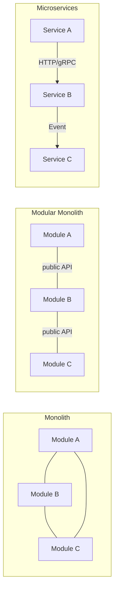
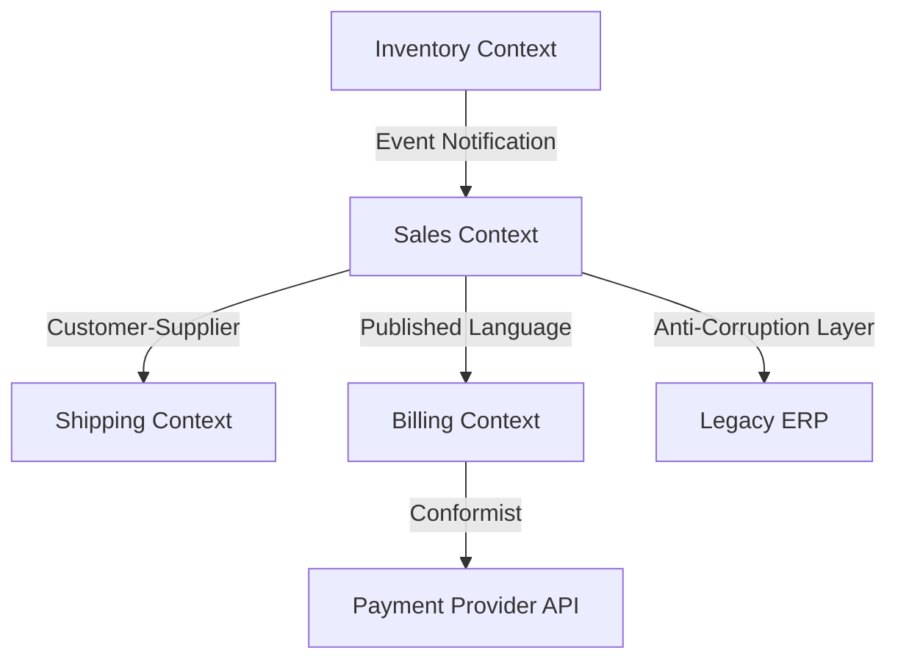
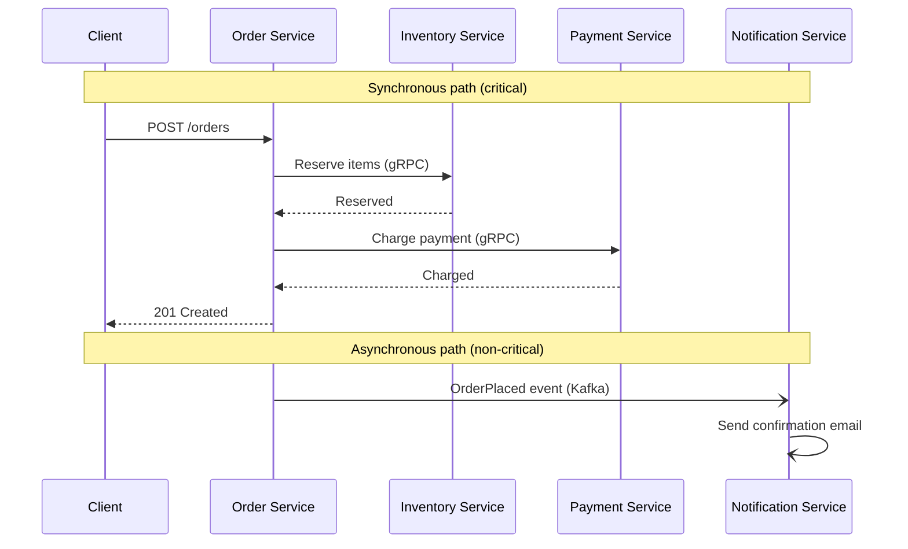

# Software Architecture

## Chapter Goal

After this chapter, the reader can place architectural styles on a spectrum from monolith to microservices, choose the right architecture for a given team size and business context, lead a Domain-Driven Design (DDD) modeling session, write and maintain Architecture Decision Records (ADRs), plan a migration from a legacy monolith using the strangler fig pattern, and explain every trade-off in an interview with the vocabulary an interviewer expects.

## Why This Matters for a Tech Lead

Architecture is the part of the job that compounds. A good architecture decision saves years of engineering time. A bad one creates years of operational debt. A Tech Lead owns three things that no one else will: the boundary decisions (where modules, services, and teams split), the communication style (sync vs async, choreography vs orchestration), and the migration strategy (how to evolve without stopping delivery). The interviewer is testing whether the candidate can reason about these decisions under real constraints — team size, timeline, budget, existing systems — not whether they can recite pattern names.

## Mental Model

Architecture is where you draw boundaries and how things communicate across them. Every other decision — language, framework, database, deployment — is downstream of these two choices.



In a monolith, everything communicates through in-process function calls and shared memory. In a modular monolith, modules have explicit public APIs but still deploy as one unit. In microservices, services communicate over the network and deploy independently. Each step to the right buys independence at the cost of distributed systems complexity. The question is never "which is best?" — it is "which set of trade-offs matches our constraints right now, and what is the migration path when constraints change?"

## Core Terminology

| Term | Definition |
| --- | --- |
| **Coupling** | The degree to which one module depends on the internals of another. Low coupling means changes to one module do not cascade. |
| **Cohesion** | The degree to which elements within a module belong together. High cohesion means a module has a single, clear responsibility. |
| **Bounded context** | A DDD concept: a boundary within which a particular domain model is defined and consistent. Different bounded contexts may model the same real-world entity differently. |
| **Aggregate** | A cluster of domain objects treated as a single unit for data changes. The aggregate root enforces invariants and is the only entry point for external modifications. |
| **Ubiquitous language** | The shared vocabulary between developers and domain experts within a bounded context. If the code uses different terms than the business, the model is wrong. |
| **Anti-corruption layer (ACL)** | A translation layer that isolates one bounded context from another, preventing one model from leaking into another. Critical when integrating with legacy systems. |
| **Choreography** | Services react to events without a central coordinator. Each service decides what to do when it sees an event. Decoupled but harder to trace. |
| **Orchestration** | A central coordinator directs the workflow by calling services in order. Easier to reason about but creates a single point of coupling and failure. |
| **ADR (Architecture Decision Record)** | A short document capturing a significant architectural decision, the context, the options considered, the trade-offs, and the outcome. The institutional memory of the architecture. |
| **Fitness function** | An automated check that verifies an architectural property holds (e.g., "no module in Domain may import from Infrastructure", "p99 latency stays below 200ms"). |
| **Strangler fig** | A migration pattern where new functionality is built in a new system while existing functionality is gradually migrated, wrapping the old system like a strangler fig wraps a tree. |
| **Repository** | A DDD pattern that encapsulates data access behind a collection-like interface. The domain layer interacts with repositories, not databases. |
| **Service (domain service)** | A DDD concept: a stateless operation that does not naturally belong to any entity or value object. Not to be confused with a microservice. |
| **CQRS** | Command Query Responsibility Segregation — separating the write model (commands) from the read model (queries) to optimize each independently. |
| **Event sourcing** | Storing state as an immutable, append-only log of events. Current state is derived by replaying the log. |

## Theoretical Foundation

### Architecture vs design vs implementation

**Architecture** defines the system's high-level structure: how it is decomposed into components, how those components communicate, and what constraints govern them. Architectural decisions are hard to reverse — they are "the things that are expensive to change later."

**Design** fills in the details within the architectural boundaries: class structure, design patterns (factory, strategy, observer), data structures, and internal module organization. Design decisions are moderate to reverse.

**Implementation** is the code: variable names, algorithms, library choices, test coverage. Implementation decisions are cheap to reverse.

A Tech Lead's leverage is highest at the architecture level, because mistakes there have the longest blast radius. Spending a week on an architecture decision that prevents 6 months of rework is the highest-ROI activity in engineering.

### Architectural styles

#### Layered architecture

The most common starting point. The system is organized into horizontal layers, each depending only on the layer below it:

```text
┌─────────────────────────┐
│   Presentation Layer    │  ← UI, API controllers
├─────────────────────────┤
│   Application Layer     │  ← Use cases, orchestration
├─────────────────────────┤
│   Domain Layer          │  ← Business rules, entities
├─────────────────────────┤
│   Infrastructure Layer  │  ← Database, external APIs, I/O
└─────────────────────────┘
```

**When it works:** Small to medium applications with well-understood requirements. Most CRUD applications. Teams that benefit from clear separation of concerns without extra abstraction overhead.

**When it breaks:** The domain layer depends on the infrastructure layer (imports database types, ORM decorators). This makes the business logic untestable without a database and couples the core logic to a specific data store. This is the problem that hexagonal and clean architectures solve.

**Common violation:** "Leaky layers" — the presentation layer directly queries the database, bypassing the domain layer. This makes changes to the data model ripple through the entire stack.

```text
src/
├── presentation/           ← controllers, request/response DTOs
│   ├── OrderController.ts
│   └── dto/
├── application/            ← use cases, orchestration
│   ├── CreateOrderUseCase.ts
│   └── GetOrderQueryHandler.ts
├── domain/                 ← entities, value objects, business rules
│   ├── Order.ts
│   ├── OrderLine.ts
│   └── OrderStatus.ts
├── infrastructure/         ← database, external APIs, config
│   ├── PostgresOrderRepository.ts
│   ├── StripePaymentAdapter.ts
│   └── config/
└── main.ts                 ← composition root
```

Each layer depends only on the layer below it. `presentation/` imports from `application/`, `application/` imports from `domain/`, and `infrastructure/` provides implementations that `application/` consumes through interfaces. The `domain/` layer has zero imports from any other layer — this is what keeps business rules testable without infrastructure.

**Common mistake:** Defining the repository interface in `infrastructure/` instead of `domain/`. This inverts the dependency: the domain depends on infrastructure, and the business logic cannot be tested without a database. The interface must live where the consumer is, not where the implementer is.

**How a Tech Lead evaluates this:** Check the import graph. If `domain/` imports anything from `infrastructure/` or `presentation/`, the layering is violated. Enforce this with a lint rule (e.g., `dependency-cruiser` or `eslint-plugin-boundaries`) in CI.

#### Hexagonal architecture (ports and adapters)

The domain (business logic) sits at the center. It defines ports — interfaces that describe what it needs from the outside world (e.g., "save an order", "send a notification"). Adapters implement these ports for specific technologies (PostgreSQL adapter, email adapter, REST adapter).

```text
                    ┌──────────────┐
         ┌──────────┤  REST API    │  (driving adapter)
         │          └──────────────┘
         ▼
┌─────────────────────────────┐
│                             │
│    ┌───────────────────┐    │
│    │   Domain Model    │    │
│    │   (pure logic)    │    │
│    └───────────────────┘    │
│         │        │          │
│    ┌────┴──┐ ┌───┴────┐    │
│    │ Port  │ │ Port   │    │
│    └───┬───┘ └───┬────┘    │
└────────┼─────────┼──────────┘
         ▼         ▼
   ┌──────────┐ ┌──────────┐
   │ Postgres │ │  Email   │  (driven adapters)
   └──────────┘ └──────────┘
```

**Key principle:** Dependencies point inward. The domain model has zero dependencies on frameworks, databases, or transport protocols. This makes it testable with fast in-memory fakes, portable across infrastructure changes, and readable without infrastructure noise.

**Driving adapters** (left side) translate the outside world into calls to the domain: REST controllers, CLI handlers, message consumers.

**Driven adapters** (right side) translate the domain's needs into the outside world: database repositories, email senders, payment gateways.

**When to use:** Systems where the domain logic is complex and the infrastructure will change (or is uncertain). Financial systems, insurance, healthcare — domains where correctness of business rules is critical.

**When to skip:** Simple CRUD applications where the "domain logic" is "save this to a database." The ceremony of ports and adapters adds indirection without value when the domain is thin.

#### Clean architecture

Conceptually the same as hexagonal but with more explicit layers. Coined by Robert Martin. The dependency rule is strict: source code dependencies always point inward. The inner layers know nothing about the outer layers.

```text
┌───────────────────────────────────────┐
│  Frameworks & Drivers (outermost)     │  Express, Postgres, AWS SDK
├───────────────────────────────────────┤
│  Interface Adapters                   │  Controllers, presenters, gateways
├───────────────────────────────────────┤
│  Application Business Rules           │  Use cases
├───────────────────────────────────────┤
│  Enterprise Business Rules (core)     │  Entities, value objects
└───────────────────────────────────────┘
```

The practical difference from hexagonal is naming and layer granularity. The underlying principle — dependency inversion, domain at the center — is identical.

**Tech Lead decision:** Choosing between hexagonal, clean, and onion architecture is a naming exercise, not a structural one. All three enforce "dependencies point inward." Pick one naming convention for the team and document it in an ADR. Debating which is "more correct" wastes time.

The dependency rule in code:

```ts
// domain/Order.ts — innermost layer, zero imports from outer layers
class Order {
  constructor(
    readonly id: string,
    private items: OrderItem[],
    private status: OrderStatus,
  ) {}

  approve(): void {
    if (this.items.length === 0) {
      throw new Error('Cannot approve an empty order');
    }
    this.status = OrderStatus.Approved;
  }

  total(): number {
    return this.items.reduce((sum, i) => sum + i.price * i.quantity, 0);
  }
}

// application/ApproveOrderUseCase.ts — depends on domain, not infrastructure
// The repository is an interface defined in the domain layer
import { Order } from '../domain/Order';
import { OrderRepository } from '../domain/OrderRepository';

class ApproveOrderUseCase {
  constructor(private readonly orders: OrderRepository) {}

  async execute(orderId: string): Promise<void> {
    const order = await this.orders.findById(orderId);
    if (!order) throw new Error('Order not found');
    order.approve();
    await this.orders.save(order);
  }
}

// infrastructure/ExpressOrderController.ts — outermost layer
// Depends on application layer, never imported by domain or application
import { ApproveOrderUseCase } from '../application/ApproveOrderUseCase';
import { Request, Response } from 'express';

class OrderController {
  constructor(private readonly approveOrder: ApproveOrderUseCase) {}

  async handleApprove(req: Request, res: Response): Promise<void> {
    await this.approveOrder.execute(req.params.id);
    res.status(200).json({ status: 'approved' });
  }
}
```

**What this shows:** The import direction is strictly inward. `Order` imports nothing. `ApproveOrderUseCase` imports from domain. `OrderController` imports from application. No layer ever imports from a layer further inside-out.

**Common mistake:** The controller directly constructs domain objects or calls repository implementations, bypassing the use case layer. This works in the short term but makes the domain logic untraceable — business rules are scattered across controllers instead of concentrated in the domain.

**In production:** Use dependency injection (constructor injection with a DI container or manual wiring in a composition root) to provide the concrete repository to the use case. The composition root is the only place that knows about both the interface and the implementation.

#### Onion architecture

Same dependency direction as hexagonal and clean. The domain model is at the center, surrounded by concentric rings: domain services, application services, and infrastructure. The name emphasizes the "peeling layers" metaphor. In practice, it is hexagonal with different naming.

### Domain-Driven Design

DDD is not an architecture — it is a design methodology that shapes how you discover and model the business domain. It becomes architectural when you use it to draw service boundaries.

#### Bounded contexts

A bounded context is the most important strategic pattern in DDD. It defines a boundary within which a specific domain model applies. The same real-world concept can have different models in different contexts.

Example: A `Customer` in the **Sales** context has a credit limit, purchase history, and price tier. A `Customer` in the **Shipping** context has a delivery address and shipping preference. A `Customer` in the **Billing** context has a payment method and invoice history. Forcing a single `Customer` model to serve all three contexts creates a "god object" — bloated, tightly coupled, and impossible to change without breaking something.

**Bounded context mapping patterns:**

- **Shared kernel:** Two contexts share a small, explicitly defined subset of the model. Both teams must agree on changes. Minimizes duplication but couples release schedules.
- **Customer-supplier:** One context (upstream) produces data that another (downstream) consumes. The upstream team publishes a contract. The downstream team consumes it.
- **Conformist:** The downstream team accepts the upstream model as-is, without translation. Simplest but most coupling.
- **Anti-corruption layer:** The downstream team builds a translation layer that maps the upstream model to its own model. Most isolation but most code.
- **Open host service + published language:** The upstream team provides a well-defined API and a documented data format. The standard integration pattern for public APIs.

**Tech Lead responsibility:** Bounded context boundaries are the most consequential DDD decision. They become service boundaries (microservices), module boundaries (modular monolith), and team boundaries (Conway's Law). Getting them wrong means either excessive cross-service communication (contexts too small) or god services that multiple teams fight over (contexts too large).

#### Aggregates

An aggregate is a cluster of domain objects that are treated as a single unit for data changes. The aggregate root is the entry point — all modifications go through it, and it enforces the invariants.

**Rules:**

1. External objects reference the aggregate only by its root's identity (ID), not by internal objects.
2. Changes within an aggregate are transactional — they succeed or fail as a unit.
3. Cross-aggregate changes are eventually consistent, not transactional.
4. Keep aggregates small. A large aggregate with many entities creates lock contention and slows writes.

**Example:** In an e-commerce domain, `Order` is an aggregate root. `OrderLine` items belong to the aggregate. Adding a line item, changing quantity, and applying a discount all go through the `Order` root, which enforces invariants like "order total must not exceed credit limit."

**Common mistake:** Making the aggregate too large. If `Customer → Orders → OrderLines → Products` is one aggregate, editing a product description locks the entire customer's order history. Each of these should be a separate aggregate referencing others by ID.

#### Repositories

A repository provides a collection-like interface for accessing aggregates. The domain layer calls `orderRepository.findById(id)` without knowing whether the storage is PostgreSQL, MongoDB, or in-memory.

**Key rules:**

- One repository per aggregate root.
- The repository interface is defined in the domain layer.
- The repository implementation is in the infrastructure layer.
- Repositories return complete aggregates, not partial projections (for projections, use a query model or CQRS read side).

#### Domain services

A domain service encapsulates business logic that does not naturally belong to any entity or value object. Example: `TransferService.transfer(fromAccount, toAccount, amount)` — the transfer logic involves two aggregates and does not belong to either.

Domain services are stateless and operate on domain objects. Do not confuse domain services with application services (which orchestrate use cases) or infrastructure services (which interface with external systems).

### Communication patterns

#### Synchronous vs asynchronous

**Synchronous (request-response):** The caller waits for a response. Simple, easy to reason about, easy to debug (stack traces, request IDs). Fails when: the downstream is slow (caller is blocked), the downstream is down (caller fails), or fan-out is high (latency is the max of all calls).

**Asynchronous (event-driven):** The caller publishes an event and continues. The consumer processes it later. Decouples availability (caller does not fail if the consumer is down), enables replay (events are stored), and scales better (consumers can be parallelized). Costs: eventual consistency, harder to debug (no stack trace across services), harder to test end-to-end.

**Tech Lead decision:** Default to synchronous for queries and simple writes. Use asynchronous for: notifications, analytics, cross-service data propagation, and any operation where the caller does not need an immediate response. Document the choice in the ADR for each inter-service communication path.

#### Choreography vs orchestration

**Choreography:** Each service listens for events and decides what to do. An `OrderPlaced` event is emitted; the inventory service, payment service, and notification service each react independently. Decoupled — adding a new consumer does not change the producer. Hard to see the full workflow — it is spread across services.

**Orchestration:** A central coordinator (saga orchestrator, workflow engine) calls services in sequence. The coordinator knows the full workflow. Easy to reason about and monitor. But the coordinator is a coupling point — changes to the workflow require changing the orchestrator.

**When choreography wins:** Many independent consumers, few ordering constraints, the workflow rarely changes.

**When orchestration wins:** Complex workflows with ordering, compensation (rollback), and conditional branching. Payment processing, order fulfillment, multi-step onboarding.

### System-level architecture styles

#### Monolith

A single deployable unit containing all application logic and a single database. The default starting point for most systems.

**Advantages:** Simple deployment, simple debugging (one process, one log), strong consistency (one database, ACID transactions), fast inter-module communication (function calls), low operational overhead.

**Disadvantages:** Scaling is all-or-nothing. Deploy cadence is coupled — all teams deploy together. Large codebase becomes hard to reason about over time. A bug in one module can crash the entire application.

**When it is the right choice:** Early-stage products (< 5 engineers), domains that are not yet well-understood (you do not know where the boundaries are), and systems where strong consistency is paramount.

#### Modular monolith

A monolith with explicit module boundaries. Each module has a public API (exported functions or classes) and private internals. Modules communicate through defined interfaces, not by reaching into each other's code.

**Key properties:**

- Single deployable unit (like a monolith).
- Explicit module boundaries enforced by package visibility, linting rules, or architectural fitness functions.
- Each module owns its data (separate schema or separate tables with no cross-module joins).
- Modules communicate through published interfaces, events, or mediators — not through shared database tables.

**When it is the right choice:** Teams of 5–20 engineers. Domains that are reasonably well-understood. Systems where the operational cost of microservices is not justified. This is the recommended starting architecture for most new products.

**Migration path:** When a module needs independent scaling, independent deployment, or a different technology stack, it can be extracted into a service. The module boundary becomes the service boundary. This is dramatically easier than extracting a service from an unmodularized monolith.

#### Microservices

Each service is independently deployable, independently scalable, and owned by a team. Services communicate over the network (HTTP, gRPC, events).

**Advantages:** Independent deployment (one team ships without coordinating with others). Independent scaling (scale the hot service, not the whole system). Technology diversity (each service can use the best language/database for its needs). Fault isolation (a crash in one service does not take down others — if circuit breakers are in place).

**Disadvantages:** Distributed systems complexity (network failures, serialization, service discovery). Eventual consistency (no cross-service transactions). Operational overhead (N services = N deployments, N monitoring dashboards, N on-call runbooks). Debugging requires distributed tracing. Data joins across services require API calls or denormalized read models.

**When it is the right choice:** Large organizations (> 50 engineers) with multiple teams that need independent release cadences. Systems where individual components have dramatically different scaling profiles. Domains with well-understood boundaries.

**When it is wrong:** Small teams (< 15 engineers). Greenfield products where boundaries are unknown. When the organization lacks distributed systems expertise, observability infrastructure, and per-service CI/CD.

**Common overengineering trap:** "We should use microservices because we plan to scale." Plans are not constraints. Scale when you have evidence — traffic data, profiling results, team coordination bottlenecks. A team of 10 engineers with microservices spends more time on infrastructure than on the product. The architecture should match the team you have today, not the team you hope to have in two years.

**Cost reality check:** Each additional microservice adds approximately $500-2,000/month in infrastructure (compute, database, monitoring, CI/CD) and 2-4 hours/week in operational overhead (deploys, incident response, on-call). At 10 services, that is $5K-20K/month and 20-40 hours/week of engineering capacity that is not building features. A modular monolith costs a fraction of this and provides the same code organization benefits.

#### Event-driven architecture

Services communicate primarily through events (messages). A service publishes an event when its state changes. Other services consume the event and update their own state.

**Key patterns:**

- **Event notification:** A lightweight event ("OrderPlaced with ID 123") that tells consumers something happened. The consumer calls back to get the full data if needed.
- **Event-carried state transfer:** The event carries enough data for the consumer to update its local state without calling back. Reduces coupling but increases event size and duplication.
- **Event sourcing:** All state changes are stored as events. The current state is computed by replaying the event log. See the dedicated section below.

**Trade-offs:** Event-driven decouples producers from consumers, enables replay, and supports high fan-out. It introduces eventual consistency, makes debugging harder (events are asynchronous — no request-response stack trace), and requires careful schema evolution for event payloads.

**Incident response reality:** When a consumer processes an event incorrectly, the damage is already done by the time you notice. There is no "retry the HTTP call" — the event was consumed, the side effect happened (email sent, inventory updated, payment charged), and rolling back requires compensating actions. Tech Lead responsibility: every event consumer must have a dead-letter queue, an idempotency mechanism, and a documented compensation procedure for when processing goes wrong. "What happens if this consumer processes the same event twice?" and "What happens if this consumer processes a corrupted event?" must have answers before production deployment.

#### Serverless

The application is decomposed into functions (Lambda, Cloud Functions) triggered by events (HTTP requests, queue messages, scheduled timers). The cloud provider manages scaling, availability, and infrastructure.

**Advantages:** Zero idle cost (pay only for invocations). Automatic scaling. No infrastructure management.

**Disadvantages:** Cold starts (function initialization latency). Vendor lock-in (business logic in Lambda handlers is coupled to AWS). Limited execution duration (15 min for Lambda). Harder to test locally. Observability requires additional tooling.

**Tech Lead perspective:** Serverless is a deployment model, not an architectural style. The domain logic should still follow hexagonal/clean principles — a Lambda handler is a driving adapter. If the business logic is embedded in Lambda-specific code, the system is locked into the vendor. Use serverless for glue (event processing, scheduled jobs, lightweight APIs) and traditional compute for core domain logic.

### CQRS (Command Query Responsibility Segregation)

CQRS separates the write path (commands that change state) from the read path (queries that return data). Each side has its own model, optimized for its purpose.

**Write model:** Validates business rules, enforces invariants, stores normalized data. Optimized for consistency and correctness.

**Read model:** Denormalized, pre-computed views optimized for query performance. May be stored in a different database (Elasticsearch for search, Redis for fast lookups, a materialized view in PostgreSQL).

**Synchronization:** The read model is updated asynchronously from the write model — either through domain events, change data capture (CDC), or database triggers. This introduces eventual consistency: a write may not be immediately visible in the read model.

**When to use:** Systems with dramatically different read and write patterns. Read-heavy systems where the read model needs to be optimized for specific query shapes. Systems that need full-text search, aggregated views, or denormalized projections alongside a normalized write store.

**When to skip:** Simple CRUD applications. Systems where the read and write models are nearly identical. Systems where eventual consistency between read and write is unacceptable without mitigation. The complexity of maintaining two models and their synchronization must be justified by a measurable performance or scalability gain.

**Tech Lead cost-benefit analysis:** CQRS adds three ongoing costs: (1) engineering time to maintain projections and handlers (every write model change requires updating the corresponding projections), (2) monitoring for projection lag and synchronization failures, and (3) user experience complexity when the read model is stale ("I placed an order but my order history is empty"). Adopt CQRS only when the single-model approach is a proven bottleneck — not as a preemptive optimization. Measure first: if the current queries are fast enough and the read/write patterns are not diverging, CQRS adds cost without benefit.

### Event sourcing

Instead of storing the current state (mutable rows), store every state change as an immutable event. The current state is derived by replaying the event sequence.

**Example:** A bank account is stored as a sequence of events: `AccountOpened(amount: 0)`, `MoneyDeposited(amount: 500)`, `MoneyWithdrawn(amount: 100)`. The current balance (400) is computed by replaying the events.

**Advantages:**

- Complete audit trail — every change is recorded with timestamp, actor, and payload.
- Temporal queries — "What was the account balance on March 15?"
- Debugging — replay events to reproduce any past state.
- Event replay — rebuild read models, populate new projections, or fix bugs by replaying from a corrected handler.

**Disadvantages:**

- Event schema evolution — changing the structure of an event requires versioning and migration. Upcasting (transforming old events to new format on read) adds complexity.
- Storage growth — the event log grows indefinitely. Snapshotting (storing a computed state periodically) mitigates this.
- Querying — querying the current state requires replaying events or maintaining a projection. CQRS is almost always used alongside event sourcing.
- Complexity — event sourcing adds significant complexity. It is justified for domains where the audit trail, replayability, or temporal queries are business requirements (financial systems, healthcare, compliance-heavy domains). It is not justified for a content management system.

**Common overengineering trap:** "We should use event sourcing because it gives us a full audit trail." If the only requirement is an audit trail, an append-only audit log table achieves the same result at a fraction of the complexity. Event sourcing is justified when the business needs to reconstruct any past state, replay events to build new projections, or debug by reproducing historical scenarios. These are narrow requirements. Most systems do not have them.

**Operational cost that interviews miss:** Event sourcing requires: schema registry for event versioning, snapshotting strategy for aggregates with many events, upcasting logic for old events, and CQRS for any query beyond "load aggregate by ID." The team must understand eventual consistency, event replay, and idempotent projections. These are specialized skills that most teams do not have. Hiring and training timeline: 3-6 months before the team is comfortable operating an event-sourced system.

### Data ownership

**The database-per-service rule:** In microservices, each service owns its data store. No other service reads from or writes to that store directly. All access goes through the service's API. This ensures loose coupling — the service can change its schema without breaking others.

**Violations and their cost:**

- **Shared database:** Two services read/write the same tables. A schema change requires coordinating both teams. One service's query can lock rows that the other service needs. This is a distributed monolith, not microservices.
- **Shared schema, separate tables:** Slightly better — each service has its own tables in the same database. Still operationally coupled (shared connection pool, shared backup, shared failover).
- **Separate databases:** Each service has its own database instance. Most isolation but highest operational cost.

**Data joins across services:** When a read query needs data from multiple services, options are: (1) API composition — call both services and join in the caller (latency = max of both calls). (2) Denormalized read model — use events to maintain a pre-joined view (eventual consistency). (3) Shared reporting database — replicate data into a read-only analytics database (separate from the write path).

### Migration strategies

#### Strangler fig pattern

The primary migration pattern for replacing a legacy system. Named after the strangler fig tree that grows around an existing tree, eventually replacing it.

**How it works:**

1. Put a routing layer (API gateway, reverse proxy) in front of the legacy system.
2. For each new feature or change, build it in the new system.
3. Route requests for migrated functionality to the new system; route everything else to the legacy system.
4. Over time, more and more functionality moves to the new system.
5. When the legacy system handles no traffic, decommission it.

**Key principles:**

- Incremental — each migration step is small, testable, and reversible.
- The routing layer is the seam — it decides where each request goes.
- Both systems run in parallel during migration. This requires data synchronization if both systems share state.
- The legacy system is never "frozen" — it continues to receive bug fixes and critical changes until its functionality is fully migrated.

**When to use:** Replacing a monolith with a new architecture. Migrating from on-premise to cloud. Replacing a legacy vendor system with a custom build.

**When to skip:** When the legacy system is small enough to rewrite in one sprint. When the legacy system has no traffic and can be replaced in a single cutover.

**Stakeholder explanation:** "We will not rewrite the system from scratch. Instead, we wrap the existing system with a routing layer and migrate features one at a time. Each migration is small, testable, and reversible — if something goes wrong, we route traffic back to the old system within minutes. The legacy system continues serving traffic for unmigrated features, so there is no downtime or feature freeze. We expect to migrate 80% of traffic to the new system within 6 months, with the remaining 20% (low-traffic legacy features) migrating over the following quarter."

**Risk checklist for strangler fig migration:**

- Is there a routing layer that can direct traffic to old or new at the endpoint level?
- Can both systems run simultaneously with consistent data?
- Is there a data synchronization strategy for the transition period?
- Is each migration step independently reversible?
- Is there a validation strategy to confirm the new system behaves identically to the old for migrated features?
- Is the legacy team available for bug fixes during the migration period?
- Is there a kill criterion — a measurable condition under which the migration is paused or rolled back?

#### Branch by abstraction

A migration pattern for replacing an internal component without changing the external interface.

1. Create an abstraction (interface) that both the old and new implementations satisfy.
2. Route all consumers to use the abstraction.
3. Build the new implementation behind the abstraction.
4. Use a feature flag to switch traffic from old to new.
5. Remove the old implementation and the abstraction.

**When to use:** Replacing an internal library, a data store, or an integration point. Works well when the old and new implementations can coexist.

### Architecture Decision Records (ADRs)

An ADR captures a significant architectural decision in a short, structured document. It is the institutional memory of the architecture — why decisions were made, what alternatives were considered, and what trade-offs were accepted.

**Format:**

```text
# ADR-NNN: [Short title]

## Status
Proposed | Accepted | Deprecated | Superseded by ADR-XXX

## Context
What is the problem or situation that requires a decision?

## Decision
What is the change we are proposing or have agreed to?

## Consequences
What are the trade-offs? What becomes easier? What becomes harder?
What operational, cost, security, or team implications follow?
```

**Best practices:**

- Number ADRs sequentially. Store them in version control (e.g., `docs/adr/`).
- Write the ADR before implementation, not after.
- Include rejected alternatives and explain why they were rejected.
- An ADR that says "we decided X" without trade-offs is worthless — it captures the decision but not the reasoning.
- Revisit ADRs when context changes. Supersede with a new ADR rather than editing the old one.
- ADRs are cheap to write (30 minutes) and expensive to not have (hours of "why did we build it this way?" conversations).

**Tech Lead approach to ADRs and RFCs:** ADRs document decisions. RFCs (Request for Comments) propose decisions and invite feedback before committing. The distinction matters: an RFC is a proposal with a comment period (typically 3-5 business days); an ADR is the final record after the decision is made. For decisions affecting a single team, an ADR written by the Tech Lead is sufficient. For decisions affecting multiple teams (shared API changes, new infrastructure, cross-team data flows), an RFC ensures affected teams have input before the decision is finalized. Without the RFC step, cross-team decisions become top-down mandates that erode trust and miss important constraints.

**Interview framing:** "I use ADRs as a forcing function for rigorous thinking. Writing an ADR forces me to articulate the context, the alternatives, and the trade-offs before committing to a decision. It also creates accountability — the ADR has my name on it. If I cannot write a convincing ADR, the decision is not ready. And the ADR survives the decision-maker: when I leave the team, the reasoning stays."

### Technical debt

Technical debt is the gap between the current state of the codebase and the ideal state. It accumulates when teams make expedient choices (ship fast, skip tests, skip refactoring) that create future rework.

**Categories:**

- **Deliberate, prudent:** "We know this is a shortcut. We accept it to meet the deadline. We have a ticket to fix it." Acceptable if tracked.
- **Deliberate, reckless:** "We do not have time for design." Creates compounding problems and is rarely paid back.
- **Inadvertent, prudent:** "Now we know what the design should have been." Natural learning — refactor as you learn.
- **Inadvertent, reckless:** "What is architecture?" The team does not know better. Training is the fix, not more code.

**Tech Lead responsibility:**

- Make technical debt visible. Maintain a debt register (a spreadsheet or a tagged backlog) with the estimated cost of each item and the cost of not fixing it.
- Allocate a budget — typically 15–20% of sprint capacity — for debt reduction. If the backlog has no debt tickets, the Tech Lead is not looking hard enough. If every sprint is 100% features, the codebase is degrading.
- Frame debt in business terms. "This module has no tests. The next feature in this area will take 3× longer because every change requires manual regression testing."

**Managing technical debt intentionally — what a Tech Lead does differently from a Senior Engineer:**

A Senior Engineer identifies debt ("this code is hard to work with"). A Tech Lead quantifies debt ("this code costs us 8 engineer-days per month in rework and incidents"), prioritizes it ("this debt item has a 5-week payback period"), and negotiates capacity ("we need 15% of this sprint for debt reduction — here is the ROI calculation").

Intentional debt management means:

1. **Accepting debt deliberately.** Not all debt is bad. "We ship this feature with a hardcoded configuration because it saves 3 days and we need to validate the product before investing in a config system." The Tech Lead accepts this debt, documents it (a ticket with an estimated fix cost and a trigger date), and ensures it does not compound.
2. **Refusing debt silently.** Undocumented shortcuts are not deliberate debt — they are hidden liabilities. If the team takes a shortcut without documenting the debt, the Tech Lead has no visibility and no ability to manage it. Rule: every shortcut gets a debt ticket with an estimated interest rate.
3. **Paying debt when the interest exceeds tolerance.** A debt item that costs 2 hours/month is low-interest — it can wait. A debt item that causes an incident every two weeks is high-interest — it must be fixed now, regardless of the feature backlog.
4. **Preventing compound debt.** When a feature is built on top of a debt item, the interest compounds. "We built the reporting module on top of the untested payment module. Now the reporting module is also untested, and a payment change can break reporting." The Tech Lead blocks new features from building on high-interest debt.

### Refactoring strategy

Refactoring is restructuring code without changing its behavior. At the architectural level, refactoring means changing module boundaries, data models, or communication patterns.

**Principles:**

- Refactor under test coverage. If there are no tests, write characterization tests first — tests that capture current behavior, even if that behavior is wrong.
- Refactor incrementally. A large refactoring PR that touches 200 files is unreviewable, untestable, and undeployable. Prefer many small, safe changes.
- Use feature flags to decouple deployment from release. Deploy the refactored code, route a percentage of traffic to it, validate, then switch fully.
- Measure the outcome. "We refactored the payment module" is not a result. "Payment module test coverage went from 30% to 85% and deploy time dropped from 45 min to 12 min" is a result.

### Monorepo vs multi-repo

**Monorepo:** All services and libraries live in a single repository. Shared code changes are atomic (one PR changes a library and all consumers). Tooling (build, lint, test) is centralized. Used by Google, Meta, and Stripe at massive scale with custom tooling (Bazel, Buck). At smaller scale, tools like Nx, Turborepo, and Lerna provide monorepo support.

**Multi-repo:** Each service or library has its own repository. Teams have full autonomy over their repo. Dependencies are managed through package versioning (npm, PyPI, Maven). Changes to shared libraries require publishing a new version and updating each consumer.

| Property | **Monorepo** | **Multi-repo** |
| --- | --- | --- |
| **Atomic changes** | One PR changes library + consumers | Requires multi-repo coordination |
| **Dependency management** | Always on latest | Version pinning, diamond dependency risk |
| **Build tooling** | Complex (needs custom tooling at scale) | Standard per-language tooling |
| **Code visibility** | Everyone sees everything | Scoped to the repo |
| **CI performance** | Requires affected-only builds | Each repo has its own CI |
| **Team autonomy** | Lower (shared tooling, shared CI) | Higher (each team owns their repo) |
| **Flips when** | Team > 50, tooling team cannot keep up | Team < 20 or strong shared library culture |

**Tech Lead decision:** The monorepo vs multi-repo choice is an operational decision, not an architectural one. It does not change service boundaries or communication patterns. Choose based on team size, tooling investment capacity, and how often shared code changes. For teams under 20 engineers, a monorepo with Nx or Turborepo reduces coordination overhead. For larger organizations, multi-repo with a disciplined versioning strategy provides team autonomy.

### API gateway and BFF pattern

**API gateway:** A single entry point that routes requests to backend services. Handles cross-cutting concerns: authentication, rate limiting, TLS termination, request routing, and response aggregation. Examples: Kong, AWS API Gateway, Envoy.

**BFF (Backend for Frontend):** A variation where each frontend (web, mobile, admin) has its own backend service that aggregates and transforms data from downstream services. The BFF is tailored to the frontend's specific needs — it returns exactly the shape of data the frontend expects, minimizing over-fetching and under-fetching.

**When to use a gateway:** When multiple clients consume the same backend services and need a unified entry point with shared cross-cutting concerns.

**When to use BFF:** When different clients (mobile, web, third-party) have dramatically different data needs. A mobile app may need a compact payload; a web dashboard may need a rich, nested response. A single API that tries to serve both is either over-fetching for mobile or under-fetching for web.

**Trade-off:** Every gateway or BFF is an additional service to deploy, monitor, and maintain. It adds latency (one more network hop). A single API gateway can become a bottleneck or a single point of failure. Per-team BFFs add operational cost proportional to the number of frontends. The value must exceed the operational tax. See [API Design](./12-api-design.md) for contract design, versioning, and backwards compatibility.

### Architectural fitness functions

Fitness functions are automated checks that validate architectural properties. They turn architectural rules from "things we agreed on" into "things the build enforces."

**Examples:**

- **Dependency direction:** "No file in `domain/` may import from `infrastructure/`." Enforced by a linting rule or a build-time check.
- **Latency budget:** "p99 latency for the checkout endpoint must stay below 500ms." Enforced by a continuous performance test.
- **Module coupling:** "Module A must not have more than 3 outgoing dependencies." Enforced by a static analysis tool.
- **Database isolation:** "No SQL query may reference tables from another module's schema." Enforced by a schema ownership check.

**Tech Lead responsibility:** Define the fitness functions that protect the architectural decisions documented in ADRs. A decision without a fitness function is a decision that will be violated within 6 months. See [Testing and Quality](./16-testing-and-quality.md) for contract testing, CI quality gates, and test strategy per architecture style.

## Practical Usage

### When to choose each architecture

**Start with a modular monolith** when:

- The team has fewer than 20 engineers.
- The domain boundaries are not yet fully understood.
- Delivery speed matters more than independent scaling.
- The organization does not have distributed systems expertise, per-service CI/CD, or observability infrastructure.
- The cost of distributed systems complexity (network failures, eventual consistency, distributed tracing) is not justified by the benefits.

**Move to microservices** when:

- Multiple teams (3+) need independent release cadences — they are blocked by deploy coordination in the monolith.
- Specific components have dramatically different scaling needs (the search service needs 10× the compute of the user service).
- The team has the operational maturity: per-service CI/CD, distributed tracing, centralized logging, service mesh or API gateway, and on-call runbooks per service.
- The domain boundaries are well-understood and stable — service boundaries that change frequently cause expensive cross-service migrations.

**Use event-driven architecture** when:

- Multiple consumers need to react to the same event independently (fan-out).
- Producers and consumers should not be coupled by availability (the producer does not fail if a consumer is down).
- Event replay or audit trail is a business requirement.
- The system needs to process events at high throughput (analytics, IoT, activity feeds).

**Use serverless** when:

- The workload is bursty and unpredictable (processing uploads, handling webhooks).
- Idle cost matters more than latency (internal tools, batch jobs).
- The team is small and does not want to manage infrastructure.
- The execution duration is short (< 15 minutes per invocation).

### Where DDD is applied in practice

DDD is most valuable in complex domains where the business logic is the competitive advantage — not the technology stack. Candidates often cite DDD in interviews without evidence of applying it. In practice:

- **Bounded contexts** map to modules (modular monolith) or services (microservices). Drawing the context map is the first design activity.
- **Aggregates** define transactional boundaries. They prevent the database from becoming a consistency bottleneck by keeping transactions small and scoped.
- **Repositories** abstract data access, enabling the domain to be tested without a database.
- **Anti-corruption layers** protect the domain from legacy system models. When integrating with a third-party API that uses a different vocabulary, the ACL translates at the boundary.

### When to write an ADR

Write an ADR for every decision that is:

- **Expensive to reverse** — choosing a database, defining service boundaries, selecting a communication protocol.
- **Controversial** — when the team has two valid options and needs to pick one.
- **Non-obvious** — when a future reader would ask "why did we do it this way?"

Do not write an ADR for routine decisions (which linting rules to use, which date library to pick). ADRs that are too granular are never read.

## Examples

### Modular monolith package layout

```text
src/
├── modules/
│   ├── orders/
│   │   ├── api/              ← public API (exported functions/types)
│   │   ├── domain/           ← entities, value objects, domain services
│   │   ├── application/      ← use cases, command/query handlers
│   │   ├── infrastructure/   ← repository implementations, adapters
│   │   └── index.ts          ← re-exports only the public API
│   ├── inventory/
│   │   ├── api/
│   │   ├── domain/
│   │   ├── application/
│   │   └── infrastructure/
│   └── shipping/
│       ├── ...
├── shared/                   ← truly shared utilities (logging, auth)
└── main.ts                   ← composition root, wiring
```

**What this shows:** Each module has its own domain, application, and infrastructure layers. Modules communicate only through their `api/` exports. The `shared/` directory is minimal — only utilities that genuinely belong to no specific module.

**Why it is written this way:** The module boundary is enforced by the export structure. A fitness function (lint rule) prevents `orders/` from importing from `inventory/infrastructure/`. This makes each module extractable into a service later — the module boundary becomes the service boundary.

**Common mistake:** Putting "everything shared" into `shared/`. Over time, `shared/` becomes a dumping ground that couples all modules. Each addition to `shared/` should be scrutinized: does this belong to a specific module's public API instead?

**Production change:** Add a fitness function (e.g., using `eslint-plugin-boundaries` or `dependency-cruiser`) that enforces the module boundary rules in CI. Without enforcement, developers will take shortcuts and the boundaries will erode within months.

### Hexagonal architecture in TypeScript

```ts
interface OrderRepository {
  findById(id: string): Promise<Order | null>;
  save(order: Order): Promise<void>;
}

class PlaceOrderUseCase {
  constructor(
    private readonly orders: OrderRepository,
    private readonly payments: PaymentGateway,
  ) {}

  async execute(cmd: PlaceOrderCommand): Promise<OrderId> {
    const order = Order.create(cmd.customerId, cmd.items);
    await this.payments.charge(order.customerId, order.total());
    await this.orders.save(order);
    return order.id;
  }
}

class PostgresOrderRepository implements OrderRepository {
  constructor(private readonly db: Pool) {}

  async findById(id: string): Promise<Order | null> {
    const row = await this.db.query(
      'SELECT * FROM orders WHERE id = $1',
      [id],
    );
    return row.rows[0] ? OrderMapper.toDomain(row.rows[0]) : null;
  }

  async save(order: Order): Promise<void> {
    const data = OrderMapper.toPersistence(order);
    await this.db.query(
      `INSERT INTO orders (id, customer_id, total, status)
       VALUES ($1, $2, $3, $4)
       ON CONFLICT (id) DO UPDATE SET total = $3, status = $4`,
      [data.id, data.customerId, data.total, data.status],
    );
  }
}
```

**What this shows:** The `PlaceOrderUseCase` depends on interfaces (`OrderRepository`, `PaymentGateway`), not implementations. The PostgreSQL adapter implements the interface. The use case is testable with in-memory fakes — no database required.

**Why it is written this way:** The domain and application layers have zero dependencies on PostgreSQL, Express, or any framework. Changing the database from PostgreSQL to DynamoDB means writing a new adapter — the use case does not change.

**Common mistake:** Putting ORM decorators (TypeORM `@Entity`, Prisma generated types) in the domain layer. This couples the domain to the database. The domain should define plain objects; the mapper in the infrastructure layer handles conversion.

**Production change:** Add a `UnitOfWork` pattern to coordinate multiple repository operations within a single database transaction. In the example above, if the payment charge succeeds but the order save fails, the system is inconsistent. A unit of work wraps both operations in one transaction.

### Bounded context map



Each arrow represents a relationship pattern. Sales publishes order events that Inventory consumes. Billing conforms to the payment provider's model (no ACL — the provider's model is accepted as-is). Sales integrates with the legacy ERP through an anti-corruption layer to prevent the ERP's data model from leaking into the sales domain.

### ADR example

```text
# ADR-007: Use modular monolith for the first release

## Status
Accepted (2025-11-15)

## Context
We are building a new e-commerce platform. The team has 8 engineers.
The domain boundaries (orders, inventory, shipping, billing) are
understood at a high level but the exact integration points are not
yet defined. The team has limited experience with distributed systems.

## Decision
We will build a modular monolith with one module per bounded context.
Modules communicate through in-process events and explicit public APIs.
Each module owns its database tables (no cross-module joins).

## Consequences
- Faster initial delivery: no network serialization, no service
  discovery, no per-service CI/CD.
- Simpler debugging: single process, single log, stack traces work.
- Less operational overhead: one deployment, one database, one
  monitoring stack.
- Trade-off: all modules must deploy together. If one module needs
  independent scaling, we will extract it into a service using
  the strangler fig pattern.
- Trade-off: the team must enforce module boundaries through
  fitness functions. Without enforcement, the monolith will
  degrade into a ball of mud.
```

### Strangler fig migration plan

```text
Phase 1: Route (Week 1-2)
├── Deploy API gateway in front of legacy monolith
├── All traffic routes to legacy (gateway is a pass-through)
└── Instrument: log all requests to identify migration candidates

Phase 2: Migrate first feature (Week 3-6)
├── Build "order creation" in new service
├── Route POST /orders to new service
├── Route GET /orders to legacy (reads still from old DB)
├── Sync new orders back to legacy DB for reporting
└── Validate: compare new service responses with legacy for same inputs

Phase 3: Migrate reads (Week 7-10)
├── Build read model in new service
├── Backfill historical orders from legacy DB
├── Route GET /orders to new service
├── Legacy DB is no longer the source of truth for orders
└── Validate: run both systems in parallel, compare responses

Phase 4: Repeat for next feature (Week 11+)
├── Migrate inventory, then shipping, then billing
├── Each migration follows the same route → build → validate → switch pattern
└── Legacy system shrinks with each migration

Phase 5: Decommission (when legacy handles 0% of traffic)
├── Remove routing rules for legacy
├── Archive legacy codebase
└── Decommission legacy infrastructure
```

**What this shows:** The migration is incremental and reversible at every step. If the new service has a bug, the gateway routes traffic back to legacy. The team never needs to "freeze" the legacy system — it continues to serve traffic for unmigrated features.

### Event sourcing with snapshots

```ts
interface DomainEvent {
  readonly type: string;
  readonly timestamp: Date;
  readonly payload: Record<string, unknown>;
}

class BankAccount {
  private balance = 0;
  private version = 0;
  private uncommitted: DomainEvent[] = [];

  static fromEvents(events: DomainEvent[]): BankAccount {
    const account = new BankAccount();
    for (const event of events) {
      account.apply(event);
    }
    return account;
  }

  deposit(amount: number): void {
    if (amount <= 0) throw new Error('Amount must be positive');
    this.addEvent({
      type: 'MoneyDeposited',
      timestamp: new Date(),
      payload: { amount },
    });
  }

  withdraw(amount: number): void {
    if (amount > this.balance) throw new Error('Insufficient funds');
    this.addEvent({
      type: 'MoneyWithdrawn',
      timestamp: new Date(),
      payload: { amount },
    });
  }

  getBalance(): number {
    return this.balance;
  }

  getUncommittedEvents(): DomainEvent[] {
    return [...this.uncommitted];
  }

  private addEvent(event: DomainEvent): void {
    this.apply(event);
    this.uncommitted.push(event);
  }

  private apply(event: DomainEvent): void {
    switch (event.type) {
      case 'MoneyDeposited':
        this.balance += event.payload.amount as number;
        break;
      case 'MoneyWithdrawn':
        this.balance -= event.payload.amount as number;
        break;
    }
    this.version++;
  }
}
```

**What this shows:** The `BankAccount` entity stores no mutable state directly. State is derived from events. The `apply` method is a pure state transition. `fromEvents` reconstructs the entity from history. `getUncommittedEvents` returns new events to be persisted to the event store.

**Why it is written this way:** Business rules (balance must be positive, amount must be positive) are enforced before events are created. The event log is the source of truth, and the in-memory state is a derived cache. This enables audit trails, temporal queries, and event replay.

**Common mistake:** Putting side effects (database writes, API calls) inside the `apply` method. The `apply` method must be a pure state transition — it is called during replay, and replaying should not re-send emails or re-charge payments.

**Production change:** Add snapshots — periodically save the computed state alongside the event version number. On load, start from the most recent snapshot and replay only events after it. Without snapshots, an entity with 100,000 events takes seconds to load.

### Aggregate and domain service

```ts
// Aggregate: Order (aggregate root) with OrderLine (child entity)
class Order {
  private lines: OrderLine[] = [];
  private status: OrderStatus = OrderStatus.Draft;

  constructor(
    readonly id: string,
    private readonly customerId: string,
  ) {}

  addLine(productId: string, quantity: number, unitPrice: number): void {
    if (this.status !== OrderStatus.Draft) {
      throw new Error('Cannot modify a non-draft order');
    }
    const existing = this.lines.find((l) => l.productId === productId);
    if (existing) {
      existing.increaseQuantity(quantity);
    } else {
      this.lines.push(new OrderLine(productId, quantity, unitPrice));
    }
  }

  submit(): void {
    if (this.lines.length === 0) {
      throw new Error('Cannot submit an empty order');
    }
    this.status = OrderStatus.Submitted;
  }

  total(): number {
    return this.lines.reduce((sum, line) => sum + line.subtotal(), 0);
  }
}

class OrderLine {
  constructor(
    readonly productId: string,
    private quantity: number,
    private readonly unitPrice: number,
  ) {}

  increaseQuantity(amount: number): void {
    this.quantity += amount;
  }

  subtotal(): number {
    return this.quantity * this.unitPrice;
  }
}

// Domain service: handles logic spanning two aggregates
class TransferService {
  async transfer(
    from: Account,
    to: Account,
    amount: number,
  ): Promise<void> {
    from.debit(amount);
    to.credit(amount);
    // Both aggregates are modified, but cross-aggregate consistency
    // is eventual — each is saved in its own transaction
  }
}
```

**What this shows:** The `Order` aggregate root enforces invariants (cannot modify a non-draft order, cannot submit an empty order). `OrderLine` is a child entity that cannot be accessed directly from outside — all access goes through `Order`. The `TransferService` is a domain service because the transfer logic belongs to neither `Account`.

**Why it is useful:** In interviews, candidates often confuse aggregates with database tables or entities. This example shows aggregates as consistency boundaries — the rules are enforced in memory, not in SQL constraints.

**Common mistake:** Making `OrderLine` its own aggregate with its own repository. This breaks the invariant enforcement — external code could modify an order line without the order knowing, bypassing the "cannot modify a non-draft order" rule.

**In production:** Keep aggregates small. If `Order` contained the full `Customer`, `Product`, and `ShippingAddress` as embedded entities, updating any of them would lock the entire order. Reference other aggregates by ID only.

**How a Tech Lead evaluates this:** Check that all state mutations go through the aggregate root. If any external code directly modifies a child entity, the aggregate boundary is broken. The rule: "Only the aggregate root has a repository. Only the aggregate root is loaded. Only the aggregate root is passed to consumers."

### CQRS command and query separation

```ts
// Command side — optimized for writes, enforces business rules
interface Command {
  readonly type: string;
}

interface PlaceOrderCommand extends Command {
  readonly type: 'PlaceOrder';
  readonly customerId: string;
  readonly items: Array<{ productId: string; quantity: number }>;
}

class PlaceOrderHandler {
  constructor(
    private readonly orders: OrderRepository,
    private readonly eventBus: EventBus,
  ) {}

  async handle(cmd: PlaceOrderCommand): Promise<string> {
    const order = Order.create(cmd.customerId, cmd.items);
    await this.orders.save(order);
    await this.eventBus.publish({
      type: 'OrderPlaced',
      orderId: order.id,
      customerId: cmd.customerId,
      total: order.total(),
      timestamp: new Date(),
    });
    return order.id;
  }
}

// Query side — optimized for reads, denormalized for fast retrieval
interface OrderSummaryView {
  orderId: string;
  customerName: string;
  itemCount: number;
  total: number;
  status: string;
  placedAt: Date;
}

class OrderSummaryProjection {
  constructor(private readonly db: ReadDatabase) {}

  async onOrderPlaced(event: OrderPlacedEvent): Promise<void> {
    const customer = await this.db.query(
      'SELECT name FROM customers_read WHERE id = $1',
      [event.customerId],
    );
    await this.db.query(
      `INSERT INTO order_summaries
       (order_id, customer_name, item_count, total, status, placed_at)
       VALUES ($1, $2, $3, $4, $5, $6)`,
      [event.orderId, customer.name, event.itemCount,
       event.total, 'placed', event.timestamp],
    );
  }
}

class OrderQueryService {
  constructor(private readonly db: ReadDatabase) {}

  async getOrderSummaries(customerId: string): Promise<OrderSummaryView[]> {
    return this.db.query(
      'SELECT * FROM order_summaries WHERE customer_name = $1 ORDER BY placed_at DESC',
      [customerId],
    );
  }
}
```

**What this shows:** Commands (writes) go through a handler that enforces business rules and emits events. Queries (reads) go to a pre-built projection that returns denormalized data. The read model (`order_summaries`) joins data from `orders` and `customers` at write time, so the query is a single table scan — no joins at read time.

**Why it is useful:** The most common interview confusion is thinking CQRS means "two databases." CQRS is a code-level separation of write and read models. Two databases are optional — the same PostgreSQL instance can host both the normalized write tables and the denormalized read views.

**Common mistake:** Using CQRS for a simple CRUD application where the read and write models are identical. The added complexity (projection sync, eventual consistency) provides no benefit when a single model serves both sides.

**In production:** Add monitoring for projection lag — the delay between a write event being published and the read model being updated. If the projection falls behind, reads show stale data. Set an alert for lag exceeding a threshold (e.g., > 5 seconds for non-critical projections, > 500ms for user-facing views).

**How a Tech Lead standardizes this:** Define a contract: every command handler must emit at least one domain event. Every projection must be idempotent (re-processing the same event produces the same result). Every query must tolerate eventual consistency or use a read-your-writes strategy for the authoring user.

### Microservices communication comparison



The synchronous path handles the critical operations the user is waiting for: inventory reservation and payment. If either fails, the order creation fails and the user gets immediate feedback. The asynchronous path handles the non-critical operations: sending a confirmation email does not need to complete before the user sees "Order placed."

**What this shows:** Real systems use both synchronous and asynchronous communication. The synchronous path is the latency-critical path — it determines how long the user waits. The asynchronous path is the throughput path — it handles fire-and-forget operations.

**Common mistake:** Making the notification synchronous. If the email service is slow (3 seconds) or down, the order creation either takes 3 seconds longer or fails entirely — even though the order is valid and the payment is complete. Move non-critical operations off the critical path.

**In production:** Add timeouts and circuit breakers on the synchronous calls. If the inventory service does not respond within 500ms, fail fast. If the payment service is returning errors, open the circuit breaker and return "temporarily unavailable" rather than queuing requests that will also fail.

**How a Tech Lead evaluates this:** Review every inter-service call and classify it as critical (must succeed for the user request to succeed) or non-critical (can be deferred or retried). Non-critical calls should be events. This analysis determines the system's resilience — a failure in a non-critical downstream does not affect the user.

### BFF (Backend for Frontend)

```ts
// Mobile BFF — returns a compact payload tailored for mobile
// GET /mobile/orders/:id
async function getMobileOrder(orderId: string): Promise<MobileOrderView> {
  const [order, customer] = await Promise.all([
    orderService.getOrder(orderId),
    customerService.getCustomer(order.customerId),
  ]);
  return {
    id: order.id,
    status: order.status,
    total: order.total,
    customerName: customer.name,
    itemCount: order.items.length,
  };
}

// Web BFF — returns a rich payload with full details
// GET /web/orders/:id
async function getWebOrder(orderId: string): Promise<WebOrderView> {
  const [order, customer, shipping, payments] = await Promise.all([
    orderService.getOrder(orderId),
    customerService.getCustomer(order.customerId),
    shippingService.getShipment(orderId),
    paymentService.getPayments(orderId),
  ]);
  return {
    id: order.id,
    status: order.status,
    items: order.items.map((i) => ({
      productName: i.productName,
      quantity: i.quantity,
      unitPrice: i.unitPrice,
      subtotal: i.subtotal,
      imageUrl: i.imageUrl,
    })),
    customer: {
      name: customer.name,
      email: customer.email,
      tier: customer.loyaltyTier,
    },
    shipping: {
      carrier: shipping.carrier,
      trackingUrl: shipping.trackingUrl,
      estimatedDelivery: shipping.estimatedDelivery,
    },
    payments: payments.map((p) => ({
      method: p.method,
      amount: p.amount,
      status: p.status,
    })),
    total: order.total,
    placedAt: order.createdAt,
  };
}
```

**What this shows:** The mobile BFF fetches 2 services and returns 5 fields. The web BFF fetches 4 services and returns the full order with customer, shipping, and payment details. Each BFF is tailored to its frontend — no over-fetching for mobile, no under-fetching for web.

**Why it is useful:** Without a BFF, there are two bad options: (1) a generic API that returns everything (mobile downloads data it does not render — wasteful on metered connections), or (2) multiple client-side API calls (mobile makes 4 HTTP calls, adding latency and battery drain).

**Common mistake:** Putting business logic in the BFF. The BFF's responsibility is aggregation and transformation — it calls downstream services and shapes the response. Business rules (order validation, payment processing) belong in the domain services.

**In production:** The BFF is a latency aggregator. The response time equals the latency of the slowest downstream call (since they run in parallel). Monitor per-downstream call latency in the BFF to identify which service is dragging response times. Set timeouts per downstream call and return partial data if a non-critical service is slow.

**How a Tech Lead evaluates this:** One team owns each BFF. The mobile team owns the mobile BFF; the web team owns the web BFF. If a single backend team owns all BFFs, they become a bottleneck — frontend teams wait for the backend team to add or modify endpoints.

### Repository interface and implementation

```ts
// Domain layer — defines the interface
interface OrderRepository {
  findById(id: string): Promise<Order | null>;
  findByCustomerId(customerId: string): Promise<Order[]>;
  save(order: Order): Promise<void>;
  nextId(): string;
}

// Infrastructure layer — PostgreSQL implementation
class PostgresOrderRepository implements OrderRepository {
  constructor(private readonly pool: Pool) {}

  async findById(id: string): Promise<Order | null> {
    const result = await this.pool.query(
      'SELECT * FROM orders WHERE id = $1',
      [id],
    );
    if (result.rows.length === 0) return null;
    return OrderMapper.toDomain(result.rows[0]);
  }

  async findByCustomerId(customerId: string): Promise<Order[]> {
    const result = await this.pool.query(
      'SELECT * FROM orders WHERE customer_id = $1 ORDER BY created_at DESC',
      [customerId],
    );
    return result.rows.map(OrderMapper.toDomain);
  }

  async save(order: Order): Promise<void> {
    const data = OrderMapper.toPersistence(order);
    await this.pool.query(
      `INSERT INTO orders (id, customer_id, status, total, created_at)
       VALUES ($1, $2, $3, $4, $5)
       ON CONFLICT (id) DO UPDATE
       SET status = EXCLUDED.status, total = EXCLUDED.total`,
      [data.id, data.customerId, data.status, data.total, data.createdAt],
    );
  }

  nextId(): string {
    return crypto.randomUUID();
  }
}

// Test — in-memory implementation for fast domain tests
class InMemoryOrderRepository implements OrderRepository {
  private orders = new Map<string, Order>();

  async findById(id: string): Promise<Order | null> {
    return this.orders.get(id) ?? null;
  }

  async findByCustomerId(customerId: string): Promise<Order[]> {
    return [...this.orders.values()].filter(
      (o) => o.customerId === customerId,
    );
  }

  async save(order: Order): Promise<void> {
    this.orders.set(order.id, order);
  }

  nextId(): string {
    return `test-${this.orders.size + 1}`;
  }
}
```

**What this shows:** The domain defines the contract (`OrderRepository` interface). The infrastructure provides the real implementation (`PostgresOrderRepository`). Tests use the in-memory implementation (`InMemoryOrderRepository`) — no database needed, tests run in milliseconds.

**Why it is useful:** The `OrderMapper.toDomain` / `OrderMapper.toPersistence` pattern separates the domain model from the persistence model. The domain object has behavior (methods, invariants); the persistence row is a flat data structure. Changes to the database schema only affect the mapper and the repository — the domain stays untouched.

**Common mistake:** Returning the database row directly as the domain object. This couples the domain to the database schema — adding a column or renaming a field changes the domain model. Use a mapper to translate between the two.

**In production:** Add a `UnitOfWork` or transaction wrapper. If a use case modifies multiple aggregates, each `save` call should happen within the same database transaction. Without a unit of work, a failure between two saves leaves the system in an inconsistent state.

### Technical debt decision matrix

| Debt item | **Impact** (H/M/L) | **Interest** (monthly cost) | **Fix cost** | **Payback period** | **Priority** |
| --- | --- | --- | --- | --- | --- |
| Payment module has no tests | **H** | 12 engineer-days (manual testing) | 15 days | 5 weeks | **1 — Fix now** |
| Legacy API uses XML, no ACL | **M** | 3 days (debugging data mismatches) | 8 days | 11 weeks | **2 — Next quarter** |
| Shared database between order and inventory | **H** | 6 days (coordination overhead) | 20 days | 14 weeks | **3 — Plan migration** |
| Frontend uses deprecated UI library | **L** | 1 day (occasional workarounds) | 30 days | 2.5 years | **4 — Track, defer** |
| No ADRs for first 6 months | **M** | 2 days (repeated "why?" discussions) | 5 days | 10 weeks | **5 — Quick win** |

**What this shows:** Debt is prioritized by payback period (fix cost ÷ monthly interest), not by severity alone. The payment module has the shortest payback (5 weeks) and the highest monthly cost — it is the clear first priority. The deprecated UI library has a low monthly cost and a high fix cost — it can wait.

**Why it is useful:** Stakeholders do not understand "technical debt." They understand "we spend 12 days per month on manual testing because this module has no tests. Fixing it costs 15 days and saves 12 days every month after that." The matrix translates engineering concerns into business language.

**Common mistake:** Prioritizing debt by how annoying it is (the deprecated UI library frustrates every frontend developer) rather than by business impact. Annoyance correlates weakly with cost.

**In production:** Review the matrix quarterly. Remove fixed items. Re-estimate interests — some debt items get worse over time (more features built on the untested module), others stabilize (the legacy API is used by fewer integrations).

**How a Tech Lead uses this:** Present the top 3 items to the product team at sprint planning. Frame each as an investment: "Spend 15 days now, save 12 days per month." Let the product team decide the timing — but make the cost of inaction visible.

### Architecture review checklist

Use this checklist when reviewing a proposed architecture change, a new service design, or a migration plan:

```text
Boundary review
  □ Service/module boundaries align with team boundaries
  □ Each bounded context has a single owning team
  □ No shared databases across boundaries
  □ Integration patterns are documented (ACL, shared kernel, conformist)

Dependency direction
  □ Domain layer has zero imports from infrastructure
  □ Dependency direction is enforced by a lint rule or fitness function
  □ No circular dependencies between modules/services

Communication
  □ Each inter-service call is classified as critical or non-critical
  □ Non-critical calls use async events, not synchronous HTTP
  □ Timeouts, retries, and circuit breakers are defined for all sync calls
  □ API contracts are versioned and covered by contract tests

Data
  □ Each service/module owns its data store exclusively
  □ Cross-service data needs are met by events or API composition
  □ Read models are documented with expected consistency window

Operational readiness
  □ Runbook exists for each new service/module
  □ Health check endpoints are defined
  □ Dashboards and alerts are planned (not "we will add later")
  □ On-call rotation covers the new component

Migration
  □ Migration is incremental (not big-bang cutover)
  □ Rollback plan exists for each migration phase
  □ Both old and new systems can run in parallel during migration
  □ Data migration strategy is documented

Decision record
  □ An ADR captures the decision, alternatives, and trade-offs
  □ The ADR includes a "revisit when" trigger
  □ The ADR is reviewed by at least one other senior engineer
```

**What this shows:** An architecture review is a structured evaluation, not a free-form discussion. Each item is verifiable — it either exists or it does not. This prevents reviews from devolving into aesthetic debates about pattern names.

**Why it is useful:** Architecture reviews often miss operational concerns (runbooks, on-call) and focus on design purity. This checklist forces the reviewer to consider the full lifecycle: design, communication, data, operations, migration, and documentation.

**Common mistake:** Treating the checklist as a gate that blocks all changes. The checklist is a conversation tool. Some items may not apply (a small internal tool does not need an on-call rotation). The value is in asking the question, not in checking every box.

**How a Tech Lead uses this:** Share the checklist with the team. When an engineer proposes an architecture change, they self-review against the checklist before bringing it to the Tech Lead. This reduces review cycles and raises the quality of proposals.

## Common Mistakes

1. **Splitting into microservices before organizational readiness**
   - What it looks like: A team of 8 engineers launches with 12 microservices, each with its own CI/CD pipeline, database, and monitoring.
   - Why it is wrong: Each service is an operational unit that requires deployment, monitoring, on-call, and incident response. 12 services with 8 engineers means each engineer owns 1.5 services — they spend more time on operations than on features. The team does not have distributed tracing, service mesh, or contract testing, so debugging cross-service issues takes hours.
   - The correct approach: Start with a modular monolith. Extract services only when a specific module needs independent deployment, independent scaling, or a different technology stack — and the team has the operational infrastructure to support it.

2. **Sharing a database across services**
   - What it looks like: Two services read and write the same database tables. Schema changes require coordinating both teams. One service's slow query blocks the other.
   - Why it is wrong: A shared database is a hidden coupling point. It negates the independence that microservices are supposed to provide. It is a distributed monolith.
   - The correct approach: Each service owns its data store. Cross-service data access goes through the service's API. If reads need data from both services, use API composition or a denormalized read model.

3. **"Distributed monolith" — services that must deploy together**
   - What it looks like: Deploying Service A requires also deploying Service B because they share internal data types, communicate through a shared library with breaking changes, or rely on non-versioned APIs.
   - Why it is wrong: This has all the complexity of microservices (network failures, serialization, distributed tracing) with none of the benefits (independent deployment, independent scaling).
   - The correct approach: Enforce backward-compatible API contracts (no breaking changes without versioning). Use contract testing (Pact) to catch contract violations before deployment. Shared libraries must follow semantic versioning.

4. **Missing anti-corruption layer when integrating with legacy**
   - What it looks like: The new service calls the legacy system's API and uses the legacy data model directly. Legacy field names, business rules, and inconsistencies leak into the new system.
   - Why it is wrong: The new system inherits the legacy system's technical debt. Changes to the legacy system propagate through the new system. The new system cannot evolve its model independently.
   - The correct approach: Build an ACL at the integration boundary. The ACL translates the legacy model to the new system's domain model. The new system never sees the legacy schema.

5. **ADRs that capture decisions but not trade-offs**
   - What it looks like: "ADR-005: We decided to use Kafka." No context on why, what was considered, or what the trade-offs are.
   - Why it is wrong: The decision is undebatable because there is no record of the reasoning. When context changes (team shrinks, traffic decreases), no one knows whether to revisit the decision.
   - The correct approach: Every ADR must include context, alternatives considered, and consequences (positive and negative). "We chose Kafka over SQS because we need consumer replay and multi-consumer fan-out. The trade-off is higher operational cost and a steeper learning curve."

6. **Choosing architecture based on resume, not requirements**
   - What it looks like: Proposing Kafka, Kubernetes, event sourcing, and CQRS for a CRUD application that serves 100 users.
   - Why it is wrong: Each technology adds operational cost, cognitive load, and hiring difficulty. The architecture should be proportional to the problem complexity.
   - The correct approach: Start with the simplest architecture that satisfies the non-functional requirements. Scale up when metrics show the current approach is insufficient. Document the scaling trigger in an ADR.

7. **Ignoring Conway's Law**
   - What it looks like: Designing service boundaries that do not match team boundaries. One team owns three services; three teams share one service.
   - Why it is wrong: Conway's Law states that system structure mirrors organizational structure. If the organization fights the architecture, the organization wins. A service owned by three teams has no clear owner, no clear direction, and slow decision-making.
   - The correct approach: Align service boundaries with team boundaries. One team owns one or two services — complete ownership from development through on-call. If the team cannot own the service end-to-end, the boundary is wrong.

8. **No fitness functions to enforce architecture**
   - What it looks like: The team agrees on module boundaries, dependency rules, and performance targets. Six months later, the boundaries are violated, dependencies are circular, and performance has degraded.
   - Why it is wrong: Architectural decisions without automated enforcement decay. Every engineer under deadline pressure will take the shortcut.
   - The correct approach: Encode architectural rules as automated checks in CI: dependency direction rules (no domain importing infrastructure), module boundary rules (no cross-module internal imports), performance budgets (p99 latency regression tests).

## Trade-offs

Architecture trade-offs and when each choice flips:

| Trade-off | **Optimizes for** | **Sacrifices** | **Flips when** |
| --- | --- | --- | --- |
| **Monolith → modular monolith** | Delivery speed, simplicity | Module independence (shared deploy) | Team grows beyond 20, deploy coordination becomes bottleneck |
| **Modular monolith → microservices** | Independent deployment, scaling | Simplicity, strong consistency | Specific module needs independent scale or independent release |
| **Sync → async communication** | Simplicity, immediate feedback | Throughput, fault tolerance | Downstream failures are frequent, load is bursty |
| **Choreography → orchestration** | Decoupling, extensibility | Visibility, workflow control | Workflows become complex with ordering, rollback, and branching |
| **Layered → hexagonal** | Simplicity, familiarity | Testability, domain isolation | Domain logic is complex and infrastructure will change |
| **CQRS** | Read performance, query flexibility | Simplicity, strong consistency | Read and write patterns diverge dramatically |
| **Event sourcing** | Audit trail, replayability, temporal queries | Simplicity, query performance | Business requires audit trail or the ability to reconstruct past state |
| **Monorepo → multi-repo** | Atomic changes, code visibility | Team autonomy, build simplicity | Team grows beyond 50 or tooling cannot scale |
| **Single API → BFF per client** | Client-optimized responses | Operational cost (more services) | Mobile and web payloads diverge significantly |
| **No ADRs → formal ADR process** | Speed (less documentation) | Institutional memory | Team grows beyond 10 or turnover is high |

## Production Considerations

**Security:** Architecture affects security surface area. Microservices have more network boundaries — each inter-service call is a potential attack vector. Defense in depth requires mTLS between services, per-service authorization policies, and network segmentation. In a modular monolith, security is simpler — fewer network boundaries, one authentication point. But a breach in one module compromises all modules. See [Security](./15-security.md) for depth. **Tech Lead responsibility:** Include a security review in every architecture decision. "If Service A is compromised, what data does the attacker get? How do we limit the blast radius?"

**Performance and scalability:** Architecture determines the scaling model. A monolith scales vertically or uniformly horizontally. Microservices scale per-service. Choose the architecture that matches the workload's scaling needs — do not adopt microservices "for scaling" if the monolith handles the current load with headroom. See [Performance and Scalability](./19-performance-and-scalability.md). **Tech Lead responsibility:** Establish performance budgets at the architecture level. "The checkout flow must complete in < 2s at p99." Allocate the budget across services/modules and track it with fitness functions.

**Reliability and on-call:** More services mean more failure modes. A request that traverses 5 services has 5 potential failure points. Each service needs health checks, circuit breakers, and a runbook. The on-call burden is proportional to the number of independently deployable units. **Tech Lead responsibility:** Track mean time to recovery (MTTR) and pages-per-week per service. If a service pages more than 2–3 times per week, it needs reliability investment, not new features.

**Maintainability:** The primary long-term cost. Can a new engineer understand the architecture in a week? Can they make a change without fear of breaking something unrelated? Architecture decisions that optimize for short-term delivery speed at the cost of maintainability are technical debt. **Tech Lead responsibility:** Apply the "new engineer test." If a new hire cannot contribute within 2 weeks, the architecture is too complex or too poorly documented. Complexity should be proportional to the problem, not to the team's enthusiasm.

**Cost:** Architecture drives infrastructure cost. Microservices require more compute (each service is a separate process), more monitoring (per-service dashboards), and more CI/CD (per-service pipelines). A modular monolith on a single database costs a fraction of a microservices deployment. **Tech Lead responsibility:** Include infrastructure cost in every architecture decision. "Moving to microservices will increase our monthly infrastructure cost from $5K to $15K. The benefit is independent deployment for 3 teams."

**Team and hiring:** Architecture defines hiring requirements. Microservices require distributed systems experience. Event sourcing requires event-driven architecture experience. A monolith requires generalists who understand the full stack. Hiring for specialized skills is slower and more expensive. **Tech Lead responsibility:** Choose an architecture the current team can operate. If introducing Kafka, plan for the team to learn stream processing. If introducing event sourcing, ensure the team understands eventual consistency, event schema evolution, and CQRS.

**Vendor and version lock-in:** Hexagonal architecture mitigates lock-in by isolating vendor-specific code in adapters. Serverless architectures create strong vendor lock-in (Lambda handlers are coupled to AWS). Evaluate the cost of switching vendors when making architectural decisions. **Tech Lead responsibility:** For each major vendor dependency, estimate the migration cost. "If we need to move off AWS Lambda, the estimated migration to containers is 2 engineer-months." This information is needed for contract negotiations and risk planning.

**Migration and rollback:** Every architecture decision should include a migration path. "If the modular monolith needs microservices, we will extract module by module using the strangler fig pattern." A design without a migration path is an irreversible decision — and irreversible decisions require higher scrutiny. **Tech Lead responsibility:** Every ADR must include a "what if we are wrong?" section. If the architecture decision proves incorrect, what is the rollback plan? What is the cost? How long does it take?

## How to Explain This in an Interview

**Opening for "When would you not use microservices?" questions:**

"Microservices trade organizational coupling for distributed systems complexity. I would not use them when: the team is small (< 15 engineers), the domain boundaries are not well-understood (you will draw them wrong), or the team lacks operational maturity (no distributed tracing, no per-service CI/CD, no contract testing). In those cases, a modular monolith gives the same code organization — explicit module boundaries, clear ownership — without network boundaries, eventual consistency, or per-service operational overhead. The modular monolith is also a stepping stone: when a module needs independent scaling or deployment, extract it into a service."

**Opening for "How do you decide on architecture?" questions:**

"I start with constraints, not preferences. How many engineers? What is the deploy cadence? What is the consistency requirement? What is the team's operational maturity? Then I choose the simplest architecture that meets those constraints. I document the decision in an ADR with alternatives, trade-offs, and the trigger for revisiting. I enforce the architectural rules with fitness functions in CI. And I plan the migration path — how we evolve when the constraints change."

**Opening for "What is DDD?" questions:**

"Domain-Driven Design is a methodology for discovering and modeling the business domain. The strategic patterns — bounded contexts, context maps, ubiquitous language — are the most valuable part for a Tech Lead because they define where to draw service or module boundaries. The tactical patterns — aggregates, repositories, domain services — shape how the domain logic is structured within each boundary. I use DDD when the domain is complex and the business logic is the competitive advantage. I do not use it for simple CRUD applications where the overhead of aggregates and repositories adds ceremony without value."

## Tech Lead Decision-Making

### Making architecture decisions under uncertainty

Most architecture decisions are made with incomplete information. The product roadmap will change. The team will grow or shrink. Traffic will be higher or lower than projected. A Tech Lead who waits for complete information before deciding will never decide.

**What a Senior Engineer usually knows:** The technical trade-offs between options. "Kafka has higher throughput than SQS but is harder to operate."

**What a Tech Lead is expected to decide:** Which trade-offs are acceptable given the current constraints — and when to revisit. "We choose SQS now because the team has no Kafka experience and the throughput requirement is 500 msg/s, well within SQS limits. We document the switch trigger in an ADR: 'If throughput exceeds 10K msg/s or we need multi-consumer replay, evaluate Kafka.'"

**Decision framework for uncertainty:**

1. **Classify the decision's reversibility.** A database choice is expensive to reverse (months). A serialization format between two internal services is moderate (weeks). An internal library choice is cheap (days). Spend decision time proportional to reversal cost.
2. **Identify the latest responsible moment.** Do not decide today what can be deferred without cost. If the team does not know whether the system needs event sourcing, build the domain with plain aggregates and add event sourcing later — the domain model is the same either way.
3. **Make the decision reversible where possible.** Use the hexagonal architecture principle: isolate the decision behind an interface. If the database is accessed through a repository, switching databases changes the adapter, not the domain. If the message broker is accessed through an event bus interface, switching from SQS to Kafka changes the adapter.
4. **Document what would make the decision wrong.** Every ADR should include: "Revisit this decision when [specific trigger]." If the trigger fires, the decision is reconsidered — not defended.

**Common overengineering trap:** Spending 2 weeks designing a "future-proof" architecture for a product that has zero users. The architecture will change when real usage data arrives. Optimize for learning speed first: deploy, measure, adapt. The first architecture is always wrong — the goal is to be wrong cheaply.

**Interview framing:** "I treat architecture decisions as hypotheses, not declarations. I document the hypothesis in an ADR: 'We believe a modular monolith is sufficient for this team size and traffic profile.' I include the falsification criteria: 'If deploy coordination takes more than 2 hours per release or a single module needs 10× the compute of others, we extract.' Then I monitor for the trigger."

### Communicating architecture trade-offs to engineers and stakeholders

Engineers and stakeholders process information differently. An architecture explanation that works for the engineering team will fail with the VP of Product.

**For engineers — lead with constraints and trade-offs:**

"We are choosing a modular monolith over microservices. Here is why: with 12 engineers, we do not have the operational capacity for per-service CI/CD, per-service monitoring, and per-service on-call. Each service adds approximately 2-3 hours per week of operational overhead — at 10 services, that is 30 hours per week spent on operations instead of features. The modular monolith gives us the same code organization without the operational tax. We will extract the first service when a specific module needs independent scaling or an independent release cadence — here is the ADR with the trigger."

**For stakeholders — lead with business outcomes and cost:**

"We are building the system as a single application with well-defined internal modules rather than as 10 separate services. This means: (1) We ship the first version 6 weeks earlier because we do not need to build the multi-service infrastructure. (2) Monthly infrastructure cost is $4K instead of $12K. (3) When we grow to 30 engineers next year, we can split modules into services incrementally — no rewrite needed. The trade-off: all teams deploy together for now. If deploy coordination becomes a bottleneck, we have a documented plan to extract services."

**For executives — lead with risk and timeline:**

"The architecture supports our 12-month growth plan without a rewrite. We can grow from 12 to 30 engineers by splitting modules into services. The risk is managed: each split is incremental and takes 4-6 weeks per module, with no production downtime. The alternative — starting with microservices now — adds 6 weeks to initial delivery and $8K/month in infrastructure cost with no benefit at our current scale."

**Decision checklist for communicating architecture:**

1. Who is the audience? (Engineers, product, executives, board)
2. What outcome do they care about? (Engineers: quality and velocity. Product: features and timeline. Executives: cost and risk.)
3. What is the one-sentence version? ("Single application now, split later when scale demands it.")
4. What is the trade-off they need to accept? ("All teams deploy together until we grow beyond 20 engineers.")
5. What is the rollback plan? ("If this is wrong, here is how we fix it and what it costs.")

### Architecture principles that do not block delivery

Architecture principles are useful when they prevent recurring mistakes. They are harmful when they become dogma that blocks every PR. A Tech Lead creates principles that are enforceable, proportional, and revisable.

**Effective principles (enforceable, specific):**

1. "Dependencies point inward. Domain code does not import infrastructure code." — Enforced by a lint rule. Violation is detected in CI. No human review needed.
2. "Every inter-service API change must be backward compatible." — Enforced by contract tests (Pact). Breaking changes fail the provider's build.
3. "Each module/service owns its database tables. No cross-boundary SQL." — Enforced by schema ownership checks in CI.
4. "New services require: health check endpoint, runbook, dashboard, and on-call assignment before production deployment." — Enforced by a deployment checklist in the CI pipeline.

**Ineffective principles (unenforceable, vague):**

- "Write clean code." (What is "clean"? Unverifiable.)
- "Avoid unnecessary complexity." (Who decides what is "unnecessary"? Subjective.)
- "Follow best practices." (Which best practices? For which context?)

**How to introduce a principle:** Write an ADR explaining why the principle exists, what problem it prevents, and how it is enforced. Socialize with the team. Implement the enforcement mechanism. Only then is it a principle — before enforcement, it is a suggestion.

**Risk checklist for architecture principles:**

- Does the principle have an automated enforcement mechanism?
- Does the principle have a clear exception process?
- Does the principle prevent a real, recurring problem (not a theoretical one)?
- Does the team understand why the principle exists, not only what it says?
- Is the principle revisited when context changes?

### Operational maturity assessment

Before making an architecture decision, assess whether the organization can operate the chosen architecture. The most common architecture failure is not choosing the wrong pattern — it is choosing a pattern the team cannot operate.

| Capability | **Required for modular monolith** | **Required for microservices** | **Required for event-driven** |
| --- | --- | --- | --- |
| **CI/CD** | Single pipeline | Per-service pipelines | Per-service pipelines + event schema validation |
| **Monitoring** | Application-level metrics, single dashboard | Per-service dashboards, service mesh metrics | Per-service + per-topic lag monitoring |
| **Tracing** | Application logs with correlation IDs | Distributed tracing (Jaeger, Datadog) | Distributed tracing + event correlation IDs |
| **Testing** | Unit + integration + e2e | + Contract tests (Pact) | + Async event integration tests |
| **On-call** | Single on-call rotation | Per-service or per-team on-call | + Event pipeline on-call |
| **Incident response** | Standard runbooks | Per-service runbooks + cross-service playbooks | + Event replay and dead-letter queue procedures |
| **Team expertise** | Full-stack generalists | Distributed systems experience | + Event-driven architecture, eventual consistency |

**Tech Lead decision:** If the team's current capabilities do not match the architecture's requirements, either (1) invest in building the capabilities before adopting the architecture (3-6 month lead time), or (2) choose a simpler architecture that matches the current capabilities. Choosing the complex architecture and hoping the team will "figure it out" results in incidents, burnout, and a distributed monolith.

**Stakeholder explanation:** "Microservices require operational infrastructure that costs 2-3 engineer-months to build: per-service CI/CD, distributed tracing, contract testing, and per-service runbooks. Without this investment, the team will spend 30-40% of their time on operational firefighting instead of features. I recommend building on a modular monolith now and investing in the infrastructure over the next quarter. When the infrastructure is ready, we can extract services incrementally."

### Debugging and incident response across architectures

Architecture determines how incidents are investigated. The debugging experience is a first-class architectural concern — not an afterthought. See [Observability](./18-observability.md) for distributed tracing, structured logging, and SLO-based alerting.

**Monolith/modular monolith:** A request fails, and the stack trace shows the full call chain. Logs are in a single file. The correlation ID shows every log line for that request. Root cause analysis takes minutes.

**Microservices:** A request fails, and the error message is "upstream service returned 500." Which service? Check the distributed trace. The trace shows Service A → Service B → Service C. Service C returned 500 because Service D (called by C) timed out. But Service D's logs show it succeeded — the response was delivered after C's timeout expired. Root cause: C's timeout is too aggressive (200ms) for D's p99 latency (350ms). Time to diagnose: 30-60 minutes. Required tools: distributed tracing, centralized logging, per-service dashboards.

**Event-driven:** A read model shows stale data. Is the projection lagging? Check the consumer lag metric. The consumer is caught up. Is the event missing? Check the event log. The event exists. Is the projection handler bugged? Replay the event against the handler in a test environment. The handler has a bug — it drops events with a null field. Time to diagnose: 1-2 hours. Required tools: consumer lag monitoring, event log query tools, event replay capability.

**Tech Lead responsibility:**

- Before adopting an architecture, ask: "When something breaks at 3 AM, can the on-call engineer diagnose the root cause within 15 minutes with the tools we have?"
- If the answer is no, either invest in the tooling or choose a simpler architecture.
- Every architecture decision should include a "debugging story" — a narrative of how an engineer traces a failure through the system. If the story requires 5 dashboards, 3 log aggregators, and deep knowledge of 8 services, the architecture is too complex for the team's current state.

## Good Answer vs Weak Answer

**Question:** Your team of 15 engineers is building a new product. Would you start with microservices or a modular monolith?

**Strong Answer**

"With 15 engineers, I would start with a modular monolith. At this team size, the overhead of microservices — per-service CI/CD, distributed tracing, contract testing, independent databases, and on-call per service — consumes a significant portion of the team's capacity. A modular monolith gives us explicit module boundaries, clear ownership (3-4 engineers per module), and the ability to extract a module into a service later when a specific, measurable need arises — like one module needing 10× the compute of others or a separate team wanting independent release cadence.

I would structure the monolith with one module per bounded context. Modules communicate through published interfaces and in-process events. Each module owns its database tables — no cross-module joins. I would enforce these boundaries with fitness functions in CI so they do not erode over time. And I would document this in an ADR with the trigger for revisiting: 'If we grow to 30+ engineers or a module needs independent scaling, we will evaluate extracting services using the strangler fig pattern.'"

**Weak Answer**

"I would use microservices because they are more scalable and allow each team to deploy independently. We would have a user service, an order service, a payment service, and a notification service."

**Why the Strong Answer Wins**

- Explicitly ties architecture to team size and operational maturity.
- Shows awareness of the operational cost of microservices.
- Proposes a concrete structure (modular monolith, one module per bounded context).
- Includes enforcement (fitness functions) and a documented migration path.
- The weak answer defaults to microservices without justification, lists services by entity name (a common anti-pattern), and does not address operational cost, team capacity, or how to evolve the architecture.

## Tech Lead Checklist

### Architecture governance

- [ ] An ADR exists for every load-bearing architectural decision, with trade-offs and rejected alternatives documented.
- [ ] ADRs are stored in version control and reviewed at least quarterly.
- [ ] Service/module boundaries align with team boundaries (Conway's Law applied deliberately).

### Boundary enforcement

- [ ] Fitness functions enforce module boundary rules in CI (no cross-module internal imports, dependency direction).
- [ ] No shared databases across services. Each service owns its data store.
- [ ] Anti-corruption layers exist for every legacy or third-party integration.

### Operational readiness

- [ ] Every service/module has a documented runbook for common failure scenarios.
- [ ] Contract testing (Pact or equivalent) exists for all inter-service APIs.
- [ ] Migration plans (strangler fig) exist for legacy integrations.

### Team and process

- [ ] Architecture is reviewed at least once per quarter with the team.
- [ ] Technical debt is tracked in a debt register with estimated impact and remediation cost.
- [ ] A 15–20% sprint capacity allocation exists for debt reduction and architectural improvements.

### Security and compliance

- [ ] mTLS or equivalent is enforced for all inter-service communication.
- [ ] Per-service authorization policies are documented and enforced.
- [ ] Data ownership is documented — each data entity has a single owning service/module.

## Interview Questions and Answers

### Basic

**Question:** What is coupling vs cohesion?

**Answer:** Coupling is the degree of dependency between modules. Low coupling means a change in one module does not require changes in others. Cohesion is the degree to which elements within a module belong together. High cohesion means a module has a focused, single responsibility. The goal is low coupling between modules and high cohesion within modules. They are inversely related — splitting a highly cohesive module into two increases coupling between the halves.

**Question:** What is the difference between architecture and design?

**Answer:** Architecture defines the system's high-level decomposition, communication patterns, and constraints. It is expensive to change. Design fills in details within architectural boundaries: class structures, design patterns, internal organization. It is moderate to change. Implementation is the code itself — cheap to change. A Tech Lead's highest leverage is at the architecture level because mistakes there have the longest blast radius.

**Question:** What is a bounded context?

**Answer:** A DDD concept: a boundary within which a specific domain model is defined and consistent. The same real-world entity (e.g., Customer) may have different models in different contexts (Sales Customer has a credit limit; Shipping Customer has a delivery address). Bounded contexts prevent "god objects" and are the natural unit for defining service or module boundaries.

**Question:** What is an aggregate?

**Answer:** A cluster of domain objects treated as a single unit for data changes. The aggregate root is the only entry point for modifications and enforces business invariants. Transactions are scoped to a single aggregate. Cross-aggregate consistency is eventual. Small aggregates are better — large aggregates create lock contention and slow writes.

**Question:** What is the repository pattern?

**Answer:** A repository provides a collection-like interface for accessing aggregates. The domain layer calls `orderRepo.findById(id)` without knowing whether the storage is PostgreSQL or in-memory. The interface is defined in the domain layer; the implementation is in the infrastructure layer. One repository per aggregate root.

**Question:** What is an ADR?

**Answer:** An Architecture Decision Record — a short document capturing a significant architectural decision, the context, the options considered, trade-offs, and consequences. ADRs are the institutional memory of the architecture. They are stored in version control and numbered sequentially. An ADR without trade-offs is worthless — it captures the what but not the why.

**Question:** What is the strangler fig pattern?

**Answer:** A migration pattern for replacing a legacy system incrementally. A routing layer (API gateway) sits in front of the legacy system. New features are built in a new system. Requests for migrated features are routed to the new system; everything else goes to the legacy system. Over time, the legacy system shrinks until it handles no traffic and can be decommissioned. Each step is reversible.

**Question:** What is the difference between choreography and orchestration?

**Answer:** In choreography, services react to events independently — no central coordinator. In orchestration, a central coordinator directs the workflow by calling services in order. Choreography is more decoupled but harder to trace. Orchestration is easier to reason about but the coordinator is a single point of coupling.

**Question:** What is a layered architecture?

**Answer:** A system organized into horizontal layers (presentation, application, domain, infrastructure), each depending only on the layer below. Simple, familiar, and sufficient for most CRUD applications. Breaks when the domain layer depends on infrastructure (ORM decorators, database types in entities), which hexagonal and clean architectures solve.

**Question:** What is event-carried state transfer?

**Answer:** An event pattern where the event carries enough data for consumers to update their local state without calling back to the producer. This reduces runtime coupling (no synchronous callback) but increases event size and creates data duplication across services.

**Question:** What is a fitness function?

**Answer:** An automated check that verifies an architectural property. Examples: "no domain code imports infrastructure code" (dependency rule), "p99 latency stays below 500ms" (performance budget), "no SQL query references another module's tables" (data ownership). Fitness functions turn architectural agreements into enforceable rules.

**Question:** What is a modular monolith?

**Answer:** A monolith with explicit module boundaries. Each module has a public API and private internals. Modules communicate through defined interfaces, not by reaching into each other's code. Single deployment, but structured for eventual extraction into services. The recommended starting architecture for teams under 20 engineers.

**Question:** What is the database-per-service rule?

**Answer:** In microservices, each service owns its data store exclusively. No other service reads from or writes to it directly. All access goes through the service's API. This ensures loose coupling — the service can change its schema without coordinating with other teams. Violating this rule creates a distributed monolith.

**Question:** What is technical debt?

**Answer:** The gap between the current codebase and the ideal state. Categorized on two axes: deliberate vs inadvertent, and prudent vs reckless. Deliberate-prudent debt (conscious shortcuts with a plan to fix) is acceptable. Inadvertent-reckless debt (the team does not know better) requires training. A Tech Lead makes debt visible, tracks it in a register, and allocates 15–20% of sprint capacity for reduction.

**Question:** What is hexagonal architecture?

**Answer:** An architecture where the domain sits at the center, defining ports (interfaces) for what it needs from the outside world. Adapters implement these ports for specific technologies. Dependencies point inward — the domain has zero dependencies on frameworks or databases. This makes the domain testable with fakes and portable across infrastructure changes. Also called "ports and adapters."

**Question:** What is CQRS?

**Answer:** Command Query Responsibility Segregation — separating the write model (commands that change state) from the read model (queries that return data). Each has its own model, optimized for its purpose. The read model is updated asynchronously from the write model, introducing eventual consistency. Justified when read and write patterns diverge dramatically.

**Question:** What is event sourcing?

**Answer:** Storing state as an immutable, append-only log of events rather than mutable rows. Current state is derived by replaying events. Benefits: complete audit trail, temporal queries, event replay. Costs: event schema evolution is hard, storage grows indefinitely (needs snapshots), querying current state requires projections. Justified for financial, compliance, or audit-heavy domains.

**Question:** What is an anti-corruption layer?

**Answer:** A translation layer at a bounded context boundary that prevents one model from leaking into another. When integrating with a legacy system or third-party API, the ACL translates the external model to the internal domain model. The domain never sees the external schema — changes in the external system are isolated to the ACL.

**Question:** What is the BFF pattern?

**Answer:** Backend for Frontend — a separate backend service for each frontend (web, mobile, admin). Each BFF aggregates and transforms data from downstream services tailored to its frontend's needs. Reduces over-fetching and under-fetching. Trade-off: each BFF is an additional service to deploy and maintain.

**Question:** What is Conway's Law?

**Answer:** "Organizations which design systems are constrained to produce designs which are copies of the communication structures of these organizations." In practice: service boundaries will mirror team boundaries regardless of the intended architecture. A Tech Lead uses Conway's Law deliberately — aligning service boundaries with team boundaries rather than fighting it.

**Question:** What is a domain service vs an application service?

**Answer:** A domain service encapsulates business logic that does not belong to any entity (e.g., funds transfer between two accounts). An application service orchestrates a use case by coordinating domain objects and infrastructure (e.g., "load the order, validate payment, save the order, send confirmation"). Domain services are part of the domain layer; application services are in the application layer.

**Question:** What is branch by abstraction?

**Answer:** A migration pattern for replacing an internal component without changing the external interface. Create an abstraction (interface) that both old and new implementations satisfy. Route consumers through the abstraction. Build the new implementation. Switch traffic with a feature flag. Remove the old implementation. Works for replacing libraries, data stores, or integration points incrementally.

**Question:** What is an architectural fitness function?

**Answer:** An automated check that verifies an architectural property holds. Examples: "no domain layer code imports infrastructure code" (dependency rule enforced by a linter), "p99 latency stays below 500ms" (performance budget enforced by a load test). Fitness functions turn architectural agreements into enforceable CI checks. Without them, architectural rules decay within months.

**Question:** What is the difference between a shared kernel and an anti-corruption layer?

**Answer:** Both are DDD context mapping patterns. A shared kernel means two bounded contexts share a small, explicitly defined subset of the model — both teams own it jointly and must coordinate changes. An anti-corruption layer (ACL) means the downstream context builds a translation layer to isolate itself from the upstream model. Shared kernel is appropriate when the contexts are maintained by the same team or closely collaborating teams. ACL is appropriate when the upstream model is unstable, owned by a different organization, or when the downstream team needs full autonomy. ACL is more common in practice because it preserves independence.

**Question:** What is the difference between a value object and an entity in DDD?

**Answer:** An entity has identity — two entities with the same attributes are still different objects if they have different IDs (e.g., two users with the same name are still different users). A value object has no identity — it is defined entirely by its attributes (e.g., a `Money(100, "USD")` is equal to any other `Money(100, "USD")`). Value objects are immutable and compared by value. Use value objects for concepts like addresses, date ranges, monetary amounts, and coordinates. Entities are for things with a lifecycle: users, orders, accounts.

**Question:** What is the onion architecture, and how does it relate to hexagonal?

**Answer:** Onion architecture is structurally identical to hexagonal architecture — the domain sits at the center, dependencies point inward, infrastructure is at the outer ring. The difference is naming and layer granularity: onion uses concentric rings (domain model, domain services, application services, infrastructure) while hexagonal uses ports and adapters terminology. In practice, choose one naming convention for the team and document it. Debating which is "more correct" wastes time — the principle is the same.

**Question:** What is a ubiquitous language, and why does it matter?

**Answer:** A ubiquitous language is the shared vocabulary between developers and domain experts within a bounded context. If the business calls it a "policy" and the code calls it a "contract," there is a translation tax on every conversation and every bug report. The language must be reflected in code: class names, method names, variable names. Discrepancies between the domain language and the code are a signal that the model is wrong. Ubiquitous language reduces miscommunication and makes the code readable by domain experts.

**Question:** What is the difference between orchestration and choreography in saga patterns?

**Answer:** In an orchestration-based saga, a central coordinator (orchestrator) manages the workflow: it calls each service in sequence, handles failures, and triggers compensating transactions. In a choreography-based saga, each service listens for events, performs its work, and emits its own event — there is no central coordinator. Orchestration is easier to understand and monitor (the workflow is in one place) but creates a single point of coupling. Choreography is more decoupled and extensible (add consumers without changing the producer) but the workflow is spread across services and harder to trace. Use orchestration for complex workflows with ordering and branching; use choreography for simple, linear event chains.

**Question:** What is a distributed monolith?

**Answer:** A system deployed as multiple services that must be deployed, changed, and tested together — it has all the operational complexity of microservices (network calls, serialization, distributed tracing) with none of the benefits (independent deployment, independent scaling). Common causes: shared database, non-versioned internal APIs, shared libraries with breaking changes, and services that communicate through internal data structures rather than contracts. A distributed monolith is worse than a regular monolith because it has more failure modes.

**Question:** What is data sovereignty in microservices?

**Answer:** Each service owns its data exclusively. No other service reads from or writes to that data store directly — all access goes through the service's API. This is the "database-per-service" rule. Data sovereignty ensures loose coupling: a service can change its schema, switch databases, or restructure its storage without affecting others. Violations (shared databases, direct SQL from other services) create hidden coupling that negates the benefit of microservices. The trade-off is that cross-service queries require API composition or denormalized read models, which are more complex than SQL joins.

### Senior

### Question

How do you decide where to draw service boundaries in a microservices architecture?

### Strong Answer

I use three inputs: domain boundaries, organizational boundaries, and deployment needs.

First, I map the domain using DDD's bounded context analysis. Each bounded context becomes a candidate service boundary. The key signal is the ubiquitous language — if two areas of the system use the same term to mean different things (e.g., "Account" in banking vs "Account" in authentication), they belong in different bounded contexts.

Second, I apply Conway's Law deliberately. Each service should be owned end-to-end by one team (development through on-call). If a service needs input from three teams, the boundary is wrong — either the service is too large or the teams need to be restructured.

Third, I evaluate deployment coupling. If two modules always change together (every feature touches both), they should be one service — splitting them creates coordination overhead without independence. If they change independently and have different scaling needs, they are good candidates for separate services.

I validate boundaries by asking: "Can this service be developed, tested, deployed, and operated by one team without coordinating with other teams?" If yes, it is a good boundary. If no, it is either too large (split it) or too coupled with another service (merge them).

### What the Interviewer Is Testing

- Structured approach (domain, organization, deployment) rather than gut feeling.
- Application of DDD bounded context analysis.
- Awareness of Conway's Law.
- Validation criteria for boundaries.
- Pragmatism — willingness to merge services when coupling is high.

### Weak Answer

"I would split by entity: a user service, an order service, a product service."

### Red Flags

- Splitting by entity rather than by bounded context — this ignores domain relationships and creates excessive cross-service calls.
- No mention of team ownership or Conway's Law.
- No validation criteria for the boundary choice.

### Question

You have a monolith that three teams are working on. Deploys take 45 minutes, and teams block each other on releases. What do you do?

### Strong Answer

The symptoms (slow deploys, release blocking) suggest coupling at the deployment level, not necessarily at the code level. I address this in phases.

**Phase 1 — Modularize the monolith (4-6 weeks).** Before extracting services, establish clear module boundaries within the monolith. Identify the 3 bounded contexts that map to the 3 teams. Move code into modules with explicit public APIs. Add fitness functions that prevent cross-module internal imports. This gives each team code ownership without the operational overhead of separate services.

**Phase 2 — Improve the deploy pipeline (2-4 weeks).** Parallelize the build. Add incremental testing (run only tests affected by changed modules). Deploy with feature flags so teams can deploy independently even from the same artifact. This may reduce deploy time enough to eliminate the blocking problem without microservices.

**Phase 3 — Extract services if needed.** If Phase 1 and 2 do not resolve the blocking, extract the module with the highest deployment friction as a service. Use the strangler fig pattern: put a routing layer in front, route traffic to the new service for migrated endpoints, keep everything else in the monolith. Validate with contract testing.

The key insight is that extracting services is expensive — each extraction creates a new deployment, monitoring, on-call, and CI/CD investment. Modularizing the monolith and improving the deploy pipeline give 80% of the benefit at 20% of the cost. Extract services only for the remaining 20%.

### What the Interviewer Is Testing

- Root cause analysis (is the problem code coupling or deploy coupling?).
- Phased approach (cheapest intervention first).
- Awareness that microservices are not the only solution to deploy blocking.
- Concrete actions (fitness functions, feature flags, strangler fig).
- Cost awareness (extraction is expensive).

### Weak Answer

"I would break the monolith into microservices so each team can deploy independently."

### Red Flags

- Jumping to microservices without analyzing whether modularization or pipeline improvements would solve the problem.
- No mention of the cost or risk of service extraction.
- No phased approach — "big bang" migration.

### Question

When would you use event sourcing?

### Strong Answer

I use event sourcing when the domain has a business requirement for at least one of: complete audit trail (financial transactions, healthcare records, compliance-regulated data), temporal queries ("what was the account balance on March 15?"), or event replay (rebuild projections, fix bugs by reprocessing events with a corrected handler).

I would not use it for domains where the current state is all that matters, or where the read patterns are simple CRUD queries. Event sourcing adds significant complexity: event schema evolution (old events must be compatible with new code), storage growth (the event log needs snapshotting to keep load times fast), and querying (current state requires replaying events or maintaining CQRS projections).

For a concrete example: a bank account is a natural fit — every transaction is an event, the audit trail is a regulatory requirement, and the ability to reconstruct any past balance is valuable. A blog post editor is not a fit — the user cares about the current draft, not every keystroke event.

### What the Interviewer Is Testing

- Specific business justifications (audit, temporal queries, replay), not generic "it is the best practice."
- Awareness of the costs (schema evolution, storage, projections).
- Concrete examples of when it fits and when it does not.

### Weak Answer

"Event sourcing stores events instead of state. It is good because it gives you a history of everything."

### Red Flags

- No mention of when NOT to use it.
- No awareness of schema evolution or snapshot complexity.
- No concrete business justification — "history of everything" is not a requirement.

### Question

How do you handle data consistency across microservices when you cannot use distributed transactions?

### Strong Answer

I use the saga pattern with compensating transactions. Each service performs its local transaction and publishes an event. If a downstream step fails, the previous steps are compensated (reversed).

For example, in an order flow: (1) the order service creates the order (status: pending), (2) the payment service charges the card, (3) the inventory service reserves the items. If payment succeeds but inventory reservation fails (out of stock), the saga triggers a compensating transaction: refund the payment and cancel the order.

I implement this with either orchestration (a saga coordinator manages the steps) or choreography (each service reacts to events and knows its own compensation logic). Orchestration is better for complex workflows with branching and ordering. Choreography is better for simple, linear workflows.

The critical design constraint is idempotency — each step must be idempotent because messages may be delivered more than once. And the business must accept that the system is in an intermediate state during saga execution (the order is "pending" while payment and inventory are being processed).

### What the Interviewer Is Testing

- Saga pattern knowledge with compensating transactions.
- Concrete example (order → payment → inventory).
- Orchestration vs choreography trade-off.
- Awareness of idempotency and intermediate states.

### Weak Answer

"I would use a two-phase commit to ensure consistency across services."

### Red Flags

- Two-phase commit is impractical across microservices (high latency, requires all participants to be available, creates tight coupling).
- No mention of the saga pattern.
- No mention of compensating transactions or eventual consistency.

### Question

How do you evaluate whether a team is ready for microservices?

### Strong Answer

I evaluate readiness across five dimensions:

1. **CI/CD maturity:** Can the team deploy each service independently with automated testing and rollback? If the answer is "we have one deploy pipeline for everything," they are not ready.

2. **Observability:** Does the team have distributed tracing, centralized logging, and per-service metrics? Without distributed tracing, debugging a request that spans 5 services is guesswork.

3. **On-call culture:** Is there a documented on-call rotation with runbooks per service? Each service is an operational unit — it must have an owner who can respond when it breaks at 3 AM.

4. **API contract discipline:** Does the team version APIs, use backward-compatible changes, and have contract tests? Without these, a change in one service breaks consumers without warning.

5. **Domain clarity:** Are the bounded contexts well-understood and stable? If the team is still discovering the domain, the service boundaries will be wrong, and moving functionality between services is 10× more expensive than moving it between modules.

If a team scores low on any of these dimensions, I recommend a modular monolith with a plan to build the missing capabilities in parallel. Extracting services without operational maturity creates more problems than it solves.

### What the Interviewer Is Testing

- Structured evaluation framework (not "we feel ready").
- Awareness that microservices require organizational maturity, not only technical ability.
- Specific criteria (CI/CD, observability, on-call, contracts, domain clarity).
- Pragmatic fallback (modular monolith).

### Weak Answer

"If the team knows Docker and Kubernetes, they are ready for microservices."

### Red Flags

- Confusing container orchestration with microservices readiness.
- No mention of observability, on-call, or contract testing.
- No evaluation framework.

### Question

How do you manage technical debt as a Tech Lead?

### Strong Answer

I make debt visible, size it, and budget for it.

**Visibility:** I maintain a debt register — a tagged backlog or spreadsheet that lists each debt item with a description, location, estimated impact (how much it slows future work), and estimated remediation cost. The register is reviewed monthly.

**Prioritization:** I prioritize debt by interest rate — how much it compounds. Debt in a module that changes weekly costs more than debt in a module that changes yearly. I use the formula: priority = frequency_of_change × impact_of_debt. High-frequency, high-impact debt gets fixed first.

**Budget:** I allocate 15–20% of sprint capacity for debt reduction. This is not negotiable — it is a fixed cost of operating a healthy codebase. If the product team pushes back, I frame it in business terms: "This module has no tests. The next feature in this area will take 3× longer because every change requires manual regression testing. Fixing the tests costs 2 sprints now but saves 6 sprints over the next year."

**Integration:** I do not create "tech debt sprints" — they are demoralizing and disconnected from product value. Instead, I attach debt work to feature work. "While we are building the new checkout flow, we will also refactor the payment module." This keeps the debt work connected to visible product progress.

### What the Interviewer Is Testing

- Structured approach (register, prioritization, budget).
- Business framing (interest rate, ROI).
- Integration with product work (not separate "debt sprints").
- Concrete budget (15–20%).

### Weak Answer

"I keep a list of things to fix and address them when we have free time."

### Red Flags

- "Free time" never exists — debt is never addressed.
- No prioritization framework.
- No business framing — debt is presented as a developer concern, not a business concern.

### Question

Describe a migration strategy for moving from a legacy monolith to a new architecture.

### Strong Answer

I use the strangler fig pattern, executed in phases.

**Phase 0 — Understand the legacy system.** Map the current architecture: which components exist, how they communicate, where the data lives, and which features have the highest change frequency. Instrument the legacy system with access logs and tracing to identify which endpoints are hot.

**Phase 1 — Add the routing layer.** Deploy an API gateway or reverse proxy in front of the legacy system. Initially, it passes all traffic through unchanged. This is the migration seam — it will control where requests go.

**Phase 2 — Migrate one feature.** Choose a feature with high change frequency and clear boundaries — this provides the most ROI. Build it in the new system. Route relevant requests to the new system; everything else stays on legacy. Validate by running both in parallel and comparing outputs.

**Phase 3 — Iterate.** Migrate the next feature, then the next. Each migration follows the same pattern: build, route, validate. The legacy system shrinks with each iteration.

**Phase 4 — Data migration.** As features migrate, data ownership transfers. Use dual-write or change data capture (CDC) to synchronize data during the transition. Eventually, the new system becomes the source of truth and the legacy data sync is reversed (legacy reads from new).

**Phase 5 — Decommission.** When the legacy system handles no traffic, decommission it.

The key principles are: incremental (each step is small and reversible), validated (run old and new in parallel), and continuous (the legacy system never "freezes" — it continues receiving fixes until migration is complete).

### What the Interviewer Is Testing

- Strangler fig pattern by name.
- Phased approach (not "big bang rewrite").
- Data migration awareness (dual-write, CDC).
- Validation strategy (parallel run, compare outputs).
- Pragmatism (never freeze legacy, each step reversible).

### Weak Answer

"I would rewrite the monolith from scratch in the new architecture."

### Red Flags

- Big bang rewrite — high risk, long time to value, likely to fail.
- No mention of incremental migration.
- No plan for data migration.
- No validation strategy.

### Question

How do you design an anti-corruption layer when integrating with a legacy system that has an unstable API?

### Strong Answer

The ACL has three components: a translator (maps legacy data structures to domain objects), a facade (provides a stable interface that the domain consumes), and a gateway (handles the physical communication with the legacy system — HTTP calls, retries, timeouts).

The translator encapsulates all the quirks: legacy field names mapped to domain terms, data format conversions (dates, currencies, enums), and handling of missing or inconsistent data. If the legacy API returns `cust_stat: "A"`, the translator converts it to `CustomerStatus.ACTIVE`.

The facade is the stable contract the domain depends on. When the legacy API changes — and it will — only the translator and gateway change. The domain is untouched.

For an unstable API specifically, I add: (1) **Contract tests** that verify the legacy API still returns the expected shape. When the API changes without notice, the test fails and alerts the team before production breaks. (2) **Circuit breaker** on the gateway to prevent a broken legacy API from cascading failures. (3) **Cached fallback** for non-critical data — if the legacy API is down, serve stale data from a local cache rather than failing the entire request.

The key design decision: the ACL interface is defined in terms of the domain's language, not the legacy system's language. The domain never sees legacy data structures.

### What the Interviewer Is Testing

- Understanding of ACL as translator + facade + gateway.
- Practical handling of unstable APIs (contract tests, circuit breakers, caching).
- Domain isolation — the domain never depends on legacy types.

### Weak Answer

"I would wrap the legacy API calls in a service class."

### Red Flags

- No translation layer — domain code uses legacy data structures.
- No defensive measures (circuit breaker, contract tests).
- No mention of domain language vs legacy language.

### Question

How do you decide between synchronous request-response and asynchronous event-driven communication between services?

### Strong Answer

I use three criteria: does the caller need the result immediately, can the caller tolerate the downstream being unavailable, and what is the acceptable consistency window?

**Synchronous** when: the caller needs the result to continue (e.g., "check if this user has permission before showing the page"), the operation must be strongly consistent (e.g., "deduct inventory before confirming the order"), and the downstream is reliable and fast (< 100ms).

**Asynchronous** when: the caller does not need an immediate result (e.g., "send a confirmation email after the order is placed"), the downstream may be slow or intermittently unavailable, or multiple consumers need to react to the same event independently.

In a real system, most flows use both. The order creation flow is synchronous (validate, charge, confirm), but downstream effects (send email, update analytics, notify warehouse) are asynchronous events. The synchronous path is the critical path — it must be fast and reliable. The asynchronous path is the extended path — it can tolerate delays and retries.

A common mistake is making everything asynchronous "for decoupling." This hides latency but introduces eventual consistency, makes debugging harder (no request-response stack trace), and makes error handling more complex (compensating transactions instead of rollbacks).

### What the Interviewer Is Testing

- Decision criteria (not dogmatic "always async" or "always sync").
- Awareness that most real systems use both.
- Trade-offs: consistency, latency, failure handling.
- Common mistake of over-using async.

### Weak Answer

"I would use events for everything because it is more scalable."

### Red Flags

- No criteria for choosing — applies one pattern universally.
- Ignores the consistency and debugging costs of async.
- No distinction between critical path and extended path.

### Question

Explain the trade-offs between event notification and event-carried state transfer.

### Strong Answer

**Event notification** is a lightweight event ("OrderPlaced with orderId=123") that tells consumers something happened. The consumer calls back to the producer's API to get the full order data. This keeps events small and the producer's model authoritative. But it creates runtime coupling — the consumer depends on the producer being available and fast at query time. High fan-out amplifies the coupling: if 10 consumers each call back, the producer handles 10× the read load per event.

**Event-carried state transfer (ECST)** embeds enough data in the event for consumers to operate without calling back ("OrderPlaced with orderId, customerId, items[], total, shippingAddress"). Consumers store the data locally and query their own copy. No runtime coupling to the producer. But the events are larger, the data is duplicated across consumers, and consumers may have stale data (they see only the state at the time the event was emitted).

I use event notification for: low fan-out, when the producer can handle the callback load, and when consumers always need the latest data. I use ECST for: high fan-out, when consumers need autonomy (no producer dependency), and when eventual consistency is acceptable for the consumer's use case.

In practice, most event-driven systems use ECST for inter-service communication because the autonomy benefit outweighs the duplication cost. The consumer owns its local read model and is not blocked by the producer's availability.

### What the Interviewer Is Testing

- Precise distinction between the two patterns.
- Trade-offs: coupling, data freshness, event size, fan-out.
- Practical guidance on when to use each.

### Weak Answer

"Events should carry all the data so services are decoupled."

### Red Flags

- No distinction between the two patterns.
- Ignores the cost of data duplication and event size.
- No consideration of fan-out or producer load.

### Question

How do you handle schema evolution in an event-driven system?

### Strong Answer

Schema evolution is the hardest operational problem in event-driven architectures. Events are immutable — once published, they cannot be changed. New consumers must be able to read old events, and old consumers must not break when new event fields appear.

I enforce three rules:

1. **Backward compatibility:** New event schemas must be compatible with old consumers. Add optional fields (consumers that do not know about the field ignore it). Never remove fields. Never rename fields. Never change field types.

2. **Forward compatibility:** Old event schemas must be compatible with new consumers. New consumers handle missing optional fields with defaults.

3. **Schema registry:** Use a schema registry (Confluent Schema Registry for Avro/Protobuf, or a JSON Schema registry for JSON) that validates compatibility before a producer can publish a new schema version. Incompatible changes are rejected at deploy time, not discovered at runtime.

When a breaking change is unavoidable (changing the structure of an event, renaming a concept), I use versioned event types: `OrderPlacedV1` and `OrderPlacedV2`. Consumers subscribe to the version they understand. A migration period runs both versions in parallel. After all consumers migrate to V2, V1 is deprecated.

For event-sourced systems, old events must still be replayable. I use upcasting: a middleware that transforms old event versions to the current version during replay, so the domain handler only needs to understand the latest version.

### What the Interviewer Is Testing

- Understanding of backward and forward compatibility.
- Schema registry as a governance tool.
- Versioned event types for breaking changes.
- Upcasting for event sourcing.

### Weak Answer

"I would update the event schema and redeploy all consumers."

### Red Flags

- No backward compatibility consideration.
- No schema registry.
- Coordinated redeployment defeats the purpose of decoupled services.

### Question

Compare the modular monolith and microservices approaches for a team of 20 engineers building a new product.

### Strong Answer

At 20 engineers (roughly 3-4 teams), I lean toward a modular monolith, but with a clear path to service extraction.

**Modular monolith advantages at this scale:** Single deployment reduces operational overhead. Strong consistency with one database simplifies transactions. Stack traces work — no distributed tracing needed. CI/CD is simpler (one pipeline). The team can focus engineering capacity on product features rather than infrastructure. Module boundaries provide clear ownership without network boundaries.

**Microservices advantages at this scale:** Independent deployment if teams are blocked on release coordination. Independent scaling if modules have dramatically different resource needs. Technology diversity if modules need different stacks. But 20 engineers means 3-4 teams, each owning 2-3 services plus shared infrastructure — the operational burden is significant.

**My recommendation:** Start with a modular monolith. Enforce module boundaries with fitness functions. If deploy coordination becomes a bottleneck (teams waiting for each other to merge), improve the CI/CD pipeline first (parallel builds, affected-only tests, feature flags). If that is not enough, extract the module with the highest deployment friction as the first service. Validate that extraction solves the problem before extracting more.

**The key metric:** If the team spends > 20% of capacity on cross-team coordination for deploys, the monolith is becoming a constraint. If extraction would add > 30% operational overhead per service, the team is not ready for microservices.

### What the Interviewer Is Testing

- Nuanced answer — not "always monolith" or "always microservices."
- Concrete reasoning tied to team size.
- Intermediate interventions (CI/CD improvements, feature flags) before extraction.
- Decision metrics (coordination cost, operational overhead).

### Weak Answer

"20 engineers is too many for a monolith. I would use microservices."

### Red Flags

- No intermediate alternatives explored.
- No mention of operational cost.
- No decision metrics.

### Question

When would you choose CQRS, and what are the risks?

### Strong Answer

I choose CQRS when the read and write patterns diverge enough that a single model cannot serve both efficiently. Three concrete triggers:

1. **Read model complexity:** The read side needs denormalized views, full-text search, or aggregated data that is expensive to compute on every query. A write-optimized normalized schema is correct for writes but forces N+1 queries or expensive joins for reads.

2. **Scale asymmetry:** The system has 100× more reads than writes. Scaling the read model independently (read replicas, Elasticsearch, Redis caches) is more efficient than scaling the entire application.

3. **Different storage needs:** Writes need ACID transactions in PostgreSQL. Reads need full-text search in Elasticsearch and fast lookups in Redis. A single database cannot serve both well.

**Risks:** (1) Eventual consistency between the write and read models — a write may not be visible in the read model for seconds. Mitigation: read-your-writes consistency by routing the writing user's reads to the write model for a short window. (2) Synchronization failure — if the event pipeline from write to read model fails, the read model becomes stale. Mitigation: monitoring on read model lag, automatic replay from the event log. (3) Increased complexity — two models, a synchronization mechanism, and consistency semantics. This complexity is justified only when the scale or query complexity demands it.

I do not use CQRS for simple CRUD applications where the read and write models are nearly identical. The added complexity does not pay for itself.

### What the Interviewer Is Testing

- Concrete triggers for adopting CQRS (not "it is a best practice").
- Awareness of risks (eventual consistency, sync failure, complexity).
- Mitigation strategies for each risk.
- When NOT to use it.

### Weak Answer

"CQRS separates reads from writes. It is good for scalability."

### Red Flags

- No concrete triggers — generic statement.
- No risks mentioned.
- No mention of eventual consistency.

### Question

How do you evaluate when to deprecate an architectural decision (captured in an ADR)?

### Strong Answer

I revisit ADRs when the context that justified the decision has materially changed. Three trigger conditions:

1. **Scale change:** The ADR chose PostgreSQL because the system handled 1,000 QPS. Now it handles 50,000 QPS and the database is the bottleneck. The context changed — the decision should be revisited.

2. **Team change:** The ADR chose a specific framework because the team had deep expertise. The team has since turned over and no one understands it. The expertise assumption no longer holds.

3. **Cost change:** The ADR chose a managed service at a certain price point. The service's pricing changed and the cost is now 5× higher. The cost assumption no longer holds.

I do not deprecate an ADR because "there is a newer technology." Technology novelty is not a valid trigger — context change is. When revisiting, I write a new ADR that references the original: "ADR-025 supersedes ADR-007 because [context change]. The original decision was correct at the time; the context has changed."

**Process:** I review the top 5 most impactful ADRs quarterly. For each, I ask: "Has the context changed enough that the decision would be different if made today?" If yes, propose a new ADR. If no, the decision stands.

### What the Interviewer Is Testing

- Trigger-based deprecation (not "it is old" or "there is something newer").
- Specific triggers (scale, team, cost).
- Process discipline (quarterly review).
- Respect for past decisions ("correct at the time").

### Weak Answer

"I would update the ADR when the team wants to use a different technology."

### Red Flags

- Technology-driven deprecation rather than context-driven.
- No formal review process.
- No trigger conditions.

### Question

What is the "two-pizza team" rule, and how does it apply to service boundaries?

### Strong Answer

The "two-pizza team" rule (attributed to Amazon) says a team should be small enough to be fed by two pizzas — roughly 5-8 people. The architectural implication is that each service should be owned end-to-end by one such team: development, testing, deployment, monitoring, and on-call.

This creates a natural constraint on service size. If a service requires 15 people to maintain, it is too large — split it into 2-3 services, each owned by one team. If a service is so small that one person handles it part-time, it is too small — merge it with a related service.

The rule also implies that service boundaries should align with team boundaries (Conway's Law). If the architecture has 10 services but the organization has 4 teams, either some teams own multiple services (operational burden) or some services have shared ownership (coordination overhead, unclear accountability). Neither is sustainable.

**Practical application:** When designing service boundaries, count the teams first. N teams → approximately N services (some teams may own 2 closely related services). If the domain analysis suggests 15 services but there are 4 teams, the services are too granular — merge them.

### What the Interviewer Is Testing

- Connection between team size, service ownership, and Conway's Law.
- Practical constraint: service count should match team count.
- Understanding of the risks of too-small and too-large services.

### Weak Answer

"Teams should be small. Two-pizza is about 6 people."

### Red Flags

- Knows the number but not the architectural implication.
- No connection to service boundaries or Conway's Law.

### Tech Lead

### Question

You are the Tech Lead for a 30-person engineering organization. Three teams are working on a modular monolith, and one team is requesting to extract their module into a separate service. How do you evaluate and decide?

### Strong Answer

I evaluate the request against three criteria: necessity, readiness, and cost.

**Necessity:** Does the team have a measurable problem that extraction solves? Valid reasons: (1) The module needs independent scaling — it uses 10× the compute of other modules and scaling the entire monolith is wasteful. (2) Independent deployment — the team is blocked by deploy coordination with other teams (they need to deploy 5× a week but the monolith deploys once a week). (3) Technology mismatch — the module needs a different language or database (e.g., ML inference in Python when the monolith is TypeScript). Invalid reasons: "microservices are best practice," "we want to use gRPC," or "it would look good on our resumes."

**Readiness:** Does the team have the operational infrastructure? Per-service CI/CD pipeline, monitoring dashboard, on-call runbook, contract tests with consuming services. Does the module have a clean boundary in the monolith (fitness functions enforce it, no cross-module internal dependencies)?

**Cost:** What is the extraction cost? Estimate the engineering time (typically 4-8 weeks for a clean module, 3-6 months for a coupled one). What is the ongoing operational cost (a new service costs $X/month in infrastructure plus Y hours/month in maintenance)? Does the benefit exceed the cost?

If necessity is proven, readiness is confirmed, and cost is justified, I approve the extraction with a documented ADR and a phased plan (strangler fig). If any criterion fails, I help the team address the gap first: clean the module boundary, build CI/CD maturity, or optimize the monolith deploy pipeline.

### What the Interviewer Is Testing

- Structured decision framework (necessity, readiness, cost).
- Specific criteria for what justifies extraction.
- Rejection of resume-driven engineering.
- Awareness of operational cost.
- Pragmatism — address root causes before adding complexity.

### Weak Answer

"If the team wants to extract a service, I would let them. Teams should have autonomy."

### Red Flags

- No evaluation criteria.
- Conflating team autonomy with architectural governance.
- No cost analysis.

### Question

How do you handle an architecture decision where your team disagrees with you?

### Strong Answer

I distinguish between reversible and irreversible decisions.

For reversible decisions (which testing framework, which logging library), I delegate to the team. Their preference is as valid as mine, and the cost of being wrong is low. Overriding the team on low-stakes decisions erodes trust.

For irreversible or high-cost decisions (service boundaries, database selection, communication protocol), I follow a structured process. I write an ADR that lays out the context, the options, and the trade-offs. I invite the team to challenge it. If someone disagrees, I ask them to write the counter-ADR with their alternative and its trade-offs. We compare the two proposals against the same criteria: operational cost, team capability, migration path, and risk.

If we still disagree after that, I make the call — but I explain my reasoning explicitly and document the dissent in the ADR. "Engineer X proposed Option B because of [reasons]. We chose Option A because [reasons]. If [condition], we will revisit." This ensures the disagreement is preserved, the team feels heard, and the reasoning is transparent.

The worst outcome is a decision by committee that no one owns. Better to have a clear, documented decision with dissent recorded than a compromise that satisfies no one.

### What the Interviewer Is Testing

- Distinguishing decision weight (reversible vs irreversible).
- Structured disagreement resolution (competing ADRs).
- Willingness to make the call after gathering input.
- Respect for the team (documenting dissent, explaining reasoning).
- Avoiding design-by-committee.

### Weak Answer

"I would let the team vote. The majority decides."

### Red Flags

- Architecture by democracy — no ownership, no accountability.
- No distinction between reversible and irreversible decisions.
- No structured analysis process.

### Question

How do you communicate an architecture decision to non-technical stakeholders?

### Strong Answer

I translate architectural trade-offs into business impact using three dimensions: time, money, and risk.

Instead of "we are adopting a modular monolith," I say "we are choosing an architecture that lets us ship features 30% faster in the first year because the team does not need to manage separate services. The trade-off is that if we grow to 40+ engineers, we will need to invest 2-3 months to extract services. Based on our current growth plan, that is a 2026 concern, not a 2025 concern."

Instead of "we need to pay down technical debt," I say "the payment module has accumulated complexity that is causing each new payment feature to take 3× longer than expected. If we invest 3 weeks now to refactor it, the next 4 features will each save 1 week. Net savings: 1 week. But the bigger risk is that without the refactoring, a bug in this module during Black Friday could take down all payment processing because the code is untestable."

The principles: quantify when possible, frame in terms of risk and opportunity cost, and connect to the timeline the stakeholders care about.

### What the Interviewer Is Testing

- Translation from technical to business language.
- Quantification (30% faster, 3× longer, 2-3 month investment).
- Risk framing (Black Friday outage, growth timeline).
- Concrete examples, not abstract principles.

### Weak Answer

"I would explain the technical details and let them decide."

### Red Flags

- Expecting stakeholders to understand technical terminology.
- No translation to business impact.
- No quantification of trade-offs.

### Question

You join a new company as Tech Lead. The codebase has no ADRs, no module boundaries, and no architectural documentation. Where do you start?

### Strong Answer

I start with observation, then documentation, then incremental improvement.

**Week 1-2 — Listen and map.** Read the code. Talk to every engineer. Understand the current architecture by asking: "How does a request flow from the user to the database? Where are the boundaries? Which parts change most often? What keeps breaking?" Draw an as-is architecture diagram based on what exists, not what was planned.

**Week 3-4 — Document the status quo.** Write the first ADRs — but as retrospective ADRs that capture decisions already made. "ADR-001: We use PostgreSQL because [reasons we discovered by asking the team]." This establishes the ADR practice without implying the team made mistakes. It also creates a baseline for future decisions.

**Week 5-8 — Identify the highest-pain module.** The module that changes most often and has the most bugs is the highest-ROI target. Establish a module boundary around it: define a public API, move internal code behind it, add a fitness function. This is a small, visible improvement that demonstrates the value of boundaries.

**Ongoing — Incremental improvement.** Add one boundary per sprint. Write an ADR for each new decision. After 3 months, the codebase has 10-15 ADRs, 3-4 module boundaries, and a team that is starting to think architecturally.

The principle is: never propose a big-bang reorganization in the first month. Build trust by showing small improvements, then propose larger changes.

### What the Interviewer Is Testing

- Listening before proposing changes.
- Retrospective ADRs (documenting existing decisions, not judging them).
- Incremental improvement (not big-bang reorganization).
- Identifying the highest-pain module first.
- Building trust before proposing large changes.

### Weak Answer

"I would schedule a meeting and propose a new architecture."

### Red Flags

- Proposing changes without understanding the current state.
- No listening or relationship building.
- Big-bang reorganization on day one.

### Question

How do you balance feature delivery with architectural improvement?

### Strong Answer

I treat architectural improvement as an enabler of feature delivery, not a competitor to it.

I allocate a fixed 15-20% of sprint capacity for architectural work — this is not negotiable. It is the maintenance budget of the codebase, like maintaining a building. If the budget is zero, the codebase degrades until feature delivery slows to a crawl.

I prioritize architectural work by its impact on feature velocity. "Refactoring the payment module enables us to ship 3 payment features next quarter without the risk of breaking existing flows." This framing gets product buy-in because the architectural work is directly connected to product value.

I attach architectural work to feature work whenever possible. "We are building the new checkout flow — we will also refactor the payment module while we are in that area." This avoids "tech debt sprints" that feel disconnected from product goals.

For large architectural changes (migrating to a new framework, extracting a service), I use a parallel track: the team continues feature delivery while a small task force works on the migration with a defined timeline and success criteria. The migration is not "done when we feel like it" — it has a target date, a rollback plan, and a weekly check-in.

### What the Interviewer Is Testing

- Fixed budget for architectural work (not "when we have time").
- Feature velocity framing (architectural work enables features).
- Attached to product work (not isolated "debt sprints").
- Structured approach for large changes (task force, timeline, rollback).

### Weak Answer

"We focus on features first and address architecture when we have bandwidth."

### Red Flags

- "When we have bandwidth" means never.
- No fixed allocation.
- No connection between architectural work and feature delivery.

### Question

A senior engineer proposes adopting event sourcing for your e-commerce platform. How do you evaluate this?

### Strong Answer

I evaluate against three questions: what problem does it solve, what does it cost, and is there a simpler alternative?

**What problem does it solve?** Event sourcing provides audit trails, temporal queries, and event replay. I ask: do we have a business requirement for any of these? If the answer is "it would be nice to have a history of all changes," that is not sufficient — we can get an audit trail with a simpler append-only audit log table. If the answer is "we need to reconstruct any past state of an order for regulatory compliance," that is a valid justification.

**What does it cost?** Event sourcing adds significant complexity: event schema evolution (what happens when we add a field to an event?), storage growth (the event log grows indefinitely, needs snapshotting), querying (current state requires CQRS projections), and the team must learn a new paradigm. I estimate the learning curve and implementation timeline.

**Is there a simpler alternative?** For an audit trail: an append-only audit table with triggers. For temporal queries: a slowly changing dimension (SCD Type 2) in the data warehouse. For event replay: a change data capture (CDC) pipeline from the primary database. Each of these solves a specific need without the full complexity of event sourcing.

If the justification is strong, I approve with a scope limit: implement event sourcing for the specific bounded context that needs it (e.g., the financial transaction domain), not for the entire platform. Document the decision in an ADR with the costs, the scope, and the trigger for expansion.

### What the Interviewer Is Testing

- Structured evaluation (problem, cost, alternatives).
- Differentiation between "nice to have" and business requirement.
- Knowledge of simpler alternatives to event sourcing.
- Scope limiting (not platform-wide adoption).

### Weak Answer

"Event sourcing is a good pattern. I would approve it because it gives us a full history."

### Red Flags

- No cost analysis.
- No evaluation of simpler alternatives.
- Platform-wide adoption without scope limiting.

### Question

Your company is growing from 15 to 50 engineers over the next year. How do you evolve the architecture?

### Strong Answer

Growing from 15 to 50 means going from 2-3 teams to 6-8 teams. The architecture must evolve to support independent team ownership.

**Quarter 1 (15→25 engineers):** Formalize module boundaries in the modular monolith. Each team owns 1-2 modules. Enforce boundaries with fitness functions. Establish ADR practice. Invest in CI/CD speed — deploy time must stay under 15 minutes as the codebase grows.

**Quarter 2 (25→35 engineers):** Identify modules with the highest deployment friction (change frequently, cause deploy conflicts). Evaluate extraction for 1-2 modules that have clear, stable boundaries and different scaling needs. Use strangler fig for extraction. Build shared observability infrastructure (distributed tracing, centralized logging) in preparation for more services.

**Quarter 3 (35→50 engineers):** Extract 2-3 more services. Each new team owns a service end-to-end. Establish a platform team that provides shared infrastructure: CI/CD templates, observability, service mesh, contract testing framework. The platform team enables product teams to operate services without each team reinventing the wheel.

**Throughout:** Align service boundaries with team boundaries. Each service has one owning team. The team's charter includes development, deployment, monitoring, and on-call for their services. Conway's Law is applied deliberately, not fought.

The key principle: the architecture evolves in response to organizational growth, not ahead of it. Extracting services "because we are going to grow" is premature — extract when the growth actually causes the friction.

### What the Interviewer Is Testing

- Phased approach tied to organizational milestones.
- Conway's Law applied deliberately.
- Platform team as an enabler (not a bottleneck).
- Architecture evolving in response to actual friction, not anticipated friction.
- Concrete actions per phase.

### Weak Answer

"I would design a microservices architecture now to prepare for 50 engineers."

### Red Flags

- Premature architecture for a future state.
- No phased approach.
- No mention of team ownership or Conway's Law.

### Question

How do you decide between building vs buying a component?

### Strong Answer

I evaluate on four axes: strategic differentiation, total cost of ownership, team capability, and switching cost.

**Strategic differentiation:** Is this component a competitive advantage? If yes, build it — do not outsource your differentiator. If no (authentication, email sending, payment processing), buy or use a managed service. Most companies should not build their own authentication system.

**Total cost of ownership (TCO):** The buy cost is not the license fee — it is the fee plus integration time, customization effort, operational overhead, and ongoing maintenance. The build cost is not the implementation time — it is implementation plus testing, documentation, on-call, security patches, and feature evolution. Compare the 3-year TCO, not the day-one cost.

**Team capability:** Does the team have the expertise to build this component well? Building a payment gateway without payment domain expertise creates security and compliance risk. Using a battle-tested solution (Stripe, Adyen) is safer and faster.

**Switching cost:** How expensive is it to replace the bought component later? Low switching cost (swappable via an adapter) means buying is low risk. High switching cost (deep integration, vendor-specific APIs, data lock-in) means buying requires more scrutiny.

### What the Interviewer Is Testing

- Multi-axis evaluation (not "build because we can" or "buy because it is faster").
- Total cost of ownership (not day-one cost).
- Strategic differentiation concept.
- Switching cost and vendor lock-in awareness.

### Weak Answer

"I would build it because then we have full control."

### Red Flags

- "Full control" ignores the cost of maintaining it.
- No TCO analysis.
- Building undifferentiated components (authentication, email).

### Question

How do you ensure architecture decisions are actually followed by the team?

### Strong Answer

I use three mechanisms: automation, communication, and culture.

**Automation (highest reliability):** Encode architectural rules as fitness functions in CI. Dependency direction checks (no domain importing infrastructure), module boundary checks (no cross-module internal imports), performance budgets (p99 latency regression tests). If the rule is not automated, it will be violated under deadline pressure.

**Communication (medium reliability):** Write ADRs that explain not only the decision but the reasoning. When engineers understand why a rule exists, they are more likely to follow it. Present architectural decisions in team meetings, not as mandates from above, but as shared understanding with trade-offs discussed.

**Culture (foundational):** Include architectural awareness in code reviews. When a PR violates a boundary, the review comment is not "you broke the rule" but "this import crosses the module boundary, which we are protecting because [reason]. Here is how to restructure it." Over time, the team internalizes the rules and catches violations themselves.

The key insight: automation catches 90% of violations. Communication handles the remaining 9%. Culture handles the 1% that requires judgment.

### What the Interviewer Is Testing

- Multi-layered approach (not relying on any single mechanism).
- Fitness functions as the primary enforcement.
- ADRs as communication, not mandates.
- Code review as a teaching tool, not a policing tool.

### Weak Answer

"I would tell the team in a meeting and trust them to follow it."

### Red Flags

- No automated enforcement.
- Relying solely on verbal communication.
- No mention of code review as reinforcement.

### Question

How do you decide when to introduce a shared platform team vs letting each product team build their own infrastructure?

### Strong Answer

I introduce a platform team when the cost of duplication exceeds the cost of coordination. The trigger is typically when 3+ teams are solving the same infrastructure problems independently: building CI/CD pipelines, setting up monitoring, writing authentication middleware, creating deployment templates.

A platform team provides shared capabilities as internal products: CI/CD templates, observability stack, service scaffolding, authentication libraries. The key principle is that the platform team provides self-service tools, not a gatekeeper function. Teams consume platform capabilities without filing tickets.

I evaluate readiness on three criteria: (1) Are at least 3 teams doing the same work independently? (2) Is the shared work non-differentiating (CI/CD, logging, auth) rather than domain-specific? (3) Can the organization afford to dedicate 2-4 engineers to platform work?

If the answer to any is no, I use lighter mechanisms: shared documentation, architecture guidelines, and code templates in a shared repo. A premature platform team becomes an ivory tower that builds tools no one uses.

### What the Interviewer Is Testing

- Understanding of when shared infrastructure becomes cost-effective.
- Platform-as-product mindset (self-service, not gatekeeper).
- Readiness criteria (not "we should have a platform team because big companies do").
- Lighter alternatives to a full platform team.

### Weak Answer

"Every engineering organization needs a platform team from the start."

### Red Flags

- No criteria for when a platform team is justified.
- Platform team as a gatekeeper rather than an enabler.
- No lighter alternatives considered.

### Question

How do you establish architectural governance without becoming a bottleneck?

### Strong Answer

Architectural governance fails when it becomes a central approval gate that slows every team. I establish governance as a system, not a process dependent on my availability.

**Automated enforcement (highest reliability):** Fitness functions in CI enforce dependency rules, module boundaries, and performance budgets. These run on every PR — no human review needed. If the build passes, the architectural rules are met. I invest engineering time in building and maintaining these checks because they scale to any team size.

**Lightweight review for significant decisions:** Only decisions that cross a cost or reversibility threshold require an architecture review. I define the threshold explicitly: "Any change that introduces a new service, a new database, or a new inter-service communication protocol requires an ADR and review. Everything else is the team's decision." This limits the review queue to 2-3 decisions per month, not 20 PRs per week.

**Architecture guild (peer governance):** A cross-team group of senior engineers meets biweekly to discuss ADRs, share patterns, and review fitness function results. Governance is distributed, not centralized. My role is to facilitate, not to approve.

**Self-service standards:** Document architectural patterns, templates, and examples in a shared wiki or repo. Teams follow the patterns without asking for permission. When the pattern does not fit, they write an ADR explaining why they diverge. Divergence is acceptable when justified — uniformity without reasoning is fragile.

### What the Interviewer Is Testing

- Governance as a system (automation, thresholds, guilds), not as personal approval.
- Specific threshold for when review is needed.
- Distributed governance through an architecture guild.
- Self-service patterns over central approval.

### Weak Answer

"I would review every architecture-related PR to ensure standards are followed."

### Red Flags

- Central approval bottleneck.
- No automated enforcement.
- No delegation to the team.

### Question

How do you handle a situation where two teams want to adopt different technologies for similar problems?

### Strong Answer

I evaluate on two axes: is the divergence justified, and what is the maintenance cost?

**Justified divergence:** Team A builds a real-time streaming pipeline and chooses Kafka. Team B builds a batch reporting system and chooses SQS. Different problems, different tools — this is healthy technology diversity. I approve both and document the rationale in ADRs.

**Unjustified divergence:** Team A uses PostgreSQL and Team B wants MongoDB for a similar relational workload because "it is easier to get started." Same problem, different tools — this creates dual operational expertise, dual tooling, and dual hiring profiles without a measurable benefit.

For unjustified divergence, I facilitate a structured comparison. Both teams present their case: what problem does the technology solve, what is the total cost of ownership (infrastructure, monitoring, on-call, hiring), and what is the migration cost if we standardize later? I do not mandate — I make the cost visible. When Team B sees that MongoDB requires a separate ops playbook, separate backup strategy, and hiring MongoDB expertise, the cost often exceeds the convenience.

If after the comparison the divergence persists, I set a time-boxed trial. "Use MongoDB for 3 months. If it delivers measurable benefit over PostgreSQL for this workload, we add it to the approved stack. If not, we standardize." The decision is data-driven, not authority-driven.

### What the Interviewer Is Testing

- Distinction between justified and unjustified divergence.
- Cost-based evaluation (not preference-based).
- Structured comparison process.
- Time-boxed trial as a resolution mechanism.

### Weak Answer

"I would standardize on one technology and not allow exceptions."

### Red Flags

- Rigid standardization without considering valid divergence.
- Authority-based decision ("because I said so").
- No cost analysis.

### Question

A new CTO joins and wants to migrate to a different cloud provider. How do you approach this as Tech Lead?

### Strong Answer

Cloud migrations are among the highest-risk, highest-cost projects. My first responsibility is to make the cost and risk visible before committing.

**Assessment (2-4 weeks):** Inventory all cloud-specific dependencies: managed databases (RDS, DynamoDB), compute (Lambda, ECS), storage (S3), networking (VPC, ALB), observability (CloudWatch, X-Ray), and IAM. For each, estimate the migration effort: services with thin cloud abstractions (behind repository interfaces) are cheap to migrate; services deeply integrated with cloud-specific APIs (Step Functions, EventBridge) are expensive.

**Cost model:** Calculate the total migration cost: engineering time (months × team size), dual-run cost (running on both clouds during migration), productivity loss (teams learning a new platform), and the risk of migration bugs. Compare against the benefit: cost savings, performance, compliance, or strategic reasons.

**If approved, use strangler fig:** Migrate service by service. New services deploy on the new cloud. Existing services migrate incrementally — the most portable services first, the most cloud-coupled services last. Maintain a dual-cloud routing layer during migration.

**What I push back on:** Migrating without a business justification. "The new cloud is better" is not a justification. Valid justifications: contractual obligation (the company signed a deal), cost reduction (documented savings exceeding migration cost), compliance (the current cloud does not meet regulatory requirements), or capability (a specific service that only the new cloud provides).

### What the Interviewer Is Testing

- Making cost and risk visible to leadership.
- Structured assessment before committing.
- Strangler fig for incremental migration.
- Willingness to push back without justification.

### Weak Answer

"If the CTO wants to migrate, I would create a migration plan."

### Red Flags

- No cost-benefit analysis.
- No assessment of cloud-specific coupling.
- No pushback on unjustified migration.

### Question

How do you handle architecture debt that has accumulated over 3 years in a rapidly growing startup?

### Strong Answer

Three years of debt in a growing startup is normal — the team was optimizing for speed, not structure. The goal is not to eliminate the debt but to contain its growth and reduce the highest-cost items.

**Step 1 — Map the debt.** Walk through the codebase with the team and identify the top debt items. Classify each by impact: how much does it slow feature delivery, cause incidents, or create bugs? Use a simple scale: High (blocks features or causes incidents weekly), Medium (slows features by 2-3× in the affected area), Low (annoyance but does not block anything).

**Step 2 — Calculate interest.** For each High item, estimate how much engineering time it costs per month. "The payment module has no tests and requires 3 days of manual testing per release. We release weekly, so this costs 12 engineer-days per month." This framing converts technical debt into a business cost that stakeholders can evaluate.

**Step 3 — Negotiate a budget.** Present the debt map and interest calculations to the product team and leadership. Propose a 15-20% sprint allocation for debt reduction. Frame it as investment: "Fixing the payment module testing costs 15 days of engineering time. After that, we save 12 days per month. Payback period: 5 weeks."

**Step 4 — Integrate, do not isolate.** Attach debt work to feature work. "We are building the new checkout flow, so we will refactor the payment module while we are there." This keeps debt reduction connected to product progress and avoids demoralizing "cleanup sprints."

**Step 5 — Prevent new debt.** Establish fitness functions, code review standards, and architectural guidelines. New code must meet the standard even if old code does not. Over time, the old code gets refactored as features touch it (the "boy scout rule" at the architecture level).

### What the Interviewer Is Testing

- Pragmatic acceptance (debt in a startup is normal, not a failure).
- Interest calculation (converting debt to business cost).
- Budget negotiation (15-20%, framed as ROI).
- Integration with product work (not isolated "debt sprints").
- Prevention through standards and fitness functions.

### Weak Answer

"I would schedule a month-long refactoring effort to clean up the codebase."

### Red Flags

- Month-long refactoring is a feature freeze that product teams resist.
- No prioritization — "clean up everything" is unachievable.
- No business framing — debt presented as a developer concern.

### Question

How do you onboard a new team into an existing architecture?

### Strong Answer

Onboarding a new team into an existing architecture is a knowledge transfer problem with a measurable outcome: the team should be contributing independently within 4 weeks.

**Week 1 — Architecture overview.** Walk the team through the bounded context map, the ADRs (especially the top 10), and the deployment topology. Show the request flow for the 3 most important user journeys. The goal is not deep understanding but orientation — the team should know where things are and who owns what.

**Week 2 — Hands-on in the owned area.** The team works in the module or service they will own. Pair with existing engineers on real tasks — not tutorial exercises. Fix a bug, ship a small feature, handle an on-call page. This builds practical familiarity with the codebase, tooling, and processes.

**Week 3 — Boundary exploration.** The team traces a request end-to-end through their service and its dependencies. They identify the contracts with upstream and downstream services. They read the relevant ADRs for their area. By end of week 3, they should be able to explain how their service fits into the larger system.

**Week 4 — Independent contribution.** The team picks up a feature or improvement autonomously. The Tech Lead reviews the work but does not pair. If the team can deliver a feature that respects the architectural boundaries, observability standards, and testing expectations without constant guidance, onboarding is complete.

**Supporting materials:** Runbooks per service, a "first day" document with setup instructions, architecture decision records, and an architecture diagram maintained as code (C4 model or Mermaid in the repo).

### What the Interviewer Is Testing

- Structured timeline with measurable milestones.
- Hands-on pairing over documentation.
- Boundary and contract understanding.
- Independence as the success metric.

### Weak Answer

"I would send them the documentation and set up a meeting to answer questions."

### Red Flags

- Passive onboarding (documentation only, no pairing).
- No timeline or success criteria.
- No hands-on work in the first weeks.

### Performance

### Question

How does architecture choice affect system performance?

### Strong Answer

Architecture determines the performance ceiling and the optimization levers available.

**Monolith:** In-process function calls are nanoseconds. No serialization overhead. Shared memory enables efficient data access. The bottleneck is typically the database, not inter-module communication. Optimization levers: indexing, caching, query optimization, connection pooling — all within a single process.

**Microservices:** Inter-service calls add network latency (1-10ms per hop), serialization/deserialization (0.1-1ms per call), and load balancer routing. A request that traverses 5 services accumulates 5-50ms of overhead before any business logic executes. The optimization levers shift: reducing the number of inter-service calls (API composition, BFF pattern), caching at the service boundary, asynchronous processing for non-critical paths, and choosing efficient serialization (Protobuf/gRPC over JSON/REST for high-throughput internal APIs).

**Event-driven:** Publishing an event adds the latency of the message broker (1-10ms for Kafka, 10-50ms for SQS). Consumers process events asynchronously, so user-facing latency is unaffected for fire-and-forget operations. But for operations that must wait for the event to be processed (synchronous-over-async pattern), the total latency includes broker latency + consumer processing time + response propagation.

**Tech Lead implication:** Performance budgets should be set at the architecture level. "The checkout flow must complete in < 2s at p99." Then allocate the budget across services: 300ms for order validation, 500ms for payment, 200ms for inventory, 1000ms for overhead and retries. Each service has its own budget and its own monitoring.

### What the Interviewer Is Testing

- Specific performance characteristics per architecture style.
- Concrete latency numbers (not vague "network adds overhead").
- Optimization levers per architecture.
- Performance budgets as an architectural concern.

### Weak Answer

"Microservices are slower because of network calls. Use caching to fix it."

### Red Flags

- No specific numbers or comparison.
- Caching as the only optimization lever.
- No mention of performance budgets.

### Question

How do you prevent a microservices architecture from developing latency problems as the number of services grows?

### Strong Answer

Latency in microservices is proportional to the depth of the call chain, not the number of services. A request that fans out to 3 services in parallel has the latency of the slowest one. A request that calls 3 services sequentially has the sum of all three.

I use five strategies to control latency:

1. **Minimize call depth.** If Service A calls B which calls C which calls D, the chain is too deep. Flatten it: Service A calls B, C, and D in parallel when possible. Restructure service boundaries to avoid deep chains.

2. **Async for non-critical paths.** The order confirmation email does not need to be sent before the user sees "Order placed." Move it to an event. The critical path includes only the operations the user is waiting for.

3. **Caching at service boundaries.** Cache the results of frequently called services. An inventory check that returns the same result 95% of the time should be cached with a short TTL.

4. **Efficient serialization.** Use gRPC/Protobuf for internal service-to-service calls. It is 2-10× faster than JSON/REST for serialization and uses HTTP/2 for connection multiplexing.

5. **Timeouts and deadlines.** Propagate deadlines across the call chain. If the client timeout is 2s and Service A has used 1.5s, the remaining budget for Service B is 500ms. If Service B cannot respond in 500ms, fail fast rather than wait.

### What the Interviewer Is Testing

- Understanding that call depth, not service count, drives latency.
- Concrete strategies (parallelization, async, caching, serialization, deadlines).
- Deadline propagation across services.

### Weak Answer

"I would add more caching and use faster servers."

### Red Flags

- No understanding of call depth vs service count.
- No mention of async, serialization, or deadline propagation.

**Question:** How does data storage architecture affect query performance?

**Answer:** The storage architecture determines which queries are fast and which are slow. A normalized relational schema optimizes for write consistency (each fact stored once) but makes complex reads expensive (joins across tables). A denormalized schema optimizes for read speed (pre-joined data) but makes writes expensive (update all copies). CQRS addresses this by using both: a normalized write model for consistency and a denormalized read model for query performance. The read model can be a materialized view in PostgreSQL, an Elasticsearch index for full-text search, or a Redis hash for fast lookups. The trade-off is synchronization complexity and eventual consistency between the models.

**Question:** What is the performance impact of choosing eventual consistency over strong consistency?

**Answer:** Strong consistency requires coordination — synchronous replication, distributed locks, or consensus protocols — which adds latency (1-10ms within a datacenter, 50-200ms cross-region). Eventual consistency eliminates coordination overhead — writes are accepted immediately and propagated asynchronously. The performance gain is significant: reads and writes are faster because they do not wait for acknowledgment from multiple nodes. The cost is that reads may return stale data for a window (typically milliseconds to seconds). The architecture decision is per-data-domain: financial transactions need strong consistency (slower writes, correct reads); social media feeds tolerate eventual consistency (fast writes, possibly stale reads).

**Question:** How does the choice between monorepo and polyrepo affect build and deployment performance?

**Answer:** In a monorepo, a naive CI pipeline rebuilds and retests everything on every change — this does not scale beyond a few hundred files. The fix is affected-only builds: tools like Nx, Turborepo, and Bazel analyze the dependency graph and build/test only what changed and its dependents. This restores fast CI at the cost of tooling complexity. In polyrepo, each repository has its own CI pipeline that is inherently scoped — only the changed repo builds. But cross-repo changes (shared library update) require multiple PRs and multiple builds, which is slower for coordinated changes. The performance trade-off: monorepo requires upfront tooling investment for fast CI; polyrepo has fast CI per-repo but slow cross-repo coordination.

### Security

### Question

How does architecture affect the security attack surface?

### Strong Answer

Architecture determines the number and type of security boundaries in the system.

**Monolith:** One network entry point (the load balancer / API gateway). All modules run in the same process — no inter-module network traffic to secure. The attack surface is smaller. But a breach in any module compromises the entire application and all its data. Blast radius is maximum.

**Microservices:** Multiple network entry points (API gateway + inter-service communication). Each inter-service call is a potential attack vector — without mTLS, an attacker who gains network access can impersonate any service. The attack surface is larger. But services are isolated — a breach in the notification service does not necessarily compromise the payment service (if proper authorization is in place). Blast radius is containable.

**Security architecture for microservices requires:** mTLS between services (encrypted, authenticated communication), per-service authorization policies (Service A cannot call every endpoint on Service B), network segmentation (services in different security zones), and audit logging at each service boundary.

**Tech Lead implication:** Security is not a feature — it is an architectural property. When evaluating a move from monolith to microservices, the security work (mTLS, per-service auth, network segmentation) must be included in the cost estimate. Teams that extract services without inter-service security create a larger attack surface with less protection.

### What the Interviewer Is Testing

- Specific comparison of attack surface by architecture style.
- Blast radius concept (monolith = max, microservices = containable).
- Concrete security mechanisms (mTLS, per-service auth, segmentation).
- Security as part of the architecture cost estimate.

### Weak Answer

"Microservices are more secure because services are isolated."

### Red Flags

- Ignoring that microservices increase the attack surface.
- No mention of mTLS or inter-service authorization.
- No blast radius analysis.

### Question

How do you design bounded contexts to enforce data access controls?

### Strong Answer

Bounded contexts are natural security boundaries. Each context owns its data and controls access through its API — this is data sovereignty applied to security.

I enforce three levels of access control at bounded context boundaries:

1. **API-level authorization:** Each context's API enforces who can call it and what operations they can perform. The billing context accepts payment requests only from the order context, not from the notification context. This is enforced by service-to-service authorization policies (Istio AuthorizationPolicy, custom middleware, or API gateway rules).

2. **Data-level isolation:** Each context's data store is accessible only by that context's code. No other context reads from or writes to the billing database. This prevents data leaks through shared database access and ensures that access controls cannot be bypassed.

3. **Field-level protection:** Sensitive data (PII, financial data) is encrypted at the field level within the context. When the billing context publishes events, PII is either excluded or encrypted so that consuming contexts cannot access it without the appropriate key.

The architectural benefit is that security audits can be performed per-context. "Can the notification service access credit card numbers?" No — credit card numbers are in the billing context, the notification context has no access to the billing database, and billing events do not include card numbers.

### What the Interviewer Is Testing

- Bounded contexts as security boundaries (not only domain boundaries).
- Three levels: API authorization, data isolation, field-level encryption.
- Per-context security auditing.

### Weak Answer

"I would add authentication to all API endpoints."

### Red Flags

- Authentication without authorization (who can access vs what they can access).
- No data isolation between contexts.
- No mention of field-level protection for sensitive data.

**Question:** How does the dependency direction rule (hexagonal architecture) improve security?

**Answer:** In hexagonal architecture, the domain has zero dependencies on infrastructure. This means the domain logic cannot accidentally introduce security vulnerabilities from infrastructure code — no SQL injection through domain methods, no direct HTTP request construction, no file system access. All external interaction goes through adapters that can be audited, tested, and hardened independently. Security controls (input validation, output encoding, parameterized queries) are concentrated in the adapter layer, not scattered through the domain. This also means the domain can be tested exhaustively with in-memory fakes, without infrastructure — making it easier to verify that business rule enforcement (authorization checks, invariant validation) is correct.

**Question:** How should secrets be managed in a microservices architecture?

**Answer:** Each service has its own credentials — database passwords, API keys, encryption keys. Secrets follow three rules: never in source code, never in environment variables at build time, always rotated. Use a secrets manager (HashiCorp Vault, AWS Secrets Manager) with per-service access policies. A service should access only its own secrets — the order service cannot access the billing service's database credentials. Dynamic secrets (short-lived credentials generated on demand) reduce the blast radius of a leak. The architectural concern is that more services means more secrets to manage. Without a centralized secrets management strategy, teams will take shortcuts (hardcoded secrets, shared credentials) that create security holes.

**Question:** How do anti-corruption layers provide security benefits when integrating with third-party systems?

**Answer:** An ACL is a security boundary. It validates all data from the third-party system before it enters the domain: sanitize inputs, validate data types, reject unexpected fields, and log all interactions for audit. Without an ACL, a compromised or malicious third-party API can inject malformed data that exploits vulnerabilities in the domain (SQL injection through field values, deserialization attacks). The ACL also limits the data exposure in the other direction — it controls what the domain sends to the third party, preventing accidental PII leakage. If the third-party system is breached, the ACL is the chokepoint where the damage can be contained.

### Testing and Quality

### Question

How does architecture choice affect testing strategy?

### Strong Answer

Architecture determines which types of tests are possible, practical, and valuable.

**Monolith:** Integration testing is straightforward — spin up the application and the database, run tests against the real stack. No service mocking, no network simulation. Unit tests cover domain logic. End-to-end tests cover user flows through the full stack. The testing pyramid (many unit, some integration, few end-to-end) works naturally.

**Microservices:** Integration testing is hard — each service depends on other services. Spinning up all services for end-to-end tests is slow, fragile, and expensive. The testing strategy shifts to: unit tests within each service (same as monolith), contract tests at service boundaries (Pact: "Service A expects Service B's API to return this shape"), and selective end-to-end tests in a staging environment (not on every PR).

**Hexagonal architecture:** Enables pure domain testing. Because the domain has no infrastructure dependencies, domain tests are fast, deterministic, and do not require databases or message brokers. The adapters (database, API, queue) are tested separately with integration tests. This separation gives the highest confidence-to-speed ratio: fast domain tests catch business logic bugs; slower integration tests catch infrastructure bugs.

**Event-driven:** Testing is harder because effects are asynchronous and distributed. A test that publishes an event and checks the consumer's side effect must handle timing (wait for the event to be processed). Strategies: in-memory event bus for unit tests (synchronous processing), test containers for integration tests (real broker, controlled environment), and event replay tests (replay a known event sequence and verify the final state).

### What the Interviewer Is Testing

- Specific testing strategies per architecture style.
- Contract testing for microservices (not only end-to-end).
- Hexagonal architecture enabling pure domain testing.
- Challenges of testing event-driven systems.

### Weak Answer

"I would write unit tests for each service and run end-to-end tests in staging."

### Red Flags

- No contract testing for microservices.
- No awareness of hexagonal architecture's testing benefit.
- End-to-end tests as the primary integration testing strategy (fragile, slow).

### Question

How do you test module boundaries in a modular monolith?

### Strong Answer

Module boundaries in a modular monolith are enforced through three types of tests:

1. **Fitness function tests (build-time):** Static analysis that verifies dependency rules. "Module A cannot import internal classes from Module B." Tools: `dependency-cruiser`, `eslint-plugin-boundaries`, ArchUnit (Java). These run on every build and fail the PR if a boundary is violated. Cost: minutes to set up, catches 90% of violations.

2. **Contract tests (runtime):** Each module publishes its API (function signatures, event schemas, data types). Other modules' tests verify against this published contract. If Module A changes its API in a way that breaks Module B's expectations, Module B's contract test fails. This catches behavioral boundary violations that static analysis cannot detect.

3. **Integration tests per module:** Each module is tested with its real dependencies (database, cache) but with other modules replaced by in-memory fakes or stubs that implement the module's public API. This verifies that the module works correctly in isolation and that the boundary interfaces are sufficient.

**What I do not rely on:** Manual code review to catch boundary violations. Developers under pressure will import a convenient internal class from another module if no automated check prevents it. Code review may catch it, but it may not — and once the violation is merged, it tends to stay.

### What the Interviewer Is Testing

- Three levels of boundary testing (static, contract, integration).
- Specific tools for fitness function enforcement.
- Automation over manual review for boundary enforcement.

### Weak Answer

"I would review PRs to make sure no one imports from another module's internals."

### Red Flags

- Manual review as the primary boundary enforcement.
- No static analysis or fitness functions.
- No contract tests between modules.

**Question:** How do you test a strangler fig migration to ensure the new system behaves identically to the old one?

**Answer:** I use parallel run testing. Both systems process the same requests simultaneously. The routing layer sends each request to both old and new, compares the responses, and serves the old system's response to the user (safety net). Differences are logged and investigated. This catches behavioral divergences before users are affected. For writes, parallel run is harder — you cannot write to both databases without coordination. Instead, I test writes by: replaying production traffic against the new system in shadow mode (process but do not persist), comparing the intended result with the old system's result, and only switching writes once the comparison shows 100% match for critical paths.

**Question:** How does CQRS affect testing complexity?

**Answer:** CQRS doubles the test surface. You need tests for: the write model (command validation, invariant enforcement, event generation), the read model (projection correctness, denormalization logic), the synchronization mechanism (events flow from write to read model, no data loss, no corruption), and eventual consistency behavior (what does the user see immediately after a write?). The most frequently missed tests are synchronization tests — verifying that the read model is eventually consistent with the write model after a sequence of writes. Without these, the read model can silently drift from the write model due to a missed event or a projection bug.

**Question:** What is the role of contract testing in preventing distributed monolith patterns?

**Answer:** Contract testing verifies that the interface between two services behaves as documented — the consumer defines what it expects, and the provider verifies it can deliver. Without contract testing, a provider team can change their API without knowing they broke a consumer. The breakage is discovered in staging or production, forcing a coordinated fix-and-deploy across teams. This tight coupling through unverified contracts is a hallmark of a distributed monolith. Contract tests (Pact, Spring Cloud Contract) catch these breaks in CI — the provider's build fails before deployment. This enforces backward compatibility and independent deployability, which are the core benefits of microservices.

### Scenario-based

### Question

You are designing a food delivery platform. The system handles ordering, restaurant management, delivery tracking, and payments. How would you architect it?

### Strong Answer

I start with bounded context analysis. Food delivery has four clear domains: **Ordering** (menu browsing, cart, order placement), **Kitchen** (order preparation, restaurant management), **Delivery** (driver assignment, tracking, routing), and **Payments** (charging customers, paying restaurants, paying drivers).

For a startup with 10-15 engineers, I build a modular monolith with one module per domain. Modules communicate through in-process events. A single PostgreSQL database with per-module schema ownership (no cross-module joins). This gives fast time-to-market with clear ownership.

The communication patterns: Ordering publishes an `OrderPlaced` event. Kitchen consumes it and manages preparation. When the kitchen marks the order as ready, it publishes `OrderReady`. Delivery consumes it and assigns a driver. Payments is triggered by `OrderPlaced` (charge customer) and `OrderDelivered` (pay restaurant, pay driver). All asynchronous, event-driven within the monolith.

As the company grows to 30+ engineers, the first extraction candidate is **Delivery** — it has dramatically different scaling needs (real-time GPS tracking, geospatial queries) and a different technology profile (PostGIS, WebSockets). Kitchen is the second candidate because restaurants need an independent portal. Ordering and Payments may stay in the monolith longer because they are tightly integrated.

### What the Interviewer Is Testing

- Bounded context identification based on domain analysis.
- Architecture matched to team size (modular monolith for startup).
- Event-driven communication between modules.
- Specific extraction criteria (scaling needs, technology mismatch).
- Evolution plan tied to growth.

### Weak Answer

"I would create a microservice for each entity: user service, restaurant service, order service, driver service, payment service."

### Red Flags

- Splitting by entity, not by bounded context.
- Microservices for a startup team without justification.
- No evolution plan.

### Question

Your team inherited a legacy system that processes insurance claims. The system is a 10-year-old monolith with no tests, no documentation, and a single developer who wrote most of it (who has since left). How do you approach modernization?

### Strong Answer

This is a high-risk, high-value modernization. The first priority is understanding, not changing.

**Phase 1 — Stabilize and observe (4-6 weeks).** Add observability to the legacy system without changing its logic: request logging, database query logging, error tracking. This gives visibility into which features are used, which paths are critical, and where the failures occur. Simultaneously, write characterization tests — tests that capture current behavior (even if that behavior is buggy). These tests are the safety net for future changes.

**Phase 2 — Document the domain (2-4 weeks).** Interview stakeholders (claims adjusters, underwriters) to map the business process. Build a bounded context map: claim intake, assessment, approval, payment, audit. This is the domain model that will guide the new architecture. Compare it to the legacy code to identify where the code diverges from the business process.

**Phase 3 — Strangler fig migration (ongoing).** Choose the highest-value, clearest-boundary feature to migrate first. Claim intake is often a good candidate — it has a clear entry point (form submission) and clear output (claim record created). Build it in the new system with proper architecture (hexagonal, tested, documented). Route new claim intake traffic to the new system. Legacy handles everything else.

**Phase 4 — Iterate.** Migrate one feature at a time, following the same pattern. Each migration reduces the legacy surface area. The legacy system remains operational for unmigrated features until fully replaced.

**Risk mitigation:** Run old and new in parallel for migrated features. Compare outputs. Roll back to legacy if the new system produces different results. Never migrate a feature without characterization tests covering it.

### What the Interviewer Is Testing

- Understanding before changing (observability, characterization tests).
- Domain analysis as the guide for the new architecture.
- Strangler fig pattern for incremental migration.
- Risk mitigation (parallel run, comparison, rollback).
- Pragmatism (no big-bang rewrite).

### Weak Answer

"I would rewrite the system from scratch in a modern framework."

### Red Flags

- Big-bang rewrite for a 10-year system is high risk of failure.
- No understanding of the current system before designing the replacement.
- No incremental migration.

### Question

You are designing a multi-tenant SaaS platform where tenants have different customization needs (some need custom workflows, some need custom data fields, some need custom integrations). How do you architect for extensibility without creating a maintenance nightmare?

### Strong Answer

Extensibility at the architecture level means defining extension points — places where tenant-specific behavior can be injected without modifying the core platform.

**Custom workflows:** Use a workflow engine (Temporal, AWS Step Functions, or a custom state machine). Define workflows as configuration, not code. Each tenant has a workflow definition stored in the database. The engine executes it. New workflow steps can be added without code deployment — only configuration changes are needed.

**Custom data fields:** Use a hybrid schema approach. Core fields are in typed columns (name, email, status). Custom fields use a JSON column or an EAV (Entity-Attribute-Value) table. The JSON approach is simpler and performs well for reads; EAV is more structured but complex to query. PostgreSQL's JSONB with GIN indexes handles most use cases.

**Custom integrations:** Define an integration interface (webhook or plugin API). Each tenant configures their integrations through the platform's API. The platform publishes events (e.g., `ClaimApproved`), and the tenant's integration receives them via webhook. This keeps the platform's core independent of tenant-specific integrations.

**Architecture:** A single codebase with tenant isolation at the data layer (tenant_id on every table, enforced by middleware or Row Level Security in PostgreSQL). Feature flags per tenant for capabilities that are still in development. The core domain logic is shared; the extension points (workflows, custom fields, integrations) are the customization surface.

**What I avoid:** Per-tenant codebases (unmaintainable at 50+ tenants), conditional logic scattered throughout the code (`if (tenant === 'Acme') { ... }`) which creates a testing explosion, and per-tenant deployments (operational nightmare).

### What the Interviewer Is Testing

- Extension points as the architecture pattern for customization.
- Specific solutions per extension type (workflow engine, JSON columns, webhooks).
- Data isolation strategy (tenant_id, RLS).
- What to avoid (per-tenant codebases, scattered conditionals).

### Weak Answer

"I would create a separate instance for each tenant."

### Red Flags

- Per-tenant instances do not scale beyond 10-20 tenants.
- No shared codebase strategy.
- No mention of extension points.

### Question

Your company acquires another company, and you need to integrate their system with yours. Their system uses a different tech stack, different data models, and different business processes. How do you approach this?

### Strong Answer

System integration after an acquisition is an anti-corruption layer problem. The two systems have different domain models, and forcing one to conform to the other creates fragility.

**Phase 1 — Map the overlap.** Identify which concepts exist in both systems and how they differ. "Our system has Customers with billing information. Their system has Accounts with subscription information." Define the mapping explicitly.

**Phase 2 — Build the ACL.** Create an anti-corruption layer that translates between the two models. The ACL exposes a clean interface to our system and translates calls to their system's API. Our system never directly interacts with their data model.

**Phase 3 — Decide the long-term strategy.** Three options: (A) Migrate their customers to our system (high effort, clean end state). (B) Migrate our customers to their system (only if theirs is better). (C) Keep both systems with the ACL as a permanent integration (acceptable if the domains are truly different and will remain so).

**Phase 4 — If migrating, use strangler fig.** Migrate customers incrementally. Each migration batch goes through the ACL, is validated, and is confirmed before the next batch. Never do a big-bang migration.

**Data strategy:** During the transition, designate one system as the source of truth for each entity. Use CDC (Change Data Capture) or event-based synchronization to keep the other system updated. Conflicting writes must be resolved by the source of truth system.

### What the Interviewer Is Testing

- Anti-corruption layer as the core pattern.
- Explicit model mapping before integration.
- Long-term strategy options (migrate, reverse migrate, coexist).
- Incremental migration (strangler fig).
- Data source of truth designation.

### Weak Answer

"I would migrate all their data into our database."

### Red Flags

- No anti-corruption layer.
- Big-bang data migration.
- No model mapping or translation strategy.

### Question

You are building a real-time collaborative editing system (like Google Docs). What architectural decisions are most critical?

### Strong Answer

Real-time collaborative editing has three critical architectural decisions: the consistency model, the communication pattern, and the conflict resolution strategy.

**Consistency model:** Strong consistency (all users see the same state at the same time) is impractical at global scale due to latency. I use eventual consistency with conflict resolution — each user sees their own changes immediately (optimistic local apply) and the server reconciles conflicts.

**Conflict resolution:** Two primary approaches: Operational Transformation (OT) — transforms concurrent operations so they produce the same final state regardless of order. Used by Google Docs. Complex to implement correctly, especially for rich text. CRDTs (Conflict-free Replicated Data Types) — data structures that merge automatically without coordination. Simpler mathematically but can produce surprising results (interleaved text). Libraries like Yjs and Automerge implement CRDTs.

For a new system, I would use CRDTs (Yjs) because the implementation burden is lower — the library handles conflict resolution. OT requires a centralized server to transform operations; CRDTs work peer-to-peer or with a lightweight relay server.

**Communication:** WebSockets for real-time bidirectional updates. Each editing session is a room. The server broadcasts changes to all participants in the room. For persistence, changes are batched and saved to the database periodically (not on every keystroke).

**Architecture:** Stateful WebSocket servers (each server handles a set of rooms). A Redis-backed pub/sub layer for cross-server room communication. Document storage in a database with periodic snapshots.

### What the Interviewer Is Testing

- Knowledge of OT and CRDTs as conflict resolution strategies.
- Trade-off between the two (OT: centralized, complex; CRDTs: decentralized, simpler with libraries).
- WebSocket architecture for real-time communication.
- Eventual consistency as the practical choice.

### Weak Answer

"I would use a database with locking so two people cannot edit at the same time."

### Red Flags

- Database locking prevents concurrent editing entirely.
- No knowledge of OT or CRDTs.
- No real-time communication strategy.

### Question

You are designing a notification system that sends push notifications, emails, and SMS. The system needs to handle 1 million notifications per day with different delivery priorities (urgent, normal, low). How do you architect it?

### Strong Answer

This is a queue-based, priority-aware processing problem. The core architecture is a priority queue with separate processing pipelines per channel.

**Ingestion:** A single notification API receives notification requests. Each request specifies the recipient, channel (push, email, SMS), priority (urgent, normal, low), and content. The API validates and enqueues the notification.

**Queue design:** Three priority queues (urgent, normal, low). Workers process urgent first, then normal, then low. This prevents a flood of low-priority notifications (marketing emails) from delaying urgent notifications (password resets, OTP codes).

**Channel adapters:** Each channel (push, email, SMS) has its own adapter. The worker dequeues a notification and routes it to the appropriate adapter. Each adapter handles retries, rate limiting (email providers limit send rate), and delivery status tracking.

**Architecture:** Modular monolith or a single notification service (this is a focused domain). PostgreSQL for notification metadata and delivery tracking. Redis or SQS for the priority queues. Event-driven: the notification service consumes events from other services (`OrderPlaced` → send confirmation email, `PasswordResetRequested` → send OTP SMS).

**At 1M notifications/day (≈12 per second average, ≈36 per second peak), this is low volume.** A single service with priority queues handles this comfortably. Microservices per channel is overkill at this scale.

### What the Interviewer Is Testing

- Priority queue design for different urgency levels.
- Channel-specific adapter pattern.
- Capacity estimation (1M/day is not high volume).
- Appropriate architecture for the scale (not over-engineering).

### Weak Answer

"I would create separate microservices for email, push, and SMS, connected by Kafka."

### Red Flags

- Microservices for a low-volume, focused domain.
- No priority handling.
- No capacity estimation to justify complexity.

### Question

Your e-commerce platform currently uses a shared PostgreSQL database for the order service and inventory service. The teams are stepping on each other with schema changes and lock contention. How do you separate them?

### Strong Answer

This is a database-per-service migration, which is one of the hardest architectural changes. I execute it in phases.

**Phase 1 — Establish the seam.** Identify all cross-service queries (joins, stored procedures) between order and inventory tables. List every query that touches both. This is the coupling surface.

**Phase 2 — Introduce APIs for cross-service data access.** For each cross-service query, create an API on the owning service. The inventory service exposes `GET /inventory/{sku}/availability`. The order service calls this API instead of joining the inventory table directly. This is the most labor-intensive phase.

**Phase 3 — Separate the schemas.** Move inventory tables to a new schema or a new database instance. The inventory service uses the new store; the order service uses APIs. Deploy and monitor.

**Phase 4 — Handle eventual consistency.** With separate databases, the "check inventory → place order" flow is no longer a single transaction. Use the saga pattern: order service reserves inventory via API, processes payment, then confirms the reservation. If payment fails, the reservation is released (compensating transaction).

**Data synchronization during migration:** Use CDC (Change Data Capture) from the old shared tables to the new separated stores during the transition. The old schema is eventually deprecated.

### What the Interviewer Is Testing

- Phased approach (not "move the tables and hope for the best").
- Identification of the coupling surface (cross-service queries).
- API replacement for direct database access.
- Saga pattern for cross-service transactions.
- CDC for migration synchronization.

### Weak Answer

"I would copy the inventory tables to a new database and update the connection strings."

### Red Flags

- No identification of cross-service queries.
- No API introduction before database separation.
- No saga for cross-service transactions.
- No migration synchronization strategy.

### Question

You are building a healthcare system that must comply with HIPAA. How does compliance affect your architecture decisions?

### Strong Answer

HIPAA imposes constraints on data handling that shape the architecture at every layer.

**Data isolation:** Protected Health Information (PHI) must be segregated from non-PHI data. I separate PHI storage (patient records, diagnoses, treatments) from operational data (appointment scheduling, provider directories) at the database level. PHI databases have stricter access controls, encryption, and audit logging.

**Encryption:** PHI must be encrypted at rest and in transit. This means TLS for all communication, database-level encryption, and potentially field-level encryption for the most sensitive data (SSN, diagnosis codes). Key management through a dedicated KMS — not application code.

**Audit trail:** Every access to PHI must be logged: who accessed what data, when, from which IP, for what purpose. This is a business requirement for event sourcing or an immutable audit log — every read and write is recorded. The audit log must be tamper-proof (append-only, separately stored).

**Access control:** Role-based access with the principle of least privilege. A scheduling administrator cannot access medical records. A nurse can access records for their assigned patients but not all patients. This shapes the authorization architecture: fine-grained, context-aware access control, not coarse "admin" vs "user" roles.

**Architecture impact:** I would use hexagonal architecture to isolate the PHI domain from infrastructure. The compliance requirements are embedded in the domain model (access control checks, audit logging), not in middleware. A HIPAA compliance module owns the audit trail and access control logic. External integrations (lab systems, insurance) go through an ACL to prevent PHI leakage.

### What the Interviewer Is Testing

- Specific HIPAA constraints and their architectural implications.
- Data isolation for PHI.
- Audit trail as an architectural requirement.
- Fine-grained access control.
- Architectural patterns (hexagonal, event sourcing for audit) driven by compliance.

### Weak Answer

"I would add encryption and make sure everything is HIPAA compliant."

### Red Flags

- No specific HIPAA requirements cited.
- No data isolation strategy.
- No audit trail architecture.
- Treating compliance as a checkbox, not an architectural driver.

### Question

You are designing a system that processes financial transactions. The system must guarantee exactly-once processing. How do you architect for this?

### Strong Answer

True exactly-once processing is impossible in distributed systems due to network failures. The practical approach is at-least-once delivery with idempotent processing — which produces the same effect as exactly-once.

**Idempotency key:** Every transaction carries a client-generated idempotency key. Before processing, the service checks if this key has been seen before. If yes, return the previous result. If no, process the transaction and store the result keyed by the idempotency key. This makes retries safe.

**Transactional outbox:** The transaction result and the idempotency key are written in the same database transaction. If the write succeeds, the transaction is processed exactly once (subsequent retries are deduplicated). If the write fails, nothing is committed.

**Downstream deduplication:** Consumers of transaction events also check idempotency keys. An event may be delivered more than once (at-least-once from the message broker), but the consumer skips duplicates.

**Architecture:** The write path is synchronous and transactional (database ACID guarantees). Downstream processing (notifications, analytics, reconciliation) is asynchronous and idempotent. The financial transaction service has its own dedicated database (not shared) to ensure transactional isolation.

The critical insight: "exactly-once" is achieved through application-level idempotency, not through infrastructure guarantees. Kafka's exactly-once semantics are per-partition and per-consumer-group — they do not extend to the entire processing pipeline.

### What the Interviewer Is Testing

- Understanding that exactly-once is a practical impossibility in distributed systems.
- Idempotency key pattern as the solution.
- Transactional outbox for atomic write + event publishing.
- Application-level deduplication, not infrastructure-level.
- Kafka exactly-once limitations.

### Weak Answer

"I would use Kafka with exactly-once semantics enabled."

### Red Flags

- Relying on Kafka's exactly-once without understanding its scope.
- No application-level idempotency.
- No mention of the transactional outbox pattern.

### Question

You need to add full-text search to an existing e-commerce platform that uses PostgreSQL. Should you use PostgreSQL's built-in full-text search or Elasticsearch?

### Strong Answer

The answer depends on the search requirements and scale.

**PostgreSQL full-text search is sufficient when:** The product catalog is under 1 million items, the search queries are simple (keyword match, basic ranking), the team does not want to operate a separate search cluster, and acceptable query latency is under 200ms. PostgreSQL's `tsvector` and `GIN` indexes handle these requirements with no additional infrastructure.

**Elasticsearch is justified when:** The catalog exceeds 1 million items with sub-100ms query requirements, the search needs include: fuzzy matching (typo tolerance), faceted navigation (filter by category, price, brand), autocomplete with prefix matching, custom relevance tuning (boosting by popularity, recency), or multilingual search. These features are either unavailable or significantly harder to implement in PostgreSQL.

**My recommendation for most e-commerce platforms:** Start with PostgreSQL full-text search. It is free (no additional infrastructure), consistent (same ACID guarantees as the rest of the data), and sufficient for moderate catalog sizes. If search requirements grow beyond PostgreSQL's capabilities, add Elasticsearch as a read-side search index (CQRS pattern): writes go to PostgreSQL, a CDC pipeline or event-based sync populates Elasticsearch, and search queries hit Elasticsearch.

**Architecture concern:** Elasticsearch is an eventually consistent read index. Search results may lag behind database writes by a few seconds. For most e-commerce search, this is acceptable. For inventory-sensitive operations (checking stock before checkout), always query the source of truth (PostgreSQL).

### What the Interviewer Is Testing

- Evaluating requirements before choosing technology.
- Knowledge of PostgreSQL's built-in capabilities.
- CQRS pattern for search as a read model.
- Pragmatic starting point (PostgreSQL first, Elasticsearch when needed).
- Eventual consistency awareness.

### Weak Answer

"I would add Elasticsearch because it is the industry standard for search."

### Red Flags

- No evaluation of PostgreSQL's built-in capabilities.
- "Industry standard" is not a requirements-based justification.
- No mention of the operational cost of Elasticsearch.

### Trick Questions

**Question:** Is microservices architecture always better than a monolith?

**Answer:** No. Microservices trade organizational coupling for distributed systems complexity. For teams under 20 engineers, the operational cost of microservices (per-service CI/CD, distributed tracing, contract testing, independent databases, on-call per service) usually exceeds the benefit. A modular monolith provides code-level separation without network-level complexity. Microservices are justified when teams need independent deployment, independent scaling, or technology diversity — and have the operational maturity to support it. **The trap:** Candidates who say "yes" reveal resume-driven thinking rather than constraint-driven thinking.

**Question:** Should every system use Domain-Driven Design?

**Answer:** No. DDD adds value when the domain is complex and the business logic is the competitive advantage. For simple CRUD applications, the overhead of aggregates, repositories, domain services, and bounded contexts adds ceremony without value. A straightforward layered architecture with a thin domain is sufficient. DDD is a tool for complex domains, not a universal best practice. **The trap:** Candidates who advocate DDD for every system have not experienced the cost of over-engineering a simple domain.

**Question:** Is the strangler fig pattern risk-free?

**Answer:** No. Risks include: data synchronization issues during the transition (two systems sharing state), increased operational complexity (running two systems in parallel), and the "last 10%" problem (the last features to migrate are often the most complex and least understood). The pattern reduces risk compared to a big-bang rewrite, but it does not eliminate it. **The trap:** Candidates who present strangler fig as a silver bullet without acknowledging the operational overhead of running two systems.

**Question:** Does hexagonal architecture mean you should abstract everything?

**Answer:** No. Abstract the boundaries — database access, external APIs, message brokers. These are the points where the domain interacts with infrastructure. Do not abstract internal domain logic, utility functions, or standard library usage. Over-abstraction adds indirection, makes code harder to navigate, and increases the cost of every change. The ports-and-adapters pattern is for infrastructure boundaries, not for every function call. **The trap:** Candidates who take hexagonal architecture to its extreme and propose interfaces for everything.

**Question:** Can you have microservices without DevOps?

**Answer:** In theory, yes. In practice, no. Microservices require: automated CI/CD per service, automated scaling, centralized logging, distributed tracing, container orchestration, and infrastructure as code. Without these, deploying and debugging 10 services is 10× the manual effort. A team that cannot deploy one service automatically will be paralyzed with 10. **The trap:** Candidates who propose microservices without acknowledging the DevOps prerequisite.

### Red Flags

1. **Defaulting to microservices for every system.** "We should use microservices because that is what Netflix does." Netflix has 2,000+ engineers. A 10-person team with microservices spends more time on operations than on features. Architecture must match the organization's constraints, not a FAANG company's blog post.

2. **No mention of trade-offs.** "Event sourcing is the best way to store data." Every architectural choice is a trade-off. Event sourcing trades simplicity for audit trails and replayability. A candidate who presents any technology as universally superior reveals shallow understanding.

3. **Splitting services by database table.** "We have a users table, so we need a users service." Services should be split by bounded context (business capability), not by data model. A users service that serves authentication, profile management, and billing is three bounded contexts forced into one service.

4. **No migration strategy.** "We will rewrite the monolith in microservices." A full rewrite is the highest-risk migration strategy. The strangler fig pattern exists because big-bang rewrites fail more often than they succeed. A candidate who does not know an incremental migration strategy has not migrated a real system.

5. **Confusing architecture with technology.** "Our architecture is Kubernetes, Kafka, and React." Kubernetes is a deployment platform. Kafka is a message broker. React is a UI library. Architecture is about boundaries, communication patterns, and constraints — not a list of tools. A candidate who equates architecture with technology selection does not understand what architecture decisions are.

## Summary

- Architecture is where you draw boundaries and how things communicate across them. Every other decision is downstream.
- Start with a modular monolith for teams under 20 engineers. It provides code organization, clear ownership, and module boundaries without distributed systems complexity. Extract services only when a specific module needs independent deployment, scaling, or a different technology stack.
- Use DDD's strategic patterns (bounded contexts, context maps) to discover where to draw boundaries. Use tactical patterns (aggregates, repositories, domain services) to structure code within boundaries.
- Hexagonal, clean, and onion architectures all enforce the same principle: dependencies point inward, the domain has no infrastructure dependencies. Pick one naming convention and enforce it with fitness functions.
- CQRS and event sourcing are high-leverage but expensive. Use CQRS when read and write patterns diverge dramatically. Use event sourcing when the business requires audit trails, temporal queries, or event replay. Neither is a default.
- Architecture decisions are documented in ADRs with context, trade-offs, and consequences. Decisions without trade-offs are undebatable. Decisions without fitness functions are unenforced.
- Technical debt is managed with a visible register, a fixed sprint budget (15–20%), and business framing. Attach debt work to feature work.
- Migration uses the strangler fig pattern: incremental, reversible, validated at every step. Big-bang rewrites fail more often than they succeed.

## Further Study

- [System Design](./13-system-design.md): building blocks, scaling patterns, capacity estimation, and reliability primitives.
- [Security](./15-security.md): threat modeling, authentication, encryption, and compliance.
- [CI/CD and DevOps](./17-ci-cd-and-devops.md): deployment strategies, pipeline design, and infrastructure as code.
- [Observability](./18-observability.md): metrics, tracing, logging, SLOs, and alerting.
- [Performance and Scalability](./19-performance-and-scalability.md): caching, back-pressure, scaling strategies, and performance budgets.
- [API Design](./12-api-design.md): REST, gRPC, GraphQL, idempotency, and versioning.
- [Testing and Quality](./16-testing-and-quality.md): testing pyramid, contract testing, and quality gates.
- Evans, *Domain-Driven Design* (the "Blue Book"): the foundational text for bounded contexts, aggregates, and ubiquitous language.
- Vernon, *Implementing Domain-Driven Design* (the "Red Book"): practical application of DDD with concrete examples.
- Newman, *Building Microservices* (2nd edition): service decomposition, communication patterns, and operational concerns.
- Ford, Parsons & Kua, *Building Evolutionary Architectures*: fitness functions, architectural governance, and evolvability.
- Nygard, *Release It!*: stability patterns (circuit breakers, bulkheads, timeouts) for production systems.
