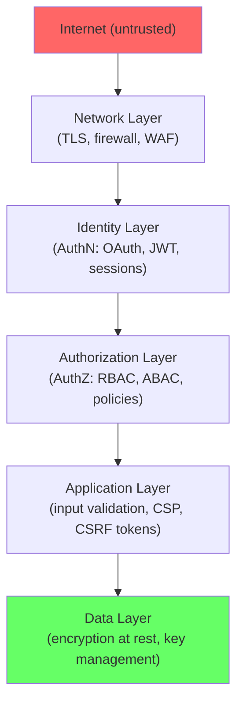
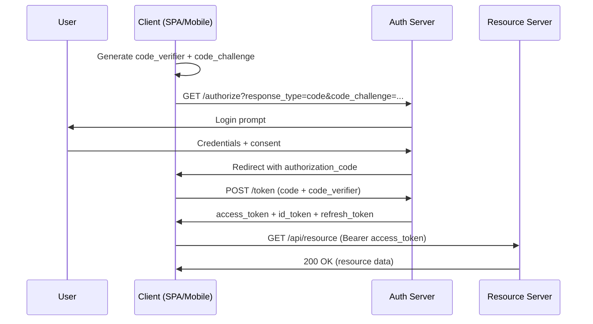

# Security

## Chapter Goal

After reading this chapter, an experienced engineer can run a threat
model using STRIDE, choose between session-based and token-based
authentication with a defensible trade-off argument, recognize OWASP
Top 10 vulnerabilities in code review, design a secrets management
strategy, explain OAuth 2.0 with PKCE to an interviewer, implement
secure headers and CSP, reason about encryption at rest and in transit,
and lead incident response for a security breach.

## Why This Matters for a Tech Lead

Security is not a feature — it is a constraint that affects every
design decision. A Tech Lead owns the security posture of the system
because:

- **Breaches are existential.** A single leaked database can end a
  company. The cost is not measured in sprint points but in lawsuits,
  regulatory fines, and permanent reputation damage.
- **Security must be designed in, not bolted on.** Retrofitting
  authentication, encryption, or audit logging into a running system
  is 10× more expensive than building it correctly from the start.
- **Most vulnerabilities are preventable.** The OWASP Top 10 has not
  fundamentally changed in a decade. The same mistakes (injection,
  broken access control, misconfiguration) repeat because teams lack
  design-level review.
- **The Tech Lead is the last line before production.** Security teams
  audit after the fact. The Tech Lead can catch issues in design review,
  PR review, and architecture decisions — before code ships.
- **Compliance is a Tech Lead decision.** SOC 2, GDPR, HIPAA, PCI-DSS
  requirements flow into engineering choices (encryption, logging, access
  control, data retention). The Tech Lead translates compliance
  requirements into technical controls.

A Tech Lead who treats security as "the security team's problem" is a
red flag in any interview.

## Mental Model

Security is **reducing the attacker's options at each layer**. Every
layer of defense narrows the attack surface — if one layer fails,
the next catches the attacker. This is defense in depth.



Each layer assumes the layer above has already been breached. If the
network is compromised, identity verification still blocks the attacker.
If credentials are stolen, authorization limits what they can access.
If authorization fails, encryption protects the data at rest.

**Zero trust model:** Never trust, always verify. Every request is
authenticated and authorized regardless of network location. Internal
traffic is not inherently trusted.

## Core Terminology

| Term | Definition |
| --- | --- |
| **Authentication (AuthN)** | Proving who you are (credentials, tokens, certificates). |
| **Authorization (AuthZ)** | Deciding what you can do (permissions, roles, policies). |
| **OAuth 2.0** | An authorization framework that lets a third-party app access resources on behalf of a user without sharing credentials. |
| **OIDC (OpenID Connect)** | An identity layer on top of OAuth 2.0 that adds authentication (ID tokens, user info). |
| **JWT (JSON Web Token)** | A signed (and optionally encrypted) token carrying claims. Used for stateless authentication. |
| **Session** | A server-side record linking a session ID (stored in a cookie) to user state. |
| **CSRF** | Cross-Site Request Forgery — tricking a browser into sending an authenticated request to a different site. |
| **XSS** | Cross-Site Scripting — injecting malicious scripts into web pages viewed by other users. |
| **SQL injection** | Inserting malicious SQL into queries by exploiting unparameterized input. |
| **SSRF** | Server-Side Request Forgery — tricking a server into making requests to internal resources. |
| **CORS** | Cross-Origin Resource Sharing — browser-enforced policy controlling which origins can access an API. |
| **CSP** | Content Security Policy — a header that restricts which sources can load scripts, styles, images. |
| **mTLS** | Mutual TLS — both client and server present certificates. Used for service-to-service authentication. |
| **KMS** | Key Management Service — a managed service for creating and controlling encryption keys. |
| **RBAC** | Role-Based Access Control — permissions assigned to roles, users assigned to roles. |
| **ABAC** | Attribute-Based Access Control — permissions evaluated based on attributes (time, location, resource properties). |
| **STRIDE** | Threat modeling framework: Spoofing, Tampering, Repudiation, Information disclosure, Denial of service, Elevation of privilege. |
| **SBOM** | Software Bill of Materials — a manifest of all dependencies in a software artifact. |

Distinguish closely related terms:

- **Authentication** vs **Authorization**: AuthN proves identity ("who
  are you?"). AuthZ checks permissions ("what can you do?"). A system
  can authenticate correctly but authorize incorrectly (or vice versa).
- **Encryption** vs **Hashing**: Encryption is reversible (with a key).
  Hashing is one-way. Passwords are hashed, not encrypted. Data at rest
  is encrypted, not hashed.
- **RBAC** vs **ABAC**: RBAC uses fixed roles (admin, editor, viewer).
  ABAC uses dynamic attributes (time of day, IP, resource owner). RBAC
  is simpler; ABAC is more granular.
- **OAuth 2.0** vs **OIDC**: OAuth is for authorization (access tokens
  grant API access). OIDC adds authentication (ID tokens prove identity).

## Theoretical Foundation

### Threat modeling

Threat modeling identifies what can go wrong before code is written.
The most widely used framework is **STRIDE**:

| Category | Threat | Example | Mitigation |
| --- | --- | --- | --- |
| **S**poofing | Pretending to be someone else | Stolen credentials, forged JWT | Strong AuthN, MFA, token validation |
| **T**ampering | Modifying data in transit or at rest | Man-in-the-middle, DB manipulation | TLS, signed payloads, integrity checks |
| **R**epudiation | Denying an action was performed | User claims they never made a purchase | Audit logs, signed transactions |
| **I**nformation disclosure | Exposing data to unauthorized parties | SQL injection, verbose errors, SSRF | Encryption, input validation, least privilege |
| **D**enial of service | Making a system unavailable | Request flooding, expensive queries | Rate limiting, resource limits, CDN |
| **E**levation of privilege | Gaining unauthorized access level | Broken access control, insecure direct object reference | AuthZ checks at every layer, principle of least privilege |

**How to run a threat model:**

1. **Define scope:** What are we protecting? (A feature, a service, a
   data flow.)
2. **Draw the data flow:** Where does data enter, move, and rest?
   Mark trust boundaries.
3. **Apply STRIDE:** For each component and data flow, ask: can this
   be spoofed/tampered/etc.?
4. **Prioritize:** Risk = likelihood × impact. Focus on high-risk items.
5. **Mitigate:** For each threat, document the control (existing or
   planned).

**Why it matters:** Most security vulnerabilities are design flaws,
not implementation bugs. A threat model catches these before code is
written — when the cost of change is lowest. Features designed without
threat modeling consistently miss abuse cases, trust boundary
violations, and data exposure risks that are expensive to fix
post-deployment.

**Attack scenario — missing threat model:** A team builds a "share via
link" feature. They implement the happy path: generate a URL token,
anyone with the link can view. Without a threat model, they miss:
(1) tokens are sequential (predictable — attacker enumerates all
shared documents), (2) tokens never expire (link forwarded to
unintended parties has permanent access), (3) no rate limit on link
creation (attacker generates millions of links to brute force), (4) no
audit log (cannot determine who accessed shared data). A 30-minute
threat model would have caught all four issues at design time.

**Common mistakes (threat modeling):**
- Treating it as a heavyweight process requiring security experts
  (it should be lightweight, run by the feature team).
- Only modeling new systems (features added to existing systems also
  introduce new threats).
- Focusing only on external attackers (insider threats, supply chain,
  and misconfiguration are equally important).
- Not prioritizing findings (all threats are not equal — focus on
  high-likelihood × high-impact).
- Creating a threat model document that is never updated (models must
  evolve with the system).

**Production checklist (threat modeling):**

- [ ] Threat model required for: features handling PII, new external
      interfaces, payment flows, authentication changes, new third-party
      integrations.
- [ ] Use STRIDE systematically — apply each category to each component
      and data flow.
- [ ] Document: threat, likelihood, impact, existing mitigation,
      residual risk, and owner.
- [ ] Store threat models alongside architecture docs (ADRs, design
      docs) — not in a separate security silo.
- [ ] Review and update when the feature changes significantly.
- [ ] High-risk findings become acceptance criteria for the feature
      (not shipped without mitigation).

**Tech Lead perspective:** Threat modeling is not a one-time ceremony.
Run it for every new feature that handles sensitive data, introduces a
new trust boundary, or exposes a new external interface. Keep the model
lightweight (a whiteboard + 30 minutes is enough for most features).
The Tech Lead's role: (1) decide which features need a threat model
(not everything — use risk-based criteria), (2) facilitate the session
(STRIDE applied systematically), (3) ensure findings become work items
with owners. Threat modeling is the highest-ROI security activity — it
catches design flaws at the cheapest possible moment.

**Interview framing (threat modeling):** "I require threat models for
any feature that introduces new trust boundaries, handles sensitive
data, or exposes external interfaces. I use STRIDE applied to a data
flow diagram — for each component and connection, I ask: can this be
spoofed, tampered, repudiated, disclosed, denied, or elevated? The
output is a prioritized list of threats with mitigations that become
acceptance criteria. A typical session is 30 minutes on a whiteboard
with the feature team. The model lives alongside the design doc and
is updated when the feature changes. This is the highest-ROI security
activity I know — it catches design flaws before any code is written."

### Authentication patterns

**Session-based authentication:**

```ts
// Login: create server-side session, send session ID in cookie
async function login(req: Request, res: Response) {
  const user = await verifyCredentials(req.body.email, req.body.password);
  if (!user) return res.status(401).json({ type: "/errors/invalid-credentials" });

  const sessionId = crypto.randomUUID();
  await sessionStore.set(sessionId, { userId: user.id, role: user.role }, { ttl: 3600 });

  res.cookie("sid", sessionId, {
    httpOnly: true,     // JS cannot read it (XSS protection)
    secure: true,       // HTTPS only
    sameSite: "lax",    // CSRF protection for top-level navigation
    maxAge: 3600000,    // 1 hour
  });
  return res.status(200).json({ userId: user.id });
}
```

**What this does:** Server stores session state; client holds only an
opaque session ID in a secure cookie.

**Why it is useful:** Session revocation is instant (delete the
server-side record). No token to decode or verify. Session data never
leaves the server.

**Common mistake:** Using `sameSite: "none"` without understanding
that it disables CSRF protection and requires `secure: true`.

**Production change:** Use Redis or a database for the session store
(not in-memory). Set idle timeout and absolute timeout separately.
Regenerate session ID after privilege escalation (login, role change).

**Attack scenario — session fixation:** An attacker creates a valid
session on the server, then tricks the victim into using that session
ID (via URL parameter or cookie injection). After the victim logs in,
the attacker uses the same session ID and inherits the authenticated
state. Prevention: regenerate the session ID immediately after
successful authentication — the pre-login session ID becomes invalid.

**Production checklist (sessions):**

- [ ] Session store is external (Redis/database), not in-memory.
- [ ] Idle timeout (30 min of inactivity) and absolute timeout (8h max).
- [ ] Session ID regenerated after login and privilege escalation.
- [ ] Cookie flags: `httpOnly`, `secure`, `sameSite: "lax"`.
- [ ] Session invalidated on logout (server-side deletion, not just cookie clear).
- [ ] Concurrent session limit enforced (optional: alert on new device).
- [ ] Session IDs are cryptographically random (128+ bits of entropy).

**Interview framing (sessions):** "I use server-side sessions when
instant revocation is required — ban a user and they lose access
immediately. The session ID is an opaque random value in an httpOnly
secure cookie. The server stores all state. Trade-off: every request
requires a session store lookup, and the store is a shared dependency.
I use Redis with replication for the store and set both idle and
absolute timeouts to bound session lifetime."

### JWT (JSON Web Token)

A JWT is a signed (and optionally encrypted) token that carries claims:

```json
{
  "header": { "alg": "RS256", "typ": "JWT", "kid": "key-2024-06" },
  "payload": {
    "sub": "user_123",
    "iss": "https://auth.example.com",
    "aud": "https://api.example.com",
    "exp": 1718450000,
    "iat": 1718446400,
    "roles": ["editor"]
  },
  "signature": "..."
}
```

**Good JWT usage:**

```ts
// Server-side JWT validation — ALWAYS verify all claims
function validateJwt(token: string): JwtPayload {
  const decoded = jwt.verify(token, publicKey, {
    algorithms: ["RS256"],         // reject "none" and HS256 with public key
    issuer: "https://auth.example.com",
    audience: "https://api.example.com",
    clockTolerance: 30,            // allow 30s clock skew
  });
  return decoded as JwtPayload;
}
```

**Bad JWT usage (security vulnerabilities):**

```ts
// BAD: no audience check — token for service A works on service B
const decoded = jwt.decode(token);  // decode without verify!
// BAD: accepting "none" algorithm — attacker strips signature
jwt.verify(token, key, { algorithms: undefined });
// BAD: using symmetric HS256 with a public key — attacker signs with published public key
jwt.verify(token, publicKey, { algorithms: ["HS256"] });
```

**What this does:** Shows the critical difference between secure and
insecure JWT validation.

**Why it is useful:** JWT vulnerabilities are among the most common
authentication flaws. The "algorithm confusion" attack alone has
compromised production systems.

**Common mistake:** Storing JWTs in `localStorage` (accessible to XSS).
Store access tokens in memory; use `httpOnly` cookies for refresh tokens.

**Production change:** Use short-lived access tokens (5-15 minutes)
with refresh token rotation. Implement token revocation via a
short-lived blacklist (check against Redis) for critical operations
(password change, logout).

**Attack scenario — algorithm confusion:** The server's public RSA key
is published (as it should be for OIDC discovery). An attacker creates a
forged JWT, sets the `alg` header to `HS256`, and signs it using the
public key as the HMAC secret. If the server does not restrict accepted
algorithms, it interprets the public key as an HMAC secret and validates
the forged signature. The attacker now has a valid token with arbitrary
claims. Prevention: always specify `algorithms: ["RS256"]` and never
accept tokens with a different algorithm.

**Production checklist (JWT):**

- [ ] `algorithms` restricted to expected value (reject `none`, reject mismatched types).
- [ ] `aud` and `iss` validated on every verification (cross-service token reuse blocked).
- [ ] `exp` enforced with maximum 15-minute lifetime for access tokens.
- [ ] Tokens stored in memory (not localStorage — XSS accessible).
- [ ] Refresh tokens in httpOnly secure cookies with rotation.
- [ ] `kid` (Key ID) used for key rotation — server supports multiple active keys.
- [ ] Token blacklist in Redis for immediate revocation on logout/password change.
- [ ] No sensitive data in payload (base64 is encoding, not encryption).

**Tech Lead perspective (JWT):** JWTs shift complexity from the server
(no session store) to the client and the token lifecycle. The Tech Lead
must decide: (1) access token lifetime (shorter = more secure, more
refresh calls), (2) where to store tokens (memory for SPA, keychain for
mobile), (3) revocation strategy (blacklist vs short lifetime), (4) key
rotation cadence (monthly key rotation with `kid` in header for
zero-downtime). JWTs are not "simpler than sessions" — they are
differently complex.

**Interview framing (JWT):** "JWTs are self-contained tokens that
enable stateless validation — any service with the public key can verify
the token without a database call. The critical validations are:
algorithm restriction (prevent algorithm confusion attacks), audience
(prevent cross-service reuse), issuer (prevent forged tokens from other
systems), and expiry. I keep access tokens to 5-15 minutes and use
refresh token rotation — each refresh issues a new refresh token and
invalidates the old one, so a stolen refresh token is detected on
next legitimate use."

### OAuth 2.0 and OIDC

**OAuth 2.0** is an authorization framework — it delegates access
without sharing credentials. **OIDC** adds an identity layer on top.

**Authorization Code Flow with PKCE (recommended for all clients):**



**Why PKCE:** Prevents authorization code interception. The
`code_verifier` proves that the client that initiated the flow is
the same one exchanging the code. Required for public clients (SPAs,
mobile apps) where a client secret cannot be kept.

**Token types:**
- **Access token:** Short-lived (5-60 min). Sent to resource servers.
  May be a JWT or opaque string.
- **ID token:** JWT containing user identity claims (sub, email, name).
  Used by the client to know who logged in. Never sent to resource
  servers.
- **Refresh token:** Long-lived. Used to get new access tokens without
  re-authentication. Must be stored securely (httpOnly cookie, secure
  storage).

**Attack scenario — authorization code interception (without PKCE):**
A mobile app uses the authorization code flow without PKCE. A malicious
app on the same device registers the same custom URL scheme as the
legitimate app. When the auth server redirects with the authorization
code, the OS delivers it to the malicious app (or both). The attacker
exchanges the code for tokens. With PKCE, the attacker has the code but
not the `code_verifier` — the token exchange fails.

**Common mistakes (OAuth 2.0):**
- Using the Implicit flow (tokens in URL fragment — visible in browser
  history, referrer headers, intermediary logs). Deprecated by OAuth
  2.1.
- Sending the ID token to resource servers (it is for the client, not
  the API).
- Not validating the `state` parameter on callback (enables CSRF on
  the OAuth flow itself).
- Long-lived access tokens (hours/days) without refresh rotation.
- Storing refresh tokens in localStorage (accessible to XSS).

**Production checklist (OAuth 2.0 / OIDC):**

- [ ] PKCE used for all clients (public and confidential).
- [ ] `state` parameter validated on callback (CSRF protection).
- [ ] `nonce` validated in ID token (replay protection).
- [ ] ID token `aud` and `iss` validated.
- [ ] Access tokens are short-lived (≤15 min).
- [ ] Refresh tokens stored in httpOnly secure cookies (web) or secure
      storage (mobile).
- [ ] Refresh token rotation enabled (detect theft).
- [ ] Token endpoint uses TLS. Redirect URIs are exact-match (no
      wildcards).
- [ ] Scopes follow least privilege (request minimum needed).

**Tech Lead perspective (OAuth/OIDC):** The Tech Lead decides: (1) which
flows the application supports (authorization code + PKCE for all new
work — implicit and password grant are deprecated), (2) token storage
strategy per platform (memory for SPA, Keychain for iOS, Keystore for
Android), (3) IdP selection (managed vs self-hosted — see Tech Lead
Decision-Making section), (4) scope governance (which scopes exist, who
can request them, how are new scopes approved).

**Interview framing (OAuth/OIDC):** "OAuth 2.0 delegates authorization
without sharing credentials. The recommended flow for all clients is
Authorization Code with PKCE. The client generates a random verifier,
sends a SHA-256 hash with the authorize request, then proves possession
of the original verifier when exchanging the code for tokens. This
prevents code interception. OIDC adds authentication on top — the ID
token tells the client who logged in, while the access token grants API
access. I never send ID tokens to resource servers — they are for the
client only."

### RBAC and ABAC

**RBAC (Role-Based Access Control):**

```ts
// Simple RBAC middleware
const permissions: Record<string, string[]> = {
  admin:  ["read", "write", "delete", "manage_users"],
  editor: ["read", "write"],
  viewer: ["read"],
};

function requirePermission(permission: string) {
  return (req: Request, res: Response, next: NextFunction) => {
    const userRole = req.user.role;
    if (!permissions[userRole]?.includes(permission)) {
      return res.status(403).json({ type: "/errors/forbidden" });
    }
    next();
  };
}
```

**ABAC (Attribute-Based Access Control):**

```ts
// ABAC: decisions based on user attributes, resource attributes, and context
interface PolicyContext {
  user: { id: string; department: string; clearance: number };
  resource: { ownerId: string; classification: number; department: string };
  action: string;
  environment: { time: Date; ipRange: string };
}

function evaluatePolicy(ctx: PolicyContext): boolean {
  // Users can only access resources in their department
  if (ctx.resource.department !== ctx.user.department) return false;
  // Users need sufficient clearance for the resource classification
  if (ctx.user.clearance < ctx.resource.classification) return false;
  // Write access only during business hours
  if (ctx.action === "write") {
    const hour = ctx.environment.time.getHours();
    if (hour < 9 || hour > 17) return false;
  }
  return true;
}
```

**When to use which:**

| Dimension | RBAC | ABAC |
| --- | --- | --- |
| Complexity | Low (roles + permissions table) | High (policy engine, attributes) |
| Granularity | Coarse (role-level) | Fine (attribute-level) |
| Scalability | Roles explode with many combinations | Attributes compose naturally |
| Audit | Simple (who has which role) | Complex (why was access granted?) |
| Use case | Internal tools, simple apps | Healthcare, finance, multi-tenant |

**Tech Lead perspective:** Start with RBAC. Move to ABAC only when role
explosion becomes unmanageable (typically at 20+ roles or when access
depends on resource properties like ownership or classification level).

**Attack scenario — broken access control (IDOR):** An API endpoint
`GET /api/invoices/123` returns invoice 123. The server checks that the
user is authenticated but does not check that invoice 123 belongs to the
authenticated user. An attacker increments the ID (`/invoices/124`,
`/125`, ...) and downloads other users' invoices. This is Insecure
Direct Object Reference (IDOR) — the most common access control flaw.
Prevention: every endpoint must verify resource ownership, not just
authentication.

```ts
// BAD: checks authentication but not ownership
async function getInvoice(req: Request, res: Response) {
  const invoice = await db.invoice.findById(req.params.id);
  return res.json(invoice);  // any user can access any invoice!
}

// GOOD: checks ownership (or admin role)
async function getInvoice(req: Request, res: Response) {
  const invoice = await db.invoice.findById(req.params.id);
  if (!invoice) return res.status(404).json({ type: "/errors/not-found" });
  if (invoice.userId !== req.user.id && req.user.role !== "admin") {
    return res.status(404).json({ type: "/errors/not-found" });  // 404 not 403 (hide existence)
  }
  return res.json(invoice);
}
```

**Production checklist (authorization):**

- [ ] Every endpoint has an explicit authorization check (not relying
      on route-level auth alone).
- [ ] Resource ownership verified for all user-scoped data.
- [ ] 404 returned (not 403) when a user lacks access to a resource
      (prevents enumeration).
- [ ] Roles and permissions are stored centrally and tested (unit tests
      for permission matrix).
- [ ] Admin endpoints are separated (distinct routes, additional auth
      factor).
- [ ] Audit log captures all authorization failures (who tried to
      access what).
- [ ] Regular access reviews: who has elevated permissions and why?

**Interview framing (authorization):** "Authorization is separate from
authentication and must be checked at every layer — not just at the
gateway. The most common vulnerability is IDOR: checking that a user is
logged in but not that the resource belongs to them. I enforce
ownership checks at the data access layer so they cannot be bypassed.
For the permission model, I start with RBAC (simple, auditable) and
add ABAC only when access depends on resource attributes like
department or classification level."

### OWASP Top 10

The OWASP Top 10 (2021 edition) represents the most critical web
application security risks:

| # | Category | Core issue |
| --- | --- | --- |
| A01 | Broken Access Control | Missing or incorrect authorization checks |
| A02 | Cryptographic Failures | Weak encryption, plaintext storage, poor key management |
| A03 | Injection | SQL, NoSQL, OS command, LDAP injection |
| A04 | Insecure Design | Missing security controls at architecture level |
| A05 | Security Misconfiguration | Default credentials, open cloud storage, verbose errors |
| A06 | Vulnerable Components | Outdated dependencies with known CVEs |
| A07 | Auth Failures | Weak passwords, missing MFA, credential stuffing |
| A08 | Software Integrity | Unsigned updates, compromised CI/CD, dependency confusion |
| A09 | Logging Failures | No audit trail, missing alerting, logging secrets |
| A10 | SSRF | Server-side requests to internal resources via user input |

**Why it matters:** The OWASP Top 10 is the industry-standard
vocabulary for web security risks. Interviewers expect candidates to
know these categories. More importantly, mapping your application's
controls to the OWASP Top 10 reveals gaps — if you cannot point to a
specific mitigation for each category, you have an unaddressed risk.

**Key shift from 2017 → 2021:** A04 (Insecure Design) is new — it
acknowledges that some vulnerabilities cannot be fixed by code alone.
Missing rate limiting, no threat model, or absence of abuse-case
testing are design-level failures. A08 (Software Integrity) reflects
the rise of supply chain attacks (SolarWinds, Codecov, ua-parser-js).

**Attack scenario — A01 Broken Access Control (most common):** A SaaS
application checks roles at the API gateway but not at the service
level. An attacker discovers an internal service endpoint (via error
messages or documentation) and calls it directly, bypassing the
gateway. Because the service trusts all requests, the attacker gains
admin access. Prevention: authorization at every layer, never relying
on a single enforcement point.

**Common mistakes (OWASP framing):**
- Treating OWASP Top 10 as a checklist to satisfy auditors rather than
  a framework for systematic risk analysis.
- Focusing only on injection (A03) and ignoring design-level issues
  (A04) or logging failures (A09).
- Assuming "we use a framework" covers all categories (frameworks
  do not prevent broken access control or insecure design).
- Not updating risk assessments when the OWASP list changes (2017 → 2021
  moved categories significantly).

**Production checklist (OWASP mapping):**

- [ ] A01: Every endpoint has explicit authorization; IDOR prevented
      via ownership checks.
- [ ] A02: Encryption at rest and in transit; no sensitive data in
      logs or URLs.
- [ ] A03: Parameterized queries; no string concatenation in queries.
- [ ] A04: Threat model for new features; abuse cases in acceptance
      criteria.
- [ ] A05: No default credentials; no verbose error messages in
      production; cloud security posture management.
- [ ] A06: Dependency scanning in CI; CVE resolution SLAs enforced.
- [ ] A07: MFA for privileged accounts; rate limiting on auth
      endpoints; breached password detection.
- [ ] A08: Signed artifacts; pinned CI actions; SBOM generated.
- [ ] A09: Structured audit logs; no secrets in logs; alerting on
      suspicious patterns.
- [ ] A10: SSRF mitigated via URL validation, IP blocking, network
      isolation.

**Tech Lead perspective (OWASP Top 10):** The Tech Lead uses the OWASP
Top 10 as a communication framework — mapping team controls to OWASP
categories in architecture decision records (ADRs) makes security
decisions auditable and reviewable. During incident post-mortems, map
the vulnerability to its OWASP category to identify systemic gaps. Use
OWASP ASVS (Application Security Verification Standard) for deeper
per-category requirements when the Top 10 is not granular enough.

**Interview framing (OWASP Top 10):** "I use the OWASP Top 10 as a
risk framework, not a compliance checklist. For each category, I can
point to our specific mitigation: A01 — authorization middleware at
every endpoint plus ownership checks. A03 — parameterized queries
enforced by ORM default plus CI rules that flag raw SQL. A04 — threat
models for sensitive features before implementation. A06 — dependency
scanning with 24-hour SLA on critical CVEs. The 2021 edition added
A04 (Insecure Design) which I find most relevant at the Tech Lead
level — you cannot code your way out of a design flaw."

### XSS (Cross-Site Scripting)

XSS injects malicious scripts that execute in other users' browsers.

**Types:**
- **Stored XSS:** Malicious script saved in the database (e.g.,
  comment field). Executes for every user who views it.
- **Reflected XSS:** Script in a URL parameter reflected in the response.
  Requires the victim to click a crafted link.
- **DOM-based XSS:** Client-side JavaScript reads untrusted data and
  inserts it into the DOM without sanitization.

**Prevention:**

```ts
// BAD: inserting user input directly into HTML
element.innerHTML = userInput;  // XSS!

// GOOD: use textContent (auto-escapes)
element.textContent = userInput;

// GOOD: use a templating engine with auto-escaping (React, Angular)
// React auto-escapes by default: <div>{userInput}</div>

// BAD in React: dangerouslySetInnerHTML without sanitization
<div dangerouslySetInnerHTML={{ __html: userInput }} />  // XSS!

// GOOD: sanitize if HTML rendering is required
import DOMPurify from "dompurify";
<div dangerouslySetInnerHTML={{ __html: DOMPurify.sanitize(userInput) }} />
```

**Attack scenario — stored XSS in a collaboration tool:** A user enters
`` as
their display name in a team chat application. The server saves it
without sanitization. Every team member who views the chat executes the
script in their browser, sending their cookies to the attacker's server.
With httpOnly cookies this specific exfiltration fails, but the attacker
can still perform actions as the victim (send messages, change settings)
using the active DOM context.

**Common mistakes (XSS):**
- Relying solely on input validation (blocklist-based) instead of
  output encoding. Encoding must happen at the point of rendering.
- Trusting "internal" data — data from the database may have been
  injected earlier.
- Using `innerHTML` or `v-html` for rendering user content.
- Missing CSP — even with good encoding, CSP provides defense in depth.
- Allowing `javascript:` URLs in href attributes.
- Not sanitizing Markdown or rich-text output.

**Production checklist (XSS):**

- [ ] All user-provided data is output-encoded at render time
      (context-aware: HTML, JS, URL, CSS contexts require different
      encoding).
- [ ] CSP deployed with nonce-based `script-src` (blocks inline script
      injection).
- [ ] `Content-Type: text/html` only on pages that are actually HTML
      (API responses use `application/json`).
- [ ] Rich text uses a sanitizer (DOMPurify) with an allowlist of safe
      tags/attributes.
- [ ] `X-Content-Type-Options: nosniff` set (prevents MIME-type
      sniffing).
- [ ] All cookies set to `httpOnly` (XSS cannot exfiltrate them).
- [ ] Automated XSS scanning in CI (e.g., semgrep rules for `innerHTML`,
      `dangerouslySetInnerHTML`).

**Tech Lead perspective (XSS):** XSS is the most common web
vulnerability and also the most preventable. The Tech Lead ensures:
(1) the framework enforces safe defaults (React auto-escapes, Angular
sanitizes — do not bypass with `dangerouslySetInnerHTML` or
`bypassSecurityTrustHtml` without review), (2) CSP is deployed as a
second layer (even if encoding fails, injected scripts are blocked),
(3) DOMPurify or equivalent is the only approved sanitizer (no
homegrown regex), (4) CI rules flag unsafe patterns. Accept the cost
of occasional false positives over missing real vulnerabilities.

**Interview framing (XSS):** "XSS is prevented through defense in
depth: first, output encoding at render time — using framework
auto-escaping (React, Angular). Second, CSP with nonce-based script-src
that blocks any script not explicitly allowed by the server. Third,
httpOnly cookies so that even if XSS executes, it cannot steal session
tokens. I never rely on input validation alone — encoding happens at the
output point because data traverses multiple contexts. In my teams, I
enforce semgrep rules in CI that flag any use of innerHTML or
dangerouslySetInnerHTML without an approved sanitizer."

### CSRF (Cross-Site Request Forgery)

CSRF tricks an authenticated user's browser into sending a request
to a different site (exploiting automatic cookie attachment).

```ts
// CSRF protection: double-submit cookie + custom header pattern
// Works for SPAs calling APIs — no synchronizer token state needed

// Server: set a CSRF cookie (readable by JS, NOT httpOnly)
function setCsrfCookie(res: Response) {
  const csrfToken = crypto.randomBytes(32).toString("hex");
  res.cookie("csrf-token", csrfToken, {
    httpOnly: false,   // JS must be able to read it
    secure: true,
    sameSite: "strict",
    path: "/",
  });
}

// Client: read the cookie and send it as a header
const csrfToken = document.cookie.match(/csrf-token=([^;]+)/)?.[1];
fetch("/api/transfer", {
  method: "POST",
  headers: {
    "Content-Type": "application/json",
    "X-CSRF-Token": csrfToken,  // attacker cannot read this cookie (SOP)
  },
  body: JSON.stringify({ to: "user_456", amount: 100 }),
});

// Server: validate that the header matches the cookie
function csrfMiddleware(req: Request, res: Response, next: NextFunction) {
  if (["POST", "PUT", "DELETE", "PATCH"].includes(req.method)) {
    const cookieToken = req.cookies["csrf-token"];
    const headerToken = req.headers["x-csrf-token"];
    if (!cookieToken || cookieToken !== headerToken) {
      return res.status(403).json({ type: "/errors/csrf-validation-failed" });
    }
  }
  next();
}
```

**What this does:** The server sets a non-httpOnly cookie with a random
token. The client reads the cookie (possible because it is same-origin)
and sends the value as a custom header. The server validates that the
header matches the cookie. A cross-origin attacker cannot read the
cookie (blocked by SOP) and therefore cannot set the header correctly.

**Why it is useful:** This pattern is stateless — the server does not
need to store CSRF tokens in sessions. It works well for SPAs and APIs
without form submissions.

**Common mistake:** Setting the CSRF cookie as `httpOnly: true` — this
prevents JavaScript from reading it, making the double-submit pattern
impossible. Another mistake: not validating the token on all state-
changing methods (only protecting POST but forgetting PUT/DELETE).

**Production change:** For maximum protection, combine with
`SameSite=Strict` on the session cookie. For legacy form-based apps,
use the synchronizer token pattern (server generates token, stores in
session, validates on submit) instead.

**Prevention strategies:**

| Strategy | How | When |
| --- | --- | --- |
| `SameSite=Lax` cookie | Browser only sends cookie for same-site and top-level navigation | Default for most modern browsers |
| `SameSite=Strict` cookie | Cookie never sent cross-site | When cross-site links are not needed |
| CSRF token (synchronizer pattern) | Server generates a token, client sends it in a hidden field or header | Legacy apps, forms |
| Custom header requirement | API requires a custom header (e.g., `X-Requested-With`) that preflight blocks cross-origin | SPAs calling APIs |

**Attack scenario — CSRF in a banking app:** A victim is logged into
their bank (bank.example.com). They visit a malicious page that contains:
``.
The browser attaches the victim's session cookie automatically. If the
bank accepts GET requests for state-changing operations (or uses a form
POST), the transfer executes. Modern SameSite cookies prevent this for
cross-site requests, but legacy applications without `SameSite`
attributes remain vulnerable.

**Common mistakes (CSRF):**
- Accepting GET requests for state-changing operations.
- Setting `SameSite=None` without understanding the implications (removes
  CSRF protection, required for cross-site iframe scenarios only).
- CSRF token stored in a cookie without also requiring it in the request
  body or header (cookie-to-header token pattern requires JavaScript to
  read the cookie — if `httpOnly` is set, the pattern breaks).
- Not regenerating CSRF tokens per session (fixation).
- Protecting only some endpoints (e.g., password change is protected but
  email change is not).

**Production checklist (CSRF):**

- [ ] All cookies set `SameSite=Lax` (or `Strict` where appropriate).
- [ ] State-changing operations use POST/PUT/DELETE (never GET).
- [ ] API endpoints require a non-standard header (e.g., `X-Requested-With`)
      — CORS preflight blocks cross-origin requests with custom headers.
- [ ] Legacy form-based flows use synchronizer token pattern (token in
      hidden form field, validated server-side).
- [ ] Authenticated API does not support CORS with `credentials: true`
      for untrusted origins.

**Tech Lead perspective (CSRF):** For new applications, `SameSite=Lax`
cookies combined with a custom header requirement provides CSRF
protection without managing CSRF tokens. For legacy applications with
form-based flows, use synchronizer tokens. The Tech Lead must audit:
which endpoints still accept form POST without token validation? The
answer determines migration priority. Also consider: if the application
embeds in third-party iframes (e.g., embedded widgets), `SameSite=None`
is required, which re-opens CSRF — in this case, CSRF tokens are
mandatory.

**Interview framing (CSRF):** "CSRF exploits the browser's automatic
cookie attachment on cross-origin requests. The primary defense today is
SameSite cookies — with `Lax`, cookies are only sent cross-site on
top-level navigation (GET), not on POST/PUT/DELETE. For APIs consumed by
SPAs, I also require a custom header like `X-Requested-With` — the
CORS preflight mechanism blocks cross-origin requests with non-standard
headers unless the server explicitly allows the origin. This two-layer
approach eliminates CSRF without token management overhead."

### SQL injection

SQL injection occurs when user input is concatenated into SQL queries:

```ts
// BAD: string concatenation — SQL injection
const query = `SELECT * FROM users WHERE email = '${req.body.email}'`;
// Input: ' OR 1=1 --
// Becomes: SELECT * FROM users WHERE email = '' OR 1=1 --'

// GOOD: parameterized queries — injection impossible
const result = await db.query(
  "SELECT * FROM users WHERE email = $1",
  [req.body.email]
);

// GOOD: ORM with type safety
const user = await prisma.user.findUnique({
  where: { email: req.body.email },
});
```

**What this does:** Parameterized queries separate code from data —
the database treats user input as a value, never as SQL syntax.

**Why it matters:** SQL injection has been in the OWASP Top 10 since
its inception. A successful injection can read, modify, or delete
entire databases, bypass authentication, or escalate to operating
system command execution via `xp_cmdshell` (SQL Server) or `COPY`
(PostgreSQL).

**Attack scenario — second-order injection:** An attacker registers
with a username containing SQL metacharacters (e.g., `admin'--`). The
registration code uses parameterized queries, so the value is stored
safely. Later, an admin search feature builds a query using the stored
username without parameterization (trusting "internal" data). The
stored payload executes, granting the attacker admin access. Lesson:
parameterize at every query boundary, not just at input.

**Common mistakes (SQL injection):**
- Using an ORM but falling back to raw queries for complex operations
  without parameterization.
- Dynamic `ORDER BY` or `LIMIT` clauses built by string concatenation
  (these cannot be parameterized in most drivers — use an allowlist).
- Trusting data from the database (second-order injection).
- Using stored procedures that internally concatenate strings.
- Over-privileged database user (if injection succeeds, attacker has
  `DROP TABLE` permissions).

**Production checklist (SQL injection):**

- [ ] All queries use parameterized statements or an ORM.
- [ ] Dynamic column/table names validated against an allowlist (not
      parameterizable in SQL).
- [ ] Database user has minimum privileges (no `DROP`, no `GRANT`, no
      file system access).
- [ ] WAF rules detect common injection patterns (defense in depth,
      not primary defense).
- [ ] Static analysis in CI flags string concatenation in SQL contexts
      (semgrep, eslint-plugin-security).
- [ ] Error messages do not expose SQL syntax or database structure.

**Tech Lead perspective (SQL injection):** SQL injection is a solved
problem at the code level (use parameterized queries, always). The Tech
Lead's responsibility is ensuring the team never bypasses this: CI
rules that flag raw string concatenation near database calls, code
review checklists, and a least-privilege database user per service. The
real risk is in edge cases: dynamic sorting, search filters built from
user input, and legacy code that pre-dates the ORM. Audit those paths
explicitly.

**Interview framing (SQL injection):** "SQL injection is prevented by
separation of code and data — parameterized queries ensure user input
is always treated as a value, never as syntax. I enforce this through
ORM usage as the default, with raw queries requiring explicit review.
Dynamic column/table names cannot be parameterized, so I validate them
against an allowlist. Defense in depth includes least-privilege database
credentials (no DDL permissions) and static analysis rules in CI that
flag string interpolation in SQL contexts."

### SSRF (Server-Side Request Forgery)

SSRF tricks the server into making HTTP requests to internal resources:

```ts
// BAD: user-controlled URL fetched by the server
const response = await fetch(req.body.webhookUrl);
// Attacker sends: http://169.254.169.254/latest/meta-data/iam/security-credentials/
// → Server fetches AWS instance metadata → attacker gets temp credentials

// GOOD: validate and restrict URLs
function validateWebhookUrl(url: string): boolean {
  const parsed = new URL(url);
  if (parsed.protocol !== "https:") return false;
  // Block private IP ranges
  const ip = await dns.resolve(parsed.hostname);
  if (isPrivateIp(ip)) return false;
  // Allowlist: only allow certain domains
  if (!ALLOWED_WEBHOOK_DOMAINS.includes(parsed.hostname)) return false;
  return true;
}
```

**Why it matters:** SSRF is the newest addition to the OWASP Top 10
(A10:2021). In cloud environments, SSRF frequently leads to full
account compromise via metadata credential theft. The Capital One
breach (2019) exploited SSRF to access AWS instance metadata.

**Attack scenario — cloud metadata theft:** A web application has a
"fetch URL preview" feature. An attacker submits
`http://169.254.169.254/latest/meta-data/iam/security-credentials/app-role`.
The server fetches this internal URL and returns temporary AWS
credentials (access key, secret key, session token). The attacker uses
these credentials to access S3 buckets, databases, or other AWS
services. The server had no URL validation.

**Common mistakes (SSRF):**
- Validating the URL but not the resolved IP (DNS rebinding: DNS
  returns a public IP during validation, then a private IP during the
  actual request).
- Blocking `169.254.169.254` but not `[::ffff:169.254.169.254]` (IPv6
  mapped addresses bypass the check).
- Allowing redirects (server follows a redirect from a public URL to
  an internal one).
- Using a blocklist instead of an allowlist (attackers find bypasses).

**Production checklist (SSRF):**

- [ ] User-provided URLs validated: protocol allowlist (HTTPS only),
      domain allowlist where feasible.
- [ ] Resolved IP validated (block RFC 1918, link-local, loopback)
      after DNS resolution and before connecting.
- [ ] HTTP client does not follow redirects (or re-validates after
      redirect).
- [ ] Cloud metadata endpoint disabled or restricted (AWS IMDSv2 with
      hop limit = 1; GCP metadata concealment).
- [ ] Outbound requests from the application run in an isolated
      network segment (no access to internal services).
- [ ] Response body never returned raw to the user (prevents data
      exfiltration).
- [ ] DNS rebinding mitigated: resolve once, connect to that IP.

**Tech Lead perspective (SSRF):** SSRF is particularly dangerous in
cloud-native architectures because the metadata endpoint gives the
attacker the same permissions as the service. The Tech Lead must ensure:
(1) IMDSv2 is enforced (blocks SSRF via hop-limit), (2) services that
fetch external URLs (webhooks, URL previews, integrations) run in
isolated VPCs without internal access, (3) network egress is filtered
(outbound traffic only to known destinations). This is an architecture
decision, not just a code-level fix.

**Interview framing (SSRF):** "SSRF exploits the server's ability to
make outbound requests to access internal resources. In cloud
environments, the primary target is the instance metadata endpoint
(169.254.169.254) which provides temporary credentials. My prevention
strategy has three layers: first, URL validation with an allowlist
of permitted protocols and domains. Second, IP validation after DNS
resolution to block private ranges (including IPv6 mapped addresses).
Third, network architecture — services that fetch user-provided URLs
run in isolated networks without access to internal services or
metadata endpoints. I enforce IMDSv2 which requires a PUT request
with a token, making it inaccessible via simple SSRF."

### CORS (Cross-Origin Resource Sharing)

CORS is a browser-enforced mechanism that controls which origins can
make requests to an API:

```ts
// Express CORS configuration
app.use(cors({
  origin: ["https://app.example.com", "https://admin.example.com"],
  methods: ["GET", "POST", "PUT", "DELETE"],
  allowedHeaders: ["Content-Type", "Authorization"],
  credentials: true,
  maxAge: 86400,  // cache preflight for 24h
}));
```

**Critical rules:**
- Never use `origin: "*"` with `credentials: true` (browser rejects it).
- Never reflect the `Origin` header back without validating it (allows
  any domain to make authenticated requests).
- For private APIs: do not enable CORS at all (only server-to-server
  consumers exist).

**Attack scenario — CORS misconfiguration:** An API reflects the
`Origin` request header directly into `Access-Control-Allow-Origin`
without validation:

```ts
// BAD: reflects any origin — equivalent to allowing all origins with credentials
app.use((req, res, next) => {
  res.header("Access-Control-Allow-Origin", req.headers.origin);  // dangerous!
  res.header("Access-Control-Allow-Credentials", "true");
  next();
});
```

An attacker's page (`evil.example.com`) sends a credentialed
request to the API. The browser sees the reflected origin, allows the
response, and the attacker reads private data. This is functionally
equivalent to having no CORS protection at all.

**Common mistakes (CORS):**
- Regex-based origin validation that is too permissive
  (e.g., `/example\.com/` matches `evil-example.com`). Use exact
  string matching or an explicit allowlist.
- Exposing headers that contain sensitive information without restricting
  `Access-Control-Expose-Headers`.
- Setting `maxAge` too high (browser caches preflight result; if you
  change the policy, clients do not see the change until the cache
  expires).
- Enabling CORS on internal/admin APIs (no external consumer needs it).

**Production checklist (CORS):**

- [ ] Origins are validated via an explicit allowlist (no regex, no
      reflection).
- [ ] `credentials: true` is only used when cookies or Authorization
      headers must cross origins.
- [ ] Internal APIs have no CORS headers (server-to-server does not
      use CORS).
- [ ] `Access-Control-Max-Age` is reasonable (1-24 hours; enables
      policy updates).
- [ ] Preflight responses are tested in CI (ensure no accidental
      wildcard exposure).

**Tech Lead perspective (CORS):** CORS is not a security feature in
isolation — it relaxes the browser's Same-Origin Policy. The Tech Lead
ensures: (1) the default is "no CORS" — only APIs that serve browser
clients from other origins need it, (2) origins are validated through
an allowlist maintained in configuration (not code), (3) the team
understands that CORS protects the user's browser — server-to-server
calls are not affected. A common misconception is that CORS "secures
the API" — it does not; it only restricts which browser origins can
read responses.

**Interview framing (CORS):** "CORS controls which browser origins can
make credentialed cross-origin requests to my API. The critical rules
are: never reflect the Origin header without validation (that is
functionally an open API), never use wildcard with credentials, and
default to no CORS on internal services. For my SPAs, I maintain an
explicit allowlist of production and staging origins. CORS is a
browser-level control — it does not replace server-side authentication
or authorization."

### CSP (Content Security Policy)

CSP restricts which sources can load scripts, styles, images, and other
resources:

```text
Content-Security-Policy:
  default-src 'self';
  script-src 'self' https://cdn.example.com;
  style-src 'self' 'unsafe-inline';
  img-src 'self' data: https:;
  connect-src 'self' https://api.example.com;
  frame-ancestors 'none';
  base-uri 'self';
  form-action 'self';
```

**What this does:** Even if an XSS payload is injected, it cannot load
external scripts or exfiltrate data to attacker-controlled domains.

**Why it is useful:** CSP is the strongest defense against XSS after
output encoding. It limits the blast radius of successful injection.

**Common mistake:** Using `'unsafe-inline'` for scripts (defeats the
purpose of CSP). Use nonces or hashes instead:
`script-src 'nonce-abc123'`.

**Production change:** Deploy CSP in `report-only` mode first
(`Content-Security-Policy-Report-Only`) to identify violations without
breaking the application. Monitor reports. Then enforce.

**Attack scenario — CSP bypass via dangling markup:** An attacker finds
an injection point before a `<script>` tag with a nonce. They inject an
unclosed tag (e.g., `<base href="https://evil.com/">`) that changes the
base URL for relative script paths. The page then loads legitimate
scripts from the attacker's domain. Prevention: include `base-uri 'self'`
in CSP to restrict `<base>` tag values.

**Nonce-based CSP example (server-side):**

```ts
// Generate a unique nonce per request
function cspMiddleware(req: Request, res: Response, next: NextFunction) {
  const nonce = crypto.randomBytes(16).toString("base64");
  res.locals.cspNonce = nonce;
  res.setHeader("Content-Security-Policy", [
    "default-src 'self'",
    `script-src 'self' 'nonce-${nonce}'`,
    "style-src 'self' 'nonce-${nonce}'",
    "img-src 'self' data: https:",
    "connect-src 'self' https://api.example.com",
    "frame-ancestors 'none'",
    "base-uri 'self'",
    "form-action 'self'",
    "upgrade-insecure-requests",
  ].join("; "));
  next();
}

// In the template: <script nonce="<%= cspNonce %>">...</script>
```

**What this does:** Every page render generates a fresh random nonce.
Only `<script>` tags with that exact nonce execute. Even if an attacker
injects a script tag, they cannot guess the nonce.

**Production checklist (CSP):**

- [ ] `script-src` uses nonces (not `'unsafe-inline'`).
- [ ] `base-uri 'self'` included (prevents base tag injection).
- [ ] `frame-ancestors 'none'` or specific origins (prevents
      clickjacking — replaces `X-Frame-Options`).
- [ ] `form-action 'self'` (prevents form submissions to external
      domains).
- [ ] `report-uri` or `report-to` configured (collect violation
      reports for monitoring).
- [ ] Deployed in `report-only` mode for at least 1 week before
      enforcement (catch false positives).
- [ ] No `'unsafe-eval'` (blocks `eval()`, `new Function()`,
      `setTimeout("string")`).
- [ ] `upgrade-insecure-requests` included (forces HTTPS for subresources).

**Tech Lead perspective (CSP):** CSP deployment is a phased project,
not a one-time configuration. Phase 1: deploy in report-only mode,
collect violation reports (many third-party scripts will violate).
Phase 2: fix violations (replace inline scripts with nonced scripts,
move inline event handlers to addEventListener). Phase 3: enforce. The
Tech Lead must set expectations: CSP deployment typically takes 2-4
sprints for a large application. The reward is a significant reduction
in XSS blast radius. Plan for ongoing maintenance — every new
third-party integration may require CSP updates.

**Interview framing (CSP):** "CSP is my strongest XSS mitigation after
output encoding. I use nonce-based policies — each page render generates
a random nonce, only scripts with that nonce execute. I always include
`base-uri 'self'` to prevent base tag injection and `frame-ancestors
'none'` to prevent clickjacking. I deploy in report-only mode first to
identify violations without breaking the app, collect reports for a week,
fix issues, then enforce. CSP requires ongoing maintenance as new
integrations are added, but the reduction in XSS blast radius justifies
the investment."

### Password hashing

Never store passwords in plaintext or with fast hashes (MD5, SHA-256).
Use slow, salted key derivation functions:

```ts
import { hash, verify } from "@node-rs/argon2";

// Hash a password (Argon2id — recommended by OWASP)
const hashed = await hash(password, {
  memoryCost: 65536,    // 64 MB
  timeCost: 3,          // 3 iterations
  parallelism: 4,       // 4 threads
});

// Verify a password
const isValid = await verify(hashed, password);
```

**Algorithm choice:**

| Algorithm | Status | Notes |
| --- | --- | --- |
| Argon2id | Recommended | Memory-hard, resists GPU/ASIC attacks |
| bcrypt | Acceptable | Widely supported, 72-byte password limit |
| scrypt | Acceptable | Memory-hard, less widely audited |
| PBKDF2 | Legacy | CPU-only, vulnerable to GPU attacks at low iterations |
| MD5/SHA-256 | Broken | Fast hash — crackable in seconds with rainbow tables |

**Why it matters:** If an attacker gains database access (SQL injection,
backup theft, insider threat), properly hashed passwords remain
protected. With bcrypt at cost 12, cracking a single strong password
takes years. With MD5, an entire database can be cracked in minutes
using pre-computed rainbow tables or GPU-accelerated brute force.

**Attack scenario — credential stuffing after breach:** Company A stores
passwords with unsalted MD5. Their database is breached. Attackers crack
all passwords within hours using hashcat with GPU clusters. Because users
reuse passwords, the attackers use these credentials against Company B,
Company C, etc. Proper hashing (Argon2id with unique salts) means even
after a breach, passwords cannot be recovered in practical time.

**Common mistakes (password hashing):**
- Using a fast cryptographic hash (SHA-256) instead of a slow KDF.
- Insufficient work factor (bcrypt cost < 10, Argon2id memory < 19 MB).
- Missing salt (enables rainbow table attacks).
- Truncating passwords before hashing (bcrypt has a 72-byte limit —
  pre-hash with SHA-256 if longer passwords are allowed).
- Not upgrading hashes when users log in (legacy systems stay on MD5
  forever).

**Production checklist (password hashing):**

- [ ] Argon2id is the primary algorithm (with bcrypt as fallback).
- [ ] Parameters tuned to ≥ 0.5 seconds per hash on production hardware
      (balance security vs user experience).
- [ ] Unique salt per password (handled automatically by Argon2/bcrypt).
- [ ] Hash upgrade on login: if user's stored hash uses a weaker
      algorithm, re-hash with the current algorithm on successful login.
- [ ] Password length limit set high (≥ 128 chars) but not unlimited
      (prevent DoS via 1MB passwords hashed with high memory cost).
- [ ] Failed login responses do not reveal whether the email exists
      ("Invalid credentials" not "No account with this email").
- [ ] Breached password check (compare against Have I Been Pwned
      k-anonymity API) during registration and password change.

**Tech Lead perspective (password hashing):** The Tech Lead must decide
the work factor: too low and passwords are crackable, too high and
login latency degrades (or a DoS vector emerges via expensive hash
computation). Benchmark on production hardware and target 0.5-1 second
per hash. Plan for hash migration: teams inherit legacy systems with
PBKDF2 or worse — implement "hash on login" to upgrade transparently.
Budget for the compute cost of high work factors at scale.

**Interview framing (password hashing):** "I use Argon2id because it is
memory-hard — it resists both GPU and ASIC attacks by requiring
significant RAM per hash. I tune the parameters to approximately 0.5
seconds on production hardware, which makes brute force infeasible
while keeping login latency acceptable. I implement hash upgrade on
login: when a user authenticates successfully with a legacy hash
(bcrypt, PBKDF2), I re-hash their password with the current algorithm
and store the new hash. I also check new passwords against the Have I
Been Pwned k-anonymity API to prevent use of known-breached passwords."

### MFA (Multi-Factor Authentication)

MFA requires two or more independent authentication factors:

- **Something you know:** password, PIN.
- **Something you have:** phone (TOTP), hardware key (WebAuthn/FIDO2).
- **Something you are:** biometric (fingerprint, face).

**TOTP (Time-based One-Time Password):**

```ts
import { authenticator } from "otplib";

// Generate secret for user registration
const secret = authenticator.generateSecret();
const otpauthUrl = authenticator.keyuri(user.email, "MyApp", secret);
// Show QR code from otpauthUrl to user

// Verify TOTP during login
function verifyTotp(token: string, secret: string): boolean {
  return authenticator.verify({ token, secret });
}
```

**Why it matters:** Passwords alone are insufficient — phishing,
credential stuffing, and keyloggers compromise passwords regardless of
hashing quality. MFA ensures that a stolen password alone does not
grant access. According to Microsoft, MFA blocks 99.9% of automated
attacks.

**Attack scenario — real-time phishing relay:** An attacker sets up a
fake login page that proxies requests to the real site in real time.
The victim enters their password AND their TOTP code. The attacker
relays both to the real site within the 30-second TOTP window and gains
access. TOTP is phishable because it is a shared secret that the user
types. WebAuthn/FIDO2 is phishing-resistant because the browser binds
the credential to the origin — a phishing domain cannot trigger the
hardware key response for the legitimate domain.

**Common mistakes (MFA):**
- SMS-based MFA as the only option (SIM swapping, SS7 interception).
- No rate limiting on TOTP verification (attacker brute-forces 6-digit
  code — only 1M combinations).
- Accepting expired TOTP codes (window too large).
- Recovery codes stored in plaintext in the database.
- MFA only on login, not on sensitive actions (password change, payment
  method change, admin operations).
- No re-enrollment process when a user loses their device.

**Production checklist (MFA):**

- [ ] MFA mandatory for admin, production access, and financial
      operations.
- [ ] MFA optional (but strongly encouraged) for all users.
- [ ] WebAuthn/FIDO2 offered as the primary option (phishing-resistant).
- [ ] TOTP as a fallback (with rate limiting: 3 attempts per code
      generation window).
- [ ] Recovery codes: 10 one-time codes, hashed before storage, shown
      once during enrollment.
- [ ] Re-enrollment flow requires identity verification (support
      ticket + ID verification for high-value accounts).
- [ ] Step-up authentication: require MFA again for sensitive actions
      even within an authenticated session.
- [ ] Adaptive MFA: trigger additional verification on new device,
      new location, or unusual behavior.

**Tech Lead perspective (MFA):** Mandate MFA for all admin accounts and
any account with access to production systems. Prefer WebAuthn/FIDO2
(phishing-resistant) over TOTP (phishable via real-time relay). Provide
recovery codes (one-time use) for account recovery. The Tech Lead must
balance security with adoption: if MFA enrollment is too complex, users
avoid it. Invest in UX (passkeys, platform authenticators) and provide
clear enrollment guides. For B2B, support organization-level MFA
policies enforced via SSO.

**Interview framing (MFA):** "MFA adds a second factor beyond passwords.
I distinguish between phishable MFA (TOTP, SMS) and phishing-resistant
MFA (WebAuthn/FIDO2). For high-security environments, I mandate
WebAuthn — the browser verifies the origin, so phishing pages cannot
trigger the credential. For general users, I offer TOTP as a minimum
with WebAuthn as the preferred option. I rate-limit TOTP verification
to prevent brute force, hash recovery codes before storage, and
implement step-up authentication for sensitive actions."

### Secrets management

Secrets (API keys, database passwords, encryption keys) must never be
stored in source code, environment variables on shared machines, or
unencrypted configuration files.

**Secrets hierarchy (best to worst):**

| Level | Mechanism | Trade-off |
| --- | --- | --- |
| 1 | Managed KMS (AWS KMS, GCP KMS) | Best security, highest cost |
| 2 | Vault (HashiCorp Vault, AWS Secrets Manager) | Dynamic secrets, rotation support |
| 3 | Sealed Secrets / SOPS (encrypted in Git) | GitOps-friendly, offline access |
| 4 | CI/CD secret variables (GitHub Secrets) | Convenient, limited audit trail |
| 5 | Environment variables on host | No encryption, visible to processes |
| 6 | Hardcoded in source code | Never acceptable |

**Why it matters:** Leaked secrets (API keys, database passwords,
encryption keys) grant immediate access to production systems. A single
committed secret can lead to full infrastructure compromise. GitHub
reports that over 10 million secrets were detected in public
repositories in 2023.

**Attack scenario — secret in Git history:** A developer commits a
`.env` file containing the production database password. They notice
the mistake, delete the file, and commit again. The secret remains in
Git history. An attacker with read access to the repository runs
`git log --all -p | grep DATABASE_URL` and extracts the credential.
The database is publicly accessible (no VPN required). The attacker
dumps all customer data. Prevention: assume any committed secret is
compromised and rotate immediately.

**Common mistakes (secrets management):**
- Secrets in environment variables on shared CI runners (visible to all
  jobs, logged in debug output).
- Long-lived credentials (API keys that never expire, never rotated).
- Shared secrets across environments (staging and production use the
  same database password).
- Secrets stored in application configuration files committed to Git
  (even private repos are not secure — insider threat, compromised
  accounts).
- No rotation automation — manual rotation means it never happens.
- Logging libraries that dump full environment or request context
  (including secrets in headers).

**Secret rotation pattern:**

```ts
// Dynamic secret from Vault — short-lived database credentials
async function getDatabaseCredentials(): Promise<DbCredentials> {
  const lease = await vault.read("database/creds/app-role");
  // Returns: { username: "v-app-xyz", password: "...", lease_duration: 3600 }
  scheduleRenewal(lease.lease_id, lease.lease_duration);
  return { username: lease.data.username, password: lease.data.password };
}
```

**What this does:** Requests temporary database credentials from Vault
that expire after 1 hour. The application schedules a renewal before
the lease expires — Vault generates fresh credentials automatically.

**Why it is useful:** If credentials are leaked, they expire within an
hour (no manual rotation needed). Each service instance gets unique
credentials — audit trails show exactly which instance accessed the
database. Revocation is instant (revoke the lease, credentials
immediately stop working).

**Common mistake:** Caching the credentials indefinitely or not handling
lease expiry. When the lease expires and the application does not renew,
database connections fail. Another mistake: using the Vault root token
in applications instead of AppRole authentication with scoped policies.

**Production change:** Use connection pooling that integrates with Vault
(refresh credentials when the pool detects auth failures). Implement
graceful degradation: if Vault is unreachable during renewal, cache
valid credentials briefly (minutes, not hours) and alert. Monitor
lease expiry metrics.

**Production checklist (secrets management):**

- [ ] No secrets in source code or Git history (pre-commit hook with
      tools like `gitleaks` or `trufflehog`).
- [ ] Production secrets stored in a secrets manager (AWS Secrets
      Manager, HashiCorp Vault, GCP Secret Manager).
- [ ] Secrets are short-lived where possible (dynamic credentials
      with automatic rotation).
- [ ] Static secrets rotated on a schedule (90 days max) and on any
      suspected compromise.
- [ ] Access to secrets is audited (who accessed what secret, when).
- [ ] Per-environment secrets (dev/staging/production never share
      credentials).
- [ ] CI/CD secrets use OIDC tokens or short-lived credentials (not
      long-lived PATs).
- [ ] Secret scanning enabled in CI (gitleaks, GitHub secret scanning).

**Tech Lead perspective (secrets management):** The Tech Lead
establishes the secrets policy: (1) what constitutes a secret (API
keys, database passwords, encryption keys, certificates), (2) where
they live (Vault for dynamic secrets, Secrets Manager for static ones),
(3) rotation cadence (automated for dynamic, 90-day SLA for static),
(4) incident response (any committed secret is rotated within 1 hour).
The most common failure is not technical but organizational — teams
take shortcuts because the "secure path" is too complex. Make the
secure path the easiest path (good tooling, templates, documentation).

**Interview framing (secrets management):** "I treat any committed
secret as compromised and rotate immediately. My strategy has three
tiers: dynamic secrets from Vault for database access (credentials
live 1 hour, auto-rotate), cloud-native secrets managers for static
credentials (with automated rotation), and OIDC federation for CI/CD
(no stored credentials at all). I run gitleaks as a pre-commit hook
and in CI to prevent accidental commits. The key principle is: make
the secure path the easy path — if developers have to jump through
hoops, they will take shortcuts."

### Encryption at rest and in transit

**Encryption in transit (TLS):**
- Use TLS 1.2 minimum (TLS 1.3 preferred).
- Terminate TLS at the load balancer or ingress controller.
- For service-to-service: use mTLS (both sides present certificates)
  or service mesh (Istio, Linkerd) that handles mTLS transparently.
- HSTS header: `Strict-Transport-Security: max-age=31536000;
  includeSubDomains; preload`.

**Encryption at rest:**
- Database: enable transparent data encryption (TDE) or use cloud-managed
  encryption (AWS RDS encryption, GCP Cloud SQL encryption).
- Object storage: enable server-side encryption (S3 SSE-KMS).
- Application-level: encrypt sensitive fields before storing (PII,
  payment data) using envelope encryption (data key encrypted by master
  key in KMS).

```ts
// Envelope encryption pattern
import { KMSClient, GenerateDataKeyCommand, DecryptCommand } from "@aws-sdk/client-kms";

async function encryptField(plaintext: string): Promise<EncryptedField> {
  const { Plaintext: dataKey, CiphertextBlob: encryptedDataKey } =
    await kms.send(new GenerateDataKeyCommand({ KeyId: MASTER_KEY_ID, KeySpec: "AES_256" }));

  const iv = crypto.randomBytes(16);
  const cipher = crypto.createCipheriv("aes-256-gcm", dataKey!, iv);
  const encrypted = Buffer.concat([cipher.update(plaintext, "utf8"), cipher.final()]);
  const authTag = cipher.getAuthTag();

  return { encrypted, iv, authTag, encryptedDataKey: encryptedDataKey! };
}
```

**What this does:** Generates a unique data key per record, encrypts
the data with it, then encrypts the data key with the master key (KMS).
Even if the database is compromised, data cannot be decrypted without
KMS access.

**Why it matters:** Encryption in transit prevents eavesdropping and
man-in-the-middle attacks. Encryption at rest protects data if storage
media is stolen, backups are leaked, or an attacker gains read access
to storage without application-level access. Compliance frameworks
(PCI DSS, HIPAA, GDPR) require both.

**Attack scenario — missing encryption in transit:** An internal
microservice communicates with the database over plaintext within the
VPC. An attacker who compromises a single pod in the same network
segment can sniff all database traffic (credentials and data). With
mTLS between services and TLS to the database, the compromised pod
sees only encrypted traffic. Lesson: encrypt in transit even within
"trusted" networks (zero trust).

**Attack scenario — missing encryption at rest:** An AWS S3 bucket
is misconfigured as public. If server-side encryption (SSE-KMS) is
enabled, the attacker downloads encrypted blobs that are useless
without KMS access. Without encryption at rest, all data is in
plaintext. Encryption at rest is the last line of defense.

**Common mistakes (encryption):**
- Assuming VPC boundaries are sufficient (no TLS between internal
  services).
- Using TLS 1.0/1.1 (deprecated, known vulnerabilities).
- Self-signed certificates in production without proper CA management.
- Encryption at rest with keys stored alongside the data (defeats the
  purpose).
- Not encrypting backups (backup is an unencrypted copy of encrypted
  production data).
- Missing certificate rotation (expired certs cause outages; rushed
  rotation causes security gaps).

**Production checklist (encryption):**

- [ ] TLS 1.2 minimum for all external connections (TLS 1.3 preferred).
- [ ] mTLS for service-to-service communication (or service mesh).
- [ ] HSTS enabled with `includeSubDomains` and `preload`.
- [ ] Certificate rotation automated (cert-manager, ACM, Let's Encrypt).
- [ ] Encryption at rest enabled for all storage (databases, object
      stores, message queues, EBS volumes).
- [ ] Customer-managed keys (CMK) for sensitive data (separate from
      cloud-managed default keys).
- [ ] Application-level encryption (envelope encryption) for PII and
      payment data.
- [ ] Key rotation: data keys rotated annually; master keys rotated
      per cloud provider schedule.
- [ ] Backups encrypted with the same (or stricter) encryption as
      production data.

**Tech Lead perspective (encryption):** The Tech Lead's encryption
decisions: (1) cloud-managed encryption for general data (low effort,
acceptable for most use cases), (2) application-level envelope
encryption for PII, payment data, and regulated data (ensures data
remains encrypted even if the database layer is compromised), (3) mTLS
for internal traffic (adopting a service mesh like Istio simplifies
this). Key management is the hardest part — use cloud KMS and avoid
managing keys manually. Budget for the operational complexity of
certificate management and the latency overhead of encryption.

**Interview framing (encryption):** "I enforce encryption at two
layers: in transit via TLS 1.3 for external and mTLS for internal
traffic, and at rest via cloud-managed encryption for general storage
plus envelope encryption for sensitive fields. Envelope encryption
means each record gets a unique data key, encrypted by a master key
in KMS. Even if an attacker gains database access, they cannot decrypt
data without KMS permissions — which are separately controlled by IAM.
I automate certificate rotation with cert-manager and enforce HSTS with
preload to eliminate downgrade attacks."

### Secure headers

```ts
// Production security headers (Express/Helmet)
import helmet from "helmet";
app.use(helmet({
  contentSecurityPolicy: { directives: { /* ... */ } },
  hsts: { maxAge: 31536000, includeSubDomains: true, preload: true },
  frameguard: { action: "deny" },
  noSniff: true,
  referrerPolicy: { policy: "strict-origin-when-cross-origin" },
}));

// Additional headers not covered by Helmet
app.use((req, res, next) => {
  res.setHeader("Permissions-Policy", "camera=(), microphone=(), geolocation=()");
  res.setHeader("X-Content-Type-Options", "nosniff");
  next();
});
```

**Essential response headers:**

| Header | Purpose | Value |
| --- | --- | --- |
| `Strict-Transport-Security` | Force HTTPS | `max-age=31536000; includeSubDomains` |
| `Content-Security-Policy` | Restrict resource loading | Per-app policy |
| `X-Frame-Options` | Prevent clickjacking | `DENY` or `SAMEORIGIN` |
| `X-Content-Type-Options` | Prevent MIME sniffing | `nosniff` |
| `Referrer-Policy` | Control referrer leakage | `strict-origin-when-cross-origin` |
| `Permissions-Policy` | Disable unused browser features | `camera=(), microphone=()` |

**Why it matters:** Security headers are a zero-cost defense layer
that mitigates entire classes of attacks (XSS via CSP, clickjacking
via frame-ancestors, MIME sniffing, protocol downgrade). They cost
nothing to serve and protect all users automatically.

**Attack scenario — clickjacking without X-Frame-Options:** An attacker
embeds a banking site in a transparent `<iframe>` on their page. The
victim sees the attacker's page (e.g., "Click here to win a prize")
but their clicks are actually hitting buttons on the invisible banking
site underneath. Without `X-Frame-Options: DENY` (or CSP
`frame-ancestors 'none'`), the browser allows the framing. Result: the
victim unknowingly performs actions (transfers, settings changes) on the
legitimate site.

**Common mistakes (secure headers):**
- Setting HSTS without `includeSubDomains` (attacker uses
  `http://sub.example.com` to inject cookies for the parent domain).
- Adding HSTS to the preload list before testing (cannot be easily
  undone — commits the entire domain to HTTPS for years).
- Not setting `Referrer-Policy` — referrer header leaks sensitive URL
  parameters (tokens, IDs) to third-party sites.
- Inconsistent headers across services (API returns security headers
  but the CDN-served frontend does not).
- Using `X-Frame-Options` and `frame-ancestors` inconsistently
  (CSP `frame-ancestors` supersedes `X-Frame-Options`).

**Production checklist (secure headers):**

- [ ] All headers configured at the reverse proxy/CDN level (consistent
      across all services).
- [ ] HSTS with `includeSubDomains` (test on staging first).
- [ ] CSP deployed (see CSP section above).
- [ ] `X-Content-Type-Options: nosniff` on all responses.
- [ ] `Referrer-Policy: strict-origin-when-cross-origin`.
- [ ] `Permissions-Policy` restricts unused APIs (camera, microphone,
      geolocation, payment).
- [ ] Verified with securityheaders.com or Mozilla Observatory (A+
      grade target).
- [ ] API responses include security headers (not just HTML pages).

**Tech Lead perspective (secure headers):** Security headers should be
set once at the infrastructure layer (reverse proxy, CDN, or
middleware) and applied uniformly. The Tech Lead's role is to define
the default policy, deploy it centrally, and make exceptions explicit
(and rare). Use automated scanning (securityheaders.com in CI) to
prevent regression. Headers are the easiest security win — implement
them first.

**Interview framing (secure headers):** "Security headers are my
first line of defense — they are trivial to deploy and mitigate
entire vulnerability classes. I set them at the reverse proxy layer
for consistency: HSTS forces HTTPS, CSP mitigates XSS,
frame-ancestors prevents clickjacking, nosniff prevents MIME
confusion, and Permissions-Policy disables unused browser APIs. I
validate the configuration with Mozilla Observatory in CI — any
score below A triggers a build warning."

### Rate limiting for security

Rate limiting prevents brute-force attacks, credential stuffing, and
enumeration:

```ts
// Login endpoint: strict rate limiting per IP + account
const loginLimiter = rateLimit({
  windowMs: 15 * 60 * 1000,  // 15 minutes
  max: 5,                     // 5 attempts per window
  keyGenerator: (req) => `${req.ip}:${req.body.email}`,
  handler: (req, res) => {
    res.status(429).json({
      type: "/errors/too-many-attempts",
      title: "Too many login attempts",
      detail: "Account temporarily locked. Try again in 15 minutes.",
    });
  },
});
```

**What this does:** Limits login attempts to 5 per 15-minute window,
keyed on both IP address and target account. Returns a structured 429
response with a clear message.

**Why it is useful:** Prevents brute-force attacks on specific accounts
AND distributed attacks from botnets. The dual key (IP + account) means
an attacker cannot circumvent by targeting one account from many IPs.

**Common mistake:** Rate limiting by IP alone — sophisticated attackers
use residential proxy networks with thousands of IPs. Also: applying
the rate limit AFTER password hashing (the expensive hash computation
still runs, enabling CPU exhaustion attacks).

**Production change:** Use a distributed rate limiter (Redis-backed)
for multi-instance deployments. Add progressive penalties: after 5
failures, require CAPTCHA. After 10, lock the account and notify the
user via email. Use a sliding window algorithm to prevent burst attacks
at window boundaries.

**Security-specific rate limiting:**
- Login: 5 attempts per 15 minutes per IP+account (prevent brute force).
- Password reset: 3 requests per hour per account (prevent enumeration).
- API key creation: 10 per hour (prevent key flooding).
- OTP verification: 3 attempts per code (prevent brute force on TOTP).

**Why it matters:** Without rate limiting, attackers can automate
credential stuffing at scale (millions of username/password pairs per
hour), brute-force OTP codes, or enumerate valid accounts via timing
differences in responses.

**Attack scenario — credential stuffing:** An attacker obtains a list
of 10 million email/password pairs from a previous breach. They
automate login attempts against a target site. Without rate limiting,
they test thousands of pairs per second. Even at a 0.1% success rate,
10,000 accounts are compromised. With rate limiting (5 per 15 min per
IP+account), the attack is slowed to a crawl and easily detected.

**Common mistakes (rate limiting):**
- Rate limiting by IP only — attackers use distributed botnets with
  thousands of IPs.
- No rate limiting on password reset endpoint (enables email bombing
  and account enumeration).
- Rate limit responses that reveal information ("Account locked" tells
  the attacker the account exists).
- Rate limiting applied after expensive operations (hash comparison
  still runs, wasting CPU).
- Fixed window algorithm that allows bursts at window boundaries
  (use sliding window or token bucket).

**Production checklist (rate limiting for security):**

- [ ] Login endpoint: limit per IP+account combination (not just IP).
- [ ] Password reset: limit per account and per IP.
- [ ] OTP verification: 3 attempts per generated code, then require
      new code.
- [ ] Rate limit checked early in the request pipeline (before
      password hashing or database lookups).
- [ ] Response does not leak account existence (same message for
      "account not found" and "rate limited").
- [ ] Distributed rate limiting (Redis-backed) for multi-instance
      deployments.
- [ ] Alerting on rate limit triggers (detect ongoing attacks).
- [ ] Account lockout after N failures, with unlock via email
      verification (not timed unlock alone).

**Tech Lead perspective (rate limiting):** Rate limiting is both a
security and availability concern. The Tech Lead decides: (1) per-
endpoint limits based on threat model (login vs public API vs admin),
(2) key composition (IP + account for login, API key for authenticated
endpoints, fingerprint for anonymous), (3) response strategy (429 with
Retry-After vs silent degradation vs CAPTCHA challenge). Coordinate
with the infrastructure team on WAF-level rate limiting as the first
line and application-level as the second.

**Interview framing (rate limiting):** "I implement rate limiting at
two layers: the WAF/API gateway for global DDoS protection, and the
application layer for endpoint-specific security limits. For login
endpoints, I key on IP+account to prevent both distributed attacks and
targeted account attacks. I check the rate limit before any expensive
operations (password hashing) to prevent CPU exhaustion. I use a
sliding window algorithm to avoid burst attacks at window boundaries,
and I alert on sustained rate limit triggers to detect ongoing
credential stuffing campaigns."

### Dependency scanning

Vulnerabilities in third-party dependencies are the most common
attack vector for supply chain attacks:

```yaml
# GitHub Actions: full security scanning pipeline
name: Security Scan
on: [pull_request]

jobs:
  security:
    runs-on: ubuntu-latest
    steps:
      - uses: actions/checkout@v4

      - name: Audit npm dependencies
        run: npm audit --audit-level=high

      - name: Scan filesystem for CVEs
        uses: aquasecurity/trivy-action@0.28.0  # pinned version, not @master
        with:
          scan-type: fs
          severity: HIGH,CRITICAL
          exit-code: 1

      - name: Scan container image
        uses: aquasecurity/trivy-action@0.28.0
        with:
          image-ref: ${{ env.IMAGE_TAG }}
          severity: HIGH,CRITICAL
          exit-code: 1

      - name: Secret scanning
        uses: trufflesecurity/trufflehog@v3.63.0
        with:
          extra_args: --only-verified

      - name: Generate SBOM
        run: syft packages . -o cyclonedx-json > sbom.json

      - name: Upload SBOM as artifact
        uses: actions/upload-artifact@v4
        with:
          name: sbom
          path: sbom.json
```

**What this does:** A complete security scanning pipeline that runs on
every pull request: dependency audit, filesystem CVE scan, container
image scan, secret detection, and SBOM generation.

**Why it is useful:** Catches security issues at the earliest possible
stage (before merge). SBOM generation creates an inventory for rapid
triage when new CVEs are published ("are we affected?").

**Common mistake:** Using `@master` or `@latest` tags for GitHub
Actions (a compromised action tag silently injects malicious code into
CI). Always pin to specific versions or SHA hashes.

**Production change:** Add a vulnerability exception file for accepted
risks (with owner and expiry date). Add Renovate/Dependabot for
automated updates with auto-merge on passing tests for patch versions.
Ship SBOMs to a central registry for organization-wide CVE triage.

**Supply chain protections:**
- Lock files (`package-lock.json`, `yarn.lock`) — pin exact versions.
- Audit in CI — fail on high/critical CVEs with an SLA for resolution
  (critical: 24h, high: 7 days, medium: 30 days).
- Renovate/Dependabot — automated dependency updates.
- Verify package integrity — `npm audit signatures`, checksum
  verification.
- SBOM generation — know what is in your production artifacts.

**Why it matters:** The Log4Shell vulnerability (CVE-2021-44228)
demonstrated that a single transitive dependency can expose millions
of applications. Supply chain attacks (dependency confusion,
typosquatting, compromised maintainer accounts) are increasing because
they offer attackers broad reach with a single compromise.

**Attack scenario — dependency confusion:** A company uses a private
npm package `@company/auth-utils`. An attacker publishes a public npm
package named `auth-utils` (without the scope) with a higher version
number. If the company's `.npmrc` is misconfigured, `npm install`
fetches the public (malicious) package instead of the private one.
The malicious package runs a postinstall script that exfiltrates
environment variables (including secrets). Prevention: always use
scoped packages (`@company/`) and configure the registry explicitly.

**Common mistakes (dependency scanning):**
- Ignoring vulnerabilities because "we do not use that code path"
  (attackers find paths you did not consider).
- Not scanning transitive dependencies (the vulnerability is 5 levels
  deep in the dependency tree).
- Using Dependabot/Renovate without auto-merge rules — PRs pile up and
  developers ignore them.
- Not pinning GitHub Actions by SHA (a compromised action tag can inject
  malicious code into CI).
- No SBOM — impossible to respond quickly when a new CVE is announced.

**Production checklist (dependency scanning):**

- [ ] Lock files committed and enforced (`npm ci`, not `npm install`
      in CI).
- [ ] CI fails on high/critical vulnerabilities (with documented
      exception process).
- [ ] Automated dependency updates (Renovate/Dependabot) with
      auto-merge for patch versions after tests pass.
- [ ] CVE resolution SLA: critical ≤ 24h, high ≤ 7 days,
      medium ≤ 30 days.
- [ ] Private packages use scoped names and explicit registry config.
- [ ] GitHub Actions pinned by SHA (not mutable tags).
- [ ] SBOM generated and stored with each release artifact.
- [ ] Container images scanned for OS-level CVEs (Trivy, Snyk).

**Tech Lead perspective (dependency scanning):** The Tech Lead defines
the vulnerability management policy: SLAs for resolution, exception
process (documented risk acceptance for false positives or unfixable
transitive deps), and automation to reduce manual toil. Key decisions:
(1) block deploys on critical CVEs or alert-only? (block), (2) who
owns dependency updates? (each team owns their services; platform team
owns shared libraries), (3) how to handle "no fix available"? (evaluate
workarounds, compensating controls, or accept risk with sign-off).

**Interview framing (dependency scanning):** "I treat dependencies as
attack surface. My strategy: lock files enforced in CI (deterministic
builds), automated scanning that blocks deployments on critical CVEs,
Renovate with auto-merge for patch updates (reduces PR fatigue), SBOM
generation for incident response (when a new CVE drops, I need to know
within minutes which services are affected). I define resolution SLAs:
critical within 24 hours, high within 7 days. For dependency confusion,
I use scoped packages and explicit registry configuration."

### Container security

```dockerfile
# Secure Dockerfile patterns
FROM node:20-alpine AS build
WORKDIR /app
COPY package*.json ./
RUN npm ci --only=production

FROM gcr.io/distroless/nodejs20
COPY --from=build /app /app
WORKDIR /app
USER nonroot:nonroot
CMD ["server.js"]
```

**What this does:** Multi-stage build — the first stage installs
dependencies (with `npm ci` for deterministic installs), the second
stage uses a distroless base image (no shell, no package manager, no
unnecessary binaries) and runs as a non-root user.

**Why it is useful:** Distroless images have a dramatically smaller
attack surface — no shell means an attacker who gains RCE cannot easily
escalate. Running as non-root means container escape exploits fail
(they typically require root in the container).

**Common mistake:** Using `node:20` as the production image (includes
apt, curl, bash, build tools — the attacker has everything they need).
Another mistake: running `npm install` (non-deterministic) instead of
`npm ci` (uses lock file exactly).

**Production change:** Add `HEALTHCHECK` instruction for orchestrator
liveness probes. Set `readOnlyRootFilesystem: true` in the Kubernetes
pod spec. Add resource limits (CPU/memory) to prevent container DoS.
See [Docker and Kubernetes](./03-docker-and-kubernetes.md) for
multi-stage build patterns, probes, and resource limits.
Pin the base image by SHA digest (not just tag) for reproducibility.

**Container security checklist:**
- Use minimal base images (distroless, Alpine).
- Run as non-root user (`USER nonroot`).
- Multi-stage builds (build tools not in production image).
- Scan images for CVEs (Trivy, Snyk Container).
- Sign images (Cosign, Notary) — verify signatures before deployment.
- Set read-only filesystem where possible.
- Drop all capabilities, add only needed ones.

**Why it matters:** Containers provide isolation boundaries but are
not inherently secure. A vulnerable base image, running as root, or an
overly permissive container configuration can turn a container escape
into full host compromise. The shared kernel means container isolation
is weaker than VM isolation.

**Attack scenario — container escape via root:** A container runs as
root (the Docker default). An attacker exploits an application
vulnerability (RCE) and gains shell access inside the container. As
root in the container, they exploit a kernel vulnerability to break out
of the namespace and access the host. From the host, they access other
containers, secrets, and the orchestrator API. Prevention: run as
non-root (UID ≥ 1000), drop all capabilities, use a read-only
filesystem.

**Common mistakes (container security):**
- Running as root (Docker default) — the attacker inherits host-level
  kernel capabilities.
- Using `latest` tag (non-deterministic builds, cannot pin to a known-
  good image).
- Including build tools in the production image (compilers, package
  managers increase attack surface).
- Mounting the Docker socket inside containers (grants full control over
  the host).
- Not scanning images after build (CI scans but the base image gains
  CVEs post-deployment).
- Overly broad volume mounts (`-v /:/host`).

**Production checklist (container security):**

- [ ] Base image is minimal (distroless or Alpine with only needed
      packages).
- [ ] Multi-stage build: build tools not in production image.
- [ ] Run as non-root user (UID ≥ 1000).
- [ ] Read-only filesystem (`readOnlyRootFilesystem: true`) with
      tmpfs for writable directories.
- [ ] All capabilities dropped, only needed ones added (`NET_BIND_SERVICE`
      if needed).
- [ ] No Docker socket mounted in application containers.
- [ ] Images scanned in CI and periodically in registry (new CVEs in
      base images).
- [ ] Images signed (Cosign) and admission controller enforces
      signature verification.
- [ ] Resource limits set (CPU, memory) — prevent container DoS
      affecting other workloads.
- [ ] Network policies restrict egress (containers can only reach
      their dependencies).

**Tech Lead perspective (container security):** The Tech Lead defines
the container security baseline as an organizational policy (not per-
team). This means: a hardened base image maintained by the platform
team, a Dockerfile linter in CI (hadolint), admission controllers that
reject non-compliant images (not running as root, not from approved
registry), and periodic re-scanning of deployed images. The trade-off
is developer velocity vs security — distroless images do not have a
shell for debugging. Solution: debug containers (ephemeral containers
in Kubernetes) that attach to running pods without modifying the
production image.

**Interview framing (container security):** "My container security
strategy has three layers: build-time (multi-stage builds, minimal
base images, no root user, static analysis with hadolint), deploy-time
(admission controllers that reject unsigned or non-compliant images,
network policies limiting egress), and runtime (read-only filesystem,
dropped capabilities, resource limits, periodic CVE scanning of running
images). I define a hardened base image maintained by the platform team
that all services must inherit from — this ensures consistent security
controls without burdening application developers."

### Cloud security

Key cloud security principles at Tech Lead level:

- **Least privilege IAM:** Every service gets its own role with minimum
  permissions. No service uses `AdministratorAccess`. Review IAM
  policies quarterly.
- **Network isolation:** Private subnets for databases and internal
  services. Public subnets only for load balancers. Security groups
  as firewalls.
- **Encryption defaults:** Enable encryption at rest for all storage
  services. Use customer-managed keys (CMK) for sensitive data.
- **Audit trail:** CloudTrail (AWS), Cloud Audit Logs (GCP) enabled
  and shipped to immutable storage.
- **Infrastructure as Code:** All security configurations in Terraform/
  CloudFormation — no console-only changes.

**Why it matters:** Misconfigured cloud resources are the leading cause
of data breaches in cloud environments. A single overly permissive IAM
policy, a public S3 bucket, or an exposed database port can expose
millions of records. Cloud breaches are often undetected for months
because organizations lack visibility into their cloud posture.

**Attack scenario — overly permissive IAM role:** A developer creates
a Lambda function with `AmazonS3FullAccess` because it needs to write
to one bucket. An attacker exploits a deserialization vulnerability in
the Lambda code. They use the function's overly broad permissions to
list all S3 buckets and download customer data from every bucket in the
account. With least-privilege (access to one specific bucket only), the
blast radius is limited to that bucket.

**Common mistakes (cloud security):**
- Wildcard permissions (`*`) on IAM policies ("it works, ship it").
- Security groups with `0.0.0.0/0` inbound on management ports (SSH,
  RDP, database ports).
- S3 bucket policies that allow public access (even with ACLs).
- CloudTrail disabled or logs stored in the same account (attacker
  deletes evidence).
- No Service Control Policies (SCPs) — individual accounts can escalate
  beyond organizational boundaries.
- Manual console changes not captured in IaC (drift).

**Production checklist (cloud security):**

- [ ] IAM policies follow least privilege — no wildcards on actions
      or resources. Automated with IAM Access Analyzer.
- [ ] Service accounts: one per service, no shared credentials.
- [ ] Network: databases and internal services in private subnets.
      No direct internet ingress except through load balancers.
- [ ] Public access: S3 Block Public Access enabled at account level.
      No security groups with 0.0.0.0/0 on non-HTTP ports.
- [ ] Audit: CloudTrail (all regions, all events) with logs shipped
      to a separate security account (immutable).
- [ ] IaC: all security config in Terraform/CloudFormation. Drift
      detection alerts on manual changes.
- [ ] SCPs enforce organizational boundaries (prevent disabling
      CloudTrail, prevent creating public resources).
- [ ] Cost alerts: unusual spend can indicate compromised resources
      (crypto mining).
- [ ] Quarterly access review: remove unused roles, deactivate stale
      credentials.

**Tech Lead perspective (cloud security):** The Tech Lead's cloud
security responsibilities: (1) define the organizational IAM strategy
(one role per service, no cross-service role sharing, no human access
to production without break-glass procedure), (2) establish network
architecture (VPC design, private subnets, VPN/bastion for admin
access), (3) mandate IaC for all changes (console changes are
non-compliant and must be reverted), (4) ensure audit trail integrity
(logs in separate account, alerting on suspicious patterns). The
biggest cultural shift: "AdministratorAccess works" is the cloud
equivalent of running as root.

**Interview framing (cloud security):** "My cloud security strategy is
built on four pillars: least-privilege IAM (one role per service, no
wildcards, IAM Access Analyzer for unused permissions), network
isolation (databases in private subnets, no direct internet access),
encryption by default (CMK for sensitive data, TLS everywhere), and
immutable audit trails (CloudTrail to a separate security account that
application teams cannot modify). All configuration lives in Terraform
with drift detection — console changes trigger alerts. I enforce these
patterns via SCPs at the organization level, so individual teams
cannot bypass them."

### Logging and audit trails

**What to log:**
- Authentication events (login, logout, failed attempts, MFA usage).
- Authorization failures (403 responses, privilege escalation attempts).
- Data access (who accessed what, when, from where).
- Administrative actions (user creation, role changes, config changes).
- System changes (deployments, configuration updates).

**What NOT to log:**
- Passwords (even hashed ones).
- Full credit card numbers, SSNs, or PII.
- Session tokens or API keys.
- Request bodies containing sensitive user data.

```ts
// Structured audit log entry
const auditEvent = {
  timestamp: new Date().toISOString(),
  actor: { id: req.user.id, role: req.user.role, ip: req.ip },
  action: "user.delete",
  resource: { type: "user", id: targetUserId },
  outcome: "success",
  metadata: { reason: "account_closure_request" },
};
await auditLog.write(auditEvent);
```

**What this does:** Captures a structured security event with all
forensic fields: who (actor), what (action), on what (resource), when
(timestamp), from where (IP), and why (metadata/reason). Structured
JSON is machine-parseable for alerting and searchable during incident
investigation.

**Why it is useful:** During an incident, the first question is "what
happened?" Structured audit logs with consistent fields across all
services enable queries like: "show me all actions by user X in the
last 24 hours" or "show me all delete operations on the users table."

**Common mistake:** Logging security events as unstructured strings
(e.g., `logger.info("User deleted user_456")`) — these are impossible
to query reliably at scale. Another mistake: including the `outcome`
field only on success (you need failed attempts too — they reveal
attack patterns).

**Production change:** Send audit events to a dedicated,
append-only data store (not the application database). Add a
`correlationId` field to link related events across services. Implement
real-time alerting on patterns (e.g., `action: "user.delete"` more
than 5 times in 1 minute).

**Why it matters:** Audit logs are the forensic record that enables
incident response, compliance audits, and breach investigation. Without
proper logging, an organization cannot answer "what happened, when, and
by whom" after a security incident. Conversely, logging sensitive data
(passwords, tokens, PII) creates a new attack surface — if logs are
compromised, all logged sensitive data is exposed.

**Attack scenario — logging sensitive data:** A developer adds verbose
request logging for debugging. The logger serializes the entire request
body, including password fields. Logs are shipped to a centralized
logging platform (Elasticsearch). An attacker gains access to the
logging dashboard (weak credentials, no MFA). They search for
`"password":` and extract thousands of plaintext passwords. Even if
passwords are properly hashed in the database, they are plaintext in
the logs.

**Attack scenario — missing audit trail:** An insider with admin access
exports the customer database. There are no audit logs for data access.
The breach is discovered months later by a customer who finds their
data on the dark web. Without an audit trail, it is impossible to
determine who accessed the data, when, or how much was taken. The
incident response team cannot scope the breach, and the company must
assume the worst for disclosure purposes.

**Common mistakes (logging):**
- Logging full request/response bodies (includes passwords, tokens,
  PII).
- Logging at different verbosity levels across environments (debug in
  production exposes secrets).
- Audit logs stored in the same system as application logs (attacker
  with app access can delete evidence).
- No structured format — free-text logs are unsearchable during
  incidents.
- Excessive log retention without PII scrubbing (GDPR requires data
  minimization — PII in logs is still PII).
- No alerting on suspicious patterns (logs exist but nobody watches
  them).

**Production checklist (logging and audit):**

- [ ] Sensitive data scrubbed before logging (PII, credentials, tokens).
      Use allowlists of loggable fields, not blocklists.
- [ ] Structured JSON logging with standard fields (timestamp, actor,
      action, resource, outcome, correlation ID).
- [ ] Audit logs are write-only (application has no delete permission).
- [ ] Audit logs shipped to a separate security account (not accessible
      to application teams).
- [ ] Retention: 90 days hot (searchable), 1-7 years cold (compliance).
- [ ] Alerting: admin actions outside business hours, bulk data access,
      privilege escalation attempts, repeated AuthZ failures.
- [ ] Log integrity: tamper-evident (hash chaining or immutable storage).
- [ ] PII in logs has a deletion path (GDPR right to erasure applies to
      logs too).
- [ ] Correlation IDs link related events across services (trace an
      attacker's path through the system).

**Tech Lead perspective (logging):** Audit logs must be immutable
(write-only, no delete access). Ship to a separate account/project
that application teams cannot modify. Retention: 90 days hot
(searchable), 1-7 years cold (compliance). Alert on: admin actions
outside business hours, bulk data access, failed AuthZ for sensitive
resources. The Tech Lead must also handle the tension between debugging
needs (more logging) and security/privacy (less logging). Solution:
structured logging with explicit field allowlists — log the event, the
actor, and the outcome, but not the request payload. Implement a
"security logging standard" that all teams follow.

**Interview framing (logging and audit):** "I distinguish between
application logs (for debugging) and audit logs (for security and
compliance). Audit logs record who did what to which resource and when
— they are structured JSON, write-only, and stored separately from
application logs in a security-owned account. I enforce an allowlist
of loggable fields to prevent sensitive data leakage — the default is
'do not log request bodies.' For alerting, I watch for patterns:
repeated auth failures, admin actions outside business hours, bulk data
access, and privilege escalation attempts. Audit log integrity is
ensured through immutable storage and hash chaining."

### Incident response

**Incident response lifecycle:**

1. **Detection:** Alert fires (anomalous login pattern, spike in 403s,
   unusual data access volume).
2. **Containment:** Limit blast radius immediately. Revoke compromised
   credentials. Block attacker IP. Isolate affected systems.
3. **Eradication:** Remove the threat (patch vulnerability, rotate all
   affected keys, remove malicious code).
4. **Recovery:** Restore from clean backups. Re-enable services
   incrementally. Monitor for re-compromise.
5. **Post-mortem:** Timeline of events, root cause, what failed in
   detection/prevention, action items.

**Leaked secret response (first 60 minutes):**

| Minute | Action |
| --- | --- |
| 0-5 | Confirm the leak (is the secret real? is the repo public?) |
| 5-10 | Revoke/rotate the compromised credential immediately |
| 10-20 | Audit: what was accessible with this credential? What was accessed? |
| 20-40 | Assess blast radius: was data exfiltrated? Are other secrets compromised? |
| 40-60 | Communicate: notify affected parties, update status page, begin post-mortem |

**Why it matters:** The difference between a minor security event and
a major breach is often the speed and quality of the response. A
well-rehearsed team can contain a leaked secret in 10 minutes and
prevent data loss. An unprepared team takes hours to even confirm the
incident — by which time the attacker has established persistence.
Mean Time to Contain (MTTC) is the critical metric.

**Attack scenario — delayed response:** An engineer notices unusual
CloudTrail entries on a Friday afternoon but decides to investigate
on Monday. Over the weekend, the attacker (who gained access via a
leaked API key) creates additional IAM users, exfiltrates 500GB of S3
data, and deploys crypto mining instances costing $15K. A defined
escalation policy with clear "revoke first, investigate second"
guidance would have limited damage to the first 5 minutes of the
breach window.

**Common mistakes (incident response):**
- "Investigate first, contain later" — the correct order is contain
  first (revoke credentials, isolate systems) then investigate.
- No defined roles during an incident (who is incident commander?
  who communicates externally?).
- Not testing the playbook — an untested plan fails under stress.
- Post-mortem focuses on blame rather than systemic improvement.
- No pre-authorized actions — responders wait for approval to revoke
  credentials during a breach.
- Destroying evidence during containment (wiping a compromised server
  before forensic capture).

**Production checklist (incident response):**

- [ ] Incident response playbook documented and accessible (not in a
      wiki nobody reads — printed, laminated, near the on-call desk).
- [ ] Roles defined: incident commander, communications lead, technical
      responder, scribe.
- [ ] Pre-authorized actions: on-call can revoke credentials, block
      IPs, and isolate systems without approval (within defined scope).
- [ ] Communication templates: internal (Slack/email) and external
      (status page, customer notification) pre-written with fill-in
      fields.
- [ ] Game day exercises: simulate an incident at least annually
      (tabletop or live).
- [ ] Forensic capability: ability to capture memory dumps, disk
      images, and logs before containment actions destroy evidence.
- [ ] Post-mortem template: timeline, impact, root cause, detection
      gap, prevention action items with owners and due dates.
- [ ] Legal and compliance contacts identified (data breach
      notification obligations have deadlines — 72 hours for GDPR).

**Tech Lead perspective (incident response):** The Tech Lead ensures
the team can respond to a security incident without depending on a
single person. Key decisions: (1) what is pre-authorized (revoke keys,
block IPs, disable accounts — anyone on-call can do this without
approval), (2) escalation criteria (what is a P1 vs P2 security event),
(3) game day cadence (quarterly tabletop, annual live exercise). The
biggest failure mode: a great playbook that nobody knows exists. Run
regular drills. The second biggest: post-mortems that produce action
items nobody tracks — integrate findings into sprint work with
deadlines.

**Interview framing (incident response):** "My incident response
follows the NIST lifecycle: detect, contain, eradicate, recover,
learn. The key principle is contain first — revoke compromised
credentials immediately, before investigation. I define pre-authorized
actions so on-call engineers do not waste time seeking approval during
a breach. We test the playbook in quarterly tabletop exercises where I
present a scenario (leaked secret, compromised service, data
exfiltration) and the team walks through the response. Post-mortems
are blameless and produce tracked action items. I measure Mean Time to
Contain as the primary incident metric."

## Practical Usage

### Web application security checklist

Every production web application needs the following controls. This
checklist is ordered by implementation priority (highest impact first):

**Authentication and session management:**

- [ ] Server-side sessions with httpOnly, secure, SameSite cookies.
- [ ] Session ID regenerated after login and privilege escalation.
- [ ] Idle timeout (30 min) and absolute timeout (8 hours).
- [ ] Password hashing with Argon2id (or bcrypt minimum).
- [ ] MFA available (mandatory for admin accounts).
- [ ] Account lockout after 5 failed attempts (with unlock path).

**Input validation and output encoding:**

- [ ] All user input validated server-side (client validation is UX,
      not security).
- [ ] Output encoded contextually (HTML, JavaScript, URL, CSS contexts
      use different encoding).
- [ ] Parameterized queries for all database operations.
- [ ] File uploads restricted by type, size, and stored outside webroot.
- [ ] Rich text sanitized via DOMPurify (allowlist approach).

**Transport and headers:**

- [ ] TLS 1.2+ on all connections (TLS 1.3 preferred).
- [ ] HSTS with includeSubDomains and preload.
- [ ] CSP with nonce-based script-src (no unsafe-inline).
- [ ] X-Frame-Options: DENY (or frame-ancestors 'none' in CSP).
- [ ] X-Content-Type-Options: nosniff.
- [ ] Referrer-Policy: strict-origin-when-cross-origin.

**Rate limiting and abuse prevention:**

- [ ] Login: 5 attempts/15 min per IP+account.
- [ ] Password reset: 3 requests/hour per account.
- [ ] API: per-client rate limiting with 429 and Retry-After header.

**Monitoring and response:**

- [ ] Audit logging for auth events, AuthZ failures, admin actions.
- [ ] No sensitive data in logs (passwords, tokens, PII).
- [ ] Alerting on suspicious patterns (brute force, privilege
      escalation, bulk data access).
- [ ] Incident response playbook documented and tested.

**Supply chain:**

- [ ] Dependency scanning in CI (fail on critical/high CVEs).
- [ ] Lock files enforced (npm ci, not npm install).
- [ ] Container images scanned and signed.

**Interview framing (web app security):** "I think of web application
security as concentric rings: the outermost is transport security
(TLS, HSTS), then session management (secure cookies, timeouts), then
input/output handling (validation, encoding, parameterized queries),
then monitoring (audit logs, alerting). Each ring assumes the outer
ring has been breached. I implement all rings regardless of whether
the outer ones 'should' prevent the attack — defense in depth means
no single failure causes a breach."

### API security

APIs need: token-based authentication (JWT or API keys), authorization
middleware at every endpoint, rate limiting per client, input validation
(reject unknown fields), structured error responses that never leak
internals, and CORS configured for known origins only.
See [API Design](./12-api-design.md).

### Service-to-service security

Internal services in a microservices architecture need: mTLS or
signed JWTs for identity, network policies (Kubernetes NetworkPolicy)
to restrict traffic, least-privilege IAM roles, and no hardcoded
secrets (use Vault or KMS). See
[Docker and Kubernetes](./03-docker-and-kubernetes.md) for
NetworkPolicy and pod security context details.

### CI/CD pipeline security

Pipelines are high-value targets (access to production, secrets,
artifact registries). Secure by: pinning action versions (SHA, not
tag), using short-lived OIDC credentials instead of long-lived tokens,
scanning dependencies and container images, signing artifacts, and
limiting who can modify pipeline configuration.
See [CI/CD and DevOps](./17-ci-cd-and-devops.md).

### Cloud infrastructure security

Cloud security requires: IAM least privilege with regular access
reviews, encrypted storage defaults, network isolation (VPCs, private
subnets), infrastructure as code (no console-only changes),
CloudTrail/audit logs shipped to immutable storage, and automated
compliance checks (AWS Config, GCP Security Command Center). See
[AWS](./04-aws.md) for VPC, IAM policy evaluation, and SCPs.

## Examples

### Secure OAuth 2.0 login flow

```ts
// Step 1: Generate PKCE challenge and redirect to auth server
function initiateLogin(res: Response) {
  const codeVerifier = crypto.randomBytes(32).toString("base64url");
  const codeChallenge = crypto
    .createHash("sha256").update(codeVerifier).digest("base64url");

  // Store verifier in session (needed for step 2)
  res.cookie("pkce_verifier", codeVerifier, { httpOnly: true, secure: true, maxAge: 600000 });

  const authUrl = new URL("https://auth.example.com/authorize");
  authUrl.searchParams.set("response_type", "code");
  authUrl.searchParams.set("client_id", CLIENT_ID);
  authUrl.searchParams.set("redirect_uri", REDIRECT_URI);
  authUrl.searchParams.set("scope", "openid profile email");
  authUrl.searchParams.set("code_challenge", codeChallenge);
  authUrl.searchParams.set("code_challenge_method", "S256");
  authUrl.searchParams.set("state", crypto.randomUUID());

  return res.redirect(authUrl.toString());
}

// Step 2: Exchange code for tokens
async function handleCallback(req: Request, res: Response) {
  const { code, state } = req.query;
  const codeVerifier = req.cookies.pkce_verifier;

  const tokenResponse = await fetch("https://auth.example.com/token", {
    method: "POST",
    headers: { "Content-Type": "application/x-www-form-urlencoded" },
    body: new URLSearchParams({
      grant_type: "authorization_code",
      code: code as string,
      redirect_uri: REDIRECT_URI,
      client_id: CLIENT_ID,
      code_verifier: codeVerifier,
    }),
  });
  const { access_token, id_token, refresh_token } = await tokenResponse.json();
  // Validate id_token, create session, set cookies...
}
```

**What this does:** Implements the full OAuth 2.0 Authorization Code
flow with PKCE for a server-side application.

**Why it is written this way:** PKCE prevents authorization code
interception by proving the same client that started the flow is
exchanging the code. The `state` parameter prevents CSRF on the
callback endpoint.

**Weaker alternative:** Implicit flow (access token in URL fragment) —
deprecated due to token leakage via browser history, referrer headers,
and intermediary logs.

**Production change:** Validate the `state` parameter against the
stored value. Verify the `id_token` signature and claims. Set refresh
tokens in httpOnly secure cookies. Implement token refresh logic.

**Attack scenarios prevented by this flow:**
- **Authorization code interception (without PKCE):** A malicious app
  intercepts the redirect. Without `code_verifier`, it cannot exchange
  the code for tokens.
- **CSRF on callback (without state):** An attacker pre-generates an
  authorization URL with their own account. Victim clicks it, their
  session is now linked to the attacker's identity. The `state`
  parameter (validated on callback) prevents this.
- **Token leakage (Implicit flow):** The deprecated Implicit flow puts
  tokens in URL fragments — visible in browser history, referrer
  headers, server logs. Authorization Code + PKCE eliminates this
  entirely.

**Production checklist (secure auth flow):**

- [ ] PKCE used for all clients (public and confidential).
- [ ] `state` parameter generated per request, validated on callback.
- [ ] `nonce` included and validated in ID token (replay protection).
- [ ] Redirect URI is exact-match (no wildcards or open redirects).
- [ ] Code exchange happens server-side (code never exposed to
      browser JavaScript).
- [ ] Refresh tokens stored in httpOnly secure cookies (web) or secure
      storage (mobile).
- [ ] Token refresh implements rotation (detect stolen refresh tokens).
- [ ] Logout performs: clear local tokens + call IdP logout endpoint +
      revoke refresh token.

**Tech Lead perspective (auth flow):** The Tech Lead ensures the team
uses a well-tested OIDC client library (e.g., `openid-client` for
Node.js, `next-auth`) rather than implementing the flow from scratch.
Custom implementations inevitably miss edge cases (clock skew handling,
token replay, proper `nonce` validation). The flow above is illustrative
— in production, use a library that handles all OIDC validation
requirements.

**Interview framing (auth flow):** "I implement OAuth 2.0 Authorization
Code with PKCE for all clients. The flow: generate a random verifier,
send its SHA-256 hash as the challenge, redirect to the IdP, receive
the code on callback, exchange code plus original verifier for tokens.
PKCE proves the same client that started the flow is completing it.
I validate the `state` parameter to prevent CSRF on the callback. In
production, I use an OIDC client library rather than a custom
implementation — the edge cases (clock skew, key rotation, nonce
replay) are too numerous for a bespoke solution."

### Bad vs good JWT usage patterns

The following contrasts highlight the most dangerous JWT anti-patterns
alongside their secure counterparts:

```ts
// === DANGEROUS PATTERNS ===

// 1. Decode without verify — attacker supplies any payload
const user = jwt.decode(token);

// 2. No algorithm restriction — algorithm confusion attack
jwt.verify(token, key); // accepts any algorithm in the header

// 3. Token in localStorage — XSS exfiltrates it
localStorage.setItem("access_token", token);

// 4. No audience check — token for ServiceA works on ServiceB
jwt.verify(token, key, { algorithms: ["RS256"] }); // missing aud

// 5. Sensitive data in payload — base64 is not encryption
const payload = { sub: "user_1", ssn: "123-45-6789", password_hash: "..." };
```

```ts
// === SECURE PATTERNS ===

// 1. Always verify with restricted algorithms
const payload = jwt.verify(token, publicKey, {
  algorithms: ["RS256"],
  issuer: "https://auth.example.com",
  audience: "https://api.example.com",
  clockTolerance: 30,
});

// 2. Store access token in memory (not localStorage)
let accessToken: string | null = null;
function setToken(token: string) { accessToken = token; }
function getToken() { return accessToken; }

// 3. Refresh token in httpOnly cookie (server sets it)
// Client never sees or stores the refresh token in JS

// 4. Short-lived access tokens force frequent refresh
// Access token: 10 minutes. Refresh: 7 days with rotation.

// 5. No sensitive data in payload — only references
const payload = { sub: "user_1", roles: ["editor"], tid: "tenant_42" };
```

**What this does:** Side-by-side comparison of insecure vs secure JWT
patterns, showing the five most common JWT anti-patterns with their
corrections.

**Why it is useful:** JWT-related vulnerabilities are among the most
frequently tested in security interviews. Demonstrating awareness of
algorithm confusion, token storage, and audience validation signals
deep practical knowledge.

**Common mistake:** Teams copy JWT tutorial code that uses
`jwt.decode()` or stores tokens in localStorage — these patterns are
pervasive in blog posts and documentation examples that prioritize
simplicity over security.

**Production change:** Use a well-tested JWT library (jose, jsonwebtoken)
with strict configuration. Never allow configuring the algorithm from
the token header. Centralize token validation in a shared middleware
that all services import.

### Threat model for a "share via link" feature

```text
Feature: Users can generate a shareable link that gives read access
to a document for 7 days.

Trust boundary: Public internet → Application → Database

STRIDE analysis:
┌─────────────────────┬──────────────────────────────────────┬─────────────────────────────┐
│ Threat              │ Attack                               │ Mitigation                  │
├─────────────────────┼──────────────────────────────────────┼─────────────────────────────┤
│ Spoofing            │ Guessing share link tokens           │ 128-bit random tokens       │
│ Tampering           │ Modifying token to access other docs │ Token tied to specific doc  │
│ Information Discl.  │ Link forwarded to unintended party   │ Expiry (7 days), revocation │
│ Denial of Service   │ Generating millions of share links   │ Rate limit (10/min/user)    │
│ Elevation           │ Share link grants write access       │ Read-only scope on token    │
│ Repudiation         │ User denies sharing the document     │ Audit log of link creation  │
└─────────────────────┴──────────────────────────────────────┴─────────────────────────────┘

Design decisions:
- Token: crypto.randomBytes(16).toString("base64url") → 128 bits of entropy
- Storage: share_links table (token_hash, document_id, created_by, expires_at, revoked)
- Hash the token in storage (if DB is leaked, tokens are not usable)
- Enforce read-only regardless of the accessing user's role
- Log: who created the link, who accessed it, from which IP
```

**What this does:** A lightweight threat model that identifies risks
and documents mitigations before implementation starts.

**Why it is useful:** Most security bugs are design bugs. Spending
30 minutes on a threat model catches issues that would take days to
fix after deployment.

### CSP for a production web application

```ts
// Strict CSP with nonce-based script loading
function cspMiddleware(req: Request, res: Response, next: NextFunction) {
  const nonce = crypto.randomBytes(16).toString("base64");
  res.locals.cspNonce = nonce;

  res.setHeader("Content-Security-Policy", [
    `default-src 'self'`,
    `script-src 'self' 'nonce-${nonce}'`,
    `style-src 'self' 'nonce-${nonce}'`,
    `img-src 'self' data: https://cdn.example.com`,
    `connect-src 'self' https://api.example.com`,
    `font-src 'self' https://fonts.gstatic.com`,
    `frame-ancestors 'none'`,
    `base-uri 'self'`,
    `form-action 'self'`,
    `upgrade-insecure-requests`,
  ].join("; "));
  next();
}
```

**What this does:** Generates a unique nonce per request and restricts
script execution to only scripts with that nonce. Inline scripts
without the nonce are blocked.

**Why it is written this way:** Nonce-based CSP is the strongest XSS
mitigation. Even if an attacker injects `<script>`, it will not execute
without the correct nonce (which changes every request).

**Weaker alternative:** Using `'unsafe-inline'` for scripts — defeats
CSP's XSS protection entirely.

**Production change:** Add `report-uri` or `report-to` directives to
collect violation reports. Monitor violations in a dashboard. Start
in `report-only` mode, then enforce after confirming no false positives.

## Common Mistakes

1. **Storing JWTs in localStorage**
   - Looks like: `localStorage.setItem("token", jwt)` in a SPA.
   - Why it is wrong: Any XSS vulnerability gives the attacker full
     access to the token (localStorage is accessible to JavaScript).
   - Correct approach: Store access tokens in memory (JavaScript
     variable). Use httpOnly secure cookies for refresh tokens.

2. **Missing `aud` and `iss` validation on JWTs**
   - Looks like: `jwt.decode(token)` or `jwt.verify(token, key)` without
     specifying `audience` and `issuer`.
   - Why it is wrong: A token issued for Service A is accepted by
     Service B. Cross-service token reuse enables privilege escalation.
   - Correct approach: Always validate `aud`, `iss`, and `exp`. Reject
     tokens not intended for this service.

3. **Long-lived access tokens without refresh rotation**
   - Looks like: Access token valid for 24 hours or longer.
   - Why it is wrong: A stolen token grants access for its entire
     lifetime. Revocation requires a blacklist checked on every request.
   - Correct approach: Short access tokens (5-15 min). Refresh tokens
     with rotation (each use issues a new refresh token and invalidates
     the old one).

4. **Using `Math.random()` for security-sensitive values**
   - Looks like: `const token = Math.random().toString(36)`.
   - Why it is wrong: `Math.random()` is not cryptographically secure.
     Values are predictable with enough samples.
   - Correct approach: `crypto.randomBytes(32)` or `crypto.randomUUID()`.

5. **Hardcoded secrets in source code**
   - Looks like: `const API_KEY = "sk_live_abc123"` committed to Git.
   - Why it is wrong: Every developer, CI system, and anyone with repo
     access can see the secret. It persists in Git history forever.
   - Correct approach: Environment variables → CI secrets → Vault.
     Use secret scanning (GitHub, GitLeaks) to detect committed secrets.

6. **Wildcard CORS on authenticated endpoints**
   - Looks like: `Access-Control-Allow-Origin: *` on an API that uses
     cookies or Authorization headers.
   - Why it is wrong: Any website can make authenticated requests to
     the API (though browsers block credentials with `*`, developers
     often "fix" this by reflecting the Origin header without validation).
   - Correct approach: Whitelist specific origins. Validate against an
     allowlist.

7. **Logging sensitive data**
   - Looks like: `logger.info("User login", { email, password })` or
     logging full request bodies that contain credit card numbers.
   - Why it is wrong: Logs are often accessible to developers, stored
     in third-party services, and retained for months. Sensitive data
     in logs is a compliance violation (PCI-DSS, GDPR).
   - Correct approach: Structured logging with explicit field selection.
     Never log credentials, tokens, or PII. Use field-level redaction.

8. **No rate limiting on authentication endpoints**
   - Looks like: Login endpoint accepts unlimited attempts.
   - Why it is wrong: Enables brute force and credential stuffing
     attacks. Attackers try thousands of leaked credentials per minute.
   - Correct approach: Rate limit per IP + account combination. Lock
     accounts after N failures. Require CAPTCHA or MFA after failures.

## Trade-offs

| Decision | Optimizes for | Sacrifices | Flips when |
| --- | --- | --- | --- |
| **Sessions** | Revocability, simplicity | Horizontal scaling (need shared store) | System needs instant revocation (e.g., ban user) |
| **JWTs** | Statelessness, microservices | Instant revocation (must wait for expiry) | Token lifetime is long and revocation is critical |
| **mTLS** | Strong identity, no tokens | Certificate management complexity | Team cannot operate a PKI |
| **RBAC** | Simplicity, auditability | Granularity (role explosion) | Access depends on resource properties, not just user role |
| **ABAC** | Fine-grained, dynamic | Complexity, debugging difficulty | Policy engine is hard to audit and explain |
| **Vault secrets** | Rotation, audit, dynamic secrets | Operational complexity | Team is too small to operate Vault reliably |

## Production Considerations

- **Security.** Every production system must: enforce HTTPS (HSTS),
  validate all input, rate-limit authentication, scan dependencies,
  encrypt data at rest, log security events, and have an incident
  response plan.
- **Performance and scalability.** JWT validation is stateless (fast).
  Session validation requires a store lookup (adds latency). Password
  hashing must be slow by design — do not optimize it. Rate limiting
  adds negligible overhead at the middleware level.
- **Reliability and on-call.** Secret rotation must be automated (no
  manual weekend rotation). Certificate expiry must alert weeks before
  failure. MFA provider outage must have a fallback (recovery codes).
- **Maintainability.** Centralize authentication in one service (not
  duplicated across microservices). Shared security libraries reduce
  divergence. Security policies must be versioned and reviewable.
- **Cost.** KMS costs per API call ($0.03/10K calls on AWS). Vault
  requires operational investment (HA cluster, unsealing, monitoring).
  WAF/DDoS protection has per-request costs. Balance security
  investment with risk.
- **Team and hiring.** Security knowledge varies widely. Embed security
  champions in teams (one engineer with deeper security knowledge).
  Run quarterly security training. Include security in code review
  standards.
- **Vendor and version lock-in.** Auth0, Okta, AWS Cognito lock in
  user data and login flows. Self-hosted auth (Keycloak) avoids
  lock-in but adds operational burden. Evaluate migration cost before
  choosing.
- **Migration and rollback.** Changing authentication systems requires
  parallel operation (old and new running simultaneously). Changing
  encryption keys requires re-encryption of all data. Both are
  high-risk, high-coordination migrations.

## Tech Lead Decision-Making

### Choosing an authentication strategy

**What a Senior Engineer usually knows:** Use OAuth 2.0 for login.
Use JWTs for APIs.

**What a Tech Lead is expected to decide:**

- **First-party vs third-party IdP.** Self-hosted (Keycloak) gives
  control but requires operations. Managed (Auth0, Okta, Cognito) is
  faster but creates vendor lock-in and per-user pricing at scale.
  Decision: if user base >100K and budget-sensitive, self-hosted.
  If <10K and team is small, managed.
- **Session-based vs token-based.** Sessions for server-rendered apps
  (simple, revocable). JWTs for SPAs and microservices (stateless,
  scalable). Hybrid: use sessions for the web frontend, JWTs for
  service-to-service calls behind the gateway.
- **Token lifetime and refresh strategy.** Access token: 5-15 minutes
  (limits damage window). Refresh token: 7-30 days with rotation
  (each use invalidates the old token — detects theft).
- **MFA policy.** Mandatory for admin/production access. Optional
  but encouraged for regular users. Graceful degradation: if MFA
  provider is down, allow login with elevated monitoring.

### Embedding security in the SDLC

| Phase | Security activity | Owner |
| --- | --- | --- |
| Design | Threat model for new features | Tech Lead + security champion |
| Implementation | Secure coding standards, linting rules | Team |
| Code review | Security-focused review (AuthZ, input validation) | Reviewer + automated tools |
| CI | Dependency scanning, SAST, container scanning | Pipeline (automated) |
| Pre-production | DAST, penetration testing (quarterly) | Security team |
| Production | WAF, rate limiting, anomaly detection | Platform/SRE team |
| Post-incident | Root cause analysis, hardening | Tech Lead |

**Tech Lead ownership:** The Tech Lead does not do all security work
but owns the integration of security into the team's workflow. This
means: security is in the Definition of Done, threat models are
required for sensitive features, and security findings have SLAs
(critical: 24h, high: 7 days).

### When to invest in advanced security

| Signal | Invest | Skip |
| --- | --- | --- |
| Handling payment data | PCI-DSS compliance, field-level encryption | Not needed for read-only public APIs |
| Healthcare data | HIPAA, audit logs, data residency | Not needed for internal tools |
| Multi-tenant SaaS | Tenant isolation, RLS, key-per-tenant encryption | Not needed for single-tenant deployments |
| Public-facing API | WAF, DDoS protection, bot detection | Not needed for internal admin APIs |
| Regulated industry | Audit trail, immutable logs, key management | Not needed for early-stage startup with no users |

**Common overengineering trap:** Implementing enterprise-grade security
(Vault, mTLS, ABAC, full audit trail) for an internal tool with 5
users. The operational cost of running the security infrastructure
exceeds the value of what it protects. Match security investment to
actual risk.

### Tech Lead security responsibilities matrix

| Responsibility | What it means | Frequency |
| --- | --- | --- |
| Security architecture decisions | Choose auth strategy, encryption approach, secrets management | Per-project / quarterly review |
| Threat model facilitation | Run STRIDE sessions for sensitive features | Per-feature (risk-based) |
| Security in Definition of Done | AuthZ checks, input validation, no secrets in code | Every sprint |
| Vulnerability management | Enforce CVE resolution SLAs, triage findings | Weekly review |
| Security champion program | Designate and support per-team security champions | Ongoing |
| Incident response readiness | Maintain playbooks, run game days, define escalation | Quarterly drills |
| Security training | Identify skill gaps, arrange training on relevant topics | Quarterly |
| Vendor security assessment | Evaluate third-party dependencies and services | Per-integration |
| Compliance integration | Translate compliance controls to engineering practices | Ongoing |
| Security metrics reporting | Track MTTR, open findings, scan coverage | Monthly |

**Interview framing (TL responsibilities):** "As a Tech Lead, I own
security integration — not all security work, but the process that
ensures it happens. Concretely: I require threat models for sensitive
features, define CVE resolution SLAs (critical: 24h), run a security
champion program (one engineer per team with deeper security
knowledge), and conduct quarterly incident response drills. I report
metrics monthly: mean time to remediate vulnerabilities, scan coverage
percentage, and open findings by severity. My goal is to make the
secure path the easy path — through tooling, defaults, and process."

### Deciding acceptable risk

**What a Senior Engineer usually knows:** Fix all vulnerabilities. Use
the most secure option available.

**What a Tech Lead is expected to decide:** Which risks to accept,
which to mitigate, and which to eliminate — and document why.

**Risk acceptance framework:**

| Risk level | Action | Documentation required |
| --- | --- | --- |
| Critical + exploitable | Fix immediately (24h). No exceptions. | Incident ticket |
| High + exploitable | Fix within 7 days. Mitigate immediately (WAF rule, feature flag). | Jira ticket with SLA |
| High + not exploitable in our context | Accept with documented rationale and compensating controls. | Risk acceptance form (owner, expiry, review date) |
| Medium | Fix within 30 days or next sprint. | Backlog item |
| Low / informational | Fix opportunistically. Do not create noise. | None |

**Practical example:** A dependency has a critical CVE, but the
vulnerable function is never called in your code path. The fix
requires a major version upgrade that breaks 3 other dependencies.
Decision: document that the vulnerable function is unreachable (with
evidence: grep shows zero usage), deploy a WAF rule as compensating
control, schedule the major upgrade for next quarter, set a 90-day
review date. This is not "ignoring the CVE" — it is informed risk
acceptance with a mitigation plan.

**When to say "no" to a security investment:**
- The cost of the control exceeds the expected loss (a $50K/year WAF
  for a tool with $5K of annual revenue).
- The control introduces operational complexity the team cannot
  maintain (Vault cluster for a 3-person team with no ops experience).
- The threat is theoretical and the compensating controls are adequate
  (ABAC for an internal tool where RBAC covers all access patterns).

**Interview framing:** "I use a risk-based approach. Not every
vulnerability requires the same urgency. I categorize by exploitability
and impact, define SLAs per tier, and document accepted risks with
compensating controls and review dates. The key is: accepted risk is
explicit, documented, and time-bound — not ignored."

### Explaining security decisions to stakeholders

**The problem:** Security work often competes with feature development
for priority. Product managers ask "why are we spending two sprints on
security instead of building features?" The Tech Lead must translate
security risks into business terms.

**Framework for stakeholder communication:**

| Audience | They care about | Frame security as |
| --- | --- | --- |
| Product Manager | Feature velocity, user experience | "This prevents a 2-day incident that blocks all development" |
| Engineering Director | Team capacity, delivery predictability | "This reduces unplanned work from security incidents by 40%" |
| CTO / VP Engineering | Architecture, technical debt | "This addresses a structural risk that gets more expensive to fix each quarter" |
| CEO / Board | Revenue, reputation, legal | "A breach of this type costs $X in notification + legal + lost customers" |

**Practical examples:**

1. **Justifying dependency scanning SLA:** "If we do not fix this
   critical CVE within 24 hours and it is exploited, we must notify
   50K users, disclose to regulators, and expect 2-4 weeks of
   engineering time on incident response instead of feature work.
   The fix is a one-line dependency update."

2. **Justifying secrets management:** "We have 15 long-lived API keys
   with no rotation and no audit trail. If any developer laptop is
   compromised, we cannot determine what was accessed or revoke access
   quickly. Moving to Vault costs 2 sprints upfront but eliminates the
   class of incidents where a leaked key causes a P1."

3. **Pushing back on a feature request:** "The product team wants to
   store credit card numbers for a 'saved payment methods' feature.
   If we do this, we enter PCI DSS scope — annual audits ($50-100K),
   quarterly scans, restricted network architecture. Alternative:
   tokenize via Stripe — zero PCI scope, same user experience,
   delivered in 1 sprint instead of 6."

**Interview framing:** "I translate security risk into business
language. A 'critical XSS vulnerability' means nothing to a PM. 'An
attacker can take over any user account and we will need to notify
all 50K users if exploited' drives action. I quantify: cost of
prevention vs cost of incident (engineering time, legal, reputation).
This frames security as risk reduction, not checkbox compliance."

### Security guardrails for AI-generated code

**What a Senior Engineer usually knows:** AI coding assistants can
generate insecure patterns. Review AI-generated code carefully.

**What a Tech Lead is expected to decide:** How to allow the team to
use AI tools productively while preventing the most common AI-generated
security flaws from reaching production.

**Common AI-generated security anti-patterns:**
- `jwt.decode()` instead of `jwt.verify()` (decode without verification).
- SQL concatenation (`SELECT * FROM users WHERE id = ${id}`).
- `eval()` or `new Function()` for JSON parsing.
- Hardcoded secrets and example API keys.
- `innerHTML` assignment with user data.
- Overly permissive CORS (`origin: "*"`).
- Missing input validation on generated API endpoints.
- Using `Math.random()` for tokens or IDs.

**Guardrails (systemic, not individual):**

| Layer | Control | Catches |
| --- | --- | --- |
| IDE | AI tool configured to include security context in prompts | Reduces insecure generation at source |
| Pre-commit | semgrep rules for top-10 AI anti-patterns | Blocks most dangerous patterns locally |
| CI | SAST scan with rules targeting AI-specific patterns | Catches anything that bypasses pre-commit |
| Code review | Reviewer checklist: "Was this AI-generated? Check: auth, validation, secrets" | Human judgment for context-dependent issues |
| Runtime | CSP, rate limiting, input validation | Defense in depth if insecure code reaches production |

**Key principle:** Do not ban AI tools (the team will use them
regardless). Instead, make the guardrails automatic. A pre-commit
hook that rejects `jwt.decode()` or `innerHTML = userInput` is more
effective than a policy document nobody reads.

**Production readiness checklist (AI code guardrails):**

- [ ] semgrep rules for AI-specific anti-patterns deployed in CI.
- [ ] Pre-commit hooks for highest-risk patterns (secret detection,
      unsafe SQL, innerHTML).
- [ ] Code review checklist updated with AI-specific security items.
- [ ] Team training: "Top 10 security flaws in AI-generated code" (1h
      session, quarterly refresh).
- [ ] AI tool configuration reviewed (disable "auto-apply" for
      security-sensitive files if supported).

**Interview framing:** "I treat AI-generated code as untrusted input
from a junior developer — it needs the same validation as any code.
But I do not rely on manual review alone. I deploy automated guardrails:
semgrep rules in CI that catch the top-10 AI anti-patterns (decode vs
verify, SQL concatenation, innerHTML, hardcoded secrets), pre-commit
hooks for the most dangerous patterns, and a code review checklist
that asks 'was this AI-generated? Check auth, validation, and
secrets.' The goal is safe productivity — enable the tool but
prevent its common failure modes from reaching production."

### Building security into team processes without slowing delivery

**What a Senior Engineer usually knows:** Security reviews are needed.
Vulnerabilities should be fixed.

**What a Tech Lead is expected to decide:** How to integrate security
into the development workflow so it does not become a bottleneck OR
get skipped.

**Anti-patterns (bottleneck approaches):**
- All PRs require security team review (creates a queue, delays
  delivery, security team becomes resentful).
- Security review only at the end of the project ("we will do security
  in the last sprint" — there is never time).
- One person (the Tech Lead) reviews all security-sensitive code
  (single point of failure, bus factor of 1).

**Effective patterns (integrated approaches):**

| Pattern | How it works | Result |
| --- | --- | --- |
| Risk-based review triggers | Only PRs touching auth, authZ, crypto, or data access require security review. Others rely on automated checks. | 80% of PRs need no human security review |
| Shift-left automation | SAST + dependency scanning + secret detection in CI. Developers see issues in < 5 min. | Most issues caught without human intervention |
| Security champions | 1 engineer per team (10-20% time) trained in security. First responder for security questions. | Distributed knowledge, no bottleneck |
| Secure defaults | Shared libraries with security baked in (auth middleware, input validator, logger with PII redaction). | Developers cannot easily do the insecure thing |
| Threat model at kickoff | 30-minute STRIDE session at feature start. Findings become acceptance criteria. | Security considered at design time, not as afterthought |

**Cost of NOT integrating security:**
- Vulnerabilities found late (penetration test before release) are
  10× more expensive to fix than those found at design time.
- "Security sprint" at the end always gets cut when the deadline
  approaches.
- Security team becomes adversarial ("they always block our releases")
  rather than collaborative.

**Stakeholder explanation:** "We integrate security checks into the
existing CI pipeline — they run in parallel with tests and add 2
minutes to build time. 95% of security issues are caught automatically.
The remaining 5% (architecture-level decisions) are handled in the
design phase via threat models. This means we never have a 'security
sprint' that competes with feature work — security is continuous, not
a phase."

**Interview framing:** "I integrate security into existing workflows
rather than adding parallel processes. Automation handles 95% —
dependency scanning, SAST, secret detection run in CI without human
involvement. The remaining 5% (design decisions, threat models)
happens at the start of feature work, not the end. I use risk-based
triggers for human security review — only PRs touching auth, crypto,
or data access get manual review. Everything else relies on the
automated guardrails. This gives us security without the velocity tax."

## How to Explain This in an Interview

Three openings:

1. *"I think about security in layers — network, identity,
   authorization, application, and data. Each layer assumes the one
   above has been breached. At the network layer: TLS and firewall
   rules. At identity: OAuth 2.0 with PKCE and short-lived JWTs. At
   authorization: RBAC checked at every endpoint, not just the gateway.
   At application: input validation, CSP, and CSRF protection. At data:
   encryption at rest with KMS-managed keys."* — for general security
   questions.

2. *"For OAuth 2.0 with PKCE: the client generates a random
   code_verifier and sends a SHA-256 hash of it (code_challenge) with
   the authorization request. After the user authenticates, the auth
   server returns a code. The client exchanges the code plus the
   original code_verifier for tokens. The server verifies that the
   hash matches — proving the same client that started the flow is
   completing it. This prevents authorization code interception."* —
   for OAuth/OIDC questions.

3. *"I embed security into the SDLC rather than treating it as a
   separate phase. Threat models at design time. Security-focused code
   review. Automated scanning in CI (dependencies, SAST, container
   images). Runtime protection (WAF, rate limiting). And incident
   response playbooks that are tested in game days. The key is that
   security has SLAs: critical findings are fixed in 24 hours, not
   added to a backlog."* — for "how do you handle security in your
   team" questions.

## Good Answer vs Weak Answer

**Question**: *What are the trade-offs between JWTs and server-side
sessions?*

**Strong Answer**

JWTs are stateless — the server validates the signature and reads
claims without a database lookup. This scales well for microservices
(any service can validate the token independently). The trade-off:
JWTs cannot be instantly revoked (the token is valid until expiry).
Mitigation: short-lived access tokens (5-15 min) plus refresh token
rotation. Sessions are stateful — the server stores session data in
Redis or a database. This makes revocation instant (delete the
session). The trade-off: every request requires a session store lookup
(added latency), and the session store becomes a shared dependency.
I choose sessions for server-rendered apps where revocation matters
(ban a user immediately). I choose JWTs for service-to-service
communication where statelessness matters and the gateway handles
revocation.

**Weak Answer**

JWTs are better because they are stateless and faster. Sessions are
old-fashioned and don't scale.

**Why the Strong Answer Wins**

- Names both trade-offs (statelessness vs revocability).
- Gives concrete numbers (5-15 min token lifetime).
- Mentions mitigations (refresh token rotation).
- Acknowledges that sessions have a valid use case.
- Provides a decision framework (when to use which).
- Shows production awareness (session store as shared dependency).

## Tech Lead Checklist

### Authentication and identity

- [ ] Authentication is centralized in one service or IdP (not
      duplicated across services). Owner: Tech Lead.
- [ ] MFA is mandatory for admin accounts and production access.
      Owner: security team.
- [ ] Access tokens are short-lived (≤15 min). Refresh tokens rotate
      on use. Owner: authentication service team.
- [ ] All JWTs are validated with `aud`, `iss`, `exp`, and algorithm
      restriction. Owner: code review.

### Authorization and access control

- [ ] Every endpoint has an explicit authorization check (not relying
      on "security through obscurity" or network isolation alone).
      Owner: code review.
- [ ] RBAC or ABAC policies are documented and testable. Owner: Tech
      Lead.
- [ ] Principle of least privilege applied to IAM roles, database
      users, and service accounts. Owner: platform team.

### Data protection

- [ ] All data encrypted at rest (database, object storage, backups).
      Owner: platform team.
- [ ] All data encrypted in transit (TLS 1.2+). Owner: platform team.
- [ ] Secrets stored in Vault or KMS, not in code or environment
      variables. Owner: all teams.
- [ ] Secret rotation is automated with no manual steps. Owner:
      platform team.
- [ ] PII is never logged. Log redaction is enforced by shared logging
      library. Owner: platform team.

### Vulnerability management

- [ ] Dependency scanning runs in CI with SLA (critical: 24h, high:
      7 days). Owner: pipeline.
- [ ] Container images are scanned before deployment. Owner: pipeline.
- [ ] Penetration testing runs quarterly for customer-facing services.
      Owner: security team.
- [ ] Incident response playbook exists and is tested in a game day
      at least annually. Owner: Tech Lead + security team.

### Monitoring and response

- [ ] Security events (failed logins, AuthZ failures, admin actions)
      are logged and alerted on. Owner: SRE/security team.
- [ ] Audit logs are immutable and retained per compliance
      requirements. Owner: platform team.
- [ ] On-call runbook includes security incident escalation path.
      Owner: Tech Lead.

## Interview Questions and Answers

### Basic

**Question:** What is the difference between authentication and authorization?

**Answer:** Authentication proves identity ("who are you?") — credentials, tokens, certificates. Authorization decides permissions ("what can you do?") — roles, policies, resource ownership. A system can authenticate correctly but authorize incorrectly (valid user accesses another user's data). They are separate concerns and should be implemented in separate middleware/layers.

---

**Question:** What is a JWT and what are its three parts?

**Answer:** A JSON Web Token is a compact, URL-safe token with three base64url-encoded parts separated by dots: header (algorithm + token type), payload (claims: sub, iss, aud, exp, custom data), and signature (HMAC or RSA/ECDSA over header + payload). The signature proves the token was not tampered with. JWTs are self-contained — the server can validate them without a database lookup.

---

**Question:** What is CSRF and how does `SameSite` prevent it?

**Answer:** CSRF tricks an authenticated user's browser into sending a forged request to a different site (exploiting automatic cookie attachment). `SameSite=Lax` prevents the browser from sending cookies on cross-site POST/PUT/DELETE requests — only same-site requests and top-level GET navigations include the cookie. This blocks the attack vector without requiring CSRF tokens.

---

**Question:** What is XSS and what are the three types?

**Answer:** Cross-Site Scripting injects malicious scripts that execute in another user's browser context. Stored XSS: persisted in the database (comments, profiles), executes for every viewer. Reflected XSS: injected via URL parameters, reflected in the response. DOM-based XSS: client-side JavaScript writes untrusted data to the DOM. Prevention: output encoding, CSP headers, and using frameworks with auto-escaping (React, Angular).

---

**Question:** What is SQL injection and how do parameterized queries prevent it?

**Answer:** SQL injection occurs when user input is concatenated into SQL queries, allowing attackers to modify the query structure (`' OR 1=1 --`). Parameterized queries separate SQL code from data — the database treats all parameter values as literals, never as SQL syntax. Even if the input contains SQL keywords, they are treated as string values.

---

**Question:** What is CORS and when do you need it?

**Answer:** Cross-Origin Resource Sharing is a browser mechanism that blocks JavaScript from making requests to a different origin (protocol + domain + port) unless the server explicitly allows it via response headers. Needed when: a SPA on `app.example.com` calls an API on `api.example.com`. Not needed for: server-to-server communication (CORS is browser-enforced only).

---

**Question:** What is the difference between encryption and hashing?

**Answer:** Encryption is reversible (with a key) — used for data that must be read later (database fields, file storage). Hashing is one-way — used for data that should never be recovered (passwords). For passwords, use slow hashes (Argon2, bcrypt) with salt to resist brute force. For data protection, use AES-256-GCM with proper key management (KMS).

---

**Question:** What is CSP and what does it protect against?

**Answer:** Content Security Policy is a response header that restricts which sources can load scripts, styles, images, and other resources. It mitigates XSS by preventing inline scripts from executing and blocking script loading from unauthorized origins. Even if an attacker injects HTML, the browser refuses to execute the script because it violates the policy.

---

**Question:** What is SSRF?

**Answer:** Server-Side Request Forgery tricks the server into making HTTP requests to internal resources on behalf of the attacker. Common target: cloud metadata endpoints (169.254.169.254 on AWS) which expose temporary credentials. Prevention: validate and restrict user-supplied URLs, block private IP ranges, use allowlists, and run outbound requests from isolated networks.

---

**Question:** What is the principle of least privilege?

**Answer:** Every user, service, and process should have only the minimum permissions needed to perform its function — no more. Applied to: IAM roles (no `*` permissions), database users (read-only where writes are not needed), API tokens (scoped to specific resources), and container capabilities (drop all, add only needed ones). Violated when: a service uses an admin role "for convenience."

---

**Question:** What is HSTS?

**Answer:** HTTP Strict Transport Security is a response header that tells browsers to only connect via HTTPS for a specified duration. After seeing the header, the browser upgrades all HTTP requests to HTTPS automatically and refuses to connect if the certificate is invalid. Prevents SSL stripping attacks and accidental HTTP connections. Set `max-age` to at least 1 year with `includeSubDomains`.

---

**Question:** What is OAuth 2.0 PKCE?

**Answer:** Proof Key for Code Exchange is an extension that prevents authorization code interception. The client generates a random `code_verifier`, sends a SHA-256 hash (`code_challenge`) in the authorization request, then proves possession of the original verifier when exchanging the code for tokens. Required for public clients (SPAs, mobile) that cannot securely store a client secret.

---

**Question:** What is the difference between RBAC and ABAC?

**Answer:** RBAC assigns permissions to roles (admin, editor, viewer) and users to roles. Simple, auditable, but coarse. ABAC evaluates permissions based on attributes (user department, resource classification, time of day, IP). More granular but complex to audit. Start with RBAC; move to ABAC when role explosion makes RBAC unmanageable or when access depends on resource properties.

---

**Question:** What is mTLS?

**Answer:** Mutual TLS requires both client and server to present and validate X.509 certificates. Standard TLS only authenticates the server. mTLS provides strong identity for service-to-service communication without tokens or API keys. Used in: service meshes (Istio, Linkerd), zero-trust architectures, and high-security APIs. Trade-off: certificate lifecycle management adds operational complexity.

---

**Question:** What is a secure cookie configuration?

**Answer:** A secure cookie uses: `httpOnly` (not accessible to JavaScript — prevents XSS theft), `secure` (only sent over HTTPS), `SameSite=Lax` or `Strict` (CSRF prevention), reasonable `maxAge` or `expires` (not permanent), and `Path=/` or a restricted path. Missing any of these creates a vulnerability vector.

---

**Question:** What is an SBOM and why does it matter for security?

**Answer:** A Software Bill of Materials is a complete inventory of all dependencies (direct and transitive) in a software artifact. It matters because: (1) vulnerability scanners use it to identify affected components when a CVE is published, (2) compliance frameworks (US Executive Order 14028) may require it, (3) it enables rapid triage during incidents ("are we affected by this CVE?"). Generate SBOMs during CI builds (tools: Syft, Trivy, CycloneDX).

---

**Question:** What is the OWASP Top 10 and why should a Tech Lead care?

**Answer:** The OWASP Top 10 is the industry-standard ranking of the most critical web application security risks, updated every few years (currently the 2021 edition). A Tech Lead cares because: (1) it provides a shared vocabulary for discussing risk with security teams and auditors, (2) mapping your controls to each category reveals gaps, (3) interviewers use it as a baseline for security knowledge. The 2021 edition added "Insecure Design" (A04) — acknowledging that some flaws cannot be fixed by code alone.

---

**Question:** What is the Same-Origin Policy and why does it exist?

**Answer:** The Same-Origin Policy (SOP) is a browser security mechanism that restricts scripts from one origin (protocol + domain + port) from accessing resources of another origin. Without SOP, a malicious page could read your bank account data via JavaScript fetch calls that automatically include cookies. SOP is the foundation — CORS is the controlled relaxation of SOP for legitimate cross-origin needs.

---

**Question:** What is defense in depth?

**Answer:** Defense in depth means layering multiple independent security controls so that if one fails, others still protect the system. For a web app: TLS (transport) → WAF (network) → authentication (identity) → authorization (access) → input validation (application) → encryption at rest (data). Each layer assumes the one above has been breached. No single control is trusted to be sufficient alone.

---

**Question:** What is the difference between a vulnerability and an exploit?

**Answer:** A vulnerability is a weakness in a system (e.g., missing input validation on a field). An exploit is the specific technique or code that takes advantage of that vulnerability to achieve an unauthorized outcome (e.g., a crafted SQL input that extracts data). Not all vulnerabilities have known exploits — exploitability determines urgency. A CVE may exist for months before a public exploit appears.

---

**Question:** What does `httpOnly` on a cookie do?

**Answer:** The `httpOnly` flag prevents JavaScript from accessing the cookie via `document.cookie`. This means: if an XSS vulnerability executes malicious script in the user's browser, it cannot read the cookie value. The cookie is still sent automatically with HTTP requests. This protects session IDs and tokens from being exfiltrated by XSS — the primary reason for setting it on all authentication cookies.

---

**Question:** What is a CSRF token and how does it work?

**Answer:** A CSRF token is a unique, random value generated by the server and embedded in forms or headers. On form submission, the server verifies the token matches the expected value. Since the attacker's site cannot read the token (blocked by SOP), they cannot include it in forged requests. This proves the request originated from the legitimate application, not a cross-site attack. Modern alternative: `SameSite=Lax` cookies eliminate the need for CSRF tokens in most cases.

---

**Question:** What is rate limiting and what algorithms are commonly used?

**Answer:** Rate limiting restricts the number of requests a client can make in a time window. Common algorithms: (1) Fixed window — simple counter per time window, allows bursts at boundaries. (2) Sliding window — smoother, counts requests across overlapping windows. (3) Token bucket — tokens replenish at a fixed rate, allows short bursts up to bucket capacity. (4) Leaky bucket — requests processed at a constant rate, excess queued or dropped. For security (login), use sliding window keyed on IP+account.

---

**Question:** What is envelope encryption?

**Answer:** Envelope encryption uses two key layers: a data encryption key (DEK) encrypts the actual data, then a master key (KEK, stored in KMS) encrypts the DEK. The encrypted DEK is stored alongside the data. To decrypt: KMS decrypts the DEK, then the DEK decrypts the data. Benefits: (1) master key never leaves KMS hardware, (2) rotating master key only requires re-encrypting DEKs (not all data), (3) each record can have a unique DEK.

---

**Question:** What is OIDC and how does it differ from OAuth 2.0?

**Answer:** OAuth 2.0 is an authorization framework — it grants access to resources without sharing credentials. OIDC (OpenID Connect) is an identity layer built on top of OAuth 2.0 — it adds authentication by introducing the ID token (a JWT containing user identity claims: who the user is). OAuth 2.0 answers "can this app access my data?" OIDC answers "who is this user?" Access tokens go to resource servers; ID tokens stay with the client.

---

**Question:** What is a man-in-the-middle attack and how does TLS prevent it?

**Answer:** A MITM attack intercepts communication between two parties — the attacker can read, modify, or inject data. TLS prevents this by: (1) authenticating the server via its certificate (client verifies the certificate chain to a trusted CA), (2) establishing an encrypted channel (symmetric encryption with keys exchanged via asymmetric crypto), (3) ensuring integrity (tampering is detected via MAC). HSTS ensures the browser never falls back to unencrypted HTTP.

---

**Question:** What is the difference between symmetric and asymmetric encryption?

**Answer:** Symmetric encryption uses one key for both encryption and decryption (AES-256-GCM). Fast, used for bulk data encryption. Challenge: key distribution (both parties must share the same key securely). Asymmetric encryption uses a key pair: public key encrypts, private key decrypts (RSA, ECDSA). Slower, used for key exchange, digital signatures, and TLS handshakes. In practice, TLS uses asymmetric crypto to exchange a symmetric session key, then symmetric crypto for the actual data.

---

**Question:** What is container image scanning and why does it matter?

**Answer:** Container image scanning analyzes Docker/OCI images for known vulnerabilities in OS packages and application dependencies. It matters because: (1) base images (Alpine, Ubuntu) accumulate CVEs over time, (2) your `npm ci` installed packages may have vulnerabilities, (3) a vulnerability in a deployed image is an active risk. Scan at: build time (CI gate), registry level (periodic re-scan), and runtime (detect newly published CVEs in deployed images). Tools: Trivy, Snyk Container, Grype.

---

**Question:** What is credential stuffing and how does it differ from brute force?

**Answer:** Brute force tries random password combinations against one account. Credential stuffing uses username/password pairs leaked from other breaches — exploiting password reuse. Credential stuffing is more dangerous because: (1) passwords are real (not random guesses), (2) success rates are typically 0.1-2% (enough to compromise thousands of accounts), (3) distributed across many IPs (harder to detect than single-account brute force). Prevention: MFA, breached password detection (HIBP API), rate limiting, and bot detection.

---

**Question:** What is the principle of zero trust?

**Answer:** Zero trust means "never trust, always verify" — no implicit trust based on network location. Every request is authenticated and authorized regardless of whether it comes from inside or outside the network perimeter. Key principles: (1) verify explicitly (authenticate every request), (2) use least privilege (minimum permissions, short-lived credentials), (3) assume breach (encrypt internally, segment networks, limit blast radius). Replaces the legacy "castle and moat" model where internal network was trusted.

---

### Senior

**Question:** How do you implement token refresh safely?

**Answer:** Short-lived access tokens (5-15 min) paired with longer-lived refresh tokens (7-30 days) stored in httpOnly secure cookies. On each refresh: (1) validate the refresh token, (2) issue a new access token AND a new refresh token, (3) invalidate the old refresh token (rotation). If an old refresh token is reused (theft detected), invalidate all tokens for that user (force re-login). Store refresh token families to detect reuse across rotations.

---

**Question:** How do you prevent credential stuffing attacks?

**Answer:** Layer multiple defenses: (1) rate limiting per IP and per account (5 attempts/15 min). (2) CAPTCHA after 3 failed attempts (prevents automation). (3) Breached password detection — check passwords against known breach databases (Have I Been Pwned API) during registration and login. (4) MFA — even if credentials are valid, the attacker lacks the second factor. (5) Anomaly detection — alert on logins from new devices/locations. (6) Account lockout with exponential backoff (not permanent — prevents DoS).

---

**Question:** How do you handle secret rotation without downtime?

**Answer:** Support multiple active secrets simultaneously during rotation: (1) Generate new secret (both old and new are valid). (2) Deploy application with new secret. (3) Verify application uses new secret successfully. (4) Revoke old secret. For database passwords: use Vault dynamic secrets (short-lived credentials generated on demand). For API keys: support two active keys per client (overlap period for rotation). For encryption keys: use key versioning — encrypt with latest key, decrypt with any key version.

---

**Question:** What is the algorithm confusion attack on JWTs?

**Answer:** The attack exploits a server that accepts both HMAC (symmetric) and RSA (asymmetric) algorithms. The attacker takes the server's public RSA key (publicly available), signs a forged token using HMAC with the public key as the secret. If the server does not restrict algorithms, it uses the public key as the HMAC secret and validates the forged token. Prevention: always specify `algorithms: ["RS256"]` in verification — never accept tokens with a different algorithm. Never use `jwt.decode()` without verification.

---

**Question:** How do you secure a multi-tenant SaaS application?

**Answer:** (1) Tenant isolation at the data layer: either separate databases per tenant (strongest isolation, highest cost) or shared database with Row-Level Security (RLS) policies. (2) All queries include tenant context (set at middleware level, not per query). (3) Separate encryption keys per tenant (KMS key-per-tenant). (4) Cross-tenant access is impossible by default — no endpoint accepts a tenant ID from the client. (5) Audit logging includes tenant context. (6) Rate limiting per tenant prevents noisy-neighbor.

---

**Question:** How do you implement defense in depth for a web application?

**Answer:** Layer 1: Network — WAF blocks known attack patterns, DDoS protection, TLS termination. Layer 2: Transport — HTTPS only (HSTS), certificate pinning for mobile. Layer 3: Identity — OAuth 2.0 + PKCE, short-lived tokens, MFA for sensitive operations. Layer 4: Authorization — RBAC at every endpoint, resource ownership validation. Layer 5: Application — input validation, output encoding, CSP, CSRF protection. Layer 6: Data — encryption at rest (KMS), field-level encryption for PII, audit logs. Each layer assumes layers above have been breached.

---

**Question:** When would you choose session-based auth over JWT for an API?

**Answer:** Choose sessions when: (1) instant revocation is critical (ban a user and they are immediately locked out), (2) the application is server-rendered (sessions and cookies are natural), (3) the team prefers simplicity over distributed validation, (4) there is already a centralized session store (Redis). Choose JWTs when: stateless validation matters (microservices, each service validates independently), the system has no shared state, or the API is consumed by third-party clients (where cookies are inappropriate).

---

**Question:** How do you secure a CI/CD pipeline?

**Answer:** (1) Pin action/plugin versions by SHA (not tag — tags can be reassigned). (2) Use OIDC federation for cloud credentials (no long-lived secrets stored in CI). (3) Separate build and deploy permissions (build cannot push to production). (4) Sign artifacts — verify signatures before deployment. (5) Scan dependencies and container images in pipeline — fail on critical CVEs. (6) Limit who can modify pipeline configuration (CODEOWNERS on CI files). (7) Audit trail for all pipeline executions.

---

**Question:** How do you handle logging without leaking sensitive data?

**Answer:** (1) Use a shared logging library that enforces field-level redaction (passwords, tokens, credit card numbers are never logged). (2) Allow-list approach: log explicitly selected fields, not the entire request/response body. (3) PII detection: automated scanning of log output for patterns (credit card regex, email, SSN). (4) Separate audit logs from application logs (different retention, different access). (5) Never log at DEBUG level in production (debug logs often contain sensitive context).

---

**Question:** What is the difference between SAST and DAST?

**Answer:** SAST (Static Application Security Testing) analyzes source code without running it — finds issues like SQL injection patterns, hardcoded secrets, unsafe functions. Fast, runs in CI, but high false positive rate. DAST (Dynamic Application Security Testing) tests a running application by sending crafted requests — finds runtime vulnerabilities like XSS, authentication bypass, misconfiguration. More realistic but slower, requires a running environment. Use both: SAST in CI on every PR, DAST weekly or before release against staging. See [Testing and Quality](./16-testing-and-quality.md) for where security testing fits in the overall testing strategy.

---

**Question:** How do you implement zero-trust architecture?

**Answer:** (1) Never trust network location — internal traffic is not inherently trusted. (2) Every request is authenticated (mTLS or signed tokens between services). (3) Every request is authorized (policy evaluated per request, not per network zone). (4) Least privilege access (minimum permissions, short-lived credentials). (5) Assume breach — encrypt at rest, segment networks, limit blast radius. (6) Continuous verification — re-authenticate on context changes (new device, new location, elevated operation).

---

**Question:** How do you prevent SSRF in a webhook delivery system?

**Answer:** (1) URL validation: only allow HTTPS, reject private IP ranges (10.x, 172.16.x, 192.168.x, 127.x, 169.254.x). (2) DNS resolution: resolve the hostname and re-check the IP (blocks DNS rebinding). (3) Network isolation: make outbound requests from a dedicated network with no access to internal services. (4) Allowlist: only deliver to pre-verified domains. (5) IMDSv2: set hop limit to 1 on AWS instances (prevents metadata access from containers). (6) Request timeout: prevent slow-response attacks that hold connections open.

---

**Question:** How do you evaluate a third-party authentication provider?

**Answer:** (1) Data portability: can you export all user data if you leave? (2) Standards compliance: full OAuth 2.0/OIDC support, not proprietary extensions. (3) Pricing model: per-MAU pricing scales — calculate cost at 100K, 500K, 1M users. (4) Multi-region: where is user data stored (GDPR, data residency)? (5) MFA options: WebAuthn/FIDO2, TOTP, SMS (SMS is weakest). (6) Customization: can you control login UI, email templates, token claims? (7) SLA and incident response: what happens when the provider is down? Evaluate migration cost before committing.

---

**Question:** What is certificate pinning and when should you use it?

**Answer:** Certificate pinning hardcodes the expected server certificate (or its public key hash) in the client. The client rejects connections even if the certificate is valid but does not match the pin. Use case: mobile apps communicating with a known backend (prevents MITM with a rogue CA certificate). Trade-off: if the pinned certificate rotates, the app breaks until updated. In practice: pin the intermediate CA certificate (not the leaf) and maintain a backup pin. Avoid for web apps (browsers handle CA trust).

---

**Question:** How do you design a secure password reset flow?

**Answer:** (1) Generate a cryptographically random token (32 bytes), hash it (SHA-256) before storing in the database alongside user_id, expires_at (15-30 min), and used flag. (2) Always respond "If this email is registered, a reset link was sent" — never reveal whether an account exists. (3) One-time use: mark token as used immediately after password change. (4) Invalidate all existing sessions after password change (force re-authentication). (5) Rate limit: 3 reset requests per hour per account. (6) The reset link contains the raw token; the database stores only the hash (like a password). (7) Log reset requests and completions for audit (without the token). (8) Require the new password to pass strength checks and breached password detection.

---

### Tech Lead

### Question

How do you build a security culture in an engineering team without becoming a bottleneck?

### Strong Answer

I embed security into existing processes rather than adding a separate "security phase." (1) Security in code review: I train the team on the top 5 vulnerability patterns relevant to our stack (XSS, injection, broken access control, secrets, SSRF) and add them to the review checklist. (2) Automated guardrails: dependency scanning, SAST, and secret scanning in CI — developers get feedback without waiting for a security review. (3) Security champion program: one engineer per team goes deeper on security (attends training, reviews threat models, is the first escalation point). This distributes knowledge. (4) Threat modeling for sensitive features: I require a lightweight threat model (30 min whiteboard) before implementation begins. The team learns by doing. (5) Blameless post-mortems: when a vulnerability is found, we focus on systemic fixes (better tooling, better defaults) not on blame.

### Explanation

Security culture fails when it depends on one person (bottleneck) or when it is punitive (people hide mistakes). The Tech Lead's job is to make secure defaults easy and insecure choices hard — through tooling, process, and education.

### What the Interviewer Is Testing

- Systematic approach (not ad-hoc).
- Automation over manual gates.
- Distribution of responsibility (security champions).
- Blameless culture.
- Pragmatism (not "review everything" — focus on sensitive features).

### Weak Answer

I review all security-sensitive PRs myself and run a weekly security training.

### Red Flags

- Single point of failure (only the Tech Lead reviews security).
- No automation (everything is manual).
- Punitive approach ("developers should know better").
- No mention of tooling or CI integration.

---

### Question

A security audit reveals that your application stores user passwords with SHA-256 (no salt). What is your remediation plan?

### Strong Answer

Immediate: (1) Assess severity — if the database has been breached, force password reset for all users immediately. If no evidence of breach, proceed with controlled migration. (2) Implement new hashing: Argon2id with proper parameters (64MB memory, 3 iterations). (3) Lazy migration: on next successful login, re-hash the password with Argon2id and store the new hash. Mark the account as "migrated." (4) Forced migration: after 90 days, force password reset for all unmigrated accounts (users who have not logged in). (5) Detect breach impact: check if the SHA-256 hashes appear in known breach databases (they may have been cracked offline). (6) Communication: notify users that we are strengthening password security, recommend unique passwords and MFA.

### Explanation

SHA-256 without salt is effectively plaintext — rainbow tables crack common passwords instantly, and identical passwords produce identical hashes (allowing pattern analysis). The lazy migration pattern avoids a disruptive force-reset while progressively hardening the database.

### What the Interviewer Is Testing

- Understanding of why SHA-256 is insufficient for passwords.
- Phased remediation (not panic).
- Lazy migration pattern.
- Forced migration for stragglers.
- Communication to affected users.

### Weak Answer

Switch to bcrypt and force everyone to reset their password.

### Red Flags

- No urgency assessment (is the DB already breached?).
- No lazy migration (forces reset on all users unnecessarily).
- No mention of salt or why SHA-256 is bad for passwords specifically.
- No user communication.

---

### Question

How do you decide between building your own authentication system vs using a managed service like Auth0 or Cognito?

### Strong Answer

Decision framework: (1) User scale — at <10K MAU, managed services are cost-effective ($0.003-0.01/MAU). At 500K+ MAU, costs become significant ($5K-15K/month) and self-hosted (Keycloak) becomes more economical. (2) Customization needs — if login flows, MFA policies, and token claims need deep customization, managed services may be limiting. (3) Compliance — managed services store user data in their infrastructure. For strict data residency (GDPR, specific jurisdictions), self-hosted gives control. (4) Operational capacity — running Keycloak requires HA deployment, monitoring, upgrades, and security patching. Small teams should not take this on. (5) Migration risk — evaluate data export capability before committing. If the provider cannot export user data cleanly, you are locked in.

### Explanation

This is a classic build-vs-buy decision where the "tax" of buying (per-user cost, customization limits, vendor lock-in) must be weighed against the "tax" of building (operational burden, security responsibility, slower time-to-market).

### What the Interviewer Is Testing

- Cost analysis at scale.
- Awareness of vendor lock-in and data portability.
- Compliance awareness (data residency).
- Operational maturity assessment.
- Pragmatic decision framework (not dogmatic).

### Weak Answer

Always use a managed service — authentication is too complex to build yourself.

### Red Flags

- No cost analysis.
- No mention of data portability or lock-in.
- No consideration of scale (pricing changes at volume).
- Dogmatic answer (always build or always buy).

---

### Question

How do you handle a situation where a critical CVE is published for a dependency used across 15 services?

### Strong Answer

(1) Triage (1 hour): determine exploitability in our context. Is the vulnerable code path reachable? Is it exposed to external input? Not all CVEs are equally exploitable. (2) Communicate: notify all affected team leads. Create a tracking issue/ticket per service. (3) Patch strategy: if a patch exists, create a coordinated PR across all services (automated via Renovate/Dependabot). If no patch exists, evaluate workaround (WAF rule, feature flag to disable affected functionality). (4) Prioritize by exposure: internet-facing services first, then internal services, then non-critical tools. (5) SLA enforcement: critical CVE = 24-hour resolution for exposed services. (6) Verify: after patching, confirm the vulnerability is resolved (run the specific CVE test if available). (7) Post-incident: add the CVE pattern to our automated detection. Evaluate if a shared library abstracts the dependency (single update point for future issues).

### Explanation

The key insight is prioritization by exposure — not all 15 services need patching simultaneously. An internal admin tool with 3 users is lower priority than a public-facing API processing payments.

### What the Interviewer Is Testing

- Structured triage (not panic).
- Exploitability assessment (not just "patch everything").
- Prioritization by risk.
- Coordination across teams.
- SLA-driven approach.

### Weak Answer

Update the dependency in all services and deploy.

### Red Flags

- No exploitability assessment.
- No prioritization.
- No mention of SLA or timeline.
- No verification after patching.

---

### Question

Your team proposes storing API keys in environment variables on Kubernetes. What is your response?

### Strong Answer

Environment variables in Kubernetes are base64-encoded (not encrypted) and visible to anyone with pod describe access. They also appear in process listings and crash dumps. My response: (1) For non-sensitive configuration: environment variables are fine (feature flags, service URLs). (2) For secrets (API keys, DB passwords): use Kubernetes Secrets with encryption at rest enabled (EncryptionConfiguration), or better, use an external secrets operator (AWS Secrets Manager, Vault) that injects secrets at runtime. (3) Even with external secrets: mount as files, not env vars (files can have restricted permissions, env vars leak to child processes). (4) Rotate secrets without pod restart: use sidecar or init container patterns that refresh secrets periodically.

### Explanation

The nuance: Kubernetes Secrets with etcd encryption at rest are acceptable for most workloads. Vault is better for dynamic secrets and audit trails but adds operational complexity. The decision depends on the team's operational maturity and the sensitivity of the secrets.

### What the Interviewer Is Testing

- Understanding of K8s secret storage limitations.
- Distinction between configuration and secrets.
- Awareness of alternatives (external secrets operators).
- Pragmatic response (not "never use env vars for anything").

### Weak Answer

Environment variables are the standard way to configure containers. It is fine.

### Red Flags

- No awareness that env vars are visible in pod specs.
- No mention of encryption at rest.
- No alternative proposed.
- Treating all configuration the same regardless of sensitivity.

---

### Question

How do you define and enforce security SLAs for vulnerability remediation across multiple teams?

### Strong Answer

(1) Define severity tiers with clear SLAs: Critical (publicly exploitable, data exposure) = 24 hours. High (exploitable with conditions) = 7 days. Medium (limited impact) = 30 days. Low = next sprint. (2) Automated tracking: every finding from scanners creates a ticket with severity, due date, and owner team. A dashboard shows compliance per team. (3) Escalation path: if a critical finding is not resolved in 24 hours, it escalates to the engineering director. (4) Exceptions process: if a fix is complex and cannot meet the SLA, the team documents a mitigation (WAF rule, feature flag) and gets an approved extension. (5) Measurement: track mean-time-to-remediation (MTTR) per severity tier. Report monthly. (6) Prevention: findings that repeat across teams indicate a systemic issue — fix at the platform level (shared library, CI rule).

### Explanation

SLAs without enforcement are suggestions. The key is automation (tickets created automatically, dashboards visible to leadership) and escalation (consequences for missing SLAs). This creates accountability without requiring manual tracking.

### What the Interviewer Is Testing

- Systematic approach to vulnerability management.
- Clear SLA tiers with rationale.
- Escalation and accountability.
- Exception handling (pragmatic, not rigid).
- Measurement and prevention (not just firefighting).

### Weak Answer

We fix critical vulnerabilities as fast as we can.

### Red Flags

- No defined SLAs or timelines.
- No tracking or measurement.
- No escalation process.
- No exception handling for complex fixes.

---

### Question

How do you handle compliance requirements (SOC 2, GDPR) without slowing engineering velocity?

### Strong Answer

(1) Translate compliance controls into engineering practices: SOC 2 "access control" = RBAC + audit logs + quarterly access reviews. GDPR "right to deletion" = soft-delete with hard-delete job + data lineage tracking. (2) Automate evidence collection: CI/CD logs prove change management. Audit logs prove access control. Infrastructure-as-code proves configuration management. Do not manually collect evidence — generate it from existing systems. (3) Build compliance into defaults: the platform team provides compliant defaults (encrypted storage, audit logging, access control middleware). Teams opt out of compliance only with explicit exception. (4) Minimize scope: not every service handles sensitive data. Classify services by data sensitivity — only services handling PII/financial data need full compliance controls. (5) Continuous compliance: do not wait for annual audit. Run compliance checks weekly (automated) and fix gaps immediately.

### Explanation

Compliance slows teams when it is a manual, periodic activity. It becomes invisible when baked into automation and platform defaults. The Tech Lead's job is to translate compliance requirements into engineering tooling, not compliance theater.

### What the Interviewer Is Testing

- Translation of compliance to engineering practices.
- Automation over manual processes.
- Scope minimization (not "everything is in scope").
- Platform-level defaults (reduce per-team burden).

### Weak Answer

We have a compliance team that handles SOC 2 requirements.

### Red Flags

- Compliance as someone else's problem.
- Manual evidence collection.
- All services treated equally regardless of data sensitivity.

---

### Question

How do you decide when to invest in a bug bounty program vs relying on internal security testing?

### Strong Answer

Bug bounty is complementary to (not a replacement for) internal testing. Decision criteria: (1) Attack surface: if the application is public-facing with large surface area (multi-feature SaaS, APIs with many endpoints), external researchers find edge cases internal teams miss. (2) Maturity: do not launch a bug bounty before basic security hygiene is in place — you will be overwhelmed with known issues at $500/finding. First: fix OWASP Top 10 issues, run SAST/DAST, do internal pentests. Then launch bounty for the long tail. (3) Budget: managed programs (HackerOne, Bugcrowd) charge platform fees + bounty payouts. Expect $50K-200K/year for a medium program. (4) Triage capacity: every report needs evaluation within 48-72 hours. If the team cannot triage, reports pile up and researchers lose trust. Start with a private program (invited researchers) before going public.

### Explanation

Bug bounties provide continuous external testing at scale — something no internal team can match for breadth. But they require maturity (or you pay for already-known issues) and triage capacity (or you damage your reputation with researchers).

### What the Interviewer Is Testing

- Understanding that bounty complements, not replaces, internal testing.
- Maturity assessment (readiness criteria).
- Budget awareness.
- Operational requirements (triage SLA).

### Weak Answer

Bug bounties are great — we should launch one to find all our vulnerabilities.

### Red Flags

- No internal testing before launching bounty.
- No triage plan.
- Expecting bounty to replace security team.

---

### Question

How do you balance security with developer experience when implementing security controls?

### Strong Answer

(1) Secure defaults that require no extra work: frameworks with auto-escaping (React), ORMs with parameterized queries, infrastructure that encrypts by default. The most secure path should be the easiest path. (2) Guardrails, not gates: pre-commit hooks that detect secrets, CI that blocks unsafe patterns, IDE plugins that flag vulnerable functions. Developers get feedback in seconds, not after a review cycle. (3) Paved roads: provide a documented, secure way to do common tasks (auth, secrets access, API calls). If the secure way is harder than the insecure way, developers will choose the insecure way. (4) Minimize friction for low-risk changes: not every PR needs a security review. Use risk-based review triggers (changes to auth code, new API endpoints, database migrations). (5) Self-service security tools: let developers run SAST locally, access secret scanning results, and request security reviews without filing tickets.

### Explanation

Security controls that create excessive friction get bypassed. The Tech Lead designs systems where the secure path has lower friction than the insecure path — making the right thing the easy thing.

### What the Interviewer Is Testing

- "Secure by default" thinking.
- Automation over manual processes.
- Developer empathy (friction awareness).
- Risk-based approach (not uniform controls).

### Weak Answer

Security is more important than developer experience. Developers should follow the security process.

### Red Flags

- No consideration of developer workflow.
- Uniform controls regardless of risk level.
- Security as gatekeeping rather than enablement.

---

### Question

Your organization is moving from a monolith to microservices. How do you approach the security architecture for service-to-service communication?

### Strong Answer

(1) Authentication: every service call is authenticated. Options: mTLS (service mesh handles transparently — Istio, Linkerd), or signed JWTs from a central token service. mTLS preferred because it is infrastructure-level (no application code change). (2) Authorization: each service enforces its own authorization. A shared policy engine (OPA/Rego) evaluates policies consistently. Policies are versioned and tested. (3) Network segmentation: Kubernetes NetworkPolicies restrict which services can communicate. Default deny — only explicitly allowed paths are open. (4) Secret management: each service gets its own identity (Kubernetes service account → IAM role). No shared secrets between services. (5) Observability: distributed tracing across service boundaries. Security events (AuthZ failures, anomalous call patterns) are correlated across services. (6) Blast radius: if one service is compromised, the attacker cannot move laterally (due to mTLS + NetworkPolicies + per-service IAM). Design for breach containment.

### Explanation

The monolith had implicit trust (everything in one process). Microservices require explicit trust at every boundary. The key architectural decisions are: authentication mechanism (mTLS vs tokens), authorization strategy (centralized policy engine vs per-service), and network segmentation.

### What the Interviewer Is Testing

- Zero-trust thinking.
- Concrete mechanism choices (mTLS, OPA, NetworkPolicies).
- Blast radius containment.
- Operational awareness (service mesh handles mTLS transparently).

### Weak Answer

We use API keys between services and a VPN for network security.

### Red Flags

- Relying on network perimeter (VPN) instead of per-request authentication.
- Shared secrets between services.
- No mention of authorization or network segmentation.

---

### Question

How do you approach security architecture for a greenfield multi-tenant SaaS platform?

### Strong Answer

(1) Tenant isolation is the foundational decision. Options: separate databases per tenant (strongest isolation, highest cost, complex migrations), shared database with Row-Level Security (RLS) policies (cost-effective, requires discipline), or shared schema with tenant_id column (simplest, relies on application-layer enforcement). I start with RLS for most SaaS — it provides database-enforced isolation without operational overhead of separate databases. (2) Authentication: centralized IdP (Keycloak or Auth0) with tenant context in token claims (tid). Each tenant can configure their own SSO (SAML/OIDC) for enterprise customers. (3) Encryption: per-tenant KMS keys for sensitive data (one tenant's breach does not expose another's data). (4) Authorization: RBAC within tenant, ABAC across tenants (tenant isolation is an attribute check). (5) Audit: tenant_id on every audit event — compliance reports are per-tenant. (6) Network: shared infrastructure but logical isolation (same cluster, separate namespaces with NetworkPolicies). (7) Noisy neighbor: per-tenant rate limiting and resource quotas.

### Explanation

Multi-tenant security is about guaranteeing that Tenant A can never access Tenant B's data — even in the presence of application bugs. RLS provides this guarantee at the database level (enforced by PostgreSQL, not by application code). Per-tenant encryption keys ensure that even a database backup leak only exposes encrypted data that requires per-tenant KMS access.

### What the Interviewer Is Testing

- Systematic approach to tenant isolation.
- Knowledge of isolation patterns (database-per-tenant vs RLS vs app-level).
- Encryption key strategy per tenant.
- Awareness of noisy-neighbor concerns.
- Practical trade-off reasoning (cost vs isolation strength).

### Weak Answer

We add a tenant_id column to every table and filter by it in every query.

### Red Flags

- No database-level enforcement (relying entirely on application code for isolation).
- Shared encryption keys across tenants.
- No mention of per-tenant audit or rate limiting.
- No consideration of enterprise SSO requirements.

---

### Question

A penetration test reveals that your application is vulnerable to stored XSS in a rich-text editor field. The fix requires architectural changes. How do you prioritize and execute?

### Strong Answer

(1) Immediate mitigation (hours, not days): deploy a stricter CSP that blocks the impact of the XSS (e.g., remove any remaining 'unsafe-inline', ensure connect-src limits exfiltration targets). If CSP is not yet deployed, deploy in enforce mode with a permissive-but-helpful policy immediately. (2) Assess damage: review access logs for the affected endpoint. Were any payloads stored before discovery? If yes, sanitize existing database content. (3) Root cause: the rich-text editor accepts arbitrary HTML and renders it without server-side sanitization. This is a design flaw, not a simple code fix. (4) Architectural fix: implement server-side sanitization using DOMPurify (or equivalent) with an allowlist of safe HTML tags and attributes. This runs on write (prevent storage) AND on read (defense in depth for existing data). (5) Long-term: evaluate replacing the rich-text editor with one that uses a structured format (Markdown, ProseMirror JSON) instead of raw HTML — this eliminates the vulnerability class entirely. (6) CI guardrails: add semgrep rules that flag any rendering of user-provided HTML without sanitization. (7) Timeline: immediate CSP mitigation (day 1), sanitization on read path (day 3), sanitization on write path + backfill (week 1), editor architecture change (sprint planning for next quarter).

### Explanation

The key insight is that "fix the XSS" is not a single task — it requires immediate mitigation (CSP), short-term fix (sanitization), and long-term architectural improvement (structured content format). Prioritization by impact: CSP limits blast radius immediately even without fixing the root cause.

### What the Interviewer Is Testing

- Layered response (immediate mitigation vs root fix).
- CSP as a mitigation tool (not just prevention).
- Understanding that stored XSS requires database remediation.
- Long-term thinking (eliminate the vulnerability class, not just one instance).
- Realistic timeline (not "we'll fix it next sprint").

### Weak Answer

We'll sanitize user input on the form submission and deploy a fix next sprint.

### Red Flags

- No immediate mitigation (waiting for "the fix" while the vulnerability is exploitable).
- Input sanitization only (not output — existing stored payloads remain dangerous).
- No mention of CSP.
- No assessment of whether exploitation already occurred.

---

### Question

How do you establish and maintain an application security program when your company has no dedicated security team?

### Strong Answer

(1) Start with the highest-ROI activities: automated scanning in CI (dependency vulnerabilities, SAST with semgrep, secret scanning). These cost almost nothing and catch the most common issues. (2) Define a security baseline: secure cookie defaults, CSP headers, parameterized queries, HTTPS everywhere, MFA for admin access. Document as team standards and enforce in code review. (3) Security champion model: nominate one engineer per team who goes deeper on security — attends OWASP meetings, reviews threat models, is the first point of contact for security questions. Not a full-time role — 10-20% of their time. (4) Threat model the most critical flows: payment processing, authentication, data export, admin operations. A lightweight whiteboard session per flow. (5) External assessment: hire a penetration testing firm quarterly for critical applications. Cheaper than a full-time security hire and provides fresh perspective. (6) Incident response: define a basic playbook (who to call, pre-authorized actions, communication template). Test annually. (7) Track metrics: open vulnerability count by severity, mean time to remediate, scan coverage percentage. These metrics justify hiring a dedicated security person when the workload grows.

### Explanation

Most startups and mid-size companies operate without dedicated security for years. The Tech Lead's job is to build security into existing processes (not create a parallel "security workflow") and gradually build capability. The security champion model scales well — it distributes knowledge without requiring dedicated headcount.

### What the Interviewer Is Testing

- Pragmatism (starting with automation, not hiring).
- Knowledge of high-ROI security activities.
- Security champion model.
- Awareness that external pentests complement internal efforts.
- Metrics-driven approach (justifying future investment).

### Weak Answer

We need to hire a security engineer before we can do anything meaningful about security.

### Red Flags

- All-or-nothing thinking (no security team = no security).
- No mention of automation.
- No understanding of what can be done without dedicated security headcount.
- No metrics or measurement.

---

### Question

Your organization's JWT implementation uses a shared symmetric key (HS256) across all 12 microservices. What are the risks and what is your migration plan?

### Strong Answer

Risks: (1) Any service that validates JWTs also has the signing key — any compromised service can forge tokens for any other service (complete identity compromise). (2) Key rotation requires coordinated deployment of all 12 services simultaneously (or downtime). (3) No service-level isolation — a vulnerability in one service compromises all services' authentication. (4) Cannot implement per-service audience claims meaningfully (any service can create tokens with any audience). 

Migration plan: (1) Move to asymmetric signing (RS256 or ES256). One central auth service holds the private key; all other services have only the public key (read-only, cannot forge tokens). (2) Phase 1: deploy a dedicated auth service that issues tokens signed with RS256. Configure it to also validate the old HS256 tokens (dual validation period). (3) Phase 2: migrate services one at a time to validate RS256 tokens. During migration, both HS256 and RS256 tokens are accepted (key ID in JWT header identifies which to validate with). (4) Phase 3: once all services accept RS256, stop issuing HS256 tokens. (5) Phase 4: remove HS256 validation (cleanup, with monitoring for any remaining old tokens). (6) Add `aud` claim enforcement — each service rejects tokens not intended for it. (7) Implement key rotation: publish public keys via JWKS endpoint, rotate quarterly, support multiple active keys via `kid` header.

### Explanation

The fundamental issue is that symmetric signing means "verifier = signer." Asymmetric signing separates these roles — only the auth service can sign, all others can only verify. This limits the blast radius of a compromise to read-only (stolen tokens) rather than unlimited forgery.

### What the Interviewer Is Testing

- Understanding of symmetric vs asymmetric signing implications.
- Risk assessment (shared secret = any compromised service can forge tokens).
- Phased migration plan (not a big-bang cutover).
- Dual validation period (backward compatibility during migration).
- Awareness of JWKS and key rotation.

### Weak Answer

We should switch to RS256 and redeploy all services at once.

### Red Flags

- No understanding of why shared symmetric key is dangerous.
- Big-bang migration (all 12 services at once).
- No backward compatibility period.
- No mention of key rotation or JWKS.

---

### Question

How do you handle the security implications of a major cloud provider outage when your authentication system depends on that provider?

### Strong Answer

(1) Identify the dependency: if auth depends on AWS Cognito/Auth0/Okta and that provider is down, users cannot log in. This is a single point of failure for the entire application. (2) Prevention (architecture): separate the session layer from the token issuance layer. Once a user has an active session (cookie-based, stored in Redis), they do not need to re-authenticate until the session expires. Short IdP outages (minutes to hours) are invisible to active users. (3) Extend session lifetimes during outage: if the IdP is unreachable, temporarily extend existing session validity (with monitoring and automatic revert when the IdP recovers). (4) Graceful degradation: new logins fail gracefully with a clear error message and status page update. Do not serve errors for already-authenticated users. (5) Multi-region IdP: if using a managed provider, deploy in multiple regions (Cognito supports cross-region backup, Auth0 has region failover). (6) Break-glass procedure: for critical admin access, maintain a local emergency credential (stored offline, used only when the IdP is down, with full audit trail). (7) Post-outage: force re-authentication for sessions that were extended beyond normal policy (ensure no stale permissions from the extended period).

### Explanation

The key architectural insight is that session management and identity provision are separate layers. A well-designed system can survive hours of IdP unavailability because active sessions do not depend on real-time IdP communication. New logins are affected, but existing users continue working.

### What the Interviewer Is Testing

- Understanding of auth system dependencies and failure modes.
- Session layer vs token issuance layer separation.
- Graceful degradation thinking.
- Break-glass procedure for critical access.
- Post-outage security hygiene (re-authentication).

### Weak Answer

We have an SLA with our auth provider, so outages should be rare.

### Red Flags

- No contingency for provider outage.
- No separation between session layer and token layer.
- Relying entirely on vendor SLA.
- No break-glass procedure for emergencies.

---

### Scenario-based

**Question:** An engineer accidentally pushes an AWS access key to a public GitHub repository. Walk through your incident response for the next 60 minutes.

**Answer:** Minutes 0-5: Confirm the key is real and active (check AWS console for the access key ID). Minute 5: Revoke the key immediately (IAM → deactivate, then delete). Do not wait for "analysis" — revoke first. Minutes 5-15: Check CloudTrail for any API calls made with the compromised key since it was pushed. Look for: resource creation (crypto mining instances), data access (S3 downloads), IAM changes (persistence). Minutes 15-30: If unauthorized activity is found, contain: terminate unauthorized resources, revoke any new IAM entities created, check for backdoor access keys. Minutes 30-45: Assess what data/resources the key had access to (IAM policy attached to the key's user/role). Determine blast radius. Minutes 45-60: Communication — inform security team, affected data owners, and management if data exposure occurred. Begin post-mortem: how did the key end up in code? (Missing .gitignore, no secret scanning, developer workflow gap). Action items: enable GitHub secret scanning, add pre-commit hooks, rotate all keys the developer had access to. Generate new credentials with reduced scope.

---

**Question:** You are designing a password reset flow. What are the security considerations?

**Answer:** (1) Token: generate a cryptographically random token (32 bytes), hash it before storing (SHA-256 is fine here — it is not a password). Store: token_hash, user_id, expires_at (15-30 min), used (boolean). (2) Do not reveal if the email exists: always respond "If this email is registered, a reset link was sent" (prevents enumeration). (3) One-time use: mark the token as used after password change. (4) Invalidate existing sessions: after password change, destroy all active sessions for the user. (5) Rate limit: max 3 reset requests per hour per account. (6) Link format: `https://app.example.com/reset?token=<random>` (never include the password in the link). (7) Logging: log reset requests and completions (without the token) for audit.

---

**Question:** Your security scan finds a critical SQL injection vulnerability in a production endpoint. The fix requires a database migration. How do you handle it?

**Answer:** (1) Immediate mitigation: deploy a WAF rule to block the specific injection pattern while the fix is developed (minutes, not hours). (2) Assess exposure: how long has the endpoint been vulnerable? Check access logs for exploitation indicators (unusual query patterns, error spikes, abnormal response sizes). (3) Fix: implement parameterized query + input validation. The fix itself is a code change, not a database migration. If a migration is needed (restructuring a vulnerable stored procedure), plan it separately. (4) Deploy the code fix behind the WAF rule — belt and suspenders. (5) Post-fix: penetration test the endpoint specifically. (6) Audit: check for similar patterns in other endpoints (SAST scan targeted at raw SQL). (7) If exploitation evidence is found: escalate to full incident response (data breach assessment, notification obligations).

---

**Question:** Design an audit logging system for a healthcare application (HIPAA requirements).

**Answer:** Requirements: who accessed what data, when, from where, and why. (1) Every read and write to patient data generates an audit event (not just writes). (2) Schema: `{ timestamp, actor_id, actor_role, action, resource_type, resource_id, patient_id, outcome, ip, user_agent, justification }`. (3) Immutability: audit logs are append-only. No delete/update access for any application role. Ship to a separate AWS account with SCPs preventing deletion. (4) Retention: 6 years (HIPAA requirement). (5) Access: audit logs are accessible only to compliance and security teams. (6) Alerting: notify on bulk data access (>100 records in 1 hour), access outside business hours, access by users not in the care team for that patient. (7) Break-glass: emergency access is allowed but generates high-priority alerts for review.

---

**Question:** You need to add tenant isolation to a shared PostgreSQL database for a multi-tenant SaaS. What is your approach?

**Answer:** (1) Add a `tenant_id` column to every table (non-nullable). (2) Implement Row-Level Security (RLS): `CREATE POLICY tenant_isolation ON orders USING (tenant_id = current_setting('app.tenant_id'))`. (3) Middleware sets `SET LOCAL app.tenant_id = :tenantId` at the start of every request (from the authenticated user's tenant). (4) Connection pooling: use transaction-level pooling (PgBouncer in transaction mode) so the `SET LOCAL` is scoped correctly. (5) Testing: integration tests that verify one tenant cannot access another's data. (6) Migration: backfill `tenant_id` for existing data, then enforce NOT NULL + RLS. (7) Monitoring: alert on queries that do not include tenant_id in the WHERE clause (missing RLS bypass).

---

**Question:** A developer proposes using a single long-lived API key for service-to-service authentication. What are your concerns and alternatives?

**Answer:** Concerns: (1) If the key leaks, the attacker has indefinite access (no expiry). (2) No identity distinction — you cannot tell which service is calling. (3) No rotation support without downtime. (4) No scope restriction — the key grants full access. Alternatives: (1) Short-lived JWTs from a central auth service (each service authenticates, gets a scoped token). (2) mTLS — each service has its own certificate (strong identity, automatic rotation with cert-manager). (3) OIDC federation — services use OIDC tokens from their runtime (Kubernetes service accounts, AWS IAM roles). Recommendation: for a small team with 3-5 services, mTLS via service mesh (Istio) or OIDC workload identity. For a mature platform, a dedicated token service.

---

**Question:** How do you implement Content Security Policy without breaking an existing application?

**Answer:** (1) Start with `Content-Security-Policy-Report-Only` — the policy is evaluated but not enforced. Violations are reported to a configured endpoint. (2) Deploy with a permissive initial policy (`default-src 'self' 'unsafe-inline' 'unsafe-eval'`). (3) Collect violation reports for 1-2 weeks. Identify all legitimate sources (CDNs, analytics, fonts, inline scripts). (4) Progressively tighten: remove `'unsafe-inline'` by adding nonces to legitimate scripts. Remove `'unsafe-eval'` by eliminating `eval()` usage. (5) Add legitimate sources to the allowlist (`script-src 'self' 'nonce-xxx' https://cdn.example.com`). (6) Switch from `Report-Only` to enforcing mode. Keep reporting enabled to catch regressions. (7) Timeline: typically 2-4 weeks for a medium-complexity app.

---

**Question:** Your API is experiencing a credential stuffing attack. 10,000 login attempts per minute from distributed IPs. How do you respond?

**Answer:** Immediate (minutes): (1) Enable geographic blocking for countries with no legitimate users. (2) Increase CAPTCHA aggressiveness (require CAPTCHA after 1 failed attempt instead of 3). (3) Enable IP reputation blocking (block IPs with known bot reputation scores). Short-term (hours): (4) Implement device fingerprinting — block sessions with identical fingerprints making many attempts. (5) Add login anomaly detection — flag attempts where the user-agent or behavior pattern matches automation. Medium-term (days): (6) Deploy a dedicated bot detection service (Cloudflare Bot Management, AWS WAF Bot Control). (7) Require MFA for all accounts (eliminates credential stuffing as a viable attack). (8) Notify users whose credentials were attempted (may be using leaked passwords elsewhere).

---

**Question:** Design a secrets management strategy for a Kubernetes-based microservices platform with 20 services.

**Answer:** (1) External secret store: AWS Secrets Manager or HashiCorp Vault (not Kubernetes Secrets alone — they are base64, not encrypted by default). (2) Integration: External Secrets Operator syncs secrets from the external store into Kubernetes Secrets (encrypted at rest with EncryptionConfiguration). (3) Delivery: mount secrets as files (not env vars) — files support rotation without pod restart (when using projected volumes). (4) Rotation: automated rotation for database credentials (Vault dynamic secrets) and API keys (dual-key rotation pattern). (5) Access control: each service's service account can only access its own secrets (IAM policy or Vault policy). (6) Audit: all secret accesses are logged (who accessed what, when). (7) Development: local development uses a separate secret store (no production secrets on developer machines).

---

**Question:** How do you handle a situation where a vulnerability scanner reports 200+ findings across your services?

**Answer:** (1) Triage by severity and exploitability: critical + reachable (fix in 24h), high + reachable (fix in 7 days), medium (fix in 30 days), low/informational (backlog). (2) Deduplicate: many findings are the same vulnerability in the same shared dependency — fix once, resolve many. (3) False positive review: security tools have high false-positive rates. Review top findings manually before creating 200 tickets. (4) Root cause: if 50 findings are "outdated dependency X," the fix is one Renovate PR across all services. (5) Tracking: create a spreadsheet/dashboard with finding, severity, owner, SLA, status. Report weekly. (6) Prevention: add the scanner to CI so new vulnerabilities are caught at PR time — prevent the backlog from growing.

---

**Question:** Walk through a threat model for a new "file upload" feature that allows users to upload profile pictures.

**Answer:** (1) Define scope: user uploads images via the web UI, stored in S3, displayed on profiles. Trust boundaries: browser → API → S3 → CDN → other users' browsers. (2) STRIDE analysis: **Spoofing** — unauthenticated upload (require auth). **Tampering** — malicious file disguised as image (validate content-type server-side, not just extension; re-encode image to strip metadata). **Information disclosure** — EXIF data contains GPS coordinates (strip metadata on upload). **Denial of service** — massive files consuming storage/bandwidth (enforce size limit: 5MB, rate limit: 10 uploads/hour). **Elevation of privilege** — executable uploaded and accessed directly (serve from separate domain/CDN, set `Content-Disposition: attachment`, never execute uploaded files). Additional: stored XSS via SVG files (block SVG or sanitize), path traversal via filename (`../../../etc/passwd` — generate a random filename, ignore user-provided filename). (3) Mitigations become acceptance criteria before implementation.

---

**Question:** Your team discovers that a former employee's access was never revoked and they accessed production data last week. What do you do?

**Answer:** (1) Immediate (minutes): disable all the former employee's accounts (IdP, VPN, cloud, code repos, CI). Revoke all active sessions and API keys associated with them. (2) Audit (hours): pull access logs for the past 90 days. What did they access? When? From where? Focus on the recent access — what data was viewed or downloaded? (3) Assess impact: was sensitive data (PII, financial, intellectual property) accessed? If yes, legal and compliance must be notified (potential data breach). (4) Systemic fix: implement automated offboarding (HR system triggers IdP deactivation within 1 hour of termination). Quarterly access review catches any stragglers. (5) Post-mortem: why was access not revoked at offboarding? Fix the process gap. (6) Consider: if the access was legitimate (contractor whose end date was not recorded), document it. If malicious, involve legal.

---

**Question:** You are responsible for the security of a new payment processing feature. How do you approach the security architecture?

**Answer:** (1) Compliance: PCI DSS applies — minimize cardholder data environment (CDE) scope. Use a tokenization service (Stripe, Adyen) so card numbers never touch our servers. (2) Architecture: payment form hosted by the provider (iframe or redirect) — no card data in our domain. We receive a payment token, not card details. (3) Server-side: use the token to charge via provider API. Store only: last 4 digits, expiry month/year, payment token (for recurring). Never store CVV. (4) Network isolation: payment service in a separate VPC/namespace with restricted ingress/egress. Only the payment service communicates with the provider. (5) Encryption: all communication over TLS 1.2+. Payment-related database fields encrypted at rest with a dedicated KMS key. (6) Audit: log all payment operations (amount, status, actor) — never log card numbers or tokens in plaintext. (7) Access: restrict who can view payment data (RBAC + step-up MFA for payment admin operations). (8) Testing: annual PCI DSS audit (SAQ or ROC depending on volume).

---

### Trick Questions

**Question:** Is HTTPS enough to secure an application?

**Answer:** No. HTTPS (TLS) only provides encryption in transit and server authentication. It does not protect against: application-level attacks (XSS, SQL injection, CSRF), broken access control, insecure session management, server-side vulnerabilities, or compromised endpoints. HTTPS is necessary (prevents MITM, eavesdropping) but not sufficient. A fully HTTPS site can still be completely vulnerable to OWASP Top 10 issues.

---

**Question:** Are JWTs encrypted?

**Answer:** By default, no. Standard JWTs (JWS) are signed, not encrypted. The payload is base64url-encoded (trivially decodable — it is not encryption). Anyone who intercepts a JWT can read all claims. JWE (JSON Web Encryption) adds encryption, but it is rarely used in practice. Implication: never store sensitive data in JWT payloads (passwords, full credit card numbers, PII). Send JWTs only over HTTPS. The signature provides integrity (tamper detection), not confidentiality.

---

**Question:** Does using an ORM prevent SQL injection?

**Answer:** Mostly, but not completely. ORMs use parameterized queries by default, which prevents injection. However: (1) ORMs allow raw queries (`prisma.$queryRaw`, `sequelize.query`) which can be vulnerable if concatenating input. (2) ORMs with dynamic filter builders can be tricked if user input controls operator selection. (3) Some ORMs have had their own injection vulnerabilities. The ORM reduces risk but does not eliminate it — input validation is still required, and raw query usage should be restricted in code review.

---

**Question:** Is bcrypt with 10 rounds still secure?

**Answer:** Depends on the threat model. Bcrypt with cost factor 10 takes ~100ms on modern hardware — roughly 10 hashes/second per core. For online attacks (login endpoint), this is sufficient when combined with rate limiting (attacker is limited to 5 attempts/15 min). For offline attacks (attacker has the hash database), 10 rounds is borderline — a GPU cluster can test ~10K bcrypt-10 hashes/second. OWASP recommends a minimum of 10 for bcrypt but suggests Argon2id as the preferred algorithm for new implementations. If migration is possible, move to Argon2id.

---

**Question:** Can you prevent all XSS with CSP alone?

**Answer:** No. CSP mitigates XSS but does not prevent all forms: (1) If the policy includes `'unsafe-inline'`, inline script injection still works. (2) If an allowed origin serves user-controlled content (JSONP endpoint, file upload), scripts from that origin bypass CSP. (3) DOM-based XSS that does not inject new script elements (e.g., manipulating existing script behavior via prototype pollution) may bypass CSP. (4) CSP cannot protect against same-origin XSS. CSP is a critical layer but must be combined with output encoding, input validation, and secure coding practices.

---

### Red Flags

1. **"We store passwords with SHA-256, it's a strong algorithm"**
   - Why it is a red flag: SHA-256 is a fast hash. Passwords must use
     slow, salted algorithms (Argon2, bcrypt). A GPU can compute
     billions of SHA-256 hashes per second — offline cracking is trivial.
     This indicates no understanding of the difference between hashing
     for integrity vs hashing for password storage.

2. **"Our internal services don't need authentication because they're behind a VPN"**
   - Why it is a red flag: VPN is a network perimeter, not
     authentication. If any internal service is compromised, the attacker
     moves laterally with no barriers. Zero-trust principle: authenticate
     every request regardless of network location.

3. **"We handle security in a separate sprint at the end"**
   - Why it is a red flag: Security is not a feature that can be bolted
     on. Access control, input validation, and encryption must be in the
     original design. Retrofitting is 10× more expensive and often
     incomplete.

4. **"We use JWT so we don't need to worry about session management"**
   - Why it is a red flag: JWTs introduce their own session management
     challenges — token storage, refresh logic, revocation strategy,
     algorithm validation. JWTs are not simpler than sessions; they are
     different, with different failure modes.

5. **"Security is the security team's responsibility"**
   - Why it is a red flag: Security is everyone's responsibility.
     The security team provides expertise and tooling; engineering teams
     implement secure code. A Tech Lead who delegates all security
     thinking to another team will ship vulnerable systems.

## Summary

- Security is defense in depth — every layer assumes the layer above
  has been breached. Design systems with this assumption.
- Authentication (AuthN) proves identity; authorization (AuthZ) checks
  permissions. They are separate concerns implemented in separate
  layers.
- OAuth 2.0 with PKCE is the standard for user authentication in web
  and mobile apps. Short-lived access tokens (5-15 min) with refresh
  token rotation balance security and usability.
- The OWASP Top 10 has not fundamentally changed in a decade. Most
  vulnerabilities are preventable with input validation, parameterized
  queries, output encoding, and proper access control.
- Secrets belong in a vault or KMS, never in source code or plain
  environment variables. Rotation must be automated.
- Embed security into the SDLC: threat models at design time, scanning
  in CI, security-focused code review, and incident response playbooks
  tested in game days.
- The Tech Lead owns the integration of security into the team's
  workflow — not all security work, but the process that ensures
  security happens consistently.

## Further Study

- OWASP Top 10 (2021 edition) — the authoritative list of web
  application security risks.
- RFC 6749 (OAuth 2.0) and RFC 7636 (PKCE) — the authorization
  framework specifications.
- RFC 7519 (JWT) — token format specification.
- *The Tangled Web* (Michal Zalewski) — browser security model in
  depth.
- NIST SP 800-63B — digital identity authentication guidelines
  (password requirements, MFA).
- [API Design](./12-api-design.md) — API security patterns, rate
  limiting, authentication headers.
- [CI/CD and DevOps](./17-ci-cd-and-devops.md) — pipeline security,
  artifact signing, secret management in CI.
- [Observability](./18-observability.md) — security event monitoring,
  anomaly detection, audit trail integration.
- [System Design](./13-system-design.md) — network security, service
  mesh, defense in depth at infrastructure level.
- [Docker and Kubernetes](./03-docker-and-kubernetes.md) — container
  security, pod security contexts, NetworkPolicy, distroless images.
- [AWS](./04-aws.md) — IAM policies, VPC security, KMS, CloudTrail,
  SCPs for multi-account security.
- [Testing and Quality](./16-testing-and-quality.md) — SAST, DAST,
  security testing in CI, contract testing for auth flows.
- [SQL and NoSQL Databases](./02-sql-and-nosql.md) — Row-Level
  Security, encryption at rest, access control.
