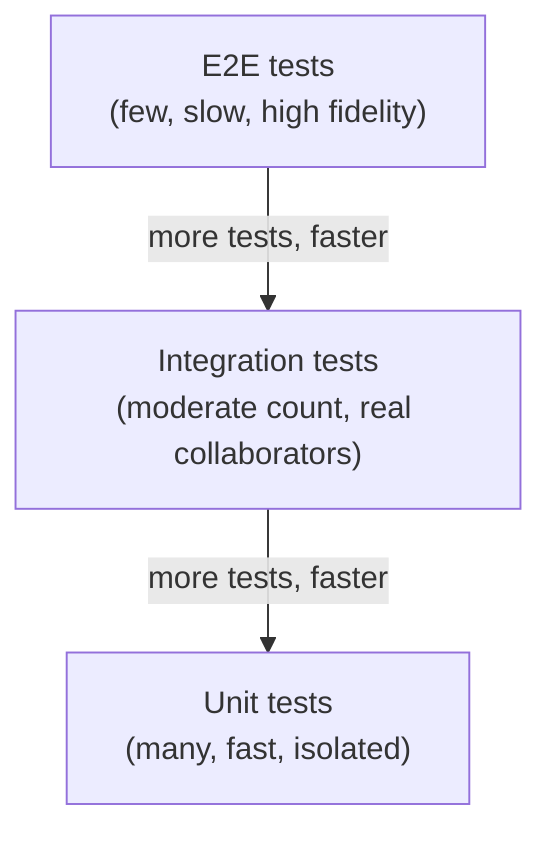
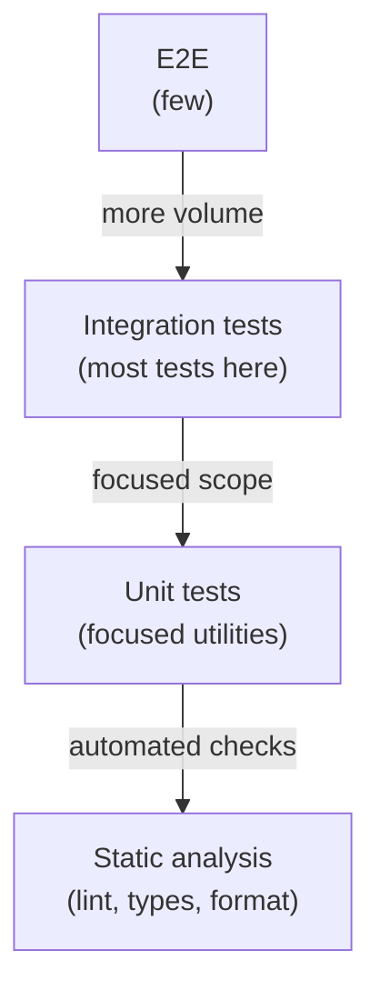

# Testing and Quality

## Chapter Goal

After reading this chapter, the reader can design a testing strategy for a team, choose the right test type for each layer of a system, explain the trade-offs between speed and fidelity, debug flaky tests systematically, set quality gates that improve delivery without blocking it, and answer Tech Lead interview questions about testing philosophy, coverage, and team standards.

## Why This Matters for a Tech Lead

Testing strategy is one of the highest-leverage decisions a Tech Lead owns. A well-designed testing approach gives the team confidence to ship quickly, catches regressions before they reach production, and reduces on-call burden. A poorly designed one does the opposite — slow CI pipelines, flaky tests that train engineers to ignore failures, coverage metrics that create false confidence, and E2E suites that break on every deploy.

A Tech Lead is accountable for the shape of the test suite, the quality gates in CI, the flaky test policy, and the team's shared understanding of what "tested" means. This is not delegated to QA — it is an engineering design decision with direct impact on delivery throughput, incident rate, and developer experience.

## Mental Model

Think of tests as **executable specifications** at different levels of fidelity.

A unit test is a fast, focused specification of a single behavior. An integration test is a specification that includes real collaborators (a database, a queue, an HTTP client). An end-to-end test is a specification of the entire user-visible flow. Each level trades speed for confidence: unit tests run in milliseconds but miss integration bugs; E2E tests catch real user flows but are slow, brittle, and expensive to maintain.

The classic model for organizing these levels is the **testing pyramid**:



The pyramid says: write many fast unit tests at the base, fewer integration tests in the middle, and few E2E tests at the top. The width of each layer represents the number of tests; the height represents the fidelity.

Critics of the pyramid argue that for modern web applications, the most valuable tests are often integration tests — they exercise real behavior with real components while remaining faster than E2E. This alternative shape is called the **testing trophy** (Kent C. Dodds) or the **testing honeycomb** (Spotify):



The trophy adds a base layer of static analysis (linting, type checking, formatting) that catches entire categories of bugs before any test runs. It shifts the bulk of testing effort to integration tests.

**Which shape is right?** It depends on the system. Backend services with complex business logic benefit from more unit tests. Frontend applications with component trees and user interactions benefit from more integration tests. Distributed systems with service boundaries benefit from contract tests that do not appear in either model. The Tech Lead's job is to choose the shape that gives the most confidence per hour of maintenance cost.

## Core Terminology

| Term | Definition |
|---|---|
| **Unit test** | Tests a small unit of behavior in isolation from external systems. Fast, deterministic, focused on logic. |
| **Integration test** | Tests real interactions between components — a service with its database, an API with its middleware, a component with its state. |
| **End-to-end (E2E) test** | Tests the full user flow through a deployed or near-deployed system, typically through a browser or API client. |
| **Contract test** | Tests that a producer API meets the expectations of its consumers, without deploying both services. |
| **Snapshot test** | Captures the serialized output of a component or function and fails when the output changes. |
| **Property-based test** | Generates random inputs and checks that invariants hold across all of them. |
| **Regression test** | Any test that guards against the reintroduction of a previously fixed bug. |
| **Smoke test** | A minimal post-deploy check that the system is alive and core paths work. |
| **Sanity test** | A quick check that a specific change did not break the most obvious behavior. |
| **Flaky test** | A test that passes and fails without code changes, typically due to timing, shared state, or external dependencies. |
| **Hermetic test** | A test that depends on nothing outside its own setup — no shared state, no network, no clock. |
| **Test double** | A generic term for any object used in place of a real dependency during testing. |
| **Stub** | Returns predetermined data. Does not verify how it was called. |
| **Mock** | Records calls and allows assertions on how it was called (arguments, call count, order). |
| **Spy** | Wraps a real implementation, letting the real code run while recording calls for later assertion. |
| **Fake** | A working implementation with shortcuts — an in-memory database, a local file store, a hardcoded auth service. |
| **Fixture** | Predefined test data or environment setup, often shared across tests. |
| **Test coverage** | The percentage of code executed during test runs. Measured by lines, branches, functions, or statements. |
| **Mutation testing** | Introduces small changes (mutations) to production code and checks whether tests catch them. Measures test quality, not quantity. |
| **Quality gate** | A CI check that must pass before code can merge or deploy. |
| **Static analysis** | Automated inspection of code without executing it — linting, type checking, formatting. |
| **TDD (Test-Driven Development)** | Write the test first, watch it fail, write the minimum code to pass, refactor. Red-green-refactor. |
| **BDD (Behavior-Driven Development)** | Specification-by-example using Given/When/Then syntax, typically shared between developers and product. |

See the [Glossary](./26-glossary.md) for additional terms.

## Theoretical Foundation

### The testing pyramid and its alternatives

The **testing pyramid** (Mike Cohn) prioritizes unit tests at the base because they are fast, cheap, and deterministic. Integration and E2E tests sit above because they are slower, more brittle, and more expensive to maintain.

The pyramid works well for systems with complex domain logic — financial calculations, scheduling algorithms, rule engines — where the bulk of correctness depends on isolated functions.

The **testing trophy** (Kent C. Dodds) argues that for UI-heavy applications, integration tests are the sweet spot. They exercise real component trees with real event handlers and real state, but without a browser or network. The trophy treats unit tests as a focused tool for pure utilities and static analysis as the first line of defense.

The **testing honeycomb** (Spotify) applies to microservices. It emphasizes integration tests at service boundaries and contract tests between services, with fewer unit tests (because individual service logic is often thin) and fewer E2E tests (because they require deploying the entire distributed system).

| Shape | Best for | Unit tests | Integration tests | E2E tests |
|---|---|---|---|---|
| **Pyramid** | Complex domain logic, backend engines | Many | Moderate | Few |
| **Trophy** | Frontend applications, component-heavy | Few (utilities) | Many | Few |
| **Honeycomb** | Microservices, distributed systems | Few | Many (+ contract) | Very few |

A Tech Lead does not adopt a shape dogmatically. The right shape depends on where bugs actually occur in the system. If most production incidents come from integration failures, invest in integration and contract tests. If most incidents come from logic errors, invest in unit tests.

### Test types in depth

**Unit tests** test a single behavior in isolation. "Unit" means a unit of behavior, not a unit of code — a test that exercises a function and its private helpers is still a unit test. The boundary is external systems: if the test touches a database, file system, or network, it is an integration test.

Good unit tests are fast (milliseconds), deterministic (no randomness, no timing), and focused (one assertion per logical behavior). They enable rapid feedback during development and safe refactoring.

**Integration tests** test real interactions between components. A backend integration test might start a real database in a container, run migrations, and test queries. A frontend integration test might render a component tree with real state management and test user interactions.

The line between unit and integration is debated. A practical rule: if the test requires setup beyond the test file (a database, a server, a browser), it is an integration test.

**End-to-end (E2E) tests** test the full user flow through a deployed or near-deployed system. They provide the highest confidence that the system works as a user would experience it. They are also the slowest, most brittle, and most expensive to maintain. Every E2E test is a maintenance liability.

Use E2E tests for critical user journeys — login, checkout, data export — and resist the urge to cover every edge case. A suite of 20 focused E2E tests is more valuable than 200 fragile ones.

**Contract tests** verify that a producer API delivers what its consumers expect, and that consumers only depend on what the producer guarantees. Tools like Pact let consumers define expectations as contracts, which the producer runs against its real implementation. This catches breaking changes before deployment without requiring both services to be running.

Contract tests are the primary defense against integration failures in microservice architectures. They replace many E2E tests that would otherwise require deploying the full system.

**Snapshot tests** capture the serialized output (HTML, JSON, component tree) and fail when it changes. They are useful as a regression safety net for stable output, but they are noisy for rapidly changing components. The anti-pattern is auto-updating snapshots without reviewing the diff — this defeats the purpose.

**Property-based tests** generate random inputs and check that invariants hold. Instead of testing "encode then decode returns the original input" for three specific inputs, a property-based test generates thousands. This catches edge cases that example-based tests miss — empty strings, unicode, extreme values, boundary conditions.

**Smoke tests** run after deployment to verify the system is alive. They are fast, focused on critical paths, and designed to catch catastrophic failures (wrong config, missing dependency, broken routing). They are not comprehensive — they are a quick sanity check.

**Performance tests** measure response time, throughput, and resource usage under load. Load tests simulate expected traffic; stress tests push beyond capacity to find breaking points; soak tests run for extended periods to find memory leaks and resource exhaustion. See [Performance and Scalability](./19-performance-and-scalability.md) for depth on this topic.

**Security tests** check for known vulnerabilities, misconfigurations, and attack vectors. Static Application Security Testing (SAST) scans source code. Dynamic Application Security Testing (DAST) probes a running application. Dependency scanning checks for known CVEs in third-party packages. See [Security](./15-security.md) for the full treatment.

**Accessibility tests** verify that the application is usable by people with disabilities. Automated tools like axe catch structural issues (missing labels, low contrast, missing alt text). Manual testing with screen readers and keyboard navigation catches interaction problems that automation misses.

**Visual regression tests** compare screenshots of rendered pages or components against baselines. They catch unintended CSS changes, layout shifts, and rendering differences across browsers. Tools like Chromatic, Percy, or Playwright's screenshot comparison handle this.

**Cross-browser and responsive tests** verify behavior across different browsers and viewport sizes. Playwright and Cypress can run against multiple browser engines. The Tech Lead decision is which browsers to support — the answer should come from analytics data, not assumption.

### Test doubles

Choosing the right test double is a design decision, not a convenience shortcut.

| Double | When to use | When NOT to use |
|---|---|---|
| **Stub** | Replace a dependency whose return value matters but whose behavior does not | When the test needs to verify the interaction, not the data |
| **Mock** | Verify that a dependency was called correctly (arguments, count, order) | When over-used — mocking everything creates tests that break on refactoring without catching bugs |
| **Spy** | Wrap a real implementation to verify it was called while keeping real behavior | When the real implementation has side effects that are expensive or dangerous in tests |
| **Fake** | Replace a slow or external dependency with a lightweight working implementation | When the fake drifts from the real implementation — fakes must be tested against the real thing periodically |

**The mock trap:** Over-mocking creates tests that mirror implementation details rather than testing behavior. When every dependency is mocked, the test verifies that the code calls the right functions in the right order — but a refactoring that changes the call order (without changing behavior) breaks the test. Prefer fakes for heavy dependencies (database, HTTP client) and test behavior through the public interface.

**Mock what you own, fake what you don't.** For internal dependencies (a repository, a service class), mocking is reasonable because the interface is stable and the team controls it. For external dependencies (a third-party API, a cloud SDK), build a fake that simulates the external behavior, and verify the fake against the real thing in a separate integration test.

### Test data management

Test data is the hidden complexity in any test suite. Approaches:

**Factories** generate test objects with sensible defaults that individual tests can override. This avoids duplication and keeps tests focused on the data that matters for the specific behavior being tested.

**Fixtures** are predefined data sets loaded before tests run. They are simple for small suites but become maintenance burdens at scale — every new test must understand the existing fixture state.

**Anonymized production data** gives realistic variety but requires careful handling of PII. Use data masking or synthetic data generation rather than copying production directly.

**Builder pattern** for complex objects lets tests construct only the parts they care about while keeping the rest at valid defaults.

### Flaky tests

A flaky test is one that passes and fails without code changes. Flaky tests erode trust in the test suite — when tests fail randomly, engineers learn to retry and ignore, and real failures hide behind the noise.

Common causes:

1. **Timing dependencies** — tests that wait a fixed duration instead of polling for a condition.
2. **Shared state** — tests that depend on global state, shared databases, or environment variables modified by other tests.
3. **Test ordering** — tests that pass when run individually but fail in a suite because of leaked state.
4. **Network dependencies** — tests that call real external services.
5. **Non-deterministic data** — tests that use random values, current timestamps, or auto-generated IDs without controlling them.

Fixes:

1. Replace `setTimeout` with polling or event-based waits.
2. Isolate state per test — use transactions that roll back, fresh containers, or per-test database schemas.
3. Run tests in random order to surface ordering dependencies.
4. Mock or fake external services in unit and integration tests.
5. Control randomness with seeded generators and fixed timestamps.

**Flake policy:** Quarantine flaky tests immediately. A quarantined test still runs but does not block CI. Set a time limit (e.g., two weeks) — if not fixed, delete it. A test that is not trusted is worse than no test.

**Tech Lead perspective on flaky tests:** Flaky tests are a team-level problem, not an individual debugging task. A Tech Lead owns the flake budget — the maximum acceptable flake rate before the team prioritizes fixes over new features. Track flake rate as a CI metric alongside build time and pass rate. When a PM asks why delivery slowed down, "we spent 4 engineer-hours this week re-running flaky tests" is the answer. The Tech Lead's job is to make the cost of flakes visible and to allocate capacity for fixing them before they erode the team's trust in the test suite entirely.

### Test coverage

Coverage measures how much code is executed during tests. It is a useful signal when it is low — 20% coverage almost certainly means important paths are untested. It is a misleading signal when it is high — 95% coverage says nothing about whether the tests assert the right things.

**Branch coverage** is more informative than line coverage because it checks whether both sides of a conditional are exercised. **Mutation testing** goes further — it introduces small code changes (flip a comparison, remove a line, change a constant) and checks whether any test catches the mutation. Surviving mutations indicate tests that execute code without actually verifying its behavior.

Coverage targets should be **floors, not ceilings**. A minimum of 70–80% branch coverage prevents large untested areas from accumulating. Pushing above 90% often yields diminishing returns and incentivizes testing trivial code. The Tech Lead's job is to ensure coverage is a signal that drives conversation, not a number that engineers game.

**Tech Lead perspective on coverage:** Coverage is a proxy metric. The actual question is: "If a bug is introduced into the payment processing logic, will our tests catch it before deployment?" Coverage cannot answer this — mutation testing can. A Tech Lead should run mutation testing on the highest-risk modules (payment, authentication, data transformations) quarterly and use the mutation survival rate to assess whether coverage translates to real defect detection. Present coverage to stakeholders as "we have verified that X% of our business logic is protected by tests that catch actual defects" rather than "we have Y% line coverage."

### TDD and BDD

**Test-Driven Development (TDD)** follows a strict cycle: write a failing test, write the minimum code to pass it, refactor. TDD works well for well-defined behavior (parsers, validators, algorithms) and less well for exploratory work where the interface is not yet known.

TDD is a design tool as much as a testing tool — writing the test first forces thinking about the API from the caller's perspective. The common mistake is treating TDD as a rule rather than a tool. Not every piece of code benefits from test-first development.

**Behavior-Driven Development (BDD)** uses Given/When/Then specifications that read like plain language. BDD is valuable when product and engineering need a shared vocabulary for acceptance criteria. The risk is over-engineering the specification layer — maintaining Gherkin files and step definitions adds overhead that must justify itself.

### Static analysis as the first quality layer

Static analysis catches bugs before any test runs:

- **Linting** (ESLint, Ruff, Pylint) enforces code style and catches common errors — unused variables, unreachable code, missing error handling.
- **Type checking** (TypeScript compiler, mypy, Pyright) catches type mismatches, null/undefined access, and incorrect function signatures at compile time.
- **Formatting** (Prettier, Black) eliminates style debates in code review and ensures consistent readability.

These tools belong in the CI pipeline as the first quality gate. They are fast, deterministic, and catch categories of bugs that tests should not waste time on.

### Code review as quality control

Code review is a quality gate that automation cannot replace. Automated tools catch syntax, types, and known patterns. Human review catches design problems, unclear intent, missing edge cases, security assumptions, and misunderstood requirements.

A Tech Lead shapes code review culture by defining what reviewers should focus on (architecture, correctness, clarity) and what they should ignore (style — let formatters handle it). See [Git and Engineering Workflow](./20-git-and-engineering-workflow.md) for PR review practices.

### Quality gates in CI

Quality gates are automated checks that must pass before code merges or deploys. A well-designed pipeline runs checks in order of speed and value:

1. **Static analysis** — lint, type check, format check (seconds).
2. **Unit tests** — fast, high-volume tests (seconds to low minutes).
3. **Integration tests** — tests with real dependencies (minutes).
4. **Security scans** — SAST, dependency vulnerability checks (minutes).
5. **E2E tests** — full-flow tests, often parallelized (minutes to tens of minutes).
6. **Performance benchmarks** — optional, on critical paths (minutes).

Each gate should have a clear owner, a clear failure action (block merge, notify, or log), and a clear escalation path when it blocks delivery.

**Tech Lead perspective on quality gates:** A Tech Lead decides which gates are blocking (merge is prevented) vs. non-blocking (results are reported but do not prevent merge). Not every check deserves to block: lint and type check should always block. Unit tests should always block. Coverage reports can be non-blocking (report the number, let review decide). E2E tests may be non-blocking for non-critical paths but blocking for changes that touch checkout or authentication. The key design principle: a quality gate that is always overridden is worse than no gate — it trains the team to ignore CI results. Gate design is a continuous process; review which gates are actually catching defects quarterly and retire those that produce only noise.

## Practical Usage

### Greenfield projects

Start with static analysis from day one — TypeScript strict mode, ESLint with a shared config, Prettier on save. Add unit tests for business logic and integration tests for API endpoints. Defer E2E tests until the user flows are stable enough to justify the maintenance cost.

### Legacy projects

Start with **characterization tests** — tests that capture existing behavior without asserting correctness. These give safety for refactoring. Then add targeted tests around the areas being changed. Do not attempt to backfill 100% coverage — invest in tests where the risk is highest.

See Michael Feathers' "Working Effectively with Legacy Code" for techniques: seam identification, dependency-breaking, and the sprout/wrap pattern.

**Tech Lead perspective on legacy testing:** The biggest mistake is mandating retroactive coverage ("we need 80% coverage by end of quarter"). This produces low-quality tests written to hit a number, not to catch bugs. Instead, track coverage trends — is new code being tested? Is coverage increasing in high-risk modules? A team that improves from 15% to 45% coverage over six months, focused on critical paths, is in a healthier state than a team that rushed to 80% by testing getters and constructors.

### Microservices

Invest heavily in contract tests. Each service should have fast unit and integration tests internally, and contract tests at its boundaries. E2E tests across the full distributed system should be rare and focused on critical end-to-end flows. See [Software Architecture](./14-software-architecture.md) for service boundary design.

### Frontend applications

Use React Testing Library (or the framework equivalent) for integration tests that render real components and simulate user interactions. Use unit tests for utility functions, custom hooks, and complex state logic. Use Playwright or Cypress for a small set of E2E tests covering login, navigation, and critical workflows. Use visual regression tests to catch CSS breakage.

### API testing

Test API endpoints with real HTTP requests against a running server. Use Supertest (Node.js) or pytest with a test client (Python/FastAPI). Assert on status codes, response shapes, headers, and error formats. Test authentication and authorization at this level — they are integration concerns.

**Tech Lead perspective on security and API testing:** Authorization and input validation bugs are security vulnerabilities, not functional bugs. They deserve dedicated test coverage at the integration level. A Tech Lead ensures that API tests include: unauthenticated requests (expect 401), under-privileged requests (expect 403), cross-tenant data access (user A requesting user B's resources — expect 403), malformed input (SQL injection strings, script tags — expect 400, not 500), and expired tokens. These tests should exist before the first security audit, not after.

## Examples

### Unit test with Vitest

```ts
import { describe, it, expect } from 'vitest';
import { calculateDiscount } from './pricing';

describe('calculateDiscount', () => {
  it('applies percentage discount capped at max', () => {
    const result = calculateDiscount({
      subtotal: 200,
      discountPercent: 15,
      maxDiscount: 20,
    });
    expect(result).toBe(20);
  });

  it('returns zero for zero subtotal', () => {
    const result = calculateDiscount({
      subtotal: 0,
      discountPercent: 15,
      maxDiscount: 20,
    });
    expect(result).toBe(0);
  });
});
```

**What it verifies:** Business logic for discount calculation — percentage application and cap enforcement.

**Why unit test:** Pure function with no external dependencies. Fast, deterministic, tests the rule in isolation.

**Common mistake:** Testing the function by mocking its internals instead of testing inputs and outputs. If `calculateDiscount` calls a helper, do not mock the helper — test the outer behavior.

**Production change:** In production, discount rules may come from a database or config service. The unit test verifies the calculation logic; a separate integration test verifies that the rules are loaded correctly.

### React component test with React Testing Library

```tsx
import { render, screen, fireEvent } from '@testing-library/react';
import { SearchBar } from './SearchBar';

it('calls onSearch with the input value on submit', () => {
  const handleSearch = vi.fn();
  render(<SearchBar onSearch={handleSearch} />);

  fireEvent.change(screen.getByRole('textbox'), {
    target: { value: 'test query' },
  });
  fireEvent.click(screen.getByRole('button', { name: /search/i }));

  expect(handleSearch).toHaveBeenCalledWith('test query');
});

it('does not call onSearch when input is empty', () => {
  const handleSearch = vi.fn();
  render(<SearchBar onSearch={handleSearch} />);

  fireEvent.click(screen.getByRole('button', { name: /search/i }));

  expect(handleSearch).not.toHaveBeenCalled();
});
```

**What it verifies:** User interaction — typing and submitting triggers the callback with the right value. Empty input is handled.

**Why integration test:** Renders the real component tree, uses real DOM events, tests behavior as a user would experience it.

**Common mistake:** Testing implementation details — asserting that internal state changed instead of asserting what the user sees or what callbacks receive.

**Production change:** In production, `onSearch` triggers an API call with debouncing. The component test verifies the component contract; an integration test against the API verifies the full flow.

### API integration test with Supertest

```ts
import request from 'supertest';
import { app } from '../app';
import { db } from '../db';

describe('POST /api/orders', () => {
  beforeEach(async () => {
    await db.migrate.latest();
    await db.seed.run();
  });

  afterEach(async () => {
    await db.migrate.rollback();
  });

  it('creates an order and returns 201', async () => {
    const res = await request(app)
      .post('/api/orders')
      .send({ productId: 'prod-1', quantity: 2 })
      .set('Authorization', 'Bearer test-token');

    expect(res.status).toBe(201);
    expect(res.body).toMatchObject({
      productId: 'prod-1',
      quantity: 2,
      status: 'pending',
    });
  });

  it('returns 400 for missing required fields', async () => {
    const res = await request(app)
      .post('/api/orders')
      .send({})
      .set('Authorization', 'Bearer test-token');

    expect(res.status).toBe(400);
    expect(res.body.errors).toBeDefined();
  });
});
```

**What it verifies:** Full request lifecycle — routing, validation, database write, response shape. Tests both happy path and error handling.

**Why integration test:** Uses a real HTTP server, real middleware, and a real database (with migration/rollback for isolation).

**Common mistake:** Using a shared database without cleanup. Tests pollute each other's data, causing ordering-dependent failures.

**Production change:** In production, the test database is replaced by a containerized PostgreSQL instance in CI. The `test-token` would be generated by a test auth helper rather than hardcoded.

### E2E test with Playwright

```ts
import { test, expect } from '@playwright/test';

test('user can search and view a product', async ({ page }) => {
  await page.goto('/');
  await page.getByRole('textbox', { name: /search/i }).fill('laptop');
  await page.getByRole('button', { name: /search/i }).click();

  await expect(page.getByText('Search results for "laptop"')).toBeVisible();

  await page.getByRole('link', { name: /laptop pro 15/i }).click();

  await expect(page.getByRole('heading', { name: /laptop pro 15/i })).toBeVisible();
  await expect(page.getByText(/\$\d+/)).toBeVisible();
});
```

**What it verifies:** A critical user journey — search, results display, navigation to product detail.

**Why E2E:** Tests the full stack through a real browser. Catches integration issues between frontend routing, API calls, and data rendering.

**Common mistake:** Writing E2E tests for every feature. Each E2E test is a maintenance liability. Reserve E2E for the 10–20 most critical user journeys.

**Production change:** In production CI, this test runs against a staging environment with seeded data. Parallelization across browser contexts reduces wall-clock time. Flaky retries with screenshot-on-failure help diagnosis.

### Python test with pytest

```python
from app.services.inventory import check_availability


class FakeInventoryRepo:
    def __init__(self, stock: dict[str, int]):
        self._stock = stock

    def get_quantity(self, product_id: str) -> int:
        return self._stock.get(product_id, 0)


def test_available_when_stock_exceeds_requested():
    repo = FakeInventoryRepo({"sku-1": 10})
    assert check_availability(repo, "sku-1", quantity=5) is True


def test_unavailable_when_stock_is_zero():
    repo = FakeInventoryRepo({"sku-1": 0})
    assert check_availability(repo, "sku-1", quantity=1) is False


def test_unavailable_for_unknown_product():
    repo = FakeInventoryRepo({})
    assert check_availability(repo, "sku-unknown", quantity=1) is False
```

**What it verifies:** Inventory availability logic using a fake repository — no database required.

**Why unit test with fake:** The business rule (compare stock to requested quantity) is pure logic. The fake provides deterministic data without database overhead.

**Common mistake:** Mocking the repository so heavily that the test only verifies the mock was called, not that the logic is correct.

**Production change:** In production, `InventoryRepo` queries PostgreSQL. A separate integration test verifies the real repository implementation against a test database.

### Flaky test: before and after

**Before — flaky due to timing:**

```ts
it('shows notification after save', async () => {
  fireEvent.click(screen.getByText('Save'));
  // Flaky: notification may not appear within 100ms
  await new Promise((r) => setTimeout(r, 100));
  expect(screen.getByText('Saved successfully')).toBeVisible();
});
```

**After — deterministic with proper waiting:**

```ts
it('shows notification after save', async () => {
  fireEvent.click(screen.getByText('Save'));
  // Waits for the element to appear, with a configurable timeout
  await screen.findByText('Saved successfully');
  expect(screen.getByText('Saved successfully')).toBeVisible();
});
```

**What changed:** Replaced a fixed `setTimeout` with `findByText`, which polls the DOM until the element appears or times out. This eliminates the race condition.

**Why this matters:** Fixed delays are the most common source of flaky frontend tests. They either wait too long (slowing the suite) or too short (failing intermittently). Event-based waiting is both faster and more reliable.

**Common mistake:** Increasing the timeout to "fix" the flake. This hides the problem and slows the suite. Address the root cause — use polling, events, or explicit async handling.

### CI quality gate snippet

```yaml
# .github/workflows/ci.yml
name: CI
on: [push, pull_request]

jobs:
  quality:
    runs-on: ubuntu-latest
    steps:
      - uses: actions/checkout@v4

      - name: Install dependencies
        run: npm ci

      - name: Lint
        run: npm run lint

      - name: Type check
        run: npx tsc --noEmit

      - name: Unit tests
        run: npm run test:unit -- --coverage

      - name: Integration tests
        run: npm run test:integration

      - name: Check coverage threshold
        run: |
          npx coverage-check --branches 75 --lines 80

      - name: Security audit
        run: npm audit --audit-level=high
```

**What it shows:** A CI pipeline ordered by speed — static analysis first, then unit tests, then integration tests, then coverage check, then security audit. Each step fails fast, so slow checks only run when fast ones pass.

**Why this order:** Lint and type check catch errors in seconds. Running them first means developers get feedback before waiting for slower test suites.

**Common mistake:** Running all checks in parallel without ordering. A developer waits 10 minutes for E2E tests to fail when a lint error would have caught the problem in 5 seconds.

**Production change:** In production CI, add caching for `node_modules` and test containers, parallelized E2E tests in a separate job, and deployment gates (staging smoke tests before production deploy). See [CI/CD and DevOps](./17-ci-cd-and-devops.md).

### Contract test with Pact (consumer side)

```ts
import { PactV3 } from '@pact-foundation/pact';
import { resolve } from 'path';
import { OrderClient } from './OrderClient';

const provider = new PactV3({
  consumer: 'CheckoutService',
  provider: 'OrderService',
  dir: resolve(__dirname, '..', 'pacts'),
});

describe('OrderClient', () => {
  it('fetches an order by ID', async () => {
    await provider
      .given('order 42 exists')
      .uponReceiving('a request for order 42')
      .withRequest({
        method: 'GET',
        path: '/api/orders/42',
        headers: { Accept: 'application/json' },
      })
      .willRespondWith({
        status: 200,
        headers: { 'Content-Type': 'application/json' },
        body: {
          id: '42',
          status: 'confirmed',
          total: 99.95,
        },
      })
      .executeTest(async (mockserver) => {
        const client = new OrderClient(mockserver.url);
        const order = await client.getOrder('42');

        expect(order.id).toBe('42');
        expect(order.status).toBe('confirmed');
        expect(order.total).toBe(99.95);
      });
  });
});
```

**What it verifies:** The consumer (`CheckoutService`) defines the exact request it sends and the response shape it expects from the provider (`OrderService`). Pact records this as a contract file. The provider then verifies the contract against its real implementation — without the two services ever running together.

**Why contract test:** In microservice architectures, the most dangerous bugs are breaking changes at service boundaries — a producer changes a response field, and consumers fail at runtime. Contract tests catch this at build time. They replace many expensive cross-service E2E tests with fast, independently runnable checks.

**Common mistake:** Writing contracts that are too strict (asserting exact response bodies) or too loose (only checking status codes). A good contract asserts on the fields and types the consumer actually uses, not the full response. Pact's `like()` and `eachLike()` matchers help with this.

**Production change:** In a real setup, contracts are published to a Pact Broker. The provider's CI pipeline downloads consumer contracts and verifies them. The `can-i-deploy` tool checks compatibility before deployment. See [Software Architecture](./14-software-architecture.md) for service boundary design.

### Accessibility test with jest-axe

```tsx
import { render } from '@testing-library/react';
import { axe, toHaveNoViolations } from 'jest-axe';
import { LoginForm } from './LoginForm';

expect.extend(toHaveNoViolations);

describe('LoginForm accessibility', () => {
  it('has no automatic accessibility violations', async () => {
    const { container } = render(<LoginForm onSubmit={() => {}} />);
    const results = await axe(container);

    expect(results).toHaveNoViolations();
  });
});
```

**What it verifies:** Structural accessibility compliance — form labels are associated with inputs, elements have accessible names, heading hierarchy is correct, color contrast meets WCAG requirements, ARIA attributes are valid. This catches the 30–40% of accessibility issues that are automatable.

**Why integration test:** Accessibility depends on the rendered DOM. A unit test against component props cannot verify that a `<label>` has a matching `htmlFor` attribute or that an `<input>` has an `aria-label`. Rendering the real component and running axe against the DOM catches structural issues early.

**Common mistake:** Treating automated accessibility scans as sufficient. axe cannot verify keyboard navigation, focus management in modals, screen reader announcement order, or custom component semantics. Combine automated scans with periodic manual testing using a screen reader and keyboard-only navigation.

**Production change:** Run axe checks in CI against every component that renders user-facing UI. Add Playwright-based axe scans for full-page checks (using `@axe-core/playwright`). Track accessibility violation count as a quality metric and set a zero-tolerance policy for new violations.

### Test data factory (builder pattern)

```ts
interface User {
  id: string;
  email: string;
  name: string;
  role: 'admin' | 'member' | 'viewer';
  createdAt: Date;
}

let counter = 0;

function buildUser(overrides: Partial<User> = {}): User {
  counter++;
  return {
    id: `user-${counter}`,
    email: `user-${counter}@test.com`,
    name: `Test User ${counter}`,
    role: 'member',
    createdAt: new Date('2025-01-01'),
    ...overrides,
  };
}

// Usage in tests:
const admin = buildUser({ role: 'admin' });
const viewer = buildUser({ role: 'viewer', name: 'Read Only User' });
const defaults = buildUser(); // sensible defaults, unique ID
```

**What it solves:** Each test creates only the data it needs, overriding specific fields while getting sensible defaults for everything else. This eliminates shared fixture files where every test depends on the same predefined data — a common source of hidden coupling and brittle tests.

**Why factory over fixture:** Fixtures are static JSON or SQL files loaded before tests. They work for small suites, but as the suite grows, tests become coupled to the fixture structure — changing a fixture field can break dozens of unrelated tests. Factories generate fresh, independent data per test. Each test is self-contained and readable without scrolling to a setup file.

**Common mistake:** Building the factory but then sharing factory-created objects across tests via a `beforeAll` block. This reintroduces the shared-state problem. Each test should call the factory independently. Factories should also generate unique values (auto-incrementing IDs, unique emails) to avoid collision between tests running in parallel.

**Production change:** For database-backed tests, extend the factory to insert data using the repository layer rather than direct SQL. For complex object graphs (an order with line items and a customer), compose factories: `buildOrder({ customer: buildUser({ role: 'member' }) })`. In large projects, use libraries like Fishery (TypeScript) or Factory Boy (Python) for more structured factory definitions.

## Common Mistakes

1. **Mocking what you do not own**
   - What it looks like: mocking a third-party HTTP client or cloud SDK, then asserting on internal method calls.
   - Why it is wrong: the mock may not match the real behavior. When the third-party library updates, the mock stays the same and tests pass while production breaks.
   - Correct approach: build a thin adapter around the third-party dependency. Mock or fake the adapter (which the team owns). Test the adapter against the real dependency in a separate integration test.

2. **Coverage as a target instead of a signal**
   - What it looks like: mandating 100% coverage or blocking PRs that drop coverage by any amount.
   - Why it is wrong: engineers game it — writing tests that exercise code without asserting meaningful behavior. Getter tests, constructor tests, and trivial pass-through tests inflate coverage without catching bugs.
   - Correct approach: set a coverage floor (70–80%) to prevent large untested areas. Use coverage reports to identify untested critical paths. Use mutation testing to assess test quality beyond coverage numbers.

3. **Snapshot tests without review discipline**
   - What it looks like: `--updateSnapshot` in the CI script, or PRs that update 50 snapshots with "updated snapshots" as the commit message.
   - Why it is wrong: the snapshot becomes a rubber stamp. It no longer catches unintended changes because all changes are auto-accepted.
   - Correct approach: use snapshots only for stable, well-understood output. Review every snapshot diff. For rapidly changing components, prefer assertion-based tests.

4. **E2E suites that take 40 minutes**
   - What it looks like: 300+ E2E tests running sequentially in CI, with 5–10 flaky failures per run that require manual retries.
   - Why it is wrong: slow suites block delivery. Flaky failures train engineers to ignore test results. The suite becomes a cost center that no one trusts.
   - Correct approach: keep E2E tests to 20–50 critical journeys. Parallelize execution. Quarantine flaky tests. Invest savings into faster integration tests that cover the same behavior.

5. **Testing implementation instead of behavior**
   - What it looks like: tests that assert on internal state, method call order, or private function outputs.
   - Why it is wrong: any refactoring breaks the tests without changing behavior. The tests become a refactoring tax.
   - Correct approach: test through public interfaces. Assert on outputs, callbacks, rendered content, and side effects visible to the caller.

6. **No test for the error path**
   - What it looks like: all tests cover the happy path. No test verifies what happens when the database is down, the API returns 500, or the input is malformed.
   - Why it is wrong: error paths are where production incidents happen. Untested error handling is effectively unverified.
   - Correct approach: for every happy-path test, add at least one error-path test. Test timeouts, malformed input, missing auth, and dependency failures.

7. **Ignoring flaky tests instead of fixing them**
   - What it looks like: "just retry it" culture. Flaky tests are re-run 3 times in CI. No one tracks or fixes them.
   - Why it is wrong: each ignored flake erodes trust. When a real regression hides behind a "probably flaky" failure, the test suite has failed its purpose.
   - Correct approach: quarantine immediately. Track flake rate per test. Set a fix-or-delete deadline. Allocate time in sprints for flake fixes.

## Trade-offs

| Decision | Optimizes for | Sacrifices | Flips when |
|---|---|---|---|
| **More unit tests, fewer integration** | Speed, isolation, refactoring safety | Misses integration bugs | System has many integration boundaries |
| **More integration tests, fewer unit** | Confidence in real behavior | Slower feedback, harder to isolate failures | Domain logic is complex and fast tests are needed |
| **Mocks over fakes** | Speed, simplicity | Coupling to implementation details | Refactoring becomes expensive |
| **Fakes over mocks** | Behavior-based testing, refactoring safety | Higher setup cost, fake maintenance | Fake drifts from real implementation |
| **High coverage threshold** | Prevents large untested areas | May incentivize low-value tests | Coverage gaming begins |
| **Contract tests over E2E** | Speed, independence between services | Does not test the integrated whole | Critical end-to-end flows need verification |
| **TDD** | Emergent design, tight feedback loop | Overhead for exploratory or UI work | Requirements are unclear or changing rapidly |
| **Snapshot tests** | Easy regression detection | Noisy for changing output | Review discipline breaks down |

## Production Considerations

### Test environments

Production-like test environments are expensive but essential for integration and E2E tests. Use containerized databases (Docker) for CI. Use ephemeral environments (preview deploys) for E2E. Avoid shared staging environments where multiple PRs interfere with each other's test data.

### CI performance

Slow CI is a delivery bottleneck. Strategies to keep CI fast:

- Run checks in dependency order — lint before tests, unit before integration, integration before E2E.
- Cache dependencies aggressively — `node_modules`, Docker layers, compiled artifacts.
- Parallelize test suites by splitting across multiple CI workers.
- Skip unnecessary checks — if only documentation changed, skip E2E tests.
- Track CI runtime as a metric. Set an SLO (e.g., PR checks complete within 10 minutes).

### Flake budget

Track the overall flake rate (percentage of CI runs with at least one flaky test failure). Set a budget — e.g., below 5%. When the budget is exceeded, prioritize flake fixes over new features. This creates organizational pressure to maintain test reliability.

### Quality metrics without gaming

Useful quality metrics: flake rate, CI pass rate, median time to merge, defect escape rate (bugs found in production that should have been caught by tests), mean time to recovery (MTTR).

Metrics to use with caution: test count (more is not better), coverage percentage (incentivizes trivial tests), test execution time (optimizing for speed alone may sacrifice confidence).

Present metrics as trends, not snapshots. A team that improved coverage from 50% to 75% is in a healthier state than a team that has been at 90% for a year because they mandate it.

### Testing and observability

Tests verify expectations before deployment. Observability verifies reality after deployment. They are complementary, not substitutes.

Production quality signals that supplement testing:

- **Error rates** — monitor 5xx rates, exception counts, and error log volume.
- **Latency percentiles** — p50, p95, p99 regressions after deploy.
- **SLO burn rate** — if the error budget is burning faster after a deploy, something escaped testing.
- **Synthetic monitoring** — run smoke tests against production endpoints on a schedule.

See [Observability](./18-observability.md) for depth on SLIs, SLOs, and alerting.

## Tech Lead Decision-Making

**What a Senior Engineer usually knows:** How to write tests, which tools to use, how to set up a test runner, how to debug a failing test, and how to achieve good coverage for a module they own.

**What a Tech Lead is expected to decide:**

- Which test shape (pyramid, trophy, honeycomb) fits the system — and when to change it as the architecture evolves.
- Where to invest testing effort given limited engineering time — testing the payment flow more than the admin settings page.
- When to accept lower coverage in exchange for faster delivery (feature flags with rollback vs. comprehensive pre-deploy testing).
- How to introduce testing standards into a team that has not had them — without creating resentment.
- When to delete tests — tests that no longer reflect real behavior are liabilities, not assets.
- How to communicate testing trade-offs to product stakeholders who pressure for faster delivery.
- How to define quality gates that protect the system without blocking every PR on a flaky check.
- When to invest in testing infrastructure (factories, fixtures, CI optimization) vs. writing more tests.
- How to connect testing strategy to incident reduction — using defect escape rate to justify testing investment.

**The core shift from Senior to Tech Lead:** A Senior Engineer asks "is my code tested?" A Tech Lead asks "does the team have confidence to ship, and is that confidence justified by the test suite's actual defect-catching ability?"

### Quality strategy as leadership responsibility

A Tech Lead owns testing strategy the same way they own architecture decisions — it is a cross-cutting concern that affects every team member and every deploy. This means:

1. **Defining the team's testing contract.** What does "tested" mean for a PR? Is it "unit tests for new logic, integration tests for changed APIs, no new flaky tests"? This must be explicit and shared — not assumed.

2. **Budgeting engineering time for quality infrastructure.** Testing infrastructure (factories, CI improvements, container caching, flake fixes) is engineering work, not side work. A Tech Lead who does not budget time for this will watch CI get slower and flakier until it becomes a delivery bottleneck.

3. **Using data to drive quality decisions.** Track defect escape rate, flake rate, CI pass rate, and time to merge. Present these as trends to the team and to stakeholders. "Our defect escape rate dropped 40% after we added integration tests to the checkout flow" is more persuasive than "we should write more tests."

4. **Owning the risk conversation.** When a PM asks to skip tests, the Tech Lead translates that into risk: "We can skip integration tests on this feature. The risk is a data corruption bug in the order processing path. If that happens, we are looking at 4–8 hours of incident response plus a data cleanup migration. Is that risk acceptable for shipping two days earlier?" This is a leadership conversation, not a testing conversation.

### The cost of slow and flaky CI

Slow CI has a compounding cost that most teams underestimate:

- **Context-switching cost.** If CI takes 20 minutes, developers context-switch to another task. When CI finishes, they need 10–15 minutes to re-load the original context. Effective cost per PR: 30+ minutes, not 20.
- **Batch size increases.** When CI is slow, developers batch changes into larger PRs to avoid multiple waits. Larger PRs are harder to review, more likely to introduce bugs, and more likely to cause merge conflicts.
- **Flake tax.** If the flake rate is 10%, one in ten CI runs fails for no reason. Multiply by PRs per day to get the daily flake tax in engineering hours. A team of 8 engineers opening 4 PRs each per day with a 10% flake rate loses 3–4 engineer-hours daily to retries and false-alarm investigation.

A Tech Lead treats CI time as a delivery metric. Set an SLO (e.g., PR checks complete within 10 minutes) and invest in optimization when it is exceeded — the same way the team would invest in fixing production latency.

### Common overengineering trap

Testing too much is a real problem, not a theoretical one:

- **Testing framework internals.** Writing tests that verify React renders a component when passed props, or that Express calls the route handler — this tests the framework, not the application.
- **Testing trivial code.** Getters, setters, type-only functions, and pass-through wrappers do not justify the maintenance cost of a test.
- **Testing at the wrong level.** An E2E test for a validation rule that a unit test covers faster and more reliably. An integration test for a pure function that has no dependencies.
- **Mandating 100% coverage.** This creates perverse incentives — engineers write low-value tests to hit the number rather than investing in high-value tests that catch real bugs.

**The Tech Lead check:** For every testing investment, ask: "What class of bug does this test catch, and what is the cost of that bug reaching production?" If the answer is "it tests that the ORM can insert a row" or "it verifies a getter returns a field," the test is not worth the maintenance cost.

### Common under-testing trap

Under-testing is more common and more dangerous:

- **No tests for error paths.** Happy-path tests pass. In production, the database goes down and the error handling code — which was never tested — sends a 500 with a stack trace containing secrets.
- **No tests for authorization.** CRUD endpoints work for authenticated users. But no test verifies that user A cannot access user B's data, or that an expired token is rejected.
- **No regression tests for bug fixes.** A bug is fixed but no test is added. Three months later, a refactoring reintroduces the same bug and no test catches it.
- **No contract tests in a microservice architecture.** Each service has integration tests, but no test verifies that the producer's response shape matches the consumer's expectations. Breaking changes are caught in production.

**The Tech Lead check:** After every production incident, ask: "Could a test have caught this before deployment?" If yes, identify which test type and add it. Over time, the testing strategy should be shaped by where bugs actually come from — not by dogma or habit.

### Introducing testing in a legacy codebase (Tech Lead approach)

Introducing tests into a team that has never had them is a change management problem, not a testing problem:

1. **Start where friction is lowest.** Add linting and type checking to CI. These tools catch bugs with zero test-writing effort and build the habit of automated quality gates.
2. **Attach tests to changes.** Every bug fix gets a regression test. Every new feature gets at least one test. Do not mandate retroactive coverage — it creates resentment and produces low-quality tests.
3. **Win trust through wins.** When a regression test catches a real bug, announce it to the team. When CI catches a lint error before review, that is a quality win. Celebrate these moments — they build buy-in.
4. **Co-create standards.** After 4–6 weeks of "test with every PR," hold a team retrospective to co-create a testing strategy document. When the team writes the rules, they own the rules.
5. **Lead by example.** Write well-structured tests in every PR. Explain the reasoning in review comments. The Tech Lead's PRs set the quality bar — if they skip tests, the team will skip tests.
6. **Budget the infrastructure.** Testing infrastructure (test helpers, factories, CI configuration, container setup) is first-class engineering work. Allocate sprint capacity for it.

### When NOT to test (Tech Lead judgment)

Not testing is a legitimate engineering decision when the cost of writing and maintaining the test exceeds the risk of the untested code reaching production:

- **Prototype or spike code** that will be rewritten within weeks. Testing a throwaway prototype is wasted effort — but if the prototype becomes production code (as it often does), tests must be added before it ships.
- **Generated code** (auto-generated types, ORM models, API client code). Test the generator, not the output.
- **Trivial CRUD with no business logic** beyond what the framework provides. Test validation, authorization, and error handling — not the ORM's ability to insert a row.
- **Visual polish in internal tools** where pixel-perfect accuracy has no user impact. Save visual regression tests for customer-facing surfaces.

**The dangerous version of "don't test this"** is when it becomes a habit. A Tech Lead monitors the pattern — if the team routinely skips tests with "it's too simple to break," check the defect escape rate. Simple code that touches production data is not simple.

### Explaining quality investment to stakeholders

Product managers and executives rarely care about test coverage. They care about delivery speed, incident rate, and customer impact. A Tech Lead translates testing investment into these terms:

**Instead of:** "We need to increase test coverage to 80%."
**Say:** "We have had three incidents in the checkout flow this quarter. Each one took 4–6 hours of engineering time to fix plus customer support escalations. Adding integration tests for checkout costs 3 days of engineering time and prevents this class of incident."

**Instead of:** "CI is slow and we need to optimize it."
**Say:** "Our CI pipeline takes 22 minutes per PR. With 30 PRs per day, we are losing 11 engineer-hours daily to waiting. Investing 1 week in CI optimization brings that to 8 minutes — we save 8 engineer-hours per day going forward."

**Instead of:** "We should invest in contract testing."
**Say:** "Two of our last four production incidents were caused by API changes in another team's service. Contract tests catch this before deployment. The alternative is continuing to discover these breaks at 2 AM when the on-call gets paged."

The pattern: quantify the cost of not testing, and compare it to the cost of testing. Stakeholders understand ROI.

### Production readiness from a testing perspective

A Tech Lead's production readiness checklist for testing extends beyond "tests pass":

- [ ] **Critical paths have integration tests.** Payment, authentication, data mutations — not just unit tests with mocks, but tests against real (containerized) dependencies.
- [ ] **Error paths are tested.** What happens when the database is down? When the third-party API returns 500? When the request body is malformed? When the auth token is expired?
- [ ] **Post-deploy smoke tests exist.** The system can verify its own health after deployment — database connectivity, critical API endpoints, dependent service availability.
- [ ] **Rollback is tested.** The deployment can be reverted without data loss or schema incompatibility. Database migrations are reversible.
- [ ] **Monitoring covers what tests cannot.** Error rates, latency percentiles, and SLO burn rate are configured. Tests verify expectations before deployment; observability verifies reality after.
- [ ] **Security-sensitive paths have specific tests.** Authorization, input validation, rate limiting, and data access controls are tested at the integration level, not just through happy-path unit tests.
- [ ] **The team can run the full test suite locally.** If tests only run in CI, feedback loops are too slow and developers skip testing during development.

## How to Explain This in an Interview

**"How do you decide what to unit test vs integration test?"**

"I use the boundary of external systems as the dividing line. If the behavior I am testing depends only on inputs and outputs of a function or module — no database, no network, no file system — that is a unit test. If it requires a real collaborator, it is an integration test. For a backend service, I unit-test business logic and integration-test the API layer with a real database. For a frontend, I unit-test utility functions and integration-test components with React Testing Library. The goal is to push as much verification as possible to faster tests while keeping enough integration coverage to catch real wiring issues."

**"What is your approach to testing strategy for a new project?"**

"I start with static analysis — TypeScript strict mode, linting, formatting. Then I add unit tests for business logic as it emerges. Once the API or component contracts are stable, I add integration tests. E2E tests come last, covering only the critical user journeys. I resist the urge to write E2E tests early — they are expensive to maintain and the interfaces are still changing. I set a coverage floor, not a ceiling, and review coverage reports to find gaps in critical paths rather than chasing a number."

**"How do you justify testing investment to a non-technical stakeholder?"**

"I frame it in terms they care about — delivery speed, incident cost, and customer impact. I quantify the cost of not testing: 'Our last three checkout incidents averaged 5 hours of engineering response time each, plus customer refund processing. Integration tests for the checkout flow cost 3 days to write and would have prevented all three. That is 3 days of investment to save 15 hours of incident response plus the customer trust damage.' I never argue that testing is an end in itself — it is risk reduction, and the right amount of risk reduction depends on the business impact of the system under test."

**"How do you handle a situation where CI is slow and the team is losing confidence in it?"**

"I treat CI speed as a delivery metric with an SLO — if PR checks exceed 10 minutes, it is a priority to fix. I profile the pipeline to find the bottleneck. Usually it is dependency installation (add caching), sequential test execution (parallelize), or redundant E2E tests (replace with faster integration tests). I also quantify the impact for stakeholders: 'With 30 PRs per day and a 22-minute pipeline, we are burning 11 engineer-hours daily in wait time. A 1-week optimization investment pays for itself in 3 days.' A slow CI pipeline is not a testing problem — it is a throughput problem that directly affects delivery velocity."

**"How do you decide what level of testing confidence is appropriate for a given system?"**

"I calibrate testing investment to the blast radius of failure. A payment processing service gets near-complete integration test coverage, contract tests at every service boundary, and a dedicated smoke test suite post-deploy — because a bug there costs revenue and customer trust. An internal admin dashboard gets unit tests for business logic and a few E2E tests for critical workflows — because a bug there affects three internal users who can report it directly. The question is not 'how many tests do we have?' but 'if we ship a bug in this system, what is the cost and who is affected?'"

**"How do you introduce testing into a team that has never had it?"**

"I start with the lowest friction wins — linting and type checking in CI. These require no tests but build the habit of automated quality gates. Then I establish a 'test with every PR' norm: every bug fix gets a regression test, every new feature gets at least one test. I do not mandate retroactive coverage — that creates resentment and produces low-quality tests. After 4–6 weeks, I run a retrospective where the team co-creates a testing strategy document. When the team writes the rules, they own them. The biggest mistake is mandating coverage numbers before building buy-in."

## Good Answer vs Weak Answer

**Question:** Should a team target 100% test coverage?

**Strong Answer**

No. 100% coverage is a misleading goal. Coverage tells us what code was executed during tests, not whether the tests verify correct behavior. A test that calls a function without asserting on its output inflates coverage without catching bugs. In practice, I set a coverage floor — typically 75–80% branch coverage — to prevent large untested areas from accumulating. Above that, I focus on the quality of assertions, not the quantity of executed lines. I use mutation testing on critical modules to check whether tests actually catch real defects. The real measure of a test suite is whether the team has confidence to ship and whether defect escape rate is trending down.

**Weak Answer**

Yes, 100% coverage means every line is tested, so there are no bugs. More coverage is always better. We should block PRs that reduce coverage.

**Why the Strong Answer Wins**

- Distinguishes between coverage as a signal and coverage as a goal.
- Acknowledges the gaming problem — trivial tests that inflate numbers.
- Offers a concrete alternative metric (mutation testing, defect escape rate).
- Shows awareness of the trade-off between coverage effort and delivery speed.
- Frames the answer at the team and process level, not the individual level.

## Tech Lead Checklist

- [ ] Testing strategy is documented: which shape (pyramid/trophy/honeycomb), which tools, and which layers each test type covers.
- [ ] CI runs quality gates in order of speed: static analysis → unit → integration → E2E.
- [ ] Flaky tests have a quarantine policy with a fix-or-delete deadline.
- [ ] Coverage is tracked as a floor (minimum threshold), not chased as a target.
- [ ] Contract tests guard service boundaries in microservice architectures.
- [ ] Test data is isolated per test — no shared mutable state between tests.
- [ ] E2E tests are limited to critical user journeys (fewer than 50).
- [ ] CI execution time has an SLO (e.g., PR checks complete within 10 minutes).
- [ ] Defect escape rate is tracked — bugs in production that tests should have caught.
- [ ] New engineers can run the full test suite locally within 5 minutes of cloning.

## Interview Questions and Answers

### Basic

**Question:** What is the difference between a stub and a mock?

**Answer:** A stub returns predetermined data without verifying how it was called. A mock records calls and lets the test assert on arguments, call count, and order. Use stubs when the test cares about what data a dependency returns. Use mocks when the test cares about how a dependency was called. Over-using mocks creates brittle tests that break on refactoring.

---

**Question:** What is the testing pyramid?

**Answer:** A model that recommends many fast unit tests at the base, fewer integration tests in the middle, and few slow E2E tests at the top. The width represents count; the height represents fidelity and cost. Critics argue the pyramid undervalues integration tests for modern web applications, leading to alternatives like the testing trophy and testing honeycomb.

---

**Question:** What is a flaky test?

**Answer:** A test that passes and fails without code changes. Common causes include timing dependencies, shared state, test ordering, and network calls. Flaky tests erode trust in the test suite. The fix is isolation — control time, use per-test state, avoid external dependencies, and quarantine flakes with a fix-or-delete deadline.

---

**Question:** What is test coverage, and what does it actually measure?

**Answer:** Test coverage measures the percentage of code executed during test runs — typically lines, branches, or functions. It tells what code was touched, not whether the tests verify correct behavior. High coverage with weak assertions gives false confidence. Low coverage reliably indicates untested areas. Use it as a floor, not a ceiling.

---

**Question:** What is the difference between a unit test and an integration test?

**Answer:** A unit test verifies a single behavior in isolation from external systems — no database, no network, no file system. An integration test includes real collaborators. The boundary is external dependencies: if setup goes beyond the test file (starting a database, launching a server), it is an integration test. Unit tests are faster and more deterministic; integration tests catch wiring issues.

---

**Question:** What is a test double?

**Answer:** A generic term for any object that replaces a real dependency in a test. Subtypes include stubs (return data), mocks (record and verify calls), spies (wrap real code while recording), and fakes (working implementations with shortcuts like an in-memory database). Choosing the right double depends on whether the test verifies data flow or interaction behavior.

---

**Question:** What is a smoke test?

**Answer:** A minimal post-deploy check that the system is alive and core paths work. Smoke tests are fast and focused — they verify that the application starts, the database is reachable, and the main endpoint responds. They catch deployment failures (wrong config, missing dependency) but do not replace comprehensive functional tests.

---

**Question:** What is snapshot testing?

**Answer:** Snapshot testing captures the serialized output of a component or function and fails when the output changes. It is useful as a regression safety net for stable output (serialized data, rendered HTML). The anti-pattern is auto-updating snapshots without reviewing diffs — this defeats the purpose. Use snapshots for stable output; use assertion-based tests for rapidly changing components.

---

**Question:** What is TDD?

**Answer:** Test-Driven Development follows a strict cycle: write a failing test, write the minimum code to make it pass, then refactor. It forces thinking about the API from the caller's perspective before implementation. TDD works well for well-defined behavior (validators, parsers, algorithms) and less well for exploratory work where the interface is unknown. It is a tool, not a dogma.

---

**Question:** What is static analysis, and why does it belong in CI?

**Answer:** Static analysis inspects code without executing it — linting for code errors and style, type checking for type safety, formatting for consistency. It catches entire categories of bugs (unused variables, type mismatches, unreachable code) faster than any test. Running it first in CI means developers get feedback in seconds, before waiting for slower test suites.

---

**Question:** What are contract tests?

**Answer:** Tests that verify a producer API meets the expectations of its consumers without deploying both services. The consumer defines its expectations as a contract (expected endpoints, request shapes, response shapes). The producer verifies that its implementation satisfies the contract. This catches breaking changes between services before deployment and replaces many slow E2E tests in microservice architectures.

---

**Question:** What is the difference between regression testing and smoke testing?

**Answer:** Regression testing verifies that previously fixed bugs have not been reintroduced — it can be any test type (unit, integration, E2E) that guards a specific fix. Smoke testing is a minimal post-deploy check that the system is alive. Regression tests are comprehensive and specific; smoke tests are fast and broad.

---

**Question:** What is property-based testing?

**Answer:** Instead of testing specific examples, property-based testing generates random inputs and checks that invariants hold across all of them. For example, "encoding then decoding always returns the original input" tested with thousands of random strings. It catches edge cases that example-based tests miss — empty strings, unicode, boundary values. Tools include fast-check (JS/TS) and Hypothesis (Python).

---

**Question:** What is the difference between E2E testing and integration testing?

**Answer:** Integration tests exercise real interactions between a few components — an API with its database, a component with its state. E2E tests exercise the full user flow through the entire deployed system, typically through a browser. Integration tests are faster and more focused; E2E tests provide higher confidence but are slower, more brittle, and more expensive to maintain.

---

**Question:** What is a quality gate?

**Answer:** An automated check in CI that must pass before code can merge or deploy. Examples include lint checks, type checks, test suites, coverage thresholds, and security scans. Quality gates should be ordered by speed (fast checks first) and have clear ownership and escalation paths when they block delivery.

---

**Question:** What is mutation testing?

**Answer:** Mutation testing introduces small changes to production code (flip a comparison, remove a line, change a constant) and runs the test suite to see if any test catches the change. Surviving mutations indicate tests that execute code without truly verifying its behavior. It measures test quality beyond coverage — a test suite can have 100% coverage but still miss mutations.

---

**Question:** What is a fake, and when is it better than a mock?

**Answer:** A fake is a working implementation with shortcuts — an in-memory database, a local file store. Fakes are better than mocks when the test should verify behavior through real interactions without the overhead of the production dependency. A fake repository that stores data in a map lets tests verify queries without starting a database. The trade-off: fakes must be maintained to stay consistent with the real implementation.

---

**Question:** What is exploratory testing?

**Answer:** Manual, unscripted testing guided by experience and intuition rather than predefined test cases. Testers explore the application as a real user would, looking for unexpected behavior, usability issues, and edge cases that automated tests miss. It complements automated testing — it does not replace it. Exploratory testing is most valuable after major features or architectural changes.

---

**Question:** What is BDD, and how does it differ from TDD?

**Answer:** Behavior-Driven Development uses Given/When/Then specifications shared between developers and product. TDD focuses on the developer's design process (red-green-refactor). BDD focuses on shared understanding of acceptance criteria. BDD adds overhead (Gherkin files, step definitions) that is worth it when product-engineering alignment is a bottleneck and not worth it for internal tools or pure engineering concerns.

---

**Question:** What is the difference between SAST and DAST?

**Answer:** SAST (Static Application Security Testing) scans source code for vulnerabilities without running it — SQL injection patterns, hardcoded secrets, unsafe deserialization. DAST (Dynamic Application Security Testing) probes a running application — sending malformed requests, checking for open redirects, testing authentication flows. Both belong in a testing strategy; SAST is faster, DAST catches runtime-specific issues.

---

**Question:** What is test isolation, and why does it matter?

**Answer:** Test isolation means each test can run independently without being affected by other tests. Isolated tests do not share mutable state, database rows, or environment variables with other tests. Without isolation, tests become order-dependent — passing individually but failing when run together, or vice versa. Isolation is achieved through per-test setup/teardown, transaction rollback, unique test IDs, and avoiding global state.

---

**Question:** What is the difference between a deterministic test and a non-deterministic test?

**Answer:** A deterministic test produces the same result every time given the same code. A non-deterministic test has variable outcomes due to timing, randomness, network calls, or uncontrolled system state. Non-deterministic tests are the root cause of flakiness. Deterministic tests control all inputs — seeded randomness, fixed clocks, mocked network — so the outcome depends only on the code under test.

---

**Question:** What is an acceptance criterion, and how does it relate to testing?

**Answer:** An acceptance criterion is a condition that a feature must satisfy to be considered done — defined before implementation, usually by product and engineering together. Each acceptance criterion should map to at least one automated test. "User can filter orders by date range" becomes an integration test that renders the filter, applies a date range, and asserts that only matching orders appear. Without testable acceptance criteria, "done" is subjective.

---

**Question:** What is visual regression testing?

**Answer:** Visual regression testing compares screenshots of rendered pages or components against approved baselines. It catches unintended CSS changes, layout shifts, and rendering differences across browsers. Tools like Chromatic, Percy, or Playwright's screenshot comparison automate this. The trade-off: false positives from intentional design changes require review overhead, so use it selectively on design-sensitive components.

---

**Question:** What is the difference between a fixture and a factory in test data management?

**Answer:** A fixture is predefined, static test data loaded before tests run — often a JSON or SQL file shared across many tests. A factory is a function that generates test objects with sensible defaults, letting each test override only the fields it cares about. Factories scale better because they avoid hidden coupling between tests. Fixtures work for small, stable datasets but become brittle as the suite grows.

---

**Question:** What is the testing trophy, and how does it differ from the pyramid?

**Answer:** The testing trophy (Kent C. Dodds) shifts the bulk of testing to integration tests instead of unit tests, and adds static analysis at the base. The rationale: for UI-heavy applications, integration tests (rendering real components with real state) provide more confidence per test than isolated unit tests. The pyramid puts unit tests at the base; the trophy puts integration tests at the widest layer. Choose based on where bugs actually occur in the system.

---

**Question:** What is the role of linting in a quality strategy?

**Answer:** Linting enforces code consistency and catches common errors — unused variables, missing return statements, unreachable code, import order — without running any tests. It is the cheapest quality gate: fast, deterministic, and zero-maintenance once configured. Run it first in CI so obvious issues are caught in seconds. Delegate style debates to the linter configuration and remove them from code review.

---

**Question:** What is the purpose of a test spy?

**Answer:** A spy wraps a real implementation, letting the actual code run while recording calls for later assertion. Unlike a mock (which replaces the implementation entirely), a spy preserves real behavior. Use spies when the real implementation is fast and safe but the test needs to verify that a specific call happened — for example, verifying that a logging function was called with the right message while still letting it log.

---

**Question:** What does "definition of done" mean for a feature, and how does testing fit?

**Answer:** A definition of done is the team's shared checklist of what must be true before a feature is considered complete. Testing is a core element: unit tests for new logic, integration tests for changed APIs, regression tests for related bug fixes, passing CI, coverage floor met, no new flaky tests introduced. Without an explicit definition of done that includes testing, "done" defaults to "it works on my machine."

---

**Question:** What is a sanity test, and how does it differ from a smoke test?

**Answer:** Both are quick verification checks, but they apply at different stages. A smoke test runs after deployment to verify the system is alive. A sanity test runs after a specific change to verify the targeted behavior works — a quick check that the fix or feature did what it was supposed to. Smoke tests are broad and shallow; sanity tests are narrow and focused on the area that changed.

---

### Senior

### Question

How do you design a testing strategy for a new backend service?

### Strong Answer

Start with static analysis as the foundation — strict type checking, linting, formatting. Add unit tests for business logic: domain rules, validations, calculations. Add integration tests for the API layer using a real test database (containerized in CI) — test endpoints, status codes, response shapes, auth, and error handling. For service boundaries, add contract tests to verify compatibility with consumers. Reserve E2E tests for 2–3 critical end-to-end flows that cross service boundaries. Set a coverage floor (75–80% branch coverage) and track defect escape rate to measure whether the strategy is working.

### Explanation

This answer follows the pyramid shape appropriate for backend services with meaningful business logic. It shows awareness of the cost-confidence trade-off at each level and uses contract tests to avoid expensive cross-service E2E suites.

### Example

For an order processing service: unit tests for pricing calculations and discount rules. Integration tests for the `/orders` endpoint with a real PostgreSQL container. Contract tests verifying the order events published to the event bus match consumer expectations. One E2E test for the full checkout flow.

### What the Interviewer Is Testing

- Systematic thinking about test levels.
- Awareness of contract testing for microservices.
- Cost-benefit reasoning (not testing everything at every level).
- Practical experience with containerized test infrastructure.

### Weak Answer

"I would write tests for everything. Unit tests for all functions, integration tests for all endpoints, and E2E tests for all user flows. More tests are always better."

### Red Flags

- No mention of trade-offs between test levels.
- "Test everything" without considering maintenance cost.
- No mention of contract tests for service boundaries.
- No coverage strategy beyond "more is better."

---

### Question

How do you handle flaky tests in a growing codebase?

### Strong Answer

First, make flaky tests visible — track flake rate as a CI metric and alert when it exceeds a budget (e.g., 5% of runs). When a test is identified as flaky, quarantine it immediately: it still runs but does not block the pipeline. Set a fix-or-delete deadline (two weeks). To fix, identify the root cause — usually timing (replace fixed waits with polling), shared state (isolate per test), or external dependencies (replace with fakes). Prevent new flakes by requiring test isolation in review and running tests in random order. The Tech Lead owns the flake budget and allocates sprint time for fixes when the budget is exceeded.

### Explanation

This answer treats flaky tests as a systemic problem with a process solution, not an individual debugging task. The quarantine-and-deadline approach balances keeping CI useful while preventing flakes from accumulating silently.

### Example

A team had 12 flaky E2E tests causing 3–4 CI retries per PR. After implementing quarantine with a two-week deadline, 8 were fixed (timing issues, shared test users) and 4 were deleted (testing behavior already covered by integration tests). Flake rate dropped from 15% to 2%.

### What the Interviewer Is Testing

- Systemic thinking (policy over heroics).
- Awareness of root causes (timing, state, ordering).
- Ability to make delete decisions.
- Connection between flake rate and team productivity.

### Weak Answer

"Retry the tests. If they pass on the second run, they're fine."

### Red Flags

- "Retry and move on" without investigation.
- No quarantine or tracking mechanism.
- No deadline for fixing.
- Treating flakes as normal rather than a reliability signal.

---

### Question

When should you choose mocks over fakes, and vice versa?

### Strong Answer

Use mocks when verifying interaction patterns — confirming that a dependency was called with specific arguments or a specific number of times. This is appropriate for side-effectful operations like sending emails, publishing events, or writing audit logs where the important thing is that the call happened correctly. Use fakes when testing behavior through real data flow — a fake repository that stores data in memory lets the test verify query logic and data transformations end-to-end without a database. The trade-off: mocks are faster to set up but couple tests to implementation details. Fakes require more setup but survive refactoring. Default to fakes for data-layer dependencies and mocks for notification-style side effects.

### Explanation

The key insight is that mocks verify "was this called correctly?" while fakes verify "does the behavior work correctly?" Different testing goals call for different doubles.

### Example

Testing an order service: use a fake `OrderRepository` (in-memory map) to test that creating an order stores the right data and querying returns the right results. Use a mock `EmailService` to verify that a confirmation email is sent with the right template and recipient after order creation.

### What the Interviewer Is Testing

- Understanding of test double semantics beyond "mock everything."
- Awareness of the coupling trade-off with mocks.
- Practical experience choosing the right abstraction.

### Weak Answer

"I always use mocks because they're easier to set up."

### Red Flags

- Cannot distinguish between mocks and fakes.
- "Mock everything" approach without considering coupling.
- No mention of when mocks create brittle tests.

---

### Question

How do you introduce testing into a legacy codebase that has none?

### Strong Answer

Start with characterization tests — tests that capture existing behavior without asserting correctness. Run the system, record outputs, and write tests that assert on those outputs. This creates a safety net for refactoring. Then add targeted tests around the code being changed — every bug fix gets a regression test, every new feature gets unit tests. Do not attempt to backfill 100% coverage — prioritize by risk (payment processing before admin UI). Gradually introduce seams to break dependencies for testability. Track coverage trends, not absolutes.

### Explanation

This answer shows maturity: it does not try to fix everything at once. The focus on characterization tests is a direct reference to Michael Feathers' approach in *Working Effectively with Legacy Code*. Prioritizing by risk rather than coverage percentage is a pragmatic decision.

### Example

Joining a team with a 200k-line monolith and zero tests. Week 1: add ESLint and TypeScript strict mode. Week 2: write characterization tests for the checkout flow (the highest-risk area). Week 3: use those tests as a safety net to extract the pricing logic into a testable module with unit tests. After 3 months, the critical paths had 70% coverage and the team was writing tests for every new PR.

### What the Interviewer Is Testing

- Pragmatic approach to legacy code.
- Knowledge of characterization testing.
- Risk-based prioritization.
- Incremental improvement over big-bang rewrite.

### Weak Answer

"Rewrite the codebase with tests from scratch."

### Red Flags

- Big-bang rewrite proposal.
- "Add tests to everything" without prioritization.
- No mention of characterization testing or seam identification.

---

**Question:** How do you decide what NOT to test?

**Answer:** Do not test generated code (auto-generated types, ORM models). Do not test framework internals (React rendering, Express routing). Do not test trivial pass-through functions that add no logic. Do not test third-party library behavior — that is their responsibility. Do not write E2E tests for flows that integration tests already cover adequately. The cost of each test is writing plus maintenance; if that cost exceeds the risk of the untested code, skip it.

---

**Question:** What is the role of code review in a quality strategy?

**Answer:** Code review catches design problems, unclear intent, missing edge cases, security assumptions, and misunderstood requirements — things automated tools cannot. A Tech Lead shapes review culture by defining review expectations (architecture, correctness, clarity), delegating style enforcement to formatters, setting review SLAs (reviewed within one business day), and ensuring reviews are a learning opportunity, not a gatekeeping ritual.

---

**Question:** How do you test microservice interactions without deploying everything?

**Answer:** Use contract tests. Each consumer defines its expectations as a contract — the endpoints it calls, the request shapes it sends, and the response shapes it expects. The producer runs these contracts against its real implementation. This catches breaking changes without requiring the full system to be deployed. Complement with integration tests inside each service and reserve E2E tests for 2–3 critical cross-service flows.

---

**Question:** How do you test database interactions without making tests slow?

**Answer:** Use containerized databases (Docker, Testcontainers) for integration tests. Run migrations before the suite, wrap each test in a transaction that rolls back, or use per-test schemas. This gives real SQL execution without shared state. For unit tests, use a fake repository that stores data in memory. Avoid mocking the ORM directly — mock at the repository boundary. In CI, cache the database container image to reduce startup time.

---

**Question:** How do you handle test data management across a growing test suite?

**Answer:** Use factories with sensible defaults — each test overrides only the fields it cares about. Avoid shared fixture files that every test depends on; they become fragile and create hidden coupling between tests. For database-backed tests, use per-test transactions that roll back or per-test schemas. For tests that need realistic data volume, use anonymized production snapshots generated by a scheduled pipeline. Never use production data directly — PII risks and compliance requirements make this a non-starter.

---

**Question:** How do you choose between Cypress and Playwright for E2E testing?

**Answer:** Both are mature. Playwright supports multiple browsers (Chromium, Firefox, WebKit) out of the box, runs tests in parallel by default, and has a lighter architecture (no bundled browser runtime in the test process). Cypress has a stronger interactive debugging experience and a large plugin ecosystem. For a new project, I default to Playwright for its multi-browser support and parallel execution. For teams already invested in Cypress with a working suite, migration is not worth the disruption unless a specific limitation blocks them.

---

**Question:** How do you prevent CI from becoming slow and noisy?

**Answer:** Order checks by speed — lint and type check first, unit tests second, integration tests third, E2E tests last. Cache dependencies aggressively. Parallelize test execution across workers. Skip irrelevant checks (documentation-only changes skip E2E). Quarantine flaky tests immediately. Track CI execution time as a metric and set an SLO. When CI exceeds the SLO, prioritize pipeline optimization as engineering work.

---

**Question:** When is property-based testing more useful than example-based testing?

**Answer:** Property-based testing excels for functions with well-defined invariants — serialization (encode/decode roundtrips), mathematical properties (commutativity, associativity), parsers (valid input always produces valid output), and data transformations (no data loss). It finds edge cases that example-based tests miss because it generates hundreds or thousands of random inputs. It is less useful for UI behavior, complex integration scenarios, or cases where the "property" is difficult to express formally.

---

**Question:** How do you balance mocking third-party APIs with testing real integrations?

**Answer:** Use a layered approach. Build a thin adapter around the third-party API. Unit test business logic with a fake adapter. In CI, use recorded responses (WireMock, Polly.js) that replay real API responses without network calls. On a scheduled basis (daily or weekly), run integration tests against the real sandbox to catch API changes. This gives fast CI feedback while periodically verifying that the adapter assumptions still hold.

---

**Question:** How do you evaluate whether snapshot tests are adding value or noise?

**Answer:** Track how often snapshots are updated versus how often they catch real regressions. If the team routinely runs `--updateSnapshot` without reviewing diffs, the snapshots are noise — they add maintenance cost without catching bugs. Valuable snapshots are stable: they change rarely, and when they do, the diff reveals a real regression. Limit snapshots to stable outputs (serialized data, configuration, generated SQL) and prefer assertion-based tests for rapidly changing UI.

---

**Question:** How do you structure test suites for long-term maintainability?

**Answer:** Group tests by behavior, not by code structure — a test file named `order-creation.test.ts` is clearer than `orderService.test.ts` when the service covers creation, cancellation, and reporting. Use descriptive `describe`/`it` blocks that read as specifications. Extract shared setup into factories rather than `beforeEach` blocks that hide context. Keep each test self-contained — a developer should understand a test by reading it alone without scrolling to setup at the top of the file. Delete commented-out tests; they signal indecision and rot.

---

### Tech Lead

### Question

How do you balance delivery pressure with quality when stakeholders want to ship faster?

### Strong Answer

Quality and speed are not opposites at any meaningful timescale. Skipping tests to ship faster creates technical debt that slows future delivery — regressions, production incidents, and debugging time compound. I frame the conversation with stakeholders around defect escape rate and incident cost: "If we skip integration tests on the payment flow, we save two days now but risk a payment processing outage that costs X." I negotiate scope, not quality — reduce feature scope, defer low-risk features, use feature flags to ship incrementally behind toggles. I maintain non-negotiable quality gates (lint, type check, critical path tests) and flexible gates (coverage threshold, E2E for non-critical paths) that can be adjusted per release.

### Explanation

This answer reframes the speed-quality tension as a risk management conversation. It shows the ability to communicate trade-offs to non-technical stakeholders and to differentiate between negotiable and non-negotiable quality standards.

### Example

A team under pressure to ship a new checkout flow in two weeks. Non-negotiable: unit tests for pricing logic, integration tests for the payment API, smoke tests post-deploy. Deferred: E2E tests for secondary payment methods, visual regression tests for checkout page variants. Shipped behind a feature flag with a kill switch.

### What the Interviewer Is Testing

- Ability to frame quality as risk management, not perfectionism.
- Stakeholder communication skills.
- Practical flexibility (feature flags, scope negotiation).
- Non-negotiable baseline awareness.

### Weak Answer

"Quality is always the priority. We never ship without full test coverage."

### Red Flags

- Treats quality as absolute rather than risk-based.
- Cannot articulate the cost of not testing.
- No mention of stakeholder communication.
- No practical flexibility tools (feature flags, scope reduction).

---

### Question

How do you set quality metrics that the team uses without gaming?

### Strong Answer

I use outcome metrics rather than output metrics. Instead of "achieve 90% coverage," I track defect escape rate (bugs in production that tests should have caught), mean time to recovery, CI pass rate, and flake rate. I present metrics as trends over time, not snapshots. A team that improved coverage from 50% to 75% is healthier than a team mandated at 90%. When I do use coverage, I set it as a floor (minimum 75% branch coverage) and focus review energy on whether critical paths are covered, not whether the number is high enough. I never tie quality metrics to individual performance reviews — that is the fastest path to gaming.

### Explanation

This answer shows awareness of Goodhart's Law — when a metric becomes a target, it ceases to be a good metric. Outcome metrics are harder to game because they measure what actually matters (bugs in production, recovery speed).

### Example

A team had 92% coverage but was still shipping bugs — tests covered code execution but had weak assertions. After introducing mutation testing on the payment module and tracking defect escape rate, the team found that 15% of mutations survived. Fixing those gaps reduced production payment bugs by 40% without changing the coverage number.

### What the Interviewer Is Testing

- Awareness of metric gaming.
- Outcome vs output metric distinction.
- Practical experience with mutation testing or defect escape rate.
- Ability to design team processes that resist perverse incentives.

### Weak Answer

"Set coverage to 100% and block all PRs that reduce it."

### Red Flags

- Only metric is coverage percentage.
- No mention of defect escape rate or outcome metrics.
- Ties metrics to individual performance.
- No awareness of gaming dynamics.

---

### Question

How would you introduce testing standards into a team that has never had them?

### Strong Answer

Start with the path of least resistance — static analysis. Add a linter and type checking to CI. These tools catch bugs with no test-writing effort and build the habit of automated quality gates. Next, establish a "test-with-every-PR" norm: every bug fix includes a regression test, every new feature includes at least one test. Do not mandate coverage retroactively — that creates resentment. Instead, celebrate improvements and share wins (a regression test that caught a real bug). Over weeks, co-create a testing strategy document with the team — which shapes to use, which tools, which layers to test. Lead by example: write well-structured tests in PRs and explain the reasoning in review. Allocate sprint time for testing infrastructure (test helpers, fixtures, CI improvements) as first-class work, not side work.

### Explanation

This answer addresses change management, not testing mechanics. Introducing standards into a team is a leadership problem. The key insight is starting where friction is lowest (static analysis), building momentum through small wins, and co-creating standards rather than imposing them.

### Example

A team with zero tests started with ESLint + TypeScript strict mode in CI (week 1), then "every bug fix gets a test" (week 2), then a team retrospective to co-create a testing strategy doc (week 4). After 3 months, coverage was 60% and the team defended their testing practices in sprint planning.

### What the Interviewer Is Testing

- Change management skills.
- Empathy for team resistance.
- Incremental adoption strategy.
- Ability to lead by example.

### Weak Answer

"Mandate 80% coverage starting next sprint."

### Red Flags

- Top-down mandate without buy-in.
- No incremental adoption plan.
- No mention of leading by example.
- Ignores team dynamics and resistance.

---

**Question:** How do you decide the testing strategy for a monolith vs microservices?

**Answer:** For a monolith, invest in the pyramid — many unit tests for business logic, integration tests for the API layer with a shared database, and a small E2E suite. The monolith's advantage is that integration is internal, so fewer boundary tests are needed. For microservices, invest in the honeycomb — contract tests at service boundaries, integration tests within each service, and very few cross-service E2E tests. The key difference: in a monolith, a broken integration is a compile error or a failed internal test. In microservices, it is a runtime failure between independently deployed services — contract tests catch this.

---

**Question:** How do you evaluate whether the team's testing effort is working?

**Answer:** Track defect escape rate (bugs in production that tests should have caught), CI pass rate (percentage of green builds), flake rate (percentage of runs with flaky failures), and time to merge (how long PRs wait for CI). Compare these trends against incident frequency and severity. If defect escape rate is flat while testing effort increases, the tests are not targeting the right areas. If CI pass rate is high but incident rate is high, the tests may have gaps in integration or deployment verification.

---

**Question:** When should a Tech Lead decide to delete tests?

**Answer:** Delete tests when they no longer reflect real system behavior (testing deprecated features), when they are permanently flaky and the cost of fixing exceeds the risk of the untested behavior, when they duplicate coverage of the same behavior at a different test level (an E2E test that duplicates an integration test), or when they test internal implementation details that change with every refactoring. Deleting tests is a quality decision, not a shortcut — it reduces noise and maintenance cost while focusing the suite on high-value verifications.

---

**Question:** How do you handle testing in a continuous deployment environment?

**Answer:** In continuous deployment, every merge goes to production, so the test suite is the primary gate. This demands fast CI (under 10 minutes), high-confidence integration tests, automated rollback on post-deploy smoke test failure, and feature flags to decouple deploy from release. The testing strategy shifts toward confidence per minute of CI time — replace slow E2E tests with faster integration tests and contract tests wherever possible. Post-deploy synthetic monitoring becomes a critical complement.

---

**Question:** What is the right amount of test coverage?

**Answer:** There is no universal number. A coverage floor of 70–80% branch coverage prevents large untested areas. Above that, focus on what is covered, not how much. Critical paths (payment, authentication, data processing) should have near-complete coverage. Low-risk utilities and CRUD endpoints may have less. Use mutation testing on critical modules to verify that coverage translates to actual defect detection. Track defect escape rate to measure whether the coverage level is adequate.

---

**Question:** How do you communicate testing trade-offs to a product manager?

**Answer:** Frame testing in terms the PM cares about — delivery speed, incident risk, and customer impact. "If we skip integration tests on the new payment flow, we can ship two days sooner, but we risk a payment processing bug that would affect all customers and require a hotfix deploy. I recommend shipping with tests and using a feature flag to control rollout." Use past incidents to calibrate — if the team has had production issues from insufficient testing, reference them. If the PM still pushes back, negotiate scope (smaller feature, same quality) rather than quality (same feature, fewer tests).

---

**Question:** How do you decide when to invest in contract tests vs E2E tests?

**Answer:** Contract tests when services are owned by different teams, deploy independently, and communicate through well-defined APIs. They verify compatibility without deploying the full system, run fast, and catch breaking changes before integration. E2E tests when verifying critical end-to-end user journeys that cross multiple services and cannot be decomposed — login flow, checkout flow. The rule: contract tests for API compatibility between services, E2E tests for user-visible flows that no single service owns. In most microservice architectures, contract tests replace 80% of what E2E suites used to do.

---

**Question:** How do you make testing a team norm rather than a mandate?

**Answer:** Lead by example — write well-structured tests in every PR and explain the reasoning in review comments. Celebrate when tests catch real bugs ("the regression test from last sprint's fix caught a reintroduction today"). Make testing infrastructure a first-class engineering investment — allocate sprint time for test helpers, factories, and CI improvements. Co-create the testing strategy with the team rather than imposing it. Avoid tying test metrics to individual performance. The goal is internalized practice, not compliance.

---

**Question:** How do you evaluate and adopt a new testing tool for the team?

**Answer:** Define the problem the tool solves — speed, coverage gap, developer experience, or specific test type support. Evaluate against the current tool: run a small proof-of-concept (one module or one service) and compare setup effort, execution speed, debugging experience, and CI integration. Assess team adoption cost — learning curve, documentation quality, community support. Avoid adopting tools because they are trending; adopt them because they solve a measured problem. If adopted, migrate incrementally (new tests first, old tests later) with a deadline.

---

**Question:** How do you prevent testing from becoming a bottleneck during rapid growth?

**Answer:** Establish testing infrastructure early — shared test utilities, factories, CI templates — so new services start with a working test setup from day one. Use a service template or scaffold that includes CI configuration, a unit test example, and an integration test harness. For the existing codebase, track CI time as a team metric and set an SLO. When a new service or feature is added, the architect or Tech Lead reviews the proposed testing strategy before the first PR, not after the suite is already slow. Invest in parallel test execution, container caching, and selective test runs (only run tests affected by the changed code) to keep CI fast as the codebase grows.

---

**Question:** How do you connect testing strategy with incident reduction?

**Answer:** After every production incident, ask: "Could a test have caught this before deployment?" If yes, identify which test type (unit, integration, contract, E2E) and add it as a regression test. Track defect escape rate by category — if most escapes are integration failures, invest in integration and contract tests. If most escapes are logic errors, invest in unit tests. Over time, the testing strategy should be shaped by where bugs actually come from, not by dogma. Present this data to the team quarterly so the testing investment is visibly connected to incident reduction.

---

**Question:** How do you handle cross-team testing ownership in a platform organization?

**Answer:** Each team owns the tests for the services they maintain — unit, integration, and contract tests. Shared E2E tests that span multiple teams need a clear owner (usually the team closest to the user journey) and contribution norms. Define contract testing responsibilities: the consuming team writes the contract; the producing team verifies it. Avoid orphaned tests — tests without a clear owner rot. Periodically audit shared test suites and assign ownership or delete.

---

### Frontend testing

**Question:** How do you test a React application effectively?

**Answer:** Use React Testing Library for integration tests — render real components, simulate user interactions, assert on visible output. Use Vitest or Jest for unit tests on utility functions, custom hooks, and complex state logic. Use Playwright for 5–10 E2E tests covering critical user journeys (login, checkout, key workflows). Add visual regression tests for design-sensitive components. Use axe for accessibility checks. Avoid testing implementation details — assert on what the user sees, not on internal state.

---

**Question:** What should you test in a frontend component — behavior or implementation?

**Answer:** Test behavior: what the user sees, what callbacks fire, what network requests are made. Do not test implementation: internal state values, method call counts, DOM structure specifics. React Testing Library enforces this by querying by role, label, and text — not by class name or component internals. Testing behavior means the test survives refactoring; testing implementation means every internal change breaks the test.

---

**Question:** How do you handle accessibility testing in a frontend project?

**Answer:** Automate what is automatable — use axe-core (via jest-axe or Playwright axe integration) to catch structural issues: missing alt text, form labels, heading order, color contrast violations. Run it as a CI check. But automation catches only 30–40% of accessibility issues. Complement with manual testing: navigate with keyboard only, test with a screen reader (VoiceOver, NVDA), check focus management in modals and dropdowns. Treat accessibility bugs as P1 — they affect real users and often have legal implications.

---

**Question:** When is visual regression testing worth the overhead?

**Answer:** Visual regression testing is worth it for design-system components (buttons, inputs, cards), marketing pages, and any surface where a CSS change can silently break layout. It is not worth it for rapidly changing prototypes or internal tools where visual polish is secondary. The main cost is review overhead — every intentional design change generates a diff that must be approved. Keep the set of visually tested components small and high-value.

---

**Question:** How do you test state management in a frontend application?

**Answer:** Test state management through the components that consume it, not in isolation. Render the component that reads and writes state, simulate user interactions (clicks, input changes), and assert on the rendered output. This tests the state logic, the component wiring, and the user-visible result in one test. Testing a Redux reducer in isolation verifies logic but misses wiring bugs. Testing through the component catches both.

---

**Question:** How do you test forms with complex validation?

**Answer:** Unit test validation functions directly — they are pure logic and fast to test. Integration test the form component by rendering it, filling fields, submitting, and asserting on error messages and success behavior. Test edge cases: empty submission, partial input, invalid formats, max-length boundaries, and server-side validation errors returned after submission. Use React Testing Library's `getByRole` and `getByText` to assert on user-visible error messages, not on internal state.

---

**Question:** How do you approach cross-browser testing?

**Answer:** Run E2E tests against multiple browser engines using Playwright (Chromium, Firefox, WebKit). Prioritize browsers based on analytics data — if 90% of users are on Chrome, focus testing effort there and run Firefox/Safari as a secondary check. Use a CI matrix to run critical E2E tests across all supported browsers. For CSS-specific issues, visual regression testing across browsers catches rendering differences. Do not test every scenario in every browser — focus on the top 3–5 user journeys.

---

### Backend and API testing

**Question:** How do you test API endpoints comprehensively?

**Answer:** Test with real HTTP requests against a running server (Supertest for Node, pytest with httpx/TestClient for Python). Assert on status codes, response body shapes, headers (content-type, cache headers), and error responses. Test authentication and authorization at this level — they are integration concerns. Test pagination, filtering, and sorting with realistic data. Test rate limiting if applicable. Test idempotency for POST/PUT endpoints. Always test both happy paths and error paths (400, 401, 403, 404, 500).

---

**Question:** How do you test background jobs and async workflows?

**Answer:** Unit test the job handler logic with injected dependencies. Integration test by enqueuing a real job and asserting that the expected side effects occurred — database writes, events published, emails sent (to a fake email service). Use polling with a timeout instead of fixed delays to wait for async completion. For complex workflows with multiple steps, test each step independently and add one integration test for the full chain. Monitor job queues in production as a quality signal — growing dead-letter queues indicate untested failure modes.

---

**Question:** How do you test event-driven architectures?

**Answer:** Test event producers by verifying the event shape and content after a triggering action (an in-memory event bus or a spy on the publish function). Test event consumers by feeding them a real event and asserting on the resulting behavior (database changes, API calls, state transitions). Use contract tests to verify that the event schema expected by consumers matches the schema produced by publishers. This is the distributed equivalent of contract testing for REST APIs.

---

**Question:** How do you test error handling and resilience patterns?

**Answer:** Inject failures: make the database return errors, make the HTTP client time out, make the queue reject messages. Assert that the system handles each failure correctly — retries with backoff, circuit breaker opens, fallback response is returned, error is logged with context. Use chaos-style testing at the integration level: kill a dependency container mid-test and verify graceful degradation. These tests are high-value because error paths are where most production incidents originate.

---

**Question:** How do you test authorization logic?

**Answer:** Test authorization at the API integration level — for each endpoint, test with valid credentials, invalid credentials, expired tokens, missing tokens, and tokens with insufficient permissions. Assert that unauthorized requests return 401 or 403, not 500. Test role-based access: admin can access admin endpoints, regular user cannot. Test row-level access: user A cannot access user B's resources. Authorization bugs are security vulnerabilities — cover them thoroughly.

---

**Question:** How do you test database migrations?

**Answer:** Run the full migration chain (up and down) against a clean database in CI. Verify that schema changes are applied correctly. For data migrations, seed the database with representative data before the migration, run the migration, and assert that the data was transformed correctly. Test the down migration to verify rollback works. Treat migration tests as one-time regression tests — they run on every CI build to catch schema drift but are most valuable when the migration is first written.

---

### CI and quality gate questions

**Question:** How do you design quality gates for a CI pipeline?

**Answer:** Order by speed and value: static analysis (lint, type check, format — seconds) → unit tests (seconds to minutes) → integration tests (minutes) → security scans (minutes) → E2E tests (minutes). Each gate should fail fast — a lint error should block the pipeline before waiting for slow integration tests. Use blocking gates for critical checks (lint, type check, unit tests, security) and non-blocking gates for informational checks (coverage reports, performance benchmarks). Define clear ownership for each gate and an escalation path when it blocks delivery.

---

**Question:** How do you handle a quality gate that is blocking a critical hotfix?

**Answer:** Distinguish between gates that protect against the specific risk and gates that are unrelated. A lint failure on a hotfix is worth fixing — it takes 30 seconds. A flaky E2E test unrelated to the hotfix should not block it. Have a documented bypass process: a senior engineer or Tech Lead can approve bypassing specific gates with a justification logged. Never make bypass the default — it should require explicit human approval and leave an audit trail. After the hotfix ships, go back and address whatever was bypassed.

---

**Question:** How do you manage CI pipeline costs as the test suite grows?

**Answer:** Measure CI cost per PR and per month. Optimize by caching dependencies and Docker layers, parallelizing test execution, using spot instances for CI workers, and implementing selective testing (only run tests affected by the changed code using dependency graphs or file-change detection). Separate fast-feedback checks (lint, unit) from slow checks (E2E, performance) — run slow checks only on merge to main or on specific triggers. Track CI cost as an engineering metric alongside CI time.

---

**Question:** What is the role of security scanning in a CI pipeline?

**Answer:** Security scanning catches known vulnerabilities before they reach production. Include dependency scanning (npm audit, Snyk, Dependabot) for known CVEs in third-party packages, SAST for code-level vulnerabilities (hardcoded secrets, SQL injection patterns), and optionally container image scanning for deployed images. Run security scans as blocking gates for high-severity findings and non-blocking for informational findings. Review and triage findings weekly — not every CVE requires immediate action. See [Security](./15-security.md) for depth.

---

**Question:** How do you implement coverage thresholds without creating perverse incentives?

**Answer:** Set coverage as a floor, not a ceiling — block merges that drop below 70–75% branch coverage. Do not block merges that fail to increase coverage. Focus review energy on whether new code includes meaningful tests, not on the aggregate number. Use per-directory or per-module coverage reports to identify areas that are significantly below the floor. Complement with mutation testing on critical modules to measure test quality beyond coverage quantity.

---

**Question:** How do you make CI results actionable for developers?

**Answer:** Ensure CI failures produce clear, specific messages — not stack traces from the test runner but human-readable summaries: "Test X failed because the response status was 500 instead of 200" or "Coverage dropped below 75% in the auth module." Annotate PRs with inline comments at the failure location when possible. Keep CI time under 10 minutes so developers wait for results instead of context-switching. Post failure summaries to Slack or the PR thread so the developer does not need to dig through CI logs.

---

### Performance and security testing

**Question:** How does performance testing fit into a testing strategy?

**Answer:** Performance testing verifies that the system meets latency, throughput, and resource usage requirements under expected and peak load. It is not run on every PR — it is expensive and slow. Run load tests against a staging environment on a schedule (weekly) or before major releases. Set performance budgets (p99 latency under 200ms, throughput above 1000 RPS) and alert when benchmarks regress. See [Performance and Scalability](./19-performance-and-scalability.md) for depth on load testing methodology.

---

**Question:** What is the difference between load testing, stress testing, and soak testing?

**Answer:** Load testing simulates expected traffic to verify the system meets performance requirements. Stress testing pushes beyond expected capacity to find the breaking point and observe failure behavior (does it degrade gracefully or crash?). Soak testing runs at moderate load for an extended period (hours or days) to find slow leaks — memory leaks, connection pool exhaustion, file handle accumulation. Each answers a different question: "Is it fast enough?", "Where does it break?", "Does it survive over time?"

---

**Question:** How do you integrate security testing into a development workflow?

**Answer:** Shift security left. Add SAST (Semgrep, SonarQube) and dependency scanning (Snyk, npm audit) as CI gates. Use pre-commit hooks for secret detection (git-secrets, gitleaks). Run DAST against staging environments on a schedule. Include security-focused code review checks: auth bypass, injection, error disclosure, sensitive data in logs. Treat high-severity security findings as P1 bugs. The goal is to make security testing as routine as linting — not a quarterly audit that produces a 200-page report no one reads.

---

**Question:** How do you test for common web security vulnerabilities?

**Answer:** For XSS: test that user input is escaped in rendered output — submit a script tag and verify it is displayed as text, not executed. For CSRF: verify that state-changing requests require a valid token. For SQL injection: test that parameterized queries are used — submit `'; DROP TABLE users; --` and verify it is treated as a string value. For auth bypass: test that unauthenticated and under-privileged requests are rejected. For IDOR: test that user A cannot access user B's resources by manipulating IDs. Automate these as integration tests. See [Security](./15-security.md).

---

**Question:** How do you set performance budgets and enforce them?

**Answer:** Define measurable thresholds: API p99 latency under 200ms, frontend bundle size under 250KB, Lighthouse performance score above 90, time to interactive under 3 seconds. Measure in CI where possible — Lighthouse CI for frontend, k6 or Artillery for backend. Set budgets as CI warnings initially and blocking gates once the team has established baselines. Track trends over time — a 5% regression per sprint compounds quickly. Treat performance budget violations like lint errors: fix before merge.

---

**Question:** What is the role of accessibility testing tools like axe, and what are their limitations?

**Answer:** axe (and similar tools) automate structural accessibility checks: missing labels, insufficient color contrast, heading hierarchy violations, missing alt text, ARIA misuse. They catch approximately 30–40% of accessibility issues — the automatable ones. They miss interaction problems: keyboard navigation, focus trapping in modals, screen reader announcement order, custom component semantics. A complete accessibility strategy combines automated scans in CI with periodic manual testing using assistive technologies.

---

**Question:** How do you test frontend performance specifically?

**Answer:** Use Lighthouse CI to measure Core Web Vitals (LCP, FID/INP, CLS) on every PR. Test bundle size with a budgeting tool (size-limit, bundlewatch). Profile rendering performance with React DevTools Profiler or Chrome DevTools Performance tab. Test with throttled network and CPU to simulate real-world conditions — a page that loads fast on a developer machine may be unusable on a mid-range mobile phone with 3G. Set budgets, measure in CI, and track trends.

---

### Scenario-based

**Question:** A critical production bug was found that was not caught by any test. How do you respond?

**Answer:** First, fix the bug and deploy the fix. Then write a regression test that reproduces the bug — this test must fail against the buggy code and pass against the fix. Next, do a post-mortem: why did the existing tests miss this? Was the area untested? Was the test level wrong (unit test when integration was needed)? Was the test asserting on the wrong thing? Use the finding to improve the testing strategy — add a test for this class of bug, not the specific instance. Document the lesson in the team's testing guidelines.

---

**Question:** Your CI pipeline takes 25 minutes and the team is frustrated. How do you speed it up?

**Answer:** Profile the pipeline — identify which stages are slowest. Typical culprits: dependency installation (add caching), sequential test execution (parallelize), redundant E2E tests (replace with integration tests), uncached Docker builds (use layer caching). Move lint and type checks to a fast first stage that fails within 30 seconds. Parallelize unit and integration tests across CI workers. Split E2E tests into a separate non-blocking job if they take more than 5 minutes. Set a CI time SLO (e.g., 10 minutes) and track it as a team metric.

---

**Question:** A team member argues that integration tests are a waste of time because they already have unit tests. How do you respond?

**Answer:** Acknowledge that unit tests are valuable — they are fast, focused, and catch logic errors. Then explain what they miss: wiring between components, database query correctness, middleware behavior, and serialization. Show a concrete example — a function that passes all unit tests with a mocked database but fails in production because the SQL query has a subtle join error. Integration tests catch exactly this class of bug. The goal is not to replace unit tests but to complement them where they have blind spots.

---

**Question:** You are joining a team with 400 E2E tests, 20% of which are flaky. What do you do in the first month?

**Answer:** Week 1: instrument flake rate — tag each test and track pass/fail over 50 runs. Week 2: quarantine the worst offenders (tests that fail more than 10% of the time). Week 3: triage quarantined tests — fix timing issues and shared state; delete tests that duplicate integration coverage. Week 4: propose replacing the bulk of E2E tests with integration and contract tests. Present data: "We spent X engineer-hours on flake retries last month. Here is the plan to reduce that by 80%."

---

**Question:** Your team needs to test a service that depends on a third-party payment API. How do you approach this?

**Answer:** Build a thin adapter (wrapper) around the payment API. Unit test the business logic with a fake adapter. Integration test the adapter against a sandbox environment provided by the payment provider (most have one). For CI, use a recorded response mock (WireMock or similar) that replays the sandbox responses without network calls. Contract test the adapter's expectations against the real sandbox on a scheduled basis (weekly) to catch API changes early. Never hit the production payment API from tests.

---

**Question:** How would you test a real-time feature like a chat application?

**Answer:** Unit test the message formatting, validation, and routing logic. Integration test the WebSocket connection lifecycle — connect, send, receive, disconnect — with a real server instance. Use Playwright for 1–2 E2E tests: send a message from user A, verify it appears for user B. For performance, load-test concurrent WebSocket connections with k6 or Artillery. The main risk is flaky timing in tests — use event-based assertions (wait for the message event) rather than fixed delays.

---

**Question:** A developer says "we don't need tests for this — it's just a CRUD endpoint." Do you agree?

**Answer:** Partially. Simple CRUD without business logic has a lower testing priority than complex domain operations. But "just CRUD" still needs: validation tests (what happens with missing or malformed fields?), authorization tests (who can create/read/update/delete?), and error handling tests (what happens when the database is down?). Skip testing the ORM's ability to insert a row — that is the ORM's responsibility. Test the behavior the team owns — validation, auth, error handling.

---

**Question:** You need to migrate from Jest to Vitest. How do you plan the migration?

**Answer:** Run both in parallel — Vitest can coexist with Jest during migration. Start with new tests in Vitest. Migrate existing tests file by file, starting with the simplest (utility tests). Use codemods for mechanical changes (import swaps). Keep both runners in CI until migration is complete. Set a deadline (e.g., 6 weeks) and track progress weekly. The main risk is subtle differences in mocking APIs — test the migration on a representative sample before committing.

---

**Question:** How do you test infrastructure code (Terraform, CloudFormation)?

**Answer:** Lint and validate (terraform validate, cfn-lint). Use plan-based tests (terraform plan and assert on expected resource changes). For integration, use ephemeral environments — spin up real infrastructure, run assertions, tear it down. Use tools like Terratest (Go) or Checkov (policy-as-code) for automated compliance checks. The trade-off: real infrastructure tests are slow and cost money, so run them on merge to main, not on every PR. See [CI/CD and DevOps](./17-ci-cd-and-devops.md).

---

**Question:** Your team ships a mobile app. How does the testing strategy differ from web?

**Answer:** Mobile adds device fragmentation (OS versions, screen sizes, hardware), slower build times, and app store review cycles. Use unit tests for shared business logic. Use framework-specific component tests (XCTest, Espresso). Use a device farm (BrowserStack, AWS Device Farm) for E2E tests on real devices — simulators miss hardware-specific issues. Prioritize the top 5 device/OS combinations based on analytics. The app store review cycle means bugs are expensive to fix after release, so invest more in pre-release testing than web.

---

### Trick Questions

**Question:** If all tests pass, can you be confident there are no bugs?

**Answer:** No. Tests verify the behaviors the team thought to test. They cannot verify behaviors no one anticipated. Missing test cases, incorrect assumptions, and integration paths not covered by tests all leave room for bugs. Tests reduce risk; they do not eliminate it. Complement testing with monitoring, alerting, and observability to catch what tests miss in production.

---

**Question:** Is 100% code coverage a guarantee of quality?

**Answer:** No. Coverage measures execution, not verification. A test that calls a function without asserting on its output contributes to coverage but catches no bugs. Coverage says "this code ran during tests" — not "this code is correct." Mutation testing exposes this gap: if a mutation (changing `>` to `>=`) does not fail any test, the coverage was superficial.

---

**Question:** Are mocks always better than real dependencies in tests?

**Answer:** No. Mocks are faster and more isolated but can drift from real behavior. A mock that returns `{ status: 200 }` will pass even if the real API changed to return `{ statusCode: 200 }`. For data-layer dependencies, fakes (in-memory databases) test real query logic. For external services, periodic integration tests against sandboxes catch drift. Mocks are appropriate for notification-style side effects (email, events) where the assertion is "was this called correctly?"

---

**Question:** Should every function have a test?

**Answer:** No. Trivial functions (getters, setters, pass-throughs with no logic) do not justify the maintenance cost of a test. Test behavior, not code — a private helper function that is exercised through a public method's test does not need its own test. Focus testing effort where the risk of incorrect behavior is highest: business logic, data transformations, security checks, and error handling.

---

**Question:** Is E2E testing the most reliable form of testing because it tests everything?

**Answer:** E2E tests have the highest fidelity — they test the real system as a user experiences it. But they are the least reliable in practice: they are slow, brittle, expensive to maintain, and frequently flaky. A single CSS change can break 50 E2E tests. They are most valuable for a small set of critical user journeys and should not be the primary testing strategy. Integration and contract tests cover most of the same ground faster and more reliably.

---

### Red Flags

1. **"We don't need tests because we do code review."** Code review catches design and logic issues but cannot catch regressions systematically, cannot run automatically on every change, and cannot verify behavior at scale. Review and testing are complementary — neither replaces the other.

2. **"Our tests pass, so there are no bugs."** Conflates test coverage with correctness. Tests verify only what they assert. Missing tests, incorrect assertions, and untested integration paths leave room for production issues.

3. **"We have 95% coverage, so our quality is excellent."** Coverage measures execution, not verification. High coverage with weak assertions gives false confidence. The follow-up question is: what is the defect escape rate? If bugs are still reaching production, coverage is not doing its job.

4. **"We don't have time for tests — we need to ship."** Treats testing as optional overhead rather than integral engineering practice. Teams that skip tests consistently accumulate regression debt that slows future delivery, increases incident response time, and erodes release confidence.

5. **"We retry flaky tests until they pass."** Normalizes unreliable tests instead of fixing them. When flakes are accepted, real failures hide behind "probably flaky" dismissals. The test suite becomes noise rather than signal.

## Summary

- Tests are executable specifications at different fidelity levels. The testing pyramid, trophy, and honeycomb are models — choose the shape that fits the system's actual failure patterns.
- Unit tests verify isolated behavior fast. Integration tests catch wiring issues between real components. E2E tests verify full user flows but are expensive. Contract tests guard service boundaries without full deployment.
- Test doubles (stubs, mocks, spies, fakes) replace real dependencies during testing. Default to fakes for data-layer dependencies and mocks for side-effect verification. Avoid over-mocking — it couples tests to implementation.
- Flaky tests erode trust. Quarantine immediately, set fix-or-delete deadlines, and track flake rate as a team metric.
- Coverage is a signal, not a target. Set a floor (70–80%), use mutation testing to assess quality, and track defect escape rate as the outcome metric.
- Static analysis (lint, types, formatting) is the cheapest quality gate. Run it first in CI.
- A Tech Lead owns the testing strategy — what shape, which tools, which layers, how much coverage — and communicates testing trade-offs to stakeholders in terms of risk and delivery impact.
- Quality gates in CI should be ordered by speed, have clear ownership, and adapt to risk (not all changes need all checks).

## Further Study

- Michael Feathers, *Working Effectively with Legacy Code* — techniques for introducing tests into untested codebases.
- Kent C. Dodds, "Write tests. Not too many. Mostly integration." — the testing trophy argument.
- Spotify Engineering Blog, "Testing of Microservices" — the honeycomb model.
- Pact documentation — contract testing for microservices.
- Martin Fowler, "Test Pyramid" and "Mocks Aren't Stubs" — foundational articles on testing strategy and test doubles.
- Cross-link: [CI/CD and DevOps](./17-ci-cd-and-devops.md) for pipeline design and deployment strategies.
- Cross-link: [Observability](./18-observability.md) for production quality signals and SLOs.
- Cross-link: [Security](./15-security.md) for security testing depth.
- Cross-link: [Performance and Scalability](./19-performance-and-scalability.md) for performance testing.
- Cross-link: [Git and Engineering Workflow](./20-git-and-engineering-workflow.md) for code review culture.
