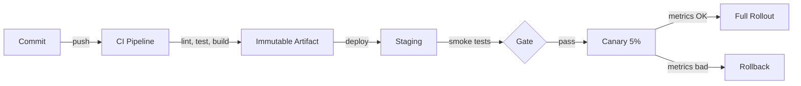

# CI/CD and DevOps

## Chapter Goal

After reading this chapter, an experienced engineer can design a
CI/CD pipeline with quality gates, automated security checks, and
reliable deployment strategies. The reader will be able to choose
between blue/green, canary, and rolling deployments, explain the
trade-offs of trunk-based development versus GitFlow, apply
Infrastructure as Code with state management and drift detection,
manage secrets in pipelines without long-lived credentials, and
defend pipeline architecture decisions in a Tech Lead interview.

## Why This Matters for a Tech Lead

A Tech Lead is judged by delivery throughput and release confidence.
Both are downstream of the pipeline:

- **Velocity is a pipeline problem.** A team cannot ship daily if the
  pipeline takes 45 minutes and breaks on flaky tests. A Tech Lead
  who cannot diagnose and fix pipeline bottlenecks is a bottleneck
  themselves.
- **Change failure rate is a pipeline problem.** A pipeline without
  security scanning, type checking, and integration tests lets
  defects through. The Tech Lead owns the quality gates — what runs,
  in what order, and what blocks the merge.
- **Rollback speed is a pipeline problem.** When a deployment breaks
  production, the Tech Lead must answer "how fast can we roll back?"
  If the answer is "redeploy from scratch in 20 minutes," the
  blast radius is 20 minutes of customer impact.
- **Cost compounds.** A pipeline that runs 200 times per day on
  expensive runners adds up. A Tech Lead who ignores pipeline cost
  discovers a $5,000/month CI bill at quarter-end.
- **Compliance requires auditability.** Regulated environments
  require proof that every production deployment passed specific
  gates. The pipeline is that proof — if it is designed correctly.
- **The hiring signal is strong.** An interviewer can assess pipeline
  maturity in 3 minutes by asking about deployment frequency, rollback
  procedure, and secret management. Shallow answers reveal a candidate
  who has used CI/CD but never designed or owned it.

## Mental Model

Think of CI/CD as a **contract between the team and production**.
Every commit proposes a change. The pipeline evaluates that proposal
against a set of automated checks — compilation, tests, linting,
type checking, security scanning, integration tests — and either
accepts or rejects it. If accepted, the pipeline produces an
immutable artifact and delivers it to production through a controlled
deployment strategy.

The key insight: the pipeline is not a script that runs after a
merge. It is a **quality gate that runs before the merge** (CI) and
a **delivery mechanism that runs after the merge** (CD). The faster
and more honest the pipeline, the safer it is to ship.



Notice the separation between CI (which produces the artifact) and
CD (which delivers it to environments). The artifact is built once
and promoted — never rebuilt per environment. The canary stage
provides a safety net: if metrics degrade, the deployment stops
before reaching all users.

## Core Terminology

| Term | Definition |
| --- | --- |
| **Continuous Integration (CI)** | The practice of merging code into the main branch frequently (at least daily) and verifying each merge with automated builds and tests. |
| **Continuous Delivery (CD)** | Extending CI so that the software is always in a releasable state. Every commit that passes the pipeline *can* be deployed to production, but deployment requires a manual trigger. |
| **Continuous Deployment** | Extending Continuous Delivery so that every commit that passes the pipeline is *automatically* deployed to production without human intervention. |
| **Pipeline** | An ordered sequence of stages (build, test, scan, deploy) that a code change passes through. Each stage must pass before the next begins. |
| **Build artifact** | The output of the build stage: a Docker image, a compiled binary, a bundled archive. Artifacts are immutable and versioned. |
| **Immutable infrastructure** | Infrastructure that is replaced rather than modified. A new deployment creates new instances from a new image rather than patching running instances. |
| **Infrastructure as Code (IaC)** | Managing infrastructure through version-controlled configuration files (Terraform, CloudFormation, Pulumi) rather than manual changes. |
| **GitOps** | A pull-based deployment model where a Git repository is the source of truth for infrastructure state. An agent (Argo CD, Flux) reconciles the cluster to match the repository. |
| **Blue/green deployment** | Running two identical environments (blue and green). Deploy to the idle environment, switch traffic after validation. Rollback by switching back. |
| **Canary deployment** | Routing a small percentage of traffic (1-5%) to the new version. Monitor metrics. Gradually increase if healthy; roll back if not. |
| **Rolling deployment** | Replacing instances incrementally. New instances come up while old instances are drained. No duplicate environment needed. |
| **Feature flag** | A runtime toggle that enables or disables a feature without a deployment. Decouples deployment (code in production) from release (feature visible to users). |
| **DORA metrics** | Four metrics from the DevOps Research and Assessment program: deployment frequency, lead time for changes, change failure rate, and mean time to recovery (MTTR). |
| **Change failure rate** | The percentage of deployments that cause a failure in production requiring remediation (rollback, hotfix, patch). |
| **Lead time for changes** | The time from code commit to code running in production. Measures pipeline and process efficiency. |

**Key distinctions:**

- **Continuous Delivery vs Continuous Deployment:** Delivery means
  every commit is *deployable*; deployment means every commit is
  *deployed*. The difference is the manual approval gate. Most
  regulated environments use Delivery, not Deployment.
- **Blue/green vs canary:** Blue/green is all-or-nothing traffic
  switching (zero to 100%). Canary is gradual (1% to 5% to 25% to
  100%). Blue/green is simpler but has a larger blast radius on
  switch. Canary is safer but requires traffic-splitting
  infrastructure.
- **Feature flag vs canary:** A canary routes a percentage of *all*
  traffic to the new version. A feature flag targets *specific users
  or segments* regardless of which version they hit. They solve
  different problems and are often used together.

## Theoretical Foundation

### CI: what it means and why it exists

Continuous Integration is the practice of integrating code changes
into a shared branch frequently — at least once per day — and
verifying each integration with automated builds and tests. The term
was coined in the context of Extreme Programming and formalized by
Martin Fowler and Kent Beck.

**Why it exists:** Without CI, developers work in isolation on
long-lived branches. When they merge, the integration pain is
proportional to the divergence time. A two-week branch accumulates
conflicts, behavioral regressions, and assumptions about code that
has changed underneath. CI eliminates this by making integration
continuous — the pain is small and frequent instead of large and
infrequent.

**The CI contract:**

1. Every push triggers a build and test run.
2. If the build breaks, the team stops and fixes it before adding
   more changes.
3. The build must be fast enough that developers get feedback within
   minutes, not hours.
4. Tests must be reliable. A flaky test that fails randomly is worse
   than no test — it teaches the team to ignore failures.

**What CI verifies (quality gates):**

| Gate | What it checks | Typical tool |
| --- | --- | --- |
| **Lint** | Code style, formatting, static analysis | ESLint, Prettier, Ruff, golangci-lint |
| **Typecheck** | Type correctness | TypeScript compiler, mypy, pyright |
| **Unit tests** | Individual function behavior | Jest, pytest, Go test |
| **Integration tests** | Component interaction, database, APIs | Testcontainers, Playwright, Cypress |
| **Build** | Compilation, bundling, Docker image creation | tsc, webpack, Docker build |
| **Security scan** | Dependency vulnerabilities, image CVEs | Trivy, Snyk, npm audit, Dependabot |

**Common mistake:** Running only unit tests in CI. Unit tests verify
individual functions but miss integration issues — a service that
passes all unit tests but cannot connect to the database is not
deployable. Include at least one integration test that exercises the
critical path end-to-end.

**Tech Lead perspective:** The Tech Lead owns the CI gate
configuration. Every gate added slows the pipeline; every gate
removed risks defects in production. The right balance depends on the
team's maturity, the blast radius of a failure, and the deployment
frequency target. A 10-minute pipeline with lint, typecheck, unit
tests, integration tests, and security scan is a reasonable baseline
for a backend service.

### CD: delivery vs deployment

**Continuous Delivery** means that every commit that passes CI is in
a deployable state. A human decides when to push the button.
Continuous Delivery requires:

1. Automated testing sufficient to be confident in the artifact.
2. Automated infrastructure provisioning (IaC).
3. Automated deployment scripts.
4. A staging environment that mirrors production.

**Continuous Deployment** removes the human from the deployment
decision. Every commit that passes CI is automatically deployed to
production. This requires:

1. Everything Continuous Delivery requires, plus:
2. Automated canary or progressive rollout.
3. Automated rollback based on metrics.
4. High confidence in the test suite (because there is no human
   review before production).

**When to use each:**

| Strategy | Best for | Requires |
| --- | --- | --- |
| **Continuous Delivery** | Regulated environments, teams building confidence, B2B with release schedules | Manual approval gate, staging validation |
| **Continuous Deployment** | SaaS products with fast iteration, mature test suites, strong observability | Automated canary, metrics-based rollback, feature flags |

**Interview framing:** "We practice Continuous Delivery — every
commit that passes our pipeline is deployable, and we deploy to
production 3-5 times per day with a manual trigger after staging
validation. We are working toward Continuous Deployment by
adding automated canary analysis, but we need to improve our
integration test coverage first."

### Pipeline design

A well-designed pipeline has these properties:

1. **Fast feedback:** The stages most likely to fail (lint, typecheck,
   unit tests) run first. Expensive stages (integration tests,
   security scan, Docker build) run later.
2. **Parallelism:** Independent stages run concurrently. Lint,
   typecheck, and unit tests can run in parallel because they do not
   depend on each other.
3. **Caching:** Dependencies (node_modules, Go modules, pip packages)
   are cached between runs. Docker layers are cached. Build outputs
   are cached.
4. **Immutable artifacts:** The build stage produces one artifact
   (Docker image, binary, bundle). That artifact is promoted through
   environments — staging, canary, production. It is never rebuilt.
5. **Environment parity:** Staging mirrors production in
   configuration, data shape, and infrastructure. Differences
   between staging and production are documented and minimized.

**Pipeline stage ordering:**

```text
┌─────────────────── CI ───────────────────┐  ┌──── CD ────┐
│                                          │  │            │
│  lint ─┐                                 │  │            │
│        ├─→ build ─→ integration ─→ scan ─┼──┼─→ staging  │
│  type ─┘    │       tests          │     │  │     │      │
│  unit ─────→┘                      │     │  │  canary    │
│                                    │     │  │     │      │
│                              artifact    │  │  rollout   │
│                              push        │  │            │
└──────────────────────────────────────────┘  └────────────┘
```

Pipeline stages are ordered for fast feedback: lint, typecheck, and
unit tests run first and in parallel. Build runs next. Integration
tests and security scans run after the artifact is built. If all
gates pass, the artifact is pushed to the registry and CD takes over.

**Caching strategy:**

Cache aggressively but invalidate correctly. The most common caching
targets:

- **Dependency cache:** Hash the lock file (package-lock.json,
  go.sum, requirements.txt) as the cache key. When the lock file
  changes, the cache is invalidated.
- **Docker layer cache:** Use multi-stage builds and order Dockerfile
  instructions from least-frequently-changed (base image, system
  deps) to most-frequently-changed (application code).
- **Build cache:** For compiled languages, cache the build output
  directory. For bundlers (webpack, esbuild), cache the output
  directory.

**Common mistake:** Caching test results. Test results must not be
cached because the same code can behave differently when dependencies
or infrastructure change. Cache dependencies, not outcomes.

### Build reproducibility and hermetic builds

A **reproducible build** produces the same artifact from the same
source inputs regardless of when or where it runs. A **hermetic
build** goes further: it isolates the build from the host environment
so it cannot be affected by host-level state (installed packages,
network access, environment variables).

**Why it matters:** If the same commit produces different artifacts
on different machines, debugging production issues becomes
impossible. "It works on my machine" is the symptom of
non-reproducible builds.

**How to achieve reproducibility:**

1. **Pin dependencies.** Use lock files (package-lock.json, go.sum,
   poetry.lock). Never use floating version ranges in CI.
2. **Pin base images.** Use digest-pinned Docker base images
   (`node:20-slim@sha256:...`) rather than mutable tags
   (`node:latest`).
3. **Pin tool versions.** Pin the CI runner image, Terraform
   version, linter version, and formatter version.
4. **Minimize network access during build.** Pre-download
   dependencies in a separate stage. Build stages should read from
   the local cache, not from the network.

### Artifacts and versioning

A **build artifact** is the output of the CI pipeline: a Docker
image, a compiled binary, a static bundle, or a deployment package.
Artifacts must be:

1. **Immutable.** Once built, an artifact is never modified. A new
   change produces a new artifact.
2. **Versioned.** Each artifact has a unique identifier — typically
   the Git commit SHA or a semantic version tag.
3. **Stored in a registry.** Docker images go to a container registry
   (ECR, GCR, Docker Hub). Binaries go to an artifact store (S3,
   Artifactory, GitHub Packages).

**Tagging strategy:**

- Use the Git commit SHA as the primary tag: `orders-api:a1b2c3d`.
- Add a semantic version tag for releases: `orders-api:2.4.1`.
- Never use `latest` as the production tag — it is ambiguous and
  non-deterministic.

**Semantic versioning (SemVer):**

```text
MAJOR.MINOR.PATCH
  │     │     └── Bug fixes, no API change
  │     └──────── New features, backward compatible
  └────────────── Breaking changes
```

SemVer applies to libraries and APIs, not to application deployments.
A web application deploying 5 times per day does not need SemVer —
commit SHA tags are sufficient. SemVer matters when consumers depend
on the artifact (an npm package, a shared library, a public API).

**Common mistake:** Using SemVer for application deployments and
spending time debating whether a change is "minor" or "patch." For
applications, tag with the commit SHA and record the version mapping
in a deployment log.

### Environments: dev, staging, production

Environments serve different purposes and should be configured
accordingly:

| Environment | Purpose | Data | Traffic | Approvals |
| --- | --- | --- | --- | --- |
| **Development** | Local or shared dev work | Synthetic or seeded | Developer only | None |
| **Staging** | Pre-production validation | Anonymized production subset | Internal team | Automated (CI pass) |
| **Production** | Live customer traffic | Real | External users | Manual or canary |

**Environment parity:** The gap between staging and production is
where bugs hide. Common parity failures:

- Staging uses a single-AZ database; production uses Multi-AZ.
- Staging has no rate limiting; production does.
- Staging uses a different IAM role with broader permissions.
- Staging data does not reflect production data shapes or volumes.

**Tech Lead perspective:** A Tech Lead enforces environment parity
as a policy. The staging environment should be provisioned from the
same IaC modules as production, with only the scaling parameters
changed (fewer instances, smaller database). Configuration
differences between environments should be limited to a small,
auditable set of environment variables.

### Branching strategies

#### Trunk-based development

All developers commit directly to the main branch (or merge
short-lived feature branches within 1-2 days). The main branch is
always deployable.

**How it works:**

1. Developer creates a branch from main.
2. Work is completed in 1-2 days (small, incremental changes).
3. Branch is merged to main after code review and CI.
4. Incomplete features are hidden behind feature flags.
5. Main is deployed to production multiple times per day.

**Optimizes for:** Fast feedback, small diffs, continuous
integration, high deployment frequency.

**Sacrifices:** Requires discipline around feature flags and small
changes. Difficult for teams that cannot review and merge within
1-2 days.

**Flips when:** The team is large enough that main breaks frequently
from concurrent merges, or the release process requires a formal
stabilization period.

#### GitFlow

A branching model with long-lived branches: main, develop, feature
branches, release branches, and hotfix branches.

**How it works:**

1. `develop` is the integration branch.
2. Feature branches are created from `develop` and merged back.
3. A `release` branch is cut from `develop` for stabilization.
4. `main` always reflects the latest production release.
5. Hotfix branches are created from `main` for emergency fixes.

**Optimizes for:** Formal release cycles, parallel development of
multiple features, clear separation between in-progress and released
code.

**Sacrifices:** Integration frequency (merges to develop can be
delayed), deployment speed (release branches add stabilization
time), and operational complexity (multiple long-lived branches
to maintain).

**Flips when:** The team ships continuously and does not need formal
release cycles. GitFlow adds overhead without benefit for teams
deploying multiple times per day.

#### Feature branches

Feature branches are short-lived or long-lived branches created for
individual features. They are merged to main (or develop) when
complete.

**The critical rule:** Feature branches must be short-lived (1-3
days). A feature branch that lives for 2 weeks accumulates merge
conflicts and becomes a mini-waterfall project within an agile team.

Branching strategies compared:

| Strategy | **Trunk-based** | **GitFlow** | **Feature branches (long-lived)** |
| --- | --- | --- | --- |
| Branch lifespan | Hours to 1-2 days | Weeks (feature), days (release) | Days to weeks |
| Deploy frequency | Multiple times/day | Per release cycle | When feature is done |
| Merge conflict risk | Low | Medium to high | High |
| Feature flags needed | Yes (for incomplete work) | No (code on develop) | No |
| Best for | SaaS, high-velocity teams | Packaged software, formal releases | Small teams, isolated features |

### Release strategy

A release strategy defines how code moves from "merged to main" to
"running in production." The strategy depends on the deployment
frequency, the blast radius tolerance, and the team's ability to
monitor and roll back.

**Release types:**

1. **Time-based releases.** Deploy every Tuesday at 2 PM. Predictable
   but artificially constrains throughput. Appropriate for teams with
   external coordination requirements (marketing launches, partner
   integrations).
2. **Continuous releases.** Deploy every commit that passes the
   pipeline. Maximum throughput. Requires strong automation and
   monitoring.
3. **Feature-driven releases.** Deploy when a specific feature is
   complete. Common in product-led organizations but creates batching
   risk — the longer the wait, the larger the change set, the higher
   the failure risk.

**Release coordination:**

- **Change advisory board (CAB):** A formal review process for
  production changes. Common in regulated environments. The Tech Lead
  should push for automated CAB criteria (pipeline pass, security
  scan, staging validation) rather than manual review meetings.
- **Deploy freezes:** Periods where production deployments are
  prohibited (holidays, major events). Define the freeze window
  explicitly, including the exception process for critical fixes.
- **On-call coordination:** The deploying engineer should be
  available to monitor the deployment. Never deploy and leave for the
  day. In interview context: "We deploy during business hours when
  the team is available to monitor. We never deploy on Friday
  afternoon."

### Deployment strategies

#### Blue/green deployment

Two identical environments exist: blue (current production) and green
(new version). Deploy the new version to green, run validation, then
switch traffic from blue to green.

```text
Before switch:
  Users ──→ Load Balancer ──→ Blue (v1.2) ← active
                               Green (v1.3) ← idle, validated

After switch:
  Users ──→ Load Balancer ──→ Green (v1.3) ← active
                               Blue (v1.2) ← standby for rollback
```

**Rollback:** Switch the load balancer back to blue. Rollback time:
seconds (DNS/LB configuration change).

**Trade-off:** Requires double the infrastructure during the
deployment window. For large services, this doubles cost temporarily.
The benefit is instant rollback with zero downtime.

**When to use:** Database-compatible releases (no schema changes that
break the old version), services where instant rollback is critical,
and environments where canary infrastructure is not available.

**When to avoid:** Services with persistent connections (WebSockets)
that cannot be drained gracefully. Services with database schema
changes that are not backward-compatible with both versions.

#### Canary deployment

Route a small percentage of traffic (1-5%) to the new version.
Monitor error rates, latency, and business metrics. Gradually
increase the percentage if metrics remain healthy.

```text
Phase 1:  95% ──→ v1.2    5% ──→ v1.3 (canary)
Phase 2:  75% ──→ v1.2   25% ──→ v1.3
Phase 3:  50% ──→ v1.2   50% ──→ v1.3
Phase 4:   0% ──→ v1.2  100% ──→ v1.3 (full rollout)
```

**Rollback:** Route 100% back to v1.2. If automated, rollback
triggers when error rate exceeds a threshold (e.g., p99 latency
> 500ms or error rate > 0.5%).

**Trade-off:** Requires traffic-splitting infrastructure (load
balancer weighted routing, service mesh, or Kubernetes ingress
controller). More complex to set up than blue/green, but smaller
blast radius — only 5% of users are affected during the initial
phase.

**When to use:** High-traffic services where a full switchover is
too risky. Services with good observability (metrics, tracing,
alerting) to detect regressions quickly.

#### Rolling deployment

Replace instances one at a time (or in small batches). Each batch
is drained, terminated, and replaced with instances running the
new version.

**Trade-off:** No duplicate environment needed (cheaper than
blue/green). But during the rollout, both versions run
simultaneously, which requires backward-compatible APIs and database
schemas. Rollback requires redeploying the old version (slower than
blue/green switchback).

**When to use:** Stateless services behind a load balancer where
backward compatibility is maintained. The default strategy for ECS
and Kubernetes Deployments.

#### Feature flags and dark launches

Feature flags decouple deployment from release. Code is deployed to
production but the feature is hidden behind a flag. The flag is
enabled for specific users, percentages, or segments.

**Why this matters:** A team can deploy incomplete features to
production without exposing them to users. This enables trunk-based
development (no long-lived feature branches) and gradual rollouts.

**Trade-off:** Feature flags add code complexity. Every flag creates
a conditional branch in the code. Old flags that are never cleaned
up accumulate into technical debt. Establish a policy: every flag
has an expiration date and an owner. Remove the flag within 2 weeks
of full rollout.

**When to use with canary:** Deploy the new version to all instances
(no traffic splitting needed). Enable the feature flag for 5% of
users. Monitor. Increase to 100%. This avoids the infrastructure
complexity of canary routing at the load balancer level.

### Rollback

Rollback is the ability to revert a deployment to the previous known-
good version. A Tech Lead must answer "how fast can we roll back?"
for every service.

**Rollback strategies by deployment type:**

| Deployment | Rollback mechanism | Rollback time |
| --- | --- | --- |
| **Blue/green** | Switch LB back to previous environment | Seconds |
| **Canary** | Route 100% back to previous version | Seconds |
| **Rolling (ECS/K8s)** | Redeploy previous task definition / revision | 2-5 minutes |
| **IaC (Terraform)** | Revert the commit, re-apply | 5-15 minutes |
| **Database migration** | Run reverse migration script (if written) | 5-30 minutes |
| **Feature flag** | Disable the flag | Seconds |

**The rollback rule:** If a rollback takes longer than 15 minutes,
the deployment strategy needs improvement. Anything longer than 15
minutes means 15 minutes of customer impact, which compounds with
every additional failure.

**Database rollback complexity:** Database schema changes are the
hardest to roll back. A column rename, a dropped table, or a
changed data type cannot be reversed by redeploying old code. Use
the **expand-contract pattern:** first add the new column (expand),
migrate data, deploy code that uses the new column, then remove the
old column (contract). Each step is independently reversible.

### Infrastructure as Code

Infrastructure as Code (IaC) means managing infrastructure through
version-controlled configuration files rather than manual console
changes or ad-hoc scripts.

**Why IaC exists:** Manual infrastructure changes are
unreproducible, unauditable, and unrollbackable. "I changed the
security group in the console" cannot be code-reviewed, tested, or
reverted. IaC makes infrastructure changes go through the same
pipeline as application code: branch, review, merge, apply.

**IaC tools compared:**

| Dimension | **Terraform** | **CloudFormation** | **Pulumi** | **CDK** |
| --- | --- | --- | --- | --- |
| Language | HCL | YAML/JSON | TypeScript, Python, Go | TypeScript, Python |
| State management | Remote state (S3 + DynamoDB lock) | AWS-managed | Pulumi Cloud or S3 | AWS-managed (via CFN) |
| Multi-cloud | Yes | AWS only | Yes | AWS only |
| Drift detection | `terraform plan` | Drift detection API | `pulumi preview` | CFN drift detection |
| Learning curve | Moderate (HCL syntax) | Low (if AWS-only) | Low (familiar languages) | Low (familiar languages) |

**State management:** Terraform and Pulumi maintain a state file
that records the current state of infrastructure. The state file
must be stored remotely (S3 with DynamoDB locking for Terraform) to
enable team collaboration and prevent concurrent modifications.

**Drift detection:** Infrastructure drift occurs when the actual
state diverges from the IaC definition — someone made a manual
console change. `terraform plan` compares the state file to the
actual infrastructure and shows the diff. Run `terraform plan` in CI
on a schedule (daily) to detect drift, not only when changes are
submitted.

**Common mistake:** Applying IaC changes outside the pipeline. If
an engineer runs `terraform apply` from their laptop, the state
file updates but the Git repository does not reflect the change.
Enforce a policy: all IaC changes go through the pipeline. No local
applies to production.

**GitOps model:**

GitOps is a pull-based deployment model where a Git repository
contains the desired state of infrastructure and an agent running in
the cluster continuously reconciles the actual state to match. Argo
CD and Flux are the most common GitOps agents for Kubernetes.

**GitOps vs push-based deployment:**

| Dimension | **Push-based (CI deploys)** | **Pull-based (GitOps)** |
| --- | --- | --- |
| Deployment trigger | CI pipeline pushes changes to the cluster | Agent in the cluster pulls changes from Git |
| Credentials | CI needs cluster credentials | Agent has cluster credentials; CI does not |
| Security model | CI is a privileged actor | CI has no direct cluster access |
| Drift correction | Manual (re-run pipeline) | Automatic (agent reconciles) |
| Best for | Small teams, simple setups | Kubernetes-native teams, multi-cluster |

### Secrets in CI/CD

Secrets in CI/CD pipelines (API keys, database passwords, cloud
credentials) are a high-value target. A leaked CI secret often
grants access to production infrastructure.

**The principle:** Minimize the lifetime and scope of every secret.

**Secret management strategies:**

1. **OIDC federation (preferred).** The CI runner authenticates to
   the cloud provider using OpenID Connect tokens. No long-lived
   credentials are stored. GitHub Actions, GitLab CI, and CircleCI
   support OIDC for AWS, GCP, and Azure.

2. **Short-lived tokens.** If OIDC is not available, generate
   short-lived tokens (e.g., AWS STS assume-role) scoped to the
   specific pipeline run.

3. **Encrypted secrets in CI settings.** GitHub Actions secrets,
   GitLab CI variables (masked and protected). These are encrypted at
   rest but available to any workflow that runs on the repository.

4. **Vault integration.** HashiCorp Vault or AWS Secrets Manager for
   dynamic secrets that are generated per pipeline run and revoked
   after completion.

**Common mistakes:**

- Hardcoding secrets in pipeline YAML files (visible in Git history).
- Using a single "deploy" service account with broad permissions for
  all pipelines.
- Not rotating secrets after a pipeline runner is compromised.
- Printing secrets in CI logs (even masked secrets can sometimes be
  reconstructed from partial output).

**Tech Lead policy:** Every CI secret must have: (1) an owner, (2) a
rotation schedule, (3) minimal scope (least privilege), and (4) an
audit log of when it was accessed.

### Docker image scanning

Docker image scanning analyzes container images for known
vulnerabilities (CVEs) in base images and installed packages.

**Tools:** Trivy, Snyk Container, Anchore Grype, Amazon ECR image
scanning, and GitHub container scanning.

**When to scan:**

1. **At build time (CI).** Scan the image immediately after building
   it. Fail the pipeline if critical or high-severity CVEs are found.
2. **In the registry (continuous).** Scan images already stored in
   the registry on a schedule. New CVEs are discovered daily — an
   image that was clean yesterday may have critical CVEs today.
3. **At deploy time (admission control).** In Kubernetes, use
   admission controllers to block deployment of images with
   unresolved critical CVEs.

**Common mistake:** Scanning images but never fixing the findings.
A scan that reports 47 critical CVEs and is ignored is worse than no
scan — it teaches the team that security findings are noise.
Establish a policy: critical CVEs block the pipeline; high CVEs must
be resolved within 7 days; medium and low are tracked.

### Dependency scanning

Dependency scanning checks application dependencies (npm packages,
Python packages, Go modules) for known vulnerabilities.

**Tools:** Dependabot (GitHub), Renovate, npm audit, pip-audit,
`go vet`, Snyk Open Source.

**When to scan:**

1. **On every CI run.** Run `npm audit` or equivalent as a pipeline
   stage. Fail on critical vulnerabilities.
2. **On a schedule.** Dependabot or Renovate opens pull requests
   when new vulnerability fixes are available.
3. **At merge time.** Block merges that introduce new vulnerable
   dependencies.

**Supply chain considerations:** Dependency scanning checks known
CVEs but does not protect against supply chain attacks (malicious
packages, typosquatting). For high-security environments, consider
pinning to known-good package hashes and using a private registry
that mirrors only approved packages.

### Deployment approvals

Deployment approvals are manual or automated gates that must pass
before a deployment proceeds to production.

**Types of approvals:**

| Approval | When | Who | Automated? |
| --- | --- | --- | --- |
| **Code review** | Before merge | Peer engineer | No (human judgment) |
| **CI pipeline pass** | Before merge | CI system | Yes |
| **Security scan pass** | Before deploy | CI system | Yes |
| **Staging validation** | Before production deploy | QA or automated smoke tests | Partially |
| **Manual approval** | Before production deploy | Tech Lead or release manager | No |
| **Change advisory board** | Before major changes | CAB members | No |

**Tech Lead perspective:** Push for automated approvals wherever
possible. A manual approval that always says "yes" is ceremony, not
a gate. Convert it to an automated check. Reserve manual approvals
for changes that genuinely require human judgment: database
migrations, infrastructure changes that affect multiple teams, and
changes during deploy freezes.

### DORA metrics

The DevOps Research and Assessment (DORA) program identified four
key metrics that predict software delivery performance:

| Metric | **Elite** | **High** | **Medium** | **Low** |
| --- | --- | --- | --- | --- |
| **Deployment frequency** | On-demand (multiple/day) | Weekly to monthly | Monthly to semi-annually | Semi-annually or less |
| **Lead time for changes** | < 1 hour | 1 day to 1 week | 1 month to 6 months | > 6 months |
| **Change failure rate** | 0-15% | 16-30% | 16-30% | > 30% |
| **MTTR** | < 1 hour | < 1 day | 1 day to 1 week | > 6 months |

> Verify DORA metric thresholds against the latest State of DevOps
> Report. These thresholds are updated periodically.

**How to measure:**

- **Deployment frequency:** Count production deployments per day/week.
  Source: deployment log or CD tool.
- **Lead time:** Measure from first commit on a branch to production
  deployment. Source: Git timestamps + deployment timestamps.
- **Change failure rate:** Count deployments that required rollback,
  hotfix, or incident response, divided by total deployments.
  Source: incident tracker + deployment log.
- **MTTR:** Measure from incident detection to resolution. Source:
  incident management system.

**Tech Lead perspective:** Track DORA metrics weekly. Use them to
identify systemic issues: a high change failure rate suggests
insufficient testing; a long lead time suggests pipeline
bottlenecks or slow code review. Do not use DORA metrics to compare
individuals — they measure team and system performance, not
individual productivity.

## Practical Usage

### Standard pipeline shape

Most production pipelines follow this shape, with variations per
team and technology:

```text
┌────────────────────────────────────────────────────────────┐
│ 1. Checkout                                                │
│ 2. Install dependencies (cached)                           │
│ 3. Parallel:                                               │
│    ├── Lint + format check                                  │
│    ├── Type check                                           │
│    └── Unit tests                                           │
│ 4. Build artifact (Docker image or binary)                 │
│ 5. Integration tests (against real services or containers) │
│ 6. Security scan (dependencies + image)                    │
│ 7. Push artifact to registry                               │
│ 8. Deploy to staging                                       │
│ 9. Smoke tests on staging                                  │
│ 10. Deploy to production (canary → full rollout)           │
└────────────────────────────────────────────────────────────┘
```

Steps 1-7 are CI. Steps 8-10 are CD. The artifact built in step 4
is the same artifact deployed in steps 8 and 10 — it is never
rebuilt.

### Monorepo CI vs polyrepo CI

Monorepo and polyrepo CI strategies differ in how they determine
what to build and test:

| Dimension | **Monorepo** | **Polyrepo** |
| --- | --- | --- |
| Change detection | Path-based filtering (only build what changed) | Every push triggers the full pipeline |
| Shared dependencies | Must rebuild downstream consumers when shared code changes | Each repo manages its own dependencies |
| Pipeline complexity | Higher (affected-package detection, caching per package) | Lower (one pipeline per repo) |
| Cross-service testing | Possible in one CI run | Requires cross-repo triggers or a separate integration pipeline |
| CI runner resource | Higher (larger workspace, more build steps) | Lower per run (smaller workspace) |

**Monorepo CI tools:** Nx, Turborepo, Bazel, and Pants provide
affected-project detection and task caching. Without these tools,
a monorepo CI pipeline that builds everything on every commit is
wasteful and slow.

**Tech Lead decision:** Choose monorepo when the team shares
significant code (libraries, types, protocols) and deploys services
that must be compatible at all times. Choose polyrepo when teams
are autonomous, services communicate through versioned APIs, and
independent deployment cadence is more important than shared code.
See [Software Architecture](./14-software-architecture.md) for
service boundary patterns.

### Pipeline for a regulated environment

In regulated environments (finance, healthcare, government), the
pipeline must produce audit evidence:

1. Every deployment is traceable to a specific commit, artifact, and
   pipeline run.
2. Every artifact has a signed provenance record (who built it, from
   what source, with what tools).
3. Security scans are recorded and retained.
4. Manual approvals are logged with the approver identity and
   timestamp.
5. Deployment logs are retained for the compliance retention period
   (typically 1-7 years).

**Tech Lead perspective:** Automate compliance evidence generation
in the pipeline. A pipeline that produces a signed SBOM (Software
Bill of Materials), a vulnerability scan report, and a deployment
manifest with approver identity satisfies most audit requirements
without manual paperwork.

## Examples

### GitHub Actions CI pipeline

```yaml
name: CI
on:
  push:
    branches: [main]
  pull_request:
    branches: [main]

jobs:
  quality:
    runs-on: ubuntu-latest
    strategy:
      matrix:
        check: [lint, typecheck, test]
    steps:
      - uses: actions/checkout@v4
      - uses: actions/setup-node@v4
        with:
          node-version: 20
          cache: npm
      - run: npm ci
      - run: npm run ${{ matrix.check }}

  build:
    needs: quality
    runs-on: ubuntu-latest
    permissions:
      id-token: write
      contents: read
    steps:
      - uses: actions/checkout@v4
      - uses: aws-actions/configure-aws-credentials@v4
        with:
          role-to-assume: arn:aws:iam::123456789012:role/ci-deploy
          aws-region: us-east-1
      - uses: aws-actions/amazon-ecr-login@v2
      - run: |
          docker build -t $ECR_REGISTRY/orders-api:${{ github.sha }} .
          docker push $ECR_REGISTRY/orders-api:${{ github.sha }}
```

**What this does:** Runs lint, typecheck, and unit tests in parallel
using a matrix strategy. If all three pass, it builds a Docker
image tagged with the commit SHA and pushes it to ECR. AWS
credentials use OIDC federation (`id-token: write` permission) —
no long-lived access keys.

**Why it is written this way:** The matrix strategy runs three jobs
concurrently on separate runners, cutting wall-clock time by ~60%
compared to running them sequentially. The build job depends on the
quality jobs (`needs: quality`), so the Docker image is only built
if all quality gates pass.

**What a weaker alternative would be:** Running lint, typecheck,
and tests sequentially in a single job. Using long-lived AWS access
keys stored as repository secrets instead of OIDC. Tagging the
image as `latest` instead of the commit SHA.

**How it would change in production:** Add integration tests after
the build step. Add Trivy image scanning before pushing to ECR. Add
a CD workflow that deploys to staging and then production with
canary rollout.

### GitLab CI pipeline

```yaml
stages:
  - quality
  - build
  - deploy

variables:
  DOCKER_IMAGE: $CI_REGISTRY_IMAGE/orders-api:$CI_COMMIT_SHA

lint:
  stage: quality
  script: npm run lint

typecheck:
  stage: quality
  script: npm run typecheck

test:
  stage: quality
  script: npm run test -- --coverage
  coverage: '/Lines\s*:\s*(\d+\.?\d*)%/'

build:
  stage: build
  image: docker:24
  services:
    - docker:24-dind
  script:
    - docker build -t $DOCKER_IMAGE .
    - docker push $DOCKER_IMAGE

deploy-staging:
  stage: deploy
  environment: staging
  script:
    - ./scripts/deploy.sh staging $CI_COMMIT_SHA
  only:
    - main

deploy-production:
  stage: deploy
  environment: production
  when: manual
  script:
    - ./scripts/deploy.sh production $CI_COMMIT_SHA
  only:
    - main
```

**What this does:** Three parallel quality jobs (lint, typecheck,
test) run first. If all pass, the build stage creates and pushes a
Docker image. Staging deploys automatically on main branch merges.
Production requires manual approval (`when: manual`).

**Why it is written this way:** The `stages` keyword defines the
execution order: all jobs in a stage run in parallel, and the next
stage starts only when all jobs in the previous stage pass. The
`when: manual` gate on production deployment implements Continuous
Delivery (not Continuous Deployment).

**What a weaker alternative would be:** Putting all quality checks
in a single job (sequential, slower). Deploying to production
automatically without manual approval. Using the CI/CD variables
UI for deployment scripts instead of versioned shell scripts.

**How it would change in production:** Add integration tests with
Docker Compose or Testcontainers. Add SAST/DAST scanning stages.
Add container image scanning with Trivy. Replace `manual` approval
with canary deployment and automated rollback.

### Terraform module with state management

```text
terraform {
  required_version = ">= 1.5"

  backend "s3" {
    bucket         = "mycompany-terraform-state"
    key            = "orders-api/terraform.tfstate"
    region         = "us-east-1"
    dynamodb_table = "terraform-locks"
    encrypt        = true
  }

  required_providers {
    aws = {
      source  = "hashicorp/aws"
      version = "~> 5.0"
    }
  }
}
```

**What this does:** Configures Terraform with remote state storage
in S3, DynamoDB-based locking to prevent concurrent modifications,
encryption at rest, and a pinned provider version.

**Why it is written this way:** Remote state enables team
collaboration (everyone reads from the same state). DynamoDB locking
prevents two engineers from running `terraform apply` simultaneously
and corrupting the state. Encrypting the state file protects
sensitive values (database passwords, API keys) that Terraform
stores in plaintext in the state.

**What a weaker alternative would be:** Using local state files
(cannot collaborate). Not using DynamoDB locking (race conditions).
Not encrypting state (secrets exposed). Using `latest` for the
provider version (non-reproducible).

**How it would change in production:** Add a `terraform plan`
output as a PR comment for review. Run `terraform apply` only from
the CI pipeline, never from a developer's laptop. Add drift
detection on a daily schedule.

### Canary deployment with automated rollback

```yaml
apiVersion: argoproj.io/v1alpha1
kind: Rollout
metadata:
  name: orders-api
spec:
  replicas: 10
  strategy:
    canary:
      steps:
        - setWeight: 5
        - pause: { duration: 5m }
        - setWeight: 25
        - pause: { duration: 5m }
        - setWeight: 50
        - pause: { duration: 10m }
        - setWeight: 100
      canaryMetrics:
        - name: error-rate
          provider:
            prometheus:
              query: |
                sum(rate(http_requests_total{status=~"5..",app="orders-api",version="canary"}[5m]))
                /
                sum(rate(http_requests_total{app="orders-api",version="canary"}[5m]))
          successCondition: result[0] < 0.01
          failureLimit: 2
```

> Verify Argo Rollouts CRD syntax against the current Argo Rollouts
> documentation. The API may change across versions.

**What this does:** Defines a canary rollout using Argo Rollouts. It
starts at 5% traffic, pauses for 5 minutes to collect metrics, then
progresses to 25%, 50%, and 100%. At each step, it queries
Prometheus for the error rate of the canary version. If the error
rate exceeds 1% more than twice, the rollout automatically reverts.

**Why it is written this way:** Automated canary analysis removes
human judgment from the rollout decision. The Prometheus query
checks the error rate specifically for the canary version (not the
overall service), which isolates canary-specific regressions.

**What a weaker alternative would be:** Manual canary — deploy to a
subset of instances and manually check dashboards. This depends on a
human noticing a regression, which fails during off-hours or when
the deployer is distracted.

**How it would change in production:** Add latency metrics (p99)
alongside error rate. Add business metrics (conversion rate, order
completion) for business-critical services. Extend pause durations
for services with bursty traffic patterns to ensure sufficient data.

### Dependency and container image scanning in CI

```yaml
scan-dependencies:
  stage: quality
  script:
    - npm audit --audit-level=critical
    - npx better-npm-audit audit --level critical
  allow_failure: false

scan-image:
  stage: build
  needs: [build]
  image:
    name: aquasec/trivy:latest
    entrypoint: [""]
  script:
    - trivy image
        --severity CRITICAL,HIGH
        --exit-code 1
        --ignore-unfixed
        --format table
        $DOCKER_IMAGE
```

**What this does:** Two separate scanning stages. The dependency
scan runs `npm audit` during the quality stage, failing the pipeline
on critical vulnerabilities. The image scan runs Trivy after the
Docker image is built, failing on critical and high severity CVEs.
`--ignore-unfixed` skips vulnerabilities without available patches —
blocking the pipeline on unfixable issues creates frustration without
improving security.

**Why it is useful:** Dependency scanning catches vulnerable packages
before they reach the image. Image scanning catches vulnerabilities
in the base image and system packages that `npm audit` does not see.
Together they cover the full dependency tree.

**Common mistake:** Running scans but setting `allow_failure: true`,
which means the pipeline passes regardless of findings. Another
mistake: scanning with `--severity CRITICAL` only — high-severity
CVEs are exploitable and should also block production deployments.

**How this changes in production:** Add scheduled scanning of images
already in the registry (new CVEs are discovered daily). Add a
suppression file (`.trivyignore`) for accepted risks with
documented justification. Add SBOM generation alongside the scan.

**What a Tech Lead should check before approving:** (1) Scan
actually blocks the pipeline on critical findings (`allow_failure:
false`). (2) Scan covers both dependencies and the container image.
(3) A triage policy exists for non-critical findings. (4) Scan runs
on every build, not on a weekly schedule.

### OIDC-based cloud credentials in GitHub Actions

```yaml
deploy:
  runs-on: ubuntu-latest
  permissions:
    id-token: write
    contents: read
  environment: production
  steps:
    - uses: aws-actions/configure-aws-credentials@v4
      with:
        role-to-assume: arn:aws:iam::123456789012:role/orders-api-deploy
        role-session-name: gha-deploy-${{ github.run_id }}
        aws-region: us-east-1

    - name: Deploy to ECS
      run: |
        aws ecs update-service \
          --cluster production \
          --service orders-api \
          --force-new-deployment \
          --task-definition orders-api:${{ github.sha }}
```

> Verify GitHub Actions OIDC configuration and
> `aws-actions/configure-aws-credentials` action syntax against
> current documentation. The action version and parameters may
> change.

**What this does:** The deploy job uses OIDC federation to obtain
temporary AWS credentials — no access keys stored anywhere. The
`id-token: write` permission allows the runner to request an OIDC
token. The `environment: production` setting requires environment-
level approval rules (configured in GitHub repository settings).
The session name includes the run ID for audit traceability.

**Why it is useful:** OIDC eliminates the most common CI security
vulnerability: long-lived credentials. The token is valid for 1
hour and scoped to a specific IAM role. If the runner is
compromised, the attacker gets a token that expires, not a
permanent key.

**Common mistake:** Using a single IAM role for all pipelines. The
deploy role should be scoped to the specific service (`orders-api`)
and the specific actions needed (`ecs:UpdateService`,
`ecs:DescribeServices`). Another mistake: not setting a session name
— without it, CloudTrail logs show "assumed-role" without context.

**How this changes in production:** Add condition keys on the IAM
trust policy to restrict which repository and branch can assume the
role (`token.actions.githubusercontent.com:sub` condition). Add the
`environment` protection rule to require manual approval for
production deployments.

**What a Tech Lead should check before approving:** (1) No long-
lived AWS access keys in repository secrets. (2) IAM role scoped to
the specific service, not `AdministratorAccess`. (3) OIDC trust
policy restricts to the specific repository and branch. (4) Session
name includes the run ID for auditability.

### Blue/green deployment flow

```text
Step 1: Deploy to green (idle)
  ┌─────────────┐        ┌─────────────┐
  │  ALB (100%) ─┼───────→│  Blue (v1.2)│  ← serving traffic
  │              │        └─────────────┘
  │              │        ┌─────────────┐
  │              │        │ Green (v1.3)│  ← deploying + validating
  └─────────────┘        └─────────────┘

Step 2: Run smoke tests against green (via direct URL)

Step 3: Switch ALB target group
  ┌─────────────┐        ┌─────────────┐
  │  ALB (100%) ─┼───────→│ Green (v1.3)│  ← serving traffic
  │              │        └─────────────┘
  │              │        ┌─────────────┐
  │              │        │  Blue (v1.2)│  ← standby (rollback)
  └─────────────┘        └─────────────┘

Step 4: Monitor for 30 minutes. If errors spike, switch back.
Step 5: After rollback window, decommission blue or reuse for next deploy.
```

```bash
#!/bin/bash
# blue-green-switch.sh — switch ALB target group

CLUSTER="production"
SERVICE="orders-api"
NEW_TG="arn:aws:elasticloadbalancing:...:targetgroup/green/..."

aws elbv2 modify-listener \
  --listener-arn "$LISTENER_ARN" \
  --default-actions "Type=forward,TargetGroupArn=$NEW_TG"

echo "Switched traffic to green. Monitoring for 30 minutes..."
sleep 1800

ERROR_RATE=$(aws cloudwatch get-metric-statistics \
  --namespace "AWS/ApplicationELB" \
  --metric-name "HTTPCode_Target_5XX_Count" \
  --dimensions "Name=TargetGroup,Value=$NEW_TG" \
  --start-time "$(date -u -d '30 minutes ago' +%Y-%m-%dT%H:%M:%S)" \
  --end-time "$(date -u +%Y-%m-%dT%H:%M:%S)" \
  --period 1800 --statistics Sum \
  --query 'Datapoints[0].Sum')

if [ "$ERROR_RATE" -gt 10 ]; then
  echo "ERROR: 5xx count $ERROR_RATE exceeds threshold. Rolling back."
  aws elbv2 modify-listener \
    --listener-arn "$LISTENER_ARN" \
    --default-actions "Type=forward,TargetGroupArn=$OLD_TG"
  exit 1
fi

echo "Green healthy. Deployment complete."
```

**What this does:** Deploys the new version to the idle environment
(green), validates it, then switches all ALB traffic in one
operation. After 30 minutes of monitoring, if the 5xx count exceeds
a threshold, the script switches traffic back to blue.

**Why it is useful:** Blue/green provides zero-downtime deployment
with instant rollback. The switch is a single API call that takes
effect in seconds. During the monitoring window, the old version
remains running and ready.

**Common mistake:** Destroying the blue environment immediately
after switching to green. This eliminates the rollback path. Keep
blue running for at least 24 hours after a successful deployment.

**How this changes in production:** Replace the sleep-and-check
approach with CloudWatch alarms that trigger automatic rollback.
Add connection draining on the old target group. Handle database
compatibility — both versions must work against the same schema
during the transition.

**What a Tech Lead should check before approving:** (1) Both
environments are provisioned from the same IaC with the same
configuration. (2) The rollback mechanism is tested regularly. (3)
Database migrations are backward-compatible (old version can run
against the new schema). (4) The monitoring window and rollback
threshold are defined, not ad-hoc.

### Rollback runbook

```text
RUNBOOK: Production Rollback — orders-api
═══════════════════════════════════════════

TRIGGER: Error rate > 1% for 5 minutes, OR p99 latency > 2s,
         OR customer-facing functionality degraded.

WHO CAN INITIATE: Any on-call engineer. No approval needed
                  for rollback.

STEPS:

1. CONFIRM the issue correlates with a recent deployment.
   → Check: deployment timestamp vs error onset in Grafana.
   → If no recent deployment, this is NOT a rollback situation.
     Escalate as a production incident instead.

2. ROLLBACK the deployment.
   → ECS:
     aws ecs update-service --cluster production \
       --service orders-api \
       --task-definition orders-api:<PREVIOUS_REVISION>
   → Kubernetes:
     kubectl rollout undo deployment/orders-api -n production
   → Feature flag:
     Disable flag "orders-new-checkout" in LaunchDarkly.

3. VERIFY the rollback resolved the issue.
   → Check error rate returns to baseline within 5 minutes.
   → Check health endpoint returns 200.
   → Check 3 manual user flows (create order, view order, cancel).

4. COMMUNICATE.
   → Post in #incidents: "Rolled back orders-api from v1.3 to
     v1.2 due to elevated 5xx errors. Investigating root cause."
   → Notify stakeholders within 30 minutes.

5. POST-INCIDENT (within 48 hours).
   → Write post-mortem: what failed, why tests missed it, what
     prevents recurrence.
   → File tickets for follow-up actions.

DO NOT:
  ✗ Attempt to fix forward under time pressure.
  ✗ Roll back without verifying the issue correlates with
    a deployment.
  ✗ Skip communication — stakeholders must know.
  ✗ Revert the Git commit — keep the code; fix it in a new PR.
```

**What this does:** Provides a step-by-step procedure for
production rollback. It defines the trigger criteria, who can
initiate (no approval needed for rollbacks), exact commands for
each deployment type, verification steps, and communication
requirements.

**Why it is useful:** Under incident pressure, engineers forget
steps, use the wrong commands, or skip communication. A runbook
eliminates decision-making during the incident. The "DO NOT"
section prevents the most common mistakes: fixing forward (too
slow), skipping communication (stakeholders learn from Twitter),
and reverting the Git commit (pollutes Git history unnecessarily).

**Common mistake:** Writing a runbook and never testing it.
Commands change, permissions expire, URLs move. Run through the
runbook in staging quarterly to verify every step works.

**How this changes in production:** Add service-specific sections
for services with database dependencies (verify migration
compatibility before rollback). Add escalation paths for rollbacks
that do not resolve the issue. Link to the monitoring dashboard
directly from the runbook.

**What a Tech Lead should check before approving:** (1) Every
production service has a rollback runbook. (2) The runbook names
specific commands, not generic instructions. (3) The runbook has
been tested within the last quarter. (4) On-call engineers can
execute the runbook without needing additional permissions or
approvals.

### Trunk-based development with feature flags

```text
Day 1: Branch from main, implement behind flag
  main ──────────────────────────────────────────→
         \                     /
          feat/new-checkout ──→  (merged in 1 day)

  Code deployed to production with flag OFF:
  ┌──────────────────────────────────────────┐
  │ if (featureFlags.isEnabled("new-checkout",│
  │     { userId: user.id })) {              │
  │   return newCheckoutFlow(cart);           │
  │ }                                        │
  │ return legacyCheckoutFlow(cart);          │
  │                                          │
  └──────────────────────────────────────────┘

Day 2: Enable flag for internal users (dogfooding)
Day 5: Enable flag for 5% of users
Day 8: Enable flag for 50% of users
Day 12: Enable flag for 100% of users
Day 14: Remove flag and legacy code path (cleanup PR)
```

```ts
import { getFeatureFlags } from "./feature-flags";

interface CheckoutResult {
  orderId: string;
  total: number;
}

export async function processCheckout(
  cart: Cart,
  user: User,
): Promise<CheckoutResult> {
  const flags = getFeatureFlags();

  if (flags.isEnabled("new-checkout", { userId: user.id })) {
    return processCheckoutV2(cart, user);
  }
  return processCheckoutV1(cart, user);
}
```

**What this does:** Shows the trunk-based development workflow with
feature flags. Code is merged to main within 1 day, deployed to
production with the flag disabled, then gradually enabled over 2
weeks. The TypeScript example shows the flag check in application
code — the flag service evaluates the user against targeting rules
to decide which code path executes.

**Why it is useful:** This workflow enables daily deployments
without exposing incomplete features. The developer merges small
changes to main daily (avoiding long-lived branches and merge
conflicts). The feature flag provides a canary-like gradual
rollout without requiring traffic-splitting infrastructure at the
load balancer level.

**Common mistake:** Not cleaning up old flags. The cleanup PR on
day 14 is critical — without it, the codebase accumulates dead
code paths and conditional branches. Establish a policy: every flag
has an expiration date. Flags older than 30 days trigger an
automated reminder.

**How this changes in production:** Use a feature flag service
(LaunchDarkly, Unleash, Flagsmith) instead of a custom
implementation. Add user segmentation rules (enable for beta
testers, specific regions, or specific account tiers). Add flag
change audit logging.

**What a Tech Lead should check before approving:** (1) The flag
has an expiration date and a cleanup ticket. (2) Both code paths
(flag on and flag off) have test coverage. (3) The flag defaults
to OFF (safe by default). (4) The flag evaluation does not add
latency to the hot path (cache flag values, do not call the flag
service on every request).

### IaC validation in CI

```yaml
name: Terraform PR Check
on:
  pull_request:
    paths:
      - "infrastructure/**"

jobs:
  terraform:
    runs-on: ubuntu-latest
    permissions:
      id-token: write
      contents: read
      pull-requests: write
    defaults:
      run:
        working-directory: infrastructure/
    steps:
      - uses: actions/checkout@v4

      - uses: hashicorp/setup-terraform@v3
        with:
          terraform_version: 1.7.0

      - uses: aws-actions/configure-aws-credentials@v4
        with:
          role-to-assume: arn:aws:iam::123456789012:role/terraform-plan
          aws-region: us-east-1

      - name: Terraform Init
        run: terraform init -backend-config=env/production.hcl

      - name: Terraform Validate
        run: terraform validate

      - name: Terraform Plan
        id: plan
        run: terraform plan -no-color -out=tfplan
        continue-on-error: true

      - name: Post plan to PR
        uses: actions/github-script@v7
        with:
          script: |
            const output = `#### Terraform Plan
            \`\`\`
            ${{ steps.plan.outputs.stdout }}
            \`\`\`
            *Plan result: ${{ steps.plan.outcome }}*`;
            github.rest.issues.createComment({
              issue_number: context.issue.number,
              owner: context.repo.owner,
              repo: context.repo.repo,
              body: output
            });

      - name: Fail on plan error
        if: steps.plan.outcome == 'failure'
        run: exit 1
```

**What this does:** Runs `terraform validate` and `terraform plan`
on every PR that touches the `infrastructure/` directory. The plan
output is posted as a PR comment so reviewers see exactly what will
be created, modified, or destroyed. The plan uses OIDC for AWS
credentials (read-only `terraform-plan` role, not the apply role).

**Why it is useful:** Infrastructure changes are invisible in code
review without the plan output. A reviewer sees HCL changes but
cannot easily determine the impact — does this change a security
group? Does it recreate a database? The plan output makes the
impact explicit. Posting it as a PR comment keeps the review in
context.

**Common mistake:** Using the same IAM role for plan and apply.
The plan role should have read-only permissions. The apply role
(used only by the CD pipeline on merge) has write permissions. This
prevents a compromised PR pipeline from modifying infrastructure.

**How this changes in production:** Add `tflint` and `checkov` (or
`tfsec`) for static analysis of Terraform configuration — catch
security misconfigurations before the plan stage. Add cost
estimation with Infracost to show the monthly cost impact of
infrastructure changes in the PR comment. Add drift detection on a
daily schedule.

**What a Tech Lead should check before approving:** (1) Plan output
is posted to the PR for review. (2) Plan role is read-only (separate
from apply role). (3) Only the CI pipeline can run `terraform apply`
to production. (4) Static analysis (tflint, checkov) runs alongside
the plan. (5) Terraform version is pinned.

### Semantic versioning with automated release

```yaml
name: Release
on:
  push:
    tags:
      - "v*"

jobs:
  release:
    runs-on: ubuntu-latest
    permissions:
      contents: write
      packages: write
    steps:
      - uses: actions/checkout@v4
        with:
          fetch-depth: 0

      - name: Generate changelog
        id: changelog
        run: |
          PREV_TAG=$(git describe --tags --abbrev=0 HEAD~1 2>/dev/null || echo "")
          if [ -z "$PREV_TAG" ]; then
            CHANGES=$(git log --oneline --no-decorate)
          else
            CHANGES=$(git log --oneline --no-decorate $PREV_TAG..HEAD)
          fi
          echo "changes<<EOF" >> $GITHUB_OUTPUT
          echo "$CHANGES" >> $GITHUB_OUTPUT
          echo "EOF" >> $GITHUB_OUTPUT

      - name: Create GitHub Release
        uses: softprops/action-gh-release@v2
        with:
          body: |
            ## Changes
            ${{ steps.changelog.outputs.changes }}
          generate_release_notes: true
```

**What this does:** When a Git tag matching `v*` is pushed (e.g.,
`v2.4.0`), this workflow generates a changelog from commit messages
since the previous tag and creates a GitHub Release with the
changelog. The `fetch-depth: 0` ensures the full Git history is
available for changelog generation.

**Why it is useful:** Automated release notes eliminate the manual
step of writing changelogs — a step that is frequently skipped,
leading to releases with no documentation. The workflow ties the
release to a specific Git tag, making every release traceable to a
specific commit.

**Common mistake:** Using SemVer for application deployments that
deploy 5 times per day. SemVer is designed for libraries and APIs
where consumers depend on compatibility guarantees. For application
deployments, commit SHA tags are sufficient. Reserve SemVer for
published packages, shared libraries, and public APIs.

**How this changes in production:** Use Conventional Commits
(`feat:`, `fix:`, `chore:`) and a tool like semantic-release or
release-please to automate version bumping based on commit message
prefixes. Add artifact publication (npm publish, Docker push) to
the release workflow. Add a pre-release step for release candidates
(`v2.4.0-rc.1`).

**What a Tech Lead should check before approving:** (1) Tags are
created by the CI pipeline or a designated release manager, not by
any developer. (2) The changelog is generated from structured
commit messages, not written manually. (3) The release workflow
publishes artifacts, not only release notes. (4) Pre-release
versions are used for release candidates.

## Common Mistakes

1. **Long-lived secrets in pipelines**
   - What it looks like: AWS access keys stored as CI variables,
     created once and never rotated. Service account keys shared
     across repositories.
   - Why it is dangerous: If the CI runner is compromised, the
     attacker gains long-lived production credentials. If the secret
     leaks in a log, it remains valid until manually rotated.
   - The correct approach: Use OIDC federation for cloud providers.
     Generate short-lived tokens scoped to the specific pipeline run.
     Rotate any remaining long-lived secrets quarterly.

2. **Pipelines that pass without running tests**
   - What it looks like: CI config runs `npm test` but the project
     has no test files, so the command exits 0. Or tests are skipped
     with `if: false` or a conditional that is always false.
   - Why it is dangerous: The team believes the pipeline verifies
     correctness, but it is a rubber stamp. Defects reach production
     unchecked.
   - The correct approach: Require minimum test coverage thresholds.
     Add a smoke test that exercises the critical path. Periodically
     audit the pipeline to verify that each gate is actually
     executing.

3. **Manual deployment steps not in code**
   - What it looks like: A wiki page with 12 manual steps to deploy:
     "SSH into the server, pull the latest code, restart the
     service, clear the cache."
   - Why it is dangerous: Manual steps are skipped, misordered, or
     done differently by different engineers. Each deployment is
     unique and unreproducible.
   - The correct approach: Every deployment step is in a script, and
     the script is invoked by the pipeline. The only manual step is
     the approval gate (if needed).

4. **Deploying without a rollback plan**
   - What it looks like: The team deploys a database migration and
     application code in a single step. If the migration breaks,
     there is no reverse migration script. If the code breaks, the
     old version cannot run against the new schema.
   - Why it is dangerous: The failure mode is "fix forward under
     pressure" — debug and patch production while customers are
     affected.
   - The correct approach: Deploy database changes and code changes
     separately. Write reverse migration scripts. Use the expand-
     contract pattern for schema changes. Test rollback in staging.

5. **IaC drift between code and reality**
   - What it looks like: An engineer changes a security group in the
     AWS console to fix an urgent issue. The change is never
     reflected in Terraform. The next `terraform apply` reverts the
     manual fix, causing a production outage.
   - Why it is dangerous: The IaC repository is no longer the source
     of truth. Team members cannot trust that `terraform plan` shows
     the real state.
   - The correct approach: Run drift detection daily. Enforce a
     policy: manual changes must be reflected in IaC within 24
     hours. Use an IaC-only deployment model where the pipeline is
     the only entity that can apply changes.

6. **Ignoring pipeline performance**
   - What it looks like: The CI pipeline takes 45 minutes. Developers
     submit a PR, context-switch to another task, forget about the
     PR, and merge it hours later without checking the results.
   - Why it is dangerous: Slow pipelines reduce deployment frequency,
     batch changes (increasing blast radius), and discourage small
     PRs.
   - The correct approach: Set a pipeline time budget (10 minutes for
     CI, 20 minutes for full CD). Optimize: parallelize stages,
     cache dependencies, use faster runners, split slow integration
     tests into a separate async pipeline.

7. **No separation between build and deploy**
   - What it looks like: The pipeline rebuilds the Docker image for
     each environment: once for staging, once for production. The
     production image may differ from the staging image due to timing
     (different base image layers, different dependency resolution).
   - Why it is dangerous: The artifact deployed to staging is not the
     artifact deployed to production. Staging validation does not
     guarantee production behavior.
   - The correct approach: Build the artifact once. Push it to a
     registry with a unique tag (commit SHA). Promote the same
     artifact through environments. Configuration differences are
     injected via environment variables, not baked into the artifact.

8. **Treating CI/CD as someone else's problem**
   - What it looks like: The "DevOps team" owns the pipeline. Product
     engineers submit changes to application code but never touch the
     pipeline configuration. Pipeline bugs are filed as tickets
     to the DevOps team.
   - Why it is dangerous: The pipeline evolves slower than the
     application. Quality gates become outdated. The DevOps team
     becomes a bottleneck.
   - The correct approach: Pipeline configuration lives in the same
     repository as the application code. The team that writes the
     code owns the pipeline. A platform team provides the runner
     infrastructure and shared templates, but each team configures
     their own quality gates.

## Trade-offs

| Decision | Optimizes for | Sacrifices | Flips when |
| --- | --- | --- | --- |
| **Trunk-based over GitFlow** | Deployment frequency, small diffs, CI | Formal release cycles | Team needs release branches for packaged software |
| **Canary over blue/green** | Smaller blast radius, gradual rollout | Infrastructure simplicity | Service lacks observability for automated analysis |
| **GitOps over push-based CD** | Drift correction, cluster security (no CI cluster access) | Operational complexity (GitOps agent) | Team does not use Kubernetes or prefers simplicity |
| **OIDC over stored secrets** | Security (no long-lived credentials) | Initial setup complexity | CI provider does not support OIDC |
| **Monorepo over polyrepo** | Shared code, atomic cross-service changes | CI complexity, build times | Teams need independent deploy cadence |
| **Feature flags over long-lived branches** | Trunk-based development, gradual rollout | Code complexity (conditional branches) | Team is small and deploys infrequently |
| **Continuous Deployment over Continuous Delivery** | Maximum throughput, no human bottleneck | Requires mature automation and monitoring | Regulatory or organizational requirements mandate manual approval |

## Production Considerations

- **Security:** Use OIDC federation for cloud credentials. Scan
  images and dependencies in every pipeline run. Sign artifacts with
  provenance metadata. Restrict who can modify pipeline
  configuration (CODEOWNERS for CI files). Never expose secrets in
  logs. See [Security](./15-security.md) for supply chain and
  secrets management patterns.
- **Performance and scalability:** Parallelize pipeline stages. Cache
  dependencies and build outputs. Use dedicated runners for
  CPU-intensive builds (Docker builds, compilation). Set a pipeline
  time budget and treat violations as bugs. For monorepos, use
  affected-project detection to avoid building everything on every
  commit.
- **Reliability and on-call:** The pipeline itself is a production
  system. If the pipeline is down, the team cannot deploy — including
  emergency fixes. Monitor pipeline availability. Have a manual
  deployment runbook for emergencies when the pipeline is unavailable.
  See [Observability](./18-observability.md) for monitoring patterns.
- **Maintainability:** Standardize pipeline templates across teams.
  Use reusable workflows (GitHub Actions) or CI templates (GitLab CI
  includes). Document pipeline stages and their purpose. Version
  pipeline configuration alongside application code.
- **Cost:** CI runner costs scale with team size and commit frequency.
  Self-hosted runners are cheaper at scale but require maintenance.
  Managed runners (GitHub-hosted, GitLab SaaS) are simpler but more
  expensive per minute. Optimize by caching, parallelizing, and
  avoiding unnecessary rebuilds.
- **Team and hiring implications:** CI/CD literacy is a baseline
  expectation for senior engineers. Evaluate candidates on pipeline
  design, secret management, and deployment strategy — not on
  specific CI tool syntax. Invest in pipeline documentation and
  shared templates to reduce the onboarding burden for new team
  members.
- **Vendor and version lock-in:** Pipeline configuration (GitHub
  Actions YAML, GitLab CI YAML) is vendor-specific. The concepts
  (stages, jobs, caching, secrets) are portable, but the syntax is
  not. Mitigate by keeping business logic in scripts (bash, Make)
  invoked by the pipeline, rather than encoding it in CI-specific
  syntax. IaC tools (Terraform) create their own lock-in through
  state files and provider-specific resources. See
  [AWS](./04-aws.md) for IaC tool comparison.
- **Migration and rollback:** Migrating between CI providers (Jenkins
  → GitHub Actions, CircleCI → GitLab CI) is a multi-week project.
  Migrating IaC state (Terraform state import/export) requires
  careful planning. IaC rollback is done by reverting the commit and
  re-applying — test this procedure regularly.

## Tech Lead Decision-Making

### What a Senior Engineer knows vs what a Tech Lead decides

A Senior Engineer builds pipelines. A Tech Lead decides *what the
pipeline enforces*, *what it costs*, and *what happens when it
breaks*.

| Area | Senior Engineer | Tech Lead |
| --- | --- | --- |
| **Pipeline config** | Writes YAML, configures stages, fixes failures | Decides the quality gate strategy, sets the time budget, owns the template |
| **Deployment strategy** | Implements canary or blue/green | Chooses the strategy per service based on blast radius, traffic, and observability maturity |
| **IaC** | Writes Terraform modules, runs plan/apply | Defines the state management strategy, governs drift policy, decides who can apply to production |
| **Secrets** | Uses OIDC, stores secrets in Vault | Establishes the secrets policy org-wide: rotation schedule, scope rules, audit cadence |
| **Testing in CI** | Writes tests, fixes flaky tests | Decides what gates block the merge vs run async, sets the coverage floor, tracks gate effectiveness |
| **Cost** | Optimizes their service's pipeline | Owns the CI/CD budget, justifies runner spend, evaluates buy vs build for tooling |
| **Incidents** | Follows the rollback runbook | Writes the runbook, ensures every service has one, runs quarterly rollback drills |
| **Compliance** | Adds scanning steps | Designs the compliance evidence pipeline, satisfies auditors with automated artifacts |

**Interview framing:** When asked "Describe your CI/CD setup," a
Senior Engineer describes the pipeline stages and tools. A Tech
Lead adds: why this strategy was chosen over alternatives, what it
costs, what the DORA metrics show, who owns each component, and
what the rollback time is for each service.

### CI/CD as risk reduction

CI/CD is often framed as a velocity tool. The Tech Lead framing is
different: **CI/CD is the primary risk reduction mechanism for
software delivery.** Every quality gate reduces the probability of a
defect reaching production. The deployment strategy controls the
blast radius when a defect gets through. The rollback mechanism
controls the duration of customer impact.

**The risk equation a Tech Lead manages:**

```text
Production risk = P(defect) × blast_radius × time_to_rollback

CI reduces P(defect):
  lint + typecheck + unit tests + integration tests + security scan

Deployment strategy reduces blast_radius:
  canary (5%) < blue/green (100% instant switch) < rolling (gradual)

Rollback design reduces time_to_rollback:
  feature flag (seconds) < canary revert (seconds) <
  blue/green switch (seconds) < redeploy (minutes) <
  database rollback (minutes to hours)
```

When a VP asks "why is the pipeline so strict?", the answer is:
"Each gate prevents a class of production incident. Removing a gate
saves 2 minutes per build but increases the probability of
incidents that cost hours of team time and customer trust."

When a VP asks "why is deployment so slow?", the answer is: "The
canary phase adds 20 minutes but limits blast radius to 5% of
users. Without it, a bad deployment affects 100% of users and
requires 5-10 minutes of customer impact during rollback."

### Deployment strategy decision matrix

The deployment strategy is not a one-size-fits-all choice. The Tech
Lead evaluates each service independently:

| Factor | Canary | Blue/green | Rolling | Feature flag |
| --- | --- | --- | --- | --- |
| **Blast radius** | 5% (controllable) | 100% (instant switch) | Gradual (10-50% during rollout) | Per-user/segment |
| **Rollback speed** | Seconds | Seconds | Minutes (redeploy) | Seconds |
| **Infrastructure cost** | Traffic splitting infra | Double environment | No extra | Flag service cost |
| **Observability requirement** | High (automated metric analysis) | Medium (post-switch monitoring) | Medium | Low (flag toggles) |
| **Database compatibility** | Both versions run simultaneously | One version at a time | Both versions run simultaneously | Both code paths in same version |
| **Best for** | High-traffic APIs with metrics | Stateless services, simple infra | Default for K8s/ECS | Risky features, gradual rollout |

**The Tech Lead decision process:**

1. Does the team have automated canary analysis (Prometheus/Datadog
   + rollback automation)? If no → default to blue/green or rolling.
2. Does the service handle > 1,000 rps? If yes → canary (blast
   radius control matters at scale).
3. Does the change include a database migration? If yes → expand-
   contract + feature flag (never rely on deployment rollback for
   schema changes).
4. Is this a high-risk feature (payments, auth, data model change)?
   If yes → feature flag regardless of deployment strategy.

### Common overengineering traps in CI/CD

| Trap | What it looks like | The pragmatic alternative |
| --- | --- | --- |
| **Full GitOps for 3 services** | Argo CD, Flux, image updater, Git operator, notification controller — all for 3 microservices and 1 team. | Push-based CD from the CI pipeline. Adopt GitOps when there are 10+ services or multiple clusters. |
| **Custom CI platform** | A team builds a custom CI orchestrator because GitHub Actions "does not support" a specific feature. 2 engineers maintain it. | Use self-hosted runners with the managed control plane. The 2 engineers should build product, not CI infrastructure. |
| **Canary with manual dashboard watching** | Canary deployment that pauses and waits for a human to check Grafana. The human is distracted or asleep. | Either invest in automated canary analysis (Prometheus queries + automated rollback) or use blue/green with post-switch monitoring. Manual canary is theater. |
| **100% pipeline coverage for every service** | Every service gets integration tests, end-to-end tests, load tests, SAST, DAST, and compliance scanning — including internal admin tools. | Scope pipeline gates to the risk level: critical services (payments, auth) get full coverage. Internal tools get lint + typecheck + unit tests. |
| **Microservice-per-pipeline for a 5-person team** | Each of 15 microservices has its own pipeline, its own deployment, its own monitoring. The team spends 40% of time on pipeline maintenance. | Monorepo with shared pipeline template. Extract to separate pipelines only when teams or deploy cadence diverge. |

**The overengineering test:** If the pipeline infrastructure
requires more maintenance than the application code it deploys,
the pipeline is overengineered.

### Ownership boundaries in CI/CD

Clear ownership prevents pipeline rot, security gaps, and
finger-pointing during incidents.

| Concern | Who owns it | What they own specifically |
| --- | --- | --- |
| **Runner infrastructure** | Platform team | Runner fleet, scaling, patching, monitoring, cost |
| **Pipeline templates** | Platform team | Shared workflow templates, mandatory gates (security scan, artifact signing) |
| **Service pipeline config** | Product team | Service-specific quality gates (lint rules, test suites, deployment strategy) |
| **Secret management** | Security team (policy), product team (implementation) | Rotation policy (security), per-service secret configuration (product) |
| **IaC modules** | Platform team (shared modules), product team (service-specific) | VPC, networking, shared infra (platform), service-level infra (product) |
| **Deployment approval** | Product team (staging), Tech Lead (production) | Staging deploys automatically; production deploys require approval or canary automation |
| **Incident response** | On-call engineer (first response), Tech Lead (coordination) | Rollback execution (on-call), post-mortem and systemic fixes (Tech Lead) |
| **Compliance evidence** | Platform team (pipeline generation), security team (audit) | Automated SBOM, scan reports, approval logs (platform), audit review (security) |

**The gap that causes incidents:** The platform team provides the
runner fleet. The product team writes the pipeline. Neither team
owns pipeline monitoring. When the pipeline breaks at 2 AM, the
on-call engineer cannot deploy an emergency fix. The fix: pipeline
availability is owned by the platform team, with alerting and an
escalation path documented in the on-call runbook.

### Migration and adoption strategy

**Adopting a new deployment strategy (e.g., rolling → canary):**

1. **Justify with data.** "Our change failure rate is 8%. Canary
   deployment would reduce the blast radius of failures from 100% of
   users to 5% during the initial phase. Over the last quarter, 3
   incidents would have affected 95% fewer users with canary."

2. **Prove on one non-critical service first.** Migrate the
   notification service (low risk, easy rollback) before the payment
   service. Collect metrics: deployment duration, rollback count,
   engineer confidence.

3. **Build the automation before the rollout.** Manual canary
   (deploy 5%, watch dashboards) is not sustainable. Automated
   metric analysis must be in place before migrating critical
   services.

4. **Define the rollback trigger.** "If canary error rate exceeds
   1% for 2 consecutive minutes, revert automatically." Specific,
   measurable, automated.

5. **Document the decision.** ADR: context (current rolling
   deployment, 8% CFR), decision (canary with automated analysis),
   consequences (20-minute deployment window, Prometheus dependency,
   infrastructure cost for traffic splitting).

**Migrating CI providers (e.g., Jenkins → GitHub Actions):**

| Phase | What happens | Duration | Rollback |
| --- | --- | --- | --- |
| 1. Parallel pipelines | New pipeline runs alongside old on 1 service | 1-2 weeks | Delete new pipeline, old continues |
| 2. Validation | Compare results: same tests pass, same artifacts, same deploy | 1 week | Switch back to old pipeline |
| 3. Gradual migration | Migrate services one at a time, critical services last | 4-8 weeks | Per-service rollback to old pipeline |
| 4. Decommission | Shut down old CI system after all services are migrated and stable | 1 week | Reactivate old system from backup |

**The Tech Lead principle:** Every migration phase must be
independently reversible. If the new pipeline fails during phase 3,
the affected service rolls back to the old pipeline while the
others continue on the new one.

### Rollback design principles

Rollback is the most important deployment feature and the most
undertested. A Tech Lead designs rollback into every deployment
from the start.

**The three rollback questions for every service:**

1. **What is the rollback mechanism?** Canary revert, blue/green
   switch, redeploy previous image, feature flag toggle, or
   database reverse migration.
2. **How long does rollback take?** Seconds (flag, canary) vs
   minutes (redeploy) vs hours (database). If the answer is hours,
   the deployment strategy needs improvement.
3. **Has rollback been tested this quarter?** An untested rollback
   procedure fails when needed. Schedule quarterly rollback drills
   in staging.

**Database rollback is the hardest case:**

A code rollback (redeploy old image) takes minutes. A database
rollback requires a reverse migration that has been written, tested,
and validated against the current data. The expand-contract pattern
exists because irreversible migrations (DROP COLUMN, rename table)
make rollback impossible.

**Tech Lead checklist for rollback design:**

- [ ] Every service has a documented rollback procedure.
- [ ] Rollback can be executed by any on-call engineer (no special
  permissions or knowledge required).
- [ ] Rollback time is under 5 minutes for application changes.
- [ ] Database migrations have reverse migration scripts tested in
  staging.
- [ ] Rollback drills are executed quarterly.

### Explaining CI/CD decisions to stakeholders

| Technical decision | Stakeholder framing |
| --- | --- |
| Pipeline time budget (10 min) | "Fast pipelines mean engineers ship fixes the same day a customer reports a bug, not the next day." |
| Canary deployment | "New features reach 5% of users first. If anything goes wrong, 95% of users are unaffected. This is our safety net." |
| OIDC for credentials | "We eliminated stored passwords in our build system. Every build gets a temporary key that expires in 1 hour. This reduces our security risk significantly." |
| Deploy freeze | "During the holiday period, we pause changes to avoid disruptions. Emergency fixes follow a special approval process." |
| IaC (Terraform) | "All infrastructure changes go through the same review process as code changes. No one can make unreviewed changes to production servers." |
| DORA metrics tracking | "We measure four indicators of our delivery health: how often we ship, how fast we ship, how often it breaks, and how fast we fix it." |
| CI cost ($X/month) | "Our build system costs $X/month. It catches an average of Y bugs per week before they reach customers. Each bug in production costs approximately $Z in engineer time and customer impact." |

### Documentation and team standards

**What a Tech Lead documents and enforces:**

1. **Pipeline template.** A shared CI/CD template that every service
   uses. New services are created by instantiating the template, not
   by copying another service's pipeline. The template enforces
   mandatory gates (lint, typecheck, tests, security scan,
   artifact signing) and allows customization of service-specific
   gates (integration test suites, deployment strategy).

2. **Deployment runbook per service.** Every production service has
   a runbook that covers: normal deployment procedure, rollback
   procedure, smoke test commands, escalation path. The runbook is
   linked from the service's README and from the monitoring
   dashboard.

3. **Secrets policy.** Document which secret management approach is
   approved (OIDC for cloud, Secrets Manager for application
   secrets), the rotation schedule, who can create secrets, and the
   audit process. New secrets require security team review.

4. **IaC standards.** Document the Terraform module structure, state
   file location convention, naming conventions, and the drift
   detection policy. All engineers follow the same patterns —
   infrastructure changes from one team should be readable by
   another team.

5. **Incident deployment policy.** Document when deployments are
   allowed (business hours), who can deploy to production (anyone
   with passing CI, or Tech Lead approval), and the exception
   process (deploy freeze overrides, emergency deployments).

**What a Tech Lead does NOT document:**

- How to write a Dockerfile (link to the Docker chapter and
  official docs).
- How to use GitHub Actions syntax (link to vendor docs).
- How to write Terraform HCL (link to Terraform docs).

The goal is to document *decisions* and *policies*, not *tutorials*.
Decisions are team-specific and long-lived. Tutorials go stale and
duplicate vendor documentation.

### Cost-aware pipeline decisions

A Tech Lead evaluates pipeline cost as a first-class constraint:

**How to estimate CI/CD costs:**

1. **Runner compute** (70-80% of CI/CD cost): minutes × price per
   minute × builds per day × working days. GitHub-hosted runners
   cost ~$0.008/minute (Linux). 100 builds/day × 10 min/build × 22
   days = 22,000 minutes = ~$176/month. Self-hosted runners on
   EC2 Spot are ~60% cheaper at scale.

2. **Artifact storage** (10-15%): Docker images in ECR, binaries in
   S3. A 500 MB image × 5 builds/day × 30 days retention = 75 GB =
   ~$7.50/month. Retention policies matter more than per-GB cost.

3. **Managed service fees** (5-10%): SaaS CI platform subscription,
   Terraform Cloud, feature flag service, secrets manager API calls.

> Verify GitHub Actions per-minute pricing against current GitHub
> documentation. Pricing changes periodically.

**Presenting pipeline cost to leadership:**

"Our CI/CD infrastructure costs $X/month. Here is how it breaks
down:

| Component | Monthly cost | Optimization lever |
| --- | --- | --- |
| GitHub Actions runners (22K min) | $176 | Move to self-hosted for high-volume repos |
| ECR artifact storage (75 GB) | $7.50 | 30-day retention policy (currently 90 days) |
| Terraform Cloud (5 workspaces) | $70 | Evaluate S3 backend for non-critical workspaces |
| LaunchDarkly (feature flags) | $120 | Evaluate open-source Unleash for internal flags |
| Total | $373 | Potential savings: $80-120/month |

This is the level of cost awareness an interviewer expects from a
Tech Lead. Not 'CI costs money' — but specific numbers, specific
levers, and a plan."

## How to Explain This in an Interview

**Opening for "Walk me through your CI/CD pipeline":**

"Our pipeline has two phases: CI and CD. On every pull request, CI
runs lint, typecheck, and unit tests in parallel — that takes about
3 minutes. If those pass, it builds a Docker image tagged with the
commit SHA and runs integration tests against containers. Security
scanning runs in parallel with integration tests. The full CI takes
about 8 minutes. When the PR is merged to main, CD deploys the
artifact to staging, runs smoke tests, and then does a canary
rollout to production — 5% for 5 minutes, then 25%, 50%, 100%.
Canary metrics are checked automatically: if the error rate exceeds
1%, it rolls back. Our deployment frequency is 3-5 times per day
and our change failure rate is under 5%."

**Opening for "How do you manage secrets in your pipeline?":**

"We use OIDC federation for cloud credentials — the CI runner gets
short-lived tokens from AWS STS without storing any long-lived
access keys. For application secrets, we reference them from AWS
Secrets Manager at deploy time, never bake them into the Docker
image. CI pipeline secrets (registry credentials, API keys for
third-party services) are stored as encrypted variables in the CI
platform, scoped to specific branches (production secrets are only
available on the main branch). We rotate all secrets quarterly and
audit access monthly."

**Opening for "How do you handle Infrastructure as Code?":**

"All infrastructure is defined in Terraform, stored in the same
repository as the application code. State is stored in S3 with
DynamoDB locking. Every change goes through a PR: `terraform plan`
runs automatically and posts the output as a PR comment. Only the
CI pipeline can run `terraform apply` — no one runs it from their
laptop. We run drift detection daily to catch manual console
changes. When drift is detected, we either import the change into
Terraform or revert it."

## Good Answer vs Weak Answer

**Question:** How do you decide between canary and blue/green
deployment?

**Strong Answer**

"The choice depends on blast radius tolerance and infrastructure
complexity. Blue/green is simpler to set up — two environments, one
load balancer switch. Rollback is instant. But the switchover is
all-or-nothing: when you flip traffic, 100% of users hit the new
version immediately. If there is a latent bug that only appears at
scale, all users are affected. Canary starts at 5% and gives you
time to observe real production behavior before committing. But
canary requires traffic-splitting infrastructure and automated
metric analysis — otherwise you are manually checking dashboards,
which does not scale. I default to canary for high-traffic services
with good observability, and blue/green for lower-traffic services
or when the team does not have the infrastructure for weighted
routing."

**Weak Answer**

"Blue/green is when you have two environments and switch between
them. Canary is when you deploy to a small percentage first. We
use canary because it is safer. You deploy to 5%, then 10%, then
50%, then 100%."

**Why the Strong Answer Wins**

- Names the specific trade-off (blast radius vs infrastructure
  complexity).
- Explains when each strategy is appropriate (traffic level,
  observability maturity).
- Mentions the infrastructure requirements for canary (traffic
  splitting, automated metrics).
- Acknowledges the failure mode of manual canary (dashboard
  watching does not scale).
- Shows decision-making ability (defaults to canary, falls back to
  blue/green with justification).

## Tech Lead Checklist

### Pipeline quality

- [ ] CI runs lint, typecheck, unit tests, and at least one
  integration test.
- [ ] All quality gates are actually executing (audited quarterly).
- [ ] Pipeline time budget defined (target: CI < 10 minutes).
- [ ] Flaky test rate is tracked and kept below 1%.

### Deployment

- [ ] Artifacts are built once and promoted through environments.
- [ ] Rollback is one command and takes less than 5 minutes.
- [ ] Canary or blue/green deployment is in place for production.
- [ ] Deployment frequency is tracked and reviewed weekly.

### Security

- [ ] Cloud credentials use OIDC federation (no long-lived keys).
- [ ] Docker images are scanned for CVEs on every build.
- [ ] Dependencies are scanned for vulnerabilities on every build.
- [ ] CI secrets are scoped, rotated quarterly, and audited.
- [ ] Pipeline configuration changes require code review (CODEOWNERS).

### Infrastructure

- [ ] All infrastructure is defined in IaC (Terraform, CDK, or
  Pulumi).
- [ ] IaC changes go through the pipeline — no local applies to
  production.
- [ ] Drift detection runs daily and findings are resolved within
  24 hours.
- [ ] Terraform state is stored remotely with locking and encryption.

### Observability and metrics

- [ ] DORA metrics (deployment frequency, lead time, change failure
  rate, MTTR) are tracked weekly.
- [ ] Pipeline failures trigger alerts to the team channel.
- [ ] Deployment events are logged and visible on service dashboards.
  See [Observability](./18-observability.md).

## Interview Questions and Answers

### Basic

**Question:** What is the difference between Continuous Delivery and
Continuous Deployment?

**Answer:** Continuous Delivery means every commit that passes the
pipeline is in a deployable state, but deployment requires a manual
trigger. Continuous Deployment removes the manual trigger — every
commit that passes the pipeline is automatically deployed to
production. The difference is the approval gate. Most teams practice
Continuous Delivery; Continuous Deployment requires mature automation,
strong test coverage, and automated rollback.

---

**Question:** What is a build artifact?

**Answer:** A build artifact is the output of the CI build stage — a
Docker image, a compiled binary, or a deployment package. Artifacts
must be immutable (never modified after creation) and versioned
(tagged with the commit SHA or a semantic version). The same artifact
is promoted through environments (staging → production) and never
rebuilt.

---

**Question:** What is the difference between a rolling deployment
and a blue/green deployment?

**Answer:** A rolling deployment replaces instances incrementally —
new instances come up while old instances are drained. Both versions
run simultaneously during the rollout. A blue/green deployment
maintains two complete environments and switches traffic from one to
the other atomically. Blue/green requires double the infrastructure
but offers instant rollback; rolling uses existing infrastructure
but requires backward-compatible code during the transition.

---

**Question:** What is Infrastructure as Code?

**Answer:** Infrastructure as Code (IaC) means defining
infrastructure (servers, databases, networks, IAM roles) in
version-controlled configuration files rather than manual console
changes. Tools like Terraform, CloudFormation, and Pulumi
declaratively define the desired state, and the tool converges the
actual state to match. IaC enables code review for infrastructure
changes, reproducible environments, and rollback through Git
history.

---

**Question:** What is a pipeline quality gate?

**Answer:** A quality gate is a stage in the pipeline that must pass
before the next stage can proceed. Common gates: lint (code style),
typecheck (type correctness), unit tests, integration tests,
security scan (CVEs), and manual approval. Each gate catches a
different class of defect. The order matters: fast gates (lint, type
check) run first to provide quick feedback.

---

**Question:** What is semantic versioning?

**Answer:** Semantic versioning (SemVer) uses the format
MAJOR.MINOR.PATCH. MAJOR increments for breaking changes, MINOR for
backward-compatible new features, and PATCH for backward-compatible
bug fixes. SemVer is primarily useful for libraries and APIs where
consumers depend on compatibility guarantees. Application
deployments typically use commit SHA tags instead.

---

**Question:** What is a feature flag?

**Answer:** A feature flag is a runtime toggle that enables or
disables a feature without redeploying. Feature flags decouple
deployment (code in production) from release (feature visible to
users). This enables trunk-based development, gradual rollouts, and
A/B testing. The trade-off: every flag adds a conditional branch in
the code. Old flags must be cleaned up to prevent accumulation of
dead code paths.

---

**Question:** What does DORA stand for, and what are the four
metrics?

**Answer:** DORA stands for DevOps Research and Assessment. The four
key metrics are: deployment frequency (how often the team deploys to
production), lead time for changes (time from commit to production),
change failure rate (percentage of deployments that cause failures),
and mean time to recovery (time from failure detection to
resolution). These metrics predict software delivery performance and
are used to identify systemic bottlenecks.

---

**Question:** What is GitOps?

**Answer:** GitOps is a deployment model where a Git repository is
the single source of truth for the desired state of infrastructure
and applications. An agent running in the cluster (Argo CD, Flux)
continuously compares the cluster state to the Git repository and
reconciles any differences. Unlike push-based deployment where the
CI pipeline applies changes directly, GitOps pulls changes from Git,
which means the CI system does not need cluster credentials.

---

**Question:** Why should secrets not be hardcoded in CI pipeline
configuration files?

**Answer:** Pipeline configuration files are stored in Git, which
means any secret hardcoded in the file is visible in the repository
history — even if removed later. Additionally, anyone with
repository read access can see the secret. Use encrypted CI
variables, OIDC federation, or a secrets manager (Vault, AWS
Secrets Manager) to inject secrets at runtime without storing them
in code.

---

**Question:** What is trunk-based development?

**Answer:** Trunk-based development is a branching strategy where all
developers integrate into the main branch frequently — at least
daily. Feature branches, if used, are short-lived (1-2 days). This
minimizes merge conflicts and enables continuous integration. Incomplete
features are hidden behind feature flags rather than kept on long-lived
branches.

---

**Question:** What is pipeline caching and why does it matter?

**Answer:** Pipeline caching stores build inputs (dependencies, build
outputs) between pipeline runs so they do not need to be downloaded
or regenerated on every run. The cache key is typically a hash of
the dependency lock file. Caching reduces pipeline duration, runner
costs, and network bandwidth. The trade-off: an incorrect cache key
can serve stale dependencies.

---

**Question:** What is the expand-contract pattern for database
migrations?

**Answer:** The expand-contract pattern splits a breaking schema
change into two non-breaking steps. First, expand: add the new
column or table alongside the old one and deploy code that writes to
both. Second, contract: once all traffic uses the new schema, remove
the old column or table. Each step is independently deployable and
reversible, unlike a single migration that drops or renames a
column.

---

**Question:** What is drift detection in IaC?

**Answer:** Drift detection identifies differences between the IaC
definition and the actual infrastructure state. Drift occurs when
someone makes a manual change (console, CLI) that is not reflected
in the IaC code. Tools like Terraform, Pulumi, and AWS
CloudFormation can detect drift by comparing the state file or
template to the live infrastructure. Run drift detection on a
schedule (daily) to catch unauthorized changes.

---

**Question:** What is an SBOM?

**Answer:** A Software Bill of Materials (SBOM) is a formal record
of all components, libraries, and dependencies included in a software
artifact. SBOMs enable vulnerability tracking — when a new CVE is
announced, the SBOM identifies which artifacts are affected. SBOMs
are increasingly required by regulation and supply-chain security
frameworks.

---

**Question:** What is the difference between SAST and DAST?

**Answer:** Static Application Security Testing (SAST) analyzes
source code without executing it — it finds vulnerabilities like SQL
injection patterns, hardcoded secrets, and insecure configurations.
Dynamic Application Security Testing (DAST) tests a running
application by sending requests and analyzing responses — it finds
runtime vulnerabilities like XSS, authentication bypass, and
misconfigured headers. SAST runs in CI; DAST runs against a deployed
environment.

---

**Question:** What is a deploy freeze?

**Answer:** A deploy freeze is a defined time window during which
production deployments are prohibited. Common during holidays, major
customer events, or fiscal quarter-ends. The freeze should have
explicit start and end dates, and an exception process for critical
security patches. The Tech Lead is typically the approver for freeze
exceptions.

---

**Question:** What is the purpose of staging environment?

**Answer:** Staging is a pre-production environment that mirrors
production in configuration, infrastructure, and data shape (using
anonymized data). It serves as the final validation step before
production deployment. The value of staging depends on its parity
with production — a staging environment with different database
engines, different IAM roles, or no load provides false confidence.

---

**Question:** What is a deployment pipeline vs a release pipeline?

**Answer:** A deployment pipeline moves code from commit to a running
environment. A release pipeline controls which features are visible
to users. With feature flags, these can be decoupled: code is
deployed continuously, but features are released on a separate
schedule through flag toggles. This separation enables deploying
incomplete code safely and releasing features gradually.

---

**Question:** What is the difference between a self-hosted and a
managed CI runner?

**Answer:** A managed runner (GitHub-hosted, GitLab SaaS) is
provisioned and maintained by the CI vendor — no infrastructure
management required, but limited customization and higher per-minute
cost. A self-hosted runner is operated by the team on their own
infrastructure — more control, lower per-minute cost at scale, but
requires patching, scaling, and monitoring. Self-hosted runners are
common when builds need specific hardware (GPUs), large caches, or
access to private networks.

---

**Question:** What is the difference between a build step and a
deploy step in a pipeline?

**Answer:** The build step compiles code, runs tests, and produces
an immutable artifact (Docker image, binary, bundle). The deploy
step takes that artifact and places it into a running environment.
Build is deterministic and environment-independent; deploy is
environment-specific (staging, production). Separating them ensures
the same artifact is tested and deployed, and that the build does
not depend on deployment target configuration.

---

**Question:** What is a deployment manifest?

**Answer:** A deployment manifest is a declarative description of
what should be running in an environment: which artifact version,
how many instances, what configuration, what health checks. In
Kubernetes, this is a Deployment YAML. In ECS, this is a task
definition. The manifest is versioned in Git and applied by the CD
pipeline. Rolling back means applying the previous manifest version.

---

**Question:** What is the purpose of a lock file in CI?

**Answer:** A lock file (package-lock.json, go.sum, poetry.lock)
pins exact dependency versions so that every CI run installs
identical dependencies. Without a lock file, `npm install` may
resolve a different patch version than the developer tested locally,
causing non-reproducible builds. Lock files must be committed to
the repository and updated deliberately, not auto-generated in CI.

---

**Question:** What is the difference between a pipeline stage and a
pipeline job?

**Answer:** A stage is a logical phase of the pipeline (build, test,
deploy). A job is a unit of work within a stage. Multiple jobs in the
same stage can run in parallel. All jobs in a stage must pass before
the next stage begins. For example, the "quality" stage might contain
three parallel jobs: lint, typecheck, and unit tests.

---

**Question:** What is a smoke test in the context of CD?

**Answer:** A smoke test is a lightweight test that runs after
deployment to verify the service is operational. It typically hits
the health check endpoint, verifies the correct version is
running, and confirms connectivity to critical dependencies
(database, cache). Smoke tests are not comprehensive — they verify
"the service starts and responds" rather than "all business logic
is correct." They catch deployment failures (wrong image,
misconfiguration, missing secrets) that unit tests cannot.

---

**Question:** What does "shift left" mean in CI/CD?

**Answer:** Shift left means moving quality checks earlier in the
development lifecycle. Instead of finding bugs in QA after the
feature is complete, run lint, typecheck, tests, and security scans
on every commit. The cost of fixing a defect increases exponentially
the later it is found. Shift left applies to security scanning
(run in CI, not only in penetration tests), testing (run in CI, not
only in staging), and compliance checks (automate in the pipeline,
not only at release).

---

**Question:** What is a pipeline trigger?

**Answer:** A pipeline trigger is the event that starts a pipeline
run. Common triggers: push to a branch, pull request opened or
updated, merge to main, tag created, scheduled cron, or manual
trigger. Different triggers can run different pipeline
configurations — a PR trigger runs CI only, while a merge-to-main
trigger runs CI and CD. Misconfigured triggers cause either
excessive pipeline runs (wasting resources) or missed runs
(shipping untested code).

---

**Question:** What is the difference between a container registry
and an artifact repository?

**Answer:** A container registry (ECR, GCR, Docker Hub) stores Docker
images specifically. An artifact repository (Artifactory, Nexus,
GitHub Packages) stores any type of artifact: Docker images,
npm packages, Maven JARs, Helm charts, Python wheels. Container
registries are specialized for image layer storage and pull
optimization. Many teams use both: a container registry for Docker
images and an artifact repository for everything else.

---

**Question:** What is environment promotion?

**Answer:** Environment promotion is the process of moving the same
artifact through a sequence of environments — typically dev →
staging → production. The artifact is built once and promoted
without modification. Only configuration (database URLs, API keys,
feature flags) changes between environments. Promotion ensures
that the artifact validated in staging is exactly what runs in
production.

---

**Question:** What is a deployment rollback window?

**Answer:** A rollback window is the time after a deployment during
which the team actively monitors for regressions and keeps the
rollback path available. During this window, the previous version
remains available (old instances running in blue/green, previous
image in the registry, reverse migration script ready). After the
window closes (typically 24-72 hours), the previous version can be
decommissioned. Closing the window too early risks losing the
ability to roll back quickly.

### Senior

### Question

How do you design a CI pipeline for a monorepo with 20 services?

### Strong Answer

"A monorepo CI pipeline must avoid building all 20 services on
every commit. I use affected-project detection — a tool like Nx,
Turborepo, or Bazel that analyzes the dependency graph and
determines which services are affected by a given change. Only
affected services are built, tested, and deployed. Shared libraries
trigger builds of all downstream consumers. I cache aggressively:
dependency caches per project, build output caches, and Docker layer
caches. Each service has its own quality gates (lint, test, build),
but they share pipeline templates for consistency. For deployment, I
use path-based triggers: a change to `services/orders/` only
deploys the orders service, not all 20."

### Explanation

Monorepo CI is a scaling problem. Without affected-project detection,
build times grow linearly with the number of services. The key
techniques are: (1) dependency graph analysis to determine impact,
(2) task caching to avoid redundant work, (3) parallel execution
across affected projects, and (4) path-based deployment triggers.

### Example

Nx uses a `nx affected:build` command that compares the current
commit to the base branch and builds only the projects whose source
files or dependencies have changed.

### What the Interviewer Is Testing

- Experience with monorepo tooling (Nx, Turborepo, Bazel).
- Understanding of CI optimization (caching, parallelism).
- Ability to balance shared code benefits with CI complexity.
- Awareness of the deployment challenge (partial deploys).

### Weak Answer

"We build all services on every commit. It takes about 30 minutes
but it ensures everything is tested together."

### Red Flags

- No mention of affected-project detection.
- Accepts 30-minute builds as normal.
- Does not distinguish between shared library changes and
  service-specific changes.

---

**Question:** How do you handle database migrations in a CI/CD
pipeline?

**Answer:** Database migrations run as a separate step before the
application deployment, using a migration tool (Flyway, Alembic,
Prisma Migrate, Knex). Migrations must be backward-compatible with
the currently running code — use the expand-contract pattern for
breaking changes. Every migration has a reverse migration script
tested in staging. Migration changes are reviewed separately from
application code. In a canary deployment, both old and new versions
run simultaneously, so the schema must be compatible with both
versions.

---

**Question:** How do you reduce pipeline execution time?

**Answer:** Three main levers: parallelism (run independent stages
concurrently), caching (cache dependencies, build outputs, Docker
layers), and selectivity (only build and test what changed). I also
split tests by speed: fast unit tests run in CI on every PR;
slow integration and end-to-end tests run asynchronously after merge
or on a schedule. For Docker builds, I optimize the Dockerfile layer
ordering (dependencies before code) and use BuildKit cache mounts.

---

**Question:** How do you handle flaky tests in CI?

**Answer:** Flaky tests are tests that pass or fail
non-deterministically. I track flaky test rate as a metric (target:
< 1%). When a flaky test is identified, it is quarantined: moved
to a separate test suite that runs but does not block the pipeline.
The quarantine is tracked with a bug ticket and a deadline for
resolution. Root causes are investigated: timing dependencies
(use explicit waits, not sleep), shared state (isolate test data),
external dependencies (use test doubles or containers). A team that
accepts flaky tests teaches itself to ignore CI results.

---

**Question:** What is the difference between OIDC federation and
stored secrets for CI cloud credentials?

**Answer:** Stored secrets are long-lived credentials (access keys)
encrypted in the CI platform's settings. They work for any CI run
but persist until manually rotated. If the CI runner is compromised,
the attacker gets credentials valid for months. OIDC federation
generates short-lived tokens per pipeline run by exchanging a CI
provider token for cloud credentials via STS. The token is valid for
the duration of the pipeline run (typically 1 hour) and scoped to a
specific role. OIDC is more secure but requires initial setup
(configuring the OIDC provider in the cloud account).

---

**Question:** How do you implement a rollback strategy?

**Answer:** Rollback depends on the deployment type. For container
services (ECS, Kubernetes), rollback means redeploying the previous
container image — the old image is always available in the registry
(never delete recent images). For blue/green, rollback is switching
the load balancer back to the previous environment. For IaC,
rollback is reverting the Git commit and re-applying. For database
migrations, rollback requires running the reverse migration script.
The key: every deployment has a documented rollback procedure, tested
in staging before production use.

---

**Question:** When would you use a self-hosted CI runner over a
managed runner?

**Answer:** Self-hosted runners are justified when: (1) builds need
specific hardware (GPUs for ML model training, ARM for cross-
compilation), (2) the team needs large persistent caches (monorepo
dependency caches that are too large for managed runner ephemeral
storage), (3) builds need access to private networks (databases, APIs
behind a VPN), or (4) cost is a concern at high volume (self-hosted
is cheaper per minute at 100+ runner-hours/day). The trade-off is
operational overhead: patching, scaling, monitoring, and securing the
runner infrastructure. Use managed runners by default; switch to
self-hosted only when a specific constraint forces it.

---

**Question:** How do you handle environment-specific configuration
without rebuilding the artifact?

**Answer:** Configuration is injected at deployment time, not at
build time. The artifact (Docker image) is identical across all
environments. Environment-specific values (database URL, API
endpoints, feature flags) are passed as environment variables,
mounted as config files, or retrieved from a configuration service
(AWS Parameter Store, HashiCorp Consul). The Dockerfile should not
contain any environment-specific values. A staging artifact that is
rebuilt for production is not a staging artifact — it is a different
artifact.

---

**Question:** What is the role of a platform team in CI/CD?

**Answer:** The platform team provides shared infrastructure and
tooling: CI runner fleet, pipeline templates, artifact registries,
deployment automation, and observability for the pipeline itself.
Product teams own their specific pipeline configurations (which
tests to run, which quality gates to enforce) but use the platform
team's shared components. The boundary: the platform team ensures
the pipeline *can* run reliably; the product team ensures the
pipeline *gates* are meaningful. The platform team is not a
deployment team — they enable self-service deployment.

---

**Question:** How do you manage Terraform state safely across a
team?

**Answer:** Store state in a remote backend (S3 with DynamoDB
locking for AWS, GCS with locking for GCP). Enable encryption at
rest for the state file (it contains sensitive values in plaintext).
Use state file locking to prevent concurrent `terraform apply`
operations. Restrict state file access to the CI pipeline role — no
engineer should run `terraform apply` from their laptop against
production. Use separate state files per service or per environment
to limit the blast radius of state corruption. Back up state files
before major operations.

---

**Question:** How would you set up CI/CD for a team that currently
deploys manually?

**Answer:** Incrementally. Phase 1: add automated tests that run on
every push (CI). This alone catches regressions before they reach
production. Phase 2: automate the deployment to staging (CD to
staging). This forces the team to codify the deployment process.
Phase 3: add security scanning to the pipeline. Phase 4: automate
production deployment with manual approval (Continuous Delivery).
Phase 5: add canary deployment and consider Continuous Deployment.
Each phase delivers value independently. The worst approach is to
build the perfect pipeline in isolation and ask the team to adopt
it all at once.

**Question:** How do you handle secrets rotation in a running CI/CD
pipeline without downtime?

**Answer:** Secrets rotation requires a dual-write period. Step 1:
generate the new secret and store it alongside the old one. Step 2:
update the application to accept both old and new secrets (if it
validates secrets, e.g., API keys). Step 3: update the CI pipeline
to use the new secret. Step 4: verify the pipeline and application
work with the new secret. Step 5: revoke the old secret. For cloud
credentials, OIDC federation eliminates the problem entirely —
tokens are generated per pipeline run, so there is nothing to
rotate. For application secrets (database passwords), use Secrets
Manager rotation with a dual-version lambda that updates the secret
and tests connectivity before committing.

---

**Question:** How do you decide when to split a monorepo into
separate repositories?

**Answer:** Split when: (1) CI build times exceed the budget despite
optimization (affected detection, caching), (2) teams need
independent release cadences and the monorepo coupling prevents it,
(3) different services have fundamentally different technology
stacks (the Python ML team and the TypeScript API team gain nothing
from a shared repo). Do not split when: teams share significant code
(types, protocols, utilities) that would require publishing as
separate packages, or when cross-service changes need atomic commits.
The migration path: extract one service at a time, maintain the
shared code as a published internal package, and set up cross-repo
CI triggers for integration testing.

---

**Question:** How do you manage multiple environments with Terraform
without code duplication?

**Answer:** Use Terraform workspaces or — more commonly — separate
state files per environment with shared modules. The module defines
the infrastructure pattern; the environment-specific configuration
provides variables (instance size, replica count, domain name).
Directory structure: `modules/` for reusable definitions,
`environments/staging/` and `environments/production/` for
environment-specific `.tfvars` files that reference the same
modules. Avoid `count` or `for_each` conditionals that make staging
fundamentally different from production — the goal is to use the
same module with different parameters, not different modules.

---

**Question:** How do you handle a breaking dependency update
discovered in CI?

**Answer:** First, determine the severity: does the breaking change
affect a production-used feature or an edge case? If production-
critical: pin the dependency to the last working version in the lock
file, create a ticket for the migration, and investigate the
breaking change. If the dependency has a security fix in the new
version, prioritize the migration. If the breaking change is minor
(API rename, type change), fix it in the same PR. Do not disable
the dependency check to make CI pass — that hides the problem.
Establish a team policy: dependency updates are reviewed weekly
(Dependabot/Renovate PRs), and breaking updates are triaged within
48 hours.

---

**Question:** How do you design a CD pipeline that deploys to
multiple regions?

**Answer:** Multi-region deployment adds complexity: the artifact
is the same, but deployment must be sequenced. Step 1: deploy to
the primary region. Step 2: run canary analysis in the primary
region. Step 3: if healthy, deploy to secondary regions (in
parallel or sequentially, depending on risk tolerance). Step 4:
run health checks per region. The key constraint: do not deploy
to all regions simultaneously — a bad artifact would cause a global
outage. Use a deployment orchestrator (Spinnaker, Argo CD with
ApplicationSets, or a custom script) that enforces the sequencing.
Database replication lag between regions must be accounted for —
a new code version in a secondary region may read stale data from
the primary.

### Tech Lead

### Question

How do you reduce change failure rate without slowing delivery
frequency?

### Strong Answer

"Change failure rate and deployment frequency are not inherently at
odds — the DORA research shows that elite teams have both high
frequency and low failure rate. The key is fast, honest feedback
loops. I focus on three areas: (1) Test quality, not quantity.
Integration tests that exercise the critical path catch more
production bugs than thousands of unit tests on utility functions. I
invest in tests that mirror real user behavior. (2) Deployment
strategy. Canary deployments expose regressions to 5% of traffic
before full rollout. Automated metric analysis catches regressions
that manual QA misses. (3) Small changes. A pull request with 50
lines is easier to review, easier to understand, and easier to roll
back than a PR with 500 lines. I enforce this through team norms —
PR size limits, trunk-based development with feature flags, and
daily integration."

### Explanation

The intuition that slowing down deployments reduces failures is
wrong. Slower deployments mean larger change sets, which are harder
to review, harder to test, and harder to roll back. High deployment
frequency with small changes actually reduces change failure rate
because each change is simple enough to verify and roll back.

### Example

A team deploying once a week with a 15% change failure rate switched
to daily deployments with canary rollout. Change failure rate dropped
to 3% within two months — not because the code quality improved, but
because each deployment was smaller and easier to validate.

### What the Interviewer Is Testing

- Understanding of the relationship between frequency and failure
  rate.
- Concrete strategies (not generic advice like "test more").
- Awareness of DORA metrics and their relationships.
- Leadership ability to change team norms.

### Weak Answer

"We add more tests and do more code review. We also slow down
deployments before big releases to make sure everything is stable."

### Red Flags

- Believes slowing deployments reduces failure rate.
- Suggests "more tests" without specifying what kind.
- No mention of deployment strategy or small change discipline.
- No mention of automated rollback.

---

### Question

How do you decide between Terraform, CDK, and Pulumi for a new
project?

### Strong Answer

"The choice depends on the team's language proficiency, cloud
strategy, and operational requirements. Terraform is the default for
multi-cloud or AWS-focused teams that want a large provider ecosystem
and wide hiring pool — most infrastructure engineers know HCL. CDK
is the right choice for AWS-only teams that want type-safe
infrastructure definitions using TypeScript or Python and are willing
to accept CloudFormation as the deployment engine. Pulumi is the
choice when the team wants general-purpose language support (like
CDK) but needs multi-cloud support (like Terraform). The risk with
CDK and Pulumi is debugging: when something fails, you debug through
an abstraction layer back to the underlying API. With Terraform, the
HCL maps more directly to the API calls. I also consider state
management: Terraform state in S3 is well-understood; Pulumi's
managed state service adds a dependency on Pulumi Cloud. The lock-in
question matters too: Terraform's HCL and state format are
Terraform-specific, but the concepts are transferable."

### Explanation

IaC tool selection is a multi-year decision. The state files,
module libraries, and team expertise become sunk costs within
months. The decision should be based on team composition (do
engineers know HCL or would TypeScript be more productive?), cloud
strategy (single vs multi-cloud), and operational maturity (who
manages state, who debugs failures?).

### What the Interviewer Is Testing

- Ability to make trade-off decisions with multiple valid options.
- Understanding of IaC beyond syntax (state management, debugging,
  lock-in).
- Awareness of team and organizational factors in tool selection.

### Weak Answer

"CDK is better because you write real code instead of YAML.
Terraform is old-fashioned."

### Red Flags

- Dismisses a tool without understanding its strengths.
- No mention of state management or debugging complexity.
- No mention of team skill mix or hiring.

---

### Question

How do you manage pipeline security for a team of 50 engineers?

### Strong Answer

"Pipeline security has three dimensions: credential management,
pipeline integrity, and supply chain. For credentials, I enforce
OIDC federation for cloud access — no long-lived secrets. Remaining
secrets are scoped to specific branches and environments, rotated
quarterly, and audited monthly. For pipeline integrity, I use
CODEOWNERS to require security team review for changes to CI
configuration files. Pipeline definitions are in the repository, so
changes are code-reviewed and audited through Git history. For supply
chain, I scan dependencies and Docker base images on every build.
I pin dependency versions and base image digests. For critical
services, I sign artifacts with Sigstore and verify signatures
before deployment. The policy is: no unscanned image reaches
production, no long-lived credential is created without an expiration
date, and no pipeline configuration change merges without review."

### What the Interviewer Is Testing

- Comprehensive security thinking (credentials, integrity, supply
  chain).
- Concrete policies (CODEOWNERS, OIDC, rotation schedules).
- Balance between security and developer productivity.
- Awareness of supply chain threats beyond dependency scanning.

### Weak Answer

"We store secrets in the CI platform and make sure no one puts them
in the code."

### Red Flags

- No mention of OIDC or short-lived credentials.
- No mention of supply chain security.
- No mention of pipeline configuration integrity.

---

### Question

A new team wants to adopt GitOps. How do you evaluate whether it is
the right choice?

### Strong Answer

"GitOps makes sense when: (1) the team uses Kubernetes — GitOps
agents (Argo CD, Flux) are Kubernetes-native and do not work well
outside that ecosystem; (2) the team wants automatic drift
correction — the agent continuously reconciles the cluster to the
Git state; (3) the team wants to remove CI cluster credentials —
the agent runs inside the cluster, so CI does not need direct
access. GitOps is not the right choice when: the team does not use
Kubernetes, the team has a small number of services where a push-
based pipeline is sufficient, or the team is not comfortable
debugging reconciliation loops and CRD-based configuration. The
hidden cost of GitOps is operational complexity: running, monitoring,
and upgrading the GitOps agent is an additional ops burden. I would
recommend GitOps for a Kubernetes-native team with 10+ services and
a platform team that can own the GitOps agent infrastructure."

### What the Interviewer Is Testing

- Ability to evaluate a technology choice, not assume it is
  universally correct.
- Understanding of prerequisites (Kubernetes, platform team).
- Awareness of trade-offs (drift correction vs operational
  complexity).
- Decision criteria that go beyond technical features.

### Weak Answer

"GitOps is the modern way to do deployments. We should use Argo CD
because everyone is moving to GitOps."

### Red Flags

- Adopts technology because it is popular, not because it solves a
  specific problem.
- No mention of prerequisites or trade-offs.
- No mention of operational cost.

---

### Question

How do you handle a deploy freeze while still allowing critical
fixes?

### Strong Answer

"A deploy freeze is a risk management tool, not an absolute rule.
I define the freeze with explicit dates, affected services, and an
exception process. The exception process has three criteria: (1) the
fix addresses a customer-impacting issue or a security vulnerability,
(2) the change is small and well-understood (not a feature that was
already in progress), (3) the Tech Lead approves the exception and
the deployer monitors the deployment. The approval is logged for
audit purposes. We pre-test the rollback procedure for any freeze
exception. The key principle: a freeze that blocks security patches
is more dangerous than the freeze is meant to prevent."

### What the Interviewer Is Testing

- Ability to create policy with exceptions.
- Understanding that absolute rules create their own risks.
- Practical governance (audit trail, approval authority).
- Prioritization of security over process.

### Weak Answer

"We don't deploy during freezes. If something breaks, we wait until
the freeze is over."

### Red Flags

- Absolute freeze with no exception process.
- Willing to leave security vulnerabilities unpatched.
- No audit trail for exceptions.

---

### Question

How do you introduce CI/CD to a legacy team that deploys via SSH?

### Strong Answer

"I introduce CI/CD incrementally, never as a big-bang transformation.
Phase 1: add a CI pipeline that runs lint and tests on every push.
This delivers immediate value — catching bugs before they reach the
server — and builds team confidence in automation. Phase 2: automate
the deployment to a staging environment. This forces codifying the
deployment steps (the wiki page becomes a script). Phase 3: add
security scanning. Phase 4: automate production deployment with
manual approval. Each phase takes 1-2 sprints and delivers value
independently. I avoid: mandating new tools without explaining why,
building the perfect pipeline in isolation, or deprecating SSH before
the automated alternative is proven. The biggest risk is not
technical — it is cultural resistance. I overcome it by showing, not
telling: when the first automated deploy catches a bug that would
have reached production, the team converts."

### What the Interviewer Is Testing

- Incremental adoption strategy (not big-bang).
- Awareness of cultural resistance.
- Concrete phases with deliverables.
- Pragmatism over perfection.

### Weak Answer

"I would set up GitHub Actions, containerize everything, and use
Kubernetes with Argo CD. The team needs to learn modern practices."

### Red Flags

- Big-bang adoption with no phasing.
- Introduces multiple new technologies simultaneously.
- No acknowledgment of cultural or organizational resistance.
- No incremental value delivery.

---

### Question

How do you measure the ROI of CI/CD investment?

### Strong Answer

"I measure CI/CD ROI through DORA metrics and operational costs.
Before CI/CD: how many deployments per week, average lead time from
commit to production, change failure rate, and mean time to recovery.
After CI/CD: the same metrics. The delta is the value. Concretely:
if lead time drops from 5 days to 2 hours, the team can ship
customer-requested features same-day instead of next-week. If change
failure rate drops from 15% to 3%, the team spends less time on
rollbacks and hotfixes. I quantify this in hours: a rollback that
takes 1 hour and happens twice a month is 24 hours/year. If CI/CD
eliminates half of those, that is 12 engineering hours saved. I also
track pipeline cost (runner minutes, managed service fees) to ensure
the investment is proportionate to the value delivered."

### What the Interviewer Is Testing

- Ability to quantify engineering investments.
- Awareness of DORA metrics as an ROI framework.
- Concrete before/after measurement approach.
- Cost awareness (pipeline cost vs value delivered).

### Weak Answer

"CI/CD saves time and reduces bugs. It is an industry standard so we
should have it."

### Red Flags

- No concrete metrics or measurement approach.
- Justification by popularity, not value.

---

### Question

How do you balance pipeline strictness with developer velocity?

### Strong Answer

"Strictness and velocity are not opposed — a pipeline that catches
real bugs fast actually increases velocity by preventing production
incidents that consume days of debugging. But unnecessary strictness
kills velocity: a 100% code coverage requirement that forces testing
trivial getters, or a linter rule that blocks PRs over trailing
commas. I apply strictness proportionally to risk: (1) Security gates
(dependency scan, image scan, SAST) are non-negotiable and cannot be
skipped. (2) Quality gates (typecheck, lint, unit tests) block the
merge. (3) Slow validation (integration tests, load tests) runs
asynchronously after merge — it reports failures but does not block
the merge. (4) Style nits are handled by auto-formatters, not
linters that block PRs. The principle: the pipeline should block
things that cause production incidents, auto-fix things that are
cosmetic, and run things that are slow outside the critical path."

### What the Interviewer Is Testing

- Nuanced view of strictness (not binary).
- Risk-based prioritization of gates.
- Practical strategies (async pipelines, auto-formatters).
- Awareness of developer experience.

### Weak Answer

"We make sure the pipeline is fast so developers are not blocked.
We skip some tests if the pipeline is too slow."

### Red Flags

- Skips tests for speed without compensating controls.
- No risk-based categorization of gates.
- No mention of async pipelines or parallelism.

---

### Question

How do you prevent configuration drift in Infrastructure as Code?

### Strong Answer

"Configuration drift is the gap between what IaC defines and what
actually exists. I prevent it through four mechanisms: (1) Pipeline-
only applies. No engineer runs `terraform apply` from their laptop.
The CI pipeline is the only entity with apply permissions. (2) Drift
detection. A scheduled job runs `terraform plan` daily and alerts
when drift is detected. (3) Policy enforcement. If someone makes a
manual console change, they must reflect it in IaC within 24 hours
or it is reverted. (4) Import procedures. For unavoidable manual
changes (emergency security patches), there is a documented process
to import the change into Terraform state and update the code. The
underlying principle: the Git repository is the source of truth, and
reality must converge to it — not the other way around."

### What the Interviewer Is Testing

- Understanding of drift as a systemic problem (not a one-time fix).
- Concrete prevention mechanisms (not "be careful").
- Policy plus automation (detection + enforcement).
- Handling of exceptions (emergency changes).

### Weak Answer

"We use Terraform and make sure everyone commits their changes.
If drift happens, we run `terraform plan` to check."

### Red Flags

- Reactive, not proactive drift detection.
- No policy for manual changes.
- No scheduled drift detection.

---

### Question

How do you handle CI/CD for a team working across multiple time
zones?

### Strong Answer

"Cross-timezone CI/CD has two dimensions: pipeline availability and
deployment coordination. For pipeline availability, the pipeline
must run 24/7 — if CI is down during the Asia team's working hours,
they cannot merge. I invest in pipeline reliability: redundant
runners, monitoring, and an alerting channel that covers all time
zones. For deployment coordination, I establish deployment windows
that work across zones. The primary deployer is in the time zone
closest to the majority of users — if most users are in the US,
US-hours deployments mean the US team is awake to monitor. Teams in
other zones deploy to staging freely but defer production deploys
to the designated window. Canary deployments with automated
rollback relax this constraint: if metrics are monitored
automatically, the deployer does not need to watch dashboards
manually."

### What the Interviewer Is Testing

- Awareness of operational challenges beyond code.
- Pipeline reliability as a global concern.
- Deployment coordination across zones.
- Automated rollback as a force multiplier.

### Weak Answer

"We have a DevOps team that handles deployments during business
hours."

### Red Flags

- Single-timezone deployment assumption.
- Central deployment team as a bottleneck.
- No automated rollback to enable async deployments.

---

### Question

How do you evaluate whether to buy a CI/CD platform (GitHub Actions,
GitLab CI) or build custom tooling?

### Strong Answer

"Default to buying. GitHub Actions and GitLab CI cover 95% of CI/CD
needs for most teams. Build custom tooling only when the platform
has a hard limitation: (1) build requirements that exceed platform
capabilities (multi-hour GPU training jobs, specialized hardware),
(2) compliance requirements that prohibit SaaS CI (code cannot leave
the network), (3) scale that makes managed pricing prohibitive
(1000+ daily builds where self-hosted runners plus custom
orchestration is 10x cheaper). Even then, build on top of the
platform, not from scratch — use self-hosted runners with a managed
control plane rather than building a CI system from first
principles. The hidden cost of custom CI tooling is maintenance:
someone must patch, upgrade, and debug it, which pulls engineers
from product work."

### What the Interviewer Is Testing

- Buy vs build decision framework.
- Understanding of total cost of ownership.
- Awareness of hidden maintenance costs.
- Specific criteria, not vague preferences.

### Weak Answer

"We built our own CI system because Jenkins was too slow and GitHub
Actions did not have all the features we needed."

### Red Flags

- Builds custom tooling without evaluating alternatives.
- No cost-benefit analysis.
- No mention of maintenance burden.

---

### Question

How do you govern CI/CD standards across 10 teams without creating
a bottleneck?

### Strong Answer

"I use a layered governance model. Layer 1: shared pipeline
templates. The platform team publishes reusable CI/CD templates
(GitHub reusable workflows, GitLab CI includes) that enforce
mandatory gates — security scanning, artifact signing, deployment
approval. Teams cannot skip these gates. Layer 2: team-owned
configuration. Each team configures their own quality gates (lint
rules, test suites, deployment strategy) within the template
framework. Layer 3: automated compliance. A scheduled audit job
verifies that all repositories use the approved template version
and that no team has disabled mandatory gates. The bottleneck risk
is in template updates: I version templates with SemVer, publish
changelogs, and give teams 2-week migration windows for breaking
changes."

### What the Interviewer Is Testing

- Governance without central bottleneck.
- Template-based standardization.
- Automated compliance enforcement.
- Change management for shared tooling.

### Weak Answer

"The DevOps team reviews all pipeline changes before they are
merged."

### Red Flags

- Central team as a review bottleneck.
- No self-service model.
- No automated enforcement.

---

### Question

A VP asks you to cut CI/CD costs by 40%. How do you approach this?

### Strong Answer

"First, I profile the current spend by category: runner compute time,
artifact storage, managed service fees, and data transfer. Runner
compute is typically 70%+ of CI/CD cost. I reduce it through: (1)
caching — a well-configured cache reduces install time by 60-80%,
(2) parallelism with smaller instances instead of long runs on large
instances, (3) affected-project detection to skip unchanged services
in monorepos, (4) test splitting to move slow integration tests to
async post-merge pipelines. For artifact storage, I set retention
policies: keep the last 30 production artifacts, delete older ones.
For managed services, I compare the cost of self-hosted runners at
our scale versus managed pricing. I present the VP with options
ranked by cost reduction and implementation effort, with the
timeline for each. I also flag the risk: some cost cuts (fewer
tests, less scanning) trade cost for risk."

### What the Interviewer Is Testing

- Structured cost analysis (not guessing).
- Specific optimization techniques.
- Risk awareness (cost cuts vs quality trade-offs).
- Stakeholder communication (options, not a single answer).

### Weak Answer

"I would switch to self-hosted runners and reduce the number of
tests we run."

### Red Flags

- No profiling or measurement before cutting.
- Reducing tests as a cost-cutting measure without compensating
  controls.
- No stakeholder communication plan.

---

### Question

How do you decide when a service is ready for Continuous Deployment
instead of Continuous Delivery?

### Strong Answer

"Continuous Deployment requires four prerequisites: (1) Automated
testing with high confidence — the test suite must catch the
regressions that a human reviewer would catch during the manual
approval step. This means integration tests on the critical path,
not only unit tests. (2) Automated canary or progressive rollout —
the deployment must be able to detect and revert a bad release
without human intervention. (3) Observability — error rate, latency,
and business metrics are monitored with alerts that trigger before
customers notice. (4) Cultural readiness — the team trusts the
automation and does not add manual checkpoints out of anxiety. I
evaluate each service against these criteria. A payment processing
service with incomplete integration test coverage stays on
Continuous Delivery until the test coverage is sufficient. A
low-risk internal tool can move to Continuous Deployment sooner."

### What the Interviewer Is Testing

- Clear prerequisites, not a vague "mature enough."
- Risk-based evaluation per service.
- Understanding that CD is not universally applicable.
- Cultural readiness alongside technical readiness.

### Weak Answer

"Once our tests are good enough, we turn on Continuous Deployment."

### Red Flags

- No specific readiness criteria.
- No per-service risk evaluation.
- No mention of observability or automated rollback.

---

### Question

How do you handle pipeline ownership when multiple teams share a
monorepo?

### Strong Answer

"Shared pipelines in a monorepo create an ownership vacuum — when
the pipeline breaks, no one feels responsible. I solve this with
layered ownership. The platform team owns the pipeline
infrastructure: runners, shared templates, caching infrastructure,
and artifact registries. Each product team owns their service's
pipeline configuration: which quality gates run, what deployment
strategy is used, what tests execute. The shared pipeline template
is versioned and published by the platform team — product teams
pin to a template version and upgrade on their schedule. For the
shared CI pipeline itself (the root pipeline file that triggers
service-specific pipelines), I use CODEOWNERS to require both a
platform team member and the affected product team's approval. When
the shared pipeline breaks, the platform team triages. When a
service-specific pipeline breaks, the product team triages. This
boundary must be documented and enforced — without it, the platform
team becomes a bottleneck for every CI failure."

### What the Interviewer Is Testing

- Understanding of ownership boundaries in shared infrastructure.
- Concrete governance model (templates, CODEOWNERS, versioning).
- Awareness of the bottleneck risk in centralized ownership.
- Distinction between infrastructure and configuration ownership.

### Weak Answer

"The DevOps team owns the pipeline. Teams file tickets when
something breaks."

### Red Flags

- Single team owns everything (bottleneck).
- No distinction between infrastructure and service-specific config.
- No versioning or change management for shared templates.

### Performance

**Question:** How do you set and enforce a pipeline time budget?

**Answer:** Define a target: CI pipeline should complete in under 10
minutes for PR feedback, under 20 minutes for full CD including
staging deploy. Measure the actual p50 and p95 pipeline duration
weekly. Treat violations as bugs: when the p95 exceeds the budget,
investigate — profile each stage to find the bottleneck (slow tests,
unparallelized stages, missing caches, large Docker builds). Enforce
the budget by adding a CI job that fails if the pipeline exceeds the
time limit, or by setting a team OKR on pipeline performance.

---

**Question:** What is the impact of slow CI on team productivity?

**Answer:** Slow CI has second-order effects beyond wait time. A
30-minute pipeline causes context-switching: the developer starts
another task, loses context, and may forget to check the pipeline
result. This leads to larger batch sizes (multiple PRs merged
between checks), higher merge conflict rates, and a culture of
ignoring CI failures. Quantify the impact: if 10 developers each
wait for 4 pipeline runs per day at 30 minutes each, that is 20
developer-hours per day — 2 full-time engineers worth of waiting.

---

**Question:** How do you optimize Docker build times in CI?

**Answer:** Four techniques: (1) Order Dockerfile instructions by
change frequency — `COPY package*.json` and `RUN npm ci` before
`COPY . .` so dependency installation is cached when only
application code changes. (2) Use BuildKit with cache mounts for
package manager caches. (3) Use multi-stage builds to keep the
final image small (faster push/pull). (4) Use a remote Docker
layer cache (ECR, registry-based cache) so CI runners benefit from
previous builds. Avoid: invalidating the cache by copying the
entire workspace before installing dependencies, using `apt-get
update` without version pinning (invalidates cache on every run),
and building from scratch on every run because the runner is
ephemeral.

---

**Question:** How do you handle parallel test execution in CI?

**Answer:** Split the test suite into N shards that run concurrently
on separate runners. Sharding strategies: (1) file-based splitting
(divide test files evenly), (2) timing-based splitting (use
historical test durations to balance shard execution times), (3)
test-type splitting (unit tests on one runner, integration tests on
another). Timing-based splitting produces the most balanced shards.
Tools: Jest supports `--shard`, pytest has pytest-split, and CI
platforms support matrix strategies that map shards to parallel
jobs. The goal: if the test suite takes 15 minutes sequentially,
4 shards should complete in under 5 minutes.

---

**Question:** How do you reduce artifact build and push time?

**Answer:** Artifact size and push duration are often overlooked.
Use multi-stage Docker builds to exclude build tools from the final
image. Use `.dockerignore` to exclude node_modules, test files, and
documentation from the build context. Use compressed image layers.
Consider image format: OCI images with lazy-loading support (e.g.,
eStargz, Nydus) reduce pull time on deployment. For registries in
the same cloud region as the CI runner, push times are dominated by
image size, not network latency. A 2 GB image takes 10x longer to
push and pull than a 200 MB image — right-size the image.

---

**Question:** What are the main causes of flaky pipelines (not
flaky tests)?

**Answer:** Flaky pipelines — runs that fail for reasons unrelated
to code changes — have different root causes than flaky tests.
Common causes: (1) runner capacity exhaustion (jobs queue for
minutes, timeout thresholds are hit), (2) rate limiting by external
services (npm registry, Docker Hub, cloud APIs), (3) ephemeral
runner disk space issues (large Docker builds on small runners),
(4) network connectivity to private dependencies (VPN flaps, DNS
resolution failures), (5) clock skew causing certificate validation
errors, (6) concurrent pipeline runs fighting over shared resources
(database, staging environment). Track pipeline flake rate
separately from test flake rate — the root causes and fixes are
different.

### Security

**Question:** How do you prevent secret leakage in CI logs?

**Answer:** Three layers of defense: (1) Mask secrets in the CI
platform settings (GitHub Actions masks secrets automatically, but
only if the exact value appears in the log — encoded or split
values are not masked). (2) Disable verbose logging in production
CI runs — `npm install --loglevel=warn` instead of
`--loglevel=verbose`. (3) Post-process logs: run a scanner that
detects patterns matching API keys, tokens, and passwords in CI
output and redacts them. (4) Review pipeline output periodically —
a secret passed as a command-line argument (`curl -H "Authorization:
Bearer $TOKEN"`) may appear in process lists even if the log is
masked. Use environment variables or config files, not command-line
arguments, for secrets.

---

**Question:** What is OIDC federation and why is it preferred over
stored credentials for CI?

**Answer:** OIDC (OpenID Connect) federation allows a CI runner to
exchange a CI-provider-issued JWT token for short-lived cloud
credentials (e.g., AWS STS temporary credentials via
`AssumeRoleWithWebIdentity`). The token is valid for the duration of
the pipeline run (typically 1 hour) and is automatically scoped to a
specific IAM role. Compared to stored long-lived access keys: no
credentials to rotate, no credentials to leak, no credentials shared
across pipelines. If the CI runner is compromised, the attacker gets
a token that expires in 1 hour, not an access key valid for months.
Setup requires configuring the CI provider as an OIDC identity
provider in the cloud account — a one-time setup per provider.

---

**Question:** How do you secure the CI pipeline configuration
itself?

**Answer:** Pipeline configuration (`.github/workflows/*.yml`,
`.gitlab-ci.yml`) is code that controls what runs in privileged
environments. Protect it: (1) CODEOWNERS file requiring security
team review for pipeline configuration changes. (2) Branch
protection rules preventing direct pushes — all changes go through
PR review. (3) Restrict who can trigger manual deployment jobs.
(4) Audit pipeline configuration changes through Git history. (5)
Pin external actions or Docker images by SHA digest, not by mutable
tag — a compromised third-party action can exfiltrate secrets. The
risk: if an attacker can modify the pipeline configuration, they can
exfiltrate every secret available to that pipeline.

---

**Question:** How do you handle supply chain security in CI?

**Answer:** Supply chain security protects against malicious
dependencies, compromised build tools, and tampered artifacts. In
CI: (1) pin dependency versions using lock files and verify
checksums. (2) Pin Docker base images by digest
(`node:20@sha256:...`), not by mutable tag (`node:20`). (3) Scan
dependencies for known vulnerabilities (Trivy, Snyk, Dependabot) on
every build. (4) Generate and publish an SBOM (Software Bill of
Materials) as a build artifact. (5) Sign build artifacts with
Sigstore or similar tooling and verify signatures before deployment.
(6) Use a private registry that mirrors approved packages rather
than pulling directly from public registries. See
[Security](./15-security.md) for broader supply chain patterns.

---

**Question:** What is the principle of least privilege applied to CI
pipelines?

**Answer:** Every CI pipeline should have only the permissions needed
for its specific task. A lint job does not need cloud credentials. A
build job needs registry push permissions but not database access. A
deploy job needs deployment permissions but not the ability to create
IAM roles. Implement this by: (1) creating separate IAM roles per
pipeline stage, not one role for the entire pipeline, (2) scoping
secrets to specific branches (production secrets available only on
main), (3) scoping secrets to specific jobs within a workflow (GitHub
Actions job-level permissions), (4) using OIDC with role chaining so
each stage assumes a different role.

---

**Question:** How do you handle vulnerability findings from image
and dependency scanning?

**Answer:** Not all vulnerabilities are equal. Establish a triage
policy: (1) Critical CVEs in production-reachable code: block the
pipeline, fix immediately. (2) High CVEs: fix within 7 days, do not
block CI (unless the team has capacity to address them immediately).
(3) Medium and low: track in a vulnerability backlog, address during
maintenance sprints. (4) False positives: suppress with
documentation explaining why the finding does not apply. The policy
must be written and agreed upon — without it, teams either block
every PR (frustrating) or ignore all findings (dangerous). Review
suppressed findings quarterly.

### Testing and Quality

**Question:** What is the difference between CI quality gates and
post-merge validation?

**Answer:** CI quality gates run before the merge and block it if
they fail — lint, typecheck, unit tests, security scan. They must
be fast (under 10 minutes) to keep the feedback loop tight. Post-
merge validation runs after the merge to main and includes slower
checks: integration tests against real services, end-to-end tests,
load tests, contract tests against downstream consumers. Post-merge
failures trigger alerts and may block the next deployment, but they
do not block individual merges. This split balances fast developer
feedback with thorough validation.

---

**Question:** How do you decide what belongs in CI versus what
belongs in a separate test pipeline?

**Answer:** The criteria are speed and blast radius. Fast, high-
signal checks belong in CI (run on every PR): lint, typecheck, unit
tests, build, and security scan (dependency check). Slow or flaky
checks belong in a separate pipeline (run post-merge or on a
schedule): integration tests against live services, end-to-end tests,
performance benchmarks, contract tests. The split is practical: a
30-minute integration test suite in CI means developers wait 30
minutes per PR, which kills velocity. In a separate pipeline, the
same tests provide the same coverage without blocking individual
PRs.

---

**Question:** How do you test infrastructure changes (IaC) in a
pipeline?

**Answer:** IaC testing has three levels: (1) Static analysis:
`terraform validate`, `tflint`, `checkov`, or `tfsec` check for
syntax errors, security misconfigurations, and policy violations
without provisioning anything. (2) Plan review: `terraform plan`
output is posted as a PR comment for human review — the reviewer
sees exactly what will be created, modified, or destroyed. (3)
Integration testing: in some cases, the IaC provisions resources
in a temporary environment, validates them, and tears them down.
Tools like Terratest automate this. Static analysis and plan review
are mandatory; integration testing is reserved for shared modules
that many teams depend on.

---

**Question:** How do you prevent test environment contamination
across pipeline runs?

**Answer:** Test environment contamination occurs when one pipeline
run leaves state (database rows, files, queue messages) that affects
subsequent runs. Prevent it by: (1) using isolated test databases
per pipeline run (Testcontainers spins up a fresh Postgres per test
suite), (2) cleaning up test data in a `beforeEach`/`afterEach`
hook, (3) using unique identifiers (pipeline run ID) to namespace
test data, (4) running integration tests against ephemeral
environments (created per PR, destroyed after) rather than a shared
staging environment. Shared staging environments are the most common
source of contamination — two PRs running integration tests
simultaneously interfere with each other.

---

**Question:** How do you measure whether CI gates are actually
catching real bugs?

**Answer:** Track two metrics: (1) **gate effectiveness** — how many
production incidents would have been prevented by a specific CI gate?
After each incident, ask "would lint/typecheck/unit tests/integration
tests have caught this?" If the answer is consistently "no," the
gates are not covering the right failure modes. (2) **false positive
rate** — how often does a gate block a merge for a reason that is
not a real defect? High false positive rates (flaky tests, overly
strict linters) erode trust in CI. A gate that no one trusts is a
gate that everyone ignores. Review both metrics quarterly and adjust
gates accordingly.

### Scenario-based

### Question

Your team deploys a database migration that drops a column used by
the previous version. The canary shows errors. How do you recover?

### Strong Answer

"First, I roll back the application canary to the previous version
(seconds). Then I assess the database state: the column is already
dropped, so the previous code will fail too if it reads that column.
This is the core problem — a backward-incompatible migration was
deployed before the old code was removed. For recovery: I write a
forward-fix migration that re-adds the column, apply it, and verify
the previous version works. Then I post-mortem the process: the
migration should have used the expand-contract pattern. Step 1:
deploy new code that reads from both old and new columns. Step 2:
migrate data to the new column. Step 3: deploy code that reads only
from the new column. Step 4: drop the old column. Each step is
independently deployable and reversible. I add a CI check that flags
destructive migration operations (DROP COLUMN, DROP TABLE) for
mandatory review."

### What the Interviewer Is Testing

- Immediate incident response (roll back the canary).
- Understanding of the backward-compatibility problem.
- Knowledge of the expand-contract pattern.
- Systemic fix (CI check for destructive operations).

### Weak Answer

"I would roll back the deployment. Then re-add the column manually
in the database."

### Red Flags

- Manual database changes without a migration.
- No systemic prevention for future incidents.
- No mention of the expand-contract pattern.

---

### Question

Your CI pipeline takes 40 minutes. The team is frustrated and
starting to skip CI. How do you fix it?

### Strong Answer

"First, I profile the pipeline to find the bottleneck. Common
causes: (1) Sequential stages that could run in parallel. (2)
Downloading dependencies on every run (no caching). (3) Slow
integration tests running synchronously. (4) Large Docker builds
without layer caching. I address each: parallelize lint/typecheck/
unit tests. Add dependency caching keyed by the lock file hash.
Move slow integration tests to an async post-merge pipeline (they
report failures but do not block the merge). Optimize the Dockerfile
for layer caching and use BuildKit. Target: CI under 10 minutes for
the PR pipeline. I also address the cultural issue: if engineers
are skipping CI, I make CI mandatory (branch protection rules) and
invest in making it fast enough that mandatory is not painful."

### What the Interviewer Is Testing

- Systematic debugging approach (profile first, then fix).
- Knowledge of optimization techniques.
- Understanding that slow CI is a team problem (skipping CI).
- Concrete target (< 10 minutes).

---

### Question

A production deployment went out at 5 PM Friday. By Saturday
morning, customer support reports elevated errors. What do you do?

### Strong Answer

"Saturday morning, step 1: check if the Friday deployment is the
likely cause. Compare error rates before and after the deployment
timestamp. If the timing correlates, roll back the deployment
immediately — canary rollback if available, otherwise redeploy the
previous artifact. Step 2: verify the rollback resolved the errors.
Step 3: communicate the status to stakeholders. Monday, post-mortem:
(1) why was a deployment made at 5 PM Friday with no one available
to monitor? (2) why did automated monitoring not detect the error
spike earlier (alerting gap)? (3) establish a team policy: deploy
only during business hours when the deployer is available to
monitor. Never deploy and leave."

### What the Interviewer Is Testing

- Incident response discipline (verify, roll back, communicate).
- Root cause analysis beyond the immediate bug.
- Process improvement (deployment timing policy).
- Monitoring and alerting awareness.

---

### Question

You are building a new service. How do you design the CI/CD
pipeline from scratch?

### Strong Answer

"I start with the simplest pipeline that provides value and iterate.
Day 1: a CI pipeline that runs lint, typecheck, and unit tests on
every push. This takes 1-2 hours to set up with GitHub Actions or
GitLab CI. Week 1: add a Dockerfile, a build stage, and push the
image to a container registry tagged with the commit SHA. Week 2:
add a staging deployment triggered by merges to main. Add a smoke
test that hits the health check endpoint. Week 3: add security
scanning (Trivy for the image, npm audit for dependencies). Week 4:
add production deployment with canary rollout or blue/green switch.
At each step, the pipeline is functional and provides value. I do
not spend 2 weeks building a perfect pipeline before the service
has its first user."

### What the Interviewer Is Testing

- Incremental approach (not big-bang).
- Prioritization (quality gates first, deployment later).
- Concrete timeline with deliverables.
- Pragmatism (value at every step).

---

### Question

Your team uses Terraform for IaC. An engineer makes an emergency
change in the AWS console. How do you handle this?

### Strong Answer

"Immediate: document the manual change (what was changed, why, by
whom). Within 24 hours: import the change into Terraform state
using `terraform import` and update the IaC code to reflect the
new configuration. Run `terraform plan` to verify the state matches
reality with no diff. Merge the IaC update through the normal PR
process. Post-incident: investigate whether the emergency could have
been handled through the pipeline (was the pipeline down? was the
change too urgent for a PR?). If the pipeline was down, invest in
pipeline reliability. If the change was too urgent, create a
fast-track pipeline path for emergency changes. Add a drift
detection alert so the team is notified immediately when someone
makes a manual console change."

### What the Interviewer Is Testing

- Incident response (document first).
- State management knowledge (terraform import).
- Process improvement (prevent recurrence).
- Balance between policy and pragmatism.

---

### Question

You need to deploy a breaking API change. How do you do it safely?

### Strong Answer

"A breaking API change requires a versioning strategy. Step 1:
deploy the new API version alongside the old one (e.g., /v1/ and
/v2/). Step 2: communicate the deprecation timeline to API consumers
(internal: Slack/email, external: documentation, changelog, sunset
header). Step 3: monitor v1 traffic. When v1 traffic drops below a
threshold (or the deprecation deadline passes), remove v1. For
internal APIs: use contract tests to verify that consumers are
compatible with v2 before removing v1. For the database: if v2
requires schema changes, use the expand-contract pattern so both
API versions work against the same database. The key principle:
never remove something that consumers depend on without a migration
path. See [API Design](./12-api-design.md) for versioning
strategies."

### What the Interviewer Is Testing

- API versioning strategy.
- Communication and deprecation process.
- Database compatibility awareness.
- Consumer migration approach.

---

### Question

You are evaluating whether to use GitHub Actions or GitLab CI for a
new project. What factors do you consider?

### Strong Answer

"The decision factors are: (1) Where does the code live? If it is
already on GitHub, GitHub Actions has the tightest integration. If
on GitLab, GitLab CI is native. (2) Runner requirements: GitLab CI
has better native support for Docker-in-Docker and container-based
pipelines. GitHub Actions has a larger marketplace of reusable
actions. (3) Self-hosted runners: both support them, but GitLab has
more mature auto-scaling for self-hosted runners. (4) Security:
both support OIDC for cloud credentials. GitLab CI has more granular
variable scoping (per-environment, per-branch). GitHub Actions has
the GITHUB_TOKEN with fine-grained permissions. (5) Cost: GitHub
Actions charges per minute for hosted runners; GitLab CI SaaS
includes CI minutes in the plan. (6) Features: GitLab CI has
built-in container registry, environments, and review apps. GitHub
Actions requires separate services for these. My default: use
whatever matches the existing source control platform. Migrating
code and CI to a new platform simultaneously is too much change."

### What the Interviewer Is Testing

- Structured evaluation criteria (not opinion-based).
- Awareness of both platforms' strengths.
- Practical decision-making (match the existing platform).
- Cost and operational considerations.

---

### Question

Your deployment to staging works, but production fails consistently.
What do you investigate?

### Strong Answer

"Environment parity is the first suspect. I check: (1) Configuration
differences — is the production database URL, API key, or feature
flag different from staging? (2) Infrastructure differences — is
production running on a different instance type, different network
configuration, or different IAM role with different permissions? (3)
Data differences — does production have data shapes or volumes that
staging does not (e.g., a customer with 10 million records that
triggers a timeout). (4) Traffic differences — does production have
load that staging does not (e.g., connection pool exhaustion under
concurrent requests). (5) External dependency differences — does
production talk to a different third-party API endpoint? I verify
that the artifact deployed to production is the same artifact that
was validated in staging (same Docker image tag). If it was rebuilt,
the problem is the rebuild process, not the application."

### What the Interviewer Is Testing

- Systematic debugging approach.
- Understanding of environment parity.
- Awareness of data and traffic as failure causes.
- Artifact immutability check.

---

### Question

How do you manage feature flags at scale across 15 services?

### Strong Answer

"At 15 services, feature flags need centralized management. I use a
feature flag service (LaunchDarkly, Unleash, or a custom service
backed by a database) that provides: (1) a central dashboard for
flag status across all services, (2) SDK integration for each
service to evaluate flags at runtime, (3) user segmentation (enable
for specific users, percentages, or regions), (4) audit log of flag
changes (who enabled what, when). Governance: every flag has an
owner, a creation date, and an expiration date. Flags older than 30
days without a plan for removal are flagged for cleanup. Stale flags
are a form of technical debt — they create untested code paths and
confusion about what code is actually active. I run a monthly flag
cleanup review."

### What the Interviewer Is Testing

- Centralized management at scale.
- Governance (ownership, expiration, cleanup).
- Awareness of feature flag technical debt.
- Specific tooling knowledge.

---

### Question

How do you ensure compliance evidence is generated automatically in
the pipeline?

### Strong Answer

"Compliance evidence is a byproduct of a well-designed pipeline, not
a separate process. The pipeline produces: (1) an SBOM (Software
Bill of Materials) generated during the build stage, (2) a
vulnerability scan report from image and dependency scanning, (3) a
signed artifact with provenance metadata (what commit, who triggered,
what pipeline ran), (4) deployment approval records (who approved,
when, what artifact was deployed), (5) deployment logs retained for
the compliance retention period. All of this is generated
automatically — no manual report writing. The audit team gets a
dashboard that links every production deployment to its commit, its
scans, and its approvals. The key: if generating compliance evidence
requires manual work, it will be skipped or falsified under time
pressure."

### What the Interviewer Is Testing

- Understanding of compliance as automation, not documentation.
- Specific artifacts (SBOM, scan reports, provenance).
- Integration with audit requirements.
- Pragmatic automation over manual processes.

### Trick Questions

**Question:** Is higher deployment frequency always better?

**Answer:** No. Deployment frequency is a means, not an end. The
goal is delivering value to users with low risk. A team deploying
10 times per day with a 30% change failure rate is worse off than a
team deploying twice a week with a 2% failure rate. Frequency without
quality gates, automated testing, and rollback capability creates
chaos. The DORA research shows that *elite* teams achieve both high
frequency and low failure rate simultaneously — frequency is
correlated with quality when the supporting practices (CI, automated
testing, small changes) are in place.

---

**Question:** Is 100% code coverage a good CI quality gate?

**Answer:** No. 100% coverage is achievable by testing trivial code
paths (getters, constructors, error messages) while missing the
important ones (race conditions, edge cases, integration points).
Coverage measures which lines executed, not whether the tests verify
correct behavior. A more useful gate: mutation testing scores or
coverage on specific high-risk modules (payment processing, auth).
Set a coverage floor (e.g., 80%) to prevent regression, but do not
chase 100% — the effort to go from 95% to 100% is better spent
writing integration tests.

---

**Question:** Should every team use the same CI/CD pipeline?

**Answer:** No. A mobile team, a backend API team, and a data
pipeline team have fundamentally different build, test, and
deployment needs. Standardize the *template* (stages, naming, secret
management, security scanning) but allow teams to customize the
*content* (which tests run, what deployment strategy is used, what
approval gates are needed). Forcing a Kubernetes-based CD pipeline on
a team deploying Lambda functions creates friction without value.

---

**Question:** Does Infrastructure as Code eliminate the need for
manual intervention?

**Answer:** No. IaC eliminates routine manual changes but does not
eliminate all manual intervention. Emergency changes sometimes
require manual console access (e.g., revoking a compromised IAM key
before the pipeline can run). State file corruption requires manual
recovery. Provider bugs occasionally require manual workarounds.
The goal is to make manual intervention rare, documented, and
reconciled with IaC within 24 hours — not to pretend it never
happens.

---

**Question:** Is Continuous Deployment more mature than Continuous
Delivery?

**Answer:** Not necessarily. Continuous Deployment removes the manual
approval gate, which is appropriate for SaaS products with strong
automation. But some organizations *choose* Continuous Delivery
because their context requires it: regulated environments need
manual approval for compliance, B2B products coordinate releases
with customers, or the team is building confidence in their test
suite. Continuous Delivery with a one-click deploy that is triggered
3 times per day is not less mature than Continuous Deployment — it is
a deliberate choice.

### Red Flags

1. **"We deploy by SSHing into the server and pulling the latest
   code."** This indicates no automation, no artifact management, no
   rollback strategy, and no audit trail. Every deployment is unique
   and unreproducible. It is the opposite of CI/CD.

2. **"Our pipeline takes 45 minutes but that is normal for a big
   project."** A 45-minute pipeline indicates no parallelism, no
   caching, no test splitting, and acceptance of slow feedback. The
   candidate has not invested in pipeline performance as a
   productivity lever.

3. **"We use the same AWS access key for all CI pipelines."** A
   shared, long-lived credential across all pipelines means any
   compromised pipeline grants access to everything. It indicates no
   understanding of least privilege, credential scoping, or OIDC
   federation.

4. **"We do not need staging — we test in production."** Testing in
   production is valid for specific scenarios (canary, feature flags)
   but not as a replacement for pre-production validation. This
   answer suggests the candidate skips validation and relies on
   customers to find bugs.

5. **"We cannot roll back because we do not keep old artifacts."**
   Deleting old artifacts immediately after deployment removes the
   safety net. Production rollback becomes impossible without
   rebuilding from source. This reveals a fundamental
   misunderstanding of artifact management and deployment safety.

## Summary

- **CI is a contract:** every push triggers automated quality gates
  (lint, typecheck, tests, security scan) that verify the code is
  correct and safe before it merges.
- **CD delivers artifacts to production** through a controlled
  deployment strategy — canary, blue/green, or rolling. The artifact
  is built once and promoted, never rebuilt per environment.
- **Deployment strategies trade off blast radius against complexity:**
  canary is safest but requires traffic-splitting infrastructure;
  blue/green is simpler but all-or-nothing; rolling is the cheapest
  but requires backward-compatible code.
- **Rollback must be fast and tested.** If rollback takes more than
  15 minutes, the deployment strategy needs improvement. Database
  changes use the expand-contract pattern.
- **Infrastructure as Code** makes infrastructure changes reviewable,
  reproducible, and rollbackable. The pipeline is the only entity
  that applies IaC to production.
- **Secrets in CI** use OIDC federation (preferred) or short-lived
  tokens. Long-lived credentials are a security liability.
- **DORA metrics** (deployment frequency, lead time, change failure
  rate, MTTR) measure pipeline effectiveness. Track them weekly.
- **The Tech Lead owns the pipeline** as a product: its speed, its
  gates, its security, and its cost. A slow, unreliable, or insecure
  pipeline is a Tech Lead failure.

## Further Study

- *Accelerate* by Nicole Forsgren, Jez Humble, and Gene Kim: the
  research behind DORA metrics and high-performing engineering teams.
- [Docker and Kubernetes](./03-docker-and-kubernetes.md): container
  fundamentals that underpin modern CI/CD pipelines.
- [Testing and Quality](./16-testing-and-quality.md): test strategy,
  test pyramid, and flaky test management.
- [Observability](./18-observability.md): monitoring deployments,
  canary analysis, and alerting on deployment events.
- [Security](./15-security.md): supply chain security, secret
  management, and vulnerability scanning.
- [AWS](./04-aws.md): IaC tool comparison, deployment strategies on
  ECS/EKS/Lambda, and CodeDeploy patterns.
- [Software Architecture](./14-software-architecture.md): service
  boundaries, monorepo vs polyrepo decisions, and migration
  strategies.
- [API Design](./12-api-design.md): API versioning and backward
  compatibility patterns.
- [Git and Engineering Workflow](./20-git-and-engineering-workflow.md):
  branching strategies, trunk-based development, and code review
  practices.
- GitHub Actions documentation, GitLab CI/CD documentation, and
  Terraform documentation for vendor-specific syntax and features.

> Verify DORA metric thresholds against the latest State of DevOps
> Report. Verify Argo Rollouts CRD syntax against current Argo
> documentation. Verify OIDC federation setup details against
> GitHub Actions and GitLab CI documentation.
