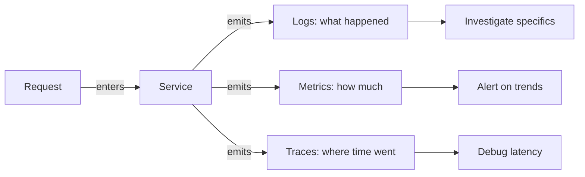

# Observability

## Chapter Goal

After reading this chapter, an experienced engineer can design an
observability strategy with structured logs, Prometheus-style metrics,
and distributed traces using OpenTelemetry. The reader will be able to
define SLIs and SLOs from customer-facing signals, calculate and
defend error budgets, set up symptom-based alerting that avoids alert
fatigue, choose between self-hosted and vendor-managed observability
stacks, lead incident response with structured investigation, and
explain observability trade-offs in a Tech Lead interview.

## Why This Matters for a Tech Lead

A Tech Lead is responsible for production health. Observability is the
mechanism that turns "production is broken" into "production is broken
at this endpoint, for this user segment, since this deployment":

- **Incident response speed depends on observability.** When production
  breaks, the first question is "what changed?" If the team cannot
  answer that in under 5 minutes, the observability is insufficient.
  A Tech Lead who cannot navigate logs, metrics, and traces during an
  incident is a liability.
- **SLOs are the contract with the business.** The Tech Lead defines
  what "good enough" means (99.9% availability, p99 latency under
  300ms) and defends the error budget. Without SLOs, every 5xx feels
  like an emergency, and the team oscillates between feature work and
  firefighting with no framework for prioritization.
- **Observability cost grows silently.** A team that logs everything
  at DEBUG level, creates high-cardinality metrics, and traces every
  request discovers a $15,000/month Datadog bill at quarter-end. The
  Tech Lead owns the cost-quality balance: what to observe, at what
  granularity, and for how long.
- **Alert fatigue kills on-call.** A team that pages on CPU spikes,
  disk usage predictions, and upstream timeouts — none of which
  require immediate human action — trains the on-call to ignore
  alerts. The Tech Lead designs the alerting philosophy: page on
  customer-facing symptoms, notify on causes, suppress the noise.
- **The hiring signal is strong.** An interviewer who asks "how do
  you know your service is healthy?" can assess operational maturity
  in 3 minutes. Candidates who answer "we check the logs" reveal
  they have never owned production at scale.

## Mental Model

Think of observability as the **ability to ask new questions about
a running system without shipping new code**. Monitoring tells you
*when* something is broken (known-unknowns). Observability tells you
*why* it is broken (unknown-unknowns). The difference: monitoring
requires pre-defined dashboards and alerts; observability requires
high-cardinality, high-dimensionality data that can be sliced ad hoc.

The three pillars — logs, metrics, and traces — are complementary
views of the same system:



Metrics tell you *something is wrong* (error rate spike). Traces tell
you *where in the call chain* the problem is (the downstream payment
service is slow). Logs tell you *what specifically happened* (the
payment service returned a 429 because the rate limit was exceeded).
A mature observability stack lets an engineer move from metric alert
to trace to log in under 60 seconds.

## Core Terminology

| Term | Definition |
| --- | --- |
| **Log** | A timestamped record of a discrete event. Structured logs use key-value pairs (JSON); unstructured logs are free-text. |
| **Metric** | A numeric measurement aggregated over time. Metrics are cheap to store and query but lose individual event detail. |
| **Trace** | A record of a request's path through a distributed system, composed of spans. Each span represents a unit of work (an HTTP call, a database query, a queue publish). |
| **Span** | A single unit of work within a trace. Spans have a start time, duration, attributes, and a parent span (forming a tree). |
| **Exemplar** | A link from an aggregated metric to a specific trace ID. Exemplars connect "the p99 latency is 800ms" to "here is one request that took 800ms." |
| **Cardinality** | The number of unique label combinations for a metric. High cardinality (e.g., a `user_id` label) explodes storage and query cost. |
| **SLI (Service Level Indicator)** | A quantitative measure of service behavior from the user's perspective. Example: the proportion of HTTP requests that return a 2xx within 300ms. |
| **SLO (Service Level Objective)** | A target value for an SLI over a time window. Example: 99.9% of requests succeed within 300ms over a rolling 30-day window. |
| **SLA (Service Level Agreement)** | A contract between a provider and a customer that includes SLOs and consequences (credits, penalties) for violating them. SLAs are business documents; SLOs are engineering targets. |
| **Error budget** | The amount of allowed unreliability within an SLO. A 99.9% SLO allows 0.1% failure — roughly 43 minutes of downtime per 30-day window. |
| **Burn rate** | How fast the error budget is being consumed. A burn rate of 1x means the budget will be exactly exhausted at the end of the window. A burn rate of 10x means 10 times faster — the budget exhausts in 3 days instead of 30. |
| **MTTD (Mean Time to Detect)** | Average time from failure onset to the first alert. Measures alerting effectiveness. |
| **MTTR (Mean Time to Recovery)** | Average time from detection to resolution. Measures incident response capability. |
| **Alert fatigue** | The state where too many low-signal alerts cause on-call engineers to ignore or delay responses. Alert fatigue is the primary failure mode of alerting systems. |
| **Runbook** | A documented procedure for responding to a specific alert. Contains diagnosis steps, mitigation actions, and escalation criteria. |
| **Context propagation** | The mechanism by which trace context (trace ID, span ID) is passed between services — typically via HTTP headers (`traceparent`) or message metadata. |
| **OpenTelemetry (OTel)** | A vendor-neutral open standard for collecting and exporting telemetry data (logs, metrics, traces). Provides SDKs, APIs, and the OTel Collector. |
| **Correlation ID** | A unique identifier (typically a UUID) attached to a request at the edge and propagated through all downstream services. Used to correlate logs, metrics, and traces for a single user request. In OpenTelemetry, the trace ID serves this role. |

**Key distinctions:**

- **Monitoring vs observability:** Monitoring answers pre-defined
  questions ("is the server up?"). Observability answers ad-hoc
  questions ("why is the p99 latency for users in Germany higher
  than for users in the US, but only on Tuesdays?"). Monitoring is
  a subset of observability.
- **SLO vs SLA:** An SLO is an internal engineering target. An SLA
  is an external contractual commitment. The SLO should be stricter
  than the SLA — if the SLO is 99.9%, the SLA might be 99.5%,
  giving the team a buffer before financial penalties apply.
- **Logs vs metrics:** Logs capture individual events with full
  context. Metrics capture aggregated trends efficiently. Use
  metrics for alerting and dashboards; use logs for investigation.
  Do not alert on log patterns when a metric would suffice — log-
  based alerting is slower and more expensive.
- **Trace vs span:** A trace is the full tree of work for a request.
  A span is one node in that tree. A trace has many spans.

## Theoretical Foundation

### Monitoring vs observability

Monitoring is the practice of collecting predefined signals and
alerting when they exceed thresholds. It answers questions the team
anticipated. Observability is the property of a system that allows
engineers to understand its internal state from its external outputs.
It answers questions the team did not anticipate.

A monitored system might alert when CPU exceeds 80%. An observable
system lets an engineer ask "which endpoint is consuming the CPU, for
which tenant, and since when?" without adding new instrumentation.

The practical difference: monitoring requires someone to think of the
failure mode in advance and build a dashboard. Observability requires
rich, structured, high-dimensionality data that supports ad-hoc
queries. Both are necessary. Monitoring catches known failure modes
cheaply. Observability handles novel failures that monitoring misses.

**Tech Lead perspective:** Do not frame observability as a replacement
for monitoring. Frame it as a maturity progression. Phase 1: basic
monitoring (uptime, error rate, latency). Phase 2: structured
observability (logs, metrics, traces with correlation). Phase 3:
SLO-based alerting with error budgets. Most teams are between Phase 1
and Phase 2.

### Logs: structured logging and log levels

A log is a timestamped record of an event. Unstructured logs (`User
123 failed to log in at 2024-03-15 14:23:01`) are human-readable but
machine-hostile. Structured logs (`{"timestamp": "2024-03-15T14:23:01Z",
"level": "warn", "event": "login_failed", "user_id": 123,
"reason": "invalid_password", "ip": "203.0.113.42"}`) are both.

**Why structured logging matters:**

1. Structured logs are queryable. A log aggregator (ELK, OpenSearch,
   CloudWatch Logs Insights, Loki) can filter by `event=login_failed
   AND user_id=123` in seconds. Unstructured logs require regex.
2. Structured logs support aggregation. Count login failures per
   minute, group by reason. This converts logs into ad-hoc metrics.
3. Structured logs enable correlation. Every log line includes the
   `trace_id` and `request_id`, linking it to the distributed trace
   and to every other log line from the same request.

**Log levels and their discipline:**

| Level | When to use | Example |
| --- | --- | --- |
| **ERROR** | Something failed and requires attention. A request could not be fulfilled. | Database connection failed, payment declined, unhandled exception. |
| **WARN** | Something unexpected happened but the system recovered. May need investigation if it becomes frequent. | Retry succeeded after timeout, deprecated API called, cache miss on a key that should be cached. |
| **INFO** | Normal operational events worth recording. The default for production. | Request completed, deployment started, configuration loaded, user created. |
| **DEBUG** | Detailed diagnostic information. Disabled in production by default; enabled temporarily for specific services during investigation. | SQL query text, request/response payloads, internal state transitions. |

**Common mistake:** Logging at INFO level with the verbosity of DEBUG.
A service that logs 50 lines per request at INFO generates terabytes
of logs per month and buries the signal in noise. Use INFO for events
that an on-call engineer would want to see when investigating an
incident — request start/end, errors, significant state changes.

**What to include in every log line:**

- Timestamp (ISO 8601, UTC).
- Log level.
- Service name and version.
- Trace ID and span ID (for correlation with traces).
- Request ID or correlation ID.
- The event (what happened, as a machine-readable string).
- Relevant context (user ID, tenant ID, endpoint, status code).

**What NOT to log:**

- Passwords, tokens, API keys, personally identifiable information
  (PII) — unless the system has PII-safe log storage with access
  controls and retention policies. See
  [Security](./15-security.md) for data handling.
- Full request/response bodies at INFO level — too verbose for
  production, and may contain sensitive data.

**Tech Lead perspective:** Establish a logging standard for the team:
a shared logger configuration that enforces structured JSON output,
includes trace context automatically, and respects log-level
conventions. Without this standard, each service logs differently,
and cross-service investigation becomes impossible. Review log volume
monthly — a sudden increase usually means a new service is logging
at the wrong level.

### Metrics: types, cardinality, and label discipline

Metrics are numeric measurements aggregated over time. Unlike logs
(which record individual events), metrics summarize behavior
efficiently. A single metric time series consumes kilobytes per day,
regardless of request volume. This makes metrics the best signal for
alerting and dashboards.

**Metric types (Prometheus model):**

| Type | What it measures | Example | Key rule |
| --- | --- | --- | --- |
| **Counter** | A monotonically increasing value. Only goes up (resets to 0 on restart). | `http_requests_total`, `errors_total` | Always use `rate()` or `increase()` to query, never the raw value. |
| **Gauge** | A value that goes up and down. | `active_connections`, `queue_depth`, `cpu_usage` | Represents a snapshot, not a rate. |
| **Histogram** | Distributes observations into configurable buckets. | `http_request_duration_seconds` | Use for latency and size distributions. Choose bucket boundaries carefully — too few miss detail, too many waste storage. |
| **Summary** | Similar to histogram but calculates quantiles client-side. | `http_request_duration_seconds{quantile="0.99"}` | Quantiles are not aggregatable across instances. Prefer histograms for multi-instance services. |

**Cardinality — the cost driver:**

Every unique combination of metric name and label values creates a
separate time series. A metric `http_requests_total{method, status,
endpoint}` with 5 methods × 10 status codes × 200 endpoints = 10,000
time series. Add a `user_id` label and the cardinality explodes to
millions.

**Label discipline rules:**

1. Labels must have bounded cardinality. Good: `method`, `status`,
   `endpoint` (bounded by the API surface). Bad: `user_id`,
   `request_id`, `ip_address` (unbounded, grows with traffic).
2. Every label must be useful for grouping or filtering. If no one
   will ever write a query that groups by a label, remove it.
3. Use exemplars (links from a metric to a trace ID) instead of
   high-cardinality labels. The exemplar lets you drill from the
   aggregated metric to a specific request without paying the
   cardinality cost.

**Common mistake:** Adding a `customer_id` label to request latency
metrics "for debugging." With 100,000 customers, this creates 100,000
time series per endpoint, per status code. Prometheus slows down,
Grafana dashboards time out, and the monthly bill triples. Use logs
or traces to correlate with customer identity instead.

**Tech Lead perspective:** Set a cardinality budget per service (e.g.,
no metric should exceed 1,000 time series). Review metrics cardinality
quarterly. When a new label is proposed, ask: "Will we aggregate by
this label in a dashboard or alert? Or is this a debugging need that
belongs in traces?"

### Distributed tracing: spans, context propagation, and sampling

A distributed trace follows a single request across service
boundaries. Each unit of work — an HTTP call, a database query, a
queue publish, a cache lookup — is recorded as a span. Spans form a
tree: the root span is the incoming request; child spans are the
downstream operations.

**Anatomy of a span:**

- **Trace ID:** Unique identifier for the entire trace (shared across
  all spans in the request).
- **Span ID:** Unique identifier for this specific span.
- **Parent span ID:** Links this span to its parent, forming the tree.
- **Operation name:** What the span represents (`GET /api/orders`,
  `SELECT orders`, `publish order.created`).
- **Start time and duration.**
- **Attributes:** Key-value pairs with context (`http.method=GET`,
  `db.statement=SELECT ...`, `user.id=42`).
- **Status:** OK, ERROR, or UNSET.
- **Events:** Timestamped annotations within the span (e.g., "retry
  attempt 1", "cache miss").

**Context propagation:**

For tracing to work across services, the trace context must be
propagated. The W3C Trace Context standard defines the `traceparent`
HTTP header:

```text
traceparent: 00-4bf92f3577b34da6a3ce929d0e0e4736-00f067aa0ba902b7-01
             version-trace_id-parent_span_id-flags
```

The sending service includes the `traceparent` header in outgoing
HTTP requests. The receiving service reads it and creates a child
span. For message queues, the trace context is stored in message
metadata. For database calls, the trace context is stored as a
comment in the SQL query or attached to the connection.

**Sampling strategies:**

Tracing every request in a high-traffic system is expensive. Sampling
controls how many requests are traced:

| Strategy | How it works | Trade-off |
| --- | --- | --- |
| **Head-based sampling** | Decision made at the edge when the request enters. A percentage of requests (e.g., 10%) are traced end-to-end. | Cheap, but misses rare errors — a 0.1% error sampled at 10% captures only 0.01% of errors. |
| **Tail-based sampling** | Decision made after the trace completes. All spans are collected in memory; only "interesting" traces (errors, high latency) are stored. | Captures all errors regardless of rate, but requires a collector with enough memory to buffer in-flight traces. |
| **Adaptive sampling** | Adjusts the sampling rate based on traffic volume. Samples 100% at low traffic, 1% at peak. | Maintains a consistent trace budget, but complicates analysis when the sample rate varies. |

**Tech Lead perspective:** Default to head-based sampling at 10-20%
for most services. Use tail-based sampling for critical paths (payment,
authentication) where every error must be captured. Set a monthly
trace ingest budget and monitor it — trace costs scale linearly with
request volume × sample rate.

### OpenTelemetry

OpenTelemetry (OTel) is the vendor-neutral open standard for
collecting logs, metrics, and traces. It provides:

1. **APIs and SDKs** for instrumenting application code (available
   for Java, Go, Python, JavaScript/TypeScript, .NET, and others).
2. **Auto-instrumentation** that captures telemetry from popular
   frameworks (Express, Flask, Spring) without code changes.
3. **The OTel Collector** — a standalone process that receives,
   processes, and exports telemetry data to any backend (Prometheus,
   Jaeger, Datadog, New Relic, Grafana Cloud).

**Why OpenTelemetry matters:**

- **Vendor independence.** Instrument once, export to any backend.
  Switching from Datadog to Grafana Cloud does not require re-
  instrumenting the application.
- **Unified context.** OTel propagates trace context across logs,
  metrics, and traces, enabling correlation. A log line includes
  the trace ID; a metric includes an exemplar pointing to a trace.
- **Community convergence.** OTel merged the OpenTracing and
  OpenCensus projects. It is now the second-largest CNCF project
  after Kubernetes.

> Verify OpenTelemetry SDK stability status (GA vs beta) for specific
> languages and signal types against the official OpenTelemetry
> documentation. The tracing API is GA for most languages; metrics
> and logs vary.

**OTel Collector architecture:**

The Collector runs as an agent (sidecar or DaemonSet) or as a
gateway (centralized). It receives telemetry via OTLP (OpenTelemetry
Protocol), processes it (batching, filtering, sampling, enrichment),
and exports it to one or more backends.

```text
App (SDK) --OTLP--> Collector --export--> Prometheus (metrics)
                                 |------> Loki (logs)
                                 |------> Tempo/Jaeger (traces)
```

**Tech Lead perspective:** Adopt OTel as the instrumentation standard
for new services. For existing services instrumented with vendor-
specific SDKs (Datadog Agent, New Relic APM), migrate incrementally —
OTel Collector can receive vendor-specific formats and re-export in
OTLP. The migration path: install OTel Collector alongside the
existing agent, dual-ship telemetry, validate, then remove the old
agent.

### SLIs, SLOs, and SLAs

**Service Level Indicators (SLIs)** are the quantitative measures
of user experience. Good SLIs measure what users care about, not
what the infrastructure cares about:

| User concern | Good SLI | Bad SLI |
| --- | --- | --- |
| "The page loads quickly" | Proportion of requests completing in < 300ms | Average CPU utilization |
| "The API works" | Proportion of non-5xx responses | Disk IOPS |
| "My data is safe" | Proportion of successful writes acknowledged | Memory usage |

**Choosing SLIs:**

1. Start from the user journey, not the infrastructure. "The user
   clicks 'Place Order' and gets a confirmation within 2 seconds"
   is an SLI source. "The database replica lag is under 100ms" is
   an internal metric, not an SLI.
2. Express SLIs as a ratio: good events / total events. This
   produces a value between 0 and 1 (or 0% and 100%) that is
   directly interpretable.
3. Choose a small number of SLIs per service (2-4). More than that
   dilutes focus.

**Service Level Objectives (SLOs)** set the target for each SLI:

- SLI: proportion of HTTP requests returning 2xx in < 300ms.
- SLO: 99.9% over a rolling 30-day window.

**Error budgets** are the complement of the SLO:

- Error budget = 1 - SLO = 0.1%.
- In a 30-day window with 10 million requests, the error budget is
  10,000 failed requests or ~43 minutes of downtime.

**How to use error budgets:**

1. **When the budget is healthy (> 50% remaining):** Ship features
   aggressively. The system has room for risk.
2. **When the budget is low (< 25% remaining):** Slow down feature
   releases. Prioritize reliability work.
3. **When the budget is exhausted (0% remaining):** Freeze non-
   critical deployments. Investigate the root causes of budget burn.
   Restore reliability before shipping new features.

Error budgets are a contract between the development team and the
operations/reliability team. They replace subjective arguments
("we need to be more reliable") with quantitative decisions ("we
have 15% of our error budget remaining; the next deployment is risky;
let us stabilize first").

**SLAs** add contractual consequences to SLOs. If the SLA promises
99.5% availability and the service delivers 99.2%, the provider
owes the customer credits. The SLO should always be stricter than
the SLA to provide a buffer.

**Tech Lead perspective:** Define SLOs before launching a service,
not after the first outage. Review error budget weekly. Present
error budget status in sprint planning — it makes reliability
concrete for product managers. When a product manager asks "can we
ship this risky feature?", the answer is in the error budget, not
in a gut feeling.

### Error budgets in practice

The error budget changes the conversation from "how many incidents
did we have?" to "how much unreliability can we afford?":

```text
SLO: 99.9% availability over 30 days

Total minutes in 30 days: 43,200
Error budget: 43,200 × 0.001 = 43.2 minutes

Week 1: 2-minute outage → 41.2 minutes remaining (95.4%)
Week 2: 5-minute outage → 36.2 minutes remaining (83.8%)
Week 3: No outage → 36.2 minutes remaining (83.8%)
Week 4: 30-minute outage → 6.2 minutes remaining (14.4%)

→ Error budget critically low. Freeze risky deployments.
  Prioritize reliability work for the next sprint.
```

**Burn rate alerting:**

Instead of alerting on raw error counts, alert on the rate at which
the error budget is being consumed:

- **Burn rate 1x:** The budget will be exactly exhausted at the end
  of the window. No alert needed — this is the expected baseline.
- **Burn rate 14.4x:** The budget will be exhausted in 2 days. Page
  the on-call (fast burn, likely an acute incident).
- **Burn rate 6x:** The budget will be exhausted in 5 days. Create
  a ticket (slow burn, likely a chronic degradation).

The multi-window, multi-burn-rate approach (from Google's SRE book)
uses two time windows per alert to balance detection speed and false
positive rate:

| Severity | Burn rate | Long window | Short window | Action |
| --- | --- | --- | --- | --- |
| **Page** | 14.4x | 1 hour | 5 minutes | Wake someone up |
| **Page** | 6x | 6 hours | 30 minutes | Wake someone up |
| **Ticket** | 3x | 1 day | 2 hours | Fix within 24 hours |
| **Ticket** | 1x | 3 days | 6 hours | Investigate at leisure |

### Alerting: symptoms vs causes

Effective alerting follows a single principle: **page on symptoms,
not on causes.**

- **Symptom (page-worthy):** "The error rate for `/api/orders`
  exceeded 5% for 5 minutes." This means users are affected.
- **Cause (not page-worthy):** "CPU utilization on server X exceeded
  80%." This might not affect users at all — the server might be
  handling the load correctly.

**Why causes are bad alerts:**

1. They generate false positives. CPU at 85% is normal under load.
   Disk at 90% is fine if growth is linear and capacity is planned.
2. They do not tell the on-call *what to fix*. "CPU is high" requires
   investigation. "Order submission error rate is 8%" tells the
   on-call exactly what is broken.
3. They accumulate. Teams that alert on causes end up with dozens of
   alerts, most of which are noise. The on-call learns to ignore
   them, and when a real incident happens, the page is lost in the
   noise.

**Alerting discipline:**

1. Every page must require human intervention. If the system can
   self-heal (auto-scaling, retry, circuit breaker), do not page.
   Log the event and review it asynchronously.
2. Every page must have a runbook. If the on-call cannot act on the
   alert, the alert is either poorly defined or should not page.
3. Review alert volume monthly. Target: fewer than 2 pages per on-call
   shift. If the on-call gets paged 10 times per week, the alerting
   system is broken.
4. Suppress duplicate alerts. If the same symptom fires 5 alerts
   from 5 related services, group them into a single incident.

**Common mistake:** Setting up alerts during the excitement of a new
service launch and never revisiting them. Six months later, the
service has changed, the thresholds are stale, and every alert is
either false-positive or ignored. Schedule quarterly alert reviews.

### Dashboards as products

Dashboards are products for the on-call engineer. Like any product,
they need a purpose, a user, and maintenance.

**Types of dashboards:**

| Type | Purpose | Audience | Update frequency |
| --- | --- | --- | --- |
| **Service health** | Is the service working? SLO status, error rate, latency percentiles, throughput. | On-call engineer | Real-time |
| **Business metrics** | Are users doing what we expect? Order volume, sign-up rate, conversion funnel. | Product managers, leadership | Hourly or daily |
| **Investigation** | Why is the service broken? Per-endpoint breakdown, per-tenant breakdown, dependency health. | Engineers during incidents | Real-time |
| **Capacity planning** | Will the service handle next month's traffic? Resource utilization trends, growth projections. | Tech Lead, platform team | Weekly |

**Dashboard discipline:**

1. A service health dashboard should answer the question "is the
   service healthy right now?" in under 10 seconds. If the on-call
   has to scroll, click, or filter to answer that question, the
   dashboard is poorly designed.
2. Use SLO burn rate as the top-level indicator. Green = budget
   healthy. Yellow = budget burning faster than expected. Red =
   budget exhausted or close to exhaustion.
3. Limit dashboards to 5-7 panels. A dashboard with 30 panels is a
   wall of charts that no one reads. If more detail is needed,
   create a linked drill-down dashboard.
4. Every dashboard must have an owner. Unowned dashboards rot: the
   metrics change, the queries break, and the dashboard becomes
   misleading. Assign dashboard ownership to the team that owns the
   service.

**Tech Lead perspective:** Treat dashboard creation as a code review
— review the queries, the time ranges, the thresholds, and the
layout. A dashboard that uses averages instead of percentiles for
latency is actively misleading. A dashboard that shows the last 1
hour but the SLO window is 30 days misrepresents the error budget
status.

### Incident response and postmortems

Observability enables incident response. Without good observability,
incidents devolve into "everyone log into the server and grep for
errors."

**Structured incident response:**

1. **Detect.** An alert fires or a customer reports an issue. The
   on-call acknowledges the alert and opens an incident channel.
2. **Triage.** Assess severity. Is this customer-facing? How many
   users are affected? What is the blast radius? Check the service
   health dashboard — which SLO is burning?
3. **Investigate.** Follow the data: metric dashboards → traces
   for failing requests → logs for specific errors. Narrow down:
   which endpoint, which deployment, which dependency.
4. **Mitigate.** Take the fastest action to stop user impact.
   Rollback the deployment. Toggle a feature flag. Increase
   capacity. Redirect traffic. Mitigation is not a fix — it is
   first aid.
5. **Resolve.** Fix the root cause. Deploy the fix through the
   normal pipeline (with expedited review if needed).
6. **Postmortem.** Write a blameless postmortem within 48 hours.

**Blameless postmortems:**

A postmortem answers five questions:

1. **What happened?** A timeline of events from detection to
   resolution.
2. **What was the impact?** Number of users affected, duration,
   revenue impact, SLO budget consumed.
3. **What was the root cause?** The technical cause, not "human
   error." The system should have prevented the failure.
4. **What went well?** What parts of the response worked — fast
   detection, effective runbook, clear communication.
5. **What will we change?** Concrete action items with owners and
   deadlines. "Be more careful" is not an action item. "Add an
   integration test for the payment retry path" is.

**Tech Lead perspective:** The Tech Lead owns the postmortem process.
Ensure every SEV-1 and SEV-2 incident has a postmortem. Track action
item completion — an action item that is never completed is a
prediction of the next outage. Share postmortems broadly: they are
the team's institutional memory.

### Observability tooling

**Prometheus and Grafana:**

Prometheus is an open-source time-series database and monitoring
system. It uses a pull model — Prometheus scrapes metrics from
service endpoints at regular intervals. PromQL (Prometheus Query
Language) is the query language for aggregating and alerting on
metric data. Grafana is the visualization layer — it connects to
Prometheus (and many other data sources) and renders dashboards.

Strengths: free, mature, large community, extensive integrations.
Weaknesses: single-node by default (horizontal scaling requires
Thanos or Cortex), no built-in long-term storage, PromQL has a
learning curve.

**ELK/OpenSearch:**

The ELK stack (Elasticsearch, Logstash, Kibana) — now often replaced
by OpenSearch (the AWS-managed fork) — is the dominant open-source
log aggregation platform. Logstash (or Fluentd/Fluent Bit) collects
and transforms logs. Elasticsearch (or OpenSearch) stores and indexes
them. Kibana (or OpenSearch Dashboards) provides search and
visualization.

Strengths: rich full-text search, mature ecosystem, flexible
schema. Weaknesses: operationally complex (cluster management,
shard tuning, index lifecycle), resource-intensive (heap memory,
disk I/O), expensive at scale.

**CloudWatch:**

AWS CloudWatch provides metrics, logs, traces (via X-Ray
integration), alarms, and dashboards as a managed service. It is the
default observability tool for AWS-native workloads.

Strengths: zero setup for AWS services, tight integration with
Lambda/ECS/RDS, pay-per-use pricing. Weaknesses: limited query
language compared to PromQL, vendor lock-in, can become expensive at
high metric/log volume, weaker cross-service tracing than dedicated
tracing tools.

> Verify CloudWatch pricing tiers (custom metrics, log ingestion,
> dashboard costs) against the current AWS CloudWatch pricing page.
> Pricing changes periodically.

**Vendor-managed platforms (Datadog, New Relic, Honeycomb, Grafana
Cloud):**

Managed platforms handle infrastructure, storage, and scaling. The
trade-off is cost and vendor lock-in. Datadog and New Relic use
proprietary query languages and agents. Honeycomb specializes in
high-cardinality event data. Grafana Cloud uses open-source
components (Prometheus, Loki, Tempo) with managed infrastructure.

**Tech Lead perspective:** Choose tooling based on team size,
operational maturity, and budget. A 5-person startup should use
Datadog or Grafana Cloud — operating Prometheus + Loki + Tempo
clusters is a full-time job they cannot afford. A 100-person
engineering organization with a platform team should evaluate self-
hosted (Prometheus + Grafana + Loki + Tempo) for cost savings at
scale, or Grafana Cloud for the middle ground.

## Practical Usage

### Standard service observability stack

A production service emits three signal types, collected by
OpenTelemetry and routed to appropriate backends:

1. **Structured logs** (JSON) → shipped via OTel Collector or Fluent
   Bit → stored in OpenSearch/Loki/CloudWatch Logs.
2. **Prometheus-compatible metrics** → scraped by Prometheus or
   pushed via OTel Collector → stored in Prometheus/Thanos/Grafana
   Mimir.
3. **Distributed traces** → exported via OTel SDK → collected by
   OTel Collector → stored in Jaeger/Tempo/X-Ray.

The three signals are correlated via the trace ID: every log line
includes the trace ID, and every metric can include an exemplar
linking to a trace. This enables the investigation flow: alert on a
metric → find the exemplar trace → read the trace spans → find the
failing span → read the associated log lines.

### SLO-based alerting

Replace threshold-based alerts with SLO burn-rate alerts:

**Before (threshold-based):**
- Alert: "Error rate > 1% for 5 minutes" → pages frequently during
  spikes, auto-resolves, trains on-call to ignore.
- Alert: "CPU > 80% for 10 minutes" → pages during normal load
  spikes, no user impact.

**After (SLO burn-rate):**
- Page: "Error budget burn rate > 14.4x for 5 minutes (1-hour
  window)" → only fires when the service is burning error budget
  fast enough to exhaust it in ~2 days. High signal, low noise.
- Ticket: "Error budget burn rate > 3x for 2 hours (1-day window)"
  → chronic degradation that should be investigated during business
  hours.

### Tracing across asynchronous boundaries

Distributed tracing across HTTP calls is well-supported by
OpenTelemetry auto-instrumentation. Tracing across asynchronous
boundaries (queues, event buses) requires explicit context
propagation:

1. **Producer:** Before publishing a message to SQS/Kafka/
   EventBridge, inject the trace context into the message attributes
   or headers using the OTel propagator.
2. **Consumer:** When receiving the message, extract the trace
   context from the message attributes and create a child span
   linked to the original trace.

Without this, the trace breaks at the queue boundary — the
producer's trace ends, and the consumer's trace starts as a new,
unrelated trace. The on-call engineer sees two separate traces and
cannot follow the request end-to-end.

### How a Tech Lead introduces observability

Introducing observability to an existing system is a multi-phase
effort. The sequencing matters — each phase builds on the previous
one, and skipping phases creates gaps that surface during incidents.

1. **Phase 1: Structured logging (1-2 weeks).** Replace `console.log`
   or unstructured loggers with a structured logger (pino for
   Node.js, structlog for Python). Add trace ID, service name, and
   request context to every log line. Ship logs to a central
   aggregator. Start with 2-3 highest-traffic services. Create a
   team logging standard document (field names, log levels, what to
   include, what to redact).
2. **Phase 2: Core metrics (1-2 weeks).** Add request rate, error
   rate, and latency percentiles (the RED method) to every service.
   Use OTel auto-instrumentation or a Prometheus client library.
   Create a basic service health dashboard. Set a cardinality budget
   before teams start adding custom metrics.
3. **Phase 3: Distributed tracing (2-4 weeks).** Install OTel SDK
   and auto-instrumentation. Ensure context propagation across HTTP
   and queue boundaries. Deploy OTel Collector. Validate traces in
   a tracing UI (Jaeger, Tempo, X-Ray). Verify trace context
   propagation across every service boundary — this is the step most
   teams skip, and the one that breaks during the first real
   incident.
4. **Phase 4: SLOs and alerting (1-2 weeks).** Define SLIs for each
   service. Set initial SLOs (start conservative — 99.5% — and
   tighten later). Implement burn-rate alerts. Create runbooks for
   each alert. Delete or convert all cause-based alerts (CPU,
   memory, disk) to dashboard panels.
5. **Phase 5: Continuous improvement.** Review alerts quarterly.
   Track MTTD and MTTR. Review error budget weekly. Optimize
   observability cost monthly. Run a game day — simulate a failure
   and measure how long it takes the on-call to identify root cause
   using the observability stack.

**Tech Lead sequencing decision:** Do not attempt all phases
simultaneously. A team that tries to ship structured logging,
tracing, SLOs, and new dashboards in one sprint ships none of them
well. Each phase should have a "definition of done" — phase 1 is
done when every service in the critical path emits structured logs
with trace IDs to a central aggregator, not when the first service
is migrated.

**When to delay adoption:** If the team is in the middle of a major
migration (e.g., monolith-to-microservices), introducing a full
observability stack adds complexity. Start with Phase 1 and Phase 2
only — structured logs and basic metrics are low-risk and
immediately useful. Defer tracing and SLOs until the service
boundaries stabilize.

## Examples

### Structured log line

```json
{
  "timestamp": "2024-03-15T14:23:01.456Z",
  "level": "error",
  "service": "orders-api",
  "version": "1.42.0",
  "trace_id": "4bf92f3577b34da6a3ce929d0e0e4736",
  "span_id": "00f067aa0ba902b7",
  "request_id": "req-abc-123",
  "event": "payment_failed",
  "user_id": 42,
  "order_id": "ord-789",
  "error": "PaymentGatewayTimeout",
  "message": "Payment gateway did not respond within 5000ms",
  "duration_ms": 5003,
  "endpoint": "POST /api/orders",
  "http_status": 504
}
```

**What this does:** Records a payment failure with full context —
who, what, when, and why — in a machine-readable format.

**Why it is structured this way:** Every field is queryable. An
engineer investigating payment failures can filter by
`event=payment_failed AND duration_ms > 5000` to find all timeout-
related failures. The `trace_id` links to the distributed trace,
showing exactly which downstream call timed out.

**Common mistake:** Logging `message: "Something went wrong"` without
the error type, user context, or trace ID. This produces logs that
are useless during investigation.

**Production change:** Add PII masking for `user_id` if the log
storage is not access-controlled. Add `environment` and `region`
fields for multi-environment and multi-region deployments.

**Tech Lead check:** Verify that every service uses the same log
schema. Cross-service investigation fails if one service logs
`userId` and another logs `user_id`.

### Prometheus query for SLO burn rate

```text
(
  sum(rate(http_requests_total{status=~"5.."}[1h]))
  /
  sum(rate(http_requests_total[1h]))
) > 14.4 * 0.001
```

**What this does:** Calculates the error rate over the last hour and
checks if it exceeds 14.4 times the error budget (0.1% for a 99.9%
SLO). If the error rate is above 1.44%, the burn rate alert fires.

**Why this matters:** This query replaces a naive "error rate > 1%"
alert with a budget-aware alert. A 2% error rate for 30 seconds does
not trigger it (the budget impact is negligible). A 1.5% error rate
sustained for 1 hour does (the budget is burning dangerously fast).

**Common mistake:** Using `avg` instead of `sum(rate(...))`.
Averages across instances hide the fact that one instance is
returning 100% errors while others are healthy.

**Production change:** Use recording rules to pre-compute the error
rate, reducing query cost on the alerting path. Add a second query
with a shorter window (5 minutes) to catch fast-moving incidents.

**Tech Lead check:** Verify that the `status=~"5.."` regex matches
the actual status codes emitted by the service. Some frameworks
return non-standard status codes that bypass the regex.

### OpenTelemetry instrumentation in Node.js

```ts
import { NodeSDK } from "@opentelemetry/sdk-node";
import { OTLPTraceExporter } from "@opentelemetry/exporter-trace-otlp-http";
import { getNodeAutoInstrumentations } from "@opentelemetry/auto-instrumentations-node";

const sdk = new NodeSDK({
  traceExporter: new OTLPTraceExporter({
    url: "http://otel-collector:4318/v1/traces",
  }),
  instrumentations: [
    getNodeAutoInstrumentations({
      "@opentelemetry/instrumentation-fs": { enabled: false },
    }),
  ],
});

sdk.start();
```

**What this does:** Initializes the OTel Node.js SDK with automatic
instrumentation for HTTP, Express, database clients, and other
libraries. Traces are exported to an OTel Collector via OTLP.

**Why it is written this way:** Auto-instrumentation captures spans
for incoming and outgoing HTTP requests, database queries, and other
I/O without modifying application code. The `fs` instrumentation is
disabled because file system tracing generates noise without value
in most web services.

**Common mistake:** Placing this initialization *after* library
imports. OTel auto-instrumentation works by monkey-patching library
modules. If the library is imported before OTel initializes, the
patches do not apply. This file must be the first import in the
application entry point.

**Production change:** Add a resource detector to tag all telemetry
with the service name, version, and environment. Add a sampler (e.g.,
`TraceIdRatioBased(0.1)` for 10% sampling) to control trace volume.

**Tech Lead check:** Verify that the OTel Collector endpoint is
correct and reachable from the service. A misconfigured endpoint
silently drops all traces — the service works fine, but no traces
appear in the tracing UI.

> Verify the `@opentelemetry/sdk-node` and
> `@opentelemetry/auto-instrumentations-node` package APIs against
> the current OpenTelemetry JS documentation. The SDK surface has
> changed across recent versions.

### OpenTelemetry trace: fan-out across services

```text
Trace ID: 4bf92f3577b34da6

[orders-api] POST /api/orders ─── 450ms ─── OK
  ├── [orders-api] validate_order ─── 12ms ─── OK
  ├── [orders-api] save_to_db ─── 35ms ─── OK
  │     └── [postgres] INSERT INTO orders ─── 28ms ─── OK
  ├── [payment-service] POST /charge ─── 380ms ─── OK
  │     ├── [payment-service] check_fraud ─── 45ms ─── OK
  │     │     └── [fraud-api] POST /evaluate ─── 40ms ─── OK
  │     └── [payment-service] charge_card ─── 310ms ─── OK
  │           └── [stripe-sdk] create_charge ─── 290ms ─── OK
  └── [notification-service] publish order.created ─── 8ms ─── OK
        └── [sqs] SendMessage ─── 5ms ─── OK
```

**What this shows:** A single user request to create an order fans
out across four services (orders-api, payment-service, fraud-api,
notification-service) and two external dependencies (Postgres,
Stripe). The trace reveals that the total 450ms latency is dominated
by the Stripe charge call (290ms) — this is where optimization
effort should focus.

**How to read it:** Each line is a span. Indentation shows parent-
child relationships. The root span is the incoming HTTP request. The
time column shows span duration. The critical path is the longest
chain: orders-api → payment-service → charge_card → stripe-sdk.

**Tech Lead check:** Verify that trace context propagation works
across all service boundaries, including the SQS publish. If the
notification-service trace appears as a separate trace (different
trace ID), context propagation is broken at the queue boundary.

### Runbook entry for a paged alert

```text
Alert: orders_api_error_budget_burn_rate_critical
Severity: Page (SEV-2)
Condition: Error budget burn rate > 14.4x for 5+ minutes

## Impact
The orders API is returning errors at a rate that will exhaust the
monthly error budget within 2 days. Customers may be unable to place
orders.

## Diagnosis
1. Check the orders-api service health dashboard:
   https://grafana.internal/d/orders-api
2. Identify the failing endpoint:
   sum by(endpoint)(rate(http_requests_total{status=~"5.."}[5m]))
3. Find a failing trace:
   Open Tempo, filter by service=orders-api, status=ERROR.
4. Read the error logs:
   In Loki: {service="orders-api"} |= "error" | json

## Common causes
- Downstream payment-service timeout (check payment-service dashboard)
- Database connection pool exhaustion (check active_connections gauge)
- Bad deployment (check recent deployments in the CD pipeline)

## Mitigation
1. If caused by a recent deployment: roll back immediately.
2. If caused by payment-service: check payment-service alerts;
   escalate to the payments team.
3. If caused by database: increase connection pool size or restart
   the unhealthy replica.

## Escalation
If unable to mitigate within 15 minutes, escalate to the orders
team Tech Lead.
```

**What this does:** Provides a step-by-step investigation and
mitigation guide for a specific alert.

**Why it matters:** At 3 AM, the on-call engineer should not need
to think from first principles. The runbook turns incident response
into a procedure. Without it, MTTR depends on who is on-call and
how familiar they are with the service.

**Tech Lead check:** Every paged alert must have a runbook. Review
runbooks after every incident — if the runbook was not helpful,
update it. If the on-call deviated from the runbook, find out why
and either fix the runbook or fix the system.

### Request logging middleware with correlation ID

```ts
import pino from "pino";
import { randomUUID } from "node:crypto";
import { trace } from "@opentelemetry/api";
import type { Request, Response, NextFunction } from "express";

const logger = pino({ level: "info" });

export function requestLogger(req: Request, res: Response, next: NextFunction) {
  const span = trace.getActiveSpan();
  const traceId = span?.spanContext().traceId ?? "no-trace";
  const requestId = (req.headers["x-request-id"] as string) ?? randomUUID();

  req.log = logger.child({
    trace_id: traceId,
    request_id: requestId,
    method: req.method,
    path: req.path,
    user_agent: req.headers["user-agent"],
  });

  const start = performance.now();

  res.on("finish", () => {
    const duration = Math.round(performance.now() - start);
    req.log.info({
      event: "request_completed",
      http_status: res.statusCode,
      duration_ms: duration,
    });
  });

  next();
}
```

**What this does:** An Express middleware that creates a child logger
per request with the OTel trace ID, a request ID (from the incoming
header or auto-generated), and request metadata. On response finish,
it logs the request completion with status code and duration.

**Why it is useful:** Every log line from this request automatically
includes the trace ID and request ID, enabling correlation with
distributed traces and cross-service log queries. The child logger
pattern avoids passing context manually through every function call.

**Common mistake:** Creating a new logger per request without the
child pattern. Each logger instance holds configuration (transport,
format) — creating thousands per second wastes memory. Use
`logger.child()` which shares the parent's transport.

**Production change:** Add `tenant_id` from the authentication token
for multi-tenant systems. Add PII redaction for the `user_agent`
field if required by privacy policy. Consider sampling verbose
request logs for high-traffic endpoints.

**Tech Lead check:** Verify that the middleware is registered before
route handlers (order matters in Express). Verify that the
`x-request-id` header is set by the load balancer or API gateway —
if missing, the auto-generated UUID creates a new ID at every
service boundary, breaking cross-service correlation.

### Custom application metrics in Prometheus

```ts
import {
  Counter,
  Histogram,
  Gauge,
  Registry,
} from "prom-client";

const register = new Registry();

export const httpRequestDuration = new Histogram({
  name: "http_request_duration_seconds",
  help: "HTTP request duration in seconds",
  labelNames: ["method", "endpoint", "status"] as const,
  buckets: [0.01, 0.025, 0.05, 0.1, 0.25, 0.5, 1, 2.5, 5],
  registers: [register],
});

export const httpRequestsTotal = new Counter({
  name: "http_requests_total",
  help: "Total number of HTTP requests",
  labelNames: ["method", "endpoint", "status"] as const,
  registers: [register],
});

export const queueDepth = new Gauge({
  name: "queue_depth",
  help: "Number of messages waiting in the processing queue",
  labelNames: ["queue_name"] as const,
  registers: [register],
});

export const cacheHitRate = new Gauge({
  name: "cache_hit_ratio",
  help: "Ratio of cache hits to total lookups (0.0 to 1.0)",
  labelNames: ["cache_name"] as const,
  registers: [register],
});

export { register };
```

**What this does:** Defines four application-level Prometheus metrics:
request duration (histogram for latency percentiles), request count
(counter for throughput and error rate), queue depth (gauge for
backlog monitoring), and cache hit ratio (gauge for cache
effectiveness). All are registered in a shared registry.

**Why it is useful:** These four metrics cover the RED method (Rate,
Errors, Duration) for the service plus two operational signals (queue
depth, cache hit rate) that are critical for capacity planning and
performance investigation.

**Common mistake:** Using unbounded label values. If `endpoint`
includes path parameters (`/users/42`, `/users/43`), the cardinality
explodes. Normalize paths to route patterns (`/users/:id`) before
using them as labels.

**Production change:** Add histogram bucket boundaries tuned to the
service's actual latency distribution. The default buckets above are
a starting point — after a week of production data, adjust to
concentrate buckets around the SLO threshold (e.g., if the SLO is
p99 < 300ms, add buckets at 0.2, 0.25, 0.3, 0.35, 0.4).

**Tech Lead check:** Review every label for bounded cardinality
before the metrics go to production. A single unbounded label can
crash Prometheus. Set a per-service cardinality budget (e.g., < 1,000
time series) and monitor it.

> Verify the `prom-client` API (Registry, Histogram, Counter, Gauge
> constructors and options) against the current npm package
> documentation. The API surface has changed across major versions.

### CloudWatch metric alarm

```yaml
Resources:
  OrdersApiHighErrorRate:
    Type: AWS::CloudWatch::Alarm
    Properties:
      AlarmName: orders-api-error-rate-high
      AlarmDescription: >
        Orders API 5xx rate exceeds 2% for 5 consecutive minutes.
        Runbook: https://wiki.internal/runbooks/orders-api-errors
      Namespace: CustomMetrics/OrdersApi
      MetricName: HttpErrorRate5xx
      Statistic: Average
      Period: 60
      EvaluationPeriods: 5
      Threshold: 0.02
      ComparisonOperator: GreaterThanThreshold
      TreatMissingData: breaching
      AlarmActions:
        - !Ref PagerDutySNSTopic
      OKActions:
        - !Ref PagerDutySNSTopic
      Dimensions:
        - Name: ServiceName
          Value: orders-api
```

**What this does:** A CloudFormation-defined CloudWatch alarm that
pages PagerDuty when the 5xx error rate exceeds 2% for 5 consecutive
1-minute periods.

**Why it is useful:** Infrastructure-as-code for alerts means alerts
are version-controlled, reviewable, and reproducible. The
`TreatMissingData: breaching` setting ensures that missing metrics
(which often indicate the service is completely down) trigger the
alarm rather than silently resolving it.

**Common mistake:** Setting `TreatMissingData: notBreaching` (the
default). If the service stops emitting metrics (because it crashed),
the alarm resolves — exactly when it should be firing. Always use
`breaching` for availability alarms.

**Production change:** Replace single-threshold alarms with
multi-window burn-rate alarms where possible. CloudWatch composite
alarms can combine multiple conditions (error rate AND latency).
Add `OKActions` to auto-resolve PagerDuty incidents.

**Tech Lead check:** Verify that the SNS topic delivers to the
correct PagerDuty service. Verify that the `Namespace` and
`MetricName` match the actual metrics emitted by the service. A
typo in the metric name creates a silent alarm that never fires.
See [AWS](./04-aws.md) for CloudWatch patterns.

> Verify CloudWatch alarm CloudFormation syntax (`TreatMissingData`
> values, `ComparisonOperator` options) against the current AWS
> CloudFormation documentation.

### SLI and SLO definition for an API service

```text
Service: orders-api
Owner: orders team
Review cadence: quarterly

SLI 1: Availability
  Definition: proportion of non-5xx HTTP responses
  Measurement: http_requests_total{status!~"5.."} / http_requests_total
  Excludes: health check endpoint (/healthz), internal metrics endpoint (/metrics)

SLO 1: 99.9% availability over a rolling 30-day window
  Error budget: 0.1% = 43.2 minutes of total downtime equivalent
  Burn-rate alerts:
    Page:   14.4x burn rate over 1h  (budget exhausts in ~2 days)
    Page:   6x burn rate over 6h     (budget exhausts in ~5 days)
    Ticket: 3x burn rate over 1d     (budget exhausts in ~10 days)

SLI 2: Latency
  Definition: proportion of HTTP requests completing in < 300ms
  Measurement: histogram_quantile(0.99, rate(http_request_duration_seconds_bucket[5m]))
  Excludes: bulk export endpoints (expected to be slow)

SLO 2: p99 latency < 300ms over a rolling 30-day window
  Error budget: 1% of requests may exceed 300ms
  Burn-rate alerts:
    Page:   14.4x burn rate over 1h
    Ticket: 3x burn rate over 1d

Error budget policy:
  - Budget > 50%: ship features freely.
  - Budget 25-50%: prioritize reliability in sprint planning.
  - Budget < 25%: freeze non-critical deployments.
  - Budget exhausted: all engineering effort shifts to reliability
    until the budget recovers.
```

**What this does:** Defines the complete SLO contract for a service:
what to measure, how to measure it, what the target is, how to
alert on it, and what happens when the budget runs low.

**Why it is useful:** This format is what a Tech Lead presents to
the team and to stakeholders. It makes the reliability target
concrete — not "we aim for high availability" but "we allow 43
minutes of downtime per month, and here is what we do when the
budget runs low."

**Common mistake:** Defining SLIs that include non-user-facing
endpoints. Health checks succeed even when the API is broken for
real users. Always exclude synthetic and internal traffic from SLI
calculations.

**Production change:** Add a latency SLI based on successful
requests only — slow errors inflate latency metrics. Consider
separate SLOs for different user tiers in multi-tenant systems
(enterprise customers get a stricter SLO).

**Tech Lead check:** Verify that the error budget policy is agreed
upon by the product manager, not imposed unilaterally by engineering.
The budget policy is a contract between reliability and velocity —
both sides must buy in.

### Grafana dashboard layout for a service

```text
Service Health Dashboard: orders-api
Owner: orders team | Last reviewed: 2024-Q1

Row 1: SLO Status (full width)
  [SLO burn rate — 30d]  [Error budget remaining — 30d]  [SLO trend — 7d]
  Colors: green (> 50% budget), yellow (25-50%), red (< 25%)

Row 2: RED Metrics (three panels)
  [Request rate — req/s]  [Error rate — %]  [Latency p50/p95/p99]
  Time range: last 6 hours, auto-refresh 30s

Row 3: Dependencies (three panels)
  [payment-service latency]  [postgres query time]  [SQS publish latency]
  Purpose: identify which dependency is causing the problem

Row 4: Infrastructure (four panels)
  [CPU usage]  [Memory usage]  [Connection pool active/idle]  [Pod count]
  Purpose: capacity check, not alerting — these are investigation panels

Linked dashboards:
  - payment-service health → /d/payment-service
  - postgres performance → /d/postgres-main

Drill-down:
  - Click any panel → opens Tempo traces filtered by time range
  - Click error rate → opens Loki logs filtered by level=error
```

**What this does:** Defines a 4-row dashboard layout that answers
the investigation flow: "Is the service healthy?" → "What is the
symptom?" → "Which dependency is the cause?" → "Is it a resource
issue?"

**Why it is useful:** A well-structured dashboard reduces incident
investigation time from 10 minutes (searching for the right
dashboard, the right panel, the right time range) to 30 seconds
(glance at row 1 for SLO status, row 2 for the symptom, row 3 for
the cause). The layout is a product — it has a purpose, a user
(on-call engineer), and maintenance (quarterly review).

**Common mistake:** Putting all metrics on one row with no
hierarchy. A dashboard with 25 panels in random order is a wall of
charts that no one reads. Group by purpose: status, symptoms,
causes, infrastructure.

**Production change:** Add annotations for deployment events (a
vertical line on every chart when a deploy happens). This makes
"did a deploy cause this?" answerable at a glance.

**Tech Lead check:** Verify that every panel has a clear title and
unit (not "value" or "metric_name"). Verify that latency panels use
percentiles, not averages. Verify that the dashboard loads in under
3 seconds — a slow dashboard is a useless dashboard during an
incident.

### Alert design: bad vs good

```text
BAD ALERT (cause-based, noisy):
  Name: high-cpu-orders-api
  Condition: CPU > 80% for 5 minutes
  Action: Page on-call
  Problem: CPU at 82% during peak traffic is normal. Pages the
           on-call 3x/week with no user impact. On-call learns
           to ignore all alerts from this service.

BAD ALERT (too sensitive):
  Name: orders-api-errors
  Condition: Error rate > 0.5% for 1 minute
  Action: Page on-call
  Problem: A single burst of 10 errors in 1 minute triggers a page.
           Auto-resolves 30 seconds later. 15 false pages per week.

GOOD ALERT (symptom-based, budget-aware):
  Name: orders-api-error-budget-fast-burn
  Condition: Error budget burn rate > 14.4x for 5 minutes
             (1-hour evaluation window)
  Action: Page on-call
  Why it works: Only fires when errors are sustained enough to
                threaten the monthly budget. A 30-second spike
                does not trigger it. A 1-hour degradation does.
                False positive rate: < 1 per month.

GOOD ALERT (slow burn, non-urgent):
  Name: orders-api-error-budget-slow-burn
  Condition: Error budget burn rate > 3x for 2 hours
             (1-day evaluation window)
  Action: Create ticket
  Why it works: Catches chronic degradation (e.g., one endpoint
                returning 2% errors for days) that a fast-burn
                alert misses. Investigated during business hours,
                not at 3 AM.
```

**What this does:** Contrasts two bad alert designs (cause-based and
over-sensitive) with two good designs (fast-burn page and slow-burn
ticket) using real scenarios.

**Why it is useful:** Alert design is the single highest-leverage
observability skill. Bad alerts destroy on-call quality of life and
cause real incidents to be missed. Good alerts achieve fewer than 2
pages per on-call shift while catching every budget-threatening
event.

**Common mistake:** Starting with cause-based alerts ("CPU > 80%")
because they are easy to set up, then never migrating to symptom-
based alerts because "we already have monitoring." The easy path
creates alert fatigue; the correct path requires SLOs.

**Production change:** Implement alert scoring: track each alert's
true-positive rate over 30 days. Alerts with < 50% true-positive
rate are candidates for deletion or conversion to tickets.

**Tech Lead check:** Review the on-call's alert log monthly. If the
on-call received more than 2 pages per shift, audit the noisy alerts
and either delete them, adjust thresholds, or convert to tickets.

### Log redaction for sensitive data

```ts
import pino from "pino";

const REDACTED = "[REDACTED]";

const redactPaths = [
  "req.headers.authorization",
  "req.headers.cookie",
  "req.body.password",
  "req.body.creditCard",
  "req.body.ssn",
  "user.email",
];

const logger = pino({
  level: "info",
  redact: {
    paths: redactPaths,
    censor: REDACTED,
  },
  serializers: {
    err: pino.stdSerializers.err,
  },
});

export { logger };
```

**What this does:** Configures pino to automatically redact
sensitive fields (authorization tokens, cookies, passwords, credit
card numbers, social security numbers, email addresses) from every
log line. Any log that includes `req.headers.authorization` will
show `[REDACTED]` instead of the actual token.

**Why it is useful:** PII and secrets in logs create security and
compliance risks. Manual redaction ("remember not to log the
password") is unreliable — engineers forget, especially under
pressure during incidents. Automatic redaction at the logger level
is a safety net. See [Security](./15-security.md) for data handling.

**Common mistake:** Using a denylist approach (listing fields to
redact) instead of an allowlist approach (listing fields to keep).
The denylist misses new fields that contain PII. For high-compliance
environments, consider an allowlist logger that only emits
pre-approved fields.

**Production change:** Add a regex-based scrubber in the OTel
Collector or Fluent Bit pipeline as a second layer of defense.
This catches PII that bypasses the application-level redaction
(e.g., PII in error stack traces or third-party library logs).

**Tech Lead check:** Audit the redaction configuration quarterly.
When new fields are added to request bodies (e.g., a new payment
form with `cardNumber`), the redaction list must be updated. Add a
CI check that fails if a new endpoint's request body contains
known PII field names without redaction coverage.

### Incident timeline example

```text
Incident: Orders API elevated error rate
Severity: SEV-2
Duration: 47 minutes (14:03 – 14:50 UTC)
Error budget consumed: 12 minutes (28% of remaining monthly budget)

Timeline:
14:00  Deploy v1.42.1 to production (canary 5%)
14:03  Canary error rate spikes to 15% (burn-rate alert fires)
14:05  On-call acknowledges alert, opens incident channel
14:07  Canary auto-rollback triggers (error rate > 5% threshold)
14:08  Canary rolled back to v1.42.0. Error rate drops for canary.
14:10  Full production error rate still elevated at 3%. Investigation
       continues. Not a canary-only issue.
14:15  Trace analysis: errors from POST /api/orders → payment-service
       returning 503. Payment-service dashboard shows healthy.
14:20  Deeper trace: payment-service calling Stripe is timing out.
       Stripe status page confirms regional degradation.
14:25  Mitigation: enable circuit breaker for Stripe calls. Return
       cached payment authorization for retry-eligible orders.
14:30  Error rate drops to 0.5% (within SLO).
14:35  Stripe confirms resolution on their status page.
14:40  Disable circuit breaker fallback. Full Stripe connectivity
       restored.
14:50  Incident closed. Error rate stable at baseline.

Impact: ~1,200 orders delayed by up to 30 minutes. No data loss.
        12 minutes of error budget consumed.

Action items:
1. Add Stripe health check to the dependency dashboard (owner: SRE,
   due: next sprint).
2. Make circuit breaker fallback automatic based on Stripe latency
   (owner: orders team, due: 2 weeks).
3. Add Stripe latency as an SLI for the orders-api SLO (owner:
   Tech Lead, due: next SLO review).
```

**What this does:** Documents the full lifecycle of an incident from
detection to resolution, including timestamps, decision points, and
action items.

**Why it is useful:** The timeline is the backbone of a blameless
postmortem. It separates facts (what happened when) from analysis
(what should change). In an interview, being able to walk through
an incident timeline — detection, triage, investigation, mitigation,
resolution — demonstrates operational maturity.

**Common mistake:** Writing the timeline from memory after the
incident. Memory is unreliable under stress. Use the incident
channel's timestamps and the alerting system's logs as the source
of truth.

**Production change:** Automate parts of the timeline: deployment
times from the CD pipeline, alert times from PagerDuty, metric
changes from Grafana annotations. A partially automated timeline
is faster to produce and more accurate.

**Tech Lead check:** Every SEV-1 and SEV-2 incident must have a
timeline within 48 hours. Action items must have owners and
deadlines. Track action item completion — an unfinished action item
is a prediction of the next outage.

### Postmortem template

```text
# Postmortem: [Title]

Date: YYYY-MM-DD
Severity: SEV-1 / SEV-2
Duration: X minutes
Author: [Name]
Reviewers: [Names]

## Summary
One paragraph: what happened, how long, who was affected.

## Impact
- Users affected: [number or percentage]
- Revenue impact: [estimate if applicable]
- Error budget consumed: [minutes / percentage]
- SLO status: [breached / not breached]

## Timeline
[Timestamped events from detection to resolution]

## Root cause
What was the technical root cause? Focus on the system failure, not
the person. "The deployment pipeline allowed a config change without
validation" — not "Engineer X deployed a bad config."

## What went well
- What parts of the response worked?
- Which tools, runbooks, or processes helped?

## What went wrong
- What slowed down detection or resolution?
- What was missing (runbook, dashboard, alert)?

## Action items
| Item | Owner | Priority | Due date | Status |
| --- | --- | --- | --- | --- |
| Add config validation to pipeline | @alice | P1 | 2024-04-01 | Open |
| Update runbook with new failure mode | @bob | P2 | 2024-04-05 | Open |
| Add dependency health to dashboard | @carol | P2 | 2024-04-05 | Open |

## Lessons learned
What systemic changes does this incident suggest? Not "be more
careful" — what process, tool, or architecture change prevents
recurrence?
```

**What this does:** Provides a reusable postmortem template with
all mandatory sections: summary, impact, timeline, root cause,
what went well, what went wrong, and tracked action items.

**Why it is useful:** A consistent template ensures that every
postmortem covers the same ground. Without a template, postmortems
vary wildly — some are one paragraph, some are ten pages, and most
skip the action items. The template makes postmortems a habit, not
a heroic effort.

**Common mistake:** Skipping the "what went well" section. Positive
reinforcement matters — if the alert fired in 30 seconds and the
runbook was useful, document that. It builds confidence in the
observability investment.

**Production change:** Add a "follow-up review" section with a date
(2 weeks after the incident) to verify that action items are
completed and the fix is effective.

**Tech Lead check:** Review every postmortem before it is shared.
Check for blame language ("caused by Engineer X"), missing action
items, and vague items ("improve monitoring"). Every action item
must have a specific owner and a date.

## Common Mistakes

1. **Unstructured logs in production**
   - What it looks like: `console.log("Error processing order " +
     orderId)` scattered through the codebase. No consistent format,
     no trace IDs, no structured fields.
   - Why it is dangerous: When an incident occurs, the on-call
     engineer cannot filter or aggregate log data. Investigating a
     single failing request means grepping through gigabytes of
     text.
   - The correct approach: Use a structured logger (pino, winston
     with JSON transport, structlog, zerolog) configured at the
     framework level. Include trace ID, service name, and request
     context in every log line automatically.

2. **High-cardinality metric labels**
   - What it looks like: Adding `user_id`, `request_id`, or
     `session_id` as Prometheus labels. "We need per-user latency
     data."
   - Why it is dangerous: Each unique label combination creates a
     new time series. With 100,000 users, a single metric becomes
     100,000 time series. Prometheus memory usage spikes, queries
     slow down, and the monitoring bill explodes.
   - The correct approach: Use bounded labels only (method, status,
     endpoint). For per-user data, use traces or logs. Use exemplars
     to link aggregated metrics to specific traces.

3. **Alerting on causes instead of symptoms**
   - What it looks like: Alerts for "CPU > 80%", "disk usage > 90%",
     "memory > 75%", "replica lag > 500ms." The on-call receives 20
     alerts per week, most with no user impact.
   - Why it is dangerous: Alert fatigue. The on-call learns to
     dismiss alerts without investigating. When a real user-facing
     issue occurs, the alert is either lost in the noise or ignored.
   - The correct approach: Alert on user-facing symptoms (error rate,
     latency SLO burn rate, availability). Log cause-level metrics
     for investigation. Review alert volume monthly.

4. **Sampling too aggressively or not sampling at all**
   - What it looks like: Tracing 100% of requests in a service
     handling 10,000 RPS (storing 864 million spans per day), or
     sampling 0.1% and wondering why no error traces are captured.
   - Why it is dangerous: Over-sampling overwhelms the tracing
     backend and inflates costs. Under-sampling misses rare errors
     that affect critical paths.
   - The correct approach: Use head-based sampling at 10-20% for
     general traffic. Use tail-based sampling for error traces
     (capture 100% of errors regardless of sample rate). Set a
     monthly trace ingest budget.

5. **No correlation between logs, metrics, and traces**
   - What it looks like: Logs go to CloudWatch, metrics go to
     Datadog, traces go to X-Ray. None include the same trace ID.
     Investigation requires switching between three tools and
     manually correlating timestamps.
   - Why it is dangerous: Cross-signal correlation is the core
     value of observability. Without it, the engineer cannot follow
     the investigation flow: metric alert → trace → logs. Each
     signal is an island.
   - The correct approach: Use OpenTelemetry to emit all three
     signals with a shared trace ID. Include the trace ID in every
     log line. Use exemplars to link metrics to traces.

6. **Dashboard sprawl**
   - What it looks like: 50 dashboards, most created during past
     incidents, none maintained. Half show stale data, some have
     broken queries, and no one knows which dashboard to check
     during an incident.
   - Why it is dangerous: During an incident, the on-call wastes
     time finding the right dashboard instead of investigating the
     problem. Stale dashboards with outdated thresholds provide
     false confidence.
   - The correct approach: Each service has exactly one health
     dashboard, owned by the team. Archive or delete dashboards
     that are not maintained. Link the health dashboard from the
     service's runbook. Review dashboards quarterly.

7. **SLOs without error budgets**
   - What it looks like: The team defines an SLO of 99.9% but does
     not track error budget consumption. Every incident feels like
     an emergency regardless of its impact on the monthly budget.
   - Why it is dangerous: Without error budgets, there is no
     framework for balancing reliability work with feature
     development. The team either over-reacts to minor issues
     (wasting engineering time) or under-reacts to chronic
     degradation (eroding user trust).
   - The correct approach: Track error budget consumption weekly.
     Use burn-rate alerts to detect acute and chronic budget
     consumption. Use the error budget as input to sprint planning.

8. **Postmortems that blame individuals**
   - What it looks like: "The outage was caused by Engineer X who
     deployed a bad config." Action items target the individual,
     not the system.
   - Why it is dangerous: Engineers learn to hide mistakes instead
     of reporting them. Incidents go unreported. The team misses
     systemic improvements (better testing, deployment guards).
   - The correct approach: Blameless postmortems that focus on
     systemic causes. "The deployment pipeline allowed a config
     change without validation" leads to "add config validation to
     the pipeline" — a systemic fix. See
     [CI/CD and DevOps](./17-ci-cd-and-devops.md) for deployment
     guard patterns.

## Trade-offs

| Decision | Optimizes for | Sacrifices | Flips when |
| --- | --- | --- | --- |
| **Self-hosted (Prometheus + Grafana + Loki + Tempo)** | Cost at scale, full control, no vendor lock-in | Operational burden (cluster management, upgrades, scaling) | Team is too small to operate the stack (< 5 engineers) or scale exceeds single-Prometheus capacity without Thanos/Mimir |
| **Vendor-managed (Datadog, New Relic)** | Zero ops overhead, fast setup, polished UI | Cost at scale (roughly $15-30/host/month + per-metric + per-GB log; verify current pricing), vendor lock-in (proprietary query language, agents) | Monthly bill exceeds the cost of a dedicated platform engineer, or vendor capabilities are insufficient |
| **Grafana Cloud** | Open-source compatibility (PromQL, LogQL), managed infrastructure | Less polished than Datadog, still a vendor dependency | Need full control of data residency or extreme cost sensitivity |
| **Head-based sampling** | Simple, predictable cost, deterministic | Misses rare errors (sampled out) | Error rate is below the sample rate, making errors invisible in traces |
| **Tail-based sampling** | Captures all errors regardless of rate | Requires OTel Collector with memory buffer, more complex | Traffic volume is low enough that 100% sampling is affordable |
| **Percentiles (p99, p95) over averages** | Reveals tail latency that affects real users | Harder to aggregate across instances (use histograms) | The service has uniform latency distribution (rare) |
| **SLO burn-rate alerting over threshold alerting** | Fewer false positives, budget-aware, catches chronic issues | More complex to set up and explain to the team | Team does not have SLOs defined, or the alerting tool lacks burn-rate support |

## Production Considerations

- **Security:** Logs may contain PII (user IDs, email addresses, IP
  addresses). Implement PII scrubbing in the log pipeline or
  restrict access to log storage. Trace attributes may contain
  sensitive data (database queries with user data). Use attribute
  redaction in the OTel Collector. See
  [Security](./15-security.md) for data handling patterns.
- **Performance and scalability:** High-cardinality metrics and 100%
  trace sampling can overwhelm the observability backend. Set
  cardinality budgets and sampling rates. Use recording rules in
  Prometheus to pre-aggregate expensive queries. Size the OTel
  Collector appropriately — it is a processing bottleneck if
  under-provisioned.
- **Reliability and on-call:** The observability stack itself is a
  production system. If Prometheus is down during an incident, the
  team is blind. Run the observability stack with the same rigor as
  production services: redundancy, monitoring (yes, monitor the
  monitoring), and a manual fallback procedure (direct SSH and
  `docker logs` as a last resort).
  See [CI/CD and DevOps](./17-ci-cd-and-devops.md) for pipeline
  reliability.
- **Maintainability:** Dashboards, alerts, and SLOs require ongoing
  maintenance. Assign ownership. Schedule quarterly reviews. Archive
  stale dashboards. Update runbooks after every incident. Without
  maintenance, observability degrades into noise.
- **Cost:** Observability cost has three main drivers: (1) log
  ingestion and storage (often the largest), (2) metric cardinality
  (time series × retention), (3) trace ingest volume (requests ×
  sample rate × span count). Review cost monthly. Common
  optimizations: reduce log verbosity, increase log sampling for
  non-critical services, tighten cardinality budgets, shorten
  retention for non-compliance data.
- **Team and hiring implications:** Observability literacy is a
  baseline expectation for senior engineers. Evaluate candidates on
  SLO design, alert philosophy, and investigation methodology —
  not on specific tool syntax. A candidate who describes alerts as
  "we set CPU thresholds" has not operated a service at scale.
  See [Performance and Scalability](./19-performance-and-scalability.md)
  for profiling and capacity planning.
- **Vendor and version lock-in:** Proprietary query languages
  (Datadog's query syntax, Splunk's SPL) create lock-in. Migrating
  from Datadog to Grafana Cloud requires rewriting every dashboard
  and alert. Mitigate by using OpenTelemetry for instrumentation
  (the export target can change) and PromQL-compatible backends
  where possible. The lock-in cost compounds: after 2 years with a
  vendor, the team has hundreds of dashboards, alerts, and runbooks
  referencing the vendor's query language. Factor this migration
  cost into vendor selection.
- **Migration and rollback:** Migrating between observability
  platforms is a multi-month project. Run both platforms in
  parallel during migration. Validate that alerts, dashboards, and
  SLO calculations produce equivalent results before cutting over.
  Keep the old platform running for at least one full SLO window
  after migration to ensure correctness. The rollback plan is "keep
  paying for the old platform until the new one is validated" — cut
  the old platform only after the team has survived at least one
  real incident using the new stack.
- **Observability stack failure:** The observability stack itself
  can fail during an incident. If Prometheus goes down, the team is
  blind. Mitigation: (1) treat the observability stack as a Tier-0
  service with its own SLOs and redundancy; (2) maintain a fallback
  procedure for "observability-down" scenarios — direct container
  logs (`kubectl logs`), cloud provider native metrics (CloudWatch
  basic metrics), and load balancer access logs. Document the
  fallback procedure and rehearse it during game days.

## Tech Lead Decision-Making

### What a Senior Engineer knows vs what a Tech Lead decides

| Area | Senior Engineer | Tech Lead |
| --- | --- | --- |
| **Logging** | Writes structured logs, uses the log library correctly | Defines the logging standard, sets log-level policy, reviews log volume and cost |
| **Metrics** | Instruments services with counters, gauges, histograms | Sets cardinality budgets, chooses the metrics backend, decides what gets a dashboard |
| **Tracing** | Adds OTel instrumentation, reads traces in Jaeger/Tempo | Decides sampling strategy, owns the trace ingest budget, ensures context propagation across all services |
| **Alerting** | Responds to alerts, follows runbooks | Designs the alerting philosophy (symptoms vs causes), reviews alert volume, owns paging policy |
| **SLOs** | Understands SLIs and SLOs, helps define them | Sets SLOs, defends error budgets in sprint planning, negotiates SLAs with stakeholders |
| **Incidents** | Participates in incident response, writes postmortems | Owns the incident process, ensures postmortems happen, tracks action item completion |
| **Tooling** | Uses whatever tool is provided | Evaluates and selects observability tools, manages vendor relationships, controls cost |
| **Cost** | Optimizes their service's telemetry | Owns the observability budget across all services, identifies cost outliers, sets retention policies |

### Observability as a product

The Tech Lead treats observability as an internal product with its
own roadmap:

1. **Users:** On-call engineers, developers during debugging,
   product managers (business metrics), leadership (SLO reports).
2. **SLOs for observability itself:** Alert latency (time from
   failure to alert) < 5 minutes. Investigation time (alert to root
   cause hypothesis) < 15 minutes. Dashboard load time < 3 seconds.
3. **Cost model:** As a rough guideline, observability typically
   costs 3-5% of the infrastructure budget. If it exceeds 10%,
   investigate — either the tooling is overprovisioned or the
   telemetry is too verbose.
4. **Maintenance cadence:** Quarterly alert reviews. Monthly cost
   reviews. Dashboard reviews after every major service change.

### Common overengineering traps

| Trap | Symptom | Pragmatic alternative |
| --- | --- | --- |
| **Full observability stack for a 3-person team** | 2 months spent setting up Prometheus, Loki, Tempo, Grafana, OTel Collector on Kubernetes | Use a managed service (Grafana Cloud free tier, Datadog trial) until the team and traffic justify self-hosting |
| **Custom dashboards for every micro-feature** | 80 dashboards, 5 actively used | One health dashboard per service. Create investigation dashboards on demand during incidents. |
| **100% trace sampling everywhere** | $8,000/month trace storage for a service with 50 RPS | Head-based sampling at 10-20%. Tail-based for errors only. |
| **Over-alerting to prove rigor** | 15 pages per week, 80% false positives | Alert on SLO burn rate. Convert cause-based alerts to dashboards. Target < 2 pages per on-call shift. |
| **Building a custom observability platform** | 6 months building a log aggregator because "ELK is too complex" | Use a managed ELK/OpenSearch or switch to Loki. Operating a custom observability platform is harder than operating ELK. |

### Common underengineering traps

| Trap | Symptom | Production consequence |
| --- | --- | --- |
| **Uptime pings only** | The monitoring stack is a single HTTP health check per service. No metrics, no traces, no structured logs. | Team cannot diagnose anything beyond "up or down." MTTR is measured in hours because investigation starts from zero. |
| **No correlation IDs** | Logs exist but requests cannot be traced across services. Each service logs in isolation. | A single failing request requires searching logs in 5 services manually. Cross-service incidents take 10× longer to resolve. |
| **Alerting on symptoms only** | Alerts fire on CPU > 80% or disk > 90% — never on business-level SLIs (error rate, latency percentile). | The team reacts to infrastructure noise while user-facing degradation goes undetected until customers complain. |
| **"We will add SLOs later"** | The service is in production for 6 months with no defined SLOs. On-call pages on every error, burns out the rotation. | No way to distinguish acceptable error rates from actual incidents. Every page feels urgent; real urgency gets lost. |
| **No runbooks for paged alerts** | Alerts page the on-call engineer but link to nothing. Investigation starts with "what does this alert mean?" | New on-call engineers cannot respond effectively. Knowledge is locked in senior engineers' heads, creating a bus factor of 1. |

**The underengineering test:** If the on-call engineer's first
action during an incident is to add the logging that should
have existed before the incident, observability is
underengineered for the service's risk tier.

### Cost-aware observability decisions

Observability cost has three components:

1. **Log ingestion and storage:** Often 50-70% of the total bill.
   Reduce by: lowering log verbosity (DEBUG → INFO → WARN), sampling
   logs for non-critical services, shortening retention (30 days for
   most data, 90 days for audit logs, 7 days for DEBUG).
2. **Metric cardinality:** Each time series costs storage and query
   time. Reduce by: enforcing label discipline (no unbounded labels),
   dropping unused metrics, using recording rules to pre-aggregate.
3. **Trace ingest:** Scales with request volume × sample rate × span
   count. Reduce by: lowering the sample rate for high-traffic
   services, reducing span count per trace (do not trace every cache
   lookup), using tail-based sampling to keep only interesting
   traces.

| Cost lever | Example action | Savings estimate |
| --- | --- | --- |
| Log level adjustment | Change DEBUG to INFO for 3 services | 40-60% log volume reduction |
| Metric cardinality cap | Remove `endpoint` label from internal health checks | 5-15% time series reduction |
| Trace sampling | Reduce from 100% to 10% for user-search service | 90% trace storage reduction |
| Retention shortening | 30 days → 14 days for non-compliance logs | 50% log storage cost |
| Recording rules | Pre-aggregate SLO queries instead of computing at alert time | Reduced Prometheus query load |

### Observability maturity model

Use this model to assess the team's current state and plan the next
investment. Present it to stakeholders as a roadmap — not "we need
to buy Datadog" but "we are at Level 2 and need to reach Level 3 to
support the SLA we signed with the enterprise customer."

| Level | Capability | Signals |
| --- | --- | --- |
| **1 — Reactive** | Unstructured logs, basic uptime checks, SSH-and-grep investigation. | No dashboards. Customers report outages before the team detects them. MTTD is measured in hours. |
| **2 — Monitored** | Centralized logs, basic dashboards (error rate, latency), threshold-based alerts. | Team detects most outages but investigation is slow. Alerts are noisy. No SLOs defined. |
| **3 — Observable** | Structured logs with trace IDs, Prometheus-style metrics, distributed tracing (OTel), service health dashboards. | Team can investigate incidents using correlated signals. MTTD < 5 minutes. Alert fatigue is managed. |
| **4 — SLO-driven** | SLIs and SLOs defined for all critical services. Burn-rate alerting. Error budget reviewed weekly. Runbooks for every paged alert. | Reliability is quantified. Release velocity is governed by error budget. Postmortems are systematic. |
| **5 — Proactive** | Game days, chaos engineering, capacity forecasting from metrics, observability cost optimization, platform-team-managed standards. | The team identifies problems before customers do. Observability is a product with its own roadmap and SLOs. |

**Where most teams stall:** Between Level 2 and Level 3. The team
has dashboards and alerts, but logs are unstructured, there is no
tracing, and cross-service investigation still requires manual
timestamp correlation. The gap is not tooling — it is discipline:
enforcing structured logging, instrumenting with OTel, and connecting
the three signal types.

**Tech Lead decision:** Do not try to jump from Level 1 to Level 5.
Each level takes 1-3 months of sustained effort. Set a target level
per quarter. Communicate the current level and the target to
stakeholders — "we are at Level 2, targeting Level 3 by Q3, which
means we will detect incidents in under 5 minutes instead of 30."

### Ownership boundaries

Observability touches development, platform, security, and
operations. Without clear ownership, it becomes everyone's problem
and no one's responsibility.

| Responsibility | Owner | Why this owner |
| --- | --- | --- |
| **Application instrumentation** (logging, custom metrics, span attributes) | Development team (service owner) | Only the service owner knows which events matter and which labels are useful. |
| **Observability infrastructure** (Prometheus, Loki, Tempo clusters, OTel Collector fleet) | Platform team | Shared infrastructure requires centralized operations, capacity planning, and upgrades. |
| **SLO definition and error budget** | Tech Lead + Product Manager | SLOs are a contract between engineering (reliability) and product (velocity). Neither side should set them unilaterally. |
| **Alert design and runbooks** | Development team (service owner) | The team that owns the service owns its alerts and runbooks. The platform team provides the alerting framework, not the alert content. |
| **Log redaction and PII compliance** | Security team + Development team | Security defines the policy (what must be redacted). Development implements the redaction in the logging pipeline. |
| **Incident response process** | Tech Lead + Engineering Manager | The process (severity levels, escalation paths, postmortem cadence) is a team-level decision, not an individual contributor's. |
| **Cost governance** | Tech Lead | The Tech Lead owns the observability budget and reviews cost monthly. The platform team provides cost visibility per service. |

**Anti-pattern:** The platform team owns everything — instrumentation,
alerts, dashboards, runbooks. This creates a bottleneck: every new
alert requires a ticket to the platform team. The platform team
cannot write meaningful runbooks because they do not understand the
service. The correct split: platform team owns infrastructure and
tooling; development teams own their telemetry and alerting content.

### Incident response ownership model

During an incident, ownership must be explicit. Ambiguity about who
is driving the investigation adds minutes to MTTR.

| Role | Responsibility | Who fills it |
| --- | --- | --- |
| **Incident Commander (IC)** | Coordinates the response, communicates status, decides escalation. | On-call engineer (initially), or Tech Lead for SEV-1. |
| **Investigator** | Follows the data: dashboards → traces → logs. Proposes mitigation. | On-call engineer or the engineer with deepest service knowledge. |
| **Communicator** | Posts updates to the incident channel, notifies stakeholders, updates the status page. | IC (for small incidents) or a dedicated communicator (for SEV-1). |
| **Scribe** | Records the timeline in real time — timestamps, decisions, actions taken. | Anyone in the incident channel. Automate with a bot if possible. |

**Tech Lead responsibility:** Establish this model before the first
incident. Run a tabletop exercise — simulate a SEV-2 using a
historical incident and walk the team through the roles. A team
that encounters the incident model for the first time during a real
incident will not follow it.

### What to measure first

Teams new to observability ask "what should we instrument?" The
answer depends on what the service does, but the priority is
consistent:

1. **Request rate, error rate, latency (RED method).** These three
   metrics answer "is the service working?" for any HTTP-based
   service. Instrument this first — ideally via OTel auto-
   instrumentation, which requires zero application code changes.
2. **Dependency health.** Latency and error rate for every outgoing
   call (database, cache, downstream API, message queue). This
   answers "which dependency is the problem?" — the second question
   in every incident.
3. **Business-critical events.** Orders placed, payments processed,
   users signed up. These metrics answer "is the business working?"
   — the question that leadership asks during an incident.
4. **Resource utilization.** CPU, memory, connection pool usage, disk.
   These are investigation signals, not alerting signals. They
   answer "is the problem a capacity issue?"

**What NOT to measure first:** Custom business intelligence metrics
(conversion funnels, A/B test results). These are valuable but
belong in the analytics pipeline, not in the observability stack.
Mixing BI with observability inflates cost and creates confusion
about which dashboards are operational vs analytical.

### When not to invest in observability

Observability is not always the right investment. Recognize when the
team's time is better spent elsewhere:

- **Pre-product-market-fit startup with 2 engineers.** Use a managed
  service (Grafana Cloud free tier, Datadog trial). Do not spend
  2 months building a custom observability stack for a product that
  might not exist in 6 months.
- **Internal batch jobs with no SLA.** A nightly data pipeline that
  runs for 30 minutes does not need distributed tracing. Structured
  logs with a job ID and basic completion/failure metrics are
  sufficient.
- **Services with no users yet.** Do not instrument a service before
  it handles real traffic. The instrumentation choices (which SLIs,
  which labels, which sampling rate) depend on real usage patterns.
  Deploy with basic logging and RED metrics, then refine after
  launch.
- **When the team has no on-call rotation.** SLOs and burn-rate
  alerts are pointless if no one responds to them. Establish an
  on-call rotation first, then introduce SLO-based alerting.

**Interview framing:** In an interview, mentioning when NOT to invest
signals maturity. "I would not set up distributed tracing for a
monolith with one database — structured logs and basic metrics are
sufficient. Tracing adds value when requests cross service boundaries."

### Migration strategy: switching observability vendors

Migrating from one observability platform to another (e.g., Datadog
to Grafana Cloud, or ELK to Loki) is high-risk because the
observability stack is the safety net for everything else. Migrating
the safety net while the system depends on it requires disciplined
parallel operation.

**Migration phases:**

1. **Instrumentation layer (2-4 weeks).** Adopt OpenTelemetry as the
   instrumentation standard. OTel is vendor-neutral — once the
   application emits OTLP, the export target can change without
   touching application code.
2. **Dual-ship (4-8 weeks).** Configure the OTel Collector to export
   telemetry to both the old and new platforms simultaneously. Both
   platforms receive the same data. This is the most expensive phase
   (double the cost) but is non-negotiable.
3. **Validation (2-4 weeks).** Rebuild dashboards and alerts on the
   new platform. Compare SLO calculations between old and new —
   they must produce the same results for the same time window. Run
   through 2-3 real incidents using the new platform to validate
   the investigation workflow.
4. **Cutover (1 week).** Switch the on-call team to the new platform.
   Keep the old platform running in read-only mode (no alerts, no
   paging) for at least one full SLO window (30 days).
5. **Decommission.** Stop dual-shipping. Shut down the old platform.
   Archive the old dashboards for reference.

**Rollback plan:** If validation fails (SLO calculations diverge,
investigation workflow is slower, critical features are missing),
cut back to the old platform. The dual-ship phase is the rollback
mechanism — both platforms work, so switching is instantaneous.

**Stakeholder explanation:** "We are migrating from Datadog to
Grafana Cloud. The migration will take 3 months. During the
migration, we run both platforms in parallel — if the new platform
has issues, we fall back to Datadog. We expect to save $X/month
after decommissioning. The risk is low because we keep the old
platform as a safety net throughout."

### Documentation and team standards

Observability requires team-wide conventions. Without them, each
engineer instruments differently, and cross-service investigation
breaks.

**What to standardize:**

| Standard | What it covers | Why it matters |
| --- | --- | --- |
| **Logging standard** | JSON format, field names (`trace_id` not `traceId`), log levels, redaction rules | Cross-service log queries fail if field names are inconsistent. |
| **Metric naming convention** | Prometheus naming rules (`http_request_duration_seconds`, not `requestLatency`), label cardinality budget | Inconsistent metric names make dashboards and alerts fragile. |
| **SLO template** | SLI definition, SLO target, error budget policy, burn-rate alert thresholds | SLOs defined ad hoc vary wildly and resist comparison across services. |
| **Runbook template** | Alert name, severity, impact, diagnosis steps, mitigation steps, escalation path | Runbooks without a template are prose essays that no one reads at 3 AM. |
| **Postmortem template** | Summary, timeline, root cause, what went well, what went wrong, action items | Without a template, postmortems are inconsistent and skip critical sections. |
| **Dashboard standard** | Health dashboard layout (SLO → RED → dependencies → infrastructure), naming convention, ownership label | Dashboards without a standard become an unnavigable sprawl. |

**How to enforce:** Add observability checks to the code review
process. If a PR adds a new service or endpoint, the reviewer should
check: (1) structured logging with trace ID, (2) RED metrics exposed,
(3) health dashboard updated, (4) runbook exists for new alerts. This
is a checklist, not a gate — it catches omissions without blocking
velocity.

### Production readiness checklist for observability

Before a new service goes to production, verify:

- [ ] Structured logging with JSON output and trace ID in every line.
- [ ] RED metrics (request rate, error rate, latency histogram)
      exposed on `/metrics` or exported via OTel.
- [ ] SLIs defined and reviewed with the product manager.
- [ ] SLO set (start conservative — 99.5% — tighten later).
- [ ] Burn-rate alert configured (page for fast burn, ticket for
      slow burn).
- [ ] Runbook written for every paged alert.
- [ ] Service health dashboard created following the team standard.
- [ ] Dependency latency and error rate included in the dashboard.
- [ ] OTel auto-instrumentation enabled with trace context
      propagation verified across all downstream calls.
- [ ] PII redaction configured in the logger and validated.
- [ ] Log retention and metric cardinality reviewed against budget.
- [ ] On-call rotation updated to include the new service.

**How to use this checklist:** Do not treat it as a gate that blocks
launch. Treat it as a scorecard — a service that ships with 8/12
items is acceptable for initial launch, with a ticket to complete the
remaining 4 within the first sprint. A service that ships with 3/12
items will cause the first incident to be a blind investigation.
For the ongoing operational checklist (across all services, not per
launch), see the Tech Lead Checklist section below.

## How to Explain This in an Interview

**Opening for "What is the difference between monitoring and
observability?":**

"Monitoring tells you *when* something is broken — it answers
predefined questions with dashboards and alerts. Observability
tells you *why* it is broken — it provides high-cardinality,
structured data that supports ad-hoc investigation. In practice:
monitoring is 'CPU is high'; observability is 'CPU is high because
the payment endpoint is retrying Stripe calls for users in Germany
due to a regional Stripe outage.' You need both — monitoring for
known failure modes, observability for novel ones."

**Opening for "How do you set up alerting for a new service?":**

"I start by defining the SLIs — what does 'working' mean from the
user's perspective? For an API, that is usually availability (non-5xx
rate) and latency (p99 under a threshold). I set SLOs for each SLI —
say 99.9% availability over 30 days. Then I implement burn-rate
alerts: a fast-burn alert (14.4x) that pages for acute incidents, and
a slow-burn alert (3x) that creates a ticket for chronic degradation.
I avoid alerting on causes like CPU or memory — those go on
dashboards for investigation, not on pagers. Every alert gets a
runbook. I review alert volume monthly — if the on-call gets more
than 2 pages per shift, the alerting needs tuning."

**Opening for "Walk me through how you investigate a production
incident":**

"I start with the service health dashboard — which SLO is burning?
If the error rate is elevated, I look at the per-endpoint breakdown
to narrow down the affected endpoint. Then I find a failing trace —
filter by service, status=ERROR, time range. The trace shows which
span failed — maybe the downstream payment service returned a 504.
I read the logs for that span — the payment gateway timed out. Now
I have the root cause: the payment gateway is degraded. Mitigation:
toggle the circuit breaker to return a cached response or a
user-friendly error. Resolution: wait for the gateway to recover, or
fail over to a backup provider. The whole investigation took 5
minutes because the signals are correlated."

**Opening for "How do you justify observability investment to
leadership?":**

"I frame it in business terms: MTTD and MTTR. Without structured
observability, detecting an outage takes 15-30 minutes (often
a customer reports it). With SLO-based alerting, detection is under
5 minutes. Without correlated traces, investigating root cause takes
30-60 minutes. With a trace-linked investigation workflow, it takes
5-10 minutes. That is 30-75 minutes of customer-facing impact
reduced per incident. With 2 incidents per month, that is 1-2.5
hours of downtime saved — which translates directly into revenue
and customer trust. The cost is $X/month for tooling and 2 weeks of
engineering time per quarter for maintenance. I present the
maturity model: here is where we are (Level 2, detection in 15
minutes), here is where we need to be (Level 3, detection in 5
minutes), and here is the investment required."

**Opening for "How do you choose between self-hosted and vendor-managed
observability?":**

"The decision depends on three factors: team size, monthly telemetry
volume, and operational maturity. For a team under 10 engineers, I
default to a managed platform — Grafana Cloud or Datadog. The
engineering time to operate Prometheus + Loki + Tempo clusters
exceeds the vendor cost. The break-even point is typically around
15-20 engineers with a dedicated platform engineer. Above that, self-
hosted on open-source (Prometheus, Loki, Tempo, Grafana) can save
30-50% on monthly cost, but requires ongoing operational investment.
The key mitigation for vendor lock-in is instrumenting with
OpenTelemetry — OTel is vendor-neutral, so switching the export
target later does not require re-instrumenting the application."

## Good Answer vs Weak Answer

**Question:** How do you decide what to alert on for a production
service?

**Strong Answer**

"I alert on user-facing symptoms, not infrastructure causes. The
primary signals are error rate (SLO burn rate) and latency (p99
against the SLO target). I use multi-window burn-rate alerts — a
fast-burn alert for acute incidents and a slow-burn alert for chronic
degradation. Cause-level signals like CPU, memory, and disk go on
dashboards for investigation, not on pagers. Every alert has a
runbook with diagnosis steps, common causes, and mitigation actions.
I review alert volume monthly — the target is fewer than 2 pages
per on-call shift. If alert fatigue is high, I audit each alert
for signal-to-noise ratio and convert low-value pages into tickets
or dashboard panels."

**Weak Answer**

"We alert on CPU, memory, disk, error rate, and response time. We
set thresholds based on what seems reasonable and adjust them when
we get too many false alarms. We have a PagerDuty rotation and
everyone takes turns."

**Why the Strong Answer Wins**

- Distinguishes symptoms from causes and explains why.
- Uses SLO burn rate instead of arbitrary thresholds.
- Mentions runbooks — every alert is actionable.
- Includes an alert hygiene process (monthly review, target volume).
- Shows leadership thinking (fewer pages per shift, not more alerts).

## Tech Lead Checklist

### Instrumentation

- [ ] Every service emits structured logs with trace ID, service
  name, and request context.
- [ ] Every service exposes Prometheus-compatible metrics (request
  rate, error rate, latency histogram).
- [ ] Distributed tracing is enabled with context propagation across
  HTTP and async boundaries.
- [ ] OpenTelemetry (or equivalent) is the standard instrumentation
  framework across all services.

### SLOs and alerting

- [ ] SLIs are defined from the user's perspective for every
  customer-facing service.
- [ ] SLOs are set and reviewed quarterly.
- [ ] Error budgets are tracked weekly and presented in sprint
  planning.
- [ ] Alerts use SLO burn rate, not arbitrary thresholds.
- [ ] Every paged alert has a runbook with diagnosis, mitigation,
  and escalation steps.
- [ ] Alert volume is reviewed monthly (target: < 2 pages per
  on-call shift).

### Dashboards and investigation

- [ ] Every service has a health dashboard (SLO status, error rate,
  latency, throughput).
- [ ] Dashboards link to traces and logs for drill-down.
- [ ] Dashboard ownership is assigned and reviewed quarterly.

### Incident response

- [ ] An incident response process is documented (detect, triage,
  investigate, mitigate, resolve, postmortem).
- [ ] On-call rotation is fair and covers all time zones.
- [ ] Every SEV-1 and SEV-2 incident has a blameless postmortem
  with tracked action items.
- [ ] MTTD and MTTR are tracked and reviewed monthly.

### Cost and operations

- [ ] Observability cost is reviewed monthly.
- [ ] Log retention policies are defined per data classification.
- [ ] Metric cardinality budgets are enforced.
- [ ] Trace sampling rates are set per service based on traffic
  volume and criticality.

## Interview Questions and Answers

### Basic

**Question:** What are the three pillars of observability?

**Answer:** Logs, metrics, and traces. Logs are timestamped records
of individual events. Metrics are numeric measurements aggregated
over time. Traces follow a single request through a distributed
system as a tree of spans. Each pillar provides a different view:
metrics for alerting and trends, traces for latency analysis and
dependency mapping, logs for detailed investigation. The three are
most effective when correlated via a shared trace ID.

---

**Question:** What is the difference between monitoring and
observability?

**Answer:** Monitoring answers predefined questions: "Is the server
up? Is the error rate above 1%?" Observability answers ad-hoc
questions: "Why is the p99 latency high for users in Germany, but
only on Tuesdays?" Monitoring requires dashboards and alerts set up
in advance. Observability requires high-cardinality, structured data
that supports exploratory queries. Monitoring is a subset of
observability.

---

**Question:** What is an SLI?

**Answer:** A Service Level Indicator is a quantitative measure of
service behavior from the user's perspective. It is expressed as a
ratio: good events divided by total events. Example: the proportion
of HTTP requests that return a 2xx status within 300ms. Good SLIs
measure what users experience, not what the infrastructure reports —
"successful requests" is a good SLI; "CPU utilization" is not.

---

**Question:** What is the difference between an SLO and an SLA?

**Answer:** An SLO (Service Level Objective) is an internal
engineering target: "99.9% of requests succeed within 300ms over 30
days." An SLA (Service Level Agreement) is a contractual commitment
with financial consequences: "If availability drops below 99.5%, the
customer receives credits." The SLO should be stricter than the SLA
to provide a safety margin. Engineers target the SLO; the business
commits to the SLA.

---

**Question:** What is an error budget?

**Answer:** The error budget is the allowed amount of unreliability
within an SLO. For a 99.9% availability SLO over 30 days, the error
budget is 0.1% — roughly 43 minutes of downtime. When the budget is
healthy, the team ships features aggressively. When it is low, the
team prioritizes reliability. When it is exhausted, non-critical
deployments freeze until reliability is restored. Error budgets make
the reliability vs velocity trade-off quantitative.

---

**Question:** What is a structured log?

**Answer:** A structured log uses a consistent, machine-readable
format (typically JSON key-value pairs) instead of free-text strings.
Example: `{"timestamp": "...", "level": "error", "event":
"payment_failed", "user_id": 42}`. Structured logs are queryable
(filter by event and user_id), aggregatable (count payment failures
per minute), and correlatable (include trace_id to link to traces).
Unstructured logs require regex parsing, which is fragile and slow.

---

**Question:** What is a trace, and what is a span?

**Answer:** A trace is the complete record of a request's path
through a distributed system. A span is one unit of work within that
trace — an HTTP call, a database query, a queue publish. Spans have
a parent-child relationship that forms a tree. The root span is the
incoming request. Each span has a trace ID (shared across the
trace), a span ID (unique to the span), start time, duration,
attributes, and status. The trace ID is the correlation key that
links all spans from a single request.

---

**Question:** What is context propagation in distributed tracing?

**Answer:** Context propagation is the mechanism by which trace
context (trace ID and span ID) is passed from one service to
another. For HTTP, the W3C Trace Context standard defines the
`traceparent` header. The calling service includes the header in
outgoing requests; the receiving service reads it and creates a
child span linked to the parent. Without context propagation, each
service creates a separate trace, and the distributed request
cannot be reconstructed.

---

**Question:** What is OpenTelemetry?

**Answer:** OpenTelemetry (OTel) is a vendor-neutral open standard
for collecting logs, metrics, and traces. It provides APIs, SDKs
(for most languages), auto-instrumentation libraries, and the OTel
Collector (a pipeline for receiving, processing, and exporting
telemetry). OTel's key value is vendor independence: instrument once,
export to any backend (Prometheus, Datadog, Jaeger, Grafana Cloud).
It is the second-largest CNCF project after Kubernetes.

---

**Question:** What is metric cardinality, and why does it matter?

**Answer:** Cardinality is the number of unique time series created
by a metric's label combinations. A metric with labels `method` (5
values) × `status` (10 values) × `endpoint` (200 values) creates
10,000 time series. Adding an unbounded label like `user_id` can
create millions. High cardinality increases storage cost, slows
queries, and can crash the metrics backend. Label discipline — using
only bounded, useful labels — is critical.

---

**Question:** What is the difference between a counter and a gauge?

**Answer:** A counter is a monotonically increasing value — it only
goes up (and resets to 0 on restart). Use `rate()` or `increase()`
to query it. Example: `http_requests_total`. A gauge is a value that
goes up and down — it represents a snapshot of current state.
Example: `active_connections`, `queue_depth`. The key rule: never
query a counter's raw value; always compute the rate.

---

**Question:** What are the four DORA metrics, and how do they relate
to observability?

**Answer:** Deployment frequency, lead time for changes, change
failure rate, and mean time to recovery (MTTR). Observability
directly affects MTTR — faster detection (better alerting) and
faster diagnosis (better traces and logs) reduce the time from
failure to resolution. MTTR is the DORA metric most improved by
observability investment. See
[CI/CD and DevOps](./17-ci-cd-and-devops.md) for the full DORA
framework.

---

**Question:** What is a runbook?

**Answer:** A runbook is a documented procedure for responding to a
specific alert. It includes: what the alert means, how to diagnose
the problem (which dashboard, which query, which logs), common root
causes, mitigation steps (rollback, toggle, scale), and escalation
criteria. A runbook turns incident response from ad-hoc debugging
into a repeatable procedure. Every paged alert should have one.

---

**Question:** What is alert fatigue?

**Answer:** Alert fatigue occurs when the on-call receives so many
alerts — most of which are low-signal or false positives — that they
start ignoring or delaying responses. The primary causes are:
alerting on causes instead of symptoms, thresholds that are too
sensitive, duplicate alerts for the same incident, and alerts that
do not require human action. Alert fatigue is the most common failure
mode of alerting systems. Target: fewer than 2 pages per on-call
shift.

---

**Question:** What is an exemplar?

**Answer:** An exemplar is a link from an aggregated metric data
point to a specific trace. When the p99 latency histogram shows
800ms, the exemplar provides the trace ID of one request that took
800ms. Exemplars solve the cardinality problem: instead of adding
`user_id` as a metric label (creating millions of time series), the
engineer clicks the exemplar to drill from the metric into the
specific trace and its associated logs.

---

**Question:** What is the difference between head-based and
tail-based sampling?

**Answer:** Head-based sampling makes the trace/no-trace decision
at the start of the request (at the edge). A fixed percentage of
requests are traced end-to-end. It is simple but misses rare errors.
Tail-based sampling makes the decision after the trace completes —
all spans are buffered, and only "interesting" traces (errors, slow
requests) are kept. It captures all errors but requires a collector
with enough memory to buffer in-flight traces. Head-based is the
default; tail-based is for critical paths where every error matters.

---

**Question:** What is the RED method?

**Answer:** RED stands for Rate (requests per second), Errors (error
rate), and Duration (latency distribution). It is a standard set of
metrics for request-driven services. Every service should expose
these three signals as the minimum observability baseline. RED is
complementary to USE (Utilization, Saturation, Errors), which
applies to infrastructure resources like CPU, memory, and disk.

---

**Question:** What is the USE method?

**Answer:** USE stands for Utilization (how busy the resource is),
Saturation (how much queued work there is), and Errors (error
count). It applies to infrastructure resources: CPU, memory, disk,
network. USE helps identify resource bottlenecks. RED and USE are
complementary — RED for application-level signals, USE for
infrastructure-level signals.

---

**Question:** What is a burn rate?

**Answer:** Burn rate is how fast the error budget is being consumed
relative to the expected rate. A burn rate of 1x means the budget
will be exactly exhausted at the end of the SLO window. A burn rate
of 14.4x means 14.4 times faster — the budget exhausts in about 2
days instead of 30. Burn-rate alerting replaces threshold-based
alerting with budget-aware alerting. It reduces false positives by
ignoring transient spikes that do not meaningfully consume the
budget.

---

**Question:** What is PromQL?

**Answer:** PromQL (Prometheus Query Language) is the query language
for Prometheus metrics. It supports operations on time-series data:
`rate()` for per-second rates, `histogram_quantile()` for percentile
calculations, `sum by()` for aggregation by labels, and arithmetic
operations between metrics. PromQL is the de facto standard for
metrics querying — even non-Prometheus backends (Thanos, Mimir,
Victoria Metrics) support it.

---

**Question:** What is the difference between Prometheus and Grafana?

**Answer:** Prometheus is a time-series database and monitoring
system — it stores metrics, evaluates alerting rules, and provides
the PromQL query engine. Grafana is a visualization platform — it
connects to data sources (Prometheus, Loki, Elasticsearch, and
many others) and renders dashboards. Prometheus collects and stores;
Grafana visualizes. They are complementary and almost always used
together.

---

**Question:** What is log aggregation?

**Answer:** Log aggregation is the practice of collecting logs from
all services into a centralized system for search, filtering, and
analysis. Tools: ELK/OpenSearch (Elasticsearch + Logstash + Kibana),
Grafana Loki, CloudWatch Logs, Splunk. Without aggregation, debugging
a distributed system requires SSH-ing into individual servers and
grepping files — impractical at scale. A central log aggregator
enables cross-service queries and pattern-based alerting.

---

**Question:** What is a correlation ID?

**Answer:** A correlation ID is a unique identifier (typically a
UUID) assigned to a request at the edge (API gateway, load balancer)
and propagated through all downstream services. Every log line and
trace span for that request includes the correlation ID. In
OpenTelemetry, the trace ID serves as the correlation ID. Searching
logs by correlation ID retrieves every log line from every service
touched by a single user request.

---

**Question:** Why should latency be measured with percentiles, not
averages?

**Answer:** Averages hide outliers. An average latency of 50ms can
mean "most requests take 50ms" or "99% take 10ms and 1% take 4000ms."
The second scenario has a terrible user experience for 1% of users,
but the average looks fine. Percentiles (p50, p95, p99) reveal the
distribution: p50 is the median, p99 shows the worst 1% experience.
Alert on p99 to catch tail latency that averages would miss.

---

**Question:** What is a postmortem?

**Answer:** A postmortem is a structured review conducted after an
incident. It documents: what happened (timeline), what was the
impact, what was the root cause, what went well, and what will
change (action items with owners and deadlines). A blameless
postmortem focuses on systemic failures, not individual mistakes.
The goal is to improve the system so the same failure cannot
recur, not to assign blame.

---

**Question:** What is the difference between MTTD and MTTR?

**Answer:** MTTD (Mean Time to Detect) measures how long it takes
to discover a failure — from onset to the first alert. MTTR (Mean
Time to Recovery) measures how long it takes to fix it — from
detection to resolution. MTTR = MTTD + time to investigate +
time to mitigate. Observability primarily improves MTTD (better
alerting) and investigation time (better traces and logs).

---

**Question:** What is the ELK stack?

**Answer:** ELK stands for Elasticsearch (search and storage),
Logstash (log collection and transformation), and Kibana
(visualization and search UI). It is the most widely deployed
open-source log aggregation platform. OpenSearch is the AWS-
maintained fork of Elasticsearch. In modern setups, Logstash is
often replaced by Fluent Bit or the OTel Collector for lower
resource usage.

---

**Question:** What is CloudWatch?

**Answer:** AWS CloudWatch is a managed monitoring and observability
service for AWS resources. It provides metrics (CPU, network, custom
metrics), logs (CloudWatch Logs, Logs Insights for querying), alarms
(threshold-based and anomaly detection), dashboards, and integration
with X-Ray for distributed tracing. CloudWatch is the default
observability tool for AWS-native workloads. Its strengths are zero
setup and tight AWS integration; its weaknesses are a limited query
language and cost at high metric/log volume.

---

**Question:** What is Grafana Loki?

**Answer:** Loki is a log aggregation system designed to be cost-
efficient and easy to operate. Unlike Elasticsearch (which indexes
every field), Loki indexes only metadata labels (service name, log
level) and stores log lines as compressed chunks. This makes Loki
cheaper to operate at scale but slower for full-text search across
all fields. Loki integrates natively with Grafana and uses LogQL (a
PromQL-like query language) for log queries.

---

**Question:** What is a service health dashboard?

**Answer:** A service health dashboard is a single-page view that
answers "is the service healthy right now?" in under 10 seconds.
It shows: SLO burn rate (green/yellow/red), error rate, latency
percentiles (p50, p95, p99), request throughput, and dependency
health. It is the first thing an on-call engineer checks when an
alert fires. One per service, owned by the team, reviewed quarterly.

### Senior

### Question

How do you design SLOs for a new service that has no historical data?

### Strong Answer

"Without historical data, I start conservative and iterate. I define
SLIs based on user expectations: for an API, availability (non-5xx
rate) and latency (p99). I set an initial SLO that is deliberately
loose — 99.5% availability, p99 under 500ms — because setting it
too tight without data creates false alerts and erodes trust. After
2-4 weeks of production traffic, I analyze the actual performance:
if the service naturally operates at 99.95% availability and p99
under 200ms, I tighten the SLO to 99.9% and 300ms. I track the
error budget from day one, even with a loose SLO, to establish the
practice. The SLOs are reviewed quarterly as the service matures and
the team gains operational confidence."

### Explanation

SLO design is iterative. The initial SLO is a hypothesis based on
user expectations and architecture. Real data validates or
invalidates it. Setting the SLO too tight initially causes alert
fatigue; setting it too loose provides no useful signal. The key is
to measure from day one and adjust deliberately.

### Example

A new orders API launches with a 99.5% availability SLO. After 3
weeks, the actual availability is 99.97%. The team tightens to
99.9%, which still provides a comfortable margin.

### What the Interviewer Is Testing

- Iterative approach (not guessing a final SLO).
- Understanding of the consequences of too-tight SLOs (alert
  fatigue, false pages).
- Practical timeline (2-4 weeks of data before tightening).
- Error budget tracking from day one.

### Weak Answer

"I would set 99.99% availability because that is what enterprise
customers expect."

### Red Flags

- Sets an SLO without data.
- Conflates SLO (internal target) with SLA (external promise).
- Does not mention iteration or adjustment.
- 99.99% for a new service with no operational maturity.

---

**Question:** How do you reduce observability cost without losing
signal?

**Answer:** Profile the spend by component: log ingestion (usually
50-70%), metric cardinality, and trace ingest. For logs: reduce
verbosity (DEBUG → INFO for stable services), shorten retention (14
days for non-compliance data), and sample logs for high-traffic
non-critical endpoints. For metrics: enforce label discipline, drop
unused metrics, use recording rules to pre-aggregate expensive
queries. For traces: reduce the sample rate for high-traffic services
(100% → 10%), use tail-based sampling to keep only error traces at
100%. Present the reduction as a cost/signal trade-off to
stakeholders: "reducing trace sampling from 100% to 10% saves
$4,000/month and still captures 100% of errors via tail-based
sampling."

---

**Question:** How do you handle observability for asynchronous
event-driven systems?

**Answer:** Asynchronous systems break the synchronous request-
response model that tracing was designed for. Three techniques: (1)
Propagate trace context through message metadata — the producer
injects trace context into SQS message attributes or Kafka headers;
the consumer extracts it and creates a linked span. (2) Use
correlation IDs in logs — even if tracing breaks at the queue
boundary, the correlation ID allows log-based investigation. (3)
Monitor queue metrics: queue depth (backlog), message age (consumer
lag), dead-letter queue volume (processing failures). These queue-
level metrics are often more useful than per-message tracing for
understanding system health.

---

**Question:** How do you prevent alert fatigue on a growing system?

**Answer:** Alert fatigue comes from three sources: false positives,
duplicate alerts, and alerts that do not require action. For false
positives: replace threshold-based alerts with SLO burn-rate alerts
— they naturally filter transient spikes. For duplicates: use alert
grouping — if 5 services fail because a database is down, group
them into one incident, not 5. For non-actionable alerts: audit
every alert quarterly — if the response is always "wait and it self-
heals," convert the alert to a dashboard panel or a ticket. Set a
target: fewer than 2 pages per on-call shift. Track the false
positive rate as a metric.

---

**Question:** When would you choose self-hosted observability over
a vendor-managed platform?

**Answer:** Self-hosted (Prometheus + Grafana + Loki + Tempo) is
justified when: (1) the team has the operational expertise to run
the stack (or a dedicated platform team), (2) the monthly bill for
a vendor exceeds the cost of a platform engineer (typically
$10,000-15,000/month), (3) data residency requirements prohibit
sending telemetry to a third-party SaaS. Vendor-managed (Datadog,
Grafana Cloud) is justified when: the team is small (< 10
engineers), operational maturity is low, or the priority is shipping
product, not operating infrastructure. Grafana Cloud is the middle
ground — managed infrastructure with open-source query languages
(PromQL, LogQL), reducing lock-in.

---

**Question:** How do you trace a request across a system that mixes
synchronous HTTP and asynchronous message queues?

**Answer:** For HTTP boundaries, OpenTelemetry auto-instrumentation
handles context propagation via the `traceparent` header. For
message queues, explicit instrumentation is needed. The producer
injects trace context into message attributes (for SQS) or headers
(for Kafka) using the OTel propagator. The consumer extracts the
context and creates a child span. If the consumer processes messages
in batch, the consumer span has multiple parent links. Some tracing
backends (Jaeger, Tempo) render these multi-parent traces as a graph
rather than a tree. Validate context propagation by checking that
producer and consumer spans share the same trace ID in the tracing
UI.

---

**Question:** How do you implement SLO-based alerting?

**Answer:** Define the SLI as a ratio (good events / total events).
Compute the error rate using Prometheus: `sum(rate(
http_requests_total{status=~"5.."}[window])) / sum(rate(
http_requests_total[window]))`. Alert on burn rate: if the error
rate exceeds `burn_rate × (1 - SLO)`, the budget is burning too
fast. Use multi-window alerts: a 1-hour/5-minute window pair for
fast-burn (14.4x, pages), a 6-hour/30-minute pair for moderate
burn (6x, pages), and a 1-day/2-hour pair for slow-burn (3x,
tickets). This approach is documented in the Google SRE workbook
and is the industry standard.

---

**Question:** How do you handle observability during a database
migration?

**Answer:** A database migration is a high-risk period that requires
enhanced observability. Before the migration: add dashboards for
query latency percentiles, connection pool utilization, replication
lag, and error rates — broken down by the old and new databases. Add
temporary metrics for dual-read validation (mismatches between old
and new databases). During migration: lower alert thresholds (or add
temporary alerts) for database-related SLIs. Track the read/write
split ratio between old and new databases. After migration: monitor
for 1-2 SLO windows before removing the old database dashboards.
Remove temporary metrics and alerts to avoid accumulation.

---

**Question:** What is the difference between Prometheus histograms
and summaries?

**Answer:** Histograms distribute observations into predefined
buckets. They are aggregatable across instances — multiple
Prometheus servers can merge histogram data. The bucket boundaries
must be chosen in advance. Summaries calculate streaming quantiles
(p50, p99) client-side. They are precise but not aggregatable — the
p99 from instance A and the p99 from instance B cannot be
meaningfully combined. For multi-instance services, histograms are
preferred because they support aggregation. Summaries are useful
for single-instance monitoring or when bucket boundaries are
difficult to define in advance.

---

**Question:** How do you ensure observability does not impact
application performance?

**Answer:** Observability overhead comes from four sources:
instrumentation code (computing span attributes, formatting log
lines), I/O (shipping telemetry to collectors), memory (buffering
spans before export), and CPU (serialization, compression). Mitigate
by: (1) using async exporters (batch span processor, not sync
processor), (2) using the OTel Collector as a local agent to offload
processing from the application, (3) sampling to reduce volume, (4)
keeping span attributes small (do not attach full request bodies),
(5) profiling the application to measure instrumentation overhead
(target: < 2% CPU, < 50MB memory). If overhead exceeds the budget,
reduce sampling or disable low-value instrumentations (e.g., file
system tracing).

---

**Question:** How do you handle log retention and compliance
requirements?

**Answer:** Retention is driven by three factors: operational need
(how far back engineers need to investigate), cost (storage and
query costs scale with retention), and compliance (regulations like
GDPR, HIPAA, PCI-DSS specify minimum and maximum retention
periods). Set retention per data classification: audit logs (who
accessed what) retain for 1-7 years per regulation, application
logs retain for 30-90 days, debug logs retain for 7-14 days. Use
index lifecycle management (Elasticsearch ILM, Loki retention rules,
S3 lifecycle policies) to automate deletion. Verify that log
deletion is complete — compressed archives and backups must also be
purged. See [Security](./15-security.md) for compliance frameworks.

---

**Question:** How do you design effective Prometheus recording rules?

**Answer:** Recording rules pre-compute expensive queries and store
the result as a new time series. Use them when: (1) the same
aggregation appears in multiple dashboards or alerts (compute once,
query the pre-computed result), (2) the raw query scans high-
cardinality data over a long range (e.g., 30-day SLO window), (3)
the query is on the alerting path (alerting queries must be fast —
a slow query delays detection). Naming convention:
`level:metric:operations` — e.g.,
`job:http_requests_total:rate5m`. Avoid recording everything — each
recording rule creates a new time series that consumes storage.
Record only queries that are reused or on the alerting critical
path.

---

**Question:** How do you handle observability for a multi-tenant
SaaS platform?

**Answer:** Multi-tenancy adds a dimension to every signal. Metrics:
add a `tenant_id` label only if the number of tenants is bounded
and small (< 500). For larger tenant bases, use per-tenant log and
trace queries instead. Logs: always include the tenant ID in
structured log fields. Traces: add tenant ID as a span attribute.
Isolation: ensure that a query for tenant A cannot return tenant B's
data — use RBAC on log and trace queries, or separate index
partitions per tenant. SLOs: decide whether SLOs are global (all
tenants combined) or per-tier (enterprise tenants get stricter SLOs).
For noisy-neighbor detection, monitor per-tenant request rates and
latency distributions using log-based aggregation rather than
high-cardinality metrics.

---

**Question:** How do you build and maintain a service dependency map
from distributed traces?

**Answer:** The tracing backend (Jaeger, Tempo, Datadog APM)
generates a service dependency graph from span parent-child
relationships. To make it accurate: (1) ensure all services are
instrumented with tracing and context propagation works across every
boundary (HTTP, gRPC, queue, database). (2) Run the dependency
analysis over a sufficient time window (24-48 hours) to capture
infrequent call paths (batch jobs, cron tasks). (3) Validate the
generated graph against the known architecture — missing edges
indicate broken context propagation. The dependency map is useful
for: impact analysis during incidents (what is downstream of the
failing service?), change risk assessment (this service has 12
dependents), and capacity planning (this database serves 8
services).

---

**Question:** How do you choose histogram bucket boundaries for
latency metrics?

**Answer:** Bucket boundaries determine the precision of percentile
calculations. Poor boundaries produce inaccurate p99 values. Rules:
(1) Cover the expected range — if latency is 5-500ms, buckets at
[5, 10, 25, 50, 100, 250, 500, 1000] cover the range with
reasonable granularity. (2) Add more buckets around the SLO
threshold — if the SLO is "p99 under 300ms," add buckets at 200,
250, 300, 350, 400 for precision near the threshold. (3) Include a
bucket above the expected maximum to catch outliers (e.g., 5000ms).
(4) Avoid too many buckets — each bucket creates a time series per
label combination. 10-15 buckets is typical. Review boundaries
after the service is in production — if most observations land in
one bucket, the boundaries need adjustment.

### Tech Lead

### Question

How do you design an observability strategy for a system of 20
microservices?

### Strong Answer

"I start with a standard observability stack that every service must
adopt: structured JSON logging with the team's shared logger, OTel
auto-instrumentation for tracing, and Prometheus-compatible metrics
with the RED pattern (rate, errors, duration). I enforce this through
a shared service template — every new service gets logging, metrics,
and tracing out of the box. For the backend, I evaluate based on team
size and budget: for a team under 30, a managed platform (Grafana
Cloud) avoids operational overhead. For a larger organization, self-
hosted Prometheus + Loki + Tempo with Grafana gives better cost
control. I set cardinality budgets (< 1,000 time series per service),
sampling rates (10% head-based, 100% tail-based for errors), and log
level policies (INFO in production, DEBUG only when investigating).
SLOs are defined per service based on user-facing SLIs. I create a
service catalog that links each service to its health dashboard,
runbooks, and SLO status. The observability stack itself has SLOs —
if Prometheus is down during an incident, we are blind."

### Explanation

Observability at scale requires standardization. Without a shared
template, each service logs differently, metrics have inconsistent
labels, and tracing coverage is spotty. The Tech Lead's job is to
define the standard, provide tooling, and enforce compliance. The
standard should be opinionated but not rigid — every service must
emit RED metrics, but teams can add service-specific metrics.

### Example

A shared npm package `@company/observability` configures pino
(structured logging), OTel SDK (tracing), and prom-client (metrics)
with standard labels (service, version, environment). Services import
it and get observability with zero configuration.

### What the Interviewer Is Testing

- System-level thinking (20 services, not 1).
- Standardization approach (shared template, not per-service setup).
- Cost awareness (cardinality budgets, sampling rates).
- Practical tooling decisions (managed vs self-hosted based on team
  size).
- Self-referential observability (monitoring the monitoring).

### Weak Answer

"Each team sets up their own monitoring. We use Datadog because it
is easy."

### Red Flags

- No standardization across services.
- No cost awareness or cardinality budgets.
- Delegates observability to individual teams without governance.
- No mention of SLOs or alerting philosophy.

---

### Question

How do you handle the trade-off between observability cost and
observability coverage?

### Strong Answer

"I treat observability cost like infrastructure cost — it needs a
budget and periodic review. I profile the current spend: log
ingestion is usually 50-70%, then metrics (cardinality-driven), then
traces. For logs, I classify services by criticality: payment and
auth services retain logs at INFO for 90 days; internal tools retain
at WARN for 14 days. For metrics, I enforce a cardinality budget per
service and audit compliance quarterly. For traces, I use head-based
sampling at 10% for general traffic and tail-based sampling for
errors (100% capture regardless of sample rate). I present the cost
to leadership with the cost-per-signal breakdown and the risk
assessment: 'Reducing log retention from 90 to 30 days saves
$3,000/month but means we cannot investigate incidents older than 30
days.' The decision is theirs, but I provide the data."

### What the Interviewer Is Testing

- Structured cost management (not guessing).
- Per-service, risk-based approach (not uniform).
- Tail-based sampling as a cost/coverage compromise.
- Stakeholder communication with data.

### Weak Answer

"Observability is important so we do not cut the budget."

### Red Flags

- No cost awareness.
- No per-service differentiation.
- No data-driven decisions.

---

### Question

A product manager asks why the team is spending 2 weeks on
observability instead of building features. How do you respond?

### Strong Answer

"I frame observability as a velocity multiplier, not a cost center.
Last quarter, our average MTTR was 3 hours — that is 3 hours of
customer impact per incident. With proper observability (SLO-based
alerting, distributed tracing, structured logs), I expect to reduce
MTTR to under 30 minutes. That is 2.5 hours saved per incident. We
have 2-3 incidents per month, so that is 5-7.5 engineering hours
saved monthly, plus reduced customer impact. The 2-week investment
pays for itself after 2 months in reduced incident time alone —
before counting the faster debugging for everyday issues. I also
frame it as risk reduction: without observability, we are deploying
features blind. We find out about bugs when customers report them,
not when our dashboards show them."

### What the Interviewer Is Testing

- Ability to justify technical investment to non-technical
  stakeholders.
- Quantitative framing (MTTR reduction, hours saved).
- Business-aware reasoning (customer impact, risk reduction).

### Weak Answer

"Observability is a best practice. Every team needs it."

### Red Flags

- No quantitative justification.
- Appeals to authority ("best practice") instead of business value.
- Cannot connect observability to business outcomes.

---

### Question

How do you choose between Datadog, Grafana Cloud, and a self-hosted
Prometheus + Grafana stack?

### Strong Answer

"The decision depends on three factors: team size, operational
maturity, and budget. For a team under 15 engineers with no platform
team, Datadog or Grafana Cloud — the operational cost of running
Prometheus, Loki, Tempo, and Grafana clusters is not justified. For
a team of 50+ with a platform team, self-hosted becomes attractive
when the vendor bill exceeds $10,000-15,000/month — at that point,
a dedicated platform engineer is cheaper. Grafana Cloud is the
middle ground: managed infrastructure with open-source query
languages (PromQL, LogQL), so migration to self-hosted is
straightforward if needed. I also consider lock-in: Datadog uses a
proprietary query language — migrating away requires rewriting every
dashboard and alert. Grafana Cloud and self-hosted Grafana use the
same languages. For regulated environments, data residency may
prohibit SaaS tools, making self-hosted the only option."

### What the Interviewer Is Testing

- Decision framework based on team size and cost.
- Awareness of vendor lock-in (proprietary vs open query languages).
- Practical thresholds ($10-15K/month as the breakpoint).
- Regulatory awareness (data residency).

### Weak Answer

"Datadog is the best because it has the best UI and everyone uses
it."

### Red Flags

- No cost analysis.
- No mention of lock-in.
- Chooses by popularity, not by trade-offs.

---

### Question

How do you ensure every service has adequate observability before it
goes to production?

### Strong Answer

"Observability is a launch requirement, like security review and
load testing. I include it in the production readiness checklist:
(1) structured logging with trace ID, (2) RED metrics (rate, errors,
duration), (3) distributed tracing with context propagation, (4) a
health dashboard, (5) at least one SLO with a burn-rate alert, (6)
a runbook for each alert. I enforce this through the service
template — the shared library provides logging, metrics, and tracing
by default. New services inherit observability. The production
readiness review verifies that the dashboard exists, the SLO is
defined, and the runbook is written. Services that skip this review
do not go to production."

### What the Interviewer Is Testing

- Production readiness as a gate (not optional).
- Concrete checklist (not vague "must have monitoring").
- Enforcement mechanism (template + review).
- Comprehensive coverage (logs, metrics, traces, SLO, runbook).

### Weak Answer

"We add monitoring after the service is in production and we see
what breaks."

### Red Flags

- Observability as an afterthought.
- No production readiness checklist.
- No enforcement mechanism.

---

### Question

How do you handle a situation where the on-call team is getting
paged 15 times per week?

### Strong Answer

"Fifteen pages per week is unsustainable — the team is in alert
fatigue and likely ignoring some alerts. I audit every alert from
the last month: (1) group by alert name and count occurrences, (2)
classify each as true positive (required action) or false positive
(self-resolved, not user-facing), (3) for false positives, either
delete the alert, convert it to a ticket, or adjust the threshold.
For true positives that self-heal, add automated remediation (auto-
scaling, circuit breaker) and convert the page to a notification. I
also check for missing alert grouping — if a database outage
triggers 5 separate service alerts, those should be grouped into one
incident. The target is fewer than 2 pages per on-call shift. I
track alert volume weekly and report it in the team retrospective."

### What the Interviewer Is Testing

- Structured audit approach (not random tuning).
- Classification of alerts (true vs false positive).
- Automated remediation as an alternative to paging.
- Concrete target (< 2 pages per shift).

### Weak Answer

"We would adjust the thresholds until the alerts stop firing so
much."

### Red Flags

- Adjusting thresholds without understanding root causes.
- No audit or classification.
- No target for acceptable alert volume.

---

### Question

How do you design postmortems that actually lead to improvement?

### Strong Answer

"Three principles: blameless, action-oriented, and tracked. Blameless
means the postmortem focuses on systemic failures, not individual
mistakes. The question is 'what about our system allowed this
failure?' not 'who caused it?' Action-oriented means every postmortem
produces concrete action items with owners and deadlines — 'add
config validation to the pipeline' has an owner and a date, 'be more
careful' does not. Tracked means action items are followed up. I
maintain a postmortem action tracker and review completion in sprint
planning. An action item from 3 months ago that is still open is a
prediction of the next outage. I also share postmortems broadly —
they are the team's institutional memory. A postmortem that sits in
a doc no one reads has no value."

### What the Interviewer Is Testing

- Blameless culture (systemic focus).
- Concrete action items (not vague improvements).
- Follow-up mechanism (action tracking).
- Knowledge sharing (broad distribution).

### Weak Answer

"We write up what happened and send it to the team."

### Red Flags

- No action items or follow-up.
- Blame-oriented language.
- No tracking mechanism for improvements.

---

### Question

How do you manage observability for a multi-region deployment?

### Strong Answer

"Multi-region adds complexity to every observability dimension.
Metrics: each region emits its own metrics, but SLOs are often
global (users do not care which region they hit). I use a global
aggregation layer (Thanos, Cortex, or Grafana Mimir) that queries
across regional Prometheus instances. Logs: each region ships to a
regional log store for compliance (data residency), with a
federated query layer for cross-region investigation. Traces: the
OTel Collector in each region exports to a regional trace backend,
with the trace ID as the cross-region correlation key. Alerting: SLO
burn-rate alerts run on the global aggregation, not per-region —
a regional dip that does not affect the global SLO should not page.
Per-region dashboards show regional health; the global dashboard
shows the aggregated SLO status."

### What the Interviewer Is Testing

- Understanding of multi-region complexity.
- Global vs regional aggregation strategies.
- Data residency awareness.
- SLO design for global services.

### Weak Answer

"We send all metrics to one central Prometheus."

### Red Flags

- Single point of failure for observability.
- No data residency consideration.
- No per-region vs global distinction.

---

### Question

How do you introduce SLOs to a team that has never used them?

### Strong Answer

"Incrementally. Week 1: pick the most critical service. Define one
SLI — typically availability (non-5xx rate). Set a conservative SLO
(99.5%). Implement a burn-rate alert and a health dashboard. Week
2-4: track the error budget weekly in standups. Show the team how
much budget was consumed and what caused it. This makes SLOs
concrete. Month 2: add a latency SLI (p99 under a threshold). Month
3: extend to the next 2-3 services. Avoid defining SLOs for 20
services at once — the team will not internalize them. The key
moment is when a product manager asks 'can we ship this risky
feature?' and the team answers with the error budget, not a gut
feeling. That is when SLOs are working."

### What the Interviewer Is Testing

- Incremental adoption (not big-bang).
- Starting with one service and one SLI.
- Making SLOs visible in daily workflow (standups).
- Understanding that SLOs are a team tool, not a metric.

### Weak Answer

"I would define SLOs for all services and set up dashboards."

### Red Flags

- Big-bang adoption.
- SLOs as a dashboard exercise, not a team practice.
- No mention of error budgets in decision-making.

---

### Question

How do you handle observability vendor migration (e.g., from Datadog
to Grafana Cloud)?

### Strong Answer

"Vendor migration is a multi-month project with three phases. Phase
1 (2-4 weeks): Install the new stack alongside the old one. Dual-
ship telemetry — the OTel Collector exports to both backends. This
is why OTel instrumentation matters: the application code does not
change, only the collector configuration. Phase 2 (4-8 weeks):
Rebuild dashboards and alerts in the new platform. Validate that
alerts fire with the same sensitivity — run both alerting stacks in
parallel and compare. Phase 3 (2-4 weeks): Cut over. Disable the
old exports. Keep the old platform running for one full SLO window
(30 days) as a fallback. Decommission after validation. The biggest
risk is alert regression: an alert that fired reliably in Datadog
might not fire in Grafana because the query semantics are subtly
different. Parallel validation catches this."

### What the Interviewer Is Testing

- Phased migration approach.
- OTel as a vendor-independence strategy.
- Parallel validation of alerts.
- Risk management (keep old platform as fallback).

### Weak Answer

"We would switch to Grafana Cloud and rebuild the dashboards."

### Red Flags

- No parallel operation.
- No alert validation.
- No risk mitigation.

---

### Question

Your observability stack (Prometheus) goes down during a production
incident. How do you handle it?

### Strong Answer

"This is the worst-case scenario — blind during an incident. I
mitigate it in two ways: prevention and fallback. Prevention:
treat the observability stack as a Tier-0 service with its own SLOs,
redundancy, and alerting. Run Prometheus with at least two replicas
(or use Thanos/Mimir for HA). Monitor Prometheus with a separate
lightweight monitor (an external uptime check that pings the
Prometheus health endpoint). Fallback: maintain a runbook for
'observability-down' incidents. Fallback signals: direct container
logs (`kubectl logs`, `docker logs`), cloud provider metrics
(CloudWatch basic metrics are always available), load balancer
access logs, and application health check endpoints. The on-call
should be trained on the fallback procedure. After the incident,
postmortem both the production issue and the observability failure
separately."

### What the Interviewer Is Testing

- Recognizes observability as a Tier-0 dependency.
- Has a fallback plan (not helpless without dashboards).
- Prevention strategy (redundancy, self-monitoring).
- Treats observability failure as a postmortem-worthy event.

### Weak Answer

"We would wait for Prometheus to come back up and then investigate."

### Red Flags

- No fallback plan.
- No redundancy for the observability stack.
- Accepts being blind during incidents.

---

### Question

How do you govern observability standards across 10 teams without
becoming a bottleneck?

### Strong Answer

"I use the same layered model as CI/CD governance. Layer 1: a shared
observability library that every service imports. This library
configures structured logging, OTel instrumentation, and standard
RED metrics. Teams get observability by default, with no setup. Layer
2: a dashboard template. Every service health dashboard follows the
same layout — SLO burn rate, error rate, latency percentiles,
throughput. Teams can add custom panels but cannot remove the
standard ones. Layer 3: automated compliance. A weekly job scans all
services and reports: which services are missing SLOs, which have no
traces, which have stale dashboards. The report goes to the Tech
Leads, not to a central approval queue. I avoid: requiring review of
every dashboard change, mandating specific alert thresholds (teams
set their own SLOs), and owning the alerting configuration for every
service. The platform team provides the rails; product teams ride
them."

### What the Interviewer Is Testing

- Governance without bottleneck (self-service model).
- Shared library as the enforcement mechanism.
- Automated compliance (not manual reviews).
- Clear boundary between platform and product responsibilities.

### Weak Answer

"The platform team reviews all dashboards and alerts before they go
live."

### Red Flags

- Central team as a review bottleneck.
- No self-service model.
- No automated compliance checks.

---

### Question

How do you decide which services need per-service SLOs vs which can
share a platform-level SLO?

### Strong Answer

"Per-service SLOs are necessary when: (1) the service has distinct
user-facing behavior that differs from other services — an orders API
has different latency expectations than a search API, (2) the service
has independent failure modes — it can be down while other services
are healthy, (3) the service has a dedicated team that owns its
reliability. Platform-level SLOs are appropriate for shared
infrastructure: the database cluster, the message queue, the API
gateway. These have SLOs that multiple services depend on. The key:
every user-facing journey should be covered by at least one SLO.
Map the user journeys to services, and ensure every service in the
critical path has an SLO. Internal utilities (log processors, cron
jobs) can use platform-level SLOs or lighter monitoring. Avoid SLO
proliferation — 50 SLOs that nobody reviews are worse than 10 SLOs
that the team actively manages."

### What the Interviewer Is Testing

- Distinguishes user-facing from infrastructure SLOs.
- User journey mapping as the starting point.
- Pragmatism (fewer, meaningful SLOs over many unmanaged ones).
- Platform-level SLOs for shared dependencies.

### Weak Answer

"Every microservice needs its own SLO."

### Red Flags

- SLO proliferation without management capacity.
- No distinction between user-facing and internal services.
- No user journey mapping.

---

### Question

How do you handle the tension between observability depth and data
privacy regulations?

### Strong Answer

"Observability and privacy are not inherently conflicting — the
tension arises from careless instrumentation. I establish a
tiered approach: (1) Metrics are privacy-safe by design — they
contain aggregated counts and distributions, never individual user
data. No special handling needed. (2) Traces require attribute
control — the OTel Collector's attribute processor strips or hashes
PII fields (email, IP address, request bodies) before they reach
the tracing backend. Span attributes use pseudonymized IDs, not raw
PII. (3) Logs are the highest risk — they may contain request
payloads, query parameters, and error messages with user data. Use
an allowlist approach: configure the logger to emit only approved
fields. For GDPR right-to-erasure: use pseudonymized IDs in logs
(map user_id to a pseudonym; deleting the mapping effectively
anonymizes the logs). For PCI-DSS: ensure credit card numbers are
never logged, even in error messages — use a log scrubber in the
pipeline. Document the approach and audit it annually."

### What the Interviewer Is Testing

- Tiered approach (metrics vs traces vs logs).
- Concrete techniques (OTel attribute processor, allowlists).
- GDPR pseudonymization strategy.
- Proactive auditing, not reactive fixes.

### Weak Answer

"We mask PII in logs."

### Red Flags

- No tiered approach (treats all signals the same).
- No mention of trace attributes.
- No compliance-specific strategies (GDPR, PCI-DSS).

---

### Question

A team argues that structured logging is unnecessary because their
log search tool already supports free-text search. How do you
respond?

### Strong Answer

"Free-text search works for finding a known string, but it fails for
three critical use cases: (1) Aggregation — 'how many payment
failures per minute, grouped by error type?' is trivial with
structured fields, impossible with free-text without fragile regex.
(2) Correlation — linking a log line to a trace requires a
machine-readable trace_id field. A free-text log like 'Processing
order for user 42, trace 4bf9...' requires a regex to extract the
trace ID — which breaks when the log format changes. (3) Cross-
service consistency — if every service logs in a different free-text
format, cross-service queries are impossible. Structured logging is
not about search — it is about making logs a queryable, correlatable,
programmable data source. I present the cost of the status quo: 'How
long does it take to answer: which endpoint has the most errors this
hour, broken down by error type? With structured logs, 10 seconds.
With free-text, 10 minutes of regex crafting.' That usually convinces
the team."

### What the Interviewer Is Testing

- Articulates the value beyond search (aggregation, correlation).
- Concrete counter-examples (not abstract arguments).
- Practical ROI framing (10 seconds vs 10 minutes).
- Does not dismiss the team's concern — addresses it directly.

### Weak Answer

"Structured logging is an industry best practice. We should use it."

### Red Flags

- Appeals to authority instead of concrete value.
- Cannot articulate why structured is better than free-text.
- Does not address the team's valid point about search.

### Performance

**Question:** How do you measure and reduce MTTD (Mean Time to
Detect)?

**Answer:** MTTD is the time from failure onset to the first alert.
Measure it by comparing incident timelines: when did the error rate
increase (from metrics) vs when did the alert fire (from the
alerting system). Common causes of high MTTD: alert evaluation
intervals too long (checking every 5 minutes instead of every 30
seconds), alert thresholds too high (error rate must exceed 10%
before alerting), missing SLIs (the broken endpoint has no metric).
Reduce MTTD by: shortening evaluation intervals, implementing
burn-rate alerts (which detect trends earlier than threshold
alerts), and ensuring every customer-facing endpoint has SLI
coverage.

---

**Question:** How do you optimize Prometheus query performance?

**Answer:** Three techniques: (1) recording rules — pre-compute
expensive aggregations (`sum by(endpoint)(rate(http_requests_total
[5m]))`) and store as a new time series. This shifts computation
from query time to recording time. (2) Reduce cardinality — fewer
time series means faster queries. (3) Use appropriate time ranges —
querying `[30d]` of high-cardinality data is expensive; use
recording rules to pre-aggregate for long-range queries. For
Grafana dashboards: set appropriate refresh intervals (not 5 seconds
for a capacity planning dashboard) and use query caching.

---

**Question:** How does observability overhead affect application
latency?

**Answer:** Observability adds overhead at four points:
instrumentation (computing span attributes, formatting logs), I/O
(shipping telemetry), memory (buffering spans), and CPU
(serialization). Well-configured OTel typically adds roughly 1-2% CPU overhead and
under 50MB memory for most services (actual impact varies by
language, SDK version, and span volume). The main risk is synchronous
telemetry export — if the OTel exporter blocks on network I/O, it
adds latency to every request. Always use async batch exporters. A
misconfigured tracer that blocks on export can add 5-10ms per span,
which compounds across deep call chains.

---

**Question:** How do you handle high-throughput logging without
overwhelming the log aggregator?

**Answer:** Four strategies: (1) log at the appropriate level — INFO
for significant events, not every function call. (2) Use sampling
for high-volume, low-value logs — log 1 in 100 successful health
checks, but log 100% of errors. (3) Use async log shipping — buffer
logs locally and flush in batches, not synchronously per line. (4)
Set ingestion rate limits on the log aggregator to protect it from
burst traffic. Monitor log volume per service and alert when a
service exceeds its log budget — usually indicates a logging bug
(e.g., a new endpoint logging at DEBUG).

---

**Question:** What is the impact of high metric cardinality on
system performance?

**Answer:** High cardinality increases memory usage (each time
series is held in memory in Prometheus), slows queries (more data
to scan), increases disk I/O (more write-ahead log entries),
increases storage cost, and slows dashboard rendering. At extreme
levels (> 10 million time series), Prometheus becomes unstable and
may OOM-kill. Grafana dashboards time out. Alerting rules take
longer to evaluate, increasing MTTD. The fix is proactive:
cardinality budgets per service, label review in code review, and
automated cardinality monitoring (alert when a metric exceeds a
time series threshold).

### Security

**Question:** How do you prevent PII from appearing in logs and
traces?

**Answer:** Three layers: (1) code-level — configure loggers to
exclude sensitive fields (passwords, tokens, credit card numbers).
Use an allowlist of loggable fields rather than a denylist. (2)
Pipeline-level — use the OTel Collector's attribute processor or
Fluent Bit filters to redact patterns matching PII (email regex,
credit card regex, SSN patterns). (3) Storage-level — restrict
access to raw logs using RBAC. Encrypt logs at rest and in transit.
For traces, redact sensitive span attributes (database queries
containing user data, HTTP request bodies). Audit PII controls
annually and after any data-related incident.

---

**Question:** How do you secure access to observability data?

**Answer:** Observability data often contains sensitive information:
logs may show user behavior, traces may reveal API endpoints and
internal architecture, metrics may reveal traffic patterns. Secure
access by: (1) RBAC on dashboards and log queries — restrict
production log access to the on-call rotation and senior engineers.
(2) Network isolation — the observability stack should not be
publicly accessible. (3) Audit logging — track who queried what.
(4) Data classification — classify logs by sensitivity and apply
retention and access policies accordingly. (5) For multi-tenant
systems, ensure tenant isolation in logs and metrics — a query for
tenant A must not return tenant B's data.

---

**Question:** How do you handle observability data in a GDPR-
compliant system?

**Answer:** GDPR affects observability in three areas: (1) Data
minimization — do not log PII unless necessary for a specific
purpose. User IDs are acceptable if needed for debugging; email
addresses in logs require justification. (2) Right to erasure —
if a user requests data deletion, logs containing their PII must be
either deleted or anonymized. This is operationally expensive with
most log stores. Mitigation: use pseudonymized IDs in logs (map
user_id to a pseudonym, delete the mapping on erasure request).
(3) Retention limits — do not retain PII-containing logs longer
than the processing purpose requires. Automate retention policies.

---

**Question:** How do you handle observability data when a security
incident is suspected?

**Answer:** During a security investigation, observability data
becomes forensic evidence. Preservation: immediately increase log
retention for affected services — do not let normal retention
policies delete evidence. Chain of custody: restrict access to the
relevant logs and traces to the incident response team. Ensure audit
logging is enabled on the log store itself (who queried what, when).
Investigation: use traces to reconstruct the attacker's path — which
endpoints were hit, in what order, from which IP. Use logs to
identify data access patterns. After resolution: document what
observability data was useful, what was missing (gaps become action
items), and restore normal retention policies. Ensure the
investigation logs are retained per the organization's incident
retention policy (typically 1-2 years).

---

**Question:** How do you prevent observability infrastructure from
being an attack vector?

**Answer:** The observability stack has privileged access to all
services' data and is a high-value target. Protect it by: (1) network
isolation — the OTel Collector, Prometheus, and log aggregators
should not be publicly accessible. (2) Authentication — Grafana
dashboards, Kibana, and Prometheus endpoints must require
authentication (SSO, RBAC). (3) Input validation — the OTel
Collector and log ingestion pipelines should validate and sanitize
incoming data to prevent log injection attacks (malicious log lines
designed to exploit log viewers). (4) Credential management — the
observability stack's own credentials (API keys for Datadog, service
accounts for cloud backends) must follow the same rotation and
scoping policies as application secrets. (5) Separation of concerns
— read access to dashboards is broader than write access to alert
configurations or admin access to the metrics backend.

### Testing and Quality

**Question:** How do you test that observability is working correctly?

**Answer:** Observability testing validates that the right signals
are emitted, collected, and actionable. Techniques: (1) Integration
tests that verify structured log output (assert that a request
produces a log line with the expected fields). (2) Trace assertion
tests that verify span creation and context propagation across
service boundaries. (3) Alert testing — use synthetic traffic to
trigger conditions that should fire alerts, and verify the alert
fires in the alerting system. (4) Dashboard validation — review
dashboards monthly to ensure queries return data and panels are
not broken. Observability is infrastructure — test it like
infrastructure.

---

**Question:** How do you validate that SLO burn-rate alerts actually
fire when they should?

**Answer:** Three approaches: (1) Synthetic testing — inject errors
into a test environment at a rate that should trigger a burn-rate
alert, and verify it fires within the expected time window. (2)
Historical backtesting — replay past incidents against the alerting
rules and verify the alert would have fired and at the correct
severity. (3) Chaos engineering — introduce controlled failures in
production (kill a pod, add latency to a dependency) and verify the
alert fires. Run these tests quarterly. An untested alert is an
unreliable alert.

---

**Question:** How do you measure the effectiveness of your
observability investment?

**Answer:** Three metrics: (1) MTTD — is the team detecting
incidents faster? Track MTTD monthly. (2) MTTR — is the team
resolving incidents faster? Track MTTR monthly. (3) Investigation
efficiency — during the postmortem, ask "how long did it take to
identify the root cause, and which signals were useful?" If the
answer is "2 hours of grepping logs," the observability is
insufficient. If the answer is "5 minutes, I followed the trace from
the alert," it is working. Track these metrics over time to
demonstrate ROI.

---

**Question:** How do you test that context propagation works across
all service boundaries?

**Answer:** Context propagation is invisible until it breaks — and
when it breaks, traces fragment into disconnected pieces. Test it
by: (1) End-to-end integration tests that send a request through
the full service chain and assert that all spans share the same
trace ID. (2) Automated trace completeness checks — a job that
samples recent traces and verifies the expected span tree (e.g., a
request to `/api/orders` should produce spans for the orders
service, the payment service, and the database). (3) Boundary-
specific tests for asynchronous paths — verify that a published
message carries trace context in its attributes and that the consumer
creates a child span. Run these tests in CI/CD to catch propagation
regressions early.

---

**Question:** How do you verify that dashboards display accurate
data after a metrics backend migration?

**Answer:** Dashboard accuracy validation is critical during
observability migrations. Approach: (1) Run both backends in
parallel (old and new) receiving the same metrics. (2) For each
dashboard panel, compare the values rendered from the old backend
with the values from the new backend. Differences indicate query
semantic mismatches (e.g., `rate()` in Prometheus vs `rollup()` in
another backend). (3) Compare alert firing times — replay the last
30 days of data and verify that alerts fire at the same timestamps.
(4) Automate the comparison: write a script that queries both
backends with the same PromQL and flags discrepancies above a
threshold (e.g., > 1% difference). Do not cut over until all
critical dashboards and alerts produce equivalent results.

### Scenario-based

### Question

Production has elevated 5xx errors, but the service dashboard shows
all metrics as green. Walk me through your investigation.

### Strong Answer

"Green dashboard with elevated 5xxs means the dashboard is not
measuring the right thing. Step 1: verify the 5xx source — are the
errors from the load balancer (before reaching the service) or from
the service itself? Check the load balancer metrics. Step 2: if the
errors are from the service, check if the dashboard SLI matches the
reported signal. Common mismatch: the dashboard measures internal
health checks (always healthy) but not user-facing endpoints. Step
3: check if the metric labels cover the failing endpoint. If a new
endpoint was added without a label in the dashboard query, errors
from that endpoint are invisible. Step 4: check the trace backend —
filter by status=ERROR and the time range. Even if metrics are
missing, traces capture individual failures. Step 5: check the logs.
After resolving, fix the dashboard to cover all endpoints and add
the missing alert."

### What the Interviewer Is Testing

- Recognizes that the dashboard is wrong, not the service.
- Systematic investigation (load balancer → service → metrics →
  traces → logs).
- Identifies common dashboard gaps (missing endpoints, wrong SLI).
- Fixes the root cause of the observability gap, not the incident.

### Weak Answer

"I would restart the service and see if the errors go away."

### Red Flags

- Does not question the dashboard's accuracy.
- Skips investigation, jumps to action.
- No mention of traces or logs.

---

### Question

Your error budget is 90% consumed with 3 weeks remaining in the SLO
window. The product team wants to ship a major feature. How do you
handle this?

### Strong Answer

"With only 10% budget remaining and 3 weeks left, any deployment
failure risks exhausting the budget and breaching the SLO. I present
the data to the product team: 'We have 4.3 minutes of downtime
budget remaining. A canary deployment with a 5-minute rollback
window risks consuming it entirely.' I propose options: (1) Delay
the feature to the next window when the budget resets (safest). (2)
Ship with a feature flag — deploy the code but keep it disabled.
Enable gradually with close monitoring. (3) Ship with extra caution
— canary to 1% with automated rollback on any error increase, plus
an engineer watching the dashboard throughout the rollout. The
decision is the product team's, but I provide the risk assessment.
If they choose to ship and the budget exhausts, the SLO contract
kicks in: reliability work is prioritized until the budget recovers."

### What the Interviewer Is Testing

- Uses the error budget as a decision framework.
- Presents options with risk assessments, not a unilateral no.
- Feature flags as a risk mitigation strategy.
- Clear escalation path and consequences.

---

### Question

An engineer proposes adding a `customer_id` label to all metrics
for per-customer debugging. How do you respond?

### Strong Answer

"I explain the cardinality problem: if we have 50,000 customers and
20 metrics per service, adding `customer_id` creates 1 million time
series per service. With 10 services, that is 10 million time
series — Prometheus will become unstable, dashboards will time out,
and our metrics bill will increase by an order of magnitude. Instead,
I propose alternatives: (1) Use traces — they already carry customer
context in span attributes and support per-customer queries without
cardinality cost. (2) Use log queries — filter logs by customer_id
in the log aggregator. (3) Use exemplars — link aggregated metrics
to specific traces that contain customer context. (4) If per-
customer metrics are truly needed (for SLO-per-customer in a multi-
tenant SaaS), create a separate metric with a cardinality-controlled
label set and a dedicated Prometheus instance for tenant metrics."

### What the Interviewer Is Testing

- Immediate recognition of the cardinality problem.
- Concrete alternatives (traces, logs, exemplars).
- Does not dismiss the need — provides a path forward.
- Understands when per-customer metrics *are* justified.

---

### Question

A critical service has no observability. The team says they do not
have time. How do you handle this?

### Strong Answer

"I frame it as risk, not as a nice-to-have. Without observability,
we find out about outages when customers complain — that is a mean
time to detect of hours, not minutes. I propose a minimal viable
observability plan that fits into a single sprint: (1) Day 1-2: add
the shared observability library — this gives structured logging and
basic metrics with minimal code changes. (2) Day 3-4: create a
health dashboard with error rate and latency. (3) Day 5: define one
SLO and one burn-rate alert. Total effort: 5 engineer-days, not a
quarter-long project. I present the alternative cost: the next
outage of this unobserved service will take 2-4 hours to diagnose —
that is 2-4 hours of engineer time plus customer impact. The 5-day
investment pays for itself after the first incident."

### What the Interviewer Is Testing

- Reframes the argument from cost to risk.
- Minimal viable observability (not a grand plan).
- Concrete timeline and effort estimate.
- ROI framing (investment vs incident cost).

---

### Question

You notice that MTTR has been increasing over the past 3 months
despite no change in incident volume. What do you investigate?

### Strong Answer

"Increasing MTTR with stable incident volume suggests degradation in
investigation capability, not in system reliability. I investigate
three areas: (1) Alert quality — are alerts becoming less specific?
If an alert fires but does not point to the problem, the on-call
spends time finding the right dashboard. Check if any alerts have
been modified or if new services lack proper alerting. (2) Runbook
quality — are runbooks outdated? If the system has changed but
runbooks have not been updated, the on-call follows stale
instructions. Audit the last 5 postmortems for mentions of 'runbook
was not helpful.' (3) Team knowledge — has the team changed? New
team members have less context and take longer to investigate.
Check if the MTTR increase correlates with recent hires. Mitigation
for all three: update runbooks, improve alert specificity, and run
incident response training (game days) for new team members."

### What the Interviewer Is Testing

- Does not assume the system is more broken.
- Investigates the investigation process itself.
- Considers human factors (team turnover, knowledge loss).
- Concrete mitigations (runbooks, training, alert specificity).

---

### Question

The CFO asks you to cut the observability bill by 40%. How do you
approach this?

### Strong Answer

"I start by profiling the current spend: log ingestion (typically
50-70%), metric cardinality, and trace ingest. For each component,
I identify optimization opportunities ranked by savings and risk:
(1) Log level adjustment — changing 3 services from INFO to WARN
for non-critical paths can cut log volume by 40-60%. Low risk. (2)
Trace sampling — reducing from 100% to 10% with tail-based error
capture saves 90% of trace storage. Medium risk (slightly longer
investigation for non-error issues). (3) Retention shortening —
30 days → 14 days for non-compliance logs saves 50% storage. Low
risk. (4) Metric cardinality — dropping unused metrics and labels
saves 10-20%. Low risk. I present the CFO with options ranked by
savings and risk, with the total reaching 40%. I flag what we lose:
'With 14-day retention, we cannot investigate issues older than 2
weeks.' The CFO makes the risk/cost trade-off."

### What the Interviewer Is Testing

- Structured cost analysis.
- Prioritized optimization (highest savings first).
- Risk assessment for each cut.
- Stakeholder communication (options, not a single answer).

---

### Question

Your team uses CloudWatch for everything. An engineer proposes
migrating to Grafana Cloud. How do you evaluate this?

### Strong Answer

"I evaluate on four dimensions: (1) Capability — does CloudWatch
meet our current needs? If we need cross-service tracing,
PromQL-compatible metrics, and advanced dashboard features,
CloudWatch falls short. If we are AWS-native with basic monitoring
needs, CloudWatch is sufficient. (2) Cost — compare the current
CloudWatch bill to the projected Grafana Cloud bill. Include the
migration cost (engineer time to rebuild dashboards and alerts).
(3) Lock-in — CloudWatch ties us to AWS-specific query syntax.
Grafana Cloud uses PromQL and LogQL, which are portable. (4)
Operational burden — both are managed services, so this is neutral.
I do not migrate for technology preference. I migrate when
CloudWatch has a concrete limitation that Grafana Cloud solves, and
the migration cost is justified by the long-term benefit."

### What the Interviewer Is Testing

- Structured evaluation (not opinion-driven).
- Cost-benefit analysis including migration cost.
- Lock-in awareness.
- Pragmatic decision-making (migrate only with justification).

---

### Question

During an incident, two teams blame each other's service for the
outage. How do you resolve this?

### Strong Answer

"Blame loops happen when observability is ambiguous. I resolve it
with data, not arguments. Step 1: pull the distributed trace for a
failing request. The trace shows exactly which service call failed
and what the error was. Step 2: if no trace exists, check the
timestamps — which service started returning errors first? The
upstream service (the one that failed first) is likely the source.
Step 3: check the network layer — are there dropped connections,
DNS failures, or timeout misconfigurations between the services?
Step 4: once the source is identified, focus on mitigation, not
blame. Long-term fix: ensure distributed tracing covers the boundary
between the two services. Add contract tests to verify the
interface. After the incident, run a blameless postmortem with both
teams."

### What the Interviewer Is Testing

- Uses data (traces, timestamps) instead of opinions.
- Deescalates the blame dynamic.
- Addresses the root cause of the ambiguity (missing tracing).
- Blameless postmortem culture.

---

### Question

Your company acquires a startup. Their services have no
observability. How do you onboard them?

### Strong Answer

"I prioritize by risk, not by completeness. Week 1: identify the
most critical acquired service (the one with the most customer
traffic or revenue impact). Add the shared observability library —
structured logging and basic RED metrics. Create a health dashboard.
Week 2-3: add OTel auto-instrumentation for tracing. Define one SLO
and one burn-rate alert. Add the service to the on-call rotation
with a runbook. Month 2: extend to the next 2-3 services. Month 3:
cover all services. I do not attempt to retrofit the full
observability stack onto all services simultaneously — that is a
multi-month project that competes with integration work. The
minimum viable observability (logging + metrics + one SLO) is
achievable in 1-2 weeks per service and provides immediate value."

### What the Interviewer Is Testing

- Risk-based prioritization.
- Minimal viable observability (not a grand plan).
- Concrete timeline.
- Integration with on-call and runbooks.

---

### Question

A new microservice is deployed and appears healthy, but downstream
services report intermittent failures when calling it. How do you
investigate?

### Strong Answer

"The service appears healthy internally but causes downstream
failures — this suggests the service is returning responses that it
considers valid but the consumers cannot handle. Step 1: check the
downstream service traces and logs — what error do they see? Common
causes: a schema change in the response (new field, removed field,
type change), incorrect content-type headers, or response payload
too large. Step 2: find a failing trace end-to-end — if context
propagation works, the trace will show the upstream response and the
downstream error. Step 3: check if the new service is behind a load
balancer — are health checks passing because they hit a health
endpoint but not the actual API path? Step 4: compare the contract
between the services — if there are contract tests, they should
have caught this. If not, this is an action item. Immediate
mitigation: roll back the new service deployment. Long-term fix: add
contract tests for the inter-service interface and monitor
downstream error rates as part of the new service's SLO."

### What the Interviewer Is Testing

- Thinks beyond the failing service to its consumers.
- Uses traces to follow the request across boundaries.
- Identifies contract mismatch as a root cause category.
- Proposes systemic fixes (contract tests, downstream SLO coverage).

### Trick Questions

**Question:** Do you need 100% trace sampling for accurate
observability?

**Answer:** No. 100% sampling is expensive and rarely necessary.
Head-based sampling at 10-20% captures a representative sample for
latency analysis and dependency mapping. For errors, use tail-based
sampling to capture 100% of error traces regardless of the overall
sample rate. The combination provides both coverage (all errors
captured) and affordability (90% trace volume reduction). The only
case for 100% sampling is low-traffic services (< 100 RPS) where
the cost is negligible and every request matters.

---

**Question:** Is average latency a useful metric?

**Answer:** Rarely. Averages hide the distribution. A service with
an average latency of 50ms might have p99 at 2000ms — 1% of users
experience a 2-second delay that the average conceals. Use
percentiles: p50 (median experience), p95 (most users), p99 (tail
latency). Alert on p99 to catch latency issues that averages miss.
The only scenario where averages are useful is when the distribution
is tightly clustered — which is rare for production services.

---

**Question:** Should every metric have an alert?

**Answer:** No. Alerting on every metric creates noise. Alert only
on user-facing symptoms — SLO burn rates and availability. Most
metrics exist for investigation (drill down after an alert fires)
or capacity planning (review weekly, not in real-time). A dashboard
panel is not an alert. If you alert on every gauge (CPU, memory,
disk, connections), you create alert fatigue that makes real alerts
invisible.

---

**Question:** Is more logging always better?

**Answer:** No. Excessive logging degrades system performance
(I/O, CPU for serialization), increases cost (storage, ingestion),
and buries the signal in noise. The correct approach: log
significant events at INFO (request boundaries, errors, state
changes), debug-level details only when temporarily enabled for
investigation, and nothing at all for high-frequency internal
operations (cache lookups, loop iterations). Reducing log volume
from 10 GB/day to 1 GB/day by tightening log levels often
*improves* observability because it is easier to find the signal.

---

**Question:** Is observability only for production?

**Answer:** No. Observability is valuable in staging and load testing
too. Staging traces reveal integration issues before production.
Load test metrics reveal performance regressions before they affect
users. However, production observability is non-negotiable — staging
observability is optional. The distinction: production observability
must be always-on, comprehensive, and alerted. Staging observability
can be on-demand and unalerted.

### Red Flags

1. **"We check the logs when something breaks."**
   No metrics, no traces, no dashboards, no alerts. The team
   discovers outages from customer complaints and investigates by
   SSH-ing into servers. This reveals no observability culture and
   no production ownership. A service without metrics and alerts is
   a service where the team does not know when it is broken.

2. **"We alert on CPU, memory, and disk for every server."**
   Alerting on infrastructure causes instead of user-facing
   symptoms. Generates constant false positives, creates alert
   fatigue, and misses actual user impact. The candidate does not
   understand the difference between monitoring and observability.

3. **"Our SLO is 100% availability."**
   An impossible SLO that guarantees either perpetual failure or
   meaningless measurement. No distributed system achieves 100%
   availability. This reveals a misunderstanding of SLOs, error
   budgets, and the reliability-velocity trade-off.

4. **"We add user_id to our Prometheus labels for debugging."**
   Does not understand metric cardinality. This creates millions of
   time series, crashes Prometheus, and inflates costs. The
   candidate confuses metrics (aggregated, bounded) with logs
   (individual events, unbounded).

5. **"We will add observability later, after the feature is done."**
   Observability as an afterthought means the first production
   incident will be investigated with `grep` and `docker logs`.
   This reveals a lack of production mindset and operational
   maturity. Observability is a launch requirement, not a follow-up
   task.

## Summary

- **Observability is the ability to ask new questions about a running
  system without shipping new code.** It combines logs (what
  happened), metrics (how much), and traces (where time went) into
  a correlated investigation flow.
- **Structured logging** with JSON, trace IDs, and consistent fields
  makes logs queryable and correlatable. Log discipline (right level,
  right fields, no PII) is as important as the logger itself.
- **Metrics use bounded labels.** Cardinality is the cost driver.
  Use counters, gauges, and histograms with disciplined label sets.
  Use exemplars to link aggregated metrics to specific traces.
- **Distributed tracing** follows requests across service boundaries
  via context propagation (W3C `traceparent`). Sample strategically:
  head-based for general traffic, tail-based for errors.
- **SLOs define "good enough."** SLIs measure user experience. Error
  budgets make the reliability-velocity trade-off quantitative.
  Burn-rate alerts replace threshold-based alerting with fewer false
  positives.
- **Alert on symptoms, not causes.** Page when users are affected.
  Put causes on dashboards. Target fewer than 2 pages per on-call
  shift. Every alert has a runbook.
- **Dashboards are products.** One health dashboard per service.
  Owned, maintained, and reviewed quarterly. Use SLO burn rate as
  the top-level indicator.
- **The Tech Lead owns observability** as a product: its
  instrumentation standard, its SLOs, its alert philosophy, its
  cost, and its incident response process. A team that cannot debug
  what it ships is a team that should not ship.

## Further Study

- *Site Reliability Engineering* (Google): the definitive reference
  for SLOs, error budgets, and incident management.
- *Implementing Service Level Objectives* by Alex Hidalgo: practical
  guide to SLO design and adoption.
- *Observability Engineering* by Charity Majors, Liz Fong-Jones,
  and George Miranda: modern observability principles beyond the
  three pillars.
- OpenTelemetry documentation (opentelemetry.io): SDK references,
  collector configuration, and instrumentation guides.
- [CI/CD and DevOps](./17-ci-cd-and-devops.md): deployment
  strategies, pipeline observability, and DORA metrics.
- [Docker and Kubernetes](./03-docker-and-kubernetes.md): container
  observability, health probes, and Kubernetes metrics.
- [Performance and Scalability](./19-performance-and-scalability.md):
  latency analysis, profiling, and capacity planning.
- [Security](./15-security.md): PII handling, log access control,
  and compliance frameworks.
- [AWS](./04-aws.md): CloudWatch, X-Ray, and AWS-native
  observability patterns.
- [Software Architecture](./14-software-architecture.md): service
  boundaries, failure domains, and blast radius.
- Prometheus documentation (prometheus.io): PromQL reference, metric
  types, and recording rules.
- Grafana documentation (grafana.com): dashboard design, Loki
  (LogQL), and Tempo.

> Verify OpenTelemetry SDK stability status for specific languages
> against the official documentation. Verify DORA metric thresholds
> against the latest State of DevOps Report. Verify CloudWatch
> pricing against the current AWS pricing page.
