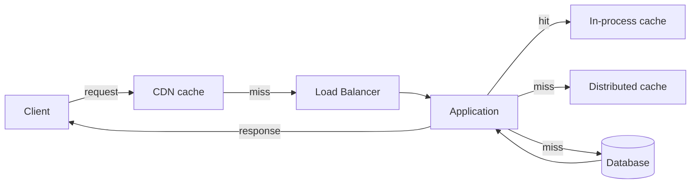

# Performance and Scalability

## Chapter Goal

After reading this chapter, an experienced engineer can diagnose
performance bottlenecks using profiling and percentile analysis,
choose between caching, indexing, async processing, and horizontal
scaling based on the workload shape, design systems that handle 10x
traffic bursts without re-architecture, set and enforce performance
budgets for frontend and backend services, explain the trade-offs
between latency, throughput, cost, and consistency in a Tech Lead
interview, and lead capacity planning conversations with concrete
data instead of intuition.

## Why This Matters for a Tech Lead

Performance is where users feel architecture. A page that loads in
5 seconds instead of 1 second can lose roughly 20-30% of users
(exact figures vary by industry and device) — and that loss compounds
with every interaction. A Tech Lead owns
performance at three levels:

- **Prevention.** Establishing performance budgets, enforcing them in
  CI, and ensuring the team profiles before optimizing. Most
  performance problems are created months before they surface.
- **Diagnosis.** When production is slow, the Tech Lead must navigate
  from symptom ("the API is slow") to root cause ("the N+1 query on
  the orders endpoint is generating 400 database round trips per
  request") in minutes, not hours. This requires structured
  investigation: metrics → traces → profiles → fix.
- **Architecture decisions.** Choosing between vertical scaling,
  horizontal scaling, caching, async processing, or denormalization
  is a Tech Lead decision with cost, complexity, and consistency
  implications. The wrong choice wastes engineering time and money.
  The right choice buys the team 12-18 months of runway.

Performance is also a hiring signal. A candidate who says "we added
Redis and the problem went away" reveals they optimized without
measuring. A candidate who says "we profiled and found that 80% of
the latency came from a serialization step; we switched to a
streaming serializer and reduced p99 from 1.2s to 180ms" reveals
production maturity.

## Mental Model

Think of performance optimization as **finding the narrowest pipe
in the system and widening it, then repeating**. Every request
flows through a pipeline: network → load balancer → application →
database → serialization → response. The slowest stage determines
the end-to-end latency. Optimizing a fast stage does nothing.

Latency and throughput are different problems:

- **Latency** is how long one request takes. Reduce it by removing
  work from the hot path (caching, precomputation, fewer round
  trips).
- **Throughput** is how many requests the system handles per second.
  Increase it by adding capacity (horizontal scaling, connection
  pooling) or reducing per-request resource consumption.

A system can have low latency but low throughput (single-threaded
server) or high throughput but high latency (batch processing). The
Tech Lead must know which dimension the business cares about.



Each layer is a cache boundary. A request that hits the CDN cache
returns in single-digit milliseconds. A request that misses every
cache and reaches the database might take 200-500ms. The goal is to
maximize the hit rate at the outermost layer and minimize the cost
of misses at the innermost layer.

**The percentile trap:** Averages lie. A service with an average
latency of 50ms might have a p99 of 2 seconds — meaning 1 in 100
users waits 40 times longer than the average suggests. In fan-out
architectures (where a single user request triggers 20 downstream
calls), tail latency compounds: if each downstream call has a 1%
chance of being slow, the user-facing request has a 20% chance of
being slow. Always measure and optimize percentiles, not averages.

## Core Terminology

| Term | Definition |
| --- | --- |
| **Latency** | Time from request sent to response received. Usually measured at p50 (median), p95 (most users), and p99 (tail). |
| **Throughput** | Number of requests processed per unit of time (RPS, QPS). |
| **Tail latency** | The latency experienced by the slowest requests (p99, p99.9). Disproportionately affects user experience in fan-out systems. |
| **Percentile (p50, p95, p99)** | The value below which a given percentage of observations fall. p99 = 200ms means 99% of requests complete in ≤ 200ms. |
| **Back-pressure** | A mechanism that slows producers when consumers cannot keep up. Prevents queue overflow and cascading failure. |
| **Load shedding** | Deliberately rejecting requests under extreme load to preserve service for remaining requests. A safety valve. |
| **Cache stampede** | When many requests simultaneously miss the cache for the same key, all hitting the database at once. Also called thundering herd. |
| **Hot key** | A cache or database key accessed disproportionately often. Creates a bottleneck on a single node in distributed systems. |
| **Fan-out** | A request pattern where one incoming request triggers multiple downstream requests. Amplifies tail latency. |
| **Memoization** | Caching the result of a pure function call based on its arguments. A special case of caching at the function level. |
| **Connection pool** | A pre-allocated set of reusable connections to a database or service. Avoids the overhead of establishing a new connection per request. |
| **N+1 query** | A data access anti-pattern where fetching N items requires 1 query for the list + N queries for related data. Solved by eager loading or batching. |
| **Core Web Vitals** | Google's user-centric performance metrics: LCP (Largest Contentful Paint), INP (Interaction to Next Paint), CLS (Cumulative Layout Shift). |
| **Code splitting** | Breaking a JavaScript bundle into smaller chunks loaded on demand. Reduces initial load time. |
| **Virtualization (UI)** | Rendering only the visible items in a long list, not the full DOM. Keeps the DOM small and rendering fast. |
| **CDN (Content Delivery Network)** | A globally distributed network of edge servers that caches and serves static content close to users. |
| **Autoscaling** | Automatically adjusting the number of compute instances based on demand metrics (CPU, request rate, queue depth). |
| **Rate limiting** | Restricting the number of requests a client can make in a time window. Protects the system from abuse and overload. |
| **Performance budget** | A maximum threshold for a performance metric (bundle size, load time, p99 latency) enforced in CI. |

**Key distinctions:**

- **Latency vs throughput:** A system can have 5ms latency per
  request but only handle 100 RPS (connection-limited). Another
  system can handle 100,000 RPS with 50ms latency (throughput-
  optimized). The bottleneck determines which dimension to fix.
- **Horizontal vs vertical scaling:** Vertical scaling (bigger
  machine) is simpler but has a ceiling. Horizontal scaling (more
  machines) is unlimited but requires stateless design.
- **Caching vs precomputation:** Caching stores results after the
  first computation. Precomputation generates results before the
  first request. Caching is reactive; precomputation is proactive.
- **Back-pressure vs load shedding:** Back-pressure slows the
  producer (queue is full, wait). Load shedding rejects the request
  (return 503). Back-pressure preserves correctness; load shedding
  preserves availability.

## Theoretical Foundation

### Frontend performance

Frontend performance is measured from the user's perspective: how
fast does the page appear, how fast can the user interact, and does
the layout shift during loading? Google's Core Web Vitals formalize
these:

| Metric | What it measures | Good threshold | Common cause of failure |
| --- | --- | --- | --- |
| **LCP (Largest Contentful Paint)** | Time until the largest visible element renders | ≤ 2.5 seconds | Large unoptimized images, slow server response, render-blocking CSS/JS |
| **INP (Interaction to Next Paint)** | Responsiveness — time from user input to visual update | ≤ 200ms | Long JavaScript tasks blocking the main thread, excessive re-renders |
| **CLS (Cumulative Layout Shift)** | Visual stability — how much the layout moves during loading | ≤ 0.1 | Images without dimensions, dynamically injected content, web fonts loading late |

> Verify Core Web Vitals thresholds and metric definitions against
> the current web.dev documentation. INP replaced FID (First Input
> Delay) as of March 2024.

**Bundle size and code splitting:**

A JavaScript bundle is the total code shipped to the browser. Every
kilobyte adds parse time, compile time, and execution time — on
mobile devices, a 1 MB bundle can take 3-4 seconds to parse alone.

Code splitting breaks the bundle into smaller chunks:

- **Route-based splitting:** Each page loads only its own code.
  The home page does not load the settings page's code.
- **Component-based splitting:** Heavy components (rich text editor,
  chart library) are loaded only when the user navigates to them.
- **Vendor splitting:** Third-party libraries are separated into a
  stable chunk that changes rarely and caches long-term.

```ts
import { lazy, Suspense } from "react";

const AdminDashboard = lazy(() => import("./AdminDashboard"));

function App() {
  return (
    <Suspense fallback={<Loading />}>
      <AdminDashboard />
    </Suspense>
  );
}
```

**What this does:** Loads `AdminDashboard` only when it is rendered,
not on initial page load. The user who never visits the admin page
never downloads its code.

**Common mistake:** Splitting too aggressively. If every component
is lazy-loaded, the user experiences a waterfall of loading spinners.
Split at route boundaries and at genuinely large components (> 50 KB
gzipped). Splitting a 2 KB utility creates overhead without benefit.

**Frontend bundle analysis checklist:**

```text
Bundle Analysis Checklist (run before each release)

1. Build with source maps:
   npm run build -- --source-map

2. Analyze chunk composition:
   npx webpack-bundle-analyzer dist/stats.json

3. Check for:
   [ ] Duplicate packages (e.g., two versions of lodash)
   [ ] Large single imports (e.g., import _ from "lodash"
       instead of import groupBy from "lodash/groupBy")
   [ ] Dev-only dependencies in production bundle
       (e.g., faker, storybook, testing-library)
   [ ] Unintended polyfills (core-js adding 80 KB)
   [ ] CSS-in-JS runtime shipping unused styles

4. Record sizes (gzipped):
   main.js:    ___ KB  (budget: 150 KB)
   vendor.js:  ___ KB  (budget: 100 KB)
   total CSS:  ___ KB  (budget:  50 KB)
   largest image: ___ KB (budget: 200 KB)

5. Compare to previous release:
   Δ main.js:   +/- ___ KB
   Δ vendor.js:  +/- ___ KB
```

**What this does:** A repeatable checklist for identifying the most
common bundle size regressions. Running it before each release
catches problems that CI budget checks (which only flag total size)
miss.

**Why it is useful:** Most bundle bloat is invisible — duplicate
packages, unused polyfills, and dev-only code are added by
dependency updates, not by feature work. This checklist surfaces
the causes, not only the symptom.

**Common mistake:** Only checking total bundle size. The total may
stay within budget while a single chunk grows from 30 KB to 120 KB,
degrading the route that loads it.

**Production change:** Automate the checklist in CI. Use
`webpack-bundle-analyzer` in JSON mode to generate diffs between
builds and flag regressions in PR comments.

**Tech Lead check:** Verify the team runs this analysis at least
monthly. Review the vendor chunk for unnecessary transitive
dependencies.

**Image optimization:**

Images are often 50-70% of total page weight on media-heavy sites.
Optimization levers:

1. **Format:** Use WebP or AVIF instead of JPEG/PNG. WebP is
   roughly 25-35% smaller than JPEG at equivalent visual quality
   (varies by content type). AVIF offers even better compression
   but has narrower browser support.
2. **Responsive images:** Serve different sizes based on viewport
   width using `srcset`. Do not serve a 2000px image to a 400px
   mobile screen.
3. **Lazy loading:** Load images below the fold only when the user
   scrolls near them (`loading="lazy"` on `` tags).
4. **CDN with transformation:** Use Cloudflare Images, Imgix, or
   CloudFront with Lambda@Edge to resize and convert images on the
   fly based on the requesting device.

```ts
function OptimizedImage({ src, alt }: { src: string; alt: string }) {
  return (
    <picture>
      <source
        type="image/avif"
        srcSet={`${src}?format=avif&w=400 400w, ${src}?format=avif&w=800 800w`}
        sizes="(max-width: 600px) 400px, 800px"
      />
      <source
        type="image/webp"
        srcSet={`${src}?format=webp&w=400 400w, ${src}?format=webp&w=800 800w`}
        sizes="(max-width: 600px) 400px, 800px"
      />
      
    </picture>
  );
}
```

**What this does:** Serves AVIF to browsers that support it (best
compression), falls back to WebP, then to the original format. The
`srcSet` and `sizes` attributes tell the browser to download the
400px variant on mobile and the 800px variant on desktop. The
`loading="lazy"` attribute defers loading until the image scrolls
near the viewport. The explicit `width` and `height` prevent CLS.

**Common mistake:** Omitting `width` and `height` on `` tags.
Without them, the browser does not know the image dimensions until
it loads, causing layout shift (CLS penalty).

**Production change:** Use a CDN image transformation service
(Cloudflare Images, Imgix) that generates the format and size
variants on the fly from a single source image instead of manually
generating variants at build time.

**Tech Lead check:** Verify that hero images above the fold do NOT
use `loading="lazy"` — lazy loading the LCP image delays it and
hurts the LCP score.

**Rendering performance and memoization:**

In React and similar frameworks, rendering performance depends on
minimizing unnecessary re-renders:

- **`React.memo`** prevents re-rendering a component when its props
  have not changed. Use it for expensive components, not for every
  component — the comparison itself has a cost.
- **`useMemo`** caches a computed value between renders. Use it for
  expensive computations (sorting large lists, complex calculations),
  not for simple values.
- **`useCallback`** caches a function reference. Use it when passing
  callbacks to memoized child components — without `useCallback`,
  a new function reference on every render defeats `React.memo`.

**Common mistake:** Memoizing everything. The comparison cost of
`React.memo` is wasted on components that re-render infrequently or
are cheap to render. Profile with React DevTools Profiler before
adding memoization.

```ts
import { memo, useMemo, useCallback, useState } from "react";

interface OrderRowProps {
  order: { id: string; total: number; status: string };
  onSelect: (id: string) => void;
}

const OrderRow = memo(function OrderRow({ order, onSelect }: OrderRowProps) {
  return (
    <tr onClick={() => onSelect(order.id)}>
      <td>{order.id}</td>
      <td>${order.total.toFixed(2)}</td>
      <td>{order.status}</td>
    </tr>
  );
});

function OrderTable({ orders, filter }: { orders: OrderRowProps["order"][]; filter: string }) {
  const [selectedId, setSelectedId] = useState<string | null>(null);

  const filteredOrders = useMemo(
    () => orders.filter((o) => o.status === filter),
    [orders, filter]
  );

  const handleSelect = useCallback((id: string) => {
    setSelectedId(id);
  }, []);

  return (
    <table>
      <tbody>
        {filteredOrders.map((order) => (
          <OrderRow key={order.id} order={order} onSelect={handleSelect} />
        ))}
      </tbody>
    </table>
  );
}
```

**What this does:** `OrderRow` is memoized with `React.memo` — it
only re-renders when its `order` or `onSelect` props change.
`filteredOrders` is computed with `useMemo` — the filter runs only
when `orders` or `filter` change, not on every render. `handleSelect`
is stabilized with `useCallback` — without it, a new function
reference on every render would defeat `OrderRow`'s memoization.

**Common mistake:** Using `useMemo` for cheap computations. Filtering
10 items is faster than the memoization overhead. Use `useMemo` when
the list has hundreds of items or the computation is expensive.

**Production change:** For lists exceeding 100 items, combine
memoization with virtualization (below) — memoization prevents
re-renders, virtualization prevents DOM bloat.

**Tech Lead check:** Profile with React DevTools Profiler before
approving memoization PRs. If a component re-renders < 5 times per
user interaction, memoization is premature.

**Virtualization (windowing):**

For long lists (hundreds or thousands of items), rendering every
DOM element is expensive. Virtualization libraries (react-window,
TanStack Virtual) render only the items visible in the viewport
plus a small overscan buffer. A list of 10,000 items renders ~20
DOM nodes at any given time.

```ts
import { useVirtualizer } from "@tanstack/react-virtual";
import { useRef } from "react";

function VirtualizedList({ items }: { items: { id: string; name: string }[] }) {
  const parentRef = useRef<HTMLDivElement>(null);

  const virtualizer = useVirtualizer({
    count: items.length,
    getScrollElement: () => parentRef.current,
    estimateSize: () => 40,
    overscan: 5,
  });

  return (
    <div ref={parentRef} style={{ height: 400, overflow: "auto" }}>
      <div style={{ height: virtualizer.getTotalSize(), position: "relative" }}>
        {virtualizer.getVirtualItems().map((row) => (
          <div
            key={items[row.index].id}
            style={{
              position: "absolute",
              top: row.start,
              height: row.size,
              width: "100%",
            }}
          >
            {items[row.index].name}
          </div>
        ))}
      </div>
    </div>
  );
}
```

> Verify `@tanstack/react-virtual` API (`useVirtualizer`,
> `getVirtualItems`, `getTotalSize`) against current documentation.

**What this does:** Renders only the visible rows (plus 5 overscan
rows above and below) regardless of list length. A list of 50,000
items renders ~15 DOM nodes at any time.

**Why it is useful:** Rendering 50,000 DOM nodes causes jank, high
memory usage, and seconds-long initial render. Virtualization keeps
the DOM size constant at O(viewport) instead of O(data).

**Common mistake:** Using virtualization for short lists (< 100
items). The overhead of measuring, positioning, and recycling DOM
nodes is not worth it for small lists — a simple `map()` is faster.

**Production change:** Handle variable row heights with a dynamic
`estimateSize` function and measure actual rendered heights. Fixed
row heights are easier but many UIs have variable content.

**Tech Lead check:** Verify that keyboard navigation and
accessibility still work. Virtualized lists can break screen
readers if ARIA roles (`role="listbox"`, `role="option"`) are not
applied to the virtual elements.

**Tech Lead perspective:** Set a frontend performance budget and
enforce it in CI. Example budgets: initial JavaScript bundle < 200 KB
gzipped, LCP < 2.5 seconds on 4G, no page loads more than 500 KB
of images. Use `bundlesize` or webpack-bundle-analyzer to track
bundle size over time. Review the Lighthouse score in every sprint.

### Backend performance

Backend performance bottlenecks fall into five categories:

1. **I/O wait** — the most common bottleneck. Database queries,
   external API calls, file reads. The application spends time
   waiting for data, not processing it.
2. **Serialization** — converting objects to JSON, Protocol Buffers,
   or database wire format. Expensive for large payloads.
3. **Memory allocation and GC pressure** — creating many short-lived
   objects triggers garbage collection pauses. Visible as periodic
   latency spikes in languages with GC (Java, Go, Node.js).
4. **Lock contention** — threads waiting for shared resources. A
   single global mutex can serialize a highly concurrent system.
5. **CPU-bound computation** — hash calculations, image processing,
   complex business logic. Rare for web services but dominates in
   data processing.

**Database indexes:**

An index is a data structure (typically a B-tree) that allows the
database to find rows without scanning the entire table. Without
an index, a query on a 10-million-row table scans all 10 million
rows. With an index, the same query touches a few dozen nodes.

| Index type | Use case | Trade-off |
| --- | --- | --- |
| **B-tree (default)** | Equality and range queries (`WHERE status = 'active'`, `WHERE created_at > '2024-01-01'`) | General-purpose. Slower for full-text and spatial queries. |
| **Hash** | Exact equality (`WHERE id = 42`) | Faster than B-tree for equality, but does not support range queries or ordering. |
| **GIN (Generalized Inverted)** | Full-text search, JSONB containment (`WHERE tags @> '{"urgent"}')` | Supports complex queries but slower to update. |
| **Partial index** | Index only a subset of rows (`WHERE status = 'active'`) | Smaller and faster, but only useful for queries matching the predicate. |
| **Composite index** | Multi-column queries (`WHERE tenant_id = 1 AND created_at > '2024-01-01'`) | Column order matters — the leftmost prefix rule applies. |

**Common mistake:** Adding indexes without measuring write impact.
Every index is updated on every INSERT, UPDATE, and DELETE. A table
with 10 indexes pays 10x the write overhead. For write-heavy tables,
each additional index must justify its existence with query
performance data.

**Tech Lead perspective:** Require `EXPLAIN ANALYZE` output in PRs
that add or change queries. Track slow query logs weekly. Set an
alert for queries exceeding the p95 latency threshold. Enforce a
rule: no new index without a query plan showing a sequential scan
on a table with > 100,000 rows.

```sql
-- Before: sequential scan on 8M rows (2,400ms)
EXPLAIN ANALYZE
SELECT * FROM orders
WHERE tenant_id = 42
  AND status = 'active'
  AND created_at > '2024-01-01'
ORDER BY created_at DESC
LIMIT 50;

-- Seq Scan on orders  (cost=0.00..285432.00 rows=8000000)
--   Filter: (tenant_id = 42 AND status = 'active' AND ...)
--   Rows Removed by Filter: 7,999,200
--   Execution Time: 2,412.33 ms

-- Fix: composite index with correct column order
CREATE INDEX CONCURRENTLY idx_orders_tenant_status_created
  ON orders (tenant_id, status, created_at DESC);

-- After: index scan (3ms)
-- Index Scan using idx_orders_tenant_status_created
--   Index Cond: (tenant_id = 42 AND status = 'active'
--                AND created_at > '2024-01-01')
--   Rows: 50
--   Execution Time: 3.21 ms
```

**What this does:** Replaces a full table scan on 8 million rows
with an index scan that touches ~50 rows. The composite index
column order matches the query's equality conditions first
(`tenant_id`, `status`) followed by the range condition
(`created_at`), which satisfies the leftmost prefix rule.

**Why it is useful:** This is the most common backend performance
fix. A single missing index can turn a 3ms query into a 2,400ms
query under production data volume.

**Common mistake:** Wrong column order in the composite index.
`(created_at, tenant_id, status)` would not help this query because
the leftmost column (`created_at`) uses a range condition — the
database cannot use the index efficiently for the subsequent
equality filters.

**Production change:** Always use `CREATE INDEX CONCURRENTLY` in
PostgreSQL to avoid locking the table during index creation. A
regular `CREATE INDEX` on an 8M-row table can lock writes for
minutes.

**Tech Lead check:** After adding the index, check the write impact.
Run `EXPLAIN ANALYZE` on an INSERT and compare the execution time
before and after. If the table receives > 1,000 writes/second,
the additional index maintenance overhead must be justified.

**Backend caching:**

Caching stores the result of an expensive operation so subsequent
requests skip the computation. Cache effectiveness depends on the
hit rate — the proportion of requests served from cache.

**Cache hierarchy:**

| Layer | Location | Latency | Use case |
| --- | --- | --- | --- |
| **In-process** | Application memory (HashMap, LRU) | ~1 μs | Small, frequently accessed data (config, feature flags, user sessions). Invalidation is local — each instance has its own copy. |
| **Distributed** | Redis, Memcached | ~1 ms | Shared across instances. Consistent view. Best for computed results that are expensive to regenerate. |
| **CDN** | Edge servers (CloudFront, Cloudflare) | ~5-50 ms (network) | Static assets, API responses with appropriate `Cache-Control` headers. Geographic proximity to users. |
| **Browser** | User's device | 0 ms (no network) | Static assets, API responses with ETags or `Cache-Control: max-age`. |

**Cache invalidation strategies:**

1. **TTL (Time-to-Live):** The cache entry expires after a fixed
   duration. Simple but allows stale data for up to the TTL period.
2. **Write-through:** The application updates the cache when it
   writes to the database. Consistent but adds latency to writes.
3. **Write-behind (write-back):** The application writes to the
   cache first and asynchronously writes to the database. Faster
   writes but risks data loss if the cache fails before the write
   is flushed.
4. **Event-driven invalidation:** A database change event (CDC, pub/
   sub) triggers cache invalidation. Eventually consistent but
   decouples the write path from the cache path.

```ts
import Redis from "ioredis";

const redis = new Redis({ host: "cache.internal", port: 6379 });
const DEFAULT_TTL = 300; // 5 minutes

async function getCachedProduct(productId: string) {
  const cacheKey = `product:${productId}`;
  const cached = await redis.get(cacheKey);
  if (cached) return JSON.parse(cached);

  const product = await db.query("SELECT * FROM products WHERE id = $1", [productId]);
  if (product) {
    const jitter = Math.floor(Math.random() * 60); // 0-60s jitter
    await redis.set(cacheKey, JSON.stringify(product), "EX", DEFAULT_TTL + jitter);
  }
  return product;
}

async function invalidateProduct(productId: string) {
  await redis.del(`product:${productId}`);
}
```

> Verify `ioredis` constructor options and `set` with `EX` flag
> against current ioredis npm documentation.

**What this does:** Implements cache-aside with TTL jitter. On
read: check Redis first, fall back to the database on miss, populate
the cache with a randomized TTL. On write: explicitly delete the
cache key so the next read fetches fresh data.

**Why it is useful:** The TTL jitter (±60 seconds) prevents
synchronized cache expiration across keys set at the same time.
Without jitter, a batch import that caches 10,000 products at
once causes a stampede 5 minutes later when all keys expire.

**Common mistake:** Using `set` without `EX` (no TTL). The key
lives forever, consuming Redis memory and serving stale data
indefinitely. Another mistake: caching `null` results without a
shorter TTL — a missing product fills the cache with `null` for
5 minutes, hiding newly added products.

**Production change:** Add circuit breaking around Redis calls. If
Redis is unreachable, fall back to the database instead of throwing.
Add metrics for cache hit/miss rate per key pattern.

**Tech Lead check:** Review the key naming scheme (`product:{id}`).
Keys must be namespaced by service to avoid collisions in shared
Redis clusters. Verify TTL values match the business staleness
tolerance.

**Cache stampede prevention:**

When a popular cache key expires, many concurrent requests miss the
cache simultaneously and all hit the database — a cache stampede.
Prevention strategies:

- **Single-flight (request coalescing):** The first request for an
  expired key computes the result; concurrent requests wait for that
  result instead of triggering their own computation.
- **Early recomputation (stale-while-revalidate):** The cache entry
  is refreshed before it expires, while the stale value is still
  served.
- **TTL jitter:** Add a random offset to cache TTLs so entries do
  not expire at the same time.
- **Locking:** Acquire a distributed lock before recomputing. Only
  one process recomputes; others wait or serve stale data.

**Connection pooling:**

Establishing a database connection is expensive — TCP handshake, TLS
negotiation, authentication. A connection pool maintains a set of
pre-established connections that are reused across requests.

Key parameters:

- **Minimum pool size:** The number of connections kept alive during
  low traffic. Too low = cold start latency. Too high = idle resource
  waste.
- **Maximum pool size:** The cap on concurrent connections. Must be
  less than the database's maximum connection limit (divided by the
  number of application instances).
- **Connection timeout:** How long to wait for a connection from the
  pool before failing. A short timeout surfaces contention early;
  a long timeout queues requests and inflates latency.

**Common mistake:** Setting the maximum pool size equal to the
database maximum connection limit. With 10 application instances
each configured for 100 connections, the database needs 1,000
connection slots — far above the default for most databases
(PostgreSQL defaults to 100). Use PgBouncer or a similar proxy
for connection multiplexing.

```ts
import { Pool } from "pg";

const pool = new Pool({
  host: process.env.DB_HOST,
  port: 5432,
  database: "myapp",
  user: process.env.DB_USER,
  password: process.env.DB_PASSWORD,
  ssl: { rejectUnauthorized: true },

  max: 10,
  min: 2,
  idleTimeoutMillis: 30_000,
  connectionTimeoutMillis: 5_000,
  statement_timeout: 10_000,
});

pool.on("error", (err) => {
  console.error("Unexpected pool error:", err.message);
});

pool.on("connect", () => {
  pool.query("SET statement_timeout = '10s'");
});
```

> Verify `pg` Pool constructor options (`statement_timeout`, `ssl`
> options) against the current `pg` npm package documentation.

**What this does:** Configures a PostgreSQL connection pool with
production-safe defaults: max 10 connections per instance, 5-second
connection timeout (fail fast if the database is overloaded), and
10-second statement timeout (kill runaway queries).

**Why it is useful:** The `max: 10` setting is deliberate. With 20
application instances, total connections = 200. A PostgreSQL RDS
instance with 4 GB RAM supports roughly 200-400 connections. The
`statement_timeout` prevents a single slow query from holding a
connection indefinitely.

**Common mistake:** Setting `max: 100` "for headroom." With 20
instances, that demands 2,000 connections — exceeding PostgreSQL's
capacity, causing connection refused errors and cascading failures.

**Production change:** Monitor pool metrics: `pool.totalCount`,
`pool.idleCount`, `pool.waitingCount`. Alert when `waitingCount > 0`
sustained for > 30 seconds — that means requests are queuing for
connections. Consider PgBouncer for connection multiplexing when
running > 20 instances.

**Tech Lead check:** Calculate the fleet-wide connection budget:
`max_per_instance × instance_count ≤ database_max_connections × 0.8`
(leave 20% for admin connections, migrations, monitoring). Document
this formula in the runbook.

**Async processing and queues:**

Not every operation belongs on the request hot path. Operations that
are slow, unreliable, or whose failure should not fail the user
request belong in a background queue:

- **Email and notification sending** — takes 200-500ms, can fail,
  user does not need to wait.
- **Image and video processing** — takes seconds to minutes.
- **Analytics event recording** — fire-and-forget.
- **Third-party API calls** — unreliable, can be retried.

Pattern: the API handler publishes a message to a queue (SQS,
RabbitMQ, Kafka) and returns 202 Accepted. A worker process
consumes the message and processes it asynchronously.

**Back-pressure:** When the consumer cannot keep up with the
producer, the queue grows. Without limits, the queue consumes
all available memory and the system crashes. Back-pressure
mechanisms:

- **Bounded queue:** Reject new messages when the queue is full.
  The producer receives an error and can retry or shed load.
- **Rate limiting:** Limit the producer's publish rate.
- **Consumer scaling:** Auto-scale workers based on queue depth.

See [CI/CD and DevOps](./17-ci-cd-and-devops.md) for deployment
patterns that affect performance (canary, blue/green).

### Scaling strategies

**Vertical scaling (scale up):**

Add more CPU, memory, or disk to a single machine. Simple: no code
changes, no distributed coordination. Limited: every machine has a
ceiling (the largest available instance type). Expensive at the top
end — a 64-core instance costs more than 8× the price of an
8-core instance.

**When to choose vertical scaling:**
- The application is stateful and hard to distribute (single-node
  database, in-memory cache with complex state).
- The team is small and the operational cost of distributed systems
  is too high.
- The workload is CPU-bound and parallelizes within a single process.

**Horizontal scaling (scale out):**

Add more instances. Unlimited ceiling (theoretically). Requires
stateless application design — no local state, no sticky sessions,
shared-nothing architecture.

**Prerequisites for horizontal scaling:**
1. Session state stored externally (Redis, database).
2. No local file system dependencies.
3. Configuration loaded from environment or a central store.
4. Database connections pooled and limited per instance.
5. Health checks and graceful shutdown implemented.

**Autoscaling:**

Autoscaling adjusts the number of instances based on demand metrics:

| Metric | Good for | Risk |
| --- | --- | --- |
| **CPU utilization** | CPU-bound workloads | Delayed response to I/O-bound spikes (CPU stays low while requests queue) |
| **Request rate (RPS)** | Predictable traffic patterns | May not reflect actual resource consumption |
| **Queue depth** | Worker scaling | Delayed — the queue must grow before scaling triggers |
| **Custom metrics (p99 latency)** | SLO-based scaling | More complex to configure but most accurate |

**Autoscaling pitfalls:**
- **Scale-up lag:** New instances take 1-3 minutes to start (boot,
  deploy, warm up). During this window, existing instances absorb
  the full load.
- **Scale-down thrashing:** Aggressive scale-down removes instances,
  traffic redistributes, remaining instances overload, scaling
  triggers again. Use a cooldown period (5-10 minutes).
- **Cold start cost:** Serverless functions (Lambda) and freshly
  started containers need time to warm up (JIT compilation,
  connection pool initialization). First requests are slow.

See [AWS](./04-aws.md) for Auto Scaling Group configuration and
[Docker and Kubernetes](./03-docker-and-kubernetes.md) for HPA.

```yaml
apiVersion: autoscaling/v2
kind: HorizontalPodAutoscaler
metadata:
  name: orders-api
spec:
  scaleTargetRef:
    apiVersion: apps/v1
    kind: Deployment
    name: orders-api
  minReplicas: 3
  maxReplicas: 20
  behavior:
    scaleUp:
      stabilizationWindowSeconds: 60
      policies:
        - type: Percent
          value: 50
          periodSeconds: 60
    scaleDown:
      stabilizationWindowSeconds: 300
      policies:
        - type: Percent
          value: 25
          periodSeconds: 120
  metrics:
    - type: Resource
      resource:
        name: cpu
        target:
          type: Utilization
          averageUtilization: 70
    - type: Pods
      pods:
        metric:
          name: http_requests_per_second
        target:
          type: AverageValue
          averageValue: "500"
```

> Verify `autoscaling/v2` HPA spec, `behavior` field, and
> `stabilizationWindowSeconds` against current Kubernetes
> documentation.

**What this does:** Configures Kubernetes HPA for the orders-api
with two scaling metrics (CPU utilization and requests per second),
a minimum of 3 replicas, and asymmetric scaling behavior: scale up
aggressively (50% more pods per minute) but scale down cautiously
(25% fewer pods every 2 minutes with a 5-minute stabilization
window).

**Why it is useful:** The asymmetric behavior prevents thrashing.
Scale-up must be fast to absorb traffic spikes. Scale-down must be
slow to avoid removing capacity during temporary dips that lead to
oscillation.

**Common mistake:** Using only CPU as the scaling metric for I/O-
bound services. An API that waits on database queries may use 20%
CPU at overload — CPU-based scaling never triggers. Adding a
request-rate metric catches this case.

**Production change:** Add a custom metric for p99 latency. Scale
when p99 approaches the SLO threshold rather than when a resource
metric is saturated. This is SLO-driven scaling — the most
responsive approach.

**Tech Lead check:** Verify `minReplicas` provides enough capacity
for average traffic without scaling. Scaling from 1 to 10 during a
spike takes too long. Setting `minReplicas: 3` with headroom
handles moderate bursts immediately.

### Rate limiting and load shedding

Rate limiting protects the system from abuse and overload by
restricting the number of requests a client can make:

| Algorithm | How it works | Trade-off |
| --- | --- | --- |
| **Fixed window** | Count requests in a fixed time window (e.g., 100/minute). Reset at window boundary. | Simple but allows burst at the window boundary (200 requests in 2 seconds if timed across the boundary). |
| **Sliding window** | Weighted count based on current and previous windows. | Smoother than fixed window, slightly more complex. |
| **Token bucket** | A bucket fills with tokens at a fixed rate. Each request consumes a token. When empty, requests are rejected. | Allows short bursts (bucket can be full) while enforcing an average rate. Most commonly used in production. |
| **Leaky bucket** | Requests enter a FIFO queue drained at a fixed rate. | Smooths traffic completely but adds latency (queuing). |

**Load shedding** is the last line of defense: when the system is
overwhelmed, deliberately reject requests (return HTTP 503 or 429)
to preserve service quality for the remaining requests. Without load
shedding, an overloaded system degrades for everyone — latency
spikes, timeouts cascade, and the system enters a death spiral.

**Tech Lead perspective:** Rate limiting and load shedding are not
optional for any internet-facing service. Implement rate limiting
at the API gateway or load balancer layer (not in application code,
where it is harder to enforce consistently). Set limits based on
capacity testing, not guesses. Review rate limit thresholds quarterly
as traffic patterns change.

```ts
import type { Request, Response, NextFunction } from "express";
import Redis from "ioredis";

const redis = new Redis({ host: "cache.internal", port: 6379 });

const WINDOW_SECONDS = 60;
const MAX_REQUESTS = 100;

export async function rateLimiter(req: Request, res: Response, next: NextFunction) {
  const key = `ratelimit:${req.ip}`;
  const current = await redis.incr(key);

  if (current === 1) {
    await redis.expire(key, WINDOW_SECONDS);
  }

  res.setHeader("X-RateLimit-Limit", MAX_REQUESTS);
  res.setHeader("X-RateLimit-Remaining", Math.max(0, MAX_REQUESTS - current));

  if (current > MAX_REQUESTS) {
    res.setHeader("Retry-After", WINDOW_SECONDS);
    res.status(429).json({ error: "Rate limit exceeded" });
    return;
  }

  next();
}
```

**What this does:** A fixed-window rate limiter using Redis as the
shared counter. Each IP address gets 100 requests per 60-second
window. The `INCR` and `EXPIRE` commands are atomic in Redis — the
counter increments and the key expires automatically.

**Why it is useful:** Rate limiting at the middleware level protects
every endpoint uniformly. The response headers (`X-RateLimit-Limit`,
`X-RateLimit-Remaining`, `Retry-After`) let well-behaved clients
self-throttle before hitting the limit.

**Common mistake:** Not setting `EXPIRE` on the key. Without
expiration, the counter grows forever and the client is permanently
blocked after reaching the limit.

**Production change:** Use a sliding window or token bucket instead
of fixed window to prevent boundary burst (a client can send 200
requests in 2 seconds by timing them across the window boundary).
Use the API key or user ID instead of IP address for authenticated
endpoints — IP-based limiting does not work behind shared NATs.

**Tech Lead check:** Rate limits must be configured per-endpoint
sensitivity. Login endpoints need stricter limits (10/minute) than
listing endpoints (100/minute). Verify that rate limiting is
applied at the API gateway or load balancer for internet-facing
services — application-level middleware alone misses requests that
fail before reaching the application.

### CDN and regional deployment

A CDN caches static content at edge servers distributed globally.
Benefits:

1. **Reduced latency:** Content is served from the edge closest to
   the user (10-30ms vs 100-300ms from the origin).
2. **Reduced origin load:** Cache hits at the edge never reach the
   origin server.
3. **DDoS absorption:** CDN infrastructure absorbs volumetric attacks.

**When to use a CDN:**
- Static assets (JS, CSS, images, fonts) — always.
- API responses that are cacheable (public, read-only, not
  personalized) — with appropriate `Cache-Control` headers.
- Full-page caching for marketing sites and landing pages.

**When NOT to use CDN caching for API responses:**
- Personalized responses (user-specific data).
- Frequently changing data (real-time feeds).
- Responses with sensitive data (authentication tokens).

**Regional deployment** places application instances in multiple
geographic regions to reduce latency for global users:

- **Single-region:** All traffic routes to one region. Simplest.
  Users far from the region experience higher latency.
- **Multi-region active-passive:** One primary region handles writes;
  secondary regions handle reads. Reduces read latency globally.
  Writes still go to the primary.
- **Multi-region active-active:** All regions handle reads and
  writes. Lowest latency but introduces cross-region data
  replication complexity and consistency challenges.

**Tech Lead perspective:** Start single-region. Move to multi-region
only when latency requirements demand it (e.g., p95 < 100ms for
global users). Multi-region active-active is one of the most complex
architecture patterns — it requires conflict resolution, eventual
consistency, and careful data partitioning. Do not adopt it
prematurely.

**CDN caching strategy by content type:**

```text
Content Type           Cache-Control Header                  CDN TTL   Purge Strategy
─────────────────────  ────────────────────────────────────   ────────  ──────────────
Static assets (hashed) Cache-Control: public, max-age=31536000, immutable   1 year    Never (filename changes on new build)
Static assets (unhashed) Cache-Control: public, max-age=3600                1 hour    Purge on deploy
HTML pages             Cache-Control: public, max-age=60, s-maxage=300      5 min     Purge on content publish
Public API (product list) Cache-Control: public, s-maxage=30                30 sec    Event-driven purge on product update
Authenticated API      Cache-Control: private, no-store                     0         N/A — never cached at CDN
User-specific pages    Cache-Control: private, max-age=0                    0         N/A — never cached at CDN
```

**What this does:** Maps each content type to its appropriate cache
strategy. The key distinction: `public` means the CDN can cache it;
`private` means only the user's browser can cache it. `s-maxage`
overrides `max-age` for shared caches (CDN) while allowing a
different browser TTL.

**Why it is useful:** Most CDN misconfigurations come from applying
the same cache policy to all content. Hashed static assets can be
cached forever (the filename changes on rebuild). Authenticated
API responses must never be cached at the CDN.

**Common mistake:** Setting `Cache-Control: public` on responses
that include user-specific data. This causes the CDN to serve User
A's response to User B — a data leak.

**Production change:** Add `Vary: Accept-Encoding` for compressed
content. Add `Vary: Cookie` only if the response actually varies
by cookie — otherwise it defeats CDN caching (every user gets a
unique cached copy).

**Tech Lead check:** Audit `Cache-Control` headers quarterly. A
single misconfigured endpoint can cause data leaks or stale content.
Verify that cache purge works (deploy a change and confirm CDN
serves the new version within the expected TTL).

### Load testing and profiling

**Load testing** answers the question: "How does the system behave
under expected and peak traffic?" It is not a one-time activity — it
is part of the release process for capacity-sensitive services.

| Test type | Purpose | When to run |
| --- | --- | --- |
| **Smoke test** | Verify the system works under minimal load. | Every deployment. |
| **Load test** | Measure performance under expected peak traffic. | Before major launches, monthly for critical services. |
| **Stress test** | Find the breaking point — increase load until the system fails. | Quarterly or when capacity planning. |
| **Soak test** | Run sustained load for hours to find memory leaks, connection leaks, and GC degradation. | Before major launches. |

**Load testing pitfalls:**
- Testing in a non-production environment with different
  hardware, network, and data volume. Results do not transfer.
- Testing with uniform request patterns. Real traffic has hot spots,
  variable payload sizes, and bursty patterns.
- Not warming up the system before measuring. Cold JVMs, empty
  caches, and fresh connection pools produce artificially bad
  results.

```js
import http from "k6/http";
import { check, sleep } from "k6";

export const options = {
  stages: [
    { duration: "1m", target: 100 },   // ramp up to 100 VUs
    { duration: "5m", target: 500 },   // hold at 500 VUs (peak)
    { duration: "2m", target: 1000 },  // stress to 1000 VUs
    { duration: "1m", target: 0 },     // ramp down
  ],
  thresholds: {
    http_req_duration: [
      "p(95)<300",   // p95 under 300ms
      "p(99)<1000",  // p99 under 1s
    ],
    http_req_failed: ["rate<0.01"],    // < 1% error rate
  },
};

export default function () {
  const res = http.get("https://api.example.com/products?page=1");
  check(res, {
    "status is 200": (r) => r.status === 200,
    "body is not empty": (r) => r.body.length > 0,
  });
  sleep(0.5); // simulate user think time
}
```

> Verify k6 `options.stages`, `thresholds` syntax, and `check`
> API against the current k6 documentation.

**What this does:** A k6 load test that ramps traffic from 0 to
1,000 virtual users over 9 minutes. The `thresholds` block defines
pass/fail criteria — the test fails if p95 exceeds 300ms or error
rate exceeds 1%. The `sleep(0.5)` simulates realistic user pacing.

**Why it is useful:** k6 scripts are code, not GUI configurations.
They live in version control, run in CI, and produce machine-
readable results. The threshold-based pass/fail integrates with
deployment gates.

**Common mistake:** Not including think time (`sleep`). Without it,
each virtual user sends requests as fast as possible — far more
aggressive than real traffic. This inflates the apparent load and
produces misleading results.

**Production change:** Add multiple scenarios with different
endpoints (listing, detail, checkout) weighted by real traffic
distribution. Use k6 cloud or a distributed runner for tests
exceeding 1,000 VUs — a single machine cannot simulate that many
concurrent connections realistically.

**Tech Lead check:** The threshold values (p95 < 300ms, p99 < 1s)
must match the service SLO. If the SLO says "p99 < 500ms," the
load test threshold should be p99 < 500ms, not 1s.

**Profiling** answers the question: "Where is the time being spent?"

- **CPU profiling** shows which functions consume the most CPU time.
  Use it when the service is CPU-bound.
- **Memory profiling (heap analysis)** shows which objects consume
  the most memory. Use it to find memory leaks.
- **I/O profiling (tracing)** shows where the service waits for
  external I/O (database, HTTP calls). Use it when the service is
  I/O-bound — which is the common case for web services.

**Memory leaks:**

A memory leak is memory allocated but never freed. In garbage-
collected languages, this means objects referenced but never used.
Common causes:

- **Event listener leaks:** Registering listeners without removing
  them. Each listener holds a reference to its closure, which holds
  references to its surrounding scope.
- **Global caches without eviction:** An in-memory cache that grows
  without bound.
- **Closures capturing large scopes:** A callback function that
  captures a large object in its closure, preventing GC from
  collecting it.

**Detection:** Memory profiling (heap snapshots in Node.js,
`-XX:+HeapDumpOnOutOfMemoryError` in Java), monitoring RSS (Resident
Set Size) over time — a steadily increasing RSS that never
decreases indicates a leak.

**Profiling workflow for a slow Node.js endpoint:**

```text
Step 1: Identify the slow endpoint
  Dashboard shows: GET /api/reports p99 = 4.2s (SLO: 500ms)

Step 2: Reproduce under load
  k6 run --vus 50 --duration 2m reports-test.js

Step 3: CPU profile (is it CPU-bound?)
  node --prof app.js
  node --prof-process isolate-*.log > profile.txt
  → Result: 85% of CPU in JSON.stringify (serialization)

Step 4: Alternative — I/O profile with tracing
  Enable distributed tracing for /api/reports
  → Trace shows: db.query span = 3.8s (92% of total)

Step 5: Investigate the bottleneck
  If CPU: optimize the hot function (stream instead of stringify)
  If I/O: EXPLAIN ANALYZE the slow query, add index

Step 6: Verify the fix
  Re-run the same k6 test
  Compare: p99 before = 4.2s → p99 after = 320ms ✓
  Update the load test report and SLO dashboard
```

**What this does:** A structured profiling workflow that connects
the symptom (high p99) to the root cause (CPU or I/O) using
specific tools at each step.

**Why it is useful:** Most engineers skip Step 3 and guess the cause.
The profiler eliminates guessing — either CPU is saturated
(computation problem) or it is idle while waiting (I/O problem).
The fix is different for each.

**Common mistake:** Profiling in development with a small dataset.
A query that takes 5ms on 1,000 rows may take 4 seconds on 10
million rows. Profile with production-like data volume.

**Production change:** Use continuous profiling (Pyroscope, Datadog
Continuous Profiler) instead of ad-hoc profiling. Continuous
profiling runs in production at low overhead (2-5% CPU) and shows
hot functions over time — useful for detecting gradual regressions.

**Tech Lead check:** Ensure the profiling workflow is documented in
the team runbook. Engineers should not need to figure out how to
profile from scratch during an incident.

**Tech Lead perspective:** Load tests must produce percentile
reports (p50, p95, p99), not averages. The load test result is not
"average latency was 45ms" — it is "p99 was 380ms under 5,000 RPS,
and the system started degrading at 7,200 RPS." Store load test
results historically to detect regressions.

### Cost and performance trade-offs

Performance work has diminishing returns. Reducing p99 from 2
seconds to 200ms is high-impact. Reducing p99 from 200ms to 180ms
is rarely worth the engineering effort. The Tech Lead's job is to
know where the effort threshold is.

**The cost dimension:**

| Optimization | Approach | Monthly cost impact |
| --- | --- | --- |
| **Bigger instances** | Vertical scaling | Linear cost increase; fast to implement |
| **More instances** | Horizontal scaling | Linear cost increase; requires stateless design |
| **Redis cache** | Caching layer | $50-500/month depending on size; high ROI for read-heavy workloads |
| **CDN** | Edge caching | $0.01-0.08/GB; often reduces origin costs enough to be net-positive |
| **Code optimization** | Profiling + rewriting hot paths | Zero infrastructure cost but high engineering time |

**When to spend money vs engineering time:**

- If the fix is "add a Redis cache" and the problem is a read-heavy
  endpoint, spend the $100/month. The engineer's time is worth more
  than months of optimization.
- If the fix is "rewrite the serialization layer," evaluate whether
  the performance gain justifies the 2-week investment. Sometimes
  a bigger instance is cheaper.
- If the fix requires architectural change (sharding, async
  processing), it is a planning item for the next quarter, not a
  quick fix.

## Practical Usage

### Reducing p99 in an existing service

A structured investigation flow for a slow service:

1. **Check the dashboard.** Which endpoint is slow? What percentile
   is affected (p50 or p99)? Since when (correlate with deployments)?
2. **Look at traces.** Find a slow request. Which span is the
   bottleneck? Database query? External API call? Serialization?
3. **Profile the bottleneck.** If it is a database query, run
   `EXPLAIN ANALYZE`. If it is CPU, attach a profiler. If it is
   I/O, check connection pool utilization.
4. **Fix the root cause.** Add an index, add a cache, batch N+1
   queries, optimize the serialization, reduce payload size.
5. **Measure the fix.** Compare p99 before and after. Do not ship
   without confirming the improvement with production-like traffic.

See [Observability](./18-observability.md) for the metrics → traces
→ logs investigation flow.

### Designing a hot path for burst traffic

A "hot path" is the code path executed on every request. Designing
it for burst traffic:

1. **Minimize allocations.** Reuse objects, buffers, and connections.
   Allocations trigger GC, which causes latency spikes.
2. **Avoid locks on the hot path.** Use lock-free data structures or
   per-thread state. If a lock is unavoidable, minimize the critical
   section.
3. **Cache aggressively.** The hot path should hit in-process cache
   for data that changes infrequently (config, feature flags, rate
   limits).
4. **Shed non-critical work.** Move logging, analytics, and
   notifications off the hot path into async queues.
5. **Set timeouts on all external calls.** A downstream service
   that hangs should not block the hot path indefinitely. Use
   circuit breakers for repeated failures.

### Adding caching without consistency bugs

Caching introduces a consistency window — the gap between when the
source data changes and when the cache reflects the change. Manage
it explicitly:

1. **Define the staleness tolerance.** For a product catalog, 5
   minutes of staleness is acceptable. For an account balance, zero
   staleness is required (do not cache).
2. **Choose the invalidation strategy.** TTL for low-staleness-
   sensitivity data. Write-through for data that changes with every
   user action. Event-driven invalidation for data managed by
   multiple services.
3. **Handle cache failures gracefully.** If Redis is down, fall back
   to the database — do not return an error. Log the miss and
   monitor the fallback rate.
4. **Avoid caching user-specific data in shared caches without
   scoping.** A shared Redis cache with keys like `user:42:profile`
   is fine. A CDN cache with a `Cache-Control: public` header on a
   personalized response is a data leak.

## Examples

### Cache stampede mitigation with single-flight

```ts
const inFlight = new Map<string, Promise<unknown>>();

async function getWithSingleFlight<T>(
  key: string,
  fetchFn: () => Promise<T>,
  cache: { get: (k: string) => T | undefined; set: (k: string, v: T) => void }
): Promise<T> {
  const cached = cache.get(key);
  if (cached !== undefined) return cached;

  const existing = inFlight.get(key);
  if (existing) return existing as Promise<T>;

  const promise = fetchFn().then((result) => {
    cache.set(key, result);
    inFlight.delete(key);
    return result;
  });

  inFlight.set(key, promise);
  return promise;
}
```

**What this does:** When multiple concurrent requests miss the cache
for the same key, only the first triggers the expensive `fetchFn`.
Subsequent requests wait for the same promise instead of each
hitting the database independently.

**Why it is written this way:** The `inFlight` map acts as a
coordination mechanism. The key insight is that the map holds
*promises*, not values — concurrent callers await the same promise.

**Common mistake:** Not deleting the in-flight entry after
resolution. This causes the stale promise to be returned forever.
The `.then()` cleanup ensures the map stays clean.

**Production change:** Add TTL to the `inFlight` map to prevent
memory leaks from promises that never resolve (e.g., if `fetchFn`
hangs). Add error handling — if `fetchFn` rejects, remove the
in-flight entry so the next request retries.

**Tech Lead check:** Verify that the cache and the single-flight
map use the same key scheme. A mismatch means stampede protection
does not activate for certain queries.

### Back-pressure with a bounded queue

```ts
import { Queue } from "bullmq";

const emailQueue = new Queue("email", {
  connection: { host: "redis", port: 6379 },
  defaultJobOptions: {
    attempts: 3,
    backoff: { type: "exponential", delay: 1000 },
    removeOnComplete: 1000,
    removeOnFail: 5000,
  },
});

async function sendEmailAsync(to: string, subject: string, body: string) {
  const queueSize = await emailQueue.count();
  if (queueSize > 10_000) {
    throw new Error("Email queue is full — back-pressure activated");
  }
  await emailQueue.add("send", { to, subject, body });
}
```

**What this does:** Before adding a job to the email queue, checks
the queue depth. If the queue exceeds 10,000 pending jobs, the
function rejects the new job — applying back-pressure to the caller.

**Why it is written this way:** Without the depth check, a burst of
email requests could fill Redis memory and crash the queue
infrastructure. The threshold (10,000) should be tuned based on
worker throughput and acceptable processing delay.

**Common mistake:** No back-pressure at all — the queue grows
without limit, workers fall behind, and users receive emails hours
late with no visibility into the backlog.

**Production change:** Return a 429 or 503 to the API caller when
back-pressure activates, with a `Retry-After` header. Add a metric
for queue depth and alert when it exceeds 50% of the threshold.
See [Observability](./18-observability.md) for queue depth metrics.

**Tech Lead check:** Verify that the worker process scales with
queue depth (autoscaling). Verify that the retry strategy has a
reasonable cap — exponential backoff without a max delay will retry
in hours.

### N+1 query detection and fix

```ts
// N+1 problem: 1 query for orders + N queries for users
const orders = await db.query("SELECT * FROM orders WHERE status = 'pending'");
for (const order of orders) {
  order.user = await db.query("SELECT * FROM users WHERE id = $1", [order.user_id]);
}

// Fixed: 1 query for orders + 1 query for users (batch)
const orders = await db.query("SELECT * FROM orders WHERE status = 'pending'");
const userIds = orders.map((o) => o.user_id);
const users = await db.query("SELECT * FROM users WHERE id = ANY($1)", [userIds]);
const userMap = new Map(users.map((u) => [u.id, u]));
for (const order of orders) {
  order.user = userMap.get(order.user_id);
}
```

**What this does:** Replaces N individual user queries with a single
batch query using `ANY($1)`. For 200 pending orders, this reduces
database round trips from 201 to 2.

**Why it is written this way:** The `Map` lookup is O(1), so the
in-memory join is fast. The `ANY($1)` syntax works in PostgreSQL
with an array parameter.

**Common mistake:** Using an ORM's default lazy loading without
realizing it generates N+1 queries. ORMs like Sequelize, TypeORM,
and Prisma support eager loading (`include`, `relations`, `join`) —
but the developer must opt in. Review SQL logs during development
to catch N+1 patterns.

**Production change:** Add a slow query log alert for any query
pattern that executes more than 50 times in a single request context
(detectable via trace ID correlation in the query log).

**Tech Lead check:** Add an integration test that asserts the
number of database queries for critical endpoints. If the orders
endpoint should make exactly 2 queries, assert that. A future code
change that introduces an N+1 will break the test.

### Performance budget enforcement in CI

```yaml
name: Performance Budget
on: [pull_request]
jobs:
  bundle-size:
    runs-on: ubuntu-latest
    steps:
      - uses: actions/checkout@v4
      - uses: actions/setup-node@v4
        with:
          node-version: 20
      - run: npm ci
      - run: npm run build
      - name: Check bundle size
        run: |
          MAX_SIZE_KB=200
          ACTUAL=$(du -sk dist/main.js | cut -f1)
          echo "Bundle size: ${ACTUAL} KB (max: ${MAX_SIZE_KB} KB)"
          if [ "$ACTUAL" -gt "$MAX_SIZE_KB" ]; then
            echo "::error::Bundle size exceeds budget"
            exit 1
          fi
```

**What this does:** A GitHub Actions workflow that fails the PR if
the main JavaScript bundle exceeds 200 KB.

**Why it is useful:** Performance budgets prevent silent regressions.
Without enforcement, bundle size creeps up with every new dependency
and feature — 200 KB becomes 400 KB over 6 months, and no single
PR is responsible.

**Common mistake:** Setting the budget once and never adjusting it.
Review the budget quarterly. If the budget is too tight, the team
spends time fighting it instead of shipping features. If it is too
loose, it does not catch regressions.

**Production change:** Measure gzipped size (more representative of
transfer size). Add budgets for CSS, images, and total page weight.
Use `bundlesize` npm package for more granular per-chunk budgets.

**Tech Lead check:** The budget should be based on real user data
(current bundle size + 10% margin), not aspirational targets. A
budget of 50 KB for a complex application is aspirational and will
be ignored.

### Percentile-aware load test report

```text
Load Test Results: orders-api
Test Date: 2024-03-15
Test Duration: 30 minutes
Target RPS: 5,000

Latency:
  p50:  42ms
  p95: 128ms
  p99: 387ms
  max: 2,140ms

Throughput:
  Average: 4,980 RPS
  Peak:    5,120 RPS

Error rate: 0.02% (all 503 from rate limiter)

Degradation point: 7,200 RPS (p99 exceeds 1s SLO)

Resource utilization at target RPS:
  CPU:         62% (headroom: ~38%)
  Memory:      71% (stable, no growth)
  DB connections: 45/100 pool (headroom: 55%)
  Redis:       23% CPU, 1.2 GB / 4 GB memory

Recommendations:
1. Current capacity handles 5,000 RPS within SLO.
2. Autoscaling should trigger at 6,000 RPS to prevent
   SLO breach at 7,200 RPS.
3. The p99 spike at max load correlates with GC pauses —
   consider tuning GC parameters or increasing heap.
```

**What this does:** A structured load test report that shows
percentile latency, throughput, degradation point, and resource
headroom — not a single "average latency" number.

**Why it is useful:** This report tells the Tech Lead exactly how
much capacity the system has, when to scale, and where to
investigate. The degradation point (7,200 RPS) is the scaling
trigger threshold.

**Tech Lead check:** Store these reports historically. Compare each
release's load test results to the previous release. A 20% p99
regression is a signal to investigate before shipping.

### Cost/performance decision matrix

```text
Scenario                     Recommended Fix          Monthly Cost   Eng. Time   Impact
───────────────────────────  ───────────────────────   ────────────   ─────────   ──────────────
Read-heavy API, p99 = 2s    Add Redis cache           $100-300       2 days      p99 → 50ms
Write-heavy table slow       Add composite index       $0             2 hours     Query 100x faster
Bundle size 500 KB           Code split + tree shake   $0             3 days      LCP -40%
Single DB at 90% CPU         Add read replica          $200-800       1 day       CPU → 45%
Global users, 300ms latency  Add CDN                   $50-200        1 day       Latency → 30ms
10x traffic in 6 months      Horizontal scaling + HPA  $500-2000      2 weeks     Capacity 10x
Memory leak (OOM weekly)     Profile + fix leak        $0             3 days      OOM eliminated
Burst traffic (flash sale)   Pre-scale + CDN + queue   $300-1000      1 week      Handles 50x peak
```

**What this does:** Maps common performance problems to their
recommended fixes with realistic cost and time estimates. This is
the table a Tech Lead presents to leadership when prioritizing
performance work.

**Why it is useful:** Leadership decisions are made on cost and
time, not on technical metrics. This table converts "we need to
optimize p99" into "we need $200/month and 2 days of engineering
time."

**Common mistake:** Presenting only the technical solution without
the cost alternative. "We need to rewrite the serialization layer
(2 weeks)" without mentioning "or we can add a bigger instance for
$150/month more (1 hour)."

**Tech Lead check:** Update this matrix quarterly with current
cloud pricing and actual engineering time from past optimizations.
Past experience is a better estimator than guesses.

## Common Mistakes

1. **Optimizing the wrong layer**
   - What it looks like: Spending two weeks rewriting a handler in
     Rust when the bottleneck is a 300ms database query.
   - Why it is dangerous: The optimization has no measurable impact.
     Engineering time is wasted.
   - The correct approach: Profile first. Identify the bottleneck.
     Optimize the bottleneck. Measure the improvement.

2. **Caching without an invalidation strategy**
   - What it looks like: Adding Redis with a 1-hour TTL and no
     cache-aside logic. Users see stale data for an hour after
     updates.
   - Why it is dangerous: Stale data erodes user trust. Support
     tickets pile up. The team adds "clear the cache" as a manual
     runbook step.
   - The correct approach: Define the staleness tolerance before
     caching. Choose an invalidation strategy (TTL, write-through,
     event-driven). Document it.

3. **Optimizing averages while p99 worsens**
   - What it looks like: The team celebrates a 20% improvement in
     average latency while the p99 increased by 50%. The "average"
     improved because fast requests got faster, but slow requests
     got slower.
   - Why it is dangerous: The users who experience the p99 are often
     the most engaged users (complex queries, heavy data).
   - The correct approach: Track and optimize p99 first. If p99 is
     within the SLO, then optimize p50 for user experience.

4. **Adding indexes without measuring write impact**
   - What it looks like: Every slow query gets a new index. The
     table has 12 indexes. Write latency doubles.
   - Why it is dangerous: Each index is maintained on every write.
     For write-heavy tables, the index maintenance cost can exceed
     the read benefit.
   - The correct approach: Profile both read and write workloads.
     Drop unused indexes. Use partial indexes to limit scope.

5. **Treating "scale" as "add more instances"**
   - What it looks like: The team scales from 4 to 16 instances
     but latency does not improve because the bottleneck is the
     database, not the application tier.
   - Why it is dangerous: Quadrupling infrastructure cost without
     improving user experience. The database now handles 4x the
     connection load, potentially making it slower.
   - The correct approach: Identify the bottleneck tier before
     scaling. If the database is the bottleneck, more app instances
     make it worse. Add read replicas, caching, or optimize queries
     instead.

6. **Premature optimization**
   - What it looks like: Spending 2 weeks optimizing a service that
     handles 50 RPS "in case it needs to handle 50,000 RPS."
   - Why it is dangerous: The optimization may be wrong — the
     bottleneck at 50,000 RPS is likely different from the bottleneck
     at 50 RPS. Engineering time is spent on hypothetical problems.
   - The correct approach: Optimize when data demands it: when
     profiling shows a bottleneck, when load tests show degradation
     below the SLO, or when capacity planning shows traffic will
     exceed capacity within 6 months.

7. **No performance testing in CI**
   - What it looks like: Performance is tested manually before major
     releases. Regressions ship unnoticed in regular deployments.
   - Why it is dangerous: A single dependency update can increase
     bundle size by 200 KB or add 50ms to every database query.
     Without automated checks, these regressions accumulate.
   - The correct approach: Enforce performance budgets in CI (bundle
     size, p99 latency benchmarks). Run load tests before major
     releases. See [CI/CD and DevOps](./17-ci-cd-and-devops.md).

8. **Memory leaks in long-running services**
   - What it looks like: A service's memory usage grows 10% per day.
     After 5 days, it OOMs and restarts. The restart "fixes" the
     problem, so the team ignores it.
   - Why it is dangerous: OOM restarts cause downtime, connection
     drops, and in-flight request failures. The team develops a
     dependency on restart-based "healing."
   - The correct approach: Profile memory in staging with a soak
     test. Take heap snapshots at intervals and compare. Find the
     growing object graph. Fix the leak at the source.

## Trade-offs

| Decision | Optimizes for | Sacrifices | Flips when |
| --- | --- | --- | --- |
| **In-process cache (HashMap)** | Lowest latency (~1 μs), no network hop | Consistency across instances (each has its own copy), limited by instance memory | The data is write-heavy or must be consistent across instances |
| **Distributed cache (Redis)** | Consistent view across instances, larger capacity | Network latency (~1 ms per call), operational complexity (Redis cluster management) | The data is small enough to fit in-process, or the service is single-instance |
| **Vertical scaling** | Simplicity (no distributed coordination), immediate effect | Cost ceiling, single point of failure | The workload exceeds the largest available instance, or high availability requires redundancy |
| **Horizontal scaling** | Unlimited capacity, fault tolerance (one instance fails, others continue) | Requires stateless design, more operational complexity (load balancing, service discovery) | The application is inherently stateful and distribution is impractical |
| **Sync processing** | Simplicity, immediate feedback to the user | Latency includes all processing time, failure in any step fails the request | The processing is slow (> 500ms), unreliable, or not critical to the user response |
| **Async processing (queue)** | Decoupled, retryable, smooths write bursts | Eventual consistency, user does not get immediate confirmation, queue adds operational complexity | The user needs immediate confirmation (payment, order placement) |
| **Precomputation** | Zero latency at read time | Stale data until recomputation, storage cost for precomputed results | The data changes frequently or the computation is cheap |

## Production Considerations

- **Security:** Rate limiting and load shedding are security
  mechanisms — they protect against DDoS and abuse. CDN
  configuration must not cache responses with authentication tokens
  or personalized data. Cache keys must be scoped to prevent cross-
  user data leaks. See [Security](./15-security.md).
- **Performance and scalability:** Performance optimization is
  recursive — each optimization may reveal the next bottleneck.
  Set performance budgets (frontend bundle size, backend p99) and
  enforce them. Use continuous profiling to detect regressions.
  See [Observability](./18-observability.md) for metrics and
  alerting on latency SLOs.
- **Reliability and on-call:** Cache failures should degrade
  gracefully (fall back to the database), not crash the service.
  Queue failures should trigger alerts, not silent data loss.
  Autoscaling must be tested — a misconfigured autoscaler that
  does not scale fast enough causes outages during traffic spikes.
- **Maintainability:** Caching adds complexity. Every cache is a
  potential source of stale data bugs. Document the invalidation
  strategy for every cache. Add monitoring for cache hit rate — a
  cache with a 10% hit rate is consuming resources without benefit.
- **Cost:** Performance optimization and cost optimization often
  conflict. Caching reduces latency but adds infrastructure cost.
  Horizontal scaling improves throughput but multiplies instance
  cost. Evaluate every optimization against the cost-benefit ratio.
  Set a cost budget per performance improvement.
- **Team and hiring implications:** Performance debugging is a
  senior skill. Candidates who can profile, read flame graphs, and
  reason about percentiles are rare. Prioritize this skill in
  hiring for backend-heavy roles.
- **Vendor and version lock-in:** Redis, Memcached, and CDN
  configurations create operational dependencies. Use abstraction
  layers for caching (a cache interface the application calls,
  backed by Redis today and Memcached tomorrow) to reduce lock-in.
- **Migration and rollback:** Caching changes are hard to roll back
  because cached data persists. When changing cache key schemes or
  invalidation strategies, use dual-write (write to old and new
  cache simultaneously) during migration. Index additions are safe
  to roll back (drop the index), but index removals are not —
  dropping an index that a query depends on causes immediate
  degradation. Autoscaling changes need a rollback plan: if the
  new scaling policy is too aggressive (scales down too fast), the
  rollback is reverting to the previous HPA config. Test rollback
  procedures during staging load tests, not during production
  incidents. See [Software Architecture](./14-software-architecture.md)
  for migration patterns.
- **Failure planning for performance infrastructure:** Every
  performance optimization introduces a failure mode. The Tech
  Lead must document and test each: (1) Cache failure — the
  application must degrade to database-only mode without crashing
  or returning errors. Test this by disabling Redis in staging.
  (2) Autoscaler failure — if the autoscaler stops responding,
  manual scaling must be documented and practiced. (3) CDN outage —
  if the CDN is unreachable, origin servers must handle the full
  load. Verify origin capacity can absorb CDN traffic during
  quarterly capacity reviews. (4) Load balancer misconfiguration —
  a health check change that marks all instances unhealthy takes
  the service offline. Test health check changes in staging before
  production.

## Tech Lead Decision-Making

### What a Senior Engineer knows vs what a Tech Lead decides

| Area | Senior Engineer | Tech Lead |
| --- | --- | --- |
| **Profiling** | Runs a profiler, reads flame graphs, optimizes hot functions | Decides when profiling is worth the investment vs shipping a feature, sets performance budgets |
| **Caching** | Implements cache-aside, chooses TTL, handles invalidation | Decides what to cache (which endpoints, which data), sets the staleness tolerance, manages cache cost |
| **Scaling** | Writes stateless code, configures autoscaling | Chooses between vertical and horizontal scaling, sets capacity planning thresholds, manages scaling cost |
| **Database** | Adds indexes, rewrites queries, uses EXPLAIN | Decides when to add read replicas, when to shard, when to denormalize — architecture decisions with long-term consequences |
| **Load testing** | Writes and runs load tests | Decides what to test, what the pass criteria are, when to block a release on performance |
| **Cost** | Optimizes resource usage in their service | Owns the performance-cost trade-off across all services, negotiates cloud budget |

### Observability for performance

Performance without observability is guessing. The Tech Lead ensures:

1. **Latency is tracked by percentile** — p50, p95, p99 — not by
   average. Dashboards show percentile trends over time.
2. **SLOs include latency** — not only availability. "99.9% of
   requests complete in < 300ms" is a latency SLO.
3. **Slow query logging** is enabled for every database. Queries
   exceeding the p95 threshold are logged with query plan and
   parameters.
4. **Bundle size** is tracked in CI. Every PR shows the diff in
   bundle size.
5. **Core Web Vitals** are monitored in production using Real User
   Monitoring (RUM), not synthetic tests alone.

### Common overengineering traps

| Trap | Symptom | Pragmatic alternative |
| --- | --- | --- |
| **Premature sharding** | Sharding a database that holds 5 GB of data "for future scale" | Use a bigger instance. Shard when the data exceeds single-node capacity or write throughput. |
| **Custom cache invalidation bus** | Building an event-driven cache invalidation system for a service with 100 RPS | Use TTL-based invalidation with a 30-second TTL. The staleness is acceptable for most read paths. |
| **Multi-region active-active** | Deploying active-active to three regions for a product with 99% domestic users | Single-region with a CDN for static assets. Move to multi-region when international traffic justifies the complexity. |
| **Micro-optimizing hot paths** | Rewriting a handler in C++ to save 2ms when the database query takes 200ms | Optimize the database query first. The handler optimization is invisible in the overall latency. |
| **Performance testing everything** | Load testing every endpoint, including admin panels and internal tools | Load test the critical path: user-facing endpoints, payment flows, search. Skip admin panels. |

### Common underengineering traps

| Trap | Symptom | Production consequence |
| --- | --- | --- |
| **No performance baseline** | The team has never measured p50, p95, or p99 latency. "It feels fast" is the only benchmark. | Regressions are invisible until users complain. No data to justify optimization or to push back on feature requests that degrade performance. |
| **Cache without invalidation story** | Redis is added to speed up reads but the invalidation strategy is "restart the cache" or "TTL of 24 hours." | Users see stale data for hours. Support tickets spike after every data migration. The cache becomes a liability, not an optimization. |
| **No load test before launch** | The service has never been tested above real traffic levels. Capacity is guessed from instance specs. | First traffic spike reveals the bottleneck — during the spike. Autoscaling is configured but cold-start time exceeds the traffic ramp. |
| **Scaling out without profiling** | Response time increases, so the team adds more instances. CPU stays at 15% per instance. | The bottleneck is a slow database query, not insufficient compute. Horizontal scaling wastes money without fixing the problem. |
| **No client-side performance budget** | Frontend loads 4 MB of JavaScript. No performance budget is defined or enforced in CI. | Core Web Vitals degrade quietly. SEO ranking drops. Mobile users on slow connections abandon the page. |

**The underengineering test:** If the team's response to "what
is the p99 latency of the checkout flow?" is "I don't know,"
performance engineering has not started — regardless of how
much infrastructure is provisioned.

### Cost-aware performance decisions

The Tech Lead manages the tension between performance and cost:

1. **Right-sizing instances:** Do not default to the largest instance
   type. Start with a medium instance, load test, and scale based
   on data. An over-provisioned fleet wastes 30-50% of the budget.
2. **Cache tiering:** Use in-process cache for hot, small data (free).
   Use Redis for shared, larger data ($50-500/month). Use CDN for
   static assets ($0.01-0.08/GB — often cost-negative because it
   reduces origin load).
3. **Spot/preemptible instances:** For stateless workers and batch
   jobs, spot instances can be 60-70% cheaper (pricing varies by
   instance type and region). Accept the risk of
   preemption by designing for graceful shutdown.
4. **Reserved capacity:** For steady-state workloads, 1-year or
   3-year reservations can save roughly 30-60% vs on-demand pricing
   (verify current rates on the provider's pricing page).
   See [AWS](./04-aws.md) for Savings Plans and Reserved Instances.

### Scalability bottleneck taxonomy

When a system cannot handle more traffic, the bottleneck is always
in one of five tiers. The Tech Lead's job is to identify the tier
before choosing a fix:

| Tier | Symptoms | Diagnosis | Fix category |
| --- | --- | --- | --- |
| **Network/CDN** | High TTFB for static assets, CDN cache miss rate > 20% | CDN analytics, origin access logs | CDN config, cache headers, edge caching |
| **Application** | CPU saturation, high GC pause frequency, thread pool exhaustion | CPU profile, thread dump, GC logs | Code optimization, horizontal scaling, async offloading |
| **Database** | Slow query log full, connection pool wait time > 50ms, replication lag | EXPLAIN ANALYZE, connection pool metrics, replica lag | Indexes, read replicas, query rewriting, connection proxy |
| **External dependencies** | High latency on third-party API spans, timeout rate increase | Distributed traces, circuit breaker metrics | Caching, async processing, fallback responses |
| **Infrastructure** | Instance CPU/memory at limits, disk I/O saturation | CloudWatch/Prometheus node metrics | Vertical scaling, instance type change, storage migration |

The sequence matters: start from the outermost tier (CDN) and work
inward. Fixing the application when the bottleneck is the database
wastes engineering time. Adding database replicas when the
bottleneck is a missing CDN header wastes money.

### Capacity planning framework

Capacity planning is a quarterly discipline, not a reactive response
to outages:

1. **Measure current headroom.** At peak traffic, what percentage of
   each resource (CPU, memory, connections, cache memory) is used?
   Healthy is 50-70%. Above 80% means the next traffic spike will
   cause degradation.
2. **Project growth.** What is the traffic growth rate (organic)?
   What known events will cause spikes (launches, campaigns,
   seasonal peaks)? Extrapolate: at current growth, when does the
   system hit 80% utilization?
3. **Identify the ceiling.** For each tier, what is the maximum
   capacity? How much lead time does each scaling action need?
   Adding a read replica takes hours. Sharding takes months.
4. **Budget the capacity.** What does the required capacity cost?
   Can optimization defer the spend? Present the options: "We can
   handle the projected traffic for Q3 with either (A) $2,000/month
   in additional instances or (B) 3 weeks of query optimization that
   brings CPU from 75% to 40%."
5. **Document and track.** Store the capacity plan with assumptions.
   Review monthly against actual traffic. Update the plan when
   assumptions change.

### Performance incident response

When a latency incident occurs in production, the Tech Lead drives a
structured investigation:

**First 5 minutes (triage):**
- Which endpoints are affected? One or all?
- When did it start? Does it correlate with a deployment?
- What percentile is degraded — p50 (all users) or p99 (tail)?
- Is it a regression (same traffic, worse latency) or saturation
  (more traffic, expected degradation)?

**Next 15 minutes (diagnosis):**
- If it correlates with a deployment → rollback immediately, then
  investigate.
- If no deployment → check the bottleneck taxonomy: CDN → app →
  database → external deps → infrastructure.
- Pull distributed traces for slow requests. Which span dominates?
- Check resource dashboards: CPU, memory, connection pool, cache
  hit rate.

**Resolution:**
- Fix the root cause. Document the fix in the incident channel.
- Verify the fix with production metrics (p99 returns to baseline).
- Schedule a postmortem. Focus on: why was this not caught by load
  testing? Why did monitoring not alert earlier? What preventive
  measure avoids recurrence?

See [Observability](./18-observability.md) for the structured
investigation flow and postmortem template.

### Ownership boundaries

Performance work crosses team boundaries. The Tech Lead clarifies
who owns what:

| Responsibility | Owner | Escalation |
| --- | --- | --- |
| Application code performance (query patterns, serialization, caching logic) | Feature team | Tech Lead reviews P99-sensitive PRs |
| Database schema, indexes, query plans | Feature team + DBA (if exists) | Tech Lead mediates index decisions that affect write-heavy tables |
| Cache infrastructure (Redis cluster, eviction policy, sizing) | Platform/SRE team | Feature team defines cache requirements; platform team provisions |
| CDN configuration, cache headers | Platform team | Feature team sets `Cache-Control` headers in code; platform team manages CDN rules |
| Load testing infrastructure and execution | Shared (platform provides tooling, feature teams write scenarios) | Tech Lead decides which services need load testing and at what frequency |
| Autoscaling configuration | Platform/SRE team | Feature team provides scaling requirements (min/max instances, scaling metric); platform team implements |
| Performance budgets (bundle size, p99 SLO) | Tech Lead sets, feature team enforces | Tech Lead adjusts budgets when business needs change |
| Cost optimization | Tech Lead + engineering manager | Finance review for decisions exceeding $1,000/month |

The anti-pattern: the feature team adds caching without consulting
the platform team about Redis capacity. The cache grows beyond the
cluster's memory, causing evictions and degrading hit rate for all
services. Ownership boundaries prevent this.

### When not to optimize

Performance optimization has diminishing returns and opportunity
cost. The Tech Lead decides when NOT to invest:

- **Traffic does not justify it.** A service handling 50 RPS with
  acceptable latency does not need performance work. The engineering
  time is better spent on features. Revisit when traffic approaches
  the degradation point identified in load testing.
- **The optimization is speculative.** "We might need to handle 10x
  traffic someday" is not a reason to shard the database today. The
  bottleneck at 10x may be different from what you predict. Optimize
  when data demands it.
- **The user does not notice.** Reducing API latency from 80ms to
  40ms has no visible impact on user experience — the rendering
  and network overhead dominate. Focus on the end-to-end metric
  (LCP, time-to-interactive), not individual component latency.
- **The fix introduces more complexity than the problem warrants.**
  A custom distributed caching layer for a service with 100 RPS
  adds operational burden (monitoring, scaling, failure modes) for
  minimal benefit. A simple TTL cache in-process is sufficient.
- **The budget is better spent elsewhere.** $5,000/month on a
  larger database instance that "solves" the performance problem
  for 2 years may be cheaper than 3 months of engineering time on
  sharding — which will also cost $5,000/month in operational
  complexity.

### Migration strategy for performance improvements

Large performance improvements often require migration — changing
cache strategies, database schemas, or architectural patterns. The
Tech Lead plans these as multi-phase rollouts:

**Phase 1: Measure (1 week).** Baseline the current performance
with production metrics. Define the target improvement and the
success criteria. "We need p99 to drop from 2s to 300ms for the
listing endpoint."

**Phase 2: Dual-write (1-2 weeks).** Run the old and new systems
simultaneously. Write to both (old cache and new cache, or old
table and new indexed table). Read from the old system. Compare
results to verify correctness.

**Phase 3: Shadow read (1 week).** Read from both systems but
return the old system's response. Compare latency and correctness
in production. Alert on mismatches.

**Phase 4: Cutover (1 day).** Switch reads to the new system.
Keep the old system running as a fallback. Monitor closely for 24
hours.

**Phase 5: Cleanup (1 week).** Remove the old system, dual-write
code, and comparison logic. Update documentation and runbooks.

This phased approach works for cache migrations, index strategy
changes, database schema refactors, and CDN configuration changes.
The key: every phase is independently rollbackable.

### Documentation and team standards

The Tech Lead establishes and maintains performance standards:

1. **Performance runbook:** How to investigate a slow endpoint
   (the profiling workflow from the Examples section). Kept in the
   team wiki. Updated after every incident.
2. **Caching registry:** A document listing every cache (Redis key
   patterns, TTLs, invalidation strategies, owning team). Updated
   when caches are added or changed.
3. **Index registry:** A document listing every database index, the
   queries it supports, and its write impact. Reviewed quarterly to
   drop unused indexes.
4. **Load test catalog:** Stored load test scenarios, historical
   results, and the degradation point for each critical service.
5. **Performance decision log:** A record of why specific
   performance decisions were made. "We chose TTL-based invalidation
   over event-driven because the staleness tolerance is 30 seconds
   and the engineering cost of event-driven was 3 weeks."

Standards for PRs:
- Queries touching tables with > 100K rows require EXPLAIN ANALYZE
  output in the PR description.
- New caching must include the invalidation strategy in the PR
  description.
- Dependencies increasing bundle size by > 10 KB require Tech Lead
  approval.
- Endpoints expected to receive > 500 RPS require a load test
  before launch.

## How to Explain This in an Interview

**Opening for "How do you debug a slow endpoint in production?":**

"I follow a structured investigation: first, I check the service
dashboard for the affected endpoint — which percentile is degraded
(p50 or p99)? Then I look at distributed traces for slow requests to
find the bottleneck span — is it the database, an external API, or
application code? If it is the database, I run EXPLAIN ANALYZE on
the slow query. If it is CPU, I attach a profiler. Once I find the
root cause, I fix it and verify the improvement with a load test
before shipping."

**Opening for "How do you decide between caching and scaling?":**

"It depends on the workload. If the endpoint is read-heavy and the
data does not change frequently, caching is the first option — it
can reduce database load by 90% and improve latency by 10-100x.
If the endpoint is write-heavy or the data must be fresh, scaling
is the right approach — either vertical (bigger database) or
horizontal (read replicas for reads, sharding for writes). Caching
does not help writes. The key question is: what is the read-to-write
ratio, and what is the staleness tolerance?"

**Opening for "How do you prevent performance regressions?":**

"Three mechanisms: performance budgets in CI (bundle size limits,
p99 benchmarks), regular load testing before major releases, and
continuous monitoring in production (latency SLOs with burn-rate
alerting). The CI budget catches regressions before merge. The load
test catches capacity issues before launch. The monitoring catches
regressions that slip through both."

**Opening for "How do you justify performance investment to
leadership?":**

"I frame it in business terms. A 1-second improvement in page load
time can measurably improve conversion rate — industry studies
suggest 2-5% per second improved, though results vary. For a
service generating $10M/year, even a 1% improvement is $100K. I present the performance
investment as a cost-benefit decision: 'Option A: spend $200/month
on a CDN and 2 engineering days, expected to reduce LCP from 4s to
2s. Option B: spend 6 engineering weeks rewriting the rendering
pipeline, expected to reduce LCP from 4s to 1s. Option A covers 80%
of the improvement at 5% of the cost. I recommend A now and evaluate
B in Q3 if we need the remaining improvement.' Leadership
understands money and time. I convert every performance conversation
into those units."

**Opening for "How do you handle a team that resists performance
budgets?":**

"Resistance usually comes from one of two places: the budget is too
tight (the team spends more time fighting the budget than shipping
features), or the team does not understand why the budget matters.
For the first: I review the budget against real data — if the team
frequently exceeds it for valid reasons, the budget needs
adjustment. A good budget is tight enough to catch regressions but
loose enough to not block feature work. For the second: I show the
impact. I pull the last 3 PRs that would have failed the budget
and show what they shipped: a 150 KB unused polyfill, a duplicate
lodash import, a dev-only dependency in the production bundle.
Those are real regressions that the budget would have caught. Once
the team sees the value, resistance drops."

## Good Answer vs Weak Answer

**Question:** How would you reduce p99 latency for a hot endpoint?

**Strong Answer**

"First, I would not optimize without measuring. I would look at
distributed traces for requests at the p99 to identify the
bottleneck span. Common causes: N+1 database queries (fix with
batching or eager loading), missing index (fix with the right index
based on the query plan), payload serialization (fix with selective
fields or streaming serialization), or external API latency (fix
with caching or async processing). After applying the fix, I would
verify the improvement with a load test at production traffic levels
and set a p99 SLO with burn-rate alerting to catch future
regressions."

**Weak Answer**

"I would add Redis caching to the endpoint and see if it gets
faster. If not, I would scale up the server to a bigger instance."

**Why the Strong Answer Wins**

- Starts with measurement, not a solution.
- Identifies multiple possible root causes with specific fixes.
- Mentions N+1, indexes, serialization — concrete bottleneck types.
- Validates the fix with a load test.
- Sets up ongoing monitoring (SLO) to prevent regressions.
- The weak answer reaches for caching without diagnosing the problem
  — a common red flag in interviews.

## Tech Lead Checklist

### Performance measurement

- [ ] p95 and p99 latency are tracked for every user-facing endpoint.
- [ ] Dashboards show percentile trends, not averages.
- [ ] Core Web Vitals (LCP, INP, CLS) are monitored with RUM in
  production.
- [ ] A slow query log is enabled and reviewed weekly.

### Budgets and enforcement

- [ ] Frontend bundle size budget is enforced in CI.
- [ ] Backend p99 latency budget is defined for critical endpoints.
- [ ] Load tests are run before major launches with percentile
  reports.
- [ ] Load test results are stored and compared across releases.

### Caching

- [ ] Every cache has a documented invalidation strategy.
- [ ] Cache hit rate is monitored. Caches with < 50% hit rate are
  reviewed.
- [ ] Cache stampede protection (single-flight or lock-based) is
  implemented for hot keys.
- [ ] No personalized data is cached with public cache headers.

### Scaling and capacity

- [ ] Autoscaling is configured and tested (verify scale-up and
  scale-down behavior).
- [ ] Connection pools are sized correctly (total pool ≤ database
  max connections).
- [ ] Back-pressure exists at every queue boundary.
- [ ] Rate limiting is configured at the API gateway or load
  balancer.

### Incident readiness

- [ ] The degradation point (RPS at which p99 exceeds SLO) is
  known from load testing.
- [ ] Memory leak detection is part of soak testing.
- [ ] A capacity planning review is scheduled quarterly.

## Interview Questions and Answers

### Basic

**Question:** What is the difference between latency and throughput?

**Answer:** Latency is the time for a single request to complete
(measured in milliseconds). Throughput is the number of requests the
system processes per second (measured in RPS or QPS). They are
related but independent: a system can have low latency (5ms per
request) but low throughput (100 RPS) if it processes requests
serially. Conversely, a batch system can have high throughput
(100,000 records/second) but high latency (minutes per batch). The
performance target depends on the use case: user-facing APIs
optimize for latency; data pipelines optimize for throughput.

---

**Question:** Why are percentiles better than averages for measuring
latency?

**Answer:** Averages hide the distribution. A service with an
average latency of 50ms might have 99% of requests at 30ms and 1%
at 2,000ms. The average looks healthy, but 1 in 100 users waits 2
seconds. Percentiles reveal the tail: p99 = 2,000ms shows the
problem. In fan-out architectures, tail latency compounds — if a
request calls 20 services, even a 1% chance of a slow response per
service gives a 20% chance the user request is slow.

---

**Question:** What is an N+1 query problem?

**Answer:** A data access pattern where fetching N items requires
1 query for the list plus N individual queries for related data. For
200 orders, that is 201 database round trips instead of 2. Fix it
with batch loading (`WHERE id IN (...)`) or ORM eager loading
(`include`/`join`). N+1 queries are the most common backend
performance problem and are often hidden by ORMs that default to
lazy loading.

---

**Question:** What is a CDN and when would you use one?

**Answer:** A Content Delivery Network is a globally distributed
network of edge servers that cache content close to users. Use it
for static assets (JS, CSS, images, fonts) — always. Use it for
cacheable API responses (public, read-only) — with appropriate
Cache-Control headers. A CDN reduces latency from 100-300ms (origin
round trip) to 10-30ms (edge) and offloads traffic from origin
servers.

---

**Question:** What is the difference between vertical and horizontal
scaling?

**Answer:** Vertical scaling adds resources to a single machine
(bigger CPU, more memory). It is simple (no code changes) but has a
ceiling (largest instance type) and a single point of failure.
Horizontal scaling adds more machines. It is theoretically unlimited
but requires stateless application design, load balancing, and
distributed coordination. Choose vertical first for simplicity;
switch to horizontal when vertical reaches its limits or when high
availability requires redundancy.

---

**Question:** What is connection pooling and why does it matter?

**Answer:** A connection pool maintains pre-established database
connections that are reused across requests. Without pooling, each
request pays the cost of TCP handshake + TLS + authentication (often
20-50ms). With pooling, the connection is already established (~0ms
overhead). Pooling also limits the total number of connections to the
database, preventing connection exhaustion under load.

---

**Question:** What is a cache stampede?

**Answer:** When a popular cache key expires, many concurrent
requests miss the cache simultaneously and all hit the database.
If the cache serves 10,000 RPS and the underlying query takes 500ms,
the database receives 5,000 simultaneous queries for the same result.
Prevent it with single-flight (only one request recomputes; others
wait), TTL jitter (randomize expiration so keys do not expire
together), or early recomputation (refresh the cache before
expiration).

---

**Question:** What is back-pressure?

**Answer:** A mechanism that slows producers when consumers cannot
keep up. Without back-pressure, a slow consumer causes the queue
to grow without bound, consuming memory until the system crashes.
Back-pressure techniques: bounded queues (reject new items when
full), rate limiting (slow the producer), and flow control (TCP
window-based). The producer must handle the back-pressure signal —
either retry, shed load, or report an error to the user.

---

**Question:** What is lazy loading in the frontend?

**Answer:** Loading resources (code, images, components) only when
they are needed, not on initial page load. Route-based lazy loading
loads page code when the user navigates to that route. Image lazy
loading (`loading="lazy"`) loads images only when they scroll into
view. This reduces initial page load time and bandwidth usage,
especially for pages with content below the fold.

---

**Question:** What is memoization?

**Answer:** Caching the result of a function call based on its
arguments. If the function is called again with the same arguments,
the cached result is returned instead of recomputing. In React,
`useMemo` memoizes computed values and `React.memo` memoizes
component renders. Memoization is only useful for pure functions
(same input always produces same output) and expensive computations.
Memoizing cheap computations adds overhead without benefit.

---

**Question:** What are Core Web Vitals?

**Answer:** Google's user-centric performance metrics: LCP (Largest
Contentful Paint) measures loading speed — the time until the
largest visible element renders (target: ≤ 2.5s). INP (Interaction
to Next Paint) measures responsiveness — the time from user input
to visual update (target: ≤ 200ms). CLS (Cumulative Layout Shift)
measures visual stability — how much the layout moves during
loading (target: ≤ 0.1). Core Web Vitals affect SEO ranking and
are measured on real user data.

---

**Question:** What is code splitting?

**Answer:** Breaking a JavaScript bundle into smaller chunks that
are loaded on demand. Without code splitting, the user downloads
the entire application on the first visit — including code for pages
they may never visit. With route-based splitting, each page loads
only its own code. This reduces initial load time and improves LCP.
In React, use `React.lazy()` with `Suspense`. In Next.js, route-
based splitting is automatic.

---

**Question:** What is rate limiting?

**Answer:** Restricting the number of requests a client can make in
a time window. Common algorithms: token bucket (allows bursts up to
bucket capacity, then enforces an average rate), sliding window
(smooth rate enforcement). Rate limiting protects against abuse
(brute force, scraping), prevents accidental overload (a buggy
client in a retry loop), and ensures fair resource allocation across
clients.

---

**Question:** What is a partial index?

**Answer:** A database index that covers only a subset of rows,
defined by a predicate. Example: `CREATE INDEX idx_active_users ON
users(email) WHERE status = 'active'`. This index is smaller and
faster than a full index because it excludes inactive users. Use
partial indexes when queries always filter by a known predicate.

---

**Question:** What is UI virtualization?

**Answer:** Rendering only the visible items in a long list, plus a
small buffer above and below. A list of 10,000 items renders ~20
DOM nodes at any time. As the user scrolls, items entering the
viewport are rendered and items leaving are removed. This keeps the
DOM size constant regardless of list length, preventing jank and
memory issues.

---

**Question:** What is the difference between cache-aside and
read-through caching?

**Answer:** In cache-aside (lazy loading), the application checks
the cache first, and on a miss, queries the database and populates
the cache. The application manages the cache directly. In read-
through, the cache itself queries the database on a miss — the
application only talks to the cache. Read-through simplifies
application code but couples the caching layer to the data source.
Cache-aside is more common because it gives the application explicit
control over cache population and invalidation.

---

**Question:** What is a hot key in caching?

**Answer:** A cache key accessed disproportionately often compared
to other keys. In a distributed cache like Redis Cluster, a hot key
creates a bottleneck on the single node that owns that key — all
traffic for the key goes to one node while others sit idle. Mitigate
by key splitting (add a random suffix and read from a random
replica) or by caching the hot key in-process to avoid hitting Redis
for every request.

---

**Question:** What is load shedding?

**Answer:** Deliberately rejecting requests under extreme load to
preserve service quality for the remaining requests. When a system
is overloaded, serving all requests slowly is worse than serving
most requests well and rejecting the rest with HTTP 503. Load
shedding is the last line of defense — it activates when rate
limiting, autoscaling, and back-pressure have all been exhausted.

---

**Question:** What is a soak test?

**Answer:** A load test that runs sustained traffic for hours (or
days) to find problems that emerge over time: memory leaks,
connection leaks, GC degradation, and file descriptor exhaustion.
A service that passes a 5-minute load test may fail after 8 hours
because of a slow memory leak. Run soak tests before major releases
and when investigating stability issues.

---

**Question:** What is a performance budget?

**Answer:** A maximum threshold for a performance metric, enforced
automatically. Examples: JavaScript bundle < 200 KB gzipped, LCP
< 2.5 seconds, API p99 < 300ms. Budgets are enforced in CI (fail
the build if exceeded) and monitored in production (alert on SLO
breach). They prevent the gradual accumulation of performance
regressions that no single change causes.

---

**Question:** What is the difference between a smoke test and a
load test?

**Answer:** A smoke test verifies the system works under minimal
load — a few requests to confirm the service starts, responds, and
integrates with its dependencies. A load test measures behavior
under expected peak traffic — thousands of concurrent requests to
measure latency percentiles, throughput, and resource utilization.
Smoke tests run on every deployment. Load tests run before major
launches.

---

**Question:** What is write-behind caching?

**Answer:** The application writes to the cache first and returns
immediately. The cache asynchronously writes to the database. This
reduces write latency (the user does not wait for the database) but
risks data loss — if the cache fails before the write is flushed
to the database, the data is lost. Use write-behind only for data
that can tolerate occasional loss (analytics events, non-critical
counters).

---

**Question:** What is an autoscaling cooldown period?

**Answer:** A waiting period after a scaling event before the next
scaling event can occur. Without a cooldown, autoscaling can thrash:
scale up → traffic redistributes → utilization drops → scale down →
utilization spikes → scale up. A typical cooldown is 5-10 minutes.
It gives the system time to stabilize after each scaling action.

---

**Question:** Why is it important to warm up a system before a load
test?

**Answer:** Cold systems produce artificially bad results. JVMs
need time for JIT compilation (initial requests are interpreted,
slower). Caches are empty — every request hits the database.
Connection pools are not yet established. GC has not settled into a
steady state. Measure performance after a warm-up period
(typically 1-5 minutes of traffic) to get representative results.

---

**Question:** What is the difference between a read replica and
sharding?

**Answer:** A read replica is a copy of the database that handles
read traffic, reducing load on the primary. Writes still go to the
primary. Sharding splits the data across multiple databases, each
holding a subset (e.g., users A-M on shard 1, N-Z on shard 2).
Both reads and writes are distributed. Read replicas solve read
scaling; sharding solves both read and write scaling but is far more
complex (cross-shard queries, rebalancing, data distribution).

---

**Question:** What is TTL jitter?

**Answer:** Adding a random offset to cache TTLs so entries do not
expire at the same time. Without jitter, if 1,000 entries are cached
at the same time with a 60-second TTL, all expire simultaneously —
causing a cache stampede. With jitter (e.g., TTL = 60 ± 10 seconds),
entries expire over a 20-second window, spreading the load.

---

**Question:** What is denormalization?

**Answer:** Storing redundant copies of data to avoid expensive
joins at query time. Example: instead of joining the `orders` table
with the `users` table on every read, store `user_name` directly in
the `orders` table. This trades storage space and write complexity
(must update the name in both places) for read performance. Use
denormalization when read performance is critical and the data
changes infrequently.

---

**Question:** What is the token bucket algorithm?

**Answer:** A rate limiting algorithm that models a bucket of tokens.
Tokens are added at a fixed rate (e.g., 10/second). Each request
consumes one token. If the bucket is empty, the request is rejected.
The bucket has a maximum capacity (e.g., 50 tokens), which allows
short bursts — a client that was idle accumulates tokens and can
send a burst up to the bucket capacity. Token bucket is the most
commonly used rate limiting algorithm in production because it
balances burst tolerance with average rate enforcement.

---

**Question:** What is the fan-out problem in distributed systems?

**Answer:** When a single user request triggers many downstream
requests. If the user-facing service calls 20 backend services,
and each has a 1% chance of being slow (p99 latency), the
probability that at least one is slow is 1 - 0.99^20 = 18%. Fan-out
amplifies tail latency. Mitigate by: setting aggressive timeouts on
downstream calls, hedging requests (send duplicate requests, use the
first response), caching downstream responses, and reducing fan-out
where possible.

---

**Question:** What is the difference between write-through and
write-behind caching?

**Answer:** Write-through updates the cache and the database
synchronously on every write — the write completes only when both
succeed. This guarantees cache-database consistency but adds
latency to writes. Write-behind (write-back) writes to the cache
first and asynchronously flushes to the database later. This
reduces write latency but risks data loss if the cache fails before
flushing. Use write-through for data that must be consistent.
Use write-behind for data that can tolerate occasional loss
(analytics, non-critical counters).

### Senior

### Question

What is a cache stampede and how do you prevent it in a distributed
system?

### Strong Answer

"A cache stampede occurs when a popular cache key expires and many
concurrent requests simultaneously miss the cache, all hitting the
database for the same data. If the key serves 10,000 RPS and the
database query takes 500ms, the database gets hit with 5,000
concurrent identical queries. I prevent it with a combination of
strategies: single-flight — the first request acquires a lock (or
uses a promise-based in-memory map) and computes the result;
concurrent requests wait for that result instead of each querying
the database. For extra safety, I add TTL jitter (±10% of the TTL)
to prevent synchronized expiration across keys, and early
recomputation (stale-while-revalidate) to refresh high-traffic keys
before they expire. In a distributed setting, the lock is in Redis
(`SET key NX EX 10`). The trade-off: single-flight adds a
coordination step that is unnecessary for low-traffic keys. I only
apply it to keys with > 100 RPS."

### Explanation

Cache stampedes are a common failure mode in high-traffic systems
because caching creates a cliff: the system works perfectly as
long as the cache is hot, but the moment a popular key expires, the
database suddenly receives the full uncached load. The problem
compounds if the database query is slow (which is why the key was
cached in the first place).

### What the Interviewer Is Testing

- Understands the mechanism (expiration → concurrent miss → database
  overload).
- Knows multiple prevention strategies, not only one.
- Can articulate the trade-off (coordination cost vs protection).
- Mentions distributed lock implementation (Redis NX).
- Scopes the solution (only for hot keys, not all keys).

### Weak Answer

"We set a long TTL so the cache does not expire often."

### Red Flags

- Only solution is "longer TTL" (avoids the problem, does not
  prevent it).
- No mention of concurrent request coordination.
- Does not know what single-flight or request coalescing means.

---

### Question

How do you decide which database queries to optimize first?

### Strong Answer

"I prioritize by user impact, not by query complexity. I start with
the slow query log — which queries exceed the p95 latency threshold?
Then I cross-reference with request traces to see which user-facing
endpoints those queries support. A slow query on the admin dashboard
is less urgent than a slow query on the checkout page. For each
candidate, I run EXPLAIN ANALYZE to understand the execution plan —
is it a sequential scan on a large table (add an index), an N+1
pattern (batch the queries), or a complex join (denormalize or
materialize). I estimate the improvement and compare it to the
engineering effort. Adding an index is a 30-minute fix. Rewriting a
query planner is a 2-week project. I start with the highest-impact,
lowest-effort optimizations."

### What the Interviewer Is Testing

- Uses data (slow query log, traces) to prioritize.
- Considers user impact, not only technical metrics.
- Knows specific optimization techniques (index, batch, denormalize).
- Evaluates effort vs impact — a Tech Lead skill.

### Weak Answer

"I look at the longest queries and add indexes to them."

### Red Flags

- No prioritization framework.
- No mention of EXPLAIN ANALYZE.
- Indexes are the only tool (no batching, denormalization, caching).

---

### Question

How do you handle memory leaks in a Node.js production service?

### Strong Answer

"Memory leaks in Node.js are typically caused by event listeners
not being removed, closures capturing large objects, and in-memory
caches without eviction. I detect them by monitoring RSS (Resident
Set Size) over time — a steady upward trend that does not flatten
indicates a leak. To diagnose, I take heap snapshots at 1-hour
intervals using `v8.writeHeapSnapshot()` and compare them in Chrome
DevTools. I look for retained objects that grow between snapshots.
Common culprits: Express middleware that stores request references,
event emitters that add listeners per request without removal, and
Map/Set used as caches without a maximum size. For production, I
add a memory usage metric and alert when RSS exceeds 80% of the
container limit. Long-term, I run soak tests (8-12 hours of sustained
traffic) in staging to catch leaks before they reach production."

### What the Interviewer Is Testing

- Specific to Node.js (mentions heap snapshots, RSS, event listeners).
- Has a systematic detection approach (monitoring → snapshots →
  comparison).
- Knows common causes (not vague "memory leaks happen").
- Mentions prevention (soak tests, monitoring).

### Weak Answer

"We restart the service every day to prevent memory issues."

### Red Flags

- Restart as a solution (avoids the problem).
- No mention of profiling or heap analysis.
- Cannot name specific causes of Node.js memory leaks.

---

### Question

What is the difference between head-of-line blocking and connection
pool exhaustion, and how do you tell them apart?

### Strong Answer

"Head-of-line blocking occurs when one slow request blocks all
subsequent requests on the same connection — common in HTTP/1.1
where requests are pipelined but processed sequentially. Connection
pool exhaustion occurs when all connections in the pool are checked
out (busy with active queries) and new requests wait for a
connection. Both manifest as latency spikes, but the diagnosis is
different. Head-of-line blocking shows as one slow request followed
by many delayed requests on the same connection — visible in request
traces as queuing time before the request starts. Pool exhaustion
shows as all connections active and new requests waiting — visible
as the pool's 'wait' metric spiking. Fix head-of-line blocking by
using HTTP/2 (multiplexed streams) or shorter timeouts. Fix pool
exhaustion by increasing the pool size, reducing query execution
time, or adding connection-level timeouts."

### What the Interviewer Is Testing

- Understands both concepts and can distinguish them.
- Knows how to diagnose each (traces vs pool metrics).
- Provides specific fixes for each.
- Mentions HTTP/2 for head-of-line blocking — shows networking depth.

### Weak Answer

"They are both about running out of connections. I would increase
the pool size."

### Red Flags

- Cannot distinguish the two concepts.
- Only solution is "increase pool size."
- No mention of diagnosis or metrics.

---

### Question

How do you approach frontend performance optimization for a React
application?

### Strong Answer

"I start with measurement: Lighthouse for lab data, Real User
Monitoring for field data (Core Web Vitals). I look at LCP first —
it is the most impactful metric. Common improvements: optimize the
critical rendering path (reduce render-blocking CSS and JS), code
split at route boundaries using React.lazy and Suspense, optimize
images (WebP format, responsive srcset, lazy loading below the
fold), and defer non-critical scripts. For runtime performance, I
profile re-renders with React DevTools Profiler. Common fixes:
memoize expensive components with React.memo, stabilize callback
references with useCallback, and virtualize long lists. I set
performance budgets: bundle size < 200 KB gzipped, LCP < 2.5s on
4G. These are enforced in CI."

### What the Interviewer Is Testing

- Starts with measurement, not optimization.
- Knows both loading performance (LCP, code splitting, images)
  and runtime performance (re-renders, memoization).
- Mentions specific tools (Lighthouse, React DevTools Profiler).
- Sets budgets and enforces them — Tech Lead perspective.

### Weak Answer

"I would add React.memo to all components and use useMemo
everywhere."

### Red Flags

- Memoizes everything without profiling first.
- Only knows runtime optimization, not loading performance.
- No mention of measurement or budgets.

---

### Question

How do you choose between Redis and an in-process cache?

### Strong Answer

"The choice depends on three factors: consistency requirements,
data size, and instance count. In-process cache (LRU Map, node-
cache) has ~1μs access time and zero network overhead, but each
instance has its own copy — updates are not visible across instances.
Redis has ~1ms access time (network round trip) but provides a
shared, consistent view. I use in-process cache for: small, rarely
changing data (feature flags, config), data where slight staleness
across instances is acceptable, and extremely hot paths where 1ms
network latency matters. I use Redis for: data shared across
instances (sessions, rate limit counters), data larger than what
fits in instance memory, and data that must be consistent across
the fleet immediately. For some workloads, I use both: in-process
cache with a short TTL backed by Redis for durability."

### What the Interviewer Is Testing

- Articulates three decision factors clearly.
- Knows the latency difference (μs vs ms).
- Understands the consistency trade-off.
- Mentions the layered approach (both caches together).

### Weak Answer

"I always use Redis because it is distributed."

### Red Flags

- No consideration of in-process caching.
- Does not understand when Redis overhead is unnecessary.
- Cannot articulate the consistency trade-off.

---

### Question

What is the impact of high fan-out on system performance, and how
do you mitigate it?

### Strong Answer

"Fan-out amplifies tail latency. If a user request calls 20
services, and each service has a 1% chance of a p99 response, the
probability that at least one is slow is 18%. With 50 services, it
is 40%. Mitigation strategies: (1) reduce fan-out — combine related
services or cache downstream responses. (2) Set aggressive timeouts
with fallbacks — if a service does not respond in 100ms, use a
cached or default response. (3) Hedged requests — send the request
to two instances, use the first response, cancel the other. (4)
Async where possible — if a downstream result is not needed for the
user response, call it asynchronously. The architectural decision:
some degree of fan-out is inherent in microservices. The Tech Lead
must decide the acceptable fan-out depth and enforce it."

### What the Interviewer Is Testing

- Understands the mathematical amplification of tail latency.
- Knows multiple mitigation strategies.
- Mentions hedged requests — an advanced technique.
- Thinks about the architectural cause, not only the symptom.

### Weak Answer

"We would make the services faster."

### Red Flags

- No understanding of why fan-out creates tail latency.
- Cannot articulate the probability argument.
- No mention of timeouts, hedging, or caching.

---

### Question

How do you monitor and control cache effectiveness?

### Strong Answer

"Cache effectiveness is measured by hit rate — the percentage of
requests served from cache. A healthy cache has > 80% hit rate. I
track: (1) hit rate by key pattern — a global 90% hit rate can hide
a specific key pattern with 10% hit rate. (2) Cache eviction rate —
if evictions are high, the cache is undersized. (3) Cache latency —
if Redis p99 exceeds 5ms, investigate (network, maxmemory policy).
(4) Cache cost vs database cost — if the cache costs $500/month but
only reduces database load by 5%, it is not worth it. I set alerts
for: hit rate dropping below 50% (configuration bug or traffic
pattern change), cache latency exceeding 5ms (capacity issue), and
eviction rate exceeding 10% (undersized cache). Quarterly, I
review all caches for effectiveness and cost."

### What the Interviewer Is Testing

- Specific metrics (hit rate, eviction rate, latency).
- Segmented analysis (by key pattern, not only global).
- Cost-benefit awareness.
- Ongoing governance (quarterly review).

### Weak Answer

"We check if the cache is working by looking at the response time."

### Red Flags

- No mention of hit rate as the primary metric.
- No monitoring or alerting for cache health.
- No cost awareness.

---

### Question

Explain the trade-offs of denormalization for read performance.

### Strong Answer

"Denormalization stores redundant data to avoid joins at read time.
For example, storing `user_name` in the `orders` table instead of
joining `users` and `orders`. Benefits: eliminates join latency,
allows single-table queries (important for DynamoDB and other NoSQL
stores that do not support joins), and can be served from a single
index. Costs: write amplification (when a user changes their name,
every order must be updated), storage increase (redundant data), and
consistency risk (if the update fails midway, some orders show the
old name). I use denormalization when: the read-to-write ratio is
high (100:1 or more), the denormalized field changes infrequently,
and the consistency window is acceptable. I avoid it when writes are
frequent or consistency must be immediate."

### What the Interviewer Is Testing

- Understands both benefits and costs.
- Mentions write amplification and consistency risk.
- Provides a decision framework (read-to-write ratio, change
  frequency).
- Knows when NOT to denormalize.

### Weak Answer

"Denormalization makes reads faster by removing joins."

### Red Flags

- Only mentions the benefit, not the cost.
- No awareness of write amplification or consistency risk.
- Cannot articulate when to avoid denormalization.

---

### Question

How do you handle autoscaling for a service with bursty traffic?

### Strong Answer

"Bursty traffic challenges autoscaling because scaling takes 1-3
minutes (instance boot + deploy + warm-up), but bursts can arrive
in seconds. My approach: (1) maintain a baseline capacity that
handles average traffic without scaling. (2) Use predictive scaling
if traffic patterns are periodic (e.g., daily peaks) — scale up
before the burst based on historical data. (3) Use request-rate-
based scaling, not CPU-based — CPU-based scaling reacts too slowly
for I/O-bound services. (4) Set a minimum instance count above zero
to avoid cold starts. (5) For extreme bursts (flash sales, viral
traffic), pre-scale manually based on capacity planning. (6) Use a
CDN and edge caching to absorb the cacheable portion of the burst
before it reaches the application. The combination of predictive
scaling, minimum instances, and CDN absorbs most bursts."

### What the Interviewer Is Testing

- Understands the scale-up lag problem.
- Uses multiple strategies (not only autoscaling).
- Mentions predictive scaling — shows operational maturity.
- Pre-scales for known events — proactive, not reactive.

### Weak Answer

"We set up autoscaling on CPU at 70% and let it handle the traffic."

### Red Flags

- Only CPU-based scaling (misses I/O-bound workloads).
- No awareness of scale-up lag.
- No proactive strategies for known traffic events.

---

### Question

How do you detect and resolve a database connection pool bottleneck?

### Strong Answer

"I detect it through two signals: (1) application-side — increasing
request latency combined with threads waiting for connections,
visible as the pool's 'wait count' or 'pending acquisitions' metric
spiking. (2) Database-side — the number of active connections
approaching the max_connections limit. To resolve, I first check
whether the pool is undersized or whether queries are holding
connections too long. I run the slow query log to find long-running
queries that block connections. If queries are healthy, I increase
the pool size — but only after verifying the total pool across all
instances does not exceed the database limit. For a fleet of 20
instances each with a pool of 10, the database needs at least 200
connection slots. If the database cannot support that, I add a
connection proxy (PgBouncer) to multiplex connections. The key
diagnostic: pool wait time > 50ms means the pool is a bottleneck."

### What the Interviewer Is Testing

- Specific detection signals (wait count, active connections).
- Distinguishes pool-too-small from queries-too-slow.
- Knows the fleet-wide connection math.
- Mentions connection proxies (PgBouncer).

### Weak Answer

"I would increase the pool size to the maximum."

### Red Flags

- Increases pool without checking database capacity.
- No awareness of fleet-wide connection math.
- Does not investigate query duration as a root cause.

---

### Question

How do you approach optimizing a slow database query in production
without causing downtime?

### Strong Answer

"First, I get the query plan with EXPLAIN ANALYZE on a read replica,
not on the primary — heavy EXPLAIN queries can lock rows or consume
resources. I look for sequential scans on large tables, hash joins
on unindexed columns, and sort operations on result sets too large
to fit in work_mem. Common fixes: add an index (CREATE INDEX
CONCURRENTLY in PostgreSQL avoids locking), rewrite the query to
use existing indexes (change a function-wrapped WHERE clause to a
sargable expression), or reduce the result set with pagination. I
test the fix on staging with production-like data volume — an index
that helps on 1,000 rows may not help on 10 million. I deploy the
index creation during low-traffic hours and monitor the query plan
shift and write latency impact. I never drop an existing index
without confirming no other query depends on it."

### What the Interviewer Is Testing

- Uses EXPLAIN ANALYZE on a replica for safety.
- Knows CONCURRENTLY to avoid locks.
- Tests with production-like data volume.
- Considers write impact of new indexes.

### Weak Answer

"I would add an index on the slow column and restart the database."

### Red Flags

- No mention of EXPLAIN ANALYZE.
- Index creation without CONCURRENTLY.
- "Restart the database" — unnecessary and causes downtime.

---

### Question

How do you prevent and detect memory leaks in a long-running
backend service?

### Strong Answer

"Prevention: enforce bounded data structures — every in-memory cache
must have a max size and eviction policy. Review event listener
registrations in code reviews — every addEventListener or .on() must
have a corresponding removal. Avoid closures that capture large
objects unnecessarily. Detection: monitor RSS (Resident Set Size)
over time. A healthy service has stable RSS after warm-up. A
steadily increasing RSS that never flattens is a leak. For
diagnosis, I take heap snapshots at intervals (Node.js:
v8.writeHeapSnapshot(); Java: jmap or -XX:+HeapDumpOnOutOfMemory
Error) and compare retained object counts between snapshots. The
growing object type points to the leak source. For production, I
set an alert at 80% of container memory limit and run soak tests
(8-12 hours of sustained traffic) in staging before major releases."

### What the Interviewer Is Testing

- Prevention strategies (bounded caches, listener cleanup).
- Specific detection method (RSS monitoring over time).
- Diagnosis approach (heap snapshots, comparison).
- Mentions soak testing — proactive, not reactive.

### Weak Answer

"We increase the memory limit and restart the service when it gets
too high."

### Red Flags

- Restart as a solution — masks the problem.
- No profiling or diagnosis.
- Cannot name specific causes of leaks.

---

### Question

What is the difference between a performance regression and a
capacity problem, and how do you tell them apart?

### Strong Answer

"A performance regression means the same workload takes more time
— it is caused by a code or configuration change. A capacity problem
means the workload has grown beyond what the system can handle — it
is caused by traffic increase. I tell them apart by correlating the
onset with two signals: (1) Deployment timeline — if latency spiked
after a deployment, it is a regression. Roll back and bisect the
change. (2) Traffic volume — if latency increased gradually as
traffic grew, it is capacity. The latency-vs-RPS curve shifts when
it is a regression (same RPS, higher latency) versus a capacity
problem (higher RPS, system at the same curve but past the
degradation point). The distinction matters because the fix is
different: regressions require code rollback or fix; capacity
requires scaling or optimization."

### What the Interviewer Is Testing

- Clear distinction between two common causes of latency.
- Knows how to correlate with deployment and traffic.
- Mentions the latency-vs-RPS curve — quantitative reasoning.
- Different fixes for different causes.

### Weak Answer

"It is probably a capacity problem — we need more instances."

### Red Flags

- Assumes capacity without checking deployment correlation.
- Cannot distinguish regression from capacity.
- Only one solution (more instances).

---

### Question

How do you design a rate limiting strategy for a multi-tenant API?

### Strong Answer

"Multi-tenant rate limiting operates at two levels: per-tenant and
global. Per-tenant limits prevent one tenant from consuming all
capacity. Global limits protect the system from aggregate overload.
I implement per-tenant limits using the token bucket algorithm with
the tenant ID as the key — stored in Redis for consistency across
application instances. Limits are tiered by plan: free tier gets
100 requests/minute, paid gets 1,000, enterprise gets custom. The
API returns 429 with Retry-After and X-RateLimit-Remaining headers
so clients can self-throttle. For global protection, I set a
circuit breaker at the load balancer level — if overall RPS exceeds
system capacity, shed load starting with the lowest-priority tier.
Important: rate limiting must be implemented at the API gateway or
middleware layer, not per-endpoint — otherwise each new endpoint
is an unprotected surface."

### What the Interviewer Is Testing

- Two-level strategy (per-tenant and global).
- Specific algorithm choice (token bucket) with reasoning.
- Tiered limits by plan.
- Response headers for client visibility.
- Gateway-level enforcement — not per-endpoint.

### Weak Answer

"We set a global limit of 10,000 requests per minute across all
tenants."

### Red Flags

- Global-only limit — one tenant can starve others.
- No per-tenant isolation.
- No client-facing headers (429 without Retry-After).

### Tech Lead

### Question

How do you set and enforce performance budgets across a team?

### Strong Answer

"I define performance budgets based on data, not aspiration.
For frontend: I look at the current bundle size and set the budget
at the current size + 10% margin — tight enough to prevent
regression, loose enough to allow features. For backend: I define
p99 SLOs per service based on current performance and user
expectations — for example, the checkout endpoint must respond in
< 300ms at p99. Enforcement: bundle size is checked in CI (the
build fails if exceeded). Backend p99 is monitored in production
with SLO burn-rate alerting. When a budget is about to be exceeded,
the team must either optimize or request a budget increase with
justification. The budget is reviewed quarterly — if the team
consistently fights the budget, it may need adjustment. If the
budget is never approached, it may be too loose. The key is that
budgets create a conversation about performance trade-offs, not a
gate that blocks work."

### What the Interviewer Is Testing

- Data-driven budget setting (current + margin, not arbitrary).
- Automated enforcement (CI, alerting).
- Budget governance (quarterly review, adjustment process).
- Pragmatic (not a rigid gate, a conversation trigger).

### Weak Answer

"I tell the team to keep things fast and review performance when
customers complain."

### Red Flags

- No quantitative budgets.
- Reactive (customer complaints) instead of proactive (budgets).
- No automated enforcement.

---

### Question

When would you choose to shard a database instead of adding read
replicas?

### Strong Answer

"Read replicas solve read scaling — they distribute read traffic
across multiple copies of the database. But they do not help with
write scaling — all writes still go to the primary, which becomes
the bottleneck. I choose sharding when: (1) write throughput exceeds
what a single primary can handle (typically > 10,000-20,000 write
transactions per second for PostgreSQL). (2) Data volume exceeds
single-node storage or causes backup/restore times that violate
the RTO. (3) Multi-tenancy requires data isolation — each tenant
gets its own shard. I avoid sharding as long as possible because
it introduces: cross-shard query complexity, data rebalancing when
adding shards, distributed transaction limitations, and operational
overhead (managing N databases instead of 1). The migration path:
start with a single database → add read replicas → add caching →
optimize queries → only then consider sharding."

### What the Interviewer Is Testing

- Knows when replicas are insufficient (write bottleneck).
- Can articulate specific thresholds (not vague "when it gets slow").
- Understands the costs of sharding (cross-shard queries, rebalance).
- Mentions the progression (replicas → cache → optimize → shard).

### Weak Answer

"We would shard the database when it gets too big."

### Red Flags

- No distinction between read and write bottlenecks.
- Cannot articulate when replicas are sufficient.
- No awareness of sharding costs.

---

### Question

How do you communicate performance trade-offs to non-technical
stakeholders?

### Strong Answer

"I translate technical metrics into business impact. Instead of
'p99 is 2 seconds,' I say 'the slowest 1% of users wait 2 seconds,
and these are often our most engaged users — they are running
complex queries. This increases abandonment by X%.' For cost
decisions: 'We can reduce page load time from 3 seconds to 1 second.
The options: (A) add a CDN for $200/month, which takes 1 day. (B)
rewrite the rendering pipeline, which takes 6 weeks of engineering
time. Option A gets us to 2 seconds. Option B gets us to 1 second.
I recommend Option A now, and we plan Option B for next quarter if
the data shows further improvement is needed.' Stakeholders
understand money and time. I convert every performance decision into
those units."

### What the Interviewer Is Testing

- Translates percentiles into business impact (abandonment).
- Presents options with cost, effort, and impact.
- Recommends pragmatically (good enough now, improve later).
- Speaks in business language (money, time).

### Weak Answer

"I show them the Lighthouse score and explain what each metric
means."

### Red Flags

- Talks in technical metrics (Lighthouse, p99) without translation.
- Does not connect performance to business outcomes.
- Does not present trade-offs.

---

### Question

How do you design a caching strategy for a multi-service
architecture?

### Strong Answer

"I design caching at three levels: (1) Edge/CDN — for static assets
and public, cacheable API responses. This is the cheapest and most
effective layer. (2) Service-level distributed cache (Redis) — each
service owns its cache with its own invalidation strategy. Service A
does not reach into Service B's cache. (3) In-process cache — for
hot, small, rarely-changing data within each service. For
invalidation: I prefer event-driven invalidation using domain events.
When Service A updates an entity, it publishes an event. Services
that cache related data consume the event and invalidate. For
services that cannot consume events (legacy), I use TTL with a
staleness tolerance. Cross-service cache consistency is eventual by
design — I document the staleness window for each cached resource.
I set a per-service cache budget (memory + cost) and review cache
effectiveness (hit rate) monthly."

### What the Interviewer Is Testing

- Multi-layer cache design (edge, distributed, in-process).
- Service boundary respect (no cross-service cache access).
- Event-driven invalidation for consistency.
- Governance (budget, effectiveness review).

### Weak Answer

"We would use Redis for everything."

### Red Flags

- Single-layer caching strategy.
- No invalidation strategy.
- No service boundary awareness.
- No cost or effectiveness governance.

---

### Question

Your service handles 10,000 RPS today and needs to handle 100,000
RPS in 6 months. How do you plan?

### Strong Answer

"A 10x scale increase requires planning across all tiers. Step 1:
identify the current bottleneck through load testing — where does
the system degrade today? At what RPS? Step 2: work from the
outside in. CDN: maximize cache coverage to keep cacheable traffic
off the application. Application: ensure stateless design for
horizontal scaling. Verify autoscaling responds fast enough. Load
test at 50K and 100K to find breaking points. Database: the most
likely bottleneck. Add read replicas for read-heavy paths. Add
caching for frequently read data. Evaluate connection pooling
(PgBouncer). If write throughput is the issue, plan for sharding or
partitioning. Queue: async-process everything that is not on the
user response path. Step 3: cost projection — 10x compute, 10x
database, 10x cache. Is the budget approved? Step 4: milestone
load tests — test at 25K, 50K, 75K, 100K to validate incrementally.
Step 5: traffic migration plan — do not switch 100% at once. Canary
at 1%, 10%, 50%, 100%."

### What the Interviewer Is Testing

- Systematic approach (outside-in, tier by tier).
- Load testing at increments, not only the target.
- Cost awareness (10x capacity = 10x cost question).
- Migration plan (gradual, not big-bang).

### Weak Answer

"We would add more servers and scale up the database."

### Red Flags

- No systematic approach.
- No load testing plan.
- No cost awareness.
- "Add more servers" without addressing the database bottleneck.

---

### Question

How do you balance frontend and backend performance investments?

### Strong Answer

"I prioritize based on where users feel the pain. If the frontend
loads in 5 seconds but the API responds in 50ms, the frontend is
the bottleneck — invest there (code splitting, image optimization,
CDN). If the frontend loads in 1 second but API latency is 2
seconds, the backend is the bottleneck — invest there (caching,
query optimization, async processing). I measure both with
end-to-end SLOs: total time from user click to visible result.
In practice, most teams over-invest in backend performance (because
engineers enjoy it) and under-invest in frontend performance
(because it is less technically glamorous). As a Tech Lead, I
correct this bias by making frontend performance metrics visible —
Core Web Vitals in the sprint dashboard, bundle size in PR reviews."

### What the Interviewer Is Testing

- Uses data to prioritize (not preference).
- Identifies the team bias (backend over frontend).
- Corrects the bias with visibility and metrics.
- Thinks end-to-end (total user experience).

### Weak Answer

"Backend is more important because that is where the business logic
runs."

### Red Flags

- Dismisses frontend performance.
- No data-driven prioritization.
- No end-to-end thinking.

---

### Question

How do you handle the operational complexity of a distributed cache?

### Strong Answer

"A distributed cache (Redis, Memcached) is production
infrastructure that requires the same operational rigor as a
database. I manage it by: (1) monitoring — cache hit rate, latency
percentiles, memory usage, eviction rate, connection count. Alert
when hit rate drops below 50% or latency exceeds 5ms. (2) Capacity
planning — size the cache to hold the working set with 20% headroom.
Review monthly. (3) Failure mode — the application must degrade
gracefully when the cache is down. Never crash because Redis is
unreachable. Fall back to the database with appropriate circuit
breaking. (4) Data lifecycle — TTLs for all keys. No indefinite
keys unless they are explicitly managed. (5) Security — require
authentication, use TLS in transit, restrict network access. (6)
High availability — use Redis Cluster or Sentinel for failover. A
single Redis instance is a single point of failure."

### What the Interviewer Is Testing

- Treats cache as production infrastructure (not "set and forget").
- Specific operational practices (monitoring, capacity, failure).
- Knows graceful degradation when cache fails.
- Security awareness (auth, TLS).

### Weak Answer

"Redis is pretty reliable. We set it up once and it runs."

### Red Flags

- No monitoring or alerting for cache health.
- No graceful degradation plan.
- Treats the cache as fire-and-forget.

---

### Question

When would you recommend against caching?

### Strong Answer

"Caching adds complexity and potential consistency issues. I
recommend against it when: (1) the data changes on every request
(real-time feeds, write-heavy endpoints) — the cache is invalidated
immediately, so the hit rate is near zero. (2) The data is unique
per request (personalized recommendations based on real-time user
behavior) — no reuse across requests. (3) The underlying query is
fast enough without caching (< 10ms) — the cache adds network
latency (~1ms for Redis) for marginal benefit. (4) The consistency
requirement is strict — financial balances, inventory counts where
staleness causes business errors. (5) The cache infrastructure cost
exceeds the database cost saved — a small dataset with low traffic
does not benefit from a Redis cluster. The anti-pattern: 'cache
everything by default.' Cache only what profiling shows is a
bottleneck."

### What the Interviewer Is Testing

- Knows when NOT to cache (not only how to cache).
- Provides specific scenarios.
- Mentions the cost-benefit analysis.
- Challenges the "cache everything" pattern.

### Weak Answer

"I would always use caching because it makes things faster."

### Red Flags

- Cannot articulate when caching is harmful.
- No cost-benefit awareness.
- No consistency considerations.

---

### Question

How do you conduct a capacity planning review?

### Strong Answer

"Quarterly, I review: (1) current utilization — CPU, memory,
database connections, cache memory — at peak traffic. Healthy is
50-70% utilization at peak; above 80% means no headroom for spikes.
(2) Growth trend — traffic growth rate over the last quarter.
Extrapolate: at current growth, when does utilization hit 80%? (3)
Known events — product launches, marketing campaigns, seasonal
peaks that will spike traffic beyond organic growth. (4) Cost
projection — if I need 2x capacity in 6 months, what does that
cost? Can I optimize first (caching, query optimization) to defer
the scaling? (5) Action plan — reserve capacity (Savings Plans),
schedule load tests, plan infrastructure changes (add read replicas,
increase cache, add instances). The output is a one-page document:
current state, projected needs, and recommended actions with cost
and timeline."

### What the Interviewer Is Testing

- Systematic approach (utilization, growth, events, cost, plan).
- Proactive (quarterly cadence, not reactive).
- Considers optimization before scaling.
- Produces a tangible output (document with actions).

### Weak Answer

"We scale when monitoring shows high CPU."

### Red Flags

- Reactive instead of proactive.
- Only one metric (CPU).
- No growth trend analysis.
- No cost awareness.

---

### Question

How do you decide whether a performance problem warrants a quick
fix or an architectural change?

### Strong Answer

"I evaluate three dimensions: blast radius, recurrence risk, and
fix durability. A quick fix (add an index, increase pool size, add
a cache TTL) is appropriate when the problem is isolated to one
endpoint, the root cause is understood, and the fix resolves it
without creating new problems. An architectural change (sharding,
async processing, service decomposition) is warranted when: the
same type of problem recurs across multiple endpoints (systemic,
not local), the quick fix is a band-aid that shifts the bottleneck
elsewhere, or growth projections show the quick fix will be
insufficient within 6 months. I present both options to the team
with effort, risk, and durability: 'Option A fixes this endpoint
in 2 hours but we will hit the same problem on 5 more endpoints by
Q3. Option B takes 3 weeks but resolves all of them.' The Tech Lead
decision is whether the 3-week investment is worth the durability."

### What the Interviewer Is Testing

- Distinguishes local fix from systemic change.
- Uses a framework (blast radius, recurrence, durability).
- Presents options with trade-offs.
- Thinks ahead (growth projections).

### Weak Answer

"I would fix the immediate issue and deal with the bigger problem
later."

### Red Flags

- No framework for the decision.
- Defers architectural change indefinitely.
- Does not consider recurrence risk.

---

### Question

How do you manage performance ownership across multiple teams in a
microservices architecture?

### Strong Answer

"Performance ownership follows service ownership: each team owns
the latency SLO of their service. But end-to-end user latency
crosses service boundaries, so I establish three mechanisms: (1)
Service-level SLOs — each team defines and monitors p99 latency for
their service. If Service A's SLO is 50ms and Service B's is 100ms,
the end-to-end budget for A→B is 150ms plus network. (2) A shared
performance dashboard — shows end-to-end latency broken down by
service. When user-facing latency degrades, the dashboard
immediately shows which service's contribution increased. (3) A
performance review cadence — monthly, teams compare their SLO
compliance and investigate breaches. Cross-team latency regressions
(Service A calls Service B more often after a refactor) are surfaced
here. The Tech Lead's role: prevent finger-pointing by making the
data objective. The trace shows which span is slow. The team that
owns that span owns the fix."

### What the Interviewer Is Testing

- Ties performance to service ownership.
- End-to-end visibility across boundaries.
- Regular cadence — not ad-hoc firefighting.
- Uses data (traces, dashboards) to prevent blame.

### Weak Answer

"The platform team owns performance for all services."

### Red Flags

- Centralizes ownership — removes accountability.
- No per-service SLOs.
- No cross-team coordination mechanism.

---

### Question

How do you handle technical debt that impacts performance?

### Strong Answer

"I categorize performance-related tech debt by blast radius and
trajectory. Blast radius: does it affect one endpoint or every
endpoint? Trajectory: is it getting worse with traffic growth, or
stable? High blast radius + worsening trajectory = priority: an
N+1 query on the main listing page that gets slower as the dataset
grows. Low blast radius + stable = backlog: a slow admin endpoint
used twice a day. I track performance debt in the same backlog as
feature work with a 'performance' label and a cost-of-delay
estimate: 'This N+1 adds 300ms to every listing request. At 10,000
requests/hour, that is 50 hours of cumulative user wait time per
day.' I allocate 15-20% of sprint capacity to performance and
reliability work. When the team pushes back, I show the latency
trend: 'p99 was 200ms 3 months ago, 400ms today, and will be 800ms
by Q3. We fix it now in a planned sprint or under incident pressure
later.'"

### What the Interviewer Is Testing

- Categorizes debt by impact and trajectory.
- Quantifies cost (cumulative user wait time).
- Allocates sprint capacity — not "when we have time."
- Uses trend data to justify the investment.

### Weak Answer

"We add it to the tech debt backlog and address it when we can."

### Red Flags

- No prioritization framework.
- "When we can" = never.
- No quantification of cost.

---

### Question

Your company is migrating from a monolith to microservices.
Performance has degraded by 40% post-migration. How do you
investigate?

### Strong Answer

"The 40% degradation is likely caused by the monolith's in-process
calls becoming network calls. Each internal function call that was
~1μs is now an HTTP/gRPC call at 1-10ms. In a request that makes
20 internal calls, that is 20-200ms of added latency. My
investigation: (1) Compare distributed traces between the monolith
and microservices for the same user flow. Identify which inter-
service calls are on the critical path. (2) Reduce round trips —
can services be called in parallel instead of sequentially? Can
data be colocated so one call returns what previously required
three? (3) Add in-process caching for frequently fetched cross-
service data (user profiles, feature flags). (4) Evaluate whether
some services were split too aggressively — if Service A calls
Service B on every request, they may belong together. (5) Check
serialization overhead — JSON serialization for large payloads
between services adds latency. Switch to Protocol Buffers or
MessagePack for hot paths."

### What the Interviewer Is Testing

- Correctly identifies the root cause (in-process → network calls).
- Quantifies the expected overhead.
- Provides specific mitigation techniques.
- Questions whether the service split was correct — architectural
  judgment.

### Weak Answer

"Microservices are slower because of the network. We need faster
instances."

### Red Flags

- Accepts degradation as inherent.
- No investigation into which calls cause the overhead.
- Does not question the service boundary design.

---

### Question

How do you decide when to invest in a dedicated performance
engineering function vs relying on feature teams?

### Strong Answer

"A dedicated performance engineering function is justified when: (1)
the system's scale makes performance a cross-cutting concern —
multiple teams contribute to end-to-end latency, and no single team
can optimize the whole path. (2) Performance requires specialized
skills the feature teams lack — profiling, load testing
infrastructure, kernel tuning. (3) Performance regressions are
frequent enough to need dedicated monitoring and tooling. Before
that stage, I embed performance practices into feature teams:
performance budgets in CI, SLOs per service, profile-before-optimize
culture, and a shared load testing framework. The dedicated function
starts as one person (performance lead) who builds tooling and
consults with teams, then grows if the workload justifies it. The
anti-pattern: creating a performance team that owns all performance
— this removes accountability from feature teams. The right model:
feature teams own their SLOs, the performance team provides tooling
and expertise."

### What the Interviewer Is Testing

- Knows the threshold for a dedicated function (scale, skills, frequency).
- Starts with embedded practices, not a team.
- Right model: tooling + expertise, not ownership.
- Avoids centralizing accountability.

### Weak Answer

"Feature teams should own performance. We do not need a separate
team."

### Red Flags

- Dismisses the need without considering scale.
- No awareness of specialized skills (load testing infra, profiling).
- No tooling investment.

---

### Question

How do you evaluate whether to use a queue or a synchronous call
for a specific workflow?

### Strong Answer

"I evaluate four factors: (1) Latency tolerance — does the user need
the result immediately? If the user submits an order and needs
confirmation, the order creation is synchronous. The confirmation
email is async. (2) Failure independence — should a failure in this
step fail the user request? If the analytics service is down, the
user's checkout should still succeed — async. If the payment service
is down, the checkout must fail — synchronous. (3) Duration — any
step taking > 500ms is a candidate for async. A 2-second image
resize on the hot path degrades every user request. (4) Retry
requirements — operations that need reliable retry (notification
delivery, webhook calls) are better suited for queues with built-in
retry. I draw the boundary: on the user response path, only the
minimum synchronous work. Everything else goes through a queue.
The trade-off: async introduces eventual consistency — the user may
not see the processed result immediately, so I design the UX
accordingly (progress indicators, polling)."

### What the Interviewer Is Testing

- Clear decision framework (latency, failure, duration, retry).
- Specific examples for each factor.
- Understands the UX implication of async.
- Draws a clear boundary (minimum on the hot path).

### Weak Answer

"Queues are better because they are asynchronous and faster."

### Red Flags

- Queues are not "faster" — they defer work.
- No framework for the decision.
- No mention of eventual consistency trade-off.

### Performance

**Question:** How do you identify whether a latency problem is
CPU-bound or I/O-bound?

**Answer:** Check CPU utilization during the latency spike. If CPU
is near 100%, the bottleneck is computation — profiling (flame
graph) shows the hot function. If CPU is low (10-30%) while latency
is high, the service is waiting on I/O: database queries, external
API calls, disk reads. Distributed traces confirm this — the slow
span is the I/O call, not the application logic. The fix differs:
CPU-bound → optimize the algorithm, add caching for computed
results, or scale horizontally. I/O-bound → add caching, batch
I/O calls, use connection pooling, or make calls parallel instead
of sequential.

---

**Question:** How do you measure the real-world performance impact
of a frontend change?

**Answer:** Synthetic tests (Lighthouse) measure lab performance in
controlled conditions. Real User Monitoring (RUM) measures field
performance on actual user devices and networks. The authoritative
measure is field data — a change that improves Lighthouse by 20%
may show no improvement in the field if most users are on fast
devices. I deploy the change behind a feature flag, enable it for
a percentage of traffic, and compare Core Web Vitals (LCP, INP,
CLS) between the control and experiment groups over 7 days.
Statistical significance requires enough samples — for low-traffic
pages, this takes longer.

---

**Question:** What is GC pressure and how does it affect backend
latency?

**Answer:** Garbage collection (GC) pauses application threads to
reclaim unused memory. In languages with stop-the-world GC phases
(Java, Go, Node.js), frequent or long GC pauses cause latency
spikes — visible as periodic p99 increases unrelated to traffic.
GC pressure increases when the application creates many short-lived
objects (per-request deserialization, string concatenation in loops).
Reduce GC pressure by: reusing objects (object pools), reducing
allocations on the hot path, streaming large payloads instead of
buffering in memory, and tuning GC parameters (heap size, generation
ratios). Monitor GC pause duration and frequency — a healthy service
has GC pauses under 10ms.

---

**Question:** How do you optimize a high-fan-out request path where
one user request triggers 20 downstream service calls?

**Answer:** Three strategies: (1) Parallelize independent calls —
if Service A, B, and C do not depend on each other's results, call
them concurrently. Latency = max(A, B, C) instead of A + B + C.
(2) Set aggressive timeouts with fallbacks — if Service D does not
respond in 100ms, use a cached or default value instead of waiting.
(3) Reduce fan-out — if the same downstream data is fetched
repeatedly, cache it locally. If multiple downstream calls return
similar data, combine them into a single aggregation service. The
mathematical reality: with 20 services each at 1% slow rate (p99),
the user-facing request has an 18% chance of being slow. Reducing
fan-out from 20 to 10 services drops this to 10%.

---

**Question:** How do you choose between precomputation and on-demand
caching for a read-heavy endpoint?

**Answer:** Precomputation generates results before requests arrive
(batch job writes results to a store). On-demand caching (cache-
aside) computes on the first request and caches for subsequent ones.
Precomputation wins when: the result set is bounded and predictable
(e.g., product rankings updated hourly), zero latency at read time
is required, and the computation is too slow for real-time requests.
On-demand caching wins when: the result set is unbounded or
unpredictable (e.g., search queries), the computation is fast enough
for a cache miss, and freshness matters (cache-aside always returns
the latest computed result). Precomputation wastes resources on
results no one requests; on-demand caching penalizes the first
requester.

### Security

**Question:** How can caching introduce security vulnerabilities?

**Answer:** Three primary risks: (1) Cross-user data leaks — if a
CDN or shared cache stores a personalized response with a public
cache key, another user receives the first user's data. This
happens when Cache-Control headers are incorrect (public instead of
private for authenticated endpoints). (2) Sensitive data in cache —
caching an API response that contains authentication tokens,
session IDs, or PII. If the cache is compromised, all cached data
is exposed. (3) Cache poisoning — an attacker manipulates cache
keys or content to serve malicious responses to other users.
Prevention: always set Cache-Control: private for authenticated
responses, never cache responses containing tokens, scope cache
keys to include the user identifier for personalized data, and
validate cache content integrity.

---

**Question:** What are the security implications of connection
pooling?

**Answer:** Connection pools share database connections across
requests. If the application uses row-level security (RLS) based on
the database connection's role (SET ROLE), a pooled connection may
retain the previous request's role — one user's request executes
with another user's permissions. Prevention: reset the session state
on every connection checkout (PgBouncer's `server_reset_query`).
Additionally, connection pool credentials are long-lived — if a
credential is compromised, all pooled connections are compromised.
Rotate credentials regularly and use IAM-based authentication
(AWS RDS IAM auth) instead of static passwords where possible.

---

**Question:** How does rate limiting serve as a security mechanism?

**Answer:** Rate limiting protects against: brute force attacks
(credential stuffing, password guessing — limit login attempts per
IP and per account), API abuse (scraping, data exfiltration — limit
requests per API key), and denial of service (limit total requests
to prevent resource exhaustion). Security-focused rate limiting
differs from performance-focused rate limiting: it must be applied
at the IP level (not only API key, since attackers may not have
valid keys), it should use shorter windows for sensitive endpoints
(10 login attempts per minute), and it should trigger security
alerts (10 failed logins from the same IP within a minute is a
brute force signal). See [Security](./15-security.md) for broader
defense-in-depth strategies.

---

**Question:** What are the security risks of using a CDN?

**Answer:** CDNs sit between users and the origin, creating trust
issues: (1) TLS termination — the CDN decrypts traffic at the edge,
meaning the CDN provider can read all traffic. Use a CDN provider
with SOC 2 compliance and ensure origin-to-edge communication is
also encrypted (full strict SSL). (2) Cache poisoning — if the CDN
caches a response with incorrect Vary headers, an attacker can
manipulate cached content. (3) Origin exposure — if attackers
discover the origin IP, they bypass CDN protections. Restrict
origin access to CDN IP ranges only. (4) Stale security headers —
cached responses may include outdated CSP or CORS headers after a
policy change. Purge the cache after security header updates.

---

**Question:** How do you ensure performance optimizations do not
weaken your security posture?

**Answer:** Common trade-offs where performance and security
conflict: (1) Caching authenticated responses — improves latency
but risks data leaks if cache scoping is wrong. Always scope cache
keys to user identity. (2) Reducing TLS overhead — downgrading to
older TLS versions or disabling certificate verification for
internal calls. Never do this — TLS 1.3 is fast enough. (3)
Disabling rate limiting during load tests — if the load test runs
in production, rate limiting must stay on. Test in a separate
environment or whitelist the load test source IPs. (4) Logging
reduction for performance — reducing log volume may remove security
audit trail. Keep security-relevant logs (authentication, access
control decisions) at full fidelity regardless of performance
pressure.

### Testing/Quality

**Question:** How do you design a load testing strategy for a
production-critical service?

**Answer:** The strategy covers four test types: (1) Smoke test —
minimal traffic, every deployment, verifies the service starts
and responds. (2) Load test — expected peak traffic (based on
historical max × 1.5 safety margin), run weekly for critical
services or before launches. Measures p50, p95, p99, throughput,
and error rate. (3) Stress test — increase traffic until the system
fails. Determines the breaking point and what fails first (CPU,
memory, connections, database). Run quarterly. (4) Soak test —
sustained load for 8-24 hours. Finds memory leaks, connection
leaks, and GC degradation. Run before major releases. Each test
produces a structured report with percentile latency, throughput,
error rate, and resource utilization. Results are stored and
compared across releases to detect regressions.

---

**Question:** How do you test caching behavior?

**Answer:** Caching tests verify three properties: correctness
(cached data matches source data), invalidation (cache updates when
source changes), and performance (cache improves latency). Test
plan: (1) Write a value, read it (should come from cache), update
the source, verify the cache updates within the staleness tolerance.
(2) Test cache miss behavior — on a cold cache, verify the service
still functions correctly and within acceptable latency. (3) Test
cache failure — simulate Redis downtime and verify the service
degrades gracefully (falls back to database, does not crash). (4)
Test stampede protection — send concurrent requests for the same
cache key immediately after expiration, verify only one database
query executes. (5) Test cache eviction — fill the cache to
capacity and verify the eviction policy works correctly (LRU, LFU).

---

**Question:** How do you validate that a performance optimization
actually improved user experience?

**Answer:** Three levels of validation: (1) Micro-benchmark — the
specific function or query is faster (EXPLAIN ANALYZE, profiler
comparison). Necessary but not sufficient — a faster function on a
non-bottleneck path has no user impact. (2) Load test — the service
handles the target RPS within the SLO. Compare p50, p95, p99 before
and after. (3) Production validation — deploy the change to a
percentage of traffic and compare Real User Monitoring (RUM) metrics
(LCP, INP) between the control and experiment groups. Production
validation is the gold standard because synthetic tests miss real-
world factors: variable network conditions, diverse device types,
and actual user behavior patterns. A performance improvement that
shows up in load tests but not in RUM was optimizing the wrong
thing.

---

**Question:** How do you test the behavior of a system under
autoscaling?

**Answer:** Autoscaling tests verify three behaviors: (1) Scale-up
trigger — increase traffic and verify new instances launch within
the expected time (1-3 minutes). (2) Scale-down behavior — reduce
traffic and verify instances are removed after the cooldown period
without dropping in-flight requests (graceful shutdown). (3) Burst
response — send a sudden traffic spike (10x) and measure how much
latency degrades during the scale-up window. The test reveals the
"scale-up gap" — the period between when scaling is needed and when
new instances are ready. If the gap is too long, pre-scale before
known events or use a higher minimum instance count.

---

**Question:** How do you prevent performance regressions from
reaching production?

**Answer:** Three gates: (1) CI gate — bundle size checks (frontend),
benchmark tests (backend), and query count assertions (integration
tests that assert a specific number of database queries per
endpoint). (2) Pre-release gate — load test before major releases.
Compare p99 latency to the previous release. Block the release if
p99 regresses by more than 10% without a justified reason. (3)
Production gate — latency SLO monitoring with burn-rate alerting.
If p99 exceeds the SLO after deployment, the canary deployment
process automatically rolls back. Each gate catches different types
of regressions: CI catches code-level issues, load tests catch
capacity issues, and production monitoring catches environment-
specific issues.

### Scenario-based

### Question

Your read-heavy service is at p99 = 2 seconds. The SLO is 300ms.
Walk me through your optimization plan.

### Strong Answer

"Step 1: Identify the slow path. Look at traces for p99 requests —
which endpoint is affected? Is it one endpoint or all? Step 2:
Drill into the trace. Where is the time spent? Common causes for
read-heavy p99: (a) database sequential scan on a large table — fix
with an index or query rewrite. (b) N+1 queries — fix with batch
loading. (c) External API call — fix with caching or async. (d)
Serialization of a large payload — fix with pagination or field
selection. Step 3: Fix the root cause and verify with a load test.
Step 4: If the fix is not sufficient, add caching — but only after
confirming the data can tolerate staleness. Step 5: Set up p99
alerting at the SLO threshold (300ms) with burn-rate alerting to
catch regressions."

### What the Interviewer Is Testing

- Structured approach (identify, drill, fix, verify, prevent).
- Multiple root cause hypotheses.
- Caching is a later step, not the first.
- Mentions regression prevention (alerting).

### Weak Answer

"I would add a Redis cache and increase the server size."

### Red Flags

- Caching without diagnosing.
- No mention of traces or profiling.
- No regression prevention.

---

### Question

Your API handles 5,000 RPS but performance degrades sharply at
7,000 RPS. What do you investigate?

### Strong Answer

"A sharp degradation at a specific threshold usually means a
resource is saturated — not a gradual bottleneck. I investigate:
(1) Database connection pool — if the pool is maxed out at 7K RPS,
requests queue. Check pool utilization metrics. Fix: increase pool
size (if the database supports it) or add connection pooling
(PgBouncer). (2) CPU saturation — if CPU hits 100%, the
application cannot process more requests. Fix: optimize CPU-heavy
paths or add instances. (3) External dependency rate limit — a
downstream API rejecting requests above its limit. Fix: cache
responses, add back-pressure, or negotiate higher limits. (4)
Thread/goroutine exhaustion — the runtime hits its concurrency
limit. Fix: increase the limit or reduce per-request concurrency.
I verify by load testing with the specific fix and confirming the
degradation point moves."

### What the Interviewer Is Testing

- Recognizes "sharp degradation at a threshold" as resource
  saturation.
- Enumerates specific saturation candidates.
- Provides targeted fixes for each.
- Verifies the fix with load testing.

### Weak Answer

"I would add more servers to handle the extra traffic."

### Red Flags

- Does not investigate the cause.
- Throws resources at the symptom.

---

### Question

Your team wants to add a new in-memory cache layer to a service
that currently has only a Redis cache. How do you evaluate the
proposal?

### Strong Answer

"I ask: (1) What is the current Redis latency for the hot path? If
it is < 5ms, the in-process cache saves < 5ms — is that worth the
complexity? (2) What is the hit rate? If Redis already has a 95%
hit rate, adding an in-process layer saves the 1ms network hop on
95% of requests — that is 0.95ms average improvement. Worth it only
if the hot path is latency-sensitive at the sub-millisecond level.
(3) What is the consistency tolerance? In-process caches diverge
across instances. If the data must be consistent, the in-process
TTL must be very short (seconds), reducing effectiveness. (4) What
is the memory cost? Each instance holds a copy. With 20 instances,
that is 20x the memory. My decision framework: approve if the hot
path serves > 1,000 RPS per instance AND the data changes
infrequently AND Redis latency is a measurable bottleneck. Otherwise,
the complexity is not justified."

### What the Interviewer Is Testing

- Quantitative evaluation (latency savings, hit rate, memory cost).
- Consistency awareness.
- Decision framework (when to approve vs reject).
- Pragmatic — does not default to "more caching is better."

### Weak Answer

"Sounds good, more caching is always better."

### Red Flags

- Approves without evaluating.
- No consistency consideration.
- No cost analysis.

---

### Question

During a flash sale, your service receives 50x normal traffic for
30 minutes. Design the strategy.

### Strong Answer

"Flash sales are predictable traffic events, so the strategy is
proactive, not reactive. Preparation (days before): (1) Pre-scale
the application to handle 50x (autoscaling is too slow for instant
50x). (2) Pre-warm caches by populating them with the sale items.
(3) Pre-warm connection pools by sending synthetic traffic. (4) Set
aggressive rate limits per user to prevent bots from consuming
capacity. (5) Prepare a static fallback page served from CDN for
if the origin fails. During the sale: (6) Monitor real-time
dashboards. (7) Have a manual kill switch to disable non-critical
features (recommendations, analytics) if the system is under stress.
(8) Load shed with priority queuing — checkout requests get priority
over browse requests. After the sale: (9) Review what worked and
what broke. (10) Scale back down to reduce cost."

### What the Interviewer Is Testing

- Proactive preparation (pre-scale, pre-warm).
- Specific techniques (rate limit bots, CDN fallback, priority
  queuing).
- Manual overrides (kill switch for non-critical features).
- Post-event review.

### Weak Answer

"We would rely on autoscaling to handle the traffic."

### Red Flags

- Autoscaling as the only strategy (too slow for instant 50x).
- No pre-warming or pre-scaling.
- No fallback plan.

---

### Question

You discover that 30% of your Redis cache keys are never read after
being set. What do you do?

### Strong Answer

"30% unused keys means 30% of cache memory is wasted — but I need
to understand why before acting. Investigation: (1) Identify the
key patterns — are they from a specific service or feature? (2)
Check if they are write-through cache entries for data that is
rarely read (the write path always populates the cache, but the
read path rarely queries it). (3) Check if they are artifacts of a
code path that was removed but the cache population was not. Action:
(a) For write-through waste — switch to cache-aside (populate on
read, not on write) for those key patterns. (b) For orphaned keys
— remove the cache population code and set a short TTL to clear
existing entries. (c) Set up monitoring for cache key utilization:
track the write:read ratio per key pattern. Flag patterns where
writes > 10x reads — those are candidates for removal."

### What the Interviewer Is Testing

- Investigates before acting (why are keys unused?).
- Distinguishes between write-through waste and orphaned code.
- Provides specific fixes for each cause.
- Sets up monitoring to prevent recurrence.

### Weak Answer

"I would reduce the TTL so they expire faster."

### Red Flags

- Does not investigate the cause.
- Shorter TTL does not fix the root problem.
- No monitoring.

---

### Question

A product manager asks you to guarantee zero latency increase when
adding a new feature. How do you respond?

### Strong Answer

"I explain that every feature adds some overhead — the question is
how much and whether it is acceptable. I propose: (1) define the
acceptable latency impact — if the current p99 is 200ms and the SLO
is 300ms, we have 100ms of budget. (2) Prototype the feature and
measure its latency impact in a staging environment with production-
like traffic. (3) If the impact exceeds the budget, optimize before
shipping — consider lazy loading the feature, caching the data it
needs, or making the feature's backend call async. (4) Set a
performance regression test in CI that compares latency before and
after the feature. I do not guarantee zero impact, but I guarantee
we will measure it, control it, and stay within the SLO."

### What the Interviewer Is Testing

- Does not make an impossible guarantee.
- Proposes a measurable framework (SLO budget).
- Offers specific mitigation techniques.
- Sets up automated regression detection.

### Weak Answer

"I would tell them we will do our best to keep performance the
same."

### Red Flags

- Vague commitment ("do our best").
- No measurement plan.
- No SLO-based reasoning.

---

### Question

Your database CPU is at 90% and you need to reduce it without
adding read replicas (due to budget constraints). What do you try?

### Strong Answer

"I work from highest impact to lowest cost: (1) Check the slow
query log — which queries consume the most CPU? Often 3-5 queries
account for 80% of CPU. (2) Add or optimize indexes for those
queries — an index scan is 100x cheaper than a sequential scan. (3)
Check for missing query result caching — if the same expensive
query runs 1,000 times per hour with the same parameters, caching
the result eliminates 999 executions. (4) Optimize the queries
themselves — remove unnecessary JOINs, limit result sets, use
pagination. (5) Move non-critical read traffic to async batch
processing (nightly reports, analytics aggregations) instead of
real-time queries. (6) Check for connection overhead — too many idle
connections consume memory and CPU. Add connection pooling
(PgBouncer) to reduce total connections. These optimizations often
reduce CPU by 50-70% without adding infrastructure."

### What the Interviewer Is Testing

- Prioritized approach (highest impact first).
- Multiple specific techniques.
- Understands that query optimization often has more impact than
  scaling.
- Considers operational optimizations (connection pooling, batching).

### Weak Answer

"I would upgrade to a bigger database instance."

### Red Flags

- Scaling as the first solution (ignores budget constraint).
- No query analysis.
- Cannot name query optimization techniques.

---

### Question

Your team is debating whether to use Server-Side Rendering (SSR) or
Client-Side Rendering (CSR) for a new product. Frame the
performance trade-offs.

### Strong Answer

"The performance trade-off is about Time-to-First-Byte (TTFB) vs
Time-to-Interactive (TTI) and the role of the CDN. SSR: the server
renders HTML and sends a complete page. Benefit: fast LCP because
the browser receives pre-rendered HTML. Cost: higher TTFB (server
must render), harder to cache (pages may be personalized), and
server CPU scales with page views. CSR: the server sends a minimal
HTML shell with JavaScript that renders the page in the browser.
Benefit: server load is minimal (static assets served from CDN),
CDN-cacheable. Cost: slower LCP (browser must download, parse, and
execute JS before rendering), poor SEO without additional setup.
My recommendation depends on the use case: content-heavy, SEO-
critical pages (marketing, blog) → SSR or SSG. App-like interactive
dashboards → CSR. For most products, a hybrid approach (Next.js
with selective SSR for critical pages and CSR for interactive
features) is the pragmatic choice."

### What the Interviewer Is Testing

- Understands both rendering strategies.
- Articulates specific performance trade-offs (LCP vs TTFB).
- Considers CDN cacheability.
- Recommends based on use case, not dogma.

### Weak Answer

"SSR is better because it renders faster."

### Red Flags

- Oversimplification ("SSR is better").
- No mention of the TTFB cost of SSR.
- No consideration of the use case.

---

### Question

A team wants to pre-compute all possible search results and store
them in Redis. The dataset has 10 million unique queries. Evaluate
the approach.

### Strong Answer

"I evaluate three dimensions: (1) Feasibility — 10 million keys in
Redis at ~1 KB per result = ~10 GB. That is feasible for a Redis
cluster but not cheap (~$100-200/month). (2) Freshness — how often
does the underlying data change? If the data changes hourly, 10
million keys must be recomputed hourly. That is 2,800 recomputations
per second — feasible but requires a dedicated pipeline. (3) Hit
rate — do all 10 million queries actually occur? If 90% of traffic
hits the top 100,000 queries (Zipfian distribution), pre-computing
only the top 100K covers 90% of traffic at 1% of the cost. My
recommendation: cache the top 100K queries with TTL-based
invalidation. For the remaining queries, use cache-aside (compute
on demand, cache the result). Pre-computing all 10 million is
over-engineering unless the hit distribution is uniform."

### What the Interviewer Is Testing

- Evaluates feasibility (memory, cost).
- Considers freshness and recomputation cost.
- Applies the Zipfian distribution insight.
- Recommends a pragmatic hybrid (pre-compute hot, cache-aside cold).

### Weak Answer

"10 million keys is fine for Redis. Let's pre-compute everything."

### Red Flags

- No feasibility analysis.
- No consideration of freshness or hit distribution.
- Over-engineering without cost-benefit analysis.

---

### Question

Your application has a global user base. Users in Asia report 3x
higher latency than users in the US where your servers are located.
What is your approach?

### Strong Answer

"The 3x latency is primarily network distance — a request from
Singapore to us-east-1 adds ~200ms of round-trip time. My approach
is layered: (1) CDN — serve all static assets from edge locations
nearest to users. This alone addresses most page load latency. (2)
Evaluate the read-to-write ratio for Asian users. If reads dominate,
deploy a read replica in ap-southeast and route read traffic there.
(3) If the workload requires low-latency writes, evaluate
multi-region active-active — but this is a major architectural
investment (conflict resolution, eventual consistency). Only
justified if the Asian market is a significant revenue source. (4)
In the interim, optimize payload sizes and reduce round trips —
smaller responses and fewer API calls reduce the impact of high
network latency. I would present the options with cost and
complexity: CDN (days, low cost), read replica (weeks, moderate
cost), active-active (months, high cost)."

### What the Interviewer Is Testing

- Correctly identifies network distance as the cause.
- Layered approach from cheapest to most complex.
- Evaluates multi-region only when justified by business value.
- Presents options with effort and cost.

### Weak Answer

"We would move our servers to Asia."

### Red Flags

- Oversimplification (moving servers does not help US users).
- No layered approach.
- No cost-benefit analysis for multi-region.

### Trick Questions

**Question:** Is more caching always better?

**Answer:** No. More caching adds complexity (invalidation logic,
consistency windows, operational overhead) and cost (Redis memory,
CDN bandwidth). Caching data that changes on every request wastes
memory and adds latency (cache miss + cache population + next
request cache miss). Caching data with strict consistency
requirements creates stale-data bugs. Caching small, fast-to-
compute results adds overhead without meaningful latency reduction.
The test for adding a cache: "Is the current response time
unacceptable, and does the data tolerate staleness?"

---

**Question:** Does adding more indexes always improve query
performance?

**Answer:** No. Indexes improve read performance but degrade write
performance — every INSERT, UPDATE, and DELETE must update every
index. A table with 10 indexes pays 10x write overhead. Additionally,
the query planner may not use an index if the selectivity is low
(e.g., a boolean column with 50% distribution). Unused indexes
consume storage and slow down writes for zero benefit. Review
index usage with `pg_stat_user_indexes` and drop indexes that are
never scanned.

---

**Question:** Is horizontal scaling always better than vertical
scaling?

**Answer:** No. Horizontal scaling requires stateless application
design, distributed coordination, load balancing, and service
discovery — significant complexity. Vertical scaling requires zero
code changes. For a database, vertical scaling (bigger instance)
is often the right first step because database sharding is extremely
complex. The threshold: when the largest available instance is
insufficient, or when high availability requires multiple instances
(vertical scaling creates a single point of failure).

---

**Question:** Does async processing always improve user-perceived
performance?

**Answer:** Not always. If the user needs the result immediately
(payment confirmation, order placement), async processing means the
user gets "processing..." instead of a result — which may be worse
than a 500ms synchronous response. Async is better when: the
processing is slow (> 1 second), the result is not needed
immediately, the operation can fail and be retried without user
awareness, or the processing is not critical to the user response
(analytics, notifications).

---

**Question:** Is p99 the most important latency percentile?

**Answer:** It depends on the system. For a direct user-facing API
with no fan-out, p95 is often sufficient — the difference between
p95 and p99 affects 4% of users. For a service in a fan-out
architecture (called by 20 upstream services), p99 matters because
the upstream caller's p50 is determined by the downstream's tail.
For some financial systems, p99.9 or p99.99 is the target. The
key insight: the right percentile depends on the service's position
in the call graph and the business impact of tail latency.

### Red Flags

1. **"We optimized by adding Redis and it got faster."**
   No measurement before, no profiling, no understanding of the
   root cause. The candidate optimized by guessing, not by data.
   The next performance problem will be solved the same way —
   throwing caching at it and hoping it works.

2. **"We track average response time and it is 50ms."**
   Averages hide tail latency. The candidate does not understand
   percentiles and cannot diagnose problems that affect the slowest
   users. This is a fundamental gap in performance engineering
   knowledge.

3. **"We do not do load testing — we monitor production."**
   Production monitoring catches problems after they affect users.
   Load testing catches problems before launch. This candidate
   discovers capacity limits during traffic spikes, not during
   controlled testing.

4. **"Our database has 15 indexes on the main table and writes are
   fine."**
   No awareness of write amplification. Every INSERT and UPDATE
   maintains 15 indexes. Either writes are not actually fine (and
   the candidate does not know), or the table has very low write
   volume (and most indexes are unnecessary).

5. **"We always use the biggest instance available."**
   Vertical scaling as the only strategy. No understanding of
   horizontal scaling, caching, query optimization, or async
   processing. This approach is the most expensive solution and
   has a hard ceiling. It also reveals no capacity planning —
   the team reacts to problems by throwing money at them.

## Summary

- **Latency and throughput are different problems.** Latency is
  how long one request takes; throughput is how many per second.
  They require different optimizations and are measured differently.
- **Measure percentiles, not averages.** p50 shows the typical user
  experience; p99 shows the tail. In fan-out architectures, tail
  latency compounds — optimize p99 first.
- **Profile before optimizing.** The bottleneck is rarely where you
  think it is. Profiling turns guessing into data: I/O wait,
  database queries, serialization, memory allocation.
- **Cache strategically.** Cache where the hit rate is high and the
  staleness tolerance exists. Every cache needs an invalidation
  strategy. Protect against stampedes with single-flight.
- **Scale the right tier.** More application instances do not help
  if the database is the bottleneck. Identify the saturated resource
  before scaling.
- **Set and enforce performance budgets.** Frontend: bundle size,
  LCP, CLS. Backend: p99 latency per endpoint. Enforce in CI and
  monitor in production.
- **Performance optimization has diminishing returns.** Going from
  2s to 200ms is high-impact. Going from 200ms to 180ms is rarely
  worth the effort. Know when to stop.
- **The Tech Lead owns the cost-performance trade-off.** Every
  optimization has an infrastructure cost, an engineering time cost,
  and a complexity cost. The Tech Lead decides where to invest.

## Further Study

- *Systems Performance* by Brendan Gregg: the definitive guide to
  performance analysis and tools (CPU, memory, I/O, networking).
- *The Tail at Scale* by Dean & Barroso (Google): the seminal paper
  on why tail latency matters in large-scale distributed systems.
- *Designing Data-Intensive Applications* by Martin Kleppmann:
  chapters on indexing, partitioning, and caching.
- *High Performance Browser Networking* by Ilya Grigorik: HTTP/2,
  TLS, and browser performance optimization.
- web.dev (Google): Core Web Vitals documentation and optimization
  guides.
- [Observability](./18-observability.md): metrics, traces, and SLOs
  for performance monitoring and alerting.
- [CI/CD and DevOps](./17-ci-cd-and-devops.md): performance budgets
  in CI, deployment strategies that minimize performance risk.
- [Software Architecture](./14-software-architecture.md): service
  boundaries, caching patterns, and async communication.
- [AWS](./04-aws.md): Auto Scaling Groups, CloudFront, ElastiCache,
  RDS read replicas, and Savings Plans.
- [Docker and Kubernetes](./03-docker-and-kubernetes.md): container
  resource limits, HPA, and pod autoscaling.
- [Security](./15-security.md): rate limiting as a security
  mechanism, CDN security headers, cache-related data leaks.
- [SQL and NoSQL](./02-sql-and-nosql.md): indexing strategies, query
  optimization, and connection pooling.

> Verify Core Web Vitals thresholds against the current web.dev
> documentation. Verify autoscaling cooldown defaults against the
> current AWS and Kubernetes documentation. Verify Redis and
> PostgreSQL connection defaults against the current official
> documentation.
