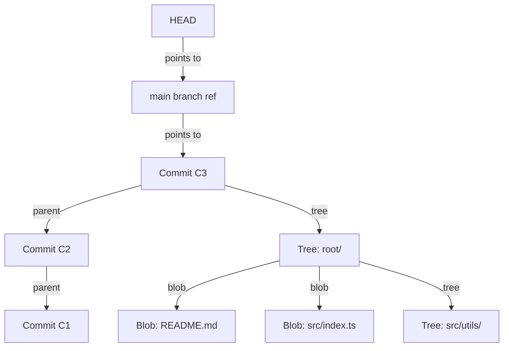
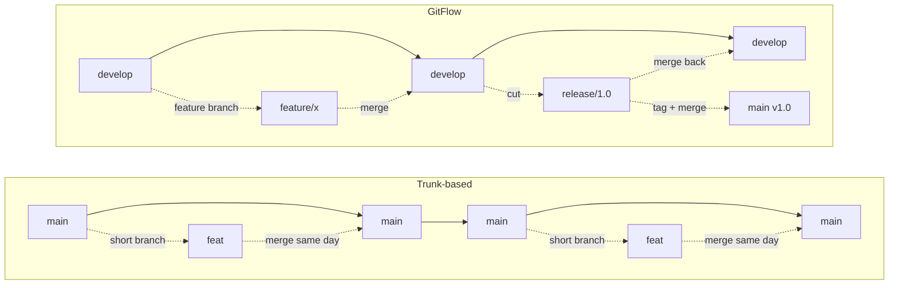
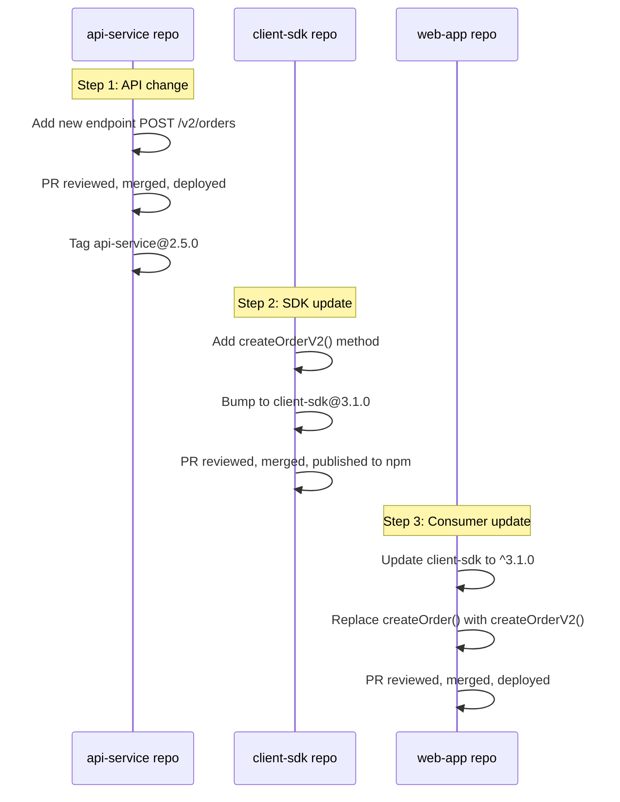

# Git and Engineering Workflow

## Chapter Goal

After this chapter, the reader can explain Git's object model at the level an interviewer expects, choose and defend a branching strategy under real constraints, design a code review process that scales from 5 to 50 engineers, and set commit, release, and documentation norms that compound into delivery throughput.

## Why This Matters for a Tech Lead

Engineering workflow is the daily friction — or flow — of the team. Branching strategy, PR size, review depth, merge policy, and release cadence compound into delivery throughput. A poor workflow slows every engineer on every commit. A Tech Lead who cannot explain why the team uses trunk-based development, how code review SLAs affect lead time, or when to switch from squash-merge to rebase has not earned the role. The interviewer is testing whether the candidate treats workflow as a system to be designed, measured, and improved — not as an inherited habit.

## Mental Model

Git is a content-addressable filesystem with a version-control porcelain on top. Every file is stored as a blob (hashed content). Every directory is a tree (pointers to blobs and other trees). Every commit is a snapshot (pointer to a tree + metadata + pointer to parent commits). Branches are movable pointers to commits. Tags are immovable pointers. Understanding this model turns Git from "a tool that sometimes destroys my work" into "a directed acyclic graph I can navigate and repair."



Notice that branches are not copies of files — they are references to commits. Creating a branch is O(1): write a 40-byte SHA to a file. Merging and rebasing are operations on the commit graph, not on file copies. Most "Git problems" are misunderstandings of this object model.

## Core Terminology

| Term | Definition |
| --- | --- |
| **Blob** | A file's content, stored by its SHA-1 hash. Two files with identical content share the same blob. |
| **Tree** | A directory listing: maps filenames to blobs or other trees. |
| **Commit** | A snapshot: pointer to a tree, parent commit(s), author, committer, timestamp, and message. |
| **Ref** | A human-readable name (branch, tag) that points to a commit SHA. |
| **Branch** | A movable ref. When a new commit is created on a branch, the ref advances to the new commit. |
| **Tag** | An immovable ref. Points to a specific commit permanently. Lightweight tags are plain refs; annotated tags are objects with metadata. |
| **HEAD** | A pointer to the current branch ref (or directly to a commit in "detached HEAD" state). |
| **Fast-forward merge** | A merge where the target branch has no divergent commits. The branch pointer moves forward without creating a merge commit. |
| **Three-way merge** | A merge where both branches have diverged. Git finds the common ancestor and creates a merge commit with two parents. |
| **Rebase** | Replays commits from one branch on top of another, creating new commits with new SHAs. Produces a linear history. |
| **Squash** | Combines multiple commits into a single commit. Often used when merging a feature branch into main. |
| **Upstream** | The remote-tracking branch that a local branch follows. `origin/main` is the upstream of `main`. |
| **CODEOWNERS** | A file that maps file paths to teams or individuals responsible for reviewing changes to those paths. |
| **Monorepo** | A single repository containing multiple projects, services, or libraries. |
| **Polyrepo (multi-repo)** | Each project, service, or library has its own repository. |
| **Conventional commit** | A commit message format (`type(scope): description`) that enables automated changelog generation and semantic versioning. |

## Theoretical Foundation

### Git object model

Git stores four types of objects, all content-addressed by SHA-1 hash:

1. **Blob** — the content of a file. Git does not store filenames in blobs — only content. Two files with identical content, regardless of name or location, share the same blob.
2. **Tree** — a directory listing. Each entry maps a filename to a blob SHA (for files) or another tree SHA (for subdirectories), plus file mode bits.
3. **Commit** — a snapshot of the entire repository at a point in time. Contains: a pointer to the root tree, zero or more parent commit SHAs, the author (who wrote the code), the committer (who created the commit), timestamps, and the commit message.
4. **Tag (annotated)** — an object that points to a commit and adds metadata: tagger name, date, and a message. Lightweight tags are refs, not objects.

**Key insight:** Git stores snapshots, not diffs. Each commit points to a complete tree. Git computes diffs on the fly when displaying them. This makes checkout fast (read one tree), branching free (write one ref), and history traversal efficient (walk parent pointers).

**Packfiles:** For storage efficiency, Git periodically packs objects into packfiles using delta compression. Objects that are similar (e.g., successive versions of a file) are stored as deltas. This is a storage optimization — the logical model is still snapshots.

### Branches and refs

A branch is a file in `.git/refs/heads/` containing a 40-character commit SHA. Creating a branch writes a new file. Deleting a branch deletes the file. There is no "branch object" — branches are references.

**HEAD** is a special ref in `.git/HEAD` that usually contains `ref: refs/heads/main` — a pointer to the current branch. When HEAD points directly to a commit SHA (not a branch), the repository is in "detached HEAD" state. Commits made in detached HEAD are reachable only by their SHA until a branch is created to point to them.

**Detached HEAD recovery:** If commits are made in detached HEAD state and then lost, `git reflog` shows the history of HEAD positions. The commits still exist in the object store until garbage collection runs (default: 30 days for unreachable objects).

### Merge strategies

#### Fast-forward merge

When the target branch (e.g., `main`) has not diverged from the source branch (e.g., `feature`), Git moves the target branch pointer forward. No merge commit is created. The history is linear.

**When to use:** Small, short-lived branches on a team that merges frequently. The linear history is easy to read.

**When to avoid:** When the merge should be a visible event in the history (releases, large features). Use `--no-ff` to force a merge commit.

#### Three-way merge

When both branches have diverged, Git finds the merge base (the common ancestor), compares both branches to the base, and creates a merge commit with two parents. The merge commit records "these two lines of development were combined here."

**When to use:** When the merge event is meaningful — integrating a long-running feature, merging a release branch.

**Conflict resolution:** When both branches modify the same lines, Git cannot auto-merge. The developer resolves conflicts manually. The merge commit records the resolution.

#### Rebase

Rebase replays commits from one branch on top of another. Each replayed commit gets a new SHA because the parent has changed. The result is a linear history — as if the feature branch was started from the tip of the target branch.

**When to use:** Keeping a feature branch up to date with main. Cleaning up local history before opening a PR. Teams that value a linear `git log`.

**When to avoid:** After the branch is shared (pushed and reviewed by others). Rebasing rewrites commit SHAs. If another developer has based work on the old SHAs, their history diverges, forcing a force-push or manual reconciliation.

**Golden rule:** Do not rebase commits that have been pushed to a shared branch. Rebase only local, unpushed commits.

#### Squash merge

All commits from the feature branch are combined into a single commit on the target branch. The individual feature commits are discarded from the main branch history.

**When to use:** When the feature branch has messy intermediate commits ("WIP", "fix typo", "try again") and only the final result matters for the main branch history.

**Trade-off:** Squash produces a clean main-branch history but loses the granular development history. `git bisect` on the main branch can only identify the squash commit, not the individual change within it that introduced the bug.

### Branching strategies

#### Trunk-based development

All engineers commit to a single branch (`main` or `trunk`). Feature branches, if used, are short-lived (< 1 day) and merged frequently. Long-lived branches are prohibited.

**Key properties:**

- Continuous integration: every commit is integrated immediately.
- Feature flags decouple deployment from release. Code is merged to main even if the feature is incomplete — the feature flag hides it from users.
- Small, incremental changes reduce merge conflict frequency and blast radius.
- Requires a strong CI pipeline: every commit must pass tests before merge.

**When it works:** Teams of any size that have CI, feature flags, and a culture of small PRs. Most high-performing engineering organizations (Google, Meta, Spotify) use trunk-based development.

**When it breaks:** Teams without CI (broken main blocks everyone), teams without feature flags (incomplete features are visible to users), and teams that cannot enforce small PRs (large merges create conflicts).

#### GitHub Flow

A lightweight branching model: create a branch from main, make changes, open a PR, get review, merge to main, deploy. No long-lived branches. No release branches.

**How it differs from trunk-based:** Feature branches may live for days (not hours). PRs are reviewed before merge, not after. Slightly slower integration cadence but lower barrier for teams transitioning from long-lived branches.

**When to use:** Small to medium teams building web applications with continuous deployment. Teams that are not yet ready for strict trunk-based development.

#### GitFlow

A branching model with multiple long-lived branches: `main` (production), `develop` (integration), `feature/*`, `release/*`, `hotfix/*`.

**How it works:**

1. Features are branched from `develop` and merged back into `develop`.
2. When ready for release, a `release/*` branch is cut from `develop`. Bug fixes go into the release branch.
3. The release branch is merged into both `main` (tagged with a version) and `develop`.
4. Hotfixes are branched from `main`, fixed, and merged into both `main` and `develop`.

**When it works:** Products with scheduled releases (mobile apps, embedded software, on-premise installations) where multiple versions must be maintained simultaneously.

**When it is wrong:** Web applications with continuous deployment. The overhead of maintaining `develop`, `release/*`, and `hotfix/*` branches adds coordination cost without benefit when every merge to main is a deployment.

**Tech Lead decision:** GitFlow solves a specific problem — maintaining multiple release versions. If the product deploys continuously and supports only one version, GitFlow is overhead. Choose the branching strategy that matches the release model, not the one that was popular when the team was formed.

#### Branching strategy: what a Tech Lead decides

**What a Senior Engineer usually knows:** The mechanics of each strategy — how to create branches, how to merge, how to resolve conflicts. Can execute any strategy the team chooses.

**What a Tech Lead is expected to decide:**

- Which strategy matches the product's release model. This is a business decision disguised as a technical one. A SaaS product with continuous deployment has different constraints than a mobile app with App Store review cycles.
- When to migrate strategies. A team that started with GitFlow because the CTO read about it in 2016 may need to migrate to trunk-based now that the product deploys continuously. The Tech Lead owns the migration plan.
- How to enforce the strategy. A branching strategy that is documented but not enforced (branch protection, CI checks) is a suggestion. Enforcement turns a suggestion into a standard.
- What the team is ready for. Trunk-based development requires CI, feature flags, and small-PR culture. If the team lacks any of these, start with GitHub Flow as a stepping stone — not as a compromise, but as a prerequisite.

**Common overengineering trap:** Adopting trunk-based development because "Google does it" without the supporting infrastructure. Google has a custom build system (Bazel), a custom code review tool (Critique), and 15 years of feature flag infrastructure. A team without CI and feature flags will break main daily.

### Commit hygiene

#### Atomic commits

An atomic commit contains one logical change. It compiles, passes tests, and can be reverted independently. A commit that contains "add login form + fix database migration + update README" is three changes in one commit. If the migration breaks, reverting the commit also removes the login form.

**Rule of thumb:** Each commit should be describable in a single sentence without "and."

#### Conventional commits

A structured commit message format that enables automated tooling:

```text
type(scope): short description

Optional body explaining the change in more detail.
Why, not what. The diff shows what.

Optional footer:
BREAKING CHANGE: description of the breaking change
Refs: #123
```

**Common types:** `feat` (new feature), `fix` (bug fix), `docs` (documentation), `refactor` (code change that does not add a feature or fix a bug), `test` (adding or updating tests), `chore` (build, CI, dependency updates), `perf` (performance improvement).

**Why it matters:** Conventional commits enable automated changelog generation, automated semantic version bumping (patch for `fix`, minor for `feat`, major for `BREAKING CHANGE`), and searchable commit history. Without a convention, commit messages degrade to "fix stuff" and "update" within months.

#### Signed commits

Commits signed with a GPG or SSH key prove that the commit was authored by the claimed author. Without signing, anyone can set `user.name` and `user.email` to impersonate another developer.

**When to require:** Supply chain security, compliance-heavy environments, open-source projects that accept external contributions. For internal teams with authenticated Git hosting, the value is lower because the hosting platform already authenticates pushes.

### Semantic versioning

Semantic Versioning (SemVer) uses `MAJOR.MINOR.PATCH`:

- **MAJOR** — backward-incompatible changes. Consumers must update their code.
- **MINOR** — backward-compatible new features. Consumers can upgrade safely.
- **PATCH** — backward-compatible bug fixes.

**Pre-release and build metadata:** `1.2.3-alpha.1`, `1.2.3+build.456`.

**Tech Lead responsibility:** Enforce SemVer for shared libraries. A library that ships a breaking change as a minor version breaks consumer CI pipelines and erodes trust. Automate version bumping from conventional commits to remove human error.

### Pull requests and code review

#### PR size

Small PRs (< 200 lines of changed code) are reviewed faster, reviewed more carefully, and merged sooner. Large PRs (> 500 lines) are reviewed superficially because the reviewer cannot hold the full context in working memory. The median time-to-merge for a 50-line PR is hours; for a 1,000-line PR it is days.

**Tech Lead metric:** Track PR size distribution. If the median exceeds 300 lines, the team's PR culture needs intervention. Common causes: features not broken into incremental steps, refactors bundled with features, and missing test infrastructure that forces large "all at once" changes.

#### Review depth

Not all reviews need the same depth:

- **Correctness review:** Does the code do what it claims? Are edge cases handled? Are invariants maintained?
- **Design review:** Is the abstraction appropriate? Does it belong in this module? Does it follow the team's patterns?
- **Nit review:** Style, naming, formatting. Automate with linters. Do not spend human review time on nits.

**Tech Lead decision:** Define what constitutes a blocking review comment vs a non-blocking suggestion. Without this distinction, reviews become adversarial — the reviewer blocks the PR on a naming preference.

#### Review SLA

A review SLA is a team agreement on how quickly PRs are reviewed. Example: "First review within 4 business hours." Without a review SLA, PRs sit in the queue for days, blocking the author and encouraging large, batched PRs.

**Tech Lead metric:** Track time-to-first-review and time-to-merge. If time-to-first-review exceeds 8 hours consistently, the team is accumulating a review backlog that slows delivery.

### Code ownership

#### CODEOWNERS

A CODEOWNERS file maps file paths to teams or individuals. When a PR modifies files in a mapped path, the designated owners are automatically added as reviewers.

**Good CODEOWNERS:** Broad enough that a team owns a module or directory, not individual files. Specific enough that reviews are routed to the right people.

**Bad CODEOWNERS:** A single team owns `*` (every PR requires their review — they become a bottleneck). Or 50 individual entries that create confusion about who actually reviews.

#### Ownership boundaries

Code ownership should align with team boundaries (Conway's Law). If Team A owns `src/billing/` and Team B owns `src/shipping/`, a PR that touches both requires reviewers from both teams. If this happens frequently, the module boundaries are wrong — the code that changes together should be owned together.

#### Code review: what a Tech Lead decides

**What a Senior Engineer usually knows:** How to give a thorough code review. How to identify bugs, edge cases, and design issues in a PR.

**What a Tech Lead is expected to decide:**

- **Review culture, not review mechanics.** The Tech Lead shapes whether reviews are collaborative ("how can we improve this?") or adversarial ("why did you do it this way?"). Adversarial review cultures slow delivery because authors fear opening PRs. The Tech Lead models the tone — their review comments set the standard.
- **PR size as a systemic problem.** When median PR size exceeds 300 lines, the fix is not "review faster." The fix is breaking features into smaller increments, separating refactors from features, and investing in test infrastructure so that a feature does not require a 1,000-line PR to be testable. This is a system design problem, not a discipline problem.
- **Review backlog as a delivery bottleneck.** If time-to-first-review exceeds 8 hours, the Tech Lead investigates: Is CODEOWNERS routing reviews to a bottleneck team? Are reviewers doing deep work and batching reviews? Are there too few qualified reviewers for a critical module? Each root cause has a different fix.
- **Scope of human review.** Automate everything a machine can check: formatting (Prettier), linting (ESLint), type safety (TypeScript), coverage thresholds, dependency vulnerabilities, secrets scanning. Human review should focus on: correctness, design, edge cases, and whether the change moves the architecture in the right direction. If a reviewer spends time on formatting, the team is wasting its most expensive resource (senior engineer judgment) on its cheapest task (style enforcement).

**Stakeholder explanation:** "Code review is our primary quality gate before production. We invest ~15% of engineering time in review. Without it, we would spend more time on debugging and incident response. Our review SLA ensures this investment does not become a delivery bottleneck."

### Feature flags

Feature flags decouple deployment from release. Code is merged and deployed to production with the feature hidden behind a flag. The flag is enabled gradually — first for internal users, then for a percentage of production traffic, then for everyone.

**Why they matter for Git workflow:** Feature flags eliminate the need for long-lived feature branches. An incomplete feature can be merged to main because users do not see it. This keeps the branch short-lived, reduces merge conflicts, and ensures the code is continuously integrated.

**Categories:**

- **Release flags:** Short-lived. Enable a feature for launch. Remove after launch.
- **Experiment flags:** Enable A/B tests. Remove after the experiment concludes.
- **Ops flags:** Long-lived. Kill switches for features that may need to be disabled in production (circuit breakers, degraded modes).
- **Permission flags:** Long-lived. Enable features for specific user segments (premium users, beta testers).

**Tech Lead responsibility:** Feature flags accumulate as technical debt. Every flag is a branch in the code that must be tested and maintained. Establish a process to clean up flags within 2 weeks of full rollout. Track active flag count as a health metric.

#### Feature flags: what a Tech Lead decides

**What a Senior Engineer usually knows:** How to implement a feature flag in code. How to check flag state and branch on it.

**What a Tech Lead is expected to decide:**

- **Build vs buy.** A home-grown flag system (environment variables, config files) works for 5 flags. At 20+ flags, the team needs a flag management service (LaunchDarkly, Unleash, Flagsmith) with gradual rollout, targeting rules, and audit logs. The build-vs-buy decision hinges on the number of flags, the need for gradual rollout, and whether non-engineers (product managers) need to control flags.
- **Flag lifecycle policy.** Without a policy, flags accumulate. The Tech Lead sets the rule: release flags expire 2 weeks after full rollout. Experiment flags expire when the experiment concludes. Stale flag detection is automated.
- **Who can toggle flags in production.** This is an access control decision with production safety implications. Allowing any developer to toggle any flag invites accidental outages. Restricting toggles to on-call engineers or Tech Leads is safer but slower. A middle ground: self-serve for release flags, restricted for ops flags (kill switches).
- **Testing strategy for flagged code.** Each flag doubles the code paths. The Tech Lead decides: do CI tests run with the flag on and off? Is there a flag-specific test configuration? At what flag count does the team stop and clean up before adding more?

**When not to use feature flags:** Features that require database schema changes that are not backward-compatible. Toggling the flag off does not undo the schema migration. In these cases, use branch-by-abstraction (deploy the new schema first, then the new code) instead of a runtime flag.

### Engineering standards

#### RFC process

A Request for Comments (RFC) is a proposal document that invites feedback from the team before a decision is made. The RFC describes the problem, the proposed solution, alternatives considered, and trade-offs. It has a comment period (typically 3-5 business days) during which anyone can raise concerns.

**When to write an RFC:**

- The change affects multiple teams or services.
- The change introduces a new technology, pattern, or dependency.
- The change is controversial — two reasonable people could disagree on the approach.

**When not to write an RFC:** Routine implementation decisions within a single team. Writing an RFC for every PR adds bureaucracy without value.

**Tech Lead role:** The Tech Lead decides which proposals require an RFC. They facilitate the review process, ensure relevant stakeholders are included, and make the final call when consensus is not reached.

#### ADR process

An Architecture Decision Record (ADR) documents a significant decision after it is made. It captures context, alternatives, trade-offs, and consequences. ADRs are the institutional memory of the architecture. See [Software Architecture](./14-software-architecture.md) for depth on ADR format and usage.

**Difference from RFC:** An RFC is a proposal (before the decision). An ADR is a record (after the decision). Some teams merge the two: the RFC becomes the ADR once accepted.

#### Documentation workflow

Documentation is code. It lives in the repository, is reviewed in PRs, and is versioned with the codebase. Documentation that lives in a wiki, separate from the code, drifts within weeks.

**What to document in the repository:**

- ADRs — in `docs/adr/`.
- Runbooks — in `docs/runbooks/`.
- API contracts — in the service's repository.
- Onboarding guide — in the repository's README or `docs/onboarding.md`.

**What not to document in the repository:** Meeting notes, project status updates, HR policies. These have a different lifecycle and audience.

**Tech Lead responsibility:** Treat documentation gaps as bugs. If an on-call engineer cannot resolve an incident because the runbook is missing or stale, that is a documentation bug with production impact.

### Release management

#### Release branches

A release branch (`release/1.2`) is cut from main when the team is ready to release. Only bug fixes go into the release branch. New features continue on main. After the release ships, the release branch is merged back into main (to capture the bug fixes) and the branch is deleted or archived.

**When to use:** Products that maintain multiple versions simultaneously (mobile apps, desktop software, libraries). Not needed for continuously deployed web applications where main is always the release.

#### Hotfix flow

A hotfix branch is created from the current production tag (not from main). The fix is applied, tested, tagged, and deployed. Then the fix is cherry-picked or merged into main to prevent regression.

**Failure mode:** Fixing the bug on main and then deploying main. This deploys all unreleased changes on main, not only the hotfix. The hotfix branch ensures that only the fix reaches production.

#### Release notes

Automated release notes generated from conventional commits and PR titles. Each release documents: what changed, what broke (breaking changes), and how to migrate.

**Tool-agnostic approach:** Tag the release. Generate a changelog from commits between the previous tag and the current tag. Filter by conventional commit type: `feat` entries become "Features," `fix` entries become "Bug Fixes," `BREAKING CHANGE` entries become "Breaking Changes."

### What a Tech Lead should standardize

A Tech Lead's highest-leverage workflow decisions — the ones that compound across every engineer on every day:

1. **Branching strategy** — one strategy, documented, enforced. Not "some people rebase and some people merge."
2. **Merge policy** — squash, rebase, or merge commit. Pick one for the main branch. Document why.
3. **Commit message format** — conventional commits with scope. Enforced by a commit hook or CI check.
4. **PR size guideline** — "PRs should be < 300 lines. If larger, explain why in the PR description."
5. **Review SLA** — "First review within 4 business hours."
6. **CODEOWNERS** — map directories to teams. Review automatically.
7. **CI requirements** — all tests pass, linting passes, no secrets in code, coverage does not decrease.
8. **Feature flag discipline** — flags are cleaned up within 2 weeks of full rollout.
9. **Release process** — how releases are tagged, how changelogs are generated, who approves production deploys.
10. **Documentation norms** — ADRs for architectural decisions, runbooks for operational procedures, README for each service.

## Practical Usage

### Trunk-based development with feature flags

In trunk-based development, all engineers commit to main. Incomplete features are hidden behind feature flags. The workflow:

1. Developer creates a short-lived branch (`feature/add-payment-method`).
2. Wraps the new UI behind a feature flag: `if (flags.isEnabled('new-payment-method'))`.
3. Opens a small PR (< 200 lines). The feature is invisible to users because the flag is off.
4. PR is reviewed and merged to main within hours.
5. CI runs. If green, the code is deployed to production — but the feature is off.
6. When the feature is complete (after several merged PRs), the flag is enabled for internal users, then beta users, then 10% of production, then 100%.
7. After full rollout, a cleanup PR removes the feature flag and the old code path.

This flow eliminates long-lived feature branches, reduces merge conflicts, and ensures continuous integration. The cost is the engineering time to implement and clean up feature flags.

### PR review SLAs and review backlog

A Tech Lead tracks two metrics:

- **Time-to-first-review (TTFR):** How long a PR waits before the first reviewer comments. Target: < 4 hours.
- **Time-to-merge (TTM):** How long from PR creation to merge. Target: < 24 hours for small PRs.

If TTFR exceeds the SLA, the Tech Lead investigates: Are reviewers overloaded? Is the CODEOWNERS file routing reviews to a bottleneck team? Are PRs too large for quick review?

If TTM is high but TTFR is low, the problem is review cycles — too many rounds of feedback. Common cause: the team has not agreed on coding standards, so reviews turn into style debates. Fix: automate style checks with linters and formatters. Reserve human review for logic, design, and edge cases.

### Hotfix flow that does not break trunk

```text
1. Identify the production tag: v2.3.1
2. Create hotfix branch from the tag:
   git checkout -b hotfix/payment-timeout v2.3.1
3. Apply the fix. Commit with conventional format:
   fix(payments): increase timeout from 5s to 15s for bank API
4. Test the fix in the hotfix branch CI pipeline.
5. Tag the hotfix: v2.3.2
6. Deploy v2.3.2 to production.
7. Cherry-pick the fix into main:
   git checkout main && git cherry-pick <hotfix-sha>
8. Delete the hotfix branch.
```

This ensures the hotfix reaches production without deploying unreleased main-branch changes. The cherry-pick into main prevents the fix from being lost in the next release.

### Monorepo with affected-only CI

In a monorepo with 10 services, running all tests on every commit is slow and expensive. Affected-only CI identifies which services are impacted by the change and runs only their tests.

Tools like Nx, Turborepo, and Bazel build a dependency graph of projects in the monorepo. When a PR changes `packages/auth/`, the tool identifies that `services/api/` and `services/admin/` depend on `auth` and runs tests for all three — but skips `services/analytics/` which has no dependency on `auth`.

**Tech Lead decision:** Affected-only CI requires an upfront investment in tooling. For monorepos with fewer than 5 projects, a full CI run may be fast enough. The investment pays off when CI time exceeds 15 minutes or when the monorepo contains 10+ projects.

## Examples

### Clean interactive rebase

```bash
# Rebase the last 4 commits interactively to clean up before PR
git rebase -i HEAD~4

# In the editor:
# pick abc1234 feat(auth): add login endpoint
# squash def5678 fix typo in login handler
# squash ghi9012 wip: debugging auth flow
# pick jkl3456 test(auth): add integration tests for login

# Result: 2 clean commits instead of 4 messy ones
```

**What this shows:** Interactive rebase combines messy intermediate commits (typo fix, WIP) into the logical commit they belong to. The result is a clean history where each commit represents a meaningful change.

**Why it is written this way:** The developer made small, frequent commits during development (good practice for local safety) but cleaned them up before sharing (good practice for reviewers). The reviewer sees two focused commits instead of four noisy ones.

**Common mistake:** Rebasing after the branch has been pushed and reviewed. This rewrites commit SHAs that other developers may have based work on. Rebase only local, unpushed commits.

**In production:** Add a CI check that rejects commits with messages like "WIP", "fixup", or "temp". This encourages developers to clean up before pushing.

### CODEOWNERS file

```text
# Global fallback — Tech Lead reviews anything not covered below
* @tech-lead

# Module ownership by team
/src/billing/         @billing-team
/src/shipping/        @shipping-team
/src/auth/            @platform-team
/src/shared/          @platform-team @billing-team @shipping-team

# Infrastructure
/terraform/           @infra-team
/.github/workflows/   @infra-team
/docker/              @infra-team

# Documentation — anyone can contribute, Tech Lead reviews
/docs/adr/            @tech-lead
```

**What this shows:** File paths are mapped to teams. When a PR modifies `/src/billing/`, the billing team is automatically added as a reviewer. Shared directories (`/src/shared/`) require review from all affected teams, which makes changes to shared code deliberately expensive.

**Why it is written this way:** The fallback `*` ensures no PR goes unreviewed. Module-level ownership (not file-level) keeps the CODEOWNERS file maintainable. Infrastructure and CI config are owned by the infrastructure team — changes to CI workflows receive specialized review.

**Common mistake:** Setting `* @everyone` or `* @senior-dev` — this makes one person or team a bottleneck for every PR. Or having no CODEOWNERS at all — PRs are reviewed by whoever volunteers, which means critical paths get inconsistent review.

**In production:** Review the CODEOWNERS file quarterly. As teams grow and reorganize, ownership drifts. A CODEOWNERS file that lists engineers who left the company blocks PRs.

### Conventional commit message

```text
feat(checkout): add Apple Pay as payment method

Add Apple Pay integration using the Payment Request API.
The implementation follows the same adapter pattern as
the existing Stripe and PayPal integrations.

Refs: JIRA-4521
```

```text
fix(auth): prevent session fixation after password reset

Previously, changing the password did not invalidate the existing
session token. An attacker who obtained a session token could
continue using it after the victim changed their password.

This commit regenerates the session token on password change.

BREAKING CHANGE: Existing sessions are invalidated on password
change. Users will be logged out.

Refs: SEC-2024-003
```

**What this shows:** The first commit is a standard feature addition — clear type, scope, and description. The second commit is a security fix with a `BREAKING CHANGE` footer that triggers a major version bump in automated SemVer tooling.

**Why it is written this way:** The body explains *why*, not *what*. The diff shows what changed; the commit message explains the reasoning. The `Refs` footer links to the tracking system for traceability.

**Common mistake:** Writing "Update checkout" or "Fix bug." These messages provide zero information to a future reader. When `git bisect` identifies a commit as the source of a bug, the message is the first (and sometimes only) clue about what changed and why.

### Git bisect for debugging

```bash
# A bug was introduced somewhere between v2.1.0 and HEAD
git bisect start
git bisect bad HEAD
git bisect good v2.1.0

# Git checks out a commit in the middle. Test it.
# If the bug is present:
git bisect bad

# If the bug is not present:
git bisect good

# Repeat until Git identifies the first bad commit.
# For automated bisect with a test script:
git bisect run npm test -- --grep "payment timeout"

# When done:
git bisect reset
```

**What this shows:** Binary search through the commit history to find the exact commit that introduced a bug. With `git bisect run`, the process is fully automated — Git checks out each commit and runs the test script.

**Why it is useful:** In a repository with 1,000 commits between the last known good state and the current broken state, manual debugging could take hours. `git bisect` finds the culprit in ~10 steps (log₂1000 ≈ 10).

**Common mistake:** Bisect fails when commits do not compile or do not pass tests independently. This is why atomic commits matter — every commit must be a valid, testable state.

**In production:** When a bug is found via bisect, add a regression test before fixing. The test confirms that bisect identified the right commit and prevents the bug from recurring.

### Branching strategy comparison



This diagram contrasts the two dominant strategies at a glance. In trunk-based development, branches are ephemeral — created and merged the same day. In GitFlow, branches are long-lived and flow through `develop` → `release` → `main`. Use this comparison in interviews to anchor the trade-off discussion before diving into details.

**Common mistake:** Presenting trunk-based and GitFlow as equivalent choices. They solve different problems. Trunk-based optimizes for continuous deployment with one production version. GitFlow optimizes for scheduled releases with multiple maintained versions. The release model drives the choice, not preference.

### Pull request template

```text
## Summary

<!-- What does this PR do? One paragraph. -->

## Type of change

- [ ] Feature (`feat`)
- [ ] Bug fix (`fix`)
- [ ] Refactor (no behavior change)
- [ ] Documentation
- [ ] Infrastructure / CI

## Testing

- [ ] Unit tests added or updated
- [ ] Integration tests added or updated (if applicable)
- [ ] Manual testing steps documented below

## Review checklist

- [ ] PR is < 300 lines (or justification provided)
- [ ] No secrets or credentials in code
- [ ] Conventional commit message used
- [ ] Breaking changes documented in commit footer
- [ ] Feature flag added (if this is a partial feature)
- [ ] Relevant documentation updated (ADR, runbook, README)

## Deployment notes

<!-- Anything the reviewer or on-call should know before/after deploy? -->
<!-- Database migration? Feature flag to enable? Config change? -->
```

**What this shows:** A structured PR template that enforces the team's quality expectations at the point of creation, not during review. The checklist makes review requirements explicit — no ambiguity about what the team expects.

**Why it is useful:** Without a template, PR descriptions are "Fixed the thing" or empty. Reviewers waste time asking "what does this do?" and "did you add tests?" The template shifts those questions from the reviewer to the author.

**Common mistake:** Templates with 30 checkboxes. Developers ignore them. Keep the template under 15 items. Every item must address a real problem the team has experienced.

**In a real team:** Store the template at `.github/pull_request_template.md`. GitHub, GitLab, and Bitbucket auto-populate the PR description. Customize per team — a data team's template may include "Migration tested against staging database" instead of "Unit tests added."

### ADR template

```text
# ADR-007: Use squash merge for the main branch

## Status

Accepted (2026-03-15)

## Context

The team uses merge commits for integrating feature branches into main.
The main branch history contains WIP commits, typo fixes, and debugging
artifacts from feature branches. `git log main` is noisy and difficult
to scan. Automated changelog generation produces entries like
"wip: trying auth fix" which are meaningless to consumers.

## Decision

Use squash merge as the default merge strategy for PRs into main.
Each PR becomes a single commit on main. The commit message is the
PR title, which must follow the conventional commit format.

## Alternatives considered

1. **Merge commit (status quo):** Preserves granular history but
   requires all developers to maintain clean commit hygiene. The
   team has not demonstrated this discipline consistently.
2. **Rebase merge:** Produces linear history but replays each branch
   commit individually. Still exposes WIP commits on main unless
   developers clean up with interactive rebase before merge.

## Consequences

- Main branch has a clean, one-commit-per-PR history.
- `git bisect` on main identifies PRs, not individual commits.
  This is acceptable because PRs are < 300 lines.
- PR titles must follow conventional commit format. Enforced by
  a CI check on PR title.
- Revisit when: the team needs finer-grained bisect targets or
  when commit hygiene improves enough to use merge commits.
```

**What this shows:** A filled ADR that records a real decision (squash merge), the context that drove it, alternatives the team considered, and the consequences — including a "revisit when" trigger.

**Why it is useful:** Six months later, a new engineer asks "why do we squash?" The ADR answers the question without requiring a meeting. The "revisit when" trigger prevents the decision from becoming permanent dogma.

**Common mistake:** ADRs that record the decision but not the alternatives or context. "We use squash merge" without "because our team's commit hygiene is inconsistent" loses the reasoning. When the context changes, the team does not know whether to revisit.

**In a real team:** Store ADRs in `docs/adr/` with sequential numbering. A Tech Lead writes 1-2 ADRs per quarter for significant decisions. More than one per week signals over-documentation; fewer than one per quarter signals undocumented decisions.

### RFC template

```text
# RFC: Migrate from REST to gRPC for inter-service communication

## Author

Jane Chen (@jchen), Platform Team

## Status

Open for review — comments due by 2026-04-05

## Problem

Inter-service latency for the checkout flow averages 180ms across
4 synchronous REST calls. REST serialization (JSON) adds ~12ms per
hop. The checkout SLO is 500ms total, leaving < 140ms for business
logic. As we add services, the latency budget will be exceeded.

## Proposed solution

Replace REST with gRPC for internal service-to-service calls.
gRPC uses Protocol Buffers (binary serialization, ~3x faster than
JSON) and HTTP/2 (multiplexing, header compression). Expected
latency reduction: 40-60% per hop.

Scope: internal APIs only. Public-facing APIs remain REST/JSON
for client compatibility.

## Alternatives considered

1. **Optimize existing REST calls.** Reduce payload size, add
   compression. Estimated improvement: 15-20%. Does not address
   the fundamental serialization overhead.
2. **Switch to MessagePack over REST.** Binary serialization over
   HTTP/1.1. Faster than JSON but lacks HTTP/2 benefits. Smaller
   ecosystem than gRPC.

## Trade-offs

- gRPC requires schema definitions (.proto files). This adds a
  build step but improves type safety across services.
- Debugging is harder — gRPC payloads are binary, not
  human-readable like JSON. Requires tooling (grpcurl, Postman
  gRPC support).
- Team must learn Protocol Buffers and gRPC conventions.

## Rollback plan

If gRPC causes unforeseen issues, revert to REST by updating the
service client library. Both transports can coexist during
migration (dual-protocol adapters).

## Decision authority

Platform Tech Lead. Decision by 2026-04-10.
```

**What this shows:** An RFC that proposes a significant change (REST → gRPC), provides data (180ms latency, 12ms per hop), considers two alternatives, names the trade-offs honestly, and includes a rollback plan.

**Why it is useful:** The RFC invites structured feedback. Instead of a Slack thread where "we should use gRPC" devolves into opinions, the RFC forces the author to quantify the problem, propose a specific solution, and address alternatives. Reviewers comment on the document, not on a chat message.

**Common mistake:** RFCs without data. "REST is slow" is an opinion. "REST adds 12ms per hop across 4 hops, consuming 36% of our 500ms SLO budget" is a problem statement. The RFC process fails when proposals are based on preference rather than evidence.

**In a real team:** The Tech Lead decides which proposals require an RFC (cross-team impact, new technology, controversial decisions). The comment period is 3-5 business days — long enough for asynchronous review, short enough to not stall decisions. After acceptance, the RFC becomes an ADR.

### Automated release notes from conventional commits

```text
## v2.4.0 (2026-04-15)

### Features

- **checkout:** add Apple Pay as payment method (abc1234)
- **shipping:** support same-day delivery for metro areas (def5678)
- **auth:** add biometric login for mobile app (ghi9012)

### Bug Fixes

- **payments:** fix rounding error in multi-currency checkout (jkl3456)
- **auth:** prevent session fixation after password reset (mno7890)

### Breaking Changes

- **auth:** existing sessions are invalidated on password change.
  Users will be logged out. See migration guide in docs/auth.md.

### Chores

- **deps:** upgrade React from 18.2 to 18.3 (pqr1234)
- **ci:** reduce CI pipeline from 12 min to 7 min (stu5678)
```

**What this shows:** Release notes generated automatically from conventional commits. Each entry maps to a commit type: `feat` → Features, `fix` → Bug Fixes, `BREAKING CHANGE` → Breaking Changes. The commit scope (`checkout`, `auth`) groups entries by module.

**Why it is useful:** Manual release notes are forgotten, inconsistent, or incomplete. Automated notes from conventional commits guarantee that every change is documented. The breaking change section includes migration guidance — critical for internal consumers and library users.

**Common mistake:** Generating release notes without filtering. Including `chore` and `refactor` entries in public-facing notes adds noise. For internal changelogs, include everything. For external changelogs (library users, customers), filter to `feat`, `fix`, and `BREAKING CHANGE`.

**In a real team:** Configure the release tool (`semantic-release`, `release-please`, `changesets`) to generate notes on tag creation. Link each entry to the PR for traceability. Store the changelog in `CHANGELOG.md` in the repository root.

### Feature flag rollout plan

```text
# Feature Flag Rollout Plan: New Checkout Flow

## Flag name:       new-checkout-flow
## Owner:           @payments-team
## Created:         2026-04-01
## Expiry:          2026-05-01 (cleanup ticket: JIRA-4890)

## Rollout stages

| Stage | Audience           | % Traffic | Duration   | Success criteria                    | Rollback trigger                |
| ----- | ------------------ | --------- | ---------- | ----------------------------------- | ------------------------------- |
| 1     | Internal employees | 0.1%      | 2 days     | No errors in Sentry, manual QA pass | Any P0/P1 bug                   |
| 2     | Beta users         | 5%        | 3 days     | Conversion rate within 2% of old    | Conversion drop > 5%            |
| 3     | 25% production     | 25%       | 3 days     | p99 latency < 800ms, error rate < 1%| Latency > 1s or error rate > 2% |
| 4     | 100% production    | 100%      | Permanent  | All criteria above maintained       | Same as stage 3                 |

## Rollback procedure

1. Disable flag in LaunchDarkly / Unleash / config service.
2. Verify: old checkout flow is served. Monitor for 15 minutes.
3. Notify #engineering in Slack: "new-checkout-flow rolled back. Reason: [X]."
4. Create incident ticket if rollback was due to a production issue.

## Cleanup (after full rollout)

1. Remove flag checks from code.
2. Remove old checkout flow code path.
3. Delete flag from flag service.
4. Close JIRA-4890.
```

**What this shows:** A complete rollout plan that turns a feature flag from "a boolean in code" into a controlled, measured release process. Each stage has explicit success criteria and rollback triggers — the decision to proceed or roll back is data-driven, not gut-driven.

**Why it is useful:** Without a plan, flag rollouts are ad hoc: "Let me turn it on for everyone and see what happens." This plan makes the rollout reviewable, repeatable, and auditable.

**Common mistake:** No expiry date or cleanup ticket. The flag stays in the code indefinitely, accumulating as technical debt. The expiry date and linked ticket create accountability for cleanup.

**In a real team:** Store the rollout plan in the PR that introduces the flag, or in a `docs/feature-flags/` directory. The Tech Lead reviews rollout plans for high-risk features (payments, auth, data pipelines).

### Branch protection configuration

```yaml
# GitHub branch protection rules for main (conceptual YAML representation)
# Configured via repository Settings → Branches → Branch protection rules

branch: main
protection:
  required_pull_request_reviews:
    required_approving_review_count: 1
    dismiss_stale_reviews: true          # Re-review after new pushes
    require_code_owner_reviews: true     # CODEOWNERS must approve
  required_status_checks:
    strict: true                         # Branch must be up to date with main
    contexts:
      - "ci/lint"
      - "ci/typecheck"
      - "ci/unit-tests"
      - "ci/integration-tests"
      - "security/secret-scan"
  restrictions:
    enforce_admins: true                 # Even admins cannot bypass
  allow_force_pushes: false
  allow_deletions: false
  required_linear_history: false         # Allow merge commits
  required_signatures: false             # Enable for compliance environments
```

**What this shows:** A complete branch protection policy for a production main branch. Every merge requires a PR, at least one approving review (from a CODEOWNER), and five passing CI checks. Force pushes and deletions are prohibited. Even admins are bound by the rules.

**Why it is useful:** Branch protection is the enforcement layer for all the team's workflow standards. Without it, conventions are suggestions. With it, a developer cannot merge a PR that fails tests, skip review, or force-push to main.

**Common mistake:** Setting `enforce_admins: false`. This creates a bypass for Tech Leads and admins, which is used "in emergencies" and then becomes a habit. Keep `enforce_admins: true`. For genuine emergencies, use the hotfix flow — branch from the production tag, not a bypass.

**In a real team:** Configure branch protection as infrastructure-as-code (Terraform `github_branch_protection` resource, or a GitHub Actions workflow that enforces settings). Manual configuration drifts. Automated enforcement does not.

### Monorepo structure with workspace scripts

```text
monorepo/
├── packages/
│   ├── shared-ui/           ← shared component library
│   │   ├── package.json     ← name: @acme/shared-ui
│   │   └── src/
│   ├── auth-sdk/            ← authentication client
│   │   ├── package.json     ← name: @acme/auth-sdk
│   │   └── src/
│   └── eslint-config/       ← shared linting rules
│       └── package.json     ← name: @acme/eslint-config
├── services/
│   ├── api/                 ← main backend service
│   │   ├── package.json     ← depends on @acme/auth-sdk
│   │   └── src/
│   ├── web/                 ← customer-facing frontend
│   │   ├── package.json     ← depends on @acme/shared-ui, @acme/auth-sdk
│   │   └── src/
│   └── admin/               ← internal admin panel
│       ├── package.json     ← depends on @acme/shared-ui
│       └── src/
├── CODEOWNERS
├── nx.json                  ← or turbo.json for Turborepo
├── package.json             ← root workspace config
└── tsconfig.base.json       ← shared TypeScript config
```

```json
{
  "name": "@acme/monorepo",
  "private": true,
  "workspaces": ["packages/*", "services/*"],
  "scripts": {
    "lint": "nx run-many --target=lint",
    "test": "nx run-many --target=test",
    "test:affected": "nx affected --target=test",
    "build:affected": "nx affected --target=build",
    "lint:affected": "nx affected --target=lint"
  }
}
```

**What this shows:** A monorepo with shared packages (`packages/`) and deployable services (`services/`). The root `package.json` defines workspace-wide scripts. `nx affected` commands run only tasks for projects impacted by the current change — a PR that changes `auth-sdk` runs tests for `auth-sdk`, `api`, and `web` (its consumers) but skips `admin` if admin does not depend on `auth-sdk`.

**Why it is useful:** The `affected` commands solve the monorepo CI performance problem. Full CI on 6 projects takes 20 minutes. Affected CI on a change to one package takes 5 minutes.

**Common mistake:** No dependency graph tooling. Running `npm test` in every package on every PR. This scales linearly with the number of packages and makes CI unbearably slow once the monorepo exceeds 5 projects.

**In a real team:** Pair the directory structure with CODEOWNERS. `services/api/ @backend-team`. `services/web/ @frontend-team`. `packages/shared-ui/ @frontend-team @design-team`. The structure, ownership, and CI tooling form a coherent system.

### Multi-repo coordination workflow



This diagram shows the coordination overhead of a cross-repo change: a single feature (new order endpoint) requires three sequential PRs across three repositories. Each PR depends on the previous one — the SDK cannot be updated until the API is deployed, and the web app cannot be updated until the SDK is published.

**Common mistake:** Skipping the SDK step and calling the new API endpoint directly from the web app. This bypasses the client contract and creates a hidden coupling between the web app and a specific API version.

**In a real team:** For frequent cross-repo changes, evaluate whether the repos should be merged into a monorepo. If the change pattern is "API + SDK + consumer" for most features, the multi-repo boundary adds coordination cost without corresponding autonomy benefit. If cross-repo changes are rare (< 10% of PRs), the multi-repo model is justified.

### Engineering standards checklist

```text
# Engineering Standards — Team Checklist

## Git and branching
- [ ] Branching strategy documented in CONTRIBUTING.md
- [ ] Merge policy (squash/rebase/merge) configured in repository settings
- [ ] Branch protection enabled on main (require PR, require review, require CI)
- [ ] Force push to main is prohibited

## Commits and releases
- [ ] Conventional commit format enforced (commitlint or CI check)
- [ ] Semantic versioning enforced for shared libraries
- [ ] Automated release notes generated from commits
- [ ] Release tagging and changelog generation is automated

## Code review
- [ ] CODEOWNERS file maps directories to teams
- [ ] PR template exists with review checklist
- [ ] Review SLA defined (first review within N hours)
- [ ] Blocking vs non-blocking feedback is defined

## CI/CD
- [ ] All tests run on every PR (affected-only for monorepos)
- [ ] Linting and formatting enforced in CI
- [ ] Secret scanning enabled (pre-commit and CI)
- [ ] Coverage threshold enforced (does not decrease)
- [ ] CI completes in < 10 minutes for most changes

## Documentation
- [ ] ADR process exists for architectural decisions
- [ ] RFC process exists for cross-team proposals
- [ ] Runbooks exist for each service's common failures
- [ ] Onboarding guide enables first PR within 2 days

## Feature flags
- [ ] Flag rollout plan template exists
- [ ] Flags have an owner and expiry date at creation
- [ ] Stale flag detection is automated (CI or dashboard)
- [ ] Active flag count is tracked as a health metric

## Metrics
- [ ] PR size distribution is tracked
- [ ] Time-to-first-review is tracked
- [ ] DORA metrics are measured (lead time, deploy frequency,
      change failure rate, MTTR)
```

**What this shows:** A concrete, verifiable checklist that a Tech Lead can use to audit a team's engineering standards. Every item references a real artifact (a file, a configuration, a metric) — not a vague aspiration like "ensure quality."

**Why it is useful:** New Tech Leads inheriting a team can run through this checklist to identify gaps. The checklist also serves as a progress tracker when establishing standards on a new team.

**Common mistake:** Treating the checklist as a one-time activity. Standards drift. Run through the checklist quarterly. If a checked item has regressed (CODEOWNERS file is stale, review SLA is not being met), it needs intervention.

**In a real team:** Store this checklist in `docs/engineering-standards.md`. Review it during quarterly team retrospectives. Assign each section to an owner — the Tech Lead does not maintain all items personally.

## Common Mistakes

1. **Long-lived feature branches**
   - What it looks like: A branch lives for 3 weeks, accumulates 80 commits, and conflicts with main on merge.
   - Why it is wrong: The longer a branch lives, the more it diverges from main. Merge conflicts grow exponentially with branch age. The eventual merge is risky, hard to review, and likely to introduce bugs.
   - The correct approach: Merge to main daily. Use feature flags to hide incomplete work. If a feature takes 3 weeks, it should be 15 small PRs, not one large branch.

2. **Force-pushing to shared branches**
   - What it looks like: A developer runs `git push --force` on a branch that others have based work on. Their work is silently discarded.
   - Why it is wrong: Force-push overwrites the remote history. Commits that other developers are working on disappear. Recovery requires `git reflog` and manual rebasing.
   - The correct approach: Never force-push to `main` or any shared branch. Use `--force-with-lease` when force-pushing to personal feature branches — it fails if the remote has commits the developer has not seen.

3. **PRs that mix refactors with features**
   - What it looks like: A PR adds a new API endpoint and also refactors the database connection pool. The reviewer cannot tell which changes are the feature and which are the refactor.
   - Why it is wrong: If the refactor introduces a bug, reverting the PR also removes the feature. The reviewer must hold two independent changes in working memory, reducing review quality.
   - The correct approach: Separate refactors from features. First PR: refactor the connection pool. Second PR: add the new endpoint (on top of the refactored pool).

4. **CODEOWNERS that creates a bottleneck**
   - What it looks like: One senior engineer is listed as the owner of `*`. Every PR requires their review. They have 40 pending reviews.
   - Why it is wrong: The senior engineer becomes a single point of failure for team velocity. They cannot review 40 PRs with the depth each deserves.
   - The correct approach: Assign ownership to teams, not individuals. Use directory-level ownership that maps to team boundaries. Ensure each team has at least 3 members who can review.

5. **Treating Git as a black box**
   - What it looks like: A developer runs `git reset --hard` when confused, losing uncommitted work. Or they refuse to rebase because "it destroys commits."
   - Why it is wrong: Without understanding the object model, developers cannot recover from mistakes. They avoid rebasing, interactive rebase, and cherry-pick — tools that are essential for clean history.
   - The correct approach: Teach the team the object model: blobs, trees, commits, refs. Show them `git reflog`. Demonstrate that "destroyed" commits still exist in the object store for 30 days.

6. **No commit message convention**
   - What it looks like: Commit messages are "fix," "update," "wip," "stuff." The git log is useless for debugging or generating changelogs.
   - Why it is wrong: When `git bisect` finds the commit that introduced a bug, the message "fix" tells nothing about what was changed or why. Automated changelog generation is impossible.
   - The correct approach: Adopt conventional commits. Enforce with a commit hook (`commitlint`) or CI check. The initial resistance lasts 2 weeks; the benefit lasts years.

7. **No CI on feature branches**
   - What it looks like: Tests run only on main. Feature branches are merged without validation. Main breaks regularly.
   - Why it is wrong: A broken main blocks every developer on the team. The cost of a broken main (10 developers blocked for 30 minutes = 5 hours of lost productivity) far exceeds the cost of running CI on every branch.
   - The correct approach: Run CI on every PR. Block merge if tests fail. Use affected-only testing in monorepos to keep CI fast.

8. **Skipping PR review for "small changes"**
   - What it looks like: "It is a one-line fix, no need for review." The one-line fix introduces a subtle regression that is discovered weeks later.
   - Why it is wrong: Small changes can have large blast radius. A one-line typo in a configuration file can take down production. Review is not proportional to line count — it is proportional to risk.
   - The correct approach: All changes go through PR review. For truly trivial changes (formatting, typo in documentation), use a lighter review process (one approval instead of two) but do not skip review entirely.

## Trade-offs

Key workflow trade-offs and the conditions under which each choice reverses.

| Trade-off | **Optimizes for** | **Sacrifices** | **Flips when** |
| --- | --- | --- | --- |
| **Trunk-based → GitFlow** | Integration speed, simplicity | Controlled releases, version maintenance | Product requires maintaining multiple release versions |
| **Squash merge → merge commit** | Clean main history, simple bisect | Granular commit history on main | Team needs to trace individual changes through main |
| **Rebase → merge** | Linear history, clean log | Preserved branch history, simpler workflow | Developers are not comfortable with rebase, or branches are shared |
| **Monorepo → multi-repo** | Atomic changes, code visibility, shared tooling | Team autonomy, independent CI | Team grows beyond 50 or tooling cannot scale |
| **Strict CODEOWNERS → open review** | Review quality, ownership | Review speed, autonomy | Team is small (< 8) and everyone reviews everything |
| **Conventional commits → free-form** | Automated changelogs, searchable history | Developer flexibility, onboarding simplicity | Team has no automated release process |
| **Feature flags → feature branches** | Continuous integration, incremental delivery | Simplicity (no flag infrastructure) | Team has no feature flag infrastructure or discipline |
| **Review SLA → no SLA** | Predictable throughput, shorter lead time | Reviewer autonomy, flexibility | Team is small and reviews happen naturally within hours |

## Production Considerations

**Security:** Git repositories contain the full history. A secret committed to the repository is in the history forever — even after the file is deleted. Removing secrets requires `git filter-repo` or BFG Repo-Cleaner, which rewrites history and forces every clone to re-pull. Prevent this with pre-commit hooks that scan for secrets (e.g., `git-secrets`, `gitleaks`, `trufflehog`). Signed commits provide author verification — important for supply chain security in open-source and compliance-heavy environments. See [Security](./15-security.md) for depth.

**Performance:** Large repositories with long histories have slow clones. Shallow clones (`git clone --depth 1`) reduce clone time by fetching only the latest commit. Partial clones (`--filter=blob:none`) fetch commit and tree objects but download blobs on demand. Monorepos with thousands of files benefit from sparse checkout — check out only the directories the developer works on. CI pipelines should use shallow clones unless they need full history (e.g., for `git bisect` or changelog generation).

**Reliability:** The Git host (GitHub, GitLab, Bitbucket) is the source of truth for the repository. If the host is down, developers cannot push, pull, or merge PRs. Mitigation: mirror the repository to a secondary host. For critical repositories, keep a warm backup that syncs every 5 minutes. See [CI/CD and DevOps](./17-ci-cd-and-devops.md) for pipeline reliability.

**Maintainability:** Repository maintenance affects long-term velocity. Track repository size — a repository exceeding 5 GB slows every clone. Run `git gc` periodically to repack objects. Archive inactive branches. Remove large binary files from history with `git filter-repo`. Track the CODEOWNERS file freshness — stale ownership blocks PRs.

**Cost:** CI cost scales with commit frequency × test suite size × repository count. In a monorepo, full CI on every commit is expensive. Affected-only CI reduces cost by 60-80% for repositories with 10+ projects. In multi-repo setups, each repository has its own CI pipeline — cost scales linearly with repository count.

**Team and hiring:** Git proficiency varies widely among candidates. Many experienced engineers have never used rebase, bisect, or reflog. A Tech Lead should assess: can the team recover from a bad merge? Can they use interactive rebase to clean up history? If not, invest in a 2-hour Git workshop. The ROI is immediate — fewer "Git emergencies" and less time lost to avoidable mistakes.

**Vendor lock-in:** GitHub-specific features (Actions, CODEOWNERS syntax, PR templates, branch protection rules) create soft lock-in. A migration from GitHub to GitLab requires rewriting CI workflows, updating branch protection, and adapting CODEOWNERS. Use platform-agnostic CI configurations where possible. Keep business logic out of CI workflows — CI should call scripts in the repository, not contain business logic in YAML.

**Migration and rollback:** Migrating between monorepo and multi-repo is a high-cost, low-reversibility decision. Splitting a monorepo into multiple repos requires rewriting CI, redistributing CODEOWNERS, and updating all cross-project imports. Merging multiple repos into a monorepo requires history preservation (use `git filter-repo` to maintain commit history) and tooling investment. Plan either migration over months, not weeks.

### Monorepo vs multi-repo: what a Tech Lead decides

This decision is one of the highest-leverage, lowest-reversibility workflow choices a Tech Lead makes. It affects CI, code ownership, dependency management, team autonomy, and hiring for years.

**Decision checklist:**

| Factor | Monorepo favored | Multi-repo favored |
| --- | --- | --- |
| Shared code changes | Frequently, must stay in sync | Rarely, stable interfaces |
| Team autonomy | Low priority — teams collaborate closely | High priority — teams own their release cadence |
| CI tooling investment | Team can invest in Nx/Turborepo/Bazel | No budget for monorepo tooling |
| Team size | < 50 engineers | > 50 engineers without a platform team |
| Cross-repo coordination | Frequent (> 20% of PRs) | Rare (< 10% of PRs) |
| Deployment model | All services deploy together | Services deploy independently |

**When not to choose monorepo:** When teams need fundamentally different tooling (one team uses Python, another uses Go, a third uses Rust) and there is no shared build system. When the repository would exceed 10 GB without aggressive LFS usage. When the organization's Git hosting cannot handle the traffic of 100+ engineers on one repository.

**When not to choose multi-repo:** When shared libraries change weekly and consumers must stay in sync. When the overhead of coordinating cross-repo PRs exceeds the benefit of repository autonomy. When the team is under 15 engineers and the coordination overhead of multiple repos exceeds the management overhead of one repo.

**Stakeholder explanation:** "Our monorepo ensures that when we update a shared library, every service that uses it is updated in the same commit. This eliminates the coordination overhead of publishing a library, notifying consumers, and tracking which services have upgraded. The trade-off is that we need build tooling that runs only the tests affected by each change."

## How to Explain This in an Interview

**Opening for "What is a commit, really?" questions:**

"A commit is a snapshot of the entire repository at a point in time. It points to a root tree object (the directory structure), one or more parent commits (the history), and carries metadata — author, committer, timestamp, and message. Commits are identified by SHA-1 hash. Branches are movable pointers to commits, not copies of files. This is why branching in Git is O(1) and merge conflicts are a graph operation, not a file-copy operation."

**Opening for "Trunk-based vs GitFlow" questions:**

"Trunk-based development optimizes for integration speed and continuous delivery. Everyone commits to main. Feature flags hide incomplete work. GitFlow optimizes for controlled releases with multiple maintained versions — it adds develop, release, and hotfix branches. I default to trunk-based because most web applications deploy continuously and do not maintain multiple versions. I use GitFlow only for products that ship versioned releases — mobile apps, libraries, embedded systems."

**Opening for "How do you keep PRs reviewable?" questions:**

"I enforce a PR size guideline — 300 lines maximum, with exceptions documented in the PR description. I use feature flags so incomplete features can be merged incrementally. I track time-to-first-review as a team metric and set a 4-hour SLA. And I automate everything that is not a judgment call — formatting, linting, type checking — so human review focuses on logic and design."

## Good Answer vs Weak Answer

**Question:** Your team's code reviews are taking 2-3 days. How do you fix this?

**Strong Answer**

"I would diagnose the root cause before applying a fix. Are reviews slow because PRs are too large? I check the median PR size — if it exceeds 300 lines, the fix is smaller PRs, not faster reviews. Are reviews slow because reviewers are overloaded? I check the CODEOWNERS file — if one team is the reviewer for 80% of PRs, the ownership is too concentrated. Are reviews slow because there is no SLA? I establish a 4-hour first-review SLA and make time-to-first-review visible on a dashboard.

If the root cause is review depth — reviewers are spending too long on each PR — I differentiate between blocking and non-blocking feedback. Style issues are automated by linters. Design feedback is blocking. Naming suggestions are non-blocking. This reduces review cycles from 3 rounds to 1-2."

**Weak Answer**

"I would tell the team to review PRs faster. Maybe we could have a daily review slot where everyone reviews PRs for 30 minutes."

**Why the Strong Answer Wins**

- Diagnoses root cause before applying a fix (PR size, CODEOWNERS, SLA).
- Uses specific metrics (300-line threshold, 4-hour SLA).
- Differentiates between blocking and non-blocking feedback.
- Automates what can be automated (linting, formatting).
- The weak answer treats the symptom (slow reviews) not the cause, and proposes a process solution ("review slot") without understanding what is actually slowing reviews down.

## Tech Lead Checklist

### Branching and merging

- [ ] Branching strategy is documented, chosen deliberately, and enforced by branch protection rules.
- [ ] Merge policy (squash, rebase, or merge commit) is consistent across all repositories.
- [ ] Feature branches live no longer than 2 days on average.

### Code review

- [ ] PR size guideline exists (< 300 lines, with documented exceptions).
- [ ] Review SLA is defined (first review within 4 business hours) and tracked.
- [ ] CODEOWNERS file exists, maps directories to teams, and is reviewed quarterly.
- [ ] Blocking vs non-blocking review feedback is defined and understood by the team.

### Commit and release

- [ ] Conventional commit format is enforced by a commit hook or CI check.
- [ ] Release process is documented: who tags, how changelogs are generated, who approves deploys.
- [ ] Semantic versioning is enforced for shared libraries.

### CI and automation

- [ ] CI runs on every PR. Merge is blocked if CI fails.
- [ ] Pre-commit hooks scan for secrets before they enter the repository.
- [ ] Feature flags are tracked and cleaned up within 2 weeks of full rollout.

### Engineering standards and documentation

- [ ] ADR process exists for significant architectural decisions.
- [ ] RFC process exists for cross-team proposals.
- [ ] Runbooks exist for each service's common failure scenarios.
- [ ] Onboarding documentation enables a new engineer to ship a PR within 2 days.

## Tech Lead Decision-Making

### Making workflow decisions under uncertainty

A Tech Lead inherits a team with existing habits and must improve the workflow without stopping delivery. The key skill is deciding what to change, in what order, and how fast.

**Decision framework:**

1. **What is the most expensive failure mode?** If main breaks weekly, fix CI and branch protection before addressing commit messages. If PRs sit in review for 3 days, fix the review SLA before optimizing the merge strategy. Sequence decisions by cost of inaction.

2. **What is the team's current capability?** A team that has never used feature flags cannot jump to trunk-based development. A team that writes "fix" as commit messages is not ready for automated SemVer. Assess where the team is and plan one step forward, not five.

3. **What can be enforced automatically?** Preferences that rely on human discipline fail within months. Commit format, PR size warnings, secret scanning, branch protection — if a machine can enforce it, do not rely on reminders. Invest the first week of any workflow change in automation.

4. **What is the rollback plan?** Workflow changes can hurt productivity. If switching from merge commits to squash merge breaks the team's debugging workflow, switch back. Document each workflow change in an ADR with a "revisit when" trigger.

**Interview framing:** "I sequence workflow improvements by the cost of inaction — the most expensive failure mode gets fixed first. I automate enforcement instead of relying on reminders. And every change gets an ADR so we can revisit if the context changes."

### Communicating workflow changes to stakeholders

Engineering workflow changes are invisible to product managers and executives until they cause a visible effect — faster delivery, fewer production incidents, or (negatively) slower feature output during a migration.

**Stakeholder communication framework:**

- **To the engineering team:** Lead with the problem, not the solution. "Last month we spent 12 hours debugging a regression because the commit that introduced it was labeled 'update.' Conventional commits would make bisect output actionable." Engineers adopt standards faster when they see the problem the standard solves.

- **To the product manager:** Translate to delivery impact. "Switching to trunk-based development will reduce our average time-to-merge from 3 days to 4 hours. That means features reach production faster, and we can respond to feedback within the same sprint instead of the next one."

- **To the VP of Engineering:** Translate to risk and cost. "Our CI pipeline runs for 45 minutes. That is 35 hours of blocked developer time per day. Investing 2 weeks in affected-only CI reduces that to 10 minutes — a payback period of less than 1 day."

**Common mistake:** Presenting workflow changes as technical housekeeping. "We need to refactor our Git workflow" gets deprioritized. "Our current workflow adds 2 days to every feature because PRs sit in review" gets attention.

### When not to introduce a process

Not every problem requires a new process. A Tech Lead who introduces an RFC process, an ADR process, a PR template, conventional commits, CODEOWNERS, review SLAs, and a feature flag policy in the same month will overwhelm the team. Each process has an adoption cost — learning, habit change, tooling setup — and the costs compound.

**Decision checklist — should I introduce this process?**

| Question | If yes → introduce | If no → defer |
| --- | --- | --- |
| Has this problem caused a production incident? | High urgency | Lower urgency |
| Does this problem recur weekly or more? | Worth solving systematically | Handle case-by-case |
| Can I enforce it automatically? | Low adoption cost | High adoption cost |
| Does the team agree it is a problem? | Low resistance | Requires buy-in first |
| Does it affect cross-team interactions? | Must standardize | Can leave to team discretion |

**Common overengineering trap:** Small teams (< 8 engineers) that adopt every process they read about in engineering blogs. A team of 5 does not need a formal RFC process — a Slack thread and a 15-minute discussion are sufficient. A team of 5 does not need CODEOWNERS — everyone reviews everything. Processes scale to team size. Introduce them when the cost of not having them exceeds the cost of maintaining them.

**Rule of thumb:** Introduce one workflow change per month. Give each change 4 weeks to settle before adding the next. Track whether the change achieved its goal. If the review SLA did not reduce time-to-merge, the problem was not the SLA — investigate further.

### Incident response and Git workflow

During a production incident, the Git workflow becomes a critical path. A hotfix must reach production within minutes, not hours. The workflow must support this without bypassing safety checks.

**What a Senior Engineer usually knows:** How to cherry-pick a fix, how to create a hotfix branch, how to tag a release.

**What a Tech Lead is expected to decide:**

- **Is the hotfix flow documented and practiced?** A hotfix process that has never been tested is a hope, not a plan. Run quarterly hotfix drills on a non-critical bug.
- **Can the team deploy a hotfix without the on-call engineer?** If only one person knows the hotfix flow, the team has a bus factor of 1 for incident response.
- **Is the hotfix isolated from unreleased code?** Branching from the production tag (not from main) ensures the hotfix does not carry unreleased features. A team that deploys main to fix a production bug may introduce 15 unreleased features alongside the fix — a much larger blast radius.
- **Is the fix cherry-picked back into main?** A hotfix that reaches production but not main is a regression waiting to happen in the next release.

**Production readiness checklist for hotfix flow:**

- [ ] Hotfix flow is documented in `docs/runbooks/hotfix.md`.
- [ ] At least 2 engineers can execute the hotfix flow without guidance.
- [ ] The hotfix CI pipeline runs in < 5 minutes (not the full 40-minute suite).
- [ ] The hotfix is deployed from a tag, not from a branch tip.
- [ ] Cherry-pick into main is a required step, not an afterthought.
- [ ] Hotfix drills are run quarterly.

### Cost-benefit analysis for workflow investments

Every workflow improvement has a cost (engineering time, adoption friction, tooling) and a benefit (reduced incidents, faster delivery, less manual work). A Tech Lead must quantify both to prioritize.

**Cost-benefit template:**

| Investment | Cost | Benefit | Payback period |
| --- | --- | --- | --- |
| Conventional commits + commitlint | 2 days setup + 2 weeks adoption friction | Automated changelogs, searchable history, automated SemVer | 1-2 months |
| Affected-only CI (Nx/Turborepo) | 1-2 weeks setup | CI reduced from 45 min to 10 min, saving 35 hrs/day for 20 developers | < 1 day |
| Feature flag infrastructure | 2-4 weeks setup | Eliminate long-lived branches, enable gradual rollout, kill switches | 1-2 months |
| CODEOWNERS + review SLA | 1 day setup, ongoing enforcement | Reviews routed correctly, time-to-first-review reduced | 1 week |
| ADR/RFC process | 1 day setup, ongoing writing | Decisions documented, reduced "why did we do this?" discussions | 1 month |

**Decision principle:** Invest in tooling with payback periods under 1 month first. These are "obvious yes" investments. Tooling with 1-3 month payback periods requires stakeholder alignment. Tooling with payback periods beyond 3 months should be time-boxed as spikes before full commitment.

**Interview framing:** "I prioritize workflow investments by payback period. Affected-only CI pays for itself in a day — that is a no-brainer. Feature flag infrastructure takes a month — I pitch it to the product team with a data-driven argument. A full monorepo migration takes 6 months — I run a 2-week spike first to validate the investment."

## Interview Questions and Answers

### Basic

**Question:** What is the difference between merge and rebase?

**Answer:** A merge creates a new commit with two parents, preserving the branch history. A rebase replays commits from one branch on top of another, creating new commits with new SHAs and producing a linear history. Merge preserves the "when did the branch happen" information. Rebase makes the history look as if the branch was started from the latest commit on the target. The trade-off: merge preserves historical accuracy; rebase produces a cleaner, more readable log.

**Question:** What is a fast-forward merge?

**Answer:** A merge where the target branch has not diverged from the source branch. Git moves the target branch pointer forward to the source branch's tip. No merge commit is created. This happens when no one has committed to the target branch since the source branch was created.

**Question:** What does Git store — snapshots or diffs?

**Answer:** Snapshots. Each commit points to a complete tree of the repository. Git computes diffs on the fly when displaying them. Packfiles use delta compression for storage efficiency, but the logical model is snapshots.

**Question:** What is HEAD?

**Answer:** A pointer to the current branch ref (e.g., `ref: refs/heads/main`). When HEAD points directly to a commit SHA instead of a branch, the repository is in "detached HEAD" state. Commits made in detached HEAD are reachable only by their SHA until a branch is created to reference them.

**Question:** What is the difference between `git fetch` and `git pull`?

**Answer:** `git fetch` downloads objects and refs from the remote but does not modify the working directory or the current branch. `git pull` is `git fetch` followed by `git merge` (or `git rebase` if configured). `fetch` is always safe; `pull` can create merge conflicts.

**Question:** What is a conventional commit?

**Answer:** A structured commit message format: `type(scope): description`. Types include `feat`, `fix`, `docs`, `refactor`, `test`, `chore`. It enables automated changelog generation and semantic version bumping. `feat` triggers a minor version bump, `fix` triggers a patch, and a `BREAKING CHANGE` footer triggers a major version bump.

**Question:** What is semantic versioning?

**Answer:** A versioning scheme: `MAJOR.MINOR.PATCH`. MAJOR for backward-incompatible changes, MINOR for backward-compatible new features, PATCH for backward-compatible bug fixes. Pre-release versions use a hyphen suffix (`1.2.3-alpha.1`). SemVer creates a contract between the library publisher and its consumers: upgrading a minor version should not break existing code.

**Question:** What is a CODEOWNERS file?

**Answer:** A file in the repository root (or `.github/`) that maps file paths to teams or individuals. When a PR modifies files matching a path, the mapped owners are automatically added as reviewers. It enforces ownership boundaries and ensures the right people review changes to critical paths.

**Question:** What is `git reflog`?

**Answer:** A log of all positions HEAD has pointed to, including commits that are no longer reachable by any branch. It is the recovery tool for "lost" commits — commits made in detached HEAD, commits before a hard reset, or branches that were deleted. Reflog entries expire after 90 days (for reachable commits) or 30 days (for unreachable ones).

**Question:** What is a squash merge?

**Answer:** Combining all commits from a feature branch into a single commit on the target branch. The feature branch's individual commits are not present in the target branch history. It produces a clean main-branch history but loses the granular development history. Trade-off: simpler `git log` on main, but `git bisect` on main can only identify the squash commit, not the individual change that introduced the bug.

**Question:** What is the difference between `git reset` modes?

**Answer:** `--soft` moves HEAD to the target commit but leaves the staging area and working directory unchanged — the "undone" changes appear as staged. `--mixed` (default) moves HEAD and resets the staging area but leaves the working directory unchanged — the changes appear as unstaged. `--hard` moves HEAD, resets the staging area, and resets the working directory — the changes are gone (recoverable via reflog if committed).

**Question:** What is `git cherry-pick`?

**Answer:** Applies a specific commit from one branch to the current branch by creating a new commit with the same changes but a different SHA. Used for backporting fixes from main to a release branch or applying a hotfix across branches without merging the full branch.

**Question:** What is the difference between annotated and lightweight tags?

**Answer:** A lightweight tag is a plain ref pointing to a commit — equivalent to a branch that does not move. An annotated tag is a Git object with metadata: tagger name, date, and a message. Annotated tags are signed (GPG/SSH) and recommended for releases. Lightweight tags are suitable for local bookmarks.

**Question:** What is `git stash`?

**Answer:** Temporarily saves uncommitted changes (staged and unstaged) and reverts the working directory to a clean state. `git stash pop` restores the changes. Useful when switching branches without committing incomplete work. Stashes are stored in a stack — `git stash list` shows all stashed states.

**Question:** What is a monorepo?

**Answer:** A single repository containing multiple projects, services, or libraries. All code is versioned together. Shared code changes are atomic — one commit can update a library and all its consumers. The trade-off: all teams see all code (increased visibility) but CI must be optimized for scale (affected-only builds) and the repository can grow large. Used by Google, Meta, and Stripe with custom tooling.

**Question:** What is a feature flag?

**Answer:** A conditional statement in the code that enables or disables a feature at runtime without deploying new code. Feature flags decouple deployment from release. Code is deployed to production with the feature off, then enabled gradually. They eliminate the need for long-lived feature branches and enable incremental delivery, A/B testing, and kill switches.

**Question:** What is trunk-based development?

**Answer:** A branching strategy where all engineers commit to a single branch (main/trunk). Feature branches, if used, are short-lived (< 1 day). Feature flags hide incomplete work. It optimizes for continuous integration — every change is integrated immediately. Requires strong CI, feature flags, and a culture of small PRs.

**Question:** What is an RFC in engineering workflow?

**Answer:** A Request for Comments — a proposal document that invites feedback before a decision is made. The RFC describes the problem, proposed solution, alternatives, and trade-offs. It has a review period (typically 3-5 business days). RFCs are used for decisions that affect multiple teams, introduce new technologies, or are controversial. After the review period, the RFC is accepted, rejected, or revised.

**Question:** What is a review SLA?

**Answer:** A team agreement on how quickly PRs are reviewed. Example: "First review within 4 business hours." Without a review SLA, PRs accumulate in the queue, blocking authors and encouraging large, batched PRs. The SLA makes review latency visible and actionable.

**Question:** What is an ADR?

**Answer:** An Architecture Decision Record — a document capturing a significant architectural decision, the context, alternatives considered, trade-offs, and consequences. ADRs are the institutional memory of the architecture. They answer "why did we build it this way?" See [Software Architecture](./14-software-architecture.md) for the full ADR format and lifecycle.

**Question:** What is branch protection?

**Answer:** A set of rules enforced on a branch by the Git hosting platform. Common rules: require PR before merge (no direct pushes), require N approving reviews, require CI checks to pass, prohibit force pushes, require signed commits. Branch protection on main prevents accidental direct pushes, force-push data loss, and merges of untested code.

**Question:** What is `git blame`?

**Answer:** Shows the commit and author responsible for each line of a file. Useful for understanding when and why a line was changed. `git blame -w` ignores whitespace changes. `git blame -C` detects lines that were moved or copied from other files. Not a tool for assigning blame — a tool for tracing the history of a decision.

**Question:** What is GitFlow?

**Answer:** A branching model with multiple long-lived branches: `main` (production), `develop` (integration), `feature/*` (branched from develop), `release/*` (branched from develop for release stabilization), and `hotfix/*` (branched from main for emergency fixes). Designed for products that maintain multiple release versions. Overhead is not justified for continuously deployed applications that support only one production version.

**Question:** What is the Git staging area (index)?

**Answer:** An intermediate area between the working directory and the repository. `git add` moves changes from the working directory to the staging area. `git commit` records the staging area as a new commit. The staging area enables selective commits — a developer can modify five files but stage and commit only two, keeping the other three for a separate commit. Internally, the index is a binary file at `.git/index` that maps filenames to blob SHAs.

**Question:** What is the difference between `git revert` and `git reset`?

**Answer:** `git revert` creates a new commit that undoes the changes of a previous commit. The original commit remains in history. Safe to use on shared branches because it does not rewrite history. `git reset` moves the branch pointer backward, making the "undone" commits unreachable from the branch. Rewrites history. Safe only for local, unpushed commits. Use `revert` for public undo, `reset` for local undo.

**Question:** What is GitHub Flow?

**Answer:** A lightweight branching model: branch from main, make changes, open a PR, get review, merge to main, deploy. No `develop` branch, no release branches, no hotfix branches. Simpler than GitFlow but slightly less strict than trunk-based development. Feature branches can live for days (not hours). Suited for small-to-medium teams with continuous deployment that are not ready for strict trunk-based discipline.

**Question:** What is `--force-with-lease`?

**Answer:** A safer alternative to `git push --force`. It succeeds only if the remote branch is at the same state the developer last fetched. If someone else has pushed commits since the last fetch, `--force-with-lease` fails instead of overwriting their work. Use `--force-with-lease` whenever force-pushing to a personal feature branch. Never use plain `--force` on shared branches.

**Question:** What is `git worktree`?

**Answer:** Creates a separate working directory linked to the same repository. Each worktree has its own checked-out branch and working directory, but shares the same `.git` object store. Useful for working on a hotfix without stashing or committing in-progress work on the current branch. Also useful for running tests on one branch while developing on another. Each worktree must have a different branch checked out.

**Question:** What are release notes?

**Answer:** A document accompanying a release that describes what changed, what broke (breaking changes), and how to migrate. Automated release notes are generated from conventional commits between the previous release tag and the current one — `feat` commits become "Features," `fix` commits become "Bug Fixes," `BREAKING CHANGE` entries become "Breaking Changes." Manual release notes add context that commit messages cannot provide: migration guides, known issues, deprecation timelines.

**Question:** What is a merge conflict?

**Answer:** Occurs when Git cannot automatically combine changes from two branches because both modified the same lines in the same file, or one branch modified a file that the other deleted. Git marks the conflicting regions with `<<<<<<<`, `=======`, and `>>>>>>>` markers. The developer resolves the conflict by choosing the correct content, removing the markers, and completing the merge. Conflicts are not errors — they are signals that two lines of work touched the same code.

### Senior

### Question

How do you choose between trunk-based development and GitFlow for a new project?

### Strong Answer

I choose based on the release model, not on team preference. If the product deploys continuously (web application, SaaS), trunk-based development is the default. Every merge to main is a deployment candidate. Feature flags hide incomplete work. The overhead of `develop`, `release/*`, and `hotfix/*` branches adds coordination cost without benefit when there is only one production version.

I choose GitFlow when the product ships versioned releases that must be maintained simultaneously — mobile apps (App Store review takes days, users stay on old versions), libraries (multiple major versions in the wild), or on-premise installations (customers deploy at their own pace). GitFlow's release branches and hotfix branches are designed for this scenario.

For teams transitioning from long-lived branches, I start with GitHub Flow (short-lived branches, PR-based review, deploy from main) as a stepping stone to trunk-based.

### What the Interviewer Is Testing

- Decision tied to release model, not personal preference.
- Understanding of when GitFlow is justified (versioned releases).
- Awareness that trunk-based requires feature flags and CI.
- Incremental migration strategy (GitHub Flow as stepping stone).

### Weak Answer

"I would use trunk-based because it is more modern and GitFlow is outdated."

### Red Flags

- Dismisses GitFlow as "outdated" without understanding when it is appropriate.
- No mention of the release model as the deciding factor.
- No mention of feature flags or CI as prerequisites for trunk-based.

### Question

How do you handle merge conflicts in a team of 20 engineers?

### Strong Answer

Merge conflicts are a symptom, not a root cause. The root cause is usually one of three things: long-lived branches (divergence from main), poor module boundaries (many engineers editing the same files), or large PRs (more changed lines = more conflict surface).

My approach: (1) Enforce short-lived branches — merge to main daily. This keeps branches close to main and reduces divergence. (2) Use CODEOWNERS to map file ownership to teams. If two teams conflict frequently on the same files, the module boundary is wrong — refactor so each team owns distinct directories. (3) Enforce small PRs (< 300 lines). Smaller changes overlap less.

For the remaining unavoidable conflicts (two engineers editing the same config file), I use `git rerere` (reuse recorded resolution) to remember conflict resolutions and auto-apply them when the same conflict recurs. And I ensure the team knows how to resolve conflicts manually — not by blindly choosing "ours" or "theirs."

### What the Interviewer Is Testing

- Treating conflicts as a symptom of a process problem.
- Three-pronged approach (branch lifetime, ownership, PR size).
- Awareness of `git rerere` for recurring conflicts.
- Understanding that module boundaries affect conflict frequency.

### Weak Answer

"I would resolve conflicts when they happen and make sure people communicate about what files they are working on."

### Red Flags

- Reactive approach (resolve when they happen) instead of preventive.
- "Communicate about what files" does not scale beyond 5 people.
- No mention of branch lifetime or PR size.

### Question

How do you decide between monorepo and multi-repo?

### Strong Answer

I evaluate on three axes: how often shared code changes, how much CI tooling the team can invest in, and how much team autonomy is needed.

**Monorepo** when shared code changes frequently and must stay in sync with its consumers. A shared library update and the consumer update are in the same commit — no version pinning, no diamond dependency, no "which version of the shared library does this service use?" questions. The cost: CI must run affected-only builds (Nx, Turborepo, Bazel), the repository grows large, and all teams share the same tooling and CI infrastructure.

**Multi-repo** when teams need full autonomy — their own CI, their own release cadence, their own tooling choices. Shared code is published as versioned packages. The cost: cross-repo changes require coordinated PRs, dependency version drift, and the risk of diamond dependencies.

For teams under 20 engineers, I default to monorepo — the coordination overhead of multi-repo exceeds the autonomy benefit. For organizations over 50, I lean toward multi-repo unless there is a dedicated platform team to maintain monorepo tooling.

### What the Interviewer Is Testing

- Decision based on concrete criteria (shared code frequency, CI investment, autonomy).
- Awareness of monorepo tooling requirements.
- Multi-repo risks (dependency drift, diamond dependencies).
- Team size as a practical decision factor.

### Weak Answer

"I would use a monorepo because Google uses one."

### Red Flags

- Appeal to authority without understanding Google's tooling investment.
- No mention of shared code frequency or team autonomy.
- No awareness of the CI cost of monorepos.

### Question

When would you use rebase instead of merge, and what are the risks?

### Strong Answer

I use rebase to update a local feature branch from main before opening a PR. This produces a linear history — the PR shows my commits on top of the latest main, not interspersed with merge commits. Reviewers see a clean sequence of changes.

I use merge (not rebase) when integrating the feature branch into main via PR. The merge commit marks the integration point and preserves the PR reference.

The risk of rebase: it rewrites commit SHAs. If the branch has been pushed and someone else has based work on it, their history diverges from the rewritten branch. They must force-pull and reconcile. The golden rule: do not rebase commits that have been pushed to a shared branch.

I enforce this at the team level: rebase for local cleanup (interactive rebase before push), merge for integration (PR merge into main). This gives the benefits of both: clean feature branch history and explicit integration points on main.

### What the Interviewer Is Testing

- Precise distinction between when to rebase and when to merge.
- Awareness of the SHA rewriting risk.
- The "golden rule" of not rebasing shared commits.
- Team-level enforcement of a consistent policy.

### Weak Answer

"I always use merge because rebase is dangerous and can lose commits."

### Red Flags

- Blanket avoidance of rebase reveals misunderstanding of the model.
- "Lose commits" — commits are not lost, they are reachable via reflog.
- No nuanced policy for when to use each.

### Question

How do you ensure code review quality without slowing down delivery?

### Strong Answer

I separate automated checks from human judgment. Formatting, linting, type checking, and test coverage run automatically in CI. Anything a machine can catch should not be in a human review comment. This eliminates 40-60% of review feedback and lets the reviewer focus on logic, design, and edge cases.

I categorize review feedback: blocking (correctness bugs, security issues, design violations) vs non-blocking (naming preferences, optional refactors). Non-blocking feedback is marked as "nit" and does not prevent merge. This reduces review cycles from 3 rounds to 1-2.

I set a PR size guideline (< 300 lines) so reviewers can do a thorough pass in 20-30 minutes. Large PRs get superficial reviews — the reviewer cannot hold 1,000 lines of changed code in working memory.

And I track time-to-first-review as a metric. If it exceeds 4 hours, I investigate whether reviewers are overloaded, CODEOWNERS is routing to a bottleneck, or the team needs to rotate review duty.

### What the Interviewer Is Testing

- Automation of non-judgment checks.
- Blocking vs non-blocking feedback distinction.
- PR size as a review quality lever.
- Metric-driven approach (time-to-first-review).

### Weak Answer

"I would encourage the team to review more carefully and spend more time on reviews."

### Red Flags

- "Spend more time" conflicts with "without slowing down delivery."
- No automation of style checks.
- No PR size guideline.
- No metrics.

### Question

How do you handle a situation where a team member consistently writes poor commit messages?

### Strong Answer

I solve this at the system level, not the individual level. A team member who writes "fix" as a commit message is responding to a system that allows it.

Step 1: Adopt conventional commits and enforce them with a commit hook (`commitlint`) or a CI check. The commit is rejected if the message does not match the format. This removes the choice — the system enforces the standard.

Step 2: Add a commit message template (`git config commit.template`) that pre-fills the format. This reduces friction — the developer sees the expected format every time they commit.

Step 3: During the transition, pair with the developer on a few PRs and show how good commit messages help with debugging (`git bisect` output with "fix" vs "fix(auth): prevent session fixation"). When the developer sees the benefit, the behavior changes.

I avoid public shaming ("your commit messages are bad") and framing it as a personal failure. It is a process failure — the process allowed it.

### What the Interviewer Is Testing

- System-level solution (enforcement) over individual coaching.
- Specific tools (commitlint, commit template).
- Empathy in the coaching approach.
- Connection between commit messages and debugging (bisect).

### Weak Answer

"I would send them a document about how to write commit messages and ask them to improve."

### Red Flags

- Documentation-only approach — without enforcement, behavior does not change.
- No automated enforcement.
- No pairing or mentoring.

### Question

Explain the trade-offs of squash merge vs merge commit for the main branch.

### Strong Answer

**Squash merge** combines all feature branch commits into a single commit on main. The main branch has one commit per feature/PR — clean and easy to read. Automated changelogs from commit messages are straightforward. The trade-off: granular development history is lost on main. `git bisect` can identify the PR that introduced a bug but not the specific change within that PR.

**Merge commit** preserves all feature branch commits on main. The merge commit records the integration point. `git bisect` can pinpoint the exact commit that introduced the bug. The trade-off: the main branch history includes all intermediate commits (WIP, fix typo, debug), which makes `git log` noisy unless the team enforces clean commit history before merge.

I choose squash merge for teams where commit hygiene is inconsistent — it forces a clean main regardless of branch messiness. I choose merge commit for teams with strong commit discipline (atomic, well-messaged commits) where granular history on main is valuable for debugging.

### What the Interviewer Is Testing

- Precise trade-offs (history cleanliness vs bisect granularity).
- Decision tied to team discipline level.
- Awareness of the debugging impact (bisect).

### Weak Answer

"I use squash merge because it keeps the history clean."

### Red Flags

- No mention of the bisect trade-off.
- No consideration of team discipline as a factor.

### Question

How do you design a hotfix process that works reliably under pressure?

### Strong Answer

A hotfix process must be practiced before the incident, not invented during it. I design it with three properties: isolation (the fix does not carry unreleased code), speed (minimal approvals during the incident), and safety (the fix reaches main afterward).

The flow: (1) Branch from the current production tag, not from main. Main may have unreleased features that should not go to production during a hotfix. (2) Apply the minimal fix. Resist the urge to "also fix that other thing" — scope creep during an incident increases risk. (3) Run a focused CI pipeline — the hotfix branch should run only the tests relevant to the change, not the full 40-minute suite. (4) Tag the hotfix (`v2.3.2`), deploy, verify. (5) Cherry-pick or merge the fix into main to prevent regression in the next release. (6) Delete the hotfix branch.

I document this flow in a runbook and run a hotfix drill quarterly. During the drill, the team practices the flow on a non-critical bug. This ensures the process works and the team remembers it.

### What the Interviewer Is Testing

- Isolation from unreleased code on main.
- Minimal scope during incidents.
- Cherry-pick back into main.
- Hotfix drills as preparation.

### Weak Answer

"I would fix the bug on main and deploy main."

### Red Flags

- Deploying main includes unreleased features.
- No isolation from unreleased code.
- No cherry-pick back to main.

### Question

How do you manage dependency versioning across multiple repositories?

### Strong Answer

The core risk in multi-repo dependency management is version drift — different services pinning different versions of the same shared library, leading to inconsistent behavior and diamond dependency conflicts.

I use three mechanisms: (1) **Automated dependency updates** — tools like Dependabot or Renovate open PRs when a new version of a dependency is published. This keeps services close to the latest version without manual tracking. (2) **Version policy** — shared internal libraries follow SemVer strictly. Consumers pin to a minor range (`^2.3.0`), not an exact version. This allows patch updates automatically while requiring a conscious upgrade for minors. (3) **Dependency dashboard** — a central view showing which version each service uses for each shared library. When a service falls more than one minor version behind, it is flagged. This makes drift visible before it causes problems.

For breaking changes, I use the branch-by-abstraction approach: publish the new API alongside the old one, deprecate the old, track migration, then remove.

### What the Interviewer Is Testing

- Automated update tooling (Dependabot, Renovate).
- SemVer as a version contract.
- Visibility into dependency drift.
- Migration strategy for breaking changes.

### Weak Answer

"I would pin exact versions and update manually when needed."

### Red Flags

- Exact pinning without automated updates causes drift.
- Manual updates are forgotten — drift grows silently.
- No visibility into which services use which versions.

### Question

How do you structure an RFC for a cross-team technical decision?

### Strong Answer

An RFC must be readable by someone outside the proposing team. I structure it with five sections:

1. **Problem statement** — what is broken, expensive, or risky today? Use data: "Deployments to the payment service take 45 minutes. This has caused 3 incidents where a rollback was delayed." The problem statement justifies why the RFC exists.
2. **Proposed solution** — the recommended approach with enough technical detail that another senior engineer can evaluate it. Include architecture diagrams, API sketches, or data flow descriptions.
3. **Alternatives considered** — at least two alternatives, with trade-offs for each. This shows the author has explored the design space, not picked the first idea.
4. **Trade-offs and risks** — what does the proposal optimize for? What does it sacrifice? What could go wrong? What is the rollback plan?
5. **Decision and timeline** — the review period (e.g., 5 business days), who has decision authority (Tech Lead, architecture board), and the implementation timeline if accepted.

I distribute the RFC to all affected teams with a specific request: "Please review by Friday. Focus on risks to your team's services." A vague "please review" gets no responses. A specific ask gets targeted feedback.

### What the Interviewer Is Testing

- Structured document with problem, solution, alternatives, trade-offs.
- Data-driven problem statement.
- At least two alternatives considered.
- Specific review request with deadline.

### Weak Answer

"I would write a proposal in a document and share it in Slack."

### Red Flags

- No structured format.
- No alternatives considered.
- No review deadline or decision authority.

### Question

How do you keep engineering documentation from going stale?

### Strong Answer

Documentation goes stale because it is disconnected from the code it describes. The fix is coupling: make documentation live next to the code and enforce freshness through process.

**Coupling strategies:** (1) ADRs live in `docs/adr/` inside the repository. When the architecture changes, the ADR is updated in the same PR. (2) API documentation is generated from code (OpenAPI from annotations, TypeDoc from TypeScript). Generated docs cannot go stale. (3) Runbooks live in `docs/runbooks/` and are exercised during incident drills. A drill that fails because the runbook is wrong forces an update.

**Freshness enforcement:** (1) PR templates include a checkbox: "Have you updated the relevant documentation?" (2) CODEOWNERS routes changes to `docs/` to the Tech Lead for review. (3) Quarterly "doc review" — each team spends 2 hours reviewing their docs and flagging or removing stale content.

The key insight: documentation that is never read is never maintained. I ensure documentation has users. Runbooks are used during incidents. ADRs are referenced in design discussions. Onboarding guides are tested by every new hire. If a document has no user, delete it.

### What the Interviewer Is Testing

- Coupling documentation to code.
- Generated documentation where possible.
- Process enforcement (PR templates, CODEOWNERS, drills).
- Deleting unused documentation.

### Weak Answer

"I would remind the team to keep docs updated."

### Red Flags

- Reminders without enforcement.
- No coupling between docs and code changes.
- No mechanism to detect staleness.

### Question

How do you use feature flags without accumulating technical debt?

### Strong Answer

Feature flags are inherently debt — each flag adds a conditional branch, a test dimension, and dead code that will eventually need removal. The goal is not zero flags but controlled flag lifecycle.

**Prevention:** At flag creation time, require three fields: flag name, owner, and expiry date. Release flags expire 2 weeks after full rollout. Experiment flags expire when the experiment concludes. Ops flags (kill switches) have no expiry but are reviewed quarterly.

**Detection:** A CI check that scans for flags past their expiry date and opens an auto-generated cleanup ticket. A dashboard showing active flag count by category and age. Flag count is a metric reviewed in retrospectives.

**Cleanup:** When removing a flag, remove both code paths — the flagged path and the fallback. Not only the `if` block but also the `else`. Add a test to confirm the flag is fully removed. In typed languages, remove the flag from the configuration type so any remaining references cause a compile error.

**Discipline:** I set a team rule: flag count must not exceed 20 for a service. If it does, new features wait until old flags are cleaned up. This creates back-pressure that prevents accumulation.

### What the Interviewer Is Testing

- Lifecycle management at creation time.
- Automated detection of stale flags.
- Complete cleanup (both code paths).
- Back-pressure mechanism (flag count limit).

### Weak Answer

"Feature flags are temporary — the team will clean them up when they have time."

### Red Flags

- "When they have time" means never.
- No automated detection.
- No expiry discipline.

### Question

How do you design a CODEOWNERS strategy for a team that is growing from 10 to 40 engineers?

### Strong Answer

CODEOWNERS must evolve with the team structure. At 10 engineers, a single team owns everything and CODEOWNERS is optional. At 40 engineers across 4-5 teams, CODEOWNERS is critical for routing reviews correctly.

**Phase 1 (10-15 engineers, 1-2 teams):** Flat ownership. `* @team-alpha`. Every PR is reviewed by a team member. No routing complexity.

**Phase 2 (15-25 engineers, 2-3 teams):** Module-level ownership. `/src/billing/ @billing-team`, `/src/shipping/ @shipping-team`. Each team reviews changes to their modules. Shared code (`/src/shared/`) requires review from all affected teams — this makes shared changes deliberately expensive.

**Phase 3 (25-40 engineers, 4-5 teams):** Add infrastructure and platform ownership. `/terraform/ @infra-team`, `/.github/ @platform-team`. Split the fallback from one person to a rotation: `* @tech-lead-rotation`. Add a "no unowned code" rule — every file must match a CODEOWNERS entry.

At each phase: review CODEOWNERS quarterly, update when teams reorganize, and remove entries for engineers who have left. Stale CODEOWNERS blocks PRs on reviewers who no longer exist.

### What the Interviewer Is Testing

- Phased evolution matching team growth.
- Module-level ownership aligned with team boundaries.
- Shared code treated as deliberately expensive.
- Maintenance discipline (quarterly review).

### Weak Answer

"I would add everyone's name to the CODEOWNERS file."

### Red Flags

- Everyone as owner means no one is owner.
- No alignment between CODEOWNERS and team boundaries.
- No maintenance plan.

### Question

How do you set up automated semantic versioning from conventional commits?

### Strong Answer

Automated semantic versioning removes human judgment from the version bump decision. The commit message determines the version: `fix` → patch, `feat` → minor, `BREAKING CHANGE` → major.

**Setup:** (1) Enforce conventional commits with `commitlint` in CI. Commits that do not match the format are rejected. (2) Configure a release tool (e.g., `semantic-release`, `release-please`, or `changesets`). On merge to main, the tool: (a) analyzes commits since the last tag, (b) determines the version bump from the commit types, (c) generates a changelog, (d) creates a Git tag, (e) publishes the package if applicable. (3) Configure CI to trigger the release workflow on merge to main (or on a release branch for controlled releases).

**Edge cases:** Commits with multiple types — use the highest bump. A single PR with `fix` and `feat` bumps minor. A PR with `feat` and `BREAKING CHANGE` bumps major. Empty releases — if only `chore` or `docs` commits exist since the last tag, no release is created.

**Team discipline:** Developers must use the correct commit type. A bug fix committed as `feat` triggers a minor bump instead of a patch. Squash merge complicates this: the squash commit message must be a valid conventional commit. I configure the repository to use the PR title as the squash commit message and enforce conventional format on PR titles.

### What the Interviewer Is Testing

- End-to-end automation (commitlint → release tool → tag → publish).
- Correct commit type determines version bump.
- Handling of squash merge with PR title as commit message.
- Edge cases (multiple types, empty releases).

### Weak Answer

"I would bump the version manually in the package.json before each release."

### Red Flags

- Manual version bumps are forgotten or inconsistent.
- No connection between commit messages and version.
- No automated changelog.

### Question

How do you manage Git history in a monorepo that has been active for 5 years?

### Strong Answer

A 5-year monorepo accumulates three types of bloat: large binary files in history, inactive branches, and a long commit graph that slows operations.

**Large files:** Identify with `git rev-list --objects --all | git cat-file --batch-check | sort -k3 -n -r | head -20`. Common culprits: accidentally committed node_modules, build artifacts, images, datasets. Remove from history with `git filter-repo`. Move to Git LFS or an artifact registry. Prevent recurrence with a pre-commit hook rejecting files over 5 MB.

**Inactive branches:** List branches not updated in 6 months: `git for-each-ref --sort=-committerdate --format='%(refname:short) %(committerdate:short)' refs/remotes/`. Archive and delete. Stale branches clutter the branch list and confuse developers.

**Long history:** For CI, use shallow clones (`--depth 1`). For developer clones, use partial clones (`--filter=blob:none`) — Git downloads blobs on demand instead of fetching the full history. For sparse checkouts, configure `git sparse-checkout` so each developer checks out only their team's directories.

**Ongoing maintenance:** Run `git gc --aggressive` quarterly. Monitor repository size. Set an alert if the repository exceeds 5 GB. Track clone time as a developer experience metric.

### What the Interviewer Is Testing

- Three categories of bloat (files, branches, history depth).
- Specific diagnosis commands.
- Prevention mechanisms (hooks, LFS).
- Developer experience optimization (shallow clone, sparse checkout).

### Weak Answer

"I would split the monorepo into smaller repos."

### Red Flags

- Splitting is a nuclear option with major coordination cost.
- No diagnosis of what is causing the bloat.
- No incremental solutions.

### Tech Lead

### Question

You are the Tech Lead for a 25-person engineering team. How do you design the engineering workflow from scratch?

### Strong Answer

I start with the constraints, not the tools. How does the product ship? (Continuously deployed SaaS → trunk-based. Versioned releases → consider GitFlow or release branches.) How many teams? (3-4 teams → modular monorepo with CODEOWNERS boundaries.) What is the team's Git proficiency? (Mixed → start with GitHub Flow, not strict trunk-based.)

**Branching:** Trunk-based development with short-lived feature branches (< 1 day). PRs merged to main. Squash merge for the main branch to compensate for inconsistent commit hygiene during ramp-up.

**Code review:** CODEOWNERS maps directories to teams. PR size guideline: < 300 lines. Review SLA: first review within 4 hours. Blocking feedback (correctness, security) vs non-blocking (style, naming). Automate linting, formatting, and type checking.

**Commits:** Conventional commits enforced by `commitlint` in CI. `feat`, `fix`, `docs`, `refactor`, `test`, `chore` as types.

**Release:** Automated from main. Semantic versioning for shared libraries. Automated changelog from conventional commits. Feature flags for gradual rollout.

**Documentation:** ADRs in `docs/adr/`. Runbooks in `docs/runbooks/`. Onboarding guide in the repository README. RFC process for cross-team decisions.

**Metrics:** PR size distribution, time-to-first-review, time-to-merge, CI pipeline duration, feature flag count.

I document these decisions in an ADR ("ADR-001: Engineering workflow norms") and revisit quarterly.

### What the Interviewer Is Testing

- Starting from constraints, not tools.
- Comprehensive coverage (branching, review, commits, release, docs, metrics).
- Pragmatic choices (squash merge to compensate for low discipline).
- Revisiting decisions (quarterly review).

### Weak Answer

"I would set up GitHub with branch protection and tell the team to follow best practices."

### Red Flags

- "Best practices" without specifying what they are.
- No mention of constraints (product type, team size, proficiency).
- No metrics or review cadence.

### Question

How do you introduce a new engineering standard (e.g., conventional commits) to a team that has never used one?

### Strong Answer

I introduce new standards gradually, not as mandates. A standard that is imposed without context creates resentment and is circumvented within weeks.

**Week 1 — Show the problem.** "Last month we spent 4 hours debugging a regression. `git bisect` found the commit. The message was 'update.' We could not tell what changed or why without reading the diff." Frame the standard as a solution to a real problem the team has experienced.

**Week 2 — Propose and discuss.** Write an RFC describing the standard, the format, the enforcement mechanism, and the exceptions. Give the team 5 days to comment. Incorporate feedback. The team must own the standard, not receive it.

**Week 3 — Soft enforcement.** Enable `commitlint` as a warning (not a blocker). Developers see the format but are not blocked. This builds muscle memory.

**Week 4 — Hard enforcement.** Enable `commitlint` as a blocker. Commits that do not match the format are rejected. By this point, the team has 3 weeks of practice and understands the why.

**Ongoing:** Track adoption. If a developer struggles, pair with them. After 2 months, audit the commit log — if 95% of commits match the format, the standard is adopted. If not, investigate why (tooling friction, unclear format, edge cases not covered).

### What the Interviewer Is Testing

- Gradual rollout, not top-down mandate.
- Problem-first framing (not "because Google does it").
- RFC for team buy-in.
- Soft enforcement before hard enforcement.
- Metrics-driven adoption tracking.

### Weak Answer

"I would enable commitlint and tell everyone to follow the format."

### Red Flags

- Mandate without context.
- No RFC or team input.
- No gradual rollout.

### Question

How do you measure engineering team velocity without gaming the metrics?

### Strong Answer

I measure the flow of work, not the output of individuals. Four metrics, measured at the team level (not individual), borrowed from the DORA framework:

1. **Lead time for changes:** Time from first commit to production deployment. Measures how fast the pipeline moves. Target: < 1 day for small changes.
2. **Deployment frequency:** How often the team deploys to production. Measures batch size — frequent deploys mean small batches. Target: daily or on every merge.
3. **Change failure rate:** Percentage of deployments that require a rollback or hotfix. Measures quality at the point of release. Target: < 5%.
4. **Mean time to recovery (MTTR):** How fast the team recovers from a production failure. Measures resilience. Target: < 1 hour.

These four metrics are hard to game because they are interconnected. Gaming deployment frequency (deploying empty commits) does not improve lead time or change failure rate. Reducing change failure rate by deploying less often worsens deployment frequency.

I supplement with PR metrics: PR size distribution, time-to-first-review, time-to-merge. These are leading indicators — if PR size increases, lead time and change failure rate will follow.

I never measure lines of code, commits per day, or PRs merged per developer. These are individual output metrics that are trivially gamed and create perverse incentives.

### What the Interviewer Is Testing

- DORA metrics (lead time, deploy frequency, change failure rate, MTTR).
- Team-level measurement, not individual.
- Understanding of why individual metrics are harmful.
- Supplementary PR metrics as leading indicators.

### Weak Answer

"I would count the number of PRs each developer merges per sprint."

### Red Flags

- Individual productivity metrics.
- Counting PRs incentivizes small, meaningless PRs.
- No quality metrics (change failure rate).

### Question

A new engineer joins the team and cannot ship a PR within their first week. What do you investigate?

### Strong Answer

If a new engineer cannot ship a PR in the first week, the problem is the onboarding process, not the engineer.

I investigate five areas:

1. **Environment setup:** Can they clone the repository, install dependencies, and run the application locally within 2 hours? If not, the setup documentation is stale or the setup is too complex.
2. **First task:** Is there a tagged "good first issue" that is scoped, well-defined, and does not require deep domain knowledge? If not, the onboarding backlog needs curation.
3. **CI/CD friction:** Can they push a branch and open a PR without hitting permission errors, failing pre-commit hooks they do not understand, or waiting 45 minutes for CI? If CI is slow or confusing, it blocks the first contribution.
4. **Code review bottleneck:** Did they open a PR that sat in the review queue for 3 days? If so, the review SLA is failing.
5. **Documentation:** Can they find the coding standards, branching strategy, and PR process without asking? If this information is tribal knowledge, onboarding will always be slow.

My target: a new engineer ships their first PR within 2 days. If the team consistently misses this, I invest in onboarding infrastructure — setup scripts, starter tasks, and a "first PR" checklist.

### What the Interviewer Is Testing

- Blaming the process, not the person.
- Five specific investigation areas.
- Concrete target (first PR within 2 days).
- Investment in onboarding infrastructure.

### Weak Answer

"I would pair them with a senior engineer to show them how things work."

### Red Flags

- Pairing without fixing the underlying process.
- No investigation of specific friction points.
- No target or metric.

### Question

How do you handle a monorepo that has grown to 10 GB and CI takes 45 minutes?

### Strong Answer

Repository size and CI duration are separate problems that require separate solutions.

**Repository size (10 GB):** Usually caused by large binary files (images, videos, datasets, compiled artifacts) committed to the repository. Solution: (1) Identify large objects with `git rev-list --objects --all | git cat-file --batch-check` sorted by size. (2) Move large files to Git LFS (Large File Storage) or an artifact registry. (3) Remove them from history with `git filter-repo`. (4) Enforce a pre-commit hook that rejects files larger than 5 MB. After cleanup, enable shallow clones (`--depth 1`) in CI to avoid downloading the full history.

**CI duration (45 minutes):** Usually caused by running all tests on every commit in a monorepo. Solution: (1) Implement affected-only CI using the dependency graph (Nx, Turborepo, Bazel). Only test projects affected by the change. (2) Parallelize test execution — split the test suite across multiple CI runners. (3) Cache dependencies and build artifacts between runs (Docker layer caching, npm cache, Gradle build cache). (4) Identify and fix slow tests — a single integration test that takes 10 minutes can dominate the pipeline.

Target: CI under 10 minutes for most changes. Under 20 minutes for changes to shared libraries that affect many projects.

### What the Interviewer Is Testing

- Separating repo size from CI duration.
- Specific diagnosis tools (`git rev-list`, dependency graph analysis).
- Multiple solutions for each problem.
- Concrete targets (10 minutes, 20 minutes).

### Weak Answer

"I would split the monorepo into smaller repositories."

### Red Flags

- Splitting the monorepo addresses both problems but introduces new ones (cross-repo coordination, dependency version drift).
- No diagnosis of root cause.
- No incremental solutions before the nuclear option.

### Question

How do you decide what engineering documentation to maintain and what to skip?

### Strong Answer

I use a simple test: will the absence of this document cause a measurable cost? If yes, write it and maintain it. If no, skip it.

**Must have (absence causes incidents or blocks):**
- Runbooks for each service's common failure scenarios — missing runbooks increase MTTR.
- ADRs for significant architectural decisions — missing ADRs cause repeated "why did we build it this way?" discussions.
- API contracts for inter-service communication — missing contracts cause integration failures.
- Onboarding guide — missing guides mean 2-week onboarding instead of 2-day.

**Should have (absence slows delivery):**
- Coding standards and contribution guidelines — reduces review friction.
- RFC template — standardizes proposal quality.
- Release process documentation — reduces "how do I deploy?" questions.

**Skip (low value, high maintenance cost):**
- Detailed code-level documentation that restates what the code does. The code itself is the documentation. If the code is not readable, refactor it.
- Meeting notes in the repository. They have a different lifecycle.
- Architecture diagrams that are not automatically generated — they go stale within weeks.

I treat documentation as code: it lives in the repository, is reviewed in PRs, and is maintained alongside the code it describes.

### What the Interviewer Is Testing

- Decision framework (measurable cost of absence).
- Tiered approach (must have, should have, skip).
- Specific examples in each tier.
- Documentation as code principle.

### Weak Answer

"I would document everything to be safe."

### Red Flags

- "Document everything" is unsustainable — stale documentation is worse than no documentation.
- No prioritization framework.
- No mention of documentation maintenance cost.

### Question

How do you decide between investing in engineering tooling (CI improvements, monorepo setup) and shipping product features?

### Strong Answer

I use the same payback period calculation I use for technical debt. "Improving CI from 45 minutes to 10 minutes saves every developer 35 minutes per push. With 20 developers pushing 3 times per day, that is 35 hours of engineering time saved per day. The CI improvement takes 2 weeks of one engineer's time (10 days). Payback period: less than 1 day."

I present this to the product team as an investment: "If we invest 10 days now, we save 35 hours per day going forward. The alternative is not 'we ship features instead' — it is 'every feature takes 35 minutes longer to validate, and developers context-switch while waiting.'"

For tools with a less clear payback (monorepo migration, feature flag infrastructure), I time-box a spike: "Spend 2 days prototyping. If the prototype demonstrates measurable improvement, we plan the full implementation. If not, we defer."

I avoid two extremes: (1) "We never invest in tooling because product features are more important" — this creates compounding friction. (2) "We spend 3 months building the perfect CI before shipping anything" — this is gold-plating infrastructure.

### What the Interviewer Is Testing

- Quantitative payback calculation.
- Business framing for stakeholders.
- Time-boxed spikes for uncertain investments.
- Avoiding both extremes (never invest vs over-invest).

### Weak Answer

"I would prioritize product features because that is what the business needs."

### Red Flags

- No quantification of tooling cost.
- No payback calculation.
- False dichotomy between tooling and features.

### Question

How do you handle disagreements about engineering standards within the team?

### Strong Answer

I distinguish between decisions that have a right answer and decisions that are preferences.

**Right answer:** "Should we run tests before merging?" Yes. This is not a debate. Data shows that pre-merge testing reduces production incidents.

**Preference:** "Should we use tabs or spaces?" Either works. Pick one, document it in the linting config, enforce it automatically, and stop discussing it. The cost of the debate exceeds the cost of either choice.

**Genuine trade-off:** "Should we use squash merge or merge commit?" Both have trade-offs. I facilitate a structured discussion: each side presents their case with specific scenarios (how does this affect bisect, changelog, code review?). I set a decision deadline (1 week). If consensus is not reached, I make the call, document it in an ADR, and include the "revisit when" trigger.

The key principle: disagreements about standards are expensive because they repeat. Every PR where someone argues about merge strategy costs time. The goal is to make the decision once, document it, enforce it, and move on. Revisit when the context changes, not when someone has a new opinion.

### What the Interviewer Is Testing

- Three categories (right answer, preference, genuine trade-off).
- Automated enforcement for preferences.
- Structured decision process for trade-offs.
- ADR with "revisit when" trigger.

### Weak Answer

"I would let the team vote on it."

### Red Flags

- Voting without structured discussion leads to popularity contests.
- No distinction between preferences and trade-offs.
- No documentation of the decision.

### Question

How do you manage the transition from multi-repo to monorepo (or vice versa)?

### Strong Answer

This is a high-cost, low-reversibility migration. I treat it like a strangler fig migration — incremental, not big-bang.

**Multi-repo to monorepo:**
1. Start with a new monorepo containing only shared libraries. Each service still lives in its own repo.
2. Migrate one service at a time into the monorepo, preserving its Git history (`git filter-repo` + `git merge --allow-unrelated-histories`).
3. After each migration, verify CI, CODEOWNERS, and deploy pipelines work.
4. Once all services are in the monorepo, decommission the individual repos.

**Monorepo to multi-repo:**
1. Set up the new repositories. Use `git filter-repo` to extract each service's directory into its own repo with preserved history.
2. Update CI pipelines for each new repo.
3. Publish shared libraries as versioned packages.
4. Migrate one service at a time. Keep the monorepo as the source of truth until each service is fully migrated.

**Timeline:** 3-6 months for a 10-service migration. Each service migration takes 1-2 weeks including CI and pipeline updates.

**Decision criteria:** Migrate to monorepo when shared code changes frequently and coordination cost is high. Migrate to multi-repo when teams need full autonomy and shared code is stable.

### What the Interviewer Is Testing

- Incremental migration (not big-bang).
- History preservation.
- Specific steps and timeline.
- Decision criteria for the direction.

### Weak Answer

"I would create a new monorepo and move all the code into it over a weekend."

### Red Flags

- Big-bang migration over a weekend — high risk, no rollback.
- No history preservation.
- No CI or pipeline migration plan.

### Question

How do you balance security requirements (signed commits, branch protection, access control) with developer productivity?

### Strong Answer

Security and productivity are not inherently in conflict — most security measures add negligible friction. I categorize by friction level and enforce accordingly.

**Zero-friction security (enforce unconditionally):** Branch protection on main (no force pushes, require PR). Pre-commit secret scanning (automated, invisible to the developer unless it catches a secret). Automated dependency vulnerability scanning in CI.

**Low-friction security (enforce with tooling support):** Signed commits — configure SSH signing once, it applies to every commit automatically. Required reviewers via CODEOWNERS — the developer does not choose reviewers, the system assigns them.

**Medium-friction security (apply selectively):** Two-reviewer requirement for changes to infrastructure, auth, and payment code. Security review gate for PRs that touch `src/auth/`, `terraform/`, or `Dockerfile`. These add latency but only to high-risk paths.

I avoid high-friction blanket policies like "all commits must be signed and reviewed by a security team." These create bottlenecks and slow every developer. Instead, I apply defense in depth: automated checks for everything, human security review only for high-risk changes.

### What the Interviewer Is Testing

- Categorized approach based on friction level.
- Automated enforcement where possible.
- Selective application for high-risk code paths.
- Awareness that blanket policies create bottlenecks.

### Weak Answer

"I would require signed commits and two reviewers for every PR."

### Red Flags

- Blanket policies without friction analysis.
- No automation.
- No distinction between high-risk and low-risk changes.

### Question

How do you establish an RFC process that produces decisions without creating bureaucracy?

### Strong Answer

The biggest risk of an RFC process is that it becomes a gatekeeping ritual where every change requires a document. I scope the RFC trigger narrowly and keep the process lightweight.

**When to require an RFC:** The change affects more than one team's API surface. The change introduces a new technology or dependency. Two reasonable engineers disagree on the approach. If the change is within one team and the approach is clear, an RFC is overhead.

**RFC format (one page max):** Problem statement (3 sentences), proposed solution (a paragraph + a diagram), alternatives considered (at least one), trade-offs, decision deadline. Long RFCs do not get read. If the proposal needs more than one page, the problem is probably multiple problems — split it.

**Process:** (1) Author writes the RFC and shares it in the engineering channel with a specific ask: "Review by Thursday. Focus on whether this affects your team's API." (2) Stakeholders comment inline. (3) After the review period, the Tech Lead (or architecture owner) makes the decision. If no one objected, the RFC is accepted silently — silence is consent. (4) The accepted RFC becomes an ADR.

**Anti-bureaucracy safeguards:** No standing "architecture review board" that must approve every RFC. No multi-week review periods. No required number of approvals. The default is "accepted unless someone raises a blocking concern."

### What the Interviewer Is Testing

- Narrow trigger (not every change).
- One-page format that gets read.
- Silence-is-consent to prevent process stalls.
- Anti-bureaucracy safeguards.

### Weak Answer

"I would create an architecture review board that reviews all RFCs before any decision is made."

### Red Flags

- Standing review board is a bottleneck.
- No scope definition for when an RFC is needed.
- Multi-week review periods slow decisions.

### Question

How do you decide when a team is ready for trunk-based development?

### Strong Answer

Trunk-based development has three prerequisites. If any is missing, the team will break main regularly, and the backlash will set them back to long-lived branches.

**Prerequisite 1 — CI that blocks broken merges.** Every PR runs tests before merge. If CI is flaky, slow, or incomplete, broken code reaches main and trunk-based becomes "main is always broken." Test the prerequisite: over the last month, how many times was main broken? If more than once a week, fix CI first.

**Prerequisite 2 — Feature flags.** Without feature flags, incomplete features are visible to users when merged to main. Developers revert to long-lived branches to avoid exposing unfinished work. Test the prerequisite: does the team have a feature flag infrastructure? If not, implement it before switching to trunk-based.

**Prerequisite 3 — Small PR culture.** Trunk-based development works when PRs are small (< 300 lines) and merged multiple times per day. If the team's median PR is 800 lines, they will create multi-day branches that conflict with each other. Test the prerequisite: what is the median PR size and branch lifetime? If branches live longer than 2 days, work on PR size first.

I migrate incrementally: start with GitHub Flow (short-lived branches, PR review), then tighten to trunk-based (same-day merge, feature flags mandatory). The transition takes 2-3 months.

### What the Interviewer Is Testing

- Three specific prerequisites (CI, flags, small PRs).
- Testable criteria for each prerequisite.
- Incremental migration, not overnight switch.
- Practical timeline.

### Weak Answer

"I would switch the team to trunk-based because it is faster."

### Red Flags

- No prerequisite assessment.
- "It is faster" without understanding the required infrastructure.
- No migration plan.

### Question

How do you build a rollback strategy into your release process?

### Strong Answer

Every release must answer: "If this breaks production, how do we undo it in under 5 minutes?" The rollback strategy depends on the deployment model.

**For immutable deployments (containers, serverless):** Keep the previous version's artifacts (Docker image, Lambda package). Rollback is redeploying the previous artifact. Tag every release in the container registry. Automated rollback triggers when the health check fails within 5 minutes of deployment.

**For database migrations:** Forward-only migrations that are backward-compatible. Before deploying new code, run the migration. If the new code breaks, roll back the code — the old code still works with the new schema. Avoid destructive migrations (column drops, renames) until the old code is fully decommissioned. See [CI/CD and DevOps](./17-ci-cd-and-devops.md).

**For feature-flag-based releases:** Rollback is disabling the flag. The code stays deployed but the feature is hidden. This is the fastest rollback — no redeployment needed.

**Git integration:** Tag every production release. The tag is the pointer to the exact code that is running. During a rollback, the tag tells the team "this is what we are reverting to." After a rollback, document what happened in an ADR or incident record.

I test the rollback process quarterly. A rollback plan that has never been tested is a hope, not a plan.

### What the Interviewer Is Testing

- Multiple rollback strategies (artifact, schema, flag).
- Backward-compatible migrations.
- Testing the rollback process.
- Git tags as the release pointer.

### Weak Answer

"I would revert the commit on main and redeploy."

### Red Flags

- Reverting on main and redeploying is slow (build + test + deploy).
- No consideration of database migrations.
- No pre-built rollback mechanism.

### Question

How do you create engineering guidelines that do not become outdated or ignored?

### Strong Answer

Guidelines become outdated when they are disconnected from the code and ignored when they have no enforcement. I address both.

**Against staleness:** (1) Guidelines live in the repository (`CONTRIBUTING.md`, `docs/engineering-guidelines.md`), not in a wiki. Changes to guidelines are PRs — reviewed, versioned, and visible. (2) Each guideline references the automated check that enforces it. "Use conventional commits" links to the `commitlint` configuration. "PRs must be < 300 lines" links to the CI check. If the guideline cannot be enforced, it is an aspiration, not a guideline. (3) Review guidelines bi-annually. Remove guidelines that no longer apply. Update examples to reflect current technology.

**Against being ignored:** (1) Enforce programmatically wherever possible. Linting rules, commit hooks, CI checks, branch protection — these are guidelines that enforce themselves. (2) New engineers read the guidelines during onboarding and apply them in their first PR. If a guideline is confusing to a new hire, it is confusing to everyone — rewrite it. (3) When a guideline is violated in a PR, the reviewer links to the specific guideline rather than explaining the rule from memory. This normalizes referencing the document.

**Minimal scope:** Write guidelines for decisions that repeat. Do not write guidelines for one-time decisions (those are ADRs). A good set of engineering guidelines fits on 2-3 pages. Longer documents are not read.

### What the Interviewer Is Testing

- Guidelines in the repository, not a wiki.
- Automated enforcement linked to each guideline.
- Bi-annual review for staleness.
- Minimal scope (2-3 pages).

### Weak Answer

"I would create a Confluence page with our guidelines and link it in the onboarding document."

### Red Flags

- Wiki-based guidelines drift from reality.
- No automated enforcement.
- No review cadence.

### Question

How do you decide what a Tech Lead should standardize vs what to leave to individual team discretion?

### Strong Answer

I standardize decisions that have cross-team impact and leave decisions that are local to a team's implementation. The litmus test: does inconsistency across teams create friction, confusion, or risk?

**Standardize (inconsistency creates friction):**
- Branching strategy — two teams with different merge policies create confusion when they collaborate.
- Commit message format — automated tooling (changelogs, version bumps) requires a consistent format.
- PR review SLA — inconsistent review speed creates bottlenecks at team boundaries.
- CI requirements — every team must meet a quality bar (tests pass, no secrets, linting) before merge.
- Release process — how versions are tagged, how changelogs are generated, who approves production deploys.
- ADR and RFC format — cross-team proposals must be readable by all teams.

**Leave to team discretion (inconsistency is harmless):**
- Internal code structure within a module — how a team organizes their `src/` directory.
- Testing framework choice — Jest vs Vitest, if both meet the coverage requirement.
- IDE and editor preferences.
- Sprint cadence and internal planning rituals.
- Naming conventions within a team's owned modules (as long as public APIs are consistent).

The principle: standardize interfaces (how teams interact), not implementations (how teams work internally). This maximizes consistency where it matters and autonomy where it does not.

### What the Interviewer Is Testing

- Clear boundary between standardize and delegate.
- Litmus test (does inconsistency create friction?).
- Specific examples in each category.
- "Standardize interfaces, not implementations" principle.

### Weak Answer

"I would standardize everything to keep things consistent."

### Red Flags

- Over-standardization kills team autonomy and slows delivery.
- No distinction between cross-team and intra-team decisions.
- No awareness that some inconsistency is harmless.

### Performance

**Question:** How does Git performance degrade with repository size, and what are the mitigations?

**Answer:** Git operations slow along three dimensions: object count (many blobs/trees increase `git status` and `git log` time), repository size (large `.git` directory increases clone time), and working directory size (many files slow `git status` filesystem checks). Mitigations: `git gc` and repacking reduce object count overhead. Shallow clones (`--depth 1`) and partial clones (`--filter=blob:none`) reduce clone time. `git sparse-checkout` limits the working directory to relevant paths. For repositories exceeding 5 GB, Git LFS offloads large files. For repositories with over 100K files, `git update-index --assume-unchanged` and the filesystem monitor (`fsmonitor`) accelerate `git status`.

**Question:** How do you optimize CI pipeline performance in a monorepo?

**Answer:** Full CI on every commit in a large monorepo is wasteful. Optimization strategies: (1) Affected-only builds — use the dependency graph (Nx, Turborepo, Bazel) to identify which projects are impacted by the change and test only those. (2) Parallelization — split the test suite across multiple runners. Each runner executes a shard. (3) Caching — cache dependencies (`node_modules`, `.gradle/caches`), build artifacts, and Docker layers between runs. (4) Test tiering — run fast unit tests on every PR, slow integration tests on merge to main. (5) Shallow clones in CI — fetch only the latest commit (`--depth 1`) unless the pipeline needs full history. These techniques together reduce a 45-minute pipeline to under 10 minutes for most changes.

**Question:** What is the impact of PR size on review performance and delivery speed?

**Answer:** PR size has a nonlinear effect on review quality and speed. Research shows that review thoroughness drops sharply above 200-400 changed lines. A 50-line PR is reviewed in 15 minutes with high attention. A 1,000-line PR is skimmed in 30 minutes with low attention — bugs and design issues are missed. Time-to-merge increases linearly with PR size: small PRs merge in hours, large PRs sit for days. Large PRs also increase merge conflict risk, delay feedback loops, and increase revert scope. The Tech Lead lever: enforce a 300-line guideline, track median PR size as a team metric, and investigate outliers.

**Question:** How do shallow clones and partial clones affect developer workflow?

**Answer:** Shallow clones (`--depth 1`) fetch only the latest commit. Fast clone, but `git log`, `git bisect`, and `git blame` are unavailable because the history is missing. Suitable for CI where only the latest code is needed. Partial clones (`--filter=blob:none`) fetch all commits and trees but download blobs (file content) on demand. This gives full history for `log`, `bisect`, and `blame` while reducing the initial clone size. The trade-off: the first `git checkout` of a file triggers a network request to download the blob. In offline environments, partial clones fail on uncached files. For developer workstations on fast networks, partial clones offer the best trade-off. For CI, shallow clones are sufficient.

**Question:** How do you reduce the time developers spend context-switching during code review?

**Answer:** Context switching during review happens when a developer is interrupted mid-task to review a PR. The cost is not the review time — it is the 15-30 minutes of refocusing after the review. Mitigation strategies: (1) Batch review windows — dedicate 30 minutes at the start and end of the day to reviews. This consolidates interruptions. (2) Small PRs — a 50-line PR requires 10 minutes of context loading. A 500-line PR requires 30 minutes. (3) PR descriptions that explain "why" — reduce the time the reviewer spends reading code to understand intent. (4) Automated first pass — linters, formatters, and type checks catch issues before the human sees the PR, reducing the reviewer's workload. (5) Review SLA that allows async — "within 4 hours" does not mean "right now." The SLA gives the developer permission to finish their current task first.

### Security

**Question:** How do you prevent secrets from being committed to a Git repository?

**Answer:** Prevention at three layers: (1) **Pre-commit hook** — run a secret scanner (`gitleaks`, `git-secrets`, `trufflehog`) locally before each commit. The commit is rejected if a secret pattern is detected (API keys, AWS credentials, private keys). (2) **CI check** — run the same scanner in CI on every PR. This catches secrets that bypass the pre-commit hook (not all developers install hooks). (3) **Git hosting rules** — platforms like GitHub offer secret scanning on push, blocking pushes that contain known secret patterns. Defense in depth: if one layer misses a secret, the next layer catches it. Additionally, use `.gitignore` for files that typically contain secrets (`.env`, `credentials.json`) and use environment variables or a secrets manager (Vault, AWS Secrets Manager) instead of configuration files.

**Question:** What is commit signing and when should it be required?

**Answer:** Commit signing uses GPG or SSH keys to cryptographically prove that a commit was authored by the claimed author. Without signing, any developer can set `user.name` and `user.email` to impersonate another developer. Require signing when: the project is open-source and accepts external contributions (supply chain security), the organization has compliance requirements (SOC2, HIPAA), or the codebase handles sensitive operations (financial transactions, authentication). For internal teams with authenticated Git hosting, the hosting platform already verifies the pusher's identity — signing adds marginal value. Implementation: configure SSH signing (simpler than GPG): `git config --global commit.gpgsign true` and `git config --global gpg.format ssh`.

**Question:** How do you handle a secret that has already been committed to a Git repository?

**Answer:** The secret is compromised the moment it enters the repository, even if the commit is reverted. Git stores the full history — a reverted secret is still in the commit graph. Recovery steps: (1) **Rotate the secret immediately.** Generate a new API key, password, or certificate. The old one is compromised regardless of cleanup. (2) **Remove from history** with `git filter-repo` (preferred) or BFG Repo-Cleaner. This rewrites commit SHAs and forces all developers to re-clone or rebase. (3) **Force-push** the rewritten history. (4) **Audit access** — check if the secret was used maliciously between the commit and the rotation. (5) **Add a pre-commit hook** to prevent recurrence. The most expensive part is step 2 — history rewriting disrupts everyone. This is why prevention (hooks, scanning) is far cheaper than remediation.

**Question:** How do you secure the CI/CD pipeline against supply chain attacks via Git?

**Answer:** CI/CD pipelines execute code from the repository — a compromised repository means compromised builds. Attack vectors: (1) **Malicious PR** — a PR modifies the CI configuration to exfiltrate secrets. Mitigation: CI workflows for external contributors run without access to secrets. Use `pull_request_target` events carefully. (2) **Dependency injection** — a PR adds a malicious dependency. Mitigation: use lock files (`package-lock.json`, `yarn.lock`), enable dependency review (GitHub Dependabot, Snyk), and pin dependency versions. (3) **Compromised action/plugin** — a third-party CI action is compromised. Mitigation: pin actions to a specific commit SHA, not a mutable tag. (4) **Branch protection bypass** — a contributor merges without review. Mitigation: require PRs, require approvals, require status checks. Defense in depth: no single measure prevents all attacks, but each layer narrows the attack surface.

**Question:** How do you manage access control for repositories in a large organization?

**Answer:** Access control follows the principle of least privilege. Not every engineer needs write access to every repository. **Team-based access:** Create teams in the Git hosting platform. Each team has access to its owned repositories. New engineers are added to their team — they inherit the correct permissions. **Role separation:** Read access for all engineers (transparency). Write access for the owning team. Admin access (branch protection, settings) for Tech Leads and platform team only. **Sensitive repositories:** Infrastructure (`terraform/`), CI configuration, and security-critical code require additional review gates. Use CODEOWNERS to enforce reviews from specific teams for changes to these paths. **Service accounts:** CI/CD pipelines use service accounts with scoped tokens — minimum permissions needed for the pipeline. Tokens are rotated on a schedule.

### Testing and Quality

**Question:** How does branching strategy affect testing quality?

**Answer:** Long-lived branches defer integration, which defers the discovery of integration bugs. Two features that work independently may conflict when merged. If the branches live for 3 weeks, the conflict is discovered 3 weeks late — after both teams have moved on. Trunk-based development discovers integration issues immediately because every change is merged to main daily. The trade-off: trunk-based requires stronger CI — every commit must pass tests before merge. GitFlow compensates with a `develop` branch for integration, but bugs found during release stabilization are expensive because the feature was "done" weeks ago.

**Question:** How do you ensure feature flags do not reduce test coverage?

**Answer:** Each feature flag doubles the number of code paths in the affected area. A function with one flag has two paths (on/off). Two flags create four paths. Testing all combinations is exponential. Mitigation: (1) Test each flag independently — run the test suite with the flag on, then with the flag off. This catches regressions in both paths. (2) In production-like test environments, use the same flag configuration as production. (3) When a flag is fully rolled out, remove both the flag and the fallback code path. Do not leave dead code behind — it creates untested paths. (4) Limit the number of active flags per service (< 20). Fewer flags mean fewer untested combinations.

**Question:** How do you use `git bisect` effectively for debugging?

**Answer:** `git bisect` performs binary search through the commit history to find the exact commit that introduced a bug. Effectiveness depends on commit quality: (1) Every commit must compile and pass tests independently. If commit C47 does not compile, bisect cannot test it and marks it as "skip," degrading accuracy. (2) Commits must be atomic — one logical change per commit. If a commit contains three unrelated changes, bisect identifies the commit but not which change caused the bug. (3) Automate with `git bisect run <test-script>`. The script returns 0 (good), 1-124/126-127 (bad), or 125 (skip). Automated bisect on 1,000 commits finds the bug in ~10 steps. (4) After finding the bad commit, write a regression test before fixing. The test confirms bisect identified the right commit and prevents the bug from recurring.

**Question:** How do you enforce quality gates in the PR process?

**Answer:** Quality gates are automated checks that must pass before a PR can merge. Layered from fast to slow: (1) **Linting and formatting** — catches style violations in seconds. Use Prettier, ESLint, or equivalent. (2) **Type checking** — catches type errors. TypeScript `tsc`, mypy. (3) **Unit tests** — catches logic errors in minutes. Must be fast (< 5 minutes). (4) **Integration tests** — catches interaction bugs. May run selectively (affected-only). (5) **Security scanning** — catches known vulnerabilities in dependencies and secrets in code. (6) **Coverage threshold** — reject PRs that decrease coverage below the threshold (e.g., 80%). Do not target 100% — the marginal cost of the last 5% exceeds the benefit. Each gate is a required status check in branch protection. A failing gate blocks merge. Non-blocking gates (advisory warnings) are allowed for new checks during the rollout period.

**Question:** How do you maintain code quality standards across a monorepo with multiple teams?

**Answer:** Consistency comes from shared tooling, not shared reviews. (1) **Shared linting configuration** — a root `.eslintrc` (or equivalent) that all projects inherit. Teams can extend but not weaken the base rules. (2) **Shared CI pipeline** — all projects use the same quality gates (lint, type check, test, coverage). The pipeline is defined in a shared workflow, not copied per project. (3) **CODEOWNERS** — each team reviews their own code. Cross-team changes (shared libraries, infrastructure) require review from the owning team. (4) **Architecture fitness functions** — automated checks that enforce boundaries (e.g., "the billing module must not import from the shipping module"). (5) **Quarterly cross-team reviews** — each team presents their architecture decisions to the broader engineering group. This creates visibility and cross-pollination without centralized review. The Tech Lead enforces the shared configuration and resolves disputes when team extensions conflict with organizational standards.

### Scenario-based

### Question

Your team of 8 engineers uses GitFlow. Merge conflicts are frequent, release branches take 2 weeks to stabilize, and hotfixes are applied inconsistently. How do you improve the situation?

### Strong Answer

The symptoms point to GitFlow overhead exceeding its value. Frequent merge conflicts suggest long-lived branches diverging from each other. Two-week release stabilization suggests insufficient test coverage on the `develop` branch. Inconsistent hotfixes suggest the hotfix process is too complex.

**Step 1 — Diagnose:** Is the product continuously deployed or versioned? If continuously deployed, GitFlow is adding unnecessary branches. If versioned, GitFlow may be appropriate but the process needs tightening.

**Step 2 (if continuously deployed) — Migrate to trunk-based:**
- Eliminate the `develop` branch. Merge directly to `main`.
- Cut release branches only when needed (skip them if every merge deploys).
- Introduce feature flags to decouple merge from release.
- Shorten branch lifetime to < 1 day.

**Step 3 (if versioned releases) — Fix GitFlow execution:**
- Enforce CI on the `develop` branch — it should always be releasable.
- Automate the release branch process: cut, test, tag, merge back.
- Standardize the hotfix process: branch from the production tag, not from `develop`.
- Reduce release branch stabilization time by improving test coverage.

**Step 4 — Measure:** Track merge conflict frequency, release stabilization time, and hotfix success rate. If conflicts drop and stabilization shortens, the fix is working.

### What the Interviewer Is Testing

- Diagnosing whether GitFlow is appropriate before changing it.
- Two paths depending on the release model.
- Specific improvements for each path.
- Measurement of outcomes.

### Weak Answer

"I would switch to trunk-based development immediately."

### Red Flags

- No diagnosis of whether GitFlow is appropriate.
- Immediate switch without migration plan.
- No measurement of outcomes.

### Question

A junior developer accidentally force-pushed to `main`, overwriting the last 5 commits. Production is running the previous version. How do you recover?

### Strong Answer

Do not panic. The commits are not lost — they exist in the remote's reflog and in any developer's local clone that has fetched recently.

**Immediate recovery:**
1. Find the correct commit SHA. Any developer who has an up-to-date `main` can run `git log origin/main` to see the SHAs. Or check the CI system — the last successful build has the commit SHA.
2. Force-push the correct state back: `git push --force origin <correct-sha>:main`.
3. Verify: `git log origin/main` shows the correct history.

**Prevent recurrence:**
1. Enable branch protection on `main` — no force pushes allowed.
2. Require PRs to merge into `main` — no direct pushes.
3. Add a second reviewer requirement for main-branch merges.
4. Conduct a blameless retrospective. The root cause is the missing branch protection, not the developer's mistake.

**Communication:** Inform the team immediately. "Main was briefly in a bad state. It has been restored. Production is unaffected because we deploy from tags, not from branch tips."

### What the Interviewer Is Testing

- Calm, structured recovery.
- Knowledge of reflog and force-push for restoration.
- Prevention through branch protection.
- Blameless retrospective.

### Weak Answer

"I would restore from a backup."

### Red Flags

- Backup is not needed — Git has the commits locally.
- No mention of branch protection to prevent recurrence.
- No blameless retrospective.

### Question

Your organization has 50 engineers across 6 teams, all working in a single monorepo. CI takes 40 minutes. Two teams are requesting their own repositories. How do you handle this?

### Strong Answer

I investigate what problem the two teams are trying to solve. "Our own repository" is a solution, not a problem statement. Common underlying problems: (1) CI is too slow — they wait 40 minutes for tests on code they did not change. (2) They want a different release cadence — they are blocked by other teams' release schedules. (3) They want autonomy over tooling — they are constrained by the monorepo's shared tooling.

**If the problem is CI speed:** Implement affected-only CI. This addresses the 40-minute wait without splitting the repo. Cost: 2-3 weeks of tooling investment. Benefit: all teams benefit, not only the two requesting extraction.

**If the problem is release cadence:** Add per-module release automation within the monorepo. Each module can be tagged and released independently.

**If the problem is genuine autonomy:** Extract the two teams' services into separate repos. Use the strangler fig approach — move one service at a time, verify CI and deployment, then move the next. Publish shared code as versioned packages.

I do not split the monorepo reactively. I address the underlying problem first. If, after CI optimization and per-module releases, the teams still need extraction, then the case is justified.

### What the Interviewer Is Testing

- Investigating the underlying problem, not accepting the proposed solution.
- Multiple solutions addressing different root causes.
- Incremental extraction if justified.
- Not reflexively splitting the monorepo.

### Weak Answer

"I would split the monorepo since two teams want their own repos."

### Red Flags

- Accepting the proposed solution without investigating the problem.
- No mention of CI optimization as an alternative.
- No incremental migration plan.

### Question

You join a new team and discover there are no code review standards. Some PRs get 5 reviewers, others get none. PRs range from 10 lines to 3,000 lines. How do you establish a review culture?

### Strong Answer

I establish standards gradually, starting with quick wins that demonstrate value.

**Week 1 — Observe and quantify.** Measure current state: median PR size, median time-to-merge, percentage of PRs with zero reviews, percentage with 3+ reviews. Present these numbers to the team.

**Week 2 — Introduce CODEOWNERS.** Map directories to teams. This automatically assigns 1-2 reviewers to each PR. No more "zero reviews" or "5 reviewers" — each PR gets the right reviewers based on the files changed.

**Week 3 — Set a PR size guideline.** "PRs should be < 300 lines. If larger, include a justification in the PR description." Enforce with a CI check that flags (but does not block) oversized PRs.

**Week 4 — Define review SLA.** "First review within 4 business hours." Track time-to-first-review on a dashboard visible to the team.

**Month 2 — Automate nits.** Configure linters and formatters. Add a CI check for code style. Human reviews focus on logic and design.

**Month 3 — Introduce blocking vs non-blocking feedback.** Define what blocks a merge (correctness, security, design violations) vs what is a suggestion (naming, optional refactors). Document in the contributing guide.

### What the Interviewer Is Testing

- Gradual introduction, not a mandate.
- Data-driven starting point (observe and quantify).
- Specific, ordered improvements.
- Automated checks for mechanical concerns.

### Weak Answer

"I would write a code review policy document and share it with the team."

### Red Flags

- Document without enforcement.
- No gradual rollout.
- No metrics.

### Question

Your team ships a library consumed by 15 internal services. A breaking change is needed. How do you manage the migration?

### Strong Answer

I avoid breaking all 15 consumers at once. The migration must be incremental and reversible.

**Step 1 — Branch by abstraction.** Add the new API alongside the old one in the library. Both APIs coexist. The library version is bumped as a minor (new feature, no breakage).

**Step 2 — Deprecation notice.** Mark the old API as deprecated with a message: "Use `newMethod()` instead. Will be removed in v3.0." Add a compile-time warning (TypeScript: `@deprecated` JSDoc tag; Java: `@Deprecated` annotation).

**Step 3 — Consumer migration.** Migrate consumers one at a time. Each consumer's PR replaces the old API with the new one. Track migration progress: 0/15, 5/15, 15/15.

**Step 4 — Remove the old API.** Once all 15 consumers have migrated (verified by searching the monorepo or checking dependency usage), remove the old API and release a new major version.

**Timeline:** 2-4 weeks for the library change + migration of 15 consumers. The critical path is the slowest consumer team.

**If in a multi-repo setup:** Publish the new library version. Notify consumer teams with a deadline. Track adoption via dependency scanning. Do not remove the old API until all consumers have upgraded.

### What the Interviewer Is Testing

- Branch by abstraction for coexistence.
- Deprecation before removal.
- Consumer-by-consumer migration with tracking.
- Different approach for monorepo vs multi-repo.

### Weak Answer

"I would bump the major version and fix all the consumers."

### Red Flags

- No coexistence period.
- "Fix all consumers" is a big-bang migration.
- No deprecation notice.

### Question

Two engineers on your team disagree about whether to use squash merge or merge commits. The discussion has been going on for two weeks. How do you resolve it?

### Strong Answer

Two weeks of discussion means the team is stuck in a preference loop, not evaluating trade-offs. I break the loop with a structured decision process.

**Step 1 — Frame the trade-offs objectively.** Squash: clean main history, loses granular commits. Merge: noisy main history (unless branch discipline is strong), preserves granular commits for bisect. Document both trade-offs.

**Step 2 — Evaluate against team context.** Does the team have strong commit discipline (atomic, well-messaged commits)? If yes, merge commits preserve valuable history. If no, squash merge hides the mess. Does the team use `git bisect` frequently? If yes, merge commits provide finer-grained bisect targets.

**Step 3 — Decide and document.** I make the call based on the evaluation, write it in an ADR with the reasoning, and include a "revisit when" trigger: "Revisit if `git bisect` identifies the squash commit as the culprit for a bug and the team needs finer-grained history."

**Step 4 — Move on.** The decision is enforced in the repository settings. The discussion ends. If the context changes (team commits improve, bisect becomes frequent), the ADR triggers a revisit.

### What the Interviewer Is Testing

- Recognizing a preference loop.
- Structured trade-off evaluation.
- Decision authority when consensus fails.
- ADR with revisit trigger.

### Weak Answer

"I would let them try both and see which one works better."

### Red Flags

- "Try both" extends the indecision.
- No structured trade-off evaluation.
- No decision authority.

### Question

A critical production bug needs a hotfix, but the engineer who knows the affected code is on vacation. The remaining team members are unfamiliar with the code. How do you handle this?

### Strong Answer

This is a knowledge silo problem exposed by an incident. I handle the immediate crisis and then fix the underlying cause.

**Immediate:** (1) Use `git log --all -- src/payments/` to find who else has touched the affected code. (2) Use `git bisect` to identify the commit that introduced the bug. The commit message and diff narrow the scope even for someone unfamiliar with the code. (3) If a runbook exists for the payments module, follow it. If not, this is a documentation gap to fix post-incident. (4) Apply the minimal fix (revert the bad commit if safe, or apply a targeted fix). Do not attempt a redesign during an incident. (5) Deploy via the hotfix flow (branch from production tag, not main).

**Post-incident:** (1) Conduct a blameless retrospective. The root cause is the knowledge silo, not the vacation. (2) Ensure at least 2 engineers are familiar with every critical path (bus factor ≥ 2). (3) Add or update the runbook for the affected module. (4) Schedule a knowledge-sharing session where the returning engineer walks through the module.

### What the Interviewer Is Testing

- Structured incident response.
- Using Git tools (log, bisect) for unfamiliar code.
- Identifying the knowledge silo as the root cause.
- Post-incident action to prevent recurrence.

### Weak Answer

"I would wait for the engineer to come back."

### Red Flags

- Waiting during a production incident is not acceptable.
- No use of Git tools for investigation.
- No post-incident action.

### Question

Your company acquires a startup. Their codebase is in a separate repository with different Git conventions, no CI, and no code review process. How do you integrate them?

### Strong Answer

Integration is a people problem first, a technical problem second. The acquired team has their own culture and workflow. Imposing a new workflow overnight creates resistance and churn.

**Week 1-2 — Observe.** Understand their current workflow. What works? What does not? Which conventions can they keep? Which must change for compatibility?

**Month 1 — Minimum viable integration.** (1) Add CI to their repository — start with linting and tests, not full compliance. (2) Enable branch protection on main — no direct pushes. (3) Introduce code review with one required reviewer. (4) These are non-negotiable baseline standards that protect production.

**Month 2-3 — Align conventions gradually.** (1) Adopt conventional commits — soft enforcement first, hard enforcement after 2 weeks. (2) Add CODEOWNERS to route reviews. (3) Align on the branching strategy (trunk-based or GitHub Flow).

**Month 4-6 — Repository strategy.** Decide whether to keep separate repos or merge into the main monorepo. This depends on how tightly the acquired product integrates with the existing codebase. If tightly coupled, merge. If independent, keep separate.

Throughout: pair engineers from both teams on cross-codebase tasks. This transfers knowledge in both directions and builds relationships.

### What the Interviewer Is Testing

- People-first approach.
- Gradual integration with priorities (safety first, conventions second, repo strategy last).
- Non-negotiable baselines (CI, branch protection, review).
- Timeline of months, not days.

### Weak Answer

"I would move their code into our monorepo and apply our standards."

### Red Flags

- Immediate imposition of standards without adaptation period.
- No people/culture consideration.
- No gradual integration plan.

### Question

Your team's main branch has been broken for 6 hours. Two PRs were merged during that time because the CI check was passing on the PR branch but the interaction between the two PRs causes a test failure on main. How do you prevent this in the future?

### Strong Answer

The root cause is that PR-branch CI validates each PR in isolation but not in combination. Two PRs that pass independently can conflict when both merge to main.

**Immediate fix:** Revert one or both PRs to restore main. Determine which PR introduced the incompatibility. Re-merge after fixing the conflict.

**Prevention — merge queue:** Implement a merge queue (GitHub merge queue, GitLab merge train, Bors). When a PR is approved, it enters the queue. The queue rebases the PR on top of the current main (including all queued PRs ahead of it) and runs CI. If CI passes, the PR merges. If it fails, the PR is rejected without affecting main. This ensures that every merge to main has been validated against the latest state.

**Alternative — CI on main post-merge:** Run CI on main after every merge. If main breaks, alert immediately and revert. This is simpler than a merge queue but allows a window of broken main.

**Trade-off:** Merge queues add latency (each PR waits for the queue to validate it) but guarantee main is always green. Post-merge CI is faster but allows brief breakage windows.

### What the Interviewer Is Testing

- Understanding of the isolation problem in PR-branch CI.
- Merge queue as the solution.
- Trade-off between merge queue latency and main stability.
- Immediate revert to restore main.

### Weak Answer

"I would make sure people communicate before merging conflicting PRs."

### Red Flags

- Communication does not scale.
- No merge queue.
- No automated detection of the interaction problem.

### Question

Your team has adopted feature flags, but after 6 months there are 85 active flags in the codebase. Many correspond to features that launched months ago. Dead code paths are accumulating. How do you address this?

### Strong Answer

85 active flags is a maintenance and testing problem. Each flag is a conditional branch in the code. With 85 flags, the combinatorial space of possible states is astronomical — testing all combinations is impossible, and untested combinations hide bugs.

**Step 1 — Audit and categorize.** List all 85 flags. Categorize each as: release (should have been removed after launch), experiment (should have been removed after the experiment concluded), ops (legitimate long-lived kill switch), or permission (legitimate long-lived segment gate). Most of the 85 are stale release or experiment flags.

**Step 2 — Automated detection.** Add a CI check that warns when a release flag is older than 30 days and the feature is fully rolled out. Flag owners receive a notification. After 60 days without cleanup, the flag is escalated to the Tech Lead.

**Step 3 — Cleanup sprint.** Schedule a focused cleanup sprint. Each engineer takes 5-10 flags, removes the conditional, deletes the dead code path, and opens a PR. This is a one-time debt reduction.

**Step 4 — Process change.** Every release flag must have a cleanup ticket created at the time the flag is created. The cleanup ticket is scheduled for 2 weeks after full rollout. Feature flag count is a dashboard metric reviewed in retrospectives.

**Target:** Reduce from 85 to < 20 (ops + permission flags only). Maintain that level going forward.

### What the Interviewer Is Testing

- Flag categorization (release vs ops vs permission).
- Automated detection of stale flags.
- One-time cleanup + ongoing process change.
- Concrete target (< 20 active flags).

### Weak Answer

"I would tell the team to clean up their flags."

### Red Flags

- No audit or categorization.
- No automation.
- "Tell the team" without process change.

### Trick Questions

**Question:** Does Git store snapshots or diffs?

**Answer:** Snapshots. Each commit points to a complete tree representing the full repository state. Git computes diffs on the fly for display. Packfiles use delta compression for storage efficiency, but this is a storage optimization — not the logical model. **The trap:** Candidates who say "diffs" are confusing the display format (what `git diff` shows) with the storage model. Or they are confusing Git with older VCS systems (CVS, SVN) that store diffs.

**Question:** Is a Git branch a copy of the code?

**Answer:** No. A branch is a 40-byte file containing a commit SHA. Creating a branch does not copy any files — it writes a reference. Branches are pointers into the commit graph, not containers of code. **The trap:** Candidates who think branches are copies may believe that having many branches consumes significant storage or that deleting a branch deletes code.

**Question:** After a rebase, are the original commits destroyed?

**Answer:** No. The original commits still exist in the object store. Rebase creates new commits with new SHAs (because the parent changed) and moves the branch pointer to the new chain. The original commits are unreferenced but reachable via `git reflog` for 30 days (default gc expiry for unreachable objects). **The trap:** Candidates who believe rebase "destroys" commits avoid it out of fear, missing a tool that is essential for clean history.

**Question:** Does `git pull` always create a merge commit?

**Answer:** No. `git pull` is `fetch` + `merge` by default. If the local branch has not diverged from the remote (fast-forward possible), no merge commit is created. If configured with `--rebase` or `pull.rebase = true`, `git pull` rebases local commits on top of the fetched changes — no merge commit either way. A merge commit is created only when both local and remote have diverged and the merge is non-fast-forward. **The trap:** Candidates who always see merge commits on pull probably have diverged local branches — often from working on main directly instead of feature branches.

**Question:** Is `git reset --hard` irreversible?

**Answer:** For committed work, no. The "reset" commits are still in the object store and reachable via `git reflog`. For uncommitted work (changes that were never staged or committed), yes — `git reset --hard` discards working directory changes with no recovery. **The trap:** Candidates who say "yes, irreversible" do not know about reflog. Candidates who say "no, always reversible" forget about uncommitted changes.

### Red Flags

1. **Cannot explain what a commit is.** "A commit saves your changes." This describes the UX, not the model. A commit is a snapshot — a pointer to a tree, parent(s), and metadata. If the candidate cannot explain the object model, they cannot recover from non-trivial Git problems.

2. **Avoids rebase entirely.** "Rebase is dangerous and should never be used." Rebase is a tool with a specific use case (cleaning up local history before sharing). Blanket avoidance signals fear-based Git usage, not understanding-based.

3. **No opinion on branching strategy.** "We use whatever the team prefers." A Tech Lead must have a reasoned opinion: trunk-based for continuous deployment, GitFlow for versioned releases, GitHub Flow as a compromise. No opinion means no ownership of the workflow.

4. **Treats Git as a black box.** "I Google the command when I need it." A Tech Lead must understand the object model well enough to recover from mistakes (reflog, cherry-pick, interactive rebase) and teach the team.

5. **No code review process.** "Reviews slow us down, so we skip them for small changes." Small changes can have large blast radius. A one-line configuration change can take down production. Skipping review for any change to production code reveals a team that prioritizes speed over safety.

## Summary

- Git stores snapshots (blobs, trees, commits), not diffs. Branches are pointers to commits. Understanding this model is the foundation for everything else.
- Default to trunk-based development for continuously deployed applications. Use GitFlow only for products that maintain multiple release versions simultaneously.
- Keep PRs small (< 300 lines), set a review SLA (first review within 4 hours), and use CODEOWNERS to route reviews to the right team. Automate style checks with linters; reserve human review for logic and design.
- Adopt conventional commits and enforce with tooling. Good commit messages make `git bisect` useful, changelogs automated, and the commit log readable.
- Choose between monorepo and multi-repo based on shared code frequency, CI investment capacity, and team autonomy needs — not on what other companies do.
- Feature flags decouple deployment from release. They eliminate long-lived branches, enable incremental delivery, and require disciplined cleanup.
- A Tech Lead standardizes: branching strategy, merge policy, commit format, PR size, review SLA, CODEOWNERS, release process, and documentation norms. These are system-level decisions that compound across every engineer on every day.
- Measure workflow with DORA metrics (lead time, deploy frequency, change failure rate, MTTR) and PR metrics (size, time-to-first-review, time-to-merge). Never measure individual output metrics like commits per day.

## Further Study

- [CI/CD and DevOps](./17-ci-cd-and-devops.md): pipeline design, deployment strategies, and infrastructure as code.
- [Software Architecture](./14-software-architecture.md): ADR format, RFC process, and architectural decision-making.
- [Testing and Quality](./16-testing-and-quality.md): testing pyramid, contract testing, and quality gates.
- [Tech Lead Skills](./23-tech-lead-skills.md): project planning, risk identification, and cross-functional collaboration.
- [Security](./15-security.md): supply chain security, signed commits, and secrets management.
- Chacon & Straub, *Pro Git* (2nd edition): the definitive reference for Git internals and workflows.
- Forsgren, Humble & Kim, *Accelerate*: the research behind DORA metrics and high-performing engineering teams.
- Hodgson, "Feature Toggles (aka Feature Flags)" (martinfowler.com): categories, lifecycle, and implementation patterns for feature flags.
