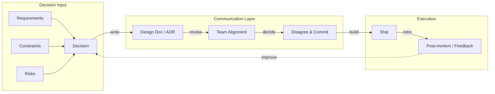

# Soft Skills

## Chapter Goal

After this chapter, the reader can structure written and verbal communication for engineering audiences and stakeholders, give and receive feedback using frameworks that produce behavioral change, resolve technical disagreements without eroding trust, manage stakeholder expectations with calibrated timelines and transparent risk communication, and answer behavioral interview questions using the STAR format with concrete engineering examples.

## Why This Matters for a Tech Lead

Soft skills are not personality traits — they are repeatable behaviors that determine whether technical decisions get adopted, shipped, and maintained. A Tech Lead who designs the right system but cannot align the team, negotiate scope with product, or communicate risk to leadership will watch that system die in a backlog.

Most Tech Lead interviews dedicate 30-50% of the loop to behavioral and leadership questions. Interviewers are testing whether the candidate can do the job, not whether they know the theory. A candidate who answers "tell me about a conflict" with vague platitudes signals that they have never navigated a real disagreement under pressure.

A Tech Lead who owns communication must:

- Translate technical constraints into business language that stakeholders act on. "The database cannot handle this query pattern" is technical. "This feature will add 3 seconds to checkout, which our data shows costs us 12% of conversions" is a decision.
- Write design documents that get read, challenged, and approved — not ignored. A design doc that nobody reads is a document that nobody agreed to.
- Give feedback that changes behavior, not feedback that makes the giver feel virtuous. "The code could be better" changes nothing. "The retry logic does not handle partial failures — here is the failure scenario and a fix" changes the code.
- Run meetings that produce decisions, not meetings that produce more meetings.
- Set expectations that survive contact with reality. An estimate of "two weeks" without a risk analysis is a promise that will break.

## Mental Model

Soft skills in engineering are **the communication infrastructure of a team**. Technical infrastructure (CI/CD, monitoring, deployment) determines how fast code reaches production. Communication infrastructure (documents, feedback loops, meeting norms, decision processes) determines how fast *decisions* reach the team.

When communication infrastructure fails, the symptoms look technical: blocked PRs, misaligned implementations, rework after launch, silent disagreements that surface as production incidents. The root cause is not a technical gap — it is a communication gap.



The diagram shows the decision-communication-execution loop. Decisions flow through written documentation, team alignment, and commitment before reaching execution. Post-mortems and feedback loop back into better decisions. When any stage is skipped — no document, no alignment, no retro — the next cycle degrades.

## Core Terminology

| Term | Definition |
| --- | --- |
| **BLUF (Bottom Line Up Front)** | A communication pattern that states the conclusion or recommendation first, then provides supporting detail. Used in military communication, effective in engineering because readers skim. |
| **Pyramid principle** | Structure communication with the main point first, then supporting arguments, then supporting data. The inverse of how most engineers naturally write (context → analysis → conclusion). |
| **Active listening** | Listening with the intent to understand, not to respond. Concrete behaviors: paraphrasing what was said, asking clarifying questions, surfacing unstated assumptions. |
| **Ladder of inference** | A mental model for how people move from observable data to conclusions. At each rung (select data → interpret → assume → conclude → act), biases accumulate. Useful for debugging disagreements: find the rung where people diverge. |
| **Radical candor** | A feedback framework (Kim Scott) with two axes: "care personally" and "challenge directly." Feedback that challenges directly without caring personally is obnoxious aggression. Feedback that cares personally without challenging directly is ruinous empathy. |
| **Disagree and commit** | A decision-making norm where team members voice disagreements during the decision phase, then fully commit to the chosen path once a decision is made — even if they disagreed. Prevents relitigating decisions during execution. |
| **Type 1 vs Type 2 decision** | Type 1 decisions are irreversible or nearly so (choosing a database, signing a vendor contract). Type 2 decisions are reversible (choosing a library, adopting a coding convention). Type 1 decisions need alignment. Type 2 decisions need speed. |
| **STAR format** | A structure for behavioral interview answers: Situation, Task, Action, Result. Forces concrete answers over vague generalities. |
| **RFC (Request for Comments)** | A written proposal for a significant technical change, circulated to the team or organization for feedback before a decision is made. |
| **ADR (Architecture Decision Record)** | A short document that captures a single architecture decision: context, decision, status, and consequences. See [Software Architecture](./14-software-architecture.md). |
| **Blameless post-mortem** | A structured review after an incident that focuses on systemic causes, not individual blame. The goal is to improve the system, not to punish people. |
| **Stakeholder** | Anyone affected by or who can influence a project's outcome: product managers, designers, other engineering teams, leadership, customers. Each stakeholder has different interests and different influence. |
| **Psychological safety** | A team environment where members can take interpersonal risks — ask questions, admit mistakes, challenge ideas — without fear of punishment. Research (Google's Project Aristotle) identifies it as the strongest predictor of team effectiveness. |
| **Emotional intelligence (EQ)** | The ability to recognize, understand, and manage one's own emotions and the emotions of others. In engineering leadership, this means reading the room during a heated design review, managing frustration during an incident, and understanding why a team member is disengaged. |

## Theoretical Foundation

### Communication for engineers

Engineering communication has one constraint that most communication training ignores: the audience is busy, skeptical, and technically literate. Motivational openings, lengthy context-setting, and buried conclusions waste the reader's time and signal that the writer has not done the work of thinking clearly.

**BLUF (Bottom Line Up Front).** State the recommendation, decision, or request in the first sentence. Then provide the reasoning. This is the opposite of how most engineers naturally communicate (context → analysis → conclusion). BLUF works because:

- Readers who agree with the conclusion can skip the justification.
- Readers who disagree know *what* they are disagreeing with before reading the supporting evidence.
- In meetings, BLUF prevents the common failure mode of running out of time before reaching the point.

**The pyramid principle.** Structure longer documents (design docs, RFCs, post-mortems) with the main point at the top, supporting arguments below, and data at the bottom. Each level should be independently readable. A reader who reads only the first paragraph should understand the decision. A reader who reads the full document should understand the reasoning.

**Written-first communication.** Prefer asynchronous, written communication for decisions that affect more than two people. Written communication creates a record, allows asynchronous review, scales across timezones, and forces the writer to think before communicating. Synchronous communication (meetings, calls) is better for brainstorming, conflict resolution, and relationship building — tasks where real-time feedback and emotional cues matter.

> **Tech Lead perspective — communication under pressure.** A Senior Engineer communicates clearly under normal conditions. A Tech Lead must communicate clearly under pressure — during incidents, deadline crises, and stakeholder escalations. Under pressure, most people revert to either over-communicating (flooding Slack with every thought) or under-communicating (going silent and "just fixing it"). The Tech Lead sets the communication rhythm for the team: structured status updates at defined intervals, explicit separation of "what we know" from "what we are guessing," and named owners for stakeholder communication vs technical resolution. The discipline to maintain this structure when things are breaking is what separates a Tech Lead's communication from a Senior Engineer's. In an interview, describe a specific incident where you maintained structured communication under pressure — not just the technical fix, but how you managed the flow of information.

### Active listening

Active listening is not a personality trait — it is a set of observable behaviors:

1. **Paraphrase.** "What I hear you saying is..." This forces the listener to process the message, not plan their response.
2. **Ask clarifying questions.** "When you say 'slow', do you mean latency or throughput?" This surfaces ambiguity that would otherwise become a misaligned implementation.
3. **Surface unstated assumptions.** "It sounds like you are assuming the API contract will not change. Is that correct?" This catches misalignment before it becomes rework.
4. **Acknowledge before responding.** "That is a valid concern" before offering an alternative. This prevents the speaker from feeling dismissed and escalating.

Active listening fails when it is performative — nodding and paraphrasing without changing behavior based on what was heard. The test: does the listener's subsequent action reflect what the speaker said?

> **Tech Lead perspective — active listening as a decision-making tool.** A Senior Engineer uses active listening to understand requirements and avoid miscommunication. A Tech Lead uses active listening to surface hidden constraints and unstated risks that change architectural decisions. When a PM says "we need this by March," active listening asks: "What happens if it ships April 1 instead?" The answer reveals whether the deadline is a hard business constraint (a contractual obligation) or a soft preference (a quarterly goal). This distinction changes the trade-off space: a hard deadline means scope negotiation, a soft deadline means timeline negotiation. The Tech Lead who listens for the constraint behind the request makes better decisions than the Tech Lead who takes the request at face value. In design reviews, active listening is the mechanism for detecting "violent agreement" — two engineers using different words for the same approach — and for detecting hidden disagreement — two engineers using the same words for different approaches.

### Giving feedback

Effective feedback is specific, timely, and behavioral. It describes what happened, what the impact was, and what to do differently. It does not describe the person.

**The SBI model (Situation, Behavior, Impact):**

```text
Situation: "In yesterday's design review..."
Behavior:  "...you interrupted the presenter three times before
            they finished explaining the trade-offs."
Impact:    "The presenter stopped sharing their concerns, and we
            missed a critical failure mode that surfaced in staging."
```

**What this shows:** Feedback anchored in observable behavior and measurable impact, not character judgment.

**The weaker alternative:** "You are always interrupting people." This is a character statement. It triggers defensiveness and does not specify what to change.

**In production (on a real team):** Schedule feedback within 48 hours of the behavior. Feedback delivered weeks later loses context and impact. For sensitive feedback, use a private 1:1, not a public channel. For positive feedback, public acknowledgment (in a team channel or retro) reinforces the behavior across the team.

**Radical candor framework.** The two-axis model:

| | Challenges directly | Does not challenge |
| --- | --- | --- |
| **Cares personally** | Radical candor (the goal) | Ruinous empathy |
| **Does not care** | Obnoxious aggression | Manipulative insincerity |

Radical candor means caring enough about someone to tell them the truth about their work. The most common failure mode for senior engineers is ruinous empathy — avoiding difficult feedback because "I do not want to hurt their feelings." The result: the person never improves, the team absorbs the quality gap, and the relationship eventually breaks when the accumulated frustration surfaces.

### Receiving feedback

Receiving feedback well is harder than giving it, and interviewers test for it explicitly. The concrete behaviors:

1. **Listen without defending.** The instinct to explain or justify is strong. Suppress it for the first 30 seconds. Let the giver finish.
2. **Ask for specifics.** "Can you give me an example?" turns vague feedback ("your PRs are hard to review") into actionable data ("the last three PRs had no description and changed 40+ files").
3. **Separate the signal from the delivery.** Poorly delivered feedback can still contain a valid signal. "Your code is messy" is poorly delivered, but the signal — the code needs restructuring — may be accurate.
4. **Respond with action, not agreement.** "Thank you for the feedback. I will restructure future PRs into smaller changes with descriptions" is stronger than "I agree, I will do better."
5. **Follow up.** After implementing the change, check back: "I have been splitting PRs into smaller changes — is the review experience better?" This closes the feedback loop.

### Conflict resolution

Technical conflicts are normal and productive — they surface trade-offs and challenge assumptions. Interpersonal conflicts are destructive — they erode trust and create factions. The Tech Lead's job is to keep conflicts technical and resolve them before they become personal.

**The conflict resolution ladder:**

1. **Clarify the disagreement.** Most conflicts dissolve when both sides realize they are arguing about different things. "Wait — are you arguing against the API design or against the timeline?" Separating the concerns removes false conflicts.
2. **Identify the shared constraint.** Both sides usually agree on the constraint (latency budget, deadline, team capacity). Restating the shared constraint reframes the conflict from "your idea vs my idea" to "which option best serves the constraint."
3. **Make the trade-off explicit.** "Option A optimizes for development speed at the cost of operational complexity. Option B optimizes for operational simplicity at the cost of two extra weeks." When trade-offs are explicit, the decision becomes rational rather than personal.
4. **Escalate with data, not emotion.** If the conflict cannot be resolved between peers, escalate to the decision-maker with a clear framing: "We disagree on X. Here are the trade-offs. We need a decision by Friday to avoid blocking Y."

**Disagree and commit.** Once a decision is made, every team member commits to executing it — including those who disagreed. This does not mean pretending to agree. It means saying: "I still think option B is better for these reasons. The team chose option A. I will execute option A fully and will not undermine it." The failure mode of disagree-and-commit is passive resistance: agreeing in the meeting but dragging feet during execution.

> **Tech Lead perspective — owning the conflict resolution process.** A Senior Engineer resolves conflicts they are directly involved in. A Tech Lead designs and maintains the conflict resolution process for the entire team. This means deciding when conflicts should be resolved 1:1 between the engineers, when they should be escalated to a design discussion, and when the Tech Lead should make the call. It also means creating an environment where disagreement is safe — if engineers learn that disagreeing with the Tech Lead's preferred approach has negative consequences, they stop raising objections and the Tech Lead starts making decisions with incomplete information. The specific behavior: when an engineer disagrees with the Tech Lead's proposal, the Tech Lead says "walk me through why," listens to the full argument, and changes the decision if the argument is better. When the Tech Lead cannot change the decision (external constraint, deadline), they explain the constraint explicitly: "I agree your approach is better technically, but we have a compliance deadline that does not allow a 4-week rewrite. Let us ship the workaround now and schedule the rewrite for Q3." The team needs to see the reasoning, not just the decision.

### Expectation management

Expectation management is the practice of setting, communicating, and adjusting expectations before they are violated. The Tech Lead who says "we are on track" until the day before the deadline and then announces a two-week slip has failed at expectation management, regardless of the technical reason for the slip.

**The three rules:**

1. **Set expectations with ranges, not points.** "This will take 2-4 weeks, depending on whether the API contract changes" is honest. "This will take 2 weeks" is a promise that will break if any assumption is wrong.
2. **Communicate bad news early.** The moment the risk materializes, communicate it. "The API contract changed, so we are now tracking toward 4 weeks instead of 2. Here is what I need to get back to 2 weeks: [specific ask]." Early bad news is a problem. Late bad news is a trust violation.
3. **Update regularly, especially when nothing has changed.** "Still on track for the 4-week estimate I shared last Monday" is a one-sentence message that maintains trust. Silence between updates creates anxiety and invites micromanagement.

### Stakeholder communication

Stakeholders have different interests, different influence, and different communication needs. A Tech Lead who communicates the same way to every stakeholder is communicating well to nobody.

**Stakeholder mapping:**

```text
                High Influence
                     |
    Manage closely   |   Keep satisfied
    (VP Eng, PM)     |   (Security, Legal)
                     |
  --------+----------+----------+--------
                     |
    Keep informed    |   Monitor
    (Other teams)    |   (External vendors)
                     |
                Low Influence
   Low Interest                High Interest
```

**What this shows:** A 2x2 stakeholder map that determines communication strategy based on interest and influence.

**Why it is useful:** It prevents over-communicating to low-influence stakeholders (wasting time) and under-communicating to high-influence stakeholders (creating surprises).

**Common mistake:** Treating all stakeholders equally. The PM needs weekly updates on progress and risk. The security team needs a one-time review of the threat model. The vendor needs a monthly status check. Using the same cadence for all three wastes time and misses the needs of each.

**Communicating up (to leadership).** Lead with the decision or the ask, not the context. "I recommend we delay the launch by one week because load testing revealed that the payment service cannot handle peak traffic. The alternative is launching without the holiday promotion, which avoids the traffic spike." This gives leadership a decision to make, not a problem to solve.

**Communicating down (to the team).** Lead with the "why" and the context. Engineers need to understand why a decision was made to execute it effectively. "We are delaying the launch by one week because load testing showed the payment service drops 15% of requests above 5K RPS. Our peak estimate is 8K RPS during the promotion. The alternative was cutting the promotion, but product determined the revenue impact is too high. Here is the plan for the next week: [specifics]."

**Communicating sideways (to peer teams).** Lead with the impact on them. "Our launch delay means the marketing email sequence needs to shift by one week. Here are the new dates. What do you need from us to adjust?"

### Negotiation

Negotiation in engineering is not adversarial — it is collaborative scope management. A Tech Lead negotiates scope with product, timelines with leadership, resources with engineering management, and technical decisions with peer leads.

**Principled negotiation (Fisher and Ury):**

1. **Separate people from the problem.** "The timeline is too aggressive" is about the problem. "You always give us unrealistic deadlines" is about the person.
2. **Focus on interests, not positions.** The PM's position is "ship by March 1." Their interest is "launch before the competitor." Understanding the interest opens alternatives: "Can we ship a reduced scope by March 1 and the full scope by April 1?"
3. **Generate options before deciding.** Brainstorm multiple alternatives before evaluating. This prevents the false binary of "my way or your way."
4. **Use objective criteria.** "Based on our velocity over the last three sprints, the 90th-percentile estimate for this scope is 6 weeks." Objective criteria reduce the negotiation to a data discussion.

**The scope-time-quality triangle for Tech Leads.** When a project is under pressure, three variables can change: scope (what to build), time (when to ship), and quality (how well to build it). Quality is not negotiable — it creates tech debt that slows future work. The negotiation is always between scope and time. A Tech Lead who negotiates by cutting quality is borrowing from the team's future velocity.

### Written communication

Written communication is the highest-leverage skill for a Tech Lead because it scales. A conversation reaches the people in the room. A document reaches everyone who needs the information, now and in the future.

**Writing for skim and depth.** Structure every document for two reading speeds:

1. **Skim (30 seconds).** The reader reads the title, the first sentence of each section, and the decision/recommendation. They should understand the conclusion.
2. **Depth (10 minutes).** The reader reads the full document including the reasoning, alternatives considered, and risks. They should understand the trade-offs.

If a document fails the 30-second skim test — the reader cannot understand the decision by reading only the headers and first sentences — it needs restructuring, not more content.

### Meeting facilitation

Meetings are expensive. A one-hour meeting with eight engineers costs eight engineer-hours plus the context-switching cost of interrupted deep work. A Tech Lead who runs meetings without agendas, clear outcomes, and time discipline is spending the team's most expensive resource — uninterrupted thinking time — on synchronous communication that could often be asynchronous.

**Meeting disciplines:**

1. **Every meeting has a written agenda.** Shared at least 24 hours before the meeting. If there is no agenda, there is no meeting.
2. **Every meeting has a decision owner.** The person who will make the decision if the meeting does not reach consensus.
3. **Every meeting has a time limit.** Default to 25 or 50 minutes (leaving buffer between meetings). End on time, even if the discussion is not finished — schedule a follow-up rather than running over.
4. **Every meeting ends with next steps.** Capture decisions made, actions assigned (with owners and deadlines), and unresolved questions in writing. Share within 24 hours.
5. **Bias toward cancellation.** If the agenda can be resolved asynchronously (in a document, a Slack thread, or a PR comment), cancel the meeting. The team will thank you.

> **Tech Lead perspective — meetings as a cost center.** A Senior Engineer attends meetings and follows the agenda. A Tech Lead treats the team's meeting load as a system they are responsible for optimizing. A team with 20+ hours/week of meetings per engineer has a structural communication problem, not a scheduling problem. The Tech Lead audits recurring meetings quarterly: which meetings produce decisions? Which produce information that could be a document? Which exist because "we have always had this meeting"? The cost frame helps: an hour-long meeting with 6 engineers costs 6 engineer-hours. If the meeting's output could be achieved in a 15-minute written update, the Tech Lead has saved 5.75 engineer-hours per occurrence — roughly 300 engineer-hours per year for a weekly meeting. Communicating this cost to leadership justifies meeting reduction, which is harder to do with a subjective argument like "engineers do not like meetings."

### Documentation

Documentation in engineering serves three audiences: the current team (context for decisions), the future team (onboarding and maintenance), and the reader's future self (decisions that seemed obvious at the time but will not in six months).

**Types of engineering documentation:**

**Design documents / RFCs.** Written before building. Purpose: align the team on the approach, surface trade-offs, and create a record of why decisions were made. A design doc that gets ignored is worse than no design doc — it creates the illusion of alignment.

**Architecture Decision Records (ADRs).** Short, structured records of individual decisions. See [Software Architecture](./14-software-architecture.md) for the format. ADRs are valuable because they capture the *context* of a decision — the constraints, alternatives considered, and reasons for the choice. Without this context, future engineers reverse the decision without understanding the trade-off.

**Blameless post-mortems.** Written after incidents. Purpose: prevent recurrence by identifying systemic causes and implementing corrective actions. The "blameless" part is structural, not aspirational: the document focuses on systems and processes, not on who did what.

**Runbooks.** Step-by-step procedures for operational tasks (deployments, incident response, data migrations). A runbook should be executable by any on-call engineer, not only the person who wrote it.

### Explaining technical topics to non-technical people

Translating technical constraints into business language is a core Tech Lead skill. The goal is not to educate the stakeholder about technology — it is to give them the information they need to make a decision.

**The translation pattern:**

1. **Start with the business impact.** Not "the database is slow" but "checkout is taking 4 seconds, and our data shows that every additional second costs us 7% of conversions."
2. **Offer options with trade-offs.** "We can fix this in one week by adding a cache, which handles 90% of cases. Or we can redesign the query layer in four weeks, which handles 100% of cases and improves other pages too."
3. **Recommend, but let them decide.** "I recommend the cache because it solves the immediate problem and buys us time to plan the redesign for Q3."
4. **Avoid jargon unless defining it.** "Cache" may need a one-sentence explanation ("a layer that remembers recent results so the database does not have to compute them again"). Avoid the temptation to explain *how* caching works — the stakeholder needs to know *what* it does for them.

### Emotional intelligence

Emotional intelligence in engineering leadership is not about being "nice" — it is about reading signals that affect execution.

**Self-awareness.** Recognize when frustration, ego, or fatigue is affecting judgment. During a heated design review, the question "am I defending this position because it is right, or because it is mine?" prevents sunk-cost escalation.

**Self-regulation.** Manage emotional reactions in high-pressure situations. During an incident, the Tech Lead sets the emotional tone. Panic is contagious. Calm is also contagious. The concrete behavior: lower the voice, slow down, ask clarifying questions instead of assigning blame.

**Empathy.** Understand why a team member is resisting a decision, missing deadlines, or disengaged. The cause is rarely laziness — it is usually unclear expectations, personal stress, or disagreement with the direction that was never voiced. Asking "what is making this difficult?" opens a conversation that "why are you behind?" closes.

**Social skill.** Navigate organizational dynamics: build alliances with peer leads, manage up to leadership, and advocate for the team without creating adversarial relationships. The Tech Lead who frames every conversation as "my team vs the organization" will win individual battles and lose organizational trust.

### Time management and prioritization

A Tech Lead's calendar is the most visible expression of their priorities. If the calendar is full of meetings with no blocks for deep work, code review, or 1:1s, the Tech Lead is managing their time reactively — responding to whoever asks first rather than investing in what matters most.

**The Eisenhower matrix for Tech Leads:**

| | **Urgent** | **Not urgent** |
| --- | --- | --- |
| **Important** | Incidents, blocked team members, deadline-critical decisions | Design docs, hiring, architecture planning, team development |
| **Not important** | Status meetings, non-critical Slack threads, FYI emails | Most reports, tool evaluations with no deadline, optional meetings |

The failure mode: spending all time on urgent-important and urgent-not-important tasks, leaving no time for not-urgent-important tasks (design docs, hiring, architecture planning). These tasks are where Tech Lead leverage is highest, but they never feel urgent — until they become crises.

**Concrete time management behaviors:**

- Block 2-4 hours of uninterrupted time daily for deep work (code review, design docs, architecture).
- Batch meetings into a contiguous block rather than scattering them throughout the day.
- Delegate urgent-not-important tasks to senior team members who can handle them.
- Say "no" to meetings without agendas, meetings where the Tech Lead's input is not needed, and meetings that can be an email.

### Ownership and accountability

**Ownership** means taking responsibility for an outcome, not completing an assigned task. An engineer who "owns" a feature but waits for someone else to unblock them, define requirements, or make decisions is not owning — they are executing. Ownership means identifying the blockers, driving the decisions, and escalating when needed without being asked.

**Accountability** means being answerable for the outcome, including when it fails. A Tech Lead who says "the deploy failed because ops did not configure the load balancer" is deflecting. A Tech Lead who says "the deploy failed because I did not verify the infrastructure configuration during staging — here is how I will prevent this next time" is accountable.

**The ownership spectrum:**

```text
Executing ──── Contributing ──── Owning ──── Accountable
   |                |               |              |
"I did what    "I helped plan   "I drove the   "The outcome
 was asked."    and built it."   decision and    is mine,
                                 unblocked       including
                                 the team."      when it
                                                 fails."
```

Tech Lead interviews specifically probe where the candidate falls on this spectrum. Candidates who describe situations where they owned outcomes — including failures — signal leadership maturity. Candidates who describe situations where they executed assigned tasks signal individual contribution.

### Behavioral interview questions and the STAR format

Behavioral interviews assume that past behavior predicts future behavior. The interviewer asks "tell me about a time when..." and evaluates the answer for concrete detail, decision-making quality, and self-awareness.

**The STAR format:**

- **Situation:** Set the context in 2-3 sentences. Include enough detail to understand the stakes (team size, timeline pressure, business impact) but do not narrate the entire project history.
- **Task:** What was the specific challenge or responsibility? Distinguish the team's task from the candidate's personal task.
- **Action:** What did the candidate specifically do? This is the core of the answer. Use "I" not "we" — the interviewer wants to know the candidate's contribution, not the team's.
- **Result:** What was the outcome? Quantify when possible (reduced deploy time by 40%, zero incidents in the first month). Include what was learned, especially if the outcome was not ideal.

**Common STAR mistakes:**

1. **All situation, no action.** The candidate spends 80% of the answer describing the problem and 20% on what they did. The interviewer is evaluating actions and decisions, not problem descriptions.
2. **"We" instead of "I."** Behavioral interviews assess individual contribution. "We redesigned the system" does not tell the interviewer what the candidate did. "I proposed the new architecture in an RFC, led the design review, and implemented the migration plan" does.
3. **No result.** The answer ends with "and we shipped it." Without a measurable result or a lesson learned, the interviewer cannot assess impact.
4. **Only successes.** Interviewers ask about failures to assess self-awareness and learning. A candidate who cannot describe a failure they owned and learned from signals either inexperience or defensiveness.

> **Tech Lead perspective — STAR answers that demonstrate leadership, not execution.** A Senior Engineer's STAR answers describe technical problems solved and systems built. A Tech Lead's STAR answers must demonstrate three additional signals: **decision-making under uncertainty** (choosing between imperfect options with incomplete information), **influence without authority** (aligning people who do not report to you), and **systems thinking** (improving the process, not just fixing the instance). When preparing STAR stories for a Tech Lead interview, evaluate each story against these three signals. "I optimized the database query" is an execution story. "I noticed that database performance issues kept recurring, designed an automated slow-query alert system, and established a weekly performance review that caught 12 issues before they reached production" is a leadership story — it shows the candidate improved the system, not just the instance.

### Working across timezones and cultures

Distributed teams require explicit communication norms that co-located teams can leave implicit.

**Timezone-aware practices:**

- Document decisions in writing, not in meetings. An engineer in a different timezone who misses a meeting should be able to read the decision and the reasoning asynchronously.
- Rotate meeting times across timezones rather than permanently disadvantaging one timezone.
- Define "working hours overlap" explicitly: the 2-4 hour window where synchronous communication is expected. Outside that window, asynchronous communication is the norm.
- Set response-time expectations by channel. Slack: within working hours. Email: within 24 hours. Urgent pages: within 15 minutes.

**Cross-cultural awareness.** Communication styles vary across cultures. Some cultures are direct (disagreement is expressed openly), others are indirect (disagreement is expressed through silence, qualification, or questions). A Tech Lead who assumes everyone communicates the same way will misread signals: silence may mean agreement in one culture and disagreement in another. The corrective behavior: ask explicitly for objections, do not interpret silence as consensus, and use written channels that give people time to formulate their thoughts in a second language.

## Practical Usage

### Running a productive design review

A design review that ends with "looks good" or "let me think about it" has failed. A productive design review ends with one of three outcomes: approved (with documented conditions), rejected (with documented reasons), or deferred (with documented questions and a follow-up date).

**Pre-review preparation (Tech Lead responsibility):**

1. Share the design doc at least 48 hours before the review meeting.
2. Ask reviewers to leave written comments before the meeting. The meeting should discuss unresolved comments, not introduce new concerns.
3. Set the scope of the review: "We are reviewing the data model and the API contract. We are not reviewing the deployment strategy today."

**During the review:**

1. The author presents a 5-minute summary (BLUF: what they are proposing and why). Do not read the document aloud.
2. Walk through unresolved written comments in priority order.
3. For each disagreement, apply the conflict resolution ladder: clarify, find the shared constraint, make the trade-off explicit.
4. If a topic cannot be resolved in the meeting, time-box it: "We will resolve the caching strategy offline by Thursday. Maria and James, please propose options in the doc by Wednesday."

**After the review:**

1. Update the design doc with decisions made and action items.
2. Share a summary within 24 hours: what was decided, what is still open, and who owns the open items.

### Writing a one-page design doc that gets read

The most common failure of design docs is not that they are wrong — it is that they are not read. A 20-page document with no summary, no BLUF, and no clear decision will be skimmed by reviewers who then ask questions that the document already answers.

```text
DESIGN DOC: [Title]

STATUS: [Draft / In Review / Approved / Superseded]
AUTHOR: [Name]
REVIEWERS: [Names]
DATE: [Date]

DECISION
One paragraph: what are we doing and why.

CONTEXT
Two to three paragraphs: the problem, the constraints, and the
success criteria. Include the business motivation, not only the
technical problem.

OPTIONS CONSIDERED
For each option: one paragraph describing the approach, one paragraph
describing the trade-offs.

RECOMMENDED OPTION
Which option and why. Reference the success criteria.

RISKS
Bullet list of risks with mitigations.

OPEN QUESTIONS
Numbered list of unresolved questions with owners.
```

**What this shows:** A design doc skeleton that fits on one page and can be read in 5 minutes. Every section serves a purpose: the reader can skim the DECISION and RECOMMENDED OPTION in 30 seconds, or read the full document in 5 minutes.

**Why it is written this way:** The structure forces the author to think clearly about the decision before writing. Most unclear design docs are unclear because the author has not decided what they are recommending.

**Common mistake:** Writing a design doc that describes the solution in detail but never states the problem, the alternatives, or the trade-offs. This signals that the author has already decided and is seeking approval, not feedback.

**In production:** Add a "Previous Decisions" or "Related ADRs" section that cross-links to past decisions. Add a version history if the doc is updated after review. Store the doc where the team actually looks (in the repo, not in a wiki nobody visits).

### Managing a difficult code review conversation

Code reviews become difficult when feedback is perceived as personal criticism, when the reviewer and author have different quality standards, or when the disagreement is actually about architecture, not code. See [Git and Engineering Workflow](./20-git-and-engineering-workflow.md) for PR culture and review practices.

**Defusing techniques:**

1. **Comment on the code, not the author.** "This function handles too many concerns" rather than "you wrote this poorly." Use "this code" not "your code."
2. **Ask questions instead of making statements.** "What happens when the input list is empty?" is less confrontational than "this will crash on empty input" and achieves the same goal.
3. **Distinguish blocking from non-blocking.** Label comments explicitly: "Blocking: this SQL injection vector must be fixed before merge" vs "Nit: I prefer early returns but this is not a blocker." This prevents the author from feeling that 20 comments means 20 blockers.
4. **Move architectural disagreements out of the PR.** If the disagreement is about the approach rather than the implementation, the PR is the wrong venue. "This should be a separate design discussion — can we schedule 30 minutes to align on the approach before continuing the review?"

### Writing a blameless post-mortem

```text
POST-MORTEM: [Incident Title]
DATE: [Incident Date]
SEVERITY: [P1 / P2 / P3]
DURATION: [Start time – End time, total duration]
AUTHOR: [Name]

SUMMARY
Two to three sentences: what happened, who was affected, how it was
resolved. Use BLUF.

TIMELINE
Chronological list of events with timestamps.
Include detection, escalation, mitigation, and resolution.

ROOT CAUSE
What systemic issue caused the incident? Not "who" but "what process,
configuration, or design failed."

CONTRIBUTING FACTORS
What made the incident worse or harder to resolve?

ACTION ITEMS
| Action | Owner | Deadline | Status |
| --- | --- | --- | --- |
| Add monitoring for X | [Name] | [Date] | Open |
| Update runbook for Y | [Name] | [Date] | Open |

LESSONS LEARNED
What did we learn that changes how we operate?
```

**What this shows:** A post-mortem template that focuses on systemic causes and corrective actions, not individual blame.

**Why it is written this way:** The "blameless" part is structural: the template has no field for "who caused the incident." Root cause asks "what" not "who." This structure makes blamelessness the default rather than a cultural aspiration that erodes under pressure.

**Common mistake:** Writing a post-mortem that identifies the root cause as "human error." Human error is a symptom, not a cause. The question is: what system allowed human error to cause an outage? Was there no pre-deploy check? Was the runbook unclear? Was the alert missing?

**In production:** Schedule the post-mortem within 48 hours of the incident while memory is fresh. Track action items in the team's task tracker (not in the document). Review open action items in the next team meeting. A post-mortem without completed action items is a document, not an improvement.

## Examples

### An RFC structure for proposing technical changes

```text
RFC: Migrate user session storage from Redis to PostgreSQL

STATUS: Proposed
AUTHOR: Sarah Chen
DATE: 2025-03-15
DECISION DEADLINE: 2025-03-22

PROBLEM
Redis session storage requires a dedicated Redis cluster that costs
$2,400/month and has no built-in persistence guarantee. We have lost
sessions during two Redis failover events in the past quarter,
generating 340 support tickets.

PROPOSAL
Move session storage to a dedicated PostgreSQL table with a TTL-based
cleanup job. Sessions are already backed by PostgreSQL for audit
logging, so this consolidates storage.

TRADE-OFFS
- Latency: Redis reads are ~1ms, PostgreSQL reads are ~3-5ms.
  Acceptable for session lookups (not in the hot path).
- Operational complexity: Removes one infrastructure component.
- Durability: PostgreSQL transactions guarantee session persistence
  across failovers.
- Cost: Eliminates $2,400/month Redis cluster.

ALTERNATIVES CONSIDERED
1. Upgrade Redis to a managed service with persistence — addresses
   durability but increases cost to $3,600/month.
2. Implement session pinning at the load balancer — does not solve
   the durability problem and adds operational complexity.

RISKS
- PostgreSQL connection pool pressure from high session-read volume.
  Mitigated by connection pooling (PgBouncer) and read replicas.
- Migration requires a session invalidation window (~5 minutes).

OPEN QUESTIONS
1. What is the maximum concurrent session count at peak? (Need data
   from the analytics team by March 19.)
```

**What this shows:** An RFC that leads with the problem and the business case (cost, incidents), presents trade-offs as data rather than opinions, and explicitly lists alternatives considered.

**Why it is written this way:** The decision deadline creates urgency and prevents the RFC from languishing in "review." The trade-offs section uses measurable comparisons (latency numbers, cost figures) rather than qualitative assessments ("slightly slower"). The alternatives section shows that the author considered other options, not that the proposal is the only option.

**Common mistake:** Writing an RFC that proposes a solution without stating the problem or the alternatives. This reads as a decision that has already been made, which discourages feedback.

**In production:** Assign 2-3 reviewers explicitly. Set a decision deadline. If no blocking feedback is received by the deadline, the RFC is approved. This prevents RFCs from stalling in review indefinitely.

### STAR-format behavioral interview answer

```text
Question: "Tell me about a time you handled a technical disagreement."

Situation: Our team was migrating from REST to GraphQL. Two senior
engineers disagreed on the approach: one wanted a full rewrite
(6 weeks), the other wanted an incremental wrapper (3 weeks).
The team was blocked, and the Q3 launch was at risk.

Task: As Tech Lead, I needed to resolve the disagreement and
unblock the team within two days to protect the launch date.

Action: I asked each engineer to document their approach in a
shared doc with the same sections: trade-offs, risks, effort,
and rollback plan. I facilitated a 30-minute review focused on
the trade-offs, not the approaches. The incremental wrapper
had lower risk and met the deadline. The full rewrite had better
long-term architecture. I chose the wrapper for Q3 and scheduled
the rewrite for Q4. I took accountability for the decision and
applied disagree-and-commit with the engineer who preferred
the rewrite.

Result: We shipped on time. The wrapper handled 95% of use cases.
We started the rewrite in Q4 with a clearer understanding of
the requirements, informed by three months of GraphQL usage data.
The engineer who originally wanted the rewrite told me later that
the phased approach was better because the Q3 data changed
several of his design assumptions.
```

**What this shows:** A complete STAR answer that uses "I" (not "we"), quantifies the result, shows leadership behavior (structured the disagreement, made the decision, took accountability), and includes a learning outcome.

**Why it is useful:** Interviewers evaluate STAR answers for specificity, leadership signal, and self-awareness. This answer demonstrates all three: the candidate structured a process, made a decision with trade-offs, and reflects on what was learned.

**Common mistake:** Spending 80% of the answer on the Situation and 20% on the Action. The Action is where the interviewer learns about the candidate. In this example, the Action section is the longest.

**In production:** Prepare 5-7 STAR stories before the interview, covering: a technical disagreement, a failure, a cross-team collaboration, a stakeholder conflict, a mentoring success, and a project under pressure. Each story can be adapted to multiple question framings.

### Feedback conversation using SBI

```text
GIVING FEEDBACK (corrective)

Situation: "In this morning's sprint planning..."
Behavior:  "...you estimated every task as one story point without
            discussing complexity or risks with the team."
Impact:    "The sprint is now overcommitted. We have 40 points
            committed with a velocity of 28. The team will either
            miss the sprint goal or work overtime. The PM is
            planning the release based on these estimates."
Request:   "For future planning, can you walk through each task's
            complexity with the team before estimating? If you
            disagree with the team's estimate, let us discuss it —
            but the estimate should reflect realistic effort."

---

GIVING FEEDBACK (positive, reinforcing)

Situation: "In yesterday's incident response..."
Behavior:  "...you wrote a clear status update every 20 minutes
            with what you tried, what you were trying next, and
            the expected timeline."
Impact:    "The PM stopped pinging us for updates, the VP had
            confidence we were handling it, and I could focus on
            coordinating the fix instead of managing stakeholders."
Request:   "Keep doing this. I would like to share your update
            format as the template for the team's incident protocol."
```

**What this shows:** SBI applied to both corrective and positive feedback, with a concrete request that specifies the behavioral change.

**Why it is useful:** Most engineers know SBI in theory but default to vague feedback in practice. The example shows that "Impact" must connect to a measurable consequence (overcommitted sprint, PM planning on wrong data) rather than a feeling ("it made me uncomfortable").

**Common mistake:** Giving SBI feedback without the Request. SBI explains the problem; the Request tells the person what to do differently. Without the Request, the person knows they did something wrong but does not know what to do instead.

**In production:** For corrective feedback, deliver in a private 1:1 within 48 hours. For positive feedback, deliver publicly (team channel, retro) so the behavior is reinforced across the team. Keep a log of feedback given so patterns can be discussed in performance reviews.

### Conflict resolution conversation template

```text
CONFLICT RESOLUTION — STRUCTURED CONVERSATION

Step 1: Name the disagreement
"I want to make sure we are disagreeing about the same thing.
Alex, you are proposing that we use a monorepo for the new
services. Jordan, you are proposing separate repos. Is that
an accurate framing, or am I missing something?"

Step 2: Surface the shared constraint
"We both agree that the goal is faster CI/CD feedback loops
and easier cross-service changes. Correct?"

Step 3: Make the trade-offs explicit
"Monorepo: faster cross-service changes, single CI pipeline,
but requires build tooling investment (Nx or Bazel) and
slows CI as the codebase grows.

Separate repos: independent CI pipelines, faster per-repo
builds, but cross-service changes require coordinated PRs
and versioning."

Step 4: Apply decision criteria
"Given that we have 3 services today and plan 8 by year-end,
and our CI pipeline is already at 12 minutes, which approach
better serves the 'fast feedback loop' constraint at 8 services?"

Step 5: Decide and commit
"Based on this analysis, I am choosing separate repos with a
shared CI library for common steps. Alex, I hear your concern
about coordinated changes — let us address that with a
cross-repo PR tool. Can you commit to this approach?"
```

**What this shows:** A facilitator-led conflict resolution that moves from clarifying the disagreement to surfacing shared constraints to making the trade-off explicit to deciding.

**Why it is useful:** Most conflicts stall at Step 1 — each side repeats their position louder. The template forces progress through the steps. A Tech Lead who can walk through these steps in an interview demonstrates structured leadership.

**Common mistake:** Skipping to Step 5 (deciding) without Steps 2-4. A decision without visible trade-offs feels arbitrary. A decision with visible trade-offs feels rational, even to the person who disagreed.

**In production:** Document the decision and the reasoning as an ADR. Include the losing option and why it was not chosen. This prevents the same debate from recurring in three months.

### Stakeholder update for a project delay

```text
STAKEHOLDER UPDATE — PROJECT DELAY

To: VP Product, PM
From: [Tech Lead]
Subject: Checkout redesign — revised timeline

DECISION NEEDED: Approve revised scope or revised timeline.

CURRENT STATUS
The checkout redesign is tracking 2 weeks behind the March 15
estimate. Revised completion: March 29.

REASON
The payment provider's API does not support batch refunds,
which was an assumption in the original scope. We need to
build an adapter layer (5 days of work).

OPTIONS
1. Ship full scope on March 29 (+2 weeks).
2. Ship without batch refunds on March 15 (original date).
   Add batch refunds by April 5 in a follow-up release.
3. Switch payment providers — adds 3-4 weeks for evaluation
   and integration.

RECOMMENDATION
Option 2. Meets the launch date for 95% of functionality.
Batch refunds affect <2% of transactions and can be handled
manually until the April 5 release.

RISKS
- Manual refund processing during the 3-week gap requires
  2 hours/week from the support team.
- Option 3 is viable long-term but not justified by this
  single feature gap.

NEXT UPDATE: Wednesday March 5, or sooner if status changes.
```

**What this shows:** A stakeholder update that uses BLUF (decision needed in the first line), provides options with trade-offs, makes a recommendation, and quantifies risk.

**Why it is useful:** Leadership does not want problems — they want decisions. This format gives them a recommendation they can approve, modify, or reject. It also documents the reasoning, so when someone asks "why did we cut batch refunds?" in three months, the answer is in writing.

**Common mistake:** Sending a stakeholder update that describes the problem but does not offer options or a recommendation. "We are delayed because the API does not support batch refunds" gives the stakeholder a problem to solve. The update above gives them a decision to make.

**In production:** Send delay communications the moment the risk materializes, not the day before the deadline. Add a "NEXT UPDATE" line so stakeholders know when they will hear again. Copy the engineering manager so there are no surprises in their reporting chain.

### Meeting facilitation agenda

```text
MEETING: Caching strategy decision
DATE: Tuesday March 11, 10:00-10:50
ATTENDEES: [names]
DECISION OWNER: [Tech Lead name]
PRE-READ: [link to design doc — read before the meeting]

AGENDA
10:00-10:05  Context (Tech Lead)
             - Problem: p95 latency is 4.2s, SLO is 2s.
             - This meeting decides the caching approach.

10:05-10:20  Option comparison (pre-read discussion)
             - Option A: Application-level cache (Redis)
             - Option B: CDN edge caching
             - Option C: Database query optimization (no cache)
             - Focus on: latency impact, operational cost,
               invalidation complexity.

10:20-10:40  Unresolved concerns from the doc
             - Cache invalidation strategy (Sarah's comment)
             - Cost projection for Redis cluster (James's question)

10:40-10:50  Decision and next steps
             - The decision owner makes the call.
             - Capture: decision, action items, owners, deadlines.
             - If no decision: schedule follow-up with specific
               questions to resolve.

POST-MEETING
- Notes shared within 24 hours.
- Decision documented as ADR.
```

**What this shows:** A meeting agenda with a clear goal (decide the caching approach), time-boxed sections, a pre-read, a named decision owner, and a post-meeting commitment.

**Why it is useful:** This agenda makes the meeting about resolving unresolved concerns from the doc, not about reading the doc aloud. The pre-read separates reading time from discussion time, making the meeting 50% shorter.

**Common mistake:** An agenda that says "discuss caching strategy." This has no decision goal, no pre-read, no time-boxing, and no decision owner. The meeting will meander for an hour and end with "let us think about it more."

**In production:** Share the agenda 24 hours before the meeting. If attendees have not read the pre-read, cancel the meeting and reschedule — a meeting where people learn the material in real time is a waste of the prepared attendees' time. Name a note-taker at the start.

### Written communication examples

```text
CONCISE STATUS UPDATE (weekly, to stakeholders)

Subject: Auth service migration — Week 3 status

Status: ON TRACK (was: ON TRACK)
Completion: 60% (was: 45%)
Target: March 29
Risk: LOW — no new risks this week.

Completed this week:
- Token validation migrated and deployed (zero-downtime).
- Load test passed at 2x expected peak traffic.

Next week:
- Session management migration (largest remaining component).
- Integration tests with the mobile client.

Blockers: None.

---

DECISION SUMMARY (after a meeting or async discussion)

Subject: DECIDED — Use PostgreSQL for session storage

Decision: Migrate session storage from Redis to PostgreSQL.
Date: March 15
Participants: [names]
Status: Approved — implementation starts March 18.

Reasoning: Redis cluster costs $2,400/month with no durability
guarantee. PostgreSQL consolidates storage, eliminates a
failure point, and saves $28K/year.

Trade-off accepted: Session read latency increases from 1ms
to 3-5ms (within SLO).

Action items:
- [ ] Migration plan by March 18 (Sarah)
- [ ] Load test with PostgreSQL sessions by March 22 (Alex)
- [ ] Deprecation plan for Redis by March 25 (Jordan)

---

ESCALATION NOTE (to engineering leadership)

Subject: ESCALATION — Auth team blocked by Platform team

Summary: The Auth team has been blocked for 8 business days
waiting for the Platform team's identity API. Three engineers
are partially idle. If unresolved by Friday, the Q2 launch
date moves by 2 weeks.

What I have tried:
- Requested the API on March 1 via the intake process.
- Followed up with the Platform Tech Lead on March 5 and 8.
- Offered to implement the API ourselves (rejected due to
  ownership policy).

What I need: A leadership decision on priority. Either the
Platform team delivers the API by March 20, or we get
approval to implement it ourselves.

Impact if unresolved: 2-week delay to Q2 launch, 24
engineer-days of partially blocked time.
```

**What this shows:** Three written communication formats that a Tech Lead uses weekly: a status update, a decision summary, and an escalation note. Each follows BLUF and includes actionable information.

**Why it is useful:** Written communication is the most common Tech Lead output — more frequent than code, design docs, or meetings. These templates produce consistent, scannable communication that stakeholders learn to trust.

**Common mistake:** Status updates that only describe what was done, without the forward-looking elements (next week, blockers, risk level). Decision summaries that document the decision but not the reasoning or the trade-offs. Escalation notes that describe the problem but not what has already been tried or what is needed.

**In production:** Standardize the status update format across the team. Stakeholders who receive consistent updates stop asking for ad-hoc status checks, which frees the Tech Lead's time. Store decision summaries in a searchable location (team wiki, shared doc, or the repo) so they serve as organizational memory.

### Expectation management scenario

```text
SCENARIO: Setting expectations for a new feature estimate

BAD EXPECTATION SETTING
PM: "How long will the search feature take?"
TL: "About 3 weeks."

--- 3 weeks later ---

PM: "Is search ready?"
TL: "No, the Elasticsearch integration took longer than
     expected. It will be 2 more weeks."
PM: "You said 3 weeks. We announced the date to customers."

---

GOOD EXPECTATION SETTING
PM: "How long will the search feature take?"
TL: "My estimate is 3-5 weeks. The range depends on the
     Elasticsearch integration — we have not used it before,
     so there is learning-curve risk. I will know more after
     the first week of integration work and will update you.
     If you need a single number for planning, use 4 weeks
     with 1 week of buffer."

--- 1 week later ---

TL: "Update on search: the Elasticsearch integration is
     more complex than expected. I am revising the estimate
     to 5 weeks. The main risk is the ranking algorithm,
     which requires testing with production data. I need
     access to a production data sample by Wednesday to
     stay on the 5-week track."

PM: "That is later than we hoped, but I appreciate the
     early heads-up. I will adjust the launch plan."
```

**What this shows:** The contrast between point estimates (which become broken promises) and range estimates with stated assumptions and regular updates (which maintain trust).

**Why it is useful:** The single most common trust violation between Tech Leads and stakeholders is a missed estimate delivered as a surprise. This example shows how to set expectations that survive reality.

**Common mistake:** Giving a single-point estimate without stating assumptions. When the assumption breaks, the estimate becomes a broken promise. The bad example shows the damage; the good example shows the prevention.

**In production:** Track estimate accuracy over time. If estimates are consistently 30% over, either the estimation process needs calibration or the assumptions need to be stated more explicitly. Share estimation accuracy data with the team — it builds the discipline of identifying risks upfront.

### Prioritization with impact/effort/risk framing

```text
PRIORITIZATION DECISION — Q2 ENGINEERING BACKLOG

The team has capacity for 3 of 5 requested items this quarter.

| Item | Impact | Effort | Risk | Priority |
| --- | --- | --- | --- | --- |
| Payment bug fix | **High** (3% revenue loss) | Low (3 days) | Low | 1 — Do first |
| Search feature | High (user retention) | High (5 weeks) | Medium (new tech) | 2 — Start after bug fix |
| Admin dashboard | Medium (internal efficiency) | Medium (3 weeks) | Low | 3 — Schedule for late Q2 |
| API versioning | Low (future flexibility) | Medium (2 weeks) | Low | 4 — Defer to Q3 |
| Design system migration | Medium (dev velocity) | High (6 weeks) | High (cross-team) | 5 — Defer, reduce risk first |

REASONING
- Payment bug fix is highest priority because the revenue
  impact is immediate and the effort is low. High impact,
  low effort = do first.
- Search is next because user retention is a Q2 OKR. The
  Elasticsearch risk is manageable with the mitigation plan
  from the RFC.
- Admin dashboard fills remaining capacity. Internal
  efficiency gains compound over time.
- API versioning is deferred because the flexibility benefit
  is speculative — no consumer has requested it.
- Design system migration is deferred because the cross-team
  dependency makes it high-risk this quarter. Reduce the risk
  by aligning with the design team in Q2, then execute in Q3.

COMMUNICATED TO: PM (via Q2 planning doc), VP Eng (via
quarterly review), team (via sprint planning).
```

**What this shows:** A prioritization framework that evaluates items by impact, effort, and risk — then communicates the reasoning and the trade-offs to stakeholders.

**Why it is useful:** When a stakeholder asks "why is my feature not prioritized?", the answer is in the table. "API versioning is deferred because the impact is speculative and there is no consumer request. Here is what we are doing instead and why." Data-driven prioritization is defensible. Gut-feel prioritization invites debate.

**Common mistake:** Prioritizing by effort alone (doing the easy things first) or by stakeholder volume (whoever asks loudest gets priority). Both produce a backlog that misses high-impact work.

**In production:** Review priorities monthly. Impact changes (a customer escalation makes API versioning urgent), effort changes (a new library reduces the design system migration effort), and risk changes (the design team aligns sooner than expected). Static prioritization is a snapshot, not a commitment.

### Non-technical explanation of a technical issue

```text
TECHNICAL EXPLANATION (to engineers)
"The checkout endpoint is hitting a N+1 query bug. For each
item in the cart, we are making a separate database query to
fetch pricing. With 20 items in the cart, that is 21 queries
(1 for the cart + 20 for items) when it should be 2 queries
(1 for the cart + 1 batch query for all items). This causes
the 4-second response time."

NON-TECHNICAL EXPLANATION (to the PM)
"Checkout is slow because the system looks up each item's
price one at a time instead of all at once. Imagine a
librarian who walks to the shelf for each book you request
instead of collecting them all in one trip. The fix takes
about 3 days and will reduce checkout time from 4 seconds
to under 1 second."

NON-TECHNICAL EXPLANATION (to the VP)
"Checkout takes 4 seconds, and our data shows every extra
second costs us 7% of completed purchases. The fix is 3
engineering days. Expected result: checkout drops to under
1 second, recovering approximately $X/month in abandoned
carts. I recommend we prioritize this over the admin
dashboard feature for this sprint."
```

**What this shows:** The same technical issue explained at three levels: technical detail for engineers, analogy for the PM, and business impact for the VP.

**Why it is useful:** Each audience needs different information. The engineer needs the query pattern. The PM needs the cause and the timeline. The VP needs the business impact and the trade-off (what are we delaying to fix this?). A Tech Lead who uses the same explanation for all three audiences either over-explains to the VP or under-explains to the engineer.

**Common mistake:** Explaining the N+1 query to the VP. The VP does not need to understand database query patterns — they need to understand revenue impact and resource allocation. Explaining business impact to the engineers without the technical detail — they cannot fix what they do not understand.

**In production:** Develop a personal library of analogies for common technical concepts: caching ("remembering recent results"), rate limiting ("a bouncer at the door"), load balancing ("multiple checkout lanes"), database indexing ("the index in the back of a textbook"). Analogies should be one sentence, not a five-minute story.

### Receiving feedback and follow-up action plan

```text
SCENARIO: Receiving critical feedback from a peer

FEEDBACK RECEIVED (in a 1:1)
"Your design docs are thorough, but they take too long to
read. The last three docs were 8-10 pages each. Reviewers
are spending an hour reading them, and half the team admits
they skim and comment without fully understanding the
proposal. The length is working against you — fewer people
engage, and the feedback you get is shallow."

RESPONSE (in the moment)
1. Listen without defending. (Suppress: "But the complexity
   requires that level of detail!")
2. Ask for specifics: "Which sections do you think could
   be cut or moved to an appendix?"
3. Acknowledge the signal: "That is a fair point. If people
   are skimming, the docs are not achieving their goal."
4. State an action: "I will restructure the next design doc
   to be 2-3 pages for the core proposal, with detailed
   analysis in a linked appendix."

FOLLOW-UP ACTION PLAN
Week 1: Restructure the in-progress caching design doc.
        Main doc: 2 pages (problem, options, recommendation).
        Appendix: detailed latency analysis and cost model.
Week 2: Share the restructured doc with the peer who gave
        the feedback. Ask: "Is this closer to what you meant?"
Week 4: Review engagement metrics on the doc: how many
        comments? Were the comments more substantive?
Week 6: Close the loop: "I have been keeping docs to 2-3
        pages. Has the review experience improved?"
```

**What this shows:** A complete feedback-receiving cycle: hearing the feedback, suppressing defensiveness, asking for specifics, committing to a concrete change, and following up.

**Why it is useful:** Interviewers ask "tell me about a time you received critical feedback" to test self-awareness and learning. This example shows each step of the ideal response, including the internal discipline (suppressing defensiveness) and the external behavior (specific follow-up plan with a feedback loop).

**Common mistake:** Responding to feedback with immediate agreement ("you are right, I will fix it") without a specific plan. Agreement without action is performative — the feedback fades and the behavior does not change. The action plan with a timeline and a follow-up check makes the change concrete.

**In production:** Keep a personal feedback log: what feedback was received, from whom, what action was taken, and what the outcome was. This log serves two purposes: it tracks personal growth, and it provides concrete examples for performance reviews and interviews.

## Common Mistakes

1. **Giving feedback on character instead of behavior**
   - What it looks like: "You are not a team player" instead of "In the last two sprints, you did not participate in code reviews for other team members' PRs."
   - Why it is wrong: Character feedback triggers defensiveness and does not specify what to change. The recipient cannot act on "be more of a team player."
   - The correct approach: Use the SBI model (Situation, Behavior, Impact). Describe the specific behavior and its impact on the team.

2. **Burying the conclusion in written communication**
   - What it looks like: A 500-word Slack message or email that starts with context and history, with the actual request or decision in the last sentence.
   - Why it is wrong: Most readers skim. If the conclusion is at the bottom, 80% of readers never reach it. They either ask clarifying questions (wasting time) or assume they understand (creating misalignment).
   - The correct approach: BLUF. First sentence is the decision, recommendation, or request. Supporting context follows.

3. **Running meetings without agendas or documented outcomes**
   - What it looks like: "Let's sync about the project" with no agenda. The meeting meanders. No decisions are recorded. The same topics resurface next week.
   - Why it is wrong: A meeting without an agenda is a meeting without a goal. A meeting without documented outcomes is a meeting that did not happen — nobody can reference what was decided.
   - The correct approach: Share the agenda 24 hours before. Assign a note-taker. End with "decisions made" and "action items with owners." Share the notes within 24 hours.

4. **Disagreeing in chat instead of in the document**
   - What it looks like: A design doc is shared. Instead of commenting on the doc, engineers argue about the approach in a Slack thread. The argument is lost when the thread ages out.
   - Why it is wrong: Slack threads are ephemeral. The design doc is the record of the decision. Comments in Slack do not update the doc, do not create a durable record, and are invisible to anyone who joins the project later.
   - The correct approach: Comment on the document. Slack can be used to notify people that comments have been added, not as the discussion venue.

5. **Avoiding difficult conversations until they become crises**
   - What it looks like: A team member consistently misses deadlines. The Tech Lead avoids the conversation for weeks. By the time the feedback is delivered, the project is at risk and the feedback feels like an ambush.
   - Why it is wrong: Delayed feedback is less actionable (the details fade), more confrontational (the accumulated frustration surfaces), and more damaging (the impact has grown).
   - The correct approach: Give feedback within 48 hours. Small, frequent corrections prevent large, painful interventions.

6. **Treating estimates as commitments**
   - What it looks like: The Tech Lead gives an estimate of "3 weeks." Management records it as a commitment. When the project takes 4 weeks, the Tech Lead is asked why they "missed the deadline."
   - Why it is wrong: Estimates are probabilistic. A single-point estimate hides uncertainty. Without communicating assumptions and risks, the estimate is a guess presented as a fact.
   - The correct approach: Give ranges ("2-4 weeks"), state assumptions ("assuming the API contract does not change"), identify the biggest risk to the estimate, and update the estimate when assumptions change.

7. **Using "I do not have time" as a reason for not writing documentation**
   - What it looks like: No design docs, no ADRs, no post-mortems. "We move fast." Six months later, nobody remembers why the architecture was designed this way, and a new engineer spends two weeks understanding the system.
   - Why it is wrong: Documentation is an investment with compounding returns. The time "saved" by not writing a design doc is spent 10x over in onboarding, debugging, and relitigating decisions.
   - The correct approach: Write short, structured documents (1 page, not 10). A one-page design doc takes 30 minutes to write and saves hours of future alignment meetings.

8. **Explaining technical decisions with jargon to non-technical stakeholders**
   - What it looks like: "We need to refactor the data access layer to reduce N+1 queries and add connection pooling." The stakeholder nods, does not understand, and asks no questions. The initiative gets no support because nobody understood why it matters.
   - Why it is wrong: Communication that the audience does not understand is not communication — it is noise. The stakeholder cannot advocate for the initiative because they cannot explain it.
   - The correct approach: Translate to business impact. "Checkout is slow because the database does too many round trips. The fix takes two weeks and will reduce checkout time by 60%, which our data shows will recover 8% of abandoned carts."

## Trade-offs

Key trade-offs in communication and leadership approaches.

| Trade-off | **Optimizes for** | **Sacrifices** | **Flips when** |
| --- | --- | --- | --- |
| **Written-first → meeting-first** | Asynchronous work, documentation, timezone inclusion | Speed of resolution for ambiguous problems, relationship building | The problem is emotionally charged, interpersonal, or requires brainstorming where ideas build on each other in real time |
| **Radical candor → diplomatic feedback** | Direct behavior change, speed, clarity | Recipient comfort, relationship warmth in the short term | The recipient is in a personal crisis, the feedback is about deeply held values, or the cultural context values indirectness |
| **Disagree-and-commit → consensus** | Decision speed, single accountability | Broad buy-in, diverse perspectives fully explored | The decision is Type 1 (irreversible), the team has deep domain knowledge the decision-maker lacks, or trust is low |
| **Detailed estimates → quick estimates** | Stakeholder trust, risk visibility, planning accuracy | Speed, responsiveness to ad-hoc requests | The request is exploratory (a rough order of magnitude is sufficient) or the decision does not depend on the estimate precision |
| **Document everything → document selectively** | Onboarding speed, decision traceability, knowledge retention | Writing time, maintenance burden of stale docs | The team is small and co-located, decisions are low-stakes and reversible, or the domain changes so fast that docs are outdated before they are read |

## Production Considerations

**Reliability and on-call.** On-call communication norms directly affect incident resolution time. Define: how to escalate (paging, not Slack), how to communicate status updates (every 30 minutes during P1 incidents, with the template: what is happening, what we have tried, what we are trying next, estimated time to resolution), and how to hand off (written handoff note with timeline and current state, not a verbal summary that loses context). See [Observability](./18-observability.md) for monitoring and alerting patterns.

**Team and hiring.** Soft skills are testable in interviews. Use behavioral interview questions with scoring rubrics, not "gut feel." A rubric for "conflict resolution" might score: 1 = blames others, 2 = avoids conflict, 3 = resolves with compromise, 4 = resolves by making trade-offs explicit and finding shared constraints, 5 = proactively structures processes that prevent conflicts. Hire for 4, develop to 5.

**Distributed team rituals.** For teams across timezones: asynchronous standup (written daily update in a shared channel), recorded design reviews (for team members in non-overlapping timezones), documented decisions with reasoning (so absent team members understand the "why" without attending the meeting), and a rotating meeting schedule that does not permanently disadvantage one timezone.

**Security and compliance.** Post-mortem culture intersects with security incident response. Blameless post-mortems must still meet compliance requirements for incident documentation (SOC 2 requires documented incident response procedures). Ensure post-mortem templates satisfy both engineering and compliance needs. See [Security](./15-security.md) for incident response requirements.

**Cost.** Communication costs are real but invisible. An unnecessary meeting with 8 engineers costs 8 hours of engineering time (roughly $1,000-$2,000 in fully loaded cost). A poorly written design doc that triggers three follow-up meetings costs 24+ engineer-hours. Track meeting load as a metric. If the team average exceeds 15-20 hours/week in meetings, deep work is being displaced and velocity will decline.

**Maintainability.** Decision documentation (ADRs, design docs, post-mortems) is the maintainability infrastructure for the team's decision-making process. Without it, the team relitigates decisions, reverses past choices without understanding trade-offs, and loses institutional knowledge when people leave. The maintenance cost is real: stale documentation is worse than no documentation because it creates false confidence. Assign documentation owners and review dates. See [Software Architecture](./14-software-architecture.md) for ADR practices.

### Tech Lead decision-making

#### What a Senior Engineer usually knows vs what a Tech Lead is expected to decide

A Senior Engineer knows how to communicate clearly, give feedback, resolve conflicts they are involved in, and write good documents. A Tech Lead is expected to decide:

- **When to switch communication modes.** A written proposal that is generating circular comments needs a synchronous meeting. A meeting that is rehashing a decision already made needs a written "DECIDED" summary. The Tech Lead reads the communication failure and changes the medium.
- **When feedback is a management issue, not a peer issue.** A Senior Engineer gives feedback to peers. A Tech Lead determines when repeated feedback on the same behavior means the feedback is not working and the issue needs a performance conversation, a role change, or management involvement.
- **When to make the call vs when to let the team decide.** Type 2 decisions (reversible, low-stakes) should be delegated to the team. Type 1 decisions (irreversible, high-stakes) require the Tech Lead to own the decision, accept the trade-offs, and take accountability. The failure mode is making every decision (micromanagement) or making no decisions (abdication).
- **When a process is working vs when a process is theater.** Retros, standups, and design reviews are valuable when they produce outcomes. When they become rituals — people attend but nothing changes — the Tech Lead must either fix the process or cancel it. A standup where nobody listens to each other is a daily meeting tax, not a coordination tool.
- **How to allocate their own time.** Every hour a Tech Lead spends in a meeting is an hour not spent on design review, architecture, mentoring, or deep work. The Tech Lead decides which meetings require their presence, which can be delegated, and which should not exist.

#### Common overengineering trap: over-documenting

Not every decision needs an ADR. Not every project needs an RFC. Not every meeting needs notes. The overengineering trap in communication is treating every interaction as a formal artifact. A team that writes an RFC for a configuration change or an ADR for a library bump is spending documentation effort on decisions that are low-stakes and reversible.

**The filter:** Does this decision affect more than one sprint, more than one team, or more than one system? If yes, document it. If no, a Slack message or a PR description is sufficient. The Tech Lead sets this threshold for the team — too low and the team documents nothing (no institutional memory), too high and the team documents everything (writing replaces shipping).

#### When to avoid formal processes

Formal communication processes (RFCs, design reviews, steering committees) have a startup cost. For small teams (2-4 engineers), co-located, working on a single product, many formal processes add overhead without proportional value:

- **Skip the RFC** when the change affects only the team's own codebase, is reversible, and the team can align in a 15-minute conversation. Write a PR description instead.
- **Skip the formal design review meeting** when the design doc has received written comments, all comments are resolved, and there are no unresolved disagreements. Approve asynchronously.
- **Skip the retrospective** when the team had a normal sprint with no incidents, no process failures, and no new risks. A retro that produces no action items three times in a row should be moved to monthly.
- **Do not skip blameless post-mortems.** Incidents require structured review regardless of team size. The process is the learning mechanism.

The risk of skipping processes is that the team underestimates the decision's impact. The Tech Lead mitigates this by setting clear criteria for when formal processes are required and reviewing those criteria quarterly.

#### Incident communication decision checklist

During an incident, the Tech Lead makes communication decisions in real time:

- [ ] **Who is the incident commander?** One person coordinates — not the person debugging. Separate the "fixing" role from the "communicating" role.
- [ ] **Who communicates to stakeholders?** The Tech Lead or a designated communicator sends structured updates. Engineers fixing the problem should not also be writing status updates.
- [ ] **What is the update cadence?** P1: every 15-30 minutes. P2: every hour. P3: at resolution. Define this before incidents happen, not during them.
- [ ] **What do we know vs what are we guessing?** Every update separates confirmed facts ("the payment service is returning 503 errors") from hypotheses ("we believe the cause is the deploy at 14:32"). Stakeholders who receive guesses as facts lose trust when the guess is wrong.
- [ ] **When do we escalate?** If the incident is not mitigated within the expected timeframe, escalate to the next level. Define escalation criteria in advance.
- [ ] **When do we communicate externally?** If customers are affected, the status page and customer-facing communication must be updated. The Tech Lead decides the threshold.

#### Stakeholder communication strategy

A Tech Lead manages multiple stakeholder relationships with different information needs. The overengineering trap is communicating the same way to everyone; the underengineering trap is communicating only when asked.

| Stakeholder | What they need | Cadence | Medium |
| --- | --- | --- | --- |
| Direct manager | Progress, risks, team health, blockers the TL cannot unblock | Weekly 1:1 | Verbal + follow-up written summary |
| Product manager | Progress against milestones, scope trade-offs, timeline changes | Bi-weekly or per sprint | Written status update |
| Peer Tech Leads | Shared dependency updates, cross-team decisions, architectural alignment | As needed + quarterly sync | Written + sync for decisions |
| VP / Director | Executive summary: on track / at risk / blocked; what decision they need to make | Monthly or milestone-based | Written BLUF, 3-5 sentences |
| The team | Context for decisions, recognition, risks they need to know about, process changes | Daily standups + team meetings | Verbal + written follow-up |

The failure mode most Tech Leads fall into is managing up (keeping leadership informed) while neglecting managing sideways (keeping peer teams aligned). Cross-team surprises — a dependency that slipped, an API contract that changed, a shared resource that was reallocated — cause more project delays than within-team execution issues. A weekly 5-minute check-in with dependent teams' Tech Leads prevents surprises that cost weeks.

#### Team adoption risks for communication changes

Changing a team's communication norms is a change management problem. Common risks:

1. **Process fatigue.** Introducing ADRs, RFCs, post-mortems, structured feedback, and meeting agendas simultaneously overwhelms the team. Introduce one process at a time. Let each become habitual (4-6 weeks) before adding another.
2. **Performative compliance.** The team writes ADRs and holds retros because they were told to, but no one reads the ADRs and no retro action items are completed. The symptom: the artifacts exist but outcomes do not change. The fix: review whether the process is producing value, not whether the artifact was created.
3. **Culture mismatch.** Radical candor works on teams with high trust. On teams with low trust or in cultures where direct challenge is uncomfortable, radical candor feels aggressive. The Tech Lead must read the team's starting point and calibrate. Build trust first (through consistent behavior, psychological safety, and demonstrating that feedback is safe to give upward), then increase directness.
4. **Leader-dependent processes.** If the communication norms only work when the Tech Lead is present — meetings only have agendas when the TL organizes them, post-mortems only happen when the TL writes them — the processes are leader-dependent, not team-owned. The goal is to distribute ownership: rotate meeting facilitation, assign post-mortem authors, and make the process self-sustaining.

## How to Explain This in an Interview

**Opening for "How do you give feedback?" questions:**

"I use the SBI model: Situation, Behavior, Impact. I describe the specific situation, the observable behavior, and the measurable impact — not character judgments. I deliver feedback within 48 hours while the context is fresh. For sensitive feedback, I use private 1:1s. For positive feedback, I prefer public channels because reinforcing good behavior benefits the whole team. The most common failure mode I have seen is ruinous empathy — avoiding difficult feedback because it is uncomfortable — which ultimately hurts the person because they never get the signal they need to improve."

**Opening for "Tell me about a conflict" questions:**

"I approach conflicts by first clarifying whether we are actually disagreeing about the same thing — most conflicts dissolve once you separate the technical concern from the timeline concern or the scope concern. When we are genuinely disagreeing on a technical approach, I make the trade-offs explicit: option A optimizes for X at the cost of Y, option B optimizes for Y at the cost of X. This moves the conversation from 'my idea vs your idea' to 'which trade-off best serves our constraints.' If we cannot resolve it between us, I escalate with data — not emotion — and a clear deadline for the decision."

**Opening for "How do you manage stakeholder expectations?" questions:**

"I set expectations with ranges, not point estimates. I communicate bad news early — the moment a risk materializes, not the day before the deadline. I update regularly, even when the update is 'still on track.' For different stakeholders, I adjust the framing: leadership gets decisions and recommendations, the team gets context and reasoning, peer teams get the impact on them and what they need to do. The most expensive mistake I have seen is late communication of a slip — not the slip itself, but the surprise, which destroys trust."

## Good Answer vs Weak Answer

**Question:** How do you handle a conflict in code review?

**Strong Answer**

"When a code review becomes contentious, I first determine whether the disagreement is about the implementation or the approach. If it is about implementation — naming, structure, patterns within the agreed architecture — I give specific, actionable suggestions and label them as blocking or non-blocking so the author can prioritize. If the disagreement is actually about the approach — the architecture, the abstraction, or whether the PR should exist at all — I move the conversation out of the PR and into a design discussion. I once had a review where I disagreed with a colleague's approach to a caching layer. Instead of leaving 30 comments on the PR, I proposed a 30-minute design discussion where we compared both approaches against the latency budget and the operational complexity. We ended up combining elements of both approaches, and the final design was better than either proposal. The key is distinguishing style preferences from correctness concerns — I do not block PRs on style."

**Weak Answer**

"I try to be respectful and constructive. I leave comments explaining my concerns and try to reach a compromise. If we cannot agree, I would ask a more senior engineer to make the call. I think it is important to keep things professional and not take code review personally."

**Why the Strong Answer Wins**

- Distinguishes implementation disagreements from architectural disagreements and handles each differently.
- Uses a specific example with a concrete outcome (the caching layer).
- Shows leadership behavior: moving the discussion to the right venue, structuring the comparison against objective criteria (latency budget, operational complexity).
- Demonstrates the distinction between style preferences and correctness concerns.
- The weak answer uses generic phrases ("respectful and constructive," "keep things professional") that any mid-level engineer would say. It escalates to a senior engineer rather than resolving the conflict directly.

## Tech Lead Checklist

### Decision documentation

- [ ] Every significant technical decision has an ADR or design doc in the repository.
- [ ] Design docs follow a standard template with BLUF, options, trade-offs, and risks.
- [ ] Decision docs have a review deadline (not open-ended review).

### Feedback and development

- [ ] Every direct report receives specific, behavioral feedback at least bi-weekly.
- [ ] 1:1 meetings have a recurring agenda with space for feedback in both directions.
- [ ] Performance feedback is documented (written notes after each 1:1, not memory at review time).

### Meeting discipline

- [ ] Every recurring meeting has a written agenda shared 24 hours before.
- [ ] Meeting notes with decisions and action items are shared within 24 hours.
- [ ] Recurring meetings are reviewed quarterly: cancel meetings that no longer serve their purpose.

### Communication norms

- [ ] On-call communication protocol is documented: escalation path, status update cadence, handoff format.
- [ ] Stakeholder communication cadence is defined: who gets what information, how often.
- [ ] The team has a written definition of "blocking" vs "non-blocking" code review comments.

### Incident response

- [ ] Blameless post-mortem template exists and is used for every P1/P2 incident.
- [ ] Post-mortem action items are tracked in the task tracker with owners and deadlines.
- [ ] Post-mortem action item completion rate is reviewed monthly.

## Interview Questions and Answers

### Basic

**Question:** What is the STAR format, and why is it used in behavioral interviews?

**Answer:** STAR stands for Situation, Task, Action, Result. It structures answers to behavioral interview questions by forcing specific, concrete detail. Situation sets the context (2-3 sentences). Task defines the specific challenge. Action describes what the candidate did (using "I," not "we"). Result states the outcome with measurable impact. STAR prevents the two most common interview failures: vague generalizations ("I usually handle conflicts well") and rambling stories without a clear point.

**Question:** What is active listening?

**Answer:** Active listening is a set of behaviors: paraphrasing what was said ("What I hear you saying is..."), asking clarifying questions ("When you say 'slow,' do you mean latency or throughput?"), surfacing unstated assumptions ("It sounds like you are assuming the API will not change — is that correct?"), and acknowledging before responding. The goal is to understand before responding, not to plan a response while the other person is talking. Active listening fails when it is performative — paraphrasing without changing subsequent behavior.

**Question:** What is the difference between feedback and criticism?

**Answer:** Feedback is specific, behavioral, and actionable. It describes what happened, what the impact was, and what to do differently. "The retry logic in this PR does not handle partial failures — here is the scenario and a fix." Criticism is vague, personal, and judgmental. "This code is not good enough." Feedback changes the code. Criticism changes the relationship.

**Question:** What is BLUF?

**Answer:** Bottom Line Up Front. A communication pattern that states the conclusion, recommendation, or request in the first sentence, then provides supporting detail. Engineers naturally write in the reverse order (context → analysis → conclusion). BLUF works because readers skim — if the conclusion is at the bottom, most readers never reach it. BLUF also forces the writer to know their conclusion before they start writing, which improves clarity.

**Question:** What is a blameless post-mortem?

**Answer:** A structured review after an incident that focuses on systemic causes and corrective actions, not individual blame. The template asks "what system failed?" not "who failed?" Root causes like "human error" are rejected — the question is "what process allowed human error to cause an outage?" The output is a list of action items with owners and deadlines. The "blameless" part is structural: the template has no field for assigning blame. Without this structure, post-mortems devolve into blame sessions, which teaches the team to hide incidents rather than learn from them.

**Question:** What is the ladder of inference?

**Answer:** A mental model for how people move from observable data to conclusions. The rungs: observe data → select data → interpret data → make assumptions → draw conclusions → adopt beliefs → take action. At each rung, biases accumulate. Two engineers can look at the same data and reach different conclusions because they selected different data points or interpreted them through different assumptions. The ladder is useful for debugging disagreements: find the rung where the two people diverge, and the disagreement becomes resolvable.

**Question:** What is disagree-and-commit?

**Answer:** A decision-making norm where team members voice disagreements fully during the decision phase, then commit to executing the chosen path — even if they disagreed. It prevents two failure modes: (1) decisions that never get made because consensus is required, and (2) decisions that get undermined during execution by people who lost the argument. The commitment part is not pretending to agree — it is saying "I still think option B is better, but the team chose option A, and I will execute it fully."

**Question:** What is the difference between Type 1 and Type 2 decisions?

**Answer:** Type 1 decisions are irreversible or very costly to reverse: choosing a primary database, signing a multi-year vendor contract, committing to a public API contract. These decisions need thorough analysis, broad input, and careful alignment. Type 2 decisions are easily reversible: choosing a library, adopting a coding convention, selecting a CI tool. These decisions need speed. The common mistake is treating every decision as Type 1, which slows the team to a crawl.

**Question:** What is radical candor?

**Answer:** A feedback framework by Kim Scott with two axes: "care personally" and "challenge directly." The four quadrants: radical candor (care + challenge, the goal), ruinous empathy (care without challenge, the most common failure mode for engineers), obnoxious aggression (challenge without care), and manipulative insincerity (neither). Radical candor means caring enough about a colleague to tell them the truth about their work, delivered with specificity and respect. Ruinous empathy — avoiding hard feedback because "I do not want to hurt their feelings" — is the most common failure for senior engineers and Tech Leads.

**Question:** What is psychological safety?

**Answer:** A team environment where members can take interpersonal risks — ask "dumb" questions, admit mistakes, challenge senior members' ideas, flag concerns — without fear of punishment or ridicule. Google's Project Aristotle research identified it as the single strongest predictor of team effectiveness, ahead of team composition, structure, and individual talent. Psychological safety is not about being nice — it is about reducing the cost of honest communication so that problems surface before they become incidents.

**Question:** What is the SBI feedback model?

**Answer:** Situation, Behavior, Impact. A framework for delivering specific, actionable feedback. Situation: "In yesterday's design review..." Behavior: "...you interrupted the presenter three times." Impact: "The presenter stopped sharing concerns, and we missed a failure mode that surfaced in staging." SBI anchors feedback in observable behavior and measurable impact, not character judgment. It prevents both vague feedback ("you need to communicate better") and personal attacks ("you are disruptive").

**Question:** What is the pyramid principle?

**Answer:** A communication structure that puts the main point first, then supporting arguments, then supporting data. The inverse of how most engineers naturally write (data → analysis → conclusion). The pyramid principle works because it allows readers to stop at the level of detail they need. A reader who trusts the conclusion reads one paragraph. A reader who needs convincing reads the arguments. A reader who needs verification reads the data. Named after Barbara Minto's work at McKinsey.

**Question:** What is expectation management?

**Answer:** The practice of setting, communicating, and adjusting expectations before they are violated. Three rules: (1) set expectations with ranges, not points ("2-4 weeks, depending on the API contract"), (2) communicate bad news early — the moment the risk materializes, not the day before the deadline, and (3) update regularly, especially when nothing has changed. The most expensive failure in expectation management is not a missed deadline — it is a missed deadline that surprises the stakeholders.

**Question:** What is an ADR?

**Answer:** Architecture Decision Record. A short document that captures a single decision: the context (why the decision was needed), the decision (what was chosen), the status (proposed, accepted, deprecated, superseded), and the consequences (what trade-offs the decision introduces). ADRs are valuable because they capture the *why* — the constraints and alternatives that led to the decision. Without this context, future engineers reverse decisions without understanding the trade-off. See [Software Architecture](./14-software-architecture.md).

**Question:** What is an RFC in engineering?

**Answer:** Request for Comments. A written proposal for a significant technical change, shared with the team or organization for asynchronous feedback before a decision is made. Unlike a design doc (which describes a planned implementation), an RFC explicitly invites challenges and alternatives. The RFC process creates a record of the decision, surfaces objections early, and ensures that impacted teams have input before the change is made.

**Question:** What is the difference between ownership and accountability?

**Answer:** Ownership means driving the outcome: identifying blockers, making decisions, escalating when needed — without being asked. Accountability means being answerable for the result, including when it fails. An engineer who "owns" a feature but waits for others to unblock them is executing, not owning. A Tech Lead who says "the deploy failed because ops misconfigured the load balancer" is deflecting accountability. A Tech Lead who says "the deploy failed because I did not verify the infrastructure during staging" is accountable.

**Question:** What is emotional intelligence in engineering leadership?

**Answer:** The ability to recognize, understand, and manage emotions — one's own and others'. In engineering: self-awareness (recognizing when ego is driving a technical decision), self-regulation (staying calm during incidents), empathy (understanding why a team member is disengaged rather than labeling them lazy), and social skill (navigating organizational dynamics without creating adversarial relationships). EQ is not about being nice — it is about reading signals that affect execution.

**Question:** What is a stakeholder map?

**Answer:** A 2x2 matrix that categorizes stakeholders by interest (how much they care about the project) and influence (how much power they have over the project). High-influence/high-interest stakeholders (VP Eng, PM) need close management and frequent updates. High-influence/low-interest stakeholders (security, legal) need to be kept satisfied with periodic reviews. Low-influence/high-interest stakeholders (other teams) need to be kept informed. Low-influence/low-interest stakeholders need monitoring only. The map prevents over-communicating to low-priority stakeholders and under-communicating to high-priority ones.

**Question:** What does "writing for skim and depth" mean?

**Answer:** Structuring documents for two reading speeds. Skim (30 seconds): the reader reads the title, first sentence of each section, and the recommendation — and understands the decision. Depth (10 minutes): the reader reads the full document including reasoning, alternatives, and risks — and understands the trade-offs. If a document fails the skim test, it needs restructuring, not more content. Most engineering documents are written for depth only, which means most readers never get the key information.

**Question:** What are the four quadrants of radical candor?

**Answer:** Radical candor (care personally + challenge directly — the goal), ruinous empathy (care personally + do not challenge — the most common failure), obnoxious aggression (do not care + challenge directly), and manipulative insincerity (do not care + do not challenge). Most senior engineers and Tech Leads default to ruinous empathy: they care about their teammates and avoid difficult feedback to preserve the relationship. The result is that the teammate never improves and the relationship eventually breaks when accumulated frustration surfaces.

**Question:** What is principled negotiation?

**Answer:** A negotiation approach (Fisher and Ury, "Getting to Yes") based on four principles: separate people from the problem, focus on interests rather than positions, generate options before deciding, and use objective criteria. In engineering: "the timeline is too aggressive" is about the problem; "you always give unrealistic deadlines" is about the person. "Ship by March 1" is a position; "launch before the competitor" is an interest. Understanding interests opens alternatives that positions do not.

**Question:** How does cross-cultural communication affect distributed engineering teams?

**Answer:** Communication styles vary across cultures. Some cultures express disagreement directly; others express it through silence, qualification, or questions. A Tech Lead who assumes everyone communicates the same way will misread signals: silence may mean agreement in one culture and strong disagreement in another. Corrective behaviors: ask explicitly for objections, do not interpret silence as consensus, use written channels that give non-native speakers time to formulate responses, and rotate meeting times to avoid permanently disadvantaging one timezone.

**Question:** What is the Eisenhower matrix?

**Answer:** A prioritization framework that classifies tasks by urgency and importance. Four quadrants: urgent+important (do immediately — incidents, blocked team members), not-urgent+important (schedule — design docs, hiring, architecture planning), urgent+not-important (delegate — status meetings, FYI requests), not-urgent+not-important (eliminate — optional meetings, low-value reports). The Tech Lead failure mode is spending all time on urgent tasks and never investing in not-urgent+important tasks, which is where leadership leverage is highest.

**Question:** What is the scope-time-quality triangle?

**Answer:** The constraint that projects have three variables: scope (what to build), time (when to ship), and quality (how well to build it). When a project is under pressure, at most two of the three can be held constant. Quality is not negotiable — cutting quality creates tech debt that slows future work. The negotiation is always between scope and time. A Tech Lead who negotiates by cutting quality is borrowing from the team's future velocity.

**Question:** What is the difference between a design doc and an ADR?

**Answer:** A design doc is written before building a feature or system. It describes the problem, the proposed approach, alternatives considered, trade-offs, risks, and open questions. It is a planning and alignment tool. An ADR is written after a decision is made. It captures the context, the decision, and the consequences in a short, standardized format. A design doc might be 2-5 pages; an ADR is typically half a page. A project might have one design doc and ten ADRs.

**Question:** What is the difference between influence and authority?

**Answer:** Authority is the formal power to make decisions (the VP can approve the budget, the Tech Lead can merge the PR). Influence is the ability to shape decisions without formal power. A Tech Lead often has limited authority — they cannot hire, fire, or set compensation — but high influence over technical direction, process, and culture. Influence is built through credibility (demonstrated technical judgment), trust (follow-through on commitments), and communication (framing decisions in terms stakeholders care about). In an interview, demonstrating influence without authority is a stronger signal than demonstrating authority.

**Question:** What is a working agreement?

**Answer:** A document created collaboratively by the team that defines shared norms: code review expectations (turnaround time, blocking vs non-blocking comments), meeting cadence, communication channels (when to use Slack vs email vs a meeting), on-call responsibilities, and documentation standards. Working agreements are effective because the team creates them (ownership) rather than the Tech Lead dictating them (compliance). They are stored in the team's repo, versioned, and reviewed quarterly.

**Question:** What is the bus factor, and why does a Tech Lead care about it?

**Answer:** The bus factor is the number of team members who could leave before the project is critically impacted. A bus factor of 1 means a single departure jeopardizes the project. Tech Leads care because bus factor is a proxy for knowledge distribution, documentation quality, and team resilience. Increasing the bus factor requires cross-training, pair programming on critical systems, documentation of key decisions, and rotation of ownership. A project with a bus factor of 1 is a staffing risk that the Tech Lead owns.

**Question:** What is the difference between mentoring and coaching?

**Answer:** Mentoring is sharing experience and advice based on the mentor's own career: "When I faced this situation, here is what I did." Coaching is asking questions that help the coachee find their own answers: "What options have you considered? What are the trade-offs?" Mentoring transfers knowledge. Coaching develops judgment. A Tech Lead who only mentors creates engineers who copy their approach. A Tech Lead who also coaches creates engineers who can reason independently. Both are needed: mentoring for domain-specific knowledge, coaching for decision-making capability.

**Question:** What is a runbook, and why does it matter?

**Answer:** A step-by-step procedure for an operational task: incident response, deployment, data migration, certificate rotation. A runbook must be executable by any on-call engineer, not only the person who wrote it. The test of a good runbook: a new team member can follow it at 3 AM under stress and produce the correct outcome. Runbooks matter for Tech Leads because they are the reliability infrastructure of the team. Without runbooks, incident response depends on whoever happens to be on call, which is a single point of failure. Runbooks also reduce mean time to recovery (MTTR) because the on-call engineer does not need to invent the procedure during the incident.

### Senior

### Question

How do you give feedback to a senior peer who is not performing well, and how does this differ from giving feedback to a junior engineer?

### Strong Answer

The core framework — specific, behavioral, actionable — is the same regardless of seniority. The delivery changes.

For a junior engineer, I provide more structure: I describe the specific behavior, explain why it matters, and suggest a concrete alternative. "In yesterday's PR, the error handling swallows exceptions silently. Here is why that is dangerous: the error disappears from logs, and when the downstream service fails, we cannot trace the root cause. Here is how to restructure it with proper logging." The junior benefits from the teaching component.

For a senior peer, I assume they understand the "why" and focus on the observed pattern and its impact. "I have noticed that the last three design docs you submitted had no alternatives section. The review meetings are taking twice as long because the team is generating alternatives during the meeting instead of before it. Can we align on including at least two alternatives in each doc?" I frame it as a process improvement, not a skills gap.

The key difference: with a senior peer, I focus on impact and patterns, not individual instances. A single incident might be a bad day. A pattern is a feedback conversation. I also ask for their perspective: "Am I missing context? Is there a reason the alternatives section has not been included?" This respects their expertise while addressing the impact.

When the feedback is about a capability gap — a senior engineer who cannot communicate technical decisions to non-technical stakeholders, for example — the conversation shifts to development: "This is a skill gap that will block your path to Staff. Here is how I have seen others develop it. Can we work on it together?"

### What the Interviewer Is Testing

- Whether the candidate can give upward or lateral feedback, not only downward.
- Whether the feedback is specific and behavioral, not vague.
- Whether the candidate adjusts their approach based on the recipient's seniority.
- Whether the candidate maintains the relationship while delivering hard truths.
- Whether the candidate distinguishes patterns from isolated incidents.

### Weak Answer

"I would have a private conversation and try to be constructive. I would focus on the positive things they do well and then mention the areas for improvement. I would make sure to be respectful and not hurt their feelings."

### Red Flags

- Feedback that starts with positives to "soften" the message (the feedback sandwich — the recipient learns to ignore the positives).
- No distinction between feedback to a junior vs a senior.
- No specific example of the behavior or its impact.
- Prioritizing the relationship over the signal (ruinous empathy).

### Question

Describe a situation where you had to communicate a significant technical risk to non-technical stakeholders. How did you approach it?

### Strong Answer

During a migration from a monolith to microservices, I identified that the payment processing service had a single point of failure: the message queue connecting the order service to the payment processor had no dead-letter queue, and messages that failed processing were silently dropped. This meant we were losing approximately 0.3% of payment confirmations during peak load, which translated to roughly $45K/month in unreconciled transactions.

I needed to communicate this to the VP of Product and the CFO to get budget and timeline approval for the fix.

I framed it as a business problem, not a technical one: "We are losing $45K/month in payment confirmations because our system does not retry failed transactions. The fix takes three weeks and costs approximately $15K in engineering time. The alternative is continuing to lose $45K/month and managing it through manual reconciliation, which currently takes our finance team 20 hours per month."

I offered two options with trade-offs: (1) a full fix with dead-letter queues, retry logic, and monitoring — three weeks, eliminates the problem, and (2) a partial fix with monitoring only — one week, does not eliminate the problem but makes it visible so we can quantify it accurately.

The CFO approved option 1 immediately because the ROI was obvious. The key was translating "our message queue drops messages" (which means nothing to a CFO) into "we are losing $45K/month" (which is a decision they can make).

### What the Interviewer Is Testing

- Whether the candidate can translate technical problems into business language.
- Whether the candidate quantifies the impact in terms stakeholders care about (revenue, cost, time).
- Whether the candidate offers options with trade-offs, not a single recommendation.
- Whether the candidate adapts their communication to the audience.

### Weak Answer

"I explained the technical issue in detail and recommended the fix. I made sure to use simple language so they could understand. They agreed with my recommendation."

### Red Flags

- No quantification of business impact.
- Single recommendation with no alternatives.
- Describing the approach as "using simple language" rather than framing the problem in business terms.
- No mention of how the stakeholder's perspective influenced the framing.

### Question

How do you resolve a situation where two senior engineers on your team fundamentally disagree on a technical approach?

### Strong Answer

First, I determine whether the disagreement is about the approach or about the constraints. Most apparent technical disagreements are actually disagreements about unstated assumptions — one engineer assumes the system needs to handle 10K RPS, the other assumes 1K RPS. Surfacing the assumptions often resolves the conflict.

If the disagreement is genuine — both engineers agree on the constraints but prefer different approaches — I structure a comparison. I ask each engineer to document their approach in a shared document with the same sections: the trade-offs, the failure modes, the operational complexity, and the estimated effort. This forces both sides to engage with the other's argument, not the caricature of it.

Then I facilitate a 30-minute discussion focused on the trade-offs, not the approaches. "Option A has lower latency but requires a Redis cluster that adds operational complexity. Option B has higher latency but uses PostgreSQL, which we already operate. Given that our latency budget is 200ms and Option B's estimated latency is 150ms, is the Redis complexity justified?"

If the trade-offs are genuinely close, I make the decision and take accountability for it. "Both approaches are viable. I am choosing Option B because it reduces operational complexity, which is our bigger constraint right now. If latency becomes a problem, we can migrate to Option A later." Then I apply disagree-and-commit: the engineer who preferred Option A executes Option B fully.

The one thing I will not do is let the disagreement linger. An unresolved technical disagreement creates a faction. Each faction builds half-heartedly, and the resulting system is worse than either proposal.

### What the Interviewer Is Testing

- Whether the candidate structures the disagreement rather than arbitrating it.
- Whether the candidate surfaces assumptions before debating solutions.
- Whether the candidate uses objective criteria (latency budget, operational complexity) to evaluate options.
- Whether the candidate is willing to make a decision and take accountability.
- Whether the candidate applies disagree-and-commit.

### Weak Answer

"I would listen to both sides and try to find a compromise that incorporates the best ideas from each approach. I would encourage them to work together and find a solution that everyone is happy with."

### Red Flags

- Defaulting to compromise without evaluating the trade-offs (compromises can produce systems that are worse than either original proposal).
- Avoiding the decision by asking the engineers to "work it out."
- No mention of documentation or structured comparison.
- No mention of disagree-and-commit or decision accountability.

### Question

How do you manage your time as a Tech Lead when your calendar is full of meetings and you still need to do technical work?

### Strong Answer

I audit my calendar ruthlessly and categorize every meeting as one of three types: decision meetings (I must attend because the outcome depends on my input), information meetings (I need the information but could get it asynchronously), and optional meetings (I was invited but my input is not needed).

For decision meetings, I attend and prepare. For information meetings, I ask for written summaries or recordings and read them in batched time. For optional meetings, I decline with a one-sentence explanation: "I am not needed for this decision — please share the notes and I will follow up on anything that needs my input."

I protect 2-4 hours of uninterrupted time every day for deep work: code review, design docs, and architecture decisions. I put this on the calendar as a recurring block and treat it as non-negotiable — the same way I would treat a meeting with a VP. When someone tries to schedule over it, I offer an alternative time or ask if the topic can be handled asynchronously.

I also batch meetings into contiguous blocks — all meetings on Tuesday and Thursday mornings, for example — so that Monday, Wednesday, and Friday have longer uninterrupted periods. Context-switching between meetings and deep work costs 15-30 minutes per switch, so scattering meetings throughout the day destroys 2+ hours of productive time.

The metric I track: if my calendar has less than 50% unscheduled time in a week, I am in reactive mode and need to cut meetings. A Tech Lead who is in meetings all day is managing, not leading.

### What the Interviewer Is Testing

- Whether the candidate has a concrete system for managing their time, not vague intentions.
- Whether the candidate can say "no" to meetings.
- Whether the candidate protects deep work time proactively.
- Whether the candidate distinguishes between meeting types.
- Whether the candidate measures their effectiveness (the 50% metric).

### Weak Answer

"I try to find a balance between meetings and technical work. I do technical work in the evenings or early mornings when there are fewer meetings. I think it is important to be available for the team."

### Red Flags

- Technical work happening outside business hours (unsustainable).
- "Being available for the team" without boundaries (reactive, not proactive).
- No system for categorizing or declining meetings.
- No mention of protecting deep work time.

### Question

How do you handle a situation where a team member consistently delivers work late but the quality is high?

### Strong Answer

Late delivery with high quality is an expectation management problem, not a performance problem. I start with a private conversation to understand the root cause.

Common root causes: the engineer is underestimating complexity (fixable with estimation coaching), the engineer is gold-plating (delivering more quality than the task requires), the engineer is blocked by unclear requirements and spending time figuring things out instead of asking (fixable with clearer definitions of done), or the engineer has too much work in progress (fixable with WIP limits).

I share the specific data: "In the last three sprints, your tasks have taken 40-60% longer than the estimates. The quality is consistently high — I appreciate that. Let me share why the timing matters: when your tasks slip, it delays integration work that other team members depend on. The downstream impact is larger than the individual task delay."

Then I work with them to address the root cause. If it is over-engineering, I help them calibrate quality to the task: "For this CRUD endpoint, the quality bar is: it works, it is tested, it handles errors gracefully. We do not need a custom caching layer." If it is estimation, I pair on estimation for the next sprint. If it is WIP, I reduce their active task count.

The key: I frame this as an alignment conversation, not a performance conversation. The engineer is optimizing for quality; the team needs them to optimize for predictability. Both values are legitimate. The conversation is about which one takes priority for a given task.

### What the Interviewer Is Testing

- Whether the candidate distinguishes root causes rather than treating all late delivery the same.
- Whether the candidate uses specific data (40-60% over estimates) rather than vague impressions.
- Whether the candidate addresses the impact on the team, not on the individual.
- Whether the candidate preserves the positive behavior (high quality) while adjusting the problematic one (lateness).
- Whether the candidate frames the conversation as alignment, not punishment.

### Weak Answer

"I would talk to them and let them know they need to meet their deadlines. Quality is important, but deadlines are deadlines. I would set clearer expectations about delivery timelines."

### Red Flags

- Treating the symptom (lateness) without diagnosing the root cause.
- Ignoring the high quality or framing it negatively ("gold-plating").
- No mention of the downstream impact on the team.
- Framing the conversation as a mandate ("meet your deadlines") rather than a collaboration.

### Question

Tell me about a time you received critical feedback that you initially disagreed with. How did you handle it?

### Strong Answer

My engineering manager told me that I was making too many technical decisions unilaterally — that I was designing solutions and presenting them to the team as decisions rather than proposals. My first reaction was defensive: I was making these decisions because the team was slow to decide, and I was trying to unblock them.

I suppressed the defensiveness and asked for specifics. She pointed to three recent design decisions where I had presented a solution in the team meeting without sharing a document beforehand, without listing alternatives, and without asking for input. In each case, the team accepted my proposal without pushback — but she had heard in 1:1s that two team members had concerns they did not raise in the meeting.

The signal was valid even though the delivery felt harsh. I was short-circuiting the decision process to save time, and the result was that the team felt their input did not matter. I changed my approach: for every significant decision, I wrote a short document with the problem, two or three options, and my recommendation. I shared it 48 hours before the meeting. This gave the team time to think and comment asynchronously.

The result: the team started raising objections and alternatives in the document, which improved decision quality. Two decisions were changed based on feedback that I would not have received under the old approach. The trade-off was that decisions took 2-3 days longer, but they were better decisions with broader buy-in.

### What the Interviewer Is Testing

- Whether the candidate can receive and act on critical feedback.
- Whether the candidate suppresses defensiveness and asks for specifics.
- Whether the candidate separates the signal from the delivery.
- Whether the candidate changes their behavior based on the feedback.
- Whether the candidate can articulate the improvement and the trade-off.

### Weak Answer

"I listened to the feedback and tried to incorporate it into my work. I think feedback is important and I always try to be open to it. I do not remember a specific example, but I am generally receptive to constructive criticism."

### Red Flags

- No specific example (likely has not received or integrated hard feedback).
- "I am generally receptive" is a character claim, not evidence.
- No mention of initial disagreement or defensiveness (either dishonest or has not received challenging feedback).
- No behavioral change resulting from the feedback.

### Question

How do you build trust with a new team when you join as the Tech Lead?

### Strong Answer

I do not assume authority — I earn trust through three concrete behaviors in the first 90 days.

First, I listen before I change anything. I schedule 1:1s with every team member in the first two weeks. I ask three questions: "What is working well that I should not change?", "What is the biggest obstacle to your productivity?", and "What decision would you make if you had the authority?" This surfaces the team's priorities and signals that I value their perspective.

Second, I ship a visible improvement early. From the 1:1s, I identify one concrete problem that the team has been frustrated by — usually a process bottleneck, a flaky test, or a deployment pain point — and fix it within the first month. This demonstrates that I can execute, not only manage. The improvement must be something the team cares about, not something I care about.

Third, I document my decision-making publicly. When I make a decision, I write the reasoning in a shared document: the options considered, the trade-offs, and why I chose this path. This makes my reasoning inspectable and shows the team that decisions are based on trade-offs, not arbitrary authority. When I am wrong (which happens), I acknowledge it publicly: "I chose option A. It did not work because of X. Here is what I learned and how I am adjusting." This builds trust faster than being right all the time.

### What the Interviewer Is Testing

- Whether the candidate has a concrete plan for the first 90 days, not vague intentions.
- Whether the candidate listens before acting.
- Whether the candidate earns trust through execution, not authority.
- Whether the candidate is transparent about their reasoning and their mistakes.
- Whether the candidate asks the right questions in 1:1s.

### Weak Answer

"I would introduce myself and share my vision for the team. I would set up meetings to understand the current state of the project and then identify areas for improvement. I think building trust is about being approachable and transparent."

### Red Flags

- Leading with "my vision" before understanding the team's context.
- No mention of listening before changing.
- "Being approachable and transparent" is a character claim, not a behavior.
- No concrete actions for the first 90 days.

### Question

How do you write a design doc that actually gets read and generates useful feedback?

### Strong Answer

Most design docs fail not because they are wrong but because they are not read. I structure design docs to pass two tests: the 30-second skim test and the 10-minute depth test.

For the 30-second skim: the title is the decision ("Migrate sessions from Redis to PostgreSQL"), the first paragraph is the recommendation and the business case ("eliminates $2,400/month in Redis costs and resolves the session loss incidents"), and each section heading is a statement, not a topic ("Options Considered" not "Analysis"). A reader who reads only the title, the first paragraph, and the section headings should understand the decision.

For the 10-minute depth: each section is independently readable. The "Options Considered" section presents each option with the same structure — approach, trade-offs, risks — so the reader can compare. The "Risks" section is a bullet list, not a narrative. The "Open Questions" section has numbered items with owners and deadlines.

I share the doc 48 hours before the review meeting with a specific ask: "Please read and leave comments by Thursday. The meeting on Friday will focus on unresolved comments." This separates reading time from discussion time — the meeting is for resolving disagreements, not for reading the document aloud.

I name 2-3 specific reviewers and explain what I need from each: "Sarah, I need your input on the latency trade-off. James, I need your input on the migration risk." Generic "please review" requests get generic responses.

### What the Interviewer Is Testing

- Whether the candidate structures documents for readability, not completeness.
- Whether the candidate separates reading from discussing.
- Whether the candidate assigns specific reviewers with specific asks.
- Whether the candidate has practical experience with the failure modes of design docs.

### Weak Answer

"I write a thorough document that covers all aspects of the design and share it with the team. I ask for feedback in the meeting and try to address everyone's concerns."

### Red Flags

- "Thorough" without "readable" (thoroughness without structure produces unread documents).
- Sharing and discussing in the same meeting (no time for thinking).
- No specific reviewer assignments.
- No mention of the skim test or BLUF.

### Question

How do you handle a situation where your skip-level manager (your boss's boss) publicly disagrees with a technical decision you have made?

### Strong Answer

In the moment, I do not escalate or defend. I acknowledge the concern: "That is a valid point. Let me walk through the trade-offs that led to this decision." Then I present the reasoning: the constraints, the alternatives considered, and why this option was chosen. I use the framework: "We considered options A, B, and C. Option A optimizes for X but sacrifices Y. We chose option B because Y is our binding constraint given [specific business context]."

If the skip-level has information I did not have — they often do, because they see organizational context I do not — I adapt: "I did not know about the Q4 budget constraint. Given that, option C might be better. Can I take a day to re-evaluate and share an updated recommendation?"

After the meeting, I follow up privately with my direct manager. "I want to make sure you and [skip-level] are aligned on this decision. Here is my updated analysis." This keeps my manager in the loop and prevents a political gap.

The key principle: treat public disagreement from leadership as new information, not as a challenge to authority. If the decision was well-reasoned and the new information does not change it, I say so with data. If the new information changes the analysis, I adapt without ego.

### What the Interviewer Is Testing

- Whether the candidate stays composed under public pressure.
- Whether the candidate presents reasoning with structure (constraints, alternatives, trade-offs).
- Whether the candidate adapts when new information surfaces.
- Whether the candidate manages the relationship with their direct manager after the interaction.
- Whether the candidate treats the situation as information exchange, not a power struggle.

### Weak Answer

"I would respectfully explain my reasoning and try to convince them. If they still disagree, I would defer to their decision since they have more authority. I think it is important to pick your battles."

### Red Flags

- "Defer to their authority" without evaluating the reasoning (signals that the candidate does not defend their technical decisions).
- "Pick your battles" as a default strategy (signals conflict avoidance).
- No mention of following up with their direct manager.
- No mention of adapting when new information surfaces.

### Question

How do you mentor a senior engineer who wants to become a Tech Lead?

### Strong Answer

I focus on three gaps that typically separate a strong senior engineer from a Tech Lead: scope of ownership, communication range, and decision-making under ambiguity.

For scope of ownership, I assign projects where the engineer must drive outcomes across the team, not deliver individual features. "Own the observability improvement for Q3" rather than "implement the new dashboard." I coach them on the difference between executing tasks and driving results: identifying blockers, coordinating dependencies, escalating risks.

For communication range, I give them opportunities to communicate to different audiences. Present the sprint review to the PM (translating technical work into product impact). Write the post-mortem (structuring a narrative for the team and leadership). Lead a design review (facilitating discussion and driving decisions). After each, I provide specific feedback: "Your sprint review spent too much time on implementation details. The PM needs to hear: what shipped, what it enables for users, and what is at risk."

For decision-making under ambiguity, I progressively delegate decisions. Early: "Here is the decision and the reasoning — what would you have done differently?" Middle: "Here is the problem — propose a solution and I will review it." Late: "Here is the problem — make the decision and tell me what you decided." I intervene less and less as they demonstrate sound judgment.

The mentoring relationship is not about making a mini-me. It is about helping the engineer develop their own leadership style while meeting the bar for the role.

### What the Interviewer Is Testing

- Whether the candidate has a structured approach to mentoring, not ad-hoc advice.
- Whether the candidate identifies the specific gaps between senior and Tech Lead.
- Whether the candidate uses progressive delegation.
- Whether the candidate provides specific, behavioral feedback after each growth opportunity.
- Whether the candidate respects the mentee's development of their own style.

### Weak Answer

"I would share my experience and advice with them. I would give them opportunities to lead small projects and provide feedback. I think the best way to learn is by doing, so I would let them try things and step in when needed."

### Red Flags

- "Share my experience and advice" without a structured development plan.
- No identification of specific skill gaps.
- No progressive delegation model.
- "Step in when needed" without defining when and how.

### Question

How do you communicate effectively during a high-pressure production incident when the team is stressed and stakeholders are demanding updates?

### Strong Answer

During an incident, communication serves two audiences with different needs: the team working the incident needs focus and clarity; stakeholders need status and expected resolution time.

For the team, I establish a communication protocol at the start: "I will handle all external communication. Focus on the problem. Update me every 15 minutes with: what you have tried, what you are trying next, and whether you need help." This removes the distraction of stakeholder questions from the debugging engineers. I never ask "why did this happen?" during the incident — that question adds shame when the team needs concentration. I ask "what changed recently?" and "what do we know about the blast radius?"

For stakeholders, I send structured updates every 30 minutes using a template: current status ("payment processing is degraded, approximately 12% of transactions are failing"), what we know ("the root cause is elevated latency from the payment provider's EU endpoint"), what we are doing ("we have activated the failover route to the US endpoint and are monitoring"), and expected next update ("next update in 30 minutes or sooner if status changes"). Stakeholders do not need technical detail — they need to know the impact, the trajectory, and when they will hear again.

The emotional discipline is critical. During an incident, I deliberately slow my communication: shorter sentences, lower voice in calls, no blame language. Panic is contagious. If the Tech Lead says "why is this happening? This should not be possible!" the team spirals. If the Tech Lead says "Okay, the US failover is not working either. Let us check the load balancer configuration" the team stays focused.

After the incident, I debrief the communication separately from the technical post-mortem: "Did our status updates reach the right people? Did stakeholders get what they needed? Did the team feel supported or pressured during the incident?"

### What the Interviewer Is Testing

- Whether the candidate separates internal (team) and external (stakeholder) communication.
- Whether the candidate has a structured status update format.
- Whether the candidate manages their own emotional state during pressure.
- Whether the candidate shields the team from stakeholder interruptions.
- Whether the candidate debriefs the communication process, not only the technical failure.

### Weak Answer

"I would keep everyone updated on Slack and make sure the team is working on the fix. I would try to stay calm and coordinate the response."

### Red Flags

- No separation between team communication and stakeholder communication.
- "Keep everyone updated on Slack" (unstructured, creates noise).
- No structured status update format.
- No mention of emotional regulation or shielding the team.

### Question

Describe a time when active listening changed the outcome of a technical discussion. What specific behaviors did you use?

### Strong Answer

During a design review for a notification system rewrite, our backend engineer proposed using a message queue (RabbitMQ) and our infrastructure engineer advocated for a streaming platform (Kafka). The debate was getting heated — each engineer was repeating their position more forcefully.

I paused the debate and paraphrased each position: "Alex, what I hear you saying is that RabbitMQ gives us built-in retry semantics and dead-letter queues out of the box, and you are concerned that Kafka would require us to build those features ourselves. Is that right?" Alex confirmed but added: "Yes, and I am also worried about the operational burden — nobody on the team has operated Kafka in production."

Then to the other: "Jordan, what I hear you saying is that we will need event replay for audit requirements next quarter, and RabbitMQ does not support replay natively. Is that right?" Jordan confirmed.

The active listening surfaced the real disagreement: it was not RabbitMQ vs Kafka — it was operational risk (the team does not know Kafka) vs feature requirements (we need replay). Once both constraints were visible, the solution became clear: use RabbitMQ now to ship on time, and plan the Kafka migration for next quarter with dedicated learning time. Both engineers agreed because their core concerns were addressed.

The specific behaviors I used: paraphrasing each position back to the speaker, asking for confirmation, and surfacing the unstated assumption ("nobody on the team has operated Kafka" was the unspoken concern driving the disagreement).

### What the Interviewer Is Testing

- Whether the candidate describes specific active listening behaviors (not "I listened carefully").
- Whether the candidate can show how active listening changed the outcome.
- Whether the candidate surfaced unstated assumptions.
- Whether the candidate used paraphrasing to de-escalate.

### Weak Answer

"I listened to both sides and tried to understand their perspectives. I asked them to explain their reasoning and then helped the team find a middle ground."

### Red Flags

- No specific listening behaviors described.
- "Listened to both sides" without paraphrasing or clarifying.
- "Middle ground" without explaining what constraint each option addressed.

### Question

How do you facilitate a meeting that has gone off the rails — people are talking over each other, the discussion has drifted off-topic, and no decisions are being made?

### Strong Answer

I intervene explicitly, not passively. Waiting for the meeting to self-correct wastes everyone's time.

Step 1: I name the problem. "I want to pause for a moment. We have been discussing three different topics for the last 15 minutes, and we have not made a decision on any of them. Let me suggest a structure." Naming the problem gives the group permission to reset without anyone feeling called out.

Step 2: I restate the meeting's goal. "The goal of this meeting is to decide whether we proceed with option A or option B for the caching layer. The other topics — the monitoring strategy and the migration timeline — are important but separate. Can we table those for a follow-up and focus on the caching decision?"

Step 3: I structure the remaining time. "We have 20 minutes left. I propose we spend 10 minutes hearing the key trade-offs for each option and 10 minutes deciding. If we cannot decide in that time, the decision owner" — I name them — "will make the call by end of day based on what we discussed."

Step 4: I manage participation. If one person is dominating, I redirect: "James, that is a good point about latency. Sarah, you had concerns about operational complexity — can you share those?" If people are talking over each other, I enforce turn-taking: "One person at a time. Let us hear from Maya first, then Raj."

The underlying principle: a meeting without facilitation is a conversation. Conversations are fine for two people. Meetings with five or more people need explicit facilitation — someone managing the agenda, the time, and the participation.

### What the Interviewer Is Testing

- Whether the candidate intervenes actively rather than passively hoping the meeting self-corrects.
- Whether the candidate has a concrete facilitation framework (name the problem, restate the goal, structure time, manage participation).
- Whether the candidate can redirect without being authoritarian.
- Whether the candidate assigns a decision owner and a deadline.

### Weak Answer

"I would try to bring the conversation back on track and ask people to focus on the agenda. I would remind everyone of the time limit."

### Red Flags

- "Try to bring the conversation back" (passive, no concrete intervention).
- No naming of the specific problem.
- No time-boxing or structured facilitation.
- No decision owner or escalation path.

### Question

How do you handle communication breakdowns in a distributed team where some team members feel excluded from decisions?

### Strong Answer

When team members in other timezones feel excluded, the problem is almost always structural, not intentional. The decisions are made in synchronous conversations (meetings, hallway chats, Slack threads during one timezone's working hours) and the results are not documented or shared.

First, I audit how decisions are made. For the last month, I track: where was each significant decision made (meeting, Slack, design doc)? Who was in the room? Who was not? If I find that 80% of decisions were made in meetings that excluded the EU timezone, the problem is clear.

Second, I change the decision process, not the meeting schedule. The fix is not adding more meetings for the excluded timezone — it is moving decisions to written media. Design docs become the decision venue, not meetings. Meetings become the discussion venue for unresolved comments on the doc. Any team member, regardless of timezone, can comment on the doc asynchronously.

Third, I establish the "no decision without documentation" norm: any decision that affects the team must be documented in the shared channel within 24 hours — the decision, the reasoning, and the impact. If I discover a decision was made in a meeting without being documented, I flag it: "This decision needs to be in the doc so the EU team can review it."

Fourth, I rotate meeting times monthly so no single timezone is permanently disadvantaged. And for truly cross-timezone decisions, I use asynchronous decision tools: a document with a comment period and a decision deadline. "This RFC is open for comments until Friday. If no blocking objections are raised, it is approved."

The signal I watch for: do distributed team members comment on design docs and RFCs at the same rate as co-located team members? If not, the process still has a participation gap.

### What the Interviewer Is Testing

- Whether the candidate identifies the structural root cause (synchronous decisions excluding async participants).
- Whether the candidate shifts decisions to written media rather than adding meetings.
- Whether the candidate establishes documentation norms.
- Whether the candidate rotates meeting times and measures participation.

### Weak Answer

"I would make sure to include everyone in important meetings and send them meeting notes. I would encourage team members to speak up if they feel left out."

### Red Flags

- "Include everyone in meetings" (the problem is the meeting model, not the invite list).
- "Encourage them to speak up" (puts the burden on the excluded, not on the process).
- No structural change to how decisions are made.
- No documentation or async decision norms.

### Question

How do you deliver bad news to your team — for example, that a project they have been working on for months is being cancelled?

### Strong Answer

I deliver bad news directly, promptly, and with context. The worst thing a Tech Lead can do with bad news is delay it, sugarcoat it, or deliver it without the "why."

I call a team meeting (not Slack, not email — bad news deserves synchronous delivery where the team can ask questions). I open with the decision, not the preamble: "The search redesign project is being cancelled. I want to explain why and what happens next."

Then I provide the context honestly. "Leadership decided to reallocate resources to the mobile app launch, which has a contractual deadline in Q2. The search redesign is not cancelled permanently — it is deprioritized. I advocated for continuing with a reduced scope, but the resource constraint is real, and I understand the business reasoning."

Then I acknowledge the emotional impact. "I know this is frustrating. The team put significant effort into this over the last three months. That work is not wasted — the design doc and prototype will be the starting point when we revisit search. But I understand if this feels like the rug has been pulled out."

Then I provide clarity on what happens next. "For the next sprint, here is the plan: Maya and Alex will transition to the mobile team for the API work. Jordan and Sam will focus on the performance improvements we deferred. I will schedule 1:1s with each of you this week to discuss your preferences."

In the 1:1s, I listen. Some team members will be frustrated, some relieved, some anxious about what this means for their career. Each reaction is valid. My job is to listen, answer what I can, and be honest about what I do not know.

### What the Interviewer Is Testing

- Whether the candidate delivers the news directly (BLUF) rather than burying it.
- Whether the candidate provides the business context and reasoning.
- Whether the candidate acknowledges the emotional impact honestly.
- Whether the candidate provides a clear next-steps plan.
- Whether the candidate follows up individually.

### Weak Answer

"I would explain the situation and try to put a positive spin on it. I would emphasize that the work they did was valuable and that there will be other opportunities. I would try to keep morale up."

### Red Flags

- "Put a positive spin on it" (patronizing — the team can detect spin).
- No business context for why the project was cancelled.
- No concrete next-steps plan.
- No individual follow-up to address personal concerns.

### Tech Lead

### Question

How do you decide between investing in documentation vs shipping features when the team is under deadline pressure?

### Strong Answer

This is a Type 2 decision — reversible, but with compounding consequences if deferred repeatedly. I frame it as an investment with measurable returns, not as a trade-off between documentation and features.

For the current sprint under deadline pressure, I apply the minimum documentation rule: design decisions must have ADRs (one paragraph each — the context, the decision, and the consequences). No full design docs. No comprehensive runbooks. The ADR takes 10 minutes to write and prevents the most expensive failure mode: a future engineer reversing a decision without understanding the trade-off.

For the quarter, I allocate 10-15% of team capacity to documentation debt, the same way I allocate capacity for tech debt. I prioritize documentation by impact: (1) onboarding documentation (reduces ramp-up time for new team members from weeks to days), (2) incident runbooks (reduces incident resolution time), (3) API documentation (reduces support requests from consuming teams). Each has a measurable ROI that I can present to stakeholders.

The communication to stakeholders is: "We are spending 10% of capacity on documentation this quarter. This will reduce onboarding time from 4 weeks to 2 weeks, which means the two engineers joining in Q3 will be productive two weeks earlier — that is four engineer-weeks of capacity gained for a two-engineer-week investment."

The decision flips when the team is so small that everyone holds the context in their heads. For a team of 2-3, formal documentation may not be worth the overhead. For a team of 6+, or any team with rotation (on-call, new hires), documentation is a scaling prerequisite.

### What the Interviewer Is Testing

- Whether the candidate distinguishes between minimum documentation (always required) and comprehensive documentation (invest when it has ROI).
- Whether the candidate can quantify the ROI of documentation.
- Whether the candidate treats documentation as an investment, not a chore.
- Whether the candidate knows when the trade-off flips (team size, rotation).

### Weak Answer

"Documentation is important, but when we are under deadline pressure, features come first. We can always write documentation later when things slow down."

### Red Flags

- "We can always write documentation later" (they will not — the context fades).
- No mention of minimum documentation (ADRs).
- No mention of ROI or measurable impact.
- Treating documentation as optional rather than as scaling infrastructure.

### Question

Your team's morale is low after a series of production incidents. How do you address this as a Tech Lead?

### Strong Answer

Low morale after incidents has two root causes that require different interventions: the team feels blamed for the incidents, or the team feels that the incidents are not being addressed and will recur.

For the blame problem, I check the post-mortem process. If post-mortems are identifying individuals rather than systemic causes, I restructure the template and facilitate the next post-mortem myself, enforcing the "what system failed" framing. I also have 1:1s with each team member to understand their emotional state: "How are you feeling about the recent incidents? Is there anything about how we handled them that you think we should change?"

For the recurrence problem, I create a visible action plan. I pull the top three systemic issues from the post-mortems, assign owners and deadlines, and track progress publicly. "Here are the three things that will prevent these incidents from happening again. Here is who is working on each one and when it will be done." Visible progress on prevention is the strongest morale intervention — it tells the team that the incidents are being taken seriously.

I also protect the team from external blame. If leadership or other teams are criticizing my team for the incidents, I take that conversation: "I own the reliability of this service. Here is the action plan. What you can expect is [specific improvement] by [specific date]." The team should never feel that they are absorbing blame from outside the team.

Finally, I balance incident work with positive momentum. If the team has been in firefighting mode for weeks, I identify a small, shippable feature or improvement that can be delivered quickly. Shipping something — anything — after a period of only fixing things restores a sense of forward progress.

### What the Interviewer Is Testing

- Whether the candidate diagnoses the root cause of low morale (blame vs recurrence fear) rather than applying a generic intervention.
- Whether the candidate uses 1:1s to understand individual concerns.
- Whether the candidate creates visible action plans with accountability.
- Whether the candidate shields the team from external blame.
- Whether the candidate balances incident work with forward progress.

### Weak Answer

"I would have a team meeting to acknowledge the situation and thank everyone for their hard work. I would remind them that incidents happen and that we learn from them. I might organize a team lunch or social event to boost morale."

### Red Flags

- Generic morale interventions (team lunch) without addressing the root cause.
- No action plan for preventing recurrence.
- No mention of protecting the team from external blame.
- "Incidents happen" is dismissive, not constructive.

### Question

How do you handle a situation where product management keeps changing requirements mid-sprint?

### Strong Answer

Frequent requirement changes mid-sprint indicate a process problem, not a people problem. I address it at three levels.

First, I quantify the cost. I track how many story points are changed, added, or removed mid-sprint over the last four sprints. "In the last four sprints, an average of 30% of committed scope changed mid-sprint, which resulted in 40% of planned work not being completed." Data converts a frustration into a discussion about process.

Second, I identify the root cause with the PM. Common causes: requirements are being discovered during implementation (the design phase is too shallow), external stakeholders are changing priorities (the PM is not buffering the team from churn), or the PM does not understand the cost of mid-sprint changes (they think scope changes are free). Each cause has a different solution.

Third, I propose a structural fix based on the root cause. If requirements are being discovered during implementation, I propose a lightweight design phase before sprint commitment: "Let me and the PM spend 30 minutes reviewing each story before it enters the sprint to surface unknowns." If the PM is not buffering churn, I propose a change request process: "Changes during the sprint require a trade-off conversation — which committed story are we dropping to accommodate this?" If the PM does not understand the cost, I visualize it: "Here is the burndown chart showing how mid-sprint changes affect our throughput."

I never frame this as "product vs engineering." I frame it as "how do we improve our delivery predictability together?" The PM wants features shipped. I want predictable delivery. Both goals are served by fewer mid-sprint changes.

### What the Interviewer Is Testing

- Whether the candidate uses data to quantify the problem.
- Whether the candidate identifies root causes rather than blaming the PM.
- Whether the candidate proposes structural fixes, not behavioral mandates.
- Whether the candidate frames the conversation as collaborative, not adversarial.

### Weak Answer

"I would push back on the PM and explain that we cannot change requirements mid-sprint. I would enforce the sprint commitment and ask them to put changes in the backlog for the next sprint."

### Red Flags

- "Push back" and "enforce" (adversarial, not collaborative).
- No investigation of root cause.
- No data to quantify the impact.
- Rigid process enforcement without understanding why the changes are happening.

### Question

How do you communicate to leadership that a project will be delayed?

### Strong Answer

I communicate delays as soon as I know, not when the deadline arrives. The message has four parts.

First, the current state: "The checkout redesign is tracking two weeks behind the original estimate of March 15. The revised estimate is March 29."

Second, the reason: "The payment provider's API does not support the batch refund feature we assumed. We need to build an adapter layer that was not in the original scope." Be specific about what changed, not vague about "unexpected complexity."

Third, the options: "Option 1: Ship on March 29 with the full scope. Option 2: Ship on March 15 without batch refunds and add them in a follow-up release on April 5. Option 3: Use a different payment provider that supports batch refunds — this requires a vendor evaluation that adds 3-4 weeks."

Fourth, my recommendation: "I recommend Option 2 because it meets the launch date for 90% of the functionality and limits the delay for batch refunds to three weeks."

I present this in a 5-minute meeting or a one-paragraph email, not a 30-minute presentation. Leadership needs the information quickly and clearly. They do not need to understand the technical details of the payment provider's API limitations.

After the communication, I update the project tracker and send a brief status update to all affected stakeholders with the revised timeline.

### What the Interviewer Is Testing

- Whether the candidate communicates proactively, not reactively.
- Whether the candidate provides options with trade-offs, not excuses.
- Whether the candidate makes a recommendation.
- Whether the candidate keeps the communication concise.
- Whether the candidate updates all affected stakeholders.

### Weak Answer

"I would explain the situation and the reasons for the delay. I would apologize and commit to the new timeline. I would work extra hours to try to minimize the delay."

### Red Flags

- Apologizing instead of problem-solving.
- Committing to a new timeline without options.
- "Working extra hours" as a mitigation (unsustainable and signals poor planning, not dedication).
- No mention of communicating to affected stakeholders.

### Question

How do you balance being hands-on technically with your leadership responsibilities?

### Strong Answer

The balance shifts based on team maturity and project phase, and I am explicit about which mode I am in.

During the planning phase and the first two weeks of a new project, I am more hands-on: reviewing the architecture, writing the initial design doc, and sometimes implementing a critical-path component to set the technical direction and the quality bar. This is high-leverage technical work — my implementation choices influence the patterns the team will follow.

During steady-state execution, I shift to review mode: code reviews, design reviews, and technical mentoring. I review every PR that touches the core domain model, the API layer, and the deployment infrastructure. I delegate implementation of features to the team.

During incidents, I am hands-on again: triaging, reviewing proposed fixes, and sometimes writing the fix for critical-path issues where speed matters.

The rule I follow: if removing me from the codebase for two weeks would cause no visible impact on the team's output, I am at the right level of technical involvement. If the team is blocked without my code, I am doing too much. If the architecture is drifting without my input, I am doing too little.

I protect my technical time the same way I protect meeting time: 2-4 hours of blocked time per day for code review, architecture review, and selective implementation. I do not treat technical work as "what I do when there are no meetings."

### What the Interviewer Is Testing

- Whether the candidate has a deliberate model for balancing technical and leadership work.
- Whether the candidate adjusts the balance based on context (project phase, team maturity).
- Whether the candidate has a heuristic for calibrating their involvement (the "two-week test").
- Whether the candidate protects technical time proactively.

### Weak Answer

"I try to stay hands-on as much as possible because I think a Tech Lead should lead by example. I code in the evenings and weekends when I cannot during the day."

### Red Flags

- Coding in evenings and weekends (unsustainable, signals inability to delegate).
- No model for when to be more or less hands-on.
- "Lead by example" without specifying what example they are setting.
- No mention of delegation or progressive trust.

### Question

How do you onboard a new engineer to your team effectively?

### Strong Answer

I structure onboarding in three phases over the first 90 days, with clear milestones for each phase.

**Week 1-2: Context.** The new engineer reads the architecture docs, the ADRs for major decisions, and the on-call runbooks. I schedule 30-minute 1:1s with each team member so they build relationships and learn what each person works on. By the end of week 2, the milestone is: the engineer can explain the system architecture on a whiteboard and has submitted their first PR (a small bug fix or documentation improvement).

**Week 3-6: Contribution.** The engineer takes on progressively larger tasks, starting with well-defined features that have clear acceptance criteria. I assign a buddy (a senior team member who is available for questions without the authority dynamic of the manager). Code reviews are more detailed during this phase — I add explanatory comments about our conventions and patterns. By the end of week 6, the milestone is: the engineer can independently implement a standard feature and participate in design reviews.

**Week 7-12: Ownership.** The engineer owns a small component or feature area. They participate in on-call rotation (paired with a senior engineer for the first rotation). They write their first design doc or ADR. By the end of week 12, the milestone is: the engineer can independently own a feature from design to production.

The onboarding plan is documented and shared with the new engineer on day one. Each phase has explicit milestones so the engineer and I can both assess progress.

### What the Interviewer Is Testing

- Whether the candidate has a structured onboarding process with milestones.
- Whether the candidate distinguishes phases (context, contribution, ownership).
- Whether the candidate uses buddies and progressive responsibility.
- Whether the candidate documents the plan and shares it with the new engineer.

### Weak Answer

"I would pair them with a senior engineer and have them work on small tasks at first. I would check in regularly and answer their questions. Most people ramp up within a month or two."

### Red Flags

- No structured plan with milestones.
- "Check in regularly" without defining cadence or content.
- "Most people ramp up" without defining what "ramped up" means.
- No mention of documentation, ADRs, or architecture context.

### Question

How do you set and communicate engineering team norms for a new team you are building?

### Strong Answer

I co-create norms rather than dictating them, because norms that the team owns are norms the team follows.

In the first month, I facilitate a "team working agreement" session. I present a list of topics that need norms — code review expectations, meeting cadence, communication channels, on-call responsibilities, documentation standards — and the team discusses and agrees on each one. For code review, the team might agree: "All PRs require one approval. PRs over 400 lines require two approvals. Reviewers respond within one business day. Blocking vs non-blocking comments are labeled explicitly."

I write the agreed norms in a document in the team's repo — not in a wiki that nobody visits, not in my head. The document is versioned and reviewable.

I enforce norms through modeling, not mandating. If the norm is "respond to PR reviews within one business day," I respond within four hours. If the norm is "BLUF in all written communication," my messages start with the bottom line. When a norm is violated, I address it privately in 1:1s, not publicly.

I review norms quarterly. "Is this norm still serving us? Has our context changed?" A norm that was useful for a team of 4 may not scale to a team of 12.

### What the Interviewer Is Testing

- Whether the candidate co-creates norms rather than dictating them.
- Whether the candidate documents norms in a durable, versioned location.
- Whether the candidate enforces through modeling, not mandating.
- Whether the candidate reviews norms periodically.

### Weak Answer

"I would set clear expectations from the start and make sure everyone understands the standards. I would lead by example and address issues when they come up."

### Red Flags

- Setting expectations unilaterally rather than co-creating.
- No mention of documentation.
- "Address issues when they come up" (reactive, not proactive).
- No periodic review of norms.

### Question

How do you handle a situation where a stakeholder asks for a feature with an unrealistic timeline?

### Strong Answer

I respond with data, not emotion. "That timeline is unrealistic" is a subjective statement. "Based on our velocity over the last four sprints, the 90th-percentile estimate for that scope is 8 weeks, not 4" is objective.

When the timeline is set externally (a conference, a regulatory deadline, a contractual obligation), I negotiate scope, not timeline: "To hit the 4-week deadline, here is what we can ship: the core flow with three integrations. The remaining five integrations can ship in a follow-up release two weeks later. This gives your external commitment the critical path while managing technical risk."

I also identify what would need to change to make the timeline realistic: "If we add two engineers from the platform team for the first three weeks, we can parallelize the integration work and potentially hit the 4-week deadline for the full scope. That requires [specific ask] from [specific person]."

I avoid three traps: (1) accepting the timeline without pushback ("I will make it work" — this teaches stakeholders that unrealistic timelines are acceptable), (2) rejecting the timeline without alternatives ("that is impossible" — this is unhelpful and damages the relationship), and (3) negotiating quality ("we can do it in 4 weeks if we skip testing" — this is borrowing from the future).

### What the Interviewer Is Testing

- Whether the candidate responds with data, not emotion.
- Whether the candidate negotiates scope when timeline is fixed.
- Whether the candidate offers alternatives, not refusals.
- Whether the candidate avoids negotiating quality.

### Weak Answer

"I would explain why the timeline is unrealistic and push back. If the stakeholder insists, I would escalate to my manager and ask for help managing expectations."

### Red Flags

- "Push back" without offering alternatives.
- Escalating to the manager instead of negotiating directly.
- No mention of data or velocity-based estimation.
- No scope negotiation.

### Question

How do you make a technical decision when you do not have enough information?

### Strong Answer

I categorize the decision as Type 1 (irreversible) or Type 2 (reversible). This determines how much information I need before deciding.

For Type 2 decisions (choosing a library, designing an internal API, selecting a testing framework), I make the best decision with available information and set a review date. "I am choosing PostgreSQL with pgvector for the embedding store. If we outgrow its performance within 6 months, we will migrate to a dedicated vector database. The migration path is: change the data access layer, which is behind an abstraction." The key: make the decision reversible by design (abstractions, interfaces, feature flags).

For Type 1 decisions (choosing the primary database, signing a vendor contract, committing to a public API), I invest more time in information gathering. I identify the specific unknowns: "We do not know the peak load pattern because this is a new product. I need 2 weeks to instrument the prototype and measure actual usage patterns before committing to the database architecture." I communicate the delay and the reason to stakeholders: "I need two more weeks to make this decision well. The cost of making it wrong is significantly higher than the cost of two weeks."

The trap I avoid: analysis paralysis on Type 2 decisions. A decision made today with 70% of the information is usually better than a decision made next month with 90% of the information — if the decision is reversible.

### What the Interviewer Is Testing

- Whether the candidate has a framework for decision-making under uncertainty (Type 1 vs Type 2).
- Whether the candidate adjusts the rigor based on reversibility.
- Whether the candidate makes reversibility explicit in the design.
- Whether the candidate communicates the decision process to stakeholders.
- Whether the candidate avoids analysis paralysis.

### Weak Answer

"I would gather as much information as possible and consult with the team before making a decision. I think it is important to make well-informed decisions."

### Red Flags

- No framework for distinguishing decision types.
- "Gather as much information as possible" without a stopping condition.
- No mention of reversibility or time-boxing.
- No communication with stakeholders about the decision timeline.

### Question

How do you establish a culture of written documentation on a team that has never had one?

### Strong Answer

I introduce documentation incrementally, not as a mandate. Mandating "write a design doc for everything" on a team with no documentation culture produces resistance and low-quality documents.

Phase 1: I model the behavior. For the next significant decision I make, I write a one-page design doc: the problem, the options, the recommendation, and the trade-offs. I share it with the team for feedback before the decision meeting. When the meeting is faster and the decision is cleaner because everyone read the doc, the team sees the value directly.

Phase 2: I introduce ADRs for all decisions above a threshold. "Any decision that affects more than one service or takes more than one sprint gets a one-paragraph ADR: context, decision, consequences." One paragraph — not a 5-page template. The activation energy must be low enough that writing feels easier than not writing.

Phase 3: I connect documentation to outcomes the team cares about. "Remember the two-week investigation into why the caching layer was designed this way? An ADR would have saved that time." "Remember when Sarah joined and spent three weeks ramping up? An architecture overview doc would have cut that to one week." When the team connects documentation to pain they have experienced, they adopt it because it solves their problem, not because I told them to.

I track two metrics: time-to-first-commit for new team members (measures onboarding documentation quality) and decision relitigiation frequency (measures decision documentation quality). Both should decrease as documentation matures.

### What the Interviewer Is Testing

- Whether the candidate introduces change incrementally, not as a mandate.
- Whether the candidate models the behavior before requiring it.
- Whether the candidate keeps documentation lightweight to reduce resistance.
- Whether the candidate connects documentation to outcomes the team values.
- Whether the candidate measures the impact.

### Weak Answer

"I would explain the importance of documentation and set a team goal to document all our decisions. I would create templates and require that design docs be written before every project."

### Red Flags

- Mandating rather than modeling.
- "Explain the importance" (telling, not showing).
- Templates before culture (templates are adopted after the team values writing, not before).
- No measurement of impact.

### Question

How do you build psychological safety on a team that has low trust — for example, a team where people do not challenge ideas in meetings or admit mistakes?

### Strong Answer

Low psychological safety is observable: people do not ask questions in meetings, disagreements surface as Slack side-channels rather than in design reviews, post-mortems identify "human error" as root causes, and nobody volunteers to present their work.

I address it through structural changes, not exhortations. Telling a team "it is safe to speak up" does not work if the environment has taught them otherwise.

First, I model vulnerability. In the next post-mortem, I include a mistake I made: "I approved the deployment without verifying the rollback plan. Here is what I should have done instead." When the Tech Lead publicly owns a failure without consequence, it signals that failure is safe.

Second, I change meeting structures to lower the cost of participation. Instead of asking "does anyone have concerns?" (which requires volunteering into silence), I use round-robin: "Let us go around the room — each person shares one concern or one thing they would change about this design." This removes the social cost of being the first to speak.

Third, I separate idea generation from idea evaluation. In design reviews, I first ask everyone to write their concerns on a shared document (anonymously if needed). Then we discuss the concerns. This lets people with lower organizational power contribute without the risk of public challenge.

Fourth, I address trust violations immediately. If someone is mocked or shut down for raising a concern, I intervene in the moment: "That is a valid question. Let us discuss it." If it happens repeatedly from the same person, I address it privately in a 1:1.

The metric I track: the ratio of questions and objections raised in design reviews over time. If the team is raising more concerns, trust is increasing. If the ratio stays flat despite structural changes, the problem may be a specific individual who is suppressing participation — and that requires a different conversation.

### What the Interviewer Is Testing

- Whether the candidate has a concrete plan beyond "create a safe environment."
- Whether the candidate models vulnerability as the leader.
- Whether the candidate changes structures (round-robin, anonymous input) rather than relying on culture change alone.
- Whether the candidate measures psychological safety through observable behavior.

### Weak Answer

"I would create a safe space for the team to share their ideas. I would encourage everyone to speak up and make it clear that all opinions are valued. I would lead by example by being open and approachable."

### Red Flags

- "Create a safe space" without structural changes.
- "Encourage everyone to speak up" (puts the burden on the team, not the leader).
- No modeling of vulnerability.
- No measurement of participation patterns.

### Question

How do you manage a cross-team dependency where the other team has different priorities and your team is blocked?

### Strong Answer

Cross-team dependency conflicts are priority conflicts, and they require escalation data, not just requests.

Step 1: I quantify the cost of being blocked. "My team has been waiting for the authentication API for two weeks. Three engineers are partially blocked, costing us approximately 6 engineer-days so far. If we are not unblocked by next Friday, the launch date moves by two weeks, which impacts the marketing campaign scheduled for April 15." Numbers convert a request into a business case.

Step 2: I understand the other team's constraints. I meet with their Tech Lead, not just submit a ticket. "I understand your team is focused on the compliance audit. Can you help me understand your timeline? Is there a way we can get a minimal API surface — even a stub — by next week so my team can unblock?" Understanding their priorities prevents framing the conversation as "your priorities are wrong."

Step 3: If the Tech Leads cannot resolve the priority conflict, I escalate — but I escalate with a joint framing. "Maria and I have discussed this. Her team is focused on the compliance audit (deadline: April 1). My team needs the auth API (deadline: April 15). We both understand the other's constraint. We need a leadership decision on which takes priority, or additional resources to do both." Joint escalation avoids the appearance of blaming the other team.

Step 4: Regardless of the resolution, I add a structural fix. If cross-team dependencies block us repeatedly, the problem is not the other team — it is the dependency. I evaluate: can we bring the dependency in-house? Can we define an interface contract so both teams can work in parallel? Can we establish a shared roadmap review so we see conflicts before they block us?

### What the Interviewer Is Testing

- Whether the candidate quantifies the cost of the dependency.
- Whether the candidate engages with the other team's constraints.
- Whether the candidate escalates with a joint framing, not a complaint.
- Whether the candidate addresses the structural problem, not only the immediate block.

### Weak Answer

"I would escalate to my manager and ask them to prioritize our request with the other team. I would explain the impact on our timeline and ask for help."

### Red Flags

- Escalating without first engaging with the other team's Tech Lead.
- Framing as "our request" vs "their priorities" (adversarial).
- No quantification of the cost.
- No structural fix for recurring dependency conflicts.

### Question

How do you prioritize when you have three competing urgent requests from different stakeholders — all claiming their request is the most important?

### Strong Answer

When everything is urgent, nothing is prioritized. My job is to create a ranking where stakeholders see "everything is urgent."

Step 1: I separate urgency from importance using objective criteria. For each request, I ask: what is the business impact if this is delayed by one week? What is the customer impact? Is there an external deadline (contractual, regulatory) that cannot move? These questions convert subjective urgency ("this is critical!") into comparable data.

Step 2: I make the trade-offs visible. I create a one-page summary: "Request A (payment bug): affects 3% of transactions, losing approximately $X/day. Request B (partner integration): contractual deadline April 15, penalty clause. Request C (performance improvement): improves page load by 2s, affects user retention over months, no hard deadline." When stakeholders see all three requests side by side with impact data, the prioritization often becomes obvious — or at least debatable on shared terms.

Step 3: I present a recommendation, not a question. "Given the contractual deadline on Request B and the revenue impact of Request A, I recommend: Request A this week (3 days), Request B next week (5 days, meets April 15), Request C in the following sprint. Request C defers without immediate impact." Stakeholders want a recommendation they can challenge, not an open question they have to answer.

Step 4: If stakeholders disagree with the ranking, I do not arbitrate — I escalate with the data. "Here are the three requests, the impact of each, and my recommended sequence. Stakeholders disagree on the priority of B vs C. I need a leadership decision by Wednesday to avoid blocking the team."

The discipline is not to say "yes" to everyone. Saying "yes" to three things simultaneously means doing all three slowly and poorly. Saying "yes to A now, B next week, C next sprint" is honest and executable.

### What the Interviewer Is Testing

- Whether the candidate uses objective criteria to rank requests.
- Whether the candidate makes trade-offs visible to stakeholders.
- Whether the candidate recommends rather than asking.
- Whether the candidate escalates disagreements with data.
- Whether the candidate refuses to say "yes to everything."

### Weak Answer

"I would talk to each stakeholder and understand their urgency. I would try to find a way to accommodate all three requests, maybe by splitting the team or working extra hours."

### Red Flags

- "Find a way to accommodate all three" (avoids prioritization).
- "Splitting the team" (reduces everyone's throughput, delays everything).
- "Working extra hours" (unsustainable, signals poor planning).
- No objective criteria for ranking.

### Question

How do you handle a situation where an engineer on your team bypasses the team's agreed process — for example, pushing directly to main without a code review?

### Strong Answer

I address it promptly, privately, and with curiosity about the cause before correcting the behavior.

In a private 1:1, I start with the observed behavior and its impact, not with an accusation: "I noticed that yesterday's push to main skipped code review. The change introduced a regression that took two hours to diagnose because nobody had reviewed the code. Walk me through what happened."

Common root causes change my response. If the engineer was under time pressure ("the PM said it was urgent and I did not want to slow things down"), I address the systemic issue: "I understand the pressure. In the future, even urgent changes need at least a quick review — tag me or Alex for expedited review. Let me talk to the PM about how we handle urgent requests so this pressure does not land on you again."

If the engineer disagrees with the process ("code reviews slow me down and do not add value"), I re-explain the purpose: "Code review is not about catching your bugs — it is about shared knowledge. When nobody reviews your code, nobody else on the team can maintain it. That is a bus factor problem." Then I listen to their concern — maybe the reviews are genuinely too slow, and the process needs fixing.

If it is a pattern (third time bypassing review despite previous conversations), the conversation shifts from coaching to expectation-setting: "We have discussed this twice. The team agreed on code review as a non-negotiable process. Bypassing it again would be a performance concern. What do you need from me to make the process work for you?"

In all cases, I focus on the process, not the person. I also check whether the process itself is the problem. If multiple engineers are tempted to bypass review, the review process may be too slow, too burdensome, or not providing value — and that is a process problem I own.

### What the Interviewer Is Testing

- Whether the candidate addresses the behavior promptly and privately.
- Whether the candidate is curious about the root cause before correcting.
- Whether the candidate distinguishes between first occurrence, systemic pressure, and patterns.
- Whether the candidate evaluates whether the process itself needs fixing.

### Weak Answer

"I would remind them of the team's process and make it clear that bypassing code review is not acceptable. I would monitor their future commits to make sure it does not happen again."

### Red Flags

- "Remind them of the process" without understanding why they bypassed it.
- "Monitor their future commits" (surveillance, not trust).
- No curiosity about the root cause.
- No evaluation of whether the process itself is the problem.

### Question

How do you manage up effectively when your manager disagrees with how you are running your team?

### Strong Answer

Managing up is not about winning arguments — it is about building a shared understanding of context so disagreements can be resolved with data rather than authority.

First, I understand my manager's concern. "You mentioned that you think the team should be shipping faster. Can you help me understand what you are seeing? Are there specific features that are taking too long, or is this a general impression?" This prevents me from defending against a concern I do not fully understand.

Second, I share my context with data. "Our cycle time is actually 20% faster than last quarter. The perception of slowness might be because we shifted 30% of capacity to tech debt reduction — which we agreed on in our Q1 planning. Here are the specific debt items we addressed and their impact on reliability." Data converts an opinion-based disagreement into a fact-based discussion.

Third, if we genuinely disagree on priorities — for example, my manager wants to cut tech debt work and I believe it is necessary — I present the trade-off explicitly: "I can reallocate the 30% tech debt capacity to features. The trade-off: our deployment failure rate is currently 8%, and without the infrastructure work, it will likely increase. Here is the data. I recommend keeping the tech debt allocation for one more quarter and reassessing. But if you decide to reallocate, I will execute that decision."

The key principle: I bring options and recommendations, not resistance. "I disagree" is unproductive. "I have a different recommendation based on this data, and I will execute whatever you decide" is professional and effective.

Fourth, I maintain the relationship regardless of the outcome. If my manager overrules me, I execute their decision fully. I do not passive-aggressively undermine it. I document my recommendation and the actual outcome so we can revisit the data later.

### What the Interviewer Is Testing

- Whether the candidate manages up with data, not emotion.
- Whether the candidate seeks to understand the manager's perspective first.
- Whether the candidate presents trade-offs and recommendations, not resistance.
- Whether the candidate commits to the manager's decision if overruled.
- Whether the candidate maintains the relationship regardless of the outcome.

### Weak Answer

"I would explain my reasoning and try to convince my manager. If they still disagree, I would do what they ask because they are my manager."

### Red Flags

- "Try to convince" without understanding the manager's concern first.
- "Do what they ask because they are my manager" (compliance without engagement).
- No data or trade-off framing.
- No mention of documenting the disagreement for future learning.

### Scenario-based

### Question

Your team is halfway through a critical migration. The lead engineer on the migration tells you they want to resign. How do you handle this?

### Strong Answer

This is a risk management problem with an immediate action (retention conversation), a short-term action (knowledge transfer), and a medium-term action (project continuity plan).

The retention conversation comes first — within 24 hours. I meet privately and ask open-ended questions: "What is driving this decision?" I listen without selling. Common reasons: burnout from the migration, a better opportunity, frustration with scope or direction, personal reasons. Depending on the cause, I may be able to address it — a change in scope, additional support, a different project after the migration — but I do not make promises I cannot keep, and I do not make counteroffers that create precedent.

Regardless of the retention outcome, I start knowledge transfer immediately. I ask the engineer to document the current state of the migration: what is done, what is in progress, where the risks are, and what decisions were made and why (ADRs if they do not exist). This documentation should be prioritized above feature work for the next two weeks.

For project continuity, I identify who on the team can take ownership of the migration. I may need to pair them with the departing engineer for 1-2 weeks. I reassess the migration timeline and communicate the risk to stakeholders: "Our lead migration engineer is transitioning. I have a knowledge transfer plan in place. The realistic impact on the timeline is 2-3 weeks. Here is the updated plan."

I also use this as a process improvement signal: if a single engineer's departure jeopardizes a critical project, the project had a bus factor of 1, which is a planning failure I own.

### What the Interviewer Is Testing

- Whether the candidate separates retention, knowledge transfer, and continuity.
- Whether the candidate prioritizes knowledge documentation immediately.
- Whether the candidate communicates the risk to stakeholders proactively.
- Whether the candidate identifies the bus factor problem as a systemic issue.

### Weak Answer

"I would try to convince them to stay at least until the migration is done. I would offer whatever I can — a raise, a promotion, different responsibilities — to make them stay."

### Red Flags

- Retention as the only strategy (no contingency plan).
- Making promises without authority (raises, promotions).
- No knowledge transfer plan.
- No stakeholder communication.

### Question

Two teams depend on the same shared service that your team owns. Both teams need conflicting changes to the service by the same deadline. How do you resolve this?

### Strong Answer

First, I understand both requests in detail. "Conflicting" might mean genuinely incompatible (one team needs the response time reduced, the other needs the payload enriched, and both cannot happen at the same latency budget) or merely competing for the same resource (both need engineering time from my team, but the changes themselves are compatible).

If the changes are technically incompatible, I facilitate a three-way meeting with both requesting teams. I present the constraint: "Both changes cannot coexist within the latency budget. Here are the options." Then I let the teams negotiate which change takes priority, with my team providing the technical assessment of each option.

If the changes are compatible but competing for engineering time, I prioritize based on business impact and communicate the sequencing to both teams: "Team A's change ships in sprint 1 because it unblocks a revenue-critical launch. Team B's change ships in sprint 2 because it is an efficiency improvement with no external deadline. Team B, if your deadline is firm, I need to understand the business case to reprioritize."

In both cases, I avoid being the unilateral decision-maker. My team owns the service, but the prioritization decision belongs to the stakeholders who understand the business impact. My role is to present the trade-offs clearly and ensure the decision is documented.

I also use this as a signal that the shared service needs a roadmap and intake process. If multiple teams are requesting conflicting changes with no prioritization framework, the problem will recur.

### What the Interviewer Is Testing

- Whether the candidate distinguishes between technically incompatible and resource-competing conflicts.
- Whether the candidate facilitates rather than unilaterally deciding.
- Whether the candidate communicates trade-offs clearly to both teams.
- Whether the candidate identifies the systemic issue (lack of roadmap/intake).

### Weak Answer

"I would prioritize the more important request and explain to the other team that they need to wait. If both are equally important, I would escalate to my manager for a decision."

### Red Flags

- Unilateral prioritization without consulting the requesting teams.
- Escalating instead of facilitating.
- No distinction between technical incompatibility and resource competition.
- No systemic fix for the recurring problem.

### Question

You discover that a senior engineer on your team has been working on a personal project during work hours. How do you handle this?

### Strong Answer

Before acting, I verify the facts. "Working on a personal project during work hours" could mean many things: using 30 minutes of downtime between meetings, spending significant hours daily, or working on something that is tangentially related to the team's work. I check: is the engineer's delivery quality and timeliness affected? Has anyone on the team raised concerns? Is this a policy violation?

If delivery is not affected and the time spent is minimal, I may choose to address it lightly in a 1:1: "I noticed you have been working on [project]. I want to make sure it is not conflicting with your work here. Is everything on track with [current project]?" This gives the engineer a chance to self-correct without an adversarial confrontation.

If delivery is affected, the conversation is about the impact, not the personal project: "Your last three tasks have been 30-40% over estimate, and two PRs missed the review cycle. I want to understand what is happening. Is there something blocking you or taking time away from your work?" I do not accuse — I ask. The engineer may reveal the personal project voluntarily, or they may reveal a different root cause (burnout, unclear requirements, personal issues).

If it is a clear policy violation (significant work hours, using company resources), I address it directly but privately: "I have observed that you are spending significant work time on [project]. This is not consistent with our employment agreement. I need you to stop and focus on your team responsibilities. Is there anything about your current work that is contributing to this?"

In all cases, I document the conversation and, if needed, involve HR. I also reflect on whether the engineer's disengagement is a signal: are they bored, underutilized, or burned out? The personal project may be a symptom, not the problem.

### What the Interviewer Is Testing

- Whether the candidate verifies facts before acting.
- Whether the candidate assesses impact rather than applying a blanket rule.
- Whether the candidate addresses the issue privately with curiosity, not accusation.
- Whether the candidate considers underlying causes (boredom, burnout).
- Whether the candidate documents the conversation.

### Weak Answer

"I would have a direct conversation and tell them it is not acceptable. I would make it clear that they need to focus on their work during work hours."

### Red Flags

- Jumping to confrontation without verifying facts or assessing impact.
- No curiosity about the root cause.
- No documentation.
- No escalation path if the behavior continues.

### Question

Your team has been told to adopt a new technology that you believe is the wrong choice. How do you handle this?

### Strong Answer

I separate two questions: do I have enough information to form this opinion, and do I have the standing to influence the decision?

First, I verify my assessment. Why do I think it is the wrong choice? I write down the specific concerns: cost, operational complexity, team learning curve, limitations for the use case. Then I check whether the decision-makers had the same information. Sometimes the decision was made with context I do not have — organizational strategy, vendor agreements, long-term direction.

If my concerns are valid and the decision-makers did not have this information, I raise it formally. I write a short document: "Concern: [technology] does not support [requirement] without [workaround]. Impact: [specific cost or risk]. Alternative: [what I would recommend instead]." I share this with the decision-maker directly, not in a public forum.

If the decision stands after I have raised my concerns, I commit. Disagree-and-commit means executing the decision fully while maintaining my documented concerns. I do not undermine the choice through passive resistance or "I told you so" if it fails. If the technology fails for the reasons I predicted, my documented concerns serve as evidence for the next decision, not as a tool for blame.

The one exception: if adopting the technology creates a security, compliance, or data-integrity risk, I escalate beyond the immediate decision-maker. "I disagree with the choice" is a professional opinion. "This creates a security vulnerability" is a professional obligation.

### What the Interviewer Is Testing

- Whether the candidate verifies their assessment before escalating.
- Whether the candidate raises concerns formally with data.
- Whether the candidate applies disagree-and-commit.
- Whether the candidate distinguishes between disagreement and obligation (security risks).

### Weak Answer

"I would voice my concerns but ultimately go with the decision. I think it is important to be a team player and support the team's direction."

### Red Flags

- "Voice my concerns" without structure (verbal vs written).
- "Be a team player" as a reason for compliance (signals inability to push back constructively).
- No mention of documenting the concerns.
- No distinction between preference disagreement and obligation (security/compliance).

### Question

You are leading a project where two of your engineers are not communicating with each other, causing integration issues. How do you fix this?

### Strong Answer

Integration issues from poor communication are a structural problem, not a people problem. Two engineers not communicating usually means: the interface between their components is undefined, the communication channel is unclear, or there is an interpersonal conflict.

I diagnose the cause by talking to each engineer privately. "I have noticed that the user service and the notification service had three integration bugs in the last sprint. Both of you had different assumptions about the API contract. Walk me through your understanding of the interface." If both engineers have different assumptions, the problem is a missing or unclear contract, not poor communication.

For a structural fix, I define the interface explicitly: an API contract document, an OpenAPI spec, or a shared integration test. I schedule a 30-minute alignment meeting where both engineers agree on the contract and document it. For ongoing work, I establish a check-in cadence: a 15-minute weekly sync focused only on integration points, not a status meeting.

If the root cause is interpersonal (one engineer does not respect the other, or there was a past conflict), I address it separately. I do not force collaboration without resolving the underlying tension. I meet with each engineer to understand their perspective, then facilitate a conversation focused on the work, not the relationship: "How can we structure the work so that integration issues do not recur?"

The systemic fix: I add interface documentation to the team's definition of done. Every component with external consumers must have a documented API contract. This prevents the problem from recurring with different engineer pairs.

### What the Interviewer Is Testing

- Whether the candidate diagnoses the root cause (structural vs interpersonal).
- Whether the candidate creates structural fixes (contracts, specs), not behavioral mandates ("communicate more").
- Whether the candidate addresses interpersonal issues separately.
- Whether the candidate implements systemic prevention.

### Weak Answer

"I would tell them they need to communicate better and set up a daily standup for them. I would monitor their progress to make sure they are working together."

### Red Flags

- "Communicate better" without identifying what communication is missing.
- Adding a meeting as the solution (treating the symptom).
- Monitoring progress (micromanagement, not structural fix).
- No investigation of root cause.

### Question

A new VP of Engineering joins and wants to implement a company-wide engineering process (e.g., mandatory design docs for all changes). You believe this is overkill for small changes. How do you respond?

### Strong Answer

I support the intent while proposing calibration. A VP mandating design docs is trying to solve a real problem — likely inconsistent decision-making, poor knowledge transfer, or recent incidents caused by undocumented changes. Understanding the problem they are solving is more important than debating the solution.

I schedule a conversation with the VP: "I understand the goal of improving decision documentation. I fully support that. I want to propose a tiered approach that matches the documentation overhead to the decision risk." I present a concrete proposal:

For changes above a threshold (new services, API contracts, database schema changes, security-sensitive changes), full design docs with review. For medium changes (significant feature work, cross-team dependencies), lightweight ADRs (one paragraph of context, one paragraph of decision, one paragraph of consequences). For small changes (bug fixes, minor features, refactors), PR description with context only.

I frame this as "implementing the VP's goal effectively," not as "pushing back on the VP's mandate." I include examples: "This refactoring PR does not need a design doc — a PR description covers it. This database migration absolutely needs a design doc — here is why."

If the VP insists on the universal mandate despite the tiered proposal, I comply and track the cost: "The team is spending X hours per week on design docs for small changes. Here is the proportion that receives meaningful feedback." After a quarter, the data usually makes the case for calibration.

### What the Interviewer Is Testing

- Whether the candidate supports the intent while improving the execution.
- Whether the candidate proposes a concrete alternative (tiered approach).
- Whether the candidate frames the conversation collaboratively, not adversarially.
- Whether the candidate complies if overruled, then uses data to iterate.

### Weak Answer

"I would push back and explain that mandatory design docs for small changes are a waste of time. I would explain to the VP that the team knows what needs documentation and what does not."

### Red Flags

- Framing as "push back" (adversarial).
- "The team knows what needs documentation" (subjective, no criteria).
- No concrete alternative proposed.
- No compliance if overruled.

### Question

An engineer on your team wants to take on a leadership role but is not ready. How do you tell them without demotivating them?

### Strong Answer

I am direct about the gap while providing a clear development path. Vague encouragement ("you are doing great, keep it up") is ruinous empathy — the engineer does not know what they need to improve.

In a 1:1, I say: "I see your interest in a leadership role and I want to help you get there. Right now, there are two specific gaps between where you are and where the role requires you to be. Let me describe them, and then let's build a plan to close them."

I describe the gaps concretely. "First, your technical communication reaches peer engineers effectively but does not translate to non-technical stakeholders. When you presented the migration plan to the PM last month, it was too technical — the PM could not make a decision based on it. We need to work on framing technical decisions in business terms." "Second, your current scope is individual features. A leadership role requires driving outcomes across the team. I want to give you a project where you coordinate work across three engineers and manage the timeline."

I propose a 3-6 month development plan with specific milestones: "In the next quarter, I will assign you a cross-team project. You will write the design doc and present it to the PM. I will give you feedback after each. At the end of the quarter, we will reassess."

The conversation should be motivating because it is honest and actionable. An engineer who hears "you are not ready" with no specifics is demotivated. An engineer who hears "here are the two things to work on, here is the plan, and I will support you" is energized.

### What the Interviewer Is Testing

- Whether the candidate is direct about the gap.
- Whether the candidate provides specific, behavioral descriptions of the gap.
- Whether the candidate offers a development plan with milestones.
- Whether the candidate frames the conversation as supportive, not rejecting.

### Weak Answer

"I would encourage them to keep developing their skills and tell them that the opportunity will come when the time is right. I would point out the areas where they could improve in general terms."

### Red Flags

- Vague encouragement without specific gaps.
- "The opportunity will come" (no timeline, no plan).
- "Improve in general terms" (not actionable).
- No development plan with milestones.

### Question

Your company is going through layoffs. Your team is safe, but morale is shattered. What do you do?

### Strong Answer

After layoffs, the team needs three things from their Tech Lead: honesty about what happened, clarity about what it means for them, and visible forward momentum.

For honesty, I hold a team meeting within 24 hours: "Here is what happened. I want to be direct: [number] of people across the company were let go. No one on our team was affected, and I have no indication that further cuts are planned. I know this is unsettling, and I want to answer whatever questions I can." I do not speculate about things I do not know, and I say "I do not know" when asked questions outside my information.

For clarity, I address the unspoken questions in 1:1s within the week: "Is my job safe?" — I share what I know honestly. "Why were those people let go and not us?" — I explain what I understand about the criteria without violating anyone's privacy. "Should I be looking for another job?" — I do not take this personally. I say: "I understand why you are asking. Here is what I know about the team's stability. I will tell you immediately if anything changes."

For forward momentum, I give the team something to focus on. Not busy work — meaningful work. I also reduce process burden for 2-3 weeks: cancel optional meetings, reduce reporting requirements, and give the team more autonomy. The signal is: "We are focused on the work, not on process for the sake of process."

I also check in on people who were close to those laid off. Survivor guilt is real. "How are you doing? Is there anything you need?" is more useful than "let us move forward."

### What the Interviewer Is Testing

- Whether the candidate addresses the situation directly and promptly.
- Whether the candidate differentiates between team communication and individual 1:1s.
- Whether the candidate is honest about what they do and do not know.
- Whether the candidate provides forward momentum, not empty reassurance.
- Whether the candidate attends to the emotional impact (survivor guilt).

### Weak Answer

"I would reassure the team that everything is fine and encourage them to focus on the work. I would keep a positive attitude and try to maintain normalcy."

### Red Flags

- "Everything is fine" (dismissive, possibly dishonest).
- "Maintain normalcy" (tone-deaf — the situation is not normal).
- No 1:1s to address individual concerns.
- No mention of honest communication about unknowns.

### Question

You join a team where meetings dominate the engineering calendar — engineers average 25+ hours of meetings per week. How do you fix this?

### Strong Answer

I start with data, not opinion. I audit the team's calendar for two weeks: categorize every meeting as decision (outcome depends on attendees), information (attendees need the data), or ritual (standup, retro, sprint planning). I share the data with the team: "Last week, the average engineer spent 27 hours in meetings. Of those, 12 were decision meetings, 8 were information meetings that could have been async, and 7 were rituals."

For information meetings, I convert to async. Weekly status meetings become written updates in a shared channel. Design review presentations become pre-read documents with a 30-minute discussion of unresolved comments only.

For rituals, I time-box aggressively. Standups go from 30 minutes to 15 by enforcing a "blockers only" format. Retrospectives stay but move from weekly to bi-weekly.

For decision meetings, I reduce attendee lists. A decision meeting with 10 people is usually a decision meeting with 3 decision-makers and 7 observers. The observers can read the decision notes asynchronously.

I implement the changes gradually — two meetings per sprint — and measure the impact: total meeting hours per engineer per week, and team velocity. The goal is to reclaim 8-10 hours per engineer per week for deep work.

### What the Interviewer Is Testing

- Whether the candidate uses data to diagnose the problem.
- Whether the candidate categorizes meetings rather than cutting all meetings.
- Whether the candidate converts information meetings to async.
- Whether the candidate measures the impact of the changes.

### Weak Answer

"I would cancel unnecessary meetings and tell the team to be more protective of their time. I would encourage people to decline meetings that are not relevant."

### Red Flags

- No data to quantify the problem.
- "Cancel unnecessary meetings" without defining what is unnecessary.
- Asking individuals to protect their time (systemic problem, not individual).
- No measurement of impact.

### Question

A product manager tells you that a critical feature must ship by a fixed date, but your team estimates it will take 30% longer. How do you navigate this?

### Strong Answer

I separate the date from the scope. A fixed date usually means there is an external constraint — a marketing launch, a contractual obligation, a conference — and the date itself is not negotiable. But the scope is.

I present the data: "Based on our velocity over the last three sprints, the full scope is a 6-week effort. The deadline is 4 weeks away. Here are three options."

Option 1 — Reduce scope: "We can ship the core user flow (80% of the user value) by the deadline. The remaining features (export, bulk operations) ship two weeks later. This meets the launch date with the highest-value functionality."

Option 2 — Add capacity: "If we can borrow two engineers from the platform team for three weeks, we can parallelize the export and bulk operations work. This requires [PM or EM name] to approve the reallocation."

Option 3 — Accept the risk: "We attempt the full scope by the deadline. Based on our estimates, there is a 30% probability of hitting the date and a 70% probability of slipping by 1-2 weeks. I want to flag this risk now so we can plan accordingly."

I recommend Option 1 because it manages risk without depending on external resources or luck. I frame it as: "I am optimizing for the launch date, which I understand is the priority. The trade-off is deferred scope, not reduced quality."

### What the Interviewer Is Testing

- Whether the candidate negotiates scope rather than promising overtime.
- Whether the candidate uses data (velocity, probability).
- Whether the candidate presents multiple options.
- Whether the candidate makes a recommendation.
- Whether the candidate frames the recommendation in terms the PM values.

### Weak Answer

"I would push the team to work harder and see if we can meet the deadline. If we cannot, I would let the PM know that we need more time."

### Red Flags

- "Push the team to work harder" (unsustainable, signals poor planning).
- No scope negotiation.
- Communicating the slip reactively ("if we cannot") rather than proactively.
- No options or data.

### Trick Questions

**Question:** Should a Tech Lead always be transparent with their team?

**Answer:** No. Transparency is the default, not the absolute. A Tech Lead should be transparent about technical decisions, project status, and team expectations — always. But some information requires confidentiality: HR matters, individual performance concerns, organizational decisions that have not been announced, and salary information. Transparency about Bob's performance issues violates Bob's privacy and undermines trust. The principle is: be transparent about decisions and context that affect the team's work. Be confidential about information that affects individuals' privacy or that the organization has not authorized sharing. **The trap:** Answering "yes, always" signals naivety about the political and human complexity of leadership. Answering "no" without specifying what to be transparent about signals secretiveness.

**Question:** Is consensus always better than top-down decision-making?

**Answer:** No. Consensus is expensive — it requires everyone to agree, which takes time and often produces watered-down decisions that satisfy nobody fully. Consensus is valuable for Type 1 decisions where broad buy-in is critical (choosing a database, defining the API contract). For Type 2 decisions (choosing a library, deciding on a code convention), top-down decision-making is faster and the cost of being wrong is low. The failure mode is treating every decision as consensus-requiring, which paralyzes the team. **The trap:** Answering "yes, consensus is always better" signals inability to make decisions. Answering "no, the Tech Lead should decide" signals inability to listen.

**Question:** Can you measure soft skills objectively?

**Answer:** Partially. Specific behaviors can be measured: PR review turnaround time (a proxy for responsiveness), design doc completion rate (a proxy for written communication), post-mortem action item completion rate (a proxy for follow-through), and 360-review feedback scores (a proxy for interpersonal effectiveness). But these are proxies, not direct measurements. A fast PR review is not a good PR review. The most reliable approach is combining behavioral observations (specific examples from 1:1s and peer feedback) with proxy metrics. **The trap:** Answering "yes, with the right metrics" signals over-reliance on metrics. Answering "no, they are inherently subjective" ignores the observable behaviors that can be tracked.

**Question:** Is it possible to give too much feedback?

**Answer:** Yes. Feedback fatigue occurs when feedback is constant, undifferentiated, and not proportional to the issue. If every PR gets 30 comments covering style, naming, structure, and logic, the author stops reading comments carefully because they cannot distinguish blocking issues from preferences. The correct approach is to calibrate feedback to the issue: label comments as blocking vs non-blocking, batch non-critical feedback into periodic conversations rather than every PR, and focus on patterns rather than individual instances. **The trap:** Answering "no, more feedback is always better" ignores feedback fatigue. Answering "yes, feedback should be minimal" ignores the need for timely, specific feedback.

**Question:** Should a Tech Lead always avoid conflict on their team?

**Answer:** No. The goal is not to avoid conflict — it is to keep conflict productive. Healthy technical disagreement surfaces trade-offs, challenges assumptions, and produces better decisions. A team with no conflict is a team where people are not challenging each other, which means bad ideas go unchallenged. The Tech Lead's role is to ensure conflict stays technical (about the work) and does not become personal (about the people). The failure mode is suppressing conflict to maintain harmony, which produces a team that is pleasant but mediocre. **The trap:** Answering "yes, conflict is always bad" signals conflict avoidance. Answering "no, conflict is healthy" without distinguishing technical from personal conflict signals recklessness.

### Red Flags

1. **"I always handle conflicts by finding a compromise."** Compromise is not always the right outcome. Sometimes one approach is objectively better than the other, and a compromise produces a system that is worse than either proposal. A candidate who defaults to compromise signals inability to make difficult decisions or a conflict-avoidant personality that prioritizes harmony over quality.

2. **"I do not have time for documentation — we move fast."** This signals short-term thinking. Documentation is the communication infrastructure for the team's future. A team that "moves fast" without documentation is a team that will slow down as context is lost, decisions are relitigated, and new members cannot ramp up. The real message: "I do not invest in the team's long-term velocity."

3. **"I give feedback in the annual review because I want to give them time to process."** Annual feedback is stale feedback. The behavior happened months ago, the context has faded, and the recipient cannot connect the feedback to a specific action. This signals either conflict avoidance (delaying difficult conversations) or a lack of regular 1:1s where feedback is delivered continuously.

4. **"My team trusts me because I always shield them from organizational politics."** Shielding the team from all context creates a bubble. The team does not understand organizational priorities, does not learn to navigate politics themselves, and is unprepared when the bubble breaks. A Tech Lead who shields rather than translates is a bottleneck, not a leader. The correct approach is to translate organizational context into team-relevant information, not to hide it.

5. **"I prefer to solve problems myself rather than delegating because it is faster."** This is the canonical Tech Lead anti-pattern: optimizing for personal output at the expense of team leverage. A Tech Lead who does everything themselves has a team that never grows, a bus factor of 1, and an unsustainable workload. The signal: this candidate is a senior engineer who has not made the transition to leadership.

## Summary

- Soft skills are repeatable behaviors, not personality traits. Communication, feedback, conflict resolution, and stakeholder management are skills that can be practiced, measured, and improved — and they are tested in 30-50% of Tech Lead interview loops.
- BLUF (Bottom Line Up Front) and the pyramid principle are the two most effective structures for engineering communication. State the conclusion first, then provide supporting detail. Most engineers write in the reverse order and lose the reader.
- Feedback must be specific, behavioral, and timely. Use SBI (Situation, Behavior, Impact). Deliver within 48 hours. The most common failure mode is ruinous empathy — avoiding difficult feedback to preserve comfort, which ultimately harms the person and the team.
- Conflict resolution works by surfacing the real disagreement (often unstated assumptions), making trade-offs explicit, and applying disagree-and-commit once a decision is made. The goal is productive conflict, not no conflict.
- Expectation management requires ranges (not point estimates), early communication of bad news, and regular updates even when nothing has changed. Late surprises destroy trust faster than bad news.
- Documentation (design docs, ADRs, post-mortems) is the team's communication infrastructure. It scales across time, timezones, and team changes. A team without documentation relitigates decisions, loses context when people leave, and slows onboarding.
- Behavioral interview answers use the STAR format: Situation, Task, Action, Result. Use "I" not "we." Include measurable results. Describe failures with ownership and lessons learned, not blame.
- A Tech Lead's time allocation is their strategy. Protect deep work time, batch meetings, categorize meetings by whether they require attendance, and track meeting load as a metric. If more than 50% of the week is in meetings, deep work is being displaced.

## Further Study

- [Software Architecture](./14-software-architecture.md): ADR format, design doc practices, and architecture decision processes.
- [Security](./15-security.md): incident response communication, security review processes, and compliance documentation.
- [Testing and Quality](./16-testing-and-quality.md): code review practices, quality standards, and testing strategy communication.
- [Observability](./18-observability.md): on-call communication, incident response, and status update practices.
- [Tech Lead Skills](./23-tech-lead-skills.md): leadership skills that build on the communication foundation in this chapter.
- "Crucial Conversations" (Patterson, Grenny, McMillan, Switzler): the definitive guide to high-stakes conversations.
- "Radical Candor" (Kim Scott): the feedback framework referenced throughout this chapter.
- "The Manager's Path" (Camille Fournier): the career progression from engineer to CTO, with practical advice for each stage.
- "Getting to Yes" (Fisher and Ury): principled negotiation for collaborative scope management.
- "An Elegant Puzzle" (Will Larson): systems thinking for engineering management.
