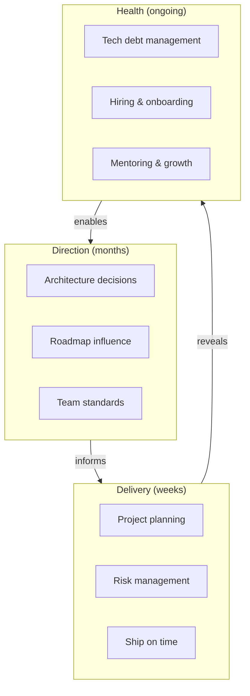

# Tech Lead Skills

## Chapter Goal

After this chapter, the reader can articulate what a Tech Lead owns and what they delegate, plan and break down projects with risk-adjusted estimates, run hiring loops and onboarding processes, manage technical debt as a strategic lever, lead architecture decisions through ADRs and RFCs, and answer interview questions about the Tech Lead role with concrete examples from their own experience.

## Why This Matters for a Tech Lead

This is the meta-chapter. Every other chapter in this book teaches a skill that a Tech Lead uses. This chapter teaches **how to be the Tech Lead** — how to combine those skills into a coherent operating model that produces outcomes for a team, a product, and an organization.

Tech Lead interviews test whether the candidate can operate at the intersection of technical depth, team leadership, and organizational influence. A candidate who can design systems but cannot plan projects, manage risk, or influence a roadmap will fail the interview. A candidate who describes the role as "the best engineer on the team" has not understood the transition from individual contribution to team-level ownership.

The decisions a Tech Lead owns:

- **Technical direction.** What technologies, patterns, and standards the team follows — and when to change them.
- **Delivery.** Whether the team ships on time, with acceptable quality, and with managed risk. The Tech Lead is accountable for the outcome, not for writing every line of code.
- **Team technical health.** Whether the team's codebase, tooling, processes, and knowledge distribution support sustained velocity — not velocity for the next sprint, but for the next year.
- **Architecture decisions.** Which trade-offs to accept, which to reject, and how to document the reasoning so future engineers do not reverse decisions without understanding the constraints.
- **Hiring and development.** What skills the team needs, who to hire, how to onboard, and how to grow engineers into senior and lead roles.

## Mental Model

A Tech Lead operates at three altitudes simultaneously: **direction** (where the team is going), **delivery** (whether the team gets there), and **health** (whether the team can sustain the pace). At any given moment, one altitude demands more attention than the others — but neglecting any altitude for more than a quarter creates compounding problems.



The diagram shows the three altitudes and their feedback loops. Direction informs what the team delivers. Delivery reveals health problems (debt, skill gaps, process failures). Health enables or constrains future direction. A Tech Lead who only operates at the Delivery altitude — shipping features without setting direction or investing in health — will run the team into a wall within two to three quarters.

## Core Terminology

| Term | Definition |
| --- | --- |
| **Tech Lead** | The engineer who owns the technical direction, delivery, and health of a team. Not a manager (does not own hiring/firing authority, compensation, or career progression in most organizations). Not the most senior IC — a Staff Engineer may be more technically deep but does not own team delivery. |
| **Engineering Manager (EM)** | Owns the people side: hiring, firing, compensation, career development, team structure. Collaborates with the Tech Lead on technical direction but does not own it. In some organizations, the EM and Tech Lead roles are combined; in others, they are separate. |
| **Staff Engineer** | A senior IC who owns technical quality and direction across teams or within a domain. Unlike a Tech Lead, a Staff Engineer typically does not own delivery for a specific team. Their influence is through technical depth, code, design docs, and cross-cutting standards. |
| **Architect** | A role (sometimes formal, sometimes informal) that owns system-level design decisions across multiple teams. Architects set constraints that teams operate within. In smaller organizations, the Tech Lead fills this role. In larger organizations, the Architect and Tech Lead collaborate, with the Architect owning cross-team concerns and the Tech Lead owning team-level execution. |
| **Technical direction** | The set of architecture decisions, technology choices, coding standards, and operational practices that define how the team builds software. Owned by the Tech Lead, influenced by Staff Engineers and Architects, constrained by organizational standards. |
| **Risk register** | A living document that tracks identified risks, their likelihood and impact, mitigation strategies, and owners. Reviewed weekly during active projects. The Tech Lead owns the register; the team contributes risks. |
| **ADR (Architecture Decision Record)** | A short document capturing a single decision: context, decision, status, consequences. See [Software Architecture](./14-software-architecture.md). |
| **RFC (Request for Comments)** | A written proposal for a significant technical change, circulated for feedback before a decision is made. See [Soft Skills](./22-soft-skills.md) for the RFC structure. |
| **Technical debt** | The accumulated cost of past shortcuts, deferred maintenance, and outdated patterns in the codebase. Managed strategically — not eliminated, but tracked, prioritized, and communicated to stakeholders. |
| **Bus factor** | The number of team members who could leave before the project is critically impacted. A bus factor of 1 is a risk the Tech Lead owns. |
| **Reference-class forecasting** | An estimation technique that bases predictions on outcomes of similar past projects rather than bottom-up task estimation. Corrects for optimism bias. |
| **Fitness function** | An automated check that validates whether an architecture decision is being followed. Examples: a CI check that rejects circular dependencies, a test that verifies response time stays under an SLO. See [Software Architecture](./14-software-architecture.md). |

## Theoretical Foundation

### The Tech Lead role

The Tech Lead role is defined by three boundaries: what the Tech Lead owns, what the Tech Lead influences, and what the Tech Lead delegates.

**Owns:**

- Technical direction for the team: architecture decisions, technology choices, coding standards.
- Delivery outcomes: whether the team ships on time, with quality, and with managed risk.
- Technical debt strategy: what to pay down, what to defer, and how to communicate the trade-off to stakeholders.
- Code review culture: the quality bar, the review process, the turnaround expectations.
- Decision documentation: ADRs, design docs, and the RFC process.

**Influences (but does not own):**

- Product roadmap: the Tech Lead provides input on feasibility, effort, and technical risk, but product management owns the priority.
- Organizational standards: the Tech Lead follows and contributes to cross-team standards set by Staff Engineers, Architects, or platform teams.
- Hiring decisions: the Tech Lead participates in interviews and provides technical assessments, but the Engineering Manager typically owns the hiring decision.
- Career development: the Tech Lead mentors engineers on technical growth, but the EM owns promotions and compensation.

**Delegates:**

- Implementation of features: the Tech Lead sets the approach and reviews the result, but does not write most of the code.
- Operational tasks: on-call, deployments, and routine maintenance are shared across the team.
- Meeting facilitation: senior team members can run standups, retros, and design reviews. See [Soft Skills](./22-soft-skills.md) for facilitation practices.

### Senior Developer vs Tech Lead vs Engineering Manager vs Architect

Role confusion is the most common failure mode for new Tech Leads. The following comparison clarifies what each role owns.

| Dimension | **Senior Developer** | **Tech Lead** | **Engineering Manager** | **Staff/Principal Engineer** |
| --- | --- | --- | --- | --- |
| **Primary output** | Code, design docs for their features | Decisions, plans, team-level architecture | People outcomes, team health, organizational alignment | Cross-team technical standards, deep technical work |
| **Scope** | Own features or components | Own team's technical direction and delivery | Own team's people and organizational health | Own domain or cross-cutting technical quality |
| **Delivery accountability** | Individual tasks | Team-level project outcomes | Team velocity and capacity planning | Technical quality across teams |
| **People responsibilities** | Mentor juniors, review PRs | Mentor the team, set code review culture, technical interviews | Hire, fire, compensation, career development, 1:1s | Mentor across teams, set hiring bar |
| **Decision authority** | Feature-level design choices | Team-level architecture and technology choices | Team structure, headcount, process | Cross-team architecture constraints |
| **Failure mode** | Gold-plating, tunnel vision on their code | Bottlenecking decisions, over-coding, under-leading | Over-managing, disconnecting from technical reality | Ivory tower, disconnection from delivery |

The key distinction: a Senior Developer is evaluated on what they build. A Tech Lead is evaluated on what the team builds. An Engineering Manager is evaluated on whether the team can keep building. A Staff Engineer is evaluated on whether the organization builds the right things.

### Technical ownership

Technical ownership means being accountable for the health and direction of a codebase, a service, or a system — not being the only person who understands it. A Tech Lead who is the sole owner of critical knowledge has failed at one of the core responsibilities of the role: distributing knowledge.

**What technical ownership looks like in practice:**

1. **The Tech Lead can explain every major architectural decision in the team's codebase** — why it was made, what alternatives were considered, and when the decision should be revisited. This context lives in ADRs, not in the Tech Lead's head.
2. **The Tech Lead knows the operational profile of the team's services** — peak traffic patterns, failure modes, dependency chains, and the blast radius of outages. This knowledge informs architecture decisions and risk planning.
3. **The Tech Lead sets the quality bar** — through code review, testing standards, and engineering guidelines. The bar is documented and calibrated across the team, not applied inconsistently based on who reviews the PR.
4. **The Tech Lead identifies and manages technical debt** — tracking it, prioritizing it against feature work, and communicating its cost to stakeholders in business terms.

> **Tech Lead perspective — ownership without bottleneck.** A Senior Engineer owns their code. A Tech Lead owns the system — but the failure mode is centralizing ownership in the Tech Lead's head rather than distributing it across the team. The test: can two different team members explain why the team's most important architecture decision was made? If only the Tech Lead can, knowledge distribution has failed. The corrective is not more documentation alone — it is pairing on critical decisions, rotating design doc authorship, and reviewing ADRs as a team exercise. Ownership means accountability, not sole possession.

### Mentoring as a Tech Lead

Mentoring at the Tech Lead level is not ad-hoc career advice — it is a systematic process of developing the team's capabilities to match the team's needs. See [Soft Skills](./22-soft-skills.md) for feedback frameworks (SBI, Radical Candor) and the mechanics of giving and receiving feedback.

**The development model:**

1. **Diagnose the gap.** What does the team need that it cannot do today? A team that ships features but cannot handle incidents needs operational skill development. A team that writes solid code but cannot articulate design trade-offs needs communication development.
2. **Match engineers to growth opportunities.** Assign projects that stretch the engineer into the gap area. A mid-level engineer who needs to develop architecture skills gets assigned to write the design doc for the next project (with the Tech Lead reviewing and coaching).
3. **Progressive delegation.** Start with "I will make the decision and explain my reasoning." Move to "propose a solution and I will review." End with "make the decision and tell me what you decided." The Tech Lead withdraws as the engineer demonstrates sound judgment.
4. **Measure growth.** Track whether the engineer is making decisions that previously required the Tech Lead's involvement. If the Tech Lead is still approving every design choice after six months, the mentoring process has stalled.

### Code review culture

The Tech Lead owns the code review culture — not by reviewing every PR, but by setting the standards, calibrating the team's review quality, and resolving disagreements about the quality bar.

**Setting the standard:**

- Define what "blocking" and "non-blocking" mean for the team. A blocking comment must be resolved before merge. A non-blocking comment is a suggestion for future improvement.
- Set review turnaround expectations: first review within one business day. This prevents PRs from aging and accumulating merge conflicts.
- Define the review scope: does the reviewer check logic only, or also test coverage, error handling, and performance? Document this in the team's working agreement.

**Calibrating the team:**

- Review the reviewers. Periodically read the team's code review comments. Are they specific and actionable, or vague ("looks good") or nitpicky ("rename this variable")? Coach reviewers whose feedback is not useful.
- Address review inconsistency. If two reviewers consistently disagree on the quality bar, facilitate a calibration discussion: "Here is a PR. What would each of you block on? Where do you differ?" This surfaces implicit standards and makes them explicit.

See [Git and Engineering Workflow](./20-git-and-engineering-workflow.md) for PR practices, branching strategies, and code ownership patterns.

### Architecture decision-making

A Tech Lead makes architecture decisions daily — most are small and reversible, but some are large and irreversible. The skill is recognizing which decisions require formal process and which can be made quickly.

**Type 1 vs Type 2 decisions:**

- **Type 1 (irreversible or costly to reverse):** Choosing the primary database, committing to a public API contract, selecting a vendor with a multi-year commitment. These decisions need a design doc, broad input, and documented trade-offs.
- **Type 2 (reversible):** Choosing a library, adopting a coding convention, selecting a CI tool. These decisions need speed. Make the decision, document it in a one-paragraph ADR, and revisit if the context changes.

**The decision process:**

1. **Identify the decision.** Most architecture problems are actually multiple decisions bundled together. Unbundle them. "Should we use microservices?" is actually three decisions: service boundaries, communication protocol, and data ownership.
2. **Define the constraints.** What must the solution satisfy? Latency budget, cost ceiling, team skills, compliance requirements. Constraints narrow the option space.
3. **Evaluate options against constraints.** Use a structured comparison — the same sections for each option (approach, trade-offs, risks, effort). See [Software Architecture](./14-software-architecture.md) for architecture evaluation techniques.
4. **Decide and document.** Write the ADR: context, decision, consequences. Share it with the team. Apply disagree-and-commit if there is disagreement.
5. **Set a review date.** For Type 1 decisions, set a date to re-evaluate: "We chose PostgreSQL. We will revisit this in 12 months if the write volume exceeds 10K TPS."

**The RFC process for cross-team decisions:**

When a decision affects multiple teams, use the RFC process. The RFC is a proposal, not a decision — it explicitly invites challenges and alternatives. See [Soft Skills](./22-soft-skills.md) for the RFC template structure.

The Tech Lead's role in the RFC process: write the RFC for decisions within their team's scope, review RFCs from other teams that affect their team's services, and escalate conflicting RFCs to the relevant decision-maker (typically an Architect or VP of Engineering).

> **Tech Lead perspective — when NOT to formalize.** The overengineering trap in decision-making is applying heavyweight process to lightweight decisions. Writing an RFC for which logging library to use wastes the team's time and signals that the Tech Lead cannot distinguish important decisions from routine ones. The heuristic: if the decision is reversible in less than a sprint and affects only the team's internal code, make the call in a Slack thread and move on. If an engineer disagrees, change it — the cost of changing is lower than the cost of a meeting. Reserve ADRs and RFCs for decisions where the reversal cost exceeds one sprint of work. See [Software Architecture](./14-software-architecture.md) for when formal architecture governance adds value.

### Delivery responsibility

A Tech Lead is accountable for team-level delivery — not for writing every line of code, but for ensuring the team ships on time, with quality, and with managed risk.

**Project planning and breakdown:**

1. **Start with the outcome, not the tasks.** "Users can check out in under 2 seconds" is an outcome. "Optimize the checkout query" is a task. The Tech Lead defines the outcome and works backward to identify the milestones and tasks.
2. **Identify the critical path.** Which tasks must be done sequentially? Which can be parallelized? The critical path determines the minimum project duration.
3. **Assign ownership, not tasks.** Assign engineers to milestones, not individual tasks. "Alex owns the payment integration" gives Alex latitude to break the work down, identify risks, and make decisions. "Alex, implement the PaymentService class" is micromanagement.
4. **Build in checkpoints.** Weekly check-ins on milestone progress. If a milestone is at risk, surface it immediately — not at the end of the sprint. See [Soft Skills](./22-soft-skills.md) for expectation management and stakeholder communication.

**Estimation that survives reality:**

Estimation is the Tech Lead skill most frequently tested in interviews because it directly affects organizational trust.

- **Use ranges, not points.** "This will take 3-5 weeks, depending on whether the payment API supports batch processing" is honest. "This will take 3 weeks" is a promise.
- **State assumptions explicitly.** "This estimate assumes the API contract is stable, the design doc is approved by Friday, and no P1 incidents require team diversion."
- **Apply reference-class forecasting.** "Our last three migrations of similar scope took 4, 6, and 5 weeks. My estimate for this migration is 4-6 weeks." Past performance is a better predictor than bottom-up optimism.
- **Distinguish buffers from padding.** A buffer accounts for known unknowns (the API might change). Padding hides optimism. "I estimate 4 weeks, with 1 week of buffer for API instability" is transparent. "I estimate 5 weeks" when the real estimate is 4 hides the reasoning.
- **Update the estimate when assumptions change.** The moment an assumption breaks, recommunicate. See [Soft Skills](./22-soft-skills.md) for the expectation management pattern.

> **Tech Lead perspective — estimation as trust currency.** A Senior Engineer estimates how long coding takes. A Tech Lead estimates how long delivery takes — which includes code review, testing, integration, deployment, scope clarification, and inevitable interruptions. The gap between coding time and delivery time is typically 2-3x. A Tech Lead who consistently delivers within their estimated range builds organizational trust. A Tech Lead whose estimates routinely miss by 50% loses the ability to influence the roadmap, because stakeholders stop believing the numbers. The highest-leverage estimation skill is not accuracy — it is transparency: stating assumptions, communicating ranges, and updating the estimate the moment an assumption breaks. Stakeholders can handle uncertainty; they cannot handle surprises.

### Risk management

Risk management is the systematic practice of identifying what could go wrong, assessing the likelihood and impact, and deciding how to respond.

**The risk register:**

A risk register is a living document, not a one-time exercise. For active projects, review it weekly. Each risk has:

- **Description:** What could go wrong.
- **Likelihood:** Low / Medium / High.
- **Impact:** Low / Medium / High.
- **Response:** Mitigate (reduce likelihood or impact), Transfer (insurance, SLAs), Accept (acknowledge and monitor), or Avoid (change the plan).
- **Owner:** Who is responsible for monitoring and executing the response.
- **Status:** Open / Mitigated / Occurred / Closed.

**Common risk categories for Tech Leads:**

1. **Dependency risks.** A team or vendor the project depends on does not deliver on time.
2. **Technical risks.** An assumption about a technology or integration is wrong.
3. **People risks.** A key engineer leaves, gets sick, or is reassigned.
4. **Scope risks.** Requirements change mid-project.
5. **Operational risks.** The system fails in production in a way that was not anticipated.

### Technical debt management

Technical debt is not inherently bad — it is a tool. Incurring debt to ship a time-sensitive feature is a valid trade-off. Ignoring debt until the codebase is unmaintainable is a failure.

**The Tech Lead's debt framework:**

1. **Track it.** Maintain a tech debt backlog with concrete items, not vague categories. "Payment service still uses deprecated API v1 — migration required before v1 sunset in Q3" is actionable. "The code needs refactoring" is not.
2. **Quantify it.** Where possible, express debt in terms the business understands. "Every feature in the payment module takes 40% longer to build because of the legacy schema. Migrating the schema costs 3 weeks and will accelerate all future payment work."
3. **Prioritize it.** Not all debt is equal. Debt that affects developer velocity (every engineer touches it daily) is more expensive than debt in a rarely-changed module. Debt with a deadline (deprecated API, expiring certificate) is more urgent than debt without one.
4. **Negotiate capacity.** Allocate 10-20% of team capacity to debt reduction. Communicate this to stakeholders as an investment: "We are spending 15% of capacity on infrastructure improvements that will increase our delivery speed by 20% over the next two quarters."
5. **Make it visible.** Track debt reduction in the same tool the team uses for feature work. When a debt item is paid down, celebrate it — the team needs to see that debt work is valued, not treated as second-class work.

### Roadmap influence

A Tech Lead does not own the product roadmap — but they influence it by providing technical feasibility, effort estimates, risk assessments, and sequencing recommendations.

**How to influence the roadmap:**

1. **Participate in planning.** Attend roadmap planning sessions. Provide early estimates and flag technical risks before features are committed.
2. **Propose technical initiatives.** Frame technical work in business terms. "Database migration" is a technical initiative. "Reduce checkout latency from 4 seconds to 1 second, recovering 12% of abandoned carts" is a business case for a technical initiative.
3. **Sequence for technical advantage.** Recommend building features in an order that creates technical leverage. "If we build the notification service first, the three features planned for Q3 can use it — reducing their combined effort by 30%."
4. **Flag dependencies.** Identify cross-team dependencies early. "Feature X requires an API from the Platform team that is not scheduled until Q4. If we want Feature X in Q3, we need to negotiate with Platform now."

### Hiring and interviewing

The Tech Lead is the primary technical evaluator in the hiring process. The Engineering Manager may own the hiring decision, but the Tech Lead owns the technical assessment.

**Designing the interview loop:**

1. **Define the role before the loop.** What skills does the team need? A team with strong backend engineers but no frontend expertise needs a different hire than a team with broad skills but no depth in distributed systems.
2. **Calibrate the bar.** What level of performance means "hire"? Define this with concrete examples, not abstract criteria. "Can implement a clean REST API with proper error handling, validation, and tests in 60 minutes" is calibrated. "Strong coding skills" is not.
3. **Use structured interviews.** Each interviewer asks the same questions to every candidate. Score against a rubric with specific criteria. Unstructured interviews are biased and unreliable.
4. **Debrief with evidence.** In the hiring debrief, each interviewer presents their assessment with specific evidence from the interview. "The candidate implemented a correct solution but did not consider edge cases when prompted" is evidence. "I had a good feeling about them" is not.

**What the Tech Lead evaluates:**

- **Technical depth:** Can the candidate reason about trade-offs at the expected level?
- **Technical breadth:** Does the candidate have awareness of adjacent areas (ops, security, testing)?
- **Communication:** Can the candidate explain their reasoning clearly?
- **Problem-solving under uncertainty:** How does the candidate handle ambiguous requirements or unexpected edge cases?
- **Team fit (not culture fit):** Does the candidate's working style complement the team's needs? A team full of architects needs a strong implementer. A team full of implementers needs someone who can step up to design.

### Onboarding

Onboarding is the Tech Lead's highest-leverage investment. A well-onboarded engineer reaches full productivity in 4-6 weeks. A poorly onboarded engineer takes 3-6 months and may leave before they become productive.

**The onboarding plan:**

1. **Week 1-2: Context.** Read the architecture docs, ADRs, and on-call runbooks. Meet every team member in 1:1s. Ship a small PR (a bug fix or documentation improvement) to learn the development workflow.
2. **Week 3-6: Contribution.** Take on progressively larger tasks with clear acceptance criteria. A buddy (not the Tech Lead) is available for questions. Code reviews are more detailed during this phase.
3. **Week 7-12: Ownership.** Own a small component or feature area. Participate in on-call rotation (paired with a senior engineer for the first rotation). Write the first design doc or ADR.

**Onboarding success metrics:**

- Time to first PR merged.
- Time to first feature shipped independently.
- Time to first on-call shift completed independently.
- Buddy satisfaction survey after 90 days.

### Team standards and engineering guidelines

Team standards exist to reduce the cost of coordination. When every engineer follows the same conventions, code reviews are faster, onboarding is cheaper, and cross-team collaboration is smoother.

**What to standardize:**

- Coding conventions (linting rules, formatting, naming).
- PR process (size limits, description template, review expectations).
- Testing strategy (what to unit test, what to integration test, coverage expectations).
- Error handling patterns (structured errors, logging levels, alert thresholds).
- Deployment process (CI/CD pipeline, feature flags, rollback procedures).

**What not to standardize:**

- Tool preferences that do not affect the team (editor, terminal, OS).
- Coding style that the formatter handles automatically.
- Decisions that are genuinely preference-based and have no impact on quality or velocity.

**How to introduce standards:**

- Co-create with the team, not dictate. Standards that the team owns are standards the team follows.
- Start with automated enforcement (linters, formatters, CI checks). If the tool can enforce it, do not rely on human review.
- Document in the repository, not in a wiki. Standards stored alongside the code are discoverable; standards in a wiki are forgotten.

### Incident leadership

When a P1 incident occurs, the Tech Lead is responsible for technical leadership during the incident — not necessarily for debugging, but for coordinating the response, making decisions under pressure, and ensuring communication flows correctly. See [Soft Skills](./22-soft-skills.md) for incident communication patterns and [Observability](./18-observability.md) for monitoring and alerting practices.

**The Tech Lead's incident role:**

1. **Assess the blast radius.** How many users are affected? Which services are impacted? Is the damage increasing?
2. **Assign roles.** Incident commander (the Tech Lead or a senior engineer), debugger (the person investigating), communicator (the person updating stakeholders). These roles should be separated.
3. **Make the mitigation-vs-fix decision.** Mitigate first (rollback, feature flag, redirect traffic), then investigate the root cause. The temptation is to fix the root cause live — this extends the outage.
4. **Drive the post-mortem.** Within 48 hours, write a blameless post-mortem with systemic causes and action items. Track action items to completion.

> **Tech Lead perspective — incident decisions under pressure.** During an incident, the Tech Lead makes three decisions that a Senior Engineer typically does not. (1) **Mitigation vs investigation:** the default is always mitigate first (rollback, feature flag, traffic shift), then investigate. Overriding this default — investigating before mitigating — is only justified when the mitigation itself carries risk (e.g., a rollback would lose in-flight financial transactions). (2) **Who to wake up at 3 AM:** the Tech Lead knows the dependency map and the blast radius. Waking up the wrong team costs credibility and burns political capital. Waking up the right team too late extends the outage. The Tech Lead maintains a mental model of which team owns which service boundary. (3) **When to declare the incident resolved vs when to keep monitoring:** premature resolution leads to recurrence. The Tech Lead defines exit criteria before declaring resolution: "Error rate below 0.1% for 15 consecutive minutes."

### Cross-team collaboration

A Tech Lead operates at the boundary of their team and the organization. Cross-team collaboration determines whether the team's work integrates smoothly with the rest of the system or creates friction and surprises.

**How to collaborate across teams:**

1. **Define interfaces early.** API contracts, data ownership, and SLAs should be agreed upon before implementation starts.
2. **Attend cross-team syncs.** Regular check-ins with dependent teams' Tech Leads prevent surprises. A 15-minute weekly sync is cheaper than a 2-week integration delay.
3. **Escalate with data.** When a cross-team dependency blocks the project, quantify the cost and escalate jointly with the other team's Tech Lead. See [Soft Skills](./22-soft-skills.md) for escalation patterns.
4. **Own the integration.** Do not assume the other team will test the integration. Write integration tests for the interfaces the team depends on.

### Balancing business and technical priorities

The Tech Lead lives at the intersection of business needs and technical reality. Product wants features. Engineering wants quality. Leadership wants speed. The Tech Lead makes the trade-offs visible so stakeholders can make informed decisions.

**The balancing act:**

- **Translate technical work into business value.** "Refactoring the payment module" means nothing to a PM. "Reducing payment integration time from 3 weeks to 1 week for every new payment provider" is a business case.
- **Protect quality without blocking delivery.** The quality bar is not negotiable — but the scope is. When a deadline is tight, negotiate scope (deliver the core flow now, add edge cases in a follow-up) rather than cutting testing or review.
- **Make the cost of shortcuts visible.** When a stakeholder asks "can we skip the design doc and start coding immediately?", the Tech Lead's response is not "no" — it is "we can, and here is the cost: misaligned implementations, rework after the first review, and a 30% increase in integration bugs. Is that trade-off acceptable?"

### Leading without authority

A Tech Lead often has limited formal authority — they cannot hire, fire, or set compensation. Their influence comes from credibility, consistency, and communication.

**How to lead without authority:**

1. **Build credibility through execution.** Ship a visible improvement early. Demonstrate technical judgment by making good decisions. Credibility is not claimed — it is earned through results.
2. **Make reasoning visible.** Write design docs and ADRs that show the reasoning. When the reasoning is visible, the team follows the decision because it makes sense, not because the Tech Lead said so.
3. **Invest in relationships.** Build trust with peer Tech Leads, the EM, and the PM. Trust is the currency of influence without authority.
4. **Model the behavior.** Respond to code reviews quickly. Write clear design docs. Admit mistakes publicly. The team mirrors the Tech Lead's behavior.
5. **Earn disagree-and-commit.** When the Tech Lead makes the right call repeatedly, the team commits to their decisions even when they disagree — because the track record justifies trust.

> **Tech Lead perspective — influence is a budget, not a constant.** Influence without authority works like a budget: every time the Tech Lead asks for something difficult (adopting a new standard, deferring a feature for tech debt, changing a team's workflow), they spend from the trust balance. Every time the Tech Lead delivers on a commitment, fixes a visible problem, or changes their position based on better evidence, they deposit into it. A new Tech Lead starts with a small balance and must be selective about what they spend it on. The common failure: a new Tech Lead who proposes five changes in the first month spends their influence budget before they have earned enough trust to sustain the changes. The correct approach: earn credibility through execution in the first 30 days, then spend influence deliberately on the highest-impact change.

### Decision logs and organizational memory

Decisions decay. Within six months, the team forgets why a decision was made. Within a year, new engineers reverse the decision without understanding the trade-off. Decision logs prevent this.

**ADRs (Architecture Decision Records):**

A lightweight, structured format for capturing decisions. Each ADR contains: title, status (proposed/accepted/deprecated/superseded), context (why the decision was needed), decision (what was decided), and consequences (what trade-offs the decision introduces). See [Software Architecture](./14-software-architecture.md) for the format and examples.

**When to write an ADR:**

- The decision affects more than one sprint.
- The decision constrains future choices (technology, API contract, data model).
- The decision was debated — if the team disagreed, the reasoning must be documented.
- The decision will confuse a future engineer who was not present.

**When not to write an ADR:**

- The decision is trivially reversible (library version, test framework).
- The decision is already enforced by automation (linter rule, CI check).
- The decision affects only the current PR (captured in the PR description).

### Career growth: from Senior to Tech Lead and beyond

The transition from Senior Developer to Tech Lead is not a promotion in the traditional sense — it is a role change. The skills that made someone a successful Senior Developer (deep technical execution, individual output, solving hard problems) are necessary but insufficient for the Tech Lead role.

**What changes:**

- **Success metric shifts from personal output to team output.** A Tech Lead who writes the most code on the team is doing the wrong job. The metric is: does the team ship better outcomes because the Tech Lead is on it?
- **Time allocation shifts from building to deciding, reviewing, and unblocking.** The Tech Lead spends 40-60% of time on leadership work (planning, reviewing, communicating, mentoring) and 40-60% on technical work (code review, design review, architecture, selective implementation).
- **Scope of responsibility expands beyond code.** The Tech Lead is responsible for delivery, risk, technical debt, hiring, and cross-team coordination — none of which appear in a Senior Developer's daily work.

**The path beyond Tech Lead:**

- **Staff/Principal Engineer:** Returns to deep IC work but at broader scope. Owns technical quality and direction across teams or domains. Does not own team delivery.
- **Engineering Manager:** Fully transitions to people management. Owns hiring, career development, organizational design. May lose technical depth over time.
- **Architect:** Owns system-level design across multiple teams. Sets constraints, reviews designs, and ensures architectural consistency.

The choice between these paths depends on what the engineer wants to optimize for: technical depth (Staff), people leadership (EM), or system-level design (Architect). None is superior to the others.

## Practical Usage

### Joining a new team as Tech Lead: the first 30 days

The first 30 days set the foundation for the Tech Lead's effectiveness. The common mistake is changing things too quickly. The correct approach is to listen, learn, and earn credibility before making changes.

**Week 1: Listen.**

- Schedule 1:1s with every team member. Ask three questions: "What is working well that I should not change?", "What is the biggest obstacle to your productivity?", and "What decision would you make if you had the authority?"
- Read the existing architecture docs, ADRs, and design docs. Understand the team's technical context before forming opinions.
- Shadow on-call for a few hours to understand the operational profile of the team's services.

**Week 2: Diagnose.**

- Identify the top three risks to the team's current project.
- Assess the team's technical debt: where is velocity being lost? What is the bus factor for critical components?
- Map the stakeholders: who does the team depend on, who depends on the team, and who has influence over the team's roadmap?

**Week 3: Act (small).**

- Fix one concrete problem that the team identified in the 1:1s. This earns credibility through execution.
- Introduce one process improvement (a design doc template, a PR description template, a weekly risk review) — not three at once.
- Document the team's current state: architecture overview, key risks, and the Tech Lead's assessment of health.

**Week 4: Communicate.**

- Share the assessment with the EM and the PM. "Here is what I have learned. Here are the top three risks. Here is what I plan to focus on in the next quarter."
- Set recurring meetings: weekly 1:1 with the EM, bi-weekly 1:1 with the PM, and a weekly team meeting with a written agenda.

### Leading an architecture review

An architecture review evaluates a design proposal against the team's constraints and quality bar. The Tech Lead facilitates the review — they do not dictate the outcome.

**Pre-review (48 hours before):**

1. The author shares the design doc with specific reviewers.
2. Reviewers leave written comments in the document.
3. The Tech Lead reads the document and identifies the key decision points.

**During the review (50 minutes max):**

1. The author presents a 5-minute BLUF summary: what they propose and why.
2. Walk through unresolved written comments in priority order. Do not read the document aloud.
3. For each disagreement, apply the conflict resolution framework: clarify the disagreement, identify the shared constraint, make the trade-off explicit. See [Soft Skills](./22-soft-skills.md).
4. If a topic cannot be resolved in the meeting, assign it an owner and a deadline.

**Post-review:**

1. Update the document with decisions and action items.
2. Share a summary within 24 hours: what was decided, what is still open, who owns the open items.
3. Write the ADR if the review produced a significant architecture decision.

### Running a project from kickoff to launch

**Kickoff:**

- Define the outcome (not the features, the outcome).
- Identify the milestones and the critical path.
- Create the risk register.
- Assign milestone owners.
- Communicate the plan to stakeholders with a timeline range, not a date.

**Execution:**

- Weekly risk register review: has any risk changed in likelihood or impact?
- Weekly milestone check-in: is the critical path on track?
- Continuous scope management: when scope changes are requested, present the trade-off (what gets deferred or extended).

**Pre-launch:**

- Load test against production-like traffic.
- Verify monitoring and alerting for the new functionality.
- Write or update the on-call runbook.
- Define rollback criteria and the rollback plan.

**Post-launch:**

- Monitor for 48 hours with heightened attention.
- Write the post-mortem if any issues occurred.
- Conduct a retrospective: what went well, what to improve.
- Update the architecture docs and ADRs.

## Examples

### A project breakdown structure

```text
PROJECT: Checkout performance optimization
OUTCOME: Reduce checkout p95 latency from 4.2s to under 2s.
TIMELINE: 4-6 weeks (depends on payment API batch support).

MILESTONES
M1: Instrumentation (Week 1)
    - Add OpenTelemetry spans to checkout flow.
    - Identify top 3 latency contributors from production traces.
    Owner: Jordan

M2: Database optimization (Week 2-3)
    - Fix N+1 query in cart item pricing.
    - Add covering index for checkout lookups.
    - Load test: verify p95 < 3s after DB changes.
    Owner: Sarah

M3: Payment API optimization (Week 3-5)
    - Evaluate batch processing support in payment API v3.
    - If supported: implement batch payment validation.
    - If not supported: implement parallel validation with
      connection pooling.
    Owner: Alex

M4: End-to-end validation (Week 5-6)
    - Load test full checkout flow at 2x peak traffic.
    - Verify p95 < 2s under load.
    - Update monitoring dashboards and alerts.
    Owner: Jordan

CRITICAL PATH: M1 → M2 → M4 (M3 runs in parallel with M2)
DEPENDENCIES: Payment API documentation (external, needed by Week 2)

RISKS
- Payment API v3 may not support batch processing (Medium
  likelihood, Medium impact). Mitigation: parallel validation
  fallback in M3.
- Load testing environment may not reflect production traffic
  patterns (Low likelihood, High impact). Mitigation: use
  production traffic replay.
```

**What this shows:** A project breakdown that starts with the outcome, identifies milestones with owners, shows the critical path, lists dependencies, and includes risks with mitigations.

**Why it is written this way:** Each milestone has a clear owner and a measurable completion criterion ("p95 < 3s after DB changes"). The critical path identifies what must be done sequentially vs what can be parallelized. Risks are identified upfront with response strategies.

**Common mistake:** A project plan that lists tasks without milestones, has no critical path analysis, and has no risk register. This plan cannot answer "what happens if M3 takes longer than expected?" The plan above can: M3 runs in parallel, so a delay in M3 only affects the timeline if it exceeds the M2+M4 duration.

**In production:** Add a RACI matrix for stakeholder communication. Track milestone progress in the team's project tool. Communicate the risk register to the EM and PM weekly.

### A risk register

```text
RISK REGISTER — Checkout Performance Optimization
Last reviewed: 2025-03-10

| ID | Risk | Likelihood | Impact | Response | Owner | Status |
| -- | ---- | ---------- | ------ | -------- | ----- | ------ |
| R1 | Payment API v3 does not   | Medium | Medium | Mitigate: parallel  | Alex  | Open   |
|    | support batch processing. |        |        | validation fallback. |       |        |
| R2 | Key engineer (Sarah)      | Low    | High   | Mitigate: pair       | TL    | Open   |
|    | leaves during project.    |        |        | programming on M2,   |       |        |
|    |                           |        |        | cross-train Jordan.  |       |        |
| R3 | Load test environment     | Low    | High   | Mitigate: use        | Jordan| Open   |
|    | does not reflect          |        |        | production traffic   |       |        |
|    | production patterns.      |        |        | replay tool.         |       |        |
| R4 | Scope change: PM adds     | High   | Medium | Accept: negotiate    | TL    | Open   |
|    | discount calculation to   |        |        | scope — add to M4    |       |        |
|    | checkout flow.            |        |        | or defer to phase 2. |       |        |
```

**What this shows:** A risk register with concrete risks, likelihood/impact assessments, named owners, and specific response strategies.

**Why it is useful:** The register forces the team to think about risks before they occur. When R4 happens (and it will — scope changes are nearly certain), the response is pre-planned: negotiate, do not absorb.

**Common mistake:** A risk register that lists risks without responses ("Payment API might not work — TBD"). This is a worry list, not a risk register. Every risk must have a response strategy.

**In production:** Review the register weekly during active projects. Close risks that have been mitigated or that have occurred (move to the post-mortem). Add new risks as they are identified.

### A hiring interview scorecard

```text
INTERVIEW SCORECARD — Backend Engineer (Senior)

Candidate: _______________
Interviewer: _______________
Date: _______________

CODING (45 min)
Problem: Design and implement a rate limiter.

| Criteria           | 1 (Below) | 2 (Mixed) | 3 (Meets) | 4 (Exceeds) | Score |
| ------------------- | --------- | --------- | --------- | ----------- | ----- |
| Correct solution    | Does not  | Partially | Correct   | Correct +   |       |
|                     | compile   | correct   | solution  | edge cases  |       |
| Code quality        | Messy,    | Readable  | Clean,    | Production- |       |
|                     | no names  | but ad-hoc| structured| ready       |       |
| Trade-off reasoning | None      | Mentions  | Compares  | Compares +  |       |
|                     |           | one option| options   | recommends  |       |
| Testing approach    | None      | One test  | Covers    | Edge cases  |       |
|                     |           |           | happy path| + failures  |       |

SYSTEM DESIGN (45 min)
Problem: Design a notification delivery service.

| Criteria              | 1 (Below) | 2 (Mixed) | 3 (Meets) | 4 (Exceeds) |Score|
| --------------------- | --------- | --------- | --------- | ----------- |-----|
| Requirements gathering| Dives in  | Some      | Clarifies | Clarifies + |     |
|                       | without   | questions | scope and | quantifies  |     |
|                       | questions |           | scale     | load        |     |
| Architecture          | No clear  | Monolith  | Service   | Service +   |     |
|                       | structure | only      | separation| trade-offs  |     |
| Scalability           | Not       | Mentions  | Addresses | Addresses + |     |
|                       | addressed | scale     | hot paths | back-pressure|    |
| Operational awareness | None      | Mentions  | Monitoring| Full ops    |     |
|                       |           | logs      | + alerting| story       |     |

OVERALL RECOMMENDATION: [ ] Strong Hire  [ ] Hire  [ ] No Hire  [ ] Strong No Hire

EVIDENCE (required):
_______________________________________________________________
```

**What this shows:** A structured interview scorecard with specific criteria, a numbered scale, and a requirement for evidence-based recommendations.

**Why it is useful:** Structured scorecards reduce interviewer bias, make calibration possible (the team can compare scores across interviewers), and create an evidence trail for the hiring decision.

**Common mistake:** An interview that ends with "I liked them" or "I did not get a good vibe." These are gut reactions, not evidence. The scorecard forces the interviewer to articulate what the candidate demonstrated.

**In production:** Calibrate the scorecard quarterly. If a criterion consistently produces disagreement between interviewers, the criterion needs to be redefined. Track hiring outcomes (how do scored candidates perform after hiring?) to validate the scorecard.

### A first-30-day plan template

```text
FIRST-30-DAY PLAN — New Tech Lead

WEEK 1: LISTEN
- [ ] Schedule 1:1s with every team member (30 min each).
- [ ] Read all ADRs and design docs from the last 6 months.
- [ ] Shadow on-call for 2-4 hours.
- [ ] Map the team's services and dependencies.
- [ ] Identify the team's current project and its status.

WEEK 2: DIAGNOSE
- [ ] Identify top 3 risks to the current project.
- [ ] Assess the tech debt backlog: what affects velocity most?
- [ ] Measure the bus factor for critical components.
- [ ] Map stakeholders: who depends on us, who do we depend on?
- [ ] Review the last 3 post-mortems for recurring themes.

WEEK 3: ACT (SMALL)
- [ ] Fix one concrete problem identified in 1:1s.
- [ ] Introduce one process improvement (choose carefully).
- [ ] Write a one-page architecture overview (if none exists).
- [ ] Start a risk register for the current project.

WEEK 4: COMMUNICATE
- [ ] Share assessment with EM: risks, health, priorities.
- [ ] Share assessment with PM: technical feasibility, blockers.
- [ ] Set recurring meetings: 1:1 with EM (weekly), 1:1 with
      PM (bi-weekly), team meeting (weekly).
- [ ] Publish the team's technical direction for the quarter.

SUCCESS CRITERIA
- Every team member can articulate what the Tech Lead is
  focused on and why.
- The EM and PM have a shared understanding of the team's
  technical health and top risks.
- One visible improvement has been shipped.
```

**What this shows:** A structured 30-day plan that moves from listening to diagnosing to acting to communicating, with concrete checkboxes and success criteria.

**Why it is useful:** New Tech Leads who skip the listening phase and start changing things immediately lose credibility. New Tech Leads who only listen for 30 days and change nothing lose momentum. This plan balances both.

**Common mistake:** Joining a team as Tech Lead and immediately proposing a new architecture, new tools, or new processes. The team has context the Tech Lead does not have. Listen first, then propose.

**In production:** Adapt the timeline to the team's context. A team in crisis (failing project, recent incidents) needs the Tech Lead to act faster. A stable team with good processes needs the Tech Lead to listen longer.

### An ADR example

```text
ADR-027: Use PostgreSQL with pgvector for embedding storage

STATUS: Accepted
DATE: 2025-03-15
AUTHOR: Tech Lead

CONTEXT
The search team needs to store and query 5M embedding vectors
(1536 dimensions) for semantic search. The current search uses
keyword matching via Elasticsearch.

DECISION
Use PostgreSQL with the pgvector extension for embedding
storage and approximate nearest-neighbor (ANN) search.

ALTERNATIVES CONSIDERED
1. Pinecone (managed vector DB): higher query performance at
   scale, but adds a new vendor dependency ($2K/month) and
   requires data replication from PostgreSQL.
2. Qdrant (self-hosted vector DB): strong performance, but
   adds operational complexity (new service to deploy, monitor,
   and back up).
3. Elasticsearch with dense_vector: avoids new dependencies,
   but ANN performance is limited for high-dimensional vectors.

CONSEQUENCES
- PostgreSQL is already in the team's operational stack — no
  new infrastructure to manage.
- pgvector performance is adequate for 5M vectors with HNSW
  indexing. Performance should be re-evaluated if the corpus
  exceeds 20M vectors.
- The team must manage index rebuilds during bulk data updates.
- Migration path to a dedicated vector DB exists: abstract
  the query interface behind a repository pattern.

REVIEW DATE: 2025-09-15 (re-evaluate if corpus exceeds 10M
vectors or query latency exceeds 200ms p95).
```

**What this shows:** An ADR that captures the context, the decision, the alternatives considered (with specific trade-offs), the consequences, and a review date.

**Why it is written this way:** The ADR answers the question a future engineer will ask: "Why did we choose pgvector instead of Pinecone?" Without this record, the future engineer may reverse the decision without understanding the vendor dependency trade-off.

**Common mistake:** An ADR that states the decision but not the alternatives or the consequences. "We chose PostgreSQL with pgvector" without the reasoning is a fact, not a decision record.

**In production:** Store ADRs in the repository alongside the code they document. Number them sequentially. Never delete an ADR — supersede it with a new ADR that references the old one.

### Tech Lead responsibility matrix

```text
TECH LEAD RESPONSIBILITY MATRIX

| Decision area           | Tech Lead   | EM          | PM          | Staff Eng   |
| ----------------------- | ----------- | ----------- | ----------- | ----------- |
| Architecture choices    | Accountable | Informed    | Consulted   | Consulted   |
| Technology adoption     | Accountable | Informed    | Informed    | Consulted   |
| Coding standards        | Accountable | Informed    | —           | Consulted   |
| Delivery timeline       | Accountable | Consulted   | Accountable | —           |
| Risk identification     | Accountable | Consulted   | Informed    | Consulted   |
| Hiring decision         | Consulted   | Accountable | Informed    | Consulted   |
| Career development      | Consulted   | Accountable | —           | —           |
| Sprint prioritization   | Consulted   | —           | Accountable | —           |
| On-call runbooks        | Accountable | —           | —           | Consulted   |
| Cross-team API contract | Accountable | Informed    | Consulted   | Accountable |
| Budget and cost         | Consulted   | Accountable | Consulted   | —           |
| Security compliance     | Accountable | Informed    | Informed    | Consulted   |
```

**What this shows:** A RACI-style matrix clarifying who is Accountable, Consulted, or Informed for each decision area. Two roles can share accountability when the decision sits at their boundary (e.g., delivery timeline is jointly owned by TL and PM).

**Why it is useful:** Role confusion is the most common source of friction between Tech Lead, EM, and PM. This matrix makes ownership explicit. In an interview, showing that you can articulate these boundaries demonstrates maturity beyond "I handle the technical stuff."

**Common mistake:** A matrix that assigns the Tech Lead as Accountable for everything — or that leaves security, cost, and cross-team contracts unassigned. If nobody owns a decision, nobody makes it.

**In production:** Co-create this matrix with the EM and PM in the first month. Review it when the team structure changes. Use it to resolve disagreements: "Our matrix says architecture decisions are my accountability — let me explain the trade-off and make the call."

### Role comparison: Senior Developer vs Tech Lead vs EM vs Architect

```text
ROLE COMPARISON — Day-in-the-life view

SENIOR DEVELOPER (typical day)
  09:00  Code review (2 PRs, 45 min)
  10:00  Feature implementation (3 hrs deep work)
  13:00  Design discussion for own feature (30 min)
  13:30  Feature implementation (2 hrs)
  15:30  PR feedback + unit tests (1.5 hrs)

TECH LEAD (typical day)
  09:00  Code review (3 PRs, focus on architecture, 1 hr)
  10:00  Design doc review for team member's project (45 min)
  10:45  1:1 with mid-level engineer (30 min)
  11:15  Cross-team sync with Platform TL (15 min)
  11:30  Architecture spike: evaluate caching approach (1.5 hrs)
  13:00  Sprint planning prep with PM (30 min)
  13:30  Risk register review (15 min)
  13:45  Selective implementation: critical-path component (2 hrs)
  15:45  Stakeholder update email (15 min)

ENGINEERING MANAGER (typical day)
  09:00  1:1 with engineer (30 min)
  09:30  1:1 with engineer (30 min)
  10:00  Hiring debrief (45 min)
  10:45  Team process retro prep (30 min)
  11:15  1:1 with Tech Lead (30 min)
  11:45  Cross-team managers sync (30 min)
  13:00  Career development planning (1 hr)
  14:00  1:1 with engineer (30 min)
  14:30  1:1 with engineer (30 min)
  15:00  Headcount planning with director (30 min)
  15:30  Performance review writing (1.5 hrs)

STAFF ENGINEER (typical day)
  09:00  Review RFC from Team B (1 hr)
  10:00  Deep technical investigation: database sharding
         strategy across 3 services (2.5 hrs)
  12:30  Architecture review meeting (1 hr)
  13:30  Write cross-team technical standard for API
         versioning (2 hrs)
  15:30  Mentor Tech Lead on system design approach (30 min)
  16:00  Prototype: evaluate new serialization library (1 hr)
```

**What this shows:** A concrete day-in-the-life comparison that reveals the qualitative difference between roles — not what each role is called, but what each role actually does with their time.

**Why it is useful:** In interviews, candidates often describe roles with abstract definitions ("a Tech Lead leads technically"). This example demonstrates the practical difference: the Senior Developer has 5+ hours of deep implementation; the Tech Lead splits between review, design, selective coding, and stakeholder work; the EM spends the day in people-focused meetings; the Staff Engineer works across teams on systemic technical problems.

**Common mistake:** Describing the Tech Lead role as "a Senior Developer who also attends meetings." The day-in-the-life shows that the Tech Lead's work is qualitatively different: they review more than they write, they coordinate across boundaries, and their implementation is selective and strategic.

**In production:** Track your actual time for one week against these categories. If the distribution surprises you — 80% meetings, 5% code — adjust intentionally rather than letting the calendar drift.

### Technical decision-making with trade-offs

```text
DECISION: Message queue for order processing

CONTEXT: The team needs asynchronous order processing.
Current volume: 500 orders/hour. Expected growth: 5x in 18 months.
Team: 4 backend engineers, no Kafka experience.

OPTION A: RabbitMQ
  + Team has 2 years of production experience.
  + Adequate for current and projected volume (2,500/hr).
  + Simple operational model: single cluster, well-known failure modes.
  - No built-in stream replay (limits future event-sourcing options).
  - Scaling beyond 10K msg/sec requires significant tuning.

OPTION B: Kafka
  + Handles 100K+ msg/sec with horizontal scaling.
  + Built-in replay and retention enables event sourcing.
  + Organization has a shared Kafka platform team.
  - Team has zero Kafka experience (3-4 week ramp-up).
  - Kafka's operational complexity is higher (partitions, consumer
    groups, offset management).
  - Over-provisioned for current volume by 200x.

OPTION C: AWS SQS
  + Zero operational overhead (managed service).
  + Scales automatically with demand.
  + Simple API — team productive in days.
  - Vendor lock-in to AWS.
  - No message replay.
  - FIFO queues limited to 3,000 msg/sec per queue.

DECISION: RabbitMQ (Option A)

REASONING: The team's existing RabbitMQ expertise eliminates
the 3-4 week learning curve. Current and projected volume
(2,500/hr = ~0.7 msg/sec) is well within RabbitMQ's capacity.
Kafka is over-provisioned by 200x and introduces operational
complexity the team is not staffed to manage.

MIGRATION TRIGGER: Re-evaluate when volume exceeds 5,000/hr
or when the team needs event replay for audit/analytics.
Document the migration path: abstract the producer/consumer
behind an interface so the queue implementation can change
without modifying business logic.
```

**What this shows:** A structured decision with three options evaluated against the same criteria, a clear decision with reasoning, and an explicit migration trigger for when the decision should be revisited.

**Why it is useful:** In Tech Lead interviews, decision-making questions test whether the candidate evaluates options against constraints (team expertise, volume, operational capacity) rather than choosing the most technically impressive option. Choosing Kafka for 500 orders/hour because it is "more scalable" is a red flag — it signals over-engineering.

**Common mistake:** Choosing the technology with the best theoretical capabilities without considering team expertise, operational cost, or actual load. The correct choice is the one that matches the constraints, not the one that handles the most hypothetical scale.

**In production:** Write this analysis as an ADR. Include the migration trigger so the decision is not treated as permanent. Abstract the integration boundary so switching later is a bounded, not unbounded, effort.

### Mentoring plan for different experience levels

```text
MENTORING PLAN — Structured by Experience Level

JUNIOR ENGINEER (0-2 years)
  Goal: Build independent execution within a defined scope.
  Cadence: Weekly 1:1 (30 min) + daily availability for questions.
  Focus areas:
  - Code review as teaching: explain WHY, not only WHAT to change.
  - Pair on first task in each new area of the codebase.
  - Assign tasks with clear acceptance criteria and bounded scope.
  - Review completed work before PR submission (pre-review).
  Growth signal: Ships features independently within the defined
  scope without requiring pre-review by Week 12.

MID-LEVEL ENGINEER (2-5 years)
  Goal: Develop trade-off reasoning and design judgment.
  Cadence: Bi-weekly 1:1 (30 min). Available for design questions.
  Focus areas:
  - Assign design ownership: "Write the design doc for this feature.
    I will review it, not write it."
  - Code review as calibration: focus on architecture choices, not
    style. "Why did you choose this data structure? What happens
    at 10x the current volume?"
  - Exposure to cross-team work: attend one cross-team sync per
    sprint to see how decisions are negotiated.
  Growth signal: Produces design docs that require minimal revision
  and anticipates trade-offs before being prompted.

SENIOR ENGINEER (5+ years)
  Goal: Develop leadership and organizational influence.
  Cadence: Bi-weekly 1:1 (30 min). Coaching, not directing.
  Focus areas:
  - Delegate Tech Lead responsibilities: let them run a design
    review, facilitate a retro, or lead an incident response.
  - Coach, do not mentor: "What options did you consider? What
    would you recommend?" instead of "Here is what I would do."
  - Assign scope that requires cross-team negotiation.
  - Provide feedback on communication, not only technical output.
  Growth signal: Makes architecture decisions and cross-team
  agreements without Tech Lead involvement.
```

**What this shows:** A tiered mentoring approach that matches the investment (cadence, focus, style) to the engineer's experience level and specific growth needs.

**Why it is useful:** Tech Lead interviews often ask "How do you mentor engineers?" A generic answer ("I have regular 1:1s and give feedback") is weak. This example shows that mentoring is differentiated by level: juniors need directed teaching, mid-levels need design ownership with review, and seniors need coaching and delegation.

**Common mistake:** Applying the same mentoring approach to all levels. Over-directing a senior engineer (pre-reviewing their code) is demotivating. Under-directing a junior engineer ("figure it out") is negligent. The mentoring style must match the engineer's readiness.

**In production:** Document the growth signal for each engineer in 1:1 notes. Share the growth plan with the EM so it aligns with the formal career development process. Adjust the cadence based on the individual — some senior engineers need more support during a stretch assignment.

### Code review culture: examples and anti-patterns

```text
CODE REVIEW — Anti-patterns vs productive patterns

ANTI-PATTERN: The rubber stamp
  Reviewer: "LGTM" (on a 400-line PR with no tests)
  Problem: No quality gate. Bugs and design issues reach
  production. The team's review culture signals that reviews
  do not matter.

ANTI-PATTERN: The nitpick storm
  Reviewer: "Rename `data` to `userData`. Also, line 47 should
  use a ternary. And this import order is wrong."
  (20 comments, all style-related, no substantive feedback)
  Problem: High friction, no value. The reviewer blocks the PR
  on preferences that the formatter should handle. Engineers
  dread code review instead of learning from it.

ANTI-PATTERN: The gatekeeper
  Reviewer (Tech Lead): "I would have done this differently.
  Let me rewrite the approach." (Rewrites 60% of the PR in
  suggestions)
  Problem: The Tech Lead imposes their style rather than
  evaluating against the team's standards. Engineers lose
  ownership and stop investing in their own design.

PRODUCTIVE PATTERN: Tiered feedback
  Blocking: "This query runs inside a loop, causing N+1. Move
  it outside the loop and batch the IDs. This will cause a
  production performance issue under load."
  Non-blocking: "Consider extracting this validation into a
  shared utility — we have a similar pattern in UserService.
  Not blocking for this PR."
  Praise: "Nice use of the circuit breaker pattern here. This
  handles the timeout case well."

PRODUCTIVE PATTERN: Teaching review
  "This works, but let me explain a trade-off you might not
  have seen. Using SELECT * here fetches 15 columns when you
  only need 3. In production with 10K rows, that is 5x more
  data over the wire. Specifying columns also makes the query
  self-documenting — a reader knows which fields matter."
```

**What this shows:** Three anti-patterns that erode review culture and two productive patterns that combine quality assurance with team development.

**Why it is useful:** Tech Lead interviews frequently ask about code review practices. Describing specific anti-patterns (not generic "bad reviews") demonstrates that the candidate has managed a review culture, not just participated in one. The tiered feedback pattern (blocking / non-blocking / praise) is a concrete mechanism interviewers recognize.

**Common mistake:** The Tech Lead reviews every PR themselves. This creates a bottleneck and prevents other reviewers from developing calibration. The Tech Lead should review selectively (architecture-sensitive PRs, new engineers' first PRs) and calibrate other reviewers through periodic calibration exercises.

**In production:** Document the blocking vs non-blocking distinction in the team's working agreement. Run a quarterly calibration exercise: the team independently reviews the same PR and compares feedback. See [Git and Engineering Workflow](./20-git-and-engineering-workflow.md) for PR culture and branching practices.

### Technical debt prioritization model

```text
TECH DEBT PRIORITIZATION — Quarterly review

SCORING CRITERIA (each 1-5):
  Velocity impact: How much does this debt slow daily work?
    5 = every engineer, every day
    3 = some engineers, some tasks
    1 = rarely encountered
  Urgency: Is there a deadline or escalating risk?
    5 = hard deadline (API sunset, certificate expiry)
    3 = risk increases over time (growing data volume)
    1 = stable, no deadline
  Effort: How much work to resolve?
    1 = more than a quarter
    3 = 1-2 sprints
    5 = a few days

PRIORITY SCORE = Velocity impact + Urgency + Effort
  (higher = do first)

CURRENT BACKLOG
| Item                              | Vel | Urg | Eff | Score | Action     |
| --------------------------------- | --- | --- | --- | ----- | ---------- |
| Migrate payment API v1 → v3       |  3  |  5  |  3  |  11   | Sprint 14  |
| Fix N+1 in order listing query    |  5  |  2  |  5  |  12   | Sprint 13  |
| Replace custom logger with        |  4  |  1  |  3  |   8   | Sprint 15  |
| structured logging library        |     |     |     |       |            |
| Upgrade Node.js 18 → 22           |  2  |  4  |  2  |   8   | Sprint 15  |
| Rewrite legacy billing module     |  3  |  1  |  1  |   5   | Backlog    |
| Remove unused feature flags (47)  |  2  |  1  |  4  |   7   | Sprint 16  |

CAPACITY ALLOCATION: 15% of sprint capacity = ~1.5 engineer-days
per sprint dedicated to debt work.
```

**What this shows:** A quantified prioritization model that scores debt items across three dimensions and produces a ranked backlog with specific sprint assignments.

**Why it is useful:** In interviews, "How do you manage tech debt?" is a common question. A generic answer ("we prioritize it alongside features") is weak. This model demonstrates a structured approach: scored criteria, a ranked list, and a capacity allocation. The scoring forces explicit trade-offs: the N+1 query fix scores highest because it is high-impact and low-effort — a clear quick win.

**Common mistake:** Prioritizing debt by "how ugly the code is" (subjective) or by "how risky the module is" (single-axis). The legacy billing module scores lowest despite being the ugliest code because it is high-effort and low-urgency — rewriting it for a month without delivering features is the wrong trade-off.

**In production:** Review the backlog quarterly. Present the top items to stakeholders with business framing: "The N+1 query fix saves each engineer 20 minutes per deployment. Over a quarter, that is 40+ engineer-hours recovered." Track completed debt items to demonstrate ROI.

### Incident leadership checklist

```text
INCIDENT LEADERSHIP CHECKLIST — Tech Lead

FIRST 5 MINUTES
- [ ] Confirm the incident severity (P1/P2/P3).
- [ ] Assign roles: incident commander, debugger,
      communicator. Do not let one person do all three.
- [ ] Open a shared incident channel (Slack, Teams).
- [ ] Start a timeline document: every action and
      observation with a timestamp.

MITIGATION (before investigation)
- [ ] Can the incident be mitigated by rollback?
      If yes → roll back immediately.
- [ ] Can the incident be mitigated by feature flag?
      If yes → disable the flag.
- [ ] Can the incident be mitigated by traffic shift?
      If yes → redirect to healthy instances.
- [ ] Confirm mitigation restored service before
      proceeding to root cause investigation.

COMMUNICATION
- [ ] First stakeholder update within 15 minutes:
      "We are aware of [impact]. We are [mitigating/
      investigating]. Next update in 30 minutes."
- [ ] Update at regular intervals (every 30 min for P1,
      every 60 min for P2).
- [ ] Final update when resolved: impact summary,
      duration, and next steps.

POST-INCIDENT (within 48 hours)
- [ ] Write blameless post-mortem: timeline, root cause
      (systemic, not individual), contributing factors.
- [ ] Identify 2-3 action items with owners and deadlines.
- [ ] Share post-mortem with the team and stakeholders.
- [ ] Track action items: verify completion within 30 days.
- [ ] Review: did a similar incident occur before? If yes,
      why did the previous action items not prevent it?
```

**What this shows:** A structured checklist for incident leadership that separates the first response (roles, channel), mitigation (rollback before investigation), communication (regular stakeholder updates), and post-incident follow-through (post-mortem, action items).

**Why it is useful:** During incidents, cognitive load is high and decisions are time-critical. A checklist prevents the most common failure: an engineer debugging the root cause for 45 minutes while users remain impacted because nobody rolled back. The mitigation-before-investigation sequence is the single most important operational discipline for a Tech Lead. See [Observability](./18-observability.md) for monitoring and alerting practices.

**Common mistake:** No role separation. The Tech Lead debugs, communicates, and coordinates simultaneously. When this happens, debugging is slow (constant interruptions), communication is late (nobody is dedicated to updates), and coordination is absent (no timeline, no shared understanding).

**In production:** Print this checklist and pin it near the on-call workstation. Run an incident simulation quarterly: pick a past incident, assign roles, and walk through the checklist as a team exercise. The goal is that the process becomes automatic during real incidents.

### Onboarding plan for a new engineer

```text
ONBOARDING PLAN — New Engineer (Backend)

PRE-START (before Day 1)
- [ ] Development environment setup guide is current.
- [ ] Access provisioned: repo, CI, staging, Slack channels.
- [ ] Buddy assigned (not the Tech Lead — a peer engineer).
- [ ] First-week task identified: a real but low-risk bug fix.

WEEK 1: LEARN THE WORKFLOW
- [ ] Clone repo, run tests locally, deploy to staging.
- [ ] Ship first PR (bug fix or docs improvement).
- [ ] Read: architecture overview, top 5 ADRs, on-call runbook.
- [ ] 1:1 with every team member (15-20 min each).
- [ ] Attend team standup and one design discussion.

WEEK 2-3: BUILD CONTEXT
- [ ] Take on a small, well-scoped feature with clear
      acceptance criteria.
- [ ] Participate in code review as a reviewer (learning the
      team's patterns by reading others' code).
- [ ] Attend the weekly team meeting and one cross-team sync.
- [ ] Read the last 2 post-mortems.
- [ ] Write a brief "what confused me" document (feedback for
      improving onboarding for the next hire).

WEEK 4-6: CONTRIBUTE INDEPENDENTLY
- [ ] Own a medium-sized feature end-to-end.
- [ ] Write first design doc or ADR (with TL review).
- [ ] Join on-call rotation (paired with a senior engineer
      for the first shift).
- [ ] Present a brief knowledge-sharing session to the team
      on something learned during onboarding.

MILESTONES (tracked by Tech Lead)
| Milestone                            | Target    | Actual |
| ------------------------------------ | --------- | ------ |
| First PR merged                      | Day 2-3   |        |
| First feature shipped independently  | Week 3-4  |        |
| First code review given              | Week 2    |        |
| First design doc written             | Week 4-6  |        |
| First on-call shift (paired)         | Week 5-6  |        |
| "What confused me" document written  | Week 3    |        |
```

**What this shows:** A phased onboarding plan with pre-start preparation, weekly milestones, specific tasks, and measurable success criteria.

**Why it is useful:** Onboarding quality determines the time-to-productivity for every hire. The "what confused me" document is a meta-improvement: each new engineer's confusion surfaces documentation gaps, unclear processes, or tribal knowledge that should be written down. Over three hires, the onboarding plan improves itself.

**Common mistake:** No pre-start preparation (engineer spends Day 1 requesting access), no buddy assignment (engineer asks the Tech Lead every question, consuming Tech Lead time), and no milestones (nobody notices if the engineer is struggling until Week 8).

**In production:** Customize the plan for the engineer's level. A senior hire skips the paired on-call and writes their first ADR in Week 2 instead of Week 4. Track milestone completion across all hires — if "first PR merged" consistently happens on Day 5 instead of Day 2, the development environment setup is too complex.

### Interviewing rubric: calibration examples

```text
INTERVIEW CALIBRATION — System Design

QUESTION: Design a URL shortener.

SCORE 1 (Below Bar)
Candidate describes a simple key-value store without
discussing requirements. Does not ask about expected traffic,
URL length, or analytics. Provides a single-server design
with no consideration for scale or failure.

SCORE 2 (Mixed)
Candidate asks some clarifying questions (expected traffic,
URL format). Designs a reasonable single-service architecture
with a database. Mentions caching but does not discuss cache
invalidation, expiry, or collision handling. Does not address
what happens when the service is unavailable.

SCORE 3 (Meets Bar)
Candidate drives requirements gathering: read vs write ratio,
expected QPS, URL expiry policy, analytics needs. Designs a
service with appropriate data store, caching layer, and a
hashing strategy with collision handling. Discusses trade-offs
between hash-based vs counter-based ID generation.
Addresses failure modes: what if the DB is unavailable?
Mentions monitoring and SLIs.

SCORE 4 (Exceeds Bar)
Everything in Score 3, plus: discusses geographic
distribution (CDN, multi-region), rate limiting to prevent
abuse, analytics pipeline (separate from the hot path),
gradual rollout strategy, cost estimation for infrastructure,
and the operational runbook for common failure scenarios.
Proactively identifies the trade-off between read latency
and write consistency.
```

**What this shows:** A calibration rubric that describes specific candidate behaviors at each score level, making the evaluation criteria concrete and observable.

**Why it is useful:** Without calibration, "meets the bar" means different things to different interviewers. One interviewer gives a 3 for a correct solution; another gives a 3 only if the candidate discusses failure modes. The calibration rubric aligns interviewers by describing what a 3 looks like in behavioral terms, not abstract criteria.

**Common mistake:** A rubric that says "3 = good system design skills." This is not calibrated — each interviewer maps "good" to their personal standard. The rubric must describe observable behaviors: "asks about QPS," "discusses cache invalidation," "addresses failure modes."

**In production:** Calibrate the rubric quarterly. Have two interviewers independently score the same mock interview and compare. If scores diverge by more than 1 point, the rubric needs more specific behavioral anchors. Track the pass rate — if 80% of candidates score 3+, the bar may be too low; if 10% pass, the bar may be too high or the sourcing pipeline needs adjustment.

### Engineering standards rollout plan

```text
ENGINEERING STANDARDS ROLLOUT — Example: Structured Logging

PHASE 1: AUTOMATE (Week 1-2)
  Goal: Eliminate style and format discussions from code review.
  Actions:
  - [ ] Add ESLint rule to flag console.log in production code.
  - [ ] Add CI check that rejects PRs with unstructured log
        statements in new files.
  - [ ] Configure the structured logging library (e.g., pino)
        with the team's standard fields: timestamp, level,
        service, traceId, message.
  Scope: New code only. Do not require migration of existing
  logging in this phase.

PHASE 2: CO-CREATE THE STANDARD (Week 2-3)
  Goal: Team agrees on the logging convention.
  Actions:
  - [ ] Facilitate a 30-min team discussion: what to log at
        each level (error, warn, info, debug), what fields are
        required, what PII must never be logged.
  - [ ] Document the convention in CONTRIBUTING.md in the repo.
  - [ ] Tech Lead writes the first PR that follows the new
        standard — modeling the expected behavior.

PHASE 3: ADOPT IN NEW WORK (Week 3-6)
  Goal: All new code follows the standard.
  Actions:
  - [ ] Code reviewers check new PRs against the standard
        (link to CONTRIBUTING.md in review comments).
  - [ ] Address questions and edge cases as they arise —
        update the standard document to capture decisions.

PHASE 4: MIGRATE EXISTING CODE (Month 2-3)
  Goal: Gradually migrate high-traffic code paths.
  Actions:
  - [ ] Identify the 10 highest-traffic log sites (by volume
        in the logging pipeline).
  - [ ] Migrate them to structured logging as part of regular
        sprint work (1-2 per sprint, not a dedicated migration
        sprint).
  - [ ] Track migration progress: X of Y log sites migrated.

PHASE 5: REVIEW AND ADJUST (Quarterly)
  Goal: Ensure the standard is serving the team.
  Actions:
  - [ ] Review: Is the logging standard helping on-call
        engineers debug faster?
  - [ ] Adjust: Are there fields that are never used? Remove
        them. Are there fields that are always missing? Add
        them to the required list.
  - [ ] Celebrate: "Structured logging reduced our mean time
        to diagnosis by 40% this quarter."
```

**What this shows:** A phased rollout plan for introducing an engineering standard, moving from automation to co-creation to adoption to migration to review.

**Why it is useful:** In interviews, "How do you introduce engineering standards?" is a common question. A weak answer is "I would set the standard and enforce it." This example shows the correct approach: automate first (eliminate low-value review friction), co-create with the team (ownership), adopt incrementally (reduce resistance), migrate gradually (do not disrupt delivery), and review quarterly (evolve the standard).

**Common mistake:** Mandating a standard in Week 1 and expecting full compliance by Week 2. This creates resistance, produces low-quality compliance (engineers follow the letter but not the intent), and the Tech Lead becomes the enforcement bottleneck. The phased approach distributes the cost over time and builds genuine adoption.

**In production:** Apply this pattern to any standard: testing conventions, error handling patterns, API design guidelines, documentation requirements. The phases are the same; only the content changes. Track the outcome metric (mean time to diagnosis, code review cycle time, onboarding speed) to validate that the standard is delivering value.

## Common Mistakes

1. **Becoming the team's decision bottleneck**
   - What it looks like: Every PR needs the Tech Lead's review. Every design question waits for the Tech Lead's opinion. The team cannot make progress when the Tech Lead is in meetings.
   - Why it is wrong: The Tech Lead's job is to set the direction and the quality bar, then enable the team to make decisions within that framework. A Tech Lead who must approve every decision is a single point of failure and a team velocity constraint.
   - The correct approach: Define the decision framework (what requires Tech Lead approval, what requires team discussion, what can be decided individually), then progressively delegate as the team demonstrates sound judgment.

2. **Writing most of the code**
   - What it looks like: The Tech Lead claims the most interesting or critical features. The team implements only the remaining work. The Tech Lead's calendar has no time for leadership work.
   - Why it is wrong: The Tech Lead is evaluated on team output, not personal output. Writing code is seductive because it provides immediate, tangible results. Leadership work (planning, reviewing, mentoring, communicating) is less tangible but has higher leverage.
   - The correct approach: The Tech Lead writes code selectively — setting the technical direction with an initial implementation, implementing critical-path components where speed matters, and reviewing code as the primary quality mechanism. Time allocation: 40-60% leadership, 40-60% technical (depending on team maturity and project phase).

3. **Estimating like a developer, not like a planner**
   - What it looks like: The Tech Lead gives a single-point estimate based on how long it would take them to write the code. The estimate ignores code review, testing, integration, deployment, and the inevitable scope clarifications.
   - Why it is wrong: Individual coding time is typically 30-40% of total delivery time. An estimate of "one week" for the coding work translates to 2-3 weeks of calendar time when review, testing, integration, and deployment are included.
   - The correct approach: Estimate in calendar time, not coding time. Use ranges. State assumptions. Apply reference-class forecasting. Add explicit buffers for known risks.

4. **Avoiding the people parts of the role**
   - What it looks like: The Tech Lead focuses exclusively on architecture and code quality. Feedback conversations do not happen. 1:1s are skipped or shallow. The team's growth stalls because nobody is investing in their development.
   - Why it is wrong: A Tech Lead who does not give feedback, mentor engineers, or manage team dynamics is a Senior Developer with a fancier title. The people work is what makes the Tech Lead role distinct from the Senior Developer role.
   - The correct approach: Schedule and protect 1:1s. Give specific, behavioral feedback within 48 hours. Assign growth projects that stretch engineers into areas the team needs. See [Soft Skills](./22-soft-skills.md) for feedback and mentoring frameworks.

5. **Over-indexing on architecture, under-indexing on delivery**
   - What it looks like: The Tech Lead spends weeks perfecting the architecture while the deadline approaches. The design doc goes through five review cycles. The team has not written a line of production code.
   - Why it is wrong: Architecture serves delivery. A decision that takes three weeks to make but affects a three-month project has consumed 25% of the project duration on planning alone. Most architecture decisions can be made in 1-3 days with a one-page design doc.
   - The correct approach: Time-box architecture decisions. Set a decision deadline. If the trade-offs are genuinely close, the cost of choosing either option is lower than the cost of indecision. Make the decision, document it in an ADR, set a review date, and move to execution.

6. **Confusing seniority with leadership**
   - What it looks like: The Tech Lead expects the team to follow their direction because they are the most experienced engineer. When the team disagrees, the Tech Lead overrides without explaining the reasoning.
   - Why it is wrong: Leadership is earned through credibility, consistency, and communication — not claimed through title or experience. A Tech Lead who overrides without explaining teaches the team to stop raising concerns.
   - The correct approach: Make reasoning visible. Write design docs. Explain the trade-offs. When overriding the team's preference, explain the constraint that makes the override necessary. When the team makes a better argument, change the decision publicly.

7. **Not managing technical debt strategically**
   - What it looks like: The Tech Lead either ignores technical debt entirely (building on a crumbling foundation) or insists on paying down all debt before building features (the team ships nothing).
   - Why it is wrong: Technical debt is a strategic tool. The right amount of debt depends on the team's velocity, the project's timeline, and the cost of the debt. Zero debt is as wrong as infinite debt.
   - The correct approach: Track debt with the same rigor as feature work. Prioritize debt by its impact on velocity. Allocate 10-20% of capacity to debt reduction. Communicate the strategy to stakeholders.

8. **Failing to delegate**
   - What it looks like: The Tech Lead attends every meeting, reviews every PR, writes every design doc, and handles every escalation. The team does not develop decision-making skills. The Tech Lead burns out.
   - Why it is wrong: A Tech Lead who does everything is training the team to depend on them. When the Tech Lead is unavailable, the team cannot function. This is the opposite of leadership.
   - The correct approach: Identify which tasks only the Tech Lead can do (setting direction, escalations, cross-team decisions) and which tasks others can do (facilitating meetings, reviewing PRs, writing design docs). Delegate progressively, review the results, and provide feedback.

## Trade-offs

Key trade-offs in Tech Lead decision-making.

| Trade-off | **Optimizes for** | **Sacrifices** | **Flips when** |
| --- | --- | --- | --- |
| **Hands-on coding → full-time leadership** | Personal technical contribution, detailed code knowledge | Team development, strategic planning, stakeholder relationships | Team size exceeds 5-6 engineers, or the project requires significant cross-team coordination |
| **Centralized decisions → delegated decisions** | Consistency, speed (for small teams), quality control | Team autonomy, scalability, engineer growth | Team matures, decisions become routine, or the Tech Lead becomes a bottleneck |
| **Speed → consensus** | Time to decision, iteration speed | Broad buy-in, diverse perspectives | The decision is Type 1 (irreversible), team trust is low, or the Tech Lead lacks domain expertise |
| **Feature work → tech debt paydown** | Short-term delivery, stakeholder satisfaction | Long-term velocity, code quality, developer experience | Velocity declines measurably, onboarding time increases, or incidents become frequent |
| **Documented processes → informal norms** | Scalability, onboarding speed, consistency | Flexibility, reduced overhead for small teams | Team grows beyond 4-5 engineers, team composition changes, or the team operates across timezones |

## Production Considerations

**Reliability and on-call.** The Tech Lead owns the team's on-call culture — not the rotation schedule (that is operational), but the expectations: how fast to respond, how to escalate, how to write the post-mortem, and how to track action items to completion. The Tech Lead should participate in the on-call rotation (not exempt from it) to maintain operational awareness. See [Observability](./18-observability.md) for monitoring and alerting patterns.

**Team and hiring.** The Tech Lead defines the technical bar for the team. This means calibrating interview questions, reviewing scorecard consistency, and participating in hiring debriefs. The hiring bar should be documented: what level of performance constitutes "hire" for each interview type. Recalibrate quarterly — a bar that is too high (no hires) is as damaging as a bar that is too low (poor hires).

**Security and compliance.** The Tech Lead ensures that the team follows security practices: code review for security-sensitive changes, dependency scanning in CI, and secrets management. For regulated industries, the Tech Lead understands the compliance constraints (SOC 2, HIPAA, PCI DSS) and ensures the team's processes satisfy them. See [Security](./15-security.md) for security practices.

**Cost.** The Tech Lead manages the team's infrastructure cost as an engineering concern, not a finance concern. Monitor cloud spending weekly. Set cost alerts. Review resource utilization before scaling up. When a feature increases infrastructure cost, quantify it and include it in the project proposal.

**Maintainability.** The Tech Lead owns the team's long-term code health. This means enforcing standards (linting, testing, documentation), managing tech debt strategically, and ensuring that the codebase is comprehensible to new team members. The metric: how long does it take a new engineer to ship their first feature independently? If the answer is "more than 6 weeks," the codebase has a maintainability problem.

**Time allocation.** The Tech Lead's time allocation is a strategic decision, not a default. Track time across categories (code review, design review, meetings, coding, mentoring, planning) for one week. If more than 60% is in meetings, deep work is being displaced. If more than 60% is in coding, leadership work is being neglected. The ideal split varies by team maturity and project phase, but the Tech Lead should be intentional about the allocation.

## Tech Lead Decision-Making

This section captures the elevation from Senior Developer reasoning to Tech Lead reasoning across the key areas of the role.

**What a Senior Engineer usually knows:**

- How to write clean, testable code and make sound feature-level design choices.
- How to estimate their own work and communicate progress.
- How to review PRs for correctness and style.
- How to debug production issues and write a post-mortem.
- How to mentor a junior engineer through pair programming and code review.

**What a Tech Lead is expected to decide:**

- Whether to build, buy, or defer — and how to communicate the trade-off to non-technical stakeholders in business terms.
- How to allocate the team's capacity across features, tech debt, and operational improvement — and when to change the ratio.
- When to formalize a decision (ADR, RFC, design doc) vs when to decide quickly and move on.
- Which risks to mitigate, which to accept, and which to escalate — and how to justify each choice.
- When to override the team's preference and when to defer — and how to maintain trust in both cases.
- How to negotiate scope, timeline, and quality with the PM when all three are under pressure.
- When to invest in automation, process, or documentation — and when the overhead is not worth the consistency gain.

**Common overengineering trap: over-process.**

New Tech Leads who transition from chaotic teams often overcorrect with excessive process: mandatory design docs for every PR, weekly architecture reviews for all changes, sign-off requirements for every dependency update. This feels like quality improvement but is actually a velocity tax. The test: does this process prevent a problem that has actually occurred, or does it prevent a hypothetical problem? If the team has never shipped a feature with a broken database migration, a mandatory migration review gate solves a problem that does not exist. Introduce process in response to observed failures, not in anticipation of imagined ones.

**Common underengineering trap: under-process.** The symmetric failure is a Tech Lead who avoids all formal process because "we move fast." A growing team (10+ engineers) with no ADRs, no written standards, and no decision records loses institutional knowledge with every departure. When a critical decision was made in a Slack thread 8 months ago and the author has left, the team cannot explain why the system works the way it does. The minimum bar: ADRs for irreversible decisions, a written onboarding checklist, and one team standard document per major technology (e.g., how the team writes and deploys services).

**When to avoid formal Tech Lead processes:**

- **Small teams (2-3 engineers):** Informal communication replaces most written process. An ADR is useful; a full RFC with a two-week comment period is overhead. Standups can be replaced by a shared channel.
- **Exploratory/prototype phases:** When the team is evaluating feasibility, formal design docs slow down learning. Use a time-boxed spike with clear success criteria instead.
- **Stable, mature teams:** A team that has worked together for two years with consistent quality does not need the Tech Lead to review every PR. Spot-check and audit quarterly instead.
- **Single-person projects:** If one engineer owns a self-contained component with clear interfaces, the Tech Lead's role is to review the interface contract, not the implementation details.

**Decision checklist for Tech Leads:**

Before making or escalating a decision, run through these questions:

1. Is this a Type 1 (irreversible) or Type 2 (reversible) decision? If Type 2, decide now and move on.
2. What are the constraints? (Cost ceiling, latency budget, compliance requirement, team skill, timeline.)
3. What are the top two options? What does each optimize for, and what does each sacrifice?
4. Who is affected by this decision? (Just the team, or also other teams, customers, or compliance?)
5. What is the cost of being wrong? If the cost is low, decide faster. If the cost is high, invest in analysis.
6. What is the migration path if the decision is wrong? A decision with a cheap migration path is safer than one without.
7. Have I documented the reasoning? If a future engineer will ask "why did we do this?", the answer should be in an ADR, not in your head.

## How to Explain This in an Interview

**Opening for "Why do you want to be a Tech Lead?" questions:**

"I want to multiply my impact beyond what I can achieve as an individual contributor. As a Senior Developer, my output is bounded by my own hands and my time. As a Tech Lead, I can improve the team's velocity, quality, and technical direction — which means the total output is the team's output, not mine. I also enjoy the parts of the role that go beyond coding: planning projects, managing risks, mentoring engineers, and making architecture decisions that shape how the whole team builds. The transition from 'I built this' to 'the team built this because of the direction I set' is the shift that excites me."

**Opening for "What does a Tech Lead do?" questions:**

"A Tech Lead owns three things: direction, delivery, and health. Direction means setting the architecture, the standards, and the technology choices for the team. Delivery means planning projects, managing risks, and ensuring the team ships on time with quality. Health means managing technical debt, mentoring engineers, and ensuring the codebase supports sustained velocity. The common misconception is that a Tech Lead is the best coder on the team — but the role is really about enabling the team to build better outcomes than any individual could produce alone."

**Opening for "How do you balance coding with leadership?" questions:**

"I adjust the balance based on team maturity and project phase. During the first two weeks of a new project, I am more hands-on: writing the initial design doc, implementing a critical-path component to set the technical direction. During steady-state execution, I shift to reviewing code, reviewing designs, and mentoring. My rule: if the team would not notice my absence from the codebase for two weeks, I am at the right level of technical involvement. If they would be blocked, I am doing too much. If the architecture is drifting, I am doing too little."

## Good Answer vs Weak Answer

**Question:** What is the difference between a Tech Lead and an Engineering Manager?

**Strong Answer**

"A Tech Lead owns the technical direction, delivery, and health of the team's codebase and systems. They make architecture decisions, manage technical risk, set coding standards, and are accountable for whether the team ships on time with quality. An Engineering Manager owns the people side: hiring, career development, compensation, team structure, and organizational alignment. They collaborate on technical direction but do not own it. In practice, the Tech Lead and EM form a partnership: the EM asks 'do we have the right people?' and the Tech Lead asks 'are we building the right thing in the right way?' The failure mode is when one role absorbs the other — a Tech Lead who tries to manage people or an EM who tries to drive architecture — because both roles require full attention."

**Weak Answer**

"A Tech Lead is more technical and an Engineering Manager is more about management. The Tech Lead focuses on code and architecture, and the EM focuses on the team. They work together and sometimes the roles overlap. In some companies, the same person does both."

**Why the Strong Answer Wins**

- Specifies what each role **owns** (direction/delivery/health vs people/hiring/career).
- Frames the relationship as a partnership with complementary responsibilities.
- Identifies the failure mode (role absorption).
- Uses concrete language ("architecture decisions," "technical risk," "coding standards") instead of vague categories ("code," "management").
- The weak answer uses correct but shallow observations without specifying ownership, partnership dynamics, or failure modes.

## Tech Lead Checklist

### Project management

- [ ] Every active project has a written plan with milestones, owners, and a critical path.
- [ ] A risk register exists and is reviewed weekly during active projects.
- [ ] Estimates are communicated as ranges with stated assumptions.
- [ ] Stakeholders receive regular progress updates with risk status.

### Architecture and decisions

- [ ] Every significant technical decision has an ADR in the repository.
- [ ] The team's architecture is documented in a one-page overview that a new engineer can read in 10 minutes.
- [ ] Design docs follow a standard template with BLUF, options, trade-offs, and risks.
- [ ] Type 1 decisions have a scheduled review date.

### Team health

- [ ] Technical debt is tracked in the team's backlog with the same rigor as feature work.
- [ ] 10-20% of team capacity is allocated to tech debt and infrastructure improvement.
- [ ] Bus factor for critical components is at least 2.
- [ ] Code review turnaround is within one business day.

### Hiring and onboarding

- [ ] Interview scorecard with calibrated criteria exists for each interview type.
- [ ] An onboarding plan with milestones exists for new engineers.
- [ ] New engineers ship their first PR within the first week.
- [ ] New engineers can explain the system architecture within the first two weeks.

### Operational readiness

- [ ] On-call runbooks exist for every team-owned service.
- [ ] The Tech Lead participates in the on-call rotation.
- [ ] Post-mortem action items are tracked and completed within 30 days.
- [ ] Deployment rollback procedures are documented and tested.

## Interview Questions and Answers

### Basic

**Question:** What is the difference between a Tech Lead and an Engineering Manager?

**Answer:** A Tech Lead owns the technical direction, delivery, and health of the team's systems. They make architecture decisions, manage technical risk, set coding standards, and are accountable for delivery outcomes. An Engineering Manager owns the people side: hiring, firing, compensation, career development, and organizational alignment. The Tech Lead and EM form a partnership — the Tech Lead asks "are we building the right thing in the right way?" and the EM asks "do we have the right people and are they growing?" In some organizations, both roles are combined; in others, they are separate with distinct accountability.

**Question:** What is an ADR?

**Answer:** An Architecture Decision Record is a short document that captures a single technical decision: the context (why the decision was needed), the decision (what was chosen), the status (proposed, accepted, deprecated, superseded), and the consequences (what trade-offs the decision introduces). ADRs capture the *why* — the constraints and alternatives that led to the decision. Without this context, future engineers reverse decisions without understanding the trade-off. See [Software Architecture](./14-software-architecture.md).

**Question:** What is a risk register?

**Answer:** A living document that tracks project risks, their likelihood and impact, mitigation strategies, and owners. Each risk has a response: mitigate (reduce likelihood or impact), transfer (insurance, SLAs), accept (acknowledge and monitor), or avoid (change the plan). The Tech Lead owns the register; the team contributes risks. It is reviewed weekly during active projects and updated when risks change.

**Question:** What is reference-class forecasting?

**Answer:** An estimation technique that bases predictions on outcomes of similar past projects rather than bottom-up task estimation. Instead of estimating each task and summing them (which systematically underestimates), reference-class forecasting asks: "How long did our last three migrations of similar scope take?" If the answer is 4, 6, and 5 weeks, the estimate for this migration is 4-6 weeks. This corrects the optimism bias that plagues bottom-up estimation.

**Question:** What is technical debt?

**Answer:** The accumulated cost of past shortcuts, deferred maintenance, and outdated patterns in the codebase. Debt is not inherently bad — incurring debt to ship a time-sensitive feature is a valid trade-off. The problem is unmanaged debt: debt that is not tracked, not prioritized, and not communicated to stakeholders. The Tech Lead manages debt strategically: tracking it, quantifying its impact on velocity, and negotiating capacity to pay it down.

**Question:** What is a bus factor?

**Answer:** The number of team members who could leave before a project is critically impacted. A bus factor of 1 means a single departure jeopardizes the project. Tech Leads care because bus factor is a proxy for knowledge distribution, documentation quality, and team resilience. Increasing the bus factor requires cross-training, pair programming on critical systems, documentation of key decisions, and rotation of ownership.

**Question:** What is a fitness function in architecture?

**Answer:** An automated check that validates whether an architecture decision is being followed. Examples: a CI check that rejects circular dependencies between modules, a test that verifies response time stays under an SLO, a code analysis tool that enforces module boundaries. Fitness functions turn architecture decisions from aspirational guidelines into enforceable constraints. See [Software Architecture](./14-software-architecture.md).

**Question:** What does "owning technical direction" mean?

**Answer:** Setting the architecture decisions, technology choices, coding standards, and operational practices that define how the team builds software. This includes deciding what technologies to adopt (and which to reject), which patterns to follow, and when to change course. The Tech Lead owns the direction but does not dictate it unilaterally — the direction is influenced by Staff Engineers, constrained by organizational standards, and informed by the team's input.

**Question:** What is the difference between influence and authority for a Tech Lead?

**Answer:** Authority is formal power: the Tech Lead can merge or block a PR, approve or reject a design. Influence is the ability to shape decisions without formal power. Most Tech Lead work is influence: convincing a PM to deprioritize a feature for tech debt, aligning a peer Tech Lead on an API contract, or persuading an engineer to change their approach. Influence is built through credibility (demonstrated judgment), trust (follow-through), and communication (framing decisions in terms stakeholders care about).

**Question:** What is the difference between a buffer and padding in estimation?

**Answer:** A buffer is a transparent, justified allowance for known unknowns: "I estimate 4 weeks with 1 week of buffer for API instability." The buffer has a name and a justification. Padding is hidden optimism correction: "I estimate 5 weeks" when the real estimate is 4, with no explanation of the extra week. Buffers are trustworthy because they are explainable. Padding erodes trust when stakeholders discover the hidden margin.

**Question:** What is the scope-time-quality triangle?

**Answer:** The constraint that projects have three variables: scope (what to build), time (when to ship), and quality (how well to build it). When a project is under pressure, at most two of the three can be held constant. Quality is not negotiable — cutting quality creates tech debt that slows future work. The negotiation is always between scope and time. See [Soft Skills](./22-soft-skills.md) for negotiation patterns.

**Question:** What is the difference between a design doc and an ADR?

**Answer:** A design doc is written before building. It describes the problem, the proposed approach, alternatives considered, trade-offs, risks, and open questions. It is a planning and alignment tool — often 1-5 pages. An ADR is written after a decision is made. It captures a single decision in a standardized format — typically half a page. A project might have one design doc and ten ADRs.

**Question:** How does a Tech Lead differ from a Staff Engineer?

**Answer:** A Tech Lead owns delivery for a specific team — they are accountable for whether the team ships on time and with quality. A Staff Engineer owns technical quality across teams or within a domain — they set standards, review designs, and mentor across organizational boundaries. The Tech Lead combines technical depth with project management and team leadership. The Staff Engineer combines technical depth with cross-organizational influence.

**Question:** What is progressive delegation?

**Answer:** A mentoring technique where the Tech Lead gradually transfers decision-making authority to a team member. Stage 1: "I will decide and explain my reasoning." Stage 2: "Propose a solution and I will review." Stage 3: "Make the decision and tell me what you decided." This develops the engineer's judgment while giving the Tech Lead confidence that decisions will be sound.

**Question:** What is a working agreement?

**Answer:** A document co-created by the team that defines shared norms: code review expectations (turnaround, blocking vs non-blocking), meeting cadence, communication channels, on-call responsibilities, and documentation standards. Working agreements are effective because the team creates them (ownership) rather than the Tech Lead dictating them (compliance). They are stored in the repo, versioned, and reviewed quarterly.

**Question:** What is the difference between mentoring and coaching?

**Answer:** Mentoring is sharing experience: "When I faced this, here is what I did." Coaching is asking questions that develop judgment: "What options have you considered? What are the trade-offs?" Mentoring transfers knowledge. Coaching develops decision-making. A Tech Lead who only mentors creates engineers who copy their approach. A Tech Lead who also coaches creates engineers who can reason independently.

**Question:** Why does a Tech Lead participate in on-call?

**Answer:** On-call participation maintains operational awareness. A Tech Lead who never handles incidents does not understand the team's operational pain — the alerts that fire at 3 AM, the runbooks that are unclear, the monitoring gaps that make debugging harder. This operational ignorance leads to architecture decisions that look good on a whiteboard but fail in production. On-call also builds credibility: the team respects a Tech Lead who shares the operational burden.

**Question:** What is a RACI matrix?

**Answer:** A responsibility assignment chart that defines four roles for each task or decision: Responsible (does the work), Accountable (owns the outcome), Consulted (provides input), and Informed (kept in the loop). For a Tech Lead, RACI clarifies who makes which decisions: the Tech Lead is typically Accountable for architecture decisions, the EM is Accountable for hiring decisions, and the PM is Accountable for prioritization decisions.

**Question:** What is the "two-week test" for Tech Lead involvement?

**Answer:** A heuristic for calibrating technical involvement. Ask: "If I were unavailable for two weeks, would the team's output visibly suffer?" If yes (the team is blocked without the Tech Lead's code), the Tech Lead is doing too much technical work and not enough delegation. If no but architecture starts drifting, the Tech Lead is at the right level. If no and nothing changes, the Tech Lead may not be providing enough technical direction.

**Question:** What does "technical health" mean for a team?

**Answer:** The team's ability to sustain velocity over time. Healthy indicators: low tech debt, fast onboarding, manageable on-call, predictable estimates, and high code review quality. Unhealthy indicators: increasing incident frequency, slowing velocity, long onboarding times, high bus factor risks, and engineers avoiding parts of the codebase. The Tech Lead monitors these indicators and invests in health before it becomes a crisis.

**Question:** What is a decision deadline in the context of architecture reviews?

**Answer:** A date by which an architecture decision must be made, whether or not all information is available. Decision deadlines prevent analysis paralysis. The Tech Lead sets the deadline based on the project timeline: "We need to decide the database by Friday because the schema work starts Monday." If the deadline arrives and information is still missing, the Tech Lead makes the best decision with available information and sets a review date for when more data is available.

**Question:** How does a Tech Lead set the quality bar?

**Answer:** Through three mechanisms: (1) documentation — writing down what "done" means for the team (test coverage, error handling, logging, documentation), (2) code review — consistently applying the standard in PR reviews and coaching reviewers to apply it, and (3) automation — encoding the standard in linters, formatters, and CI checks so that violations are caught before review. The quality bar is set once, calibrated periodically, and enforced consistently — not applied inconsistently based on who reviews the PR.

**Question:** What is the difference between a project plan and a task list?

**Answer:** A project plan starts with an outcome, identifies milestones with owners and completion criteria, analyzes the critical path, lists dependencies, includes a risk register, and communicates a timeline range to stakeholders. A task list is a flat collection of work items with no structure, no critical path, no risk analysis, and no stakeholder communication. Most Jira boards are task lists, not project plans. A Tech Lead produces project plans.

**Question:** What is the relationship between a Tech Lead and a product manager?

**Answer:** A partnership with complementary ownership. The PM owns what to build and why (prioritization, user needs, business value). The Tech Lead owns how to build it and whether it is feasible (architecture, effort, risk, technical constraints). The collaboration happens at the intersection: the PM proposes a feature, the Tech Lead assesses feasibility and effort, and together they negotiate scope, timeline, and trade-offs. The failure mode is when either role dominates the other: a PM who dictates technical approach or a Tech Lead who ignores business priorities.

**Question:** What is a tech debt backlog?

**Answer:** A prioritized list of technical debt items tracked alongside feature work. Each item is concrete and actionable: "Migrate payment service from API v1 to v3 before v1 sunset in Q3" rather than "refactor payment module." Items are prioritized by impact on velocity, urgency (deadlines), and effort. The backlog makes debt visible to stakeholders and ensures it receives dedicated capacity rather than being addressed "when we have time" (which means never).

**Question:** What is the difference between a Tech Lead and an Architect?

**Answer:** A Tech Lead owns technical direction and delivery for a specific team. An Architect owns system-level design across multiple teams — setting constraints, defining interfaces, and ensuring architectural consistency. In smaller organizations, the Tech Lead fills the Architect role. In larger organizations, the Architect sets the guardrails and the Tech Lead operates within them. The key difference is scope: team vs organization.

**Question:** What is a calibration exercise in code review?

**Answer:** A team exercise where reviewers independently review the same PR and compare their comments. The purpose is to surface inconsistencies in the quality bar: one reviewer blocks on test coverage, another ignores it; one reviewer comments on naming conventions, another considers them non-blocking. The Tech Lead facilitates the discussion to align the team on what is blocking vs non-blocking and what the standard is for each category.

**Question:** What does "influence without authority" mean for a Tech Lead?

**Answer:** The ability to shape decisions, align teams, and drive outcomes without formal power over people. A Tech Lead cannot hire, fire, or set compensation — but they can influence technical direction through credibility (demonstrated judgment), trust (follow-through), written reasoning (design docs, ADRs), and relationship-building. Influence without authority is the primary operating mode for most Tech Leads and is explicitly tested in interviews.

**Question:** What is a production readiness checklist?

**Answer:** A checklist that defines the minimum requirements for deploying a new service or feature to production. Typical items: health check endpoints, structured logging, dashboards and alerting for key SLIs, on-call runbook, rollback procedure, load testing results, and security review. The Tech Lead owns the checklist and enforces it as a deployment gate. A service that reaches production without meeting these criteria is a latent incident.

### Senior

### Question

How do you handle a senior engineer who consistently disagrees with your architectural decisions?

### Strong Answer

I start by examining whether the disagreements are valid signals or resistance to change. A senior engineer who consistently raises architectural concerns may have domain expertise or production experience that my decisions are not accounting for. The first step is to listen genuinely, not defensively.

I structure the disagreement into a productive process. For each point of contention, I ask the engineer to document their alternative in a shared document — the same sections I use: approach, trade-offs, risks, effort. This forces both of us to engage with the substance, not the position. I do the same for my proposal. Then I facilitate a comparison against the project's constraints.

If the disagreements are about specific decisions (technology choice, data model), I apply the Type 1/Type 2 framework. For reversible decisions, I defer to the senior engineer's judgment and set a review date. For irreversible decisions, I explain the constraints driving my choice and why the alternative does not satisfy them. If the senior engineer's argument is better, I change the decision publicly — this builds trust.

If the disagreements are a pattern — the engineer resists every decision — I address it in a 1:1. "I have noticed that we disagree on most architectural choices. I want to understand what is driving that. Do you disagree with the approach, or do you disagree with the process?" Sometimes the root cause is that the engineer feels excluded from the decision process, not that they disagree with the decisions.

### What the Interviewer Is Testing

- Whether the candidate listens to senior engineers or overrides them.
- Whether the candidate structures disagreements productively.
- Whether the candidate distinguishes valid technical concerns from interpersonal resistance.
- Whether the candidate adjusts the decision when the argument is better.
- Whether the candidate addresses patterns, not only individual incidents.

### Weak Answer

"I would explain my reasoning and try to get their buy-in. If they still disagree, I would make the decision because I am the Tech Lead and someone has to decide."

### Red Flags

- Overriding without listening.
- "I am the Tech Lead" as the justification (authority, not reasoning).
- No structured comparison of alternatives.
- No mention of changing the decision when the engineer's argument is better.

### Question

How do you manage technical debt while under pressure to deliver features?

### Strong Answer

I treat technical debt management as a portfolio problem, not an either/or choice. The team always has capacity allocated to both: feature work and debt work. The ratio adjusts based on context.

During normal sprints, I allocate 15-20% of capacity to tech debt. I prioritize debt items by their impact on developer velocity — the items that slow every engineer every day rank higher than items in rarely-touched modules. I frame the debt work to stakeholders in business terms: "Migrating the payment schema costs 2 weeks but reduces feature delivery time in the payment module by 40% going forward."

During deadline pressure, I make the trade-off explicit. "To hit the March deadline, I recommend pausing debt work for two sprints. The consequence: the test suite will remain slow (8-minute CI runs instead of the 3-minute target), which costs each engineer 15 minutes per PR in waiting time. I plan to resume debt work in April." This transparency maintains trust — the stakeholder understands the cost and agrees to it, rather than discovering it later.

When pressure is chronic — the team is always under deadline and debt never gets addressed — I escalate with data. "Over the last four quarters, we have deferred debt work every sprint. Our CI times have doubled, onboarding time has increased by 50%, and incident frequency has risen from one per quarter to one per month. I need a commitment to dedicate one sprint to debt paydown before we start the next feature cycle."

### What the Interviewer Is Testing

- Whether the candidate manages debt strategically, not reactively.
- Whether the candidate communicates the trade-off to stakeholders.
- Whether the candidate uses data to justify debt work.
- Whether the candidate adjusts the approach based on context.

### Weak Answer

"We try to do tech debt work when we have time between features. I encourage the team to leave the code better than they found it."

### Red Flags

- "When we have time" (means never).
- No dedicated capacity for debt.
- No quantification of debt impact.
- No stakeholder communication about the trade-off.

### Question

How do you estimate a project when the team has never built something similar?

### Strong Answer

When reference-class forecasting fails (no past projects to compare to), I use a structured approach to reduce uncertainty progressively.

First, I identify what I do not know. I list the technical unknowns explicitly: "We have not used Kafka before, we do not know the payment API's rate limits, and the data model for multi-currency support is unresolved." Each unknown is a risk in the risk register.

Second, I run a time-boxed spike. I allocate 1-2 days for the team to investigate each critical unknown. "Alex, spend one day building a Kafka producer/consumer prototype and report: what is the learning curve, what are the gotchas, and does it meet our throughput requirements?" The spike produces data, not a feature — it reduces the estimation uncertainty.

Third, I estimate with explicit uncertainty ranges. "My current estimate is 6-10 weeks. The range is wide because of the Kafka learning curve and the unresolved data model. After the spikes this week, I expect the range to narrow to 6-8 or 8-10." I communicate this range to stakeholders with the assumption list and the timeline for narrowing the estimate.

Fourth, I set estimation checkpoints. At each milestone, I re-estimate the remaining work. "We have completed M1 and M2. Based on actual velocity, the remaining work is 4-5 weeks, which puts us at 8-9 weeks total — within the original range."

### What the Interviewer Is Testing

- Whether the candidate identifies unknowns explicitly.
- Whether the candidate uses spikes to reduce uncertainty.
- Whether the candidate communicates uncertainty ranges to stakeholders.
- Whether the candidate re-estimates as information becomes available.

### Weak Answer

"I would break it down into tasks, estimate each one, add a buffer, and give the total to the stakeholders."

### Red Flags

- No identification of unknowns.
- No spikes or investigation before committing to an estimate.
- Single-point estimate instead of a range.
- No re-estimation checkpoints.

### Question

How do you decide what to delegate and what to do yourself?

### Strong Answer

I use a two-axis framework: impact and replaceability. High-impact tasks that only the Tech Lead can do (setting technical direction, cross-team escalations, architecture decisions for Type 1 choices) — I do myself. High-impact tasks that others can do (feature design docs, sprint planning facilitation, most code reviews) — I delegate to senior team members. Low-impact tasks — I either eliminate or delegate to whoever has capacity.

In practice, this means I write the design doc for the first project on a new initiative (setting the approach and quality bar), then delegate design docs for subsequent projects to senior engineers. I review the first two PRs on a new feature area in detail (calibrating the quality bar), then let the team self-review with spot checks.

The delegation is progressive: I start by reviewing the delegate's output in detail, then shift to spot-checking, then to auditing only when results suggest a problem. If an engineer writes three solid design docs in a row, I stop reviewing every doc and shift to sampling.

The failure mode I watch for: delegating decisions that the team is not ready for. If I delegate a database choice to an engineer who has never evaluated databases, I am not delegating — I am abdicating. Delegation requires matching the task to the engineer's readiness.

### What the Interviewer Is Testing

- Whether the candidate has a framework for delegation (not random).
- Whether the candidate delegates progressively based on demonstrated capability.
- Whether the candidate retains the right tasks (high-impact, non-replaceable).
- Whether the candidate distinguishes delegation from abdication.

### Weak Answer

"I try to delegate as much as possible so I can focus on the important stuff. I trust my team to handle things."

### Red Flags

- No framework for what to delegate.
- "Trust my team" without progressive verification.
- No mention of calibrating delegation to readiness.
- No retention of non-replaceable tasks.

### Question

How do you build credibility as a new Tech Lead on an established team?

### Strong Answer

Credibility is earned through three behaviors in the first 90 days: listening before changing, demonstrating technical competence, and delivering a visible improvement.

Listening: I schedule 1:1s with every team member in the first two weeks. I ask what is working, what is broken, and what they would change. I read the ADRs, design docs, and the last three post-mortems. I do not form opinions until I understand the context.

Technical competence: I review code thoughtfully in the first week. I identify a non-trivial technical issue that the team has been tolerating — a flaky test, a monitoring gap, a deployment pain point — and fix it myself within the first month. This demonstrates that I can operate at the team's technical level.

Visible improvement: From the 1:1s, I identify the one thing the team cares about most and fix it. This might be a process improvement (adding a PR template that saves review time), a technical fix (resolving the flaky CI), or an organizational fix (unblocking a dependency with another team). The improvement must be something the team cares about, not something I care about.

The behavior I avoid: arriving with a pre-formed vision and pushing for changes in the first two weeks. This signals that I value my ideas over the team's context. Even if my ideas are good, implementing them without listening first creates resistance.

### What the Interviewer Is Testing

- Whether the candidate has a structured approach for the first 90 days.
- Whether the candidate listens before acting.
- Whether the candidate demonstrates credibility through execution, not authority.
- Whether the candidate avoids premature changes.

### Weak Answer

"I would introduce myself, share my vision, and start making improvements. I would set up meetings to get everyone aligned on the direction."

### Red Flags

- Leading with "my vision" before understanding context.
- No listening phase.
- Changes in the first two weeks without team input.
- "Get everyone aligned" (alignment is earned, not mandated).

### Question

How do you handle a situation where your team's velocity has been declining for three consecutive sprints?

### Strong Answer

Declining velocity is a symptom, not a diagnosis. My first step is to identify the root cause — there are usually 3-4 common culprits, and I investigate each.

I check for increased toil: Has the team been pulled into incidents, support requests, or unplanned work? I audit the last three sprints for unplanned work percentage. If it exceeds 20-30%, the velocity decline is explained by distraction, not capability.

I check for scope creep: Are stories growing in complexity during the sprint? I compare the original story points at sprint commitment with the actual work delivered. If stories are routinely re-scoped mid-sprint, the problem is estimation or requirements quality.

I check for tech debt drag: Has the codebase reached a point where every change is harder than it should be? I ask the team: "Which parts of the codebase slow you down the most?" If multiple engineers point to the same areas, the velocity decline is a debt problem.

I check for team health: Is someone burned out, disengaged, or blocked by a dependency? I have private 1:1s to listen for signals that do not surface in standups.

Based on the diagnosis, I intervene: reduce unplanned work (define an unplanned work budget), improve estimation (reference-class forecasting), invest in debt (dedicate a sprint), or address team health (re-balance workload, shield from interruptions). I communicate the diagnosis and the intervention to stakeholders.

### What the Interviewer Is Testing

- Whether the candidate diagnoses before intervening.
- Whether the candidate investigates multiple root causes.
- Whether the candidate uses data (unplanned work percentage, scope changes).
- Whether the candidate addresses systemic issues, not surface symptoms.

### Weak Answer

"I would motivate the team and see if we need to adjust our sprint goals. Maybe we are overcommitting and need to take on less work."

### Red Flags

- "Motivate the team" (treats a systemic problem as a morale problem).
- No root cause investigation.
- No data analysis.
- Reducing commitments without understanding why velocity declined.

### Question

How do you introduce a major technology change to your team?

### Strong Answer

A major technology change is a Type 1 decision — it is expensive or impossible to reverse. I follow a structured process to reduce risk.

First, I build the case. I document the problem the current technology creates (quantified: "Each new payment integration takes 3 weeks because of the legacy adapter pattern"), the proposed replacement, the migration path, and the trade-offs (effort, risk, learning curve). I write this as an RFC and circulate it for team input.

Second, I run a proof of concept. Before committing the team to the migration, I assign one engineer to build a limited prototype with the new technology — enough to validate the claims and surface unknown risks. The PoC has a time-box (1-2 weeks) and clear success criteria.

Third, I plan the migration incrementally. I do not propose a "big bang" rewrite. I design a strangler fig pattern or a parallel run that allows the team to migrate one component at a time while the existing system continues to work. Each increment is independently valuable and can be paused without leaving the system in a broken state.

Fourth, I invest in learning. I schedule a team workshop on the new technology, designate one or two "go-to" engineers who ramp up first, and plan for slower velocity during the learning curve. I communicate this to stakeholders: "Velocity will dip 20% for the first month as the team ramps up on the new technology."

Fifth, I set rollback criteria. "If the new technology does not meet performance targets after M2, we revert to the existing system using the parallel run infrastructure." This gives the team confidence that failure is safe.

### What the Interviewer Is Testing

- Whether the candidate builds the business case before proposing the change.
- Whether the candidate runs a PoC before committing.
- Whether the candidate plans incremental migration (not big bang).
- Whether the candidate accounts for the learning curve.
- Whether the candidate defines rollback criteria.

### Weak Answer

"I would present the new technology to the team and get their feedback. If they agree, we would start migrating. I would create a plan and track progress."

### Red Flags

- No business case or RFC process.
- No PoC before committing.
- No mention of incremental migration.
- No learning curve investment.
- No rollback criteria.

### Question

How do you prepare your team for a project with significant external dependencies?

### Strong Answer

External dependencies are the highest-risk category in project planning because the Tech Lead has no direct control over them. I manage them through three mechanisms: early identification, interface agreements, and contingency planning.

Early identification: During project planning, I map every external dependency and classify it by risk. "We need the Authentication API from the Platform team by Week 3. We need the design assets from the Design team by Week 2. We need the payment provider to approve our sandbox access by Week 1." Each dependency goes into the risk register with an owner.

Interface agreements: For each dependency, I negotiate a formal agreement before the project starts. API contracts are defined as OpenAPI specs or protobuf definitions. Data contracts are documented. Timelines are agreed in writing. This prevents the most common dependency failure: "We thought you needed the API by March, not February."

Contingency planning: For each critical dependency, I have a fallback. "If the Authentication API is delayed, we will use a mock service for development and integration-test against the real API in the last sprint." The fallback allows the team to make progress even when the dependency slips.

I also invest in relationships with the dependent teams' Tech Leads. A weekly 15-minute sync catches misalignments before they become blockers. When a dependency does slip, I quantify the cost and escalate jointly — not as a complaint, but as a shared problem.

### What the Interviewer Is Testing

- Whether the candidate identifies dependencies early.
- Whether the candidate negotiates formal interface agreements.
- Whether the candidate plans contingencies for dependency failures.
- Whether the candidate invests in cross-team relationships.

### Weak Answer

"I would coordinate with the other teams and make sure we have regular check-ins. If something slips, I would escalate to my manager."

### Red Flags

- No formal interface agreements.
- No contingency plans.
- Escalation as the only response to slips.
- No quantification of the cost of dependency delays.

### Question

How do you lead a team through a production incident?

### Strong Answer

During a production incident, my role shifts from technical direction to incident coordination. The first 5 minutes determine the trajectory.

I establish three roles immediately: incident commander (myself or a designated senior engineer), debugger (the engineer investigating the root cause), and communicator (the person updating stakeholders and the status page). Separating these roles is critical — an engineer who is debugging and writing status updates does neither well.

My first technical decision is mitigation vs investigation. The default is: mitigate first, investigate second. If a deployment caused the issue, I roll back immediately while the debugger investigates. The temptation is to understand the root cause before acting — this extends the outage for every minute of investigation. A rollback that takes 5 minutes and restores service is better than a 30-minute investigation that produces a surgical fix.

I maintain a timeline: every action and observation goes into a shared channel with timestamps. This becomes the basis for the post-mortem.

After the incident is resolved, I drive the blameless post-mortem within 48 hours. The post-mortem identifies systemic causes (not "engineer X made a mistake" but "our deployment process allows changes without canary testing"), and produces tracked action items with owners and deadlines. I verify action items are completed within 30 days.

### What the Interviewer Is Testing

- Whether the candidate separates incident roles (commander, debugger, communicator).
- Whether the candidate prioritizes mitigation over investigation.
- Whether the candidate drives blameless post-mortems.
- Whether the candidate tracks action items to completion.

### Weak Answer

"I would jump in and help debug the issue. I would coordinate the team in Slack and keep stakeholders updated."

### Red Flags

- No role separation (everyone debugging, nobody communicating).
- Investigation before mitigation.
- No mention of blameless post-mortem.
- No action item tracking.

### Question

How do you onboard a new engineer effectively?

### Strong Answer

Onboarding is the highest-leverage investment a Tech Lead makes. The difference between a 4-week ramp-up and a 4-month ramp-up is not the engineer's capability — it is the onboarding structure.

I use a three-phase plan. Phase 1 (Week 1-2): context. The new engineer reads the architecture docs, ADRs, and on-call runbooks. They meet every team member in a 1:1. They ship a small PR — a bug fix or documentation improvement — to learn the development workflow end-to-end: clone, branch, test, CI, review, merge, deploy. The small PR also gives the team a chance to welcome the new person through code review.

Phase 2 (Week 3-6): contribution. The engineer takes on progressively larger tasks with clear acceptance criteria. A buddy (not the Tech Lead) is the first point of contact for questions. Code reviews during this phase are more detailed — I invest extra review time to teach the team's patterns and conventions. The engineer writes their first design doc or ADR by the end of this phase.

Phase 3 (Week 7-12): ownership. The engineer owns a small component or feature area. They join the on-call rotation (paired with a senior engineer for the first shift). They participate in architecture discussions and code review as a reviewer.

I track onboarding with concrete milestones: time to first PR merged, time to first feature shipped independently, time to first on-call shift completed. If an engineer is not shipping independently by Week 6, I diagnose the blocker — it is usually a documentation gap or unclear expectations, not the engineer's capability.

### What the Interviewer Is Testing

- Whether the candidate has a structured, phased onboarding plan.
- Whether the candidate measures onboarding success with concrete metrics.
- Whether the candidate invests extra review time during onboarding.
- Whether the candidate diagnoses slow ramp-up as a system problem, not a people problem.

### Weak Answer

"I would pair them with a senior engineer, give them access to the codebase, and let them pick up tickets from the backlog."

### Red Flags

- No structured plan or phases.
- No measurable milestones.
- "Let them pick up tickets" (no progressive difficulty).
- No buddy system.

### Question

How do you give feedback to an engineer whose code quality is consistently below the team's bar?

### Strong Answer

I address code quality feedback as a development conversation, not a disciplinary conversation. The goal is to raise the engineer's skill, not to criticize their work.

First, I gather data. I review the last 10-15 PRs from this engineer and identify the pattern. Are the issues about structure (poor abstractions, large functions), correctness (missing edge cases, inadequate error handling), testing (no tests, weak test coverage), or communication (unclear naming, missing documentation)? The specific pattern determines the feedback.

Second, I have a private 1:1. I use specific behavioral examples, not general assessments. "In the last three PRs, I noticed that error handling for external API calls was missing — the service crashes on timeout instead of returning a graceful error. Let me show you the pattern the team uses." I explain *why* the standard exists: "Our SLO requires 99.9% availability. Unhandled API timeouts cause cascading failures that violate the SLO."

Third, I create a development plan. I assign specific exercises: "For the next sprint, focus on error handling in your PRs. Before submitting, run through this checklist: Does every external call have a timeout? Is every error case handled? Is the failure mode tested?" I offer to pair-program on the first PR to demonstrate the pattern.

Fourth, I calibrate my expectations. If the engineer is junior or mid-level, the quality gap may be a growth opportunity. If the engineer is senior and the quality gap persists after feedback and coaching, I involve the Engineering Manager — persistent quality issues at the senior level may be a performance concern that requires management intervention.

### What the Interviewer Is Testing

- Whether the candidate uses specific data, not general impressions.
- Whether the candidate explains the *why* behind the standard.
- Whether the candidate creates a development plan, not a mandate.
- Whether the candidate escalates appropriately when coaching fails.

### Weak Answer

"I would give them honest feedback in code review and expect them to improve. If they do not, I would talk to their manager."

### Red Flags

- Feedback only in code review (public, not private).
- No specific behavioral examples.
- No development plan.
- Immediate escalation to manager without coaching.

### Question

How do you ensure your team's documentation stays current and useful?

### Strong Answer

Documentation decays by default. The only documentation that stays current is documentation that is woven into the team's workflows, not maintained as a separate activity.

My approach is to minimize and integrate. First, I reduce the documentation surface. The team maintains three living documents: an architecture overview (1-2 pages, updated when services change), ADRs (append-only, never edited after acceptance), and on-call runbooks (updated every time they are used during an incident). I resist the pressure to document everything — unused documentation is worse than no documentation because it creates false confidence.

Second, I integrate documentation into workflows. ADRs are written as part of the decision process, not after. Runbooks are updated as an incident action item. Architecture diagrams are generated from code where possible (dependency graphs, service maps). When documentation is a byproduct of work, it stays current.

Third, I use staleness detection. I add review dates to the architecture overview: "Reviewed on 2025-03-10. Next review: 2025-06-10." If the review date passes without a review, the document is flagged as potentially stale.

The principle: documentation is an engineering problem, not a discipline problem. If documentation requires willpower to maintain, the documentation system is wrong. Change the system, not the behavior.

### What the Interviewer Is Testing

- Whether the candidate minimizes documentation scope rather than demanding more.
- Whether the candidate integrates documentation into workflows.
- Whether the candidate has a staleness detection mechanism.
- Whether the candidate frames documentation as a system problem.

### Weak Answer

"I make it part of the team's culture to document things. I remind people to update docs after making changes."

### Red Flags

- "Remind people" (behavioral mandate, not system design).
- No integration into workflows.
- No mention of what to document and what not to.
- No staleness detection.

### Question

How do you approach cross-team collaboration when the other team has different priorities?

### Strong Answer

Priority misalignment is the default state of cross-team collaboration, not an exception. Two teams sharing a dependency but serving different product lines will always have different priorities. The Tech Lead's job is to make the collaboration work despite this reality.

First, I make the dependency explicit and visible to both teams' leadership. "Our Q3 project requires an API change from the Platform team. The Platform team's Q3 roadmap does not include this change. If we do not resolve this, our project will ship in Q4 instead of Q3." I quantify the cost of the misalignment, not the frustration.

Second, I negotiate trade-offs, not mandates. I meet with the other team's Tech Lead and explore options. Can our team contribute the API change ourselves and submit it for their review? Can we use a temporary workaround (a shim or an adapter) that unblocks us while they schedule the permanent change? Can we sequence our project to defer the dependency to a later milestone?

Third, I escalate with a joint proposal, not a complaint. If the two Tech Leads cannot resolve the priority conflict, I escalate to the shared manager with a specific ask: "We need 2 days of Platform team capacity in Sprint 14 to implement this API change. Here is the impact of not doing it: a 6-week delay on our project. Here is the cost to Platform: 2 days, reviewed by their Tech Lead, with no impact on their Q3 commitments."

The behavior I avoid: going over the other team's head without involving them, or framing the escalation as "they are not helping us."

### What the Interviewer Is Testing

- Whether the candidate accepts priority misalignment as normal (not a failure).
- Whether the candidate quantifies the cost of the misalignment.
- Whether the candidate proposes alternatives (not demanding compliance).
- Whether the candidate escalates jointly, not adversarially.

### Weak Answer

"I would escalate to management and ask them to reprioritize the other team's work to unblock us."

### Red Flags

- Escalation as the first response (not a last resort).
- Adversarial framing ("they are blocking us").
- No exploration of alternatives.
- No quantification of impact.

### Question

How do you handle the transition when you move from Senior Developer to Tech Lead?

### Strong Answer

The transition is a role change, not a promotion — the skills that made me a successful Senior Developer are necessary but insufficient. Three things must change.

First, the success metric shifts. As a Senior Developer, I was evaluated on my personal output: the features I built, the bugs I fixed, the designs I wrote. As a Tech Lead, I am evaluated on the team's output. This means the highest-leverage use of my time is not writing code — it is unblocking other engineers, reviewing designs, and setting the technical direction so the team builds better outcomes than any individual could.

Second, I must learn to let go of code. The hardest part of the transition is watching a team member implement something I would have done differently — and deciding not to intervene when the difference is stylistic rather than substantive. I review for correctness, maintainability, and adherence to the team's standards. I do not review for "how I would have written it."

Third, I invest in skills I have not needed before: project planning, risk management, estimation, stakeholder communication, and mentoring. These are the skills that define the role. I actively seek feedback from my EM on these new skills — my self-assessment as a new Tech Lead is unreliable because I do not yet know what good looks like.

The trap I avoid: defaulting to what I am good at. When the Tech Lead work is hard or unfamiliar (difficult conversations, ambiguous requirements, stakeholder negotiation), the temptation is to retreat into coding — familiar, comfortable, immediately rewarding. I treat this as a signal to invest more in the leadership skill, not less.

### What the Interviewer Is Testing

- Whether the candidate understands the role change (not a promotion).
- Whether the candidate identifies the shift from personal output to team output.
- Whether the candidate names specific new skills needed.
- Whether the candidate recognizes the trap of retreating to coding.

### Weak Answer

"I would focus on keeping my technical skills sharp while taking on more responsibilities. I would lead by example by writing high-quality code."

### Red Flags

- "Lead by example by writing code" (IC mindset).
- No mention of new skills (planning, risk, stakeholder communication).
- No recognition of the success metric shift.
- No mention of letting go of personal code ownership.

### Question

How do you run an effective retrospective?

### Strong Answer

A retrospective is only valuable if it produces behavioral changes, not venting. I optimize for actionable outcomes.

Before the retro, I collect input asynchronously. I send a form 24 hours before with three prompts: "What went well?", "What caused friction?", and "What should we change?" Asynchronous input ensures quieter team members contribute and prevents the retro from being dominated by the most vocal engineers.

During the retro (45 minutes max), I timebox the discussion. I spend 10 minutes reviewing the input and grouping themes, 20 minutes discussing the top 2-3 themes (not everything), and 15 minutes defining action items. Each action item has an owner, a deadline, and a definition of done. I limit action items to 2-3 — a team that commits to 10 changes implements zero.

After the retro, I track the action items in the team's project management tool alongside regular work. At the next retro, the first 5 minutes review the status of previous action items. If an action item was not completed, I ask whether it was deprioritized (acceptable, but we should acknowledge it) or forgotten (a process failure).

The anti-pattern I prevent: recurring themes. If "slow CI" appears in three consecutive retros, the retro process is not working. I escalate the item to dedicated sprint work rather than letting it remain a retro topic indefinitely.

### What the Interviewer Is Testing

- Whether the candidate collects input asynchronously (inclusion).
- Whether the candidate limits action items to a manageable number.
- Whether the candidate tracks action items to completion.
- Whether the candidate addresses recurring themes instead of letting them repeat.

### Weak Answer

"I would ask the team what went well and what did not, and we would discuss improvements. I would make sure everyone feels heard."

### Red Flags

- No async input collection (dominated by loud voices).
- No action item tracking.
- No limit on action items.
- "Make sure everyone feels heard" without structural mechanisms.

### Tech Lead

### Question

What do you do in your first 30 days as a Tech Lead on a new team?

### Strong Answer

My first 30 days follow a structured plan: listen, diagnose, act (small), and communicate.

Week 1 — listen. I schedule 1:1s with every team member. I ask: "What is working well that I should not change?", "What is the biggest obstacle to your productivity?", and "What decision would you make if you had the authority?" I read all ADRs, design docs, and post-mortems from the last six months. I shadow on-call for a few hours.

Week 2 — diagnose. I identify the top three risks to the current project. I assess the tech debt backlog. I measure the bus factor for critical components. I map the stakeholders.

Week 3 — act (small). I fix one concrete problem identified in 1:1s. I introduce one process improvement. I start a risk register for the current project. I write a one-page architecture overview if none exists.

Week 4 — communicate. I share my assessment with the EM and PM: "Here is what I have learned. Here are the top three risks. Here is what I plan to focus on this quarter." I set up recurring meetings.

The key principle: earn credibility through listening and execution before proposing changes. A Tech Lead who arrives with a plan on day one is working from assumptions, not data.

### What the Interviewer Is Testing

- Whether the candidate has a structured first-30-day plan.
- Whether the candidate listens before acting.
- Whether the candidate earns credibility through execution.
- Whether the candidate communicates the assessment to stakeholders.

### Weak Answer

"I would meet the team, understand the current projects, and start contributing. I would identify areas for improvement and propose changes."

### Red Flags

- No structured plan.
- No listening phase.
- "Start contributing" (individual contributor mindset, not leadership).
- No stakeholder communication.

### Question

How do you decide when to pay down technical debt vs when to defer it?

### Strong Answer

I evaluate tech debt using three criteria: velocity impact, urgency, and effort.

Velocity impact: How much does this debt slow the team? Debt in a module that every engineer touches daily has higher velocity impact than debt in a rarely-changed module. I quantify this when possible: "Every feature in the payment module takes 40% longer because of the legacy schema."

Urgency: Does this debt have a deadline? A deprecated API that sunsets in Q3 is urgent. A suboptimal test structure is not. Urgent debt gets prioritized regardless of velocity impact.

Effort: How much work is the paydown? A 2-day migration that removes a daily pain point has high ROI. A 6-week rewrite of a stable module has low ROI even if the code is ugly.

My prioritization: urgent debt first (deadlines), then high-velocity-impact/low-effort debt (quick wins), then high-velocity-impact/high-effort debt (scheduled into the roadmap). Low-velocity-impact debt is tracked but deferred — it is addressed when the module is being modified for other reasons.

I allocate 10-20% of sprint capacity to debt work and communicate this to stakeholders as an investment: "We are spending 15% of capacity on infrastructure work that will reduce feature delivery time by 25% over the next two quarters."

### What the Interviewer Is Testing

- Whether the candidate has a framework for prioritizing debt (not "fix everything" or "fix nothing").
- Whether the candidate quantifies debt impact.
- Whether the candidate communicates debt work as an investment.
- Whether the candidate balances debt with feature delivery.

### Weak Answer

"I would prioritize tech debt based on how bad the code is. The worst code gets fixed first."

### Red Flags

- "How bad the code is" (subjective, not impact-based).
- No mention of velocity impact or business cost.
- No capacity allocation.
- No stakeholder communication.

### Question

How do you handle a project that is falling behind schedule?

### Strong Answer

When a project falls behind, I follow a structured response: diagnose, re-scope, communicate, and adjust.

Diagnose: I identify why the project is behind. Common causes: the original estimate was optimistic (scope was larger than anticipated), unplanned work consumed capacity (incidents, support requests), a dependency slipped, or the team encountered unexpected technical complexity. The cause determines the response.

Re-scope: I present options to the PM and stakeholders. "The project is tracking two weeks behind. Here are three options: (1) Ship the reduced scope by the original date — the core flow without the admin dashboard. (2) Ship the full scope two weeks late. (3) Add one engineer from the platform team to parallelize work and hit the original date. I recommend option 1 because it meets the launch commitment for 90% of users."

Communicate: I communicate the delay the moment I know, not when the deadline arrives. "I am sharing this now because I want you to have options. If I wait until the deadline, the only option is 'we are late.'"

Adjust: Based on the stakeholder's decision, I update the project plan, re-estimate the remaining work, and set a new checkpoint in one week. I also add a retrospective item: what caused the slip, and how do we improve estimation or risk management for the next project.

### What the Interviewer Is Testing

- Whether the candidate communicates proactively.
- Whether the candidate presents options with trade-offs.
- Whether the candidate makes a recommendation.
- Whether the candidate uses the slip as a learning opportunity.

### Weak Answer

"I would push the team to work harder and see if we can make up the time. If not, I would let stakeholders know we need more time."

### Red Flags

- "Push the team harder" (unsustainable, masks the root cause).
- Reactive communication (waiting until the deadline).
- No options or trade-offs.
- No retrospective or learning.

### Question

How do you balance your technical and leadership responsibilities?

### Strong Answer

The balance shifts based on team maturity and project phase, and I am explicit about which mode I am in.

During the planning phase, I am more hands-on: writing the initial design doc, setting the architecture, sometimes implementing a critical-path component. This is high-leverage technical work — my choices set the patterns the team will follow.

During execution, I shift to review mode: code reviews, design reviews, and mentoring. I review every PR that touches the core domain model, the API layer, or the deployment infrastructure. I delegate implementation to the team.

During incidents, I am hands-on again: triaging, reviewing proposed fixes, and sometimes implementing the fix for critical-path issues.

I protect 2-4 hours of deep work time daily for technical tasks (code review, architecture, selective implementation). I do not treat technical work as "what I do when there are no meetings."

My heuristic: if the team would not notice my absence from the codebase for two weeks, I am at the right level. If they would be blocked, I am doing too much. If the architecture is drifting, I am doing too little.

### What the Interviewer Is Testing

- Whether the candidate has a model for balancing (not ad-hoc).
- Whether the candidate adjusts based on context (project phase, team maturity).
- Whether the candidate protects technical time proactively.
- Whether the candidate has a calibration heuristic.

### Weak Answer

"I try to stay hands-on as much as possible. I think a Tech Lead should lead by example by writing code."

### Red Flags

- "Stay hands-on as much as possible" (individual contributor mindset).
- No model for adjusting the balance.
- No mention of leadership time.
- "Lead by example" without specifying what example.

### Question

How do you establish engineering standards for a new team?

### Strong Answer

I co-create standards rather than dictating them. Standards that the team owns are standards the team follows.

Phase 1 — automate what can be automated. Linting rules, formatting, type checking, and CI quality gates should be enforced by tools, not by humans in code review. This eliminates the most common source of code review friction and establishes a baseline immediately.

Phase 2 — co-create the working agreement. I facilitate a team session covering: code review expectations (turnaround, blocking vs non-blocking), testing strategy (what to unit test, what to integration test), PR size limits, error handling patterns, and documentation expectations. The team discusses and agrees on each norm.

Phase 3 — document in the repository. Standards are stored as a living document in the repo, not in a wiki. They are versioned, reviewable, and discoverable.

Phase 4 — enforce through modeling. I follow the standards in my own PRs. When a standard is violated, I address it in code review with a link to the documented standard. When a standard is consistently violated, I re-evaluate: is the standard wrong, or is the enforcement mechanism missing?

Phase 5 — review quarterly. "Is this standard still serving us? Has our context changed?" Standards for a team of 4 may not scale to a team of 12.

### What the Interviewer Is Testing

- Whether the candidate automates before mandating.
- Whether the candidate co-creates standards with the team.
- Whether the candidate documents in a durable, discoverable location.
- Whether the candidate reviews and evolves standards.

### Weak Answer

"I would set clear standards and make sure the team follows them. I would enforce them in code review."

### Red Flags

- Dictating rather than co-creating.
- No automation.
- No documentation.
- No review or evolution.

### Question

How do you evaluate whether your team is healthy?

### Strong Answer

I track six health indicators, some quantitative and some qualitative.

Quantitative: (1) Velocity trend — is the team delivering at a steady or improving pace? (2) Cycle time — how long from commit to production? Increasing cycle time signals process or infrastructure drag. (3) Unplanned work percentage — what fraction of capacity is consumed by incidents, bugs, and support? Above 20-30% is a health problem. (4) Onboarding time — how long does a new engineer take to ship their first feature independently?

Qualitative: (5) Team sentiment — do engineers enjoy the work? Are they growing? I gauge this through 1:1s, retro themes, and voluntary attrition patterns. (6) Decision-making distribution — is the team making good decisions without the Tech Lead's involvement? If every decision requires my input, the team is not autonomous.

I review these indicators monthly. When a trend is negative, I diagnose the root cause and intervene. When the trends are stable and positive, I invest in the next level of improvement rather than complacency.

### What the Interviewer Is Testing

- Whether the candidate has specific, measurable health indicators.
- Whether the candidate combines quantitative and qualitative signals.
- Whether the candidate reviews health regularly (not reactively).
- Whether the candidate intervenes based on trends.

### Weak Answer

"I check in with the team regularly and see how they are doing. If anyone has issues, I address them."

### Red Flags

- No specific metrics.
- Reactive only (waiting for problems to surface).
- No systematic review cadence.
- No mention of trends vs snapshots.

### Question

How do you handle a situation where the organization mandates a technology you believe is wrong for your team?

### Strong Answer

I separate the mandate into intent and implementation. The mandate (e.g., "all teams must use Kafka for event streaming") has an intent (consistency, operational efficiency, shared expertise). Understanding the intent lets me propose alternatives that serve the same goal.

I raise my concerns formally. I write a short document: "Concern: Kafka adds operational complexity for a team that processes 100 events/day. Our current RabbitMQ setup meets all requirements at lower operational cost. Alternative: adopt Kafka's schema registry for event contracts (achieving consistency) while keeping RabbitMQ for low-volume event delivery (avoiding unnecessary complexity)."

I share this with the mandate's owner — typically a Staff Engineer, Architect, or VP of Engineering. I frame it as "implementing the intent effectively," not as "pushing back on the mandate."

If the mandate stands after I have raised my concerns, I commit fully. Disagree-and-commit means executing the decision without passive resistance. I plan the migration, invest in team training, and set rollback criteria in case the concerns materialize.

The one exception: if the mandate creates a security, compliance, or reliability risk for my team's services, I escalate beyond the immediate mandate owner. This is not disagreement — it is professional obligation.

### What the Interviewer Is Testing

- Whether the candidate separates intent from implementation.
- Whether the candidate raises concerns with structure and data.
- Whether the candidate commits if overruled.
- Whether the candidate distinguishes disagreement from obligation.

### Weak Answer

"I would follow the mandate because that is the organizational direction. It is important to be a team player."

### Red Flags

- Compliance without evaluation (no assessment of impact).
- "Team player" as a reason for uncritical compliance.
- No formal concern-raising process.
- No mention of rollback criteria or risk management.

### Question

How do you influence the product roadmap as a Tech Lead?

### Strong Answer

I influence the roadmap by providing three inputs that the PM cannot produce without engineering: feasibility assessments, sequencing recommendations, and technical initiative proposals.

Feasibility assessments: When the PM proposes a feature, I provide a realistic effort estimate with risks. "This feature is 4-6 weeks with the current architecture. If we build the notification service first (2 weeks), this feature drops to 2 weeks because it can reuse the notification infrastructure." This changes the PM's sequencing decision.

Sequencing recommendations: I identify the order that creates technical leverage. "If we build feature B before feature A, we create a shared component that reduces feature A's effort by 50%." This is engineering knowledge the PM does not have.

Technical initiative proposals: I frame technical work as business value. "Database migration" is a technical description. "Reduce checkout latency from 4s to 1s, recovering approximately $X/month in abandoned carts" is a roadmap item. When technical work has a business case, it competes on equal footing with feature work.

I attend roadmap planning sessions and provide early estimates before features are committed. The worst outcome is learning about a feature after it has been promised to a customer with a fixed deadline — at that point, scope negotiation is much harder.

### What the Interviewer Is Testing

- Whether the candidate provides engineering input the PM cannot produce alone.
- Whether the candidate frames technical work in business terms.
- Whether the candidate participates early in planning (not reactively).
- Whether the candidate uses sequencing as a leverage tool.

### Weak Answer

"I would share my technical perspective with the PM and hope they consider it. If they prioritize something I disagree with, I would express my concern."

### Red Flags

- "Hope they consider it" (passive, not structured).
- No business framing for technical work.
- No proactive participation in planning.
- No sequencing recommendations.

### Question

How do you run a hiring process for your team?

### Strong Answer

I structure the hiring process around four components: role definition, interview design, calibrated evaluation, and debrief rigor.

Role definition: Before opening the position, I write a specific description of what the team needs. Not "senior backend engineer" but "an engineer with distributed systems experience who can own the payment service migration and eventually lead the service in production." This focuses the interview loop on skills the team actually needs.

Interview design: I design a structured loop where each interviewer evaluates a different dimension — coding, system design, collaboration, and domain knowledge. Each interviewer has a scorecard with specific criteria and a numbered scale. Every candidate gets the same questions in the same order.

Calibrated evaluation: I calibrate the bar through shadow interviews and review of past scorecards. "A score of 3 on system design means the candidate can design a service that handles the happy path with appropriate trade-offs. A score of 4 means they proactively address failure modes, scalability, and operational concerns." I recalibrate quarterly.

Debrief rigor: In the hiring debrief, every interviewer presents evidence — specific behaviors observed during the interview — not impressions. "The candidate implemented a correct solution in 35 minutes and discussed three trade-offs when prompted" is evidence. "I liked them" is not. I ask each interviewer for an independent recommendation before discussion to prevent anchoring.

### What the Interviewer Is Testing

- Whether the candidate designs structured, calibrated interviews.
- Whether the candidate defines the role specifically before interviewing.
- Whether the candidate requires evidence-based evaluations.
- Whether the candidate recalibrates the bar.

### Weak Answer

"I would write a job description, post it, and interview candidates. I would discuss with the team and decide together."

### Red Flags

- No structured interview design.
- No calibrated evaluation criteria.
- "Discuss and decide together" without evidence-based debrief.
- No role-specific definition.

### Question

How do you communicate a risky technical decision to non-technical stakeholders?

### Strong Answer

Non-technical stakeholders care about business outcomes, not technical details. My communication follows a structured approach: impact, options, recommendation, and risk.

I lead with the business impact, not the technical problem. Instead of "We need to migrate from MongoDB to PostgreSQL because of ACID compliance issues," I say "Our current database does not guarantee data consistency for financial transactions. This creates a risk of incorrect account balances, which exposes us to regulatory issues and customer trust damage."

I present options with clear trade-offs framed in business terms. "Option 1: Migrate to a new database. Cost: 6 weeks of engineering time, reduced feature velocity during migration. Benefit: eliminates the data consistency risk permanently. Option 2: Add compensating logic. Cost: 2 weeks upfront plus ongoing maintenance. Benefit: reduces the risk by 80% without the full migration. Option 3: Accept the risk. Cost: potential regulatory exposure. Benefit: no engineering investment."

I make a clear recommendation. "I recommend option 1 because it eliminates the risk permanently and the 6-week investment pays back through reduced maintenance within two quarters."

I avoid jargon. If I must use a technical term, I define it in one sentence. I never explain the internal mechanics unless asked — stakeholders want to know what, not how.

### What the Interviewer Is Testing

- Whether the candidate leads with business impact, not technical details.
- Whether the candidate presents options with business-framed trade-offs.
- Whether the candidate makes a clear recommendation.
- Whether the candidate avoids unnecessary jargon.

### Weak Answer

"I would explain the technical situation and why we need to make the change. I would make sure they understand the risks."

### Red Flags

- Leading with technical details ("We need to migrate the database").
- No options or trade-offs.
- No clear recommendation.
- "Make sure they understand" (lecturing, not communicating).

### Question

How do you decide when to re-architect a system vs when to continue patching it?

### Strong Answer

This is the most consequential decision a Tech Lead makes because both options are expensive — re-architecture costs months of effort and carries migration risk, while continued patching costs velocity every sprint and compounds over time. I use three signals to decide.

Signal 1: Velocity trend. I track the team's velocity on features that touch the system in question. If feature delivery time in the affected area has doubled over the last two quarters — and the increase correlates with the system's complexity, not scope growth — the system is approaching the point where patching is more expensive than re-architecture.

Signal 2: Incident frequency. If the same system appears in post-mortems repeatedly and the incidents are caused by structural limitations (not bugs), the system's architecture is no longer fit for purpose. I track this: "This system has been in 4 of our last 6 post-mortems. The root cause in each case was the coupling between module X and module Y."

Signal 3: Opportunity cost. What could the team build if they were not spending time working around the system's limitations? I frame this for stakeholders: "The team spends approximately 30% of each sprint working around the legacy billing system. Re-architecture frees that capacity for feature work within two quarters."

When the signals align, I propose re-architecture as a phased project. I never propose a "stop the world and rewrite" approach — the existing system must remain operational throughout the migration. I design a strangler fig pattern: new features are built on the new architecture, old features are migrated incrementally, and the old system is decommissioned when all traffic has been migrated.

When the signals do not align (velocity is stable, incidents are manageable), I continue patching. Not every ugly system needs re-architecture — sometimes "works and is stable" is the right answer, and the team's capacity is better spent elsewhere.

### What the Interviewer Is Testing

- Whether the candidate uses data-driven signals, not gut feel.
- Whether the candidate quantifies the cost of both options.
- Whether the candidate proposes incremental migration, not a rewrite.
- Whether the candidate recognizes that continued patching is sometimes correct.

### Weak Answer

"When the code is hard to work with and the team is frustrated, I would propose a rewrite to fix the technical debt."

### Red Flags

- "Hard to work with" (subjective, not quantified).
- "Team is frustrated" (morale as the sole driver, not data).
- "Rewrite" without incremental migration plan.
- No acknowledgment that patching is sometimes the right choice.

### Question

How do you manage the tension between consistency across the organization and autonomy within your team?

### Strong Answer

The tension is real and permanent — the goal is not to resolve it but to find the right balance for each decision. I use a simple heuristic: standardize at the interface, allow flexibility in the implementation.

Interfaces — APIs, data contracts, deployment pipelines, monitoring standards, security practices — benefit from organizational consistency. When teams use different API patterns, every cross-team integration becomes a custom project. When teams use different monitoring approaches, organizational incident response is fragmented. I follow organizational standards for interfaces without resistance.

Implementation — language choice within services, internal module structure, specific libraries, local development workflows — benefits from team autonomy. A team that is forced to use a framework they do not understand ships slower than a team that uses a framework they know well. I protect autonomy for implementation choices where the team has legitimate expertise.

When an organizational standard constrains implementation and the constraint creates measurable problems for my team, I raise it formally. I write a short document: "The mandated ORM adds 200ms per query in our hot path. Proposed exception: use raw SQL for the 3 latency-sensitive endpoints. Compliance: all other queries use the standard ORM." I propose a scoped exception that serves the organizational goal (consistency) while addressing my team's constraint (performance).

### What the Interviewer Is Testing

- Whether the candidate has a framework (not ad-hoc case-by-case decisions).
- Whether the candidate distinguishes interface consistency from implementation flexibility.
- Whether the candidate proposes scoped exceptions, not blanket rejections.
- Whether the candidate follows standards where they add value.

### Weak Answer

"I think teams should have autonomy to choose their own tools and approaches. Organizational standards slow teams down."

### Red Flags

- Autonomy without acknowledging the cost of inconsistency.
- No distinction between interface and implementation.
- No willingness to follow standards.
- No exception process for legitimate constraints.

### Question

How do you build a team's ability to operate without you?

### Strong Answer

This is the ultimate measure of Tech Lead success — a team that functions well without the Tech Lead is a team the Tech Lead has built correctly. I work toward this through systematic capability transfer.

First, I map the single-point-of-failure decisions. Which decisions require my involvement today? Architecture decisions, cross-team escalations, production incident decisions, design doc approval. For each, I identify a team member who could make that decision with coaching.

Second, I use progressive delegation. For the first architecture decision, I make the decision and explain my reasoning. For the second, I ask the senior engineer to propose a decision and I review it. For the third, I ask them to make the decision and inform me. Over 3-6 months, the team develops distributed decision-making capability.

Third, I document the decision framework, not the decisions. Instead of being the person who decides "use PostgreSQL" or "choose REST over gRPC," I document the framework: "For data store decisions, evaluate against these criteria: consistency requirements, query patterns, operational complexity, team expertise, and cost. Write a one-page comparison and choose the option that best fits the constraints." When the framework is documented, anyone can apply it.

Fourth, I use the vacation test deliberately. Before taking a week off, I brief one senior engineer on open items and delegate decision authority. When I return, I review the decisions they made. If the decisions were sound, the team is developing autonomy. If the decisions were poor, I have a coaching opportunity.

The paradox: the better I am at this, the less the team needs me — which is the point. A Tech Lead who is indispensable has failed at the most important part of the job.

### What the Interviewer Is Testing

- Whether the candidate systematically transfers capability.
- Whether the candidate documents frameworks, not decisions.
- Whether the candidate uses progressive delegation.
- Whether the candidate recognizes that indispensability is failure.

### Weak Answer

"I make sure the team has good documentation and processes so they can continue work when I am not available."

### Red Flags

- Documentation as a substitute for capability building.
- No progressive delegation.
- No decision framework transfer.
- No mention of testing team autonomy.

### Question

How do you manage your time as a Tech Lead when demands from stakeholders, the team, and your own technical work all compete?

### Strong Answer

Time management for a Tech Lead is a prioritization problem, not a productivity problem. I cannot do everything — the question is what I choose not to do.

I categorize my work into four buckets. Urgent and high-leverage: production incidents, critical decisions blocking the team, escalations with deadlines — these get immediate attention. Planned and high-leverage: design reviews, 1:1s, architecture work, risk register review, stakeholder updates — these are calendared and protected. Urgent but low-leverage: ad-hoc questions, meetings I was invited to but am not essential for, administrative tasks — I delegate, decline, or batch these. Low-urgency and low-leverage: reports, optional meetings, process overhead — I eliminate or minimize.

In practice, I protect 2-4 hours of deep work daily, typically in the morning before meetings start. This time is for code review, design review, and architecture work — the technical activities that only I can do at the quality level the team needs. I treat this time like a meeting with myself: it is not available for ad-hoc requests.

I batch stakeholder communication into weekly cadences. The PM gets a weekly sync. The EM gets a weekly 1:1. The team gets a written weekly update. This prevents context-switching between stakeholder conversations throughout the day.

I also audit my calendar quarterly. For one week, I track my time in 30-minute blocks and categorize each block. If more than 50% of my time is in meetings, I cut: which meetings can be replaced by async updates? Which meetings do not need me? Which recurring meetings have outlived their purpose?

### What the Interviewer Is Testing

- Whether the candidate has a prioritization framework (not reactive).
- Whether the candidate protects deep work time proactively.
- Whether the candidate batches stakeholder communication.
- Whether the candidate audits and adjusts their time allocation.

### Weak Answer

"I prioritize based on what is most urgent. I try to stay responsive to everyone while finding time for my own work."

### Red Flags

- Reactive prioritization ("most urgent").
- No protected deep work time.
- "Stay responsive to everyone" (unsustainable, leads to burnout).
- No time audit or adjustment.

### Question

How do you approach making a decision when you have strong opinions but the team prefers a different direction?

### Strong Answer

The key skill is distinguishing between decisions where I should defer and decisions where I should override — and communicating clearly which mode I am in.

For Type 2 decisions (reversible, low-stakes), I defer to the team's preference almost always. If the team prefers library A and I prefer library B, and both are technically sound, I go with library A. The team's ownership of the decision matters more than any marginal technical advantage. I say explicitly: "I have a slight preference for B, but this is your call. I will support whatever you choose."

For Type 1 decisions (irreversible, high-stakes), I weigh the team's arguments against the constraints. If the team's reasoning is better than mine, I change my position publicly: "I came in favoring approach A, but after hearing the argument for approach B — particularly the point about migration cost — I am changing my recommendation to B." This builds trust.

If I still believe the team's preferred direction is wrong for a Type 1 decision, I override with full transparency. I explain the constraint that drives my decision: "I understand the team prefers a NoSQL approach, and for the use cases you described, it would work well. The constraint I am weighing is that our on-call team has zero NoSQL operational experience, and this service requires 99.99% uptime. The risk of operational incidents during the first year outweighs the development speed advantage. I am choosing PostgreSQL, and I am documenting my reasoning in an ADR so the team can revisit this when our operational capabilities change."

The behavior I always avoid: pretending to seek consensus when I have already decided. If I am overriding, I say so. False consensus erodes trust faster than honest disagreement.

### What the Interviewer Is Testing

- Whether the candidate distinguishes Type 1 from Type 2 decisions.
- Whether the candidate defers on reversible decisions.
- Whether the candidate explains the constraint driving an override.
- Whether the candidate changes their position when the team's argument is better.
- Whether the candidate avoids false consensus.

### Weak Answer

"I would try to convince the team that my approach is better. If they still disagree, I would go with the majority because team buy-in is important."

### Red Flags

- Always overriding (authoritarian) or always deferring (abdication).
- No distinction between Type 1 and Type 2 decisions.
- No documented reasoning for overrides.
- "Go with the majority" without evaluating the decision's reversibility.

### Scenario-based

### Question

Your team is two weeks into a four-week project. The PM asks to add a major feature to the scope. How do you handle this?

### Strong Answer

I do not say "yes" or "no" — I present the trade-off.

I assess the new feature's effort: "This feature adds approximately 2 weeks of work." Then I present options: "Option 1: Add the feature and extend the deadline to 6 weeks. Option 2: Add the feature and remove [existing scope item] to keep the 4-week deadline. Option 3: Ship the original scope on time and add the feature in a fast-follow release in Week 5-6."

I recommend an option based on context. If the original deadline is a hard constraint (conference, contractual), I recommend option 2 or 3. If the deadline is soft, option 1 is clearest.

I document the scope change and the decision in the project plan. I communicate the updated timeline to all stakeholders. I update the risk register — scope changes mid-project are themselves a risk if they become a pattern.

### What the Interviewer Is Testing

- Whether the candidate presents options instead of accepting or refusing.
- Whether the candidate quantifies the impact.
- Whether the candidate makes a recommendation.
- Whether the candidate documents the change.

### Weak Answer

"I would push back and explain that we cannot add scope mid-project without affecting the timeline."

### Red Flags

- Binary response (yes/no) without options.
- No quantification of impact.
- No documentation of the scope change.

### Question

A production incident reveals that a service your team owns has no monitoring and no runbook. How do you respond after the incident?

### Strong Answer

Immediate response: I ensure the incident is resolved, then write the blameless post-mortem. The root cause is not "the engineer forgot to add monitoring" — it is "the team's definition of done does not include monitoring and runbook as requirements."

Systemic fix: I update the team's definition of done to include: (1) every new service must have monitoring dashboards, alerting for key SLIs, and a runbook before production deployment. (2) Existing services without these artifacts go into the tech debt backlog, prioritized by criticality.

I create a checklist for production readiness: does the service have health checks, logging, metrics, dashboards, alerts, and a runbook? I add this checklist to the team's deployment process as a gate.

I do not blame the individual engineer. The system allowed a service to reach production without operational readiness. That is a process failure the Tech Lead owns.

### What the Interviewer Is Testing

- Whether the candidate identifies the systemic cause (process failure) vs the individual cause.
- Whether the candidate updates the definition of done.
- Whether the candidate creates a production readiness checklist.
- Whether the candidate takes ownership of the process failure.

### Weak Answer

"I would make sure we add monitoring and a runbook for that service. I would remind the team to always add monitoring."

### Red Flags

- Fixing the symptom (one service) without fixing the system (definition of done).
- "Remind the team" (behavioral mandate without process change).
- No production readiness checklist.
- No ownership of the process failure.

### Question

Two senior engineers on your team refuse to work together due to a personal conflict. How do you address this?

### Strong Answer

I address this as a structural problem, not a personality problem. The goal is not to make them friends — it is to ensure the conflict does not affect the team's delivery or culture.

First, I meet with each engineer privately to understand their perspective. I focus on the impact, not the history: "I have noticed that you and Alex are not collaborating on the shared component. Integration bugs are increasing and code reviews between you two are not happening. This is affecting the team's delivery."

Second, I determine whether the conflict is about work or about the relationship. If it is about work (they disagree on technical approach), I structure a resolution: a design doc comparison, a facilitated discussion, and a decision. If it is about the relationship (personal animosity), I set behavioral expectations: "I do not require you to be friends. I do require you to review each other's code professionally, respond to questions within one business day, and participate in design discussions without hostility."

Third, I reduce the coupling. If possible, I reassign work so they are not directly dependent on each other. This is a short-term fix, not a long-term solution — but it prevents the conflict from blocking delivery while the longer-term resolution plays out.

Fourth, if the behavioral expectations are not met after two conversations, I involve the Engineering Manager. Persistent interpersonal conflicts that affect the team are a people management issue, not a technical leadership issue.

### What the Interviewer Is Testing

- Whether the candidate addresses the impact on delivery, not the personal relationship.
- Whether the candidate distinguishes work conflict from personal conflict.
- Whether the candidate sets behavioral expectations.
- Whether the candidate knows when to involve the EM.

### Weak Answer

"I would sit them down together and ask them to work out their differences. I would remind them that we are all professionals."

### Red Flags

- Forcing a joint conversation without understanding each perspective first.
- "We are all professionals" (dismissive of the conflict's impact).
- No behavioral expectations.
- No escalation path.

### Question

You inherit a team with no ADRs, no design docs, and undocumented architecture. Where do you start?

### Strong Answer

I do not try to document everything at once — I create a documentation culture incrementally.

Week 1: I write the architecture overview myself. A one-page document that describes the system's services, data flows, and key dependencies. This takes a few hours and immediately becomes the most valuable document on the team. I share it with the team for corrections.

Week 2-4: For the next significant decision the team makes, I write the first ADR. I keep it short (one paragraph each for context, decision, consequences). I share it with the team and explain why: "This ADR took 10 minutes to write. In six months, when someone asks why we chose this approach, the answer is in the repo instead of my head."

Month 2: I introduce the practice gradually. "For every decision that affects more than one sprint, let us write a one-paragraph ADR." I do not introduce full design docs yet — the activation energy is too high for a team with no documentation culture.

Month 3: When the team has written 5-10 ADRs and sees the value (faster onboarding, fewer relitigated decisions), I introduce design docs for larger changes. By this point, the team understands the value and the format.

The principle: model the behavior, keep the overhead low, and connect the practice to outcomes the team cares about.

### What the Interviewer Is Testing

- Whether the candidate starts with the highest-value artifact (architecture overview).
- Whether the candidate introduces documentation incrementally.
- Whether the candidate models the behavior personally.
- Whether the candidate connects documentation to team-valued outcomes.

### Weak Answer

"I would set up a documentation standard and ask the team to start documenting their decisions. I would create templates and require design docs for all changes."

### Red Flags

- Mandating all at once (resistance, low-quality documents).
- Templates before culture (templates are adopted after the team values writing).
- No personal modeling.
- No incremental approach.

### Question

Your team's deployment pipeline takes 45 minutes and engineers are batching changes to avoid the wait. How do you address this?

### Strong Answer

This is a velocity problem masquerading as a deployment problem. Slow pipelines create two compounding issues: engineers batch more changes per deploy (increasing blast radius), and deploy less frequently (increasing integration risk).

I start by profiling the pipeline to identify the bottleneck. Common culprits: a full test suite that runs all tests for every change, unparallelized build steps, missing build caching, or a slow deployment stage.

Based on the profile, I prioritize fixes: (1) Parallelize independent test suites — this often cuts 30-50% of pipeline time. (2) Add build caching for dependencies and compiled artifacts. (3) Implement test impact analysis — run only tests affected by the changed files. (4) Separate fast feedback (lint, unit tests, type check) from full validation (integration tests, e2e tests) — engineers get a pass/fail in 5 minutes for the common case.

I frame the investment to stakeholders: "Our 45-minute pipeline costs each engineer approximately 90 minutes per day in waiting time (2 deploys/day). That is 7.5 engineer-hours per day across the team of 5. Reducing the pipeline to 10 minutes recovers approximately 5 engineer-hours per day — equivalent to adding a part-time engineer."

I also address the batching behavior directly: "Smaller, more frequent deploys are safer because the blast radius is smaller and rollback is simpler. A 10-minute pipeline makes small deploys practical."

### What the Interviewer Is Testing

- Whether the candidate identifies the compounding effects (batching, blast radius).
- Whether the candidate profiles before optimizing.
- Whether the candidate quantifies the cost of the slow pipeline.
- Whether the candidate addresses both the technical and behavioral problems.

### Weak Answer

"I would work on speeding up the pipeline. Maybe we can skip some tests or run them less frequently."

### Red Flags

- "Skip some tests" (reduces quality, does not solve the problem).
- No profiling to identify the bottleneck.
- No quantification of the cost.
- No mention of the batching/blast-radius problem.

### Question

A critical team member gives two weeks notice during the middle of a major project. How do you handle this?

### Strong Answer

This is a three-track response: immediate (knowledge transfer), short-term (project continuity), and long-term (structural fix).

Immediate (days 1-3): I meet with the departing engineer privately to understand the departure and ask for their help with transition. I ask them to document the current state of their work: what is in progress, where the code is, what decisions were made and why. I prioritize this documentation above all other work.

Short-term (weeks 1-2): I reassess the project plan. I identify which of the departing engineer's tasks are on the critical path. I pair them with another engineer for the remaining two weeks to transfer knowledge. I re-estimate the project timeline and communicate the risk to stakeholders: "Sarah is leaving. Knowledge transfer is in progress. My revised estimate is an additional 2 weeks for the project."

Long-term (after departure): I add "single-point-of-failure" prevention to my team practices. I review: did this engineer have unique knowledge that no one else had? If yes, that is a bus factor of 1 — a failure I own. I introduce practices to prevent recurrence: pair programming on critical components, documentation requirements for key decisions, and rotation of ownership.

I do not try to convince the engineer to stay by over-promising. Retention conversations are appropriate, but counteroffers and pressure create short-term retention and long-term resentment.

### What the Interviewer Is Testing

- Whether the candidate separates immediate, short-term, and long-term responses.
- Whether the candidate prioritizes knowledge transfer.
- Whether the candidate communicates the project risk to stakeholders.
- Whether the candidate identifies the structural failure (bus factor of 1).

### Weak Answer

"I would try to convince them to stay until the project is done. If they cannot, I would ask them to document everything and find a replacement quickly."

### Red Flags

- Retention as the only strategy.
- "Find a replacement quickly" (unrealistic for a 2-week notice period).
- No project re-estimation or stakeholder communication.
- No structural fix for the bus factor problem.

### Question

The VP of Engineering asks you to adopt a company-wide testing framework that you believe is inferior to what your team currently uses. How do you respond?

### Strong Answer

I separate the decision into the organizational goal and the implementation. The VP's mandate to standardize on a testing framework serves a real organizational goal: consistency across teams, shared expertise, easier cross-team mobility, and reduced operational overhead.

I evaluate whether my team's concerns are legitimate or preferential. If the mandated framework is functionally equivalent but less familiar, that is a preference, not a problem — I adopt it. If the mandated framework lacks specific capabilities my team needs (e.g., no snapshot testing support when our component library requires it), that is a legitimate concern.

If the concerns are legitimate, I write a short document: "We support the standardization goal. Our specific concern: the mandated framework does not support X, which we use for Y. Impact: Z hours of additional work per sprint. Proposed alternative: adopt the mandated framework for all new tests, retain our current framework for component testing until the mandated framework adds X support."

If the VP insists on full adoption despite my concerns, I commit. I plan the migration, invest in team training, and track the impact. If the concerns materialize, my documented analysis provides evidence for future adjustments.

### What the Interviewer Is Testing

- Whether the candidate distinguishes organizational goals from implementation.
- Whether the candidate separates preference from legitimate concern.
- Whether the candidate proposes alternatives that serve the organizational goal.
- Whether the candidate commits if overruled.

### Weak Answer

"I would adopt the framework because that is what the organization decided. It is important to follow company standards."

### Red Flags

- Compliance without evaluation.
- No assessment of impact on the team.
- No alternative proposal.
- "Follow company standards" without understanding the trade-off.

### Question

Your team consistently underestimates projects by 30-50%. How do you fix this?

### Strong Answer

Systematic underestimation is a process problem, not an effort problem. I fix it with data and structural changes.

First, I gather the data. I compare estimated vs actual time for the last 10 completed projects. I look for patterns: are all projects underestimated equally, or is the error concentrated in specific types of work (e.g., integration work is always underestimated, but pure feature work is accurate)?

Second, I apply a correction factor. If projects consistently take 1.5x the estimate, I apply a 1.5x multiplier to future estimates. "The team's bottom-up estimate is 4 weeks. Our historical accuracy multiplier is 1.5x. My estimate is 6 weeks." I present this transparently to stakeholders.

Third, I introduce reference-class forecasting. Instead of estimating tasks bottom-up, I compare the project to past projects of similar scope. "Our last three API integrations took 3, 5, and 4 weeks. My estimate for this integration is 3-5 weeks."

Fourth, I identify the root cause of the underestimation. Common causes: forgetting non-coding time (review, testing, deployment, integration), not accounting for interruptions (incidents, support requests), scope creep during execution, and optimism bias (estimating for the best case).

Fifth, I institutionalize the fix. I add a checklist to the estimation process: "Did you include time for code review? Integration testing? Deployment? Did you apply the historical accuracy multiplier? Did you state your assumptions?"

### What the Interviewer Is Testing

- Whether the candidate uses data to diagnose the problem.
- Whether the candidate applies correction factors.
- Whether the candidate identifies root causes.
- Whether the candidate creates structural fixes (not behavioral mandates).

### Weak Answer

"I would ask the team to estimate more carefully and add more buffer to their estimates."

### Red Flags

- "Estimate more carefully" (behavioral mandate without process change).
- "Add more buffer" (padding, not transparent buffering).
- No historical data analysis.
- No root cause identification.

### Question

You are asked to lead a team of 8 engineers for a greenfield project. How do you approach the first month?

### Strong Answer

A greenfield project with 8 engineers requires structure before code. The first month is about alignment, architecture, and risk reduction.

Week 1: Requirements and constraints. I work with the PM to define the outcome (not features, the outcome). I identify the technical constraints: performance requirements, compliance requirements, integration requirements, and the technology stack. I write a one-page project charter: outcome, constraints, timeline, and team structure.

Week 2: Architecture and risk. I write the initial design doc and circulate it for team review. The doc covers the system architecture, data model, API contracts, and deployment strategy. I identify the top risks and create the risk register. I assign spikes for critical unknowns: "Is the payment provider's API performant enough for our throughput requirements?"

Week 3: Breakdown and planning. I break the project into milestones with owners and a critical path. I identify what can be parallelized — with 8 engineers, parallelization is key. I set up the development environment, CI pipeline, and deployment infrastructure.

Week 4: First sprint. The team starts building. I focus on setting the quality bar: reviewing the first PRs thoroughly, establishing testing patterns, and ensuring the coding standards are followed.

The key decision: with 8 engineers, I split into 2 sub-teams of 4, each with a senior engineer as the sub-team lead. This reduces coordination overhead and gives senior engineers leadership experience.

### What the Interviewer Is Testing

- Whether the candidate structures the first month (not jumping to coding).
- Whether the candidate manages the coordination challenge of 8 engineers.
- Whether the candidate writes the architecture before the team starts building.
- Whether the candidate reduces risk with spikes.

### Weak Answer

"I would set up the repo, choose the tech stack, and start assigning features to engineers. I would hold daily standups to track progress."

### Red Flags

- No architecture before coding.
- No risk reduction (spikes).
- No team structure for 8 engineers (coordination chaos).
- No project charter or alignment with PM.

### Question

A feature you shipped last week is causing a 5% increase in checkout errors. The PM wants to keep it live because it increases revenue for the 95% who are not affected. How do you decide?

### Strong Answer

This is a trade-off decision with quantifiable data on both sides. I frame it as a business decision, not a technical one.

I quantify both sides. Revenue impact: "The feature generates approximately $X/month for the 95% of users who are not affected." Error impact: "The 5% error rate affects approximately Y users per day, generates Z support tickets, and costs approximately $W/month in lost transactions and support time."

I present options. Option 1: Keep the feature live and fix the error in a fast-follow (1-2 weeks). Risk: the error continues during the fix, but the revenue benefit is maintained. Option 2: Roll back the feature, fix the error, and re-deploy. Cost: 1-2 weeks of lost revenue from the feature. Option 3: Deploy a conditional fix — enable the feature only for users who are not in the affected segment while the fix is developed.

I recommend based on the data. If the error affects a small user segment and is not causing data loss or security issues, I recommend option 1 or 3. If the error causes data corruption or security exposure, I recommend immediate rollback regardless of revenue impact — revenue does not justify data integrity violations.

The key principle: the Tech Lead ensures that the decision is informed by data, not by gut feel. The PM makes the business decision; the Tech Lead provides the technical assessment of risk.

### What the Interviewer Is Testing

- Whether the candidate quantifies both sides of the trade-off.
- Whether the candidate presents options (not a binary).
- Whether the candidate identifies non-negotiable safety criteria (data integrity, security).
- Whether the candidate frames it as a business decision with technical input.

### Weak Answer

"I would roll it back immediately. We should not have errors in production."

### Red Flags

- Binary thinking (rollback or keep, no options).
- No quantification of either side.
- "No errors in production" (unrealistic standard).
- No collaboration with the PM on the business trade-off.

### Question

Your team has been asked to integrate with a third-party API that has poor documentation and no sandbox environment. How do you approach this?

### Strong Answer

I treat this as a high-risk integration and structure the approach to reduce uncertainty before committing the team.

First, I allocate a time-boxed spike (2-3 days) for one engineer to explore the API. The spike has specific goals: document the actual API behavior (which may differ from the documentation), identify rate limits and error handling patterns, and build a minimal proof of concept for the critical operations.

Second, I build an adapter layer. The team does not call the third-party API directly — they call an internal adapter service that wraps the API. This provides three benefits: the adapter translates the API's inconsistencies into a clean internal contract, the adapter can be tested with mocks independently of the API, and if the vendor changes or we switch providers, only the adapter changes.

Third, I negotiate with the vendor. "We need a sandbox environment for integration testing. Without it, our only option is testing against production, which risks rate limiting and data contamination." Sometimes the sandbox exists but is not advertised. Sometimes the vendor can create one.

Fourth, I plan for failure. Without a sandbox, integration testing happens against the live API — which means the team needs: a dedicated test account with production-like data, rate limiting awareness in the test suite, and the ability to isolate test traffic. I add this to the risk register.

I communicate the risk to the PM: "This integration has higher uncertainty than usual because of the documentation and testing limitations. My estimate includes a 30% buffer for API surprises."

### What the Interviewer Is Testing

- Whether the candidate reduces uncertainty with a spike before committing.
- Whether the candidate uses an adapter layer to isolate the integration.
- Whether the candidate negotiates with the vendor.
- Whether the candidate plans for the testing challenge.

### Weak Answer

"I would read the documentation, start building the integration, and figure out the issues as we go."

### Red Flags

- No spike to reduce uncertainty.
- No adapter layer (direct API coupling).
- No vendor negotiation.
- No risk communication to stakeholders.

### Trick Questions

**Question:** Is a Tech Lead the best engineer on the team?

**Answer:** Not necessarily, and aiming to be is the wrong goal. A Tech Lead's value comes from multiplying the team's output, not from personal technical superiority. A team may have a Staff-level engineer who is more deeply skilled in a specific domain. The Tech Lead's role is to set direction, manage risk, and enable the team — which requires technical competence but not technical supremacy. **The trap:** Answering "yes" signals an individual contributor mindset. Answering "no, leadership is more important" signals disconnection from technical reality. The right answer is: "I need to be technically credible enough to make sound architecture decisions and review the team's work, but my primary contribution is team-level outcomes, not personal technical output."

**Question:** Should a Tech Lead always be coding?

**Answer:** No, but a Tech Lead who stops coding entirely loses operational awareness and technical credibility. The right balance depends on team maturity and project phase — typically 40-60% of time on technical work (code review, selective implementation, architecture) and the rest on leadership (planning, mentoring, communicating). The failure modes are both extremes: a Tech Lead who codes full-time is a Senior Developer who attends meetings; a Tech Lead who never codes is a manager who reviews design docs. **The trap:** Answering "yes, always" signals inability to delegate. Answering "no, I delegate everything" signals disconnection from the codebase.

**Question:** Can you be a Tech Lead without managing people?

**Answer:** Yes — in most organizations, the Tech Lead does not manage people (no hiring/firing authority, no compensation decisions). Those are the Engineering Manager's responsibilities. However, the Tech Lead has people-adjacent responsibilities: mentoring, feedback, onboarding, and code review culture. A Tech Lead who says "I do not do people stuff" is missing a significant part of the role. The distinction is: the EM owns the people relationship; the Tech Lead owns the team's technical development. **The trap:** Answering "yes, I only do technical work" ignores mentoring and team development. Answering "no, it is a management role" conflates Tech Lead with Engineering Manager.

**Question:** Should the Tech Lead make all architecture decisions?

**Answer:** No. The Tech Lead should make or approve Type 1 decisions (irreversible, high-impact) and delegate Type 2 decisions (reversible, lower-impact) to the team. A Tech Lead who makes every architecture decision creates a bottleneck and prevents the team from developing architectural skills. The right model is: the Tech Lead sets the decision framework (what requires approval, what can be decided independently), then delegates within that framework. **The trap:** Answering "yes" signals micromanagement. Answering "no, the team decides" signals abdication.

**Question:** Is a Tech Lead responsible for the team's happiness?

**Answer:** Not directly — happiness is a personal state that a Tech Lead cannot control. The Tech Lead is responsible for creating the conditions where the team can do their best work: clear direction, manageable workload, growth opportunities, fair processes, and psychological safety. These conditions often correlate with satisfaction, but the Tech Lead's goal is effective execution, not emotional management. The specific failure to avoid: optimizing for harmony at the expense of honest feedback, challenging work, and accountability. **The trap:** Answering "yes" signals conflict avoidance (avoiding hard feedback to keep people happy). Answering "no" signals indifference to team dynamics.

### Red Flags

1. **"A Tech Lead is basically the best coder who also does some management."** This conflates seniority with leadership and reduces the role to personal technical output. A Tech Lead who defines their value through coding is an individual contributor, not a leader. The role is about team outcomes, not personal output.

2. **"I prefer to make all the technical decisions myself because it is faster and I know the codebase best."** This signals bottlenecking, inability to delegate, and a bus factor of 1. A Tech Lead who centralizes all decisions creates a team that cannot function without them — the opposite of effective leadership.

3. **"We do not have time for documentation — we move fast."** This signals short-term thinking and a lack of investment in team sustainability. Documentation is the team's organizational memory. A team that "moves fast" without documentation slows down as context is lost, decisions are relitigated, and new engineers cannot ramp up.

4. **"I do not get involved in hiring — that is HR's job."** This signals disconnection from one of the Tech Lead's highest-leverage activities. The Tech Lead defines the technical bar, designs interview loops, evaluates candidates, and participates in debriefs. A Tech Lead who delegates hiring entirely to HR or the EM has no control over the team's technical composition.

5. **"Estimation is not useful because things always change."** This signals fatalism about planning and a lack of risk management discipline. Yes, plans change — that is why estimates use ranges, state assumptions, and are updated when assumptions change. A Tech Lead who avoids estimation avoids accountability for delivery.

## Summary

- A Tech Lead operates at three altitudes: direction (architecture, standards, technology choices), delivery (project planning, risk management, shipping on time), and health (technical debt, mentoring, knowledge distribution). Neglecting any altitude for more than a quarter creates compounding problems.
- The Tech Lead role is distinct from Senior Developer (personal output → team output), Engineering Manager (technical ownership → people ownership), Staff Engineer (team delivery → cross-team technical quality), and Architect (team scope → organizational scope). Role confusion is the most common failure mode for new Tech Leads.
- Estimation uses ranges, states assumptions, applies reference-class forecasting, and distinguishes transparent buffers from hidden padding. The Tech Lead communicates estimates as commitments with conditions, not as promises.
- Technical debt is managed strategically: tracked with the same rigor as feature work, prioritized by velocity impact, and communicated to stakeholders as an investment. Allocate 10-20% of team capacity to debt reduction.
- Architecture decisions follow a structured process: identify the decision, define constraints, evaluate options, document the decision (ADR), and set a review date. Type 1 decisions need formal process. Type 2 decisions need speed.
- The first 30 days as a new Tech Lead follow a structured plan: listen (1:1s, read docs), diagnose (risks, debt, bus factor), act small (one visible fix), communicate (share assessment with EM and PM).
- Hiring is a Tech Lead responsibility: define the role, design structured interviews with calibrated scorecards, evaluate with evidence, and debrief with rigor.
- Cross-team collaboration requires early dependency identification, formal interface agreements, contingency planning, and regular sync with dependent teams' Tech Leads.

## Further Study

- [Software Architecture](./14-software-architecture.md): ADR format, architecture decision processes, and fitness functions.
- [Security](./15-security.md): security review practices and compliance requirements.
- [Testing and Quality](./16-testing-and-quality.md): testing strategy, quality gates, and code review practices.
- [CI/CD and DevOps](./17-ci-cd-and-devops.md): deployment strategies, pipeline design, and release management.
- [Observability](./18-observability.md): monitoring, alerting, SLOs, and incident response.
- [Git and Engineering Workflow](./20-git-and-engineering-workflow.md): branching strategies, PR culture, and code ownership.
- [Soft Skills](./22-soft-skills.md): communication, feedback, conflict resolution, stakeholder management, and meeting facilitation.
- "The Manager's Path" (Camille Fournier): the career progression from engineer to CTO.
- "Staff Engineer" (Will Larson): the Staff Engineer role and its relationship to Tech Lead.
- "An Elegant Puzzle" (Will Larson): systems thinking for engineering management.
- "Accelerate" (Forsgren, Humble, Kim): the research on engineering team performance metrics.
