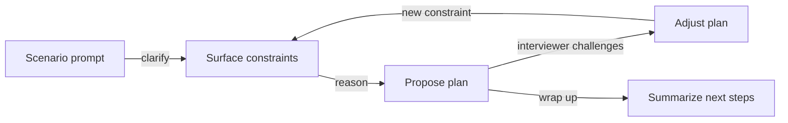

# Practical Interview Scenarios

## Chapter Goal

After reading this chapter, the reader can walk through scenario-based Tech Lead interview questions with a structured approach — clarifying assumptions, separating symptoms from root causes, proposing multiple solutions with trade-offs, and communicating decisions to stakeholders. Each scenario trains the connective tissue between system design, operations, leadership, and delivery that interviewers look for at the Tech Lead level.

## Why This Matters for a Tech Lead

Tech Lead interviews rarely test a single skill in isolation. Instead, they present realistic situations — a slow API, a team conflict, an architectural decision, a production incident — and observe how the candidate reasons through them. The interviewer is not looking for the "correct" solution; they are looking for how the candidate thinks, what they prioritize, how they handle uncertainty, and whether they consider the human and organizational dimensions alongside the technical ones.

A strong scenario answer demonstrates: structured investigation, multi-option reasoning, risk awareness, stakeholder communication, and the ability to adjust when new information changes the picture. This chapter provides 30 practice scenarios covering performance, architecture, operations, security, team dynamics, and delivery.

## Mental Model

Think of every interview scenario as a **constraint-reveal loop**. The interviewer presents a situation with hidden constraints. The candidate's job is to surface those constraints through clarifying questions, propose a plan that accounts for them, and adapt when the interviewer introduces new information.

The loop is intentional. Interviewers test adaptability by changing constraints mid-scenario. A candidate who rigidly defends their first answer is weaker than one who says "Given that new constraint, I would change my approach to X because Y."

## Scenario Answer Framework

Use this structure for any scenario-based interview question:

1. **Restate and clarify.** Repeat the scenario in your own words. Ask 2–3 targeted questions to surface hidden constraints: scale, timeline, team size, existing infrastructure, business context.

2. **Separate symptoms from root causes.** "The API is slow" is a symptom. The root cause might be a missing index, an N+1 query, a saturated connection pool, or a downstream service timeout. State what you would investigate and why.

3. **Propose multiple options.** Never present a single solution. Offer 2–3 approaches with different trade-offs (speed vs. cost, short-term fix vs. long-term investment, risk vs. reward). This shows breadth of thinking.

4. **Name the trade-offs explicitly.** For each option, state what it optimizes for and what it sacrifices. Use language like "Option A optimizes for speed of deployment at the cost of additional complexity. Option B is simpler but requires more downtime."

5. **Address risks.** Identify technical risks (data loss, downtime), business risks (customer impact, revenue), security risks (exposed data), and team risks (burnout, knowledge gaps).

6. **State your recommendation.** After presenting options, choose one and explain why. Do not hedge — interviewers want to see decision-making under uncertainty.

7. **Describe communication.** Explain how you would communicate the decision to stakeholders: engineering team, product manager, leadership, customers if relevant.

8. **Wrap with next steps.** End with what you would do after the immediate fix: monitoring, post-mortem, documentation, prevention.

## Scenario 1: An API is slow in production

### Situation

A customer-facing REST API met latency targets in staging (p99 ~400 ms under synthetic load) but in production p99 is now over 2 seconds. Traffic is moderate—low hundreds of RPS at peak—and error rates are flat. No code deploy landed in the outage window; config drift is possible but unconfirmed. The team suspects “something environmental,” has not reproduced locally, and is debating whether to scale out blindly or roll back a weeks-old release that “felt related.”

Staging may lack representative tenant mixes: one enterprise customer with 50× median entities can turn an innocuous join into a fan-out. Check whether recent migrations backfilled nullable columns or added soft-delete predicates that crushed selectivity without new indexes.

### What you should clarify first

Confirm whether the regression is global or scoped (single tenant, region, SKU, or endpoint family). Pin the time window to the minute and correlate with infra changes, data growth, feature-flag flips, WAF rules, or third-party incidents. Ask for concrete SLOs: target p99 in ms, acceptable error-budget burn per day, and whether latency includes edge (CDN) or only origin. Ask who changed pool sizes, DB parameters, or autoscaling bounds in the last seven days—those leave fingerprints faster than code.

Ask whether CPU credit balance, burstable instance classes, or autoscaler min replicas shifted; a cluster that scaled in overnight can wake up cold under morning traffic. Confirm API gateway vs. service timing—sometimes TLS or WAF adds tail latency the service never sees.

### How to think about it

Production adds variables staging rarely mirrors: real row cardinality, cache hit rates, cross-AZ chatter, noisy neighbors on multitenant stores, and downstream timeouts that only appear under sustained concurrency. Treat the symptom as a distributed systems problem until a single dominant cause shows up in [Observability](./18-observability.md) and [Performance and Scalability](./19-performance-and-scalability.md) data. Queueing dominates p99: a slightly saturated pool or a fan-out of retries turns median latency barely green while tail latency goes red.

Little’s Law intuition helps: if mean service time rises 10% but arrival rate is flat, check where requests wait—thread pools, event-loop stalls, or kernel SYN queues—not only “CPU percent.” A GC pause or stop-the-world moment in a JVM service can appear as a latency staircase on p99 while p50 looks healthy.

### Investigation steps

- Pull APM traces (Datadog, New Relic, Honeycomb, OpenTelemetry backends) for the slow p99 slice; compare flame graphs from an hour before the shift to the present window.
- Build a route × region heatmap; if one shard or cell is hot, suspect tenant skew, bad cache key, or poison-pill payloads (10 MB JSON bodies are not rare).
- Segment latency by status code; 200s slow with flat 5xx often point to compute or DB, while correlated 502/504 implicates gateways or upstreams.
- Inspect DB telemetry: `pg_stat_statements`, RDS Performance Insights, or equivalent; rank by total time and mean time; check rows returned vs. rows examined.
- Validate connection pool math: `(web workers × pool per process)` against Postgres `max_connections` and PgBouncer pool mode; watch “waiting for connection” counters (Hikari, Go sql.DB stats, Node pg pool).
- Time each downstream HTTP/gRPC hop with propagated trace context; quantify retry counts—one flaky 300 ms dependency with three retries is a second gone.
- Measure serialization: log a sample of response byte sizes and JSON marshal timings on the hottest routes.
- For containers or functions, correlate cold starts with new instance IDs; check scale-from-zero settings and CPU throttling after burst.
- Review cache telemetry: Redis hit ratio, per-key cardinality, TTL churn, and cache stampede alarms; validate key stability across deploys (hash of code version in keys vs. stale garbage).
- Compare staging vs. prod feature-flag matrices; a flag that enables “enriched” responses can silently widen payloads.
- Check client-driven retry storms: mobile apps on spotty networks may double traffic without server 5xx if timeouts align badly.
- Inspect HTTP/2 multiplexing and max concurrent streams on proxies; rare misconfigurations exhibit as tail latency on bursty clients.
- Validate DNS TTL and resolver behavior if new dependencies were introduced via hostname changes.
- Look for N+1 ORM patterns by counting DB round-trips per trace; 40 queries at 40 ms each lands near 1.6 s before app logic runs.
- Sample slow traces for lock contention markers (mutex wait spans) in app runtimes.
- Verify disk IOPS and EBS burst balance on small DB instances; storage saturation masquerades as “mysterious” query slowdown.
- Review recent autovacuum or analyze spikes that could transiently lock hot tables.
- If using Elasticsearch or similar secondary stores, check search thread pool rejections correlated with API latency.
- Diff recent JVM or Node runtime flags between environments; default GC or ICU upgrades can shift tail latency silently.
- Inspect API gateway or service mesh rate-limit queues; token-bucket rejections sometimes surface as slow 429s co-mingled with 200s in dashboards if labels are sloppy.
- Validate thread pool executor queue depth in servlet containers; queued work inflates delay before CPU saturates.
- Check clock skew between services if JWT validation or HMAC windows fail-soft into retries.
- Look for synchronous calls inside request path to data lakes or BI tools someone wired “temporarily.”
- Profile ORM hydration of giant graphs on hot endpoints even when SQL count is low—object graphs cost CPU too.
- Audit middleware ordering: logging bodies on every request dominates at moderate RPS.
- Compare container memory limits vs. observed RSS; aggressive cgroup OOM kills can look like flaky timeouts.
- For GraphQL, inspect resolver depth and DataLoader batching; accidental sequential per-field fetches tank p99.
- Capture packet captures or TLS handshakes only if traces show suspicious connect latency—do not start there.

### Possible solutions

**Short-term mitigation:** Scale out app replicas within budget, tighten max page sizes on list endpoints, widen read caches for idempotent GETs (TTL 30–300 s depending on freshness needs), add circuit breakers on flaky integrations, and temporarily raise downstream timeouts only with explicit owner approval plus tighter concurrency caps to prevent retry storms.

**Long-term fix:** Add or fix indexes on proven hot queries, rewrite N+1 access paths, formalize pagination and field masks in the API contract, move heavy aggregates async or behind a read model, right-size DB IOPS and pool architecture, and extend load tests to include production cardinality and dependency failure injection.

**What to measure:** p50/p95/p99 latency per route, trace span share (DB vs. external vs. app), pool wait time, downstream error and retry rates, cache hit ratio, rows examined per query, origin payload bytes, cold-start rate if applicable. Set a success bar: e.g., “restore p99 < 800 ms for checkout POST for 24 hours with <0.1% 5xx.”

Add saturation overlays: CPU steal time on VMs, container throttling (`container_cpu_cfs_throttled_seconds_total` on Kubernetes), event-loop lag in Node, GC pause histograms on JVM services. If the API fans out to internal gRPC, chart per-method server-side deadlines exceeded.

**How to communicate the decision:** Post a short incident note with hypotheses ranked by evidence, mitigations in flight, and what will stay “technical debt” until next sprint; give leadership a time-bound impact statement in error-budget terms, not jargon.

For product partners, translate milliseconds into user-visible flows: “search auto-complete feels sticky,” not “p99 elevated.” Offer two plans—fast patch vs. durable fix—with cost and date ranges so prioritization is explicit.

### Trade-offs

Caching trades freshness for tail latency. Higher timeouts hide slow deps but convert stalls into 5xx under load. Scaling compute without fixing queries raises monthly cost roughly linearly while leaving the bottleneck. Route-level rate limits protect most users’ p99 but require product sign-off on caps.

Aggressive autoscaling tightens tails during peaks but can leave you over-provisioned at idle unless policies include scale-in delays. Pushing mutations to asynchronous handlers improves synchronous POST latency at the cost of UX flows that must poll or subscribe for completion state.

### Risks

Mis-attributing slowness to “the database” without trace proof burns days. Raising pool sizes without understanding `max_connections` can stampede the primary. Permanent “mitigation” without RCA lets debt compound until the next holiday spike.

**What not to do:** Do not roll back a stale release without a coupling story; do not index every column someone names in Slack; do not set timeouts to “infinite” to green dashboards; do not disable tracing to save cost mid-incident.

### Strong interview answer

I would start by confirming scope and SLOs, then pull distributed traces for the slow p99 slice—not averages—and diff one fast trace vs. one slow trace on the same route. I would look for DB time, external call time, or serialization dominating the critical path; if DB, I would separate query time from pool wait time. If downstream, I would quantify retry amplification and error taxonomy. For short-term relief I would shrink blast radius (pagination defaults, targeted caching, controlled scale-out) while closing observability gaps on any span that is still opaque. For the long-term fix I would implement the change the traces justify—schema/index, contract, or dependency hardening—and extend load tests to replay production query shapes. I would communicate timelines using error-budget language and name what we are not doing yet. I would avoid permanent timeout hikes without an owner and a removal date.

### Weak answer

I would add more servers and grep the logs. Probably PostgreSQL needs an index; Redis usually fixes this kind of thing. Once p99 looks fine we can close the ticket and revisit later.

### What the interviewer is testing

Structured production debugging, observability literacy, and resistance to folklore fixes. They want queueing intuition (pools, dependencies, retries) and calm stakeholder updates under incomplete information. They also listen for safe operational reflexes: sampling, guardrails, and avoiding random rollbacks that teach nothing.

They may probe whether you default to data before opinions—can you name the top three trace spans you expect to see before opening a laptop?

### Follow-up questions

How would you validate a suspected fix without a full redeploy? When would you push workload to async processing instead of tuning the synchronous path further?

If traces implicate a third party with no SLA, how do you harden the integration without forking their SDK? How do you decide between caching at the edge vs. inside the service for authenticated JSON?

Where would you draw the line between acceptable p99 regression for internal admin tools vs. customer checkout on the same cluster?

---

## Scenario 2: A database query is the bottleneck

### Situation

The main dashboard query against PostgreSQL now runs about 8 seconds. At ~100K rows it was sub-second; the fact table holds ~15M rows today and grows ~200K rows per day. The SQL is ORM-generated and opaque to most engineers; EXPLAIN output is rarely checked before code review. Product insists on “no degraded UX,” while the team quietly increases `statement_timeout` to hide timeouts. Replica lag is usually under 200 ms but spikes during nightly ETL.

The dashboard mixes OLTP facts with analytic aggregates: window functions over wide joins and `COUNT(DISTINCT …)` patterns often appear once product owners request “one more breakdown.” Check whether the slowdown tracks a recent dimension table growth (partners, SKUs) that exploded join width without selective predicates.

### What you should clarify first

Define data freshness: does leadership need second-level accuracy or is a 30–120 s lag acceptable with a timestamp badge? Quantify peak concurrency—how many simultaneous dashboard loads at month-end close? Confirm whether the 8 seconds is database execution only or includes API serialization over a WAN. Map join cardinality: which dimensions balloon row counts before aggregation?

Ask if the API debounces duplicate dashboard refreshes; React StrictMode double-mounting in dev is not production, but mobile pull-to-refresh loops can multiply identical queries. Confirm whether pagination is required for drill-down tables or only chart aggregates—different SLAs.

### How to think about it

At 15M rows, planners miss without fresh stats; missing indexes, unfortunate join order, and sorts spilling to disk dominate. `EXPLAIN` without `ANALYZE` is theater. Push heavy rollups out of the OLTP critical path when freshness allows—see [SQL and NoSQL](./02-sql-and-nosql.md) and [Performance and Scalability](./19-performance-and-scalability.md) for when to keep truth in Postgres vs. when to project a read model.

Also sanity-check ORM eager vs. lazy loading: a single “dashboard DTO” graph can expand to hundreds of queries under the hood even when one monster SQL is slow. Prove the count of round-trips before glorifying cache.

### Investigation steps

- Capture the exact SQL text (disable ORM hiding if needed) and run `EXPLAIN (ANALYZE, BUFFERS, WAL)` against a staging clone seeded near production volume; record planning time vs. execution time separately.
- Identify sequential scans, nested loops on large outer sides, bitmap heap scans with poor selectivity, and external sorts or hash batches spilled to disk.
- Validate statistics: last `ANALYZE`, correlation between filtered columns, and whether extended statistics for correlated predicates are needed (`CREATE STATISTICS ... (dependencies)`).
- Prototype narrow btree indexes vs. partial indexes (e.g., `WHERE deleted_at IS NULL AND archived = false`); measure write amplification on ingest with `pg_stat_user_tables` and autovacuum pressure.
- Rewrite hot paths: push filters before joins, remove `SELECT *`, decorrelate subqueries, replace correlated subplans with joins where safe, pre-aggregate in a subquery that shrinks row count early.
- Replace deep `OFFSET` pagination with keyset (`WHERE (created_at, id) < (...)`); benchmark page 5000.
- Route heavy reads to a replica; measure lag p95/p99 during ETL; consider serializable snapshot for stable reads if the dashboard tolerates minute-level staleness.
- Time `REFRESH MATERIALIZED VIEW CONCURRENTLY` vs. incremental rollups maintained by triggers or change feeds; watch lock duration and refresh wall time.
- Load-test concurrent dashboard users with realistic cache misses—ORM session caching can hide bad SQL in dev.
- Inspect `pg_locks` during peaks for predicate locks on hot keys if MVCC bloat or long transactions appear in logs.
- Compare `shared_buffers` hit ratio and `effective_cache_size` hints; pathological sequential scans may be tolerated if caching masks them until cache cold starts.
- Sample `EXPLAIN` under production-like `work_mem` and `random_page_cost` settings; planner choices shift across clouds.
- Check for implicit casts on indexed columns that prevent index usage (`WHERE text_col = bigint_param`).
- Benchmark covering indexes (`INCLUDE`) vs. heap fetches when most selected columns are narrow.
- If the query uses `LATERAL`, verify it is not re-executing expensive subqueries per outer row needlessly.
- Consider bloom or `BRIN` indexes only when access patterns truly match; measure false-positive rates before betting dashboards on them.
- Check for `IN (subquery)` that optimizes to hash joins with underestimated buckets; `EXPLAIN` will show oversized hash batches.
- Validate ORM version bump notes—sometimes DISTINCT + ORDER BY rewrites change planner luck overnight.
- Profile `JIT` overhead in Postgres 11+ on short queries accidentally grouped with giants; disable per-session to A/B.
- Inspect long-lived transactions holding back `xmin` horizons that block vacuum—bloat inflates sequential scans.
- Compare `parallel_workers` effects; parallelism can help aggregates or hurt OLTP mix if CPU oversubscribed.
- Audit session-level settings from connection poolers that differ from local shells (`statement_timeout`, `lock_timeout`).
- For time-zone-sensitive reporting, verify predicate pushdown still applies after `AT TIME ZONE` wrapping kills index use.
- Simulate worst-case tenant data skew by cloning anonymized prod stats—planners lie sweetest on uniform random test data.
- Validate ORM batching settings—`prefetch_related` vs. `select_related` semantics differ; accidental_disable switches can reintroduce N+1.
- Review `SECURITY DEFINER` functions invoked by the query; elevated privileges can mask row-level expectations under load.
- Check whether `uuid` keys vs. sequential keys affect bloat and index locality on high churn partitions.
- If partitions exist, confirm partition pruning predicates are sargable and still match ORM-generated SQL after upgrades.
- Estimate sort memory with realistic `work_mem` per user count—sort spills scale with concurrency, not single-user tests.

### Possible solutions

**Short-term mitigation:** Ship the smallest index that matches the dominant filter + order-by, reduce default dashboard time windows, cache per-user dashboard JSON for 30–120 s with explicit version keys, and serve reads from a replica with a staleness indicator in the UI.

**Long-term fix:** Introduce precomputed rollups (nightly plus intraday deltas), denormalized reporting tables fed by events, or a CQRS projection; codify pagination contracts; consider moving the heaviest aggregates to a column store or warehouse if freshness SLAs allow minutes.

**What to measure:** Query p95/p99 on primary vs. replica, rows examined per request, index hit ratio, buffer hit ratio, spilled sort bytes, replica lag, refresh job duration, ETL-induced lock waits, and API tail latency end-to-end.

Also track WAL generated per dashboard refresh if ETL and user traffic contend on the same instance—sometimes splitting readers isn’t enough if checkpoints spike.

**How to communicate the decision:** Tell product the freshness map: “real-time core KPIs on primary; historical trends 60 s behind with cheaper compute.” Put numbers on cost: index storage GB, extra write IOPS, and engineering hours for rollups.

Share a visual timeline: week-one mitigation (index + replica + default window shrink) vs. month-two structural work (rollup table + nightly validation queries).

### Trade-offs

Materialized views trade freshness for throughput. Denormalization complicates writes and invariant enforcement. More indexes improve reads but slow inserts and vacuum. Replicas offload reads until large reporting queries starve replication bandwidth.

CQRS-style projections add an eventual-consistency story you must surface in UI copy and support playbooks—engineers may hate explaining “numbers reconciled next morning” unless product agrees.

### Risks

Indexing every whined-about filter produces write-heavy bloat and brittle plans. Raising `work_mem` globally to mask sorts can OOM concurrency. Long `REFRESH` locks block dashboards if not concurrent or chunked.

**What not to do:** Do not ship `OFFSET 500000` “fixes.” Do not shard Postgres because the dashboard is slow before exhausting cheaper plans. Do not hide failures by raising `statement_timeout` without owning the UX of partial data.

### Strong interview answer

I would reproduce execution with `EXPLAIN ANALYZE` and attack the top-cost nodes—typically sequential scans or sorts spilling. I would verify cardinality estimates vs. on-disk reality before adding indexes; stale stats often mimic “missing index” symptoms. Short-term I would narrow the default query window, ship keyset pagination, add the minimal supporting index, and move read load to a replica with clear staleness rules plus short-lived caches for identical dashboard requests. Long-term I would migrate recurring aggregates to rollups or a materialized view with a measured refresh SLA, and I would budget index count so ingest paths stay healthy. I would report before/after: p95 DB time, replica lag p99, cache hit rate, and bytes read per dashboard load. I would not promise Elasticsearch as a magic exit without comparing freshness and TCO to a tuned Postgres path.

### Weak answer

We should keep adding indexes until the query drops under a second. If Postgres still struggles, we shard or move the whole thing to a search engine because dashboards are basically search.

Index shotgun approaches feel decisive in meetings; without plans they buy weeks of vacuum debt.

### What the interviewer is testing

Index design judgment, planner literacy, and the boundary between OLTP tuning and analytical offload—not database tourism. Follow-ups often probe how you socialize expensive correctness guarantees (transactions) with analytics convenience.

### Follow-up questions

How would you roll out a large index build on a busy table without tanking p99? When is a warehouse sync cheaper than Postgres rollups at 15M rows growing linearly?

How do you validate ORM churn does not regress the plan—contract tests on emitted SQL hashes, or nightly `EXPLAIN` snapshots in CI against anonymized dumps?

When would you accept a 2–5 minute data delay on executive dashboards if revenue-facing widgets stay real-time?

---

## Scenario 3: The team wants microservices but the app is a small monolith

### Situation

Three developers maintain a single deployable service plus workers, backed by one PostgreSQL cluster, serving about 10K DAU. Engineers argue microservices will “unlock velocity” and let them own services independently; in practice there is one staging stack, weekly releases, and shared on-call. Several proposed service boundaries still read and write the same tables—only package names would change at first.

Slack threads already show two conflicting draft dependency diagrams; alignment cost is weekly calendar time, not npm installs.

Finance leadership wants SOC2-friendly separation someday, but today there is no dedicated platform engineer: Terraform runs from laptops, and secrets live in one shared vault namespace. “Microservices” slides mention Kafka though the team still leans on Postgres `LISTEN/NOTIFY` for async hacks.

Traffic bursts peak around 120 RPS during promos—well within a single autoscaled fleet—and the p95 payload stays under 40 KB JSON. The loudest engineering pain in retro is merge conflicts on the shared admin module, not CPU saturation on checkout.

### What you should clarify first

Ask what pain microservices solve today: compile times, merge conflicts, fear of deploying, or an actual scaling ceiling? Quantify incidents: MTTR, blast radius, change failure rate. Confirm whether any domain already has a clean API seam and independent data. Ask how many parallel pipelines, secrets namespaces, and on-call rotations the org can fund when N goes from 1 to 5 services.

Pressure-test staffing math: three devs × 20% on-call overhead × N services leaves few story points for product. Ask how many production fires last quarter traced to boundary confusion vs. raw algorithm bugs—splitting amplifies the former before it helps the latter.

### How to think about it

Microservices trade local complexity for operational surface area: more deploy units, more partial failure modes, more contract tests, more version skew stories. With three developers and one database, the likely failure mode is a distributed monolith—tight coupling with network frosting. Start by strengthening modularity inside the monolith and delivery discipline; read [Software Architecture](./14-software-architecture.md) and [CI/CD and DevOps](./17-ci-cd-and-devops.md) before rearranging boxes on diagrams.

Conway’s Law is a constraint: your runtime topology will mirror chat channels whether you plan it or not—if the org is still one stand-up, runtime N>1 mostly adds paging noise.

If the next hire is another full-stack product engineer, not SRE, your architecture roadmap should bias toward fewer moving parts until hiring catches intent.

### Investigation steps

- Map domains using bounded-context language; measure coupling with import graphs, change coupling (files that churn together), and test overlap.
- Inventory operational prerequisites per service: structured logs, RED metrics per endpoint, tracing, secret rotation, per-service SLOs, automated rollback, and feature-flag plumbing.
- Estimate incremental cost: extra cluster namespaces or accounts, egress dollars, contract testing frameworks, protobuf churn, and schema migration choreography across services.
- Time how long a hypothetical extraction would take end-to-end—including prod deploy, canary, and database cutover—using a thin spike (stateless notifier or webhook sender).
- Review roadmap triggers: compliance boundaries, independent scaling (CPU-heavy vs. I/O-heavy), or org growth to multiple two-pizza teams—microservices follow staffing, rarely precede it.
- Interview stakeholders with “fear of deploy” stories; sometimes modular tests + feature flags fix morale faster than new repos.
- Run a table-top exercise: hypothetical outage in Service B—who pages whom if only one person knows the gRPC stack?
- Audit existing package boundaries; if imports violate intended layers today, physical services will inherit spaghetti with latency.
- Compare build/test wall-clock before vs. after imagined split—parallel CI jobs help monoliths too.
- Score candidate extractions on data independence: shared tables score zero; schema-per-service scores higher.
- Validate budget for observability spend: per-service APM can add thousands/month at modest scale.
- Check compliance claims: PCI/SOC scope reduction requires real isolation, not folder names.
- Document current Mean Time To Patch for dependency CVEs across repos—more repos multiplies security toil linearly at small teams.
- Interview finance about capitalization rules; sometimes “platform rework” needs depreciation-friendly phrasing unrelated to engineering merit.
- Prototype local `docker compose` ergonomics with N>1 services; if developers already hate two containers, ten will not feel better.
- Evaluate API versioning tolerance; breaking JSON without discipline hurts more when consumers are other teams’ services.

### Possible solutions

**Short-term mitigation:** Enforce modular monolith boundaries with package-level visibility rules, arch-unit tests forbidding cycles, CODEOWNERS per module, small trunk-based releases with feature flags, and blue/green or canary on the single deployable to practice safe slicing.

**Long-term fix:** Extract services only with a stable public API, private persistence (separate schema minimum), and at least two engineers able to own on-call; begin with edge integrations or async workers before carving core CRUD.

**What to measure:** Lead time for changes, deployment frequency, change failure rate, MTTR, build time, p95 cross-module PR size, and operational toil hours per week. Target DORA-style improvement before increasing service count.

Add qualitative morale notes: engineer confidence in deploy, number of weekend pages—truth surfaces whether topology was the real blocker.

**How to communicate the decision:** Show a simple cost table: N pipelines, N dashboards, N security reviews. Propose a gate: “we split when two teams can own two data stores and SLOs without paging each other nightly.”

Pair slides with a six-month roadmap: first harden CI, then boundary tests, then extract—not the reverse.

### Trade-offs

Microservices reduce merge contention at the cost of harder debugging, slower cross-service refactors, and latent contract drift. Modular monolith preserves ACID transactions and fast refactors but demands discipline and reviews that catch boundary leaks.

Hybrid “macroservice” pairs (two deployables) sometimes beat ten tiny ones when on-call is still three humans.

Before any split, ask what breaks if tomorrow’s highest-value feature still requires a cross-service transaction; if the honest answer is “everything,” the org is not ready.

### Risks

Splitting while sharing one database recreates monolith semantics with RPC latency. Underestimating networking and observability spends turns three devs into full-time plumbers.

**What not to do:** Do not adopt Kubernetes because “that is how microservices work.” Do not create services per layer (controller/service/repository) or per developer preference. Do not skip contract tests and still claim independence.

### Strong interview answer

I would ask which concrete outcomes microservices buy in the next two quarters; if it is parallelization, modular ownership inside one repo often suffices at three devs. I would quantify the operational bill: deploy pipelines, secrets, dashboards, on-call slices—each multiplies. Short-term I would tighten module boundaries, add tests that forbid cross-domain imports, and increase release cadence with flags and canaries on the monolith while measuring DORA metrics. Long-term I would extract only where there is isolated data, a crisp API, and staffing to operate the new unit—typically asynchronous edges first. I would communicate that architecture tracks org maturity and failure budgets, not fashion. I would avoid painting microservices as free agility without naming who owns migrations at 03:00.

### Weak answer

If engineers want microservices we should start splitting now to avoid a rewrite. One shared database at the start is fine; we will separate schemas when it hurts. Kubernetes plus a service mesh will keep things organized.

That pitch sounds decisive because diagrams multiply; operations rarely forgive wishful ownership lines.

### What the interviewer is testing

Economic reasoning, skepticism of hype, and sequencing—DevOps and domain clarity before topology churn. They also watch for empathy: career growth desires masquerading as architecture needs.

Listen for whether the candidate names concrete staffing, dollars, and on-call math—not abstract “decoupling” slogans.

### Follow-up questions

What metric would falsify the microservices plan for the next year? How would you prevent a shared-database “microservice” anti-pattern during the first extraction?

How do you coach a senior engineer pushing for microservices because their last company did it? When is strangler-fig migration safer than big-bang carve-out?

Would you pilot two pipelines delivering different containers from one repo before splitting data? How do you price incremental spend for secrets scanning when repos multiply from one to four?

When does regulatory language force physical separation even though DORA metrics disagree with splitting now?

---

## Scenario 4: Deployments are unstable

### Situation

About one in five production deploys causes a customer-visible incident (SLO breach or sev-2 ticket). The team batches changes into large releases “for safety,” which lengthens merges, increases conflict rates, and makes root-cause stories fuzzy. Rollbacks are manual, often requiring a senior engineer, and take 30–90 minutes. Engineers joke that deploy day is “risk day,” so hotfixes wait and pile up.

One engineer admits they “wait for Laura” to roll back—single-human dependency hidden in process.

The CI pipeline runs 18 minutes on a good day but lacks hermetic data fixtures; migrations apply to staging only weekly, so drift accumulates. Product managers anchor marketing launches to “the big release Tuesday,” reinforcing batching.

PagerDuty shows eight sev-2s last quarter; five traced to a brittle migration plus one oversized feature bundle, two to certificate renewal, one to a vendor brownout. None screamed “needs more binaries.”

### What you should clarify first

Define incident severity thresholds and whether the 20% rate counts all environments or prod only. Capture deployment frequency, lead time, change failure rate, and MTTR—the DORA quartet. Identify failure clusters: schema migrations, feature flags mis-set, config drift, memory regressions, or flaky external mocks diverging from prod.

Ask which steps are still manual: DNS cutovers, cache busts, manual SQL for backfills. Quantify cost of downtime per minute if leadership debates investment in progressive delivery.

### How to think about it

Large batches maximize variance per deploy: more lines, more unintended interactions, harder bisection. Reliability climbs when change sets shrink, blast radius contracts via progressive delivery, and rollbacks are rehearsed muscle memory. Tie engineering work to [CI/CD and DevOps](./17-ci-cd-and-devops.md) mechanics and [Testing and Quality](./16-testing-and-quality.md) signals—not hope.

Batching is often a trust problem masquerading as a process problem; fear of deploys rises when observability after promote is weak.

When leadership celebrates “zero deploy weeks” as stability, name the deferred risk: inventory of unshipped security patches grows monotonically.

### Investigation steps

- Annotate dashboards with deploy markers (git SHA, migration IDs, flag states); correlate error and latency shifts within minutes of promote.
- Mine CI history: flaky tests, missing contract coverage on APIs touched by the diff, migration dry-runs skipped for “speed.”
- Review deploy mechanics: rolling vs. blue/green, readiness probes that mirror real dependencies, pre-stop hooks draining connections.
- Audit configuration and secrets pipelines—silent rotations cause “no deploy” incidents that look like code regressions.
- Time rollback drills: revert image, flip flags, and run forward-only migration compensations where applicable; document blockers.
- Survey human process: approval bottlenecks encouraging batching, fear-based freeze windows without fixing underlying causes.
- Classify incidents into “preventable with test,” “preventable with flag,” “infra surprise”; allocate budget per bucket.
- Compare main vs. long-lived branch age; older branches correlate with nastier merges.
- Inspect container resource requests/limits changes bundled with features—silent OOMs look like flaky code.
- Review QA sign-off checklists for false confidence (manual click paths that never hit async workers).
- Check database lock contention during deploy windows—some “bad deploys” are migration ordering bugs.
- Evaluate feature-flag hygiene: stale flags double code paths and surprise interactions.
- Measure flaky test rate in CI over 30 days; high flake correlates with surprise prod even when “green.”
- Track hotfix count bypassing normal QA; many hotfixes imply batching pathology, not individual sloppiness.
- Review on-call wakeups categorized by deploy vs. non-deploy; misclassified paging hides deploy risk.
- Audit artifact immutability: retagging `latest` foils rollback forensics.

### Possible solutions

**Short-term mitigation:** Stop heroic Friday deploys without guardrails; add automated smoke suites post-promote; tighten canary gates on 5xx rate, latency p99, and a business KPI (checkout success); keep previous artifacts hot (image digest N-1); rehearse one-click rollback weekly.

**Long-term fix:** Shift toward trunk-based development with feature flags for risky behavior; adopt expand/contract migrations; invest in contract and consumer-driven tests; automate synthetic checks in prod; run game days on rollback and partial failover.

**What to measure:** Change failure rate (target <15% as a first milestone, then single digits), deployment frequency, median lead time for changes, MTTR (<1 hour aspirational with automation), percentage of deploys behind canaries, and rollback duration percentiles.

Add qualitative pulse surveys: “confidence deploying on Friday” from 1–5; rising scores often precede dropping CFR.

**How to communicate the decision:** Tell leadership that batching raises blast radius mathematically; propose a quarter plan: “smaller ships + better gates,” with explicit downtime/error-budget trade approvals.

Frame dollars: if one sev-2 costs ~$50k in combined churn, two extra CI machines and a launchdarkly seat pays for itself quickly.

### Trade-offs

Feature flags multiply test matrices and require lifecycle governance. Canary infra costs money and needs mature metrics. Faster cadence demands trust; without psychological safety, teams sabotage automation.

Staying on weekly trains trades predictability for inventory risk—marketing may need feature toggles, not calendar coupling.

If product refuses toggles but demands fixed Tuesdays, you still have batching—rename it micro-release if you like, math stays ugly.

### Risks

Automating rollback without safe migration pairing can corrupt data. Over-investing in pre-prod environments that diverge from prod perpetuates surprises.

**What not to do:** Do not “deploy less” as the primary strategy—that hides bad process and lengthens MTTR. Do not blame individuals for systemic coupling. Do not skip migration ordering reviews for speed.

### Strong interview answer

I would quantify change failure rate and connect large batches to worse diagnosability. Short-term I would add deploy annotations, canaries with automatic promotion abort on budget breaches, and post-deploy smoke checks; I would rehearse rollbacks until median time is minutes, not tens of minutes. Long-term I would move to smaller merges, feature flags for risky paths, and expand/contract migrations so roll-forward stays safe. I would communicate that slowing deploys to pile risk increases customer pain and engineering thrash. I would pair metrics with culture: blameless reviews that end in automated safeguards, not slogans. I would avoid declaring victory on green CI alone—production telemetry must validate.

### Weak answer

We should stay in QA longer and deploy monthly until confidence returns. Maybe we need a release manager to check everything. If CI passes, production should be fine—bugs mean weak reviewers.

Longer QA windows feel prudent until you count the inventory of simultaneous behavior changes still landing at once.

### What the interviewer is testing

Lean and continuous delivery literacy, progressive delivery mechanics, and humane process design—not theater reviews. They listen for systems thinking: bottlenecks often precede tests.

They may ask how you sell smaller batches to risk-averse legal/comms partners—political skill matters as much as pipelines.

### Follow-up questions

How do you roll forward safely when a migration already expanded a column type? What automated signals promote a canary vs. roll it back?

How would you unwind a “deployment moratorium” culture without executive blame? When is pair programming on risky migrations cheaper than extra staging envs?

How do you align marketing launch trains with technical kill switches without resurrecting giant merge trains? What sample size of deploys proves a canary policy works vs. noise?

Who owns the feature-flag retirement backlog so dual code paths do not linger for quarters?

---

## Scenario 5: A frontend app has poor Core Web Vitals

### Situation

A React e-commerce storefront reports field LCP 6.2 s and CLS 0.35 on real-user monitoring; Google Search Console shows declining impressions and average position. Marketing attributes revenue drops partly to organic loss. Engineering suspects hero imagery, render-blocking script, and a bundle of third-party tags (A/B, reviews, chat) loaded eagerly on every page. Mobile traffic is ~70% of sessions; median device class is mid-tier Android on 4G.

Field RUM sampled ~18k sessions yesterday; CLS outliers spike on one carrier cohort, hinting at regional CDN issues distinct from bundle size.

Home PLP concatenates CMS-driven banners with merchandising slots; each slot can inject unknown aspect-ratio images without height hints. PDP above-the-fold loads user reviews synchronously from a vendor whose SLA is “best effort.”

Search Console impressions fell ~12% week-over-week alongside a sitewide template A/B that doubled hero JPEG bytes; correlation is not causation, but timing invites scrutiny from growth leadership.

### What you should clarify first

Segment RUM by template (home, PLP, PDP, cart), device, and market; identify the LCP element per template. Check INP trends alongside LCP/CLS—Search increasingly weights interaction latency. Confirm CDN caching headers on HTML and API JSON. Align targets to Google’s guidance: aim LCP <2.5 s and CLS <0.1 at the 75th percentile field; document current p75 vs. p90 to avoid moving goalposts.

Ask whether SEO drops coincide with template experiments or inventory outages—confounds abound. Confirm consent banner markup reserves space; cookie walls often wreck CLS.

### How to think about it

Core Web Vitals reward predictable layout, fast largest paint, and responsive input. React SPAs often stall behind large JS download and hydration; marketing tags inject DOM late, destroying CLS budgets. Strategy spans asset delivery, critical rendering path, and script governance—see [Performance and Scalability](./19-performance-and-scalability.md) and [React](./08-react.md) for code-splitting and streaming patterns.

Mobile CPU matters: a 3 MB JS bundle parses longer on a Moto G-class device than M1 laptops in dev—field data is the court of appeal.

Core Web Vitals penalties hit non-brand queries hardest; if branded traffic dominates revenue, SEO fear may overshoot actual dollar risk—still fix UX, but prioritize narratives with finance using split metrics.

### Investigation steps

- Run Lighthouse and WebPageTest with CPU/ network throttling matching your RUM percentiles; compare lab vs. field deltas.
- Bundle-analyze production builds (`vite-bundle-visualizer`, `source-map-explorer`, Next.js analyzer); flag vendor chunks >200 KB gzipped suspicious without lazy boundaries.
- Profile React commits on PDP: expensive context, anonymous children causing rerenders, giant prop payloads from REST.
- Audit images: responsive `srcset`, explicit `width`/`height`, modern formats (AVIF/WebP), CDN `cache-control`, LCP image `fetchpriority="high"` where appropriate, and avoid CSS background images for LCP candidates.
- Inspect font loading: subset weights actually used, `font-display` strategy, limit `preload` to one critical face.
- Catalog third parties with request timing and byte weight; defer non-critical scripts until `requestIdleCallback` or interaction; reserve space for ad slots to cap CLS.
- Measure CLS attribution in the field (layout-shift entries) and reproduce in Performance panel.
- Validate SSR/SSG caching: stale-while-revalidate settings vs. personalization conflicts.
- Inspect HTTP waterfall for render-blocking CSS; inline critical CSS experiments sometimes pay on marketing-heavy pages.
- Check hydration mismatches logged in production (React 18+ may recover but still cost main-thread time).
- Evaluate service worker caches for stale HTML shells fighting new asset hashes.
- Compare TTFB across edge pops; origin slowness masquerades as LCP issues even with tiny JS.
- Use Chrome’s Local Overrides to simulate removing third parties and measure delta quickly before vendor negotiations.
- Measure cumulative layout shift score on first 10 s vs. full session; short-window tuning can mislead on long-lived SPAs.
- Inspect image CDN transforms—accidental 4K sources behind 300 px display boxes waste bandwidth and delay LCP.
- Verify cookie consent delay timers; some CMPs block render longer than legal counsel assumes.

### Possible solutions

**Short-term mitigation:** Compress and resize hero sources, enforce dimensions on above-the-fold media, move consent-gated tags behind interaction, trim render-blocking CSS/JS on first route, preload only the hero font, and ship a stable skeleton for dynamic promo slots to absorb CLS.

**Long-term fix:** Adopt SSR/SSG or hybrid rendering for catalog surfaces (Next.js or equivalent), aggressive route-based code splitting, edge caching for anonymous HTML shells, client-only personalization after paint, and performance budgets in CI (bundle size, LCP regression thresholds on synthetic checks).

**What to measure:** Field LCP/CLS/INP p75 by page, LCP image discovery time vs. load time, TTFB vs. element render delay, main-thread long task count, third-party script time, hero byte weight, cache hit ratio on HTML/images, and organic clicks/impressions with CWV annotations on releases.

Split SEO reporting: brand vs. non-brand queries; CWV fixes affect non-brand more visibly.

**How to communicate the decision:** Give marketing a script schedule with measured SEO impact trade: “these tags move post-LCP with placeholder boxes; attribution drift is monitored via parallel holdout.”

Publish a one-pager showing before/after CrUX-style percentiles and Search Console deltas lagging by ~28 days so expectations stay realistic.

### Trade-offs

SSR helps LCP but pressures TTFB if uncached. Aggressive lazy-loading can defer below-fold content too eagerly and hurt engagement. Image quality reductions need brand guardrails. Fewer tags may trim attribution fidelity short term.

Personalization engines may resist static shells—negotiate edge-computable variants or client-side swaps with stable skeletons.

If CRM data must render in the hero for “reasons,” budget explicit aspect-ratio boxes even when creative resists constraints.

### Risks

Optimizing lab Lighthouse while ignoring field RUM misallocates weeks. CLS patches that hide promos increase rage clicks. Hydration mismatches after SSR introduce subtle bugs and new layout shifts.

**What not to do:** Do not `lazy` the LCP image. Do not blanket-memo every component without profiling. Do not delete analytics without a replacement measurement story.

### Strong interview answer

I would start from segmented field data, identify each template’s LCP element and top CLS contributors, and reproduce under throttling. Short-term I would fix the hero pipeline (dimensions, priority, CDN caching), defer nonessential third parties with reserved layout boxes, and cut main-thread blocking from the critical bundle. Long-term I would move catalog rendering to SSR/SSG or partial prerender with disciplined personalization hydration, enforce bundle and image budgets in CI, and wire RUM dashboards with release markers. I would tie CrUX field slices to checkout funnel steps so executives see vitals alongside conversion, not detached charts. I would negotiate tag timing with marketing using measured trade curves, not ideology. I would avoid declaring success on desktop Lighthouse alone while mobile p75 stays red.

### Weak answer

We should lazy load all images and slap `memo` on components. Maybe change hosts. Run Lighthouse in CI until scores are green on dev laptops.

Chasing lab green while mobile SEARCH traffic bleeds is a classic trap when stakeholders read dashboards on MacBooks.

### What the interviewer is testing

CWV mechanics, RUM-first thinking, cross-team negotiation, and React performance engineering—not checklist SEO hacks. They may probe trade-offs between conversion micro-optimizations and macro SEO health.

They may watch for vendor diplomacy: third-party partners rarely move without joint dashboards proving harm.

### Follow-up questions

How would you separate CWV regressions from seasonal demand swings in Search Console? When is a client-only checkout acceptable despite weaker LCP?

How do you instrument third-party iframe content that resists direct timing APIs? When would you accept a separate m-dot domain for marketing speed experiments?

How do you prove to finance that SEO fixes have positive ROI when attribution windows cross 30–60 days? What guardrails stop marketing from reintroducing render-blocking experiments every campaign?

Where do you draw the line between acceptable client-only admin consoles vs. customer storefront SSR requirements?

---

## Scenario 6: There is a production incident

### Situation

On-call pages at 02:00 local time. API error rate sits near 15% across routes for ~20 minutes; success paths that usually run at single-digit millisecond latency now time out sporadically. No deploy landed in the last 12 hours. Social media lights up before the internal chat does. Partial internal dashboards still render, biasing first instincts toward “maybe not that bad.”

Runbooks assume deploy-induced failures; today’s mute on “recent release” channels slows triage. Customer support notes intermittent auth errors on mobile only—hinting at token issuer saturation or region-specific routing.

Synthetic checks for “happy path checkout” stayed green; business KPI dashboards show cart abandonment +4% vs. trailing seven-day baseline, validating external reports before engineers agree on severity.

Trace sampling at 1% might hide the exploding tail unless error-biased sampling is enabled—confirm whether observability back ends boost capture when error rates cross thresholds.

### What you should clarify first

Confirm customer-impacting scope vs. internal-only errors. Classify errors: HTTP 5xx vs. 429 vs. 401 spikes (often misconfigured auth rotations). Check geographic pattern and single-vs-multi-tenant blast radius. Scan dependency status pages, cloud provider health, certificate expiries, DNS TTL changes, and quota dashboards (API rate limits, DB connections, Kafka consumer lag).

Ask whether background consumers fell behind, backlogging work that daytime traffic replays: error storms without deploys sometimes originate from poison messages or dead-letter retries.

### How to think about it

No-deploy incidents still have triggers: data volume tipping a plan, automatic cert renewal failing silently, background job storms, cascading retries, or planner regression after `ANALYZE` skew. Lead with mitigation and transparent comms; investigate in parallel. Lean on [Observability](./18-observability.md) timelines and [CI/CD and DevOps](./17-ci-cd-and-devops.md) runbooks—hero debugging without structure burns precious minutes.

Fatigue bends judgment: pre-write decision prompts (“when do we shed load?”) before adrenaline spikes.

If the incident bridges time zones, decide early whether the EU teammate waking up beats the US engineer tunneling alone—the cost of dual fatigue often beats heroics.

### Investigation steps

- Open the incident channel; assign commander, comms, scribe; set a 15-minute checkpoint cadence for leadership updates if external impact is real.
- Slice error logs and traces by route, version, cell/region, and error fingerprint; hunt for a single new stack trace dominating volume.
- Check saturation signals: CPU throttling, memory pressure/OOMKills, thread pool exhaustion, DB connections maxed, replication lag, disk IOPS ceiling.
- Validate recent autonomous changes: autoscaling shrink events, chaos of spot interruptions, secret manager rotations, WAF rule publishes.
- For dependencies, examine timeout ratios and retry storms; temporarily enable safer backoff caps if configured hot.
- If ambiguous, narrow blast radius with feature flags, read-only mode on noncritical mutations, or traffic shed to canary cells if topology allows—only with product agreement on degraded behavior.
- Capture a timeline table: detection, first mitigation, customer comms, partial recovery—feeds the post-incident review.
- Pull `pg_stat_activity` snapshots for wait_event outliers; locks look different from CPU pegging.
- Compare canary vs. stable cell traffic if you operate regional failover—sometimes drain mistakes strand a cohort.
- Check webhook or partner feed stalls that enqueue compensating jobs—silent until queues overflow.
- Inspect CDN edge errors vs. origin errors; mis-set origin timeouts masquerade as app bugs.
- Verify HSM or KMS availability if crypto paths spiked first.
- Look for clock skew between AZs affecting lease-based leaders.
- Scan for unusually large payloads hitting parser limits—API gateways return gnarly 5xx families that aggregate poorly.
- Compare auth provider dashboards for token issuance throttling; 15% errors cluster when JWKS fetch fails open.
- Inspect cloud NAT or egress proxy saturation; silent packet loss surfaces as vague client timeouts.
- Review last successful DB backup vs. replica promotion drills if failover enters chat.

### Possible solutions

**Short-term mitigation:** Scale out stateless tiers, increase pool ceilings cautiously with DB guardrails, disable noncritical workers/crons, apply rate limits at the edge to protect core flows, fail open on optional enrichment, rollback recent config/feature flags even without code deploys, fail over to DR if rehearsed and scoped.

**Long-term fix:** Add deterministic retries with jitter and budgets, breaker thresholds on weak integrations, synthetic checks for cert expiry and quota headroom, cache warming for hot keys, query guardrails, and sharper alerts that fire on route-specific SLOs before global error rate crosses 10%.

**What to measure:** Error rate per route, p99 latency, saturation percentages, dependency timeout share, leadership notification latency, time to first mitigation, time to full recovery, and customer-visible duration of degraded checkout (business KPI).

Track tickets opened per minute and refund volume if commerce—executives grasp dollars faster than HTTP codes.

**How to communicate the decision:** Post short, timestamped updates: what we know, what we do not, what users should expect; avoid hollow “all hands monitoring.” After stabilization, publish a concise RCA timeline before deep blameless review.

Use separate internal vs. external channels; engineers deserve raw hypotheses customers should not see half-baked.

### Trade-offs

Aggressive rate limiting protects payment flows but angers long-tail endpoints. Failing open preserves availability at consistency cost—document manual reconciliations. Wake-the-whole-org paging speeds response but hollows people out if misused.

Early customer comms before root certainty trades trust now against potential correction emails later—bias toward transparency with bounded promises.

Fatigue amplifies optimism bias; written guardrails (“we will update by 03:30 UTC or escalate to VP Eng”) anchor the room.

### Risks

Restart loops hide root cause and erase evidence. Silent manual mitigations without scribe notes destroy learning. Under-communicating external pain erodes trust more than imperfect early estimates.

**What not to do:** Do not mass-restart without a hypothesis. Do not turn off monitoring to silence pages. Do not promise ETAs without bounds. Do not skip customer status updates while threads debate theories.

### Strong interview answer

I would verify customer scope, assign IC/comms/scribe, and start a living timeline. I would triage from error fingerprints and traces first—often one dependency or saturation signal explains a wall of 500s—then logs for auth or quota class if traces are thin. Short-term I would stabilize: scale carefully, shed noncritical work, cap retries, and flip risky flags or config with peer review even at night. I would communicate outward every ~30 minutes with facts and next checkpoint; I would name uncertainty plainly. I would log every mitigation with timestamps in one thread so partial recoveries stay auditable under sleep deprivation. After mitigation I would preserve artifacts and schedule a blameless review with owned corrective actions: better monitors, runbooks, game days—not vague “more vigilance.” I would avoid uninstrumented restarts that erase queues of proof.

### Weak answer

Restart the cluster and see if it clears. If not, page the DBA and go back to sleep—we can write the post-mortem tomorrow afternoon.

Silence in the customer channel overnight buys hours until social media crosses a threshold you regret.

### What the interviewer is testing

Incident command fundamentals, observability-first triage, fatigue-aware communication, and operational maturity—not solo heroics. They watch whether you balance empathy for on-call with customer-first urgency.

They often listen for customer empathy via crisp external messaging—not only internal debugging prowess.

### Follow-up questions

When do you escalate to executives vs. keep engineering-only comms? How do you prevent retry storms from turning a partial outage into a full platform brownout?

How do you decide between active/active traffic drain vs. fail-fast error pages during quota exhaustion? What artifact retention policy preserves evidence without PII leaks?

How do you run a post-mortem when root cause stays “likely infra” but vendor confirms no global incident? What templates help legal/comms review external statements quickly?

How do you rotate exhausted on-call engineers without letting severity drift when fatigue narrows judgment?

---
## Scenario 7: Junior engineer repeating the same mistakes

### Situation

A junior has been on the team for four months. Their pull requests still land without tests, with inconsistent naming (mix of `user_id` / `userId` / `UID` in the same module), and with happy-path-only code: missing `try/catch`, unchecked promise rejections, or HTTP handlers that never map downstream errors to status codes. Reviewers are rewriting large portions of PRs.

Slack threads get tense. People start rubber-stamping to “keep velocity,” which makes the problem worse. Incidents pile small: an unhandled rejection surfaces as a 500 with no correlation ID, or a naming mismatch breaks a consumer team’s OpenAPI client generation. You are the tech lead balancing delivery pressure with a team that is quietly losing trust in the review process.

### What you should clarify first

- Whether the expectations were ever written down: definition of done, review checklist, language-specific style guide.

- How much of the gap is skill versus environment: noisy interruptions, unclear tickets, or no example PR in the repo to copy.

- Whether the junior knows tests are required or believes they are “optional until stable.”

- If anyone has had a direct 1:1 about patterns versus personality.

- What your org’s performance process looks like: documentation timeline before a formal performance conversation.

- Whether other juniors are thriving; if yes, compare support structures (pairing hours, buddy assignments).

- Whether the work queue forces oversized PRs (multi-service refactors) that overwhelm a junior regardless of intent.

- If tech debt in surrounding code sends the signal “nobody else tests either.”

### How to think about it

This is a **system** failure as much as an individual failure. If the team never made “tests + error paths + naming consistency” explicit and enforceable, you trained the junior that those things are negotiable. Your job is to move from vague frustration to a coached plan with observable criteria. That overlaps with [Soft skills](./22-soft-skills.md) (feedback, psychological safety) and [Tech lead skills](./23-tech-lead-skills.md) (setting standards, raising the floor on quality).

Treat mentoring as time-boxed experiments with metrics, not endless hope. **Mentoring** is skill transfer with scaffolding; **managing** is enforcing outcomes when scaffolding fails. You should know which mode you are in each week.

### Investigation steps

1. Review the last ten PRs from this engineer. Tag failure modes: no tests, weak tests, naming drift, error handling gaps, logging noise.

2. Compare reviewer comments: are comments actionable (“add a contract test for 409 conflict”) or vague (“clean this up”)?

3. Check CI: can untested code merge? If yes, fix the pipeline before blaming the person.

4. Interview the junior in a 1:1 using examples from their own diff: “Walk me through how you decided error handling was unnecessary here.”

5. Ask tech leads in sister teams how they onboard juniors; borrow a checklist instead of inventing one alone.

6. Quantify rework: lines changed after first review, number of round trips, days open. If rework is three times team median, that is a signal.

7. Sample two production logs tied to their changes: do errors include operation name, tenant, trace ID?

### Possible solutions

**Short-term mitigation**

- Stop large async reviews. Move to **small PRs** (under 300 lines of meaningful change) with a printed checklist in the template.

- Pair for two hours, three times a week, for two weeks, on one service boundary until habits stick.

- Add **required** CI gates: unit test job must run; coverage can be incremental (e.g. new code paths require at least one new test file touching the module).

- Replace drive-by Slack critiques with a standing **office hour** slot for “review prep” before opening a PR.

**Long-term fix**

- Publish a **team guide**: naming conventions, error mapping table, “definition of done,” and two golden PRs as references.

- Rotate review load so one senior owns mentorship metrics (PR rework rate, time-to-merge, defect escape rate).

- If progress stalls after six to eight weeks of documented coaching, escalate to engineering manager with evidence, not vibes.

- Tie promotion conversations to demonstrated ownership of quality, not heroic hours.

### Trade-offs

Heavy pairing reduces story output for two weeks but cuts review thrash and production risk. Strict gates can slow juniors who are learning; mitigate with templates and examples. Escalation can feel harsh; delaying escalation burns the team and hides a management gap.

### Risks

Public shaming in channels, nickname culture (“they always…”), or implicit bias in who gets labeled “slow.” Another risk is **learned helplessness** if seniors rewrite instead of teaching. A third risk is managers hearing only complaints without a documented plan, which produces surprises in performance reviews.

**What to measure:** percent of PRs meeting DoD on first submission; median review round trips for the junior versus team; escaped defect count within thirty days of merge; time-to-first-comment in review (latency demoralizes).

**What not to do:** vent in public channels; accept rubber stamping; let seniors silently rewrite without explaining; compare engineers by personality (“not a culture fit”) instead of behaviors.

**How to communicate:** tell the team standards apply to everyone—gates and checklists are not “because of one person.” Tell the junior the thirty-day target behaviors, the support available, and how you will review progress with their manager in alignment.

### Strong interview answer

I would treat this as a standards-and-coaching problem before a performance problem. I would verify we have explicit definition of done and CI enforcement; if code can merge without tests, that is on the team, not only on the junior. I would pull metrics from the last ten PRs—rework after review, incidents tied to missing error handling, time in review—to make the gap objective. Short term, I would pair on thin slices of work, require smaller PRs, and insist review comments cite our guide or a reference PR. Long term, I would publish golden examples and track percent of PRs meeting DoD on first pass, test addition rate, and escaped defects within thirty days. If there is no trend after six to eight weeks of documented coaching, I escalate to the manager with artifacts, not hallway frustration. Throughout, I would communicate that we are raising the baseline for everyone and that the junior has a clear success definition for the next month. I would refuse to let Slack snark substitute for a plan, and I would refuse to let seniors bypass the same gates they ask others to follow.

### Weak answer

I would give them more feedback in code review and ask them to write tests. If that does not work, I would talk to their manager. People learn at different speeds, so we should be patient.

### What the interviewer is testing

Whether you distinguish mentorship from performance management, use data over anecdotes, fix systemic gaps (CI, templates), and communicate decisions without humiliation. They also want to see when you involve management.

### Follow-up questions

- How do you balance kindness with consistent standards?

- What if the junior pushes back on tests as “not Agile”?

- How do you detect reviewer burnout?

- When is it ethical to recommend a PIP versus reassignment?

- How do you document coaching without sounding punitive?

---

## Scenario 8: Product wants a risky share-via-link feature

### Situation

Product wants “share via link” so customers can open a saved report without logging in. The proposed design encodes identifiers in sequential integers in the URL path (`/shared/report/100482`), caches responses aggressively, and ships in two weeks for a sales deadline. Security worries: anyone can iterate IDs, links may leak through referrers and analytics, and there is no revocation story.

Legal asks whether this touches PII under your retention policy. Customer success imagines posting links in semi-public Slack channels. Finance wants assurance you are not creating a silent data-exfiltration path that shows up in the next audit.

### What you should clarify first

- Data classification: does the report contain PII, financial data, health data, or secrets?

- Authentication model today: SSO, session cookies, API tokens?

- Compliance scope: GDPR/CCPA deletion, SOC2 access logging requirements.

- Abuse model: is enumeration in scope for your threat model, or does product assume “obscurity is enough”?

- Lifetime expectations: should links expire after seven days, thirty days, never?

- Whether marketing will put links in emails (phishing surface, prefetch by mail scanners).

- Whether CDN or edge caching can serve the wrong tenant after a misconfigured surrogate key.

- Whether the sales deadline is tied to revenue recognition; that shapes how you negotiate scope versus date.

### How to think about it

Ship the business outcome without shipping an **IDOR** buffet. Predictable URLs are fine for public content; they are negligent for user-specific data unless every object is genuinely public. You are negotiating time, risk, and architecture—tie arguments to [Security](./15-security.md): least privilege, revocable grants, audit trails.

Security work is stakeholder communication work. Translate issues into lost customers, fines, and mandatory breach notifications—not personal criticism of product.

### Investigation steps

1. Run a twenty-minute threat sketch: actors (anonymous internet, former employees, compromised mail), assets (report rows), entry points (URL, logs, Referer headers).

2. Confirm whether reports are tenant-scoped; check for cross-tenant leakage in existing APIs.

3. Review logging: do access logs store full URLs with tokens? That affects secret handling.

4. Check CDN and cache headers: `Cache-Control`, surrogate keys, purging.

5. Prototype two token schemes with your security counterpart: signed URL (HMAC/JWS) versus opaque token mapped server-side.

6. Validate deletion story: when a user requests erasure, do share tokens die with the parent object?

7. Read static scanning rules you already run; extend Semgrep or equivalent for “ predictable /shared/:id ” patterns if this class recurs.

### Possible solutions

**Short-term mitigation**

- Ship behind **opaque random tokens** in the path or query, 128+ bits of entropy, stored hashed server-side with tenant ID and report ID.

- Short TTL (e.g. seventy-two hours) plus manual revoke in admin UI.

- Rate limit by IP + token and block scanning patterns (many 404/403 in a short window).

- Add `Cache-Control: private, no-store` on authenticated-equivalent responses unless a security reviewer signs off on caching.

**Long-term fix**

- Formal **authorization object**: “share grant” with scopes (view-only, watermarked PDF, no export).

- Move to **signed URLs** with explicit `exp`, `kid`, and server-side revocation list if you must integrate with CDNs.

- Central secrets for signing keys in KMS/HSM; rotate keys on a schedule.

- Add anomaly dashboards: token reuse across geos, burst access, off-hours patterns.

### Trade-offs

Opaque tokens need a database lookup per request (latency cost, roughly one to five milliseconds in-region on warm caches) but simplify revocation. Signed URLs are fast at the edge but revocation is harder unless you add online checks. Encryption-at-rest does not fix broken authorization—do not conflate them.

### Risks

Referrer leakage to third-party analytics, browser prefetch, search engine indexing if `robots.txt` fails, and subpoenas for access logs. Sales pressure can force a “temporary” insecure design that becomes permanent. Marketing copy might promise “anyone with the link” while legal requires access logs—resolve that tension explicitly.

**What to measure:** failed auth rate per token; enumeration attempts (stepwise ID probes if any legacy path remains); time-to-revoke; mean audit log completeness for share access events.

**What not to do:** ship sequential integers while hand-waving “long URLs are secret”; log raw tokens; allow public cache of personalized HTML; accept “we will fix security later” without a signed exception record.

**How to communicate:** one-page decision record for execs: customer story, threat summary, two options, cost/latency deltas, and explicit residual risk. Offer a phased plan: safe MVP (opaque token + TTL) in two weeks, hardening (grants + advanced abuse signals) next increment.

### Strong interview answer

I would not ship predictable identifiers for authenticated content. I would convene product, security, and legal with data classification first, because the calendar date moves when people see concrete abuse scenarios and regulator expectations. Short term, I would ship opaque high-entropy tokens with TTL, rate limits, scoped read-only access, and structured audit logs that never store raw secrets. Long term, I would model share grants, integrate KMS-backed keys, and layer abuse detection. I would measure auth failures, token reuse, geo anomalies, and revoke latency. If leadership insists on the unsafe design, I would require a formal risk acceptance with monitoring and expiry, or refuse sign-off according to policy. I would communicate with a decision record: two architectures, dollars, latency, and timeline—no drama, no jargon wall. Throughout, I would anchor the discussion in customer trust and obligation to minimize exposure, not in winning an argument.

### Weak answer

We should push back hard because sequential IDs are insecure. We can use JWTs and ship quickly. Security is everyone’s job, so product should understand.

### What the interviewer is testing

Threat-model literacy, stakeholder negotiation, knowledge of token patterns, logging discipline, and backbone under schedule pressure without being theatrical.

### Follow-up questions

- How do you handle marketing insisting on “pretty URLs”?

- What is your stance on password-protected links without accounts?

- How do you test for IDOR automatically?

- When would you accept residual risk formally?

- How do you document security decisions for auditors?

---

## Scenario 9: AWS bill jumped from $18K to $42K

### Situation

Finance pings engineering: monthly AWS spend moved from about eighteen thousand dollars to about forty-two thousand dollars month over month. Traffic and revenue are flat within a few percent. Executives want an explanation and a remediation plan within days. Nobody trusts the rough “we might have left something on” theory.

The spike lands during a quarter close. A VP asks whether engineering introduced a architectural regression or failed to govern sandboxes.

### What you should clarify first

- Exact billing window boundaries (proration, Savings Plan purchases, reservation charges appearing as spikes).

- Whether new environments (disaster recovery cutover, marketing demo) were left running.

- Recent architecture changes: logging to S3, new data lake job, cross-region replication.

- Tagging completeness—can you attribute cost by service, team, and environment?

- Whether finance blends multi-account bills; maybe the spike is a consolidated account artifact.

- Whether a vendor began exporting logs to your account or a partner test spiked API calls.

- If Kubernetes control plane or data plane metrics show new clusters in non-prod accounts.

### How to think about it

Cost incidents are **observability** incidents. You form a hypothesis tree: compute waste, data transfer, managed services with per-request pricing, misconfigured auto scaling, or **logging/storage sprawl**. See [AWS](./04-aws.md) primitives as levers: networking, NAT, storage classes, and “always-on” services dominate silent growth.

Finance needs confidence intervals, not bluffing. Prefer daily charts with service-level attribution over a single screenshot.

### Investigation steps

1. Open **Cost Explorer**; group by service, then by linked account, then by tag (`env`, `team`, `service`). Restrict to daily granularity for the spike window.

2. Compare **Cost and Usage Reports** (CUR) if you have them; export to Athena for joins on resource IDs.

3. Check **NAT gateway** hours and GB processed; often flat traffic + regional shuffle explodes this line.

4. Inspect **data transfer** out to internet and cross-AZ; search for accidental cross-region replication or public bucket egress.

5. Review CloudWatch Logs ingestion and retention changes; logging JSON at `INFO` during an incident can 10× volume.

6. Inventory orphans: unattached EBS volumes, old snapshots, idle RDS instances, forgotten `m5.8xlarge` in a sandbox.

7. Inspect OpenSearch, Redshift, and SageMaker lines—classic stealth climbers.

8. Verify Savings Plan true-up: a purchase can look like a usage spike if misread.

### Possible solutions

**Short-term mitigation**

- Stop or right-size obvious offenders: scale down over-provisioned ASGs, delete orphaned volumes, reduce log retention hot tier from never-expire to fourteen or thirty days.

- Turn off non-prod overnight schedules if policy allows (e.g. **Instance Scheduler** on dev clusters).

- Add budget alerts at eighty and one hundred percent of new micro-budgets per high-risk service.

**Long-term fix**

- Enforce **tag policy** and IAM SCPs that block untagged creates in prod.

- Buy **Savings Plans / Reserved Instances** only after steady-state is clean—buying commitment on waste locks waste in.

- Implement dashboards: daily cost per service with anomaly detection (AWS anomaly detection or third-party).

- Run monthly “unused resource” automation with owner tagging for stop/terminate after notice.

### Trade-offs

Aggressive shutdowns can break jobs people forgot to document. Cutting logs hurts post-incident forensics unless you tier to S3/Glacier with sane filters. Finance wants certainty fast; engineering wants root cause before promises—communicate confidence intervals and daily updates.

### Risks

Misattributing spend to the wrong team destroys trust. Quick fixes without ownership rotate cost debt back in thirty days. Hiding spikes via account moves is toxic—do not do it. Misconfigured budgets can page teams into numbness—tune thresholds.

**What to measure:** daily cost by service and env; NAT GB-processed; log ingest GB/day; top ten resource IDs by amortized cost; percent of spend tagged.

**What not to do:** buy multi-year commitments before topology review; blame a single engineer without data; present a permanent savings number from one-off deletes without guardrails.

**How to communicate:** executive summary with dominant line item (e.g. “NAT + cross-AZ = +$11K”), forty-eight hour triage actions, two-week stabilization plan, and an owner per action with dollar estimate. Include what you still do not know and when you will know it.

### Strong interview answer

I would start in Cost Explorer grouped by service and day, then slice by account and tag until one line item explains most of the delta—compute, NAT, transfer, logs, or analytics. If tags are hollow, I would triage with CUR-level resource IDs in parallel with fixing attribution. Short term, I would remove obvious waste: orphaned disks, idle sandboxes, log retention explosions, runaway batch, accidental multi-AZ chatter. Long term, I would enforce tagging, schedule non-prod, add anomaly detection with named owners, and review expensive APIs behind governance. I would measure daily env cost, NAT GB, log ingest, and week-over-week movers. I would not purchase heavy reservations while architecture is suspect, and I would not send vague emails about “optimization initiatives.” Communicating upward: timelines, claws-back dollars per action, remaining uncertainty, and guardrails so the spike does not return next month.

### Weak answer

I would check the billing console, probably something was left running. We should tag everything and turn off dev at night. FinOps is important.

### What the interviewer is testing

Familiarity with AWS billing anatomy, structured debugging under executive pressure, and translating technical fixes into dollar impact.

### Follow-up questions

- How do you prevent developers from spinning expensive GPUs “for a minute”?

- What is your policy on multi-account billing alarms?

- How do you attribute shared platform costs?

- How do you separate one-time purchases from usage spikes?

- What FinOps dashboards do you show engineering leads weekly?

---

## Scenario 10: Kubernetes deployment in CrashLoopBackOff

### Situation

After a routine deploy to Kubernetes, pods enter `CrashLoopBackOff`. The service still answers some traffic—perhaps old ReplicaSets not fully drained or a canary—but error budgets burn. On-call pages cluster around 5xx spikes.

Leadership asks whether to roll back immediately or debug forward. The deploy included a dependency version bump, a ConfigMap edit for feature flags, and a slight CPU limit change—multiple levers moved at once.

### What you should clarify first

- Whether the change touched **image**, **ConfigMap/Secret**, **resource limits**, or **ingress** only.

- If the problem is all pods or only new ones; are old pods healthy?

- Recent certificate rotations, service mesh config, or CNI changes.

- Whether the cluster autoscaling adds nodes that lack required instance metadata (less common but painful).

- If database failover or credentials rotation coincided with the deploy window.

- Whether HPA scales out crashing pods, amplifying noise.

### How to think about it

**Stabilize**, then **bisect**. Crash loops are usually: application panic on startup, failed migrations, bad env var, OOMKilled from undersized memory limits, or probes killing the container before warm-up. Tie habits to [Docker and Kubernetes](./03-docker-and-kubernetes.md): images are immutable, configs are versioned, probes are user-space kill signals.

Assume multi-change deploys until proven otherwise; your job is to isolate variables without doubling downtime.

### Investigation steps

1. `kubectl describe pod <pod>`: read `Last State`, `Reason`, OOMKilled, probe failures, image pull errors.

2. `kubectl logs <pod> --previous` for the crashed container; if multiple containers, specify `-c`.

3. Compare `Deployment` manifest: `resources.requests/limits`, `command`, `args`, env from ConfigMaps.

4. `kubectl get events -n <ns> --sort-by=.lastTimestamp` for scheduling/image pull issues.

5. If init containers exist, `kubectl logs` with init container name.

6. For secrets: verify keys exist, match filenames the app expects, and were not base64-double-encoded by mistake.

7. If DB unreachable, check network policies and service DNS from a debug pod (`kubectl run curl --rm -it --image=curlimages/curl -- sh`).

8. Diff Helm values or Kustomize overlays versus last release; watch for accidental `replicas: 0` on a migration job only partially applied.

9. Inspect node pressure: `kubectl describe node` for disk eviction interfering with restarts.

### Possible solutions

**Short-term mitigation**

- **Rollback** deployment if customer impact is severe and root cause is unclear after fifteen to thirty minutes of parallel triage—or scale old RS if strategy allows.

- Increase memory limit cautiously if `OOMKilled` is explicit and metrics justify it; also fix the leak later.

- Loosen `initialDelaySeconds` on probes temporarily if the app cold-starts slowly—then fix startup time.

- Freeze unrelated config changes until the primary failure mode is identified.

**Long-term fix**

- Add **readiness** that reflects dependencies, keep **liveness** narrow.

- Run migrations as **Jobs**, not blocking web startup, with timeouts.

- Bake smoke tests into CI that start the container with prod-like env (sans secrets).

- Require single-purpose deploys for risky surfaces (limits + image + config on one train invites opaque failures).

### Trade-offs

Rolling back restores SLAs but hides forward progress; ensure you capture failing image tag and diff. Loosening probes masks slow boot; document debt. Memory limit bumps without profiling invite cost creep.

### Risks

Split-brain config if ConfigMap rollout is out of sync with image. Secret sprawl where only some pods restarted. Human error under panic (`kubectl delete` too aggressively). Canary math errors that leave a slice of traffic hitting broken pods repeatedly.

**What to measure:** restart count per pod; time-from-scheduled to ready; container OOM events; 5xx rate by version tag; deploy duration variance week over week.

**What not to do:** redeploy identical broken artifacts hoping luck changes; widen blast radius with unrelated edits; disable probes in production without a named owner and expiry; delete pods randomly without capturing `previous` logs.

**How to communicate:** status page or internal exec note with customer impact yes/no, rollback decision (yes/no with reason), ETA windows (“next update in thirty minutes”), and what evidence you have (OOM vs. probe vs. config). Avoid tool names without customer meaning.

### Strong interview answer

First I stabilize: confirm blast radius, check if only new pods crash, and pick rollback criteria with the on-call timeline—if revenue path burns, I roll back fast while keeping one failing pod for forensics. I use `describe` for termination reasons, previous logs for stack traces, and events for scheduling and image pulls. I bisect environment versus code by diffing ConfigMaps, secrets, limits, and commands against the last healthy release. Short term, I either rollback, patch the specific bad input, or adjust probes with a tracked debt ticket—never silent probe disables. Long term, I decouple migrations from web startup, add CI container smoke tests, and chart restarts and OOMs per deployment. I measure restart rates, readiness latency, and error rates by version. I do not thrash identical images, and I do not narrate incidents as “Kubernetes ghosts.” Communicating upward: impact, decision, ETAs, next evidence step—repeat on a clock.

### Weak answer

I would check the pod logs and describe the pod. Probably a misconfiguration. If it keeps failing, roll back. Kubernetes is tricky sometimes.

### What the interviewer is testing

Structured kube debugging, probe literacy, operational judgment on rollback, and incident communication.

### Follow-up questions

- How do you handle CRDs and admission webhooks causing failures?

- What is your canary strategy?

- How do you debug intermittent DNS issues in-cluster?

- When do you prefer forward fixes over rollback given database migrations?

- How do you run game days for deploy failures?

---

## Scenario 11: AI tool generated insecure authentication code

### Situation

A developer used GitHub Copilot to scaffold an authentication module. A reviewer flagged hardcoded API keys in source, string-concatenated SQL, missing input validation on login fields, and session cookies without `Secure`/`HttpOnly` flags.

Security wants a team-wide response; developers feel the tool “made them faster.” Release train is Friday. Marketing already teased the feature. The developer is embarrassed and defensive.

### What you should clarify first

- Whether secrets touched production systems or only sample code—rotate if any doubt.

- Scope of merge: feature branch vs. already in main.

- Existing policy: is AI-generated code allowed without human verification stages?

- Dependency context: ORM available that the snippet bypassed?

- Developer skill level: honest mistake versus shortcut under deadline.

- Whether the repo lacks an approved auth library, nudging people toward bespoke code.

- If prior reviews let similar patterns through—signals normalization of deviance.

### How to think about it

AI amplifies **velocity and defect velocity** together. Governance should mirror how you treat Stack Overflow paste: verify, scan, test, peer review. Tie narratives to [AI usage in software engineering](./21-ai-usage-in-software-engineering.md) and [Security](./15-security.md): humans remain accountable for merged code.

Your policy should speed safe paths, not chase novelty.

### Investigation steps

1. Block merge; run secret scanner (e.g. gitleaks, GitHub secret scanning) across repo history for the branch.

2. Static analysis: Semgrep rules for SQLi patterns, bandit/eslint equivalents per stack.

3. Pull Copilot chat/prompt if logged; was the snippet “example only” mentally?

4. Review PR process: did anyone approve without running app locally?

5. Cross-check OWASP ASVS controls relevant to auth for gaps beyond the obvious three issues.

6. Review cloud IAM: ensure no accidental public exposure while testing.

### Possible solutions

**Short-term mitigation**

- Revert or rewrite module using approved auth library; rotate any leaked creds.

- Add CI gates: SAST + secret scanning + dependency audit on PR.

- Pair-review AI-heavy PRs with a security-minded reviewer until baseline improves.

- Run a thirty-minute focused tabletop on “dangerous prompt shapes” for auth.

**Long-term fix**

- Publish **AI usage policy**: allowed use cases, prohibition list (auth/crypto without architect review), requirement for citations of sources.

- Training: thirty-minute internal session on “what Copilot gets wrong” with live secure vs. insecure diffs.

- Add threat-modeled **golden path** templates in repo (`auth/` examples) that Copilot is steered toward via `.github/copilot-instructions.md` if you use that mechanism.

- Quarterly audit of merged AI-assisted files in sensitive directories.

### Trade-offs

Heavy gating slows early prototypes; mitigate with sandbox repos and export rules. Blanket bans drive shadow AI use—prefer guardrails plus education.

### Risks

Security theater (“we scanned once”) without fixing review culture. Blaming the junior while seniors approved. AI washing: “the model did it” as an excuse in audits—which regulators and customers reject. Tool fatigue if every PR triggers noisy false positives without tuning.

**What to measure:** time-to-detect for secrets in CI; density of high-severity findings per thousand lines in auth folders; repeat offender rate; percent of auth PRs using golden templates.

**What not to do:** public shaming; imply the model holds liability; weaken gates under release pressure without risk acceptance; sample-size training once and forget.

**How to communicate:** engineering memo stating merged code ownership, practical guardrails, and resources; exec summary focusing on customer risk mitigation and schedule impact with a safe path. Offer a brown-bag, not a scolding.

### Strong interview answer

Merged code is the team’s liability, not the model’s. I would halt the merge, scan for secrets, rotate credentials with any uncertainty, and replace bespoke auth with our standard library and secure defaults. Short term, I would add CI checks—secret scanning, injection rules, dependency review—and require security checklist coverage on auth pull requests. Long term, I would publish AI guardrails tied to risk classes: scaffolding only in green paths, human design and tests in sensitive paths, plus reusable templates so tools steer toward safety. I would measure detection time, recurring flaw density, and template adoption. I would avoid humiliating individuals and avoid pretending the tool is neutral; I would also refuse “ship Friday” if risk remains unbounded. Communicating upward: factual findings, customer exposure assessment, concrete remediation, and governance that prevents a repeat without killing useful assistance.

### Weak answer

We should ban Copilot for security code and rely on human review. The developer should be more careful. We will add some scanning tools in CI.

### What the interviewer is testing

Balanced governance, practical CI, responsibility model, and calm incident response without moral panic about AI.

### Follow-up questions

- How do you evaluate new AI coding tools for enterprise use?

- What is your policy on AI and customer data in prompts?

- How do you measure effectiveness without rewarding insecure throughput?

- How do you differentiate acceptable AI help on CRUD versus auth?

- What role does threat modeling play before AI-assisted feature starts?

---

## Scenario 12: Legacy Angular app needs modernization

### Situation

A four-year-old Angular app still carries AngularJS-era patterns (massive controllers-by-another-name, two-way binding abuse, `any` everywhere), has no meaningful automated tests, initial load around twelve seconds on median hardware, and hiring signals are rough: candidates want React.

Leadership floats a full rewrite in React for morale and brand. Sales still depends on the app daily. Support hears weekly about “spinners that never end,” which may be front-end, API, or auth timeouts—you do not know yet.

### What you should clarify first

- Business criticality: revenue tied features vs. internal admin surface.

- Real bottlenecks: bundle size, waterfall API calls, server-side rendering gap, back-end latency masquerading as front-end slowness.

- Release cadence and compliance: can you ship incremental refactors safely?

- Whether “React” is a skill goal or a measured performance outcome.

- Whether designers will redesign flows during migration—scope explosion risk.

- Existing mobile or embedded contexts that constrain shell choices.

### How to think about it

Big-bang rewrites often **freeze features** for quarters while regressions hide. Prefer **strangler** routes: ship new edges on a modern shell while old routes die slowly. Connect to [Angular](./07-angular.md) maintenance reality and [React](./08-react.md) hiring—but pick architecture based on risk and measurement, not fashion.

The business case must connect to dollars: conversion, support tickets, engineering throughput—not only developer happiness.

### Investigation steps

1. Profile load: Lighthouse or WebPageTest traces; split **JavaScript parse**, **network waterfall**, **main-thread long tasks**.

2. Map module graph: find the top five bundles bloating the entry chunk.

3. Audit routing: which features are islands vs. cross-cutting?

4. Interview stakeholders on roadmap: net-new screens vs. deep rework of existing flows.

5. Cost model: maintain dual stacks (Angular + React) for eighteen months versus rewriting and delaying initiatives—include hiring ROI but show uncertainty bands.

6. Measure backend p95 for key screens; if APIs are five seconds, front-end rewrites fool nobody.

7. Check accessibility and i18n constraints—micro-frontends complicate both if mishandled.

### Possible solutions

**Short-term mitigation**

- Lazy-load feature modules, fix obvious API chattiness, add one end-to-end smoke test on the login + main dashboard path.

- Establish **performance budget**: e.g. initial JS under 250 KB gzip on first route for a pilot feature.

- Turn on stricter TypeScript settings incrementally on new files to stop `any` spread.

**Long-term fix**

- **Strangler fig**: introduce a thin React host or Angular router shell that embeds micro-frontends per route; consider **Module Federation** if your org accepts operational complexity.

- Alternatively, modernize in place to current Angular with strict typing and incremental NgModule/feature cleanup if the team strength is Angular-native.

- Create a **business case**: hiring conversion uplift, MTTR reduction, conversion rate lift from faster load—each with how you will measure in ninety days.

- Define **contract tests** between shells and legacy modules before ripping seams.

### Trade-offs

Module Federation adds runtime coupling and versioning pain but limits rewrite blast radius. In-place Angular modernization keeps one framework but may not fix hiring pain. React rewrite may reduce time-to-hire while increasing dual-stack cost and regression risk.

### Risks

Political attachment to “greenfield” hiding missing product strategy. Test gaps mean every extraction breaks silent assumptions. Designers changing flows mid-migration without migration mapping. Underestimating ops pain of multiple frameworks in one domain.

**What to measure:** LCP/FCP on three critical routes; JS bytes for first route; error_rate post-deploy; lead time per story in touched modules; candidate funnel conversion before/after publicizing stack change.

**What not to do:** greenlight a big bang without profiling; confuse framework change with fixing backend latency; split teams without integration contracts; claim hiring fixes without recruiter pipeline data.

**How to communicate:** phased roadmap slide: pilot route, strangler boundaries, staffing model, and explicit pause criteria if metrics fail. Show dollarized support ticket trend alongside engineering velocity estimates.

### Strong interview answer

I would not start with framework religion. I would profile the twelve-second load and separate network, bundle, and server causes—often code splitting and API batching beat rewrites. Short term, I would add one meaningful E2E path, lazy-load the worst bundles, enforce budgets on a pilot route, and capture API latency truth. Long term, I would recommend a strangler only if product boundaries and hiring data support dual maintenance: bounded React surfaces for revamped revenue paths, Angular core until touched, with Module Federation as an option weighed against our release maturity. I would define contract tests before seam cuts. I would measure LCP, error rates, lead time, and recruiting conversion—with explicit rollback if the pilot fails metrics. I would not promise hiring miracles without pipeline changes, and I would not pause roadmap indefinitely for a rewrite fantasy. Communicating to execs: phases, costs, risks, and kill criteria—not ideological charts.

### Weak answer

Angular is legacy here and hiring is hard, so we should rewrite in React. Rewrites are cleaner than patching old code. We can use micro-frontends to make it easier.

### What the interviewer is testing

Migration strategy literacy, performance discipline, business framing, and skepticism toward all-or-nothing rewrites.

### Follow-up questions

- When would you choose Angular incremental modernization over React strangler?

- How do you shard teams during dual-stack maintenance?

- What contract tests protect module boundaries?

- How do you price maintenance of two frameworks for finance?

- What kill criteria would stop a migration pilot?

---
## Scenario 13: A React app has chaotic state management

### Situation

A production [React](./08-react.md) app mixes Redux Toolkit slices, several large React Context providers, `useState` in leaf components, and ad hoc `fetch` calls that write straight into component state on success. Refactors repeatedly introduce double fetches: one path hydrates Redux, another hydrates local state, and a third mutates context after `useEffect` runs.

Symptoms surface as duplicated server data in two stores, stale UI after client-side navigation, and bugs that only reproduce after four or five transitions because intermediate cache layers disagree on the latest cart line or promotion. Incidents often consume **4–6 hours** because no document names which layer owns “canonical” cart lines, session flags, or entitlement checks. Support sees inconsistent totals between the cart drawer and checkout when promotions apply.

Engineering metrics to pull early: client-side error rate on checkout routes, count of `state`-tagged defects per sprint, and median time-to-interactive on cart flows from RUM. If Redux DevTools shows the same entity updating from two action types within **200 ms**, you already have a race signature.

### What you should clarify first

Build a table mapping **every domain entity** to current homes: Redux slice keys, context keys, local state owners, or “none.” Confirm whether Redux primarily mirrors REST resources or holds ephemeral UI—that mismatch drives most bad patterns in audits like this.

Pull **three** recent P1/P2 tickets with HAR files or OpenTelemetry spans so you are not theorizing. Ask for bundle-size budgets and the slowest routes in production RUM; broad context writes often correlate with **200–400 ms** of avoidable render work on mid-tier phones.

Align with product on **freshness**: which surfaces must match the server within **seconds**, and which can wait until the next focus or pull-to-refresh. Confirm React 18 concurrent features and Suspense boundaries—those choices change how aggressively you prefetch and how you present partial UI.

Ask whether legal or finance requires server-confirmed totals before showing line-item tax; that single constraint can forbid optimistic patterns on key screens.

### How to think about it

Treat **server state** (fetched, cacheable, keyed by stable IDs and query params) separately from **client state** (selected tab, modal open, form draft). Server state belongs in a **request cache** with explicit invalidation—TanStack Query v5 (formerly React Query) or SWR are common choices on [React](./08-react.md)—so leaf components stop reimplementing `useEffect` + `fetch`.

Keep Redux when you need middleware, devtools time travel, or predictable reducers across unrelated features, not as a hand-rolled REST cache. Push state **down** until lifting is unavoidable: two distant siblings that must stay pixel-synchronized justify a lifted hook or context, not a global store by default.

Colocate data loading at **route or feature** folders (`routes/checkout/*`, `features/cart/*`) so API shapes do not get props-drilled through six layers. Document a **state decision tree** and link it from the README: “Persisted on the server? → Query. Shared UI chrome across routes? → Small context or colocated store slice. Ephemeral UI? → Local state.”

Reducing shared state is a design exercise, not only a library swap: split components so fewer siblings subscribe to the same changing value; prefer composition over export-everything contexts.

If a **BFF** or **GraphQL** layer duplicates the same DTOs the browser already caches, align server contracts first—otherwise the UI work chases ghosts.

### Investigation steps

1. Week one: run a **state audit** spreadsheet with columns—file path, mechanism, entity, invalidation trigger, last incident link, and owner.
2. Week two: profile the top **three** screens in React DevTools Profiler; capture commit count and duration before/after navigation and after a mutation. Flag cascades over **10 commits** per user action.
3. Trace **one** bug from click through network waterfall, Redux DevTools event order, and context updates; export the timeline for a retro.
4. Grep for duplicate selectors and `useSelector` subscriptions that fire on unrelated slice mutations; quantify wasted renders if your APM tags components.
5. Measure **time-to-consistent UI** after `POST /cart/lines`: target **under 300 ms** perceived for optimistic UX, or document why that is unsafe (tax, legal totals).
6. Inventory non-serializable values in Redux (Dates, Maps, class instances) and any middleware ordering bugs that drop actions silently.
7. Read code review history for “quick fix” globals added in the last quarter—those are your migration wavefront markers.
8. Diff **cold** vs. **warm** navigations in HAR files; duplicate `GET /cart` in both usually means router loaders and `useEffect` fetches fight.
9. Correlate RUM **long tasks** > **50 ms** on checkout with profiler hotspots; oversized context providers often show up here.
10. Run bundle attribution (`source-map-explorer`, **Bundle Buddy**) on the heaviest route—accidentally duplicated state libs inflate parse cost.
11. During staging soak, watch TanStack Query cache cardinality; missing `gcTime` / stale policies can retain thousands of inactive observers after long sessions.
12. Ask QA where E2E suites use fixed sleeps; those hides often cover races you should fix with deterministic waits tied to network idle or query states.
13. Inspect **React.StrictMode** double-invocation in dev—some `useEffect` fetch patterns fail only there; fix before blaming production ghosts.
14. Map **third-party** tags and A/B frameworks that inject scripts altering timing—marketing experiments sometimes change fetch ordering.
15. Track **WebSocket** or **SSE** channels feeding the same entities as REST; dual subscriptions create silent desync.

### Possible solutions

**Short term:** Declare a freeze on new global stores unless an RFC names an owner entity and retirement plan for any duplicate copy. Add error and stale boundaries on the worst surfaces; funnel reads through **one** adapter hook per feature (`useCartLines`) even if internally it still reads legacy Redux—call sites stop sprawling.

Introduce TanStack Query beside Redux for net-new reads; mark legacy duplicated slices read-only in review checklists until migrated. Gate risky navigation with integration tests that assert “one network fetch per entry” on cold and warm loads.

**Long term:** Migrate entity-by-entity with stable query keys (`['cart', cartId]`, `['promotions', region]`), standardize mutations via `useMutation` + explicit `invalidateQueries`, then delete redundant Redux reducers once parity tests and production error dashboards hold for **two releases**.

Replace mega-context with **scoped providers** or composition (slots, render props). If the router supports loaders, align fetch timing with navigation transitions. Add contract tests between OpenAPI schema and selector shapes so cache keys track API evolution.

**Metrics to track weekly:** `state`-tagged defect count, duplicate `GET` calls per checkout session from RUM, median React commit count after `addToCart`, client error rate when leaving cart routes, and support tickets mentioning mismatched totals. Put deltas in the same artifact PM reads for roadmap trade-offs.

**Executive readout:** **one-page** snapshot—open incidents, duplicate-fetch trend, migration slice owner—avoids architecture therapy sessions without accountability.

### Trade-offs

Running Query + Redux together raises onboarding cost; pay it down with the decision tree and weekly office hours. TanStack Query removes home-grown invalidation but increases origin traffic if defaults like aggressive `refetchOnWindowFocus` apply everywhere—tune per query with product’s freshness story.

Aggressive colocation duplicates small hooks until you extract `features/cart/hooks.ts`; that beats global chaos. React Server Components, if you adopt them, shift caching and auth to the server—good for perf, but deployment and CDN rules must be redesigned.

### Risks

Half-migrated entities create two writers and **nondeterministic** ordering—worse than legacy-only without an explicit sunset. Stampede invalidations during promotions can spike **p95** API traffic **3×**; use `staleTime`, debounced invalidation, or selective `queryClient.setQueryData` patterns with finance sign-off.

Context refactors can break `React.memo` if parents pass inline objects—enforce eslint rules and review nudges. A second global event bus “to decouple” often adds listeners without deleting Redux— ban net-new buses unless the old path has an end date.

**Do not** paper over ambiguity with a new catch-all Redux slice “until cleanup”—that pattern usually deepens dual-writes. Prefer explicit **Definition of Done** per entity: a single writer, documented invalidation, regression tests for navigation and mutation paths.

### Strong interview answer

I stabilize production before hero rewrites: reproduce the worst incident, add targeted logging around transitions, and publish a **one-page state map** naming an owner per entity so debates reference facts instead of taste. I treat remote data as cacheable server state behind TanStack Query (or SWR); Redux stays for true client workflows, not as a REST cache.

Near term I stop new globals and force **one entry hook per feature** so engineers meet a single pattern at call sites. I profile the top routes and fix dominant commit churn first—that often beats a library migration in ROI. Long term I migrate entity by entity with explicit query keys, invalidation contracts, and deletion of duplicate Redux paths once parity tests and error dashboards hold.

I communicate with product using metrics: navigation inconsistency rate, `state`-tagged defect count, and median profiler cost per checkout step, targeting a measurable drop next sprint. I do not greenfield-rewrite the app in one go; that trades a short quiet week for a long risky valley. What I avoid: banning Context outright, mandating Redux for everything without a model, and optimism on totals where legal requires server confirmation.

### Weak answer

Pick Redux and move the whole app there in one project. Context is always an antipattern—delete it. Install TanStack Query and the bugs vanish. The real issue is we need stricter hiring.

### What the interviewer is testing

Whether you separate server vs. client concerns, run a disciplined audit, sequence migrations safely, and tie technical change to measurable outcomes—**not** whether you cite the trendiest libraries.

### Follow-up questions

How do you invalidate after **partial** GraphQL responses when components subscribe to overlapping fragments? Where do optimistic updates belong when legal requires server-confirmed tax totals? How do you test race-prone transitions without flaky timing?

How do you tag OpenTelemetry spans so traces show whether Redux or Query last wrote an entity? When active **A/B tests** fork API behavior, how do you prevent experiments from multiplying cache keys silently?
---

## Scenario 14: A Node.js API needs to support 10x more traffic

### Situation

An Express [Node.js](./10-nodejs.md) service handles **~500 RPS** today with **p95 latency ~180 ms** on warm paths while CPUs sit at **55–70%** at peak. A partnership launch requires **5,000 RPS** within six months—**10×**—while keeping checkout routes under **300 ms p95** and **99.9%** monthly availability.

Early warning signs already exist: Postgres `max_connections` pressure when autoscaled instances each open large pools, **event-loop lag spikes** during heavy JSON serialization, and **Redis failover** timeouts that cascade into **502**s at the edge. No recurring **k6** job lives in CI; the last manual load test predates the newest ORM minor. Finance tied revenue milestones to the launch date—slipping costs credibility, yet an outage costs more.

Before trusting load tests, confirm **`trace_id`** flows ingress → service → database—otherwise hotspots are theatre.

### What you should clarify first

Characterize traffic: steady vs. bursty, read/write ratio (**80/20** is common—verify), per-request auth work (JWT verification vs. DB session lookup), and geography relative to the primary database. Enumerate stateful shortcuts: in-memory rate limiting, local disk, session affinity assumptions.

Confirm database ceilings—`max_connections`, IOPS, replication lag the business tolerates for catalog reads. Validate whether **5,000 RPS** is authenticated JSON only or bundles static assets—offload the latter to a **CDN**. Capture formal **SLOs**, error budgets, and acceptable degraded modes (stale catalog with banner vs. hard fail).

Check compliance constraints on caching endpoints that might contain PII. Ask finance for revenue-at-risk per minute during degraded checkout—that sharpens prioritization when choosing cache TTLs.

### How to think about it

Horizontal scaling works when processes are **stateless**, **DB pools are budgeted**, and profiling—not guesswork—removes handler hot spots. Follow [Performance and Scalability](./19-performance-and-scalability.md): measure, profile, delete repeated work, cache **safe** reads, move fan-out to queues, then add instances.

Treat **`pool.max × instance_count`** as a hard constraint against Postgres headroom—**20** pods at **15** connections each already demand **300** sustained server connections with margin; **PgBouncer** or smaller pools often appear in the winning architecture. Reach for worker threads or child processes only when `perf_hooks` or APM proves CPU-bound work on the hot path.

Async by default does not mean “fast”—await chains and logging can still dominate; flamegraphs matter.

Under partnership bursts, enforce **per-tenant concurrency** caps and **fair retry** budgets so one integrator’s storm does not crowd out baseline shoppers.

### Investigation steps

1. Author **k6** scenarios with production-shaped payloads; ramp **500 → 1k → 3k → 5k RPS** with realistic think times.
2. Collect **p50/p95/p99**, error rate, CPU/memory saturation, **event-loop utilization**, and GC pauses from your APM (**Datadog**, **New Relic**, OSS stack—whatever you run).
3. `EXPLAIN (ANALYZE, BUFFERS)` the top **five** hot queries; flag anything over **50 ms p95** at realistic cardinalities.
4. Inspect middleware order (`helmet`, body parsers, auth) and body-size limits—mis-ordering shows up only under load.
5. Repeat load tests **with JWT verification** and real auth DB hits—stripping auth yields fiction.
6. Track live connection counts per pod during peaks; correlate spikes with `too many clients` or lock contention symptoms.
7. Capture flamegraphs for JSON-heavy handlers and compare before/after prototype changes.
8. Run **4 h soak** at **~60%** of target RPS; watch RSS growth—**50 MB/hour** sustained hints leaks before launch week.
9. Break down latency: TLS, DNS, edge wait vs. app CPU—do not tune Node when the edge queues.
10. Re-run hot `EXPLAIN` plans against **production-sized** tables; cardinality changes flip index choices.
11. Exercise **partner-specific** routes with heavier payloads; bulkheads or per-tenant limits may be missing.
12. Sample **trace exemplars** above **500 ms** checkout latency—tail waits often reveal lock or GC stalls invisible in median charts.
13. Verify **terminationGracePeriodSeconds** (or equivalent) exceeds longest permitted checkout—**SIGTERM** storms look like flaky HTTP clients.

### Possible solutions

**Short term:** Add **Redis** for idempotent reads with TTLs from **30 s to 300 s** per endpoint class; document staleness with product in writing. Emit **Cache-Control** where responses are public or edge-cacheable fragments.

Right-size pools so **instances × pool_max ≤ ~0.7 × DB max_connections** unless you multiplex—work the math with DBAs on paper before autoscaling surprises you.

Stand up **read replicas** for catalog or reporting reads; alert on replication lag **>500 ms** if any customer-facing read hits replicas during promotions.

**Long term:** Split read-heavy domains behind services or autoscaling workers; enqueue write-side fan-out (search, email) on **SQS/Rabbit** with idempotency keys; put immutable JSON and config on **CDN**; add **PgBouncer** where connection churn is the bottleneck; scale on **CPU AND p95 latency** composite signals with cooldown to limit flapping.

**Metrics to track weekly:** checkout **p95/p99**, Postgres active connections, Redis hit ratio on approved keys, replica lag p95, queue age for async consumers, and **5xx per 1k RPS** stepping through **1k → 5k** in staging. Tie each change to a named metric owner.

**Executive readout:** keep one living slide—SLO table, modeled capacity on launch date, DB headroom, top three risks with owners, and explicit asks (**PgBouncer**, query sprint capacity, replica budget).

### Trade-offs

Caching trades freshness for load—publish which endpoints may lag **N** seconds during incidents. Replicas add ops work and **stale read** hazards during migrations. More pods raise cost linearly until the database saturates; fixing queries is often superlinearly effective.

Queues improve burst handling but require DLQs, replay tooling, and idempotent handlers—budget that in the roadmap.

**Vendor ceilings:** partner **API** quotas and per-key rate caps belong on the same exec slide as database headroom—otherwise Node tuning solves the wrong wall.

### Risks

Premature microservices multiply failure domains without isolating bottlenecks. Cache stampedes during launch can crush origin without **single-flight** or jittered TTL refresh. Rolling deploys can **double** live connections briefly—include that transient in pool planning. Autoscaling on CPU alone scales into death when latency is DB-bound.

**Metrics backend risk:** ultra-high-cardinality labels on hot checkout spans can overload your observability store—design cardinality budgets with **SRE** before dashboards become a new outage.

**Do not** cache responses containing **raw PII** or **per-user** price secrets without cryptography and key rotation stories—Legal should sign, not engineering alone.

### Strong interview answer

I anchor on **SLOs** and realistic traffic—not “we need Kubernetes on day one.” In six months I need **p95 checkout under 300 ms at 5k RPS** and **DB connection utilization** with provable headroom.

Short term I land **k6** in CI with nightly heavier profiles, fix top queries the flamegraphs name, and add Redis only where responses are safe to cache—with tenant-isolated keys and documented TTL rationale. I close the **pool × instance** budget with DBAs; **PgBouncer** or tighter per-pod pools is a common outcome.

Medium term I route safe reads to replicas with lag dashboards product can read. For bursty partner callbacks I enqueue work with idempotent consumers. I publish a monthly **capacity runway** chart and escalate when Postgres—not Node—predicts the ceiling first.

I run a **pre-mortem** at **3k RPS** in staging with finance present—name the first subsystem that snaps—so budgets land before marketing billboards ship.

I refuse event-loop tuning fairy tales without profiles. What I avoid: caching personalized authenticated payloads without review, and scaling pods while an **N+1** still lives in checkout.

### Weak answer

Keep adding pods until it works—horizontal scaling solves Node. Drop Redis everywhere; caching is always safe. Rewrite in another runtime next quarter. Load-test manually the week before launch.

### What the interviewer is testing

Systems sequencing (where the real bottleneck lives), data-layer literacy, disciplined load methodology, and honest forecasting—**not** language prejudice.

### Follow-up questions

How do you design **cache keys** for multi-tenant, dynamic-segment responses? What is your **strong consistency** story during a flash sale when replicas lag? How do you prove **queue consumer** idempotency under redelivery storms?

How do you detect **connection pool exhaustion** before customers do when autoscaling adds pods during lunch spikes? When **Redis** fails over, what is your checkout degraded mode—hard fail, stale read, or circuit-open to origin?

How do you size **Redis** RAM and eviction policy before a **10×** traffic holiday? When lab **k6** disagrees with prod latency, what reconciliation steps do you run before trusting the lab?
---

## Scenario 15: The company has no engineering standards

### Situation

You join as the first Tech Lead for **12 engineers** across two time zones. Pull requests are optional; **`main` sometimes accepts direct pushes**. No CI runs on commits; formatting visibly drifts between modules. Automated tests are rare—onboarding is **Slack scrollback**.

Releases use **SSH** and a 2019-era shell script; rollbacks are “re-run the old tarball.” Regressions reach production **weekly**; new hires need **6–8 weeks** before they trust their first deploy. Incidents lack IC structure; postmortems are sporadic.

Leadership demands speed; engineers want guardrails that do not humiliate them. Your mandate is incremental credibility, not a manifesto nobody follows.

Shadow sales enablement once: **demo environments** often bypass prod guardrails—if demos “always work,” your standards never faced the hardest paths.

Nightly **cron** ETL or analyst notebooks on shared networks can hijack bandwidth and CPU—list noisy neighbors before blaming engineers.

### What you should clarify first

Executive tolerance for a short-term merge slowdown—reframe it as purchasing **predictable** cycle time within a quarter. List the **top three** historical outages tied to missing review, absent tests on critical paths, or manual config drift.

Ask whether **SOC2**, **GDPR**, or customer security questionnaires are coming—those deadlines reorder your roadmap. Identify who controls production credentials today; vault-backed deploys may be a prerequisite to automated releases.

Clarify desired **release cadence** (daily vs. biweekly) because it shapes pipeline design. Inventory repo count and whether mobile or data jobs need the same baseline.

### How to think about it

Standards behave like **products**: small, usable, adopted—or ignored. Use [Tech Lead Skills](./23-tech-lead-skills.md) for influence: tie each change to pain removed, show metrics, celebrate wins. Mirror [Git and Engineering Workflow](./20-git-and-engineering-workflow.md): protected default branch, required checks, short-lived branches, review turnaround targets under **24 h** during business hours.

Sequence **format/lint → CI → review norms → deploy automation**. Avoid an **all-at-once** dump that freezes features and breeds cynicism. Pair written rules with **two** internal champions per timezone so standards aren’t “the TL’s hobby.”

Communicate decisions in Slack posts with before/after screenshots of CI failures prevented—social proof beats policy PDFs.

Rotate lightweight **process stewards** each sprint so governance does not bottleneck on your calendar alone.

### Investigation steps

1. Run **20-minute** listening sessions with each engineer: fears, papercuts, prior failed process attempts.
2. Inventory repos: linters present?, test runners, Dockerfiles, deploy hooks, secrets handling.
3. Shadow **one** painful release; document **15–25** steps and where thumbs were on the scale.
4. Baseline KPIs—median **lead time to merge**, **defect escape rate** per sprint, **CI duration** p90.
5. Count flaky tests; do not ratchet coverage on fiction.
6. Sample **ten** recent PRs for review depth (rubber stamp vs. substantive)—calibrate training needs.
7. Audit **secrets** locations—`.env` in repo history, shared LastPass folders, plaintext in runbooks.
8. Measure **mean time to recovery** from the last three incidents; if **>45 minutes**, prioritize observability before prettier rules.
9. Check license compliance on dependencies—future enterprise sales care.
10. Facilitate anonymous **safety** pulse: “Where would you not deploy Friday 5pm?”—maps fear accurately.

### Possible solutions

**Short term (weeks 1–2):** Ship **Prettier + ESLint** (or equivalents) with phased `--max-warnings 0` if debt is huge—publish waiver list with **sunset dates**, not eternal carve-outs.

Enable **branch protection**: ≥1 approval, up-to-date `main`, block direct pushes. Minimal CI on every PR—format check, lint, unit tests, build—with dependency caching targeting **<10 minutes** p90 job time.

**Long term (months 1–3):** Add **CODEOWNERS** on payments/auth; grow integration tests for money paths; PR template covering risk, test plan, rollback; **Definition of Done** requiring observability hooks on new endpoints.

Pilot **10–20%** ongoing hygiene capacity; negotiate toward **15–25%** debt budget after trust lands. Use **pair/mob** reviews on brittle modules to upskill faster than lectures.

**Metrics to track weekly:** median **lead time to merge**, **CI p90 duration**, **escaped defect count**, flaky-test count, and **review turnaround** hours. Post the trend in the engineering channel—transparency beats speeches.

**Leadership touchpoint:** monthly **60-second** verbal plus chart—median merge time and escapes—so “process tax” stays legible to non-engineers.

### Trade-offs

Strict gates slow careless merges but accelerate careful ones—plot the crossover after a month. **CODEOWNERS** can bottleneck—use small rotating groups and explicit review SLAs. Fast flaky CI destroys trust—stabilize before raising coverage bars.

**Policy exceptions:** keep a public queue of **time-boxed** waivers with executive sign-off—shadow exceptions breed cynicism faster than no policy.

Too much centralized process alienates senior ICs; co-author guidelines instead of broadcasting edicts.

### Risks

**Green CI, red prod** when mocks lie about reality. Secret sprawl during first automation waves—pair with security early. Review theater (emoji approvals) undermines the goal—spot-check monthly.

**Local vs CI drift:** mismatched formatter versions train engineers to distrust gates—pin tool versions in the Dockerfile and reference them from pre-commit.

**Do not** weaponize process against individuals—name systems and metrics, not “bad engineers.” Public shaming destroys the adoption curve faster than any linter helps.

### Strong interview answer

I sell standards as **priced risk reduction**, not bureaucracy. Week one lands formatter, linter, and CI with pragmatic grandfathering and dated waiver sunsets.

Week two makes review mandatory with a tight guideline: correctness, security, interfaces, operability—not style fights Prettier already ended. I publish a **one-page workflow** linking runbooks and on-call basics.

I track **lead time, CI duration, escaped defects**, review monthly with product so trade-offs stay visible. Long term I deepen tests toward **contract tests** at integration edges and replace artisanal deploys with artifact promotion and one-click rollback. I state clearly we buy **predictable** speed.

What I avoid: coverage mandates before basics work, **fifteen** policies day one, and outsourcing culture to a solo “DevOps hire” without changing developer habits.

### Weak answer

Publish a long wiki and expect compliance. Block deploys until perfection arrives. Demand **100%** coverage on legacy code in week one. Police comment tone.

### What the interviewer is testing

Change management sequencing, empathy for maturity level, metric-linked governance—**not** performative process.

### Follow-up questions

How do you convert a senior IC who still deploys from a laptop? What is your playbook for **flaky** CI? How do you apply consistent standards across **five** repos without a central choke point?

How do you set **review SLAs** without burning out senior owners in **two** time zones? When leadership demands “zero process overhead,” what single chart changes their mind in **30 days**?

How do you onboard **contractors** to the same CI requirements without killing velocity? What artifact proves compliance when auditors arrive **90 days** after you start?
---

## Scenario 16: A team has too much technical debt

### Situation

The team spends **~40%** of sprint capacity on debt-driven rework—re-running brittle batch jobs, patching integrations, reopening tickets traced to known fragile modules. Feature throughput fell **~60%** year over year; forecasting is guesswork.

Leadership hears “engineering is slow” without a ledger tying work to customer pain. The payments adapter shows a **~30%** correlation (hypothesis—validate) between recent touches and incidents in postmortems. Morale suffers when engineers know the fix but lack funding; sales still prices roadmap dates using pre-debt velocity.

If **revenue recognition** ties to milestones unrelated to engineering throughput, separate those narratives in planning—otherwise debt tax looks like “laziness” instead of compounding drag.

Half of Support tickets may arrive as **P1** because the field lacks triage—your cost model needs sampling rules, not raw counts.

### What you should clarify first

Verify whether **40%** is timesheeted or anecdotal—run a **two-sprint** tagging pilot in Jira/Linear if needed. Separate customer-visible pain (failed payments) from internal papercuts (slow builds)—execs fund the former faster.

Flag legal or **PCI** triggers. Check attrition risk on the most debt-saturated squad. Confirm existing metrics for **escaped defects**, **MTTR**, and **change failure rate**; bootstrap minimally before budget conversations.

### How to think about it

Use [Software Architecture](./14-software-architecture.md) for structural thinking and [Tech Lead Skills](./23-tech-lead-skills.md) for stakeholder translation. Make debt visible, classify it (reckless/prudent × deliberate/inadvertent), then prioritize by **customer impact × change frequency × risk**—not lobbyist volume.

**Taste vs. debt:** engineer dislike of a module is not balance-sheet debt until it correlates with incidents, lead time, or support load—keep the distinction sharp in planning reviews.

Fund debt like product bets with acceptance criteria and retirement dates. Communicate opportunity cost in money and timeline, not vague frustration.

Escalate **vendor-driven** deadlines—SaaS deprecations and processor mandate changes—into the same register so product sees external compounding risk.

### Investigation steps

1. Build a **debt register**: symptom, blast radius, cost proxy (support tickets/month, incident hours, extra p95 latency), proposed remediation, T-shirt, owner.
2. Mine VCS for hotspots—high churn plus complexity.
3. Tag defects with **debt root-cause** where true; audit for under-tagging that hides tax.
4. Interview PM/support for top complaints linked to brittle systems you already suspect.
5. Compute **change failure rate** for the payments adapter across two quarters.
6. Plot lead time vs. module cluster to show compounding drag visually for leadership.
7. Summarize **customer support** minutes per week on debt-tagged themes—execs grasp minutes faster than story points.
8. Measure **build + CI** time trend over **6 months**; infrastructure debt is still debt.
9. Run **dependency freshness** report—EOL runtimes leak into incident frequency.
10. Facilitate engineer **vote**: top **three** debt items they fear touching—validates hotspot analysis.
11. Quantify **MTTR** for debt-labeled incidents versus other incidents—finance understands minutes.
12. Trend **p50 build time** and **CI queue wait**; infra drag is debt with interest too.
13. Capture **sales-deck** commitments engineering never modeled—disconnect there explains “surprise” slowdown.
14. Review **SRE error budget** burn per subsystem; debt often concentrates where budgets are already red.
15. Collect two **executive** questions last quarter’s planning deck could not answer—shape the debt narrative around those fears with numbers.

### Possible solutions

**Short term:** Run a **circuit-breaker** push on the single item risking revenue or compliance; pair it with **containment**—feature flags, synthetic monitors on fragile flows, sharper logging at module borders.

Publish a weekly debt burndown visible to product—not a hidden engineering hobby.

**Long term:** Negotiate **15–25%** standing **debt budget** (risk-adjusted) and a **quarterly portfolio review** with one scoreboard: valued feature throughput, escaped defects, reliability.

Tie major refactors to KPI promises (for example **−35%** payment incidents and **−20%** p95 in-domain within two quarters). Close items when metrics hold **two releases**—avoid eternal refactors.

**Metrics to track weekly:** debt-register **burn-down** items, **reopened ticket** rate for touched modules, **change failure rate** on payments paths, support minutes on debt themes, and sprint **forecast accuracy**. Review next to revenue-critical epics so trade-offs stay explicit.

**Leadership narrative:** tie each funded debt slice to a **forecast accuracy** or **support cost** delta—numbers executives already track.

### Trade-offs

Paying debt delays visible features—show the counterfactual with transparent modeling. Tracer-bullet refactors beat year-long rewrites unless failure domains truly demand strangler replacements. Ignoring morale still yields attrition—qualitative signal belongs in the deck.

**Forecast honesty:** teams that quietly sandbag velocity to look heroic post-debt paydown lose executive trust—publish baseline methodology.

### Risks

Politicized picking—“refactor my service.” Vanity abstraction that raises complexity without cutting incidents. Metric gaming via mis-classified tickets. **Stop-the-world** freezes that break trust with sales unless paired with narrative and recovery milestones.

**Ownership gap:** dashboards without executive sponsors get ignored—pair each debt theme with a named **VP**-level advocate and renewal date.

**Do not** fund “cosmetic refactors” without predicted incident or lead-time deltas—money follows measurable risk reduction.

### Strong interview answer

I make debt legible before bargaining for funds. I quantify the payments adapter tax—incident hours, reopened tickets, correlation of touches with outages—and if the signal holds, that module wins.

I classify debt to explain origins without shaming prior teams. Short term I combine **containment** (flags, targeted SLO dashboards) with **surgical** refactors on the hottest path instead of a vague year of cleanup.

Long term I institutionalize a **debt budget** and quarterly review with product on one scoreboard: customer-valued throughput, defect escapes, reliability. I translate roadmap slips into explicit trades—delaying initiatives X/Y buys an estimated **30%** drop in checkout incidents with before/after metrics.

I refuse to use “tech debt” as a dumping ground for estimation misses. What I avoid: **all-at-once** feature freezes without KPIs, and microservice tourism that moves complexity sideways.

### Weak answer

Halt features for six months to “clean.” Microservice everything overnight. Debt can’t be measured—use gut. Double headcount and assume culture fixes itself.

### What the interviewer is testing

Quantification, prioritization frameworks, stakeholder negotiation, sustainable governance—not ideological purity.

### Follow-up questions

How do you stop the debt register from ossifying? When is a bounded **rewrite** justified vs. strangler? How do you discuss historical causality without blame?

How do you price debt work when finance insists on **story-point velocity** that hides maintenance? What guardrails stop engineers from labeling every bug **debt** to dodge roadmap scrutiny?

How do you keep debt work **visible** in portfolio tools executives already open weekly? When product insists on-date delivery, how do you model the **counterfactual** outage cost numerically?
---

## Scenario 17: A critical dependency is no longer maintained

### Situation

A core library—imagine a pervasive **auth middleware** or **ORM adapter**—has seen **no release in 18 months**. Maintainers are unresponsive; issues rot. **Snyk/Dependabot** flags **medium** CVEs on parsing paths your edge partially exposes.

The wrapper sits across **~40%** of services, including login and refresh flows. A spike uncovers native bindings and flaky platform builds—naive forks could shatter CI across **macOS** dev machines and **Linux** deploys. Legal wants a **90-day** remediation arc; security demands controls **this week**.

Procurement may still owe dollars to a **support contract** tied to the abandoned library—finance needs that line item when comparing fork NPV to migration.

Mobile **SDKs** and public npm consumers might pin the vulnerable range—inventory clients outside the monorepo.

External **job posts** may still list the dying library—sync recruiting JDs with the replacement trajectory or you hire into quicksand.

### What you should clarify first

Collect CVE identifiers, **CVSS**, and evidence of **in-the-wild** exploitation vs. theoretical chains in **your** topology (public internet vs. private VPC). Map prerequisites: can an anonymous caller reach the vulnerable parser?

Inventory compensating controls—**WAF** virtual patches, body limits, mTLS between tiers. Confirm license allows forking or internal redistribution. Assess depth on any native stack the library drags in.

Capture audit deadlines and contractual language mandating timelines. Note data-residency constraints if a SaaS replacement appears attractive.

### How to think about it

Run it as a **supply-chain program** with shared accountability. Align to [Security](./15-security.md): SBOM visibility, pinned versions, emergency change rules, comms templates. Prefer **contain → migrate → retire** over romantic hero forks.

In [Node.js](./10-nodejs.md) ecosystems, isolate behind **narrow internal interfaces** so replacement does not require surgical edits across dozens of services day one. Decide with finance whether a private fork’s **NPV** beats a bounded migration over **12–18 months**.

Assume **secrets rotation** and **HSM** integrations will be exercised during migration—schedule a no-drama drill before cutover week.

### Investigation steps

1. Reproduce CVE paths in an isolated harness; document **preconditions** and malicious shapes safely.
2. Map transitive usage (`npm ls` / equivalents); eliminate duplicate versions fighting each other.
3. Measure boundary test coverage; add **characterization tests** before behavioral changes.
4. Time-box a **fork spike**—full CI matrix, release tagging, patch feasibility, ops cost estimate.
5. Benchmark maintained alternatives on **p95** auth latency with realistic token sizes.
6. Review SBOM export accuracy for auditors—fix generators if drift is habitual.
7. Capture **memory/CPU** overhead of candidate replacements under **token storm** simulations (refresh storms).
8. Evaluate **license** interactions if you redistribute a patched fork to customers.
9. Confirm **FIPS** or regional crypto requirements—replacement libs may fail compliance.
10. Interview **on-call** about past auth anomalies; migration plans must regrow missing edge cases.
11. Review **vendor questionnaires** already filed—replaced libs must still tick the same boxes without a rewrite marathon.
12. Confirm **FIPS/CC** requirements for government segments before selecting crypto-heavy replacements.
13. Dry-run **Disaster recovery** auth path—cold starts expose coupling you did not see in happy-path CI.

### Possible solutions

**Short term:** Pin to least-bad version with **time-bounded risk acceptance**; disable vulnerable code paths via config when possible; tighten request size/timeouts; add validated **WAF** rules.

**Medium term:** Ship an internal **facade** (`authn.middleware.create(...)`) backed by legacy impl; route new services only through the facade.

**Long term:** Migrate clusters to a maintained library or first-party code behind the same interface. Private fork only if staffed like a product—semantic versioning, on-call, patch SLAs—and only if cost beats migration within your planning horizon. Maintain **SBOM** diffs each release.

**Metrics to track weekly:** open **CVE age**, WAF block rate on affected routes, **auth error ratio** (401 vs 500), **p95 auth middleware** latency, backlog of services still importing legacy symbol, and fork patch lead time if you go that route.

**Executive readout:** weekly **traffic-light**—green/yellow/red on exposure, spend, migration percent complete—with legal/security signatures on interim controls.

### Trade-offs

Forking grants control and **permanent** patch duty. Big migrations touch security surfaces—use dark launches and canaries. Wrappers add indirection until cutover—acceptable if boundaries stay thin.

**Resume risk:** engineers hired for expertise in the dead library will churn if you do not publish an upskill path alongside the migration schedule.

### Risks

Subtle parsing differences cause **session storms** or partial outages. Long dual-stack periods exhaust teams. SBOM neglect invalidates compliance narratives during audits.

**Mobile and desktop binaries** might still package the vulnerable parser—extend inventory beyond server containers.

**Do not** “temporarily” `npm ignore` the vulnerability in CI—auditors and attackers both read config.

### Strong interview answer

I convene security, legal, product, and SRE on a one-pager: CVE facts, exploitability in our deployment, interim controls with owners/dates, migration checkpoints.

Short term I enforce containment—limits, toggles, validated WAF rules—and explicit **expiring** risk acceptance so inertia cannot hide. I mandate a **facade** before debating replacements, then score two candidates on maintenance health, license, migration cost, load-test behavior.

I time-box fork validation; flaky native builds are a decision input, not an afterthought. Long term I migrate behind **canaries**, watching **401/500** rates and latency with rollback ready. I publish weekly exec updates: spend, exposure, decisions.

What I avoid: silencing alerts, infinite “temporary” pins, and one-shot auth swaps without boundary tests.

### Weak answer

Dependabot will outwait maintainer abandonment. Fork tomorrow because the patch looks small in a blog post. Ignore CVEs until headlines force action. Rip the library next sprint without an adapter.

### What the interviewer is testing

Supply-chain judgment, security partnership, migration engineering, executive-grade communication.

### Follow-up questions

How do you weigh **CVSS** against exploitation telemetry? What **contract** tests de-risk middleware swaps? How do you fund fork maintenance without fantasy economics?

When **native bindings** break ARM laptops but pass CI on **x86**, what is your developer-experience contract during migration? How do you document compensating controls for auditors without leaking exploit recipes?

How do you keep **customer trust** language accurate when Legal insists on minimal disclosure during active risk? What is your **binary provenance** story if mobile stores still ship the vulnerable artifact?

How do you dedupe **pen-test** findings against existing Dependabot issues so remediation does not thrash owners?
---

## Scenario 18: A release must be rolled back

### Situation

Thirty minutes post-deploy, checkout **`POST /checkout`** errors reach **~5%** of attempts—far above the **0.5%** noise floor—while processor dashboards look clean, implicating your service.

Finance models **$2,000/hour** revenue exposure. The release bumped an **HTTP client** dependency and shipped a **DB migration** adding a non-null column with defaults—forward migration already applied.

Half the room demands **rollback**; others fear schema incompatibility and push a **fifteen-minute** **hotfix**. Support faces “card declined?” noise that traces to **500s**. Your job is decision hygiene under money fire.

Check whether **iOS** and **Android** shipped the same **API** contract version—half-upgraded mobile populations exaggerate apparent backend failure rates.

**PCI** logging rules may forbid turning on hyperverbose traces in prod—know the compliance envelope before promising “full dumps.”

### What you should clarify first

Confirm **blast radius**—regions, payment methods, mobile vs. web, any experiment buckets. Decide if failures are deterministic for certain carts vs. sampled noise—capture **trace IDs**.

Verify **backward compatibility** between prior app version and current schema—can old binaries read/write safely? List feature flags that could disable the new path. Check whether **canary** already limits damage.

Name **incident commander** and **comms** lead immediately—debates without roles waste minutes you cannot buy back. Confirm last known-good artifact health—not nostalgia.

### How to think about it

For money paths, optimize **expected customer loss**, not ego. Combine [CI/CD and DevOps](./17-ci-cd-and-devops.md) habits—immutable artifacts, practiced rollbacks—with [Observability](./18-observability.md)—golden signals, exemplar traces, structured logs.

Predeclare **rollback triggers**: sustained error rate **>1–2%** above baseline for **>5–10 minutes**, revenue SLO breach, or unknown root cause beyond **N minutes** without a contained experiment.

If **forward-only DDL** blocks rollback, **contain first** (flag-off, traffic shift) while data experts model consequences—do not pretend rollback exists.

Pre-approve a **customer** status template with Legal—a blank page during money-fire wastes minutes you do not have.

### Investigation steps

1. Open war room; assign **IC, comms, scribe**.
2. Pull dashboards—errors, saturation, latency; compare **canary vs. baseline** if present.
3. Record artifact versions and **migration revision IDs**.
4. Reproduce minimally in staging with scrubbed payloads when time permits; otherwise run tightly scoped prod experiments with IC approval.
5. Try **kill switches** (feature flags) before typing new code.
6. If debate exceeds **10 minutes** without new data, escalate per protocol—revenue leaks continuously.
7. Pull **recent deploy diffs** beyond the suspected dependency—secondary regressions hide nearby.
8. Confirm **background workers** consume the same migration assumptions; they can keep failing after app rollback.
9. Check **payment webhooks** backlog depth—partner retries may amplify error rates.
10. Snapshot **queue depths** and **DB lock** metrics; checkout failures are not always application exceptions.
11. Compare **CDN/edge** cached responses vs origin for the same `POST` path—misconfigured caches rarely affect POST but worth ruling out for `GET` preflight flows.
12. Verify **feature flag** evaluations per region; partial flag rollout mimics “random” user impact.
13. Capture **dependency graph delta** between artifacts **N** and **N-1**—secondary packages may be the true culprit disguised as the HTTP client bump.
14. Inspect edge **429/503** responses—**WAF** or partner throttles sometimes masquerade as application **500**s in aggregates.

### Possible solutions

**Short term:** When app rollback is schema-safe, revert to the last known-good artifact; expect error rate **<0.2%** within **five minutes** if diagnosis is correct; keep DB **forward** if compatible.

If rollback risks corruption, **disable** the feature via flag or drain traffic while preparing a forward fix with **pair** review—even under pressure, solo unreviewed checkout edits are a last resort.

Prepare **comms** tiers—internal, status page, proactive email—using templates. **Long term:** enforce **expand/contract** migrations; ship risky integrations behind flags; wire **automated rollback** on SLO burn; run **game days** on rollback with real migration scripts.

**Metrics during incident:** checkout **success rate**, **GMV per minute** if revenue telemetry exists, `POST /checkout` **5xx** rate, **p95** latency, **queue depth** for webhooks, and **canary vs baseline** error gap if deployed.

Add **failed-session replays** count—customers who abandon after **500** hurt revenue even when aggregate error rate looks tolerable.

**Stakeholder cadence:** CFO/customer success receive **15-minute** substantive updates tied to recovered **GMV** and customer-visible error rate—not only pod health.

### Trade-offs

Rollback delays legitimate fixes—schedule disciplined redeploy. Panic hotfixes can spike errors **20%+**—use blast caps, canaries, scripted smoke on checkout paths. Comms cadence balances alarm and clarity—prewritten ladders help.

### Risks

Irreversible DDL makes naive rollback destructive. Partial rollback desynchronizes API and workers. Executive pressure skips retros, guaranteeing repeats.

**Comms template debt:** contradictory status posts under money-fire destroy trust—seed **Legal-reviewed** external shells ahead of launch season.

**Do not** let status dashboards go **green** while business KPIs burn—tie incident exit to converted checkout rate, not only pod health.

### Strong interview answer

I assign roles and freeze unrelated merges. Using live metrics, I compare **rollback feasibility** against a **time-boxed** hotfix estimate. At **5%** failing checkout, if the prior artifact is healthy and the schema allows, I **rollback** and verify recovery in minutes—not only CPU graphs but end-to-end payment success.

If forward-only DDL blocks that path, I **contain** with flags or traffic shaping while database specialists assess reversible moves. I communicate externally on a fixed cadence with facts, not speculation, and log decisions with timestamps for post-incident review.

After mitigation, I run a **blameless retro** covering missing safeguards—**why wasn’t checkout flagged?**—with owners and **two-week** deadlines. I cut debate when a prearranged **decision SLA** triggers; stalled argument is itself an expensive choice.

What I avoid: mystery deploys without artifacts, untested rollback paths, and letting executives learn from Twitter first.

### Weak answer

Ship a hotfix instantly because rollback “looks weak.” Roll back everything without glancing at schema. Argue until graphs self-heal. Ignore metrics ownership during incidents.

### What the interviewer is testing

Incident command discipline, deploy/database coupling literacy, customer communications, and learning loops.

### Follow-up questions

How do you run **expand/contract** on checkout tables with zero downtime? Which **automated rollback** hooks does your CD tier support? How do you reconcile payment **webhooks** after rollback without duplicate capture risk?

Who has **authority** to override a rollback when the CEO demands a forward fix—document that before the incident? How do you prove **schema compatibility** between `N-1` and `N` binaries using contract tests smoke-run in **90 seconds**?

How do you coordinate **rollback** when a separate **data science** batch job depends on the new column? What customer wording goes out if **partial** recovery holds error rate at **1%** but not zero?
---

## Scenario 19: A customer reports data inconsistency

### Situation

A customer reports that order history totals differ between the mobile app and the web dashboard. Support has logged 12 similar reports this week, clustered enough to suggest a systemic skew rather than one confused user.

You own the surface area that aggregates order data across services, caches, and read models. Leadership wants a root cause and a path that does not require every engineer to become a forensic accountant.

The ticket implies money-related UI, so your response time and precision expectations are higher than for cosmetic bugs, even if the delta is cents.

Cross-functional note: billing sometimes snapshots totals at shipment versus payment capture; if mobile shows post-shipment adjustments and web shows payment-captured amounts, you might be comparing two legitimate lifecycle states until the product defines which milestone the UI promises.

### What you should clarify first

Pin down the customer id, specific order ids, currency, tax jurisdiction, and the timestamps when each client was opened. Capture mobile app version, web build id, and whether both clients hit the same API base URL and route version (for example `/v2/orders/history` versus `/v3`).

Ask whether totals diverge after domain events—refunds, partial shipments, fee recalculations—or immediately after checkout. Confirm if mobile keeps an offline read cache or uses a BFF that denormalizes differently from web.

Map which service holds authoritative money (ledger or payments) versus derived aggregates exposed to product surfaces, using boundaries from [SQL and NoSQL databases](./02-sql-and-nosql.md) and contracts from [Software architecture](./14-software-architecture.md). Ask support for two raw screenshot JSON blobs if they can capture network panels.

### How to think about it

Treat this as data lineage and consistency semantics before you chase UI formatting. Divergence often traces to: eventual consistency between write path and reporting projection; CDN or device cache serving older ETags; read replica lag feeding one surface but not the other; API version skew between clients; race conditions on concurrent line-item updates; or double writers updating CRM and orders separately.

The useful mental model is a three-way join among ledger truth, read model timestamps, and client cache layers. If both clients call the same versioned BFF and still differ, you eliminate the easy half and narrow to replication or projection drift.

If totals cross a jurisdictional boundary—VAT-inclusive regions versus duty-free carts—flag whether one client applies localized rules client-side while another defers to server tax engines.

### Investigation steps

Reproduce under the exact tenant with tracing enabled end-to-end. Capture `trace_id` on mobile and web within the same minute, then diff JSON payloads field-by-field, not formatted currency strings.

Compare `ETag`, `updated_at`, or `as_of` fields if your API exposes them. Inspect cache tiers: browser, service worker, CDN (for example 120s edge TTL), API gateway (30-120s), and application caches like Redis namespaced per user.

Pull metrics for the window of the 12 tickets: cache hit ratio by route, read replica lag p95 and max, message backlog for projection consumers, and error rate on projection workers. If dashboards query a replica, chart lag against complaint timestamps.

Run a reconciliation query joining ledger line items to the reporting table for affected `order_id` values; flag rows where `abs(ledger_total - report_total) > 0.01` or currency scaling mismatches (integer cents versus decimal).

Add temporary structured logs around total computation—inputs hash, source shard, read endpoint—with sampling at 1 percent if volume is high, aligned with [Observability](./18-observability.md) fields like `service.name` and `trace_id`. Roll back that logging after seven days unless an investigation exception extends it.

Validate API contract parity: confirm query parameters such as `includeFees`, `currency`, or `taxMode` match across clients; a common failure is mobile omitting a flag the web sends by default.

Replay both clients against the same curl template with frozen auth tokens to strip UI noise. If you use GraphQL, compare persisted query hashes and resolver versions—web and mobile sometimes pin different operation names.

Correlate support timestamps with deploy markers and cache purge events; a bad purge can strand one surface on hot keys longer than another.

**What to measure within the first week:** replica lag p95 and p99 grouped by reader endpoint; projector consumer lag; percentage of history reads served from cache versus origin; error budget burn on money-tier routes; count of orders where reconciliation delta exceeds one cent for longer than sixty seconds.

**How to communicate:** to executives, lead with business impact (“no evidence of money movement errors yet, display inconsistency isolated to read path”) and confidence intervals on detection; to support, supply a three-sentence script tied to bounded staleness numbers; to engineering, share trace links and the reconciliation SQL skeleton under code review.

### Possible solutions

**Short-term mitigation:** Route both mobile and web through one BFF version; pin that version with feature flags until clients update. Reduce history TTL to 15-30s or bypass cache for authenticated account reads for two releases. Provide support a factual script: “history may lag up to N seconds while we settle projections; pull to refresh pulls a new ETag.”

If safe, add a server-side “recompute slice” admin action for the account tied to idempotent projection replay. Freeze risky deployments on the money path until metrics calm.

**Long-term fix:** Consolidate totals server-side with one rounding policy (bankers or half-up, documented). Introduce explicit `as_of` semantics on read models and contract tests that fail CI when mobile and web fixture totals diverge.

Automate reconciliation: continuous job or stream processor comparing ledger to projections, alerting if mismatch exceeds $0.01 for more than 30-60s on any active order. Extend tracing across write, outbox, and projector handlers.

### Trade-offs

Document the customer promise after fixes: if you intentionally allow up to ninety seconds of drift, write it down for support, legal, and product—silence creates ad hoc expectations.

Strong consistency on reads costs database capacity and adds latency; killing caches raises origin QPS and may need token buckets. Synchronous aggregation simplifies correctness but couples checkout latency to reporting queries.

Background projections scale and isolate failure, but you owe honest UX about staleness caps. Customer messaging should not promise instant parity if seconds of lag are acceptable by policy.

Pinning older mobile builds forever trades compatibility for clarity—you need a sunset date. BFF aggregation shifts CPU cost to a chokepoint; watch its saturation separately from origin databases.

If you dual-write to analytics stores, drift may be acceptable for hours but not for settlement—label those paths explicitly in runbooks.

### Risks

Calling it a rounding bug in the app while ledger drift continues loses trust and may violate finance controls. Cache bypass during peak can amplify an incident. Detailed public postmortems on race timing help competitors more than customers. Manual reconciliation without idempotency can double-apply credits.

Do not delete customer-visible rows to “make totals match.” Do not widen a temporary cache bypass without rate limits on authenticated reads. Do not promise legal precision until finance signs off on the ledger reconciliation output.

### Strong interview answer

I would freeze the narrative with concrete ids, versions, and timestamps, then prove whether both clients receive identical bytes from the API. If payloads match but UI differs, the bug is client-side; if payloads differ, I trace gateways, caches, replica choice, and projection freshness, measuring lag and worker backlog against the week’s ticket times. I would run ledger-to-report reconciliation on implicated orders before proposing fixes. Short term I would align versions, tighten TTL or bypass cache for account history temporarily, and give support explicit language about bounded staleness if that is the design. Long term I would centralize totals computation, codify rounding, add drift detection with cent thresholds and time windows, and extend traces across write and project paths. I would communicate privately to the affected customer with verified facts and ETA, avoid blaming mobile versus web in writing, and run an internal postmortem on detection gaps. I would not patch displayed totals in the UI without fixing the underlying pipeline.

### Weak answer

I would tell them to refresh; it is usually cache. I would flush Redis and redeploy the mobile build, watch dashboards for a day, and if it still happens hand it to the frontend team without reconciling ledger numbers.

### What the interviewer is testing

Whether you reason across distributed data paths, separate authority from presentation, instrument before guessing, and communicate under financial ambiguity without overpromising.

They also look for measurable guardrails instead of anecdotal “have them refresh” advice, and for blameless incident tone that still forces structural fixes.

### Follow-up questions

How do you represent intentional eventual lag in UX without sounding evasive? Who owns rounding policy across services? What reconciliation SLAs would you propose to finance?

When do you snapshot reads vs point-in-time queries? How do you version mobile bundles to kill legacy clients that call deprecated totals fields? What role does idempotency play when recomputing projections?

---

## Scenario 20: A system needs audit logging for compliance

### Situation

Legal mandates comprehensive audit logging of data access and modifications for SOC 2 readiness. Current logging is thin: generic web access logs, some stderr lines, no unified who-what-when-where story auditors can sample.

You have about 12 weeks before external assessment. Gaps that surface late force expensive remediation and can block enterprise deals.

Teams worry about latency, storage cost, and accidentally logging secrets into an immutable store you cannot purge cleanly.

Sales and customer success will ask whether audit infrastructure blocks launch dates—have a week-by-week cut plan with explicit “control not met” language where needed.

### What you should clarify first

Define regulated data classes (PCI, PHI, strict PII, internal-only). Decide environments in scope—production only, or staging that holds production-like copies—and whether synthetic data environments are exempt.

Clarify actors: humans, service accounts, break-glass admins, automated exporters. Determine whether every read must be row-level or object-level suffices for certain resources, and whether deny events need capture as strongly as allow.

Retention targets matter for storage math: for example 400 days online queryable, seven years cold archive in Region A only. Align on viewer roles for audit trails and separation of duties per [Security](./15-security.md).

Agree on failure policy if the audit sink is degraded: pause sensitive reads, queue locally with spill risk, or hard fail (often unacceptable for revenue paths—document the residual risk).

Engineers often confuse “we log auth” with “we log data plane access”; auditors may reject auth logs alone if object-level reads are missing.

### How to think about it

Audit logs answer evidentiary questions, not “why did this 500.” They need append-only ingestion, distinct IAM, and tamper resistance stronger than everyday log buckets. Schema discipline beats prose in log lines.

You are balancing completeness against privacy minimization: over-capture creates a second data breach surface; under-capture fails controls. Performance usually lands in the 0.5-3 ms per audited call range if you serialize compact structs and emit async.

### Investigation steps

Inventory every datastore and API that touches in-scope objects. Tag handlers in code or OpenAPI with sensitivity labels to discover orphans.

Classify events minimum viable for auditors: authentication outcomes, authorization decisions (allow and deny with reason codes), CRUD on regulated entities, bulk export, admin impersonation, key rotation, policy changes, data delete requests.

Measure current log volume GB per day and peak RPS; extrapolate threefold headroom. Prototype an event shape like `{actor_id, actor_type, action, object_type, object_id, tenant_id, ip, user_agent, request_id, prev_hash, payload_digest}`; avoid storing full record bodies unless legal insists—prefer salted hashes of stable identifiers.

Stand a dedicated project or subscription with deny-delete Object Storage or logging product, separate admin SSO from application admin. Load-test representative endpoints at 5-10 percent canary with tracing from [Observability](./18-observability.md) to correlate added latency.

Run a red-team pass: can an on-call engineer truncate these buckets with their usual kubectl or cloud role? If yes, the control is not ready.

Draft an access matrix spreadsheet: rows are teams, columns are audit read, audit write, SIEM admin; get security sign-off before engineers guess.

### Possible solutions

Map controls to the SOC 2 narratives your auditor will sample so engineers trace work to criteria, not vague compliance jargon.

**What to measure before go-live:** audit event drop rate; emit-to-persist lag p95; bytes per million audited calls; distinct writer service accounts; schema validation failures; redaction failures caught in CI versus production.

**How to communicate:** weekly steering note listing instrumented surfaces, explicit gaps, and hours to close; legal gets residual risk bullets; infra gets ninety-day storage and egress forecasts with headroom for threefold spike days.

**Short-term mitigation:** Enable native DB audit for critical tables where available; add API gateway rules emitting structured `access_audit` events on sensitive routes; block large export endpoints until logging hooks exist; wire streams to immutable sink with ninety-day minimum online retention while legal finalizes years; document temporary gaps with compensating monitoring.

**Long-term fix:** Dedicated audit bus (Kafka, Pub/Sub) with schema registry, signing or Merkle batching, consumers to SIEM and long-term archive, automated CI checks that fail builds if labeled handlers omit audit emission, periodic integrity verification jobs, and runbooks for logging pipeline outages that distinguish “degraded product” from “silent control failure.”

### Trade-offs

Budget surprise usually lands in storage growth, not CPU—alert on weekly GB growth rate, not only error logs.

Row-level read auditing at high QPS raises cost and latency; sampling reads may need written auditor rationale. Async emit hides write failures unless you monitor drop rates. Third-party SIEM reduces build effort but raises per-GB fees and data residency questions.

### Risks

Product SLO dashboards should stay separate from audit datasets—mixed access reviews get ugly when everyone inherits query rights to evidentiary stores.

Logging tokens, PAN fragments, or decryptable PII into WORM storage creates painful breach reporting. Mixing audit and debug logs risks accidental TTL deletion during routine cleanup. Weak IAM lets insiders alter retention or readers exfiltrate histories quietly.

Do not store PAN, CVV, raw session JWTs, or decryptable government IDs in WORM buckets. Do not let application on-call roles share delete permissions with audit archives. Do not promise assessors row-level read coverage without load-test evidence.

### Strong interview answer

I would timebox scope with legal and security, write down exact actions and retention, then implement a pipeline that is append-only, IAM-segregated, and schema-first rather than hoping verbose text logs suffice. Short term I would flip on datastore auditing where supported, add gateway-generated structured events for sensitive reads and mutations, and land everything in a deny-delete sink with alerting on ingest lag and error rate. Long term I would operate a signed audit stream, automated checks that sensitive code paths always emit, integrity spot tests, and SIEM integration with playbooks for backlog or signing failures. I would measure GB per tenant per day, emit-to-archive lag p95 under five seconds, drop rate near zero, and query time for incident drills under ten minutes for a bounded time window. I would brief executives weekly with explicit “not yet covered” paths. I would not dump raw secrets into logs or rely on developers remembering `logger.info` at the right line.

### Weak answer

Turn LogLevel to Debug in production, ship everything to Elasticsearch for a year, and buy a SIEM add-on; compliance is mostly configuration. If latency spikes, sample randomly and hope auditors accept it.

### What the interviewer is testing

Translation of legal controls into systems design, tamper resistance instincts, privacy-awareness, realistic delivery planning, and the distinction between audit and [Observability](./18-observability.md) telemetry.

### Follow-up questions

Do you model logging availability as an SLO with error budget, or as a hard gate on deploys? How do you segment engineer access so tracing for prod debug cannot casually query audit indices?

How would you evidence integrity to an external assessor with screenshots versus cryptographic proofs? Who may query audit data without creating recursive audit debt? How do you handle GDPR erasure when immutable logs reference a person?

---

How do you prove tamper resistance with cryptography vs. vendor attestations alone? What is the playbook when an engineer accidentally writes secrets into audit—legal, technical, and communication steps?

## Scenario 21: A team is blocked by slow code reviews

### Situation

Pull requests wait two to three days on average for first meaningful review. WIP is high, merge conflicts multiply, and sprint commitments slip in the second week. Engineers voice frustration in retro; managers ask why stories stall “almost done.”

You are accountable for throughput without torching quality on a codebase that still carries production incidents from rushed merges last quarter.

### What you should clarify first

Pull twelve-week distributions: time to first review p50 and p90, time from open to merge, reopen counts after comments, and lines-per-PR percentiles. Identify whether a few files or owners absorb most waits.

Check CI median duration and flake rate; reviewers avoid opening huge reds. Confirm team norms in [Git and engineering workflow](./20-git-and-engineering-workflow.md) and expectations in [Tech lead skills](./23-tech-lead-skills.md) for collaborative accountability, not heroics.

Map timezone spread and on-call load; review starvation often tracks uneven meeting calendars. Ask whether design docs are missing for risky PRs, causing serial ping-pong.

Sometimes review delay masks upstream ambiguity—squishy acceptance criteria make reviewers hesitate to stamp approval.

### How to think about it

Queues form when arrival exceeds review capacity or batch size grows enough that reviewers defer starting. The fix is systems design: shrink batch, add predictable capacity, and remove fear of reviewing half-baked diffs via CI trust.

Culture matters, but data keeps debates honest. A blanket “review faster” policy without capacity changes burns people out.

If senior folks are the only approvers on hot paths, you are observing a staffing and ownership problem dressed up as a process problem.

### Investigation steps

Export Git metrics: authors per file hotspot, comment threads reopened, proportion of PRs over 400 lines, proportion sitting idle over 48 hours. Interview five authors and five reviewers for specific blockers—timing, expertise fear, unclear risk statements.

Inspect CODEOWNERS fan-in: serial required reviews on four teams guarantees latency. Review branch protection: are required checks green most of the time?

Observe planning: if each developer carries three epics, WIP guarantees long-lived branches. Check if review debt appears on the board as explicit work.

Pilot anonymized dashboards for two sprints: lead time, review depth proxy (comments per 100 LOC), conflict rate. Share summaries in retro with blameless framing.

If review latency spikes every fourth sprint, check whether fiscal planning pulls seniors into budgeting off-sites—calendar archaeology matters.

### Possible solutions

Quantify cost of delay: hours waiting in review multiplied by blended hourly rate gives finance a story beyond developer frustration.

**What to measure each sprint:** time to first review p50/p90; percent of PRs over four hundred lines; CI flake rate; correlation between comment rounds and reopen count; WIP items explicitly tagged `blocked-review`.

**How to communicate:** managers see throughput and risk together (“smaller PRs, same defects per KLOC”); engineers see roster fairness and meeting load adjustments; leadership sees forecasted date slips tied to review debt, not mystery agile noise.

**Short-term mitigation:** Publish a 48-hour SLA for first response—ack, partial review, or explicit “I need X domain help.” Rotate a daily review duty roster of two engineers with lighter meeting loads.

Cap PRs near 400 lines or split by vertical slice; require draft until green CI under roughly ten minutes median. Add 25-minute optional “review office hours” daily for architectural debates.

Escalate PRs idle 48 hours in standup with named next reviewer and expected hour. Pair author-reviewer for the hairiest thirty percent of diffs once per sprint.

**Long-term fix:** Expand automation—types, lint, security scans, snapshot tests for UI—to strip repetitive comments. Standardize PR template: risk, rollout plan, observability updates.

Onboarding doc for reviewers on how to say “request changes” without stonewalling. Portfolio WIP limits (two active epics per person). Track explicit “blocked on review” tickets burndown.

### Trade-offs

If you cap PR size but do not protect focus time, authors split work yet still get interrupted—pair WIP limits with calendar hygiene.

Strict SLAs without quality gates invite rubber-stamp approvals. Small PRs increase context switches. Office hours cost deep-work blocks but cut days of async ping-pong. Round-robin fairness spreads load yet may miss deepest experts if not paired.

### Risks

Pairing domain review with feature teams trades meeting time for fewer nit cycles on core modules.

Publishing individual review counts shames people and games metrics. Adding another mandatory approver on everything worsens queue depth. Blaming “slow reviewers” ignores overloaded experts—rotate investment in bus factor instead.

Do not post leaderboard tables of individual review counts. Do not add blanket second approvers without proving queue math improves. Do not “LGTM” under duress when CI is red—fix gates instead.

### Strong interview answer

I would start from distributions, not vibes, to see if delay is queueing, huge diffs, flaky CI, or expertise choke points. Short term I would commit to a 48-hour first-response norm, rotate reviewers, split oversized PRs, and stabilize CI so green means reviewable, targeting under ten minutes median pipeline time for standard paths. Long term I would deepen automation for nits, improve templates and design notes for risky work, train review tactics in onboarding, and fix planning so fewer half-finished branches fight for the same owners. I would track review lead time p50 and p90, rework rate, conflict frequency, and merge throughput without ranking people on raw counts. I would communicate that review is shared capacity and rebalance ownership where one module starves everyone else. I would not shame individuals in Slack or pressure rubber-stamp approvals to paint charts green.

### Weak answer

Announce that everyone must review same-day without changing workload, add a second required reviewer “for quality,” and push the team to estimate story points more aggressively so management sees effort.

### What the interviewer is testing

Flow thinking, metrics literacy, humane change management, and balancing speed with defect risk.

### Follow-up questions

How do you protect deep review for security-sensitive files without freezing everyone else? What is the policy when a reviewer is OOO and owns a CODEOWNERS chokepoint?

When is two approvals worth the latency tax? How do you protect deep-review time for security-sensitive modules? How do you handle reviewers in wildly different time zones fairly?

---

When do you require design docs versus lightweight RFC comments on PRs? How do you tie review SLAs into staffing plans instead of individual heroics during hiring freezes?

## Scenario 22: A service has intermittent failures that cannot be reproduced locally

### Situation

A microservice intermittently returns HTTP 503 in production about two to three times daily. Laptop and staging behave normally. Dashboards show noise, not a clean spike; on-call dreads pages that vanish before triage starts.

Stakeholders ask whether the code is wrong or the platform is wrong; you need a method that settles that with evidence, not opinion.

Note single-tenant or single-SKU outliers: a customer doing ten thousand line items triggers paths your staging fixtures never cover.

### What you should clarify first

For each incident slice: UTC time, region, cluster, node, pod name, ingress hop, upstream caller, route, and dependency versions. Confirm whether the 503 body originates from your app, the service mesh, or the cloud load balancer health check failure.

Contrast traffic: production peak RPS, burst factor during cron or batch kicks, payload sizes, keep-alive reuse, compared with staging, noting [Docker and Kubernetes](./03-docker-and-kubernetes.md) CPU and memory requests that laptops never emulate.

Check feature flags, canary cohorts, and TLS intermediaries present only in prod paths.

Kernel and libc versions differ from laptops; io_uring defaults, file descriptor ulimits, and conntrack tables have caused production-only stalls that never show on M-series MacBooks.

### How to think about it

Prod-only intermittent errors often track environment ceilings: thread pool exhaustion waiting on DB, HTTP client pool starvation, DNS TTL oddities, CPU throttling after bursts, GC pause storms, or readiness probes flapping under load—not “Heisenbugs” exempt from discipline.

Rare paths often align with cold starts after scale-to-zero policies, cache misses at the first minute of an hour, or one tenant’s pathological query fan-out.

### Investigation steps

Tag 503 responses with `request_id` and short `failure_class` when known safe. Correlate windows with kube events: `OOMKilled`, CPU throttling fractions above 30 percent sustained sixty seconds, pod restarts, HPA scale loops, endpoint slice changes.

Inspect pool metrics: waiting threads, time-to-acquire for JDBC pools; for async HTTP clients, pending acquisition time. For JVM services, capture GC pause p99; for Node, track event-loop lag above 200ms per [Node.js](./10-nodejs.md)-style runtimes even if this service is Java—the analogy holds for scheduling stalls.

Diff environment variables and dependency endpoints between staging and prod; hunt for shorter timeouts in prod clients or smaller connection limits.

Roll out OpenTelemetry with error exemplars and 5 percent baseline trace sampling on success paths to compare tail latency, following [Observability](./18-observability.md). Temporarily enable concise debug around acquire timeouts with strict cardinality limits and twenty-four-hour expiry.

Capture ingress access logs with upstream timing fields; 503 with zero upstream bytes differs from upstream reset signatures.

Compare container RSS to cgroup memory limits; OOM killer timing often misaligns with request logs by tens of seconds.

Sample `ss -tan` or cloud-equivalent connection table dumps during incidents—half-open storms show up as LISTEN backlog spikes more often than application stack traces.

### Possible solutions

Capture tcpdump or eBPF summaries only under change control if policy allows—sometimes SYN backlog or RST storms appear only with prod topology.

**What to measure for two weeks:** pool wait time p99; thread count blocked on I/O; container CPU throttling percentage; GC pause p99 or event-loop lag p99; ingress upstream_time versus service duration deltas; pod restart counts per node.

**How to communicate:** ops gets concrete hypotheses with graphs (“throttling aligns within ±120s of 503s”); product gets probabilistic user impact using error budget language; leadership gets mitigation ETA tiers, not “we are looking.”

**Short-term mitigation:** Size pools with inequality `pool_max * pod_count < db_max_connections - headroom`; add bounded queue or fail-fast when pools saturate rather than stall indefinitely. Tune circuit breakers: open after short error bursts, half-open with single probe. If throttling aligns with spikes, raise CPU requests after proving with metrics, not guesses.

Bump readiness `initialDelaySeconds` if cold-start spikes cause flaps; separate liveness from readiness carefully.

**Long-term fix:** Autoscale on saturation signals (in-flight requests, queue depth) rather than CPU alone. Add load tests with production cardinality masks in staging. Chaos experiments injecting 300-800ms latency to main dependencies weekly. Timeout budgets documented per hop; reject new code violating budgets in review.

### Trade-offs

Keep a single page per service listing upstream owners and on-call, or every 503 becomes a committee chat.

Larger pools risk database stampedes during recovery. Load shedding protects availability but drops user-visible work if policy is vague. High sampling rates inflate observability bills.

### Risks

Temporary debug must carry cardinality budgets—exploding labels on user id tanks cost and sometimes the metrics backend itself.

Disabling probes masks sick pods. Scaling replicas without understanding leaks hides debt. Verbose debug logs risk secret leakage. Chasing code defects without platform evidence wastes weeks.

Do not scale replicas to bury memory leaks. Do not lengthen every timeout globally when one hop is misconfigured. Do not disable liveness probes to stop flapping without fixing startup time.

### Strong interview answer

I would treat each spike as a constrained incident: within five minutes capture pod, node, dependency health, route, and whether ingress or app emitted the 503. Given prod-only rarity, I would prioritize pool waits, CPU throttling, GC or event-loop stalls, and ingress timeouts before rewriting business logic. Short term I would add high-signal metrics on pool acquire, align client-server timeouts, and fix probe tuning if cold starts cause flapping. Long term I would broaden autoscaling signals, run realistic load and chaos tests, and document per-hop timeout budgets enforced in review. I would track error budget burn on 503 rate, p99 latency, saturation markers, and restart counts; I would status stakeholders with what we know, what we ruled out, and the next measurement. I would not scale replicas to silence alerts without a hypothesis or turn off health checks to hide probe failures.

### Weak answer

Since local is clean, I would keep restarting pods when alerts fire, add print-style logging everywhere, and blame the cloud provider until a pattern appears.

### What the interviewer is testing

Structured production debugging, platform literacy, observability design under cost constraints, and restraint when data is thin.

### Follow-up questions

When do you capture runtime profiles continuously versus on-demand? How do you decide between rolling forward a mitigation and freezing deploys during ambiguous signals?

How would you prove pool exhaustion in one graph? What guardrails stop retry amplification from masking root causes? When do you freeze deploys during ambiguous infra signals?

---

How do you correlate noisy neighbor tenants on shared nodes with your 503s? What is your incident command ritual when two rare failure modes overlap the same hour?

## Scenario 23: A database migration failed during deployment

### Situation

A migration added a `NOT NULL` column to a hot table with about fifty million rows. The change held an exclusive lock for roughly four minutes, causing partial outage symptoms—timeouts, queue backlogs, angry pings.

Rollback is not a quick `DOWN` migration; application code may already assume the column exists. You must choose among imperfect forward paths.

Treat lingering replica lag after DDL as a latent incident: pacing unevenness on primaries can surface hours later on read paths that looked healthy during the lock window.

### What you should clarify first

Database engine and version, online DDL capabilities, whether the migration ran in a transaction that blocked readers, and which replicas fell behind. Quantify blast radius: error rate curve, p95 latency, max replication lag seconds.

Check application tolerance for nullable interim state and default semantics. Review whether migrations ran in the same deploy train as binaries per [CI/CD and DevOps](./17-ci-cd-and-devops.md) policy—decoupling often prevents coordinated failure.

Identify disk headroom; some online rebuilds need temporary space equal to table size.

Shadow-table strategies need cutover plans for foreign keys and trigger behavior; forgetting child tables turns a four-minute lock into a forty-minute saga.

Binary logs or CDC consumers may still see intermediate nullable states—sequence their deploy after backfill checkpoints, not only after DDL completes.

### How to think about it

Large `ALTER` on busy tables is scheduling and locking physics, not a single SQL virtue signal. The expand-contract pattern—add nullable, backfill in slices, validate, then enforce constraint—turns minutes of lock into many short critical sections, a pattern detailed for relational engines in [SQL and NoSQL databases](./02-sql-and-nosql.md).

Tooling note: hook migration PRs to a danger.rb or similar linter that rejects `ALTER` containing `NOT NULL` plus `ADD COLUMN` without a linked RFC number.

### Investigation steps

Post-incident, pull exact DDL, lock wait graphs, blocked session lists, and redo log growth rate. Clone production statistics into staging; replay migration variants: online tool, shadow table copy, or batched backfill scripts.

Measure per-batch duration for keyed pagination ranges of five thousand to twenty thousand rows; tune pause intervals to keep replica lag under an agreed cap (for example five seconds sustained).

Validate checksum queries comparing nullable column coverage every million rows. Ensure kill switches in application code for paths that cannot tolerate partial population.

Add CI migration linter rules: forbid additive `NOT NULL` without default on tables over a row threshold without approved playbook file.

Run a dry-run against a delayed replica first; if it still surprises you, your clone fidelity—not the playbook—is wrong.

### Possible solutions

Rehearse “abort migration” drills: who can kill the session, what app flags prevent half-known column semantics, how to communicate partial feature availability.

**What to measure during recovery:** blocked session count; redo log or WAL growth; replication lag per replica; application timeout rate; rows backfilled per minute versus planned slope; disk free percent on primaries.

**How to communicate:** customer channels get bounded honesty on read/write degradation; executives get RPO/RTO style estimates for schema recovery; on-call gets explicit go/no-go for relaxing constraints mid-incident.

**Short-term mitigation:** If product allows, alter to drop `NOT NULL` during a guarded maintenance window, then resume traffic; follow with throttled backfill jobs overnight, sleeping between batches to protect replicas. Communicate customer-facing degradation windows if unavoidable.

Throttle or pause competing heavy jobs during cutover. If engine supports cheap metadata-only defaults added in later phase, use that path explicitly.

**Long-term fix:** Mandate expand-contract: add nullable column without heavy defaults on Postgres-style engines where defaults force rewrite; dual-read in app until backfill completes; then set `NOT NULL` using fast metadata path where available; finally remove legacy reads.

Automate shadow testing of migrations on anonymized full-size clones. Split DDL from binary deploy with feature flags guarding new fields until backfill verified.

Capture before/after row counts per batch in structured logs; stale counts hide eighty-percent-done failures that bite on the `NOT NULL` flip.

Role-play customer comms with PM: decide plain-language status text before engineers paste stack traces into public incidents.

### Trade-offs

Treat IO wait on primaries as a first-class metric during migrations; CPU can look idle while disks melt.

Phased work stretches calendar time but shrinks lock risk. Online DDL still demands disk and IO headroom. Dual-write paths increase application complexity briefly.

### Risks

Some teams skip the shadow clone rehearsal when timelines compress—that choice should be an explicit risk acceptance note signed in the deploy channel, not an accident.

Some engines still rewrite full tables when adding certain defaults—verify with `EXPLAIN` style tooling on a clone, not blog posts.

Backfills stopping halfway leave silent NULLs in code paths that assume otherwise. Dual writers race without version columns. Skipping clone validation repeats outage. Mis-timed `NOT NULL` on huge tables repeats four-minute locks.

Do not rerun the blocking DDL during business peaks even if stakeholders push. Do not apply application “fixes” that assume non-null data while backfill is at seventy percent without guards. Do not skip replica health checks after long DDL—catch silent drift early.

### Strong interview answer

I would first restore user-visible availability: read from healthy replicas or degrade non-critical writers if primaries choke, while capturing lock graphs that show the blocking DDL. Short term I would choose between controlled relaxation of the constraint plus batched backfill versus a careful rollback of application expectations—whichever restores traffic faster with measurable replication lag guardrails. Long term I would make expand-contract the default, enforce migration lint in CI, test on clones at production row counts, and decouple DDL from app deploy when feasible. I would measure lock duration, max replica lag, failed requests per minute, and rows backfilled per second. I would communicate clearly that fastest recovery may accept temporary weaker invariants under monitoring. I would not rerun the blocking `ALTER` at peak without an engine-supported online path proven in staging.

### Weak answer

Schedule all future DDL at 2 AM and hope traffic is low; nullable columns are “safer” so always nullable forever. Maintenance windows replace the need for phased migrations.

### What the interviewer is testing

Operational database sophistication, phased migration design, incident tradeoff clarity, and pipeline governance.

They may ask how you teach junior engineers to spot implicit locks inside ORM migrations—human review still matters when linters are naive.

### Follow-up questions

How do you coordinate logical replication consumers when additive schema lands before code? What is your property-based test plan for nullable interim reads? What checksum proves backfill completeness before `NOT NULL`? How do you coordinate binlog or logical replication consumers during additive schema? How would you handle rollback if code already shipped? When do you choose shadow tables versus native online DDL for your engine? How do you gate deploy trains so binaries never depend on schema that has not reached all shards?

---

## Scenario 24: A new feature requires background jobs and retries

### Situation

After each order you must send confirmation email, generate a PDF invoice, and push an update to a third-party CRM. Each operation can fail independently. Checkout must stay fast; product still expects emails within about a minute p95 most days.

You anticipate holiday peaks at roughly three times baseline order rate for short bursts.

Marketing may run limited-time bundles that triple CRM field churn—your integration tests should include that cardinality jump, not only steady-state orders.

Legal may classify invoices as records requiring non-repudiation—queue retries still need immutable identifiers customers can cite in disputes.

### What you should clarify first

Define idempotency key per `order_id` and step, acceptable duplicate bounds (email exactly once versus at-least-once with inline dedupe), PDF retention (for example seven years object storage in Region B), CRM API limits (requests per second, burst token size), and partial success semantics—can CRM lag if email already sent?

Select transport (SQS, RabbitMQ, Pub/Sub, Kafka) consistent with ordering needs—here you usually need per-order parallelism more than global ordering—using guidance from [Software architecture](./14-software-architecture.md). Confirm worker runtime: if [Node.js](./10-nodejs.md), validate memory ceilings for PDF rendering.

Ask whether any step requires human approval (for example high-value refunds) before CRM sync—do not auto-fire retries into an irreversible workflow.

### How to think about it

The HTTP request should commit business state and enqueue durable work atomically—classic outbox—or you will drop tasks on crashes between DB commit and publish.

Each integrator becomes its own consumer with retry, backoff, jitter, and DLQ isolation so CRM storms do not starve email.

If CRM returns validation errors for malformed phone numbers, classify those as non-retryable after one sanity rewrite—otherwise you loop forever at the head of the queue.

### Investigation steps

Enumerate failure modes: SMTP 451 greylisting, CRM 429 bursts, PDF renderer OOM on complex templates, poison payloads with bad characters. Measure baseline orders per second, burst multiples, PDF p95 generation time (for example 400-1200 ms) to set visibility timeouts.

Prototype payload schema `{order_id, step, idempotency_key, attempt, next_run_at, correlation_id}`; enforce uniqueness on `(order_id, step)` in a store if duplicates are unacceptable.

Load test workers at 2x peak for ten minutes; watch queue depth growth, consumer CPU, and CRM error budgets.

Define dashboards: depth per queue, age of oldest message, success ratio per step, DLQ insert rate, end-to-end lag from order commit to step completion.

Add synthetic probes that enqueue harmless heartbeat jobs every five minutes so you detect broker auth breakage before customers buy.

Operational nuance: SMTP providers and SaaS CRMs often publish separate daily caps and burst buckets—model both or your backoff will lie.

For regulated invoices, store rendered PDF hashes beside object keys so tamper investigations do not depend on third-party eyes alone.

### Possible solutions

Simulate CRM hard failures for one minute in staging to see whether backoff prevents neighbor noise on email workers.

**What to measure from day zero:** success rate per step; retry histogram; DLQ depth; age of oldest message; time from order commit to email sent p95; PDF generation CPU seconds; CRM 429 count.

**How to communicate:** product hears asynchronous SLAs with numbers (“email p95 sixty seconds when CRM healthy”); finance hears invoice numbering and idempotency guarantees; on-call sees runbooks for draining DLQ with two-person approval.

**Short-term mitigation:** On successful order transaction, write outbox row; relay process publishes three messages or one fan-out event read by three workers. Exponential backoff with full jitter starting near one second, cap near fifteen to thirty minutes for externals, max attempts eight to ten, then DLQ with paging if depth exceeds threshold for five minutes.

Use separate queues or separate consumers with concurrency caps per integration. CRM consumer concurrency low; email moderate; PDF tied to CPU.

**Long-term fix:** Harden outbox with monitored relay lag, protobuf or JSON schema registry, versioned contracts, replay tooling with audit trail for DLQ drains, bulkhead limits per external, and chaos tests dropping CRM for ninety seconds in staging.

Treat worker deploys like data plane changes: drain in-flight work with configurable grace before killing pods so half-rendered PDFs do not litter `/tmp` forever.

### Trade-offs

Poison messages should tag the offending payload hash so replay tooling can quarantine bad templates without re-breaking good orders.

Document per-queue on-call runbooks—even mature teams confuse DLQ alarms across environments.

Three queues simplify blast-radius isolation but increase ops sprawl. One topic with multiple consumer groups couples scaling knobs. Outbox adds write amplification yet prevents silent loss. Long backoff improves stability but stretches user-visible recovery time—communicate SLAs honestly.

Consider per-tenant fairness: one enterprise spamming retries should not starve consumer slots for everyone else—per-tenant virtual queues or credit buckets help.

### Risks

PDF workers may need burstable instance types; watch cgroup OOM events separately from queue lag.

At-least-once without idempotency sends double invoices—legal headache. DLQ without triage refills poison the system after redeploy. Tight retry loops without jitter trigger API bans.

Do not generate invoice files on the critical HTTP path. Do not share one global retry policy across SMTP and CRM—they have different rate-limit physics. Do not replay DLQ without dedupe checks after a bug fix.

### Strong interview answer

I would keep checkout fast by committing the order and outbox entry in one transaction, then relaying to queues so work survives process crashes. I would split email, PDF, and CRM into separate consumers with tailored concurrency and backoff respecting provider rate limits, each enforcing idempotency on `order_id` and step. Short term I would ship queues with DLQ, structured logs, metrics on depth and oldest-message age, and alerts when lag crosses business SLAs. Long term I would formalize schemas, add approved replay tools for DLQ, and load-test PDF CPU separately from CRM latency. I would measure per-step success rate, retry counts, time-to-complete p95 per artifact, and DLQ arrivals; I would tell product that “instant” means asynchronous with numeric bounds. I would not await CRM or SMTP inside the HTTP handler or hammer retries without jitter.

### Weak answer

After save, `await` the three calls in the controller with try/catch; on failure log it and ask support to fix rows. Maybe add `setTimeout` retries in the same process.

### What the interviewer is testing

Asynchronous design, durability, idempotency, backoff literacy, failure isolation, and honest SLAs.

They also probe whether you separate poison handling from happy-path dashboards, and whether you stress-test PDF and SMTP independently because failure domains differ.

### Follow-up questions

How do you keep monotonic invoice numbers across region failover? What compels CRM updates when the customer later edits shipping address post-checkout? How do you guarantee invoice numbers stay monotonic under retries? What is your playbook when CRM is down for two hours? How do you versioning event payloads without breaking old workers mid-deploy? How do you schema-evolve job payloads with blue/green workers? What financial audit trail proves an email was enqueued but never delivered?

Who owns SLA reviews when a third party degrades but your queues are healthy?

---

## Scenario 25: Customer-facing incident communication under pressure

### Situation
A payment outage lasts about 45 minutes. Roughly 2,000 transactions are affected, stuck in pending states, or fail at capture. Some customers see errors; others experience slow confirmation. Money may be authorized but not captured, or webhooks may stop firing—each pattern suggests a different recovery playbook.

The CEO, the head of support, and a strategic enterprise client are asking for updates through different channels. Some requests are public-facing or copied widely. Your team is still triaging: you have signals that something regressed after a configuration change, but you do not yet have a confirmed root cause, a verified fix, or a dependable recovery ETA.

Support is improvising answers, which increases inconsistency. Sales is nervous about the enterprise renewal thread. Investor-facing channels may exist in small companies, where language matters as much as facts. Payment incidents also attract finance and risk teams who ask about settlement exposure and regulatory filing triggers.

### What you should clarify first
Nail down what is broken in customer terms: which payment methods, regions, or flows, and whether money movement is at risk versus UI errors alone. Separate symptoms (“checkout spinner”) from financial states (“uncaptured authorizations”) so finance and support do not talk past each other.

Assign an incident commander and a single named owner for external updates so engineers are not peppered in parallel. Name a deputy for comms if the primary is unavailable.

Confirm legal and contractual constraints: what you may disclose about third parties, data exposure, and breach language. Decide whether this incident requires a formal customer notice under an SLA or regulatory regime.

Agree cadence for executive and support updates—for example every 15 minutes while impact continues, then at mitigation and at final resolution. Write the cadence down in the incident doc so nobody improvises expectations.

Verify whether [Observability](./18-observability.md) signals tie symptoms to a deploy, queue backlog, or provider outage. If traces or logs are thin, say so plainly and rely on what you can verify (transaction counts, provider status pages).

Decide who can publish to the status page and who approves customer-facing wording. Confirm whether edits are two-person reviewed during high-severity incidents.

Check whether marketing or PR must be looped before broad emails. Identify whether social channels need a holding statement.

Clarify which metrics define “mitigated” versus “resolved” so stakeholders stop reopening the incident prematurely.

### How to think about it
Treat communication as a workstream with the same rigor as the technical investigation. Progress in one without the other produces either silent suffering or loud confusion.

Internal channels can carry hypotheses, open questions, and rough ETAs labeled as speculative. External channels should state observed impact, scope, mitigations attempted, and what customers should do now, without naming causes that might be wrong on the next refresh.

Use one set of facts across CEO briefings, support macros, and status posts to prevent contradictory narratives. If details evolve, publish corrections explicitly; ghost-editing old posts without a changelog damages trust.

Practice blame-free language: focus on system behavior and remediation, not individuals. This aligns with [Tech Lead Skills](./23-tech-lead-skills.md) for ownership under ambiguity and [Soft Skills](./22-soft-skills.md) for empathy and clarity with non-technical audiences.

Post-incident follow-up is part of the same arc: customers remember how you behaved during uncertainty, not only the final RCA PDF.

Short-term reassurance that someone competent owns the incident reduces panic; silence reads as concealment. Over-explaining engineering trivia to executives wastes time; under-explaining business risk wastes credibility—calibrate.

### Investigation steps
1. Stand up a war-room channel plus optional voice bridge with explicit roles: incident commander, comms lead, technical lead for payments, support liaison, and optional customer success for the enterprise account.
2. Post a pinned field explaining severity, customer impact in plain language, and where questions should go.
3. Maintain an incident timeline: deploys, infra changes, partner incidents, and traffic shifts. Timestamp each addition.
4. Pull error budgets or payment success rates over the incident window; compare with the prior week to show deviation.
5. Collect failed transaction samples with identifiers support can reference without leaking PII in public channels.
6. If async settlement is involved, graph queue depth and consumer health; stale queues change customer messaging (“delayed settlement” vs “failed payment”).
7. Draft repeating status templates: current state, customer impact, next update time, and honest unknowns. Reuse wording to reduce contradiction risk.
8. Route CEO questions through the commander so engineers stay focused; escalate technical deep dives on a separate thread.
9. Rehearse the next internal briefing before sending it; remove speculation that could leak externally.
10. For enterprise clients, coordinate a single account thread rather than multiple competing emails.
11. If a status page exists, post externally even when the message is narrow; absence signals indifference.
12. Record every outbound message in the incident doc: author, audience, time, and claims made.
13. After mitigation, draft a preliminary internal summary and schedule a customer-facing post-incident note with timelines and next steps toward preventive work.
14. Capture follow-up tasks in the tracker with owners: detection gaps, runbook holes, comms template updates.
15. Schedule the blameless retro within days, not weeks, while memory is fresh.

### Possible solutions
**Short-term mitigation:** Fail over or roll back if a change is implicated and safe; throttle nonessential background work so payment paths regain headroom; publish a holding pattern on the status page; give support vetted scripts (“we are investigating payment delays; please do not retry more than once”) and an explicit escalation path for finance-heavy cases.

If partial recovery is possible, say which flows are healthy and which remain impaired; “green with exceptions” beats vague “monitoring.”

Record every outbound message in the incident doc. Escalate to incident bridges if partner APIs are implicated rather than guessing in writing.

**Long-term fix:** Run a blameless post-incident review with concrete actions: faster detection ([Observability](./18-observability.md)), runbooks for payments, pre-written comms templates for payment classes of failure, and tabletop exercises with executives and support leads.

Tie backlog items to SLOs and error budgets so the next outage is shorter and less opaque. Add drill exercises that include comms, not only failover mechanics.

### Trade-offs
Earlier transparency reduces churn and repeated pings but premature root-cause statements destroy trust when revised.

Detailed CEO briefings can leak; overly generic briefings look evasive and invite rumor.

A single comms owner prevents chaos but can become a bottleneck unless backed up; document the backup path.

Pushing all questions to engineers speeds technical truth-finding but fragments focus; gatekeeping needs discipline, not hostility.

Offering service credits or custom enterprise calls may calm a key account but sets precedent; finance and legal should be involved before promises.

Frequent updates reassure but consume writing time; templates amortize the cost.

### Risks
Promising an ETA you cannot defend. Naming a vendor before your contract allows it. Divergence between Slack, email, and the status page.

Liability language improvised under pressure. Burning out the on-call engineer who is also drafting external posts.

Social media screenshots of half-true internal threads. Legal teams receiving contradictory timelines from different departments.

Customer success “inventing fixes” that engineering has not validated. CFO conclusions drawn from partial metrics during the heat of the outage.

### Strong interview answer
I would immediately name an incident commander and a dedicated comms owner, then separate internal hypothesis-sharing from external fact-based updates on a fixed cadence.

I would give the CEO impact, business risk, and what we know we are doing next, without guessing root cause before evidence.

I would align support, success, and the status page from the same brief so customers hear one story.

For **short-term mitigation** I would prioritize safe rollback or failover, partial mitigation messaging if flows recover unevenly, and clear customer guidance on retries and timelines for updates.

For **long-term fix** I would drive a blameless retro with detection, runbook, and comms improvements, including tabletop drills that rehearse executive questions.

I would publish which facts are confirmed versus still open so stakeholders do not mistake silence for certainty.

I would review outbound messages with support after the incident to tighten templates before the next event.

**What to measure:** time to first acknowledgement, time to first public update, payment success rate, queue age, ticket volume, executive escalations, and repeat-contact rate from the same customers.

**What NOT to do:** blame individuals in writing, commit to causes or ETAs without basis, go radio-silent, or let every executive DM engineers directly.

**How to communicate:** short, timestamped updates; explicit “next update by”; tone that respects customer anxiety without speculative drama; post-resolution summary with preventive commitments where credible; internal summaries that separate confirmed facts from working theories.

### Weak answer
We should focus on the fix and tell stakeholders to wait for the postmortem. Technical accuracy matters more than frequent updates, and non-technical people would not understand the details anyway.

Managers can read Slack transcripts if they need color.

### What the interviewer is testing
Whether you can parallelize technical recovery with disciplined stakeholder management, protect engineers from distraction, and maintain trust through structured, honest communication under payment-grade pressure.

They are also testing whether you understand that comms are part of incident response, not a distraction from “real work.”

### Follow-up questions
How would you decide what belongs on a public status page versus a private enterprise bridge?

Who signs off if the incident might be a security issue?

How do you train new leads on comms without waiting for a live fire drill?

---

## Scenario 26: Kubernetes adoption without production operations experience

### Situation
Six services run on EC2. Deploys are manual or semi-scripted; configuration drifts between environments. Two senior engineers advocate Kubernetes as the path forward. Nobody on the team has operated Kubernetes in production. Incidents already stretch on-call; capacity planning is guesswork.

Leadership is receptive because they hear peers at other companies standardizing on containers. Recruiters hint that candidates ask about modern orchestration. You worry about trading one set of problems for control-plane outages nobody knows how to debug.

The services differ: some are latency-sensitive APIs, others are batch-ish workers. A few share databases; secrets live in overlapping configuration stores. None of this magically simplifies because workloads later sit in pods.

### What you should clarify first
Which pains must improve: deploy frequency, reliability, cost, multi-tenancy, or hiring narrative. If the answer is “resume keywords,” challenge it.

Capture actual SLOs, change failure rate, and mean time to recover today. Without a baseline, success stories become faith.

Characterize workloads: stateless web services, workers, cron, stateful data nearby, GPUs, Windows, or compliance-hardened agents. Map data locality—databases rarely belong in the cluster on day one.

Budget for a managed control plane, training, hiring, or consultants. Ask finance for a two-year TCO envelope before architecture theater.

Security and compliance constraints about cluster placement, encryption, network segmentation, and audit evidence. FedRAMP-style environments narrow choices.

Decide whether the organization can fund a thin platform function or expects product teams to own clusters entirely. Unowned clusters rot.

Baseline metrics on [AWS](./04-aws.md) spend and idle capacity. Kubernetes without rightsizing can increase cost before it improves reliability.

### How to think about it
Operational readiness is a prerequisite, not a postscript. Compare managed Kubernetes (EKS), ECS on EC2 or Fargate, and serverless options against the skills you truly have, using [Docker and Kubernetes](./03-docker-and-kubernetes.md) as the conceptual backbone.

A cluster you cannot upgrade safely or observe is a liability you page on. The decision should trace to measurable outcomes—faster, safer deploys—not slogan-level “modernization.”

Map the learning curve explicitly: RBAC, networking (CNI), ingress, secrets, autoscaling, and node lifecycle. Operators and CRDs multiply that curve.

If the real bottleneck is release engineering, fixing pipelines on EC2 may dominate any orchestrator headline. Container images without CI discipline move broken artifacts faster.

### Investigation steps
1. Inventory deployments: how artifacts are built, promoted, and configured; how secrets are stored; whether services need singleton semantics or GPUs.
2. Document environment drift: what differs between prod and staging beyond instance size.
3. Prototype the lowest-risk service on EKS in a non-prod account with the same CI hooks you intend for production—no toy clusters that skip your real pipeline.
4. Measure deploy and rollback duration versus EC2; record human steps eliminated versus introduced.
5. Exercise failure modes: node drain, image pull failures, mis-set resource limits, and in-cluster DNS issues.
6. Interview neighboring teams or vendors for baseline patterns: GitOps, cluster addons, policy engines.
7. Evaluate ECS task definitions for the same service as a comparative benchmark on [AWS](./04-aws.md).
8. Estimate runbook coverage and on-call rotations with honest headcount; count how many pages you would route to “platform” versus “application.”
9. Cost-model control plane fees, data transfer, logging, metrics, and tracing for the new stack—include engineer time.
10. Review hiring: can you recruit a part-time advisor or swap one hire for a senior with production Kubernetes experience?
11. Define pilot exit criteria: rollback triggers if MTTR worsens or spend exceeds an agreed threshold.
12. Socialize findings with the two seniors early to avoid surprise “we already decided” messaging.

### Possible solutions
**Short-term mitigation:** Harden EC2 deploys with immutable patterns, health checks, automated rollbacks, and environment parity; invest in configuration management and [Observability](./18-observability.md) before clusters.

Treat containerized deployments on EC2 as a stepping stone: image parity matters across targets.

**Long-term fix:** Phased adoption starting with one service on managed Kubernetes behind a documented platform checklist—upgrades, backup, RBAC reviews—or choose ECS if that matches team expertise and workload shape.

Pair adoption with training budget and mentor hiring. Consider a platform squad charter if multiple product teams will share clusters.

### Trade-offs
Kubernetes flexibility and ecosystem versus operational surface area.

EKS operational cost versus hiring a control-plane expert for self-managed Kubernetes.

Fargate-style simplicity versus latency and cost surprises at scale.

Faster autoscaling semantics versus the cognitive load of CRDs and operators.

Time spent building mesh and policy versus shipping product features.

Senior satisfaction with trendy stacks versus junior ramp time on fundamentals.

### Risks
On-call engineers facing etcd or CNI failures without playbooks.

Misconfigured network policies causing silent partial outages.

Namespace sprawl without quota governance.

Shadow clusters created outside security review.

Security findings from overly permissive service accounts.

Overconfidence after a happy-path demo that skipped multi-AZ edge cases.

### Strong interview answer
I would refuse a morale-driven rip-and-replace and instead write down the operational readiness gates: observability, backups, upgrades, and on-call drills.

I would compare EKS, ECS, and serverless against concrete workloads on [AWS](./04-aws.md), favoring the smallest change that fixes deploy pain.

For **short-term mitigation** I would improve EC2 pipelines and parity so any future migration starts from a disciplined baseline, including automated rollbacks and staging fidelity.

For **long-term fix** I would pilot one non-critical service on managed Kubernetes—or ECS if that fits—with measured MTTR, deploy frequency, and cost per request, plus an explicit rollback path.

I would create a steering review after the pilot with engineering, finance, and leadership before expanding scope.

I would document explicit rollback triggers if reliability or cost regress beyond agreed thresholds.

**What to measure:** deployment frequency, change failure rate, lead time, infrastructure cost per request, incident count tagged to platform, training completion, and time spent on platform chores versus features.

**What NOT to do:** big-bang cutover, self-hosted control planes without staff, adopting Helm charts without ownership, or confusing a CV win with a production strategy.

**How to communicate:** phased roadmap with explicit risk banners, required training milestones, decision checkpoints, and budget notes to leadership—not a fixed “we are a Kubernetes shop” decree before the pilot finishes.

### Weak answer
Kubernetes is what serious teams use now, so we should move everything and learn in production; EC2 is legacy and holding us back.

If we wait until we are experts we will never modernize.

### What the interviewer is testing
Whether you separate fashion from fitness, sequence adoption with skills and safeguards, and negotiate platform decisions with finance and staffing reality.

Whether you can de-escalate senior advocates without disrespect while keeping technical standards honest.

### Follow-up questions
When would Lambda or App Runner beat both ECS and EKS for these six services?

How do you decide between a centralized platform team and embedded “cluster owners” per squad?

What signals would trigger pausing or rolling back the pilot?

---

## Scenario 27: Monolith boundaries before service extraction

### Situation
A VP wants service extraction on an aggressive timeline to “unlock team autonomy” and improve hiring optics. The monolith has almost no module discipline: business rules, SQL, ORM calls, and HTTP handlers sit in the same classes and files. Automated tests are thin; many changes rely on manual QA.

Releases create merge contention. Several teams touch the same hotspots. Incident response often requires broad redeploys because ownership lines are fuzzy. The organization imagines drawing boxes on an architecture diagram and moving code into new repositories next quarter.

Meanwhile, critical workflows still assume ACID transactions across tables owned by different conceptual domains—with no explicit boundary in code.

### What you should clarify first
Which business capabilities justify separate deployment units versus organizational politics masquerading as architecture.

Data ownership: who may change which schema, and where transactional boundaries truly sit in reality, not in slides.

Whether extraction targets latency, compliance isolation, independent scaling, or staffing models—each implies different sequencing.

How much roadmap time exists for foundational work versus demo-friendly repo splits.

Production telemetry showing hotspots, failure domains, and coupling (fan-in, fan-out).

Executive tolerance for a visible “prepare the monolith” phase before service count vanity metrics rise.

Which regulations constrain data movement (data residency, audit trails).

Whether the organization can tolerate temporary duplicated read models for acceleration.

### How to think about it
Network boundaries without domain boundaries amplify failure modes. Ground the work in bounded contexts from [Software Architecture](./14-software-architecture.md): identify language of the business, align modules to capabilities, and narrow integration surfaces before HTTP between services.

A strangler pattern around reads, events, or ancillary features reduces blast radius compared with cloning tangled code into a new repo. Decompose by behavioral seams, not by folder names.

Testing is not optional decoration; it is load-bearing for refactors, per [Testing and Quality](./16-testing-and-quality.md). Without tests, extraction becomes outage roulette.

Prefer measurable seams—stable interfaces, transactional outbox candidates, read models—over folder moves that compile but hide hidden coupling. Pair refactors with [Observability](./18-observability.md) so new seams expose regressions quickly.

### Investigation steps
1. Map domains to code hotspots, tables, batch jobs, and UI surfaces.
2. Build dependency graphs; identify forbidden edges you can enforce incrementally—package-by-package or module-by-module.
3. Instrument golden paths for latency and errors; correlate with schema access patterns.
4. Rank coupling edges: synchronous in-process calls that will become network calls deserve the hardest scrutiny.
5. Select a vertical slice with meaningful customer value and the least shared mutable state.
6. Add characterization tests, contract tests at module edges, or narrow integration suites on paths you plan to cut.
7. Prototype an internal façade or anti-corruption layer inside the monolith before creating a network hop.
8. Review data migration needs: dual-write, outbox, or snapshot-and-replay—pick deliberately.
9. Review with the VP using data: coupling metrics, risk to revenue, and realistic sequencing—not aspirational quarters.
10. Establish coding standards for dependency direction (domain inward, integration outward).
11. Pilot enforcement: arch-unit-style tests or package-private visibility to stop new leaks.
12. Schedule periodic “boundary health” reviews tied to incident retros.

### Possible solutions
**Short-term mitigation:** Enforce module boundaries with lint rules or build-time checks; introduce feature flags for risky extractions; assign clear file ownership in CODEOWNERS; stop new cross-domain imports.

Add thin vertical slices accompanied by tests, not wide horizontal layer splits.

**Long-term fix:** Extract a strangler slice behind an internal API or event contract once tests and data access are isolated; iterate with measurable deploy independence.

Consider a modular monolith as the steady state if microservices do not earn their overhead.

### Trade-offs
Slower visible progress versus safer foundations.

Duplicated read models versus prolonged shared-database coupling.

Coaching leadership on patience versus losing credibility with engineering.

Big-bang extraction speed versus outage risk.

Central transactional integrity today versus distributed sagas tomorrow.

Tooling investment versus paying interest on manual QA.

### Risks
Implicit distributed transactions once calls cross the network.

Data drift between services sharing tables.

Partial deploys without test safety nets.

Political slicing (“frontend service”) that mirrors org chart instead of domain.

Orphan services nobody maintains after the hero project ends.

### Strong interview answer
I would realign the VP on outcomes: extraction without seams increases outage risk and cost.

I would invest in dependency mapping, internal module boundaries, and tests on paths we intend to split, citing [Software Architecture](./14-software-architecture.md) and [Testing and Quality](./16-testing-and-quality.md).

For **short-term mitigation** I would stop architectural bleed with enforceable edges, focused ownership, and [Observability](./18-observability.md) on seams we touch.

For **long-term fix** I would drive a strangler around one valuable slice, measure defect rate and lead time for that slice, then propose a service with explicit data ownership and migration mechanics.

I would timebox preparation work with visible demos so the VP sees boundary enforcement, not only slide decks.

I would revisit service count goals quarterly against incident and velocity metrics rather than treating repo splits as success.

**What to measure:** change failure rate on touched modules, lead time, coupling metrics, incident count near boundaries, time spent in merge hell, and deploy independence of the slice.

**What NOT to do:** premature microservices, shared databases without contracts, extraction driven only by headcount politics, or “test later” promises.

**How to communicate:** roadmap with leading indicators (tests, seams) before lagging indicators (service count), plus explicit risk callouts where timeline pressure conflicts with safety.

### Weak answer
We should split the monolith into microservices by technical layer so teams stop stepping on each other; tests can catch up after the split because speed matters more.

Clean layering is the same as good microservices, and DevOps will handle deployments.

### What the interviewer is testing
Domain judgment, incremental architecture, and courage to negotiate timelines when safety demands foundational work.

Whether you recognize that organizational boundaries do not substitute for domain modeling.

### Follow-up questions
How do you migrate transactional workflows that today assume a single database?

When is a modular monolith the correct end state?

How do you prioritize seams that unblock multiple teams?

What role do architecture decision records play during extraction?

How do you fund test writing without stopping product delivery entirely?

---

## Scenario 28: Frontend framework rewrite without clear business value

### Situation
Engineers propose rewriting a Vue application to React. The current app is stable for the roadmap, customers are not blocked, and performance complaints are occasional, not systemic. Motivation centers on ecosystem size and hiring ease. Product leadership has not requested capabilities Vue prevents.

Design systems and accessibility work are partly done but uneven in both stacks you might target. The rewrite would freeze or slow feature delivery for quarters unless resourced as a separate track.

You suspect part of the push is boredom with legacy screens and conference-driven preferences rather than measurable user or business harm.

### What you should clarify first
Concrete engineering pain: velocity metrics, build times, flaky tests, integration friction with backend or design tokens, or skill gaps masked as framework issues.

Local market hiring data for Vue versus React at your compensation band—stack often loses to comp and brand.

Opportunity cost: which revenue or compliance initiatives defer if you dual-stack or replatform.

Whether mobile or embedded experiences constrain the choice.

Executive expectation on delivery dates and whether product has queued bets banking on frontend velocity.

Existing performance and accessibility baselines you can compare objectively.

Security and supply-chain posture of current tooling versus proposed toolchain.

Support burden from customer-reported UI defects today versus anticipated rewrite bugs tomorrow.

### How to think about it
Frame the rewrite as a capital project with ROI, not a lifestyle preference. Connect prioritization discipline to [Tech Lead Skills](./23-tech-lead-skills.md): choose bets that change business outcomes.

Compare incremental options—micro-frontends, islands, migrating route-by-route—against a full single-spike rewrite. [React](./08-react.md) is a means, not proof of seriousness.

Quantify risk: long feature freezes, security regressions, analytics instrumentation drift, and retraining cost.

If hiring is the true driver, validate whether compensation, branding, internship pipeline, or remote policy moves the needle more cheaply than a framework swap.

Consider [Observability](./18-observability.md) for frontends (errors, web vitals) before declaring framework root cause.

### Investigation steps
1. Measure Core Web Vitals, bundle sizes, error rates in production, and median time to implement a representative feature today.
2. Run time-boxed spikes: mount one critical flow in [React](./08-react.md) inside or beside the Vue shell using agreed integration patterns.
3. Interview stakeholders on roadmap dependencies; flag quarter-critical launches.
4. Model staffing: maintainers for two stacks during transition, design system duplication, and expanded QA matrices.
5. Capture total cost over 12–24 months including recruitment, onboarding drag, and opportunity cost of delayed features.
6. Survey engineers anonymously on boredom versus genuine blockers; separate sentiment from evidence.
7. Review top incident postmortems: how many tied to framework versus data modeling or API design?
8. Compare license and build tooling risks between stacks.
9. Prototype design-system parity rules so migration does not fragment UX tokens.
10. Draft a kill criteria: what evidence would stop the rewrite after the pilot?

### Possible solutions
**Short-term mitigation:** Improve Vue toolchain, testing, linting, and component library quality; tackle top customer defects and accessibility debt; document patterns that reduce onboarding pain.

Run perf and a11y baselines; fix low-hanging bundle issues.

**Long-term fix:** If evidence supports it, adopt a strangler migration with clear sunset rules for the old stack, bounded parallelism of frameworks, and quarterly value shipped from new surfaces—not a monolithic rewrite in hiding.

### Trade-offs
Broader hiring pool versus team expertise and focus.

Fresh codebase morale versus delivery predictability.

Unified stack versus prolonged dual maintenance.

Vendor component availability versus lock-in.

Resume signaling for recruiting versus distraction from product outcomes.

### Risks
Year-plus feature paralysis.

Subjective “developer happiness” without sponsor alignment.

Reimplementation bugs in money paths.

Design drift between old and new UI.

Increased security review surface with two bundling pipelines.

Permanent dual-stack limbo without sunset leadership.

### Strong interview answer
I would require a written decision with metrics, not recruitment slogans, and challenge the team to show which outcomes [React](./08-react.md) uniquely unlocks versus better engineering hygiene in Vue.

I would prefer incremental migration that preserves quarterly product outcomes, aligned with [Tech Lead Skills](./23-tech-lead-skills.md) for portfolio management.

For **short-term mitigation** I would invest in quality, performance baselines, and velocity inside the current stack while measuring honestly.

For **long-term fix** I would only approve a bounded pilot with explicit success criteria, budget ceiling, and kill switches tied to user-visible metrics.

I would pair product, design, and engineering on acceptance criteria so “done” means measurable customer outcomes, not stack preference.

I would revisit hiring plans on their own merits rather than letting a rewrite substitute for recruiter strategy.

**What to measure:** lead time, defect density, web performance marks, hiring funnel conversion, engineer retention, customer-reported UX issues, and business KPIs on affected flows.

**What NOT to do:** freeze the roadmap for a prestige rewrite, run two platforms indefinitely without a sunset, or confuse conference buzz with strategy.

**How to communicate:** transparent trade-off deck to product and finance with scenario costs, explicit dates, and staffing—not a fait accompli from engineering.

### Weak answer
React has more libraries and hiring is easier, so we should rewrite; developers would be more motivated and the codebase would be cleaner by default.

Technical debt disappears when you pick a popular framework.

### What the interviewer is testing
Economic thinking, stakeholder alignment, and preference for incremental, evidence-led technical change over trend chasing.

Whether you shield product from engineering restlessness without dismissing real signals.

### Follow-up questions
How would module federation or micro-frontends change the plan?

How do you retain strong Vue engineers through a gradual shift?

What is your policy on new features during migration?

How do you evaluate Svelte or Solid without endless comparison threads?

When would you recommend staying on Vue indefinitely for years?

---

## Scenario 29: API versioning when clients cannot migrate together

### Situation
You operate a public REST API used by more than 200 clients across mobile apps, partner integrations, and internal services. A major feature requires breaking changes to three heavily used endpoints. Customers cannot coordinate a single cutover weekend; some have quarterly release trains, others update opportunistically.

Support worries about a flood of broken integrations. Product still wants to ship the new behavior this half. Sales has already hinted at the feature in roadmap decks.

Some clients parse JSON strictly; others cache aggressively at CDN edges. Your error responses today are inconsistent across services.

### What you should clarify first
Contractual commitments about backward compatibility and notice periods—MSAs often embed expectations you cannot improvise away.

Whether you can identify callers well enough (API keys, client headers, mTLS identities) to stage rollout and measure adoption.

Current gateway or edge capabilities for routing traffic by version without heroic per-service conditionals.

Error budgets for maintaining dual handler paths: latency, cognitive load, and staffing.

Differences between mobile clients you cannot force-update immediately and server-side partners you can chase operationally, with different comms tactics.

Documentation and SDK maintenance expectations—who regenerates client libraries and how often.

Whether webhooks or async callbacks also change shape; breaking symmetry doubles integration pain.

Legal review for deprecation notices in regulated industries.

### How to think about it
Versioning is a lifecycle discipline, not a one-time URL tweak; ground choices in [API Design and REST](./12-api-design.md).

Default to additive changes—new fields, optional parameters, sub-resources—until physics demands incompatibility.

When you must break, pick an explicit version surface (URL prefix, `Accept`-style versioning, or consistent custom header) your gateway and caches can implement without ambiguity.

Pair technical routing with a communications and telemetry plan: who must migrate by when, how you measure adoption, and how you sunset fairly.

Coordinate with [Observability](./18-observability.md) so version mix, error cliffs, and latency regressions show up on dashboards before support hears screaming.

### Investigation steps
1. Rank clients by traffic and revenue for the three endpoints; identify stragglers at long tails.
2. Inspect current patterns: mixed URL schemes, ad hoc headers, or partial SDK pinning.
3. Prototype routing to `/v2` handlers alongside legacy ones; verify cache and CDN behavior.
4. Author migration guides with request and response examples, side-by-side diffs, and curl copies.
5. Define deprecation headers or structured problem details (`type`, `title`, `detail`) so clients detect drift early.
6. Plan logging and metrics partition by version to watch error cliffs during sunset windows.
7. Simulate a slow client: ensure v1 remains secure against abuse during extended coexistence.
8. Run load tests on dual handlers to confirm you did not double CPU accidentally.
9. Prepare support macros for the top five failure modes you expect at launch.
10. Schedule “office hours” slots for strategic integrators with noisy migrations.
11. Draft comms templates for extensions if timelines slip—avoid surprise.
12. Verify idempotency keys and error codes remain coherent across versions.

### Possible solutions
**Short-term mitigation:** Ship additive fields or companion endpoints that unlock much of the feature without breaking existing contracts; use per-client feature flags or contract exceptions where commercial terms allow.

Offer temporary translational layers at the gateway if they reduce duplicate business logic in services.

**Long-term fix:** Publish `/v2` (or chosen mechanism) with parallel implementations, document timelines, send proactive notices, track adoption dashboards, and execute a phased sunset with escalating warnings, then hard errors per published policy.

### Trade-offs
URL versioning’s clarity versus cache key implications versus longer paths.

Header versioning’s cleanliness versus debugging friction for external developers.

Long dual maintenance versus forcing faster migrations.

Generous sunsets versus security or complexity debt from old semantics.

Gateway-centralized routing versus scattered version switches inside services.

### Risks
Ambiguous content negotiation breaking intermediaries.

Clients silently ignoring deprecation signals until hard cutoffs spike support.

Accidentally leaking breaking JSON to strict parsers.

Inconsistent behavior between regions during staggered deploys.

Accidental breaking changes in shared models reused across versions.

### Strong interview answer
I would exhaust additive designs first, then introduce an explicit v2 for the three endpoints with gateway-level routing and identical auth semantics.

I would pair engineering rollout with segmented comms to top integrators and measurable adoption tracking visible on dashboards tied to [Observability](./18-observability.md).

For **short-term mitigation** I would use additive surfaces or keyed exceptions where contracts permit, preserving revenue-critical paths.

For **long-term fix** I would maintain dual paths with a published sunset, telemetry on remaining v1 traffic, and staged tightening of warnings so teams see the cliff coming.

I would align legal and customer success on wording for deadlines so enforcement matches comms.

I would publish runbooks for support that map version-specific error codes to remediation steps.

**What to measure:** request volume per version, error rates by client cohort, p95 latency per version, time-to-migrate for strategic partners, and support tickets tagged to migration.

**What NOT to do:** ship breaking JSON without version namespaces, surprise-remove fields, or announce deadlines you cannot enforce legally.

**How to communicate:** developer emails, changelog posts, timeline tables, office hours, and proactive nudges to laggards—avoid passive documentation-only hope.

### Weak answer
We should ship the better API and tell customers to update their integrations.

Breaking changes are normal if our product improves, and slow customers should pay for premium support.

### What the interviewer is testing
API-as-product stewardship, compatibility planning, and operational maturity for heterogeneous client fleets.

Whether you treat integrators as customers with timelines, not obstacles.

### Follow-up questions
How does versioning differ for JSON payloads versus protobuf events?

What if half your traffic lacks identifiable keys?

How do you price or negotiate extended legacy support?

How would an API gateway versus in-service routing change cutovers?

What is your policy on security patches that must break semantics?

---

## Scenario 30: Production system with weak observability

### Situation
There is no centralized logging platform, no distributed tracing, and alerts are mostly CPU and memory thresholds that chatter or miss real pain.

Engineers SSH into production hosts, tail ad hoc files, and grep across inconsistent formats. Each significant incident consumes roughly five to ten engineer-hours spread across people, often repeating steps because prior tacit knowledge walked out the door.

Leadership underestimates drag because uptime looks “fine” on coarse charts. Customer-visible sluggishness frequently lacks a single owner metric. Marketing sees green status pages while power users complain in niche forums.

Deploy velocity is high enough that regressions blend into noise unless someone already knows which host to check.

### What you should clarify first
Regulatory requirements for log retention, encryption, and PII scrubbing—healthcare or finance clients may constrain vendors and fields.

Budget ceiling for observability vendors and ingest volumes; surprises here kill programs mid-flight.

The few golden paths that drive revenue or retention—instrument those before exotic services.

Deployment mechanisms for agents or sidecars ([CI/CD and DevOps](./17-ci-cd-and-devops.md)) so instrumentation ships with code, not as hero projects.

Existing metrics already emitted but unused—Prometheus endpoints gathering dust still matter.

On-call pain specifics: what takes longest—finding the node, understanding dependencies, or proving customer impact?

Stakeholder appetite for SLO-based alerting versus legacy threshold habits favored by older ops playbooks.

Data residency for log storage and whether cross-region replication is allowed.

Whether engineering has headcount for an observability champion or expects part-time heroics.

### How to think about it
Observability is logs, metrics, and traces wired to understandable SLOs, not a shopping exercise alone; follow the pillars described in [Observability](./18-observability.md).

Structured logging with stable fields and correlation IDs beats verbose printf debugging across hosts.

Metrics should reflect user experience—latency percentiles, error rates, saturation—not only node CPU.

Traces belong on the riskiest paths first, with sampling tuned to cost. High cardinality is a budget attack.

Alerts should fire on symptoms and burn rates, not every threshold twitch.

Roll instrumentation standards through templates so teams do not invent unique field names. Tie rollouts to pipelines in [CI/CD and DevOps](./17-ci-cd-and-devops.md).

### Investigation steps
1. Select two or three golden paths (checkout, auth, fulfillment).
2. Inventory current log sinks, metric endpoints, and whether request IDs traverse async boundaries.
3. Facilitate a table-top incident using today’s tools; time each step wasted.
4. Pilot one managed or open-core stack with retention math and cardinality guardrails.
5. Define draft SLIs and map them onto dashboards before you change paging routes.
6. Train on-call on reading traces versus SSH habits; record session recordings for async learning.
7. Review CI templates so new services inherit logging and trace context automatically.
8. Run a cost drill: simulate peak traffic × log verbosity to estimate monthly bills.
9. Identify top noisy alerts; mute or replace with symptom-based equivalents.
10. Partner with security to redact or hash sensitive fields at ingest.
11. Establish an OTel (or chosen SDK) guild for consistent span naming.
12. Schedule quarterly reviews of sampling rates versus trace usefulness.

### Possible solutions
**Short-term mitigation:** Centralize logs with JSON fields (`service`, `level`, `trace_id`, `user_impacting` flags); propagate correlation IDs from the edge; create RED-style service dashboards; cut noisy infra alerts; page on user-symptom proxies where possible.

Add deploy annotations on dashboards so correlations become obvious.

**Long-term fix:** Adopt OpenTelemetry or equivalent tracing broadly, formalize SLOs with burn-rate alerts, link runbooks to alert routes, and iterate on sampling plus indexing cost controls.

Tie deploy events to dashboards to spot regressions quickly.

### Trade-offs
High-cardinality labels versus bill shock.

Full tracing versus sampled traces.

Building a thin internal wrapper around vendor agents versus bespoke pipelines.

Fast centralized search versus edge caching economics.

Developer overhead per span versus faster MTTR.

Buying versus building for longer-term portability.

### Risks
Logging secrets or regulated data into searchable indices.

Alert fatigue hiding real outages.

Tool sprawl without owners.

Incomplete trace propagation across queues producing false confidence.

Cost overruns from unbounded info-level logs in peak traffic.

Orgs declaring victory after shipping agents without changing on-call behavior.

### Strong interview answer
I would start where incidents hurt: correlation IDs and structured logs on golden paths, then RED metrics with percentile latency, then traces on the slowest and flakiest hops—consistent with [Observability](./18-observability.md) and shipping discipline from [CI/CD and DevOps](./17-ci-cd-and-devops.md).

I would define SLIs and move paging toward burn-rate or symptom-based signals while retiring meaningless CPU pages unless tied to saturation stories.

For **short-term mitigation** I would centralize logs and basic service health dashboards before chasing full tracing everywhere; quick wins fund trust.

For **long-term fix** I would standardize instrumentation libraries, sampling, and retention tiers with FinOps review and an ownership matrix.

I would run periodic game days that require resolving incidents without SSH to validate standards adoption.

I would tie observability maturity to promotion expectations for new services so exceptions require explicit risk acceptance.

**What to measure:** MTTD, MTTR, engineering hours in incidents, log and trace ingest cost per million requests, alert precision, customer-impacting error budget consumption, and repeat pages for the same symptom.

**What NOT to do:** enable everything at full fidelity on day one, rely on SSH as the primary interface after claiming progress, or buy tools without standards.

**How to communicate:** phased roadmap with measurable incident-time reductions, explicit budget notes, training milestones, and executive-friendly dashboards showing customer pain—not infra vanity charts alone.

### Weak answer
We should buy a well-known APM suite, turn on all auto-instrumentation, and keep our existing CPU alerts until we have time to revisit them later.

Once dashboards exist, engineers will naturally stop SSHing.

### What the interviewer is testing
Prioritization, cost awareness, and tying telemetry work to operational outcomes instead of tooling excitement.

Whether you understand that behavior change and SLO thinking complete the purchase.

### Follow-up questions
How do you propagate trace context through message queues and batch jobs?

When do you invest in Real User Monitoring versus backend tracing?

How do you govern log schemas across dozens of teams?

How do you prove ROI to finance using incident hours saved?

---
## How to Practice Scenario-Based Interviews

### Structure every answer

Use the framework from the beginning of this chapter consistently:

1. **Restate the problem.** Prove you understood the scenario. Interviewers notice when candidates solve a different problem than the one presented.
2. **Ask 2–3 clarifying questions.** This buys time and surfaces constraints. "What is the current traffic volume?" or "How many engineers are on the team?" changes the solution space.
3. **Separate symptoms from root causes.** State what you would investigate before proposing a fix. "The API is slow" is not a root cause — a missing database index is.
4. **Present 2–3 options with trade-offs.** Never present a single solution. Even if one option is clearly better, showing alternatives demonstrates breadth.
5. **Make a recommendation.** After presenting options, commit to one. Explain why. Interviewers penalize fence-sitting.
6. **Describe next steps.** End with monitoring, communication, and prevention. This signals production thinking.

### Ask clarifying questions deliberately

Good clarifying questions are not stalling tactics — they demonstrate that you recognize scenarios have hidden constraints. Examples:

- "What is the current scale — daily active users, requests per second, data volume?"
- "How many engineers will work on this, and what is their experience level?"
- "Is there a hard deadline, or is this a strategic initiative?"
- "What monitoring and observability exists today?"
- "Are there compliance or regulatory requirements?"

Avoid asking questions that do not change your approach. If the answer to "Is this a B2B or B2C product?" does not affect your technical recommendation, do not ask it.

### Avoid jumping to solutions

The most common mistake in scenario interviews is proposing a solution in the first 30 seconds. Interviewers interpret this as:

- Inability to handle ambiguity.
- Lack of diagnostic thinking.
- Overconfidence without evidence.

Instead, spend the first 1–2 minutes restating the problem, asking clarifying questions, and describing what you would investigate. This is what experienced Tech Leads do in real incidents and architectural decisions — they gather context before acting.

A useful phrase: "Before I propose a solution, I would want to understand X, Y, and Z. Assuming the answers are A, B, and C, here is how I would approach it."

### Discuss trade-offs explicitly

Every technical decision has trade-offs. Interviewers at the Tech Lead level expect candidates to name them without being prompted. Practice using this pattern:

- "Option A optimizes for delivery speed. The trade-off is that it adds operational complexity that the team will need to maintain."
- "Option B is architecturally cleaner but requires a 3-week migration that delays the feature launch."
- "Option C is the lowest risk but does not solve the underlying problem — it is a band-aid that buys us 6 months."

Avoid false trade-offs like "the trade-off is that it takes time to implement." Every option takes time. Focus on trade-offs that differentiate the options: cost, complexity, risk, team capability, reversibility, and business impact.

### Show leadership without sounding authoritarian

Tech Lead interviews test whether a candidate can lead without pulling rank. Practice these patterns:

- **Inclusive language:** "I would propose X to the team and gather feedback before committing" rather than "I would tell the team to do X."
- **Explain the why:** "I would recommend this approach because it reduces blast radius, and here is the data that supports it" rather than "This is the right way to do it."
- **Acknowledge uncertainty:** "I do not have enough information to be certain, but based on what I know, I would lean toward X" rather than presenting every recommendation as absolute.
- **Credit the team:** "The on-call engineer identified the root cause, and I would coordinate the remediation" rather than "I would debug the issue."
- **Escalation awareness:** "If the team disagreed with my recommendation, I would present both options to the engineering manager with data" rather than "I would override the team's decision."

Authoritarian signals that interviewers flag:

- "I would mandate that all engineers..."
- "I would enforce a strict policy..."
- "I would not allow the team to..."
- Presenting yourself as the sole decision-maker for every scenario.

### Close the answer clearly

Many candidates trail off at the end of a scenario answer. The interviewer is left wondering if the candidate is done or thinking. Practice closing with a clear summary:

- "To summarize: the immediate action is X, the medium-term fix is Y, and I would measure success by Z. I would communicate this to stakeholders by [when and how]. Does that address the scenario, or would you like me to go deeper into any area?"

This closing accomplishes three things:

1. It signals that the answer is complete.
2. It invites follow-up questions, which shows confidence.
3. It demonstrates structured thinking by summarizing across time horizons.

Practice speaking this closing out loud. In written preparation it feels obvious, but under interview pressure, candidates often skip the summary and move on to the next question without closure.

## Summary

- Scenario-based interviews test how you think, not what you know. The interviewer cares about your reasoning process, not whether you name the exact tool or pattern.
- Always clarify before solving. Two or three good questions set you apart from candidates who rush to a solution.
- Present multiple options with explicit trade-offs. A single-solution answer signals narrow thinking.
- Separate short-term mitigation from long-term fixes. Production thinking means handling the immediate fire and preventing the next one.
- Address the human dimension. Stakeholder communication, team capability, and organizational constraints are part of every real scenario.
- Practice out loud. Reading scenarios is not the same as speaking through them under time pressure with a partner asking follow-up questions.
- Close every answer with a summary. Restate the action, the metric, and the communication plan.
- Adapt when the interviewer changes constraints. The ability to revise a plan when new information appears is the strongest signal of Tech Lead readiness.

## Further Study

- **"System Design Interview" by Alex Xu** — structured approach to system design scenarios with worked examples.
- **Google SRE Workbook** — incident management chapters cover real-world incident response patterns and post-mortem culture.
- **"An Elegant Puzzle" by Will Larson** — engineering management scenarios including organizational design, team dynamics, and technical strategy.
- **Company engineering blogs** — Stripe, Cloudflare, GitHub, and Shopify publish detailed incident reports and architectural decision records that serve as real-world scenario practice material.
- **"Staff Engineer" by Will Larson** — covers the leadership and influence aspects of senior technical roles, useful for team and architecture scenarios.
- **"Designing Data-Intensive Applications" by Martin Kleppmann** — deep coverage of data consistency, replication, and distributed system trade-offs that appear in many scenarios.

See also: [Software Architecture](./14-software-architecture.md), [Observability](./18-observability.md), [CI/CD and DevOps](./17-ci-cd-and-devops.md), [Tech Lead Skills](./23-tech-lead-skills.md), [Soft Skills](./22-soft-skills.md), [Interview Questions and Answers](./24-interview-questions-and-answers.md).
